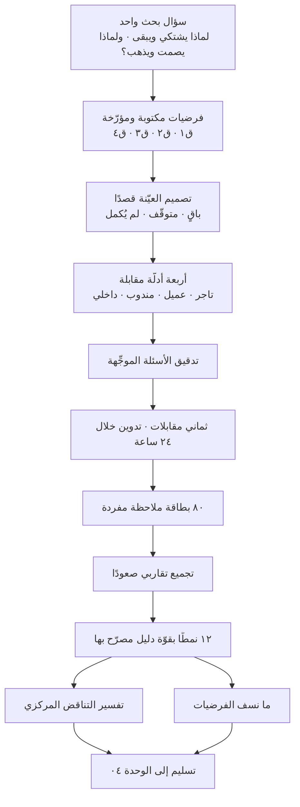
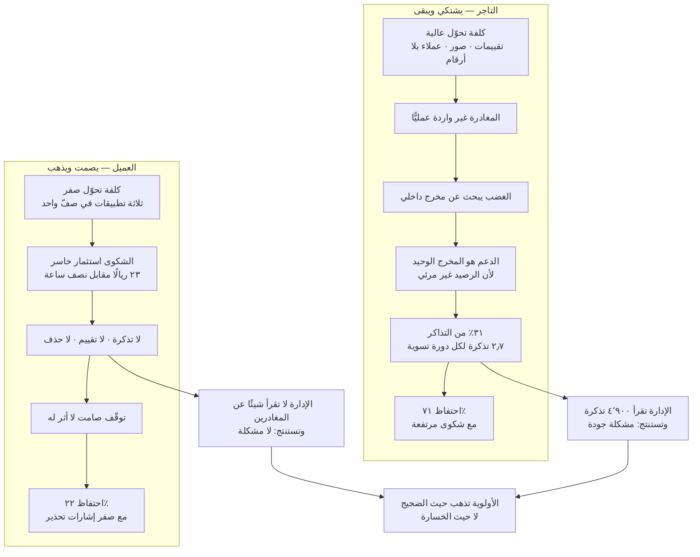
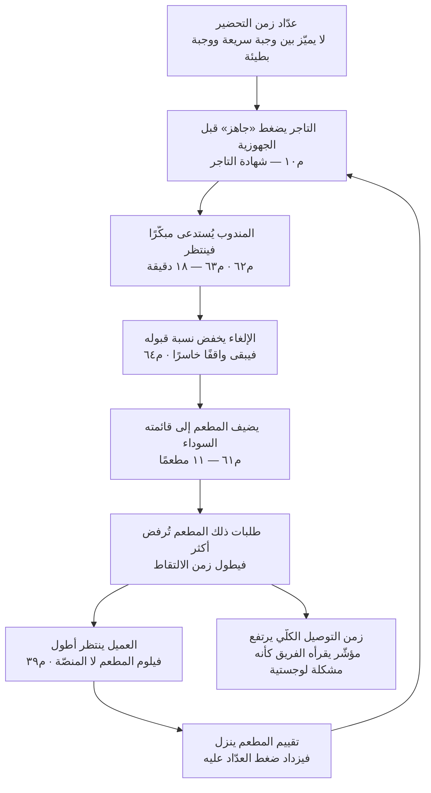
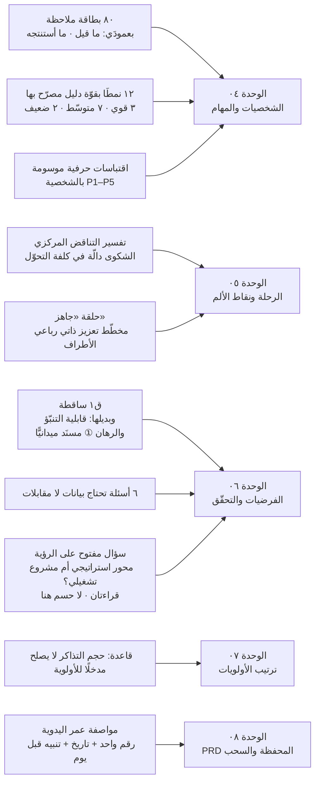

> [!info] الوحدة 03 · ورشة BridgePay
> **هذه الوحدة تنفّذ ولا تشرح.** منهج المقابلة — قواعد الصياغة الستّ، وأخطاء التحيّز، وحساب التشبّع، وطريقة التدوين والتجميع التقاربي — مشروح كاملًا في [[02 - فلسفة إدارة المنتج|الفصل ٠٢ من المرجع]]، القسم الثامن تحديدًا. لن نعيد شرحه هنا حرفًا واحدًا. ما نفعله هنا: **نجري الجولة فعلًا** على معطيات [[00 - ميثاق المشروع ومصدر الحقيقة|الميثاق]]، ونخرج بدليل مقابلة، وثماني مقابلات مفرَّغة بنصّها، وجدول أنماط، وتفسير للتناقض المركزي في المشروع.

# الوحدة 03 — الاكتشاف والبحث الميداني

> [!warning] عن طبيعة المقابلات الواردة هنا
> **المقابلات الثماني الآتية مصاغة تعليميًّا، ولم تُجرَ مع أشخاص حقيقيين.** هي تمثيل مكتوب لما تبدو عليه مقابلة اكتشاف صحيحة — وأخرى فاسدة — على مشروع BridgePay المركَّب. الأسماء مستعارة بالكامل، ولا تُنسب أي جملة فيها إلى شخص أو شركة أو منصّة قائمة في السعودية أو الخليج. وكل رقم يرد على لسان أحد المتحدّثين إمّا مأخوذ من الميثاق حرفيًّا، أو **مشتقّ منه بحساب معروض في موضعه**.
>
> ولماذا نكتبها بدل أن نصف كيف تُكتب؟ لأن الفرق بين مدير منتج يعرف قواعد المقابلة ومدير منتج يجيدها هو فرق في **الصياغة اللحظية**: الجملة التي يقولها في الثانية الثالثة بعد أن يصمت المُجيب. وهذه لا تُنقل بالوصف، تُنقل بالنصّ.

## ما ورثته من الوحدة السابقة

أدخل هذه الوحدة ومعي **رؤية معتمدة** من [[01 - رؤية المنتج واستراتيجيته|الوحدة ٠١]]، و**فجوة سوقية مختارة** من [[02 - السوق والمنافسون|الوحدة ٠٢]]، و**سؤالان مفتوحان صرّحت الوحدتان بأنهما ليسا من عملهما بل من عملي أنا**. وهذا يغيّر طبيعة الجولة جذريًّا: أنا لا أدخل الميدان لأستكشف بحرّية، بل لأختبر بناءً قائمًا قد أهدمه.

**① ما ورثته من الوحدة ٠١ — الرؤية والرهانات وحدود الرفض:**

| المسلَّم | القيمة الدقيقة | أثره المباشر على تصميم هذه الجولة |
|---|---|---|
| **الرؤية المعتمدة** | **«ألّا يسأل أحدٌ في هذه السوق: أين مالي؟»** | تحصر سؤال البحث في **المحور المالي**؛ فلا أسأل عن الطعام ولا الواجهة ولا التسويق |
| **الرسالة** | «كل ريال مرئي لصاحبه لحظة حركته، ويُسوَّى في **موعد لا يتغيّر**» | «موعد لا يتغيّر» لا «موعد أقرب» — فتُصاغ أسئلة التاجر عن **الموعد والمبلغ**، لا عن طول الدورة |
| **الرهان ①** اليقين قبل السيولة | ٥ مهندسين · عتبة إبطال: تذاكر > ١٬١٠٠ بعد ربع | فرضيته الضمنية («الغموض لا التأخير») هي **بالضبط** ما جئت أختبره ميدانيًّا |
| **الرهان ②** العمق لا العرض | ٢ مهندسين · عتبة: ١٢ طلبًا لكل تاجر نشط | يفرض إدراج **P2** (السلاسل) والتاجر غير المطعمي في العيّنة |
| **الرهان ③** الموثوقية لا السعر | ٢ مهندسين · عتبة: احتفاظ ٢٦٪ بعد ٣ أرباع | يفرض إدراج **عملاء متوقّفين**، ويجعل «ولاؤه للسعر» فرضية تُختبر لا معطًى |
| **حصص السعة** | ٥ · ٢ · ٢ · **صفر للمندوب** | المندوب هو **الخاسر الأكبر المعلَن**؛ وقد أُدرج في العيّنة رغم ذلك — انظر التبرير أدناه |
| **«ما لن نفعله»** — ٧ بنود | ومنها: تخفيض العمولة · **التسوية الأسبوعية** · المساعد الذكي | **يُمنع** ذكر أيٍّ منها داخل أي مقابلة، وإلّا صارت الجلسة استفتاءً على ما رُفض سلفًا |

**② ما ورثته من الوحدة ٠٢ — الفجوة والقيد والإلزام على العيّنة:**

| المسلَّم | القيمة الدقيقة | أثره على هذه الوحدة |
|---|---|---|
| **الفجوة المختارة** | لا لاعب يجمع **كثافة الطلب** مع **الحقّ المالي الشفّاف للتاجر** | تجعل التاجر محور الجولة، والعميلَ ضابطًا لا محورًا |
| **الفرضية المركزية القابلة للاختبار** | رصيد لحظي + توفيق + كشف متوافق ← خفض تذاكر الفئة **٧٠٪** (١٬٥١٩ ← أقلّ من ٤٥٦) خلال دورتين | تصير **محور دليل المقابلة**: أسأل عن السلوك الماضي في تتبّع المستحقّات لا عن الرأي في الميزة |
| **`ش١٢` معدّل التذاكر** | **٥٫٩٤ تذكرة لكل ١٠٠ طلب** | الرقم الذي يحوّل الجولة من «تحسين تجربة» إلى **فكّ قيد نموّ** |
| **سقف السعة الحالي** | ٤٬٩٠٠ ÷ ٥٫٩٤٪ = **٨٢٬٥٠٠ طلبًا/شهر** — أي حجمنا اليوم بالضبط | **المنصّة مشبعة على قيد الدعم لا على قيد السوق**؛ ولذلك أُدرج موظّف داخلي في العيّنة إلزامًا |
| **السقف بعد فكّ القيد** | **١١٩٬٥١٢ طلبًا/شهر** (+٤٤٫٩٪) بلا موظّف إضافي | يجعل تفسير الـ٣١٪ **سؤالًا استراتيجيًّا لا تشغيليًّا** |
| **الخاسران غير المعوَّضين** | المندوب · التاجر غير المطعمي | **إلزام صريح على العيّنة**: لا يجوز أن تكون الثماني كلها من المطاعم |
| **`ف٦`** (افتراض الوحدة ٠٢) | إلغاء **١٠٠٪** من تذاكر الفئة بالطبقة المالية | **فرضية تُختبر هنا، لا معطًى** — وهي حدّ أعلى متعمَّد |

> [!warning] السؤالان المفتوحان — وهما سبب وجود هذه الوحدة
> سلّمتني الوحدة ٠٢ سؤالين نصّت على أنها **لا تملك لهما جوابًا** وأنه لا يجوز اختراعه:
> **① هل ألم التاجر «عدم اليقين» فعلًا أم «الانتظار»؟** — وإن كان الثاني، فالشفافية لا تكفي، وتعود مسألة الـ١٫٩ مليون ريال إلى الطاولة، ويسقط الرهان ① قبل أن يبدأ.
> **② لماذا يرحل ٧٨٪ من العملاء في ثلاثة أشهر؟** — لا يوجد في الميثاق ولا في الوحدتين ٠١ و٠٢ **سبب واحد مسنَد**.
>
> وأضافت الوحدة ٠١ تحذيرًا موجَّهًا إلى هذه الوحدة بالاسم: *«من يدخل الوحدة ٠٣ ومعه إجابة مسبقة عن سبب رحيل العملاء سيبني دليل مقابلة يبحث عن تأكيد لا عن حقيقة»* — راجع [[Confirmation Bias]]. وقد دخلتُ ومعي إجابة مسبقة فعلًا، وأفسدت بها مقابلة كاملة (ع٢)، وهي محفوظة في هذه الوحدة بنصّها لتُقرأ.

**③ الأرقام التي أدخل بها الغرفة** (من [[00 - ميثاق المشروع ومصدر الحقيقة|الميثاق]] حرفيًّا):

| المعطى | القيمة | لماذا يهمّ الاكتشاف تحديدًا |
|---|---|---|
| احتفاظ التاجر (الشهر ٦) | ٧١٪ | مرتفع — فالبقاء ليس المشكلة |
| احتفاظ العميل (الشهر ٣) | ٢٢٪ | منخفض — أربعة من كل خمسة يختفون |
| تذاكر الدعم شهريًّا | ٤٬٩٠٠ | حجم شكوى كبير — لكن من مَن؟ |
| أكثر فئة تذاكر | «أين مستحقّاتي؟» — ٣١٪ | كل هذه الشكوى من الطرف **الباقي** |
| التجّار المفعَّلون / النشطون | ٤١٠ / ٢٦٣ (٦٤٪) | ١٤٧ تاجرًا فعّلوا ثم توقّفوا — شريحة لا تُرى |
| دورة التسوية | كل ١٤ يومًا | القيد المالي المفترض أنه سبب الشكوى |
| حصّة الدفع عند الاستلام | ٣٨٪ | ثلث الطلبات لا تمرّ ببوّابة الدفع |
| متوسّط قيمة الطلب | ٧٤ ريالًا | أساس كل حساب لاحق |
| متوسّط الطلبات اليومية | ٢٬٧٥٠ | أساس كل حساب لاحق |
| عمولة المنصّة | ١٢٪ | ما تراه المنصّة من كل طلب |

**④ الأرقام المشتقّة — وأيّها ورثته وأيّها اشتققته هنا.** الوحدتان ٠١ و٠٢ سلّمتا **١٧ مشتقًّا محسوبًا** (`ش١`–`ش١٧`)، وأعيد عرض ما أستعمله منها بحسابه كي تُقرأ الوحدة قائمة بذاتها، وأضيف ثلاثة مشتقّات **جديدة خاصّة بهذه الوحدة** (موسومة ✚) لأن الجولة تحتاجها ولم تحتجها الوحدتان قبلها. وسأستعملها كلها في المقابلات لأختبر ما يقوله المتحدّث ضدّ ما يقوله الرقم:

| المشتقّ | الحساب | الناتج | المصدر |
|---|---|---|---|
| تذاكر «أين مستحقّاتي؟» شهريًّا | ٤٬٩٠٠ × ٣١٪ | **١٬٥١٩ تذكرة** | موروث · الوحدة ٠١ |
| نصيب التاجر النشط الواحد منها | ١٬٥١٩ ÷ ٢٦٣ | **٥٫٨ تذكرة شهريًّا** | موروث · الوحدة ٠١ |
| نصيبه في **دورة التسوية** الواحدة | ٥٫٨ × (١٤ ÷ ٣٠) | **٢٫٧ تذكرة لكل دورة** | ✚ **جديد هنا** |
| طلبات التاجر النشط يوميًّا | ٢٬٧٥٠ ÷ ٢٦٣ | **١٠٫٥ طلب** | موروث · الوحدة ٠١ |
| مبيعاته في دورة التسوية | ١٠٫٥ × ٧٤ × ١٤ | **١٠٬٨٣٢ ريالًا** | ✚ **جديد هنا** |
| صافي ما يصله بعد العمولة | ١٠٬٨٣٢ × ٨٨٪ | **٩٬٥٣٢ ريالًا** | ✚ **جديد هنا** |
| نسبة النشط شهريًّا من المسجَّلين | ١٩٬٢٠٠ ÷ ٨٧٬٤٠٠ | **٢٢٪** | مشتقّ من الميثاق |
| متوسّط طلبات العميل النشط شهريًّا | ٨٢٬٥٠٠ ÷ ١٩٬٢٠٠ | **٤٫٣ طلب** | موروث · `ش١٠` |
| نصيب موظّف الدعم الواحد من التذاكر | ٤٬٩٠٠ ÷ ٦ | **٨١٧ تذكرة شهريًّا** | موروث · الوحدة ٠١ |
| معدّل التذاكر لكل ١٠٠ طلب | ٤٬٩٠٠ ÷ ٨٢٬٥٠٠ × ١٠٠ | **٥٫٩٤ تذكرة** | موروث · `ش١٢` |

> [!example] أربع ملاحظات وُلدت من الحساب قبل أن أقابل أحدًا
> **① التاجر يتّصل بالدعم مرّتين ونصف في كل دورة تسوية.** هذا ليس سلوك شخص غاضب من موعد التحويل — الغاضب يتّصل مرّة ويهدّد. هذا سلوك شخص **يفتقد معلومة يحتاجها متكرّرًا**. الافتراض الذي خرجت به: قد لا نكون أمام شكوى، بل أمام **استعلام متنكّر في زيّ شكوى**.
> **② نسبة العميل النشط من المسجَّل (٢٢٪) تساوي عدديًّا احتفاظ الشهر الثالث (٢٢٪).** توافق لافت في الميثاق، ويُقرأ بحذر: الرقمان يقيسان شيئين مختلفين، لكن تطابقهما يشير إلى أن التسرّب يحدث **مبكّرًا ثم يستقرّ**، أي أن من يتجاوز الشهر الثالث يميل إلى البقاء. فالمشكلة في **أوّل ثلاث تجارب** لا في التآكل البطيء.
> **③ ١٤٧ تاجرًا فعّلوا ثم لم ينشطوا خلال ٣٠ يومًا.** هذه أكبر شريحة صامتة في المشروع، ولا يوجد رقم واحد في الميثاق يخبرنا لماذا. وهي بالضبط ما يسمّيه [[02 - فلسفة إدارة المنتج|الفصل ٠٢]] «من سجّل ولم يُكمل».
> **④ ولأن السقف الحالي (٨٢٬٥٠٠ طلبًا) هو حجمنا اليوم بالضبط، فإن كل تذكرة أفهمها تساوي سعة نموّ.** هذا يغيّر معنى الجولة: أنا لا أبحث عن «تحسين تجربة التاجر»، بل عن **تفسير للقيد الذي يمنع المنصّة من النموّ أصلًا**. ولو خرجت بفهم يخفض ٥٫٩٤ إلى ٤٫١٠ لفتحتُ ٤٤٫٩٪ نموًّا بلا موظّف واحد ولا ريال سيولة. **الاكتشاف هنا ليس عملًا بحثيًّا؛ هو أرخص مشروع نموّ في الشركة.**

**⑤ القطع التي أسلّمها بدوري** واضحة في خارطة المخرَجات: دليل مقابلة + ٨ مقابلات مفرَّغة + جدول أنماط. والوحدة [[04 - الشخصيات والمهام|٠٤]] لا تستطيع بناء شخصية واحدة بلا هذه القطع، لأن الشخصية المبنيّة على تخيّل مدير المنتج ليست شخصية بل **مرآة**.

## السؤال الذي تجيب عنه هذه الوحدة

سؤال بحث **واحد**، مكتوب قبل أوّل مقابلة، ومعلَّق أمام الغرفة طوال الجولة:

> [!quote] سؤال البحث
> **لماذا يبقى التاجر رغم أن ٣١٪ من كل تذاكر الدعم شكوى منه، ولماذا يغادر العميل (٢٢٪ احتفاظ) دون أن يشتكي أصلًا؟**

وثلاثة أسئلة فرعية تخدمه ولا تزاحمه:

1. ما الذي يفعله التاجر **فعلًا** بين تحويلين ليعرف أين تقف نقوده؟
2. ما آخر واقعة دفعت عميلًا إلى التوقّف — بالتحديد، لا بالعموم؟
3. من أين تأتي التكلفة الحقيقية في اقتصاد المندوب وموظّف التسويات؟

**وما لا تجيب عنه هذه الوحدة، ونصرّح به:** لا تقيس هذه الجولة كم نسبةً من التجّار يعانون، ولا تُثبت أن حلًّا بعينه سينجح، ولا تُنتج قرار أولوية. القياس الكمّي عمل البيانات و[[06 - الفرضيات والتحقّق|الوحدة ٠٦]]، والأولوية عمل [[07 - ترتيب الأولويات|الوحدة ٠٧]]. المقابلة بحث **نوعي** غرضه توليد الفهم والفرضيات، لا قياس انتشارها — وهذا حدّ منهجي لا تواضع لفظي.

## العمل خطوة بخطوة

جولة كاملة في **ثمانية أيام عمل**، بمجموع **١٩ ساعة** من وقت مدير المنتج. ونفّذها حرفيًّا.

| # | الخطوة | الزمن | المخرَج الملموس |
|---|---|---|---|
| ١ | اكتب سؤال البحث الواحد وعلّقه | ٣٠ د | جملة واحدة |
| ٢ | اشتقّ أرقام الأساس من الميثاق | ٤٥ د | جدول المشتقّات أعلاه |
| ٣ | اكتب فرضياتك المسبقة **قبل** المقابلات | ٤٠ د | ٤–٦ فرضيات مؤرّخة |
| ٤ | صمّم العيّنة قصدًا واحجز المواعيد | ٢ س | جدول ٨ مقابلات بشريحة كلٍّ |
| ٥ | اكتب دليل المقابلة لكل شريحة | ٣ س | أربعة أدلّة |
| ٦ | مرّر الدليل على «مدقّق [[Leading Question\|الأسئلة الموجِّهة]]» | ٤٥ د | نسخة منقّحة + سجلّ ما حُذف |
| ٧ | أجرِ المقابلات (٤٥–٦٠ د لكلٍّ) + تدوين فوري | ٧ س | ٨ تفريغات |
| ٨ | فكّك إلى ملاحظات مفردة مرقّمة | ١٫٥ س | ٨٠ بطاقة ملاحظة |
| ٩ | جمّع تقاربيًّا مع المصمّم والمهندس | ٢ س | ٩–١٢ نمطًا |
| ١٠ | صنّف قوّة الدليل لكل نمط | ٤٥ د | عمود «قوّة الدليل» |
| ١١ | حرّر التناقض المركزي كتابةً | ١ س | فقرة التفسير |
| ١٢ | افصل الاكتشافات التي نسفت فرضياتك | ٤٥ د | قائمة «لم نكن نتوقّع» |

> [!tip] الخطوة الثالثة هي التي يتخطّاها الجميع
> اكتب فرضياتك **مؤرَّخة وموقَّعة** قبل أن تسمع أحدًا. ليس لأنها ستصحّ، بل لأنها الطريقة الوحيدة لتعرف لاحقًا أنك **غيّرت رأيك فعلًا** ولم تعِد اكتشاف ما كنت تظنّه. من لا يكتب فرضيته قبل المقابلة سيخرج بعدها مقتنعًا بأنه «كان يعرف ذلك»، وهذا هو [[Confirmation Bias|التحيّز التأكيدي]] في أكثر صوره أمانًا وأقلّها كشفًا.

**فرضياتنا الأربع المكتوبة قبل الجولة** (وسنحاسبها في نهاية الوحدة). ووسمها بـ`ق` لا بـ`ف` مقصود: `ف١`–`ف٦` محجوزة لافتراضات [[02 - السوق والمنافسون|الوحدة ٠٢]]، وهذه **فرضيات جولة** لا افتراضات تقدير:

- **ق١:** التاجر يشتكي لأن دورة التسوية ١٤ يومًا طويلة، والحلّ تقصيرها إلى ٧. *(وهي نقيض ما راهنت عليه الوحدة ٠١ في الرهان ①؛ كتبتها كما كنت أعتقدها فعلًا، لا كما تقتضيها الوثيقة — وهذا شرط صدق الفرضية المسبقة.)*
- **ق٢:** العميل يغادر بسبب السعر، لأن الميثاق يقول إن ولاءه للسعر.
- **ق٣:** المندوب يرفض الطلبات البعيدة صغيرة القيمة لأن العائد لا يغطّي المسافة.
- **ق٤:** موظّف التسويات بطيء لأن الأدوات ناقصة.



### تصميم العيّنة — ولماذا هي غير متوازنة عمدًا

| الرمز | الشريحة | الحالة | الشخصية | لماذا اختيرت |
|---|---|---|---|---|
| **ت١** | مطعم صغير · فرع واحد | نشط · باقٍ ١١ شهرًا | P1 | قلب التناقض: يشتكي ويبقى |
| **ت٢** | سلسلة ٦ فروع | نشطة · باقية ١٣ شهرًا | P2 | تختبر إن كانت شكوى ت١ عامّة |
| **ت٣** | صيدلية · تاجر غير مطعمي | **فعّل ثم توقّف** | — | من الـ١٤٧ الصامتين |
| **ع١** | عميل ٩ طلبات شهريًّا | نشط | P3 | أعلى من المتوسّط (٤٫٣) بمرّتين |
| **ع٢** | عميلة توقّفت بعد ٣ طلبات | **متوقّفة** | — | **المقابلة الفاشلة عمدًا** |
| **ع٣** | عميلة توقّفت بعد ٤ طلبات | **متوقّفة** | — | إعادة تصحيحية بعد فشل ع٢ |
| **ن١** | مندوب بالقطعة | نشط | P4 | اقتصاد الطلب الواحد |
| **د١** | محاسب تسويات في المنصّة | داخلي | P5 | من يرى الطرفين من الداخل |

**ولماذا أُدرج المندوب والتاجر غير المطعمي رغم أن الرهانات لم تخصّص لهما سعة؟** لأن [[02 - السوق والمنافسون|الوحدة ٠٢]] سلّمتهما بوصفهما **الخاسرَين غير المعوَّضين**، ونصّت على إلزام صريح: *«لا يجوز أن تكون المقابلات الثماني كلها من المطاعم. من نخسرهم بالقرار يجب أن نسمعهم.»* وهذا ليس ترضيةً أخلاقية: من خسر بقرارك هو أقدر الناس على أن يريك ما لم يره قرارك — وقد أثبتت مقابلتا ت٣ ون١ ذلك حرفيًّا في هذه الجولة.

**العيّنة غير متوازنة، ونحن نعرف ذلك:** ثلاثة تجّار، وثلاثة عملاء، ومندوب واحد، وموظّف داخلي واحد. والفصل ٠٢ يشترط **٥–٨ مقابلات لكل شريحة متجانسة** للوصول إلى التشبّع. فنحن لم نبلغ التشبّع في أي شريحة، ولم نقترب منه في شريحتَي المندوب والداخل. ولهذا سيحمل جدول الأنماط عمود «قوّة الدليل» صراحةً، وستُصنَّف كل نتيجة تعتمد على مقابلة واحدة بأنها **إشارة تحتاج جولة ثانية**، لا نتيجة. من يخفي هذا الحدّ ليحسّن مظهر تقريره يبني الوحدات الثماني القادمة على رمل.

## المخرَج

هذا أطول أقسام الوحدة، وهو القطعة نفسها لا وصفها. وهو خمسة أجزاء: الدليل، والمقابلات الثماني، وجدول الأنماط، وتفسير التناقض، والاكتشافات غير المتوقّعة.

---

### الجزء الأول — دليل المقابلة لكل شريحة

قواعد الصياغة الستّ وأصول [[The Mom Test]] مشروحة في [[02 - فلسفة إدارة المنتج|الفصل ٠٢]]. المطلوب هنا **أسئلة مصاغة فعليًّا**، ومعها — للأسئلة الحسّاسة فقط — بيان: *لماذا هذه الصياغة لا غيرها*. والأسئلة مرتّبة من العامّ إلى الخاصّ، والدليل **دليل لا نصّ حرفي**: يُقرأ قبل الجلسة ثم يُقلَب على وجهه.

#### قواعد مشتركة قبل كل مقابلة (٩٠ ثانية تُقال بصوت مسموع)

> «شكرًا لوقتك. أنا من فريق المنتج، ولست من الدعم ولا من المبيعات، ولا أستطيع أن أحلّ لك مشكلة اليوم — وهذا مقصود. أنا هنا لأفهم كيف يجري يومك فعلًا. **لا توجد إجابة تُرضيني**؛ أنفع ما تقوله لي هو ما يزعجني. أتسجّل الجلسة؟ ولك أن توقفني في أي لحظة.»

| العنصر | لماذا هو في الافتتاحية |
|---|---|
| «لست من الدعم ولا المبيعات» | يقطع توقّع أن الجلسة قناة حلّ، فيقلّ تضخيم الشكوى لانتزاع تعويض |
| «لا أستطيع أن أحلّ لك مشكلة اليوم» | يزيل الحافز الأداتي من الإجابة |
| «لا توجد إجابة تُرضيني» | يخفض تحيّز الإرضاء (`Social Desirability`) |
| «أنفع ما تقوله هو ما يزعجني» | يمنح الإذن الاجتماعي بالنقد صراحةً |
| طلب إذن التسجيل | شرط أخلاقي، ومطلب امتثال تحت [[PDPL]] |

#### دليل ① — التاجر (مطعم أو متجر)

**الإحماء (٥ د) — غرضه ضبط الإيقاع لا جمع البيانات**

1. «خذني في جولة على يوم أمس عندك من الفتح إلى الإغلاق.»
2. «كم شخصًا يلمس الطلب عندك من لحظة وصوله إلى خروجه من الباب؟»

**المحور الأول: المال — كيف تعرف أين نقودك؟ (١٥ د)**

3. «آخر تحويل وصلك من المنصّة — متى كان؟»
4. «قبل أن يصل بيومين، هل كنت تعرف كم سيكون؟ **كيف** عرفت؟»
5. «أرِني — على جوّالك الآن — من أين تتحقّق من مبيعاتك.» *(طلب فعل لا وصف)*
6. «آخر مرّة اختلف الرقم الذي وصلك عمّا توقّعته — احكِ لي ماذا حدث بالضبط، ماذا فعلت أولًا؟»
7. «كم مرّة تواصلت مع الدعم في آخر شهرين؟ في أي شيء؟»
8. «حين تتواصل، ما الشيء الذي تريده منهم في تلك اللحظة تحديدًا؟»
9. «ماذا تفعل بالرقم بعد أن يصلك؟» *(يكشف المهمّة التالية في سلسلة المهام)*

**المحور الثاني: البقاء والبدائل (١٠ د)**

10. «هل أنت على منصّات أخرى؟ متى انضممت لآخر واحدة، ولماذا حينها؟»
11. «آخر مرّة فكّرت جدّيًّا في إيقاف حسابك هنا — ماذا كان قد حدث قبلها مباشرةً؟»
12. «لو أوقفتَ حسابك غدًا، ما أوّل شيء عملي ستفقده؟»

**المحور الثالث: التشغيل اليومي (١٠ د)**

13. «آخر طلب ألغيته — لماذا، وماذا فعلت في النظام؟»
14. «حين يصل المندوب والطلب غير جاهز، ماذا يحدث؟ احكِ آخر مرّة.»
15. «أرِني كيف تُدخل صنفًا نفدت كمّيته.»

**الإغلاق (٥ د)**

16. «ما السؤال الذي كنت تتوقّع أن أسأله ولم أسأله؟»
17. «من غيرك يجب أن أسمع منه، ولماذا هو تحديدًا؟» *(اختبار التزام: التعريف على شخص كلفة سُمعة)*

> [!note] لماذا هذه الصياغة لا غيرها — أسئلة التاجر الحسّاسة
>
> | السؤال | الصياغة المرفوضة | لماذا رُفضت | ما تفعله صياغتنا |
> |---|---|---|---|
> | ٤ | «ألا تحتاج إلى معرفة رصيدك قبل التحويل؟» | سؤال موجِّه يحمل الإجابة والحلّ معًا؛ سيوافق ٩ من ١٠ مجاملةً | «هل كنت تعرف؟ **كيف** عرفت؟» تطلب واقعة وآلية، والإجابة إمّا سلوك موصوف أو «لا أعرف» — وكلاهما معلومة |
> | ٥ | «هل شاشة التقارير واضحة؟» | سؤال رأي عن شيء قد لا يكون فتحه أصلًا | «أرِني الآن على جوّالك» يستبدل الرأي بالملاحظة المباشرة، وقد يكشف أنه لا يفتح التطبيق بل يسأل زوجته المحاسِبة |
> | ٦ | «هل يحدث أن يختلف الرقم؟» | سؤال احتمالي عن المستقبل والتكرار، يقود إلى تقدير مصنوع | «آخر مرّة… ماذا فعلت أولًا؟» يستدعي حادثة واحدة قابلة للتحقّق، والفعل الأول هو أصدق مؤشّر على النموذج الذهني |
> | ٨ | «هل تريد شاشة رصيد لحظي؟» | يعرض حلًّا جاهزًا من قائمة الطلبات الخام، فيتحوّل الاكتشاف إلى استفتاء على ميزة | «ما الشيء الذي تريده في تلك اللحظة؟» يبقى في فضاء المشكلة ويترك تسمية الحلّ لنا |
> | ١١ | «هل أنت راضٍ عن المنصّة؟» | الرضا شعور عامّ لا يقود إلى قرار | «آخر مرّة فكّرت في الإيقاف — ماذا حدث قبلها؟» يقيس **عتبة المغادرة** الفعلية |
> | ١٢ | «ما الذي يعجبك فينا؟» | يستدعي مديحًا، والمديح لا يعني شيئًا | «ما أوّل شيء عملي ستفقده؟» يقيس تكلفة التحوّل بلغة الخسارة الملموسة |

#### دليل ② — العميل (نشط أو متوقّف)

**الإحماء (٣ د)**

1. «آخر مرّة طلبت أكلًا أو أي شيء توصيلًا — متى كانت؟ من أي تطبيق؟»
2. «ماذا كنت تفعل قبلها بعشر دقائق؟» *(يستدعي السياق، ومنه تُبنى المهمّة لا الشخص)*

**المحور الأول: كيف يُتّخذ قرار الطلب (١٢ د)**

3. «افتح جوّالك الآن — أرِني أين تطبيقات الطلب عندك.» *(ملاحظة مباشرة لعدد البدائل ومواقعها)*
4. «في آخر مرّة، كم تطبيقًا فتحت قبل أن تضغط اطلب؟ ماذا كنت تقارن؟»
5. «آخر مرّة فتحت تطبيقًا ثم خرجت منه دون طلب — ماذا حدث؟»
6. «من يقرّر الطلب في بيتك عادةً؟ آخر مرّة، من قرّر؟»

**المحور الثاني: الواقعة السيئة (١٥ د) — القلب**

7. «احكِ لي عن آخر طلب لم يسِر كما توقّعت.»
8. «ماذا فعلت في تلك اللحظة بالضبط؟ ثم ماذا؟» *(يُكرَّر «ثم ماذا؟» حتى يقف)*
9. «هل تواصلت مع أحد؟ من؟ ماذا قال؟»
10. «وبعد ذلك اليوم بأسبوع — هل طلبت من نفس التطبيق؟ من أي واحد طلبت؟»

**المحور الثالث للمتوقّفين فقط (١٠ د)**

11. «آخر طلب لك عندنا كان قبل نحو ثلاثة أشهر. هل تذكر ما الذي طلبته؟»
12. «ومنذ ذلك اليوم، من أين تطلب؟»
13. «هل هناك شيء حدث في ذلك اليوم؟ أم أن الأمر مجرّد أنك لم تعُد تفتحه؟»

**الإغلاق (٣ د)**

14. «لو أن التطبيق اختفى غدًا من جوّالك، ماذا يتغيّر في يومك؟»

> [!note] لماذا هذه الصياغة لا غيرها — أسئلة العميل الحسّاسة
>
> | السؤال | الصياغة المرفوضة | لماذا رُفضت | ما تفعله صياغتنا |
> |---|---|---|---|
> | ٤ | «هل السعر هو الأهمّ عندك؟» | يعرض المتغيّر الذي نشكّ فيه ويطلب التصديق عليه | «كم تطبيقًا فتحت؟ ماذا كنت تقارن؟» يترك المُجيب يذكر معيار المقارنة بلغته — وقد يكون الوقت لا السعر |
> | ٧ | «ما أكثر شيء يزعجك في التطبيق؟» | سؤال تجريدي عن حكم عامّ؛ يجيب عنه الناس بما يظنّونه لائقًا | «آخر طلب لم يسِر كما توقّعت» يطلب حكاية واحدة بزمانها وتفاصيلها |
> | ٨ | «هل كنت غاضبًا؟» | يسمّي المشاعر بدل المُجيب، فيقبل التسمية | «ماذا فعلت؟ ثم ماذا؟» يستخرج **سلسلة الأفعال**، والمشاعر تُستنتج منها لا تُملى عليها |
> | ١٠ | «هل ستطلب منّا مرّة أخرى؟» | سؤال عن المستقبل — مركز فجوة القول والفعل ([[Say-Do Gap]]) | «بعد أسبوع، من أي واحد طلبت؟» سؤال عن ماضٍ وقع، وإجابته سلوك لا نيّة |
> | ١٣ | «هل غادرتِ بسبب التوصيل البطيء؟» | يقدّم سببًا واحدًا جاهزًا فيبتلعه المُجيب | «هل حدث شيء؟ أم أنك لم تعُدْ تفتحه؟» يعرض **بديلين متعارضين**، فلا يوجّه إلى أحدهما — وهذه حيلة عملية: حين تضطرّ إلى تحديد الخيارات، اعرض خيارين متساويي الاحتمال بدل واحد |
> | ١٤ | «كم تحبّ التطبيق من ١٠؟» | رقم بلا معنى تشخيصي، وهو من [[Vanity Metrics\|مؤشّرات الغرور]] في ثوب بحثي | «ماذا يتغيّر في يومك؟» يقيس الفراغ الذي سيتركه المنتج — وهو أدقّ اختبار للقيمة |

#### دليل ③ — المندوب

**الإحماء (٣ د)**

1. «كم ساعة اشتغلت أمس؟ من متى إلى متى؟»
2. «كم طلبًا أنجزت فيها؟»

**المحور الأول: قرار القبول (١٥ د) — القلب**

3. «آخر طلب رفضته — أرِني كيف بدا على الشاشة، وماذا رأيت فيه؟»
4. «في اللحظة التي ظهر فيها، ما الذي نظرت إليه أوّلًا؟ ثم ماذا؟»
5. «آخر طلب قبلته ثم ندمت — ماذا حدث؟»
6. «هل تحسب شيئًا في رأسك قبل القبول؟ **كيف** تحسبه؟» *(نطلب الآلية، فإن وُجدت فهي مواصفة جاهزة)*

**المحور الثاني: الوقت الضائع (١٢ د)**

7. «أمس، كم وقتًا تقديرًا قضيته منتظرًا؟ أين انتظرت؟»
8. «آخر مرّة وقفت في مطعم أكثر من عشر دقائق — احكِ ماذا جرى.»
9. «حين تنتظر، ماذا تفعل؟ هل تفعل شيئًا في التطبيق؟»

**المحور الثالث: المال (٧ د)**

10. «متى يصلك مالك؟ كيف تعرف كم لك؟»
11. «آخر أسبوع، هل حسبت أرباحك؟ بماذا حسبتها؟»

**الإغلاق (٣ د)**

12. «لو نقص عدد الطلبات إلى النصف وزاد سعر الطلب للضِعف — أيّهما تختار؟ ولماذا؟» *(سؤال مقايضة لا سؤال رغبة)*

> [!note] لماذا هذه الصياغة لا غيرها — أسئلة المندوب الحسّاسة
>
> | السؤال | الصياغة المرفوضة | لماذا رُفضت | ما تفعله صياغتنا |
> |---|---|---|---|
> | ٣ | «لماذا ترفض الطلبات البعيدة؟» | يفترض الجواب داخل السؤال (ق٣ حرفيًّا)، فيؤكّد فرضيتنا بلا فحص | «آخر طلب رفضته — ماذا رأيت فيه؟» يترك سبب الرفض مفتوحًا؛ وقد لا يكون البُعد |
> | ٦ | «هل تريد رؤية قيمة الطلب قبل القبول؟» | عرض ميزة من القائمة الخام ← «نعم» بلا معلومة | «كيف تحسبه؟» فإن وصف معادلة ذهنية فقد أعطانا **مواصفة** استحقّها بخبرته |
> | ١٠ | «هل الدفع الأسبوعي مناسب؟» | سؤال رضا عن سياسة قائمة | «متى يصلك؟ كيف تعرف كم لك؟» يكشف إن كان يمسك دفترًا موازيًا — وهذا سلوك، لا رأي |
> | ١٢ | «هل تريد طلبات أكثر؟» | الجواب «نعم» مضمون وبلا قيمة، وهو ما يقوله الميثاق إنه يقوله | مقايضة صريحة تُجبر على **ترتيب** لا على تمنٍّ |

#### دليل ④ — الموظّف الداخلي (دعم · تسويات)

الموظّف الداخلي شريحة يهملها كثير من الفرق لأنه «منّا». والحقيقة أنه **الشاهد الوحيد الذي يرى الطرفين في اللحظة نفسها**، ويعرف عن نقاط الاحتكاك ما لا يعرفه أيّ طرف بمفرده. لكن له تحيّزًا مضادًّا: يميل إلى وصف المشكلات بلغة الحلول التي جرّب طلبها من قبل. فتُصاغ أسئلته لتردّه إلى الوقائع.

**المحور الأول: يوم أمس (١٢ د)**

1. «افتح قائمة تذاكر أمس. اقرأ عليّ أوّل خمس تذاكر بنصّها كما كتبها أصحابها.» *(الحصول على [[Voice of the Customer|صوت العميل]] الخام غير المصنَّف)*
2. «في كل واحدة: ماذا كانت أوّل خطوة عملية اتّخذتها؟»
3. «كم من هذه الخمس أُغلقت بمعلومة فقط، لا بإجراء؟»

**المحور الثاني: العمل غير المرئي (١٥ د)**

4. «أرِني ملفّ التوفيق الذي تشتغل عليه.» *(ملاحظة مباشرة)*
5. «هذه الأعمدة — من أين يأتي كل عمود؟»
6. «آخر مرّة لم يتطابق رقمان — كم استغرقتَ؟ وماذا فعلت أوّلًا؟»
7. «ما الشيء الذي تفعله كل أسبوع ولم يطلبه منك أحد صراحةً؟» *(يستخرج العمل الخفي الذي لا يظهر في أي وصف وظيفي)*

**المحور الثالث: الأنماط (١٠ د)**

8. «لو طلبت منك أن تتنبّأ بموضوع تذاكر بعد غد — بم تتنبّأ؟ ولماذا بعد غد تحديدًا؟»
9. «من التجّار من تعرفه بالاسم؟ لماذا هؤلاء؟»
10. «هل يتّصل بك العملاء الغاضبون؟ أم يختفون؟ كيف تعرف؟»

**الإغلاق (٣ د)**

11. «ما الذي يعرفه فريق الدعم ولا تصدّقه الإدارة؟»

> [!note] لماذا هذه الصياغة لا غيرها — الأسئلة الداخلية الحسّاسة
>
> | السؤال | الصياغة المرفوضة | لماذا رُفضت | ما تفعله صياغتنا |
> |---|---|---|---|
> | ١ | «ما أكثر شكاوى التجّار؟» | يطلب تلخيصًا من ذاكرة مصنَّفة سلفًا، فيعيد إليك تصنيفك أنت | «اقرأ عليّ أوّل خمس بنصّها» يعطيك اللغة الخام قبل أن يبتلعها التصنيف |
> | ٣ | «هل معظمها سهل؟» | حكم مبهم | «كم أُغلقت بمعلومة فقط؟» يفصل **الاستعلام** عن **العطل** — وهذا الفصل هو مفتاح الوحدة كلها |
> | ٧ | «هل عندك عمل إضافي؟» | يُقرأ كسؤال عن الشكوى الوظيفية فيُنكَر تهذيبًا | «ما الذي تفعله ولم يطلبه أحد؟» يصف سلوكًا، ولا يحمل اتّهامًا لأحد |
> | ٩ | «من أكثر التجّار إزعاجًا؟» | يدفع إلى حكم شخصي ويُفسد العلاقة إن تسرّب | «من تعرفه بالاسم؟ لماذا هؤلاء؟» يستخرج نفس المعلومة بلا حكم — لأن من تعرفه بالاسم هو من تكرّر |
> | ١١ | «هل الإدارة تستمع لكم؟» | سؤال سياسي داخل المؤسّسة، إجابته محسوبة | «ما الذي يعرفه الدعم ولا تصدّقه الإدارة؟» ينقل السؤال من الولاء إلى المعرفة |

> [!warning] ما حذفناه من الأدلّة الأربعة بعد التدقيق
> حُذف أحد عشر سؤالًا في الخطوة السادسة. وهذه خمسة منها، مع سبب الحذف — لأن معرفة ما يُحذف أنفع من معرفة ما يُكتب:
> - «ألا ترى أن أربعة عشر يومًا مدّة طويلة؟» ← [[Leading Question|موجِّه]] صريح، ويحمل ق١ كاملة.
> - «هل تفضّل التسوية الأسبوعية؟» ← استفتاء على حلّ من القائمة الخام.
> - «كم ستدفع مقابل شاشة رصيد لحظي؟» ← سؤال تسعير في جولة اكتشاف مشكلة؛ سابق لأوانه ويلوّث بقية الجلسة.
> - «هل تعتقد أن المنافسين أفضل؟» ← يستدعي مقارنة تجريدية ويحوّل الجلسة إلى تحليل سوق.
> - «ما رأيك لو أطلقنا محفظة قابلة للسحب الفوري؟» ← عرض ميزة، أي [[02 - فلسفة إدارة المنتج|جلسة عرض أفكار]] لا مقابلة.

---

### الجزء الثاني — المقابلات الثماني مفرَّغة

**اصطلاح التفريغ:** `س` = الباحث (مدير المنتج)، `ج` = المُجيب. والنصّ المائل بين قوسين معقوفين `[…]` ملاحظة سلوكية دوّنها الحاضر الصامت (المهندس أو المصمّم)، لا كلام مسموع. والمقاطع محذوفة حيث لا تضيف، ويُشار إلى الحذف بـ`(…)`.

#### المقابلة ت١ — صاحب مطعم صغير · فرع واحد (P1)

| | |
|---|---|
| **المُجيب** | «أبو ماجد» (اسم مستعار) · مطعم مأكولات شعبية · حيّ سكني |
| **الحالة** | نشط · على المنصّة منذ ١١ شهرًا |
| **المكان** | في مطعمه، بعد الظهر بين الذروتين |
| **الحاضر الصامت** | مهندس من فريق المدفوعات |
| **المدّة** | ٥٢ دقيقة |

**س:** خذني في جولة على يوم أمس عندك، من الفتح إلى الإغلاق.

**ج:** نفتح عشرة ونصف. أوّل شي التحضير — الأرز والمرق. الطلبات تبدأ تجي من عندكم قريب الثنتين عشرة. الذروة من الوحدة إلى الثنتين ونص، وبعدين تهدأ. المسا ذروة ثانية من السبعة إلى العشرة. أمس كان يوم عادي.

**س:** كم شخصًا يلمس الطلب عندك من لحظة وصوله إلى خروجه من الباب؟

**ج:** ثلاثة. أنا أو ولدي على الشاشة، والطبّاخ، وواحد يغلّف ويسلّم للمندوب.

**س:** آخر تحويل وصلك من المنصّة، متى كان؟

**ج:** قبل ستّة أيام تقريبًا. لا… خمسة. يوم الأحد.

**س:** قبل ما يوصل بيومين، كنت تعرف كم راح يكون؟

**ج:** *[صمت ثلاث ثوانٍ]* تقريبًا. يعني عندي إحساس.

**س:** كيف عرفت؟

**ج:** عندي دفتر. كل يوم في آخر الليل أجلس مع ولدي ونعدّ كم طلب جانا من التطبيق، ونكتب المجموع. وبعدين آخر الأسبوع أجمعهم وأنقص منهم اثنا عشر بالمية. *[يخرج دفترًا مقوّى الغلاف من الدرج، صفحاته مقسّمة بمسطرة بخطّ يد]*

**س:** *[صمت]*

**ج:** يعني… أنا أشتغل على دفتري، مو على التطبيق. التطبيق يعطيني الطلبات، بس ما يعطيني فلوسي.

**س:** أرِني — على جوّالك الآن — من وين تتحقّق من مبيعاتك.

**ج:** *[يفتح التطبيق، يدخل على «الطلبات»، ينزل بالإصبع، يخرج، يدخل على «التقارير»، ينتظر ٤ ثوانٍ للتحميل، ينظر، يقفل الجوّال ويضعه على الطاولة]* هذي تعطيني الشهر كامل. أنا ما أبي الشهر، أنا أبي من آخر تحويل لين اليوم. هذا اللي ما ألقاه.

> [!example] لماذا كانت هذه أهمّ ثلاثين ثانية في المقابلة كلها
> لم يقل شيئًا جديدًا بلسانه. لكن **الملاحظة المباشرة** أرَتنا أربع خطوات وأربع ثوانٍ انتظار وخروجًا بلا نتيجة، ثم وضعه للجوّال على الطاولة — وهي حركة استسلام. لو سألناه «هل التقارير واضحة؟» لقال «الحمد لله، ماشي الحال». راجع الفرق بين المقابلة والملاحظة في [[02 - فلسفة إدارة المنتج|الفصل ٠٢، القسم التاسع]].

**س:** آخر مرّة اختلف الرقم اللي وصلك عن اللي توقّعته — احكِ لي وش صار بالضبط. وش أوّل شي سوّيته؟

**ج:** صار مرّتين. آخر وحدة قبل شهر ونص. أنا حاسب في دفتري قريب أحد عشر ألف، وصلني تسعة آلاف وخمسمية وشوي. اتّصلت على الدعم على طول.

**س:** وش قالوا لك؟

**ج:** قال لي الأخ: «التحويل صحيح، فيه طلبات ملغية وفيه خصم توصيل.» قلت له أي طلبات؟ قال لي: «بنرسل لك كشف.» وصلني كشف بعد ثلاثة أيام في الإيميل. أنا ما أفتح الإيميل.

**س:** *[صمت]*

**ج:** يعني تعبت وتركتها. تسعة آلاف ولا أحد عشر — الفرق ألف وخمسمية. بس ما عندي طريقة أثبت. أنا دفتري مو عندهم، وحسابهم مو عندي.

**س:** كم مرّة تواصلت مع الدعم في آخر شهرين؟

**ج:** *[يفكّر]* أربع… لا، خمس. مرّة عن الطلبات الملغية، والباقي كلّها نفس الشي: كم لي عندكم.

**س:** وحين تتواصل، وش الشي اللي تبيه منهم في تلك اللحظة بالذات؟

**ج:** الرقم. بس الرقم. أبي أعرف كم لي عندكم اليوم. هم يقولون لي: «التحويل بيجيك يوم كذا.» أنا ما سألت متى، أنا سألت **كم**.

**س:** ووش تسوّي بالرقم بعد ما يوصلك؟

**ج:** أعرف أدفع لمين. عندي واحد يجيبني اللحم والدجاج، يجي كل سبت ويبي كاش. إذا ما عندي، أقول له الأسبوع الجاي، ويقلّل لي الكمّية المرّة الجاية. صار مرّتين ونقص عليّ الدجاج في يوم خميس.

> [!quote] الجملة التي غيّرت اتّجاه الجولة كلها
> **«أنا ما أشتكي من الأربعطعش يوم. أنا أشتكي إني أربعطعش يوم ما أدري وش لي.»**

**س:** أنت على منصّات ثانية؟

**ج:** كنت على وحدة قبل، تركتها. وعندي واحد يجيني طلبات واتساب مباشرة.

**س:** آخر مرّة فكّرت جدّيًّا توقف حسابك هنا — وش كان صار قبلها بالضبط؟

**ج:** بعد قصّة الألف وخمسمية. جلست أسبوع أقول خلاص أوقف. *(…)*

**س:** ووش خلاك ما وقفت؟

**ج:** *[يضحك]* الزباين. أنا عندي مية وأربعين تقييم على التطبيق. لو وقفت، وين يروحون؟ ما عندي أرقامهم. اللي يطلب مني من التطبيق ما أعرف اسمه ولا رقمه. وبعدين الصور — صوّرت الأكل كلّه بمصوّر، دفعت له. ما راح أعيدها.

**س:** لو أوقفت حسابك بكرة، وش أوّل شي عملي راح تفقده؟

**ج:** ثلث دخلي تقريبًا. وأربعين أو خمسين زبون يومي ما أعرف كيف أوصلهم.

**س:** حين يجي المندوب والطلب مو جاهز، وش يصير؟

**ج:** يزعل. بعضهم يوقف عند الباب ويتنرفز، وبعضهم يلغي ويروح. وأنا أدري إن التقييم ينزل عليّ. عشان كذا صرت أضغط «جاهز» قبل ما يخلص، عشان ما أتأخّر في العدّاد.

**س:** *[صمت أربع ثوانٍ]*

**ج:** أدري إنها غلط. بس العدّاد ما يفرّق بين المطعم اللي يحضّر في عشر دقايق واللي يحضّر في خمس وعشرين. أنا مندي — المندي يبي وقته.

**س:** وش السؤال اللي كنت متوقّع أسألك إيّاه وما سألته؟

**ج:** توقّعت تسألني عن العمولة. الكل يسألني عن العمولة.

**س:** وليه ما ذكرتها؟

**ج:** لأنها معروفة من البداية. اتّفقنا عليها. اللي مو معروف هو متى وكم.

**الملاحظات الخام من ت١** — بالعمودين اللذين يفرضهما [[02 - فلسفة إدارة المنتج|الفصل ٠٢]]: ما قيل حرفيًّا | ما أستنتجه. **والخلط بينهما هو أصل أغلب الأخطاء اللاحقة.**

| # | ما قيل أو لوحظ حرفيًّا | ما أستنتجه (تفسير، قابل للخطأ) |
|---|---|---|
| م١ | «عندي دفتر… أجمعهم وأنقص منهم اثنا عشر بالمية» | بنى نظامًا محاسبيًّا موازيًا — مواصفة جاهزة لما ينقص المنتج |
| م٢ | أربع خطوات وأربع ثوانٍ تحميل ثم خروج بلا نتيجة | مسار الوصول إلى الرصيد مكسور، لا مفقود |
| م٣ | «هذي تعطيني الشهر… أنا أبي من آخر تحويل لين اليوم» | وحدة الزمن عنده **دورة التسوية** لا الشهر التقويمي |
| م٤ | ٤ من ٥ اتّصالات بالدعم موضوعها «كم لي عندكم» | التذكرة استعلام لا عطل |
| م٥ | «أنا ما سألت متى، أنا سألت كم» | الدعم يجيب عن سؤال لم يُطرح — فجوة تصنيف لا فجوة خدمة |
| م٦ | «ما أشتكي من الأربعطعش يوم… أشتكي إني ما أدري» | الشكوى عن **انعدام التنبّؤ** لا عن المدّة — يهدّد ق١ |
| م٧ | فرق ١٬٥٠٠ ريال لم يُحسم؛ كشف وصل بريدًا بعد ٣ أيام؛ «ما أفتح الإيميل» | القناة غير مطابقة للسلوك؛ والدليل غير متكافئ بين الطرفين |
| م٨ | «الزباين… ما عندي أرقامهم» + ١٤٠ تقييمًا + صور مدفوعة | تكلفة التحوّل مرتفعة وغير نقدية |
| م٩ | «ثلث دخلي تقريبًا» | الاعتماد المالي مرتفع — يفسّر البقاء رغم الغضب |
| م١٠ | «صرت أضغط جاهز قبل ما يخلص» | تحسين مؤشّر على حساب الواقع — [[Goodhart's Law\|قانون غودهارت]] حيًّا |

#### المقابلة ت٢ — مديرة عمليات سلسلة من ٦ فروع (P2)

| | |
|---|---|
| **المُجيبة** | «نورة» (اسم مستعار) · مديرة عمليات · سلسلة مقاهي ومخبوزات · ٦ فروع |
| **الحالة** | نشطة · على المنصّة منذ ١٣ شهرًا |
| **المكان** | مكتب الإدارة · عبر اتّصال مرئي |
| **المدّة** | ٤٧ دقيقة |

**س:** خذيني في جولة على يوم أمس.

**ج:** يومي مو مثل يوم الفرع. أنا أدخل الصباح على أربعة أنظمة: نظام نقاط البيع، وتطبيقكم، وتطبيق ثاني، وملف إكسل عندي. أطلع تقرير أمس من كل واحد، وأحطّهم في الملف.

**س:** كم يأخذ منك هذا؟

**ج:** ساعة وربع تقريبًا كل يوم. يوم السبت أكثر، لأني أقفل الأسبوع.

**س:** آخر تحويل وصلكم من المنصّة، متى كان؟ وكنتِ تعرفين كم راح يكون؟

**ج:** كنت أعرف بالضبط. عندي محاسب يتابع، والرقم عندي في الملف قبل ما يوصل.

**س:** *[صمت]*

**ج:** يعني مسألة «كم لنا» مو مشكلتي. مشكلتي شي ثاني تمامًا.

**س:** كملي.

**ج:** أنا عندي ستّة فروع. التطبيق يعطيني رقم واحد لكل الفروع. أنا وش أسوّي برقم واحد؟ أنا أبي أعرف فرع الشمال ليه نزل هالشهر، وفرع الجنوب ليه الإلغاءات عنده ضعف الباقي. أطلع البيانات وأقسّمها بيدي في إكسل عشان أعرف.

**س:** أرِيني الملف.

**ج:** *[تشارك الشاشة. ملف فيه ٩ صفحات، أعمدة ملوّنة يدويًّا، وصيغة `VLOOKUP` تربط رقم الطلب برقم الفرع]* هذا العمود أنا أضيفه يدوي، لأن التصدير ما فيه اسم الفرع، فيه رقم الحساب. وأنا حافظة الأرقام.

**س:** آخر مرّة اختلف رقم عن رقم — وش صار؟

**ج:** كل شهر تقريبًا. الفرق يطلع من الإلغاءات. عندكم الإلغاء يتحسب بطريقة، وعند نظام نقاط البيع بطريقة. أنا أقفل الفرق يدوي وأكتب ملاحظة.

**س:** طيّب، سؤال عن التسوية: أنتم كل أربعطعش يوم. هل هذا يسبّب لك شي؟

**ج:** إي يسبّب. بس مو زي ما تتوقّع. الإيجارات والرواتب عندنا يوم سبعة وعشرين. إذا التحويل جاء يوم ثمانية وعشرين، أنا لازم أغطّي من حساب ثاني وأرجّعه. صار ثلاث مرّات هالسنة.

**س:** يعني المشكلة في **الموعد** أو في **المبلغ**؟

**ج:** في إن الموعد يتحرّك. لو قلتوا لي: التحويل يوم خمسة ويوم عشرين، خلاص أرتّب حياتي. المشكلة إنه أربعطعش يوم من آخر تحويل، فيزحف كل شهر.

> [!example] هنا حدث الشيء الذي تُصنع الجولات لأجله
> ت١ وت٢ **يتناقضان في السطح ويتّفقان في العمق**. ت١ لا يعرف الرقم فيتّصل؛ ت٢ تعرف الرقم فلا تتّصل، لكنها لا تستطيع التخطيط لأن **التاريخ** يزحف. والاسم الجامع للحاجتين ليس «تسوية أسرع» بل **قابلية التنبّؤ** — بالمبلغ عند الأوّل، وبالتاريخ عند الثانية. ولو قابلنا ت١ وحده لخرجنا بحلّ لا يخدم ت٢، ولو قابلنا ت٢ وحدها لخرجنا بحلّ لا يخدم ت١. وهذا هو المعنى العملي لـ«لكل شريحة» في حساب التشبّع.

**س:** لو أوقفتِ حسابك بكرة، وش أوّل شي عملي راح تفقدينه؟

**ج:** الفروع الجديدة. الفرعين الأخيرين فتحناهم في أحياء ما أحد يعرفنا فيها، والتطبيقات هي اللي عرّفت الناس علينا. الفروع القديمة تمشي بدونكم.

**س:** كم مرّة تواصلتِ مع الدعم في آخر شهرين؟

**ج:** مرّتين. وحدة عشان صلاحيات: عندي مدير فرع أبي أعطيه يدخل على فرعه بس، وما فيه. فصرت أعطيه حسابي أنا. *[تصمت]* أدري إن هذا غلط أمني، بس ما فيه حلّ ثاني.

**الملاحظات الخام من ت٢ (م١١–م٢٠):** م١١ ساعة وربع يوميًّا في تجميع يدوي من ٤ أنظمة · م١٢ تعرف الرقم قبل وصوله ← لا تتّصل بالدعم عنه · م١٣ «رقم واحد لستّة فروع» — وحدة التحليل عندها الفرع لا الحساب · م١٤ التصدير يحمل رقم حساب لا اسم فرع، فتضيفه يدويًّا · م١٥ فرق شهري ثابت مصدره اختلاف تعريف الإلغاء بين نظامين · م١٦ **الموعد الزاحف** هو المشكلة لا طول المدّة · م١٧ «لو قلتوا لي يوم ٥ ويوم ٢٠ خلاص أرتّب حياتي» — تاريخ ثابت أهمّ من تاريخ قريب · م١٨ الاعتماد على المنصّة يتركّز في الفروع الجديدة لا القديمة · م١٩ تشارك حسابها الشخصي مع مديري الفروع لغياب الصلاحيات — ثغرة امتثال ([[Least Privilege|أقلّ صلاحية]]) · م٢٠ لم تذكر العمولة ولا مرّة.

#### المقابلة ت٣ — صيدلية · تاجر غير مطعمي · فعّل ثم توقّف

| | |
|---|---|
| **المُجيب** | «خالد» (اسم مستعار) · مالك صيدلية · فرع واحد |
| **الحالة** | **فعّل حسابه ثم توقّف بعد ٥ أسابيع** — من الـ١٤٧ (٤١٠ − ٢٦٣) |
| **كيف وصلنا إليه** | اتّصال مباشر بعد رفض ٦ من ٩ تجّار متوقّفين للمقابلة |
| **المدّة** | ٣٨ دقيقة |

> [!warning] لماذا كانت هذه أصعب مقابلة في الجولة
> تسعة طلبات مقابلة، ستّة رفض، وواحد لم يردّ. **المتوقّفون أصدق مصدر عن العيوب القاتلة وأصعبهم وصولًا** — والفرق الذي يقابل من يردّ فقط يبني على [[Cognitive Bias|تحيّز البقاء]]. وقد اضطررنا إلى الاعتذار عن تجربته أوّلًا قبل أن يوافق، وهذا في ذاته معلومة.

**س:** قبل كل شي، شكرًا إنك قبلت. أنا مو من المبيعات وما أبي أرجّعك. أبي أفهم وش صار.

**ج:** ما صار شي كبير. بس ما ضبط.

**س:** خذني من البداية. ليه سجّلت أصلًا؟

**ج:** جاني مندوب مبيعات منكم قبل سنة تقريبًا. قال لي: مستحضرات التجميل والفيتامينات تنباع زين على التطبيق. وأنا عندي منها كثير وراكدة. قلت طيّب نجرّب.

**س:** وش أوّل شي سوّيته بعد ما وقّعت؟

**ج:** أدخل المنتجات. *[يصمت]* أربعمية وشي صنف. صنف صنف: اسم، سعر، صورة، وصف. أنا وموظّفي جلسنا ثلاث ليالي بعد الدوام.

**س:** ثلاث ليالي.

**ج:** إي. وما خلّصنا كلّهم، دخّلنا قريب مئتين وخمسين وتركنا الباقي.

**س:** وبعدين؟

**ج:** بدأت الطلبات تجي. بس المشكلة إن الصيدلية مو مطعم. المطعم عنده عشرين صنف وكلّهم موجودين دايم. أنا عندي ألوف الأصناف، والكمّيات تتغيّر كل يوم من البيع داخل الصيدلية. زبون يجي عندي يشتري آخر علبة، ونظامكم ما يدري. بعد ساعة يجي طلب على نفس العلبة.

**س:** ووش تسوّي وقتها؟

**ج:** ألغي الطلب. وش أسوّي غيره؟

**س:** كم مرّة صار هذا؟

**ج:** أوّل أسبوعين مرّتين ثلاث. بعدين صار كل يوم تقريبًا. وبعدين جاني تنبيه إن نسبة الإلغاء عندي عالية وإن حسابي ممكن يتوقّف، وإن ترتيبي في البحث نزل.

**س:** *[صمت]*

**ج:** يعني أنا أدخل أربعمية صنف بيدي، وبعدين تعاقبوني لأن نظامكم ما يعرف كم عندي. *[يضحك ضحكة قصيرة]* خلاص. طفّيت الاستقبال وتركته.

**س:** هل تواصلت مع الدعم؟

**ج:** لا.

**س:** ولا مرّة؟

**ج:** ولا مرّة. وش بيسوّون؟ المشكلة مو عندهم، المشكلة إن النظام مبني لمطعم. ما فيه شي يقوله لي موظّف دعم يغيّر هذا.

**س:** لو كان فيه ربط مع نظام نقاط البيع عندك، كان تغيّر شي؟

**ج:** *[يفكّر]* كان يحلّ الكمّيات. بس بعدها في شي ثاني: العمولة. اثنا عشر بالمية على علبة فيتامين أنا ربحي فيها قليل — أقلّ من هذا أحيانًا. المطعم يقدر يرفع سعر الوجبة عندكم عشرين هللة، أنا سعر الدواء مو حقّي.

> [!note] كيف نتعامل مع رقم يقوله المُجيب؟
> ادّعاء «ربحي أقلّ من ١٢٪ على بعض الأصناف» **ليس معطًى مثبتًا** ولا نُدخله في الميثاق ولا نبني عليه أولوية. نسجّله كما قيل، ونضعه في قائمة الأسئلة التي تحتاج بيانات لا مقابلات. والقاعدة: **ما يقوله المُجيب عن رقمه هو ملاحظة عن اعتقاده، لا رقم عن واقعه.**

**س:** لو التطبيق اختفى بكرة، وش يتغيّر في شغلك؟

**ج:** ولا شي. اختفى من زمان.

**الملاحظات الخام من ت٣ (م٢١–م٣٠):** م٢١ ٦ رفضوا من ٩ متوقّفين ← الشريحة الصامتة صعبة الوصول بنيويًّا · م٢٢ ٣ ليالي عمل يدوي لإدخال ٢٥٠ صنفًا من ٤٠٠ ← كلفة إعداد ضخمة قبل أوّل ريال · م٢٣ «الصيدلية مو مطعم» — نموذج المخزون مختلف جذريًّا · م٢٤ تعارض المخزون بين البيع الحضوري والطلب الإلكتروني يوميًّا · م٢٥ الإلغاء هو الحلّ الوحيد المتاح له · م٢٦ العقوبة الآلية عاقبته على عطل بنيوي في المنتج · م٢٧ **صفر تواصل مع الدعم قبل التوقّف** ← لا أثر له في الـ٤٬٩٠٠ تذكرة · م٢٨ «وش بيسوّون؟» — لم يعتقد أن القناة قادرة أصلًا · م٢٩ ادّعاء غير مثبت عن هامش الربح ← يحتاج بيانات · م٣٠ «اختفى من زمان» — لا أثر عاطفي متبقٍّ، فلا أمل في استرجاعه بحملة.

#### المقابلة ع١ — عميل متكرّر · ٩ طلبات شهريًّا (P3)

| | |
|---|---|
| **المُجيب** | «فيصل» (اسم مستعار) · موظّف · يطلب ٩ مرّات شهريًّا |
| **الحالة** | نشط — أي أكثر من ضعف متوسّط العميل النشط (٤٫٣ طلب شهريًّا، بحسابنا أعلاه) |
| **المكان** | مقهى قريب من عمله |
| **المدّة** | ٤١ دقيقة |

**س:** آخر مرّة طلبت شي توصيل، متى كانت؟

**ج:** أمس بالليل.

**س:** وش كنت تسوّي قبلها بعشر دقايق؟

**ج:** كنت راجع من الدوام، في السيّارة. فتحت الجوّال وأنا عند الإشارة.

**س:** افتح جوّالك الحين وورّني وين تطبيقات الطلب عندك.

**ج:** *[يفتح. ثلاثة تطبيقات في الصف الثاني من الشاشة الأولى، متجاورة. تطبيق BridgePay في المنتصف]*

**س:** في آخر مرّة، كم تطبيق فتحت قبل ما تضغط اطلب؟

**ج:** الثلاثة. دايم الثلاثة.

**س:** ووش كنت تقارن؟

**ج:** *[بسرعة]* السعر. أنا ولائي للسعر.

**س:** طيّب. أمس بالذات — أرِني الطلب اللي طلبته.

**ج:** *[يفتح سجلّ الطلبات]* هذا. من مطعم بروستد.

**س:** وكم كان في التطبيقين الثانيين؟

**ج:** *[يفتح التطبيقين، يبحث عن نفس المطعم]* هنا… أرخص ثلاث ريالات. وهنا مو موجود المطعم أصلًا.

**س:** *[صمت خمس ثوانٍ]*

**ج:** إي… طلبت من عندكم وهو أغلى ثلاث ريالات.

**س:** ليه؟

**ج:** لأن ذاك مكتوب عنده «الوصول خلال ٦٥ دقيقة». وأنا جوعان ورايح البيت. وعندكم مكتوب ثمانية وثلاثين دقيقة. *(…)* وبعدين ذاك المكتوب عنده أربعين ويجي بعد ساعة. صار معي مرّتين. ما عدت أصدّقه.

> [!quote] فجوة القول والفعل في ثلاثين ثانية
> قال: **«ولائي للسعر»** — ثم أثبت سجلّ طلبه أنه دفع **٣ ريالات زائدة** ثمنًا لتقدير وصول **يثق به**. ولم يكذب، ولم نُحرجه: نحن سألناه عن الماضي فأرانا، وسألناه عن نفسه فوصف نسخة مثالية منه. وهذا هو [[Say-Do Gap|فجوة القول والفعل]] كما يشرحها [[02 - فلسفة إدارة المنتج|الفصل ٠٢]]. **ولولا أننا طلبنا الشاشة لخرجنا من المقابلة بجملة «العملاء حسّاسون للسعر» ووضعناها في تقرير.**

**س:** آخر مرّة فتحت تطبيق وطلعت منه بدون ما تطلب — وش صار؟

**ج:** يصير كثير. أشوف رسوم التوصيل تسع ريال، أقول لا. أو أشوف المطعم مقفل.

**س:** آخر طلب ما مشى زي ما توقّعت — احكِ لي.

**ج:** قبل شهر تقريبًا. طلبت وجبتين، جاتني وحدة. وكانت باردة كمان.

**س:** وش سوّيت في تلك اللحظة بالضبط؟

**ج:** كلّمت المطعم. قال لي كلّم التطبيق.

**س:** ثم؟

**ج:** فتحت التطبيق ودوّرت على «شكوى». لقيت «مركز المساعدة»، فيه أسئلة جاهزة. ما فيها شي يشبه حالتي.

**س:** ثم؟

**ج:** سكّرت الجوّال وأكلت الوجبة اللي جت.

**س:** ما تواصلت مع أحد؟

**ج:** لا. تعرف كم قيمة الوجبة؟ ثمانية وعشرين ريال. أنا بجلس نصّ ساعة على السمّاعة عشان ثمانية وعشرين ريال؟ وقتي أغلى.

**س:** وبعد ذاك اليوم بأسبوع — طلبت من نفس التطبيق؟

**ج:** إي طلبت. بس مو من نفس المطعم. ذاك المطعم شطبته.

**س:** لو التطبيق اختفى بكرة من جوّالك، وش يتغيّر في يومك؟

**ج:** أفتح غيره. *[يصمت]* بس صراحة عندكم مطاعم في حيّنا مو موجودة عند غيركم. هذي تنقص عليّ.

**الملاحظات الخام من ع١ (م٣١–م٤٠):** م٣١ ٣ تطبيقات متجاورة في نفس الصف ← تكلفة التحوّل صفر عمليًّا · م٣٢ «ولائي للسعر» قولًا · م٣٣ دفع ٣ ريالات زائدة فعلًا مقابل تقدير وصول موثوق ← فجوة قول/فعل موثّقة بالشاشة · م٣٤ **مصداقية** التقدير أهمّ من قِصَره — «ما عدت أصدّقه» · م٣٥ رسوم التوصيل الظاهرة سبب خروج متكرّر قبل الطلب · م٣٦ عطل الطلب: وجبة ناقصة وباردة · م٣٧ مساره: المطعم ← «كلّم التطبيق» ← مركز مساعدة بلا حالة مطابقة ← إقفال الجوّال · م٣٨ **حساب صريح: ٢٨ ريالًا لا تستحقّ نصف ساعة** ← الشكوى قرار اقتصادي · م٣٩ عاقب **المطعم** لا المنصّة (شطبه) — العقوبة تنزل على أقرب طرف · م٤٠ عامل البقاء الوحيد المذكور: مطاعم حصرية في حيّه.

#### المقابلة ع٢ — عميلة متوقّفة · **المقابلة الفاشلة**

> [!danger] اقرأ هذه المقابلة وأنت تعدّ الأخطاء
> هذه المقابلة **أُفسدت عمدًا** في هذه الوحدة لتُدرَّس. أجراها مدير المنتج في اليوم الثالث، بعد أن كان قد سمع ت١ وت٢، وهو **مقتنع سلفًا** بالفرضية ق٢ (العميل يغادر بسبب السعر) وبفرضية إضافية التقطها من حديث غير رسمي: «التوصيل عندنا بطيء». وقد خرج منها بتأكيد كامل لفرضيتيه — وهذا بالضبط ما يجب أن يُقلقك. **حين تخرج من مقابلة وكل شيء فيها وافقك، فأنت لم تقابل أحدًا؛ قابلت نفسك.**

| | |
|---|---|
| **المُجيبة** | «ريم» (اسم مستعار) · توقّفت بعد ٣ طلبات · آخر طلب قبل ٣ أشهر |
| **المدّة** | ١٩ دقيقة (وهذا في ذاته عرَض) |

**س:** هلا ريم، شكرًا لوقتك. أنا مدير المنتج في التطبيق، وإحنا حاليًّا نشتغل على تحسين سرعة التوصيل وتخفيض الرسوم، وحبّينا نسمع منك.

**ج:** الله يعطيك العافية.

**س:** لاحظنا إنك ما طلبتي من فترة. أكيد صار فيه شي أزعجك؟

**ج:** إي… يعني، ما فيه شي كبير.

**س:** رسوم التوصيل كانت مرتفعة صح؟

**ج:** إي، صراحة غالية شوي.

**س:** وهذا خلاك تروحين لتطبيق ثاني أرخص؟

**ج:** إي بالضبط.

**س:** وكمان التوصيل — ألا ترين إنه كان يتأخّر بعض الشي؟

**ج:** إي أحيانًا يتأخّر.

**س:** يعني لو سوّينا اشتراك توصيل مجاني وخفّضنا وقت التوصيل، ترجعين تطلبين منّا؟

**ج:** أكيد! ليه لا. الفكرة حلوة.

**س:** ممتاز، هذا اللي كنّا نفكّر فيه بالضبط. طيّب سؤال أخير، هل تحبّين نقاط ولاء أو خصم مباشر؟

**ج:** خصم مباشر أحسن.

**س:** شكرًا ريم، أفدتينا كثير. بنطلع بإذن الله بتحديث يعجبك.

**ج:** موفّقين إن شاء الله.

##### تشريح ما أفسدها — سبعة أعطاب مرقّمة

| # | الجملة | العطب | الأثر على البيانات |
|---|---|---|---|
| ١ | «إحنا نشتغل على تحسين سرعة التوصيل وتخفيض الرسوم» | **أعلن الفرضية والحلّ في الافتتاحية** | صار كل ما بعدها تعليقًا على فكرته لا وصفًا لحياتها. الجملة الأولى وحدها لوّثت المقابلة كلها |
| ٢ | «أنا مدير المنتج في التطبيق» بلا تصريح بأن النقد مطلوب | فعّل **تحيّز الإرضاء** | أصبح النقد فعلًا اجتماعيًّا مكلفًا |
| ٣ | «أكيد صار فيه شي أزعجك؟» | افترض الانزعاج وسمّاه | لو كان سبب توقّفها انتقالًا لحيّ آخر لَما ظهر أبدًا |
| ٤ | «الرسوم كانت مرتفعة صح؟» | **[[Leading Question\|سؤال موجِّه]]** بأخلص صوره: يحمل الإجابة ويطلب التوقيع | «إي، غالية شوي» ليست معلومة — هي صدى |
| ٥ | «ألا ترين إنه كان يتأخّر بعض الشي؟» | صيغة «ألا ترى» — الصيغة التي يوصي الفصل ٠٢ بحذفها من الدليل كلّه | أنتجت تأكيدًا ثانيًا لفرضية ثانية |
| ٦ | «لو سوّينا اشتراك توصيل مجاني، ترجعين؟» | سؤال عن **المستقبل** وعن **حلّ لم يُجرَّب** | إجابته «أكيد» بلا قيمة تنبّؤية — وهذا قلب [[Say-Do Gap\|فجوة القول والفعل]] |
| ٧ | «تحبّين نقاط ولاء أو خصم؟» | تحوّلت الجلسة إلى **استفتاء على قائمة الميزات الخام** | أنتج ترتيب أفضليات لأشياء لم تعانِ منها أصلًا |

**وعطب ثامن لا يظهر في جملة بعينها: المدّة.** تسع عشرة دقيقة تعني أن الباحث تكلّم أكثر ممّا استمع. وحساب سريع من التفريغ: كلمات الباحث **١١٧**، وكلمات المُجيبة **٤١**. أي أن نسبة الكلام كانت **٧٤٪ للباحث** — بينما القاعدة أن تميل بشدّة لصالح المُجيب. وهذا وحده مؤشّر تشخيصي كافٍ للحكم على المقابلة قبل قراءة محتواها.

> [!warning] الخطر الحقيقي ليس المقابلة، بل ما بعدها
> لو لم نضع هذه المقابلة تحت التشريح، لدخلت شريحة «تأكيد» في التقرير النهائي هكذا: *«عميلة متوقّفة أكّدت أن الرسوم والتأخير هما السببان، وأبدت استعدادًا للعودة مع اشتراك توصيل مجاني.»* جملة سليمة الشكل، مسنودة بمقابلة حقيقية مع شخص حقيقي — **وكاذبة تمامًا**. وهذه هي الطريقة التي تدخل بها الأخطاء إلى المنتجات: لا بالكذب، بل بالمنهج المعطوب المغلَّف بالأدلّة.
>
> ولهذا القاعدة العملية: **لا تُلغَ المقابلة الفاسدة من الملفّ.** تُحفَظ، ويُكتب عليها «فاسدة منهجيًّا — لا تُستعمل كدليل»، وتُستعمل في تدريب من بعدك. الفريق الذي يحذف مقابلاته الفاشلة يكرّرها.

**الملاحظات الخام من ع٢ (م٤١–م٤٥):** م٤١ **لا تُستعمل أي إجابة من هذه المقابلة كدليل** · م٤٢ نسبة كلام الباحث ٧٤٪ — مؤشّر فساد مستقلّ عن المحتوى · م٤٣ ٤ أسئلة موجِّهة متتالية بلا سؤال مفتوح واحد بينها · م٤٤ لم تُطرح ولا واقعة واحدة محدّدة من الماضي · م٤٥ المقابلة انتهت بمجاملة بلا التزام («موفّقين») — وهي **لا مهذّبة** بلغة [[The Mom Test]].

#### المقابلة ع٣ — عميلة متوقّفة · إعادة تصحيحية

> [!tip] ما تغيّر بين ع٢ وع٣
> نفس الشريحة، ونفس الغرض، وباحث واحد — والفرق في **الافتتاحية والصياغة فقط**. لا نيّة أفضل، بل دليل منقّح: حُذفت كل جملة تحمل حلًّا، وأُدخلت قاعدة «آخر مرّة»، والتُزم الصمت ثلاث ثوانٍ. والنتيجة أدناه ليست أفضل لأنها أكثر إمتاعًا، بل لأنها **قابلة للتصرّف**.

| | |
|---|---|
| **المُجيبة** | «هند» (اسم مستعار) · توقّفت بعد ٤ طلبات · آخر طلب قبل ٣ أشهر ونصف |
| **المدّة** | ٤٤ دقيقة |

**س:** شكرًا لوقتك. أنا من فريق المنتج، ولست من الدعم — يعني ما أقدر أحلّ لك شي اليوم، وهذا مقصود. أنا أبي أفهم كيف يمشي يومك. ما فيه إجابة تريحني، وأنفع شي تقولينه لي هو اللي يزعجني.

**ج:** طيّب.

**س:** آخر مرّة طلبتي شي توصيل — من أي تطبيق كانت؟

**ج:** أمس، بس مو من عندكم.

**س:** وش كنتي تسوّين قبلها بعشر دقايق؟

**ج:** كنت مع البنات في البيت، وقرّرنا نطلب عشا.

**س:** آخر طلب لك عندنا كان قبل ثلاثة أشهر ونصف تقريبًا. تذكرين وش طلبتي؟

**ج:** *[تفكّر]* إي أذكر. مشاوي. كان طلب كبير، فيه سلطات ومقبّلات، بسبعة وسبعين ريال تقريبًا.

**س:** وش صار فيه؟

**ج:** الأكل جاء عدل وبسرعة، بصراحة أسرع من المتوقّع.

**س:** *[صمت]*

**ج:** بس أنا كنت داافعة كاش عند الاستلام. أعطيته مية ريال. قال لي: ما عندي فكّة، بروح أجيب من البقالة وأرجع. قلت له طيّب. ما رجع.

**س:** *[صمت أربع ثوانٍ]*

**ج:** انتظرت عشر دقايق ونزلت أشوف، ما فيه أحد. ثلاثة وعشرين ريال. مو مبلغ، بس الطريقة.

**س:** وش سوّيتي بعدها بالضبط؟

**ج:** حاولت ألقى رقمه في التطبيق، الطلب كان مقفول والزرّ اختفى. دخلت على المساعدة، فيه «الإبلاغ عن مشكلة في الطلب»، ضغطت، طلع لي خيارات: الطلب لم يصل، الطلب ناقص، الطلب تالف. طلبي وصل وكامل. ما فيه خيار اسمه «المندوب أخذ فلوسي».

**س:** ثم؟

**ج:** سكّرت.

**س:** ما تواصلتي مع أحد؟

**ج:** لا. مين أكلّم؟ وبعدين إذا كلّمتهم بيقولون لي: المندوب مو موظّف عندنا، هو من شركة توصيل. أعرف هالكلام.

**س:** *[صمت]*

**ج:** وأنا ما زعلت لدرجة إني أشتكي. بس ما بقى عندي سبب أرجع.

**س:** ومنذ ذاك اليوم، من وين تطلبين؟

**ج:** من الثاني. وأحيانًا أتّصل على المطعم مباشرة إذا كان قريب.

**س:** التطبيق حذفتيه؟

**ج:** لا، موجود. *[تفتح شاشة الجوّال، التطبيق في مجلّد في الصفحة الثالثة]* بس ما أفتحه.

**س:** طيّب سؤال: قبل هالقصّة بشهر، كنتي راضية عن التطبيق؟

**ج:** ما كنت أفكّر فيه أصلًا. يعني… ما فيه رضا ولا عدم رضا، هو تطبيق. تطلب ويجي.

**س:** لو التطبيق اختفى بكرة من جوّالك، وش يتغيّر في يومك؟

**ج:** ولا شي.

> [!quote] الجملة التي تفسّر ٢٢٪
> **«ما زعلت لدرجة إني أشتكي. بس ما بقى عندي سبب أرجع.»**
> ثلاث وعشرون ريالًا. لا تذكرة، ولا تقييم بنجمة، ولا حذف للتطبيق. لا شيء يظهر في أي لوحة قياس عندنا. **العميل لم يغادر غاضبًا؛ غادر بلا سبب للبقاء.** وهذان حالان مختلفان تمامًا، ويحتاجان علاجين مختلفين تمامًا.

**الملاحظات الخام من ع٣ (م٤٦–م٥٧):** م٤٦ التوصيل كان **أسرع** من المتوقّع — نقض مباشر للفرضية التي «أكّدتها» ع٢ · م٤٧ الطلب ٧٧ ريالًا، قريب من متوسّط الميثاق (٧٤) · م٤٨ الدفع نقدًا عند الاستلام — ضمن الـ٣٨٪ · م٤٩ **مشكلة الفكّة**: المندوب لم يعُد بـ٢٣ ريالًا · م٥٠ «مو المبلغ، الطريقة» — الضرر رمزي لا مالي · م٥١ زرّ التواصل مع المندوب يختفي بإغلاق الطلب · م٥٢ خيارات الإبلاغ الثلاثة لا يشملها حالتها ← **النموذج التصنيفي أضيق من الواقع** · م٥٣ تتوقّع سلفًا ردّ «المندوب من شركة توصيل» ← تعرف حدود مسؤوليتنا وتستبقها · م٥٤ **صفر تواصل** — لا أثر لها في تذاكر الدعم · م٥٥ التطبيق مثبَّت لكنه منقول إلى مجلّد في الصفحة الثالثة ← إشارة سلوكية سابقة للحذف · م٥٦ «ما فيه رضا ولا عدم رضا، هو تطبيق» ← لا علاقة عاطفية تُخسَر · م٥٧ البديل ليس منافسًا فقط، بل **الاتّصال المباشر بالمطعم**.

#### المقابلة ن١ — مندوب توصيل بالقطعة (P4)

| | |
|---|---|
| **المُجيب** | «سالم» (اسم مستعار) · مندوب بالقطعة · ٧ أشهر على المنصّة · يعمل على منصّتين |
| **المكان** | في سيّارته، في فترة انتظار |
| **المدّة** | ٣٦ دقيقة |

**س:** كم ساعة اشتغلت أمس؟ من متى لمتى؟

**ج:** من إحدى عشرة الصبح إلى عشر بالليل، بينهم راحة ساعتين تقريبًا. يعني تسع ساعات.

**س:** كم طلب أنجزت فيها؟

**ج:** أربعة وعشرين.

**س:** آخر طلب رفضته — ورّني كيف كان شكله على الشاشة، ووش شفت فيه؟

**ج:** *[يفتح التطبيق، يعيد مشهد الطلب من الذاكرة]* يطلع لي: اسم المطعم، والمسافة للمطعم، والمسافة للعميل، والمبلغ حقّي.

**س:** في اللحظة اللي طلع فيها، وش أوّل شي نظرت له؟

**ج:** اسم المطعم.

**س:** *[صمت]*

**ج:** إي، اسم المطعم قبل المبلغ. لأني أعرف المطاعم. فيه مطاعم أدخل عندها أستلم في دقيقتين، وفيه مطاعم أقعد أنتظر عشرين دقيقة وأنا واقف. هذي أرفضها حتى لو قريبة وحتى لو المبلغ زين.

**س:** *[صمت]*

**ج:** المسافة أعرف أحسبها. الانتظار ما أعرف أحسبه. وهذا اللي يقتلني.

> [!example] هنا سقطت الفرضية ق٣
> كتبنا قبل الجولة: «المندوب يرفض الطلبات البعيدة صغيرة القيمة لأن العائد لا يغطّي المسافة» — وهو ما يقوله جدول الأطراف في الميثاق. وأوّل شيء ينظر إليه فعلًا **اسم المطعم**، لا المسافة ولا المبلغ. والسبب: المسافة **معلومة** والانتظار **مجهول**. وهذا ليس تصحيحًا للميثاق (سلوك الرفض قائم كما وصفه)، بل **تفسير مختلف للسبب** — والفرق بينهما هو الفرق بين ميزة تحلّ وميزة تجمّل.

**س:** عندك قائمة بهالمطاعم؟

**ج:** في راسي. وبعضها كاتبها في الملاحظات. *[يفتح تطبيق الملاحظات: قائمة فيها أحد عشر اسمًا تحت عنوان «لا»]*

**س:** آخر طلب قبلته وندمت — وش صار؟

**ج:** أمس. مطعم جديد ما أعرفه، والمبلغ زين. وصلت، قالوا: «الطلب ما بدأ.» قلت كيف والتطبيق يقول جاهز؟ قال: «ضغطنا جاهز عشان العدّاد.» قعدت ثمانية عشر دقيقة.

**س:** وليه ما لغيت وطلعت؟

**ج:** لأن الإلغاء ينزّل نسبة القبول عندي. وإذا نزلت، الطلبات الحلوة ما تجيني.

**س:** أمس، كم وقت تقريبًا قضيته منتظر؟ ووين انتظرت؟

**ج:** يمكن ساعتين ونص، أغلبها عند المطاعم. هذا تقديري، ما أحسبه بالضبط.

**س:** لمّا تنتظر، وش تسوّي؟ تسوّي شي في التطبيق؟

**ج:** ما فيه شي أسوّيه. ما فيه زرّ أقول فيه «أنا واقف من عشرين دقيقة». أكلّم الدعم أحيانًا ويقول لي: انتظر.

**س:** متى يوصلك مالك؟ وكيف تعرف كم لك؟

**ج:** أسبوعي. وأنا أكتب كل يوم كم طلب وكم المجموع في نفس تطبيق الملاحظات. *[يُظهر قائمة تواريخ وأرقام]*

**س:** ليه تكتبها وهي موجودة عندنا؟

**ج:** عشان أتأكّد. صار فيه فرق مرّة، ما قدرت أثبت.

**س:** سؤال أخير: لو نقصت الطلبات للنصف وزاد سعر الطلب للضِعف — وش تختار؟

**ج:** *[بسرعة]* النص والضعف. أكيد.

**س:** ليه؟

**ج:** لأن التعب مو من عدد الطلبات. التعب من الوقوف. عشرين طلب بدون انتظار أسهل عليّ من عشرة مع انتظار.

**الملاحظات الخام من ن١ (م٥٨–م٦٩):** م٥٨ ٢٤ طلبًا في ٩ ساعات ← ~٢٢ دقيقة للطلب الواحد شاملة الانتظار · م٥٩ **أوّل ما يُنظر إليه اسم المطعم لا المسافة ولا المبلغ** · م٦٠ «المسافة أعرف أحسبها، الانتظار ما أعرف أحسبه» — عدم اليقين هو المتغيّر المكروه · م٦١ قائمة سوداء يدوية بـ١١ مطعمًا في تطبيق ملاحظات خارجي · م٦٢ **شهادة مباشرة على ضغط «جاهز» المبكّر** — تطابق مع م١٠ من ت١ · م٦٣ ١٨ دقيقة انتظار في واقعة واحدة · م٦٤ لا يلغي لأن نسبة القبول تعاقبه ← المؤشّر يحبسه في الخسارة · م٦٥ تقدير ذاتي: ٢٫٥ ساعة انتظار من ٩ (~٢٨٪) — **تقدير غير مُقاس، يحتاج بيانات** · م٦٦ لا توجد أي أداة للإبلاغ عن الانتظار داخل التطبيق · م٦٧ دفتر أرباح موازٍ في تطبيق ملاحظات — نفس سلوك ت١ ونورة · م٦٨ سبب الدفتر: عجز عن إثبات فرق سابق ← **انعدام تكافؤ الدليل نمط عابر للشرائح** · م٦٩ في المقايضة اختار عددًا أقلّ بلا انتظار — أي أن العملة عنده **الوقت المؤكَّد** لا المال.

#### المقابلة د١ — محاسب تسويات في المنصّة (P5)

| | |
|---|---|
| **المُجيب** | «عمر» (اسم مستعار) · محاسب تسويات · في المنصّة منذ ١٠ أشهر |
| **المدّة** | ٥٨ دقيقة |
| **ملاحظة** | أُجريت في مكتبه وعلى شاشته، لا في غرفة اجتماعات |

**س:** افتح قائمة تذاكر أمس، واقرأ عليّ أوّل خمس تذاكر بنصّها زي ما كتبها أصحابها.

**ج:** *[يقرأ]*
> ① «السلام عليكم كم رصيدي الحالي؟»
> ② «متى ينزل التحويل هذا الأسبوع؟»
> ③ «حسبت مبيعاتي ١٤ ألف والتحويل جاني ١٢٬٣٠٠ وش السبب»
> ④ «ابغى كشف حساب من تاريخ ١ الى تاريخ ١٤ ضروري للمحاسب»
> ⑤ «الطلب رقم كذا ملغي وما رجعت لي فلوسه»

**س:** في كل وحدة: وش أوّل خطوة عملية سوّيتها؟

**ج:** الأولى والثانية: فتحت لوحة الإدارة، شفت الرقم، نسخته وأرسلته. الثالثة: طلعت له تفصيل الطلبات الملغية والخصومات — أخذت منّي عشرين دقيقة. الرابعة: صدّرت ملف وأرسلته بالإيميل. الخامسة: هذي رحت فيها لفريق المدفوعات.

**س:** كم وحدة من هالخمس أُغلقت بمعلومة بس، بدون أي إجراء؟

**ج:** *[يفكّر]* أربعة. الخامسة بس كانت مشكلة حقيقية.

**س:** *[صمت]*

**ج:** إي… أنا أغلب يومي أقرأ أرقام من الشاشة وأكتبها لناس. حرفيًّا.

> [!quote] الجملة التي أعادت تعريف الرقم ٣١٪
> **«أنا أغلب يومي أقرأ أرقام من الشاشة وأكتبها لناس.»**
> الدعم عندنا ليس قناة خدمة، بل **واجهة مستخدم بشرية** لبيانات موجودة أصلًا في النظام ولا يصل إليها صاحبها. وستّة موظّفين يعالجون ٤٬٩٠٠ تذكرة شهريًّا، أي **٨١٧ لكل موظّف** (بحسابنا في مطلع الوحدة).

**س:** لو طلبت منك تتنبّأ بمواضيع تذاكر بعد غد — بوش تتنبّأ؟

**ج:** سهلة. بعد غد يوم التسوية للدفعة الثانية. من الصباح بيجي سيل: «كم لي»، «متى ينزل»، «ليه ناقص». وبعد يومين تهدأ. وبعدها بأسبوع تهدأ خالص، ويبدأ يرجع الضغط قبل التسوية الجاية بيومين.

**س:** يعني فيه إيقاع؟

**ج:** إيقاع واضح. أنا أرتّب إجازتي على أساسه.

> [!example] دليل بنيوي أقوى من أي إجابة
> **قدرة موظّف على التنبّؤ بموضوع الشكوى قبل يومين بناءً على التقويم** تعني أن ٣١٪ ليست شكاوى متفرّقة عن جودة، بل **دالّة في دورة التسوية**. وهذا نمط لا يمكن أن يظهر من مقابلة تاجر واحد، ولا من قراءة عدّاد التذاكر، بل من الجمع بينهما. وهذا معنى أن تُقابل الداخل والخارج في جولة واحدة.

**س:** أرِني ملف التوفيق اللي تشتغل عليه.

**ج:** *[يفتح ملفًّا بأربع صفحات وعمود «فرق» ملوّن باللون الأحمر في ٩ صفوف]*

**س:** هالأعمدة — كل عمود من وين يجي؟

**ج:** هذا من تقرير الطلبات، وهذا من بوّابة الدفع، وهذا من سجلّ الإلغاءات، وهذا أنا أحسبه. المشكلة إن الإلغاء عندنا له تعريفين: الإلغاء قبل التأكيد، والإلغاء بعد الخروج من المطعم. النظام يعدّهم واحد، والمحاسبة تعدّهم اثنين.

**س:** آخر مرّة ما تطابق رقمان — كم أخذت منك؟

**ج:** أسبوعي كله فيه ستّ ساعات لهالشي. آخر مرّة وحدة أخذت منّي ساعتين، وطلع السبب طلب اتلغى ورجع نفس اليوم وانحسب مرّتين.

**س:** وش الشي اللي تسوّيه كل أسبوع وما طلبه منك أحد صراحةً؟

**ج:** *[يتردّد]* يعني… فيه شي أسوّيه من عندي.

**س:** *[صمت خمس ثوانٍ]*

**ج:** فيه اثنا عشر تاجر أعرفهم بالاسم، هم اللي يتّصلون كل دورة. صرت قبل التسوية بيوم أرسل لهم رسالة واتساب فيها الرقم حقّهم. عشان ما يتّصلون. يعني… وفّرت على نفسي شغل.

**س:** من متى وأنت تسوّي هذا؟

**ج:** يمكن خمسة أشهر.

**س:** ومين يعرف؟

**ج:** ولا أحد. يعني مو سرّ، بس ما حد سأل.

> [!danger] هذه أثمن ثلاثين ثانية في الجولة كلها — ولها وجهان
> **الوجه الأول:** الحلّ موجود، ويعمل، ومختبَر على مستخدمين حقيقيين منذ خمسة أشهر — لكنه ينفَّذ **يدويًّا وسرًّا** بواسطة موظّف. هذا [[Concierge MVP|نموذج الخادم الشخصي]] وقع بالصدفة، ولدينا منه بيانات مجّانية: أي رقم يرسله، وكيف يصوغه، ومن يردّ عليه.
> **الوجه الثاني — وهو الأخطر:** هذه الممارسة **تلوّث بياناتنا**. اثنا عشر تاجرًا هم الأكثر إلحاحًا لم يعودوا يفتحون تذاكر، أي أن الـ١٬٥١٩ تذكرة شهريًّا **أقلّ من الطلب الحقيقي**، ولا نعرف بكم. وهذا مثال حيّ على قاعدة يجب أن تُحفظ: **كل مقياس مبنيّ على قناة يمكن للبشر أن يلتفّوا عليها، هو مقياس عن القناة لا عن الحاجة.**
> وله وجه ثالث امتثالي: إرسال أرصدة تجّار عبر قناة شخصية غير مسجَّلة يخالف مسار البيانات المعتمَد ويصطدم بـ[[PDPL]] و[[Audit Trail|أثر التدقيق]]. الحلّ ليس معاقبة عمر — الحلّ أن نستوعب ممارسته في المنتج.

**س:** يتّصلون بك العملاء الغاضبين؟ ولا يختفون؟

**ج:** التجّار يتّصلون. العملاء… نادر. تذاكر العملاء أغلبها «وين طلبي» وهي وقتية، تنتهي بوصول الطلب. أمّا اللي ينقطع، ما نسمع منه. أنا ما أذكر إني قرأت تذكرة من زبون يقول: «أنا مغادر».

**س:** وش الشي اللي يعرفه الدعم والإدارة ما تصدّقه؟

**ج:** إن أغلب شغلنا مو شكاوى. الإدارة تشوف ٤٬٩٠٠ تذكرة وتقول: «فيه مشاكل جودة». إحنا نشوف نفس الرقم ونقول: «الناس ما تلقى معلوماتها».

**الملاحظات الخام من د١ (م٧٠–م٨٠):** م٧٠ ٤ من ٥ تذاكر أُغلقت **بمعلومة فقط** · م٧١ نصّ التذاكر الخام يبدأ بـ«كم» و«متى» لا بـ«لماذا تأخّرتم» · م٧٢ «أقرأ أرقامًا من الشاشة وأكتبها لناس» — توصيف الدور الفعلي · م٧٣ **إيقاع التذاكر دالّة في تقويم التسوية**، يُتنبّأ به قبل يومين · م٧٤ ملف التوفيق يجمع ٤ مصادر بعضها محسوب يدويًّا · م٧٥ **تعريفان متعارضان للإلغاء** بين النظام والمحاسبة — تطابق مع م١٥ من ت٢ · م٧٦ ٦ ساعات أسبوعيًّا توفيقًا يدويًّا (مطابق للميثاق) · م٧٧ **١٢ تاجرًا يتلقّون أرصدتهم واتسابًا يدويًّا منذ ٥ أشهر بلا علم أحد** · م٧٨ الممارسة تخفض التذاكر المسجَّلة ← الرقم ١٬٥١٩ **مقدَّر بأقلّ من حقيقته** · م٧٩ «ما أذكر إني قرأت تذكرة من زبون يقول أنا مغادر» — الرحيل لا يمرّ بالدعم · م٨٠ الإدارة تقرأ ٤٬٩٠٠ كـ«جودة»، والدعم يقرأها كـ«معلومة» — **تفسيران للرقم نفسه**.

---

### الجزء الثالث — جدول الأنماط: من ٨٠ ملاحظة إلى ١٢ نمطًا

**كيف نُفّذ التجميع عمليًّا:** جلسة ساعتين، مدير المنتج والمصمّم ومهندس المدفوعات، ٨٠ بطاقة على جدار واحد، بلا فئات مسبقة. الفئات نشأت من التقارب بين البطاقات لا العكس — لأن البدء بفئات جاهزة يحشر الملاحظة في الفئة ويقتل النمط غير المتوقّع.

**سُلَّم قوّة الدليل المستعمل** (متّفق عليه قبل الجلسة حتى لا يُفصَّل على مقاس النتيجة):

| المستوى | الشرط |
|---|---|
| **قوي** | ٤ مقابلات فأكثر · **من شريحتين مختلفتين على الأقلّ** · ومسنود بسلوك مُلاحَظ أو رقم من الميثاق لا بقول فقط |
| **متوسّط** | ٣ مقابلات فأكثر · أو مقابلتان مع سلوك مُلاحَظ صريح |
| **ضعيف** | مقابلة أو مقابلتان · قول بلا سلوك · أو شريحة واحدة فقط |

| # | النمط (بلغة الملاحظة لا بلغة الحلّ) | الملاحظات الداعمة | كم مقابلة | الشرائح | قوّة الدليل | ما يلزم لترقيته |
|---|---|---|---|---|---|---|
| **ن-١** | **الشكوى بديل عن شاشة:** التواصل مع الدعم هو المسار الوحيد المتاح لمعرفة الرصيد، لا احتجاجًا على الخدمة | م٤، م٥، م٧٠، م٧١، م٧٢، م٧٣ | ٣ (ت١ · د١ · مسنود بت٢ سلبًا) | تاجر + داخلي | **قوي** | مسنود برقم الميثاق (٣١٪) وبإيقاع تنبّؤي — مُثبَت كفاية للبناء عليه |
| **ن-٢** | **دفاتر موازية:** كل طرف يشتغل على نظام حساب خاصّ به خارج المنتج (دفتر · إكسل · تطبيق ملاحظات) | م١، م١١، م١٤، م٦٧، م٧٤ | ٥ | تاجر ×٢ · مندوب · داخلي | **قوي** | مُثبَت — والدفاتر نفسها مواصفة جاهزة |
| **ن-٣** | **انعدام تكافؤ الدليل:** حين يختلف رقمان، لا يملك الطرف الأضعف وسيلة إثبات، فيتنازل | م٧، م١٥، م٦٨، م٧٥ | ٤ | تاجر ×٢ · مندوب · داخلي | **قوي** | مُثبَت — ولا يحتاج جولة ثانية |
| **ن-٤** | **المشكلة في التنبّؤ لا في المدّة:** ت١ يجهل المبلغ، وت٢ تجهل التاريخ الثابت؛ ولا أحد منهما طلب تقصير الدورة | م٣، م٦، م١٦، م١٧ | ٢ | تاجر | **متوسّط** | يحتاج ٤ تجّار إضافيين — **وهو النمط الذي ينسف ق١، فترقيته أولوية الجولة الثانية** |
| **ن-٥** | **تكلفة تحوّل التاجر عالية وغير نقدية:** تقييمات وصور وعملاء لا يملك بياناتهم | م٨، م٩، م١٨ | ٢ | تاجر | **متوسّط** | مسنود برقم الاحتفاظ ٧١٪، ويحتاج شهادة تاجر ثالث باقٍ |
| **ن-٦** | **تكلفة تحوّل العميل صفر:** ثلاثة تطبيقات في صفّ واحد، والبديل أحيانًا اتّصال مباشر بالمطعم | م٣١، م٥٧، م٤٠ | ٢ | عميل | **متوسّط** | مسنود بملاحظة شاشة مباشرة؛ يحتاج ٣ عملاء إضافيين |
| **ن-٧** | **الرحيل الصامت:** المتوقّف لا يشتكي ولا يحذف؛ يتوقّف فقط، ولا أثر له في أي مقياس | م٥٤، م٥٥، م٥٦، م٧٩، م٢٧، م٣٠ | ٤ | عميل · تاجر متوقّف · داخلي | **قوي** | مُثبَت عبر شريحتين — وهو مفتاح تفسير الـ٢٢٪ |
| **ن-٨** | **العطل الصغير غير المعوَّض ينهي العلاقة:** ٢٣ ريالًا أنهت عميلة، ووجبة ناقصة شطبت مطعمًا | م٣٦، م٣٨، م٣٩، م٤٩، م٥٠ | ٢ | عميل | **ضعيف–متوسّط** | **لا يُبنى عليه قرار الآن.** يحتاج ٤ متوقّفين إضافيين + قراءة بيانات الإلغاءات |
| **ن-٩** | **قنوات الإبلاغ أضيق من الوقائع:** خيارات ثابتة لا تشمل الحالة، وزرّ تواصل يختفي بإغلاق الطلب | م٣٧، م٥١، م٥٢، م٦٦ | ٣ | عميل ×٢ · مندوب | **متوسّط** | يحتاج مراجعة سجلّات مسار الإبلاغ لتأكيده كمّيًّا |
| **ن-١٠** | **عملة المندوب هي الوقت المؤكَّد لا المال:** الانتظار المجهول يقرّر القبول قبل المسافة والمبلغ | م٥٩، م٦٠، م٦١، م٦٩ | ١ | مندوب | **ضعيف** | **مقابلة واحدة.** يحتاج ٥–٧ مندوبين قبل أي قرار — أخطر بند في هذا الجدول |
| **ن-١١** | **المؤشّرات تُدار لا تُقاس:** التاجر يضغط «جاهز» مبكّرًا، والمندوب لا يلغي كي لا تنزل نسبته | م١٠، م٦٢، م٦٣، م٦٤ | ٢ | تاجر · مندوب | **متوسّط** | تأكيد مباشر من طرفين مستقلّين؛ قابل للتحقّق ببيانات فارق «جاهز ← استلام» |
| **ن-١٢** | **لغة المنصّة ليست لغة المستخدم:** «مستحقّاتي» و«كم لي» مقابل «التسوية»، و«فرع» مقابل «رقم حساب» | م٥، م١٤، م٧١ | ٣ | تاجر ×٢ · داخلي | **متوسّط** | يُحسم بمراجعة نصّية لتذاكر شهر كامل — عمل ساعتين |

> [!warning] ما يقوله هذا الجدول عن نفسه
> **ثلاثة أنماط فقط بلغت «قوي»، وواحد بلغ «ضعيف» صريحًا، وأخطرها ن-١٠ مسنود بمقابلة واحدة.** ومن يقرأ هذا الجدول ويبني عليه خطّة ربع سنوي كاملة أساء استعماله. وظيفته أن يقول: **هنا نبني، وهنا نبحث أكثر، وهنا نصمت.** والفريق الذي لا يملك في جدوله بندًا واحدًا مصنَّفًا «ضعيف» لم يكن أمينًا في التصنيف؛ كان يبيع.

---

### الجزء الرابع — تفسير التناقض المركزي

**السؤال كما طرحه الميثاق:** التاجر يشتكي (٣١٪ من ٤٬٩٠٠ تذكرة) ويبقى (٧١٪). والعميل لا يشتكي ويذهب (٢٢٪). **والتفسير أدناه مستخرج من المقابلات نفسها، وكل جملة فيه مسنودة برقم ملاحظة** — لا من رأي مدير المنتج.

#### ① التاجر يشتكي لأن الشكوى **قناة عمل** لا احتجاج

اتّصالات ت١ الخمسة بالدعم في شهرين، أربعة منها موضوعها الوحيد «كم لي عندكم» (م٤). وعمر يقول إن ٤ من كل ٥ تذاكر تُغلق **بمعلومة فقط بلا أي إجراء** (م٧٠). ونصّ التذاكر الخام يبدأ بـ«كم» و«متى» (م٧١)، لا بـ«لماذا تأخّرتم» ولا «هذا غير مقبول».

**فالاتّصال ليس شكوى؛ هو استعلام.** التاجر لا يحتجّ على الخدمة، بل **يستعمل موظّف الدعم كواجهة قراءة** لبيانات موجودة في نظامنا ولا يصل إليها بنفسه (م٢: أربع خطوات، أربع ثوانٍ، خروج بلا نتيجة). ويؤكّده الحساب المشتقّ: **٢٫٧ تذكرة لكل تاجر في كل دورة تسوية** — تكرار منتظم لا يشبه سلوك الغضب، ويشبه تمامًا سلوك من يفتقد لوحة قياس.

والدليل البنيوي الحاسم: عمر يتنبّأ بموضوع التذاكر قبل يومين بالنظر إلى **التقويم** (م٧٣). والشكوى التي تُتنبّأ بها من التقويم ليست شكوى عن الجودة، بل **دالّة في تصميم النظام**.

#### ② التاجر يبقى لأن المغادرة تكلّفه ما لا يملكه

سُئل ت١: «ما أوّل شيء عملي ستفقده؟» فأجاب بثلاثة: **ثلث الدخل** (م٩)، و**١٤٠ تقييمًا** لا تُنقل، و**عملاء لا يملك أرقامهم** (م٨) — يضاف إليها صور دفع ثمنها. ونورة أجابت بجواب مختلف يؤدّي المعنى نفسه: **الفروع الجديدة** لا تُعرف بلا المنصّة (م١٨).

فالتاجر أسير كلفة تحوّل **غير نقدية**، بُنيت بتراكم لا بعقد. ولذلك: **غضبه لا يترجَم إلى مغادرة، بل يترجَم إلى تذكرة.** والشكوى هنا **إشارة استثمار**: من لا يملك بديلًا يتحدّث؛ ومن يستطيع الرحيل يرحل بلا كلام.

وهذا يقود إلى قلب المسألة كلها:

> [!quote] القاعدة التي أنتجتها هذه الجولة
> **في المنصّات متعدّدة الأطراف، حجم الشكوى دالّة في كلفة التحوّل، لا في حجم الألم.**
> والطرف الذي يشتكي أكثر ليس الأكثر تضرّرًا؛ هو الأكثر التصاقًا.

#### ③ العميل لا يشتكي لأن الشكوى **قرار اقتصادي خاسر**

فيصل حسبها بصوت مسموع: **«٢٨ ريالًا… أجلس نصف ساعة على السمّاعة؟ وقتي أغلى»** (م٣٨). وهند حسبتها صمتًا: ٢٣ ريالًا، ومسار إبلاغ لا يحوي حالتها أصلًا (م٥٢)، وزرّ تواصل اختفى بإغلاق الطلب (م٥١)، وتوقّع مسبق للردّ: «المندوب من شركة توصيل» (م٥٣).

**فالعميل لا يمتنع عن الشكوى لأنه راضٍ، بل لأن العائد المتوقّع من الشكوى أقلّ من كلفتها.** ومتوسّط قيمة الطلب في الميثاق **٧٤ ريالًا** — وهو مبلغ يقع تحت عتبة الجهد عند أغلب الناس. وكلّما صغرت قيمة المعاملة، ارتفعت **الضريبة الصامتة**: ألم يقع ولم يُسجَّل.

#### ④ العميل يذهب لأنه لم يكن هناك ما يُبقيه أصلًا

الجملة التي تختصر ٢٢٪: **«ما زعلت لدرجة إني أشتكي. بس ما بقى عندي سبب أرجع»** (م٥٠، م٥٦). والتطبيق **ما زال مثبَّتًا** — منقولًا إلى مجلّد في الصفحة الثالثة (م٥٥). وثلاثة تطبيقات في صفّ واحد على شاشة فيصل (م٣١). وحين سُئلت هند: ماذا يتغيّر لو اختفى؟ قالت: «ولا شي» (م٥٦). وفيصل وجد شيئًا واحدًا: مطاعم حصرية في حيّه (م٤٠) — وهي ميزة **عرض** لا ميزة **منتج**.

وحين يقع العطل، لا يعاقب العميل المنصّة، بل **أقرب طرف مرئي**: فيصل شطب المطعم (م٣٩)، وهند حمّلت المندوب. فتتآكل الشبكة من أطرافها بينما مؤشّرات المركز هادئة.

#### ⑤ التركيب: مقياسان معكوسان



> [!danger] الخلاصة العملياتية التي تغيّر طريقة قراءة لوحاتنا
> **① صمت العميل ليس رضًا؛ هو غياب علاقة.** وقياس الرضا عبر حجم الشكاوى في شريحة صفرية التحوّل قياس معطوب بنيويًّا، وهو من [[Vanity Metrics|مؤشّرات الغرور]] بامتياز.
> **② شكوى التاجر ليست إنذارًا بالمغادرة؛ هي طلب معلومة.** ومعالجتها بتحسين «جودة الخدمة» أو بتقصير دورة التسوية معالجة لعرَض غير موجود.
> **③ والمقياسان معكوسان:** حيث يزيد الضجيج تقلّ الخسارة، وحيث يقلّ الضجيج تكبر. ولذلك فإن أي نظام أولويات يستمدّ ترتيبه من حجم التذاكر — وهو ما تفعله أغلب الفرق — سيستثمر بانتظام في الطرف الأقلّ عرضة للرحيل. وهذا ما ستحمله [[07 - ترتيب الأولويات|الوحدة ٠٧]] كقيد.

---

### الجزء الخامس — ثلاثة أشياء اكتشفناها ولم نكن نتوقّعها

#### الاكتشاف الأول — «أين مستحقّاتي؟» ليست شكوى تسوية · **وهو ينسف فرضية في الميثاق**

**ما كنّا نظنّه (ق١، مكتوبة ومؤرَّخة قبل الجولة):** التاجر يشتكي لأن دورة التسوية ١٤ يومًا طويلة، والحلّ تقصيرها إلى ٧. وليست هذه فرضية مدير المنتج وحده: **الميثاق نفسه** يقول في جدول الأطراف إن المطعم «يشتكي من موعد التحويل»، ويضع **«تسوية أسبوعية»** أوّل بند في قائمة الطلبات الخام، ويخصّص القيد الصلب الثاني لكلفة تقصيرها — **١٬٢٥٣٬٥٦٠ ريالًا أساسًا** (٧ أيام مؤجَّلة × ١٧٩٬٠٨٠ ريالًا من مستحقّات التجّار يوميًّا) **زائد احتياطي النزاعات والاستردادات والذروة الموسمية، فيبلغ ~١٫٩ مليون ريال** محتجزة.

**ما وجدناه:** لم يطلب أيّ من التاجرين تقصير الدورة. ت١ قالها بلا لبس: **«أنا ما أشتكي من الأربعطعش يوم. أنا أشتكي إني أربعطعش يوم ما أدري وش لي»** (م٦). ونورة تعرف مبلغها سلفًا ولا تتّصل عنه أصلًا (م١٢)، ومشكلتها **زحف التاريخ** لا طوله: «لو قلتوا لي يوم ٥ ويوم ٢٠ خلاص أرتّب حياتي» (م١٧).

**والفرضية البديلة:** المتغيّر ليس **المدّة**، بل **قابلية التنبّؤ** — بالمبلغ عند التاجر الفردي، وبالتاريخ عند السلسلة.

| | ق١ (المنسوفة) | الفرضية البديلة |
|---|---|---|
| المتغيّر | طول دورة التسوية | التنبّؤ بالمبلغ والتاريخ |
| الحلّ الضمني | ٧ أيام بدل ١٤ | رصيد مرئي + تاريخ ثابت + تنبيه |
| الكلفة | ~١٫٩ مليون ريال محتجزة + موافقة تنفيذية | ضمن سعة ٩ مهندسين |
| القيد الذي يصطدم به | القيد الصلب ② (السيولة) | لا يصطدم بقيد صلب |
| من يقرّره | الإدارة المالية | فريق المنتج |

> [!danger] لماذا هذا اكتشاف خطير لا اكتشاف لطيف
> لأنه يحوّل **قرارًا ماليًّا لا يملكه فريق المنتج** إلى **مشكلة منتج يملكها**. ولو مضينا على ق١ لكنّا أنفقنا دورتين في بناء حجّة تنفيذية لتحرير ١٫٩ مليون ريال، ولو نجحنا لَبقي ت١ يتّصل بالدعم كل أسبوع بدل كل أسبوعين — **لأننا ضاعفنا تكرار الحدث الذي لا يراه أصلًا**. أي أن تنفيذ ق١ بنجاح كامل كان سيرفع التذاكر لا يخفضها.
>
> **والدرس المنهجي أهمّ من النتيجة:** الفرضية لم تسقط لأن أحدًا كذّبها، بل لأن أحدًا **لم يذكرها**. والغياب دليل — لكنه لا يُرى إلا إذا كتبتَ فرضيتك قبل أن تسمع. من لم يكتب ق١ يوم الأحد كان سيقرأ كلام ت١ ويقول: «طبعًا، هذا ما كنّا نعرفه».
>
> **وحدّ الاكتشاف، بأمانة:** تاجران اثنان لا ينسفان معطًى في الميثاق نهائيًّا. ما نسفه هذا الاكتشاف هو **يقيننا**، لا الرقم. والنمط ن-٤ مصنَّف «متوسّط» عمدًا، وترقيته أولوية الجولة الثانية. والصحيح أن يُقال: *«ق١ لم تعُد الفرضية العاملة، ولا تُبنى عليها خطّة حتى تُحسَم بأربع مقابلات إضافية وبقراءة توزيع التذاكر حول تواريخ التسوية.»*

> [!success] وهنا الوجه الآخر: الاكتشاف يُسقط ق١ ويُثبّت الرهان ①
> فرضية **الرهان ①** في [[01 - رؤية المنتج واستراتيجيته|الوحدة ٠١]] منصوصة حرفيًّا: *«أن معظم الـ١٬٥١٩ تذكرة سببها **الغموض** لا **التأخير**؛ أي أن التاجر يحتمل الانتظار ١٤ يومًا ولا يحتمل ألّا يعرف ماذا ينتظر ومتى.»* وهذا بالضبط ما قاله ت١ بلسانه ونورة بسلوكها. وهو أيضًا **جواب السؤال المفتوح الأول** الذي سلّمته الوحدة ٠٢: *«هل ألم التاجر عدم اليقين فعلًا أم الانتظار؟»* — الميدان يقول: **عدم اليقين**، بدليل نوعي متوسّط القوّة.
>
> **فالوحدة ٠١ راهنت صائبةً — لكن لسبب لم تكن تملكه.** كانت تراهن على قراءة معقولة للأرقام؛ وصار لديها الآن شاهدان بلغتهما. وهذا هو الفرق بين رهان محظوظ ورهان مسنَد، والفرق يظهر في اللحظة التي يُطلب فيها من الفريق أن يدافع عن قراره أمام إدارة تريد التسوية الأسبوعية.
>
> **وأخطر ما يقع هنا: أن يُقرأ هذا الاتّساق بوصفه تأكيدًا.** نحن دخلنا الميدان بوثيقة تقول «الغموض لا التأخير» وخرجنا منه بالنتيجة نفسها — وهذه بالضبط الحالة التي يجب أن تُشعرك بالقلق لا بالرضا ([[Confirmation Bias]]). وما يحمينا شيئان محدّدان: أن **ق١ المكتوبة قبل الجولة كانت نقيض الرهان ①** لا موافِقة له، وأن الأدلّة الحاسمة (م٦ · م١٢ · م١٧ · م٧٣) **سلوكية وتنبّؤية** لا آراء انتُزعت بأسئلة. ولو كان الدليل كلّه «نعم، أوافق»، لوجب طرحه كلّه.

#### الاكتشاف الثاني — الحلّ يعمل منذ خمسة أشهر · يدويًّا · ولا أحد يعلم

اثنا عشر تاجرًا يتلقّون رصيدهم عبر رسالة واتساب يرسلها عمر من عنده، قبل التسوية بيوم، منذ خمسة أشهر، **بلا طلب من أحد وبلا علم أحد** (م٧٧).

**ثلاث نتائج تخرج من هذه الملاحظة الواحدة:**

**① لدينا [[Concierge MVP|نموذج خادم شخصي]] وقع بالمصادفة.** الميزة اختُبرت على مستخدمين حقيقيين خمسة أشهر: نعرف الرقم الذي يُرسَل، وتوقيته (قبل يوم)، وقناته، ومن يستجيب. وأثمن ما فيه أنه يخبرنا **بما لم يُرسله** — لم يرسل كشفًا تفصيليًّا ولا رسمًا بيانيًّا، أرسل رقمًا واحدًا وتاريخًا. وهذه مواصفة منتج مجّانية.

**② بياناتنا ملوَّثة، وبمقدار لا نعرفه.** أكثر ١٢ تاجرًا إلحاحًا لم يعودوا يفتحون تذاكر. فالرقم ١٬٥١٩ تذكرة شهريًّا **أقلّ من الحاجة الحقيقية**. ولا نستطيع تصحيحه بحساب، لأننا لا نعرف كم تذكرة مُنعت. وما نستطيعه: **البحث في بيانات التذاكر عن انخفاض في تكرار هؤلاء الاثني عشر قبل خمسة أشهر** — سؤال محدّد للوحدة ٠٦.

**③ والقاعدة العامّة:** كلّما اشتدّ عجز المنتج، ازداد **العمل التعويضي البشري** الذي يخفي العجز عن لوحات القياس. فحيثما وجدت موظّفًا يفعل شيئًا يدويًّا كل أسبوع لم يطلبه أحد، فأنت واقف على ميزة ناقصة **ومقياس كاذب** في آنٍ واحد. وهذا وحده يبرّر إدراج الموظّف الداخلي في كل جولة اكتشاف.

**وله وجه ثالث لا يجوز تجاهله:** إرسال أرصدة عبر قناة شخصية غير مسجَّلة يخالف مسار البيانات المعتمَد، ويصطدم بـ[[PDPL]] وبمتطلّب [[Audit Trail|أثر التدقيق]]. والاستجابة الصحيحة ليست إيقاف عمر — بل **استيعاب ممارسته داخل المنتج** ثم إغلاق القناة الجانبية.

#### الاكتشاف الثالث — حلقة «جاهز»: ألم كل طرف مصنوع بقرار طرف آخر داخل تصميمنا

هذا الاكتشاف لم يظهر في أي مقابلة بمفردها. ظهر **عند تقاطع ثلاث مقابلات** في جلسة التجميع، حين وُضعت بطاقة م١٠ بجوار م٦٢ بجوار م٣٩.



**اقرأ الحلقة مرّة أخرى وابحث عن الشرّير:** لا يوجد. التاجر يتصرّف بعقلانية، والمندوب يتصرّف بعقلانية، والعميل يتصرّف بعقلانية، والمنصّة صمّمت عدّادًا معقولًا. **والعطب في العدّاد نفسه**: مؤشّر واحد غير مشروط بنوع الصنف، فتحوّل إلى هدف يُدار بدل أن يبقى مقياسًا يُقرأ — وهذا [[Goodhart's Law|قانون غودهارت]] حرفيًّا، ونتيجته [[Systems Thinking|حلقة تعزيز ذاتي]] تُنتج ألمًا عند أربعة أطراف دفعة واحدة.

**ولماذا لم نكن نتوقّعه؟** لأننا كنّا نقرأ «ارتفاع زمن التوصيل» بوصفه مشكلة **لوجستية** — كثافة مندوبين، وتوزيع جغرافي، وخوارزمية إسناد. والمقابلات تقول إن جزءًا منه مشكلة **حوافز**، مصنوعة داخل منتجنا، وقابلة للحلّ بلا مندوب إضافي واحد. وهذا هو الفارق الذي لا تعطيه البيانات وحدها: التحليلات تخبرك **أين** يرتفع الرقم، والمقابلة وحدها تخبرك **لماذا**.

> [!tip] كيف تتصيّد هذا النوع من الاكتشاف عمدًا؟
> لا يظهر من قراءة كل مقابلة على حدة، بل من وضع بطاقات الشرائح المختلفة **على جدار واحد**. ولذلك قاعدة عملية: في جلسة التجميع، لا تفرز البطاقات حسب الشريحة. الفرز حسب الشريحة يعيد إنتاج الحدود التنظيمية التي تخفي هذا النوع من الحلقات بالضبط.

---

## القرار وما ضحّينا به

**القرار المتّخذ في هذه الوحدة:** أن نغلق جولة الاكتشاف عند **ثمان مقابلات في ثمانية أيام** بتوزيع غير متوازن (٣ تجّار · ٣ عملاء · مندوب · داخلي)، وأن ننتقل إلى الوحدة ٠٤ بأنماط بعضها ضعيف الدليل — بدل تمديد الجولة إلى ٢٠ مقابلة في ثلاثة أسابيع تبلغ التشبّع في كل شريحة.

**والسبب المُعلَن:** دورة التطوير أسبوعان (قيد الميثاق ①). وجولة من ثلاثة أسابيع تعني تفويت دورة ونصف كاملة قبل أن يُكتب سطر واحد. وقيمة الفهم تتناقص مع الوقت، بينما كلفة التأخير لا تتناقص.

| الطرف | ماذا يخسر بهذا القرار | كم | لماذا قبِلنا خسارته |
|---|---|---|---|
| **العميل** | تأجيل معالجة أسباب الرحيل؛ النمط ن-٨ ضعيف الدليل فلا يُبنى عليه الآن | ٢٢٪ احتفاظ يستمرّ دورتين إضافيتين على الأقلّ | لأن الخسارة **صامتة وبطيئة**، وأثر التحسّن فيها لا يُقاس قبل ٩٠ يومًا؛ بينما مسار التاجر قابل للقياس داخل دورة واحدة. **وهذا اعتراف بأننا اخترنا القابل للقياس على الأكبر.** |
| **المندوب** | شريحة كاملة بمقابلة واحدة؛ ن-١٠ يبقى «ضعيف» | ٥–٧ مقابلات ناقصة | لأن حلقة «جاهز» تلمس ألمه من جهة التاجر أصلًا، فجزء من مكسبه يأتي عرَضًا. وهذا **تبرير جزئي لا كامل**، ومصرَّح به. |
| **التاجر غير المطعمي** | ت٣ واحد يمثّل ١٤٧ متوقّفًا؛ نموذج المخزون خارج نطاق هذه الجولة | شريحة كاملة بلا تمثيل حقيقي | لأن حاجته بنيوية (ربط نقاط بيع + نموذج مخزون) وتتجاوز سعة ٩ مهندسين هذه السنة. **مؤجَّلة صراحةً، لا مُنكَرة.** |
| **بوّابة الدفع** | لا شيء في هذه الوحدة | — | جولة اكتشاف لا تمسّ التعاقد؛ والقيد ④ قائم |
| **الإدارة والتسويق** | لا ميزة معلَنة تخرج من هذه الوحدة | دورة تسويقية | لأن مخرَج الاكتشاف فهم لا ميزة. **وهذا أكثر ما يُساء فهمه في الاكتشاف**، ويُدفع ثمنه سياسيًّا في كل فريق |
| **فريق الدعم** | يكسب — ن-١ يضع عمله في قلب الأولوية | — | الطرف الوحيد الرابح بلا مقابل في هذه الوحدة |

**وقرار ثانٍ أصغر وأثقل أثرًا:** أبقينا المقابلة الفاسدة (ع٢) في الملفّ ووسمناها بدل حذفها. والثمن: من يقرأ الملفّ سريعًا قد يقتبس منها. ولذلك وُسمت في أوّل سطر وفي ملاحظتها م٤١. والمكسب أكبر: الفريق الذي يحذف أخطاءه يعيد ارتكابها كل ستّة أشهر.

**وما لم نضحِّ به ورفضنا التنازل عنه:** عمود «قوّة الدليل». كان الخيار الأسهل أن نكتب اثني عشر نمطًا بلا تصنيف، فتبدو كلها متساوية القوّة، وتُقرأ في الوحدة ٠٤ كأنها حقائق. وهذا هو المكان الذي يدخل منه [[Confirmation Bias|التحيّز التأكيدي]] إلى المنتجات: لا في المقابلة، بل **في الجدول الذي يلخّصها**.

## أين يدخل الذكاء الاصطناعي — وأين يقف

| المهمّة | يُفوَّض؟ | التفصيل |
|---|---|---|
| تفريغ التسجيل الصوتي نصًّا | **نعم** | بعد إخفاء الهوية؛ وتُراجَع الأرقام والأسماء يدويًّا لأن التفريغ الآلي يخطئ في الأرقام تحديدًا |
| تدقيق دليل المقابلة قبل الجلسة | **نعم — وهو أعلى استعمال عائدًا** | الموجّه كامل النصّ أدناه |
| اقتراح أسئلة متابعة لجولة ثانية | **نعم** | تُعامَل كمسوّدة تُنقّح، لا كدليل جاهز |
| ترميز أوّلي للملاحظات إلى مجموعات مقترحة | **جزئيًّا** | يُستعمل **بعد** جلسة التجميع البشرية لا قبلها — وإلا فرض فئاته على الجدار |
| البحث عن جمل متشابهة عبر ثمانية تفريغات | **نعم** | مهمّة استرجاع بحتة، والآلة أدقّ من الإنسان فيها |
| صياغة نصّ الوحدة والتقارير | **نعم بإشراف** | مع تحقّق يدوي من كل رقم |
| **إجراء المقابلة نفسها** | **لا** | الصمت ثلاث ثوانٍ، وملاحظة أن الجوّال وُضع على الطاولة، وقرار الانحراف عن الدليل حين يفتح المُجيب بابًا — هذه ليست مهامّ لغوية |
| **الحكم على قوّة الدليل** | **لا** | حكم على كفاية العيّنة وتمثيلها، ويتحمّل مسؤوليته إنسان بالاسم |
| **استخلاص النمط النهائي والتناقض المركزي** | **لا** | يتطلّب ربط الملاحظة بقيود الميثاق وبمن يخسر — وهو عمل قرار لا عمل تلخيص |
| **تركيب اقتباس أو «مقابلة مُصنَّعة»** | **لا · خطّ أحمر** | اقتباس مختلَق يدخل الوحدة ٠٤ فيصير شخصية، ثم يصير `PRD` في الوحدة ٠٨. راجع [[Hallucination\|الهلوسة]] |

### موجّه كامل النصّ — «مدقّق الأسئلة الموجِّهة»

```text
أنت مدقّق منهجي لأدلّة مقابلات اكتشاف المستخدم. مهمّتك النقد لا التحسين،
ولا تكتب أسئلة جديدة إلا حين أطلب ذلك صراحةً.

السياق:
- منتج قائم منذ ١٤ شهرًا، منصّة وساطة طلب وتوصيل ومدفوعات متعدّدة الأطراف.
- سؤال البحث الواحد: «لماذا يبقى التاجر رغم كثرة شكواه، ولماذا يغادر العميل دون شكوى؟»
- الشريحة: [تاجر / عميل / مندوب / موظّف داخلي].

سأعطيك دليل مقابلة. افحص كل سؤال على حدة، وأخرِج جدولًا بالأعمدة التالية بالضبط:
① رقم السؤال
② نصّه كما ورد
③ التصنيف، وواحد فقط من: سليم | موجِّه | عن المستقبل | عن الرأي لا السلوك |
   مركَّب (أكثر من سؤال في واحد) | يعرض حلًّا | تجريدي بلا واقعة
④ الشاهد: الكلمة أو العبارة داخل السؤال التي بنيت عليها التصنيف
⑤ بديل مقترح يطلب واقعة ماضية محدّدة، بنفس اللهجة والمستوى اللغوي للسؤال الأصلي

ثم أضف ثلاثة أقسام:
(أ) الأسئلة التي أوصي بحذفها كليًّا مع سبب الحذف في سطر واحد لكلٍّ.
(ب) الفرضية التي يبدو أن كاتب الدليل يحملها ويحاول تأكيدها — استنتجها من
    مجموع الأسئلة لا من سؤال واحد، وقل صراحةً إن لم تجد فرضية واضحة.
(ج) ما لا يغطّيه الدليل: موضوعات يفرضها سؤال البحث ولم يسأل عنها أي سؤال.

قيود ملزِمة:
- لا تخترع معلومة عن المنتج أو السوق أو المستخدمين، ولا تفترض أرقامًا.
- لا تجاملني. إن كان الدليل جيّدًا فقل ذلك في سطر واحد ولا تخترع عيوبًا لتملأ الجدول.
- إن كان السؤال سليمًا فاترك عمود البديل فارغًا. لا تقترح بديلًا لكل سؤال.
- التزم بالعربية وباللهجة المستعملة في الدليل.

الدليل: [ألصق هنا]
```

**معيار فحص المخرَج — لا تقبله قبل أن يمرّ بالأربعة:**

1. **اختبار الشاهد:** كل سؤال صُنِّف «موجِّه» يجب أن يحمل في العمود ④ كلمة موجودة فعلًا في نصّ السؤال. فإن كان العمود تفسيرًا عامًّا («يبدو موحيًا») فالتصنيف تخمين.
2. **اختبار السليم:** إن لم يصنَّف **أيّ** سؤال «سليم»، فالنموذج يجامل بالنقد ليبدو نافعًا — وهي [[Sycophancy|المجاملة]] معكوسة. مرّر عليه دليلًا تعرف سلامته واحكم عليه.
3. **اختبار الفرضية:** القسم (ب) هو أنفع أجزاء المخرَج وأخطرها. إن استنتج فرضية لا تحملها فعلًا، فقد فرض تحيّزه؛ وإن استنتج فرضيتك بدقّة فأنت أمام مرآة نافعة — **وهذا وحده يبرّر الموجّه كلّه**، لأن رؤية فرضيتك في دليلك مكتوبةً بيد غيرك تجربة لا تُنسى.
4. **اختبار عدم الاختراع:** ابحث في المخرَج عن أي رقم أو اسم أو معلومة سوق. وجود واحدة يعني أن القيد لم يُحترم، ولا يُوثَق ببقيّة المخرَج.

> [!danger] الحدّ الصريح لما لا يُفوَّض
> **① لا تُغذَّى أي أداة خارجية بتفريغ يحمل اسمًا أو رقم جوّال أو اسم منشأة أو رقم طلب.** الإخفاء يسبق الإلصاق دائمًا — [[PDPL]] و[[Anonymization|إخفاء الهوية]]، ومخاطر [[Re-identification|إعادة التعرّف]] قائمة حتى بعد حذف الأسماء إذا بقيت التفاصيل مجتمعة (مطعم مأكولات شعبية، حيّ محدّد، ١٤٠ تقييمًا).
> **② لا تُستعمل أداة خارج القائمة المعتمَدة** — [[Shadow AI|الذكاء الاصطناعي الظلّي]] في بحث المستخدم أخطر منه في البرمجة، لأن ما يتسرّب بيانات أشخاص لا شيفرة.
> **③ ولا يُوقَّع مخرَج آلي باسم إنسان.** كل ما يدخل الوحدة ٠٤ يحمل اسم من يتحمّل مسؤوليته.
>
> **والحدّ الجوهري وراء هذه الثلاثة:** الاكتشاف عمل **يُغيّر رأي من يقوم به**. ومدير المنتج الذي يفوّض القراءة والتلخيص والاستخلاص يحصل على تقرير صحيح **ولا يتغيّر رأيه فيه** — لأن التغيّر يحدث في اللحظة التي تسمع فيها «أنا ما أشتكي من الأربعطعش يوم»، لا في اللحظة التي تقرأ فيها تلخيصها.

## الأخطاء الشائعة في هذه الوحدة

> [!warning] سبعة أخطاء تقع في جولة الاكتشاف تحديدًا — لا في الاكتشاف عمومًا
> **① إعلان الفرضية في الافتتاحية.** ← *لماذا يضرّ:* كما في ع٢، تتحوّل المقابلة كلها إلى تعليق على فكرتك، فتخرج بتأكيد لا بمعلومة، وتكون قد أنفقت ساعة لتصفّق لنفسك. ← *الحلّ:* الافتتاحية المكتوبة في الجزء الأول تُقال بنصّها، ولا تُذكر أي ميزة ولا أي اتّجاه عمل قبل الدقيقة الأخيرة.
>
> **② مقابلة من يردّ فقط.** ← *لماذا يضرّ:* ستّة من تسعة متوقّفين رفضوا في هذه الجولة. والفريق الذي يكتفي بمن يقبل يقابل الباقين فقط، فيستنتج أن المنتج بخير — وهو [[Cognitive Bias|تحيّز البقاء]] في أنقى صوره، وهو السبب البنيوي لعمى الـ٢٢٪. ← *الحلّ:* حصّة ثابتة معلَنة قبل الجولة (لا تقلّ عن الثلث) للمتوقّفين ولمن فعّل ولم ينشط، وتُعدّ الجولة ناقصة إن لم تُملأ.
>
> **③ الاكتفاء بشريحة واحدة والاستنتاج للمنصّة كلها.** ← *لماذا يضرّ:* لو قابلنا ت١ وحده لبنينا «شاشة رصيد لحظي» لا تخدم نورة إطلاقًا؛ ولو قابلنا نورة وحدها لبنينا «تقرير مقارنة فروع» لا يخدم ت١. وفي المنصّات متعدّدة الأطراف يكون هذا الخطأ **مضاعفًا** لأن حلّ طرف قد يضرّ طرفًا آخر. ← *الحلّ:* لا تُغلق جولة في منصّة متعدّدة الأطراف قبل سماع ثلاث شرائح على الأقلّ، ومنها شريحة داخلية.
>
> **④ الخلط بين الملاحظة والتفسير في بطاقة واحدة.** ← *لماذا يضرّ:* التفسير يُنقل بعد أسبوع كأنه ملاحظة، فتصير جملة «التاجر يريد تسوية أسبوعية» شهادةً لم يقلها أحد. وهذا بالضبط ما كان سيحدث لولا العمودين. ← *الحلّ:* عمودان إلزاميان في كل بطاقة، ومراجعة عشوائية لعشر بطاقات في نهاية الجلسة: هل يمكن اقتباس العمود الأيمن حرفيًّا من التفريغ؟
>
> **⑤ عرض ميزة من قائمة الطلبات الخام أثناء المقابلة.** ← *لماذا يضرّ:* الميثاق فيه ٥٠ طلبًا مغرية، وأوّلها «تسوية أسبوعية». وبمجرّد أن تسأل «هل تريد X؟» تحصل على نعم مضمونة بلا معلومة، وتكون قد نقلت الجلسة من فضاء المشكلة إلى فضاء الحلّ. ← *الحلّ:* القائمة الخام **مُدخل الوحدة ٠٧ لا الوحدة ٠٣**؛ لا تُفتح أثناء الجولة أصلًا.
>
> **⑥ تحويل المقابلات إلى نسب مئوية.** ← *لماذا يضرّ:* «٧٥٪ من التجّار يريدون شاشة رصيد» مبنية على ثلاثة أشخاص غير مختارين عشوائيًّا. والرقم يسافر في العروض ويُقتبس بعد ستّة أشهر بلا أصله، ويصير أساس قرار كلفته دورتان. ← *الحلّ:* لغة العدد المطلق دائمًا («٢ من ٣ تجّار قابلناهم»)، ومنع النسب المئوية نصًّا في كل مخرَجات الاكتشاف.
>
> **⑦ الخروج بتقرير بدل الخروج بقرار عن الخطوة التالية.** ← *لماذا يضرّ:* تقرير المقابلات يُقرأ مرّة ويُنسى، ويمنح الفريق شعورًا زائفًا بأنه «تحدّث إلى العملاء»، فيغلق باب البحث لستّة أشهر. ← *الحلّ:* مخرَج الجولة ثلاثة: فرص بلغة العميل، وافتراضات لم تُختبر، وأسئلة الجولة القادمة — وقد سُلّمت في قسم «ما سلّمته للوحدة التالية» أدناه.

## قائمة تحقّق

- [ ] كُتب سؤال بحث **واحد** وعُلّق أمام الغرفة طوال الجولة
- [ ] كُتبت الفرضيات المسبقة **ومؤرَّخة قبل** أوّل مقابلة
- [ ] صُمّمت العيّنة قصدًا، وفيها متوقّف واحد على الأقلّ، ومن فعّل ولم ينشط
- [ ] وُثّق عدد الرفض في شريحة المتوقّفين (٦ من ٩ هنا) بدل إخفائه
- [ ] كُتب دليل منفصل لكل شريحة، ولكل سؤال حسّاس سببُ صياغته
- [ ] مرّ كل دليل على مدقّق الأسئلة الموجِّهة، وسُجّل ما حُذف ولماذا
- [ ] قيلت الافتتاحية بنصّها في كل جلسة، وطُلب إذن التسجيل صراحةً
- [ ] حضر مهندس أو مصمّم صامتًا في مقابلتين على الأقلّ
- [ ] طُلب من كل مُجيب أن **يُري** شيئًا لا أن يصفه فقط
- [ ] دُوّنت كل مقابلة خلال ٢٤ ساعة، بعمودَي الملاحظة والتفسير منفصلين
- [ ] لم يُذكر أي حلّ ولا ميزة من القائمة الخام داخل أي مقابلة
- [ ] حُفظت المقابلة الفاسدة موسومة بدل حذفها، ومعها تشريح أعطابها
- [ ] نُفّذ التجميع التقاربي **بلا فرز مسبق حسب الشريحة**
- [ ] يحمل كل نمط عمودَي «كم مقابلة تدعمه» و«قوّة الدليل» بسُلَّم متّفق عليه سلفًا
- [ ] يوجد في الجدول بند واحد على الأقلّ مصنَّف «ضعيف» صراحةً
- [ ] لا توجد نسبة مئوية واحدة مشتقّة من المقابلات في أي مخرَج
- [ ] كل رقم في الوحدة إمّا من الميثاق أو معروض بحسابه
- [ ] حوسبت الفرضيات المسبقة صراحةً: أيّها سقط، وأيّها لم يُذكر أصلًا
- [ ] فُحص أثر الاكتشاف على **الرؤية والرهانات الموروثة**: هل يعزّزها أم يضعف مبرّرها؟ وسُلّم السؤال بقراءتيه لا بحسم متسرّع
- [ ] لم تُلصَق أي بيانات شخصية خام في أي أداة ذكاء اصطناعي

## تمرين على مشروعك أنت

**الزمن: ثمانية أيام. المخرَج: خمس مقابلات مفرَّغة + جدول أنماط + فرضية واحدة سقطت.**

1. **اكتب سؤال بحث واحد** عن **تناقض في أرقامك أنت** — لا عن «فهم المستخدمين». والتناقض هو المدخل: مؤشّر مرتفع بجوار مؤشّر منخفض لا يُفسَّر، أو شريحة تشتكي كثيرًا وتبقى، أو قناة صامتة تتسرّب.
2. **اكتب أربع فرضيات مؤرَّخة**، ووقّعها، وضعها في ملفّ مقفل لا تفتحه حتى نهاية الجولة.
3. **صمّم عيّنة من خمسة**: اثنان باقيان، واثنان متوقّفان، **وواحد من داخل مؤسّستك** (دعم أو عمليات أو مبيعات). وإن عجزت عن الوصول إلى متوقّف، **سجّل عدد من رفض** — الرفض بيانات.
4. **اكتب دليلك، ثم احذف منه**: كل سؤال يبدأ بـ«هل تريد» أو «ألا ترى» أو «ما رأيك لو»، وكل سؤال عن المستقبل، وكل سؤال يذكر ميزة. ثم مرّره على موجّه المدقّق أعلاه.
5. **أجرِ المقابلات**، وفي كل واحدة اطلب مرّة واحدة على الأقلّ: **«أرِني.»**
6. **جمّع ٤٠–٥٠ ملاحظة** بالعمودين، ثم استخرج ٥–٧ أنماط بعمود قوّة دليل.
7. **افتح ملفّ الفرضيات** واحكم: أيّها سقط؟ وأيّها **لم يذكره أحد**؟

> [!success] معيار الإتقان — أربعة، وكلّها ملزِمة
> **① سقطت فرضية واحدة على الأقلّ.** إن نجت الأربع، فالأرجح أنك أدرتَ المقابلات لا أجريتها.
> **② في جدولك بند مصنَّف «ضعيف» صراحةً.** غياب الضعيف علامة على تصنيف مجامِل.
> **③ تستطيع أن تسند كل جملة في خلاصتك إلى رقم ملاحظة.** الجملة التي لا تجد لها رقمًا هي رأيك، فاحذفها أو صرّح بأنها رأي.
> **④ وأصعبها: تستطيع أن تكتب في سطر واحد ما الذي تغيّر في رأسك.** إن لم تجد ما تكتبه، فقد أجريت مقابلات ولم تُجرِ اكتشافًا.

## لماذا؟

> [!question] لماذا نصدّق ثماني مقابلات، ولا نصدّق استبيانًا يجيب عنه ألف شخص؟

السؤال محرج لأنه يبدو منطقيًّا بلا ردّ: ثمانية مقابل ألف. وأي إحصائي سيقول لك إن عيّنة الثمانية لا تمثّل شيئًا، وإن اختيارها غير عشوائي، وإن هامش الخطأ فيها بلا معنى. **وهو محقّ في كل ذلك.** فلنأخذ الحجّة المعاكسة كاملةً قبل الردّ.

**الوجه الأول — الاستبيان أقوى، وهذه ليست مجاملة.** الألف يعطونك ما لا تعطيه الثمانية أبدًا: **حجم الظاهرة**. حين تريد أن تعرف كم نسبة التجّار الذين لا يعرفون رصيدهم، أو أيّ الفروع أشدّ تضرّرًا، أو هل الظاهرة تخصّ مدينة دون أخرى — فالمقابلة عاجزة عن الإجابة مهما كثرت. وهذا ما يقوله [[02 - فلسفة إدارة المنتج|الفصل ٠٢]] بلا مواربة: «قابلنا عشرة فوجدنا أن ٧٠٪ يعانون» خطأ منهجي مركّب. وأسوأ من ذلك: **الثمانية عرضة لاختيار متحيّز يصعب رؤيته** — ت١ وافق لأنه غاضب ولديه ما يقوله، وستّة من المتوقّفين رفضوا، فبقي لدينا من قبِل الحديث. والفريق الذي يبني ربعه على ثماني مقابلات قد يبني على شواذّ لطيفة الصوت.

**الوجه الثاني — الاستبيان لا يستطيع إنتاج أيّ من نتائج هذه الوحدة.** وهنا ينقلب الأمر. تأمّل ماذا كان سيحدث لو أرسلنا استبيانًا إلى ٤١٠ تجّار وأجاب منهم ألف عميل:

- سؤال «ما أهمّ تحسين تريده؟» بخيارات من القائمة الخام كان سيعيد إلينا: **«تسوية أسبوعية»** بأغلبية ساحقة. وهو الخيار الذي وضعناه نحن، وهو **ق١ المنسوفة**، ولم يكن ليظهر أبدًا أن المطلوب هو التنبّؤ لا السرعة — **لأن هذا الخيار لم يكن في القائمة، ولم يكن ليخطر لنا أن نضعه**. والاستبيان **يقيس ما تعرف أن تسأل عنه**، والمقابلة تكشف ما لا تعرف أن تسأل عنه. وهذا فرق في النوع لا في الدقّة.
- «ولائي للسعر» كانت ستُسجَّل من فيصل في الاستبيان بوصفها حقيقة. ولم يكن سجلّ طلبه ليظهر، ولا الثلاث ريالات الزائدة. **الاستبيان يجمع الأقوال، ويعجز بنيويًّا عن رؤية فجوة القول والفعل** — بل هو أداة تعظّمها.
- وهند لم تكن لتردّ على استبيان أصلًا. **من غادر لا يجيب.** والاستبيان يذهب إلى القوائم النشطة، فيعيد إليك رأي من بقي بدقّة إحصائية عالية — وهو أخطر أنواع الخطأ: **إجابة دقيقة عن السؤال الخطأ**.
- وحلقة «جاهز» لم تكن لتظهر في أي استبيان. لا يوجد سؤال يمكن أن يُطرح لينتجها، لأنها ليست في وعي أيّ من أطرافها الأربعة.

**والردّ المنصف: السؤال نفسه معطوب.** نحن لا «نصدّق» الثمانية أكثر من الألف؛ نحن نستعملهما في **وظيفتين مختلفتين لا تتبادلان**. المقابلة تولّد الفرضيات والمفردات والفئات، والاستبيان والبيانات تقيس انتشارها. ومن يقيس بالمقابلة يرتكب خطأ العدد؛ **ومن يولّد بالاستبيان يرتكب خطأ أفدح: يقيس بدقّة أشياء اخترعها هو**. والترتيب حاسم ولا يُعكس: **المقابلة تكتب خيارات الاستبيان، ولا يكتب الاستبيان أسئلة المقابلة.**

ولهذا فإن الخطوة الصحيحة بعد هذه الوحدة ليست مزيدًا من المقابلات فقط، بل **استبيان قصير مبنيّ على مفرداتها**: نسأل التجّار «كيف تعرف مبيعاتك بين تحويلين؟» بخيارات نشأت من ت١ ونورة — لا من رؤوسنا. ونضيف خيارًا لم يكن ليخطر لنا قبل ثمانية أيام: **«أكتبها في دفتر»**.

## وقفة مدير المنتج

> [!quote] وقفة
> أثقل لحظة في هذه الوحدة لم تكن جملة ت١ ولا حلقة «جاهز». كانت أن **الحلّ كان يعمل منذ خمسة أشهر على بُعد مكتبين منك**، ورجل اسمه عمر يرسله بيده كل دورة، ولم يسأله أحد. لم تكن تنقصك بيانات، ولا أدوات، ولا ميزانية بحث. كانت تنقصك **عشرون دقيقة وسؤال واحد: ما الذي تفعله كل أسبوع ولم يطلبه منك أحد؟** فإن كنت تظنّ أن الاكتشاف رفاهية تحتاج جدولًا وميزانية، فأنت في الغالب تمرّ يوميًّا بجوار إجابتك.
>
> والاختبار الذي أتركك معه ليس ما تعرفه الآن، بل ما **فقدته**. أن تتعلّم الاكتشاف يعني أن تفقد شيئًا: يقينك بأن الشكوى الأعلى صوتًا هي الأولى بالحلّ، وارتياحك حين يوافقك المستخدم، وقدرتك على قول «العملاء يريدون» بلا رقم ملاحظة خلفها. فإن كنت لا تزال قادرًا على كتابة جملة تبدأ بـ«المستخدمون يريدون…» بلا أن ترتبك وتبحث عن الاقتباس الذي يسندها — فقد قرأت الوحدة ولم تمرّ بها.
>
> وآخر ما أقوله: احتفظ بمقابلتك الفاشلة. لن تصير مدير منتج جيّدًا لأنك أجريت مقابلات ممتازة، بل لأنك عرفت — بالنصّ لا بالانطباع — كيف تبدو المقابلة التي أفسدتها بيدك. وأنا أضمن لك أنك ستفسد واحدة الشهر القادم؛ والفرق الوحيد أنك ستعرف.

## ما سلّمته للوحدة التالية



**① إلى [[04 - الشخصيات والمهام|الوحدة ٠٤]] — المادّة الخام للشخصيات الخمس:**

| الشخصية | من يمثّلها | الاقتباس الحاكم | السلوك المُلاحَظ الحاسم |
|---|---|---|---|
| **P1** صاحب مطعم · فرع واحد | ت١ | «أربعطعش يوم ما أدري وش لي» | دفتر ورقي + خروج من التقارير بلا نتيجة |
| **P2** مديرة عمليات · ٦ فروع | ت٢ | «رقم واحد لستّة فروع، وش أسوّي فيه؟» | ملف إكسل ٩ صفحات + عمود فرع يدوي |
| **P3** عميل متكرّر | ع١ | «ولائي للسعر» — ثم دفع ٣ ريالات زائدة | ٣ تطبيقات في صفّ واحد |
| **P4** مندوب بالقطعة | ن١ | «المسافة أعرف أحسبها، الانتظار ما أعرف أحسبه» | قائمة سوداء بـ١١ مطعمًا |
| **P5** محاسب في المنصّة | د١ | «أقرأ أرقامًا من الشاشة وأكتبها لناس» | واتساب يدوي لـ١٢ تاجرًا |

**وتحذير يُسلَّم مع المادّة:** P2 وP4 وP5 مبنيّة على **مقابلة واحدة لكلٍّ**. والوحدة ٠٤ ملزَمة بوسم هذه الثلاث بأنها **شخصيات مؤقّتة** حتى تُسند بمقابلتين إضافيتين على الأقلّ. والشخصية المبنيّة على مقابلة واحدة ليست شخصية بل **حكاية**.

**② إلى [[05 - رحلة العميل ونقاط الألم|الوحدة ٠٥]]:** تفسير التناقض المركزي كاملًا، ومخطّط حلقة «جاهز» بوصفه **رحلة عابرة للأطراف** لا نقطة ألم مفردة، ونقاط الانقطاع الموثّقة: اختفاء زرّ التواصل بإغلاق الطلب (م٥١)، وخيارات الإبلاغ الثلاثة التي لا تشمل الواقعة (م٥٢)، وكشف الحساب الذي يصل بريدًا إلى من لا يفتح البريد (م٧).

**③ إلى [[06 - الفرضيات والتحقّق|الوحدة ٠٦]] — ستّة أسئلة لا تُجاب بمقابلة:**
① ما توزيع التذاكر حول تواريخ التسوية؟ (يحسم ن-١ ون-٤ كمّيًّا) · ② كم يبلغ الفارق الزمني بين «جاهز» و«الاستلام» موزَّعًا على المطاعم؟ (يحسم ن-١١) · ③ هل انخفض تكرار تذاكر الاثني عشر تاجرًا قبل خمسة أشهر؟ (يقيس تلوّث بياناتنا) · ④ ما نسبة الطلبات نقدًا التي انتهت بنزاع فكّة؟ (يرقّي ن-٨) · ⑤ كم متوسّط زمن انتظار المندوب فعلًا مقابل تقدير ن١ (٢٨٪)؟ · ⑥ ما هامش التاجر غير المطعمي فعلًا مقابل ادّعاء ت٣؟

**④ إلى [[07 - ترتيب الأولويات|الوحدة ٠٧]]:** قيد حاكم واحد — **حجم التذاكر لا يصلح مُدخلًا لترتيب الأولوية في هذه المنصّة**، لأنه دالّة في كلفة التحوّل لا في حجم الألم. وأي تمرين `RICE` يستعمل عدد التذاكر بوصفه `Reach` سيضخّم التاجر ويُخفي العميل بنسبة لا نعرفها.

**⑤ إلى [[08 - وثيقة متطلبات المنتج|الوحدة ٠٨]]:** مواصفة ميدانية جاهزة مصدرها ممارسة عمر: **رقم واحد + تاريخ ثابت + تنبيه قبل يوم** — لا كشف تفصيلي ولا رسم بياني. وهذه أثمن هديّة تسلّمها هذه الوحدة، لأنها **مُختبَرة خمسة أشهر** على مستخدمين حقيقيين قبل أن يُكتب لها سطر شيفرة.

**⑥ وما لم أسلّمه، وأصرّح به:** لا توجد نسبة مئوية واحدة مشتقّة من المقابلات. ولا يوجد نمط بلغة الحلّ. ولا تُسلَّم شريحة المندوب ولا الشريحة الداخلية بوصفهما مُشبَعتين. ولا يُنقل عن ع٢ حرف واحد.

---

### ⑦ السؤال الذي لا يجوز أن أسلّمه صامتًا: **هل يعزّز هذا الاكتشاف الرؤية أم يهدمها؟**

الرؤية المعتمدة في [[01 - رؤية المنتج واستراتيجيته|الوحدة ٠١]] هي **«ألّا يسأل أحدٌ في هذه السوق: أين مالي؟»**، ومبرّرها المكتوب في بيان الرؤية جملة واحدة: *«لأن أكثر ما يُقال لنا اليوم هو هذا السؤال حرفيًّا: ١٬٥١٩ مرّة في الشهر. لم نخترع الرؤية؛ قرأناها.»*

وهذه الوحدة تقول شيئًا يمسّ ذلك المبرّر مباشرةً: **الـ١٬٥١٩ ليست ألمًا ماليًّا بل استعلامًا عن معلومة.** والتاجر لا يتّصل لأنه متضرّر، بل لأن الرصيد غير مرئي؛ وهو باقٍ (٧١٪) لأن كلفة تحوّله عالية لا لأن ماله يصله في وقته؛ وحتى الفرق الذي لم يُحسم (١٬٥٠٠ ريال، م٧) تنازل عنه بلا معركة.

**فإن كان الألم أخفّ ممّا ظنّت الرؤية، فهل المحور المالي يستحقّ سبع سنوات وخمسة مهندسين من تسعة؟** هذه ليست مناكفة؛ هي أخطر سؤال تنتجه هذه الوحدة، وأدفعه إلى [[06 - الفرضيات والتحقّق|الوحدة ٠٦]] بقراءتين متعارضتين ولا أحسمه هنا — لأن حسمه بمقابلتين اثنتين يكون **بالضبط** الخطأ الذي حذّرت منه هذه الوحدة كلها.

| | **القراءة (أ): الاكتشاف يعزّز الرؤية** | **القراءة (ب): الاكتشاف يضعف مبرّرها** |
|---|---|---|
| **الجملة الحاكمة** | الرؤية صحيحة، و**ثمنها أرخص ممّا قُدّر** | الرؤية بُنيت على قراءة **مضخَّمة** لإشارة ضعيفة |
| **المنطق** | إن كان المطلوب معلومةً لا سيولةً، فتحقيق الرؤية لا يكلّف ١٫٩ مليون ريال بل **سعة هندسية داخل القيد**. الرهان أوجه لا أضعف، لأن العائد ثابت والكلفة انهارت | «أين مالي؟» يُقال ١٬٥١٩ مرّة شهريًّا لأن **الشاشة مفقودة**، لا لأن المال محور حياة التاجر. وشاشة واحدة قد تُنهي السؤال — والمنتج الذي تُنهي مشكلتَه المركزية شاشةٌ لا يملك رؤية لسبع سنوات |
| **الدليل المسنِد** | م٦ · م١٢ · م١٧ · م٧٠ · م٧٣ · وسقف السعة: فكّ القيد يفتح **+٤٤٫٩٪** نموًّا بلا ريال سيولة | م٧ (تنازل عن ١٬٥٠٠ ريال بلا معركة) · م٨–م٩ (البقاء سببه كلفة التحوّل لا الرضا المالي) · م٥٦ (العميل: «ولا شي» لو اختفى التطبيق) |
| **ماذا يعني للرهان ①** | يمضي كما هو، وعتبته (١٬١٠٠ تذكرة) صارت **قابلة للبلوغ بكلفة أقلّ** | يمضي بوصفه **مشروعًا تشغيليًّا** لفكّ قيد السعة، لا بوصفه محورًا استراتيجيًّا لسبع سنوات |
| **ماذا يعني للرؤية** | تبقى كما هي، ويُعاد كتابة **فقرة المبرّر** لتقول: نبني اليقين لأنه أرخص رافعة نموّ نملكها | تبقى الجملة وتُنقل من مرتبة **الرؤية** إلى مرتبة **الرهان الأول**، ويُعاد فتح ملفّ محور بديل — الموثوقية (المرشّح «ب» المهزوم في الوحدة ٠١) |
| **الخطر إن أخذنا بها خطأً** | نستمرّ سبع سنوات على محور استُنفد في ربعين، فنبني «منصّة يحبّها التجّار ويهجرها العملاء» — وهو الخطر الذي سمّته الوحدة ٠١ بنفسها | نهدم رؤية صحيحة بناءً على مقابلتين، فنعود إلى ما وصفته الوحدة ٠١ بـ«الرؤية الضمنية»: زيادة عدد الطلبات |

> [!question] الصياغة التي تُسلَّم إلى الوحدة ٠٦ بوصفها فرضية قابلة للاختبار
> **«نعتقد أن الطبقة المالية محورٌ استراتيجي لا مشروعٌ تشغيلي واحد. وسنعرف أننا مخطئون إذا هبطت تذاكر الفئة دون ٤٥٦ شهريًّا بعد إطلاق الرصيد والتنبيه (أي تحقّقت الفرضية المركزية للوحدة ٠٢ بالكامل)، **ولم يُنتج المحور المالي سؤالًا جديدًا واحدًا** خلال الربع التالي — لا من التاجر، ولا من المندوب، ولا من العميل.»**
>
> **ولماذا هذا هو الاختبار الصحيح؟** لأن المحور الاستراتيجي يُعرف بأنه **يولّد أسئلة بعد أن يجيب عن سؤال**: من يرى رصيده يسأل عن السحب، ومن يسحب يسأل عن الفاتورة، ومن يقرأ الفاتورة يسأل عن الفروع. والمشروع التشغيلي يُغلق وينتهي. **فمقياس الرؤية ليس أنها حلّت مشكلة، بل أنها فتحت الباب التالي.**
>
> وهذا الاختبار له فضيلة إجرائية: نتيجته تظهر **داخل الربع** ذاته الذي يقيس فيه الرهان ① عتبته، فلا يكلّف الفريق دورة إضافية.

**وموقفي بوصفي مدير المنتج، مصرَّحًا به لا مخبَّأً:** أميل إلى القراءة (أ)، لأن الاكتشاف الثاني (ممارسة عمر اليدوية) يشير إلى أن الطلب **أكبر** من الرقم المسجَّل لا أصغر. لكن ميلي ليس دليلًا، وهو مكتوب هنا كي يُحاسَب عليه من يقرأ الوحدة ٠٦ — لا كي يُبنى عليه.

## 🔗 مرتبط

**الورشة:** [[00 - ميثاق المشروع ومصدر الحقيقة|الميثاق]] · [[ورشة BridgePay|فهرس الورشة]] · [[01 - رؤية المنتج واستراتيجيته|٠١ الرؤية]] · [[02 - السوق والمنافسون|٠٢ السوق]] · [[04 - الشخصيات والمهام|٠٤ الوحدة التالية]] · [[06 - الفرضيات والتحقّق|٠٦ الفرضيات]]
**المرجع:** [[02 - فلسفة إدارة المنتج|فصل المرجع المقابل]] · [[معجم المصطلحات]]

**المصطلحات:** [[User Interview]] · [[Leading Question]] · [[Say-Do Gap]] · [[The Mom Test]] · [[Voice of the Customer]] · [[Confirmation Bias]] · [[Cognitive Bias]] · [[Product Discovery]] · [[Continuous Discovery]] · [[Opportunity Discovery]] · [[Jobs to be Done]] · [[Assumption Mapping]] · [[Hypothesis]] · [[Pain Point]] · [[Problem Statement]] · [[Active Listening]] · [[Concierge MVP]] · [[Goodhart's Law]] · [[Systems Thinking]] · [[Counter Metric]] · [[Vanity Metrics]] · [[Retention]] · [[Churn]] · [[Cash on Delivery]] · [[Sycophancy]] · [[Hallucination]] · [[Shadow AI]] · [[Anonymization]] · [[Re-identification]] · [[PDPL]] · [[Audit Trail]] · [[Least Privilege]] · [[Data Informed vs Data Driven]]
