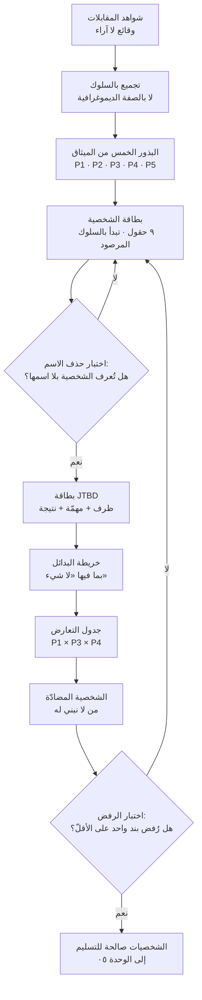
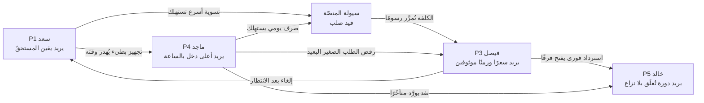
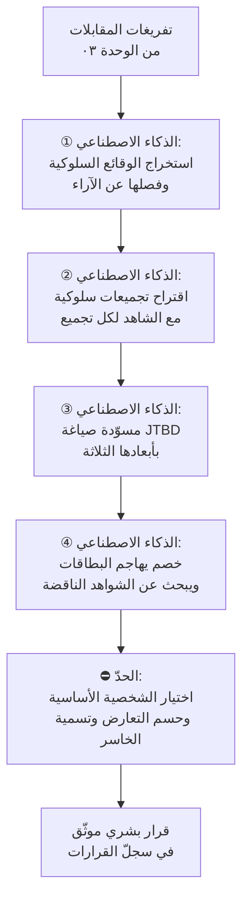
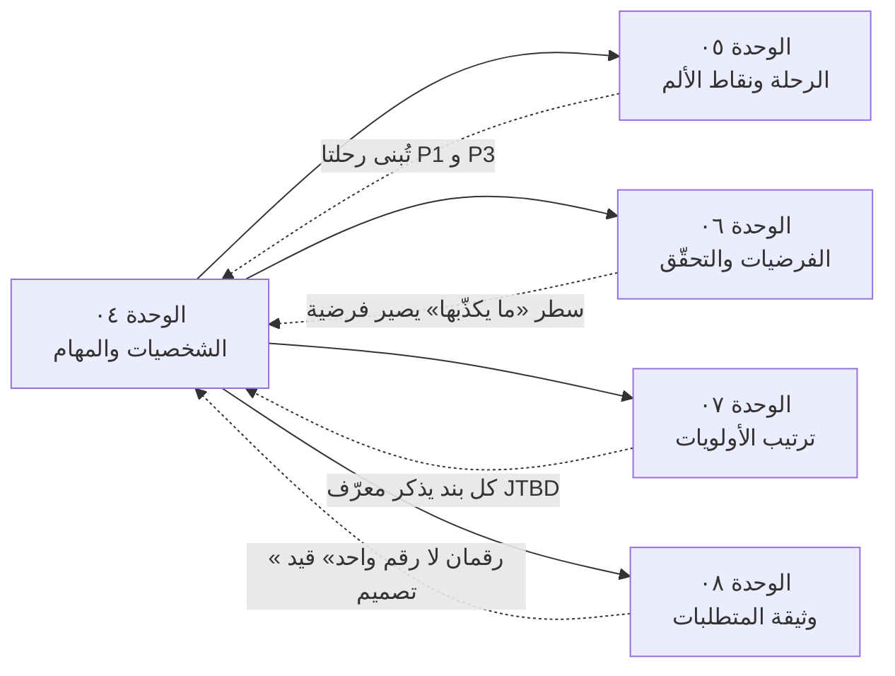

> [!info] الوحدة 04 · ورشة BridgePay
> **الفصل يشرح، والوحدة تنفّذ.** تعريف `Persona` وتعريف [[Jobs to be Done]] وأبعاد المهمّة الثلاثة كلّها مشروحة في [[02 - فلسفة إدارة المنتج|فصل فلسفة إدارة المنتج]] وفي المعجم — ولن تُعاد هنا. ما يحدث في هذه الوحدة شيء واحد: **نصنع القطعة**. خمس شخصيات كاملة، خمس بطاقات `JTBD`، جدول تعارض، شخصية مضادّة، ونقد صريح للأداة نفسها.

# الوحدة 04 — الشخصيات والمهام

## ما ورثته من الوحدة السابقة

هذه الوحدة **لا تبدأ من بياض**. ترث ثلاث حزم محدّدة، وكل شخصية أدناه تُبنى منها لا من الخيال:

**① من [[00 - ميثاق المشروع ومصدر الحقيقة|الوحدة ٠٠]] — البذور والأرقام:**

| ما ورثته | القيمة |
|---|---|
| بذور الشخصيات الخمس | P1 صاحب مطعم فرع واحد · P2 مديرة عمليات ٦ فروع · P3 عميل ٩ طلبات شهريًّا · P4 مندوب بالقطعة · P5 محاسب المنصّة |
| السطر الحاسم لكل بذرة | خمس جمل، كل واحدة تختصر التوتّر المركزي للشخصية |
| جدول الأطراف الستّة | ما يقوله كل طرف · ما يبدو من سلوكه · توتّره مع طرف آخر |
| الأرقام الحاكمة | ٤١٠ تاجرًا مفعَّلًا، منهم ٢٦٣ نشطًا · ١٩٬٢٠٠ عميل نشط شهريًّا · ٢٬٧٥٠ طلبًا يوميًّا · ٧٤ ريالًا متوسّط الطلب · عمولة ١٢٪ · تسوية كل ١٤ يومًا · دفع عند الاستلام ٣٨٪ · احتفاظ العميل ٢٢٪ · احتفاظ التاجر ٧١٪ · ٤٬٩٠٠ تذكرة شهريًّا منها ٣١٪ «أين مستحقّاتي؟» · ٦ ساعات توفيق يدوي أسبوعيًّا |
| القيود الصلبة | ٩ مهندسين · دورة أسبوعان · ١٫٩ مليون ريال كلفة تقصير التسوية · [[PDPL]] · عقد بوّابة الدفع ١٨ شهرًا · لا توظيف |

**② من [[03 - الاكتشاف والبحث الميداني|الوحدة ٠٣]] — الشواهد الميدانية:**

الشخصيات هنا **مشتقّة من مقابلات الوحدة ٠٣ وجدول أنماطها**، لا من تأمّل مكتبي. وحيث تُنقل جملة على لسان شخصية في هذه الوحدة، فهي **صياغة متّسقة مع الميثاق** لنمط رُصد في تلك المقابلات — لا اقتباسًا حرفيًّا من فرد بعينه. وهذا تمييز مقصود ومهمّ مهنيًّا: بطاقة الشخصية **تركيب** من عدّة مقابلات، لا سيرة شخص واحد. من يخلط بينهما ينتهي إلى بناء منتج لأغرب مستخدم قابله لا لأكثرهم تمثيلًا.

> [!warning] قاعدة الاشتقاق في هذه الوحدة
> كل رقم يرد أدناه إمّا **منقول حرفيًّا** من الميثاق، أو **مشتقّ منه بحساب معروض في مكانه**. ولن تجد في هذه الوحدة رقمًا واحدًا بلا مصدر أو حساب ظاهر. وحين أحتاج معطًى غير موجود (كعدد المندوبين مثلًا) فإنني **أعيد صياغة السؤال** حتى يصبح قابلًا للاشتقاق ممّا لدينا، بدل اختراع الرقم الناقص.

**③ من الميثاق — التناقض الذي يجب أن تفسّره الشخصيات:**

> احتفاظ التاجر ٧١٪ بينما ٣١٪ من تذاكره عن مستحقّاته · واحتفاظ العميل ٢٢٪ فقط بلا شكوى تُذكر.
> **التاجر يشتكي ويبقى. العميل لا يشتكي ويذهب.**

هذه الجملة هي **معيار قبول** هذه الوحدة: إن خرجت الشخصيات الخمس ولم يفسّر أيٌّ منها هذا التناقض، فهي شخصيات فاشلة مهما كانت جميلة الإخراج.

### حسابات أوّلية سنعتمد عليها في كل بطاقة

قبل أي شخصية، أشتقّ ستّة أرقام من الميثاق لأنها تتكرّر في البطاقات، فيكون الحساب مرّة واحدة هنا:

| الرقم المشتقّ | الحساب | القيمة |
|---|---|---|
| قيمة البضاعة المباعة يوميًّا (`GMV`) | ٢٬٧٥٠ طلبًا × ٧٤ ريالًا | ٢٠٣٬٥٠٠ ريال/يوم |
| عمولة المنصّة يوميًّا | ٢٠٣٬٥٠٠ × ١٢٪ | ٢٤٬٤٢٠ ريال/يوم |
| العمولة شهريًّا (٣٠ يومًا) | ٢٤٬٤٢٠ × ٣٠ | ٧٣٢٬٦٠٠ ريال/شهر |
| متوسّط طلبات التاجر النشط يوميًّا | ٢٬٧٥٠ ÷ ٢٦٣ تاجرًا نشطًا | ١٠٫٥ طلبًا/يوم |
| متوسّط طلبات العميل النشط شهريًّا | (٢٬٧٥٠ × ٣٠) ÷ ١٩٬٢٠٠ | ٤٫٣ طلبًا/شهر |
| تذاكر «أين مستحقّاتي؟» شهريًّا | ٤٬٩٠٠ × ٣١٪ | ١٬٥١٩ تذكرة/شهر |

وثلاثة استنتاجات تسقط من هذه الحسابات مباشرة، وستحكم الوحدة كلها:

**① التذاكر لا توزَّع بالتساوي.** ١٬٥١٩ تذكرة ÷ ٢٦٣ تاجرًا نشطًا = **٥٫٨ تذكرة لكل تاجر نشط شهريًّا**. وبما أن التسوية كل ١٤ يومًا (أي ٢٫١٤ دورة شهريًّا)، فإن كل تاجر يفتح في المتوسّط **٢٫٧ تذكرة في كل دورة تسوية واحدة**. هذا ليس «شكوى عارضة»، هذا **سلوك دوري منتظم** — والسلوك الدوري لا يُعالَج بردّ دعم أفضل، بل بإزالة سببه. راجع [[Root Cause Analysis|تحليل السبب الجذري]].

**② العميل الذي في الميثاق (P3، ٩ طلبات شهريًّا) ليس عميلًا متوسّطًا.** ٩ ÷ ٤٫٣ = **٢٫١ ضعف المتوسّط**. فهو من الشريحة العليا سلوكيًّا، وهذا يجعل رحيله — إن رحل — أغلى بمرّتين من رحيل عميل متوسّط. وهذا وحده يبرّر تخصيص شخصية له.

**③ نسبة النشطين إلى المسجّلين تطابق احتفاظ الشهر الثالث.** ١٩٬٢٠٠ ÷ ٨٧٬٤٠٠ = **٢١٫٩٪ ≈ ٢٢٪**. أي أن قاعدة المسجّلين في جوهرها **طبقة واحدة من الناجين** فوق ٦٨٬٢٠٠ حساب ميت. وحين يقول أحدهم في اجتماع «لدينا ٨٧ ألف عميل» فهو يقرأ [[Vanity Metrics|مؤشّر غرور]]؛ الرقم الحقيقي ١٩٬٢٠٠.

## السؤال الذي تجيب عنه هذه الوحدة

> **من الذي نبني له بالضبط، وما المهمّة التي يستأجرنا لإنجازها — بحيث يصير هذا الجواب قادرًا على ردّ ميزة مطلوبة من الإدارة؟**

لاحظ الشرط في آخر السؤال. الشخصية التي لا تستطيع أن تقول «لا» لشيء، ليست شخصية بل **ملصقًا**. وسنقيس نجاح هذه الوحدة بمعيار واحد: كم بندًا من [[00 - ميثاق المشروع ومصدر الحقيقة|بنود الطلبات الخام الخمسين]] صار من الممكن تأجيله أو رفضه **استنادًا إلى نصّ مكتوب هنا** — لا إلى ذوق مدير المنتج.

وثلاثة أسئلة فرعية تتفرّع عنه:

1. **لماذا يبقى التاجر رغم شكواه؟** أي: ما القوة التي تمنعه من الرحيل، وهل هي قوة نحن نملكها أم ظرف قد يزول؟
2. **لماذا يذهب العميل بلا شكوى؟** أي: ما المهمّة التي توقّفنا عن أدائها له دون أن نشعر؟
3. **أين تتصادم مهامّهم؟** لأن التصادم — لا التوافق — هو ما يجعل هذه المنصّة صعبة، وهو ما يستحقّ قرارًا موثّقًا في [[Decision Log|سجلّ القرارات]].

## العمل خطوة بخطوة

الزمن الإجمالي للورشة: **١٢٠ دقيقة**، ويمكن تنفيذها فرديًّا في ٩٠ دقيقة بحذف خطوتَي النقاش الجماعي (٥ و٩).

| # | الخطوة | ماذا تفعل حرفيًّا | الزمن |
|---|---|---|---|
| ١ | **افرد الشواهد لا الآراء** | خذ جدول أنماط [[03 - الاكتشاف والبحث الميداني\|الوحدة ٠٣]] وانسخ منه **الوقائع فقط**: ما فعله المستخدم، متى، وكم كلّفه. احذف كل جملة تبدأ بـ«يشعر أن» أو «يرى أن» — هذه آراء، وستعود لها لاحقًا كتفسير لا كأساس. | ١٥ د |
| ٢ | **جمّع بالسلوك لا بالصفة** | صنّف الشواهد بحسب **ما يفعله الناس** لا بحسب من هم. «يفتح التطبيق ٤ مرّات يوميًّا ليفحص رصيدًا لا يتغيّر» سلوك؛ «صاحب مطعم في الثلاثينات» صفة ديموغرافية لا تتنبّأ بشيء. إن ظهر لك أن اثنين مختلفَين ديموغرافيًّا يسلكان السلوك نفسه — فقد وجدت شخصية واحدة لا اثنتين. | ١٥ د |
| ٣ | **ثبّت البذور الخمس ولا تزد** | الميثاق حدّد P1–P5. **لا تخترع P6 مهما بدا مغريًا.** إن ظهر نمط سادس قوي، فهو إمّا تنويعة داخل شخصية قائمة، أو مرشّح لـ«الشخصية المؤجّلة» (انظر قسم الشخصية المضادّة). | ٥ د |
| ٤ | **املأ البطاقة بالبنية التسعة** | لكل شخصية: الاسم والدور · السياق اليومي · الأهداف · الإحباطات · **السلوك الفعلي المرصود** · الأدوات البديلة · جملة بلسانه · ما الذي يجعله يترك المنصّة · كيف يُقاس نجاحه هو. **ابدأ بالسلوك المرصود لا بالأهداف** — لأن الأهداف يسهل تأليفها والسلوك لا. | ٣٠ د |
| ٥ | **اختبار «هل يمكن حذف الاسم؟»** *(جماعي)* | اقرأ البطاقة بصوت عالٍ بعد حذف الاسم والصورة والصفات. إن لم يعرف الفريق أي شخصية هي — فالبطاقة عامّة ولا تصلح. أعد كتابتها حتى تصير **التفريق** لا الوصف. | ١٠ د |
| ٦ | **اكتب بطاقة `JTBD` لكل شخصية** | بالصيغة الثلاثية «حين أكون [ظرف]، أريد [مهمّة]، حتى أستطيع [نتيجة]»، ثم فكّك الأبعاد الثلاثة (وظيفي · عاطفي · اجتماعي)، ثم **ارسم خريطة البدائل** بما فيها «لا شيء». راجع [[Jobs to be Done]] للبنية. | ٢٥ د |
| ٧ | **ابنِ جدول التعارض** | ضع P1 و P3 و P4 في مصفوفة، واسأل عن كل زوج: **أي قرار يخدم أحدهما ويضرّ الآخر؟** ثم اكتب القرار الحاسم واسم الخاسر وحجم خسارته. من لا يكتب اسم الخاسر لم يحسم. | ١٥ د |
| ٨ | **اكتب الشخصية المضادّة** | من الذي **لا نبني له**؟ اشترط أن يكون شخصًا **حقيقيًّا ومغريًا** — لا رجل قشّ. الشخصية المضادّة التي لا يشتهيها أحد في الفريق بلا قيمة. | ١٠ د |
| ٩ | **اختبار الرفض** *(جماعي)* | خذ ٥ بنود عشوائية من قائمة الطلبات الخمسين، واسأل: **أي شخصية تخدم؟ وأي مهمّة تنجز؟** كل بند لا يجد شخصية ولا مهمّة — علّمه بـ«معلّق». إن لم يُعلَّق ولا بند، فشخصياتك لا ترفض شيئًا، وعليك أن تعيد الخطوة ٤. | ١٠ د |



## المخرَج

هذا هو قسم القطعة. خمس بطاقات كاملة، ثم خمس بطاقات `JTBD`، ثم جدول التعارض، ثم الشخصية المضادّة، ثم نقد الأداة.

> [!note] كيف تُقرأ البطاقات
> الحقل الأهمّ في كل بطاقة ليس «الأهداف» بل **«السلوك الفعلي المرصود»**. الأهداف ما يقوله الشخص عن نفسه، والسلوك ما يفعله فعلًا — والفجوة بينهما هي `Say-Do Gap` التي فصّلها [[02 - فلسفة إدارة المنتج|الفصل الثاني]]. وقد وضعت الحقلين متجاورين عمدًا في كل بطاقة، لأن **المسافة بينهما هي المعلومة**، لا أيٌّ منهما وحده.
>
> والحقل الذي يمنح البطاقة أسنانًا هو **«ما الذي يجعله يترك المنصّة»**. شخصية بلا شرط رحيل لا تُنتج قرارًا، لأن كل ميزة تبدو نافعة لها.

---

### P1 — سعد · صاحب مطعم مأكولات شعبية، فرع واحد

> **السطر الحاسم من الميثاق:** لا يعرف رصيده إلا حين يصل التحويل.

| الحقل | القيمة |
|---|---|
| الحجم المشتقّ | **~٨ طلبات يوميًّا** — اشتقاق: متوسّط التاجر النشط ١٠٫٥ طلبًا/يوم مرفوع بأثر السلاسل متعدّدة الفروع، فالفرع الواحد يقع تحته. اعتمدنا ٧٦٪ من المتوسّط ونعلن الافتراض. |
| دخله عبر المنصّة | ٨ × ٧٤ = ٥٩٢ ريالًا/يوم إجمالًا · بعد عمولة ١٢٪ = **٥٢١ ريالًا/يوم صافيًا** |
| ما يُحتجَز عنه في الذروة | ١٤ يومًا × ٥٢١ = **~٧٬٢٩٤ ريالًا** معلّقة في أي لحظة |
| نصيبه من تذاكر «أين مستحقّاتي؟» | ٢٫٧ تذكرة لكل دورة تسوية (مشتقّ في قسم «ما ورثته») |

**السياق اليومي.** يفتح المطعم الساعة ١١ صباحًا ويغلق بعد منتصف الليل. الطلبات تأتيه من ثلاث قنوات: الصالة، والهاتف، والمنصّة. المنصّة قناة **ثالثة في الترتيب وأولى في الوجع**: حصّتها من دخله ليست الأكبر، لكنها الوحيدة التي **يدفع فيها اليوم ويقبض بعد أسبوعين**. مورّد اللحم يطلب نقدًا كل ثلاثة أيام، وإيجار المحلّ في الأول من الشهر، وراتب العاملين في الخامس. فدورته النقدية تقاس بالأيام، ودورة تسويتنا تقاس بأسبوعين. **وهذا وحده — لا العمولة — هو الجرح.**

**الأهداف (ما يقوله إنه يريده).** «عمولة أقلّ.» يقولها في كل مكالمة، وهي أول جملة في كل مقابلة معه. وهي — كما سنرى — **ترجمة لمشكلة أخرى إلى أقرب حلّ يعرفه**.

**السلوك الفعلي المرصود.**
- **يبقى رغم العمولة** (احتفاظ التاجر ٧١٪ في الشهر السادس)، ولم يوقف الخدمة يومًا رغم ١٤ شهرًا من الشكوى.
- **يفتح التطبيق بحثًا عن رقم غير موجود.** لا يوجد في المنصّة اليوم «رصيد لحظي» — البند مطلوب في القائمة الخام ولم يُبنَ — فيفتح ليجد قائمة طلبات لا رقمًا واحدًا.
- **يجمع بنفسه.** يحتفظ بدفتر أو ملاحظة في الهاتف يسجّل فيها إجمالي طلبات اليوم من شاشة المنصّة، ليعرف تقريبًا ما له.
- **يفتح تذكرة دعم عند اقتراب موعد التحويل، لا بعد تأخّره.** التذكرة ليست شكوى من خطأ؛ هي **استعلام عن يقين**.
- **يقارن التحويل الواصل بحسابه اليدوي**، وحين يختلفان (وهو الغالب بسبب الإلغاءات والاستردادات) يفتح تذكرة ثانية.

> [!example] الفجوة بين قوله وفعله — بالحساب
> لو خُفّضت العمولة من ١٢٪ إلى ١٠٪ لربح سعد: ٥٩٢ × ٢٪ = **١١٫٨ ريالًا في اليوم**، أي ~٣٥٥ ريالًا شهريًّا.
> ولو قُصّرت دورة التسوية من ١٤ يومًا إلى ٧، لتحرّرت له **~٣٬٦٤٧ ريالًا** من السيولة المحتجزة دفعة واحدة — عشرة أضعاف مكسبه الشهري من خفض العمولة.
> وهو **يطلب الأول ويعاني من الثاني**. وهذا بالضبط معنى: المستخدم خبير في مشكلته لا في حلّها.

**الإحباطات (مرتّبة بأثرها لا بصوتها).**
1. **عمى الرصيد** — لا يعرف كم له إلا حين يصل التحويل. هذا [[Pain Point|نقطة ألم]] من نوع «الغموض»، وهي أشدّ أنواع الألم على أصحاب الأعمال الصغيرة لأنها تمنع القرار لا الراحة فقط.
2. **عدم قابلية الكشف للتفسير** — يصل مبلغ لا يعرف كيف تكوّن، فلا يستطيع الاعتراض ولا الاطمئنان.
3. **مفاجآت الخصم** — إلغاء أو استرداد يظهر في الكشف بعد أسبوعين من وقوعه، حين نسي الحادثة أصلًا.
4. **العمولة** — الرابعة لا الأولى. مؤلمة لكنها **متوقّعة**، والألم المتوقّع يُحتمل.

**الأدوات البديلة التي يستعملها اليوم.**
دفتر ورقي أو ملاحظة هاتف · حاسبة الجوال · صور شاشة لقائمة الطلبات يرسلها لمحاسبه · مكالمة هاتفية مع موظّف الدعم يعرفه بالاسم · وأحيانًا **سؤال تاجر مجاور**: «وصلك تحويلك؟» — وهذا آخرها أذكاها وأخطرها علينا، لأنه يعني أن **شبكة التجّار صارت مصدر يقين بديلًا عن المنصّة**.

**جملة بلسانه.**
> «أنا ما أعرف كم لي عندكم. أعرف يوم يوصل. وإذا وصل أقلّ من اللي بحسابي، أرجع أعدّ من أوّل — وأنا ما عندي وقت أعدّ.»

**ما الذي يجعله يترك المنصّة.**
ليس العمولة، ولا حتى التأخير. الذي يُخرجه شيئان:
- **حدث سيولة**: دورة تحويل واحدة تتأخّر أو تصل ناقصة في شهر يكون فيه ملتزمًا بدفعة كبيرة. عندها يعيد تقييم القناة كلها في يوم واحد.
- **بديل يمنحه يقينًا**: منافس يعرض تسوية أسبوعية أو رصيدًا لحظيًّا موثوقًا. لاحظ أنه **لا يحتاج تسوية أسرع ليبقى؛ يحتاج أن يعرف**. وهذه ملاحظة تُغيّر الميزانية الهندسية بالكامل، لأن شاشة رصيد لحظي تكلّف أسابيع، وتقصير التسوية يكلّف ١٫٩ مليون ريال سيولة.

**كيف يُقاس نجاحه هو (لا نجاحنا نحن).**
«هل أستطيع في أي لحظة أن أقول لمورّدي: أدفع لك يوم كذا؟» — مؤشّره الشخصي هو **عدد المرّات التي اضطرّ فيها لتأجيل التزام بسبب عدم معرفته برصيده**. ولو كان له لوحة قياس، لكان فيها رقم واحد: **الأيام التي مرّت وهو غير متأكّد**.

---

### P2 — نورة · مديرة عمليات سلسلة من ٦ فروع

> **السطر الحاسم من الميثاق:** تحتاج مقارنة الفروع، لا رقمًا واحدًا.

| الحقل | القيمة |
|---|---|
| حجم السلسلة المشتقّ | ٦ فروع × ١٠٫٥ طلبًا = **~٦٣ طلبًا يوميًّا** |
| حصّتها من المنصّة | ٦٣ ÷ ٢٬٧٥٠ = **٢٫٣٪ من الطلبات اليومية** بينما هي ٦ من ٢٦٣ تاجرًا نشطًا = ٢٫٣٪ من التجّار — أي أنها **متوسّطة الكثافة، كبيرة الوزن التفاوضي** |
| تدفّقها عبر المنصّة | ٦٣ × ٧٤ = ٤٬٦٦٢ ريالًا/يوم · صافيًا بعد العمولة **٤٬١٠٣ ريالات/يوم** |
| كشوفها | ٦ كشوف × ٢٫١٤ دورة شهريًّا = **~١٣ كشفًا شهريًّا** تُوفَّق يدويًّا |

**السياق اليومي.** لا تدير مطعمًا، تدير **فروقًا**. صباحها يبدأ بسؤال واحد: أي فرع تراجع أمس ولماذا؟ لا تهمّها ٤٬٦٦٢ ريالًا مجتمعة بقدر ما يهمّها أن الفرع الثالث أنتج نصف ما أنتجه الخامس رغم تشابه الحيّ. وهي المستخدم الوحيد بين الخمسة الذي **لا يبحث عن رقم، بل عن انحراف**.

**الأهداف (ما تقوله إنها تريده).** «تقارير أفضل.» وهي الصيغة التي وردت في جدول الأطراف الستّة بلفظ «تقارير أفهمها». وهي طلب **صحيح الاتجاه، مضلّل الشكل**: التقرير الذي تريده ليس تقريرًا بل **تنبيهًا**.

**السلوك الفعلي المرصود.**
- **تصدّر البيانات إلى `Excel` يدويًّا كل أسبوع** — هذا منصوص عليه في الميثاق ضمن سلوك التاجر غير المطعمي، ونمطه ذاته يتكرّر مع مديرة العمليات، والفرق أنها تصدّر **ستّ مرّات** لا مرّة.
- **تبني في الجدول أعمدة لا نوفّرها**: عمود «الفرق عن الأسبوع الماضي»، وعمود «نسبة الإلغاء»، وعمود «الفرع مقابل متوسّط الفروع».
- **تلصق الفروع في ورقة واحدة** لأن المنصّة تُظهر كل فرع في حساب منفصل.
- **لا تفتح تذكرة دعم غالبًا** — تحلّ مشكلتها بنفسها في `Excel`. وهذا **أخطر ما فيها**: صمتها ليس رضًا، بل بناء بديل. وحين يكتمل البديل، تصير المنصّة عندها مجرّد قناة طلبات لا نظام إدارة.
- **تتفاوض على العمولة بلغة الحجم** لا بلغة الشكوى.

> [!warning] النمط الذي يجب أن يقلقك في P2
> P1 **يشتكي فيمنحنا إشارة**. P2 **تبني حلًّا فتحرمنا الإشارة**. ومن قرأ لوحة الدعم وحدها سيستنتج أن التجّار متعدّدي الفروع «سعداء» — لأن تذاكرهم أقلّ. وهذا استدلال معكوس: قلّة التذاكر هنا **عرض من أعراض هجرة الوظيفة إلى أداة أخرى**، لا دليل رضًا. راجع [[Vanity Metrics|مؤشّرات الغرور]] و[[Counter Metric|المؤشّر المضادّ]].

**الإحباطات.**
1. **ستّة حسابات لكيان واحد** — تسجّل دخولًا ستّ مرّات لتكوّن صورة واحدة.
2. **لا مقارنة داخل المنتج** — كل شاشة تعرض فرعًا معزولًا عن سياقه.
3. **الصلاحيات الغائبة** — لا تستطيع منح مدير الفرع رؤية فرعه فقط، فإمّا تعطيه كل شيء أو لا شيء. (بند «صلاحيات موظّفين» في القائمة الخام.)
4. **الكشوف الستّة** — توفيق ١٣ كشفًا شهريًّا يدويًّا، وكل خطأ فيها يتحوّل إلى نقاش مع الإدارة المالية عندها لا معنا.

**الأدوات البديلة التي تستعملها اليوم.**
`Excel` بجداول محورية · مجموعة واتساب مع مديري الفروع تُرسل فيها لقطات شاشة يومية · تقويم تذكير بموعد التصدير الأسبوعي · وأحيانًا **نظام نقاط البيع الخاص بالسلسلة** الذي يعطيها أرقامًا موازية لأرقامنا — وهو أخطر البدائل، لأن وجود مصدرَي حقيقة يجعل نقاشنا معها نقاشًا عن **صحّة أرقامنا** لا عن قيمتنا.

**جملة بلسانها.**
> «أنا ما أبغى تقرير. أبغى تعرفوني وين المشكلة قبل لا أدوّر عليها. أنا أصلًا أطلع أرقامكم وأعيد ترتيبها عشان أعرف، وهذي شغلتكم مو شغلتي.»

**ما الذي يجعلها تترك المنصّة.**
لا تتركها بغضب، بل **بالتقليص**. تبقي فرعين على المنصّة وتحوّل الأربعة الباقية إلى قناة أخرى إن وجدت فيها لوحة موحّدة. الخروج عندها **تدريجي وقابل للعكس**، ولهذا يصعب رصده: لن يظهر في مؤشّر [[Churn|الفقد]] بل في **انخفاض بطيء في طلبات فروع بعينها**، وهو ما لا يلتقطه أحد إن كان القياس على مستوى التاجر لا الفرع.

**كيف يُقاس نجاحها هي.**
«كم دقيقة أحتاج لأعرف أي فرع تراجع ولماذا؟» — اليوم: ما بين ساعة وساعتين أسبوعيًّا من التصدير واللصق. نجاحها = **صفر تصدير**. ومؤشّرها الثاني: عدد المرّات التي فاجأها فيها تراجع فرع بعد فوات أوان التدخّل.

---

### P3 — فيصل · عميل متكرّر، ٩ طلبات شهريًّا

> **السطر الحاسم من الميثاق:** ولاؤه للسعر لا للمنصّة.

| الحقل | القيمة |
|---|---|
| كثافته | ٩ طلبات/شهر مقابل متوسّط **٤٫٣** ← **٢٫١ ضعف العميل المتوسّط** |
| إنفاقه | ٩ × ٧٤ = **٦٦٦ ريالًا/شهر** |
| ما يدرّه علينا | ٦٦٦ × ١٢٪ = **٧٩٫٩ ريالًا عمولة شهريًّا** · ٩٥٩ ريالًا سنويًّا لو بقي |
| احتمال بقائه | احتفاظ العميل في الشهر الثالث **٢٢٪** — أي أن ٧٨٪ من أمثاله يختفون قبل أن يُكملوا ربع سنة |

**السياق اليومي.** يطلب مرّتين إلى ثلاث مرّات أسبوعيًّا، غالبًا في نافذتين: غداء العمل، وسهرة نهاية الأسبوع. عنده على الهاتف **ثلاثة تطبيقات** لا واحد. والقرار عنده لا يبدأ بفتح تطبيقنا، بل بفتح **الثلاثة بالتتابع** ومقارنة السعر النهائي شاملًا التوصيل والرسوم. وهذه المقارنة تستغرق منه دقيقتين، ويعدّها عملًا مربحًا: فرق ٨ ريالات في طلب من ٧٤ ريالًا = **١١٪ من قيمة الطلب** — عائد أعلى من كثير من الجهود التي يبذلها في يومه.

**الأهداف (ما يقوله إنه يريده).** «توصيل أسرع وأرخص.» وهو ما ورد حرفيًّا في جدول الأطراف الستّة. لاحظ أنه طلب **مركّب من متناقضين**: الأسرع يرفع الكلفة، والأرخص يخفض الأولوية.

**السلوك الفعلي المرصود.**
- **يقارن الأسعار عبر ثلاثة تطبيقات قبل الطلب** — منصوص عليه في الميثاق.
- **يعيد طلب الشيء نفسه غالبًا**، ومع ذلك يمرّ بمسار البحث والتصفّح كاملًا في كل مرّة (بند «إعادة الطلب السابق بضغطة» في القائمة الخام مطلوب من العملاء).
- **لا يفتح تذكرة دعم حين يسوء شيء؛ يطلب من تطبيق آخر في المرّة التالية.** وهذا هو تفسير التناقض المركزي في الميثاق: صمت العميل ليس رضًا، بل **رخص كلفة الخروج**. لا شيء يربطه بنا: لا رصيد، ولا محفظة، ولا تاريخ يخسره.
- **يتحسّس زمن الانتظار أكثر من مدّته**: تأخّر عشر دقائق مع تتبّع حيّ يحتمله، وتأخّر خمس دقائق بلا معلومة يزعجه أكثر.
- **يفتح التطبيق بعد الطلب ٣–٥ مرّات** ليتحقّق من الحالة — وهو سلوك قلق لا سلوك متعة.

> [!example] لماذا يذهب بلا شكوى — الحساب البسيط
> كلفة الشكوى على فيصل: فتح تذكرة، انتظار ردّ، شرح الحادثة، متابعة. لنقدّرها بعشر دقائق.
> كلفة الخروج على فيصل: **صفر**. التطبيق البديل مثبَّت أصلًا على هاتفه، وعنوانه محفوظ فيه، وبطاقته مسجّلة.
> وحين تكون كلفة الشكوى أعلى من كلفة الخروج، **فالصمت هو السلوك العقلاني**. ومن ينتظر شكوى العميل ليعرف أنه غاضب، ينتظر إشارة لن تصل.

**الإحباطات.**
1. **الغموض بعد الضغط على «اطلب»** — لا يعرف أين طلبه ولا متى يصل بدقّة.
2. **تكرار العمل** — يبني السلّة نفسها كل مرّة.
3. **السعر النهائي غير المتوقّع** — رسوم تظهر في آخر شاشة فتنسف المقارنة التي بناها.
4. **الطلب الصغير المرفوض ضمنًا** — طلبه بـ٣٥ ريالًا في وقت الذروة يبقى معلّقًا طويلًا (لأن P4 يرفضه)، فيلغيه ويطلب من غيرنا.

**الأدوات البديلة التي يستعملها اليوم.**
تطبيقان منافسان مفتوحان بالتوازي · مكالمة مباشرة للمطعم الذي يعرفه (وهذا **أخطر بديل لأنه يحذفنا من المعادلة تمامًا**) · مجموعة واتساب عائلية يُسأل فيها «أيهم أرخص اليوم؟» · وخيار **«لا شيء»**: يطبخ، أو يؤجّل، أو يأكل ما توفّر. وهذا البديل الأخير هو منافسنا الأكبر عدديًّا ولا يظهر في أي لوحة تنافسية.

**جملة بلسانه.**
> «ما عندي مشكلة معكم، بس أمس كان عندهم خصم. لو عندكم نفس السعر أطلب منكم — ولا يهمّني منو التطبيق أصلًا.»

**ما الذي يجعله يترك المنصّة.**
لا يوجد حدث واحد. يتركنا **بالتآكل**: ثلاث تجارب أقلّ جودة أو أعلى سعرًا من البديل خلال شهر، فينخفض ترتيبنا في عادته من الأول إلى الثاني، ثم يُنسى. ولاحظ أن **٧٨٪ من أمثاله يفعلون هذا خلال ثلاثة أشهر** (احتفاظ ٢٢٪) — فهذا ليس استثناء بل هو الحالة الطبيعية في منتجنا اليوم.

**كيف يُقاس نجاحه هو.**
«هل حصلت على أكلي بالسعر الذي توقّعته في الوقت الذي وُعدت به؟» — مؤشّره الشخصي: **الفرق بين الوقت المُعلن والوقت الفعلي**، والفرق بين **السعر في شاشة التصفّح والسعر في شاشة الدفع**. ولاحظ أن كليهما مؤشّر «وفاء بوعد» لا مؤشّر «سرعة» — وهذا يفتح حلولًا أرخص بكثير من زيادة أسطول التوصيل.

---

### P4 — ماجد · مندوب توصيل بالقطعة

> **السطر الحاسم من الميثاق:** يحسب الربح لكل طلب قبل القبول.

| الحقل | القيمة |
|---|---|
| ما لا يراه قبل القبول | **قيمة الطلب** — بند «رؤية قيمة الطلب قبل القبول» أول مطالب المندوبين في القائمة الخام، أي أنه غير متوفّر اليوم |
| النقد الذي يمرّ بأيدي المندوبين يوميًّا | ٢٬٧٥٠ × ٣٨٪ (دفع عند الاستلام) = **١٬٠٤٥ طلبًا نقديًّا** × ٧٤ ريالًا = **٧٧٬٣٣٠ ريالًا/يوم** |
| نصيب الطلب النقدي الواحد | **٧٤ ريالًا في المتوسّط ليست له**، يحملها حتى التوريد |
| مطالبه السبعة | رؤية القيمة · تجميع الطلبات · دقّة المسافة · صرف يومي · تقليل الانتظار في المطعم · وضع «مشغول» · تقرير أرباح أسبوعي |

**السياق اليومي.** يعمل بالقطعة، أي أن **دخله دالّة في عدد الطلبات المقبولة وزمن الطلب الواحد**، لا في ساعات حضوره. وهذا يجعله — من بين الخمسة — **أكثرهم عقلانية اقتصادية لحظية**: كل ثانية انتظار خسارة محسوبة. يبدأ يومه في نافذة الغداء، ويعمل ذروتين، وبينهما فترة ميّتة يقضيها متوقّفًا قرب تجمّع مطاعم لأن القرب يرفع احتمال وصول طلب قريب.

**الأهداف (ما يقوله إنه يريده).** «طلبات أكثر.» وهو ما ورد في جدول الأطراف الستّة. وهو طلب **خاطئ التوصيف من الأساس**: هو لا يريد طلبات أكثر، يريد **دخلًا أعلى بالساعة**. والفرق بين الصياغتين يقود إلى منتجين مختلفين تمامًا.

**السلوك الفعلي المرصود.**
- **يرفض الطلبات البعيدة صغيرة القيمة** — منصوص عليه في الميثاق. ولاحظ أن الرفض يقع **قبل** أن يعرف قيمة الطلب، أي أنه يرفض بناءً على **إشارات بديلة**: اسم المطعم، والحيّ، والمسافة الظاهرة.
- **يبني نماذج ذهنية عن المطاعم**: «هذا يجهّز في خمس دقائق، وهذا يخلّيني أنتظر عشرين». فيقبل من الأول ويرفض من الثاني — وهو يعاقب مطعمًا لا نراقب زمن تجهيزه أصلًا.
- **يوقف الاستقبال بإغلاق التطبيق** لأن وضع «مشغول» غير موجود. وهذا يجعل بياناتنا تقول «مندوب غير متصل» بينما الواقع «مندوب مشغول» — وفرق التفسيرين يفسد أي تقدير للسعة.
- **يحتفظ بحساب موازٍ**: ورقة أو ملاحظة يسجّل فيها طلبات اليوم والنقد المحصَّل، لأن «تقرير أرباح أسبوعي» غير متوفّر.
- **يفضّل الطلبات النقدية أحيانًا ويكرهها أحيانًا**: يفضّلها لأنها تمنحه سيولة فورية، ويكرهها لأنها تحمّله مسؤولية النقد وتوريده وأي فرق فيه.

> [!warning] ما يفعله رفض ماجد بالمنصّة
> رفض الطلب البعيد صغير القيمة **قرار صحيح فرديًّا وكارثي جماعيًّا**. الطلب المرفوض يعاد عرضه، فيطول انتظار العميل (P3)، فيلغي، فيخسر التاجر (P1) طلبًا جُهّز أو كاد. وهكذا يتحوّل قرار عقلاني عند طرف إلى ضرر عند ثلاثة. وهذا هو جوهر [[Systems Thinking|التفكير بالأنظمة]]: **لا يوجد سلوك سيّئ هنا، توجد حوافز غير محاذاة.**

**الإحباطات.**
1. **القبول في العمياء** — يقرّر بلا المعلومة الحاسمة.
2. **الانتظار في المطعم** — أعلى بند كلفة في يومه، وهو **زمن لا يُدفع له مقابله**.
3. **المسافة المحسوبة خطأً** — تُحسب خطًّا مستقيمًا بينما يقودها هو دوّارات وممنوعات.
4. **دورة الصرف** — يريد صرفًا يوميًّا لأن دورته المعيشية يومية، تمامًا كما أن دورة P1 أسبوعية.
5. **حمل النقد** — ٧٤ ريالًا في المتوسّط عن كل طلب نقدي ليست له، ولا شاشة تخبره كم عليه اليوم بالضبط.

**الأدوات البديلة التي يستعملها اليوم.**
تطبيق توصيل منافس مفتوح بالتوازي (يقبل من أيّهما جاء أولًا بشرط أفضل) · خرائط خارجية لتقدير المسافة الحقيقية قبل القبول · مجموعة واتساب للمندوبين تتبادل «أي مطعم يؤخّر اليوم» — **وهذه المجموعة هي في الواقع نظام تقييم مطاعم موازٍ نديره نحن ولا نراه** · ورقة نقد · وخيار «لا شيء»: يغلق التطبيق ساعتين.

**جملة بلسانه.**
> «أنا ما أرفض عشان أزعّلكم. أنا أرفض لأني ما أعرف إيش فيه. لو تقول لي الطلب كم وبعده كم — أنا أقرّر في ثانية، ولا أحتاج أفتح خرايط ولا أسأل أحد.»

**ما الذي يجعله يترك المنصّة.**
**تسرّب لا خروج.** لن يحذف التطبيق؛ سيخفض حصّتنا من وقته من ٧٠٪ إلى ٣٠٪ لصالح منصّة تعطيه معلومة أفضل قبل القبول أو صرفًا أسرع. وهذا الشكل من الرحيل **لا يظهر في عدّاد المندوبين المسجّلين إطلاقًا** — يظهر فقط في ارتفاع زمن إسناد الطلب في الذروة. ومن يقيس «عدد المندوبين» بدل «الطلبات المقبولة من أول عرض» سيكتشف الأمر متأخّرًا بشهور.

**كيف يُقاس نجاحه هو.**
**الريال في الساعة، لا الريال في الطلب.** ومؤشّره العملي: كم دقيقة ضاعت اليوم في انتظار لم يُدفع لي عنه؟ وكم طلبًا قبلته ثم ندمت؟ ونجاحه المثالي: **يوم بلا مفاجآت** — لا انتظار طويل، ولا مسافة أطول ممّا ظهر، ولا نقد ناقص في نهاية اليوم.

---

### P5 — خالد · محاسب في المنصّة (المستخدم الداخلي)

> **السطر الحاسم من الميثاق:** يوفّق التسويات يدويًّا ٦ ساعات أسبوعيًّا.

| الحقل | القيمة |
|---|---|
| زمنه الضائع | ٦ ساعات/أسبوع = **٢٦ ساعة/شهر** (٦ × ٤٫٣٣) = **٣١٢ ساعة/سنة** ≈ **٣٩ يوم عمل** (بـ٨ ساعات) |
| ما يوفّقه | ٢٦٣ تاجرًا نشطًا × ٢٫١٤ دورة شهريًّا = **~٥٦٣ تسوية شهريًّا** |
| الزمن المتاح لكل تسوية | ٢٦ ساعة = ١٬٥٦٠ دقيقة ÷ ٥٦٣ = **٢٫٨ دقيقة لكل تسوية** |
| ضغط النقد عليه | ١٬٠٤٥ طلبًا نقديًّا يوميًّا (٣٨٪) × ٣٠ = **٣١٬٣٥٠ معاملة نقدية شهريًّا** تحتاج مطابقة |
| ما يصل إليه من الدعم | ١٬٥١٩ تذكرة «أين مستحقّاتي؟» شهريًّا، يُصعَّد إليه ما لا يُحسم في الطبقة الأولى |

> [!example] الرقم الذي يجب أن يوقفك: ٢٫٨ دقيقة
> ٢٫٨ دقيقة لكل تسوية **لا تكفي للتحقيق، تكفي للتمرير فقط**. أي أن خالد لا «يراجع» التسويات فعليًّا؛ هو يمرّرها ويؤشّر على ما يبدو شاذًّا. ومعنى ذلك أن **ضمان صحّة المستحقّات في المنصّة اليوم قائم على عيّنة عشوائية غير معلنة**، لا على مراجعة. وهذه ليست مشكلة أداء موظّف، بل **مشكلة تصميم نظام**: كلّفنا إنسانًا بعمل لا يتّسع له الزمن، ثم سمّيناه ضابط جودة.

**السياق اليومي.** ليس مستخدمًا خارجيًّا، ولهذا يُنسى في أغلب ورشات الشخصيات — ووجوده هنا **قرار مقصود**. يجلس بين ثلاثة أنظمة: سجلّ الطلبات في المنصّة، وكشوف بوّابة الدفع، ونقد الدفع عند الاستلام الذي يورّده المندوبون. وهذه الثلاثة **لا تتفق أبدًا من أول محاولة**: إلغاء بعد الدفع، استرداد جزئي، طلب عُدّل بعد الاستلام، نقد ورّد ناقصًا ثم اكتمل بعد يومين.

**الأهداف (ما يقوله إنه يريده).** «لوحة توفيق تسويات» — بند صريح في القائمة الخام من الدعم والعمليات. وهو من الشخصيات القليلة التي **طلبها قريب من مشكلتها**، لأنه خبير في مجاله (وهذا الاستثناء المذكور في [[02 - فلسفة إدارة المنتج|الفصل الثاني]]: المحترف في مجال متخصّص كثيرًا ما يملك مواصفة عملية استحقّها بجهده).

**السلوك الفعلي المرصود.**
- **بنى نظامه بنفسه**: ملفّ `Excel` بمعادلات مطابقة، يُحدَّث كل دورة. وهذا الملفّ عمليًّا **جزء من البنية التحتية المالية للمنصّة وليس تحت أي إدارة تغيير**.
- **يبدأ من الشكوى لا من البيانات**: لا يكتشف الفروق بالفحص الدوري، بل حين تصل تذكرة من تاجر. أي أن **التاجر هو نظام كشف الأخطاء لدينا**.
- **يحتفظ بـ«قائمة التجّار المزعجين»** — وهي في الحقيقة قائمة التجّار الذين تتكرّر عندهم الفروق، أي **قائمة مواضع الخلل في النظام**، وهي أثمن وثيقة غير رسمية في الشركة.
- **يعمل ليلة التسوية متأخّرًا** لأن الدورة تنتهي في يوم معلوم.
- **لا يستطيع إثبات صحّة رقم لتاجر بسهولة**، فيرسل لقطة شاشة من ملفّه الخاص — وهو أضعف شكل من أشكال الإثبات، ويفتح باب نزاع لا باب إغلاق. راجع [[Audit Trail|أثر التدقيق]].

**الإحباطات.**
1. **ثلاثة مصادر حقيقة** بدل [[Single Source of Truth|مصدر حقيقة واحد]].
2. **العمل التكراري بلا قيمة مضافة** — [[Toil|الكدح]] بمعناه التقني: عمل يدوي متكرّر قابل للأتمتة ولم يُؤتمت.
3. **المسؤولية بلا أداة** — يُسأل عن دقّة المستحقّات ولا يملك إلا جدول بيانات.
4. **الاكتشاف المتأخّر** — الفرق يُكتشف بعد وصول التحويل، أي بعد أن صار الخطأ **حدثًا علنيًّا** عند التاجر.

**الأدوات البديلة التي يستعملها اليوم.**
`Excel` بمعادلات معقّدة · تصدير يدوي من ثلاثة أنظمة · رسائل مباشرة مع فريق الدعم لاستيضاح تذكرة · مكالمة مع بوّابة الدفع للاستفسار عن معاملة · ودفتر ملاحظات للحالات الشاذّة المتكرّرة. وخيار **«لا شيء»** هنا له معنى مرعب: أن يمرّر الدورة كما هي ويتعامل مع الاعتراضات لاحقًا — **وهو ما يفعله فعليًّا في أسابيع الضغط**.

**جملة بلسانه.**
> «أنا ما أقدر أقول للتاجر رقمك صحيح. أقدر أقول: هذا اللي طلع عندي. وإذا اعترض، أرجع أفتح ثلاث شاشات وأعدّ من جديد — وأحيانًا يطلع هو صح.»

**ما الذي يجعله يترك المنصّة.**
لا يتركها؛ **يتركه النظام**. الشخصية الداخلية لا «ترحل» بل **تنهار أو تتحوّل إلى عنق زجاجة**. وشرط انهياره واضح ومحسوب: نمو الطلبات. فلو زادت الطلبات ٥٠٪ (وهو ما تطلبه الإدارة عبر «توسّع لمدينة ثالثة»)، صار زمنه المطلوب ٣٩ ساعة شهريًّا بدل ٢٦، والزمن المتاح لكل تسوية أقلّ من دقيقتين. **إذن: التوسّع للمدينة الثالثة يمرّ من فوق جثّة التوفيق اليدوي.** وهذه أقوى حجّة تملكها لتحويل بند داخلي إلى أولوية استراتيجية.

**كيف يُقاس نجاحه هو.**
ليس بعدد الساعات — بل بـ**عدد الفروق التي اكتشفها هو قبل أن يكتشفها التاجر**. اليوم النسبة منخفضة بنيويًّا (لأنه يبدأ من الشكوى)، ونجاحه المثالي أن تنقلب المعادلة: أن يتصل بالتاجر ليقول «لاحظنا فرقًا وصحّحناه» قبل أن يتصل التاجر ليسأل. وهذا التحوّل وحده — من ردّ الفعل إلى المبادرة — يمسّ ٣١٪ من تذاكر الدعم.

---

### بطاقات `JTBD` الخمس

بنية البطاقة من [[Jobs to be Done]]: صياغة ثلاثية، ثم الأبعاد الثلاثة، ثم **خريطة البدائل بما فيها «لا شيء»**. وخريطة البدائل هي الجزء الذي تحذفه أغلب الفرق، وهي أنفع ما في البطاقة — لأنها تحدّد **من ننافس فعلًا**، وهو نادرًا ما يكون من نظنّه.

> [!note] العلاقة بـ[[Value Proposition Canvas|لوحة القيمة المقترحة]]
> الأبعاد الثلاثة أدناه (وظيفي · عاطفي · اجتماعي) تُغذّي مباشرةً **جانب العميل** في لوحة القيمة: حقل «الإحباطات» في البطاقة يصير `Pains`، وحقل «كيف يُقاس نجاحه هو» يصير `Gains`، والصياغة الثلاثية تصير `Customer Job`. ولهذا رُتّبت حقول البطاقة بهذا الترتيب تحديدًا — لتُنقل إلى اللوحة بلا إعادة تحليل. أمّا **جانب الحلّ** في اللوحة فلا يُملأ هنا، لأن ملأه الآن يعني إغلاق فضاء الحلّ قبل أن تُرسم الرحلة في [[05 - رحلة العميل ونقاط الألم|الوحدة ٠٥]].

---

#### `JTBD-1` — سعد (P1)

> **حين أكون** في نهاية يوم عمل وعليّ التزام نقدي قريب لمورّد أو موظّف،
> **أريد** أن أعرف يقينًا كم لي عند المنصّة ومتى يصلني،
> **حتى أستطيع** أن ألتزم بدفعة اليوم دون أن أقترض أو أؤجّل.

| البعد | الصياغة |
|---|---|
| **وظيفي** | معرفة رقم واحد صحيح: المستحقّ حتى اللحظة، وموعد وصوله، ومن أي طلبات تكوّن. |
| **عاطفي** | التخلّص من قلق دائم منخفض الحدّة — «ما أدري كم لي» — يرافقه كل يوم ويتصاعد قرب مواعيد الالتزامات. **الطمأنينة هنا هي المنتج، لا التقرير.** |
| **اجتماعي** | ألّا يبدو أمام مورّده أو موظّفيه رجلًا لا يعرف حسابه. تأجيل الدفع بحجّة «ما وصلني التحويل» يُضعف موقفه التفاوضي مع المورّد في المرّة القادمة. |

**خريطة البدائل التي تؤدّي المهمّة اليوم:**

| البديل | كلفته عليه | لماذا يبقى مستعمَلًا |
|---|---|---|
| دفتر/ملاحظة هاتف يجمع فيها طلبات اليوم | ٥–١٠ دقائق يوميًّا + خطأ بشري | تحت سيطرته الكاملة، ولا ينتظر أحدًا |
| مكالمة موظّف الدعم الذي يعرفه | دقائق انتظار + علاقة شخصية تُستهلك | يعطي **إجابة بشرية** أقنع من شاشة |
| سؤال تاجر مجاور: «وصلك تحويلك؟» | مجاني | يحوّل اليقين من المنصّة إلى **شبكة الأقران** — أخطر بديل علينا |
| تقدير تقريبي من الذاكرة | صفر | يكفي في الأيام العادية، وينهار في أيام الالتزام |
| **لا شيء: يؤجّل الالتزام حتى وصول التحويل** | كلفة علاقة مع المورّد + أحيانًا فوائد تأخير | لا يتطلّب منه أي عمل — **وهذا هو منافسنا الحقيقي** |

> [!tip] ما تقوله الخريطة لفريق المنتج
> منافسنا في مهمّة سعد **ليس منصّة توصيل منافسة**، بل **دفتر وسؤال جار**. ومعنى ذلك أن معيار النجاح ليس «أفضل من المنافس» بل «**أوثق من دفتره**». وهذا معيار أصعب وأرخص في آن: أصعب لأن الثقة تُبنى بالاتّساق لا بالميزات، وأرخص لأنه لا يحتاج تقصير دورة التسوية (١٫٩ مليون ريال) بل **شفافية الرقم**.

---

#### `JTBD-2` — نورة (P2)

> **حين أكون** مسؤولة عن ستّة فروع وأملك وقتًا محدودًا للتدخّل،
> **أريد** أن أُخبَر أين حدث الانحراف وسببه المرجّح دون أن أبحث عنه،
> **حتى أستطيع** أن أتدخّل في الفرع الصحيح قبل أن يتحوّل التراجع إلى خسارة شهر.

| البعد | الصياغة |
|---|---|
| **وظيفي** | كشف الانحراف بين الفروع في الوقت المناسب: أي فرع، كم، مقارنة بماذا، وما المرشّح لتفسيره. |
| **عاطفي** | التخلّص من الشعور بأنها **آخر من يعلم**. إحباطها الأعمق ليس التقرير الناقص بل مفاجأة الاكتشاف المتأخّر. |
| **اجتماعي** | أن تدخل اجتماع الإدارة ومعها تفسير لا اعتذار. مكانتها المهنية مبنية على أنها **تعرف قبل أن تُسأل**. |

**خريطة البدائل:**

| البديل | كلفته عليها | لماذا يبقى مستعمَلًا |
|---|---|---|
| تصدير `Excel` أسبوعي وبناء جداول محورية | ١–٢ ساعة أسبوعيًّا | **يعطيها بالضبط ما تريد**، وهذا أخطر ما فيه |
| مجموعة واتساب مع مديري الفروع | متابعة مستمرّة + معلومات غير موثوقة | فوري، ويحمل السياق («كان في عطل مكيّف») |
| نظام نقاط البيع الخاص بالسلسلة | كلفة اشتراك قائمة أصلًا | **مصدر حقيقة موازٍ** ينافس أرقامنا مباشرة |
| زيارة ميدانية للفرع المشكوك فيه | نصف يوم | تكشف ما لا يظهر في أي رقم |
| **لا شيء: تكتفي بالإجمالي الشهري** | تتحمّل تراجع فرع لشهر كامل | **يحدث فعلًا في الأسابيع المزدحمة** — وهو وضعنا الافتراضي عندها |

---

#### `JTBD-3` — فيصل (P3)

> **حين أكون** جائعًا ومشغولًا ولا أريد إنفاقًا زائدًا،
> **أريد** أن أحصل على الأكل الذي أعرفه بسعر أطمئنّ أنه عادل وفي وقت يمكنني تصديقه،
> **حتى أستطيع** أن أُنهي أمر الطعام في دقيقتين وأعود لما كنت فيه.

| البعد | الصياغة |
|---|---|
| **وظيفي** | إنهاء قرار الطعام بأقلّ عدد خطوات، بسعر نهائي معروف مسبقًا، وبزمن وصول قابل للتخطيط عليه. |
| **عاطفي** | تجنّب شعورين: **الغبن** («طلعت أغلى عند غيركم») و**القلق** («وين طلبي الآن؟»). لاحظ أن كليهما شعور **بعد** الطلب لا قبله — ولهذا لا تحلّهما شاشة تصفّح أجمل. |
| **اجتماعي** | حين يطلب لمجموعة (زملاء أو أهل)، يصير مسؤولًا أمامهم عن الوقت والسعر. الطلب المتأخّر لعشرة أشخاص إحراج شخصي لا مجرّد تأخير. |

**خريطة البدائل:**

| البديل | كلفته عليه | لماذا يبقى مستعمَلًا |
|---|---|---|
| تطبيقان منافسان يقارن بينهما (دقيقتان) | دقيقتان مقابل توفير ~١١٪ من ٧٤ ريالًا | **عائد ساعي مرتفع** — قرار عقلاني تمامًا |
| اتّصال مباشر بالمطعم | مكالمة + دفع نقدي | يحذفنا من المعادلة كلّيًّا، وغالبًا أرخص |
| الأكل خارج المنزل أو في طريق العودة | وقت وتنقّل | يحلّ المهمّة نفسها بلا انتظار ولا رسوم |
| الطبخ أو ما تيسّر في البيت | ٢٠–٤٠ دقيقة | **مجاني**، ويقاوم كل عرض سعري نقدّمه |
| **لا شيء: يؤجّل الأكل** | جوع مؤقّت | يحدث كثيرًا في أوقات الانشغال — و**لا يظهر في أي مؤشّر لدينا** |

> [!warning] استنتاج يغيّر خطّة النموّ
> ثلاثة من خمسة بدائل عند فيصل **ليست منصّات منافسة**. فمن يخطّط للنموّ بافتراض أن المعركة على حصّة سوق التوصيل، يخطّط لجزء من المعركة. والمنافس الأكبر عدديًّا هو **«لا شيء» و«الطبخ»** — وهما لا يُهزَمان بخصم، بل بخفض الاحتكاك وبناء العادة.

---

#### `JTBD-4` — ماجد (P4)

> **حين أكون** في ذروة العمل ويصلني عرض طلب ولديّ ثوانٍ لأقرّر،
> **أريد** أن أعرف ما سأكسبه وما سيكلّفني هذا الطلب من وقت ومسافة،
> **حتى أستطيع** أن أرفع دخلي بالساعة بدل أن أقامر على كل عرض.

| البعد | الصياغة |
|---|---|
| **وظيفي** | معلومة قرار كاملة قبل الضغط على «قبول»: القيمة، والمسافة الحقيقية، وزمن التجهيز المتوقّع عند المطعم. |
| **عاطفي** | التخلّص من **الندم المتكرّر**: شعور «وقعت في طلب خسران» يتكرّر يوميًّا ويستنزف الحافز أكثر من الخسارة المالية نفسها. |
| **اجتماعي** | مكانته بين المندوبين تُقاس بـ«الشاطر اللي يعرف يختار». والقبول الأعمى يجعله يبدو مبتدئًا — ولهذا يفضّل الرفض على المخاطرة، لأن الرفض لا يُرى وسوء الاختيار يُرى. |

**خريطة البدائل:**

| البديل | كلفته عليه | لماذا يبقى مستعمَلًا |
|---|---|---|
| قراءة الإشارات البديلة (اسم المطعم، الحيّ) | خطأ تقدير متكرّر | **مجاني وفوري**، وهو ما يفعله اليوم |
| فتح تطبيق خرائط قبل القبول | ٢٠–٤٠ ثانية قد تُفقده الطلب | يعطي المسافة الحقيقية بدل الخطّ المستقيم |
| مجموعة واتساب للمندوبين | متابعة مستمرّة | **نظام تقييم مطاعم موازٍ** يعرف ما لا نعرضه |
| منصّة توصيل منافسة بالتوازي | تشتيت انتباه | إن أعطت معلومة أفضل، تسحب وقته تدريجيًّا |
| **لا شيء: الرفض التلقائي لكل ما يبدو بعيدًا** | يخسر طلبات جيّدة بلا أن يدري | **أقلّ الاستراتيجيات كلفة ذهنية** — وهي المسيطرة اليوم |

---

#### `JTBD-5` — خالد (P5)

> **حين أكون** في يوم إقفال دورة التسوية وأمامي ٥٦٣ تسوية شهريًّا وثلاثة مصادر لا تتفق،
> **أريد** أن أثبت أن كل مبلغ صحيح وأن أكتشف الفروق قبل أن يراها التاجر،
> **حتى أستطيع** أن أُغلق الدورة دون أن تتحوّل إلى موجة تذاكر ونزاعات.

| البعد | الصياغة |
|---|---|
| **وظيفي** | مطابقة آلية بين سجلّ الطلبات وكشف بوّابة الدفع ونقد الدفع عند الاستلام، مع إبراز الشاذّ فقط. |
| **عاطفي** | التخلّص من **الخوف المهني**: أن يمرّ خطأ باسمه. مسؤوليته أكبر من أدواته، وهذه أكثر حالات الإرهاق المهني إنتاجًا للاستقالة. |
| **اجتماعي** | أن يكون **مصدر الحقيقة** في نقاش مالي، لا رجلًا يرسل لقطة شاشة من ملفّه الشخصي. مكانته عند الإدارة وعند التجّار مرهونة بقابلية إثبات أرقامه. |

**خريطة البدائل:**

| البديل | كلفته عليه | لماذا يبقى مستعمَلًا |
|---|---|---|
| ملفّ `Excel` بمعادلات مطابقة بناه بنفسه | ٦ ساعات أسبوعيًّا + مخاطرة انقطاع | **يعمل**، وهو أثمن ما يملك — وأخطر ما نملك |
| البدء من تذكرة التاجر بدل الفحص الدوري | يجعل التاجر نظام كشف الأخطاء | يوفّر جهدًا هائلًا مقابل ثقة تُستهلك |
| مكالمة بوّابة الدفع | انتظار وردود متأخّرة | الطريق الوحيد لبعض الحالات |
| «قائمة التجّار المزعجين» | ذاكرة شخصية غير موثّقة | تركّز جهده على مواضع الخلل فعلًا |
| **لا شيء: تمرير الدورة والتعامل مع الاعتراضات لاحقًا** | موجة تذاكر + ثقة تتآكل | **يحدث في أسابيع الضغط**، وهو أخطر بديل في هذه الوثيقة كلها |

---

### جدول تعارض الشخصيات

الشخصيات التي لا تتعارض **لم تُكتب بدقّة كافية**. وفي منصّة متعدّدة الأطراف، التعارض ليس عيبًا في التحليل بل هو **الحقيقة التي يجب أن يُتّخذ عليها القرار**. وهذا الجدول هو أنفع صفحة في الوحدة، لأنه الوحيد الذي **يمنع** شيئًا.



| # | التعارض | ما يريده الطرف الأول | ما يريده الطرف الثاني | جوهر التصادم | **القرار الحاسم** | **من يخسر وكم** |
|---|---|---|---|---|---|---|
| **T1** | P1 × سيولة المنصّة × P3 | سعد: تسوية أسبوعية أو سحب فوري | فيصل: ألّا ترتفع الرسوم عليه | تقصير الدورة من ١٤ إلى ٧ يومًا يحتجز **١٫٩ مليون ريال** (قيد صلب رقم ٢)، وتمويلها إمّا من هامش المنصّة أو من رسوم تُمرَّر للعميل | **نرفض تقصير الدورة الآن، ونبني «اليقين» بدلًا من «السرعة»**: رصيد لحظي + كشف قابل للتفسير + تنبيه عند التحويل | **سعد** يخسر ~٣٬٦٤٧ ريالًا من السيولة المتحرّرة التي كان يمكن أن ينالها. قبِلنا خسارته لأن مقابلاته تُظهر أن ألمه **الغموض** لا الانتظار، ولأن البديل يكلّف ١٫٩ مليون ريال قرارًا ماليًّا لا منتجيًّا |
| **T2** | P4 × P3 | ماجد: ألّا يقبل طلبًا خاسرًا | فيصل: أن يصل طلبه الصغير في وقت معقول | ماجد يرفض **قبل** أن يعرف القيمة، فتُعاد دورة العرض، فيطول انتظار فيصل، فيلغي | **نكشف قيمة الطلب والمسافة الحقيقية قبل القبول، ونعرض على العميل زمنًا صادقًا أطول للطلبات الصغيرة البعيدة بدل زمن متفائل كاذب** | **فيصل** يخسر: يرى زمنًا أطول علنًا فينخفض تحويله في هذه الشريحة. قبِلنا الخسارة لأن الوعد الكاذب يُنتج إلغاءً وفقدًا، والوعد الصادق يُنتج انسحابًا واعيًا — والثاني أرخص |
| **T3** | P1 × P4 | سعد: أن يُسنَد مندوب فورًا حتى لا يبرد الطلب | ماجد: ألّا ينتظر في المطعم | الإسناد المبكر يحوّل المطعم إلى **غرفة انتظار مجانية** على حساب دخل ماجد بالساعة | **نقيس زمن التجهيز لكل مطعم ونؤجّل الإسناد إلى نافذة الجاهزية المتوقّعة، ونعرض الزمن للتاجر** | **سعد** يخسر: زمن تجهيزه يصير **مقيسًا ومرئيًّا**، وقد يتأخّر إسناد طلبه دقائق. قبِلنا لأن انتظار ماجد كلفة نُخفيها اليوم في صمت المندوبين، وإخفاؤها لا يلغيها |
| **T4** | P4 × سيولة المنصّة × P5 | ماجد: صرف يومي | خالد: دورة تُوفَّق مرّة لا كل يوم | الصرف اليومي يضاعف عمليات التوفيق ويصطدم بـ**٢٫٨ دقيقة متاحة لكل تسوية** | **نرفض الصرف اليومي، ونعطي بدلًا منه لوحة أرباح يومية دقيقة + رصيد نقدي مستحقّ التوريد لحظيًّا** | **ماجد** يخسر: تبقى دورته المالية أطول من دورته المعيشية. قبِلنا لأن الطلب الحقيقي وراء «صرف يومي» هو **معرفة الرقم**، ولأن الصرف اليومي يستهلك سيولة ووقت توفيق لا نملكهما |
| **T5** | P3 × P1 × P5 | فيصل: استرداد فوري عند الإلغاء | سعد: ألّا تظهر خصوم مفاجئة بعد أسبوعين | الاسترداد الفوري للعميل يفتح **فرقًا مفتوحًا** بين ما دفعه العميل وما يُحتسب للتاجر، فيصل إلى سعد بعد ١٤ يومًا مفاجأةً وإلى خالد نزاعًا | **استرداد فوري للعميل، مع إظهار الخصم لحظيًّا في رصيد التاجر وسببه ورقم الطلب المرتبط به** | **المنصّة** تخسر: تموّل الفارق بين لحظة الاسترداد ولحظة التسوية من سيولتها. قبِلنا لأن الكلفة محدودة بحجم الإلغاءات، والمكسب مزدوج: يخدم فيصل ويحذف سببًا من أسباب تذاكر سعد |
| **T6** | P1 × P5 | سعد: **رقم واحد** يثق به | خالد: ألّا يُنشر رقم لا يستطيع إثباته | الرصيد اللحظي على بيانات غير موفَّقة = وعد بدقّة لا نملكها، وأول فرق يظهر يهدم ثقة السنة كلها | **نعرض رقمين لا رقمًا واحدًا: «مؤكّد» و«قيد التأكيد» بفاصل واضح، ولا نعرض أبدًا رقمًا مجمّعًا غير قابل للتفسير** | **سعد** يخسر بساطة الرقم الواحد التي طلبها حرفيًّا. قبِلنا لأن الرقم الواحد الخاطئ أسوأ من رقمين صادقين، ولأن `Trust` هنا [[Reversible vs Irreversible Decisions\|قرار باب واحد]]: تُفقد مرّة ولا تُستعاد بميزة |

> [!warning] القاعدة التي يستخرجها هذا الجدول
> لاحظ أن **خمسة من ستّة قرارات رفضت الطلب الحرفي وخدمت المهمّة الكامنة**. وهذا ليس ذكاءً بل هو تعريف العمل: الشخصية تعطيك **من يخسر**، والمهمّة تعطيك **ماذا تبني بدلًا ممّا طُلب**. ومن لديه شخصيات بلا جدول تعارض، لديه خمس صفحات جميلة لا تمنع شيئًا واحدًا.

---

### الشخصية المضادّة (`Anti-Persona`)

#### A1 — مازن · صائد العروض

> **من هو:** مستخدم يطلب **فقط** حين يوجد خصم يتجاوز عتبة معيّنة، ولا يطلب بغيره إطلاقًا. يتابع قنوات الكوبونات، ويوزّع الطلبات على المنصّات بحسب العرض النشط، وينشئ حسابات جديدة لالتقاط عروض «الطلب الأول».

**لماذا هو مغرٍ فعلًا** (وهذا شرط صحّة أي شخصية مضادّة — إن لم يكن مغريًا فهو رجل قشّ لا شخصية):
- **يستجيب فورًا وبكثافة.** أي حملة كوبونات تُنتج قفزة فورية في الطلبات، وهي أسرع مؤشّر يرضي الإدارة التي «تطلب ميزات تُعلَن في التسويق» (جدول الأطراف الستّة).
- **يرفع عدد المسجّلين**، وهو الرقم الذي يُعرض في العروض التقديمية (٨٧٬٤٠٠).
- **يبدو مثل P3.** كلاهما حسّاس للسعر، وكلاهما يقارن — والخلط بينهما وارد جدًّا، ولهذا وجب فصله صراحةً.

**الحساب الذي يحسم الأمر:**

| البند | الحساب | القيمة |
|---|---|---|
| عمولة المنصّة من الطلب المتوسّط | ٧٤ × ١٢٪ | **٨٫٨٨ ريالًا** |
| عتبة الخصم التي تجعل الطلب خاسرًا | أي كوبون يتجاوز ٨٫٨٨ ريالًا | يتجاوزها **كل** عرض تسويقي معتاد |
| مثال: كوبون ١٥ ريالًا | ٨٫٨٨ − ١٥ | **−٦٫١٢ ريالًا للطلب الواحد** — قبل أي كلفة تشغيل أو دعم أو معالجة دفع |

أي أن **كل طلب من مازن خسارة صافية بحكم البنية لا بحكم سوء التنفيذ**. وهو لا يتحوّل إلى P3 بعد انتهاء العرض، لأن الظرف الذي يستأجرنا فيه ليس الجوع بل **وجود الخصم** — فإذا زال الخصم زالت المهمّة، ولا شيء نبنيه يمكن أن يعوّض غيابها.

**كيف نميّزه عن P3 عمليًّا** (معيار قابل للتنفيذ في الاستهداف والتحليل):

| المؤشّر | P3 فيصل | A1 مازن |
|---|---|---|
| الطلب بلا خصم | يحدث بانتظام (٩ طلبات شهريًّا) | **قريب من الصفر** |
| الحسّاسية | يقارن **السعر النهائي** ويطلب من الأفضل | يقارن **حجم الخصم** ولا يطلب بغيره |
| التوزيع الزمني | نافذتان ثابتتان (غداء وسهرة) | يتبع تقويم الحملات |
| قيمة الطلب | حول المتوسّط ٧٤ ريالًا | يهندس السلّة لتلامس **الحدّ الأدنى للكوبون** |
| ما يجعله يعود | التجربة والسعر العادل | العرض التالي فقط |

**لماذا لا نبني له — بالنصّ الذي يُستشهد به لاحقًا:**

1. **مساهمته سالبة بنيويًّا**، وزيادة عدده تزيد الخسارة لا الإيراد.
2. **يفسد إشارة القياس.** قفزاته تُضخّم مؤشّرات النموّ وتخفي ضعف الاحتفاظ الحقيقي — وهي جزء من تفسير الفجوة بين ٨٧٬٤٠٠ مسجّل و١٩٬٢٠٠ نشط.
3. **يستهلك سعة المندوبين في الذروة** بطلبات مهندَسة على الحدّ الأدنى، فيزاحم طلبات P3 المربحة، فيضرّ الشخصية التي نريد الاحتفاظ بها.
4. **يستهلك الدعم**: طلبات الخصم المهندَسة تُنتج نزاعات على شروط الكوبون.
5. **بناء المنتج له يقود إلى منتج مختلف كلّيًّا** — منتج عروض لا منتج ثقة. وهذا انحراف استراتيجي لا خطأ تكتيكي.

**ما يعنيه ذلك في القرارات الملموسة:**
- بنود «كوبونات مستهدَفة» و«عروض موسمية» من القائمة الخام **لا تُقيَّم بأثرها على عدد الطلبات**، بل بأثرها على **الطلبات المكرَّرة بلا خصم بعد ٦٠ يومًا**.
- أي حملة اكتساب تُقاس بـ[[Cohort Analysis|تحليل الأفواج]] لا بالإجمالي.
- ونضع [[Counter Metric|مؤشّرًا مضادًّا]] صريحًا: **نسبة الطلبات المرتبطة بخصم من إجمالي الطلبات** — إن تجاوزت حدًّا متّفقًا عليه، تُوقَف الحملة ولو كان النموّ ممتازًا.

> [!note] فرق مهنيّ يجب ألّا يضيع: الشخصية المضادّة ≠ الشخصية المؤجّلة
> **السلسلة الوطنية الكبرى** (٤٠+ فرعًا، نظام `ERP` خاص، تطلب تكاملًا مخصّصًا) **ليست شخصية مضادّة**. هي عميل ممتاز اقتصاديًّا، لكنها تصطدم بقيدين صلبين: ٩ مهندسين، وعقد بوّابة دفع متبقٍّ ١٨ شهرًا. فهي إذن **شخصية مؤجّلة** — نقول لها «ليس الآن» لا «لسنا لك».
>
> والفرق ليس لفظيًّا: الشخصية المضادّة **تُرفض دائمًا وبقرار استراتيجي**، والمؤجّلة **تُراجَع في موعد محدّد وبشرط معلوم** (هنا: انتهاء عقد البوّابة أو توسّع الفريق). ومن يخلط بينهما إمّا يفرّط في سوق حقيقي، أو يبقي بابًا مفتوحًا لمن لا ينبغي أن يدخل.

---

### نقد صريح لأداة الشخصيات نفسها

هذا القسم جزء من المخرَج لا ملحق به. فأي أداة تُسلَّم بلا حدودها تتحوّل إلى طقس.

#### متى تكون الشخصيات زينة تُعلَّق على الجدار؟

**① حين تُبنى من الصفات لا من السلوك.** «صاحب مطعم، ٣٥ سنة، يحبّ التقنية» — هذه بطاقة تعريف لا شخصية. لا تتنبّأ بقرار ولا تمنع ميزة. والاختبار الحاسم: **لو غيّرت العمر والمدينة، هل يتغيّر أي قرار منتج؟** إن كان الجواب لا، فاحذف الحقول.

**② حين تُصنع مرّة وتُعلَّق.** الشخصية وثيقة **قابلة للتلف**. سلوك P3 اليوم مبنيّ على وجود ثلاثة تطبيقات وأسعار متقاربة؛ لو تغيّرت بنية السوق تغيّر السلوك. وشخصية عمرها سنتان بلا مراجعة **أخطر من عدم وجود شخصية**، لأنها تمنح ثقة زائفة.

**③ حين تُجمَّل.** الشخصية المصمَّمة بصورة أنيقة وخطّ جميل تُقرأ كإعلان لا كأداة. والجمال يقتل النقد: من يجرؤ على الاعتراض على وثيقة تبدو نهائية؟

**④ حين تخلو من الخسارة.** الشخصية التي كل ميزة تفيدها لم تقل شيئًا. **الشخصية تُعرف بما ترفضه.**

**⑤ حين تُبنى على مقابلات مجاملة.** إن كان أساسها إجابات عن أسئلة مستقبلية («هل ستستخدم…؟») فهي مبنية على `Say-Do Gap` كامل، وستكون **دقيقة الشكل خاطئة المضمون** — وهذا أسوأ من الخطأ الظاهر. راجع [[The Mom Test]] و[[User Interview|مقابلة المستخدم]].

**⑥ حين تُستعمل بأثر رجعي.** أن تُكتب الشخصية بعد اتخاذ قرار الميزة لتبريره. وهذا الاستعمال شائع أكثر ممّا يُعترف به، ويحوّل الأداة إلى غطاء بلاغي. راجع [[Confirmation Bias|انحياز التأكيد]].

**⑦ حين تُخلط بالشريحة السوقية.** الشخصية أداة تصميم وقرار، لا وحدة استهداف إعلاني. وحين يطلب التسويق «شخصية لكل شريحة»، تتكاثر الشخصيات حتى تفقد وظيفتها التمييزية — وسبع شخصيات تعني عمليًّا **لا شخصية**.

#### الشرط الذي يجعلها تغيّر قرارًا فعليًّا

الشخصية تغيّر قرارًا **حين تكون قابلة للتكذيب، ومربوطة برقم، ومستشهَدًا بها بمعرّفها في وثيقة قرار**. وهذه ستّة شروط إجرائية نلتزم بها في هذه الورشة:

| الشرط | كيف نتحقّق منه في BridgePay |
|---|---|
| **① لكل شخصية شرط رحيل** | مكتوب في حقل «ما الذي يجعله يترك المنصّة» في البطاقات الخمس — وهو الحقل الذي يحوّل الشخصية من وصف إلى **تحذير** |
| **② لكل شخصية رقم من الميثاق** | ٨ طلبات/يوم لسعد · ٦٣ لنورة · ٩ طلبات/شهر لفيصل · ٧٧٬٣٣٠ ريالًا نقدًا يوميًّا لماجد · ٢٫٨ دقيقة لخالد |
| **③ لكل شخصية ما يكذّبها** | أي دليل ينقضها؟ مثال: لو أظهرت البيانات أن التجّار الذين يفتحون تذاكر «أين مستحقّاتي؟» هم **الأقلّ** فقدًا لا الأكثر شكوى، فقد سقط جوهر تفسيرنا لسعد |
| **④ جدول تعارض مكتوب** | ستّة تعارضات بقرارات وخاسرين مسمّين |
| **⑤ استشهاد بالمعرّف لا بالاسم** | في الوحدة ٠٧ يُكتب بجانب كل بند: «يخدم `JTBD-1`» أو «لا يخدم أي مهمّة ← معلّق». والبند بلا مهمّة **لا يدخل الترتيب أصلًا** |
| **⑥ مالك وتاريخ مراجعة** | مدير المنتج مالك، والمراجعة إلزامية بعد كل جولة اكتشاف أو عند تغيّر مؤشّر احتفاظ بمقدار يتجاوز ٥ نقاط مئوية |

> [!tip] الاختبار الواحد الذي يختصر كل ما سبق
> **اعرض بطاقة الشخصية على مهندس في الفريق واطلب منه أن يذكر ميزةً واحدة يرفضها بسببها.**
> إن استطاع في أقلّ من دقيقة، فالشخصية تعمل.
> وإن نظر إليك في صمت، فأنت تملك **ملصقًا على الجدار**، وما بذلته من وقت في تصميمه كان ينبغي أن يُبذل في مقابلة تاسعة.

---

## القرار وما ضحّينا به

القرار الجوهري لهذه الوحدة ليس «كتبنا خمس شخصيات»، بل ثلاثة قرارات ضمنية اتُّخذت أثناء الكتابة ويجب أن تُعلَن:

**القرار الأول: جعلنا P1 (سعد) الشخصية الأساسية، لا P3 (فيصل).**
أي أن الجهد الهندسي في الدورات القادمة يميل إلى جانب التاجر لا العميل، رغم أن احتفاظ العميل (٢٢٪) أسوأ بكثير من احتفاظ التاجر (٧١٪).
**المبرّر:** التاجر هو **العرض**، والعميل هو **الطلب**؛ وفي منصّة وساطة، انهيار العرض يقتل الطلب ولا عكس. ثم إن ٣١٪ من ٤٬٩٠٠ تذكرة = ١٬٥١٩ تذكرة شهريًّا مصدرها واحد قابل للحسم، بينما تسرّب العميل مشكلة موزّعة على أسباب متعدّدة لا يحسمها إصدار واحد.

**القرار الثاني: أدخلنا شخصية داخلية (P5) في وثيقة شخصيات المستخدمين.**
وهذا مخالف لعرف شائع يقصر الشخصيات على المستخدم الخارجي.
**المبرّر:** خالد **عنق الزجاجة الحقيقي** بحساب ٢٫٨ دقيقة لكل تسوية، وأي تحسين لتجربة سعد يمرّ من خلاله. تجاهله يعني بناء واجهة فوق عملية معطوبة.

**القرار الثالث: اعتبرنا «الرصيد اللحظي» طريق الحلّ بدل «تقصير التسوية».**
وهذا تفضيل صريح للشفافية على السرعة.

### من يخسر من الأطراف الستّة

| الطرف | ماذا يخسر بهذه القرارات | كم | لماذا قبِلنا الخسارة |
|---|---|---|---|
| **العميل** (P3) | يتأخّر عنه الاستثمار في تجربته، ويرى زمن وصول أصدق لكنه أطول في الطلبات الصغيرة البعيدة | شريحة الطلبات الصغيرة البعيدة تنخفض تحويلاتها | لأنه اليوم يذهب بلا شكوى بسبب **وعود لا تُوفى**، لا بسبب نقص ميزات. والصدق أرخص من السرعة |
| **المطعم** (P1) | لا ينال تسوية أسبوعية، وزمن تجهيزه يصير مقيسًا ومرئيًّا | ~٣٬٦٤٧ ريالًا سيولة كان يمكن تحريرها + انكشاف تشغيلي | لأن ألمه المعلَن (العمولة) ليس ألمه الفعلي (الغموض)، والحساب في بطاقته يُظهر أن اليقين يساوي عنده عشرة أضعاف خفض العمولة |
| **التاجر غير المطعمي** | لم يُفرَد له شخصية مستقلّة؛ يُخدَم عبر P1 وP2 | يبقى احتياجه المخزوني بلا تمثيل مباشر | لأن الميثاق حدّد خمس بذور ولا يجوز اختراع سادسة، ولأن مهمّته المالية (اليقين في المستحقّ) مطابقة لمهمّة P1 — والاختلاف في المخزون يعالَج في وحدة لاحقة |
| **المندوب** (P4) | يُرفض له الصرف اليومي | يبقى الفارق بين دورته المعيشية (يومية) ودورته المالية | لأن السيولة قيد صلب، ولأن ٢٫٨ دقيقة لكل تسوية لا تحتمل مضاعفة دورات التوفيق |
| **بوّابة الدفع** | لا شيء مباشرة؛ لكن التوجّه نحو تقليل «أين مستحقّاتي؟» يُضعف مبرّر بقاء الدفع عند الاستلام عند ٣٨٪ مستقبلًا | غير مقدَّر في هذه الوحدة | لأن العقد ١٨ شهرًا، والقرار [[Reversible vs Irreversible Decisions\|باب واحد]] لا يُفتح الآن |
| **إدارة المنصّة** | تخسر الميزات القابلة للإعلان: العروض والكوبونات والمساعد الذكي تُؤخَّر خلف عمل داخلي غير مرئي | تأخير سردية تسويقية بدورتين على الأقلّ | لأن الحملات على شخصية مضادّة (A1) تنتج نموًّا سالب المساهمة — والنموّ الذي يخسر ٦٫١٢ ريالًا في الطلب ليس نموًّا بل تسريعًا للاحتراق |

> [!warning] ما ضحّينا به معرفيًّا — لا تنسه
> ضحّينا بـ**عمق التمثيل مقابل الوضوح**. خمس شخصيات لا تغطّي تنوّع ٢٦٣ تاجرًا نشطًا و١٩٬٢٠٠ عميل. ما فعلناه أننا اخترنا **خمسة نماذج تفسّر أكبر قدر من التباين**، وقبِلنا أن تبقى حالات خارج التغطية: التاجر الموسمي، والعميل الذي يطلب مرّة كل شهرين، والمندوب بدوام كامل. وهذه الحالات **موثّقة كمخاطرة**، لا منسيّة. وأول من يجب أن يراجعها هو من سيكتب [[05 - رحلة العميل ونقاط الألم\|الوحدة ٠٥]].

## أين يدخل الذكاء الاصطناعي — وأين يقف



### المهامّ الأربع التي نفوّضها

| المهمّة | المدخل | لماذا هي مناسبة للتفويض |
|---|---|---|
| **① فرز الوقائع من الآراء** | تفريغات ٨ مقابلات | عمل تصنيفي حجمه كبير ومعياره واضح، وهو [[Toil\|كدح]] خالص |
| **② اقتراح تجميعات سلوكية** | قائمة الوقائع | يرى تكرارات لا يراها العقل البشري عبر ٨ نصوص طويلة، **بشرط أن يرفق الشاهد** |
| **③ مسوّدة صياغة `JTBD`** | التجميعات | صياغة قالبية، والمراجعة البشرية أسرع من الكتابة من الصفر |
| **④ الخصم الذي يهاجم البطاقات** | البطاقات الخمس | أنفع استعمال على الإطلاق: نطلب منه ما **ينقض** لا ما يؤكّد، وهو مضادّ مباشر لـ[[Confirmation Bias\|انحياز التأكيد]] |

### موجّه كامل النصّ — الخصم الذي يهاجم الشخصيات

```text
أنت محلّل بحث مستخدمين متشكّك. مهمّتك ليست تحسين ما أكتبه، بل محاولة إسقاطه.

المعطيات المسموح لك بالاستناد إليها — ولا شيء غيرها:
[أ] ملخّص أرقام المنتج: 263 تاجرًا نشطًا، 19,200 عميلًا نشطًا شهريًّا،
    2,750 طلبًا يوميًّا، متوسّط الطلب 74 وحدة عملة، عمولة 12%،
    تسوية كل 14 يومًا، دفع عند الاستلام 38%، احتفاظ العميل 22%
    في الشهر الثالث، احتفاظ التاجر 71% في الشهر السادس،
    4,900 تذكرة دعم شهريًّا منها 31% بعنوان "أين مستحقّاتي؟".
[ب] الوقائع السلوكية المستخرَجة من المقابلات (مرفقة أدناه، مرقّمة).
[ج] بطاقات الشخصيات الخمس المرفقة.

نفّذ بالترتيب، ولا تنتقل إلى خطوة قبل إنهاء ما قبلها:

1) لكل عبارة في بطاقات الشخصيات، صنّفها إلى واحد من ثلاثة:
   (أ) مدعومة بشاهد — اذكر رقم الواقعة.
   (ب) مشتقّة بحساب — اعرض الحساب كاملًا وتحقّق من صحّته حسابيًّا.
   (ج) بلا سند — لا شاهد ولا حساب.
   أخرج النتيجة جدولًا. لا تُخفِ أي عبارة من الفئة (ج) ولا تُصلحها.

2) ابحث في الوقائع عن كل ما "يناقض" البطاقات، لا عمّا يؤكّدها.
   اذكر لكل تناقض: رقم الواقعة، والعبارة التي يناقضها، وقوّة التناقض
   (قاطع / مُضعِف / محتمَل).

3) اقترح تفسيرًا بديلًا واحدًا على الأقلّ لكل شخصية: سردًا مختلفًا
   يفسّر الوقائع نفسها. ثم بيّن أي دليل إضافي يفصل بين التفسيرين.

4) اختبر الاتّساق العددي: هل تتّسق أرقام البطاقات مع المعطيات في [أ]؟
   أظهر كل تعارض عددي بالحساب.

5) اذكر ثلاث فئات من المستخدمين لا تغطّيها الشخصيات الخمس، مستندًا
   إلى الوقائع لا إلى تخيّلك، وقدّر لكل فئة حجمها إن أمكن حسابه.

قيود إلزامية:
- لا تخترع واقعة ولا رقمًا ولا اقتباسًا. إن نقصك معطًى فاكتب صراحةً:
  "معطى ناقص: ___" واستمرّ.
- لا تقترح ميزات ولا حلولًا. مهمّتك النقد لا التصميم.
- لا تلطّف النتيجة. إن كانت بطاقة كاملة بلا سند فقل ذلك في سطر واحد.
- لا تعيد صياغة البطاقات. أنت لا تُصلح، أنت تختبر.
```

### معيار فحص المخرَج

مخرَج الموجّه **مرفوض** إن تحقّق أي من التالي:

- **ذكر واقعة أو رقمًا ليس في المدخلات** — علامة [[Hallucination|هلوسة]]، ويُلغى المخرَج كاملًا لا الجزء المخالف، لأن ثقة الفرز انهارت.
- **صنّف كل شيء «مدعوم بشاهد»** — علامة [[Sycophancy|مجاملة]]. الخصم الذي لا يجد ثغرة واحدة في وثيقة كتبها بشر في ساعتين ليس خصمًا.
- **اقترح ميزة** — خرج عن دوره، وأول أعراض انزلاقه من النقد إلى الإرضاء.
- **أعاد حسابًا خاطئًا** — تحقّق يدويًّا من حسابين على الأقلّ في كل تشغيل، ولا تفوّض التحقّق الحسابي إليه.
- **لم يُخرج ولا عبارة في الفئة (ج)** — أعد التشغيل بعد حذف البطاقات من السياق وإعطائه الوقائع وحدها، لأنه على الأرجح تأثّر بصياغتك.

### الحدّ الصريح — ما لا يُفوَّض

> [!warning] خمسة أشياء تبقى بشرية بالكامل في هذه الوحدة
> **① اختيار الشخصية الأساسية.** أن يكون سعد أهمّ من فيصل **قرار استراتيجي عن نموذج المنصّة**، لا استنتاج من نصوص. لا يملك النموذج نموذج أعمالنا ولا مخاطرنا ولا تحمّلنا للخسارة.
> **② حسم التعارض وتسمية الخاسر.** الجدول الستّة قرارات مفاضلة قيمية. النموذج يستطيع عرض الخيارات، ولا يستطيع تحمّل مسؤولية أن يخسر ماجد صرفه اليومي.
> **③ اعتماد الشخصية المضادّة.** رفض شريحة كاملة قرار تنفيذي له أثر إيرادي، ويلزمه توقيع بشري في [[Decision Log|سجلّ القرارات]].
> **④ إدخال أي بيانات شخصية خام.** أسماء التجّار وأرقام هواتفهم وعناوين العملاء **لا تدخل أي أداة خارجية** — [[PDPL]] وقيد الامتثال رقم ٣ في الميثاق. التفريغات تُمرَّر بعد [[Anonymization|إخفاء الهوية]]، والأرقام تُمرَّر مجمّعة كما في الموجّه أعلاه. وأي التفاف على هذا هو [[Shadow AI|ذكاء اصطناعي ظلّي]] بغضّ النظر عن حسن النيّة.
> **⑤ الحكم على «هل هذه الشخصية حقيقية؟»** النموذج يقيس الاتّساق النصّي، ولا يعرف إن كان النمط الذي وجده حقيقيًّا في السوق أم أثرًا لاختيار متحيّز لمن قابلناهم. وهذا سؤال **عن العيّنة** لا عن النصّ، ولا سبيل إليه إلّا بشريًّا.

## الأخطاء الشائعة في هذه الوحدة

> [!warning] سبعة أخطاء ترتكبها الفرق هنا تحديدًا
> **① بناء الشخصية على الصفات الديموغرافية.**
> ← **لماذا يضرّ:** العمر والمدينة والجنس لا تتنبّأ بسلوك؛ فتخرج بخمس بطاقات متشابهة لا تفرّق بينها إلا الصورة، ولا تُنتج ولا قرارًا واحدًا.
> ← **الحل:** ابدأ الحقول بـ«السلوك الفعلي المرصود» واجعل الديموغرافيا آخر ما تكتب — إن كتبتها أصلًا. واختبر: احذف الاسم؛ إن ضاعت الهوية فالبطاقة معطوبة.
>
> **② نسخ ما قاله المستخدم في حقل «الأهداف».**
> ← **لماذا يضرّ:** «أريد عمولة أقلّ» تصير هدفًا رسميًّا، فتنبني عليها خارطة طريق تخفض الإيراد ولا تحلّ الألم. وقد أظهر الحساب أن سعدًا يربح ٣٥٥ ريالًا شهريًّا من خفض العمولة مقابل ٣٬٦٤٧ ريالًا من اليقين.
> ← **الحل:** افصل حقلين متجاورين — «ما يقوله» و«ما يفعله» — واجعل **المسافة بينهما** هي موضوع التحليل.
>
> **③ اختراع شخصية سادسة لأن نمطًا جديدًا بدا مثيرًا.**
> ← **لماذا يضرّ:** يكسر مصدر الحقيقة، ويفقد الورشة تراكمها، ويجعل الوحدات اللاحقة تشير إلى شخصية لا وجود لها في وثائق أخرى.
> ← **الحل:** الأنماط الجديدة تُسجَّل بندًا في «مخاطر التغطية» وتُرفع إلى الميثاق أولًا. القاعدة: **المعطى يُضاف إلى الميثاق ثم يُستعمل، لا العكس.**
>
> **④ كتابة `JTBD` بصيغة ميزة.**
> ← **لماذا يضرّ:** «أريد شاشة رصيد لحظي» ليست مهمّة بل حلًّا مقترحًا؛ وحين تُثبَّت كمهمّة يُغلَق فضاء الحل قبل أن يُفتح، فتخسر خمسة حلول أرخص.
> ← **الحل:** طبّق اختبار «ولماذا؟» مرّتين على أي صياغة مهمّة. إن وصلت إلى نتيجة في حياة المستخدم (يلتزم بدفعة، لا يُحرَج أمام مورّده) فهي مهمّة؛ وإن وصلت إلى شاشة فهي ميزة.
>
> **⑤ حذف بديل «لا شيء» من خريطة البدائل.**
> ← **لماذا يضرّ:** يجعلك تظنّ أن المعركة على حصّة السوق، بينما ثلاثة من خمسة بدائل عند فيصل ليست منصّات أصلًا. فتُبنى استراتيجية تنافسية على تعريف خاطئ للمنافسة.
> ← **الحل:** اجعل «لا شيء» **سطرًا إلزاميًّا** في كل خريطة بدائل، واسأل عنه أولًا لا أخيرًا.
>
> **⑥ صناعة شخصيات متوافقة لا متعارضة.**
> ← **لماذا يضرّ:** تُخفي التوتّر البنيوي في المنصّة متعدّدة الأطراف، فيظهر التوتّر لاحقًا في الوحدة ٠٧ على شكل جدال بلا مرجع يحسمه.
> ← **الحل:** جدول التعارض **قبل** أن تُعتمد البطاقات. وإن لم تجد تعارضًا، فبطاقاتك عامّة لا متوافقة.
>
> **⑦ الخلط بين الشخصية المضادّة والشخصية المؤجّلة.**
> ← **لماذا يضرّ:** إمّا تُغلق بابًا على سوق مربح (السلسلة الكبرى)، أو تُبقي بابًا مفتوحًا لشريحة سالبة المساهمة (صائد العروض) بحجّة «قد نخدمها لاحقًا».
> ← **الحل:** لكل استبعاد **سبب مكتوب ونوع**: استراتيجي (لا نبني له أبدًا) أو زمني (ليس الآن، والشرط كذا، والمراجعة في التاريخ كذا).
>
> **⑧ تسليم الشخصيات كملفّ عرض تقديمي.**
> ← **لماذا يضرّ:** الملفّ يُعرض مرّة ثم يُؤرشَف، ولا يُستشهد به في أي وثيقة قرار — وهذا هو التعريف الدقيق لـ«الزينة على الجدار».
> ← **الحل:** سلّمها **نصًّا قابلًا للربط بمعرّفات** (`JTBD-1`…`JTBD-5`)، واشترط في وحدة الأولويات أن يذكر كل بند المعرّف الذي يخدمه.

## قائمة تحقّق

- [ ] لكل شخصية من الخمس **حقل «السلوك الفعلي المرصود»** مملوء بوقائع لا صفات
- [ ] لكل شخصية **رقم واحد على الأقلّ** من الميثاق أو مشتقّ منه بحساب معروض
- [ ] لكل شخصية **شرط رحيل صريح** يمكن أن يتحوّل إلى تنبيه أو مؤشّر
- [ ] لكل شخصية **معيار نجاحها هي**، لا معيار نجاحنا نحن
- [ ] لكل شخصية **جملة بلسانها** تكشف التوتّر لا تلخّص الرضا
- [ ] البطاقات الخمس اجتازت **اختبار حذف الاسم**
- [ ] خمس بطاقات `JTBD` بالصيغة الثلاثية كاملة الأبعاد الثلاثة
- [ ] كل خريطة بدائل تتضمّن **صفّ «لا شيء»**
- [ ] جدول التعارض يذكر في كل صفّ **قرارًا واسم خاسر ومقدار خسارته**
- [ ] الشخصية المضادّة **مغرية فعلًا** ومدعومة بحساب يبرّر رفضها
- [ ] التمييز بين **الشخصية المضادّة والمؤجّلة** مكتوب صراحةً
- [ ] لكل شخصية **ما يكذّبها** — دليل لو ظهر لأسقطها
- [ ] لا شخصية سادسة، ولا معطًى خارج الميثاق بلا اشتقاق معروض
- [ ] الشخصيات **رفضت أو علّقت بندًا واحدًا على الأقلّ** من الطلبات الخمسين
- [ ] لم تدخل أي بيانات شخصية خام أي أداة ذكاء اصطناعي خارجية
- [ ] الوثيقة لها **مالك وتاريخ مراجعة** مكتوبان

## تمرين على مشروعك أنت

**المخرَج المطلوب منك:** ثلاث شخصيات (لا خمس) وثلاث بطاقات `JTBD` وجدول تعارض من ثلاثة صفوف وشخصية مضادّة واحدة — لمنتجك أنت.

**الخطوات:**

1. **اجمع عشرين واقعة سلوكية** من مصادرك الفعلية: تذاكر الدعم، وسجلّ المكالمات، وتحليلات المنتج، وثلاث مقابلات على الأقلّ. **الواقعة = فعل + وقت + كلفة.** «العميل غير راضٍ» ليست واقعة؛ «فتح ثلاث تذاكر في أسبوعين عن الأمر نفسه» واقعة.
2. **جمّعها بالسلوك** لا بالصفة، حتى تستقرّ على ثلاث مجموعات لا تتداخل.
3. **اكتب البطاقات بالبنية التسعة**، وابدأ من السلوك المرصود إلى الأهداف — لا العكس.
4. **ألحق برقم:** لكل شخصية رقم واحد يقيس حجمها أو كلفتها في منتجك. إن لم تجد الرقم، فاكتب: «معطى ناقص» — ولا تخترع.
5. **اكتب جدول التعارض** بثلاثة صفوف، ولا يُقبل صفّ بلا اسم خاسر ومقدار.
6. **اختبر بالرفض:** خذ آخر عشرة بنود دخلت `Backlog` عندك، وضع بجانب كل بند المهمّة التي يخدمها. البنود التي لا تجد مهمّة **علّقها**.

**معيار الإتقان — ثلاثة شروط مجتمعة:**
- **① بند واحد على الأقلّ من العشرة عُلّق** بسبب هذه الوثيقة. صفر تعليقات = وثيقة زينة.
- **② مهندس أو مصمّم في فريقك استطاع، خلال دقيقة وبلا مساعدتك، أن يذكر ميزة يرفضها استنادًا إلى بطاقة.**
- **③ لكل شخصية سطر «ما يكذّبها»** يمكن اختباره ببيانات متاحة لديك خلال ٣٠ يومًا.

> [!tip] فخّ يقع فيه معظم من ينفّذ هذا التمرين
> ستجد أن أسهل شخصية تكتبها هي **الشخصية التي تشبهك**. انتبه: إن كنت تبني أداة لمديري المنتج، أو تطبيقًا يستعمله أمثالك، فأنت **أسوأ مصدر بيانات** — لأنك تعرف المنتج من الداخل، وتحتمل تعقيدًا لا يحتمله غيرك، وتفسّر الغموض بما تعرفه لا بما هو معروض. اكتب الشخصية التي **لا تشبهك** أولًا؛ فهي التي ستعلّمك شيئًا.

## لماذا؟

> **لماذا نبني «شخصيات» أصلًا، ما دام إطار [[Jobs to be Done|المهام]] يقول إن الظرف — لا الشخص — هو ما يفسّر السلوك؟**

هذا ليس سؤالًا بلاغيًّا؛ هو خلاف مهنيّ حقيقي، وقد قيلت فيه حجج قوية من الجانبين، ومن حقّ القارئ أن يراهما كاملين قبل أن يختار.

### الحجّة ضدّ الشخصيات — كاملةً

القول إن الشخصيات أداة معيبة بنيويًّا يستند إلى خمس نقاط، كلّها وجيهة:

**① الشخصية تثبّت خصائص الشخص، والسلوك تفسّره الظروف.** فيصل نفسه يسلك سلوكين مختلفين تمامًا: في غداء العمل يريد السرعة ويقبل سعرًا أعلى، وفي سهرة نهاية الأسبوع يقارن ثلاث منصّات. **شخص واحد، مهمّتان، قراران متعاكسان.** فأيّ الفيصلين وضعنا في البطاقة؟ ومن يبني على البطاقة يبني على أحد وجهي الرجل ويظنّه الرجل كلّه.

**② الشخصية تُنتج متوسّطًا لا يوجد له مثيل في الواقع.** «سعد ٨ طلبات يوميًّا» شخص لا وجود له؛ التجّار إمّا ٣ طلبات أو ١٨. والتصميم للمتوسّط ينتج منتجًا **لا يناسب أحدًا تمامًا**. راجع [[Percentiles and Median vs Average|المئينات والوسيط مقابل المتوسّط]].

**③ الشخصية قابلة للتزيين والتأليف بسهولة خطيرة.** بطاقة `JTBD` بلا شاهد تبدو ناقصة؛ بطاقة شخصية بلا شاهد تبدو **مكتملة وجميلة**. وهذا فرق حاسم في أداة يُفترض أن تنقل معرفة.

**④ الشخصية تخلق التصاقًا عاطفيًّا يعطّل النقد.** بعد أن يسمّي الفريق شخصًا «سعد» ويتحدّث عنه شهورًا، يصير نقد البطاقة أشبه بخيانة صديق. والأداة التي تُحصّن نفسها من النقد أداة خطرة.

**⑤ الشخصية لا تخبرك بحجم شيء.** لا تعرف منها كم عدد أمثال سعد، ولا كم يساوون — والقرارات تُتّخذ بالحجم لا بالحكاية.

### الردّ المنصف — لا الرفض

ومع ذلك، ما زالت الشخصيات تُصنَع في فرق ممتازة، ولسبب لا يُختصر في العادة:

**① المهمّة تخبرك بـ«ماذا»، والشخصية تخبرك بـ«في أي ظروف تُنفَّذ».** خالد لديه مهمّة «أثبت أن المبلغ صحيح» — لكن أن يفعل ذلك في ٢٫٨ دقيقة، وبين ثلاثة أنظمة، وبمسؤولية أكبر من أدواته، **ليس جزءًا من صياغة المهمّة بل من سياق منفّذها**. والحلّ يختلف جذريًّا باختلاف هذا السياق: لوحة توفيق لمن معه ساعة غير لوحة لمن معه ثلاث دقائق.

**② الشخصية تحمل القيود التقنية والتنظيمية التي لا تحملها المهمّة.** ماجد يقرّر بيد واحدة، على دراجة، في الشمس، في ثوانٍ. وهذا **قيد تصميم** لا تنقله جملة `JTBD` مهما أُحسنت صياغتها.

**③ الشخصية أداة تواصل، والمهمّة أداة تحليل.** المهندس يتذكّر «سعد لا يعرف رصيده» ولا يتذكّر صياغة ثلاثية مجرّدة. وقدرة الأداة على **البقاء في ذاكرة الفريق** جزء من فاعليتها لا زينة فيها.

**④ الشخصية تسمح بالاستبعاد الصريح.** «لا نبني لمازن» جملة قابلة للتعليق على الحائط وقابلة للاستشهاد. أمّا «لا نخدم مهمّة التقاط الخصم» فصحيحة تحليليًّا وضعيفة عمليًّا في اجتماع.

### الخلاصة العملية التي اعتمدناها في BridgePay

اعتمدنا **الاثنين معًا بتقسيم عمل صارم**، وهذا هو سبب بنية هذه الوحدة تحديدًا:

| الأداة | وظيفتها عندنا | ما لا تُستعمل فيه |
|---|---|---|
| **`JTBD`** | تحديد **ما نبنيه** وتعريف من ننافس (خريطة البدائل) | لا تُستعمل لتحديد كيف يبدو الحلّ ولا لمن نعتذر |
| **الشخصية** | تحديد **قيود التنفيذ** و**من يخسر** و**متى يرحل** | لا تُستعمل كدليل على حجم سوق ولا كأساس للتقدير |
| **الأرقام** | تحديد **الحجم والأولوية** | لا تُستعمل لتفسير السبب |

وقاعدتنا في هذه الورشة: **إن تعارضت الشخصية مع المهمّة، فالمهمّة أرجح** — لأن المهمّة أثبت من الشخص. وإن تعارضت المهمّة مع الأرقام، فالأرقام أرجح في **الحجم**، والمهمّة أرجح في **السبب**. ومن اكتفى بأداة واحدة من الثلاث، سيدفع ثمن ما أهمله في وحدة لاحقة — لا في هذه.

## وقفة مدير المنتج

> [!quote] وقفة
> أسهل شيء في هذه الوحدة أن تخرج منها بخمس صفحات أنيقة فيها صور ظريفة وجمل لطيفة على ألسنة أناس لا وجود لهم. وأصعب شيء أن تخرج منها بجملة واحدة تجعل مديرك يقول لك: «طيب، إذًا لن نبني هذا». إن لم تحصل على هذه الجملة، فأنت لم تصنع شخصيات، صنعت **ديكورًا**.
>
> والاختبار الحقيقي لن يقع اليوم. سيقع بعد ثلاثة أسابيع، حين يدخل عليك أحدهم بميزة يريدها بشدّة ومعه سبب وجيه. عندها ستعرف: هل تفتح وثيقة الشخصيات لتقرأ منها سطرًا، أم تفتحها لتزيّن بها ردًّا كنت قد قرّرته أصلًا؟ **الأولى تجعلك مدير منتج، والثانية تجعلك مسؤول توثيق قرارات غيرك.**
>
> وإن خرجت من هذه الوحدة ومازلت ترى في «ما يقوله المستخدم» و«ما يفعله المستخدم» الشيء نفسه — فأعد قراءة بطاقة سعد. فرجل يطلب خفض عمولة تربحه ٣٥٥ ريالًا وهو يعاني من غموض يكلّفه ٣٬٦٤٧ — ليس رجلًا مخطئًا، بل رجلًا **يترجم ألمه إلى أقرب كلمة يعرفها**. ووظيفتك أن تحتفظ بالألم وتستبدل الترجمة. هذه هي المهنة كلها في سطر.

## ما سلّمته للوحدة التالية



**إلى [[05 - رحلة العميل ونقاط الألم|الوحدة ٠٥]] — وهي الوريث المباشر:**

| ما سُلّم | كيف يُستعمل هناك |
|---|---|
| **P1 وP3 بوصفهما صاحبَي الرحلتين** | خريطة رحلة التاجر تُبنى على سعد، وخريطة رحلة العميل على فيصل — والاختيار محسوم هنا فلا يُعاد فتحه |
| **خرائط البدائل الخمس** | كل بديل يستعمله المستخدم اليوم هو **دليل على مرحلة مكسورة في الرحلة**: دفتر سعد يشير إلى مرحلة «معرفة المستحقّ»، ومجموعة واتساب ماجد تشير إلى مرحلة «تقييم الطلب قبل القبول» |
| **جدول التعارض بستّة صفوف** | كل تعارض يقع في **نقطة تقاطع بين رحلتين**، وهي أخصب مواضع نقاط الألم |
| **حقل «ما الذي يجعله يترك»** | يتحوّل إلى **لحظات الحقيقة** في الرحلة: نقطة الرحيل هي آخر نقطة ألم غير معالَجة |
| **الحسابات الستّة الأوّلية** | تُستعمل لترجيح نقاط الألم بالحجم لا بالانطباع (٥٫٨ تذكرة/تاجر/شهر · ٢٫٨ دقيقة/تسوية · ٧٧٬٣٣٠ ريالًا نقدًا/يوم) |

**إلى [[06 - الفرضيات والتحقّق|الوحدة ٠٦]]:** خمسة أسطر «ما يكذّب الشخصية» تدخل مباشرة بوصفها **مرشّحات فرضيات**؛ وأقواها: «التاجر الذي يشتكي هو الأقلّ فقدًا لا الأكثر» — لو صحّت لسقط ترتيب أولوياتنا كله.

**إلى [[07 - ترتيب الأولويات|الوحدة ٠٧]]:** خمسة معرّفات (`JTBD-1`…`JTBD-5`) تصير **عمودًا إلزاميًّا** في جدول الطلبات الخمسين؛ والبند الذي لا يذكر معرّفًا لا يدخل حساب `RICE` أصلًا. كما تُسلَّم **الشخصية المضادّة A1** بوصفها فلترًا يسبق الترتيب: بنود «عروض موسمية» و«كوبونات مستهدَفة» و«برنامج إحالة» تُقيَّم بأثرها على الطلب المكرَّر بلا خصم لا بأثرها على حجم الطلبات.

**إلى [[08 - وثيقة متطلبات المنتج|الوحدة ٠٨]]:** قرار **T6** («رقمان لا رقم واحد: مؤكّد وقيد التأكيد») يدخل الـ`PRD` **قيدَ تصميم لا اقتراحًا**، لأنه صادر عن تعارض محسوم بين P1 وP5.

> [!info] المتبقّي المعلوم — لا تُخفِه
> **① مخاطرة تغطية:** التاجر الموسمي، والعميل النادر، والمندوب بدوام كامل — ثلاث فئات خارج الشخصيات الخمس، تُراجَع في الوحدة ٠٦.
> **② معطى ناقص:** عدد المندوبين النشطين غير موجود في الميثاق، ولهذا صيغت اقتصاديات P4 بوحدة **الطلب** لا بوحدة **المندوب**. إن احتاجت وحدة لاحقة هذا الرقم، فيُضاف إلى الميثاق أولًا.
> **③ ملاحظة على قيد السيولة:** حساب سبعة أيام إضافية على أساس ١٧٩٬٠٨٠ ريالًا مستحقّة للتجّار يوميًّا (٢٠٣٬٥٠٠ × ٨٨٪) يعطي ~١٫٢٥ مليون ريال، بينما الميثاق يحدّد ~١٫٩ مليون. الفارق يُفهم على أنه **هامش أمان تشغيلي** يشمل النزاعات والاستردادات والتذبذب الموسمي، والقيمة المعتمدة تبقى قيمة الميثاق.

## 🔗 مرتبط

[[ورشة BridgePay|فهرس الورشة]] · [[00 - ميثاق المشروع ومصدر الحقيقة|الميثاق]] · [[02 - فلسفة إدارة المنتج|فصل فلسفة إدارة المنتج]] · [[Jobs to be Done]] · [[Pain Point]] · [[User Interview]] · [[Value Proposition Canvas]] · [[The Mom Test]] · [[Product Discovery]] · [[User Journey Map]] · [[Counter Metric]] · [[Systems Thinking]] · [[Cohort Analysis]] · [[Retention]] · [[Churn]] · [[Vanity Metrics]] · [[Confirmation Bias]] · [[Single Source of Truth]] · [[Audit Trail]] · [[Toil]] · [[Decision Log]] · [[PDPL]] · [[Anonymization]] · [[Shadow AI]] · [[Hallucination]] · [[Sycophancy]]
