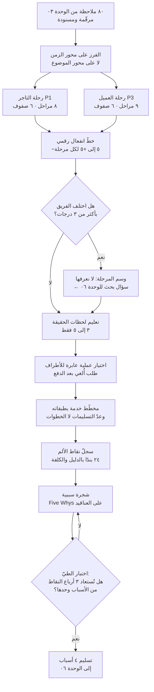
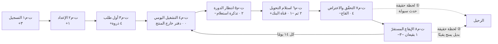
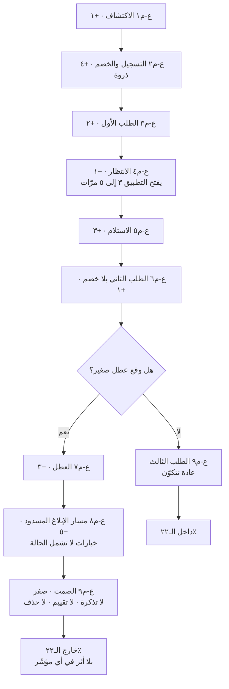
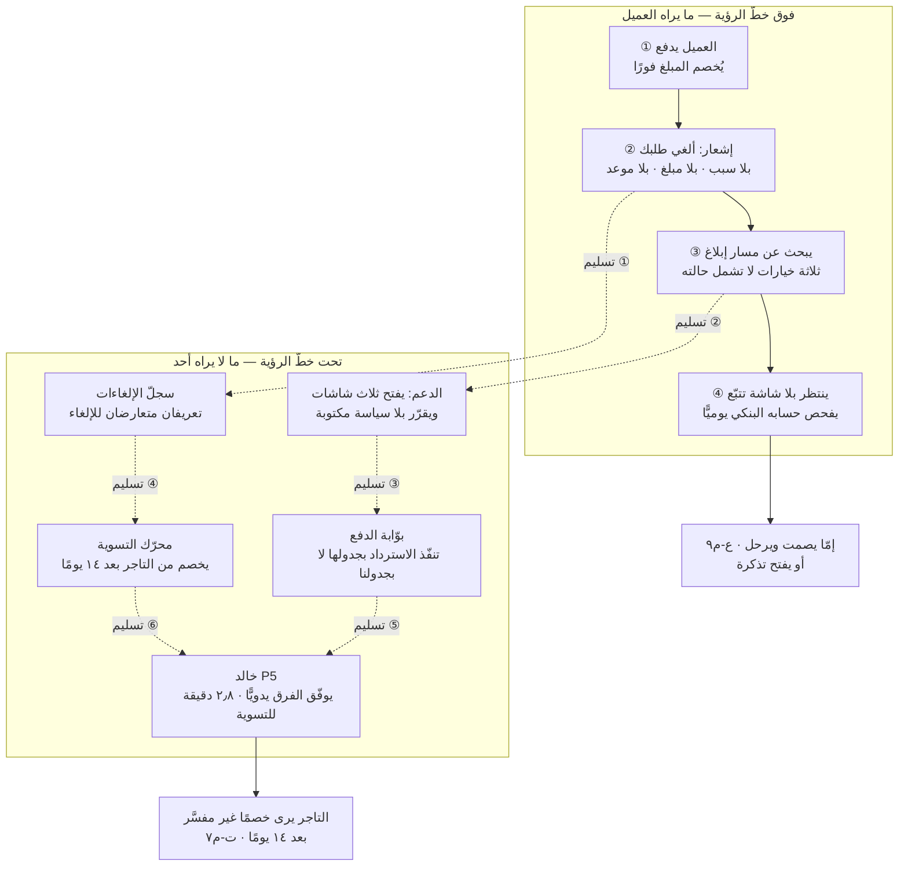
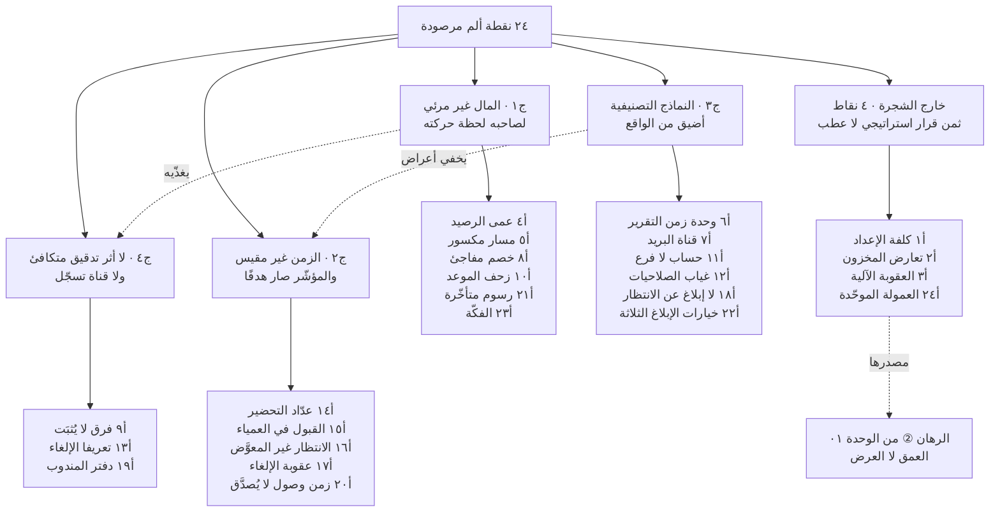
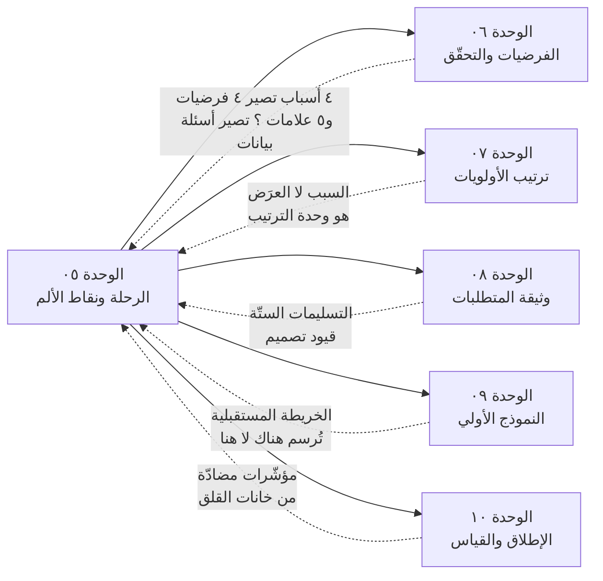

> [!info] الوحدة 05 · ورشة BridgePay
> **هذه الوحدة ترسم ولا تشرح.** تعريف [[User Journey Map|خريطة رحلة المستخدم]] وطبقات [[Service Blueprint|مخطّط الخدمة]] وتصنيف [[Pain Point|نقاط الألم]] موجودة كاملةً في المعجم، وفلسفة الانتقال من العرَض إلى المشكلة مشروحة في [[02 - فلسفة إدارة المنتج|الفصل ٠٢ من المرجع]] (القسم الخامس: فضاء المشكلة وفضاء الحل، والقسم الرابع عشر: `Five Whys`). لن نعيد شيئًا من ذلك.
>
> ما نفعله هنا: **نرسم رحلتين كاملتين ومخطّط خدمة واحدًا وسجلّ ألم من أربع وعشرين نقطة، ثم نردّ عشرين منها إلى أربعة أسباب**. المخرَج قطعة عمل تُعلَّق على جدار، لا شرحًا لأداة.

# الوحدة 05 — رحلة العميل ونقاط الألم

## ما ورثته من الوحدة السابقة

هذه الوحدة **أكثر الوحدات وراثةً حتى الآن**، لأنها أول وحدة لا تنتج معرفة جديدة عن المستخدم، بل **تعيد ترتيب ما نعرفه على محور الزمن**. وكل ما فيها مبنيّ على أربع حزم مسمّاة:

### ① من [[00 - ميثاق المشروع ومصدر الحقيقة|الوحدة ٠٠]] — الأرقام الحاكمة

| المعطى | القيمة | أين يُستعمل في هذه الوحدة |
|---|---|---|
| الطلبات اليومية | ٢٬٧٥٠ | أساس كل تقدير لتكرار نقطة الألم |
| متوسّط قيمة الطلب | ٧٤ ريالًا | عتبة «هل يستحقّ الأمر شكوى؟» عند العميل |
| العمولة | ١٢٪ | كلفة الطلب المفقود على المنصّة |
| دورة التسوية | ١٤ يومًا | العمود الفقري لرحلة التاجر — الرحلة **دورية** لا خطّية |
| الدفع عند الاستلام | ٣٨٪ | شرط أساسي في مخطّط خدمة «طلب أُلغي بعد الدفع» |
| تذاكر الدعم شهريًّا | ٤٬٩٠٠ · منها ٣١٪ «أين مستحقّاتي؟» | وحدة قياس كلفة نقطة الألم عند التاجر |
| احتفاظ العميل (الشهر ٣) | ٢٢٪ | نقطة التسرّب التي يجب أن تفسّرها رحلة P3 |
| احتفاظ التاجر (الشهر ٦) | ٧١٪ | يفسّر لماذا رحلة التاجر **مؤلمة ومستمرّة** في آن |
| التجّار المفعَّلون / النشطون | ٤١٠ / ٢٦٣ | قمع التاجر: ١٤٧ فعّلوا ثم خمدوا |
| العملاء المسجّلون / النشطون | ٨٧٬٤٠٠ / ١٩٬٢٠٠ | قمع العميل |
| الفريق | ٩ مهندسين · ٦ دعم · دورة أسبوعان | يحدّ ما نستطيع إصلاحه من نقاط الألم |

### ② من [[01 - رؤية المنتج واستراتيجيته|الوحدة ٠١]] — القيد الاتّجاهي

الرؤية المعتمدة: **«ألّا يسأل أحدٌ في هذه السوق: أين مالي؟»** — ومعناها في هذه الوحدة قيدٌ صريح على الترجيح: نقطة الألم التي تقع على **مسار المال** تُرجَّح على نظيرتها في الشدّة إن وقعت خارجه. ولهذا سيرى القارئ أن سجلّ الألم أدناه **ليس مرتّبًا بالشدّة وحدها**، بل بالشدّة × التكرار × القرب من مسار المال.

كما ورثنا **الرهان ②: العمق لا العرض** — وهو الرهان الذي سيفسّر، في نهاية هذه الوحدة، لماذا أربع نقاط ألم من أربع وعشرين **لا تدخل الشجرة السببية أصلًا**، لأنها ليست عطبًا بل **ثمنًا معلومًا لقرار استراتيجي اتُّخذ في الوحدة ٠١**.

### ③ من [[02 - السوق والمنافسون|الوحدة ٠٢]] — تعريف الملعب

السوق الذي نلعب فيه صار **«الطبقة المالية للتاجر»** لا «التوصيل». وأثر ذلك هنا مباشر: مخطّط الخدمة الذي سنبنيه ليس «رحلة توصيل طلب»، بل **«رحلة ريال واحد»** — من لحظة دفعه إلى لحظة استقراره في حساب صاحبه أو رجوعه إلى دافعه.

وسؤالان مفتوحان سُلّما من الوحدة ٠٢ وأُجيب عنهما في الوحدة ٠٣، ويُستعملان هنا بوصفهما **مسلّمتين**:
- ألم التاجر **عدم اليقين** لا الانتظار (النمط ن-٤).
- رحيل ٧٨٪ من العملاء ليس غضبًا، بل **غياب سبب للبقاء** (النمط ن-٧).

### ④ من [[03 - الاكتشاف والبحث الميداني|الوحدة ٠٣]] و[[04 - الشخصيات والمهام|الوحدة ٠٤]] — المادّة الخام

| ما ورثته | ماذا يصير هنا |
|---|---|
| **٨٠ ملاحظة مرقّمة (م١–م٨٠)** | **عمود الدليل** في سجلّ نقاط الألم. لا تدخل نقطة ألم السجلّ بلا رقم ملاحظة أو رقم من الميثاق |
| **١٢ نمطًا (ن-١ … ن-١٢) بقوّة دليل معلَنة** | مرشّحات **الأسباب الجذرية** — والنمط الضعيف يبقى ضعيفًا هنا ولا يترقّى بالرسم |
| **ثلاثة اكتشافات** | الاكتشاف الثالث (حلقة «جاهز») هو **نواة السبب الجذري ج٢** |
| **P1 سعد وP3 فيصل** | صاحبا الرحلتين — والاختيار **محسوم في الوحدة ٠٤ ولا يُعاد فتحه** |
| **خرائط البدائل الخمس** | كل بديل = **مرحلة مكسورة**. دفتر سعد يشير إلى مرحلة، ومجموعة واتساب ماجد إلى أخرى |
| **جدول التعارض T1–T6** | كل تعارض يقع في **تقاطع رحلتين** — وهي أخصب مواضع الألم |
| **حقل «ما الذي يجعله يترك»** | يتحوّل إلى **لحظات الحقيقة** على الخريطة |
| **الحسابات الأوّلية الستّة** | ترجيح الألم بالحجم لا بالانطباع |

### حسابات جديدة تُشتقّ هنا لأول مرّة

كل رقم أدناه **مشتقّ بحساب معروض** من الميثاق أو من وحدة سابقة. ولن يرد في هذه الوحدة رقم بلا سطر حساب.

| الرمز | المشتقّ | الحساب | القيمة |
|---|---|---|---|
| **د١** | التذاكر لكل موظّف دعم شهريًّا | ٤٬٩٠٠ ÷ ٦ | **٨١٧ تذكرة/موظّف** |
| **د٢** | الدقائق المتاحة لكل تذكرة | (٢٢ يوم عمل × ٨ ساعات × ٦٠) ÷ ٨١٧ | **١٢٫٩ دقيقة/تذكرة** |
| **د٣** | زمن الدعم المستهلَك في «أين مستحقّاتي؟» | ١٬٥١٩ × ١٢٫٩ دقيقة | **١٩٬٥٩٥ دقيقة = ٣٢٧ ساعة/شهر ≈ ١٫٨٦ موظّف بدوام كامل** |
| **د٤** | التسجيلات الشهرية (متوسّط) | ٨٧٬٤٠٠ ÷ ١٤ شهرًا | **٦٬٢٤٣ تسجيلًا/شهر** |
| **د٥** | العملاء المفقودون قبل الشهر الثالث | ٦٬٢٤٣ × ٧٨٪ | **٤٬٨٧٠ عميلًا/شهر** |
| **د٦** | لو أُنقذ ١٠٪ منهم فقط | ٤٨٧ عميلًا × ٤٫٣ طلب | **٢٬٠٩٤ طلبًا/شهر** = ٢٫٥٪ من ٨٢٬٥٠٠ |
| **د٧** | عمولة هذه الطلبات | ٢٬٠٩٤ × ٨٫٨٨ ريال | **١٨٬٥٩٥ ريالًا/شهر** |
| **د٨** | التجّار الذين فعّلوا ثم خمدوا | ٤١٠ − ٢٦٣ | **١٤٧ تاجرًا (٣٦٪)** |
| **د٩** | متوسّط زمن الطلب عند المندوب | ٩ ساعات ÷ ٢٤ طلبًا (م٥٨) | **٢٢٫٥ دقيقة/طلب شاملة الانتظار** |
| **د١٠** | حصّة الانتظار من يوم المندوب | ٢٫٥ ساعة ÷ ٩ ساعات (م٦٥) | **٢٨٪ — تقدير ذاتي غير مقيس** |

> [!warning] معطًى غير موجود في الميثاق — وكيف تعاملت معه
> **الميثاق لا يذكر معدّل إلغاء الطلبات.** وهو معطًى لا يمكن اشتقاقه من شيء موجود: لا من التذاكر (لأن التذاكر تقيس الشكوى لا الحدث)، ولا من الاحتفاظ. ولذلك اتّخذت في هذه الوحدة **قرارًا منهجيًّا معلَنًا**:
> **①** مخطّط الخدمة أدناه مبنيّ على **الحادثة الواحدة**، لا على حجم شهري — وهذا هو الاستعمال الصحيح للأداة أصلًا.
> **②** وحيث لزم حجم (لتقدير الكلفة)، عرضتُ **ثلاثة سيناريوهات حسّاسية معلَنة** بدل رقم واحد كاذب: عند ١٪ = ٨٢٥ طلبًا/شهر، وعند ٢٪ = ١٬٦٥٠، وعند ٣٪ = ٢٬٤٧٥ (من ٨٢٬٥٠٠ طلبًا شهريًّا).
> **③** ووسمتُ الرقم في سجلّ الألم بعلامة **`؟`** ليبقى ظاهرًا أنه مجهول لا مقدَّر.
> والقاعدة التي أعمل بها: **الرقم المجهول المعلَن أنفع من الرقم المخترَع الجميل** — لأن الأول يولّد سؤال بيانات في الوحدة ٠٦، والثاني يولّد قرارًا خاطئًا في الوحدة ٠٧.

## السؤال الذي تجيب عنه هذه الوحدة

> **في أي دقيقة بالضبط — من أي مرحلة — يُصنع الألم؟ ومن يملك تلك الدقيقة داخل منظّمتنا؟**

لاحظ الشطر الثاني. خريطة الرحلة التي تنتهي عند «العميل محبَط هنا» **لم تُنجز نصف عملها**. فالإحباط ليس قرارًا قابلًا للتنفيذ؛ القرار القابل للتنفيذ هو: *«الدقيقة ٤١ بعد الطلب، الخطوة يملكها محرّك التسوية، والمالك التنظيمي فريق المدفوعات، والعطب أن الحدث لا يُكتب في سجلّ يراه التاجر.»* ولهذا فإن هذه الوحدة تنتج **أداتين لا أداة**: خريطة رحلة تقول أين يتألّم، ومخطّط خدمة يقول **ما الذي في آلتنا يُنتج الألم ومن مالكه**.

وثلاثة أسئلة فرعية:

1. **لماذا يبقى ألم التاجر مستمرًّا رغم أنه معروف؟** أي: ما الذي يجعل نقطة الألم **دورية** لا عارضة — وهل يمكن أن تكون الدورية نفسها هي التشخيص؟
2. **أين يقع التسرّب في رحلة العميل بالضبط؟** لا «في الشهر الثالث» — بل في أي **خطوة** داخل أي **طلب**.
3. **كم نقطة ألم من الأربع والعشرين مستقلّة فعلًا؟** لأن الفريق الذي يعالج أربعًا وعشرين نقطة يعالج أربعًا وعشرين عرَضًا، والفريق الذي يعالج أربعة أسباب يُطفئ عشرين نقطة بأربعة قرارات. راجع [[Root Cause Analysis|تحليل السبب الجذري]].

> [!note] معيار قبول هذه الوحدة
> **أن ينخفض عدد بنود العمل المرشَّحة، لا أن يرتفع.** خريطة الرحلة التي تخرج بأربعين مطلبًا جديدًا لم تُشخّص شيئًا؛ هي **قائمة أمنيات مرسومة بألوان**. والخريطة الناجحة تخرج بعدد أسباب **أقلّ** من عدد الأعراض التي دخلت بها. هذا هو الفرق العملي الوحيد بين الخريطة والملصق.

## العمل خطوة بخطوة

الزمن الإجمالي: **١٨٠ دقيقة**، قابلة للتقسيم على جلستين (الرحلتان في الأولى، والمخطّط والشجرة في الثانية). وتُنفَّذ فرديًّا في ١٣٠ دقيقة بحذف الخطوتين ٤ و٩ الجماعيّتين.

| # | الخطوة | ماذا تفعل حرفيًّا | الزمن |
|---|---|---|---|
| ١ | **حدّد نطاق الرحلة قبل رسمها** | اكتب على الجدار جملة واحدة: «من [حدث البداية] إلى [حدث النهاية]». لرحلة التاجر: **من التسجيل إلى استقرار الدورة الشهرية**. للعميل: **من الاكتشاف إلى الطلب الثالث**. الخريطة بلا حدَّين تتمدّد إلى أن تصير عديمة النفع — وهذا أشيع أعطاب التمرين. | ١٠ د |
| ٢ | **افرد الملاحظات على محور الزمن لا على محور الموضوع** | خذ م١–م٨٠ من الوحدة ٠٣ وضع كل ملاحظة عند **اللحظة التي وقعت فيها**، لا تحت العنوان الذي تشبهه. م٧ (فرق ١٬٥٠٠ ريال) ليست «مشكلة تقارير»، هي **حدث يقع في اليوم ١٥**. الفرز الموضوعي يخفي التسلسل، والتسلسل هو كل ما نبحث عنه. | ٢٥ د |
| ٣ | **املأ الصفوف الستّة لكل مرحلة** | الأفعال · الأفكار · المشاعر · نقاط التماسّ · القنوات · المدّة. **ابدأ بالأفعال وانتهِ بالمشاعر** — لأن المشاعر يسهل تأليفها والأفعال لا. وكل شعور تكتبه يجب أن يكون **مسنودًا بفعل في الصفّ نفسه**؛ فإن لم تجد فعلًا يسنده، احذف الشعور. | ٣٥ د |
| ٤ | **ارسم خطّ الانفعال بالأرقام لا بالخطّ** *(جماعي)* | اطلب من كل مشارك أن يعطي كل مرحلة درجة من **−٥ إلى +٥** منفردًا، ثم اعرض الدرجات. **الخلاف في الدرجة أنفع من الاتّفاق عليها**: كل مرحلة اختلف عليها الفريق بأكثر من ٣ درجات هي مرحلة **لا نعرفها**، وتُوسَم للبحث. الرسم بالقلم يخفي هذا الخلاف تمامًا. | ٢٠ د |
| ٥ | **علّم لحظات الحقيقة** | ليست كل مرحلة متساوية. لحظة الحقيقة هي التي **يتقرّر عندها البقاء أو الرحيل**، وتُستخرج من حقل «ما الذي يجعله يترك» في بطاقات الوحدة ٠٤ لا من الحدس. علّم منها ٣–٥ فقط؛ من يعلّم عشرًا لم يعلّم شيئًا. | ١٠ د |
| ٦ | **اختر عملية واحدة عابرة للأطراف وابنِ لها مخطّط خدمة** | لا تبنِ مخطّطًا لكل شيء. اختر **العملية التي تمسّ أكبر عدد من الأطراف** — وهي هنا «طلب أُلغي بعد الدفع» (خمسة أطراف). ثم انزل بالطبقات: أدلّة · أفعال العميل · واجهة أمامية · **خطّ الرؤية** · واجهة خلفية · أنظمة دعم. | ٣٠ د |
| ٧ | **عدّ التسليمات لا الخطوات** | في المخطّط، ضع دائرة على كل **عبور لخطّ** (`Handoff`). ثم اسأل عند كل دائرة: من يملك ما بعدها؟ وكم تستغرق؟ وهل يعلم الطرف السابق أنها وقعت؟ **الأعطاب تسكن التسليمات لا الخطوات**، لأن التسليم هو حيث تنتهي مسؤولية طرف قبل أن تبدأ مسؤولية آخر. | ١٥ د |
| ٨ | **حوّل كل احتكاك إلى بند مرقّم في السجلّ** | لكل نقطة: الطرف · المرحلة · الشدّة (١–٥) · التكرار (بحساب) · الدليل (رقم ملاحظة أو رقم ميثاق) · **عرَض أم سبب** · الكلفة (بتذاكر أو طلبات مفقودة). البند بلا دليل يُحذف، والبند بلا كلفة يُؤجَّل. | ٣٠ د |
| ٩ | **اسأل «لماذا» خمس مرّات على كل عنقود** *(جماعي)* | خذ نقاط الألم التي تشترك في **الآلية** لا في الشعور، واصعد بها. توقّف عند أول مستوى **تملك فيه قرارًا**؛ فالصعود إلى «لأن الشركة لا تستثمر كفاية» صعود صحيح منطقيًّا وعديم النفع عمليًّا. راجع [[Root Cause Analysis]]. | ٢٠ د |
| ١٠ | **اختبار الطيّ** | اطوِ سجلّ نقاط الألم وأخفِه، ثم اطلب من الفريق أن يستنتج من **شجرة الأسباب وحدها** أكبر عدد ممكن من النقاط. إن لم تُستعَد ثلاثة أرباعها، فالشجرة **تصنيف لا تفسير** — وأعد الخطوة ٩. | ١٥ د |



> [!tip] لماذا رُتّبت الخطوات هكذا تحديدًا؟
> لأن **الترتيب المعاكس هو الخطأ الشائع**: أن تبدأ بمخطّط الخدمة (لأنه يبدو أذكى) قبل خريطة الرحلة. والنتيجة مخطّط دقيق لعملية **لا نعرف أنها مؤلمة**. الرحلة تحدّد **أين** نحفر، والمخطّط يحفر. ومن حفر قبل أن يحدّد، أنتج وثيقة تشغيلية جميلة عن خطوة لا تهمّ أحدًا. هذا التسلسل منصوص عليه في [[Service Blueprint|مدخل مخطّط الخدمة في المعجم]]: *«رحلة أولًا لتحديد الألم، ثم مخطّط للخطوة أو الخطوتين الأشدّ ألمًا.»*

## المخرَج

هذا هو القسم الطويل. خمس قطع: خريطة رحلة التاجر، ثم خريطة رحلة العميل، ثم مخطّط الخدمة، ثم سجلّ نقاط الألم، ثم الشجرة السببية — يليها قمعان وتحليل تقاطع الرحلتين.

> [!note] كيف تُقرأ الخرائط أدناه
> الصفّ الأهمّ ليس «المشاعر» بل **«نقاط التماسّ والقنوات»**. لأن الشعور نتيجة، ونقطة التماسّ **سبب نملكه**. وحين تجد شعورًا سلبيًّا شديدًا مقابل خانة تماسّ فارغة — فقد وجدت أثمن ما في الخريطة كلها: **مرحلة يمرّ بها المستخدم ولا نوجد فيها**. وهذه المراحل هي التي تفسّر لماذا يبني المستخدم دفترًا، ولماذا يسأل جاره، ولماذا يرحل بلا كلمة.

---

### القطعة ① — خريطة رحلة التاجر (P1 · سعد)

**النطاق:** من ضغط زرّ التسجيل إلى استقرار الإيقاع الشهري بعد ثلاث دورات تسوية.
**الفرضية الهيكلية:** رحلة التاجر **ليست خطًّا، بل حلقة**. تبدأ خطّيةً (تسجيل ← إعداد ← أول طلب ← أول تحويل) ثم تدخل في **دورة مغلقة كل ١٤ يومًا** تتكرّر حتى الرحيل أو حتى نصلحها. وهذا وحده يفسّر رقم الميثاق: ٢٫٧ تذكرة لكل تاجر في كل دورة (الوحدة ٠٤) — رقم لا يمكن أن ينتجه ألم عارض، ولا ينتجه إلا **ألم دوري مبنيّ في التصميم**.

#### المرحلة ت-م١ — التسجيل والتفعيل (اليوم ٠ إلى اليوم ٣)

| الصفّ | المحتوى |
|---|---|
| **الأفعال** | يستقبل مندوب مبيعات · يوقّع · يرسل السجلّ التجاري والرقم الضريبي وصورة الحساب البنكي · ينتظر التفعيل |
| **الأفكار** | «قناة زيادة، ما تضرّ» · «العمولة اثنا عشر، معروفة من البداية» · «متى أبدأ أستقبل؟» |
| **المشاعر** | تفاؤل حذر · بعض التوجّس من الأوراق |
| **نقاط التماسّ** | مندوب المبيعات (بشري) · نموذج التسجيل · رسالة تأكيد التفعيل |
| **القنوات** | زيارة ميدانية · واتساب · بريد إلكتروني |
| **المدّة** | ١–٣ أيام |
| **الدليل** | مقابلة ت٣: «جاني مندوب مبيعات منكم… قال لي: مستحضرات التجميل والفيتامينات تنباع زين على التطبيق» |

**قراءة المرحلة.** هذه أفضل مرحلة في الرحلة كلها، وهي المرحلة الوحيدة التي **فيها إنسان يعرف اسمه**. وهذا ليس مديحًا بل تشخيصًا: كلّما ارتفع الانفعال في المرحلة التي يوجد فيها بشر وانخفض في المراحل الرقمية، عرفت أن **المنتج لم يستوعب بعدُ ما يفعله البشر عنه**. وسنرى هذا النمط يتكرّر ثلاث مرّات في هذه الوحدة: مندوب المبيعات هنا، وموظّف الدعم في المرحلة ت-م٧، ورسائل واتساب من عمر في الاكتشاف الثاني.

**وعدٌ يُقطع هنا ويُصرَف بعد ١٤ يومًا.** مندوب المبيعات يتكلّم عن **الطلبات**، ولا أحد في هذه المرحلة يشرح للتاجر **كيف سيعرف ماله**. وهذا ليس نسيانًا من المندوب: هو لا يستطيع شرح ما لا يوجد. فأول فجوة في الرحلة تُفتح في اليوم الأول، ولا تُشعَر إلا في اليوم الخامس عشر.

#### المرحلة ت-م٢ — الإعداد وإدخال القائمة (اليوم ٣ إلى اليوم ٦)

| الصفّ | المحتوى |
|---|---|
| **الأفعال** | يصوّر الأصناف · يدخل الأسماء والأسعار والأوصاف · يضبط أوقات العمل ونطاق التوصيل · يجرّب طلبًا وهميًّا |
| **الأفكار** | «هذا شغل يوم كامل» · «الصور لازم تكون حلوة» · «كم صنف أدخل؟» |
| **المشاعر** | إرهاق مبكّر · شعور بالاستثمار («دفعت لمصوّر») |
| **نقاط التماسّ** | لوحة التاجر · شاشة إدخال الأصناف · دعم التفعيل |
| **القنوات** | ويب · تطبيق التاجر |
| **المدّة** | ٣–٥ ساعات للمطعم · **٣ ليالٍ لغير المطعمي** |
| **الدليل** | م٢٢: «أربعمية وشي صنف… جلسنا ثلاث ليالي بعد الدوام» · م٨: صور دفع ثمنها بمصوّر |

**قراءة المرحلة — وهنا يولد أخطر أصل في الرحلة كلها: [[Switching Cost|كلفة التحوّل]].**
كل دقيقة يقضيها التاجر هنا **تصير لاحقًا قيدًا يمنعه من المغادرة**. الصور المدفوعة، والأصناف المدخلة، والتقييمات التي ستتراكم (١٤٠ تقييمًا عند ت١، م٨). ومن هنا يأتي الجواب على السؤال الذي حيّر الميثاق: **لماذا يشتكي ويبقى؟** لأنه دفع ثمن البقاء **قبل أن يعرف ثمن الألم**.

> [!warning] الوجه المزدوج لكلفة التحوّل — ولماذا لا يجوز الاحتفال بها
> احتفاظ ٧١٪ يبدو إنجازًا، وهو في جزء كبير منه **أسر لا ولاء**. والفرق عملي لا أخلاقي فقط: الولاء يُنتج توصية وتوسّعًا وتحمّلًا للأخطاء؛ والأسر يُنتج **انتظارًا لأول بديل**. ومنافس يعرض «انقل قائمتك وتقييماتك في يوم» لا يهاجم ميزاتنا، بل **يهاجم القفل** — وهذا أرخص هجوم في السوق وأشدّه أثرًا. ولهذا فإن قراءة ٧١٪ بوصفها رضًا هي [[Vanity Metrics|قراءة غرور]]، والقراءة الصحيحة: **٧١٪ هو الوقت المتبقّي لنا، لا الرصيد الذي كسبناه.**

#### المرحلة ت-م٣ — أول طلب (اليوم ٦ إلى اليوم ٨)

| الصفّ | المحتوى |
|---|---|
| **الأفعال** | يسمع الصوت · يقبل · يجهّز · يضغط «جاهز» · يسلّم للمندوب |
| **الأفكار** | «اشتغلت!» · «كم راح تجيني في اليوم؟» |
| **المشاعر** | **ذروة إيجابية** — أعلى نقطة في الرحلة كلها |
| **نقاط التماسّ** | إشعار الطلب · شاشة القبول · **عدّاد التحضير** · شاشة تسليم المندوب |
| **القنوات** | تطبيق التاجر · جهاز الطلبات |
| **المدّة** | ٢٠–٣٥ دقيقة للطلب الواحد |
| **الدليل** | الميثاق: ١٠٫٥ طلب/تاجر نشط/يوم · م١٠: العدّاد يضغط منذ الطلب الأول |

**قراءة المرحلة.** المنتج هنا **يعمل كما وُعد** — وهذه حقيقة يجب أن تُقال، لأن خريطة الرحلة التي كلّها أحمر خريطة غير أمينة، ولا يصدّقها الفريق الهندسي، وفقدان تصديقه أغلى من أي نقطة ألم فيها. الطلبات تصل، والقبول يعمل، والتسليم يتمّ.

**لكن العدّاد يبدأ هنا.** في الطلب الأول نفسه يواجه سعد عدّاد تحضير **لا يفرّق بين المندي والبروستد** (م١٠: «العدّاد ما يفرّق بين المطعم اللي يحضّر في عشر دقايق واللي يحضّر في خمس وعشرين»). فيتعلّم في الأسبوع الأول سلوكًا سيرافقه سنة: **الضغط على «جاهز» قبل الجهوزية**. وهذه ليست نقطة ألم عند سعد أصلًا — هو **حلّها**؛ إنها نقطة ألم عند ماجد وفيصل. وهذا أول ظهور للقاعدة التي ستحكم هذه الوحدة: **ألم كل طرف مصنوع بحلّ طرف آخر.**

#### المرحلة ت-م٤ — التشغيل اليومي (اليوم ٨ إلى اليوم ١٤)

| الصفّ | المحتوى |
|---|---|
| **الأفعال** | يستقبل ~٨ طلبات يوميًّا · **يفتح دفترًا آخر الليل ويجمع** · يخصم ١٢٪ ذهنيًّا · يصوّر شاشة الطلبات لمحاسبه |
| **الأفكار** | «كم صار لي إلى الآن؟» · «الدفتر أوثق من التطبيق» |
| **المشاعر** | حياد يميل إلى القلق المنخفض المستمرّ |
| **نقاط التماسّ** | قائمة الطلبات · شاشة التقارير (شهرية) · **لا شاشة رصيد** |
| **القنوات** | تطبيق التاجر · **دفتر ورقي (خارج المنتج)** · حاسبة الجوّال · واتساب مع المحاسب |
| **المدّة** | ٥–١٠ دقائق يوميًّا خارج المنتج |
| **الدليل** | م١: «عندي دفتر… أجمعهم وأنقص منهم اثنا عشر بالمية» · م٢: أربع خطوات وأربع ثوانٍ ثم خروج بلا نتيجة · م٣: «هذي تعطيني الشهر… أنا أبي من آخر تحويل لين اليوم» |

> [!example] المرحلة التي فيها نقطة تماسّ **فارغة** — وهي أثمن خانة في الخريطة
> لاحظ صفّ «نقاط التماسّ»: **لا شاشة رصيد**. المستخدم في هذه المرحلة يؤدّي مهمّة يومية (`JTBD-1`: أن يعرف كم له) **خارج منتجنا بالكامل**. وحين تكون خانة التماسّ فارغة والمهمّة قائمة، فأنت لا تنظر إلى «فرصة تحسين»، بل إلى **مساحة احتلّها بديل**. والبديل هنا دفتر ورقي — ولا يُهزَم بميزة أجمل، بل بشيء **أوثق من الدفتر**.
>
> ولاحظ م٢ تحديدًا: المسار موجود لكنه **مكسور** لا مفقود. أربع خطوات وأربع ثوانٍ تحميل وخروج بلا نتيجة. والفرق بين «مفقود» و«مكسور» يغيّر الحلّ كلّيًّا: المفقود يحتاج بناءً، والمكسور يحتاج **إعادة تعريف لوحدة العرض** — سعد يريد «من آخر تحويل لين اليوم»، ونحن نعطيه «الشهر التقويمي» (م٣). وهذا ليس عطبًا هندسيًّا، بل **عطب في النموذج التصنيفي** — وسيتكرّر ستّ مرّات في سجلّ الألم أدناه.

#### المرحلة ت-م٥ — انتظار الدورة (اليوم ١٠ إلى اليوم ١٤)

| الصفّ | المحتوى |
|---|---|
| **الأفعال** | **يفتح تذكرة دعم قبل موعد التحويل لا بعده** · يسأل «كم لي عندكم؟» · يسأل تاجرًا مجاورًا |
| **الأفكار** | «مورّد اللحم يجي السبت ويبي كاش» · «إذا ما عرفت الرقم، أقول له الأسبوع الجاي» |
| **المشاعر** | **قلق تصاعدي مرتبط بالتقويم** — يبلغ ذروته قبل يومين من التسوية |
| **نقاط التماسّ** | موظّف الدعم · مركز المساعدة · **شبكة التجّار الأقران** |
| **القنوات** | هاتف · واتساب · تذكرة |
| **المدّة** | ٤٨ ساعة من التوتّر المتصاعد كل دورة |
| **الدليل** | م٤: ٤ من ٥ اتّصالات موضوعها «كم لي» · م٥: «أنا ما سألت متى، أنا سألت كم» · **م٧٣: عمر يتنبّأ بموضوع التذاكر قبل يومين بالنظر إلى التقويم** |

**قراءة المرحلة — الدليل البنيوي.** م٧٣ ليست ملاحظة لطيفة؛ هي **أقوى دليل في الوحدة كلها**. حين يستطيع موظّف دعم أن يتنبّأ بموضوع الشكوى قبل يومين بالنظر إلى التقويم، فقد ثبت أن الشكوى **دالّة في تصميم النظام** لا في جودة الخدمة. والشكوى التي يتنبّأ بها التقويم لا تُعالَج بموظّف دعم أسرع ولا بقالب ردّ أفضل؛ تُعالَج **بحذف السبب الذي يجعل التقويم يُنتجها**.

**والتذكرة هنا ليست شكوى.** م٧٠ يقول إن ٤ من ٥ تذاكر تُغلق **بمعلومة فقط بلا إجراء**، وم٧٢ يلخّص الدور: «أنا أغلب يومي أقرأ أرقامًا من الشاشة وأكتبها لناس». فالدعم عندنا اليوم **واجهة مستخدم بشرية** لبيانات موجودة في نظامنا ولا يصل إليها صاحبها. وبالحساب د٣: هذه الواجهة البشرية تكلّفنا **٣٢٧ ساعة شهريًّا ≈ ١٫٨٦ موظّف بدوام كامل**.

#### المرحلة ت-م٦ — استلام التحويل (اليوم ١٤ · لحظة واحدة)

| الصفّ | المحتوى |
|---|---|
| **الأفعال** | يستلم رسالة البنك · يقارنها بالدفتر فورًا |
| **الأفكار** | «وصل» ← ثم: «كم؟» ← ثم: «ليه ناقص؟» |
| **المشاعر** | ارتياح لحظي **يعقبه سقوط حادّ** إن اختلف الرقم |
| **نقاط التماسّ** | **رسالة البنك — وهي نقطة تماسّ لا نملكها** · إشعار المنصّة (غير موجود؛ «تنبيه عند التحويل» بند مطلوب في القائمة الخام) |
| **القنوات** | رسالة نصّية من البنك · دفتر التاجر |
| **المدّة** | ٩٠ ثانية تحسم انطباع الدورة كلها |
| **الدليل** | الميثاق (السطر الحاسم لـP1): «لا يعرف رصيده إلا حين يصل التحويل» · القائمة الخام: «تنبيه عند التحويل» مطلوب ولم يُبنَ |

> [!danger] لحظة الحقيقة الأولى — ونقطة تماسّ يملكها **البنك** لا نحن
> اقرأ صفّ نقاط التماسّ مرّة أخرى: **أهمّ لحظة في علاقة التاجر بنا تصل إليه عبر قناة ليست لنا**. البنك هو من يبشّره، وهو من يخبره بالرقم، ونحن **غائبون عن أهمّ تسعين ثانية في الأسبوعين**. وهذا وحده يفسّر لماذا لا يشعر سعد بأننا مصدر ماله: **لأننا لسنا كذلك في تجربته**؛ نحن مصدر الطلبات، والبنك مصدر المال.
>
> والحلّ هنا **رخيص إلى حدّ الإحراج**: إشعار يسبق رسالة البنك بساعة، فيه الرقم وسببه. والدليل على رخصه أنه **يعمل فعلًا منذ خمسة أشهر** يدويًّا عبر واتساب لاثني عشر تاجرًا (م٧٧) — أي أن المنصّة تملك [[Concierge MVP|نموذج خادم شخصي]] مختبَرًا ولا تعلم.

#### المرحلة ت-م٧ — التحقّق والاعتراض (اليوم ١٤ إلى اليوم ١٧)

| الصفّ | المحتوى |
|---|---|
| **الأفعال** | يعيد العدّ من الدفتر · يتّصل بالدعم · يُطلب منه انتظار كشف · يصله الكشف بريدًا بعد ٣ أيام · **لا يفتح البريد** · يستسلم |
| **الأفكار** | «أنا حاسب أحد عشر ألف ووصلني تسعة وخمسمية» · «ما عندي طريقة أثبت» |
| **المشاعر** | **أدنى نقطة في الرحلة كلها**: غبن + عجز عن الإثبات |
| **نقاط التماسّ** | موظّف الدعم · **البريد الإلكتروني (قناة ميتة)** · لا شاشة اعتراض داخل المنتج |
| **القنوات** | هاتف · بريد إلكتروني |
| **المدّة** | ٣ أيام تنتهي بلا حسم |
| **الدليل** | م٧: «وصلني كشف بعد ثلاثة أيام في الإيميل. أنا ما أفتح الإيميل» · «تعبت وتركتها… دفتري مو عندهم، وحسابهم مو عندي» |

**قراءة المرحلة — [[Audit Trail|انعدام تكافؤ الدليل]].** ألف وخمسمائة ريال لم تُحسم، **ليس لأن أحدهما مخطئ**، بل لأن أحدهما لا يستطيع الإثبات. والتاجر لا يخسر المال فقط في هذه اللحظة؛ يخسر **الاعتقاد بأن الإثبات ممكن**. وهذه خسارة أعمق، لأنها تُنهي الاعتراضات المستقبلية — فيبدو النظام في لوحاتنا **أهدأ بينما هو في الواقع أسوأ**.

ولاحظ أنّ العطب هنا **متماثل عند الطرفين**: خالد (P5) أيضًا لا يستطيع الإثبات — يرسل لقطة شاشة من ملفّه الشخصي (بطاقة P5، الوحدة ٠٤). فليست المشكلة أن التاجر ضعيف الأدوات؛ **المشكلة أن النظام لا يُنتج دليلًا أصلًا**، فيتحاجّ الطرفان بذاكرتين.

**والقناة أيضًا مكسورة.** الكشف يصل بريدًا إلكترونيًّا إلى رجل قال حرفيًّا: «أنا ما أفتح الإيميل». وهذه ليست مشكلة تفضيل، بل **عطب في مطابقة القناة للسلوك**: نرسل الدليل عبر قناة لا يسكنها المستخدم، ثم نسجّل في نظامنا أن «الكشف أُرسل». فيصير لدينا **سجلّ يقول إننا حللنا المشكلة** بينما المستخدم لم يرَ الحلّ. راجع [[Vanity Metrics]].

#### المرحلة ت-م٨ — الإيقاع المستقرّ (من الشهر الثاني فصاعدًا · دورة كل ١٤ يومًا)

| الصفّ | المحتوى |
|---|---|
| **الأفعال** | تتكرّر ت-م٤ ← ت-م٥ ← ت-م٦ ← ت-م٧ **كل ١٤ يومًا بلا تغيّر** · يستقرّ على ٢٫٧ تذكرة لكل دورة |
| **الأفكار** | «هذي طبيعتهم» · «أنا أشتغل على دفتري» |
| **المشاعر** | **تكيّف** — وهو أخطر من الغضب: انفعال منخفض ثابت مع قيعان دورية |
| **نقاط التماسّ** | الدعم (دوريًّا) · شبكة الأقران · الدفتر |
| **القنوات** | كما هي |
| **المدّة** | مستمرّة — ١٤ شهرًا حتى اليوم |
| **الدليل** | الوحدة ٠٤: ٥٫٨ تذكرة/تاجر/شهر · ٢٫٧ لكل دورة · م٧٣: الإيقاع يُتنبّأ به |

> [!quote] لماذا التكيّف أخطر من الغضب
> الغاضب يخبرك. **المتكيّف يبني حولك.** وسعد بعد ثلاث دورات لم يعد يتوقّع منّا الرقم؛ صار يحسبه بنفسه، ويسأل جاره، ويحتفظ بدفتره. وحين يأتي منافس بعد شهور ويقول له: «عندي رصيد لحظي»، لن يسأل سعد: هل هذا أفضل من BridgePay؟ سيسأل: **هل هذا أفضل من دفتري؟** — وهذا سؤال نخسره أسرع.
>
> والدرس المهني: **نقطة الألم التي تُحتمَل تتحوّل بمرور الوقت إلى بنية تحتية بديلة**، وحينها لا يكفي أن تصلحها؛ عليك أن تهدم البديل الذي بناه المستخدم. وهذا أغلى بكثير من الإصلاح المبكّر — وهو الحساب الذي يبرّر لماذا تسبق نقطة ألم «قديمة ومحتمَلة» نقطةَ ألم «جديدة وصاخبة» في الترتيب.

#### خطّ الانفعال — موصوفًا رقميًّا

المقياس من **−٥** (أسوأ لحظة يمكن أن تُنهي العلاقة) إلى **+٥** (لحظة تستحقّ التوصية). والقيم أدناه **متوسّط تقدير الفريق** بعد الخطوة ٤ من قسم العمل، ومعها **مدى الخلاف** — لأن الخلاف نفسه معلومة.

| المرحلة | العنوان | الدرجة | المدى | الشكل | ملاحظة على الرقم |
|---|---|---|---|---|---|
| ت-م١ | التسجيل والتفعيل | **+٣** | ±١ | ▆ | إيجابي **بفضل البشر** لا بفضل المنتج |
| ت-م٢ | الإعداد وإدخال القائمة | **+١** | ±٢ | ▄ | إرهاق يُحتمَل لأنه استثمار |
| ت-م٣ | أول طلب | **+٤** | ±١ | ▇ | **ذروة الرحلة** — المنتج يفي بوعده |
| ت-م٤ | التشغيل اليومي | **٠** | ±١ | ▃ | حياد ظاهري فوق قلق منخفض مستمرّ |
| ت-م٥ | انتظار الدورة | **−٢** | ±١ | ▂ | يتصاعد مع اقتراب التقويم |
| ت-م٦ | استلام التحويل | **+٢** ثم **−١** | ±٣ | ▅▃ | **أعلى مدى خلاف في الجدول** — لأن النتيجة تعتمد على تطابق الرقم |
| ت-م٧ | التحقّق والاعتراض | **−٤** | ±١ | ▁ | **القاع** — غبن + عجز عن الإثبات |
| ت-م٨ | الإيقاع المستقرّ | **−١** بقيعان **−٣** كل ١٤ يومًا | ±٢ | ▃▂▃▂ | **سنّ منشار**، لا خطّ |

**ثلاث قراءات لا تُرى إلا بالأرقام:**

**① السعة الانفعالية للرحلة = ٨ درجات** (من +٤ إلى −٤). وهذا مدى **واسع جدًّا** لعلاقة تجارية متكرّرة. والعلاقات ذات المدى الواسع تُنتج سلوكًا متقلّبًا: التاجر نفسه يوصي بنا في اليوم الثامن ويشتم في اليوم الخامس عشر — وكلا السلوكين صادق.

**② القاع ليس عند الانتظار (−٢) بل عند الاعتراض (−٤).** أي أن **المدّة ليست الجرح**، والدليل رقمي هذه المرّة لا نصّي فقط: لو كانت المدّة هي الجرح لكان القاع في ت-م٥. وهذا يتّسق تمامًا مع م٦ («ما أشتكي من الأربعطعش يوم، أشتكي إني ما أدري») ومع النمط ن-٤. **ورقمان مستقلّان يقولان الشيء نفسه أقوى من اقتباس بليغ واحد.**

**③ المرحلة ت-م٦ هي الأعلى خلافًا (±٣) — وهذا وحده قرار.** حين يختلف الفريق ٣ درجات على مرحلة، فذلك يعني أننا لا نعرف ما يحدث فيها فعلًا. وبحسب قاعدة الخطوة ٤، تُوسَم ت-م٦ **مرحلةً مجهولة**، ويُصاغ لها سؤال بيانات صريح يُسلَّم إلى [[06 - الفرضيات والتحقّق|الوحدة ٠٦]]: *«في أي نسبة من التحويلات يختلف المبلغ الواصل عمّا يتوقّعه التاجر — وبكم؟»* وهذا الرقم غير موجود في الميثاق، ولا يجوز اختراعه، ويجب قياسه قبل أي `PRD`.



---

### القطعة ② — خريطة رحلة العميل (P3 · فيصل)

**النطاق:** من أول ذكر للمنصّة إلى **الطلب الثالث** — وهي النقطة التي تتقرّر عندها العادة أو ينتهي عندها كل شيء.
**الفرضية الهيكلية:** رحلة العميل **ليست حلقة كرحلة التاجر، بل مصفاة**. التاجر مقيّد بكلفة تحوّل تُبقيه داخل الحلقة رغم الألم؛ والعميل غير مقيّد بشيء، فرحلته **تسرّب متتالٍ** ينتهي عند ٢٢٪. ولهذا لا يجوز أن تُرسم الرحلتان بالمنطق نفسه: **الأولى نقيس فيها الألم، والثانية نقيس فيها التسرّب.**

> [!warning] قبل الخريطة — تصحيح ضروري لصياغة السؤال
> الميثاق يعطي **احتفاظًا زمنيًّا** (٢٢٪ في الشهر الثالث)، لا احتفاظًا بعدد الطلبات. وهما ليسا الشيء نفسه. ولذلك: قمع الطلبات أدناه **نموذج معلَن لا معطى مقيس**، بُني بشرط واحد ملزم — أن ينتهي إلى **٢٢٪ عند الشهر الثالث** حتى يبقى متّسقًا مع الميثاق. وكل رقم وسيط فيه (٥٨٪ · ٣٨٪ · ٣٠٪) **افتراض قابل للتكذيب**، ويُسلَّم إلى [[06 - الفرضيات والتحقّق|الوحدة ٠٦]] بوصفه أول ما يُقاس. ومن يبني `PRD` على هذه الأرقام الوسيطة قبل قياسها، يبني على رمل — لكنه رمل **معلَن**، وهذا هو الفرق بين النمذجة والاختلاق.

#### المرحلة ع-م١ — الاكتشاف (قبل التسجيل)

| الصفّ | المحتوى |
|---|---|
| **الأفعال** | يرى إعلانًا أو يسمع من زميل · **يبحث عن مطعم يعرفه بالاسم** · يقارن ذهنيًّا بتطبيق يستعمله أصلًا |
| **الأفكار** | «فيه مطاعم في حيّي ما هي عند غيرهم؟» · «كم رسوم التوصيل عندهم؟» |
| **المشاعر** | فضول محايد — **لا حماسة** |
| **نقاط التماسّ** | الإعلان · المتجر · صفحة المطاعم قبل التسجيل |
| **القنوات** | إعلان رقمي · توصية شخصية · بحث |
| **المدّة** | دقائق |
| **الدليل** | م٤٠: «عندكم مطاعم في حيّنا مو موجودة عند غيركم» — **العامل الوحيد المذكور للبقاء، وهو ميزة عرض لا ميزة منتج** |

**قراءة المرحلة.** الميزة الوحيدة التي ذكرها فيصل بلسانه ليست في المنتج، بل في **الشبكة**: مطاعم حصرية في حيّه. وهذا خبر جيّد وسيّئ معًا. جيّد لأنه أصل دفاعي حقيقي؛ وسيّئ لأنه **قابل للنسخ بعقود** — يكفي أن يتعاقد المنافس مع تلك المطاعم لتزول الميزة في شهر. وهذا يعني أن رحلة العميل اليوم **لا تحتوي على نقطة تفرّد مملوكة لنا**، وهو ما ينبغي أن يُقلق أكثر من أي نقطة ألم في السجلّ.

#### المرحلة ع-م٢ — التسجيل والعرض الأول (اليوم ٠)

| الصفّ | المحتوى |
|---|---|
| **الأفعال** | يسجّل بالجوّال · يدخل العنوان · **يستقبل عرض «الطلب الأول»** · يتصفّح |
| **الأفكار** | «خصم حلو، نجرّب» |
| **المشاعر** | **الذروة الإيجابية للرحلة كلها: +٤** — وهي ذروة **مصنوعة بخصم لا بقيمة** |
| **نقاط التماسّ** | شاشة التسجيل · الخصم الترحيبي · شاشة العناوين |
| **القنوات** | تطبيق العميل · رسالة نصّية |
| **المدّة** | ٣–٦ دقائق |
| **الدليل** | القائمة الخام (الإدارة والتسويق): «كوبونات مستهدَفة» و«برنامج إحالة» · الوحدة ٠٤: الشخصية المضادّة A1 تُصطاد هنا بالضبط |

> [!danger] الذروة المسمومة — ولماذا هي أخطر مرحلة في القمع كله
> أعلى نقطة انفعالية في رحلة العميل تقع في **المرحلة الثانية**، ومصدرها **خصم**. وثلاث نتائج تخرج من هذه الجملة الواحدة:
> **①** كل ما بعدها انحدار **بالضرورة**، لأن السعر التالي أعلى من الأول دائمًا. فنحن نصمّم توقّعًا لا نستطيع الوفاء به بدءًا من الطلب الثاني.
> **②** هذه المرحلة **لا تفرّق بين P3 وA1** (فيصل ومازن). كلاهما يدخل من الباب نفسه، والفارق لا يظهر إلا في الطلب الثاني بلا خصم. وبحساب الوحدة ٠٤: أي كوبون يتجاوز **٨٫٨٨ ريالًا** يجعل الطلب خاسرًا بنيويًّا.
> **③** والأخطر: هذه المرحلة تُنتج **٦٬٢٤٣ تسجيلًا شهريًّا** (د٤) بينما ينجو منها **١٬٣٧٣** فقط إلى الشهر الثالث (٢٢٪). فنحن نموّل شهريًّا اكتساب **٤٬٨٧٠ عميلًا** يختفون (د٥). والسؤال الذي يجب أن يُطرح في اجتماع النموّ ليس «كيف نرفع التسجيلات؟» بل: **«لماذا ننفق على ملء دلو مثقوب؟»** راجع [[Funnel Analysis|تحليل القمع]].

#### المرحلة ع-م٣ — الطلب الأول · قرار الاختيار (٢–٤ دقائق)

| الصفّ | المحتوى |
|---|---|
| **الأفعال** | **يفتح ثلاثة تطبيقات بالتتابع** · يقارن السعر النهائي شاملًا التوصيل · يقرأ زمن الوصول المعلَن · يختار |
| **الأفكار** | «ولائي للسعر» *(قولًا)* · «ذاك مكتوب ٦٥ دقيقة وأنا جوعان» *(فعلًا)* |
| **المشاعر** | تركيز · شعور بالكفاءة («وفّرت») |
| **نقاط التماسّ** | شاشة المطاعم · شاشة السلّة · **شاشة الرسوم — وهي متأخّرة** |
| **القنوات** | ثلاثة تطبيقات متجاورة في الصفّ نفسه |
| **المدّة** | دقيقتان، يعدّهما **عملًا مربحًا** |
| **الدليل** | م٣١: ٣ تطبيقات متجاورة · م٣٢ و م٣٣: **قال «ولائي للسعر» ثم دفع ٣ ريالات زائدة مقابل تقدير وصول يثق به** · م٣٥: رسوم التوصيل الظاهرة سبب خروج متكرّر |

**قراءة المرحلة — أثمن ٣٠ ثانية في وحدة الاكتشاف كلها.** م٣٣ يقلب استراتيجية كاملة: العميل **ليس حسّاسًا للسعر بقدر ما هو حسّاس لمصداقية الوعد**. وقد دفع ١١٪ فوق السعر الأدنى مقابل زمن **يصدّقه**، ثم برّر ذلك بجملة «ما عدت أصدّقه» عن المنافس (م٣٤). ومعنى ذلك عمليًّا أن **دقّة تقدير الوصول أصل تنافسي أرخص من الخصم وأمتن منه**: الخصم يُنسخ في ساعة، والمصداقية تُبنى في أشهر ولا تُنسخ بإعلان.

**وعطب في الترتيب لا في الشاشة.** م٣٥ يقول إن رسوم التوصيل تظهر متأخّرة فيخرج قبل الطلب. وهذه ليست نقطة ألم في «السعر»، بل في **موضع المعلومة على محور الزمن**: العميل بنى قرارًا على رقم، ثم غُيّر الرقم بعد أن بناه. وهذا — لاحظ — **العطب نفسه** الذي يعانيه سعد في ت-م٦: رقم يُبنى عليه ثم يتبدّل. طرفان مختلفان، وشعوران مختلفان، **وآلية واحدة**. وهذا أول خيط في الشجرة السببية.

#### المرحلة ع-م٤ — الانتظار الأول (١٥–٤٥ دقيقة)

| الصفّ | المحتوى |
|---|---|
| **الأفعال** | **يفتح التطبيق ٣–٥ مرّات** · يبحث عن موقع المندوب · يقارن الوقت المتبقّي بالوقت المعلَن |
| **الأفكار** | «وين طلبي؟» · «قالوا ٣٨ دقيقة، صار ٤٥» |
| **المشاعر** | قلق منخفض متصاعد — **وهو قلق، لا تشويق** |
| **نقاط التماسّ** | شاشة حالة الطلب · **لا تتبّع مباشر للمندوب** (بند مطلوب في القائمة الخام ولم يُبنَ) |
| **القنوات** | تطبيق العميل |
| **المدّة** | ٢٠–٤٥ دقيقة |
| **الدليل** | بطاقة P3 (الوحدة ٠٤): «يفتح التطبيق بعد الطلب ٣–٥ مرّات… سلوك قلق لا سلوك متعة» · م٣٤: المصداقية أهمّ من القِصَر · القائمة الخام: «تتبّع مباشر» و«موعد وصول دقيق» أول مطلبين للعملاء |

> [!example] المؤشّر الذي يُقرأ معكوسًا
> فتح التطبيق ٣–٥ مرّات بعد الطلب يظهر في تحليلاتنا بوصفه **تفاعلًا** (`engagement`). وهو في الحقيقة **عرَض قلق**: المستخدم لا يزورنا لأنه يستمتع، بل لأنه لا يثق بالرقم الذي أعطيناه. وأي فريق يحتفل بارتفاع «الجلسات لكل طلب» يحتفل بفشله. وهذا هو التعريف العملي لـ[[Counter Metric|المؤشّر المضادّ]]: **الرقم الذي يجب أن ينخفض حين ننجح**. وقد سُلّم مثله من الوحدة ٠١ ويُسلَّم مثله إلى [[10 - الإطلاق والقياس|الوحدة ١٠]].
>
> والمقياس الصحيح هنا ليس زمن التوصيل، بل **الفارق المطلق بين الزمن المعلَن والزمن الفعلي** — وهو المقياس الذي حدّده فيصل نفسه معيارًا لنجاحه في بطاقة الوحدة ٠٤. لاحظ أن هذا المقياس **قد يتحسّن بإطالة الوعد** لا بتسريع التوصيل، وهذا حلّ لا يكلّف مندوبًا واحدًا إضافيًّا.

#### المرحلة ع-م٥ — الاستلام الأول (٢ دقيقة)

| الصفّ | المحتوى |
|---|---|
| **الأفعال** | يستلم · يدفع نقدًا في ٣٨٪ من الحالات · يفتح الكيس ويتحقّق |
| **الأفكار** | «وصل» · «كامل؟» |
| **المشاعر** | **+٣ إن سار كل شيء** — وهي آخر لحظة إيجابية في الرحلة عند أغلب العملاء |
| **نقاط التماسّ** | **المندوب — وهو نقطة تماسّ بشرية لا نديرها مباشرة** · شاشة «تمّ التسليم» |
| **القنوات** | لقاء مباشر · تطبيق |
| **المدّة** | دقيقتان |
| **الدليل** | الميثاق: ٣٨٪ دفع عند الاستلام · م٤٦: «الأكل جاء عدل وبسرعة، أسرع من المتوقّع» · م٤٩: **مشكلة الفكّة — المندوب لم يعُد بـ٢٣ ريالًا** |

**قراءة المرحلة — الطرف الذي يحمل سمعتنا ولا يعمل عندنا.** أهمّ لحظتين في رحلة العميل (الاستلام) وفي رحلة التاجر (التحويل) **تقعان عند طرف ثالث**: المندوب في الأولى، والبنك في الثانية. وهذه ملاحظة بنيوية عن المنصّات متعدّدة الأطراف: **أنت لا تملك اللحظات التي يُحكَم عليك فيها.** ومن لا يصمّم لهذه اللحظات صراحةً، يترك سمعته في يد من لا يقيس أثرها.

**وواقعة الفكّة نموذج مكتمل.** الطلب وصل **أسرع من المتوقّع** وكاملًا (م٤٦) — أي أن كل مؤشّراتنا اللوجستية تقول «نجاح». ثم انتهت العلاقة كلّها بسبب **٢٣ ريالًا** لم تُردّ (م٤٩)، وقالتها هند صراحة: «مو المبلغ، الطريقة» (م٥٠). فالضرر **رمزي لا مالي**، ولا يظهر في أي مؤشّر لدينا، ووقع في خانة الدفع عند الاستلام التي تشكّل **٣٨٪ من طلباتنا**.

#### المرحلة ع-م٦ — الطلب الثاني · اختبار العادة (بعد ٣–٧ أيام)

| الصفّ | المحتوى |
|---|---|
| **الأفعال** | **يعيد المقارنة الثلاثية من الصفر** · يبني السلّة نفسها من جديد · ينظر إلى السعر بلا خصم ترحيبي |
| **الأفكار** | «هذي المرّة بلا خصم — كم صار الفرق؟» |
| **المشاعر** | حياد + شيء من خيبة السعر |
| **نقاط التماسّ** | شاشة المطاعم · **لا زرّ «أعد طلبي السابق»** (بند مطلوب في القائمة الخام ولم يُبنَ) |
| **القنوات** | التطبيق + تطبيقان منافسان |
| **المدّة** | دقيقتان تتكرّران في كل مرّة |
| **الدليل** | بطاقة P3: «يعيد طلب الشيء نفسه غالبًا، ومع ذلك يمرّ بمسار البحث والتصفّح كاملًا» · القائمة الخام (العملاء): «إعادة الطلب السابق بضغطة» |

**قراءة المرحلة — هنا يفترق فيصل عن مازن.** الطلب الثاني هو **الاختبار التشخيصي** الذي يفصل العميل عن صائد العروض، لأنه أول طلب بلا خصم. ومن ثمّ فإن المؤشّر الصحيح للنموّ في BridgePay ليس «عدد المسجّلين» ولا «الطلبات في الحملة»، بل: **نسبة من أتمّ طلبًا ثانيًا بلا خصم خلال ١٤ يومًا**. وهذا مؤشّر يمكن قياسه اليوم بلا بناء أي ميزة، ويُسلَّم إلى الوحدة ١٠.

**والفشل هنا فشل عادة لا فشل رضا.** المستخدم يعيد بناء السلّة نفسها في كل مرّة، أي أننا **نطالبه بدفع كلفة القرار كاملة في كل طلب**. والعادة لا تتكوّن حيث تتساوى كلفة القرار في المرّة الأولى والعاشرة. ولاحظ أن هذا **ليس ألمًا يشتكي منه أحد** — لم يذكره فيصل ولا هند؛ استُخرج من السلوك ومن القائمة الخام. وهذا نموذج لنقطة ألم **صامتة**: لا تُنتج تذكرة، ولا تُنتج غضبًا، وتُنتج رحيلًا.

#### المرحلة ع-م٧ — العطل الصغير (لحظة واحدة · يقع في نسبة مجهولة من الطلبات)

| الصفّ | المحتوى |
|---|---|
| **الأفعال** | وجبة ناقصة أو باردة · أو فكّة لم تُردّ · **يتّصل بالمطعم أولًا** · المطعم يقول: «كلّم التطبيق» |
| **الأفكار** | «مين المسؤول؟» · «هذا مو غلطي» |
| **المشاعر** | **−٣** غضب حادّ قصير |
| **نقاط التماسّ** | المطعم (بشري) · المندوب (اختفى) · التطبيق |
| **القنوات** | مكالمة · تطبيق |
| **المدّة** | ٥ دقائق |
| **الدليل** | م٣٦: وجبة ناقصة وباردة · م٣٧: المطعم ← «كلّم التطبيق» · م٤٩: واقعة الفكّة |

#### المرحلة ع-م٨ — مسار الإبلاغ المسدود (٣–٨ دقائق · وهي القاع)

| الصفّ | المحتوى |
|---|---|
| **الأفعال** | يبحث عن «شكوى» · يجد «مركز المساعدة» بأسئلة جاهزة · **لا يجد حالته في الخيارات** · يبحث عن رقم المندوب فيجد الزرّ اختفى بإغلاق الطلب · **يقفل الجوّال** |
| **الأفكار** | «مين أكلّم؟» · «بيقولون لي: المندوب مو موظّف عندنا» · «٢٨ ريال ما تسوّى نصّ ساعة» |
| **المشاعر** | **−٥ · القاع** — ليس غضبًا بل **عجزًا مصحوبًا بحساب اقتصادي بارد** |
| **نقاط التماسّ** | مركز المساعدة · قائمة خيارات الإبلاغ الثلاثة · **زرّ تواصل مختفٍ** |
| **القنوات** | التطبيق فقط — ولا قناة أخرى مرئية له |
| **المدّة** | ٣–٨ دقائق تنتهي بالإقفال |
| **الدليل** | م٣٧ و م٥٢: **الخيارات الثلاثة (لم يصل · ناقص · تالف) لا تشمل حالتها** · م٥١: زرّ التواصل يختفي بإغلاق الطلب · م٣٨: «٢٨ ريالًا… وقتي أغلى» · م٥٣: تتوقّع سلفًا ردّ «المندوب من شركة توصيل» |

> [!danger] لحظة الحقيقة الحاسمة عند العميل — وهي **ليست العطل، بل ما بعده**
> اقرأ الرقمين معًا: العطل نفسه **−٣**، ومسار الإبلاغ المسدود **−٥**. أي أن **إجراءنا أضرّ من الحادثة**. والحادثة قد تقع بلا ذنب لنا (مندوب من شركة توصيل، مطعم نسي صنفًا)، أمّا المسار المسدود فهو **من صنعنا بالكامل**، ويقع بعد أن أثبت المستخدم استعداده لبذل جهد.
>
> والعطب هنا ليس في جودة الدعم، بل في **النموذج التصنيفي**: ثلاثة خيارات ثابتة لواقع لا نهائي التنويعات. وهند حالتها بسيطة جدًّا ولا تحتاج ذكاءً: «المندوب أخذ فلوسي» (م٥٢). فحين يكون النموذج أضيق من الواقع، **يتحوّل المستخدم من مبلِّغ إلى صامت** — لا لأنه رضي، بل لأننا **لم نمنحه لغة يشتكي بها**.
>
> والنتيجة العدديّة القاتلة: هند **لم تترك أثرًا واحدًا** في أي نظام لدينا. لا تذكرة (م٥٤)، ولا تقييمًا، ولا حذفًا للتطبيق (م٥٥). ولذلك فإن الجملة الشائعة في اجتماعاتنا — «لو كانت هناك مشكلة لظهرت في التذاكر» — **جملة معطوبة بنيويًّا**، وقد نصّ عليها عمر بلسانه: «ما أذكر إني قرأت تذكرة من زبون يقول: أنا مغادر» (م٧٩).

#### المرحلة ع-م٩ — الطلب الثالث · أو الصمت (بعد ٧–٢١ يومًا)

| الصفّ | المحتوى |
|---|---|
| **الأفعال** | إمّا يطلب الثالث فتتكوّن العادة · **أو لا يفعل شيئًا**: لا يحذف التطبيق، ينقله إلى مجلّد في الصفحة الثالثة |
| **الأفكار** | «ما زعلت لدرجة إني أشتكي. بس ما بقى عندي سبب أرجع» |
| **المشاعر** | **٠ · لا مبالاة** — وهي أخطر من −٥ |
| **نقاط التماسّ** | **لا شيء** — الخانة فارغة تمامًا: لا رسالة استرجاع، ولا سؤال، ولا عرض عودة مبنيّ على سلوك |
| **القنوات** | لا قناة |
| **المدّة** | إلى الأبد |
| **الدليل** | م٥٠ و م٥٦: «ما بقى عندي سبب أرجع» · م٥٥: التطبيق في مجلّد بالصفحة الثالثة · م٥٦: «ما فيه رضا ولا عدم رضا، هو تطبيق» |

> [!quote] لماذا الصفر أخطر من السالب
> السالب علاقة. الصفر **انعدام علاقة**. والعميل الغاضب قابل للاسترجاع لأنه ما زال يهتمّ؛ والعميل اللامبالي لا يُسترجَع بخصم ولا باعتذار، لأن لا شيء يُصلَح عنده. وحين قيل لهند: ماذا يتغيّر لو اختفى التطبيق؟ قالت: **«ولا شي»** (م٥٦).
>
> ولهذا فإن رقم ٢٢٪ **لا يوصف بأنه مشكلة رضا**. وصفه الصحيح: **٧٨٪ من عملائنا لم نبنِ معهم علاقة أصلًا خلال ثلاثة أشهر.** والفرق ليس لفظيًّا: مشكلة الرضا تُحلّ بتحسين الخدمة، ومشكلة انعدام العلاقة تُحلّ ببناء **سبب للعودة** — عادة، أو رصيد، أو تاريخ، أو تفرّد. ولا يوجد أيّ من هذه الأربعة في منتجنا اليوم لأي عميل.

#### خطّ الانفعال — موصوفًا رقميًّا

| المرحلة | العنوان | الدرجة | المدى | الشكل | ملاحظة على الرقم |
|---|---|---|---|---|---|
| ع-م١ | الاكتشاف | **+١** | ±١ | ▄ | فضول محايد · لا وعد متميّز |
| ع-م٢ | التسجيل والعرض الأول | **+٤** | ±١ | ▇ | **الذروة — ومصدرها خصم لا قيمة** |
| ع-م٣ | الطلب الأول · الاختيار | **+٢** | ±٢ | ▅ | يهبط عند ظهور الرسوم متأخّرة |
| ع-م٤ | الانتظار الأول | **−١** | ±٢ | ▃ | قلق يُقرأ عندنا «تفاعلًا» |
| ع-م٥ | الاستلام الأول | **+٣** | ±١ | ▆ | آخر لحظة إيجابية في الرحلة |
| ع-م٦ | الطلب الثاني | **+١** | ±١ | ▄ | السعر بلا خصم + إعادة بناء السلّة |
| ع-م٧ | العطل الصغير | **−٣** | ±١ | ▂ | غضب حادّ قصير |
| ع-م٨ | مسار الإبلاغ المسدود | **−٥** | ±٠ | ▁ | **القاع · إجماع الفريق** |
| ع-م٩ | الطلب الثالث أو الصمت | **٠** | ±٢ | ▃ | **اللامبالاة — لا الغضب** |

**أربع قراءات رقمية:**

**① الذروة في المرحلة الثانية من تسع.** أي أن ٧٨٪ من الرحلة تقع **بعد** أفضل لحظة فيها. وهذا التصميم يضمن رياضيًّا أن يكون الانطباع التراكمي انحدارًا. قارنه برحلة التاجر التي بلغت ذروتها في المرحلة الثالثة من ثمانٍ ثم انتظمت على قاع محتمَل — التاجر يعيش **قعرًا مستقرًّا**، والعميل يعيش **انحدارًا لا يتوقّف**.

**② القاع (−٥) في مرحلة نصنعها بالكامل.** ع-م٨ ليست حادثة خارجية؛ هي شاشة صمّمناها وخيارات كتبناها وزرّ أخفيناه. وهذه أفضل أنواع نقاط الألم من ناحية عملية: **ما نصنعه نستطيع حذفه.**

**③ إجماع الفريق (مدى ±٠) على ع-م٨ وحدها.** ولاحظ ما يعنيه ذلك: هذه هي المرحلة الوحيدة التي **يعرفها الفريق فعلًا**، لأن أدلّتها الأربعة صريحة ومتقاطعة عبر مقابلتين. أمّا ع-م٣ وع-م٤ (±٢) فمرحلتان نظنّ أننا نعرفهما.

**④ النهاية عند صفر لا عند سالب.** وهذا الرقم وحده يشرح لماذا لا تفيد **أي** استراتيجية استرجاع قائمة على الاعتذار أو التعويض: لا يوجد ما يُعتذَر عنه في وعي المستخدم. الاستراتيجية الوحيدة الصالحة هي **منع الوصول إلى الصفر**، أي التدخّل في ع-م٧ وع-م٨ لا بعدهما.



#### قمع العميل (`Funnel`) — والنموذج المعلَن

| المرحلة | النسبة الباقية | العدد شهريًّا (من ٦٬٢٤٣ تسجيلًا · د٤) | الفاقد في هذه الخطوة | مصدر الرقم |
|---|---|---|---|---|
| سجّل | **١٠٠٪** | ٦٬٢٤٣ | — | د٤ (٨٧٬٤٠٠ ÷ ١٤) |
| أتمّ الطلب الأول | **١٠٠٪** *(بالنموذج)* | ٦٬٢٤٣ | — | افتراض معلَن: الخصم الترحيبي يوصل أغلب المسجّلين إلى الطلب الأول |
| أتمّ الطلب الثاني | **٥٨٪** | ٣٬٦٢١ | **٢٬٦٢٢** | **افتراض قابل للتكذيب** — أكبر خطوة فقد في القمع |
| أتمّ الطلب الثالث | **٣٨٪** | ٢٬٣٧٢ | ١٬٢٤٩ | افتراض قابل للتكذيب |
| ما زال نشطًا في الشهر ٣ | **٢٢٪** | **١٬٣٧٣** | ٩٩٩ | **الميثاق — الرقم المثبَّت** |
| **المفقود الإجمالي** | **٧٨٪** | **٤٬٨٧٠** | — | د٥ |

**قراءة القمع:**

- **أكبر تسرّب مفرد يقع بين الطلب الأول والثاني** (٤٢ نقطة). وهو بالضبط الموضع الذي يزول فيه الخصم الترحيبي وتظهر فيه الرسوم كاملة وتُعاد فيه بناء السلّة من الصفر. ثلاثة أسباب تجتمع في خطوة واحدة — وهذا يفسّر لماذا تكون هي الأشدّ.
- **الأثر المالي لإصلاح جزئي** (د٦ و د٧): إنقاذ **١٠٪ فقط** من المفقودين شهريًّا = ٤٨٧ عميلًا × ٤٫٣ طلب = **٢٬٠٩٤ طلبًا شهريًّا** = **١٨٬٥٩٥ ريال عمولة شهريًّا** = **٢٢٣٬١٤٠ ريالًا سنويًّا**. وهذا يقع كلّه **ضمن سعة ٩ مهندسين** ولا يحتاج ريالًا واحدًا من الـ١٫٩ مليون.
- **وقيد أمانة:** الأرقام الوسيطة (٥٨٪ و٣٨٪) **افتراضات لا قياسات**، والرقم الوحيد المثبَّت هو ٢٢٪. ولذلك يُسلَّم إلى [[06 - الفرضيات والتحقّق|الوحدة ٠٦]] سؤال بيانات واحد لا يحتاج مقابلة: **«ارسم توزيع عدد الطلبات لكل عميل جديد في أول ٩٠ يومًا.»** — تحليل يستغرق يومًا من محلّل نصف الوقت، ويحسم ثلاثة افتراضات دفعة واحدة.

#### قمع التاجر — للمقارنة

| المرحلة | العدد | النسبة | المصدر |
|---|---|---|---|
| مفعَّل | ٤١٠ | ١٠٠٪ | الميثاق |
| نشط خلال ٣٠ يومًا | ٢٦٣ | **٦٤٪** | الميثاق |
| **فعّل ثم خمد** | **١٤٧** | **٣٦٪** | د٨ |
| باقٍ في الشهر ٦ | — | **٧١٪** من النشطين | الميثاق |

> [!warning] القمعان يقولان شيئين متعاكسين — وهذا هو تشخيص المنصّة كلها
> **قمع العميل واسع الفم ضيّق العنق:** ندخل ٦٬٢٤٣ ونحتفظ بـ١٬٣٧٣.
> **وقمع التاجر ضيّق الفم واسع العنق:** ندخل ٤١٠ ونحتفظ بـ٢٦٣، ومن بقي يبقى بنسبة ٧١٪.
> والفارق ليس في جودة المنتج لكل طرف، بل في **كلفة التحوّل**: التاجر دفع ثمن الدخول (ت-م٢) فصار الخروج مكلفًا؛ والعميل لم يدفع شيئًا فصار الخروج مجّانيًّا.
> **والنتيجة الاستراتيجية:** أي استثمار في العميل لا يبني **كلفة بقاء** (عادة · رصيد · تاريخ · تفرّد) هو استثمار في دلو مثقوب — مهما حسّن التجربة. وهذه الجملة تُسلَّم إلى [[07 - ترتيب الأولويات|الوحدة ٠٧]] بوصفها **فلترًا** يسبق `RICE`: كل بند عميل يُسأل عنه أولًا: هل يرفع كلفة الخروج أم يحسّن لحظة عابرة؟

---

### القطعة ③ — `Service Blueprint` مبسّط: «طلب أُلغي بعد الدفع»

#### لماذا هذه العملية بالذات؟

خريطة رحلة الطرف الواحد تكذب بالحذف: تُظهر ما يشعر به طرف وتُخفي ما يفعله الآخرون في اللحظة نفسها. ولذلك اخترنا العملية التي **تمسّ خمسة أطراف من الستّة دفعةً واحدة**:

| الطرف | حضوره في هذه العملية |
|---|---|
| **العميل (P3)** | دفع، ثم أُلغي طلبه، وينتظر ماله |
| **التاجر (P1)** | ربّما جهّز الطعام فعلًا، وسيرى خصمًا بعد ١٤ يومًا |
| **المندوب (P4)** | ربّما كان في الطريق أو واقفًا في المطعم — وقته ضاع بلا مقابل |
| **بوّابة الدفع** | تنفّذ الاسترداد بجدولها هي لا بجدولنا، وتحتفظ برسومها في كثير من نماذج العقود |
| **المنصّة (الدعم · التسوية · P5)** | تحسم النزاع وتموّل الفارق وتوفّق الفرق يدويًّا |

والطرف السادس (الإدارة) يظهر بصفته **مالك السياسة**: من يقرّر متى يُردّ المال ومن يتحمّل الكلفة.

> [!note] الاختيار المنهجي — ولماذا لا نبني مخطّطًا لكل شيء
> مخطّط الخدمة **أداة باهظة**: ساعتان من ثلاثة أو أربعة أشخاص من إدارات مختلفة. ولذلك تُستعمل مرّة أو مرّتين على **الخطوة التي أثبتت الرحلة أنها الأشدّ ألمًا**، لا على كل عملية. وقد اخترنا هذه لأنها تقع في **تقاطع القاعين**: قاع رحلة التاجر (ت-م٧ · الخصم غير المفسَّر) وقاع رحلة العميل (ع-م٨ · مسار الإبلاغ). حين يلتقي قاعان في عملية واحدة، فتلك العملية ليست حالة حافّة؛ هي **مصنع نقاط الألم**.

#### الطبقات — الحالة الراهنة (`As-Is`) لا الحالة المكتوبة في الإجراءات

المحور الأفقي زمن، من لحظة الدفع إلى إغلاق التسوية بعد ١٤ يومًا.

| الطبقة | T+0 · الدفع | T+2د · الإلغاء | T+5د · الإبلاغ | T+30د · الحسم | T+1 إلى 7 أيام · الاسترداد | T+14 يومًا · التسوية |
|---|---|---|---|---|---|---|
| **الأدلّة المادّية/الرقمية** | شاشة «تم الدفع» · رسالة البنك بالخصم | إشعار «أُلغي طلبك» بلا سبب ولا مبلغ | لا شيء | رسالة دعم نصّية | **قيد بنكي بلا مرجع للطلب** | كشف التاجر · رسالة البنك |
| **أفعال العميل** | يضغط «ادفع» · يُخصم المبلغ | يقرأ الإشعار · **يسأل: وفلوسي؟** | يبحث عن خيار مناسب فلا يجده | ينتظر · قد يفتح تذكرة أو يصمت | يتحقّق من حسابه يوميًّا | — |
| ⎯⎯ **خطّ التفاعل** ⎯⎯ | | | | | | |
| **الواجهة الأمامية — رقمية** | شاشة الدفع · بوّابة الدفع | إشعار إلغاء **بلا حقل سبب وبلا حقل مبلغ** | مركز مساعدة بثلاثة خيارات (م٥٢) | — | لا شاشة تتبّع للاسترداد | لوحة التاجر بمبلغ إجمالي |
| **الواجهة الأمامية — بشرية** | — | — | — | وكيل دعم يردّ بنصّ حرّ | — | مكالمة دعم عند الاعتراض |
| ⎯⎯ **خطّ الرؤية** ⎯⎯ | | | | | | |
| **الواجهة الخلفية (موظّفونا)** | — | **من ألغى؟** التاجر (مخزون) أو المندوب أو النظام (م٢٥) | — | وكيل الدعم يفتح ٣ شاشات ويقرّر بلا سياسة مكتوبة للحالة | الدعم يرسل طلب استرداد يدويًّا | **خالد P5 يوفّق يدويًّا · ٢٫٨ دقيقة متاحة للتسوية** |
| **الواجهة الخلفية (أطراف ثالثة)** | — | — | — | — | **بوّابة الدفع تنفّذ بجدولها** | كشف بوّابة الدفع |
| ⎯⎯ **خطّ التفاعل الداخلي** ⎯⎯ | | | | | | |
| **أنظمة الدعم** | محرّك الطلبات · بوّابة الدفع | **سجلّ الإلغاءات — بتعريفين متعارضين (م١٥ · م٧٥)** | نموذج تصنيف الشكاوى الثابت | نظام التذاكر | نظام الاسترداد | محرّك التسوية · ملفّ `Excel` عند P5 |
| **الزمن المستهلَك** | ثوانٍ | فوري | ٣–٨ دقائق | ٢٠ دقيقة (م: حالة مشابهة عند عمر) | ١–٧ أيام | ٦ ساعات أسبوعيًّا موزّعة |



#### التسليمات الستّة — وهي مواضع العطب الحقيقية

**القاعدة التي يفرضها المخطّط: الأعطاب تسكن التسليمات لا الخطوات.** كل خطوة أعلاه تعمل بمفردها كما صُمّمت؛ والعطب يقع حيث تنتهي مسؤولية طرف قبل أن تبدأ مسؤولية آخر.

| # | التسليم | من ← إلى | العطب | من يملكه اليوم | الأثر |
|---|---|---|---|---|---|
| **ت-١** | حدث الإلغاء ← سجلّ الإلغاءات | محرّك الطلبات ← السجلّ | **تعريفان للإلغاء**: قبل التأكيد وبعد الخروج من المطعم. النظام يعدّهما واحدًا والمحاسبة تعدّهما اثنين (م٧٥) | **لا مالك** — يقع بين الهندسة والمالية | مصدر ثابت للفروق الشهرية (م١٥) |
| **ت-٢** | بلاغ العميل ← نظام التذاكر | العميل ← الدعم | **النموذج التصنيفي أضيق من الواقع** (م٥٢): البلاغ لا يُولَد أصلًا | فريق المنتج (شاشة) | بلاغ ضائع + عميل صامت |
| **ت-٣** | قرار الاسترداد ← بوّابة الدفع | الدعم ← طرف ثالث | **لا `SLA` معروض للعميل**، والجدول جدول البوّابة لا جدولنا · وعقدها **١٨ شهرًا متبقّية** ([[Reversible vs Irreversible Decisions\|قرار باب واحد]]) | الدعم بلا سلطة | ١–٧ أيام انتظار بلا معلومة |
| **ت-٤** | الإلغاء ← محرّك التسوية | السجلّ ← التسوية | الخصم يُطبَّق على التاجر **بعد ١٤ يومًا من الحدث**، وقد نسي الحادثة | فريق المدفوعات | **الخصم المفاجئ — سبب مباشر لتذاكر ت-م٧** |
| **ت-٥** | كشف البوّابة ← التوفيق | طرف ثالث ← P5 | يصل بصيغة لا تطابق سجلّنا، فيُوفَّق يدويًّا في `Excel` بناه موظّف | خالد (P5) شخصيًّا | ٦ ساعات أسبوعيًّا · [[Toil\|كدح]] · و**بنية تحتية مالية بلا إدارة تغيير** |
| **ت-٦** | فرق التوفيق ← التاجر | P5 ← التاجر | يُثبَت بلقطة شاشة من ملفّ شخصي — **أضعف أشكال الإثبات** | لا أحد | نزاع مفتوح لا يُغلَق (م٧) |

> [!danger] الاكتشاف الذي لا تكشفه رحلة الطرف الواحد
> اقرأ التسليمين **ت-١** و**ت-٤** معًا: العميل ألغى طلبه في الدقيقة الثانية وحصل على ماله (متأخّرًا) وانتهى أمره في أسبوع. **والتاجر يرى أثر الحادثة نفسها بعد أربعة عشر يومًا، بلا سبب ولا رقم طلب.** أي أن **حادثةً واحدة تُنتج نقطتَي ألم عند طرفين، بفاصل زمني ١٤ يومًا، ولا يعرف أيٌّ منهما أن الأخرى وقعت** — ولا يعرف فريق المنتج ذلك أصلًا، لأنه يقرأ التذكرتين في نظامين مختلفين وفي شهرين مختلفين أحيانًا.
>
> **وهذا بالضبط ما تعجز عنه خريطة الرحلة**: هي تُظهر ألم كل طرف في خريطته، ولا تُظهر أن **الألمين حدث واحد**. ولذلك حين يجتمع الفريق، يظهر «الخصم المفاجئ عند التاجر» بندًا، و«تأخّر الاسترداد عند العميل» بندًا آخر، فيُقدَّر لهما جهدان منفصلان، ويُعالَجان في دورتين — بينما الإصلاح الحقيقي **واحد**: أن يُكتب حدث الإلغاء مرّة واحدة بتعريف واحد، ويظهر لحظيًّا في الطرفين برقم الطلب وسببه.
>
> وهذا هو المعنى الدقيق لجملة المعجم: *«مخطّط الخدمة هو الأداة الوحيدة التي تربط عطبًا يشعر به العميل بمصدره الحقيقي في العملية الداخلية.»*

#### ثلاث ملاحظات على ما تحت الخطّ

**① خطوة بلا مالك.** التسليم ت-١ لا يملكه أحد: الهندسة تراه تعريفًا محاسبيًّا، والمالية تراه سلوك نظام. وقد نصّ [[Service Blueprint|مدخل المعجم]] على أن أثمن ما يكشفه المخطّط في المؤسّسات ليس خطوة سيّئة بل **خطوة بلا مالك**، وهذا مثال حيّ عليها في منتجنا. والقرار المطلوب هنا **تنظيمي لا هندسي**: أن يُسمَّى مالك واحد لتعريف الإلغاء في [[Decision Log|سجلّ القرارات]].

**② حيلة غير موثّقة تحت الخطّ.** رسائل واتساب التي يرسلها عمر لاثني عشر تاجرًا (م٧٧) هي **بالضبط** ما يوصي مخطّط الخدمة برصده: التفافة يمارسها موظّف يوميًّا لأن العملية الرسمية تفشل. وهي في الوقت نفسه **ثغرة امتثال** ([[PDPL]] و[[Audit Trail]]) وفي الوقت نفسه **مواصفة منتج مجّانية**. والاستجابة الصحيحة: استيعابها في المنتج ثم إغلاق القناة الجانبية — لا معاقبة الموظّف.

**③ الدليل الرقمي غائب في الخانة الحاسمة.** انظر صفّ «الأدلّة» عند T+1–7: **قيد بنكي بلا مرجع للطلب**. فحتى حين يصل المال، لا يستطيع العميل أن يربطه بالحادثة. وغياب الدليل — لا غياب الخدمة — هو ما يجعله يتّصل، أو يصمت ويرحل. وهذه هي القاعدة نفسها التي أنتجت ٣١٪ من تذاكر التجّار، تتكرّر حرفيًّا عند العميل.

---

### القطعة ④ — سجلّ نقاط الألم (٢٤ نقطة)

**قواعد السجلّ:**
- **الشدّة** ١–٥ بمعيار معلَن: ٥ = تُنهي العلاقة أو توقف قرارًا تجاريًّا · ٤ = تُنتج تذكرة أو عملًا تعويضيًّا · ٣ = احتكاك يُحتمَل بتذمّر · ٢ = إزعاج · ١ = ملاحظة تجميلية.
- **التكرار** بحساب معروض حيثما أمكن؛ ووسم **`؟`** حيثما كان الرقم مجهولًا (لا مقدَّرًا).
- **الدليل** رقم ملاحظة من الوحدة ٠٣، أو رقم من الميثاق، أو بند من القائمة الخام. **البند بلا دليل محذوف.**
- **عرَض / سبب**: العرَض ما يزول بزوال غيره؛ والسبب ما لا يزول إلا بقرار مستقلّ.

| # | نقطة الألم | الطرف | المرحلة | الشدّة | التكرار (شهريًّا) | الدليل | عرَض/سبب | الكلفة المقدَّرة |
|---|---|---|---|---|---|---|---|---|
| **أ١** | كلفة الإعداد الأولي: ٤٠٠ صنف يدويًّا في ٣ ليالٍ | تاجر غير مطعمي | ت-م٢ | ٥ | مرّة لكل تاجر | م٢٢ | **سبب** (نطاق) | جزء من ١٤٧ تاجرًا خامدًا (د٨) |
| **أ٢** | تعارض المخزون: بيع حضوري يفرغ الصنف والنظام لا يدري | تاجر غير مطعمي | ت-م٤ | ٥ | يوميًّا لكل صيدلية/بقالة | م٢٤ | **سبب** (نطاق) | إلغاء يومي ← خمود الحساب |
| **أ٣** | عقوبة آلية على الإلغاء الناتج عن عطب بنيوي فينا | تاجر غير مطعمي | ت-م٤ | ٥ | مع كل تكرار | م٢٥ · م٢٦ | عرَض لـ**أ٢** | خسارة التاجر نهائيًّا ("طفّيت الاستقبال") |
| **أ٤** | **عمى الرصيد**: لا يعرف كم له بين تحويلين | تاجر | ت-م٤ · ت-م٥ | ٥ | ٥٫٨ تذكرة/تاجر · **١٬٥١٩ تذكرة/شهر** | م١ · م٤ · م٦ · الميثاق ٣١٪ | عرَض لـ**ج١** | **٣٢٧ ساعة دعم/شهر ≈ ١٫٨٦ موظّف** (د٣) |
| **أ٥** | مسار الرصيد **مكسور** لا مفقود: ٤ خطوات ثم خروج بلا نتيجة | تاجر | ت-م٤ | ٤ | كل محاولة وصول | م٢ | عرَض لـ**ج١** | يُحوّل المحاولة إلى تذكرة |
| **أ٦** | وحدة زمن التقارير شهر تقويمي، ووحدة زمنه **دورة التسوية** | تاجر | ت-م٤ | ٤ | كل محاولة | م٣ | عرَض لـ**ج٣** | يجعل الشاشة الموجودة عديمة النفع |
| **أ٧** | الكشف يصل بريدًا إلكترونيًّا لا يفتحه أصلًا | تاجر | ت-م٧ | ٤ | مع كل اعتراض | م٧ | عرَض لـ**ج٣** | نزاع «مغلق» في نظامنا · مفتوح عنده |
| **أ٨** | **الخصم المفاجئ**: إلغاء أو استرداد يظهر بعد ١٤ يومًا بلا سبب | تاجر | ت-م٦ · ت-م٧ | ٥ | مرّتان/شهر (٢٫١٤ دورة) | م٧ · التسليم ت-٤ | عرَض لـ**ج١** | تذكرة ثانية لكل دورة |
| **أ٩** | **انعدام تكافؤ الدليل**: فرق ١٬٥٠٠ ريال لم يُحسم | تاجر · مندوب | ت-م٧ | ٥ | كل نزاع | م٧ · م٦٨ | عرَض لـ**ج٤** | خسارة الاعتقاد بإمكان الإثبات |
| **أ١٠** | **زحف موعد التسوية** (١٤ يومًا من آخر تحويل) | تاجر متعدّد الفروع | ت-م٥ | ٤ | كل دورة | م١٦ · م١٧ | عرَض لـ**ج١** | تغطية من حساب آخر ٣ مرّات/سنة |
| **أ١١** | رقم واحد لستّة فروع · والتصدير برقم حساب لا باسم فرع | تاجر متعدّد الفروع | ت-م٤ | ٤ | ١٣ كشفًا/شهر | م١٣ · م١٤ | عرَض لـ**ج٣** | ١–٢ ساعة أسبوعيًّا خارج المنتج |
| **أ١٢** | غياب الصلاحيات ← تشارك الحساب الشخصي | تاجر متعدّد الفروع | ت-م٤ | ٤ | دائم | م١٩ | عرَض لـ**ج٣** | **ثغرة امتثال** ([[PDPL]] · [[Least Privilege]]) |
| **أ١٣** | تعريفان متعارضان للإلغاء بين النظام والمحاسبة | تاجر · P5 | ت-م٨ · التسوية | ٥ | فرق شهري ثابت | م١٥ · م٧٥ | **سبب** (يغذّي ج١ وج٤) | جزء من ٦ ساعات توفيق أسبوعيًّا |
| **أ١٤** | عدّاد تحضير واحد لكل الأصناف ← الضغط على «جاهز» مبكّرًا | تاجر (يفعله) · مندوب (يدفع الثمن) | ت-م٣ | ٥ | مع كل طلب بطيء التحضير | م١٠ · م٦٢ | **سبب** (نواة ج٢) | ١٨ دقيقة انتظار في واقعة واحدة (م٦٣) |
| **أ١٥** | القبول في العمياء: الانتظار المتوقّع غير مرئي قبل القبول | مندوب | قبل القبول | ٥ | مع كل عرض طلب | م٥٩ · م٦٠ | عرَض لـ**ج٢** | رفض طلبات جيّدة + إطالة الإسناد |
| **أ١٦** | الانتظار في المطعم **غير مقيس وغير معوَّض** | مندوب | عند الاستلام | ٥ | ~٢٨٪ من يومه (م٦٥ · تقدير ذاتي `؟`) | م٦٣ · م٦٥ | عرَض لـ**ج٢** | ٢٫٥ ساعة/يوم بلا مقابل |
| **أ١٧** | نسبة القبول تعاقب الإلغاء ← يُحبَس داخل الخسارة | مندوب | عند الانتظار | ٤ | كل انتظار طويل | م٦٤ | **سبب** (ج٢ · [[Goodhart's Law\|غودهارت]]) | يحوّل خسارة لحظية إلى خسارة مضاعفة |
| **أ١٨** | لا أداة داخل التطبيق للإبلاغ عن الانتظار | مندوب | عند الانتظار | ٤ | كل انتظار | م٦٦ | عرَض لـ**ج٣** | **صفر بيانات** عن أكبر بند كلفة في يومه |
| **أ١٩** | دفتر أرباح موازٍ لعجز سابق عن إثبات فرق | مندوب | نهاية اليوم | ٣ | يوميًّا | م٦٧ · م٦٨ | عرَض لـ**ج٤** | ٥–١٠ دقائق/يوم + ثقة متآكلة |
| **أ٢٠** | زمن الوصول المعلَن غير موثوق: «ما عدت أصدّقه» | عميل | ع-م٣ · ع-م٤ | ٥ | كل طلب | م٣٣ · م٣٤ | عرَض لـ**ج٢** | خروج قبل الطلب · وفتح التطبيق ٣–٥ مرّات |
| **أ٢١** | الرسوم تظهر متأخّرة فينسف السعرُ النهائي المقارنةَ | عميل | ع-م٣ | ٤ | «يصير كثير» (م٣٥) `؟` | م٣٥ | عرَض لـ**ج١** | خروج قبل الطلب — **لا يُقاس اليوم** |
| **أ٢٢** | مسار الإبلاغ أضيق من الواقعة + اختفاء زرّ التواصل | عميل | ع-م٨ | ٥ | كل عطل | م٣٧ · م٥١ · م٥٢ | **سبب** (نواة ج٣) | **بلاغ لا يُولَد ← رحيل صامت** |
| **أ٢٣** | مشكلة الفكّة في الدفع عند الاستلام | عميل · مندوب | ع-م٥ | ٥ | ضمن ١٬٠٤٥ طلبًا نقديًّا يوميًّا `؟` | م٤٩ · م٥٠ | عرَض لـ**ج١** | **٢٣ ريالًا أنهت عميلة** |
| **أ٢٤** | عمولة ١٢٪ موحّدة على أصناف منخفضة الهامش | تاجر غير مطعمي | كل الرحلة | ٤ | دائم | م٢٩ (**ادّعاء غير مثبت**) | **سبب** (نموذج عمل) | يحتاج بيانات لا مقابلات |

> [!warning] ثلاث قواعد استُعملت في بناء هذا الجدول — وتصلح لأي سجلّ ألم
> **① الشدّة ليست الصوت.** أ٤ (عمى الرصيد) صاخبة جدًّا: ١٬٥١٩ تذكرة شهريًّا. وأ٢٢ (مسار الإبلاغ) صامتة تمامًا: **صفر تذاكر**. وشدّتهما واحدة (٥). ومن يرتّب بالصوت سيعالج الأولى ويترك الثانية عشر سنوات — وقد أثبتت الوحدة ٠٣ أن الصمت هنا دالّة في **رخص الخروج** لا في انعدام الألم.
> **② الكلفة تُكتب بوحدة يفهمها من يقرّر.** لا تكتب «تجربة سيّئة»؛ اكتب «٣٢٧ ساعة دعم شهريًّا» أو «٢٬٠٩٤ طلبًا مفقودًا». والمدير الذي يرفض ميزةً بلا سبب سيوافق على **حذف ١٫٨٦ موظّف من عبء دائم**.
> **③ علامة `؟` أشرف من رقم مخترَع.** خمسة بنود في هذا الجدول تكرارها مجهول. ولو ملأتُها بتقديرات لظهر الجدول أقوى وصار **أخطر** — لأن الوحدة ٠٧ ستحسب `RICE` على أرقام لا وجود لها. وكل `؟` هنا **طلب بيانات صريح** يُسلَّم إلى الوحدة ٠٦.

---

### القطعة ⑤ — الشجرة السببية: عشرون نقطة، أربعة أسباب

هذا هو الجزء الذي يبرّر الوحدة كلها. أربع وعشرون نقطة ألم تبدو أربعًا وعشرين مشكلة، وتُقدَّر بأربعة وعشرين جهدًا هندسيًّا، وتُوزَّع على أربعة أرباع. والحقيقة أن **عشرين منها لا تملك حياةً مستقلّة**: كل واحدة عرَض لواحد من أربعة أسباب. والأربع الباقية ليست عطبًا أصلًا، كما سنرى.

#### السبب ج١ — المال غير مرئي لصاحبه لحظة حركته

**الصياغة الدقيقة:** لا يوجد في المنصّة **دفتر أستاذ لحظي** يُكتب فيه كل حدث مالي عند وقوعه بصيغة يقرؤها صاحب المال. الأحداث تقع في أنظمة متفرّقة (طلبات · إلغاءات · استردادات · نقد المندوبين · بوّابة الدفع)، وتُجمَّع دفعةً واحدة عند التسوية، فيصل صاحب المال إلى **النتيجة بلا المسار**.

**النقاط التي يفسّرها:** أ٤ · أ٥ · أ٨ · أ١٠ · أ٢١ · أ٢٣ — **ستّ نقاط**.

**الصعود بـ`Five Whys` — وأين توقّفنا ولماذا:**
> لماذا يفتح سعد ١٬٥١٩ تذكرة شهريًّا؟ **لأنه لا يعرف رصيده.**
> لماذا لا يعرفه؟ **لأن لا شاشة تعرضه لحظيًّا.**
> لماذا لا توجد الشاشة؟ **لأن الرصيد اللحظي يتطلّب بيانات موفَّقة، وبياناتنا لا تُوفَّق إلا عند التسوية يدويًّا.**
> لماذا لا تُوفَّق قبل ذلك؟ **لأن الأحداث المالية تُكتب في ثلاثة أنظمة بلا سجلّ موحّد** ([[Single Source of Truth]]).
> لماذا لا يوجد سجلّ موحّد؟ ← **هنا نتوقّف.** لأن الجواب التالي («لأن البنية بُنيت على عجل في السنة الأولى») صحيح تاريخيًّا و**لا نملك عليه قرارًا**. والمستوى الرابع هو آخر مستوى نملكه.

**لاحظ أن هذا السبب يفسّر ألمًا عند ثلاثة أطراف مختلفة**: التاجر (رصيده)، والعميل (سعره النهائي واسترداده)، والمندوب (نقده المستحقّ التوريد). **وهذه علامة السبب الجذري الصحيح: أن يفسّر أعراضًا في أماكن لا تبدو مترابطة.** ولو فسّر أعراض طرف واحد فقط لكان تصنيفًا لا سببًا.

#### السبب ج٢ — الزمن الحقيقي غير مقيس، والمؤشّر الواحد صار هدفًا

**الصياغة الدقيقة:** نقيس الزمن بمؤشّر **واحد غير مشروط** (عدّاد التحضير · نسبة القبول · زمن الوصول المعلَن)، فيتحوّل المؤشّر من مقياس يُقرَأ إلى هدف يُدار. وهذا [[Goodhart's Law|قانون غودهارت]] بنصّه، ونتيجته [[Systems Thinking|حلقة تعزيز ذاتي]] رسمتها الوحدة ٠٣ في اكتشافها الثالث.

**النقاط التي يفسّرها:** أ١٤ · أ١٥ · أ١٦ · أ١٧ · أ٢٠ — **خمس نقاط**، موزّعة على ثلاثة أطراف.

**الحلقة كما تظهر في سجلّ الألم:** العدّاد يضغط على التاجر (أ١٤) ← فيضغط «جاهز» مبكّرًا ← فينتظر المندوب (أ١٦) ← ولا يستطيع الإلغاء لأن نسبته تُعاقَب (أ١٧) ← فيضع المطعم في قائمته السوداء ← فتُرفض طلباته أكثر ← فيطول انتظار العميل ← فينهار تقدير الوصول المعلَن (أ٢٠) ← فيُلام المطعم فيزداد الضغط على عدّاده.

**والملاحظة المهنية:** لا يوجد في هذه الحلقة طرف مخطئ. أربعة أطراف تتصرّف بعقلانية تامّة، والعطب في **مؤشّر صمّمناه نحن**. ولذلك فإن معالجة أي نقطة من الخمس بمفردها **تحرّك الحلقة ولا تكسرها**: لو منعنا التاجر من الضغط المبكّر لارتفع تأخّره المعلَن، ولو ألغينا عقوبة الإلغاء لارتفعت الإلغاءات. **الكسر الوحيد هو تقييد المؤشّر بشرطه**: عدّاد تحضير لكل صنف، وقياس الانتظار وعرضه، وزمن وصول مبنيّ على الزمن المقيس لا المتفائل.

#### السبب ج٣ — النماذج التصنيفية أضيق من الواقع

**الصياغة الدقيقة:** بنينا **قوالب ثابتة** لواقع أوسع منها: خيارات إبلاغ ثلاثة، ووحدة تقرير شهرية، وكيان «حساب» لا «فرع»، ونموذج مخزون مطعمي، وقناة بريد إلكتروني، وتعريف واحد للإلغاء. وكل قالب ضيّق يفعل شيئًا واحدًا: **يمنع الواقع من الدخول إلى النظام**.

**النقاط التي يفسّرها:** أ٦ · أ٧ · أ١١ · أ١٢ · أ١٨ · أ٢٢ — **ستّ نقاط**.

**وأخطر أثر له ليس الإزعاج، بل العمى.** حين لا يجد المستخدم خانةً لحالته، لا يقع شيء في نظامنا: لا بلاغ، ولا سجلّ، ولا رقم. فيبدو النظام **سليمًا في اللوحات وهو معطوب في الواقع**. وأ١٨ نموذج صافٍ: لا أداة للإبلاغ عن الانتظار ← إذن **صفر بيانات** عن أكبر بند كلفة في يوم المندوب ← إذن لا يظهر في أي أولوية ← إذن لا يُعالَج. **الصمت هنا مصنوع بالتصميم لا باختيار المستخدم.**

#### السبب ج٤ — لا أثر تدقيق متكافئ، ولا قناة تسجّل ما يحدث

**الصياغة الدقيقة:** حين يختلف رقمان، **لا يملك أيّ من الطرفين دليلًا قابلًا للفحص**: التاجر يحمل دفترًا، والمنصّة تحمل لقطة شاشة من ملفّ شخصي (بطاقة P5). فيُحسم النزاع بالقوّة التفاوضية لا بالدليل، ويتنازل الأضعف. وهذا النمط ن-٣، وقوّة دليله **«قوي»** عبر ثلاث شرائح.

**النقاط التي يفسّرها:** أ٩ · أ١٣ · أ١٩ — **ثلاث نقاط مباشرة**، ولها أثر غير مباشر في كل نزاع في السجلّ.

**وله وجه ثانٍ يخصّنا نحن لا المستخدم:** غياب الأثر يعني أيضًا أن **الرحيل لا يترك سجلًّا**. هند غادرت ولم يُكتب في أي نظام لدينا سطر واحد يقول: هنا حدث شيء (م٥٤ · م٧٩). وكذلك ممارسة عمر على واتساب: عمل حقيقي يجري منذ خمسة أشهر **خارج كل سجلّ** (م٧٧)، فيلوّث بياناتنا بمقدار لا نعرفه. فالسبب ج٤ إذن ليس مشكلة عدالة فحسب، بل **مشكلة قدرة على المعرفة**.

#### الشجرة كاملةً



#### الأربع الخارجة عن الشجرة — ولماذا إخراجها قرار لا تهرّب

النقاط أ١ (كلفة الإعداد) · أ٢ (تعارض المخزون) · أ٣ (العقوبة الآلية) · أ٢٤ (العمولة الموحّدة) **لا ترجع إلى أي من الأسباب الأربعة**. وكلها تنتمي إلى صاحب واحد: **التاجر غير المطعمي**. ومصدرها الحقيقي ليس عطبًا في المنتج، بل **قرارًا اتُّخذ في [[01 - رؤية المنتج واستراتيجيته|الوحدة ٠١]]**: الرهان ② — العمق لا العرض.

وهذا يغيّر التصنيف تغييرًا كاملًا: هي ليست **نقاط ألم تُصلَح**، بل **ثمن معلوم لقرار استراتيجي مقصود**. والفرق عملي بالكامل:
- نقطة الألم تدخل [[07 - ترتيب الأولويات|ترتيب الأولويات]] وتتنافس على السعة.
- وثمن القرار يدخل **[[Decision Log|سجلّ القرارات]]** ويُراجَع حين يُراجَع القرار، لا قبله.

> [!note] لماذا هذا التمييز هو أنفع سطر في الوحدة
> أغلب سجلّات الألم في الشركات تخلط بين الاثنين، فيبقى بند «الصيدليات تعاني» يظهر في كل جلسة ترتيب أولويات لسنتين، ويُؤجَّل في كل مرّة، ويستهلك في كل مرّة عشرين دقيقة نقاش. **وهو لا يُؤجَّل لأنه غير مهمّ، بل لأنه ليس بندًا أصلًا؛ هو نتيجة قرار قائم.**
> والصياغة الصحيحة التي تُغلق النقاش: *«خدمة التجّار غير المطعميين خارج نطاقنا هذا العام بقرار الوحدة ٠١، وثمنه ١٤٧ حسابًا خامدًا وأربع نقاط ألم موثّقة. ويُعاد فتح القرار في مراجعة الاستراتيجية، لا في جلسة الأولويات.»**من يستطيع أن يقول هذه الجملة، يوفّر على فريقه عشرين ساعة نقاش في السنة.**

#### اختبار الطيّ — هل الشجرة تفسير أم تصنيف؟

طبّقنا الخطوة ١٠: أُخفي السجلّ، وطُلب من الفريق أن يستنتج النقاط من الأسباب الأربعة وحدها.

| السبب | نقاط استُعيدت | نقاط فاتت | ملاحظة |
|---|---|---|---|
| ج١ | ٥ من ٦ | أ٢٣ (الفكّة) | فاتت لأنها تقع عند **طرف ثالث** (المندوب) لا في أنظمتنا — وهذا كشف ثانوي مفيد |
| ج٢ | ٥ من ٥ | — | الحلقة قابلة للاستنتاج بالكامل |
| ج٣ | ٤ من ٦ | أ٧ · أ١٢ | القناة والصلاحيات لا تُستحضَران تلقائيًّا مع «النماذج التصنيفية» |
| ج٤ | ٣ من ٣ | — | — |
| **الإجمالي** | **١٧ من ٢٠ = ٨٥٪** | ٣ | **فوق عتبة ٧٥٪ ← الشجرة تفسير لا تصنيف** |

وثلاث النقاط الفائتة **ليست فشلًا بل معلومة**: كلّها تقع عند حدود النظام (طرف ثالث · قناة خارجية · صلاحيات). وهذا يقترح أن السبب ج٣ يحتاج صياغة أدقّ في المراجعة القادمة لتشمل **«حدود النظام»** لا القوالب الداخلية فقط. ونسجّل هذا الملحظ ولا نعيد بناء الشجرة الآن، لأن ٨٥٪ كافية للقرار وإعادة البناء تكلفة بلا عائد.

---

### القطعة ⑥ — لحظات الحقيقة وتقاطعات الرحلتين

#### خمس لحظات حقيقة

| # | اللحظة | الطرف | المرحلة | ماذا يتقرّر فيها | مصدرها |
|---|---|---|---|---|---|
| **ل١** | **٩٠ ثانية بعد رسالة البنك** | التاجر | ت-م٦ | هل نحن مصدر ماله أم مجرّد مصدر طلباته؟ | بطاقة P1: «حدث سيولة» |
| **ل٢** | **دقيقة الاعتراض غير المحسوم** | التاجر | ت-م٧ | هل يبقى الإثبات ممكنًا في ذهنه؟ | م٧: «تعبت وتركتها» |
| **ل٣** | **ثلاث ثوانٍ قبل قبول الطلب** | المندوب | قبل القبول | كم من سعتنا نخسر بلا أن نراه | م٥٩ · م٦٠ |
| **ل٤** | **الشاشة التي لا تحوي حالته** | العميل | ع-م٨ | هل يتحوّل من مبلِّغ إلى صامت؟ | م٥٢ · م٥١ |
| **ل٥** | **الطلب الثاني بلا خصم** | العميل | ع-م٦ | هل نحن عادة أم عرض؟ | بطاقة P3 · A1 |

**وقاعدة استعمالها:** لحظة الحقيقة **تُصمَّم صراحةً** لا تُترك للصدفة. وأي ميزة لا تمسّ واحدة من هذه الخمس تُسأل: لماذا الآن؟ وهذا هو الفلتر الذي تدخل به هذه الوحدة إلى الوحدة ٠٧.

#### تقاطعات الرحلتين — حيث يُصنع ألم طرف بحلّ طرف آخر

| التقاطع | ما يفعله الطرف الأول | من يدفع الثمن | التعارض المقابل في الوحدة ٠٤ |
|---|---|---|---|
| **«جاهز» المبكّر** | سعد يحمي عدّاده (أ١٤) | ماجد ينتظر ١٨ دقيقة (أ١٦) | **T3** |
| **الرفض المسبق** | ماجد يرفض ما يجهله (أ١٥) | فيصل ينتظر ثم يلغي (أ٢٠) | **T2** |
| **الاسترداد الفوري** | فيصل يستردّ ماله | سعد يرى خصمًا بعد ١٤ يومًا (أ٨) · خالد يوفّق فرقًا | **T5** |
| **الرصيد اللحظي** | سعد يريد رقمًا واحدًا | خالد لا يستطيع إثباته (أ١٣) | **T6** |
| **الصرف اليومي** | ماجد يريد دورة يومية | خالد لديه ٢٫٨ دقيقة للتسوية | **T4** |

> [!example] لماذا وُضع هذا الجدول في نهاية المخرَج لا في أوّله
> لأنه **يثبت أن جدول التعارض في الوحدة ٠٤ كان صحيحًا** — وهذا في ذاته اختبار على منهجنا لا على منتجنا. الوحدة ٠٤ استنتجت ستّة تعارضات من بطاقات الشخصيات نظريًّا؛ والوحدة ٠٥ رسمت رحلتين ومخطّط خدمة **مستقلًّا عنها**، فوجدت خمسة منها في مواضع محدّدة على محور الزمن. **حين يصل طريقان مستقلّان إلى النتيجة نفسها، ترتفع الثقة في كليهما.**
> والتعارض السادس (T1: تقصير الدورة مقابل السيولة) **لم يظهر في الرحلتين** — وهذا متّسق تمامًا مع الاكتشاف الأول للوحدة ٠٣: أحد لم يطلب تقصير الدورة، ولم يظهر في رحلته ألمٌ سببه **طول** المدّة. فغيابه من الخريطة **دليل إضافي** على أن ف١ لم تعد الفرضية العاملة.

## القرار وما ضحّينا به

**القرار المتّخذ في هذه الوحدة:** رسمنا **رحلتين من خمس ممكنة**، وبنينا **مخطّط خدمة واحدًا من عدّة عمليات مرشّحة**. وهذا ليس نقصًا في الجهد، بل تخصيص معلَن. وفيما يلي من خسر، وكم، ولماذا قبِلنا خسارته.

| الطرف | ماذا خسر بهذا القرار | حجم الخسارة (بالحساب) | لماذا قبِلنا |
|---|---|---|---|
| **P2 · نورة (سلسلة ٦ فروع)** | **لا خريطة رحلة لها.** ألمها حاضر في السجلّ (أ١٠ · أ١١ · أ١٢) بلا خريطة تربطه بمحور الزمن | ٦ من ٢٦٣ تاجرًا نشطًا = ٢٫٣٪ من الطلبات · ١٣ كشفًا شهريًّا تُوفَّق يدويًّا | رحلتها **تشبه رحلة P1 في العمود الفقري وتختلف في وحدة التحليل (فرع لا حساب)**، وثلاث نقاط ألم موثّقة كافية لتمثيلها في الوحدة ٠٧. ورسم خريطة كاملة لها كان سيستهلك ٤٥ دقيقة ويضيف نمطًا واحدًا نعرفه |
| **P4 · ماجد (المندوب)** | **لا خريطة رحلة له** رغم أن خمس نقاط ألم من أشدّ نقاط السجلّ نقاطه (أ١٥–أ١٩) | ~٢٨٪ من يومه انتظارًا غير معوَّض (تقدير ذاتي غير مقيس) | **وهذه أثقل خسارة في هذه الوحدة، ونصرّح بها**: النمط ن-١٠ مسنود بمقابلة **واحدة** فقط، وقوّة دليله «ضعيف» بحكم الوحدة ٠٣. ورسم خريطة رحلة كاملة على مقابلة واحدة **يمنح الضعيف مظهر القوي** — والخريطة الجميلة تُنسي القارئ أنها بُنيت على شاهد واحد. فقبلنا أن نبقيه **بنودًا في السجلّ** لا خريطة، حتى تُجرى ٥–٧ مقابلات في الجولة الثانية |
| **P5 · خالد (المحاسب)** | لا خريطة رحلة داخلية | ٦ ساعات أسبوعيًّا · ٢٫٨ دقيقة لكل تسوية | ظهر **تحت خطّ الرؤية** في مخطّط الخدمة، وهو موضعه الصحيح تمثيليًّا: المستخدم الداخلي **جزء من الآلة** التي تنتج التجربة، لا صاحب رحلة موازية |
| **العميل المتوقّف** | رُسمت رحلته من **منظور P3 النشط** لا من منظور المتوقّف نفسه | ٤٬٨٧٠ عميلًا شهريًّا (د٥) | المرحلتان ع-م٧ وع-م٨ مبنيّتان على مقابلة ع٣ (هند · **متوقّفة**) لا على فيصل. أي أن **القاع في رحلة P3 مستعار من متوقّفة** — وهذا **عيب منهجي معلَن**: خلطنا شاهدين في خريطة واحدة. قبِلناه لأن البديل خريطتان متوازيتان تتشاركان ٧٠٪ من المراحل، وربحه لا يساوي كلفة القراءة |
| **بوّابة الدفع** | ظهرت في المخطّط بوصفها **صندوقًا أسود** بلا تفصيل داخلي | جدولها يحكم ١–٧ أيام من انتظار العميل | لا نملك بيانات عن عملياتها الداخلية، ولا نملك تغييرها: **١٨ شهرًا متبقّية في العقد** ([[Reversible vs Irreversible Decisions\|قرار باب واحد]]). ورسم ما لا نملكه ولا نعرفه **تزيين** |
| **إدارة المنصّة** | لا تجد في هذه الوحدة أي بند قابل للإعلان التسويقي | — | مخرَج هذه الوحدة **تشخيص لا ميزة**. والوحدة التي تُنتج ميزات قبل أن تُنتج أسبابًا تُنتج مصنع ميزات ([[02 - فلسفة إدارة المنتج\|الفصل ٠٢، القسم السابع عشر]]) |

> [!warning] التضحية المنهجية الأثقل — واعتراف صريح
> **قبلنا أن نُبقي خمسة بنود بعلامة `؟`** في عمود التكرار: معدّل الإلغاء (أ٨ · أ٢٣)، ونسبة الخروج بسبب الرسوم (أ٢١)، وحصّة انتظار المندوب (أ١٦)، وتكرار العطل عند العميل (أ٢٢). ومعنى ذلك أن **سجلّ الألم غير جاهز لحساب `RICE` كاملًا** في الوحدة ٠٧ — لأن `Reach` في هذه البنود مجهول.
>
> والبديل كان مغريًا: أن نضع تقديرات معقولة. ورفضناه لسبب واحد: **الرقم المخترَع لا يُوسَم في الجدول التالي.** يُنقل إلى الوحدة ٠٧ فيصير مُدخلًا في معادلة، ثم إلى الوحدة ٠٨ فيصير مبرّرًا في `PRD`، ثم إلى الوحدة ١٠ فيصير هدفًا. **وبعد أربع وحدات لن يتذكّر أحد أنه اختُرع في وحدة الرحلة يوم ثلاثاء.** خمس علامات استفهام اليوم أرخص من خمس قناعات كاذبة بعد شهرين.

## أين يدخل الذكاء الاصطناعي — وأين يقف

### المهامّ الأربع التي نفوّضها فعلًا في هذه الوحدة

| # | المهمّة | لماذا هي مناسبة للتفويض | معيار القبول |
|---|---|---|---|
| **١** | **فرز ٨٠ ملاحظة على محور الزمن** | عمل ميكانيكي بحت: لكل ملاحظة، في أي مرحلة وقعت؟ الذكاء الاصطناعي جيّد في التصنيف المتكرّر ولا يملّ في الملاحظة السبعين | كل ملاحظة لها مرحلة واحدة أو **«غير قابلة للتحديد»** — ومنع «متعدّدة المراحل» إلزامي، لأنه مهرب من القرار |
| **٢** | **كشف الملاحظات المتشابهة عبر الشرائح** | م١٠ (تاجر) و م٦٢ (مندوب) يصفان الحدث نفسه من طرفين. البشر يفوّتون هذا لأنهم يقرأون كل مقابلة على حدة | كل زوج مقترَح يُقبل أو يُرفض يدويًّا — **النموذج يقترح، ولا يوحّد** |
| **٣** | **توليد فرضيات سببية مضادّة** | خطر تحليل السبب الجذري أن يقف عند أول سبب مقنع. النموذج يجيد إنتاج **بدائل** لا اختيار أفضلها | لكل عنقود، ٣ تفسيرات بديلة على الأقلّ، ولكل تفسير **ما الذي يكذّبه** |
| **٤** | **صياغة أوصاف المراحل من ملاحظات خام** | كتابة إنشائية مقيَّدة بمدخل محدّد | لا جملة في المخرَج بلا رقم ملاحظة يسندها |

### موجّه كامل النصّ — «مفكّك العرَض إلى سبب»

هذا الموجّه استُعمل فعلًا في الخطوة ٩، وهو مصمَّم ليقاوم أخطر ميل في النماذج: **الموافقة والتلخيص الجميل**.

```text
دورك: محلّل أسباب جذرية عدائي. مهمّتك أن تمنعني من التوقّف عند أول تفسير مقنع.

سياق ثابت لا تخرج عنه:
منصّة وساطة طلبات وتوصيل ومدفوعات. المعطيات التالية هي المصدر الوحيد المسموح:
٢٬٧٥٠ طلبًا يوميًّا · متوسّط الطلب ٧٤ ريالًا · عمولة ١٢٪ · دورة تسوية ١٤ يومًا ·
دفع عند الاستلام ٣٨٪ · ٤٬٩٠٠ تذكرة دعم شهريًّا منها ٣١٪ فئة «أين مستحقّاتي؟» ·
احتفاظ العميل في الشهر الثالث ٢٢٪ · احتفاظ التاجر في الشهر السادس ٧١٪ ·
٢٦٣ تاجرًا نشطًا من ٤١٠ مفعَّلين · ١٩٬٢٠٠ عميل نشط من ٨٧٬٤٠٠ مسجّل ·
٩ مهندسين · دورة تطوير أسبوعان · ٦ موظّفي دعم.

المدخل: سأعطيك قائمة نقاط ألم مرقّمة، لكل واحدة الطرف والمرحلة والدليل.

أنجز ما يلي بهذا الترتيب حرفيًّا، ولا تدمج الخطوات:

الخطوة ١ — التجميع بالآلية لا بالشعور.
جمّع النقاط في عناقيد بحسب "الآلية التي تُنتجها"، لا بحسب الشعور الناتج ولا الطرف
المتضرّر. مثال على الخطأ الذي أرفضه: عنقود اسمه "الإحباط". مثال على الصواب:
عنقود اسمه "حدث مالي يقع ولا يُكتب في سجلّ يقرؤه صاحبه".
لكل عنقود: اسم بصيغة آلية، والنقاط الداخلة فيه بأرقامها.

الخطوة ٢ — الصعود.
لكل عنقود، اصعد بسؤال "لماذا" حتى أول مستوى يكون فيه الجواب **قرارًا يملكه فريق منتج
من ٩ مهندسين**. توقّف هناك بالضبط. إن وصلت إلى جواب من نوع "لأن البنية قديمة" أو
"لأن الشركة لا تستثمر"، فقد تجاوزت الحدّ: ارجع مستوى واحدًا واكتب "توقّفت هنا لأن ما
بعده خارج سلطة فريق المنتج".

الخطوة ٣ — الاختبار العكسي (إلزامي).
لكل سبب اقترحته، اذكر:
(أ) أي نقاط ألم في القائمة **لا يفسّرها** هذا السبب؛
(ب) ماذا يجب أن نلاحظ في البيانات لو كان هذا السبب صحيحًا فعلًا؛
(ج) ماذا يجب أن نلاحظ لو كان **خاطئًا**.
سببٌ لا يمكن أن يكون خاطئًا ليس سببًا، احذفه.

الخطوة ٤ — التفسيرات المنافسة.
لكل عنقود، أعطني تفسيرين إضافيين مختلفين جوهريًّا عن تفسيرك الأول — لا صياغتين
مختلفتين للتفسير نفسه. ورتّبها بقوّة الدليل المتاح لا بجاذبيتها.

الخطوة ٥ — الأعراض المتنكّرة.
حدّد أي نقاط ألم في قائمتي هي في الحقيقة **أعراض لنقطة أخرى داخل القائمة نفسها**،
واذكر رقم النقطة الأمّ.

قيود صارمة:
- لا تقترح أي حلّ ولا ميزة ولا تقنية. أي جملة تبدأ بـ"يمكن بناء" تُبطل الإجابة كلها.
- لا تخترع رقمًا غير موجود أعلاه. إن احتجت رقمًا ناقصًا، اكتب: [مطلوب بيانات: ...]
- لا تجاملني. إن كانت قائمتي تفتقر إلى دليل كافٍ لاستنتاج أي سبب، قل ذلك صراحةً
  بدل أن تنتج شجرة أنيقة من الهواء.
- المخرَج جداول ونقاط قصيرة، بلا مقدّمة ولا خاتمة ولا مديح.
```

### معيار فحص المخرَج — كيف تعرف أن الناتج صالح؟

اقبل المخرَج فقط إذا اجتاز الخمسة:

1. **عدد الأسباب أقلّ بكثير من عدد النقاط.** لو أخرج عشرين سببًا لعشرين نقطة، فقد أعاد تسمية المدخل لا تحليله — وهذا أشيع فشل في هذه المهمّة تحديدًا.
2. **كل سبب معه سطر «ما الذي يكذّبه».** غياب هذا السطر يعني تفسيرًا غير قابل للاختبار، وهو لا يدخل الوحدة ٠٦ أصلًا.
3. **كل سبب يفسّر أعراضًا عند طرفين مختلفين على الأقلّ.** السبب الذي يفسّر أعراض طرف واحد **تصنيف** غالبًا لا سبب.
4. **قائمة «ما لا يفسّره» غير فارغة.** التفسير الذي يفسّر كل شيء لا يفسّر شيئًا.
5. **لا رقم في المخرَج غير موجود في المدخل.** افحص كل رقم بالمقارنة مع الميثاق — ونسبة [[Hallucination|الهلوسة]] العددية أعلى ما تكون في الجمل التي تبدو تحليلية.

**وفي تشغيلنا الفعلي:** أنتج النموذج **ستّة** أسباب، منها اثنان مرفوضان بمعيار (٣): «ضعف تجربة المستخدم في لوحة التاجر» (طرف واحد، وهو إعادة تسمية لا سبب)، و«نقص التواصل الاستباقي» (شعار لا آلية). ودمجناهما فيما صار ج١ وج٣. وهذه هي القيمة الحقيقية للأداة هنا: **أنتجت ستّة في دقيقتين، وأنتج الفريق أربعة في عشرين دقيقة من الفحص.** الأداة سرّعت التوليد، والبشر أدّوا الحذف — والحذف هو العمل.

### الحدّ الصريح — ما لا يُفوَّض مطلقًا

- **درجة الانفعال.** الرقم من −٥ إلى +٥ **حكم على معاناة إنسان**، ولا يجوز أن يصدر من نموذج لم يقابل أحدًا. النموذج الذي يقرأ تفريغ مقابلة سيعطي «الطلب الناقص» درجة أشدّ من «الفكّة»، لأن الأول أكبر ماليًّا — بينما الواقع أن الفكّة أنهت العلاقة والوجبة الناقصة لم تفعل (م٥٠: «مو المبلغ، الطريقة»). **الأثر الرمزي لا يُستدلّ عليه من النصّ.**
- **اختيار لحظات الحقيقة.** تتطلّب معرفة بما يملكه الفريق فعلًا وما يستطيع تغييره — سياق تنظيمي غير مكتوب في أي مستند.
- **إخراج نقطة ألم من الشجرة بحجّة أنها «ثمن قرار».** هذا **قرار استراتيجي** يرتّب مسؤولية على من يوقّعه. والنموذج الذي يوصي بإسقاط شريحة كاملة لا يتحمّل نتيجة التوصية.
- **تغذية النموذج بتفريغات المقابلات الخام.** فيها أسماء ومواقع وأرقام حسابات وتفاصيل تجارية. لا تُدخل إلا بعد [[Anonymization|إخفاء الهوية]] وبما يوافق [[PDPL]] و[[Shadow AI|سياسة الأدوات غير المعتمدة]]. ورقم الملاحظة (م٤٩) صالح للتغذية؛ ونصّ هند بأكمله لا.

## الأخطاء الشائعة في هذه الوحدة

> [!warning] سبعة أخطاء تُفسد خريطة الرحلة — وكلها ارتُكبت في مسوّدات هذه الوحدة قبل تصحيحها
> **① رسم الرحلة من داخل المنتج بدل رسمها من حياة المستخدم.**
> ← **لماذا يضرّ:** تنتج خريطة مراحلها هي شاشاتنا: «التسجيل ← الصفحة الرئيسية ← السلّة ← الدفع». وهذه ليست رحلة المستخدم؛ هي **خريطة موقعنا**. ومرحلة سعد الحقيقية «أجلس مع ولدي آخر الليل وأعدّ» لا تقع في أي شاشة لدينا، وهي أهمّ مرحلة في رحلته.
> ← **الحلّ:** ابدأ كل مرحلة بفعل يقوم به المستخدم **بضمير المتكلّم عنه**، ثم اسأل: أين نحن في هذه اللحظة؟ فإن كانت خانة نقاط التماسّ فارغة، فقد وجدت أثمن ما في الخريطة.
>
> **② الرسم على شخص واحد ثم تسميته «العميل».**
> ← **لماذا يضرّ:** رحلة فيصل (٩ طلبات شهريًّا) ليست رحلة العميل المتوسّط (٤٫٣). وهو **٢٫١ ضعف المتوسّط** بحساب الوحدة ٠٤. ومن يبني قرارات على رحلته يبني للشريحة العليا ويظنّ أنه يبني للجميع.
> ← **الحلّ:** اكتب في رأس كل خريطة **من هي بالضبط وكم تمثّل**، وصرّح بالمستعار: في هذه الوحدة، القاع في رحلة P3 مستعار من مقابلة هند المتوقّفة — وقد كُتب ذلك صراحةً في قسم القرار.
>
> **③ خلط «الرحلة كما هي» بـ«الرحلة كما نتمنّاها».**
> ← **لماذا يضرّ:** أول جملة استحسان («هنا يمكن أن نضيف إشعارًا») تحوّل التشخيص إلى تصميم، فتُغلَق مساحة المشكلة قبل استكشافها. ونصف مطالب القائمة الخام الخمسين ستدخل الخريطة من هذا الباب.
> ← **الحلّ:** الخريطة الحالية (`As-Is`) تُغلَق وتُوقَّع **قبل** أن يُذكر أي حلّ. والخريطة المستقبلية (`To-Be`) وثيقة أخرى وجلسة أخرى — ومكانها [[09 - النموذج الأولي والتصميم|الوحدة ٠٩]].
>
> **④ اعتبار حجم الشكوى مقياسًا لحجم الألم.**
> ← **لماذا يضرّ:** أ٤ تُنتج ١٬٥١٩ تذكرة شهريًّا، وأ٢٢ تُنتج **صفرًا**، وشدّتهما واحدة. وقد أثبتت الوحدة ٠٣ القاعدة: **حجم الشكوى دالّة في كلفة التحوّل لا في حجم الألم**. ومن يرتّب بالضجيج سيستثمر بانتظام في الطرف الأقلّ عرضة للرحيل.
> ← **الحلّ:** أضف عمودًا صريحًا لـ**«هل يُنتج هذا الألم أثرًا في أنظمتنا؟»**، والبنود التي جوابها «لا» **تُرفَع درجة** لا تُخفَض.
>
> **⑤ الاكتفاء بخريطة الرحلة والاستغناء عن مخطّط الخدمة.**
> ← **لماذا يضرّ:** الرحلة تقول «العميل ينتظر استرداده ٧ أيام»، ولا تقول أن السبب تسليم بين الدعم وبوّابة الدفع بلا `SLA`، ولا تقول أن الحادثة نفسها ستضرب التاجر بعد ١٤ يومًا. **فتُقدَّر مشكلتان لحادثة واحدة، وتُعالَجان في دورتين.**
> ← **الحلّ:** لكل قاع في الرحلة، اسأل: هل هذه العملية تعبر أكثر من طرف؟ فإن كانت كذلك، فهي مرشّحة لمخطّط خدمة — واحد يكفي.
>
> **⑥ التوقّف عند أول سبب مقنع.**
> ← **لماذا يضرّ:** «المشكلة أن التقارير سيّئة» تفسير مريح ويوقف الحفر عند المستوى الثاني. وتحته: التقرير يعرض شهرًا تقويميًّا ووحدة المستخدم دورة تسوية (أ٦)؛ وتحته: الأحداث المالية في ثلاثة أنظمة بلا سجلّ موحّد (ج١). **والفرق بين المستويين هو الفرق بين تحسين شاشة وبناء دفتر أستاذ.**
> ← **الحلّ:** التزم بخمس «لماذا» مكتوبة، وتوقّف عند **أول مستوى تملك فيه قرارًا** لا عند أول مستوى مقنع. ثم طبّق **اختبار الطيّ**.
>
> **⑦ إنتاج خريطة أنيقة لا تمنع شيئًا.**
> ← **لماذا يضرّ:** الخريطة التي تخرج بأربعين مطلبًا جديدًا زادت العبء ولم تشخّص. وتُعلَّق على الجدار ستّة أشهر ثم يتغيّر لونها ولا يتغيّر قرار.
> ← **الحلّ:** معيار القبول المعلن في مطلع هذه الوحدة: **أن ينخفض عدد بنود العمل لا أن يرتفع.** وهنا: ٢٤ نقطة ← ٤ أسباب + ٤ بنود خارج النطاق. وهذا ما تحمله الوحدة ٠٦، لا الأربع والعشرين.

## قائمة تحقّق

**قبل الجلسة:**
- [ ] كل ملاحظة من ملاحظات الاكتشاف مرقّمة ويمكن الرجوع إليها برقمها
- [ ] بطاقات الشخصيات وجدول التعارض مطبوعة وحاضرة على الطاولة
- [ ] الأرقام الحاكمة من الميثاق مكتوبة على الجدار بخطّ كبير (٢٬٧٥٠ · ٧٤ · ١٤ · ٣٨٪ · ٢٢٪ · ٧١٪ · ٤٬٩٠٠)
- [ ] حدّا كل رحلة (بدايتها ونهايتها) مكتوبان قبل أن يُرسم شيء

**أثناء الرسم:**
- [ ] كل مرحلة فيها الصفوف الستّة كاملة — والأفعال كُتبت **قبل** المشاعر
- [ ] كل شعور مسنود بفعل في الصفّ نفسه؛ وما لا يُسنَد حُذف
- [ ] خانات نقاط التماسّ الفارغة **معلَّمة صراحةً** لا متروكة بيضاء
- [ ] خطّ الانفعال أُعطي بالأرقام فرديًّا ثم كُشف، ومدى الخلاف مسجَّل
- [ ] كل مرحلة اختلف عليها الفريق بأكثر من ٣ درجات وُسمت «مجهولة» وصيغ لها سؤال بيانات
- [ ] لحظات الحقيقة **٣–٥** لا أكثر، ومستخرَجة من حقل «ما الذي يجعله يترك»

**مخطّط الخدمة:**
- [ ] العملية المختارة تعبر **ثلاثة أطراف على الأقلّ**
- [ ] خطّ الرؤية مرسوم فعلًا، وما تحته مملوء بالحالة **الراهنة** لا بالإجراء المكتوب
- [ ] الحيل غير الموثّقة التي يمارسها الموظّفون مرصودة ومكتوبة (لا معاقَبة)
- [ ] كل **تسليم** معلَّم بدائرة، وله مالك مسمّى أو وسم «لا مالك»
- [ ] صفّ الأدلّة مملوء — وخاناته الفارغة معلَّلة

**سجلّ الألم والشجرة:**
- [ ] كل بند له **دليل برقم**؛ والبند بلا دليل محذوف لا مؤجَّل
- [ ] كل بند له كلفة بوحدة يفهمها من يقرّر (تذاكر · ساعات · طلبات · ريالات)
- [ ] الأرقام المجهولة موسومة `؟` ولم تُملأ بتقديرات
- [ ] كل بند مصنَّف **عرَض أم سبب**، ولا بند بلا تصنيف
- [ ] عدد الأسباب **أقلّ بكثير** من عدد النقاط
- [ ] كل سبب يفسّر أعراضًا عند طرفين مختلفين على الأقلّ
- [ ] كل سبب معه سطر «ما الذي يكذّبه»
- [ ] **اختبار الطيّ** أُجري ونتيجته ≥ ٧٥٪ ومسجَّلة
- [ ] البنود التي هي **ثمن قرار سابق** فُصلت عن الشجرة وأُحيلت إلى سجلّ القرارات

## تمرين على مشروعك أنت

**المخرَج المطلوب منك:** خريطة رحلة واحدة، ومخطّط خدمة واحد، وسجلّ ألم من ١٢ بندًا على الأقلّ، وشجرة سببية.

**الخطوات:**

1. **اختر الطرف الذي يبقى رغم الألم، لا الأعلى صوتًا.** في كل منتج طرف تكلفة تحوّله عالية — هو الذي يشتكي ويبقى، وهو الذي تعرف عنه أكثر. ابدأ به لأن بياناته متوفّرة، ثم ارسم بعده **الطرف الذي يرحل صامتًا**.
2. **حدّد الحدّين بجملة واحدة** قبل أن ترسم: «من [حدث] إلى [حدث]». إن لم تستطع، فأنت لا تعرف الرحلة بعد.
3. **افتح سجلّ الدعم لديك واسأل سؤالًا واحدًا:** كم نسبة التذاكر التي أُغلقت **بمعلومة فقط بلا إجراء**؟ إن تجاوزت ٥٠٪، فدعمك واجهة مستخدم بشرية، ولديك النمط نفسه الذي في BridgePay — والرقم وحده يبرّر المشروع.
4. **اسأل موظّفًا في الخطّ الأمامي:** «ما الشيء الذي تفعله كل أسبوع ولم يطلبه منك أحد؟» — الجواب مواصفة منتج مجّانية ومقياس كاذب في آن، كما كانت رسائل عمر.
5. **ارسم خطّ الانفعال بالأرقام لا بالقلم**، واجمع درجات الفريق منفردة. وسجّل كل مرحلة اختلفوا عليها بأكثر من ٣ درجات.
6. **اختر العملية العابرة للأطراف الأكثر إيلامًا** وابنِ لها مخطّط خدمة. غالبًا هي عملية **استثناء** لا عملية عادية: استرداد، أو إلغاء، أو نزاع، أو تصحيح خطأ.
7. **اصعد بالأسباب حتى المستوى الذي تملك فيه قرارًا**، ثم طبّق اختبار الطيّ.

**معيار الإتقان — ثلاثة، وكلها قابلة للتحقّق موضوعيًّا:**
- **عدد الأسباب لا يتجاوز ثلث عدد نقاط الألم.** فوق ذلك: صنّفت ولم تفسّر.
- **سبب واحد على الأقلّ يفسّر ألمًا عند طرفين لا يتحدّثان أحدهما إلى الآخر.** هذه علامة أنك نزلت تحت خطّ الرؤية فعلًا.
- **بند واحد على الأقلّ خرج من السجلّ** لأنه ثمن قرار قائم لا عطب. من لا يخرج عنده شيء، لم يفصل بين المشكلة والاستراتيجية.

## لماذا؟

> **لماذا نرسم رحلة طرف واحد أصلًا — أليست خريطة الطرف الواحد كذبةً بالحذف في منصّة يتقاطع فيها خمسة أطراف؟**

**الوجه الأول — الاعتراض، وهو أقوى ممّا يُظنّ.**

خريطة رحلة سعد تُظهره منتظرًا مالَه أربعة عشر يومًا، محبَطًا، مبنيًّا عليه تعاطف كامل. وهي **تُخفي** أن انتظاره ليس عطبًا بل قرار سيولة قيمته ١٫٩ مليون ريال. وتُخفي أن الرصيد اللحظي الذي «تكشف الخريطة الحاجة إليه» يصطدم مباشرةً بخالد الذي لا يستطيع إثبات رقم غير موفَّق (التعارض T6). وتُخفي أن ضغطه على «جاهز» — وهو حلّ ذكي في خريطته — هو **مصدر ألم أربعة أطراف** في الحلقة التي رسمتها الوحدة ٠٣.

فالخريطة إذن **تصنع تعاطفًا انتقائيًّا**. وهي أخطر من غياب الخريطة، لأن الغياب يُبقيك حذرًا والخريطة تُشعرك بالفهم. والفريق الذي يعلّق خريطة رحلة واحدة على جداره يبدأ خلال أسابيع في تقييم كل مقترح بسؤال: «هل يحسّن رحلته؟» — وهو سؤال **معطوب بنيويًّا في منصّة متعدّدة الأطراف**، لأن تحسين رحلة طرف قد يكون بالتحديد ما يفسد رحلة طرفين.

وثمّة اعتراض أدقّ: الرحلة أداة **خطّية**، والمنصّة متعدّدة الأطراف **نظام**. والأداة الخطّية تفرض على النظام شكلًا ليس شكله، فتُخفي الحلقات. ولا يمكن لأي خريطة رحلة أن تُظهر حلقة «جاهز»، لأن الحلقة **تعود إلى نقطة سابقة عبر أربعة أطراف** — وخريطة الرحلة لا تعرف كيف ترسم عودة.

**الوجه الثاني — الردّ، وهو ليس رفضًا للاعتراض.**

الاعتراض صحيح في تشخيصه وخاطئ في نتيجته. صحيح أن الخريطة تحذف؛ **وكل تمثيل يحذف**. الخريطة التي لا تحذف شيئًا هي الواقع نفسه، وهي عديمة النفع لأنها لا تُقرأ. والسؤال الصحيح ليس «هل تحذف؟» بل **«هل نعرف ما حذفت؟»**.

وهنا تكمن الإجابة العملية التي عملنا بها في هذه الوحدة، وهي **مركّبة من ثلاث طبقات لا طبقة واحدة**:
- **الرحلة** تُظهر الألم على محور الزمن — وهو ما لا تُظهره أي أداة أخرى. بلا محور الزمن لا نعرف أن ألم سعد **دوري**، ولا نعرف أن قاع فيصل يقع **بعد** العطل لا فيه. وهاتان معلومتان غيّرتا التشخيص كلّيًّا.
- **مخطّط الخدمة** يعوّض الحذف الأخطر: يُظهر أن حادثة واحدة تُنتج ألمين عند طرفين بفاصل ١٤ يومًا. وهو **دواء العمى الذي يسبّبه رسم الرحلة**.
- **جدول التعارض والتقاطعات** يمنع التعاطف الانتقائي: كل مرّة يقول فيها أحدهم «هذا يحسّن رحلة سعد»، يُفتح الجدول ويُسأل: ومن يخسر؟

فالحلّ ليس ترك الأداة، بل **ألّا تُستعمل وحدها أبدًا**. والفريق الذي عنده رحلة بلا مخطّط خدمة وبلا جدول تعارض، عنده تعاطف بلا نظام. والفريق الذي عنده مخطّط بلا رحلة، عنده نظام بلا سبب للنظر فيه.

**وثمّة سبب ثالث يُغفَل عادة، وهو الأقوى عمليًّا: الخريطة أداة اتّصال قبل أن تكون أداة تحليل.** التحليل الحقيقي حدث في جلسة التجميع في الوحدة ٠٣ وفي شجرة الأسباب هنا. أمّا الخريطة فوظيفتها أن تجعل تسعة مهندسين ومصمّمًا ومحلّلًا وستّة موظّفي دعم يرون **الشيء نفسه** في اجتماع واحد. وجدول من أربع وعشرين صفًّا لا يفعل ذلك، والخريطة تفعله. **والقيمة هنا في التزامن لا في الدقّة** — وهذا مقياس مختلف تمامًا، ويُقاس بسؤال واحد: هل تغيّر ما يقوله الناس في الاجتماع التالي؟

**والخلاصة التي اعتمدناها:** نرسم رحلتين لا خمسًا، ونصرّح بمن لم نرسم له ولماذا (قسم القرار)، ونُتبعها بمخطّط خدمة يكشف ما تحذفه، ونضع بجانبها جدول تقاطعات يمنع تحويل التعاطف إلى قرار. **الأداة ناقصة، والنقص معلَن، والنقص المعلَن ليس كذبًا — الكذب أن تُعلَّق الخريطة وحدها ويُقال: هذه هي المنصّة.**

## وقفة مدير المنتج

> [!quote] وقفة
> ستخرج من هذه الوحدة بأربع وعشرين نقطة ألم، وسيكون أسهل شيء أن تأخذها إلى اجتماع الأولويات وتطلب لكل واحدة تقديرًا. وستبدو منتِجًا جدًّا: أربعة وعشرون بندًا، أربعة أرباع، خطّة تملأ صفحة. ولن يلاحظ أحد أنك **لم تقرّر شيئًا**؛ لقد نقلت العبء من رأسك إلى الجدول الهندسي وسمّيت ذلك تخطيطًا.
>
> والفرق بينك وبين من يجلس بجوارك ليس عدد النقاط التي رصدها، بل عدد النقاط التي استطاع أن **يشطبها بسبب**. اشطب لأنها عرَض لغيرها. اشطب لأنها ثمن قرار اتُّخذ ووُقّع. اشطب لأنها بلا دليل. وستكتشف أن الأربع والعشرين صارت أربعًا — وأن الأربع أصعب بكثير، لأن كل واحدة منها تمسّ نظامًا لا شاشة، ولا يمكن إنجازها في دورة ولا اثنتين. **هنا يبدأ العمل الحقيقي، وهنا ينسحب أكثر الناس إلى راحة القوائم الطويلة.**
>
> وإذا أردت مقياسًا واحدًا تعرف به هل تغيّرت في هذه الوحدة، فهو هذا: في المرّة القادمة التي يصلك فيها تقرير يقول «ارتفعت شكاوى الفئة كذا ٤٠٪»، ما أول جملة تنطق بها؟ إن كانت «لماذا ارتفعت؟» فأنت ما زلت تعالج الأعراض بكفاءة. وإن كانت **«ومن الذي لم يشتكِ هذا الشهر ورحل؟»** — فقد تعلّمت ما في هذه الوحدة. الأولى تجعلك سريع الاستجابة، والثانية تجعلك من يرى المنتج. وBridgePay اليوم عندها ١٬٥١٩ صوتًا يصرخون شهريًّا و٤٬٨٧٠ صامتًا يغادرون، وميزانية واحدة. **من أين تبدأ؟ ذلك هو الامتحان كلّه.**

## ما سلّمته للوحدة التالية



**إلى [[06 - الفرضيات والتحقّق|الوحدة ٠٦]] — وهي الوريث المباشر:**

| ما سُلّم | كيف يُستعمل هناك |
|---|---|
| **الأسباب الأربعة ج١–ج٤** | **مرشّحات الفرضيات الستّ**. كل سبب يُصاغ فرضية قابلة للتكذيب، ومعه سطر «ما الذي يلاحَظ لو كان خاطئًا» المستخرج من الخطوة ٣ في الموجّه |
| **خمس علامات `؟`** | **أسئلة بيانات لا مقابلات**: معدّل الإلغاء · نسبة الخروج بسبب الرسوم · حصّة انتظار المندوب · تكرار العطل عند العميل · نسبة اختلاف مبلغ التحويل عن توقّع التاجر |
| **قمع العميل بأرقامه الوسيطة** | ٥٨٪ و٣٨٪ **افتراضات معلَنة**، ويُحسمان بتحليل واحد: توزيع عدد الطلبات لكل عميل جديد في ٩٠ يومًا |
| **المرحلة ت-م٦ الموسومة «مجهولة»** | مدى خلاف ±٣ ← أول ما يُقاس |
| **التسليم ت-١ بلا مالك** | فرضية تنظيمية لا منتجيّة: هل توحيد تعريف الإلغاء وحده يخفض الفروق الشهرية؟ |
| **الأربع الخارجة عن الشجرة** | **لا تدخل الوحدة ٠٦ إطلاقًا** — مكانها [[Decision Log\|سجلّ القرارات]] ومراجعة الاستراتيجية |

**إلى [[07 - ترتيب الأولويات|الوحدة ٠٧]]:** يُسلَّم **فلتران يسبقان `RICE`**:
**①** وحدة الترتيب هي **السبب لا العرَض**. والبند من الخمسين الذي لا يرتبط بسبب من الأربعة، أو لا يرتبط بمعرّف `JTBD` من الوحدة ٠٤، **لا يدخل الحساب**.
**②** كل بند عميل يُسأل: هل يرفع **كلفة الخروج** (عادة · رصيد · تاريخ · تفرّد) أم يحسّن لحظة عابرة؟ لأن قمع ٢٢٪ لا يُصلَح بتحسين لحظات في دلو مثقوب.
ويُسلَّم معهما **تحذير على `Reach`**: خمسة بنود تكرارها مجهول، ولا يجوز منحها `Reach` مخترَعًا.

**إلى [[08 - وثيقة متطلبات المنتج|الوحدة ٠٨]]:** التسليمات الستّة (ت-١ … ت-٦) تدخل الـ`PRD` **قيودَ تصميم لا اقتراحات**، وأشدّها إلزامًا: **ت-١ (تعريف واحد للإلغاء بمالك مسمّى)** و**ت-٤ (حدث الإلغاء يظهر لحظيًّا عند التاجر برقم الطلب وسببه، لا بعد ١٤ يومًا)**. ويُضاف إليها قيد الوحدة ٠٤ (**T6**: رقمان لا رقم واحد — «مؤكّد» و«قيد التأكيد»).

**إلى [[09 - النموذج الأولي والتصميم|الوحدة ٠٩]]:** الخريطة المستقبلية (`To-Be`) **لم تُرسم هنا عمدًا**، ومكانها هناك. ويُسلَّم معها **الخانات الفارغة في صفوف نقاط التماسّ** بوصفها فضاء التصميم: ت-م٤ (لا شاشة رصيد) · ت-م٦ (لا إشعار تحويل) · ع-م٩ (لا قناة استرجاع) — وهذه ثلاث مساحات يسكنها بديل خارجي اليوم.

**إلى [[10 - الإطلاق والقياس|الوحدة ١٠]]:** ثلاثة **[[Counter Metric|مؤشّرات مضادّة]]** مستخرجة من خانات القلق في الخريطتين:
**①** عدد فتحات التطبيق بعد الطلب (يجب أن **ينخفض** حين ننجح).
**②** عدد تذاكر «أين مستحقّاتي؟» — على أن يُقرأ **مع** رقم الرحيل الصامت، لا وحده.
**③** نسبة التذاكر المغلقة **بمعلومة فقط** — أدقّ مقياس لعجز الواجهة عن أداء وظيفتها.
ومؤشّر إيجابي واحد: **نسبة من أتمّ طلبًا ثانيًا بلا خصم خلال ١٤ يومًا** — قابل للقياس اليوم بلا بناء أي ميزة.

> [!info] المتبقّي المعلوم — لا تُخفِه
> **① خرائط غير مرسومة:** P2 وP4 وP5. وأثقلها P4، وسببه **معلَن**: النمط ن-١٠ مسنود بمقابلة واحدة، ورسم خريطة على شاهد واحد يمنح الضعيف مظهر القوي.
> **② خلط شاهدين:** قاع رحلة P3 (ع-م٧ · ع-م٨) مبنيّ على مقابلة هند **المتوقّفة** لا على فيصل **النشط**. القرار مقبول تمثيليًّا ومعلَن، ومن يبني عليه `PRD` عليه أن يعرف ذلك.
> **③ معطًى ما زال ناقصًا:** معدّل الإلغاء غير موجود في الميثاق ولا يُشتقّ منه. عُولج بثلاثة سيناريوهات حسّاسية (١٪ · ٢٪ · ٣٪)، وإن احتاجته وحدة لاحقة رقمًا واحدًا **فيُضاف إلى الميثاق أولًا** بعد قياسه.
> **④ حدّ على الشجرة:** ٨٥٪ في اختبار الطيّ لا ١٠٠٪. والنقاط الثلاث الفائتة كلّها عند **حدود النظام** (طرف ثالث · قناة خارجية · صلاحيات)، ما يقترح أن ج٣ يحتاج توسيعًا في المراجعة القادمة.
> **⑤ سؤال لم تجب عنه هذه الوحدة:** كم يكلّف الرحيل الصامت فعلًا؟ حسبنا **ما نكسبه لو أنقذنا ١٠٪** (د٦ · د٧)، ولم نحسب ما نخسره اليوم — لأن ذلك يحتاج قيمة عمر العميل، وهي غير موجودة في الميثاق.

## 🔗 مرتبط

**الورشة:** [[ورشة BridgePay|فهرس الورشة]] · [[00 - ميثاق المشروع ومصدر الحقيقة|الميثاق]] · [[03 - الاكتشاف والبحث الميداني]] · [[04 - الشخصيات والمهام]] · [[06 - الفرضيات والتحقّق]] · [[07 - ترتيب الأولويات]] · [[08 - وثيقة متطلبات المنتج]] · [[09 - النموذج الأولي والتصميم]] · [[10 - الإطلاق والقياس]]

**فصول المرجع:** [[02 - فلسفة إدارة المنتج]] · [[10 - دورة حياة المنتج الكاملة]] · [[ملحق ب - أطر العمل]] · [[ملحق ج - دراسات حالة]]

**المعجم:** [[User Journey Map]] · [[Service Blueprint]] · [[Pain Point]] · [[Funnel Analysis]] · [[Root Cause Analysis]] · [[Counter Metric]] · [[Systems Thinking]] · [[Goodhart's Law]] · [[Switching Cost]] · [[Single Source of Truth]] · [[Audit Trail]] · [[Toil]] · [[Retention]] · [[Churn]] · [[Cohort Analysis]] · [[Vanity Metrics]] · [[Empathy Map]] · [[Jobs to be Done]] · [[Decision Log]] · [[Reversible vs Irreversible Decisions]] · [[Least Privilege]] · [[Concierge MVP]] · [[SLA]] · [[Edge Cases]] · [[Time to Value]] · [[Product Analytics]] · [[The Mom Test]] · [[PDPL]] · [[Anonymization]] · [[Shadow AI]] · [[Hallucination]]
