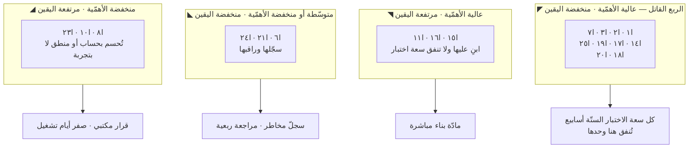
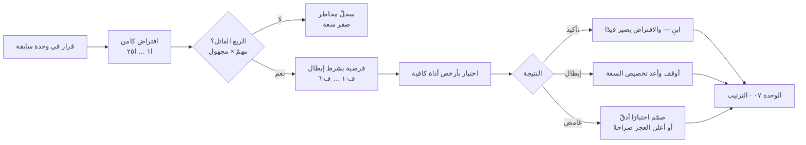
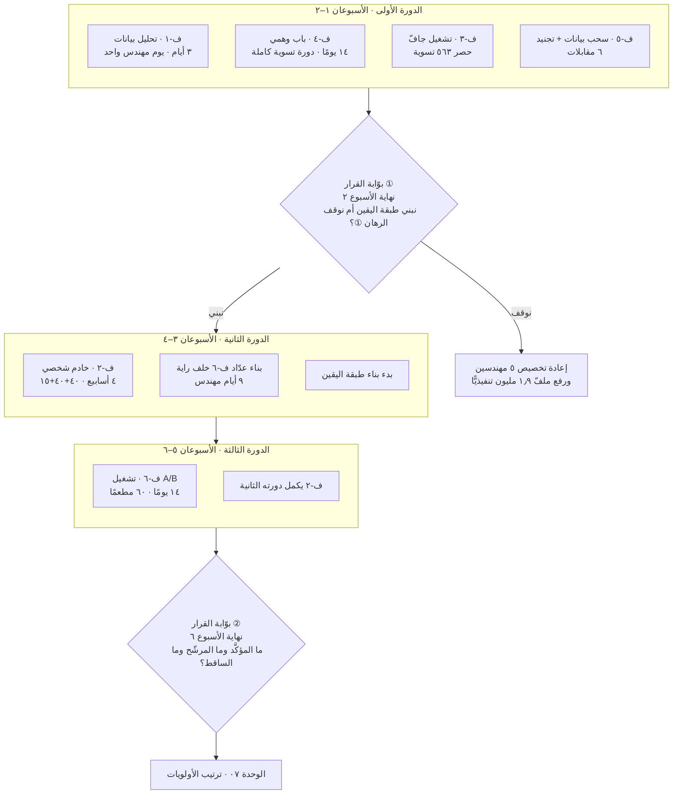
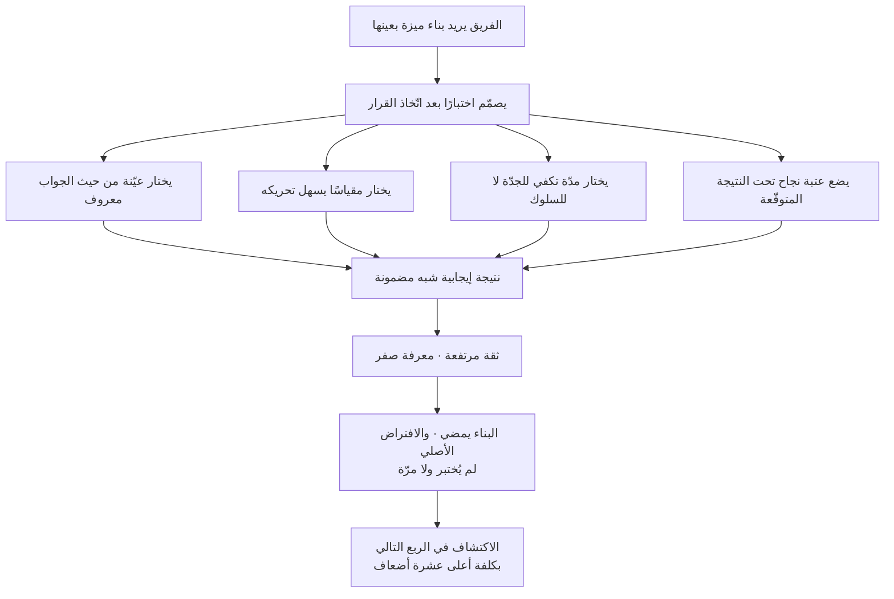
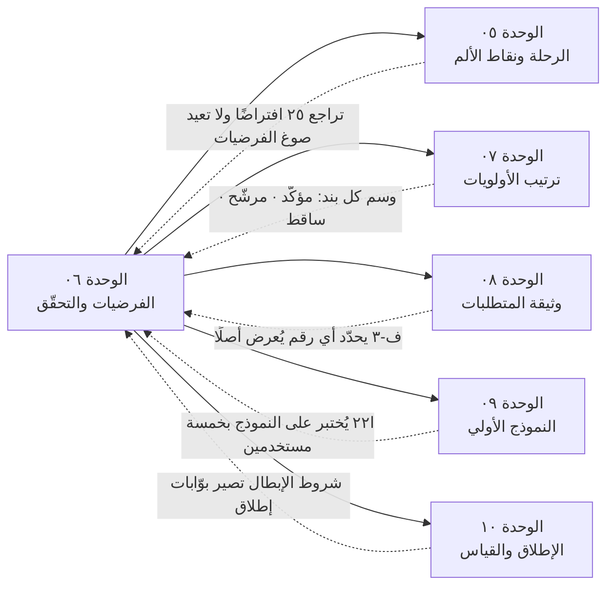

> [!info] الوحدة 06 · ورشة BridgePay
> هذه الوحدة لا تشرح ما الفرضية — فصل [[02 - فلسفة إدارة المنتج]] فعل ذلك، والمعجم يعرّف [[Hypothesis|الفرضية]] و[[Assumption Mapping|رسم الافتراضات]] و[[Kill Criteria|معايير الإيقاف]]. هذه الوحدة **تفكّك خمس وحدات سابقة إلى افتراضاتها الكامنة**، وتصوغ ستّ فرضيات لكلٍّ منها شرط إبطال رقمي مؤجَّل، وتصمّم لكلٍّ منها اختبارًا بحجم عيّنة محسوب وكلفة بالأيام وشجرة قرار. ثم ترتّبها بمعيار واحد: **أرخص اختبار لأخطر افتراض أولًا**. ثم — وهذا أنفع أجزائها — تصمّم اختبارين رديئين عمدًا وتشرّحهما.

# الوحدة 06 — الفرضيات والتحقّق

## ما ورثته من الوحدة السابقة

### ① ما ورثته بالأرقام

| المصدر | المسلَّم | القيمة الدقيقة |
|---|---|---|
| الميثاق | تذاكر «أين مستحقّاتي؟» | ٤٬٩٠٠ × ٣١٪ = **١٬٥١٩ تذكرة/شهر** |
| الميثاق | التجّار النشطون · المفعَّلون | ٢٦٣ · ٤١٠ (**١٤٧ خاملًا**) |
| الميثاق | العملاء النشطون · المسجّلون | ١٩٬٢٠٠ · ٨٧٬٤٠٠ |
| الميثاق | الاحتفاظ | العميل ش٣: **٢٢٪** · التاجر ش٦: **٧١٪** |
| الميثاق | دورة التسوية · الدفع عند الاستلام | ١٤ يومًا · ٣٨٪ |
| الميثاق | السعة | **٩ مهندسين · دورة أسبوعان · لا توظيف** |
| [[01 - رؤية المنتج واستراتيجيته\|٠١]] | إشارة إبطال الرهان ① | تذاكر > **١٬١٠٠**/شهر بعد ربع ← المشكلة سيولة لا شفافية |
| [[01 - رؤية المنتج واستراتيجيته\|٠١]] | إشارة إبطال الرهان ② | طلبات/تاجر نشط < **١٢** يوميًّا بعد ربعين (من ١٠٫٥) |
| [[01 - رؤية المنتج واستراتيجيته\|٠١]] | إشارة إبطال الرهان ③ | احتفاظ ش٣ < **٢٦٪** بعد ثلاثة أرباع (من ٢٢٪) |
| [[01 - رؤية المنتج واستراتيجيته\|٠١]] | توزيع السعة | ٥ · ٢ · ٢ · صفر للمندوب |
| [[02 - السوق والمنافسون\|٠٢]] | الفرضية المركزية | «رصيد لحظي + توفيق + كشف متوافق ← خفض تذاكر الفئة ٧٠٪ خلال دورتين» |
| [[03 - الاكتشاف والبحث الميداني\|٠٣]] | ١٢ نمطًا بقوّة دليل معلَنة | **٣ قوية · ٧ متوسّطة · ٢ ضعيفة** |
| [[03 - الاكتشاف والبحث الميداني\|٠٣]] | النموذج الخادم العرضي | **١٢ تاجرًا** يتلقّون رصيدهم واتسابًا من عمر منذ **٥ أشهر** |
| [[04 - الشخصيات والمهام\|٠٤]] | خمسة معرّفات مهمّة | `JTBD-1` … `JTBD-5` |
| [[04 - الشخصيات والمهام\|٠٤]] | قرار T6 | «رقمان لا رقم واحد: مؤكّد · قيد التأكيد» |
| [[04 - الشخصيات والمهام\|٠٤]] | الشخصية المضادّة A1 | عمولة الطلب **٨٫٨٨ ريالًا** = عتبة خسارة أي كوبون |
| [[04 - الشخصيات والمهام\|٠٤]] | حسابات أوّلية | ٥٫٨ تذكرة/تاجر/شهر · ٢٫٧ تذكرة/دورة تسوية · ٤٫٣ طلب/عميل/شهر |

### ② ما ورثته بوصفه تكليفًا صريحًا

الوحدة ٠٤ سلّمت هذه الوحدة تكليفًا مكتوبًا لا مادّة حرّة: **«خمسة أسطر ما يكذّب الشخصية تدخل مباشرة بوصفها مرشّحات فرضيات؛ وأقواها: التاجر الذي يشتكي هو الأقلّ فقدًا لا الأكثر — لو صحّت لسقط ترتيب أولوياتنا كله.»** وهذا السطر وحده هو ما جعل الفرضية ف-١ أوّل ما نختبره، لا الفرضية المركزية التي ورثناها من الوحدة ٠٢.

والوحدة ٠٤ سلّمت كذلك **مخاطرة تغطية معلَنة**: التاجر الموسمي، والعميل النادر، والمندوب بدوام كامل — ثلاث فئات خارج الشخصيات الخمس، **ونصّت على أن تُراجَع في هذه الوحدة بالذات**. وهي مراجَعة في القسم `أ-٤` أدناه، وحكمها معلَن هناك.

### ③ ما لم أرثه — والتصريح به شرط أمانة

> [!warning] الوحدة ٠٥ لم تُكتب بعدُ حين كُتبت هذه الوحدة
> [[05 - رحلة العميل ونقاط الألم|الوحدة ٠٥]] (خريطتا الرحلة وسجلّ نقاط الألم المرتّب) **غير متاحة** لحظة كتابة هذه الوحدة. ولهذا أثر واحد محدَّد يجب أن يُعلَن لا أن يُخفى: **ترجيح نقاط الألم بالحجم** كان سيأتي من هناك، فجاء هنا من الميثاق والوحدة ٠٤ مباشرة (٥٫٨ تذكرة/تاجر/شهر · ٢٫٧ لكل دورة · ٤٫٣ طلب/عميل/شهر). ولا يوجد في هذه الوحدة افتراض واحد مصدره الوحدة ٠٥.
>
> **وحين تُكتب الوحدة ٠٥، الواجب عليها تجاه هذه الوحدة واضح:** أن تراجع قائمة الافتراضات الخمسة والعشرين أدناه، وتضيف ما تكشفه لحظات الحقيقة في الرحلتين — لا أن تعيد كتابة الفرضيات. **الفرضيات هنا مؤرَّخة ومقفَلة، وإعادة كتابتها بعد رؤية النتيجة هي بالضبط ما نحاول منعه** ([[Confirmation Bias|تحيّز التأكيد]] في أوضح صوره).

## السؤال الذي تجيب عنه هذه الوحدة

**سؤال واحد:** خمس وحدات سابقة أنتجت رؤية ورهانات وتحليل سوق وثماني مقابلات وخمس شخصيات — فما الذي **نعرفه** فيها فعلًا، وما الذي **صدّقناه** ونحن نظنّه معرفة؟ ثم: كيف نشتري أكبر قدر من اليقين بأقلّ قدر من السعة، ونحن نملك **ستّة أسابيع** ولا نملك مهندسًا واحدًا فائضًا؟

وهذا سؤال مختلف عن سؤال الاكتشاف. الوحدة ٠٣ سألت: **ماذا يحدث؟** وهذه الوحدة تسأل: **ما الذي يجب أن يكون صحيحًا كي تنجح الخطّة التي بنيناها على ما رأيناه؟** والفرق بينهما هو الفرق بين ملاحظة وبين رهان.

> [!note] التمييز الذي تقوم عليه الوحدة كلها
> **الافتراض** (`Assumption`) اعتقاد نبني عليه **ولم نصرّح به**، وغالبًا لا نعرف أننا نحمله. و**الفرضية** ([[Hypothesis]]) افتراض **صيغ بحيث يمكن أن يظهر كذبه**. والفرق العملي كله في كلمة واحدة: **قابلية الإبطال**. الافتراض يعيش إلى الأبد لأنه لا يستطيع أن يموت؛ والفرضية تموت بشرط رقمي كتبناه قبل أن نرى النتيجة.
>
> ولهذا فإن العمل في هذه الوحدة يسير في اتّجاه واحد لا يُعكس: **قرار ← افتراض كامن ← فرضية قابلة للإبطال ← اختبار ← قرار جديد**. ومن يبدأ من الاختبار («لنجرّب اختبار A/B على شاشة الرصيد») يكون قد قفز فوق ثلاث خطوات، وسيقيس شيئًا لا يعرف لماذا يقيسه.

## العمل خطوة بخطوة

| # | الخطوة | من يقوم بها | الزمن التقديري | المخرَج |
|---|---|---|---|---|
| ١ | **استخراج الافتراضات:** إعادة قراءة الوحدات ٠٠–٠٤ بقلم واحد، ووسم كل جملة تقول «لأن» أو «سوف» أو «معظم» أو «كافٍ» | مدير المنتج منفردًا | ٣ ساعات | قائمة خام ~٤٠ افتراضًا |
| ٢ | **الدمج والترقيم:** دمج المكرّر، وحذف ما هو معطًى في الميثاق لا افتراض | مدير المنتج | ساعة | **٢٥ افتراضًا** بمعرّفات `ا١`–`ا٢٥` |
| ٣ | **التصنيف على محورين:** الأهمّية (ماذا يسقط لو كان خاطئًا؟) × درجة اليقين (ما قوّة الدليل الحالي؟) — **جلسة جماعية إلزاميًّا** | م. المنتج · مصمّم · محلّل بيانات · مهندس مدفوعات · ممثّل دعم | ساعتان | مصفوفة أرباع + **الربع القاتل** |
| ٤ | **التصويت الأعمى على اليقين:** كل مشارك يقدّر يقينه ٠–١٠٠٪ **قبل** النقاش وعلى ورقة مستقلّة | الجلسة نفسها | ٢٠ دقيقة داخل الخطوة ٣ | فجوات التقدير — وهي مادّة النقاش |
| ٥ | **صياغة الفرضيات:** ستّ فرضيات من الربع القاتل بالبنية الخماسية | مدير المنتج + المحلّل | ساعتان | `ف-١`–`ف-٦` بشروط إبطال |
| ٦ | **تصميم الاختبارات:** لكل فرضية نوع · كلفة · حجم عيّنة محسوب · مدّة · معيار نجاح · شجرة قرار | م. المنتج + المحلّل + مهندس | ٤ ساعات | ستّ بطاقات اختبار |
| ٧ | **حساب السعة والترتيب:** جمع كلفة الاختبارات بأيام المهندس، ومطابقتها بالمتاح، ثم الترتيب | مدير المنتج | ساعتان | جدول الترتيب + **قائمة المؤجَّل معلَنة** |
| ٨ | **مراجعة خصمية:** جلسة يقودها من لم يكتب الفرضيات، هدفها المعلَن: إسقاط تصميم كل اختبار | مهندس مدفوعات (يقود) + الفريق | ساعتان | تعديلات على الاختبارات + الاختباران الرديئان موثّقان |
| ٩ | **تسجيل المعايرة:** تسجيل تنبّؤ كل مشارك بنتيجة كل اختبار قبل تشغيله، في سجلّ مقفَل | مدير المنتج | ٣٠ دقيقة | سجلّ [[Calibration\|المعايرة]] — يُفتح بعد ستّة أسابيع |

**الإجمالي: يومان ونصف من وقت مدير المنتج، وثلاث ساعات من كل مشارك آخر.** وهذه كلفة التصميم لا كلفة التشغيل؛ كلفة التشغيل محسوبة في القسم `ج` بأيام المهندس.

> [!tip] لماذا الخطوة ٤ (التصويت الأعمى) ليست ترفًا إجرائيًّا؟
> لأن تقدير اليقين في جلسة مفتوحة يقيس **من تكلّم أوّلًا** لا **ما نعرفه**. حين يقول مدير المنتج «أنا واثق ٩٠٪ أن المشكلة غموض لا تأخير»، يصير كل رقم بعده مرساةً حوله. والتصويت الأعمى يجعل **فجوة التقدير مرئية**: الافتراض الذي قدّره خمسة أشخاص بين ٢٠٪ و٩٠٪ ليس افتراضًا متوسّط اليقين، بل افتراضًا **متنازَعًا** — وهو أخصب مادّة اختبار في القائمة كلها. راجع [[Calibration|المعايرة]] و[[HiPPO|رأي أعلى المتقاضين أجرًا]].

## المخرَج

---

### أ — رسم الافتراضات الكامل (`Assumption Mapping`)

#### أ-١: كيف استُخرج الافتراض من القرار

الافتراض لا يُكتب في الوثائق؛ يُستدلّ عليه. والطريقة المستعملة هنا ميكانيكية عمدًا حتى تكون قابلة للتكرار على أي مشروع:

**لكل قرار في الوحدات ٠١–٠٤، اسأل: «ما الذي يجب أن يكون صحيحًا في العالم كي يكون هذا القرار صحيحًا؟»** ثم اكتب الجواب بصيغة خبرية قابلة للكذب. فالقرار «نبني اليقين لا نقصّر الدورة» يستلزم أن يكون صحيحًا في العالم: أن التاجر يحتمل الانتظار ١٤ يومًا، وأن غموض المبلغ هو ما يحرّك اتّصاله، وأن بياناتنا دقيقة كفاية لعرضها. **ثلاثة افتراضات من قرار واحد** — ولا واحد منها مكتوب في الوحدة ٠١ بوصفه افتراضًا.

**والعلامات اللغوية الأربع** التي وسمتُ بها الوحدات السابقة أثناء الخطوة ١، وهي صالحة لأي وثيقة منتج:

| العلامة | لماذا هي مؤشّر افتراض | مثال حرفي من وحداتنا |
|---|---|---|
| **«لأن»** | تعلن آلية سببية، والآلية أضعف حلقة دائمًا | «التاجر يشتكي **لأن** الشكوى قناة عمل» |
| **«معظم» / «جزء معتبر»** | كمّية غير مقيسة تتنكّر في صورة معرفة | «**معظم** الـ١٬٥١٩ تذكرة سببها الغموض» |
| **«يكفي» / «كافٍ»** | حكم على عتبة لم تُقس | «بيانات التسوية دقيقة **كفاية** لعرضها» |
| **«سوف يؤدّي»** | تنبّؤ سلوكي، وأكثر مواضع الخطأ | «العمق **سيرفع** الطلبات لكل تاجر» |

#### أ-٢: القائمة الكاملة — ٢٥ افتراضًا

**قراءة العمودين الأخيرين:** «الأهمّية» تجيب عن سؤال واحد: *لو ظهر أن هذا الافتراض خاطئ تمامًا، ماذا يسقط معه؟* و«اليقين» يجيب عن: *ما قوّة الدليل الذي في يدي الآن، لا قوّة اقتناعي؟* — والتمييز بينهما هو ما يقيسه التصويت الأعمى.

| # | الافتراض (بصيغة قابلة للكذب) | مصدره | لو كان خاطئًا يسقط | الأهمّية | اليقين | الربع |
|---|---|---|---|---|---|---|
| **ا١** | معظم تذاكر «أين مستحقّاتي؟» (١٬٥١٩) سببها **غموض المبلغ والموعد** لا طول الدورة | ٠١ الرهان ① | الرهان ① كلّه وحصّة ٥ مهندسين | **عالية** | **منخفض** | **قاتل** |
| **ا٢** | التاجر **يحتمل** انتظار ١٤ يومًا ما دام يعرف المبلغ والموعد | ٠١ · ٠٣ ن-٤ | قرار T1 ويعود ملفّ الـ١٫٩ مليون | **عالية** | **منخفض** | **قاتل** |
| **ا٣** | بيانات التسوية **دقيقة كفاية** لعرضها لحظيًّا للتاجر | ٠١ «ما يجب أن يصحّ» ② | المنتج كلّه: شاشة خاطئة أسوأ من غيابها | **عالية** | **منخفض** | **قاتل** |
| **ا٤** | بناء طبقة اليقين يسعه **٥ مهندسين × ٣ دورات** | ٠١ حصّة السعة | جدول ستّة أسابيع كامل | عالية | متوسّط | تنفيذي |
| **ا٥** | عمق استعمال التاجر يرفع الطلبات من ١٠٫٥ إلى ١٢ | ٠١ الرهان ② | الرهان ② وحصّة مهندسَين | عالية | منخفض | قاتل (مؤجَّل) |
| **ا٦** | الـ١٤٧ تاجرًا الخاملين (٣٦٪) خاملون لسبب **قابل للحلّ منتجيًّا** | ٠١ الفرضية الضمنية للرهان ② | مبرّر «العمق لا العرض» | متوسّطة | منخفض | مؤجَّل |
| **ا٧** | جزء معتبر من هجرة العميل (٧٨٪) سببه **احتكاك مالي** لا سعر | ٠١ الرهان ③ | الرهان ③ ويعود «الولاء للسعر» | **عالية** | **منخفض** | **قاتل** |
| **ا٨** | كلفة الموثوقية أقلّ من كلفة الخصم المستمرّ | ٠١ الرهان ③ | قائمة «ما لن نفعله» بندَي ٤ | متوسّطة | متوسّط | يُحسب لا يُختبر |
| **ا٩** | رفض تخفيض العمولة لا يرفع فقد التجّار فوق معدّله الحالي | ٠١ «ما لن نفعله» ١ | ٧٣٢٬٦٠٠ ريال إيراد شهري | عالية | متوسّط | مراقَبة لا اختبار |
| **ا١٠** | المساعد الذكي للتجّار **يفسد** مقياس الرهان ① (ولهذا رُفض) | ٠١ «ما لن نفعله» ٧ | مبرّر رفض بند مطلوب | متوسّطة | متوسّط | منطقي لا تجريبي |
| **ا١١** | سقف السعة ٨٢٬٥٠٠ طلبًا هو القيد الفعلي على النموّ | ٠٢ قيد السعة | حجّة «العمق قبل العرض» | متوسّطة | مرتفع | معلوم |
| **ا١٢** | لا منافس يبني طبقة يقين مالي للتاجر خلال ثلاثة أرباع | ٠٢ خندق الدفاع | نافذة الفرصة كلها | عالية | منخفض | قاتل (غير قابل للاختبار داخليًّا) |
| **ا١٣** | الفجوة المختارة (الطبقة المالية) قابلة للدفاع بعد نسخها | ٠٢ الخندق | استدامة الميزة | عالية | منخفض | يُراقَب |
| **ا١٤** | المتغيّر هو **التنبّؤ** لا **المدّة** (ن-٤، دليل متوسّط، تاجران) | ٠٣ الاكتشاف الأول | تشخيصنا كلّه، وترتيب ٠٧ | **عالية** | **منخفض** | **قاتل** |
| **ا١٥** | الشكوى بديل عن شاشة لا احتجاج على خدمة (ن-١، دليل قوي) | ٠٣ ن-١ | تفسير الـ٣١٪ | عالية | مرتفع | مُثبَت كفاية |
| **ا١٦** | الرحيل الصامت: المتوقّف لا يشتكي ولا يحذف (ن-٧، قوي) | ٠٣ ن-٧ | تفسير الـ٢٢٪ | عالية | مرتفع | مُثبَت كفاية |
| **ا١٧** | العطل الصغير غير المعوَّض ينهي العلاقة (ن-٨، **ضعيف–متوسّط**) | ٠٣ ن-٨ | آلية الرهان ③ السببية | **عالية** | **منخفض** | **قاتل** |
| **ا١٨** | عملة المندوب هي الوقت المؤكَّد لا المال (ن-١٠، **مقابلة واحدة**) | ٠٣ ن-١٠ | كل قرار يمسّ المندوب | عالية | **منخفض جدًّا** | **قاتل — بلا سعة** |
| **ا١٩** | المؤشّرات تُدار: ضغط «جاهز» مبكّرًا يصنع انتظار المندوب (ن-١١) | ٠٣ الاكتشاف الثالث | تفسير زمن التوصيل كمشكلة حوافز | عالية | متوسّط | **قاتل** |
| **ا٢٠** | الاثنا عشر تاجرًا الذين يتلقّون واتساب عمر **انخفضت تذاكرهم فعلًا** | ٠٣ الاكتشاف الثاني | الدليل الوحيد المتاح على ا١ | **عالية** | **منخفض — لكنه في بياناتنا** | **الأرخص في القائمة** |
| **ا٢١** | عيّنة الثماني مقابلات تمثّل الشرائح كفايةً للبناء عليها | ٠٣ تصميم العيّنة | ثقة كل نمط متوسّط | متوسّطة | منخفض | يُدار بالتصنيف |
| **ا٢٢** | «رقمان لا رقم واحد» (T6) يُقبَل من التاجر ولا يربكه | ٠٤ T6 | قيد تصميم في الـ`PRD` | عالية | منخفض | قاتل (يُختبر في ٠٩) |
| **ا٢٣** | A1 (صائد العروض) قابل للفصل عن P3 بالبيانات لا بالانطباع | ٠٤ الشخصية المضادّة | فلتر بنود الحملات في ٠٧ | متوسّطة | متوسّط | قابل للفحص |
| **ا٢٤** | الشخصيات الخمس تغطّي ما يكفي من قاعدة المستخدمين | ٠٤ مخاطرة التغطية | تمثيلية كل قرار لاحق | متوسّطة | منخفض | يُراجَع هنا (أ-٤) |
| **ا٢٥** | التاجر الذي يشتكي هو **الأكثر** عرضة للفقد | ضمني في ٠١–٠٤ كلها | **ترتيب الأولويات كلّه** | **عالية** | **منخفض** | **قاتل** |

> [!danger] ا٢٥ هو الافتراض الذي لم يكتبه أحد
> افتحْ أي وحدة سابقة وابحث عن الجملة «التاجر الذي يشتكي هو الأكثر عرضة للفقد». **لن تجدها.** ومع ذلك فإن كل قرار اتّخذناه يقف عليها: خصّصنا خمسة مهندسين من تسعة لخفض تذاكر شريحة **احتفاظها ٧١٪**، وخصّصنا اثنين لشريحة **احتفاظها ٢٢٪**. والوحدة ٠٣ قالت صراحةً في خلاصتها العملياتية: *«حيث يزيد الضجيج تقلّ الخسارة»* — ثم بنينا على الضجيج.
>
> **وهذا هو نمط الافتراض الأخطر بنيويًّا: الافتراض الذي لا يُكتب لأنه يبدو بديهيًّا.** فالمكتوب يُناقَش، والبديهي يُنفَّذ. ولهذا فإن قيمة رسم الافتراضات ليست في ترتيب ما تعرفه، بل في **إجبارك على كتابة ما لم تخطر لك كتابته**.

#### أ-٣: المصفوفة — الأهمّية × درجة اليقين



**قراءة المصفوفة بالأرقام:** من ٢٥ افتراضًا وقع **١٠ في الربع القاتل** (٤٠٪)، و**٣ في ربع اليقين المرتفع** (١٢٪)، و**٣ في ربع منخفض الأهمّية**، والباقي (٩) في مناطق وسطى تُدار بالمراقبة لا بالاختبار.

> [!important] القاعدة العملية الوحيدة التي يخرج بها رسم الافتراضات
> **لا تُنفق يومًا واحدًا من سعة الاختبار خارج الربع الأيسر العلوي.**
> اختبار ما تعرفه إهدار مموّه في صورة انضباط — وهو أشيع صور الهدر في الفرق المنهجية: تختبر ما يسهل اختباره لا ما يخطر أن تكون مخطئًا فيه. واختبار ما لا يهمّ إهدار سافر. والفرق بينهما أن الأول **يبدو عملًا جيّدًا**، ولذلك يستمرّ سنوات.
>
> وانظر إلى ا١٥ وا١٦ خصوصًا: كلاهما «قوي الدليل» في جدول أنماط الوحدة ٠٣، وكلاهما **عالي الأهمّية**، ومع ذلك **لا نختبرهما**. لأن قوّة الدليل الحالية كافية للقرار الذي نتّخذه عليهما. ومن يختبر ن-١ («الشكوى بديل عن شاشة») مرّة أخرى إنما يشتري راحة نفسية بسعة هندسية.

#### أ-٤: مراجعة مخاطرة التغطية (تكليف الوحدة ٠٤)

الوحدة ٠٤ أحالت إلينا ثلاث فئات خارج الشخصيات الخمس. والحكم عليها هنا، بمعيار واحد: **هل غيابها يغيّر قرارًا نتّخذه في الأسابيع الستّة القادمة؟**

| الفئة الغائبة | تقدير حجمها (بحساب معروض) | هل تغيّر قرارًا الآن؟ | الحكم |
|---|---|---|---|
| **التاجر الموسمي** | غير قابل للتقدير من الميثاق. المتاح: ١٤٧ تاجرًا مفعَّلًا غير نشط في ٣٠ يومًا (٤١٠ − ٢٦٣)، وبعضهم موسمي لا خامل — والنسبة مجهولة | لا. قراراتنا الستّة أسابيع كلها على التاجر **النشط** | **مؤجَّل** إلى الوحدة ٠٧، ويُوسَم بندًا في سجلّ المخاطر |
| **العميل النادر** | ١٩٬٢٠٠ نشط، متوسّط ٤٫٣ طلب/شهر. من يطلب مرّة أو مرّتين لا يُميَّز في الميثاق — **والرقم غير مشتقّ، فلا نخترعه** | جزئيًّا: يمسّ ف-٥ | **يُدرَج في تصميم ف-٥** بوصفه طبقة تحليل لا شخصية |
| **المندوب بدوام كامل** | عدد المندوبين النشطين **غير موجود في الميثاق** — والوحدة ٠٤ نصّت على ذلك، ولذلك صيغت اقتصاديات P4 بوحدة الطلب | نعم، ويمسّ ا١٨ وف-٦ | **مؤجَّل بقرار سعة معلَن** — انظر القسم `ج-٣` |

> [!note] لماذا لا نضيف المندوب بدوام كامل إلى الشخصيات الآن؟
> ليس لأنه غير مهمّ — بل لأن الوحدة ٠١ خصّصت له **صفر مهندسين** من التسعة، وقرار السعة ذاك لم يُنقض بعد. **وإضافة شخصية لا تملك سعة تخدمها هي إضافة وثيقة لا إضافة التزام.** والصادق أن نكتب في سجلّ المخاطر: «نعمل بمعرفة ناقصة عن أكبر طرف تشغيلي لدينا، والقرار واعٍ ومؤرَّخ، ومراجعته عند تحرّر السعة» — لا أن نصنع بطاقة شخصية تشتري لنا شعورًا بالاكتمال.

---

### ب — الفرضيات الستّ وتصميم اختباراتها

#### ب-٠: البنية والقاعدة الحاكمة

كل فرضية أدناه مكتوبة بالبنية نفسها، بلا استثناء:

> **نعتقد أن** [تغيير محدّد] **لشريحة** [من، معرَّفة بمعيار قابل للاستعلام] **سيؤدّي إلى** [أثر مقيس برقم] **لأن** [آلية سببية]. **وسنعتبرها مُبطَلة إذا** [شرط رقمي بأجل].

**والحقول الأربعة الأولى مألوفة؛ الخامس هو الذي يفصل الفرضية عن الأمنية.** ولاحظ في الجملة أعلاه أن الحقل «لأن» ليس زينة بلاغية: هو **الآلية**، وهو أضعف حلقة في السلسلة دائمًا. لأن الأثر قد يقع لسبب آخر تمامًا، فتظنّ فرضيتك صحيحة وأنت تعمّم آلية خاطئة على قرارات لاحقة. ولهذا يحمل كل تصميم اختبار أدناه سطرًا صريحًا اسمه **«التفسير المنافس»**.

> [!danger] لا فرضية بلا شرط إبطال — وهذه ليست شكليّة
> الفرضية بلا شرط إبطال ليست فرضية ضعيفة؛ **هي ليست فرضية أصلًا**. لأنها تصف حالة عالم لا يمكن أن تكون خاطئة، وما لا يمكن أن يكون خاطئًا لا يضيف معرفة إن صحّ.
>
> **والاختبار العملي البسيط:** اقرأ فرضيتك واسأل نفسك: *«ما الرقم الذي لو رأيته يوم كذا لأوقفتُ هذا العمل غدًا؟»* إن لم يكن لديك جواب فوري، فأنت لا تختبر بل تبرّر. راجع [[Kill Criteria|معايير الإيقاف]] و[[Sunk Cost Fallacy|مغالطة التكلفة الغارقة]].
>
> **وشرطان يجعلان شرط الإبطال حقيقيًّا لا مزيّفًا:** ① أن يكون **مؤرَّخًا** (أجل محدّد)، لأن شرطًا بلا أجل يُؤجَّل إلى الأبد. ② أن يكون **مكتوبًا قبل رؤية أي نتيجة** ومحفوظًا في مكان لا يملك كاتبه تعديله بصمت — عندنا: [[Decision Log|سجلّ القرارات]] مع تاريخ ومالك.

#### ب-١: من افتراض إلى قرار — المسار الكامل



**لاحظ الفرع `J`.** أكثر ما يُنسى في أدبيات التجريب أن **النتيجة الغامضة هي الأكثر شيوعًا فعليًّا**، لا التأكيد ولا الإبطال. وفريقٌ لا يملك مسارًا معلنًا للغموض سيصنّف الغامض «تأكيدًا» بنسبة تقارب المئة بالمئة — لأن الاستمرار هو الوضع الافتراضي، والغموض لا يوقف شيئًا.

---

#### `ف-١` — الشكوى ليست إشارة فقد · والاثنا عشر تاجرًا دليلنا الوحيد

> **نعتقد أن** إتاحة رقم المستحقّ وموعده للتاجر بلا وسيط بشري **لشريحة** التجّار النشطين الذين يفتحون تذاكر فئة «أين مستحقّاتي؟» **سيؤدّي إلى** خفض تذاكر هذه الفئة **٣٠٪ فأكثر** لدى من تصله المعلومة **لأن** التذكرة ليست احتجاجًا بل **استعلام** يختفي بزوال سببه (ن-١). **وسنعتبرها مُبطَلة إذا** لم تنخفض تذاكر الاثني عشر تاجرًا الذين يتلقّون رسالة عمر منذ خمسة أشهر بنسبة تبلغ **٢٠٪** على الأقلّ مقارنةً بخطّ أساسهم قبل خمسة أشهر — وذلك عند إغلاق تحليل البيانات في **اليوم الثالث** من الأسبوع الأول.
>
> **وفرضية مصاحبة تُختبر على السحب نفسه:** نعتقد أن التاجر الأكثر فتحًا للتذاكر هو **الأكثر** عرضة للفقد (ا٢٥). **وسنعتبرها مُبطَلة إذا** لم يقلّ احتفاظ النصف الأعلى تذاكرَ عن احتفاظ النصف الأدنى بـ**١٣ نقطة مئوية** على الأقلّ.

| الحقل | التصميم |
|---|---|
| **نوع الاختبار** | **تحليل بيانات قائمة** — لا أداة جديدة، ولا مستخدم يُزعَج |
| **لماذا هذا النوع** | لأن التجربة **جرت بالفعل** خمسة أشهر بلا علمنا (اكتشاف الوحدة ٠٣ الثاني). الاختبار الذي تشغّله أنت يكلّف؛ والاختبار الذي شغّله الواقع نيابةً عنك **مجّاني، وكل ما ينقصه سحب بيانات** |
| **الكلفة** | **يوم مهندس واحد** (سحب واستعلام) + يومان للمحلّل (نصف وقت ← ٤ أيام تقويمية) |
| **المدّة** | **٣ أيام** — لا زمن تشغيل أصلًا، البيانات موجودة |
| **حجم العيّنة والحساب** | **(أ)** ١٢ تاجرًا × ٥٫٨ تذكرة/شهر × ٥ أشهر = **٣٤٨ تذكرة متوقّعة** في كل من فترتَي «قبل» و«بعد». ووحدة التحليل هنا **التذكرة لا التاجر** — وهذا ما ينقذ الاختبار. الخطأ المعياري لفرق عدّادَي بواسون = √(٣٤٨+٣٤٨) = **٢٦٫٤**. فانخفاض ٢٠٪ (٧٠ تذكرة) = **٢٫٦ انحراف معياري** ← قابل للكشف. وانخفاض ٥٠٪ = ٦٫٦ انحراف ← لا لبس فيه.<br/>**(ب)** ٤١٠ تاجرًا مفعَّلًا، يُقسَّمون عند **وسيط** التذاكر لكل دورة: ٢٠٥ في كل نصف. الفرق الأدنى القابل للكشف عند قوّة ٨٠٪ وثقة ٩٥٪ حول احتفاظ ٦٥٪: δ = √(١٥٫٧ × ٠٫٦٥ × ٠٫٣٥ ÷ ٢٠٥) = **١٣٫٢ نقطة مئوية** |
| **معيار النجاح** | **(أ)** انخفاض ≥ ٣٠٪ في تذاكر الاثني عشر بعد بدء رسائل عمر، مع بقاء حجم طلباتهم ثابتًا ±١٥٪. **(ب)** فرق احتفاظ بين النصفين خارج نطاق ±١٣ نقطة — في أي اتّجاه |
| **التفسير المنافس** | **الارتداد إلى المتوسّط.** الاثنا عشر اختارهم عمر لأنهم **الأكثر إلحاحًا**، أي أنهم في ذروة سلوكهم لحظة الاختيار — ومن كان في ذروته يهبط بلا تدخّل. **الضبط:** نقارنهم بمجموعة شاهدة من ٢٤ تاجرًا كانوا في الشريحة العليا نفسها قبل خمسة أشهر ولم يتلقّوا رسائل. إن هبطت المجموعتان معًا فالتفسير الارتداد لا الرسالة |
| **قيد الخصوصية** | السحب يتمّ داخليًّا ولا يُصدَّر إلى أي أداة خارجية. المعرّفات تُستبدل بأرقام مسلسلة قبل أي تحليل مشترك — [[PDPL]] و[[Anonymization\|إخفاء الهوية]] |

**ماذا نفعل في كل نتيجة محتمَلة — الجدول الذي يجعل الاختبار قرارًا لا فضولًا:**

| النتيجة (أ) | النتيجة (ب) | القرار الفوري |
|---|---|---|
| انخفاض ≥ ٣٠٪ | النصف الأعلى تذاكرَ **أقلّ** فقدًا | **ابنِ الرصيد اللحظي، واحذف «حجم التذاكر» من معايير الترتيب في الوحدة ٠٧.** الميزة صحيحة، ومبرّرها الحالي خاطئ — وهذا فرق يجب أن يُكتب في `PRD` الوحدة ٠٨ |
| انخفاض ≥ ٣٠٪ | فرق دون ١٣ نقطة (غامض) | ابنِ، وعلّق الحكم على ا٢٥، وأعد فحصه بعد ربع ببيانات أكبر |
| انخفاض ١٠–٣٠٪ | أيّ نتيجة | **لا تبنِ الشاشة الكاملة.** شغّل ف-٢ (الخادم الشخصي الموسَّع) بوصفه الحكم الفاصل — الإشارة موجودة والحجم مجهول |
| انخفاض < ١٠٪ أو ارتفاع | أيّ نتيجة | **إشارة إبطال للرهان ① قبل أوانها بربع كامل.** أوقف تخصيص الخمسة مهندسين، وارفع ملفّ الـ١٫٩ مليون تنفيذيًّا، وأعد فتح تشخيص «المدّة لا الغموض» |
| أي نتيجة (أ) | النصف الأعلى **أكثر** فقدًا بـ١٣ نقطة فأكثر | ا٢٥ صحيح، وقراءة الوحدة ٠٣ للتناقض المركزي تحتاج مراجعة — وهذه نتيجة **تعاكس ما نتمنّى، ولذلك هي الأثمن** |

> [!tip] لماذا هذا الاختبار أوّلًا رغم أنه لا يختبر ميزة؟
> لأنه **الأرخص في القائمة والأخطر أثرًا**: يوم مهندس واحد يمكن أن يوقف تخصيص **خمسة مهندسين لثلاث دورات** (= ٧٥ يوم مهندس). النسبة ١ إلى ٧٥. ولا يوجد في هذه الوحدة كلها استثمار بهذه المردودية، ولا في أغلب الأرباع التي ستعيشها. راجع [[Cost of Experimentation|كلفة التجريب]].
>
> **والقاعدة المستخرَجة:** قبل أن تصمّم تجربة جديدة، اسأل: *«هل جرى هذا الشيء بالفعل في مكان ما من نظامي بلا أن أخطّط له؟»* — الدعم يفعل أشياء يدويًّا، والمبيعات تعد بوعود غير موجودة، وفرع ما يشتغل بطريقة مختلفة. **كل عمل تعويضي بشري هو تجربة انتهت ونتيجتها معلّقة في بياناتك، تنتظر من يقرؤها.**

---

#### `ف-٢` — التنبّؤ لا المدّة: الرقم قبل يوم من التحويل

> **نعتقد أن** إرسال رسالة استباقية تحمل **المبلغ المستحقّ والتاريخ الثابت** قبل التحويل بيوم **لشريحة** ٤٠ تاجرًا نشطًا مختارين عشوائيًّا (باستثناء الاثني عشر) **سيؤدّي إلى** خفض تذاكر «أين مستحقّاتي؟» لديهم بـ**٣٠٪** مقارنةً بمجموعة شاهدة، مع **بقاء دورة التسوية ١٤ يومًا كما هي** **لأن** ما يحرّك الاتّصال هو **انعدام التنبّؤ بالمبلغ والتاريخ** لا طول الانتظار (ن-٤، وشهادة ت١: «أنا ما أشتكي من الأربعطعش يوم، أنا أشتكي إني أربعطعش يوم ما أدري وش لي»). **وسنعتبرها مُبطَلة إذا** لم يبلغ الفرق بين المجموعتين **٣٠٪** بنهاية **دورتَي تسوية كاملتين (٢٨ يومًا)** من بدء الإرسال، أو إذا ظهر **طلب صريح بتقصير الدورة** من أكثر من ربع مجموعة التدخّل رغم وصول الرسالة.

| الحقل | التصميم |
|---|---|
| **نوع الاختبار** | **[[Concierge MVP\|نموذج خادم شخصي]]** — إنسان يؤدّي يدويًّا ما سيؤدّيه المنتج، بلا سطر شيفرة واجهة |
| **لماذا هذا النوع** | لأن الميزة الحقيقية هنا ليست الشاشة بل **المعلومة وتوقيتها**. والخادم الشخصي يختبر القيمة قبل أن نبني الغلاف. وميزته الفريدة هنا أن **مواصفته جاهزة**: عمر يفعلها منذ خمسة أشهر، ونعرف بالضبط ما أرسله (رقم واحد وتاريخ) **وما لم يرسله** (كشفًا تفصيليًّا، رسمًا بيانيًّا) |
| **الكلفة** | **يوما مهندس** (استعلام يوميّ يولّد أرصدة الأربعين + تصدير آمن) + **٢٠ ساعة دعم** موزّعة (ساعة يوميًّا × ٢٠ يوم عمل) من فريق الستّة |
| **المدّة** | **٤ أسابيع** = دورتا تسوية. **ولا يجوز أقلّ**: الحدث الذي نقيسه (التحويل) يقع مرّة كل ١٤ يومًا، فاختبار ٧ أيام قد لا يحوي حدثًا واحدًا عند نصف العيّنة |
| **حجم العيّنة والحساب** | ٤٠ تدخّل + ٤٠ شاهد من ٢٦٣ نشطًا، **اختيار طبقي** (نطاق حجم الطلبات) ثم عشوائي داخل الطبقة.<br/>التذاكر المتوقّعة في مجموعة الشاهد: ٤٠ × ٥٫٨ × (٢٨÷٣٠) = **٢١٦ تذكرة**.<br/>الأثر الأدنى القابل للكشف عند قوّة ٨٠٪: ٢٫٨ × √(٢١٦+٢١٦) ÷ ٢١٦ = ٢٫٨ × ٢٠٫٨ ÷ ٢١٦ = **٢٧٪**.<br/>**وعتبتنا ٣٠٪ تقع فوق الـ٢٧٪ بهامش ضيّق** — وهذا مصرَّح به: الاختبار يكشف أثرًا كبيرًا ولا يكشف أثرًا متوسّطًا. من أراد كشف ١٥٪ يحتاج **١٤٠ تاجرًا في كل مجموعة**، أي ٢٨٠ من ٢٦٣ متاحًا — **مستحيل بنيويًّا**، فالسقف ليس ميزانيًّا بل عدديًّا |
| **معيار النجاح** | فرق ≥ ٣٠٪ في التذاكر · **و** صفر طلبات صريحة بتقصير الدورة تفوق ٢٥٪ من المجموعة · **و** ألّا ترتفع تذاكر فئات أخرى لدى مجموعة التدخّل (مؤشّر إزاحة لا حلّ) |
| **التفسير المنافس** | **أثر هوثورن:** التاجر يقلّل الاتّصال لأنه يشعر بالاهتمام لا لأنه صار يعرف رقمه. **الضبط:** مجموعة شاهدة ثالثة صغيرة (١٥ تاجرًا) تتلقّى رسالة ودّية دورية **بلا رقم ولا تاريخ**. إن انخفضت تذاكرها كذلك، فالأثر اهتمام لا معلومة — وهذا يغيّر المنتج كلّيًّا |
| **[[Counter Metric\|مؤشّر مضادّ]]** | **ساعات الدعم المستهلَكة**: إن خفّض التدخّل ٦٥ تذكرة وكلّف ٢٠ ساعة يدوية، فهو ناجح تجريبيًّا وخاسر تشغيليًّا — ولا يُعمَّم إلّا مؤتمتًا |

**شجرة القرار:**

| النتيجة | القرار الفوري |
|---|---|
| فرق ≥ ٣٠٪ · ولا طلب لتقصير الدورة | **ا٢ وا١٤ مؤكَّدان.** ابنِ الرصيد والتنبيه، وثبّت «التاريخ الثابت» قيدَ منتج في `PRD` الوحدة ٠٨، وأبقِ الدورة ١٤ يومًا. **وأغلق ملفّ الـ١٫٩ مليون لربع كامل** |
| فرق ≥ ٣٠٪ · **مع** طلب تقصير من > ٢٥٪ | الشفافية تخفّض السؤال ولا تُشبع الحاجة. **ابنِ اليقين، وافتح بالتوازي ملفّ السحب المبكّر المدفوع** بوصفه مسارًا اقتصاديًّا لا مجّانيًّا (وهو مؤجَّل الوحدة ٠١) |
| فرق ١٥–٣٠٪ (غامض) | **لا تعمّم ولا تُلغِ.** مدّد أربعة أسابيع أخرى على المجموعة نفسها — التمديد على العيّنة نفسها يضاعف الحدث المرصود ولا يكلّف بناءً |
| فرق < ١٥٪ | **ا١٤ ساقط.** المشكلة ليست التنبّؤ. أعد فتح فرضية المدّة، وأعد تخصيص ٣ من ٥ مهندسين إلى الرهان ③ فورًا |
| انخفضت تذاكر الشاهد الودّي (١٥) بقدر مماثل | **أخطر نتيجة ممكنة:** أثرنا علاقة لا معلومة. أوقف المسار كلّه، وأعد التشخيص من الصفر — والوفر: ٧٥ يوم مهندس لم يُنفق على ميزة لا تحلّ شيئًا |

---

#### `ف-٣` — هل نملك أصلًا رقمًا صحيحًا نعرضه؟

> **نعتقد أن** بيانات التسوية لدينا دقيقة بما يكفي لعرض رصيد «مؤكّد» **لشريحة** كل التجّار النشطين **سيؤدّي إلى** أن يكون **٩٩٫٥٪ فأكثر** من مبالغ خانة «مؤكّد» مطابقًا للمبلغ المحوَّل فعليًّا ريالًا بريال **لأن** مصادر الحقيقة الثلاثة (سجلّ الطلبات · كشف بوّابة الدفع · نقد الدفع عند الاستلام) قابلة للتوفيق آليًّا. **وسنعتبرها مُبطَلة إذا** تجاوز معدّل الفروق **٠٫٥٪** من التسويات، أو إذا تجاوز أي فرق منفرد **٥٠ ريالًا**، أو إذا لم يكن **٩٥٪** من الفروق قابلًا للتفسير الآلي بسبب مصنَّف — وذلك عند إغلاق التشغيل الجافّ في **نهاية الأسبوع الثاني**.

| الحقل | التصميم |
|---|---|
| **نوع الاختبار** | **[[Data Dry Run\|تشغيل جافّ للبيانات]]** — نبني منطق التوفيق ونشغّله على شهر ماضٍ، ولا نعرض شيئًا لأحد |
| **لماذا هذا النوع** | لأن الفشل هنا **صامت وقاتل**. شاشة رصيد خاطئة لا تُنتج تذاكر أقلّ بل **نزاعات**: تحوّل الغموض إلى اتّهام. والوحدة ٠١ نصّت على هذا في «ما يجب أن يصحّ ليفوز ②»، والوحدة ٠٤ حسمت T6 على أساسه. وهذا [[Reversible vs Irreversible Decisions\|قرار باب واحد]]: الثقة تُفقد مرّة ولا تُستعاد بميزة |
| **الكلفة** | **٥ أيام مهندس** (منطق التوفيق + مصنّف أسباب الفروق) + ٣ أيام محلّل (نصف وقت ← ٦ أيام تقويمية) |
| **المدّة** | أسبوعان تقويميًّا، والتشغيل نفسه ساعات |
| **حجم العيّنة والحساب** | **هنا يقع أنفع درس في هذا القسم.** لو أخذنا عيّنة لتقدير معدّل فروق متوقّع ١٠٪ بدقّة ±٣٪: n₀ = ١٫٩٦² × ٠٫١ × ٠٫٩ ÷ ٠٫٠٣² = **٣٨٤**. وبتصحيح المجتمع المحدود (٥٦٣ تسوية شهريًّا): n = ٣٨٤ ÷ (١ + ٣٨٣÷٥٦٣) = **٢٢٩ تسوية**.<br/>**لكن عتبتنا ٠٫٥٪ لا ١٠٪.** وبـ«قاعدة الثلاثة»: إن فحصنا ٢٢٩ تسوية ولم نجد **فرقًا واحدًا**، فأقصى ما نستطيع قوله بثقة ٩٥٪ أن المعدّل الحقيقي ≤ ٣÷٢٢٩ = **١٫٣١٪** — أي **ضعف عتبتنا ونصف**. ولإثبات ≤ ٠٫٥٪ نحتاج ٣÷٠٫٠٠٥ = **٦٠٠ تسوية**، وهي أكثر من المتاح شهريًّا (٥٦٣).<br/>**والقرار الناتج: لا عيّنة — بل حصر كامل لشهر (٥٦٣ تسوية).** والحصر يعطي حدًّا أعلى ٣÷٥٦٣ = **٠٫٥٣٪**، وهو أدنى ما يمكن بلوغه بشهر واحد. **ولأن الاختبار آليّ، فكلفة فحص ٥٦٣ تساوي كلفة فحص ٢٢٩ تقريبًا** — والاقتصاد في العيّنة هنا اقتصاد وهمي |
| **معيار النجاح** | معدّل فروق ≤ ٠٫٥٪ **و** أقصى فرق منفرد ≤ ٥٠ ريالًا **و** ≥ ٩٥٪ من الفروق مصنَّفة بسبب معروف |
| **التفسير المنافس** | **الشهر المختار غير تمثيلي** (شهر هادئ بلا ذروة ولا استرداد كثيف). **الضبط:** يُختار شهر يحوي ذروة نهاية أسبوع كاملة، ويُعاد التشغيل على شهر ثانٍ إن جاءت النتيجة على الحدّ |

**شجرة القرار:**

| النتيجة | القرار الفوري |
|---|---|
| فروق ≤ ٠٫٥٪ · مفسَّرة ≥ ٩٥٪ | **اعرض «مؤكّد» و«قيد التأكيد» كما حسم T6.** ادخل البناء بثقة |
| فروق ٠٫٥–٢٪ · مفسَّرة ≥ ٩٥٪ | **لا تعرض رقمًا مجمّعًا.** اعرض **حركة الطلبات فقط** (كشفًا لا رصيدًا) — وهو أقلّ قيمة وأصدق. ثم أصلح التوفيق قبل عرض الرصيد |
| فروق > ٢٪ أو غير مفسّرة > ٥٪ | **أوقف الرهان ① بصيغته الحالية.** المشكلة ليست شفافية ولا سيولة، بل **سلامة بيانات**. وأعد توجيه الخمسة مهندسين إلى التوفيق نفسه — وهو عمل غير جذّاب يخدم P5 (٦ ساعات أسبوعيًّا) ويجب أن يُسمّى باسمه: **دَين تقني** ([[Technical Debt]]) استُحقّ سداده |
| فرق منفرد > ٥٠ ريالًا ولو مرّة | تحقيق فوري قبل أي عرض. الفرق الكبير النادر أخطر من الصغير المتكرّر، لأنه يقع عند تاجر بعينه ويهدم ثقته وحده |

> [!warning] الفرضية التي لا يحبّ أحد كتابتها
> ف-٣ لا تختبر رغبة مستخدم ولا سلوكه؛ تختبر **قدرتنا نحن**. وأكثر الفرق تكتب فرضيات عن العالم الخارجي ولا تكتب واحدة عن نفسها — ثم تكتشف في الأسبوع السابع من البناء أن البيانات لا تحتمل الميزة.
>
> **والقاعدة:** لكل ميزة تعرض رقمًا للمستخدم، افترض أن الرقم **خاطئ حتى يثبت العكس بتشغيل جافّ**. وهذا الافتراض المعكوس وحده يوفّر أرباعًا كاملة.

---

#### `ف-٤` — ماذا يختار التاجر حين يُخيَّر: أسبوعًا أم تاريخًا ثابتًا؟

> **نعتقد أن** عرض خيارين متجاورين — «تسوية كل ٧ أيام» و«تاريخ تسوية ثابت مع تنبيه بالمبلغ قبل يوم» — **لشريحة** ٢٦٣ تاجرًا نشطًا داخل التطبيق **سيؤدّي إلى** اختيار **٦٥٪ فأكثر** من المتفاعلين للخيار الثاني **لأن** الحاجة الحقيقية تنبّؤ لا سرعة، وأن طلب «التسوية الأسبوعية» في القائمة الخام كان **صياغة التاجر للحلّ الوحيد الذي يعرفه** لا وصفًا لمشكلته. **وسنعتبرها مُبطَلة إذا** اختار الخيار الأول **٥٠٪ فأكثر** من المتفاعلين بعد **١٤ يومًا** (دورة تسوية كاملة) من العرض.

| الحقل | التصميم |
|---|---|
| **نوع الاختبار** | **[[Fake Door Test\|اختبار الباب الوهمي]]** — مدخلان حقيقيّان في الواجهة لميزتين غير مبنيّتين |
| **لماذا هذا النوع** | لأن السؤال هنا **مفاضلة لا رغبة**. ولو سألنا التاجر «هل تريد تسوية أسبوعية؟» لقال نعم — ولا معنى للنعم بلا ثمن. والباب الوهمي **يجبر على الاختيار**، والاختيار بين بديلين هو أقرب ما يمكن الحصول عليه من سلوك بلا بناء. راجع [[The Mom Test\|اختبار الأمّ]] |
| **الكلفة** | **٣ أيام مهندس** (مدخلان + قياس + شاشة صدق) + يوم مصمّم |
| **المدّة** | **١٤ يومًا** — دورة تسوية كاملة، حتى يمرّ كل تاجر بحدث التحويل مرّة على الأقلّ وهو يرى الخيارين |
| **حجم العيّنة والحساب** | نختبر هل نسبة اختيار الخيار الثاني تفوق ٥٠٪ (الصدفة) وتبلغ ٦٥٪.<br/>n = (١٫٩٦ × √(٠٫٥×٠٫٥) + ٠٫٨٤ × √(٠٫٦٥×٠٫٣٥))² ÷ ٠٫١٥² = (٠٫٩٨ + ٠٫٤٠١)² ÷ ٠٫٠٢٢٥ = ١٫٩٠٦ ÷ ٠٫٠٢٢٥ = **٨٥ متفاعلًا**.<br/>المتوقّع: ٢٦٣ نشطًا × تفاعل ~٤٠٪ = **١٠٥ متفاعلين** ≥ ٨٥ ✔<br/>**وإن جاء التفاعل دون ٨٥ بنهاية الأسبوع الثاني، يُمدَّد أسبوعًا واحدًا فقط ثم يُغلق بنتيجة «عيّنة غير كافية» — لا يُعلَن نجاح على ٦٠ متفاعلًا** |
| **معيار النجاح** | ≥ ٦٥٪ للخيار الثاني بين المتفاعلين، **و** عدد المتفاعلين ≥ ٨٥ |
| **التفسير المنافس** | **أثر الترتيب والصياغة.** الخيار الأعلى يُختار أكثر، والصياغة الأطول تبدو أغنى. **الضبط:** ترتيب الخيارين **يُعكَس عشوائيًّا** لكل تاجر، وتُوحَّد أطوال النصّين (١٢ كلمة لكلٍّ)، ويُذكر لكل خيار **ثمن** صريح: الأول «قد تُطبَّق رسوم معالجة»، والثاني «تبقى الدورة ١٤ يومًا» |
| **شرط أخلاقي إلزامي** | عند الضغط تظهر شاشة صادقة: «هذا الخيار قيد الدراسة ولم يُطلق. هل تريد أن نُعلمك عند توفّره؟» — **ولا تُصطنع رسالة نجاح كاذبة**، ولا يُعرض أكثر من باب وهمي واحد لكل تاجر في الربع. الباب الوهمي الذي يكذب يشتري بيانات بثقة، والثقة أغلى من كل ما ستتعلّمه |

**شجرة القرار:**

| النتيجة | القرار الفوري |
|---|---|
| ≥ ٦٥٪ للتاريخ الثابت | **ا٢ مؤكَّد سلوكيًّا لا قوليًّا.** ثبّت «ما لن نفعله ②» (رفض التسوية الأسبوعية) لربع كامل، وأدرج «التاريخ الثابت + التنبيه» في `PRD` |
| ٥٠–٦٥٪ | **إشارة موافِقة ضعيفة.** لا تنقض شيئًا ولا تحتفل. الحكم يبقى لـف-٢، وهو أقوى لأنه يقيس سلوكًا مستمرًّا لا نقرة |
| ≥ ٥٠٪ للتسوية الأسبوعية | **مواجهة صريحة مع الـ١٫٩ مليون.** يُرفع ملفّ السيولة إلى الإدارة التنفيذية بوصفه قرارًا ماليًّا، **ويُرفق به** ناتج ف-٢: هل خفّض اليقين وحده التذاكر أم لا؟ وهذان الرقمان معًا هما الحجّة، وأحدهما وحده ليس حجّة |
| تفاعل < ٨٥ | **أغلق بنتيجة «غير حاسم» واكتبها بهذا الاسم في سجلّ القرارات.** والدرس نفسه ثمين: ٦٠٪ من تجّارنا لا يفتحون التطبيق في دورة كاملة — وهذه معلومة عن قناة الوصول تغيّر خطّة الإطلاق في الوحدة ١٠ |

---

#### `ف-٥` — لماذا يرحل ٧٨٪ من العملاء؟ العطل غير المعوَّض

> **نعتقد أن** وقوع **عطل مالي صغير غير معوَّض** (طلب ناقص · إلغاء بلا استرداد فوري · خصم غير مفسَّر) في الطلبات الثلاثة الأخيرة **لشريحة** العملاء الذين توقّفوا قبل الشهر الثالث **سيؤدّي إلى** أن يكون معدّل وقوع هذه الأعطال لديهم أعلى بـ**١٠ نقاط مئوية** على الأقلّ منه لدى العملاء الباقين **لأن** العميل صفري كلفة التحوّل لا يشتكي بل ينسحب، وقيمة الطلب (٧٤ ريالًا) تقع تحت عتبة جهد الشكوى (ن-٧ · ن-٨). **وسنعتبرها مُبطَلة إذا** قلّ الفرق عن **١٠ نقاط** بين المجموعتين عند إغلاق التحليل في **نهاية الأسبوع الرابع**.

| الحقل | التصميم |
|---|---|
| **نوع الاختبار** | **مزدوج:** تحليل بيانات قائمة (للانتشار) + **٦ مقابلات مع متوقّفين** (للآلية). ولا يُغني أحدهما عن الآخر |
| **لماذا هذا النوع** | لأن السؤالين مختلفان: **«كم؟»** لا تجيب عنه المقابلة أبدًا (ستّة أشخاص لا يقدّرون نسبة)، و**«لماذا؟»** لا تجيب عنه البيانات أبدًا (السجلّ يرى الإلغاء ولا يرى القرار). والخلط بينهما هو الخطأ رقم ١ في هذه الوحدة |
| **الكلفة** | **يوم مهندس** (سحب سجلّات الأعطال والأفواج) + ٣ أيام مدير منتج (تجنيد وإجراء وتفريغ ٦ مقابلات) + حافز مشاركة |
| **المدّة** | **أسبوعان**، والتجنيد هو ما يستهلكها لا المقابلات |
| **حجم العيّنة والحساب** | **الجانب الكمّي:** مجموعتان من فوج تسجيل واحد — ٣٠٠ متوقّف و٣٠٠ باقٍ. الحساب لكشف فرق ١٠ نقاط حول معدّل متوقّع ٢٥٪: n = ١٥٫٧ × ٠٫٢٥ × ٠٫٧٥ ÷ ٠٫١٠² = **٢٩٤ لكل مجموعة** ← نأخذ ٣٠٠. والمتاح وفير: ٦٨٬٢٠٠ حساب غير نشط (٨٧٬٤٠٠ − ١٩٬٢٠٠).<br/>**الجانب النوعي:** ٦ مقابلات — **وهي عيّنة آلية لا عيّنة انتشار**. ومعيار كفايتها ليس رقمًا بل **التشبّع**: إن لم تُنتج المقابلتان الخامسة والسادسة آلية جديدة، توقّف. وإن أنتجتا، فالعدد غير كافٍ ويُصرَّح بذلك.<br/>**قيد التجنيد الواقعي:** استجابة المتوقّفين متدنّية بطبيعتها؛ نخطّط للتواصل مع **٦٠ متوقّفًا** لبلوغ ٦ مقابلات (١٠٪) — ومن لا يخطّط لذلك يعِد بستّ مقابلات ويسلّم اثنتين |
| **معيار النجاح** | فرق ≥ ١٠ نقاط في معدّل الأعطال · **و** ظهور آلية «العطل ← الانسحاب الصامت» في **٤ من ٦** مقابلات على الأقلّ |
| **التفسير المنافس** | **العلاقة معكوسة الاتّجاه:** من يطلب أكثر يتعرّض لأعطال أكثر ويبقى أكثر — فتظهر الأعطال مرتبطة بالبقاء لا بالرحيل. **الضبط:** المطابقة على **عدد الطلبات** بين المجموعتين قبل المقارنة، لا المقارنة الخام. وبلا هذا الضبط، النتيجة **بلا معنى تمامًا** مهما بدت كبيرة |
| **طبقة إضافية (تكليف أ-٤)** | يُقسَّم المتوقّفون إلى **متكرّر** (≥ ٤٫٣ طلب/شهر) و**نادر** (< ٤٫٣) — لأن «العميل النادر» فئة أقرّت الوحدة ٠٤ غيابها، وهذا أرخص موضع لسدّ الثغرة بلا شخصية جديدة |

**شجرة القرار:**

| النتيجة الكمّية | النتيجة النوعية | القرار الفوري |
|---|---|---|
| فرق ≥ ١٠ نقاط | الآلية ظاهرة في ≥ ٤ | **ا٧ وا١٧ مؤكَّدان.** الرهان ③ يصير قابلًا للتنفيذ: «الاسترداد الفوري» ينتقل من مؤجَّل إلى مرشّح أول في الوحدة ٠٧، ويُقاس بـ[[Cohort Analysis\|تحليل الأفواج]] لا بالإجمالي |
| فرق ≥ ١٠ نقاط | الآلية غائبة | **الارتباط بلا آلية.** ابنِ الاسترداد الفوري لأنه **رخيص ومبرَّر بالبيانات**، ولا تبنِ عليه سردية «فهمنا سبب الرحيل» |
| فرق < ١٠ نقاط | الآلية ظاهرة | ألمٌ حقيقي **قليل الانتشار**. لا يستحقّ سعة الآن، ويُسجَّل في سجلّ نقاط الألم للوحدة ٠٥ |
| فرق < ١٠ نقاط | الآلية غائبة | **ا١٧ ساقط.** والسبب الحقيقي للرحيل ما زال مجهولًا — **وهذا يُعلَن صراحةً في اجتماع المراجعة ولا يُلطَّف**. والتصرّف الصحيح: تمديد جولة اكتشاف على المتوقّفين، لا بناء ميزة تخمينًا |

> [!important] لماذا لا نبني «الاسترداد الفوري» مباشرةً ما دام مطلوبًا في القائمة الخام؟
> لأن كلفته ليست في بنائه بل في **قرار T5** المحسوم في الوحدة ٠٤: الاسترداد الفوري يفتح فرقًا مفتوحًا بين ما دفعه العميل وما يُحتسب للتاجر، فيصل إلى سعد مفاجأةً بعد ١٤ يومًا، وإلى خالد نزاعًا. **فالميزة تكلّف عملًا في ثلاثة أماكن لا مكان واحد.** ويوم مهندس واحد ينفَق الآن على معرفة هل تستحقّ، أرخص من عشرة تنفق على بنائها في ثلاثة أماكن.

---

#### `ف-٦` — عدّاد التحضير: حين يكون الألم مصنوعًا في تصميمنا

> **نعتقد أن** جعل عدّاد زمن التحضير **مشروطًا بنوع الصنف** بدل قيمة ثابتة **لشريحة** ٦٠ مطعمًا في المدينتين **سيؤدّي إلى** خفض متوسّط انتظار المندوب في المطعم **٤ دقائق** على الأقلّ (من ١٨) **لأن** العدّاد الموحّد يدفع التاجر إلى ضغط «جاهز» مبكّرًا ليحمي مؤشّره، فيُستدعى المندوب قبل الجهوزية (ن-١١ · حلقة «جاهز»). **وسنعتبرها مُبطَلة إذا** قلّ الفرق عن **دقيقتين** بين المجموعتين بعد **١٤ يومًا** من التشغيل، أو إذا ارتفع معدّل إلغاء الطلبات في مجموعة التدخّل عن الشاهد بأكثر من نقطة مئوية واحدة.

| الحقل | التصميم |
|---|---|
| **نوع الاختبار** | **[[AB Testing\|اختبار A/B]]** بتقسيم على مستوى **المطعم** لا الطلب |
| **لماذا على مستوى المطعم؟** | لأن الوحدة السلوكية هنا **التاجر** لا الطلب: سعد يتعلّم سلوك العدّاد عبر عشرات الطلبات. والتقسيم على مستوى الطلب يعرّض التاجر الواحد للنسختين فيتلوّث التعلّم ويسقط الاختبار |
| **الكلفة** | **٩ أيام مهندس** (منطق العدّاد المشروط + تصنيف الأصناف + [[Feature Flags\|رايات الميزات]] + قياس) — **وهو أغلى اختبار في القائمة بأربعة أضعاف** |
| **المدّة** | **١٤ يومًا** — ولهذا سبب لا يخصّ الإحصاء البتّة، انظر أسفله |
| **حجم العيّنة والحساب** | المقياس متّصل: زمن الانتظار، متوسّطه ١٨ دقيقة.<br/>n لكل ذراع = ٢ × (١٫٩٦ + ٠٫٨٤)² × σ² ÷ δ². وبافتراض σ = ١٠ دقائق و δ = ٤: n = ١٥٫٧ × ١٠٠ ÷ ١٦ = **٩٨ طلبًا لكل ذراع**.<br/>**وσ ليس معطًى في الميثاق، فلا يُفترض بل يُقاس:** أوّل ٣ أيام تُستعمل لتقدير σ من السجلّات القائمة، وإن جاء ١٥ دقيقة فـn = ١٥٫٧ × ٢٢٥ ÷ ١٦ = **٢٢١ طلبًا لكل ذراع** — والحساب يُعاد ويُعلَن.<br/>**والمفارقة التعليمية:** ٣٠ مطعمًا لكل ذراع × ١٠٫٥ طلبًا يوميًّا = **٣١٥ طلبًا في اليوم الواحد** — أي أن الكفاية الإحصائية تتحقّق في **أقلّ من يوم**. ومع ذلك نشغّل **١٤ يومًا**، لأن الكفاية الإحصائية ليست الكفاية السلوكية |
| **لماذا ١٤ يومًا رغم كفاية يوم واحد؟** | ثلاثة أسباب: ① **دورة التعلّم**: التاجر يحتاج أيّامًا ليكتشف أن العدّاد تغيّر ويعدّل سلوكه. ② **الموسمية الأسبوعية**: نهاية الأسبوع نمط مختلف، ويلزم مروره **مرّتين** لا مرّة. ③ **أثر الجدّة**: أوّل ٣ أيام تحمل استجابة مبالغًا فيها تخفت. **والمدّة التي تكفي إحصائيًّا ولا تسع دورة السلوك تنتج رقمًا صحيحًا عن سلوك غير مستقرّ** — وهو أخطر أنواع النتائج، لأنه دقيق وخاطئ معًا |
| **معيار النجاح** | فرق ≥ ٤ دقائق في انتظار المندوب · **و** إلغاء لا يفوق الشاهد بأكثر من نقطة · **و** ألّا تنخفض دقّة وعد الوصول المعروض للعميل |
| **[[Counter Metric\|المؤشّرات المضادّة]]** | ثلاثة، وكلها إلزامية: **①** معدّل الإلغاء. **②** زمن الوصول الكلّي للعميل (قد نطيله باسم تحسين انتظار المندوب). **③** نسبة الطلبات المعلَّمة «جاهز» ثم المعدَّلة — لأن التاجر قد يلتفّ على العدّاد الجديد بطريقة أخرى، وهذا [[Goodhart's Law\|قانون غودهارت]] يعيد إنتاج نفسه بشكل جديد |
| **التفسير المنافس** | **اختلاف تركيبة المطاعم بين الذراعين.** مطعم مشاوٍ ليس كمطعم عصائر. **الضبط:** تقسيم طبقي على **متوسّط زمن التحضير التاريخي** (ثلاث طبقات) ثم عشوائي داخل الطبقة، مع فحص توازن ما قبل التشغيل ونشره |

**شجرة القرار:**

| النتيجة | القرار الفوري |
|---|---|
| فرق ≥ ٤ دقائق · مضادّات سليمة | **ا١٩ مؤكَّد.** عمّم تدريجيًّا ([[Progressive Delivery\|تسليم تدريجي]])، **وسجّل الدرس الأكبر:** جزء من «مشكلة التوصيل» مشكلة حوافز داخل منتجنا لا مشكلة لوجستية — وهذا يغيّر قراءة الوحدة ١٠ لشجرة المؤشّرات |
| فرق ٢–٤ دقائق | أثر حقيقي أصغر من المتوقّع. **عمّم إن كانت كلفة التشغيل صفرًا بعد البناء** (وهي كذلك: منطق لا عملية)، ولا تبنِ عليه خطّة أوسع |
| فرق < دقيقتين | **ا١٩ ساقط.** انتظار المندوب سببه شيء آخر، ولا نعرفه. **والأخطر: أنفقنا ٩ أيام مهندس على أضعف ترتيب في القائمة — وهذا بالضبط ما يقيسه ترتيب الاختبارات في القسم `ج`** |
| ارتفع الإلغاء > نقطة | **أوقف فورًا وأرجِع** ([[Rollback\|تراجُع]]) ولو تحسّن انتظار المندوب. المؤشّر المضادّ يعلو على مؤشّر النجاح دائمًا، وإلّا فهو زينة |

---

### ج — ترتيب الاختبارات: أرخص اختبار لأخطر افتراض أولًا

#### ج-١: المعيار قبل الترتيب

الترتيب ليس ذوقًا. المعيار المعلَن هنا نسبة واحدة:

> **مردود الاختبار = (السعة التي يستطيع تحريرها أو إنقاذها) ÷ (السعة التي يستهلكها)**

و«السعة التي ينقذها» تُقاس بأيام مهندس **حقيقية مرصودة الآن**: الرهان ① يستهلك ٥ مهندسين × ٣ دورات × ٥ أيام عمل = **٧٥ يوم مهندس**، والرهان ③ يستهلك ٢ × ٣ × ٥ = **٣٠ يوم مهندس**. فالاختبار الذي يستطيع إيقاف الرهان ① قبل بدئه ينقذ ٧٥ يومًا.

| الرتبة | الاختبار | الافتراض الأخطر الذي يمسّه | ما ينقذه إن جاء سلبيًّا | كلفته (يوم مهندس) | **المردود** | لماذا هذه الرتبة لا غيرها |
|---|---|---|---|---|---|---|
| **١** | `ف-١` تحليل بيانات | ا١ · ا٢٠ · **ا٢٥** | ٧٥ يومًا | **١** | **٧٥×** | أرخص اختبار في القائمة، وأخطر افتراض فيها، **والبيانات موجودة بالفعل**. لا يوجد سبب واحد لتأخيره ولو يومًا |
| **٢** | `ف-٥` بيانات + ٦ مقابلات | ا٧ · ا١٧ | ٣٠ يومًا | **١** | **٣٠×** | نفس الكلفة، وخطر أقلّ عدديًّا — لكنه يمسّ **٧٨٪ تسرّبًا**، وهو أكبر رقم مؤلم لدينا. ويسبق `ف-٣` لأن التجنيد بطيء ويجب أن يبدأ باكرًا |
| **٣** | `ف-٤` باب وهمي | ا٢ · ا١٤ | يحسم ملفّ **١٫٩ مليون ريال** | **٣** | (لا يُقاس بأيام) | **يجب أن يسبق `ف-٢` إجباريًّا** لسبب تلوّث لا لسبب أولوية — انظر التحذير أسفله |
| **٤** | `ف-٣` تشغيل جافّ | **ا٣** | ٧٥ يومًا | **٥** | **١٥×** | مردوده عالٍ، لكنه رابع لأنه **لا يمنع البدء**: يمكن أن يجري بالتوازي مع الأسبوعين الأولين، وحكمه يصل قبل أول سطر واجهة |
| **٥** | `ف-٢` خادم شخصي | **ا١٤** · ا٢ | ٦٠ يومًا متبقّية | **٢** | **٣٠×** | مردوده يساوي `ف-٥`، **لكن مدّته ٤ أسابيع**. فهو يُشغَّل مبكّرًا ويُقرأ متأخّرًا — والترتيب هنا ترتيب **قراءة النتيجة** لا ترتيب البدء |
| **٦** | `ف-٦` اختبار A/B | ا١٩ | لا يوقف تخصيصًا قائمًا | **٩** | **الأدنى** | أغلى اختبار وأقلّه إنقاذًا للسعة. **ولو رُتّب أوّلًا لالتهم ٤٣٪ من ميزانية الاختبار كلها قبل أن نعرف إن كان رهاننا الأساسي قائمًا أصلًا** |

> [!warning] قيد ترتيب لا يظهر في أي جدول مردود — التلوّث
> `ف-٢` (الخادم الشخصي) و`ف-٤` (الباب الوهمي) **يستهدفان الجمهور نفسه**: ٢٦٣ تاجرًا نشطًا. ولو شُغّلا معًا لكان التاجر الذي يتلقّى رسالة المبلغ يوميًّا يرى الباب الوهمي وقد **تغيّرت حاجته بالفعل** — فيختار «التاريخ الثابت» لأننا أعطيناه إيّاه، لا لأنه يفضّله. **النتيجة تبدو ممتازة وهي مصنوعة بأيدينا.**
>
> والحلّ ليس مضاعفة العيّنة (لا نملك: ٢٦٣ سقف بنيوي)، بل **الفصل الزمني**: `ف-٤` أوّلًا على الجمهور النظيف كاملًا في الأسبوعين ١–٢، ثم `ف-٢` في الأسابيع ٣–٦ بعد إغلاق الباب الوهمي.
>
> **والقاعدة العامّة:** في المنتجات ذات القاعدة الصغيرة، **الجمهور مورد نادر يُدار كما تُدار السعة الهندسية**. وفريق يشغّل ثلاث تجارب متزامنة على ٢٦٣ مستخدمًا لا يملك ثلاث نتائج، بل يملك ثلاث نتائج ملوّثة — وهي أسوأ من نتيجة واحدة نظيفة، لأنها تبدو ثلاثة أضعاف المعرفة.

#### ج-٢: الجدول الزمني — ستّة أسابيع · ثلاث دورات



**بوّابة القرار الأولى — نهاية الأسبوع الثاني.** ثلاث نتائج متاحة (`ف-١` · `ف-٤` · `ف-٣`)، وقرار واحد يُتّخذ: **هل نبدأ بناء طبقة اليقين أم نوقف الرهان ①؟** ولا يبدأ سطر واجهة واحد قبل هذه البوّابة.

**بوّابة القرار الثانية — نهاية الأسبوع السادس.** نتيجتا `ف-٢` و`ف-٦`، وقرار: ماذا يدخل الوحدة ٠٧ بوصفه **مؤكَّدًا**، وماذا يدخلها بوصفه **مرشّحًا**، وماذا يخرج.

#### ج-٣: حساب السعة — والتصريح بما أُجّل

**المتاح:** ٩ مهندسين × ٦ أسابيع × ٥ أيام عمل = **٢٧٠ يوم مهندس**.
**ميزانية التحقّق المعلَنة:** ١٠٪ = **٢٧ يوم مهندس**. والعشرة بالمئة ليست رقمًا مقدّسًا؛ هي ما تحتمله دورتان من دون تأجيل الرهان ① أكثر من دورة واحدة.

| الاختبار | أيام مهندس | أيام غير هندسية |
|---|---|---|
| `ف-١` | ١ | ٢ محلّل |
| `ف-٥` | ١ | ٣ مدير منتج |
| `ف-٤` | ٣ | ١ مصمّم |
| `ف-٣` | ٥ | ٣ محلّل |
| `ف-٢` | ٢ | ٢٠ ساعة دعم (٢٫٥ يوم) |
| `ف-٦` | ٩ | ١ محلّل |
| **الإجمالي** | **٢١** | ١١٫٥ يومًا موزّعة على ٣ أدوار |

**٢١ من ٢٧ ← احتياطي ٦ أيام (٢٢٪).** والاحتياطي ليس ترفًا: `ف-٦` وحده قد يحتاج يومين إضافيين إن جاء انحراف σ أعلى من المقدَّر، و`ف-٣` قد يحتاج تشغيلًا ثانيًا على شهر آخر. **وخطّة اختبار بلا احتياطي هي خطّة تنهار عند أول مفاجأة، ثم يُقتطع الفارق من الاختبار الأخير — وهو دائمًا الاختبار الذي لا يحبّه أحد.**

> [!danger] ما أجّلته صراحةً — وثمن كل تأجيل
> قاعدة القسم: **كل تأجيل يُكتب باسمه وبثمنه وبشرط عودته.** والقائمة التي تُخفي مؤجَّلاتها تكذب مرّتين: على الفريق، وعلى نفسها.

| المؤجَّل | لماذا | الثمن الذي نقبله | شرط عودته |
|---|---|---|---|
| **اختبار ا١٨ — عملة المندوب هي الوقت المؤكَّد** (ن-١٠، **مقابلة واحدة**، أضعف دليل في جدول الوحدة ٠٣ وأخطره) | الوحدة ٠١ خصّصت للمندوب **صفر مهندسين**. واختباره يحتاج ٥–٧ مقابلات + تدخّلًا في شاشة العرض (~٦ أيام مهندس) | نبقى **جاهلين بأكبر طرف تشغيلي**، وقرار «كشف قيمة الطلب قبل القبول» (T2) يبقى مبنيًّا على شاهد واحد | تحرّر سعة بعد بوّابة الأسبوع السادس · أو مسّ أي قرار في الوحدة ٠٧ المندوبَ مسًّا مباشرًا |
| **اختبار ا٥ وا٦ — العمق يرفع الطلبات · والخاملون قابلون للإحياء** | الرهان ② يبدأ **بعد الدورة الثانية** بنصّ الوحدة ٠١، ومهندساه مرتبطان ببيانات الرهان ① | الوحدة ٠٧ سترتّب بنود التقارير على **افتراض غير مختبَر** | استقرار بيانات التسوية (مخرَج `ف-٣`) |
| **اختبار ا٢٢ — «رقمان لا رقم واحد» يُفهم ولا يربك** | اختبار فهم يحتاج **نموذجًا أوّليًّا**، والنموذج مخرَج [[09 - النموذج الأولي والتصميم\|الوحدة ٠٩]] | نبني على قرار T6 دون التحقّق من أن التاجر يفهم التمييز | مع أول اختبار قابلية استخدام في الوحدة ٠٩ — **٥ مستخدمين تكفي لاختبار فهم، وهذا نوع مختلف من الاختبار بحجم عيّنة مختلف** |
| **اختبار ا١٢ وا١٣ — المنافس والخندق** | **غير قابل للاختبار داخليًّا أصلًا.** لا تجربة تكشف نيّة منافس | نراهن على نافذة زمنية لا نتحكّم فيها | مراجعة ربعية بمسح سوق، لا اختبار |
| **اختبار ا٩ — رفض تخفيض العمولة لا يرفع الفقد** | اختباره يعني **تغيير العمولة على شريحة** — تدخّل في العقود ويمسّ ٧٣٢٬٦٠٠ ريال إيراد شهري | نراقب ولا نعرف | يُراقَب بمؤشّر: فقد التجّار الشهري مقارنةً بخطّ الأساس، لا باختبار |
| **جولة اكتشاف ثانية لترقية ن-٤ إلى «قوي»** | الوحدة ٠٣ طلبت ٤ تجّار إضافيين. و`ف-٢` **يؤدّي الغرض نفسه بسلوك مقيس بدل قول** | نخسر عمق المقابلة، ونكسب حجمًا وسلوكًا | إن جاء `ف-٢` غامضًا (فرق ١٥–٣٠٪) |

> [!info] ما رُفض لا أُجّل
> **قياس أثر خصم أو نقاط ولاء على الاحتفاظ** لم يدخل هذه الوحدة لا مؤجَّلًا ولا مرشّحًا. والسبب أنه في قائمة «ما لن نفعله» بند ٤، ولأن الوحدة ٠٤ أثبتت بالحساب أن أي كوبون فوق **٨٫٨٨ ريالًا** يجعل الطلب خاسرًا بنيويًّا. **واختبار ما قرّرنا رفضه استراتيجيًّا هو إعادة فتح قرار مغلق بثوب منهجي** — وهي أنعم طريقة يعود بها البند المرفوض إلى الطاولة.

---

### د — اختباران مصمّمان تصميمًا رديئًا · وتشريحهما

> [!abstract] لماذا هذا القسم موجود
> لأن الاختبار الرديء **لا يُكتشف بأنه رديء**؛ يُكتشف بأنه **ناجح**. ينتج رقمًا، ويُعرض في شريحة، ويُبنى عليه ربع كامل. وأخطر ما فيه أنه يمنح الفريق **شعور الانضباط** بلا الانضباط: «نحن فريق يختبر». ولذلك فإن معرفة الاختبار الفاسد أنفع عمليًّا من حفظ خصائص الاختبار الجيّد — لأنك ستقابل الفاسد كل شهر، وستقابل الجيّد إن اجتهدت.
>
> **والاختباران أدناه ليسا مخترعين ولا مبالغًا فيهما.** كلاهما مركّب من قرارات تبدو معقولة منفردة، وكلاهما كان يمكن أن يُقترح في اجتماعنا الأسبوعي فيوافق عليه الجميع.

#### الاختبار الرديء ① — «استطلاع التجّار حول المستحقّات»

**بطاقة التصميم كما كانت ستُكتب:**

| الحقل | ما كُتب |
|---|---|
| الهدف | التحقّق من أن التجّار يعانون غموض المستحقّات ويريدون شاشة رصيد |
| الأداة | استمارة تُرسَل عبر واتساب من فريق الدعم |
| العيّنة | **٢٠ تاجرًا** ممّن اتّصلوا بالدعم خلال الأسبوع الماضي |
| المدّة | **٣ أيام** |
| الأسئلة | ① «هل تعاني من عدم وضوح مستحقّاتك؟ (نعم/لا)» ② «هل ستستعمل شاشة رصيد لحظي لو وفّرناها؟ (نعم/لا)» ③ «كم تقيّم أهمّية التسوية الأسبوعية من ١ إلى ٥؟» |
| معيار النجاح | **٧٠٪ فأكثر يجيبون بنعم على ①و②** |
| الكلفة | نصف يوم |
| النتيجة المتوقّعة | ~٩٠٪ نعم |

**التشريح — خمسة أعطاب، كل واحد منها كافٍ وحده لإسقاط الاختبار:**

**① تحيّز الاختيار (`Selection Bias`) — العطب الأمّ.** العيّنة مسحوبة من **المتّصلين بالدعم**، أي من الفئة التي عرّفناها في ن-١ بأنها التي تشتكي لأن الشاشة غائبة. **فنحن نسأل من نعرف جوابه.** وهذا يشبه أن تقيس شهية الناس للطعام في طابور مطعم. والنتيجة ٩٠٪ ليست معلومة، بل **إعادة صياغة لطريقة اختيار العيّنة**.

**② مقياس النيّة لا السلوك.** «هل ستستعمل؟» سؤال عن مستقبل يتخيّله المجيب، والفجوة بين النيّة المعلَنة والسلوك الفعلي معروفة وكبيرة، وتتّسع كلّما كان الحلّ مجانيًّا ومجرّدًا — وهنا هو مجّاني ومجرّد معًا. راجع [[The Mom Test|اختبار الأمّ]]: **السؤال عن المستقبل يجمع مجاملات، والسؤال عن الماضي يجمع وقائع.** والصيغة السليمة موجودة أصلًا في دليل الوحدة ٠٣: «آخر مرّة احتجت أن تعرف رصيدك — ماذا فعلت بالضبط؟».

**③ تجاهل معدّل الأساس ([[Base Rate|المعدّل الأساسي]]).** ما نسبة «نعم» المتوقّعة لأي سؤال من نوع «هل تريد ميزة مجّانية تحلّ ألمًا لك؟» في استطلاع من طرف مزوّد الخدمة؟ **تقريبًا ٨٥٪ فأكثر**، أيًّا كانت الميزة. فمعيار نجاح ٧٠٪ **أدنى من المعدّل الأساسي للموافقة**، أي أن الاختبار مصمَّم بحيث **لا يمكن أن يفشل**. والأشدّ إيلامًا: حتى لو أردنا تمييز ٧٠٪ عن أساس ٨٥٪ إحصائيًّا لاحتجنا n = (١٫٩٦×٠٫٣٥٧ + ٠٫٨٤×٠٫٤٥٨)² ÷ ٠٫١٥² = **٥٣ مجيبًا** — والعيّنة ٢٠، أي **٣٨٪ ممّا يلزم**.

**④ سؤال موجِّه يحمل جوابه.** «هل تعاني من عدم وضوح مستحقّاتك؟» يزرع الإطار والمشكلة والصياغة معًا. ولو سُئل السؤال المعكوس — «ما أكثر ثلاثة أشياء تضيّع وقتك في إدارة مطعمك؟» — لَما ذُكرت المستحقّات بالضرورة أوّلًا. **والاستطلاع الذي يقيس الترتيب النسبي للألم مفيد؛ والذي يعرض ألمًا واحدًا ويسأل عنه يقيس المجاملة.**

**⑤ لا شرط إبطال ولا أثر على قرار.** اسأل: **ماذا كنّا سنفعل لو جاءت النتيجة ٤٠٪؟** الجواب الصادق: لَقُلنا إن العيّنة صغيرة والصياغة سيّئة ولأعدنا الاستطلاع. **والاختبار الذي لا تغيّر نتيجته السلبية شيئًا ليس اختبارًا بل طقسًا.** وهذا هو [[Confirmation Bias|تحيّز التأكيد]] في صورته المؤسّسية: لا يُنكِر الدليل المضادّ، بل **يمنع تكوّنه**.

**البديل بالكلفة نفسها تقريبًا:** `ف-١` (يوم مهندس واحد) يجيب عن السؤال نفسه **بسلوك خمسة أشهر لاثني عشر تاجرًا حقيقيًّا**. والفرق بين الاستطلاع و`ف-١` ليس فرق جودة منهج؛ هو فرق بين **سؤال الناس عمّا سيفعلون** و**قراءة ما فعلوه**.

#### الاختبار الرديء ② — «اختبار A/B لشاشة الرصيد»

**بطاقة التصميم كما كانت ستُكتب:**

| الحقل | ما كُتب |
|---|---|
| الهدف | التحقّق من أن شاشة الرصيد اللحظي مفيدة للتاجر |
| الأداة | إطلاق الشاشة لمجموعة تجريبية خلف راية ميزة |
| العيّنة | **٣٠ تاجرًا** تجريبيًّا · ٣٠ شاهدًا |
| المدّة | **٥ أيام** |
| المقياس الأساسي | **عدد فتحات الشاشة لكل تاجر** |
| معيار النجاح | **٣ فتحات فأكثر لكل تاجر** خلال الخمسة أيام |
| الكلفة | ١٢ يوم مهندس (بناء الشاشة الحقيقية) |
| النتيجة المتوقّعة | ٥–٨ فتحات لكل تاجر |

**التشريح — أربعة أعطاب، وكل واحد أخطر من سابقه:**

**① مقياس غير مرتبط بالنتيجة (`Vanity Metric`).** الهدف المعلَن في الرهان ① خفض **التذاكر**، والمقياس المختار **فتحات الشاشة**. وهما ليسا الشيء نفسه ولا يقتربان: التاجر قد يفتح الشاشة عشر مرّات **لأنه لا يفهمها**، أو لأنها جديدة، أو لأنها **لا تكفيه فيتّصل بعدها بالدعم**. **الفتحة العاشرة قد تكون دليل فشل لا دليل نجاح.** راجع [[Vanity Metrics|مؤشّرات الغرور]] و[[Outcome vs Output|النتيجة مقابل المخرَج]]. والمقياس الصحيح واحد لا لبس فيه: **عدد تذاكر «أين مستحقّاتي؟» لكل تاجر لكل دورة تسوية** — وهو المقياس الذي يقيس ما نريده بالضبط، ونملك خطّ أساسه (٢٫٧).

**② مدّة أقصر من دورة السلوك — وهذا العطب قاتل ولا يُصلَح بمزيد من المستخدمين.** الحدث الذي نقيسه (استعلام التاجر عن مستحقّاته) مرتبط بحدث دوري إيقاعه **١٤ يومًا**. واختبار مدّته ٥ أيام يحوي حدث تسوية عند **٥÷١٤ = ٣٦٪** من العيّنة فقط؛ أي أن **ثلثَي المشاركين لم يمرّوا أصلًا باللحظة التي تُختبر فيها الميزة**. وتُضاف إليه الموسمية الأسبوعية: خمسة أيام لا تحوي نهاية أسبوع كاملة.

> [!danger] القاعدة التي يستخرجها هذا العطب وحده
> **مدّة الاختبار تُشتقّ من إيقاع السلوك، لا من رغبة الفريق في نتيجة سريعة، ولا من الكفاية الإحصائية.**
> والحدّ الأدنى: **دورتان كاملتان** من الحدث المقيس. عندنا: ٢٨ يومًا. وهذا بالضبط سبب تصميم `ف-٢` على أربعة أسابيع لا أسبوع، ورغم أن الأسبوع أرخص.
> ولاحظ التماثل المعكوس في `ف-٦`: الكفاية الإحصائية تتحقّق في **يوم واحد** ومع ذلك نشغّل **١٤ يومًا**. **فالإحصاء يحدّد كم مستخدمًا، والسلوك يحدّد كم يومًا. ومن يخلط بينهما يشغّل اختبارًا صحيحًا حسابيًّا وفارغًا واقعيًّا.**

**③ عيّنة أصغر من أن تكشف الأثر الذي نريده — بالحساب لا بالانطباع.** ٣٠ تاجرًا × ٥ أيام = ٣٠ × (٥٫٨ ÷ ٣٠ يومًا) × ٥ = **٢٩ تذكرة متوقّعة** في الذراع الواحد. ولكشف انخفاض ٣٠٪ (٨٫٧ تذكرة): الخطأ المعياري = √(٢٩+٢٩) = ٧٫٦ ← الأثر يساوي **١٫١٤ انحراف معياري** ← قوّة إحصائية **~٢٢٪**. أي أن الاختبار **يفوّت أثرًا حقيقيًّا بمقدار ٣٠٪ في أربع مرّات من كل خمس**. ثم يُقال في المراجعة: «جرّبناها ولم تنفع».

**④ اختبار مصمَّم ليؤكّد ما نريد.** انظر إلى معيار النجاح: «٣ فتحات فأكثر». من أين جاء الثلاثة؟ **لا مصدر له.** لم يُشتقّ من خطّ أساس ولا من سلوك سابق، بل من إحساس بأنه رقم يبدو محتشمًا وقابلًا للتحقّق. والنتيجة المتوقّعة المكتوبة في البطاقة نفسها (٥–٨ فتحات) **أعلى من معيار النجاح** — أي أن مصمّم الاختبار يعلم مسبقًا أنه سينجح ويكتب ذلك في الوثيقة بلا حرج. **وحين يقع معيار النجاح تحت النتيجة المتوقّعة، فأنت لا تصمّم اختبارًا بل تصمّم احتفالًا.**

**وعطب خامس صامت لا يظهر في البطاقة:** الاختبار يكلّف **١٢ يوم مهندس** لأنه يبني الشاشة الحقيقية أوّلًا. أي أنه ليس اختبارًا للفرضية بل **بناءً للميزة ثم بحثًا عن مبرّر**. والاختبار الحقيقي هو ما يقع **قبل** الالتزام بالكلفة لا بعده — وهذا معنى [[Cost of Experimentation|كلفة التجريب]]: أن تكون كلفة معرفة الجواب **أقلّ بمرتبة** من كلفة بناء الحلّ. و`ف-٢` يجيب عن السؤال نفسه بـ**يومَي مهندس** بدل اثني عشر.

#### الداء المشترك بين الاختبارين



**ولاحظ العقدة الأولى:** العطب لم يبدأ في تصميم الاختبار، بل **قبله بخطوة**: القرار كان متّخذًا، والاختبار جاء ليزيّنه. ولذلك فإن أنفع إجراء وقائي واحد ليس قائمة مراجعة، بل قاعدة تنظيمية:

> [!important] القاعدة الوقائية التي اعتمدناها في BridgePay
> **من يصمّم الاختبار لا يكون هو من يملك الفرضية.** في جدول العمل أعلاه، الخطوة ٨ (المراجعة الخصمية) **يقودها مهندس المدفوعات لا مدير المنتج**، ومهمّته المعلنة إسقاط تصميم كل اختبار لا تحسينه.
>
> وسؤاله الوحيد لكل اختبار: **«ما النتيجة التي كانت ستجعلنا نتوقّف؟ وهل تصميمك قادر على إنتاجها أصلًا؟»** — والاختبار الذي لا يستطيع إنتاج نتيجة توقفنا، يُلغى في تلك الجلسة بلا نقاش، مهما بدا أنيقًا.

---

## القرار وما ضحّينا به

**القرار المتّخذ:** أن نُنفق **٢١ يوم مهندس** من ٢٧٠ (٧٫٨٪) و**دورةً كاملة من التقويم** على التحقّق قبل بناء طبقة اليقين — أي أن **بناء الرهان ① يبدأ في الأسبوع الرابع لا الأول**. وأن نُغلق الأسابيع الستّة على **ستّة اختبارات لا أكثر**، تاركين ستّة افتراضات في الربع القاتل بلا اختبار (ا٥ · ا٦ · ا١٢ · ا١٣ · ا١٨ · ا٢٢).

**والسبب المُعلَن:** يوم مهندس واحد (`ف-١`) يستطيع منع إنفاق ٧٥ يومًا. ودورة تأخير واحدة ثمنها معلوم ومحدود، بينما ربع كامل مبنيّ على ا٢٥ الخاطئ ثمنه غير محدود — لأنه لا يظهر في أي مؤشّر، فلا يوقفه أحد.

### من يخسر — الأطراف الستّة، بالأرقام

| الطرف | ماذا يخسر | كم | لماذا قبِلنا خسارته |
|---|---|---|---|
| **المطعم (P1 سعد)** | تأخير الرصيد اللحظي **دورة كاملة** (١٤ يومًا) | ٢٦٣ تاجرًا × ٢٫٧ تذكرة = **~٧١٠ تذكرة** إضافية تُفتح في هذه الأثناء، ودقائق انتظار على الدعم | لأن الشاشة الخاطئة (لو سقط `ف-٣`) تكلّفه ثقةً لا تُستعاد. **ودورة تأخير أرخص من رقم كاذب** |
| **التاجر غير المطعمي (P2 نورة)** | لا اختبار يمسّها في الستّة أسابيع | تقارير المقارنة تبقى `Excel` يدويًّا: **~١–٢ ساعة أسبوعيًّا × ٦ أسابيع = ٦–١٢ ساعة** | لأن الرهان ② يبدأ بعد الدورة الثانية بقرار سابق، والتحقّق لا ينبغي أن يسبق التخصيص |
| **العميل (P3 فيصل)** | يوم مهندس واحد فقط أُنفق عليه (`ف-٥`)، ولا تدخّل يصله | يبقى على ٢٢٪ احتفاظ بلا تغيير خلال الأسابيع الستّة | لأننا **لا نعرف بعد** لماذا يرحل — وبناء شيء له الآن إنفاق سعة على تخمين. `ف-٥` يشتري التشخيص بأرخص ثمن ممكن |
| **المندوب (P4 ماجد)** | **الخاسر الأكبر:** ا١٨ (أضعف افتراضاتنا دليلًا) يبقى بلا اختبار | ١١ مطعمًا في قائمته السوداء، و١٨ دقيقة انتظار، بلا تدخّل مباشر | لأن الوحدة ٠١ خصّصت له صفر مهندسين. **وهذه خسارة نعلنها ولا نجمّلها** — والتخفيف الوحيد: `ف-٦` يختبر جزءًا من حلقة «جاهز» التي تنتج انتظاره، فيصله أثر غير مباشر |
| **بوّابة الدفع** | لا شيء | صفر | لا اختبار يمسّ مسار التحصيل |
| **إدارة المنصّة** | **دورة تطوير كاملة بلا ميزة تُعلَن** | ٥ مهندسين × ١٠ أيام = **٥٠ يوم مهندس** لا تنتج مخرَجًا مرئيًّا | لأن البديل ميزة تُعلَن ثم يتبيّن أنها لا تحرّك المؤشّر. **وهذه أصعب خسارة يُقنَع بها**، ولا تُقنَع بمحاضرة عن المنهج بل برقم: ٢١ يومًا مقابل احتمال إنقاذ ٧٥ |
| **الدعم (P5 خالد وفريقه)** | **يخسر ويربح معًا:** يتحمّل ٢٠ ساعة تشغيل يدوي لـ`ف-٢` فوق عبئه | ٢٠ ساعة من فريق ستّة خلال ٤ أسابيع | وربحه أن `ف-٣` يبني منطق التوفيق الذي يوفّر عليه لاحقًا ٦ ساعات أسبوعيًّا — **أي أنه يدفع بالساعات ويُدفَع بالساعات** |

> [!warning] الخسارة التي لا تظهر في الجدول
> إذا نجحت الاختبارات الستّة كلها، لن يقول أحد: «وفّرنا ٧٥ يوم مهندس». لأن **ما لم يُنفق لا يُرى**، والقرار الذي مُنع لا يُحتفل به. وسيقول قائل بحقّ: «أنفقنا ٢١ يومًا وستّة أسابيع وخرجنا بلا ميزة واحدة».
>
> **وهذه الخسارة سياسية لا فنّية، ودفعُها جزء من العمل.** وطريقة دفعها الوحيدة أن تُكتب التوقّعات **قبل** الاختبار في [[Decision Log|سجلّ القرارات]]: ما الذي كنّا سنبنيه لولا الاختبار، وكم كان سيكلّف. فحين يأتي `ف-١` بنتيجته، يكون الوفر **مكتوبًا سلفًا** لا مُدّعًى لاحقًا. **من لا يوثّق ما كان سيفعله، لا يستطيع أن يثبت أنه وفّر شيئًا.**

### ما ضحّينا به منهجيًّا

**① ضحّينا بالعمق النوعي لصالح الحجم السلوكي.** الوحدة ٠٣ طلبت جولة مقابلات ثانية لترقية ن-٤. واخترنا بدلًا منها `ف-٢`: سلوك ٨٠ تاجرًا بدل أقوال أربعة. والثمن حقيقي — **المقابلة تخبرك بالآلية، والسلوك يخبرك بالحجم فقط**. ولو جاء `ف-٢` غامضًا لعدنا إلى المقابلات، ولكنّا قد أضعنا أربعة أسابيع.

**② ضحّينا بالدقّة الإحصائية في `ف-٢` لأن السقف بنيوي.** الأثر الأدنى القابل للكشف ٢٧٪ لأن التجّار ٢٦٣ فقط. **ولا حلّ لهذا بالمال ولا بالوقت.** والصادق أن نكتبه في نتيجة الاختبار نفسها: «هذا الاختبار يكشف الكبير ويعمى عن المتوسّط».

**③ ضحّينا بالأمان الإحصائي في `ف-٣` مقابل الحسم.** حصر شهر كامل يعطي حدًّا أعلى ٠٫٥٣٪ ونحن نريد ٠٫٥٪. **الفارق ٠٫٠٣ نقطة، وقبلناه صراحةً بدل انتظار شهر ثانٍ.** وهذا نوع القرار الذي يجب أن يُكتب لا أن يُمرَّر: قبلنا هامشًا لأننا حسبناه، لا لأننا لم نحسبه.

## أين يدخل الذكاء الاصطناعي — وأين يقف

### المهامّ الأربع التي نفوّضها فعلًا في هذه الوحدة

| المهمّة | لماذا يصلح لها | ما الذي يبقى بشريًّا |
|---|---|---|
| **① استخراج الافتراضات الكامنة** من نصوص الوحدات ٠١–٠٤ | عمل قراءة نمطي بحت: البحث عن «لأن» و«معظم» و«يكفي» و«سوف» عبر ~٤٥٠ ألف حرف | **الحكم على الأهمّية** — لأنه يتطلّب معرفة أي قرار يقف على أي افتراض، وهي معرفة تنظيمية لا نصّية |
| **② حساب أحجام العيّنات والقوّة الإحصائية** | حساب صريح بصيغ معروفة، والخطأ فيه شائع عند البشر | **اختيار الأثر الأدنى المهمّ (δ)** — وهو قرار منتج لا قرار إحصاء: كم انخفاضًا في التذاكر يستحقّ البناء أصلًا؟ |
| **③ تصيّد أعطاب التصميم** في بطاقات الاختبار (مقياس غير مرتبط · مدّة أقصر من دورة السلوك · عتبة تحت المتوقّع) | قائمة أعطاب معروفة تُطبَّق ميكانيكيًّا، والنموذج لا يملك مصلحة في نجاح الاختبار | **قرار الإلغاء** — النموذج يقول «هنا عطب»، والفريق يقرّر أيُصلَح أم يُلغى الاختبار |
| **④ توليد التفسيرات المنافسة** لكل نتيجة متوقّعة | توليد بدائل عمل توسّعي يجيده النموذج، والبشر يضيقون فيه بسبب التزامهم بفرضيتهم | **الترجيح بين التفسيرات** ببيانات المنصّة — وهو ما لا يملكه النموذج |

### موجّه كامل النصّ — «مصمّم الاختبارات الخصم»

```
دورك: مراجع خصم لتصميم اختبار منتج. مهمّتك إسقاط التصميم، لا تحسينه.
لا تقترح تحسينات إلّا بعد أن تُنهي محاولة الإسقاط.

سأعطيك بطاقة اختبار تحوي: الفرضية · نوع الاختبار · حجم العيّنة · المدّة ·
المقياس · معيار النجاح · شرط الإبطال.

نفّذ الفحوص السبعة بالترتيب، وأخرِج جدولًا بسبعة صفوف بالضبط:
العمود ①: اسم الفحص.
العمود ②: الحكم — "ساقط" أو "ضعيف" أو "سليم".
العمود ③: الشاهد الحرفي من البطاقة الذي بنيت عليه حكمك (اقتباس، لا إعادة صياغة).
العمود ④: السؤال الواحد الذي يجب أن يجيب عنه صاحب البطاقة.

الفحوص السبعة:
1) فحص الإبطال: ما النتيجة الرقمية التي تجعل الفريق يتوقّف؟ وهل التصميم
   قادر على إنتاجها؟ إن كان شرط الإبطال غائبًا أو غير رقمي أو بلا أجل، الحكم "ساقط".
2) فحص المقياس: هل المقياس هو النتيجة المرادة نفسها، أم بديل عنها؟
   إن كان بديلًا، اذكر آلية واحدة يتحرّك بها المقياس بلا أن تتحرّك النتيجة.
3) فحص المدّة مقابل دورة السلوك: ما إيقاع الحدث المقيس؟ هل تسع المدّة
   دورتين كاملتين منه؟ إن لم تكن، احسب نسبة العيّنة التي ستمرّ بالحدث فعلًا.
4) فحص القوّة: احسب الأثر الأدنى القابل للكشف من حجم العيّنة المذكور،
   واعرض الصيغة والأرقام. وقارنه بالأثر المذكور في معيار النجاح.
5) فحص العيّنة: من استُبعد؟ ومن اختير؟ وهل طريقة الاختيار وحدها
   كافية لإنتاج النتيجة المتوقّعة بلا أي أثر للتدخّل؟
6) فحص العتبة: هل معيار النجاح أدنى من المعدّل الأساسي المتوقّع لهذا النوع
   من القياس؟ وهل هو أدنى من النتيجة المتوقّعة المكتوبة في البطاقة نفسها؟
7) فحص التفسير المنافس: اذكر ثلاثة تفسيرات غير الفرضية تنتج النتيجة
   الإيجابية نفسها، ورتّبها بالاحتمال، وقل لكلٍّ ما الضبط الذي يستبعده.

قيود إلزامية:
- لا تخترع أي رقم غير موجود في البطاقة. إن نقص رقم لازم للحساب،
  اكتب "معطى ناقص: [اسمه]" وتوقّف عن ذلك الحساب.
- لا تجاملني. وإن كان فحص ما سليمًا فاكتب "سليم" في سطر واحد ولا تخترع عيبًا.
- لا تقترح اختبارًا بديلًا في هذا المخرَج إطلاقًا. مهمّتك الحكم لا التصميم.
- التزم العربية، والمصطلحات الإحصائية بالإنجليزية بين قوسين عند أول ورود.

البطاقة: [ألصق هنا]
```

### معيار فحص المخرَج — أربعة اختبارات قبل قبول أي ناتج

1. **اختبار الشاهد:** كل حكم «ساقط» يجب أن يحمل في العمود ③ **اقتباسًا حرفيًّا** من البطاقة. فإن كان العمود وصفًا عامًّا («يبدو حجم العيّنة صغيرًا») فالحكم انطباع لا تحليل، ويُشطب.
2. **اختبار الحساب:** الفحص ٤ يجب أن يعرض **الصيغة والأرقام**. والنموذج يخطئ في الحسابات الإحصائية بثقة عالية، ولذلك **يُعاد كل حساب يدويًّا أو بورقة حساب** قبل اعتماده. ولا يُستثنى من ذلك حساب واحد.
3. **اختبار السليم:** إن جاءت الفحوص السبعة كلها «ساقط»، فالنموذج ينتقد ليبدو نافعًا — وهي [[Sycophancy|المجاملة]] معكوسة. مرّر عليه **بطاقة `ف-١`** التي تعلم سلامة تصميمها واحكم على حكمه.
4. **اختبار عدم الاختراع:** ابحث في المخرَج عن أي رقم لا يوجد أصله في البطاقة. وجود واحد يعني أن القيد لم يُحترم، **ولا يُوثَق ببقيّة المخرَج** — راجع [[Hallucination|الهلوسة]].

> [!danger] الحدّ الصريح — ما لا يُفوَّض مطلقًا
> **① لا يُفوَّض اختيار الأثر الأدنى المهمّ (δ).** أن تقرّر أن انخفاض التذاكر ٣٠٪ يستحقّ البناء و١٥٪ لا يستحقّ — هذا **قرار تخصيص سعة** وقيمة عمل، لا مسألة إحصائية. والنموذج الذي يُسأل «كم يجب أن يكون δ؟» سيعطيك رقمًا معقولًا المظهر، ويكون قد اتّخذ عنك أهمّ قرار في الاختبار كلّه.
>
> **② لا يُفوَّض شرط الإبطال.** لأن الشرط الذي كتبه غيرك لا تشعر بثقله حين يتحقّق — وشرط الإبطال لا قيمة له إلّا لحظة تنفيذه، وهي لحظة مؤلمة تحتاج من كتبه بيده أن يقف خلفه.
>
> **③ لا تُغذَّى أي أداة خارجية ببيانات تسوية أو معرّفات تجّار أو أرقام تواصل.** الأرقام المجمّعة فقط، وبعد [[Anonymization|إخفاء الهوية]] — [[PDPL]]، ومخاطر [[Re-identification|إعادة التعرّف]] قائمة حتى بعد حذف الأسماء إذا بقيت التفاصيل مجتمعة (تاجر بمدينة محدّدة وبحجم طلبات محدّد يُستدلّ عليه). ولا أداة خارج القائمة المعتمَدة ([[Shadow AI|الذكاء الاصطناعي الظلّي]]).
>
> **④ ولا يُفوَّض قرار الإيقاف.** النموذج يقرأ الرقم؛ والإنسان هو من يُوقف عملًا استثمر فيه فريقه شهرًا. **والفرق بينهما ليس في الذكاء بل في تحمّل التبعة.**

## الأخطاء الشائعة في هذه الوحدة

> [!warning] ثمانية أخطاء — الخطأ ← لماذا يضرّ ← الحلّ
> **① صياغة فرضية بلا شرط إبطال.** «نعتقد أن شاشة الرصيد ستحسّن تجربة التاجر» ← **يضرّ** لأنها لا تستطيع أن تموت، فتستهلك سعة إلى الأبد ويتحوّل الفريق إلى مدافع عنها لا فاحص لها ← **الحلّ:** لا تُقبل فرضية في سجلّ القرارات بلا حقل «مُبطَلة إذا» يحوي **رقمًا وأجلًا**. والحقل الفارغ يعني أن الفرضية لم تُكتب بعد.
>
> **② اختبار ما تعرفه.** إعادة اختبار ن-١ («الشكوى بديل عن شاشة») وهو مصنَّف «قوي» بثلاث مقابلات من شريحتين ومسنود برقم الميثاق ← **يضرّ** لأنه ينفق سعة نادرة على شراء طمأنينة، ويبدو عملًا منضبطًا فلا يعترض عليه أحد ← **الحلّ:** قاعدة صارمة — **لا سعة اختبار خارج الربع القاتل**. وقبل تصميم أي اختبار، اكتب موقع افتراضه على المحورين.
>
> **③ الخلط بين حجم العيّنة الإحصائي ومدّة السلوك.** «٣١٥ طلبًا في اليوم الأول تكفي، فلنغلق الاختبار» ← **يضرّ** لأنه ينتج رقمًا دقيقًا عن سلوك غير مستقرّ (جدّة · موسمية · تعلّم)، **وهو أخطر من رقم خاطئ لأنه يحمل ثقة زائفة** ← **الحلّ:** حدّد **إيقاع الحدث المقيس** أوّلًا، واشترط دورتين كاملتين منه، ثم احسب حجم العيّنة داخل تلك المدّة لا قبلها.
>
> **④ تشغيل تجربتين على الجمهور نفسه في الوقت نفسه.** `ف-٢` و`ف-٤` معًا على ٢٦٣ تاجرًا ← **يضرّ** لأن التلوّث لا يُكتشف في النتائج: تخرج بثلاث نتائج تبدو متّسقة وهي مصنوعة من تفاعل بينها ← **الحلّ:** **سجلّ تجارب واحد** يحجز الجمهور كما تُحجز غرفة اجتماعات؛ ومن أراد التزامن فليقسّم الجمهور لا الوقت — إن اتّسع.
>
> **⑤ قياس البديل بدل النتيجة.** فتحات الشاشة بدل التذاكر · نقرات الباب الوهمي بدل الاختيار بين بديلين · «الرضا» بدل البقاء ← **يضرّ** لأن المقاييس البديلة تتحرّك بأسهل الطرق وأقلّها معنًى، وأحيانًا تتحرّك **عكس** النتيجة ([[Vanity Metrics|مؤشّرات الغرور]]) ← **الحلّ:** اسأل قبل تثبيت أي مقياس: **«هل يمكن أن يتحسّن هذا الرقم ونحن نخسر؟»** — إن كان الجواب نعم، فاذكر الآلية واكتب لها [[Counter Metric|مؤشّرًا مضادًّا]] أو غيّر المقياس.
>
> **⑥ تعديل الفرضية بعد رؤية النتيجة.** «قلنا ٣٠٪ لكن ٢٢٪ إنجاز جيّد في هذا السياق» ← **يضرّ** لأنه يُلغي أثر الاختبار بأثر رجعي، ويجعل كل اختبار لاحق طقسًا يعرف الجميع نتيجته سلفًا ← **الحلّ:** الفرضيات **مؤرَّخة ومقفَلة** في [[Decision Log|سجلّ القرارات]] قبل التشغيل، ويُسجَّل معها **تنبّؤ كل مشارك** ([[Calibration|المعايرة]]). والعتبة تُناقَش قبل، لا بعد.
>
> **⑦ تجاهل التفسير المنافس.** الاثنا عشر تاجرًا انخفضت تذاكرهم ← إذن الرسالة تعمل ← **يضرّ** لأن الارتداد إلى المتوسّط ينتج النتيجة نفسها تمامًا حين تكون العيّنة مختارة من ذروة سلوكها، وهذه بالضبط حالتنا ← **الحلّ:** لكل تصميم اختبار **حقل إلزامي** اسمه «التفسير المنافس» و**حقل ثانٍ** اسمه «الضبط الذي يستبعده». والتصميم بلا الحقلين يُعاد.
>
> **⑧ الاحتفال بالنتيجة الإيجابية وتجاهل الغامضة.** ثلاثة اختبارات: واحد إيجابي واثنان غامضان ← تُعرض شريحة عنوانها «التحقّق نجح» ← **يضرّ** لأن الغموض هو النتيجة الأشيع فعليًّا، وتحويله تلقائيًّا إلى «تأكيد» يجعل نظام التحقّق كلّه ماكينة تبرير ← **الحلّ:** ثلاث خانات في تقرير النتائج لا خانتان: **مؤكَّد · مُبطَل · غير حاسم**. والخانة الثالثة **يجب أن تحوي بندًا واحدًا على الأقلّ** وإلّا فالتصنيف غير أمين.

## قائمة تحقّق

**رسم الافتراضات**
- [ ] استُخرج **٢٠ افتراضًا فأكثر** من قرارات الوحدات السابقة، لكلٍّ معرّف ومصدر
- [ ] كل افتراض مكتوب بصيغة **خبرية قابلة للكذب**، لا بصيغة سؤال ولا رغبة
- [ ] كل افتراض يحمل جواب سؤال: **ماذا يسقط معه لو كان خاطئًا؟**
- [ ] صُنّف على محورَي **الأهمّية × اليقين**، والربع القاتل معلَم صراحةً
- [ ] جرى **تصويت أعمى** على اليقين قبل النقاش، وفجوات التقدير موثّقة
- [ ] هناك افتراض واحد على الأقلّ **لم يكن مكتوبًا في أي وحدة سابقة** — إن لم يوجد، فالاستخراج سطحي
- [ ] بنود اليقين المرتفع مستبعَدة من خطّة الاختبار **صراحةً وبسبب مكتوب**

**الفرضيات**
- [ ] كل فرضية بالبنية الخماسية كاملة: تغيير · شريحة · أثر مقيس · **آلية سببية** · شرط إبطال
- [ ] كل شرط إبطال يحمل **رقمًا وأجلًا**
- [ ] الشريحة معرَّفة بمعيار **قابل للاستعلام في قاعدة البيانات**، لا بوصف أدبي
- [ ] الفرضيات مؤرَّخة ومحفوظة في [[Decision Log|سجلّ القرارات]] **قبل** تشغيل أي اختبار
- [ ] لا فرضية تختبر أكثر من متغيّر واحد بلا تصريح

**تصميم الاختبارات**
- [ ] لكل اختبار **نوع** مبرَّر: لماذا هذه الأداة لا أرخص منها؟
- [ ] **حجم العيّنة محسوب بصيغة معروضة**، لا مقدَّرًا
- [ ] المدّة مشتقّة من **إيقاع الحدث المقيس** (دورتان كاملتان على الأقلّ)
- [ ] المقياس هو **النتيجة نفسها** لا بديلًا عنها — وإن كان بديلًا فمعه مؤشّر مضادّ
- [ ] لكل اختبار **تفسير منافس** مكتوب و**ضبط** يستبعده
- [ ] لكل اختبار **شجرة قرار** تغطّي **كل** النتائج بما فيها الغامضة
- [ ] معيار النجاح **أعلى** من المعدّل الأساسي المتوقّع، ولم يُشتقّ من النتيجة المرجوّة
- [ ] لا اختباران يتشاركان الجمهور نفسه في الوقت نفسه

**السعة والصدق**
- [ ] مجموع أيام المهندس **محسوب ومقارن بالمتاح**، مع احتياطي ≥ ٢٠٪
- [ ] الترتيب بمعيار معلَن (**مردود = ما ينقذه ÷ ما يستهلكه**)، والجدول يبرّر كل رتبة
- [ ] كل مؤجَّل مكتوب باسمه و**ثمنه** و**شرط عودته**
- [ ] جرت **مراجعة خصمية** يقودها من لا يملك الفرضيات
- [ ] سُجّل **تنبّؤ كل مشارك** بنتيجة كل اختبار قبل التشغيل

## تمرين على مشروعك أنت

**المدّة: ٤ ساعات موزّعة على يومين.**

**اليوم الأول — ساعتان:**
① افتح آخر ثلاث وثائق قرار كتبتَها (خطّة ربع · وثيقة ميزة · عرض تقديمي لقيادة). ② علّم بقلم واحد كل جملة تحوي: **لأن · معظم · يكفي · سوف يؤدّي · من الواضح**. ③ حوّل كل جملة معلَّمة إلى افتراض بصيغة خبرية قابلة للكذب. **المستهدَف: ١٥ افتراضًا فأكثر.** ④ لكل افتراض اكتب سطرًا واحدًا: *ماذا يسقط لو كان خاطئًا؟*

**اليوم الثاني — ساعتان:**
⑤ ضع الافتراضات على محورَي الأهمّية × اليقين، **وأشرك شخصًا واحدًا على الأقلّ من خارج فريقك** في تقدير اليقين — تصويتًا أعمى قبل النقاش. ⑥ اختر **الافتراض الأعلى أهمّية والأدنى يقينًا**. ⑦ صُغه فرضيةً بالبنية الخماسية بشرط إبطال رقمي مؤجَّل. ⑧ صمّم له اختبارًا **كلفته يوم عمل واحد أو أقلّ** — والقيد مقصود: القيد هو ما يجبرك على البحث عن تجربة جرت بالفعل بدل تصميم واحدة جديدة.

**المخرَج المطلوب:** صفحة واحدة تحوي: جدول الافتراضات · موقعها على المحورين · فرضية واحدة كاملة · بطاقة اختبار بحجم عيّنة محسوب وشجرة قرار من ثلاثة فروع على الأقلّ.

> [!success] معيار الإتقان — أربعة، وكلها إلزامية
> **①** أن يوجد في قائمتك **افتراض واحد على الأقلّ لم يخطر لك قبل التمرين** وتقف عليه خطّة قائمة. من لم يفاجئه شيء لم يستخرج، بل لخّص.
> **②** أن يكون شرط الإبطال **مؤلمًا**: تحقّقه يوقف عملًا تحبّه. الشرط الذي تتمنّى ألّا يتحقّق هو الشرط الوحيد النافع.
> **③** أن يكون اختبارك **قابلًا للتشغيل يوم الاثنين القادم** بلا موافقة أحد وبلا ميزانية. الاختبار الذي يحتاج إذنًا لن يُشغَّل.
> **④** أن تكون قد سألت نفسك: **«هل جرت هذه التجربة بالفعل في مكان ما من نظامي بلا أن أخطّط لها؟»** — وأن تكون قد بحثت فعلًا، لا اكتفيتَ بالسؤال.

## لماذا؟

> [!question] لماذا نختبر أصلًا؟ ولماذا لا نبني الميزة مباشرةً ما دام بناؤها قد يكون أرخص من اختبارها؟

**هذا ليس سؤالًا ساذجًا؛ هو أقوى حجّة ضدّ ثقافة التجريب، ويقولها مهندسون ممتازون في فرق ممتازة.**

**الوجه الأول — الحجّة ضدّ الاختبار، كاملةً وبلا تخفيف:**

انظر إلى `ف-٤`: الباب الوهمي يكلّف **٣ أيام مهندس** ويستغرق **١٤ يومًا**، ولا ينتج للمستخدم شيئًا. وشاشة رصيد بسيطة — رقم واحد وتاريخ، بلا كشف ولا رسوم بيانية — قد تُبنى في **خمسة أيام**. فنحن نُنفق ٦٠٪ من كلفة البناء لنعرف هل نبني، ونؤخّر القيمة أسبوعين. **وإن بنينا مباشرةً حصلنا على الجواب نفسه بدقّة أعلى** — لأن السلوك أمام الميزة الحقيقية أصدق من السلوك أمام باب وهمي — **ومعه الميزة نفسها إن نجحت.**

والحجّة تشتدّ حين تلاحظ أن **كلفة البناء تنهار مع الوقت**: أدوات اليوم تختصر بناء الشاشات إلى أيام، وبناء المتوسّط أرخص من بناء الأمس بمرّات. **وكلّما رخص البناء، ضاقت المساحة التي يبرّر فيها الاختبار وجوده.** وقد بلغ الأمر أن بعض الفرق تبني ثلاث نسخ وتطلقها بدل أن تختبر واحدة — وهذا استعمال عقلاني للرخص، لا تهوّر.

**والحجّة الثالثة أخلاقية تشغيلية:** الباب الوهمي يعرض على التاجر ما لا نملكه. وهو ثمن حقيقي من رصيد الثقة، ندفعه لنشتري معلومة كان يمكن شراؤها ببناء صادق.

**الوجه الثاني — ولماذا مضينا في الاختبار رغم ذلك:**

الحجّة أعلاه صحيحة **حين تكون كلفة البناء هي كلفة الميزة**. وهي عندنا ليست كذلك، لثلاثة أسباب مادّية:

**① الكلفة الحقيقية ليست البناء بل ما بعده.** شاشة الرصيد لا تُبنى وتُترك: تُصان، وتُدعم، وتصير مصدر تذاكر من نوع جديد («الرقم غلط»)، وتقيّد بنية البيانات لسنة، وتدخل كل قرار لاحق بوصفها قيدًا. **وأثمن ما في الميزة السيّئة ليس ما أنفقتَه على بنائها، بل ما ستنفقه على إبقائها حيّة.** وهذا ما يجعل حساب «٥ أيام بناء مقابل ٣ أيام اختبار» حسابًا ناقصًا بنيويًّا.

**② الاختبار عندنا لا يقرّر «نبني أو لا نبني» بل «أيّ ميزة نبني».** انظر `ف-٤` مرّة أخرى: هو لا يسأل هل نبني، بل **هل نبني تسوية أسبوعية (١٫٩ مليون ريال محتجزة + موافقة تنفيذية) أم تاريخًا ثابتًا وتنبيهًا (ضمن سعة الفريق)؟** والفارق بين الجوابين ليس خمسة أيام، بل **قرار مالي بمليون وتسعمئة ألف ريال**. وحين يكون البديلان بهذا التفاوت، فأي مبلغ ينفق على التمييز بينهما رخيص.

**③ الحجّة «ابنِ مباشرةً» تفترض أن الفشل سيُقرأ — وهو لا يُقرأ.** لو بنينا الشاشة ثم لم تنخفض التذاكر، ماذا سيحدث فعلًا؟ **لن يُقال «الفرضية خاطئة».** سيُقال: التصميم يحتاج تحسينًا، والتجّار يحتاجون تدريبًا، ونحتاج تنبيهات أيضًا، ولنعطها ربعًا آخر. **لأن الفريق الذي بنى شيئًا لا يقتله بسهولة** ([[Sunk Cost Fallacy|مغالطة التكلفة الغارقة]]). أمّا الاختبار المصمَّم قبل البناء بشرط إبطال مكتوب ومؤرَّخ، فيسحب هذا الباب من أيدينا سلفًا.

**والخلاصة العملية التي اعتمدناها — قاعدة قابلة للتطبيق لا شعار:**

> **ابنِ مباشرةً حين تكون كلفة الخطأ قابلة للاسترجاع، واختبر حين لا تكون.**
>
> والمعيار الإجرائي ثلاثي: **①** كلفة الخطأ **الكاملة** (بناء + صيانة + قيد بنيوي + ثقة) أكبر بعشرة أضعاف من كلفة معرفة الجواب. **②** القرار [[Reversible vs Irreversible Decisions|باب واحد]] أو يقيّد قرارًا كبيرًا آخر. **③** الفشل **لن يكون مقروءًا** بعد البناء لأن المقياس سيتلوّث.
>
> وطبّقها على وحدتنا: `ف-٣` (سلامة البيانات) يمرّ بالثلاثة معًا — ولذلك اختبرناه. و`ف-٦` (عدّاد التحضير) يمرّ بواحد فقط — **ولذلك كان تصميمه اختبارًا مبنيًّا خلف راية، أي بناءً واختبارًا في آن**. ومن ينظر إلى `ف-٦` بوصفه «اختبارًا» فقد أخطأ قراءته: هو ميزة مبنيّة تُقاس قبل تعميمها، وهذا هو الشكل الصحيح للاختبار حين يكون البناء رخيصًا.

## وقفة مدير المنتج

> [!quote] وقفة
> لديك في هذه الوحدة رقم واحد يستحقّ أن تحفظه: **يوم مهندس واحد يمكن أن يمنع إنفاق خمسة وسبعين.** لكن الرقم ليس الدرس. الدرس أن ذلك اليوم لم يكن اختراعًا منك؛ كان **قراءةً لتجربة أجراها عمر من الدعم خمسة أشهر بلا أن يسمّيها تجربة وبلا أن يعلم بها أحد**. أنفع تجاربك جارية الآن في نظامك، ولا أحد يقرؤها لأن أحدًا لم يخطّط لها. فقبل أن تصمّم تجربة جديدة، امشِ في مكاتب الدعم واسأل: ماذا تفعلون يدويًّا كل أسبوع ولم يطلبه أحد؟
>
> والأصعب ليس أن تكتب شرط إبطال، بل أن تكتبه وأنت تعلم أنه سيُنفَّذ عليك أنت. سترى الرقم يوم الخميس ويكون ٢٢٪ وعتبتك ٣٠٪، وسيقول عقلك خمس جمل معقولة عن السياق والموسم وحجم العيّنة، وكلها ستكون صحيحة جزئيًّا — وهذا ما يجعلها خطرة. **والفرق بين مدير منتج يختبر ومدير منتج يمثّل أنه يختبر يظهر في تلك اللحظة وحدها، ولا يظهر في أي وثيقة قبلها.**
>
> فإن خرجت من هذه الوحدة ومعك ستّ فرضيات جميلة الصياغة ولم تشعر بضيق حقيقي وأنت تكتب شرط إبطال واحد منها، فأنت لم تكتب فرضيات — كتبتَ خطّة عمل بأسلوب علمي. **الفرضية التي لا تخيفك ليست فرضية، والاختبار الذي تعرف نتيجته ليس اختبارًا، والقرار الذي لا يمكن أن ينقضه رقم ليس قرارًا.**

## ما سلّمته للوحدة التالية



**إلى [[07 - ترتيب الأولويات|الوحدة ٠٧]] — الوريث المباشر:**

| المسلَّم | القيمة الدقيقة | كيف يُستعمل |
|---|---|---|
| **عمود إلزامي جديد في جدول الخمسين** | `حالة الدليل`: **مؤكَّد · مرشّح · ساقط · غير مختبَر** | البند «الساقط» لا يدخل `RICE` أصلًا. والبند «غير مختبَر» يدخل **بثقة مخفوضة صراحةً** في عامل `Confidence` |
| **حكم على «تسوية أسبوعية»** | مخرَج `ف-٤` + `ف-٢` | البند الأول في القائمة الخام، وحكمه يُحسم برقم لا برأي |
| **حكم على «شاشة رصيد لحظي» و«تنبيه عند التحويل»** | مخرَج `ف-١` + `ف-٢` + `ف-٣` | المرشّح الأول للبناء — **بشرط عبوره بوّابة `ف-٣`** |
| **حكم على «استرداد فوري عند الإلغاء»** | مخرَج `ف-٥` | ينتقل من مؤجَّل إلى مرشّح أول أو يسقط — ولا وسط |
| **قيد على معيار الترتيب نفسه** | مخرَج ا٢٥ | **إن ثبت أن الشاكي أقلّ فقدًا، يُحذف «حجم التذاكر» من معايير `Reach`** — وهذا يعيد ترتيب القائمة كلها لا بندًا فيها |
| **ميزانية التحقّق المستمرّة** | **١٠٪ من السعة = ٢٧ يوم مهندس/٦ أسابيع** | تُخصم من السعة **قبل** أي ترتيب. من يرتّب على ١٠٠٪ من السعة يرتّب على سعة لا يملكها |
| **قائمة المؤجَّل من هذه الوحدة** | ٦ بنود بأثمانها وشروط عودتها | تدخل سجلّ المخاطر لا سلّة المهملات |

**إلى [[08 - وثيقة متطلبات المنتج|الوحدة ٠٨]]:** مخرَج `ف-٣` يحدّد **ما الذي يجوز عرضه أصلًا**: رصيدًا مجمّعًا، أم كشف حركة فقط. وهذا قيد يسبق كل قرار واجهة، ويُكتب في الـ`PRD` بوصفه **متطلّبًا غير وظيفي بعتبة رقمية** (معدّل فروق ≤ ٠٫٥٪)، لا بوصفه أمنية جودة.

**إلى [[09 - النموذج الأولي والتصميم|الوحدة ٠٩]]:** الافتراض ا٢٢ («رقمان لا رقم واحد») مؤجَّل إليها بنصّ هذه الوحدة، **مع تحديد نوع اختباره**: اختبار فهم على **٥ مستخدمين** لا اختبار سلوك على ٨٥ — لأن سؤال «هل يُفهم؟» يشبع عند خمسة، وسؤال «هل يُختار؟» لا يشبع دون عشرات. **والخلط بين نوعَي العيّنة هذين شائع، ونصّه هنا حتى لا يُعاد.**

**إلى [[10 - الإطلاق والقياس|الوحدة ١٠]]:** شروط الإبطال الستّة تتحوّل إلى **بوّابات إطلاق تدريجي**: العتبة التي كانت تُبطل فرضية تصير العتبة التي توقف توسيع نسبة الطرح. وهذا يوفّر على الوحدة ١٠ اختراع عتبات جديدة — **العتبة التي وُلدت في التحقّق أصدق من التي تُخترع عند الإطلاق**، لأنها كُتبت قبل أن يستثمر أحد فيها شيئًا.

**إلى [[05 - رحلة العميل ونقاط الألم|الوحدة ٠٥]] حين تُكتب:** واجبها تجاه هذه الوحدة **مراجعة قائمة الافتراضات الخمسة والعشرين وإضافة ما تكشفه لحظات الحقيقة**، لا إعادة صياغة الفرضيات المقفَلة. وموضعان محدّدان يُنتظر منها سدّهما: **①** ترجيح نقاط الألم بالحجم (أُخذ هنا من الميثاق مباشرة). **②** الأثر ٥٠٪ من نتائج `ف-٥` النوعية على خريطة رحلة العميل عند نقطة العطل.

> [!info] المتبقّي المعلوم — لا تُخفِه
> **① ستّة افتراضات في الربع القاتل بلا اختبار** (ا٥ · ا٦ · ا١٢ · ا١٣ · ا١٨ · ا٢٢) — بأسبابها وأثمانها وشروط عودتها في `ج-٣`. وأخطرها **ا١٨** لأنه مسنود بمقابلة واحدة ويمسّ أكبر طرف تشغيلي.
> **② `ف-٢` يعمى عن الأثر المتوسّط** (الأثر الأدنى القابل للكشف ٢٧٪) بسبب سقف عددي لا ميزاني: ٢٦٣ تاجرًا نشطًا. وأي قراءة لنتيجته تذكر هذا الحدّ معها.
> **③ `ف-٣` يبلغ ٠٫٥٣٪ لا ٠٫٥٪** كحدّ أعلى للفروق. الفارق قُبل بحساب معروض لا بإهمال.
> **④ لا يوجد في هذه الوحدة اختبار واحد يمسّ بوّابة الدفع** — رغم أن ٣٨٪ من الطلبات دفعًا عند الاستلام و٣١٪ من التذاكر عن المال. والسبب: عقد ١٨ شهرًا و[[Reversible vs Irreversible Decisions|قرار باب واحد]] خارج سعة هذه الوحدة. وهذه ثغرة معلَنة لا مغطّاة.

## 🔗 مرتبط

**الورشة:** [[ورشة BridgePay|فهرس الورشة]] · [[00 - ميثاق المشروع ومصدر الحقيقة|الميثاق]] · [[01 - رؤية المنتج واستراتيجيته]] · [[02 - السوق والمنافسون]] · [[03 - الاكتشاف والبحث الميداني]] · [[04 - الشخصيات والمهام]] · [[05 - رحلة العميل ونقاط الألم]] · [[07 - ترتيب الأولويات]] · [[08 - وثيقة متطلبات المنتج]] · [[09 - النموذج الأولي والتصميم]] · [[10 - الإطلاق والقياس]]

**فصول المرجع:** [[02 - فلسفة إدارة المنتج]] · [[05 - تحديد الأولويات (Prioritization)]] · [[10 - دورة حياة المنتج الكاملة]] · [[11 - عقلية مدير المنتج]] · [[ملحق ب - أطر العمل]]

**المعجم:** [[Hypothesis]] · [[Assumption Mapping]] · [[Kill Criteria]] · [[Base Rate]] · [[Calibration]] · [[Confirmation Bias]] · [[Cost of Experimentation]] · [[Fake Door Test]] · [[Concierge MVP]] · [[AB Testing]] · [[Data Dry Run]] · [[The Mom Test]] · [[Vanity Metrics]] · [[Counter Metric]] · [[Outcome vs Output]] · [[Sunk Cost Fallacy]] · [[Reversible vs Irreversible Decisions]] · [[Decision Log]] · [[Cohort Analysis]] · [[Goodhart's Law]] · [[Feature Flags]] · [[Progressive Delivery]] · [[Rollback]] · [[Technical Debt]] · [[Lean Startup]] · [[Continuous Discovery]] · [[Dual-Track Agile]] · [[MVP]] · [[Product Discovery]] · [[Systems Thinking]] · [[Knightian Uncertainty]] · [[Intelligent Failure]] · [[Pre-mortem]] · [[HiPPO]] · [[Sycophancy]] · [[Hallucination]] · [[PDPL]] · [[Anonymization]] · [[Re-identification]] · [[Shadow AI]]
