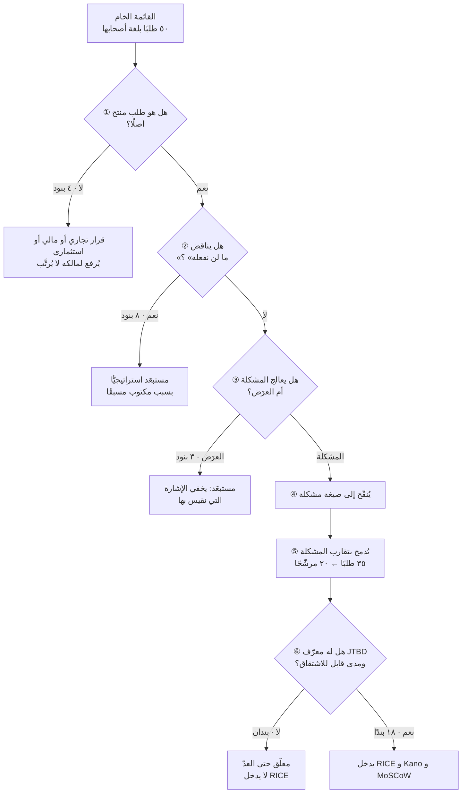
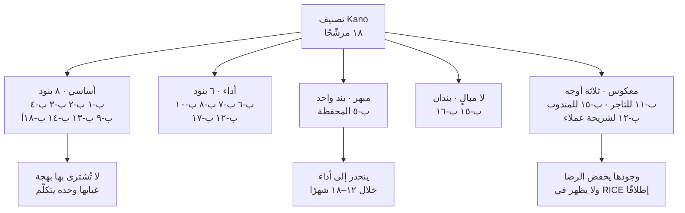
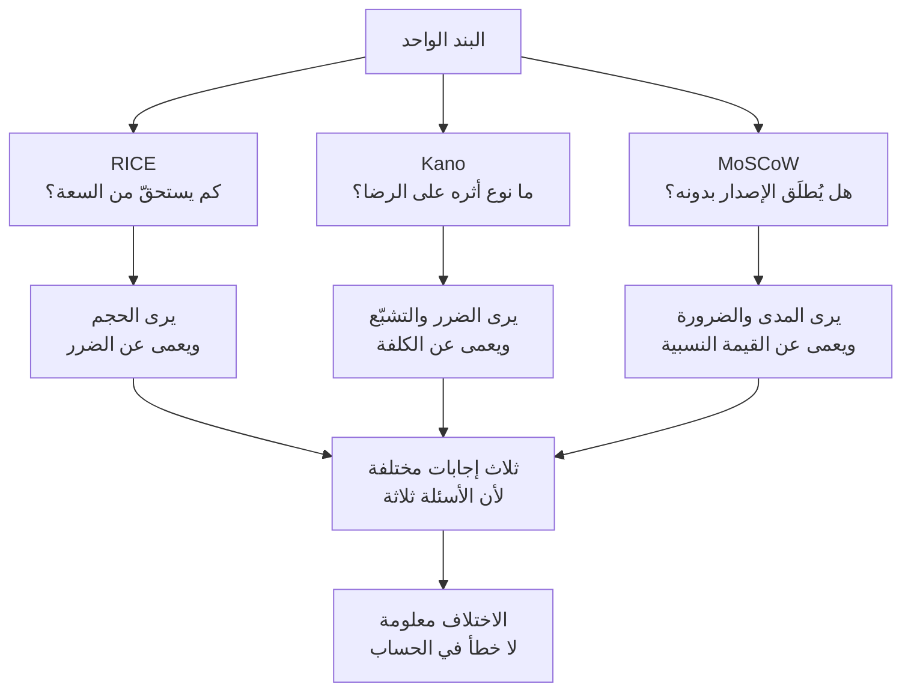
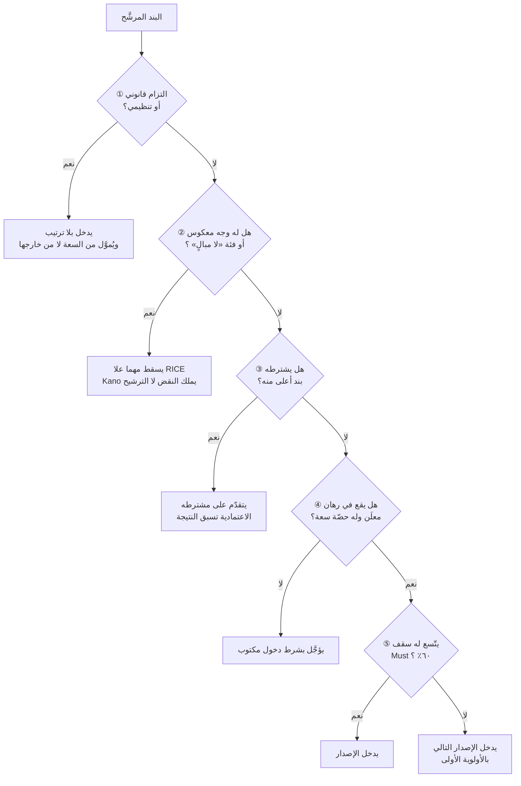
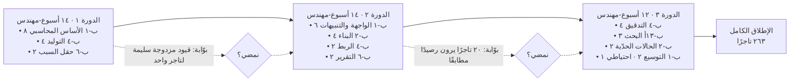
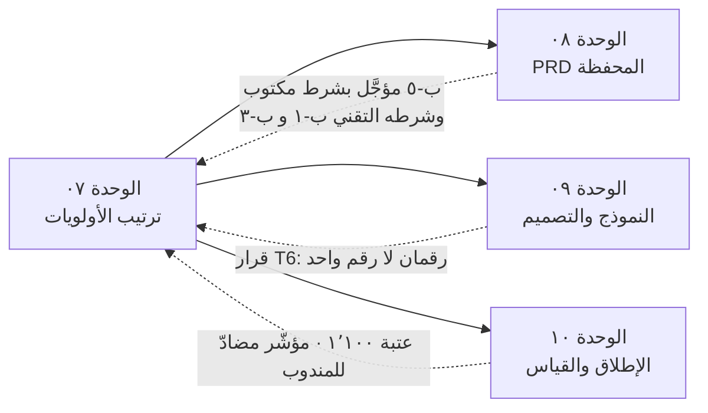

> [!info] الوحدة 07 · ورشة BridgePay
> **هذه أثقل وحدة عمليًّا في الورشة.** مدخلها قائمة الطلبات الخام الخمسين من [[00 - ميثاق المشروع ومصدر الحقيقة|الميثاق]]، ومخرَجها خطّة إصدار واحدة محدَّدة المدى بتقدير سعة صريح. وبينهما ثلاثة أطر تُشغَّل كاملةً — `RICE` و`Kano` و`MoSCoW` — **ثم تتعارض**. والتعارض هو الدرس، لا الجداول.
>
> الأطر نفسها مشروحة في [[05 - تحديد الأولويات (Prioritization)|الفصل الخامس]]، ولن تُعاد هنا. من لم يقرأه فليقرأه أولًا؛ فهذه الوحدة تفترض أنك تعرف صيغة `RICE` وفئات `Kano` الخمس ومعنى الحرف الأخير في `MoSCoW`.

# الوحدة 07 — ترتيب الأولويات

## ما ورثته من الوحدة السابقة

لا أبدأ من قائمة الخمسين وحدها. أبدأ منها **ومعي ستّة قيود** أنتجتها الوحدات ٠١–٠٦، وكل قيد منها يحذف خيارات قبل أن يبدأ أي حساب. وهذا هو الفرق العملي بين ورشة تتراكم وورشة تُعيد فتح كل شيء في كل وحدة.

| المصدر | ما ورثته بالضبط | كيف يقيّد هذه الوحدة |
|---|---|---|
| [[00 - ميثاق المشروع ومصدر الحقيقة\|الميثاق]] | القائمة الخام: **٥٠ بندًا** بنصّها · ٩ مهندسين · دورة أسبوعان · لا توظيف | المدخل والسقف. لا بند خارج القائمة، ولا خطّة فوق السعة |
| [[01 - رؤية المنتج واستراتيجيته\|الوحدة ٠١]] | الرؤية «ألّا يسأل أحدٌ: أين مالي؟» · ثلاثة رهانات بحصص **٥ · ٢ · ٢** · قائمة «ما لن نفعله» (٧ بنود) · قائمة المؤجَّل بسبب السعة | ٧ بنود **تسقط قبل الترتيب** لا فيه · وتوزيع السعة معلَن سلفًا فأي انحراف عنه يجب أن يُصرَّح به |
| [[02 - السوق والمنافسون\|الوحدة ٠٢]] | الفجوة المختارة: **كثافة الطلب + الحقّ المالي الشفّاف للتاجر** · طبقات الخندق وأزمنة نسخها · قيد النطاق: نلعب في «الطبقة المالية للتاجر» لا في «التوصيل» | معيار حاسم: البند الذي لا يقع في الطبقة المالية يحتاج مبرّرًا استثنائيًّا ليأخذ سعة |
| [[03 - الاكتشاف والبحث الميداني\|الوحدة ٠٣]] | ١٢ نمطًا بقوّة دليل معلَنة: **٣ قوية · ٧ متوسّطة · ٢ ضعيفة** | **مصدر عامل `Confidence`.** لا ثقة بلا نمط يسندها، ورقم الثقة مقفول على سُلَّم الأدلّة لا على حماسة صاحب البند |
| [[04 - الشخصيات والمهام\|الوحدة ٠٤]] | `JTBD-1`…`JTBD-5` · جدول تعارض بستّة صفوف (`T1`–`T6`) · الشخصية المضادّة `A1` | **عمود إلزامي:** البند بلا معرّف مهمّة لا يدخل `RICE` أصلًا · وقرار `T6` («رقمان لا رقم واحد») قيد تصميم لا اقتراح |
| [[05 - رحلة العميل ونقاط الألم\|الوحدة ٠٥]] | خريطتا رحلة + سجلّ نقاط ألم مرتَّب · **فلتران يسبقان `RICE`** · تحذير على `Reach` (خمسة بنود تكرارها مجهول) | **الفلتر الأول:** وحدة الترتيب هي **السبب لا العرَض**. **الفلتر الثاني:** كل بند عميل يُسأل: هل يرفع **كلفة الخروج** أم يحسّن **لحظة عابرة**؟ — وهذا الفلتر وحده أعاد ترتيب نصف الجدول |
| [[06 - الفرضيات والتحقّق\|الوحدة ٠٦]] | ٦ فرضيات مقفَلة بعتبات · عمود **`حالة الدليل`** (مؤكَّد · مرشّح · ساقط · غير مختبَر) · **ميزانية تحقّق ١٠٪ من السعة** | «الساقط» لا يدخل `RICE` أصلًا، و«غير مختبَر» يدخل بثقة مخفوضة صراحةً. **والـ١٠٪ تُخصم من السعة قبل أي ترتيب** — من يرتّب على ١٠٠٪ من السعة يرتّب على سعة لا يملكها |

### الأرقام المشتقّة التي سأستعملها في كل حساب

كل رقم أدناه **مشتقّ من الميثاق بحساب معروض**، ولا واحد منها جديد. أجمعها هنا مرّة واحدة كي لا يتكرّر الحساب في كل خانة، وكي يستطيع أي قارئ أن يدقّق مصدر أي عدد في جداول `RICE` لاحقًا.

| الرمز | المشتقّ | الحساب | القيمة |
|---|---|---|---|
| **م-١** | الطلبات في الربع | ٢٬٧٥٠ × ٩٠ يومًا | **٢٤٧٬٥٠٠ طلب** |
| **م-٢** | الطلبات النقدية في الربع | ٢٤٧٬٥٠٠ × ٣٨٪ | **٩٤٬٠٥٠ طلبًا** |
| **م-٣** | تذاكر «أين مستحقّاتي؟» في الربع | ٤٬٩٠٠ × ٣١٪ × ٣ أشهر | **٤٬٥٥٧ تذكرة** |
| **م-٤** | كل التذاكر في الربع | ٤٬٩٠٠ × ٣ | **١٤٬٧٠٠ تذكرة** |
| **م-٥** | التسويات في الربع | ٢٦٣ تاجرًا × (٩٠ ÷ ١٤) | **١٬٦٩١ تسوية** |
| **م-٦** | تذاكر التاجر الواحد شهريًّا | ١٬٥١٩ ÷ ٢٦٣ | **٥٫٨ تذكرة** |
| **م-٧** | طلبات العميل النشط في الربع | ٤٫٣ × ٣ | **١٢٫٩ طلبًا** |
| **م-٨** | قيمة النقد بيد المندوبين يوميًّا | ٢٬٧٥٠ × ٣٨٪ × ٧٤ ريالًا | **٧٧٬٣٣٠ ريالًا** |
| **م-٩** | السعة الإجمالية للإصدار | ٩ مهندسين × ٦ أسابيع | **٥٤ أسبوع-مهندس** |
| **م-١٠** | السعة الصافية القابلة للتخصيص | ٥٤ − ١٥٪ (أعطال · مناوبة · إجازات) − ١٠٪ (ميزانية التحقّق الموروثة من الوحدة ٠٦) | **٤٠ أسبوع-مهندس ≈ ١٠ شهر-شخص** |

> [!warning] ثلاثة معطيات **غير موجودة** في الميثاق — وكيف تصرّفت فيها
> القاعدة الحاكمة للورشة أن كل رقم إمّا من الميثاق أو مشتقّ منه بحساب معروض. وهذه الوحدة تحديدًا تصطدم بثلاثة أرقام يحتاجها `RICE` ولا يوفّرها الميثاق. وإخفاؤها كان سيجعل الجداول أنظف وأكذب، فأعلنها:
>
> **ف-١ · عدد المندوبين النشطين.** غير موجود، وقد نبّهت عليه [[04 - الشخصيات والمهام\|الوحدة ٠٤]] صراحةً. أشتقّ **حدًّا معقولًا مُعلَنًا**: ٢٬٧٥٠ طلبًا يوميًّا ÷ ١٠ طلبات للمندوب النشط في اليوم = **٢٧٥ مندوبًا**. والمقام (١٠) **افتراض لا معطى**؛ ولو كان ٦ لصار العدد ٤٥٨، ولو كان ١٦ لصار ١٧٢. ولذلك يدخل هذا الرقم تحليل الحساسية في آخر الوحدة، ولذلك أيضًا سُقِف عامل الثقة لكل بنود المندوب عند **٥٠٪**.
>
> **ف-٢ · عدد التجّار متعدّدي الفروع.** غير موجود. أشتقّه بنسبة الطلبات: طلبان من ١٦ طلبًا تاجريًّا يخصّان تعدّد الفروع (١٢٫٥٪)، فأطبّقها على ٢٦٣ نشطًا = **٣٣ تاجرًا**. والاشتقاق **ضعيف صراحةً** — نسبة الطلبات ليست نسبة التجّار — وهو أول رقم يجب أن يُستبدل بعدّ فعلي من قاعدة البيانات قبل أي جلسة حقيقية. عمل نصف ساعة يلغي هذا الافتراض تمامًا.
>
> **ف-٣ · معدّل الإلغاء.** غير موجود، رغم أن الميثاق يحوي طلبين يعتمدان عليه («استرداد فوري عند الإلغاء» و«تقرير الطلبات الملغاة»). أعتمد **٤٪ من الطلبات** بوصفه افتراضًا معلَنًا: ٢٤٧٬٥٠٠ × ٤٪ = **٩٬٩٠٠ حدث إلغاء في الربع**. ولا أدّعي له سندًا؛ هو رقم موضوع ليكون **قابلًا للتكذيب بسهولة** بعد يوم واحد من قراءة السجلّات.
>
> والقاعدة التي تستخرجها هذه القائمة: **الرقم المفقود لا يُملأ بالصمت.** إمّا أن تعدّه، أو تشتقّه بحساب معروض، أو تعلن أنه افتراض وتُنزل الثقة بسببه. أمّا أن تكتب رقمًا بلا وسم فذلك هو المكان الذي تدخل منه الكذبة إلى الجدول ولا تخرج.

## السؤال الذي تجيب عنه هذه الوحدة

**بأي ترتيب نبني، ولماذا هذا الترتيب لا غيره — وماذا نفعل حين تختلف الأطر الثلاثة على البند نفسه؟**

والسؤال الثالث هو الحقيقي. تشغيل `RICE` عمل نصف يوم يستطيعه أي متدرّب بعد قراءة مقالة. والصعوبة تبدأ حين ينتج `RICE` ترتيبًا يقول: ابنِ «إعادة الطلب السابق بضغطة»، ويقول `Kano` عن البند نفسه إنه **أساسي** فلا يُشترى به رضا، ويقول `MoSCoW` إنه ليس `Must` لهذا الإصدار، وتقول الاستراتيجية الموروثة من [[01 - رؤية المنتج واستراتيجيته|الوحدة ٠١]] إن خمسة من تسعة مهندسين مخصَّصون لشيء آخر تمامًا.

في تلك اللحظة تكتشف أن الأطر **ليست آلات قرار**. هي آلات كشف: كلٌّ منها يضيء زاوية ويعتم أخرى، واختلافها ليس عيبًا فيها بل هو **المعلومة**. والوحدة كلها مبنيّة لتصل بك إلى تلك اللحظة ثم تعلّمك كيف تحسم فيها بمعيار معلَن.

## العمل خطوة بخطوة

| # | الخطوة | ما تنتجه | الزمن التقديري |
|---|---|---|---|
| **١** | **قراءة القائمة الخام بنصّها** وتصنيف كل بند: طلب منتج · قرار تجاري/مالي · قرار استثماري | تصنيف أوّلي للخمسين | ٤٥ دقيقة |
| **٢** | **إسقاط المرفوض استراتيجيًّا** بمطابقة القائمة على «ما لن نفعله» من الوحدة ٠١ | ٨ بنود تسقط بسبب معلَن مسبقًا | ٢٠ دقيقة |
| **٣** | **تحويل كل طلب باقٍ إلى مشكلة**: «ما الذي يمنعه هذا الطلب من الحدوث؟» | عمود «المشكلة الكامنة» | ٩٠ دقيقة — **أطول خطوة وأهمّها** |
| **٤** | **الدمج** بتقارب المشكلة لا بتقارب الشاشة | ٢٠ مرشّحًا من ٣٥ طلبًا | ٦٠ دقيقة |
| **٥** | **وسم كل مرشّح بمعرّف `JTBD`** — والبند بلا معرّف يُعلَّق لا يُرتَّب | عمود إلزامي | ٢٠ دقيقة |
| **٦** | **اشتقاق `Reach`** من الميثاق لكل مرشّح، مع إعلان الافتراضات المفقودة | جدول المدى | ٦٠ دقيقة |
| **٧** | **تقدير `Effort`** بجلسة مع الهندسة والتصميم — **لا يقدّره مدير المنتج وحده** | جدول الجهد بالشهر-شخص | ٩٠ دقيقة |
| **٨** | **تثبيت `Confidence`** على سُلَّم أدلّة الوحدة ٠٣ | عمود الثقة بمصدره | ٣٠ دقيقة |
| **٩** | **حساب `RICE`** وعرض النتيجة **مجموعاتٍ ثلاثًا** لا ترتيبًا مفردًا | جدول مرتَّب | ٣٠ دقيقة |
| **١٠** | **تشغيل `Kano`** على المجموعة نفسها بتصنيف مبرَّر | جدول `Kano` | ٦٠ دقيقة |
| **١١** | **تشغيل `MoSCoW`** لإصدار الستّة أسابيع مع سقف ٦٠٪ على `Must` | جدول التزام | ٤٥ دقيقة |
| **١٢** | **مقارنة النتائج الثلاث** وتحرير التعارضات صراحةً | جدول المقارنة — **قلب الوحدة** | ٩٠ دقيقة |
| **١٣** | **تحليل الحساسية** على بند واحد على الأقلّ لإظهار الدقّة الزائفة | إعادة حساب بديلة | ٣٠ دقيقة |
| **١٤** | **كتابة الخطّة المعتمدة** بتقدير سعة صريح وقائمة «ما لم يدخل» | خطّة الإصدار | ٦٠ دقيقة |
| **١٥** | **كتابة الرفضات الثلاثة** بنصّها الموجَّه لأصحابها | ثلاث رسائل | ٤٥ دقيقة |

**الإجمالي: ~١١ ساعة عمل**، أي يوم ونصف. وهذا رقم يستحقّ الوقوف عنده: الفرق الذي «يرتّب أولوياته» في اجتماع ساعتين لا يرتّب، بل **يصوّت**. وسترى في الخطوة ٣ وحدها (٩٠ دقيقة) لماذا: تحويل الطلب إلى مشكلة هو العمل، وما بعده حساب.

## المخرَج

### القطعة ① — تنقية القائمة الخام: من ٥٠ طلبًا إلى ٢٠ مرشّحًا

القاعدة التي حكمت هذه الخطوة: **لا تُرتَّب الطلبات، تُرتَّب المشكلات.** والطلب صياغة صاحبه للحلّ الذي تخيّله، وهي معلومة ثمينة عنه — لكنها ليست وحدة الترتيب. فمن يرتّب «صرف يومي» مقابل «شاشة رصيد» يقارن حلّين لمشكلتين مختلفتين، ومن يرتّب «المندوب لا يعرف كم كسب اليوم» مقابل «التاجر لا يعرف كم له» يقارن مشكلتين قابلتين للمقارنة فعلًا.

وأربعة قرارات ممكنة لكل بند: **يُنقّح** (يُعاد صوغه مشكلةً) · **يُدمج** (مع بند يشترك معه في المشكلة لا في الشاشة) · **يُستبعد** (بسبب معلَن) · **يُعلَّق** (مشكلة حقيقية بلا مدى قابل للاشتقاق — فلا يُرتَّب حتى يُعدّ).



#### ①·أ — البنود المستبعَدة (١٥ بندًا) وسبب كلٍّ منها

هذه أوّل ما يُعرض عمدًا. الفريق الذي يبدأ بعرض ما سيبنيه يخفي قراره الحقيقي؛ والقرار الحقيقي هو ما أسقطه.

| # | الطلب كما ورد | المشكلة الكامنة | القرار ← لماذا |
|---|---|---|---|
| ١ | **تسوية أسبوعية** | «سيولتي مربوطة بدورة لا تناسب دورة التزاماتي» | **يُستبعد — قرار مالي لا منتجيّ.** يحتجز ~١٫٩ مليون ريال (القيد ٢). يُرفع لمالكه التنفيذي بملفّ مستقلّ، ويُعاد فتحه آليًّا إن أُبطل الرهان ① |
| ٢ | **تخفيض العمولة** | «هامشي ضعيف والعمولة أظهر بند فيه» | **يُستبعد — قرار تسعير.** كل نقطة = ٦١٬٠٥٠ ريالًا شهريًّا من مصدر الإيراد الوحيد. لا يُرتَّب مع الميزات |
| ٣ | **توسّع لمدينة ثالثة** | «النموّ متوقّف في مدينتين» | **يُستبعد — قرار استثماري.** التوسّع باحتفاظ ٢٢٪ يوسّع التسريب. شرط العودة: احتفاظ ٣٥٪ |
| ٤ | **اشتراك تجّار مميّز** | «نريد إيرادًا لا يعتمد على حجم الطلبات» | **يُستبعد — قرار نموذج إيراد.** لا يُقارَن بميزة، ويسبقه تعريف ما الذي يُشترى أصلًا |
| ٥ | **نقاط ولاء** | «العميل يرحل ولا شيء يمسكه» | **يُستبعد — يناقض الرهان ③** (نكسب بالموثوقية لا بالسعر). قبوله اعتراف مسبق بأن الولاء للسعر، فيهزم الرهان قبل اختباره |
| ٦ | **اشتراك توصيل مجاني** | نفس المشكلة أعلاه | **يُستبعد — نفس السبب**، مع كلفة تشغيلية دائمة على التوصيل |
| ٧ | **إشعار عند تخفيض سعر مطعم مفضّل** | «العميل يقارن ثلاثة تطبيقات قبل الطلب» | **يُستبعد — الشخصية المضادّة `A1`.** يشتري طلبًا واحدًا ويُعلّم العميل انتظار الخصم، فيهبط الطلب المكرَّر بلا خصم |
| ٨ | **عروض موسمية** | «التسويق يحتاج مادّة يُعلنها» | **يُستبعد — `A1`.** يُقاس بالحجم لا بالولاء، ويزاحم سعة الطبقة المالية |
| ٩ | **كوبونات مستهدَفة** | نفس المشكلة | **يُستبعد — `A1`**، مع مخرَج معروض في قسم «كيف نقول لا» |
| ١٠ | **برنامج إحالة** | نفس المشكلة | **يُستبعد — `A1`.** يستقطب شبيه المُحيل، ومُحيلونا اليوم من الشريحة الحسّاسة للسعر |
| ١١ | **إعلانات داخل التطبيق** | «إيراد إضافي من الحيّز المتاح» | **يُستبعد — يناقض الرؤية.** يجعل ترتيب المطاعم مدفوعًا لا صادقًا، فيأكل الثقة التي يقوم عليها كل شيء آخر |
| ١٢ | **تقسيم الدفع بين أكثر من بطاقة** | «قيمة الطلب أحيانًا فوق رصيد بطاقة واحدة» | **يُستبعد — يناقض الرؤية.** يضاعف تعقيد التسوية والاسترداد ويزيد غموض المال. راجع [[Split Payment]] |
| ١٣ | **مساعد ذكي يجيب أسئلة التجّار** | «التاجر يسأل كثيرًا والدعم مثقَل» | **يُستبعد — يفسد أداة القياس.** هدفنا ألّا يُسأل السؤال لا أن يُجاب عنه بأناقة؛ وإطلاقه يخفض التذاكر بلا أن نعرف هل فاز الرهان ① أم اختفت إشارته |
| ١٤ | **قالب ردود جاهز** | «زمن الردّ على التذكرة طويل» | **يُستبعد — يعالج العرَض.** يحسّن كفاءة الردّ على تذكرة نريد **إلغاء سببها**؛ وتحسين كلفة العرَض يقلّل الحافز لإزالة السبب |
| ١٥ | **تصعيد آلي بعد ساعتين** | «التذاكر تُنسى» | **يُستبعد — يعالج العرَض**، ويصلح بند عمليات داخلي في أداة الدعم لا بند منتج في هذا الإصدار |

> [!important] لماذا فصلتُ «قرار تجاري» عن «مستبعَد استراتيجيًّا»؟
> لأن مصير البندين مختلف تمامًا. البنود ١–٤ **لم تُرفض**؛ هي خرجت من ولايتي أصلًا. تخفيض العمولة قرار الرئيس التنفيذي المالي، والتسوية الأسبوعية قرار مجلس، والتوسّع قرار استثمار. ودوري فيها أن أُسلّمها بملفّ مكتوب لمالكها، لا أن أضعها في المرتبة الثالثة عشرة في جدول `RICE` حيث تموت بصمت.
>
> وهذا خطأ شائع ومكلف: مدير المنتج يضع قرارًا خارج صلاحيته في قائمته، فيصير مسؤولًا عن رفضٍ لم يملك قبوله أصلًا، ويتلقّى الغضب نيابةً عن من يملك القرار فعلًا. **البند الذي لا تملك أن تقول له «نعم» لا يجوز أن تكون أنت من يقول له «لا».**

#### ①·ب — البندان المعلَّقان

| الطلب كما ورد | المشكلة الكامنة | القرار ← لماذا |
|---|---|---|
| **تعديل الطلب بعد الاستلام** + **دردشة مع المطعم** | «الطلب يحتاج تصحيحًا بعد إرساله، ولا قناة لذلك إلا الإلغاء» | **يُعلَّق.** مشكلة حقيقية يشير إليها النمط ن-٩ (قنوات الإبلاغ أضيق من الوقائع)، لكن **لا مدى قابلًا للاشتقاق**: لا يوجد في الميثاق ما يقول كم طلبًا يحتاج تصحيحًا. يدخل الترتيب بعد قراءة سجلّ الإلغاءات — عمل يوم واحد |
| **فلترة حسب الوقت** | «العميل لا يجد ما يصل سريعًا الآن» | **يُعلَّق.** لا نمط يسنده ولا رقم يقيسه، وهو أضعف بنود القائمة دليلًا. لا يُستبعد — يُترك للجولة القادمة بشرط قياس |

> [!note] «معلَّق» ليس مرادفًا مهذّبًا لـ«مرفوض»
> الفرق أن للمعلَّق **شرط دخول مكتوبًا وعملًا محدَّدًا يفتحه** (اقرأ سجلّ الإلغاءات · اعدد الطلبات المصحَّحة). والمرفوض ليس له. ومن يستعمل «معلَّق» ليتجنّب مواجهة صاحب الطلب يكون قد ارتكب الخطأ الذي حذّر منه [[05 - تحديد الأولويات (Prioritization)|الفصل الخامس]]: **الرفض بالصمت** — وهو أسوأ من الرفض الصريح لأنه يستهلك انتباه صاحبه شهورًا ويجعله يخطّط على أساس أن البند «قادم».

#### ①·ج — الطلبات الخمسة والثلاثون الباقية: من طلب إلى مشكلة إلى مرشّح

هذا الجدول هو العمل الحقيقي في الوحدة. اقرأ العمود الثاني وحده وستجد أنك أمام قائمة مختلفة تمامًا عن القائمة الأولى — وأقصر منها، لأن مشكلات كثيرة كانت تختبئ خلف طلبات متعدّدة.

| الطلب كما ورد | المشكلة الكامنة (بلغة الملاحظة) | القرار | المرشّح |
|---|---|---|---|
| شاشة رصيد لحظي | التاجر لا يملك وسيلة لمعرفة مستحقّه إلا بسؤال بشر (ن-١) | يُنقّح ويُدمج | **ب-١** |
| تنبيه عند التحويل | يعرف بوصول ماله بالمصادفة لا بإخطار (ن-١) | يُدمج مع السابق — نفس المشكلة في لحظة مختلفة | **ب-١** |
| كشف حساب `PDF` | لا يستطيع تفسير الفرق بين ما توقّعه وما وصله (ن-٣) | يُنقّح ويُدمج | **ب-٢** |
| تقرير عمولات تفصيلي | الإدارة لا تستطيع إثبات صحّة العمولة للتاجر (ن-٣) | يُدمج — نفس المشكلة من الطرف الآخر | **ب-٢** |
| لوحة توفيق تسويات | ثلاثة مصادر لا تتفق، والتوفيق يدويّ ٦ ساعات أسبوعيًّا (`JTBD-5`) | يُنقّح | **ب-٣** |
| فوترة إلكترونية متوافقة | التزام تنظيمي غير منفَّذ داخل المنتج (القيد ٣) | يُنقّح — **خارج الترتيب** | **ب-٤** |
| محفظة قابلة للسحب الفوري | المال المستحقّ لا يبدو مملوكًا حتى يصل الحساب البنكي | يُنقّح | **ب-٥** |
| سبب إلغاء إلزامي | الإلغاء يقع بلا سبب مسجَّل فلا يمكن ردّه لصاحبه | يُنقّح ويُدمج | **ب-٦** |
| تقرير الطلبات الملغاة وأسبابها | التاجر يرى خصمًا ولا يرى سببه (ن-٣) | يُدمج — المخرَج لمدخل البند السابق | **ب-٦** |
| استرداد فوري عند الإلغاء | العميل يدفع ثم ينتظر ماله بلا أفق، والتاجر يُفاجأ بالخصم بعد ١٤ يومًا (`T5`) | يُنقّح | **ب-٧** |
| إدارة فروع متعدّدة | مديرة السلسلة لا تستطيع مقارنة الفروع فتتدخّل متأخّرة (`JTBD-2`) | يُنقّح ويُدمج | **ب-٨** |
| صلاحيات موظّفين | لا يمكن تفويض الاطّلاع دون تسليم الحساب كلّه | يُدمج — شرط تمكيني للسابق | **ب-٨** |
| رؤية قيمة الطلب قبل القبول | المندوب يقرّر في ثوانٍ بلا المعلومة الحاسمة (`JTBD-4`) | يُنقّح ويُدمج | **ب-٩** |
| احتساب أدقّ للمسافة | المسافة تُحسب خطًّا مستقيمًا فيقود واقعًا أطول | يُدمج — نفس قرار القبول | **ب-٩** |
| تقرير أرباح أسبوعي | لا يعرف كم كسب فيمسك دفترًا موازيًا (ن-٢) | يُنقّح ويُدمج | **ب-١٠** |
| صرف يومي | دورته المعيشية يومية ودورتنا ليست كذلك (`T4`) | **يُنقّح إلى مشكلته الكامنة:** الطلب الحقيقي معرفة الرقم لا قبضه — يُدمج | **ب-١٠** |
| تقليل وقت الانتظار في المطعم | أعلى بند كلفة في يوم المندوب، وزمن لا يُدفع له مقابله (`T3`) | يُنقّح ويُدمج | **ب-١١** |
| قبول/رفض بضغطة | زمن استجابة التاجر يؤخّر بدء التجهيز | يُدمج — مدخل لنافذة الجاهزية | **ب-١١** |
| طباعة تلقائية للطلب | خطوة يدوية تؤخّر دخول الطلب للمطبخ | يُدمج — نفس المشكلة | **ب-١١** |
| موعد وصول دقيق | الوعد المعلَن متفائل، وخيبته تُنتج إلغاءً (`T2`) | يُنقّح ويُدمج | **ب-١٢** |
| تتبّع مباشر للمندوب | العميل لا يملك دليلًا على أن الطلب يتحرّك | يُدمج — نفس مشكلة اليقين الزمني | **ب-١٢** |
| بحث في الطلبات بأي حقل | الدعم لا يصل إلى الطلب إلا برقمه، والتاجر لا يحفظه | يُنقّح ويُدمج | **ب-١٣** |
| لوحة نزاعات موحّدة | النزاع مبعثر بين أنظمة فيطول ويُنسى | يُدمج — نفس مشكلة الوصول للحقيقة | **ب-١٣** |
| إعادة الطلب السابق بضغطة | العميل يعيد بناء طلب يعرفه من الصفر (`JTBD-3`) | يُنقّح ويُدمج | **ب-١٤** |
| حفظ عناوين متعدّدة | يعيد إدخال عنوان معروف في كل طلب | يُدمج — نفس مشكلة تكرار العمل المعروف | **ب-١٤** |
| تقييم المندوب | العميل لا يملك قناة تعبير عن تجربة التسليم (ن-٩) | يُنقّح | **ب-١٥** |
| لوحة تنفيذية | الإدارة تطلب أرقامًا من الفريق فتستهلك وقته | يُنقّح | **ب-١٦** |
| ربط مع نظام نقاط البيع | التاجر يدير مخزونين وقائمتين ويوفّق بينهما يدويًّا (ن-٢) | يُنقّح ويُدمج | **ب-١٧** |
| إيقاف الأصناف المنتهية سريعًا | الصنف المعروض غير متاح فيُلغى الطلب بعد قبوله | يُدمج — عرَض لانفصال المخزون | **ب-١٧** |
| تقرير أصناف الأكثر مبيعًا | لا يعرف ما يستحقّ التجهيز المسبق | يُدمج — نفس مصدر البيانات | **ب-١٧** |
| تجميع طلبات متقاربة | الرحلات المتقاربة تُنفَّذ منفصلة فينخفض الدخل بالساعة | يُنقّح ويُدمج | **ب-١٨** |
| وضع «مشغول» | المندوب يغلق التطبيق فتقرأ بياناتنا «غير متّصل» بدل «مشغول» (ن-١١) | يُدمج — كلاهما إدارة حمل | **ب-١٨** |
| تعديل الطلب بعد الاستلام | لا قناة لتصحيح الطلب إلا الإلغاء | **يُعلَّق** — لا مدى | — |
| دردشة مع المطعم | نفس المشكلة بقناة أخرى | **يُعلَّق** — لا مدى | — |
| فلترة حسب الوقت | لا يجد ما يصل سريعًا الآن | **يُعلَّق** — لا دليل ولا رقم | — |

**الحصيلة:** ٥٠ طلبًا ← ١٥ مستبعَدًا + ٣ معلَّقة + ٣٢ طلبًا اندمجت في **١٨ مرشّحًا** يدخل منها ١٧ حسابَ `RICE` (وواحد — ب-٤ الفوترة الإلكترونية — يخرج من الترتيب بحكم كونه التزامًا قانونيًّا).

> [!tip] ثلاث ملاحظات على عملية الدمج نفسها
> **① الدمج يقع على المشكلة لا على الشاشة.** «صرف يومي» و«تقرير أرباح أسبوعي» يبدوان بندين متباعدين (أحدهما مال والآخر تقرير)، وقد اندمجا لأن مقابلات [[03 - الاكتشاف والبحث الميداني|الوحدة ٠٣]] أظهرت أن الطلب الحقيقي وراء «صرف يومي» هو **معرفة الرقم** لا قبضه. في المقابل «شاشة رصيد» و«محفظة سحب فوري» يبدوان بندًا واحدًا وقد فُصلا، لأن الأول يحلّ **الغموض** والثاني يحلّ **المِلكية** — ومشكلتان مختلفتان بجهد مختلف بعشرة أضعاف.
>
> **② الدمج يخفي الخسائر إن لم يُوثَّق.** حين تدمج «طباعة تلقائية للطلب» في ب-١١، فإن صاحب الطلب لن يجد اسم طلبه في أي جدول لاحق. ولهذا كُتب الجدول أعلاه بعمود «الطلب كما ورد» **بنصّه**: هو المسار الذي يعود منه صاحب الطلب إلى مصير طلبه. القائمة التي لا تحفظ نصّ الطلب الأصلي تُنتج شعورًا صحيحًا بأن الطلبات «تضيع في النظام».
>
> **③ العدد النهائي ليس هدفًا.** لم أسعَ إلى رقم بعينه، لكن الانخفاض من ٥٠ إلى ١٨ مؤشّر صحّة: القائمة الخام كانت تحوي **مشكلات مكرّرة بلغات خمس شرائح**. والفريق الذي يخرج من التنقية بـ٤٧ بندًا من ٥٠ لم ينقِّ، بل أعاد ترقيم.

---

### القطعة ② — `RICE` مشغَّلًا كاملًا على السبعة عشر مرشّحًا

الصيغة ومعاني عواملها في [[RICE Prioritization|المعجم]] وفي [[05 - تحديد الأولويات (Prioritization)|الفصل الخامس]]، ولن تُعاد. ما يُعاد هنا هو ما لا يُعاد عادةً: **من أين جاء كل رقم**.

#### ②·أ — السلالم المعلَنة قبل رؤية أي بند

القاعدة التي أُلزم بها نفسي: **تُعلَن السلالم قبل التقدير لا بعده.** لأن من يرى النتيجة ثم يضبط السلّم يكون قد استعمل `RICE` لتزيين قرار اتّخذه سلفًا، وهذا أشيع فساد في الأطر كلها.

**سلّم `Impact` — بتعريف سلوكي لا وصفي:**

| القيمة | التعريف السلوكي |
|---|---|
| **٣** | يُلغي المهمّة كلها — لا يعود المستخدم يؤدّيها بأي وسيلة |
| **٢** | يزيل **خطوة كاملة** من مسار قائم |
| **١** | يقلّل الاحتكاك دون إزالة خطوة |
| **٠٫٥** | يحسّن الإدراك لا العمل |
| **٠٫٢٥** | تحسين تجميلي |

وسبب ربط الدرجات بسلوك لا بصفة («هائل» · «كبير») أن الصفات تُقاس بحماسة قائلها، والسلوك يُقاس بالملاحظة. ومع ذلك يبقى السُّلَّم **ترتيبيًّا** (`Ordinal`) لا كمّيًّا: لا يوجد معنى تجريبي لكون «٣» تساوي ثلاثة أمثال «١»، وضربها في `RICE` ضربُ أرقام لا تحتمل الضرب. هذا عيب معروف في الإطار، لا في تطبيقنا له، وسنعود إليه في تحليل الحساسية.

**سلّم `Confidence` — مربوط بأنماط [[03 - الاكتشاف والبحث الميداني|الوحدة ٠٣]] لا برأي صاحب البند:**

| القيمة | الشرط |
|---|---|
| **١٠٠٪** | تجربة سابقة أو [[AB Testing\|اختبار أ/ب]] منشور النتيجة — **لا يوجد عندنا بند واحد بهذا الوصف** |
| **٨٠٪** | نمط «قوي» من الوحدة ٠٣ **مسنود برقم من الميثاق** |
| **٦٥٪** | نمط «متوسّط» مسنود برقم، أو نمط قوي بتنفيذ غير مختبَر |
| **٥٠٪** | نمط «ضعيف»، أو نمط متوسّط يقوم على أحد الافتراضات ف-١/ف-٢/ف-٣ |
| **دون ٥٠٪** | **لا يُرتَّب** — يتحوّل إلى تجربة صغيرة |

**وربط عمود `حالة الدليل` الموروث من [[06 - الفرضيات والتحقّق|الوحدة ٠٦]] بهذا السُّلَّم:** «مؤكَّد» ← ٨٠٪ · «مرشّح» ← ٦٥٪ · «غير مختبَر» ← ٥٠٪ · **«ساقط» ← لا يدخل الجدول إطلاقًا**. وهذا الربط هو ما يمنع أشهر تلاعب في `RICE`: أن يرفع صاحب البند ثقته لأنه مقتنع. فالثقة هنا **ليست شعورًا بل موضعًا في جدول أدلّة كُتب قبل أن يُطرح البند**.

ولاحظ أن الصفّ الأول فارغ. هذا وحده معلومة تستحقّ أن تُقال في الاجتماع قبل عرض أي جدول: **لا يوجد بند واحد في قائمتنا مسنود بتجربة.** كل ما بنيناه مسنود بمقابلات وأرقام دعم، وهي أدلّة محترمة لكنها ليست دليلًا تجريبيًّا. وهذا يعني أن الجدول كله يعيش في نطاق الثقة ٥٠–٨٠٪، وأن الفروق بين بنوده أضيق ممّا توحي به أرقامه.

**وحدة `Reach`:** عدد **الأشخاص** المتأثّرين في **ربع واحد**، ومصدر كل عدد معروض في الجدول. وقواعد الجماهير: ٢٦٣ تاجرًا نشطًا · ١٩٬٢٠٠ عميل نشط شهريًّا · ٢٧٥ مندوبًا (ف-١) · ٧ أشخاص في الدعم والمحاسبة · ٥ في الإدارة.

**وحدة `Effort`:** الشهر-شخص، **شاملًا التصميم والاختبار والإطلاق** لا الهندسة وحدها، ومقدَّرًا في جلسة مع الهندسة والتصميم لا من مدير المنتج منفردًا. والتحويل المعتمد: **١ شهر-شخص = ٤ أسابيع-مهندس**.

#### ②·ب — الجدول الكامل

| الرمز | المرشّح | `JTBD` | `Reach`/ربع | مصدر المدى | `I` | `C` | مصدر الثقة | `E` (شهر-شخص) | **`RICE`** |
|---|---|---|---|---|---|---|---|---|---|
| **ب-١٤** | إعادة الطلب السابق + العناوين المحفوظة | `JTBD-3` | ١٩٬٢٠٠ | كل عميل نشط | ١ | ٦٥٪ | ن-٦ متوسّط | ١٫٥ | **٨٬٣٢٠** |
| **ب-١٢** | موعد وصول صادق + تتبّع مباشر | `JTBD-3` | ١٩٬٢٠٠ | كل عميل نشط | ٢ | ٥٠٪ | ن-٨ ضعيف–متوسّط | ٤٫٠ | **٤٬٨٠٠** |
| **ب-١٥** | تقييم المندوب | `JTBD-3` | ١٩٬٢٠٠ | كل عميل نشط | ٠٫٥ | ٥٠٪ | ن-٩ متوسّط | ١٫٠ | **٤٬٨٠٠** |
| **ب-٧** | استرداد فوري مع خصم مرئي في رصيد التاجر | `JTBD-3` + `JTBD-1` | ٩٬٩٠٠ | م-١ × ف-٣ (٤٪ إلغاء) | ٢ | ٥٠٪ | افتراض ف-٣ | ٢٫٥ | **٣٬٩٦٠** |
| **ب-٢** | كشف حساب يطابق التحويل ريالًا بريال | `JTBD-1` + `JTBD-2` | ٢٦٣ | كل تاجر نشط | ٢ | ٨٠٪ | ن-٣ قوي | ١٫٥ | **٢٨٠٫٥** |
| **ب-٩** | قيمة الطلب والمسافة الحقيقية قبل القبول | `JTBD-4` | ٢٧٥ | ف-١ | ٣ | ٥٠٪ | ن-١٠ ضعيف (مقابلة واحدة) | ٢٫٠ | **٢٠٦٫٣** |
| **ب-١٠** | لوحة أرباح المندوب + رصيد نقدي مستحقّ التوريد | `JTBD-4` | ٢٧٥ | ف-١ | ٢ | ٥٠٪ | ن-٢ قوي على ف-١ | ١٫٥ | **١٨٣٫٣** |
| **ب-١١** | نافذة الجاهزية: قياس زمن التجهيز وتأجيل الإسناد | `JTBD-4` + `JTBD-1` | ٥٣٨ | ٢٧٥ + ٢٦٣ | ٢ | ٥٠٪ | ن-١٠ ضعيف + ن-١١ متوسّط | ٣٫٠ | **١٧٩٫٣** |
| **ب-٣** | التوفيق النقدي الآلي (المرحلة الأولى) | `JTBD-5` | ٢٦٣ | كل تاجر نشط | ٣ | ٦٥٪ | ن-٣ قوي · تنفيذ غير مختبَر | ٣٫٠ | **١٧١٫٠** |
| **ب-٦** | سبب إلغاء منظَّم + تقرير الإلغاءات | `JTBD-1` + `JTBD-5` | ٢٦٣ | كل تاجر نشط | ١ | ٦٥٪ | ن-٣ متوسّط الإسناد | ١٫٠ | **١٧١٫٠** |
| **ب-١** | دفتر التاجر: رصيد «مؤكّد» و«قيد التأكيد» + تنبيه | `JTBD-1` | ٢٦٣ | كل تاجر نشط | ٣ | ٨٠٪ | ن-١ + ن-٢ قويان + ٣١٪ | ٤٫٠ | **١٥٧٫٨** |
| **ب-١٨** | إدارة حمل المندوب: التجميع + وضع «مشغول» | `JTBD-4` | ٢٧٥ | ف-١ | ١ | ٥٠٪ | ن-١١ متوسّط على ف-١ | ٢٫٥ | **٥٥٫٠** |
| **ب-٥** | المحفظة والسحب الفوري | `JTBD-1` | ٢٦٣ | كل تاجر نشط | ٢ | ٥٠٪ | لا نمط مباشر | ٦٫٠ | **٤٣٫٨** |
| **ب-١٧** | ربط نقاط البيع: المخزون والأصناف والمبيعات | `JTBD-2` | ٢٦٣ | كل تاجر نشط | ١ | ٥٠٪ | ن-٢ · مالكو نقاط البيع مجهولون | ٤٫٠ | **٣٢٫٩** |
| **ب-٨** | مقارنة الفروع + صلاحيات الموظّفين | `JTBD-2` | ٣٣ | ف-٢ | ٢ | ٥٠٪ | ن-٢ على ف-٢ الضعيف | ٢٫٠ | **١٦٫٥** |
| **ب-١٣** | بحث بأي حقل + لوحة نزاعات موحّدة | `JTBD-5` | ٧ | ٦ دعم + محاسب | ٣ | ٨٠٪ | ن-٣ قوي · مستخدم داخلي | ٢٫٠ | **٨٫٤** |
| **ب-١٦** | لوحة تنفيذية | — | ٥ | فريق الإدارة | ١ | ٨٠٪ | مباشر ومعلوم | ١٫٠ | **٤٫٠** |
| **ب-٤** | **الفوترة الإلكترونية المتوافقة** | `JTBD-1` | ٢٦٣ | كل تاجر نشط | — | — | **التزام تنظيمي** | ٢٫٥ | **خارج الترتيب** |

#### ②·ج — النتيجة معروضة كما ينبغي أن تُعرض: ثلاث مجموعات لا سبعة عشر مرتبة

عرض سبعة عشر بندًا بترتيب مفرد ادّعاءٌ بأننا نعرف أن البند التاسع أولى من العاشر. ونحن لا نعرف ذلك: ب-٣ وب-٦ نتيجتهما **متطابقة تمامًا** (١٧١٫٠)، وأحدهما بنية مالية تستغرق اثني عشر أسبوع-مهندس والآخر حقل إلزامي في شاشة إلغاء يستغرق أربعة. الرقم نفسه، والبندان لا يشبهان بعضهما في شيء. ولذلك:

| المجموعة | البنود | ما تعنيه |
|---|---|---|
| **عالية** (بالآلاف) | ب-١٤ · ب-١٢ · ب-١٥ · ب-٧ | بنود جمهورها **العملاء**، ومداها أكبر بـ٧٣ ضعفًا من بنود التجّار |
| **متوسّطة** (بالمئات) | ب-٢ · ب-٩ · ب-١٠ · ب-١١ · ب-٣ · ب-٦ · ب-١ | جمهورها التجّار والمندوبون — وفيها **كل بنود الاستراتيجية الموروثة** |
| **منخفضة** (بالعشرات فأقلّ) | ب-١٨ · ب-٥ · ب-١٧ · ب-٨ · ب-١٣ · ب-١٦ | جمهورها صغير أو جهدها كبير أو ثقتها ضعيفة |

> [!danger] النتيجة الصادمة — واقرأها قبل أن تصدّقها
> `RICE` وضع **«إعادة الطلب السابق بضغطة»** في المرتبة الأولى، ووضع **«دفتر التاجر»** في المرتبة الحادية عشرة. أي أن الإطار — لو نُفِّذ بحرفيّته — **ينسف استراتيجية [[01 - رؤية المنتج واستراتيجيته|الوحدة ٠١]] كلها**، ويحوّل خمسة مهندسين من طبقة المال إلى تسهيلات تسوّق للعملاء.
>
> والسبب ليس أن `RICE` غبيّ، ولا أن الاستراتيجية خاطئة. السبب **حسابي بحت**: مقام المقارنة عندنا غير موحَّد. ١٩٬٢٠٠ عميل مقابل ٢٦٣ تاجرًا نسبةٌ قدرها **٧٣ إلى ١**. وأي بند يمسّ العملاء سيهزم أي بند يمسّ التجّار مهما كان أثره ضئيلًا، لأن عامل `Reach` يدخل الصيغة **ضربًا مباشرًا بلا سقف**. لاحظ أن ب-١٥ (تقييم المندوب) أثره **٠٫٥** — أضعف درجة في السُّلَّم بعد التجميلية — وقد جلس في المرتبة الثانية مناصفةً.
>
> **هذا ليس عيبًا نتجاوزه بحسن النيّة؛ هو خاصّية بنيوية في `RICE` يجب أن تُعالَج صراحةً.** وهو ما تفعله الفقرة التالية.

#### ②·د — التصحيح المعلَن: المدى المطبَّع

العلاج المعروف حين تكون الجماهير غير متجانسة أن يُقاس `Reach` **نسبةً من جمهور البند** لا عددًا مطلقًا. أي أن السؤال يصير: «كم من جمهور هذا البند يمسّه؟» بدل «كم إنسانًا يمسّه؟». والفرق أن الأول يقيس **التغطية** والثاني يقيس **حجم السوق**.

**المدى المطبَّع = (المدى ÷ قاعدة جمهور البند) × ١٠٠**، ثم `RICE` بالصيغة نفسها.

| الرمز | المدى الخام | القاعدة | المطبَّع | `I` × `C` ÷ `E` | **`RICE` المطبَّع** | الرتبة الخام ← المطبَّعة |
|---|---|---|---|---|---|---|
| ب-١٣ | ٧ | ٧ | ١٠٠ | ٣ × ٠٫٨ ÷ ٢٫٠ | **١٢٠٫٠** | ١٦ ← **١** |
| ب-٢ | ٢٦٣ | ٢٦٣ | ١٠٠ | ٢ × ٠٫٨ ÷ ١٫٥ | **١٠٦٫٧** | ٥ ← **٢** |
| ب-١٦ | ٥ | ٥ | ١٠٠ | ١ × ٠٫٨ ÷ ١٫٠ | **٨٠٫٠** | ١٧ ← **٣** |
| ب-٩ | ٢٧٥ | ٢٧٥ | ١٠٠ | ٣ × ٠٫٥ ÷ ٢٫٠ | **٧٥٫٠** | ٦ ← **٤** |
| ب-١٠ | ٢٧٥ | ٢٧٥ | ١٠٠ | ٢ × ٠٫٥ ÷ ١٫٥ | **٦٦٫٧** | ٧ ← **٥** |
| ب-٣ | ٢٦٣ | ٢٦٣ | ١٠٠ | ٣ × ٠٫٦٥ ÷ ٣٫٠ | **٦٥٫٠** | ٩ ← **٦** |
| ب-٦ | ٢٦٣ | ٢٦٣ | ١٠٠ | ١ × ٠٫٦٥ ÷ ١٫٠ | **٦٥٫٠** | ١٠ ← **٦** |
| ب-١ | ٢٦٣ | ٢٦٣ | ١٠٠ | ٣ × ٠٫٨ ÷ ٤٫٠ | **٦٠٫٠** | ١١ ← **٨** |
| ب-١٤ | ١٩٬٢٠٠ | ١٩٬٢٠٠ | ١٠٠ | ١ × ٠٫٦٥ ÷ ١٫٥ | **٤٣٫٣** | ١ ← **٩** |
| ب-١١ | ٥٣٨ | ٥٣٨ | ١٠٠ | ٢ × ٠٫٥ ÷ ٣٫٠ | **٣٣٫٣** | ٨ ← **١٠** |
| ب-١٢ | ١٩٬٢٠٠ | ١٩٬٢٠٠ | ١٠٠ | ٢ × ٠٫٥ ÷ ٤٫٠ | **٢٥٫٠** | ٢ ← **١١** |
| ب-١٥ | ١٩٬٢٠٠ | ١٩٬٢٠٠ | ١٠٠ | ٠٫٥ × ٠٫٥ ÷ ١٫٠ | **٢٥٫٠** | ٢ ← **١١** |
| ب-٧ | ٩٬٩٠٠ | ١٩٬٢٠٠ | ٥١٫٦ | ٢ × ٠٫٥ ÷ ٢٫٥ | **٢٠٫٦** | ٤ ← **١٣** |
| ب-١٨ | ٢٧٥ | ٢٧٥ | ١٠٠ | ١ × ٠٫٥ ÷ ٢٫٥ | **٢٠٫٠** | ١٢ ← **١٤** |
| ب-٥ | ٢٦٣ | ٢٦٣ | ١٠٠ | ٢ × ٠٫٥ ÷ ٦٫٠ | **١٦٫٧** | ١٣ ← **١٥** |
| ب-١٧ | ٢٦٣ | ٢٦٣ | ١٠٠ | ١ × ٠٫٥ ÷ ٤٫٠ | **١٢٫٥** | ١٤ ← **١٦** |
| ب-٨ | ٣٣ | ٢٦٣ | ١٢٫٥ | ٢ × ٠٫٥ ÷ ٢٫٠ | **٦٫٣** | ١٥ ← **١٧** |

**الترتيبان مختلفان جذريًّا.** ب-١٣ قفز من السادس عشر إلى الأول، وب-١٤ هبط من الأول إلى التاسع، وب-١٢ من الثاني إلى الحادي عشر. والمدخلات لم تتغيّر: نفس الأثر، نفس الثقة، نفس الجهد، نفس المصدر. **تغيّر تعريف كلمة واحدة: `Reach`.**

> [!warning] الدرس الذي لا يُنسى بعد هذا الجدول
> **اختيار وحدة القياس قرارٌ منتجيّ، لا تفصيلة حسابية.** من يقيس `Reach` بالعدد المطلق يقول ضمنًا: «أهمّ ما عندي هو عدد الرؤوس»، وهذه استراتيجية نموّ بالعرض. ومن يقيسه بنسبة التغطية يقول: «أهمّ ما عندي هو عمق الخدمة لكل شريحة»، وهذه استراتيجية نموّ بالعمق — وهي بالضبط **الرهان ②** الموروث من الوحدة ٠١.
>
> فالجدول لم «يُصحَّح»؛ هو أُعيد حسابه بافتراض استراتيجي مختلف. وحين يعرض عليك أحدهم جدول `RICE` فأول سؤالين لا ثالث لهما: **بأي وحدة قِسْتَ المدى؟ ومن أين جاء رقم الثقة؟** والباقي أرقام تخدم إجابتيهما.
>
> ولذلك لا أعتمد أيًّا من الترتيبين حاكمًا. أعتمد **المطبَّع** أساسًا للنقاش لأنه متّسق مع استراتيجيتنا المعلَنة، وأحتفظ بالخام معروضًا لأنه يقول شيئًا صحيحًا لا يقوله الآخر: **لدينا ١٩٬٢٠٠ عميل نشط لا نلمسهم في هذا الإصدار إطلاقًا، وهذه تكلفة يجب أن تُنطَق لا أن تُطبَّع بعيدًا.**

---

### القطعة ③ — `Kano` مشغَّلًا على المجموعة نفسها

`Kano` يجيب سؤالًا لا يستطيع `RICE` أن يقترب منه: **ما نوع العلاقة بين وجود هذه الميزة ورضا صاحبها؟** لأن الرضا ليس دالّة خطّية في الميزات، وهذه هي الفكرة الأصلية لنوريأكي كانو: ثمة ميزات يقتل غيابُها ولا يُحيي وجودُها، وثمة ميزات لا يلاحظ أحد غيابها ويُبهج وجودها، وثمة ميزات **يضرّ** وجودها.

**قيد منهجي أعلنه أولًا:** الاستبيان الأصلي (السؤال الوظيفي والسؤال المعكوس) لم يُجرَ على عيّنة تمثيلية، لأن ما نملكه ثماني مقابلات لا استبيانًا. فالتصنيف أدناه **مستنتَج من سلوك مرصود في [[03 - الاكتشاف والبحث الميداني|الوحدة ٠٣]]** لا مقيس باستبيان، وهذا يجعله أضعف رتبةً من `Kano` المدرسي — ويجب أن يُقال. وقاعدة الاستنتاج التي التزمتُها: **البديل الذي يستعمله المستخدم اليوم يفضح الفئة.** من بنى نظامًا موازيًا (دفتر · إكسل · مجموعة واتساب) ليؤدّي المهمّة، فالميزة عنده **أساسية** لا مبهرة — لأنه لا يستطيع العيش بدونها فاخترع بديلًا.

| الرمز | المرشّح | التصنيف | التبرير — من سلوك مرصود لا من رأي |
|---|---|---|---|
| **ب-١** | دفتر التاجر | **أساسي** | ن-١: التاجر يتّصل بالدعم ليقرأ رقمًا موجودًا في نظامنا، ٥٫٨ مرّات شهريًّا (م-٦). ولا أحد يتّصل خمس مرّات شهريًّا بشيء «يسرّه». وجوده لن يُبهج أحدًا؛ غيابه ينتج ١٬٥١٩ تذكرة |
| **ب-٢** | كشف حساب مطابق | **أساسي** | ن-٣: حين يختلف رقمان لا يملك التاجر وسيلة إثبات فيتنازل. القدرة على إثبات حقّك ليست ميزة تُشكَر، هي شرط عدالة |
| **ب-٣** | التوفيق النقدي الآلي | **أساسي مخفيّ** | لا يراه التاجر ولا يطلبه، لكن **بدونه يكون ب-١ رقمًا كاذبًا**. وأخطر ما في هذه الفئة أنها لا تظهر في أي استبيان: لا أحد يطلب صحّة البيانات، والجميع يغادر حين تنكسر |
| **ب-٤** | الفوترة الإلكترونية | **أساسي بحكم القانون** | لا يُصنَّف بـ`Kano` أصلًا: غيابه ليس «عدم رضا» بل **مخالفة**. وأدرجته لأشير إلى أن الامتثال يخترق الأطر الثلاثة كلها ولا يُرتَّب بأيّها |
| **ب-٥** | المحفظة والسحب الفوري | **مبهر** — وينحدر | لا أحد طلبه بصيغة «سحب فوري» إلا مرّة واحدة في القائمة الخام؛ ووجوده يُحدث فرقًا شعوريًّا كبيرًا. لكنه **ينحدر إلى «أداء» خلال ١٢–١٨ شهرًا** بمجرّد أن يطلقه منافس واحد، ثم إلى «أساسي» بعده |
| **ب-٦** | سبب إلغاء + تقرير | **أداء** | كلّما زاد تفصيل الأسباب زاد الرضا خطّيًّا: سببان أفضل من صفر، وسبعة أفضل من سببين — إلى حدّ يبدأ بعده الإزعاج |
| **ب-٧** | الاسترداد الفوري | **أساسي في المبدأ · أداء في السرعة** | العميل يرى **استرداد ماله** حقًّا لا خدمة (فئة أساسية)، لكنه يرى **سرعة الاسترداد** أمرًا يتحسّن تدريجيًّا (فئة أداء). وهذا بند مزدوج الفئة، وهي حالة يهملها كثيرون فيبنون النصف الخطأ |
| **ب-٨** | مقارنة الفروع + الصلاحيات | **أداء لـP2 · لا مبالٍ لـP1** | نورة تدير ستّة فروع فتزداد سعادتها بكل بُعد مقارنة إضافي. وسعد صاحب الفرع الواحد لا يعنيه البند إطلاقًا. **الفئة تتبع الشخصية لا الميزة** — وهذا أهمّ ما يقوله `Kano` ولا يقوله `RICE` |
| **ب-٩** | قيمة الطلب والمسافة قبل القبول | **أساسي** | ماجد يفتح خرائط خارجية ويسأل مجموعة واتساب قبل كل قبول. من يبني نظامًا موازيًا كاملًا ليؤدّي مهمّة، فالمهمّة عنده أساسية بلا نقاش. وقوله حرفيًّا: «أنا أرفض لأني ما أعرف إيش فيه» |
| **ب-١٠** | لوحة أرباح المندوب | **أداء** | ورقة النقد التي يمسكها بديل جزئي؛ وكل زيادة في دقّة اللوحة وتحديثها تزيد رضاه تدريجيًّا |
| **ب-١١** | نافذة الجاهزية | **أداء للمندوب · معكوس للتاجر** | يقلّل انتظار ماجد (أداء)، لكنه **يجعل زمن تجهيز سعد مقيسًا ومعروضًا** — أي يضيف عليه رقابة لم يطلبها. وجزء من التجّار سيعتبر البند **إساءة** لا تحسينًا. هذه فئة «معكوس» بمعناها الدقيق: الوجود يخفض الرضا |
| **ب-١٢** | موعد وصول صادق + تتبّع | **أداء · ويصير معكوسًا عند الصدق المؤلم** | التتبّع أداء صريح. أمّا «الموعد الصادق» فحين يعرض زمنًا أطول للطلبات الصغيرة البعيدة (قرار `T2`) فإنه **يخفض رضا شريحة** ترى الرقم الأكبر تدهورًا في الخدمة، وهي لا تعلم أن الرقم القديم كان كاذبًا |
| **ب-١٣** | بحث + لوحة نزاعات | **أساسي (داخلي)** | فريق الدعم لا يستطيع أداء عمله بدونه اليوم إلا بالالتفاف. والأدوات الداخلية غالبًا كلها أساسية: لا أحد «يُسرّ» بأداة عمل، والجميع يتعطّل بغيابها |
| **ب-١٤** | إعادة الطلب + العناوين | **أساسي** | وهذا **مفتاح الوحدة كلها**: البند الذي وضعه `RICE` أولًا هو بند **أساسي**، أي أن أقصى ما يشتريه بناؤه هو **إزالة استياء**، لا صناعة رضا. وكل منافس يملكه، فوجوده لا يفرّقنا وغيابه يضرّنا |
| **ب-١٥** | تقييم المندوب | **لا مبالٍ للعميل · معكوس للمندوب** | ن-٩ يقول إن قنوات الإبلاغ أضيق من الوقائع؛ والعميل الذي لم يجد خيارًا يصف حالته لن يرضيه نجوم خمس. وعند المندوب: ن-١١ يقول إن المؤشّرات **تُدار لا تُقاس** — فإضافة تقييم جديد تضيف ضغطًا يُنتج سلوكًا مشوَّهًا |
| **ب-١٦** | لوحة تنفيذية | **لا مبالٍ** | لا مستخدم نهائي لها من الأطراف الستّة؛ جمهورها خمسة أشخاص داخل الشركة. وهي بند [[HiPPO\|رأي الأعلى أجرًا]] النموذجي: لا يطلبه أحد من السوق، ويصعب رفضه في الاجتماع |
| **ب-١٧** | ربط نقاط البيع | **أداء لمالك نقاط البيع · لا مبالٍ لغيره** | ونحن **لا نعرف** كم تاجرًا يملك نظام نقاط بيع. فالبند فئته مجهولة لأن جمهوره مجهول — وهذا سبب كافٍ لتأجيله بلا نقاش قيمة |
| **ب-١٨** | التجميع + وضع «مشغول» | **«مشغول» أساسي · التجميع أداء** | إغلاق التطبيق ليعني «مشغول» سلوك التفافي مرصود، وهو تعريف الأساسي. والتجميع تحسين تدريجي في الدخل بالساعة |



> [!important] ثلاث نتائج يقولها `Kano` ولا يستطيع `RICE` أن يقولها
> **① ثمانية من ثمانية عشر بندًا «أساسية».** أي أن **٤٤٪ من قائمتنا لا يشتري رضا بل يمنع سخطًا**. وهذه حقيقة موقع منتج عمره ١٤ شهرًا يعاني: قائمته ليست قائمة نموّ بل قائمة **ترميم**. والفريق الذي لا يرى هذا يظنّ أنه سيبني إصدارًا مبهجًا، ثم يُصدَم بأن المؤشّرات لم تتحرّك — لأنه لم يبنِ سوى ما كان يُفترض وجوده.
>
> **② ثلاثة بنود لها وجه «معكوس».** ولا يوجد في `RICE` خانة واحدة تستطيع أن تحمل رقمًا سالبًا للأثر. فالبند الذي يضرّ طرفًا سيدخل الجدول برقم موجب دائمًا. وفي منصّة متعدّدة الأطراف — حيث تحسين طرف يضرّ طرفًا — **هذا عمًى بنيويّ لا تفصيلة**.
>
> **③ الفئة تتبع الشخصية.** ب-٨ «أداء» لنورة و«لا مبالٍ» لسعد؛ وب-١١ «أداء» لماجد و«معكوس» لسعد. أي أن السؤال «ما فئة هذه الميزة؟» **بلا معنى** ما لم يُتبَع بـ«عند من؟». ومن يصنّف بلا شخصية يصنّف متوسّطًا لا يشبه أحدًا.

---

### القطعة ④ — `MoSCoW` لإصدار واحد محدَّد المدى

`MoSCoW` ليس إطار ترتيب بل إطار **تصنيف التزام لإصدار محدَّد**. وتشغيله بلا إصدار محدَّد المدى عبث، لأن معنى `Must` كله معلَّق بسؤال: «وإلّا لم يُطلَق **ماذا**؟»

**الإصدار المحدَّد:** ستّة أسابيع = **ثلاث دورات** · ٩ مهندسين · السعة الصافية **٤٠ أسبوع-مهندس** (م-١٠).
**اسم الإصدار:** «الدفتر» — وتسميته مقصودة: الإصدار الذي له اسم واحد له غاية واحدة، والإصدار الذي يُسمّى «إصدار الربع الثاني» يقبل أي شيء.
**القاعدة المعلَنة على `Must`:** ألّا تتجاوز **٦٠٪ من الجهد المقدَّر** — وهي القاعدة المعروفة في `DSDM`، ووظيفتها أن تترك ٤٠٪ تمتصّ خطأ التقدير.
**وقاعدة ثانية أعلنها هنا:** **عمل الامتثال يخرج من البسط والمقام معًا.** أي أن سقف الـ٦٠٪ يُحسب على **السعة التقديرية** (٤٠ − ١٠ للفوترة = **٣٠ أسبوعًا**) لا على السعة الكلّية. والسبب أن القاعدة صُمّمت لضبط **الاختيار**، والامتثال ليس اختيارًا. ومن يحسبه داخل النسبة يجد نفسه إمّا خارقًا للقاعدة كل ربع، وإمّا مخفّضًا من الميزات الحقيقية بسبب قاعدة لم تُوضع لهذا.

| الفئة | البند | الجهد (أسبوع-مهندس) | **اختبار الفئة: ماذا يحدث يوم الإطلاق إن غاب؟** |
|---|---|---|---|
| **خارج الترتيب** | **ب-٤ الفوترة الإلكترونية** | ١٠ | نكون **مخالفين لالتزام تنظيمي**. لا نقاش ولا مفاضلة، ولا يدخل هذا البند أي جدول ترتيب ولا أي نسبة |
| **`Must`** | **ب-١ دفتر التاجر (مؤكّد/قيد التأكيد + تنبيه)** | ١٦ | لا يوجد إصدار أصلًا. الإصدار **اسمه** «الدفتر»؛ وبدونه نطلق كشف حساب لرصيد غير موجود |
| | **مجموع `Must`** | **١٦** | **٥٣٪ من ٣٠** — تحت السقف بسبع نقاط فقط، ببند واحد |
| **`Should`** | **ب-٢ كشف حساب مطابق** | ٦ | يُطلَق الدفتر ويبقى التاجر عاجزًا عن **إثبات** الرقم. مؤلم وقابل للالتفاف مؤقّتًا بتصدير `CSV` من الدعم |
| **`Should`** | **ب-٦ سبب إلغاء منظَّم + تقرير** | ٤ | تظهر في الدفتر خصوم بلا سبب مقروء، فيتحوّل الدفتر نفسه إلى **مولّد تذاكر جديد** — وهذا خطر حقيقي على البند `Must` نفسه |
| | **مجموع `Should`** | **١٠** | ٣٣٪ |
| **`Could`** | **ب-١٣أ البحث بأي حقل** (نطاق مخفَّض: بلا لوحة النزاعات) | ٣ | يظلّ الدعم يعمل بأدواته الحالية. وأُدرجه لأن الإصدار سيضاعف أسئلة الدعم في أسبوعه الأول، والبحث هو **تأمين على الإطلاق** لا ميزة |
| | **الاحتياطي غير المخصَّص** | ١ | ٣٪ — يُصرف على ما يظهر في الدورة الثالثة |
| | **الإجمالي التقديري** | **٣٠** | **١٠٠٪ من السعة التقديرية** |
| | **الإجمالي مع الامتثال** | **٤٠** | **١٠٠٪ من السعة الصافية** |

**`Won't have — this time`** (والصياغة كاملةً مقصودة، فحذف «هذه المرّة» يحوّل الإطار من أداة تفاوض إلى أداة صدام):

| البند | الجهد المؤجَّل | **شرط الدخول في الإصدار التالي — مكتوب لا مفهوم ضمنًا** |
|---|---|---|
| ب-٣ التوفيق النقدي الآلي | ١٢ | يدخل الإصدار التالي **بلا نقاش** بوصفه `Must`: هو الذي يحوّل «قيد التأكيد» إلى «مؤكّد» |
| ب-٥ المحفظة والسحب الفوري | ٢٤ | بعد استقرار الدفتر دورتين متتاليتين بلا فروق تسوية. وهو موضوع الـ`PRD` في [[08 - وثيقة متطلبات المنتج\|الوحدة ٠٨]] |
| ب-٧ الاسترداد الفوري | ١٠ | مع الإصدار التالي، ومرتبط بـب-٣ لأن الخصم المرئي في رصيد التاجر يحتاج دفترًا موفَّقًا |
| ب-٩ قيمة الطلب قبل القبول | ٨ | **يشترط ترقية النمط ن-١٠ من «ضعيف» إلى «متوسّط»**: خمس إلى سبع مقابلات مندوبين + عدّ فعلي للمندوبين النشطين |
| ب-١٠ لوحة أرباح المندوب | ٦ | مع ب-٩، من طبقة المال نفسها |
| ب-١١ نافذة الجاهزية | ١٢ | بعد قياس زمن التجهيز **صامتًا** دورتين — لا يُعرض للتاجر قبل أن نعرف توزيعه |
| ب-١٢ موعد وصول صادق + تتبّع | ١٦ | بعد إغلاق الرهان ① أو إبطاله؛ وهو أثقل بند مؤجَّل |
| ب-١٤ إعادة الطلب + العناوين | ٦ | **بند `RICE` الأول** — ويؤجَّل. التفصيل في قسم المقارنة |
| ب-٨ · ب-١٥ · ب-١٦ · ب-١٧ · ب-١٨ | ٣٤ | تحتاج عدًّا أو دليلًا لا نملكه (ف-١ · ف-٢ · مالكو نقاط البيع) |
| **الإجمالي المؤجَّل** | **١٢٨ أسبوع-مهندس** | ≈ **٣ إصدارات إضافية** بالسعة نفسها |

> [!warning] لحظة الحقيقة في `MoSCoW`: القاعدة ألزمتنا بترك بند «أساسي»
> ب-٣ (التوفيق النقدي) مصنَّف **أساسيًّا** في `Kano`، وهو **طبقة الخندق الحقيقية** بشهادة [[02 - السوق والمنافسون|الوحدة ٠٢]] (٦–٩ أشهر لنسخه)، ورغم ذلك خرج من الإصدار. لماذا؟ لأن إدخاله (١٢ أسبوعًا) يرفع `Must` إلى ٢٨ من ٣٠ = **٩٣٪**، فيلغي كل `Should` و`Could` والاحتياطي معًا — وخطأ التقدير في بنية مالية **حتميّ لا محتمل**.
>
> والذي أنقذ الخطّة قرارٌ ورثناه لا حسابٌ أجريناه: **`T6` من [[04 - الشخصيات والمهام|الوحدة ٠٤]]** — «رقمان لا رقم واحد: مؤكّد وقيد التأكيد». هذا القرار هو **بالضبط** ما يسمح بإطلاق الدفتر قبل اكتمال التوفيق النقدي: نعرض المؤكّد مؤكّدًا، ونعرض غير الموفَّق بوسمه، ولا نكذب. ولولاه لكان أمامنا خياران كلاهما سيّئ: إمّا إطلاق رقم واحد قد يكون خاطئًا (وشاشة رصيد خاطئة أسوأ من غياب الشاشة، لأنها تحوّل الغموض إلى اتّهام)، وإمّا تأجيل الإصدار كلّه دورتين.
>
> **وهذا نموذج مصغَّر لما تفعله الورشة كلها:** قرار اتُّخذ في وحدة الشخصيات لأسباب تتعلّق بالثقة، ظهر أثره الحقيقي بعد ثلاث وحدات بوصفه **فكًّا لعقدة سعة**. القرارات الجيّدة تدفع أرباحها متأخّرةً وفي مكان لا تتوقّعه.

---

### القطعة ⑤ — مقارنة النتائج الثلاث: أين اتّفقت الأطر وأين تعارضت ولماذا

**هذا قلب الوحدة.** الجداول الثلاثة السابقة تمرين؛ وهذا الجدول هو العمل. ومن يقرأ الوحدة كلها ولا يقرأ إلا قسمًا واحدًا فليقرأ هذا.

#### ⑤·أ — ما يقيسه كل إطار، وما **لا** يقيسه

قبل عرض التعارض، يجب أن يكون واضحًا لماذا التعارض **حتميّ**: الأطر الثلاثة لا تجيب السؤال نفسه أصلًا. فاختلافها ليس خلافًا في الجواب، بل اختلاف في السؤال.

| | **`RICE`** | **`Kano`** | **`MoSCoW`** |
|---|---|---|---|
| **السؤال الذي يجيبه** | ما **أكفأ** استعمال لأسبوع هندسي؟ | ما **نوع** العلاقة بين وجود البند ورضا صاحبه؟ | ما الذي **لا يُطلَق الإصدار** بدونه؟ |
| **وحدة قياسه** | قيمة متوقّعة ÷ كلفة | فئة نوعية | التزام داخل مدى |
| **يرى** | الحجم · الأثر المقدَّر · الكلفة · قوّة الدليل | التشبّع · الانحدار الزمني · **الضرر** · اختلاف الفئة باختلاف الشخصية | الضرورة · الحدّ الأدنى القابل للإطلاق · السقف |
| **لا يرى** | نوع الرضا · **الضرر (لا يقبل أثرًا سالبًا)** · الاعتماديات · التسلسل · الالتزام القانوني · الاستراتيجية | الحجم · الجهد · **لا يرتّب أصلًا** | القيمة النسبية · لا ترتيب **داخل** الفئة · ينهار بلا سقف سعة |
| **ينهار حين** | تكون الجماهير غير متجانسة (٧٣:١ عندنا) أو الثقة مجاملةً | يُصنَّف بلا شخصية · أو يُطبَّق على سوق ناضج تكون فيه كل الفئات «أساسية» | تتضخّم `Must` إلى ٨٠٪ من القائمة |



#### ⑤·ب — جدول المقارنة الكامل

| الرمز | البند | `RICE` خام | `RICE` مطبَّع | `Kano` | `MoSCoW` | **الحكم النهائي** |
|---|---|---|---|---|---|---|
| ب-٤ | الفوترة الإلكترونية | خارج | خارج | أساسي بالقانون | **`Must`** | **يدخل** — لا يُرتَّب أصلًا |
| ب-١ | دفتر التاجر | ١١ | ٨ | أساسي | **`Must`** | **يدخل** — الاستراتيجية تحسم |
| ب-٢ | كشف حساب مطابق | ٥ | **٢** | أساسي | `Should` | **يدخل** — اتّفاق الأطر الثلاثة |
| ب-٦ | سبب إلغاء + تقرير | ١٠ | ٦ | أداء | `Should` | **يدخل** — رخيص ويحمي البند `Must` |
| ب-١٣ | بحث + لوحة نزاعات | ١٦ | **١** | أساسي (داخلي) | `Could` (مخفَّض) | **يدخل جزئيًّا** — أعنف تعارض في الجدول |
| ب-٣ | التوفيق النقدي | ٩ | ٦ | أساسي مخفيّ | `Won't` | يؤجَّل — القاعدة ٦٠٪ منعته |
| ب-٩ | قيمة الطلب قبل القبول | ٦ | ٤ | **أساسي** | `Won't` | يؤجَّل — الدليل ضعيف والسعة صفر |
| ب-١٠ | لوحة أرباح المندوب | ٧ | ٥ | أداء | `Won't` | يؤجَّل مع ب-٩ |
| ب-١١ | نافذة الجاهزية | ٨ | ١٠ | أداء · **معكوس للتاجر** | `Won't` | يؤجَّل — والوجه المعكوس سبب مستقلّ |
| ب-١٤ | إعادة الطلب + العناوين | **١** | ٩ | أساسي | `Won't` | **يؤجَّل رغم صدارته** — التفصيل أدناه |
| ب-١٢ | موعد وصول صادق | ٢ | ١١ | أداء · معكوس لشريحة | `Won't` | يؤجَّل — وتقديره أهشّ ما في الجدول |
| ب-١٥ | تقييم المندوب | ٢ | ١١ | **لا مبالٍ · معكوس** | `Won't` | **يُسقَط** — لا يؤجَّل فقط |
| ب-٧ | الاسترداد الفوري | ٤ | ١٣ | أساسي/أداء | `Won't` | يؤجَّل — مرتبط بـب-٣ |
| ب-١٨ | التجميع + «مشغول» | ١٢ | ١٤ | أساسي/أداء | `Won't` | يؤجَّل — و«مشغول» وحده مرشّح رخيص |
| ب-٥ | المحفظة والسحب | ١٣ | ١٥ | **مبهر** | `Won't` | يؤجَّل — موضوع الوحدة ٠٨ |
| ب-١٧ | ربط نقاط البيع | ١٤ | ١٦ | أداء/لا مبالٍ | `Won't` | يؤجَّل — جمهوره مجهول |
| ب-٨ | مقارنة الفروع | ١٥ | ١٧ | أداء/لا مبالٍ | `Won't` | يؤجَّل — يحتاج ف-٢ عدًّا |
| ب-١٦ | لوحة تنفيذية | ١٧ | **٣** | **لا مبالٍ** | `Won't` | **يُسقَط** — والمطبَّع خدعنا هنا |

#### ⑤·ج — أين اتّفقت الأطر (وهذا أقلّ الأقسام إفادة، ولذلك أقصرها)

اتّفقت الأطر الثلاثة على **أربعة بنود** فقط:

- **ب-٢ (كشف الحساب):** عالٍ في `RICE` بصيغتيه، «أساسي» في `Kano`، `Should` في `MoSCoW`. حين تتّفق الأطر يكون القرار سهلًا، **وهذا بالضبط ما يجعله قرارًا لا تحتاج فيه إلى مدير منتج**. أي فريق كان سيصل إليه.
- **ب-٨ · ب-١٧ (مقارنة الفروع · نقاط البيع):** منخفضان في الجدولين، فئتهما مشروطة بجمهور نجهله، ومصنَّفان `Won't`. اتّفاق على التأجيل.
- **ب-٥ (المحفظة):** منخفض في `RICE` بسبب جهده (٢٤ أسبوعًا)، «مبهر» في `Kano` — وفئة المبهر لا تُبنى قبل الأساسي — و`Won't` في `MoSCoW`.

**أربعة من ثمانية عشر.** أي أن **٧٨٪ من قائمتنا اختلفت عليها الأطر**. ولو كان الاتّفاق هو الغالب لما احتجنا ثلاثة أطر أصلًا.

#### ⑤·د — التعارضات الخمسة، ولماذا وقع كلٌّ منها

هنا العمل الحقيقي. لكل تعارض: **ماذا قال كل إطار · ما الذي يقيسه أحدهما ولا يقيسه الآخر · كيف حُسم**.

---

**① ب-١٤ «إعادة الطلب السابق + العناوين» — الأول في `RICE` والمؤجَّل في الخطّة**

| الإطار | حكمه |
|---|---|
| `RICE` خام | **الأول** بفارق شاسع (٨٬٣٢٠ مقابل ٤٬٨٠٠ للثاني) |
| `RICE` مطبَّع | التاسع |
| `Kano` | **أساسي** |
| `MoSCoW` | `Won't have — this time` |

**ما الذي رآه `RICE` ولم يره غيره؟** رأى أن البند يمسّ ١٩٬٢٠٠ إنسان بجهد أسبوع ونصف فقط. وهذا صحيح تمامًا، وليس وهمًا: البند فعلًا رخيص وفعلًا واسع الأثر.

**ما الذي رآه `Kano` ولم يره `RICE`؟** أن الأثر واسع لكنه من نوع **لا يُشترى به رضا**. «إعادة الطلب بضغطة» موجود عند كل منافس، والعميل لا يعتبره ميزة بل يعتبر غيابه عيبًا. فبناؤه ينقلنا من «متأخّر» إلى «عادي»، لا من «عادي» إلى «مفضَّل». و`RICE` لا يملك خانة تفرّق بين هذين المكسبين — كلاهما عنده «أثر ٢».

**ما الذي رآه `MoSCoW` ولم يره الاثنان؟** أن الإصدار اسمه «الدفتر»، وأن هذا البند **لا علاقة له به إطلاقًا**. إدخاله يعني إصدارًا بغايتين، وإصدار بغايتين هو إصدار بلا غاية.

**وما الذي رآه الفلتر الموروث من [[05 - رحلة العميل ونقاط الألم|الوحدة ٠٥]]؟** السؤال الذي تفرضه على كل بند عميل: **هل يرفع كلفة الخروج أم يحسّن لحظة عابرة؟** و«إعادة الطلب بضغطة» يحسّن لحظة — لحظة جميلة ومتكرّرة، لكنها لا تبني شيئًا يصعب على العميل تركه. والفلتر نفسه يفسّر لماذا هبطت بنود العملاء الأربعة كلها (ب-١٤ · ب-١٢ · ب-١٥ · ب-٧) رغم صدارتها في `RICE` الخام: **ثلاثة منها تحسّن لحظات، وواحد فقط (ب-٧) يبني حقًّا ماليًّا** — ولذلك هو وحده الذي ذهب إلى «التالي» لا إلى «لاحقًا».

**وما الذي رأته الاستراتيجية ولم يره أي إطار؟** أن ب-١٤ يقع في الرهان ③ (العميل يُكسب بالموثوقية لا بالسعر)، وحصّة ذلك الرهان **٢ من ٩ مهندسين، وإشارة إبطاله بعد ثلاثة أرباع**. أي أن البند ليس مرفوضًا؛ هو في طابور رهان آخر بجدول زمني آخر.

> **الحسم:** يؤجَّل إلى الإصدار التالي، ويُعلَن أنه **أول بند في قائمة الإصدار الثاني**. والسبب المكتوب: «أساسي بـ`Kano` = يمنع سخطًا ولا يصنع تفضيلًا؛ وإصدارنا الحالي غايته واحدة». والثمن معلَن: ١٩٬٢٠٠ عميل لن يلمسهم هذا الإصدار — وهذه [[Opportunity Cost|تكلفة فرصة بديلة]] حقيقية لا شكلية.

---

**② ب-١٣ «البحث ولوحة النزاعات» — السادس عشر خامًا والأول مطبَّعًا**

| الإطار | حكمه |
|---|---|
| `RICE` خام | **السادس عشر من سبعة عشر** (٨٫٤) |
| `RICE` مطبَّع | **الأول** (١٢٠٫٠) |
| `Kano` | أساسي (للمستخدم الداخلي) |
| `MoSCoW` | `Could` بنطاق مخفَّض |

**لماذا انقلب؟** لأن جمهوره **سبعة أشخاص**. و`RICE` الخام يعامل السبعة بوصفهم سبعة، بينما هؤلاء السبعة يعالجون **١٤٬٧٠٠ تذكرة في الربع** (م-٤). أي أن الرافعة لكل شخص منهم = ٢٬١٠٠ تذكرة، وهي أعلى رافعة فردية في المنصّة كلها بفارق هائل.

**والعطل هنا في `Reach` نفسه:** الإطار يفترض أن قيمة البند تتناسب مع **عدد المستخدمين**، وهذا يصحّ في المنتجات الاستهلاكية ويسقط في **الأدوات الداخلية**، حيث القيمة تتناسب مع **حجم العمل الذي يمرّ عبر المستخدم** لا عدد المستخدمين. ولهذا ترى فرقًا كثيرة تشكو من أدوات داخلية بائسة: لأنها رتّبتها بـ`RICE` مع ميزات المستخدمين، فخسرت كل مرّة، ولخمس سنوات.

> **الحسم:** يدخل **بنطاق مخفَّض** (البحث بأي حقل فقط، ٤ أسابيع؛ ولوحة النزاعات تؤجَّل). والمبرّر ليس نتيجة الجدولين، بل حجّة ثالثة لا يقولها أي إطار: **الإصدار نفسه سيرفع حمل الدعم في أسبوعه الأول**، لأن ٢٦٣ تاجرًا سيرون شاشة جديدة وأرقامًا لم يروها قبل. فالبند هنا **تأمين على الإطلاق**، لا ميزة تُقارَن بغيرها. وهذا نمط عام يستحقّ الحفظ: بعض البنود لا تُرتَّب بقيمتها بل **بارتباطها بمخاطر إطلاق بند آخر**.

---

**③ ب-١٦ «اللوحة التنفيذية» — الثالث مطبَّعًا و«لا مبالٍ» في `Kano`**

هذا التعارض هو **الدليل على أن التطبيع نفسه ليس علاجًا نهائيًّا**. البند حصل على تغطية ١٠٠٪ لجمهوره، وثقته ٨٠٪، وجهده أسبوع واحد — فقفز إلى المرتبة الثالثة. وجمهوره **خمسة أشخاص داخل الشركة**، ولا واحد منهم من الأطراف الستّة في الميثاق.

**ما الذي كشفه `Kano` وحده؟** أن البند «لا مبالٍ»: لا وجوده يصنع رضا لدى مستخدم، ولا غيابه يصنع سخطًا. أثره الوحيد أنه يوفّر على الفريق أسئلة الإدارة المتكرّرة — وهي فائدة حقيقية لكنها فائدة **تنظيمية** لا منتجية، وتُعالَج بتقرير أسبوعي آليّ لا بلوحة.

> **الحسم:** يُسقَط لا يؤجَّل، ويُستبدل به التزام مكتوب: تقرير آليّ أسبوعي بخمسة أرقام يُرسَل بالبريد. والملاحظة الأهمّ: هذا بند [[HiPPO|رأي الأعلى أجرًا]] النموذجي — لا يطلبه السوق، ويصعب رفضه في الغرفة، ويسهل جدًّا تبريره بأي إطار **إن اخترتَ الإطار بعد رؤية النتيجة**. ولذلك يجب أن تُثبَّت قواعد الحسم قبل الجلسة، لا أثناءها.

---

**④ ب-١٥ «تقييم المندوب» — الثاني في `RICE` و«معكوس» في `Kano`**

| الإطار | حكمه |
|---|---|
| `RICE` خام | **الثاني** (٤٬٨٠٠) |
| `Kano` | **لا مبالٍ للعميل · معكوس للمندوب** |
| `MoSCoW` | `Won't` |

**هذا أخطر تعارض في الجدول**، لأن `RICE` لا يرشّحه فحسب بل يضعه في المقدّمة، بينما `Kano` يقول إن أثره **قد يكون سالبًا**.

**والسبب البنيوي:** `RICE` **لا يملك خانة للضرر**. أقلّ قيمة في سُلَّم الأثر هي ٠٫٢٥، وهي موجبة. فالبند الذي يضرّ طرفًا يدخل الجدول برقم موجب دائمًا، وكلما كبر جمهوره صعد. وفي منصّة متعدّدة الأطراف — حيث نصّ الميثاق على أنه **لا يوجد قرار يُرضي الستّة** — هذا ليس نقصًا بل **عمًى في محلّ الخطر تحديدًا**.

وما يقوله الدليل: النمط ن-٩ يقول إن قنوات الإبلاغ عند العميل **أضيق من الوقائع** أصلًا، فإضافة نجوم لن تعالج ذلك. والنمط ن-١١ يقول إن المؤشّرات عندنا **تُدار لا تُقاس** (المندوب لا يلغي كي لا تنزل نسبته)، فمؤشّر جديد على المندوب سيُدار مثل سابقه ويُنتج سلوكًا مشوَّهًا: رفضًا أكثر للطلبات الصعبة، أو ضغطًا على العميل ليقيّم بالخمس.

> **الحسم:** يُسقَط من القائمة نهائيًّا في صيغته الحالية، ويُعاد فتحه فقط بصيغة تعالج المشكلة الكامنة (ن-٩: قناة إبلاغ تسع الواقعة) لا بصيغة «نجوم». **والقاعدة المستخرجة: `Kano` يملك حقّ نقض (`veto`) لا حقّ ترشيح.** البند ذو الوجه المعكوس يسقط مهما علا في `RICE`؛ والبند «المبهر» لا يصعد لمجرّد أنه مبهر.

---

**⑤ ب-٩ «قيمة الطلب قبل القبول» — «أساسي» في `Kano` و`Won't` في الخطّة**

وهذا أوجع تعارض، لأن الحسم فيه جاء **ضدّ** ما يقوله الدليل النوعي.

`Kano` يصنّفه أساسيًّا بأقوى تبرير في الجدول كله: ماجد بنى نظامًا موازيًا كاملًا (خرائط خارجية + مجموعة واتساب) ليؤدّي مهمّة نمنعه من أدائها داخل منتجنا. ومن يبني نظامًا موازيًا فالمهمّة عنده أساسية بلا نقاش. و`RICE` المطبَّع يضعه رابعًا. ومع ذلك خرج من الإصدار.

**لماذا؟** لسببين معلَنين، وكلاهما عن **نقص عندنا** لا عن ضعف في البند:

1. **الدليل ضعيف بشهادتنا نحن.** النمط ن-١٠ مسنود بمقابلة **واحدة**، وقد وسمته الوحدة ٠٣ صراحةً بأنه «أخطر بند في الجدول». وقاعدتنا المعلَنة: البند الذي ثقته ٥٠٪ لا يُبنى بثمانية أسابيع، بل يُرفَع دليله أولًا.
2. **لا نعرف حتى كم مندوبًا لدينا.** الافتراض ف-١ (٢٧٥) قد يكون ١٧٢ وقد يكون ٤٥٨. ومن يبني لجمهور لا يعرف حجمه لا يستطيع أن يقيس نجاحه بعد الإطلاق.

**والحقيقة القاسية التي يجب أن تُقال:** المندوب هو الطرف الوحيد الذي خصّصت له الوحدة ٠١ **صفرًا من السعة**، وهو الطرف الوحيد الذي لا نملك عنه عدًّا. وهذان ليسا مصادفتين — **نحن لا نعدّ من لا ننوي أن نخدمه، ثم يعاقبه `RICE` لأننا لم نعدّه.** الإطار يعيد إنتاج عمى المنظّمة، ويمنحه شكل الرياضيات.

> **الحسم:** يؤجَّل، **مع عملين إلزاميين في الدورة الثالثة لا يستهلكان سعة هندسية**: ① خمس مقابلات مندوبين لترقية ن-١٠. ② عدّ فعلي للمندوبين النشطين يُضاف إلى الميثاق. وثالث بلا كلفة تُذكَر: **مؤشّر مضادّ** يُراقَب من الآن — «نسبة الطلبات المقبولة من أول عرض». فإن ارتفع زمن الإسناد في الذروة، فذلك أوّل إشارة على أن تجاهل المندوب بدأ يكلّفنا — راجع [[Counter Metric|المؤشّر المضادّ]].

#### ⑤·هـ — قاعدة الحسم المعلَنة (وقد طُبِّقت أعلاه، ولم تُخترَع بعد النتائج)

الأطر لا تحسم؛ الذي يحسم قاعدة أولوية بين الأطر، **تُكتب قبل الجلسة وتُطبَّق بالترتيب**:



| الدرجة | القاعدة | لماذا في هذا الموضع |
|---|---|---|
| **①** | الامتثال يسبق كل شيء ولا يُرتَّب | لأن بديله ليس بندًا آخر، بل مخالفة. ومن يرتّب الامتثال مع الميزات يجده دائمًا في المرتبة الثامنة عشرة حتى يصير مشكلة قانونية |
| **②** | `Kano` يملك **النقض** لا الترشيح | لأن الضرر لا يظهر في `RICE` إطلاقًا، والبند الضارّ واسع الجمهور هو أخطر ما يمكن أن تبنيه — يضرّ بكفاءة عالية |
| **③** | الاعتمادية تسبق النتيجة العددية | لأن `RICE` **لا يرى التسلسل**: بند نتيجته متوسّطة قد يكون شرطًا لثلاثة بنود عالية. وهذا سبب دخول ب-١ رغم مرتبته الحادية عشرة |
| **④** | الاستراتيجية تحسم بين ما بقي | لأن الرهانات **مسعَّرة وموقَّتة وقابلة للإبطال** بعتبات مكتوبة، و`RICE` ليس كذلك. الجدول رقم بلا موعد ولا شرط إيقاف |
| **⑤** | سقف `Must` ٦٠٪ لا يُخترق | لأن الاحتياطي ليس ترفًا بل **ثمن كون تقديراتنا تقديرات** |

> [!note] وأين يقع [[Weighted Scoring|التقييم الموزون]] من هذا؟
> قاعدة الحسم أعلاه هي في جوهرها **تقييم موزون بأوزان قاطعة** (`lexicographic`): الامتثال وزنه لا نهائي، والضرر وزنه سالب مطلق، والاستراتيجية تسبق الكفاءة. ويمكن كتابتها أوزانًا مئوية (امتثال ٠٪ لأنه خارج المنافسة · توافق استراتيجي ٣٥٪ · أثر على تذاكر المستحقّات ٣٠٪ · جهد ٢٠٪ · مخاطرة ١٥٪) — وستعطي ترتيبًا قريبًا.
>
> ولم أفعل، لسبب واحد: **الأوزان قابلة للهندسة العكسية.** من يعرف الترتيب الذي يريده يستطيع ضبط الأوزان لتنتجه، والاعتراض عليه صعب لأنه يبدو حسابيًّا. أمّا قاعدة القطع أعلاه فمكتوبة **بالسبب لا بالوزن**، ومهاجمتها تتطلّب مهاجمة السبب — وهذا نقاش نافع. والعلاج المعروف لو استُعمل التقييم الموزون: **ثبِّت الأوزان لربع كامل قبل رؤية البنود**.

---

### القطعة ⑥ — الدقّة الزائفة: بند واحد، ثلاثة تقديرات معقولة، ثلاث مراتب مختلفة

كل ما سبق يقوم على أرقام. وهذا القسم يهدم الثقة الزائدة بها **عمدًا**، لأن الوحدة التي تنتهي بجدول أنيق تُعلّم القارئ أن الترتيب قياس، وهو ليس قياسًا.

**البند المختار: ب-١٢ «موعد وصول صادق + تتبّع مباشر».** واخترته لأنه جلس في المرتبة الثانية خامًا، أي أنه في القائمة الخام مرشّح جادّ لسعة كبيرة.

**التقدير الأصلي:** `Reach` ١٩٬٢٠٠ · `I` ٢ · `C` ٥٠٪ · `E` ٤٫٠ → **٤٬٨٠٠** · المرتبة **٢**.

والآن أعيد الحساب بتقديرات **كلّها معقولة**، ويستطيع أي عضو في الفريق الدفاع عن أيٍّ منها في اجتماع بلا أن يبدو متحاملًا:

| العامل | التقدير المتحفّظ | مبرّره | التقدير المتفائل | مبرّره |
|---|---|---|---|---|
| `Reach` | **٧٬٦٨٠** (٤٠٪ من النشطين) | المتأثّر فعلًا هو من يمرّ بتأخّر، لا كل عميل. ولا نعرف نسبة التأخّر | **١٩٬٢٠٠** | كل عميل يرى الموعد في كل طلب، فالتأثّر عامّ |
| `I` | **١** | الشفافية عن التأخّر لا تلغيه؛ وقرار `T2` يعرض زمنًا **أطول** فقد يخفض التحويل | **٣** | يلغي مهمّة «هل طلبي قادم؟» كليًّا ويحذف سبب إلغاء |
| `C` | **٥٠٪** | ن-٨ ضعيف–متوسّط | **٦٥٪** | مسنود بن-٦ و`T2` |
| `E` | **٦٫٠** | يحتاج بثّ موقع لحظيًّا + تطبيق المندوب + مراجعة [[PDPL]] لبيانات الموقع | **٣٫٠** | موعد صادق فقط بلا تتبّع لحظي |

| السيناريو | الحساب | النتيجة | **المرتبة الخام** |
|---|---|---|---|
| **متحفّظ** | ٧٬٦٨٠ × ١ × ٠٫٥ ÷ ٦٫٠ | **٦٤٠** | **الخامس** |
| **الأصلي** | ١٩٬٢٠٠ × ٢ × ٠٫٥ ÷ ٤٫٠ | **٤٬٨٠٠** | **الثاني** |
| **متفائل** | ١٩٬٢٠٠ × ٣ × ٠٫٦٥ ÷ ٣٫٠ | **١٢٬٤٨٠** | **الأول** |

**المدى بين أدنى تقدير وأعلاه: ١٩٫٥ ضعفًا.** ولو أضفنا الجدول المطبَّع، حيث يجلس البند في المرتبة **الحادية عشرة**، فإن البند نفسه — بمدخلات كلها قابلة للدفاع — يتراوح بين **المرتبة الأولى والمرتبة الحادية عشرة** من سبع عشرة.

> [!danger] ماذا يعني هذا بالضبط؟
> يعني أن الجملة «ب-١٢ في المرتبة الثانية» **لا تحمل معلومة**. الرقم ٤٬٨٠٠ ليس قياسًا لشيء في العالم؛ هو حاصل ضرب أربعة تقديرات، ثلاثة منها آراء ورابعها (`Reach`) يعتمد على تعريف اخترناه نحن.
>
> **ولماذا يخدع رغم ذلك؟** لأن الرقم الدقيق **يُسكت النقاش**. الاعتراض على «٤٬٨٠٠» يبدو غير موضوعي، والاعتراض على «أظنّ هذا مهمًّا» يبدو نقاشًا. فالإطار — من حيث لا يقصد — **يحوّل الرأي إلى ما يشبه القياس، ويمنح صاحبه حصانة لا يستحقّها**. وضرب أربعة تقديرات يضاعف الخطأ ولا يوسّطه: خطأ ٥٠٪ في المدى مع خطأ ٥٠٪ في الجهد يعطي ناتجًا مضلّلًا بأضعاف.
>
> **العلاج المطبَّق في هذه الوحدة، وهو ثلاثة إجراءات لا واحد:**
> **①** عرض النتيجة **ثلاث مجموعات** لا سبع عشرة مرتبة (القطعة ②·ج).
> **②** إعادة حساب كل بند مرشَّح للدخول بأسوأ تقدير له وأفضل تقدير لمنافسه — **فإن انقلب الترتيب، فأنت لا تملك ترتيبًا بل صدفة**.
> **③** ألّا يُتَّخذ قرار الإصدار من الجدول وحده، بل من الجدول **بعد** أن تمرّ عليه قاعدة الحسم الخمسية.
>
> ولاحظ أن البنود التي دخلت الخطّة فعلًا (ب-٤ · ب-١ · ب-٢ · ب-٦ · ب-١٣أ) **لم يدخل أيّ منها بسبب مرتبته في `RICE`**. دخل ب-٤ بالقانون، وب-١ بالاستراتيجية والاعتمادية، وب-٢ باتّفاق الأطر، وب-٦ بحمايته لبند آخر، وب-١٣أ بمخاطر الإطلاق. فإن سألت: ما فائدة `RICE` إذن؟ فالجواب: **أنه أجبرنا على كتابة `Reach` و`Effort` و`Confidence` لكل بند** — وهذه الأعمدة الثلاثة هي التي كشفت أننا لا نعرف عدد مندوبينا، ولا معدّل إلغائنا، ولا كم تاجرًا يملك نقاط بيع. الإطار لم يعطنا ترتيبًا؛ أعطانا **قائمة بما نجهله**، وهذا أنفع بكثير.

---

### القطعة ⑦ — الخطّة المعتمدة: ثلاث دورات · ٩ مهندسين · ٤٠ أسبوع-مهندس

#### ⑦·أ — الحساب الصريح للسعة

| السطر | الحساب | القيمة |
|---|---|---|
| السعة الإجمالية | ٩ مهندسين × ٦ أسابيع | ٥٤ أسبوع-مهندس |
| − إبقاء الأضواء مضاءة (أعطال · مناوبة · دعم فنّي · إجازات) | ١٥٪ | −٨٫١ |
| − ميزانية التحقّق الموروثة من [[06 - الفرضيات والتحقّق\|الوحدة ٠٦]] | ١٠٪ | −٥٫٤ |
| **= السعة الصافية القابلة للتخصيص** | | **٤٠٫٥ ≈ ٤٠ أسبوع-مهندس** |
| − الامتثال (ب-٤ الفوترة) — خارج المنافسة | | −١٠ |
| **= السعة التقديرية التي يُطبَّق عليها سقف `Must`** | | **٣٠ أسبوع-مهندس** |
| **بالتحويل** | ÷ ٤ | **١٠ شهر-شخص إجمالًا · ٧٫٥ تقديرية** |

> [!warning] الخصمان ليسا تحفّظًا، هما تصحيح لخطأين يتكرّران كل ربع
> **الخصم الأول (١٥٪):** الفريق الذي يخطّط على ٥٤ أسبوعًا كاملة يبني على افتراض **١٠٠٪ استغلال**، وهو افتراض يعطّل نفسه: لا يبقى في النظام فائض يمتصّ العطل الطارئ، فيتحوّل أي حادث إلى تأخير في كل شيء. راجع [[100 Percent Utilization Fallacy|مغالطة الاستغلال الكامل]].
>
> **الخصم الثاني (١٠٪):** ميزانية التحقّق. وهذه أصعب على النفس من الأولى، لأنها تبدو «عملًا لا ينتج شيئًا». وهي في الحقيقة الشيء الوحيد الذي يمنعنا من إنفاق ثلاثة أرباع سعة الربع القادم على فرضية كاذبة. ومن يحذفها لأن الضغط عالٍ يكون قد اشترى ستّة أسابيع اليوم بثمن ربع كامل بعد شهرين.
>
> **والأثر العملي مجتمعًا:** الفرق بين التخطيط على ٥٤ والتخطيط على ٤٠ هو **أربعة عشر أسبوع-مهندس**، أي أكثر من كل بنود `Should` و`Could` مجتمعة. ومن خطّط على ٥٤ سيكتشف في الأسبوع الخامس أنه يجب أن يحذف شيئًا، وسيحذفه **تحت الضغط لا بمعيار** — وأول ما يُحذف تحت الضغط هو الاختبار والتوثيق والتحقّق، أي بالضبط ما يحمي الربع القادم.

#### ⑦·ب — التوزيع على الدورات الثلاث

| الدورة | الأسابيع | البند | مهندسون | أسابيع-مهندس | المخرَج القابل للفحص في نهاية الدورة |
|---|---|---|---|---|---|
| **الأولى** | ١–٢ | ب-١ · الأساس المحاسبي للدفتر (قيود مزدوجة على مستوى التاجر) | ٤ | ٨ | كل عمولة وخصم واسترداد قابل للتتبّع لتاجر واحد تجريبي |
| | | ب-٤ · الفوترة الإلكترونية — التوليد | ٢ | ٤ | فاتورة متوافقة تُولَّد لتسوية واحدة |
| | | ب-٦ · سبب إلغاء منظَّم (الحقل الإلزامي) | ١ | ٢ | كل إلغاء جديد يحمل سببًا من قائمة مغلقة |
| | | **مجموع الدورة الأولى** | **٧** | **١٤** | |
| **الثانية** | ٣–٤ | ب-١ · واجهة الرصيد: «مؤكّد» و«قيد التأكيد» + التنبيهات | ٣ | ٦ | ٢٠ تاجرًا في الإطلاق التدريجي يرون رصيدهم |
| | | ب-٤ · الفوترة — الربط والتسليم للتاجر | ١ | ٢ | فاتورة تصل التاجر مع كل تسوية |
| | | ب-٢ · كشف الحساب المطابق (البناء) | ٢ | ٤ | كشف يطابق آخر تحويل ريالًا بريال |
| | | ب-٦ · تقرير الإلغاءات للتاجر | ١ | ٢ | التاجر يرى سبب كل خصم |
| | | **مجموع الدورة الثانية** | **٧** | **١٤** | |
| **الثالثة** | ٥–٦ | ب-٤ · الفوترة — الامتثال والتدقيق النهائي | ٢ | ٤ | اجتياز مراجعة الامتثال |
| | | ب-١٣أ · البحث بأي حقل (للدعم) | ١٫٥ | ٣ | الدعم يصل لأي طلب برقم جوّال أو مبلغ أو تاريخ |
| | | ب-٢ · كشف الحساب — التصدير والحالات الحدّية | ١ | ٢ | يشمل التسويات الجزئية والاستردادات |
| | | ب-١ · التوسيع التدريجي إلى ٢٦٣ تاجرًا والاستقرار | ١ | ٢ | الإطلاق الكامل |
| | | احتياطي غير مخصَّص | ٠٫٥ | ١ | — |
| | | **مجموع الدورة الثالثة** | **٦** | **١٢** | |
| | | **الإجمالي** | | **٤٠** | |

**والمهندسان الباقيان في كل دورة** (٩ − ٧ في الأوليين، ٩ − ٦ في الثالثة) ليسا فائضًا: هما **حصّة إبقاء الأضواء مضاءة وميزانية التحقّق** المخصومتان في ⑦·أ. وعرضهما هنا مقصود، لأن الخطّة التي تُظهر تسعة أسماء على بنود المنتج تكذب على قارئها في السطر الأول.

**التحقّق من السقف:** `Must` = ب-١ وحده = **١٦ أسبوعًا = ٥٣٪** من السعة التقديرية (٣٠). والفوترة (١٠) خارج البسط والمقام لأنها ليست اختيارًا. ولاحظ الضيق: **بندٌ واحد `Must` استهلك أكثر من نصف ما نملك**، وإضافة بند `Must` ثانٍ بحجم متوسّط تخرق السقف فورًا. وهذا ليس سوء تخطيط، هو الحقيقة العددية لفريق من تسعة يحمل التزامًا تنظيميًّا في الوقت نفسه.



#### ⑦·ج — ما لم يدخل، وثمنه بالأرقام

| ما لم يدخل | الجهد المؤجَّل | من يخسر | الثمن الملموس خلال الأشهر الستّة القادمة |
|---|---|---|---|
| ب-٣ التوفيق النقدي | ١٢ | **P5 خالد** والتجّار | يبقى التوفيق يدويًّا ٦ ساعات أسبوعيًّا = **١٥٦ ساعة** في ستّة أشهر · ويبقى جزء من الرصيد «قيد التأكيد» لا مؤكّدًا |
| ب-٩ + ب-١٠ + ب-١١ + ب-١٨ | ٣٨ | **P4 ماجد** | لا شيء إطلاقًا للمندوب في هذا الإصدار. ويستمرّ حمل نقد يومي بـ**٧٧٬٣٣٠ ريالًا** (م-٨) بلا شاشة تُظهر ما عليه |
| ب-١٢ + ب-١٤ + ب-٧ + ب-١٥ | ٣٦ | **P3 فيصل** و١٩٬٢٠٠ عميل نشط | لا تحسّن في تجربة العميل، واحتفاظ الشهر الثالث يبقى عند ٢٢٪ حتى الإصدار التالي على الأقلّ |
| ب-٥ المحفظة | ٢٤ | **P1 سعد** | يبقى المال المستحقّ «معلومًا وغير مملوك» — يراه ولا يمسّه |
| ب-٨ + ب-١٧ + ب-١٦ | ١٨ | **P2 نورة** والإدارة | تبقى نورة تقارن فروعها في `Excel` |
| **الإجمالي** | **١٢٨ أسبوع-مهندس** | | **≈ ثلاثة إصدارات إضافية** بالسعة نفسها — أي **١٨ أسبوعًا** لو نُفِّذت كلها بلا أي بند جديد |

> [!important] الرقم الذي يجب أن يُقال في الاجتماع بصوت مسموع
> **١٢٨ أسبوع-مهندس مؤجَّلة مقابل ٤٠ منفَّذة.** أي أننا في هذا الإصدار نبني **٢٤٪ ممّا نعرف أنه يستحقّ البناء**. وهذه ليست رسالة تشاؤم بل [[Opportunity Cost|تكلفة الفرصة البديلة]] معروضةً بصدق: من يعرض خطّة بلا رقم مقابل لها يوهم الغرفة بأن الاختيار كان بين «هذا» و«لا شيء»، بينما كان بين «هذا» و**ثلاثة إصدارات أخرى كاملة**.

---

### القطعة ⑧ — كيف نقول لا: ثلاثة رفضات حقيقية بنصّها

الرفضات الثلاثة أدناه **مكتوبة كما تُقال فعلًا**، لا موصوفة. وكلٌّ منها يتبع البنية الخمسية من [[05 - تحديد الأولويات (Prioritization)|الفصل الخامس]]: اعتراف بالمشكلة · إعادة صياغة إلى أثر · إظهار المقايضة · ربط بمعيار معلَن · مخرَج حقيقي. والمبدأ الحاكم: **ارفض بمعيار معلَن لا بذوق، وافصل رفض الطلب عن رفض صاحبه.**

---

#### ⑧·أ — إلى تاجر: رفض «التسوية الأسبوعية»

**الموجَّه إليه:** سعد (`P1`)، عبر ممثّل التجّار في لقاء المراجعة الشهري.
**البند:** «تسوية أسبوعية» — أوّل بند في قائمة المطاعم والتجّار.

> «أبو محمد، خلّني أبدأ من المشكلة نفسها لأني أظنّي فاهمها: أنت تدفع للمورّد أسبوعيًّا وتستلم منّا كل أربعة عشر يومًا. فالمشكلة ليست أن مالك متأخّر، المشكلة أن **دورتنا لا تشبه دورتك**. وهذا صحيح، وليس عندي اعتراض عليه.
>
> والذي أستطيع أن أقوله لك بوضوح: **تقصير الدورة من ١٤ يومًا إلى ٧ ليس قرارًا أملكه.** المبلغ الذي يجب أن يبقى محتجزًا لتغطية الأسبوع الإضافي حسبناه: **حوالي ١٫٩ مليون ريال**. هذا قرار رأس مال عامل يخصّ الإدارة المالية، وأنا لا أستطيع أن أقول لك فيه «نعم» ولا «لا» — لأنه ليس في يدي أصلًا. وأسوأ ما أستطيع فعله أن أضعه في قائمتي وأتركك تنتظر سنة.
>
> فماذا سأفعل إذن؟ سأقول لك ما لاحظناه من ثمانين مقابلة وقراءة تذاكر: **أنت لا تتّصل بنا لتستعجل، أنت تتّصل لتسأل.** التذاكر تبدأ بـ«كم» و«متى»، لا بـ«لماذا تأخّرتم». فرهاننا هو أن **الغموض هو الألم، لا الانتظار**. وعليه بنينا الإصدار القادم كلّه: خلال ستّة أسابيع سترى رصيدك لحظيًّا مقسومًا إلى **مؤكّد** و**قيد التأكيد**، وتصلك رسالة عند كل حركة، ويصلك كشف يطابق التحويل ريالًا بريال، ومعه فاتورتك الإلكترونية.
>
> وهذا **معياري المعلَن وأنا ملتزم به أمامك**: إن مرّ ربع كامل بعد وصول الشاشة إلى كل التجّار وبقيت تذاكر «أين مستحقّاتي؟» فوق **١٬١٠٠ في الشهر**، فأنا أعترف أمام الإدارة بأن رهاني خاطئ، وأن المشكلة سيولة لا شفافية — وأرفع ملفّ الـ١٫٩ مليون إلى الرئيس التنفيذي المالي بتوصية مكتوبة منّي، لا كطلب تاجر بل كنتيجة تجربة.
>
> وحتى ذلك اليوم، عندي لك شيئان الآن: تقويم تسوية بتواريخ ثابتة معلَنة لثلاثة أشهر قادمة تستطيع أن تخطّط عليه، ومقعد في مجموعة الإطلاق التدريجي — أنت من أوّل عشرين تاجرًا يرون الشاشة في الأسبوع الرابع.
>
> ما رأيك أن نلتقي بعد الربع على هذا الرقم تحديدًا: ١٬١٠٠؟»

**المعيار المعلَن الذي استُند إليه:** عتبة إبطال الرهان ① من [[01 - رؤية المنتج واستراتيجيته|الوحدة ٠١]] — ١٬١٠٠ تذكرة شهريًّا بعد ربع كامل. **وليس** «الفريق مشغول» ولا «الأولوية للإدارة».

---

#### ⑧·ب — إلى التسويق: رفض «الكوبونات المستهدَفة وبرنامج الإحالة»

**الموجَّه إليه:** مدير التسويق، عبر رسالة مكتوبة بعد اجتماع تخطيط الربع.

> «شكرًا على القائمة — وأنا لا أختلف معك في التشخيص إطلاقًا: **٧٨٪ من عملائنا يذهبون قبل الشهر الثالث**، وهذا أكبر ثقب عندنا، وأنت محقّ في أنه لا يجوز أن نمرّ عليه ربعًا آخر.
>
> اختلافي في الآلية، ودعني أضع الاختلاف في صيغة يمكن حسمها بالقياس لا بالرأي. الكوبون والإحالة يشتريان **طلبًا**. وسؤالنا هو: هل يشتريان **عميلًا**؟ والدليل الذي عندنا يقول: على الأرجح لا. الميثاق نفسه يصف سلوك عميلنا: «يقارن الأسعار عبر ثلاثة تطبيقات قبل الطلب». وبرنامج الإحالة يجلب **شبيه المُحيل** — أي أن قاعدة عملائنا الحسّاسة للسعر ستجلب لنا مزيدًا من الحسّاسين للسعر. فنشتري نموًّا في الرقم الذي نعرضه، ونعمّق المشكلة التي نحاول حلّها.
>
> وقد أعلنّا في الوحدة الاستراتيجية معيارًا واحدًا للربع، وأنا ملتزم به: **نكسب العميل بالموثوقية لا بالسعر.** وهذا معيار قابل للإبطال — إن لم يتحرّك احتفاظ الشهر الثالث من ٢٢٪ إلى ٢٦٪ خلال ثلاثة أرباع، فالمعيار خاطئ ونحن ننتقل إلى منطقك، مكتوبًا وموقّعًا.
>
> وأمّا المقايضة فأعرضها بلا تجميل: سعة الإصدار **٤٠ أسبوع-مهندس**، وقد التزمت منها ٢٦ لالتزام تنظيمي وللدفتر، و٥ لميزانية تحقّق لا أمسّها. الكوبونات المستهدَفة تحتاج ٦–٨ أسابيع. وهي لا تُؤخذ من فراغ، بل من كشف الحساب أو من بحث الدعم. فسؤالي ليس «هل الكوبونات مفيدة؟» بل: **أيّها تحذف مقابلها؟**
>
> وهذا ما أعرضه بديلًا الآن، وهو ليس مجاملة: أعطني **تجربة واحدة بميزانية تسويقية لا هندسية** — كوبون يدويّ على شريحة ٥٠٠ عميل من المنقطعين، بلا أي بناء منّا، ينفّذها فريقك عبر أداة الرسائل الحالية. والمقياس متّفق عليه مسبقًا: ليس عدد الطلبات المسترجَعة، بل **نسبة من عاد وطلب مرّة ثانية بعد ٣٠ يومًا بلا خصم**. إن تجاوزت ١٥٪ فأنا أفتح ملفّ الكوبونات المؤتمتة في الإصدار الثالث وأدافع عنه أمام الإدارة بنفسي. وإن قلّت، فقد وفّرنا ثمانية أسابيع هندسية بتجربة كلفتها أسبوع عمل واحد من فريقك.
>
> أرسل لي شريحة الـ٥٠٠ وأنا أجهّز لك قراءة النتيجة بعد ٤٥ يومًا.»

**المعيار المعلَن:** الرهان ③ وعتبة إبطاله (٢٦٪ احتفاظ بعد ثلاثة أرباع) + الشخصية المضادّة `A1` من [[04 - الشخصيات والمهام|الوحدة ٠٤]]. **والمخرَج حقيقي:** تجربة قابلة للتنفيذ الأسبوع القادم بلا سعة هندسية، بمقياس متّفق عليه **قبل** رؤية النتيجة.

---

#### ⑧·ج — إلى الإدارة: رفض «المساعد الذكي الذي يجيب أسئلة التجّار»

**الموجَّه إليه:** الرئيس التنفيذي، في مراجعة الربع — وهو أصعب الرفضات الثلاثة، لأن البند **يبدو متّسقًا تمامًا مع رؤيتنا**.

> «هذا أذكى بند في القائمة كلها، وأريد أن أبدأ بالاعتراف بذلك لا بالاعتراض عليه. مساعد يجيب التاجر عن «كم لي ومتى» في ثانيتين سيخفض تذاكرنا فورًا، وسيرفع رضا التجّار في أول أسبوع، وسيريح ستّة أشخاص في الدعم. كل هذا صحيح، ولن أجادل فيه.
>
> واعتراضي على شيء واحد فقط، وهو الشيء الذي لا يظهر في أي عرض تقديمي: **التذاكر عندنا ليست عبئًا فقط، هي أداة القياس الوحيدة التي نملكها.**
>
> نحن راهنّا هذا الربع رهانًا محدَّدًا: أن ألم التاجر **غموض** لا **انتظار**. وطريقتنا الوحيدة في معرفة هل ربحنا الرهان أم خسرناه هي أن نراقب رقمًا واحدًا: تذاكر «أين مستحقّاتي؟» — من ١٬٥١٩ اليوم إلى ما دون ١٬١٠٠. فإن أطلقنا المساعد الشهر القادم، فستنخفض التذاكر حتمًا، **ولن نعرف أبدًا هل انخفضت لأننا حللنا المشكلة أم لأننا نقلناها إلى قناة لا نعدّها**. وسنكون قد أنفقنا ربعًا كاملًا على رهان صار غير قابل للقياس.
>
> والأخطر من ذلك: المساعد يجعل السؤال **أرخص**. والسؤال الرخيص لا يُلغى أبدًا؛ يُدار. فبعد سنتين سنكون منصّة يسأل فيها التاجر عن ماله عشر مرّات شهريًّا ويُجاب بأناقة، بدل منصّة لا يسأل فيها. ورؤيتنا حرفيًّا: **ألّا يُسأل السؤال**، لا أن يُجاب عنه بسرعة.
>
> ومعياري المعلَن هنا هو معيار واحد أطبّقه على كل بند: **البند الذي يُفسد أداة القياس التي أحكم بها على رهاني يُرفض ولو خدم رؤيتي.**
>
> وهذا ما أقترحه بدلًا منه، وهو ليس تأجيلًا مفتوحًا بل شرط دخول مكتوب: **حين تهبط تذاكر الفئة دون ٧٣٥ شهريًّا، يدخل المساعد الإصدار التالي مباشرة وأدافع عنه أنا.** عندها لن يكون قناعًا على مشكلة، بل أداة راحة فوق مشكلة محلولة — وهذا استعمال صحيح تمامًا للذكاء الاصطناعي.
>
> وإن أردت شيئًا الآن يخفّف على الدعم بلا أن يفسد القياس، فعندي بند رخيص: **البحث بأي حقل**، أربعة أسابيع، يخفض زمن معالجة التذكرة بلا أن يخفض عددها. وهو داخل الخطّة فعلًا.»

**المعيار المعلَن:** «البند الذي يُفسد أداة قياس رهانك يُرفض ولو خدم رؤيتك» — وهو معيار مكتوب في قائمة «ما لن نفعله» في [[01 - رؤية المنتج واستراتيجيته|الوحدة ٠١]] **قبل** أن يُطرح البند، لا بعده. وهذا هو الفرق بين رفض بمعيار ورفض بذوق: **المعيار موجود قبل الطلب.**

> [!tip] لاحظ ما هو مشترك في الرفضات الثلاثة
> **① كلها تعترف بالمشكلة قبل رفض الحلّ.** ولا واحد منها يقول «هذه فكرة سيّئة».
> **② كلها تربط بمعيار مكتوب سابق على الطلب** — عتبة إبطال، أو شخصية مضادّة، أو قاعدة معلَنة. والاعتراض عليها يجب أن يهاجم المعيار لا الشخص.
> **③ كلها تعطي مخرَجًا قابلًا للتنفيذ هذا الأسبوع** — مقعد في الإطلاق التدريجي، تجربة بميزانية تسويقية، بند بديل رخيص.
> **④ كلها تحمل شرط عودة برقم**: ١٬١٠٠ تذكرة · ١٥٪ عودة بلا خصم · ٧٣٥ تذكرة. ولا واحد منها يقول «سنضعه في الـ`Backlog`» — وهو وعد ميّت يعرف الجميع أنه رفض مقنَّع.
> **⑤ ولا واحد منها يقول «الفريق مشغول»** — لأنها تجعل المسألة سعةً مؤقّتة، فيعود الطلب في الأسبوع التالي وقد صار الفريق أقلّ انشغالًا في ظنّ صاحبه.

## القرار وما ضحّينا به

القرار في جملة واحدة: **أنفقنا ٤٠ أسبوع-مهندس على طرف واحد من الستّة — التاجر — وعلى بُعد واحد من احتياجاته: أن يعرف ماله.** وأجّلنا ١٢٨ أسبوعًا تخصّ الخمسة الباقين.

| الطرف | كم يخسر بالضبط | لماذا قبِلنا خسارته |
|---|---|---|
| **العميل** (١٩٬٢٠٠ نشط) | **صفر مباشر.** لا بند واحد من بنوده دخل الإصدار: لا موعد صادق، ولا تتبّع، ولا استرداد فوري، ولا إعادة طلب. ويبقى احتفاظ الشهر الثالث عند ٢٢٪ ربعًا آخر على الأقلّ | لأننا لا نملك عنه تشخيصًا. الوحدة ٠٣ لم تستطع تفسير رحيله بدليل قوي (ن-٨ «ضعيف–متوسّط»)، والبناء لعميل لا نعرف سبب رحيله إنفاق سعة على تخمين. **نبدأ حيث الدليل لا حيث الألم الأكبر** — وهذا الترتيب نفسه هو ما التزمناه في الوحدة ٠١ |
| **المطعم** (`P1` سعد) | يخسر **التسوية الأسبوعية** التي طلبها أولًا، ويخسر **السحب الفوري** (٢٤ أسبوعًا مؤجَّلة). ويحصل على «المعرفة» لا على «المِلكية» | لأن الأولى قرار مالي بـ١٫٩ مليون خارج صلاحية المنتج، والثانية تحتاج دفترًا مستقرًّا لا يوجد بعد. وهو **الرابح الأكبر** في هذا الإصدار رغم ذلك |
| **التاجر غير المطعمي** (`P2` نورة) | تخسر **مقارنة الفروع** (٨ أسابيع) و**ربط نقاط البيع** (١٦)، وتبقى تصدّر إلى `Excel` أسبوعيًّا — أي **٢٦ أسبوعًا إضافيًّا** من العمل اليدوي | لأن الرهان ② يبدأ بعد الدورة الثانية بحكم الوحدة ٠١، ولأن جمهور البندين مجهول العدد (ف-٢). وهذه خسارة **قابلة للإلغاء بنصف ساعة عدّ** — وهذا ما يجعلها موجعة |
| **المندوب** (`P4` ماجد) | **أكبر خاسر نسبيًّا: صفر من ٣٨ أسبوعًا كان يستحقّها بشهادة `Kano`.** ويستمرّ في حمل نقد يومي قدره ٧٧٬٣٣٠ ريالًا (م-٨) بلا شاشة، وفي القرار في العمياء أمام كل عرض | لأن دليله أضعف دليل عندنا (ن-١٠ مسنود بمقابلة واحدة)، ولأننا **لا نعرف حتى عددهم**. والقبول بهذه الخسارة مشروط: خمس مقابلات وعدّ فعلي في الدورة الثالثة، ومؤشّر مضادّ يُراقَب من اليوم |
| **بوّابة الدفع** | تخسر **قليلًا وبشكل غير مباشر**: تحسين شفافية المال لا يغيّر حجم معاملاتها، لكن تنظيم أسباب الإلغاء (ب-٦) قد يقلّل الاستردادات ويخفض رسومها | لأنها الطرف الوحيد الذي لا يتأثّر جوهريًّا بهذا الإصدار، وعقدها ١٨ شهرًا متبقّية على أي حال |
| **إدارة المنصّة** | تخسر **كل ما تُعلَن في التسويق**: لا عروض، ولا كوبونات، ولا إحالة، ولا لوحة تنفيذية، ولا مساعد ذكي. أي أن الإصدار كله **غير قابل للإعلان** | لأن الميثاق نصّ على أن «الميزات المعلَنة تزاحم إصلاح المستحقّات»، ولأن إصدارًا غير قابل للإعلان مؤشّر صحّة لا مرض في منتج عمره ١٤ شهرًا ويعاني |

> [!warning] الاعتراف الذي يجب أن يكون مكتوبًا: خرقنا توزيع السعة الموروث
> الوحدة ٠١ وزّعت السعة **٥ · ٢ · ٢** على الرهانات الثلاثة، وقالت إن الفوترة الإلكترونية «تُموَّل من خارج حصص الرهانات». وهذه العبارة — بصراحة — **غير قابلة للتنفيذ**: ليس هناك «خارج»؛ هناك تسعة مهندسين وكفى. والفوترة تأكل **١٠ من ٤٠ أسبوعًا = ٢٥٪ من السعة الصافية**.
>
> فالخرق واقع، وثمنه دفعه الرهانان ② و③: صفر أسابيع لكليهما في هذه الدورات الثلاث بدل أربعة مهندسين مجتمعين.
>
> **ولماذا أثبّت هذا بدل أن أُمرّره؟** لأن الفجوة بين الخطّة الاستراتيجية والخطّة التنفيذية هي المكان الذي تموت فيه الاستراتيجيات بصمت. الفريق الذي يكتشف الخرق ولا يعلنه سيجد نفسه بعد ربعين وقد نُفِّذ رهان واحد من ثلاثة، ولا أحد يعرف متى وقع القرار ولا من اتّخذه. والتصحيح المعلَن هنا: **الرهانان ② و③ يبدآن في الإصدار الثاني بحصّتيهما كاملتين، وتُصحَّح عتبات إبطالهما بتأخير ست أسابيع** — لأن قياس رهان لم يبدأ ظلم للرهان لا للفريق.

## أين يدخل الذكاء الاصطناعي — وأين يقف

ترتيب الأولويات من أسوأ المهامّ تفويضًا للذكاء الاصطناعي، ومن أفضلها **نقدًا** به. والفرق حاسم: النموذج لا يملك ما يحتاجه القرار — لا سياق سياسي، ولا معرفة بمن يستطيع تحمّل التأجيل، ولا مسؤولية عن النتيجة. لكنه ممتاز في **مهاجمة** جدول موجود.

### أربع مهامّ نفوّضها فعلًا

| المهمّة | المدخل | المخرَج | لماذا هي آمنة |
|---|---|---|---|
| **① كشف الازدواج في القائمة الخام** | الخمسون بنصّها | اقتراح تجميعات بتقارب المشكلة | مخرَجه **اقتراح** يراجعه إنسان، وخطؤه مكتشَف فورًا |
| **② توليد الصياغة المضادّة** | كل بند منقّح | «ما المشكلة التي **لا** يحلّها هذا البند؟» | يكسر [[Confirmation Bias\|انحياز التأكيد]] بلا أن يقرّر شيئًا |
| **③ تحليل الحساسية آليًّا** | جدول `RICE` | إعادة الحساب بـ٣ سيناريوهات لكل بند وإبراز ما ينقلب ترتيبه | **عمل حسابي بحت** لا حكم فيه، وهو أنفع استعمال في هذه الوحدة |
| **④ تدقيق اتّساق النصّ** | الرفضات الثلاثة | هل كل رفض مربوط بمعيار مكتوب؟ هل فيه مخرَج ورقم عودة؟ | تدقيق شكلي على قائمة معايير معلَنة |

### موجّه كامل النصّ — «خصم الترتيب»

هذا الموجّه لا يطلب ترتيبًا؛ يطلب **هجومًا** على ترتيب موجود. وهذه الصيغة أنفع بمرّات، لأنها تستعمل قوّة النموذج (توليد الاحتمالات) وتتجنّب ضعفه (الحكم بلا مسؤولية).

```text
أنت محلّل أولويات خصم. مهمّتك مهاجمة جدول ترتيب، لا تحسينه ولا مدحه.
ممنوع عليك اقتراح ترتيب بديل، وممنوع عليك تأكيد صحّة أي بند.

السياق (لا تضف إليه معطى واحدًا من عندك):
- منصّة وساطة طلب وتوصيل، ١٤ شهرًا، مدينتان.
- ٢٦٣ تاجرًا نشطًا · ١٩٬٢٠٠ عميل نشط شهريًّا · مندوبون عددهم غير معروف.
- ٤٬٩٠٠ تذكرة دعم شهريًّا، ٣١٪ منها «أين مستحقّاتي؟».
- السعة: ٩ مهندسين، ثلاث دورات من أسبوعين، السعة الصافية ٤٠ أسبوع-مهندس.
- الاستراتيجية المعلَنة: طبقة المال للتاجر — «اليقين لا السرعة ولا السعر».

سألصق لك جدول RICE كاملًا بأعمدته: البند · Reach · مصدر المدى · Impact ·
Confidence · مصدر الثقة · Effort · النتيجة.

نفّذ ستّ مهامّ بالترتيب، وكل مهمّة في قسم مستقلّ:

(١) الأرقام المفقودة: اذكر كل رقم في العمود «مصدر المدى» ليس مشتقًّا من
    المعطيات أعلاه بحساب صريح. لكلٍّ منها اكتب: ما العمل الميداني الذي
    يستبدله برقم حقيقي، وكم يستغرق تقديريًّا؟

(٢) اختبار وحدة القياس: أعد حساب النتيجة لكل بند بعد تحويل Reach إلى نسبة
    مئوية من جمهور البند نفسه. اعرض جدولًا بعمودين: الرتبة قبل والرتبة بعد.
    ثم اذكر البنود الثلاثة الأكثر تحرّكًا فقط.

(٣) الضرر الغائب: لكل بند، اذكر طرفًا واحدًا محدّدًا قد ينخفض رضاه بسبب
    وجود البند (لا بسبب غيابه). إن لم تجد طرفًا متضرّرًا، اكتب «لا يوجد»
    ولا تخترع.

(٤) الاعتماديات: اذكر كل زوج (أ ← ب) حيث لا يعمل «ب» بصدق قبل اكتمال «أ».
    وابنِ على ذلك: أي بند مرتبته عالية بينما شرطه التقني مرتبته منخفضة؟

(٥) الثقة المشبوهة: اذكر كل بند ثقته ٦٥٪ فأعلى ومصدر ثقته ليس رقمًا ولا
    سلوكًا مرصودًا. هذه بنود ثقتها منفوخة.

(٦) الحكم: اكتب في ثلاث جمل ما الذي يقيسه هذا الجدول فعلًا، وما الذي
    يبدو أنه يقيسه ولا يقيسه.

قيود صارمة:
- لا تخترع رقمًا. إن نقص معطًى فاكتب: «معطًى مفقود: [اسمه]».
- لا تجامل. إن كان الجدول متماسكًا في نقطة، اصمت عنها ولا تمدحها.
- لا تقترح بنودًا جديدة إطلاقًا.
```

### معيار فحص المخرَج — كيف تعرف أن الناتج صالح؟

| الفحص | المخرَج مقبول إذا | المخرَج مرفوض إذا |
|---|---|---|
| **الأرقام** | كل رقم يذكره موجود في مدخلاتك أو محسوب منها بعملية معروضة | ظهر رقم لا تعرف من أين جاء — ولو بدا معقولًا. **هذا هو العَرَض الأول لـ**[[Hallucination\|الهلوسة]] |
| **التغطية** | أشار إلى ما لا يقلّ عن ثلاثة معطيات مفقودة (نحن نعرف أن عندنا ثلاثة: ف-١ · ف-٢ · ف-٣) | لم يجد شيئًا مفقودًا — عندها إمّا أنه لم يقرأ، أو أنه يجاملك |
| **الضرر** | ذكر طرفًا متضرّرًا واحدًا على الأقلّ لبنود التقييم والقياس والعرض العلني | كتب «لا يوجد» في كل الصفوف |
| **النبرة** | نقدي بلا مقدّمات مجاملة | بدأ بـ«جدول ممتاز، وبعض الملاحظات» — هذه [[Sycophancy\|مجاملة]] وتُبطل بقيّة المخرَج |
| **الاتّساق** | حكمه النهائي (المهمّة ٦) متّسق مع ما وجده في ١–٥ | مدح في ٦ ما هاجمه في ٣ |

**واختبار عملي في ثلاثين ثانية:** ألصق الجدول نفسه مرّتين في جلستين منفصلتين. إن اختلف الحكم النهائي جوهريًّا بين المرّتين، فأنت أمام **توليد لا تحليل**، ولا تبنِ عليه.

### الحدّ الصريح — ما لا يُفوَّض

> [!danger] خمسة قرارات في هذه الوحدة لا يقترب منها النموذج
> **① وزن العوامل والسلالم.** أن يكون `Impact` من ٣ لا من ٥، وأن تكون قاعدة الحسم الخمسية بهذا الترتيب — هذه **قرارات قيمة** تعلن ما تهتمّ به المنظّمة. تفويضها تفويض للاستراتيجية نفسها.
> **② تقدير `Effort`.** يقدّره من سيبنيه. والنموذج الذي يقدّر ٤ أسابيع لبنية محاسبية لا يعرف دَيْننا التقني ولا تشابك نظامنا ولا من في الفريق يعرف طبقة المدفوعات. وتقديره سيبدو معقولًا — وهذا ما يجعله خطرًا.
> **③ فئة `Kano`.** لأنها حكم على **علاقة إنسان بميزة**، ومصدرها الوحيد المشروع سلوك مرصود أو استبيان. والنموذج سيصنّف من المتوسّط الثقافي العامّ للإنترنت، فيعطيك تصنيفًا يشبه كل الأسواق ولا يشبه سوقك.
> **④ قرار الرفض ونصّه الموجَّه.** الرفض فعل علاقة لا فعل تحليل. والنموذج لا يعرف أن أبا محمد سيقرأ «سنضعه في الاعتبار» بوصفها إهانة، ولا أن مدير التسويق يحتاج مخرجًا يحفظ ماء وجهه أمام فريقه. ويمكن أن يساعدك في **تحرير** ما كتبتَه، لا أن يكتبه.
> **⑤ المسؤولية.** حين تنفجر الخطّة في الأسبوع الرابع، لا يوجد نموذج يجلس في الاجتماع. **المسؤولية لا تُفوَّض، ولذلك لا يُفوَّض القرار الذي تولّدها.** راجع [[Automation Bias|انحياز الأتمتة]].

## الأخطاء الشائعة في هذه الوحدة

> [!warning] ثمانية أخطاء ترى أثرها بعد ربع لا بعد أسبوع
> **① ترتيب الطلبات بدل ترتيب المشكلات.** ← يُنتج قائمة فيها ثلاثة بنود تحلّ مشكلة واحدة وبند واحد يحلّ ثلاث مشكلات، والترتيب بينها بلا معنى. **الحلّ:** لا يدخل بند واحد جدول `RICE` قبل أن يُملأ له عمود «المشكلة الكامنة» — والجدول في القطعة ①·ج هو النموذج.
>
> **② وضع قرار خارج صلاحيتك في قائمتك.** ← تصير مسؤولًا عن رفضٍ لم تملك قبوله، وتتلقّى الغضب نيابةً عن مالك القرار الحقيقي. **الحلّ:** افصل «قرار تجاري/مالي/استثماري» في قائمة مستقلّة تُرفَع لمالكها بملفّ، ولا تُرتَّب مع الميزات إطلاقًا.
>
> **③ خلط الجماهير في عمود `Reach` واحد.** ← ١٩٬٢٠٠ عميل يهزمون ٢٦٣ تاجرًا في كل صفّ، فيصير الجدول آلة تصويت بعدد الرؤوس. **الحلّ:** إمّا التطبيع بنسبة الجمهور، أو **قوائم منفصلة لكل طرف** بحصّة سعة ثابتة لكلٍّ منها — وهذا أنظف حلّ في المنصّات متعدّدة الأطراف.
>
> **④ رفع `Confidence` بلا عمل إضافي.** ← رفعها من ٥٠٪ إلى ٩٠٪ يكاد يضاعف النتيجة بلا أن يتغيّر شيء في العالم. وهي **العامل الوحيد الذي لا مصدر خارجي يكذّبه**. **الحلّ:** سُلَّم ثقة مربوط بدليل مسمّى (كما في القطعة ②·أ)، وقاعدة: من يرفع الثقة يذكر النمط ورقمه.
>
> **⑤ تضخّم `Must` في `MoSCoW`.** ← قائمة كلّها ضروريات هي قائمة بلا أولويات، وتنهار في الأسبوع الرابع. **الحلّ:** سقف ٦٠٪ من الجهد، **واختبار السؤال الواحد**: «ماذا يحدث بالضبط يوم الإطلاق إن غاب؟» — فإن كان الجواب «سيكون الأمر سيّئًا» فهو `Should` لا `Must`. الفرق بين الإحراج والاستحالة.
>
> **⑥ حذف «هذه المرّة» من `Won't have`.** ← يحوّل الإطار من أداة تفاوض إلى أداة صدام، ويجعل صاحب الطلب يبحث عن قناة أخرى للضغط بدل أن ينتظر موعد المراجعة. **الحلّ:** كل بند في `Won't` له **شرط دخول مكتوب برقم**، كما في جدول القطعة ④.
>
> **⑦ قراءة الجدول قياسًا.** ← «ب-١٢ في المرتبة الثانية» تُقال بنبرة الحقيقة، وهي حاصل ضرب أربعة آراء. والرقم الدقيق **يُسكت النقاش** لأن الاعتراض عليه يبدو غير موضوعي. **الحلّ:** ثلاث مجموعات لا سبع عشرة مرتبة · وتحليل حساسية لكل بند مرشَّح للدخول · وقاعدة حسم فوق الجدول لا داخله.
>
> **⑧ التخطيط على السعة الإجمالية.** ← ٥٤ أسبوعًا بدل ٤٠، فيتحوّل أول عطل طارئ إلى تأخير في كل شيء، ويُحذَف البند الأخير **تحت الضغط لا بمعيار**. **الحلّ:** خصم معلَن (١٥٪ تشغيل + ١٠٪ تحقّق) قبل التوزيع، واحتياطي غير مخصَّص داخل الخطّة لا خارجها.

## قائمة تحقّق

- [ ] كل بند من الخمسين له قرار مكتوب: يُنقّح · يُدمج · يُستبعد · يُعلَّق — **ولا بند بلا قرار**
- [ ] عمود «الطلب كما ورد» محفوظ بنصّه، فيستطيع صاحب أي طلب أن يتتبّع مصيره
- [ ] القرارات التجارية والمالية والاستثمارية مفصولة في قائمة تُرفَع لمالكيها لا تُرتَّب
- [ ] كل مرشّح يحمل معرّف `JTBD`؛ والبند بلا معرّف مُعلَّق لا مُرتَّب
- [ ] كل قيمة `Reach` لها مصدر: رقم من الميثاق، أو اشتقاق معروض، أو **افتراض موسوم**
- [ ] الافتراضات غير المسنودة معدودة ومسمّاة (عندنا ثلاثة: ف-١ · ف-٢ · ف-٣) ولكلٍّ منها عمل يستبدله
- [ ] سلالم `Impact` و`Confidence` مكتوبة **قبل** التقدير لا بعده
- [ ] `Effort` مقدَّر في جلسة مع الهندسة والتصميم، وشامل للاختبار والإطلاق
- [ ] النتيجة معروضة **ثلاث مجموعات** لا ترتيبًا مفردًا
- [ ] `Reach` محسوب بالطريقتين (خام ومطبَّع) والفرق بينهما معروض لا مخفيّ
- [ ] كل بند مصنَّف بـ`Kano` **مع ذكر الشخصية**؛ ولا تصنيف بلا «عند من؟»
- [ ] البنود ذات الوجه المعكوس محدَّدة، وقد طُبِّق عليها حقّ النقض
- [ ] `MoSCoW` مربوط بإصدار له اسم ومدى وسعة رقمية
- [ ] `Must` لا تتجاوز ٦٠٪ من الجهد، والحساب معروض
- [ ] كل بند في `Won't` له **شرط دخول مكتوب برقم**
- [ ] تحليل حساسية منفَّذ على بند واحد على الأقلّ، والنتيجة معروضة ولو أحرجت الخطّة
- [ ] السعة محسوبة بعد خصم معلَن، ومقسَّمة على الدورات ببوّابات فحص
- [ ] «ما لم يدخل» مكتوب برقم الجهد المؤجَّل وباسم الخاسر من الأطراف الستّة
- [ ] الرفضات مكتوبة **بنصّها** لا موصوفة، ولكلٍّ منها معيار معلَن ومخرَج ورقم عودة
- [ ] أي انحراف عن توزيع السعة الموروث من وحدة الاستراتيجية **مُعلَن ومصحَّح** لا ممرَّر

## تمرين على مشروعك أنت

**المخرَج المطلوب: ملفّ واحد فيه ستّة جداول.** وأنصح بأن تكتب الجدول الأول على منتجك الحقيقي لا على مثال، لأن الألم هو الذي يعلّم هنا.

| # | الخطوة | الزمن |
|---|---|---|
| **١** | اجمع **كل** طلب وصلك في التسعين يومًا الماضية من كل قناة (تذاكر · مبيعات · إدارة · فريقك · متجر التطبيقات) بنصّه. لا تنقِّ بعد | ساعتان |
| **٢** | صنّف كلًّا: طلب منتج · قرار تجاري · قرار خارج صلاحيتك. وارفع الصنفين الأخيرين لمالكيهما اليوم | ٤٥ دقيقة |
| **٣** | حوّل كل طلب باقٍ إلى **مشكلة** بسؤال واحد: «ما الذي لا يستطيع صاحبه فعله اليوم؟» ثم ادمج بتقارب المشكلة | ٩٠ دقيقة |
| **٤** | اكتب سلالمك (`Impact` سلوكي · `Confidence` مربوط بدليلك) **قبل** أن تقدّر أي بند | ٣٠ دقيقة |
| **٥** | شغّل `RICE` مرّتين: بمدى خام وبمدى مطبَّع. ثم `Kano` مع ذكر الشخصية، ثم `MoSCoW` لإصدارك القادم بسعته الرقمية | ٣ ساعات |
| **٦** | اكتب جدول المقارنة، وحرّر **تعارضين على الأقلّ** بالسؤال: ما الذي يقيسه هذا ولا يقيسه ذاك؟ | ساعة |
| **٧** | أعد حساب بندك المتصدّر بأسوأ تقدير معقول له. إن لم ينقلب ترتيبه، فتقديراتك متفائلة كلها في اتّجاه واحد — وهذه إشارة تحيّز لا إشارة دقّة | ٣٠ دقيقة |
| **٨** | اكتب رفضين بنصّهما لشخصين ستقابلهما هذا الأسبوع | ٤٥ دقيقة |

> [!success] معيار الإتقان — أربعة شروط، وسقوط أيّها يُسقط التمرين
> **①** عدد بنودك بعد التنقية **أقلّ من نصف** ما بدأت به. وإن لم ينخفض، فأنت أعدت الترقيم لا التنقية.
> **②** يوجد في جدولك بند **واحد على الأقلّ** رفعه إطار وأسقطه آخر، وتستطيع أن تشرح السبب في ثلاث جمل بلا أن تقول «الأطر ناقصة».
> **③** تستطيع أن تسمّي **ثلاثة أرقام لا تملكها** ويحتاجها جدولك، ومعك لكلٍّ منها عمل محدّد وزمن.
> **④** أرسلتَ الرفضين فعلًا. الرفض المكتوب وغير المرسَل ليس رفضًا؛ هو مسوَّدة تُشعرك بأنك حسمت وأنت لم تحسم.

## لماذا؟

> **لماذا نحسب أرقامًا نعرف مسبقًا أنها تقريبية — ثم نتّخذ قرارًا لا يتبعها؟**

هذا السؤال يستحقّ أن يُطرح بحدّته، لأن هذه الوحدة نفسها أعطته أقوى ذخيرة: أنفقنا ساعات في `RICE`، ثم أظهرنا أن البند نفسه يجلس في المرتبة الأولى أو الحادية عشرة حسب تعريف كلمة، ثم بنينا خطّة **لم يدخلها بند واحد بسبب مرتبته**. فلماذا لم نبدأ من قاعدة الحسم مباشرة ونوفّر يومًا كاملًا؟

**الوجه الأول — الحجّة المتشكّكة، وهي أقوى ممّا يُعترف به عادةً.** الأطر في هذه القراءة **مسرح للقرار** لا آلة له. القرار يُتَّخذ في الغرفة بحدس من يعرف المنتج وسياسته، ثم يُبنى الجدول ليبرّره. والدليل على ذلك أن العوامل قابلة للضبط: من يريد صعود بند يرفع ثقته من ٥٠ إلى ٨٠، أو يوسّع تعريف جمهوره، أو يقسّمه إلى مرحلتين فينخفض جهده. ولا شيء في الإطار يمنع أيًّا من ذلك. والأسوأ أن الجدول **يمنح القرار حصانة**: الاعتراض على حدس يبدو نقاشًا مشروعًا، والاعتراض على «٤٬٨٠٠» يبدو تعنّتًا. فالإطار في هذه القراءة ليس محايدًا — هو **يحوّل السلطة من صاحب الحجّة إلى صاحب الجدول**، وصاحب الجدول عادةً هو من يملك الوقت لبنائه لا من يملك أفضل معلومة.

**الوجه الثاني — الحجّة المدافعة، وهي لا تنكر ما سبق بل تعيد تعريف الوظيفة.** الإطار ليس آلة قرار، هو **آلة كشف**. وقيمته لا تُقاس بصحّة الرتبة التي ينتجها، بل بما يُجبرك على كتابته للوصول إليها. انظر ماذا كشفت عندنا أعمدة `RICE` الأربعة: لا نعرف عدد مندوبينا · لا نعرف معدّل إلغائنا · لا نعرف كم تاجرًا يملك نقاط بيع · ولا يوجد في قائمتنا **بند واحد** مسنود بتجربة. أربع حقائق ثقيلة، ولم تكن أيّ منها لتظهر في نقاش حدسي، لأن الحدس لا يحتاج أن يملأ خانة فارغة. وكشف `Kano` أن ٤٤٪ من قائمتنا «أساسي» — أي أننا نظنّ أننا نبني نموًّا ونحن نبني ترميمًا. وكشف `MoSCoW` أن **بندًا واحدًا `Must`** يستهلك ٥٣٪ من سعتنا التقديرية.

**والحكم المنصف الذي أعتمده:** الأطر لا تصنع القرار، لكنها **تجعل القرار السيّئ أصعب**. وهذا فرق يبدو صغيرًا وهو ليس كذلك. القرار السيّئ عادةً لا يُتَّخذ لأن أحدهم أخطأ الحساب، بل لأن أحدًا لم يُسأل: كم إنسانًا يمسّ هذا؟ ومن أين تعرف؟ ومن يخسر؟ وماذا نؤجّل مقابله؟ والإطار يفرض الأسئلة الأربعة **بالبنية لا بالفضيلة** — لا يحتاج أن يكون في الغرفة إنسان شجاع كي تُطرح.

وأمّا التناقض الظاهر — أننا حسبنا ثم قرّرنا بشيء آخر — فهو ليس تناقضًا بل **ترتيبًا صحيحًا للطبقات**: الجدول يعطيك المشهد، وقاعدة الحسم تعطيك القرار، والمسؤولية تبقى عليك. الخطر الحقيقي ليس أن تقرّر بغير الجدول؛ الخطر أن تقرّر **بالجدول وحده**، فتكون قد فوّضت قرارك إلى حاصل ضرب أربعة آراء وأقنعت نفسك بأنك قست شيئًا. وأخطر جملة يمكن أن تقال في اجتماع أولويات ليست «أظنّ هذا مهمًّا»، بل: **«الأرقام تقول كذا»** — لأن الأولى تدعو إلى نقاش، والثانية تُنهيه.

## وقفة مدير المنتج

> [!quote] وقفة
> ستقضي أوّل سنتين في هذه المهنة تظنّ أن الصعوبة في الحساب. تتعلّم `RICE`، وتبني جدولًا أنيقًا، وتدخل الاجتماع وأنت تحمل رقمًا. ثم يأتي اليوم الذي يقول لك فيه أحدهم: «طيّب، ولماذا الثقة ٨٠ لا ٥٠؟» فتكتشف أنك لا تملك جوابًا، وأنك كنت تحمل رأيك في زيّ رقم.
>
> **اليوم الذي تصير فيه مدير منتج ليس اليوم الذي تُتقن فيه الإطار، بل اليوم الذي تقول فيه بصوت هادئ: «هذا الرقم رأيي، ومصدره كذا، وهذا ما يجعله خاطئًا.»** لأنك عندها تكون قد استبدلت الحصانة بالمساءلة — والمساءلة هي ما يشتريه الناس منك فعلًا. من يحمل جدولًا محصَّنًا لا أحد يستطيع مساعدته؛ ومن يعرض تقديره عاريًا بمصادره يجد نصف الغرفة يعمل معه على تحسينه.
>
> والاختبار الذي أتركك معه ليس عن الأطر. إن خرجت من هذه الوحدة قادرًا على حساب `RICE` فلم تتعلّم شيئًا لا يعطيه مقال في عشر دقائق. لكن إن جلست غدًا أمام صاحب طلب رفضتَه، ووجدت نفسك تقول له **رقمًا يعرف كلاكما شرط تغيّره** — بدل «سنضعه في الاعتبار» — فقد تغيّرت. وإن مرّ عليك ربع كامل لم تقل فيه «لا» لأحد مرّةً واحدة بمعيار مكتوب، فأنت لست مدير منتج مهما كان مسمّاك؛ أنت قناة نقل بين من يطلب ومن يبني.

## ما سلّمته للوحدة التالية



**إلى [[08 - وثيقة متطلبات المنتج|الوحدة ٠٨]] — وهي الوريث المباشر:**

| المسلَّم | القيمة الدقيقة | كيف تستعمله الوحدة ٠٨ |
|---|---|---|
| **موضوع الـ`PRD`** | **ب-٥ المحفظة والسحب الفوري** — مصنَّف «مبهر» في `Kano`، `Won't have this time` في `MoSCoW`، ٢٤ أسبوع-مهندس | الـ`PRD` يُكتب **قبل** البناء بدورة، فيكتب للإصدار التالي لا الحالي. وهذا هو الإيقاع الصحيح لا استثناءً |
| **شرطاه التقنيان** | ب-١ (الدفتر) منجَز · ب-٣ (التوفيق النقدي) **غير منجَز** | الـ`PRD` ملزَم بمعالجة السحب من رصيد جزء منه «قيد التأكيد» — وهذه أصعب مسألة فيه |
| **قيد التصميم `T6`** | «رقمان لا رقم واحد: مؤكّد وقيد التأكيد» | يدخل الـ`PRD` **قيدًا لا اقتراحًا**، وقد ثبت في هذه الوحدة أنه ما جعل الخطّة ممكنة أصلًا |
| **الحدّ المالي** | تقصير التسوية مرفوض (١٫٩ مليون) — فالسحب الفوري **لا يجوز أن يكون تقصيرًا للدورة بابًا خلفيًّا** | يجب أن ينصّ الـ`PRD` على سقف سحب وقاعدة تمويله، وإلا كان قد قبِل ضمنًا ما رفضناه صراحةً |
| **الجمهور والمقياس** | ٢٦٣ تاجرًا نشطًا · وفئة `Kano` «مبهر» تنحدر خلال ١٢–١٨ شهرًا | مؤشّر نجاح الـ`PRD` ليس «عدد المستخدمين» بل **نسبة من سحب مرّتين فأكثر** — لأن المبهر يُقاس بالتكرار لا بالتجربة الأولى |
| **الافتراض الذي يجب أن يُغلَق أولًا** | كم تاجرًا سيسحب فعلًا؟ لا نعرف — ولهذا ثقة ب-٥ ٥٠٪ | تجربة [[Fake Door Test\|باب وهمي]] على ٣٠ تاجرًا قبل كتابة نصف الـ`PRD` |

**إلى [[09 - النموذج الأولي والتصميم|الوحدة ٠٩]]:** ثلاثة قيود تصميم محسومة هنا ولا تُعاد مناقشتها: **①** الرصيد يُعرض رقمين موسومين لا رقمًا واحدًا. **②** كل خصم في الدفتر يحمل سببًا مقروءًا ورقم الطلب المرتبط به (وهذا مخرَج ب-٦، وهو **شرط ألّا يتحوّل الدفتر نفسه إلى مولّد تذاكر**). **③** كشف الحساب يجب أن يطابق التحويل ريالًا بريال — فهو قطعة إثبات لا تقرير عرض.

**إلى [[10 - الإطلاق والقياس|الوحدة ١٠]]:**

- **المؤشّر الحاكم:** تذاكر «أين مستحقّاتي؟» من **١٬٥١٩** شهريًّا، وعتبة إبطال الرهان عند **١٬١٠٠** بعد ربع كامل من الإطلاق الشامل.
- **المؤشّر المضادّ الإلزامي:** **نسبة الطلبات المقبولة من أول عرض** — لأننا أعطينا المندوب صفرًا من السعة، وأثر ذلك سيظهر هنا قبل أي مكان آخر ([[Counter Metric|المؤشّر المضادّ]]).
- **مؤشّر مضادّ ثانٍ:** **عدد فروق التسوية المكتشَفة بعد عرض الرصيد** — لأن شاشة رصيد خاطئة أسوأ من غياب الشاشة.
- **بوّابتا الإطلاق التدريجي:** ٢٠ تاجرًا في نهاية الدورة الثانية، ثم ٢٦٣ في الدورة الثالثة.
- **الخريطة المعتمدة بصيغة** [[Now-Next-Later Roadmap|الآن/التالي/لاحقًا]]: **الآن** = ب-٤ · ب-١ · ب-٢ · ب-٦ · ب-١٣أ. **التالي** = ب-٣ · ب-٥ · ب-٧ · ب-١٤. **لاحقًا** = ب-٩ · ب-١٠ · ب-١١ · ب-١٢ · ب-٨ · ب-١٧ · ب-١٨ — وكلها بشروط دخول مكتوبة.

> [!info] المتبقّي المعلوم — لا تُخفِه
> **① ثلاثة افتراضات ما زالت قائمة** (ف-١ عدد المندوبين · ف-٢ التجّار متعدّدو الفروع · ف-٣ معدّل الإلغاء). ومجموع العمل المطلوب لإغلاقها **أقلّ من يومين**، ومع ذلك بقيت مفتوحة — وهذا في ذاته درس: البيانات التي لا يطلبها أحد لا تُجمع، ولو كانت رخيصة.
> **② بندان معلَّقان** (تعديل الطلب + الدردشة · فلترة الوقت) خارج كل الجداول حتى يُعدّا.
> **③ الرهانان ② و③ لم يبدآ**، وعتبتا إبطالهما تحتاجان تصحيح توقيت بست أسابيع.
> **④ الشخصية `A1` أسقطت أربعة بنود تسويقية** بلا أن نختبرها ولو مرّة. وهذا مخاطرة مقبولة اليوم، وتصير عنادًا بعد ربعين إن لم تُجرَ تجربة الـ٥٠٠ عميل المقترحة في الرفض الثاني.

## 🔗 مرتبط

**الورشة:** [[ورشة BridgePay|فهرس الورشة]] · [[00 - ميثاق المشروع ومصدر الحقيقة|الميثاق]] · [[01 - رؤية المنتج واستراتيجيته]] · [[02 - السوق والمنافسون]] · [[03 - الاكتشاف والبحث الميداني]] · [[04 - الشخصيات والمهام]] · [[08 - وثيقة متطلبات المنتج]] · [[10 - الإطلاق والقياس]]

**المرجع:** [[05 - تحديد الأولويات (Prioritization)|الفصل ٠٥ — تحديد الأولويات]] · [[06 - وثيقة متطلبات المنتج (PRD)]] · [[ملحق ب - أطر العمل]] · [[ملحق ج - دراسات حالة]]

**المعجم — أطر الترتيب:** [[RICE Prioritization]] · [[Kano Model]] · [[MoSCoW Prioritization]] · [[Weighted Scoring]] · [[ICE Scoring]] · [[WSJF]] · [[Opportunity Scoring]] · [[Prioritization]] · [[Now-Next-Later Roadmap]]

**المعجم — اقتصاد القرار:** [[Opportunity Cost]] · [[Cost of Delay]] · [[Sunk Cost Fallacy]] · [[Capacity]] · [[100 Percent Utilization Fallacy]] · [[Reserve Capacity]] · [[Estimation Variance]]

**المعجم — التحيّزات والحوكمة:** [[HiPPO]] · [[Confirmation Bias]] · [[Cognitive Bias]] · [[Goodhart's Law]] · [[Vanity Metrics]] · [[Decision Log]] · [[Non-Goals]] · [[Kill Criteria]] · [[Counter Metric]] · [[Explicit Policies]] · [[Feature Factory]] · [[Scope Creep]]

**المعجم — الذكاء الاصطناعي:** [[Hallucination]] · [[Sycophancy]] · [[Automation Bias]] · [[Human in the Loop]] · [[Prompt Engineering]]

**المعجم — أخرى وردت:** [[Jobs to be Done]] · [[Fake Door Test]] · [[AB Testing]] · [[Split Payment]] · [[PDPL]] · [[Systems Thinking]] · [[Reversible vs Irreversible Decisions]]
