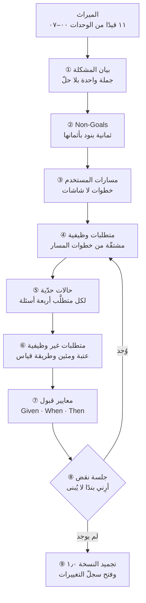
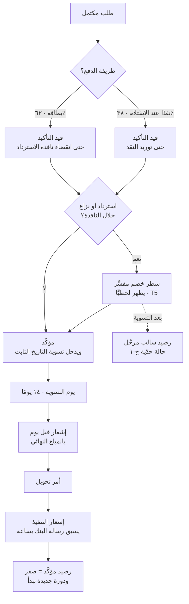
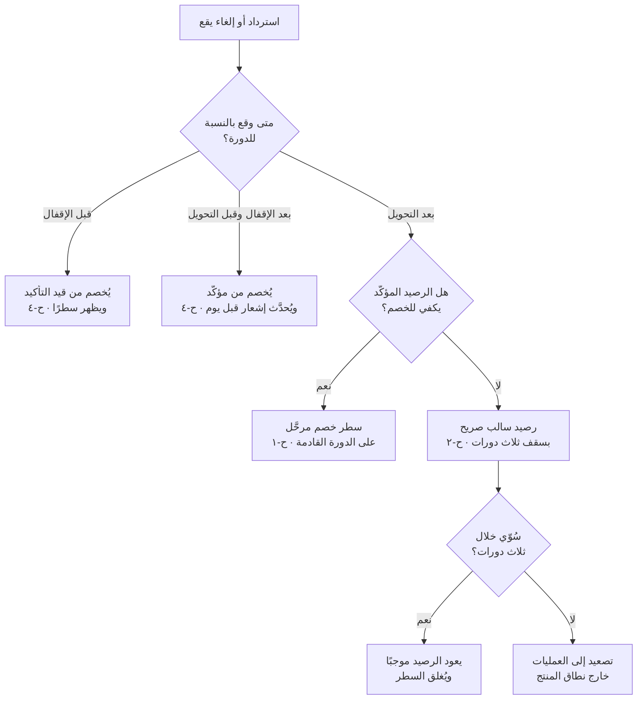
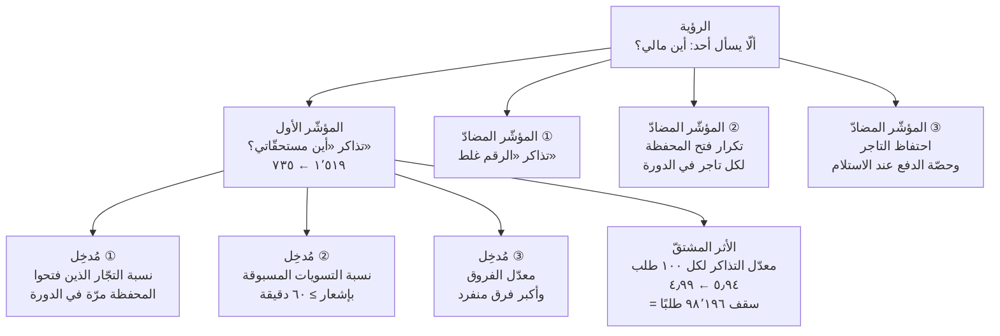
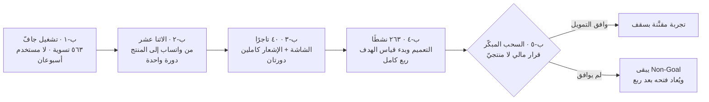
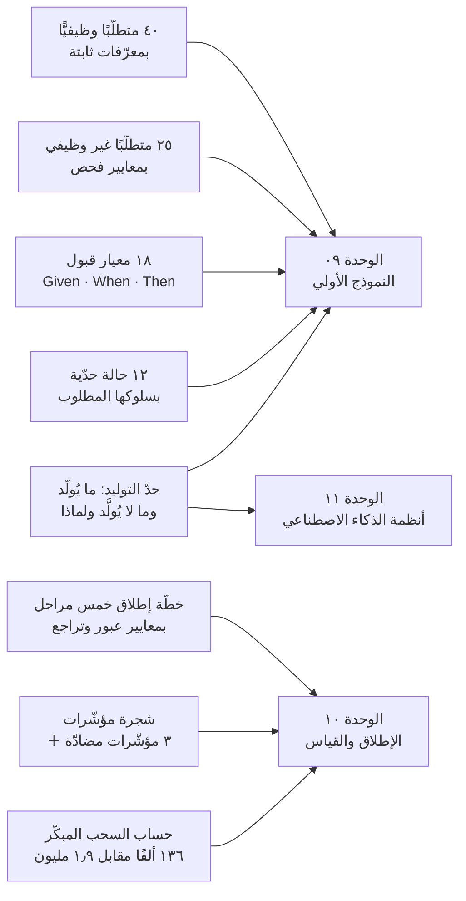

> [!info] الوحدة 08 · ورشة BridgePay
> **المخرَج:** وثيقة [[PRD]] كاملة لميزة **«المحفظة والرصيد اللحظي والسحب»** — مكتوبة كما تُكتب داخل شركة، لا موصوفة كما تُشرح في كتاب. سبعة عشر قسمًا، أربعون متطلَّبًا وظيفيًّا مرقَّمًا، أربعة عشر متطلَّبًا غير وظيفي بمعيار فحص لكلٍّ، ثمانية عشر معيار قبول بصيغة [[Given When Then]]، اثنتا عشرة حالة حدّية بمسارها غير السعيد، وخطّة إطلاق من خمس مراحل بمعايير عبور وتراجع.
>
> **الفصل المرجعي:** [[06 - وثيقة متطلبات المنتج (PRD)|الفصل السادس]] — يشرح **ما هي** الوثيقة، ولماذا ظهرت، وعناصرها العشرة، وقالبها القابل للنسخ. هذه الوحدة **لا تعيد شيئًا من ذلك**. من لم يقرأه فليقرأه أولًا؛ فما ستجده هنا هو القالب **معبّأً بقرارات مدفوعة الثمن**، لا شرحًا لخاناته.
>
> **والفرق العملي:** الفصل يقول إن «بيان المشكلة أهمّ جزء في الوثيقة». هذه الوحدة تكتب بيان مشكلة **تغيّر** بعد الوحدة ٠٣، وتُظهر ماذا حذف التغيّر من النطاق وكم وفّر.

# الوحدة 08 — وثيقة متطلبات المنتج

## ما ورثته من الوحدة السابقة

لا أكتب هذه الوثيقة من فراغ ولا من طلب مسؤول. أكتبها ومعي **إحدى عشرة قطعة مسمّاة** أنتجتها الوحدات ٠٠–٠٧، وكل قطعة منها إمّا **تفرض** بندًا في الوثيقة أو **تمنعه**. وهذا هو الفرق العملي بين `PRD` مكتوبة و`PRD` مشتقّة: الأولى تبدأ بصفحة بيضاء، والثانية تبدأ بقيود.

| المصدر | ما ورثته بالضبط | كيف يقيّد هذه الوثيقة |
|---|---|---|
| [[00 - ميثاق المشروع ومصدر الحقيقة\|الميثاق]] | ٢٦٣ تاجرًا نشطًا · ٤٬٩٠٠ تذكرة شهريًّا منها **٣١٪** فئة «أين مستحقّاتي؟» · دورة تسوية **١٤ يومًا** · ٩ مهندسين · دورة أسبوعان | جمهور الميزة محدَّد سلفًا، والمؤشّر الأول محدَّد سلفًا، و**الدورة لا تُمَسّ** |
| القيد الصلب ٢ | تقصير الدورة إلى ٧ أيام يحتجز **~١٫٩ مليون ريال** | يحذف من فضاء الحلول أرخص حلّ ظاهريًّا. كل بند في هذه الوثيقة مكتوب **تحت** هذا القيد |
| [[01 - رؤية المنتج واستراتيجيته\|الوحدة ٠١]] | الرؤية «ألّا يسأل أحدٌ: أين مالي؟» · الرهان ① بعتبة إبطال **١٬١٠٠ تذكرة** وهدف [[OKR]] **٧٣٥** · حصّة سعة **٥ مهندسين من ٩ لثلاث دورات** | سقف الجهد معلَن: **١٥٠ يوم مهندس** (٥ × ٦ أسابيع × ٥ أيام). وأي متطلَّب يتجاوزه يجب أن يُسقِط متطلَّبًا آخر |
| [[01 - رؤية المنتج واستراتيجيته\|الوحدة ٠١]] — «ما لن نفعله» | البند ٧: **رفض المساعد الذكي** الذي يجيب أسئلة التجّار | يمنع أشهر حلّ سيُقترح في اجتماع المراجعة. مذكور صراحةً في `Non-Goals` |
| [[02 - السوق والمنافسون\|الوحدة ٠٢]] · ش١٢ | ٥٫٩٤ تذكرة لكل ١٠٠ طلب · السقف الحالي **٨٢٬٤٩٢ طلبًا** ≈ حجمنا · فكّ الفئة يرفعه إلى **١١٩٬٥١٢ (+٤٤٫٩٪)** | يحوّل الميزة من «تحسين تجربة» إلى **شراء سعة نموّ**. ولذلك يدخل «معدّل التذاكر» قسم الأهداف لا قسم الآثار الجانبية |
| [[03 - الاكتشاف والبحث الميداني\|الوحدة ٠٣]] · ن-١ · م٧٠ | **«أين مستحقّاتي؟» استعلام لا شكوى**: ٤ من ٥ تذاكر تُغلق **بمعلومة فقط بلا إجراء** | يغيّر بيان المشكلة، ويحذف من النطاق كل ما يعالج «سرعة الردّ». مفصَّل في القسم ٢ من الوثيقة |
| [[03 - الاكتشاف والبحث الميداني\|الوحدة ٠٣]] · م٧٧ | **مواصفة عمر**: رقم واحد + تاريخ ثابت + تنبيه قبل يوم — مُشغَّلة يدويًّا **خمسة أشهر** لاثني عشر تاجرًا | مواصفة مُختبَرة ميدانيًّا قبل أن يُكتب لها سطر شيفرة. هي **نواة الإصدار الأول**، لا اقتراح فيه |
| [[04 - الشخصيات والمهام\|الوحدة ٠٤]] · T6 | **«رقمان لا رقم واحد»: مؤكّد وقيد التأكيد** — قرار محسوم من تعارض P1 × P5 | يدخل **قيدَ تصميم لا اقتراحًا**. ولا يجوز لأي متطلَّب أن يعرض مبلغًا مجمّعًا واحدًا |
| [[04 - الشخصيات والمهام\|الوحدة ٠٤]] · T5 | الاسترداد الفوري للعميل **مع** إظهار الخصم لحظيًّا في رصيد التاجر وسببه ورقم طلبه | يفرض على المحفظة أن تعرض **الحركات السالبة** لا الموجبة فقط — وهو ما يولّد نصف الحالات الحدّية |
| [[05 - رحلة العميل ونقاط الألم\|الوحدة ٠٥]] · ت-م٦ · ت-م٧ | لحظة الحقيقة تصل عبر **رسالة البنك — قناة لا نملكها** · وكشف الاعتراض يصل **بريدًا إلى من لا يفتح البريد** · ٣٢٧ ساعة دعم شهريًّا ≈ **١٫٨٦ موظّف** | يفرض متطلَّب **سبق الإشعار لرسالة البنك**، ويحذف البريد الإلكتروني من قنوات الإصدار الأول |
| [[06 - الفرضيات والتحقّق\|الوحدة ٠٦]] · ف-٣ | عتبة سلامة البيانات: **≤ ٠٫٥٪ فروق · ≤ ٥٠ ريالًا لأي فرق منفرد · ≥ ٩٥٪ مصنَّفة** — على حصر كامل لـ**٥٦٣ تسوية** | تصير **متطلَّبًا غير وظيفي وبوّابة إطلاق**، لا هدفًا داخليًّا. ولا شاشة تُعرض قبل اجتيازها |
| [[07 - ترتيب الأولويات\|الوحدة ٠٧]] | فصل **ب-١** (الغموض) عن **ب-٥** (المِلكية) — «مشكلتان مختلفتان بجهد مختلف بعشرة أضعاف» · و**ب-٧** (الاسترداد) · و**ب-٤** (الفوترة) خارج الترتيب بحكم [[E-invoicing\|الالتزام التنظيمي]] | يحسم **بنية الإصدارات**: ب-١ أولًا، وب-٥ مشروط، ولا يُدمجان في وثيقة واحدة بلا فصل مراحل |

> [!important] الميراث الذي غيّر الوثيقة أكثر من غيره
> ليست عتبة الدقّة ولا سقف السعة. هو **اكتشاف الوحدة ٠٣: التذكرة استعلام لا شكوى**.
>
> لأن الشكوى والاستعلام يُنتجان وثيقتين مختلفتين تمامًا. الوثيقة التي تعالج **شكوى** تبني: قناة اعتراض أسرع، وتصعيدًا آليًّا، ولوحة نزاعات، ومؤشّر رضا. والوثيقة التي تعالج **استعلامًا** تبني شيئًا واحدًا: **أن تصل المعلومة إلى صاحبها قبل أن يسأل**. الأولى تكلّف ثلاثة أضعاف الثانية وتحلّ نصف ما تحلّه.
>
> وسأصرّح في القسم ٢ بالضبط بما حذفه هذا الاكتشاف من النطاق، وبكم يوم مهندس وفّره — لأن `PRD` التي لا تُظهر ما حذفته لا تُثبت أنها اختارت.

---

## السؤال الذي تجيب عنه هذه الوحدة

**كيف أكتب وثيقة يستطيع تسعة أشخاص لم يحضروا أيًّا من المقابلات أن يبنوا منها الشيء نفسه — دون أن أكون في الغرفة كل يوم؟**

وهذا سؤال أدقّ ممّا يبدو، لأن له ثلاثة أوجه يخلط بينها كثيرون:

- **الوجه الأول — الوضوح:** ألّا يحتاج المهندس إلى سؤالي عن معنى «الرصيد». وهذا يُحلّ بالتعريف والترقيم.
- **الوجه الثاني — الحدود:** ألّا يبني المهندس ما لم أطلبه لأنه بدا له لازمًا. وهذا يُحلّ بـ[[Non-Goals|ما لن نفعله]] لا بالتفصيل — فكلّما فصّلتَ أكثر، ازداد ما يبدو مسكوتًا عنه.
- **الوجه الثالث — الحسم:** أن تكون كل نقطة يمكن أن يختلف عليها اثنان **محسومة مكتوبةً** بمن يخسر ولماذا. وهذا لا يُحلّ بالكتابة أصلًا؛ يُحلّ بأن تكون القرارات قد اتُّخذت في الوحدات ٠١–٠٧، وأن تكون الوثيقة **نقلًا** لها لا اجتهادًا جديدًا فيها.

**والسؤال الفرعي الذي تفرضه هذه اللحظة تحديدًا:** ماذا يتغيّر في الوثيقة حين أعرف مسبقًا أن جزءًا من تنفيذها **سيُولَّد بأداة ذكاء اصطناعي** لا يكتبه إنسان سطرًا سطرًا؟ الجواب ليس «تصير أطول» ولا «تصير موجّهًا». هو أدقّ من ذلك، ومكتوب كاملًا في القسم ١٦ من الوثيقة.

---

## العمل خطوة بخطوة

هذه الخطوات نفّذتها فعلًا بهذا الترتيب، وأذكر زمن كلٍّ لأن **توزيع الزمن هو القرار**: من ينفق ثمانين بالمئة من وقته على المتطلبات الوظيفية يكتب وثيقة تبدو كاملة وتنهار عند أول حالة حدّية.

| # | الخطوة | العمل الفعلي | الزمن |
|---|---|---|---|
| ١ | **جمع الميراث في صفحة واحدة** | استخراج الأحد عشر قيدًا أعلاه من الوحدات ٠٠–٠٧ بأرقامها، ووضعها في جدول واحد **قبل** كتابة أي سطر من الوثيقة | ٩٠ دقيقة |
| ٢ | **كتابة بيان المشكلة أولًا — وحده** | جملة واحدة، ثم اختبارها بسؤال: «هل تحتوي على حلّ؟» فإن احتوت أُعيدت. وهذه الخطوة سبقت كل شيء آخر عمدًا | ٤٥ دقيقة |
| ٣ | **كتابة `Non-Goals` قبل المتطلبات** | ثمانية بنود، كلٌّ بسببه وثمنه. وقاعدة: البند الذي لا يؤلم حذفه لم يكن `Non-Goal` بل حشوًا | ٦٠ دقيقة |
| ٤ | **رسم مسارات المستخدم بالخطوات لا بالشاشات** | ثلاثة مسارات (P1 · P2 · P5) خطوةً خطوة، بلا ذكر زرّ ولا شاشة. الشاشات مخرَج [[09 - النموذج الأولي والتصميم\|الوحدة ٠٩]] لا هذه | ٩٠ دقيقة |
| ٥ | **اشتقاق المتطلبات الوظيفية من المسارات** | كل خطوة في المسار تُولّد متطلَّبًا أو أكثر. والمتطلَّب الذي لا يقع على خطوة في مسار **يُحذف أو يُسأل عن مصدره** | ١٨٠ دقيقة |
| ٦ | **جولة الحالات الحدّية — وهي الجولة الأغلى** | لكل متطلَّب: ماذا لو تأخّر؟ ماذا لو فشل؟ ماذا لو حدث مرّتين؟ ماذا لو حدث بعد فوات الأوان؟ راجع [[Edge Cases]] | ١٥٠ دقيقة |
| ٧ | **تحويل العتبات إلى متطلبات غير وظيفية قابلة للفحص** | كل عبارة من نوع «سريع» أو «دقيق» أو «آمن» تُستبدل برقم ومئين وطريقة قياس. راجع [[Percentiles and Median vs Average\|المئين مقابل المتوسّط]] | ١٢٠ دقيقة |
| ٨ | **كتابة معايير القبول `Given/When/Then`** | ثمانية عشر معيارًا، ثلثاها على المسارات غير السعيدة عمدًا | ١٢٠ دقيقة |
| ٩ | **مراجعة المهندس المعماري — جلسة نقض لا موافقة** | السؤال المطروح عليه: «أرِني بندًا واحدًا لا يمكنك بناؤه كما هو مكتوب» — لا: «هل هذا واضح؟» | ٦٠ دقيقة |
| ١٠ | **مراجعة الامتثال والمحاسبة** | خالد (P5) يقرأ قسم الدقّة والحالات الحدّية فقط، ومسؤول الامتثال يقرأ [[PDPL]] و[[E-invoicing]] فقط. **لا أطلب من أحد قراءة الوثيقة كاملة** | ٦٠ دقيقة |
| ١١ | **إضافة قسم «ما يتغيّر لأن التنفيذ سيُولَّد آليًّا»** | إعادة قراءة الوثيقة بعين المولِّد: أين يخترع؟ أين يفترض؟ أين ينسخ رقمًا من فقرة خاطئة؟ | ٧٥ دقيقة |
| ١٢ | **التجميد وفتح سجلّ التغييرات** | إعلان النسخة ١٫٠، وفتح [[Decision Log\|سجلّ القرارات]] المرتبط. وبعد التجميد لا تعديل بلا سطر في السجلّ | ٢٠ دقيقة |

**الإجمالي: ~١٧ ساعة عمل** موزَّعة على أربعة أيام. وأهمّ ما في هذا الجدول أن الخطوتين ٦ و٧ (الحالات الحدّية والمتطلبات غير الوظيفية) استهلكتا **٢٧٠ دقيقة** مقابل ١٨٠ للمتطلبات الوظيفية. من عكس هذه النسبة كتب وثيقة تُبنى منها ميزة تعمل في العرض التقديمي وتنهار في أول شهر رمضان.



---

## المخرَج

> [!abstract] ما يلي هو الوثيقة نفسها
> ابتداءً من هذا السطر وحتى نهاية القسم ١٧، النصّ **ليس شرحًا عن `PRD`** — هو الـ`PRD` بنصّها كما تُسلَّم إلى الفريق الهندسي وإلى التصميم وإلى الامتثال. وقد تُركت فيها الصياغات الإدارية كما هي (نسخة · مالك · حالة · تاريخ مراجعة) لأن حذفها يجعلها تبدو مقالًا لا مستندًا.

---

# 📄 `PRD` — المحفظة والرصيد اللحظي والسحب

| الحقل | القيمة |
|---|---|
| **النسخة** | ١٫٠ — مجمَّدة للإصدار الأول |
| **المالك** | مدير المنتج · BridgePay |
| **المراجعون** | قائد الهندسة · المحاسب (P5) · مسؤول الامتثال · مصمّم المنتج · قائد الدعم |
| **الحالة** | معتمَدة للبناء · مشروطة ببوّابة سلامة البيانات (`ب-١` في خطّة الإطلاق) |
| **المبادرة الأمّ** | الرهان ① — «اليقين قبل السيولة» ([[01 - رؤية المنتج واستراتيجيته\|الوحدة ٠١]]) |
| **السعة المخصَّصة** | ٥ مهندسين × ٣ دورات = **١٥٠ يوم مهندس** — سقف صلب |
| **المستند المرافق** | [[Decision Log\|سجلّ القرارات]] · مواصفة النموذج الأولي ([[09 - النموذج الأولي والتصميم\|الوحدة ٠٩]]) |

## ٠) الملخّص التنفيذي

يسأل تجّارنا **١٬٥١٩ مرّة شهريًّا**: «أين مستحقّاتي؟» — وأربع من كل خمس تذاكر تُغلق **بمعلومة فقط بلا أي إجراء**. هذه ليست شكوى من موعد التحويل؛ هي **استعلام عن رقم موجود في أنظمتنا ولا يصل إلى صاحبه**.

نبني محفظة تعرض للتاجر **رقمين** (مؤكّد · قيد التأكيد) و**تاريخًا ثابتًا** و**إشعارًا استباقيًّا** قبل كل تحويل بيوم وقبل رسالة البنك بساعة، مع **كشف حركة** يفسّر كل ريال ومصدره. **ولا نغيّر دورة التسوية (١٤ يومًا)** — لأن تقصيرها قرار مالي يحتجز ~١٫٩ مليون ريال، ولأن الدليل الميداني يقول إن الألم في **الغموض** لا في الانتظار.

**النجاح:** خفض تذاكر الفئة من ١٬٥١٩ إلى **٧٣٥ شهريًّا أو أقلّ خلال ربع** — وهو ما يحرّر ~١٦٩ ساعة دعم شهريًّا ويرفع سقف الطلبات الذي تحتمله المنصّة من ٨٢٬٤٩٢ إلى **٩٨٬١٩٦ طلبًا (+١٩٪)** دون توظيف. **الفشل المعلَن:** بقاء التذاكر فوق ١٬١٠٠ بعد ربع كامل ← تُغلق الفرضية ويُرفع ملفّ السيولة إلى الإدارة التنفيذية.

## ١) الخلفية — لماذا الآن؟

ثلاثة أشياء اجتمعت في هذا الربع ولم تكن مجتمعة قبله:

**① السقف التشغيلي بلغ نفسه.** المنصّة تُنتج ٥٫٩٤ تذكرة لكل ١٠٠ طلب، وسعة الدعم ٤٬٩٠٠ تذكرة بستّة موظّفين لا يُزادون (القيد الصلب ٥). فأقصى ما تحتمله المنصّة اليوم = ٤٬٩٠٠ ÷ ٠٫٠٥٩٤ = **٨٢٬٤٩٢ طلبًا شهريًّا** — وحجمنا الفعلي ٢٬٧٥٠ × ٣٠ = **٨٢٬٥٠٠**. أي أن **سقف النموّ اليوم صفر**، وكل مسار نموّ آخر (تجّار جدد · مدينة ثالثة · حملة موسمية) يصطدم بالسقف نفسه قبل أن يُنتج ريالًا. الميزة لا تحسّن تجربة؛ هي **تشتري سعةً محظور شراؤها بالتوظيف**.

**② التشخيص صار في اليد لا في التخمين.** الوحدة ٠٣ أنتجت ثمانية عشر ملاحظة موسومة على هذه الفئة تحديدًا، وأهمّها ثلاث: أن ٤ من ٥ تذاكر تُغلق بمعلومة فقط (م٧٠)، وأن موظّف الدعم **يتنبّأ بموضوع التذكرة قبل يومين بالنظر إلى التقويم** (م٧٣)، وأن تاجرًا تنازل عن فرق **١٬٥٠٠ ريال** لا لأنه مخطئ بل لأنه لا يستطيع الإثبات (م٧).

**③ الحلّ مُختبَر أصلًا — يدويًّا وبلا علمنا.** موظّف دعم يرسل منذ **خمسة أشهر** رسالة واتساب لاثني عشر تاجرًا فيها رقم واحد وتاريخ، قبل يوم من التحويل (م٧٧). هذا [[Concierge MVP|نموذج خادم شخصي]] كامل شغّله الواقع نيابةً عنا، ومواصفته هي النواة الحرفية لهذا الإصدار.

> [!note] ما الذي لم يتغيّر — وذكره شرط أمانة
> لم يتغيّر شيء في **موعد** وصول المال. التاجر بعد هذا الإصدار سيقبض في اليوم ذاته الذي كان يقبض فيه قبله. ومن يقرأ الوثيقة بحثًا عن تحسين في السيولة لن يجده، **وهذا مقصود ومكتوب** في القسم ٤.

## ٢) بيان المشكلة

> **التاجر لا يملك وسيلة يعرف بها كم له عند المنصّة ومتى يصله، إلا بسؤال إنسان — فيسأل ١٬٥١٩ مرّة شهريًّا، وتُغلق ٤ من كل ٥ من هذه الأسئلة بمعلومة موجودة أصلًا في أنظمتنا.**

جملة واحدة، وليس فيها حلّ، ولا فيها كلمة «شاشة» ولا «محفظة» ولا «تنبيه». وقد أُعيدت صياغتها ثلاث مرّات حتى خلت من الحلّ، لأن بيان المشكلة الذي يحتوي حلًّا يُغلق فضاء الحلول قبل أن يُفتح.

### ٢-١) كيف غيّر اكتشاف الوحدة ٠٣ هذا البيان — وماذا حذف من النطاق

كان البيان قبل الوحدة ٠٣ يُصاغ هكذا: *«التاجر يشتكي من موعد وصول مستحقّاته، والدعم لا يستطيع استيعاب حجم الشكاوى.»* وهذه صياغة **معقولة تمامًا** ومستمدّة من رقم صحيح في الميثاق (٣١٪ من التذاكر)، ولها فضيلة أنها تُقنع أي اجتماع.

وهي خاطئة. والدليل ثلاثي:

| الدليل | ماذا يقول | ماذا يُبطل |
|---|---|---|
| **م٧٠** — ٤ من ٥ تذاكر تُغلق **بمعلومة فقط بلا إجراء** | التاجر لا يطلب فعلًا؛ يطلب **معرفة** | يُبطل تصنيف التذكرة شكوى، فالشكوى تُغلق بإجراء |
| **م٧٣** — الدعم يتنبّأ بموضوع التذكرة قبل يومين بالنظر إلى **التقويم** | التذكرة **دالّة في تصميم النظام** لا في جودة الخدمة | يُبطل كل حلّ يستهدف جودة الردّ أو سرعته |
| **م٧٢** — «أغلب يومي أقرأ أرقامًا من الشاشة وأكتبها لناس» | الدعم عندنا **واجهة مستخدم بشرية** لبيانات موجودة | يُبطل توظيف الدعم بوصفه حلًّا — وهو محظور أصلًا بالقيد ٥ |

**فصار البيان استعلامًا، وتغيّر النطاق تغيّرًا يمكن عدّه بالأيام:**

| ما كان سيدخل النطاق لو بقي البيان «شكوى» | مصيره بعد الاكتشاف | الوفر التقديري |
|---|---|---|
| **قناة اعتراض داخل التطبيق بمسار تصعيد كامل** (٣ حالات · إسناد · مهل) | يُختزل إلى **زرّ اعتراض واحد** يفتح تذكرة مرفقة بكشف الحركة تلقائيًّا (م-٢٧) | **~١٨ يوم مهندس** |
| **لوحة نزاعات موحّدة للدعم** (ب-١٣ في الوحدة ٠٧) | يخرج من هذا الإصدار كلّيًّا — مشكلته «الوصول إلى الحقيقة» لا «معرفة الرقم» | **~٢٢ يوم مهندس** |
| **مؤشّر رضا التاجر (`CSAT`) بعد كل تذكرة** | يُحذف. المؤشّر الصحيح **عدد التذاكر** لا الرضا عنها | ~٤ أيام مهندس |
| **تصعيد آلي بعد ساعتين** (مستبعَد أصلًا في الوحدة ٠٧) | يبقى مستبعَدًا — يعالج العرَض | — |
| **مساعد ذكي يجيب «أين مستحقّاتي؟»** | `Non-Goal` صريح (القسم ٤ · البند ٥) | **~٣٠ يوم مهندس** ذهبت إلى الإصدار الأول بدلًا منه |

**الإجمالي المحرَّر: ~٧٤ يوم مهندس من أصل ١٥٠** — أي أن الاكتشاف الذي كلّف ثماني مقابلات **موّل نصف الإصدار**. وهذا أوضح مثال في الورشة كلها على أن `Discovery` ليس بندًا في الجدول الزمني بل **مصدر تمويل له**.

> [!important] القاعدة المستخرَجة
> **الشكوى تُعالَج بقناة أفضل. والاستعلام يُعالَج بإلغاء الحاجة إلى القناة.** والخلط بينهما يُنتج وثيقة تبني قنوات ممتازة لسؤال ما كان ينبغي أن يُطرح — ثم تفخر بأن زمن الردّ انخفض من ست ساعات إلى ساعتين، بينما المؤشّر الصحيح هو **ألّا يوجد ردّ لأنه لا يوجد سؤال**.

## ٣) الأهداف — قابلة للقياس أو ليست أهدافًا

ثلاثة أهداف مرتَّبة، والترتيب ملزِم عند التعارض: **الهدف الأول يتقدّم على الثاني، والثاني على الثالث.**

| # | الهدف | خطّ الأساس | الهدف | المهلة | كيف يُقاس |
|---|---|---|---|---|---|
| **هـ-١** | خفض تذاكر فئة «أين مستحقّاتي؟» | ١٬٥١٩ / شهر | **≤ ٧٣٥ / شهر** (−٥٢٪) | ربع كامل من تعميم الإصدار | تصنيف التذاكر القائم · قياس شهري · [[Cohort Analysis\|بفوج التاجر]] لا بالإجمالي |
| **هـ-٢** | خفض معدّل التذاكر لكل ١٠٠ طلب | ٥٫٩٤ | **≤ ٤٫٩٩** | نفس المهلة | إجمالي التذاكر ÷ الطلبات × ١٠٠ · أسبوعيًّا |
| **هـ-٣** | أن يعرف التاجر مبلغه **قبل** رسالة البنك | ٠٪ | **≥ ٩٠٪** من التسويات يسبقها إشعار مسلَّم بساعة على الأقلّ | من المرحلة ٣ فصاعدًا | سجلّ الإشعارات مقابل سجلّ أوامر التحويل |

**اشتقاق هـ-٢:** إذا تحقّق هـ-١ فسينخفض إجمالي التذاكر من ٤٬٩٠٠ إلى ٤٬٩٠٠ − ٧٨٤ = **٤٬١١٦**، والمعدّل إلى ٤٬١١٦ ÷ ٨٢٬٥٠٠ × ١٠٠ = **٤٫٩٩ لكل ١٠٠ طلب**. وأثر ذلك في السقف: ٤٬٩٠٠ ÷ ٠٫٠٤٩٩ = **٩٨٬١٩٦ طلبًا شهريًّا** — أي **+١٥٬٦٩٦ طلبًا (+١٩٫٠٪)** من سعة النموّ اشتُريت بلا ريال سيولة وبلا موظّف جديد.

**وأثرها في ساعات الدعم:** الفئة تستهلك ٣٢٧ ساعة شهريًّا ([[05 - رحلة العميل ونقاط الألم|الوحدة ٠٥]] · د٣). وخفض ٧٨٤ تذكرة من ١٬٥١٩ يحرّر ٣٢٧ × (٧٨٤ ÷ ١٬٥١٩) = **١٦٩ ساعة شهريًّا ≈ ٠٫٩٦ موظّف بدوام كامل** — وهو موظّف لا نملك أصلًا صلاحية توظيفه.

> [!warning] عتبة الإبطال ليست الهدف
> الهدف **٧٣٥** يقيس الطموح. وعتبة الإبطال — الموروثة من الرهان ① — هي **١٬١٠٠ تذكرة**: فوقها تُعدّ الفرضية كاذبة ويُغلق الرهان ويُرفع ملفّ الـ١٫٩ مليون تنفيذيًّا. والخلط بينهما يجعل الفريق يُغلق رهانًا صحيحًا لمجرّد أنه لم يبلغ طموحه. راجع [[Kill Criteria]].

## ٤) ما لن نفعله (`Non-Goals`)

> [!danger] هذا أهمّ قسم في الوثيقة
> كل بند هنا **مؤلم**، وكلٌّ طلبه أحدٌ صراحةً، ولكلٍّ سبب وثمن معلَنان. البند الذي لا يؤلم حذفه ليس `Non-Goal` بل حشو يُوهم بالحسم. راجع [[Non-Goals]] و[[Out of Scope]].

| # | ما لن نفعله | من طلبه | لماذا | الثمن الذي ندفعه | متى يُعاد فتحه |
|---|---|---|---|---|---|
| **ل-١** | **لن نغيّر دورة التسوية (١٤ يومًا)** ولا نقصّرها ولا نجعلها قابلة للتخصيص | المطاعم والتجّار — البند الأول في القائمة الخام | قرار **مالي لا منتجيّ**: يحتجز ~١٫٩ مليون ريال رأس مال عامل (القيد الصلب ٢)، وخارج صلاحية المنتج | سعد (P1) يبقى بلا ~٣٬٦٤٧ ريالًا من السيولة المتحرّرة كل دورة | آليًّا إن أُبطل الرهان ① (تذاكر > ١٬١٠٠ بعد ربع) |
| **ل-٢** | **لن نطلق سحبًا فوريًّا مجّانيًّا** في هذا الإصدار | نفس الطلب («محفظة قابلة للسحب الفوري») | يعجّل الدورة بطريق خلفي فيستهلك السيولة نفسها. والمحفظة هنا **تعرض وتوضّح ولا تعجّل** | يبقى شعور «المال ليس لي حتى يصل البنك» قائمًا جزئيًّا | المرحلة ٥ — بحساب معروض في القسم ١٥، وبقرار مالي موقَّع |
| **ل-٣** | **لن نبني مساعدًا ذكيًّا يجيب أسئلة التجّار** | الإدارة والتسويق (نيابةً عن التجّار) | هدفنا **ألّا يُسأل** السؤال لا أن يُجاب عنه بأناقة. وإطلاقه **يُفسد أداة القياس**: تنخفض التذاكر بلا أن نعرف هل فاز الرهان ① أم هاجرت الإشارة | نخسر مكسبًا سريعًا في رضا التاجر وتخفيفًا فوريًّا عن الدعم | بعد أن تستقرّ التذاكر دون ٧٣٥ — عندها يصير أداة راحة لا قناعًا |
| **ل-٤** | **لن نبني لوحة نزاعات موحّدة** ولا مسار تصعيد كامل | الدعم والعمليات (ب-١٣) | مشكلته «الوصول إلى الحقيقة» وليست «معرفة الرقم». ودمجه هنا يضاعف النطاق لمشكلة أخرى | الدعم يبقى يتنقّل بين أنظمة في حالات النزاع | إصدار مستقلّ بعد استقرار بيانات التسوية |
| **ل-٥** | **لن نصدر كشف حساب `PDF` رسميًّا ولا فاتورة ضريبية** من المحفظة | التجّار (كشف `PDF`) والامتثال | [[E-invoicing\|الفوترة الإلكترونية]] التزام تنظيمي بمواصفة تقنية خاصّة، خارج ترتيب الأولويات بحكم كونه قانونيًّا (ب-٤). خلطه بالمحفظة يجعل عيبًا في المحفظة **مخالفة تنظيمية** | التاجر يظلّ يحتاج مسارًا آخر للمستند الرسمي | مسار متوازٍ مستقلّ، وله وثيقته |
| **ل-٦** | **لن نعرض رقمًا مجمّعًا واحدًا** مهما طُلب | سعد (P1) حرفيًّا: «أبي رقم واحد» | قرار **T6**: الرقم الواحد على بيانات غير موفَّقة وعدٌ بدقّة لا نملكها، وأول فرق يظهر يهدم ثقة سنة. [[Reversible vs Irreversible Decisions\|قرار باب واحد]] | نخسر البساطة التي طلبها المستخدم بلسانه | لا يُعاد فتحه ما لم يبلغ معدّل الفروق صفرًا لثلاثة أشهر متتالية |
| **ل-٧** | **لن ندعم عملات ولا حسابات خارج المدينتين** ولا تجّارًا غير مفعَّلين | — (وقاية استباقية) | خارج «أين نلعب» في الرهان ①، ويضيف تعقيد امتثال بلا مستخدم واحد اليوم | لا شيء اليوم | عند قرار التوسّع (خارج صلاحية هذا الإصدار) |
| **ل-٨** | **لن نرسل أي شيء عبر البريد الإلكتروني** في هذا الإصدار | — (تصحيح لممارسة قائمة) | م٧: «وصلني كشف بعد ثلاثة أيام في الإيميل. أنا ما أفتح الإيميل». إرسال الدليل عبر قناة لا يسكنها المستخدم يُنتج **سجلًّا يقول إننا حللنا المشكلة** بينما لم يرها أحد. راجع [[Vanity Metrics]] | يخسر التاجر نسخة أرشيفية يعتادها بعضهم | مع ل-٥، بوصفه قناة تسليم للمستند الرسمي لا للمعلومة اليومية |

## ٥) المستخدمون المستهدَفون

**ليس «التجّار».** ثلاث شخصيات بعينها، ولكلٍّ منها مهمّة مختلفة تفرض متطلبات مختلفة — ورابعة **مستبعَدة صراحةً** من هذا الإصدار.

### P1 · سعد — صاحب مطعم بفرع واحد · **المستخدم الأساسي**

| الحقل | القيمة |
|---|---|
| **المهمّة** (`JTBD-1`) | حين أكون في نهاية يوم عمل وعليّ التزام نقدي قريب، **أريد** أن أعرف يقينًا كم لي ومتى يصلني، **حتى أستطيع** أن ألتزم بدفعة اليوم دون أن أقترض أو أؤجّل |
| **حجم الشريحة** | الأغلبية من ٢٦٣ تاجرًا نشطًا · متوسّط مستحقّه في الدورة = ١٧٩٬٠٨٠ × ١٤ ÷ ٢٦٣ = **٩٬٥٣٣ ريالًا** |
| **بديله اليوم** | **دفتر ورقي** + سؤال تاجر مجاور + مكالمة موظّف دعم يعرفه |
| **منافسنا الحقيقي** | ليس منصّة أخرى، بل **دفتره**. ومعيار النجاح: «أوثق من دفتره» لا «أفضل من المنافس» |
| **ما يفرضه على الوثيقة** | رقم بارز · تاريخ ثابت · إشعار استباقي · وحركة قابلة للمطابقة بالدفتر **سطرًا سطرًا** |
| **ما يجعله يترك** | فرق واحد غير مفسَّر بين ما عرضناه وما وصله |

### P2 · نورة — مديرة عمليات ستّة فروع · **مستخدم ثانوي · نطاق محدود**

| الحقل | القيمة |
|---|---|
| **المهمّة** (`JTBD-2`) | أن أُخبَر أين حدث الانحراف وسببه المرجّح **دون أن أبحث عنه**، لأتدخّل في الفرع الصحيح قبل أن يصير خسارة شهر |
| **بديلها اليوم** | تصدير `Excel` أسبوعي وجداول محورية (١–٢ ساعة أسبوعيًّا) + مجموعة واتساب مع مديري الفروع |
| **ما يفرضه على الوثيقة** | **تفصيل الرصيد بالفرع لا رقم موحّد للسلسلة**، وصلاحية اطّلاع مقيَّدة بالفرع لموظّفيها |
| **حدّ النطاق المعلَن** | **مقارنة الفروع وتحليل الانحراف خارج هذا الإصدار** — ينتميان إلى الرهان ② لا ①. هنا نعطيها **الرصيد مفصَّلًا** فقط، لا التحليل |
| **لماذا تدخل أصلًا** | لأن بناء المحفظة على افتراض «تاجر = حساب واحد» يُنتج معمارية تُعاد كتابتها بعد ربع. الفرع **يدخل نموذج البيانات الآن** ولو تأخّرت واجهته |

### P5 · خالد — محاسب المنصّة · **المستخدم الداخلي · وشرط الإطلاق**

| الحقل | القيمة |
|---|---|
| **المهمّة** (`JTBD-5`) | أن أثبت أن كل مبلغ صحيح، وأن **أكتشف الفروق قبل أن يراها التاجر**، لأُغلق الدورة دون موجة تذاكر |
| **حمله اليوم** | ٥٦٣ تسوية شهريًّا · ٦ ساعات توفيق يدوي أسبوعيًّا (٣١٢ ساعة سنويًّا) · **٢٫٨ دقيقة متاحة لكل تسوية** |
| **ما يفرضه على الوثيقة** | لوحة فروق تعرض **الشاذّ فقط** · تصنيف آلي لسبب الفرق · وصلاحية **حجب** رقم مشكوك فيه قبل عرضه |
| **لماذا هو شرط إطلاق لا مستخدم عادي** | لأن كل رقم يراه التاجر يمرّ عبر ثقته المهنية. وإطلاق المحفظة بلا أداة لخالد يعني أن **التاجر يصير نظام كشف الأخطاء لدينا** — وهو أخطر بديل في هذه الوثيقة كلها |

### 🚫 من هو خارج النطاق صراحةً

**P4 · ماجد — المندوب.** حصّة سعته صفر من تسعة ([[01 - رؤية المنتج واستراتيجيته|الوحدة ٠١]])، و«محفظة المندوب» ميزة مستقلّة بنموذج مالي مختلف (`T4`: رُفض الصرف اليومي). وذكره هنا **بالاسم** مقصود: من يخرج من النطاق يجب أن يخرج مكتوبًا، لا أن يُنسى — فالنسيان يُنتج سؤالًا في الأسبوع الرابع من البناء، والكتابة تُنتج اعتراضًا في اليوم الأول وهو أرخص بكثير.

## ٦) مسارات المستخدم

**خطوات لا شاشات.** لا يرد في هذا القسم زرّ ولا لون ولا موضع — ذلك مخرَج [[09 - النموذج الأولي والتصميم|الوحدة ٠٩]]. وما يرد هنا هو **ما يجب أن يصير ممكنًا** بالترتيب الذي يعيشه المستخدم. راجع [[User Flow]].

### م-أ · المسار الأساسي — سعد يعرف مستحقّه (P1)

1. يفتح التطبيق في أي لحظة → يرى **رقمين**: «مؤكّد» و«قيد التأكيد»، وبينهما فاصل بصري صريح.
2. يرى تحت «مؤكّد» **تاريخ التحويل القادم** بصيغة ثابتة لا تتغيّر بين الدورات.
3. يضغط على «قيد التأكيد» → يفهم **لماذا** هذا المبلغ ليس مؤكّدًا بعد (طلبات نقدية لم تُورَّد · طلبات قيد نافذة الاسترداد · طلبات في نزاع).
4. يضغط على أي من الرقمين → يرى **كشف الحركة**: كل سطر = طلب واحد بتاريخه ورقمه وقيمته وعمولته وصافيه.
5. يقارن سطرًا واحدًا بدفتره → يجده مطابقًا → **تسقط الحاجة إلى الدفتر تدريجيًّا**.
6. يصله **قبل يوم** من التحويل إشعار بالمبلغ النهائي والتاريخ.
7. يصله **قبل ساعة على الأقلّ** من رسالة البنك إشعار بأن التحويل نُفِّذ، بالمبلغ نفسه حرفيًّا.
8. لا يفتح تذكرة.

**والخطوة ٨ هي المخرَج الحقيقي للمسار كله.** كل ما قبلها وسيلة.

### م-ب · مسار الانحراف — الرقم لا يطابق التوقّع

1. يقارن سعد ما وصله بما توقّعه → يجد فرقًا.
2. يفتح كشف الحركة → يجد **سطر الخصم** بسببه المصنَّف ورقم الطلب المرتبط به (`T5`).
3. الحالة (أ): يفهم السبب → **ينتهي المسار بلا تذكرة**.
4. الحالة (ب): لا يقتنع → يضغط «اعتراض على هذا السطر» → تُفتَح تذكرة **مرفقًا بها كشف الحركة والسطر المحدَّد تلقائيًّا**.
5. يرى الدعم التذكرة **ومعها الدليل**، فلا يبدأ من «أعطني رقم الطلب».
6. يُحسم الاعتراض بقيد تصحيحي يظهر في كشف الحركة **بوصفه سطرًا لا بتعديل صامت للرقم القديم**.

> [!important] لماذا الخطوة ٦ بهذه الصيغة تحديدًا؟
> لأن التصحيح الصامت يهدم بالضبط ما بنيناه. إن رأى التاجر رقمًا ثم رآه مختلفًا بلا سطر يفسّر التغيّر، فقد أثبتنا له أن **أرقامنا تتحرّك بلا سبب** — وهو أسوأ ممّا كان عليه حين لم يكن يرى شيئًا. راجع [[Audit Trail]].

### م-ج · مسار خالد — إغلاق الدورة (P5 · داخلي)

1. يفتح لوحة التوفيق صباح يوم الإقفال → يرى **الشاذّ فقط**، لا الـ٥٦٣ تسوية.
2. لكل فرق: مصدره ومقداره وسببه المصنَّف آليًّا.
3. الفرق المفسَّر آليًّا (≥ ٩٥٪) → يعتمده بضغطة واحدة جماعية.
4. الفرق غير المفسَّر أو الذي يتجاوز ٥٠ ريالًا → **يحجب عرض الرصيد لذلك التاجر وحده** ويضع مكانه رسالة صريحة، ويفتح تحقيقًا.
5. يعتمد الدورة → تُنفَّذ أوامر التحويل → تنطلق الإشعارات.



## ٧) المتطلبات الوظيفية

**اصطلاح الترقيم:** `م-NN` معرّف ثابت لا يُعاد استعماله ولو حُذف المتطلَّب. وكل متطلَّب يحمل: الأولوية بـ[[MoSCoW Prioritization|MoSCoW]] · الشخصية · ومصدر الحقيقة للبيانات. والعمود الأخير موجود لسبب واحد سيُشرح في القسم ١٦: **المولِّد الآلي يخترع مصدر البيانات إن لم تكتبه**.

### ٧-١) نواة الرصيد (`م-٠١` … `م-١٢`)

| # | المتطلَّب | أولوية | لمن | مصدر الحقيقة للبيانات |
|---|---|---|---|---|
| **م-٠١** | يعرض النظام للتاجر مبلغين منفصلين دائمًا: **«مؤكّد»** و**«قيد التأكيد»**، ولا يعرض مجموعهما في أي موضع | `Must` | P1 · P2 | خدمة التسوية — لا سجلّ الطلبات مباشرةً |
| **م-٠٢** | «مؤكّد» = مجموع صافي الطلبات التي انقضت نافذة استردادها **وورد مقابلها المالي** إلى حساب المنصّة | `Must` | P1 | خدمة التسوية + كشف بوّابة الدفع |
| **م-٠٣** | «قيد التأكيد» = مجموع صافي الطلبات المكتملة التي لم يتحقّق فيها شرط م-٠٢ بعد | `Must` | P1 | خدمة التسوية |
| **م-٠٤** | يعرض النظام لكل مبلغ **سببًا واحدًا مقروءًا** يشرح لماذا هو في هذه الخانة، من قائمة أسباب مغلقة لا نصّ حرّ | `Must` | P1 | مصنِّف الأسباب — قائمة ثابتة من ٧ قيم |
| **م-٠٥** | يعرض النظام **تاريخ التحويل القادم** بصيغة موحّدة لا تتغيّر بين الدورات، مع عدّاد أيام متبقّية | `Must` | P1 | تقويم التسوية |
| **م-٠٦** | يعرض النظام **ختمًا زمنيًّا لآخر تحديث** للرصيد، ظاهرًا دائمًا لا عند الخطأ فقط | `Must` | P1 · P5 | خدمة التسوية |
| **م-٠٧** | يعرض النظام **كشف حركة** بسطر لكل طلب: التاريخ · رقم الطلب · القيمة · العمولة · الصافي · الحالة | `Must` | P1 | خدمة التسوية |
| **م-٠٨** | يكون كل سطر في الكشف **قابلًا للمطابقة بمفرده**: مجموع أسطر الحالة الواحدة = المبلغ المعروض لتلك الحالة، ريالًا بريال | `Must` | P1 · P5 | حساب داخلي · قابل للفحص آليًّا |
| **م-٠٩** | يعرض النظام **الحركات السالبة** (استرداد · إلغاء · تصحيح · خصم نزاع) بوصفها أسطرًا مستقلّة بسببها ورقم طلبها | `Must` | P1 | مصنِّف الأسباب + سجلّ الاستردادات |
| **م-١٠** | لا يعدّل النظام أبدًا سطرًا منشورًا؛ التصحيح يقع **بسطر مضادّ** يشير إلى السطر الأصلي | `Must` | P1 · P5 | قيد محاسبي — [[Audit Trail\|أثر تدقيق]] غير قابل للحذف |
| **م-١١** | يحفظ النظام **لقطة (`snapshot`) للرصيد المعروض** عند كل عرض، لمدّة لا تقلّ عن ١٨ شهرًا | `Must` | P5 | مخزن اللقطات |
| **م-١٢** | يتيح النظام تصفية الكشف بالمدى الزمني وبالحالة، بلا حدّ أدنى لعدد الأسطر | `Should` | P1 · P2 | خدمة التسوية |

> [!note] لماذا م-١١ ليس ترفًا هندسيًّا
> لأن الاعتراض في [[05 - رحلة العميل ونقاط الألم|الوحدة ٠٥]] (م٧) سقط لسبب واحد: **لا أحد يستطيع الإثبات**. واللقطة تحسم لاحقًا سؤالًا لا يُحسم بغيرها: «ما الذي كان معروضًا على شاشته يوم اتّخذ القرار؟». وبدونها نعود إلى تحاجّ ذاكرتين — وهو العطب نفسه بواجهة أجمل.

### ٧-٢) التنبيهات (`م-١٣` … `م-١٩`)

| # | المتطلَّب | أولوية | لمن | مصدر الحقيقة |
|---|---|---|---|---|
| **م-١٣** | يرسل النظام إشعارًا **قبل يوم واحد** من التحويل يحوي: المبلغ النهائي · التاريخ · آخر أربعة أرقام من `IBAN` | `Must` | P1 | تقويم التسوية + محرّك الإشعارات |
| **م-١٤** | يرسل النظام إشعارًا **عند تنفيذ أمر التحويل**، ويجب أن يسبق رسالة البنك بـ**٦٠ دقيقة على الأقلّ** | `Must` | P1 | سجلّ أوامر التحويل |
| **م-١٥** | يرسل النظام إشعارًا عند كل **حركة سالبة تتجاوز ٥٪ من الرصيد المؤكّد** أو ١٠٠ ريال — أيّهما أقلّ | `Must` | P1 | سجلّ الاستردادات |
| **م-١٦** | يستعمل النظام القنوات داخل التطبيق + الرسائل النصّية. **ولا يستعمل البريد الإلكتروني** (ل-٨) | `Must` | P1 | إعدادات القناة |
| **م-١٧** | يتيح النظام للتاجر إيقاف الإشعارات **غير الحرجة** فقط؛ ولا يُتاح إيقاف م-١٣ وم-١٤ | `Should` | P1 | تفضيلات المستخدم |
| **م-١٨** | يعيد النظام محاولة التسليم الفاشل ثلاث مرّات بتباعد أُسّي، ويسجّل الفشل النهائي بوصفه **حدثًا قابلًا للقياس** لا صمتًا | `Must` | P5 | محرّك الإشعارات |
| **م-١٩** | لا يرسل النظام أكثر من إشعار واحد لكل حدث لكل مستخدم مهما تكرّرت المعالجة (**عدم تكرار عند الإعادة**) | `Must` | P1 | مفتاح إفراد الحدث |

**اشتقاق عتبة م-١٥:** ٥٪ من متوسّط مستحقّ الدورة (٩٬٥٣٣ ريالًا) = ٤٧٧ ريالًا — وهو أعلى من قيمة طلب واحد (٧٤ ريالًا) بستّة أضعاف، فيتجاوز الضجيج اليومي. وسقف ١٠٠ ريال يضمن أن التاجر صغير الحجم لا يفوته خصم يمثّل عنده أكثر من طلب واحد. **من دون هذه العتبة يتحوّل الإشعار الاستباقي إلى مصدر قلق جديد** — وهو الفشل المضادّ المذكور في القسم ١١.

### ٧-٣) الفروع والصلاحيات (`م-٢٠` … `م-٢٤`)

| # | المتطلَّب | أولوية | لمن | مصدر الحقيقة |
|---|---|---|---|---|
| **م-٢٠** | يرتبط كل طلب في نموذج البيانات بمعرّف **فرع**، حتى للتاجر ذي الفرع الواحد (يُنشأ له فرع افتراضي) | `Must` | P2 | نموذج البيانات — قرار معماري |
| **م-٢١** | يعرض النظام لمالك حساب متعدّد الفروع الرصيد **مفصَّلًا بالفرع**، ومجموع السلسلة بوصفه سطرًا إضافيًّا لا بديلًا | `Should` | P2 | خدمة التسوية |
| **م-٢٢** | يتيح النظام إسناد صلاحية اطّلاع **مقيَّدة بفرع واحد** لمستخدم فرعي، بلا صلاحية سحب ولا تعديل بيانات بنكية | `Should` | P2 | خدمة الصلاحيات — [[Least Privilege\|الحدّ الأدنى للامتياز]] |
| **م-٢٣** | لا يرى المستخدم الفرعي رصيد فرع غير مسنَد إليه في أي موضع، بما في ذلك المجاميع والإشعارات | `Must` | P2 | خدمة الصلاحيات |
| **م-٢٤** | يسجّل النظام كل اطّلاع على بيانات مالية بمعرّف المستخدم والوقت، ويحتفظ به ١٨ شهرًا | `Must` | P5 · الامتثال | [[Audit Trail\|سجلّ التدقيق]] |

**لماذا م-٢٠ `Must` بينما واجهته `Should`؟** لأن الفرق بينهما ثمنه ربع سنة. إضافة معرّف الفرع إلى نموذج البيانات اليوم تكلّف يومين؛ وإضافته بعد ستّة أشهر من التشغيل تعني ترحيل بيانات تسوية حيّة — وهو أخطر عمل يمكن أن يُطلب من فريق مالي. **الواجهة تؤجَّل، والنموذج لا يؤجَّل.**

### ٧-٤) السحب (`م-٢٥` … `م-٣٠`) — وهنا يقع القرار الحسّاس

> [!warning] ما معنى «السحب» في هذا الإصدار بالضبط
> **ليس تعجيلًا للمال.** المال يصل في موعده كما كان (ل-١ · ل-٢). و«السحب» هنا يعني تحويل حدث التحويل من **دفعة تلقائية مبهمة** إلى **فعل يملكه التاجر ويعرف تفاصيله ويؤكّده**. وهذا تمييز يبدو لفظيًّا وهو ليس كذلك: الأول يجعل التاجر متلقّيًا، والثاني يجعله **مالكًا**. و[[07 - ترتيب الأولويات|الوحدة ٠٧]] فصلت البندين لهذا السبب حرفيًّا: ب-١ يحلّ **الغموض**، وب-٥ يحلّ **المِلكية**.

| # | المتطلَّب | أولوية | لمن | مصدر الحقيقة |
|---|---|---|---|---|
| **م-٢٥** | يعرض النظام **وجهة التحويل** (اسم البنك وآخر أربعة أرقام من `IBAN`) في شاشة المحفظة دائمًا | `Must` | P1 | ملفّ التاجر |
| **م-٢٦** | يتيح النظام للتاجر **تأكيد وجهة السحب** مسبقًا لكل دورة، ويسجّل التأكيد بختم زمني | `Should` | P1 | سجلّ التأكيدات |
| **م-٢٧** | يتيح النظام **الاعتراض على سطر** في الكشف بفعل واحد، فتُفتح تذكرة مرفَقة تلقائيًّا بالسطر ولقطة الرصيد (م-١١) | `Must` | P1 · P5 | نظام التذاكر + مخزن اللقطات |
| **م-٢٨** | يتيح النظام تغيير الحساب البنكي **بمسار تحقّق مستقلّ**، ولا يُنفَّذ التغيير على دورة تسوية تبعد أقلّ من **٤٨ ساعة** | `Must` | P1 · الامتثال | خدمة [[KYC\|التحقّق من الهوية]] |
| **م-٢٩** | يعرض النظام في مكان السحب المبكّر **رسالة صريحة**: أن الدورة ١٤ يومًا وأن السحب المبكّر غير متاح — بلا زرّ معطَّل ولا وعد | `Must` | P1 | نصّ ثابت |
| **م-٣٠** | يقيس النظام عدد مرّات طلب السحب المبكّر ونصوص طلباتها، بوصفها **مدخلًا لقرار المرحلة ٥** | `Should` | مدير المنتج | تحليلات المنتج |

> [!important] لماذا م-٢٩ بهذه الصياغة، ولماذا ليست بابًا وهميًّا
> [[Fake Door Test|الباب الوهمي]] أداة صحيحة، وقد استُعملت فعلًا في `ف-٤` ([[06 - الفرضيات والتحقّق|الوحدة ٠٦]]) لقياس المفاضلة بين «أسبوعيًّا» و«تاريخ ثابت». وثمّة قيد أخلاقي معلَن هناك: **لا يُعرض أكثر من باب وهمي واحد لكل تاجر في الربع**. وقد استُهلك ذلك الباب. فعرض باب ثانٍ في المنتج النهائي يكون **كذبًا لا اختبارًا**.
>
> ولذلك: نصّ صريح يقول الحقيقة، ومقياس صامت (م-٣٠) لمن يبحث عنه. والفرق بينهما أن الأول يقيس **نيّة معلَنة تحت شفافية**، والثاني يقيس **نقرة على وعد كاذب**.

### ٧-٥) أدوات التوفيق الداخلية (`م-٣١` … `م-٣٦`)

| # | المتطلَّب | أولوية | لمن | مصدر الحقيقة |
|---|---|---|---|---|
| **م-٣١** | ينفّذ النظام توفيقًا آليًّا يوميًّا بين ثلاثة مصادر: سجلّ الطلبات · كشف بوّابة الدفع · توريدات النقد | `Must` | P5 | محرّك التوفيق |
| **م-٣٢** | يعرض النظام لخالد **الشاذّ فقط**، مرتَّبًا بالمقدار تنازليًّا، لا الـ٥٦٣ تسوية | `Must` | P5 | محرّك التوفيق |
| **م-٣٣** | يصنّف النظام كل فرق آليًّا من قائمة أسباب مغلقة، ويعلّم غير المصنَّف بوسم صريح | `Must` | P5 | مصنِّف الأسباب |
| **م-٣٤** | يتيح النظام **حجب عرض الرصيد لتاجر بعينه** مع رسالة بديلة مكتوبة مسبقًا، بلا نشر رقم مشكوك فيه | `Must` | P5 | مفتاح تشغيل لكل تاجر |
| **م-٣٥** | يمنع النظام نشر رصيد «مؤكّد» لأي تاجر لديه فرق غير مصنَّف أو فرق منفرد > ٥٠ ريالًا | `Must` | P5 | بوّابة نشر آلية |
| **م-٣٦** | يعرض النظام مؤشّرًا يوميًّا: عدد الفروق · نسبتها · أكبر فرق منفرد · نسبة المصنَّف — بوصفه **مؤشّر صحّة الميزة نفسها** | `Must` | P5 · مدير المنتج | محرّك التوفيق |

**م-٣٥ هو المتطلَّب الذي يحمي كل ما سبقه.** الميزة بلا هذه البوّابة تعمل تسعة وتسعين بالمئة من الوقت وتُنتج في الواحد بالمئة الباقي **اتّهامًا** لا غموضًا — والاتّهام لا يُقاس بعدد التذاكر، بل بالتجّار الذين لم يفتحوا تذكرة وقرّروا العودة إلى دفاترهم.

### ٧-٦) الحوكمة والتشغيل (`م-٣٧` … `م-٤٠`)

| # | المتطلَّب | أولوية | لمن |
|---|---|---|---|
| **م-٣٧** | تخضع كل واجهة في هذا الإصدار لـ[[Feature Flags\|راية ميزة]] مستقلّة قابلة للإطفاء بلا نشر جديد | `Must` | الهندسة |
| **م-٣٨** | يعمل النظام في وضع **تدهور رشيق**: إذا تعذّر حساب «مؤكّد» يُعرض الكشف والختم الزمني ورسالة صريحة، ولا تُعرض شاشة فارغة ولا رقم قديم بلا ختم. راجع [[Graceful Degradation]] | `Must` | P1 |
| **م-٣٩** | يسجّل النظام كل قرار نشر أو حجب في سجلّ قابل للتصدير، متاح للامتثال والتدقيق | `Must` | الامتثال |
| **م-٤٠** | يتيح النظام تشغيل الميزة لشريحة محدَّدة **بمعرّفات التجّار** (لا بنسبة عشوائية) لخدمة خطّة الإطلاق المرحلية | `Must` | مدير المنتج |

**لماذا م-٤٠ بمعرّفات لا بنسبة؟** لأن المرحلة الأولى من الإطلاق تستهدف **الاثني عشر تاجرًا** الذين يتلقّون رسالة عمر اليدوية منذ خمسة أشهر — وهم مجموعة معيَّنة بأسمائها لا عيّنة عشوائية. والنسبة العشوائية تعطينا اثني عشر تاجرًا آخرين **بلا خطّ أساس**، فتضيع أثمن مقارنة نملكها.

## ٨) المتطلبات غير الوظيفية — بمعايير قابلة للفحص

> [!danger] قاعدة هذا القسم
> **كل عبارة لا يمكن أن يفشل فيها اختبار ليست متطلَّبًا.** «سريع» و«دقيق» و«آمن» و«سهل الاستخدام» عبارات محذوفة من هذا القسم كلّه. وما بقي: رقم · مئين · طريقة قياس · ومن يملك الرقم.

### ٨-١) دقّة الرصيد — العتبة التي تسبق كل شيء

| # | المتطلَّب | المعيار القابل للفحص | كيف يُقاس | المالك |
|---|---|---|---|---|
| **غ-٠١** | مطابقة «مؤكّد» للمحوَّل فعليًّا | **≥ ٩٩٫٥٪** من التسويات مطابقة **ريالًا بريال** | حصر كامل لـ٥٦٣ تسوية شهريًّا — لا عيّنة | P5 |
| **غ-٠٢** | حدّ الفرق المنفرد | **لا فرق منفرد يتجاوز ٥٠ ريالًا** — ولو مرّة واحدة | تنبيه آلي فوري عند التجاوز | P5 |
| **غ-٠٣** | قابلية تفسير الفروق | **≥ ٩٥٪** من الفروق مصنَّفة بسبب من قائمة مغلقة | لوحة م-٣٦ يوميًّا | P5 |
| **غ-٠٤** | اتّساق الجمع | مجموع أسطر الكشف = المبلغ المعروض، **بفارق صفر** | فحص آلي قبل كل عرض · يمنع النشر عند الفشل | الهندسة |

> [!note] لماذا حصر كامل لا عيّنة — والحساب معروض
> لتقدير معدّل فروق متوقّع ١٠٪ بدقّة ±٣٪ نحتاج ٣٨٤ مشاهدة، وبتصحيح المجتمع المحدود (٥٦٣ تسوية) = **٢٢٩**. لكن عتبتنا **٠٫٥٪ لا ١٠٪**. وبقاعدة الثلاثة: فحص ٢٢٩ تسوية بلا فرق واحد يعني أن أقصى ما نستطيع قوله بثقة ٩٥٪ هو أن المعدّل ≤ ٣ ÷ ٢٢٩ = **١٫٣١٪** — أي ضعف عتبتنا ونصف. ولإثبات ≤ ٠٫٥٪ نحتاج ٦٠٠ تسوية، وهي أكثر من المتاح شهريًّا. فالحصر الكامل يعطي حدًّا أعلى ٣ ÷ ٥٦٣ = **٠٫٥٣٪**، وهو أدنى ما يُبلغ بشهر واحد. **ولأن الفحص آليّ، فكلفة فحص ٥٦٣ تساوي كلفة فحص ٢٢٩** — والاقتصاد في العيّنة هنا اقتصاد وهمي. (مشتقّ من `ف-٣` · [[06 - الفرضيات والتحقّق|الوحدة ٠٦]] · [[Data Dry Run]])

### ٨-٢) زمن التحديث والأداء — بالمئين لا بالمتوسّط

| # | المتطلَّب | المعيار القابل للفحص | لماذا هذا الرقم |
|---|---|---|---|
| **غ-٠٥** | زمن انعكاس حركة في الرصيد | من اكتمال الطلب إلى ظهوره: **`p50` ≤ ١٥ ث · `p95` ≤ ٦٠ ث · `p99` ≤ ١٨٠ ث** | التاجر يفتح الشاشة بعد تسليم الطلب بدقيقة. وما لا يظهر خلال دقيقة يُقرأ **خطأً** لا تأخيرًا |
| **غ-٠٦** | زمن فتح شاشة المحفظة | **`p95` ≤ ٢٫٠ ث** على شبكة `3G` وجهاز متوسّط · **`p99` ≤ ٤٫٠ ث** | الشاشة تُفتح في المطعم لا في المكتب، وتحت ضغط |
| **غ-٠٧** | زمن تحميل كشف حركة دورة كاملة | **`p95` ≤ ٣٫٠ ث** لـ١٥٠ سطرًا (١٠٫٥ طلب يوميًّا × ١٤ يومًا = ١٤٧) | حجم الصفحة **مشتقّ لا مفترَض** |
| **غ-٠٨** | تسليم إشعار التحويل | **≥ ٩٩٪** من الإشعارات مسلَّمة قبل رسالة البنك بـ**٦٠ دقيقة** فأكثر | الوحدة ٠٥ · ت-م٦: القناة التي تسبق هي التي تملك اللحظة |
| **غ-٠٩** | إتاحة قراءة المحفظة | **≥ ٩٩٫٥٪ شهريًّا** · وفي **نافذة الـ٤٨ ساعة قبل التسوية: ≥ ٩٩٫٩٪** | م٧٣: الذروة متوقَّعة بالتقويم، فالإتاحة تُشدَّد فيها ولا تُترك للمتوسّط |
| **غ-١٠** | زمن الاسترداد من عطل | **`MTTR` ≤ ٣٠ دقيقة** لعطل يمنع عرض الرصيد | ما يزيد يُنتج موجة تذاكر تلتهم مكسب الشهر |

> [!warning] لماذا المئين لا المتوسّط — ولماذا `p95` تحديدًا
> متوسّط زمن تحديث «١٢ ثانية» يخفي أن ٥٪ من التجّار ينتظرون دقيقتين. وهؤلاء الخمسة بالمئة من ٢٦٣ تاجرًا = **١٣ تاجرًا**، وكلٌّ منهم يفتح ٥٫٨ تذكرة شهريًّا اليوم — أي **٧٦ تذكرة شهريًّا** من طرف واحد من التوزيع. المتوسّط يقول إن الميزة نجحت، والمئين يقول **أين تسرّب النجاح**. راجع [[Percentiles and Median vs Average]].
>
> واخترنا `p95` لا `p99` معيارًا للعبور لأن `p99` عند ٢٦٣ مستخدمًا يعني **ثلاثة مستخدمين**، وهو رقم يتقلّب بالصدفة لا بالأداء. و`p99` مذكور بوصفه سقف إنذار لا بوّابة عبور.

### ٨-٣) الأمن والخصوصية والامتثال

| # | المتطلَّب | المعيار القابل للفحص |
|---|---|---|
| **غ-١١** | **الحدّ الأدنى للامتياز** — لا يصل مستخدم إلى بيانات مالية خارج نطاقه | اختبار آلي: ١٠٠٪ من محاولات الوصول المتقاطع بين الفروع والتجّار تُرفض · يُشغَّل في كل بناء. [[Least Privilege]] |
| **غ-١٢** | **أثر التدقيق** — كل اطّلاع وكل تغيير مسجَّل ولا يُحذف | ١٠٠٪ من عمليات القراءة المالية لها قيد · الاحتفاظ ١٨ شهرًا · التصدير مدعوم. [[Audit Trail]] |
| **غ-١٣** | **تغيير البيانات البنكية** — مسار تحقّق مستقلّ ومهلة تبريد | ١٠٠٪ من التغييرات تمرّ بتحقّق ثانٍ · ولا تغيير يُنفَّذ خلال ٤٨ ساعة قبل التسوية. [[KYC]] |
| **غ-١٤** | **[[PDPL\|نظام حماية البيانات الشخصية]]** — أساس معالجة معلَن وسجلّ أنشطة | قيد في [[ROPA\|سجلّ أنشطة المعالجة]] لكل تدفّق · بيانات التسوية داخل النطاق الجغرافي المصرَّح به ([[Data Residency]]) · ولا بيانات شخصية خام إلى أي أداة خارجية ([[Anonymization]] · [[Shadow AI]]) |
| **غ-١٥** | **حجب المعرّفات في الإشعارات** | لا يظهر `IBAN` كاملًا ولا رقم هوية في أي إشعار — آخر أربعة أرقام فقط · فحص آلي على قوالب الإشعارات |

### ٨-٤) إمكانية الوصول (`a11y`)

| # | المتطلَّب | المعيار القابل للفحص |
|---|---|---|
| **غ-١٦** | تباين الألوان | **≥ ٤٫٥:١** للنصّ العادي و**≥ ٣:١** للأرقام الكبيرة · فحص آلي في خطّ البناء |
| **غ-١٧** | **لا تمييز باللون وحده** بين «مؤكّد» و«قيد التأكيد» | التمييز بنصّ + موضع + وزن خطّ · يُفحص بمحاكاة أنماط عمى الألوان الثلاثة |
| **غ-١٨** | قارئ الشاشة | يقرأ الرقم **ووحدته وحالته وتاريخه** في تسلسل واحد مفهوم · اختبار يدوي قبل كل إصدار |
| **غ-١٩** | مساحة اللمس وحجم الخطّ | هدف اللمس **≥ ٤٤ × ٤٤ نقطة** · الرقم الرئيسي **≥ ٢٤ نقطة** · الشاشة تعمل عند تكبير خطّ النظام ٢٠٠٪ بلا قصّ |

**ولماذا غ-١٩ ليس تفصيلًا تجميليًّا هنا تحديدًا؟** لأن المستخدم صاحب مطعم يفتح الشاشة **واقفًا، بيد واحدة، في مطبخ**. وشاشة تُقرأ في المكتب ولا تُقرأ في المطبخ لم تحلّ المشكلة، بل نقلتها إلى وقت آخر — وهو الوقت الذي يفتح فيه تذكرة.

### ٨-٥) العربية و`RTL`

| # | المتطلَّب | المعيار القابل للفحص |
|---|---|---|
| **غ-٢٠** | **اتّجاه الواجهة** يمينًا لِيسارًا كاملًا: المحاذاة · التدرّج · الأيقونات الاتّجاهية · ترتيب أعمدة الجدول | فحص بصري آلي بمقارنة اللقطات · صفر عنصر غير معكوس. [[RTL]] |
| **غ-٢١** | **صيغة المبالغ موحّدة** في الشاشة والإشعار والتذكرة — لا اختلاف بين صيغتين للرقم نفسه في المسار الواحد | اختبار تطابق نصّي بين قالب الإشعار والشاشة · صفر اختلاف |
| **غ-٢٢** | **موضع رمز العملة** ومسافته ثابتان، ولا يلتفّ المبلغ إلى سطرين مهما بلغ | اختبار على مبلغ من سبع خانات · صفر التفاف |
| **غ-٢٣** | **التاريخ مزدوج** (هجري + ميلادي) في كل موضع يظهر فيه تاريخ التسوية، بترتيب ثابت | فحص آلي على قوالب العرض |
| **غ-٢٤** | **صيغ الجمع العربية** في كل نصّ يحوي عددًا («يوم · يومان · ٣ أيام · ١١ يومًا») | اختبار على القيم ٠ · ١ · ٢ · ٣ · ١١ · ١٠٠ لكل نصّ. [[ICU Message Format]] |
| **غ-٢٥** | **أسماء الفروع والتجّار** تُعرض كاملة أو تُقصّ بعلامة صريحة، ولا تُقصّ صامتة | اختبار على اسم من ٤٠ محرفًا عربيًّا |

> [!important] لماذا غ-٢١ متطلَّب ثقة لا متطلَّب تنسيق
> لأن المستخدم في هذه الميزة **يطابق رقمًا برقم**. فإذا رأى الرقم في الإشعار بصيغة وفي الشاشة بصيغة أخرى، فهو لا يقرأ تنسيقين لرقم واحد؛ هو **يتوقّف لحظة ليتأكّد**. وهذه اللحظة هي بالضبط ما نبني الميزة كلّها لإلغائه. والاتّساق هنا ليس ذوقًا بصريًّا بل استمرار للثقة عبر القنوات.

## ٩) معايير القبول — `Given / When / Then`

**الفرق بينها وبين الأهداف (القسم ٣) حاسم:** الهدف يُقاس **بعد** الإطلاق بشهور ويقول هل كانت الميزة صائبة؛ ومعيار القبول يُفحص **قبل** الإطلاق بدقائق ويقول هل بُنيت كما وُصفت. ومن يخلط بينهما يُطلق ميزةً مبنيّة بإتقان لمشكلة غير موجودة، أو يوقف إطلاقًا صحيحًا لأن مؤشّره لم يتحرّك بعد. راجع [[Given When Then]].

**وثلثا هذه المعايير على المسارات غير السعيدة عمدًا** — لأن المسار السعيد هو ما يبنيه الفريق تلقائيًّا، والمسار غير السعيد هو ما يُنسى فيُكتشف في الإنتاج.

### ٩-١) عرض الرصيد

**ق-٠١ · الفصل بين الرقمين**
> **بافتراض** أن لدى التاجر ٧٬٢٠٠ ريال انقضت نافذة استردادها ووردت، و٢٬٣٣٣ ريالًا من طلبات نقدية لم تُورَّد،
> **حين** يفتح شاشة المحفظة،
> **فإن** النظام يعرض «مؤكّد: ٧٬٢٠٠» و«قيد التأكيد: ٢٬٣٣٣» في موضعين منفصلين، **ولا يعرض ٩٬٥٣٣ في أي موضع من التطبيق أو الإشعار أو التذكرة**.

**ق-٠٢ · سبب مقروء لكل مبلغ**
> **بافتراض** أن مبلغًا في خانة «قيد التأكيد» سببه طلبات نقدية لم تُورَّد،
> **حين** يضغط التاجر على المبلغ،
> **فإن** النظام يعرض سببًا واحدًا من القائمة المغلقة بصيغة مقروءة، **ولا يعرض رمز خطأ ولا نصًّا تقنيًّا ولا حقلًا فارغًا**.

**ق-٠٣ · المطابقة سطرًا سطرًا**
> **بافتراض** أن كشف الحركة يعرض ١٤٧ سطرًا لحالة «مؤكّد»،
> **حين** يُجمع صافي هذه الأسطر،
> **فإن** الناتج يساوي المبلغ المعروض في خانة «مؤكّد» **بفارق صفر** — لا بتقريب ولا بهامش.

**ق-٠٤ · الختم الزمني ظاهر دائمًا**
> **بافتراض** أن آخر تحديث للرصيد وقع قبل ٩٠ ثانية،
> **حين** يفتح التاجر الشاشة،
> **فإن** النظام يعرض ختم «آخر تحديث» في الحالة الطبيعية أيضًا، **لا عند التأخّر فقط**.

### ٩-٢) التنبيهات

**ق-٠٥ · السبق على رسالة البنك**
> **بافتراض** أن أمر تحويل نُفِّذ الساعة ١٠:٠٠،
> **حين** تصل رسالة البنك إلى التاجر،
> **فإن** إشعار المنصّة يكون قد سُلِّم قبلها بـ**٦٠ دقيقة على الأقلّ** وبالمبلغ نفسه حرفيًّا.

**ق-٠٦ · لا تكرار عند إعادة المعالجة**
> **بافتراض** أن حدث التحويل أُعيدت معالجته ثلاث مرّات بسبب إعادة تشغيل الخدمة،
> **حين** تكتمل المعالجات الثلاث،
> **فإن** التاجر يكون قد تلقّى **إشعارًا واحدًا فقط**.

**ق-٠٧ · فشل التسليم حدث لا صمت**
> **بافتراض** أن رقم التاجر لا يستقبل الرسائل النصّية،
> **حين** تفشل المحاولات الثلاث،
> **فإن** النظام يسجّل حدث فشل نهائي مرئيًّا في لوحة م-٣٦، **ولا يسجّل الإشعار «مُرسَلًا»**.

### ٩-٣) الفروع والصلاحيات

**ق-٠٨ · عزل الفروع**
> **بافتراض** أن مستخدمًا فرعيًّا مسنَد إلى الفرع «ب» فقط،
> **حين** يفتح المحفظة أو يستقبل إشعارًا أو يطلب تصديرًا،
> **فإن** أي مبلغ يخصّ الفروع الأخرى **لا يظهر في أي منها** — بما في ذلك المجاميع.

**ق-٠٩ · قيد الاطّلاع**
> **بافتراض** أن مستخدمًا فرعيًّا اطّلع على رصيد فرعه،
> **حين** يُطلب سجلّ التدقيق لهذا الفرع،
> **فإن** القيد يظهر بمعرّف المستخدم والوقت ونطاق البيانات.

### ٩-٤) السحب والاعتراض

**ق-١٠ · صراحة رفض السحب المبكّر**
> **بافتراض** أن التاجر يبحث عن سحب فوري،
> **حين** يصل إلى موضع السحب،
> **فإن** النظام يعرض نصًّا صريحًا بأن الدورة ١٤ يومًا وأن السحب المبكّر غير متاح، **ولا يعرض زرًّا معطَّلًا ولا عبارة «قريبًا»**.

**ق-١١ · الاعتراض يحمل دليله**
> **بافتراض** أن التاجر ضغط «اعتراض» على سطر بعينه،
> **حين** تُفتح التذكرة،
> **فإن** التذكرة تحوي تلقائيًّا: رقم الطلب · السطر · لقطة الرصيد وقت الاعتراض — **ولا يُطلب من التاجر إدخال أي منها**.

**ق-١٢ · تبريد تغيير الحساب البنكي**
> **بافتراض** أن التاجر طلب تغيير `IBAN` قبل موعد التسوية بـ٣٠ ساعة،
> **حين** يُنفَّذ التغيير،
> **فإن** النظام يطبّقه على الدورة **التالية** ويعرض ذلك صراحةً، ويُنفَّذ تحويل هذه الدورة على الحساب القديم.

### ٩-٥) الحالات غير السعيدة والحدّية

**ق-١٣ · بوّابة سلامة البيانات**
> **بافتراض** أن تاجرًا لديه فرق غير مصنَّف مقداره ٦٥ ريالًا،
> **حين** تُشغَّل عملية النشر اليومية،
> **فإن** النظام **يحجب رصيد هذا التاجر وحده** ويعرض له الرسالة البديلة، ولا يتأثّر بقيّة التجّار.

**ق-١٤ · تدهور رشيق لا شاشة فارغة**
> **بافتراض** أن خدمة التسوية غير متاحة،
> **حين** يفتح التاجر المحفظة،
> **فإن** النظام يعرض كشف الحركة والختم الزمني ورسالة صريحة عن تعذّر تحديث المجموع، **ولا يعرض شاشة فارغة ولا رقمًا قديمًا بلا ختم**.

**ق-١٥ · استرداد بعد التسوية**
> **بافتراض** أن طلبًا بقيمة ١٨٠ ريالًا استُرِدّ بعد تحويل الدورة التي احتُسب فيها،
> **حين** يفتح التاجر المحفظة،
> **فإن** النظام يعرض **سطر خصم مرحَّل** بسببه ورقم طلبه، ويظهر أثره في «مؤكّد» الدورة القادمة، **ولا يعدّل رقم دورة سابقة منشورة**.

**ق-١٦ · التصحيح بسطر لا بتعديل**
> **بافتراض** أن اعتراضًا حُسم لصالح التاجر بمبلغ ٤٢ ريالًا،
> **حين** يُطبَّق التصحيح،
> **فإن** النظام يضيف **سطرًا تصحيحيًّا** يشير إلى السطر الأصلي، **ولا يغيّر قيمة السطر الأصلي ولا يحذفه**.

**ق-١٧ · التسوية على يوم غير مصرفي**
> **بافتراض** أن تاريخ التسوية المحسوب وقع على يوم عطلة مصرفية،
> **حين** يُعرض التاريخ في الشاشة والإشعار،
> **فإن** النظام يعرض **يوم التنفيذ الفعلي** موحَّدًا في الموضعين وسببَ الإزاحة، **ولا يعرض تاريخًا نظريًّا لا يقع فيه تحويل**.

**ق-١٨ · نصّ التاجر لا يُنفَّذ**
> **بافتراض** أن اسم فرع أو نصّ اعتراض يحوي محتوًى قابلًا للتفسير بوصفه تعليمة،
> **حين** يُعرض في الواجهة أو يُمرَّر إلى أي معالجة آلية،
> **فإن** النظام يعامله **نصًّا لا تعليمة**، ولا يظهر أثر لتنفيذه. راجع [[Prompt Injection]].

## ١٠) الحالات الحدّية والمسارات غير السعيدة

> [!danger] لماذا هذا القسم أطول من المتطلبات الوظيفية عند القراءة الثانية
> لأن كل حالة هنا **حدثت أو ستحدث** في نظام يحرّك ١٧٩٬٠٨٠ ريالًا يوميًّا، و٣٨٪ من طلباته نقدية، وله دورة تسوية ١٤ يومًا. والمسار السعيد يُبنى وحده؛ أمّا هذه فلا يبنيها أحد إن لم تُكتب. راجع [[Edge Cases]] و[[Happy Path]].

| # | الحالة | ماذا يحدث اليوم | السلوك المطلوب | المتطلَّب |
|---|---|---|---|---|
| **ح-١** | **استرداد يقع بعد تحويل الدورة** | يظهر خصم مبهم بعد أسبوعين، ويُفتح نزاع | سطر خصم **مرحَّل** بسببه ورقم طلبه، يظهر لحظيًّا في المحفظة ويُخصم من «مؤكّد» الدورة القادمة. ولا يُعدَّل رقم دورة منشورة | م-٠٩ · م-١٠ · ق-١٥ |
| **ح-٢** | **الاسترداد يتجاوز الرصيد المؤكّد** (تاجر قليل الحركة) | لا حالة معرَّفة أصلًا | يُعرض **رصيد سالب صريح** بمقداره وسببه ومهلة تسويته، ولا يُعرض صفر. ولا يُطلب تحويل بنكي عكسي في هذا الإصدار — يُرحَّل إلى الدورات التالية بسقف **ثلاث دورات**، وبعدها يُصعَّد إلى العمليات | م-٠٩ · س-٣ |
| **ح-٣** | **نزاع مفتوح على طلب داخل «مؤكّد»** | المبلغ يُحوَّل ثم يُسترجع لاحقًا | الطلب المتنازَع عليه **ينتقل من «مؤكّد» إلى «قيد التأكيد»** فور فتح النزاع، بسبب معلَن. والانتقال **يُشعَر به** إن تجاوز عتبة م-١٥ | م-٠٤ · م-١٥ |
| **ح-٤** | **طلب أُلغي بعد احتساب الرصيد وقبل التحويل** | ينخفض المبلغ بين ما رآه التاجر وما وصله بلا تفسير | يُعرض سطر إلغاء **قبل** التحويل، ويُحدَّث إشعار م-١٣ إن وقع الإلغاء قبل إرساله. وإن وقع **بعد** إرسال م-١٣ يُرسَل إشعار تصحيحي مستقلّ يشير إلى الإشعار السابق صراحةً | م-٠٩ · م-١٣ · م-١٩ |
| **ح-٥** | **تعارض مع دورة التسوية: يوم التسوية عطلة مصرفية** | تُنفَّذ التسوية متأخّرة، والتاجر يراها تأخّرًا لا إزاحة | يُعرض **يوم التنفيذ الفعلي** موحَّدًا في الشاشة والإشعار مع سبب الإزاحة، ويُرسَل إشعار م-١٣ منسوبًا إلى اليوم الفعلي لا النظري | م-٠٥ · ق-١٧ |
| **ح-٦** | **تعارض مع دورة التسوية: حركة تقع في الدقائق الأخيرة قبل الإقفال** | تدخل الدورة أو لا تدخلها بلا قاعدة معلنة | **نقطة قطع معلَنة ومعروضة في الشاشة** («يُحتسب حتى ١١:٥٩ مساءً من يوم الإقفال»). وما بعدها يظهر بوسم «الدورة القادمة» — لا يختفي ولا يلتبس | م-٠٥ · م-٠٧ |
| **ح-٧** | **الطلب نقدًا لم يُورَّد** (٣٨٪ من الطلبات · ٧٧٬٣٣٠ ريالًا يوميًّا) | يُحتسب كأنه محصَّل، فيظهر رقم لا يقابله مال | يبقى في «قيد التأكيد» بسبب صريح حتى يُورَّد النقد فعليًّا. **وهذا وحده يفسّر معظم الفجوة بين الرقمين، ويجب أن يُقال للتاجر بلغته لا بلغتنا** | م-٠٣ · م-٠٤ |
| **ح-٨** | **فشل جزئي في أمر التحويل البنكي** | جزء من التجّار قبضوا وجزء لا، ولا أحد يعرف من | تُعرض حالة «قيد التنفيذ» للمتأثّرين بختم زمني، ويُرسَل إشعار تأخّر **استباقي** قبل أن يسأل أحد. ولا يُعرض «تمّ» لمن لم يقبض | م-٠٦ · م-١٤ · م-٣٨ |
| **ح-٩** | **فرق > ٥٠ ريالًا يُكتشف بعد نشر «مؤكّد»** | يُصحَّح صامتًا أو يُترك | يُحجب التاجر المتأثّر وحده (م-٣٤)، ويُرسَل إشعار صريح بأن الرقم قيد المراجعة، ويُصحَّح **بسطر** لا بتعديل. **ولا يُحجب النظام كلّه** | م-٣٤ · م-٣٥ · م-١٠ |
| **ح-١٠** | **تغيير `IBAN` قبل التسوية بساعات** | خطر تحويل إلى حساب غير مُتحقَّق منه | يُطبَّق على الدورة التالية، مع عرض صريح لذلك في الشاشة **قبل** تأكيد التغيير لا بعده | م-٢٨ · ق-١٢ |
| **ح-١١** | **تاجر مُعلَّق أو موقوف حسابه** | تختفي الشاشة فيُفتح نزاع فوري | يبقى **الاطّلاع** على الرصيد والكشف متاحًا، ويُوقَف التحويل وحده، مع سبب وجهة تواصل. حجب المعلومة عمّن له مال عندنا يُنتج أعنف التذاكر | م-٣٤ · م-٣٨ |
| **ح-١٢** | **حساب متعدّد الفروع وفرع أُغلق في منتصف دورة** | يختفي رصيد الفرع من المجموع بلا أثر | يبقى الفرع ظاهرًا في الكشف بوسم «مغلق» حتى تُسوَّى مستحقّاته كاملة، ثم يُؤرشَف — **ولا يُحذف من التاريخ أبدًا** | م-٢٠ · م-٢١ |



> [!warning] الحالة التي حسمت بنية الميزة كلّها
> **ح-٧ — الطلبات النقدية.** ٣٨٪ من طلباتنا نقدية، أي ٧٧٬٣٣٠ ريالًا يوميًّا محصَّلة خارج أنظمتنا. ولو احتُسبت في «مؤكّد» لكان نصف الميزة **وعدًا بمال لم يصل حسابنا بعد**. ولو أُخفيت لكان الرقم أقلّ ممّا يعرفه التاجر بيقين — فيهدم الثقة من الاتّجاه المعاكس.
>
> فلا حلّ إلا **الرقمان** (`T6`). وهذا ما يُظهر أن قرار الوحدة ٠٤ لم يكن ذوقًا في العرض بل **ضرورة مفروضة ببنية السوق نفسها**. وحين تجد قرار تصميم مسنودًا بقيد بنيوي لا برأي، فذلك أقوى دليل على أنه صحيح.

## ١١) مؤشّرات النجاح والمؤشّر المضادّ

### ١١-١) شجرة المؤشّرات



### ١١-٢) الجدول

| النوع | المؤشّر | خطّ الأساس | الهدف / الحدّ | المصدر |
|---|---|---|---|---|
| **نجاح** | تذاكر فئة «أين مستحقّاتي؟» | ١٬٥١٩ / شهر | ≤ ٧٣٥ خلال ربع | تصنيف التذاكر |
| **نجاح** | معدّل التذاكر لكل ١٠٠ طلب | ٥٫٩٤ | ≤ ٤٫٩٩ | تذاكر ÷ طلبات |
| **نجاح** | تسويات مسبوقة بإشعار | ٠٪ | ≥ ٩٠٪ | سجلّ الإشعارات × أوامر التحويل |
| **نجاح** | ساعات الدعم المحرَّرة | ٠ | ≥ ١٦٩ ساعة / شهر | ٣٢٧ × نسبة الخفض |
| **صحّة** | معدّل الفروق · أكبر فرق منفرد | غير مقيس | ≤ ٠٫٥٪ · ≤ ٥٠ ريالًا | لوحة م-٣٦ |
| **مضادّ ①** | تذاكر فئة **«الرقم غلط»** | ~٠ (الفئة غير موجودة) | **لا تتجاوز ٥٪** من الخفض المحقَّق في الفئة الأصلية | تصنيف التذاكر · فئة جديدة تُنشأ قبل الإطلاق |
| **مضادّ ②** | **متوسّط مرّات فتح المحفظة لكل تاجر في الدورة** | غير مقيس | يستقرّ أو ينخفض بعد الدورة الثالثة | تحليلات المنتج |
| **مضادّ ③** | احتفاظ التاجر (الشهر السادس) · حصّة الدفع عند الاستلام | ٧١٪ · ٣٨٪ | لا ينخفض الأول · ولا ترتفع الثانية | تقارير قائمة |

> [!important] المؤشّر المضادّ ② هو أذكى ما في هذا القسم — وأكثره إثارةً للاعتراض
> في أغلب المنتجات، **ارتفاع التفاعل نجاح**. وهنا العكس تمامًا: التاجر الذي يفتح المحفظة اثنتي عشرة مرّة في الدورة **لم يطمئنّ**، بل استبدل قلقًا بقلق. حوّلنا سؤاله من موظّف الدعم إلى شاشة، ولم نُنهِه — ونكون قد **خفّضنا التذاكر بلا أن نخفّض الألم**، فتقرأ لوحاتنا نجاحًا بينما الواقع أهدأ لا أفضل. وهذا هو العطب نفسه الذي رُفض من أجله المساعد الذكي (ل-٣)، وسيعود بصورة أنعم إن لم يُقَس.
>
> **والقراءة الصحيحة:** ارتفاع في أول دورتين (استكشاف طبيعي) ثم **انحدار واستقرار** عند مرّة أو مرّتين قبل موعد التسوية. أمّا الاستقرار على رقم مرتفع فهو **إشارة فشل** ولو بلغ الهدف الأول. راجع [[Counter Metric]] و[[Goodhart's Law]].

## ١٢) المخاطر والافتراضات

| # | النوع | البيان | الاحتمال × الأثر | التخفيف |
|---|---|---|---|---|
| **س-١** | **افتراض** | معظم الـ١٬٥١٩ تذكرة سببها الغموض لا التأخير | متوسّط × عالٍ جدًّا | مُختبَر جزئيًّا بـ`ف-١` و`ف-٤`. وعتبة الإبطال ١٬١٠٠ تحسمه خلال ربع |
| **س-٢** | **افتراض** | بياناتنا دقيقة بما يكفي لعرضها | متوسّط × **حرج** | بوّابة `ب-١` قبل أي عرض · حصر كامل لشهر · غ-٠١…غ-٠٤ |
| **س-٣** | **خطر** | الرصيد السالب (ح-٢) يُنتج فئة تذاكر جديدة أعنف من القديمة | متوسّط × عالٍ | نصّ صريح مسبق + إشعار + سقف ثلاث دورات + قياس ضمن المؤشّر المضادّ ① |
| **س-٤** | **خطر** | الشفافية تكشف مشكلات كانت مخفيّة فترتفع التذاكر مؤقّتًا | **مرتفع** × متوسّط | متوقَّع ومقبول في المرحلتين ١ و٢. والقياس يبدأ من المرحلة ٣ لا قبلها |
| **س-٥** | **خطر** | التاجر يرى الرقم ويطالب بتقصير الدورة — فيتحوّل الاستعلام إلى مطالبة | متوسّط × عالٍ | متوقَّع ومقيس (م-٣٠). وشجرة قرار `ف-٤` تحسمه: تجاوز ٢٥٪ يفتح ملفّ السيولة تنفيذيًّا |
| **س-٦** | **خطر** | تعطّل بوّابة الدفع يجعل الرصيد قديمًا فيُقرأ خطأً | متوسّط × متوسّط | م-٠٦ (ختم زمني دائم) + م-٣٨ (تدهور رشيق) |
| **س-٧** | **خطر** | استهلاك السعة يتجاوز ١٥٠ يوم مهندس فيزاحم الرهانين ② و③ | متوسّط × عالٍ | التقسيم إلى خمس مراحل بمعايير عبور · وأي تجاوز يُسقط `Should` لا يمدّد الجدول |
| **س-٨** | **خطر** | الاعتماد على قناة الرسائل النصّية لطرف خارجي في اللحظة الحرجة | منخفض × عالٍ | م-١٨ + قياس غ-٠٨ + الإشعار داخل التطبيق مسار مستقلّ لا احتياطي |
| **س-٩** | **افتراض** | ٢٦٣ تاجرًا نشطًا يفتحون التطبيق خلال الدورة | **مشكوك فيه** | شجرة قرار `ف-٤` أثارت احتمال أن ٦٠٪ لا يفتحون التطبيق في دورة كاملة. **ولذلك الإشعار الاستباقي (م-١٣) `Must` لا `Should`** — هو القناة لا التذكير |

**س-٩ هو أخطر ما في الجدول**، لأنه يمسّ صلاحية الميزة كلّها لا جودتها: شاشة ممتازة لا يفتحها أحد تساوي صفرًا. وهذا بالضبط سبب أن ثقل الإصدار الأول على **الإشعار** لا على الشاشة — وهو ما تقوله مواصفة عمر منذ خمسة أشهر: هو لا ينتظر التاجر ليفتح شيئًا؛ **يذهب إليه**.

## ١٣) التبعيات

| # | التبعية | المالك | الحرجية | ماذا يحدث إن تأخّرت |
|---|---|---|---|---|
| **ت-١** | كشف بوّابة الدفع بصيغة قابلة للتوفيق الآلي | بوّابة الدفع (عقد ١٨ شهرًا متبقّية · [[Vendor Lock-in\|قيد تعاقدي]]) | **حاجزة** | لا «مؤكّد» أصلًا. المسار البديل: التوفيق على كشف يومي بتأخّر ٢٤ ساعة، مع ختم زمني صريح |
| **ت-٢** | سجلّ توريدات النقد من التوصيل | العمليات الداخلية | **حاجزة** لـح-٧ | ٣٨٪ من الحركة تبقى في «قيد التأكيد» بلا أفق، فيفقد التمييز معناه |
| **ت-٣** | مصنِّف أسباب الفروق (قائمة مغلقة) | P5 + الهندسة | حاجزة لـغ-٠٣ | لا يُبلغ ٩٥٪ تصنيفًا فلا تُفتح بوّابة الإطلاق |
| **ت-٤** | تصنيف التذاكر: إنشاء فئة **«الرقم غلط»** قبل الإطلاق | الدعم | **حاجزة للقياس لا للبناء** | يذوب المؤشّر المضادّ ① في فئات أخرى، فنُطلق بلا قدرة على رؤية الضرر |
| **ت-٥** | مسار التحقّق من الحساب البنكي | الامتثال | حاجزة لـم-٢٨ | يُجمَّد تغيير `IBAN` من داخل المنتج ويبقى عبر الدعم |
| **ت-٦** | تقويم العطلات المصرفية | العمليات | حاجزة لـح-٥ | تُعرض تواريخ نظرية لا يقع فيها تحويل — وهو أسوأ من عدم عرض تاريخ |
| **ت-٧** | بنية الرايات ([[Feature Flags]]) على مستوى التاجر | الهندسة | حاجزة لخطّة الإطلاق كلّها | يستحيل التدرّج، ويصير الإطلاق دفعة واحدة — وهو ما ترفضه المرحلة ١ صراحةً |

**ت-٤ يستحقّ وقفة:** إنشاء فئة تذاكر جديدة عمل إداري يستغرق ساعة، وهو **حاجز إطلاق** في هذه الوثيقة. لأننا بدونه سنخفّض فئة ونرفع أخرى ونقرأ الحصيلة نجاحًا. **المقياس يُبنى قبل الميزة، لا بعدها** — وأشيع خطأ هنا أن يُنشأ التصنيف بعد أسابيع من الإطلاق، فيضيع خطّ الأساس الذي لا يمكن استعادته.

## ١٤) الأسئلة المفتوحة

| # | السؤال | من يجيب | متى | ماذا يتغيّر بالإجابة |
|---|---|---|---|---|
| **أ-١** | ما النسبة الفعلية للتجّار الذين يفتحون التطبيق خلال دورة كاملة؟ | تحليلات المنتج | **قبل المرحلة ٢** | إن قلّت عن ٤٠٪، يُعاد توزيع الجهد كلّيًّا من الشاشة إلى الإشعار |
| **أ-٢** | هل يقبل التاجر الرقمين أم يصرّ على واحد؟ | المرحلة ١ (١٢ تاجرًا) | نهاية المرحلة ١ | إن رُفض التمييز، تُعاد صياغة العرض **لا القرار** — فـ`T6` قيد سلامة لا تفضيل عرض |
| **أ-٣** | كم يبلغ فعليًّا الطلب على السحب المبكّر تحت شفافية كاملة؟ | م-٣٠ · بعد ٣ دورات | نهاية المرحلة ٤ | يفتح أو يغلق ملفّ المرحلة ٥ بحساب القسم ١٥ |
| **أ-٤** | هل يقلّ الأثر لدى التجّار الذين **لم** يكونوا يفتحون تذاكر أصلًا؟ | تحليل الأفواج | نهاية المرحلة ٣ | إن كان الأثر محصورًا في الشاكين، فحجم الفرصة أصغر ممّا قدّرنا ويُصحَّح الهدف |
| **أ-٥** | ما أثر الميزة على **العميل**؟ (لا نملك أي تقدير) | — | غير مجدوَل | مصرَّح به بوصفه فجوة: هذه الوثيقة **لا تخدم P3 بشيء**، ولا تدّعي غير ذلك |
| **أ-٦** | هل يُنتج الرصيد السالب (ح-٢) فئة تذاكر أعنف من التي حُذفت؟ | المرحلة ٢ | نهاية المرحلة ٢ | إن تجاوزت ٥٪ من الخفض، يُعاد تصميم ح-٢ قبل التعميم |

> [!note] لماذا تُكتب الأسئلة المفتوحة في وثيقة معتمَدة؟
> لأن البديل ليس **معرفتها**، بل **إخفاؤها**. والوثيقة التي لا تحوي أسئلة مفتوحة إمّا أن كاتبها لم يفكّر كفاية، أو أنه فكّر ثم **حذف ما لا يعرف** كي تبدو الوثيقة محكمة أمام لجنة الاعتماد. والثاني أسوأ، لأنه ينقل المجهول من الورق إلى الأسبوع السابع من البناء — حيث يكلّف عشرة أضعاف.

## ١٥) خطّة الإطلاق المرحلية

**المبدأ الحاكم:** لا تُعرَض شاشة قبل أن تُثبت البيانات نفسها. وكل مرحلة لها **معيار عبور** و**معيار تراجع**، والتراجع فعل مخطَّط لا فشل. راجع [[Progressive Delivery]] و[[Feature Flags]] و[[Rollback]].



### المرحلة ب-١ · التشغيل الجافّ — أسبوعان · لا مستخدم واحد

| الحقل | المحتوى |
|---|---|
| **العمل** | بناء محرّك التوفيق ومصنِّف الأسباب (م-٣١ · م-٣٣) وتشغيلهما على **شهر كامل ماضٍ**: حصر ٥٦٣ تسوية |
| **الجهد** | ~٣٠ يوم مهندس |
| **معيار العبور** | غ-٠١ ≥ ٩٩٫٥٪ · غ-٠٢ لا فرق > ٥٠ ريالًا · غ-٠٣ ≥ ٩٥٪ مصنَّف |
| **إن لم يُبلَغ** | **لا شاشة.** فروق ٠٫٥–٢٪ ← يُعرض **الكشف فقط بلا مبلغ مجمّع**. فروق > ٢٪ ← يُوقَف المسار وتُعاد الخمسة مهندسين إلى التوفيق نفسه بوصفه [[Technical Debt\|دَينًا تقنيًّا]] استُحقّ سداده |
| **من يقرّر** | P5 · بتوقيع صريح |

### المرحلة ب-٢ · الاثنا عشر تاجرًا — دورة واحدة (١٤ يومًا)

| الحقل | المحتوى |
|---|---|
| **من** | الاثنا عشر تاجرًا الذين يتلقّون رسالة عمر اليدوية منذ خمسة أشهر — **بمعرّفاتهم** (م-٤٠) |
| **لماذا هم** | لأنهم المجموعة الوحيدة التي نملك لها **خطّ أساس سلوكيًّا** لا رقميًّا فقط: نعرف كيف يتصرّفون تحت المواصفة نفسها منفَّذةً يدويًّا |
| **العمل** | نقل رسالة عمر من واتساب إلى المنتج: م-١٣ + عرض الرقمين + كشف الحركة. **تستمرّ رسالة عمر بالتوازي** في هذه المرحلة |
| **الجهد** | ~٤٥ يوم مهندس |
| **معيار العبور** | تطابق ١٠٠٪ بين ما أرسله عمر يدويًّا وما أرسله النظام آليًّا، على ١٢ تاجرًا × دورة واحدة |
| **معيار التراجع** | أي تباين واحد ← إطفاء الراية والعودة إلى المسار اليدوي فورًا |
| **الملاحظة الحاسمة** | تشغيل الآلي والبشري **معًا** يكلّف عمر أسبوعين من عمله المعتاد، ويشتري لنا **يقينًا لا يُشترى بغيره**: مقارنة مباشرة بين نظامين على المستخدم نفسه في اللحظة نفسها |

### المرحلة ب-٣ · أربعون تاجرًا — دورتان (٢٨ يومًا)

| الحقل | المحتوى |
|---|---|
| **من** | ٤٠ تاجرًا (١٥٪ من ٢٦٣) مختارين **طبقيًّا**: ثلثهم مرتفعو التذاكر · ثلثهم متوسّطون · ثلثهم لم يفتحوا تذكرة قطّ (لجواب أ-٤) |
| **العمل** | الحزمة كاملة: م-٠١…م-١٩ + م-٢٧ + م-٣٤…م-٣٦ |
| **الجهد** | ~٥٠ يوم مهندس |
| **معيار العبور** | ① صفر فرق > ٥٠ ريالًا · ② تذاكر «الرقم غلط» ≤ ٥٪ من الخفض المحقَّق · ③ غ-٠٨ ≥ ٩٩٪ · ④ انحدار مؤشّر تكرار الفتح بعد الدورة الأولى |
| **معيار التراجع** | تجاوز أي من ① أو ② ← إطفاء عرض المبلغ المجمّع مع إبقاء الكشف والإشعار |

### المرحلة ب-٤ · التعميم على ٢٦٣ — ربع كامل

| الحقل | المحتوى |
|---|---|
| **العمل** | التعميم + إيقاف رسالة عمر اليدوية نهائيًّا + بدء قياس هـ-١ وهـ-٢ رسميًّا |
| **الجهد** | ~٢٥ يوم مهندس (فروع وصلاحيات · م-٢٠…م-٢٤) |
| **معيار الحكم** | تذاكر الفئة ≤ ٧٣٥ ← نجاح · ٧٣٥–١٬١٠٠ ← جزئي يُمدَّد ربعًا · **> ١٬١٠٠ ← تُغلق فرضية الرهان ① ويُرفع ملفّ الـ١٫٩ مليون تنفيذيًّا** |
| **ملاحظة على القياس** | القياس **بفوج التاجر** لا بالإجمالي، وإلّا خلطنا أثر الميزة بأثر تغيّر تركيبة التجّار خلال الربع. راجع [[Cohort Analysis]] و[[Simpson's Paradox]] |

**إجمالي الجهد ب-١…ب-٤: ~١٥٠ يوم مهندس** — مطابق تمامًا للسقف المخصَّص للرهان ①. ولا هامش. **وأي متطلَّب `Should` يُسقَط قبل أن يُمدَّد يوم واحد**، لأن التمديد يأخذ من الرهانين ② و③ اللذين لهما عتباتهما الزمنية أيضًا.

### المرحلة ب-٥ · السحب المبكّر — خارج نطاق هذا الإصدار، وهذا حسابه

هذه المرحلة **ليست جزءًا من الوثيقة المعتمَدة**، ومكتوبة هنا لسبب واحد: لأن `Non-Goal` بلا شرط عودة مكتوب يتحوّل بعد ربعين إلى نقاش من الصفر. وهذا هو الحساب الذي يُسلَّم إلى الإدارة المالية إن تحقّق شرط أ-٣:

| الخطوة | الحساب | الناتج |
|---|---|---|
| مستحقّ التجّار يوميًّا | ٢٠٣٬٥٠٠ × ٨٨٪ | **١٧٩٬٠٨٠ ريالًا** |
| شريحة التجربة المقنَّنة | ٤٠ تاجرًا من ٢٦٣ = ١٥٫٢٪ | ٢٧٬٢٣٧ ريالًا يوميًّا |
| متوسّط أيام التبكير المسموح بها | ٥ أيام كحدّ أقصى (لا الأربعة عشر) | × ٥ |
| **رأس المال العامل المطلوب** | ٢٧٬٢٣٧ × ٥ | **~١٣٦٬٠٠٠ ريال** |
| **نسبته إلى تقصير الدورة للجميع** | ١٣٦٬٠٠٠ ÷ ١٬٩٠٠٬٠٠٠ | **٧٫٢٪** |

> [!important] لماذا يُعرض هذا الحساب في وثيقة تقول «لن نفعله»
> لأن **«لا» بلا رقم تُعاد مناقشتها كل شهر، و«لا» برقم تُغلق أو تُفتح بقرار**. والفرق بين الرقمين — ١٫٩ مليون مقابل ١٣٦ ألفًا — ليس تفصيلًا: هو الفرق بين **قرار مجلس إدارة** و**قرار مدير مالي**. وتحويل سؤال من طاولة إلى طاولة أدنى هو أنفع ما يفعله مدير المنتج بحساب من ثلاثة أسطر.
>
> **وثلاثة شروط تسبق أي حديث في هذه المرحلة:** ① أن يكون هـ-١ قد تحقّق (وإلّا فنحن نعالج السيولة قبل أن نُثبت أن الغموض عولج) · ② أن يبلغ الطلب المقيس بـم-٣٠ عتبة `ف-٤` (> ٢٥٪ من المتفاعلين) · ③ أن يكون المسار **اقتصاديًّا لا مجّانيًّا**، برسم يغطّي كلفة رأس المال — وتحديد الرسم قرار مالي لا منتجيّ، ولا تقترحه هذه الوثيقة رقمًا.

## ١٦) ما الذي يتغيّر في هذه الوثيقة لأن جزءًا من تنفيذها سيُولَّد بأدوات ذكاء اصطناعي

> [!info] الحدّ بين هذا القسم والفصل الثامن
> [[08 - Vibe Coding|الفصل الثامن]] يشرح **عمومًا** كيف تصير الـ`PRD` مواصفةً قابلة للتنفيذ آليًّا، ويعطي بنية الموجّه ومكوّناته. لا يُعاد شيء من ذلك هنا. وما يلي هو **تطبيق ذلك المبدأ على هذه الوثيقة بعينها**: سبعة أشياء كُتبت في الصفحات السابقة بشكل مختلف عمّا كانت ستُكتب به لو أن التنفيذ كلّه بشري.

**والنطاق محدَّد أولًا، لأن الحديث المطلق عن «التوليد» بلا نطاق هو مصدر معظم الأذى:** سيُولَّد في هذا الإصدار **طبقة العرض** (الشاشات · القوالب · حالات الفراغ والخطأ)، و**اختبارات القبول** من معايير القسم ٩، و**بيانات الاختبار**. **ولن يُولَّد**: منطق التوفيق المالي · قواعد الصلاحيات · تصنيف الأسباب · حساب «مؤكّد» و«قيد التأكيد». وهذا الفصل قائم على قاعدة واحدة: **ما يُخطئ فيه المولِّد صامتًا لا يُفوَّض إليه.**

### ① الأرقام خرجت من النثر إلى كتلة ثوابت واحدة

في وثيقة بشرية بحتة، يكفي أن يرد «٦٠ ثانية» في فقرة الأداء ويفهم المهندس. والمولِّد **ينسخ الرقم من أقرب فقرة**، فإن ورد الرقم في موضعين بصياغتين تولّد سلوكان. ولذلك كُلّ عتبة في هذه الوثيقة موجودة في **صفّ جدول واحد بمعرّف** (`غ-٠٥` · `غ-٠٨`…)، ويُستشهد بها بالمعرّف لا بالرقم. **والقاعدة: الرقم يُذكر مرّة واحدة في الوثيقة كلّها.**

### ② كل متطلَّب يحمل عمود «مصدر الحقيقة للبيانات»

هذا العمود غير مألوف في الـ`PRD` البشرية، ومبرَّر تمامًا هنا. المولِّد الذي يُطلب منه «اعرض الرصيد المؤكّد» **سيخترع حقلًا** اسمه `confirmed_balance` ويقرأه من أقرب جدول معقول — غالبًا سجلّ الطلبات. وسيعمل ذلك في العرض التوضيحي، ويكون **خاطئًا في ٣٨٪ من الحالات** (الطلبات النقدية · ح-٧). ولذلك يقول العمود صراحةً: «خدمة التسوية — **لا سجلّ الطلبات مباشرةً**». وهذه العبارة السالبة أنفع من عشر عبارات موجبة.

### ③ الحالات الحدّية كُتبت **قبل** المسار السعيد لا بعده

المولِّد يبني المسار السعيد بامتياز ويهمل غيره، لا لعيب فيه بل لأن أمثلة تدريبه هكذا. ولذلك قُدِّم القسم ١٠ باثنتي عشرة حالة **قبل** أن يُطلب أي توليد، وكُتبت كل حالة بصيغة «ماذا يحدث اليوم ← السلوك المطلوب ← المتطلَّب» لا بصيغة سردية. **والتجربة العملية: الحالة الحدّية التي لا ترد في المواصفة لا تظهر في المخرَج المولَّد إطلاقًا** — بينما المهندس البشري يسألك عنها في اليوم الثاني. **الفرق أن المولِّد لا يسأل، بل يفترض ويمضي.**

### ④ أُضيفت قيود سالبة صريحة

الوثيقة البشرية تكتفي بذكر ما يجب. وهذه الوثيقة تحوي عبارات مثل: «لا يعرض مجموعهما في أي موضع» (م-٠١) · «من قائمة أسباب مغلقة لا نصّ حرّ» (م-٠٤) · «بلا زرّ معطَّل ولا وعد» (م-٢٩) · «ولا يعرض شاشة فارغة ولا رقمًا قديمًا بلا ختم» (م-٣٨). كلّها **قيود سالبة**، وكلّها موجودة لأن المولِّد يملأ الفراغ بما يبدو معقولًا: زرّ «قريبًا» · حقل نصّ حرّ · مجموع لطيف أعلى الشاشة. **ما لا تمنعه صراحةً سيُبنى.**

### ⑤ معايير القبول كُتبت لتتحوّل إلى اختبارات لا لتُقرأ

`Given/When/Then` صيغة قديمة سابقة لهذه الأدوات، لكن قيمتها تضاعفت: هي أقرب ما يكون إلى **مواصفة تنفيذية** يفهمها المولِّد بلا لبس. ولذلك حُدِّدت الأرقام في المعايير (٧٬٢٠٠ · ٢٬٣٣٣ · ١٤٧ سطرًا · ٤٢ ريالًا) بدل «مبلغ ما»، فتصير المعايير **بيانات اختبار جاهزة** لا أوصافًا. وثمن ذلك أن الوثيقة تبدو أقلّ أناقة؛ ومكسبه أن الاختبار يُولَّد ويُشغَّل في اليوم نفسه.

### ⑥ الوثيقة تعيش في المستودع لا في الويكي فقط

المولِّد يقرأ ملفًّا في المستودع ولا يقرأ صفحة خلف تسجيل دخول. فتُحفظ نسخة `Markdown` من الأقسام ٦–١٠ داخل المستودع بجوار الشيفرة، وتتغيّر معها في **الطلب نفسه** الذي يغيّر السلوك. راجع [[Docs as Code]]. والأثر الجانبي مفيد: مراجعة الشيفرة تصير مراجعة للمواصفة أيضًا، ويصعب أن ينحرف أحدهما عن الآخر صامتًا.

### ⑦ أُضيف حدّ صريح: ما لا يُولَّد ولو كان ممكنًا

| المكوّن | يُولَّد؟ | لماذا |
|---|---|---|
| شاشات المحفظة وحالاتها | ✅ | خطأ العرض **مرئي فورًا** ويُكتشف في المراجعة |
| قوالب الإشعارات ونصوصها | ✅ بمراجعة لغوية | الخطأ مرئي، والقالب ثابت |
| اختبارات القبول من القسم ٩ | ✅ | المعيار مكتوب بالفعل، والتوليد نقل لا اجتهاد |
| بيانات الاختبار | ✅ | لا أثر لها في الإنتاج |
| **حساب «مؤكّد» و«قيد التأكيد»** | ❌ | خطؤه **صامت**، وأثره مالي، وقرار T6 يقوم عليه |
| **منطق التوفيق ومصنِّف الأسباب** | ❌ | مصدر الحقيقة المالي · وهو موضع `ف-٣` كلّها |
| **قواعد الصلاحيات وعزل الفروع** | ❌ | تسريب بين تاجرين حادثة [[PDPL]] لا عيب واجهة |
| **أي مسار يمسّ `IBAN`** | ❌ | مسار احتيال · [[KYC]] |

> [!warning] ثلاثة مخاطر تخصّ هذه الوثيقة تحديدًا
> **① الثقة الآلية في المراجعة.** الشيفرة المولَّدة تبدو أنيقة ومتّسقة، وهذا وحده يخفّض حدّة المراجعة. والضبط المكتوب في هذه الوثيقة: **مراجعة كل مخرَج مولَّد ضدّ معيار قبول مرقَّم**، فمن لا يُشير إلى `ق-NN` لا يُدمج. راجع [[Automation Bias]].
> **② حقن التعليمات عبر نصّ المستخدم.** اسم الفرع ونصّ الاعتراض يكتبهما التاجر، ويمرّان في واجهات مولَّدة وقد يُمرَّران لاحقًا إلى أي معالجة نصّية. ولذلك كُتب `ق-١٨` معيارَ قبول لا ملاحظةً أمنية. راجع [[Prompt Injection]].
> **③ الاتّساق الزائف.** المولِّد يوحّد الأسلوب فيبدو المنتج متماسكًا حتى حين تكون قواعده متناقضة. والضبط: **غ-٢١** (تطابق صيغة المبلغ عبر القنوات) يُفحص آليًّا لا بالنظر.

**وما لم يتغيّر — وهو الأهمّ:** لم يتغيّر **بيان المشكلة**، ولا `Non-Goals`، ولا من يخسر بالقرار، ولا لماذا الدورة ١٤ يومًا. هذه الوثيقة لم تصر «موجّهًا»؛ صارت **أدقّ في المواضع التي يخطئ فيها المولِّد صامتًا**، وبقيت كما هي في المواضع التي لا يملك فيها المولِّد رأيًا أصلًا. والفرق بين الأمرين هو كل ما في هذا القسم.

## ١٧) سجلّ التغييرات

| النسخة | التاريخ | التغيير | السبب |
|---|---|---|---|
| ٠٫١ | — | مسوّدة أولى: بيان المشكلة بصيغة «شكوى» | قبل الوحدة ٠٣ |
| ٠٫٥ | — | **إعادة صياغة بيان المشكلة إلى «استعلام»** · حذف قناة التصعيد ولوحة النزاعات و`CSAT` (~٧٤ يوم مهندس) | م٧٠ · م٧٣ · م٧٢ |
| ٠٫٨ | — | إضافة م-٢٠ (معرّف الفرع) بأولوية `Must` مع بقاء واجهته `Should` | مراجعة معمارية · كلفة الترحيل لاحقًا |
| ٠٫٩ | — | إضافة المؤشّر المضادّ ② (تكرار فتح المحفظة) | اعتراض في مراجعة القياس: خفض التذاكر بلا خفض القلق |
| **١٫٠** | — | **تجميد للإصدار الأول** · الاعتماد مشروط ببوّابة ب-١ | — |

**قاعدة ما بعد التجميد:** لا تعديل بلا سطر في هذا الجدول وسطر مقابل في [[Decision Log|سجلّ القرارات]]. والوثيقة التي تُعدَّل صامتة تفقد أهمّ ما فيها: أن يعرف من قرأها قبل أسبوعين **أنه لم يعد يعرفها**.

---

## القرار وما ضحّينا به

الوثيقة كلّها تقوم على قرار واحد: **نبني اليقين ولا نمسّ الدورة.** وهذا القرار له خاسرون بأسمائهم ومقاديرهم.

| الطرف | ماذا يخسر | كم | لماذا قبِلنا خسارته |
|---|---|---|---|
| **المطعم (P1 · سعد)** | السيولة التي كان يمكن أن تُحرَّر بتقصير الدورة | ~٣٬٦٤٧ ريالًا لكل دورة · و**بساطة الرقم الواحد** التي طلبها بلسانه (ل-٦) | لأن الدليل يقول إن ألمه الغموض لا الانتظار، ولأن البديل ١٫٩ مليون ريال قرارًا ماليًّا لا منتجيًّا. وأمّا الرقمان فلأن الرقم الواحد الخاطئ أسوأ من رقمين صادقين — و`Trust` [[Reversible vs Irreversible Decisions\|قرار باب واحد]] |
| **التاجر غير المطعمي** | لا شيء مباشرة، لكن حاجته للمخزون تبقى مؤجَّلة ربعًا آخر | ١٤٧ تاجرًا خاملًا يبقى خاملًا | لأن مشكلته في طبقة أخرى (ب-١٧) ولا سعة لها. وهو **خاسر متكرّر** في هذه الورشة، وتكرار الخسارة نفسها على الطرف نفسه إشارة تُراقَب لا تُبرَّر إلى الأبد |
| **المندوب (P4 · ماجد)** | يخرج من النطاق باسمه (القسم ٥) · محفظته ليست في هذا الإصدار ولا في التالي | صفر من ٩ مهندسين للربع الثالث على التوالي | لأن حصّته صفر بقرار الوحدة ٠١، ولأن نموذجه المالي مختلف (`T4`). **وهو الخاسر غير المعوَّض في الورشة كلّها**، والتصريح بذلك أصدق من إدراج بند تجميلي له |
| **العميل (P3 · فيصل)** | لا يستفيد من هذه الوثيقة بشيء (أ-٥) | ربع كامل من سعة الفريق تذهب إلى الطرف الآخر | لأن الرهان ③ لم يبلغ دوره، ولأننا **لا نملك تشخيصًا** لسبب رحيل ٧٨٪ منهم (`ف-٥` قيد التشغيل). الإنفاق على تخمين أسوأ من الانتظار المصرَّح به |
| **بوّابة الدفع** | تُطالَب بكشف قابل للتوفيق الآلي (ت-١) — عمل تكاملي لا تكسب منه | جهد تقني بلا إيراد إضافي | لأنه استحقاق تعاقدي معقول، ولأننا **قيد تعاقدي ١٨ شهرًا** ولا نملك بديلًا ([[Vendor Lock-in]]) |
| **إدارة المنصّة** | لا ميزة تُعلَن في التسويق طوال ربع · ولا مساعد ذكي يُظهر أننا «شركة ذكاء اصطناعي» | مادّة تسويقية ربع سنوية | لأن المساعد الذكي كان **سيُفسد أداة القياس** (ل-٣). وقبول ذلك من الإدارة هو أصعب ما في هذه الوثيقة، ولذلك كُتب حسابه: بلا مقياس نظيف لا نعرف هل فاز الرهان ① — فندفع سبع سنوات على محور لا نعرف حاله |

> [!quote] الخسارة التي لم أستطع تسويغها تسويغًا مريحًا
> **المندوب.** ثلاثة أرباع متتالية بصفر سعة، وقرار `T3` يجعل زمن تجهيز المطعم مقيسًا ومرئيًّا — فيستفيد منه المندوب استفادةً غير مباشرة لا تخصّه. وأنا أكتب هذا لا لأبرّره بل لأثبّته في وثيقة يُرجَع إليها: **الطرف الذي يخسر ثلاث مرّات متتالية بلا تعويض ليس ضحيّة قرار، بل عرَض لخلل في الاستراتيجية**. وإن دخلنا الربع الرابع بصفر له، فالسؤال لم يعد «ما أولوياتنا؟» بل «هل نحن منصّة متعدّدة الأطراف فعلًا أم منصّة تاجر بمندوبين؟».

---

## أين يدخل الذكاء الاصطناعي — وأين يقف

### المهامّ الأربع التي فُوّضت فعلًا في إنتاج هذه الوثيقة

| # | المهمّة | لماذا هي مناسبة للتفويض | معيار فحص المخرَج |
|---|---|---|---|
| **١** | **توليد الحالات الحدّية المرشَّحة** من المتطلبات الوظيفية | مهمّة **استكمال تركيبي** لا حكم: تركيب متطلَّب × حدث × توقيت. والنموذج ممتاز في التوليد الشامل ورديء في الترجيح | كل حالة مولَّدة تُقبل فقط إن أمكن ربطها بـ**معطى في الميثاق** أو **ملاحظة في الوحدة ٠٣**. المولَّد بلا سند يُحذف مهما بدا معقولًا |
| **٢** | **تحويل عبارات نوعية إلى متطلبات قابلة للفحص** | إعادة صياغة بقالب معروف | كل مخرَج يجب أن يحوي: رقمًا + مئينًا + طريقة قياس + مالكًا. الناقص واحدًا يُردّ |
| **٣** | **فحص الاتّساق الداخلي للوثيقة** | مهمّة ميكانيكية يخطئ فيها البشر أكثر: رقم ورد بصيغتين · متطلَّب بلا معيار قبول · معيار قبول بلا متطلَّب | يُقارَن ناتجه بجدول تتبّع يدوي ([[RTM]]) لعيّنة من ١٠ متطلبات. تطابق أقلّ من ٩ من ١٠ يُسقط الأداة لا الوثيقة |
| **٤** | **توليد مسودّات نصوص الواجهة** (رسائل الخطأ · الحالات الفارغة · نصّ م-٢٩) | صياغة لغوية بقيود واضحة | مراجعة بشرية لغوية إلزامية + فحص غ-٢١ و غ-٢٤ آليًّا |

### الموجّه المستعمَل في المهمّة ① — بنصّه الكامل

```text
أنت مهندس جودة في منصّة مدفوعات، ومهمّتك اكتشاف الحالات التي تكسر مواصفة
ميزة «المحفظة والرصيد اللحظي» قبل بنائها.

[السياق — لا تخرج عنه ولا تضف إليه]
- دورة التسوية ١٤ يومًا، ثابتة ولا تتغيّر.
- ٣٨٪ من الطلبات تُدفع نقدًا عند الاستلام.
- الرصيد يُعرض في خانتين منفصلتين: «مؤكّد» و«قيد التأكيد». ولا يُعرض مجموعهما.
- الاسترداد للعميل فوري، ويظهر خصمه في رصيد التاجر لحظيًّا بسببه ورقم طلبه.
- متوسّط ما يستحقّه التاجر في الدورة ٩٬٥٣٣ ريالًا، ومتوسّط قيمة الطلب ٧٤ ريالًا.
- مصدر الحقيقة للرصيد هو خدمة التسوية، لا سجلّ الطلبات.

[المطلوب]
لكل متطلَّب أُدرجه أدناه، ولّد حالات حدّية بتطبيق هذه المحاور الخمسة حصرًا:
① التوقيت: ماذا لو وقع الحدث قبل الإقفال؟ بعده وقبل التحويل؟ بعد التحويل؟
② التكرار: ماذا لو وقع الحدث مرّتين، أو أُعيدت معالجته؟
③ الاتّجاه: ماذا لو كان المبلغ سالبًا أو تجاوز الرصيد المتاح؟
④ الفشل الجزئي: ماذا لو نجح جزء من العملية وفشل جزء؟
⑤ الصلاحية: ماذا لو نفّذها مستخدم لا يملك النطاق كاملًا؟

[صيغة المخرَج]
جدول بأربعة أعمدة: الحالة | المحور | السلوك الحالي المفترَض | لماذا هي خطيرة
ورتّب الحالات بالأثر المالي تنازليًّا.

[قيود إلزامية]
- لا تقترح حلولًا ولا تصميم واجهة.
- لا تفترض أي معطًى غير مذكور في السياق أعلاه. إن احتجت معطًى ناقصًا،
  اكتبه في قائمة منفصلة عنوانها «معطيات ناقصة» ولا تخمّنه.
- لا تقترح تغيير دورة التسوية بأي صورة.
- إن كانت الحالة مستحيلة بحكم السياق، لا تدرجها.

[المتطلبات]
<تُلصق هنا م-٠١ إلى م-٤٠ بنصّها>
```

**ناتجه الفعلي:** ٣١ حالة مرشَّحة. **قُبلت منها ١٢** (هي القسم ١٠ كاملًا)، ورُفضت ١٩ بثلاثة أسباب: ثمانٍ تفترض معطيات غير موجودة (عملات متعدّدة · تحويلات جزئية اختيارية) · ستّ تكرار بصياغة مختلفة · خمس مستحيلة بحكم قيود المنصّة. **والقائمة الأنفع كانت «معطيات ناقصة» بأربعة بنود** — منها بندان صارا سؤالين مفتوحين في القسم ١٤.

> [!tip] ما الذي فعله الموجّه ولم يكن ليفعله لولا بنيته
> **المحاور الخمسة.** لو كُتب «ولّد حالات حدّية» لأنتج قائمة طويلة سطحية أغلبها عن الشبكة والاتّصال. والمحاور الخمسة تفرض **مسحًا منهجيًّا** على أبعاد يعرف مدير المنتج أنها مؤذية في المال تحديدًا. **والموجّه الجيّد ليس وصفًا أدقّ للمهمّة، بل بنية بحث يفرضها عليها من يعرف الميدان.**
>
> والدرس المكمّل: بند «معطيات ناقصة» أنفع من نصف المخرَج. لأنه يحوّل ميل النموذج إلى **ملء الفراغ بالمعقول** — وهو أخطر سلوكياته على وثيقة مواصفات — من هلوسة صامتة إلى **قائمة أسئلة مكتوبة**. راجع [[Hallucination]] و[[Grounding]].

### الحدّ الصريح — ما لم يُفوَّض ولن يُفوَّض

| لا يُفوَّض | لماذا |
|---|---|
| **بيان المشكلة** | هو خلاصة ثماني مقابلات وتناقض مركزي فُسِّر في الوحدة ٠٣. والنموذج سيكتب بيانًا **أفصح** ممّا كتبتُ، مستمدًّا من متوسّط ما قرأه عن مشكلات التسوية في العالم — لا من سعد. والفصاحة هنا ضرر لأنها تُخفي أنه لم يُشتقّ من أحد |
| **`Non-Goals` وأثمانها** | كل بند فيها **خسارة لطرف بعينه**. والنموذج لا يملك من يخسر ولا من يغضب، فيولّد رفضًا بلا ثمن — وهو أسوأ من غياب القسم، لأنه يعطي شكل الحسم بلا مادّته |
| **ترتيب الأهداف وعتبات الإبطال** | ٧٣٥ مقابل ١٬١٠٠ ليس حسابًا بل **حكمًا على ما نحتمل خسارته**. ومن يفوّض عتبة إبطال يكون قد فوّض القرار نفسه |
| **من يخسر بالقرار** | جدول «القرار وما ضحّينا به» بأكمله. وهو المكان الوحيد الذي تُدفع فيه الأثمان صراحةً، وتفويضه يجعل الوثيقة **تبدو** شجاعة |
| **قرار حدّ التوليد نفسه** | جدول القسم ١٦-⑦: ما يُولَّد وما لا يُولَّد. سؤال حوكمة ومخاطرة، لا سؤال كفاءة |

---

## الأخطاء الشائعة في هذه الوحدة

> [!warning] سبعة أخطاء تتكرّر في كتابة الـ`PRD` — بصيغة: الخطأ ← لماذا يضرّ ← الحلّ
> **① كتابة المتطلبات بالشاشات لا بالخطوات.** «شاشة المحفظة تحوي بطاقة عليها الرصيد وزرّ سحب» ← **لماذا يضرّ:** يُغلق فضاء التصميم قبل أن يفتح، ويجعل الوثيقة تنافس [[09 - النموذج الأولي والتصميم|الوحدة ٠٩]] بدل أن تغذّيها، ويجعل كل تغيير بصري تغييرًا في المتطلبات ← **الحلّ:** اكتب «يجب أن يصير ممكنًا أن يعرف التاجر…»، واترك «كيف يبدو» لمن يملكه. اختبار سريع: احذف كل أسماء عناصر الواجهة من وثيقتك — إن فقدت المعنى فقد كتبت تصميمًا لا متطلبات.
>
> **② متطلبات غير وظيفية بصفات لا بأرقام.** «سريع» · «آمن» · «دقيق» ← **لماذا يضرّ:** لا يمكن أن يفشل فيها اختبار، فتمرّ في المراجعة وتنهار في الإنتاج، ثم يختلف الفريق **بعد** الإطلاق على ما كان المقصود ← **الحلّ:** لكل صفة: رقم + مئين + طريقة قياس + مالك. وإن عجزتَ عن الرقم فاكتبه سؤالًا مفتوحًا لا صفةً.
>
> **③ الخلط بين معايير القبول ومقاييس النجاح.** «معيار القبول: انخفاض التذاكر ٥٢٪» ← **لماذا يضرّ:** معيار لا يمكن فحصه قبل الإطلاق يوقف الإطلاق بلا سبب، أو يُتجاهَل فيسقط معه المعيار كلّه ← **الحلّ:** معيار القبول يُفحص **قبل** الإطلاق بدقائق (`Given/When/Then`)، والمقياس يُقاس **بعده** بشهور. جدولان مختلفان.
>
> **④ `Non-Goals` بلا ثمن.** «لن ندعم العملات المتعدّدة» ← **لماذا يضرّ:** بند لا يؤلم حذفه لا يمنع شيئًا، ووجوده يعطي انطباعًا كاذبًا بأن القسم عمل ← **الحلّ:** لكل بند: **من طلبه · وماذا يخسر · ومتى يُعاد فتحه**. البند بلا صاحب غاضب ليس `Non-Goal`.
>
> **⑤ إغفال المسارات غير السعيدة لأنها «تفاصيل هندسية».** ← **لماذا يضرّ:** في ميزة مالية، المسار غير السعيد **هو** المنتج: ح-١ وح-٢ وح-٩ تحدّد هل تُصدَّق الشاشة أم لا. وتركها للمهندس يعني أن **قرار منتج يُتّخذ في تذكرة تقنية** بلا وعي بأثره ← **الحلّ:** خصّص للحالات الحدّية وقتًا يفوق ما تخصّصه للمسار السعيد، واربط كلًّا منها بمتطلَّب مرقَّم.
>
> **⑥ وثيقة تُكتب للتوقيع لا للفهم.** لغة تعاقدية · بنود مطّاطة · لا أسئلة مفتوحة ← **لماذا يضرّ:** تصير أداة حماية لكاتبها لا أداة تنفيذ لفريقها، ويصير كل نقص فيها «سوء فهم من المنفّذ» ← **الحلّ:** أبقِ الأسئلة المفتوحة مكتوبة، واذكر ما لا تعرفه بصراحة. وإن احتاجت مؤسّستك مستندًا تعاقديًّا فليكن **مستندًا ثانيًا** يحيل إلى هذا، لا شخصية ثانية لهذا.
>
> **⑦ تفصيل الوثيقة لأن التنفيذ سيُولَّد آليًّا.** ← **لماذا يضرّ:** التوليد لا يحتاج وثيقة أطول بل **وثيقة أدقّ في مواضع بعينها**. والإطالة تدفن القرارات وسط تفاصيل تنفيذية، فيصير أثمن ما في الوثيقة أصعب ما فيها عثورًا ← **الحلّ:** طبّق القسم ١٦: ثوابت مرقّمة · مصدر حقيقة لكل بيان · قيود سالبة · حالات حدّية أولًا · وحدّ صريح لما لا يُولَّد. **لا زيادة في الطول، بل إعادة توزيع للدقّة.**

---

## قائمة تحقّق

**قبل أن تعدّ وثيقتك جاهزة:**

- [ ] بيان المشكلة **جملة واحدة** ولا تحوي كلمة واحدة من فضاء الحلّ
- [ ] كل هدف له خطّ أساس ورقم هدف ومهلة ومصدر قياس مسمّى
- [ ] **عتبة الإبطال مكتوبة ومنفصلة عن الهدف**، ويعرف الفريق الفرق بينهما
- [ ] لكل بند في `Non-Goals`: من طلبه · ماذا يخسر · متى يُعاد فتحه
- [ ] المستخدمون مذكورون بمعرّفات شخصيات لا بكلمة «المستخدمون»
- [ ] **من هو خارج النطاق مذكور باسمه**، لا مسكوت عنه
- [ ] مسارات المستخدم مكتوبة بالخطوات، وخالية من أسماء عناصر الواجهة
- [ ] كل متطلَّب وظيفي: معرّف ثابت · أولوية · شخصية · **مصدر حقيقة للبيانات**
- [ ] كل متطلَّب غير وظيفي: رقم + مئين + طريقة قياس + مالك
- [ ] **كل رقم في الوثيقة يرد مرّة واحدة** في موضع مرجعي واحد
- [ ] الحالات الحدّية تغطّي: التوقيت · التكرار · الاتّجاه · الفشل الجزئي · الصلاحية
- [ ] معايير القبول `Given/When/Then`، وثلثاها على المسارات غير السعيدة
- [ ] **مؤشّر مضادّ واحد على الأقلّ**، ويقيس أن نجاحك ليس نقلًا للمشكلة
- [ ] كل تبعية لها مالك وسؤال «ماذا يحدث إن تأخّرت؟»
- [ ] الأسئلة المفتوحة **موجودة ومكتوبة**، ولكلٍّ من يجيب ومتى
- [ ] خطّة الإطلاق مراحل، ولكل مرحلة **معيار عبور ومعيار تراجع**
- [ ] المقاييس والتصنيفات **أُنشئت قبل الإطلاق** لا بعده
- [ ] قسم صريح لما يُولَّد آليًّا وما لا يُولَّد، وسببه
- [ ] جدول «من يخسر بهذا القرار وكم» مكتوب بأسماء الأطراف
- [ ] سجلّ تغييرات مفتوح، وقاعدة «لا تعديل صامت» معلَنة

---

## تمرين على مشروعك أنت

**المهمّة:** اكتب `PRD` كاملة لأصغر ميزة في منتجك تمسّ **مالًا أو التزامًا أو بيانات حسّاسة**. لا تختر أسهل ميزة؛ اختر التي إن أخطأت فيها **يُقاس الخطأ بالمال أو بالثقة**، لأن هذه وحدها تُظهر لك قيمة القسمين ٨ و١٠.

**الخطوات:**
1. اكتب بيان المشكلة **قبل أي شيء آخر**، واعرضه على شخص لم يحضر أي نقاش. إن سألك «وما الحلّ؟» فقد نجحت. وإن قال «فهمت، ستبنون شاشة كذا» فقد كتبت حلًّا لا مشكلة.
2. اكتب `Non-Goals` **قبل المتطلبات**، وضع أمام كل بند اسم شخص حقيقي في مؤسّستك سيغضب منه. البند بلا اسم يُحذف.
3. عدّ الأرقام النوعية في مسودّتك («سريع» · «واضح» · «آمن») وحوّل **كلًّا** منها إلى صفّ في جدول بمعيار فحص. ثم احسب: كم صفًّا لا تعرف له رقمًا؟ **هذا العدد هو مقياس جهلك بالميزة، وهو أنفع رقم في التمرين.**
4. طبّق المحاور الخمسة من الموجّه أعلاه على متطلباتك، بيدك أولًا ثم بأداة. وقارن القائمتين: ما وجدتَه ولم تجده الأداة هو **معرفتك بالميدان**، وما وجدته ولم تجده أنت هو **نقاط عماك**.
5. اكتب مؤشّر نجاح واحدًا، ثم اسأل: **«كيف أبلغ هذا الرقم بطريقة تضرّ المنتج؟»** — الجواب هو مؤشّرك المضادّ.

**معيار الإتقان — أربعة اختبارات، ولا تُعدّ الوثيقة جاهزة قبل اجتيازها كلّها:**
- **اختبار الغياب:** سلّم الوثيقة لمهندس وغِبْ يومين. إن عاد بأكثر من ثلاثة أسئلة توضيحية، فالوثيقة ناقصة **في مواضع أسئلته لا عمومًا** — وهي أدقّ خريطة عيوب ستحصل عليها.
- **اختبار الخسارة:** أشِر إلى بند واحد يخسر به طرف بعينه، وسمِّ الطرف والمقدار. إن عجزت، فالوثيقة لم تقرّر شيئًا.
- **اختبار الفشل:** أشِر إلى الرقم الذي يجعلك **توقف** الميزة. إن لم يكن مكتوبًا، فأنت لم تراهن بل تمنّيت.
- **اختبار التوليد:** أعطِ قسم المتطلبات لأداة توليد واطلب واجهة. كل ما اخترعته الأداة (حقل · حالة · نصّ) هو **فجوة في وثيقتك** — سُدَّها ثم أعد الكرّة.

---

## لماذا؟

### **لماذا نكتب وثيقة أصلًا، والكود صار يُكتب في ساعات؟**

الحجّة ضدّ الوثيقة صارت أقوى ممّا كانت، ويجب أن تُعرض في أقوى صورها قبل الردّ عليها.

**الوجه الأول — الوثيقة تكلّف ما لم تعد تستحقّه.** هذه الوحدة استغرقت ~١٧ ساعة عمل. وفي زمن يُبنى فيه نموذج أوّلي عامل لشاشة المحفظة في ساعتين، فالوثيقة تكلّف **ثمانية أضعاف** ما يكلّفه أن نُري الناس الشيء نفسه. والنموذج يُنهي خلافات لا تنتهي على الورق: من يقول «الرقمان يربكان التاجر» يُجاب بنموذجين أمام اثني عشر تاجرًا في يوم واحد، لا بفقرة في القسم ٤. **وأسوأ ما في الوثيقة أنها تُنتج شعورًا بالتقدّم بلا تقدّم**: صفحات تُكتب وتُراجَع وتُعتمد، والمستخدم لم يرَ شيئًا بعد.

**الوجه الثاني — الوثيقة تتعفّن.** بعد ثلاثة أسابيع من البناء ستكون الشيفرة قد سبقتها في اثني عشر موضعًا، ولن يعود أحد لتحديثها، فتصير **مصدر حقيقة كاذبًا** — وهو أخطر من غياب المصدر، لأن من يقرأها يثق بها. والفريق الصغير الذي يجلس في غرفة واحدة لا يحتاج مستندًا؛ يحتاج محادثة ولوحًا.

**والردّ ليس أن هذه الحجج خاطئة — بل أنها تصف نوعًا آخر من القرار.**

الوثيقة لا تُكتب لتشرح **ما نبنيه**؛ النموذج أفضل منها في ذلك بمراحل. تُكتب لتثبّت **ما قرّرناه ألّا نبنيه، وبأي ثمن، وعلى أي رقم نتراجع**. وهذه الثلاثة لا يعرضها نموذج أوّلي مهما بلغت جودته. النموذج يُري شاشة المحفظة؛ ولا يُري **أننا رفضنا ١٫٩ مليون ريال**، ولا **أن المندوب خسر ثلاثة أرباع متتالية**، ولا **أن التذاكر إن بقيت فوق ١٬١٠٠ نغلق الرهان**. وهذه بالضبط هي الأشياء التي سيسأل عنها الفريق بعد ستّة أشهر حين يتغيّر نصفه ويأتي مدير جديد ويقترح **من جديد** تقصير دورة التسوية.

**والاختبار العملي الذي يحسم متى تكتب ومتى لا تكتب:** اسأل عن القرار الذي تعالجه — **هل هو قابل للعكس؟** ([[Reversible vs Irreversible Decisions]])

- **موضع زرّ · ترتيب حقول · صياغة نصّ:** قابل للعكس في ساعة ← **لا تكتب، ابنِ**. ووثيقة هنا هدر خالص.
- **عدد الأرقام المعروضة على شاشة مالية · متى يُعدّ الريال مؤكّدًا · هل نمسّ دورة التسوية:** غير قابل للعكس، لأن ما يُفقَد ثقةٌ لا شيفرة ← **اكتب**، ولو كلّفك ثلاثة أضعاف.

ولهذا لم تُكتب في هذه الوثيقة كلمة واحدة عن لون ولا موضع ولا حجم زرّ (وهو ما يشكو منه كل مهندس يقرؤها أول مرّة)، بينما كُتبت **خمس فقرات** عن الفرق بين «مؤكّد» و«قيد التأكيد». التوزيع ليس مصادفةً؛ هو **الجواب نفسه**.

**والصورة الأدقّ إذن ليست «وثيقة أم نموذج» بل تسلسل:** بيان مشكلة و`Non-Goals` **قبل** النموذج · نموذج يحسم الشكل · ثم وثيقة تُثبّت ما قرّره النموذج بأثمانه وحدوده وعتبات تراجعه. **وأمّا من يبني بلا الأولى فيبني بسرعة شيئًا لا يعرف لماذا يبنيه، ويكتشف ذلك بعد أن يصير النموذج منتجًا** — وهو أغلى أخطاء هذه الموجة كما يقول [[08 - Vibe Coding|الفصل الثامن]].

---

## وقفة مدير المنتج

> [!quote] وقفة
> إن خرجت من هذه الوحدة وأنت تظنّ أنك تعلّمت **قالبًا**، فأنت لم تتعلّم شيئًا؛ القالب في الفصل السادس منشور مجّانًا ويمكنك نسخه في دقيقة. الشيء الوحيد الذي يستحقّ أن تحمله من هنا هو أنك بعد اليوم **لن تستطيع أن تكتب «سريع» في وثيقة**. ستكتبها، ثم تتوقّف، ثم تسأل نفسك: سريع كم؟ عند أي مئين؟ ومن يملك هذا الرقم؟ وإن لم تجد جوابًا ستكتب سؤالًا مفتوحًا بدلًا منه. هذا التوقّف الصغير المزعج هو كل الفرق بين من يكتب مستندات ومن يكتب مواصفات.
>
> والأصعب من ذلك: أن تكتب في وثيقتك من يخسر، **باسمه ومقداره**. لأنك حين تكتب أن المندوب حصل على صفر من تسعة للربع الثالث على التوالي، فأنت تكتب شيئًا سيُقرأ عليك لاحقًا، وقد تُسأل عنه في اجتماع لا تملك فيه إجابة مريحة. وأسهل شيء في الدنيا أن تحذف ذلك السطر وتبقى الوثيقة «إيجابية». **ومن يحذفه لا يكتب وثيقة أفضل، بل يكتب وثيقة لا تلزمه بشيء.**
>
> واعلم أن أثمن ما تنتجه هذه الوحدة ليس الأربعين متطلَّبًا. هو **الأربعة والسبعون يوم مهندس** التي وفّرها اكتشاف من الوحدة ٠٣ ونصّ في القسم ٤. تلك الأيام لم تُوفَّر بذكاء في الكتابة، بل لأن أحدًا جلس مع تاجر وسمعه يقول ما لم يكن أحد يتوقّعه. **فإن اضطررت يومًا إلى الاختيار بين إتقان الوثيقة وإتقان الجلوس مع مستخدم، فاعرف أن الوثيقة تُكتب في يومين والاكتشاف لا يُشترى بأي عدد من الأيام.**

---

## ما سلّمته للوحدة التالية



**① إلى [[09 - النموذج الأولي والتصميم|الوحدة ٠٩]] — وهي الوريث المباشر:**

| المسلَّم | كيف يُستعمل هناك |
|---|---|
| **قرار الرقمين (`T6`) مثبَّتًا في م-٠١** | **قيد تصميم لا خيار.** والسؤال في الوحدة ٠٩ ليس «رقم أم رقمان» بل «كيف يُعرض رقمان بلا إرباك» — وهو سؤال تصميم لا سؤال منتج |
| **٤٠ متطلَّبًا بمعرّفات ثابتة** | كل شاشة في النموذج تُنسب إلى معرّفات المتطلبات التي تحقّقها. والشاشة بلا معرّف **زائدة أو ناقصة توثيقًا** |
| **١٢ حالة حدّية** | كل حالة تحتاج **حالة واجهة**: الرصيد السالب · الرقم المحجوب · التدهور الرشيق · الإشعار التصحيحي. وهي الحالات التي تُنسى فتُصمَّم على عجل في الإنتاج |
| **غ-١٦…غ-٢٥ (الوصول والعربية و`RTL`)** | قيود تصميم من اللحظة الأولى لا مراجعة نهائية. والتصميم الذي يُعكس اتّجاهه في آخر أسبوع **يُعاد بناؤه** لا يُعكس |
| **حدّ التوليد (القسم ١٦-⑦)** | الوحدة ٠٩ تعرف مسبقًا ما ستولّده وما ستصمّمه بيدها، فلا تُهدر وقتًا في تصميم ما سيُولَّد ولا تفوّض ما لا يُفوَّض |

**② إلى [[10 - الإطلاق والقياس|الوحدة ١٠]]:** خطّة المراحل الخمس بمعايير عبورها وتراجعها · شجرة المؤشّرات كاملة · **والمؤشّرات المضادّة الثلاثة** وأهمّها تكرار فتح المحفظة · وتبعية ت-٤ (إنشاء فئة «الرقم غلط» **قبل** الإطلاق) بوصفها حاجز قياس لا حاجز بناء · وقاعدة القياس بالفوج لا بالإجمالي.

**③ إلى [[11 - أنظمة الذكاء الاصطناعي في المنصّة|الوحدة ١١]]:** جدول «ما يُولَّد وما لا يُولَّد» بمعياره — **ما يُخطئ فيه المولِّد صامتًا لا يُفوَّض إليه** — بوصفه قاعدة تصميم الوكلاء الستّة لا مجرّد قرار في هذه الوثيقة. ومعه `ق-١٨` بوصفه نموذجًا لمعالجة نصّ المستخدم عند دخوله أي مسار آلي.

**④ وما لم أسلّمه، وأصرّح به:**
- **لا شيء للعميل (P3).** هذه الوثيقة لا تخدمه بحرف، وقد كُتب ذلك سؤالًا مفتوحًا (أ-٥) لا أثرًا جانبيًّا محمودًا.
- **لا محفظة للمندوب (P4)** ولا وعد بها في الربع القادم.
- **لا كشف حساب رسميًّا ولا [[E-invoicing|فوترة إلكترونية]]** — مسار مستقلّ له وثيقته، وخلطه هنا كان سيحوّل عيبًا في المنتج إلى مخالفة تنظيمية.
- **لا تصميم شاشة واحدة.** ولا سطر عن لون أو موضع أو حجم — وهذا امتناع مقصود لا نقص.

**⑤ وشرط واحد لا تُفتح الوحدة ٠٩ قبله:** اجتياز بوّابة `ب-١`. فإن جاء معدّل الفروق فوق ٢٪، فلا نموذج ولا تصميم ولا إطلاق — بل خمسة مهندسين يعودون إلى التوفيق نفسه. **وتصميم شاشة لرقم لا نثق به هو أغلى طريقة لاكتشاف أننا لا نثق به.**

## 🔗 مرتبط

**الورشة:** [[ورشة BridgePay|فهرس الورشة]] · [[00 - ميثاق المشروع ومصدر الحقيقة|الميثاق]] · [[01 - رؤية المنتج واستراتيجيته|٠١ الرؤية]] · [[03 - الاكتشاف والبحث الميداني|٠٣ الاكتشاف]] · [[04 - الشخصيات والمهام|٠٤ الشخصيات]] · [[05 - رحلة العميل ونقاط الألم|٠٥ الرحلة]] · [[06 - الفرضيات والتحقّق|٠٦ الفرضيات]] · [[07 - ترتيب الأولويات|٠٧ الأولويات]] · [[09 - النموذج الأولي والتصميم|٠٩ الوحدة التالية]] · [[10 - الإطلاق والقياس|١٠ الإطلاق]]

**فصول المرجع:** [[06 - وثيقة متطلبات المنتج (PRD)|فصل المرجع المقابل]] · [[08 - Vibe Coding]] · [[05 - تحديد الأولويات (Prioritization)]] · [[10 - دورة حياة المنتج الكاملة]] · [[ملحق ب - أطر العمل]]

**المعجم — الوثيقة وأقسامها:** [[PRD]] · [[Non-Goals]] · [[Out of Scope]] · [[Problem Statement]] · [[Given When Then]] · [[Edge Cases]] · [[Happy Path]] · [[User Flow]] · [[RTM]] · [[Definition of Ready]] · [[Definition of Done]] · [[INVEST Criteria]] · [[MoSCoW Prioritization]] · [[Docs as Code]] · [[Decision Log]] · [[Software Requirements Specification]]

**المعجم — القياس والإطلاق:** [[Counter Metric]] · [[Goodhart's Law]] · [[Vanity Metrics]] · [[Cohort Analysis]] · [[Simpson's Paradox]] · [[Percentiles and Median vs Average]] · [[Progressive Delivery]] · [[Feature Flags]] · [[Rollback]] · [[Graceful Degradation]] · [[MTTR]] · [[Kill Criteria]] · [[Baseline]]

**المعجم — الامتثال والمال:** [[PDPL]] · [[E-invoicing]] · [[KYC]] · [[ROPA]] · [[Data Residency]] · [[Audit Trail]] · [[Least Privilege]] · [[Anonymization]] · [[Cash on Delivery]] · [[Vendor Lock-in]] · [[Technical Debt]]

**المعجم — الذكاء الاصطناعي:** [[Vibe Coding]] · [[Prompt Engineering]] · [[Prompt Injection]] · [[Hallucination]] · [[Grounding]] · [[Automation Bias]] · [[Human in the Loop]] · [[Guard Rails]] · [[Shadow AI]] · [[Evals]]

**المعجم — القرار والاكتشاف:** [[Reversible vs Irreversible Decisions]] · [[Data Dry Run]] · [[Fake Door Test]] · [[Concierge MVP]] · [[Hypothesis]] · [[Jobs to be Done]] · [[The Mom Test]] · [[Systems Thinking]] · [[Single Source of Truth]] · [[Opportunity Cost]]
