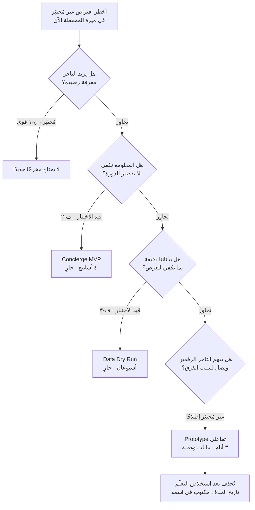
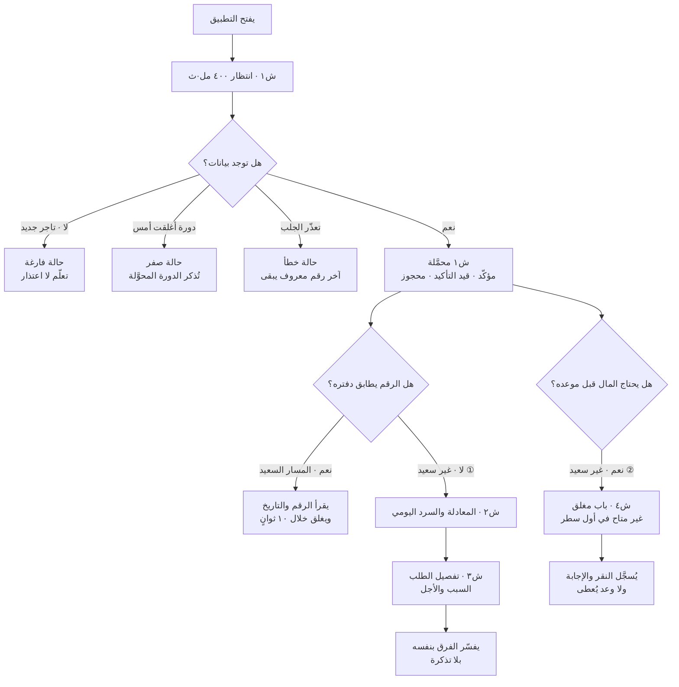
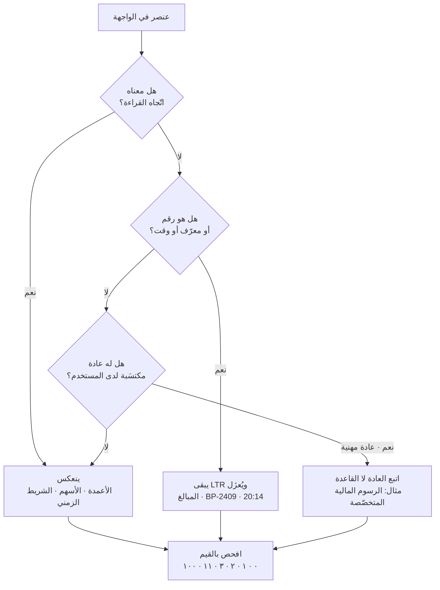
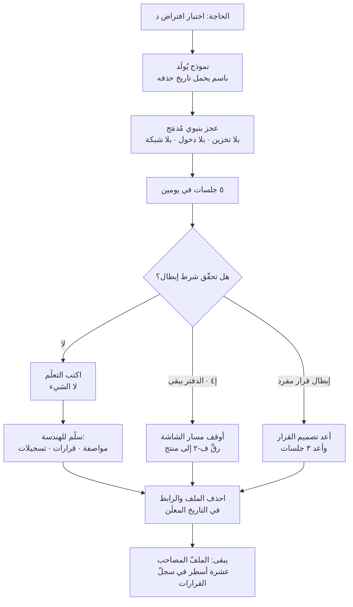

> [!info] الوحدة 09 · ورشة BridgePay
> **هذه الوحدة لا تشرح `Vibe Coding` ولا سُلّم المخرَجات الأربعة.** كلاهما مشروح كاملًا في [[08 - Vibe Coding|الفصل الثامن]]، ومن لم يقرأه فليقرأه أولًا: هذه الوحدة تفترض أنك تعرف الفرق بين `Mockup` و`Prototype` و`PoC` و`MVP`، وتعرف الهيكل السباعي للموجّه، وتعرف بروتوكول «تاريخ انتهاء الصلاحية».
>
> ما تفعله هذه الوحدة شيء واحد: **تُشغِّل ذلك كلَّه على ميزة واحدة بعينها** — «المحفظة والرصيد اللحظي والسحب» — فتُنتج مواصفة نموذج قابلة للتسليم إلى أداة توليد اليوم، وعشرة قرارات تصميم مبرَّرة، وبروتوكول اختبار مع خمسة تجّار له شرط إبطال معلَن.
>
> والفرق الذي ستشعر به: الفصل يعطيك **قاعدة**، والوحدة تجعلك **تدفع ثمنها**. حين تقرأ «اجعل النموذج عاجزًا بنيويًّا» تُوافق بسهولة؛ وحين تصل إلى القرار السادس هنا وتكتشف أن العجز البنيوي يعني أنك **لن تختبر أهمّ ما تريد اختباره**، تعرف أن للقاعدة ثمنًا، وتقرّر كيف تدفعه.

# الوحدة 09 — النموذج الأولي والتصميم

## ما ورثته من الوحدة السابقة

لا أبدأ هذه الوحدة من فكرة «شاشة رصيد». أبدأ من **ميزة محسومة الأولوية، ومقيَّدة بستّة قرارات سابقة، ومحفوفة بثلاثة أرقام لا أملكها بعد**. وهذا الفرق بين مصمّم يُعطى مهمّة ومدير منتج يُسلَّم إليه ملفّ.

### ① القيود التي تحكم كل قرار في هذه الوحدة

| المصدر | ما ورثته بالضبط | كيف يقيّد هذه الوحدة |
|---|---|---|
| [[00 - ميثاق المشروع ومصدر الحقيقة\|الميثاق]] | ٢٦٣ تاجرًا نشطًا · دورة تسوية **١٤ يومًا** · عمولة **١٢٪** · متوسّط الطلب **٧٤ ريالًا** · ٤٬٩٠٠ تذكرة شهريًّا منها **٣١٪** فئة «أين مستحقّاتي؟» · مصمّم **واحد** في الفريق | كل رقم وهمي في النموذج يجب أن يكون مشتقًّا من هذه، ووجود مصمّم واحد يعني أن النموذج **لا يُبنى في `Figma` بأربع دقّات دقّة** بل بأداة توليد |
| [[01 - رؤية المنتج واستراتيجيته\|الوحدة ٠١]] | الرؤية: «ألّا يسأل أحدٌ في هذه السوق: أين مالي؟» · الرهان ① **اليقين قبل السيولة** بـ٥ مهندسين · «التسوية الأسبوعية» و«السحب الفوري» في قائمة المرفوض/المؤجَّل | **الدورة تبقى ١٤ يومًا في النموذج.** أي شاشة تُوحي بسحب فوري مجّاني تختبر منتجًا قرّرنا ألّا نبنيه |
| [[03 - الاكتشاف والبحث الميداني\|الوحدة ٠٣]] | ن-١ (الشكوى بديل عن شاشة · **قوي**) · ن-٢ (دفاتر موازية · **قوي**) · ن-٣ (انعدام تكافؤ الدليل · **قوي**) · ن-٤ (المشكلة في التنبّؤ لا المدّة · متوسّط) · ن-١٢ (**لغة المنصّة ليست لغة المستخدم** · متوسّط) | ن-١٢ هو **مصدر قرار التسمية** في هذه الوحدة، وليس ذوقًا لغويًّا. ون-٣ هو مصدر قرار «كل رقم قابل للفتح» |
| [[04 - الشخصيات والمهام\|الوحدة ٠٤]] | `JTBD-1` (سعد) · `JTBD-2` (نورة) · `JTBD-5` (خالد) · وقرار **`T6`: رقمان لا رقم واحد — «مؤكّد» و«قيد التأكيد»** | **`T6` قيد تصميم لا اقتراح.** يدخل النموذج بلا نقاش، ويُختبر أثره على الفهم لا أصلُه |
| [[05 - رحلة العميل ونقاط الألم\|الوحدة ٠٥]] | قاع رحلة التاجر عند **ت-م٧ (التحقّق والاعتراض · −٤)** لا عند ت-م٥ (الانتظار · −٢) · وت-م٦ مرحلة **مجهولة** (مدى خلاف ±٣) | النموذج يجب أن يستهدف **ت-م٧ أوّلًا**: أي أن قابلية التفسير أهمّ من جمال الرقم |
| [[06 - الفرضيات والتحقّق\|الوحدة ٠٦]] | `ف-٢` (التنبّؤ لا المدّة · [[Concierge MVP\|خادم شخصي]] بأربعة أسابيع) · `ف-٣` (**هل نملك أصلًا رقمًا صحيحًا؟** · [[Data Dry Run\|تشغيل جافّ]] بعتبة ٩٩٫٥٪) | **`ف-٣` هو البوّابة.** النموذج يُختبر على بيانات وهمية، لكن **الإطلاق** ممنوع قبل نتيجة ف-٣ — وهذا مكتوب في هذه الوحدة صراحةً لا في ذيلها |
| [[07 - ترتيب الأولويات\|الوحدة ٠٧]] | المرشّح **ب-١** (رصيد لحظي + تنبيه عند التحويل) · **ب-٢** (كشف قابل للتفسير) · **ب-٥** (محفظة قابلة للسحب) — وفصلُ ب-١ عن ب-٥ صراحةً لأن الأول يحلّ **الغموض** والثاني يحلّ **المِلكية** | **نطاق النموذج: ب-١ و ب-٢ كاملَين، و ب-٥ بابًا مغلقًا مقيسًا لا ميزة.** وهذا أهمّ قرار نطاق في الوحدة |

### ② الأرقام التي سأبني عليها البيانات الوهمية — بحسابها

البيانات الوهمية في النموذج ليست زينة. هي **أداة قياس**: إن وضعت رقمًا مستديرًا جميلًا (١٠٬٠٠٠ ريال) فلن تكتشف أبدًا أن التاجر لا يفهم الكسور، ولا أن الفاصلة العشرية تنكسر في `RTL`، ولا أن عمود المبالغ يهتزّ حين تختلف خانات الأرقام. **الرقم الوهمي الجميل يخفي عيبًا سيظهر يوم الإطلاق.**

ولهذا كل رقم أدناه مشتقّ من الميثاق بحساب معروض:

| الرمز | المشتقّ | الحساب | القيمة |
|---|---|---|---|
| **ن-١** | طلبات سعد اليومية | من [[04 - الشخصيات والمهام\|الوحدة ٠٤]] — ٧٦٪ من متوسّط ١٠٫٥ | **٨ طلبات/يوم** |
| **ن-٢** | إجمالي سعد اليومي | ٨ × ٧٤ | **٥٩٢ ريالًا** |
| **ن-٣** | صافي سعد اليومي بعد عمولة ١٢٪ | ٥٩٢ × ٨٨٪ | **٥٢١ ريالًا** (٥٢٠٫٩٦ مقرَّبًا) |
| **ن-٤** | مستحقّ سعد لدورة كاملة | ٥٢١ × ١٤ | **٧٬٢٩٤ ريالًا** |
| **ن-٥** | المؤكّد في اليوم ٩ من الدورة (٧ أيام مضت عليها نافذة النزاع ٤٨ ساعة) | ٥٢١ × ٧ | **٣٬٦٤٧ ريالًا** |
| **ن-٦** | قيد التأكيد (اليومان الأخيران داخل نافذة ٤٨ ساعة) | ٥٢١ × ٢ | **١٬٠٤٢ ريالًا** |
| **ن-٧** | حصّة التاجر من الطلب الواحد | ٧٤ × ٨٨٪ | **٦٥٫١٢ ريالًا** |
| **ن-٨** | محجوز لنزاعين مفتوحين | ٦٥٫١٢ × ٢ | **١٣٠٫٢٤ ريالًا** |
| **ن-٩** | الطلبات الملغاة في ٩ أيام (بافتراض إلغاء ٤٪ المعلَن في الوحدة ٠٧) | ٨ × ٩ × ٤٪ | **٢٫٩ ≈ ٣ طلبات** |
| **ن-١٠** | صافي نورة اليومي (٦ فروع) | ٦٣ × ٧٤ × ٨٨٪ | **٤٬١٠٣ ريالات** |
| **ن-١١** | مستحقّ نورة لدورة كاملة | ٤٬١٠٣ × ١٤ | **٥٧٬٤٤٢ ريالًا** |
| **ن-١٢** | تذاكر التاجر الواحد لكل دورة | ٥٫٨ تذكرة شهريًّا ÷ ٢٫١٤ دورة | **٢٫٧ تذكرة** |

> [!warning] ثلاثة أرقام **لا أملكها**، والنموذج مصمَّم ليعيش بدونها
> **① نسبة التحويلات التي يختلف فيها المبلغ الواصل عن توقّع التاجر.** سؤال [[05 - رحلة العميل ونقاط الألم\|الوحدة ٠٥]] عن المرحلة ت-م٦، ولم يُقَس بعد. أثره على هذه الوحدة: لا أستطيع أن أعرف كم مرّة ستظهر حالة «الرقم لا يطابق»، فبنيتُ لها **حالة شاشة كاملة** بدل أن أفترض ندرتها.
> **② دقّة بيانات التسوية.** هذا موضوع `ف-٣` بعينه، ونتيجته لم تصل. أثره: النموذج **لا يعِد بدقّة**، ويُصمَّم على أن الرقم قد يكون خاطئًا — وهذا هو مصدر قرار التصميم الأول والثاني.
> **③ معدّل الإلغاء الحقيقي.** الوحدة ٠٧ أعلنت ٤٪ افتراضًا صريحًا قابلًا للتكذيب بيوم عمل. استعملته في ن-٩ **موسومًا**، ولو صار ٨٪ لتضاعف عدد أسطر «المحجوز» في الشاشة — وهذا تحديدًا ما يجعل حالة «رصيد محجوز» حالةً أولى لا حالة حدّية.
>
> والقاعدة: **النموذج الذي يفترض أن كل شيء يعمل يختبر عالمًا لا نعيش فيه.** ثلاثة أرقام مجهولة تعني ثلاث حالات شاشة إضافية، لا ثلاثة افتراضات مريحة.

### ③ ما لم أرثه — والتصريح به شرط أمانة

**لم أرث `PRD` مكتوبًا.** الوحدة ٠٨ هي مالكة وثيقة المتطلبات، وترتيب الورشة يجعلها تسبقني. وما أفعله هنا صراحةً: أبني المواصفة **على مخرَجات ٠١–٠٧ مباشرة**، وأصوغ كل قرار بحيث يصلح أن يُنسخ إلى الـ`PRD` بوصفه قيدًا لا اقتراحًا. فإن اختلف الـ`PRD` عن قرار هنا، **فالـ`PRD` هو الحاكم** — ودوري أن أكون قد كتبت مبرّري بوضوح يكفي لأن يُناقَش لا لأن يُلغى بصمت.

**ولم أرث نتيجة اختبار واحد.** ف-٢ يستغرق أربعة أسابيع، وف-٣ أسبوعين. وهذا يعني أن هذه الوحدة تعمل **بالتوازي** مع اختبارات معلّقة، لا بعدها. وهو وضع طبيعي في العمل الحقيقي ومرفوض في الكتب: في الكتاب تنتظر النتيجة، وفي الواقع تبني نموذجًا يكلّف ثلاثة أيام بينما ينضج اختبار يكلّف أربعة أسابيع — **لأن كلفة الانتظار أعلى من كلفة إعادة البناء**. راجع [[Cost of Experimentation|كلفة التجربة]].

## السؤال الذي تجيب عنه هذه الوحدة

**ما أقلّ شيء نبنيه ليجيب عن أخطر ما نجهله في «المحفظة» — ومن أين نعرف أننا بنينا شيئًا يجيب عن سؤال آخر؟**

والشقّ الثاني هو الحقيقي. لأن بناء نموذج للمحفظة سهل اليوم: موجّه من عشرين سطرًا، وأداة توليد، وثلاث ساعات، وتخرج بشاشة أجمل ممّا يملكه نصف السوق. والمشكلة أن تلك الشاشة الجميلة تجيب عن سؤال **لم نسأله**: «هل الواجهة مقبولة؟» — بينما سؤالنا الفعلي شيء آخر تمامًا:

> **هل يستطيع سعد أن يتّخذ قرار التزام مالي اعتمادًا على ما يراه في هذه الشاشة، دون أن يفتح دفتره؟**

ولاحظ بنية السؤال: لا يسأل عن الإعجاب، ولا عن الوضوح، ولا عن سهولة الاستخدام. يسأل عن **استبدال سلوك قائم** — الدفتر الذي رصدناه في ن-٢ — بسلوك جديد. وهذا هو الشيء الوحيد الذي يستحقّ أن يُختبر، لأنه الشيء الوحيد الذي يحسم إن كنّا نبني ميزة أو نبني عادة.

وثلاثة أسئلة فرعية تتفرّع عنه، وكلها تُختبر في هذا النموذج:

| # | السؤال الفرعي | ما يجيب عنه في النموذج | مصدره |
|---|---|---|---|
| **س١** | هل يفهم التاجر التمييز بين «مؤكّد» و«قيد التأكيد» — أم يجمعهما ذهنيًّا فيعود الرقم الواحد من الباب الخلفي؟ | الشاشة الرئيسية + سؤال الاستدعاء في البروتوكول | `T6` من الوحدة ٠٤ |
| **س٢** | حين يختلف الرقم عن دفتره، هل يصل إلى **سبب** الفرق داخل المنتج أم يفتح تذكرة؟ | مسار «الرقم لا يطابق» + شاشة تفصيل الطلب | ت-م٧ من الوحدة ٠٥ · ن-٣ |
| **س٣** | ما الذي يفعله حين يرى «محجوز»؟ هل يطمئنّ أم يفزع أم لا يراه أصلًا؟ | حالة «رصيد محجوز» + سؤال التفسير الحرّ | ن-٣ · ف-٣ |

> [!important] السؤال الذي **لا** يجيب عنه هذا النموذج — وهذا قرار لا نقص
> **لا يجيب عن: هل الأرقام صحيحة؟** ذاك سؤال `ف-٣` ([[Data Dry Run|التشغيل الجافّ]])، ولا تجيب عنه واجهة مهما جمُلت. والخلط بينهما هو الخطأ الذي حذّر منه [[08 - Vibe Coding|الفصل الثامن]] حرفيًّا: «نموذج تفاعلي جميل يقنع الجميع بفكرة تنهار عند أول اختبار جادّ للدقّة هو أسوأ مخرَج ممكن — يشتري لك التزامًا قبل أن يشتري لك معرفة».
>
> ولهذا يمشي المساران **بالتوازي وبفصل صارم**: النموذج يختبر **الفهم**، والتشغيل الجافّ يختبر **الصحّة**. ومن ينجح في الأول ويفشل في الثاني **لا يُطلق**، لأن شاشة مفهومة برقم خاطئ تحوّل ٢٫٧ تذكرة استعلام لكل دورة إلى ٢٫٧ نزاع — وقد شرحت الوحدة ٠١ لماذا: «شاشة رصيد خاطئة أسوأ من غياب الشاشة، لأنها تحوّل الغموض إلى اتّهام».

## العمل خطوة بخطوة

| # | الخطوة | ما تنتجه | الزمن التقديري |
|---|---|---|---|
| **١** | **تحديد مستوى المخرَج** بجدول قرار صريح: `Mockup` أم `Prototype` أم `PoC` أم `MVP`؟ ولماذا لا الثلاثة الأخرى؟ | صفحة قرار موقَّعة | ٣٠ دقيقة |
| **٢** | **حصر النطاق** بفصل ب-١ وب-٢ عن ب-٥، وكتابة [[Non-Goals\|أهداف مستبعَدة]] بنصّها | قائمة نطاق + ٦ مستبعَدات | ٣٠ دقيقة |
| **٣** | **رسم [[User Flow\|مسار المستخدم]]**: مسار سعيد واحد ومساران غير سعيدين — قبل أي شاشة | مخطّط مسار | ٤٥ دقيقة |
| **٤** | **جرد حالات الشاشة الستّ** لكل شاشة: فارغة · محمَّلة · خطأ · انتظار · صفر رصيد · رصيد محجوز | مصفوفة حالات | ٦٠ دقيقة — **الخطوة التي تُنسى دائمًا** |
| **٥** | **اشتقاق البيانات الوهمية** من الميثاق بحساب معروض، بأرقام غير مستديرة عمدًا | جدول بيانات النموذج | ٤٥ دقيقة |
| **٦** | **كتابة عشرة قرارات تصميم** بالبنية الخماسية (القرار · البديل المرفوض · لمن نحسّن · من يخسر · كيف نعرف أننا أخطأنا) | سجلّ قرارات | ٩٠ دقيقة — **أطول خطوة وأثمنها** |
| **٧** | **حسم `RTL` و`Locale`** بندًا بندًا: ما ينعكس وما لا ينعكس، وصيغ الجمع بـ[[ICU Message Format\|ICU]] | جدول انعكاس + ٦ صيغ جمع | ٦٠ دقيقة |
| **٨** | **كتابة الموجّه كامل النصّ** بالهيكل السباعي من [[08 - Vibe Coding\|الفصل الثامن]] | موجّه جاهز للصق | ٤٥ دقيقة |
| **٩** | **توليد النموذج ثم فحصه** بقائمة فحص بنعم/لا — لا بالانطباع | نموذج + نتيجة فحص | ١٢٠ دقيقة |
| **١٠** | **كتابة بروتوكول الاختبار** مع خمسة تجّار: المهامّ · المقاييس · **شرط الإبطال** | بروتوكول + نموذج تسجيل | ٦٠ دقيقة |
| **١١** | **تثبيت حوكمة النموذج**: تاريخ الحذف · الوسم · العجز المقصود · الملفّ المصاحب | بطاقة حوكمة | ٢٠ دقيقة |
| **١٢** | **تشغيل الاختبار وتفريغه** خلال ثلاثة أيام، وكتابة قرار «نبني / لا نبني / نعيد التصميم» | تقرير قرار | ٦ ساعات موزّعة |

**الإجمالي قبل التشغيل الميداني: ~٩ ساعات**، ثم ثلاثة أيام تقويمية للاختبار. ولاحظ التوزيع: **ساعتان للبناء، وسبع للتفكير**. من عكس النسبة بنى شيئًا يعمل ولا يعرف ما الذي يقيسه — وهذا وصف دقيق لأغلب النماذج التي تُبنى اليوم بأدوات التوليد.

> [!tip] الخطوة ٤ هي التي تفصل بين نموذج ومظاهرة
> جرد حالات الشاشة (٦٠ دقيقة) يبدو عملًا كتابيًّا مملًّا، وهو **أنفع ساعة في الوحدة كلّها**. لأن العرض التقديمي يُبنى دائمًا على الحالة المحمَّلة السعيدة، والمنتج يُعاش في الحالات الخمس الأخرى. والتاجر الذي فتح الشاشة أول مرّة يوم الاثنين الساعة السابعة صباحًا — قبل أول طلب في يومه — سيرى **الحالة الفارغة**، لا الشاشة الجميلة التي بنيتَها. فإن لم تكن قد صمّمتها، صمّمتها له أداة التوليد بمزاجها.

## المخرَج

### القطعة ① — قرار مستوى المخرَج: لماذا `Prototype` لا غيره

هذا أول قرار في الوحدة، وأكثر قرار يُتَّخذ ضمنًا في الواقع. الفريق يقول «خلّينا نسوّي نموذج» ويبدأ، ولا أحد يسأل: نموذج **بأي معنى**؟ ثم يُعرض المخرَج فيراه ثلاثة أشخاص ثلاثة أشياء — وهذا بالضبط ما وصفه [[08 - Vibe Coding|الفصل الثامن]] في افتتاح سُلَّم المخرَجات.

فلنجعله صريحًا. القاعدة الحاكمة من الفصل: **ابنِ أقلّ شيء يجيب عن أخطر افتراض غير مُختبَر لديك الآن.** فما هو أخطر افتراض غير مختبَر؟

عندنا أربعة مرشّحين:

| الافتراض | مُختبَر؟ | بماذا يُختبر أصلًا |
|---|---|---|
| **أ** — التاجر يريد معرفة رصيده | ✅ **نعم، بقوّة**. ن-١ نمط قوي مسنود بـ٣١٪ من التذاكر و٢٫٧ تذكرة لكل دورة | لا يحتاج اختبارًا جديدًا |
| **ب** — المعلومة تكفي بلا تقصير الدورة | 🔄 **قيد الاختبار** في `ف-٢` (خادم شخصي · ٤ أسابيع) | ليس نموذجًا واجهيًّا |
| **ج** — بياناتنا دقيقة بما يكفي لعرضها | 🔄 **قيد الاختبار** في `ف-٣` (تشغيل جافّ · أسبوعان) | ليس نموذجًا واجهيًّا |
| **د** — **التاجر يستطيع فهم الرقمين واستعمالهما في قرار، ويصل إلى سبب الفرق بنفسه** | ❌ **غير مختبَر إطلاقًا** | **نموذج تفاعلي — ولا شيء غيره** |

الافتراض **د** هو الوحيد الذي لا يوجد له مسار اختبار آخر. ولا يمكن اختباره بالسؤال («هل تفهم الفرق بين مؤكّد وقيد التأكيد؟» — سيقول نعم، وهذه مغالطة `The Mom Test` بعينها)، ولا بالوصف، ولا بصورة ثابتة. يُختبر بشيء **يُضغط فيسلك سلوكًا**.

#### جدول القرار

| المستوى | ماذا كان سيجيب؟ | لماذا **لا** يصلح هنا | ما الذي يخسره الفريق لو اختاره |
|---|---|---|---|
| **`Mockup`** (شاشات ثابتة · ساعات) | «هل يفهم التاجر ما تعرضه الشاشة؟» | يجيب عن **الفهم اللحظي** لا عن **الاستعمال**. وسؤالنا `س٢` هو: هل يصل إلى سبب الفرق بنفسه؟ — وهذا مسار من ثلاث ضغطات لا صورة. والصورة الثابتة تجعل التاجر يقول «واضح» لأنه لم يُطلب منه إنجاز شيء | يخرج بانطباع إيجابي زائف. سيقول التجّار الخمسة إن الشاشة واضحة، ثم يفتح ثلاثة منهم تذكرة في أول أسبوع من الإطلاق الحقيقي لأنهم لم يجدوا زرّ التفصيل |
| **`PoC`** (تجربة تقنية · أيام) | «هل نستطيع توفيق المصادر الثلاثة آليًّا وعرض رقم صحيح؟» | **يجيب عن سؤال حقيقي — لكنه سؤال مملوك لجهة أخرى.** هذا بالضبط `ف-٣`، وهو مجدوَل في [[06 - الفرضيات والتحقّق\|الوحدة ٠٦]] بخمسة أيام مهندس. تكراره هنا **ازدواج إنفاق** | يستهلك ٥ أيام مهندس على سؤال مُموَّل أصلًا، ويترك الافتراض **د** بلا اختبار — أي ينفق على المعروف ويترك المجهول |
| **`MVP`** (منتج مصغَّر · أسابيع) | «هل يوجد استعمال مستمرّ؟» | **ثلاثة موانع صلبة:** ① الافتراض **ج** لم يُحسم — فإطلاق أرقام على ٢٦٣ تاجرًا قبل نتيجة ف-٣ هو نشر أخطاء بالجملة، و[[Reversible vs Irreversible Decisions\|قرار باب واحد]] بحسب `T6`. ② الرهان ① خصّص ٥ مهندسين لثلاث دورات، وبناء `MVP` الآن يستهلك السعة **قبل** أن نعرف أي شاشة نبني. ③ الـ`MVP` يُصان ويبقى، ونحن ما زلنا نتعلّم | يحرق ٥ مهندسين × ٦ أسابيع (٣٠ أسبوع-مهندس من أصل ٤٣ صافية) على تصميم لم يُختبر فهمُه على تاجر واحد |
| **`Prototype`** ✅ (تفاعلي ببيانات وهمية · ٣ أيام) | «هل يُنجز التاجر المهمّة؟ وأين يتعثّر؟» | **هو الوحيد الذي يجيب عن `د`.** يُضغط فيسلك سلوكًا، وببيانات وهمية فلا يلمس ف-٣، وبكلفة ٣ أيام فلا يمسّ حصّة الرهان ① | — |



> [!note] لماذا لم نبنِ `Mockup` أوّلًا ثم نرقّيه؟
> لأن السُّلَّم **ليس مراحل متتابعة إلزاميًّا** — وهذه القاعدة منصوصة في [[08 - Vibe Coding|الفصل الثامن]]. والسبب العملي عندنا تحديدًا: بناء `Mockup` ثم `Prototype` يكلّف يومًا إضافيًّا ولا يشتري إجابة إضافية، لأن سؤالنا سلوكي بحت. **ولو كان سؤالنا «ما اسم هذه الشاشة؟» لكان الـ`Mockup` كافيًا وأرخص.**
>
> وهنا الفرق بين اتّباع القاعدة وفهمها: من يفهمها يعرف أن `Mockup` ليس درجة أدنى من `Prototype`، بل **أداة لسؤال آخر**. ومن يتّبعها حرفيًّا يمرّ بالأربعة دائمًا ويسمّي ذلك انضباطًا، وهو في الحقيقة إنفاق.

> [!danger] التصريح الذي يجب أن يُقال في كل عرض لهذا المخرَج
> **«هذا نموذج تعلّم ببيانات وهمية. لن يُطلق، وسيُحذف يوم ٢٨ من هذا الشهر. وما سنسلّمه للهندسة هو ما تعلّمناه منه لا هو نفسه.»**
>
> تُقال بنصّها في كل عرض، ولو ملّ الحاضرون. وسبب إدراجها في **المخرَج** لا في قسم الحوكمة: لأنها **جزء من المواصفة**، لا نصيحة. والوحدة تُسلَّم بها.

### القطعة ② — نطاق النموذج و[[Non-Goals|ما هو خارجه]]

#### داخل النطاق (ثلاث شاشات لا أكثر)

| # | الشاشة | المرشّح الموروث | المهمّة الوحيدة التي تخدمها |
|---|---|---|---|
| **ش١** | **«مستحقّاتي»** — الشاشة الرئيسية | ب-١ | أن يعرف التاجر **كم له والآن ومتى يصله**، في أقلّ من ١٠ ثوانٍ من فتح التطبيق |
| **ش٢** | **«من أين تكوّن؟»** — تفصيل الدورة الجارية | ب-٢ | أن يفسّر التاجر أي فرق بين رقمنا ودفتره **بنفسه**، بلا تذكرة |
| **ش٣** | **«تفصيل الطلب الواحد»** — قاع الشجرة | ب-٢ | أن يصل إلى الطلب المعنيّ بعينه: قيمته · عمولته · حالته · سبب حجزه إن وُجد |

**وشاشة رابعة تُعرض ولا تعمل:** **ش٤ — «طلب سحب مبكّر»**، وهي [[Fake Door Test|باب مغلق]] مقصود، شرحُه كامل في القرار السادس أدناه.

#### خارج النطاق — ستّة مستبعَدات بنصّها

هذه ليست «ما لم يسعفنا الوقت لبنائه»، بل **قرارات**. وكلٌّ منها له سبب وأثر لو خُولف:

| # | المستبعَد | لماذا | ماذا يحدث لو أُدخل؟ |
|---|---|---|---|
| **خ١** | **تسجيل دخول** | ليس موضع الشكّ، ويضيف احتكاكًا في جلسة مدّتها ١٥ دقيقة | نخسر ٤٠ ثانية من كل جلسة × ٥ تجّار = جلستان كاملتان من زمن الملاحظة |
| **خ٢** | **رسم بياني للإيرادات** | يجيب عن مهمّة نورة (`JTBD-2` · مقارنة الفروع) لا عن مهمّة سعد (`JTBD-1` · قرار التزام). وخلطهما في نموذج واحد **يفسد القياس**: لن نعرف إن كان الإعجاب بالرقم أم بالرسم | يصير النموذج جميلًا وغامض النتيجة — وهو أسوأ مزيج ممكن |
| **خ٣** | **سحب حقيقي أو أي حركة مال** | خارج نطاق الرهان ①، وقرار مالي لا منتجيّ | نختبر منتجًا قرّرنا ألّا نبنيه، ونعِد التاجر بما لا نملك |
| **خ٤** | **تعدّد الفروع والصلاحيات** | `JTBD-2` يستحقّ نموذجًا مستقلًّا. ولو أُدخل هنا لصار النموذج نموذجين | يتضاعف حجم الموجّه، وتتضاعف حالات الشاشة من ٦ إلى ١٨ |
| **خ٥** | **كشف `PDF` أو تصدير** | هذا **مخرَج** ب-٢ لا **آليته**. وسؤالنا: هل يصل التاجر إلى السبب داخل المنتج؟ — والتصدير يجيب عن السؤال المعاكس: هل نُبقيه على دفتره؟ | نبني بالضبط ما نحاول إلغاءه (ن-٢ · الدفاتر الموازية) |
| **خ٦** | **إشعارات فعلية** | تُختبر في `ف-٢` عبر الخادم الشخصي — بواتساب من إنسان اسمه عمر، لا بإشعار من تطبيق | ازدواج إنفاق على فرضية مموَّلة أصلًا |

> [!warning] المستبعَد الذي سيُطلب منك إدخاله في أول اجتماع — وكيف تردّ
> **خ٢ (الرسم البياني).** سيقولها أحدهم بحسن نيّة: «ضيف رسم بسيط، يعطي الشاشة قيمة». والردّ ليس «لا وقت»، بل: **«الرسم يجيب عن سؤال نورة، وهذا النموذج يسأل سؤال سعد. ولو أدخلناه فلن نعرف بعد الجلسات الخمس هل أعجبهم الرقم أم الرسم — ونحن نبني ثلاثة أيام لنعرف، لا لنُعجب.»**
>
> ولاحظ بنية الردّ: **لم أقل إن الرسم سيّئ.** الرسم بند حقيقي في ب-٨ وله شخصيته وسيُبنى. قلت إنه **يفسد أداة القياس** — وهي الحجّة نفسها التي رفضنا بها «المساعد الذكي» في [[01 - رؤية المنتج واستراتيجيته|الوحدة ٠١]]. البند الذي يُفسد قياسك يُرفض ولو كان نافعًا.

---

### القطعة ③ — مواصفة النموذج الأولي كاملةً

هذه هي القطعة الأساسية في الوحدة. تُقرأ بوصفها **وثيقة تُسلَّم**: من يأخذها ومعه أداة توليد يخرج بنموذج، ومن يأخذها ومعه مصمّم يخرج بشاشات، ومن يأخذها ومعه مهندس يعرف ما الذي حُوكي وما الذي بُني.

وبنيتها أربعة أجزاء: **الشاشات وحالاتها** ← **البيانات الوهمية بأرقامها** ← **المسارات الثلاثة** ← **قواعد السلوك**.

---

#### ٣·أ — مصفوفة الشاشات والحالات

القاعدة التي تحكم هذا الجزء: **لكل شاشة ستّ حالات، ولا يجوز أن تكون أي خانة فارغة.** والخانة التي تكتب فيها «لا ينطبق» يجب أن تحمل سببًا، لأن «لا ينطبق» في مرحلة التصميم تصير «لم نتوقّعها» في مرحلة الإطلاق.

| الحالة | ش١ · مستحقّاتي | ش٢ · من أين تكوّن؟ | ش٣ · تفصيل الطلب |
|---|---|---|---|
| **فارغة** (`Empty`) | تاجر مفعَّل بلا طلبات بعد | دورة بدأت اليوم بلا طلبات | لا تنطبق — لا يُفتح تفصيل طلب غير موجود |
| **محمَّلة** (`Loaded`) | الحالة الأساسية: ثلاثة أرقام + تاريخ | ٩ أيام مسرودة بأرقامها | طلب واحد بحقوله السبعة |
| **خطأ** (`Error`) | تعذّر جلب الأرقام | تعذّر جلب التفصيل مع بقاء الإجمالي معروضًا | تعذّر جلب الطلب |
| **انتظار** (`Loading`) | هيكل عظمي ٤٠٠ مل·ث | هيكل عظمي للأسطر فقط | هيكل عظمي |
| **صفر رصيد** (`Zero`) | تاجر نشط أُغلقت دورته للتوّ | دورة جديدة بصفر | لا تنطبق |
| **رصيد محجوز** (`Held`) | سطر ثالث يظهر بلونه ورقمه | أسطر الحجز موسومة داخل السرد | سبب الحجز + رقم النزاع + الأجل |

##### ش١ — «مستحقّاتي» · الشاشة الرئيسية

هذه الشاشة تُقاس بمعيار واحد: **كم ثانية حتى يقول التاجر رقمًا بصوته؟** كل عنصر لا يخدم هذا المعيار يُحذف.

**الحالة المحمَّلة — البنية بالترتيب من أعلى إلى أسفل:**

```
┌──────────────────────────────────────────────┐
│  ⚠ نموذج أوّلي · بيانات وهمية · يُحذف ٢٨/٠٩  │  ← شريط ثابت لا يُزال
├──────────────────────────────────────────────┤
│  مستحقّاتي                    مطعم سعد ▾     │
│                                              │
│  يصلك يوم الأحد ٢٨ سبتمبر                    │  ← التاريخ أوّلًا
│  ٣٬٥١٧٫٠٠ ريال                               │  ← الرقم الأكبر
│  ✓ مؤكّد · لا يتغيّر                          │
│                                              │
│  ─────────────────────────────────────       │
│  قيد التأكيد        ١٬٠٤٢٫٠٠ ريال      ›     │  ← يُنقر
│  طلبات آخر يومين · تُثبَّت بعد ٤٨ ساعة        │
│                                              │
│  محجوز مؤقّتًا       ١٣٠٫٢٤ ريال       ›     │  ← يُنقر
│  طلبان قيد مراجعة نزاع                       │
│  ─────────────────────────────────────       │
│                                              │
│  إجمالي الدورة المتوقّع   ٧٬٢٩٤٫٠٠ ريال       │
│                                              │
│  [ من أين تكوّن هذا المبلغ؟ ]                │  ← الزرّ الوحيد البارز
│                                              │
│  آخر تحديث قبل ٤ دقائق          ↻ تحديث     │
│                                              │
│  ─────────────────────────────────────       │
│  تحتاج المبلغ قبل موعده؟  اطلب سحبًا مبكّرًا › │  ← الباب المغلق
└──────────────────────────────────────────────┘
```

**لماذا هذا الترتيب بالضبط؟** لأن مهمّة سعد (`JTBD-1`) تبدأ بجملة: «حين أكون في نهاية يوم عمل وعليّ التزام نقدي قريب». والالتزام له **موعد**. فالمعلومة التي يبني عليها القرار ليست «كم لي» وحدها بل **«كم لي مؤكّدًا، ومتى يصلني»** — ولذلك التاريخ فوق الرقم، والرقم المؤكّد فوق كل شيء آخر. من وضع الإجمالي المتوقّع الكبير في الأعلى (٧٬٢٩٤) بنى شاشة تُشعر بالثراء وتُنتج قرارًا خاطئًا.

**الحالات الخمس الأخرى بنصّها:**

| الحالة | متى تظهر | النصّ الحرفي المعروض | القاعدة التي تحكمها |
|---|---|---|---|
| **فارغة** | تاجر مفعَّل، صفر طلبات على المنصّة منذ التفعيل | «لم تصلك طلبات عبر المنصّة بعد. حين يصلك أول طلب، سيظهر مستحقّك هنا فورًا.» + زرّ «كيف تصلني الطلبات؟» | الحالة الفارغة **تعلّم**، لا تعتذر. هي أول شاشة يراها ١٤٧ تاجرًا خاملًا |
| **صفر رصيد** | تاجر نشط، أُغلقت دورته أمس وحُوّلت | «حُوّل مستحقّ الدورة السابقة (٧٬٢٩٤٫٠٠ ريال) يوم الأحد ١٤ سبتمبر. دورتك الجديدة بدأت اليوم — أول طلب يظهر هنا خلال دقائق.» | **صفر ≠ فارغ ≠ خطأ.** الفرق بينها هو الفرق بين الطمأنينة والفزع |
| **انتظار** | أثناء الجلب | هيكل عظمي رمادي بمقاسات العناصر النهائية · **لا دوّارة** · حدّ أدنى ٤٠٠ مل·ث حتى لو وصلت البيانات أسرع | الوميض (`flash`) في شاشة مال يُقرأ **تغيّرًا في الرقم** لا سرعةً |
| **خطأ** | تعذّر الجلب | «تعذّر تحديث مستحقّك الآن. آخر رقم معروف: ٣٬٥١٧٫٠٠ ريال — بتاريخ الاثنين ٢٢ سبتمبر ١١:٤٠ ص.» + زرّ «أعد المحاولة» | **لا نُخفي الرقم الأخير المعروف ونتركه أبيض.** الشاشة البيضاء عند الخطأ هي التي تصنع التذكرة |
| **رصيد محجوز** | وجود نزاع أو استرداد مفتوح | سطر ثالث بلون تحذيري لا أحمر: «محجوز مؤقّتًا ١٣٠٫٢٤ ريال · طلبان قيد مراجعة» — قابل للنقر | تفصيلها في القرار الثاني أدناه |

> [!example] الحالة التي كادت تُنسى — وكيف اكتُشفت
> الحالة السادسة (رصيد محجوز) لم تكن في المسوّدة الأولى. ظهرت حين طُبِّق سؤال واحد على كل حالة: **«ما الذي يجعل الرقم الذي أعرضه اليوم مختلفًا عن الرقم الذي سيصل يوم ١٤؟»**
>
> والجواب ثلاثة أشياء: طلبات لم تُثبَّت بعد (← قيد التأكيد)، ونزاعات مفتوحة (← محجوز)، وطلبات ستأتي في الأيام المتبقّية (← إجمالي متوقّع). **ثلاثة أسباب ← ثلاثة أرقام.** والشاشة التي تعرض رقمًا واحدًا تكذب في ثلاثة مواضع لا في موضع واحد.
>
> والسؤال نفسه صالح لأي منتج: *«ما الذي يجعل ما أعرضه الآن مختلفًا عمّا سيقع فعلًا؟»* — كل جواب هو حالة شاشة، وكل حالة لا تصمّمها يصمّمها المستخدم بتفسيره الخاصّ.

##### ش٢ — «من أين تكوّن؟» · شاشة التفسير

هذه الشاشة تستهدف **ت-م٧**، قاع رحلة التاجر (−٤). والقاع ليس الانتظار بل **العجز عن الإثبات** (ن-٣). فوظيفة الشاشة ليست عرض تفصيل، بل **إعطاء التاجر أدوات خصم**: أن يستطيع أن يقول «الفرق ٦٥ ريالًا وسببه الطلب رقم كذا» بدل «ناقص شيء».

**الحالة المحمَّلة:**

```
┌──────────────────────────────────────────────┐
│  ⚠ نموذج أوّلي · بيانات وهمية · يُحذف ٢٨/٠٩  │
├──────────────────────────────────────────────┤
│  ‹ رجوع        من أين تكوّن؟                 │
│  الدورة الحالية · ١٥ – ٢٨ سبتمبر · اليوم ٩   │
│                                              │
│  ٧٢ طلبًا مكتملًا          ٥٬٣٢٨٫٠٠ ريال      │
│  − عمولة المنصّة ١٢٪         ٦٣٩٫٣٦ ريال−     │
│  ═══════════════════════════════════════      │
│  = مستحقّك من الطلبات       ٤٬٦٨٨٫٦٤ ريال     │
│  − محجوز لنزاعين مفتوحين     ١٣٠٫٢٤ ريال−     │
│  ═══════════════════════════════════════      │
│  = المتوقّع من الأيام التسعة  ٤٬٥٥٨٫٤٠ ريال    │
│                                              │
│  ── تفصيل يومي ─────────────────────────      │
│  الاثنين ٢٢ سبتمبر    ٨ طلبات    ٥٢٠٫٩٦ ›    │
│  الأحد ٢١ سبتمبر      ٨ طلبات    ٥٢٠٫٩٦ ›    │
│  السبت ٢٠ سبتمبر      ٧ طلبات    ٤٥٥٫٨٤ ›    │
│  الجمعة ١٩ سبتمبر     ٩ طلبات    ٥٨٦٫٠٨ ›    │
│  الخميس ١٨ سبتمبر     ٨ طلبات    ٥٢٠٫٩٦ ›    │
│  الأربعاء ١٧ سبتمبر   ٨ طلبات    ٤٥٥٫٨٤ ⚠ ›  │
│  الثلاثاء ١٦ سبتمبر   ٨ طلبات    ٥٢٠٫٩٦ ›    │
│  الاثنين ١٥ سبتمبر    ٨ طلبات    ٥٢٠٫٩٦ ›    │
│  الأحد ١٤ سبتمبر      ٨ طلبات    ٥٢٠٫٩٦ ›    │
└──────────────────────────────────────────────┘
```

**لاحظ يوم الأربعاء ١٧ سبتمبر:** ٨ طلبات لكن ٤٥٥٫٨٤ ريالًا لا ٥٢٠٫٩٦. الفرق ٦٥٫١٢ ريالًا — وهو بالضبط حصّة طلب واحد (ن-٧). والعلامة ⚠ بجانبه. **هذا السطر هو الاختبار كلّه:** إن نقر عليه التاجر ووصل إلى السبب، نجحنا في `س٢`؛ وإن سأل «ليه ناقص؟» بصوته، فشلنا.

**الحالات الأخرى:**

| الحالة | السلوك |
|---|---|
| **فارغة** | «دورتك بدأت اليوم. لم تُسجَّل طلبات بعد.» — مع إبقاء عنوان الدورة وتواريخها ظاهرًا، لأن التاريخ نفسه معلومة |
| **صفر رصيد** | نفس الفارغة نصًّا، مع إضافة سطر: «مستحقّ الدورة السابقة ٧٬٢٩٤٫٠٠ ريال حُوّل يوم ١٤ سبتمبر ›» — رابط إلى الدورة المغلقة |
| **انتظار** | **الإجمالي يبقى ظاهرًا** إن كان في الذاكرة، والهيكل العظمي على الأسطر فقط. لا تختفي الأرقام التي عرفناها قبل ثانية |
| **خطأ** | «تعذّر عرض التفصيل. الإجمالي المعروض (٤٬٥٥٨٫٤٠) محدَّث إلى ١١:٤٠ ص.» + إعادة محاولة. **لا نمسح الإجمالي** |
| **محجوز** | سطر «محجوز» يظهر في المعادلة **وفي** السرد اليومي بوسم على اليوم المعنيّ |

##### ش٣ — «تفصيل الطلب الواحد» · قاع الشجرة

سبعة حقول لا أكثر. وكل حقل هنا موجود لأنه **حجّة يحتاجها التاجر في نزاع**، لا لأنه بيان متاح لدينا.

| الحقل | مثال البيانات الوهمية | لماذا هو موجود |
|---|---|---|
| رقم الطلب | `BP-2409-17-0042` | المفتاح الذي يذكره في أي مراسلة — ويحلّ نصف مشكلة «بحث في الطلبات بأي حقل» (ب-١٣) |
| التاريخ والوقت | الأربعاء ١٧ سبتمبر · ٢٠:١٤ | يربط الرقم بذاكرته عن اليوم |
| قيمة الطلب | ٧٤٫٠٠ ريال | الرقم الذي يعرفه من شاشته |
| عمولة المنصّة | ٨٫٨٨ ريال− (١٢٪) | العمولة **بالريال لا بالنسبة فقط** — لأن النسبة مجرّدة والريال مُحسّ |
| صافي لك | ٦٥٫١٢ ريال | ن-٧ |
| الحالة | «مُلغى بعد التسليم — نزاع مفتوح» | الحالة بلغة الواقعة لا بلغة النظام |
| السبب والأجل | «العميل أبلغ عن صنف ناقص · فُتح ١٧ سبتمبر · يُحسم خلال ٥ أيام عمل» | **الحقل الأهمّ.** الغموض في الأجل هو الغموض الذي يُنتج التذكرة |

> [!important] الحقل السابع هو ردّ ن-٣ عمليًّا
> ن-٣ يقول: «حين يختلف رقمان، لا يملك الطرف الأضعف وسيلة إثبات، فيتنازل». والتنازل ليس مجّانيًّا علينا: التاجر الذي يتنازل مرّتين يبني دفترًا (ن-٢)، والذي يبني دفترًا يصير مصدر حقيقة موازيًا، ثم يصير نقاشُنا معه عن **صحّة أرقامنا** لا عن قيمتنا.
>
> فالحقل السابع لا يمنع النزاع؛ يمنع **العجز**. والفرق أن التاجر الذي يعرف السبب والأجل ينتظر، والذي لا يعرف يتّصل. و٢٫٧ تذكرة لكل دورة (ن-١٢) هي ثمن هذا الفرق مضروبًا في ٢٦٣ تاجرًا.

---

#### ٣·ب — البيانات الوهمية بأرقامها الكاملة

هذه هي الأرقام التي تُلصق حرفيًّا في الموجّه. وكلها مشتقّة من الميثاق بالحسابات ن-١ … ن-١٢ أعلاه.

**التاجر الافتراضي في النموذج: «مطعم سعد» — نسخة من `P1`.**

| المعطى | القيمة | الاشتقاق |
|---|---|---|
| اسم المتجر | مطعم سعد للمأكولات الشعبية | `P1` من الوحدة ٠٤ |
| الدورة الحالية | ١٥ – ٢٨ سبتمبر (١٤ يومًا) · نحن في **اليوم ٩** | دورة الميثاق |
| تاريخ التحويل المعروض | **الأحد ٢٨ سبتمبر** | نهاية الدورة |
| الطلبات المكتملة حتى الآن | **٧٢ طلبًا** | ٨ × ٩ أيام |
| إجمالي قيمتها | **٥٬٣٢٨٫٠٠ ريال** | ٧٢ × ٧٤ |
| عمولة المنصّة | **٦٣٩٫٣٦ ريالًا** | ٥٬٣٢٨ × ١٢٪ |
| مستحقّ من الطلبات | **٤٬٦٨٨٫٦٤ ريالًا** | ٥٬٣٢٨ × ٨٨٪ |
| **مؤكّد** | **٣٬٥١٧٫٠٠ ريال** | ٧ أيام × ٥٢٠٫٩٦ = ٣٬٦٤٦٫٧٢ ثم يُطرح المحجوز ١٣٠٫٢٤ = ٣٬٥١٦٫٤٨ ≈ ٣٬٥١٧ |
| **قيد التأكيد** | **١٬٠٤٢٫٠٠ ريال** | يومان × ٥٢٠٫٩٦ = ١٬٠٤١٫٩٢ |
| **محجوز مؤقّتًا** | **١٣٠٫٢٤ ريالًا** | طلبان × ٦٥٫١٢ |
| الإجمالي المتوقّع لنهاية الدورة | **٧٬٢٩٤٫٠٠ ريال** | ٥٢٠٫٩٦ × ١٤ |
| الدورة السابقة (للحالة صفر) | **٧٬٢٩٤٫٠٠ ريال · حُوّلت ١٤ سبتمبر** | نفس الاشتقاق |

**الطلبات المميَّزة الثلاثة (وهي التي يدور عليها الاختبار كلّه):**

| # | رقم الطلب | التاريخ | القيمة | الحالة | لماذا وُضع في النموذج |
|---|---|---|---|---|---|
| **ط١** | `BP-2409-17-0042` | ١٧ سبتمبر ٢٠:١٤ | ٧٤٫٠٠ | مُلغى بعد التسليم · نزاع مفتوح · يُحسم خلال ٥ أيام | يفسّر نقص يوم الأربعاء — **هدف `س٢`** |
| **ط٢** | `BP-2409-22-0118` | ٢٢ سبتمبر ١٩:٥٠ | ٧٤٫٠٠ | استرداد جزئي للعميل · ٢٢٫٠٠ ريال | يختبر: هل يفهم أن الحجز **جزئي** لا كلّي؟ |
| **ط٣** | `BP-2409-19-0077` | ١٩ سبتمبر ١٣:٠٥ | ١٤٨٫٠٠ | مكتمل · صافي ١٣٠٫٢٤ | **طلب بضعف المتوسّط** — يختبر هل يلاحظ التاجر الشاذّ الإيجابي كما يلاحظ السلبي |

> [!tip] لماذا يوم الجمعة ٩ طلبات ويوم السبت ٧؟
> لأن **التوزيع المسطّح يكذب**. لو جعلت كل يوم ٨ طلبات و٥٢٠٫٩٦ ريالًا لصار السرد اليومي عمودًا واحدًا متكرّرًا، ولاختفى الشيء الذي نريد اختباره تحديدًا: **قدرة التاجر على رصد الشاذّ**. والتاجر الذي يجد تسعة أسطر متطابقة لن ينظر إلى السطر العاشر أصلًا.
>
> والمتوسّط محفوظ: ٨+٨+٧+٩+٨+٨+٨+٨+٨ = ٧١، ويُضاف طلب الجمعة المزدوج (ط٣ بقيمة ١٤٨) فيصير المجموع المالي مطابقًا لـ٧٢ طلبًا بمتوسّط ٧٤. **التذبذب أُضيف بلا تغيير الإجمالي** — وهذه قاعدة عامّة في بناء البيانات الوهمية: غيّر الشكل، وثبّت المجموع، فتبقى الأرقام مشتقّة ويبقى الاختبار حقيقيًّا.

**بيانات الحالات غير الأساسية:**

| الحالة | البيانات |
|---|---|
| **فارغة** | تاجر «بقالة النخيل» · مفعَّل منذ ٣ أيام · صفر طلبات |
| **صفر رصيد** | مطعم سعد · اليوم الأول من الدورة · الدورة السابقة ٧٬٢٩٤٫٠٠ حُوّلت ١٤ سبتمبر |
| **خطأ** | آخر رقم معروف ٣٬٥١٧٫٠٠ · وقت آخر تحديث ناجح ١١:٤٠ ص |
| **محجوز موسَّع** (حالة ضغط) | خمسة نزاعات · ٣٢٥٫٦٠ ريالًا محجوزة · لاختبار: متى يصير الحجز مقلقًا؟ |

---

#### ٣·ج — المسارات الثلاثة

##### المسار السعيد (`Happy Path`) — «أعرف كم لي، وألتزم»

**السياق:** سعد في الساعة ١١:٤٠ مساءً، بعد إغلاق المطعم. مورّد اللحم يطلب دفعة ٣٬٠٠٠ ريال بعد غد.

| # | فعل التاجر | ردّ النموذج | الزمن المستهدف |
|---|---|---|---|
| ١ | يفتح التطبيق | ش١ بحالة انتظار ٤٠٠ مل·ث ثم محمَّلة | ≤ ١ ثانية |
| ٢ | ينظر | يقرأ: «يصلك يوم الأحد ٢٨ سبتمبر · ٣٬٥١٧٫٠٠ ريال · مؤكّد» | ≤ ٥ ثوانٍ |
| ٣ | (اختياري) ينظر أسفل | يرى قيد التأكيد ١٬٠٤٢٫٠٠ ومحجوز ١٣٠٫٢٤ | ≤ ٨ ثوانٍ |
| ٤ | يغلق التطبيق | — | **إجمالي ≤ ١٠ ثوانٍ** |

**معيار النجاح:** أن يقول سعد رقمًا **وتاريخًا** بصوته خلال عشر ثوانٍ من الفتح، وأن يكون الرقم هو ٣٬٥١٧ لا ٤٬٦٨٩ ولا ٧٬٢٩٤.

> [!note] لماذا الرقم «الصحيح» هو ٣٬٥١٧ تحديدًا؟
> لأن السؤال في مهمّته: «هل أستطيع أن ألتزم بدفعة اليوم؟» والالتزام يُبنى على **ما لا يتغيّر**. و٤٬٦٨٩ يشمل ما قد ينقص، و٧٬٢٩٤ توقّع لأيام لم تأتِ. فالتاجر الذي يقرأ ٧٬٢٩٤ ويعد مورّده بـ٣٬٠٠٠ **قد يكون على صواب** — لكنه لم يقرأ الشاشة، بل قامر بموافقتها.
>
> وهذا يكشف شيئًا عن معايير النجاح عمومًا: المعيار ليس «فهم الشاشة» بل **«اختار الرقم الصحيح لقراره»**. والفرق بينهما هو الفرق بين اختبار قابلية استخدام واختبار منتج.

##### المسار غير السعيد ① — «الرقم لا يطابق دفتري»

**السياق:** سعد فتح دفتره فوجد ٤٬٧٥٤ ريالًا لتسعة أيام، والشاشة تقول ٤٬٦٨٩. الفرق ٦٥ ريالًا.

| # | فعل التاجر | ردّ النموذج | نقطة الفشل المحتمَلة |
|---|---|---|---|
| ١ | يضغط «من أين تكوّن هذا المبلغ؟» | ش٢ بالمعادلة والسرد اليومي | **ف١:** لا يجد الزرّ لأنه أسفل الطيّة |
| ٢ | يمسح الأيام التسعة بعينه | يجد الأربعاء ١٧: ٨ طلبات لكن ٤٥٥٫٨٤ ⚠ | **ف٢:** لا يلاحظ الشذوذ لأن الأرقام متقاربة بصريًّا |
| ٣ | ينقر السطر | قائمة طلبات ذلك اليوم · ط١ موسوم | **ف٣:** لا يعرف أن السطر قابل للنقر |
| ٤ | ينقر ط١ | ش٣: «مُلغى بعد التسليم · العميل أبلغ عن صنف ناقص · فُتح ١٧ سبتمبر · يُحسم خلال ٥ أيام عمل» | **ف٤:** يقرأ ولا يفهم أن المبلغ قد يعود |
| ٥ | يغلق | — | — |

**معيار النجاح:** أن يصل إلى ش٣ **بلا مساعدة** وأن يشرح الفرق بجملته. وشرط إضافي: أن يعرف **هل المبلغ عائد أم ضائع** — وهذا سؤال مباشر في البروتوكول.

##### المسار غير السعيد ② — «أحتاج المال قبل موعده»

**السياق:** سعد رأى أن مستحقّه ٣٬٥١٧ لكن الدفعة بعد غد والتحويل بعد خمسة أيام.

| # | فعل التاجر | ردّ النموذج | ما نقيسه |
|---|---|---|---|
| ١ | يبحث في الشاشة عن حلّ | يجد سطر «تحتاج المبلغ قبل موعده؟ اطلب سحبًا مبكّرًا ›» | **هل يراه أصلًا؟** ← قياس اكتشاف |
| ٢ | ينقره | ش٤: «السحب المبكّر غير متاح حاليًّا. نحن ندرس إتاحته. كم مرّة احتجته في آخر شهرين؟» + ثلاثة خيارات: لم أحتجه · مرّة أو مرّتين · ثلاث مرّات فأكثر | **كم ينقره؟** ← قياس طلب |
| ٣ | يختار | «شكرًا. سنُعلمك إن أُتيح.» — **ولا شيء آخر** | **ماذا يقول بصوته؟** ← أثمن مخرَج |
| ٤ | يعود | ش١ كما كانت | — |

> [!danger] لماذا هذا المسار خطر أخلاقيًّا — والشرط الذي يجعله مقبولًا
> [[Fake Door Test|اختبار الباب المغلق]] يقيس الطلب بعرض شيء غير موجود. وهو مشروع في حالة وممنوع في حالة:
>
> **مشروع** حين يكون واضحًا فورًا أنه غير متاح، وحين لا يبني المستخدم قرارًا عليه، وحين يُنهى الأمر في نفس اللحظة بلا وعد. **وممنوع** حين يُترك المستخدم يظنّ أن الميزة قادمة، أو حين يُطلب منه بيانات لقاء وعد، أو حين يُستعمل في سياق يبني عليه قرارًا ماليًّا.
>
> **وشرطنا:** الرسالة تقول «غير متاح» في **أول سطر** لا بعد ثلاث خطوات، ولا نطلب أي بيانات، ولا نقول «قريبًا». ومن يقول «قريبًا» في باب مغلق فقد كذب — وهذا [[Dark Patterns|نمط مظلم]] لا اختبار.
>
> **ولماذا نقبل الخطر أصلًا؟** لأن ب-٥ (المحفظة القابلة للسحب) مؤجَّل بقرار معلَن، وسيُعاد فتحه يومًا. والفرق بين إعادة فتحه بـ«شعرنا أن التجّار يريدونه» وإعادة فتحه بـ«٣ من ٥ تجّار نقروا، واثنان قالا إنهم احتاجوه ٣ مرّات في شهرين» هو الفرق بين رأي وبيان. وهو أيضًا مخرَج مباشر لشجرة قرار `ف-٢`: «فرق ≥ ٣٠٪ **مع** طلب تقصير من > ٢٥٪ ← افتح ملفّ السحب المبكّر المدفوع».



---

#### ٣·د — قواعد السلوك الثمانية

هذه القواعد ليست تفضيلات. كلٌّ منها **تُنسخ إلى الـ`PRD`** بوصفها قيدًا، وكلٌّ منها له مصدر في وحدة سابقة.

| # | القاعدة | المصدر |
|---|---|---|
| **ق١** | لا يُعرض رقم مجمَّع غير قابل للتفسير. كل رقم في ش١ قابل للنقر ويؤدّي إلى مكوّناته | `T6` · ن-٣ |
| **ق٢** | لا يتغيّر رقم أمام عين المستخدم بلا فعل منه. التحديث بضغطة أو بإعادة فتح، لا بمؤقّت | القرار ٨ أدناه |
| **ق٣** | الرقم يُعرض بمنزلتين عشريتين دائمًا، حتى لو كانتا صفرين | قسم `RTL` أدناه |
| **ق٤** | التاريخ يُعرض باسم اليوم + الرقم + الشهر بالحروف. لا `28/09` ولا `2025-09-28` | ن-١٢ |
| **ق٥** | كل حالة خطأ تحمل **آخر قيمة معروفة ووقتها**، ولا تُترك بيضاء | ت-م٧ |
| **ق٦** | لا مصطلح محاسبي في أي نصّ ظاهر: لا «تسوية» ولا «رصيد دائن» ولا «صافي مستحقّ» | ن-١٢ · القرار ٣ |
| **ق٧** | كل مبلغ سالب يُعرض بعلامة **قبل** الرقم في اتّجاه القراءة، وبلون مختلف، وبكلمة تشرحه — ثلاث إشارات لا واحدة | القرار ٢ |
| **ق٨** | لا شاشة بلا مخرج: كل شاشة فيها رجوع أو زرّ واحد واضح للفعل التالي | مبدأ عامّ · ونقطة الفشل ف١ أعلاه |

---

### القطعة ④ — عشرة قرارات تصميم مبرَّرة

**هذه ليست أوصافًا جمالية.** لن تجد هنا جملة عن الألوان ولا عن المسافات ولا عن «التجربة السلسة». كل قرار مكتوب ببنية خماسية ثابتة:

> **القرار** · **البديل المرفوض** · **لمن نحسّن** · **من يخسر** · **كيف نعرف أننا أخطأنا**

والحقل الأخير هو الذي يحوّل التصميم من ذوق إلى فرضية. القرار الذي لا تستطيع أن تكتب له سطر «كيف نعرف أننا أخطأنا» **ليس قرارًا بل تفضيلًا** — وقد كتب [[06 - الفرضيات والتحقّق|الوحدة ٠٦]] القاعدة نفسها عن الفرضيات: ما لا يمكن أن يكون خاطئًا لا يضيف معرفة إن صحّ.

---

#### القرار ① — رقمان بارزان لا رقم واحد

| الحقل | المحتوى |
|---|---|
| **القرار** | تعرض ش١ **رقمًا رئيسيًّا واحدًا (المؤكّد · ٣٬٥١٧٫٠٠)** بحجم كبير، ورقمين ثانويين تحته (قيد التأكيد ١٬٠٤٢٫٠٠ · محجوز ١٣٠٫٢٤) بحجم أصغر وبفاصل بصري. والإجمالي المتوقّع (٧٬٢٩٤) في أسفل الكتلة بأصغر حجم |
| **البديل المرفوض** | **رقم واحد كبير** يجمع كل شيء (٤٬٦٨٨٫٦٤) — وهو **ما طلبه سعد حرفيًّا** في مقابلته وفي `JTBD-1`: «معرفة رقم واحد صحيح» |
| **لمن نحسّن** | لـ**خالد (`P5`)** ولمصداقية المنصّة على المدى الطويل. الرقم الواحد المجمَّع يَعِد بدقّة لا نملكها قبل نتيجة `ف-٣` |
| **من يخسر** | **سعد (`P1`)** — يخسر البساطة التي طلبها بلسانه. وثمنها ملموس: ثانيتان إضافيتان في كل فتح، واحتمال ارتباك في المرّة الأولى. **قبِلنا خسارته** لأن `T6` حسمه في الوحدة ٠٤: الرقم الواحد الخاطئ أسوأ من رقمين صادقين، والثقة [[Reversible vs Irreversible Decisions\|قرار باب واحد]] |
| **كيف نعرف أننا أخطأنا** | **إشارتان، أيّهما وقعت أبطلت القرار:** ① أن يقول ٣ من ٥ تجّار في الاختبار رقمًا **مجموعًا** حين يُسألون «كم لك الآن؟» — فذلك يعني أنهم جمعوا الرقمين ذهنيًّا، وأن الفصل شكليّ لا وظيفيّ. ② أن يستغرق أي تاجر أكثر من **١٥ ثانية** ليقول رقمًا واحدًا بثقة. وفي الحالتين البديل ليس العودة للرقم الواحد، بل **إخفاء «قيد التأكيد» خلف نقرة** وإبقاء المؤكّد وحده ظاهرًا |

> [!note] ما الذي يجعل هذا القرار صعبًا فعلًا؟
> أنه **يعارض طلبًا صريحًا من المستخدم الذي نخدمه**، لا طلبًا من طرف منافس. ومعارضة المستخدم أسهل ما تُبرَّر وأخطر ما تُمارَس، لأن كل مدير منتج يستطيع أن يقول «المستخدم خبير في مشكلته لا في حلّها» ثم يستعملها غطاءً لكل تجاهل.
>
> والفارق بين الاستعمال المشروع وغير المشروع هو **وجود طرف ثالث يخسر بالطلب الحرفي**. هنا الطرف موجود ومسمّى: خالد، الذي لا يستطيع إثبات رقم مجمَّع، والذي سيتلقّى النزاع حين يظهر الفرق. لو لم يكن هناك خاسر ثالث، لكان رفض طلب سعد **تعنّتًا** لا مفاضلة.

---

#### القرار ② — نُظهر المبلغ المحجوز دائمًا، ولا نُخفيه ولو كان صفرًا لأغلب التجّار

| الحقل | المحتوى |
|---|---|
| **القرار** | سطر «محجوز مؤقّتًا» **يظهر دائمًا** في ش١ حين تكون قيمته > صفر، بلون تحذيري (كهرماني لا أحمر)، مع عدد الطلبات وسببها، وقابل للنقر. وحين يكون صفرًا **يختفي تمامًا** ولا يُعرض «٠٫٠٠» |
| **البديل المرفوض** | **إخفاء الحجز وطرحه صامتًا** من المؤكّد — وهو البديل الأنظف بصريًّا والأكثر شيوعًا في تطبيقات المدفوعات: تعرض رقمًا واحدًا «متاحًا» وتطرح ما لا يخصّه في الخلفية |
| **لمن نحسّن** | لـ**سعد** في مواجهة الإحباط الثالث في بطاقته حرفيًّا: «**مفاجآت الخصم** — إلغاء أو استرداد يظهر في الكشف بعد أسبوعين من وقوعه، حين نسي الحادثة أصلًا». الحجز المرئي يحوّل المفاجأة إلى **إشعار مبكّر** |
| **من يخسر** | **المنصّة** — لأن الحجز المرئي يُنتج أسئلة عن نزاعات كانت ستمرّ بلا سؤال. تقديريًّا: إن كان لكل تاجر نزاع مفتوح واحد في المتوسّط كل دورة، فقد نُنتج تذاكر «ليش محجوز؟» تعوّض جزءًا من الوفر. **قبِلنا الخسارة** لأن هذا النوع من التذاكر **يُغلَق بالمعلومة** بينما تذكرة المفاجأة بعد أسبوعين تُغلق بالتفاوض. الأولى كلفتها دقائق، والثانية كلفتها ثقة |
| **كيف نعرف أننا أخطأنا** | **العتبة:** إن ارتفع مجموع تذاكر التاجر لكل دورة من ٢٫٧ إلى **٣٫٥ فأكثر** بعد إطلاق الشاشة، **وكان أكثر من نصف الزيادة في فئة جديدة اسمها «استفسار عن حجز»**، فالقرار خاطئ في شكله الحالي. والعلاج المحدَّد سلفًا: نُبقي الحجز مرئيًّا ونضيف إليه **الأجل** في السطر نفسه لا خلف نقرة — أي نعالج سبب السؤال لا نُخفي مصدره |

---

#### القرار ③ — نسمّيه «مستحقّاتي» لا «الرصيد» ولا «المحفظة» ولا «التسوية»

| الحقل | المحتوى |
|---|---|
| **القرار** | اسم الشاشة والتبويب: **«مستحقّاتي»**. والرقم الرئيسي: «يصلك يوم كذا». وزرّ التفسير: «**من أين تكوّن هذا المبلغ؟**». وممنوع في كل النصوص الظاهرة: تسوية · رصيد دائن · صافي مستحقّ · دورة محاسبية · إقفال |
| **البديل المرفوض** | **«المحفظة»** — وهو الاسم الوارد في القائمة الخام نفسها («محفظة قابلة للسحب الفوري») وفي أدبيات المنتج كلها. والبديل الثاني المرفوض: «الرصيد»، وهو اسم المنتج في كل تطبيق مالي تقريبًا |
| **لمن نحسّن** | لـ**سعد** — وبسند مباشر: ن-١٢ يرصد حرفيًّا أن لغة التاجر «**مستحقّاتي**» و«**كم لي**» بينما لغة المنصّة «التسوية». وفئة التذاكر الأولى في الميثاق اسمها بلسان التاجر: «**أين مستحقّاتي؟**» — أي أن اسم الشاشة موجود منذ ١٤ شهرًا في لوحة الدعم ولم يقرأه أحد |
| **من يخسر** | **فريق المنتج والهندسة داخليًّا** — لأن اسم قاعدة البيانات سيبقى `settlement` واسم الواجهة «مستحقّاتي»، فتنشأ ازدواجية مصطلحات تكلّف دقائق في كل نقاش وتُنتج التباسًا في التوثيق. **قبِلنا** لأن كلفة الترجمة الداخلية تُدفع مرّة، وكلفة اللغة الغريبة تُدفع في كل جلسة دعم. **و**خاسر ثانٍ: **خالد**، لأن «مستحقّاتي» ليست مصطلحًا محاسبيًّا دقيقًا، وسيضطرّ إلى تفسير العلاقة بينها وبين قيوده |
| **كيف نعرف أننا أخطأنا** | **الاختبار الحاسم:** نسأل كل تاجر في نهاية الجلسة: «**لو أردت أن تخبر صاحبك أين يرى ماله في التطبيق، ماذا تقول له؟**» — إن قال ٣ من ٥ كلمة غير «مستحقّاتي» (كأن يقول «المحفظة» أو «الحساب»)، فاللغة التي اخترناها ليست لغتهم بل لغتنا عن لغتهم. والعلاج: **الاسم الذي يقولونه**، لا الاسم الذي يفهمونه — والفرق بينهما هو الفرق بين لغة تُستدعى ولغة تُترجم |

> [!warning] لماذا التسمية قرار تصميم لا قرار تحرير؟
> لأنها تحدّد **كلفة الاستدعاء الذهني**. التاجر الذي يريد معرفة ماله يبحث في التطبيق عن الكلمة التي يفكّر بها هو، لا عن الكلمة التي كتبناها. فإن اختلفتا، دفع ضريبة ترجمة في كل مرّة — وهي ضريبة صغيرة جدًّا ومتكرّرة جدًّا، وهذا أسوأ مزيج: صغيرة فلا تُشتكى، ومتكرّرة فتتراكم.
>
> وهنا أثر عملي يقاس: التاجر الذي لا يجد الشاشة يفتح تذكرة، والتذكرة تُصنَّف في فئة «أين مستحقّاتي؟» — أي أن **سوء التسمية يُنتج بالضبط المؤشّر الذي نحاول خفضه**، فيبدو الرهان ① فاشلًا لسبب لا علاقة له بفرضيته. هذا مثال حيّ على كيف يمكن لقرار «تحريري» أن يزيّف قياس رهان استراتيجي كامل.

---

#### القرار ④ — التاريخ فوق المبلغ، لا المبلغ فوق التاريخ

| الحقل | المحتوى |
|---|---|
| **القرار** | السطر الأول في ش١: **«يصلك يوم الأحد ٢٨ سبتمبر»**. والسطر الثاني: المبلغ. والتاريخ **ثابت لا تقديري**: لا «خلال ٥ أيام» ولا «تقريبًا» ولا «عادةً» |
| **البديل المرفوض** | المبلغ أولًا والتاريخ تحته بخطّ رمادي صغير — وهو الترتيب الافتراضي في كل تطبيق مالي، ومنطقه سليم ظاهريًّا: الرقم هو المعلومة |
| **لمن نحسّن** | لـ**سعد** — وبسند مزدوج: ن-٤ («المشكلة في التنبّؤ لا في المدّة») وشهادة ت١ الحرفية: «**أنا ما أشتكي من الأربعطعش يوم، أنا أشتكي إني أربعطعش يوم ما أدري وش لي**». ومهمّته `JTBD-1` تنتهي بجملة: «حتى أستطيع أن ألتزم بدفعة **اليوم**» — والالتزام مركّب من مبلغ **وتاريخ**، وأيّهما نقص سقط القرار |
| **من يخسر** | **المنصّة تشغيليًّا** — لأن التاريخ الثابت **وعد**. وحين يقع عطل في يوم التحويل، يصير التأخير خلفًا لوعد مكتوب لا تأخّرًا في عملية داخلية. أي أننا حوّلنا مخاطرة صامتة إلى مخاطرة معلَنة. **قبِلنا** لأن ذلك هو معنى الرؤية نفسها: «يُسوَّى في موعد لا يتغيّر». ومن لا يحتمل أن يُكتب موعده لا يملك موعدًا أصلًا |
| **كيف نعرف أننا أخطأنا** | إن ظهر في الاختبار أن التجّار **يتجاهلون التاريخ بصريًّا** — ويُقاس بسؤال الاستدعاء: «متى يصلك المبلغ؟» بعد إغلاق الشاشة. إن أجاب أقلّ من ٤ من ٥ إجابةً صحيحة، فالتاريخ في موضع خاطئ رغم أنه في الأعلى. والعلاج المرشَّح: **دمجه في جملة واحدة مع المبلغ** بدل سطرين منفصلين |

---

#### القرار ⑤ — «قيد التأكيد» بلغة الزمن لا بلغة العملية

| الحقل | المحتوى |
|---|---|
| **القرار** | تحت رقم «قيد التأكيد» سطر تفسيري ثابت: «**طلبات آخر يومين · تُثبَّت بعد ٤٨ ساعة**». أي أننا نشرح المفهوم بـ**متى** لا بـ**لماذا** |
| **البديل المرفوض** | الشرح بالعملية: «مبالغ قيد المطابقة مع بوّابة الدفع» — وهو الشرح **الأصدق تقنيًّا** والأدقّ وصفًا لما يحدث فعلًا |
| **لمن نحسّن** | لـ**سعد** — لأن سؤاله ليس «لماذا هذا المبلغ غير مؤكّد؟» بل «**متى أستطيع الاعتماد عليه؟**». الجواب الزمني يُنهي السؤال، والجواب العملياتي يفتح سؤالًا جديدًا («وش يعني مطابقة؟ وش دخل البوّابة بفلوسي؟») |
| **من يخسر** | **الدقّة** — لأن «٤٨ ساعة» تبسيط: بعض الطلبات تُثبَّت في ٦ ساعات وبعضها في ٧٢ عند وجود نزاع. **وخالد يخسر معها**، لأنه سيُسأل عن حالات تجاوزت الـ٤٨. **قبِلنا** بشرط واحد صريح: أن يكون الرقم **سقفًا لا متوسّطًا** — أي أن ٩٥٪ من الطلبات تُثبَّت خلاله فعلًا. **وهذا شرط يتحقّق منه `ف-٣` لا هذه الوحدة**، وإن لم يتحقّق فالنصّ يتغيّر إلى «تُثبَّت خلال يومين إلى ثلاثة» |
| **كيف نعرف أننا أخطأنا** | إن سأل تاجران أو أكثر في الاختبار «**وش يعني قيد التأكيد؟**» بصوتهما رغم وجود السطر التفسيري، فالجملة لا تعمل. والبديل المرشَّح جاهز: **«ما زال قابلًا للتغيّر — يثبت بعد يومين»** — استبدال المصطلح الاسمي بوصف فعليّ |

---

#### القرار ⑥ — لا زرّ سحب يعمل: باب مغلق مقيس بدل ميزة

| الحقل | المحتوى |
|---|---|
| **القرار** | السحب المبكّر يظهر **كسطر نصّي في أسفل ش١**، لا كزرّ أساسي، ويقود إلى ش٤ التي تعلن عدم الإتاحة **في سطرها الأول**، وتسأل سؤالًا واحدًا عن التكرار، وتنتهي بلا وعد |
| **البديل المرفوض** | **بديلان مرفوضان:** ① زرّ سحب يعمل في النموذج (يختبر منتجًا قرّرنا ألّا نبنيه، ويُدخل ب-٥ إلى النطاق من الباب الخلفي). ② **حذفه كلّيًّا** (يضيّع أرخص فرصة لقياس أهمّ سؤال مؤجَّل عندنا) |
| **لمن نحسّن** | لـ**فريق المنتج نفسه** — وهذا القرار الوحيد في القائمة الذي لا يحسّن تجربة مستخدم. يحسّن **جودة قرارنا القادم**: بيان بدل انطباع حين يُعاد فتح ملفّ ب-٥ |
| **من يخسر** | **سعد** — يرى بابًا لا يُفتح، وقد يشعر بخيبة صغيرة. والخسارة حقيقية ولا تُنكَر: هو جاء يبحث عن ماله فوجد وعدًا مؤجَّلًا. **قبِلنا** بشرطين صارمين: أن تُعلَن عدم الإتاحة فورًا، وألّا يُقال «قريبًا». وثالثًا — وهذا مهمّ — أن يكون **في نموذج لا في منتج**: قياس الباب المغلق على ٥ تجّار في جلسة مُدارة يختلف أخلاقيًّا عن نشره على ٢٦٣ تاجرًا بلا حضور بشري |
| **كيف نعرف أننا أخطأنا** | **إشارتان:** ① إن نقره ٥ من ٥، فالسؤال ليس «هل يريدونه؟» بل «بأي ثمن؟» — والنموذج بصيغته الحالية لا يقيس الثمن، فيلزم بابٌ ثانٍ يسأل عن الرسم المقبول. ② إن عبّر تاجر واحد عن **غضب** لا خيبة، فالباب المغلق تجاوز حدّه في سياق مالي — ويُحذف فورًا من الجلسات الباقية، ويُسجَّل ذلك في تقرير الاختبار لا يُخفى |

---

#### القرار ⑦ — رسم زمني ثابت للتسوية، لا رسم بياني للأرباح

| الحقل | المحتوى |
|---|---|
| **القرار** | العنصر البصري الوحيد المسموح في ش١ هو **شريط زمني أفقي للدورة**: يبدأ بتاريخ بدء الدورة، وينتهي بتاريخ التحويل، وعليه علامة «اليوم» في موضعها النسبي (اليوم ٩ من ١٤). بلا أعمدة، بلا خطوط بيانية، بلا نسب مئوية |
| **البديل المرفوض** | **رسم بياني للإيراد اليومي** (`bar chart`) — وهو أجمل عنصر ممكن في الشاشة، وأكثر ما يُعجب في العروض |
| **لمن نحسّن** | لـ**سعد** — لأن مهمّته **موضعه في الزمن** لا **شكل أدائه**. سؤاله: «كم بقي حتى يصلني؟» لا «كيف كان أدائي الأسبوع الماضي؟». والسؤال الثاني سؤال **نورة** (`JTBD-2`)، وهي ليست مستخدم هذه الشاشة |
| **من يخسر** | **نورة (`P2`)** صراحةً — تفتح الشاشة فلا تجد ما تريده، وتعود إلى `Excel`. وهذه خسارة واعية ومقدَّرة: نورة تمثّل **٣٣ تاجرًا** تقديريًّا (اشتقاق ضعيف معلَن في الوحدة ٠٧) من ٢٦٣، أي ١٢٫٥٪. **قبِلنا** لأن خدمة الاثنتين في شاشة واحدة تُنتج شاشة لا تخدم أحدهما جيّدًا، ولأن ب-٨ مخصَّص لها بمساره |
| **كيف نعرف أننا أخطأنا** | إن طلب **٣ من ٥** تجّار رسمًا بيانيًّا **تلقائيًّا** (بلا سؤال منّا)، فالحاجة أعرض ممّا قدّرنا وتستحقّ إعادة نظر في ترتيب ب-٨. **لكن انتبه للفخّ:** الطلب المستجاب هنا يجب أن يكون **تلقائيًّا**؛ فلو سألناهم «هل تحبّون رسمًا بيانيًّا؟» لقال خمسة من خمسة نعم — وهذا سؤال [[The Mom Test\|يفسد نفسه]] |

---

#### القرار ⑧ — الرقم لا يتحرّك وحده: «آخر تحديث قبل ٤ دقائق» بدل التحديث اللحظي

| الحقل | المحتوى |
|---|---|
| **القرار** | لا تحديث تلقائي دوري. الشاشة تعرض **وقت آخر تحديث** وزرّ تحديث يدويًّا. والتحديث يقع عند فتح الشاشة وعند الضغط فقط |
| **البديل المرفوض** | **تحديث لحظي حقيقي** — وهو ما يوحي به اسم الميزة نفسه في القائمة الخام: «شاشة رصيد **لحظي**» |
| **لمن نحسّن** | لـ**سعد** — لسبب سلوكي لا تقني: الرقم الذي يتغيّر أمام عينه في شاشة مال يُقرأ **حدثًا** لا تحديثًا. والتاجر الذي يرى رقمه ينقص ٦٥ ريالًا وهو ينظر إليه سيفتح تذكرة فورًا، حتى لو كان النقص صحيحًا تمامًا (إلغاء مشروع). **ووقت آخر تحديث** يفعل شيئًا آخر أثمن: يجعل الرقم **مؤرَّخًا** لا مطلقًا — فيصير صالحًا للاحتجاج به («في الساعة ١١:٤٠ كان ٣٬٥١٧») وهذا صميم ن-٣ |
| **من يخسر** | **الوعد التسويقي** — كلمة «لحظي» تصير غير دقيقة، وقد يعترض التسويق. **وخسارة ثانية أدقّ:** التاجر الذي يفتح الشاشة بعد بيع كبير ولا يرى أثره فورًا قد يظنّ النظام معطّلًا. **قبِلنا** لأن العلاج موجود في نفس الشاشة: وقت التحديث وزرّه يجعلان السبب مرئيًّا والحلّ بيده |
| **كيف نعرف أننا أخطأنا** | إن ضغط ٣ من ٥ تجّار زرّ التحديث **أكثر من مرّتين** في جلسة مدّتها ١٥ دقيقة، فهم لا يثقون بحداثة الرقم، والحلّ ليس التحديث التلقائي بل **إبراز وقت التحديث أكثر** أو تقصير نافذته. وإن ضغطه صفر من خمسة، فالزرّ غير مكتشَف وقد يكون الوقت المعروض غير مقروء أصلًا |

---

#### القرار ⑨ — أربعة نصوص مختلفة لأربع حالات فراغ، لا نصّ واحد

| الحقل | المحتوى |
|---|---|
| **القرار** | «فارغة» و«صفر رصيد» و«خطأ» و«محجوز بالكامل» لها **أربعة نصوص مختلفة تمامًا**، ولا يجوز أن تشترك في جملة واحدة. الفارغة تُعلِّم · الصفر يُطمئن ويذكّر بالدورة السابقة · الخطأ يعترف ويُبقي آخر رقم معروف · المحجوز الكامل يشرح السبب والأجل |
| **البديل المرفوض** | **نصّ واحد اقتصادي:** «لا توجد بيانات لعرضها» — وهو ما تفعله أغلب المنتجات، ويوفّر وقت تصميم وترجمة وصيانة |
| **لمن نحسّن** | لـ**كل تاجر يفتح الشاشة في لحظة غير مثالية** — وهم الأغلبية عمليًّا. وأخصّهم **١٤٧ تاجرًا خاملًا** (٣٦٪ من المفعَّلين) الذين ستكون الحالة الفارغة **أول ما يرونه**، وربّما آخر ما يرونه |
| **من يخسر** | **الفريق** — أربعة نصوص تعني أربعة قرارات وأربع ترجمات وأربع حالات صيانة. وفي فريق فيه مصمّم واحد، هذا عبء حقيقي. **قبِلنا** لأن هذه النصوص تُكتب مرّة وتُقرأ آلاف المرّات، ولأن الخلط بين «صفر» و«خطأ» **يُنتج تذكرة يقينًا**: التاجر الذي يرى «لا توجد بيانات» بعد يوم عمل كامل يستنتج أن طلباته ضاعت |
| **كيف نعرف أننا أخطأنا** | إن فسّر تاجر واحد حالة **الصفر** بأنها **عطل**، فالنصّ فشل في وظيفته الوحيدة. ويُقاس بسؤال مباشر بعد عرض الحالة: «ما الذي حدث برأيك؟ وما أول شيء ستفعله؟» — والإجابة «أتّصل بالدعم» هي الفشل بعينه |

---

#### القرار ⑩ — نصمّم الشاشة على أن الرقم قد يكون خاطئًا

| الحقل | المحتوى |
|---|---|
| **القرار** | في كل شاشة **مسار معلَن للاعتراض**: في ش٣ زرّ «هذا الرقم لا يبدو صحيحًا» يفتح نموذجًا مرتبطًا برقم الطلب تلقائيًّا. وفي ش٢ سطر أسفل المعادلة: «تحسب مختلفًا؟ أخبرنا أين». **ولا يُخفى هذا المسار خلف قائمة «مساعدة»** |
| **البديل المرفوض** | **الثقة الصامتة:** عرض الأرقام بوصفها نهائية، وترك الاعتراض لقناة الدعم العامّة. وهو البديل الذي يبدو أكثر ثقة بالنفس — وكل تطبيق مصرفي تقريبًا يفعله |
| **لمن نحسّن** | لـ**سعد وخالد معًا** — وهذا القرار الوحيد الذي يخدم الطرفين المتعارضين في `T6`. سعد يكسب قناة إثبات (ن-٣)، وخالد يكسب **إشارة مبكّرة على الفروق قبل أن تتراكم**: اعتراض في اليوم التاسع أرخص من نزاع في اليوم الخامس عشر بعشرة أضعاف، لأنه يقع والبيانات ما زالت قابلة للفحص |
| **من يخسر** | **صورة المنصّة** — إذ نعترف ضمنًا بأننا قد نخطئ، وفي منتج مالي هذا اعتراف مكلف. **قبِلنا** لأن البديل ليس «ألّا نخطئ» بل «ألّا يستطيع أحد أن يخبرنا». و`ف-٣` نفسه معلَّق وعتبته ٩٩٫٥٪ — أي أننا **نتوقّع خطأً في نصف بالمئة من الحالات** بأفضل تقدير، وهو ٨ تسويات من ١٬٦٩١ في الربع. والمنتج الذي يتوقّع خطأً ولا يبني له مسارًا يكون قد قرّر أن يكتشفه من التاجر الغاضب |
| **كيف نعرف أننا أخطأنا** | **مؤشّر مضادّ صريح:** إن تجاوز استعمال زرّ الاعتراض **٣٪ من فتحات ش٣** بعد الإطلاق الحقيقي، فالمشكلة ليست في الزرّ بل في **البيانات**، ويصير الرقم إشارة إبطال لـ`ف-٣` بعد إغلاقه. وإن كان صفرًا تمامًا لثلاث دورات متتالية، فالزرّ غير مكتشَف أو غير مصدَّق — وكلاهما فشل |

---

#### جدول القرارات العشرة — من يخسر في كلٍّ منها

هذا الجدول هو ما يُعلَّق على الجدار، لا القرارات المفصّلة. وقيمته أنه يجعل **الخسائر مرئية مجتمعةً**، فتظهر أنماط لا تُرى في القرار المفرد.

| # | القرار في جملة | الرابح الأول | الخاسر | نوع الخسارة |
|---|---|---|---|---|
| ١ | رقمان لا رقم واحد | خالد · المصداقية | سعد | بساطة |
| ٢ | المحجوز مرئي دائمًا | سعد | المنصّة | تذاكر استفسار |
| ٣ | «مستحقّاتي» لا «المحفظة» | سعد | الفريق · خالد | ازدواج مصطلحات |
| ٤ | التاريخ فوق المبلغ | سعد | المنصّة | وعد معلَن يُحاسَب عليه |
| ٥ | «تُثبَّت بعد ٤٨ ساعة» | سعد | الدقّة · خالد | تبسيط قد يُنقض |
| ٦ | باب مغلق لا زرّ سحب | الفريق · القرار القادم | سعد | خيبة صغيرة |
| ٧ | شريط زمني لا رسم بياني | سعد | **نورة** | شاشة لا تخدمها |
| ٨ | لا تحديث لحظي | سعد | الوعد التسويقي | كلمة «لحظي» تسقط |
| ٩ | أربعة نصوص للفراغ | التاجر الخامل | الفريق | كلفة صيانة |
| ١٠ | مسار اعتراض معلَن | سعد وخالد | صورة المنصّة | اعتراف بالخطأ |

> [!important] ثلاث قراءات لهذا الجدول
> **① سعد يخسر في أربعة من عشرة قرارات** (١ · ٥ جزئيًّا · ٦ · وضمنًا في ٣). وهو المستخدم الذي بُني النموذج كلّه لأجله. وهذا ليس تناقضًا بل **علامة صحّة**: لو ربح المستخدم الأساسي في كل قرار، لكان معنى ذلك أننا لم نفاضل بل نفّذنا طلبات.
>
> **② الخاسر الأكثر تكرارًا بعد سعد هو «الفريق» نفسه** (القرارات ٣ و٩). وهذا مقصود ومطلوب: القرار الذي لا يكلّف صانعه شيئًا يميل إلى أن يكون قرارًا سهلًا. والفرق الذي تخسر مواصفاتها ولا تخسر راحتها تحوّل الكلفة إلى المستخدم بصمت.
>
> **③ نورة تخسر مرّة واحدة، لكنها الخسارة الوحيدة التي تخرج شخصيةً كاملة من المنتج.** والخسائر الأخرى تدريجية (ثانيتان · مصطلح · تذكرة)، أمّا خسارة نورة **بنيوية**: الشاشة لا تخدمها إطلاقًا. ولهذا هي الخسارة الوحيدة التي لها موعد سداد مكتوب — ب-٨ — ومن لا يكتب موعد السداد يكون قد ألغى الشخصية لا أجّلها.

---

### القطعة ⑤ — العربية و`RTL` قرارَ تصميم لا ترجمة

الخطأ المؤسّس في هذا الباب أن يُعامَل `RTL` بوصفه **خاصيّة تُفعَّل**: تضع `dir="rtl"` فينعكس كل شيء، ثم تكتشف بعد الإطلاق أن رقم الهاتف مقلوب وأن الفاصلة العشرية في مكان خاطئ وأن السهم يشير إلى الوراء.

والحقيقة أن `RTL` **مجموعة قرارات محتواها**، لا مفتاح. وقاعدتها الحاكمة:

> **ينعكس ما يحمل معنى «الاتّجاه في القراءة». ولا ينعكس ما يحمل معنى «الاتّجاه في العالم» أو «الترتيب في الرياضيات».**

وشرح `RTL` و`Locale` بالتفصيل في [[03 - التوطين (Localization)|الفصل الثالث]] وفي المعجم ([[RTL]] · [[Locale]] · [[Internationalization]] · [[Pseudo-localization]]). وما يلي **تطبيق القاعدة على شاشاتنا الثلاث، بندًا بندًا**.

#### ٥·أ — جدول الانعكاس

| العنصر | ينعكس؟ | القرار في `BridgePay` | لماذا |
|---|---|---|---|
| ترتيب الأعمدة والتسمية والقيمة | ✅ نعم | التسمية يمينًا، القيمة يسارًا | الاتّجاه هنا اتّجاه قراءة خالص |
| سهم «التفصيل» `›` | ✅ نعم | يصير `‹` ويقع على اليسار | يعني «تابع في اتّجاه قراءتك» |
| سهم «رجوع» | ✅ نعم | يقع على اليمين ويشير يمينًا | يعني «ارجع في اتّجاه قراءتك» |
| **الرقم نفسه** (٣٬٥١٧٫٠٠) | ❌ **لا** | يُكتب ويُقرأ من اليسار لليمين **داخليًّا** حتى في نصّ عربي | الأرقام في العربية تُكتب `LTR` أصلًا — والمنزلة الأكبر على اليسار. عكسها يجعل ٣٬٥١٧ تُقرأ ٧١٥٫٣ |
| **الفاصلة العشرية** | ❌ لا | `٫` (U+066B) بين الريالات والهللات · و`٬` (U+066C) لفصل الآلاف | خلطهما بالفاصلة اللاتينية `.` و`,` هو أشهر عطب في الواجهات المالية العربية |
| **رمز العملة** | ❌ لا ينعكس بل **يُثبَّت** | كلمة «ريال» **بعد** الرقم دائمًا: «٣٬٥١٧٫٠٠ ريال» | تجربة قراءة التاجر: يقول «ثلاثة آلاف وخمسمئة وسبعة عشر ريالًا» — العملة تأتي أخيرًا في نطقه |
| **علامة السالب** | ⚠ قرار خاصّ | تُوضع **يمين** الرقم في `RTL` (أي في بداية قراءته): `− ٦٣٩٫٣٦` · **مع** لون مختلف · **مع** كلمة تشرحه | القرار ق٧: ثلاث إشارات لا واحدة. لأن موضع العلامة وحده غير موثوق عبر المتصفّحات |
| **الشريط الزمني للدورة** | ✅ نعم | يبدأ من **اليمين** (بداية الدورة) وينتهي يسارًا (يوم التحويل) | **هذا أهمّ بند في الجدول** — تفصيله أدناه |
| رقم الطلب `BP-2409-17-0042` | ❌ لا | يبقى `LTR` كتلةً واحدة، ويُعزَل بـ`bdi` | معرّف لا نصّ. عكسه يجعله غير قابل للنسخ ولا للبحث |
| الوقت `20:14` | ❌ لا | يبقى `LTR` | نفس السبب |
| التقدّم في القوائم (الأحدث أولًا) | ✅ نعم | الأحدث أعلى — ولا علاقة له بالاتّجاه الأفقي | ترتيب رأسي لا يتأثّر بـ`RTL` أصلًا، ويُذكر لأن كثيرين يعكسونه بالخطأ |

#### ٥·ب — الرسم الزمني للتسوية: البند الذي يُخطئ فيه الجميع

الشريط الزمني في ش١ يمثّل ١٤ يومًا: من ١٥ سبتمبر (البداية) إلى ٢٨ سبتمبر (التحويل)، وعليه علامة «اليوم» عند اليوم التاسع.

**والسؤال:** أين تقع البداية؟

| الخيار | الحجّة له | الحكم |
|---|---|---|
| **البداية يمينًا** ✅ | الزمن يتقدّم في اتّجاه القراءة. القارئ العربي يبدأ من اليمين، والماضي هو ما قرأه | **المعتمد** |
| البداية يسارًا | «كل الرسوم البيانية في العالم كذلك»، والمكتبات الجاهزة تفعله افتراضيًّا | مرفوض — حجّة أداة لا حجّة مستخدم |

**ولماذا هذا البند تحديدًا هو الأخطر؟** لأنه **العطب الوحيد الذي لا يشتكي منه أحد ويعمل عمله كاملًا**. التاجر لا يقول «الشريط مقلوب»؛ يقرأ الشريط، ويفهم أن التحويل قريب بينما هو بعيد، ثم يعد مورّده وعدًا مبنيًّا على قراءة معكوسة. **العطب الذي يُنتج قرارًا خاطئًا بلا شكوى هو أخطر أنواع العطب**، لأنه لا يظهر في أي مؤشّر لدينا.

> [!warning] الاستثناء الذي يجب أن يُعرف
> ليس كل ما هو زمني ينعكس. **الرسوم البيانية العلمية والمالية القياسية** (شمعدان الأسهم مثلًا) تبقى `LTR` حتى في واجهات عربية، لأن المستخدم المتخصّص تعلّم قراءتها بذلك الاتّجاه، وعكسها يربكه لا يخدمه.
>
> **والفارق بين الحالتين:** شريطنا الزمني عنصر **قراءة عامّة** يراه تاجر لم يتدرّب على شيء؛ والشمعدان عنصر **مهنة** يراه متخصّص متدرّب. فالقاعدة الحقيقية ليست «اعكس الزمن» بل: **اتّبع العادة المكتسَبة لدى المستخدم المستهدَف، لا عادة الأداة ولا قاعدة عامّة**. وهذا يعني أن نفس السؤال قد يُجاب بجوابين في نفس المنتج، وهذا مقبول ما دام مكتوبًا.

#### ٥·ج — صيغ الجمع: [[ICU Message Format|ICU]] والعربية

العربية لغة **ستّ صيغ جمع**، وهي من أعقد ما تتعامل معه أنظمة التوطين. والإنجليزية لها صيغتان. فالمترجم الذي ينقل `{count} orders` إلى «{count} طلبات» ينتج نصًّا مكسورًا في أربع حالات من ستّ.

| فئة `ICU` | الشرط العددي | المثال في شاشتنا | النصّ الصحيح |
|---|---|---|---|
| `zero` | n = 0 | صفر | «**لا توجد طلبات**» — لا «٠ طلبات» |
| `one` | n = 1 | ١ | «**طلب واحد**» |
| `two` | n = 2 | ٢ | «**طلبان**» |
| `few` | n % 100 = 3–10 | ٣ · ٨ · ١٠٣ | «**٣ طلبات**» · «**٨ طلبات**» |
| `many` | n % 100 = 11–99 | ١١ · ٧٢ · ٩٩ | «**١١ طلبًا**» · «**٧٢ طلبًا**» |
| `other` | ما عدا ذلك | ١٠٠ · ١٠١ · ٢٠٠ | «**١٠٠ طلب**» |

**الصياغة الفعلية المستعملة في النموذج:**

```
{count, plural,
  zero  {لا توجد طلبات}
  one   {طلب واحد}
  two   {طلبان}
  few   {# طلبات}
  many  {# طلبًا}
  other {# طلب}
}
```

**والتحقّق العملي على بياناتنا الفعلية:**

| الرقم في الشاشة | الفئة | النصّ الظاهر | ملاحظة |
|---|---|---|---|
| ٧٢ طلبًا (إجمالي الدورة) | `many` | «٧٢ **طلبًا**» | ٧٢ % ١٠٠ = ٧٢ ← ١١–٩٩ |
| ٨ طلبات (يوم عادي) | `few` | «٨ **طلبات**» | |
| ٩ طلبات (الجمعة) | `few` | «٩ **طلبات**» | |
| ٧ طلبات (السبت) | `few` | «٧ **طلبات**» | |
| طلبان (النزاعات المفتوحة) | `two` | «**طلبان** قيد مراجعة» | **هذه الحالة تسقط دائمًا في الترجمة الآلية** |
| ٥ نزاعات (حالة الضغط) | `few` | «٥ **نزاعات**» | |
| ١٠٠ طلب (لو بلغ تاجر ذلك) | `other` | «١٠٠ **طلب**» | |

> [!danger] الحالة التي تكشف كل نظام توطين: «طلبان»
> اختبار صلاحية أي نظام توطين عربي **سؤال واحد**: ماذا يحدث عند العدد ٢؟
>
> النظام الذي يُخرج «٢ طلبات» **يعامل العربية كإنجليزية بخطّ عربي**. والنظام الذي يُخرج «طلبان» يعرف أن للعربية مثنًّى. والفرق ليس تجميليًّا: في شاشتنا هذه، العدد ٢ يظهر في **أهمّ موضع** — «طلبان قيد مراجعة نزاع» — وهو النصّ الذي يقرؤه التاجر حين يرى مالَه محجوزًا. فأن يُقرأ نصًّا مكسورًا في اللحظة التي يشكّ فيها بأرقامك، هو أن تضيف شكًّا إلى شكّ.
>
> **وقاعدة الفحص العملية:** مرّر على كل نصّ عددي في نموذجك القيم **٠ · ١ · ٢ · ٣ · ١١ · ١٠٠** قبل أي جلسة اختبار. ستّ قيم، دقيقتان، وتكشف كل عطب جمع في المنتج.

#### ٥·د — ما تفعله `Locale` غير الاتّجاه

[[Locale|إعدادات اللغة والمنطقة]] ليست اللغة. هي حزمة قرارات: التقويم · صيغة التاريخ · الفاصل العشري · بداية الأسبوع · رمز العملة · اتّجاه الترتيب.

| البند | الاختيار في `BridgePay` | لماذا |
|---|---|---|
| `Locale` المعتمد | `ar-SA` | ليس `ar` وحده — لأن `ar-EG` مثلًا يستعمل أرقامًا وفواصل مختلفة |
| التقويم المعروض | **ميلادي** بأسماء شهور عربية («٢٨ سبتمبر») | دورة التسوية والالتزامات التجارية تُدار ميلاديًّا. والهجري يُضاف لاحقًا عرضًا ثانويًّا لا أساسيًّا |
| الأرقام | **عربية-هندية** (٣٬٥١٧) في الواجهة · لاتينية في المعرّفات | قرار قابل للنقض — وهو بند فحص صريح في بروتوكول الاختبار أدناه |
| بداية الأسبوع | الأحد | يطابق دورة التسوية المنتهية بالأحد |
| صيغة التاريخ | اسم اليوم + الرقم + الشهر بالحروف | ق٤ — و`28/09` غامضة عالميًّا (شهر أم يوم؟) |

> [!tip] بند الأرقام العربية-الهندية: لماذا تركته قابلًا للنقض؟
> لأنه **قرار لا أملك دليلًا عليه**، ولا يجوز أن أتظاهر بأنني أملك. الحجّة له: هي أرقام اللغة الأمّ. والحجّة ضدّه: كثير من التجّار يتعاملون يوميًّا مع أنظمة نقاط بيع وكشوف بنكية بأرقام لاتينية، وقد تكون العربية-الهندية أبطأ في القراءة عندهم رغم كونها «الأصحّ».
>
> **ولأن الدليل غائب، صار بند فحص:** يُعرض على تاجرين من الخمسة نسخة بأرقام لاتينية وعلى ثلاثة نسخة بعربية-هندية، ويُقاس زمن نطق الرقم. اختبار مجّاني تمامًا داخل جلسة قائمة أصلًا. **وهذه هي الطريقة الصحيحة للتعامل مع قرار بلا دليل: لا تحسمه بذوقك ولا تؤجّله — علّقه على قياس رخيص متاح.**



---

### القطعة ⑥ — بروتوكول اختبار النموذج مع خمسة تجّار

#### ٦·أ — لماذا خمسة؟ ولماذا **هؤلاء** الخمسة؟

خمسة ليست رقمًا سحريًّا، بل **حدّ الكفاية لسؤالنا**. سؤالنا كشفيّ («أين يتعثّر؟») لا تقديريّ («كم نسبة من يتعثّر؟»)، والكشف يشبع سريعًا: العطب الذي يقع فيه ثلاثة من خمسة عطب حقيقي، والذي يقع فيه واحد يحتاج جولة أخرى.

**ولو كان سؤالنا تقديريًّا لاحتجنا عشرات** — وهذا بالضبط ما لا نحتاجه هنا، لأن التقدير الكمّي مغطّى في `ف-٢` بأربعين تاجرًا ومجموعة شاهدة.

**اختيار العيّنة — وهي غير متوازنة عمدًا:**

| # | الملف | لماذا هو في العيّنة | مصدره |
|---|---|---|---|
| **ت-أ** | صاحب مطعم فرع واحد · ~٨ طلبات/يوم · **فتح تذكرة «أين مستحقّاتي؟» في آخر دورتين** | القلب: `P1` بحالته النموذجية | `P1` |
| **ت-ب** | صاحب مطعم فرع واحد · **لم يفتح تذكرة قطّ** | الضبط: هل الشاشة تفيد من لا يشتكي؟ ن-٧ يقول إن الصامت ليس راضيًا | `P1` · ن-٧ |
| **ت-ج** | **تاجر غير مطعمي** (بقالة) · يصدّر إلى `Excel` أسبوعيًّا | يختبر: هل تلغي الشاشة الدفتر الموازي فعلًا؟ ن-٢ | الميثاق · ن-٢ |
| **ت-د** | مديرة عمليات · ٦ فروع | تُدخَل **عمدًا رغم أنها ليست المستخدم المستهدَف** — لنقيس حجم خسارتها في القرار ⑦ بدل تقديرها | `P2` |
| **ت-هـ** | **تاجر خامل** — مفعَّل منذ ٥ أشهر، طلباته توقّفت منذ شهرين | الوحيد الذي سيرى الحالة **الفارغة** بعينٍ حقيقية. ويمثّل ١٤٧ تاجرًا (٣٦٪) لا يُسألون أبدًا | الميثاق · قمع التاجر في الوحدة ٠٥ |

> [!important] لماذا أُدخل خاسر القرار ⑦ في العيّنة؟
> لأن الخسارة المقدَّرة والخسارة المقيسة شيئان مختلفان. قدّرنا أن نورة «ستعود إلى `Excel`»، وهذا تقدير مبنيّ على منطق سليم — لكنه **لم يُختبر**. وقد تفاجئنا: قد يكون الشريط الزمني كافيًا لأحد أسئلتها، أو قد يكون الرفض أشدّ ممّا قدّرنا فيستحقّ تقديم ب-٨.
>
> **والقاعدة العامّة:** ضع في عيّنة اختبارك واحدًا ممّن قرّرت ألّا تخدمهم. جلسة واحدة تحوّل «قرّرنا أن تخسر» من تبرير إلى قياس. وهي أيضًا أرخص تأمين ضدّ أن يكون تقديرك للخسارة خاطئًا بمقدار كبير.

#### ٦·ب — إعداد الجلسة

| البند | القرار |
|---|---|
| المدّة | **٢٠ دقيقة** لكل جلسة · ٥ جلسات في يومين |
| المكان | **في محلّ التاجر** لا في مكتبنا — لأن السياق جزء من الاختبار (ضوضاء · مقاطعات · هاتفه هو) |
| الجهاز | **هاتف التاجر نفسه** عبر رابط مؤقّت. لا نعطيه جهازنا |
| الحضور | مدير المنتج (ييسّر) + المصمّم (يدوّن صامتًا). **لا حضور للهندسة** — وجود من بنى الشيء يغيّر سلوك المختبِر |
| التسجيل | صوت فقط، بموافقة شفهية مسجَّلة. لا تصوير للشاشة إن ظهرت فيها بيانات محلّه |
| الخصوصية | لا بيانات حقيقية إطلاقًا في النموذج. وملاحظات الجلسة تُخزَّن برموز (ت-أ … ت-هـ) لا بأسماء — [[PDPL]] · [[Anonymization\|إخفاء الهوية]] |

#### ٦·ج — المهامّ الخمس بنصّها الحرفي

**القاعدة الحاكمة: نُعطي سياقًا، ولا نُعطي تعليمات.** فرق حاسم: «افتح شاشة المستحقّات» تعليمة تُلغي الاختبار؛ و«مورّدك يطلب دفعة» سياق يجعله يبحث بنفسه.

| # | السياق الذي يُقال حرفيًّا | ما نقيسه | معيار النجاح |
|---|---|---|---|
| **م١** | «مورّد اللحم اتّصل بك الحين وقال يبي ٣٬٠٠٠ ريال بعد بكرة. **افتح التطبيق وقل لي بصوت عالٍ وش بتقول له.**» | **زمن النطق** · **الرقم المختار** · هل ذكر تاريخًا؟ | ينطق رقمًا وتاريخًا خلال ≤ ١٥ ثانية · والرقم المختار **٣٬٥١٧** |
| **م٢** | «حسبت بدفترك ٤٬٧٥٤ ريالًا، والتطبيق يقول ٤٬٦٨٩. **وش تسوّي الحين؟**» | هل يصل إلى ش٣ بلا مساعدة؟ · عدد الضغطات · نقاط التعثّر ف١–ف٤ | يصل إلى ط١ ويقول سبب الفرق بجملته |
| **م٣** | «شوف الشاشة هذي **وقل لي وش تفهم من كل رقم فيها**.» (تُعرض ش١ مباشرة) | فهم التمييز مؤكّد/قيد التأكيد/محجوز — **هدف `س١`** | يميّز الثلاثة بلا مساعدة |
| **م٤** | (يُعرض المحجوز) «**فلوسك هذي راحت ولّا بترجع؟ ومتى تعرف؟**» | فهم قابلية العودة والأجل — **هدف `س٣`** | يقول «ممكن ترجع» ويذكر أجلًا |
| **م٥** | (تُعرض الحالة الفارغة ثم حالة الصفر بلا شرح) «**وش صاير هنا برأيك؟ ووش أول شي بتسوّيه؟**» | التمييز بين صفر وخطأ — **القرار ⑨** | لا يقول «أتّصل بالدعم» في حالة الصفر |

**وسؤالان ختاميّان لا يُغفلان:**

> **خ١ — سؤال التسمية (القرار ③):** «لو تبي تقول لصاحبك وين يشوف فلوسه بالتطبيق، وش تقول له؟»
> **خ٢ — سؤال الاستبدال (السؤال الجوهري للوحدة):** «هذي الشاشة، **تخلّيك تستغني عن دفترك ولّا لا؟ وليش؟**»

> [!note] لماذا خ٢ هو أهمّ سؤال في البروتوكول كلّه؟
> لأنه السؤال الوحيد الذي يقيس **استبدال سلوك** لا رضًا عن شاشة. والدفتر (ن-٢) هو منافسنا الحقيقي بحسب `JTBD-1` — لا منصّة أخرى.
>
> **وانتبه:** لا تقبل «إي، تكفي» إجابةً. اسأل بعدها: «طيب، **الليلة** بتفتح دفترك ولّا لا؟» — الفرق بين الجوابين هو الفرق بين المجاملة والسلوك. ومن اكتفى بالأول جمع خمس شهادات لطيفة عن منتج لن يُستعمل.

#### ٦·د — ما نقيسه: أحد عشر مؤشّرًا

| # | المؤشّر | كيف يُقاس | العتبة |
|---|---|---|---|
| **ق١** | زمن نطق الرقم | ساعة إيقاف من فتح ش١ | ≤ ١٥ ثانية لدى ٤ من ٥ |
| **ق٢** | صحّة الرقم المختار | مطابقة النطق بـ٣٬٥١٧ | ٤ من ٥ |
| **ق٣** | استدعاء التاريخ | سؤال بعد إغلاق الشاشة | ٤ من ٥ |
| **ق٤** | الوصول إلى سبب الفرق | يصل ش٣ بلا مساعدة | ٣ من ٥ |
| **ق٥** | عدد الضغطات في م٢ | عدّ | ≤ ٤ ضغطات |
| **ق٦** | تمييز الحالات الثلاث | م٣ | ٣ من ٥ |
| **ق٧** | فهم قابلية عودة المحجوز | م٤ | ٤ من ٥ |
| **ق٨** | التمييز بين صفر وخطأ | م٥ | ٥ من ٥ — **بلا تسامح** |
| **ق٩** | التسمية التلقائية | خ١ | ٣ من ٥ يقولون «مستحقّاتي» |
| **ق١٠** | نيّة استبدال الدفتر | خ٢ بسؤال المتابعة | ٣ من ٥ |
| **ق١١** | نقر الباب المغلق | عدّ + الإجابة | يُسجَّل بلا عتبة — **مدخل لقرار ب-٥** |

> [!warning] لماذا ق٨ بلا تسامح (٥ من ٥)؟
> لأن فشله **لا يُنتج ارتباكًا بل يُنتج تذكرة**. التاجر الذي يقرأ حالة الصفر بوصفها عطلًا يتّصل فورًا — وهو بالضبط السلوك الذي بنينا الشاشة كلّها لإلغائه. فشل ق٨ يعني أننا بنينا مولّد تذاكر أنيقًا.
>
> والقاعدة العامّة: **العتبة تتشدّد حين يكون الفشل مولّدًا للسلوك الذي تحاربه، وتتساهل حين يكون الفشل مجرّد احتكاك.** ولهذا ق٤ (٣ من ٥) أرحم من ق٨ (٥ من ٥) رغم أن ق٤ يبدو أهمّ.

#### ٦·هـ — **ما الذي يُبطل التصميم**

هذا هو القسم الذي يفصل بين اختبار وعرض. اختبار بلا شرط إبطال معلَن **مسبقًا** يتحوّل حتمًا إلى جمع أدلّة تأييد — لأن الاستمرار هو الوضع الافتراضي، ولأن كل نتيجة قابلة للتفسير الإيجابي بعد وقوعها.

**وهذه الشروط تُكتب في [[Decision Log|سجلّ القرارات]] بتاريخها قبل الجلسة الأولى، ولا تُعدَّل بعدها.**

| # | شرط الإبطال | ما الذي يسقط بالضبط | القرار البديل الجاهز |
|---|---|---|---|
| **إ١** | **٣ من ٥ ينطقون رقمًا مجموعًا** (٤٬٦٨٩ أو ٧٬٢٩٤) في م١ | القرار ① — عرض الرقمين متجاورين | إخفاء «قيد التأكيد» خلف نقرة · المؤكّد وحده في الواجهة |
| **إ٢** | **٣ من ٥ لا يصلون إلى ش٣** في م٢ رغم المحاولة | القرار ⑩ وشجرة التفسير كلها — **وهذا يسقط ب-٢ لا الشاشة** | إعادة تصميم ش٢ بمنطق «الشذوذ أولًا»: تصدّر الأيام الشاذّة بدل السرد الزمني |
| **إ٣** | **أي تاجر يفسّر حالة الصفر بأنها عطل** | القرار ⑨ — ونصوص الفراغ كلها | إعادة كتابة النصوص الأربعة قبل أي تطوير · إعادة اختبار على ٣ تجّار جدد |
| **إ٤** | **٤ من ٥ يقولون إنهم سيُبقون الدفتر** في خ٢ (مع سبب متكرّر واحد) | **الفرضية المركزية للشاشة كلّها** — لا قرار مفرد | **إيقاف مسار ب-١ الواجهي** · العودة إلى `ف-٢` (الخادم الشخصي) بوصفه المنتج لا بوصفه اختبارًا — أي أن القيمة في **الرسالة** لا في الشاشة |
| **إ٥** | **٣ من ٥ يطلبون رسمًا بيانيًّا تلقائيًّا** | القرار ⑦ — وتقدير خسارة نورة | ترقية ب-٨ في الترتيب وإعادة عرضه على الوحدة ٠٧ |
| **إ٦** | **أي تاجر يغضب من الباب المغلق** | القرار ⑥ | حذف ش٤ من الجلسات الباقية فورًا · وتسجيل الحادثة في التقرير |

> [!danger] الشرط إ٤ هو الشرط الحقيقي — والبقية تفاصيل
> إ١ و إ٢ و إ٣ و إ٥ و إ٦ تُبطل **قرار تصميم**، ويُعالج كلٌّ منها بإعادة تصميم في أيام. أمّا **إ٤ فيُبطل الميزة**: إن قال أربعة من خمسة إنهم سيبقون على دفاترهم، فالشاشة لا تحلّ المشكلة مهما حسّنّاها — والمشكلة إمّا **ثقة** (لا يصدّقون رقمنا) أو **عادة** (الدفتر يخدم أكثر من وظيفة).
>
> ولاحظ أن القرار البديل ليس «نُلغي كل شيء»، بل **نرقّي `ف-٢` من اختبار إلى منتج**: رسالة تحمل الرقم والتاريخ، ترسَل قبل التحويل بيوم. وهي حلّ بلا شاشة، وكلفتها جزء يسير من كلفة ب-١، وقد أثبتت نفسها خمسة أشهر عند اثني عشر تاجرًا بلا علمنا.
>
> **وهذا هو الفرق بين شرط إبطال حقيقي وشرط شكلي:** الحقيقي له بديل مكتوب وممكن. والشرط الذي لو تحقّق لما عرفنا ماذا نفعل لن يُطبَّق أبدًا — سيُعاد تفسيره في اجتماع.

#### ٦·و — نموذج تفريغ الجلسة (يُملأ خلال ساعة من انتهائها)

| الحقل | ملاحظة |
|---|---|
| الرمز · التاريخ · المدّة الفعلية | ت-أ · ... |
| **الاقتباس الحرفي الأهمّ** | بلفظه، بلهجته، بلا تهذيب |
| ق١–ق١١ | رقم لكل مؤشّر |
| نقاط التعثّر المرصودة | بأي مهمّة وأي شاشة وأي ثانية |
| **ما فعله ولم يُطلب منه** | الحقل الأثمن — السلوك غير المطلوب هو الاكتشاف |
| **ما لم أفهمه في سلوكه** | الحقل الذي يُحذف دائمًا ويجب ألّا يُحذف |
| هل تحقّق أي شرط إبطال؟ | نعم/لا + أيّها |

> [!tip] الحقل قبل الأخير — «ما لم أفهمه»
> أكثر ما يضيع في تفريغ الجلسات هو **الحيرة**. الميسّر يرى التاجر يتردّد ثانيتين قبل ضغطة، فلا يعرف لماذا، فلا يكتب شيئًا — والملاحظة تموت. ثم بعد ثلاث جلسات يتكرّر التردّد نفسه، ولا يوجد سجلّ يربطها.
>
> **اكتب حيرتك بنصّها.** «تردّد قبل ضغط سطر الأربعاء ولا أعرف لماذا» ملاحظة صالحة تمامًا، وقد تصير — بعد خمس جلسات — أهمّ نمط في التقرير.

---

### القطعة ⑦ — الموجّه كامل النصّ

مبنيّ على **الهيكل السباعي** من [[08 - Vibe Coding|الفصل الثامن]] (الدور والسياق · المهمّة الواحدة · المسار السعيد · الحالات الحدّية · القيود · معايير القبول · `Non-Goals`)، ومختوم بجملة كشف الافتراضات.

**والملاحظة التي تسبق قراءته:** طوله ليس فضيلة. كل سطر فيه **قرار اتُّخذ في هذا المستند**، وليس فيه سطر واحد اختُرع عند الكتابة. من كتب موجّهًا بهذا الطول بلا مواصفة سابقة يكون قد اتّخذ ثلاثين قرار منتج ارتجالًا وسمّاه هندسة موجّهات.

````
ابنِ لي صفحة ويب واحدة (ملف HTML واحد، بلا أي مكتبات خارجية، بلا اتصال بأي خادم)
بلغة عربية واتجاه RTL كامل.

# ① الدور والسياق
المستخدم: صاحب مطعم صغير سعودي، فرع واحد، عمره بين ٣٥ و٥٥.
الجهاز: هاتف جوّال، عرض ٣٧٥ بكسل، يستعمله بيد واحدة.
الظرف: الساعة ١١:٤٠ ليلًا بعد إغلاق المطعم، متعب، ولديه التزام مالي غدًا.
مستوى الإلمام التقني: يستعمل واتساب والتطبيقات البنكية، ولا يقرأ التعليمات.

# ② المهمّة الواحدة
أن يعرف كم له عند المنصّة الآن، ومتى يصله، ومن أي طلبات تكوّن — دون أن يسأل أحدًا.

# ③ المسار السعيد
يفتح الصفحة فيرى شاشة «مستحقّاتي» وفيها بالترتيب من أعلى إلى أسفل:
- شريط تحذير أحمر ثابت في الأعلى: «نموذج أوّلي · بيانات وهمية · غير صالح للاستخدام · يُحذف ٢٨/٠٩»
- عنوان «مستحقّاتي» ويساره اسم المتجر «مطعم سعد»
- سطر: «يصلك يوم الأحد ٢٨ سبتمبر»
- الرقم الرئيسي بخطّ كبير جدًّا: «٣٬٥١٧٫٠٠ ريال» وتحته «✓ مؤكّد · لا يتغيّر»
- فاصل، ثم سطران ثانويان أصغر حجمًا وقابلان للنقر:
    «قيد التأكيد — ١٬٠٤٢٫٠٠ ريال» وتحته بخطّ أصغر «طلبات آخر يومين · تُثبَّت بعد ٤٨ ساعة»
    «محجوز مؤقّتًا — ١٣٠٫٢٤ ريال» وتحته «طلبان قيد مراجعة نزاع» — بلون كهرماني لا أحمر
- سطر رمادي أصغر: «إجمالي الدورة المتوقّع ٧٬٢٩٤٫٠٠ ريال»
- زرّ واحد بارز بعرض الشاشة: «من أين تكوّن هذا المبلغ؟»
- سطر صغير: «آخر تحديث قبل ٤ دقائق» ويساره زرّ تحديث دائري
- في الأسفل سطر نصّي غير بارز: «تحتاج المبلغ قبل موعده؟ اطلب سحبًا مبكّرًا ›»

بالضغط على «من أين تكوّن هذا المبلغ؟» تُفتح شاشة ثانية فيها:
- عنوان «من أين تكوّن؟» وتحته «الدورة الحالية · ١٥ – ٢٨ سبتمبر · اليوم ٩»
- معادلة رأسية:
    ٧٢ طلبًا مكتملًا ........ ٥٬٣٢٨٫٠٠ ريال
    − عمولة المنصّة ١٢٪ ...... ٦٣٩٫٣٦ ريال
    = مستحقّك من الطلبات .... ٤٬٦٨٨٫٦٤ ريال
    − محجوز لنزاعين مفتوحين .. ١٣٠٫٢٤ ريال
    = المتوقّع من الأيام التسعة ٤٬٥٥٨٫٤٠ ريال
- ثم قائمة تسعة أيام، كل سطر: اسم اليوم وتاريخه، عدد الطلبات، المبلغ، وسهم:
    الاثنين ٢٢ سبتمبر · ٨ طلبات · ٥٢٠٫٩٦
    الأحد ٢١ سبتمبر · ٨ طلبات · ٥٢٠٫٩٦
    السبت ٢٠ سبتمبر · ٧ طلبات · ٤٥٥٫٨٤
    الجمعة ١٩ سبتمبر · ٩ طلبات · ٥٨٦٫٠٨
    الخميس ١٨ سبتمبر · ٨ طلبات · ٥٢٠٫٩٦
    الأربعاء ١٧ سبتمبر · ٨ طلبات · ٤٥٥٫٨٤ ← يحمل علامة تنبيه صغيرة
    الثلاثاء ١٦ سبتمبر · ٨ طلبات · ٥٢٠٫٩٦
    الاثنين ١٥ سبتمبر · ٨ طلبات · ٥٢٠٫٩٦
    الأحد ١٤ سبتمبر · ٨ طلبات · ٥٢٠٫٩٦

بالضغط على أي يوم تُفتح قائمة طلبات ذلك اليوم، وبالضغط على طلب تُفتح شاشة ثالثة فيها
سبعة حقول فقط: رقم الطلب · التاريخ والوقت · قيمة الطلب · عمولة المنصّة بالريال ·
صافي لك · الحالة · السبب والأجل.
وطلب يوم الأربعاء رقمه BP-2409-17-0042، قيمته ٧٤٫٠٠، عمولته ٨٫٨٨، صافيه ٦٥٫١٢،
حالته «مُلغى بعد التسليم — نزاع مفتوح»، وسببه «العميل أبلغ عن صنف ناقص · فُتح ١٧ سبتمبر ·
يُحسم خلال ٥ أيام عمل».
وفي أسفل هذه الشاشة زرّ نصّي: «هذا الرقم لا يبدو صحيحًا».

# ④ الحالات الحدّية — إلزامية كلّها
اجعل في أعلى الصفحة شريط تبديل صغير (للاختبار فقط) يسمح بعرض ستّ حالات لشاشة «مستحقّاتي»:
- محمَّلة: كما وُصفت أعلاه.
- انتظار: هياكل عظمية رمادية بمقاسات العناصر النهائية، لا دوّارة، لا تقلّ عن ٤٠٠ مل·ث.
- فارغة: «لم تصلك طلبات عبر المنصّة بعد. حين يصلك أول طلب، سيظهر مستحقّك هنا فورًا.»
  مع زرّ «كيف تصلني الطلبات؟».
- صفر رصيد: «حُوّل مستحقّ الدورة السابقة (٧٬٢٩٤٫٠٠ ريال) يوم الأحد ١٤ سبتمبر.
  دورتك الجديدة بدأت اليوم — أول طلب يظهر هنا خلال دقائق.»
- خطأ: «تعذّر تحديث مستحقّك الآن. آخر رقم معروف: ٣٬٥١٧٫٠٠ ريال — بتاريخ الاثنين
  ٢٢ سبتمبر ١١:٤٠ ص.» مع زرّ «أعد المحاولة». ولا تُخفِ الرقم الأخير المعروف.
- رصيد محجوز موسَّع: خمسة نزاعات و٣٢٥٫٦٠ ريالًا محجوزة.

ونصوص الحالات الأربع (فارغة · صفر · خطأ · محجوز) يجب أن تكون مختلفة تمامًا،
ولا تشترك في أي جملة.

# ⑤ القيود
- ملف HTML واحد، كل CSS و JS بداخله، بلا أي مكتبة خارجية وبلا خطوط من الإنترنت.
- كل البيانات وهمية ومكتوبة داخل الملف. لا اتصال بأي خادم. لا تخزين دائم.
- عند تحديث الصفحة يعود كل شيء إلى حالته الأولى (بلا localStorage).
- لا شاشة تسجيل دخول ولا مصادقة.
- عرض ٣٧٥ بكسل بلا أي تمرير أفقي.
- مساحة اللمس لأي عنصر قابل للنقر لا تقلّ عن ٤٤×٤٤ بكسل.
- المبالغ: أرقام عربية-هندية، فاصل آلاف ٬ وفاصل عشري ٫، ومنزلتان عشريتان دائمًا،
  وكلمة «ريال» بعد الرقم.
- كل مبلغ ورقم طلب ووقت يُعزل باتّجاه LTR داخل نصّ RTL حتى لا ينكسر.
- التواريخ بصيغة: اسم اليوم + الرقم + اسم الشهر بالحروف. ممنوع 28/09.
- صيغ الجمع بقواعد العربية الستّ: صفر «لا توجد طلبات» · ١ «طلب واحد» · ٢ «طلبان» ·
  ٣–١٠ «# طلبات» · ١١–٩٩ «# طلبًا» · ١٠٠ فأكثر «# طلب».
- المبالغ السالبة: علامة سالب + لون مختلف + كلمة تشرح السبب. ثلاث إشارات لا واحدة.
- ممنوع في كل النصوص الظاهرة: تسوية · رصيد دائن · صافي مستحقّ · دورة محاسبية · إقفال.
- لا تحديث تلقائي للأرقام. التحديث بضغطة المستخدم فقط.
- شريط زمني أفقي للدورة يبدأ من اليمين (١٥ سبتمبر) وينتهي يسارًا (٢٨ سبتمبر)
  وعليه علامة «اليوم» عند اليوم التاسع.

# ⑥ معايير القبول (يجب أن تكون كلها نعم)
- تُقرأ الشاشة الأولى ويُنطق منها رقم وتاريخ في أقلّ من ١٥ ثانية.
- الوصول من الشاشة الأولى إلى سبب نقص يوم الأربعاء في ٣ ضغطات أو أقلّ.
- كل رقم في الشاشة الأولى قابل للنقر ويؤدّي إلى مكوّناته.
- الحالات الستّ تعمل كلّها وقابلة للعرض من شريط التبديل.
- لا تمرير أفقي على عرض ٣٧٥ بكسل.
- كل النصوص عربية، ولا يظهر أي نصّ إنجليزي إلا في أرقام الطلبات.
- شريط التحذير الأحمر ظاهر في كل الشاشات ولا يمكن إخفاؤه.
- لا يحتاج المستخدم إلى قراءة أي تعليمات.

# ⑦ ما لا نريده (Non-Goals)
- لا رسم بياني للإيرادات ولا أعمدة ولا نسب مئوية.
- لا تعدّد فروع ولا صلاحيات موظّفين.
- لا تصدير PDF ولا مشاركة.
- لا إشعارات ولا أصوات.
- لا زرّ سحب يعمل — سطر «اطلب سحبًا مبكّرًا» يفتح شاشة تقول في سطرها الأول
  «السحب المبكّر غير متاح حاليًّا. نحن ندرس إتاحته.» ثم سؤالًا واحدًا بثلاثة خيارات
  (لم أحتجه · مرّة أو مرّتين · ثلاث مرّات فأكثر) ثم «شكرًا. سنُعلمك إن أُتيح.»
  وممنوع منعًا باتًّا كلمة «قريبًا» أو أي وعد بموعد.
- لا وضع ليلي ولا تعدّد لغات ولا إعدادات.

قبل أن تبدأ، اذكر الافتراضات التي ستضطرّ إلى اتّخاذها لأن مواصفتي لم تحسمها،
واسألني عن الثلاثة الأكثر أثرًا منها.
````

---

### القطعة ⑧ — قائمة فحص مخرَج الأداة

**تُفحص بنعم/لا، لا بالانطباع.** والنموذج الذي يسقط في أي بند من الفئة «أ» **لا يُعرض على تاجر واحد**، لأن العرض بهذه الحالة لا يختبر تصميمنا بل يختبر عطبًا.

#### فئة أ — موانع العرض (أي «لا» يوقف الاختبار)

| # | البند | نعم/لا |
|---|---|---|
| أ١ | شريط التحذير الأحمر ظاهر في **كل** الشاشات وغير قابل للإخفاء | ☐ |
| أ٢ | لا يوجد أي اتصال بشبكة (افحص لوحة الشبكة في المتصفّح: صفر طلبات خارجية) | ☐ |
| أ٣ | تحديث الصفحة يُصفّر كل شيء — لا تخزين دائم | ☐ |
| أ٤ | كل البيانات وهمية ولا تتضمّن اسم شخص أو رقم حقيقي | ☐ |
| أ٥ | لا يوجد أي زرّ يوحي بحركة مال حقيقية | ☐ |
| أ٦ | اسم الملف يبدأ بـ`proto-` ويحمل تاريخ الحذف | ☐ |

#### فئة ب — صحّة المواصفة

| # | البند | نعم/لا |
|---|---|---|
| ب١ | الأرقام الأربعة صحيحة حرفيًّا: ٣٬٥١٧٫٠٠ · ١٬٠٤٢٫٠٠ · ١٣٠٫٢٤ · ٧٬٢٩٤٫٠٠ | ☐ |
| ب٢ | مجموع الأيام التسعة يطابق ٤٬٦٨٨٫٦٤ قبل الحجز و٤٬٥٥٨٫٤٠ بعده | ☐ |
| ب٣ | يوم الأربعاء ١٧ ينقص ٦٥٫١٢ بالضبط ويحمل علامة تنبيه | ☐ |
| ب٤ | الحالات الستّ كلّها موجودة وتعمل | ☐ |
| ب٥ | نصوص الحالات الأربع مختلفة ولا تشترك في جملة | ☐ |
| ب٦ | حالة الخطأ تُبقي آخر رقم معروف ووقته | ☐ |
| ب٧ | ش٤ (الباب المغلق) تقول «غير متاح» في **سطرها الأول** ولا تحوي كلمة «قريبًا» | ☐ |
| ب٨ | لا رسم بياني ولا أي عنصر من قائمة `Non-Goals` | ☐ |

#### فئة ج — `RTL` واللغة (الفئة التي تسقط دائمًا)

| # | البند | نعم/لا |
|---|---|---|
| ج١ | لا تمرير أفقي على عرض ٣٧٥ بكسل | ☐ |
| ج٢ | المبالغ تُقرأ صحيحة: ٣٬٥١٧ لا ٧١٥٫٣ | ☐ |
| ج٣ | الفاصل العشري `٫` والآلاف `٬` — لا `.` ولا `,` | ☐ |
| ج٤ | كلمة «ريال» **بعد** الرقم في كل موضع | ☐ |
| ج٥ | منزلتان عشريتان في كل مبلغ حتى لو كانتا صفرين | ☐ |
| ج٦ | رقم الطلب `BP-2409-17-0042` غير مكسور وقابل للتحديد والنسخ | ☐ |
| ج٧ | الوقت `20:14` غير معكوس | ☐ |
| ج٨ | السالب: علامة + لون + كلمة (ثلاث إشارات) | ☐ |
| ج٩ | **اختبار الجمع الستّة:** بدّل العدد إلى ٠ · ١ · ٢ · ٣ · ١١ · ١٠٠ وافحص النصّ في كل مرّة | ☐ |
| ج١٠ | الشريط الزمني يبدأ من اليمين | ☐ |
| ج١١ | أسهم التفصيل تشير يسارًا وسهم الرجوع يمينًا | ☐ |
| ج١٢ | لا مصطلح محاسبي: ابحث في الملف عن «تسوية» و«دائن» و«صافي مستحقّ» — يجب أن تكون صفرًا | ☐ |
| ج١٣ | التواريخ بأسماء أيام وشهور، ولا وجود لـ`28/09` | ☐ |

#### فئة د — الأداء والاستعمال

| # | البند | نعم/لا |
|---|---|---|
| د١ | مساحة اللمس ≥ ٤٤×٤٤ بكسل لكل عنصر قابل للنقر | ☐ |
| د٢ | من ش١ إلى سبب نقص الأربعاء في ≤ ٣ ضغطات | ☐ |
| د٣ | حالة الانتظار لا تقلّ عن ٤٠٠ مل·ث ولا تومض | ☐ |
| د٤ | لا يتغيّر أي رقم بلا فعل من المستخدم (اترك الشاشة مفتوحة دقيقتين وراقب) | ☐ |
| د٥ | كل شاشة لها مخرج واضح (رجوع أو زرّ واحد) | ☐ |

> [!warning] الفئة «ج» هي التي تسقط — دائمًا
> في تجربة عملية متكرّرة مع أدوات التوليد، **الفئة `ج` هي أكثر ما يُخفق فيه**، والسبب بنيويّ لا عارض: هذه الأدوات دُرِّبت على كمّ من الشيفرة الإنجليزية `LTR` يفوق العربية بأضعاف. فهي تُنتج `dir="rtl"` صحيحًا وتظنّ أن العمل تمّ، ثم تكسر الفاصلة العشرية وتعكس رقم الهاتف وتضع رمز العملة قبل الرقم.
>
> **ولذلك تُفحص `ج` أولًا لا أخيرًا.** ولذلك أيضًا صيغت بنودها **بفحوص مادّية لا انطباعية**: «ابحث في الملف عن كلمة تسوية» فحص يُجرى في ثانية ويعطي جوابًا قاطعًا؛ و«هل اللغة مناسبة؟» سؤال لا يُجاب.
>
> **وقاعدة عامّة تخرج من هذا:** كل بند فحص يجب أن يكون قابلًا للتنفيذ في أقلّ من ٣٠ ثانية وأن يعطي نعم أو لا. البند الذي يحتاج حكمًا هو رأي لا فحص، وموضعه في مراجعة التصميم لا في قائمة الفحص.

---

### القطعة ⑨ — «النموذج الذي صار منتجًا»: لماذا هو أخطر ما في هذه الوحدة

الآلية العامّة مشروحة في [[08 - Vibe Coding|الفصل الثامن]] ولن تُعاد. ما يُضاف هنا شيء واحد: **لماذا خطرها في `BridgePay` تحديدًا أعلى منها في أي مثال آخر في الكتاب؟**

#### ٩·أ — ثلاثة أسباب تجعل هذا النموذج بالذات مرشّحًا للترقية

**① لأنه يعرض مالًا، والمال يُصدَّق.** الشاشة التي تعرض «٣٬٥١٧٫٠٠ ريال» تُقرأ بوصفها **إفادة** لا محاكاة، مهما كتبنا فوقها. والتاجر الذي يرى رقمًا في شاشة من منصّته لا يفرّق بين مصدر البيانات — يفرّق بين رقم ورقم. **ولقطة الشاشة تسافر بلا سياقها**، وهذه هي الآلية الفعلية للانتشار: يُرسل مدير المنتج لقطة إلى مدير العمليات، فيرسلها إلى الدعم، فيرسلها موظّف دعم إلى تاجر ملحّ ليطمئنه — وفي هذه اللحظة بالذات، صار النموذج منتجًا. وأخطر تفصيل: **لم يكذب أحد**.

**② لأن البديل غالٍ والحاجة يومية.** المنتج الحقيقي مشروط بنتيجة `ف-٣` — أسبوعان تشغيل جافّ ثم بناء بخمسة مهندسين. والنموذج جاهز اليوم. والدعم يتلقّى **٢٫٧ تذكرة لكل تاجر في كل دورة**. فإغراء «خلّينا نستخدمه مؤقّتًا للتجّار الملحّين» سيأتي، وسيأتي بحجّة صحيحة تمامًا. **الحجّة الصحيحة هي المشكلة**، لا الحجّة الفاسدة.

**③ لأن الفريق فيه مصمّم واحد.** والمصمّم الواحد يعني أن النموذج المولَّد سيكون **أجمل من المنتج القائم** في بعض تفاصيله. وحين يكون النموذج أجمل من المنتج، لا يعود أحد يريد حذفه — يصير الحذف خسارةً مرئية بينما الإبقاء مكسب مرئي، وهذا اختلال يميل بكل نقاش إلى جهة واحدة.

#### ٩·ب — البروتوكول الإجرائي: ستّ آليات لا ستّ نصائح

الوعظ لا يعمل. ما يعمل هو **أن تُبنى نهاية النموذج مع بدايته** — والبنود الأربعة الأولى مطبَّقة من الفصل الثامن، والخامس والسادس **مضافان بسبب طبيعة هذه الميزة تحديدًا**.

| # | الآلية | التطبيق في هذا النموذج | ما تمنعه بالضبط |
|---|---|---|---|
| **① تاريخ حذف معلَن** | في اسم الملف `proto-wallet-del-2809.html` · وفي شريط التحذير · وفي تقويم الفريق بمهمّة لمالك مسمّى | «مؤقّت» بلا نهاية |
| **② وسم بصري لا يُزال** | شريط أحمر ثابت أعلى **كل** شاشة، بنصّ كامل يُقرأ في لقطة شاشة مقصوصة | انتقال اللقطة بلا سياقها |
| **③ عجز مقصود** | بلا تسجيل دخول · بلا تخزين · تصفير عند التحديث · لا شبكة | «الاستخدام المؤقّت» يصير مستحيلًا عمليًّا لا ممنوعًا أخلاقيًّا |
| **④ جملة تُقال في كل عرض** | «نموذج تعلّم ببيانات وهمية · لن يُطلق · يُحذف ٢٨/٠٩ · نسلّم التعلّم لا الشيء» | تحوّل العرض إلى وعد تسليم |
| **⑤ بيانات وهمية «مُوسَمة» — إضافة خاصّة بهذه الميزة** | اسم المتجر «مطعم سعد» غير موجود في قاعدتنا · وكل أرقام الطلبات تبدأ بـ`BP-24` (سنة غير جارية) · وشعار «بيانات وهمية» **داخل** منطقة الأرقام لا فوقها فقط | أن تُقرأ لقطة الشاشة بوصفها كشف حساب تاجر حقيقي |
| **⑥ منع الوصول بالرابط بعد الجلسة — إضافة خاصّة** | الرابط المؤقّت له كلمة مرور **وينتهي بعد ٧٢ ساعة** من آخر جلسة. لا يُرسل الملف نفسه لأحد إطلاقًا | أن يبقى الملف على جهاز أحدهم بعد الحذف المعلَن |



#### ٩·ج — الملفّ المصاحب (يُكتب مع النموذج لا بعده)

```
proto-wallet-del-2809
─────────────────────
السؤال:        هل يفهم التاجر الرقمين ويصل لسبب الفرق بنفسه؟ (الافتراض د)
البانِي:        مدير المنتج · بأداة توليد · ٣ أيام
التاريخ:        ٢٠ سبتمبر
المواصفة:      الوحدة ٠٩ · القطعة ③
ما حُوكي ولم يُبنَ: كل البيانات · التوفيق · نافذة الـ٤٨ ساعة · حالة النزاع · السحب المبكّر
ما لم يُراجَع:    الأمن · الأداء · البنية · دقّة الحسابات · التوافق مع أجهزة أخرى
شرط الإبطال:    إ١ … إ٦ (مكتوبة قبل الجلسة الأولى · سجلّ القرارات ٢٠ سبتمبر)
تاريخ الحذف:    ٢٨ سبتمبر · المالك: مدير المنتج · تمديد واحد بطلب مكتوب
```

> [!danger] السطر الذي يجب ألّا يُحذف من الملفّ المصاحب
> **«ما حُوكي ولم يُبنَ».** هذا السطر وحده يمنع أكثر سوء فهم كلفةً في تسليم النماذج: أن يظنّ المهندس أن نصف العمل قد أُنجز.
>
> في نموذجنا، **كل شيء محاكًى تقريبًا**: لا يوجد توفيق بين ثلاثة مصادر، ولا منطق نافذة ٤٨ ساعة، ولا حالة نزاع حقيقية، ولا حساب عمولة. الموجود **شكل النتيجة** فقط. والمهندس الذي يرى شاشة تعرض «قيد التأكيد» قد يفترض أن التمييز محسوم في البيانات — وهو ليس محسومًا، بل هو **بالضبط** ما يختبره `ف-٣` وقد يفشل فيه.
>
> **فالنموذج يوضّح النيّة ولا يفرض التنفيذ** — وهذه ليست عبارة مجاملة للفريق الهندسي، بل وصف دقيق لما يملكه النموذج فعلًا: يملك **شكل الجواب**، ولا يملك الجواب.

## القرار وما ضحّينا به

القرار المركزي في هذه الوحدة **ليس أي قرار من العشرة**. هو قرار سبقها جميعًا:

> **نبني نموذجًا تفاعليًّا يُحذف، ونؤجّل البناء الحقيقي حتى تصل نتيجتا `ف-٢` و`ف-٣`.**

وثمنه ثلاثة أسابيع تقويمية بين «قرّرنا الميزة» و«بدأنا نبنيها». وثلاثة أسابيع في فريق يتلقّى **١٬٥١٩ تذكرة شهريًّا** من فئة واحدة ليست وقتًا مجّانيًّا: الحساب ١٬٥١٩ ÷ ٣٠ يومًا × ٢١ يومًا = **~١٬٠٦٣ تذكرة** تُفتح في أثنائها — كلٌّ منها تاجر يسأل سؤالًا نعرف جوابه ولم نبنِه بعد.

### من يخسر — الأطراف الستّة بالأرقام

| الطرف | ماذا يخسر | كم | لماذا قبِلنا |
|---|---|---|---|
| **المطاعم والتجّار** | ثلاثة أسابيع إضافية بلا شاشة · و~١٬٠٦٣ تذكرة تُفتح في أثنائها | ٥٫٨ تذكرة/تاجر/شهر × ٢٦٣ × ٠٫٧ شهر | لأن الشاشة الخاطئة تكلّفهم أكثر: تحوّل الاستعلام إلى نزاع، والنزاع يستهلك من ثقتهم ما لا تشتريه ميزة |
| **العملاء** | لا شيء مباشرةً | صفر | الميزة لا تمسّهم. **وهذا نفسه ثمن:** ثلاثة أسابيع من سعة الفريق لا تذهب إلى مشكلة العميل (٧٨٪ تسرّبًا) |
| **المندوبون** | تأجيل ب-٩ وب-١٠ | دورة كاملة | حصّة الرهان ① محسومة سلفًا (٥ من ٩) في الوحدة ٠١، وليست قرار هذه الوحدة |
| **بوّابة الدفع** | لا شيء | صفر | — |
| **إدارة المنصّة** | تأخّر إعلان الميزة · وحرج أمام التجّار الملحّين | ثلاثة أسابيع من الوعد المعلَّق | لأن إعلان ميزة أرقامها غير موثّقة هو الشكل الأسرع لتحويل ٧١٪ احتفاظ تاجر إلى رقم يتراجع |
| **الفريق نفسه** | ٣ أيام مدير منتج + يوم مصمّم + ٥ جلسات | ~٤ أيام-شخص | مقابل احتمال حقيقي أن يوقف ٣٠ أسبوع-مهندس من البناء في اتّجاه خاطئ. **النسبة ١ إلى ٣٥** |

### ما ضحّينا به منهجيًّا

**① ضحّينا بالتمثيل الكمّي.** خمسة تجّار لا يمثّلون ٢٦٣. ولو نجحت كل المؤشّرات فلن نستطيع أن نقول «٨٠٪ من التجّار سيفهمون». نستطيع فقط أن نقول: «لم نجد عطبًا يقع فيه ثلاثة من خمسة». وهذا **أضعف بكثير** ممّا يُوحي به عرض تقديمي جميل، وهو كل ما نملكه.

**② ضحّينا باختبار الثقة.** النموذج ببيانات وهمية يختبر **الفهم**، ولا يستطيع أن يختبر **التصديق**. والتاجر الذي يفهم الشاشة تمامًا قد لا يصدّق رقمها حين تحمل ماله هو. وهذا سؤال لا يُجاب إلا بعد الإطلاق — ولذلك يُسلَّم صراحةً إلى [[10 - الإطلاق والقياس|الوحدة ١٠]] بوصفه **أول ما يُقاس في الإطلاق التدريجي**، لا بوصفه أمرًا محسومًا.

**③ ضحّينا بنورة.** وقد سُجّل الثمن بالاسم والرقم في القرار ⑦، وله موعد سداد مكتوب. **والتضحية الموثّقة بموعد ليست تضحية بل جدولة.** أمّا التي بلا موعد فهي إلغاء يتنكّر في هيئة تأجيل.

## أين يدخل الذكاء الاصطناعي — وأين يقف

### المهامّ الخمس التي يؤدّيها فعلًا في هذه الوحدة

| # | المهمّة | لماذا يصلح لها | ما يبقى على الإنسان |
|---|---|---|---|
| **١** | **توليد النموذج** من الموجّه في القطعة ⑦ | هذا هو مكسبه الأصلي: خفض كلفة التجربة من أسابيع مصمّم ومهندس إلى ساعات | **كل قرار في الموجّه.** الأداة تنفّذ ثلاثين قرارًا اتّخذها الإنسان |
| **٢** | **توليد الحالات الحدّية التي نسيتها** | جيّد في التعداد الاستنفادي، ونحن سيّئون فيه | الحكم على أيّها يستحقّ تصميمًا وأيّها يُهمَل |
| **٣** | **فحص `RTL` وصيغ الجمع** بمرور آلي على النصوص | مهمّة نمطية قابلة للفحص المادّي | التحقّق النهائي بالعين على جهاز حقيقي |
| **٤** | **صياغة بدائل نصّية** لحالات الفراغ الأربع (٥ صياغات لكلٍّ) | يوسّع فضاء الخيارات بسرعة | الاختيار — وهو قرار منتج لا لغوي |
| **٥** | **تفريغ تسجيلات الجلسات** ووسم اللحظات بالمهمّة | عمل نسخ ووسم | **التفسير.** ما معنى تردّد ثانيتين؟ لا تعرفه الأداة ولا تعرفه أنت — تسأله |

### موجّه كامل النصّ — «ناقد حالات الشاشة»

الموجّه الأول (القطعة ⑦) **يبني**. وهذا الموجّه **يهاجم** — ويُشغَّل **قبل** البناء لا بعده، لأن الحالة التي تُكتشف بعد التوليد تكلّف إعادة توليد، والتي تُكتشف قبله تكلّف سطرًا.

```
أنت مراجع تصميم خصم. مهمّتك أن تجد ما نسيتُه، لا أن تمدح ما كتبتُه.
لا تقترح تحسينات جمالية إطلاقًا، ولا تعلّق على الألوان أو الخطوط أو المسافات.

السياق: شاشة في تطبيق منصّة توصيل سعودية، تعرض لصاحب مطعم صغير
مستحقّاته المتراكمة خلال دورة تسوية من ١٤ يومًا. الشاشة تعرض ثلاثة أرقام:
مؤكّد (٣٬٥١٧٫٠٠ ريال) · قيد التأكيد (١٬٠٤٢٫٠٠) · محجوز مؤقّتًا (١٣٠٫٢٤)،
وتاريخ تحويل ثابتًا، وزرًّا واحدًا لتفصيل المبلغ.

المستخدم: صاحب مطعم فرع واحد، يستعمل الجوّال بيد واحدة، متعب، ولا يقرأ التعليمات،
ودورته النقدية تقاس بالأيام بينما دورة التسوية أسبوعان.

الحالات التي صمّمتها: محمَّلة · فارغة · انتظار · خطأ · صفر رصيد · رصيد محجوز.

أعطني بالترتيب:

① عشر حالات لم أصمّمها ويمكن أن تقع فعلًا في منتج مالي متعدّد الأطراف.
   لكل حالة: متى تقع · ماذا سيرى المستخدم إن لم أصمّمها · ما أسوأ قرار
   قد يتّخذه بناءً على ما رآه.

② خمسة مواضع في هذه الشاشة يمكن أن يُقرأ فيها الرقم قراءةً معاكسة لقصدي.

③ ثلاثة أسئلة سيسألها هذا المستخدم بصوته أمام الشاشة ولن يجد جوابها فيها.

④ سؤالان عن قرارات لم تحسمها مواصفتي وستضطرّ أنت إلى افتراضها.

رتّب كل قائمة بالأثر على قرار مالي يتّخذه المستخدم، لا بسهولة التنفيذ.
ولا تقترح حلولًا — اذكر المشكلة فقط.
```

### معيار فحص مخرَج هذا الموجّه

الناتج **يُقرأ بفلتر لا يُقبل كما هو**. وأربعة معايير:

| المعيار | كيف تفحصه |
|---|---|
| **① هل الحالة ممكنة في نظامنا؟** | «انقطاع الاتصال أثناء تحويل» ممكنة. «تعدّد العملات» ليست — نحن بريال واحد |
| **② هل لها أثر على قرار مالي؟** | الحالة التي أسوأ نتائجها «ارتباك بصري» تُسجَّل ولا تُصمَّم |
| **③ هل تكرّر حالة صمّمتها بلفظ آخر؟** | الأداة تعيد صياغة الشيء نفسه ثلاث مرّات وتعدّها ثلاث حالات |
| **④ هل تخترع معطًى ليس في الميثاق؟** | كل حالة تفترض رقمًا أو ميزة غير موجودة **تُرفض أو تُعلَّق**، لا تُدخَل بصمت |

**والقاعدة الحاكمة:** الأداة تُوسّع القائمة، والإنسان يُقصّرها. ومن أخذ القائمة كما هي انتقل من نسيان الحالات إلى **تصميم حالات لا تقع** — وكلاهما يستهلك السعة نفسها.

### الحدّ الصريح — ما لا يُفوَّض في هذه الوحدة

| لا يُفوَّض | لماذا |
|---|---|
| **قرار مستوى المخرَج** (القطعة ①) | يقوم على معرفة أي افتراض مموَّل بالفعل وأي سعة مخصَّصة — سياق تنظيمي لا تملكه الأداة |
| **القرارات العشرة** | كلٌّ منها يحدّد **من يخسر**، وهذا حكم قيمي عن أطراف حقيقية |
| **شروط الإبطال إ١–إ٦** | من يكتبها هو من يتحمّل تبعتها. والأداة لا تتحمّل شيئًا |
| **قرارات التسمية النهائية** | الأداة تعرف العربية ولا تعرف **لغة تجّارنا**. ومصدر القرار ن-١٢ ولوحة تذاكرنا لا معجم اللغة |
| **تيسير الجلسات وتفسير الصمت** | التاجر الذي يصمت ثلاث ثوانٍ يقول شيئًا لا يظهر في تفريغ نصّي |
| **قرار «نبني / لا نبني»** بعد الاختبار | القرار الذي يُبنى عليه تخصيص ٣٠ أسبوع-مهندس لا يُفوَّض لأي أداة |

> [!warning] فخّ خاصّ بهذه الوحدة: أن تُطعِم الأداة نتائج الجلسات الخام
> بعد الجلسات ستملك خمسة تسجيلات وملاحظات. وإغراء لصقها في أداة خارجية لتلخيصها قوي جدًّا.
>
> **وهذا ممنوع بنصّ القيد الثالث في الميثاق:** لا تُغذّى أداة خارجية ببيانات شخصية خام. والتسجيل يحوي صوت التاجر واسم محلّه وربّما أرقام مبيعاته. راجع [[PDPL]] و[[Anonymization|إخفاء الهوية]] و[[Shadow AI|الذكاء الاصطناعي الظلّي]].
>
> **والمسار الصحيح:** يُفرَّغ التسجيل داخليًّا، وتُستبدل الأسماء برموز (ت-أ … ت-هـ)، وتُحذف كل إشارة إلى محلّ بعينه، **ثم** يُسلَّم النصّ المموّه للأداة إن أردت. وهذا يستغرق عشرين دقيقة إضافية — وهي عشرون دقيقة تفصل بين تحليل وبين خرق.

## الأخطاء الشائعة في هذه الوحدة

> [!warning] سبعة أخطاء تتكرّر في وحدة النموذج تحديدًا
> **① بناء النموذج قبل تحديد السؤال** ← فيخرج مخرَج جميل لا يعرف أحد ما الذي يقيسه، وتنتهي الجلسات بجمل من نوع «عجبهم». **الحل:** اكتب سطر «أخطر افتراض غير مُختبَر» **قبل** أول سطر في الموجّه، وعلّقه أمامك. إن لم تستطع كتابته، فأنت لا تحتاج نموذجًا بل تحتاج جولة اكتشاف أخرى.
>
> **② تصميم الحالة السعيدة وحدها** ← فيُعرض النموذج على تاجر يفتحه في يوم صفر أو أثناء عطل، فيرى شاشة لم تُصمَّم، فتحكم عليه أداة التوليد بمزاجها. **الحل:** مصفوفة الحالات الستّ في الخطوة ٤، وقاعدة «لا خانة فارغة». وسؤال الكشف: «ما الذي يجعل ما أعرضه الآن مختلفًا عمّا سيقع فعلًا؟»
>
> **③ أرقام وهمية مستديرة وجميلة** ← فتخفي كل عطب تنسيق ورقمي: لا تكتشف كسر الفاصلة العشرية، ولا اهتزاز العمود عند اختلاف خانات الأرقام، ولا فشل صيغة الجمع. **الحل:** اشتقّ كل رقم من الميثاق، وأدخل تذبذبًا يحفظ المجموع، وضع عمدًا رقمًا شاذًّا واحدًا هو محور الاختبار.
>
> **④ الخلط بين اختبار الفهم واختبار الصحّة** ← فيُقال بعد نجاح الجلسات «الميزة جاهزة»، وتُطلق شاشة مفهومة برقم غير موثّق، فتتحوّل ٢٫٧ تذكرة استعلام إلى ٢٫٧ نزاع. **الحل:** بوّابة صريحة مكتوبة: لا إطلاق قبل نتيجة `ف-٣` مهما كانت نتيجة النموذج. اكتبها في الملفّ المصاحب لا في ذاكرتك.
>
> **⑤ إعطاء المختبِر تعليمات بدل سياق** ← «افتح شاشة المستحقّات واضغط التفصيل» تُلغي الاختبار وتحوّله إلى عرض موجَّه، ثم تُسجَّل النتيجة نجاحًا. **الحل:** كل مهمّة تبدأ بموقف من حياته لا بأمر: «مورّد اللحم اتّصل يبي ٣٬٠٠٠ ريال…». وإن سأل «وين أضغط؟» فالجواب: «وش تتوقّع؟».
>
> **⑥ كتابة شروط الإبطال بعد رؤية النتائج** ← فتُصاغ لتلائم ما وقع، ويصير الاختبار تصديقًا لا اختبارًا. وهذا أشيع خطأ في العمل الميداني كلّه لأنه لا يبدو خطأً. **الحل:** إ١–إ٦ في [[Decision Log|سجلّ القرارات]] بتاريخ ومالك **قبل الجلسة الأولى**، في مكان لا يملك كاتبه تعديله بصمت.
>
> **⑦ ترك النموذج حيًّا بعد الاختبار** ← «خلّينا نستفيد منه»، ثم يُربط ببيانات، ثم يعتمد عليه الدعم، ثم يصير بعد سبعة أشهر أداة لا يعرف أحد كيف تعمل ولم تدخل مراجعة أمنية. **الحل:** الآليات الستّ في القطعة ⑨ — وأهمّها **العجز البنيوي**: نموذج بلا تخزين ولا دخول ولا شبكة لا يستطيع أن يصير منتجًا حتى لو أردنا. القيد الذي يبدو نقصًا هو أهمّ ميزة أمان فيه.
>
> **⑧ فحص `RTL` بالنظر لا بقائمة** ← «شكلها عربية وتمام»، ثم يُكتشف بعد الإطلاق أن رقم الطلب مكسور وأن «٢ طلبات» تظهر في أهمّ سطر في الشاشة. **الحل:** الفئة `ج` بثلاثة عشر بندًا، وتُفحص **أوّلًا** لا أخيرًا، وبفحوص مادّية تُنجَز في ثوانٍ (ابحث عن كلمة · بدّل العدد إلى ٢ · حدّد رقم الطلب وانسخه).

## قائمة تحقّق

**قبل بناء النموذج:**

- [ ] كتبتُ سطرًا واحدًا يحدّد أخطر افتراض غير مُختبَر، وتحقّقتُ أن لا مسار آخر يختبره
- [ ] اخترتُ مستوى المخرَج بجدول قرار يذكر لماذا **لا** المستويات الثلاثة الأخرى
- [ ] حصرتُ النطاق في ثلاث شاشات، وكتبتُ ستّة `Non-Goals` بنصّها
- [ ] رسمتُ المسار السعيد ومسارَين غير سعيدين **قبل** أي شاشة
- [ ] ملأتُ مصفوفة الحالات الستّ لكل شاشة بلا خانة فارغة
- [ ] اشتققتُ كل رقم وهمي من الميثاق بحساب معروض، وأدخلتُ تذبذبًا يحفظ المجموع
- [ ] كتبتُ عشرة قرارات تصميم، كلٌّ منها يسمّي **من يخسر** و**كيف نعرف أننا أخطأنا**
- [ ] حسمتُ `RTL` بندًا بندًا، وفحصتُ صيغ الجمع بالقيم ٠ · ١ · ٢ · ٣ · ١١ · ١٠٠
- [ ] كتبتُ شروط الإبطال إ١–إ٦ في سجلّ القرارات **بتاريخ سابق للجلسة الأولى**
- [ ] حدّدتُ تاريخ الحذف ووضعتُه في اسم الملف وفي شريط التحذير وفي تقويم الفريق

**بعد التوليد وقبل أول جلسة:**

- [ ] اجتزتُ فئة «أ» كاملة (٦ بنود) — وإلّا فلا عرض
- [ ] اجتزتُ فئة «ج» كاملة (١٣ بندًا) على جهاز حقيقي لا على المحاكي
- [ ] تحقّقتُ أن لا اتصال بشبكة وأن التحديث يُصفّر كل شيء
- [ ] بحثتُ في الملف عن «تسوية» و«دائن» و«صافي مستحقّ» فكانت النتيجة صفرًا
- [ ] فتحتُ الحالات الستّ واحدة واحدة وقرأتُ نصوصها الأربعة متجاورة

**أثناء الجلسات وبعدها:**

- [ ] أعطيتُ سياقًا في كل مهمّة ولم أعطِ تعليمة واحدة
- [ ] سجّلتُ حقل «ما فعله ولم يُطلب منه» و«ما لم أفهمه في سلوكه» في كل جلسة
- [ ] فرّغتُ كل جلسة خلال ساعة من انتهائها
- [ ] راجعتُ شروط الإبطال بنصّها **قبل** كتابة أي توصية
- [ ] كتبتُ قرارًا صريحًا: نبني / لا نبني / نعيد التصميم — بلا صيغة ثالثة غامضة
- [ ] حذفتُ الملف والرابط في التاريخ المعلَن، وأبقيتُ الملفّ المصاحب

## تمرين على مشروعك أنت

**المخرَج المطلوب:** مواصفة نموذج أولي لميزة واحدة في منتجك، بالبنية نفسها.

**الخطوات:**

**① اكتب أخطر افتراض غير مُختبَر عندك في جملة واحدة** — بصيغة: «نفترض أن [من] يستطيع/سيفعل [ماذا] في [أي ظرف]». ثم اسأل: هل يوجد مسار آخر يختبره أرخص؟ إن وُجد، فلا تبنِ نموذجًا.

**② املأ جدول القرار الرباعي:** ماذا كان سيجيب `Mockup`؟ و`PoC`؟ و`MVP`؟ ولماذا لا يصلح كلٌّ منها؟ — **الكتابة عن الثلاثة المرفوضة أهمّ من الكتابة عن المختار.**

**③ صمّم الحالات الستّ لشاشتك الأولى.** لكل حالة: متى تقع · النصّ الحرفي · ما أسوأ قرار قد يتّخذه المستخدم إن أُسيء فهمها. ولا تترك خانة.

**④ اكتب خمسة قرارات تصميم على الأقلّ** بالبنية الخماسية. **وشرط الجودة: أن يكون في اثنين منها على الأقلّ خاسرٌ من مستخدميك الأساسيين، لا من طرف بعيد.** من كل خاسروه أطرافًا لا يقابلها لم يفاضل.

**⑤ اكتب شروط الإبطال قبل أي جلسة**، وأرسلها إلى شخص خارج فريقك بتاريخها.

**معيار الإتقان — أربعة أسئلة تُجاب بنعم:**

| # | السؤال | لماذا هو معيار |
|---|---|---|
| ١ | هل تستطيع أن تقول ما الذي **يُبطل** تصميمك، برقم وأجل؟ | التصميم بلا شرط إبطال تفضيل لا قرار |
| ٢ | هل في قراراتك خاسر **مسمًّى** من مستخدميك؟ | من لا خاسر عنده لم يفاضل |
| ٣ | هل حالاتك الست مملوءة بنصوص **مختلفة**؟ | نصّ واحد لأربع حالات يعني أنك لم تفرّق بينها |
| ٤ | هل لنموذجك **تاريخ حذف مكتوب في اسمه**؟ | النموذج بلا نهاية معلنة منتجٌ يتنكّر |

## لماذا؟

> **لماذا نبني نموذجًا يُحذف بدل أن نبني نسخة أولى صغيرة تبقى وتتطوّر؟**

السؤال مشروع تمامًا، وأقوى ممّا يبدو. فالنموذج الذي نبنيه هنا سيُحذف بعد ثلاثة أيام من الجلسات، ومعه كل ما فيه من قرارات مجسَّدة. ثم يبدأ الفريق الهندسي **من الصفر** بمواصفة مكتوبة. أي أننا بنينا شيئًا يعمل ثم رميناه ثم بنينا شيئًا آخر يعمل. وفي عصر رخصت فيه كلفة البناء، ألا يكون الأذكى أن نبني مرّة واحدة بجودة كافية للبقاء؟

### الوجه الأول — الحجّة ضدّ الحذف، في أقوى صورها

**أولًا:** الحذف إهدار حقيقي وملموس. النموذج فيه ثلاثون قرار منتج مجسَّدًا في شيء يعمل — أوضح ألف مرّة من مواصفة مكتوبة. والمواصفة تُقرأ فتُفهم بعشر قراءات مختلفة؛ والشاشة تُفتح فتُفهم مرّة واحدة.

**ثانيًا:** «ابنِ مرّة» يحلّ مشكلة حقيقية اسمها **فجوة الترجمة**. المهندس الذي يعيد البناء من مواصفة سيفقد تفاصيل لا تُكتب: لماذا هذا العنصر قبل ذاك؟ لماذا هذه المسافة؟ ولن يسأل عن كلها، فسيقرّر بعضها بنفسه — وهي قرارات منتج تُتَّخذ في السرّ.

**ثالثًا:** كلفة البناء انخفضت فعلًا، لكن **كلفة إعادة البناء لم تنخفض بنفس النسبة**. فما رخص هو إنتاج الشيفرة، وما لم يرخص هو **الاتّفاق على ما تعنيه**. وإذا كان البناء الأول رخيصًا والاتّفاق غاليًا، فمنطقيًّا: احتفظ بالشيء الذي يجسّد الاتّفاق.

**رابعًا — وهي أقوى نقطة:** كثير من المنتجات الناجحة بدأت بشيء بُني بسرعة وبقي. والقاعدة الصارمة «كل نموذج يُحذف» قد تكون **طقسًا مؤسّسيًّا** يخدم شعور الانضباط أكثر ممّا يخدم المنتج.

### الوجه الثاني — لماذا نحذف رغم ذلك

**أولًا: لأن ما يُبنى للتعلّم يُبنى بمعايير مختلفة بنيويًّا.** نموذجنا بلا مصادقة ولا صلاحيات ولا تدقيق ولا معالجة أخطاء ولا اختبارات. وهذه ليست نواقص يمكن «إضافتها لاحقًا» — هي **قرارات معمارية** تُتَّخذ في السطر الأول. والنظام الذي بُني بلا نموذج صلاحيات لا يُضاف إليه نموذج صلاحيات؛ يُعاد بناؤه. فحين نقول «نبني مرّة»، نحن في الحقيقة نقول «نبني بمعايير الإنتاج منذ اللحظة الأولى» — **وهذا يلغي المكسب كلّه**، لأن ثلاثة الأيام تصير ثلاثة أسابيع.

**ثانيًا: لأن ميزتنا هذه مالية.** ولو كنّا نبني شاشة «الأصناف الأكثر مبيعًا» لكان النقاش مختلفًا تمامًا — عطبها يُنتج إزعاجًا. أمّا شاشة تحمل رقمًا يبني عليه تاجر التزامًا مع مورّده، فعطبها يُنتج **خلف وعد**. والوحدة ٠١ حسمت أن هذا [[Reversible vs Irreversible Decisions|قرار باب واحد]]. **فالجواب عن «نحذف أم نُبقي؟» ليس مبدئيًّا بل يتبع كلفة الخطأ في المجال.**

**ثالثًا — وهذه الحاسمة: لأن نيّة الحذف تُغيّر ما نبنيه.** النموذج الذي أعرف أنه سيُحذف أبني فيه **الحالة الفارغة وحالة الخطأ وحالة الحجز** — لأنها موضع سؤالي. والنموذج الذي أنوي إبقاءه أبني فيه **البنية التحتية والمصادقة والحفظ** — لأنها موضع بقائه. فالنيّة لا تغيّر مصير الشيء فقط، بل **تغيّر الشيء نفسه**. ومن نوى الإبقاء بنى منتجًا ناقصًا؛ ومن نوى الحذف بنى **أداة قياس كاملة**.

**رابعًا:** الحجّة الرابعة في الوجه الأول (منتجات ناجحة بدأت بنموذج بقي) صحيحة، لكنها تعاني **انحياز الناجين**: نرى الشركات التي نجح نموذجها ولا نرى التي غرقت في دَين نموذجها. ولا نعرف النسبة، ولا يستطيع أحد أن يعرفها. **والقرار تحت جهل بالنسبة يميل إلى تجنّب الخسارة غير القابلة للعكس** — وخسارة الثقة في منتج مالي غير قابلة للعكس بنصّ `T6`.

### الخلاصة العملية التي اعتمدناها

**نحذف — لكن نحتفظ بثلاثة أشياء:** المواصفة (القطعة ③) · القرارات العشرة بمبرّراتها · تسجيلات الجلسات المموّهة. وهذه الثلاثة **أثمن من الملف نفسه**، لأنها تحمل «لماذا» بينما الملف يحمل «ماذا» فقط.

**والقاعدة العامّة المستخرَجة:** *ارمِ الشيء واحتفظ بالسبب.* ومن فعل العكس — احتفظ بالشيء ونسي السبب — يملك بعد سنة كودًا يعمل لا يعرف أحد لماذا كُتب، وهو تعريف [[Technical Debt|الدَّين التقني]] غير المسجَّل.

## وقفة مدير المنتج

> [!quote] وقفة
> إذا خرجت من هذه الوحدة وأنت تظنّ أن مكسبها هو أنك صرت تستطيع بناء شاشة في ثلاث ساعات، فأنت لم تقرأها. تلك مهارة تُتعلَّم من مقطع مدّته عشر دقائق، وستتقادم قبل نهاية العام.
>
> المكسب الحقيقي شيء أضيق وأصعب: **أنك صرت تعرف أي سؤال يستحقّ ثلاثة أيام، وأي سؤال لا يستحقّ شيئًا.** لاحظ أننا في هذه الوحدة رفضنا أربعة مخرَجات وقبلنا واحدًا، ورفضنا ستّ ميزات كان يمكن بناؤها في نفس الوقت، ورفضنا رسمًا بيانيًّا سيُعجب كل من يراه. وكل ذلك الرفض ثمنه أن يبقى النموذج قادرًا على أن يقول لنا **لا**.
>
> والمقياس الذي أرجو أن تخرج به: **متى كانت آخر مرّة بنيتَ شيئًا وكتبتَ قبل بنائه الرقم الذي لو رأيته لألغيتَ به عملك؟** إن لم يحدث قطّ، فأنت لم تبنِ نماذج قطّ — بنيتَ عروضًا. والفرق بينهما ليس في الشيفرة ولا في الأداة ولا في الوقت؛ الفرق أن أحدهما مصمَّم ليُثبت والآخر مصمَّم ليُقنع. ومن بنى ليقنع سيقنع، ثم يدفع الثمن بعد سبعة أشهر بعملة أغلى بكثير من ثلاثة أيام.

## ما سلّمته للوحدة التالية

**إلى [[10 - الإطلاق والقياس|الوحدة ١٠]] — الوريث المباشر:**

| ما سُلّم | القيمة الدقيقة | كيف تستعمله الوحدة ١٠ |
|---|---|---|
| **بوّابة إطلاق صريحة** | لا إطلاق لـب-١ قبل نتيجة `ف-٣` (≥ ٩٩٫٥٪ تطابق · لا فرق مفرد > ٥٠ ريالًا) | **قيد على خطّة الإطلاق التدريجي لا اقتراح.** أول شرط في أي [[Progressive Delivery\|تسليم تدريجي]] |
| **القرارات العشرة بخاسريها** | جدول «من يخسر» بعشرة صفوف | كل خاسر فيه هو **[[Counter Metric\|مؤشّر مضادّ]] مرشَّح** في شجرة مؤشّرات الإطلاق |
| **عتبات القياس ق١–ق١١** | ١١ مؤشّرًا بعتباتها | تتحوّل من مقاييس جلسة إلى مقاييس منتج: ق٤ يصير «نسبة من يفتح ش٣ بعد رؤية فرق»، وق١١ يصير «معدّل نقر السحب المبكّر» |
| **مؤشّر مضادّ محدَّد سلفًا** | إن ارتفعت تذاكر التاجر لكل دورة من ٢٫٧ إلى **٣٫٥ فأكثر** وكان نصف الزيادة في فئة «استفسار عن حجز» | القرار ② خاطئ في شكله — والعلاج مكتوب: الأجل في السطر نفسه |
| **مؤشّر إبطال البيانات** | استعمال زرّ «الرقم لا يبدو صحيحًا» فوق **٣٪** من فتحات ش٣ | إشارة إبطال متأخّرة لـ`ف-٣` تُراقَب بعد الإطلاق |
| **السؤال الذي لم يُختبر** | **التصديق لا الفهم**: النموذج ببيانات وهمية لا يقيس هل يصدّق التاجر رقمه هو | **أول ما يُقاس في الدفعة الأولى** من الإطلاق التدريجي — ولا يجوز افتراضه محسومًا |
| **مواصفة كاملة قابلة للتنفيذ** | القطعة ③ · قواعد السلوك ق١–ق٨ | تُنسخ إلى الـ`PRD` قيودًا، وتصير معايير [[Definition of Done\|تعريف الإنجاز]] |

**إلى [[08 - وثيقة متطلبات المنتج|الوحدة ٠٨]] (رجوعًا):** ثمانية قيود سلوكية (ق١–ق٨) وقرار النطاق (ب-١ و ب-٢ داخلًا، ب-٥ بابًا مغلقًا) — تدخل الـ`PRD` **قيودًا لا اقتراحات**. وإن خالفها الـ`PRD` فهو الحاكم، بشرط أن يُكتب سبب المخالفة.

**إلى [[11 - أنظمة الذكاء الاصطناعي في المنصّة|الوحدة ١١]]:** ملاحظة واحدة ثقيلة. البند «مساعد ذكي يجيب أسئلة التجّار» **مرفوض** في الوحدتين ٠١ و٠٧ لأنه يفسد أداة القياس. وهذه الوحدة تضيف سببًا ثانيًا مستقلًّا: بعد بناء ش١–ش٣، **يصير المساعد بديلًا عن شاشة تعمل لا عن غياب شاشة** — وهذا يغيّر تقييمه كلّيًّا. فليُعَد فتحه في الوحدة ١١ بسؤال جديد: ما الذي يبقى بلا جواب **بعد** أن تعمل الشاشات الثلاث؟

> [!info] المتبقّي المعلوم — لا تُخفِه
> **① النموذج لم يُختبر على `P2`** إلا بجلسة واحدة قُصد بها قياس الخسارة لا خدمتها. فأي استنتاج عن التجّار متعدّدي الفروع من هذه الوحدة **غير مسنود**.
> **② اختيار الأرقام العربية-الهندية معلّق على قياس داخل الجلسات** (تاجران مقابل ثلاثة)، ونتيجته تُسلَّم إلى الوحدة ١٠ لا تُحسم هنا.
> **③ عدد التجّار متعدّدي الفروع (٣٣) اشتقاق ضعيف معلَن** في الوحدة ٠٧، وتقدير خسارة نورة في القرار ⑦ مبنيّ عليه. عدّ نصف ساعة من قاعدة البيانات يلغي هذا الافتراض ويجب أن يسبق أي قرار في ب-٨.
> **④ نافذة الـ٤٨ ساعة رقم تصميمي لا رقم مقيس.** صحّتها شرط في القرار ⑤، ومصدر التحقّق `ف-٣` لا هذه الوحدة. وإن ثبت أن ٩٥٪ من الطلبات لا تُثبَّت خلالها، **فالنصّ يتغيّر قبل الإطلاق** لا بعده.

## 🔗 مرتبط

[[ورشة BridgePay|فهرس الورشة]] · [[00 - ميثاق المشروع ومصدر الحقيقة|الميثاق]] · [[08 - Vibe Coding|فصل Vibe Coding]] · [[03 - التوطين (Localization)|فصل التوطين]] · [[07 - ترتيب الأولويات|الوحدة ٠٧]] · [[10 - الإطلاق والقياس|الوحدة ١٠]] · [[Prototype]] · [[Wireframe]] · [[Concierge MVP]] · [[User Flow]] · [[Vibe Coding]] · [[Cost of Experimentation]] · [[Non-Goals]] · [[MVP]] · [[Proof of Concept]] · [[Fake Door Test]] · [[Happy Path]] · [[Edge Cases]] · [[RTL]] · [[Locale]] · [[ICU Message Format]] · [[Localization]] · [[Internationalization]] · [[Pseudo-localization]] · [[Dark Patterns]] · [[Technical Debt]] · [[Decision Log]] · [[Kill Criteria]] · [[Counter Metric]] · [[Reversible vs Irreversible Decisions]] · [[Definition of Done]] · [[Progressive Delivery]] · [[Data Dry Run]] · [[The Mom Test]] · [[Pain Point]] · [[Jobs to be Done]] · [[PDPL]] · [[Anonymization]] · [[Shadow AI]] · [[Prompt Engineering]] · [[Least Privilege]] · [[Graceful Degradation]]
