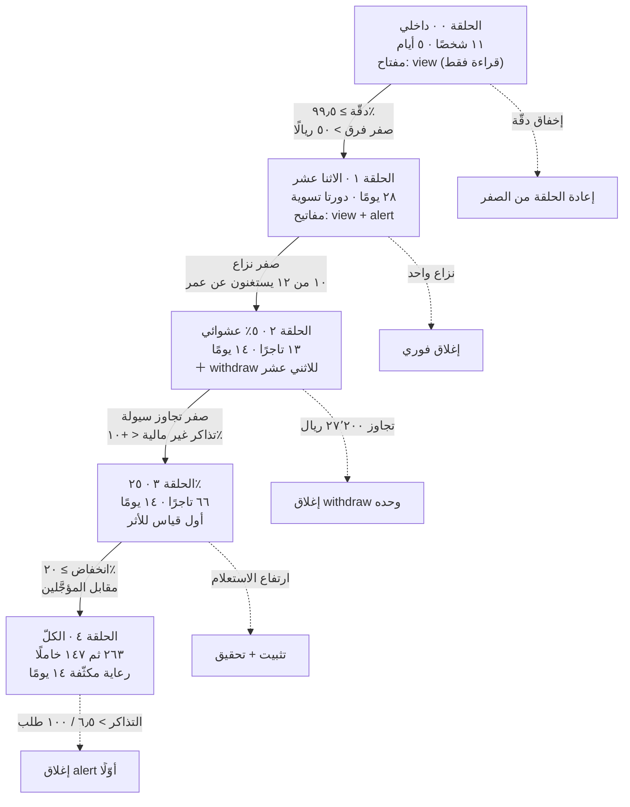
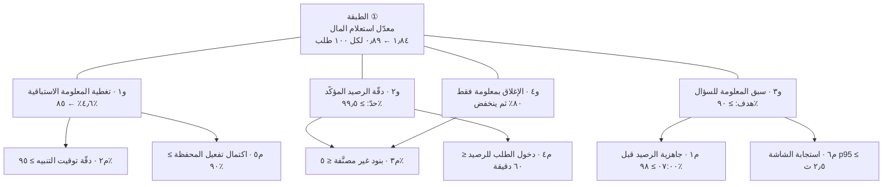
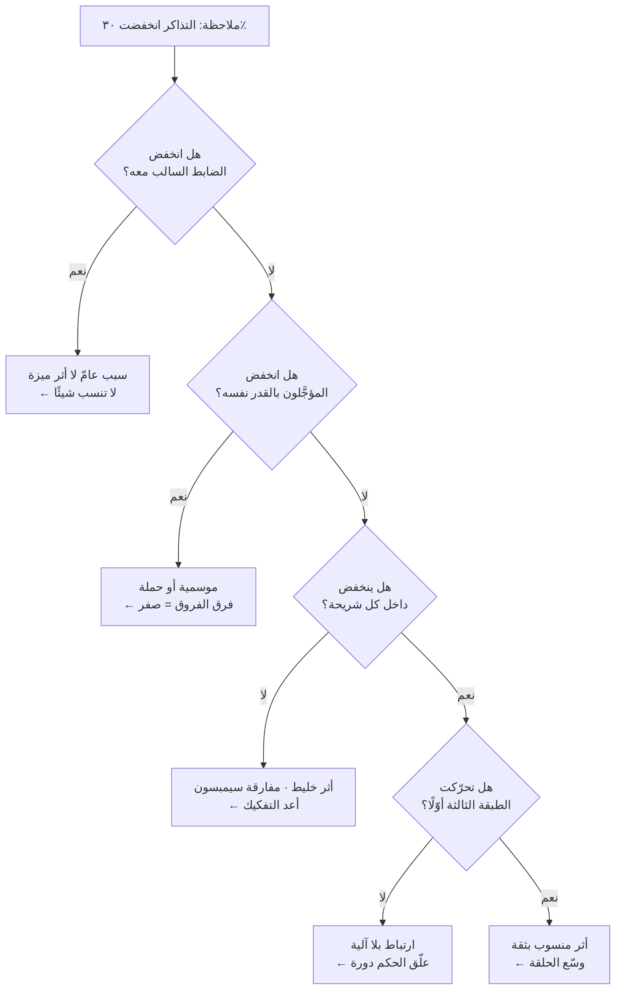
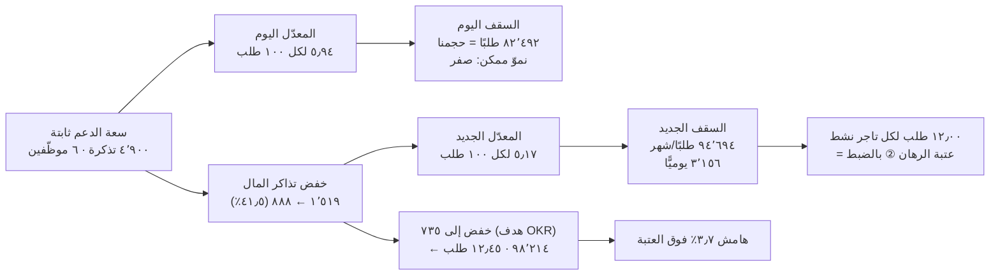

> [!info] الوحدة 10 · ورشة BridgePay
> **هذه الوحدة لا تشرح مراحل دورة الحياة.** المراحل — من الرؤية إلى الإطلاق إلى القياس إلى التحسين — مشروحة كاملةً في [[10 - دورة حياة المنتج الكاملة|الفصل العاشر]]، وتحديدًا في المرحلة ⑬ (الإطلاق ليس حدثًا واحدًا) والمرحلة ⑭ (القياس). من لم يقرأهما فليقرأهما أولًا؛ فهذه الوحدة **تفترض** أنك تعرف ما `Canary` وما `Hypercare` وما الفرق بين المؤشّر المتقدّم والمتأخّر.
>
> ما تفعله هذه الوحدة شيء واحد: **تُخرج خطّة إطلاق واحدة قابلة للتنفيذ حرفيًّا** لميزة واحدة بعينها — المحفظة والرصيد والسحب — بحلقاتها ومعايير ترقّيها وتراجعها وأسماء من يقرّر، ثم تبني عليها شجرة مؤشّرات ومؤشّرات مضادّة وخطّة قياس تفصل الأثر عن الالتباس. وتنتهي بحساب واحد صريح: **كم سعة نموّ يفتحها نجاح هذه الميزة، وهل تكفي لبلوغ عتبة الرهان ②.**

# الوحدة 10 — الإطلاق والقياس

## ما ورثته من الوحدة السابقة

أدخل هذه الوحدة ومعي **قرارٌ مُتَّخذ وميزةٌ محدَّدة وقيدٌ يحكم كل شيء**. ولا أدخلها بقائمة أمنيات، لأن تسع وحدات سبقتني أغلقت أبوابًا. وهذا جدول ما ورثته بالأرقام والقطع، لا بالكلام العامّ:

| المصدر | ما ورثته بالضبط | كيف يحكم هذه الوحدة |
|---|---|---|
| [[00 - ميثاق المشروع ومصدر الحقيقة\|الميثاق]] | ٢٬٧٥٠ طلبًا يوميًّا · ٧٤ ريالًا متوسّط الطلب · ٢٦٣ تاجرًا نشطًا من ٤١٠ مفعَّلين · ٤٬٩٠٠ تذكرة شهريًّا · ٦ موظّفي دعم لا يُزادون · ٩ مهندسين · دورة تسوية ١٤ يومًا · ١٫٩ مليون ريال ثمن تقصيرها | كل رقم في هذه الخطّة يُشتقّ من هذه القاعدة أو لا يُكتب. والسعة (٩ · ٦) هي سقف كل حلقة ورعاية |
| [[01 - رؤية المنتج واستراتيجيته\|الوحدة ٠١]] | الرؤية «ألّا يسأل أحدٌ: أين مالي؟» · **الرهان ①** بعتبة إبطال ١٬١٠٠ تذكرة بعد ربع · **الرهان ②** بعتبة ١٢ طلبًا لكل تاجر نشط يوميًّا بعد ربعين · **الرهان ③** بعتبة ٢٦٪ احتفاظ بعد ثلاثة أرباع · توزيع السعة ٥ · ٢ · ٢ · **صفر للمندوب** | العتبات الثلاث ليست أهدافًا هنا بل **حدودًا للقراءة**: خطّة القياس مُلزَمة بأن تنتج الرقم الذي يحكم على كل رهان في موعده، لا رقمًا آخر أجمل |
| [[02 - السوق والمنافسون\|الوحدة ٠٢]] | **`ش١٢` = ٥٫٩٤ تذكرة لكل ١٠٠ طلب** · سقف السعة ٤٬٩٠٠ ÷ ٥٫٩٤٪ = **٨٢٬٤٩٢ طلبًا شهريًّا ≈ حجمنا اليوم بالضبط** · الفجوة المختارة: الطبقة المالية للتاجر | **أهمّ ميراث في الوحدة كلّها.** سقف النموّ اليوم **صفر**، والقيد ليس السوق ولا الهندسة بل الدعم. ولذلك فإن كل مؤشّر في هذه الوحدة يُقاس **لكل ١٠٠ طلب** لا بالعدد المطلق |
| [[03 - الاكتشاف والبحث الميداني\|الوحدة ٠٣]] | **الاثنا عشر تاجرًا** الذين يرسل لهم «عمر» (محاسب التسويات) رصيدهم عبر واتساب قبل التحويل بيوم، **منذ خمسة أشهر، بلا طلب من أحد** · المواصفة الميدانية: **رقم واحد + تاريخ ثابت + تنبيه قبل يوم** · ٤ من كل ٥ تذاكر تُغلق **بمعلومة فقط بلا إجراء** | الاثنا عشر هم **الحلقة الأولى جاهزةً**: جمهور له خمسة أشهر خطّ أساس، ومواصفة مختبَرة، وقناة جانبية يجب إغلاقها امتثاليًّا ([[PDPL]] · [[Audit Trail\|أثر التدقيق]]) |
| [[04 - الشخصيات والمهام\|الوحدة ٠٤]] | `P1` سعد (مطعم فرع واحد) · `P2` نورة (٦ فروع) · `P3` فيصل (عميل ٩ طلبات) · `P4` ماجد (مندوب) · `P5` خالد وعمر (الدعم والمحاسبة) · قرار `T6`: **رقمان لا رقم واحد** (مؤكّد ومعلَّق) | تحديد جمهور كل حلقة بالشخصية لا بالنسبة المئوية. و`T6` قيد تصميم يدخل تعريف المؤشّر: «الرصيد المؤكّد» شيء و«المعلَّق» شيء آخر |
| [[05 - رحلة العميل ونقاط الألم\|الوحدة ٠٥]] | سجلّ نقاط الألم المرتَّب · لحظات الانكسار في رحلة التاجر حول التحويل | يحدّد **أين** تُوضع أدوات القياس: عند اللحظة لا عند الشاشة |
| [[06 - الفرضيات والتحقّق\|الوحدة ٠٦]] | `ف-١` (تحليل الاثني عشر) · `ف-٢` (الخادم الشخصي لأربعين تاجرًا) · **`ف-٣` عتبة الدقّة: ≥ ٩٩٫٥٪ مطابقة · لا فرق منفرد > ٥٠ ريالًا · ٩٥٪ من الفروق مصنَّفة آليًّا** · مبدأ «وحدة التحليل التذكرة لا التاجر» · حساب القوّة الذي أثبت أن كشف ١٥٪ يحتاج ٢٨٠ تاجرًا من ٢٦٣ متاحًا — **مستحيل بنيويًّا** | **ثلاثة مواريث حاسمة:** عتبات `ف-٣` تصير معايير تراجع حرفيًّا · ووحدة التحليل تُنقذ حجم العيّنة · واستحالة القوّة الإحصائية على مستوى التاجر هي السبب الرياضي الذي يمنع [[AB Testing\|اختبار A/B]] هنا |
| [[07 - ترتيب الأولويات\|الوحدة ٠٧]] | التنقية: ٥٠ طلبًا ← ١٥ مستبعَدًا + ٣ معلَّقة ← **١٨ مرشّحًا** · **`ب-١`** الرصيد اللحظي والتنبيه · **`ب-٢`** كشف الحساب والعمولات · **`ب-٥`** المحفظة القابلة للسحب الفوري · **`ب-٤`** الفوترة الإلكترونية خارج الترتيب (التزام قانوني) | الميزة المُطلَقة هنا ليست بندًا واحدًا بل **حزمة من ثلاثة مرشّحات** (`ب-١` + `ب-٢` + `ب-٥`)، ولكلٍّ منها مفتاح تفعيل مستقلّ وحلقة مختلفة |
| [[08 - وثيقة متطلبات المنتج\|الوحدة ٠٨]] | `PRD` كامل: **٤٠ متطلَّبًا وظيفيًّا** · **٢٥ غير وظيفي** بمعايير فحص (`غ-٠١`…`غ-١٠`) · ١٢ حالة حدّية · **خطّة مراحل خمس** (`ب-١` تشغيل جافّ ← `ب-٢` الاثنا عشر ← `ب-٣` أربعون ← `ب-٤` تعميم ← `ب-٥` سحب مبكّر) · **إجمالي الجهد ~١٥٠ يوم مهندس بلا هامش** · و**السحب المبكّر `Non-Goal` معلَن** بحساب عودته: **١٣٦٬٠٠٠ ريال** لأربعين تاجرًا × ٥ أيام تبكير = ٧٫٢٪ من الـ١٫٩ مليون | **القيد الأشدّ على هذه الوحدة.** خطّتي **لا تستبدل** مراحل ٠٨ بل **تُفصّلها**: أُبقي بوّابتها الأولى (التشغيل الجافّ) وبوّابتها الثانية (الاثنا عشر)، وأشقّ مرحلتها الثالثة (٤٠ تاجرًا) إلى بوّابتين (٥٪ ثم ٢٥٪) لسبب مذكور في ①·ج. ومفتاح السحب يبقى **مغلقًا افتراضيًّا** كما نصّت ٠٨ |
| [[09 - النموذج الأولي والتصميم\|الوحدة ٠٩]] | مواصفة النموذج وقرارات التصميم المبرَّرة فوق متطلبات ٠٨ | تحدّد **شكل** ما نطلقه، ولا تحدّد **متى ولمن**. وهذه الوحدة لا تعيد فتح أي قرار تصميم، وتكتفي بأن تربط كل مؤشّر بالسلوك الذي صُمّم لإنتاجه |

### الأرقام المشتقّة التي تحكم كل حساب في هذه الوحدة

كل رقم أدناه مشتقّ من الميثاق أو من وحدة سابقة **بحساب معروض**، ولا واحد منها جديد. أجمعها مرّة واحدة كي لا يتكرّر الاشتقاق داخل الجداول:

| الرمز | المشتقّ | الحساب | القيمة |
|---|---|---|---|
| `ق١` | الطلبات الشهرية | ٢٬٧٥٠ × ٣٠ | **٨٢٬٥٠٠ طلبًا** |
| `ق٢` | معدّل التذاكر الكلّي | ٤٬٩٠٠ ÷ ٨٢٬٥٠٠ × ١٠٠ | **٥٫٩٤ تذكرة لكل ١٠٠ طلب** |
| `ق٣` | تذاكر «أين مستحقّاتي؟» | ٤٬٩٠٠ × ٣١٪ | **١٬٥١٩ تذكرة/شهر** |
| `ق٤` | **معدّل استعلام المال** | ١٬٥١٩ ÷ ٨٢٬٥٠٠ × ١٠٠ | **١٫٨٤ تذكرة لكل ١٠٠ طلب** |
| `ق٥` | نصيب التاجر النشط من تذاكر المال | ١٬٥١٩ ÷ ٢٦٣ | **٥٫٨ تذكرة/شهر** |
| `ق٦` | نصيبه لكل دورة تسوية | ٥٫٨ × (١٤ ÷ ٣٠) | **٢٫٧١ تذكرة/دورة** |
| `ق٧` | حِمل موظّف الدعم | ٤٬٩٠٠ ÷ ٦ | **٨١٧ تذكرة/شهر** |
| `ق٨` | الطلبات لكل تاجر نشط يوميًّا | ٢٬٧٥٠ ÷ ٢٦٣ | **١٠٫٥ طلب** |
| `ق٩` | مستحقّات التجّار اليومية | ٢٬٧٥٠ × ٧٤ × ٨٨٪ | **١٧٩٬٠٨٠ ريال/يوم** |
| `ق١٠` | **حوض المستحقّات المحتجَز** (في أي لحظة) | ١٧٩٬٠٨٠ × ١٤ | **٢٬٥٠٧٬١٢٠ ريالًا** |
| `ق١١` | عمولة الطلب الواحد | ٧٤ × ١٢٪ | **٨٫٨٨ ريال** |
| `ق١٢` | سقف الطلبات على قيد الدعم اليوم | ٤٬٩٠٠ ÷ ٠٫٠٥٩٤ | **٨٢٬٤٩٢ ≈ حجمنا الحالي** |

> [!warning] `ق١٠` هو الرقم الذي لم يُحسب في أي وحدة سابقة — وهو مفتاح قرار السحب الفوري
> الميثاق يذكر ١٫٩ مليون ريال ثمنًا لتقصير الدورة من ١٤ يومًا إلى ٧. ولم تُحسب في أي وحدة **قيمة الحوض المحتجَز نفسه** في أي لحظة: ١٧٩٬٠٨٠ ريالًا يوميًّا × ١٤ يومًا = **٢٬٥٠٧٬١٢٠ ريالًا** معلّقة دائمًا في النظام.
>
> واشتقاق هذا الرقم ليس ترفًا حسابيًّا: **السحب المبكّر يسحب من هذا الحوض بالضبط.** فلو أتحنا لربع التجّار (٢٥٪) سحب كامل رصيدهم فورًا، لاحتجنا ٢٬٥٠٧٬١٢٠ × ٢٥٪ = **٦٢٦٬٧٨٠ ريالًا** رأس مال عامل إضافيًّا — أي ثلث الـ١٫٩ مليون التي **لم تُعتمد**. وهذا الرقم هو **الحدّ الأعلى المطلق**، وهو ما يفسّر لماذا اختارت [[08 - وثيقة متطلبات المنتج|الوحدة ٠٨]] الصيغة الأضيق: أربعون تاجرًا × خمسة أيام تبكير فقط = **١٣٦٬٠٠٠ ريال**. والفرق بين ٦٢٦ ألفًا و١٣٦ ألفًا ليس تفصيلًا حسابيًّا، بل الفرق بين **طلب لا يُوافَق عليه** و**طلب يُوافَق عليه**. ولهذا فإن المحفظة في هذه الخطّة **ثلاثة مفاتيح**، الثالث منها مغلق افتراضيًّا ومشروط بموافقة مالية. وسيأتي تفصيله في القطعة ①.

### ما لم أرثه — والتصريح به شرط أمانة

**ورثت `PRD` كاملًا ومواصفة نموذج، ولم أرث ما يقرّر متى ولمن.** الوحدة ٠٨ حسمت **ماذا نبني** (٤٠ متطلَّبًا وظيفيًّا و٢٥ غير وظيفي)، والوحدة ٠٩ حسمت **كيف يبدو**. وكلتاهما تركت لهذه الوحدة قرارًا واحدًا لم تبتّه أي منهما: **بأي ترتيب يصل هذا إلى مَن، وبأي رقم نتوقّف.**

وأصرّح بالفرق بيني وبين الوحدة ٠٨ في نقطة واحدة كي لا يُقرأ اختلافًا: خطّة ٠٨ المرحلية (`ب-١`…`ب-٥`) خطّة **بناء** — مراحلها موزونة بأيّام المهندسين (٣٠ + ٤٥ + ٥٠ + ٢٥ = ١٥٠ يومًا). وخطّتي خطّة **تعرّض** — حلقاتها موزونة بنصف قطر الانفجار وبحجم العيّنة اللازم للحكم. والاثنتان تسيران على المحور نفسه ولا تتعارضان: بوّابة `ب-١` هي حلقتي صفر، و`ب-٢` هي حلقتي الأولى، و`ب-٣` (٤٠ تاجرًا) شُقّت هنا إلى بوّابتين (١٣ ثم ٦٦) لأن الأربعين لا تفرّق بين سؤال «هل يعمل على من لا يعرف أن لديه مشكلة؟» وسؤال «كم يعمل؟». **ومن أراد التنفيذ الحرفي فليقرأ ٠٨ للمحتوى وهذه للتوقيت.**

**ولم أرث خطّ أساس مقيسًا لأغلب المؤشّرات التي سأنشئها.** الوحدة ٠٨ نفسها كتبت «غير مقيس» في خانة خطّ أساس مؤشّرَيها المضادّين ①و②، وأنا أرث هذا النقص ولا أستره.

**ولم أرث خطّ أساس مقيسًا للمؤشّرات التي سأنشئها.** أنا أعرف ١٬٥١٩ تذكرة شهريًّا، ولا أعرف **كم تاجرًا** أنتجها؛ فقد يكون ٢٦٣ تاجرًا بمعدّل ٥٫٨، وقد يكون ٦٠ تاجرًا بمعدّل ٢٥. والوحدة ٠٣ ترجّح الثاني (الاثنا عشر اختارهم عمر لأنهم «الأكثر إلحاحًا»). وهذا الفرق **يقلب معنى النجاح**، ولذلك جعلت أول أسبوع في الخطّة **أسبوع قياس لا أسبوع بناء**. من يطلق ميزة بلا خطّ أساس مقيس لا يستطيع بعدها أن يثبت شيئًا، مهما جمعَ من بيانات.

## السؤال الذي تجيب عنه هذه الوحدة

> **كيف نُخرج ميزةً تمسّ مال الناس إلى ٢٦٣ تاجرًا، بحيث يكون أسوأ ما يمكن أن يحدث معلومًا ومسقوفًا قبل أن يحدث — ثم كيف نعرف، بعد ثلاثين يومًا، هل نجحت أم أن شيئًا آخر حدث في الوقت نفسه؟**

والسؤال شقّان، وكلاهما يُهمَل عادةً في اتّجاه مختلف:

- **شقّ الإطلاق** يُهمَل بالتفاؤل: «سنطلق لعشرة أوّلًا ثم نوسّع» — جملة بلا رقم ولا مالك ولا معيار تراجع، فتصير الحلقات مجرّد **بطء** لا حماية. والفرق بينهما أن البطء يؤجّل الضرر ولا يحدّه، بينما الحلقة تحدّ نصف قطر الانفجار برقم معلَن سلفًا.
- **شقّ القياس** يُهمَل بالثقة: نرى المؤشّر يتحسّن فننسبه إلينا. وفي BridgePay بالذات هذا الخطأ **مضمون الوقوع** — لأن التسويق يشغّل حملات، ولأن التذاكر موسمية بطبيعتها (عمر يتنبّأ بموضوعها من التقويم قبل يومين، وهو اكتشاف الوحدة ٠٣)، ولأن الدعم نفسه يتعلّم فيتحسّن بلا ميزة. فمن لا يصمّم للالتباس سيقرأ الموسم ميزةً، وسيحتفل بحملة ظنّها منتجًا.

وثمّة سؤال ثالث تحته، وهو الذي يجعل هذه الوحدة **قرارًا لا تقريرًا**: بما أن سقف النموّ اليوم **صفر** على قيد الدعم (`ق١٢`)، فإن كل تذكرة نُلغيها ليست «تحسين تجربة» بل **سعة نموّ محرَّرة**. والوحدة تنتهي بترجمة هذا حرفيًّا إلى عدد طلبات.

## العمل خطوة بخطوة

الجدول أدناه هو ما نفّذته فعلًا لإنتاج مخرَج هذه الوحدة، بالترتيب وبالزمن التقديري. المجموع **٢٦ ساعة عمل لمدير المنتج** موزّعة على أسبوعين، منها ٩ ساعات مشتركة مع الفريق.

| # | الخطوة | ما يُنتَج | الزمن | من يشارك |
|---|---|---|---|---|
| ١ | **تفكيك الميزة إلى مفاتيح مستقلّة** — لا «إطلاق المحفظة» بل ثلاثة مفاتيح لكلٍّ كلفة مختلفة على السيولة والثقة | جدول المفاتيح الثلاثة وتبعيّاتها | ٢ س | مدير المنتج + مهندس المدفوعات |
| ٢ | **تحديد أسوأ حالة لكل مفتاح بالريال** — كم يخسر التاجر، وكم تخسر المنصّة، إن عمل المفتاح خطأً على ١٠٠٪ من الجمهور | جدول نصف قطر الانفجار | ١٫٥ س | مدير المنتج + المالية |
| ٣ | **رسم الحلقات من نصف قطر الانفجار لا من الحدس** — حجم كل حلقة يُشتقّ من سقف الخسارة المقبول لا من «٥٪ تبدو معقولة» | خمس حلقات بحجومها | ٢ س | مدير المنتج |
| ٤ | **كتابة معيار التراجع قبل معيار الترقية** — قاعدة مقصودة: من يكتب الترقية أولًا يكتب أمنيته، ومن يكتب التراجع أولًا يكتب حدّه | عمود «معيار التراجع» كاملًا | ٢٫٥ س | مدير المنتج + الدعم |
| ٥ | **قياس خطّ الأساس فعليًّا** — استخراج توزيع التذاكر على التجّار (لا المتوسّط)، وتصنيفها، وتثبيت النافذة الزمنية | لوحة خطّ أساس مجمَّدة موقَّعة بتاريخ | ٣ س | المحلّل (نصف وقت) + مهندس |
| ٦ | **بناء شجرة المؤشّرات نزولًا** — من مؤشّر أعلى واحد إلى ما يستطيع الفريق تحريكه فعلًا في دورة واحدة | ثلاث طبقات بتعريفات تشغيلية | ٤ س | مدير المنتج + المحلّل |
| ٧ | **اشتقاق المؤشّرات المضادّة من قائمة الخاسرين** — لا من قائمة المخاطر. لكل خاسر مُعلَن في الوحدة ٠١ مؤشّر يحرسه | ستّة مؤشّرات مضادّة بحدودها | ٢ س | مدير المنتج + المندوبين + الدعم |
| ٨ | **جلسة «مؤشّر غرور مقابل مؤشّر قرار»** — يُعرض على الفريق ما نقيسه اليوم، ويُسأل عن كل رقم: أي قرار كان سيتغيّر لو انقلب؟ | جدول عشرة أزواج | ٢ س | الفريق كاملًا |
| ٩ | **تصميم فصل الأثر عن الالتباس** — تقويم الحملات، والمجموعة المؤجَّلة، والمؤشّر الضابط السالب | خطّة قياس ما قبل/بعد | ٣ س | مدير المنتج + المحلّل + التسويق |
| ١٠ | **كتابة معايير الإيقاف ونموذج المراجعة قبل الإطلاق** — ويُوقَّعان قبل فتح أي مفتاح | `Kill Criteria` + نموذج مراجعة ٣٠ يومًا فارغًا | ٢ س | مدير المنتج + الراعي التنفيذي |
| ١١ | **حساب سعة النموّ المحرَّرة** — ترجمة هدف التذاكر إلى عدد طلبات، ومقارنته بعتبة الرهان ② | الحساب المعروض في القطعة ⑦ | ١ س | مدير المنتج |
| ١٢ | **مراجعة خصمية للخطّة** — يقودها **من لا يملك الميزة**، وسؤاله: ما النتيجة التي كانت ستجعلنا نتراجع؟ وهل خطّتك قادرة على إنتاجها؟ | تعديلات موثَّقة في [[Decision Log\|سجلّ القرارات]] | ١ س | مهندس المدفوعات + خالد (الدعم) |

> [!tip] لماذا الخطوة ٤ قبل ما يقابلها منطقيًّا؟
> لأن ترتيب الكتابة يغيّر المحتوى. من يكتب «نوسّع إذا انخفضت التذاكر ٣٠٪» أوّلًا يكون قد وضع سقفًا لخياله عند النجاح، فيكتب بعده معيار تراجع **متساهلًا** كي لا يعطّل خطّته. ومن يكتب «نتراجع إذا تجاوز أي فرق تسوية ٥٠ ريالًا» أوّلًا يكون قد بدأ من حدّ لا يفاوض عليه، فيصمّم الترقية داخل الحدّ لا حوله. وهذه ليست حيلة نفسية بل انعكاس لطبيعة القرار: **الترقية قابلة للتأجيل، والتراجع ليس كذلك.**

## المخرَج

### القطعة ① — خطّة الإطلاق التدريجي الكاملة لميزة المحفظة

#### ①·أ — لماذا ثلاثة مفاتيح لا مفتاح واحد

أوّل قرار في هذه الخطّة، وأكثرها أثرًا، أن **«المحفظة» ليست ميزة واحدة**. هي ثلاث قدرات مختلفة اختلافًا جوهريًّا في كلفتها وفي ما تخسره إن أخطأت، وقد جُمعت في الذهن تحت اسم واحد لأنها تظهر على شاشة واحدة. وجمعها في مفتاح واحد يعني أن أرخصها يحمل مخاطرة أغلاها.

| المفتاح | ما يفعله | مصدره في الورشة | كلفته على السيولة | أسوأ ما يحدث إن أخطأ |
|---|---|---|---|---|
| `wallet.balance.view` | يعرض رقمين: **الرصيد المؤكّد** و**الرصيد المعلَّق**، مع تاريخ التحويل القادم الثابت | `ب-١` + قرار `T6` من الوحدة ٠٤ | **صفر ريال** — عرض لا حركة مال | رقم خاطئ يتحوّل من غموض إلى **اتّهام**. خسارة ثقة، لا خسارة نقد |
| `wallet.alert.preTransfer` | تنبيه قبل التحويل بيوم يحمل المبلغ والتاريخ | مواصفة عمر الميدانية (الوحدة ٠٣) | **صفر ريال** | إزعاج، أو تنبيه بمبلغ يخالف ما يصل فعلًا — وهو أسوأ من غياب التنبيه |
| `wallet.withdraw.early` **(مغلق افتراضيًّا · مشروط)** | يسمح بسحب جزء من الرصيد المؤكّد قبل موعد الدورة | `ب-٥` · وهو **`Non-Goal` معلَن** في [[08 - وثيقة متطلبات المنتج\|الوحدة ٠٨]] (`م-٢٩`) | **تسحب من `ق١٠` مباشرة** — ٢٬٥٠٧٬١٢٠ ريالًا هي الحوض | نزيف رأس مال عامل غير مُعتمَد، وهو **قرار مالي لا منتجيّ** (القيد ٢ في الميثاق) |

> [!danger] المفتاح الثالث مغلق افتراضيًّا — وهذا قرار الوحدة ٠٨ لا قراري
> الوحدة ٠٨ حسمت أن السحب المبكّر **خارج نطاق هذا الإصدار**، وأن ما يظهر للتاجر مكانه هو **نصّ صريح** (`م-٢٩`) يقول إن الدورة ١٤ يومًا وإن السحب غير متاح — **بلا زرّ معطَّل ولا وعد**، مع مقياس صامت (`م-٣٠`) يعدّ من طلبه ويحفظ نصّ طلبه.
>
> وأنا لا أنقض ذلك. ما أفعله في هذه الخطّة شيء واحد: **أكتب مسبقًا كيف يُطلَق هذا المفتاح إن فُتح**، حتى لا يُرتجَل في اليوم الذي توافق فيه المالية. وشروط فتحه الثلاثة منقولة من ٠٨ حرفيًّا: ① أن يكون هدف خفض التذاكر قد تحقّق أوّلًا · ② أن يبلغ الطلب المقيس بـ`م-٣٠` عتبة `ف-٤` (> ٢٥٪ من المتفاعلين) · ③ أن يكون المسار **اقتصاديًّا لا مجّانيًّا**.
>
> **فكل ما يأتي في هذا الجدول عن `withdraw` مشروط بجملة واحدة: «إن وافقت المالية».** ومن نفّذ الخطّة بلا تلك الموافقة ينفّذ حلقاتها بمفتاحين لا ثلاثة، ولا يتغيّر شيء آخر فيها.

والقاعدة التي تحكم الخطّة كلها تنبثق من هذا الجدول:

> [!important] قاعدة التزحيف: مفتاح السحب يتخلّف عن مفتاح العرض بحلقة كاملة دائمًا
> `wallet.withdraw.instant` لا يُفتح في أي حلقة إلا بعد أن يكون `wallet.balance.view` قد **أكمل** تلك الحلقة ونجح. والسبب مباشر: السحب مبنيّ على الرقم المعروض. فمن يسحب بناءً على رصيد خاطئ لا يخسر ثقةً فحسب، بل يقبض مالًا ليس له — ثم نطالبه بردّه. وهذه ليست حادثة منتج، بل **نزاع مالي**، وهو [[Reversible vs Irreversible Decisions|قرار باب واحد]] بمعناه الحرفي: التاجر الذي طُولب بردّ مال قبضه لا يعود تاجرًا عاديًّا أبدًا.

وهذا الفصل بين المفاتيح هو التطبيق العملي المباشر لما يشرحه [[Feature Flags|مفتاح الميزة]] بوصفه **فصلًا بين النشر والإصدار**: الشيفرة الثلاثة تُنشر معًا في دورة واحدة، والقرارات الثلاثة تُتَّخذ في أوقات مختلفة وبأشخاص مختلفين.

#### ①·ب — نصف قطر الانفجار: من أين جاءت أحجام الحلقات

أحجام الحلقات في هذه الخطّة **ليست أعدادًا مستحسنة**، بل مشتقّة من سقف خسارة مُعلَن. والمنطق: نحدّد أسوأ حالة لكل مفتاح بالريال أو بالتذكرة، ثم نقسم سقف ما نحتمله عليها.

**لمفتاح العرض** — أسوأ حالة أن يُعرض رقم خاطئ لكل تاجر في الحلقة، فيفتح كلٌّ منهم تذكرة نزاع. وكلفة تذكرة النزاع أعلى من كلفة تذكرة الاستعلام لأنها لا تُغلق بمعلومة. سقف ما يحتمله فريق الستّة فوق حِمله (`ق٧` = ٨١٧ تذكرة/موظّف/شهر) هو تقديريًّا **٥٪ زيادة**، أي ٢٤٥ تذكرة شهريًّا. وبمعدّل `ق٦` (٢٫٧١ تذكرة/تاجر/دورة)، فإن ٢٤٥ تذكرة تقابل نحو ٩٠ تاجرًا في الدورة. **إذن ٩٠ تاجرًا هو أقصى حلقة يمكن أن نتحمّل انفجارها بالكامل**، وهو ما يفسّر لماذا تقف الحلقة الرابعة عند ٦٦ تاجرًا (٢٥٪) لا عند ١٣٢ (٥٠٪): لا حلقة وسيطة تتجاوز سقف الانفجار المحتمَل.

**لمفتاح السحب** — أسوأ حالة أن يسحب كل تاجر في الحلقة كامل رصيده المؤكّد فورًا. ونصيب التاجر الواحد من `ق١٠`: ٢٬٥٠٧٬١٢٠ ÷ ٢٦٣ = **٩٬٥٣٣ ريالًا** متوسّطًا في أي لحظة. ولمّا لم تُعتمد أي سيولة إضافية (القيد ٢)، **لا أخترع سقفًا بل أرث السقف الوحيد المحسوب في الورشة**: مظروف الوحدة ٠٨ البالغ **١٣٦٬٠٠٠ ريال** (٤٠ تاجرًا × ٥ أيام تبكير)، وهو ٧٫٢٪ من الـ١٫٩ مليون. ومن هذا المظروف يُشتقّ ضابطان لا واحد:

| الضابط | الحساب | القيمة | ما يمنعه |
|---|---|---|---|
| **سقف رأس المال المرتبط** | من الوحدة ٠٨ مباشرةً | **١٣٦٬٠٠٠ ريال** | يمنع أن يتجاوز عدد المشمولين بالسحب **٤٠ تاجرًا** (١٥٫٢٪) مهما اتّسعت حلقات العرض |
| **سقف التدفّق اليومي** | ١٣٦٬٠٠٠ ÷ ٥ أيام تبكير | **٢٧٬٢٠٠ ريال/يوم** | يمنع استنزاف المظروف كلّه في يوم واحد ثم تعطّل الخدمة لأربعة أيام |
| **سقف التاجر الواحد** | نصف رصيده المؤكّد | **٥٠٪** لكل دورة | يمنع أن يستهلك تاجر واحد كبير نصف المظروف |

> [!note] لماذا تقف تغطية السحب عند ٤٠ تاجرًا بينما تصل حلقات العرض إلى ٢٦٣؟
> لأن المظروف المالي لا يتّسع. الحساب المباشر: ٤٠ تاجرًا يمثّلون ١٥٫٢٪ من المستحقّات اليومية (١٧٩٬٠٨٠ × ١٥٫٢٪ = ٢٧٬٢٣٧ ريالًا)، وبتبكير خمسة أيام = **١٣٦٬٠٠٠ ريال** رأس مال مرتبط دائمًا. ولو مدّدناه إلى ٦٦ تاجرًا (٢٥٪) لصار ١٧٩٬٠٨٠ × ٢٥٪ × ٥ = **٢٢٣٬٨٥٠ ريالًا** — أي **خارج المظروف بـ٦٤٪**، ويحتاج قرارًا ماليًّا جديدًا.
>
> **ومعنى ذلك عمليًّا أن `withdraw` يتجمّد عند ٤٠ تاجرًا حتى في الحلقة ٤.** وهذا ليس نقصًا في الخطّة بل انعكاس أمين لقيد لم يُرفع: العرض مجّاني فيَعُمّ، والسحب مكلف فيقف حيث ينتهي المال. ومن يخلط بينهما في لوحة واحدة سيَعِد ٢٦٣ تاجرًا بشيء اشترى منه حصّة أربعين.
>
> **وأصرّح باشتقاق واحد لم يأتِ من ٠٨:** رقم ٢٧٬٢٠٠ ريال/يوم قسمةٌ مني على أيام التبكير الخمسة، ولا وجود له نصًّا في أي وحدة. اخترته لأن المظروف **مخزون** والضبط اليومي يحتاج **تدفّقًا**، والقسمة على مدّة التبكير هي أبسط تحويل بينهما. ومن يستنسخ هذه الخطّة مُلزَم بأن يستبدل الرقم برقم ماليّته لا أن ينقله.

#### ①·ج — الحلقات الخمس: الجدول الكامل

هذا هو المخرَج المركزي للوحدة. كل صفّ فيه قابل للتنفيذ حرفيًّا يوم الاثنين القادم.

**الحلقة ٠ — الداخلية (`Dogfooding`)**

| الحقل | القيمة |
|---|---|
| **الجمهور** | ١١ شخصًا داخليًّا: ٦ دعم + عمر (المحاسب) + خالد (مدير الدعم) + مهندس المدفوعات + المحلّل + مدير المنتج. **لا تاجر واحد.** |
| **المفاتيح المفتوحة** | `view` فقط، وعلى **بيانات إنتاج حقيقية لحسابات تجّار حقيقيين، في وضع قراءة فقط**. `alert` و`withdraw` مغلقان |
| **المدّة** | **٥ أيام عمل** — لا أقلّ، لأن دورة التسوية أسبوعان ونحتاج أن نرى **يوم إقفال واحد على الأقلّ** داخل النافذة |
| **معيار الترقية بالرقم** | ① مطابقة ≥ **٩٩٫٥٪** بين «المؤكّد» المعروض والمبلغ المحوَّل فعليًّا (ميراث `ف-٣`) · ② **صفر** فرق منفرد يتجاوز **٥٠ ريالًا** · ③ **٩٥٪** من الفروق مصنَّفة آليًّا بسبب معروف · ④ أن يوقّع **عمر** على أن الرقم المعروض يطابق ما كان سيرسله يدويًّا لكل واحد من الاثني عشر، **بلا استثناء واحد** |
| **معيار التراجع بالرقم** | أي إخفاق في ①–③ ← **إغلاق المفتاح فورًا وإعادة الحلقة من الصفر بعد إصلاح**. لا ترقّي جزئي، ولا «نطلق على الأغلبية الصحيحة» |
| **من يقرّر** | **مهندس المدفوعات** يملك قرار الترقية هنا، لا مدير المنتج. والسبب: هذه بوّابة **صحّة بيانات** لا بوّابة قيمة، ومن يملك قرارًا يتعارض مع رغبته في الإطلاق يجب ألّا يكون صاحب الرغبة |
| **ما يُراقَب** | تقرير التوفيق اليومي (ثلاثة مصادر: سجلّ الطلبات · كشف بوّابة الدفع · نقد الدفع عند الاستلام) · عدد بنود التسوية غير المصنَّفة · `p95` لزمن حساب الرصيد |

**الحلقة ١ — الاثنا عشر تاجرًا (`Closed Beta` غير عشوائية)**

| الحقل | القيمة |
|---|---|
| **الجمهور** | **الاثنا عشر تاجرًا** الذين يخدمهم عمر يدويًّا منذ خمسة أشهر. ٤٫٦٪ من الـ٢٦٣ |
| **المفاتيح** | `view` + `alert`. `withdraw` **مغلق** (قاعدة التزحيف) |
| **المدّة** | **٢٨ يومًا = دورتا تسوية كاملتان.** ولا يجوز أقلّ: الحدث الذي نقيسه (التحويل) يقع مرّة كل ١٤ يومًا، فحلقة من ١٤ يومًا تعطي حدثًا واحدًا لا يقبل المقارنة بنفسه |
| **معيار الترقية بالرقم** | ① **صفر** تذكرة نزاع سببها رقم معروض خاطئ · ② ألّا تزيد تذاكر الاثني عشر عن خطّ أساسهم في الأشهر الخمسة الماضية · ③ أن يبلغ **١٠ من ١٢** تاجرًا صراحةً أن التنبيه أغناهم عن رسالة عمر · ④ أن تكون قناة عمر الجانبية قد **أُغلقت رسميًّا** بنهاية الدورة الثانية، وأُثبت إغلاقها في [[Audit Trail\|أثر التدقيق]] |
| **معيار التراجع بالرقم** | ① أي تذكرة نزاع واحدة سببها رقم خاطئ ← **إغلاق فوري** · ② تنبيه واحد يحمل مبلغًا يخالف المحوَّل فعليًّا ← إغلاق `alert` وحده وإبقاء `view` · ③ إن طلب أكثر من **٣ من ١٢** تقصير الدورة رغم وصول المعلومة ← **لا تراجع** بل إشارة إلى أن التشخيص (الغموض لا المدّة) ناقص، وتُرفع فورًا إلى مراجعة الرهان ① |
| **من يقرّر** | **مدير المنتج**، بتوقيع مشترك من **عمر**. وسبب إشراك عمر أنه الوحيد الذي يملك خطّ الأساس في رأسه ويعرف كل واحد من الاثني عشر بالاسم |
| **ما يُراقَب** | تذاكر الاثني عشر يوميًّا مقارنةً بخطّ أساسهم الشهري · نصّ كل تذكرة (لا عددها فقط) · معدّل فتح التنبيه · **حجم طلبات الاثني عشر** (شرط ضبط: انخفاض التذاكر مع انخفاض الطلبات ليس نجاحًا) |

> [!warning] لماذا الحلقة ١ **ليست** حلقةً إحصائية — وهذا مقصود
> اثنا عشر تاجرًا × ٢٫٧١ تذكرة/دورة × دورتين = **٦٥ تذكرة متوقّعة**. والخطأ المعياري لفرق عدّادين بهذا الحجم = √(٦٥+٦٥) ≈ **١١٫٤**، أي أن كشف انخفاض ٣٠٪ (٢٠ تذكرة) يعادل ١٫٧ انحراف معياري — **دون عتبة الدلالة المعتادة**.
>
> فما فائدتها إذن؟ فائدتها أنها **ليست حلقة كفاءة بل حلقة سلامة وصدق مواصفة**. هي تجيب سؤالين لا ثالث لهما: هل الرقم صحيح على مستخدمين حقيقيين؟ وهل المنتج يحلّ محلّ رسالة عمر فعلًا؟ والسؤالان ثنائيّا الإجابة (نعم/لا) ولا يحتاجان قوّة إحصائية — يحتاجان **صفرًا في خانة الأخطاء**. أمّا قياس حجم الأثر فمؤجَّل إلى الحلقة ٣ حيث تكفي العيّنة. **والخلط بين الحلقتين هو أشيع أخطاء الإطلاق التدريجي:** فريق يوسّع لأن حلقةً صغيرة «بدت جيّدة»، وأخرى تُلغى ميزة لأن حلقةً صغيرة «لم تُظهر أثرًا» — وكلاهما يقرأ ضجيجًا.

**الحلقة ٢ — ٥٪ عشوائيون طبقيّون**

| الحقل | القيمة |
|---|---|
| **الجمهور** | **١٣ تاجرًا** (٢٦٣ × ٥٪ = ١٣٫١٥) مختارون **عشوائيًّا داخل طبقات حجم الطلبات**، مع استبعاد الاثني عشر. التراكم: ٢٥ تاجرًا = ٩٫٥٪ |
| **المفاتيح** | `view` + `alert` للثلاثة عشر · **و`withdraw` يُفتح للاثني عشر فقط** (تزحيف بحلقة) بسقف ٥٠٪ من الرصيد المؤكّد وسقف منصّة ٢٧٬٢٠٠ ريال/يوم |
| **المدّة** | **١٤ يومًا = دورة واحدة** |
| **معيار الترقية بالرقم** | ① استمرار عتبات الدقّة (٩٩٫٥٪ · صفر فرق > ٥٠ ريالًا) على الجمهور الجديد · ② **صفر** حادثة سحب تجاوزت الرصيد المتاح · ③ ألّا يتجاوز مجموع السحب اليومي **٢٧٬٢٠٠ ريال** في أي يوم · ④ ألّا ترتفع تذاكر **الفئات غير المالية** لدى الثلاثة عشر بأكثر من **١٠٪** عن خطّ أساسهم |
| **معيار التراجع بالرقم** | ① أي تجاوز لسقف السيولة اليومي ← **إغلاق `withdraw` فورًا** (وحده) · ② أي فرق تسوية منفرد > ٥٠ ريالًا ← إغلاق `view` و`withdraw` معًا · ③ `p95` لزمن تحميل شاشة الرصيد > **٢٫٥ ثانية** لمدّة ٦٠ دقيقة متّصلة ← إغلاق مؤقّت وإعادة فتح بعد الإصلاح · ④ ارتفاع تذاكر الفئات غير المالية > **١٠٪** ← تثبيت لا تراجع، ودورة تشخيص إضافية |
| **من يقرّر** | **مدير المنتج** بتوقيع **المالية** على بند السيولة تحديدًا. والمالية تملك حقّ إغلاق `withdraw` منفردةً وبلا نقاش |
| **ما يُراقَب** | كل ما سبق · **مجموع السحب اليومي بالريال** · نسبة الرصيد المسحوب مبكّرًا إلى الرصيد المؤكّد · معدّل الأخطاء التقني · التذاكر مصنَّفة إلى مالية وغير مالية |

> [!example] الحلقة ٢ أصغر من الحلقة ١ — ولماذا هذا صحيح لا خطأ
> ١٣ تاجرًا أكثر من ١٢ بواحد فقط، فتبدو الحلقة ٢ «تكرارًا». وهي ليست كذلك، لأن الفرق بينهما **في النوع لا في الحجم**:
>
> الحلقة ١ جمهور **منتقًى** — أشدّ التجّار إلحاحًا، وأكثرهم معرفة بالمشكلة، ولهم خمسة أشهر خطّ أساس. وهي تجيب: **هل يعمل الشيء على من يعرف المشكلة أكثر من غيره؟** والفشل هنا قاطع؛ والنجاح لا يُعمَّم.
>
> والحلقة ٢ جمهور **عشوائي** — تاجر لم يطلب شيئًا، ولم يسمع بالميزة، وقد لا يفتحها أصلًا. وهي تجيب سؤالًا مختلفًا كلّيًّا: **هل يعمل الشيء على من لا يعرف أن لديه مشكلة؟** وهذا هو السؤال الذي يقرّر ما إذا كانت الميزة منتجًا أم خدمة لاثني عشر شخصًا.
>
> والقاعدة العامّة: **الحلقة الأولى تختبر الصحّة، والثانية تختبر التعميم، والثالثة تختبر الحجم.** ومن يجعل حلقاته الثلاث نسخًا متضخّمة بعضها من بعض يدفع كلفة ثلاث حلقات ويشتري معلومة واحدة.

**الحلقة ٣ — ٢٥٪**

| الحقل | القيمة |
|---|---|
| **الجمهور** | **٦٦ تاجرًا** تراكميًّا (٢٦٣ × ٢٥٪ = ٦٥٫٧٥)، أي إضافة ٤١ تاجرًا عشوائيًّا فوق الـ٢٥. **الاختيار عشوائي طبقي، وترتيب دخول الباقين يُسحب الآن ويُوثَّق** — وهذا شرط لخطّة القياس في القطعة ⑤ |
| **المفاتيح** | `view` + `alert` للستّة والستّين · `withdraw` للخمسة والعشرين (تزحيف) |
| **المدّة** | **١٤ يومًا = دورة واحدة**، قابلة للتمديد دورةً إن وقعت حملة تسويقية داخل النافذة |
| **معيار الترقية بالرقم** | ① كل عتبات السلامة السابقة قائمة · ② **وهنا يُقاس الأثر لأول مرّة:** انخفاض معدّل استعلام المال (`ق٤`) لدى الستّة والستّين بنسبة **≥ ٢٠٪** مقارنةً بالمجموعة المؤجَّلة في الدورة نفسها · ③ ألّا يتجاوز السحب المبكّر **٢٧٬٢٠٠ ريال/يوم** · ④ ألّا ينخفض احتفاظ التاجر عن **٧١٪** |
| **معيار التراجع بالرقم** | ① أي خرق لعتبات الدقّة ← إغلاق فوري · ② **ارتفاع** معدّل استعلام المال لدى مجموعة التدخّل عن المؤجَّلة بأي مقدار ← تثبيت فوري وتحقيق، لأن هذا يعني أن الشاشة **تولّد** أسئلة لا تجيب عنها · ③ ارتفاع تذاكر النزاعات فوق **٥٪** من تذاكر المجموعة ← تراجع · ④ تجاوز السحب المبكّر السقف ثلاثة أيام في دورة واحدة ← إغلاق `withdraw` وإعادة تسعير الميزة بوصفها خدمة مدفوعة |
| **من يقرّر** | **لجنة ثلاثية:** مدير المنتج + خالد (الدعم) + المالية. والقرار بالإجماع للترقية، وبصوت واحد للتراجع. **عدم التماثل مقصود:** التوسّع يحتاج اتّفاقًا، والتراجع يحتاج قلقًا واحدًا فقط |
| **ما يُراقَب** | شجرة المؤشّرات كاملة (القطعة ②) · المؤشّرات المضادّة الثمانية (القطعة ③) · لوحة يومية تُقرأ في وقفة ١٥ دقيقة صباحًا |

**الحلقة ٤ — الكلّ + الرعاية المكثّفة**

| الحقل | القيمة |
|---|---|
| **الجمهور** | **٢٦٣ تاجرًا نشطًا**، ثم بعد أسبوع **١٤٧ تاجرًا خاملًا** بوصفهم دفعة منفصلة (لأنهم اختبار مختلف: هل يوقظ اليقين المالي تاجرًا توقّف؟) |
| **المفاتيح** | `view` + `alert` للجميع · و`withdraw` **يتجمّد عند ٤٠ تاجرًا** لا يتجاوزها، لأن مظروف الـ١٣٦٬٠٠٠ ريال لا يتّسع لأكثر. ورفع السقف قرار مالي مستقلّ يُرفع بحساب معروض بعد ثلاث دورات من بيانات السحب الفعلية |
| **المدّة** | **[[Hypercare\|رعاية مكثّفة]] ١٤ يومًا**، ثم تسليم رسمي إلى الدعم المعتاد بوثيقة انتقال |
| **معيار «الإطلاق نجح»** | ليس معيار ترقية بل معيار **إغلاق الرعاية**: ① صفر حادثة من درجة حرجة خلال ٧ أيام متّصلة · ② معدّل استعلام المال مستقرّ أو نازل ثلاث قراءات متتالية · ③ ألّا يتجاوز حِمل الدعم `ق٧` (٨١٧ تذكرة/موظّف/شهر) · ④ أن يكون [[SOP\|كتيّب التشغيل]] الخاصّ بالمحفظة مكتوبًا ومسلَّمًا إلى الدعم |
| **معيار التراجع بالرقم** | ① ارتفاع معدّل التذاكر الكلّي (`ق٢`) فوق **٦٫٥ لكل ١٠٠ طلب** ← إغلاق `alert` أوّلًا (أرخص الثلاثة إغلاقًا وأكثرها توليدًا للحمل) · ② أي خرق لعتبة الدقّة ← إغلاق كامل · ③ انخفاض احتفاظ التاجر عن **٦٨٪** في قياس الشهر السادس ← تثبيت ومراجعة استراتيجية |
| **من يقرّر** | **الراعي التنفيذي** يملك قرار الفتح الكامل · **مدير المنتج وخالد** يملكان قرار التراجع بلا تصعيد. وهذا مكتوب صراحةً لأن التراجع الذي يحتاج موافقة تنفيذية لا يقع ليلًا، والأعطال تقع ليلًا |
| **ما يُراقَب** | لوحة الرعاية المكثّفة: مراقبة استباقية لا انتظار بلاغ — اتّصال يومي بعشرة تجّار عشوائيًّا من الذين فُتحت لهم الميزة أمس، بسؤال واحد: «ما الذي لم يعمل معك بالأمس؟» |



#### ①·د — جدول الإطفاء المتدرّج: ما الذي يُغلَق أوّلًا؟

[[Rollback|التراجع]] ليس زرًّا واحدًا. حين يسوء شيء عند الثالثة فجرًا، السؤال ليس «هل نتراجع؟» بل **«ماذا نطفئ أوّلًا؟»** — وهذا يُكتب قبل الحادثة لا فيها.

| الترتيب | ما يُطفأ | لماذا هو الأول | زمن الأثر | ما يبقى عاملًا |
|---|---|---|---|---|
| ① | `wallet.withdraw.instant` | يمسّ نقدًا فعليًّا، والتراجع عنه بعد الصرف مستحيل | ثوانٍ (تبديل قيمة) | العرض والتنبيه — التاجر يبقى يعرف رقمه |
| ② | `wallet.alert.preTransfer` | أعلى مولّد لحِمل الدعم لأنه **يصل بلا طلب**، فرسالة خاطئة تصل ٢٦٣ مرّة | ثوانٍ | العرض — التاجر يبقى قادرًا على السؤال بنفسه |
| ③ | `wallet.balance.view` | آخر ما يُطفأ، لأن إطفاءه يعيد الحالة إلى ما قبل الميزة تمامًا | ثوانٍ | لا شيء — عودة كاملة إلى وضع اليوم |
| ④ | **إعادة تشغيل قناة عمر اليدوية** للاثني عشر | خطّة الطوارئ البشرية: إن سقط كل شيء، يبقى الاثنا عشر مخدومين | ٢٤ ساعة | الوضع السابق للورشة كلها |

> [!important] البند ④ هو الفرق بين خطّة تراجع حقيقية وخطّة على الورق
> الفرق بين فريق يكتب [[Rollback|خطّة تراجع]] وفريق يملكها أن الأول يعيد النظام إلى حالته السابقة، والثاني يعيد **المستخدم** إلى خدمته السابقة. والاثنا عشر تاجرًا كانوا يتلقّون رصيدهم من عمر قبلنا؛ فإن أطفأنا الميزة ولم نُعِد قناة عمر، نكون قد **أخذنا منهم شيئًا كان لهم قبل أن نأتي**. وهذا أسوأ من عدم الإطلاق أصلًا.
>
> ولهذا فإن إغلاق قناة عمر في الحلقة ١ (معيار الترقية ④) **مشروط بأن يبقى إجراء إعادة تشغيلها موثَّقًا وقابلًا للتنفيذ في ٢٤ ساعة** — لا أن تُمحى المعرفة بحجّة «صار في المنتج».

#### ①·هـ — نقطة اللاعودة والزمن الكلّي

| الحلقة | المدّة | التراكم | قابلية التراجع |
|---|---|---|---|
| ٠ | ٥ أيام | ٥ أيام | كاملة — لا مستخدم خارجي رأى شيئًا |
| ١ | ٢٨ يومًا | ٣٣ يومًا | كاملة — مع إعادة قناة عمر |
| ٢ | ١٤ يومًا | ٤٧ يومًا | **جزئية** — من سحب مالًا مبكّرًا لا يمكن «إعادته» إلى الانتظار في الدورة نفسها |
| ٣ | ١٤ يومًا | ٦١ يومًا | جزئية |
| ٤ | ١٤ يومًا رعاية | **٧٥ يومًا ≈ ١١ أسبوعًا ≈ ٥٫٥ دورات تطوير** | **نقطة اللاعودة تقع هنا:** بعد إعلان الميزة للجميع، إطفاؤها يصير حدثًا عامًّا لا قرارًا داخليًّا |

> [!warning] هل ٧٥ يومًا كثيرة؟ الجواب: هي بالضبط ما يسمح به الرهان ①
> إشارة إبطال الرهان ① تقول: «بعد **ربع كامل** من إطلاق الشاشة والتنبيه **لكامل الـ٢٦٣**، إن بقيت التذاكر فوق ١٬١٠٠…». والربع ٩٠ يومًا. فلو استغرق الوصول إلى «كامل الـ٢٦٣» ٧٥ يومًا، ثم احتجنا ٩٠ يومًا بعدها للحكم، لصار الحكم على الرهان بعد **١٦٥ يومًا** — أي بعد ما يقارب ربعين. وهذا يخالف ما وقّعنا عليه في الوحدة ٠١.
>
> **والحلّ ليس ضغط الحلقات، بل تصحيح قراءة العتبة:** الربع يُحسب من **بدء الحلقة ٤** لا من بدء الحلقة ٠. وهذا التصريح يُكتب في [[Decision Log|سجلّ القرارات]] ويُوقَّع، لأن السكوت عنه يعني أن أحدهم — بعد ٩٠ يومًا من الحلقة ٠ — سيقرأ التذاكر ويعلن أن الرهان ① سقط، بينما ٧٥٪ من التجّار لم يروا الميزة أصلًا. **أكثر ما يقتل الرهانات الصحيحة ليس فشلها، بل قراءتها قبل موعدها.**


---

### القطعة ② — شجرة المؤشّرات الكاملة

#### ②·أ — قاعدة البناء: ننزل حتى نصل إلى ما يستطيع مهندس تغييره يوم الثلاثاء

شجرة المؤشّرات ليست تصنيفًا جميلًا للأرقام. هي **آلة اشتقاق**: تبدأ من رقم واحد يهمّ الشركة، ولا تتوقّف حتى تصل إلى أرقام يستطيع شخص بعينه في الفريق أن يحرّكها بعمل يؤدّيه هذا الأسبوع. والاختبار الصارم لكل ورقة في الشجرة:

> **من يملك هذا الرقم بالاسم؟ وما العمل الذي يؤدّيه غدًا فيتحرّك؟ فإن لم يكن للرقم مالك ولا فعل، فليس مؤشّر مدخلات بل ملاحظة.**

والفرق بين الطبقات هو فرق [[Leading and Lagging Indicators|المتقدّم والمتأخّر]] بالضبط: الطبقة الأولى **متأخّرة تمامًا** (تخبرك بما حدث، ولا تتحرّك بأمر منك)، والطبقة الثالثة **متقدّمة تمامًا** (تتحرّك اليوم، ولا تخبرك وحدها إن كنت تربح). والطبقة الوسطى هي **المفصل** — وهي الأصعب والأهمّ، لأنها المكان الذي تُختبر فيه نظريّتك عن كيفية اتّصال الفعل بالنتيجة. الشجرة التي فيها طبقتان فقط ليست شجرة بل **قفزة إيمانية مرسومة بأسهم**.

وكل مؤشّر أدناه مكتوب بتعريف تشغيلي كامل: **البسط · المقام · النافذة الزمنية**. ومن لا يكتب المقام يكتب رقمًا لا يعني شيئًا، لأن كل رقم مطلق في منصّة نامية يصعد بالنموّ وحده.

#### ②·ب — الطبقة الأولى: المؤشّر الأعلى الواحد

| الحقل | التعريف |
|---|---|
| **الاسم** | **معدّل استعلام المال** (`Money-Anxiety Rate`) |
| **الصياغة** | عدد تذاكر فئة «أين مستحقّاتي؟» لكل ١٠٠ طلب منفَّذ |
| **البسط** | عدد التذاكر المصنَّفة في فئة «أين مستحقّاتي؟» التي فتحها **تاجر** (لا عميل ولا مندوب) خلال النافذة، بعد إزالة التذاكر المكرّرة لنفس التاجر عن نفس دورة التسوية خلال ٢٤ ساعة |
| **المقام** | عدد الطلبات **المكتملة** (لا المُنشأة، ولا الملغاة) في النافذة نفسها ÷ ١٠٠ |
| **النافذة** | **دورة تسوية واحدة = ١٤ يومًا**، تُقفل على تاريخ التحويل لا على نهاية الشهر التقويمي. ويُبلَّغ المؤشّر أيضًا **متحرّكًا على دورتين (٢٨ يومًا)** لتخميد الضجيج |
| **خطّ الأساس** | **١٫٨٤ تذكرة لكل ١٠٠ طلب** (`ق٤` = ١٬٥١٩ ÷ ٨٢٬٥٠٠ × ١٠٠) |
| **المالك** | مدير المنتج · ويُقرأ أسبوعيًّا في وقفة الفريق |

**السُّلَّم الكامل لهذا المؤشّر — وهو أهمّ جدول في الوحدة:**

| المستوى | تذاكر/شهر | معدّل الاستعلام | الخفض عن الأساس | ماذا يعني |
|---|---|---|---|---|
| **خطّ الأساس اليوم** | ١٬٥١٩ | **١٫٨٤** | — | الحالة الراهنة |
| **عتبة إبطال الرهان ①** | ١٬١٠٠ | **١٫٣٣** | ٢٨٪ | دون هذا الخفض ← الفرضية كاذبة، والمشكلة سيولة لا شفافية |
| **عتبة فتح الرهان ②** | **٨٨٨** | **١٫٠٨** | **٤١٫٥٪** | الرقم الذي يجعل سقف السعة يسمح ببلوغ ١٢ طلبًا لكل تاجر (الحساب في القطعة ⑦) |
| **هدف `OKR` الربعي** | ٧٣٥ | **٠٫٨٩** | ٥٢٪ | الطموح المعلَن في الوحدة ٠١ |

> [!important] لماذا مؤشّر أعلى «سلبيّ» — ونحن نريده أن **ينخفض**؟
> لأن الرؤية نفسها سلبية الصياغة: «**ألّا** يسأل أحدٌ: أين مالي؟». والمؤشّر الأعلى الصادق هو الذي يترجم الرؤية حرفيًّا لا الذي يبدو تحفيزيًّا.
>
> والبديل المغري — «عدد التجّار الذين يفتحون شاشة الرصيد» — كان سيكون **مؤشّر غرور مثاليًّا**: يرتفع بالإطلاق نفسه، ويرتفع أكثر كلّما كانت الشاشة **غامضة** فاضطرّ التاجر لفتحها مرارًا. أي أن أسوأ نسخة من المنتج تعطي أفضل رقم. وهذا تجسيد مباشر لـ[[Goodhart's Law|قانون غودهارت]]: **حين يصير المقياس هدفًا، يكفّ عن كونه مقياسًا جيّدًا.**
>
> وثمّة توأم إنساني لهذا المؤشّر يُبلَّغ إلى جانبه ولا يحلّ محلّه: **حصّة الدورات الصامتة** = نسبة أزواج (تاجر نشط × دورة تسوية) التي لم يُفتح فيها ولا تذكرة مالية واحدة. وهو أقرب إلى فهم الإدارة، لكنه **غير قابل للحساب اليوم** — لأننا نعرف عدد التذاكر ولا نعرف توزيعها على التجّار. ولذلك جُعل قياسه أول مهمّة في أسبوع خطّ الأساس (الخطوة ٥)، ولم يُوضع مؤشّرًا أعلى قبل أن يُقاس. **لا يجوز أن يكون مؤشّرك الأعلى رقمًا لا تملك خطّ أساسه.**

#### ②·ج — الطبقة الثانية: المؤشّرات الوسيطة الأربعة

هذه هي **نظريّتنا في السببية** مكتوبةً بالأرقام: نحن نعتقد أن معدّل استعلام المال ينخفض إذا وإذا فقط تحقّقت أربعة أشياء — أن تصل المعلومة، وأن تكون صحيحة، وأن تصل **قبل** السؤال لا بعده، وأن تكون كافية بلا متابعة بشرية. وكل واحد منها مؤشّر.

**`و١` — تغطية المعلومة الاستباقية**

| الحقل | التعريف |
|---|---|
| **البسط** | عدد التجّار النشطين الذين **استقبلوا واطّلعوا** على تنبيه ما قبل التحويل (فتح فعلي، لا إرسال) في دورة التسوية |
| **المقام** | كل التجّار النشطين الذين فُتح لهم المفتاح في تلك الدورة |
| **النافذة** | دورة تسوية (١٤ يومًا) · القياس عند إقفال الدورة |
| **خطّ الأساس** | **٤٫٦٪** (١٢ ÷ ٢٦٣ — الاثنا عشر الذين يخدمهم عمر يدويًّا) |
| **الهدف عند الحلقة ٤** | ≥ **٨٥٪** من الجمهور المفتوح له |
| **لماذا «اطّلع» لا «أُرسل»** | لأن الإرسال فعلٌ نفعله نحن، والاطّلاع فعلٌ يفعله التاجر. والمؤشّر الذي بسطه فعلٌ من صنعنا يقيس اجتهادنا لا أثرنا |

**`و٢` — دقّة الرصيد المؤكّد**

| الحقل | التعريف |
|---|---|
| **البسط** | عدد التسويات التي طابق فيها «الرصيد المؤكّد» المعروض قبل التحويل المبلغَ المحوَّل فعليًّا **ريالًا بريال** |
| **المقام** | كل التسويات المنفَّذة في النافذة |
| **النافذة** | دورة تسوية · **ويُقاس يوميًّا في الحلقات ٠–٢** لأنه معيار تراجع لا مؤشّر متابعة |
| **العتبة** | ≥ **٩٩٫٥٪** · **و** صفر فرق منفرد > ٥٠ ريالًا · **و** ٩٥٪ من الفروق مصنَّفة آليًّا (ميراث `ف-٣` حرفيًّا) |
| **ملاحظة حاسمة** | هذا المؤشّر **ليس هدفًا يُحسَّن بل حدًّا لا يُخترق**. ولذلك يظهر أيضًا في قائمة المؤشّرات المضادّة (القطعة ③) — وهو المؤشّر الوحيد الذي يشغل الموضعين، لأن دقّة المال شرط وجود لا معيار جودة |

**`و٣` — سبق المعلومة للسؤال**

| الحقل | التعريف |
|---|---|
| **البسط** | عدد التجّار الذين اطّلعوا على رصيدهم (عرضًا أو تنبيهًا) **قبل** أن يفتحوا أي تذكرة مالية في تلك الدورة |
| **المقام** | كل التجّار الذين اطّلعوا على رصيدهم في تلك الدورة |
| **النافذة** | دورة تسوية · وحدة التحليل: زوج (تاجر × دورة) |
| **خطّ الأساس** | غير مقيس (يُقاس في أسبوع خطّ الأساس) |
| **الهدف** | ≥ **٩٠٪** |
| **لماذا هو المفصل الحقيقي** | لأنه يفرّق بين **منتج يمنع السؤال** و**منتج يجيب عنه بعد وقوعه**. ولو انخفض معدّل الاستعلام مع بقاء `و٣` منخفضًا، فمعناه أن التجّار كفّوا عن السؤال لأنهم يئسوا لا لأنهم عرفوا — وهي نتيجة تشبه النجاح تمامًا وتعني عكسه |

**`و٤` — نسبة الإغلاق بمعلومة فقط**

| الحقل | التعريف |
|---|---|
| **البسط** | عدد التذاكر المالية التي أُغلقت **بمعلومة فقط** دون أي إجراء تصحيحي (لا تعديل مبلغ، ولا تعويض، ولا تصعيد) |
| **المقام** | كل التذاكر المالية المغلقة في النافذة |
| **النافذة** | شهر تقويمي · تصنيف يدوي بالعيّنة (٥٠ تذكرة أسبوعيًّا) حتى يتوفّر تصنيف آلي |
| **خطّ الأساس** | **٨٠٪** — «٤ من كل ٥ تذاكر تُغلق بمعلومة فقط» (شهادة عمر، الوحدة ٠٣ · م٧٠) |
| **الاتّجاه المتوقّع** | **ينخفض** — لأن التذاكر التي كانت تُغلق بمعلومة هي بالضبط ما تلغيه الميزة، فيبقى في القائمة النزاعات الحقيقية |
| **قراءة عكسية مهمّة** | **ارتفاع** `و٤` مع ثبات العدد المطلق إشارة خطر: يعني أننا نولّد استعلامات جديدة بشاشة غير مفهومة |

#### ②·د — الطبقة الثالثة: مؤشّرات المدخلات الستّة

هذه هي الأرقام التي يستطيع الفريق تحريكها **داخل دورة واحدة**، ولكل واحد منها مالك بالاسم ووظيفة.

| الرمز | المؤشّر | البسط | المقام | النافذة | خطّ الأساس / الهدف | المالك | الفعل الذي يحرّكه |
|---|---|---|---|---|---|---|---|
| `م١` | **جاهزية الرصيد الصباحية** | عدد الأيام التي اكتمل فيها حساب أرصدة كل التجّار قبل **٠٧:٠٠** | كل أيام النافذة | أسبوع | غير مقيس / ≥ **٩٨٪** | مهندس المدفوعات | ضبط جدولة المهمّة الليلية · فصل الحساب عن تقارير الإدارة الثقيلة |
| `م٢` | **دقّة توقيت التنبيه** | عدد التنبيهات المسلَّمة داخل نافذة **± ١٥ دقيقة** من الموعد المستهدَف | كل التنبيهات المستحقّة | دورة تسوية | غير مقيس / ≥ **٩٥٪** | مهندس المدفوعات | إعادة المحاولة · قائمة انتظار مستقلّة للتنبيهات المالية |
| `م٣` | **بنود التسوية غير المصنَّفة** | عدد بنود الفروق التي لم يُسند إليها سبب من القائمة المعتمدة | كل بنود الفروق | أسبوع | غير مقيس / ≤ **٥٪** | المحلّل + مهندس | توسيع مصنّف الأسباب · معالجة الحالات الشاذّة يدويًّا ثم أتمتتها |
| `م٤` | **زمن دخول الطلب إلى الرصيد** | عدد الطلبات التي ظهرت قيمتها في «الرصيد المعلَّق» خلال **٦٠ دقيقة** من إتمام التسليم | كل الطلبات المكتملة | يوم | غير مقيس / ≥ **٩٠٪** | مهندس المدفوعات | تقصير دورة المعالجة الدفعية إلى تدفّق شبه لحظي |
| `م٥` | **اكتمال تفعيل المحفظة** | عدد التجّار الذين وثّقوا `IBAN` وأكملوا خطوات التفعيل | كل التجّار الذين فُتح لهم المفتاح | دورة تسوية | صفر / ≥ **٩٠٪** خلال ١٤ يومًا من الفتح | الدعم (خالد) | حملة تفعيل موجَّهة · تبسيط خطوات التوثيق |
| `م٦` | **استجابة شاشة الرصيد `p95`** | المئوية ٩٥ لزمن تحميل الشاشة حتى ظهور الرقم | كل جلسات الفتح | يوم | غير مقيس / ≤ **٢٫٥ ثانية** | مهندس المدفوعات | تخزين مؤقّت للرصيد المؤكّد · فهرسة استعلام الحركة |

> [!note] لماذا خمسة من ستّة «غير مقيسة»؟ ولماذا هذا اعتراف لا عيب
> لأن الميثاق لا يذكرها، ولا يجوز اختراعها. وأكتبها «غير مقيسة» عمدًا بدل أن أضع أرقامًا تبدو معقولة — لأن الرقم المُختلَق في خانة خطّ الأساس يُنتج بعد ثلاثة أشهر مقارنةً كاذبة يبني عليها أحدهم قرارًا.
>
> **وهذا بالضبط ما يجعل الخطوة ٥ في جدول العمل (أسبوع خطّ الأساس) غير قابلة للحذف.** والفريق الذي يضغط الجدول عادةً يحذف هذا الأسبوع أوّلًا لأنه «لا ينتج شيئًا مرئيًّا» — ثم يقضي الربع التالي كلّه في جدال لا يُحسم عن سبب تحرّك الأرقام. **أسبوع القياس أرخص من ربع الجدال.**



> [!tip] اقرأ الشجرة من أسفل لأعلى مرّة واحدة — ستكتشف فرضياتك المخبّأة
> الشجرة مكتوبة نزولًا، لكن قراءتها صعودًا هي الاختبار: هل أصدّق فعلًا أن رفع «جاهزية الرصيد قبل السابعة صباحًا» يرفع «سبق المعلومة للسؤال» فيخفض «معدّل استعلام المال»؟
>
> السلسلة هنا تقول: التاجر يفتح تطبيقه صباحًا؛ فإن كان الرصيد جاهزًا رأى رقمه قبل أن يفكّر في السؤال؛ وإن لم يكن جاهزًا رأى شاشة فارغة — **فسأل**. أي أن شاشة فارغة أسوأ من عدم وجود الشاشة، لأنها تُنتج سؤالًا لم يكن موجودًا. وهذه سلسلة **قابلة للتكذيب**: لو ارتفع `م١` إلى ٩٨٪ ولم يتحرّك `و٣`، فنظريّتنا عن سلوك التاجر الصباحي خاطئة.
>
> وكل سهم في شجرتك يجب أن يحتمل هذا الاستجواب. **السهم الذي لا تستطيع أن تصف الآلية التي يعمل بها في جملتين ليس سهمًا، بل أمنية مرسومة.**

---

### القطعة ③ — المؤشّرات المضادّة الثمانية

[[Counter Metric|المؤشّر المضادّ]] لا يُشتقّ من قائمة المخاطر التقنية، بل من **قائمة الخاسرين**. والوحدة ٠١ أعلنت الخاسرين بالاسم، فلكلٍّ منهم هنا حارس. والقاعدة الصارمة: المؤشّر المضادّ **يُصاغ بصيغة حدّ لا بصيغة طموح**، ولا يُكافأ أحد على تحسينه — يُكافأ فقط على **عدم انتهاكه**.

**`ض١` — زمن انتظار المندوب في المطعم** · *(يحرس `P4` ماجد — الخاسر المعلَن في الوحدة ٠١)*

| الحقل | التعريف |
|---|---|
| **البسط** | مجموع الدقائق بين وصول المندوب إلى المطعم وتسلّمه الطلب |
| **المقام** | عدد عمليات الالتقاط في النافذة |
| **النافذة** | أسبوع · ويُبلَّغ بالوسيط والمئوية ٩٠ لا بالمتوسّط (راجع [[Percentiles and Median vs Average\|المئويات مقابل المتوسّط]]) |
| **خطّ الأساس** | **١٨ دقيقة** (الوحدة ٠٣) |
| **الحدّ** | **ألّا يتجاوز ٢٠ دقيقة** (+١١٪) في أي أسبوع خلال حلقات الإطلاق |
| **الآلية السببية — ولماذا هذا ليس حارسًا شكليًّا** | المحفظة تعطي التاجر **حافزًا نقديًّا فوريًّا**: كل طلب يقبله يصير رقمًا مرئيًّا يستطيع سحب نصفه اليوم. والتاجر الذي يرى ماله لحظيًّا يميل إلى **قبول طلبات أكثر ممّا يطيق مطبخه** — فيطول التجهيز، فيطول انتظار المندوب. أي أن مكسبنا في طبقة المال يُدفع ثمنه في طبقة التوصيل، بلا أن يظهر في أي مؤشّر بنيناه |
| **إن انتُهك** | تثبيت `withdraw` عند مستواه، وفتح تحقيق: هل ارتفع متوسّط الطلبات المتزامنة لكل مطعم في الحلقة؟ |

> [!warning] المندوب خُصّص له صفر مهندسين — فلا يحرسه إلا مؤشّر
> الوحدة ٠١ وزّعت السعة ٥ · ٢ · ٢ · **صفر للمندوب**، وأعلنت ذلك خسارةً مقصودة. والوحدة ٠٦ عادت فأعلنت أن `ا١٨` (أضعف افتراضاتنا دليلًا) بقي بلا اختبار للسبب نفسه.
>
> ومعنى ذلك أن ماجد **لا يملك أحدًا يدافع عنه في أي اجتماع**: لا مهندس يبني له، ولا اختبار يقيس له، ولا مدير يمثّله. والشيء الوحيد الذي يستطيع أن يقف مكانه هو **رقم مكتوب بحدّ لا يُخترق**. ولهذا فإن `ض١` ليس بندًا إجرائيًّا في هذه الوحدة، بل **الالتزام الوحيد الذي أوفيناه له في الورشة كلها**. ومن يحذفه بحجّة أنه «لا علاقة له بالمحفظة» يكون قد ألغى آخر تمثيل للطرف الذي قرّرنا أن يخسر.

**`ض٢` — معدّل التذاكر غير المالية** · *(يحرس سعة الدعم — القيد الحاكم للنموّ)*

| الحقل | التعريف |
|---|---|
| **البسط** | عدد التذاكر التي **لا** تنتمي إلى فئة «أين مستحقّاتي؟» |
| **المقام** | عدد الطلبات المكتملة ÷ ١٠٠ |
| **النافذة** | شهر · وتُقرأ أسبوعيًّا في الحلقات ٢–٤ |
| **خطّ الأساس** | **٤٫١٠ تذكرة لكل ١٠٠ طلب** (٥٫٩٤ − ١٫٨٤) |
| **الحدّ** | **ألّا يتجاوز ٤٫٥١** (+١٠٪) في أي شهر |
| **لماذا** | لأن أسهل طريقة لخفض المؤشّر الأعلى هي **إزاحة** التذاكر لا إلغاؤها: شاشة رصيد غامضة تحوّل «أين مستحقّاتي؟» إلى «لا أفهم هذا الرقم» فتُصنَّف في فئة أخرى. فينخفض المؤشّر الأعلى، ويبقى حِمل الدعم كما هو، ولا يفتح النموّ سنتيمترًا واحدًا. **هذا الحارس هو الذي يمنع النجاح الورقي** |
| **إن انتُهك** | إغلاق `alert` أوّلًا (أعلى مولّد للحمل)، ومراجعة نصوص الشاشة، وتصنيف عيّنة ١٠٠ تذكرة يدويًّا لتحديد وجهة الإزاحة |

**`ض٣` — إجمالي حِمل الدعم لكل موظّف** · *(يحرس فريق الستّة نفسه)*

| الحقل | التعريف |
|---|---|
| **البسط** | كل التذاكر المفتوحة في الشهر **+ ساعات العمل اليدوي التشغيلي** محوَّلةً إلى مكافئ تذاكر (ساعة = ٤ تذاكر — بحساب: ٨١٧ تذكرة ÷ ١٦٠ ساعة عمل شهريًّا ≈ ٥٫١ تذكرة/ساعة، ونأخذ ٤ تحفّظًا) |
| **المقام** | ٦ موظّفي دعم (ثابت — القيد ٥) |
| **النافذة** | شهر |
| **خطّ الأساس** | **٨١٧ تذكرة/موظّف** (`ق٧`) |
| **الحدّ** | **ألّا يتجاوز ٨٦٠** (+٥٪) في أي شهر |
| **لماذا يشمل الساعات اليدوية** | لأن الوحدة ٠٦ سجّلت هذا الفخّ نصًّا في `ف-٢`: «إن خفّض التدخّل ٦٥ تذكرة وكلّف ٢٠ ساعة يدوية، فهو ناجح تجريبيًّا وخاسر تشغيليًّا». وحلقات الإطلاق تولّد عملًا يدويًّا حقيقيًّا (توفيق يدوي، متابعة سحب، إغلاق قناة عمر). **المؤشّر الذي يعدّ التذاكر ولا يعدّ الساعات يبارك أتمتة وهمية** |

**`ض٤` — دقّة الرصيد ونزاعات المبالغ** · *(يحرس ثقة `P1` و`P2` — وهي أصلٌ لا يُستعاد)*

| الحقل | التعريف |
|---|---|
| **البسط** | ① نسبة عدم المطابقة بين المعروض والمحوَّل · ② عدد تذاكر النزاع المالي (التي **لا** تُغلق بمعلومة) |
| **المقام** | ① كل التسويات · ② كل التذاكر المالية |
| **النافذة** | يومي في الحلقات ٠–٢ · أسبوعي بعدها |
| **الحدّ** | ① عدم مطابقة ≤ **٠٫٥٪** · صفر فرق منفرد > **٥٠ ريالًا** · ② نزاعات ≤ **٥٪** من التذاكر المالية |
| **لماذا مؤشّر مضادّ لا مؤشّر هدف** | لأن أحدًا لا يُكافأ على رفعه إلى ٩٩٫٩٪؛ يُكافأ على **ألّا ينزل** عن ٩٩٫٥٪. والفرق عملي: الفريق الذي يطارد الدقّة بوصفها هدفًا يؤجّل الإطلاق إلى الأبد، والفريق الذي يعاملها حدًّا يطلق عند بلوغه ويحرسه |

**`ض٥` — استنزاف السيولة بالسحب المبكّر** · *(يحرس المنصّة والقيد المالي غير المعتمَد)*

| الحقل | التعريف |
|---|---|
| **البسط** | مجموع المبالغ المسحوبة مبكّرًا (قبل موعد الدورة) بالريال |
| **المقام** | ① اليوم الواحد (سقف مطلق) · ② حوض المستحقّات `ق١٠` = ٢٬٥٠٧٬١٢٠ ريالًا (سقف نسبي) |
| **النافذة** | يومي · وتراكمي على دورة |
| **الحدّ** | **≤ ٢٧٬٢٠٠ ريال/يوم** · **و** ≤ **٢٪** من الحوض في أي لحظة · **و** ≤ **٥٠٪** من الرصيد المؤكّد لكل تاجر في الدورة |
| **إن انتُهك** | إغلاق `withdraw` فورًا بيد المالية، ثم إعادة تسعير الميزة: هل تصير **خدمة مدفوعة** برسم يغطّي كلفة رأس المال؟ (وهو مسار أعلنته الوحدة ٠١ مؤجَّلًا) |

**`ض٦` — احتفاظ التاجر** · *(يحرس أثمن رقم في الميثاق)*

| الحقل | التعريف |
|---|---|
| **البسط** | عدد التجّار الذين أتمّوا طلبًا واحدًا على الأقلّ في الشهر السادس بعد تفعيلهم |
| **المقام** | كل التجّار الذين فُعّلوا في نفس شهر الانضمام ([[Cohort Analysis\|فوج]] لا مجموع) |
| **النافذة** | شهرية · بقراءة فوجية لا لحظية |
| **خطّ الأساس** | **٧١٪** |
| **الحدّ** | **ألّا ينزل عن ٦٨٪** (−٣ نقاط) في أي فوج |
| **لماذا** | لأن ٧١٪ هو الرقم الذي يقول إن المنتج يحلّ للتاجر شيئًا جوهريًّا رغم شكواه. وأي ميزة مالية تمسّ التوقّعات قادرة على كسره: التاجر الذي رأى رقمًا ثم لم يصله، أو سحب ثم اكتُشف خطأ، لا يشتكي — **يذهب**. وهذا نمط `P3` نفسه ينتقل إلى `P1` |

**`ض٧` — تذاكر فئة «الرقم غلط»** · *(موروث من [[08 - وثيقة متطلبات المنتج|الوحدة ٠٨]] · المضادّ ①)*

| الحقل | التعريف |
|---|---|
| **البسط** | عدد التذاكر المصنَّفة في فئة **جديدة** تُنشأ **قبل** الإطلاق: «الرقم المعروض لا يطابق ما وصلني» |
| **المقام** | مقدار الخفض المحقَّق في فئة «أين مستحقّاتي؟» في النافذة نفسها |
| **النافذة** | دورة تسوية |
| **خطّ الأساس** | **~صفر** — الفئة غير موجودة اليوم أصلًا |
| **الحدّ** | **ألّا تتجاوز ٥٪** من الخفض المحقَّق |
| **لماذا** | لأنه المقياس الوحيد الذي يكشف **تحوّل الغموض إلى اتّهام** وهو يقع. والوحدة ٠٨ جعلت إنشاء الفئة **تبعية إلزامية قبل الإطلاق** (`ت-٤`) لا بعده — فالفئة التي تُنشأ بعد ظهور المشكلة تفقد أوّل شهر من بياناتها، وهو الشهر الوحيد الذي يمكن أن يوقف الإطلاق |

**`ض٨` — تكرار فتح المحفظة لكل تاجر في الدورة** · *(موروث من [[08 - وثيقة متطلبات المنتج|الوحدة ٠٨]] · المضادّ ②)*

| الحقل | التعريف |
|---|---|
| **البسط** | مجموع مرّات فتح شاشة المحفظة |
| **المقام** | عدد التجّار الذين فتحوها مرّة واحدة على الأقلّ في الدورة |
| **النافذة** | دورة تسوية · ويُقرأ **اتّجاهًا عبر ثلاث دورات** لا قيمةً منفردة |
| **خطّ الأساس** | غير مقيس (تُقاس أول دورة بوصفها الأساس) |
| **الحدّ** | ارتفاع في أول دورتين (استكشاف طبيعي) ثم **انحدار واستقرار** عند مرّة أو مرّتين. أمّا **الاستقرار على رقم مرتفع فإشارة فشل ولو بلغ المؤشّر الأعلى هدفه** |
| **لماذا هو أذكى الثمانية** | لأنه يعاكس حدس الصناعة كلّه: في أغلب المنتجات ارتفاع التفاعل نجاح، وهنا هو **دليل قلق لا دليل قيمة**. والتاجر الذي يفتح المحفظة اثنتي عشرة مرّة في الدورة لم يطمئنّ، بل استبدل قلقًا بقلق — فنكون قد خفّضنا التذاكر بلا أن نخفّض الألم. وهو نظير `و٣` بالضبط، ويُقرأ معه: `و٣` يقول «هل سبقت المعلومةُ السؤال؟» و`ض٨` يقول «هل أسكتته أم أرهقته؟» |

> [!important] المؤشّر المضادّ الذي لا يوقف شيئًا ليس مؤشّرًا مضادًّا
> الاختبار الوحيد لجدّية هذه الثمانية: **هل مكتوب لكلٍّ منها إجراءٌ يقع تلقائيًّا عند الانتهاك، ومَن ينفّذه، ودون إذن مَن؟** فإن كان الجواب «نراجع الأمر»، فما كتبتَه لوحةُ عرض لا حارس.
>
> ولهذا فإن جدول الإطفاء المتدرّج (①·د) وهذه المؤشّرات الثمانية **قطعة واحدة**: كل حدّ هنا مربوط بمفتاح هناك. والمؤشّر الذي لا يجد مفتاحه في ذلك الجدول يجب أن يُحذف أو يُبنى له مفتاح — ولا خيار ثالث.

---

### القطعة ④ — جدول «مؤشّر غرور مقابل مؤشّر قرار» على BridgePay

[[Vanity Metrics|مؤشّر الغرور]] ليس رقمًا خاطئًا. هو رقم **صحيح تمامًا** لا يترتّب على انقلابه أي قرار. والاختبار الحاسم — وهو السؤال الوحيد الذي طُرح في جلسة الخطوة ٨ — هو:

> **لو استيقظتَ غدًا فوجدت هذا الرقم قد تضاعف، أو انخفض إلى النصف: ما القرار الذي كنت ستغيّره اليوم؟ فإن لم يكن ثمّة قرار، فأنت تجمع الرقم لتشعر لا لتقرّر.**

وهذه عشرة أزواج على BridgePay بعينه، كل صفّ منها مأخوذ من رقم موجود فعلًا في الميثاق أو في وحدات الورشة:

| # | مؤشّر الغرور | لماذا هو غرور تحديدًا | مؤشّر القرار المقابل | القرار الذي يحرّكه |
|---|---|---|---|---|
| ١ | **٤١٠ تاجرًا مفعَّلًا** | يرتفع بالتوقيع لا بالاستعمال، ولا ينخفض أبدًا (لا أحد «يُلغى تفعيله») — وقد أخفى ١٤٧ تاجرًا خاملًا أربعة عشر شهرًا | **٢٦٣ تاجرًا نشطًا خلال ٣٠ يومًا** ÷ ٤١٠ = **٦٤٪** | إن نزلت النسبة، نوقف تفعيل تجّار جدد ونحوّل السعة إلى تنشيط القائم |
| ٢ | **عدد فتحات شاشة الرصيد** | يرتفع بالإطلاق نفسه، **ويرتفع أكثر كلّما كانت الشاشة غامضة** — أسوأ نسخة تعطي أفضل رقم | **`و٣` سبق المعلومة للسؤال** — نسبة من رأى رقمه قبل أن يفتح تذكرة | إن بقي منخفضًا مع ارتفاع الفتحات ← الشاشة تُستهلَك ولا تُغني |
| ٣ | **إجمالي التذاكر المغلقة شهريًّا** | يرتفع بالنشاط والانشغال معًا، وقابل للرفع بإغلاق تذاكر بلا حلّ | **`ق٤` معدّل استعلام المال لكل ١٠٠ طلب** | يقرّر ترقية الحلقة، وتصنيف الرهان ① حيًّا أو ميتًا |
| ٤ | **`GMV` التراكمي منذ الإطلاق** | رقم يكبر بمرور الزمن مهما ساء الأداء — ولا يمكن أن ينخفض بنيويًّا | **الطلبات لكل تاجر نشط يوميًّا** (`ق٨` = ١٠٫٥) | العتبة الحرفية للرهان ②: ١٢ طلبًا أو يُعاد فتح ملفّ التوسّع |
| ٥ | **٨٧٬٤٠٠ عميل مسجَّل** | يقيس نجاح حملة تسجيل قديمة، ويُستعمل غالبًا لأنه أكبر رقم في الشركة | **احتفاظ الشهر الثالث = ٢٢٪** | العتبة الحرفية للرهان ③: ٢٦٪ أو نتوقّف عن الاستثمار في احتفاظ العميل المباشر |
| ٦ | **متوسّط زمن الاستجابة الأولى للتذكرة** | يتحسّن بردّ آلي فارغ، ولا علاقة له بحلّ المشكلة | **`و٤` نسبة الإغلاق بمعلومة فقط** (٨٠٪) | يقرّر ما إذا كانت التذاكر قابلة للإلغاء بالمنتج أصلًا، أم أنها نزاعات تحتاج بشرًا |
| ٧ | **عدد عمليات السحب الفوري** | يرتفع بالاستعمال ويُقرأ «تبنّيًا»، بينما كل عملية **تستهلك سيولة غير معتمَدة** | **`ض٥` نسبة الرصيد المسحوب مبكّرًا إلى `ق١٠`** | عند تجاوز ٢٪ ← إغلاق `withdraw` أو إعادة تسعيره خدمةً مدفوعة |
| ٨ | **`NPS` التاجر** | يجيبه الراضون والغاضبون فقط، وهو **لا يفرّق بين من يشتكي ويبقى ومن يصمت ويذهب** — وهو التناقض المركزي في الميثاق | **فرق الاحتفاظ بين النصف الأعلى تذاكرَ والنصف الأدنى** (اختبار `ف-١`/ب) | يقرّر هل «حجم التذاكر» معيار ترتيب صالح أصلًا، أم يُحذف من `RICE` |
| ٩ | **عدد الميزات المُطلَقة في الربع** | يقيس حركة الفريق لا أثره، ويكافئ التقطيع | **نسبة الميزات التي حرّكت مؤشّرها المعلَن خارج هامش الخطأ** | يقرّر حجم الرهان القادم: من لا يحرّك مؤشّرًا لا يستحقّ خمسة مهندسين |
| ١٠ | **عدد التنبيهات المرسَلة** | بسطه فعلٌ من صنعنا لا من صنع التاجر — ونستطيع مضاعفته بالإرسال مرّتين | **`و١` تغطية المعلومة الاستباقية** (اطّلاع لا إرسال) + نسبة عدم فتح تذكرة خلال ٤٨ ساعة من التنبيه | يقرّر هل نوسّع التنبيه أم نعيد تصميم محتواه |

> [!warning] الفخّ الأخطر: مؤشّر القرار يتحوّل إلى مؤشّر غرور بمجرّد أن يصير هدفًا
> كل مؤشّر في العمود الرابع أعلاه **قابل للفساد**، وهذا هو [[Goodhart's Law|قانون غودهارت]] في صورته العملية:
>
> «معدّل استعلام المال» يُخفَض بإخفاء زرّ فتح التذكرة. و«الطلبات لكل تاجر نشط» يُرفع بحذف التجّار الضعفاء من تعريف «النشط» — وهي [[Simpson's Paradox|مغالطة سيمبسون]] بعينها. و«احتفاظ الشهر الثالث» يُرفع بتضييق تعريف الفوج. و«نسبة الميزات التي حرّكت مؤشّرها» تُرفع بإعلان مؤشّرات سهلة الحركة.
>
> **والحماية ليست في اختيار مؤشّر لا يُفسَد — فلا يوجد.** الحماية شيئان: ① أن يُقرن كل مؤشّر هدف بمؤشّر مضادّ يغلق طريقه القصير (وهذا ما فعلته القطعة ③)؛ ② أن يكون **تعريفه التشغيلي مجمَّدًا وموقَّعًا بتاريخ**، فلا يُعدَّل مقام ولا نافذة إلا بقرار مكتوب في [[Decision Log|سجلّ القرارات]]. **أكثر التحسّن المزعوم في هذه المهنة ليس تحسّنًا في المنتج، بل تعديلًا صامتًا في تعريف المقام.**


---

### القطعة ⑤ — خطّة قياس ما قبل/بعد، ومعالجة الالتباس صراحةً

#### ⑤·أ — لماذا «قبل وبعد» وحده كذبة مهذّبة

القياس البسيط يقول: كانت التذاكر ١٬٥١٩ في الشهر السابق، وصارت ١٬٠٥٠ في الشهر التالي، إذن الميزة خفّضتها ٣١٪. وهذه الجملة **قد تكون صحيحة تمامًا وقد تكون خاطئة تمامًا**، ولا شيء في المقارنة نفسها يفرّق بين الحالتين. والسبب أن الميزة ليست الشيء الوحيد الذي تغيّر بين الشهرين.

وفي BridgePay بالذات، هذه أربعة مُلتبِسات (`Confounders`) **معلومة الوجود مسبقًا**، لا مفترضة:

| المُلتبِس | الدليل على وجوده في الورشة | كيف يزيّف النتيجة |
|---|---|---|
| **الموسمية** | عمر **يتنبّأ بموضوع التذاكر قبل يومين بالنظر إلى التقويم** (الوحدة ٠٣ · م٧٣). والشكوى التي تُتنبّأ بها من التقويم دالّةٌ في الزمن لا في الجودة | إن وقع «قبل» في ذروة موسمية و«بعد» في هدأة، ظهر خفض لم نصنعه — والعكس بالعكس |
| **حملة تسويقية متزامنة** | قائمة الطلبات الخام تحوي «عروض موسمية» و«كوبونات مستهدَفة»، والميثاق يقول إن الإدارة **تطلب ميزات تُعلَن في التسويق** | الحملة ترفع عدد الطلبات، فيرتفع مقام كل مؤشّر ويهبط المعدّل بلا تحسّن. وترفع أيضًا نسبة الطلبات من تجّار جدد بأنماط تذاكر مختلفة |
| **الارتداد إلى المتوسّط** | الوحدة ٠٦ سجّلته نصًّا: الاثنا عشر اختارهم عمر **لأنهم الأكثر إلحاحًا**، أي في ذروة سلوكهم | من كان في ذروته يهبط بلا أي تدخّل، فيُنسب الهبوط إلى الميزة |
| **تعلّم الدعم نفسه** | فريق الستّة يتعامل مع نفس الفئة ١٤ شهرًا، ويحسّن قوالب ردوده باستمرار | تنخفض التذاكر لأن الدعم صار أسرع في الإغلاق أو أفضل في الاستباق، لا لأن المنتج تغيّر |

> [!important] المُلتبِس الرابع هو الأخطر لأنه **يتحرّك في اتّجاهنا**
> الثلاثة الأولى قد ترفع أو تخفض. أمّا تعلّم الدعم فيخفض التذاكر **دائمًا وببطء**، وهو مرتبط بنا سببيًّا لأننا نحن من أدخلنا الوعي بالمشكلة إلى الفريق حين بدأنا الورشة. أي أن مجرّد **الانتباه** إلى المشكلة يبدأ في حلّها قبل أن نبني شيئًا.
>
> وهذا ليس سيّئًا للشركة — بل ممتاز. لكنه كارثي للاستدلال: **لأنه يجعل «لا شيء» يبدو ناجحًا.** ومن ينسب أثر انتباهه إلى منتجه سيبني الميزة التالية على قناعة كاذبة، ثم يفشل بلا تفسير.

#### ⑤·ب — متى نحتاج [[AB Testing|اختبار A/B]]؟ ومتى يستحيل هنا؟

اختبار `A/B` هو الأداة الوحيدة التي تمنح **استدلالًا سببيًّا** لا ارتباطيًّا، لأن التوزيع العشوائي يجعل كل ما عدا التدخّل موزَّعًا بالتساوي في المتوسّط. فهو الأصل حيثما أمكن. لكنه هنا **ممتنع لسببين مختلفين تمامًا**، ويجب ألّا يُخلط بينهما:

**① الامتناع الرياضي — وهو الحاسم، وقد أثبتته الوحدة ٠٦ سلفًا**

الوحدة ٠٦ حسبت في `ف-٢` أن كشف أثر بمقدار ١٥٪ على مستوى التاجر يحتاج **١٤٠ تاجرًا في كل مجموعة**، أي ٢٨٠ من **٢٦٣ متاحين**. أي أن العيّنة اللازمة تفوق المجتمع كلّه. **والسقف هنا ليس ميزانيًّا بل عدديًّا** — ولا يُحلّ بمال ولا بصبر.

وأثر المحفظة المتوقّع في المدى المتوسّط (٢٠–٣٠٪) يقع على حافّة القابلية للكشف، وأقلّ منه لا يُكشف أصلًا. والنتيجة العملية: **تجربة عشوائية على مستوى التاجر ستُنتج في الغالب نتيجة «غير دالّة»** — ثم يُقرأ ذلك خطأً على أنه «الميزة لا تعمل»، بينما هو في الحقيقة «عيّنتنا أصغر من أن ترى».

**② الامتناع الأخلاقي والتشغيلي — في مفتاح واحد فقط**

المفتاحان `view` و`alert` **يمكن حجبهما أخلاقيًّا** بلا مشكلة كبيرة: التاجر اليوم لا يرى رصيده، فحجب الميزة عنه أسبوعين إبقاءٌ على الوضع الراهن لا إضرارٌ جديد. أمّا `withdraw` فمختلف: حجب إمكانية سحب مالٍ **هو مال التاجر بالفعل**، عن نصف التجّار عشوائيًّا، تمييزٌ لا يُدافَع عنه أمام تاجر يسأل: «لماذا هو يسحب وأنا لا؟».

ويُضاف إلى ذلك **التلوّث** (`Contamination`): ٢٦٣ تاجرًا في مدينتين يتحدّثون إلى بعضهم، وبعضهم فروع لسلسلة واحدة (`P2` تدير ستّة فروع). فمجموعة الضبط ستعرف بوجود الميزة، وستطلبها، وقد تفتح تذاكر بسببها — أي أن التدخّل يسرّب أثره إلى الضابط، فيصغر الفرق المرصود بلا سبب حقيقي.

> [!warning] لا تقل «اختبار A/B مستحيل في المال». قل أين ولماذا بالضبط
> الجملة المتداولة «لا يجوز تجربة أشياء مالية على المستخدمين» جملة كسولة، وهي خاطئة كقاعدة عامّة: البنوك والمنصّات المالية تجري تجارب مضبوطة يوميًّا على نصوص الشاشات وتسلسل الخطوات وأوقات التنبيه.
>
> **الصياغة الدقيقة هي:** يمتنع التوزيع العشوائي حين ينشأ عنه **فرق في الحقّ** لا فرق في التجربة. عرض الرصيد فرق في التجربة (كلاهما يملك المال، وأحدهما يراه أسرع) — فيجوز اختباره بحذر. وإتاحة السحب فرق في **الحقّ** (أحدهما يستطيع التصرّف في ماله والآخر لا) — فلا يجوز اختباره عشوائيًّا. **والحدّ الفاصل هو: هل يستطيع من في المجموعة الضابطة أن يقول بحقّ إنك سلبته شيئًا؟**

#### ⑤·ج — البديل المعتمَد: تصميم من أربع طبقات

بدل تجربة واحدة، نستعمل أربع أدوات يغطّي كلٌّ منها ثغرة الأخرى. ولا واحدة منها كافية وحدها.

**① التصميم على شكل إسفين متدرّج (`Stepped Wedge`) — وهو العمود الفقري**

الفكرة: **الكلّ يحصل على الميزة في النهاية، لكن ترتيب دخولهم يُسحب عشوائيًّا ويُوثَّق قبل البدء.** وفي أي نافذة زمنية، من دخل بعدُ هو **مجموعة التدخّل**، ومن لم يدخل بعد هو **المجموعة الضابطة** — مجّانًا، وبلا حجب حقّ عن أحد، لأن دوره آتٍ.

وهذا بالضبط ما تفعله حلقات القطعة ①، وهو السبب الذي جعل الحلقة ٣ تنصّ حرفيًّا على أن **ترتيب دخول الباقين يُسحب الآن ويُوثَّق**. من دون هذا السحب المسبق، تتحوّل الحلقات إلى «الأسهل أوّلًا» — فتصير المقارنة بين مجموعتين مختلفتين أصلًا، ويُنسب الفرق إلى الميزة وهو فرق في الاختيار.

| النافذة | مجموعة التدخّل | المجموعة الضابطة (المؤجَّلون) | حجم المقارنة |
|---|---|---|---|
| الحلقة ٢ (١٤ يومًا) | ٢٥ تاجرًا | ٢٣٨ تاجرًا | التدخّل صغير — للسلامة لا للأثر |
| الحلقة ٣ (١٤ يومًا) | ٦٦ تاجرًا | ١٩٧ تاجرًا | **٦٦ × ٢٫٧١ = ١٧٩ تذكرة متوقّعة** مقابل ١٩٧ × ٢٫٧١ = ٥٣٤ — أول مقارنة ذات معنى |
| الحلقة ٤ (١٤ يومًا) | ٢٦٣ | ١٤٧ خاملًا (دفعة لاحقة) | مقارنة نوع مختلف: هل يوقظ اليقين تاجرًا متوقّفًا؟ |

**حساب القوّة عند الحلقة ٣** — بوحدة التحليل **التذكرة لا التاجر** (وهو ميراث الوحدة ٠٦ الذي ينقذ العيّنة):
تذاكر التدخّل المتوقّعة على خطّ الأساس ١٧٩، وتذاكر الضابط ٥٣٤. والخطأ المعياري لفرق معدّلين بواسونيّين بهذين الحجمين ≈ √(١٧٩ + ١٧٩ × (١٧٩÷٥٣٤)) ≈ **١٥٫٤** تذكرة على مقياس مجموعة التدخّل. فانخفاض ٢٠٪ (٣٦ تذكرة) = **٢٫٣ انحراف معياري** ← قابل للكشف. وانخفاض ١٠٪ (١٨ تذكرة) = ١٫٢ انحراف ← **غير قابل للكشف**.

> [!note] وهذا هو مصدر الرقم في معيار ترقية الحلقة ٣ (≥ ٢٠٪) — ولماذا هو ٢٠٪ لا ٣٠٪
> عتبة الترقية ليست الهدف. الهدف ٤١٫٥٪ (عتبة فتح الرهان ②)، وعتبة الإبطال ٢٨٪. أمّا ٢٠٪ فهي **أصغر أثر تستطيع الحلقة ٣ أن تراه أصلًا**. ومن يضع عتبة ترقية أدقّ ممّا يقدر تصميمه على كشفه، يكون قد كتب معيارًا لا يمكن الحكم عليه — فيُحكم عليه بالانطباع.

**② فرق الفروق (`Difference-in-Differences`)**

لا نقارن «قبل وبعد» لمجموعة التدخّل وحدها، بل نقارن **مقدار تغيّرها** بـ**مقدار تغيّر المؤجَّلين في الفترة نفسها**:

$$\text{الأثر} = (\text{تدخّل}_{\text{بعد}} - \text{تدخّل}_{\text{قبل}}) - (\text{مؤجَّل}_{\text{بعد}} - \text{مؤجَّل}_{\text{قبل}})$$

وقوّته أنه **يلغي كل ما أثّر في المجموعتين معًا**: الموسمية، والحملة التسويقية، وتعلّم الدعم، وأي حدث عامّ. فإن انخفضت تذاكر المؤجَّلين ١٥٪ وتذاكر المتدخَّل فيهم ٣٥٪، فأثرنا **٢٠ نقطة** لا ٣٥.

**وشرطه الوحيد الواجب فحصه:** أن تكون المجموعتان قد تحرّكتا **متوازيتين قبل التدخّل** (`Parallel Trends`). ويُفحص بيانيًّا على ثلاث دورات سابقة على الأقلّ باستعمال البيانات التاريخية الموجودة. **وإن لم يتوازيا قبلُ، فالطريقة باطلة** ولا يجوز استعمالها — وهذا فحص يُنفَّذ في أسبوع خطّ الأساس لا بعد النتيجة.

**③ التحليل الفوجي (`Cohort Analysis`) — لا التجميع**

كل رقم في هذه الخطّة يُبلَّغ **مقسَّمًا على الشرائح**، لا مجمَّعًا: حجم التاجر (ثلاث طبقات) · نوعه (مطعم / غير مطعمي) · المدينة · فوج التفعيل. والسبب مكتوب في اسم [[Simpson's Paradox|مفارقة سيمبسون]]:

> [!example] كيف تُنتج المفارقة نجاحًا كاذبًا في BridgePay بالضبط
> افترض أن تجّار الشريحة الكبيرة يفتحون ٤ تذاكر لكل ١٠٠ طلب، والصغيرة ٨. ثم افترض أن الحملة التسويقية المتزامنة ضخّت طلبات في التجّار الكبار خاصّةً، فارتفعت حصّتهم من إجمالي الطلبات من ٤٠٪ إلى ٦٠٪.
>
> المعدّل المجمَّع قبل: ٠٫٤ × ٤ + ٠٫٦ × ٨ = **٦٫٤**. وبعد: ٠٫٦ × ٤ + ٠٫٤ × ٨ = **٥٫٦**. انخفاض ١٢٫٥٪ — **ولم تتحسّن أي شريحة ولو بجزء من واحد بالمئة.** كل ما حدث تغيّر في الخليط.
>
> والأسوأ أن العكس ممكن أيضًا: قد ترتفع كل شريحة على حدة وينخفض المجمَّع، فنحتفل بنجاح ونحن نتراجع. **ولهذا فإن قاعدة هذه الوحدة: لا يُعرض رقم مجمَّع في أي اجتماع قرار إلا ومعه تفكيكه على الشرائح الأربع. وأي انخفاض يظهر في المجمَّع ولا يظهر في أي شريحة يُصنَّف أثر خليط لا أثر منتج.**

**④ المؤشّر الضابط السالب (`Negative Control`)**

نختار مؤشّرًا **يستحيل** أن تؤثّر فيه المحفظة سببيًّا، ونراقبه بنفس الحرص: **تذاكر فئة «مشكلة في الطلب/التوصيل» لكل ١٠٠ طلب**.

والمنطق بسيط وقويّ: إن انخفضت تذاكر المستحقّات ٣٠٪ وانخفض الضابط السالب ٢٨٪ في الوقت نفسه، فنحن لم نصنع شيئًا — ثمّة سبب عامّ يخفض كل التذاكر (موسم، أو تغيّر في تصنيف الدعم، أو عطل في نظام التذاكر نفسه). وإن انخفضت المستحقّات ٣٠٪ وبقي الضابط ثابتًا ± ٣٪، فالإشارة **موضعية** — وهذا أقوى دليل غير تجريبي يمكن الحصول عليه.

#### ⑤·د — بروتوكول الحملة التسويقية: العقد المكتوب مع التسويق

هذا البند إجرائي بحت، ويُوقَّع قبل الحلقة ٢:

| البند | النصّ |
|---|---|
| ١ | **تقويم الحملات يُسلَّم لمدير المنتج قبل ١٤ يومًا** من أي حملة، ويُدرَج في لوحة القياس بوصفه علامة زمنية مرئية على كل رسم بياني |
| ٢ | **لا حملة داخل نافذة الحلقة ٣** (١٤ يومًا) إن أمكن. فإن وقعت، **تُمدَّد الحلقة دورةً كاملة** ويُعاد القياس على الدورة النظيفة |
| ٣ | **كل الحملات تُطبَّق على مجموعة التدخّل والمؤجَّلين معًا** — لا حملة موجَّهة لمن فُتحت له الميزة. فالحملة الموجَّهة تدمّر فرق الفروق تدميرًا كاملًا |
| ٤ | كل المؤشّرات **تُقاس معدّلًا لكل ١٠٠ طلب** لا بالعدد المطلق، فترتفع الحملة بالمقام والبسط معًا ويبقى المعدّل مقروءًا |
| ٥ | **مؤشّر ضابط للحملة:** حصّة الطلبات من التجّار الجدد. إن قفزت داخل النافذة، تُقرأ النتيجة بحذر ويُبلَّغ عنها في المراجعة |



---

### القطعة ⑥ — مراجعة ما بعد ٣٠ يومًا: النموذج الكامل

#### ⑥·أ — [[Kill Criteria|معايير الإيقاف]] مكتوبةً **قبل** الإطلاق

هذا هو الجزء الذي يُكتب ويُوقَّع **في اليوم صفر**، ويُودَع في [[Decision Log|سجلّ القرارات]] بتاريخه. وسبب كتابته قبلًا ليس المنهجية بل **علم النفس**: بعد ثلاثين يومًا من العمل، سيكون للفريق استثمارٌ عاطفي ومهنيّ في الميزة، وسيجد لكل رقم سيّئ تفسيرًا معقولًا. **والتفسير المعقول بعد الحدث هو أخطر أداة في يد فريق ذكيّ.**

| # | المعيار | العتبة الرقمية | النافذة | القرار الملزم |
|---|---|---|---|---|
| `ك١` | **الدقّة** | نسبة مطابقة < ٩٩٫٥٪ · **أو** أي فرق منفرد > ٥٠ ريالًا | أي يوم | **إيقاف فوري** لكل المفاتيح، وإعادة إلى الحلقة ٠ |
| `ك٢` | **انعدام الأثر** | خفض معدّل استعلام المال < **١٠٪** بفرق الفروق عند نهاية الحلقة ٣ | نهاية الحلقة ٣ | **إيقاف التوسّع** · وإعلان أن التشخيص «الغموض لا المدّة» ناقص · ورفع ملفّ الـ١٫٩ مليون تنفيذيًّا (وهو حرفيًّا ما نصّت عليه إشارة إبطال الرهان ①، مبكّرًا) |
| `ك٣` | **الأثر العكسي** | **ارتفاع** معدّل استعلام المال لدى مجموعة التدخّل عن المؤجَّلين بأي مقدار، لدورتين متتاليتين | دورتان | **إيقاف** · الشاشة تولّد أسئلة لا تجيب عنها · إعادة تصميم من الصفر |
| `ك٤` | **الإزاحة لا الحلّ** | ارتفاع `ض٢` (التذاكر غير المالية) > **١٠٪** مع انخفاض المؤشّر الأعلى · **أو** تجاوز `ض٧` (تذاكر «الرقم غلط») **٥٪** من الخفض المحقَّق | شهر | **تثبيت** لا إيقاف · ودورة تشخيص كاملة لوجهة الإزاحة قبل أي توسّع |
| `ك٩` | **الهدوء لا الطمأنينة** | استقرار `ض٨` (تكرار فتح المحفظة) على قيمة **مرتفعة** ثلاث دورات متتالية بلا انحدار | ثلاث دورات | **تثبيت** · وإعادة تصميم عرض الرقم — فالتذاكر انخفضت والألم لم ينخفض، وهو نجاح ورقي |
| `ك٥` | **السيولة** | تجاوز السحب المبكّر ٢٧٬٢٠٠ ريال/يوم **ثلاثة أيام** في دورة واحدة | دورة | **إغلاق `withdraw`** وحده · وإعادة تسعير الميزة خدمةً مدفوعة أو إلغاؤها |
| `ك٦` | **حِمل الدعم** | تجاوز `ض٣` (٨٦٠ تذكرة مكافئة/موظّف) | شهر | **إغلاق `alert`** · لأن الميزة التي تزيد حِمل الدعم تناقض سبب وجودها الوحيد |
| `ك٧` | **الثقة** | انخفاض احتفاظ التاجر عن ٦٨٪ في أي فوج · **أو** تجاوز نزاعات المبالغ ٥٪ من التذاكر المالية | قياس فوجي | **إيقاف وتصعيد تنفيذي** — لأن هذا ليس فشل ميزة بل تآكل أصل |
| `ك٨` | **المندوب** | تجاوز `ض١` (٢٠ دقيقة انتظار) لأسبوعين متتاليين | أسبوعان | **تثبيت `withdraw`** وفتح تحقيق في سلوك القبول لدى تجّار الحلقة |

> [!warning] معيار الإيقاف الذي لا يستطيع أحد تنفيذه بلا إذن ليس معيار إيقاف
> لكل صفّ أعلاه شخصٌ يملك تنفيذه **بلا تصعيد**: `ك١` و`ك٣` بيد مهندس المدفوعات · `ك٤` و`ك٦` بيد خالد (الدعم) · `ك٥` بيد المالية · `ك٢` و`ك٧` بيد مدير المنتج مع إبلاغ فوري للراعي.
>
> **والقاعدة المكتوبة صراحةً: من ينفّذ معيار إيقاف لا يُسأل عن قراره، ويُسأل من عطّله.** بلا هذه الجملة، سيتردّد كل من يرى الرقم في الثانية صباحًا، وسيقول لنفسه: «أنتظر حتى الصباح لأتأكّد» — وهو ما يحوّل نصف قطر الانفجار المحسوب إلى نصف قطر عشوائي.

#### ⑥·ب — نموذج [[Post-Launch Review|مراجعة ما بعد الإطلاق]] — ٣٠ يومًا

النموذج أدناه **يُملأ حرفيًّا**. وعموده الأول (**ماذا توقّعنا**) يُملأ في اليوم صفر ويُجمَّد، ولا يجوز تعديله بعد رؤية النتائج — وهذا الشرط وحده هو ما يفرّق بين مراجعة وبين سرد.

**① بطاقة الرأس**

| الحقل | القيمة |
|---|---|
| الميزة | المحفظة والرصيد والسحب (`ب-١` + `ب-٢` + `ب-٥`) |
| المفاتيح المفتوحة وقت المراجعة | يُملأ |
| الحلقة التي بلغناها | يُملأ |
| الجمهور الفعلي | ــــ تاجرًا من ٢٦٣ (ــــ٪) |
| نافذة القياس | من ــــ إلى ــــ (دورتا تسوية) |
| أحداث مُلتبِسة وقعت في النافذة | حملات · أعطال · تغييرات تسعير · تغيّر في تصنيف التذاكر |
| المُعِدّ / الحاضرون | مدير المنتج · خالد · عمر · مهندس المدفوعات · المحلّل · المالية |

**② جدول التوقّع مقابل الواقع** — وهو قلب المراجعة

| المؤشّر | **ماذا توقّعنا** (مجمَّد يوم صفر) | **ماذا حدث** | الفجوة | **لماذا اختلف** — التفسير المرشَّح والدليل عليه |
|---|---|---|---|---|
| معدّل استعلام المال (`ق٤`) | ١٫٨٤ ← **١٫٣٠** (−٢٩٪) | ــــ | ــــ | ــــ |
| فرق الفروق مقابل المؤجَّلين | **−٢٠ نقطة على الأقلّ** | ــــ | ــــ | ــــ |
| الضابط السالب (تذاكر التوصيل/١٠٠ طلب) | **ثابت ± ٣٪** | ــــ | ــــ | ــــ |
| `و١` تغطية المعلومة | ٤٫٦٪ ← **٨٥٪** | ــــ | ــــ | ــــ |
| `و٢` دقّة الرصيد | **≥ ٩٩٫٥٪** | ــــ | ــــ | ــــ |
| `و٣` سبق المعلومة للسؤال | **≥ ٩٠٪** | ــــ | ــــ | ــــ |
| `و٤` الإغلاق بمعلومة فقط | ٨٠٪ ← **٦٠٪** | ــــ | ــــ | ــــ |
| `ض١` انتظار المندوب | **≤ ٢٠ دقيقة** | ــــ | ــــ | ــــ |
| `ض٢` التذاكر غير المالية | **≤ ٤٫٥١** | ــــ | ــــ | ــــ |
| `ض٣` حِمل الدعم/موظّف | **≤ ٨٦٠** | ــــ | ــــ | ــــ |
| `ض٥` السحب المبكّر | **≤ ٢٧٬٢٠٠ ريال/يوم · وضمن مظروف ١٣٦٬٠٠٠** | ــــ | ــــ | ــــ |
| `ض٧` تذاكر «الرقم غلط» | **≤ ٥٪ من الخفض المحقَّق** | ــــ | ــــ | ــــ |
| `ض٨` تكرار فتح المحفظة | **انحدار بعد الدورة الثانية ثم استقرار عند ١–٢** | ــــ | ــــ | ــــ |
| `ض٦` احتفاظ التاجر | **≥ ٦٨٪** | ــــ | ــــ | ــــ |
| الطلبات لكل تاجر نشط | ١٠٫٥ ← **لا تغيّر متوقّع بعد** | ــــ | ــــ | ــــ |

**③ قسم «لماذا اختلف» — القواعد الأربع لملئه**

| القاعدة | النصّ |
|---|---|
| ① | **لكل فجوة تفسيران على الأقلّ**، أحدهما لا يمدح الفريق. والتفسير الواحد ليس تفسيرًا بل انحيازًا مكتوبًا |
| ② | **لكل تفسير دليل من البيانات، أو وسم «تخمين»** صراحةً. والتخمين مسموح، وإخفاء كونه تخمينًا ممنوع |
| ③ | **افحص الملتبِسات الأربعة صراحةً** (موسمية · حملة · ارتداد · تعلّم الدعم) ولو بجملة نفي لكلٍّ منها. البند الذي لا يُذكر يُنسى، والبند المنفيّ صراحةً يُحاسَب عليه لاحقًا |
| ④ | **ماذا كان سيغيّر رأيك؟** لكل تفسير، اكتب الملاحظة التي كانت ستُسقطه. فإن لم تجدها، فتفسيرك غير قابل للتكذيب — ولا قيمة له |

**④ خانة القرار — واحد من ثلاثة، ولا رابع**

| القرار | شرط اتّخاذه | ما يترتّب عليه تلقائيًّا |
|---|---|---|
| **نوسّع** | ① لم يُنتهك أي معيار من `ك١`–`ك٩` · ② فرق الفروق ≤ −٢٠ نقطة · ③ الضابط السالب ثابت · ④ الأثر ظاهر في **ثلاث شرائح من أربع** على الأقلّ | فتح الحلقة التالية في **٤٨ ساعة** · تحديث سقف السيولة بحساب معروض · تثبيت التعريفات التشغيلية |
| **نصحّح** | الأثر بين **١٠٪ و٢٠٪**، أو ظهر في شريحة واحدة فقط، أو انتُهك معيار «تثبيت» (`ك٤` أو `ك٨` أو `ك٩`) | **تجميد حجم الجمهور** · دورة تطوير واحدة لتعديل محدَّد بفرضية مكتوبة · إعادة القياس على الدورة التالية · **ولا يجوز تكرار «نصحّح» أكثر من مرّتين متتاليتين** — المرّة الثالثة تصير «نوقف» تلقائيًّا |
| **نوقف** | انتُهك `ك١` أو `ك٢` أو `ك٣` أو `ك٧` | تنفيذ جدول الإطفاء المتدرّج · **إعادة قناة عمر للاثني عشر خلال ٢٤ ساعة** · إعادة تخصيص الخمسة مهندسين خلال أسبوع · رفع ملفّ السيولة تنفيذيًّا · كتابة درس في سجلّ القرارات |

> [!important] القيد على «نصحّح» هو أهمّ سطر في هذا الجدول
> «نصحّح» هو القرار الذي **لا يكلّف أحدًا شيئًا اليوم**: لا يعترف بفشل، ولا يتخلّى عن أمل، ويشتري دورة أخرى. ولهذا هو القرار الافتراضي في كل فريق لا يضع له سقفًا — فتصير الميزة تعيش سنة في حالة «قيد التحسين»، تستهلك خمسة مهندسين، ولا تُقتل ولا تُطلق.
>
> **وسقف المرّتين هو ما يحوّل الرحمة إلى منهج.** فلو لم تحرّك تعديلان محدّدان مبنيّان على فرضيتين مكتوبتين المؤشّرَ خارج هامش الخطأ، فالمشكلة ليست في التنفيذ بل في التشخيص — والتشخيص لا يُصلَح بدورة ثالثة من التلميع.

**⑤ خانة التعلّم المؤسّسي** (تُنسخ إلى [[Decision Log|سجلّ القرارات]] بلا اختصار)

| السؤال | الإجابة |
|---|---|
| ما الرقم الذي كنّا واثقين منه وتبيّن أنه خاطئ؟ | ــــ |
| ما الشيء الذي كان يعمل في المنظّمة ولم ننتبه له (على غرار قناة عمر)؟ | ــــ |
| ما الذي كنّا سنبنيه لولا هذا القياس، وكم كان سيكلّف بأيّام المهندسين؟ | ــــ (يُملأ من التقدير المكتوب يوم صفر — **الوفر يُثبَت بما كُتب قبلًا لا بما يُدّعى بعدًا**) |
| أي تعريف تشغيلي عدّلناه أثناء النافذة، ولماذا، ومن وقّع؟ | ــــ |
| ما المؤشّر الذي كنّا نقيسه واتّضح أنه مؤشّر غرور؟ | ــــ |

---

### القطعة ⑦ — الحساب الصريح: كم سعة نموّ تفتحها الميزة؟ وهل تكفي للرهان ②؟

#### ⑦·أ — المعادلة، وفرضياتها المعلَنة

القيد الحاكم من الوحدة ٠٢: سعة الدعم ثابتة عند **٤٬٩٠٠ تذكرة شهريًّا** (٦ موظّفين لا يُزادون — القيد ٥). وعليه:

$$\text{سقف الطلبات الشهري} = \frac{\text{سعة الدعم بالتذاكر}}{\text{معدّل التذاكر لكل طلب}} = \frac{٤٬٩٠٠}{\text{المعدّل} \div ١٠٠}$$

**واليوم:** ٤٬٩٠٠ ÷ ٠٫٠٥٩٤ = **٨٢٬٤٩٢ طلبًا** ≈ حجمنا الحالي (٨٢٬٥٠٠). **سقف النموّ اليوم صفر.**

> [!note] الفرضيتان المعلنتان في هذا الحساب — ووجوب التصريح بهما
> **① أن معدّل التذاكر يتناسب مع عدد الطلبات.** أي أنه إذا نما الحجم، نمت التذاكر بنفس النسبة في كل الفئات بما فيها المالية. وهذه هي الفرضية **المتحفّظة**: البديل — أن تذاكر المستحقّات مرتبطة بعدد **التجّار** لا بعدد **الطلبات** — كان سيعطي سقفًا أعلى، لأن نموّ العمق (طلبات أكثر لنفس التجّار) لن يولّد تذاكر مالية إضافية أصلًا. اخترت المتحفّظ لأن الخطأ في اتّجاه التفاؤل هنا يعني وعدًا بسعة غير موجودة.
>
> **② أن الميزة لا تغيّر سعة الدعم نفسها.** وهي فرضية معقولة لأن القيد ٥ يمنع التوظيف. ولو حرّرت الميزة وقت الدعم فرفعت إنتاجيّته، لكان السقف أعلى — وهذا مكسب إضافي لا نحسبه.

#### ⑦·ب — الحساب على أربعة سيناريوهات

| السيناريو | تذاكر «أين مستحقّاتي؟» | إجمالي التذاكر عند الحجم الحالي | المعدّل الجديد (لكل ١٠٠ طلب) | **سقف الطلبات الشهري** | يوميًّا | **لكل تاجر نشط يوميًّا** | نموّ السقف |
|---|---|---|---|---|---|---|---|
| **اليوم** | ١٬٥١٩ | ٤٬٩٠٠ | ٥٫٩٤ | ٨٢٬٤٩٢ | ٢٬٧٥٠ | **١٠٫٥** | — |
| **عتبة الإبطال** (خفض ٢٨٪) | ١٬١٠٠ | ٤٬٤٨١ | ٥٫٤٣ | **٩٠٬٢١٤** | ٣٬٠٠٧ | **١١٫٤٣** | +٩٫٤٪ |
| **عتبة فتح الرهان ②** (خفض ٤١٫٥٪) | **٨٨٨** | ٤٬٢٦٩ | ٥٫١٧ | **٩٤٬٦٩٤** | ٣٬١٥٦ | **١٢٫٠٠** | +١٤٫٨٪ |
| **هدف `OKR`** (خفض ٥٢٪) | ٧٣٥ | ٤٬١١٦ | ٤٫٩٩ | **٩٨٬٢١٤** | ٣٬٢٧٤ | **١٢٫٤٥** | **+١٩٫٠٪** |

**الحساب معروضًا للسيناريو الأخير خطوةً خطوة:**

1. الوفر في التذاكر: ١٬٥١٩ − ٧٣٥ = **٧٨٤ تذكرة/شهر**.
2. إجمالي التذاكر عند الحجم الحالي: ٤٬٩٠٠ − ٧٨٤ = **٤٬١١٦ تذكرة**.
3. المعدّل الجديد: ٤٬١١٦ ÷ ٨٢٬٥٠٠ × ١٠٠ = **٤٫٩٩ تذكرة لكل ١٠٠ طلب**.
4. السقف الجديد: ٤٬٩٠٠ ÷ ٠٫٠٤٩٩ = **٩٨٬٢١٤ طلبًا شهريًّا**.
5. الزيادة: ٩٨٬٢١٤ − ٨٢٬٥٠٠ = **١٥٬٧١٤ طلبًا شهريًّا** = **+١٩٫٠٥٪**.
6. يوميًّا: ٩٨٬٢١٤ ÷ ٣٠ = **٣٬٢٧٤ طلبًا** (بدل ٢٬٧٥٠).
7. لكل تاجر نشط: ٣٬٢٧٤ ÷ ٢٦٣ = **١٢٫٤٥ طلبًا يوميًّا**.

#### ⑦·ج — الجواب على السؤال: هل يكفي لبلوغ عتبة الرهان ②؟

عتبة الرهان ② من الوحدة ٠١ حرفيًّا: **ارتفاع الطلبات لكل تاجر نشط من ١٠٫٥ إلى ١٢ طلبًا يوميًّا مع ثبات عدد النشطين عند ٢٦٣ فأكثر.**

والطلبات اليومية اللازمة: ١٢ × ٢٦٣ = **٣٬١٥٦ طلبًا يوميًّا** = **٩٤٬٦٨٠ طلبًا شهريًّا**.

| المقارنة | القيمة | الحكم |
|---|---|---|
| السقف عند بلوغ هدف `OKR` (٧٣٥ تذكرة) | ٣٬٢٧٤ طلبًا/يوم | **يكفي** — بهامش ١١٨ طلبًا يوميًّا (**+٣٫٧٪** فوق العتبة) |
| السقف عند بلوغ عتبة الإبطال فقط (١٬١٠٠ تذكرة) | ٣٬٠٠٧ طلبًا/يوم = ١١٫٤٣ لكل تاجر | **لا يكفي** — ينقصه ١٤٩ طلبًا يوميًّا |
| **الحدّ الأدنى المطلوب** | خفض تذاكر المستحقّات إلى **٨٨٨** أي بنسبة **٤١٫٥٪** | العتبة الحقيقية التي يجب أن تُكتب في `OKR` الربع |

**اشتقاق الـ٤١٫٥٪ عكسيًّا** — وهو أهمّ رقم تنتجه هذه الوحدة:

1. الحجم اللازم شهريًّا: ١٢ × ٢٦٣ × ٣٠ = **٩٤٬٦٨٠ طلبًا**.
2. المعدّل الأقصى المسموح به عند هذا الحجم: ٤٬٩٠٠ ÷ ٩٤٬٦٨٠ × ١٠٠ = **٥٫١٧٥ تذكرة لكل ١٠٠ طلب**.
3. إجمالي التذاكر المكافئ عند الحجم الحالي: ٥٫١٧٥٪ × ٨٢٬٥٠٠ = **٤٬٢٧٠ تذكرة**.
4. الوفر اللازم: ٤٬٩٠٠ − ٤٬٢٧٠ = **٦٣٠ تذكرة**.
5. فئة المستحقّات بعد الوفر: ١٬٥١٩ − ٦٣٠ = **٨٨٩ تذكرة**.
6. نسبة الخفض اللازمة: ٦٣٠ ÷ ١٬٥١٩ = **٤١٫٥٪**.



> [!warning] السقف **إذن** لا **سبب** — وهذا التمييز يفصل بين قراءة صحيحة وقراءة كارثية
> كل ما أثبته هذا الحساب أن نجاح المحفظة **يرفع الحدّ الأقصى** الذي تستطيع المنصّة أن تخدمه. ولا يقول ولا حرفًا واحدًا إن الطلبات **ستأتي**.
>
> الرهان ② يقول: نرفع الطلبات لكل تاجر بـ**تقارير مقارنة الفروع** و**ما يصنعه التاجر يدويًّا في `Excel`**، بحصّة **مهندسَين** يبدآن بعد الدورة الثانية. وهذا هو المحرّك. أمّا المحفظة فترفع الغطاء عن القدر — ولا تشعل النار تحته.
>
> **والخطأ الذي يقع فيه فريق ذكيّ هنا بالتحديد:** أن يقرأ «فتحنا ١٥٬٧٠٠ طلب سعة» على أنه إنجاز نموّ، فيُدرجه في تقرير الربع بوصفه نتيجة. وهو ليس نتيجة بل **رفع قيد**. ولو لم يأتِ الطلب، لبقيت السعة المحرَّرة رقمًا نظريًّا لا يظهر في أي إيراد. وترجمته إلى ريال — إن أتى الطلب — ١٥٬٧١٤ طلبًا × ٨٫٨٨ ريال عمولة = **١٣٩٬٥٤٠ ريالًا شهريًّا**، أي **١٬٦٧٤٬٤٨٠ ريالًا سنويًّا**. وهذا الرقم يُكتب دائمًا مقرونًا بشرطه: **«إن أتى الطلب»** — ومن يحذف الشرط يكذب بحساب صحيح.

> [!example] الملاحظة التي تستحقّ أن تُقال في اجتماع الإدارة بهذه الصياغة
> «الميزة التي بنيناها لخفض شكاوى التجّار هي أرخص مشروع نموّ في الشركة هذا العام. تحرير ١٥٬٧٠٠ طلب من السعة كان سيكلّف — على معدّل ٨١٧ تذكرة لكل موظّف — **١٫١٤ موظّف دعم إضافي** (٩٣٣ تذكرة إضافية ÷ ٨١٧). ونحن ممنوعون من التوظيف دورتَي ميزانية. فالبديل الوحيد عن هذه الميزة لم يكن ميزةً أخرى، بل **قرار توظيف لا نملكه**.»
>
> **والحساب:** الحجم الجديد ٩٨٬٢١٤ طلبًا × المعدّل القديم ٥٫٩٤٪ = ٥٬٨٣٤ تذكرة، ناقص السعة الحالية ٤٬٩٠٠ = **٩٣٤ تذكرة إضافية** كانت ستُطلَب، ÷ ٨١٧ = **١٫١٤ موظّف**. وهذه هي الترجمة الوحيدة التي تجعل الميزة مفهومةً للطرف الذي لا يقرأ شجرة مؤشّرات: **لقد وظّفنا موظّفًا وسُبع موظّف، بلا توظيف.**


---

## القرار وما ضحّينا به

**القرار المتَّخذ:** أن نُنفق **٧٥ يومًا تقويميًّا (١١ أسبوعًا ≈ ٥٫٥ دورات تطوير)** على إيصال ميزة جاهزة تقنيًّا إلى ٢٦٣ تاجرًا، بدل إطلاقها للجميع في يوم واحد. وأن نُلزم أنفسنا بأن **مفتاح السحب يتخلّف عن مفتاح العرض حلقةً كاملة دائمًا**، فيتأخّر أكثر ما ينتظره التاجر عن أقلّ ما يكلّفنا. وأن نجعل **٢٠٪** — لا ٣٠٪ ولا ٤١٫٥٪ — معيار ترقية الحلقة ٣، لأنه أصغر أثر يقدر تصميمنا على رؤيته.

**والثمن المباشر المعلن:** الميزة موجودة وتعمل في اليوم الخامس، ولا يراها ٩٥٪ من التجّار قبل اليوم الحادي والستّين.

### من يخسر — الأطراف الستّة، بالأرقام

| الطرف | ماذا يخسر | كم بالضبط | لماذا قبِلنا خسارته |
|---|---|---|---|
| **المطعم (`P1` سعد)** | ٧٥ يومًا من الغموض المالي لمن لم تصله الميزة بعد | الحلقات ٠–٣ تغطّي ٦٦ تاجرًا من ٢٦٣؛ فيبقى **١٩٧ تاجرًا** بلا ميزة ٦١ يومًا = ١٩٧ × ٥٫٨ × (٦١÷٣٠) ≈ **٢٬٣٢٠ تذكرة** تُفتح في الأثناء، وتُخدَم يدويًّا كما اليوم | لأن الشاشة الخاطئة تحوّل الغموض إلى **اتّهام**، وهو [[Reversible vs Irreversible Decisions\|قرار باب واحد]]. **دورةُ انتظار أرخص من ريال واحد خاطئ.** والوحدة ٠٦ دفعت هذا الثمن نفسه ووثّقته؛ نحن ندفعه مرّة ثانية بوعي |
| **التاجر غير المطعمي (`P2` نورة)** | لا شيء تحديدًا في هذه الوحدة — وهي **آخر من يصل إليه الدور** لأن الحلقات مرتّبة على التجّار عمومًا لا على حاجتها الخاصّة (مقارنة الفروع) | تبقى على تصدير `Excel` أسبوعيًّا: **١–٢ ساعة × ١١ أسبوعًا = ١١–٢٢ ساعة** | لأن الرهان ② بحصّته (مهندسان) يبدأ بعد الدورة الثانية بقرار سابق، وتقاريره تقف على بيانات هذه الميزة. **تأخير خدمتها شرطُ صحّة تقاريرها** |
| **العميل (`P3` فيصل)** | صفر مهندسين في هذه الوحدة، وصفر مؤشّرات موجَّهة له | يبقى احتفاظ الشهر الثالث عند **٢٢٪** بلا تحرّك ١١ أسبوعًا | لأن الوحدة ٠١ خصّصت للرهان ③ حصّة استكشافية صغيرة، ونحن هنا ننفّذ الرهان ①. **وهذه خسارة مؤجَّلة لا ملغاة**، وموعدها في إشارة إبطال الرهان ③ (ثلاثة أرباع) |
| **المندوب (`P4` ماجد)** | **الخاسر الأكبر مرّةً أخرى، وللمرّة الثالثة في الورشة** | صفر مهندسين (الوحدة ٠١) · صفر اختبارات (الوحدة ٠٦) · وهنا: **صفر ميزات، ومؤشّر واحد فقط** (`ض١`) يمنع أن يزداد انتظاره فوق ٢٠ دقيقة | لأننا لا نملك سعة نعطيها إيّاه بلا سحبها من الرهان ①. **وكل ما نملك أن نمنحه إيّاه هو ألّا نضرّه**، وهذا ما فعله `ض١`. وأصرّح بأن هذا **أضعف ما قدّمته الورشة لأي طرف**، وأنه يجب أن يُقرأ في الوحدة ١١ بوصفه دَينًا مستحقًّا لا ملفًّا مغلقًا |
| **بوّابة الدفع** | لا شيء — بل **تربح**: السحب المبكّر يزيد حركة التحويلات | صفر خسارة | لا تعارض هنا، وهو نادر في هذه الورشة فيستحقّ التسجيل |
| **إدارة المنصّة** | **١١ أسبوعًا بلا إعلان تسويقي** لميزة جاهزة تقنيًّا منذ الأسبوع الأول | كلفة الفرصة: ١٥٬٧٠٠ طلب سعة مؤجَّلة × ٨٫٨٨ ريال = **١٣٩٬٥٤٠ ريالًا شهريًّا** لا تُجنى في هذه الفترة (بشرط أن يأتي الطلب) | لأن إعلان ميزة مالية ثم إطفاءها علنًا يكلّف أكثر من تأخيرها صامتةً. **والإطلاق التدريجي مقايضة صريحة: تشتري بها حقّ التراجع بلا فضيحة، وتدفع ثمنها تأخيرًا** |
| **الدعم (`P5` خالد وعمر)** | **يخسر ويربح معًا** — وهو الطرف الوحيد الذي يفعل | يتحمّل عبء **الرعاية المكثّفة** (اتّصال يومي بعشرة تجّار × ١٤ يومًا) والتوفيق اليدوي في الحلقات ٠–٢، وهو ما يقيسه `ض٣` صراحةً بمكافئ التذاكر | وربحه أن الميزة تُلغي فئة تذاكر تمثّل **٣١٪** من عمله، وتُغلق قناة عمر الجانبية فتزيل مخاطرة [[PDPL]]. **يدفع بأسابيع ويُدفَع بشهور** |

### ما ضحّينا به منهجيًّا لا منتجيًّا

ضحّينا بـ**الاستدلال السببي النظيف**. لو كنّا نملك ٢٬٦٣٠ تاجرًا بدل ٢٦٣، لأجرينا [[AB Testing|تجربة عشوائية]] وخرجنا برقم لا يجادل فيه أحد. ونحن نملك ٢٦٣، فخرجنا بتصميم إسفين متدرّج وفرق فروق ومؤشّر ضابط سالب — وهو **أقوى ما يمكن، وأضعف ممّا نريد**.

ومعنى ذلك عمليًّا أن نتيجتنا ستبقى قابلة للطعن: سيستطيع شخص ذكيّ بعد ثلاثة أشهر أن يقول «ربما كان الموسم» — ولن نملك إبطال قوله إبطالًا قاطعًا، بل إضعافه بأربع أدوات مجتمعة. **وهذا هو حال معظم قرارات المنتج في معظم الشركات، والفرق بين المحترف وغيره ليس أن الأول يملك يقينًا، بل أنه يعرف بالضبط كم يفتقر إليه ويكتبه.**

## أين يدخل الذكاء الاصطناعي — وأين يقف

### المهامّ الأربع التي يؤدّيها فعلًا في هذه الوحدة

| المهمّة | ما يفعله بالضبط | لماذا هو مناسب هنا | من يفحص المخرَج |
|---|---|---|---|
| ① **تصنيف نصوص التذاكر** | يقرأ نصّ التذكرة الخام ويسندها إلى فئة (استعلام مال · نزاع مبلغ · مشكلة طلب · أخرى)، ويستخرج «هل أُغلقت بمعلومة فقط؟» | التصنيف اليدوي يستهلك ساعات الدعم، وهي المورد الذي نحاول تحريره أصلًا. والفئة الحالية («٣١٪») تصنيف خشن غير موثوق | المحلّل — بمراجعة عيّنة **١٠٠ تذكرة أسبوعيًّا**، ورفض النموذج إن نزلت المطابقة عن ٩٠٪ |
| ② **نقد شجرة المؤشّرات** | يفحص كل سهم في الشجرة ويسأل: ما الآلية؟ وما الملاحظة التي تُسقطه؟ ويقترح مؤشّرات مفقودة بين طبقتين | العمل نقدي بنيوي لا يحتاج بيانات، والنموذج جيّد في كشف القفزات المنطقية التي يعميها عن صاحبها قربُه منها | مدير المنتج — ويقبل الاعتراض إن استطاع صياغته بجملتين آليتين |
| ③ **صيد المُلتبِسات** | يقرأ خطّة القياس ويولّد قائمة تفسيرات منافسة للنتيجة المتوقّعة، مرتّبة باحتمال الوقوع | توليد الفرضيات المنافسة عمل **اتّساع** لا عمق، والنموذج يتفوّق فيه على فريق منشغل ومنحاز لميزته | مهندس المدفوعات (المراجع الخصمي) — يحتفظ بما له آلية، ويحذف الباقي |
| ④ **صياغة الملخّص التنفيذي للمراجعة** | يحوّل جداول المراجعة إلى صفحة واحدة بلغة الإدارة، مع إبقاء الشروط والتحفّظات | الترجمة بين لغتين مهمّة لغوية بحتة، والخطر فيها **حذف الشرط** — وهو ما يُفحص لا يُفوَّض | مدير المنتج — قاعدة صارمة: كل رقم مشروط يجب أن يخرج ومعه شرطه في الجملة نفسها |

### موجّه كامل النصّ — «صائد المُلتبِسات»

```text
أنت مراجع منهجي خصمي. مهمّتك أن تُسقط استدلالي، لا أن تحسّنه، ولا أن تجاملني.

السياق:
- منصّة وساطة طلب وتوصيل، مطلَقة منذ ١٤ شهرًا في مدينتين.
- ٢٦٣ تاجرًا نشطًا من ٤١٠ مفعَّلين. ٨٢٬٥٠٠ طلب شهريًّا. ٤٬٩٠٠ تذكرة دعم شهريًّا.
- ٣١٪ من التذاكر (١٬٥١٩) من فئة واحدة: «أين مستحقّاتي؟». دورة التسوية ١٤ يومًا.
- ٦ موظّفي دعم، ممنوع التوظيف. سعة الدعم هي القيد الحاكم للنموّ.

التدخّل الذي أطلقناه:
شاشة رصيد (مؤكّد ومعلَّق) + تنبيه قبل التحويل بيوم + سحب مبكّر مسقوف.
أُطلق على حلقات: ١٢ تاجرًا مختارين، ثم ١٣ عشوائيًّا، ثم ٦٦، ثم الكلّ.

النتيجة التي أتوقّع رصدها:
انخفاض فئة «أين مستحقّاتي؟» بنسبة ٣٠٪ خلال دورتَي تسوية، مقيسةً بمعدّل
التذاكر لكل ١٠٠ طلب، ومقارنةً بالتجّار الذين لم يصلهم التدخّل بعد.

الاستنتاج الذي أنوي كتابته:
«الشاشة والتنبيه خفّضا تذاكر المستحقّات ٣٠٪، والفرضية القائلة إن المشكلة
غموض لا مدّة صحيحة.»

المطلوب منك، بهذا الترتيب حصرًا:

(١) اذكر عشرة تفسيرات منافسة لهذه النتيجة غير التفسير الذي كتبتُه. ولكل تفسير:
    - الآلية: كيف يُنتج هذا التفسير الرقم نفسه، في جملتين لا أكثر؟
    - العلامة المميِّزة: أي رقم آخر — من الأرقام المذكورة أعلاه أو مشتقّ منها —
      سيبدو مختلفًا لو كان هذا التفسير هو الصحيح؟
    - الفحص: ما أرخص فحص يفرّق بينه وبين تفسيري، وكم يستغرق؟

(٢) اذكر ثلاث طرق يمكن أن يكون بها القياس نفسه معطوبًا، بمعزل عن السببية:
    تغيّر في تعريف الفئة، أو في سلوك تصنيف الدعم، أو في المقام، أو في نافذة الزمن.

(٣) اذكر نتيجتين تبدوان نجاحًا وتعنيان فشلًا في الواقع، مع آلية كلٍّ منهما.

(٤) اكتب في سطرين: ما أضعف حلقة في استدلالي؟

قيود إلزامية:
- لا تقترح جمع بيانات ليست مذكورة أعلاه إلا بعد أن تستنفد ما هو مذكور.
- لا تستشهد بأي دراسة أو رقم من خارج ما أعطيتك؛ إن احتجت رقمًا فاشتقّه من
  المعطيات واعرض الاشتقاق.
- لا تعلّق على جودة الخطّة ولا تمدح شيئًا. لا مقدّمات ولا خواتيم.
- إن لم تجد عشرة تفسيرات ذات آلية حقيقية، اكتب ما وجدت وصرّح بالعدد.
  الحشو هنا أسوأ من النقص.
```

### معيار فحص المخرَج — كيف تعرف أن الناتج صالح؟

| الفحص | المعيار | ماذا تفعل إن سقط |
|---|---|---|
| **فحص الآلية** | كل تفسير له آلية قابلة للسرد في جملتين. التفسير الذي يقول «قد يكون هناك عامل خارجي» **يُحذف فورًا** | احذفه، ولا تطلب توضيحًا — النموذج سيؤلّف آلية عند الطلب |
| **فحص العلامة المميِّزة** | التفسير الذي لا ينتج رقمًا **مختلفًا** عن تفسيري لا قيمة له، لأنه غير قابل للفصل | صنّفه «غير قابل للفصل» واكتبه في المراجعة بوصفه حدًّا للاستدلال لا تفسيرًا مرفوضًا |
| **فحص الأرقام** | كل رقم في الناتج إمّا من الموجّه أو مشتقّ منه بحساب معروض | أي رقم بلا اشتقاق ← **أعِد المهمّة كاملة**، لأن رقمًا واحدًا مُختلَقًا يعني أن النموذج يؤلّف ([[Hallucination\|الهلوسة]]) |
| **فحص الخصومة** | إن جاء الناتج ومعه مديح للخطّة أو تأكيد لفرضيتي، فقد سقط شرط الخصومة | أعِد الطلب مع تشديد القيد — وانتبه إلى [[Sycophancy\|مجاملة النموذج]]: النموذج يميل إلى تأكيد ما يكتبه صاحب السؤال |
| **فحص القيمة** | هل في القائمة تفسير **واحد على الأقلّ** لم يخطر لي؟ | إن كان الجواب لا، فالمشكلة في موجّهي لا في النموذج: غالبًا لأني كتبت استنتاجي بثقة زائدة فقادَه إليها |

### الحدّ الصريح — ما لا يُفوَّض مطلقًا

| لا يُفوَّض | لماذا |
|---|---|
| **قرار ترقية حلقة أو التراجع عنها** | القرار يوازن بين خسائر أطراف متعارضة (تاجر · مندوب · دعم · مالية). والنموذج لا يملك السلطة، ولا يتحمّل التبعة، ولا يعرف ما لم يُكتب — و**من لا يخسر شيئًا بقراره لا يجوز أن يتّخذه** |
| **تعيين العتبات الرقمية** | ٢٠٪ و٤١٫٥٪ و٢٧٬٢٠٠ ريال ليست حسابات، بل **قرارات مخاطرة** مبنيّة على ما نحتمل خسارته. النموذج يقترح رقمًا معقولًا، والمعقول هنا ليس المطلوب |
| **إدخال أي بيانات تسوية أو معرّفات تجّار إلى أداة خارجية** | القيد ٣ في الميثاق و[[PDPL]]. التصنيف يعمل على نصوص **بعد** [[Anonymization\|إخفاء الهوية]] وإزالة المبالغ والمعرّفات، ولا استثناء — راجع [[Shadow AI]] |
| **كتابة عمود «ماذا توقّعنا»** | لأنه يُملأ يوم صفر ويُجمَّد. وتوليده بعد النتيجة — ولو من نموذج — يهدم غرض المراجعة كلّه. **التوقّع الذي يُكتب بعد الحدث ليس توقّعًا** |
| **تفسير نتيجة تعاكس ما نتمنّى** | لأن هذا بالضبط ما سيقبله الفريق بلا فحص إن جاء بلغة واثقة. راجع [[Automation Bias\|انحياز الأتمتة]]: **كلّما كانت النتيجة مؤلمة، ارتفع إغراء تفويض تفسيرها لجهة محايدة ظاهريًّا** |

## الأخطاء الشائعة في هذه الوحدة

> [!warning] سبعة أخطاء تتكرّر في كل خطّة إطلاق تقريبًا
> **① الحلقات بلا معيار تراجع رقمي** ← الخطأ: كتابة «نطلق لـ٥٪ ثم نوسّع إن سار كل شيء جيّدًا». **لماذا يضرّ:** «جيّدًا» تُعرَّف لحظة القراءة، ولحظتها يكون الفريق مستثمرًا في التوسّع، فتُقرأ كل إشارة تحذير على أنها ضجيج. **الحلّ:** اكتب عمود التراجع **قبل** عمود الترقية، واجعل لكل حدّ مفتاحًا يُطفأ ومالكًا ينفّذ بلا إذن.
>
> **② قراءة الحلقة الصغيرة قراءةً إحصائية** ← الخطأ: «١٢ تاجرًا انخفضت تذاكرهم ٢٥٪، إذن الميزة تعمل». **لماذا يضرّ:** ١٢ تاجرًا × ٢٫٧١ تذكرة = ٦٥ تذكرة، وخطؤها المعياري ١١٫٤ — أي أن ٢٥٪ داخل الضجيج تمامًا. **الحلّ:** صرّح لكل حلقة بوظيفتها (سلامة · تعميم · حجم)، ولا تسأل الحلقة سؤالًا لا تحتمل عيّنتها الإجابة عنه.
>
> **③ مؤشّر أعلى بالعدد المطلق لا بالمعدّل** ← الخطأ: «التذاكر انخفضت من ١٬٥١٩ إلى ١٬٢٠٠». **لماذا يضرّ:** الطلبات قد تكون انخفضت في الفترة نفسها (موسم، أو عطل، أو انسحاب تجّار)، فيكون معدّل الاستعلام قد **ارتفع** بينما العدد نزل. **الحلّ:** كل مؤشّر بمقام. ولا رقم مطلق في أي لوحة قرار.
>
> **④ خلط المؤشّر المضادّ بالمؤشّر الثانوي** ← الخطأ: وضع «احتفاظ التاجر» هدفًا يُكافأ الفريق على رفعه إلى جانب خفض التذاكر. **لماذا يضرّ:** الفريق الذي يطارد هدفين يفشل فيهما، والمؤشّر المضادّ يفقد وظيفته حين يصير طموحًا — لأن أحدًا لن يوقف شيئًا من أجل هدف لم يبلغه بعد. **الحلّ:** المضادّ يُصاغ حدًّا («ألّا ينزل عن ٦٨٪») ولا يُكافأ عليه أحد.
>
> **⑤ إطلاق مفتاح المال مع مفتاح العرض** ← الخطأ: «المحفظة ميزة واحدة، نطلقها كاملة». **لماذا يضرّ:** أرخص قدرة (العرض، بصفر كلفة سيولة) تحمل مخاطرة أغلاها (السحب، الذي لا يُستردّ بعد الصرف)، فتصير كل حلقة قرارًا ماليًّا. **الحلّ:** فكّك الميزة بمعيار **كلفة الخطأ** لا بمعيار الشاشة، وزحّف المفاتيح.
>
> **⑥ الاحتفال بالفرق بلا مجموعة مقارنة** ← الخطأ: «انخفضت التذاكر ٣٠٪ بعد الإطلاق». **لماذا يضرّ:** في هذه المنصّة بالذات، أربعة ملتبِسات معلومة الوجود مسبقًا كلٌّ منها قادر على إنتاج ٣٠٪ وحده. **الحلّ:** فرق الفروق مقابل المؤجَّلين، ومؤشّر ضابط سالب، وتفكيك على الشرائح — ثلاثتها معًا لا واحدها.
>
> **⑦ كتابة معايير الإيقاف بعد رؤية البيانات** ← الخطأ: «سنقرّر عند المراجعة ما إذا كان هذا كافيًا». **لماذا يضرّ:** بعد ثلاثين يومًا من العمل يجد الفريق تفسيرًا معقولًا لكل رقم سيّئ — والتفسير المعقول بعد الحدث هو أخطر أداة في يد فريق ذكيّ. **الحلّ:** [[Kill Criteria|معايير الإيقاف]] تُوقَّع يوم صفر وتُودَع في [[Decision Log|سجلّ القرارات]] بتاريخها.

## قائمة تحقّق

**قبل فتح أي مفتاح:**

- [ ] الميزة مفكَّكة إلى مفاتيح مستقلّة، ولكل مفتاح كلفة خطأ مقدَّرة بالريال أو بالتذكرة
- [ ] لكل مفتاح مالكٌ يستطيع إطفاءه في ثوانٍ **بلا تصعيد**، واسمه مكتوب
- [ ] جدول الإطفاء المتدرّج مكتوب: ما يُطفأ أوّلًا، وما يبقى عاملًا، وزمن الأثر
- [ ] خطّة العودة إلى **الخدمة اليدوية السابقة** موثَّقة وقابلة للتنفيذ في ٢٤ ساعة
- [ ] خطّ الأساس مقيس ومجمَّد وموقَّع بتاريخ — لا مقدَّر ولا مستنتَج
- [ ] كل مؤشّر له بسط ومقام ونافذة مكتوبة بنصّها، لا اسم فقط
- [ ] ترتيب دخول الحلقات مسحوب عشوائيًّا وموثَّق **قبل** بدء الحلقة الأولى
- [ ] تقويم الحملات التسويقية مستلَم، والعقد مع التسويق موقَّع
- [ ] [[Kill Criteria|معايير الإيقاف]] التسعة مكتوبة وموقَّعة ومودَعة في [[Decision Log|سجلّ القرارات]]
- [ ] عمود «ماذا توقّعنا» في نموذج المراجعة مملوء ومجمَّد
- [ ] لكل طرف خاسر معلَن مؤشّرٌ مضادّ يحرسه بحدّ رقمي
- [ ] المؤشّر الضابط السالب مختار ومقيس على خطّ الأساس
- [ ] **فئة «الرقم غلط» منشأة في نظام التذاكر قبل فتح أي مفتاح** (تبعية `ت-٤` · الوحدة ٠٨) — وهي حاجز قياس لا حاجز بناء
- [ ] سقف السيولة معتمَد كتابةً من المالية، أو الخطّة تعمل بمفتاحين لا ثلاثة

**عند كل بوّابة حلقة:**

- [ ] عتبات الدقّة قُرئت **قبل** عتبات الأثر — والسلامة تسبق القيمة دائمًا
- [ ] الأرقام مفكَّكة على الشرائح الأربع، لا مجمَّعة ([[Simpson's Paradox|سيمبسون]])
- [ ] المؤجَّلون قُرئوا في النافذة نفسها، وحُسب فرق الفروق
- [ ] الضابط السالب ثابت ± ٣٪
- [ ] لم يُنتهك أي مؤشّر مضادّ
- [ ] القرار مسجَّل باسم من اتّخذه وتاريخه، ولو كان «نثبّت»

**بعد الإطلاق الكامل:**

- [ ] [[Hypercare|الرعاية المكثّفة]] مجدولة بمالك وقنوات ومدّة نهاية معلنة
- [ ] الاتّصال اليومي بعشرة تجّار مجدول، وسؤاله الوحيد مكتوب
- [ ] [[SOP|كتيّب التشغيل]] مسلَّم للدعم، ووثيقة الانتقال موقَّعة
- [ ] موعد مراجعة الثلاثين يومًا محجوز في التقويم **قبل** الإطلاق
- [ ] عدد «نصحّح» المتتالية مرصود، ولم يتجاوز مرّتين

## تمرين على مشروعك أنت

**المهمّة:** خذ آخر ميزة أطلقتها — أو الميزة التي ستطلقها الشهر القادم — وأنتج لها الأربعة التالية في **ثلاث ساعات**:

**① فكّك الميزة بمعيار كلفة الخطأ (٣٠ دقيقة).** اكتب كل قدرة فيها في سطر، وأمام كلٍّ: كم يخسر المستخدم إن عملت خطأً؟ وكم تخسر أنت؟ وهل الخسارة قابلة للاسترداد؟ ثم ارسم ترتيب الإطفاء: ما الذي يُطفأ أوّلًا، وما الذي يبقى. **إن خرجت بقدرة واحدة، فلم تفكّك — أعد المحاولة بسؤال: ما الجزء الذي لو أطفأته وحده لبقيت الميزة نافعة؟**

**② اكتب عمود التراجع قبل عمود الترقية (٤٥ دقيقة).** لثلاث حلقات على الأقلّ. ولكل حلقة: المدّة · معيار الترقية برقم · **معيار التراجع برقم** · اسم من يقرّر · ما يُراقَب. والشرط: أن يكون التراجع قابلًا للتنفيذ بيد شخص واحد **بلا موافقة أحد**.

**③ ابنِ شجرة مؤشّرات ثلاثية (٦٠ دقيقة).** مؤشّر أعلى واحد، ثلاثة أو أربعة وسيطة، وخمسة أو ستّة مدخلات. ولكلٍّ: البسط والمقام والنافذة والمالك بالاسم. ثم **اقرأها صعودًا** واسأل عن كل سهم: ما الآلية؟ واحذف كل سهم لا تستطيع وصف آليّته في جملتين.

**④ اشتقّ مؤشّرين مضادّين من قائمة الخاسرين لا من قائمة المخاطر (٤٥ دقيقة).** اكتب أوّلًا من يخسر بميزتك (شخصًا أو فريقًا أو نظامًا)، ثم لكلٍّ منهم رقمًا يحرسه بصيغة حدّ. وأصعبها وأهمّها: **الخاسر الذي لا يجلس في أي اجتماع عندك.**

**معيار الإتقان — أربعة أسئلة، والجواب عن كلٍّ نعم أو أعد:**

| السؤال | لماذا هو الفاصل |
|---|---|
| هل يستطيع شخص واحد إطفاء ميزتك في أقلّ من دقيقة، بلا إذن، ويعرف ذلك؟ | إن لم يستطع، فليس عندك خطّة تراجع بل نيّة تراجع |
| هل يستطيع كل مؤشّر في طبقتك الثالثة أن يتحرّك بعملٍ يؤدّيه شخص محدَّد هذا الأسبوع؟ | إن لم يستطع، فطبقتك الثالثة طبقةٌ ثانية مكرّرة، وشجرتك من طبقتين |
| هل يعرف الخاسر من ميزتك أن ثمّة رقمًا يحرسه؟ | الحارس الذي لا يعلم به المحروس ولا مالكه لن يوقف شيئًا ليلة الحادثة |
| **هل تستطيع أن تصف النتيجة التي كانت ستجعلك تُوقف ميزتك — قبل أن تراها؟** | إن لم تستطع، فأنت لا تطلق ميزة، بل **تعلن قرارًا اتّخذته سلفًا وتبحث له عن أرقام** |

## لماذا؟

> **لماذا لا نطلق للجميع دفعةً واحدة ثم نصلح ما ينكسر؟**

هذا السؤال يبدو ساذجًا، وهو ليس كذلك. وله وجه قويّ جدًّا يستحقّ أن يُعرض بأقوى صياغته قبل أن يُردّ عليه.

**الوجه المؤيّد للإطلاق الكامل** يقول: الإطلاق التدريجي يكلّف **٧٥ يومًا** في هذه الخطّة — أي ٥٫٥ دورات تطوير على ميزة جاهزة تقنيًّا في اليوم الخامس. وخلال هذه الأيام، ١٩٧ تاجرًا لا يعرفون رصيدهم، ويفتحون نحو ٢٬٣٢٠ تذكرة إضافية، ويستهلك خدمتُهم اليدوية ساعاتِ الفريق نفسه الذي نحاول تحريره. وسعة الطلبات المؤجَّلة تساوي ١٣٩٬٥٤٠ ريالًا شهريًّا من العمولة. أي أن **الحذر نفسه له فاتورة، وهي ليست صغيرة**.

ويضيف: الحلقات الصغيرة **تكذب** بطبيعتها. اثنا عشر تاجرًا لا يُنتجون عيّنة إحصائية، وثلاثة عشر عشوائيًّا كذلك. فأنت تشتري ٤٧ يومًا بمعلومة لا تحتمل استنتاجًا. والمنطق يقول: إمّا أن تطلق للجميع فتحصل على إشارة حقيقية في أسبوعين، أو لا تطلق. أمّا أن تطلق ببطء فتحصل على ضجيج ببطء، فهذا أسوأ الاحتمالين — لأنك دفعت ثمن التأخير ولم تشترِ به يقينًا.

وله سند واقعي أيضًا: منتجات كثيرة، خصوصًا الاستهلاكية، تُطلق للجميع وتُصلح في الطريق، وتنجح. وثقافة «تحرّك سريعًا» بنت شركات كاملة.

**والردّ ليس أن هذا خاطئ، بل أنه صحيح في حالة ولا ينطبق على حالتنا** — والفرق بين الحالتين ليس في حجم الشركة ولا في ثقافتها، بل في **شكل دالّة الخسارة**.

في ميزة استهلاكية عادية، الخسارة **متناسبة وقابلة للاسترداد**: زرّ في مكان خاطئ يزعج ألف مستخدم، فتصلحه غدًا فينسون. الخسارة خطّية، ومعكوسة، ومحدودة. وفي هذه الحالة، الإطلاق الكامل عقلانيّ تمامًا، لأن تكلفة التعلّم البطيء تفوق تكلفة الخطأ السريع.

أمّا هنا فدالّة الخسارة **غير متناظرة وغير قابلة للاسترداد**، لثلاثة أسباب بنيوية:

**① الرقم الخاطئ لا يُصلَح بإصلاحه.** لو عرضنا رصيدًا خاطئًا على ٢٦٣ تاجرًا ثم صحّحناه بعد يوم، لا يعود الوضع كما كان. لأننا لم نُخطئ في ميزة، بل **حوّلنا الغموض إلى اتّهام** — والوحدة ٠١ كتبت هذا حرفيًّا في شرط الفوز ②. التاجر الذي شكّ مرّة في حساباتك سيراجع كل تحويل بعدها، وسيفتح تذاكر أكثر لا أقلّ. أي أن الخطأ لا يعطّل الميزة فحسب، بل **يقلب إشارتها**: تصير الميزة المصمَّمة لخفض التذاكر مولّدةً لها.

**② المال المصروف لا يُطفأ بمفتاح.** كل ما عدا ذلك في هذه الخطّة قابل للتراجع في ثوانٍ. أمّا الريال الذي خرج من الحساب بناءً على رصيد خاطئ فقد خرج. واسترداده يعني مطالبة تاجر بردّ مال قبضه — وهي أسوأ محادثة يمكن أن تجريها مع شريك تجاري، وأشدّها إضرارًا بعلاقة عمرها ١٤ شهرًا.

**③ لا نملك عيّنة ثانية.** ٢٦٣ تاجرًا نشطًا هم كل ما لدينا. ولو أحرقنا ثقتهم دفعةً واحدة، فلا يوجد فوج ثانٍ نجرّب عليه النسخة المصحَّحة. والوحدة ٠٦ أثبتت أن هذا العدد أصغر من أن يحتمل تجربة عشوائية أصلًا — وهو أصغر بكثير من أن يحتمل خطأً جماعيًّا.

**وثمّة ردّ ثانٍ على الشقّ الإحصائي من الاعتراض، وهو أهمّ ما في هذه الوحدة:** الاعتراض يفترض أن وظيفة الحلقات الصغيرة **القياس**. وهي ليست كذلك. الحلقة ١ لا تسأل «كم انخفضت التذاكر؟» — بل تسأل «هل الرقم صحيح؟» و«هل حلّ محلّ رسالة عمر؟». وهذان سؤالان **ثنائيّا الإجابة**، لا يحتاجان قوّة إحصائية، ويحتاجان صفرًا في خانة الأخطاء. وصفرٌ في اثني عشر تاجرًا معلومةٌ حقيقية، لا ضجيج. **والخلط بين سؤال «هل يعمل؟» وسؤال «كم يعمل؟» هو الذي يجعل الاعتراض يبدو مقنعًا، وهو الخلط الذي تصحّحه هذه الوحدة كلها.**

**وأمّا فاتورة التأخير فهي حقيقية ولا تُنكَر — وقد كُتبت في جدول الخاسرين بالريال والتذكرة.** والفرق بين خطّة تدريجية جيّدة ورديئة ليس أن الأولى بلا كلفة، بل أنها **تعرف كلفتها وتقارنها بما تشتريه**. ونحن نشتري بها شيئًا واحدًا محدّدًا: **حقّ التراجع بلا فضيحة، على ميزة لا يُغتفَر فيها الخطأ.** ومن كانت ميزته يُغتفَر فيها الخطأ، فليطلق للجميع غدًا — والحذر عنده ليس فضيلة بل ضريبة بلا مقابل.

**والقاعدة العامّة التي تُستخرَج من هذا كلّه:** لا تسأل «هل أُطلق تدريجيًّا أم دفعةً واحدة؟». اسأل: **«هل خسارتي من الخطأ خطّية وقابلة للاسترداد، أم غير متناظرة ولا تُستردّ؟»** فالجواب عن السؤال الثاني يحدّد الأول تلقائيًّا، ويوقف جدالًا لا ينتهي بين من يسمّي نفسه سريعًا ومن يسمّي نفسه حذرًا — وكلاهما يتحدّث عن طبعه لا عن منتجه.

## وقفة مدير المنتج

> [!quote] وقفة
> ستُطلب منك، بعد ثلاثين يومًا، جملةٌ واحدة عن الميزة. وسيكون أمامك رقم انخفض، وفريق أنفق أحد عشر أسبوعًا، ومديرٌ ينتظر خبرًا جيّدًا. وأسهل ما في الدنيا وقتها أن تقول: «الميزة خفّضت الشكاوى ثلاثين بالمئة.» الجملة صحيحة الأرقام، ولن يعترض عليها أحد، وستُنسخ إلى شريحة عرض. **وهي — إن لم تكن قد قرأت المؤجَّلين والضابط السالب وتفكيك الشرائح — كذبةٌ لم تقصدها.** والفرق بينك وبين من قالها العام الماضي في شركة أخرى ليس ذكاءً ولا نزاهة، بل أنك كتبتَ يوم صفر ما كنت تتوقّعه، فلم يبقَ لك مكان تختبئ فيه.
>
> والأصعب من ذلك أنك ستحتاج، في مرحلة ما، أن تُطفئ شيئًا بنيته. وستعرف أن الإطفاء صحيح، وستشعر أنه خسارة شخصية. **وهذه اللحظة هي كل ما في هذه الوحدة.** فالمفاتيح والحلقات والعتبات كلها بُنيت لغرض واحد: أن تجعل تلك اللحظة **قرارًا مكتوبًا سلفًا لا شجاعةً تُطلب منك ليلًا**. الشجاعة مورد ينفد، والمعيار المكتوب لا ينفد.
>
> فإذا خرجت من هذه الوحدة وأنت لا تزال تكتب معيار الترقية قبل معيار التراجع، فأنت لم تتعلّم الإطلاق — تعلّمت جدولةً أنيقة لتفاؤلك. وإذا خرجت منها وأنت تعرف بالضبط أي رقم كان سيوقفك، ومن كان سينفّذ الإيقاف، وفي أي ثانية — فأنت لم تعد تُطلق ميزات، صرت **تديـر مخاطرة**. وهذا هو الفرق الذي لا يظهر في أي سيرة ذاتية، ويظهر في كل حادثة.

## ما سلّمته للوحدة التالية

الوحدة ١١ ([[11 - أنظمة الذكاء الاصطناعي في المنصّة]]) ترث من هذه الوحدة **قيدًا لا مادّة حرّة**: كل وكيل تصمّمه يجب أن يُولد ومعه حلقاته ومؤشّراته المضادّة ومعيار إيقافه — لأن الوكيل الذي يتصرّف نيابةً عن الإنسان يحتاج ما تحتاجه الميزة **وزيادة**، إذ إن نصف قطر انفجاره لا يُقاس بعدد المستخدمين بل بعدد القرارات التي يتّخذها في الدقيقة.

| المسلَّم | القيمة الدقيقة | كيف تستعمله الوحدة ١١ |
|---|---|---|
| **بنية الحلقات الخمس** | داخلي ← ١٢ منتقًى ← ٥٪ عشوائي ← ٢٥٪ ← الكلّ · بمدد ٥ · ٢٨ · ١٤ · ١٤ · ١٤ يومًا | القالب نفسه يُطبَّق على كل وكيل، مع فارق واحد: **حلقة صفر للوكيل تعني تشغيله في وضع اقتراح لا تنفيذ** |
| **قاعدة التزحيف** | المفتاح الذي يتصرّف يتخلّف عن المفتاح الذي يعرض بحلقة كاملة | تُترجم إلى: **الوكيل يقترح شهرًا قبل أن يُسمح له بالتنفيذ** |
| **المؤشّر الأعلى** | معدّل استعلام المال = ١٫٨٤ لكل ١٠٠ طلب · بسُلَّمه الرباعي (١٫٣٣ · ١٫٠٨ · ٠٫٨٩) | المؤشّر الذي يُحكم به على وكيل «مساعد التاجر» — ولا يُخترع له مؤشّر جديد |
| **المؤشّرات المضادّة الثمانية** | `ض١` ٢٠ دقيقة · `ض٢` ٤٫٥١ · `ض٣` ٨٦٠ · `ض٤` ٩٩٫٥٪ · `ض٥` ٢٧٬٢٠٠ ريال · `ض٦` ٦٨٪ · `ض٧` ٥٪ من الخفض · `ض٨` انحدار بعد دورتين | تُورَّث كما هي، ويُضاف إليها مضادّ خاصّ بالوكلاء: **نسبة القرارات التي نقضها إنسان** |
| **معايير الإيقاف التسعة** | `ك١`–`ك٩` بعتباتها ومُنفّذيها | القالب الإلزامي لكل وكيل، ومنه يُشتقّ **معيار إيقاف تاسع خاصّ بالوكلاء**: تجاوز معدّل الهلوسة أو الخروج عن النطاق |
| **جدول الإطفاء المتدرّج** | أربع درجات، آخرها **إعادة الخدمة البشرية السابقة** | الأهمّ للوحدة ١١: كل وكيل يُبنى فوق عمل بشري قائم، ويجب أن يبقى ذلك العمل **قابلًا للاستئناف في ٢٤ ساعة** بعد أتمتته |
| **تصميم فصل الالتباس** | إسفين متدرّج · فرق فروق · تفكيك فوجي · ضابط سالب | الأداة نفسها تُستعمل للحكم على أثر أي وكيل — والوكيل أشدّ حاجةً إليها لأن أثره يُنسب إليه بسخاء |
| **حساب سعة النموّ** | خفض ٤١٫٥٪ في تذاكر المال ← سقف ٩٤٬٦٩٤ طلبًا ← ١٢٫٠٠ طلب لكل تاجر = **عتبة الرهان ② بالضبط** | يعطي الوحدة ١١ معيار جدوى صريحًا: **الوكيل الذي لا يحرّك معدّل التذاكر لكل ١٠٠ طلب لا يفتح سعة، مهما بدا ذكيًّا** |
| **الأرقام المشتقّة الجديدة** | `ق٦` ٢٫٧١ تذكرة/تاجر/دورة · `ق١٠` حوض ٢٬٥٠٧٬١٢٠ ريالًا · نصيب التاجر ٩٬٥٣٣ ريالًا | أساس أي حساب سيولة أو حجم عيّنة لاحق |

**وأمّا ما أعيده مفتوحًا ولا يحقّ لي بتّه — وثلاثةٌ منه يخرج من هذه الوحدة إلى جهات أخرى لا إلى وحدة تالية:**

| السؤال المعلَّق | إلى من | لماذا لم أبتّه |
|---|---|---|
| **ما سقف رأس المال المعتمَد فعليًّا للسحب المبكّر؟** | **الإدارة المالية** — لا وحدة تالية | الوحدة ٠٨ حسبت المظروف (١٣٦٬٠٠٠ ريال لأربعين تاجرًا)، وأنا قسمته إلى تدفّق يومي (٢٧٬٢٠٠). وكلا الرقمين **اقتراح لا اعتماد**. ومن يملك رأس المال هو من يملك تسعيره، والخطّة تعمل بمفتاحين إن لم يُعتمد |
| **متى تُنشأ فئة «الرقم غلط» في نظام التذاكر؟** | **الدعم (خالد)** — وهي تبعية `ت-٤` في الوحدة ٠٨ | لأنها **حاجز قياس لا حاجز بناء**: الفئة التي تُنشأ بعد الإطلاق تفقد أوّل دورة من بياناتها، وهي الدورة الوحيدة التي كان يمكن أن توقفه. ولذلك أدرجتها شرط بدء في قائمة التحقّق لا بندًا في خطّة العمل |
| **من يقيس خطّ أساس `و٣` و`ض٨`؟ ومتى بالضبط؟** | **المحلّل (نصف وقت)** | لأن المحلّل نصف وقت، وأسبوع خطّ الأساس يزاحم عمله الجاري. وهذا **قيد سعة صريح** يجب أن يُحلّ بقرار جدولة لا بأمنية |
| هل ١٤٧ تاجرًا خاملًا يُعاملون معاملة الحلقة ٤ أم حملة تنشيط مستقلّة؟ | [[07 - ترتيب الأولويات\|٠٧]] عند إعادة الترتيب | لأنهم ليسوا جمهور إطلاق بل **فرضية نموّ منفصلة** لم تُختبر في أي وحدة |
| هل يُقاس أثر الميزة على `P2` (نورة) بالمؤشّرات نفسها؟ | [[08 - وثيقة متطلبات المنتج\|٠٨]] عند إصدارها التالي | لأن `م-٢٠`…`م-٢٤` (الفروع والصلاحيات) تصل في المرحلة `ب-٤` فقط، فلا تدخل أي حلقة قياس في هذه الخطّة. **وهذا يعني أن نورة تخرج من الإطلاق بلا رقم يخصّها** — وهي خسارة قياس لا خسارة منتج، ويجب ألّا تُخفى |

> [!warning] تحذير أخير للوحدة ١١ تحديدًا
> ستجد أن الوكيل يستطيع أن يخفض التذاكر بسرعة أكبر من أي ميزة في هذه الوحدة. **وهذا بالضبط ما رفضت الوحدة ٠٢ من أجله البند ٧ («مساعد ذكي يجيب أسئلة التجّار»):** لأنه يخفض التذاكر **دون أن يحلّ المشكلة**، فيُفسد أداة القياس التي يقوم عليها الرهان ① كلّه.
>
> فإن أدخلتِ الوحدةُ ١١ وكيلًا يجيب عن «أين مستحقّاتي؟»، فقد ألغت المؤشّر الأعلى لهذه الوحدة بلا أن تنتبه — لأن التذكرة لن تُفتح أصلًا فلن تُعدّ. **والشرط الملزم: أي وكيل يتعامل مع استعلامات المال يجب أن يسجّل كل استعلام في العدّاد نفسه، ولو أجاب عنه في ثانية.** الاستعلام الذي يُجاب عنه آليًّا يبقى استعلامًا، ويبقى دليلًا على أن التاجر لا يعرف رصيده.

## 🔗 مرتبط

**الورشة:** [[ورشة BridgePay]] · [[00 - ميثاق المشروع ومصدر الحقيقة]] · [[01 - رؤية المنتج واستراتيجيته]] · [[02 - السوق والمنافسون]] · [[03 - الاكتشاف والبحث الميداني]] · [[06 - الفرضيات والتحقّق]] · [[07 - ترتيب الأولويات]] · [[08 - وثيقة متطلبات المنتج]] · [[11 - أنظمة الذكاء الاصطناعي في المنصّة]]

**المرجع:** [[10 - دورة حياة المنتج الكاملة]] · [[05 - تحديد الأولويات (Prioritization)]] · [[06 - وثيقة متطلبات المنتج (PRD)]] · [[09 - مدير المنتج في عصر الذكاء الاصطناعي]] · [[ملحق ب - أطر العمل]]

**المعجم:** [[Progressive Delivery]] · [[Feature Flags]] · [[Rollback]] · [[Hypercare]] · [[Kill Criteria]] · [[Post-Launch Review]] · [[Leading and Lagging Indicators]] · [[Vanity Metrics]] · [[Goodhart's Law]] · [[Counter Metric]] · [[North Star Metric]] · [[Simpson's Paradox]] · [[Cohort Analysis]] · [[AB Testing]] · [[Product Analytics]] · [[Funnel Analysis]] · [[Retention]] · [[Churn]] · [[Guard Rails]] · [[Go or No-Go Decision]] · [[SLO]] · [[MTTR]] · [[Severity vs Priority]] · [[Percentiles and Median vs Average]] · [[SOP]] · [[Decision Log]] · [[Reversible vs Irreversible Decisions]] · [[Cost of Experimentation]] · [[Concierge MVP]] · [[Time to Value]] · [[Audit Trail]] · [[PDPL]] · [[Anonymization]] · [[Shadow AI]] · [[Automation Bias]] · [[Sycophancy]] · [[Hallucination]] · [[Systems Thinking]] · [[Opportunity Cost]] · [[Single Source of Truth]] · [[OKR]]
