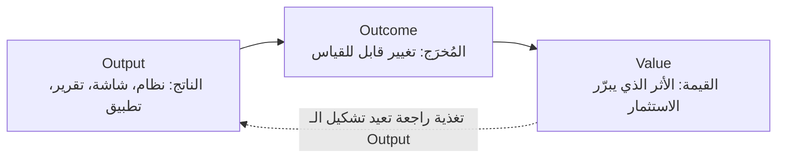
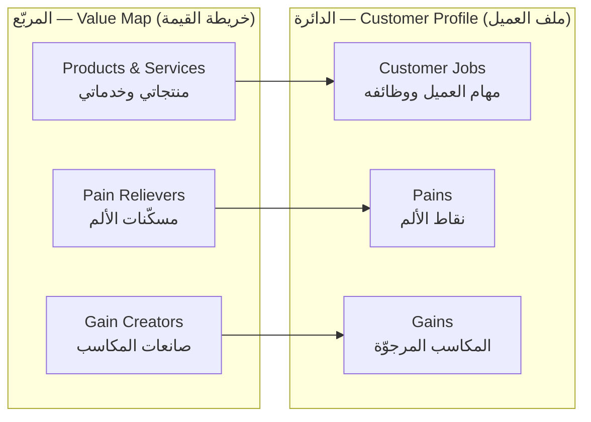

> [!info] المحاضرة 01 · قيادة التسليم
> **ماذا ستتعلّم:** كيف تنتقل من عقلية «إنهاء المهام» إلى عقلية «قيادة التسليم»: تعريف القيمة وأنواعها، التمييز الحاسم بين `Output` و`Outcome`، صياغة أهداف `2X` و[[2X and 10X Goals|10X]]، معادلة القيمة، استخدام `Value Proposition Canvas` لفهم العميل، التفريق بين `Customer` و`Client` و`Consumer`، بناء مقياس رقمي للأولويات، إطار `CLEAR`، وثيقة التسليم، وتصنيف خطوات العمل إلى قيمة مضافة وغير مضافة.

# المحاضرة 01 — من إدارة المهام إلى قيادة التسليم: تصميم القيمة والمخرجات

## 🎯 أهداف التعلّم

- التمييز بين **إدارة المهام** و**قيادة التسليم**، وفهم ما هي «طبقة التسليم» (`Delivery Layer`) ولماذا نضيفها فوق منهجية التنفيذ.
- تعريف **القيمة** بدقّة، ومعرفة أنواعها الأربعة (تشغيلية، مالية، تنظيمية، استراتيجية).
- إتقان الفرق بين [[Outcome vs Output|المُخرَج مقابل الناتج]]، وصياغة أي متطلَّب في صورة `Outcome` قابل للقياس عبر قاعدة «لماذا؟».
- صياغة أهداف `2X` (التحسين التدريجي) و`10X` (إعادة تعريف المشكلة)، وتقييمها بـ **معادلة القيمة**.
- استخدام [[Value Proposition Canvas|لوحة القيمة المقترحة]] لاستخراج وظائف العميل و[[Pain Point|نقاط الألم]] والمكاسب (`Gains`)، ومطابقتها بمزايا منتجك.
- بناء **مقياس رقمي متعدّد المعايير** لترتيب الأولويات، والتمييز بين `Priority` و`Order`.
- كتابة **وثيقة التسليم** (`Delivery Charter`)، ورسم [[Value Stream|تدفّق القيمة]] وتصنيف خطواته إلى [[Value-Added vs Non-Value-Added vs Pure Waste|قيمة مضافة وغير مضافة]].

## الفكرة المحورية

أغلب من يعملون في المشاريع اليوم يفكّرون في **المهام**: عندي عشرون مهمة أو خمسون مهمة، كيف أنهيها بأسرع وقت لألحق بالموعد النهائي؟ ونادرًا جدًّا من يسأل: **ما النتيجة القابلة للقياس التي تحقّقت عند العميل؟** هذه المحاضرة هي الأساس الذي يُبنى عليه كل ما بعده؛ فالقيمة تؤثّر في ترتيب الأولويات، وترتيب الأولويات يؤثّر في ضبط النطاق، وضبط النطاق يؤثّر في التقدير والمخاطر و`Go-Live`. الفكرة الجامعة: **النظام ليس قيمة بحدّ ذاته، بل أداة لتحقيق مُخرَج (`Outcome`) نحدّده مسبقًا ونقيسه بعد التطبيق.**

## مقدّمة البرنامج: ماذا نبني معًا؟

هدف البرنامج أن نصبح قادرين على **قيادة التسليم** لا مجرّد **إدارة المهام** — والفارق بينهما كبير. أغلب المشاركين يعملون على مشاريع `ERP` (بعضهم على `Odoo`، وبعضهم على `Microsoft Dynamics`)، ولذلك ستكون معظم الأمثلة من طبيعة مشاريع الـ `ERP` لتسهل المقارنة بما لديكم.

محاور البرنامج:

1. **ضبط النطاق والتغيير بدون أزمات** — كيف نمنع النطاق من التفلّت.
2. **اتخاذ القرارات الصعبة** — قرارات لا يستطيع المرء اتخاذها بسهولة، ونحن نزوّدك ببيانات ومعلومات تساعدك على القرار السليم.
3. **إدارة المخاطر** — لا كإدارة مخاطر مؤسسية كاملة، بل الجزئيات المرتبطة مباشرةً بتسليم المشروع.
4. **تسليم المشاريع الرقمية بهدوء واستقرار** — أن تصل إلى نهاية المشروع دون مشاكل.

> [!warning] المشهد المألوف في آخر أسبوع قبل التسليم
> الناس يعملون حتى الواحدة ليلًا، الجميع متلخبطون مع بعضهم، البيانات مضطربة، السيرفر غير جاهز. نحن نريد أن نعمل بطريقة تضمن أنك عند `Go-Live` تكون أمورك سليمة، والعمل مستقرًّا وواضحًا ومنسّقًا ومنظّمًا.

## من إدارة المهام إلى قيادة النتائج

تفكيرنا في المشروع يجب ألّا يكون «إنهاء المهام» بقدر ما يكون «تحقيق نتيجة قابلة للقياس». أغلب الشركات اليوم تركّز على إنهاء التاسكات لتلحق بالموعد النهائي أو تسلّم شيئًا للعميل، لكن **لا أحد يركّز على الجانب الآخر: النتيجة القابلة للقياس**.

اسأل نفسك: هل في عملك الحالي من يقيس نتيجة المشروع؟ عميل طلب نظام موارد بشرية ورواتب — هل قاس أحدٌ أن النظام اشتغل بلا مشاكل؟ هل قال أحد إن النظام حقّق النتائج التي حدّدناها من البداية؟ الجواب في الغالب: **لا أحد يقيس**.

الهدف يُكتب في البداية، ويكون في ذهنك فعلًا، وتركّز عليه… ثم عندما تصل إلى مرحلة التسليم يصبح همّك أن تنهي لتنتقل إلى المشروع التالي، فيضيع الهدف الذي انطلقت منه.

### ظاهرة `Happy Path` وقصة نظام الرواتب

> [!warning] «القياس» بالمسار السعيد فقط
> حين يُقال إن هناك قياسًا، يكون القياس غالبًا بـ[[Happy Path|المسار السعيد]] فقط: **أول راتب خرج، أول موظف استلم راتبه عن طريق النظام ← إذن النظام نجح!** ولا يُنظر إلى الأخطاء (`Bugs`) بعدها إطلاقًا.

ما الذي يحدث فعليًّا؟ منذ **أول يوم** بعد الإطلاق تبدأ الأخطاء بالظهور، وتكون كمّية الأخطاء وطلبات الدعم (`Support`) كبيرة جدًّا في الأسبوع الأول والثاني. لكن توجد إشكالية مزمنة: الفريق **مضطرّ** أن يرفع تقريرًا للإدارة العليا بأن المشروع «نجاح». والنجاح هنا يعني فقط: **المهام انتهت** — وربما تكون بعض المهام لم تنتهِ فيُقال «خلّيها بعدين، عادي»، ثم تُصنَّف كل المشاكل اللاحقة على أنها `Issues` طبيعية: «أي نظام يخرج فيه أخطاء».

والأسوأ أن الفريق يكون **عالمًا مسبقًا** بأن هذه الأخطاء ستقابله، ويتحدّثون عنها بينهم، لكنهم لا يستطيعون الذهاب إلى الإدارة وقول: «هذا الأمر يحتاج تأجيلًا وزيادة في الزمن»؛ لأن الجواب: «لا، يجب التسليم في الموعد». فيختارون المضيّ بالمسار السعيد: **المسار السعيد اشتغل ← نحن نجحنا** — وهذا ما يُرفع للأعلى. وبعدها كل ما يأتي يُعالَج كمشاكل عادية جدًّا، وأحيانًا تكون هناك **فيتشرات كاملة غير موجودة** أو مبنية بشكل خاطئ، ويُكتشف ذلك **بعد** التسليم، فيُقال «لم نكن نعرف، لم يكن هناك توثيق، كان الأمر في مكالمة».

نحن نريد الانتقال من التركيز على المهام إلى **قياس النتيجة**. ليس شرطًا أن يكون القياس بعد التسليم فقط؛ بل نمهّد من البداية لنسلّم بشكل صحيح، فتكون كمّية الأخطاء معقولة. لكن التركيز الأكبر يبقى: **هل النظام نفسه سلّم قيمة للعميل؟ هل استفاد فعليًّا؟ هل قلّت المشاكل التي كان يعانيها؟**

## لماذا تتأخّر المشاريع؟ وطبقة التسليم

تظنّ أغلب الإدارات أن التأخير سببه تقني. الحقيقة أن **أغلب التأخير ليس بسبب التقنية** — لا بسبب `Odoo`، ولا `Microsoft Dynamics`، ولا قيود الأدوات، ولا الفريق. الأسباب الحقيقية:

- **هدف غير واضح** من البداية.
- **قيمة غير مقاسة**.
- **نطاق بلا حدود**: العميل يطلب شيئًا ويقول «هذه بسيطة، لن تأخذ منكم ساعة» — فينفلت النطاق.
- **قرارات بلا معيار**: نتّخذ القرارات بلا بيانات ولا معايير، فقط لأن العميل قال.

### `Scrum` كطقوس لا كنظام قيمة

بحسب الاستبيان الذي أجريناه، أكثر من **50%** من الشركات في الخليج وغيره تعمل بـ[[02 - Scrum|Scrum]]. لكن الغالبية لا تفهمه فعليًّا على أرض الواقع؛ يظنّون أنه الاجتماعات الخمسة المعروفة والـ`Daily Scrum` وحسب. أما `Scrum` **كنظام تسليم** فقلّة من يركّزون عليه.

النتيجة: `Scrum` يعمل في كثير من المنظّمات **كطقوس فقط** — اجتماع يومي مفروض، ثم [[09 - Sprint Review|Sprint Review]] نعرض فيه على العميل ما أنجزناه كـ`Demo`، ونسجّل الملاحظات، وننتقل للسبرنت التالي — **وليس كنظام قيمة**. فتكون النتيجة: مشروع يعمل، **لكن بلا أثر حقيقي عند العميل**.

### من المسؤول عن القيمة؟

- **مدير المشروع** (`Project Manager`) مركِّز على الخطة.
- **المطوّرون** مركِّزون على البناء.
- **الـ[[06 - Scrum Master|Scrum Master]]** مسؤول عن الفريق ويتأكّد من تطبيق `Scrum` بشكل صحيح.
- **الإدارة العليا** لن تنزل إلى مستوى المشاريع لتتابع القيمة.

فمن المسؤول عن القيمة؟ **لا أحد.** القيمة ضائعة بين الناس، لا أحد يسأل عنها ولا أحد يركّز عليها. لذلك تظهر النتائج في الآخر — بعد التسليم — فيبدأ اللوم: «المشكلة في المطوّرين»، «الفريق تأخّر»، «شركتكم لا تعمل بشكل جيّد».

> [!note] طبقة التسليم ليست بالضرورة منصبًا
> الحلّ هو وجود **طبقة تسليم** (`Delivery Layer`) نركّز عليها. ليس شرطًا أن تكون منصبًا رسميًّا كـ`Delivery Manager`؛ يمكن لأي شخص في المشروع أن يتبنّاها ضمن مهامه. وقد تكون المهام **موزّعة** على أكثر من طرف. نحن ندرس **الطبقة** كاملة، وطريقة تطبيقها تختلف من شخص لآخر ومن شركة لأخرى.

## الفرق الجوهري: `Project Manager` و`Delivery Manager` و`Implementer`

| الدور | تركيزه | ما يفوته |
|---|---|---|
| **مدير المشروع** (`Project Manager`) | حماية الخطة: رسم كل المراحل والتاسكات، تحديد ما يُسلَّم في المرحلة الأولى والثانية، رسم الاعتماديات ([[Dependency\|Dependencies]]). أي تعديل يتمّ رسميًّا وفي حدود 10–20% بالكثير. | لا يركّز على تحقيق القيمة. |
| **المنفّذ** (`Implementer`) | بناء ما طلبه العميل: نظام حسابات، مشتريات، مبيعات — وأن يعمل بشكل صحيح. يأخذ من العميل ويشتغل مع المطوّرين. | لا يركّز على الأثر. |
| **مدير التسليم** (`Delivery Manager`) | المسؤولية القيادية عن تحقيق القيمة والمُخرَجات المتّفق عليها. | — |

قيادة التسليم دور أو منصب: قد يكون رسميًّا، وقد يتبنّاه مدير المشروع أو المنفّذ أو الـ`Scrum Master` أو أي شخص آخر.

## حدود `Scrum`: ما يجيده وما لا يجيده

**ما يجيده `Scrum`:** تنظيم العمل بشكل جيّد، إيقاع ثابت، فريق بعدد معيّن، اجتماعات معروفة خلال أسبوع أو أسبوعين أو شهر كحدٍّ أقصى، شفافية في الفريق — إذا طُبِّق بشكل صحيح.

**ما لا يفعله `Scrum`:**

- **لا يحدّد القيمة**: يسلّم [[Increment]] والعميل يستخدمه، لكنه لا يركّز على تحديد القيمة بالضبط.
- **لا يحمي الهدف التنفيذي**.
- **لا يتّخذ القرار على مستوى المشروع**: قراراته على مستوى الفريق، أما قرار مستوى المشروع (أو الإدارة العليا) فليس مصمَّمًا له. و`Scrum` غير مصمَّم لإدارة القرارات أثناء السبرنت.
- **لا يملك مفهوم الـ`Outcome`** أصلًا.

الخلاصة: `Scrum` **محرّك تنفيذ ممتاز**، لكننا نحتاج أن نضيف فوقه طبقة نسمّيها **طبقة التسليم**.

> [!note] الدليل نفسه يقول إنه ناقص عمدًا
> في الصفحة الأولى والثانية من `Scrum Guide` مكتوب أن `Scrum` **غير مكتمل بشكل مقصود**. بعض الناس يفهم أنه يجب أن يُطبَّق كما هو دون زيادة أو تعديل، والصحيح أنه **الحدّ الأدنى** الذي يمكنك البناء فوقه: الحوكمة، الأمن السيبراني، الإدارة الاستراتيجية… كلها طبقات (`Layers`) يمكن إضافتها. ونحن سنضيف طبقة التسليم.

### أسئلة من الحضور

> **س: ما معنى «لا يحمي الهدف التنفيذي»؟**
> في [[08 - Sprint Planning|Sprint Planning]] يجلس الفريق مع المتطلّبات القادمة من [[05 - Product Owner|مالك المنتج]] ويحدّد ما يدخل في السبرنت. لكن هل ما اتّفق عليه الفريق سيتحقّق بالكامل؟ **لا ضمانة**. الأمر مبنيّ على التجربة وأداء الفريق. حتى لو كان الفريق ممتازًا، ليس شرطًا أن تنهي في نهاية السبرنت كل ما خطّطت له، لأن التفاصيل تظهر أثناء العمل: قد تُقدَّر مهمّة على أنها بسيطة جدًّا ثم تتبيّن أكبر بكثير، فينتقل جزء منها إلى السبرنت التالي.
>
> فلو خطّطت أن المشروع ستة سبرنتات ووزّعت الفيتشرات عليها، فإن `Scrum` **لا يضمن** أن كل شيء سيُنفَّذ بنهاية السبرنت السادس؛ قد تحتاج ثمانية. هذا معنى أنه «لا يحمي الهدف التنفيذي»: لا توجد فيه مبادئ تحمي تسليم ما خطّطتَه من البداية، وكله مبنيّ على التجربة، فيؤثّر ذلك على التسليم.

## تعريف القيمة وأنواعها

**القيمة هي الأثر الذي يهمّ جهةً ما ويبرّر الاستثمار في المشروع أو القرار.** والقيمة دائمًا تجيب على سؤال: **لماذا هذا مهم؟** فإذا كان عندي فيتشر بشكل معيّن — لماذا هو مهم بالنسبة لي؟

> [!warning] قاعدة القياس
> **إذا لم نقدر على قياس القيمة، فهذا يعني أننا لم نعرفها بشكل جيّد.**

أنواع القيمة الأربعة:

**1) قيمة تشغيلية:**
- *تقليل الزمن*: طلب إجازة في نظام `HR` يأخذ أسبوعين حتى يكتمل، وأنا أريده ثلاثة أيام.
- *تقليل الجهد*: طلب يمرّ بعشرة اعتمادات، وأريد تقليلها إلى ثلاثة أو أربعة.
- *تقليل الانتظار*: إخلاء الطرف يمرّ بخمس أو عشر جهات وقد يستغرق ثلاثة أسابيع.

**2) قيمة مالية:** خفض التكلفة، زيادة الإيراد، تقليل الهدر.

**3) قيمة تنظيمية:** رضا العميل وتجربته (وكيف نقيسها)، سهولة الاستخدام (قد تملك الشركة نظامًا لكنه معقّد بالنسبة لها، فتكون سهولة التجربة قيمة)، تقليل الاعتماد اليدوي (أن تكون الأشياء مؤتمتة بدل الإدخال اليدوي).

**4) قيمة استراتيجية:** الامتثال للجهات الرقابية في الدولة. مثال: مؤشّرات قياس التحوّل الرقمي في السعودية — هناك تقييم سنوي للجهات الحكومية، وكلّما زادت نسبة الامتثال أو ارتفعت درجة الجهة حصلت على امتيازات. فقد تعمل على مشروع لجهة حكومية تكون القيمة عندها هي **الامتثال** أو **رفع مؤشّر القياس**. ومن ذلك أيضًا: القرار الأفضل، وتقليل المخاطر — حسب نشاط الشركة.

فالقيمة إذن ليست «نظام حسابات» أو «نظام `HR`»، بل **قيمة للعميل نفسه**، وهي تختلف من جهة لجهة.

## `Outcome` مقابل `Output`

الـ**`Outcome`** (المُخرَج) هو **التغيير القابل للقياس**: ما الذي تغيّر فعليًّا عند العميل بعد تسليم النظام؟ هذا التغيير يجب أن يكون **معرَّفًا من البداية**، ثم نعود لاحقًا لنرى هل تحقّق أم لا.

**مثال:** جهة طلبت نظام حسابات؛ عندها مشاكل في إغلاق الميزانية، والإغلاق السنوي، وقيود شهرية متكرّرة، ومشاكل مع الرواتب. القيمة التي ستقيسها معهم هي **اختفاء هذه المشاكل**: إغلاق الميزانية كان يأخذ ثلاثة أسابيع، وأنت تعمل معهم ليصبح خلال أسبوع. هذا هو الـ`Outcome` الذي تتأكّد أنه حصل.

الـ`Outcome` يصف: **ما الذي تغيّر بالضبط؟ ولمن؟ ومن الذي تغيّر معه هذا الشيء؟** وأن يكون **رقمًا أو مؤشّرًا**. وهو **لا يصف** ما بنيناه ولا كيف نفّذناه ولا كم `User Story` أنجزنا — كل هذه ليست `Outcome`. الـ`Outcome` هو **الدليل** الذي يثبت أن القيمة تحقّقت فعليًّا عند العميل.

**الخطأ الشائع:** أن نقول إن القيمة هي المهام والمزايا والمتطلّبات والتقارير. القيمة هي **التغيير الحاصل**: زمن أقل، مخاطرة أقلّ، سلوك تغيّر، تجربة مستفيد تحسّنت.

> [!example] تجربة الخدمات الحكومية الإلكترونية
> بدل أن أذهب للجهة الحكومية وأطلب تذكرة وأنتظر ساعة أو ساعتين، صارت الخدمة إلكترونية مباشرة: **تكلفة أقلّ وتجربة مستخدم أفضل**. هذا هو الـ`Outcome`. أما كيف تحقّق؟ عبر تطبيق موبايل أو متطلَّب معيّن أو [[11 - User Stories|User Stories]] وتقارير — وهذه هي الأشياء التقنية التي نسمّيها `Output`.

### صيغة الـ `Outcome`

> **تغيير قابل للقياس في (زمن / قرار / سلوك / تكلفة)، لفئة محدَّدة، خلال مدّة محدَّدة.**

ملاحظات على الصيغة:
- لا بدّ من **«قبل» و«بعد»**: كانوا قبل التطبيق بشكل معيّن، وأصبحوا بعده بشكل مختلف.
- لا بدّ من **رقم واحد على الأقل**.

> [!example] من متطلَّب إلى `Outcome`: نظام `ERP` مالي
> **المتطلَّب كما جاء من العميل:** «تنفيذ نظام `ERP` لدعم الإدارة المالية وتحسين الإجراءات».
>
> **ما القيمة؟** تقليل زمن إنجاز المعاملات المالية وتسريع إقفال الحسابات. **لماذا؟** لأن التأخير في الإقفال يؤثّر على القرار المالي والتقارير في الوقت نفسه.
>
> **الـ`Outcome` بصيغته الكاملة:** «تقليل زمن إقفال الحسابات الشهري **من سبعة أيام إلى يومين** لدى الإدارة المالية **خلال الربع الأول**».
>
> - قابل للقياس؟ نعم. مرتبط بالزمن؟ نعم. يصف تغييرًا؟ نعم (من 7 أيام إلى يومين).
>
> **الـ`Output` المقابل:** أتمتة القيود المالية، الصلاحيات، التقارير… كلها وسائل.

> [!warning] لماذا يفشل التفكير بالفيتشر؟
> أي شركة عندها نظام مالي. الشركة «أ» والشركة «ب» عندهما **نفس النظام ونفس الفيتشرات ونفس الـ`Output`** (إقفال الميزانية شهريًّا، إقفال الحسابات). فما الذي يفرّق؟ **ما الذي يعانون منه فعليًّا وما الذي يحلّه النظام لهم.** لا تركّز على أنك ستوفّر لهم طريقة إقفال سهلة وطريقة إدخال قيد؛ ركّز على **نقاط الألم** بالنسبة للجهة.

> [!example] النظامان الفاشلان: المشكلة كانت البطء
> مرّت علينا شركة سبق أن جرّبت نظامين: الأول فشل، ثم جاءت شركة أخرى بنظام ثانٍ وفشل أيضًا. حين جئنا نحن، كان التحدّي الأساسي **ليس** تغطية الفيتشرات — فكل الأنظمة السابقة حقّقت نفس الفيتشرات ونفس المهام. التحدّي الحقيقي كان أن **الأنظمة السابقة كانت بطيئة** ولم يستطيعوا العمل بها. فكان تركيزنا على **السرعة** لا على تسليم نفس المهام.
>
> لاحظ الفارق: حين تعرف من البداية ما الذي يعانيه العميل، يصبح تركيزك مختلفًا تمامًا عن التركيز على المهام نفسها.

**لماذا يختار العميل شركتك دون غيرها؟** في النهاية ستسلّم نظامًا ماليًّا، وغيرك سيسلّم نفس النظام ونفس الفيتشرات. الفرق: هل يعاني من عدم القدرة على العمل؟ هل النظام معقّد بالنسبة له؟ كثير من الجهات تختار `Odoo` مثلًا لأنه سهل ومبسّط وقابل للتخصيص حسب متطلّباتها. أغلب الإعلانات تعرض «نظام `ERP` فيه المزايا الفلانية» وتذكر مزايا كثيرة، بينما العميل قد لا يحتاج إلا **ربع** هذه المزايا.

### قاعدة «لماذا؟»

> **أي متطلَّب لا نستطيع تحويله إلى `Outcome` واضح، فهو متطلَّب غير جاهز للتسليم.**

يجب إعادة تعريفه وإعادة صياغته. وللوصول لذلك: اسأل العميل **«لماذا تريد هذه النقطة؟»** ولا تتوقّف: لماذا؟ ولماذا؟ حتى تصل إلى الأسباب التي تمكّنك من معرفة الـ`Outcome`. وقد تصل في النهاية إلى إقناعه بأن ما يراه مطلوبًا ومهمًّا ليس مهمًّا فعلًا، فيُعاد صياغته أو يُلغى ليركّز على أشياء أهمّ.

> [!warning] المتطلَّب غير الواضح يجرّ مشاكل التسليم
> المتطلَّب غير الواضح يعود إليك كل مرّة: «أنا لم أطلب هكذا»، «عدّل هذه». فتتكرّر التغييرات والتعديلات، ثم تكتشف أن إشكاليته الأساسية أنه يريد شيئًا بسيطًا جدًّا: إضافة الموظفين، تحديد إجازاتهم، والرواتب. فلو لم تحدّد من البداية ما الذي يعانيه بالضبط — هل هو لا يملك نظام `HR`؟ أم لا يستطيع إدارة الرواتب؟ أم إشكاليته في **كثرة الإجازات** وعدم القدرة على ضبطها فيأتي المكتب فيجده فارغًا لأن الجميع أخذوا إجازات ولا يوجد ضبط؟ — لاختلفت المعادلة تمامًا.

### أسئلة من الحضور

> **س: مثال التعليم الإلكتروني — أنشأتُ برنامجًا لامتحانات الطلاب، ثم اكتشفت أن بعض الطلاب من ذوي الاحتياجات الخاصة لا يستطيعون استخدامه، فعملت تعديلات وإضافات. هل هذا هو الـ`Outcome`؟**
> لنبدأ من البداية: قبل أن تقدّم النظام، أين كانت الإشكالية بالضبط؟ هل مشكلة الطلاب في الاختبارات؟ في زمن الاختبار؟ لا توجد وسيلة للاختبار `Online`؟ (كانوا يستخدمون `Telegram`، وكانت الإشكالية في التقارير وغيرها).
>
> الـ`Outcome` هنا أشياء مثل: أن يكون النظام آمنًا فلا يستطيع أحد أخذ إجابة من زميله (منع الغش)، أن يكون الامتحان سهلًا `Online` وغير صعب على الطالب، أن يدخل على النظام فيجده سهلًا، أن يصل للامتحان بوضوح دون خطوات كثيرة. **أما كيف حقّقتَها؟** بشاشة وتقرير وقائمة ورابط مباشر في الشاشة الرئيسية ورابط أُرسل للطلاب — كل ذلك `Output`.
>
> التجربة الآن تغيّرت: كانوا يعملون بـ`Telegram`، فصارت `Online` بنظام واضح، يفيد المدرسة أو الجهة الأكاديمية، إدارته سهلة، يوفّر وقتًا، يقلّل تكلفة، ويضبط الامتحان.

> **س: النظام الذي بنيته — كيف يكون `Output` تارة و`Outcome` تارة أخرى؟**
> لنمسك تجربة المستخدم: الطلاب يعانون، لا يستطيعون الوصول عبر `Telegram`، والإنترنت ضعيف عند بعضهم. أنت تريد تحسين هذه التجربة، فنقلتهم إلى نظام تعلّم إلكتروني سهل وواضح. بعد الامتحان عملت استبانة أو تقييمًا، فوجدت نسبة كبيرة من الطلاب راضية: «النظام سهل، تجربة ممتازة».
>
> فالـ`Outcome` هو **انتقال التجربة من سيّئة إلى أفضل**. وكيف حقّقتها؟ بنقلهم من `Telegram` إلى نظام جديد — وهذا النظام قد يكون موقعًا أو تطبيق موبايل، **وهذا هو الـ`Output`**. نحن نهتمّ بالمخرج النهائي: تحسين تجربة الطلاب.

> **س: لو جئت لمؤسسة لا تملك نظامًا أصلًا وتعمل ورقيًّا وبنيت لها نظامًا — أليس الـ`Outcome` هو نقلها من الورقي إلى الإلكتروني؟**
> ليس هذا هو الـ`Outcome`. الـ`Outcome` هو: **ما مشاكل النظام الورقي؟** ضياع الزمن، تكلفة عالية، بيانات غير دقيقة، تقارير خاطئة، تقارير متأخّرة. هذه هي المشاكل التي يعانونها، وأنت ستقلّلها أو تحلّها — **وهذا هو الـ`Outcome`**.
>
> مثال: تقارير غير دقيقة ← الآن تقارير دقيقة في زمن قياسي. تأخير في استخراج تقرير يأخذ ثلاثة أيام حتى يصل للإدارة ← الآن صار لحظيًّا.

> **س: أحيانًا نجد العميل نفسه مشوّشًا ولا يعرف ما يريد بالضبط.**
> بالضبط — ولذلك نسأله: **لماذا؟ لماذا؟** حتى نصل إلى ما يعانيه. التركيز على **آلامه** أفضل من التركيز على **الفيتشر الذي يريده**. لو بنينا معه على أساس «يريد نظام `HR`، وماذا يريد فيه؟ رواتب وإجازات» فلن نصل. أما لو ركّزت على الأشياء التي يعانيها فستصل إلى نتيجة أفضل.

### أمثلة إضافية: لوحة المعلومات للإدارة العليا

> [!example] «تطوير لوحة معلومات للإدارة العليا لعرض مؤشّرات الأداء»
> **القيمة الحقيقية:** ليست عرض المعلومات، بل **اتخاذ القرار**. لأن القرار المتأخّر = فرصة ضائعة أو خطر.
>
> **الـ`Outcome`:** «تحسين سرعة وجودة اتخاذ القرار» — بصياغة قابلة للقياس: **تمكين الإدارة من الوصول إلى تقارير الأداء خلال أقلّ من 10 دقائق بدلًا من يوم كامل**. الوضع قبل: يوم. بعد: عشر دقائق. والسلوك يتغيّر: التقرير يصل مباشرةً أو يصبح قابلًا للمتابعة. وأستطيع قياس ذلك: هل تخرج الإدارة العليا التقرير خلال عشر دقائق؟
>
> **الـ`Output` المحتمل:** `Dashboard` تفاعلي، أو تقرير آليّ يُرسل أوتوماتيكيًّا، أو تكامل بيانات بين الأنظمة لتوليد مؤشّرات الأداء. الـ`Output` يختلف من شخص لآخر ومن جهة لأخرى، **لكن تركيزي على الـ`Outcome`**.

> [!question]- تمرين (1): شاشة متابعة حالة الطلبات
> عندي متطلَّب: «إضافة شاشة متابعة لحالة الطلبات». المطلوب منك أن تحدّد:
> 1. ما **القيمة**؟
> 2. ما الـ**`Output`**؟
> 3. ما الـ**`Outcome`**؟

## إدارة التسليم والتفكير المنتَجي (`Product Thinking`)

**إدارة التسليم** هي: *المسؤولية القيادية عن تحقيق القيمة والمُخرَجات المتّفق عليها، عبر توجيه القرارات وضبط التدفّق والمخاطر والتوقّعات أثناء التنفيذ — بغضّ النظر عن المنهجية.* سواء كنت تعمل بـ[[01 - Agile|Agile]] أو غيرها، لا علاقة للمنهجية بالموضوع.

**لتحقيق الـ`Outcome` لا يكفي أن نبني أشياء؛ لا بدّ أن تُستخدَم.** لا فائدة من نظام `HR` فيه مزايا كثيرة لا يستخدمها أحد: صمّمت خدمات ذاتية للموظفين ولم يستخدمها أحد — لا فائدة. ولو وجدنا شركة عندها مزايا في أنظمتها لم يستخدمها أحد من قبل ولا توجد عليها طلبات، فهذا يعني أن النظام بُني من البداية **دون مراعاة للقيمة**، مجرّد مزايا اتُّفق عليها ونُفِّذت وسُلِّمت.

### `Product` لا `Project`

هذا يقودنا إلى مفهوم آخر: **فكّر في النظام كمنتَج (`Product`) لا كمشروع (`Project`)**. لا تعتبر أنك وقّعت مع العميل ستة أشهر ونفّذت وأغلقت المشروع وانتهى؛ بل هو **مستمرّ**: يتغيّر كل مرّة، تضيف وتعدّل بناءً على التغذية الراجعة (`Feedback`) — كالأنظمة التي لها `Version 1` و`Version 2` وهكذا.

المقارنة:

| العمل كـ `Project` | العمل كـ `Product` |
|---|---|
| تأخذ عميلًا، توقّع، تنفّذ نظامه، تغلق المشروع، تنتقل لغيره وتبدأ من الصفر. | تبني منتجًا، تطوّره، تزيد مزاياه بناءً على `Feedback`، وتبيعه لعملاء متعدّدين. |
| التكلفة عالية لأنك تبدأ كل مرّة من جديد. | التكلفة أقلّ والربح أعلى؛ الفرق بين العميل الأول والثاني قد يكون 10–15% فقط. |
| لا تراكم معرفي. | المنتَج له مستخدم ومشكلة محدَّدة وقيمة ودورة حياة، ونجاحه يُقاس بالتغيير بعد الاستخدام. |

**لماذا هذا مهم؟** لأنه يربط ما نسلّمه بالاستخدام. نحن لا نريد بناء شيء لا يستخدمه أحد. وبمجرّد أن يُستخدَم ما بنيناه، يرتبط مباشرةً بالـ`Outcome` الذي نريد الوصول إليه، والـ`Outcome` يوصلنا إلى **القيمة**. فالسلسلة مترابطة: **`Output` → `Outcome` → `Value`**.

> [!note] العلاقة بين إدارة التسليم و`Product Thinking`
> **إدارة التسليم بدون فهم [[Product Thinking|التفكير المنتَجي]] تصبح كأنها رقابة.**
> **و`Product Thinking` بدون إدارة تسليم تصبح فكرة جميلة بلا حماية** — عندك منتج تريد بناءه، لكن في النهاية لا يوجد تسليم.
>
> فنبدأ بالقيمة، ونستخرج منها الـ`Outcome`، ونفكّر فيها كمنتج مستمرّ يتطوّر ويخدم أكثر من عميل، ثم نأتي إلى إدارة التسليم: كيف نسلّم كل هذا؟ وأخيرًا تأتي طبقة التنفيذ (`Scrum` أو `PMI` أو [[03 - Kanban|Kanban]] أو غيرها).

### أسئلة من الحضور

> **س: هل يختلف التفكير المنتَجي بين أن أكون مطوّرًا داخل مؤسسة لديها منتج، وبين أن أكون شركة خارجية تتعاقد لتنفيذ أنظمة؟**
> السؤال الأهمّ: **هل أنت مركّز على قطاع معيّن أم تعمل في كل المجالات؟** لو كنت شركة تعمل على `ERP` وتسلّم للمطاعم ولشركات الزجاج وللتصنيع… فكل مرّة تبدأ من الصفر: تحلّل المتطلّبات، توزّع المطوّرين، يأخذ منك زمنًا، ثم تنتقل لشركة أخرى وتبدأ من جديد — **تكلفتك عالية**.
>
> أما لو ركّزت على قطاع معيّن (المقاولات مثلًا، أو شركات الزجاج): تسلّم للعميل الأول، ومن الـ`Feedback` تظهر لك فيتشرات جديدة تضيفها للمنتج، فيأتي العميل الثاني فيجد نفس المهام **زائد مزايا محسّنة** — فأنت سلّمت نفس المنتج بتكلفة أقلّ وربح أعلى. الشركات التي تعمل `ERP` في كل مجال غالبًا لا تكون رابحة، لأن التكلفة تلتهم الربح.

> **س: وإذا كنت مطوّرًا داخل مؤسسة لها نظام داخلي فقط؟**
> نفس الفكرة. لو فكّرت فيه كمنتج: تبني لهم حلولًا للمشاكل الأساسية، ثم بعد الانتهاء تبدأ تفكّر في **التطوير** بناءً على التغذية الراجعة الداخلية، وتقترح مزايا إضافية جديدة، فتعمل بـ`V1` و`V2` وهكذا — بدل أن تنهي النظام الداخلي وتغلق المشروع وتنتقل لشيء آخر.

## نقد أهداف `SMART` وهدف `2X`

**القيمة بدون هدف واضح تصبح نيّة جيّدة لكنها لا تقود قرارات.** فهل نصوغ القيمة في شكل أهداف؟ ومعظم الناس يقولون إن الأهداف يجب أن تكون [[SMART Goals|أهداف SMART]] — فهل هذه الأهداف هي نفسها القيمة؟

**لا، ليست نفسها.** هل من فائدة في صياغة `SMART`؟ نعم، لكن هذه الأهداف مرتبطة بالـ**`Output`** أكثر من ارتباطها بالقيمة.

> [!warning] لماذا لا نركّز على أهداف المشروع التقليدية؟
> - **لا تغيّر الواقع**: مجرّد هدف نريد تحقيقه («نريد نظام `ERP`»، «نريد نظام إدارة مبيعات»)، فهي تركّز على الـ`Output`.
> - **لا تُلهم قرارًا**: افتح ملف المشروع واقرأ أهدافه — لن تؤثّر في أي قرار تتّخذه.
> - **لا تحمي القيمة أثناء التنفيذ**.
> - **ليست مرتبطة بالوضع الحالي** في المؤسسة بأي شكل.
>
> فالتركيز على الأهداف الذكية في المشروع **لا يفرّق معنا ولا يؤثّر في التسليم بأي شكل**.

### الهدف المضاعف (`2X`)

بدل ذلك نصوغ **أهدافنا نحن**. أوّلها **الهدف المضاعف (`2X`)**: *هدف تحسين تدريجي مبنيّ على ما نعرفه.* نجلس مع العميل، نعرف نقاط الألم والمشاكل التي يعانيها، ثم نصيغ أهدافًا **تحسّن الوضع الحالي من (أ) إلى (ب)**.

**خصائصه:** آمن، قابل للتحقيق، مبنيّ على تحسين الموجود، هدف واقعي.

**أمثلة `2X`:**
- تقليل زمن إجراء كان يأخذ **عشرة أيام** إلى **ثمانية**.
- خطوات كانت ورقية أو يدوية ← نعمل لها **أتمتة**.
- تحسين أداء الفريق من وضعه الحالي بنسبة **20% إلى 30%**.

الأهداف هنا **قابلة للقياس، قابلة للتحقيق، مبنية على الواقع**؛ تكتبها بناءً على جلستك مع العميل، وزيارتك لموقعه، ورؤيتك للمشاكل، وجلوسك مع الموظفين.

## هدف `10X` وكتاب Dan Sullivan

لكن الهدف المضاعف **لا يكفي** في إدارة التسليم. اسأل نفسك عن هدف `2X`:

- هل سيغيّر **طريقة العمل** فعليًّا؟ لا.
- هل سيتغيّر **قرار**؟ لا.
- هل سيختفي **الألم** بالكامل؟ لا.

بالرغم من التحسين، ستأتي مرحلة تتكرّر فيها نفس المشاكل. شركات كثيرة تقلّل الزمن من عشرة أيام إلى خمسة وتظنّ ذلك إنجازًا وقيمةً سُلِّمت للعميل، لكن ستأتي فترة تصبح فيها **الخمسة أيام نفسها مشكلة**.

نحن نريد تغييرًا في **طريقة العمل**، وتغييرًا في **القرارات**، ونريد لنقاط الألم أن **تختفي بالكامل**. لا نريد أن نعمل كأغلب الشركات: «كانت سبعة أيام فصارت أربعة»، أو «كانوا ورقيًّا فأتمتنا» — بينما **نفس الطريقة** باقية: كان الطلب ورقة تُملأ وتُرسل للموارد البشرية، والآن صار نموذجًا في شاشة يُرسل للموارد البشرية. **هذه مجرّد أتمتة، لا تغيير للواقع.**

### `10X is Easier than 2X`

هناك شخص اسمه **Dan Sullivan** له كتاب مهمّ جدًّا بعنوان **«10X is Easier than 2X»** (قانون المضاعفة العشرية)، يقول فيه: **أن تعمل على هدف عشرة أضعاف أسهل من أن تعمل على هدف ضعفين.** ليس معناه أن تبذل عشرة أضعاف الجهد؛ بل **بجهد أقلّ لكن بقيمة عشرة أضعاف**. وكبار رجال الأعمال في أمريكا وأوروبا ومدراء الشركات يجلسون عنده كفصل دراسي ليدرسوا هذه النظرية.

**جوهر `10X`: إعادة تعريف المشكلة، لا تحسينها.**

> [!example] أمثلة على إعادة تعريف المشكلة
> - **الاختبارات الإلكترونية:** الإشكالية كانت في الإنترنت، لا في مدّة الاختبار.
> - **إلغاء الإنترنت من المعادلة (السودان):** صارت هناك خدمات تُقدَّم **بدون إنترنت** — تدخل حسابك البنكي وتدخل مواقع حكومية بدون إنترنت. بدل أن تكون الإشكالية في الإنترنت، **ألغينا الإنترنت بالكامل من المعادلة**.
> - **طلب الإجازة في `Odoo`:** الطلب يذهب للمدير، وإن لم يوافق فلا تستطيع أخذ الإجازة. فماذا لو **ألغينا الموافقة**؟ لو كان المدير غائبًا، عندنا حسم `Auto-approval` خلال يوم إن لم يردّ. هذا حلّ بـ`10X`.
> - **طلب القرض في النظام المالي:** بدل أن يذهب الطلب للمراجع ليراجعه ويرى المبلغ ثم يوافق أو يرفض (هدف `2X`)، نعيد التعريف: **إن كان المبلغ أقلّ من عشرة آلاف يُوافَق مباشرةً، وإن تجاوز خمسين ألفًا يُحوَّل للموظف الفلاني**.
> - **طلبات المشتريات:** الإدارة تحدّد مبلغًا معيّنًا؛ إن تجاوزه الطلب ذهب للاعتماد، وإن كان أقلّ منه يُوافَق مباشرةً. ونفس المفهوم ينطبق على إجراءات كثيرة أخرى.

### تعريف هدف `10X`

**هدف `10X` هو هدف يعيد تعريف القيمة المتوقَّعة من المشروع.** يُحدِث تغييرًا جوهريًّا في الأثر أو السلوك أو القرار، ودائمًا مرتبط بقيمة حقيقية تغيّر طريقة العمل، ويجبرنا على التفكير خارج الحلول المعتادة — أي يدخلنا في مساحة **الابتكار** (`Innovation`)، فتكون الحلول التي نخرج بها مختلفة عن الأنظمة العادية الموجودة.

> **لا يوجد هدف `10X` بلا قيمة واضحة.**

فالمنهج هو: أنظر إلى نقاط الألم، وأحاول أن أخرج بحلول (كـ`Output`) **تلغي** نقاط الألم بالكامل — فأخرج بحلول مختلفة عمّا هو موجود في السوق أو في الأنظمة المنافسة.

### معادلة القيمة

> **القيمة = (الأثر `Impact` × الاستخدام [[Adoption]]) ÷ [[Time to Value|زمن الوصول للقيمة]]**

- **`Impact`**: حجم التغيير والأثر.
- **`Adoption`**: هل الناس تستخدمه فعلًا؟
- **`Time to Value`**: الزمن الذي يستغرقه تسليم هذه القيمة.

قراءة المعادلة:

| الحالة | هل هو `10X`؟ |
|---|---|
| أثر كبير + استخدام فعلي + زمن قصير | ✅ نعم |
| أثر كبير لكن لا نضمن أن الناس تستخدمه | ❌ لا |
| أثر كبير واستخدام عالٍ لكن تحقيقه يأخذ 10–12 شهرًا | ❌ لا |
| استخدام عالٍ لكن الأثر ضعيف | ❌ لا |

**الموازنة بين الثلاثة ليست سهلة، لكن هذا ما نسعى إليه:** قيمة عالية، الشيء يُستخدَم، ويُحدِث أثرًا، وفي وقت قصير.

### كيف نصوغ هدف `10X`؟

نبدأ من الهدف `2X` ثم نسأل: **كيف نزيل الباقي بالكامل؟**

> [!example] من `2X` إلى `10X`
> - هدف `2X`: تقليل زمن إجراء من **10 أيام إلى 8 أيام**.
> - السؤال: هل أستطيع تقليل الثمانية أيام أكثر؟ هل أستطيع إزالتها بالكامل؟ هل أستطيع جعلها **يومًا واحدًا**؟ أو **ساعات**؟
> - إذا وصلتُ إلى حلّ كهذا وحقّق معادلة القيمة، فهو **هدف `10X`**.

## خطوة تعريف القيمة: `Value Proposition Canvas`

أغلب المشاريع تفشل لأنها تركّز على المزايا ولا تركّز على **ما يحتاجه العميل فعلًا** أو **المشاكل التي يعانيها**. فكيف نعرف ما يحتاجه العميل؟

الطريقة السائدة اليوم: اجتماعات مع العميل، وأسئلة محضَّرة مسبقًا، وأحيانًا قوالب أسئلة في مرحلة ما قبل البيع (`Pre-sales`) لتحديد النطاق. ونفترض أننا بذلك وصلنا لنقاط الألم أو الاحتياج الحقيقي.

الأداة التي نعتمدها هنا هي [[Value Proposition Canvas|لوحة القيمة المقترحة]] — سهلة، وتعطي تفصيلًا أفضل، وتوصلنا للقيمة بشكل أفضل. وأغلب البنوك تشتغل بأدوات من هذا النوع. تتكوّن من **نصفين**:

### النصف الأيمن: الدائرة — ملف العميل

الدائرة تتعلّق بالعميل، وفائدتها أن **نفهمه**:

- **مهام العميل (`Jobs`)**: ما المهام التي يقوم بها؟
- **[[Pain Point|نقاط الألم]] (`Pains`)**: ما الذي يعانيه؟
- **المكاسب (`Gains`)**: ما الأشياء التي لو تحقّقت لكان سعيدًا؟ مثال: إقفال الميزانية يأخذ منه شهرًا أو ثلاثة أسابيع؛ فلو استطاع إنهاءه خلال أسبوع لكان راضيًا — **هذه هي الـ`Gains`**.

> [!note] لماذا رُسِمت دائرة؟
> لأن العميل قد **يتدحرج** إلى غيرك. أنت جالس في الطرف المربّع، والعميل جاءك ورأى نظامك، وقد يقتنع وقد يذهب لغيرك. لذلك نركّز على ما لدينا كي **نجذبه** ونفهم مشاكله بشكل أفضل، فنعالج نقاط الـ`Pains` ونمنحه نقاط الـ`Gains`.

### النصف الأيسر: المربّع — خريطة القيمة

- **المنتجات والخدمات (`Products & Services`)**: ما لديّ فعلًا — نظام مشتريات، مبيعات، تقارير، `Dashboard`، بريد إلكتروني، إشعارات، تسكير تلقائي، تقارير قابلة للجدولة الآلية… كلّها فيتشرات موجودة.
- **مسكّنات الألم (`Pain Relievers`)**: هل عندي ميزة أو منتج أو خدمة **تسكّن** الألم الموجود عند العميل؟ مثال: الرواتب تتأخّر شهريًّا وتأخذ ثلاثة أسابيع (نقطة ألم) — هل عندي في نظامي ما يحلّ هذه النقطة بالضبط؟
- **صانعات المكاسب (`Gain Creators`)**: هل عندي ما يحقّق ما يحلم به العميل — تقارير عالية الدقّة، لحظية…؟

### البروفايلات: ملف لكلّ فئة

لا نكتب ملفًّا واحدًا يجمع كل الوظائف وكل نقاط الألم لكل الناس. **نعمل لكل شريحة `Profile` خاصًّا بها**:

- بروفايل موظّف المالية.
- بروفايل موظّف الموارد البشرية.
- بروفايل موظّف المخازن.
- بروفايل موظّف المشتريات.

نجلس مع كل واحد ونسأله: ما المهام التي تقوم بها؟ ما النقاط التي تعانيها؟ ما الأشياء التي تتمنّى وجودها لتسهّل عملك وتجعلك سعيدًا؟ (تقرير لحظي، كشف رواتب مجدول، إشعار بالبريد…). نأخذ من كل إدارة **عيّنة** (موظّفًا أو ثلاثة، مدير الإدارة والموظّف العادي)، فتصبح لدينا **نظرة كاملة** عن مشاكل العميل.

ثم ننتقل للطرف الثاني: ما الفيتشرات في `ERP` أو `Odoo` أو `Dynamics` التي تعالج نقاط الألم هذه؟

> [!example] أمثلة على المطابقة
> - **موظّف عادي يريد معرفة رصيد إجازاته** ولا يستطيع إلا بسؤال الموارد البشرية ← عندي فيتشر يعرض الرصيد في `Dashboard` ← يعالج النقطة.
> - **لا يعرف أين توقّف طلبه** ← عندي شاشة تعرض الطلبات وحالة كل طلب ← يعالج النقطة.
> - **مسؤول المخزون لا يعرف متى يوشك المخزون على النفاد** ويضطرّ لاستخراج تقرير يستغرق يومين أو ثلاثة ← عندي تقرير تلقائي أو **إشعار تلقائي ينبّهه قبل يومين أو ثلاثة** ← يعالج النقطة.

> [!warning] الميزة التي لا تطابق شيئًا = هدر
> مثال: أدخلتُ **الذكاء الاصطناعي** في `HR` بحيث يخطّط للموظّف إجازاته. هل تحلّ هذه الميزة نقطة ألم عند الموظفين؟ لو لم يكن هناك فرق بين وجودها وعدمها، فهي ميزة **بُنيت وصُرِف عليها وقت وجهد بلا أي قيمة فعلية**. وربما لم يستخدمها أحد أصلًا.
>
> فأنا من هذا المخطّط أستطيع أن أعرف أي المزايا سأختار لتلبية حاجة العميل. قد يكون عندي نظام حسابات فيه مزايا خرافية وكثيرة جدًّا — **هل أوفّرها كلها للعميل؟ لا.** أختار منها ما يسكّن ألمًا موجودًا أو يمنحه مكسبًا يطمح إليه.

### أسئلة من الحضور

> **س: أريد العمل على قسم واحد فقط لديه نقاط ألم، فهل أراعي العلاقات مع الأقسام الأخرى حتى لا أعالج مشكلة قسم وأخلق إشكالية في قسم آخر؟ وأين أضع هذا؟**
> هذه نقطة مهمّة. بعد أن نكتب كل البروفايلات (الموظف، مدير الموارد البشرية، موظف المالية، مدير الإدارة المالية… فيكون عندك مثلًا عشرة بروفايلات)، ستجد أن هناك **نقاط ألم مشتركة**، وفيتشرًا واحدًا قد يعالج مشكلة في أكثر من بروفايل.
>
> **القاعدة:** الفيتشر الذي يعالج إشكاليات في **أكثر من بروفايل** يأخذ **أولوية أعلى**، لأنه يحقّق قيمة مضاعفة. الرسم هنا ليس خطًّا واحدًا؛ قد يكون خطوطًا متعدّدة من نقطة واحدة إلى عدّة آلام.
>
> ولا يعني ذلك أن نحلّ كل نقاط الألم وكل الأحلام — بل نركّز على **الأكثر تأثيرًا والأكثر تكرارًا**. فلو كان هناك موظّف واحد فقط يطلب ميزة ولا يطلبها أحد غيره، فلن أعطيها أولوية.

> **س: لو عملتُ بروفايل لقسم الموارد البشرية فقط والأقسام الأخرى تعمل بشكل جيّد — هل أحتاج إلى عمل بروفايل لكل الأقسام حتى أرى النقاط المشتركة؟**
> **لا.** إن كنت ستعمل مع إدارة واحدة فركّز على تلك الإدارة، وإن كنت ستوفّر حلًّا لإدارتين فاعمل مع الإدارتين فقط. لن تقدّم شيئًا للأقسام الأخرى.
>
> وإذا خشيت وجود تعارض مع أعمال أخرى: لا تعمل شيئًا من تلقاء نفسك؛ عالِج الألم الذي تراه أمامك فقط. أمّا أن تقول «ناس المخازن هناك لو اشتغلت هذه ستفيدهم» فهذا يُدخلك في [[Scope Creep|زحف النطاق]] ودوّامة أخرى. **ركّز مع الإدارات التي ستعمل معها فقط.**

## `Customer` و`Client` و`Consumer`: التمييز الحاسم

في اللوحة كتبنا «مهام العميل» — فهل `Customer` تعني «العميل» أم «الزبون»؟ الحقيقة أن هناك ثلاثة مفاهيم مختلفة:

| المصطلح | التعريف | خصائص العلاقة |
|---|---|---|
| **`Client` (العميل)** | الشخص أو المؤسسة التي ترتبط بك **رسميًّا**: عقود، مواعيد، التزامات. الشكل الرسمي للـ`Customer`. | علاقة طويلة، مستوى ولاء عالٍ. |
| **`Customer` (الزبون)** | من يشتري منتجًا أو خدمة من الشركة بغرض الاستهلاك أو الاستخدام. | قد يشتري مرّة واحدة، علاقة قصيرة، ولاء منخفض. |
| **`Consumer` (المستهلك)** | المستخدم النهائي الذي يستخدم المنتج أو الخدمة فعليًّا. | لا علاقة له بالعقد، لكنه يؤثّر على قرار الشراء. |

> [!example] مثال شراء اللابتوب (الأب والابن)
> ذهبتَ إلى محلّ واشتريت لابتوب — فأنت بالنسبة له **`Customer` (زبون)**. لكنك اشتريته **لابنك**، وابنك هو من سيستخدمه فعليًّا — فهو **`Consumer` (المستهلك)**.

> [!example] المثال المحوري: نظام حجز موعد في مستشفى حكومي
> - **`Client`:** **وزارة الصحة** — هي التي وقّعت العقد، ودفعت، وتريد النظام، وتتعامل معك بميزانية محدَّدة.
> - **`Customer`:** **المستشفى** — هو الذي سيستخدم النظام ويعمل به، ويحدّد المتطلّبات والوظائف وشكل التقارير.
> - **`Consumer`:** **المريض** — لا علاقة له بالعقد ولا بالمشروع، **لكن إذا فشلت تجربته فشل المشروع بالكامل**.
>
> بترجمتها لمشروع `ERP`: الشركة التي ستدفع وتوقّع العقد = `Client`؛ الإدارات (المالية، `HR`) التي تأخذ منها المتطلّبات وتعقد معها الاجتماعات وتسجّل منها نقاط الألم = `Customer`؛ الموظّف العادي الذي سيستفيد من النظام ويقدّم طلبات الإجازة والقروض والخدمات الذاتية = `Consumer`. ولو لم يخدمه النظام بالشكل المطلوب، فقد يدفع عدم رضاه الشركةَ إلى **تغيير النظام بالكامل**.

### من أين نبدأ؟

نبدأ من **المستهلك** ثم نصعد:

1. ابدأ بالمريض (المستهلك): اجلس معه، انظر مشاكله وتجربته.
2. ثم إدارة المستشفى (الزبون): ما الوظائف والفيتشرات التي يريدونها؟
3. ثم وزارة الصحة (العميل): ما الذي تريده في النهاية؟

**لماذا نركّز على الـ`Customer`؟** لأننا نأخذ منه المتطلّبات — فهو من نجلس معه. أمّا الـ`Client` فهو الجهة التي تدفع لكنها لن تستخدم النظام؛ الذين سيستخدمونه هم الناس والإدارات تحتها. ولا حاجة لأن أجلس مع مدير الشركة لآخذ المتطلّبات. وفي الوقت نفسه أركّز على الـ`Consumer` الذي سيجلس على النظام ويدخل الفواتير والقيود.

### أثر الخلط بين الثلاثة

| الفئة | ما تحدّده |
|---|---|
| **`Client` (العميل)** | حدود العقد وتحديد النطاق — لن أكتب له شيئًا خارج العقد. صاحب السلطة. |
| **`Customer` (الزبون)** | المزايا الوظيفية المطلوبة. الشخص الرئيسي في متطلّبات الجودة. |
| **`Consumer` (المستهلك)** | **قابلية الاستخدام** — هل سيُستخدَم النظام فعلًا؟ ويظهر أثره في [[UAT\|اختبار قبول المستخدم]]. |

> [!warning] من نأخذ منه اختبارات القبول؟
> **من المستهلكين، لا من الزبون ولا العميل.** ليس أن نأخذ القبول من صاحب السلطة الذي يتفقّد وجود الفيتشر الأول والثاني والثالث ثم يقول «تمام». لا — نأخذ اختبارات القبول من **المستخدمين النهائيين**.
>
> فتسليم القيمة في النهاية **يُقاس بوصول القيمة إلى المستهلك النهائي**، لا بأننا تعاقدنا مع شركة وسلّمنا عشرين متطلّبًا.

## المثال المحوري الكامل: نظام طلب الإجازة

نطبّق الآن كل ما سبق على مثال متكامل.

> [!example] البروفايل الأول: الموظّف مقدِّم طلب الإجازة
> **المهام (`Jobs`):**
> - تقديم طلب إجازة عبر النظام.
> - متابعة حالة الطلب.
>
> **نقاط الألم (`Pains`):**
> - ينتظر أيامًا حتى تتمّ الموافقة على الإجازة (وقد يمتدّ الطلب أسابيع بلا سبب).
> - لا يعرف **أين توقّف الطلب** في سلسلة الاعتمادات.
> - **لا يعرف رصيد إجازاته**، فلا يستطيع التخطيط بثقة، ويضطرّ لسؤال الموارد البشرية.
> - **غياب المدير**: الطلب يُعتمَد من ثلاثة مدراء، فإذا غاب أحدهم توقّف الطلب أسبوعًا أو أسبوعين حتى يعود.
> - **رفض مفاجئ بدون سبب**: يُرفض طلبه ولا يعرف السبب إلا إذا سأل.
>
> **المكاسب (`Gains`):**
> - **قرار سريع**: لو تمّت الموافقة خلال يوم أو يومين كحدٍّ أقصى لكان راضيًا.
> - **شفافية كاملة**: أن يرى سلسلة الاعتمادات كاملة.
> - أن يعرف رصيده فيخطّط إجازاته بثقة (متى يقدّم ومتى لا يقدّم).
> - ألّا يحتاج للمتابعة اليدوية.
> - أن يظهر له **سبب الرفض** كاملًا في الطلب.

> [!example] البروفايل الثاني: مدير الموارد البشرية
> **المهام (`Jobs`):**
> - اعتماد طلبات الإجازة.
> - مراقبة الغياب وأنماطه.
> - التنسيق بين الطلبات.
>
> **نقاط الألم (`Pains`):**
> - **80 استفسارًا في اليوم** من الموظفين: أين توقّف الطلب؟ هل اعتمده المدير المباشر؟
> - الاعتماد المتأخّر يعطّل الموظفين، ويزيد الاستفسارات عليه.
> - **غياب معتمِد واحد يوقف الدورة بالكامل**.
> - قرارات غير مبنية على بيانات، ومشاكل تتكرّر بلا وضوح.
> - **نزاعات الرفض**: رفض بلا توثيق يسبّب نقاشات ومساءلات.
>
> **المكاسب (`Gains`):**
> - **الوصول إلى صفر استفسارات** — بأن يعمل النظام أوتوماتيكيًّا دون أي استفسار.
> - أن يرى متى يغيب الناس: هل في نهاية الأسبوع؟ في منتصفه؟ قرب الإجازات؟ ليخطّط فلا يتوقّف العمل.
> - **رؤية فورية** لكل الطلبات لينسّق بينها.
> - **سياسة** تضمن أنه إذا لم يوافق المدير خلال يوم، يتمّ **تفويض** شخص آخر أو **اعتماد تلقائي**.
> - تقارير أنماط الغياب **تلقائية بدون جهد**.
> - أن يوضّح النظام للموظفين **سبب الرفض** بشكل واضح دون سؤال الموارد البشرية.

> [!example] الحلول: المنتجات والخدمات ومسكّنات الألم وصانعات المكاسب
> **المنتجات والخدمات المتاحة عندي (`Products & Services`):**
> - نظام موافقة رقمي متعدّد المراحل.
> - لوحة تتبّع الطلبات (`Dashboard`).
> - بوّابة للموظفين (`Portal`).
> - محرّك موافقة تلقائي مبنيّ على `Workflow` الشركة وتسلسلها الإداري (من المعتمِدون؟ كيف ينتقل الطلب من الأول للثاني؟).
> - تقرير أنماط الغياب الجاهز.
> - منصّة تحليل بيانات للموارد البشرية.
> - ضبط سياسات الحضور والانصراف.
> - تطبيق مقترِح يقترح الإجازة بالذكاء الاصطناعي.
>
> **مسكّنات الألم (`Pain Relievers`):**
> - **تنبيه تلقائي**: بمجرّد تقديم الطلب يصله «تمّ استلام طلبك»، وعند موافقة المدير «تمّت الموافقة على طلبك» ← يحلّ ألم الانتظار.
> - **لوحة تتبّع/شاشة الطلبات**: يرى أين توقّف طلبه ← يحلّ ألم عدم المعرفة.
> - **تتبّع الطلب لحظيًّا + تنبيه عند كل مرحلة**.
> - **سبب الرفض إلزامي لا اختياري**.
> - **تنبيه تلقائي للمعتمدين** وعلى مستوى مدير الموارد البشرية.
> - **تفويض إلزامي عند غياب المعتمِد**.
> - **توثيق كل قرار تلقائيًّا في السجل**.
>
> **صانعات المكاسب (`Gain Creators`):**
> - **القرار خلال 48 ساعة كحدٍّ أقصى** ← يحقّق «القرار السريع».
> - **الشفافية الكاملة**: الطلب ظاهر أمامه، يرى عند من هو الآن، ومن اعتمد ومن بقي.
> - **عرض الرصيد لحظيًّا** ← يخطّط بثقة.
>
> **الميزة التي لا قيمة لها:** تطبيق الذكاء الاصطناعي لتخطيط الإجازات — لا يعالج ألمًا ولا يحقّق مكسبًا مطلوبًا. فهي موجودة في الـ`ERP` لكنها **لم تقدّم قيمة فعلية**، وربما لم يستخدمها أحد.

> [!example] أهداف `2X` و`10X` في مثال الإجازة
> | الوضع الحالي | هدف `2X` (تحسين) | هدف `10X` (إعادة تعريف) |
> |---|---|---|
> | طلب الإجازة يستغرق أسابيع | اعتماد الطلب خلال **ثلاثة أيام** كحدٍّ أقصى | إلغاء الانتظار: **48 ساعة كحدٍّ أقصى**، والموافقة تتمّ **بدون أن يتابع الموظف** ولا يسأل |
> | **80 استفسارًا يوميًّا** لمدير الموارد البشرية | تقليلها إلى **عشرة استفسارات** يوميًّا | **صفر استفسارات** — إلغاء الاستفسارات بالكامل |
> | لا يعرف رصيده فيسأل الموارد البشرية | يستطيع الاستعلام | يرى رصيده لحظيًّا **ويخطّط إجازاته بحرّية كاملة وثقة** |
> | غياب المدير يوقّف الطلب | متابعة يدوية أسرع | **سياسة نظامية**: المدير إن غاب يفوّض شخصًا، ولا يُعتمَد الطلب إلا بالتفويض — فلا حاجة لأي متابعة يدوية |
>
> **لاحظ أن التفكير اختلف:** بدل أن أفكّر في «تقليل» أو «تحسين» الخدمة، أحاول **إعادة تعريف المشكلة بالكامل**.

### مراجعة الـ `Value Map` بعد الاستراحة

نبدأ أولًا بـ**الدائرة** لنفهم العميل، ونحدّد نقاط الـ`Pains` والـ`Gains`. وبفهم هذه النقاط نستطيع تحديد الفيتشرات في منتجنا التي تلبّيها أو تعالجها. التركيز على هذه الأشياء يخرجنا من مأزق أن نصمّم للعميل ما لا يحتاجه أو نطوّر مزايا لن يستفيد منها.

الجدول في المنتصف ما هو إلا **تلخيص للأسهم**؛ التوصيل بين الطرفين نسمّيه **`Fit`** (المواءمة)، ونفصّله في شكل مصفوفة: نكتب كل نقاط الـ`Pains`، وكل الـ`Output` المتاح، ثم نستخرج الـ`Outcomes` بناءً على نقاط الألم، ونحدّد الـ`Output` في المرحلة المباشرة.

> [!note] الأسهم المتقطّعة تعني «فجوة»
> التوصيل ليس فقط لنقاط الـ`Pains` والـ`Gains`؛ بل يجب أن تكون عندي مزايا وفيتشرات تغطّي **الوظائف (`Jobs`)** التي يقوم بها. مثلًا «تقديم طلب إجازة» وظيفة، وعندي نظام موافقة رقمي يحقّقها.
>
> فإذا وجدت مهامّ يقوم بها العميل **وليست مغطّاة عندي**، فهذه **فجوة (`Gap`)** تحتاج تطويرًا أو تحسينًا أو بناءً جديدًا إن لم تكن موجودة أصلًا في النظام.

**وبالمقابل:** أي ميزة لا تطابق (`Match`) نقطة ألم ولا مكسبًا للعميل — لا نركّز عليها، أو نعطيها أولوية بسيطة، أو نؤجّلها، أو لا نسلّمها للعميل أصلًا ولا نذكرها له. لأنك إن لم تعمل بمفهوم `Product Thinking` فستكون لديك كمّية ضخمة من المزايا والفيتشرات — فهل تسلّمها كلها؟ هل هدفك أن تبيعها كلها؟ **لا.** ستنظر إلى ما يحتاجه العميل فعليًّا وتوائم الموجود عندك معه. **هذه هي فائدة `Value Proposition Canvas`.**

> [!note] أثر ذلك على مقاومة التغيير والولاء
> لو طبّقت النظام كاملًا وحقّقت للعميل ما يطمح إليه وعالجت ما يعانيه، فأنت **نقلته من نقطة (أ) إلى نقطة مضاعفة عشرة أضعاف** — إلى نقطة لم يكن يحلم بها. وحينها:
> - **الدائرة تستمرّ معك والولاء يزيد**: يشتري منك مرّة وثانية وثالثة، ويطلب الترقية من `Odoo 14` إلى `Odoo 16` لأنه رأى التعامل ورأى أن الشركة توفّر مزايا تعالج مشاكله فعلًا.
> - **لن تحدث مقاومة للنظام**: الموظّفون أنفسهم — لا الإدارة — هم من سيتحدّثون عن النظام ويشكرونه، لأنك وفّرت لهم ما كانوا يعانون منه. فكيف يشتكون منه؟

> [!warning] خطأ شائع سنعالجه لاحقًا: توقيت التدريب
> أغلب الشركات تطوّر النظام، وتنهي الفيتشرات، وبمجرّد الإطلاق (`Go-Live`) تبدأ بتدريب الناس على `Demo`. **هذا أكبر خطأ.** التدريب يجب أن يكون **مبكّرًا** بكثير، وسنشرح ذلك بالتفصيل في المحاضرة القادمة.

## تحديد الأولويات: المقياس الأول

كلّنا نعمل بأدوات مثل `Jira` و`Trello`. وفي النهاية لديك أمران: **تحديد الأولوية** (عالٍ جدًّا / عالٍ / متوسط / منخفض / بدون أولوية) — لكن **هل هناك منهجية** تحدّد بها أن هذا العنصر عالٍ جدًّا وذاك عالٍ؟ أم أن الاختيار يتمّ بلا دراسة؟

### معايير مستويات الأولوية

| المستوى | حدّة الألم | التكرار | الأثر على العمل |
|---|---|---|---|
| **عالٍ جدًّا** | ألم يومي | متكرّر | يؤثّر على الجميع/الغالبية **ويوقف العمل** |
| **عالٍ** | ألم متكرّر (ليس يوميًّا) | متكرّر | يخصّ مهامّ أساسية |
| **متوسط** | ألم دوري (مرّة أو مرّتين في الشهر) | دوري | **يُبطئ** العمل لكنه لا يوقفه |
| **منخفض** | ألم نادر | نادر | يؤثّر على شخص أو شخصين، وقابل للعلاج بسرعة |
| **معدوم** | لا ألم | — | لا أحد اشتكى منه ولا يؤثّر في شيء |

> [!example] أمثلة على «عالٍ جدًّا»
> - **الكاشير لا يستطيع العمل** لأن الدفع لم يتمّ في النظام ← العمل كله يتوقّف والطابور ينتظر.
> - شخص جاء لحجز موعد في كاشة الاستقبال ونظام الحجز لا يعمل ← يؤثّر على المستشفى ككلّ، والجميع ينتظرون ولا يستطيعون الحجز.
>
> كذلك أي شيء **`Core`** في النظام: لو تعطّل أو تأخّر، توقّف النظام كله وتوقّف الناس.

### تحويل المقياس إلى أرقام

| النطاق الرقمي | التصنيف |
|---|---|
| 0 – 4 | معدوم |
| 5 – 9 | منخفض |
| 10 – 14 | متوسط |
| 15 – 19 | عالٍ |
| 20 – 23 | عالٍ جدًّا |

## الأولوية متعدّدة المعايير

المقياس الثاني: نأخذ كل مهمّة ونقيسها على **أربعة معايير**، ثم نجمع النقاط.

**1) عدد المتأثّرين:**

| الحالة | النقاط |
|---|---|
| شخص واحد | 1 |
| فريق صغير | 2 |
| قسم كامل | 3 |
| أكثر من قسم | 4 |
| كل الموظفين | 5 |

**2) حدّة الألم:**

| الحالة | النقاط |
|---|---|
| إزعاج بسيط | 1 |
| العمل يُبطئ لكن لا يتوقّف | 2 |
| المهمّة تتوقّف بسبب هذا الفيتشر | 3 |
| العمل كله يتوقّف | 4 |
| يحدث يوميًّا والكلّ يشتكي منه | 5 |

**3) التكرار:** سنوي / ربع سنوي / شهري / أسبوعي / يومي (بنفس التدرّج 1 → 5).

**4) التأثير المتقاطع (`Cross-department`):**

| الحالة | النقاط |
|---|---|
| يؤثّر على شخص/بروفايل واحد | 0 |
| يؤثّر على أكثر من بروفايل | 8 |

> [!example] تطبيق المقياس على مخرجات مثال الإجازة
> - **الإشعار التلقائي للمعتمِد:** عدد المتأثّرين = **5** (كل الموظفين يشتكون من هذه الجزئية)، وحدّة الألم = **5**، والتأثير المتقاطع = **8** ← المجموع = **23** ← يقع بين 20 و23 ← **عالٍ جدًّا**.
> - **عرض الرصيد لحظيًّا:** حدّة الألم = **3** (تعطّل المهمّة فقط، ولا يتأثّر كل الموظفين)، والتأثير المتقاطع = **0** لأنها خاصة بالموظّف فقط ولا علاقة لمدير الموارد البشرية بها ← فيستفيد منها شخص واحد.
> - **تقديم الطلب الذكي:** حدّة الألم = **2** — العمل يُبطئ لكن يمكن للموظّف تقديم الإجازة؛ قد يعمل يدويًّا أو يأخذ موافقة شفهية ويواصل، فهو لا يوقف العمل بالكامل.
>
> بهذه الطريقة تدرس كل الـ`Outputs` التي استخرجتها واحدةً واحدة، فتخرج بقيمة رقمية لكلٍّ منها وترتّبها.

في مثالنا خرجنا بـ: **ثلاثة عناصر «عالية جدًّا»، وعنصران «عاليان»، وأربعة «متوسطة»**.

### أسئلة من الحضور

> **س: هل هذه الأرقام ثابتة؟ وهل يمكن تغييرها؟**
> ليست أرقامًا ثابتة؛ أدخلناها كمقياس كمّي تبدأ القياس عليه. يمكنك تغيير الأرقام والأنماط بلا مشكلة. الفكرة أن نقيس على **أكثر من معيار**: بدل أن أقول إن هذا الفيتشر «أولويته عالية جدًّا» وحسب، أدرسه من أربعة معايير (التأثير، الألم، التكرار، والتأثير المتقاطع) — فيكون التقييم **أدقّ** من دراسة الشيء من معيار واحد.

> **س: قد يخطئ أحدهم في تحديد النطاقات (مثلًا 0–4 ثم 5–7 بفارق اثنين) فتصبح النتيجة مضلِّلة — شيء مفترض أن يكون «عاليًا جدًّا» يظهر «متوسطًا».**
> النطاقات تُبنى على المعايير التي اخترتها. قد يكون عندك ثلاثة معايير وقد يكون أربعة، فتوزّع النطاق حسب ما تقيسه. لاحظ من الحساب: الحدّ الأقصى للمعايير المذكورة **5 × 4 = 20**، فجعلنا «عالٍ جدًّا» من 20 فأعلى (حتى 23). وستجد أن الفارق بين كل مستوى والذي يليه في حدود **4** تقريبًا. فالأرقام ليست هي المهمّة، بل **تحويل الشيء إلى قياس كمّي** بدل أن يكون نظريًّا وعشوائيًّا؛ فحين يتحوّل إلى أرقام يصبح القياس أدقّ.

> **س: هل يمكن الاكتفاء بمعيارين؟**
> نعم، لا مشكلة. يمكن لأحدهم أن يقيس بعدد المتأثّرين والتكرار فقط، أو بعدد المتأثّرين وحدّة الألم فقط. لكن **كلّما أخذت معايير أكثر كان تقييمك للمهمّة أدقّ**؛ فقياس القيمة من بُعد واحد ليس كقياسها من بُعدين أو ثلاثة أو أربعة. وقد يكون عندك شركة قابضة فتختلف معاييرك وتحتاج معيارًا خامسًا — لا مشكلة، فهي ليست معايير قياسية ثابتة.

### `Priority` مقابل `Order`

في `Jira` مثلًا: تسحب المهام من [[13 - Backlog|قائمة الأعمال]]، وفي كل مهمّة حقل اسمه **الأولوية** (`Priority`). لكن **هل تبدأ بالأولى أم الثانية أم الثالثة؟ هذا اسمه الترتيب (`Order`)**.

> **`Priority`**: تصنيف المهمّة (عالٍ جدًّا / عالٍ / متوسط…).
> **`Order`**: كلّها دخلت السبرنت الحالي، لكن بأيّها أبدأ؟ الأولى أم الخامسة أم السادسة؟

وللترتيب مقياس آخر مختلف سنتناوله في المحاضرة القادمة. اليوم نكتفي بمستوى **الأولوية**.

فائدة التصنيف الأوّلي: ألّا آخذ فيتشرًا أصرف فيه وقتًا وجهدًا وزمنًا ثم أكتشف أن قيمته منخفضة وأن شخصًا واحدًا فقط اشتكى منه، بينما أهملتُ مشاكل تؤثّر على أقسام كاملة ويشتكي منها كل الموظفين.

> [!warning] الأولوية العالية جدًّا لا تعني «ابدأ بها فورًا»
> قد يكون عندنا فيتشر أولويته «عالية جدًّا» لكننا **لا نبدأ به أوّلًا** — وسنرى مثالًا على ذلك. فمعيار الأولوية شيء، ومعيار الترتيب شيء آخر.

> [!question]- تمرين (2): تطوير نظام متابعة الطلبات
> المطلوب منك:
> 1. **تعريف القيمة**.
> 2. **صياغة هدف `2X`**.
> 3. **إعادة صياغته كهدف `10X`**.
> 4. **تقييم الهدف باستخدام معادلة القيمة**: هل الـ`Impact` عالٍ؟ هل الـ`Adoption` عالٍ؟ هل الـ`Time to Value` قصير أم طويل؟
>
> **مثال مرجعي:** «تسريع اتخاذ القرار المالي» — هدف `2X`: تقليل زمن إقفال الحساب من 7 إلى 5 أيام. هدف `10X`: تمكين الإدارة من الاطّلاع على الوضع المالي خلال **24 ساعة من نهاية الشهر**. التأثير هنا عالٍ جدًّا (قرار سريع تحتاجه الإدارة). **إذا لم يجبرك الهدف على تغيير طريقة التفكير، فهو ليس هدف `10X`.**

## إطار `CLEAR`

بعد أن غطّينا طبقة القيمة وطبقة `Product Thinking`، ندخل إلى **طبقة التسليم**. الإطار الذي نعمل به مبنيّ على حروف كلمة `CLEAR`:

1. **`C` — `Clarify` (التوضيح):** كل شيء يجب أن يكون واضحًا أمامنا — وضوح القيمة والهدف. تُوضِّح القيمة، وهدف `2X` و`10X`، وتمنع الغموض من البداية. فأي قرار لاحق يُبنى على شيء واضح، ولا يحدث تضارب.
2. **`L` — `Lead the Decision` (قيادة القرار):** نحدّد القرارات التي سنعمل عليها وكيف نتّخذها. **امتلاك القرار لا مجرّد المتابعة**: إيقاف أو تغيير المسار عند الحاجة. وهنا يختلف مدير التسليم عن مدير المشروع — الذي قد لا يملك أحيانًا صلاحية إيقاف مشروع أو إيقاف تنفيذ شيء معيّن. أحيانًا يملك القرار، وأحيانًا يرفعه بطريقة معيّنة للإدارة العليا لتتّخذه.
3. **`E` — `Execute` (التنفيذ موجَّه بالقيمة):** **التنفيذ ليس هدفًا بحدّ ذاته**؛ كل سبرنت أو مرحلة (`Phase`) يجب أن تخدم `Outcome` — وهذا هو [[Sprint Goal]]. أغلب الفرق اليوم لا تهتمّ بالـ`Goal`؛ وعندنا الـ`Goal` هو `Outcome` يجب تحقيقه خلال السبرنت. ويجب أن نحمي [[Time to Value|زمن الوصول للقيمة]]. **التنفيذ وسيلة وليس غاية.**
4. **`A` — `Align` (الموائمة):** الموائمة بين [[21 - Stakeholder Communication|أصحاب المصلحة]] والفريق، وإدارة التوقّعات. تكون هناك **لغة واحدة** نتّفق بها مع الجميع: **لغة القيمة والأثر**. الكلّ يراها أمامه ويعمل على تحقيقها، وهذا يمنع نزاعات كثيرة بين أصحاب المصلحة والفريق واختلاف التوقّعات. فمتى ما عُرِّفت القيمة من البداية بوضوح وعرف الجميع الأثر، لم يحدث تضارب أو نزاع، وصار الجميع يعملون لتحقيق **هدف واحد**.
5. **`R` — `Results` (النتائج):** بعد التنفيذ ننظر إلى القيمة والنتائج — الـ`Outcome` لا الـ`Output`. نراها على أرض الواقع: هل تحوّل الزمن من عشرة أيام إلى 48 ساعة؟ نركّز على الـ`Impact` ونرى أثره، ونتحقّق من الـ`Adoption`: هل حدث الاستخدام أم لا؟

> **النجاح هنا لا يُقاس بعدد المهام، بل بأن الحالة تغيّرت فعليًّا.** معيار النجاح الحقيقي هو النتائج على أرض الواقع، لا مجرّد مهامّ سلّمناها وعدد فيتشرات أنجزناها.

## وثيقة التسليم (`Delivery Charter`)

هناك مستند مهمّ جدًّا سيكون **أساس شغلك كلّه**. بمجرّد أن تكتبه سيمشي معك في كل شيء، وأي حاجة تأتيك ستعتمد عليه، وأي عمل أثناء التسليم سيرجع إليه. اعتبره **خطة التسليم للمشروع كاملًا**. سنشتغل عليه عمليًّا في الأسبوع الثالث أو الرابع، واليوم نتعرّف على محتواه فقط.

**تُنشئه بعد** أن تُعطى الأهداف الأساسية والتسليمات المبدئية، ثم تبدأ تجهيزه من البداية.

**مكوّنات الوثيقة:**

1. **معلومات عامة:** اسم المشروع، الجهة المالكة، الراعي ([[Sponsor]])، مدير التسليم، تاريخ الإصدار.
2. **تعريف المشكلة (`Problem Statement`):** ما المشكلة الأساسية؟ ما الذي لا يعمل حاليًّا؟ ما الألم الحقيقي؟ ما الأثر؟
   *مثال:* «تعاني الإدارة المالية من تأخير إقفال الحسابات الشهرية لمدّة تصل إلى **سبعة أيام**، ممّا يؤخّر إعداد التقارير المالية ويؤثّر على سرعة اتخاذ القرار».
3. **تعريف القيمة**.
4. **الأهداف:** `2X` و`10X`. (يمكن الاستغناء عن `2X` والانتقال مباشرةً لـ`10X`، لكننا نكتبه لأن `10X` يُبنى عليه.)
5. **أصحاب المصلحة:** من سيستفيد؟ وكيف سيستفيد؟
6. **معايير النجاح (`Success Criteria`)** — سنتناولها في المحاضرات القادمة.
7. **القيود / حوكمة التسليم:** قيود **غير قابلة للتجاوز**. *مثال:* سياسات قادمة من الأمن السيبراني تلتزم بها، أنظمة مالية معتمَدة، امتثال لجهة رقابية بشروطها ومتطلّباتها.
8. **الافتراضات والمخاطر:** مثل خطر ضعف التبنّي من الموظفين، أو تأخير التكامل مع أنظمة أخرى.

> [!note] القيادة بدون حدود واضحة = فوضى
> القيود ليست عائقًا؛ هي ما يجعل قيادتك منضبطة. القيادة بدون حدود واضحة تتحوّل إلى فوضى.

**كيف تُستخدَم الوثيقة؟**

- **مرجع**: أي شيء ترجع إليه.
- **أساس القرارات**: أن توقف القرار أو تستمرّ فيه.
- **أداة إدارة التوقّعات**.
- **مقياس النجاح الحقيقي**.

> **أي قرار لا يمكن ربطه بهذه الوثيقة فهو قرار مشكوك فيه.**

وهي **ليست لمسة إدارية اختيارية**؛ بل **أهمّ وثيقة لمدير التسليم**، وأذكى وثيقة لمشاركة العميل (أحيانًا تشاركها معه وأحيانًا لا)، وأقوى أداة تمنع فشل المشروع أو أن يُقال «هذا المدير غير ناجح». أي مشروع تمسكه واستخدمتَ فيه هذه الوثيقة، ستساعدك على أن ينجح بشكل كبير.

## تدفّق القيمة: `Value Added` مقابل `Non-Value Added`

[[Value Stream|تدفّق القيمة]] هو **خريطة**. نرسم فيها الأهداف ثم ننظر إلى المهام والفيتشرات: نمسك نظام الحسابات مثلًا، ونرى الإجراءات أو التسلسل خطوةً بخطوة. ليست `Workflow` تقنيًّا، بل **مراحل** نرسمها في شكل [[Value Stream Mapping|خريطة تدفّق القيمة]].

**التصنيف:**

| النوع | الخصائص |
|---|---|
| **`Value Added` (قيمة مضافة)** | تغيّر الشيء تجاه قيمة معيّنة · العميل يوافق على الدفع مقابلها · **لا يمكن حذفها دون فقدان الأثر** |
| **`Non-Value Added` (غير مضافة للقيمة)** | لا تغيّر في القيمة شيئًا · انتظار، موافقة، نقل، إعادة عمل · **غالبًا مفروضة من نظامك أنت** (مراحل معيّنة تفرضها من عندك) وهي بالنسبة للعميل لا تعطي قيمة |

> [!example] تدفّق قيمة في نظام مالي
> **الخطوات:** طلب معاملة ← مراجعة مالية أوّلية ← **انتظار موافقة المدير** ← **إدخال بيانات يدوي** ← **اعتماد نهائي** ← قيد محاسبي ← صرف.
>
> **التصنيف:**
> - طلب معاملة ← **`Value Added`** (حاجة أساسية، تغيّر الشيء تجاه قيمة، والعميل يوافق على الدفع مقابلها).
> - انتظار موافقة ← **`Non-Value Added`**.
> - الإدخال اليدوي ← **`Non-Value Added`**.
> - الاعتماد النهائي ← **`Non-Value Added`**.
> - القيد المحاسبي ← **`Value Added`**.

الفكرة اليوم أن **نصنّف فقط**: نرسم التسلسل ونحدّد ما هو `Value Added` وما هو `Non-Value Added`. وفي المحاضرة القادمة نبدأ العمل على الخطوات غير المضيفة للقيمة: **نحاول تقليلها أو إزالتها بالكامل**.

## الملخّص السريع

ما أخذناه الليلة، بالترتيب:

1. بدأنا بـ**القيمة**: تعريفها وأنواعها.
2. عرفنا الفرق بين **`Output`** و**`Outcome`**، وكيف نصوغ الـ`Outcome`.
3. صغنا **الأهداف**: `2X` ثم `10X`، ومعادلة القيمة.
4. انتقلنا إلى **أداة فهم متطلّبات العميل**: `Value Proposition Canvas` — البروفايلات، نقاط الألم، المكاسب، المسكّنات، صانعات المكاسب.
5. خرجنا بمجموعة من الـ**`Outputs`**، وأدخلناها في **مقياس الأولوية** الرقمي متعدّد المعايير.
6. تحدّثنا عن **إطار التسليم `CLEAR`** و**وثيقة التسليم**.
7. أخيرًا رسمنا **`Value Stream`** وصنّفنا خطواته إلى `Value Added` و`Non-Value Added`.

> [!question]- تمرين (3): ارسم تدفّق القيمة لعمليةٍ في نظامك
> امسك عملية كاملة في نظامك — مثل **طلب الإجازة** من لحظة تقديم الموظّف للطلب حتى اعتماده نهائيًّا، أو **المعاملة المالية** من بداية الطلب حتى نهايته. ارسم الخطوات كلها في شكل `Value Stream`، ثم صنّف كل خطوة:
> - **`Value Added`** إذا كانت خطوة أساسية تحقّق القيمة، والعميل يدفع مقابلها، ولا يمكن إزالتها.
> - **`Non-Value Added`** إذا كانت انتظارًا أو اعتمادًا أو إدخالًا يدويًّا أو أشياء يمكن الاستغناء عنها دون أثر.

## أسئلة الختام

### أسئلة من الحضور

> **س: ما الفرق بين وثيقة التسليم و`BRD` و`PRD`؟ فالـ`PRD` أيضًا فيه أهداف ومشكلة وفئة ومزايا وسيناريوهات استخدام وأولويات ومعايير نجاح وتقييم — فهو قريب ممّا نتحدّث عنه.**
> - **وثيقة التسليم:** مساحة نظيفة **تتكلّم عن التسليم أكثر**.
> - **[[BRD]] (`Business Requirements Document`):** يتكلّم **كـ`Business`**: يدرس الفيتشر أو المهام من ناحية الأعمال — قيمتها المالية، هل تفيد المؤسسة ماليًّا؟ أشبه بـ[[Business Case|دراسة الجدوى]]: ترى القيمة الفعلية من المشروع بالنسبة للمؤسسة. فهو يركّز على الجانب البزنس ولا يتطرّق للجزئيات المتعلّقة بالتسليم.
> - **`PRD` (`Product Requirements Document`):** أقرب النماذج لما نتحدّث عنه، لكنه يركّز أكثر على **الـ`Output`** وعلى النظام.
>
> والوثائق **قد تكون مكمّلة**: بعض النقاط تتكرّر، لكن وثيقة التسليم تدخل في تفاصيل التسليم أكثر. فلو جاءك `BRD` لا تلجأ إليه في [[Change Request]]؛ ترجع إلى وثيقة التسليم أوّلًا.
>
> **لماذا هذه الوثيقة غير معروفة؟** لأن جزئية التسليم غير موجودة في أغلب الشركات؛ لا أحد مسؤول عنها. الناس يركّزون على إدارة المشروع كخطة وميزانية، ولا يركّزون على الجزئيات المتعلّقة بالتسليم — كأن البوصلة ضائعة في هذه الجزئية.

> **س: أين نجد دور `Delivery Manager` في السوق؟**
> تجده غالبًا في **الشركات الاستشارية** أكثر من الشركات التقنية. وقد تجده بمسمّيات مختلفة، مثل «`Project Manager` / `Scrum Master`» في إعلان وظيفة واحد — وهذا يعني أن الشركة لا تعرف كيف تعبّر عن حاجتها: هم يريدون شخصًا يدير الفريق **وفي الوقت نفسه** يتولّى الأشياء الخارجة عن نطاق الفريق؛ أي أنهم يريدون **مسؤول تسليم** لكن بمسمّى آخر. أما بالاسم الصريح `Delivery Manager` أو `Delivery Leader` فتجده غالبًا في الشركات الاستشارية.

> **س: إدارة المورّدين (`Vendor Management`) — لديّ تجربة: كنا نحتاج مبرمج `Flutter` والوقت ضيّق، فتعاقدنا مع شخص خارجي، فحصلت إشكاليات في التسليم: تأخير في المواعيد، مهامّ لم يستطع معالجتها فأخذت زمنًا طويلًا، وصعوبة في التواصل — يعمل بالليل ونحن نعمل بالصباح. هذا مورد فرد، فما بالك بشركة كاملة؟**
> بالضبط. الوضع التقليدي: شركة `Outsource` تمسك موديولًا كاملًا (نظام `HR` مثلًا)، فتبقى أنت منتظرًا؛ هم يشتغلون داخليًّا وأنت لا تعرف ولا تتابع، باعتبارك طرفًا خارجيًّا، وتنتظر حتى ينتهوا ويعملوا اختبارًا داخليًّا ويسلّموا الفيتشر حتى تراه — فتكتشف حينها أن ما سُلِّم مختلف عمّا تريده، أو أنهم تأخّروا أسبوعين بدل أسبوع.
>
> **الحلّ:** أن **ندخل المورّدين داخل نظام التسليم الخاص بنا**؛ أعتبره كأنه معي في المشروع لا طرفًا خارجيًّا. سيكون هناك جزء خاص بالمورّد: كيف أديره؟ كيف أستلم منه؟ وجزء خاص بـ**إدارة المعرفة** (`Knowledge Management`): المعلومات التي اشتغل عليها ليست ملكه الخاص — كيف أنقلها من الأشياء التي أنجزها إلى فريقي؟ فبعض المورّدين يحتكر المعلومة.
>
> وهذا مهمّ جدًّا في عصر العمل عن بُعد، خصوصًا مع اتجاه العالم لتقليل التكلفة: بدل أن يكون عندي فريق يجلس معي سنة كاملة، قد يكون عندي مشروع أحتاجه في ثلاثة أشهر، فيعمل ويمضي. (سنجري تصويتًا: إن أراد الأغلبية، نضيف إدارة المورّدين في الأسبوع الرابع.)

**الواجب:** راجع هذه المعلومات خلال الأسبوع؛ ستُرسَل في المجموعة أمثلة إضافية وتمارين وبعض المستندات. **هذا هو الأساس ومدخل كل ما يأتي**؛ فمن البداية لو لم نتقن جزئية القيمة، تعثّرنا في الباقي.

**المحاضرة القادمة:** نواصل من نفس الرسم والمثال، ونضيف عليه، ونبدأ العمل على الخطوات غير المضيفة للقيمة لتقليلها أو إزالتها بالكامل، وندخل في **الترتيب (`Order`)** و**زمن الوصول للقيمة**.

## 📄 إضافات من الوثائق الرسمية

> [!info] عن هذا القسم
> ما سبق مستخرَج من **تفريغ التسجيل**. وما يلي مستخرَج من **شرائح المحاضرة الرسمية** (73 شريحة) — أي التسميات والجداول التي لم تُنطَق في القاعة. للتفصيل الكامل انظر [[نظام تشغيل التسليم]].

### اللوحة بصرياً

![[VPC-diagram-ar.jpeg]]

**الدائرة (يمين)** ملف العميل: `Customer Jobs` في المركز و`Gains` أعلى و`Pains` أسفل. **والمربّع (يسار)** خريطة القيمة: `Products & Services` في المركز و`Gain Creators` أعلى و`Pain Relievers` أسفل. والسهمان بينهما هما الـ`Fit` — ويجب أن يعملا في الاتّجاهين.

### `FIT Matrix` — الصيغة الرسمية للمطابقة

الشرائح تعرض المطابقة في جدول بستّة أعمدة، لا كمقارنة ذهنية. وهذه بنيته:

| العنصر | التفاصيل | `Value Map Output` | `FIT`؟ | `Outcome` | الصيغة كاملة |
|---|---|---|---|---|---|
| `Pain` | طلبه عالق أسابيع | تنبيه تلقائي للمعتمِد | ☑ | سرعة دورة الطلب | تقليل زمن الموافقة من 15 يوماً → 48 ساعة لدى الموظف خلال شهر |
| `Pain` | لا يعرف عند من طلبه | لوحة تتبّع مراحل الطلب | ☑ | شفافية الطلب | تقليل استفسارات «وين طلبي» من 80 → صفر شهرياً خلال أسبوعين |
| `Gain` | يخطّط إجازته بثقة | عرض الرصيد لحظياً | ☑ | رصيد لحظي | تمكين 100% من الموظفين من معرفة رصيدهم لحظياً خلال أسبوع |
| — | **لا يوجد `Pain`** | تطبيق مقترح الإجازة بالذكاء الاصطناعي | **✕** | **لا قيمة قابلة للقياس** | **لا تغيير في سلوك أو وقت أو تكلفة** |

> [!important] العمود الأخير هو الأهمّ
> `FIT Matrix` لا تكتفي بعلامة ☑ — بل تُلزمك بكتابة **الـ`Outcome` بصيغته الكاملة** لكل مطابقة. وهذا ما يمنع «المطابقة الورقية»: أن تضع علامة صحّ ثم تكتشف أنك لا تستطيع صياغة تغيير قابل للقياس. **العنصر الذي لا تستطيع كتابة `Outcome` له ليس مطابِقاً مهما بدا معقولاً.**

### إلى أين يقود هذا الفصل في نظام التسليم

| ما تعلّمته هنا | القالب التشغيلي المقابل |
|---|---|
| [[Value Proposition Canvas\|لوحة القيمة]] | [[03 - Value Proposition Canvas]] |
| المطابقة (`FIT`) | [[04 - Pain Gain Coverage Matrix]] — تضيف **نسبة التغطية** لا مجرّد ☑ |
| تحويل القيمة إلى `KPI` | [[05 - Business Outcomes & KPIs]] |
| وثيقة التسليم | [[11 - Delivery Plan]] |
| تدفّق القيمة | [[06 - Value Streams]] |

## اختبر نفسك

> [!question]- ما ظاهرة `Happy Path`، ولماذا تُعدّ أخطر ما في «قياس» نجاح المشروع؟
> هي أن يُقاس نجاح النظام بأن **المسار السعيد فقط اشتغل**: أول راتب خرج، وأول موظّف استلم راتبه عبر النظام ← «إذن النظام نجح». وخطورتها أن الأخطاء لا تُنظَر إليها إطلاقًا، بينما تظهر بكثافة منذ **أول يوم** بعد الإطلاق، وأحيانًا تكون هناك **فيتشرات كاملة غير موجودة أو مبنية خطأً** تُكتشف بعد التسليم. الدافع لها هو الاضطرار لرفع تقرير «نجاح» للإدارة العليا والالتزام بالموعد النهائي، فتُصنَّف كل المشاكل اللاحقة كـ`Issues` طبيعية.

> [!question]- ما صيغة الـ`Outcome`، وما «قاعدة لماذا؟»، وكيف تنطبقان على متطلَّب «نظام ERP لدعم الإدارة المالية»؟
> **الصيغة:** تغيير قابل للقياس في (زمن / قرار / سلوك / تكلفة)، لفئة محدَّدة، خلال مدّة محدَّدة — مع «قبل وبعد» ورقم واحد على الأقلّ. **قاعدة «لماذا؟»:** اسأل العميل لماذا يريد هذا المتطلَّب، ولا تتوقّف حتى تصل إلى السبب الحقيقي؛ و**أي متطلَّب لا نستطيع تحويله إلى `Outcome` واضح فهو غير جاهز للتسليم** ويحتاج إعادة صياغة أو إلغاء.
> **التطبيق:** القيمة = تقليل زمن إنجاز المعاملات المالية وتسريع إقفال الحسابات (لأن التأخير يؤثّر على القرار المالي). الـ`Outcome` = «تقليل زمن إقفال الحسابات الشهري **من 7 أيام إلى يومين** لدى الإدارة المالية **خلال الربع الأول**». والـ`Output` = أتمتة القيود والصلاحيات والتقارير.

> [!question]- ما الفرق بين هدف `2X` و`10X`، وكيف تحكم بمعادلة القيمة أن هدفًا ما هو `10X` فعلًا؟
> **`2X`** هدف تحسين تدريجي مبنيّ على المعروف: من (أ) إلى (ب) — آمن وواقعي، لكنه لا يغيّر طريقة العمل ولا القرار، ولا يُلغي الألم؛ فتعود المشاكل نفسها لاحقًا. **`10X`** يعيد **تعريف المشكلة** ويُلغي نقطة الألم من المعادلة (إلغاء الموافقة عبر `Auto-approval`، إلغاء الإنترنت من المعادلة، الموافقة الآلية تحت سقف مبلغ معيّن).
> **المعادلة:** القيمة = (`Impact` × `Adoption`) ÷ `Time to Value`. فلا يكون الهدف `10X` إذا كان الأثر كبيرًا لكن الاستخدام غير مضمون، ولا إذا كان الأثر والاستخدام عاليين لكن تحقيقه يستغرق 10–12 شهرًا، ولا إذا كان الاستخدام عاليًا والأثر ضعيفًا. المطلوب: **أثر كبير + استخدام فعلي + زمن قصير**.

> [!question]- في مثال المستشفى الحكومي: من الـ`Client` ومن الـ`Customer` ومن الـ`Consumer`، ولماذا نأخذ اختبارات القبول من الأخير؟
> **`Client` = وزارة الصحة** (وقّعت العقد ودفعت وتملك السلطة وتحدّد حدود النطاق). **`Customer` = المستشفى** (يستخدم النظام ويحدّد المتطلّبات والوظائف وشكل التقارير — ومنه نأخذ متطلّبات الجودة). **`Consumer` = المريض** (لا علاقة له بالعقد، **لكن إذا فشلت تجربته فشل المشروع بالكامل**).
> نأخذ [[UAT|اختبارات القبول]] من المستهلك لأنه من يحدّد **قابلية الاستخدام** فعليًّا؛ فأخذها من صاحب السلطة يعني مجرّد التحقّق من وجود الفيتشرات. وتسليم القيمة يُقاس بوصولها إلى **المستهلك النهائي**.

> [!question]- كيف تحوّل تقييم فيتشر «الإشعار التلقائي للمعتمِد» إلى رقم أولوية، وما الفرق بين `Priority` و`Order`؟
> نقيسه على أربعة معايير: **عدد المتأثّرين = 5** (كل الموظفين)، **حدّة الألم = 5** (يومي والكلّ يشتكي)، **التأثير المتقاطع = 8** (يؤثّر على أكثر من بروفايل) ← المجموع **23**، وهو يقع في نطاق 20–23 ← **أولوية عالية جدًّا**. (النطاقات: 0–4 معدوم، 5–9 منخفض، 10–14 متوسط، 15–19 عالٍ، 20–23 عالٍ جدًّا.)
> **`Priority`** هو تصنيف المهمّة، أمّا **`Order`** فهو ترتيب البدء داخل السبرنت: كلها دخلت السبرنت، لكن بأيّها أبدأ؟ وله مقياس مختلف. ولذلك قد يكون فيتشر «عالي الأولوية جدًّا» ولا نبدأ به أوّلًا.

## 🔗 مصطلحات ومفاهيم ذات صلة

[[Outcome vs Output|المُخرَج مقابل الناتج]] · [[Value Proposition Canvas|لوحة القيمة المقترحة]] · [[Pain Point|نقطة الألم]] · [[Gain Creators|صانعات المكاسب]] · [[Pain Relievers|مسكّنات الألم]] · [[Customer Jobs|وظائف العميل]] · [[Product Thinking|التفكير المنتَجي]] · [[Happy Path|المسار السعيد]] · [[Time to Value|زمن الوصول للقيمة]] · [[Value Stream|تدفّق القيمة]] · [[Value Stream Mapping|خريطة تدفّق القيمة]] · [[Value-Added vs Non-Value-Added vs Pure Waste|القيمة المضافة وغير المضافة]] · [[Delivery Layer|طبقة التسليم]] · [[Delivery Charter|وثيقة التسليم]] · [[CLEAR Framework|إطار CLEAR]] · [[10X Goal|هدف 10X]] · [[2X Goal|هدف 2X]] · [[Customer vs Client vs Consumer|العميل والزبون والمستهلك]] · [[SMART Goals|أهداف SMART]] · [[KPI]] · [[OKR]] · [[MVP|أقل منتج قابل للتشغيل]] · [[Scope Creep|زحف النطاق]] · [[BRD]] · [[PRD]] · [[Business Case|دراسة الجدوى]] · [[UAT|اختبار قبول المستخدم]] · [[02 - Scrum|Scrum]] · [[05 - Product Owner|مالك المنتج]] · [[13 - Backlog|قائمة الأعمال]] · [[21 - Stakeholder Communication|أصحاب المصلحة]] · [[Vendor Management|إدارة المورّدين]]

## مصادر

- تسجيل المحاضرة الأولى: `تسجيل المحاضرة الأولى.mp4` (المدة ≈ 174 دقيقة).
- كتاب: **Dan Sullivan — «10X is Easier than 2X»**.
- أداة: `Value Proposition Canvas` (Strategyzer).
- `Scrum Guide` — الصفحتان الأولى والثانية (تصريح بأن الإطار **غير مكتمل بشكل مقصود**).
- المحاضرة التالية: [[02 - التدفّق وكفاءته وترتيب الأولويات (WSJF)|المحاضرة الثانية]] — الترتيب (`Order`)، زمن الوصول للقيمة، ومواصلة العمل على `Value Stream` لتقليل الخطوات غير المضيفة للقيمة.
