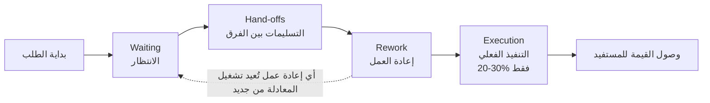
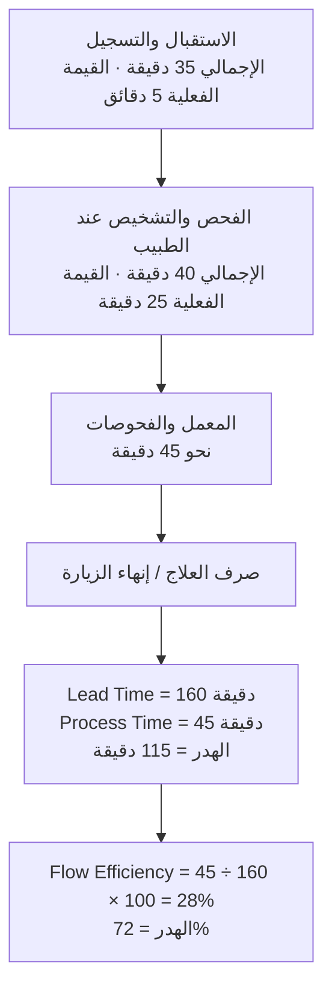

> [!info] المحاضرة 02 · قيادة التسليم
> **ماذا ستتعلّم:** كيف تنظر إلى المشروع بوصفه **تدفّقًا** لا مجموعة مهام، وكيف تفكّك [[Time to Value|زمن الوصول للقيمة]] إلى أربعة عناصر تكتشف منها أين يضيع وقتك فعليًّا، ثم كيف تقيس [[Flow Efficiency|كفاءة التدفّق]] بالأرقام، وترتّب أولوياتك بمعادلة [[WSJF|الأقصر وزنًا أولًا]]، وتضبط النطاق، وتقسّم التسليم إلى مراحل تُنتج كلٌّ منها قيمة كاملة مستقلّة — منتهيًا بحالة دراسية متكاملة لعيادة طبية من تعريف القيمة إلى مصفوفة الأولويات.

# المحاضرة 02 — التدفّق وكفاءته وترتيب الأولويات (WSJF) وتقسيم مراحل التسليم

## 🎯 أهداف التعلّم

- التمييز الدقيق بين [[Cycle Time]] و[[Lead Time]] و[[Time to Value|زمن الوصول للقيمة]]، وصياغة النتائج المستهدفة بأرقام قابلة للقياس.
- فهم مفهوم **التدفّق** (`Flow`) وإدراك أن نحو **80%** من التأخير مصدره التدفّق لا بطء التنفيذ.
- إتقان معادلة `Time to Value = Waiting + Hand-offs + Rework + Execution`، ومعرفة أيّ عناصرها هو **المضخّم الأخطر**.
- حساب [[Flow Efficiency|كفاءة التدفّق]] عبر `Process Time ÷ Lead Time × 100`، وقراءة النتيجة على سلّم تقييم واضح، والتمييز بين **مشاكل النظام** و**مشاكل الفريق**.
- ترتيب المتطلّبات ذات الأولوية العالية عبر [[WSJF|الأقصر وزنًا أولًا]] = [[Cost of Delay|تكلفة التأخير]] ÷ `Job Size`، بمقاييس كمّية على سبعة محاور.
- التعرّف على طبقات النطاق الثلاث وأنماط [[Scope Creep|زحف النطاق]] الثلاثة، وتقسيم التسليم إلى مراحل مبنيّة على **دورات قيمة كاملة** لا على مديولات.
- تطبيق كل ما سبق على حالة دراسية متكاملة: من تعريف القيمة إلى [[Value Stream Mapping|خريطة تدفّق القيمة]] إلى [[Value Proposition Canvas|لوحة القيمة المقترحة]] وقياس [[Product-Market Fit|مطابقة المنتج للسوق]].

## الفكرة المحورية

في المحاضرة الأولى تحدّثنا عن **القيمة**، وفرّقنا بين `Output` و`Outcome`، وبنينا مقياسًا خرجنا منه بأولويات (عالية جدًّا / عالية / متوسطة / منخفضة)، وبدأنا برسم [[Value Stream|تدفّق القيمة]] وتصنيف خطواته إلى [[Value-Added vs Non-Value-Added vs Pure Waste|قيمة مضافة وغير مضافة]].

المحاضرة الثانية تواصل من النقطة نفسها، لكنها تنقل الصورة من «مفاهيم منفصلة» إلى **نظام متكامل**. جوهر الفكرة: نحن نفكّر عادةً على شكل **مهام** — تاسكات تقنية وفريق ومهام مسندة — فنبذل جهدًا كبيرًا في جزء واحد ونُهمل الجزء الآخر: هل هناك انتقال سلس بين الفرق؟ هل تظهر القيمة أسرع؟ التسليم في النهاية ليس مجهود الأفراد وحده، بل **نظام** أولًا ثم مجهود الأفراد ثانيًا. وهدفنا أن **نقلّل جهد الأفراد ونزيد القيمة المسلَّمة** في الوقت نفسه.

وإذا لم تفهم **التدفّق** فلن تستطيع ضبط النطاق؛ وإذا لم تضبط النطاق مبكرًا ستفشل في الأولويات؛ وإذا فشلت في الأولويات فلن تسلّم القيمة التي يطمح إليها العميل — حتى لو اكتمل المشروع في زمنه المحدَّد.

## مراجعة وملاحظات تصحيح وثيقة المتدرّب

قبل الدخول في الموضوع الجديد، نعلّق على الوثيقة المُرسَلة من أحد المتدرّبين (أحمد)، لأن ملاحظاتها تصلح قاعدة عامة لكل من يكتب وثيقة **تعريف القيمة والنتائج**.

**ما كان صحيحًا:** تعريف القيمة كان سليمًا في مجمله:

- **للإدارة:** الشفافية والقدرة على اتخاذ القرار مبنيةً على بيانات لحظية. ✅
- **للموظفين:** تنظيم العمل، وتقليل الفوضى والوقت الضائع في البحث عن حالة الطلب يدويًّا. ✅
- **للمستفيد:** سرعة الإنجاز وزيادة الموثوقية في النظام. ✅

**الملاحظة الأولى — الخلط بين المصطلحات الزمنية.** كُتِب في النتائج: «تقليل وقت دورة الطلب» ووُصِف بأنه `Cycle Time`. هذا خطأ اصطلاحي:

> [!warning] `Cycle Time` ليست `Lead Time` وليست `Time to Value`
> - **[[Cycle Time]]** تُحسب من **بدء التنفيذ الفعلي** للعمل حتى انتهائه — لا من لحظة تقديم الطلب.
> - **[[Lead Time]]** تُحسب من **لحظة تقديم الطلب** إلى لحظة اكتماله وتسليمه.
> - **[[Time to Value|زمن الوصول للقيمة]]** هو الزمن حتى **تصل القيمة فعليًّا** إلى المستفيد.
>
> ما دام الوصف يقول «من بداية الطلب إلى نهايته»، فالصحيح تسميته `Lead Time` أو `Time to Value` — لا `Cycle Time`. والمصطلحان مختلفان تمامًا، والخلط بينهما يفسد القياس كلّه.

**الملاحظة الثانية — النتائج يجب أن تكون قابلة للقياس بأرقام.** عبارات مثل:

- «زيادة الإنتاجية: معالجة عدد أكبر من الطلبات» → صيغة عامة. **بنسبة كم بالضبط؟**
- «تقليل نسبة الطلبات المتأخرة: انخفاض عدد الطلبات التي تتجاوز الوقت المحدَّد نتيجة التنبيهات» → تحتاج توصيفًا أدقّ بنسبة أو عدد محدَّد. لأنك حين تأتي لقياس «انخفاض عدد الطلبات» ستقيسه بناءً على ماذا؟ لا يوجد مقياس واضح.
- في جدول الملخّص: «سرعة معالجة الطلب بنسبة **100%**» — نسبة كبيرة وصحيحة كصياغة لأنها محدَّدة. لكن «الرضا أعلى للمستفيدين» تحتاج توصيفًا: هل هو **أكبر من 85%**؟ أم 70%؟ أم 90%؟

**القاعدة المستخلصة:** أي نتيجة مستهدفة لا تحمل رقمًا لا يمكن قياسها بعد التنفيذ، فتفقد قيمتها كمعيار نجاح. وبقيّة الوثيقة كانت سليمة ولا مشكلة فيها (`Output` لا ملاحظة عليه). ولو أن غيره سلّم وثيقة مشابهة بنفس هذه الأخطاء، فسنخصم من درجاتها للسببين نفسيهما: **دقّة المصطلح** و**قابلية القياس**.

وهذا التصحيح ليس شكليًّا: المحاضرة كلها ستُبنى على `Time to Value`، فالخلط بينه وبين `Cycle Time` في الوثيقة يعني أنك ستقيس **جزءًا من الرحلة** وتظنّ أنك قِست الرحلة كلها — وستخرج بنتيجة مطمئنة بينما الواقع مختلف تمامًا.

## خريطة الوثائق على مراحل المشروع الخمس

ننظر الآن للصورة الكاملة: أين تقع الوثائق التي نشتغل عليها ضمن مراحل المشروع؟ على اليسار توجد **الوثائق المعروفة** في أي مشروع بغضّ النظر عن المنهجية (سواء كنت تعمل بـ [[01 - Agile|Agile]] أو غيره): سجل المخاطر الكامل، وسجل أصحاب المصلحة الذي نحدّد فيه أسماء العاملين في المشروع، بالإضافة إلى [[Communication Plan]] وخطة التغيير. هذه ليست محور تركيزنا؛ محور تركيزنا هو **الطبقة الجديدة** التي نضيفها: طبقة التسليم.

**1) مرحلة التأسيس (Initiation):**

- `Value & Outcome Definition` — الوثيقة التي أخذناها الأسبوع الماضي، وفيها أهداف المشروع والقيمة والـ `Output`. ✅ أنجزناها.
- `Value Stream Map` — الوثيقة الثانية التي رسمنا فيها العملية كاملة من بدء الطلب إلى نهايته. ✅ أنجزناها.
- `Business Case / ROI` — دراسة الجدوى المعروفة: هل المشروع ذو فائدة أو قيمة للمؤسسة؟ هل فيه عائد مادي؟ هل نسبة الأرباح عالية؟ وقد تكون القيمة مادية (قروش) أو امتثالًا عاليًا أو تكريمًا وجوائز أو `Return on Investment` يتحقّق بعد عدد من الأشهر أو السنوات. هذه الوثيقة معروفة وليست محور تركيزنا.

**2) مرحلة التخطيط (Planning):**

- `WSJF Priority Matrix` — **موضوع الليلة**: ترتيب المتطلّبات التي خرجنا بأنها «عالية جدًّا» فيما بينها. فلو كان عندي عشرة متطلّبات كلها أولويتها عالية جدًّا، فبأيّ ترتيب أشتغل؟
- `Scope Trade-off` (مصفوفة مقايضة النطاق) — المحاضرة القادمة.
- `Delivery Plan` — وهي **الأهم** بالنسبة لنا.
- [[RAID Log]] — المحاضرة التي بعدها.

**3) مرحلة التنفيذ (Execution):** [[Decision Log]] (أي قرار يُسجَّل)، و`Change Log` (أي تغيير يُسجَّل)، و`Burn` (معدّل التقدّم الفعلي مقابل المخطَّط).

**4) مرحلة المراقبة والتحكّم (Monitoring & Control):** سنشتغل عليها ونراها على مثال لاحقًا؛ كل الوثائق تحتها سنمرّ عليها معًا.

**5) مرحلة الإغلاق (Closing):** ليس لدينا فيها جديد؛ كلها وثائق معروفة في كل مشروع (هل تحقّقت الأهداف أم لا؟) وتأتي مع أي منهجية تعمل بها.

فتركيزنا الليلة إذًا على **التدفّق** ثم **مصفوفة الأولويات**، مع حالة عملية كاملة تغطّي من `Value` إلى `WSJF Priority Matrix`.

## مفهوم التدفّق (Flow)

**80% من التأخير في المشاريع سببه ليس بطء التنفيذ.** كما رأينا في المحاضرة الماضية، السبب في الغالب: انتظار، تكدّس، تعدّد أعمال جارية، قرارات متأخّرة، منتظرين شيئًا ليحدث.

هذا كله نسمّيه **الـ Flow — التدفّق**: المسار الممتد من بداية الشيء إلى نهايته، أي من بدء الطلب إلى اكتماله. التدفّق هو **ما يربط القيمة بالنتيجة، لكن بزمن معقول**.

> [!note] الفرق بين التفكير بالمهام والتفكير بالتدفّق
> حين نفكّر على شكل **مهام** (تاسكات تقنية، توزيع، إسناد) نجد أنفسنا نعمل بجدّ، لكننا نُهمل الجانب الآخر: أننا نريد أن نعمل **بجهد أقل**، وأن نتأكّد من وجود **انتقال سلس** بين الفريق وبين الشغل وبين الفرق الموزّعة، وأن تظهر القيمة في النهاية **أسرع**. مدير التسليم لا يركّز على جزء واحد بل على جزأين معًا: **النظام** أوّلًا، ثم **جهد الأفراد** ثانيًا — وتركيزه على النظام أكبر.

**ما الذي يصنع التوقّف في التدفّق؟**

- **الموافقات.**
- **الانتقال بين الأقسام:** من فريق التطوير إلى فريق الاختبار — هذا انتقال، وهذه انتقالات.
- **انتظار مورّد** ليسلّمنا شيئًا معيّنًا.
- **إعادة العمل:** جاءت ملاحظات من فريق الاختبار فاضطررنا للعمل مرة ثانية.
- **تغييرات متأخّرة** من العميل.
- **تضخّم النطاق** والضغط.

وهنا نربط بما فعلناه سابقًا: في المحاضرة الماضية صنّفنا كل خطوة من [[Value Stream|تدفّق القيمة]] إلى `Value Added` أو `Non-Value Added`. **أي خطوة صنّفناها `Non-Value Added` هي بالنسبة لنا كسر في التدفّق، وتُعتبر [[Bottleneck|نقطة اختناق]].** هذه أهم نقطة، وهي الإضافة الجديدة على المثال الماضي: أولًا نعرف النقاط التي لا قيمة لها، ثم نقيّم كلًّا منها باعتبارها نقطة اختناق ونحاول معالجتها.

## لماذا `Time to Value` أخطر من الـ Deadline؟

طرح المدرّب سؤالًا على الحضور: **لماذا يكون `Time to Value` — أي القياس من بداية الطلب إلى نهايته — أخطر من أن يكون عندي `Deadline`؟**

الإجابة تقوم على سببين:

**السبب الأول: الـ `Deadline` قد يتحقّق دون قيمة.** قد يكون عندي موعد نهائي، وأصرّ عليه، وأسلّم فيه — لكن **لا قيمة للعميل فيما سُلِّم**؛ مجرّد مهام نُفِّذت. فإذا نظرنا فعليًّا: هل تغيّر شيء في أدائه؟ لا. الفريق يستخدم نفس الزمن في العمل، ونفس الزمن في النظام. إذًا أنا أفتّش عن شيء آخر: **القيمة مقابل الزمن** الذي حدّدناه في الـ `Deadline`. فلو قلت إن `Time to Value` هو عشر ساعات (أو عشرون يومًا)، فهذا أخطر وأهمّ من قولي «التسليم بعد شهرين»، لأنه يجعلني أركّز على **ضوءين معًا**: الزمن **والقيمة**.

**السبب الثاني — وهو الأهم: الـ `Deadline` قابل للتلاعب، و`Time to Value` حقيقة على أرض الواقع.**

> [!warning] الموعد النهائي يمكن التلاعب به
> يمكنني أن أقول «التسليم بعد ثلاثة أشهر» ثم آخذ أربعة. يمكنني أن أطلب `Extension` فيتغيّر. يمكنني أن آخذ لنفسي هامشًا ([[Buffer]]): أقول للعميل خمسة أشهر وأنا أعلم أن العمل ينتهي في ثلاثة، وأخبر فريق التطوير بثلاثة. هذه طريقة تعمل بها فرق كثيرة، وهي في النهاية **لا تعكس لي شيئًا حقيقيًّا**.
>
> أمّا `Time to Value` فهو **الشيء الموجود فعلًا على أرض الواقع، ولا أستطيع تغييره**. لا أستطيع أن أقول «الوضع جيّد» وأكتب تقريرًا يعكس أن كل شيء ممتاز بينما الواقع يقول شيئًا آخر. لا أستطيع الغشّ فيه. لذلك نركّز عليه: أركّز على ما يحدث فعليًّا. (الاستثناء: إن كان في العقد **شرط جزائي** على الموعد، فهذا موضوع مختلف.)

**الأثر التراكمي الصامت:** أي توسيع في النطاق أو أي أولويات خاطئة **تزيد بشكل صامت** — أنت لا تعرف أنها حدثت ولا تركّز معها، ثم تُفاجأ بالنتائج في النهاية. تكتشف في نهاية الشهر الثالث أن النطاق زاد، وأن هناك أشياء كثيرة لم تُنجَز، فتحاول إنقاذ الموقف بزيادة الفريق فيصبح الوضع **أسوأ**. أمّا لو كنت من البداية مركّزًا مع `Time to Value` فلن تصل إلى هذه المرحلة، لأن أي تعديل أو توسيع أو خطأ في الأولويات **سيظهر لك فورًا في `Time to Value`**.

وتذكّر المعادلة التي أخذناها في المحاضرة الأولى: **الأثر = مستوى الاستخدام ([[Adoption]]) ÷ `Time to Value`**.

## معادلة زمن الوصول للقيمة

[[Time to Value|زمن الوصول للقيمة]] ليس رقمًا واحدًا، بل مجموع أربعة عناصر:

> **`Time to Value` = Waiting (الانتظار) + Hand-offs (التسليمات) + Rework (إعادة العمل) + Execution (التنفيذ)**

- **أي انتظار** يدخل في المعادلة.
- **أي تسليم** من فريق لفريق، أو من جهة لجهة، أو من شركة لشركة لها علاقة بالمشروع — نسمّيه `Hand-off`.
- **أي إعادة عمل** بسبب ملاحظات في الاختبار، أو تقدير خاطئ من التحليل، أو متطلّبات مكتوبة بشكل خاطئ (اشتغلوها ثم اكتشفوا أنها ليست ما طلبه العميل).
- **التنفيذ** هو الجزء الأخير، وهو الوحيد الذي يحمل القيمة الفعلية التي يأخذها العميل.

> [!warning] تحسين أي شيء غير الاختناق لا أثر له
> تحسين أي عنصر غير الاختناق الحقيقي (الانتظار والـ `Hand-offs` والـ `Rework`) **لن يكون له أثر كبير**. أغلب الناس يركّزون على الجزئية الأخيرة فقط: يزيدون عدد المطوّرين، أو يضعون شخصين على مهمة كان يعمل عليها واحد، ظنًّا منهم أنهم ضاعفوا الإنتاجية وأن المشروع سيُسلَّم في وقته. نسبة التحسين هنا **ليست كبيرة**. لكن لو ركّزوا على `Waiting` و`Hand-offs` و`Rework` لكانت النتيجة مختلفة تمامًا.

### 1) الانتظار (Waiting)

عندي مهمة يُفترض أن تكتمل لكنها تنتظر جهةً ما أو شخصًا معيّنًا. ينشأ الانتظار من **ثلاثة أسباب**:

1. **عدم التوازن بين المراحل:** مثلًا التطوير أسرع من الاختبار، فنجد الطلبات تتراكم عند الاختبار — فيصبح [[Bottleneck|نقطة اختناق]].
2. **[[WIP Limit|حدّ العمل الجاري]] عالٍ:** فريق التطوير أربعة أشخاص ونعطيهم ثماني مهام في وقت واحد. هذا عالٍ. فلو كان الشخص مشغولًا بأربع مهام فلا تستطيع أن تعطيه الخامسة، لأنه سيكون مشغولًا بمهمة أخرى حتى ينهيها ثم ينتقل — فالمهمة **ستنتظر** حتى يفرغ ممّا لديه.
3. **الاعتماديات والتبعيات الخارجية:** منتظرون موافقة من الإدارة، أو أن تجهز بيئة التطوير أو الإنتاج أو الاختبار، أو شخص غائب والعمل معتمد عليه.

### 2) التسليمات (Hand-offs)

كل لحظة تنتقل فيها مسؤولية العمل من شخص لآخر أو من فريق لآخر نسمّيها `Hand-off`. وهي مكلفة لثلاثة أسباب:

**أ) فقدان السياق.** أنت كمطوّر اشتغلت على مهمة، تواصلت مع العميل، عدّلت، أضفت سياسة (`Policy`) معيّنة، عملت على أدوار (`Roles`) — كل هذا على مدى أسبوع. ثم تسلّم لفريق اختبار منفصل. لن تسلّمه كل الرحلة التي مررت بها بنفس الشكل؛ **لا بدّ من نقص**. ستعطيه المهمة وتقول له «اختبرها»، ولن تُريه الأدوار التي اشتغلتها ولا التفاصيل التي مرّت عليك ولا الأشياء التي تركتها معلّقة عند العميل. قد ينتقل **30% من السياق** فقط، ويبقى جزء مفقود. وهذا يؤثّر على **جودة الاختبار**، فتظهر أخطاء (`Bugs`) لاحقًا، فترجع للتطوير من جديد.

**ب) إنتاج انتظار جديد.** حين يسلّم فريق التطوير مهمة لفريق الاختبار، قد يكون فريق الاختبار مشغولًا باختبار خدمة أخرى، فتنتظر المهمة حتى يفرغ.

**ج) احتمال `Rework`.** لو حدث سوء فهم للمتطلّبات، أو طُوِّر شيء بشكل خاطئ، ترجع المهمة من جديد.

> [!note] تشوّه المتطلّب عبر سلسلة التسليمات
> تخيّل أن الطلب جاء إلى الـ `Implementer`، فكتب المتطلّبات وأرسلها للإدارة، فوافقت وأرسلتها للمصمّم، فأخذ فيها رأيه وكتب تعديلات، ثم أرسلها للمنسّق فكتب فيها تعديلات أخرى... حين تصل أخيرًا إلى المطوّر ستصل **بشكل مختلف تمامًا**؛ الصورة المبدئية التي رُسِمت اختلفت عن الشكل النهائي الواصل. لذلك: **لا تجعل المتطلّبات تصل لفريق التطوير عبر مراحل كثيرة** — كلما زادت المراحل زاد التغيير واختلف السياق وتعدّدت التفسيرات.

### 3) إعادة العمل (Rework)

أي عمل يُنجَز أكثر من مرة. وهو **أخطر عنصر مفرد** في المعادلة، لسبب واحد: **إعادة العمل تُعيد تشغيل المعادلة بالكامل من جديد**. فلو فشل الاختبار نحتاج للرجوع للتطوير؛ ولو قال العميل إن ما سُلِّم ليس ما طلبه؛ ولو تغيّر التصميم بعد إنجازه — ففي كل هذه الحالات: إذا كان في النظام انتظار سيتكرّر، وإذا كان فيه `Hand-offs` ستتكرّر، ثم سيُعاد التنفيذ مرة ثانية.

**أسباب إعادة العمل ليست الأخطاء (`Bugs`) فقط**، كما يظن أغلب الناس:

- خطأ في المتطلّبات أو سوء فهمها.
- فشل جزء من الاختبار.
- تغيير في النطاق (`Scope`).
- التصميم تغيّر في منتصف الطريق.
- طلب خارجي جاء من جهة أخرى.
- **حالة ثالثة مهمّة:** المتطلّبات كانت مضبوطة وصحيحة ونُفِّذت بالفعل، **لكن الطريقة التي نُفِّذت بها كانت معقّدة**. فيعطي فريق الاختبار ملاحظة بأن طريقة التشغيل معقّدة، بينما العميل طلب شيئًا بسيطًا — فتحدث إعادة عمل لتبسيط الطريقة.

**القاسم المشترك بين كل الأسباب: جهد بُذِل وهُدِر كليًّا أو جزئيًّا.**

### 4) التنفيذ (Execution)

هو الجزء الأخير، وهو الذي يحمل القيمة الفعلية التي يأخذها العميل. وفي معظم الفرق **لا يتجاوز 20–30% من زمن التسليم**.

فلاحظ: لو ضاعفنا التنفيذ، كم يكون الأثر؟ **بالكثير 10 إلى 15%**. لهذا فإن إضافة مطوّر إضافي أو شخص إضافي للفريق لا تُسرِّع التسليم كما نتوقّع — لأننا نُهمل الجزء الأكبر من المعادلة (ثلاثة أسباب إضافية) ونركّز على عنصر واحد. **ولو ركّزنا على `Rework` و`Hand-offs` و`Waiting` لأمكننا إنهاء نفس العمل في ثُلث الزمن.**

### الخلاصة: الانتظار هو المضخّم الأخطر

سؤال طُرِح على الحضور: **أيّ عنصر من الأربعة يؤثّر في البقية بشكل كبير؟** أجاب بعضهم «الـ `Rework`»، وأجاب آخرون «الـ `Hand-offs`». والإجابة الصحيحة: **الانتظار (`Waiting`)**.

> [!note] لماذا الانتظار أخطر من إعادة العمل؟
> قلنا إن **`Rework` خطير لأنه يُعيد تشغيل النظام بالكامل**. لكن **الانتظار يفعل شيئًا أخطر: يُضخِّم أثر كل عنصر آخر**. لو حصل انتظار فسيضخّم أثر الـ `Hand-offs`، ويضخّم الـ `Rework`، ويضخّم التنفيذ. ولهذا هو الأخطر في المعادلة، وأغلب الناس لا يركّزون عليه ويركّزون على التنفيذ فقط.
>
> والنتيجة العملية: **لو قلّلت الانتظار، ستقلّ تلقائيًّا الـ `Hand-offs`، وسيقلّ الـ `Rework`، وسيقلّ التنفيذ.** أمّا لو أهملت الانتظار واشتغلت على الـ `Rework` وحده، فحين يحدث الانتظار سيُضخّم النتيجة كاملة ويُضخّم الجهد الذي بذلته. لذلك سنركّز دائمًا على **الانتظار** بشكل أكبر، ولن نركّز على الـ `Hand-offs` ولا الـ `Rework` بنفس القدر — لأن الانتظار **مضخِّم صامت**: لا أحد ينتبه له ولا أحد يبلّغ عنه، لكنه يضخّم الموضوع بشكل كبير.

## العدو الخفي: العمل الجاري (WIP) والتبديل الذهني

هناك عدوّ خفيّ آخر في التسليم لا ينتبه له أحد: **`Work In Progress` — العمل الجاري**.

**القاعدة:** كلما زاد العمل الجاري، **زاد زمن التسليم** — لا العكس. الناس يظنّون أنهم لو زادوا عدد المهام في عمود «قيد التنفيذ» سينتهون أسرع؛ والحقيقة عكس ذلك تمامًا. كلما زدت المهام الجارية **بأكثر من حجم الفريق** زاد زمن التنفيذ دون أن تدري — حتى لو كنت تعمل بشكل منظّم.

**السبب: التبديل الذهني (`Context Switching`).** لو كان عند المطوّر أربع مهام في نفس الوقت: اشتغل على الأولى ساعتين، ثم جاءه طلب: «أوقف هذه واشتغل على الثانية، لها أولوية». حتى ينقل ذهنه إلى المهمة الثانية **يأخذ وقتًا** ليتذكّر أين وقف، وما هي النقطة التي توقّف عندها، وكيف كان سيشتغل، والطريقة التي خطّط لها. ثم يتكرّر الأمر على بقية المهام. فيتأخّر الاكتمال وتزيد **الاختناقات المخفيّة**.

> [!warning] البورد الممتلئ لا يعني فريقًا منتجًا
> حين ترى البورد مليئًا بالمهام تظن أن الفريق يعمل بكامل طاقته، بينما هناك اختناقات تحدث ولا تراها. مثال: إذا كان قيد التنفيذ أسرع من الاختبار — عندي **خمسة مطوّرين وثلاثة مختبرين** — فستكون نسبة الإنجاز من المطوّرين أعلى من قدرة الاختبار، فيصبح **الاختبار** نقطة اختناق. وهذا لا يظهر بوضوح إلا إذا كنت منتبهًا إلى وجود **توازن بين مراحل المشروع**.

**وأخطر ما في `WIP` أنه يزيد الانتظار:** لو كان عند المطوّر ثلاث مهام فهو يعمل فعليًّا في واحدة، والاثنتان الباقيتان **في انتظار**. وكلما زاد الانتظار حدث تضخيم للـ `Rework` وللـ `Hand-offs` — كما شرحنا. ونحن نفعل هذا كله بأنفسنا بحجّة «أن يعمل الفريق أسرع»، فنعطيه أكثر من مهمة ونظن أننا ننجز أسرع، ونحن في الحقيقة **نضرب التسليم بالكامل** ونحن غير منتبهين.

**القاعدة العملية:** اجعل [[WIP Limit|حدّ العمل الجاري]] متناسبًا مع **حجم الفريق وقدرته**:

- إذا كان الفريق أربعة أشخاص، نعطي أربع مهام. من ينتهي، **لا يأخذ مهمة جديدة قبل أن يحرّك مهمته الحالية للمرحلة التالية**.
- إذا كان يعمل هذا الأسبوع ثلاثة مبرمجين، نحدّ العمل بشغل ثلاثة. وإذا صاروا خمسة الأسبوع القادم، نحدّه بشغل خمسة.
- راعِ الفرق الأخرى العاملة معك: فريق الاختبار، وفريق النشر (`Deployment`)، وفريق التحليل — لا بدّ من **توازن بين مراحل المشروع** حتى لا يحدث انتظار ولا `Hand-off` ولا `Rework` ولا تضخيم لأثر كل ذلك.

**ولماذا نفعل هذا؟** لأننا نريد إزالة الاختناقات، وتسريع القرارات، وحماية التركيز من البداية إلى النهاية. وهنا **مدير التسليم يركّز على النظام أكثر من الأفراد**.

## الحالة العملية الأولى: طلب معاملة مالية

هذه هي الحالة التي ختمنا بها المحاضرة الماضية بالتصنيف، ونكملها الليلة بالحساب. العملية: **طلب معاملة ← مراجعة مالية أوّلية ← انتظار موافقة المدير ← إدخال بيانات يدوي ← اعتماد نهائي ← قيد محاسبي ← صرف.**

**التصنيف (من المحاضرة الماضية):** طلب المعاملة `Value Added`، المراجعة المالية `Value Added`، الانتظار `Non-Value Added`، الإدخال اليدوي `Non-Value Added`، الاعتماد النهائي `Non-Value Added` (إلا إذا كان إلزاميًّا فيصبح `Value Added`)، القيد المحاسبي `Value Added`.

> [!note] متى تُعتبر الخطوة `Value Added` رغم أنها لا تضيف قيمة ظاهرة؟
> أي خطوة — حتى لو كانت `Non-Value Added` — إذا كانت **ضرورية بشكل كبير ولا يمكن الاستغناء عنها**، نعتبرها `Value Added`. أمّا إذا استطعت الاستغناء عن الخطوة بالكامل دون أن يتأثّر شيء، فهي `Non-Value Added`.

> [!example] حساب `Lead Time` لطلب معاملة مالية = 82.5 ساعة
> **أولًا: زمن المعالجة الفعلي (`Process Time`)** — الزمن الحقيقي الذي يستغرقه العمل نفسه:
>
> | الخطوة | زمن المعالجة |
> |---|---|
> | طلب المعاملة (إدخال الطلب) | 10 دقائق |
> | المراجعة المالية | 20 دقيقة |
> | الموافقة (الضغط على «موافق» في النظام) | 5 دقائق |
> | الإدخال اليدوي للبيانات في النموذج | 30 دقيقة |
> | الاعتماد النهائي | 5 دقائق |
> | القيد المحاسبي | 15 دقيقة |
> | الصرف | 10 دقائق |
> | **المجموع** | **95 دقيقة ≈ ساعة ونصف** |
>
> **ثانيًا: زمن الانتظار (`Waiting Time`)** — كم ينتظر الطلب قبل أن يلتفت إليه أحد:
>
> | الخطوة | زمن الانتظار |
> |---|---|
> | طلب المعاملة | صفر |
> | المراجعة المالية (المراجع مشغول بأشياء أخرى) | 4 ساعات |
> | موافقة المدير (حسب مشغولياته) | **يومان** |
> | الإدخال اليدوي | 3 ساعات |
> | الاعتماد النهائي | يوم كامل |
> | القيد المحاسبي | ساعتان |
> | الصرف | صفر — بمجرّد الصرف انتهى |
> | **المجموع بعد توحيد وحدة القياس** | **81 ساعة** |
>
> **ملاحظة على الحساب:** قبل الجمع **يجب توحيد المعامل** — ساعة أو دقيقة أو يوم — فلا نجمع «4 ساعات» مع «يومين» مباشرة. هنا وُحِّد كل شيء إلى الساعات فخرج المجموع **81 ساعة**.
>
> **ثالثًا: `Lead Time` = زمن المعالجة + زمن الانتظار = 1.5 + 81 = **82.5 ساعة**.**
>
> **82.5 ساعة لطلب بسيط بهذا الشكل — رقم كبير جدًّا.**
>
> **نقطة الاختناق الكبرى:** حين سُئل الحضور «ما أكبر نقطة اختناق هنا؟» كانت الإجابة الصحيحة: **اليومان المنتظران لموافقة المدير**. هذا أكبر عائق، وعليه نبدأ العمل أولًا.

**الدرس:** لاحظ الفرق. لو ذهبت لتحسّن **التنفيذ** فالتنفيذ كله ساعة ونصف فقط! ولهذا قلنا إن التركيز على التنفيذ يُحسِّن من **10 إلى 15%** فقط، بينما الجزء الأكبر موجود في **الانتظار**.

## كفاءة التدفّق (Flow Efficiency) وسلّم التقييم

بعد أن حسبنا الزمنين، كيف نعرف إن كان الوضع جيّدًا أم سيّئًا؟ نستخدم [[Flow Efficiency|كفاءة التدفّق]]:

> **`Flow Efficiency` = Process Time ÷ Lead Time × 100**

انتبه: القسمة على **`Lead Time` الكلي** — لا على زمن الانتظار.

**تطبيقًا على الحالة الأولى:** 1.5 ÷ 82.5 × 100 = **1.8%** — أي أن لدينا نسبة هدر تقارب **98%**.

نحن دائمًا نتحدّث عن **إزالة الهدر** وعن الهدر في الموارد، وهذه إحدى الطرق العملية التي **نقيس بها الهدر** لنبدأ في تقليله ونُحدث تحسينًا عاليًا.

**سلّم التقييم:**

| كفاءة التدفّق | التقييم | الوصف |
|---|---|---|
| **أكبر من 40%** | ممتازة | تعمل بنظام [[Toyota Production System\|Lean]] حقيقي (منهجية تركيزها الأساسي إزالة الهدر) |
| **25% – 40%** | جيدة | هدر موجود لكنه مقبول؛ يمكن تمريره أو العمل عليه |
| **10% – 25%** | ضعيفة | هدر واضح، لا بدّ من التدخّل |
| **1% – 10%** | سيّئة جدًّا | معظم الوقت انتظار؛ المسار مكسور وفيه انتظار عالٍ |
| **أقل من 1%** | كارثية | النظام بالكامل لا يسلّم قيمة |

**الطريقة كاملة في خمس خطوات:**

1. نصنّف كل خطوة: `Value Added` أو `Non-Value Added`.
2. نحسب زمن المعالجة الفعلي لتنفيذ الخطوة في الواقع.
3. نحسب زمن الانتظار لكل خطوة.
4. نوحّد وحدة القياس (بالساعة مثلًا) ونجمع الاثنين للحصول على `Lead Time`.
5. نقسم `Process Time ÷ Lead Time` فنخرج بنسبة نعرف منها **قيمة الهدر** الموجود في الحالة التي ندرسها، ثم نرى ماذا نحسّن وأين نضغط.

**لماذا عندنا 98% هدر في المثال الأول؟** بالرجوع لخريطة تدفّق القيمة:

- **موافقة المدير (يومان):** [[Bottleneck|نقطة اختناق]] إدارية. وكثرة الموافقات = **حوكمة ثقيلة** تزيد زمن الانتظار.
- **الإدخال اليدوي:** عمل لا قيمة له وقد حسبناه ضمن النظام، وزاد الانتظار.
- **الانتقالات بين الأقسام:** `Hand-offs` تحدث بشكل كبير.

## الحالة العملية الثانية: تنفيذ نظام مبيعات (تمرين)

**السيناريو:** شركة تنفّذ نظامًا لعميل طلب تفعيل نظام مبيعات. بعد تحليل النظام مع العميل، وجدنا أن الطلب يمرّ بالمراحل التالية.

> [!note] هنا ندرس أنفسنا لا العميل
> في المثال الأول درسنا عملية داخل مؤسسة العميل (`ERP` كمراحل). أمّا هنا فنحن **نقيس كفاءة تدفّق شغلنا نحن** كشركة وكفريق تطوير: هل نعمل بشكل جيّد أم لا؟ كما يُقال: **ندرس بيتنا** ونرى هل شغلنا جيّد أم يحتاج تحسينًا.

**المعطيات:**

| الخطوة | النوع | المدة |
|---|---|---|
| تحليل المتطلّبات | عمل | يومان |
| انتظار موافقة العميل | انتظار | 3 أيام |
| التطوير | عمل | 4 أيام |
| انتظار الاختبار (حتى يفرغ الفريق) | انتظار | يومان |
| الاختبار | عمل | يومان |
| إعادة العمل (معالجة ملاحظات الاختبار) | إعادة عمل | 3 أيام |
| انتظار الاعتماد للنشر | انتظار | يوم |
| النشر | عمل | يوم |

**المطلوب من الحضور:** حساب كفاءة التدفّق. (أُعطي المتدرّبون خمس دقائق للعمل على ورقة، وسُمِح لهم بافتراض **قيم انتظار من عندهم** حيثما لم تكن معطاة — فالمطلوب إتقان الطريقة لا مطابقة رقم بعينه.)

**التوجيه الذي أُعطي أثناء التمرين:** اشتغل على **عمود الزمن فقط**؛ افترض قيمة الانتظار من عندك؛ اجمع زمن العمل واجمع زمن الانتظار فتخرج بأرقام؛ ثم اقسم **زمن المعالجة الفعلي على `Lead Time` الكلي** لتخرج بمعادلة `Flow Efficiency`.

> [!example] الحل: كفاءة التدفّق = 50%
> **`Lead Time`** = 2 + 3 + 4 + 2 + 2 + 3 + 1 + 1 = **18 يومًا** (كلها أيام فجمعناها مباشرة؛ ولو كانت ساعات لحوّلنا).
>
> **`Process Time`** = التحليل 2 + التطوير 4 + الاختبار 2 + النشر 1 = **9 أيام**.
>
> **من أين جاء `Process Time`؟** من **نوع العمل**: نأخذ الخطوات المصنّفة «عمل» فقط، ونستبعد ما صُنِّف «انتظار».
>
> **`Flow Efficiency` = 9 ÷ 18 × 100 = 50%** — أي 50% هدر و50% قيمة.
>
> **أكبر مصادر الهدر:** موافقة العميل (3 أيام) وإعادة العمل (3 أيام) — وهما الأكبر — ثم انتظار الاختبار (يومان). ولو أردت التحسين، **ابدأ بأكبر بند أولًا** ثم انظر في الباقي.

**سؤال حاسم:** هل الـ 50% ممتازة؟ بالرجوع للجدول: أكبر من 40% = ممتازة. **لكن انتبه:** هي ممتازة **كنسبة هدر / كتدفّق**، وليست بالضرورة ممتازة **كنظام تسليم**. أن تصل مؤسستك إلى 50% لا يعني بالضرورة أنك حسّنت تدفّقك بشكل كبير — وهذا ما يوضّحه المثال التالي.

## الحالة العملية الثالثة: مشروع مخزون ومبيعات متأخّر ستة أسابيع

**السيناريو:** شركة نفّذت نظام مخزون ومبيعات، والمشروع متأخّر **ستة أسابيع**. المدير يقول إن الفريق بطيء، والعميل يغيّر كثيرًا، وكل شيء متأخّر — **ولا يوجد وضوح: أين المشكلة بالضبط؟**

**المطلوب:** حساب كفاءة التدفّق، ثم تحديد: **هل المشكلة في النظام أم في الفريق؟**

(أجاب الحضور بإجابات متفاوتة: 53%، 23%، 15% — والاختلاف نشأ من الخلط بين `Lead Time` و`Process Time`، ومن نسيان أن `Process Time` يشمل **خطوات العمل فقط**. ثم حُلّت معًا.)

> [!example] الحل الكامل: 50% تدفّق، لكن المشكلة في الفريق
> **`Lead Time` = 30 يومًا** (بجمع كل الخطوات: عمل + انتظار + إعادة عمل).
>
> **`Process Time` = 15 يومًا**: التحليل 3 أيام + التطوير 7 أيام + الاختبار 4 أيام + النشر يوم واحد.
>
> **`Flow Efficiency` = 15 ÷ 30 × 100 = 50%** — نفس نسبة المثال السابق تمامًا.
>
> **لكن حين نحلّل الأسباب تظهر صورة مختلفة كليًّا:**
>
> **أولًا — مشاكل النظام (`System`)**، أي ما هو **خارج نطاق الفريق**:
>
> | البند | المدة |
> |---|---|
> | انتظار موافقة العميل | 4 أيام |
> | انتظار الاختبار | 3 أيام |
> | انتظار النشر | يومان |
> | **الإجمالي** | **9 أيام** |
>
> **ثانيًا — مشاكل الفريق (`Team`)**، أي ما هو **داخل نطاق الفريق**:
>
> | البند | المدة |
> |---|---|
> | التطوير | 7 أيام |
> | الاختبار | 4 أيام |
> | إعادة العمل | 6 أيام |
> | **الإجمالي** | **17 يومًا** |
>
> **النتيجة:** رغم أن التدفّق 50% (ممتاز حسب المقياس)، فإن **الغالبية العظمى من الإشكالية في الفريق: 17 يومًا مقابل 9 أيام للنظام.**

**لماذا اعتُبِرت أزمنة التطوير والاختبار وإعادة العمل «مشاكل فريق»؟** لأن **الزمن كبير**. لو كان زمن التطوير بسيطًا لكان مقبولًا، لكن كون التطوير 7 أيام والاختبار 4 أيام وإعادة العمل 6 أيام معًا يعني أن هناك مشكلة داخل الفريق: **الجودة ضعيفة، وزمن التطوير يحتاج تحسينًا**. لاحظ أيضًا أن زمن إعادة العمل **مرتبط بزمن التطوير** ومقارب له — فكلّما زاد تعقيد المهام تضاعف زمنها.

**المبدأ المستفاد — لا تلُم الفريق قبل التحليل:**

> [!warning] لا تخرج بنسبة التدفّق ثم تلوم الفريق مباشرة
> بعد استخراج النسبة، **حلّل الأسباب** ودرس شيئين: **مشاكل النظام** و**مشاكل الفريق**.
> - لو وجدت الغالبية في **النظام** فلا تلُم الفريق؛ اذهب واعمل على النظام وعالِجه (كثرة الموافقات، الحوكمة الثقيلة، الاعتماديات).
> - لو وجدت الإشكالية في **الفريق** — النظام مضبوط لكن جودة الفريق ضعيفة، أو يحتاج تدريبًا، أو **يعتمدون كلهم على شخص واحد** يملك كل المعلومات فإذا غاب حدث الانتظار — فابدأ العمل على مشاكل الفريق.
> - لو كانت النسبتان **متقاربتين**، اشتغل على الاثنين معًا. ففي مثالنا: 9 أيام من النظام لها قيمة ومبلغ وزمن وموارد تُصرف عليها — لا يُستهان بها؛ و17 يومًا تأخيرًا من الفريق لا تُستهان بها أيضًا.

**التطبيق العملي للتقدير:**

- لو كان تأخير النظام يومين أو ثلاثة فلا مشكلة، ولو كان تأخير الفريق أكثر من عشرين يومًا فهنا الإشكالية.
- ولو كان تأخير الفريق خمسة أيام فقط بينما تأخير النظام أكثر من عشرين يومًا، فالمشكلة الكبيرة في **النظام نفسه**، فابدأ بإصلاحه.

**ولماذا نصرّ على الجمع بين التحليلين؟** لأنه **لو أصلحت النظام فقط** (التسعة أيام) وركّزت عليها، **سيبقى عندك تأخير**. ولو ركّزت على السبعة عشر يومًا وحدها وحسّنتها، **ستجد تأخيرًا أيضًا**. فالتسعة أيام ليست هيّنة: لها قيمة ومبلغ وزمن وموارد تُصرَف، وأنا أضيّع منها تسعة أيام من زمني؛ والسبعة عشر يومًا تأخيرًا من الفريق تحتاج نظرًا كذلك. **ففي هذه الحالة أشتغل على الاثنين معًا**، لأن الهدف النهائي واحد: **قيمة عالية بجهد أقل وفي زمن أقصر**. فحين تأتي لتحسّن، حاول أن تقلّل الجهد وأن تزيد القيمة في الوقت نفسه — وذلك بأن ترى **مواضع الهدر** وتحاول إزالتها.

**والعائد؟** لو وفّرت 4 أيام من النظام + وفّرت من مشاكل الفريق، فقد وفّرت أيامًا حقيقية من **زمن المشروع الكلي**. تخيّل مشروعًا مدّته عشرة أشهر: سيتأخّر في النهاية بسبب مشكلة في جودة الفريق. لكن لو انتبهت لهذه النقاط من البداية واشتغلت عليها لوفّرت زمنًا كبيرًا. **ولهذا ليست زيادة الفريق دائمًا هي الحل**: لو ركّزت على التنفيذ (تحسين الاختبار من 4 أيام مثلًا، أو زيادة الفريق، أو جلب أدوات) فالتحسين لن يتجاوز **10 إلى 15%**؛ أمّا لو ركّزت على الانتظار الكبير ونسبة الهدر العالية فقد **تنهي النظام كله في ثُلث الزمن**، وتستفيد من الزمن الذي كان مهدرًا في أشياء أخرى.

### أسئلة من الحضور

> **س: هل يعني هذا أن الانتظار وحده هو مشاكل النظام، والثلاثة الباقية (Hand-offs وRework وExecution) مشاكل فريق؟**
> بشكل عام: **أي شيء خارج نطاق الفريق يُعتبر من مشاكل التدفّق / النظام**، وأي شيء يعمله الفريق يُعتبر من مشاكل الفريق. مثلًا **انتظار موافقة العميل** خارج نطاق الفريق ← مشكلة نظام. أمّا **إعادة العمل** فهي ضمن جدول الفريق. ولاحظ أني في هذا المثال لم أكتب `Hand-off` صراحةً (تسليم التطوير للاختبار موجود ضمنًا في انتظار الاختبار الذي يستغرق ثلاثة أيام) — لأني ركّزت على **الانتظار** تحديدًا، فهو أكثر عنصر يؤثّر في البقية، وكلّما ركّزت عليه حللت مشاكل الباقي.

> **س: ولماذا في مشاكل النظام أخذت البنود الأعلى زمنًا فقط؟**
> بالضبط. لأن النسبة خرجت **50%**، ولو كانت النسبة مختلفة لاختلف التحليل: **في المثال الأول كان الهدر 98%** — وهذا يعني تلقائيًّا أن **الغالبية العظمى مشاكل نظام**، فلا داعي أصلًا لأن أذهب وأحلّل مشاكل الفريق. أمّا عند 50% فأنا **لا أستطيع أن أحدّد** أين المشكلة إلا بتحليل الأسباب.

> **س: ولماذا استبعدت أول خطوة (تحليل المتطلّبات) وآخر خطوة (النشر) من جدولَي المشاكل؟**
> لأني مركّز على **الخطوات التي فيها هدر وانتظار** فقط. الخطوات التي فيها قيمة ليست مشكلة، بل هي شيء جيّد، وقد حسبناها فوق ضمن الـ 15 يومًا (`Process Time`). فالمعطيات كاملة موجودة، لكني أخذت منها ثلاثة بنود لأستخرج مشاكل النظام وثلاثة لأستخرج مشاكل الفريق.

> **س: إذًا فائدة كفاءة التدفّق هي أن تدلّك على أين تركّز — النظام أم الفريق أم كلاهما؟**
> بالضبط، وهذه هي الفائدة الكبرى منها. هذه من الحقائق التي لا يعرفها أحد عادةً — «التأخير يأتي من أين؟» — وهذه إحدى الطرق التي تُريك أين الإشكالية بالضبط.

## ترتيب الأولويات: WSJF (الأقصر وزنًا أولًا)

في المحاضرة الماضية رتّبنا القيم: هذه عالية جدًّا، وهذه عالية، وهذه متوسطة، وهذه منخفضة. لكن ماذا لو نظرت إلى المهام «عالية جدًّا» فوجدتها **عشر مهام كلها أولويتها عالية جدًّا**؟ بأيّ ترتيب أشتغل؟

هنا نعمل بطريقة **`Weighted Shortest Job First`** — [[WSJF|الأقصر وزنًا أولًا]]: نركّز على **أقل جهد وأعلى قيمة في الوقت نفسه**.

> [!note] أين نحن الآن من الخريطة؟
> نكون بذلك قد أنهينا **جزأين** من طبقة التسليم: أولًا **تحليلنا بناءً على القيمة** (وثيقة تعريف القيمة والنتائج)، وثانيًا **قياس كفاءة التدفّق** وتحديد ما إذا كانت المشكلة مشاكل فريق أم مشاكل نظام. والآن ندخل الجزء الثالث: **الترتيب** — كيف نرتّب المهام التي أولوياتها عالية، لنبدأ بما أولويته عالية وجهده أقلّ، فنسلّم قيمة مباشرة للعميل.

> **`WSJF` = [[Cost of Delay|تكلفة التأخير]] ÷ `Job Size` (حجم المهمة)**

- **تكلفة التأخير:** لو لم أشتغل على هذه الميزة الآن، فكل تأخير في أخذها وتنفيذها **يكلّفني كم**؟ هل يكلّفني مبالغ مادية؟ كم؟ فإن كان المبلغ مقبولًا فالأمر عادي، وإن كان عاليًا رتّبتها في البداية.
- **حجم المهمة:** هل هي معقّدة أم بسيطة؟ هل تأخذ زمنًا كبيرًا؟

وقسمة المعاملين على بعضهما تعطيني قيمة أستند إليها في ترتيب المهام حسب **تكلفة تطويرها + تكلفة تأخيرها** — نوع من المتوسّط بين الاثنين.

> [!note] لماذا نقيس على أكثر من محور؟
> كلما قِست على أكثر من محور ارتفعت دقّة النتيجة. من يقدّر شيئًا بمحور واحد فدقّته ضعيفة؛ ومن يقيّم بأكثر من معامل تكون دقّته أعلى. ولهذا نستخدم **ثلاثة محاور** لتكلفة التأخير و**أربعة محاور** لحجم المهمة.

### أولًا: محاور تكلفة التأخير (Cost of Delay)

نحوّل التقدير إلى **قيم كمّية** باستخدام سلسلة `Fibonacci` (**1 / 3 / 5 / 8 / 13**) حتى لا تكون القيمة تقديرًا شخصيًّا يختلف من شخص لآخر.

**1) قيمة العمل (`Business Value`):**

| الوصف | الوزن |
|---|---|
| ميزة تجميلية / اختيارية | 1 |
| تحسين بسيط | 3 |
| تحسّن عملية فرعية | 5 |
| تحسّن عملية رئيسية بشكل كبير | 8 |
| **تحلّ أزمة تشغيلية قائمة** | 13 |

**2) الحرجيّة الزمنية (`Time Criticality`):**

| الوصف | الوزن |
|---|---|
| لا أثر لها في الزمن | 1 |
| يتوقّف بسببها شيء مهم | 3 |
| تؤخّر وحدة فرعية كاملة | 5 |
| مرتبطة بموعد إطلاق محدَّد | 8 |
| **توقف وحدة رئيسية كاملة أو نظامًا كاملًا — العمل يتوقّف** | 13 |

**3) تقليل المخاطر / فتح الفرص (`Risk Reduction`):**

| الوصف | الوزن |
|---|---|
| لا تقلّل أي خطر | 1 |
| تحسّن استقرار النظام | 3 |
| تقلّل إعادة العمل (`Rework`) في شغل معيّن | 5 |
| تقلّل خطر فشل التكامل بين نظامين | 8 |
| **تفتح مسارًا معطّلًا (مهام أخرى تنتظرها — [[Blocker]])** | 13 |

### ثانيًا: محاور حجم المهمة (Job Size)

| المحور | 1 | 3 | 5 |
|---|---|---|---|
| **التكامل (`Integration`)** | نظام واحد | نظامان – ثلاثة | أكثر من ثلاثة أنظمة |
| **الوحدات (`Modules`)** | وحدة واحدة | وحدتان – ثلاث | أكثر من ثلاث وحدات |
| **التغيير (`Change`)** | لا تغيّر طريقة عمل الناس | تغيير جزئي لطريقة الشغل | تغيّر طريقة العمل بالكامل |
| **الاختبار (`Testing`)** | اختبار بسيط | اختبار متوسط | اختبار شامل بحالات كثيرة |

> [!note] لماذا هذا أدقّ من [[12 - Story Points|نقاط القصة]]؟
> [[12 - Story Points|نقاط القصة]] التي يعمل بها فرق `Agile` **لا تقيس زمن التطوير بل نسبة التعقيد**، وهي نسبيّة وتقيس على **محور واحد**. أمّا طريقتنا فتُعطي قيمًا كمّية على أكثر من معامل، فتكون دقّتها أعلى.

### ثالثًا: قواعد العمل بالنتيجة

1. **أعلى قيمة في المعادلة = أعلى أولوية.** ابدأ بها فورًا، لأنها تعكس **قيمة عالية بجهد أقل**.
2. **إذا كان الحجم أكبر من 13** فقسّم المهمة على مرحلتين، وخذ المرحلة الأولى واشتغل عليها — لا تأخذها بالكامل.
3. **إذا تقاربت الأرقام** فانظر: هل بينها اعتماديات ([[Dependency|Dependencies]])؟ وقدّم دائمًا **الأصغر**.
4. **ابدأ بالتوازي** مع مهمة أخرى إذا كانت القيمة عالية والحجم صغير (يمكن إنهاؤها في أسبوعين) — فلا سبب لتأجيلها وهي تعطي قيمة، ووزّعها على الفريق بشكل متوازٍ لتكسب زمنًا وتقدّم قيمة مبكرة.
5. **أجِّل** ما قيمته منخفضة وحجمه كبير.

### المثال المحوري: أربع مزايا في مشروع واحد

> [!example] ترتيب أربع مزايا بـ WSJF
> **المزايا:** (1) تكامل المشتريات والمخازن، (2) أتمتة الموافقات المالية، (3) بوابة خاصة بالموردين، (4) لوحة تقارير المخزون.
>
> **الخطوة الأولى — تكلفة التأخير:**
>
> | الميزة | Business Value | Time Criticality | Risk Reduction | **CoD** |
> |---|---|---|---|---|
> | تكامل المشتريات والمخازن | **13** (توقف خسائر يومية) | **8** (الإطلاق يجب أن يكون بعد ستة أسابيع) | **8** (تقلّل ثغرة تشغيلية حرجة) | **29** |
> | أتمتة الموافقات المالية | **8** (توفّر 3 أيام شهريًّا) | **5** (مهمة لكن بلا موعد ثابت) | **3** (تقلّل الأخطاء البشرية) | **16** |
> | بوابة الموردين | **8** (ترفع الكفاءة) | **3** (لا ضغط زمني) | **3** (تقلّل التواصل اليدوي) | **14** |
> | لوحة تقارير المخزون | **5** (تحسّن قرارات الإدارة) | **3** (طلب من الإدارة) | **1** (لا تقلّل خطرًا مباشرًا) | **9** |
>
> **الخطوة الثانية — حجم المهمة:**
>
> **تكامل المشتريات والمخازن:** التكامل يربط **ثلاثة أنظمة** (مشتريات + مستودعات + حسابات) ← **5**؛ الوحدات ثلاث ← **5**؛ التغيير: يغيّر كيفية استلام البضاعة وتسجيلها بالكامل، والموظفون يتعلّمون سير عمل جديدًا مختلفًا ← **5**؛ الاختبار: سيناريوهات كثيرة ← **5**. **المجموع = 20.**
>
> وبنفس الطريقة: أتمتة الموافقات (بسيط، بسيط، متوسط، متوسط) = **8**؛ بوابة الموردين = **18**؛ لوحة التقارير = **6**.
>
> **الخطوة الثالثة — القسمة والترتيب:**
>
> | الميزة | CoD | Job Size | **WSJF** | **الأولوية** |
> |---|---|---|---|---|
> | أتمتة الموافقات المالية | 16 | 8 | **2.00** | **1** |
> | لوحة تقارير المخزون | 9 | 6 | **1.50** | **2** |
> | تكامل المشتريات والمخازن | 29 | 20 | **1.45** | **3** |
> | بوابة الموردين | 14 | 18 | **0.78** | **4** |
>
> **الدرس المستفاد — لماذا صار تكامل المشتريات ثالثًا رغم أن تكلفة تأخيره هي الأعلى (29)؟**
> لأن **حجمه 20** — كبير جدًّا. نعم تكلفة تأخيره عالية، لكن هناك ميزة **قيمتها عالية وزمن تنفيذها بسيط** (أتمتة الموافقات: قيمة 16 بحجم 8)، فأقدّمها عليه.
>
> **الفلسفة:** بدل أن أستهلك الزمن كله في مهمة واحدة ضخمة عالية القيمة، أستطيع في نفس الزمن إنهاء **ثلاث أو أربع مزايا** والحصول على قيمة أعلى إجمالًا. وهذه هي الفكرة التي يقوم عليها `Shortest Job First`.
>
> **التطبيق العملي على القائمة:**
> - **الأولى (2.00):** نبدأ بها فورًا؛ حجمها 8 وقابلة للتنفيذ خلال سبرنت واحد. القاعدة: **الأعلى قيمة أولوية بلا جدال**.
> - **الثانية (1.50):** قيمتها عالية وحجمها صغير (6) ← **ابدأ بها بالتوازي** لتكسب زمنًا وتقدّم قيمة مبكرة.
> - **الثالثة (1.45):** قيمتها عالية لكن حجمها كبير ← **قسّمها**: مرحلة أولى بحجم 8 ومرحلة ثانية بحجم 11. مثال توضيحي: العميل يريد **داشبورد تفاعليًّا** — أعطِه الداشبورد **بدون التفاعلية** أوّلًا؛ على الأقل رأى لوحة أمامه واستطاع اتخاذ قرار، وهذه قيمة. أمّا التفاعل فيمكن أن يكون في المرحلة الثانية أو الثالثة كتحسينات وتجميل.
> - **الرابعة (0.78 — بوابة الموردين):** قيمتها بسيطة وحجمها كبير (18) ← **لا مبرّر للبدء بها الآن**، نؤجّلها لسبرنت لاحق.

**النتيجة العامة:** ترتيبك للأولوية يصبح دقيقًا لأنه مبنيّ على **الجهد وتكلفة التأخير معًا**، فتحصل على قيمة مبكرة بجهد أقل. ولا تقل «أبدأ بالمهام الصعبة أولًا ثم السهلة» ولا العكس؛ هذه طريقة **معيارية معروفة** تُدقّق الترتيب. وحين تصل إلى نهاية القائمة ستكون المهام المتبقّية في الغالب **تجميلية وإضافية** (تحسينات داشبورد، تقارير بسيطة) — لأن الشغل الذي فيه قيمة فعلية جنيته في البداية.

### أسئلة من الحضور

> **س: هذه الجزئية لم تتّضح لي تمامًا — هل يمكن شرحها بشكل مبسّط؟**
> عندي مشروع حلّلت متطلّباته وقسّمتها إلى مهام، فصارت مثلًا **عشر ميزات**. أدرسها واحدة واحدة. أنا أريد أن أبدأ بالمهام **عالية القيمة للعميل وبسيطة الجهد**. لا أريد أن أبدأ بمهمة معقّدة جدًّا وقيمتها ضعيفة، ولا بمهمة قيمتها عالية لكنها تحتاج شغلًا كثيرًا — لأني في نفس الزمن الذي تستغرقه ميزة واحدة ضخمة كنت أستطيع إنهاء ثلاث أو أربع ميزات. فأرتّبها بترتيب يجعلني أُخرِج في الزمن المتاح **أكبر قدر ممكن من المهام وبقيمة عالية**.

> **س: هل تفعل هذا عمليًّا في مشاريعك؟**
> نعم، بنفس الفكرة وإن لم يكن بنفس القالب حرفيًّا. أركّز دائمًا في **بداية المشروع**، لأن العميل يكون متحمّسًا ومتطلّعًا، فأعطيه شيئًا يشعر معه بأننا قطعنا شوطًا، شيئًا **يراه بعينه** وجاهزًا للاستخدام. وبعد ذلك لو حدث تأخير في المنتصف أو في الآخر فالأمر يمرّ أسهل، لأنك كنت تسلّم قيمة من البداية — وبالتأكيد **ستختلف نظرة العميل إليك**.

## النطاق وطبقاته الثلاث وأنماط زحف النطاق

يظنّ أغلب الناس أن النطاق هو وثيقة المتطلّبات أو الـ [[13 - Backlog|Backlog]] أو الـ [[هيكل تجزئة العمل (WBS)|WBS]]. لكن للنطاق **ثلاث طبقات**:

**1) النطاق الرسمي (الموثَّق):** ما تمّ توثيقه والاتفاق عليه، والكل يراه في الوثيقة. لا خلاف عليه.

**2) النطاق الضمني (المتوقَّع):** أشياء يتوقّعها العميل أو الإدارة لكنها **غير مكتوبة بالتفصيل**. مثال: **التقارير**. قد تُكتب كلمة «تقارير» في الوثيقة، لكن **كم تقريرًا؟ وماذا يحوي كل تقرير؟** لا أحد يفصّل، لأن الجميع يعرف أن أي نظام لا بدّ أن تكون معه تقارير — وأي نظام بلا تقارير لا فائدة منه.

> [!warning] النطاق الضمني هو أكبر مصدر للنزاعات
> «كنّا نظن أنها خمسة أو ستة تقارير، فإذا بالعميل يريد عشرين تقريرًا!» والعميل يردّ: «هي مكتوبة في الوثيقة». وهي فعلًا مكتوبة، **لكن لم يُوضَّح عددها**. لذلك يحدث الخلاف دائمًا هنا.

**3) النطاق المتراكم:** وهو **الأخطر**. يُضاف تدريجيًّا أثناء العمل **بدون قرار**: أشياء صغيرة — «غيّر لي هذه الشاشة»، «عدّل الألوان»، «أضف حقلًا هنا»، «هذه القائمة عدّلها لي وخذ عليّ»، «هذه لا تأخذ منك ساعة». حاجات بسيطة جدًّا، **لكنها تتراكم**. وهي دائمًا **القاتل الصامت للتدفّق** — وقد عرفنا سببه: تراكمها يضخّم أثر بقية العناصر، وفي النهاية يتأخّر التسليم بسبب أشياء بسيطة طُلِبت في المنتصف.

### أنماط زحف النطاق الثلاثة

**النمط الأول — [[Scope Creep|زحف النطاق]] الكلاسيكي التدريجي.** يبدأ بطلب بسيط: «أضف لي حقلًا معيّنًا»، «تقرير بسيط»، «تقرير يومي»، «نظام إشعارات». وبعد قليل تزيد الحاجات كل مرة، حتى تخرج عن النطاق الذي عرّفته في البداية. **أي طلب منفرد يبدو معقولًا**، لكن لو جمعت الطلب الأول والثاني والثالث فسيكلّفك في النهاية **ثلاثة أضعاف الجهد** الذي كنت ستبذله على النطاق المحدَّد، ويتأخّر زمن التسليم بنفس النسبة — **ثلاثة أضعاف**.

**النمط الثاني — [[Gold Plating|التذهيب]] (Gold Plating).** وهذا يأتي من **فريق التطوير نفسه**.

> [!example] مثال الفلتر: من قائمة بسيطة إلى ثلاثة أضعاف الزمن
> كان المتطلّب واضحًا وبسيطًا: العميل يريد **فلاتر** — مجرّد قائمة بسيطة. فقام الفريق بعمل **فلترة كاملة متكاملة، مع حفظ التفضيلات، وتصدير إلى PDF**.
>
> ومثال آخر: العميل طلب ثلاثة تقارير، ويريد أن يُدخِل «تاريخ من – إلى» فيظهر له التقرير. فجئت أنت ونفّذت «من – إلى» **بالإضافة إلى فلتر السنة المالية**، وزدت من عندك **تصديرًا إلى PDF أو Excel** — أشياء لم يطلبها.
>
> **هذه أشياء تبدو جميلة**، والمستخدم إن رآها قال: «ما شاء الله، ميزة حلوة وممتازة، كثّر خيرك». **لكن على مستوى تسليم المشروع كلّفتك ثلاثة أضعاف الوقت**، وهي مزايا لم يطلبها العميل أصلًا.
>
> **وخطورتها أنها تأتي دائمًا بنيّة حسنة، فلا أحد يعترض عليها** — مع أنها خطيرة جدًّا. مصدرها غالبًا مطوّر شاطر يعمل بسرعة ويرى أن هذه الميزة مهمة ويجب أن تكون موجودة، فيضيفها ليقدّم خدمة مميّزة ويُشكَر عليها. وهو يشتغل ضمن نطاقه ولا يعلم بالصورة الكاملة — لكننا نحن ندرس المشروع كاملًا، **فلا نشتغل شيئًا لم يطلبه العميل**.

**النمط الثالث — زحف النطاق بالتجميد.**

> [!example] المتطلّب المجمَّد: ستة أشهر... وعشرة أشهر
> عندي عشرون متطلّبًا أخذتها من العميل، والمشروع مدّته عشرة أشهر. بعد **ستة أشهر** أجد متطلّبات ما تزال قابعة في الـ `Backlog` إلى الآن. هذا ما أسمّيه **زحف النطاق بالتجميد**.
>
> **لماذا؟** لأن أي طلب يقبع ستة أشهر: الظروف تتغيّر، والعميل قد يتغيّر، والإدارة قد تتغيّر، والسوق قد يتغيّر — فتتغيّر أولويته وقيمته. **فلا يصحّ أن أذهب لأشتغلها مباشرة** لمجرّد أنها مكتوبة في الوثيقة. لا بدّ من **إعادة تقييم**.
>
> ولماذا تتغيّر نظرة العميل؟ لأنه بناءً على الجهد الذي رآه والأشياء التي سُلِّمت له **تغيّرت خبرته وتغيّرت نظرته للنظام نفسه**، وظهرت له أشياء كان يفهمها بطريقة مختلفة، والنظام غيّر طريقة تفكيره. فبالتأكيد ستتغيّر الأولوية أو القيمة الموجودة في ميزة قابعة منذ ستة أشهر.
>
> **القاعدة:** أي ميزة أو متطلّب قابع فترة طويلة (أكثر من ستة أشهر) **لا بدّ من إعادة تقييمه من جديد** قبل البدء فيه. وقد يقول العميل: «لا، ألغِها، لم أعد أحتاجها».
>
> **قصة من الحضور:** أحد المتدرّبين ذكر أنه كانت لديه مهام في الـ `Backlog` **ظلّت نحو عشرة أشهر**، وفي النهاية **تمّ إلغاؤها بالكامل** لأنها فعلًا لم تعد ذات جدوى — لأن أشياء كثيرة تغيّرت. وهذه الحالة نعتبرها **زحف نطاق** حتى لو كانت مكتوبة في المتطلّبات الأصلية.

### أسئلة من الحضور

> **س: ما الفرق بين `Gold Plating` والنطاق الضمني؟ فقد يكون المطوّرون افترضوا أن أي عميل يتوقّع ضمنيًّا وجود تصدير PDF فعملوه — كيف نفرز بين ما أضافه الفريق من نفسه وما كان العميل يتوقّعه؟**
> **النطاق الضمني** هو شيء **يتوقّعه العميل أو الإدارة** — كالتقارير — وهو **مصدر نزاع** لأنه يزيد النطاق والعميل يقول «هي مكتوبة في الوثيقة» وهو محقّ، لكنها لم تُوضَّح بعددها.
>
> أمّا **`Gold Plating`** فهو أن يكون العميل قد طلب ثلاثة تقارير محدَّدة، وأنت **تأكّدت فعلًا** من أن متطلّباته تمّت بالكامل وأنه لا يريد شيئًا آخر، **ثم أضفت من عندك** فلتر السنة المالية والتصدير إلى PDF. **هو لم يطلبها**، وقدّمتها له «على طبق مُنزَّل». وأثرها عليك في زمن التسليم: **ثلاثة أضعاف الزمن** الذي كنت تستطيع أن تشتغله في متطلّبات حقيقية.
>
> **الخلاصة:** الفريق لا يضيف من عنده، لأن `Gold Plating` يضرّ **من جهة الفريق أكثر من أي جهة أخرى**، وهو يعمل ضمن نطاق ضيّق ولا يرى الصورة الكاملة.

## تقسيم مراحل التسليم والإطلاق التدريجي

بعد أن أخذنا كل المتطلّبات، ورسمنا التدفّق الكامل، وحدّدنا [[Value Stream|تدفّق القيمة]]، ورتّبنا الميزات والمهام — نريد الآن **توزيعها على مراحل**. فماذا سيكون في المرحلة الأولى بالضبط؟ وعلى أي أساس نقسّم؟ هل على أساس نظرتنا الشخصية وخبرتنا؟ **لا.** لا بدّ من تقسيم **مدروس** يضمن تسليم قيمة ممتازة.

> [!note] تشبيه الموظّف الجديد
> تخيّل أن عندك موظّفًا جديدًا التحق بك اليوم. هل تعطيه كل شيء من اليوم الأول؟ **لا.** تعطيه أولًا مهامّ أساسية ليتدرّب ويرى ما يجري ويكتسب خبرة ويتأقلم مع الفريق، ثم تزيد عليه شيئًا فشيئًا. **نفس الفكرة تمامًا في المشروع.**

**الطريقة الخاطئة الشائعة:** نأخذ المتطلّبات، ونوزّعها على الفريق، ونشتغل: حسابات + مالية + مبيعات + مشتريات... ثم نذهب لندرّب ونسلّم للعميل ونأخذ رأيه ونعالج ملاحظاته، ثم بعد أن ننهي **كل شيء** نبدأ التسليم والتدريب ونقول: **الآن Go-Live**. أين ندرّب الموظفين؟ **كل الأقسام في وقت واحد!** «يا ناس المبيعات، أطلقنا لايف، ابدأوا العمل بالطريقة التي دربناكم عليها. ويا ناس الحسابات كذلك...» — **كل الشركة تنطلق في وقت واحد**.

**هل هذه الطريقة مناسبة؟ لا.** ولماذا؟ **لأن كمّية الدعم (`Support`) ستكون خيالية.** فأنت كأنك عيّنت موظفين جدُدًا وقلت لهم «تفضّلوا اشتغلوا بالنظام» — وهو بالنسبة لهم نظام جديد، وأنت بالنسبة لهم شركة جديدة. ربما مرّوا بتجربة سابقة وربما لا؛ ربما كانوا يعملون **ورقيًّا** وأنت الآن تنقلهم من الورق إلى نظام. فيهم من لا يعرف العمل على الجهاز، وفيهم من مهاراته التقنية ضعيفة. **لا يصحّ أن نُطلِق ونُدرِّب الجميع في وقت واحد؛ لا بدّ من التمهيد شيئًا فشيئًا.**

> [!example] قصة الـ Outsource الكارثية
> شركة نفّذت نظام `ERP` كاملًا (اشتروا نظامًا جاهزًا)، وقامت شركة `Outsource` بالعمل عليه، ونقلت البيانات كلها من النظام القديم إلى النظام الجديد. ثم **في يوم واحد** أرسلوا بريدًا إلكترونيًّا لكل الجهات: «تمّ إطلاق النظام الجديد، وستبدأون كلكم في وقت واحد. دليل المستخدم موجود عندكم، وهناك فيديوهات — تفضّلوا ابدأوا العمل».
>
> **النتيجة: كمّية الدعم كانت غير طبيعية**، لأنه انتقال مفاجئ من نظام قديم إلى نظام جديد دفعةً واحدة. **هذه الطريقة لا تصلح.**

**الطريقة الصحيحة:** تدرَّج على مراحل. سلّم جزءًا، فيتعلّم الناس ويجرّبوا النظام ويبدأوا يتأقلمون معه، وتظهر ملاحظات فتحلّها مبكرًا. وحين تصل إلى زمن الـ `Go-Live` بعد عشرة أشهر تكون فعليًّا في آخر مرحلة، والناس عندهم **أُلفة مع النظام الجديد** وقد اعتادوه وتعلّموا فيه — فيكون الإطلاق **سهلًا** مقارنةً بالطريقة الأولى.

فلا يصحّ في مشروع مدّته عشرة أشهر أن أنتظر حتى الشهر التاسع لأبدأ التدريب. المفروض أن أُخرِج ميزة من **الشهر الأول** وأذهب لأدرّب الناس عليها ويبدأوا العمل، ثم أزيد في الشهر الذي يليه **بناءً على النتائج** حتى نصل إلى الشهر العاشر. فأنا **أسلّم قيمة من وقت مبكر**، ولا أنتظر إنهاء الميزات كلها.

### القانون الأساسي في تقسيم المراحل

> **أي مرحلة يجب أن تقدّم قيمة كاملة تعمل بشكل مستقل — حتى لو لم تأتِ المرحلة التي بعدها.**

لا يصحّ أن أُخرج مرحلةً وأسلّمها وأدرّب الناس عليها ثم يكون شغلهم ناقصًا وهم ينتظرون المرحلة التالية ليكتمل. أي مرحلة أشتغلها **لا بدّ أن تكون قيمة كاملة تشتغل بشكل مستقل**، حتى أحصل منها على **تغذية راجعة** (`Feedback`) وأنا أعمل في المرحلة الثانية — فأنجز الأشياء الجديدة بالإضافة إلى معالجة الملاحظات القادمة من المرحلة الأولى. أي **تعزيز للمرحلة الأولى وأنا أعمل في الثانية**.

### التقسيم بالدورات لا بالمديولات

**مثال تطبيقي:** عميل يريد نظام `Odoo` يغطّي المبيعات والمشتريات والمخازن والحسابات والموارد البشرية. كيف نوزّع المتطلّبات على مراحل؟

**الخطوة 1 — تحديد الألم الحقيقي للعميل قبل أي تقسيم.** جلسنا مع العميل وسألناه: ما المشاكل التي تعاني منها يوميًّا وتريد لها حلًّا؟ **لم نسأله عن المميزات التي يريدها**، بل نظرنا إلى **نقاط الألم** التي يعيشها. فخرجنا بثلاث نقاط:

1. لا أحد يعرف رصيد المخزون الحقيقي دون التواصل مع ناس المستودعات.
2. الفاتورة تأخذ نحو **خمس عشرة دقيقة** وفيها أخطاء.
3. مدير المالية لا يعرف ما عليه من التزامات إلا **بعد يومين** من التجميع اليدوي.

**الخطوة 2 — تحديد الهدف.** نريد تغييرًا جذريًّا يغيّر طريقة شغلهم ويحلّ نقاط الألم. الإدارة كانت تريد اتخاذ قرارات الشراء والتسعير بناءً على **بيانات حقيقية لحظية** لا على تخمينات (فالأخطاء تعني أن البيانات ليست حقيقية). **هذا هو الهدف، وكل شغلنا يجب أن يدور حول هذه النقطة.**

**الخطوة 3 — رسم خرائط العمليات (`Process Maps`) كاملة:**

- **دورة البيع:** طلب عميل ← عرض سعر ← أمر بيع ← صرف من المخزون ← فاتورة ← تحصيل.
- **دورة المشتريات:** نقص في المخزون ← طلب شراء ← موافقة ← أمر شراء ← استلام ← فاتورة مورّد ← دفع.
- **دورة المتابعة:** تقارير ← تحليل ← قرار إداري.

**الخطوة 4 — ترتيب الدورات حسب الألم والقيمة.** أيّ دورة إن أصلحناها اليوم يشعر الفريق بفرق حقيقي في الشغل اليومي؟ بالنسبة لشركة توزيع: **دورة البيع** — لأنها تحدث يوميًّا وفيها مشاكل يومية: فواتير فيها أخطاء، مشاكل مع المخزون، لا يعرفون الرصيد. **فهي الأكثر ألمًا والأعلى قيمة ← نبدأ بها.** ثم **دورة المشتريات** (تغذّي المخزون وتؤثّر على التدفّق النقدي، لكن ألمها أقل). ثم **دورة المتابعة** أخيرًا، لأنها تحتاج **بيانات متراكمة** من الدورتين الأولى والثانية حتى تعمل.

> [!warning] لا تقسّم على أساس المديول
> لاحظ أني **لم أقل «الحسابات فقط»** — أخذت **دورة كاملة** قد تشمل أكثر من قسم. أمسك المبيعات بشكل بسيط، والفواتير بشكل مبسّط، والمخزون بشكل بسيط، والتحصيل بحدّه الأدنى — **لكنها دورة كاملة** تبدأ وتعمل والناس يشتغلون عليها بشكل مستقل.
>
> ولو قسّمت بالمديول لحدث ما يلي: تشتغل الحسابات أولًا وتُنهي كل ما طُلِب فيها، ثم تضيف المرتبات، فتأتيك تعديلات تضطرّك للرجوع للحسابات مرة أخرى. ثم تضيف الطبقة الثالثة (المبيعات) فتكتشف ميزة تفرض عليك الرجوع للحسابات والتعديل مرة ثالثة — **وهذا يضيف إعادة عمل**. أمّا لو حدّدت من البداية **دورة كاملة شاملة لكل الإدارات تعطي قيمة كاملة من البداية للنهاية**، فسيقلّ زمن التسليم بنسبة كبيرة.
>
> **والأثر التنظيمي:** ستتغيّر طبيعة المهام التي تصل للفريق. بدل أن يعملوا مهامّ خاصة بالحسابات فقط، سيعملون جزءًا في الحسابات وجزءًا في المبيعات وجزءًا في المشتريات وجزءًا في المخازن — **لأنك تُنجِز التدفّق الكامل**.

### تحوّل التسليم: من المديول إلى التدفّق الكامل

هذه نقطة أُضيفت بعد الاستراحة لأهميتها، وهي تصف **التحوّل الكامل في طريقة التسليم**:

**الطريقة القديمة:** أعمل مديولًا مديولًا. أنظر لكل ما طُلِب في النطاق بخصوص الحسابات فأُنهيه، ثم أُدخِل المرتّبات، فتأتيني تعديلات تفرض الرجوع للحسابات مرة ثانية. ثم أتقدّم وأُضيف الطبقة الثالثة (المبيعات) وأشتغل الميزات، فأكتشف ميزة تفرض الرجوع للحسابات والتعديل من جديد. **كل رجوع = إعادة عمل = زمن يزيد عليّ.**

**الطريقة الجديدة:** أركّز من البداية على **القيمة**، وعلى **خريطة العمليات كاملة** أو **التدفّق كاملًا**، وأُخرِج [[MVP|أقل منتج قابل للتشغيل]] يمرّ عبر **كل الإدارات** أو عبر التدفّق بالكامل، ثم أشتغل عليه. النتيجة: **القيمة المسلَّمة عشرة أضعاف بجهد أقلّ** — لأن كل الإدارات صارت قادرة على العمل ولا أحد ينتظر.

**كيف يتغيّر شكل العمل عمليًّا؟**

1. أرسم **خريطة العمليات على مستوى كل الإدارات**، بغضّ النظر عن مجال العميل.
2. أخرج في النهاية بثلاثة أو أربعة أو خمسة **تدفّقات**.
3. أنظر أيّ تدفّق (`Value Stream`) له **الأولوية الأعلى بناءً على القيمة التي يقدّمها**، فأركّز عليه في البداية.
4. **ستتغيّر الميزات والمتطلّبات والمهام** التي تصل للفريق: بدل مهام خاصة بالحسابات فقط، ستكون مهامّهم جزءًا في الحسابات وجزءًا في المبيعات وجزءًا في المشتريات وجزءًا في المخازن — **لأنك تُنجِز التدفّق الكامل**.
5. في النهاية: **دورة كاملة تعمل ويتمّ إطلاقها وتكون مستقلة**، والناس كلهم يعملون معًا كتدفّق كامل، فتُعطي قيمة للمؤسسة من أول لحظة.

**والأثر الزمني:** هذه الدورة قد لا تأخذ عشرة أشهر — قد أُنهيها في **شهر أو شهرين**. فيرى العميل القيمة من وقت مبكر، ويرى الشغل ماضيًا ولا ينتظرك حتى تنتهي — **وهذا يبني ثقة معه وأنت ما زلت تعمل**.

**فائدة الطريقة:** كل الإدارات تستطيع أن تشتغل ولا تنتظر. لو بدأت بالحسابات وحدها لكان ناس المبيعات منتظرين، وناس المشتريات منتظرين، وناس المخازن منتظرين أدوارهم. أمّا الدورة الكاملة فقد لا تستغرق عشرة أشهر — قد تنتهي في **شهر أو شهرين** — فيرى العميل القيمة مبكرًا، وهذا **يبني ثقة** معك وأنت ما زلت تعمل.

**والمرحلة الأخيرة؟** حاجات كمالية: داشبورد تفاعلي، تقارير متابعة، إشعارات بريد إلكتروني — أشياء لا تؤثّر على شغل الناس، والنظام يعمل والإدارات تعمل.

**الخلاصة على المراحل الثلاث في مثال `Odoo`:**

- **المرحلة الأولى:** مبيعات أساسية + مخزون أساسي + محاسبة أساسية.
- **المرحلة الثانية:** دورة الشراء + تعزيز للمخزون + تقارير تشغيلية.
- **المرحلة الثالثة:** موارد بشرية + تكاملات + تحليلات متقدّمة.

**وكيف تتشكّل كل مرحلة؟** المراحل تُبنى دائمًا على **الدورات**، وتُسمّى بها: الدورة الأعلى ألمًا أولًا، ثم التي تليها. والمرحلة الثانية = **الدورة الثانية + تعزيز للدورة الأولى**. والمرحلة الثالثة = التركيز على **كل ما يضاعف القيمة بناءً على ما تعلّمناه** من المرحلتين السابقتين — لا على ما افترضناه في البداية.

**وأثر ذلك على نضج النظام:** أنت تعمل في المرحلة الثانية والمرحلة الأولى **ما تزال شغّالة ونضجها يتزايد ويتحسّن معك**. وحين تنتقل للثالثة تُعزِّز فيها ناتج الأولى والثانية معًا. فحين تصل للمرحلة الأخيرة تكون قد **درّبت الناس مبكرًا، والجميع يعمل، وكل المشاكل عولِجت، والقيمة سُلِّمت بشكل مبكر** — ولا يبقى إلا الحاجات الكمالية (داشبورد تفاعلي، تقارير متابعة، إشعارات بريد) التي لا يتأثّر عمل الناس بغيابها.

**فائدة أخرى نفسية وتنظيمية:** حين يرى الناس قيمةً مبكرًا ويشتغلون فعليًّا على النظام، **ترتفع نسبة التعلّم وترتفع نسبة الولاء للنظام نفسه**، لأنهم اعتادوا عليه ورأوا فائدته من بداية المشروع لا في نهايته.

### قانون المضاعِف

> **قانون المضاعِف: ليس تسليم عشرة أضعاف من المزايا، بل تحقيق عشرة أضعاف من القيمة. وكل مرحلة تعلّمك ما يجب أن تبنيه في المرحلة التالية.**

- **المرحلة الأولى:** حلّت الألم الأساسي، وبنت الثقة في النظام، وعلّمتك **كيف يستخدم الفريق النظام فعليًّا على أرض الواقع**.
- **المرحلة الثانية:** تُبنى على **ما تعلّمناه** في الأولى، **لا على ما افترضناه**. فلا يصحّ أن أقول إن المرحلة الثانية فيها الميزة 1 و2 و3 كما خطّطت سلفًا؛ بل **سأغيّر المتطلّبات بناءً على التغذية الراجعة**. ولهذا قلنا إن أي ميزة قابعة ستة أشهر ستتغيّر قيمتها: لأنك أثناء عملك تتعلّم، وبناءً على التغذية الراجعة غيّرت طريقة شغلهم، فتعلّموا أشياء جديدة وتغيّرت طريقة تفكيرهم عن النظرة الأولى.
- **المرحلة الثالثة:** تضاعف القيمة **بناءً على بيانات حقيقية** رأيتها وطبّقها الناس ووصلتك كتغذية راجعة. فأنت الآن **تفهم بعمق** وتعرف ما الذي يضيف لهم قيمة أكثر. وهنا تستطيع **أن تقترح أنت على العميل** ميزات في المرحلة الثالثة تزيد لهم القيمة أضعاف ما كانوا يتوقّعونه في البداية.

### أسئلة من الحضور

> **س: كيف تُطلِق الأنظمة عمليًّا؟ هل مررت بهذه النقطة؟**
> في **الأنظمة الصغيرة** التي يكون عدد مستخدميها خمسة أو أقل، نُطلِق دفعة واحدة، لكن مع ذلك نتنبّه للمراحل وإن كان الفرق بينها أيامًا بسيطة. وقد كان الفريق يعمل على قاعدة بيانات اختبار (`Test`) قبل ذلك. لكننا هنا لا نتحدّث عن الـ `Test` بل عن الـ `Live`: أن يخرجوا للـ `Live` **بالتدريج**.
>
> والمنهج المتّبع في معظم الحالات: نُطلِق الحسابات في الأسبوع الأول مثلًا، ثم يعودون إلينا بالملاحظات شيئًا فشيئًا. وأحيانًا أطلقنا كل المديولات دفعة واحدة، لكن **الناس فعليًّا لم يبدأوا معًا** — فسار الأمر رغم أنه ما كان ينبغي أن نُطلِق كل شيء دفعةً واحدة.
>
> **طريقة أخرى — الإطلاق بالجهة:** تُنهي كل الميزات، لكن تبدأ التشغيل الحيّ **بإدارة واحدة**: تدرّبهم وتشتغل معهم ويكون هناك دعم حتى ترى المشاكل من جهتهم وتخرج بملاحظات وتعالجها. ثم تُدخِل الإدارة الثانية فتشتغل إدارتان، وهكذا حتى تدخل كل الإدارات — **لكن لا تبدأ الإدارات كلها في وقت واحد**.

> **س: أحيانًا يجب أن تسير الإدارات معًا — مثلًا لإخراج فاتورة لا بدّ أن يتم البيع أولًا. وقد قلت إننا نُخرِج الحسابات كأول مديول؟**
> **لا** — لم أقل ذلك. في حالة الحسابات هناك أشياء لا تعتمد على بقية الناس فيمكن العمل عليها. لكن الفكرة الأساسية أن **لكل دورة تدفّق قيمة كاملًا من بدايته إلى نهايته**.
>
> **ملاحظة مهمّة عن نظرة العميل:** العميل عادةً يقول: «الحسابات هي أساس الشركة، ولو لم تشتغل الحسابات فلن يشتغل الباقي» — وأي شركة حين تقترح عليها البدء بالمبيعات أو المشتريات ترفض. **بينما الحسابات بالنسبة لنا هي آخر شيء في التدفّق!** وهذا ما نغيّره بهذه الطريقة: قد يحدث نقاش مع العميل، لكن ننظر إلى الأمر من زاوية التدفّق لا من زاوية المديول.

**وأخيرًا — أسباب التأخير الخمسة:** أي تأخير في المشروع لا يخرج عن خمسة أسباب، ولن يخرج عليك عن هذه الخمسة عند تحليل الخطوات أو [[Value Stream|تدفّق القيمة]]:

1. **انتظار.**
2. **انتقال بين الفرق (`Hand-offs`).**
3. **إعادة عمل (`Rework`).**
4. **توسيع النطاق ([[Scope Creep|زحف النطاق]]).**
5. **تنفيذ بطيء.**

## الحالة الدراسية الكاملة: عيادة المسارّة التخصصية

الآن نطبّق كل ما درسناه على حالة واحدة متكاملة.

### 1) المشكلة

تعاني **عيادة المسارّة التخصصية** من **اختناق تشغيلي متعدّد المحاور**: تجربة المريض سيّئة، وكفاءة الفريق الطبي منخفضة. **والتحدّي ليس غياب الكفاءات** — فالكفاءات موجودة — لكن **شغلهم غير منظّم** وتدفّق المعلومات بينهم غير مضبوط. عندهم فوضى تنظيمية مع كفاءات جيدة.

**المشكلة الأولى: وقت الانتظار يتجاوز 90 دقيقة.** المريض يصل ويسجّل ويريد الدخول للطبيب فينتظر **ساعة ونصفًا**. **الأثر على العيادة:** معدّل الاستيعاب اليومي يقلّ — لو كانوا يستقبلون تسع حالات فسيقلّ العدد مع الزمن.

**المشكلة الثانية: لا يوجد نظام تصنيف (فرز) للمرضى عند الاستقبال.** هناك حالات حرجة تحتاج تدخّلًا فوريًّا، وحالات متابعة، وحالات تأتي لأول مرة — وفي النظام الحالي **لا تصنيف**؛ الجميع ينتظر في الصفّ. فالأول ينتظر 90 دقيقة، ولو كان أمامه ثلاث حالات فاضرب 90 في كل واحدة لتحسب زمن الانتظار. **الأثر:** تأخّر في تقديم الرعاية الطارئة للمريض، وضغط على الطاقم دون أولوية واضحة.

**المشكلة الثالثة: نتائج المعمل تُسلَّم يدويًّا ودون ربط بالملف.** **على المريض:** تأخير — ينتظر النتيجة حتى تظهر ليأخذ العلاج. **على العيادة:** أخطاء في ربط النتائج بالمرضى.

### 2) تعريف القيمة والنتائج المستهدفة

**النتائج المستهدفة:**

1. **تقليل زمن رحلة المريض** (من دخول العيادة حتى صرف العلاج من الصيدلية) إلى **أقل من 60 دقيقة** — فالساعة معقولة، أمّا 90 دقيقة فإشكالية.
2. **تقليل وقت الانتظار في الاستقبال** (من وصول المريض حتى جلوسه أمام الطبيب) إلى **حدّ 15 دقيقة**.
3. **رفع رضا المريض** إلى **أكثر من 85%**، يُقاس باستبيان يصل للمريض بعد إتمام تجربته مع العيادة.

**وثيقة `Value & Outcome Definition`:**

- **المستفيدون:** **المريض** ← تجربة أسرع. **الطبيب** ← وقت أكثر إنتاجية. **الإدارة** ← إيرادات أعلى.
- **الأثر الحقيقي المقيس:** تقليل زمن الرحلة من **160 دقيقة إلى 60 دقيقة** — أي نحو **ثلاثة أضعاف** تحسينًا على الوضع الحالي.
- **تكلفة عدم التنفيذ:** هدر تشغيلي مستمر، وانخفاض نسبة رضا المرضى مع الزمن، وانخفاض التنافسية للعيادة بالكامل.

> [!note] لماذا يهمّ هذا كله؟
> حين أذهب لأبني نظامًا لعيادة بهذا الشكل وأنا **عارف النقاط المهمّة والمشاكل التي تواجههم**، فسأحاول أن أعطيهم قيمة في هذه النقاط تحديدًا. أمّا أن أطبّق النظام وأخرج بنتائج عامة فلن أكون قد حقّقت نجاحًا فعليًّا في العيادة.

### 3) خريطة تدفّق القيمة وكفاءة التدفّق = 28%

> [!example] حساب كفاءة التدفّق في العيادة
> رسمنا الخريطة وحسبنا لكل خطوة **الزمن الإجمالي** و**القيمة الفعلية** داخله:
>
> | الخطوة | الزمن الإجمالي | القيمة الفعلية |
> |---|---|---|
> | الاستقبال والتسجيل (إدخال بيانات يدوي) | 35 دقيقة | 5 دقائق |
> | الفحص والتشخيص عند الطبيب | 40 دقيقة | 25 دقيقة |
> | المعمل والفحوصات | نحو 45 دقيقة | — |
> | **الإجمالي** | **160 دقيقة** | **45 دقيقة** |
>
> - **الهدر في الزمن = 115 دقيقة.**
> - **`Flow Efficiency` = 45 ÷ 160 × 100 = 28%** ← أي **72% هدر** من الزمن.
>
> **هل هذه مشكلة نظام أم مشكلة فريق طبي؟** **مشكلة نظام** — لأن نسبة الهدر عالية. فأبحث عن المناطق والنقاط التي فيها مشاكل أو انتظار أو تسليمات، وأي تحسين أُجريه سأقيس الكفاءة بعده فأجد نسبة تحسين عالية.
>
> **أين أُحسِّن تحديدًا؟** أكبر بندين هما **الفحص والتشخيص (40 دقيقة)** و**المعمل والفحوصات (45 دقيقة)**. فأركّز عليهما وأُخرِج مزايا تستهدفهما وأُزيل الانتظار في هاتين المرحلتين. وبذلك أنقل الهدر من **72%** إلى نحو **15%** — أي **تحسين جذري**.

### 4) ترتيب الأولويات بـ WSJF

نأخذ أهمّ ثلاث ميزات تعالج نقاط الألم (من بين ميزات كثيرة):

> [!example] مصفوفة WSJF للعيادة
> | الميزة | Business Value | Time Criticality | Risk Reduction | CoD | Job Size | **WSJF** | الترتيب |
> |---|---|---|---|---|---|---|---|
> | **تصنيف المرضى عند الاستقبال** | 13 (تحلّ أزمة تشغيلية قائمة — تأخير عالٍ) | 13 (توقف إطلاق النظام بالكامل؛ لو لم تُنفَّذ لا يعمل النظام) | 8 (تقلّل خطر فشل التكامل) | **34** | **3** (وحدة واحدة، لا تغيير في طريقة العمل) | **≈ 11.3** | **1** |
> | **تنظيم الدخول الإلكتروني** | 8 (تحسّن عملية رئيسية بشكل كبير) | 13 (توقف وحدة رئيسية كاملة — التشخيص يعمل بناءً على الطابور) | 5 (تقلّل إعادة عمل محتملة) | **26** | **≈ 6** (تؤثّر على وحدتين: التصنيف والتشخيص؛ تغيير جزئي) | **≈ 4.2** | **2** |
> | **التشخيص السريع وربطه بالمعمل** | 8 (تحسّن عملية رئيسية بشكل كبير) | 5 (تؤخّر وحدة فرعية) | 13 (تفتح مسارًا معطّلًا — معتمدة على الطابور والتصنيف) | **26** | **7** (تعمل على أكثر من ثلاثة أنظمة) | **≈ 3.7** | **3** |
>
> **الترتيب النهائي:** التصنيف ← تنظيم الدخول ← التشخيص السريع.

### 5) لوحة القيمة المقترحة (Value Proposition Canvas)

بعد ذلك نفتح [[Value Proposition Canvas|لوحة القيمة المقترحة]] كوثيقة قائمة بذاتها. وهي جزءان: **ملف العميل (`Profile`)** و**خريطة القيمة (`Value Map`)**. نأخذ هنا **المريض** كملف نموذجي (وبالطبع نرسم نفس اللوحة للطبيب ولإدارة المستشفى ولكل الأطراف، حتى أركّز على الميزات التي تحقّق قيمة لكل هؤلاء).

#### أ) مهام العميل (Customer Jobs)

**لا نركّز على المهام الوظيفية فقط** — بل نأخذ دائمًا مهامّ اجتماعية وعاطفية أيضًا، حتى تكون القيمة المقترحة دقيقة وتعطي نتائج أفضل.

- **مهام وظيفية:** الحصول على تشخيص طبي · استلام نتيجة المعمل والوصفة الطبية · إتمام الزيارة والعودة للعمل بأقل وقت.
- **مهام اجتماعية:** الشعور بأنه يتلقّى رعاية متميّزة · تجنّب الإحراج من الانتظار الطويل · إظهار حرصه على صحته أمام عائلته.
- **مهام عاطفية:** الشعور بالأمان والطمأنينة · الثقة بأن بياناته محفوظة وآمنة · عدم الشعور بالإهمال أو الضياع · الشعور بالعدالة في الترتيب (فحين يتقدّم أحدهم بالواسطة على الطبيب يشعر المريض بغياب العدالة).

#### ب) نقاط الألم (Pains)

**قبل الزيارة:**
- لا يعرف وقت الانتظار المتوقّع (فهو يعتمد على الطبيب وعلى من سجّل قبله).
- صعوبة الحجز — لا بدّ أن يذهب بنفسه ليؤكّد الحجز.
- الحاجة لإعادة تعبئة بياناته في كل زيارة، لأن العيادة لا تملك نظامًا يخزّن معلوماته.

**أثناء الزيارة:**
- انتظار أكثر من 90 دقيقة **دون معرفة دوره** — فيذهب كل قليل ليسأل: «دوري بعد كم؟».
- إعادة شرح تاريخه الطبي للطبيب في كل زيارة، لعدم وجود ملف للمريض في النظام. **وهذا يزيد زمن المريض عند الطبيب**: بدل عشر دقائق يستغرق أكثر ليشرح تاريخه — وهو أصلًا منهك من الانتظار.
- التنقّل بين أماكن متعدّدة دون توجيه (المعمل في الطابق الأول، الطبيب في الثاني...) — وهذا انتقال يضيّع زمنًا.

**بعد الزيارة:**
- تأخّر نتائج المعمل.
- صعوبة الحصول على نسخة من الوصفة الطبية.
- عدم وجود تذكير بموعد المتابعة — لا إشعار ولا تنبيه.

#### ج) المكاسب المرجوّة (Gains)

- إشعار فوري على هاتفه بمجرّد جاهزية نتيجة المعمل.
- تقرير طبي ملخّص جاهز يأخذه معه.
- تذكير تلقائي بموعد المتابعة.
- موظف استقبال ودود ومنظّم (يعطي انطباعًا حسنًا).
- غرفة انتظار مريحة ونظيفة.
- طبيب يعرف تاريخه ولا يسأله عن كل شيء لأنه موجود في النظام.
- زيارة لا تتجاوز 60 دقيقة (وهذا **يقلّل انتظار من بعده أيضًا**، لأننا اشتغلنا على الأشياء التي تزيد زمنه عند الطبيب).
- تشخيص دقيق من أول مرة.
- استلام وصفة إلكترونية.

#### د) خريطة القيمة: منتجاتنا وخدماتنا

- **وحدة المعمل والتقارير:** استقبال النتائج تلقائيًّا · ربط النتائج بالملف الطبي فورًا · إشعار المريض عند جاهزية النتيجة.
- **وحدة الفحص والتشخيص:** ملف مريض موحّد متكامل · نماذج تشخيص جاهزة وقابلة للتخصيص (لتقليل زمن إدخال الطبيب للبيانات وتسريع التشخيص) · إرسال طلبات المعمل إلكترونيًّا دون ورق، فتظهر مباشرةً في نظام المعمل.
- **وحدة استقبال المرضى:** نظام تسجيل إلكتروني · نظام تصنيف للمرضى · قائمة انتظار رقمية مع **الوقت المتوقّع لدورك** دون أن يذهب ويسأل.

#### هـ) مسكّنات الألم (Pain Relievers)

| المسكّن | نقطة الألم التي يعالجها |
|---|---|
| شاشة عرض رقمية تُظهر رقم الدور والوقت المتوقّع في الاستقبال | الانتظار الطويل دون معرفة الدور |
| ملف مريض موحّد يُسترجَع تلقائيًّا عند كل زيارة | إعادة تعبئة البيانات وإعادة شرح التاريخ الطبي |
| ربط المعمل بالنظام — النتيجة تصل للطبيب مباشرة بمجرّد صدورها | تأخّر نتائج المعمل ووصولها يدويًّا |
| نظام تصنيف يحدّد الأولوية ويوجّه المريض للغرفة المناسبة من البداية | غياب التصنيف وغياب التوجيه داخل العيادة |
| تقرير طبي رقمي يُرسَل للمريض فور انتهاء الزيارة | صعوبة الحصول على نسخة من التقارير |

> [!note] غرفة الفرز — تطبيق واقعي
> أصبحت هذه الحلول متوفّرة فعلًا في المستشفيات الحديثة: تدخل إلى غرفة يسمّونها **غرفة الفرز**، فيجري لك تشخيص مبدئي لوضعك، ثم يوجّهونك للطبيب المناسب. وهذا جاء بناءً على **دراسة** توصّلوا فيها إلى نقاط الألم، فوجدوا أن هذه الجزئية تحلّ الإشكالية، فخصّصوا مكتبًا سمّوه **مركز الفرز**: يأتي المريض فيدخله أولًا، وتُحدَّد مشكلته، ثم يتوجّه للطبيب المناسب.

#### و) صانعات المكاسب (Gain Creators)

- تقليل الهدر في كل مرحلة من **160 دقيقة إلى أقل من 60** — بالعمل على مستوى [[Value Stream|تدفّق القيمة]].
- **تشخيص دقيق من أول مرة**: ملف مريض كامل + نتائج معمل فورية + طبيب لديه كل المعلومات عند الكشف.
- **إشعار فوري** بجاهزية نتائج المعمل — تنبيه تلقائي على الهاتف عبر `WhatsApp` أو `SMS` أو غيره.
- **تذكير تلقائي بمواعيد المتابعة** — وحدة المواعيد موجودة، ويُضبَط تذكير تلقائي قبل **24 ساعة** من الموعد.
- **تقرير طبي رقمي موحّد** يُضاف لملف المريض ويُرسَل له فور انتهاء الزيارة.

### 6) المطابقة (Fit / Product-Market Fit) ≈ 85%

بعد ذلك نقيس [[Product-Market Fit|مطابقة المنتج للسوق]]: أوازن بين نقاط الألم والمهام والمكاسب من جهة، والميزات الموجودة في نظامي من جهة أخرى:

| المحور | المُغطَّى | النسبة |
|---|---|---|
| **مهام العميل (Jobs)** | 8 من 9 | ≈ 89% |
| **نقاط الألم (Pains)** | 7 من 9 | ≈ 78% |
| **المكاسب (Gains)** | 8 من 9 | ≈ 89% |
| **الإجمالي — نسبة المطابقة** | — | **≈ 85%** |

أي أن تطبيقي للنظام يحقّق لهم **85% من الأشياء التي تعالج مشاكلهم** — كنقاط ألم وكمكاسب.

### 7) علاقة PRD و SRS و BRD

طُرِح سؤال: **هل هذا المتطلّب يختلف عن مستند `BRD` والـ `SRS`؟** والجواب: **هو مكمّل لهما لا بديل عنهما.**

> [!note] تسلسل المستندات
> 1. **أولًا:** تعرف مشاكلهم الأساسية بالضبط، وتخرج بنتائج (`Outcomes`)، وتعرف نقاط الألم — عبر [[Value Proposition Canvas|لوحة القيمة المقترحة]].
> 2. **ثم [[PRD]]:** بناءً على ذلك تدخل في `PRD`، فتصبح **الوثيقة موجَّهة بنقاط الألم**. مستند `PRD` **يصف احتياجات العميل**: ما الذي يحتاجه؟ ولكي أصل إلى الاحتياج لا بدّ أن أعرف أولًا المشاكل التي يعاني منها — فبمجرّد معرفة المشاكل أستطيع تحديد الاحتياج بدقة.
> 3. **ثم `SRS`:** بعد أن حدّدت الاحتياج، **كيف سننفّذه؟** هنا يأتي مستند [[Software Requirements Specification|وثيقة متطلبات البرمجيات]] فيصف: هذا الاحتياج سأحقّقه بالطريقة الفلانية، بالمديول الفلاني، بالميزة الفلانية، بالخدمة الفلانية.
>
> وبالطبع تبقى **المتطلّبات الوظيفية** لنظام العيادات (حسابات، تفصيل الدفع الإلكتروني، الدفع بشبكة دفع...) موجودةً في `PRD` و[[BRD]] و`SRS` كالمعتاد — لكن الجديد أن تركيزك صار موجّهًا بنقاط الألم.

### 8) لماذا هذا مختلف عن جمع المتطلّبات المعتاد؟

حين تسلّم هذا النظام للعميل ستخرج **بقيمة كبيرة**، لأنك اكتشفت مشاكل **لا يقولها هو بنفسه**. فأنت حين تجلس مع العميل قد يعطيك **المشاكل الظاهرة فقط**؛ أمّا مشاكل النظام والتدفّق والأشياء التي بين السطور **فأنت من يكتشفها**. العميل لا يقدر على إعطائك إياها، ولا يقول لك «نحن نعاني من انتظار كبير» — إمّا لأنه لا يستطيع صياغتها، وإمّا لأنه **غير منتبه لها أصلًا**. فهو يهتمّ بالوظائف التي ستعمل بها العيادة، والمشاكل الوظيفية أكثر من التشغيلية — هذه هي التي سيحكيها لك. **لكن حين تعمل معه وترسم المخطّطات ستكتشف مشاكل لم ينتبه لها ولا يعلم بها، وهي التي تسبّب له تأخيرًا عاليًا. فتصل بذلك إلى جذور المشاكل الموجودة عنده.**

## النقاش الختامي

> **س: الطريقة مفيدة، لكن أحسّها بعيدة قليلًا عن الواقع — كيف نطبّق كلامًا كهذا على المشاريع ونقعد نعمل أرقامًا؟**
> هذه الأرقام ليست تخمينًا. الرقم مثل «الاستقبال والتسجيل يأخذ 35 دقيقة» هو **متوسّط** — ليس زمنًا دقيقًا لكل شخص.

> **س: وكيف تجلبها بدقة؟**
> عبر **الملاحظة الميدانية**: لا تقتصر على جلسات جمع المتطلّبات، بل **اذهب ولاحِظ بنفسك** كيف يعمل العميل، واجلس لترى كم يستغرق الزمن وأين المشاكل. تمشي إلى العيادة وتراقب الاستقبال، وتحسب: استقبال المريض يأخذ نصف ساعة في الطابور، أو 15 دقيقة، فتأخذ متوسّطًا. في النهاية تخرج بقيم **حتى لو لم تكن دقيقة 100%**، لكنها **ستعكس الواقع بنسبة كبيرة** وستكشف لك نتائج قد لا يكون العميل نفسه على علم بها.

> **س: وهل تعرض هذه المستندات على العميل؟**
> **لا.** هذه المستندات ليست شيئًا تسلّمه للعميل. لن أعرض عليه مصفوفة [[WSJF|الأقصر وزنًا أولًا]] وأقول له «عندي هنا WSJF» — **هذا شيء داخلي بالنسبة لي**.
>
> **لكن يمكنني أن أعرض عليه جزءًا من المعلومات** ليرى مشكلته أين بالضبط: أعرض عليه **مشاكل الانتظار** و**الـ 115 دقيقة هدرًا**، لأن هذه قيمة تعنيه.
>
> **ومتى أضطرّ لعرض جزء من المستند؟** حين يطلب متطلّبًا يؤثّر على شغلك أو يسبّب تأخيرًا في التسليم، فتضطرّ أن تُريه القيمة ولماذا نحن نعمل بهذه الطريقة.
>
> **والأثر على نظرة العميل:** لو قلت له «سنشتغل على ما يقلّل زمنك بنسبة 60%» فهذا لا يعني المريض وحده، بل **يزيد عدد الحالات التي تستطيع العيادة استقبالها**، وبالتالي **يزيد دخل العيادة**. هذا كلام يُسعِده. وحين يسمع منك كلامًا كهذا **يراك شخصًا احترافيًّا جدًّا** — لا مجرّد شخص جلس معه ليأخذ المتطلّبات ويسجّلها. فأنت تركّز على الأشياء التي تهمّه فعلًا: **توفير المال، تقليل التكاليف، زيادة الدخل** — فيقول لك: «أنت مئة بالمئة».

> **س: هل يقوم مدير المشروع بكل هذا بنفسه؟**
> ليس شرطًا. **قد تكون المسؤولية موزّعة على أكثر من شخص.** فمثلًا أنت كمدير مشروع لديك **محلّل**؛ تعطيه وثيقة [[Value Proposition Canvas|لوحة القيمة المقترحة]] وتقول له: «اشتغل عليها مع العميل بهذا القالب». فيجلس معه جلسة أو جلستين أو ثلاثًا، ويمرّ على كل التخصّصات في العيادة، ويرصد ما يراه ويضعه في اللوحة.
>
> **ولا يلزم أن تستهدف الكمال:** قد تجد نسبة هدر عالية وتقرّر أن تحسّن **30% فقط** — لأن كفاءتك أو فريقك محدود أو زمنك ضيّق. لا بأس؛ ركّز على النقاط التي تعطيك 30% تحسينًا، فأنت **في النهاية سلّمت قيمة**.

**وفي الأسبوع القادم — إن شاء الله:** نبدأ في **التقدير (`Estimation`)**، وفي القرارات التي تُتّخذ على مستوى **النطاق**، وفي **تقسيم المراحل** الذي تحدّثنا عنه في آخر شريحة — كيف نُنفّذه عمليًّا: **خارطة الطريق** (بماذا نبدأ وماذا بعده)، وكيف تكون طريقة التنفيذ، حتى نستطيع في النهاية تنفيذ كل هذا ضمن الزمن المتاح.

## 📄 إضافات من الوثائق الرسمية

> [!info] عن هذا القسم
> ما سبق من **تفريغ التسجيل**. وما يلي من **شرائح الأسبوع الثاني** (62 شريحة) و**وثيقة الحالة الدراسية الرسمية** لعيادة المسار. انظر [[حالة عيادة المسار]] و[[نظام تشغيل التسليم]].

### قواعد `WSJF` الثلاث للقرار

الشرائح تضيف ثلاث قواعد صريحة لا تظهر في المعادلة وحدها:

| # | القاعدة | التفصيل |
|---|---|---|
| **1** | **الترتيب** | الأعلى `WSJF` يأتي أولاً دائماً — الرقم يعكس القيمة مقابل الجهد |
| **2** | **الحجم الكبير** | أي مهمّة حجمها **≥ 13 تُقسَّم قبل الجدولة** — لا تُجدوَل كاملة |
| **3** | **الأرقام المتقاربة** | إذا كان الفارق **أقلّ من 0.2** أو تعادلت: ابحث عن **الاعتماديات** أولاً، ثم قدّم **الأصغر حجماً** |

> [!tip] القاعدة الثالثة هي الأكثر إغفالاً
> فرق 0.05 بين مهمّتين ليس فرقاً حقيقياً — لأن دقّة التقدير نفسها أقلّ من ذلك. والتعامل معه كترتيب حاسم يعطي إحساساً زائفاً بالدقّة. **حين تتقارب الأرقام، ارجع إلى الاعتماديات — وهي معلومة أصلب من أي تقدير.**

### الحالة الدراسية الرسمية — عيادة المسار

الوثيقة الرسمية تضيف على ما ورد في المحاضرة **أربع طبقات لا توجد في التفريغ**:

1. **تقسيم الآلام زمنياً** — قبل الزيارة / أثناءها / بعدها. وهو تقسيم يكشف آلاماً تُنسى عادةً، إذ تركّز معظم الفرق على «أثناء» وتغفل ما قبل وما بعد.
2. **تقسيم المكاسب ثلاثياً** — مطلوبة / متوقّعة / **غير متوقّعة** (مفاجأة إيجابية). والصنف الثالث هو مصدر التميّز التنافسي.
3. **نسبة تطابق مُقاسة** — `Customer Jobs` 89% · `Pains` 78% · `Gains` 89% · **الإجمالي 85% من 27 عنصراً**.
4. **مخطّط ربط الوثائق** — يوضّح لماذا لا يُعكَس الترتيب: القيمة ← خريطة التدفّق ← `WSJF`.

![[CLEAR10X-document-chain.jpeg]]

> [!bug] خطأ مطبعي في الوثيقة الأصلية
> مكتوب حرفياً: «كفاءة التدفق الحالية **28% = 160 ÷ 45**». والقسمة **مقلوبة** — الصحيح `45 ÷ 160`. النتيجة صحيحة والصيغة خاطئة.

> [!important] مفارقة تستحقّ التأمّل في حالة العيادة
> **ربط المعمل** يعالج أكبر اختناق في الخريطة (45 دقيقة هدر من 55) وله أعلى `Risk Reduction` على الإطلاق (13 — `Blocker`)، ومع ذلك يأتي **ثالثاً** لأن `Job Size = 7`.
> **الدرس:** `WSJF` لا يسأل «ما أكبر مشكلة؟» بل **«ما أسرع طريق إلى القيمة؟»**. والقاعدة الثانية أعلاه تعالج هذا: قسّم البند الكبير ليصعد ترتيبه.

### إلى أين يقود هذا الفصل

| ما تعلّمته هنا | القالب التشغيلي المقابل |
|---|---|
| خريطة التدفّق وكفاءته | [[06 - Value Streams]] |
| طبقات النطاق وزحفه | [[12 - Scope Baseline]] |
| ترتيب الأولويات | [[10 - PFRE Decision Model]] — البديل المؤسسي حين تتوفّر بيانات مالية |
| تسعير الهدر | [[07 - Financial Loss Analysis]] |

## اختبر نفسك

> [!question]- ما الفرق الدقيق بين `Cycle Time` و`Lead Time` و`Time to Value`، ولماذا يُعدّ `Time to Value` أخطر من الـ Deadline؟
> **[[Cycle Time]]** تُقاس من **بدء التنفيذ الفعلي** إلى انتهائه. **[[Lead Time]]** تُقاس من **تقديم الطلب** إلى اكتماله. **[[Time to Value|زمن الوصول للقيمة]]** هو الزمن حتى تصل القيمة فعليًّا للمستفيد.
> و`Time to Value` أخطر من الـ `Deadline` لسببين: **الأول** أن الموعد النهائي قد يتحقّق دون أن تصل أي قيمة للعميل (مجرّد مهام نُفِّذت)، بينما `Time to Value` يجبرك على التركيز على الزمن **والقيمة** معًا. **والثاني — الأهم** أن الـ `Deadline` **قابل للتلاعب**: تمديد، هامش أمان، إعلان مدة أطول للعميل من المدة المعلَنة للفريق؛ أمّا `Time to Value` فحقيقة على أرض الواقع لا يمكن الغشّ فيها ولا تجميلها بتقرير.

> [!question]- اذكر عناصر معادلة `Time to Value` الأربعة، وأيّها الأخطر ولماذا؟
> `Time to Value` = **Waiting + Hand-offs + Rework + Execution**. التنفيذ لا يتجاوز **20–30%** من زمن التسليم، ولهذا فمضاعفته لا تحسّن أكثر من **10–15%**.
> **الأخطر هو الانتظار (`Waiting`)** — وليس `Rework` كما يظنّ الكثيرون. صحيح أن `Rework` خطير لأنه **يُعيد تشغيل المعادلة بالكامل**، لكن **الانتظار يُضخِّم أثر كل عنصر آخر**: يضخّم الـ `Hand-offs` والـ `Rework` والتنفيذ معًا. ولهذا لو قلّلت الانتظار قلّت البقيّة تلقائيًّا؛ ولو أهملته وعالجت غيره، ضخّم الانتظارُ جهدك المبذول وأضاعه. وهو **مضخّم صامت** لا ينتبه له أحد ولا يبلّغ عنه أحد.

> [!question]- في الحالتين الثانية والثالثة خرجت كفاءة التدفّق **50%** في كليهما — فلماذا كان التشخيص مختلفًا تمامًا؟
> لأن **النسبة وحدها لا تكفي؛ لا بدّ من تحليل الأسباب**. في الحالة الثانية (نظام المبيعات): `Process` 9 أيام ÷ `Lead` 18 يومًا = 50%، وكان الهدر موزّعًا على الموافقات (3 أيام) وإعادة العمل (3 أيام) وانتظار الاختبار (يومان).
> أمّا في الحالة الثالثة (المخزون والمبيعات المتأخّر): `Process` 15 يومًا ÷ `Lead` 30 يومًا = 50% أيضًا، لكن التفصيل كشف أن **مشاكل النظام = 9 أيام** (انتظار موافقة العميل 4 + انتظار الاختبار 3 + انتظار النشر 2)، بينما **مشاكل الفريق = 17 يومًا** (تطوير 7 + اختبار 4 + إعادة عمل 6). فالإشكالية الغالبة **في الفريق** لا في النظام — رغم أن التدفّق «ممتاز» على السلّم. **الدرس:** 50% ممتازة كنسبة هدر، لكنها ليست بالضرورة ممتازة كنظام تسليم.

> [!question]- في مثال WSJF لأربع مزايا: لماذا احتلّ «تكامل المشتريات والمخازن» المرتبة الثالثة رغم أن تكلفة تأخيره هي الأعلى (29)؟
> لأن `WSJF` = [[Cost of Delay|تكلفة التأخير]] **÷ `Job Size`**، وحجم هذه الميزة كان **20** (تكامل 5 + وحدات 5 + تغيير 5 + اختبار 5)، فخرجت النتيجة **1.45**. بينما «أتمتة الموافقات المالية» تكلفة تأخيرها 16 فقط لكن حجمها **8** ← **2.00** فصارت الأولوية الأولى، و«لوحة التقارير» 9 ÷ 6 = **1.50** فصارت الثانية.
> **الفلسفة:** بدل استهلاك الزمن كله في مهمة ضخمة واحدة عالية القيمة، يمكنني في نفس الزمن إنهاء ثلاث أو أربع ميزات وتحقيق قيمة أعلى إجمالًا — وهذا جوهر `Shortest Job First`. والقاعدة المكمّلة: إن كان الحجم أكبر من 13 **قسّم المهمة** (كالداشبورد بدون تفاعلية أوّلًا).

> [!question]- ما أنماط زحف النطاق الثلاثة، وما القانون الأساسي في تقسيم مراحل التسليم؟
> **الأنماط الثلاثة:** (1) **الكلاسيكي التدريجي** — كل طلب منفرد معقول، لكن مجموعها يكلّفك ثلاثة أضعاف الجهد والزمن. (2) **[[Gold Plating|التذهيب]]** — الفريق يضيف من نفسه بنيّة حسنة (طُلِب فلتر بسيط فصُنِعت فلترة كاملة مع حفظ التفضيلات وتصدير PDF) فيكلّف ثلاثة أضعاف الزمن على شيء لم يطلبه العميل، ولا أحد يعترض عليه لأنه يبدو جميلًا. (3) **زحف النطاق بالتجميد** — متطلّب يقبع في الـ `Backlog` ستة أشهر أو عشرة، فتتغيّر الظروف والسوق والإدارة ونظرة العميل نفسه، فيجب **إعادة تقييمه** لا تنفيذه لمجرّد وجوده في الوثيقة (وفي قصة أحد الحضور: مهام ظلّت 10 أشهر وانتهت بالإلغاء الكامل).
> **قانون تقسيم المراحل:** كل مرحلة يجب أن **تقدّم قيمة كاملة تعمل بشكل مستقل حتى لو لم تأتِ المرحلة التالية** — والتقسيم يكون بـ **دورات قيمة كاملة** (قد تشمل عدّة أقسام) لا بالمديولات، مرتّبةً حسب **الألم والقيمة**. ويكمّله **قانون المضاعِف**: ليس تسليم عشرة أضعاف من المزايا، بل تحقيق عشرة أضعاف من القيمة، وكل مرحلة تُبنى على ما **تعلّمناه** من سابقتها لا على ما افترضناه.

## 🔗 مصطلحات ومفاهيم ذات صلة

[[Flow Efficiency|كفاءة التدفّق]] · [[Time to Value|زمن الوصول للقيمة]] · [[Cycle Time]] · [[Lead Time]] · [[Throughput|معدّل الإنجاز]] · [[Little's Law|قانون ليتل]] · [[Bottleneck|نقطة الاختناق]] · [[WIP Limit|حدّ العمل الجاري]] · [[Rework Percentage|نسبة إعادة العمل]] · [[Value-Added vs Non-Value-Added vs Pure Waste|القيمة المضافة وغير المضافة]] · [[WSJF|الأقصر وزنًا أولًا]] · [[Cost of Delay|تكلفة التأخير]] · [[12 - Story Points|نقاط القصة]] · [[Scope Creep|زحف النطاق]] · [[Gold Plating|التذهيب]] · [[Value Stream|تدفّق القيمة]] · [[Value Stream Mapping|خريطة تدفّق القيمة]] · [[Value Proposition Canvas|لوحة القيمة المقترحة]] · [[Pain Point|نقطة الألم]] · [[Product-Market Fit|مطابقة المنتج للسوق]] · [[MVP]] · [[BRD]] · [[Software Requirements Specification|وثيقة متطلبات البرمجيات]]

## مصادر

- تسجيل المحاضرة الثانية: `تسجيل المحاضرة الثانية.mp4` (المدة ≈ 170 دقيقة).
- المحاضرة السابقة: [[01 - من إدارة المهام إلى قيادة التسليم|المحاضرة الأولى]] — القيمة، والفرق بين `Output` و`Outcome`، ومقياس الأولويات، وبداية [[Value Stream|تدفّق القيمة]].
- المحاضرة التالية: [[03 - من المديولات إلى تدفّقات القيمة|المحاضرة الثالثة]] — التقدير (`Estimation`) وقرارات النطاق وتقسيم المراحل وخارطة الطريق.
- ملف الحالة الدراسية (عيادة المسارّة التخصصية) المُرسَل على مجموعة الدورة قبل المحاضرة.
