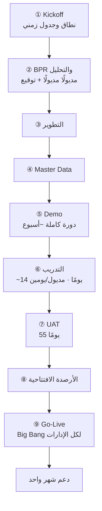
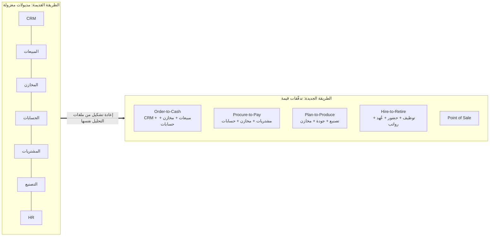
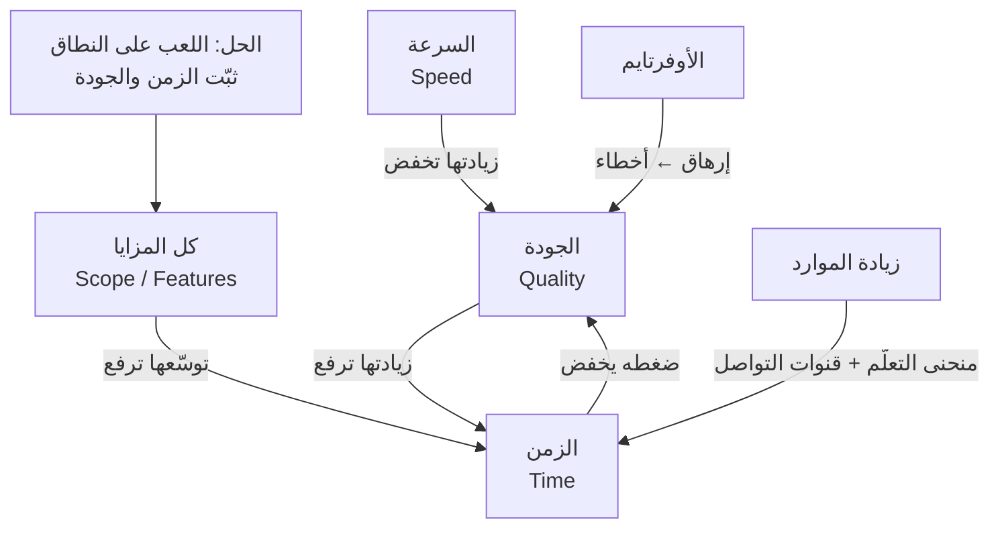
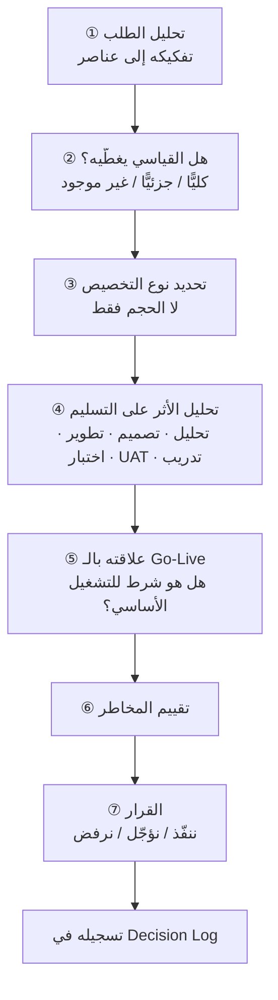

> [!info] المحاضرة 03 · قيادة التسليم
> **ماذا ستتعلّم:** كيف تأخذ مشروع `ERP` حقيقيًّا مخطَّطًا على تسع مراحل قائمة على المديولات، وتشخّص أخطاءه في التسليم، ثم تعيد تشكيله بالكامل على هيئة [[Value Stream|تدفّقات قيمة]] تُسلَّم تدريجيًّا؛ وكيف ترتّب الأولويات بمصفوفة شبيهة بـ[[WSJF|الأقصر وزنًا أولًا]]، وتحوّل [[Cost of Delay|تكلفة التأخير]] إلى أرقام بالريال تُقنع العميل، وتتّخذ قرارات المتطلَّبات والتخصيصات ضمن [[Iron Triangle|مثلث القيود]].

# المحاضرة 03 — من التسليم القائم على المديولات إلى التسليم القائم على تدفّقات القيمة

## 🎯 أهداف التعلّم

- تشخيص أخطاء التسليم في خطة مشروع `ERP` تقليدية مبنية على المديولات ومراحل [[04 - Waterfall|الشلّال]] التسع.
- تحويل مشروع مقسَّم إلى مديولات إلى خمسة [[Value Stream|تدفّقات قيمة]] كاملة من البداية إلى النهاية، وربط ملفات التحليل بكل تدفّق.
- ترتيب التدفّقات حسب القيمة عبر ثلاث رُتب (مالية مباشرة / تشغيلية / تحسينية)، والتفريق بين وحدات الأعمال والوحدات المساندة.
- بناء مصفوفة أولوية كمّية (قيمة الأعمال + الحرجيّة الزمنية + المخاطر ÷ حجم العمل) على غرار [[WSJF|الأقصر وزنًا أولًا]].
- فهم [[Iron Triangle|مثلث القيود]] ومقايضاته، ولماذا تُعدّ زيادة الموارد أسوأ قرار (قانون `Brooks`)، ولماذا يكون الحل دائمًا في «اللعب على النطاق».
- تحويل [[Cost of Delay|تكلفة التأخير]] إلى **قيمة مالية بالريال** عبر أربع معادلات (إيراد / تكلفة / كفاءة / خطر)، وتطبيقها على أمثلة عددية كاملة.
- تطبيق إطار قرار المتطلَّب/التخصيص، وتقسيم المشروع إلى أربع مراحل، وحساب [[Flow Efficiency|كفاءة التدفّق]] لاختصار زمن المشروع.

## الفكرة المحورية

في المحاضرتين السابقتين شرحنا المفاهيم: [[Value Stream|تدفّق القيمة]]، والقيمة، وترتيب الأولويات، و[[Flow Efficiency|كفاءة التدفّق]]. لكن يبقى السؤال الذي يقف في ذهن كل متدرّب: **كيف أطبّق هذا الكلام على أرض الواقع؟** هذه المحاضرة مخصَّصة لسدّ تلك الفجوة تحديدًا: نأخذ **حالة حقيقية** — لا حالة مؤلَّفة — لمشروع قائم فعلًا الآن في مرحلة التطوير، ونعيد بناء طريقة تسليمه من الصفر أمامك خطوةً بخطوة.

الفكرة الجوهرية التي تلخّص المحاضرة كلها: **توقّف عن التفكير في المشروع كمجموعة مديولات، وابدأ في التفكير فيه كمجموعة دورات عمل كاملة.** الفريق لا يستلم «مديول المخازن»، بل يستلم دورة `Order-to-Cash` من أوّلها إلى آخرها. حينها فقط تستطيع أن تسلّم قيمة بعد ثلاثة أو أربعة أسابيع بدل سبعة أشهر.

وسنمرّ في هذه المحاضرة على سلسلة متّصلة من الخطوات، كلٌّ منها مبنيّة على ما قبلها:

1. نعرض دراسة الحالة والخطة التقليدية كما هي، بلا تجميل.
2. نشخّص أخطاءها في التسليم واحدًا واحدًا، ونفهم **لماذا وافق العميل** رغم ذلك.
3. نستخرج نقاط الألم الفعلية على مستويات المنظمة المختلفة.
4. **نحوّل المشروع** من مديولات إلى خمسة تدفّقات قيمة.
5. **نرتّبها** بالأولوية، ثم نبني مصفوفة أولوية كمّية على مستوى المزايا.
6. نتعلّم كيف نتّخذ **قرارات متوازنة** ضمن مثلث القيود.
7. نحوّل تكلفة التأخير إلى **أرقام مالية بالريال** تُقنع العميل.
8. نطبّق **إطار قرار المتطلَّب/التخصيص**، ونقسّم المشروع إلى أربع مراحل.
9. نختم بـ**كفاءة التدفّق** بوصفها أداة اختصار زمن المشروع.

وينبغي أن تلاحظ منذ البداية أن كل ما سنفعله يتمّ **داخل مشروع قائم بالفعل**: لا نطلب من أحد أن يبدأ من جديد، ولا نغيّر الخطة الموقَّعة، ولا نمسّ الموعد النهائي. كل التغيير يقع في **طريقة التنفيذ** — وهذا وحده كافٍ لقلب النتيجة رأسًا على عقب.

## دراسة الحالة: شركة تصنيع وتوزيع مواد غذائية

> [!example] الحالة الحقيقية — مشروع `ERP` لشركة مواد غذائية
> شركة مختصّة في **تصنيع وتوزيع المواد الغذائية**. جلس فريق المورّد مع العميل وأخذ منه المتطلبات، فخرج بملخّص المديولات المطلوبة:
>
> - نظام `CRM`
> - المبيعات
> - المخازن
> - المشتريات
> - التصنيع
> - الجودة
> - المحاسبة
> - التوظيف وشؤون الموظفين
> - الحضور والانصراف والإجازات
> - العُهد
> - الرواتب
> - نقاط البيع (`POS`)
>
> هذه هي المديولات التي طلبها العميل. وبعد أخذ المتطلبات، مرّ الفريق بدورة الحياة المعروفة: **جمع المتطلبات → التحليل → التصميم**، ثم خرج بخطة زمنية عرضها على العميل ووافق عليها. **مدّة المشروع المعلنة: نحو سبعة أشهر.**

### تفصيل المتطلبات مديولًا مديولًا

تمّ جمع المتطلبات **مديولًا مديولًا**، والغالب الأعمّ منها مزايا قياسية (`Standard Features`):

- **`CRM` + المبيعات:** المزايا القياسية الأساسية.
- **المخازن والمشتريات:** نفس القصة، مزايا قياسية.
- **المحاسبة:** فواتير العملاء، فواتير المورّدين، مراكز التكلفة، الضرائب، دفاتر اليومية.
- **التصنيع:** إدارة قائمة المواد (`Bill of Materials`)، أوامر التصنيع، أوامر العمل، التوجيه (`Routing`)، المنتجات الثانوية، أوامر التفكيك والخردة، تتبّع الدفعات (`Batches`) والأرقام التسلسلية، ومراحل التصنيع مفصَّلة.
- **الجودة:** المزايا القياسية.
- **التوظيف والموظفون:** الهيكل التنظيمي، العُهد والسُّلَف، التحويلات.
- **الحضور والانصراف:** المزايا القياسية.

### التخصيصات (Customization) التي طلبها العميل

بعد انتهاء المتطلبات القياسية، كان لدى العميل مجموعة من المتطلبات الخاصة التي تحتاج تخصيصًا:

| المجال | التخصيص المطلوب |
|---|---|
| الحسابات / المبيعات | **هدف (`Target`) للعميل:** إذا وصل العميل إلى كمية معيّنة أو عدد عمليات معيّن، يمنحه النظام خصمًا محدَّدًا |
| المبيعات | إظهار **رصيد العميل والحد الائتماني** داخل شاشة أمر البيع |
| الحسابات | **حدّ ائتماني موحَّد**: تُحتسب فروع العميل ضمن نفس الحدّ الائتماني |
| العُهد والرواتب | العُهد غير المدفوعة **تُخصم من الراتب الأساسي + بدل النقل** |
| الحضور والانصراف | **سماحية 15 دقيقة يوميًّا**؛ ومن الدقيقة السادسة عشرة يبدأ الخصم دقيقةً بدقيقة |
| الحضور والانصراف | المصنع يعمل **24 ساعة** بأكثر من وردية (`Shift`) في اليوم |
| الحضور والانصراف | مناديب المبيعات لديهم **بصمة دخول بلا بصمة خروج**؛ المطلوب **بصمة خروج تلقائية** لموظفين محدَّدين |
| الحضور والانصراف | موظفون بمواعيد ثابتة (7:30 صباحًا – 4:30 عصرًا مثلًا)، والجمعة والسبت إجازة |

## الخطة التقليدية: تسع مراحل قائمة على المديولات

بُنيت الخطة الزمنية على **توزيع كل المديولات** للعمل عليها بالتفصيل، عبر التسلسل التالي:

1. **الانطلاق (`Kickoff`):** اجتماع بدء المشروع، مناقشة النطاق والجدول الزمني والاتفاق عليه.
2. **مراجعة عمليات الأعمال (`BPR — Business Process Review`) والتحليل:** جمع كل المزايا القياسية + التخصيصات، وتوثيق جلسات التحليل، ثم إرسالها للعميل وأخذ موافقته وتوقيعه على النطاق.
3. **التطوير:** مهام التطوير + مهام الاختبار + وقت احتياطي داخل خطة التطوير.
4. **إدخال البيانات الأساسية ([[Master Data]]):** العملاء، المورّدون، الحسابات، الأرصدة الافتتاحية.
5. **العرض التوضيحي (`Demo`):** عرض دورة كاملة على النظام لكل ما جرى تطويره وللنظام القياسي.
6. **التدريب:** تدريب على **كل مديول بيوم أو يومين** حسب حجم مزاياه وتعقيده، مرورًا على كل المديولات المحدَّدة في النطاق.
7. **اختبار قبول المستخدم ([[UAT|اختبار قبول المستخدم]]):** كل الإدارات تشتغل على النظام بعد التدريب وتسجّل ملاحظاتها وأسئلتها.
8. **التجهيز للإطلاق:** تحديد الأرصدة الافتتاحية والبيانات الأساسية النهائية.
9. **الإطلاق (`Go-Live`):** تشغيل النظام بالكامل، **كل الإدارات مع بعضها**، يليه **دعم لمدة شهر** تُعالَج فيه المشاكل والملاحظات الظاهرة.

## تشخيص المشاكل الثمانية في أسلوب المديولات

الخطة أعلاه هي **خطة حقيقية وقّع عليها عميل حقيقي**. ومع ذلك ففيها ثمانية أخطاء جوهرية في التسليم:

> [!warning] 1. الإطلاق في المرحلة التاسعة — فترة بعيدة جدًّا
> العميل قد يقضي **ثماني مراحل كاملة** قبل أن يرى النظام يعمل أو ينطلق به. أنت تتحدّث عن **ستة إلى سبعة أشهر** حتى يبدأ النظام فعليًّا. وكل الجهد المبذول لا يُختبر على أرض الواقع إلا في اللحظة الأخيرة.

> [!warning] 2. الإطلاق دفعة واحدة (`Big Bang`)
> النظام كله يُطلَق **جملة واحدة**: عشرة أنظمة، وعشر إدارات، تنطلق كلها في شهر واحد. تخيّل حجم المشاكل التي ستظهر خلال شهر الدعم الوحيد المكتوب في الخطة — الشهر نفسه قد لا يكفي أصلًا. هذا [[Quick Wins vs Big Bangs|الانفجار الكبير]] بعينه، ونقيضه المطلوب هو المكاسب السريعة المتتابعة.

> [!warning] 3. التحليل مديولًا مديولًا يُخفي مشاكل التكامل
> عندما تمسك المالية وتجلس معهم وتوثّق، ثم تنتقل للمشتريات، ثم للمخازن — فأنت توثّق **مزايا كل نظام على حدة**، لكن **التدفّق بين الأنظمة** لا يظهر. هل هناك مشاكل بين المالية والمخازن؟ بين التصنيع والجودة؟ كيف يمشي الـ`Flow`؟ هذه كلها لن تظهر في وثائق التحليل؛ قد تُذكر شفويًّا فقط. أنت تشتغل **بشكل منعزل**، ومن ثمّ لن ترى مشاكل التشغيل الفعلي بين الإدارات. النتيجة الأخطر: قد ينتهي بك الأمر إلى أنك **نقلت العميل من تجربة سيّئة إلى تجربة أخرى مشابهة** — لا تحسين ولا تغيير حقيقي. صحيحٌ أن العميل وافق على المتطلبات وهذا هو نطاقه، لكن كان المفروض من البداية أن ننتبه: هل لديه مشاكل في نظامه الحالي؟ هل هناك خلل فعلي في التكامل بين المديولات؟ كل ذلك يجب أن يظهر **من مرحلة التحليل**.

> [!warning] 4. الفجوة الزمنية بين الـ Demo والتدريب والـ Go-Live
> في المرحلة الخامسة عُرضت دورة كاملة للنظام القياسي على كل الإدارات. ثم في المرحلة السادسة بدأ التدريب وقُسِّمت المديولات. لكن **إلى تلك اللحظة لم يحدث `Go-Live` بعد** — كل ما جرى مجرّد تدريب. بعدها يأتي عمل وتعديلات واختبارات، فتتكوّن **فجوة زمنية** بين التدريب وبين اختبار القبول، ثم فجوة أخرى بين القبول وبين الإطلاق، ثم مرحلة إدخال الأرصدة. وحين يأتي الإطلاق أخيرًا تجد أن **أغلب الموظفين نسوا ما دُرِّبوا عليه**، فترجع كأنك تبدأ من البداية. المستخدم قد يتذكّر الشاشات التي تهمّه، لكنه **لن يفهم التدفّق الكامل** بينه وبين الإدارات الأخرى. عمليًّا: كل التدريب الذي بذلته صار **كأنك لم تدرّبهم**.

> [!warning] 5. التدريب مجزّأ حسب المديول ووقع في إجازة العيد
> التدريب مقسَّم بحسب المديول: اليوم الأول `HR`، الثاني الحسابات، الثالث المبيعات — وهذا في حدّ ذاته إشكالية لأنه لا يعرض التدفّق. والأدهى: ملفات المشروع الحقيقية تُظهر أن **فترة التدريب وقعت على إجازة عيد الأضحى**؛ يبدأ التدريب قبل العيد، ثم تتخلّله الإجازة، ثم يُستكمل جزء منه بعدها. إجازة العيد وحدها كفيلة بأن تمحو كل ما شرحته قبلها. تخيّل أن هذا كله خطة زمنية مكتوبة ومُعتمَدة من العميل، ولم ينتبه أحد لعطلة العيد وهي تتكرّر سنويًّا.

> [!warning] 6. خمسة وخمسون يومًا لاختبار قبول المستخدم
> **55 يومًا** كاملة فقط لأخذ اختبارات قبول المستخدم لكل المديولات. وقبلها **14 يومًا** تدريبًا، وقبلها **أسبوع** عرضًا توضيحيًّا. كل هذا — بالنسبة لخطة التسليم — **زمن ضائع** لا يرى فيه العميل قيمة تشغيلية واحدة.

> [!warning] 7. التقدير الزمني غير واقعي
> تدريب مديول كامل في **يوم أو يومين** ليس تقديرًا واقعيًّا. وهذه أول ملاحظة رصدها الحضور بأنفسهم. تقدير الزمن في هذه الخطة مبني على تقسيم إداري لا على حجم عمل حقيقي.

> [!warning] 8. لا يوجد تفاعل مستمر مع العميل ولا توازٍ بين المراحل
> المراحل متسلسلة بالكامل: فترة تطوير طويلة **بعيدًا عن العميل تمامًا**، بلا أي `Engagement` مستمر. وكان من الممكن أن تمشي مراحل متوازية: بينما يجري التطوير على جزء، يجري التدريب على الأجزاء التي لا تحتاج تطويرًا أصلًا (`CRM`، الحسابات القياسية…).

### أسئلة من الحضور

> **س: التسلسل نفسه — هل فيه إشكالية أم أنه مناسب؟**
> التسلسل كتسلسل منطقي مقبول شكلًا، لكن الإشكالية في **التوزيع والتوقيت**: لا وجود لتفاعل مستمر مع العميل، ولا يمكن أن تعمل مرحلة تطوير كاملة معزولة عنه، ولا يمكن قبول `Go-Live` واحد في المرحلة التاسعة لعشرة أنظمة معًا.

> **س: هل أخذنا تأكيدًا من العميل قبل التطوير؟**
> نعم، هناك توثيق وموافقة رسمية على المتطلبات قبل بدء التطوير — هذه النقطة سليمة في الخطة. المشكلة ليست في غياب الموافقة، بل في **بنية الخطة نفسها**.

> **س: هل جرّبت العمل بطريقة مختلفة؟**
> شارك أحد الحضور بتجربته: اتّفق بين إدارته والإدارات الأخرى على البدء بالمديولات الأساسية، ضبطها ودرّبهم عليها وشغّلوها فعليًّا، **ثم** انتقل لمرحلة التطوير وتركهم يعملون. وهذا بالضبط جوهر ما نريده — بشرط أن يكون ما طُوِّر لاحقًا غير مرتبط بالمحاسبة أو بالإدارات الأخرى.

> **س: ألا يمكن أن تمشي بعض المراحل بالتوازي؟**
> بلى، وهذا جزء من الحل. الأشياء التي **لا تحتاج تطويرًا أصلًا** يمكن أن نشتغل عليها تدريبًا بينما فريق التطوير يعمل على غيرها: `CRM`، والحسابات القياسية، وكل ما يغطّيه النظام القياسي بالكامل. المشكلة في الخطة الأصلية أنها جعلت كل شيء **متسلسلًا بالكامل**، فأصبح كل جزء ينتظر الجزء الذي قبله دون سبب حقيقي.

> [!note] كيف تكتشف الخلل بمجرد النظر إلى الخطة؟
> اسأل نفسك ثلاثة أسئلة أمام أي خطة تسليم: **متى يرى العميل أول قيمة تشغيلية حقيقية؟** و**كم عدد الأنظمة التي ستنطلق في اللحظة نفسها؟** و**كم الفجوة الزمنية بين التدريب والإطلاق؟** إن كانت الإجابات: «في المرحلة الأخيرة»، و«كلها»، و«شهور» — فأنت أمام خطة ستنفجر في وجهك في شهر الدعم.

## لماذا وافق العميل رغم الخلل؟

العميل في النهاية **لا يعرف**. هو يفترض أنه يتعامل مع شركة لديها خبرة ولديها عملاء سابقون مرّوا بنفس التجربة. دخوله معك في المشروع **مبنيّ على السمعة**، أو على ما رآه لدى عملاء آخرين.

ولذلك فإن المسؤولية تقع عليك أنت: **كمدير تسليم يجب أن تكون عارفًا بالفجوات الموجودة هنا**. مجرد أن تنظر إلى المراحل بهذا الشكل، ينبغي أن تفهم مباشرةً أن هناك مشاكل. العميل يشتري ثقة، وأنت من يحمي تلك الثقة.

> [!note] هل نُصلح المشروع الحالي أم ننتظر المشروع القادم؟
> السؤال الطبيعي: «هذا المشروع في مرحلة التطوير أصلًا، فهل نتركه ينتهي ونبدأ الصحيح في المشروع القادم؟» الجواب: **لا**. حتى لو كان المشروع في مرحلة التطوير، ما زالت هناك إمكانية أن نتدارك أنفسنا، ونتدخّل، ونجري بعض التحسينات التي **تقلّل أثر التأخير** المحتمل. لا نقول للعميل «أعِد المشروع من أوّله»؛ نأخذ **حاجات سريعة**، ونرى المشاكل الأساسية ونركّز عليها.

## نقاط الألم حسب مستويات المنظمة

قبل أي تحويل، نحتاج أن نعرف [[Pain Point|نقاط الألم]] الفعلية. الإشكالية الجذرية في الخطة الأصلية أن **المتطلبات بُنيت على المديول** بلا مراعاة للقيمة ولا للمشاكل ولا لنقاط الألم عند العميل. أين المشاكل بالضبط؟ هل هي مالية أم تشغيلية؟ هل هي عند الموظفين أم الإدارات أم المديرين أم الشركة/المصنع ككلّ؟

يُستخرج هذا من التحليل الداخلي، أو بسؤال الناس أثناء الدوام. وفيما يلي تحليل نقاط الألم موزَّعًا على مستويات المنظمة (وهي هنا **احتمالات مبنية على التحليل**، لا حقائق مؤكَّدة من العميل، إذ لم يُشتغل معه على هذا التفصيل بعد):

| المستوى | ما يريده | نقاط الألم المحتملة |
|---|---|---|
| **الإدارة العليا** | رؤية تشغيلية ومالية واضحة، تقليل التكاليف، تسريع دورة اتخاذ القرار | لا توجد رؤية موحَّدة عبر كل الأنظمة؛ تأخير في ظهور النتائج؛ مخاطر تشغيلية عند الـ`Go-Live` |
| **الإنتاج** | تشغيل أوامر التصنيع بشكل مستقرّ ومنظَّم، وضبط المواد والكميات | عدم اتّساق عملية الإنتاج؛ مشاكل في كميات المواد |
| **الجودة** | ربط المواد بالجودة، وتتبّع أفضل، وتقليل الهدر | صعوبة التتبّع؛ **هدر عالٍ**؛ مشاكل متكرّرة في جودة المخرجات |
| **المبيعات والمالية** | إكمال الطلب من بدايته حتى التحصيل، تسليم سريع، فوترة دقيقة | تأخير بين المراحل؛ **انقطاع التدفّق** بين المبيعات والمخزون والمحاسبة؛ ضعف في دقّة التحصيل |

أسئلة تشخيصية مفيدة تُطرح في هذه المرحلة: هل هناك تأخير في دورة المبيعات؟ مشاكل في التحصيل؟ نسبة تالف عالية؟ عدم اتّساق في الإنتاج؟ اعتماد كبير على الحضور والجزاءات والإجازات والرواتب؟ مشاكل مع الموظفين؟

الخلاصة العملية: بعد التحليل نخرج بـ **مشكلة أو مشكلتين أو ثلاث أو أربع بالكثير** — هذه هي المشاكل الأساسية التي سنبني عليها.

## التحويل الأول: من المديولات إلى تدفّقات القيمة

هذه هي **الخطوة الثانية وأول تحوّل** حقيقي: بدلًا من أن يكون المشروع في شكل مديولات، نقلبه إلى شكل [[Value Stream|تدفّقات قيمة]]. ننطلق من **ملفات التحليل الموجودة أصلًا**، فنحلّلها ونستخرج منها الدورات الكاملة.

### التدفّقات الخمسة

> [!example] التدفّقات الخمسة المستخرجة من ملفات التحليل
> **1. `Order-to-Cash` — من الطلب إلى التحصيل**
> `Lead` ← `Opportunity` ← `Quotation` ← `Sales Order` ← `Delivery` ← `Invoice` ← `Payment`.
> **الملفات المرتبطة:** ملف `CRM` + ملف المبيعات + ملف المخازن + ملف الحسابات — كلها تدخل في هذا التدفّق وحده.
> **القيمة:** تسريع دورة الطلب والتحصيل؛ تقليل التأخير بين البيع والتسليم والفوترة؛ تحسين التدفّق النقدي (مثلًا: تقليل دورة التحصيل من 20 يومًا إلى 15 يومًا).
>
> **2. `Procure-to-Pay` — من الشراء إلى السداد**
> `RFQ` ← عروض المورّدين ← `Purchase Order` ← الاستلام ← فاتورة المورّد.
> **الملفات المرتبطة:** المشتريات + المخازن + الحسابات.
> **القيمة:** ضبط التوريد؛ دقّة الاستلام والتكلفة؛ تحكّم أفضل بالمورّدين.
>
> **3. `Plan-to-Produce` — من التخطيط إلى الإنتاج**
> `Planning` ← `Bill of Materials` ← `Manufacturing Order` ← `Work Order` ← `Finished Goods`.
> **الملفات المرتبطة:** التصنيع + الجودة + المخازن.
> **القيمة:** معالجة البطء والهدر والتالف؛ رفع جودة المخرجات.
>
> **4. `Hire-to-Retire` — من التوظيف إلى نهاية الخدمة**
> `Job Request` ← التوظيف ← تسجيل الموظف ← الحضور والانصراف ← الإجازات ← `Payroll` ← الخروج/الاستقالة.
> **الملفات المرتبطة:** التوظيف + الموظفون + الحضور + العُهد + الرواتب.
>
> **5. نقاط البيع (`Point of Sale`)**
> دورة البيع المباشر في المنافذ.

لاحظ الفارق: في البداية كنّا نشتغل على الحسابات حتى ننتهي، ثم ننتقل للمبيعات، ثم المخازن. الآن **ننظر إلى المشروع كله دفعة واحدة**، ونقسّمه إلى دورات. قد يدخل في التدفّق الواحد ثلاث أو أربع إدارات معًا — وهذا هو المقصود.

ولاحظ أيضًا أن **مصدر المعلومات لم يتغيّر**: نفس ملفات التحليل، ونفس المتطلبات، ونفس التخصيصات. ما تغيّر هو **زاوية النظر** وطريقة تجميع العمل. ولذلك يمكن تطبيق هذا التحويل على مشروع في منتصف التنفيذ دون أن نطلب من العميل شيئًا جديدًا.

### القيمة على مستوى التدفّق لا على مستوى الشاشة

بعد استخراج التدفّق، نجلس مع العميل ونناقشه على مستوى **الدورة كاملة**: «هل لديكم مشاكل في التصنيع؟ في الدورة الحالية؟» فيقول: «عندنا بطء، عندنا هدر عالٍ، عندنا تالف كثير». عندها أبدأ أرى **القيمة التي أستطيع تقديمها على مستوى التدفّق بأكمله** — لا على مستوى شاشة أو حقل. وإذا كانت المشكلة في الجودة، فأنا أساعدهم على رفع جودة المخرجات ككلّ.

وهذا فرق جوهري: القيمة في الطريقة القديمة كانت تُقاس بعدد المزايا المسلَّمة؛ وفي الطريقة الجديدة تُقاس بـ**قدرة دورة عمل كاملة على أن تعمل**.

### التكرار يكشف التداخل

من أهمّ فوائد هذا التحويل: عندما ترى أن **المخازن** تتكرّر في `Order-to-Cash` و`Procure-to-Pay` و`Plan-to-Produce`، وأن **الحسابات** تتكرّر كذلك، فأنت تكتشف مباشرةً أن **نطاق المخازن متشعّب في عدّة تدفّقات**، وتفهم شكل الارتباط والتشابك بين المديولات — وهي معلومة لم تكن لتظهر أبدًا في التحليل المديولي المنعزل.

### الفريق يستلم دورة كاملة لا مديولًا

هنا يتغيّر أسلوب العمل جذريًّا. لن نقول لفريق التطوير: «اشتغلوا على المخازن». بل نقول:

> «هذه دورة `Order-to-Cash` كاملة. اجلسوا معًا، انظروا ماذا طلب العميل، وما التخصيصات المطلوبة، وما المزايا المطلوبة، وقسّموا العمل بينكم — على أن **تسلّموني في النهاية دورة كاملة** من `Order-to-Cash`.»

وحين أستلم من فريق التطوير، لا أستلم شاشة أو مديولًا؛ أستلم **دورة كاملة**: أُنشئ `Lead`، أحوّله إلى `Opportunity`، وأمضي حتى أصل إلى الـ`Payment` فأجد التدفّق كاملًا، وقد نُفِّذ فيه كل تخصيص بحسب قيمته.

فرق ضخم بين أن أقول للعميل بعد ثلاثة أسابيع «انتهينا من تخصيصات المخازن»، وبين أن أقول له: **«صار عندي `Order-to-Cash` كاملة — يمكننا أن نطلقها `Live` الآن.»**

> [!example] قصة المشروع الذي استغرق تسعة أشهر في مديول الحسابات وحده
> شارك أحد الحضور: صديق له بدأ مشروعًا لإدخال نظام في شركة، فاضطرّوا للعمل على **مديول الحسابات (`Accounts`)** باعتباره «قلب النظام» والمديول الأهمّ لأي شركة. فاستغرق الموضوع معهم **تسعة أشهر في مديول واحد فقط** — بينما لو نظروا للأمر بمنطق تدفّقات القيمة، لكان بالإمكان خلال تلك التسعة أشهر نفسها **إطلاق مجموعة من التدفّقات الكاملة** بدل مديول واحد معزول.

### أسئلة من الحضور

> **س: هل أحدّد تدفّقات القيمة بالاتفاق مع العميل أم وحدي؟**
> يمكنك أن تعملها بمفردك؛ فملفات التحليل موجودة لديك بالفعل. العميل غالبًا **لا يفهم أصلًا** ما معنى `Value Stream`. أنت من يحلّلها بصفتك شخصًا يفهم إدارة التسليم. ولو جلست معه بنفس المنطق لخرجت بنفس المعلومات: تسأله «ما طبيعة عملك؟» فيقول «إصدار فواتير، توظيف…» ومن إجابته تحدّد تدفّقاته.

> **س: بدل أن أشتغل على `HR` منفصلًا وآخذ كل تفاصيله، أشتغل على نقطة `Job Request` وأتكلم مع العميل حولها؟**
> نعم، هذه هي الفكرة. لكن انتبه: **الحالة التي نعرضها هي ما بعد التحليل**. التفاصيل (`Job Request`، آلية التوظيف، حتى التخصيصات) مأخوذة من العميل بالفعل وجاهزة. مهمّتك الآن أن **تقسّمها كتدفّقات**، لا أن تنظر إلى الحضور والانصراف كمديول واحد وتوزّع مهامه على الفريق. تقول للفريق: «لن نشتغل مديول الحضور بتخصيصاته وحده — سنأخذ الدورة كاملة، خلال أسبوعين أو ثلاثة، وسيكون تركيزنا كلّه من `Job Request` حتى `Exit`، ونُخرجها كـ`Demo` أو كـ[[MVP|أقل منتج قابل للتشغيل]].»

## التسليم التدريجي والقيمة المبكرة

الشرط الأساسي الذي ذكرناه في المحاضرة السابقة: **أن يكون التدفّق قابلًا للعمل بشكل منفصل** عن باقي التدفّقات. أي أستطيع أن أدرّب الإدارات المرتبطة بهذه الدورة وحدها فتعمل بشكل كامل دون أي إشكالية.

بدل أن ينتظر العميل ستة أو سبعة أشهر ليرى النظام، **أسلّمه بعد ثلاثة أو أربعة أسابيع** دورة `Order-to-Cash` كاملة: أبدأ تدريبه عليها، يبدأ يعمل ويطلق `Live`، **بينما أنا أبدأ في التدفّق الثاني**. هو استلم قيمة ويشتغل عليها، ولم ينتظر.

### الفوائد الخمس للتسليم التدريجي

1. **يرى النظام مبكرًا ويتعوّد عليه.** المشاكل تظهر لك بعد ثلاثة أو أربعة أسابيع، لا بعد سبعة أشهر.
2. **تغذية راجعة (`Feedback`) أثناء العمل.** الناس يعملون فعليًّا معك، فتصلك الملاحظات وأنت ما زلت تطوّر: «هذه الجزئية تحتاج تعديلًا» فتعدّل، «هؤلاء يحتاجون تدريبًا إضافيًّا» فتدرّب.
3. **الاستقرار التدريجي.** بعد فترة تعتاد إدارة المشتريات مثلًا على النظام، وتقلّ مشاكلهم شيئًا فشيئًا حتى تستقرّ، فتكون قد **سلّمت جزءًا وهم يعملون عليه**، وتنتقل للتالي.
4. **دروس مستفادة تخفّض مخاطر الدورة التالية.** من التغذية الراجعة للدورة الأولى تعرف بالضبط ما المشاكل التي ستواجهك في الثانية، فتحلّها مبكرًا. المرحلة الثانية تصبح **تعزيزًا للأولى + عملًا جديدًا**، وهكذا حتى تصل نهاية المشروع بلا إشكاليات تُذكر، ويكون الإطلاق سلسًا مستقرًّا.
5. **تفهم العميل والفريق أعمق.** من الدورة الأولى تكتشف: هل العاملون في هذا المصنع محترفون؟ هل هناك مشاكل مع الأجهزة؟ مع النظام؟ كل ذلك يظهر من الدورة الأولى.

في المقابل، لو أبقيت كل شيء إلى النهاية، فسيتجمّع كل شيء عليك خلال **شهر الدعم الوحيد**، بضغط لا يُحتمَل. ولو ظهرت أخطاء تحتاج تطويرًا، فسنرجع إلى فريق البرمجة ثم إلى الاختبار، فيزيد زمن المشروع مباشرة — وربما تُضطرّ إلى **تأجيل الإطلاق** بسببها، فلا تنتهي المشاكل معك أبدًا.

> [!warning] المشاكل التي تصل من تدفّق واحد ليست كالمشاكل التي تصل من النظام ككلّ
> هذه نقطة يغفل عنها كثيرون: **فرق هائل** بين أن تصلك ملاحظات مستخدمي دورة `Order-to-Cash` وحدها وأنت متفرّغ لها، وبين أن تصلك ملاحظات عشر إدارات دفعة واحدة في شهر. في الحالة الأولى تكون **في سيطرة جيدة على النظام**: التغذية الراجعة تمشي، والمشاكل تظهر وتُعالَج أولًا بأول. في الحالة الثانية لا تعرف من أين تبدأ، ولا أي مشكلة سببها التدريب وأيّها سببها التحليل وأيّها سببها التطوير.

> [!note] القيمة تُلمَس حتى في التفاصيل الصغيرة
> ما إن يبدأ العملاء بالعمل حتى تصلك ملاحظات من نوع: «هذه الجزئية تحتاج تعديلًا بسيطًا فقط»، أو «نحتاج تدريبًا إضافيًّا على هذه الشاشة». وهذه **بالضبط** ما كنت ستكتشفه بعد سبعة أشهر وبتكلفة أضعافًا مضاعفة. المشاكل نفسها لم تختف — لكنها ظهرت في وقت يمكن فيه حلّها بلا أثر على زمن المشروع.

> [!note] تشبيه شرح الكتاب فصلًا فصلًا
> الأمر كأنك تدرّب شخصًا جديدًا وتشرح له كتابًا جديدًا عليه. لا تقول له: «اذهب واقرأ الكتاب كله وأنا سأختبرك مباشرةً». لا بد أن تعمل معه **بالتدريج**: تعطيه الفصل الأول ثم تمتحنه فيه، ثم الفصل الثاني وهكذا. بنفس الفكرة نعطي الإدارات جزءًا، ونراقب كيف يعملون، ونرى المشاكل التي تواجههم.

> [!note] المديول القياسي الذي لا يحتاج تطويرًا
> إذا كان ضمن ملفات التحليل مديول **يغطّيه النظام القياسي بالكامل** بلا أي تخصيص — فلماذا ينتظر العميل سبعة أشهر ليستلمه؟ ما دام القياسي يغطّيه، **أطلقه الآن**. وبنفس المنطق داخل التدفّق: قد أجد `Lead` يغطّيه القياسي، و`Opportunity` يغطّيه، و`Quotation` يغطّيه، ولا يوجد سوى تعديل بسيط في `Sales Order` — فأقيّم التعديل وأنجزه بناءً على الدورة الكاملة أمامي، ثم أسلّم شيئًا مستقلًّا يعمل كدورة كاملة.

> [!note] الحدّ الأدنى الحقيقي للتشغيل
> «القيمة المبكرة» لا تعني تسليمًا ناقصًا. مثال: لو سلّمت `HR` وحدها دون ربط الحسابات، فنظام العميل ناقص — هو يريد أن يُدخل الموظف ويكمل دورته حتى يستقيل، بما فيها الإجازات والحسابات والراتب والبدلات. المعيار: **أقلّ مجموعة مزايا تجعل النشاط يعمل بشكل مستقل وكامل ومبسَّط**. مثال آخر من الحالة: العميل في المخازن لا يريد تقارير في البداية — يريد الفاتورة وإذن التسليم فقط، ثم تُسجَّل الفاتورة في الحسابات. هذا وحده كافٍ ليعملوا ويُدخلوا بيانات حقيقية `Live`.

### التدريب في نموذج تدفّقات القيمة

> **س: إذا سلّمنا من المبيعات حتى الفاتورة كتدفّق، فكيف يكون التدريب؟ هل تجتمع كل الفرق معي في جلسة واحدة؟**
> نعم. ما دمنا نتحدّث عن **تدفّق كامل** نسلّمه من بدايته إلى نهايته، فلا بدّ أن تكون **كل الأطراف المشاركة حاضرة معي في التدريب**، لأربعة أسباب:
>
> 1. **يفهمون التدفّق والتداخل بينهم كإدارات.** هناك إدارات لا تعرف أصلًا التداخل بينها وبين غيرها؛ التدريب المشترك يوضّحه. فحين يصل الطلب إلى شخص، يكون قد عرف المراحل التي مرّت قبل وصوله إليه.
> 2. **تظهر مشاكل التنسيق (`Coordination`) بين الأقسام أثناء التدريب نفسه** كتغذية راجعة مبكرة، بدل أن تكتشفها بعد الإطلاق.
> 3. **كل شخص يعرف دوره بالضبط** ضمن الصورة الكاملة، ويعرف ما المراحل التي تأتي بعده.
> 4. **يرى أثر تأخيره بعينه.** إذا كان الطلب يستغرق أسبوعًا، فتأخُّره يومًا واحدًا يجعله أسبوعًا ويومًا، وتأخّره يومين يجعله أسبوعًا ويومين. في التدريب المجزّأ لا يرى أحد ذلك، فيظنّ أن التأخير «يومين لا يفرقان».

## ترتيب الأولوية بحسب القيمة: الرُّتب الثلاث

بعد استخراج التدفّقات، **الخطوة الثالثة**: بأيّها أبدأ؟ المعيار هو نفسه الذي اشتغلنا به سابقًا، ويقوم على ثلاث رُتب:

| الرتبة | المعيار | المنطق |
|---|---|---|
| **1** | **تدفّق نقدي مباشر** — يُدخل أموالًا للشركة | العميل «يفهم لغة المال»؛ وأنت بتشغيله مبكرًا مكّنته من توليد دخل |
| **2** | **قيمة تشغيلية / تنظيمية** — يحلّ معاناة تنظيمية داخلية | قلب التشغيل في المنشأة |
| **3** | **قيمة تحسينية** — تحسينات ومزايا مساندة | لا توقف العمل ولا تؤثّر ماليًّا مباشرة |

المنطق وراء الرتبة الأولى بسيط وقويّ: العميل في النهاية **يفهم لغة المال**. فأيّ متطلَّب أو تدفّق قيمة له **تأثير مباشر على دخل الشركة** يأخذ أولوية عالية، لأنك حين تشغّله مبكرًا تكون قد ساعدت العميل على أن يبدأ يجني أموالًا بدل أن ينتظرك سبعة أشهر. أما `HR` مثلًا فليس فيه قيمة مالية تدخل للشركة؛ قيمته للموظفين — وهي قيمة حقيقية لكنها ليست الأولى في هذا النشاط تحديدًا.

### تطبيق الترتيب على الحالة

1. **`Order-to-Cash`** — أولوية عليا؛ لأنه يُدخل أموالًا للمصنع مباشرة.
2. **`Procure-to-Pay`** — يضبط الكميات وله أثر مالي مباشر.
3. **`Plan-to-Produce`** — التشغيل الأساسي؛ **قلب المصنع**، لكنه لا يولّد نقدًا مباشرًا كالتدفّقين السابقين.
4. **`Hire-to-Retire`** — أمر مساند لا أساسي؛ لا يؤثّر على المبالغ المالية ولا هو تشغيليّ بدرجة تفوق المصنع.
5. **نقاط البيع** — تحسينية في حالة هذا العميل تحديدًا.

ولهذا لم يُوضع `HR` في البداية ولا في الثانية. لاحظ: لو سلّمت مديول `HR` بالكامل أولًا، فسيبقى العميل في النهاية منتظرًا التصنيع، ومنتظرًا كيف تدخل الأموال، وكيف يعمل قسم المالية.

### أسئلة من الحضور

> **س: هذا الترتيب حسب نشاط الشركة، صحيح؟ ليس معيارًا ثابتًا؟**
> صحيح تمامًا؛ يختلف من نشاط لآخر. لو كان النشاط الأساسي **بيعًا بالتجزئة**، لكانت **نقاط البيع أولوية رقم واحد**. عميل لديه عشر نقاط بيع موزّعة على مستوى المملكة — تسليم نقاط البيع في البداية قيمة عالية جدًّا بالنسبة له، وليس أمرًا بسيطًا. أنت دائمًا تسلّم التدفّق الذي يفيده أكثر: **التدفّق النقدي بالنسبة له**.

> **س: ألا يتحدّد ذلك أصلًا من أصحاب المصلحة وطبيعة أعمالهم؟**
> نعم؛ لو ناقشت صاحب الأعمال في تحليل المتطلبات، فإن **أكثر النقاط ألمًا** تحدّد لك الأعمال الجوهرية (`Core Business`) التي يجب أن تبدأ بها. هو لن يركّز على `HR`، بل على ما يُدخل عليه دخلًا. لكن انتبه: هو يرى نقاط ألمه **بعين الأعمال**، وأنت من يربطها **بالتدفّق النقدي** وبأولوية النشاط، فيخرج الترتيب مختلفًا عمّا يقوله هو. هذه المعلومات لن يقدّمها لك العميل ولن يفهمها بهذه الصياغة — من مهارتك أنت أن تنظر إليها بهذا الشكل.

### وحدة الأعمال مقابل الوحدات المساندة

> **س: يذكّرني هذا بالتفرقة بين `Business Unit` و`Department`.**
> نفس الفكرة تمامًا:
>
> - **`Business Unit` (وحدة الأعمال):** حاجات من صلب نشاط المؤسسة نفسها؛ لها إدارة مستقلّة وأفكار وخطط، وتصلها نتيجة وأرباح تدخل على الشركة. من يعمل داخلها يكون في الغالب **صانع قرار**.
> - **`Supportive Units` (الوحدات المساندة):** وحدات داعمة كـ`IT` مثلًا، لا تُعدّ جوهر الأعمال (`Core`)، وتقدّم خدمات دون علاقة مباشرة بالبيع. من يعمل داخلها يكون في الغالب **منفّذًا** أقرب إلى «زرّ تشغيلي» بلا سلطة قرار.

> [!note] مثال الجامعة
> في جامعة: الوحدات الأساسية هي **القبول والتسجيل** و**التعليم / التعلّم الإلكتروني** والإدارة التعليمية — هذه هي الأعمال الجوهرية. أما **الحركة والنقل** و**تقنية المعلومات** فهي وحدات داعمة للنشاط الأساسي.
>
> ونحن نريد مجازًا أن نرى **ما يجلب المال** بوصفه النشاط الأساسي؛ لأن العميل في النهاية يريد دخلًا ويفهم لغة المال، وأول ما يسأل عنه: «بكم يكلّف؟». فإذا سلّمته بهذا المنطق، تكون قد أعطيته **قيمة عالية**، لأنك مكّنته من تشغيل عمله وتوليد أموال بدل انتظارك سبعة أشهر.

## اكتشاف الألم من التحليل: تجربة من الحضور

> [!example] الشركة التي كانت تعمل بنظامين
> شارك أحد الحضور بتجربة عملية: كانت الشركة تعمل بـ**نظامين منفصلين**:
>
> - **النظام الأول:** تُسجَّل فيه الفواتير، لأنه مربوط بهيئة **الزكاة والدخل**.
> - **النظام الثاني:** النظام المحاسبي نفسه؛ يأخذ المحاسب الفواتير من النظام الأول ويُدخلها **قيودًا يدوية**.
>
> أي أنهم كانوا يعملون العمل **مرّتين**؛ وكان لديهم **ثلاثة محاسبين** يسجّلون قيودًا يدوية، وقد يصل الواحد منهم إلى **مئة قيد يوميًّا** — عملية مرهقة، عرضة للأخطاء، وتحتاج محاسبًا آخر يراجع وراءه، ويطبع الفواتير والدفعات من نظام ويعيد تسجيلها في آخر.
>
> **بعد الـ`Go-Live`:** صارت القيود تخرج من الفروع كفواتير وتُسجَّل تلقائيًّا، ويستطيع المحاسب أن يراها **كقيود وكفواتير وكمالية في الوقت نفسه**. رأى أصحاب المصلحة بأعينهم أنهم كانوا يعانون فعلًا.
>
> **الدرس:** المشارك نفّذ هذا **على أرض الواقع دون أن يعرف المصطلح**. أحيانًا ترى في طريقة عملهم شيئًا **غير منطقي**، وتلمس من كلامهم في التحليل الأوّلي أن هناك حاجة واضحة تسبّب لهم أكثر مشاكلهم الظاهرة. هذه هي التي تفتّش عنها. ومجرّد أن تكتشفها **حاولْ حلّها مباشرةً وركّز على تسليمها في البداية**، لأنك تُحسّ أنها أكثر ما يعانون منه. وحتى لو أخذت منك ساعات فقط، فهي **قيمة ضخمة** في نظرهم — والنتيجة أنه **لن تكون هناك مقاومة أصلًا** لعملك معهم.

### الفرق بين Value Stream وProcess Map

- **[[Value Stream|تدفّق القيمة]]:** المراحل من بداية العملية إلى نهايتها **كتدفّق**، أو كقيمة تبدأ من نقطة محدَّدة حتى تصل للعميل. هو [[Time to Value]]: من بدأت إلى أن سلّمت.
- **`Process Map` (خريطة العملية):** **التفاصيل الداخلية** لكل مرحلة من مراحل التدفّق، من البداية إلى النهاية.

فداخل `Order-to-Cash` مثلًا لا تسير الخطوات دائمًا بنفس الترتيب البسيط؛ ففي المنتصف قد يوجد **اعتماد** بناءً على قيمة أمر البيع، أو فريق مخصَّص يتولّى المبالغ العالية، أو تعامل مختلف مع العملاء المهمّين. هذه تفاصيل «ما بين السطور».

> [!example] خريطة العملية لتدفّق Order-to-Cash في هذه الحالة
> إنشاء `Lead` ← تحويله إلى `Opportunity` ← إنشاء عرض سعر ← اعتماد وتأكيد أمر البيع ← إنشاء إذن صرف ← تنفيذ التسليم ← إصدار الفاتورة ← تسجيل التحصيل.

> **س: وهذه تختلف من نشاط لآخر؟**
> بالتأكيد. في **النشاط التعليمي** مثلًا قد لا أحتاج `Lead` أصلًا؛ أي شخص يسجّل عندي أُدخله مباشرةً كعميل ([[Customer vs Client vs Consumer|Customer]])، لأنه لاحقًا سيكون ضمن قاعدة العملاء عند إطلاق الحملات. والمجال الخدمي يختلف، والتعليم الحكومي يختلف (لا دخل فيه). لكن **الفكرة واحدة**: التدفّق من بداية القيمة إلى نهايتها هو `Value Stream`، وتفاصيل كل مرحلة هي `Process Map`.

عمليًّا: نأخذ أعلى **ثلاثة أو أربعة** تدفّقات في الأولوية ونبدأ العمل عليها.

## مستند تعريف المُخرَجات والحوكمة

بعد الترتيب نكتب مستند القيمة وتعريف المُخرَج (`Value & Outcome Definition`):

**وصف الوضع:** مشروع متعدّد المديولات، خطته الحالية قائمة على المديولات (`Module-Based`)، ونريد تحويلها بإدخال **طبقة التسليم** ([[Delivery Layer]]).

**الإشكاليات المرصودة:**
- المتطلبات مكتوبة في شكل مديولات منفصلة.
- الخطة تؤخّر ظهور القيمة الحقيقية.
- الاختبار والتبنّي ([[Adoption]]) متأخّران.
- احتمالية ضغط كبير في مرحلتَي [[UAT|اختبار قبول المستخدم]] والـ`Go-Live`.

**القيمة المستهدَفة (من كل التدفّقات):** تسريع الدورة البيعية والتحصيل؛ اتّساق التشغيل في التصنيع والجودة؛ تقليل الأخطاء في `HR`.

**الأهداف بصيغة `2X` و[[2X and 10X Goals|10X]]:**
- **`2X`:** تشغيل سيناريو `Order-to-Cash` كامل داخل النظام؛ عرض الدورة كاملة.
- **`10X`:** تشغيل أمر تصنيع وفحص جودة داخل النظام؛ تشغيل سيناريو `Plan-to-Produce` كامل؛ ربط الحضور والإجازات بالرواتب وفق السياسات الداخلية.

**الهدف الأكبر:** تحويل المشروع بالكامل من تسليم قائم على المديولات إلى **تسليم تدفّقات متكاملة**؛ فأنا أعدت تعريف المشروع بالكامل وغيّرت طريقة التسليم بالكامل، وصار تركيزي تدفّقات لا مديولات. أريد أن يرى العميل **عملية تعمل**، لا مجرّد شاشات.

**عوامل النجاح:**
- تكامل بين المديولات وتغطية كل متطلبات العميل.
- انخفاض في مشاكل الربط بين المديولات أثناء [[UAT|اختبار قبول المستخدم]].
- وضوح كبير في الاختبار والتدريب.
- `Go-Live` مستقرّ.

### الحوكمة: الحدود التي لا تُتجاوَز

نضع **حوكمة بسيطة** ترسم حدودًا تساعدك على العمل بانضباط:

1. **لا تغيير رسمي في الخطة المرسَلة للعميل.** العميل وافق على سبعة أشهر ووقّع؛ فلا يمكنك تغيير الموعد النهائي. وقد يكون العميل من نوع يفرض **شرطًا جزائيًّا** على أي تأخير — فالموعد بالنسبة لك ثابت لا يُغيَّر، وعليك مراعاته وأنت تعمل.
2. **التحسين يكون في التنفيذ لا في الخطة.** أنا أُدخل التحسينات على **طريقة التنفيذ**، لا على الخطة الموقَّعة.
3. **التركيز على التدفّق من البداية للنهاية (`End-to-End Flow`).** أي ميزة تُطلب في هذه الفترة يجب أن تخدم المُخرَجات التي سأسلّمها؛ وما لا يرتبط بها يُؤجَّل إلى المرحلة التالية.

### سجل القرارات (Decision Log)

**أي قرار تتّخذه في المشروع يجب أن تسجّله.** أي قرار، وأي شيء تقرّره أثناء العمل — حمايةً لك وتوثيقًا للمشروع. فإذا حدث نزاع لا قدّر الله، يكون هذا **أول مستند يحميك**. وأيّ قرار لا تسجّله **قرار ضائع**.

القرارات المسجَّلة في حالتنا:

| القرار | السبب | الأثر |
|---|---|---|
| إيقاف الطريقة التقليدية وتحويل التطوير إلى نمط تدفّقات القيمة | القيمة والتسليم المبكر وتسريع التحصيل | توجيه لفريق التطوير بتغيير طريقة العمل والتركيز على الدورة الكاملة |
| اعتماد `Plan-to-Produce` كثاني تدفّق بعد `Order-to-Cash` | لأنه **قلب التشغيل** بالنسبة للمصنع | تقلّ مخاطر التشغيل عند تشغيله كمرحلة |
| عدم تغيير الخطة الموقَّعة، والاكتفاء بتغيير طريقة التنفيذ | الخطة أُرسلت للعميل ووُقِّعت | حماية من النزاع في نهاية المشروع |

وكل قرار يُسجَّل **بتاريخه وسببه وأثره والاتفاق الحاصل**. كذلك ذكرنا [[RAID Log|سجل RAID]] وسنشرحه لاحقًا.

## مصفوفة الأولوية (أقصر وزنًا أولًا)

الفكرة: ترتيب المهام على أساس **أكبر قيمة وأقل مجهود**، بموازنة بين الأمرين. وهذا هو منطق [[WSJF|الأقصر وزنًا أولًا]].

### المحور الأول: القيمة (ثلاثة عوامل)

**1. قيمة الأعمال (`Business Value`)**

| الحالة | النقاط |
|---|---|
| لا تأثير يُذكر | 1 |
| تحسين بسيط | 3 |
| تُحسّن عملية فرعية | 5 |
| تُحسّن عملية رئيسية بشكل كبير | 8 |
| **تحلّ أزمة تشغيلية قائمة توقف العمل بالكامل** | **13** |

**2. الحرجيّة الزمنية (`Time Criticality`)**

| الحالة | النقاط |
|---|---|
| لا تأثير | 1 |
| مهمّ لكنه لا يوقف شيئًا | 3 |
| يخصّ وحدة فرعية | 5 |
| يخصّ وحدة رئيسية | 8 |
| **يوقف الإطلاق بالكامل** | **13** |

> [!example] مثال الحرجيّة الزمنية: الربط بهيئة الزكاة والدخل
> ميزة الربط مع **الزكاة والدخل** مطلوبة، وللهيئة **موعد محدَّد** يجب أن ترتبط قبله كل الجهات. فهذه الميزة لديها سقف زمني ملزِم، ما يرفع درجة حرجيّتها الزمنية بشدّة.

**3. تقليل المخاطر / إتاحة الفرص (`Risk Reduction`)**

| الحالة | النقاط |
|---|---|
| لا تقلّل مخاطر | 1 |
| تحسّن الاستقرار (تحسينية لا أساسية) | 2 |
| تقلّل إعادة العمل (`Rework`) | 5 |
| تسبّب مشاكل في تشغيل النظام إن لم تُنفَّذ | 8 |
| **أشياء أخرى معتمِدة عليها؛ لا بدّ أن تكتمل أولًا** (مديول سابق، `API`، مكتبة) | **13** |

المنطق في الرتبة الأعلى: إذا كان هناك عمل معتمِد على هذه الميزة فلا بدّ أن تنتهي أولًا؛ وتأخّرها يعني تأخير المشروع كله أو تأخير مزايا أخرى.

### المحور الثاني: حجم العمل (`Job Size`) — أربعة عوامل

| العامل | السؤال | المدى |
|---|---|---|
| **التكامل** | هل تقتصر على نظام واحد أم نظامين أم ثلاثة أم أكثر؟ | 1 / 3 / 5 |
| **الوحدات** | هل تعمل على وحدة واحدة (الحسابات فقط) أم أكثر من مديول؟ | 1 / 3 / 5 |
| **تغيير العملية** | هل تغيّر طريقة العمل؟ (لا تغيير = 1، تغيير جزئي = 3، تغيير كامل في طريقة العمل = 5) | 1 / 3 / 5 |
| **الاختبار** | اختبار بسيط = 1؛ متوسط = 3؛ **اختبار شامل** لارتباطها بأكثر من مديول = 5 | 1 / 3 / 5 |

> [!example] مثال حسابي: تكامل المشتريات والمخزون = 29
> نأخذ ميزة **تكامل المشتريات والمخزون** ونقيّمها على محاور القيمة:
>
> - **`Business Value` = 13**
> - **`Time Criticality` = 8**
> - **`Risk Reduction` = 8**
>
> **المجموع = 13 + 8 + 8 = 29**
>
> ثم نحسب `Job Size` بالعوامل الأربعة فنخرج بقيمة أخرى (مثلًا 20). ونقسّم/نوازن بين الرقمين لنخرج بترتيب لكل المزايا الموجودة. مثال آخر ذُكر: إصدار الفاتورة بقيمة **18**.
>
> الترتيب النهائي يجمع بين شيئين معًا: **[[Cost of Delay|تكلفة التأخير]]** إن لم أنفّذها (كم ستكلّفني؟)، و**حجمها** (كبير أم متوسط أم صغير؟). بالموازنة بين الاثنين أستطيع ترتيب كل المزايا.

هذا هو **الاستخدام الأول** لتكلفة التأخير: مقياس نسبي بالنقاط. أما **الاستخدام الثاني** فهو تحويلها إلى **قيمة مالية بالريال** — وسنراه بعد قليل.

> [!note] لماذا نحوّل التقدير النسبي إلى أرقام؟
> لأن التقدير النوعي («مهمّ»، «عاجل»، «كبير») يختلف من شخص لآخر ويصعب التفاوض عليه. أما حين نحوّله إلى **نقاط كمّية** فيصبح النقاش منطقيًّا وقابلًا للمراجعة: لماذا أعطيت هذه 13 وتلك 5؟ الأرقام نفسها ليست مقدّسة، لكنها تجعل قرارك **قابلًا للدفاع عنه** أمام العميل وأمام الفريق. والمقياس المتدرّج (1 / 3 / 5 / 8 / 13) مقصود: فهو يُبرز الفروق الكبيرة ولا يضيّع الوقت في التمييز بين متقاربَين.

بعد حساب القيمة وحجم العمل لكل ميزة، **نرتّب القائمة كلها** ونحصل على تسلسل عمل واضح للفريق: يعرف بالضبط ماذا يُنفَّذ أولًا ولماذا، ويعرف العميل لماذا أُجِّل ما أُجِّل.

## مثلث القيود والمقايضات

> [!warning] السؤال الحاسم: هل يمكن الجمع بين السرعة والجودة وكل المزايا؟
> لو طلب منك العميل أن تسلّم **بسرعة**، و**بجودة عالية**، و**بكل المزايا** — هل تستطيع تحقيق الثلاثة معًا؟ **لا. مستحيل.**
>
> - إذا ركّزت على **السرعة** ← **الجودة تتضرّر** مباشرة، لأن همّك أن تُنهي المزايا بغضّ النظر عن جودتها.
> - إذا ركّزت على **كل المزايا** ← **الوقت يزيد** والنطاق يتوسّع.
> - إذا ركّزت على **الجودة العالية** ← **الزمن يزيد** بالتأكيد.
> - إذا ركّزت على **التوثيق** في البداية ← **القيمة تقلّ**، ولو ركّزت على القيمة بشكل كبير ← **القابلية للتنبّؤ (`Predictability`) تقلّ**.
>
> إنها **نسبة وتناسب**: مجرّد أن تشدّ طرفًا، يتأثّر الطرف الآخر مباشرة.

### لماذا زيادة الموارد أسوأ قرار؟

الاقتراح الأول الذي يخطر في بال الجميع: «نزيد عدد الفريق — بدل أربعة نجعلهم ستة أو سبعة». هذا **أسوأ قرار**، لسببين:

1. **منحنى التعلّم:** المبرمج الجديد يحتاج زمنًا حقيقيًّا ليفهم المشروع ويضبط نفسه. أنت الآن تريد حلّ إشكالية، فإذا بك **تضاعف أثرها**.
2. **قنوات التواصل (قانون `Brooks`):** كلما زدت عدد الأفراد ارتفع تعقيد التواصل بينهم بشكل غير خطّي. عدد قنوات التواصل يساوي **n(n−1)**: بشخصين قناتان، بثلاثة ستّ قنوات، وهكذا. فأنت لا تزيد الإنتاجية بل **تزيد فجوة التواصل والتنسيق** — والنتيجة أنك تزيد زمن المشروع بدل أن تختصره.

**الخلاصة:** لا يمكنك بزيادة عدد الموارد أن تحلّ الإشكالية.

### ماذا عن الأوفرتايم؟

الاقتراح الثاني: «نزيد ساعات العمل — بدل ثماني ساعات، عشر ساعات بمقابل مادي». هذا **قرار تتحمّل تبعاته**:

- على مدى **شهر أو شهرين**، الفريق **يُرهَق** من الضغط المتواصل.
- **تكثر الأخطاء**، وتقلّ نسبة التركيز.
- **الجودة تنخفض**، فيحدث [[Technical Debt|دين تقني]] وإعادة عمل (`Rework`) لبعض العمليات.
- والأخطر: **لن تعرف السبب**. هل المشكلة في الجودة؟ في ضعف التوصيف؟ في التحليل؟ في المبرمج نفسه ويحتاج تدريبًا؟ ستتّهم المبرمج بأنه غير مركّز أو أداؤه ضعيف، وستُغيّر الفريق بشكل متكرّر — بينما السبب الحقيقي **قرارٌ اتّخذته أنت**، وهو الضغط على الفريق لفترة طويلة حتى انخفضت استدامته (`Sustainability`).

### الحل: ثبّت الزمن والجودة والعب على النطاق

بما أننا لا نستطيع الموازنة بين الزمن والنطاق والجودة معًا، فالقرار المتوازن هو:

> **نحافظ على الجودة، ونحافظ على الزمن، ونلعب على النطاق (`Scope`).**

عمليًّا: بدل أن أعطي الفريق **مئة ميزة** مطلوبة للتطوير، أستخرج **المزايا ذات الأولوية العالية** فتخرج معي **عشرون** ميزة، أبدأ بها ويُطلب تسليمها خلال ثلاثة أسابيع. الفريق الآن يعرف بالضبط على ماذا يشتغل، ولن تكون كل الطلبات في وقت واحد؛ بل تُؤخذ على مراحل المشروع بالتدريج.

**القرار المتوازن يعني:** لا أزيد زمن المشروع، ولا أزيد الفريق، ولا أضغط عليه — بل أركّز على المزايا ذات القيمة العالية أولًا.

### أسئلة من الحضور

> **س: هل يمكن تحقيق جزء من الثلاثة معًا؟ نسلّم بسرعة وبجودة عالية لكن على مراحل؟**
> نعم — وهذا هو الجواب الصحيح تمامًا. لا نقلّل الجودة ولا نمدّد الزمن؛ **نقسّم النطاق على مراحل**. فتحصل على سرعة (لأنك تسلّم أول مرحلة خلال أسابيع)، وعلى جودة (لأنك لم تضغط الفريق)، وعلى كل المزايا في النهاية (لكن موزَّعة على المراحل).

> **س: وإذا وافق الفريق على الأوفرتايم برضاه وركّزوا على الجودة؟**
> حتى مع الرضا، الأثر التراكمي واحد: بعد شهر أو شهرين تقلّ الجودة، ويحدث `Rework` لبعض العمليات. **الأوفرتايم ليس حلًّا مستدامًا**، وهو في أفضل أحواله علاج طارئ لأيام معدودة، لا استراتيجية مشروع.

> [!warning] الخطر الخفيّ: لن تعرف السبب
> أخطر ما في القرارات غير المتوازنة أن آثارها تظهر **متأخّرة ومتنكّرة**. بعد شهرين ستجد أخطاء كثيرة ولن تعرف مصدرها: أهي مشكلة جودة؟ أم توصيف ضعيف؟ أم خلل في التحليل؟ أم أن المبرمج نفسه يحتاج تدريبًا؟ فتبدأ في تغيير الفريق بشكل متكرّر، والسبب الحقيقي طوال الوقت **قرارٌ اتّخذته أنت في البداية**. ولهذا يجب أن تكون المعادلة كلها حاضرة في رأسك **قبل** أن تقرّر، لا بعد أن تظهر الأعراض.

> [!warning] أنت كمدير تسليم يجب أن ترى الصورة كاملة
> أغلب الناس يركّزون على **السرعة والجودة والإنتاجية** فقط. نحن أضفنا عوامل أكثر: القيمة، والقابلية للتنبّؤ، واستدامة الفريق. لا يصحّ أن تعالج المشروع في اتجاه وتهمل الطرف الآخر، ثم تتوقّع جودة عالية وقيمة عالية معًا. **لا يحدث ذلك.** لا يوجد حلّ أمثل (`Optimal`)؛ بقدر الإمكان **سدّد وقارب**، واتّخذ قرارًا يكون أقرب ما يكون إلى التوازن.

## تكلفة التأخير كقيمة مالية

هنا **القروش هي التي تتكلّم**. إذا كان لديك عميل يعترض دائمًا ويناقشك في الأولويات، فتحدّث معه بلغة الإدارة: **لغة المال**. عندها يصبح أثر القرار ماديًّا واضحًا، فيقتنع بشكل قوي جدًّا.

وحين تتكلّم مع العميل بلغة المال يصبح كل شيء واضحًا: **الفريق واضح، والقرار أثره مادّي محسوس، والعميل مقتنع**. بينما لو ناقشته بلغة «هذه الميزة مهمّة» أو «هذه ليست مهمّة» فسيبقى الجدل مفتوحًا بلا نهاية.

### أنواع القيمة والمعادلات الأربع

كل ميزة نحوّلها إلى قيمة مالية عبر معادلة بسيطة: **عدد × نسبة × قيمة**. والقيمة قد تكون **زيادة إيراد**، أو **تقليل تكلفة**، أو **زيادة كفاءة**، أو **تقليل خطر**. والخطوات: نصنّف نوع القيمة ← نحدّد طريقة الحساب ← نحسب.

| نوع القيمة | المعادلة |
|---|---|
| **زيادة إيراد** | عدد العملاء الشهري × نسبة التأثير × متوسّط طلب العميل الواحد |
| **تقليل تكلفة** | عدد العمليات المتأثّرة × نسبة التوفير × تكلفة العملية الواحدة |
| **زيادة كفاءة** | الوقت الموفَّر × عدد العمليات × تكلفة الساعة |
| **تقليل خطر** | عدد الأخطاء × نسبة التقليل × تكلفة إصلاح الخطأ الواحد |

### المثال الأول: نقاط الولاء (زيادة إيراد)

> [!example] ميزة نقاط ولاء العملاء = 10,000 ريال شهريًّا
> طلب العميل ميزة **نقاط الولاء** (`Loyalty Points`) في نظام المبيعات: كلما اشترى العميل جمع نقاطًا يشتري بها لاحقًا حاجة إضافية، فيزيد عدد العملاء والمبيعات بنسبة معيّنة.
>
> - **متوسّط عدد العملاء في الشهر:** 1,000 عميل
> - **نسبة التأثير على المبيعات:** 20%
> - **متوسّط طلب العميل الواحد:** 50 ريال
>
> **الحساب:** 1,000 × 20% × 50 = **10,000 ريال في الشهر**
>
> فتكلفة تأخير ميزة ولاء العملاء = **10 آلاف ريال شهريًّا**. ولو تأخّرت الميزة **تسعة أشهر**، فالمقصود عمليًّا 10 آلاف × كل شهر تأخير.
>
> **كيف تستخدمها؟** لو كان لديك عميل يماطل في عمله معك ولا تستطيع ضبطه، **اضبطه بالقيمة المالية**: «هذه الميزة في المرحلة الثانية — كل شهر تتأخّر فيه عن التسليم يكلّفك مبلغًا وقدره 100 ألف ريال». عندها سيبدأ العمل قبلك، **لأن هذه لغة الإدارة**.

> **س: مثل الشرط الجزائي في العقود؟**
> بالضبط. الشرط الجزائي يقول: «كل يوم تأخير يكلّفك كذا». وأنت الآن تشتغل **بنفس المبدأ** لكن باتجاه الإقناع بالأولويات: تحوّل المزايا إلى قيمة مالية، وترى: لو أخّرناها كم تكلّفنا؟ ولو نفّذناها الآن كم تكلّفنا؟ فإذا وجدنا مزايا أفضل منها، فلا داعي لصرف الزمن فيها ويمكن تأجيلها للمرحلة الثانية.

### المثال الثاني: التحقّق من الفاتورة قبل الاعتماد (تقليل خطر)

> [!example] ميزة التحقّق من الفاتورة — كيف نحسب تكلفة الخطأ؟
> ميزة تتحقّق من الفاتورة **قبل اعتمادها** فتقلّل أخطاء الإدخال اليدوي بشكل كبير.
>
> - **عدد الفواتير شهريًّا:** 300 فاتورة
> - **نسبة الأخطاء:** 10%
> - **تكلفة الخطأ الواحد:** 80 ريال
>
> **من أين جاء الرقم 80؟** هذا هو السؤال المهمّ. نحسبه بساعة الموظف: المحاسب الذي يعيد كتابة الفاتورة أو يصلح خطأها يستغرق **ساعة**، وتكلفة ساعته **80 ريالًا**.
>
> **وإذا كان الخطأ برمجيًّا؟** فتكلفته أعلى: مبرمج يعالج الخطأ، ومختبِر يختبره، ثم يُرفع. فتمرّ بتسلسل عمليات لتحسب التكلفة: **ساعة المبرمج + ساعة المختبِر**، تجمعهما فتخرج بتكلفة إصلاح الخطأ.
>
> **طريقة بديلة — الحساب باليوم:** بدل حسابها بساعة الموظف، احسبها **كهدر زمني بالأيام**: ساعتان للمبرمج + ساعة للمختبِر حتى يخرج التعديل = **يوم عمل** (ثماني ساعات). واليوم يكلّفك مبلغًا معلومًا. ويمكنك حسابها كذلك **على مستوى الفريق** أو بحسب أثرها الفعلي عليك.

### المثال الثالث: الأتمتة (زيادة كفاءة)

> [!example] ميزة `Automation` = 8,000 دقيقة = 133 ساعة ≈ 7,980 ريال شهريًّا
> ميزة تحوّل عملية يدوية إلى **مؤتمتة** — وهذه قيمتها **كفاءة**.
>
> - **عدد العمليات الشهرية:** 1,000 عملية
> - **زمن العملية قبل الأتمتة:** 10 دقائق
> - **زمن العملية بعد الأتمتة:** دقيقتان
> - **تكلفة الساعة:** 60 ريالًا (للموظف/المندوب الذي يُدخل البيانات)
>
> **الحساب خطوةً بخطوة:**
> 1. الوقت الموفَّر لكل عملية = 10 − 2 = **8 دقائق**
> 2. 8 دقائق × 1,000 عملية = **8,000 دقيقة شهريًّا**
> 3. 8,000 ÷ 60 = **≈ 133 ساعة شهريًّا**
> 4. 133 × 60 ريالًا ≈ **7,980 ريالًا شهريًّا**
>
> تخيّل: **بميزة واحدة فقط** وفّرت على العميل 133 ساعة و**سبعة آلاف وتسعمئة وثمانين ريالًا** شهريًّا.
>
> **لاحظ مستوى الإقناع.** لن تقول له: «هذه الميزة سهلة» أو «هذه تأخذ منّا زمنًا» أو «المبرمجون مشغولون». ستقول: **«لو أجّلناها ستكلّفنا كذا.»**

> [!note] استخدامها في تقييم [[Change Request|طلب التغيير]]
> إذا طلب منك العميل تغييرًا، احسب أثره بقيمة مالية: «طلبك سيأخذ منّا **سبعة أيام عمل** بالتطوير والاختبار وكل شيء. لكن لو أجّلناه للمرحلة الثانية، فأثره أقلّ — لأن هناك مزايا **مجدولة ضمن أعباء الفريق** لو اشتغلنا طلبك الآن سيتأخّر تسليمها، وتأخيرها يكلّفك **عشرة آلاف ريال**.» عندها يتغيّر قراره بالكامل.

### المثال الرابع: تحسين المشتريات (تقليل تكلفة)

> [!example] تحسين عملية المشتريات = 3,000 ريال شهريًّا
> - **عدد العمليات الشهرية:** 200 عملية
> - **نسبة التوفير من التحسين:** 5%
> - **تكلفة العملية الواحدة:** 100 ريال
>
> **الحساب:** 200 × 5% × 100 = **3,000 ريال**
>
> فالتحسين ليس «مجرّد تحسين في ميزة»؛ له في النهاية **تكلفة معلومة**.

### المثال الخامس: المصنع من 100 إلى 150 وحدة

> [!example] رفع الطاقة الإنتاجية من 100 إلى 150 وحدة يوميًّا
> في حالة المصنع لدينا: دورة التصنيع تأخذ **ثلاثة أيام** حتى يجهز المنتج، والطاقة الإنتاجية اليومية **مئة وحدة**.
>
> عندما اشتغلنا على تدفّق القيمة لهذه الدورة، وجدنا **نسبة تأخير** ووجدنا خطوات **اعتماد** يمكن تحسينها. وهذه تحسينات بسيطة، لكن لو نفّذتها فلها تكلفة مالية وتصبح **إيرادًا** لك:
>
> **بدل أن تكون الطاقة الإنتاجية 100 وحدة، تصل بالتحسينات البسيطة إلى 150 وحدة في اليوم.**
>
> بالنسبة للعميل: تحسين، وقيمة، و**إيراد إضافي**، و**كفاءة عالية في الإنتاج**.

### المثال السادس: مطعم البيك — التحسينات المتتالية

> [!example] البيك: كل تحسين صغير له قيمة مالية
> مثال واضح من الواقع: مطعم **البيك**. كل فترة يحسّنون طريقة الخدمة:
>
> - في البداية كانت هناك **صفوف** تمتدّ حتى خارج المطعم.
> - ثم غيّروا الطريقة: **تطلب أولًا ثم تنتظر**.
> - ثم عملوا **مسارات** منظّمة.
> - ثم أضافوا **الطلب أونلاين** وداخل المطعم.
>
> كل تحسين من هذه بالنسبة للبيك **قيمة مالية**؛ وهم يعاينون كل تحسين ليعرفوا كم يفرق معهم في زيادة الكفاءة. لن يقولوا فقط «تجربة المستخدم ممتازة»؛ لديهم **معايير مالية** أيضًا: الثواني التي وفّروها عليك تفرق معهم؛ فقد يأتي عميل آخر في تلك اللحظة — أي **إيراد إضافي**.
>
> **الحساب:** لو كان في **عشر دقائق** تُخدَم **عشرة أشخاص**، فبتحسين الكفاءة يمكن أن تخدم في نفس العشر دقائق **خمسة عشر شخصًا**. الخمسة الإضافيون = **إيراد**.
>
> **الدرس:** قد يكون التحسين بسيطًا لكن أثره المالي كبير. ولو نظرت إلى تحسين شهري على مستوى السنة، فهو مبلغ كبير جدًّا للعميل — وليس أمرًا هيّنًا.

> [!note] الخلاصة العملية لتكلفة التأخير
> نحن دائمًا نركّز على القيمة أثناء العمل، وأحيانًا نكتشف **تحسينات بسيطة** تبدو هامشية. لكن حين نحسبها فعليًّا ونحوّلها إلى قيمة مالية، نجد أننا **اشتغلنا شيئًا كبيرًا** لا شيئًا سهلًا. وهذه هي المهارة التي تميّز مدير التسليم: أن يرى الرقم خلف الميزة.

### متى تُستخدم كلٌّ من الطريقتين؟

| الطريقة | الاستخدام | الجمهور |
|---|---|---|
| **النقاط النسبية** (13/8/5/3/1) | ترتيب المزايا داخليًّا مع الفريق | فريق التطوير والتسليم |
| **القيمة المالية بالريال** | إقناع العميل والإدارة، والتفاوض على الأولويات والتأجيل | العميل / الإدارة العليا |

القاعدة: **داخل الفريق تكلّم بالنقاط، ومع العميل تكلّم بالريال.**

> **س: عميل يعمل في توصيل الطلبات ويريد حساب زمن وصول المندوب بدقّة الثانية — هل يدخل هذا في الكفاءة؟**
> بالضبط، نعم. له تكلفة، والشركة في النهاية تحسبها. حتى لو كان التحسين بسيطًا فهو بالنسبة للشركة **تكلفة مادية**.

## إطار قرار المتطلَّب والتخصيص

القرارات نفسها قد تكون **سببًا في تأخير المشروع**، بل وفي فشله أحيانًا: قد يكون هناك قرار خاطئ أثّر على التطوير والمشروع بالكامل، أو **قرار تأخّر**.

> [!example] كيف يؤخّر قرارٌ واحد المشروعَ يومًا كاملًا
> قرار **اعتماد هيكل الحسابات**: إذا كان مقرَّرًا أن يُعتمَد خلال **يوم**، فأخذ **يومين** — فإن فريق المالية يقف منتظرًا اعتماد الهيكل ليبدأ العمل، وبالتالي **يتأخّر المشروع يومًا مباشرةً**.

وأنواع القرارات: قرارات لها علاقة بالمنتج، أو بالتسليم والنطاق، أو قرارات تقنية. وأي قرار في هذه المجالات يؤثّر مباشرة على الجدول الزمني.

### القاعدة الذهبية

> **أي شيء لا يمنع التشغيل الأوّلي، لا يستحقّ أن نُنفّذه الآن.**

بمعنى: أنا سأسلّم تدفّق قيمة للإدارات المشمولة به. هل أستطيع تسليمه بشيء يُمكّنهم من العمل بالكامل؟ فإذا طلب العميل تخصيصًا **لا يؤثّر على التشغيل الأوّلي** للتدفّق — **لا أنفّذه الآن**. أما إذا كان التدفّق **لا يكتمل إلا به** فأُدخِله ضمن التدفّق.

الهدف: ألّا أصرف وقتًا وزمنًا طويلًا في التفاصيل، فبدل التسليم خلال **ثلاثة أو أربعة أسابيع** أستغرق **ثلاثة أشهر**. والمعيار الحاكم: **الإدارات تشتغل ولا تتوقّف** بسبب تعديل منتظَر منك.

### الإطار: سبع خطوات

**الخطوة 1 — تحليل الطلب وتفكيكه.** لا تقرأ الطلب على أنه بسيط؛ **فكّكه إلى عناصر**.

> [!example] تفكيك طلب «هدف العميل والخصم»
> الطلب: «في حال تحقيق العميل كميةً معيّنة من الأصناف، يُمنح خصمًا.» أسئلة التفكيك:
>
> - هل الهدف (`Target`) على مستوى **العميل** أم **الفرع** أم **المجموعة**؟
> - هل الخصم يحدث **تلقائيًّا** أم يُدخَل **يدويًّا**؟
> - هل يعتمد على **فترة زمنية**؟
> - هل يشمل **أصنافًا محدَّدة** أم كل الأصناف؟
> - هل يؤثّر على **الفاتورة مباشرة** أم تحدث **مطالبة لاحقة**؟
> - هل فيه **استثناءات**؟
> - هل فيه **اعتماد**؟
>
> بمجرّد أن تحلّله بهذه الطريقة تعرف **الحجم الحقيقي** للطلب: هل هو سهل وبسيط، أم يحتاج شغلًا كبيرًا؟ وأنت تحتاج تقدير الطلب **بدقّة** قبل أن تخرج بقرار.

**الخطوة 2 — هل يغطّيه النظام القياسي؟** ثلاث حالات: يغطّيه بالكامل بلا تخصيص؛ أو يغطّيه جزئيًّا (إعدادات + تعديل بسيط)؛ أو **غير موجود أصلًا** فيحتاج تخصيصًا كاملًا.

**الخطوة 3 — تحديد نوع التخصيص لا حجمه فقط.** فليس كل تخصيص يساوي غيره في الحجم:

- إضافة حقل
- تعديل تقرير
- تغيير في `Workflow`
- منطق احتساب جديد
- ربط بين أكثر من مديول
- تغيير في السلوك المحاسبي
- تأثير على الصلاحيات والأمنيات
- تأثير على مستوى الفروع أو الشركات

> [!warning] علامات تُخبرك فورًا أن التخصيص «كبير»
> علامات سريعة يمكنك التقاطها حتى وأنت في اجتماع، فتقول مباشرةً إن هذا تخصيص كبير:
>
> - يغيّر **منطق النظام الأساسي**.
> - يمسّ **أكثر من مديول**.
> - قواعد عمله (`Business Rules`) معقّدة.
> - فيه **حالات استثنائية**.
> - يحتاج **اختبارًا مطوَّلًا مكثَّفًا** على أكثر من موضع.
> - يؤثّر على **الترقيات المستقبلية** (نسخة أو نسختان أو ثلاث قادمة).
> - يتطلّب **تدريبًا إضافيًّا للمستخدمين** — أي أنه ليس مجرّد تنفيذ وانتهى.

**الخطوة 4 — تحليل الأثر على التسليم.** ماذا يضيف الطلب على المشروع؟ هل يتطلّب جلسة تحليل إضافية؟ تصميمًا؟ تطويرًا؟ اختبارًا؟ [[UAT|اختبار قبول مستخدم]] مرة أخرى؟ إعادة تدريب؟ اعتمادًا؟ تغييرًا في البيانات؟ تغييرًا في التقارير؟ إعادة عمل في أجزاء أخرى؟ كل ذلك يؤثّر على مستوى تسليم المشروع.

**الخطوة 5 — علاقته بالـ`Go-Live` (`Go-Live Relevance`).** هل هو شرط للتشغيل الأوّلي؟ إذا لم يكن شرطًا — لا يوقف العمل الأساسي، وليس شرط امتثال، وليس شرطًا قانونيًّا، وليس شرطًا لتشغيل الدورة الأساسية — فليس عاجلًا (`Urgent`). **لن أؤخّر الزمن كله من أجل ميزة واحدة**؛ أؤجّلها وأسلّم التدفّق بشكله الأساسي.

**الخطوة 6 — تقييم المخاطر.** إذا كان تخصيصًا كبيرًا، ويؤخّر الجدول الزمني، وليس ضروريًّا للتشغيل الأساسي — فما مخاطرة إدخاله قبل الإطلاق؟ اسأل: هل يؤخّر الإطلاق؟ هل يزيد عدد الأخطاء؟ هل يضغط على المستخدمين؟ هل يشتّت الفريق؟ هل يسبّب إعادة عمل؟ هل يُحدث **عدم استقرار في جزء حسّاس** من المشروع؟ هل يعقّد الدعم بعد الإطلاق؟ فإذا انطبقت هذه العوامل، فالأفضل تأجيله لما بعد الإطلاق.

**الخطوة 7 — القرار وتسجيله.** الآن الصورة كاملة أمامك: هناك فجوة، وهو تخصيص كبير، وله أثر زمني ملموس، لكنه ليس ضروريًّا للتشغيل الأساسي، ويزيد مخاطر الإطلاق. القرار: **نوجّهه إلى `Phase 2`** حتى لا ندفع كل هذه الخسائر على زمن تسليم المشروع.

**الصيغة المبسَّطة لتسجيل القرار:**

| البند | القيمة |
|---|---|
| هل المتطلَّب قياسي أم غير قياسي؟ | موجود في القياسي / غير موجود |
| هل يحتاج تخصيصًا؟ ونوعه؟ | نعم — نوع التخصيص |
| أثره على المشروع | زمني / تشغيلي |
| هل هو ضروري للإطلاق والتشغيل الأساسي؟ | ضروري / غير ضروري |
| **القرار** | **ننفّذه / نؤجّله للمرحلة الثانية / نرفضه بالكامل** |

بهذا يكون قرارك **ناتجًا عن تحليل**، لا مجرّد رأي شخصي تعطيه للعميل — وهذه هي الطريقة التي **يقتنع بها العميل**.

> [!note] لماذا التفكيك أهمّ من التقدير؟
> كثير من التأخير في المشاريع سببه أن الطلب **قُبِل كما هو**: «العميل يريد خصمًا على الهدف» — جملة واحدة. لكن بالتفكيك تكتشف أنها ثمانية قرارات مستقلّة، بعضها يمسّ الفروع، وبعضها يمسّ الفاتورة مباشرة، وبعضها يحتاج اعتمادًا. **الحجم الحقيقي للطلب لا يظهر إلا بعد التفكيك**، ولا يمكن أن تقدّر ما لم تفهمه.

> [!warning] القرار المتأخّر خطر بقدر القرار الخاطئ
> ركّز جيدًا على **زمن اتخاذ القرار**، لا على صحّته فحسب. فريق كامل قد يقف عاطلًا ينتظر اعتمادًا يفترض أن يستغرق يومًا واحدًا فيستغرق يومين — والنتيجة يوم كامل يضيع من عمر المشروع، ويتكرّر ذلك عشرات المرات. ولهذا فإن **التركيز على القرارات مهمّ جدًّا** في المشروع، وهو مسؤولية مدير التسليم لا العميل.

## التقسيم إلى مراحل: أربع مراحل

التقسيم لا يكون بعدد التدفّقات؛ فليس كون التدفّقات خمسة يعني أن المراحل خمس. **التقسيم يكون بحسب الأعمال (`Business`)**: ما الذي يجعل النشاط يعمل تشغيلًا مبسَّطًا لكنه **حقيقي**؟

### المرحلة الأولى: أقلّ منتج قابل للتشغيل ([[MVP|MVP]]) الحقيقي

المرحلة الأولى ليست بالضرورة `Order-to-Cash` وحدها؛ قد تكون **دورة `Order-to-Cash` + الأساسيات (`Basic`) من المشتريات + الأساسيات من المخازن**. أو مثالًا آخر: **جزء من الحسابات + جزء من المخازن + جزء من المبيعات**.

> [!example] معيار المرحلة الأولى في سوبر ماركت
> ما إن أسلّم المرحلة الأولى، يجب أن يستطيع السوبر ماركت أن يعمل **تشغيلًا مبسَّطًا فيه أقلّ شيء من كل شيء**، بحيث يمارس عمله بشكل كامل: يدخل الناس ويشترون، ويُضاف الصنف في نقاط البيع، وتُطبع الفاتورة وتُسلَّم للعميل، ويُستلَم **كاش أو شبكة** — كل حاجة.
>
> هذا هو ما أركّز عليه: **تشغيل مبسَّط لكنه حقيقي**. ويختلف من نشاط لآخر.

المنهج: أنظر ما هو الأساسي، وما يمكن تأجيله لأنه متقدّم (`Advanced`)، وما لا يُحتاج في التشغيل فأؤجّله. وأحيانًا يكون **أغلب المديولات القياسية كافية** — كما في المشروع مع عميل `Enterprise` على إصدار متقدّم: أغلب المديولات الأساسية بمزاياها تغطّي عمل العميل بالكامل، ولا يوجد سوى تعديل بسيط في الحسابات لا يستطيع بدونه أن يعمل عمله الأوّلي — فأنفّذه بالإضافة إلى ما حدّدناه كتدفّق قيمة، وهذا كله معًا = **المرحلة الأولى**.

ثم: نطلقها `Live`، ونجمع كل المشاركين في التدفّق معًا فنشرح لهم وندرّبهم على النظام، ثم نطلق مباشرةً. وبما أنهم يعملون فعليًّا، فأي مشكلة تصلك فورًا فتدعمهم مباشرة، وأي تحسين يرونه يقدّمونه كمقترح — فتحصل على تغذية راجعة حقيقية **وأنت تعمل في المرحلة الثانية**.

### المرحلة الثانية: الاستقرار (Stabilization)

هدفها **تحقيق استقرار تسليم المرحلة الأولى**: أي أخطاء (`Bugs`) تعالجها مباشرة، وأي مشاكل تشرحها لهم، وأي حالة لم يفهموها تحلّها لهم — حتى تكون المرحلة الأولى **مستقرّة وشغّالة** بالكامل. ولو فعلنا ذلك وفّرنا على أنفسنا جهدًا كبيرًا.

### المرحلة الثالثة: الكفاءة

التركيز على **الكفاءة**: المزايا التي تقلّل الزمن، والتقارير، وما شابهها. وهي تشغيلية بشكل كبير.

### المرحلة الرابعة: التحسينات ولوحات المعلومات

حاجات تحسينية: `Dashboards`، تقارير، تحسين في الزمن، توفير، تسريع. أشياء بسيطة لكن لها قيمة.

> [!note] لماذا تُترك التحسينات للأخير؟
> حين تصل إلى المرحلة الرابعة تكون قد مررت بثلاث مراحل مع العميل بالتطبيق المباشر. فلو طلب تقريرًا، **ستعرف عن التقرير أكثر منه**: تعرف بالضبط ما التقارير التي تحتاجها الإدارة، وما لوحة المعلومات التي تطمح لرؤيتها — لأنك فهمتهم عبر ثلاث مراحل من العمل معهم. فتركّز على ما يعطيهم **قيمة أكثر**، بدل أن تشتغل مزايا كتبوها في البداية.

> [!warning] أعِد تقييم أي ميزة انتظرت ستة أشهر
> قلنا في المحاضرة الأولى أو الثانية: **أي ميزة قعدت معك ستة أشهر — أعِد تقييمها**. فقد تكتشف حين تصل المرحلة الرابعة أن الميزة التي طلبوها **لا فائدة لها**، أو يمكن الاستغناء عنها بالكامل. بدل أن تنفّذها مباشرةً وهي داخل النطاق، ناقشها مع العميل مرة أخرى وخذوا قرارًا يُسجَّل: بناءً على التنفيذ الفعلي وبالقيمة التي رآها، وجد العميل أنها **بلا جدوى** فقرّر إلغاءها ووافق على ذلك. **سجّل القرار** حمايةً لك عند أي نزاع.

## كفاءة التدفّق (Flow Efficiency)

الطريقة: نرسم [[Value Stream|تدفّق القيمة]] ونرسم الـ`Flow` كاملًا، ثم نمسك كل مرحلة أو خطوة ونحسب **زمن المعالجة (`Process Time`)** و**الزمن الفعلي (`Actual Time`)**، ثم نقسّمهما على بعض فنخرج بالكفاءة. ومن الناتج نعرف: هل المشكلة في الفريق أم في النظام؟ وأين [[Bottleneck|نقطة الاختناق]]؟

**متى نستخدمها هنا؟** في المرحلة التي بدأنا فيها: أمسكنا المتطلبات، ورسمنا تدفّقات القيمة، وأمسكنا `Order-to-Cash` كأول تدفّق، ودخلنا مستوى التطوير. في هذه المرحلة نستطيع أن ندرس التدفّق ونبحث عن **نقاط يمكن تحسينها**، فنحسّنها مباشرة.

> [!example] اختصار سبع خطوات إلى خمس
> لو كانت خريطة العملية لتدفّق `Order-to-Cash` عبارة عن **سبع خطوات**، واستطعنا اختصارها إلى **خمس خطوات**، فأنت الآن وفّرت:
>
> - **زمن تطوير**
> - **زمن اختبار**
> - **زمن رفع ونشر**
> - **زمن تدريب** على تلك المزايا
>
> وهذا كله **يُختصَر من زمن المشروع البالغ سبعة أشهر**. أي توفير تحقّقه — سواء في الانتظار أو في الهدر — يفرق معك في زمن التطوير.

وبنفس المنطق: كلما رأيت مهامًّا هي مجرّد **إدخال يدوي**، حوّلها إلى **`Automation`**. فتوفّر زمن تطوير، وجهدًا، وتدريبًا — كلها تقلّل الزمن بطريقة ما.

**القاعدة الجامعة:** نريد أن نعمل **بأقلّ جهد وبأعلى قيمة**.

> [!note] إذا قاوم العميل الاختصار — تحدّث بلغة المال
> قد تصل إلى اختصار معيّن وتحتاج إقناع العميل، وقد تجد **مقاومة**. فتحدّث معه بلغة مالية: «هذه الخطوة لو حذفناها الآن، ستوفّر على المؤسسة مبلغًا وقدره كذا؛ وستقلّل زمن الطلب بمقدار ثلاثة أيام، وتوفّر عليكم شهريًّا عشرة آلاف أو اثني عشر ألف ريال.» عندها يقتنع بالكامل. أما لو قلت له إن «هذه الميزة لا داعي لها، وهي تسبّب تأخيرًا وانتظارًا» فقد لا يؤثّر ذلك في قراره أصلًا.

## الختام: من المشروع الحقيقي إلى الواجب

شاركت إحدى الحاضرات بأنها **حرفيًّا في نفس هذه الحالة**: مشروعها في مرحلة التطوير، وبعض الجزئيات يفترض أن يبدأ فيها التدريب، وكانت ستشتغل التدريب **مديولات**. فكان التوجيه: **غيّري الطريقة**، ونرى معًا في المحاضرة القادمة **الأثر** الذي تغيّر معك بعد أن أخذتِ القرار وأعدت تشكيل المشروع.

كما شارك أحد الحضور بأنه حين أعدّ خطة مشروعه كان **منتبهًا جدًّا لفترة الأعياد**، فوضع ضمن الخطة بخطّ أحمر واضح أن عيد الفطر سيأخذ كذا وعيد الأضحى كذا — وهو بالضبط الدرس المستفاد من خطأ الحالة. والقاعدة المستخلصة: **لا تترك فجوة بين التدريب وبين [[UAT|اختبار القبول]] والإطلاق؛ فإن كانت الفجوة كبيرة، فالتدريب بالنسبة لك زمن ضائع.**

**المحاضرة القادمة (الرابعة)** ستغطّي:
- **التقدير الزمني** بطريقة منهجية: بدل أن نقول للعميل «سبعة أو ثمانية أشهر»، نعطيه **نطاقًا (`Range`)**: لو تحسّن الفريق ينتهي خلال خمسة أشهر، وفي أسوأ الفروض ستة أشهر — ثلاث حالات نعرضها عليه.
- **عوامل التقدير:** خبرة الفريق والدروس المستفادة من المشاريع السابقة (فجودة الفريق وسرعته تختلفان من مشروع لآخر)، ومعاملات التعقيد (التكامل، البيانات، الاعتماديات)، ثم **المعايرة بالواقع** بسرعة الفريق ومشاريعه المشابهة.
- **[[Cost of Delay|تكلفة التأخير]] في التفاوض:** إذا حصل تفاوض مع العميل نلجأ إليها، ثم **نلعب على النطاق**: نثبّت الزمن ونثبّت الجودة، ونتفاوض على تأجيل التحسينات لمرحلة تالية أو لمشروع إضافي.

كما وُعد الحضور بمثال حقيقي على [[Decision Log|سجل القرارات]] من مشروع فعلي (بعد إخفاء بيانات العملاء)، وبدراسة حالة تطبيقية إضافية.

## 📄 إضافات من الوثائق الرسمية

> [!info] عن هذا القسم
> ما سبق من **تفريغ التسجيل**. وما يلي من **شرائح الأسبوع الثالث** (45 شريحة). انظر [[نظام تشغيل التسليم]].

### معادلات [[Cost of Delay|تكلفة التأخير]] الأربع — الصيغة الرسمية

الشرائح تختزل كل حسابات تكلفة التأخير في **صيغة واحدة جامعة**: `عدد × نسبة × قيمة`، وأربعة تطبيقات لها:

| نوع القيمة | كيف نحسبها؟ | مثال من الشرائح | الناتج |
|---|---|---|---|
| **`Revenue`** — زيادة إيراد | عدد العملاء × نسبة التأثير × قيمة الطلب | 1,000 عميل × 20% × 50 ريال | **10,000** |
| **`Cost Reduction`** — تقليل تكلفة | عدد العمليات × نسبة التوفير × تكلفة العملية | 200 عملية × 15% × 100 ريال | **3,000** |
| **`Efficiency`** — زيادة كفاءة | الوقت الموفَّر × عدد العمليات × تكلفة الساعة | 1,000 × 8 دقائق ÷ 60 × 60 ريال | **≈ 7,980** |
| **`Risk Reduction`** — تقليل خطر | عدد الأخطاء × نسبة التقليل × تكلفة الخطأ | 300 عملية × 10% × 80 ريال | **2,400** |

> [!tip] متى `WSJF` ومتى التقدير المالي؟
> الشرائح تحسم هذا صراحةً:
> | استخدم [[WSJF]] عندما | استخدم التقدير المالي عندما |
> |---|---|
> | لا توجد بيانات مالية | القرار مهمّ |
> | تريد ترتيباً سريعاً | العميل يعترض |
> | تعمل مع الفريق | تحتاج إقناعاً قوياً |
>
> أي أن **`WSJF` أداة داخلية للفريق، والتقدير المالي أداة خارجية للإدارة.**

### الصيغة التدريبية لعرض قرار المتطلَّب

الشرائح تعطي **جملة قالبية** تُقال حرفياً أمام العميل بعد إتمام الخطوات السبع:

> [!quote]
> «هذا المتطلَّب **[قياسي / غير قياسي]**، ويحتاج **[نوع التخصيص]**، وسيؤثّر على المشروع من خلال **[الأثر الزمني/التشغيلي]**، وهو **[ضروري / غير ضروري]** للتشغيل الأساسي — لذلك القرار الأنسب هو **[Now / Phase 2 / Reject]**.»

> [!important] لماذا الصيغة القالبية مهمّة؟
> لأنها **تحوّل القرار من رأي شخصي إلى نتيجة تحليل**. والفرق بينهما هو الفرق بين مورّد يجادل ومستشار يُستشار. والعميل الذي يسمع هذا التسلسل لا يشعر بأنه رُفض طلبه، بل بأنه شارك في قرار.

### علامات التخصيص الكبير الثماني

الشرائح تعطي قائمة تشخيصية للتمييز بين «تعديل بسيط» و«تخصيص كبير»:
1. يغيّر منطق النظام الأساسي · 2. يمتدّ عبر أكثر من `Module` · 3. يحتاج قواعد عمل معقّدة · 4. يحتاج حالات استثنائية كثيرة · 5. يحتاج اختباراً مكثّفاً · 6. قد يؤثّر على الترقية مستقبلاً · 7. يتطلّب تدريباً إضافياً · 8. يؤثّر على الأمان والصلاحيات.

**والصيغة المهنية عند توفّرها:** «هذا ليس تعديلاً بسيطاً — بل تخصيص كبير.»

### إلى أين يقود هذا الفصل

| ما تعلّمته هنا | القالب التشغيلي المقابل |
|---|---|
| تدفّقات القيمة الخمسة | [[06 - Value Streams]] · [[Order to Cash]] · [[Procure to Pay]] |
| تكلفة التأخير بالريال | [[07 - Financial Loss Analysis]] |
| إطار قرار المتطلَّب | [[10 - PFRE Decision Model]] |
| سجلّ القرارات | [[15 - Decision Log]] |
| مثلث القيود والمقايضة | [[12 - Scope Baseline]] |

## اختبر نفسك

> [!question]- ما المشاكل الثمانية التي شخّصناها في الخطة التقليدية القائمة على المديولات؟
> (1) **الـ`Go-Live` في المرحلة التاسعة** بعد ستة إلى سبعة أشهر؛ (2) **إطلاق `Big Bang`** لعشر إدارات في شهر واحد بدعم شهر فقط؛ (3) **التحليل مديولًا مديولًا يُخفي مشاكل التكامل** بين الإدارات فتنتهي بنقل العميل من تجربة سيّئة إلى مثلها؛ (4) **الفجوة الزمنية** بين الـ`Demo` والتدريب والقبول والإطلاق فينسى المستخدمون التدريب؛ (5) **التدريب مجزّأ حسب المديول ووقع على إجازة عيد الأضحى**؛ (6) **55 يومًا لـ[[UAT|اختبار قبول المستخدم]]** + 14 يومًا تدريبًا + أسبوع `Demo` كزمن ضائع؛ (7) **تقدير زمني غير واقعي** (تدريب مديول في يوم أو يومين)؛ (8) **غياب التفاعل المستمر مع العميل** وعدم توازي المراحل.

> [!question]- ما التدفّقات الخمسة في الحالة، ولماذا رُتِّبت بهذا الترتيب؟
> التدفّقات: **`Order-to-Cash`** (Lead→Opportunity→Quotation→Sales Order→Delivery→Invoice→Payment)، **`Procure-to-Pay`**، **`Plan-to-Produce`**، **`Hire-to-Retire`**، و**نقاط البيع**. الترتيب مبني على ثلاث رُتب: أولًا **التدفّق النقدي المباشر** (لذلك جاء `Order-to-Cash` ثم `Procure-to-Pay` لأنه يضبط الكميات وله أثر مالي)، ثم **القيمة التشغيلية** (`Plan-to-Produce` قلب المصنع)، ثم **التحسينية** (`HR` كوحدة مساندة، ثم نقاط البيع). والترتيب **يختلف باختلاف النشاط**: في بيع التجزئة تصبح نقاط البيع أولوية رقم واحد.

> [!question]- احسب تكلفة تأخير ميزة الأتمتة في المثال، واشرح لماذا الرقم مقنع للعميل أكثر من الكلام الوصفي.
> 1,000 عملية شهريًّا، الزمن قبل الأتمتة 10 دقائق وبعدها دقيقتان، وتكلفة الساعة 60 ريالًا. الوقت الموفَّر = 8 دقائق × 1,000 = **8,000 دقيقة**؛ ÷ 60 = **≈ 133 ساعة شهريًّا**؛ × 60 ريالًا = **≈ 7,980 ريالًا شهريًّا**. الرقم مقنع لأنك تتحدّث **لغة الإدارة (المال)** لا لغة «هذه الميزة سهلة أو صعبة أو المبرمجون مشغولون». والقاعدة نفسها تُستخدم مع [[Change Request|طلب التغيير]]: تقول للعميل إن طلبك يأخذ سبعة أيام عمل، وسيؤخّر مزايا مجدولة تكلّف تأخيرها عشرة آلاف ريال — فيتغيّر قراره بالكامل.

> [!question]- لماذا تُعدّ زيادة عدد المطوّرين أسوأ قرار عند ضغط الجدول، وما البديل؟
> لسببين: (1) **منحنى التعلّم** — المبرمج الجديد يحتاج زمنًا ليفهم المشروع، فأنت تضاعف الإشكالية بدل حلّها؛ (2) **قنوات التواصل** — عدد القنوات = **n(n−1)**، فبشخصين قناتان، وبثلاثة ستّ قنوات، وهكذا؛ فتزيد فجوة التواصل والتنسيق ويزيد زمن المشروع (**قانون `Brooks`**). والأوفرتايم بديل سيّئ أيضًا: بعد شهر أو شهرين يُرهَق الفريق، فتكثر الأخطاء وتنخفض الجودة **دون أن تعرف السبب**. **البديل الصحيح:** ثبّت الزمن وثبّت الجودة و**العب على [[Scope Creep|النطاق]]** — بدل 100 ميزة، استخرج العشرين ذات الأولوية العالية وسلّمها في ثلاثة أسابيع.

> [!question]- ما القاعدة الحاكمة في إطار قرار المتطلَّب، وما مراحل التقسيم الأربع؟
> القاعدة: **«أي شيء لا يمنع التشغيل الأوّلي، لا يستحقّ أن نُنفّذه الآن.»** فإن كان التدفّق لا يكتمل إلا بالتخصيص أدخلناه، وإلا أجّلناه. والإطار سبع خطوات: تفكيك الطلب → هل يغطّيه القياسي → نوع التخصيص → أثره على التسليم → علاقته بالـ`Go-Live` → المخاطر → القرار (ننفّذ/نؤجّل/نرفض) وتسجيله في [[Decision Log|سجل القرارات]]. أما المراحل الأربع: **(1) [[MVP|أقل منتج قابل للتشغيل]] حقيقي** (تشغيل مبسّط لكنه كامل ومستقلّ)، **(2) `Stabilization`** لتثبيت المرحلة الأولى ومعالجة الأخطاء، **(3) الكفاءة** (تقليل الزمن والتقارير)، **(4) التحسينات** (`Dashboards` وتقارير) — وتُترك للأخير لأنك حينها تعرف احتياج الإدارة أكثر منها.

> [!question]- كيف تخدم [[Flow Efficiency|كفاءة التدفّق]] اختصار زمن المشروع؟
> نرسم التدفّق كاملًا، ونحسب لكل خطوة **`Process Time ÷ Actual Time`** لنعرف أين الهدر والانتظار وهل المشكلة في الفريق أم النظام. ثم نحسّن التدفّق في مرحلة مبكرة: فلو اختصرنا خريطة العملية من **سبع خطوات إلى خمس**، وفّرنا زمن تطوير وزمن اختبار وزمن نشر وزمن تدريب — وكل ذلك يُقتطع من السبعة أشهر. والمبدأ الجامع: **أقلّ جهد بأعلى قيمة**، ومن أوضح تطبيقاته تحويل الإدخال اليدوي إلى `Automation`.

## 🔗 مصطلحات ومفاهيم ذات صلة

[[Value Stream|تدفّق القيمة]] · [[Value Stream Mapping|خريطة تدفّق القيمة]] · `Order-to-Cash` · `Procure-to-Pay` · `Plan-to-Produce` · `Hire-to-Retire` · [[Cost of Delay|تكلفة التأخير]] · [[WSJF|الأقصر وزنًا أولًا]] · [[Iron Triangle|مثلث القيود]] · `Brooks's Law` · [[Flow Efficiency|كفاءة التدفّق]] · [[Bottleneck|نقطة الاختناق]] · [[MVP|أقل منتج قابل للتشغيل]] · [[Quick Wins vs Big Bangs|المكاسب السريعة مقابل الانفجار الكبير]] · [[04 - Waterfall|الشلّال]] · `BPR — Business Process Review` · `Master Data` · `Business Unit vs Supportive Units` · `Process Map` · [[Pain Point|نقطة الألم]] · [[Decision Log|سجل القرارات]] · [[RAID Log|سجل RAID]] · [[Scope Creep|زحف النطاق]] · [[Change Request|طلب التغيير]] · [[UAT|اختبار قبول المستخدم]] · [[Go or No-Go Decision|قرار المضي]] · [[Technical Debt|الدين التقني]]

## مصادر

- تسجيل المحاضرة الثالثة: `تسجيل المحاضرة الثالثة.mp4` (المدة ≈ 149 دقيقة).
- **دراسة الحالة:** مشروع `ERP` حقيقي قائم لشركة تصنيع وتوزيع مواد غذائية (السوق السعودي).
- المحاضرة السابقة: [[02 - التدفّق وكفاءته وترتيب الأولويات (WSJF)|المحاضرة الثانية]].
- المحاضرة التالية: [[04 - التقدير الواقعي وضبط النطاق|المحاضرة الرابعة]] — التقدير الزمني بالنطاق (`Range`) وضبط النطاق واستراتيجيات التسليم على مراحل.
