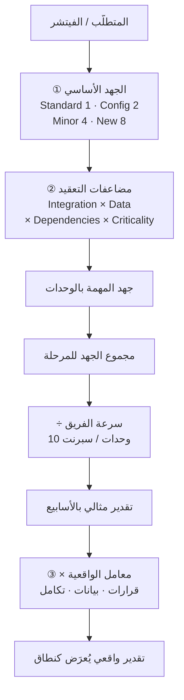
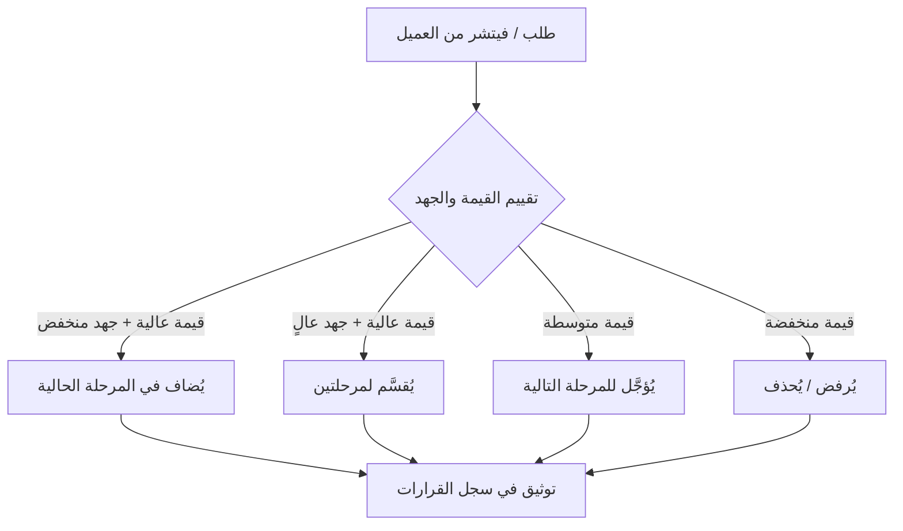

> [!info] المحاضرة 04 · قيادة التسليم
> **ماذا ستتعلّم:** كيف تبني تقديرًا زمنيًا واقعيًا لمشروع ERP باستخدام تحليل الملاءمة والفجوة ومعامل الواقعية، وكيف تضبط نطاق المشروع عبر مقايضة القيمة والجهد والمخاطر وسبع استراتيجيات عملية، بحيث تسلّم قيمةً مبكرة وتوزّع المخاطر على مراحل.

# المحاضرة 04 — التقدير الواقعي وضبط النطاق واستراتيجيات التسليم على مراحل

## 🎯 أهداف التعلّم

- إتقان طريقة **التقدير القائم على الملاءمة والفجوة مع المعايرة المرجعية** (`Fit-Gap Estimation with Reference Calibration`) بمحاورها الثلاثة.
- تحويل التقدير النوعي إلى مقياس كمّي عبر أوزان الجهد (1/2/4/8) ومضاعفات التعقيد.
- حساب مدة المشروع من خلال سرعة الفريق ثم تعديلها بمعامل الواقعية للوصول إلى تقدير أقرب للواقع.
- ضبط النطاق ومنع زحف النطاق عبر مقايضة القيمة والجهد والمخاطر واتخاذ قرار واضح: يُضاف / يُؤجَّل / يُرفض.
- تطبيق سبع استراتيجيات لضبط النطاق، وربط مستندات المشروع بمراحله وفق «القاعدة الذهبية» لتقليل التغيير كلما اقتربنا من الإطلاق.

## الفكرة المحورية

في المحاضرة الثالثة أضفنا إلى المشروع «طبقة التسليم» ([[Delivery Layer]])، وتعلّمنا كيف نكتشف مشاكل العميل ونحوّلها إلى قيمة عبر [[Value Stream|تدفّق القيمة]] وخرائط العمليات ومعايير النجاح. المحاضرة الرابعة تكمل هذه الرحلة بالإجابة عن سؤالين حاسمين يواجهان مدير التسليم فور الاتفاق على القيمة: **كم يستغرق المشروع فعلًا؟** و**كيف نمنع النطاق من التفلّت أثناء التنفيذ؟** الفلسفة الجامعة لكل ما يلي هي: سلِّم القيمة مبكرًا، وخُذ المخاطر مبكرًا، ووزّعها على المراحل حتى تصل نهاية المشروع بأقل خطورة ممكنة.

ولاحظ أن السؤالين مترابطان أشدّ الترابط، وأن الفصل بينهما هو أحد أسباب فشل التسليم في كثير من الشركات. فالتقدير الذي لا يقترن بضبط للنطاق يتحوّل بعد أسابيع قليلة إلى رقم بلا معنى، لأن النطاق الذي قُدِّر عليه لم يعد هو النطاق القائم. وضبط النطاق الذي لا يستند إلى تقدير كمّي يتحوّل إلى جدال ذوقي مع العميل: «هذا مهم» في مقابل «هذا غير مهم»، وهو جدال لا ينتهي ولا يُقنع أحدًا. لذلك سنبني في هذه المحاضرة **مقياسًا كمّيًّا واحدًا** يخدم الغرضين معًا: يعطينا مدةً نستطيع الدفاع عنها، ويعطينا في الوقت نفسه أساسًا موضوعيًّا لقبول أي طلب أو تأجيله أو رفضه.

## مراجعة المحاضرة الثالثة: من المشكلة إلى القيمة

قبل الدخول في الموضوع الجديد، لنستعرض بسرعة الخطوات التي تُبنى عليها طبقة التسليم في أي مشروع، سواء بدأناه من الصفر أو التحقنا به في إحدى مراحله. والملاحظة المهمة هنا أن هذه الخطوات **ليست مرتبطة بمرحلة بعينها**: أنت قد تدخل المشروع في مرحلة التحليل، أو التصميم، أو حتى بعد أن بدأ التطوير فعلًا — وفي كل الحالات تستطيع أن تضيف طبقة التسليم فوق ما هو قائم دون أن تهدم شيئًا.

### اكتشاف المشاكل: 50% من العميل + 50% من التحليل الداخلي

الخطوة الأولى أن نعرف المشاكل العامة. حين نجلس مع العميل يخبرنا عن المشاكل التي يعانيها في يومه، وهذه في الغالب مشاكل **متكرّرة** تصادفه يوميًّا وتسبّب له ألمًا حقيقيًّا ملموسًا — ولهذا تحديدًا يتذكّرها ويذكرها لك أول ما تسأله. لكن هذه المشاكل «الظاهرة» تمثّل نحو **50%** فقط مما يجب أن نكتشفه؛ أما الـ **50%** الباقية فنكتشفها عندما نحلّل المشروع داخليًا بتفصيل أعمق، لأنها مشاكل لا يراها العميل بنفسه أو تعوّد عليها حتى صارت جزءًا من الطبيعي عنده.

> [!example] المشاكل التي يذكرها العميل عادةً في الجلسة الأولى
> حين تسأل العميل «ما المشاكل التي تواجهك؟» تأتيك إجابات من هذا النوع، وهي إجابات من **واقع عمله** لا من تحليل:
>
> - هل هناك **تأخير في دورة المبيعات**؟ الطلب يبقى أيامًا قبل أن يتحوّل إلى فاتورة.
> - **نسبة تالف عالية** في المخازن أو خط الإنتاج.
> - **تأخّر في الحضور** وكثرة الغياب بلا انضباط.
> - **فوضى في الإجازات**: من استحقّ ومن لم يستحقّ، وبأي رصيد.
> - **مشاكل في الرواتب**: خصومات غير دقيقة، وحسابات يدوية.
>
> اجمع هذه القائمة كما هي، ثم اسأل عن كل مديول على حدة: هل فيه تأخير؟ هل فيه إضافات؟ هل فيه مشكلة بشكل معيّن؟ تخرج من الجلسة بمجموعة مشاكل جاهزة — وهي نصف الصورة.

للتحليل الأعمق نستخدم [[Value Proposition Canvas|لوحة القيمة المقترحة]]: نصنّف المتعاملين مع النظام إلى مجموعات، ثم لكل شريحة نحدّد الوظائف التي يؤدّيها (`Jobs`) و[[Pain Point|نقاط الألم]] المرتبطة بمهامه ونقاط المكاسب (`Gains`) المقابلة لها. من هذا التحليل تظهر الـ 50% الثانية من المشاكل.

> [!example] كيف تُدار لوحة القيمة المقترحة عمليًّا
> **الخطوة 1 — التصنيف:** لا تتعامل مع «العميل» ككتلة واحدة. قسّم كل المتعاملين مع النظام أو المشروع إلى مجموعات: مندوب المبيعات، أمين المخزن، المحاسب، مدير المصنع، موظف الموارد البشرية، الإدارة العليا.
>
> **الخطوة 2 — الوظائف (`Jobs`):** لكل مجموعة اسأل: ما الوظائف التي يطمح إليها أو التي يؤدّيها في شكله الأساسي؟ مندوب المبيعات مثلًا: يزور العميل، يسجّل الطلب، يتابع التحصيل.
>
> **الخطوة 3 — نقاط الألم (`Pains`):** ما الألم المرتبط بكل مهمة من هذه المهام تحديدًا؟ (لا ألمًا عامًّا، بل مرتبطًا بالمهمة).
>
> **الخطوة 4 — المكاسب (`Gains`):** ما المكسب المقابل لكل نقطة ألم؟
>
> بعد أن تحلّل هذه النقاط كلها تخرج بتحليل أعمق، وتنضمّ حصيلته إلى الـ 50% الأولى فتكتمل عندك الصورة: **لا فجوة بعد اليوم بين ما قاله العميل وما يحتاجه فعلًا.**

### من الوحدات إلى تدفّقات القيمة

الخطوة التالية تغيّر طريقة تفكيرنا: بدلًا من التحدّث عن «الموديولات» (المخازن، المبيعات، الحسابات...) نصنّف المشروع كله على شكل **تدفّقات قيمة** ممتدة من البداية إلى النهاية. فمثلًا `Order-to-Cash` تدفّق كامل، والتصنيع تدفّق آخر، وهكذا. ثم نربط الموديولات بكل تدفّق لنعرف من يدخل فيه (المبيعات، المخازن، الحسابات...).

الفائدة العملية من هذا الربط أنك تعرف بالضبط **من الأطراف الداخلة في كل تدفّق**: هذا التدفّق يدخل فيه `CRM` والمبيعات والمخازن والحسابات؛ وذاك يدخل فيه التصنيع والجودة والمشتريات. وهذه المعرفة هي ما يجعل تقدير الجهد لاحقًا ممكنًا أصلًا، لأنك لا تستطيع أن تقدّر شيئًا لا تعرف حدوده.

نركّز بعدها بشكل متعمّق على القيمة التي يوفّرها كل تدفّق للعميل؛ والسبب منطقي: **إذا ركّزنا على حلّ المشاكل الأساسية والمؤثّرة فسينعكس ذلك مباشرةً على الطرف الآخر من المعادلة — وهو الخطة التي التزمنا بها مع العميل.** بعبارة أخرى: حلّ المشاكل الجوهرية يشتري لك رضا العميل، ورضا العميل يشتري لك مساحة في الجدول الزمني. ثم نمضي إلى التدفّق الثاني بنفس الفكرة، فالثالث، فالرابع.

بعد ذلك نرتّب التدفّقات حسب الأولوية، والترتيب له منطق واضح:

1. **أولوية عالية:** التدفّق المرتبط بتوليد نقد (تدفّق نقدي مباشر).
2. **أولوية ثانية:** التشغيلي — كالتصنيع، لأنه تشغيلي بدرجة كبيرة ويعطّل الأعمال إذا تعطّل.
3. **ثم البقية** حسب أثرها.

وليس هذا ترتيبًا جامدًا: إذا كانت نقاط البيع (`POS`) عند عميل معيّن هي مصدر النقد المباشر فقد تصبح هي الأولوية الأولى، ويصير التدفّق النقدي الآخر ثانيًا، والتصنيع ثالثًا. المعيار هو **أين يتولّد النقد ويتوقّف التشغيل عند هذا العميل تحديدًا**.

### خرائط العمليات وتعريف الأثر ومعايير النجاح

على مستوى كل تدفّق نرسم [[Value Stream Mapping|خريطة تدفّق القيمة]] وخرائط العمليات (`Process Maps`) خطوةً بخطوة من البداية إلى النهاية. وعند اكتمال الخريطة نستطيع أن نحسّن العملية نفسها: نختصر خطوات، أو نضيف خطوات، أو نغيّر الطريقة حسب العميل والمشاكل التي يواجهها. وهذه نقطة كثيرًا ما تُهمَل: **الخريطة ليست توثيقًا فقط، بل هي أداة تحسين.** ما دام أمامك الفلو كاملًا مرسومًا فأنت قادر على أن تحسبه وأن تحسّنه؛ أما إذا بقي في الرؤوس فلن تحسّن شيئًا.

ثم نكتب تعريف الأثر (`Project & Outcome Definition`) فنبلور مجموعة القيمة الأساسية التي سنركّز عليها مع العميل — على مستوى العميل أو على مستوى المشروع كله.

هنا تظهر التفرقة بين [[Outcome vs Output|المخرَج والأثر]]: نحدّد الأهداف بصيغة `2X` أو [[2X and 10X Goals|10X]]. والقاعدة في الاختيار عملية جدًّا: إذا كان العميل **يطمح إلى تغيير طريقة عمله الحالية** ووافق على التحسينات التي طرحتها عليه، فأنت تستطيع أن تضع أهدافًا بمستوى `10X` لأنه سيمشي معك. أما إذا لم يوافق على تغيير طريقة عمله، فاكتفِ بـ `2X`، لأن التحسين حينها محدود بحدود العملية القديمة.

> [!example] معيار نجاح كمّي: خفض الهدر من 30% إلى 10%
> إذا كان العميل يعاني هدرًا بنسبة **30%** في وضعه الحالي، نجعل من معايير النجاح أن تنخفض النسبة إلى **10% أو أقل** كحدّ أقصى. ولاحظ الآلية: نقيس الوضع «قبل» ثم نقيس «بعد»، فيكون المعيار قابلًا للإثبات لا للجدال.
>
> ومعايير النجاح لا تُخترع من فراغ، بل تُشتقّ من ثلاثة مصادر مجتمعة: **فهمنا لمشاكل العميل** + **تعريف القيمة الذي كتبناه** + **الحاجات الأساسية التي حدّدنا أننا سنعمل عليها كتحسين**.
>
> من معايير النجاح الأخرى: ربط الأجهزة (كأجهزة البصمة) بالرواتب لمنع الفوضى، وتنظيم حضور الموظفين والانصراف. كل معيار محقَّق = قيمة نقدّمها للعميل (خفض تكاليف أو زيادة إيرادات).

> [!example] المعيار نفسه يتحوّل إلى قصة نجاح تسويقية
> **من جانب العميل:** المعيار المحقَّق قيمة — قلّلت له التكاليف، زدت له الإيرادات، خفّضت له المخاطر، نقلته من تجربة سيئة إلى تجربة أفضل.
>
> **من جانبك أنت كمدير مشروع أو كشركة منفّذة:** المعيار نفسه هو **قصة نجاح** (`Success Story`). الآلية: بعد أن تطلق (`Go-Live`) انتظر **شهرًا أو شهرين** ثم ابدأ القياس — هل تحقّقت المعايير أم لا؟ فإذا تحقّقت صارت لديك قصة موثَّقة بالأرقام.
>
> **الاستخدام:** تعرضها على العميل التالي، وتذكرها في سيرتك الذاتية: «عملت في مشروع كانت نتائجه واحد، اثنان، ثلاثة». وهذا شيء تلمسه في شغلك فعلًا لا شيء تدّعيه.

### حواجز الحماية وسجل القرارات وضبط النطاق

بعد ذلك نحدّد [[Guard Rails|حواجز الحماية]]: القيود أو الحدود التي نرسمها في المشروع ولا نتجاوزها، وننتبه إليها طوال فترة العمل.

> [!example] أربعة أنواع من حواجز الحماية
> - **حدّ زمني:** موديول معيّن يجب أن يُسلَّم قبل تاريخ محدَّد. هذا حدّ لا يُتجاوز.
> - **خطة مُلزِمة:** لديك خطة يجب الالتزام بها كما هي.
> - **حدّ مالي:** ميزانية محدودة لمرحلة معيّنة يجب ألّا تتخطّاها.
> - **حدّ تقني/إجرائي:** فُرِض على المشروع أن يعمل بتقنية معيّنة، أو بميزة معيّنة، أو بآلية عمل معيّنة، أو أن يسير وفق طريقة محدَّدة سلفًا.
>
> **القاعدة:** أي قيد فُرِض عليك في المشروع هو حاجز حماية — يجب أن تنتبه له باستمرار وأنت تشتغل، لا أن تتذكّره عند الاصطدام به.

أما المخاطر و[[RAID Log|سجل RAID]] فسنشرحهما لاحقًا لأننا لم نشرح جزئية المخاطر بعد، لكن المهم الآن **مبدأ التوثيق**: أي قرار يُتخذ في المشروع يجب أن يُسجَّل في [[Decision Log|سجل القرارات]] بسببه وأثره على المشروع والاتفاق الحاصل بين الطرفين. أمثلة القرارات التي تُسجَّل:

- **قرار تقسيم المشروع إلى مراحل** — هذا قرار، سجّله.
- **تغيير تقني:** كنتم تعملون بطريقة، ثم جرى تقييم فغُيِّرت الطريقة إلى أخرى مختلفة. هذا قرار أثّر على طريقة العمل تقنيًّا.
- **مفاضلة بين موديولين** أو بين طريقتين، فاختير أحدهما.

وكلما تغيّرت الخطة بناءً على قرار، تكتب أيضًا أن التغيير حصل بسبب كذا وكذا. **هكذا تحمي نفسك لو حدث نزاع لا قدّر الله**، لأن لديك «التاريخ» (`History`) الكامل للقرارات التي تمّت في المشروع.

كل تغيير في النطاق يُسجَّل كذلك في **Scope Matrix**: أي تعديل على مستوى الفيتشر يُوثَّق عبر إصدارات (Version 1، 2، 3، 4...) — الإصدار الأول بمزاياه، ثم إن تغيّرت مزايا في الإصدار الثاني تُسجَّل، وهكذا. حتى لو كنتم تشتغلون بطريقة كاملة ثم غيّرتموها كلها، فكلها تُسجَّل عندك، لتبقى لديك **صورة كاملة لتطوّر المشروع** تستطيع أن تستخرجها في نهايته من الوضع الحالي.

### التقسيم إلى مراحل: القيمة المبكرة و[[MVP|أقل منتج قابل للتشغيل]]

آخر ما تحدّثنا عنه سابقًا: هدف تقسيم المشروع إلى مراحل هو **تقليل المخاطر في المراحل الأخيرة قدر الإمكان** بأخذها مبكرًا، حتى يقلّ أثرها معنا عند تسليم المشروع في النهاية.

والمهم أن تفهم **ما الذي نغيّره وما الذي نُبقيه**: نحن نلتزم بنفس الخطة، ونثبّت النطاق، ونثبّت الزمن، ونثبّت الجودة — ثم «نلعب» في **طريقة التنفيذ** فقط. أي مخاطرة تؤثّر على تسليم المشروع نحاول أن نجلبها إلى وقت مبكر لنعالجها هناك.

المرحلة الأولى هي **الـ Core**: وليست بالضرورة موديولًا واحدًا؛ قد تجمع المخازن + المبيعات + الحسابات + الإعدادات + الصلاحيات بشكل معيّن. تعريف الـ Core بدقّة: **تشغيل نشاط العميل بأبسط صورة وبالحدّ الأدنى، لكن بحيث يعمل بشكل مستقل وكامل.** تحدّد كل المزايا التي تُشغّل الجهة بشكل مبسّط، **دون** الفيتشرات أو التخصيصات التي طلبوها إن لم تكن أساسية في التشغيل. هذا هو معنى [[MVP|أقل منتج قابل للتشغيل]].

فوائد البدء بالـ Core:

- **قيمة مبكرة:** يبدأ العميل العمل ويستلم قيمة ويتعوّد موظّفوه على النظام.
- **معالجة فورية:** تظهر المشاكل مبكرًا فنعالجها مباشرةً — ونحن نشتغل في المرحلة الثانية نكون نعالج مشاكل المرحلة الأولى — وتصلك تغذية راجعة مباشرة، وتفهم العميل بشكل أعمق.
- **دروس مستفادة:** تصبح لديك تجارب ودروس من المرحلة الأولى تتلافاها في الثانية، فيكون [[19 - Risk Management|الخطر]] أقل. لو حدث تأخير في الأولى فلن يتكرّر في الثانية، لأنك عرفت المشاكل وعرفت كيف تعالجها مع هذا العميل تحديدًا. فتصير عندك **مرحلة أولى مستقرّة شغّالة**، والثانية = الأولى + تحسين في الفيتشرات، ثم الثالثة تحسين فوق ذلك.

> [!example] كيف تختار عدد المراحل حسب حجم المشروع
> حجم التقسيم يعتمد على حجم المشروع نفسه، ولا توجد قاعدة واحدة تصلح للجميع:
>
> | حجم المشروع | عدد المراحل المقترح |
> |---|---|
> | مشروع بسيط: **شهران – ثلاثة** | **مرحلة واحدة** — التقسيم هنا تكلفة بلا عائد |
> | مشروع متوسط: **7 – 8 أشهر** | **مرحلتان** — Core ثم التخصيصات |
> | مشروع كبير: **سنة ونصف** | **ثلاث أو أربع مراحل** حسب طبيعته |
>
> **الفكرة الجوهرية وراء الجدول كله:** ألّا نُبقي العميل ينتظر **سنة كاملة** حتى يرى أول مُخرَج منك. سلّمه شيئًا مبكرًا يستطيع أن يراه ويبدأ العمل عليه، وأثناء عمله عليه نكون نحن نشتغل في المرحلة التالية، وهكذا.

## التقدير الواقعي: تحليل الملاءمة والفجوة (Fit-Gap Estimation)

نريد تقديرًا واقعيًا أقرب إلى المنطق. الطريقة اسمها [[Fit-Gap Analysis|تحليل الملاءمة والفجوة]] مع المعايرة المرجعية (`Fit-Gap Estimation with Reference Calibration`). المصطلح ليس مهمًّا حفظه، المهم الفكرة: **تقدير مبنيّ على ثلاثة محاور، ثم معايرة بوضعنا نحن كفريق أو كشركة.**

### المحاور الثلاثة للتقدير

يقوم التقدير على تفكيك العمل إلى ثلاث طبقات:

1. **حجم العمل نفسه:** ما شكله؟ هل هو بسيط، متوسط، أم معقّد؟ هل فيه شغل كثير أم قليل؟ هذا هو العامل الأول.
2. **تعقيد التنفيذ:** هل هناك `Integration` مع أنظمة أو أدوات أخرى أم لا؟ هل تحتاج بيانات يجب تجهيزها؟ هل المهمة تعتمد على أكثر من حاجة ([[Dependency|Dependencies]])؟ هل هناك قيود زمنية ملزمة يجب الالتزام بها؟
3. **معايرة بالواقع:** [[18 - Velocity|سرعة الفريق]] — هل هو فريق احترافي، أم متوسط، أم مبتدئ، أم فريق جديد عيّنّاه للتوّ؟ كلها تفرق. وهل سبق للشركة تنفيذ مشاريع مشابهة؟ إذا كنّا نفّذنا نظام `ERP` شبيهًا من قبل فسنستفيد من المعلومات التي أخذناها من المشروع السابق في تقدير المشروع الجديد. سرعة تنفيذ المشروع تختلف كليًّا بين شركة بدأت للتوّ وشركة راكمت خبرة، وبين مشروع مألوف ومشروع يُنفَّذ لأول مرة.

### لماذا لا نكتفي بالطرق التقليدية؟

> [!warning] عيوب الطرق التقليدية في التقدير
> - **التقدير بالأيام:** أقول «هذه خمسة أيام، وهذه ثلاثة أيام»، ثم أجمع كل الفيتشرات المطلوبة بالأيام فأخرج بأن «المشروع يأخذ ستة أو سبعة أشهر». هي طريقة ممكنة، لكنها **تتجاهل حالات الانتظار** والاعتماديات بين الموديولات التي تشتغل عليها؛ هذه الجزئية لا تظهر أصلًا في حساب الأيام. وحتى لو أضفت هامشًا (`Gap`) فقد لا يكون دقيقًا بشكل كبير.
> - **User Stories:** ممتازة **على مستوى التفاصيل الدقيقة**، لكنها لا ترى المشروع كتدفّق كامل — تركّز على الجزئيات فقط. ويمكن أن ندخلها فعلًا: إذا اشتغلنا على المستوى الكامل ثم أمسكنا جزءًا من الفلو نريد تفصيله، فهي ممتازة لذلك. لكنها على مستوى مشروع كامل كفلو غير مناسبة.
> - **WBS / أسلوب الشلّال (Waterfall):** من يعملون بالشلّال أو بمنهجية `PMI` غالبًا يشتغلون بـ[[هيكل تجزئة العمل (WBS)|WBS]]، فيحدّدون كل المهام مبكرًا ويقسّمونها. وهو **يقسّم العمل بطريقة منظّمة وممتازة**، لكنه **يهمل الجانب المتعلّق بالقيمة** ويركّز فقط على المميزات والمهام المرتبطة بالمشروع.
>
> نحن نريد أن نوازن بين **القيمة + الواقع + التعقيد + التنفيذ** معًا في مقياس واحد — لا أن نضحّي بأحدها في سبيل الآخر.

### المقياس الكمّي: أوزان الجهد ومضاعفات التعقيد

نحوّل الكلام إلى قيم كمّية ليكون **أسهل وأوضح**، بدلًا من أن يكون تقديريًّا فيختلف كل شخص عن الآخر. **الوزن الأول** يقيس مدى تغطية النظام القياسي (`Standard`) للمتطلَّب: هل يغطّيها بالكامل؟ أم جزئيًّا؟ أم بإعدادات وتهيئة بسيطة؟ أم أنها غير موجودة أصلًا وتحتاج بناءً جديدًا؟

| الحالة | الوزن (الجهد الأساسي) |
|---|---|
| قياسي يغطّيها بالكامل (`Standard`) | 1 |
| إعدادات + تهيئة بسيطة (`Configuration`) | 2 |
| تعديل بسيط (`Minor Customization`) — إعداد + تعديلات بسيطة تغطّيها | 4 |
| جديد كليًّا يحتاج تخصيصًا كبيرًا (`New / Big Customization`) | 8 |

> [!warning] هذه الأوزان جهد وليست زمنًا
> كل هذه الأوزان بالنسبة لنا **عبارة عن جهد فقط**. هي ليست زمنًا وليست تقديرًا زمنيًّا. من يخلط بينهما سيقع في خطأ مركّب: سيحوّل الأرقام إلى أيام قبل أن يُدخل التعقيد والمعايرة، فيخرج برقم متفائل ثم يبني عليه وعدًا للعميل. الزمن يأتي **لاحقًا** عبر سرعة الفريق ومعامل الواقعية، لا الآن.

ثم نضرب هذا الجهد الأساسي في **مضاعفات** تعكس تعقيد التنفيذ. وقد قسّمنا كل محور من محاور التعقيد إلى **ثلاثة أوزان** (بسيط / متوسط / عالٍ):

| المضاعِف | بسيط | متوسط | عالٍ |
|---|---|---|---|
| التكامل / التعقيد (`Integration`) | 1.0 | 1.2 | 1.5 |
| البيانات (`Data / Migration`) | 1.0 | 1.2 | 1.5 |
| الاعتماديات (`Dependencies`) | 1.0 | 1.2 | 1.4 |
| الحرجيّة الزمنية (`Criticality`) | 1.0 | 1.2 | 1.4 |

وتفصيل قراءة كل محور:

- **التكامل:** إن لم يكن هناك تكامل أو كان بسيطًا فالوزن `1.0`. وإن كان متوسطًا — حاجات ليست كثيرة ولا معقّدة، أشياء «مقدور عليها» — فالوزن `1.2`. أما إن كان عاليًا — تكامل مع أجهزة البصمة، ومع نظام وزارة، ومع الزكاة والدخل، وهكذا — فالوزن `1.5`.
- **البيانات:** لا بيانات أو بيانات أساسية فقط ← `1.0`. نقل بيانات متوسط أو ماستر داتا ← `1.2`. ترحيل بيانات كامل (`Migration`) ← `1.5`.
- **الاعتماديات:** لا اعتماد على شيء ← `1.0`. اعتماد متوسط ← `1.2`. اعتماد عالٍ بحيث إن أي شيء تشتغله يجب أن تأخذ في اعتبارك ما يعتمد عليه ← `1.4`.
- **الحرجيّة الزمنية:** لا إشكالية زمنية ← `1.0`. متوسط ← `1.2`. مرتبط بزمن فعلي محدَّد أو مقيَّد — من الوزارة أو من جهة رقابية مثلًا ← `1.4`.

> [!note] كيف تقرأ المضاعِف؟
> عندما نقول `1.2` فنحن لا نعني «واحدًا» فقط، بل «واحدًا زائد 0.2» — أي أن التعقيد أضاف ما نسبته 20% تقريبًا على الجهد الأساسي لتلك المهمة. فالمضاعفات هنا تقيس **زيادة التعقيد بشكل نسبي**، لا قيمة مطلقة دقيقة: تقريبًا 10% أو 30% أو 60% حسب الحالة. والأرقام ليست قياسًا عالميًّا ثابتًا (`Standard`)؛ يمكن ضبطها حسب نظامك ومعطياتك، لكننا وضعناها بهذه الصورة **كتبسيط عملي** يسهل تطبيقه.

الصيغة إذًا:

> **جهد المهمة = الجهد الأساسي (1 / 2 / 4 / 8) × مضاعِف التكامل × مضاعِف البيانات × مضاعِف الاعتماديات × مضاعِف الحرجيّة**

والنتيجة العملية أن قيمة أي بند بعد الضرب تقع تقريبًا **بين وزنه الأساسي وضعفه**؛ فالبند الذي وزنه الأساسي 8 لن ينفجر إلى 40، بل يستقر في حدود 9 أو 10 أو 12 حسب تعقيده. وهذا مقصود: المقياس مصمَّم ليكون منضبطًا لا متفجّرًا.

### المثال المحوري: تقدير تدفّق Order-to-Cash

السؤال الذي نريد الإجابة عنه صريح: **هل نستطيع تنفيذ كل متطلّبات `Order-to-Cash` دفعةً واحدة، أم نقسّمها على مرحلتين؟** ولن نجيب بالحدس، بل بالقياس.

> [!example] الخطوة 1 — رسم العملية واستخراج المتطلَّبات
> رسمنا العملية أولًا من بدايتها إلى نهايتها:
>
> `Lead` ← `Opportunity` ← `Quotation` ← `Sales Order` ← `Delivery` ← `Invoice` ← `Payment`
>
> ثم أضفنا التخصيصات التي طلبها العميل فوق هذا المسار:
>
> - **إظهار الرصيد** داخل الشاشة.
> - **حدّ الائتمان** (`Credit Limit`).
> - **الخصم المستهدف** (`Target Discount`).
> - **الائتمان** (`Credit`).
>
> وبفرز هذه القائمة تبيّن أن الحاجات الأساسية التي طلبها العميل والتي **يجب أن تعمل معنا في المرحلة الأولى** عددها **تسعة متطلَّبات** تقريبًا. هذه هي مادة الحساب.

> [!example] الخطوة 2 — تسعير كل متطلَّب بوزن الجهد الأساسي
> نمسك كل متطلَّب على حدة ونسأل: **هل هو موجود في النظام القياسي؟** ثم نعطيه وزنه:
>
> | خطوة العملية | التقييم | الوزن الأساسي | لماذا؟ |
> |---|---|---|---|
> | Lead → Opportunity | قياسي | **1** | موجودة كما هي في الـ `Standard` |
> | Opportunity → Quotation | إعدادات | **2** | موجودة لكن تحتاج ضبط إعدادات |
> | Quotation → Sales Order | إعدادات | **2** | نفس الفكرة، إعدادات فقط |
> | Delivery (طلب بسيط) | تعديل بسيط | **4** | طلبه العميل بشكل بسيط لكنه ليس قياسيًّا تمامًا |
> | Delivery → Invoice | تعديل بسيط | **4** | عادية في أصلها، لكن فيها تفصيل يجعلها تعديلًا بسيطًا |
> | متطلَّب جديد غير موجود | جديد كليًّا | **8** | غير موجود أصلًا، فهو كبير بالنسبة لنا ويحتاج بناءً |
>
> لاحظ أن التسعير هنا **ميكانيكي ومتّسق**: السؤال واحد لكل بند، والإجابة تُترجَم إلى رقم من أربعة خيارات فقط. هذا ما يقلّل الخلاف بين شخص وآخر.

> [!example] الخطوة 3 — ضرب كل بند في مضاعفاته
> الآن نمسك كل بند على حدة ونضربه حسب المعادلة. **نحسبها واحدة واحدة، لا دفعة واحدة:**
>
> - **البند الأول:** بسيط، بلا تكامل ولا بيانات ← بقي كما هو: **1**.
> - **البند الثاني:** **2**.
> - **البند الثالث:** **2**.
> - **البند الرابع (الجديد، وزنه الأساسي 8):** هذا مختلف قليلًا. عند القياس تبيّن أن **التكامل متوسط**، و**البيانات 1.2**، و**الحرجيّة الزمنية 1.0**. فالضرب يعطي: **8 × 1.2 ≈ 9.7 ≈ 10 وحدات**.
> - **البقية:** بنفس الفكرة تمامًا، كل بند بأرقامه الأساسية ومضاعفاته.
>
> والدرس هنا: **البنود البسيطة لا يزيدها المقياس تعقيدًا**، والبنود الثقيلة هي وحدها التي يرفعها التعقيد. هذا بالضبط ما نريده من أي مقياس جيد.

> [!example] الخطوة 4 — المجموع والمقارنة والقرار
> بعد أن جمعنا كل الأرقام:
>
> - **مجموع جهد الـ Core ≈ 32 وحدة** (بدقّة 32.5 وحدة). هذه هي «وحدة الجهد» بالنسبة لنا.
> - **مجموع جهد التخصيصات** (`Customization`) حُسِب في جدول **منفصل**: البندان الكبيران — الخصم/الهدف والائتمان مع الفروع — خرجا بقيمتَي **21** و**25** ← **≈ 46 وحدة**.
>
> **المقارنة:** الأشياء القياسية التي يغطّيها النظام والتي تحتاج تعديلات بسيطة كلّفتنا **32 وحدة**؛ بينما التحسينات ذات المطلب العالي كلّفتنا **46 وحدة**.
>
> **القرار:** بما أن الـ Core **لا يأخذ جهدًا عاليًا** وفي الوقت نفسه هو **الأعلى قيمة تشغيلية**، نخرجه كمرحلة أولى، ونفصل جزء التحسينات ليكون مرحلة ثانية.
>
> **التعميم:** هذه واحدة من الأدوات التي تساعدك على أن تقرّر: مرحلة واحدة أم مرحلتان؟ فأنت تمسك تدفّق القيمة، وتحسب كل نقطة فيه: الجهد، والتعقيد المرتبط بها، والبيانات، وكل شيء — فتخرج بمجموع. ثم تحسب ما هو مطلوب في الـ Core أو المرحلة الأولى، فتفاضل بين الاثنين. **الاستثناء المهم:** لو تبيّن أن التخصيصات **ضرورية للتشغيل** فستتغيّر الطريقة التي تقسّم بها المشروع إلى مرحلتين — لأن الأولوية للتشغيل لا للأرقام وحدها.

### من الجهد إلى الزمن: سرعة الفريق

حتى الآن معنا **جهد** لا **زمن**. لتحويل الجهد إلى زمن نحتاج إلى [[18 - Velocity|سرعة الفريق]]. نفترض — بناءً على **تاريخ الفريق** (`History`) لا بناءً على التمنّي — أن الفريق يسلّم **10 وحدات كل أسبوعين**، والسبرنت الواحد عندنا أسبوعان:

- **الـ Core:** 32 ÷ 10 ≈ **3.2 سبرنت** → أي نحو **3 سبرنتات** → **6 إلى 7 أسابيع** لإنجاز الحاجات الأساسية.
- **التخصيصات:** 46 ÷ 10 ≈ **4.6 سبرنت** → أي نحو **4–5 سبرنتات** → **9 إلى 10 أسابيع**.

> [!note] لماذا التقسيم على مرحلتين أصلًا؟
> لو نفّذت المشروع كاملًا دفعة واحدة — تحلّل، ثم تطوّر، ثم تختبر، ثم تجلس مع العميل، ثم تأخذ الموافقة، ثم تنتقل للتالي، ولا تسلّم شيئًا حتى تنتهي من المشروع بالكامل وتعمل إطلاقًا واحدًا لكل شيء — فإن **المخاطر تصبح عالية جدًّا** وتتجمّع كلها في لحظة التسليم الأخيرة.
>
> أما لو قسّمت التنفيذ على مرحلتين فأنت تقلّل المخاطرة بشكل كبير: **الهدف أن تكون المخاطرة في نهاية المشروع أقل ما يمكن.** ولتحقيق ذلك توزّع المخاطر بين المراحل، فكل المراحل التي تصل بك إلى نهاية المشروع تكون أقل خطورة.

### معامل الواقعية (Reality Factor)

بعد أن خرجنا بالتقدير المبدئي يجب أن نسأل سؤالًا مزعجًا: **هل يستطيع الفريق فعلًا أن يشتغل بهذه السرعة؟** فالتقدير أعلاه يفترض ضمنيًّا أن «كل شيء مثالي»: العمل شغّال ولا يتوقّف، القرارات تُتَّخذ بشكل فوري، البيانات جاهزة، ولا يوجد أي انتظار. وهذا هو الافتراض الذي نقع فيه في **أغلب** تقديراتنا، ولهذا يخرج التقدير غير دقيق بشكل كبير.

الحل أن نضيف طبقة إضافية: **موازنة أو معايرة بالواقع الذي نعيشه الآن**، وهي [[Reality Factor|معامل الواقعية]] الذي نضربه في التقدير المبدئي. ونحدّده عبر ثلاثة أسئلة نجمع نقاطها:

| السؤال | جيد (0) | متوسط | ضعيف |
|---|---|---|---|
| **1. هل القرارات بيننا وبين العميل سريعة؟** يرد خلال يوم أو يومين بالكثير | 0 | نقطة متوسطة | يأخذ أسبوعًا فأكثر ← ضعيف |
| **2. هل البيانات جاهزة؟** الماستر داتا واضحة | 0 | جزء يحتاج تعديلًا وجزء جاهز ← `+0.2` | تحتاج تنظيفًا كاملًا قبل أن تُجهَّز وتُدخَل ← `+0.4` |
| **3. هل التكامل / التعقيد عالٍ؟** فيتشرات معقّدة، معادلات كثيرة | 0 | متوسط | عالٍ |

وتفصيل الأسئلة:

- **السؤال الأول (القرارات):** هل العميل يردّ خلال يوم أو يومين بالكثير على ما تطلبه منه، أم يأخذ أسبوعًا؟ إذا كان تجاوبه جيدًا فصفر؛ وإذا كان «نصف نصف» فهو متوسط وله نقطة تُضاف؛ وإذا كان يأخذ أسبوعًا فأكثر فتفاعله ضعيف.
- **السؤال الثاني (البيانات):** هل الماستر داتا جاهزة؟ أم تحتاج شغلًا لتجهيزها؟ هل فيها بيانات مُدخَلة بشكل خاطئ تحتاج معالجة أولًا ثم تجهيزًا؟ البيانات التي تحتاج **تنظيفًا** قبل أن تصلح للإدخال هي الحالة الضعيفة.
- **السؤال الثالث (التكامل والتعقيد):** هل هناك تكامل عالٍ؟ فيتشرات معقّدة مطلوبة؟ معادلات كثيرة؟ كلها تفرق.

> [!example] حساب معامل الواقعية في مثالنا وأثره على المدة
> **حالة المشروع:** القرارات كانت **بطيئة**، والبيانات كانت **غير جاهزة**، والتكامل كان **عاليًا**.
>
> **الجمع:** نجمع النقاط الثلاث ← يخرج المعامل قريبًا من **2** (وقد يصل إلى **2.2**). وواقعنا في هذه الحالة أن المشروع **معقّد**، فالمعامل منطقي.
>
> **الاختيار المحافظ:** نأخذ **الأقل احتياطًا** ونعتمد **×2** بدل 2.2 — لا نضخّم على أنفسنا.
>
> **الضرب:**
> - **المرحلة الأولى:** 6–7 أسابيع × 2 = **12 إلى 14 أسبوعًا** ← هذه هي `Phase 1`.
> - **المرحلة الثانية:** 9–10 أسابيع × 2 = **18 إلى 20 أسبوعًا** ← هذه هي `Phase 2`.
> - **إجمالي المشروع ≈ 7 إلى 8 أشهر.**
>
> **لماذا هذا التقدير أقرب للواقع؟** لأنك درست **سرعتك**، ودرست **تعقيد المشروع**، ودرست **التكامل الموجود فيه**، وحسبت **الفيتشرات** من البداية. أربعة مدخلات مستقلة اجتمعت في رقم واحد — لا حدس واحد.

### تقديم النتيجة للعميل: نطاق + قيمة مبكرة

عند الحديث مع العميل **لا نقول «7 إلى 8 أشهر» ثم نصمت**، لأنه قد يعترض على الموعد النهائي ويقول إن الزمن بعيد. بل نضيف شيئًا إضافيًّا في الجملة نفسها: **«ستشغّل المرحلة الأساسية خلال 12 إلى 14 أسبوعًا»**. عند ذلك سيستلم قيمةً مبكرة خلال 12–14 أسبوعًا، وسيبدأ موظّفوه العمل فعلًا — فتقلّ مقاومته للمدة الإجمالية سواء كانت سبعة أشهر أو ثمانية أو حتى سنة، لأن الاعتراض في الأصل لم يكن على المدة بل على **الانتظار بلا مقابل**.

> [!note] قدّم نطاقًا لا رقمًا واحدًا
> احرص دائمًا على تقديم **نطاق (Range)** لا رقم واحد. لا تقل «المشروع تسعة أشهر» أو «ثمانية أشهر» وتصمت؛ قل «من 7 إلى 8 أشهر». والسبب أنك بذلك **تأخذ احتياطك**: النطاق يمنحك هامشًا مشروعًا ومعلنًا مسبقًا، بدل أن تُضطرّ لطلب تمديد لاحقًا وكأنك أخفقت.

## ضبط النطاق: المقايضة (Scope Trade-off)

ما المقصود بضبط النطاق؟ نريد أن **نتحكّم في النطاق** بمجموعة من الممارسات ومجموعة من القيود التي نعمل بها في المشروع، لنضمن ألّا يحدث [[Scope Creep|زحف النطاق]] — أي ألّا يتفلّت نطاق المشروع من أيدينا، بل يبقى النطاق نطاقنا نحن.

والأداة الأساسية هي **المقايضة بين القيمة والوقت والمخاطر**. أنا أعمل مقايضة مع العميل من خلال هذه المحاور الثلاثة، ثم أخرج بقرار واحد من ثلاثة: **يُضاف / يُؤجَّل / يُرفض**.

عمليًّا نقيّم كل طلب على أساسين:

1. **القيمة:** هل هو ضروري لتشغيل العمل؟ هل هو شيء أساسي **في المرحلة التي نعمل فيها حاليًّا** تحديدًا؟ هل يحقّق فائدة مباشرة للعميل؟
2. **الجهد:** هل يحتاج وقتًا ويأخذ زمنًا؟ هل الفيتشر المطلوب معقّد؟ هل يحتاج تخصيصًا (`Customization`)؟ هل يحتاج تكاملًا؟ هل فيه مخاطر قد تؤخّر زمن تسليم المشروع أو المرحلة الحالية؟

بالنسبة بين هذين الاثنين أستطيع أن أتّخذ قرارًا.

### مصفوفة القيمة × الجهد

بناءً على الأساسين نتّخذ القرار وفق المصفوفة التالية:

| القيمة \ الجهد | جهد منخفض | جهد متوسط | جهد عالٍ |
|---|---|---|---|
| **قيمة عالية** | نفّذها مباشرة (Phase 1) | نفّذها بحذر مع مراعاة زمن التسليم | قسّمها لمرحلتين، أو أطلق جزءًا وأجّل الباقي |
| **قيمة متوسطة** | أضِفها إن توفّر وقت، وإلا أجّلها | قيّم: تُضاف أو تُؤجَّل | أجّلها مباشرة |
| **قيمة منخفضة** | احذفها (تُرفض) | احذفها | احذفها |

القاعدة الحاسمة: أي فيتشر **قيمته منخفضة يُحذف** بصرف النظر عن جهده — منخفض أو متوسط أو عالٍ. لماذا؟ **لأنه لا قيمة فعلية له بالنسبة للعميل.** لا أحد يدخل على تلك الشاشة أصلًا، ولا أحد يقدّم فيها طلبات، فلا داعي لأن نبذل الجهد في شاشة لا يستفيد منها أحد.

والقاعدة الحاكمة فوق المصفوفة كلها: **أي فيتشر أريد تسليمه يجب أن آخذ في اعتباري أن قيمته تأتي في المقام الأول**، ثم بعد ذلك أنتبه للجهد المرتبط به. الترتيب مقصود: القيمة أولًا، والجهد ثانيًا — حتى نسلّم أشياء ذات قيمة عالية للعميل، لا أشياء لا يستخدمها أحد فعليًّا.

> [!example] أربعة قرارات حقيقية من المصفوفة
> - **صلاحيات بشكل معيّن:** قيمتها **عالية** (تعطيه امتثالًا وقيمة متعلّقة بعمله)، والجهد فيها **بسيط** ← تدخل مباشرةً في المرحلة الحالية.
> - **فيتشر قيمته عالية وجهده عالٍ:** يمكن أن أقسّمها إلى مرحلتين، فآخذ **جزءًا بسيطًا منها في `Phase 1`** وأؤجّل الباقي.
> - **تقرير قيمته متوسطة وجهده عالٍ:** أؤجّله مباشرةً إلى المرحلة الثانية — لا يستحقّ أن يزاحم الـ Core.
> - **طلب قيمته منخفضة وجهده متوسط:** أحذفه مباشرةً. الجهد المتوسط لا يشفع لقيمة منخفضة.
>
> والمحصّلة أنك بعد تقييم كل الفيتشرات تعرف بالضبط ما الذي سيدخل في المرحلة التي تعمل فيها حاليًّا: **أنت ضامن أن كل ما دخل قيمته عالية وجهده متوسط أو منخفض.**

> [!example] الخطوات الأربع لتشغيل المصفوفة مع العميل
> **1. اجمع المتطلبات دون رفض أي شيء:** أي حاجة يريدها العميل نكتبها. لا نناقش ولا نرفض في هذه المرحلة، بل نجمع المتطلبات بشكل كامل.
>
> **2. صنّفها على المحورين:** من ناحية القيمة (عالية / متوسطة / منخفضة)، ومن ناحية الجهد (عالٍ / متوسط / منخفض).
>
> **3. ضعها في المصفوفة وقسّمها:** هذه ستُحذف، هذه ستُعدَّل، هذه ستُؤجَّل، وهكذا.
>
> **4. اعرض النتيجة على العميل وخذوا القرار معًا:** «هذه هي المرحلة الأولى التي سنشغّلها لك، للأسباب واحد واثنين وثلاثة». والسبب الأول أن الفيتشرات المحدَّدة قيمتها عالية بالنسبة له؛ والسبب الثاني هو **تكلفة التأخير**.

> [!note] القيمة تتغيّر مع الزمن (مثال الـ Dashboard UI)
> فيتشر كان ذا قيمة عالية في بداية المشروع قد تنخفض قيمته إذا طال الزمن وقعد **أكثر من ستة أشهر**. لماذا؟ لأن العميل في تلك الأثناء استلم جزءًا من المشروع، وبدأ يعمل عليه، ورأى أنه وصل إلى مرحلة معيّنة — فأعاد تقييم نفس الفيتشر الذي كان يطلبه. فأصبح الآن بالنسبة له بلا فائدة وبلا جدوى، أي **قيمته منخفضة** بعد أن كانت عالية.
>
> مثال ذلك لوحة العرض (`Dashboard UI`) التي طلبها في البداية، ثم تبيّن أنه لا يحتاجها فعلًا — فتُحذف مباشرةً ولا نشتغل فيها. **الدرس:** أعِد تقييم النطاق دوريًّا؛ فالقيمة ليست خاصية ثابتة للفيتشر، بل علاقة بينه وبين لحظة زمنية.

### تكلفة التأخير (Cost of Delay)

الأداة التي تُقنع العميل بترتيب الأولويات هي [[Cost of Delay|تكلفة التأخير]]. والمبدأ الذي يجب أن تحفظه: **لا نناقش العميل في كون الفيتشر «مهمًّا أو غير مهم»** — فهذا جدال ذوقي لا ينتهي — بل نتحدّث معه بلغة الخسائر النقدية.

> [!example] تكلفة التأخير: 10 آلاف مقابل 500 ألف ريال
> الموقف: العميل يريد فيتشرًا في المرحلة الأولى، ونحن نرى تأجيله. بدل الجدال نحسب:
>
> - **الفيتشر الذي نقترح تأجيله:** لو لم ننفّذه الآن وأجّلناه إلى ما بعد الإطلاق، فتكلفة تأخيره ≈ **10,000 ريال** فقط. ولو أطلقناه لاحقًا فتكلفته تبقى تقريبًا كما هي (**8 أو 7 آلاف**) — أي **لا فرق يُذكر ولا تأثير حقيقي**.
> - **الفيتشر الذي ننفّذه الآن في المرحلة الأولى:** لو حدث فيه أي تأخير، فتكلفة تأخيره ≈ **500,000 ريال**.
>
> **الأثر:** عندما تعرض هذين الرقمين جنبًا إلى جنب **تتغيّر نظرة العميل بالكامل**؛ فهو لا يقارن بين رغبتين، بل بين خسارتين. فيقتنع بإعطاء الأولوية للفيتشر ذي تكلفة التأخير العالية.
>
> **الشرط:** أن يكون أثر تأجيل فيتشره فعلًا غير كبير. أما إذا كان الفيتشر الذي طلبه **مؤثّرًا** حقًّا فالمعادلة تختلف وتُدرَس من جديد.

> [!example] تكلفة التأخير في الاتجاه الآخر: لماذا نقدّم فيتشرًا بعينه
> نفس الأداة تعمل في الاتجاه المعاكس — لتبرير **إدخال** فيتشر في المرحلة الأولى لا تأجيله:
>
> - عميل عنده مديول تصنيع بنسبة **هدر عالية**. الفيتشر الذي نضيفه يخفض الهدر بنسبة كبيرة ليصل إلى **أقل من 10%**.
> - قيمة الخسارة الحالية بسبب هذا الهدر ≈ **مئتا ألف ريال** — وقد تصل في حالات أخرى إلى **500 ألف** أو **800 ألف** ريال إذا تأخّرنا عن الزمن المحدَّد للمرحلة الأولى.
> - النتيجة: **نعطي هذا الفيتشر أولوية وننفّذه خلال ثلاثة أشهر**، ونشرح للعميل لماذا أدخلناه في المرحلة الأولى ولماذا أجّلنا الفيتشر الذي طلبه إلى المرحلة الثانية.
>
> **القاعدة العامة:** الفيتشر الذي فيه خسائر كبيرة كتكلفة تأخير يأخذ الأولوية ويُؤخَذ كله في البداية؛ وأي تحسينات ليس فيها خسائر عالية ولا تؤثّر على العميل بشكل مباشر تُوضَع في المرحلة التالية.

> [!example] الإقناع بالتوفير التراكمي: من الرفض إلى التفاوض
> ستواجه مقاومة: العميل يريد فيتشرات في البداية. فأنت الآن تقنعه بأن يُسلَّم له أو أن يُشتغَل معه بهذه الطريقة، **لكن الإقناع يحتاج أن تعطيه شيئًا مقابلًا يفهمه**.
>
> **الجملة العملية:** «تقسيم المشروع على مراحل يوفّر عليك مبلغًا وقدره **600 ألف / 800 ألف / مليون ريال**، وعند انتهاء هذه المرحلة تكون قد وفّرت فعليًّا مليون ريال مثلًا.»
>
> **ما الذي يحدث بعدها؟** ثلاثة احتمالات: يقتنع ويوافق؛ أو يعترض؛ أو — وهو الأغلب — **يبدأ تفاوض** على ما يدخل في المرحلة الأولى وما يُترك للتالية. تصل معه إلى اتفاق، **توثّقه**، ثم تبدأ العمل على أساسه.
>
> **الخلاصة:** احرص بشكل كبير على أن تقسّم على مراحل، لأن هدفك الأصلي هو **تقليل المخاطر بشكل كبير حتى تصل إلى نهاية المشروع** — والتوفير المالي هو اللغة التي تجعل العميل يوافق على ذلك.

الفلسفة العامة: **قلّل المخاطر على مستوى المشروع كلما اقتربت من نهايته.** فبدلًا من أن تصل كل المخاطر في لحظة التسليم الواحدة، وزّعها على المراحل لتصل النهاية بأقل خطورة.

### أسئلة من الحضور

> **س: قرار حذف الفيتشر منخفض القيمة — هل هو على مستوى المرحلة (Core) أم على مستوى المشروع كله؟**
> السؤال في محلّه، لأن كلمة «حذف» ثقيلة. الجواب: نُقيّم من منظور **المرحلة الحالية التي نعمل فيها**. فالفيتشر الذي هو حاجة تحسينية لا حاجة أساسية يُقيَّم بسؤال: هل يكون في `Phase 1` أم في `Phase 2`؟ فهو في الغالب **يُؤجَّل** لا يُحذف، لكن يجب أن تحدّد بوضوح أنه **جزء من طلباته** ومسجَّل عندك.
>
> ومع ذلك **قد يُرفض كليًّا** في حالة واحدة: أن تثبت دراستنا للفيتشر أنه بلا قيمة فعلية، فنُقنع العميل بأنه لا يحتاج `Dashboard UI` أصلًا ولا فائدة منه. حينها لا داعي أن نكتبه ولا أن نشتغل فيه، فنأخذ قرارًا بحذفه.
>
> وفي الحالتين: القرار **مبنيّ على اتفاق بينك وبين العميل**، ويُسجَّل في [[Decision Log|سجل القرارات]].

> **س: ماذا لو كانت الفيتشرات موقّعة في العقد قبل أن أتسلّم المشروع؟**
> هذا هو السيناريو الذي نستلم فيه المشروع وهو جاهز أصلًا: وقّعوا مع العميل وبدأوا العمل. والمفتاح في الإجابة هو طبيعة ما وُقِّع: فيتشرات العقد تُوقَّع عادةً **بشكل غير مفصّل** — كنقاط كبيرة لا بتفصيل شديد. وهذه هي الحالة التي نستلم بها المشروع غالبًا.
>
> وأثناء العمل ستأتيك حاجات **خارج** ما حُدِّد مع العميل ووُقِّع عليه. هذه تُدرَس بنفس الآلية تمامًا، وقد يُوافَق عليها وقد تُرفَض. وحتى الفيتشر الموقَّع يمكن أن تناقشه: تبرّر للعميل أنه لا فائدة فعلية له منه حاليًّا (للأسباب 1، 2، 3) — تمامًا كما لو كان الطلب جديدًا آتيًا من عنده. فإن اقتنع نأخذ قرارًا **يُوثَّق رسميًّا** بحذفه من النطاق. وقد يكون لديه في المقابل شيء آخر أولويته أعلى عنده.
>
> **الجانب المالي:** هنا يقع اللبس عادةً. ليس بالضرورة أن يُخصم شيء من التكلفة، وليست المسألة إشكالية على المؤسسة. البدائل المتاحة:
> - يُحذف الفيتشر **مقابل السماح للعميل بإضافة حاجة أخرى** يريدها.
> - أو **خصم على التكلفة**.
> - أو **تعديل في جزئية مختلفة** يستفيد منها.
>
> والمنطق واحد في الاتجاهين: تمامًا كما أن **الإضافة** إلى المشروع تعني اتفاقًا على زمن إضافي أو تكلفة إضافية، فإن **الحذف** يعني مقايضة يُتَّفق عليها. وكل ذلك **حسب العميل واتفاقك معه**.

## سبع استراتيجيات لضبط النطاق

هذه الاستراتيجيات لسنا نلتقي بها لأول مرة؛ نحن نطبّقها فعليًّا **منذ المحاضرة الأولى** وقد اشتغلنا جزءًا كبيرًا منها. لكننا هنا نجمعها في صورة واحدة واضحة، حتى تكون أمامك مجموعة مكتملة تضمن لك التحكّم في نطاق المشروع بشكل كبير.

1. **القيمة أوّلًا (Value First):** قبل أن نحدّد النطاق أو نقطع في المشروع نبدأ بالقيمة و[[Value Stream|تدفّق القيمة]] أول شيء، لأنها **تؤثّر بشكل كبير على كل ما يليها**. وهذه رأيناها معًا في المحاضرات الأولى.

2. **تقييم كل فيتشر بمعيارَي القيمة والجهد:** أي طلب من العميل، وأي شيء سأشتغله وأقسّمه إلى المرحلة الأولى أو الثانية، **لا بد أن يمرّ بتقييم** على هذين المعيارين. وفائدة ذلك ثلاثية: (أ) يمنع دخول أي مميزات أو فيتشرات غير ضرورية في المرحلة الأولى؛ (ب) يجعل القرار واضحًا في أي طلب يأتي خلال المرحلة الأولى ولا يصبّ في مصلحة ما حدّدناه — **يُرفض / يُؤجَّل / يُضاف** بقرار واضح؛ (ج) يجعل العميل **عارفًا بأثر إدخاله** على زمن التسليم وعلى التكلفة وعلى الفريق. فتصبح لديك آلية واضحة على مستوى المشروع كله.

3. **التسليم على مراحل (Phased Delivery):** يقلّل المخاطر لأنني كلما اشتغلت في المشروع **قدّمت المخاطر وتعاملت معها في البداية** ليقلّ أثرها في النهاية. ويعطيني ميزة إضافية: **تسليم قيمة مبكرة للعميل**.

4. **موافقة رسمية لكل مرحلة (Decision Gate):** أي مرحلة أشتغل فيها لا بد أن تنتهي بموافقة رسمية.

> [!example] بوابة القرار عمليًّا: أين تقع تحديدًا؟
> - **بعد التحليل:** انتهينا من مرحلة التحليل، ولن ننتقل إلى التطوير حتى تحصل **موافقة رسمية على التحليل**.
> - **بعد التصميم:** انتهينا من التصميم وحدّدنا الطريقة التي سنعمل بها، ولا بد أيضًا من موافقة قبل المضي.
>
> **لماذا هذا مهم؟** لسببين:
> 1. **يثبّت النطاق** (`Scope`) من البداية.
> 2. **يمنع الرجوع للخلف:** إذا ثبّتنا النطاق مبكرًا فهذا يمنعنا من الرجوع مرة أخرى وتغييره. أما إذا بقي النطاق مفتوحًا ونحن نشتغل، فالعميل يستطيع أن يغيّر بشكل بسيط — يضيف هذه ويعدّ تلك — وهكذا يتفلّت. لكن الموافقات الرسمية من البداية تمنع التغيير بدرجة كبيرة، وتمنعني أنا نفسي من الرجوع خطوةً إلى الوراء.
>
> وهذا يقودنا إلى [[Go or No-Go Decision|قرار المضي]] عند كل بوابة، مع [[Sign-off|الاعتماد الرسمي]] بتوقيع العميل.

5. **تجميد النطاق ([[Scope Freeze|تجميد النطاق]] / Scope Lock):**

> [!example] نافذة تجميد النطاق: متى ولماذا؟
> **السيناريو:** أنا أعمل في فترة زمنية معيّنة — أسبوعان، أو ثلاثة أسابيع، أو أربعة. عرفنا النطاق، وقسّمنا المهام (`Tasks`)، وبدأ الفريق العمل. هنا أعمل **نافذة تجميد للنطاق**: أمنع التغيير خلال هذه الفترة، وأي تغييرات أدخلها إلى ما **بعدها**.
>
> **لماذا؟** لسببين:
> 1. **الحفاظ على تركيز الفريق:** الفريق الآن مركّز في التنفيذ، وأي مقاطعة تكسر هذا التركيز.
> 2. **منع إعادة العمل (`Rework`):** لو جاءك طلب أثناء ما أنت شغّال فقد يتطلّب أن تعيد العمل في حاجات أنجزتها بالفعل — وهذا هدر صافٍ.
>
> **متى تكون النافذة حرجة أكثر؟** إذا كانت الفترة التي تعمل فيها فترة **حرجة**، أو كنت ستسلّم فيها فيتشرًا **عالي القيمة**. حينها تمنع أي تغييرات أو طلبات قد تؤثّر على تسليمه في الزمن المتّفق عليه — بعد شهر، أو ثلاثة أسابيع، أو خمسة أسابيع، أو شهرين.

6. **تحديد وقت لاتخاذ القرار + التصعيد (Escalation):** نتّفق مع العميل **من البداية** على وقت محدَّد لاتخاذ القرار: إذا جهّزنا متطلبات ورفعناها له وننتظر الموافقة، فتكون هناك موافقة مسبقة على أن القرار يُتَّخذ **خلال يومين أو ثلاثة**. وإذا تأخّر عن هذا الوقت يحدث **تصعيد** بشكل معيّن، أو تغيير، أو إيقاف لشيء محدَّد.

> [!example] كيف يحميك تحديد وقت القرار مرّتين
> **الحماية الأولى — أثناء المشروع:** أنت تضمن أن قرارات العميل منضبطة، لأنه اتّفق معك على ذلك من البداية ووقّع عليه. فيمشي المشروع بطريقة سلسة حتى نهايته، ويقلّ تأخير العميل بشكل كبير. وأنت تعرف مقدّمًا أن هذا القرار يأخذ **ثلاثة أيام كحد أقصى**، فإذا تأخّر عملت تصعيدًا مباشرةً.
>
> **الحماية الثانية — عند النزاع:** لو حدث تأخير في المشروع فهذا أحد الأشياء التي **تبرّر بها التأخير للعميل**: «كان هناك قرار محدَّد أن يُنجَز خلال ثلاثة أيام، فاستغرق خمسة أيام أو أكثر». وهذا يحميك في حال حصول نزاع في نهاية المشروع.
>
> **الفائدة الجانبية:** تحديد الأزمنة يوفّر عليك زمنًا بذاته، لأنه يحوّل الانتظار المفتوح إلى انتظار محدود ومحسوب في الخطة.

7. **نظام [[Change Request|طلب التغيير]]:** يجب أن يكون محدَّدًا ومعروفًا للعميل أنه **لا يتواصل مباشرةً مع فريق التطوير** ليضيف التعديل. لا. هناك نظام نعمل به: أي طلب تغيير يحصل له **تقييم** ← ثم **تقدير** ← ثم **تكلفة** ← ثم يخرج منه **قرار**: يُضاف / يُؤجَّل / يُرفض. بهذه الطريقة تضمن أن أي تغيير في المشروع **مسموح، لكن بنظام معيّن**.

> [!warning] احذر التغييرات خارج النظام
> التغييرات التي تصل مباشرةً إلى المطوّرين، أو التي تأتي «من وراء الكواليس»، أو بصلاحيات شخص معيّن، أو بنفوذه، أو **من دون علمك أصلًا** — كلها تؤثّر عليك في المشروع بشكل مباشر.
>
> والحل ليس منع التغيير مطلقًا، بل أن توضّح للعميل **من البداية** أن لديك نظامًا واضحًا: «أي تغيير لا مشكلة فيه، لكن لا بد أن يمرّ عبر هذا النظام». فإذا كان لديك نظام واضح تعمل عليه، فأنت تمنع التغييرات الفوضوية دون أن تمنع التغيير نفسه.

وهذه السبع مجتمعة **تجعل نطاق المشروع مستقرًّا بشكل كبير أثناء العمل**. ولذلك: أي طلب تغيير لا بد أن يحصل له تقييم من ناحية **أثره** ما هو، ثم نخرج بقرار: هل نشتغله الآن، أم نؤجّله، أم يُرفض بالكامل؟

## الخريطة الكاملة للمشروع والقاعدة الذهبية

نربط الآن كل ما تحدّثنا عنه بمراحل المشروع ومستنداته، حتى ترى الصورة على مستوى المشروع كله لا على مستوى الأدوات المتفرّقة:

- **بداية المشروع:** تعريف القيمة و[[Value Stream|تدفّق القيمة]]. هذه في المرحلة الأولى من بداية المشروع، وفائدتها أنها **تمنع الفوضى من البداية** وتوضّح الهدف.
- **مرحلة التحليل:** `Scope Matrix` + `Scope Definition` → بهما **ضبطتُ النطاق من البداية بشكل كبير**.
- **مرحلة التصميم:** `Decision Gate` → **أثبّت الحل**: وصلنا إلى الحل وسيتمّ بالطريقة الفلانية، فثبّتنا ذلك وعملنا بوابة قرار **بتوقيع من العميل**. وبهذا ثبت الحل فلا يتغيّر معي أثناء العمل. ويمكن اللجوء إليها أيضًا **لمنع التشتّت** بشكل كبير.
- **مرحلة الاختبار / UAT:** هنا ألجأ إلى استراتيجية **تسريع القرار**: أشرح للعميل، ويراجع، ويقرّر هل هو موافق أم لا، ويعطيني الموافقة **خلال يوم أو يومين**. فيتسارع اتخاذ القرارات بشكل كبير.
- **قبل الإطلاق بـ 5–10 أيام:** `Scope Lock` — لا يُطلب أي شيء في هذه الفترة، وأي تعديل غير مسموح به، بل يُؤجَّل مباشرةً إلى ما بعد الخمسة أيام أو ما بعد الإطلاق. لأننا خلاص نجهّز لإطلاق المرحلة الأولى أو الثانية. وبهذا **تحمي الفترة الأخيرة**، وتبقى مركّزًا على شغلك، ولا يأتيك تغيير يغيّر لك المعادلة بالكامل.
- **الإطلاق (Go-Live):** نستخدم التجميد في موضعين: عند **الإطلاق النهائي مباشرة**، و**قبل نهاية كل مرحلة**.

> [!note] الهدف ليس منع التغيير، بل منعه في الوقت الخطأ
> نحن لا نمنع التغيير في ذاته؛ نحن نمنع التغيير **في الوقت الخطأ**. فطلب تعديل في مرحلة الـ `Go-Live` أو قبلها بأسبوع هو **توقيت غلط** لطلب تعديل — لا لأن الطلب سيّئ، بل لأن اللحظة سيّئة. وهدفنا من هذا كله أنه كلما اقتربنا من الـ `Go-Live` النهائي، تصل طلبات التغيير في المشروع بقدر الإمكان إلى **الصفر**.

**القاعدة الذهبية:**

> كلّما اقتربنا من الـ `Go-Live`، قلّلنا التغيير والمخاطر إلى أقصى حد ممكن (نحو الصفر). وزّع المخاطر على المراحل: خذها مبكرًا في المرحلة الأولى حيث يمكن حلّها دون تأثير على زمن المشروع، فتستقر المرحلة الأولى، وتقلّ مخاطر الثانية بفضل الدروس المستفادة، وتقترب مخاطر الثالثة من الصفر.

وشرح القاعدة بالتفصيل: بدلًا من أن نسلّم كل شيء في نهاية المشروع فتأتيني **كل المخاطر في لحظة واحدة** — وهذا خطر عالٍ في تسليم المشروع حتى لو اشتغلت شهرًا كاملًا على الإطلاق — فإن التقسيم على مراحل **يوزّع الخطر**. ففي المرحلة الأولى أي خطر يحدث، حتى لو تسبّب في تأخير، **لا يؤثّر على زمن المشروع**، وتستطيع أن تحلّه وتتعامل معه وتتّخذ قرارات تسري على المشروع. فتستقرّ المرحلة الأولى. ثم تأتي المرحلة الثانية وقد **تعلّمت** من الأولى فتعالج مشاكلها مسبقًا، فيكون الخطر أقل. أما المرحلة الثالثة فيقترب خطرها من **الصفر** أو يكون قليلًا جدًّا — **لأن عندك تجربتين مع نفس العميل**، وستتلافى فيها كل الأخطاء التي وقعت فيها معه أثناء التسليم.

### أسئلة من الحضور

> **س: ماذا لو ألحّ العميل قرب الإطلاق على إضافة تعديل «لازم يكون موجودًا»؟**
> الموقف: نحن في مرحلة قريبة من الـ `Go-Live`، وفعليًّا على وشك تسليم المشروع، والعميل يصرّ على مزايا «لا بد أن تكون موجودة» — وقد يكون ذكرها من قبل أصلًا.
>
> **أولًا: القرار مشترك، والفهم شرط.** لا بد أن يفهم العميل **أثر** إضافة هذا التعديل في هذا التوقيت تحديدًا: ما تأثيره على المشروع؟ فإذا كان إدخال التعديل سيزيد زمن التسليم، فلا بد أن **يوافق هو على ذلك** صراحةً.
>
> **ثانيًا: الموضوع ليس التكلفة فقط.** قد يكون موعد التسليم والإطلاق **غير قابل للتأجيل** أصلًا. وفي هذه الحالة لا أقبل الفيتشر، لأنني لن أستطيع الالتزام بالموعد الذي اتّفقنا عليه.
>
> **ثالثًا: إن أصرّ، فهو يتحمّل التبعات.** نأخذ قرارًا بذلك، وأحسب له الأمر كاملًا: **حجم الفيتشر بالكامل** بناءً على تقدير الفريق — هل يتطلّب تعديلًا؟ هل فيه `Integration`؟ — و**أثره على زمن التسليم**، و**أثره على الاعتماديات** (`Dependencies`)، واحتمال أن **يزيد الأخطاء**. أشرح له أثر الفيتشر بالكامل، وعلى أساسه نأخذ القرار.
>
> **رابعًا: نقيس [[Cost of Delay|تكلفة التأخير]].** إذا لم نشتغله وأجّلناه لما بعد الإطلاق، هل هناك تكلفة تأخير للفيتشر الذي طلبه أم لا؟ **لا نتحدّث معه بلغة «مهم / غير مهم»**، بل نقول: تكلفة عدم تنفيذه الآن ≈ عشرة آلاف ريال، بينما تكلفة تأخير الفيتشر الذي نعمل عليه حاليًّا في المرحلة الأولى ≈ خمسمئة ألف ريال. وإذا أطلقنا فيتشره لاحقًا فتكلفته تبقى نفسها تقريبًا (سبعة أو ثمانية آلاف) — فلا فرق ولا تأثير. حينها **تتغيّر نظرته بالكامل** ويقتنع بأنه لا فائدة عاجلة منه ولا تأثير مباشر.
>
> **خامسًا: إن أصرّ رغم كل ذلك — وثّق.** نوثّق القرار **بشكل رسمي**. فلو حدث تأخير في زمن الإطلاق تكون هناك مبرّرات واضحة: العميل طلب قبل عشرة أيام — أي **داخل فترة الـ Scope Lock** — تعديلًا، ووضّحنا له أثر الفيتشر الذي طلبه وأنه قد يؤثّر على زمن الإطلاق، **ووافق على ذلك ووقّع**. بهذا تكون قد حميت نفسك من أي نزاع.

> **س: هل يمكن الاتفاق على تأجيل الفيتشر لما بعد Go-Live؟**
> نعم، ويمكن التفاوض عليه فعلًا. والنقطة المفتاحية في الفهم: الـ `Go-Live` هنا **ليس بالضرورة الإطلاق النهائي**، بل قد يكون **إطلاق المرحلة**. فلو كنت قسّمت المشروع على ثلاث مراحل، وطلب العميل فيتشرًا قبل خمسة أيام من إطلاق المرحلة الأولى، فأنا قد أقفلت النطاق قبل خمسة أو عشرة أيام حتى نستطيع إخراج المرحلة الأولى.
>
> **الآلية:** أتفاوض مع العميل وأشرح له **تبعات إضافة الفيتشر قبل الـ Go-Live**. فإذا كان غير مؤثّر بشكل كبير وأمكن تأجيله إلى ما بعد الإطلاق، نصل إلى اتفاق. والاتفاق الذي نصل إليه هو بالنسبة لنا **قرار نوثّقه رسميًّا**، حتى إذا حدث أي نزاع لا قدّر الله في نهاية المشروع يكون هناك **تبرير شافٍ وكافٍ ووافٍ** فلا يقع نزاع أصلًا.

## التدريب واختبار قبول المستخدم (UAT)

### أفضل طريقة للتدريب

السؤال المطروح: ما أفضل طريقة لإجراء [[UAT|اختبار قبول المستخدم]]؟ هل نرسل لهم قائمة الفيتشرات ليؤكّدوا عليها فقط، أم الأفضل اجتماع نوضّح فيه كل فيتشر والمقصود به في النظام وأنكم جرّبتموه؟

الجواب: أفضل طريقة هي **التدريب المباشر**. بمعنى ألّا يكتفي المستخدم بالمشاهدة بينما أنت تشرح له النظام، بل **يطبّق بنفسه** قدر الإمكان. عندها سيطبّق بشكل مباشر، وسيعرف الطريقة التي سيعملون بها — حتى لو كان العمل مع إدارات مختلفة — لأننا نعمل **فلو كاملًا**، والناس تشتغل بيدها فتنفّذ طلبًا واحدًا من أوّله إلى آخره، ونرى معهم: هل الطريقة مناسبة لهم أم لا؟ فنأخذ الرأي مباشرةً.

**ولماذا لا نكتفي بالإرسال؟** لأن الأفضل أن يطبّقوا بأنفسهم؛ فإذا كان هناك أي شيء غير مريح بالنسبة لهم فسيظهر **على طول، من البداية، قبل أن نوقّع**. بدلًا من أن يظهر في التدريب الأخير، أو — وهو الأسوأ — بعد إطلاق المشروع، فيتحوّل عندنا إلى عبء **دعم** (`Support`).

مرحلتان للتدريب:

1. **الشرح:** تشرح النظام من جانبك. وهذه المرحلة يمكن أن تكون عن بُعد (`Online`) بلا مشكلة.
2. **ورشة تطبيقية كاملة:** يطبّق الجميع بأنفسهم وأنتم معهم مباشرةً حتى تتّضح الصورة بالكامل. **هذه المرحلة لا يجوز أن تكون مشاهدة فقط.**

والإيقاع العملي بسيط: **أدرّب ثم يطبّقون معي، أدرّب ثم يطبّقون معي** — وهكذا حتى ينتهي الفلو. المعيار الجوهري في الموضوع كله: **أن يطبّق بيده**، ليرى الأمر بشكل واقعي ويتّضح كل شيء في محلّه.

### ترتيب UAT بعد التدريب

نأخذ [[UAT|اختبار قبول المستخدم]] **بعد** التدريب لا قبله.

> [!example] لماذا UAT بعد التدريب؟ التجربة العملية
> **المشكلة عند العكس:** إجراء الـ `UAT` **قبل** التدريب يضطرّك إلى **إعادته مرة أخرى بعد التدريب** — وهذا هدر خالص في الوقت والجهد وفي صبر العميل. وهذه ملاحظة من واقع الممارسة لا من النظرية.
>
> **الترتيب الصحيح:**
> 1. **الشرح** (يمكن أن يكون `Online`) → رآه بعينه.
> 2. **الورشة التطبيقية** (لا بد أن تكون تطبيقًا مباشرًا) → طبّقه بيده.
> 3. **UAT** → يعطي القبول عن معرفة.
>
> **لماذا يعمل هذا الترتيب؟** لأنك في النهاية لديك **`Feature List`** هي نفسها التي درّبت المستخدم عليها. فتقول له: «هذه الفيتشرات التي تدرّبنا عليها، وهذه هي الشاشة المقصودة بها». فيكون **الاستيعاب واضحًا**: «نعم، هذه تمّت، وهذه تمّت» — ويؤكّد القبول مباشرةً.
>
> **الخلاصة:** المستخدم مرّ بمرحلتين — **رآه بعينه** ثم **طبّقه بيده** — فأعطاك قبوله وهو يعرف بالضبط على ماذا يوقّع. وهذا يقلّل نزاعات ما بعد الإطلاق إلى حدّها الأدنى.

### أسئلة من الحضور

> **س: هل يمكن أن يكون الـ Go-Live نفسه جزئيًّا؟**
> نعم. يمكن أن يكون الإطلاق على النظام الفعلي، لكن **كمرحلة أولية**: نُطلق أولًا **لايف للبيانات الأساسية** ([[Master Data]]) — نتأكّد أن البيانات التي سيُدخلونها بأيديهم أُدخِلت، وأن الماستر داتا تمّت — ثم بعد ذلك تأتي **المعاملات** (`Transactions`). نسمّي هذه المرحلة «**تجهيزًا للايف**»: هي لايف فعلًا، لكنه لايف لتجهيز البيانات، ويُنفَّذ مع **المستخدم الرئيسي** (`Main User`) لكل قسم — مدير القسم مثلًا.
>
> **والسؤال الحاكم لكل بيان أو صلاحية:** هل يجب أن تكون جاهزة في المرحلة الأولى، بحيث إن غابت لا يستطيعون التشغيل؟ إذا كان الجواب نعم فهي **تدخل معك مباشرةً**.
>
> **المعيار العام:** أي حاجة **لا تؤثّر** على التشغيل في المرحلة الأولى يمكن استبعادها إلى المرحلة التالية. وأي حاجة **ضرورية** بحيث لا يتمّ التشغيل من دونها — سواء كانت بيانات أو صلاحية أو أي شيء آخر — فيجب أن تدخل.
>
> **ملاحظة مهمة على البنية:** قد تحتاج أكثر من موديول ليعملوا معًا. قد آخذ جزءًا من موديول، وقد أحتاج **أربعة موديولات كاملة** تعمل مع بعضها لأنها كلها مرتبطة ببعض. فأنا أحدّد كل الفيتشرات التي تعطيني **دورة تشغيل كاملة** (`Operating Cycle`) لكن **بأقل عدد من الحاجات الأساسية** — بحيث يستطيع أن يشتغل بشكل مباشر ومستقل، وأنا أعمل في المرحلة الثانية، **بلا اعتمادية بين المرحلتين**.

## الختام: خطة المحاضرة الخامسة والواجب

انتهينا مبكرًا هذه الليلة لأن ما تبقّى سلايدات بسيطة. **المحاضرة الخامسة هي الأخيرة** وستغطّي ثلاثة موضوعات، والسبب في جمعها معًا أنها **مترابطة**، فلا أريد تجزئتها على محاضرتين:

- **إدارة المخاطر** و[[RAID Log|سجل RAID]] — نبدأ بها ونشرحها.
- **خطة التسليم** (`Delivery Plan`).
- **إدارة المورّدين** ([[Vendor Management]]) — وقد طلبتموها في البداية. ووُضِعت معها تحديدًا لأن المورّد **يدخل معك في كل مراحل المشروع**: وأنت تخطّط يدخل معك المورّد، وفي التنفيذ يدخل معك، وفي التحكّم والمراقبة يدخل معك. ولذلك فضّلت أن تكون كلها معًا بدل أن أفصلها على مراحل.

ولنستذكر الترتيب الذي مررنا به حتى الآن: تحدّثنا في بداية المشروع — في المحاضرة الثانية تحديدًا — عن **مرحلة التأسيس** ورأينا كيف تُدار؛ ثم دخلنا في **مرحلة التخطيط**؛ ثم رأينا في هذه المحاضرة كيف تُسجَّل التعديلات، وكيف ننظر إلى المشروع من **جانب التخطيط** ومن **جانب التحكّم والمراقبة** معًا. والجزء الأخير — التسليم نفسه — لا نعدّل فيه شيئًا: الدروس المستفادة، والتقارير الرسمية العادية، والنظر في **هل تحقّقت القيمة أم لا**؛ فهذه كلها مستندات رسمية معروفة.

كما ستتضمّن المحاضرة الخامسة **مراجعة كاملة من البداية للنهاية** + **دراسة حالة (Case Study) متكاملة** نطبّق فيها كل المفاهيم من أوّلها لآخرها على مثال واقعي مباشر. وقد اتُّفق على أن تكون الحالة في جلسة مركَّزة، وقد تبرّع أحد الحضور بحالة جاهزة من عمله: الخطة موجودة، والتحليل موجود، وفيها قرارات كان يجب اتخاذها وتحديات قائمة — يُخفى منها اسم العميل فقط. والهدف أن نناقشها معًا: ماذا فعلتم؟ وكيف؟ وبناءً على ما شرحناه، ماذا كان يمكن أن نستفيد ونفعل؟ فيكون النقاش واضحًا، وتتّضح أي نقطة ما زالت غامضة **بمثال واقعي** يجعل الناس تفهم كيف تُطبَّق التفاصيل.

> [!note] المستندات الجديدة في طبقة التسليم
> أغلب مستندات المشروع أساسية وموجودة أصلًا في العملية القياسية للمبيعات، فليست جديدة علينا. المستندات التي **أضفناها نحن** في طبقة التسليم فقط هي: `RAID Log`، `Project Health`، `Go-Live Checklist`، `Decision Log`، `Delivery Plan`، `Scope Trade-off`، `Deploy`، `Value Definition`، و`Value Stream`. هذه هي «الطبقة» التي تميّز تسليمك عن التسليم التقليدي؛ وما عداها موجود عند الجميع.

**الواجب:** طبّق أيًّا من المفاهيم المشروحة على مشروعك الحالي في أي مرحلة أنت فيها، ولاحظ أثرها: هل أثّرت في شغلك؟ هل غيّرت طريقة عملك إلى الأفضل؟ لنراجعها معًا في المحاضرة الأخيرة ونستفيد من تجربة من طبّق. (طُلبت أيضًا قوالب `Templates` جاهزة للحاجات المذكورة، ولو في مجلّد مشترك، وسيجري إعدادها ومشاركتها.)

**عن الشهادة:** الكورس **ليس مرتبطًا ارتباطًا مباشرًا** بهذه المحاضرات؛ هو **مسجّل وذاتي الإيقاع** حسب وقتك: تدفع الرسوم وتبدأ تدرسه وتأخذه في زمنك الخاص حتى تنهي كل التمارين فيه. وبالإضافة إلى المحاضرات، يعطيك **حالة عملية** تبدأ في التطبيق عليها، ومعه **مساعد ذكاء اصطناعي** تعطيه إجابتك فيردّ عليك بتغذية راجعة (`Feedback`) ويقيّمك حتى تصل إلى النتيجة المطلوبة. وقد أُضيف إلى الكورس بعض ما شُرِح هنا لأهميته — ومنها بالذات جزئية **كيف توازن بين المعايير** التي شرحناها في المحاضرة الماضية، فقد كانت من الحاجات المهمة فعلًا فأُدخِلت مباشرةً. أما باقي النقاط فهي مغطّاة بشكل مباشر أو غير مباشر. **وملاحظة أخيرة:** الحالة التي نتدرّب عليها هنا **أوسع بكثير** من الحالة الموجودة في الكورس وفي الشهادة.

## المسار المهني وسوق العمل

هذه المحاضرات هي **البداية والأساسيات**، لا النهاية. نحن أخذنا الأساسيات في الموضوع، ولم نتحدّث بعد عن المستوى الأعلى، وهو المستوى الذي يوجد فيه:

- **`PMO`** وإدارة استراتيجية.
- **إدارات كثيرة** داخل الجهة نفسها.
- **فرق موزّعة على أكثر من دولة** — وهذا لم نتطرّق له نهائيًّا.
- **مشاريع تتجاوز سنتين أو ثلاث سنوات**، أي مشاريع استراتيجية ضخمة.

في تلك المشاريع الضخمة يُطبَّق ما شرحناه بنسبة نحو **70%**، ويبقى **30%** تفاصيل إضافية وفجوة تحتاج مستوى ثانيًا من التعلّم (`Advanced`). ومن أمثلة تلك التفاصيل حين يكون الفريق موزّعًا على أكثر من دولة: **اختلاف الأزمنة** بين دولة وأخرى، و**النطاق نفسه** سيتغيّر، و**توزيع المهام** سيتغيّر، و**المتابعة** ستتغيّر، وحتى **المورّد** يختلف — فالمورّد في دولتك تستطيع أن تتواصل معه مباشرةً وأن تزوره، أما المورّد في دولة أخرى فقد يحصل معه تأخير وغير ذلك. كما أن بعض المسؤوليات قد تُنقَل منك إلى الـ `PMO` فيكون هو المسؤول عنها لا أنت، فتتغيّر حدود دورك بحسب المستوى.

لكن ما تعلّمته **يخدمك بقوة في عملك الحالي**: أنت الآن أضفت **طبقة كاملة** (`Layer`) إلى شغلك، وبنسبة نحو 70% صارت الصورة واضحة أمامك على مستوى المشروع. الفكرة أن **طريقة عملك ستكون مختلفة، وتسليمك للمشروع سيكون مختلفًا عن باقي الناس**؛ لأنك ستركّز على نقاط يراها الناس مجرّد كلام مكتوب فيوافقون عليه، بينما **كتابتك أنت مبنية على خبرة**: رأيتها فعليًّا، ودرستها، وتدرّبت عليها، حتى استطعت أن تصوغها بهذه الطريقة. هذا هو ما يظهر للناس؛ أما ما وراءه فهو **كل ما يجري خلف الكواليس** مما تشتغل فيه أنت.

### المسار الوظيفي (Career Path)

السؤال المطروح: أنتم في الغالب `Project Manager` — فكيف تتحوّل من `Project Manager` إلى `Delivery Manager`؟

- **من `Project Manager` إلى `Delivery Manager`:** بدأت الشركات التقنية تستوعب أهمية هذا الدور، وبدأ يظهر فعليًّا في مسمّياتها الوظيفية؛ فشركات مثل `Dell` لديها مسمّى وظيفي حقيقي مرتبط به. كمدير تسليم تكون مسؤولًا عن مشروع أو **عدة مشاريع**، وتحتك أشخاص كلٌّ منهم ماسك مشروعًا. أي أنك انتقلت إلى مستوى **البرنامج** (`Program`): تمسك أكثر من مشروع، وتتّخذ القرارات، وتتابع مع الجميع في المشاريع التي تحت إدارتك.
- **الأعلى: `Portfolio` / `PMO`:** وهذا موجود بشكل كبير في الشركات الكبيرة — أن تكون مسؤولًا على مستوى **المحفظة بالكامل** أو **المنظّمة بالكامل**، بمستوى استراتيجي يمتدّ **سنوات**. وقد تكون المنظّمة شركة واحدة، وقد تكون **مجموعة شركات**، فتمسك التسليم من ناحية المجموعة كلها.

**سؤال من الحضور: هل تصلح هذه الفرص في الشركات الاستشارية لمن خلفيته تقنية؟**
الدور **ليس متعلّقًا بجانب تقني بحت ولا جانب بزنس بحت**؛ ففي النهاية مراحل التسليم هي نفس الأشياء التي شرحناها. أنت الآن كـ`Project Manager` لديك صلاحية اتخاذ القرار **على مستوى المشروع**؛ فإذا صعدنا قليلًا إلى **مستوى البرنامج** — عدة مشاريع — يختلف القرار. ولو كانت الجهة فيها `PMO` فالقرارات في الغالب تكون ضمن إدارة الـ `PMO`. المهم أنك تصبح مسؤولًا عن التسليم، وتراعي كل الجوانب التي شرحناها بالتفصيل.

أما **شركات الاستشارات** فهي شركات تشتغل مشاريع لجهات مختلفة، فتدخل كمشروع استشاري وتكون مسؤول التسليم للمشاريع التي تعمل عليها — **ويُعطَونك صلاحيات كاملة على المشروع**. وفي الشركات الكبيرة في السعودية باتت هذه المناصب موجودة فعلًا: `Delivery Manager`، و`Delivery Lead`، و`Delivery Director`، وبدأت تظهر حتى في **الشركات غير الاستشارية** لأنهم لمسوا فائدة هذا الدور بالنسبة لمشاريعهم — فهم في النهاية مهتمّون بأن تُسلَّم مشاريعهم **في الوقت**، وبالتكاليف المحدَّدة، وبإدارة للمخاطر، وبإيرادات محقَّقة.

ولاحظ الفارق: بدلًا من أن تحتاج الشركة إلى مدير مشروع بخبرة **خمس عشرة أو عشرين سنة** ليصل إلى القدرة على تسليم المشروع بتكلفة موزونة وزمن موزون — وهو إنما وصل إلى تلك المرحلة لأنه **عرف كيف يتمّ التسليم في المشروع** — فإنك أنت عرفت طبقة التسليم من البداية وتبنّيتها وبدأت تشتغل بها، فتستطيع أن تصل مباشرةً. أما **اتجاه السوق** (`Trend`) فماشٍ نحو أن هذه الوظائف **ستزيد بشكل كبير**، خصوصًا كلما اقتربنا من **رؤية المملكة 2030**؛ وحسب التقارير الموجودة سيكون هناك طلب عالٍ على هذه الوظائف.

### أثر الذكاء الاصطناعي (AI)

> [!warning] وظائف تتشبّع مقابل وظائف يزداد الطلب عليها
> **الوظائف التي بدأت تتشبّع:** من يعملون كـ[[06 - Scrum Master|Scrum Master]]، ومن يعملون في مجال `Testing`. لماذا؟ لأن دخول الـ `AI` بدأ يقلّل تأثير هذه الأدوار؛ فالـ`Tester` مثلًا بدأ أثره يقلّ لأن أغلب المهام التي يقوم بها صارت قابلة للأتمتة بنفس الآلية.
>
> **الوظائف التي يزداد الطلب عليها:** الأدوار التي يصعب أن تشتغل من دون **تدخّل بشري مباشر** — ومنها قيادة التسليم. والسبب أن التعقيد يزداد كل مرة، لا يقلّ: طبيعة المشاريع الآن بدخول الـ `AI` صار فيها **مكوّنات كثيرة** وتعقيد عالٍ، لأننا نريد أن نصل إلى **قيمة مختلفة، بزمن مختلف، وبآلية مختلفة**. أضِف إلى ذلك دخول **الابتكار** إلى السوق، و**التحوّل الرقمي** على مستوى الحكومات والجهات — كلها تزيد التعقيد.
>
> **النتيجة:** أن تسلّم مشروعًا يوازن كل هذه المعطيات هو **تحدٍّ حقيقي**؛ ولهذا لا بد أن توجد وظائف **مركَّزة فقط على جزء التسليم**. وهذه هي **الميزة الواضحة في السوق** لمن يتقن هذا الدور. فالـ `AI` يساعدك في التسليم نعم، لكننا إن لم نُدِر كل هذه التكنولوجيا وكل هذا التعقيد بشكل مناسب فلن نستطيع أن نسلّم المشاريع بشكل سليم.

## 📄 إضافات من الوثائق الرسمية

> [!warning] المصطلح المفقود من كل المحاضرات الستّ
> الطريقة التي شرحناها في هذا الفصل — الجهد الأساسي × المضاعِفات × سرعة الفريق × [[Reality Factor|معامل الواقعية]] — لها **اسم رسمي لم يُنطَق ولا مرّة واحدة** في التسجيلات:
> ### **`PFRE` = Process Fit-Gap Estimation with Reference Calibration**
> وهو مذكور في الكتاب والشرائح وملف الـ Excel. انظر [[PFRE]] و[[09 - PFRE Estimation]].

### `PFRE Key Map` — التسميات والأوزان الرسمية

**أ) أوزان `Fit/Gap`** — بأسمائها الرسمية لا بأوصافها:

| النوع | الوصف | الوزن | متى أستخدمه؟ |
|---|---|---|---|
| **`Standard Fit`** | يعمل قياسياً بلا تعديل | **1** | الوظيفة موجودة كما هي تقريباً |
| **`Config Fit`** | إعدادات/تهيئة بلا تطوير كبير | **2** | إعدادات، صلاحيات، `Workflow` بسيط |
| **`Light Gap`** | تعديل بسيط أو تخصيص محدود | **4** | تعديل بسيط أو ربط متوسط |
| **`Heavy Gap`** | تخصيص كبير أو منطق أعمال خاص | **8** | منطق مخصّص يؤثّر على الاختبار والدعم |

**ب) مضاعِفات التعقيد** — مع عمود «كيف أختار؟»:

| العامل | `Low` | `Medium` | `High` | كيف أختار؟ |
|---|---|---|---|---|
| `Integration` | 1.1 | 1.3 | **1.6** | كلّما زادت الأنظمة والتكاملات زاد العامل |
| `Data` | 1.0 | 1.2 | **1.5** | كلّما كانت البيانات ضعيفة أو غير نظيفة زاد العامل |
| `Dependencies` | 1.0 | 1.2 | **1.4** | كلّما زادت الاعتماديات بين الفرق زاد العامل |
| `Criticality` | 1.0 | 1.2 | **1.3** | كلّما كان الأثر على التشغيل أو المال أو `Go-Live` أعلى |

> [!tip] ملاحظة على اتّساع المدى
> `Integration` أوسع مدى (1.1→1.6) و`Criticality` أضيق (1.0→1.3). وهذا مقصود: التكامل يضاعف **العمل** فعلاً، أمّا [[Criticality|الحرجية]] فتضاعف **الحذر** (اختباراً ومراجعةً وخطة تراجع) لا العمل نفسه.

**ج) `Duration Map`** — تحويل سريع من الوحدات إلى مدّة (قبل معامل الواقعية):

| `PFRE Units` | التفسير | مدّة تقريبية |
|---|---|---|
| 4 – 5 | صغير / بسيط | 2–3 أسابيع |
| 6 – 7 | متوسط | 4–5 أسابيع |
| 8 – 9 | متوسط إلى عالٍ | 6–8 أسابيع |
| 10+ | عالٍ / يحتاج تقسيماً | 8–12 أسبوعاً أو تقسيم مرحلي |

> [!failure] لا تستخدم `Duration Map` على تدفّق كامل
> هذه الخريطة لتقدير **متطلَّب واحد**. تطبيقها على `Stream` كامل يعطي نتائج تناقض طريقة السبرنتات. **الطريقة الرسمية هي `Units ÷ Capacity × Sprint Length × RF`.** التفصيل في [[_جدول مطابقة الأرقام]].

### `PFRE Decision Model` — الدرس المضادّ للحدس

الشرائح تشرح التقدير، لكن ملف الـ Excel يضيف **نموذج قرار مستقلّ** يحسم التقسيم المرحلي بخمسة أسئلة:

| السؤال | إذا كانت الإجابة نعم |
|---|---|
| هل **يمنع التشغيل**؟ | `Phase 1` |
| هل **يؤثّر على المال**؟ | `Phase 1` |
| هل **يهدّد `Go-Live`**؟ | `Phase 1` |
| هل يمكن العمل بدونه مؤقتاً؟ | يمكن تأجيله |
| هل هو تخصيص عالٍ منخفض القيمة؟ | يُعاد تصميمه أو يؤجَّل |

> [!important] النتيجة التي تخالف ما في هذا الفصل
> في المحاضرة قُسِّم المشروع بوضع التخصيصين الثقيلين (21 و25 وحدة) في المرحلة الثانية. لكن `PFRE Decision Model` يضع **`Branch Credit Limit` (25 وحدة — الأثقل) في المرحلة الأولى** لأنه **يمنع التشغيل المالي عبر الفروع**.
> **القاعدة: ليس كل ما يُسمّى `Enhancement` يُؤجَّل — والحرجية تغلب الحجم.**
> وهذا أحد ثلاثة سيناريوهات تقسيم مختلفة في الوثائق (12–14 أسبوعاً / 25 أسبوعاً / 35 أسبوعاً)، وكلّها صحيحة حسابياً. راجع [[_جدول مطابقة الأرقام]] قبل استخدام أي رقم أمام عميل.

### إلى أين يقود هذا الفصل

| ما تعلّمته هنا | القالب التشغيلي المقابل |
|---|---|
| التقدير المركّب | [[09 - PFRE Estimation]] · [[PFRE]] · [[Effort Units]] |
| معامل الواقعية | [[Reality Factor]] · [[02 - Readiness Assessment]] |
| قرار المرحلة | [[10 - PFRE Decision Model]] · [[Criticality]] |
| مصفوفة القيمة × الجهد والاستراتيجيات السبع | [[12 - Scope Baseline]] |
| التدريب و`UAT` | [[21 - UAT Management]] |

## اختبر نفسك

> [!question]- ما الفرق بين «الجهد الأساسي» و«المضاعِف» في تقدير الملاءمة والفجوة، ولماذا نفصل بينهما؟
> **الجهد الأساسي** (1 / 2 / 4 / 8) يقيس مدى تغطية النظام القياسي للمتطلَّب (قياسي / إعدادات / تعديل بسيط / جديد). **المضاعِف** (نحو 1.0 → 1.2 → 1.5) يعبّر عن تعقيد إضافي نسبي بسبب التكامل أو البيانات أو الاعتماديات أو الحرجيّة الزمنية. نفصل بينهما لأن الجهد الأساسي يعكس «حجم البناء» بينما المضاعِف يعكس «صعوبة الظرف المحيط»، وضربهما (جهد = أساسي × مضاعفات) يعطي رقمًا كمّيًّا موحّدًا أدقّ من التقدير الحدسي، وقيمته النهائية للبند تتراوح تقريبًا بين الجهد الأساسي وضعفه. والأهم: كلاهما **جهد** لا زمن؛ الزمن يأتي لاحقًا عبر سرعة الفريق ومعامل الواقعية.

> [!question]- في مثال Order-to-Cash: لماذا قُسِّم المشروع على مرحلتين، وكيف تحوّل التقدير من ~7 أسابيع إلى ~7–8 أشهر؟
> جهد الـ Core كان ≈ **32 وحدة** (بدقّة 32.5) مقابل ≈ **46 وحدة** للتخصيصات (بندان بقيمة 21 و25)؛ وبما أن الـ Core أقل جهدًا وأعلى قيمة تشغيلية، خرج كمرحلة أولى وفُصِلت التخصيصات في مرحلة ثانية. بسرعة فريق 10 وحدات/سبرنت (السبرنت أسبوعان): الـ Core ≈ 3 سبرنتات ≈ 6–7 أسابيع، والتخصيصات ≈ 4–5 سبرنتات ≈ 9–10 أسابيع. ثم ضربنا كليهما في **معامل الواقعية ×2** (لبطء القرارات وعدم جاهزية البيانات وارتفاع التكامل)، فأصبحت المرحلة الأولى 12–14 أسبوعًا والثانية 18–20 أسبوعًا، بإجمالي **7–8 أشهر** أقرب للواقع.

> [!question]- كيف تُقنع عميلًا يصرّ على فيتشر قرب الإطلاق بتأجيله بدل رفض طلبه مباشرة؟
> لا تدخل في «مهم / غير مهم»، بل استخدم **تكلفة التأخير**: احسب كم يكلّفه تأخير فيتشره لو أُجِّل (قد يكون 10 آلاف فقط، وتبقى 7–8 آلاف بعد الإطلاق فلا فرق)، مقابل تكلفة تأخير ما ننفّذه الآن لو تأخّر بسببه (قد تصل 500 ألف). وقبل ذلك وضّح **أثر الإضافة** كاملًا: حجم الفيتشر بتقدير الفريق، وأثره على زمن التسليم، وعلى الاعتماديات، واحتمال زيادة الأخطاء. إن كان أثر فيتشره بسيطًا اقتنع بالتأجيل لما بعد الـ Go-Live (وقد يكون Go-Live المرحلة لا النهائي)؛ وإن أصرّ، يتحمّل التبعات ويُوثَّق القرار رسميًّا بتوقيعه حمايةً من أي نزاع.

> [!question]- ما «القاعدة الذهبية» لضبط النطاق، وكيف تخدمها استراتيجيتا Scope Lock وتقسيم المراحل؟
> القاعدة: **كلما اقتربنا من الـ Go-Live قلّلنا التغيير والمخاطر نحو الصفر**، مع توزيع المخاطر بأخذها مبكرًا. **تقسيم المراحل** يوزّع المخاطر: في المرحلة الأولى أي خطر — حتى لو سبّب تأخيرًا — لا يؤثّر على زمن المشروع ويمكن حلّه، فتستقر الأولى، وتقلّ مخاطر الثانية بفضل الدروس المستفادة، وتقترب مخاطر الثالثة من الصفر لأن لديك تجربتين مع نفس العميل. و**Scope Lock** (تجميد النطاق قبل الإطلاق بـ 5–10 أيام) يحمي الفترة الأخيرة الحرجة بمنع أي تعديل يخلّ بالمعادلة — لا لمنع التغيير مطلقًا، بل لمنعه في التوقيت الخطأ.

> [!question]- كيف تُحدِّد معامل الواقعية عمليًّا، ولماذا يكون التقدير بدونه متفائلًا دائمًا؟
> التقدير الخام يفترض ضمنيًّا عالمًا مثاليًّا: العمل لا يتوقّف، والقرارات فورية، والبيانات جاهزة، ولا انتظار — ولهذا يخرج متفائلًا دائمًا. لتصحيحه نطرح ثلاثة أسئلة ونجمع نقاطها: (1) **هل قرارات العميل سريعة؟** يردّ خلال يوم–يومين = 0، «نصف نصف» = متوسط، أسبوع فأكثر = ضعيف. (2) **هل البيانات جاهزة؟** ماستر داتا واضحة = 0، جزء يحتاج تعديلًا = `+0.2`، تحتاج تنظيفًا كاملًا = `+0.4`. (3) **هل التكامل/التعقيد عالٍ؟** فيتشرات معقّدة ومعادلات كثيرة ترفع النقاط. في مثالنا: قرارات بطيئة + بيانات غير جاهزة + تكامل عالٍ ← المعامل ≈ 2 (وقد يصل 2.2)، ونأخذ **الأقل احتياطًا** فنعتمد ×2. ثم نضربه في التقدير المبدئي لكل مرحلة.

> [!question]- ما الترتيب الصحيح للتدريب و UAT، ولماذا لا يكفي إرسال قائمة الفيتشرات للتأكيد؟
> الترتيب: **شرح** (يمكن أن يكون `Online`) ← **ورشة تطبيقية** يطبّق فيها المستخدمون بأيديهم وأنتم معهم ← ثم **UAT**. لا يكفي إرسال `Feature List` للتأكيد لأن الأفضل أن يطبّق المستخدم بنفسه؛ فإن كان هناك أي شيء غير مريح ظهر **قبل التوقيع** بدل أن يظهر في التدريب الأخير أو بعد الإطلاق فيتحوّل إلى عبء `Support`. و**UAT يأتي بعد التدريب** لأن إجراءه قبله يضطرّك لإعادته بعده — وهذا هدر. وحين يكون بعده تربطه بقائمة الفيتشرات نفسها التي تدرّبوا عليها، فيكون الاستيعاب واضحًا: رآه بعينه ثم طبّقه بيده، فأعطى القبول عن معرفة.

## 🔗 مصطلحات ومفاهيم ذات صلة

[[Fit-Gap Analysis|تحليل الملاءمة والفجوة]] · [[Reality Factor|معامل الواقعية]] · [[18 - Velocity|سرعة الفريق]] · [[Value Stream|تدفّق القيمة]] · [[Value Stream Mapping|خريطة تدفّق القيمة]] · [[Value Proposition Canvas|لوحة القيمة المقترحة]] · [[Pain Point|نقطة الألم]] · [[Outcome vs Output|المخرَج والأثر]] · [[MVP|أقل منتج قابل للتشغيل]] · [[Scope Creep|زحف النطاق]] · [[Scope Freeze|تجميد النطاق]] · [[Change Request|طلب التغيير]] · [[Cost of Delay|تكلفة التأخير]] · [[MoSCoW Prioritization|أولويات MoSCoW]] · [[Go or No-Go Decision|قرار المضي]] · [[Sign-off|الاعتماد الرسمي]] · [[UAT|اختبار قبول المستخدم]] · [[Decision Log|سجل القرارات]] · [[RAID Log|سجل RAID]] · [[Guard Rails|حواجز الحماية]]

## مصادر

- تسجيل المحاضرة الرابعة: `تسجيل المحاضرة الرابعة.mp4` (المدة ≈ 92 دقيقة).
- المحاضرة السابقة: [[03 - من المديولات إلى تدفّقات القيمة|المحاضرة الثالثة]].
- المحاضرة التالية (الأخيرة): [[05 - بناء نظام التسليم الكامل|المحاضرة الخامسة]] — إدارة المخاطر (`RAID`) وخطة التسليم وإدارة المورّدين + دراسة حالة متكاملة.
