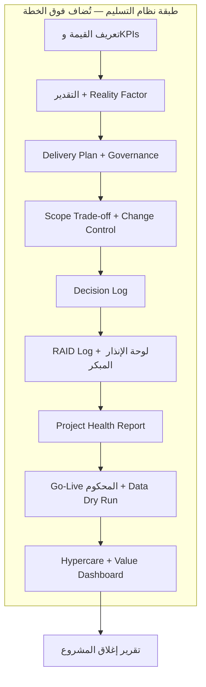
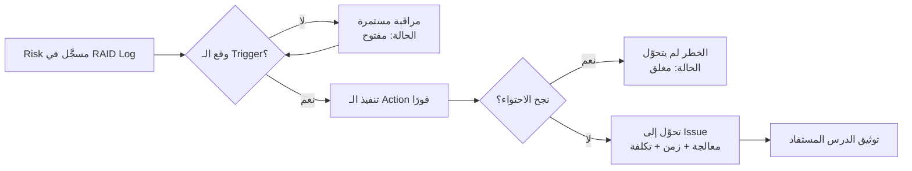
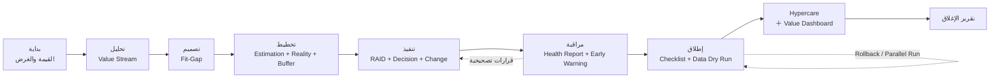

---
title: "المحاضرة 05 — بناء نظام تسليم كامل: من القيمة إلى ما بعد الإطلاق"
aliases:
  - نظام التسليم الكامل
  - Building a Complete Delivery System
lecture: 5
course: "[[قيادة التسليم للمشاريع البرمجية]]"
tags:
  - إدارة-المشاريع
  - قيادة-التسليم
  - محاضرة
status: لم يبدأ
source_video: "تسجيل المحاضرة الخامسة.mp4"
---

> [!info] المحاضرة 05 · قيادة التسليم
> **ماذا ستتعلّم:** كيف تجمع كل ما سبق في **نظام تسليم واحد متماسك** يمتدّ من تعريف القيمة وقياسها، مرورًا بالتقدير الواقعي وضبط النطاق وسجلّي القرارات والمخاطر ولوحة الإنذار المبكر وتقرير صحّة المشروع وخطة التسليم وإدارة المورّدين والتدريب و`UAT`، وصولًا إلى الإطلاق المحكوم و`Hypercare` وقياس القيمة عند الإغلاق. هذه هي المحاضرة **النظرية الختامية**؛ ما بعدها تطبيق عملي على حالات واقعية.

# المحاضرة 05 — بناء نظام تسليم كامل: من القيمة إلى ما بعد الإطلاق

## 🎯 أهداف التعلّم

- تفسير **لماذا تفشل المشاريع** لأسباب غير تقنية في الأغلب، وكيف يعالج نظام التسليم كل سبب منها.
- التمييز بين **الخطة التقليدية** و**نظام التسليم** بوصفه **طبقة قيادة تُضاف ولا تُلغي** ما تعمل به اليوم.
- بناء **قالب القيمة** الكامل (`Value` + المشكلة الحالية + [[KPI]] + [[Baseline|خط الأساس]] + `Target` + زمن القياس) وقياسه قبل/بعد.
- إتقان التقدير الكمّي بأوزانه ومعاملاته، ثم تعديله بـ[[Reality Factor|معامل الواقعية]] عبر `Reality Check`، وربطه بـ[[Buffer|الاحتياطي]] و[[اتفاقية مستوى الخدمة (SLA)|SLA]] القرارات.
- إدارة المخاطر بوصفها **إشارة مبكرة** عبر [[RAID Log|سجل RAID]] و`Trigger`/`Action`، وتحويلها إلى **لوحة إنذار مبكر** ثم إلى [[Project Health Report|تقرير صحّة المشروع]].
- تصميم **الإطلاق المحكوم** (`Controlled Go-Live`) بجدوله وقائمة تحقّقه و[[Data Dry Run|التجربة الجافة للبيانات]]، وقرار [[Go or No-Go Decision|قرار المضي]] بصوره الثلاث.
- إدارة ما بعد الإطلاق عبر [[Hypercare|الرعاية المكثّفة]] بـ`SLA` واضحة وجدول خروج، ثم قياس القيمة وإصدار تقرير الإغلاق.

## الفكرة المحورية

في المحاضرات الأربع السابقة بنينا القطع واحدةً واحدة: تعريف القيمة و[[Value Stream|تدفّق القيمة]]، ثم التقدير الواقعي، ثم ضبط النطاق والتسليم على مراحل. الليلة **نجمع القطع كلها في نظام واحد**.

الفكرة الجوهرية بسيطة وحاسمة: **نحن لا نلغي خطة المشروع التقليدية ولا نغيّرها**. الخطة الزمنية تبقى كما هي — بمهامها وتواريخها ومواردها. ما نفعله أننا **نضيف فوقها طبقة قيادة وحوكمة ولمسات تسليم** تحوّلها من «جدول يخبرني ماذا أعمل في أي تاريخ» إلى «نظام يخبرني **كيف أنجح** في تسليم المشروع داخل ذلك التاريخ».

الفرق بينهما في خمس نقاط:

| البُعد | الخطة التقليدية | نظام التسليم |
|---|---|---|
| التركيز | الجدول الزمني (`Timeline`) | الجدول الزمني **+ حوكمة أعمق** |
| وحدة العمل | المهام والأنشطة (`Activities`) | القيمة والمُخرَجات (`Outcomes`) |
| الإطلاق | **تاريخ** إطلاق | **قرار جاهزية** إطلاق |
| التدريب | فترة زمنية للتدريب | **رحلة تمكين** للمستخدم |
| الاحتياطي | `Buffer` في الخطة يحميك من تأخير المهام | `Buffer` **+ نظام إدارة مخاطر** يراقب طوال المشروع |
| التقارير | `Status Report` (ما أُنجز) | `Status Report` **+** [[Project Health Report\|تقرير صحّة المشروع]] |
| الدعم | دعم فني بعد الإطلاق | دعم **+** [[Hypercare\|الرعاية المكثّفة]] **+** تتبّع القيمة |

المعادلة النهائية التي نصل إليها: **إطلاق محكوم + قرارات سريعة + مخاطر مرئية + خطة واقعية + قيمة واضحة = تسليم مستقر** من بداية المشروع إلى نهايته.

## خريطة المحاضرة

هذه المحاضرة **نظرية في معظمها**، وهي التي **نقفل بها كل المواضيع**؛ فما بعدها جزء عملي بالكامل: مجموعة حالات (`Case Studies`) نشرحها ونشتغلها معًا ونختم بها البرنامج.

ترتيب الليلة:

1. نبدأ بمراجعة **`Estimation`** سريعًا لأننا شرحناه سابقًا بالتفصيل.
2. ندخل في **إدارة المخاطر**.
3. نبني **نظام التسليم** بشكل مستقلّ ومتكامل.
4. **نلخّص كل ما مرّ علينا** في المحاضرات السابقة، ونزيد عليه الحاجات الإضافية التي لم تُشرح بعد.

الهدف الجامع: أن نخرج بنظام تسليم احترافي **يُضاف** إلى الخطة الزمنية للمشروع، يركّز على القيمة، ويتيح لي أن أتأكّد من أن القيمة التي حدّدتها في البداية **تتحقّق فعلًا**. أي أن أصل إلى حالة يكون فيها:

- القيمة **واضحة** منذ البداية.
- **ضبط للنطاق** قائم وفعّال.
- **التوقّعات** معروفة ومتوقَّعة من البداية.
- **المخاطر مرئية** ومعروفة لا مخفيّة.
- **القرارات محكومة** بنظام معيّن نشتغل عليه.
- **جاهزية للإطلاق** لا مجرّد تاريخ للإطلاق.
- **قيمة أقيسها بعد الإطلاق** لا افتراض بأنها تحقّقت.

## لماذا نحتاج نظام تسليم؟

المشروع الناجح في تعريفنا ليس «نظامًا سُلِّم في موعده»، بل **قيمة قابلة للقياس بعد استخدام النظام لدى العميل**. ومن هذا التعريف تنبع الحاجة إلى النظام كله.

> [!warning] المشاريع لا تفشل بسبب التقنية غالبًا
> التقنية هي **آخر** سبب محتمل للفشل. الأسباب الأهم أسبق منها وأخطر:
> - **قيمة غير واضحة من البداية:** الفريق يشتغل «موديولات» بدل أن يشتغل موجَّهًا بالقيمة.
> - **نطاق غير مضبوط:** يتضخّم أثناء التنفيذ بلا نظام يحكمه.
> - **قرارات تتأخّر** (من العميل أو داخل الشركة): الفريق ينتظر، والوقت يُهدَر أثناء المشروع — وهذا وحده سبب تأخير مباشر.
> - **بيانات غير جاهزة:** خصوصًا في المشاريع الكبيرة ذات البيانات التاريخية؛ سبب أساسي لفشل الترحيل أوّلًا و`Go-Live` ثانيًا.
> - **تدريب ضعيف:** المستخدم لا يعرف كيف يعمل ولا كيف يختبر ولا كيف يستخدم النظام بشكل صحيح.
> - **`UAT` غير منظّم:** يتحوّل إلى «تدريب عشوائي» أو إلى اجتماع هدفه انتزاع توقيع فقط، بدل أن يكون هو نفسه أحد أسباب نجاح المشروع.
> - **إطلاق بلا جاهزية:** نصل إلى `Go-Live` دون أن نكون قد تحقّقنا من الجاهزية مبكرًا.

كل بند من هذه الأسباب سنقابله الليلة بأداة مضادة داخل النظام.

## الصورة الكاملة: طبقات نظام التسليم التسع

النظام كله يتكوّن من تسع طبقات، بعضها شرحناه سابقًا وبعضها جديد الليلة:

1. **تعريف القيمة** (`Value Definition`) — المحاضرة الأولى.
2. **التقدير** (`Estimation`) — المحاضرة الثانية والرابعة.
3. **خطة التسليم** (`Delivery Plan`).
4. **مقايضة النطاق** (`Scope Trade-off`) وإدارة النطاق — المحاضرة الرابعة.
5. **سجل القرارات** ([[Decision Log|سجل القرارات]]).
6. **إدارة المخاطر** و[[RAID Log|سجل RAID]] ولوحة الإنذار المبكر.
7. **تقرير صحّة المشروع** ([[Project Health Report|تقرير صحّة المشروع]]).
8. **الإطلاق المحكوم** و[[Hypercare|الرعاية المكثّفة]].
9. **لوحة القيمة** (`Value Dashboard`) وقياس الأثر بعد الإطلاق.

## قياس القيمة: القالب الذي يحكم المشروع كله

غيّرنا طريقة التفكير منذ البداية: بدل أن نقول «نريد تطبيق المبيعات أو المخازن أو الحسابات»، نسأل: **ماذا يريد العميل بالضبط؟ ما المشاكل التي يواجهها في عمله اليومي؟ ما نقاط الألم الحقيقية؟** ومن ذلك نستخرج القيمة التي يجب أن نوفّرها، والتي تظهر في عملياته التشغيلية.

فبدل «نطبّق مبيعات» نقول: **«نريد تقليل زمن دورة الطلب إلى التحصيل بمقدار يومين أو ثلاثة»**. وقد فرّقنا سابقًا بين [[Outcome vs Output|المُخرَج والناتج]]: الناتج هو الشاشة أو التقرير، أما المُخرَج فهو **الأثر الفعلي الذي يتغيّر بعد الاستخدام**: زمن أقل، قرارات أسرع، أخطاء أقل، اعتمادات أسرع، وضوح كامل للإدارة.

وبعد أن نعرف المشاكل ونقاط الألم ونحدّد الإشكالية الحقيقية لدى العميل، تأتي الخطوة الحاسمة: **تعريف مجموعة القيم في قالب موحَّد**، لأن القيمة التي لا تُصاغ في قالب قابل للقياس تبقى كلامًا إنشائيًّا لا يمكن محاسبة المشروع عليه.

### قالب القيمة

كل قيمة نلتزم بها يجب أن تُكتب في هذا القالب بمكوّناته الستة:

| المكوّن | المعنى |
|---|---|
| **القيمة** | العبارة المختصرة للقيمة المستهدفة |
| **المشكلة الحالية** | الوضع الذي يعانيه العميل الآن |
| **[[KPI]]** | المؤشّر الذي سنقيس به |
| **[[Baseline\|خط الأساس]]** | قيمة المؤشّر **قبل** بدء المشروع |
| **`Target`** | القيمة المستهدفة بعد التطبيق |
| **زمن القياس** | متى نقيس بالضبط |

> [!example] قالب القيمة: إقفال الحسابات من 7 أيام إلى يومين
> - **القيمة:** تحسين سرعة إقفال الحسابات.
> - **المشكلة الحالية:** الإقفال يستغرق **7 أيام**.
> - **`KPI`:** زمن إقفال الحسابات (بالأيام).
> - **`Baseline`:** 7 أيام (الوضع الحالي قبل بدء المشروع).
> - **`Target`:** يومان.
> - **زمن القياس:** بعد **شهر** من الإطلاق (أثناء فترة الدعم).

**القاعدة الحاكمة:** أي قيمة لا أستطيع قياسها، ولا أستطيع تحديد مؤشّرها وخط أساسها وهدفها وزمن قياسها — فأنا **لم أعرّفها أصلًا بشكل صحيح**. وليس شرطًا أن تُقاس كل القيم بعد الإطلاق؛ بعضها يمكن قياسه **أثناء** المشروع.

### تقرير قبل/بعد

في نهاية المشروع نُخرج تقريرًا يقارن `Baseline` بالنتيجة الفعلية:

> [!example] تقرير قبل/بعد عند الإغلاق
> | المؤشّر | قبل (`Baseline`) | الهدف (`Target`) | بعد شهر من الدعم | القراءة |
> |---|---|---|---|---|
> | زمن إقفال الحسابات | 7 أيام | يومان | 3 أيام | قريب من الهدف |
> | أخطاء الفواتير | 10% | 2% أو أقل | 4% | تحسّن كبير، يحتاج ضبطًا |
> | دقّة المخزون | 70% | 95% | 90% | قريب من الهدف |
>
> هنا نرى **أثر النظام فعليًّا على المؤسسة**: نقلناها من تجربة إلى تجربة أخرى بأرقام واضحة يمكن عرضها على العميل. وهذا يحقّق ثلاث فوائد دفعة واحدة: **قصة نجاح** للشركة، و**قيمة ملموسة** يراها العميل بالأرقام لا بالكلام، و**اقتناع** بأن يواصل معك مشاريع مستقبلية لأنه رأى حجم الاحترافية التي تشتغل بها.

## التقدير: مراجعة موسّعة

شرحنا `Estimation` في المحاضرة الرابعة تفصيلًا، ونمرّ عليه هنا سريعًا لأنه الطبقة التي يُبنى عليها كل ما بعدها. راجع [[04 - التقدير الواقعي وضبط النطاق|المحاضرة الرابعة]] للتفاصيل الكاملة.

### القاعدة: أكثر من محور = دقّة أعلى

لا نقدّر بالأيام ولا بالساعات فقط، بل بأكثر من معيار. **كلما زادت المحاور التي تقدّر بها، ارتفعت واقعية تقديرك.** المحاور في مشروع `ERP`:

1. **القيمة** نفسها — نراها كمعيار أول.
2. **هل المتطلَّب موجود في `Standard` أم يحتاج `Customization`؟**
3. **الجهد** المطلوب لتنفيذ المهمة، محسوبًا من أربعة عوامل: `Integration` و`Data` و[[Dependency|Dependencies]] و`Criticality`.
4. **[[18 - Velocity|سرعة الفريق]]** وخبرة الشركة في مشاريع مشابهة سابقة.

> [!warning] لماذا لا نكتفي بالأيام أو بـ[[هيكل تجزئة العمل (WBS)|WBS]]؟
> - **التقدير بالأيام:** لا يأخذ **الاعتماديات** في الاعتبار، ولا يُظهر **الانتظار**.
> - **`WBS`:** ممتاز جدًّا كتفصيل للمهام التقنية على مستوى الفريق، لكنه **لا ينفع على مستوى [[Value Stream|تدفّق القيمة]]** لأنه يقسّم العمل دون أن يراعي **ترتيب القيمة**.
>
> نحن نريد الموازنة بين: القيمة + الواقع (`Standard` أم `Customization`) + تعقيد التنفيذ + سرعة الفريق، في مقياس واحد.

### تحويل الكلام إلى مقياس كمّي

**الوزن الأساسي** — تعبير عن الجهد لا عن الزمن (ليست أيامًا ولا ساعات، بل **وحدات جهد**):

| الحالة | الوزن |
|---|---|
| موجود في `Standard` بالكامل | **1** |
| يحتاج إعدادات / `Configuration` فقط | **2** |
| موجود لكن يحتاج تعديلًا بسيطًا (`Minor Customization`) | **4** |
| `Customization` عالٍ / جديد كليًّا | **8** |

**المعاملات (`Multipliers`)** — أربعة محاور لتعقيد التنفيذ، ويُفضَّل أن تتراوح بين 1 و2 لأن القفز إلى 2 يعني مضاعفة الجهد وهو غير منطقي في الغالب:

| المعامِل | بسيط | متوسط | عالٍ |
|---|---|---|---|
| التكامل (`Integration`) | 1.0 | 1.3 | 1.6 |
| البيانات (`Data`) | 1.0 | 1.3 | 1.6 |
| الاعتماديات (`Dependencies`) | 1.0 | 1.3 | 1.6 |
| الحرجيّة (`Criticality`) | 1.0 | 1.3 | 1.6 |

> [!note] كيف تقرأ المعامِل؟
> `1.3` تعني «الجهد الطبيعي **+ 30%**»، و`1.6` تعني «الجهد الطبيعي **+ 60%**» — أي زيادة كبيرة لكنها لا تصل إلى الضعف. الأرقام تقريبية بطبيعتها، لكنها تمنحك **قياسًا نسبيًّا** للجهد بدل التقدير الحدسي. ومن أراد سرعة أكبر يمكنه استخدام سُلّم أخشن (2 / 3 / 4)، لكن السُلّم الأدقّ هو ما بين 1 و2.

**المعادلة:**

> **جهد البند = الوزن الأساسي × `Integration` × `Data` × `Dependencies` × `Criticality`**

### المثال المحوري: تقدير تدفّق `Order-to-Cash`

> [!example] `Order-to-Cash`: 32.5 وحدة للـ Standard مقابل 46 للـ Customization
> **رسم العملية كاملة:** `Lead` → `Opportunity` → `Quotation` → `Sales Order` → `Delivery` → `Invoice` → `Payment`، بالإضافة إلى تخصيصات طلبها العميل: الحدّ الائتماني (`Credit Limit`)، إظهار رصيد العميل، الخصم المستهدف (`Target Discount`)، والائتمان الموحَّد على مستوى الفروع (`Branch Credit`).
>
> **الأوزان الأساسية بندًا بندًا:**
>
> | البند | التقييم | الوزن |
> |---|---|---|
> | `Lead → Opportunity` | يغطّيه `Standard` بالكامل | 1 |
> | `Opportunity → Quotation` | إعدادات فقط | 2 |
> | `Quotation → Sales Order` | إعدادات فقط | 2 |
> | `Sales Order → Delivery` | تعديل بسيط | 4 |
> | `Delivery → Invoice` | إعدادات | 2 |
> | `Invoice → Payment` | إعدادات | 2 |
> | `Credit Limit` (فيتشر إضافي) | تعديل خفيف | 4 |
> | `Target Discount` | عالٍ | 8 |
> | `Branch Credit` | عالٍ | 8 |
>
> **الضرب في المعاملات:** نمسك كل بند ونضربه في معاملاته الأربعة. مثال البند رابع الترتيب: وزنه الأساسي **4**، و`Integration` = 1.3، و`Data` = 1.2، و`Dependencies` = 1.2، و`Criticality` = 1.3:
>
> `4 × 1.3 × 1.2 × 1.2 × 1.3 = 9.73` ≈ **9.7 ≈ 10 وحدات**.
>
> والباقي بالطريقة نفسها على الفلو كامل.
>
> **النتيجة:**
> - مجموع البنود التي يغطّيها `Standard` أو `Configuration` البسيط = **32.5 وحدة**.
> - مجموع بنود الـ`Customization` = **46 وحدة**.
>
> **القرار:** الحاجات القياسية تكلّفني 32.5 وحدة والتخصيصات تكلّفني 46 وحدة. إذًا أستطيع **عزل التخصيصات في مرحلة ثانية** والخروج بالـ`Core` في المرحلة الأولى. أما ما كان أساسيًّا ولا يمكن حذفه ولا عزله فيدخل معي في المرحلة الأولى مهما كان وزنه.

### المعايرة بسرعة الفريق

بافتراض أن الفريق يسلّم **10 وحدات كل أسبوعين** (متوسط مبني على `History` وأداء الفريق — قد يكون في أسبوع 10 وأسبوع 12 وأسبوع 15، فنأخذ المتوسط):

- **المرحلة الأولى (32.5 وحدة):** ≈ 3 سبرنتات → **6 إلى 7 أسابيع**.
- **المرحلة الثانية (46 وحدة):** ≈ 4–5 سبرنتات → **9 إلى 10 أسابيع**.

لاحظ أننا نُخرج **نطاقًا بالأسابيع** لا تاريخًا واحدًا محدَّدًا.

> [!note] لماذا نقسّم أصلًا؟
> لو أخذنا كل شيء دفعة واحدة لصار المجموع **16–17 أسبوعًا** متتالية بلا أي تسليم وسيط: نحلّل ونطوّر ونختبر ثم نسلّم كل شيء بعد `Go-Live` واحد — و**المخاطر هنا عالية جدًّا** لأنها تتجمّع كلها في لحظة واحدة. أما التقسيم على مرحلتين فيجعلني آخذ المخاطرة مبكرًا وأقلّل أثرها، فتأتي المرحلة الثانية بمخاطر أقل، وكلما اقتربتُ من `Go-Live` قلّت المخاطر بشكل كبير.

## `Reality Check` ومعامل الواقعية

هل ينتهي التقدير عند هذا الحد؟ لا. هناك معيار إضافي مرتبط بالتعامل مع العميل: سرعة قراراته، وجاهزية بياناته، ودرجة التكامل والتعقيد. لتغطية هذه الأمور نضيف [[Reality Factor|معامل الواقعية]] عبر ما نسمّيه `Reality Check`.

**المعادلة:**

> **معامل الواقعية = 1.2 (الحدّ الأدنى الواقعي) + مجموع نقاط الأسئلة الثلاثة**

الرقم **1.2** هو **الحدّ الأدنى الواقعي**: الجهد العادي + 20% إضافية، لأن لا مشروع يسير في ظروف مثالية تمامًا.

**الأسئلة الثلاثة:**

| السؤال | جيد | متوسط | ضعيف |
|---|---|---|---|
| 1. هل قرارات العميل سريعة؟ (يردّ خلال يوم–يومين أم يأخذ أسبوعًا فأكثر؟) | 0 | +0.2 | **+0.4** |
| 2. هل البيانات جاهزة؟ (تحتاج تنظيفًا؟ إعدادًا؟ مُدخَلة بشكل خاطئ؟) | 0 | +0.2 | **+0.4** |
| 3. هل التكامل والتعقيد عاليان؟ | 0 | **+0.2** | +0.4 |

> [!example] حساب `Reality Check` في مشروعنا
> - القرارات مع العميل **بطيئة** ← ضعيف ← **+0.4**
> - البيانات **غير جاهزة** وتحتاج شغلًا ← ضعيف ← **+0.4**
> - التكامل **عالٍ** ← **+0.2**
>
> `0.4 + 0.4 + 0.2 + 1.2 = **2.2**`
>
> النتيجة تقع بين 2 و2.2، وبما أنني أعمل في مشروع معقّد أعتمد **×2** كمعامل واقعية:
> - **المرحلة الأولى:** 6–7 أسابيع × 2 = **12 إلى 14 أسبوعًا**.
> - **المرحلة الثانية:** 9–10 أسابيع × 2 = **18 إلى 20 أسبوعًا**.
> - **إجمالي المشروع ≈ 7 إلى 8 أشهر**.
>
> **كيف نقدّم هذا للعميل؟** لا نقول «7 إلى 8 أشهر» ونصمت. نقول: «مدّة المشروع الكاملة 7–8 أشهر، لكنك **ستشغّل المرحلة الأولى بالكامل خلال 12 إلى 14 أسبوعًا**». فيرى أن المدّة الطويلة ليست انتظارًا صامتًا، بل قيمة تصل مبكرًا — فتكون مرضية له بشكل كبير.

### الفائدة المزدوجة: `Estimation` ككاشف مخاطر مبكر

الغرض من التقدير بهذه الطريقة **ليس التقدير وحده**. هو أيضًا **جهاز إنذار مبكر** يعطيك مؤشّرات من مرحلة التخطيط:

- **إذا كانت قيمة العملية عالية والجهد عاليًا** ← مؤشّر بأن العملية معقّدة ويجب **تبسيطها أو تقسيمها على مرحلتين**.
- **إذا كانت فجوة الملاءمة ([[Fit-Gap Analysis|تحليل الملاءمة والفجوة]]) عالية** ← مؤشّر بأنني إمّا أؤجّل بعض البنود، وإمّا أحاول قدر الإمكان **استخدام `Standard`** بدل التخصيص.
- **إذا كانت المعاملات عالية** (بيانات، تكامل، فروع، تعقيد) ← مؤشّر واضح بأنني يجب أن **أضيف [[Buffer|احتياطيًا]] في خطة المشروع** لأن درجة عدم اليقين عالية.
- **إذا كانت سرعة الفريق منخفضة أو قرارات العميل بطيئة** ← مؤشّر بأنني أحتاج **`SLA` للقرارات** منذ اليوم الأول.

### أسئلة من الحضور

> **س: ذكرتَ في المحاضرة الماضية أننا نقسّم المشروع إلى أقسام محدَّدة — الموارد البشرية وحدها، والمالية وحدها. هل هذا هو التقسيم نفسه الذي جرى الآن على السبرنتات، وبالمنهجية نفسها؟**
> لا، ليس تقسيمًا على سبرنتات. نحن قسّمنا المشروع إلى **مراحل (`Phases`)**، والمرحلة قد يكون فيها أكثر من موديول: جزء من الموارد البشرية + جزء بسيط من الحسابات + جزء من المخازن + جزء من المبيعات. هذه مجتمعةً هي «الحاجة الأساسية» التي يجب أن تتوفّر ليشتغل العميل شغله الطبيعي **بأقلّ متطلّبات ممكنة** — وهذه هي المرحلة الأولى.
>
> ثم أشتغل على المرحلة الأولى وأُدخِلها في كل المعايير التي شرحناها فأخرج بـ`Estimation` لها، وأفعل الشيء نفسه مع المرحلة الثانية، ومجموعهما هو زمن المشروع كاملًا.
>
> **وأين تدخل السبرنتات؟** السبرنت مجرّد وحدة قياس لسرعة الفريق. إن كنتَ تعمل بـ[[01 - Agile|Agile]] فالسبرنت أسبوعان. وإن لم تكن تعمل بـ`Agile` أصلًا — تعمل بالأسبوع أو بالأسبوعين أو بالشهر — فلا يهمّ: **قِس فريقك**. كم مهمة يُنجز خلال أسبوعين؟ 10؟ 12؟ 15؟ خذ **المتوسط** بناءً على `History` الفريق أو أدائه، ثم اقسم عليه الـ`Estimation` الذي خرجتَ به. النتيجة: **المدّة التي سينتهي فيها المشروع** بناءً على خبرة الفريق الحالية.
>
> **وهل هذا دقيق تمامًا؟** لا. هناك حاجات إضافية قد تحدث بسبب العميل الذي تعمل معه، ولهذا نضيف [[Reality Factor|معامل الواقعية]] المحسوب من الأسئلة الثلاثة، فنقترب من الواقع أكثر. الخلاصة: **لسنا ملزَمين بالسبرنت؛ نحن نقسّم على جهد الفريق أو أدائه أيًّا كانت وحدته.**

## `Buffer` و`SLA` القرارات

### `Buffer` — الاحتياطي

نحن في مرحلة التخطيط، ولا نعرف بالضبط ماذا سيحدث. لذلك نفترض احتمال وقوع أمور غير متوقّعة ونضيف [[Buffer|احتياطيًا]]، لسببين:

1. **عدم اليقين المرتفع:** أي حالة طارئة قد تحدث أثناء المشروع.
2. **التعلّم أثناء التنفيذ:** أثناء العمل تكتشف أشياء لم تكن في حسبانك، وتصادف مشاكل تحتاج جهدًا إضافيًّا لم تنتبه له في البداية. هذا كله نعطيه وزنًا احتياطيًّا داخل الخطة.

### `SLA` للقرارات

إذا لاحظتُ بطئًا في القرارات — سواء عندي كفريق أو عند العميل — فهذا مؤشّر مباشر على وجوب **اتفاقية مستوى خدمة (`Service Level Agreement`) للقرارات** منذ بداية المشروع.

> [!example] `SLA` قرار = 48 ساعة
> نتّفق مع العميل: أي قرار مرفوع إليه — كاعتماد وثيقة تحليل، أو المفاضلة بين خيارين تقنيين — **يجب أن يصلني خلال 48 ساعة كحدّ أقصى** (وقد نجعلها 3 أيام حسب الاتفاق).
>
> الغرض: **تسريع القرارات نفسها** حتى لا تكون بطيئة فتؤثّر في زمن المشروع كله. وسنرى بعد قليل أن هذه الاتفاقية تتحوّل إلى **`Trigger`** جاهز في [[RAID Log|سجل RAID]].

## مقايضة النطاق (`Scope Trade-off`)

المقايضة تتم بين **القيمة والوقت والمخاطر**. أي طلب يدخل الميزان بين **القيمة** و**الجهد**، وبناءً عليه آخذ الإجراء:

| القيمة \ الجهد | جهد منخفض | جهد متوسط | جهد عالٍ |
|---|---|---|---|
| **قيمة عالية** | نفّذها مباشرة | نفّذها **بحذر** | قسّمها على مرحلتين |
| **قيمة متوسطة** | أضِفها إن توفّر وقت إضافي | قيّم: تُضاف أو تُؤجَّل | أجّلها إلى مرحلة تالية |
| **قيمة منخفضة** | احذفها | احذفها | احذفها |

**القاعدة:** أي فيتشر قيمته منخفضة يُحذَف مهما كان جهده، لأنه لن يعطي العميل قيمة فعلية، فلا داعي لصرف جهد ووقت وتكلفة عليه **على حساب** فيتشر آخر قيمته أعلى.

> [!example] قراءة سريعة لمصفوفة المقايضة
> - **تشغيل مصنع بعمليات أساسية:** قيمة عالية، جهد متوسط ← ينفَّذ.
> - **أساسيات التصنيع:** قيمة عالية، جهد عالٍ، لكنها **أساسية** ← تُقسَّم على مرحلتين: جزء بسيط في `Phase 1` والباقي في `Phase 2`.
> - **فيتشر قيمته متوسطة وجهده عالٍ** ← يُؤجَّل مباشرة.
> - **فيتشر قيمته منخفضة وجهده متوسط** ← يُحذف بالاتفاق مع العميل.
> - **صلاحيات المستخدم:** قيمة عالية، جهد منخفض ← تدخل مباشرة في `Phase 1`.

### هل نحذف فيتشرًا موقَّعًا في العقد؟

سؤال حقيقي: عندي مستند بكل الفيتشرات الموقَّعة مع العميل — هل يعني هذا أنني قد أحذف واحدًا منها؟ **ممكن وممكن لا.**

الطريقة: نناقش العميل **أثناء العمل**، ونوضّح له أن الفيتشر الذي طلبه — بناءً على التحليل والتقييم — قيمته منخفضة، وأنه فعليًّا **لن يعطيه قيمة**، فلا داعي لصرف جهد ووقت وتكلفة عليه على حساب فيتشر آخر قيمته أعلى. **إذا وصلنا إلى اتفاق** يمكن حذفه — و**يُسجَّل القرار رسميًّا في [[Decision Log|سجل القرارات]]**، تمامًا كما تُسجَّل أي إضافة أو تعديل.

الخلاصة: **لا نرفض أي طلب من العميل ابتداءً**، بل نقيّمه أوّلًا ثم نحدّد: `Phase 1`، أو `Phase 2`، أو حذف كامل — بعد عرضه على العميل.

### أسئلة من الحضور

> **س: أليس هذا يعني أننا نرفض ما يطلبه العميل؟**
> لا. **نحن لا نرفض أي طلب ابتداءً.** كل طلب يدخل التقييم أوّلًا، وبناءً على نتيجته نحدّد: هل هو في `Phase 1` أم `Phase 2`؟ ثم **نعرضه على العميل**، فيكون القرار أحد ثلاثة: أضفناه، أو أجّلناه للمرحلة الثانية، أو حذفناه بالكامل. هذه هي مقايضة النطاق، وهي التي تحميني من التفلّت على مستوى المشروع كله.
>
> ولاحظ الجانب الآخر من العدالة: كما أن **الإضافة** تعني اتفاقًا على زمن أو تكلفة إضافية، فإن **الحذف** يعني مقايضة يُتّفق عليها — قد نحذف فيتشرًا مقابل السماح للعميل بإضافة حاجة أخرى، أو مقابل خصم، أو مقابل تعديل في جزئية مختلفة.

## سبع استراتيجيات لاستقرار النطاق

1. **البدء بتعريف القيمة:** يحميك من الفوضى منذ اللحظة الأولى.
2. **المقايضة (`Trade-off`):** تقييم كل فيتشر بميزان القيمة مقابل الجهد يمنع دخول أي مميزات غير ضرورية، ويجعل القرار واضحًا.
3. **التسليم على مراحل:** يقلّل المخاطر عليّ، ويعطي العميل قيمة مبكرة — مكسب للطرفين.
4. **موافقة رسمية لكل مرحلة ([[Sign-off|الاعتماد الرسمي]]):** لا ننتقل من التحليل إلى التصميم إلى التنفيذ إلا بموافقة رسمية. الغرض: **منع الرجوع للخلف** وتثبيت النطاق.
5. **نوافذ التجميد ([[Scope Freeze|تجميد النطاق]] / `Freeze Windows`):** في فترة تنفيذ محدَّدة تكون فيها المهام عالية القيمة و[[Cost of Delay|تكلفة التأخير]] عالية، أمنع أي تغيير للحفاظ على تركيز الفريق. **أنا لا أمنع التغيير مطلقًا، بل أمنعه في التوقيت الخاطئ.**
6. **اتفاقية القرار (`Decision SLA`) والتصعيد:** وقت محدَّد لكل قرار، مع توضيح الأسباب والأثر، وتوثيق كل قرار — عندي كشركة وبيني وبين العميل.
7. **نظام التحكّم في التغيير ([[Change Request|طلب التغيير]] / `Change Control`):** أي تغيير من بدء التنفيذ إلى التسليم **مسموح** لكنه **يجب أن يمرّ عبر النظام** المتّفق عليه والواضح للعميل. بهذا لا أمنع التغيير، بل **أتحكّم في مساره** داخل المشروع.

> [!note] لماذا تحديدًا «نوافذ التجميد»؟
> في فترة التنفيذ الأولى تكون المهام التي حدّدتُها ذات **قيمة عالية** و**[[Cost of Delay|تكلفة تأخير]] عالية** — سواء كان جهدها منخفضًا أو عاليًا. هذه بطبيعتها مهام لا تحتمل التشتّت. لذلك أُعلن نافذة تجميد خلال هذه الفترة **للحفاظ على تركيز الفريق** ولتقليل احتمال إعادة العمل (`Rework`) الناتج عن طلب يأتي في منتصف الطريق. ورأينا في المحاضرة السابقة كيف يؤثّر ذلك في المشروع بشكل مباشر.

> [!warning] احذر التغيير الذي يأتي من خارج النظام
> أي تغيير يصل مباشرةً إلى المطوّرين، أو يمرّ عبر نفوذ شخص معيّن، أو يحدث دون علمك — يؤثّر في المشروع تأثيرًا مباشرًا. الحلّ ليس المنع المطلق، بل **إجبار كل تغيير على المرور عبر مسار واحد معلوم**: تقييم ← تقدير ← تكلفة ← قرار (يُنفَّذ الآن / يُؤجَّل / يُرفض).

### ربط الاستراتيجيات بمراحل المشروع

- **بداية المشروع:** تعريف القيمة و[[Value Stream|تدفّق القيمة]] ← يمنع الفوضى من البداية.
- **التحليل:** `Scope Matrix` + `Scope Definition` ← يضبط النطاق بشكل كبير.
- **التصميم:** `Decision Gate` + [[Sign-off|الاعتماد الرسمي]] ← يثبّت الحل فلا نعود إليه.
- **التنفيذ:** `Change Control` ← يمنع التشتّت ويحكم التغيير أثناء العمل.
- **الاختبار / `UAT`:** اتفاقية القرار (3–4 أيام كحدّ أقصى) وإلا حدث تصعيد ← تمنع انجرار المشروع في انتظار موافقة العميل.
- **قبل الإطلاق:** [[Scope Freeze|تجميد النطاق]] (`Scope Lock`) قبل إطلاق كل مرحلة وقبل الإطلاق النهائي ← يجعل الإطلاق مستقرًّا.

## قالب `Change Request`

كل طلب تغيير يمرّ عبر القالب التالي:

| الحقل | المحتوى |
|---|---|
| **رقم الطلب** | معرّف فريد للتتبّع |
| **وصف الطلب** | ما المطلوب بالضبط |
| **قيمة الطلب** | يجب أن تكون واضحة؛ **أي طلب بلا قيمة يُرفض من البداية** |
| **الأثر على الوقت** | كم يضيف من زمن |
| **الأثر على التكلفة** | كم يضيف من تكلفة |
| **الأثر على الجودة** | هل يخلّ بشيء قائم |
| **القرار** | يُنفَّذ الآن / يُؤجَّل للمرحلة التالية / يُرفض |

> [!warning] لا نقول للعميل «ممنوع التغيير»
> نقول له: التغيير مسموح، لكن **أي طلب يخضع لنظام تقييم معيّن**. هذا يحميك من التغييرات التي تصل مباشرةً للمطوّرين أو تمرّ عبر نفوذ شخص معيّن من وراء الكواليس.

## [[Decision Log|سجل القرارات]]

أي قرار في المشروع يجب أن يكون **مسجَّلًا بشكل واضح** بمكوّناته:

| المكوّن | المعنى |
|---|---|
| **القرار المطلوب** | ما هو موضوع القرار |
| **الخيارات** | البدائل المتاحة |
| **التوصية** | ما نوصي به نحن كفريق، مع **المبرّرات** |
| **المالك** | من يملك اتخاذ القرار |
| **أقصى موعد** | الحدّ الزمني للبتّ فيه |
| **القرار النهائي** | ما استُقرّ عليه |
| **الأثر** | ماذا ترتّب عليه |

> [!example] قرار المشتريات: `Phase 1` أم `Phase 2`؟
> - **القرار المطلوب:** هل تدخل المشتريات في `Phase 1` أم `Phase 2`؟
> - **الخيارات:** نعم / لا.
> - **التوصية:** **لا** في المرحلة الأولى — مع مبرّرات نشرحها للعميل.
> - **المالك:** العميل (بناءً على العرض والمبرّرات).
> - **أقصى موعد للقرار:** 3 أيام.
> - **القرار النهائي:** تُؤجَّل إلى `Phase 2`.
> - **الأثر:** تقليل الطاقة المستهلَكة في المرحلة الأولى بشكل كبير، وتركيز الفريق على الـ`Core`.
>
> وقرار آخر بالطريقة نفسها: المفاضلة بين خيارين تقنيين، بمهلة **48 ساعة** للإفادة، وكان القرار الأخذ بالخيار الذي **يقلّل التخصيص** بشكل كبير.

**الفائدة:** أي قرار في المشروع يصبح مسجَّلًا بمن اتخذه، وفي أي تاريخ، وكم استغرق. فإن حدث أي نزاع لاحقًا تكون الصورة واضحة: هذه القرارات اتُّخذت خلال المشروع بناءً على التوصيات 1 و2 و3، وكان أثرها 1 و2 و3.

## إدارة المخاطر و[[RAID Log|سجل RAID]]

### المخاطر إشارة مبكرة لا حدث وقع

التعريف الذي نعمل به: **الخطر ليس حدثًا حصل، بل إشارة مبكرة** ترصدها أثناء عملك في المشروع. بمجرّد أن أكتشف الإشارة، **آخذ إجراءً مباشرةً** حتى لا تتحوّل إلى مشكلة فعلية.

أنواع المخاطر الشائعة في مشاريع `ERP`: تأخّر قرار اعتماد لعملية معيّنة، بيانات غير نظيفة، تغييرات مستمرة في النطاق، مقاومة المستخدمين للمشروع، تعطّل التكامل مع نظام آخر.

### بنية [[RAID Log|سجل RAID]]

| الحرف | المعنى | الطبيعة |
|---|---|---|
| **R** | `Risks` — المخاطر | لم تحدث بعد؛ احتمال |
| **A** | `Assumptions` — الافتراضات | ما بنيتُ عليه خطتي |
| **I** | `Issues` — المشاكل | خطر تحوّل إلى واقع، يُعالَج الآن |
| **D** | `Dependencies` — الاعتماديات | ما ننتظره من طرف آخر |

أمثلة سريعة: **`Risk`** = احتمال تأخير البيانات. **`Assumption`** = أفترض أن العميل سيوفّر لي `Key Users` أتعامل معهم مباشرةً. **`Issue`** = ظهرت أخطاء في أكواد المنتجات. **`Dependency`** = ننتظر اعتماد الإدارة المالية، وما دمنا منتظرين لا نستطيع المضيّ قدمًا.

**متى نملأ السجل؟** في **مرحلة التخطيط** أكتب مجموعة المخاطر التي أحصرها والافتراضات التي أبني عليها. أما **الـ`Issues`** فلا تحدث في التخطيط، بل تظهر فعليًّا **أثناء التنفيذ**، وكذلك بعض الاعتماديات. إذًا السجل يرافقني من **التخطيط** إلى **التنفيذ** و**المراقبة والتحكّم** (`Monitoring & Control`) حتى التسليم.

### مكوّنات كل خطر — وأهمّها `Trigger` و`Action`

| المكوّن | المعنى |
|---|---|
| النوع | Risk / Assumption / Issue / Dependency |
| الوصف | ما هو |
| الأثر (`Impact`) | عالٍ / متوسط / منخفض |
| الاحتمالية (`Probability`) | عالية / متوسطة / منخفضة |
| المالك (`Owner`) | من يملكه (قد يكون العميل) |
| التاريخ | متى قد يقع |
| الحالة (`Status`) | مفتوح / مغلق |
| **`Trigger`** | **الشرارة**: المؤشّر الذي إذا وقع دلّ على أن الخطر في طريقه للتحوّل إلى `Issue` |
| **`Action`** | **الإجراء** الذي أنفّذه فورًا عند وقوع الـ`Trigger` |

> [!note] لماذا الـ`Trigger` هو الأهمّ؟
> **الفكرة ليست أن أوثّق ما حدث**، بل أن **أستفيد من السجل لمنع الخطر من الحدوث أصلًا**. السجل له فائدتان: الأولى **توثيقية** (كل المخاطر والمشاكل والاعتماديات مسجَّلة)، والثانية — وهي **الأهمّ** — أنه يعطيني **مؤشّرات مبكرة (`Triggers`) وإجراءات مقابلة**. فأنا أمسك كل خطر كتبته — سواء في التخطيط أو أثناء التنفيذ — وأحدّد له `Trigger` يُنذرني، و`Action` أنفّذه فور ظهور الإنذار، حتى لا يتحوّل الخطر إلى `Issue` يكلّفني زمنًا وتكلفةً وجهدًا كبيرًا.

> [!example] الخطر الأول: تأخّر اعتماد التصميم من العميل
> - **النوع:** `Risk` — كُتِب منذ مرحلة التخطيط.
> - **الأثر:** عالٍ. **الاحتمالية:** متوسطة.
> - **المالك:** العميل (لأنه هو من قد يسبّب الخطر).
> - **التاريخ المتوقّع:** الأسبوع الرابع. **الحالة:** مفتوح.
> - **`Trigger`:** بناءً على الـ`SLA` المتّفق عليها، أي قرار يتجاوز **48 ساعة** دون ردّ يُعدّ شرارة مباشرة. وإذا تراكمت **3 أو 4 قرارات** تجاوزت 48 ساعة فهذا `Trigger` صريح بأن المشروع سيتأثّر.
> - **`Action`:** **تصعيد فوري** بعد الـ48 ساعة، أو عقد اجتماع مباشر للوصول إلى قرار نهائي ومعرفة سبب التأخير.

> [!example] الخطر الثاني: بيانات غير جاهزة
> - **النوع:** `Risk`. **الأثر:** عالٍ. **الاحتمالية:** عالية (بناءً على التحليل المبدئي: أخطاء كثيرة، تواريخ مُدخَلة بشكل خاطئ، حاجة إلى `Data Cleansing`).
> - **لماذا الأثر عالٍ؟** لأن البيانات إن مشت بمشاكلها إلى `Go-Live` فقد **يفشل الإطلاق** أو يُنتِج أخطاء تمنع اكتماله. وهي سبب فشل الترحيل أوّلًا و`Go-Live` ثانيًا.
> - **المالك:** فريق البيانات لدينا + العميل المسؤول عن تجهيزها.
> - **`Trigger`:** مؤشّر **نسبة جاهزية البيانات < 80%**.
> - **`Action`:** تشكيل فريق مخصَّص للعمل على البيانات، وتنظيفها، وتنفيذ فحص مزدوج لرفع النسبة إلى **80% أو أعلى**.

> [!example] من `Risk` إلى `Issue`: تكرار أكواد المنتجات
> - **النوع:** `Issue` — لم يعد احتمالًا، بل وقع فعلًا.
> - **الوصف:** تكرار في أكواد المنتجات وعدم توحيد للبيانات. **الأثر:** عالٍ.
> - **أين ظهر؟** أخطاء في التقارير مباشرةً.
> - **`Action`:** العمل على البيانات وتنظيفها، إزالة التكرار، توحيد الأكواد.
> - **الحالة:** قيد المعالجة حاليًّا.
>
> ومثال `Dependency`: قرارات من **الإدارة المالية** قد تتأخّر. الـ`Trigger`: عدم اعتمادهم قبل الموعد. الـ`Action`: **ورشة عمل** نحسم فيها القرار ونحدّد موعد اعتماد نهائي.

## لوحة الإنذار المبكر (`Early Warning Dashboard`)

بعد أن حدّدتُ لكل خطر `Trigger`، تصبح لديّ مجموعة من الإشارات المبكرة المتناثرة. الخطوة التالية أن **أجمعها في لوحة واحدة** أراقبها باستمرار. فبدل أن أنتظر حتى تقع الأزمة، أرى الإشارة وهي تتكوّن.

**المنطق العام للّوحة:** القرارات المتأخّرة قد تتحوّل إلى أزمة تُعطّل التنفيذ ← الإجراء **تصعيد**. البيانات الضعيفة تؤثّر تأثيرًا كبيرًا ← الإجراء **فريق جاهز يعالج فورًا**. التغييرات الكثيرة تؤدّي إلى [[Scope Creep|زحف النطاق]] ← الإجراء **تفعيل التحكّم في التغيير**. نسبة قبول منخفضة تعني أنني **لن أستطيع الإطلاق** ← الإجراء **إعادة تدريب أو تصحيح مسار**. أخطاء حرجة تعني عدم استقرار يهدّد الإطلاق ← الإجراء **إيقاف كل شيء والتركيز على الإصلاح**.

مجموع الـ`Triggers` التي حدّدتها في [[RAID Log|سجل RAID]] أُخرجها في لوحة واحدة، لكل مؤشّر فيها **حدّ** و**لون** و**قرار مرتبط به**:

| المؤشّر | الحدّ الآمن | الإشارة الحمراء | القرار / الإجراء |
|---|---|---|---|
| عدد القرارات المتأخّرة | ≤ 3 | أكثر من 3 قرارات متأخّرة | المشروع ينتظر ← **تصعيد** واجتماع حاسم |
| جاهزية البيانات | ≥ 80% (والهدف 85%) | < 80% | خطر مباشر على `Go-Live` ← فريق مخصَّص للبيانات |
| عدد طلبات التغيير أسبوعيًّا | ≤ 2 | أكثر من 2 في الأسبوع | خطر [[Scope Creep\|زحف النطاق]] ← تفعيل `Change Control` / تجميد النطاق |
| `UAT Pass Rate` | > 85% | < 85% | النظام غير جاهز ← إعادة تدريب أو تصحيح المسار |
| نسبة إعادة العمل (`Rework`) | منخفضة | مرتفعة | ضعف في التحليل ← مراجعة التحليل وتغطيته بشكل أفضل |
| `Critical Bugs` قبل الإطلاق | **صفر** | أي عدد > 0 | إيقاف كل شيء والتركيز على الإصلاح؛ **لا إطلاق** قبل المعالجة |

> [!example] قراءة اللوحة واتخاذ القرار
> - **4 قرارات متأخّرة** ← أحمر ← يجب عقد اجتماع حاسم.
> - **جاهزية البيانات 65%** ← أحمر ← تخصيص فريق يعمل على البيانات بشكل مكثّف خلال الأسبوع لرفع النسبة إلى أكثر من 85%.
> - **`UAT Pass Rate` 78%** ← أحمر / غير صحيح ← تمديد فترة الاختبار والتحسين.
> - **5 طلبات تغيير** ← أحمر ← تجميد النطاق حتى أرى ما يجري.
> - **`Critical Bugs` = 2** ← **خط أحمر مباشر** ← أعرف أنني **لن أستطيع الإطلاق** قبل معالجة المشاكل.

> [!warning] لا مؤشّر بلا قرار
> **أي مؤشّر لا يرتبط به قرار مباشر لا فائدة منه.** لا آخذ مؤشّرات لا أستطيع الاستفادة منها في مشروعي بأي شكل من الأشكال. لكل مؤشّر: حدّ، ولون، وإجراء محدَّد سلفًا.

وبهذه اللوحة أنتقل من إدارة المشروع **بأثر رجعي** إلى إدارته **إلى الأمام**: التقارير المعتادة تخبرني بما تمّ في الماضي وأين وصلنا، أما هذه المؤشّرات فأخطّط بناءً عليها لبقيّة المشروع الذي لم أصل إليه بعد، وأمنع المخاطر قبل وقوعها.

## [[Project Health Report|تقرير صحّة المشروع]] مقابل `Status Report`

> [!note] الزجاج الأمامي مقابل المرآة الخلفية
> **`Status Report` = المرآة الخلفية.** يعطيني ما تمّ في **الماضي**: أين وصلنا، وماذا أنجزنا حتى الآن. مناسب للفريق وللـ[[02 - Scrum|Scrum]]، ويصف الأنشطة المكتملة.
>
> **`Project Health Report` = الزجاج الأمامي.** يجيب عن سؤال: **هل المشروع ماشٍ صح؟** يعرض المخاطر، ويكشف المشاكل مباشرةً، ويساعدني على اتخاذ **قرارات للمستقبل** حتى نهاية المشروع. مناسب للإدارة ولمدير المشروع/التسليم.
>
> **الاثنان معًا** يعطيانني نظرة كاملة وجيدة للمشروع.

### الأبعاد السبعة وقراءتها

| البُعد | مثال على الحالة | القراءة والإجراء |
|---|---|---|
| **النطاق (`Scope`)** | أصفر | السبب: طلبات تغيير كثيرة. أرجع إلى **سجل التغييرات** وأراجع كل طلب: هل هو صحيح؟ هل يحتاج تعديلًا؟ هل يحتاج تمريره عبر `Change Control`؟ |
| **الزمن (`Time`)** | أصفر | السبب: قرارات تأخّرت فأخّرت الخطة ← **تصعيد** لتسريع القرارات |
| **التكلفة (`Cost`)** | أخضر | لا انحراف كبير؛ ماشون وفق الخطة والميزانية ← أستمرّ في المتابعة فقط |
| **الجودة (`Quality`)** | أصفر | النسبة 82% والمفترض 85% ← أبدأ التحسين لرفع النسبة |
| **البيانات (`Data`)** | أحمر | الجاهزية 55–65% ← خطة عمل فورية لرفعها إلى 85% |
| **المخاطر (`Risks`)** | — | 5 مخاطر وقعت درجة خطورتها عالية ← أراجع [[RAID Log\|سجل RAID]] وأرى الأثر والإجراء المتخذ |
| **الجاهزية (`Readiness`)** | أصفر | جاهزية جزئية ← قرار **`Conditional Go`**: نطلق **بشروط** محدَّدة، وبمجرّد تحقّقها ننطلق |

بناءً على مجموع هذه الأبعاد أصل إلى **مستوى الثقة (`Confidence`)** في قدرتي على الإطلاق في التاريخ المحدَّد في خطة المشروع، فأخرج بقرار: **`Go`** أو **`No-Go`** أو **`Conditional Go`**.

## خطة التسليم (`Delivery Plan`)

هي المستند الذي يجمع الطبقات التسع في وثيقة واحدة. محتواها:

- **الغرض من المشروع:** لماذا هذا المشروع موجود أصلًا.
- **القيمة** التي عرّفناها و**مؤشّراتها** كاملة.
- **النطاق:** ما داخل النطاق وما خارجه، وماذا في المرحلة الأولى وماذا في الثانية.
- **مراحل التسليم** و`Milestones`.
- **الزمن** بناءً على خطة المشروع.
- **[[Decision Log|سجل القرارات]]** الخاص بالمشروع.
- **[[Buffer|الاحتياطي]]** محدَّدًا بوضوح.
- **الحوكمة ([[Governance]]):** الاجتماعات — يومية؟ أسبوعية؟ شهرية؟ داخل الفريق أم مع العميل؟ كيف تُتَّخذ القرارات؟
- **المخاطر و[[RAID Log|سجل RAID]]**.
- **منهج الإطلاق (`Go-Live Approach`):** كيف سنطلق، وماذا خطّطنا لذلك.

### كيف تُغيَّر الخطة القائمة؟ لمسات لا إعادة كتابة

**أنا لا أعدّل على الخطة.** أي خطة اشتغلتَ بها سابقًا في مشروعك تبقى كما هي بشكلها الحالي، لكننا نزيد عليها طبقةً أو لمسات بسيطة تؤثّر في التسليم تأثيرًا كبيرًا:

| البند في الخطة الحالية | ما نضيفه إليه |
|---|---|
| **التدريب** = جلسات تدريب خلال 30 أو 50 يومًا | يتحوّل إلى **دورات ومراحل تمكين** متسلسلة |
| **تاريخ إطلاق** = 1/1/2027 | يتحوّل إلى **قرار جاهزية**: هل نحن جاهزون أم لا؟ |
| **`Buffer`** بعد المهام التطويرية يحميني من التأخير | يبقى، ويُضاف فوقه **متابعة مؤشّرات مستمرة** |
| **الدعم** = فترة انتظار شهر أو شهرين أو 15 يومًا أتدخّل فيها عند الإشكالية | يتحوّل إلى **`Hypercare` + دعم + تتبّع القيمة** |
| **التقدّم (`Progress`)** = «أنجزنا 60% من الخطة» | يُضاف إليه **[[Project Health Report\|تقرير صحّة المشروع]]** بمحاور ومؤشّرات تحدّد جاهزيتي للتسليم و`Go-Live` |

هذه الإضافات **لا تغيّر شكل الخطة**، لكنها تعطيك تفاصيل تفيدك كثيرًا في **تسيير المشروع** بشكل جيد.

## ماذا نعرض للعميل وماذا لا نعرض؟

**السؤال:** هل نعرض خطة التسليم كاملةً على العميل؟ **الجواب: لا — نعرض جزءًا ونحجب جزءًا.**

### ما لا يُعرض على العميل

- **`Estimation` الداخلي:** التقدير شأن داخلي على مستوى الفريق. وقد أكتب فيه أن **سرعة الفريق ضعيفة أو متوسطة** بناءً على خبرته — وهذه معلومة قد تعطي **انطباعًا سيّئًا** عن الفريق، أو تؤثّر في **سمعة الشركة**، أو **يستخدمها العميل ضدّك** في أي خلاف أو نزاع.
- **القرارات الداخلية:** أي قرار تقني، أو على مستوى الفريق، أو تنظيمي، أو آلية جديدة طبّقتها لتمشية المشروع — كلها داخلية ولا تُعرض.
- **المخاطر الداخلية:** ما حدث داخل الشركة — مشكلة في السيرفرات، اختراق، أسباب تقنية أو تنظيمية — لا يُعرض، لأن العميل قد يستخدمه ضدّك لاحقًا. هذه المخاطر أستفيد منها داخليًّا وأحوّلها إلى **حلول للمشروع القادم** حتى لا تتكرّر.
- **الاجتماعات الداخلية:** `Daily Stand-up`، اجتماعات الفريق، تفاصيل العمل بـ`Agile` داخليًّا — لا حاجة لعرضها.

### ما يُعرض على العميل — بل **يجب** أن يُعرض

- **[[Value Stream|تدفّق القيمة]] وتعريف القيمة:** بالعكس، **لا بدّ** أن يراها واضحة أمامه مكتوبة.
- **النطاق:** يجب أن يكون واضحًا، لأنه يساعد في اتخاذ القرارات معه — الصورة واضحة والمراحل واضحة.
- **المراحل و`Milestones`.**
- **القرارات المشتركة:** أي قرار اتُّخذ **بيني وبين العميل** يُسجَّل ويُعرض، ليعرف على أي أساس مشينا.
- **المخاطر المشتركة:** ما دار بيني وبينه من مخاطر وقرارات وتفاصيل — يمكنه رؤيتها.
- **نموذج الحوكمة (`Governance Model`):** دورية الاجتماعات، نقاط التحقّق (`Checkpoints`)، الديمو كل ثلاثة أشهر، اجتماع الإدارة الدوري لعرض حالة المشروع، الاجتماع الرسمي عند تسليم كل مرحلة بحضور الأطراف المعنية من الجانبين.
- **[[09 - Sprint Review|Sprint Review]]** إن كان العميل يحضره — يُوضَّح في النموذج.
- **منهج الإطلاق:** يجب أن يكون واضحًا له مسبقًا حتى لا نفاجئه؛ يعرف كيف سنطلق وبأي شكل.

> [!note] القاعدة الجامعة
> **أعرض على العميل ما جرى بيني وبينه مباشرةً فقط.** أما ما يخصّني كفريق أو كشركة فهو **وثيقة خاصة بإدارة المشروع** أستفيد منها في إدارة المخاطر وإدارة التسليم حتى أنهي المشروع باحترافية. وبهذا العرض المنضبط أُري العميل أنني أعمل باحترافية عالية دون أن أكشف ما قد يُستخدَم ضدّي.

### أسئلة من الحضور

> **س: بالنسبة لنموذج الحوكمة — الاجتماعات الدورية الخاصة بالفريق فقط، هل تُعرض على العميل؟**
> لا، لا داعي. هذه حاجات خاصة بالفريق. أي شيء له علاقة بك كشركة أو كفريق لا يُعرض على العميل. أما `Sprint Review` الذي يحضره العميل فيُوضَّح في النموذج، وكذلك الاجتماع الربع سنوي مع الإدارة لعرض حالة المشروع، والاجتماع الرسمي عند تسليم كل مرحلة. المهم أن يكون العميل عارفًا **نقاط التواصل** بيني وبينه بوضوح.

## إدارة المورّدين ([[Vendor Management]])

إذا كنتُ أعمل في مشروع كبير ولديّ طرف ثالث (شركة `Outsource`) ينفّذ جزءًا من المشروع، فبدل أن أكتفي بطلب تقرير منهم أو تسليمهم مهامًا وخطة زمنية، **أغيّر طريقة التعامل**: أشتغل معهم **بمؤشّرات وقرارات**.

### مؤشّرات [[Vendor Scorecard|بطاقة تقييم المورّد]]

| المؤشّر | الهدف | القراءة الفعلية (مثال) |
|---|---|---|
| **الالتزام بالمواعيد** | ≥ 90% | 82% |
| **معدّل الأخطاء / الجودة** | < 10% | — |
| **زمن الاستجابة (`Response Time`)** | خلال 24 ساعة | 14 ساعة ✅ |
| **نسبة الاستيعاب** (فهم ما نشرحه له قبل التنفيذ) | ≥ 90% | 60% ⚠️ |
| **إعادة العمل (`Rework`)** | ≤ 5% | — |

من هذه القراءة أعرف: **هل يلتزم المورّد معي جيدًا أم لا؟** ولاحظ المؤشّر الأخطر: **نسبة الاستيعاب 60%** — أي أن جزءًا كبيرًا من العمل يُنفَّذ بعد شرحنا له لكنه يخرج مختلفًا بسبب سوء الفهم. لذلك لا بدّ من **اتفاق واضح مكتوب** لكل ما نطلبه من المورّد، ومن `SLA` يلتزم به.

### إدخال المورّد في التدفّق الداخلي

نحن كشركة تقنية نعمل بتدفّق داخلي واضح: **تحليل ← تطوير ← اختبار ← `Deployment` ← `Go-Live`**، ونستطيع حساب [[Flow Efficiency|كفاءة التدفّق]] عليه. الآن ظهر طرف ثالث، فماذا أفعل؟

**أُدخِل المورّد داخل التدفّق نفسه**: يكون هناك فريق داخلي من جهتي وفريق من جهة المورّد، **بارتباط مباشر بينهما**، بحيث يصبح المورّد جزءًا من الـ`Flow` الداخلي لا كيانًا معزولًا. ثم أبدأ **قياس التدفّق**: هل المورّد هو مصدر التأخير والانتظار العالي؟

- إن كان ماشيًا معي تمامًا، فالأمور تمام.
- إن كان [[Bottleneck|نقطة الاختناق]]، أبدأ العمل على تحسينه: أدرس بديلًا، أو أتّفق معه على إجراءات واشتراطات تقلّل التأخير. **حتى تقليل 10% من التأخير يُحدث فرقًا كبيرًا.**

> [!note] المورّد ليس صندوقًا أسود
> الطريقة التقليدية أن تسلّم المورّد قائمة مهام وخطة زمنية، ثم تطلب منه تقريرًا كل أسبوعين عن «ما الذي سأستلمه». هذه الطريقة تجعل المورّد **صندوقًا أسود**: لا ترى داخله، ولا تكتشف الخلل إلا بعد وقوعه. نظام التسليم يغيّر ذلك بأمرين معًا: **مؤشّرات تقيسه**، و**دمجه في تدفّقك الداخلي** بحيث يصبح جزءًا مرئيًّا من عمليتك لا طرفًا خارجيًّا عنها.

**اشتراطات أساسية مع المورّد:** أن يستطيع الفريق الداخلي **الاستمرار بعد انتهاء عمل المورّد** (وجود خطة تُمكّنني من المواصلة من حيث توقّف)، وأن يكون الفريق الداخلي **على علم بكل خطوة** يقوم بها المورّد. هذا يضمن أن التسليم يمشي معه بشكل سليم، خصوصًا وأنني عند إغلاق المشروع سأكون معتمدًا عليه بشكل كبير.

## التدريب رحلة تمكين

كنّا نتعامل مع التدريب في الخطة التقليدية كـ**فترة زمنية** (30 أو 50 يومًا أو شهر ونصف) نهايتها علامة صح في الخطة. الآن نحوّله إلى **نظام كامل**: **رحلة تجهيز المستخدم للجاهزية**، بتسلسل محدَّد، حتى إذا وصلنا مرحلة `Go-Live` كان المستخدم جاهزًا بنسبة كبيرة.

**الهدف من التحويل:** ألّا تحدث مقاومة، وأن يكون `UAT Acceptance` عاليًا، وأن تقلّ المشاكل بعد `Go-Live`.

### مراحل رحلة التمكين

1. **`Overview`:** فهم الصورة العامة والموديول بشكل عام (مثلًا: نظرة عامة على المبيعات في `Odoo`).
2. **التدريب على المهام الشخصية:** كل شخص يرى **مهامه هو** وكيف ستتمّ عبر النظام. موظّف المبيعات يرى ما يقوم به فعليًّا وكيف يُنفَّذ في النظام.
3. **`Scenario-Based Training`:** ندرّبه على مجموعة **سيناريوهات** قد تمرّ عليه في عمله، حتى إذا واجهه أي سيناريو كان جاهزًا يعرف كيف يتصرّف.
4. **التجهيز لـ`UAT`:** نجهّز له بيئة وبيانات و`Test Cases` ليختبر بنفسه.
5. **`Coaching`:** أثناء عمله بيده، ينتقل التعامل من «تدريب» إلى **مواكبة وإرشاد** — نشرح له الطرق الفنية، والحالات مثل طلب يأتيه من إدارة أخرى، وهكذا.
6. **مراجعة خفيفة قبل الإطلاق:** تدريب سريع نراجع فيه كل ما سنطلق به وطريقة العمل.
7. **`Hypercare Training`:** بعد الإطلاق، الدعم المباشر أثناء التشغيل هو نفسه **نوع من التدريب**.

> [!warning] `UAT` ليس عرضًا تشاهده
> الطريقة الخاطئة الشائعة: يجتمع الجميع، والفريق التقني هو الذي يشرح الشاشات، ثم يقول العميل «أوكي، تمام بالنسبة لنا» ويوقّع. **هذه ليست طريقة عملية.**
>
> الطريقة العملية: **جهّز له بيئة حقيقية، وادخله ليختبر ويجرّب بنفسه دورة كاملة.** المستخدم يمرّ بمرحلتين: **رآه بعينه** ثم **طبّقه بيده** — فيعطي القبول عن معرفة حقيقية.

### [[UAT|اختبار قبول المستخدم]] بمراحله الثلاث

بدل أن أعطي البيئة للمستخدمين وأنتظر 20 أو 30 يومًا حتى يجرّبوا في أوقاتهم الخاصة، **أقسّم `UAT` إلى ثلاث مراحل**:

| المرحلة | المحتوى | المُخرَج |
|---|---|---|
| **1. `Discovery`** | أعمل معهم مباشرةً؛ يجرّبون النظام بكل السيناريوهات — الصحيحة والخاطئة — لاستخراج أكبر قدر من المشاكل | **قائمة حصر** بالمشاكل والأخطاء |
| **2. الإصلاح (`Stabilization`)** | الفريق يركّز على معالجة كل الملاحظات، ثم **إعادة الاختبار مع المستخدمين أنفسهم** للتأكّد من أن ما اكتشفوه قد حُلّ بالكامل | مشاكل معالَجة ومعاد اختبارها |
| **3. `Readiness` / [[Sign-off\|الاعتماد الرسمي]]** | المستخدمون يرون النظام بلا أخطاء، ويؤكّدون أن كل طرق عملهم جُرِّبت وتعمل | **توقيع `Sign-off`** من كل `User` عامل في المشروع |

**مقاييس `UAT` التي أتابعها:**

- **`Pass Rate` > 85%** — وإلا فالنظام غير جاهز.
- **`Critical Bugs` = صفر** في هذه المرحلة.
- **تفاعل المستخدمين:** هل هم متجاوبون فعلًا؟
- **معدّل النجاح من أول مرة:** هل عولجت الأخطاء من المرّة الأولى أم ظهرت مشاكل بعد المعالجة؟
- **الملاحظات المتبقّية:** بسيطة فقط، وليست حرجة.

### مصفوفة مسؤوليات: نحن مقابل العميل

من الحاجات المهمّة أن نكتب **مصفوفة** توضّح ما هو مطلوب منّا كشركة وما هو مطلوب من العميل، بأسابيع محدَّدة، ليكون كل طرف عارفًا دوره والرحلة كاملة من البداية إلى النهاية:

| المرحلة | من جانبنا كشركة | المطلوب من العميل | التوقيت |
|---|---|---|---|
| **التحليل** | نقود ورش العمل بمحلّلينا | توفير أصحاب الاختصاص في `Business` والحرص على حضورهم | الأسبوع 2 |
| **التصميم** | إعداد التصميم وتجهيزه | **اعتماد التصميم** | — |
| **البيانات** | توفير القوالب وشرح الآلية | تنظيف بياناته / تعبئة القوالب / مساعدة الفريق في تصحيح المُدخَل خطأً | الأسبوع 5 |
| **`UAT`** | توفير البيئة وتجهيز البيانات والجاهزية كدعم | **تنفيذ الاختبار فعليًّا** بدخول المستخدمين وإجراء اختبار كامل | الأسبوع 10 |
| **الإطلاق** | تجهيز النظام وإطلاقه | **الاعتماد النهائي** | الأسبوع الأخير |

بهذا يكون العميل رائيًا بوضوح **التداخل البيني** بتواريخ وأسابيع محدَّدة، وما هو مطلوب منه في كل مرحلة — فيصبح التعاون معه أسهل بكثير.

## الإطلاق (`Go-Live`)

### السيناريوهات الثلاثة

لديّ تاريخ إطلاق محدَّد في خطة المشروع (مثلًا 1/1/2027). هذا التاريخ يُقرأ بثلاث طرق:

1. **تاريخ مرن:** التاريخ مهمّ لكن يمكن تأجيله. إن خرجتُ بقرار أنني لا أستطيع الإطلاق في 1/1، أتّفق مع العميل على النقل إلى 10/1 مثلًا.
2. **تاريخ ثابت والنطاق مرن ← `Controlled Go-Live`:** العميل مصرّ على التاريخ، لكنني أستطيع **اللعب في النطاق**: أُطلق بجزء من النطاق كمرحلة أولى وأكمل الباقي. إن كانت هناك أخطاء لم تُعالَج بعد، أُطلق بالحاجة التي تعمل بشكل صحيح والباقي يلحق.
3. **تاريخ ثابت ونطاق ثابت:** لا أستطيع تغيير التاريخ ولا النطاق — يجب أن أُطلق بكل الفيتشرات دون نقصان. هنا **لا يبقى إلا رفع مستوى الجاهزية بشكل أكبر ومبكّر جدًّا**، لأن القيود على الزمن والنطاق لا يمكن تجاوزها.

وبناءً على تحديد أيّ السيناريوهات نحن فيه يختلف التعامل كليًّا: في الأول أفاوض على التاريخ، وفي الثاني أفاوض على النطاق، وفي الثالث **لا يبقى إلا الجاهزية** — وهي الأصعب لأنها تتطلّب عملًا مبكرًا جدًّا لا يمكن تعويضه في اللحظات الأخيرة.

### `Go-Live Checklist` العشري

قبل الإطلاق أقيّم عشر نقاط لأحدّد: هل أنا جاهز في التاريخ المحدَّد أم لا؟

1. هل الـ`Business` جاهز؟ هل كل العمليات جاهزة؟
2. هل كل الـ`Customization` المطلوب طُوِّر حسب ما طلبه العميل؟
3. هل المستخدمون (`Users`) جاهزون؟ هل تمّ تدريبهم جميعًا؟
4. هل يستوعبون النظام فعلًا؟ هل `UAT` مكتمل؟
5. هل النظام جاهز وخالٍ من الأخطاء الحرجة؟
6. هل البيانات جاهزة بنسبة **> 85%**؟
7. هل البيانات **صحيحة** (لا مجرّد مكتملة)؟
8. هل فريق الدعم جاهز؟
9. هل عندي **خطة بديلة** ([[Rollback|خطة التراجع]]) إن فشل الإطلاق لا قدّر الله؟
10. هل أستطيع الإطلاق **بطريقة معيّنة** (جزئيًّا / مرحليًّا) إن لم تتحقّق بعض النقاط؟

إن تحقّقت كلها ← أُطلق. وإن لم تتحقّق ← آخذ **إجراءات مسبقة** لمعالجة الوضع بشكل أفضل.

### `Controlled Go-Live` — الجدول العكسي

عندما يكون التاريخ ثابتًا لا يمكن تجاوزه، آخذ مجموعة إجراءات إضافية بجدول عكسي من تاريخ الإطلاق:

| قبل الإطلاق بـ | الإجراء | الغرض |
|---|---|---|
| **60 يومًا** | **`Freeze Design`** — تجميد التصميم فلا يحدث تغيير خلال هذه المدّة | تركيز الجهد على رفع الجاهزية بدل إعادة العمل |
| **30 يومًا** | التركيز الكامل على **البيانات** ورفع جاهزيتها | البيانات هي أكبر مصدر لمشاكل الإطلاق |
| **14 يومًا** | التأكّد من **`UAT`**: هل تجاوزنا 85%؟ وإلا العمل على رفع النسبة | لا إطلاق بقبول ضعيف |
| **7 أيام** | **`Go-Live Readiness Check`** — فحص شامل للجاهزية | تأكيد أخير |
| **3 أيام** | **فريق مخصَّص وجاهز**: التطوير والاختبار والدعم جميعًا حاضرون بشكل مكثّف، وأي قرار يُحسم فورًا | لا انتظار في اللحظات الحرجة |

وفي حالة **التاريخ الثابت والنطاق الثابت** أضيف: **`Readiness Gate` مبكّرة جدًّا**، وتجميع كل الفريق العامل في المشروع في **غرفة واحدة** يعملون بشكل مكثّف، وتقصير `SLA` القرارات (بدل 48 ساعة أو 3 أيام تصبح **يومية**، لأن أي تأخير يفرق مباشرةً في زمن المشروع فيحدث تصعيد يومي)، بالإضافة إلى تنفيذ [[Data Dry Run|التجربة الجافة للبيانات]] كاملةً.

### [[Data Dry Run|التجربة الجافة للبيانات]]

> [!warning] 70% من مشاكل الـ`Go-Live` مصدرها البيانات القديمة
> هذه المشاكل **لا تظهر في `Testing`**، وتظهر جزئيًّا فقط في `UAT` — وقد لا تظهر أصلًا إذا كنّا نختبر ببيانات `Demo` أو بيانات افتراضية. لذلك نحتاج تجربة جافة على البيانات الحقيقية.

**ما هو `Data Dry Run`؟** تجربة كاملة نتصرّف فيها كأننا في **يوم الإطلاق**:

- نرفع كل البيانات وننقل كل البيانات التاريخية.
- نجهّز المستخدمين بصلاحياتهم وبياناتهم، ونرفع الـ[[Master Data]].
- نستخدم **نفس القوالب ونفس السكربتات** التي سننفّذها في البيئة الحيّة.
- ثم نُجري **`UAT` كاملًا** ودورة تشغيل كاملة.

**ماذا نتحقّق منه؟** أن الحسابات متوازنة، والتقارير صحيحة، والكميات والمخزون صحيحة، وكل الوظائف على مستوى كل الإدارات تعمل. ونشغّل **سيناريو حقيقيًّا كاملًا** يمرّ بين الإدارات (طلب من الإدارة الأولى ← الثانية ← الثالثة) للتأكّد من أن السيناريو يمرّ بشكل صحيح من طرف إلى طرف.

**النتيجة:** أي مشكلة سببها البيانات تنكشف **هنا** لا في يوم الإطلاق: تكرارات نُنظّفها، أكواد تغيّرت نوحّدها، أخطاء نصحّحها. وإذا خرجت مشاكل كثيرة في المرّة الأولى، **نصلحها ثم نعيد `Data Dry Run` مرة ثانية** للتأكّد من أنها حُلّت كلها. **القاعدة: نفّذها مرّتين على الأقل.**

| | `Testing` | `Data Dry Run` |
|---|---|---|
| **ما يختبره** | فيتشرات النظام | **البيانات** |
| **البيئة** | `Sandbox` — غير حقيقية | **قريبة من الإنتاج** |
| **البيانات** | عيّنة / بيانات `Demo` | **حقيقية بالكامل** |
| **النتيجة** | قائمة أخطاء وظيفية | **مشاكل بيانات** فقط |

### مثال قرار `Conditional Go`

> [!example] `Go-Live Checklist` بقراءة ملوّنة وقرار مشروط
> | البند | اللون | السبب |
> |---|---|---|
> | `Business` | 🟢 أخضر | كل المستخدمين دُرِّبوا بالكامل |
> | النظام | 🔴 أحمر | **3 `Major Bugs`** موجودة حاليًّا |
> | البيانات | 🔴 أحمر | مكتملة بنسبة 95% وبقي جزء بسيط |
> | الدعم | 🟢 أخضر | فريق جاهز |
> | `Rollback` | 🟢 أخضر | `Backup` جاهز ومجهَّز لأي إشكالية |
>
> **القرار: `Conditional Go`** — نُطلق **بشروط**:
> 1. معالجة الـ**3 `Major Bugs`** بالكامل أو وجود حلّ بديل معتمد لها.
> 2. مراجعة **95% من المنتجات** ومعالجة مشاكل بياناتها.
> 3. تجهيز الفريق كاملًا في **منطقة واحدة لمدّة 5 أيام** يعملون بشكل مكثّف على هذه البنود.
>
> واتُّخذ القرار مع **مالك القرار** مباشرةً ووُثِّق.

### [[Rollback|خطة التراجع]] والتشغيل المتوازي

مهما بلغت الجاهزية، يجب أن تكون هناك **خطة بديلة**. **الفكرة: نحن لا نستطيع منع كل المشاكل، لكن إذا وقعت نكون جاهزين للتعامل معها مباشرةً.**

- **`Backup` جاهز** قبل الإطلاق.
- **التشغيل المتوازي (`Parallel Run`):** إن فشل الإطلاق لا قدّر الله، **نشغّل النظامين معًا** فترةً من الزمن. نظلّ نجرّب حتى نتأكّد أن النظام الجديد أصبح مستقرًّا (`Stable`)، ثم نصل مرحلة نوقف فيها النظام القديم ونعمل بالجديد وحده.

**القرار النهائي بين `Go` و`No-Go` و`Conditional Go`** يُبنى على: طبيعة المشروع، وتعقيده، وحساسيّته، وهل التاريخ قابل للتغيير أم لا، وهل النطاق قابل للتحكّم أم لا. وإذا كان العميل حازمًا (`Aggressive`) أو كانت الجهة حكومية بتاريخ إطلاق ملزَم بقرار، فالخيار العملي هو **`Controlled Go-Live`**.

## [[Hypercare|الرعاية المكثّفة]] بعد الإطلاق

أطلقنا، والأمور تمام. لكن ما بعد الإطلاق **يبدأ فيه المشروع الحقيقي بالنسبة للمستخدم**. في الطريقة التقليدية عندنا فترة دعم فني (شهر مثلًا) نظلّ فيها **منتظرين**: إن حدثت إشكالية استجبنا وعالجناها. نحن نُدخِل على هذه الفترة نفسها مفهومًا اسمه [[Hypercare|الرعاية المكثّفة]].

### الفرق عن الدعم العادي

| | الدعم العادي | `Hypercare` |
|---|---|---|
| الطبيعة | **انتظار**: إن حدثت إشكالية نستجيب | **متابعة استباقية** من جانبنا |
| الـ`SLA` | لا `SLA` واضحة | **`SLA` واضحة ومتّفق عليها** |
| الفريق | لا فريق مخصَّص؛ نوجّه من يتوفّر | **فريق المشروع كاملًا مخصَّص للعميل** |
| قياس القيمة | لا يُقاس شيء | **تُقاس القيمة** في هذه الفترة |
| الاجتماعات | عند الحاجة | **اجتماع يومي** استباقي مع العميل |

### الـ`SLA` في `Hypercare`

| نوع المشكلة | زمن المعالجة |
|---|---|
| **حرجة (`Critical`)** | خلال **4 ساعات** |
| **كبيرة (`Major`)** | خلال **24 ساعة** |
| **بسيطة / تعديلات** | خلال **يوم إلى يومين** (وقد تصل 3 أيام) |

وقنوات التواصل مخصَّصة لهذه الفترة: تواصل مباشر (واتساب مثلًا لإرسال المشكلة فورًا)، **واجتماع يومي مع العميل في وقت محدَّد** (الساعة 10 صباحًا مثلًا) بشكل استباقي لا انتظاري. والفريق المخصَّص للمشروع يكون **مكرَّسًا للعميل تمامًا في أول 5 أيام**.

### الأسابيع الأربعة

نحوّل شهر الدعم الفني المتّفق عليه إلى أربع مراحل:

| الأسبوع | التركيز |
|---|---|
| **الأول** | **الاستقرار**: أي أخطاء تحدث تُحلّ مباشرةً |
| **الثاني** | **الاستخدام**: أن يستخدم كل المستخدمين النظام بسلاسة ووضوح دون مشاكل |
| **الثالث** | **الأداء**: هل يسير العمل بشكل صحيح؟ هل الأداء أعلى؟ هل يعملون بتكامل وسلاسة واستقرار؟ |
| **الرابع** | **قياس القيمة**: نقيس المؤشّرات التي عرّفناها في بداية المشروع |

### جدول الخروج (`Exit`) من `Hypercare`

> [!example] من `Hypercare` إلى الدعم العادي — يومًا بيوم
> | اليوم | القراءة | القرار |
> |---|---|---|
> | **1** | ظهرت مشكلتان `Critical` | الفريق الجاهز يعالجهما فورًا |
> | **2** | مشكلة عُولجت وبقيت واحدة | العمل عليها مباشرةً |
> | **3** | اختفت كل المشاكل الحرجة؛ لا شكاوى من العميل | الأمور تمام |
> | **5** | فحص: ملاحظات بسيطة فقط | **تقليل كثافة الدعم**: بدل اليومي يصبح كل يومين إلى ثلاثة |
> | **10** | لا مشاكل واردة إطلاقًا | **`Exit`**: الفريق المخصَّص يعود إلى عمله الطبيعي، والانتقال إلى الدعم العادي |
>
> بعد `Exit` تتحوّل الاجتماعات إلى **أسبوعية**، وتعود الـ`SLA` إلى الوضع العادي: أي إشكالية تُرفَع إلى الشركة، ويُخصَّص لها مبرمج حسب أولويتها، وتُعالَج. المعيار النهائي: **المستخدم يعمل دون دعم مباشر، والعمليات مستقرّة، وكل التقارير التي طلبها صحيحة.**

### أسئلة من الحضور

> **س: هل `Hypercare` يزيد الزمن؟ أنا اتفقتُ مع العميل في العقد على دعم فني لمدّة شهر — فهل أضيف فوقه `Hypercare`؟**
> **لا، لا يزيد الزمن إطلاقًا.** هو **نفس فترة الدعم الفني التي حدّدتها أنت**. اتفقنا منذ البداية أننا **لا نغيّر الخطة**، بل نضيف عليها لمسات بسيطة.
>
> الشهر الكامل يُقسَّم إلى: **`Hypercare` + دعم عادي**. `Hypercare` يكون في **بداية** الشهر لأضمن استقرار النظام: الفريق كله مخصَّص للعميل، اجتماع يومي مباشر، أي مشكلة حرجة تُحلّ خلال 4 ساعات، وخلال 5 أيام يكون الفريق مكرَّسًا له. وبمجرّد أن يستقرّ النظام ولا تظهر أخطاء، **نخرج** من `Hypercare` ونعود إلى الدعم العادي — وكل ذلك **داخل** الشهر نفسه. ويُخصَّص **الأسبوع الأخير من الشهر لقياس القيمة**.

## قياس القيمة عند الإغلاق

الأسبوع الأخير من فترة الدعم مخصَّص بالكامل لقياس القيمة. نرجع إلى **القالب الذي حدّدناه في بداية تخطيط المشروع** ونقيس كل مؤشّر:

> [!example] لوحة القيمة عند الإغلاق
> | المؤشّر | `Baseline` | `Target` | النتيجة | اللون والقراءة |
> |---|---|---|---|---|
> | زمن الطلب حتى الفاتورة | 5 أيام | يومان | **3 أيام** | 🟡 تحسّن حقيقي؛ يحتاج ضبطًا بسيطًا |
> | أخطاء الفواتير | 10% | 2% | **4%** | 🟡 فجوة بسيطة تحتاج تدريبًا إضافيًّا |
> | دقّة المخزون | 70% | 95% | **90%** | 🟡 أخطاء بسيطة؛ تحتاج تنظيف بيانات أو تدريبًا لفريق المخزون |
> | نسبة استخدام النظام | 0% | 90% | **65%** | 🔴 فجوة في الاستخدام: مستخدمون لم يفهموا أو يحتاجون شرحًا إضافيًّا ← خطة عمل معهم في الأسبوع الأخير |
> | نسبة الهدر في التصنيع | 60% | — | **20%** | 🟢 تحسّن كبير |

من هذا كله أُخرج **لوحة قبل/بعد** أعرضها على العميل ليرى نتيجة تطبيق النظام: كيف كان وضعه سابقًا، وكيف أصبح، وما نسبة التحسين.

**الفوائد الثلاث:**

1. **الاحترافية:** يرى العميل أن طريقة عملكم مختلفة عن الشركات الأخرى — لستم مجرّد أتمتة أو تطبيق نظام `ERP`، بل **قيمة فعلية** وتحسين لعمله.
2. **الأثر المالي الملموس:** يرى بالأرقام أن هناك **مصروفات قلّت** و**إيرادات زادت** — وهذه قيمة عالية جدًّا.
3. **الاستمرارية:** ترتفع نسبة رضاه، ونسبة استمراره في مشاريع إضافية، ونسبة **ترشيحه لك** لعملاء آخرين.

وأخيرًا أستفيد من لوحة القيمة في **تقرير إغلاق المشروع**: `Business Outcomes` التي حدّدتها، والنتائج النهائية المبنية عليها، ثم **محضر الإغلاق** الكامل — فيصبح واضحًا أن المشروع **حقّق النتائج التي أُنشئ من أجلها من الأساس**.

## التلخيص الجامع: النظام كاملًا مرتبطًا بمراحل المشروع

| المرحلة | ما نستخدمه من نظام التسليم |
|---|---|
| **بداية المشروع** | تعريف القيمة والغرض والهدف من المشروع |
| **التحليل** | [[Value Proposition Canvas\|لوحة القيمة المقترحة]] + [[Value Stream\|تدفّق القيمة]] + خرائط العمليات |
| **التصميم** | [[Fit-Gap Analysis\|تحليل الملاءمة والفجوة]]: هل يغطّيه `Standard` أم يحتاج `Customization`؟ وبأي نسبة؟ |
| **التخطيط** | `Estimation` + [[Reality Factor\|معامل الواقعية]] + [[Buffer\|الاحتياطي]] + `Delivery Plan` |
| **التنفيذ** | السجلّات الثلاثة: [[RAID Log\|سجل RAID]] + [[Decision Log\|سجل القرارات]] + `Change Log` |
| **المراقبة والتحكّم** | [[Project Health Report\|تقرير صحّة المشروع]] + لوحة الإنذار المبكر ← قرارات تصحيحية مباشرة |
| **الإطلاق** | `Go-Live Checklist` + [[Data Dry Run\|التجربة الجافة للبيانات]] + [[Go or No-Go Decision\|قرار المضي]] |
| **ما بعد الإطلاق** | [[Hypercare\|الرعاية المكثّفة]] ← استقرار كامل ← **قياس القيمة** ← تقرير الإغلاق |

**الخلاصة في سطر:** التقدير يدخل معي في التخطيط، و[[RAID Log|سجل RAID]] يدخل كمؤشّرات مبكرة، و[[Decision Log|سجل القرارات]] يوثّق كل قرار، وإشارات الخطر تُنتِج قرارات، و`Health Report` يحدّد جاهزيتي، و`Go-Live Checklist` يحدّد هل أُطلق أو لا أو بشروط، و`Hypercare` يحسّن الاستقرار، و`Value Dashboard` يعطيني مؤشّرًا حقيقيًّا بأن القيمة تحقّقت على أرض الواقع — وينتهي كل ذلك بتقرير إغلاق نهائي مع العميل.

## قالب مبسّط شامل لخطة التسليم

هذا شكل مختصر جدًّا للمستند الجامع (المفصَّل شُرِح أعلاه؛ هذا تبسيط ليتّضح الشكل النهائي):

1. **القيم والمؤشّرات:** كل قيمة مع `KPI` و`Baseline` و`Target`.
2. **وصف المشروع والنطاق:** ماذا في المرحلة الأولى وماذا في الثانية.
3. **`Estimation`:** تقييم كل تدفّق قيمة من ناحية القيمة والجهد وسرعة الفريق ← مدد بالأسابيع (4، 6، 8...).
4. **الجدول الزمني:** مأخوذ من خطة المشروع الأصلية مع تفاصيل إضافية.
5. **خطة التدريب:** `Overview` ← تدريب على المهام ← `Scenario-Based` ← `Coaching` كرحلة تمكين.
6. **خطة `UAT`:** `Discovery` ← إصلاح ← `Readiness` و`Sign-off`. الـ`KPIs`: **`Pass Rate` > 85%** و**`Critical` = 0**.
7. **[[RAID Log|سجل RAID]] مبسَّط:** المخاطر مع `Trigger` و`Action` — بيانات غير جاهزة ← خطة تنظيف؛ قرارات متأخّرة ← تصعيد؛ طلبات تغيير زائدة ← `Change Control`؛ قبول منخفض ← تدريب إضافي.
8. **المؤشّرات وحدودها:** القرارات المتأخّرة ≤ 3؛ جاهزية البيانات ≥ 80%؛ `UAT` ≥ 85%؛ طلبات التغيير ≤ 2 أسبوعيًّا (وإن زادت فهناك إشكالية يجب ملاحظتها ومراقبة أثرها واتخاذ إجراء).
9. **الاجتماعات:** يومي للفريق، أسبوعي مع العميل، كل أسبوعين مع لجنة المشروع (`Steering Committee`).
10. **نظام القرارات ومسؤولياته:** النطاق مسؤولية [[Sponsor]]، والقرارات التقنية مسؤولية الجهة التقنية...
11. **سجل التغييرات:** مثال — طُلبت لوحة `Dashboard` وأثرها **أسبوعان إضافيان** ← القرار: **تنتقل إلى المرحلة الثانية**. وتقرير آخر أثره **أسبوع عمل** ← القرار: **مشروط** بناءً على التقييم المبدئي.
12. **خطة البيانات:** استخراج ← تنظيف ← تحميل ← **[[Data Dry Run|تجربة جافة]] **مرّتين على الأقل** لضمان ألّا تسبّب البيانات أي مخاطر أثناء `Go-Live`.
13. **استراتيجية الإطلاق:** `Checklist` (بيانات جاهزة، `UAT` ناجح، مستخدمون مدرَّبون، نظام مستقر) ← `Go` / `No-Go` / `Conditional Go`، مع `Controlled Go-Live` إن كان التاريخ مرتبطًا بجهة أو التزام لا يمكن تعديله.
14. **`Hypercare`:** مراقبة من اليوم الأول، أربعة أسابيع (استقرار / استخدام / أداء / قياس القيمة).
15. **قياس القيمة:** قبل 5 → بعد 2.5 (الهدف 2)؛ الأخطاء من 10% → 3% (الهدف 2%).
16. **الحالة العامة:** حالة كل بُعد (نطاق، زمن، تكلفة، جودة، بيانات، مخاطر، جاهزية) ظاهرة أمامي.

## الخاتمة: ماذا بعد؟

بهذا نكون **أنهينا الجزء النظري** بالكامل — كل المفاهيم والأدوات التي وعدنا بها في البرنامج شُرِحت. وما يلي عملي:

- **دراسات حالة (`Case Studies`):** حالات واقعية — بعضها من الحالات التي أرسلتموها — نشتغلها معًا خطوةً بخطوة.
- **قوالب جاهزة (`Templates`):** لكل ما شرحناه، جاهزة للاستخدام المباشر في عملك.
- **`ERP Delivery Playbook`:** ملف منهجية كامل يجيب عن سؤال **«متى؟»** لكل مستند: متى نكتب [[RAID Log|سجل RAID]] — قبل تحليل المتطلبات أم بعده؟ في مرحلة التحليل أم التنفيذ أم المراقبة؟ ومتى نصمّم لوحة المؤشّرات؟ وهل قبل [[ميثاق المشروع (Project Charter)|Project Charter]] أم بعده؟ كل ذلك **بتسلسل زمني مرتَّب بخطوات وقوالب وطريقة تنفيذ**، بحيث تأخذ المنهجية وتنظر في عملك: ما الذي أستطيع تطبيقه الآن؟ وما الذي أؤجّله لمرحلة تالية؟ فتبدأ في تبنّيه تدريجيًّا في مشاريعك.

**الهدف النهائي:** أن يكون معك **خطة واضحة تستطيع العمل بها مباشرةً** في أي مشروع جديد، وأن يُحدِث البرنامج تحسينًا حقيقيًّا في طريقة عملك.

## 📄 إضافات من الوثائق الرسمية

> [!info] عن هذا القسم
> وُعد الحضور في هذه المحاضرة بـ«قوالب جاهزة» و«ملف `ERP Delivery Playbook`». **وهذه القوالب موجودة الآن كاملةً** في [[نظام تشغيل التسليم]] — أربعة وعشرون قالباً تغطّي أوراق ملف `ERP Delivery Operating System Master` الـ39. وما يلي هو ما تضيفه الوثائق على هذا الفصل.

### الأداتان المفقودتان من بداية النظام

طبقات نظام التسليم التسع في هذا الفصل تبدأ من **تعريف القيمة**. لكن الوثائق الرسمية تضع **أداتين قبلها**:

| # | الأداة | السؤال الذي تجيب عنه | القالب |
|---|---|---|---|
| **0.1** | **`Project Intake`** | ما الذي **ندخل فيه**؟ | [[01 - Project Intake]] |
| **0.2** | **`Readiness Assessment`** | هل العميل **جاهز** — لا هل وقّع؟ | [[02 - Readiness Assessment]] |

> [!important] لماذا هما أهمّ من كل ما يليهما؟
> لأن `Readiness Assessment` هو **مصدر [[Reality Factor|معامل الواقعية]] نفسه**:
> - `Decision Governance` 🔴 ⇒ **+0.4**
> - `Data Readiness` 🔴 ⇒ **+0.4**
> - تعقيد تكامل متوسط ⇒ **+0.2**
> - $$RF = 1.2 + 1.0 = 2.2$$
>
> أي أن **جدولاً من ثمانية صفوف يُملأ في الأسبوع الأول يضاعف مدّة المشروع كاملاً**. وهو أعلى عائد على الجهد في كل النظام.
>
> والقاعدة الحاكمة: **أول خطر في `ERP` ليس التقنية — بل البدء قبل الجاهزية.**

### `Pain / Gain Coverage Matrix` — الأداة الغائبة عن التفريغ

طبقة «تعريف القيمة» في هذا الفصل تنتهي عند تحويل القيمة إلى `KPIs`. والوثائق تُدخل بينهما أداة لا وجود لها في أي تفريغ: **مصفوفة تغطية الألم**، التي تجيب بنسبة مئوية على سؤال **«كم من الألم سيختفي فعلياً؟»** بدل نعم/لا.

| الألم | التغطية | ما يتبقّى ولماذا |
|---|---|---|
| تأخّر الطلبات | **85%** | اعتماديات بشرية |
| ضعف دقة المخزون | **90%** | أخطاء تشغيلية |
| أخطاء الفواتير | **80%** | يحتاج تدريباً إضافياً |
| التقارير | **95%** | لكن 65% منها في `Phase 2` |

> [!tip] الفجوة هي أثمن ما في الجدول
> الـ15% المتبقّية ليست فشلاً بل **خارطة عمل**: إن كان مصدرها الحوكمة فالعلاج [[SLA]] للقرارات؛ وإن كان البيانات فحملة تنظيف؛ وإن كان الناس فدورة تدريب. **والفجوة التي لا يقابلها إجراء غير تقني ستظهر شكوى بعد `Go-Live`.** انظر [[04 - Pain Gain Coverage Matrix]].

### خريطة الفصل على القوالب الـ24

| ما شرحناه هنا | القالب الجاهز |
|---|---|
| قالب القيمة و`KPIs` | [[05 - Business Outcomes & KPIs]] |
| التقدير و`Reality Check` | [[09 - PFRE Estimation]] · [[PFRE]] |
| مقايضة النطاق والاستراتيجيات السبع | [[12 - Scope Baseline]] |
| قالب `Change Request` | [[13 - Change Request]] |
| [[Decision Log\|سجلّ القرارات]] | [[15 - Decision Log]] |
| [[RAID Log\|سجلّ RAID]] | [[14 - RAID Log]] |
| لوحة الإنذار المبكر | [[19 - Early Warning Dashboard]] · [[Early Warning Dashboard]] |
| تقرير صحّة المشروع | [[20 - Project Health Report]] |
| خطة التسليم | [[11 - Delivery Plan]] |
| إدارة المورّدين | [[18 - Vendor Scorecard]] · [[Vendor Scorecard]] |
| التدريب و`UAT` | [[21 - UAT Management]] |
| مصفوفة المسؤوليات | [[17 - Client Responsibility RACI]] · [[RACI]] |
| `Go-Live` و`Go/No-Go` | [[22 - Go-Live Checklist & Go NoGo]] · [[Go or No-Go Decision]] |
| `Hypercare` و`SLA` | [[23 - Hypercare & SLA]] |
| قياس القيمة | [[24 - Value Tracking & Lessons Learned]] |

## اختبر نفسك

> [!question]- ما الفرق الجوهري بين الخطة التقليدية ونظام التسليم؟ وهل نلغي الخطة؟
> **لا نلغي شيئًا ولا نغيّر الخطة.** نظام التسليم **طبقة قيادة وحوكمة تُضاف فوق** الخطة القائمة. الخطة التقليدية تركّز على الجدول الزمني والمهام (`Activities`)، وتحدّد **تاريخ** إطلاق، وتعامل التدريب كفترة زمنية، وتضع `Buffer` فقط، وتُصدر `Status Report`، وتنهي المشروع بدعم فني. أما نظام التسليم فيضيف: التركيز على **القيمة والمُخرَجات**، و**قرار جاهزية** إطلاق بدل تاريخ، و**رحلة تمكين** للمستخدم، و**نظام إدارة مخاطر** فوق الـ`Buffer`، و[[Project Health Report|تقرير صحّة المشروع]] إلى جانب `Status Report`، و[[Hypercare|الرعاية المكثّفة]] مع **تتبّع القيمة**. المحصّلة: إطلاق محكوم + قرارات سريعة + مخاطر مرئية + خطة واقعية + قيمة واضحة = **تسليم مستقر**.

> [!question]- في مثال `Order-to-Cash`: كيف خرج الرقم 9.7؟ وكيف تحوّل التقدير إلى 7–8 أشهر؟
> **الرقم 9.7:** البند وزنه الأساسي **4** (تعديل بسيط)، وضُرِب في معاملاته الأربعة: `Integration` 1.3 × `Data` 1.2 × `Dependencies` 1.2 × `Criticality` 1.3، فكان `4 × 1.3 × 1.2 × 1.2 × 1.3 = 9.73` ≈ **10 وحدات**.
>
> **من الوحدات إلى الأشهر:** مجموع بنود `Standard`/`Configuration` = **32.5 وحدة**، ومجموع الـ`Customization` = **46 وحدة**. بسرعة فريق 10 وحدات/سبرنت (أسبوعان): الأولى ≈ 6–7 أسابيع والثانية ≈ 9–10 أسابيع. ثم ضربنا في [[Reality Factor|معامل الواقعية]] **×2** (قرارات بطيئة 0.4 + بيانات غير جاهزة 0.4 + تكامل عالٍ 0.2 + الحدّ الأدنى 1.2 = **2.2** ← نعتمد 2)، فأصبحت المرحلة الأولى **12–14 أسبوعًا** والثانية **18–20 أسبوعًا**، بإجمالي **7–8 أشهر**.

> [!question]- لماذا يُعدّ `Trigger` أهمّ عنصر في [[RAID Log|سجل RAID]]؟ اذكر مثالين بأرقامهما.
> لأن الغرض من السجل **ليس التوثيق بل المنع**. الـ`Trigger` هو الشرارة التي إن وقعت أنذرتني بأن الخطر في طريقه للتحوّل إلى `Issue` — و`Issue` يعني زمنًا ومعالجة وموارد وتكلفة. فبدل انتظار وقوع الضرر، أضع لكل خطر مؤشّرًا مبكرًا و**إجراءً جاهزًا** أنفّذه فور ظهوره.
>
> **مثال 1 — تأخّر اعتماد التصميم:** الـ`Trigger` هو تجاوز أي قرار لـ**48 ساعة** (وفق `SLA` المتّفق عليها)، خصوصًا إن تراكمت 3–4 قرارات متأخّرة. الـ`Action`: **تصعيد فوري** أو اجتماع مباشر لحسم القرار ومعرفة سبب التأخير.
>
> **مثال 2 — بيانات غير جاهزة:** الـ`Trigger` هو **نسبة جاهزية < 80%**. الـ`Action`: تشكيل فريق مخصَّص للتنظيف وفحص مزدوج لرفع النسبة إلى 80% أو أكثر — لأن البيانات إن مشت بمشاكلها فقد **يفشل `Go-Live`**.

> [!question]- التاريخ ثابت لا يمكن تغييره وعندك 3 `Major Bugs` — ماذا تفعل؟
> ألجأ إلى **`Controlled Go-Live`**: التاريخ ثابت لكنّي **ألعب في النطاق** — أُطلق بالجزء الذي يعمل بشكل صحيح وأُلحق الباقي. وأشغّل الجدول العكسي: تجميد التصميم قبل **60 يومًا**، والتركيز على البيانات قبل **30**، وفحص `UAT` قبل **14**، و`Readiness Check` قبل **7**، وفريق مخصَّص جاهز قبل **3 أيام**، مع تقصير `SLA` القرارات إلى تصعيد يومي وتنفيذ [[Data Dry Run|التجربة الجافة للبيانات]].
>
> والقرار يكون **`Conditional Go`**: نطلق **بشروط** — معالجة الـ3 `Major Bugs` بالكامل أو وجود بديل معتمد، ومراجعة 95% من بيانات المنتجات، وتجميع الفريق في مكان واحد 5 أيام بعمل مكثّف. ويُوثَّق القرار مع مالكه. وتبقى **[[Rollback|خطة التراجع]]** جاهزة (`Backup` + إمكانية تشغيل متوازٍ) لأننا لا نمنع كل المشاكل، لكننا نكون جاهزين لها.

> [!question]- كيف يقلّل `Data Dry Run` مخاطر الإطلاق، وبم يختلف عن `Testing`؟
> لأن **70% من مشاكل `Go-Live` مصدرها البيانات القديمة**، وهذه المشاكل **لا تظهر في `Testing`** وتظهر جزئيًّا فقط في `UAT` — بل قد لا تظهر إطلاقًا إذا اختبرنا ببيانات `Demo`. `Data Dry Run` تجربة كاملة نتصرّف فيها كأننا في يوم الإطلاق: نرفع كل البيانات التاريخية والـ`Master Data`، ونجهّز المستخدمين بصلاحياتهم، ونستخدم **نفس القوالب ونفس السكربتات** الحقيقية، ثم نُجري دورة تشغيل و`UAT` كاملَين ونتحقّق من توازن الحسابات وصحّة التقارير والكميات والمخزون وسيناريو حقيقي يمرّ بين الإدارات.
>
> **الفرق:** `Testing` يختبر **فيتشرات النظام** في بيئة `Sandbox` بعيّنة بيانات، ونتيجته قائمة أخطاء وظيفية. أما `Data Dry Run` فيختبر **البيانات نفسها** في بيئة قريبة من الإنتاج ببيانات حقيقية، ونتيجته **مشاكل بيانات** فقط. ويُنفَّذ **مرّتين على الأقل**: مرّة لاستخراج المشاكل، ومرّة للتأكّد من حلّها.

## 🔗 مصطلحات ومفاهيم ذات صلة

[[RAID Log|سجل RAID]] · [[Decision Log|سجل القرارات]] · [[Risk Register|سجل المخاطر]] · [[19 - Risk Management|إدارة المخاطر]] · [[Reality Factor|معامل الواقعية]] · [[Fit-Gap Analysis|تحليل الملاءمة والفجوة]] · [[18 - Velocity|سرعة الفريق]] · [[Buffer|الاحتياطي]] · [[Contingency Reserve|احتياطي الطوارئ]] · [[KPI]] · [[Baseline|خط الأساس]] · [[Value Stream|تدفّق القيمة]] · [[Project Health Report|تقرير صحّة المشروع]] · [[Go or No-Go Decision|قرار المضي]] · [[Data Dry Run|التجربة الجافة للبيانات]] · [[Hypercare|الرعاية المكثّفة]] · [[UAT|اختبار قبول المستخدم]] · [[Sign-off|الاعتماد الرسمي]] · [[Scope Freeze|تجميد النطاق]] · [[Change Request|طلب التغيير]] · [[Scope Creep|زحف النطاق]] · [[Cost of Delay|تكلفة التأخير]] · [[Vendor Scorecard|بطاقة تقييم المورّد]] · [[Flow Efficiency|كفاءة التدفّق]] · [[Bottleneck|نقطة الاختناق]] · [[SLO]] · [[Rollback|خطة التراجع]] · [[Steering Committee|لجنة التوجيه]]

## مصادر

- تسجيل المحاضرة الخامسة: `تسجيل المحاضرة الخامسة.mp4` (المدة ≈ 139 دقيقة).
- المحاضرة السابقة: [[04 - التقدير الواقعي وضبط النطاق|المحاضرة الرابعة]] — التقدير الواقعي وضبط النطاق واستراتيجيات التسليم على مراحل.
- المحاضرة التالية: [[06 - الحالة العملية الشاملة والمسار المهني|المحاضرة السادسة]] — دراسات حالة تطبيقية + القوالب الجاهزة + `ERP Delivery Playbook`.

> [!note] ملاحظة عن التسجيل
> عند الدقيقة ≈ 57:20 انقطع الصوت لحظات أثناء شرح مؤشّر جاهزية البيانات في [[RAID Log|سجل RAID]]، ونبّه الحضور المحاضر فأعاد الشرح مباشرةً. أُعيد بناء المقطع هنا من إعادة الشرح ومن السياق المحيط، وهو مدمج في قسم «إدارة المخاطر و`RAID Log`» أعلاه.
