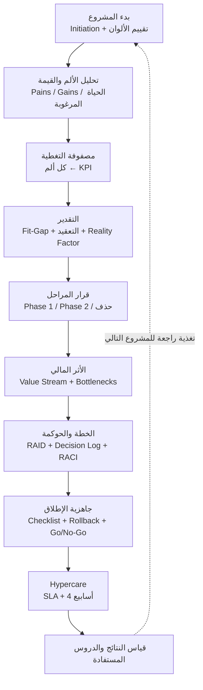
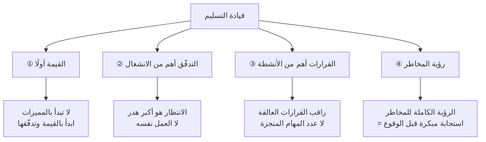

> [!info] المحاضرة 06 · قيادة التسليم · المحاضرة الختامية
> **ماذا ستتعلّم:** كيف تُطبَّق منهجية قيادة التسليم كاملةً — من قالب بدء المشروع إلى ما بعد الإطلاق — على حالة عملية واحدة متصلة (شركة النور للتوزيع)، مرورًا بتحليل الألم والقيمة، وتحويل الآلام إلى مؤشرات أداء، والتقدير الواقعي، وقرار المراحل، والأثر المالي، والحوكمة والمخاطر، وجاهزية الإطلاق، و[[Hypercare|الرعاية المكثّفة]]، وقياس النتائج الفعلية. ثم كيف تبني مسارك المهني من `Project Manager` إلى `Delivery Manager` بمهاراته وشهاداته ومستوياته وأجوره.

# المحاضرة 06 — الحالة العملية الشاملة والمسار المهني: من بدء المشروع إلى ما بعد الإطلاق

## 🎯 أهداف التعلّم

- تطبيق منهجية قيادة التسليم بالكامل على حالة عملية واحدة متصلة من لحظة اعتماد المشروع حتى ما بعد الإطلاق.
- بناء **قالب بدء المشروع** (`Project Initiation`) والتقييم المبدئي بنظام الألوان لاستشعار المخاطر مبكرًا.
- تحويل كل [[Pain Point|نقطة ألم]] إلى **مؤشر أداء** (`KPI`) قابل للقياس قبل الإطلاق وبعده.
- إتقان منهجية التقدير المركّبة: `Standard` / `Configuration` / `Customization` / `Heavy Gap` × محاور التعقيد الأربعة × [[Reality Factor|معامل الواقعية]]، واتّخاذ قرار `Phase 1` / `Phase 2`.
- ترجمة الهدر التشغيلي إلى **لغة مالية** يفهمها مجلس الإدارة، وبناء الحوكمة و[[RAID Log|سجل RAID]] و[[Decision Log|سجل القرارات]] و[[RACI]] و[[Vendor Scorecard|بطاقة تقييم المورّد]].
- اتّخاذ [[Go or No-Go Decision|قرار المضي]] بناءً على الجاهزية لا على التاريخ، وإدارة [[Hypercare|الرعاية المكثّفة]] وقياس النتائج الفعلية مقابل الأهداف.
- رسم المسار المهني: الفرق بين `Project Manager` و`Delivery Manager`، المهارات، الشهادات، المسمّيات، ونطاقات الأجور في السوق الخليجي.

## الفكرة المحورية

كل ما شُرِح في المحاضرات الخمس السابقة كان قِطعًا منفصلة: القيمة، و[[Value Stream|تدفّق القيمة]]، والتقدير، وضبط النطاق، والمخاطر، وخطة التسليم، وإدارة المورّدين. هذه المحاضرة الأخيرة تُركّب القطع كلها في **مشروع واحد يمشي أمامك خطوةً بخطوة**، في شكل قوالب `Excel` مُجهَّزة مسبقًا. الغرض ليس حفظ أرقام الحالة، بل رؤية **الترابط**: كيف تُنتِج معلومةٌ التُقطت في الدقيقة الأولى من التحليل المبدئي مؤشرَ خطر مبكر في مرحلة التنفيذ، ثم قرارًا موثَّقًا، ثم بندًا في قائمة جاهزية الإطلاق، ثم رقمًا في تقرير ما بعد الإطلاق.

الرسالة الجوهرية: **المشروع لا يفشل فجأة**؛ بل يعطيك إشارات مبكرة قبل الأزمة بوقت طويل — وقيادة التسليم هي فنّ قراءة تلك الإشارات والتصرّف قبل أن تتحوّل إلى مشكلة.

### أين نقف من الرحلة كاملة؟

مررنا خلال ستة أسابيع برحلة متكاملة: بدأنا من **القيمة**، ثم دخلنا في **[[Value Stream|تدفّق القيمة]]**، ثم **التقدير**، ثم **القرارات**، ثم **المخاطر**. والهدف من ذلك كله أن يكون لديك **نظام واضح** ترى به المشاكل في مشروعك وتعالجها **استباقيًّا** قبل أن تتحوّل إلى أزمات. كما حدث تحوّل جوهري في زاوية النظر: بدل أن يكون تركيزنا على «الموديول» (المخازن، المبيعات، الحسابات)، صرنا نتحدّث عن **تدفّقات القيمة** الممتدة من البداية إلى النهاية.

هذه المحاضرة إذًا ليست موضوعًا جديدًا، بل **إسقاط كامل** لكل ما سبق على مشروع واحد يُنفَّذ أمامك. وستلاحظ أن كل قالب من القوالب لا يقف وحده: مخرَج القالب الأول هو مدخَل الثاني، ومؤشر الثالث هو محتوى الرابع. هذا الترابط هو ما يميّز «نظام التسليم» عن مجموعة مستندات متفرّقة.

## 1) بدء المشروع: قالب `Project Initiation`

بعد اعتماد المشروع مباشرةً — وقبل أي تحليل تفصيلي — تُسجَّل مجموعة بيانات أساسية تعطيك **نظرة أولى** على حجم ما أنت مُقبل عليه. القالب بسيط، لكنه يحسم الاستراتيجية.

> [!example] قالب بدء المشروع — شركة النور للتوزيع
> | البند | القيمة |
> |---|---|
> | اسم المشروع | تطبيق نظام `ERP` — شركة النور للتوزيع |
> | القطاع | التوزيع |
> | الراعي التنفيذي ([[Sponsor]]) | المدير التنفيذي — أكثر شخص يدعم المشروع ويملك سلطة القرار |
> | مدير المشروع من جانب العميل | مدير العمليات (نقطة التواصل المباشرة) |
> | مدير التسليم (`Delivery Manager`) | أنت |
> | عدد المستخدمين | **85 مستخدمًا** |
> | عدد الفروع | **3 فروع** |
> | عدد المستودعات | **4 مستودعات** |
> | النظام الحالي | `Excel` + نظام محاسبي قديم |
> | النظام المستهدف | `Odoo` (أو أي `ERP` بديل) |
> | متطلّبات خاصة | `Barcode` + ربط مباشر مع البنك |
> | تاريخ الإطلاق المتوقَّع (`Go-Live`) | **1 يناير 2027** |
> | استراتيجية الإطلاق | إطلاق مرحلي (`Phased Rollout`) على **أربعة `sprints`** |

هذه البيانات وحدها تجيب عن أسئلة استراتيجية: هل حجم المشروع ضخم أم متوسط أم بسيط؟ من عدد المستخدمين وعدد الفروع وعدد المستودعات تخرج بتقدير مبدئي للحجم. ومن `Barcode` والربط البنكي تعرف حجم التكامل (`Integration`). ومن تاريخ الـ`Go-Live` تعرف هل الفترة المتاحة مريحة أم ضاغطة — وبناءً عليها تُحدَّد الاستراتيجية: دفعة واحدة أم على مراحل.

> [!note] السجل الأول قبل السطر الأول من العمل
> قالب البدء ليس بيروقراطية. إنه **الصورة المرجعية** التي ستقيس عليها كل تغيير لاحق: حجم النطاق، حجم التكامل، وموعد الإطلاق. من دونه لا يوجد [[Baseline|خط الأساس]] تحاسب عليه.

### التقييم المبدئي بنظام الألوان — المحاور الستة

بعد البيانات الوصفية يأتي **تقييم إضافي** بمحاور ستة، يُلوَّن كل محور بالأخضر أو الأصفر أو الأحمر. هذا التقييم هو أول أداة إنذار مبكر في حياة المشروع.

| المحور | السؤال الحاكم | مثال الحالة | اللون |
|---|---|---|---|
| **1. دعم الإدارة** | هل المدير التنفيذي ومدير العمليات داعمان مباشرةً، أم سيفوّضان شخصًا آخر يتابع معك؟ | دعم مباشر ومعلَن | 🟢 |
| **2. البيانات** | هل هناك بيانات قديمة ستُنقل؟ هل هي جاهزة أم فيها تكرار واختلافات وأخطاء؟ | بيانات فيها تكرار وأخطاء وتحتاج تنظيفًا | 🔴 |
| **3. المستخدمون الرئيسيون (`Key Users`)** | هل هم متاحون للاجتماعات المجدولة والطارئة، أم مضغوطون بطبيعة عملهم؟ | متاحية محدودة جدًّا | 🔴 |
| **4. آلية القرارات** | هل هناك التزام واضح بأن أي طلب يُبتّ فيه خلال يومين وإلّا يُصعَّد؟ | لا توجد آلية متّفق عليها | 🔴 |
| **5. البنية التحتية والشبكة (`Network`)** | هل الإنترنت مستقر في كل الفروع؟ هل البنية جاهزة أم بانتظار تجهيز؟ | جاهزة ومستقرّة | 🟢 |
| **6. الامتثال والتقارير** | هل يحتاجون امتثالًا لجهة رقابية؟ وهل هناك اتفاق موحَّد على شكل التقارير و`Dashboard` المطلوبة؟ | لا يوجد اتفاق على شكل التقارير | 🔴 |

> [!warning] الأحمر هنا ليس فشلًا — إنه خريطة مخاطرك
> كل خانة حمراء في هذا الجدول ستتحوّل لاحقًا إلى ثلاثة أشياء: **بند في [[RAID Log|سجل RAID]]**، و**نقطة في [[Reality Factor|معامل الواقعية]]** ترفع تقديرك الزمني، و**مؤشر إنذار مبكر** تراقبه أثناء التنفيذ. مثال: «متاحية `Key Users` محدودة» ستعود بعد قليل بصفتها سببًا مباشرًا لبطء القرارات، ثم قاعدة الـ 72 ساعة، ثم إجراء تصعيد إلى الراعي التنفيذي.

المقصود بمحور التقارير هنا **ليس** تقارير النظام للمستخدم، بل التقارير التي تُقدّمها أنت بصفتك مسؤول التسليم إلى جهة معيّنة — المدير التنفيذي أو مدير العمليات: هل هناك اتفاق موحَّد على `Dashboard` وبيانات محدَّدة تكفيهم؟ إن وُجد فالوضع أخضر، وإن لم يوجد فهذا سبب تأخير اعتماد لاحق.

ولنتأمّل كيف يعمل كل محور من هذه المحاور عمليًّا:

- **دعم الإدارة:** الفارق بين مدير تنفيذي يقول «اطلب مني مباشرة أي شيء» ومدير يفوّض شخصًا وسيطًا هو فارق **أسابيع** في زمن المشروع. تأخذ هذه المعلومة من البداية لتعرف: هل لديك دعم مباشر أم لا؟ وإن لم يكن، فهذا يعني تصعيدات أبطأ وقرارات أطول.
- **البيانات:** الإجابات هنا تُترجَم فورًا إلى لون. إن كانت الإجابة أن فيها تكرارًا واختلافات وبيانات خاطئة وبيانات لن تُنقل — فأنت أمام **إشارة مبدئية بحجم تعقيد كبير مرتبط بالبيانات**، وستدفع ثمنه في التقدير وفي جدول المخاطر معًا.
- **المستخدمون الرئيسيون:** السؤال ليس «هل هم موجودون؟» بل «هل هم متاحون؟». فإن كانت طبيعة عملهم أنهم مضغوطون جدًّا، فأنت أمام **تعقيد زمني**: ستطلب أشياء فيتأخّرون في الرد، وسيتأخّر المشروع بسبب اعتمادات وقرارات أنت منتظرها من جانب العميل. معرفة ذلك من البداية تعني أنك تجهّز نفسك من البداية.
- **آلية القرارات:** وجود اتفاقية مكتوبة بأن أي طلب يُوفَّر خلال يومين وإلّا يُصعَّد = وضع أخضر. غياب هذه الآلية بالكامل = **لا يوجد ضبط للقرارات**، وهو أحد أخطر مصادر التأخير.
- **البنية التحتية والشبكة:** هل هم جاهزون وينتظرونك فقط لتبدأ؟ هل الشبكة مستقرّة والإنترنت جيّد في كل الفروع؟ إن كانت الإجابة نعم فهذا محور مستقرّ يمكنك أن تنساه، وهذا في حدّ ذاته مكسب.
- **الامتثال:** هل يريدون امتثالًا مبسَّطًا أم امتثالًا مع جهة رقابية بمتطلّبات محدَّدة؟ هذا يحدّد حجم العمل الرقابي وحساسيّته.

بهذين القالبين معًا — البيانات الوصفية + تقييم الألوان — يصبح لديك **تقييم واضح تستطيع به استشعار المخاطر بشكل مبكر**: تعرف حجم المشروع، وتعرف مستوى الدعم، وتعرف هل يمكن أن يحدث تأخير من جانب العميل، وهل العميل نفسه قد يكون خطرًا يؤثّر على زمن المشروع أم لا. وكل هذا **قبل** أن تكتب سطرًا واحدًا من التحليل التفصيلي.

## 2) تحليل نقاط الألم وأنواع القيمة

بعد الصورة العامة نغوص في التفاصيل. في المرحلة السابقة عرفنا **المشاكل الأساسية** بشكل عام؛ والآن ندخل عليها بشكل **متعمّق**. نستخدم [[Value Proposition Canvas|لوحة القيمة المقترحة]] لنعرف ماذا يريد العميل فعلًا — لا ماذا يقول إنه يريد.

### أنواع القيمة الثلاثة

القيمة ليست وظيفية فقط؛ العميل إنسان قبل أن يكون منظّمة:

- **قيمة وظيفية (Functional):** تسريع تنفيذ الطلبات، تحسين دقة المخزون، تقليل أخطاء الفواتير، تسريع التقارير البطيئة.
- **قيمة عاطفية (Emotional):** تقليل الضغط التشغيلي اليومي، ورفع **الثقة في البيانات** — أن يشعر المستخدم أن الرقم الذي أمامه صحيح.
- **قيمة اجتماعية (Social):** أن يشعروا بأنهم يقدّمون **تقارير احترافية** للإدارة. شكل التقرير المتميّز والمنظّم هو في حدّ ذاته قيمة عندهم.

> [!note] لا تُهمل العاطفي والاجتماعي
> كثير من مقاومة التغيير لا سببها ضعف الوظائف، بل شعور المستخدم بأن النظام أضعف صورته أمام إدارته. القيمة الاجتماعية رخيصة التنفيذ وعالية الأثر على [[Adoption|التبنّي]].

### نقاط الألم وأثرها

| نقطة الألم (`Pain`) | الأثر على العمل (`Impact`) |
|---|---|
| تأخّر تنفيذ الطلبات | تأخّر العملاء وفقدان بعضهم |
| فروقات في المخزون | نقص في المنتجات وتوقّف مبيعات |
| أخطاء الفواتير | نزاعات مالية مع العملاء |
| تقارير يدوية | قرارات بطيئة |
| بطء الاعتمادات | [[Bottleneck\|نقاط اختناق]] في التدفّق |
| اختلاف البيانات بين الإدارات (إدارة تعطي رقمًا وأخرى رقمًا مختلفًا) | فقدان السيطرة وضعف الثقة |

### الحياة المرغوبة (`Desired Life`)

ماذا يتمنّون بالضبط؟

- طلبات أسرع → لتحقيق رضا العملاء.
- دقة مخزون أعلى → لتقليل الهدر.
- تقارير فورية → لقرارات أسرع.
- **تدفّق عمل موحَّد** (`Workflow`) على مستوى كل الإدارات → لاستقرار تشغيلي واضح.
- تقليل العمل اليدوي قدر الإمكان → أتمتة ما كان يُنجَز بالورق أو `Excel` → رفع الكفاءة.

### ربط الحلول بالآلام

الخطوة الحاسمة: كل ألم يُقابله حلّ صريح، ولا يُقبَل حلّ بلا ألم يبرّره.

| الألم | الحل المقترح |
|---|---|
| تأخّر الاعتمادات | تدفّق عمل آلي (`Automatic Workflow`) باعتمادات إلكترونية |
| فروقات المخزون | حركات مخزنية لحظية + `Barcode` |
| أخطاء الفواتير | تحقّق آلي + ربط مباشر مع البنك يُلاشي فروقات المطابقة |
| التقارير اليدوية | تقارير لحظية تعطي بيانات مباشرة |
| اختلاف البيانات بين الإدارات | نظام مركزي واحد (`Centralized ERP`) يدخل إليه الجميع من مصدر واحد |
| ضعف التبنّي بعد الإطلاق | [[Hypercare\|الرعاية المكثّفة]] بعد الإطلاق ترفع تبنّي الموظفين للنظام بدرجة كبيرة |

## 3) مصفوفة التغطية: من الألم إلى `KPI`

الآن نمسك كل نقطة ألم ونسأل: **أي مميزات (`Features`) تعالجها، وبأي نسبة؟** هذه هي **مصفوفة التغطية** (`Coverage Matrix`).

> [!example] مصفوفة التغطية — تأخّر تنفيذ الطلبات
> | الميزة | آلية المعالجة | نسبة إسهامها في حلّ هذا الألم |
> |---|---|---|
> | `Barcode` | يقلّل الإدخال اليدوي ويسرّع التقاط الأصناف | **40%** |
> | `Inventory Automation` | يقلّل الانتظار ويؤتمت حركات المخزون | **30%** |
> | `Automatic Workflow` للاعتمادات | يزيل انتظار الاعتماد اليدوي | نسبة مكمّلة |
>
> لاحظ مبدأين:
> 1. **ميزة واحدة قد تعالج أكثر من ألم:** الـ`Barcode` يعالج «تأخّر الطلبات» و«ضعف دقة المخزون» معًا.
> 2. **ألم واحد قد يحتاج أكثر من ميزة:** لا توجد ميزة سحرية تحلّ الألم كاملًا.
>
> وبالمثل، أخطاء الفواتير: التحقّق الآلي يمنع الإدخالات الخاطئة بنسبة تقارب **20%**، والربط البنكي يمنع أخطاء المطابقة بنسبة تقارب **35%** — وهي نسب تقديرية للترتيب لا للدقّة المحاسبية.

### تحويل كل ألم إلى مؤشر

> [!note] القاعدة الحاكمة
> **أي نقطة ألم لم نحوّلها إلى مؤشر مباشر (`KPI`) لن نستطيع قياس نجاحها في نهاية المشروع.** لذا: كل ألم حُدِّد في بداية المشروع يجب أن يتحوّل إلى مؤشر يُقاس في نهايته.

| نقطة الألم | المؤشر (`KPI`) | الاتجاه المطلوب |
|---|---|---|
| تأخّر تنفيذ الطلبات | `Order Cycle Time` (زمن دورة الطلب) | ينخفض |
| ضعف دقة المخزون | `Stock Accuracy` (دقة المخزون) | ترتفع |
| أخطاء الفواتير | `Invoice Error Rate` (معدّل الخطأ في الفواتير) | ينخفض |
| بطء التقارير | زمن إصدار التقرير | ينخفض إلى اللحظي |
| بطء الاعتمادات | [[Flow Efficiency]] (كفاءة التدفّق) | ترتفع |
| ضعف الاستخدام | `Adoption Rate` (نسبة التبنّي) | ترتفع |

## 4) منهجية التقدير

الطريقة ليست معيارًا عالميًّا باسم محدَّد، لكنها **طريقة قياسية في جوهرها**: تجمع بين أكثر من معيار حتى نقيس واقعية المشروع من أكثر من محور. شركات مثل `Oracle` و`SAP` تستخدم الفكرة نفسها بمسمّيات مختلفة.

### المحور الأول: مدى تغطية النظام القياسي

نقيس كل ميزة على مستوى الـ`ERP` الذي نعمل عليه:

| التصنيف | المعنى |
|---|---|
| `Standard` | الميزة موجودة بالكامل ولا تحتاج شيئًا |
| `Configuration` | موجودة لكنها تحتاج مجموعة إعدادات وتهيئة |
| `Customization` | تحتاج تعديلًا برمجيًّا بسيطًا |
| `Heavy Gap` | فجوة كبيرة تحتاج تخصيصًا كثيفًا |

### المحور الثاني: التعقيد بأربعة محاور

يُقاس كل محور بثلاث درجات: منخفض (`Low`) / متوسط (`Medium`) / عالٍ (`High`):

1. **التكامل (`Integration`):** هل الميزة مرتبطة بأنظمة أو أجهزة خارجية؟ هل فيها تكامل عالٍ؟ في حالتنا: أجهزة الـ`Barcode` والربط البنكي كلاهما تكامل خارجي يرفع الدرجة.
2. **البيانات (`Data`):** هل البيانات الخاصة بهذه الميزة جاهزة أم غير جاهزة؟ هل تحتاج تنظيفًا وترحيلًا وتوحيد أكواد؟
3. **الاعتماديات ([[Dependency|Dependencies]]):** هل تعتمد هذه الميزة على أشياء أخرى بدرجة عالية؟ كلّما زادت الاعتماديات زاد احتمال الانتظار وتعطّل التسلسل.
4. **الحرجيّة (`Criticality`):** ما أثرها على التشغيل والمال والإطلاق؟ هل هي مؤثّرة بشكل عالٍ على التشغيل؟ وهل قد تُسبّب خسارة مالية للشركة إن لم تُنفَّذ بشكل صحيح؟

بهذه المحاور مجتمعة نستطيع أن نعرف لكل ميزة: هل فيها تكامل عالٍ؟ هل بياناتها جاهزة؟ هل عليها اعتماديات كثيفة؟ وما درجة حساسيّتها؟ ثم نُعطي كلًّا منها درجة — منخفض أو متوسط أو عالٍ — ونجمع النتيجة.

> [!note] `Criticality` تقيس **تكلفة الفشل** لا حجم العمل
> هذه من أهم النقاط في المنهجية كلها. الحرجيّة لا تسأل «كم ستستغرق هذه الميزة؟» بل: **«لو نفّذتُها خطأً، كم ستكلّفني؟»**
> - قد تكون مهمة صغيرة، لكنها مرتبطة بأثر مالي أو بتقرير مالي أو بتقرير لجهة رقابية → حرجيّتها **عالية**.
> - ميزة تُخرج قيمة خاطئة قد تؤدّي إلى خسارة مالية فعلية للشركة، أو تؤثّر على موعد الـ`Go-Live` نفسه.
>
> فكلّما ارتفعت حساسية الميزة رفعنا وزنها في التقدير — لأنها تستحقّ مراجعة واختبارًا أعمق، لا لأنها أكبر حجمًا.

### المحور الثالث: [[Reality Factor|معامل الواقعية]]

التقدير الناتج عن المحورين السابقين يفترض عالَمًا مثاليًّا: قرارات فورية، بيانات جاهزة، لا انتظار. لذلك نضيف نسبة واقعية بناءً على ثلاثة أسئلة:

1. **سرعة القرارات:** ضعيفة / متوسطة / جيدة؟
2. **جاهزية البيانات:** جاهزة أم تحتاج تنظيفًا؟
3. **التكامل والتعقيد:** بسيط أم عالٍ؟

نجمع نقاط الإجابات — كل إجابة تُصنَّف ضعيفة أو متوسطة أو جيدة — فيخرج معامل يتراوح بين **1.2** و**1.5** و**1.8** و**2.0**. والقاعدة العملية: **خُذ الحدّ الأدنى المعقول** — إن تردّد التقدير بين 2 و2.2 فاعتمد 2. ثم اضرب المعامل في التقدير الذي وصلت إليه في المرحلة السابقة.

لماذا نحتاج هذا المعامل أصلًا؟ لأن التقدير الخام يفترض أن القرارات سريعة، والبيانات جاهزة، والتكامل بلا مفاجآت. والواقع أن **القرارات في الغالب ليست سريعة** حسب طبيعة تعاملك مع العميل، وأن البيانات قد لا تكون جاهزة، وأن طبيعة التكامل قد تحمل تعقيدًا إضافيًّا لم يظهر في التحليل الأول. المعامل ببساطة هو ثمن الواقع.

> [!example] كيف تُشتقّ درجة «سرعة القرارات» من التقييم المبدئي؟
> عرفنا من التقييم المبدئي لشركة النور أن **متاحية `Key Users` محدودة** وأن **آلية القرارات غير موجودة**. إذًا القرارات قد تتأخّر، وقد يستغرق قرار كنت تتوقّعه في 24 ساعة نحو **72 ساعة**. فنضع درجة «ضعيف» في محور سرعة القرارات، ونضيف نسبة إضافية على التقدير. وهذه نفس المعلومة التي ستتحوّل بعد قليل إلى بند في [[RAID Log|سجل RAID]] وإلى **مؤشر خطر مبكر**. معلومة واحدة، ثلاثة استخدامات.

### تحويل النقاط إلى نطاقات زمنية

المخرَج النهائي لكل بند رقمٌ نترجمه إلى **نطاق أسابيع**، لا إلى رقم واحد:

| مجموع النقاط | التصنيف | النطاق الزمني | القرار |
|---|---|---|---|
| 4 – 5 | بسيط | **2 – 3 أسابيع** | يُنفَّذ كما هو |
| 6 – 7 | متوسط | **4 – 5 أسابيع** | يُنفَّذ مع مراقبة |
| 8 – 9 | متوسط إلى عالٍ | **6 – 8 أسابيع** | يُراجَع ويُبسَّط إن أمكن |
| 10 فأكثر | كبير | — | **يُقسَّم إلى مرحلتين أو ثلاث** حسب المشروع |

> [!warning] لا تُعطِ رقمًا واحدًا أبدًا
> النطاق يحميك ويحمي العميل معًا. الرقم الواحد وعدٌ لا تملك أدوات الوفاء به.

## 5) تقدير `Value Streams` وقرار `Phase 1` / `Phase 2`

بعد استخراج كل [[Value Stream|تدفّقات القيمة]] نمسك كل تدفّق ونقدّره من كل المحاور السابقة.

> [!example] تقدير تدفّق `Order-to-Cash` — خطوةً بخطوة
> | خطوة العملية | التصنيف | الجهد الأساسي | ملاحظات التعقيد |
> |---|---|---|---|
> | `Lead` → `Opportunity` | `Standard` | 1 | النظام يغطّيها بالكامل، لا تفاصيل إضافية |
> | `Opportunity` → `Quotation` | `Configuration` | 2 | إعدادات فقط، باقي المحاور منخفضة |
> | `Quotation` → `Sales Order` | `Configuration` | 2 | كما سبق |
> | `Sales Order` → `Delivery` | `Customization` بسيط | 4 | هنا تدخل تفاصيل `Criticality` و`Dependencies` و`Data` |
>
> عند هذه الخطوة الأخيرة تحديدًا يبدأ التعقيد الحقيقي: كل محور يُقيَّم على حدة ويُضاف أثره إلى التقدير.

### قرار الإدراج: `Core` أم `Phase 2` أم حذف؟

بعد حساب كل البنود نأخذ القرار لكل مجموعة مميزات عبر أربعة أسئلة:

1. هل هي **ضرورية للتشغيل الأساسي**؟ إن كانت كذلك فلا يمكن حذفها من المرحلة الأولى.
2. هل تحقّق **قيمة إضافية** فقط دون أن تكون شرطًا للتشغيل؟ → مرشَّحة للتأجيل.
3. هل هي **عالية التعقيد ومنخفضة القيمة**؟ → أعِد تصميمها أو احذفها.
4. هل يمكن **تبسيطها** بدل تنفيذها كاملة؟

النتيجة قرار من ثلاثة: **تدخل `Phase 1` / تُؤجَّل إلى `Phase 2` / تُحذف**.

> [!note] مبدأ التشغيل بأقل متطلّبات — [[MVP|أقل منتج قابل للتشغيل]]
> الهدف من `Phase 1` أن تُشغّل المنظّمة والعميل **بأقل متطلّبات ممكنة**. قد يكون تدفّق القيمة الأول بكامله داخلًا في المرحلة الأولى لأنه ضروري للتشغيل، بينما يدخل من التدفّق الثاني جزء فقط. أي تفاصيل تمثّل قيمة إضافية ولا يتوقّف عليها التشغيل تُؤجَّل — لتخرج قيمة مبكرة للعميل، فيعمل مستقلًّا بينما أنت تنفّذ المرحلة الثانية. يعمل ويستلم قيمة في الوقت نفسه.

### مؤشر الإنذار المبكر: قاعدة الـ 72 ساعة

هنا تظهر قوة الترابط بين مراحل المنهجية. في التقييم المبدئي عرفنا أن **متاحية `Key Users` محدودة** وأن **آلية القرارات غير موجودة**. هذه المعلومة تُستثمر ثلاث مرّات:

1. **في التقدير:** ترفع نقاط «سرعة القرارات» في [[Reality Factor|معامل الواقعية]] إلى «ضعيف».
2. **في [[RAID Log|سجل RAID]]:** يُسجَّل «تأخّر قرارات العميل» كخطر مع مالك ومسؤول وخطة استجابة.
3. **كمؤشر إنذار مبكر:** إن تجاوز أي قرار **72 ساعة** فهذا خط أحمر يستوجب تصعيدًا فوريًّا — قبل أن يتحوّل الخطر (`Risk`) إلى مشكلة قائمة (`Issue`).

> [!warning] الفرق بين الخطر والمشكلة
> **الخطر** احتمال لم يقع بعد ويمكن منعه. **المشكلة** واقع حدث وعليك احتواؤه. مؤشرات الإنذار المبكر هي الجسر: كل مؤشر يُلتقط في وقته يمنع تحوّل خطر إلى مشكلة.

### المعايرة بسرعة الفريق

بعد ضرب التقديرات في معامل الواقعية، نعايرها بـ[[18 - Velocity|سرعة الفريق]]. في هذه الحالة: الفريق يسلّم بمتوسط **10 وحدات** لكل [[14 - Sprint|sprint]] مدّته أسبوعان (بمتوسط تاريخي يقارب 8–10). نقسم إجمالي الجهد على السرعة فنحصل على المدة:

> [!example] النتيجة: 35 أسبوعًا للمرحلة الأولى
> بعد ضرب الجهد في معامل الواقعية والقسمة على سرعة الفريق، خرج النطاق التشغيلي الأدنى (`Minimum Operational Scope`) بمدّة تقارب **35 أسبوعًا** للمرحلة الأولى.
>
> **ملاحظة مهمة على القرار:** إذا وجدت أنه لم تتبقّ ميزة واحدة تصلح للتأجيل — أي أن المرحلة الثانية ستكون فارغة — فهذا يعني أن النطاق كله أساسي وغير معقّد، ويمكن تنفيذ كل التخصيصات في مرحلة واحدة. القرار إذًا **مخرَج تحليل، لا قاعدة مسبقة**: قد ينتهي بك التحليل إلى أنك لا تستطيع التقسيم أصلًا، فتنفّذ كل شيء في مرحلة واحدة وتنطلق.

### إعادة التقييم: مثال `Mobile App`

نضيف طبقة تقييم إضافية لكل ميزة: **أهميتها من منظور الأعمال** (`Business Importance`)، ووجود اعتماديات عليها، وحجم فجوتها في [[Fit-Gap Analysis|تحليل الملاءمة والفجوة]]، وقابليتها للتأجيل.

> [!example] لماذا أُجِّل تطبيق الموبايل؟
> - **الأهمية من منظور الأعمال:** منخفضة.
> - **الحرجيّة (`Criticality`):** منخفضة.
> - **الاعتماديات:** لا شيء يعتمد عليه.
> - **التعقيد:** عالٍ.
> - **هل يمنع التشغيل؟** لا.
>
> ⇒ القرار: **يُحوَّل مباشرةً إلى `Phase 2`** ضمن التحسينات المؤجَّلة.

لكن القصة لا تنتهي هنا. عند بدء المرحلة الثانية **نعيد التقييم من جديد** بناءً على المستجدّات والتغذية الراجعة من المرحلة الأولى. قد تتغيّر الأرقام والحرجيّة بالكامل: تطبيق الموبايل الذي كانت قيمته منخفضة قد تصبح قيمته متوسطة أو عالية — لصدور قانون جديد في البلد، أو لقرار إداري بفتح قناة تواصل مع العملاء عبر الهاتف.

> [!note] قاعدة إعادة التقييم الدورية
> أي ميزة **بقيت مؤجَّلة أكثر من بضعة أشهر يجب أن تُعاد دراستها**: قد تنخفض قيمتها فتُحذف بالكامل، وقد ترتفع فتتقدّم في الأولوية. الفترة الزمنية وحدها كافية لتغيير أولويات الأعمال. لذا: في المرحلة الأولى نأخذ دائمًا الأعلى قيمة، وفي بداية الثانية نُعيد تقييم كل ما أُجِّل — هل تغيّرت القيمة؟ هل ظهرت حاجات جديدة؟ هل جاءت تغذية راجعة تستدعي تعديلات؟

## 6) المخرجات والأثر المالي

### تجميع المؤشرات (قبل / بعد)

بعد كل التحليل تخرج بلوحة أهداف واضحة تربط الوضع الحالي بالمستهدف:

| المؤشر | قبل (الوضع الحالي) | المستهدف | موعد القياس |
|---|---|---|---|
| `Order Cycle Time` (زمن دورة الطلب) | 5 أيام | ≤ **يومان** | بعد 4 أسابيع من الإطلاق |
| `Invoice Error Rate` (أخطاء الفواتير) | 12% | **2%** | بنهاية الشهر الأول |
| `Stock Accuracy` (دقة المخزون) | 68% | **95%** | بعد أول جرد |
| زمن التقارير | يومان | **لحظي** | مباشرةً بعد الإطلاق |
| `Flow Efficiency` (كفاءة التدفّق) | 4% | **30% أو أعلى** | بعد 4 أسابيع |
| `Adoption Rate` (تبنّي المستخدمين) | 0% (لا يوجد نظام) | **90%** | بعد شهر |

> [!note] لماذا نكتب «قبل» قبل أن نبدأ؟
> لأن الرقم «بعد» بلا معنى بغير مرجع. تسجيل الوضع الحالي في بداية المشروع هو ما يحوّل التسليم من انطباع إلى **إثبات**، ويصنع لك [[Lessons Learned|قصة نجاح]] قابلة للعرض على العميل التالي.

### رسم `Value Stream`: وقت العمل مقابل وقت الانتظار

نمسك كل تدفّق ونرسمه خطوةً بخطوة، مسجّلين لكل خطوة ثلاثة أعمدة: **زمن العمل الفعلي (`Working Time`)** و**زمن الانتظار (`Waiting Time`)** و**الشخص المسؤول**. ثم نسأل: أين المشكلة الحقيقية؟ هل هي انتظار اعتماد لأن المدير مشغول؟ فرق في المخزون؟ مراجعة يدوية؟ تأخير في التسليم؟ وحين نعرف الأسباب ننتقل إلى قراءة **كفاءة التدفّق** (`Flow Efficiency`) = زمن العمل ÷ (زمن العمل + زمن الانتظار).

النتيجة كانت مذهلة: **كفاءة التدفّق 4% فقط** — أي أن 96% من الزمن كان انتظارًا لا عملًا، ومعظمه تأخّر اعتمادات.

> [!warning] لا تحاول علاج كل [[Bottleneck|نقاط الاختناق]] دفعةً واحدة
> يمكنك استهداف كل الاختناقات، أو جزء منها، أو **اختناقًا واحدًا فقط** — الأكثر حساسيةً أو الأشدّ أثرًا على مستوى العميل. البدء بواحد مؤثر أفضل من تشتيت الجهد على عشرة. حسّنه، ثم انتقل إلى الذي يليه.

### تحويل الخسائر إلى لغة مالية

هذه هي الخطوة التي تصنع الفرق أمام الإدارة. **اللغة المالية هي لغة الإدارة**: أنت الآن في اجتماع مع مدير العمليات والمدير المالي، ولا يكفي أن تقول «العملية التشغيلية ستتحسّن».

> [!example] الخسارة الشهرية الحالية = 200 ألف ريال
> | مصدر الخسارة | التكلفة الشهرية |
> |---|---|
> | تأخّر الطلبات → عملاء مفقودون | **90,000 ريال** |
> | إعادة إصدار الفواتير بسبب ارتفاع نسبة الأخطاء | **30,000 ريال** |
> | فروقات المخزون | **60,000 ريال** |
> | إعادة العمل (`Rework`) بسبب الأخطاء | **20,000 ريال** |
> | **الإجمالي** | **200,000 ريال شهريًّا** |
>
> الرسالة إلى الإدارة تصبح جملةً واحدة قاطعة: **«تطبيق النظام بالطريقة التي نقترحها سيوفّر عليكم نحو 200 ألف ريال شهريًّا.»**
>
> حين ترى الإدارة لغة الأرقام بهذا الشكل تفهم قيمة النظام فورًا، وتعرف أثره الفعلي عليها لا مجرّد «تحسين العمليات». وهذا ينعكس مباشرةً على جودة الدعم الذي تتلقّاه: مدير لا يريد أن يخسر مبلغًا كهذا كل شهر سيصبح **أسرع في القرارات** و**أكثر التزامًا** بتوفير الموارد.

## 7) الخطة والحوكمة والمخاطر والمورّدون

### خطة بلا تواريخ

نخرج بخطة **مراحل وأنشطة ومخرجات — بلا تواريخ محدَّدة في البداية**، لأن التواريخ تُثبَّت بعد التأكّد من الجاهزية لا قبلها:

| المرحلة | الأنشطة | المخرجات | المدة التقديرية |
|---|---|---|---|
| **التحليل واكتشاف المشاكل** | ورش عمل، حصر المشاكل، تحديد الفجوات | قائمة المشاكل والمتطلّبات | ~3 أسابيع |
| **التصميم (`Design`)** | تصميم تدفّقات العمل الكاملة، مراجعة مع العميل | تصميم معتمَد + موافقة العميل على طريقة العمل | ~أسبوعان |
| **البناء والتطوير (`Build`)** | التهيئة + التخصيصات | نظام مبنيّ قابل للاختبار | ~6 أسابيع |
| **البيانات (`Data`)** | تنظيف + ترحيل البيانات القديمة + التحقّق من صلاحيتها للدخول في النظام الجديد | بيانات جاهزة ومعتمَدة | متوازية |
| **التدريب (`Training`)** | تجهيز المستخدمين للعمل على النظام الجديد | مستخدمون جاهزون | ~أسبوع مكثّف |
| **الاختبار (`UAT`)** | ثلاث دورات اختبار | [[Sign-off\|اعتماد رسمي]] من المستخدمين | ~4 أسابيع |
| **الإطلاق و[[Hypercare\|الرعاية المكثّفة]]** | إطلاق + دعم مكثّف 4 أسابيع | نظام مستقر + قياس المؤشرات في الأسبوع الأخير | 4 أسابيع |

تفصيل ما يجري داخل كل مرحلة:

- **التحليل:** أشتغل على ورش العمل وأخرج بقائمة مخرجات، وأحدّد كل المشاكل خلال فترة الثلاثة أسابيع.
- **التصميم:** أعمل تصميم تدفّق العمل (`Workflow Design`) وأرى الحلّ كاملًا، ثم أخرج بموافقة من العميل على **طريقة العمل** التي سنشتغل بها وعلى المتطلّبات التي طلبها — خلال أسبوعين تقريبًا.
- **البناء:** التهيئة + التخصيصات التي اتُّفق عليها خلال ستة أسابيع.
- **البيانات:** تحتاج تنظيفًا **إضافةً إلى** ترحيل البيانات القديمة، والتأكّد من أن البيانات الخارجة من النظام القديم جاهزة لتدخل مباشرةً في النظام الجديد.
- **التدريب:** أجهّز المستخدمين للعمل على النظام الجديد؛ وهذا تركيزي الأساسي في هذه المرحلة.
- **الاختبار:** ثلاث دورات اختبار خلال أربعة أسابيع تقريبًا.
- **الإطلاق:** أسبوع كامل، يليه مباشرةً أربعة أسابيع مكثّفة من [[Hypercare|الرعاية المكثّفة]].

> [!note] القياس جزء من الخطة لا ذيل لها
> في **الأسبوع الأخير** من فترة الرعاية المكثّفة نبدأ قياس المؤشرات التي حدّدناها في بداية المشروع، لنرى: هل تحقّقت القيمة فعلًا أم لا؟ وأي طلب يأتي أثناء العمل خارج النطاق يُسجَّل بأثره — سواء كان أثرًا على زمن التشغيل أو أثرًا ماليًّا أو أثرًا على الجودة — ويُكتَب بجانبه القرار المتّخَذ بشأنه.

### [[RAID Log|سجل المخاطر]] بالمؤشرات المبكرة

المخاطر لا تُكتشف أثناء التنفيذ فقط؛ الكثير منها معروف منذ مرحلة التحليل المبدئي. لكل خطر نكتب: الوصف، الأثر، المسؤول، **المؤشر المبكر**، والإجراء عند تحقّقه.

> [!example] سجل المخاطر — بنود فعلية من الحالة
> | الخطر | الأثر | المسؤول | المؤشر المبكر (`Trigger`) | الإجراء عند التحقّق |
> |---|---|---|---|---|
> | بيانات غير جاهزة (عُرِف من التقييم المبدئي) | تأخير الإطلاق كليًّا | فريق العميل + فريق البيانات | جاهزية البيانات **< 80%** | إنشاء **`Data War Room`**: جمع كل المعنيين والعمل المكثّف على البيانات حتى تتجاوز 80% |
> | تأخّر قرارات العميل | تمدّد الجدول الزمني | الراعي التنفيذي | قرار يتجاوز **72 ساعة** | تصعيد فوري إلى الراعي التنفيذي |
> | عدم توفّر `Key Users` | تأخير التحليل والاختبار والتدريب | مالك المشروع من جانب العميل | ضعف الحضور في الجلسات | تصعيد مباشر إلى المالك — عدم توفّرهم يؤثّر على زمن المشروع بالكامل |
> | تعطّل واجهة الربط البنكي (`API`) | فشل المطابقة المالية | فريق التكامل + البنك | تكرار فشل الاستدعاءات | فتح طلب دعم فني لدى البنك ومتابعة مباشرة |
> | تكرار في المنتجات (تحوّل بالفعل إلى **مشكلة**) | فروقات مخزون وأخطاء تشغيل | فريق المخازن | ظهر أثناء تنظيف البيانات | معالجة فورية بمعايير تنظيف موحَّدة |

> [!warning] `Data War Room` ليس ترفًا تنظيميًّا
> عندما تنخفض جاهزية البيانات إلى 65% مثلًا وأنت متّجه إلى الإطلاق، لا ينفع بريد إلكتروني ولا تذكير في اجتماع. تُجمَع كل الأطراف في غرفة واحدة بهدف واحد ومدة محدّدة حتى تتجاوز النسبة الحدّ الآمن. تذكّر: **70% من مشاكل الإطلاق مصدرها البيانات**.

### الافتراضات (`Assumptions`)

نُسجّل الافتراضات التي بنينا عليها التقدير، لأنها إن سقطت انهار التقدير معها. مثال: «افترضنا توفّر `Key Users` بنسبة معقولة» — فإن ضعف الحضور فعليًّا نلجأ إلى التصعيد المباشر، لأن الافتراض الذي بُني عليه التقدير لم يعد صحيحًا.

### [[Decision Log|سجل القرارات]]

كل قرار في المشروع يُسجَّل بسببه وبدائله وأثره والموافق عليه.

> [!example] قرارات موثَّقة من الحالة
> **القرار 1 — الإطلاق على مرحلتين:** كان الخيار بين إطلاق كامل دفعة واحدة أو إطلاق مرحلي. التوصية كانت الإطلاق على مرحلتين، وتمّت الموافقة رسميًّا.
>
> **القرار 2 — اختيار مورّد الـ`Barcode`:** كان أمامنا `Vendor A` و`Vendor B` لأجهزة الباركود. اخترنا **`Vendor A`** للأسباب التالية:
> 1. متوافق مع الأجهزة الموجودة حاليًّا لدى العميل.
> 2. متوافق مع النظام عبر `API` مباشر.
> 3. لديه دعم فني قائم ومتاح.
>
> **القرار 3 — استبعاد ميزة مطلوبة:** طُلبت ميزة إضافية، وكانت التوصية `Exclude`، فاتُّفق على **تأجيلها إلى المرحلة الثانية** بدل رفضها نهائيًّا.

> [!note] «أي قرار غير مكتوب هو قرار ضائع»
> السجل يحميك: إن أُعيد النقاش لاحقًا في أي أمر، لديك توثيق بأننا ناقشناه، واستغرقنا فيه وقتًا، وخرجنا بقرار. هذا يمنع إعادة فتح ملفات مغلقة ويحمي المشروع من النزاعات.

### الحوكمة و[[Steering Committee|لجنة التوجيه]]

نحدّد على مستوى المشروع إيقاع الاجتماعات: **اجتماعات أسبوعية** لفريق العمل، و**اجتماع شهري** مع لجنة التوجيه.

| الاجتماع | الجدول | المحتوى |
|---|---|---|
| **الاجتماع الأسبوعي** | أسبوعي | حالة التسليم (`Delivery Status`)، وضع [[RAID Log\|سجل RAID]]، القرارات المطلوبة، جاهزية [[UAT\|اختبار قبول المستخدم]]، أي تصعيدات وقعت |
| **[[Steering Committee\|لجنة التوجيه]]** | شهري | الميزانية (`Budget`)، المخاطر المؤثّرة على الميزانية، مشاكل الجدول الزمني (`Timeline`)، القرارات الحرجة التي تحتاج إجراءً، التصعيدات على مستوى العميل أو المورّد |

اللجنة هي الجهة التي تتدخّل حين يحتاج التصعيد سلطةً أعلى من سلطتك — سواء كان التصعيد تجاه العميل أو تجاه مورّد. فحين تحتاج قرارًا حرجًا يتجاوز صلاحيّتك، أو حين يتوقّف المشروع على طرف لا تملك سلطة إلزامه، تصبح [[Steering Committee|لجنة التوجيه]] هي الأداة لا البريد الإلكتروني.

الفارق بين الاجتماعين مهم: **الأسبوعي تشغيلي** — نناقش فيه حالة التسليم والمخاطر والقرارات المعلَّقة وجاهزية الاختبار. و**الشهري تنفيذي** — نناقش فيه الميزانية والمخاطر المؤثّرة عليها ومشاكل الجدول الزمني والتصعيدات. من يخلط بين المستويين إمّا أغرق الإدارة بتفاصيل لا تهمّها، أو حرمها من القرارات التي لا يملكها غيرها.

### مصفوفة [[RACI]]

نحدّد المسؤوليات بين كل الأطراف الداخلة في المشروع منذ البداية، حتى يكون التعامل واضحًا ويُعرَف مَن المسؤول ومَن المنفِّذ:

| النشاط | العميل | المورّد | مدير التسليم (أنت) |
|---|---|---|---|
| **الاعتمادات والموافقات** | **مسؤول (`Accountable`)** | يُستشار | يُبلَّغ / يتابع |
| **تجهيز البيانات** | **مسؤول** | يُستشار | يتابع ويراقب المؤشر |
| **تهيئة النظام والتخصيص** | يُستشار | مشارك في جزئه | **مسؤول مباشر** |
| **الاختبار والقبول (`UAT`)** | **منفِّذ ومعتمِد** | يدعم | ينظّم ويقيس |
| **التدريب** | يوفّر المتدرّبين | — | **مسؤول** |

> [!note] المصفوفة تتشكّل حسب الأطراف الفعلية
> إن لم يكن هناك مورّد خارجي فالمصفوفة تكون بينك وبين العميل فقط. وإن دخل مورّد أو فريق داخلي تابع للشركة أضفتَ عمودًا له. المهم أن **كل طرف داخل في المشروع له صفّ واضح** ولا تبقى مسؤولية بلا مالك.

### [[Vendor Scorecard|بطاقة تقييم المورّد]]

إن كان معك أكثر من مورّد، تُقيّم كلًّا منهم دوريًّا على معايير محدَّدة:

| المعيار | السؤال |
|---|---|
| **الالتزام بالمواعيد** | هل يسلّم في الوقت أم يحدث تأخير؟ |
| **جودة التسليم** | هل جودة ما يُسلَّم عالية أم تحتاج إعادة عمل؟ |
| **الأخطاء الحرجة** | هل تظهر أخطاء حرجة في تسليماته؟ |
| **اتفاقية الاستجابة ([[SLA]])** | هل يستجيب للأخطاء ضمن المدة المتّفق عليها؟ |
| **الالتزام بالاتفاق** | هل يلتزم ببنود التعاقد؟ |

تُلوَّن كل خانة، وتُقارَن بطاقة المورّد الأول ببطاقة الثاني. **إن ظهر مورّد بكل خاناته حمراء فهذه إشارة لاتّخاذ إجراء**: إمّا إصلاح الوضع بخطة تحسين، أو البحث عن بديل من ضمن الموردين المتاحين.

> [!warning] المعرفة جزء من التسليم
> ما تسلّمه للعميل ليس نظامًا فقط، بل **نظام + معرفة + قدرة على التشغيل**. إن انتهى عقد المورّد أو انسحب، يجب أن يكون العميل قادرًا على الاستمرار من دونه. لذلك احرص على أن تُسلَّم المعرفة وتُوثَّق بالتوازي مع تسليم النظام، وإلّا فأنت تترك نقاطًا مجهولة مرتبطة بشخص أو جهة واحدة — وهذا خطر مباشر على استمرارية النظام بعد رحيل المورّد.

## 8) جاهزية الإطلاق

### التصعيد والمقاييس

قبل الإطلاق نراقب مجموعة عتبات، ولكل عتبة إجراء تلقائي:

| المؤشر | العتبة | الوضع الفعلي | الإجراء |
|---|---|---|---|
| زمن اتخاذ القرار | > 48 ساعة | **72 ساعة** | 🔴 خط أحمر → تصعيد فوري |
| جاهزية البيانات | < 80% | **65%** | 🔴 → `Data War Room` |
| اكتمال التدريب | < 85% | **81%** | 🟡 → دعم إضافي لرفع النسبة |
| إعادة العمل (`Rework`) | > 15% | **≈ 20%** | 🔴 → دراسة أسباب إعادة العمل ومعالجتها |
| الأخطاء الحرجة | يجب أن تكون **صفرًا** | خطآن | 🔴 → **تجميد الإصدار الحالي** حتى تُعالَج |

هذه العتبات ليست زينة في تقرير؛ كل صفّ منها **يشتغل تلقائيًّا**. بمجرّد أن يتجاوز المؤشر عتبته يبدأ الإجراء دون انتظار اجتماع. مثال: عندما ظهر خطآن حرجان — والمفترض أن يكون العدد صفرًا — كان القرار **تجميد الإصدار الحالي (`Freeze`)** حتى تُعالَج الأخطاء الموجودة في النظام، لا المضيّ ثم المعالجة لاحقًا. وعندما بلغت إعادة العمل نحو 20% مقابل حدّ أقصى 15%، كان الإجراء دراسة **أسباب** إعادة العمل ومعالجتها من جذرها، لا مجرد تسريع الفريق.

وبالتوازي يُصدَر [[Project Health Report|تقرير صحّة المشروع]] الذي يجمع الوضع الحالي في محاور الجدول الزمني والبيانات وقبول المستخدمين، ويُبيّن المشاكل الفعلية والإجراء المتَّخَذ لكل منها. من هذا التقرير تعرف بدقّة: **أين نقف من الـ`Go-Live`؟** هل نستطيع الخروج بالوضع الحالي بناءً على الصورة التي أراها، أم يجب اتخاذ إجراء إضافي حتى ألتزم بالتاريخ المحدَّد منذ بداية المشروع؟

### مقاييس الاختبار

نمرّ بثلاث دورات اختبار (`Cycles`):
1. **الدورة الأولى:** اكتشاف أكبر قدر ممكن من المشاكل.
2. **الدورة الثانية:** حلّ المشاكل التي ظهرت في الأولى، لتصبح الدورة التالية جاهزة.
3. **الدورة الثالثة:** أخذ [[Sign-off|الاعتماد الرسمي]] من المستخدمين على كل ميزة سُلِّمت.

| المقياس | المستهدف |
|---|---|
| `Pass Rate` (نسبة نجاح الاختبارات) | مرتفعة جدًّا (قريبة من الاكتمال) |
| الأخطاء الحرجة | **صفر** |
| `Retest Success` (نجاح إعادة الاختبار) | **≥ 90%** |
| مشاركة المستخدمين في الاختبار | **≥ 90%** |

### `Go-Live Checklist`

قائمة يُبنى عليها [[Go or No-Go Decision|قرار المضي]]، تُراجَع قبل الإطلاق بأسبوع:

| المحور | الحالة الفعلية |
|---|---|
| **البيانات** | مكتملة ومعتمَدة ✅ |
| **المستخدمون** | دُرِّبوا بالكامل وجاهزون ✅ |
| **النظام** | لا توجد أخطاء حرجة ✅ |
| **الدعم** | الفريق جاهز ومتاح ✅ |
| **الخطة البديلة** | متوفّرة ✅ |

### خطة [[Rollback]] / `Fallback`

> [!warning] لا إطلاق بلا خطة رجوع
> لو حدث فشل في الإطلاق — لا قدّر الله — يجب أن تكون قادرًا على **الرجوع مباشرةً إلى النظام القديم** أو إلى بديل مؤقّت. وقد تكون الاستراتيجية البديلة جزئية: أن تُطلق بنسبة 50% من المتطلّبات بدل الإطلاق الكامل، بشرط أن تكون مجهَّزة لذلك **من البداية** لا في لحظة الأزمة.

### القرار النهائي والمراقبة

نجمع كل الألوان ونخرج بقرار:

- **كل الخانات خضراء** → نمضي قُدمًا.
- **أحمر خفيف في بعض المحاور** → **نمضي لكن نراقب**، ونحدّد بدقّة ما سنراقبه.

في هذه الحالة كان القرار: **نُطلق مع مراقبة مركّزة على المستخدمين**، لأن المخاطرة المتبقية هي احتمال حدوث مشاكل بسبب ضعف وعي بعض المستخدمين أو عدم وضوح جزئية لديهم — وليست مخاطرة تقنية. كل التنبيهات (`Notifications`) مفعّلة على مستوى النظام وعلى مستوى إدارة المشروع.

> [!note] `Go-Live` قرار جاهزية لا تاريخ
> التاريخ مجرّد تخطيط. الجاهزية (`Readiness`) هي القرار: هل نحن فعليًّا — بوضعنا الحالي وأدائنا الحالي — قادرون على الخروج `Live` في التاريخ المحدَّد أم لا؟ هذا هو ما يركّز عليه مدير التسليم بدرجة أكبر من التاريخ نفسه.

## 9) [[Hypercare|الرعاية المكثّفة]] بعد الإطلاق

### اتفاقية مستوى الخدمة ([[SLA]]) حسب الأولوية

| أولوية المشكلة | زمن الاستجابة | زمن الحل |
|---|---|---|
| **حرجة (`Critical`)** | خلال **ساعة** | لا يتجاوز **4 ساعات** |
| **عالية (`High`)** | خلال **4 ساعات** أو أقل | لا يتجاوز **24 ساعة** |
| **متوسطة (`Medium`)** | خلال **يوم** | لا يتجاوز **3 أيام** |

هذه الاتفاقية واضحة بينك وبين العميل قبل الإطلاق، فأي مشكلة تحدث في الأسبوع الأول تُعالَج وفق هذا الجدول مباشرةً. ولاحظ التمييز بين **زمن الاستجابة** و**زمن الحل**: الاستجابة تعني أن نردّ ونؤكّد أننا استلمنا المشكلة وبدأنا العمل عليها، والحل هو إغلاقها فعليًّا. تحديد الاثنين معًا يمنع الحالة الشائعة: فريق يردّ سريعًا ثم يختفي.

### الأسابيع الأربعة

| الأسبوع | التركيز |
|---|---|
| **الأول** | أي مشكلة حرجة تحدث في النظام تُعالَج فورًا |
| **الثاني** | التركيز على **تبنّي المستخدمين** للنظام |
| **الثالث** | التحقّق من التشغيل الفعلي: هل النظام يعمل؟ هل الأداء يتحسّن؟ |
| **الرابع** | الاستقرار: الناس تعمل وتعوّدت، لا مشاكل، ثم **قياس كل المؤشرات** التي حُدِّدت في بداية المشروع |

> [!note] `Hypercare` ≠ `Support`
> **الرعاية المكثّفة استباقية:** لدينا وقت محدَّد يوميًّا — الساعة العاشرة صباحًا مثلًا — نتواصل فيه مع العميل ونسأله: هل توجد مشاكل؟ هل ظهرت أخطاء؟ نجمع كل ما حدث ونعالجه مباشرةً، **قبل** أن يتّصل هو.
> **الدعم تفاعلي:** ننتظر حتى تحدث مشكلة ويتواصل العميل، ثم نستجيب. المنهجيتان مختلفتان جوهريًّا، لا في الجهد فقط بل في اتجاه المبادرة.

### النتائج الفعلية مقابل الأهداف

| المؤشر | قبل | المستهدف | **الفعلي بعد الرعاية المكثّفة** | التقييم |
|---|---|---|---|---|
| `Order Cycle Time` | 5 أيام | يومان | **يومان** | ✅ تحقّق بالكامل |
| أخطاء الفواتير | 12% | 2% | **3%** | 🟢 قريب جدًّا من الهدف |
| دقة المخزون | 68% | 95% | **92%** | 🟢 فارق بسيط |
| زمن التقارير | يومان | لحظي | **لحظي** | ✅ تحقّق |
| `Flow Efficiency` | 4% | 30% | **32%** | ✅ تجاوز الهدف |
| `Adoption Rate` | 0% | 90% | **87%** | 🟡 فجوة بسيطة تستدعي تدريبًا إضافيًّا |

النتيجة الإجمالية: تحقّقت الأهداف أو قاربت في كل المحاور، وتجاوزنا الهدف في كفاءة التدفّق. الفجوة الوحيدة الملحوظة في التبنّي (87% مقابل 90%) عولجت بتوصية بجولة تدريب إضافية وأنشطة داعمة.

### [[Lessons Learned|الدروس المستفادة]]

| ما حدث | السبب الجذري | التوصية للمشاريع القادمة |
|---|---|---|
| تكرار في المنتجات | ضعف الحوكمة على مستوى المشروع | تنظيف البيانات يبدأ **في وقت مبكر جدًّا** لا قرب الإطلاق |
| كثرة الطلبات المتأخّرة في النطاق | ضعف [[Scope Freeze\|تجميد النطاق]] | أي طلب يأتي خلال مرحلة النطاق أو التنفيذ يمرّ عبر نظام `Change Control` |
| ضعف مشاركة المستخدمين | ضعف الالتزام من جانب العميل | التدريب في مرحلة أبكر وبمشاركة أوسع |
| تأخير اعتماد التقارير | تعدّد أصحاب القرار | [[SLA]] واضح للقرارات نفسها لا للأخطاء فقط |

> [!note] لماذا كل هذه القوالب؟
> هذه المستندات كلها **إضافية** فوق العملية الأساسية. الغرض منها ليس الأرشفة، بل ضمان أمرين: أن نسلّم المشروع بشكل جيد، وأن نتحقّق من أن **القيمة التي حدّدناها في البداية تحقّقت فعليًّا** في النهاية.

## 10) مثال ثانٍ للتثبيت: «الإتقان للصناعات الغذائية»

> [!warning] تنبيه على موثوقية أرقام هذا المثال
> صرّح المحاضر أثناء الشرح — أكثر من مرة — بأن ملف هذه الحالة **يحتوي على أخطاء** وأن جزءًا من بياناته **اندمج مع الملف السابق**، ووعد بمراجعته وإعادة إرساله مصحَّحًا. لذلك يُعرَض هذا المثال هنا **لتثبيت المنهجية فقط**، ولا تُعتمد أرقامه كمرجع. كل رقم أدناه إرشادي، والقيمة التعليمية في **تتابع الخطوات** لا في القيم.

### السياق: نفس المنهجية بحجم أكبر

| البند | القيمة |
|---|---|
| العميل | شركة الإتقان للصناعات الغذائية |
| القطاع | تصنيع + توزيع + تجزئة |
| الراعي | المدير التنفيذي |
| عدد المستخدمين | ~420 مستخدمًا |
| عدد الفروع | 12 فرعًا |
| عدد المستودعات | 7 |
| النظام الحالي | `SAP Business One` + نقاط بيع منفصلة + مميزات تعمل على `Excel` |
| الاستراتيجية | إطلاق مرحلي — أربع مراحل |

التقييم المبدئي بنظام الألوان أعطى صورة مماثلة: **دعم إدارة قوي** 🟢، **بيانات غير جاهزة** (تكرار واختلاف أكواد) 🔴، **متاحية `Key Users` محدودة** 🔴، **بنية تحتية وشبكة مستقرّة** 🟢، **لا نظام تقارير موحَّد** 🔴. ونقاط الألم كانت شبه مطابقة للحالة الأولى: تسريع الطلبات، دقة المخزون، أخطاء الفواتير، التقارير المالية، الضغط التشغيلي، الثقة في البيانات، والرغبة في تقارير احترافية للإدارة.

### ما يضيفه هذا المثال منهجيًّا

الفارق الجوهري أن المشروع **صناعي**، فتظهر تدفّقات قيمة إضافية: التصنيع، والمشتريات، وطلبات الموردين، ونقاط البيع، والمرتّبات. ومؤشرات الأعمال تتوسّع لتشمل **معدّل الهدر في التصنيع**، و**زمن التوقّف (`Downtime`)**، و**أخطاء المرتّبات**.

وينعكس ذلك مباشرةً على التقدير: تدفّق التصنيع مثلًا خرج بجهد أساسي 4 مع تكامل وبيانات واعتماديات وحرجيّة **عالية جميعًا**، فوقع في نطاق أسابيع أكبر بكثير من نظائره في الحالة الأولى، وكذلك المشتريات ونقاط البيع. النتيجة: **مشروع أكبر حجمًا وأعلى تعقيدًا يحتاج بيانات ضخمة وعملًا مكثّفًا** — وهذا ما تعرفه من البداية بمجرّد ملء القالب.

كما تظهر مؤشرات إنذار مبكر جديدة تناسب الطبيعة الصناعية:
- **أخطاء التصنيع:** العتبة 5%، فإن بلغت 8% تُراجَع عملية التصنيع بالكامل.
- **تأخير نقاط البيع:** العتبة 15 دقيقة، فإن بلغ التأخير 22 دقيقة فهو خط أحمر يستدعي جمع فريق التكامل فورًا لمعرفة سبب بطء فتح نقطة البيع.
- **تأخّر القرارات:** بلغ 96 ساعة → تصعيد.
- **أخطاء حرجة:** ظهرت → تجميد الإصدار الحالي حتى المعالجة.

الخلاصة التعليمية: **نفس المراحل تُطبَّق حرفيًّا** — قالب البدء، التقييم، الألم والقيمة، التقدير، الخطة، `Scope Baseline`، المؤشرات، الحوكمة، الإطلاق، الرعاية المكثّفة — لكن المقاييس تتضخّم مع حجم المشروع. المنهجية لا تتغيّر، تتغيّر الأرقام فقط.

## 11) ملفات الـ`Playbook`

أُعِدّ للمتدرّبين ملفّان مكمّلان:

1. **`ERP Delivery Playbook`:** تفاصيل كل الخطوات التي مررنا بها، مشروحة خطوةً بخطوة: ما الأسئلة التي تسألها؟ كيف تعرف؟ كيف تقيّم؟
2. **التطبيق المشروح:** الكتاب نفسه مُسقَطًا على حالة عملية مباشرة مع شرح **الأسباب**: لماذا صار الأمر هكذا؟ فيمَ تفيدنا هذه المعلومة لاحقًا؟ هل ستدخل في المخاطر؟ هل ستكون مؤشر خطر مبكر؟ كل الأشياء مترابطة في مثال واحد كامل من بداية المشروع إلى نهايته.

## 12) المسار المهني: `Project Manager` مقابل `Delivery Manager`

### الفرق الجوهري

| المحور | `Project Manager` | `Delivery Manager` |
|---|---|---|
| **محور التركيز** | الالتزام بالخطة والمهام | التدفّق (`Flow`) + القيمة |
| **ما يُراقَب** | الوقت والجدول | استقرار النظام والمشروع حتى الـ`Go-Live` |
| **زاوية النظر** | تسليم المخرجات | جاهزية التشغيل |
| **مقياس النجاح** | إغلاق المشروع بنجاح ضمن الميزانية وبكل المميزات المطلوبة | **تحقّق القيمة**: نسبة كبيرة من مؤشرات الـ`KPI` التي حُدِّدت في بداية المشروع أصبحت محقَّقة على لوحة المتابعة |

> [!note] الفارق ليس في الجهد بل في تعريف «الانتهاء»
> مدير المشروع ينتهي عند إغلاق المشروع. مدير التسليم لا ينتهي حتى **يستخدم الناس النظام فعلًا وتتحقّق الأرقام**.

### المهارات المطلوبة

**1. التفكير التجاري (`Business Thinking`):**
التركيز على العمليات والقيمة والتدفّق والمؤشرات. القدرة على تحويل مشاكل العمليات إلى **خسائر تشغيلية محسوبة** تشرحها للعميل، فيفهم حجم ما يخسره بوضعه الحالي، ويقتنع بأن النظام — إن نُفِّذ بالطريقة الصحيحة — سيوفّر عليه أو يقلّل تكاليفه شهريًّا.

**2. التسليم و[[Value Stream|تدفّق القيمة]]:**
معرفة رسم التدفّق، وتحديد [[Bottleneck|نقاط الاختناق]]، وتحسينها، والمعايرة بسرعة الفريق، والتخطيط بناءً على ذلك.

**3. رؤية المخاطر:**
كيف تظهر الأزمة قبل حدوثها عبر المؤشرات المبكرة؟ كيف نقرأ هذه المؤشرات ونمنعها من التحوّل إلى أزمة أو مشكلة داخل المشروع؟

**4. التواصل التنفيذي (`Executive Communication`):**
لغة الإدارة تختلف عن لغة الفريق التقني، وتختلف عن لغة أهل الأعمال. لإقناع الإدارة حوِّل التفاصيل إلى **قيم مالية**، وادرس الأثر المالي والتشغيلي واعكسه لهم. القدرة على شرح المخاطر، وشرح القيمة، و**اتّخاذ القرارات الصعبة** كلها تندرج تحت هذه المهارة. وكلّما درست هذه الجوانب أكثر، صرت قادرًا على أن **تتكلّم لغة الإدارة** — وهي المهارة التي تفصل بين من يُدير مشروعًا ومن يُدير نتيجة.

### خطة التجهيز

1. **الأساس:** إدارة المشاريع + [[01 - Agile|Agile]] — الأغلب يملكها بالفعل.
2. **العمق في المجال:** أن تكون خبيرًا في مجالك تحديدًا — `Odoo` كخبير وظيفي (`Functional`)، أو `SAP`، أو غيرها.
3. **نظام التسليم:** إتقان تفاصيل ما درسناه — [[RAID Log|سجل RAID]]، [[Decision Log|سجل القرارات]]، [[Value Stream|تدفّق القيمة]]، التقدير، [[Go or No-Go Decision|قرار المضي]]، [[Hypercare|الرعاية المكثّفة]]، **ودراسة الأثر المالي والخسائر المالية في المشروع**.

من أتقن هذه الطبقات الثلاث فقد جهّز نفسه بدرجة كبيرة لدخول المجال.

### الشهادات

| الشهادة | ما تضيفه فعليًّا |
|---|---|
| **`PMP`** | تساعدك بدرجة كبيرة على فهم **الحوكمة**، والمخاطر، والنطاق، وأصحاب المصلحة (`Stakeholders`) |
| **شهادات `Agile`** | فهم كيف يعمل `Agile`، وشكل التكرار (`Iteration`)، و**ديناميكيات الفريق** ومراحل بنائه وكيف يُخلَق الانسجام بين الفرق |
| **[[ITIL 4\|ITIL]]** | مفيدة جدًّا لمن يعمل على مشاريع فيها جزء بنية تحتية: كيف تتم عمليات الدعم الفني، وكيف تُدار العمليات، وكيف تُدار [[Hypercare\|الرعاية المكثّفة]] — كثير من هذه المفاهيم أصلها من `ITIL` |

### المسمّيات الوظيفية والانتقال إليها

نقاط الدخول من الأدوار الحالية:

- **[[06 - Scrum Master|Scrum Master]]** → يمكن الانتقال مباشرةً إلى `Delivery Manager`.
- **`ERP Consultant`** → مسار مباشر.
- **محلّل أعمال (`Business Analyst`)** → `Coordinator` ثم صعودًا.
- **العاملون في الاختبار (`Testing`)** → مسار متاح بقوة.

### نطاقات الأجور التقديرية في السوق الخليجي

> [!warning] أرقام تقديرية لا رسمية
> النطاقات أدناه تقريبية للاسترشاد فقط، وتختلف بحسب الدولة والشركة وحجم المشروع وسنوات الخبرة.

| المسمّى | النطاق الشهري التقديري |
|---|---|
| `Delivery Coordinator` | **10 – 15 ألفًا** |
| `Delivery Lead` | **18 – 28 ألفًا** |
| `Delivery Manager` | **25 – 40 ألفًا** |
| `Enterprise Delivery Manager` (نطاق أكبر) | **40 – 60 ألفًا** |
| `Delivery Director` | **60 – 100 ألف** |

### هل المجال في نموّ؟ إحصائية تقرير `PMI` 2020

أجرى `PMI` دراسة استقصائية شملت **أكثر من 3000 شخص**، درست محاور مهارات إدارة المشاريع — ومن ضمنها ما يتعلّق بالتسليم والقيمة. الخلاصة: **كلّما ارتفعت مهارات الفطنة التجارية (`Business Acumen`) لدى مدير المشروع، ارتفعت نِسَب المخرجات (`Outcomes`) الناتجة عنه**.

| المؤشر | الأداء التقليدي | مع `Business Acumen` عالٍ |
|---|---|---|
| تحقيق أهداف العمل من المشروع | 70% | **83%** |
| الالتزام بالميزانية | 60% | **73%** |
| الالتزام بالجدول الزمني | 50% | **63%** |
| **فشل المشروع** | **11%** | **8%** ⬇ |

> [!note] ماذا تعني هذه الأرقام عمليًّا؟
> الفطنة التجارية **حوّلت إدارة المشاريع** من عمل تكتيكي (تنفيذ المهام وتتبّعها) إلى عمل استراتيجي مرتبط بالقيمة. من يتقن هذا التحوّل تكون نسب تحسّن نتائجه أعلى من العاملين بالطريقة التقليدية، ونجاح مشاريعه أعلى، وقيمته السوقية مختلفة، والطلب عليه مختلف. ويؤكّد هذا الاتجاه تزايدُ التحوّل الرقمي ودخول الذكاء الاصطناعي، فكلّها زادت الحاجة إلى **من يسلّم قيمة** لا من ينفّذ مهامّ.

### وصف وظيفة حقيقي من `LinkedIn`

بالبحث عن وظيفة فعلية معلَنة في الرياض، جاء وصفها متطابقًا تقريبًا مع ما دُرِس في هذا الكورس:

- تحديد المخاطر والاعتماديات (`Risks & Dependencies`) **بشكل مبكر** — لاحظ التشديد على «مبكر».
- وجود خطة واضحة بينه وبين العميل، متوافقة مع الخطة الاستراتيجية.
- ضمان **توثيق دقيق للمشروع** يشمل: `Delivery Plan`، و`Risk Log`، و`Action Tracker`، و`Reporting Packages`.
- إجراء **فحوص الجودة على المخرجات** لضمان توافقها مع معايير القبول ([[معايير القبول (Acceptance Criteria)|Acceptance Criteria]]) وتوقّعات الأعمال.
- **قيادة مراجعات ما بعد التطبيق** (`Post-Implementation Reviews`) لالتقاط [[Lessons Learned|الدروس المستفادة]] — وهي بالضبط مرحلة [[Hypercare|الرعاية المكثّفة]] بعد الـ`Go-Live`.
- المعرفة بأطر `Agile` على مستوى المؤسسات مثل `SAFe`.
- إدارة [[UAT|اختبار قبول المستخدم]] والدعم.

> [!note] الخلاصة السوقية
> أغلب ما تطلبه هذه الوظائف **غطّيناه بالفعل**. وهذا يعني أمرين: الطلب على المجال مرتفع فعلًا، والشركات بدأت تنتبه له بمسمّيات صريحة (`Technical Delivery Manager`، `Delivery Lead`، `Delivery Director`). ومن يجهّز نفسه في هذا المجال ينافس بقوة.

## 13) الملخّص الختامي: الركائز الأربع

1. **القيمة أولًا:** نركّز عليها دائمًا قبل أي شيء آخر.
2. **التدفّق أهم من الانشغال:** الفريق المشغول ليس بالضرورة فريقًا منتِجًا.
3. **القرارات أهم من الأنشطة:** يجب أن تكون منتبهًا للقرارات العالقة في المشروع أكثر من انتباهك للأنشطة نفسها.
4. **رؤية المخاطر (`Risk Visibility`):** كلّما كانت المخاطر واضحة ومرئية بالكامل، كانت إدارتك للمشروع أفضل واستجابتك أبكر — وأمكنك **منع المخاطر قبل حدوثها**.

### المبادئ الختامية

> [!note] كلّما كبر المشروع زادت أهمية [[Cost of Delay|تكلفة التأخير]]
> حوّلنا تكلفة التأخير إلى قيمة مالية لندرس الأثر كخسارة مالية أو خسارة تشغيلية (هدر في الوقت، تأخير زمني)، ورتّبنا المميزات بناءً عليها. وكلّما كبر المشروع كان التأخير أكثر كلفة، والقرارات أصعب، والمخاطرة أكبر — ولذلك نقدّم المميزات عالية تكلفة التأخير مبكرًا، فنقلّل المخاطر بدرجة كبيرة.

> [!note] الانتظار أخطر من العمل نفسه
> **أكبر هدر في المشاريع ليس العمل، بل الانتظار بين الأعمال** المرتبطة بالمشروع أو بتدفّق القيمة. رأينا ذلك رقمًا: كفاءة تدفّق 4% تعني أن 96% من الزمن انتظار.

> [!note] أي ألم بلا مؤشر لن يُقاس
> أي [[Pain Point|نقطة ألم]] لم تُحوَّل إلى مؤشر مباشر ([[KPI]]) لن نستطيع قياس نجاحها في نهاية المشروع. كل ألم في البداية = مؤشر في النهاية.

> [!note] الإدارة لا تتّخذ قرارًا بناءً على الميزة، بل على الأثر المالي
> كلّما ارتفع الأثر المالي للميزة كانت الإدارة أسرع في اتخاذ القرار بشأنها. قدّم مقترحاتك بلغة المال دائمًا.

> [!note] التقدير ليس تقديرًا للمميزات فقط
> التقدير يأخذ في اعتباره: **التدفّق + التعقيد + البيانات + الاعتماديات + الواقع التشغيلي**. من يقدّر المميزات وحدها يقدّر جزءًا صغيرًا من الحقيقة.

> [!note] `Criticality` = تكلفة الفشل لا حجم العمل
> الحرجيّة ليست مقياسًا لحجم العمل، بل سؤال واحد: **لو فشلتُ في تنفيذ هذه الميزة، كم ستكلّفني؟** خذ تكلفة الفشل في اعتبارك أثناء العمل، لا بعده.

> [!note] `Go-Live` قرار جاهزية لا تاريخ
> التاريخ تخطيط، والجاهزية قرار. مدير التسليم يركّز على: هل نحن فعليًّا جاهزون للخروج `Live` في التاريخ المحدَّد؟

> [!warning] «لا يوجد تغيير مجاني»
> أي تغيير له **وقت وتكلفة وأثر**، ويؤثّر مباشرةً على الـ`Go-Live`. لا يصحّ أن نضيف من عندنا مجانًا. وكلّما اقتربنا من الإطلاق وجب أن نقلّل التغيير حتى يصل إلى **الصفر** — لأن تقليل التغيير هو تقليل للمخاطر.

> [!warning] 70% من مشاكل الإطلاق مصدرها البيانات
> ليست المشاكل من الكود عادةً. إن كان لديك مشروع فيه بيانات قديمة وترحيل وبيانات معطوبة، فركّز على البيانات بدرجة كبيرة — فهي مصدر أغلب مشاكل الـ`Go-Live` وما بعده.

> [!warning] المشروع لا يفشل فجأة
> يعطيك **إشارات مبكرة** قبل وقوع الأزمة. تركيزك أثناء العمل يجب أن يكون على هذه الإشارات، فبمجرّد حدوثها تأخذ إجراءً مباشرًا حتى لا تتحوّل إلى خطر قد يؤدّي إلى فشل المشروع بالكامل.

> [!note] «أي قرار غير مكتوب هو قرار ضائع»
> التوثيق يحميك عند أي إعادة نقاش لاحقة في أمر سبق البتّ فيه.

> [!note] [[Hypercare|الرعاية المكثّفة]] استباقية، والدعم تفاعلي
> نحن نستبق الأحداث ونتواصل مع العميل في موعد يومي محدَّد. الدعم ينتظر أن تحدث المشكلة وأن يتواصل العميل.

> [!warning] `Adoption` هو معيار النجاح
> إن لم يستخدم المستخدمون النهائيون النظام بشكل مباشر، أو كان الاستخدام ضعيفًا، **فالمشروع لم ينجح** — بغضّ النظر عن اكتمال المميزات. لأننا خطّطنا منذ البداية أن يحدث تبنٍّ، وركّزنا على المميزات عالية القيمة تحديدًا لأنها هي التي تُستخدم.

> [!warning] المستخدم غير الجاهز = مشروع غير جاهز
> التدريب ليس **جلسة تدريب**، بل **نظام جاهزية**. نحن نجهّز المستخدم في رحلة كاملة حتى يكون قادرًا على العمل في لحظة الإطلاق، فلا يكون هو سبب تعطّل النظام أو تأخّر وصول القيمة.

**ودور مدير التسليم في النهاية:** لا يدير المهام، بل يدير **التدفّق**، ويركّز على **المخاطر**، ويتّخذ **قرار الجاهزية**، ويتابع **القيمة**، ويركّز بدرجة كبيرة على **استقرار المشروع** حتى يُسلَّم بشكل نهائي.

## 14) جلسة الأسئلة الختامية

> **س: شهادة `Scrum Master` منفصلة كإطار عمل — لماذا ذُكرت `Agile` بشكل عام؟**
> ذُكرت عامّةً عن قصد، لأن `Agile` ليس منهجية واحدة: هناك [[02 - Scrum|Scrum]]، وهناك [[03 - Kanban|Kanban]]، وهناك النماذج الهجينة (`Hybrid`)، بل هناك ما يُسمّى `Blended Agile` حيث تأخذ المؤسسة جزءًا من كل إطار وتبني لنفسها إطارًا خاصًّا تتبنّاه داخليًّا. وفي وصف الوظيفة الذي استعرضناه لم يطلبوا `Scrum` تحديدًا، بل طلبوا **`SAFe`** — وهو إطار `Agile` الموسَّع (`Scaled Agile Framework`) الخاص بالمؤسسات الكبيرة. لذلك جاء الذكر عامًّا دون تخصيص نوع بعينه.

> **س: ألا يُعَدّ `PMI` إطارًا تقليديًّا (`Traditional`)؟**
> على العكس تمامًا. أدخل `PMI` مفاهيم `Agile` بشكل مكثّف في المنهجية نفسها، حتى صارت كل مفاهيم `Agile` حاضرة في `PMP` العادي. وامتحان `PMP` في صيغته الحديثة أصبح **نحو 80% `Agile` و20% تقليديًّا فقط**.

> **س: هل يكفي حضور المحاضرات لإتقان هذا؟**
> لا. المحتوى كثيف ومترابط، ولا بدّ من **التطبيق الفعلي**. الوظائف في هذا المجال تطلب عادةً خبرة 3 إلى 5 سنوات، لذا ابدأ متدرّجًا: خذ جزءًا من هذه الممارسات وطبّقه، ولاحظ أثره، ثم أضف جزءًا آخر في كل مرة، حتى تصل إلى مرحلة تكون فيها متقنًا للمنهجية بالكامل، ولديك **حالات فعلية طبّقتها** تستطيع عرضها في مقابلاتك.

**الختام:** ستُرفَع كل المواد على `Drive`، وتُرسَل الشهادات بالأسماء المسجَّلة (عربي/إنجليزي) خلال الأسبوع. كما يجري العمل على **أداة ذكاء اصطناعي مساعِدة** مدرَّبة على هذه المنهجية وعلى ما شُرِح، بحيث تُدخِل إليها معطياتك بصيغة معيّنة فتساعدك في عملك وتختصر عليك وقتًا كبيرًا. ومجموعة النقاش تبقى قائمة للمتابعة والدعم المستمرّ.

## 📄 إضافات من الوثائق الرسمية

> [!info] عن هذا القسم
> حالة «النور للتوزيع» موثّقة رسمياً في ملف `ERP Delivery Operating System Master` بأوراقه الـ39. ونسخة كاملة منها بالأرقام المتّصلة في [[حالة النور للتوزيع]]. وما يلي هو ما تضيفه الوثائق على ما ورد في هذا الفصل.

### الأرقام الرسمية للحالة

| البند | القيمة الرسمية |
|---|---|
| المستخدمون · الفروع · المستودعات | 85 · 3 · **4** |
| النظام الحالي | `Excel` + نظام محاسبي قديم |
| التكاملات | `Barcode` + تكامل بنكي |
| **الخسارة الشهرية** | **200,000 ريال** |
| **إجمالي وحدات `Order to Cash`** | **77.3 وحدة** |
| **[[Reality Factor\|معامل الواقعية]]** | **2.2** |
| `Data Readiness` عند التقييم | **65%** |
| `Decision Delay` | **72 ساعة** (الحدّ 48) |

### تفكيك الخسارة الشهرية

| السبب | الخسارة | التدفّق المسؤول | يعالجه `Phase 1`؟ |
|---|---|---|---|
| تأخّر الطلبات (300 طلب × 10% × 3,000) | **90,000** | [[Order to Cash]] | ✅ |
| فروق المخزون | **60,000** | `Inventory Replenishment` | ✅ |
| إعادة الفواتير | 30,000 | `Order to Cash` (الجزء المالي) | ✅ |
| إعادة العمل | 20,000 | عابر للتدفّقات | جزئياً |

> [!important] الحجّة الحقيقية للتقسيم المرحلي
> 90,000 + 60,000 = **150,000 من أصل 200,000 — أي 75% من الخسارة** يعالجها `Phase 1`.
> هذه هي الحجّة، لا «تقليل المخاطر» المجرَّد. و**200,000 ÷ 30 = 6,600 ريال يومياً** — رقم يجعل كل يوم تأخير في قرار العميل قابلاً للتسعير، وهو ما يجعل [[SLA]] القرارات يُوقَّع بعد أن كان يُرفض. انظر [[07 - Financial Loss Analysis]].

### `Pain / Gain Coverage Matrix` — الأداة التي تسبق الـ`KPIs`

الفصل ينتقل من «ربط الحلول بالآلام» إلى «تحويل كل ألم إلى مؤشّر». والوثائق تضع بينهما أداة بنسبة مئوية:

| الألم | التغطية | ما يتبقّى |
|---|---|---|
| تأخّر الطلبات | 40% (`Approval Workflow`) + 30% (`Inventory Automation`) + 15% (`Barcode`) = **85%** | اعتماديات بشرية |
| ضعف دقة المخزون | 40% + 30% + 20% = **90%** | أخطاء تشغيلية |
| أخطاء الفواتير | 35% + 25% + 20% = **80%** | يحتاج تدريباً |
| التقارير | 50% + 30% + 15% = **95%** | **65% منها في `Phase 2`** |

> [!warning] الفخّ في الصفّ الأخير
> التغطية الكلّية للتقارير 95%، لكن `Dashboards` (50%) و`Real-Time Data` (15%) كلاهما في المرحلة الثانية. **فالمرحلة الأولى لا تحقّق إلا 30%.** والوعد بتقارير لحظية عند الإطلاق الأول كان سيكون كذبة غير مقصودة.
> **القاعدة: احسب التغطية لكل مرحلة على حدة قبل الوعد بأي مؤشّر.** انظر [[04 - Pain Gain Coverage Matrix]].

### قراءة قاسية لـ[[Lessons Learned|الدروس المستفادة]]

| المجال | المشكلة | السبب | **هل كان مرصوداً مسبقاً؟** |
|---|---|---|---|
| البيانات | تكرار المنتجات | ضعف الحوكمة | ✅ **`Data Readiness` = 🔴 في الأسبوع الأول** |
| النطاق | كثرة الـ`CRs` | ضعف `Scope Freeze` | ❌ ظهر أثناء التنفيذ |
| `UAT` | ضعف المشاركة | ضعف `Ownership` | ✅ **`Key Users` = 🟡 في الأسبوع الأول** |
| التقارير | تأخّر الاعتماد | تعدّد أصحاب القرار | ✅ **`Decision Governance` = 🔴 في الأسبوع الأول** |

> [!important] الدرس الخامس — وهو غير مكتوب في السجلّ
> **ثلاثة من أربعة دروس كانت مرصودة قبل أن تحدث.** أي أن المشكلة لم تكن في الرصد بل في **الإلزام بالتصرّف**.
> > **الأداة التي تُملأ ولا تُنفَّذ أخطر من الأداة الغائبة — لأنها تمنح شعوراً زائفاً بالسيطرة.**
>
> والتوصية النظامية المشتقّة: **لا يُغلق [[02 - Readiness Assessment\|تقييم الجاهزية]] قبل أن يقابل كل بند أحمر بندٌ في [[14 - RAID Log\|سجلّ RAID]] له مالك وموعد وإجراء.** انظر [[Lessons Learned]] و[[24 - Value Tracking & Lessons Learned]].

### النتيجة النهائية لقياس القيمة

| `KPI` | قبل | بعد | الهدف |
|---|---|---|---|
| `Order Cycle Time` | 5 أيام | **يومان** | يومان ✅ |
| `Reporting Time` | يومان | **لحظي** | لحظي ✅ |
| **[[Flow Efficiency]]** | **4%** | **32%** | 30%+ ✅ |
| `Stock Accuracy` | 68% | 92% | 95% 🟡 |
| `Invoice Errors` | 12% | 3% | 2% 🟡 |
| `User Adoption` | 0% | **87%** | 90% 🟡 |

> [!tip] `Flow Efficiency` من 4% إلى 32% — ثمانية أضعاف
> هذا الدليل الوحيد على أن المشروع **غيّر طريقة العمل** لا الشاشات. و13% من غير المتبنّين (**11 شخصاً من 85**) هم على الأرجح مصدر الفجوات الثلاث الباقية. **فالأولوية بعد الإطلاق `Adoption Plan` — لا `Workflow` ولا تنظيف بيانات.**

## اختبر نفسك

> [!question]- في التقييم المبدئي لشركة النور، ظهر بندان أحمران: «متاحية `Key Users` محدودة» و«لا توجد آلية للقرارات». تتبّع أثر هاتين المعلومتين عبر المشروع كله.
> تُستثمر هذه المعلومة الواحدة **أربع مرات على الأقل**:
> 1. **في التقدير:** ترفع نقاط «سرعة القرارات» في [[Reality Factor|معامل الواقعية]] إلى «ضعيف»، فيرتفع المعامل وترتفع المدة المقدَّرة.
> 2. **في [[RAID Log|سجل RAID]]:** تُسجَّل بصفتها خطرًا له مالك وأثر وخطة استجابة.
> 3. **كمؤشر إنذار مبكر:** أي قرار يتجاوز **72 ساعة** = خط أحمر → تصعيد فوري إلى الراعي التنفيذي، ومنعُ تحوّل الخطر إلى مشكلة.
> 4. **في [[Lessons Learned|الدروس المستفادة]]:** تظهر مجدَّدًا كتأخير في اعتماد التقارير بسبب تعدّد أصحاب القرار، فتخرج التوصية بوضع [[SLA]] واضح للقرارات نفسها.
> **الدرس:** التحليل المبدئي ليس إجراءً شكليًّا؛ إنه مصدر خريطة المخاطر ومعامل التقدير معًا.

> [!question]- ما الفرق بين `Criticality` و«حجم العمل» في منهجية التقدير، ولماذا يخلط كثيرون بينهما؟
> **حجم العمل** يجيب عن سؤال: كم يستغرق بناء هذه الميزة؟ ويُقاس بتصنيف `Standard` / `Configuration` / `Customization` / `Heavy Gap`.
> **`Criticality`** تجيب عن سؤال مختلف تمامًا: **لو نفّذتُ هذه الميزة خطأً، كم سيكلّفني ذلك؟** — أي أنها مقياس لـ**تكلفة الفشل** لا لحجم البناء.
> الخلط يقع لأن كليهما «يرفع الرقم» في التقدير، لكن السبب مختلف: حجم العمل يرفعه لأن البناء أطول، والحرجيّة ترفعه لأن الميزة تستحقّ مراجعةً واختبارًا وضمانًا أعمق. مثال حاسم: مهمة صغيرة جدًّا لكنها تُغذّي تقريرًا ماليًّا لجهة رقابية — حجم عملها ساعة، وحرجيّتها **عالية**، لأن خطأ فيها قد يسبّب خسارة مالية أو يؤثّر على موعد الـ`Go-Live`.

> [!question]- شرح المحاضر أن كفاءة التدفّق كانت **4%** فقط. ماذا يعني هذا الرقم عمليًّا، وكيف تحوّل إلى 200 ألف ريال؟
> كفاءة التدفّق 4% تعني أن **96% من زمن دورة الطلب كان انتظارًا لا عملًا** — انتظار اعتماد لأن المدير مشغول، انتظار مراجعة يدوية، انتظار مطابقة بيانات. وهذا يجسّد المبدأ: **الانتظار أخطر هدر في المشاريع، لا العمل نفسه.**
> التحويل إلى لغة مالية جرى ببندٍ بند: تأخّر الطلبات وفقدان العملاء = 90 ألفًا، إعادة إصدار الفواتير = 30 ألفًا، فروقات المخزون = 60 ألفًا، إعادة العمل بسبب الأخطاء = 20 ألفًا → **الإجمالي 200 ألف ريال شهريًّا**. وهذا الرقم هو ما يحوّل النقاش مع الإدارة من «تحسين العمليات» المبهم إلى قرار استثماري واضح، ويجعل الإدارة نفسها أسرع في القرارات وأكثر التزامًا بالموارد.

> [!question]- ما الفرق بين [[Hypercare|الرعاية المكثّفة]] و`Support`؟ ولماذا يُعَدّ التمييز بينهما معيارًا لنجاح المشروع؟
> **الرعاية المكثّفة استباقية:** موعد يومي ثابت (الساعة العاشرة مثلًا) نتواصل فيه نحن مع العميل ونسأله عن المشاكل والأخطاء، فنجمعها ونعالجها قبل أن يتّصل هو. تمتدّ أربعة أسابيع بتركيز متدرّج: معالجة المشاكل الحرجة → التبنّي → التحقّق من التشغيل → الاستقرار وقياس المؤشرات.
> **الدعم تفاعلي:** ننتظر حتى تقع مشكلة ويبادر العميل بالتواصل، ثم نستجيب.
> أهمية التمييز أن **`Adoption` هو معيار النجاح**: إن سلّمتَ النظام ولم يستخدمه الناس فعليًّا فالمشروع لم ينجح. والرعاية المكثّفة هي الأداة التي ترفع التبنّي (بلغ 87% في الحالة) بدل أن تنتظر انهياره.

> [!question]- لماذا يقول المحاضر إن `Go-Live` «قرار جاهزية لا تاريخ»، وكيف يُترجَم ذلك إلى أدوات عملية؟
> لأن التاريخ مجرّد تخطيط وُضع في بداية المشروع بناءً على افتراضات، أما القرار الحقيقي فهو: **هل نحن — بوضعنا الحالي وأدائنا الحالي — قادرون فعلًا على الخروج `Live`؟**
> الأدوات التي تُترجم هذا المبدأ:
> 1. **`Go-Live Checklist`** بمحاورها الخمسة (بيانات / مستخدمون / نظام / دعم / خطة بديلة)، تُراجَع قبل الإطلاق بأسبوع.
> 2. **مقاييس الاختبار:** `Pass Rate` مرتفع، أخطاء حرجة = صفر، `Retest Success` ≥ 90%، مشاركة المستخدمين ≥ 90%.
> 3. **خطة `Rollback`/`Fallback`** جاهزة مسبقًا: الرجوع للنظام القديم أو الإطلاق الجزئي بنسبة 50% من المتطلّبات.
> 4. **قرار الألوان:** كل شيء أخضر → نمضي؛ أحمر خفيف → نمضي **مع مراقبة محدَّدة الهدف** (في هذه الحالة: مراقبة جاهزية المستخدمين).

## 🔗 مصطلحات ومفاهيم ذات صلة

[[Hypercare|الرعاية المكثّفة]] · [[Decision Log|سجل القرارات]] · [[RAID Log|سجل RAID]] · [[Reality Factor|معامل الواقعية]] · [[Fit-Gap Analysis|تحليل الملاءمة والفجوة]] · [[Value Stream|تدفّق القيمة]] · [[Value Proposition Canvas|لوحة القيمة المقترحة]] · [[Pain Point|نقطة الألم]] · [[KPI]] · [[MVP|أقل منتج قابل للتشغيل]] · [[Bottleneck|نقطة الاختناق]] · [[Cost of Delay|تكلفة التأخير]] · [[Go or No-Go Decision|قرار المضي]] · [[UAT|اختبار قبول المستخدم]] · [[Sign-off|الاعتماد الرسمي]] · [[Steering Committee|لجنة التوجيه]] · [[Vendor Scorecard|بطاقة تقييم المورّد]] · [[RACI]] · [[SLA]] · [[Service Delivery Manager|مدير تسليم الخدمة]] · [[Scope Freeze|تجميد النطاق]] · [[Baseline|خط الأساس]] · [[18 - Velocity|سرعة الفريق]] · [[Lessons Learned|الدروس المستفادة]] · [[Project Health Report|تقرير صحّة المشروع]] · [[Adoption|التبنّي]] · [[Change Request|طلب التغيير]]

## مصادر

- تسجيل المحاضرة السادسة: `تسجيل المحاضرة السادسة.mp4` (المدة ≈ 102 دقيقة).
- المحاضرة السابقة: [[05 - بناء نظام التسليم الكامل|المحاضرة الخامسة]] — إدارة المخاطر وخطة التسليم وإدارة المورّدين.
- فهرس المقرَّر: [[قيادة التسليم للمشاريع البرمجية]].
- ملفات مرافقة: `ERP Delivery Playbook` + ملف التطبيق المشروح على حالة عملية (يُرفَعان على `Drive`).
- تقرير `PMI` لعام 2020 حول أثر `Business Acumen` على مخرجات المشاريع (استبيان شمل أكثر من 3000 مشارك).
- **تنبيه:** ملف الحالة الثانية «الإتقان للصناعات الغذائية» أقرّ المحاضر باحتوائه على أخطاء ودمج بيانات، ووعد بإرسال نسخة مصحَّحة؛ أرقامه هنا للتوضيح المنهجي فقط.
