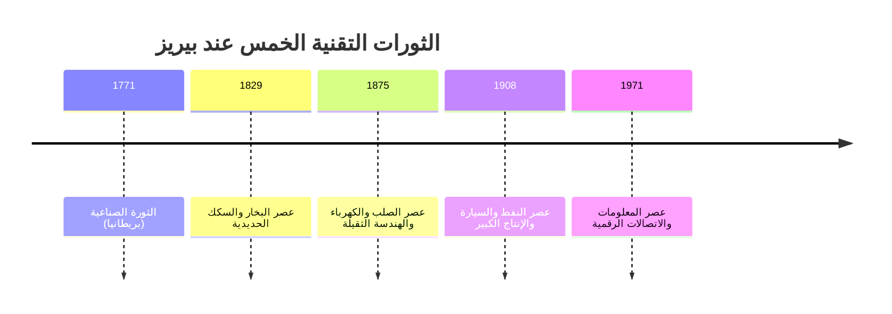
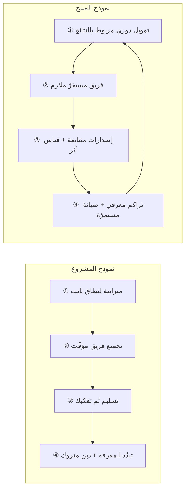
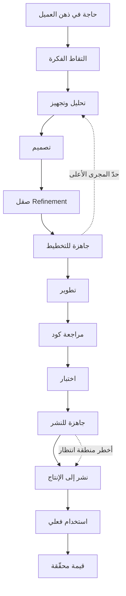
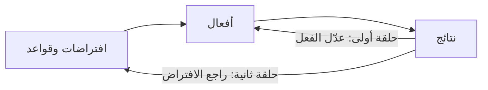
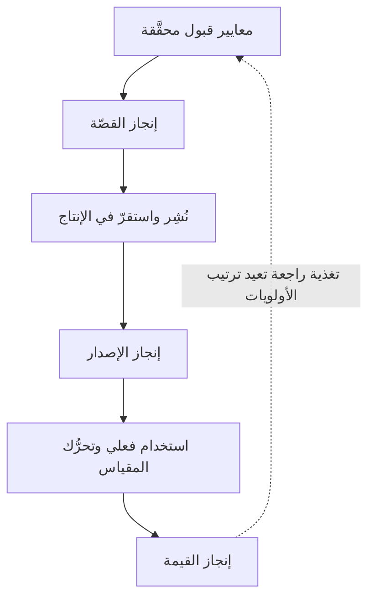

> [!info] الفصل 01 · كورس الإنتاجية
> **ماذا ستتعلّم:** لماذا لم يعد تصنيف شركتك بحسب صناعتها ذا معنى تشغيلي، وكيف تُقرأ اللحظة التي نعيشها عبر نظرية **الثورات التقنية** لكارلوتا بيريز (فترة تركيب ← نقطة تحوّل ← فترة انتشار)، وأين يقع الذكاء الاصطناعي في هذه الخريطة اليوم. ستفهم لماذا تُنتج **قيمة المصنع** مقاييس تقتل شركات البرمجيات، وما **تدفّق القيمة** (`Value Stream`) بالضبط بوصفه وحدة تنظيمية لا استعارة، ولماذا يسمّي ميك كيرستن الشيء **منتجًا** لا **مشروعًا**، وما **البناء المعرفي المستمرّ** الذي يجعل كلّ إصدار مصدر معلومة لا مجرّد تسليم. وستخرج بأدوات تشخيص عملية: قائمة فحص «هل أنت شركة برمجيات فعلًا؟»، وجدول يميّز الصومعة من تدفّق القيمة، وقراءة نقدية صريحة لحدود هذا الطرح — لأنّ «كلّ شركة صارت شركة برمجيات» عبارة صحيحة وخطيرة في آنٍ واحد.

> [!abstract] التأصيل
> **يفترض أنّك تعرف:** [[Definition of Done]] · [[Hypercare]]
> **ويُؤصّل لك:** [[Value Stream]] · [[Product Thinking]] · [[Outcome vs Output]]

# الفصل 01 — من المشروع إلى المنتج

## 🎯 أهداف التعلّم

- شرح **نظرية الثورات التقنية** (كارلوتا بيريز) بمكوّناتها الثلاثة، وتحديد أثر كلّ فترة على سلوك الاستثمار وسلوك المؤسّسات.
- تشخيص موضع تقنية معيّنة على المنحنى — بأدلّة لا بانطباعات — وتمييز خطاب فترة التركيب (`FOMO`) من خطاب فترة الانتشار (العائد المقيس).
- التمييز الحادّ بين **قيمة الطاقة الإنتاجية** و**قيمة حلّ المشكلة**، واستخراج المقاييس التي تنتمي إلى كلٍّ منهما.
- شرح **قانون غودهارت** و**قانون كامبل** وربطهما بمبدأ *«قُل لي كيف تقيسني…»*، ثم تطبيقهما على مقاييس فرق التطوير الشائعة.
- تعريف **تدفّق القيمة** تعريفًا إجرائيًّا (نقطة البداية، نقطة النهاية، وحدة العمل المتدفّقة)، ورسم تدفّق قيمة حقيقي لمنتج تعرفه.
- التمييز بين **المشروع** و**المنتج** بوصفهما نموذجَي تمويل وحوكمة، لا مجرّد تسميتين.
- شرح **البناء المعرفي المستمرّ** وربطه بالتمييز بين النظام **المعقّد** والنظام **المركّب** (إطار `Cynefin`).
- تحديد ثلاثة مستويات لـ**تعريف الإنجاز** (القصّة · الإصدار · القيمة) وشرح لماذا يُنتج الخلط بينها «مشاريع مركونة في المخزن».
- شرح **قانون كونواي** وربطه بالفوضى التشغيلية والصوامع.
- قراءة حالة **تسلا** قراءةً منضبطة: ما تُثبته فعلًا وما لا تُثبته.
- تحديد الزاوية الإقليمية (مصر والخليج) في التحوّل الرقمي وتخصيص أنظمة تخطيط الموارد، والتعامل مع تفويت المُهَل التنظيمية بوصفه خطرًا يُدار لا مفاجأة.
- عرض **الحجّة المضادّة** بإنصاف: متى يكون تصنيف العمل مشروعًا هو الصواب، وأين يُبالَغ في مقولة «الجميع شركة برمجيات».

---

## الفكرة المحورية: سؤالان بسيطان يفتحان النظام كلّه

بدأت المحاضرة الأولى بسؤالين لا علاقة لهما ظاهريًّا بالبرمجيات: **ما غرض إشارة المرور؟** و**متى تتعطّل السيارة؟** والسؤالان معًا يبنيان الهيكل المفاهيمي للكورس بأكمله، ولهذا يستحقّان وقفة أطول ممّا استغرقاه في الجلسة.

> [!quote] من المحاضرة
> **المدرّب:** «إذن غرض إشارة المرور هو تنظيم السيارات **بحيث تمرّ بسرعة وبلا أي ازدحام**. لنكتب هذه الجملة — ولاحظوا كلمة **بسرعة**.»
>
> **المدرّب:** «إهمال الصيانة — هذه بالضبط العبارة التي أردتها. ويترتّب عليها: **الاستخدام الكثيف يستدعي صيانة متكرّرة**.»

**السؤال الأوّل** يُعرّف القيمة تعريفًا **وظيفيًّا**: الإشارة ليست قيمة في ذاتها؛ قيمتها في **الأثر** الذي تُحدثه على التدفّق. وإشارة موجودة، مكتملة المواصفات، معتمدة، ومركّبة في موعدها — لكنّها تُفاقم الازدحام — ليست «مشروعًا ناجحًا فيه مشكلة تشغيلية»؛ هي **فشل كامل** بمعيار الغرض. وهذه بالضبط حال الميزة التي تُشحن في موعدها ولا يستخدمها أحد.

**السؤال الثاني** يُعرّف **معدّل استهلاك القدرة**: النظام الذي يُستخدم بكثافة يستهلك قدرته على التغيّر، ويجب أن تُعاد إليه تلك القدرة عمدًا. الإهمال هنا ليس حادثًا مفاجئًا، بل **تراكم قرارات صغيرة كلٌّ منها معقول بمفرده**.

وحين تضع السؤالين معًا تحصل على معادلة الكورس كاملة:

$$\text{القيمة} = f(\text{سرعة التدفّق} \times \text{استدامة القدرة على التدفّق})$$

فالفصول التالية كلّها ليست إلّا تفصيلًا لهذين الحدّين: كيف نقيس السرعة (مقاييس التدفّق)، وكيف نحمي القدرة (توزيع التدفّق والدَّين التقني).

> [!tip] لماذا بدأ بأمثلة من خارج البرمجيات؟
> لأنّ الجدل داخل البرمجيات مشحون بالهويّات المهنية: «الإدارة لا تفهم»، «المطوّرون يبالغون». أمّا إشارة المرور فلا أحد يدافع عنها. وهذه تقنية تدريبية معروفة تُسمّى **الوسيط المحايد** (`neutral proxy`): تُبنى القاعدة على مثال لا مصلحة لأحد فيه، ثم تُنقَل إلى الميدان المتنازَع عليه بعد أن صار الاتفاق عليها محسومًا.

---

## أولًا: كيف تُقرأ اللحظة التقنية — نظرية الثورات التقنية

### الأصل: كارلوتا بيريز، لا صفحة على لينكدإن

المحاضرة قدّمت الفكرة بلا نسبة صريحة، والنسبة مهمّة لأنّها تفتح مكتبةً كاملة.

> [!info] إضافة مرجعية — أصل النظرية
> الإطار مأخوذ من كتاب الاقتصادية الفنزويلية البريطانية **كارلوتا بيريز (Carlota Perez)**: ***Technological Revolutions and Financial Capital: The Dynamics of Bubbles and Golden Ages*** (2002)، وهو بدوره امتداد لأعمال **جوزيف شومبيتر** عن **التدمير الخلّاق** (`Creative Destruction`) ولموجات **نيكولاي كوندراتييف** الطويلة. وقد بنى **ميك كيرستن (Mik Kersten)** كتابه ***From Project to Product*** (2018) على هذا الإطار صراحةً، وجعل عنوان الجزء الأوّل منه مبنيًّا على فكرة أنّنا نعيش **نقطة تحوّل عصر البرمجيات**.

تقول بيريز إنّ كلّ ثورة تقنية كبرى تمرّ بالبنية نفسها:

| الطور | ما يحدث فيه | من يقود | خطاب السوق السائد | المقياس المعتمد |
|---|---|---|---|---|
| **التركيب** (`Installation`) | انفجار الابتكار، ضخّ رأس المال، فقاعات | رأس المال المالي | «إن لم تدخل الآن فُتَّك القطار» (`FOMO`) | حجم الاستثمار وعدد المتبنّين |
| **نقطة التحوّل** (`Turning Point`) | انفجار الفقاعة، إعادة هيكلة، تدخّل تنظيمي | الأزمة + المنظّم | «أرِني العائد» | الربحية والنموذج المستدام |
| **الانتشار** (`Deployment`) | تصير التقنية بنية تحتية للجميع | رأس المال الإنتاجي | «هذا صار بديهيًّا» | الإنتاجية الكلّية للاقتصاد |

وقد رصدت بيريز خمس ثورات منذ الثورة الصناعية:

### لماذا يهمّك هذا عمليًّا؟

لأنّ **القرار الصحيح يختلف باختلاف الطور**، والخطأ الشائع أن تُتّخذ قرارات فترة الانتشار في فترة التركيب أو العكس:

- في **فترة التركيب** يكون التبنّي المبكر رهانًا عالي المخاطرة عالي العائد، والمعيار المعقول هو **التعلّم** لا الربح. من يطلب في هذه الفترة «دراسة جدوى بعائد مضمون» يفوّت الموجة كلّها.
- في **فترة الانتشار** ينقلب المنطق: التقنية صارت سلعة، والميزة التنافسية لم تعد في امتلاكها بل في **جودة تشغيلها**. ومن يظلّ يتحدّث فيها بلغة «نحن روّاد لأنّنا نستخدم X» يبيع وهمًا.

> [!quote] من المحاضرة
> **المدرّب:** «فترة الانتشار هي ما لا نستوعبه، لا في مصر ولا في الخليج. تجد — مثلًا — شركة كهرباء تقول لك: *«نحن أجرينا تحوّلًا رقميًّا»*… لكنّ **عقلية «مدام عفاف»** ما زالت تحكم الأمر كلّه.»

هذه الملاحظة أدقّ ممّا تبدو. التحوّل الرقمي في كثير من المؤسّسات هو **رقمنة (`digitization`)** لا **تحوّل (`transformation`)**: أُخِذت العملية الورقية كما هي وحُوِّلت إلى شاشات. والنتيجة أنّ الاختناق لم يتحرّك؛ انتقل من الطابور المادّي إلى الطابور الرقمي.

> [!info] إضافة مرجعية — ثلاث درجات لا واحدة
> تفرّق أدبيات الأعمال بين ثلاث درجات كثيرًا ما تُخلَط:
> - **الرقمنة (`Digitization`):** تحويل المعلومة من ورق إلى بِتّات (مسح ضوئي، نموذج إلكتروني).
> - **الأتمتة الرقمية (`Digitalization`):** استخدام التقنية لتشغيل العملية القائمة بكفاءة أعلى.
> - **التحوّل الرقمي (`Digital Transformation`):** إعادة تصميم **نموذج العمل نفسه** وما يترتّب عليه من عمليات وأدوار — وهو الوحيد الذي يُنتج قفزة في رضا العميل.
>
> والمعيار الذي طرحته المحاضرة معيار سليم منهجيًّا: **هل ارتفع رضا العميل أم انخفض؟** إن لم يتحرّك، فما جرى رقمنة لا تحوّل. وهذا هو جوهر ما درسناه في **إعادة هندسة العمليات (`BPR`)** عند هامر وتشامبي، الذين نصّوا على أنّ إعادة الهندسة تعني **البدء من صفحة بيضاء**، لا تحسين القائم بنسبة عشرة في المئة.

### أين يقع الذكاء الاصطناعي اليوم؟ — والجدل حوله

> [!quote] من المحاضرة
> **المدرّب:** «الذكاء الاصطناعي **ما زال في فترة التركيب**… ومع ذلك لم نرَ حتى اليوم ذكاءً اصطناعيًّا **خفّض** تكلفة أو **زاد** عائدًا — ولا حتى للشركات الكبيرة أصلًا التي تضخّ فيه الأموال.»

هذا موقف يستحقّ أن يُعرَض بوصفه **موقفًا في نقاش قائم**، لا بوصفه حقيقة مغلقة. والإنصاف يقتضي عرض الطرفين:

**ما يدعم الموقف:**
- الأنماط الكلاسيكية لفترة التركيب حاضرة: تقييمات تسبق الإيرادات، إنفاق رأسمالي هائل على البنية التحتية للحوسبة، وسرد تسويقي قائم على الخوف من التخلّف.
- ظاهرة **«التجريب بلا إنتاج»**: كثير من المؤسّسات لديها عشرات التجارب التي لم يصل منها إلى الإنتاج إلّا القليل — وهي علامة كلاسيكية على أنّ التقنية لم تدخل بعدُ نسيج العمليات.
- **مفارقة الإنتاجية** التي رصدها الاقتصادي **روبرت سولو** عن الحواسيب عام 1987: *«ترى عصر الحاسوب في كلّ مكان إلّا في إحصاءات الإنتاجية»* — وقد استغرق الأمر عقدًا ونصفًا قبل أن يظهر الأثر في الأرقام الكلّية.

> [!quote] مقولة سولو
> *"You can see the computer age everywhere but in the productivity statistics."*
> **الترجمة:** «ترى عصر الحاسوب في كلّ مكان إلّا في إحصاءات الإنتاجية.»

**ما يعارضه:**
- على مستوى **المهامّ الجزئية** توجد قياسات منشورة لمكاسب إنتاجية حقيقية (خصوصًا في توليد الكود، وخدمة العملاء، والتلخيص). الاعتراض الأقوى ليس أنّ المكاسب غير موجودة، بل أنّها **لا تظهر على مستوى المؤسّسة** لأنّ الاختناق يقع خارج المهمّة المُسرَّعة.
- وهذه النقطة الأخيرة هي في الحقيقة **تأييد لأطروحة الكورس نفسه**: تسريع خطوة واحدة في نظام مقيَّد بخطوة أخرى لا يُنتج تحسّنًا كلّيًّا. وهو ما يسمّيه **إلياهو جولدرات** في *نظرية القيود* المبدأ الأساس: **أيّ تحسين خارج القيد وهم**.

> [!warning] الخطر العملي هنا
> إن كنت مدير تسليم أو مدير منتج، فالسؤال الذي يجب أن تحمله من هذا القسم ليس «هل الذكاء الاصطناعي فقاعة؟» — هذا سؤال لا يُغيّر عملك غدًا. السؤال العملي: **إن ضاعفتُ سرعة كتابة الكود، فهل ستتضاعف سرعة وصول القيمة إلى السوق؟** إن كان جوابك «لا، لأنّ الانتظار في المراجعات والموافقات والنشر»، فقد شخّصت قيدك — وهو ما ستقيسه لاحقًا بـ[[06 - مقاييس التدفّق الستة|كفاءة التدفّق]].

---

## ثانيًا: «أنت شركة برمجيات» — من أين جاءت العبارة وماذا تعني بدقّة

### السلسلة الفكرية

> [!info] إضافة مرجعية — ثلاث محطّات
> - **2011 — مارك أندريسن**، مقال في *وول ستريت جورنال* بعنوان *"Why Software Is Eating the World"*، جادل فيه بأنّ شركات البرمجيات تبتلع سلاسل القيمة في صناعات كاملة (التجزئة، الإعلام، الترفيه، اللوجستيات).
> - **2016 — جيف إيميلت**، الرئيس التنفيذي لـ*جنرال إلكتريك* آنذاك، قالها بصيغة أشدّ مباشرة: كلّ شركة صناعية عليها أن تصير شركة برمجيات وتحليلات. (ومسار GE اللاحق نفسه صار درسًا في **حدود** هذه المقولة، كما سنرى.)
> - **2018 — ميك كيرستن**، ***From Project to Product***، حوّل الشعار إلى **إطار قابل للقياس** اسمه **إطار التدفّق (`Flow Framework`)**، وهو مصدر عناصر التدفّق الأربعة والمقاييس الستة التي يقوم عليها هذا الكورس.

> [!quote] من المحاضرة
> **المدرّب:** «كتاب ***From Project to Product*** يطرح هذه الحجّة مباشرةً. يقول لك: أنت **لست** شركة استيراد وتصدير، ولست مصنع سيارات… أنت في الأصل صرتَ **شركة برمجيات**.»

### ما تعنيه العبارة بدقّة — وما لا تعنيه

العبارة **لا** تعني أنّ كلّ شركة يجب أن تكتب برمجياتها بنفسها، ولا أنّ كفاءتها الجوهرية صارت الهندسة. تعني شيئًا أضيق وأخطر:

> **صار **معدّل تغيّر البرمجيات** لديك هو **السقف الأعلى لمعدّل تغيّر عملك**.**

أي أنّ أيّ شيء تريد تغييره في نموذج عملك — سعر، عرض، قناة، سياسة، سوق جديد — يمرّ عبر تغيير برمجي. فإن كانت دورة التغيير البرمجي عندك تسعة أشهر، فقد صارت **استراتيجيّتك** تتحرّك بسرعة تسعة أشهر مهما بلغت جودة مجلس إدارتك.

وهذه إعادة صياغة تحوّل الشعار إلى شيء قابل للاختبار. اسأل نفسك السؤال التالي:

> [!question]- اختبار ذاتي: هل أنت شركة برمجيات فعلًا؟
> أجب بنعم/لا عن كلٍّ ممّا يلي:
> 1. هل يستطيع مجلس الإدارة اتّخاذ قرار سوقي جديد وتنفيذه في السوق خلال ربع واحد؟
> 2. هل يظهر بند «تطوير المنتج» في نقاشات مجلس الإدارة بوصفه **محرّك إيراد**، أم بوصفه **بند تكلفة**؟
> 3. حين يُطرح تعديل تسعير، هل السؤال الأوّل «هل يقبله السوق؟» أم «هل يستطيع النظام تنفيذه؟»
> 4. هل يوجد في المؤسّسة شخص يعرف **كم يستغرق** انتقال فكرة من عقل عميل إلى الإنتاج؟
> 5. هل تُموَّل فرق التقنية بحسب **نطاق مشاريع** أم بحسب **منتجات مستمرّة**؟
>
> **القراءة:** إن كانت إجاباتك تميل إلى «لا» في 1 و4، فأنت لا تدير برمجيات؛ أنت تشتري مشاريع برمجية. وإن كانت 2 «بند تكلفة» و5 «نطاق مشاريع»، فأنت في نموذج المشروع لا نموذج المنتج مهما كانت اللافتات.

### المشروع مقابل المنتج — الفرق نموذج حوكمة لا تسمية

هذا هو قلب عنوان الكتاب، وكثيرًا ما يُختصر خطأً إلى «سمِّ الشيء منتجًا». الفرق الحقيقي بنيوي:

| البُعد | نموذج المشروع | نموذج المنتج |
|---|---|---|
| **التمويل** | مبلغ محدّد مقابل نطاق محدّد، مرّة واحدة | تمويل مستمرّ يُراجَع دوريًّا بحسب النتائج |
| **الفريق** | يُجمَّع للمشروع ثم يُفكَّك | مستقرّ، يبقى مع المنتج |
| **النجاح** | التسليم في الوقت والميزانية والنطاق | تحرّك مقاييس الأثر لدى المستخدم/العمل |
| **نهاية العمل** | تاريخ محدّد سلفًا | لا نهاية؛ توقُّف عند توقّف القيمة |
| **المعرفة** | تتبدّد عند التفكيك | تتراكم في الفريق |
| **العلاقة بالدَّين التقني** | «مشكلة من بعدنا» | مسؤولية دائمة على الفريق نفسه |
| **المقياس المحوري** | نسبة الإنجاز مقابل الخطّة | القيمة المتدفّقة والقدرة على مواصلة التدفّق |

> [!warning] الخطأ الأشهر عند التطبيق
> تغيير المسمّيات دون تغيير التمويل. مؤسّسة تُسمّي فرقها «فِرَق منتج» وتُبقي ميزانيّتها مربوطةً بمشاريع سنوية ذات نطاق ثابت، ستحصل على **مشاريع بأسماء منتجات** — وستُنتج بالضبط السلوك الذي شكت منه: فرق تسلّم النطاق ثم تُفكَّك، ودَين تقني بلا مالك.

---

## ثالثًا: قيمة المصنع مقابل قيمة البرمجيات

### أصل الالتباس: لماذا استوردنا مقاييس المصنع أصلًا؟

الالتباس ليس غباءً إداريًّا؛ له تاريخ. علم الإدارة الحديث وُلِد في المصنع: **فريدريك تايلور** و*الإدارة العلمية* (1911) بنى مهنة كاملة على تحليل المهمّة إلى حركات وقياس زمن كلّ حركة. وقد نجح هذا نجاحًا هائلًا في سياقه — وهو سياق **العمل المتكرّر ذي المُخرَج المتجانس**.

المشكلة أنّ **الافتراض الضمني** لتلك المنظومة هو: *كلّ وحدة مُنتَجة تساوي أيّ وحدة أخرى*. والكرسيّ العاشر يساوي الكرسيّ الأوّل. أمّا في البرمجيات، فـ**الميزة العاشرة قد تساوي صفرًا والميزة الأولى قد تساوي الشركة كلّها** — بل الميزة العاشرة قد تكون **سالبة القيمة** لأنّها زادت التعقيد ولم يستخدمها أحد.

| | مصنع | شركة برمجيات |
|---|---|---|
| **مصدر القيمة** | الطاقة الإنتاجية والتكرار المتقن | حلّ مشكلة والابتكار |
| **وحدة القياس الطبيعية** | عدد الوحدات/الساعة | الأثر المتحقّق لدى المستخدم |
| **معنى التغيير** | هدر (إعادة ضبط الخطّ) | أداة العمل الأساسية |
| **دور المخزون** | مخزون مادّي مرئيّ | عمل قيد التنفيذ **غير مرئيّ** |
| **أثر التكرار** | يُحسّن الأداء (منحنى التعلّم) | يُشير غالبًا إلى إخفاق في الأتمتة |
| **الصيانة** | مجدولة، مرئية، لها ميزانية | مؤجَّلة، غير مرئية، بلا ميزانية |
| **العامل** | ينفّذ إجراءً موصوفًا | يتّخذ قرارات تصميمية |

> [!info] إضافة مرجعية — لماذا ينتقل «لين» انتقالًا ناقصًا
> **نظام إنتاج تويوتا (`TPS`)** — أصل حركة `Lean` — يقوم على تقليل سبعة أنواع من الهدر، وأخطرها المخزون والانتظار. ومقاييس التدفّق التي يبنيها هذا الكورس **مأخوذة فعلًا من هذا النسب**: العمل قيد التنفيذ هو المخزون، والانتظار هو الهدر، وحدّ العمل قيد التنفيذ هو ضبط المخزون.
>
> لكنّ الانتقال ناقص في نقطة جوهرية: في تويوتا، **كلّ سيارة مطابقة للأخرى**، فتحسين الزمن هو التحسين كلّه. أمّا في البرمجيات، فمن الممكن تمامًا أن تُنتج بكفاءة تدفّق ممتازة… شيئًا لا يريده أحد. ولهذا لا تكفي مقاييس التدفّق وحدها؛ يجب أن تُقرَن بمقاييس **الأثر** (`Outcome`). وهذه نقطة ينبغي أن تُقال بصراحة، لأنّ إطار التدفّق يقيس **كيف نُنتج**، لا **هل ما نُنتجه يستحقّ**.

### قانون غودهارت وقانون كامبل — الأساس العلمي لمبدأ «قُل لي كيف تقيسني»

> [!quote] من المحاضرة
> **المدرّب:** *«قُل لي كيف تقيسني، أقُل لك كيف سأتصرّف»*… «تقيس مطوّرك على **عدد التذاكر التي أغلقها**… فستجده يعمل كالآلة، يُغلق ويُغلق؛ ثم تنظر خلفه فلا تجد **شيئًا مُغلَقًا فعلًا**.»

هذه العبارة، التي يشيع نسبها إلى **إلياهو جولدرات** في *الهدف* (`The Goal`)، لها صياغتان أكاديميّتان أدقّ:

> [!info] إضافة مرجعية — القانونان
> **قانون غودهارت (Goodhart's Law، 1975)**، بصياغة ماريلين ستراذرن الشهيرة:
> *"When a measure becomes a target, it ceases to be a good measure."*
> **الترجمة:** «حين يتحوّل المقياس إلى هدف، يكفّ عن كونه مقياسًا جيّدًا.»
>
> **قانون كامبل (Campbell's Law، 1979)**:
> *"The more any quantitative social indicator is used for social decision-making, the more subject it will be to corruption pressures and the more apt it will be to distort and corrupt the social processes it is intended to monitor."*
> **الترجمة:** «كلّما زاد استخدام مؤشّر اجتماعي كمّي في صنع القرار، زاد تعرّضه لضغوط الإفساد، وزادت قابليّته لتشويه وإفساد العمليات الاجتماعية نفسها التي أُريد له رصدها.»
>
> والفرق بين القانونين مهمّ: غودهارت يتحدّث عن **فقدان المقياس صلاحيّته**؛ وكامبل يتحدّث عن **إفساد المقياس للعملية ذاتها**. والمقاييس السيّئة في البرمجيات تفعل الاثنين معًا.

**التطبيق الحرفي على أشهر المقاييس الخاطئة:**

| المقياس | السلوك الذي يُنتجه فورًا | التلف الذي يُحدثه |
|---|---|---|
| عدد أسطر الكود | كود مطوَّل، نسخ ولصق، رفض الاختصار | يعاقب أفضل حلّ (الأقصر والأوضح) |
| عدد التذاكر المُغلقة | تفتيت مصطنع، إغلاق ما لم يُنجَز | تنهار قابلية التنبّؤ ويرتفع الرجوع |
| عدد الأخطاء التي رفعها المختبِر | رفع أخطاء تافهة، عداء مع التطوير | تنهار العلاقة ويُخفي المطوّر مشاكله |
| عدد قصص المستخدم التي كتبها مالك المنتج | باك-لوغ متضخّم بلا أولويات | تتحوّل إدارة المنتج إلى مصنع نصوص |
| ساعات الحضور | حضور بلا إنتاج | يُعاقَب من ينجز بسرعة |
| السرعة (`Velocity`) بوصفها هدفًا | تضخيم التقديرات | يفقد التقدير معناه ويصير أداة تفاوض |

> [!warning] السرعة تحديدًا — سوء الاستخدام الأشهر
> **السرعة (`Velocity`) مرجع للتخطيط، لا مقياس أداء.** هذا ليس رأيًا؛ إنّه شرط رياضي: السرعة مبنيّة على تقدير **نسبي** يضعه الفريق نفسه. فحين تُكافئ على ارتفاعها، تُكافئ على تضخيم التقدير — وهو أسهل بكثير من العمل الأسرع. ولهذا بالضبط يستبدل إطار التدفّق نقاط القصة بـ**عدد العناصر**، كما نصّت عليه المحاضرة الثانية.

> [!info] إضافة مرجعية — البدائل المدروسة
> إن كنت تبحث عن مقاييس مؤسّسية مبنيّة على بحث منشور لا على انطباع:
> - **مقاييس DORA الأربعة** (من تقرير *Accelerate: State of DevOps*، وكتاب ***Accelerate*** لنيكول فورسغرين وجيز همبل وجين كيم): تواتر النشر · زمن الاستحقاق للتغيير · معدّل فشل التغيير · زمن استعادة الخدمة. وهي أقرب المقاييس المنشورة إلى مقاييس التدفّق، وتقاطعها معها كبير.
> - **إطار SPACE** (نيكول فورسغرين وآخرون، 2021): يعالج «إنتاجية المطوّر» بخمسة أبعاد — الرضا · الأداء · النشاط · التواصل · الكفاءة — وقاعدته الأساسية: **لا تستخدم بُعدًا واحدًا أبدًا**.
> - وهي تشترك جميعًا مع هذا الكورس في المبدأ نفسه: **قِس النظام، لا الفرد**.

---

## رابعًا: تدفّق القيمة — من عقل العميل إلى جيب العميل

### التعريف الإجرائي

> [!quote] من المحاضرة
> **المدرّب:** «ولإيصال القيمة إلى السوق نعمل بشيء اسمه **تدفّق القيمة**: **من عقل العميل إلى جيب العميل**.»

الصياغة بديعة لأنّها تحدّد **نقطتَي القياس** بلا لبس: تبدأ عند **نشوء الحاجة في ذهن العميل**، وتنتهي عند **تحقّق التبادل** (استخدام يُترجَم إلى قيمة مدفوعة). وكلّ تعريف يقصر عن أحد الطرفين ينتج مقياسًا مريحًا ومضلّلًا:

- من يبدأ القياس عند **دخول التذكرة للفريق** يُخفي المجرى الأعلى كلّه — وهو بالضبط ما يكشفه [[09 - التشخيص العملي - قراءة الأرقام|السيناريو الأوّل]].
- ومن ينهي القياس عند **إغلاق التذكرة** يُخفي الانتظار قبل النشر — وهو ما يكشفه مقياس **كفاءة التدفّق**.

> [!info] إضافة مرجعية — الأصل والمصطلح
> **تدفّق القيمة (`Value Stream`)** مصطلح من `Lean`، أشهر تطبيقاته أداة **رسم خريطة تدفّق القيمة (`Value Stream Mapping`)** التي تُوثّق كلّ خطوة بين طلب العميل وتسليمه، وتفصل لكلّ خطوة بين **الزمن النشِط** و**زمن الانتظار**. والنتيجة النمطية في أوّل رسم لأيّ مؤسّسة صادمة: **الزمن النشِط أقلّ من 15% من الزمن الكلّي**، والباقي انتظار. وهذا هو بالضبط المقياس الذي سيسمّيه الكورس **كفاءة التدفّق**.
>
> وقد وسّع كيرستن الفكرة إلى **شبكة تدفّق القيمة (`Value Stream Network`)**، لأنّ المؤسّسة الحقيقية ليست خطًّا واحدًا بل شبكة تدفّقات متقاطعة تتنازع الموارد نفسها.

### كيف ترسم تدفّق قيمة حقيقيًّا — خطوة بخطوة

1. **اختر وحدة تدفّق واحدة.** لا ترسم «كلّ العمل»؛ ارسم رحلة **نوع واحد** من العناصر (مثلًا: ميزة متوسّطة الحجم). واختر عنصرًا **حقيقيًّا انتهى مؤخّرًا** لا عنصرًا افتراضيًّا.
2. **حدّد نقطة البداية بدقّة زمنية.** «متى ظهرت الحاجة؟» لا «متى فُتِحت التذكرة». وغالبًا ستكتشف أنّ لا أحد يعرف — وهذا في ذاته أوّل نتيجة.
3. **اكتب كلّ حالة مرّ بها العنصر**، بما فيها الحالات غير الرسمية («في انتظار ردّ فلان»، «مؤجَّل لحين اجتماع اللجنة»).
4. **لكلّ حالة سجّل رقمين:** الزمن النشِط والزمن الكلّي.
5. **اجمع.** ستحصل على **زمن التدفّق** الكلّي، و**كفاءة التدفّق** = النشِط ÷ الكلّي.
6. **رتّب الانتظارات تنازليًّا.** أوّل ثلاثة انتظارات ستفسّر عادةً أكثر من 70% من الزمن الضائع.
7. **اسأل عن كلّ انتظار سؤالًا واحدًا:** هل هو انتظار **موارد** (شخص مشغول) أم انتظار **قرار** (موافقة) أم انتظار **دفعة** (ننتظر تجميع عدد)؟ فلكلّ نوع علاج مختلف تمامًا.

> [!tip] المنطقة التي يهملها الجميع
> بين **«جاهزة للنشر»** و**«نُشِرت فعلًا»** تختبئ في معظم المؤسّسات مدّة تفوق كلّ مراحل التطوير مجتمعة: نافذة نشر أسبوعية، موافقة أمنية، تجميد تغييرات، انتظار دفعة إصدار. وهي مدّة **لا يراها أحد** لأنّ التذكرة صارت «مُغلقة» في الأداة. وهذا بالضبط ما تصرّ عليه المحاضرة حين ترفض احتساب كفاءة التدفّق عند الإغلاق.

---

## خامسًا: البناء المعرفي المستمرّ

> [!quote] من المحاضرة
> **المدرّب:** «جوهر شركة البرمجيات **البناء المعرفي المستمرّ**… وحين صارت الثقافة *«أغلق السبرنت وانتقل إلى التالي»*، صارت المعرفة التي نعمل بها **مسطّحة من أوّل سبرنت إلى آخره** — لا تزيد أبدًا.»

### لماذا هذه العبارة ليست شعارًا

لأنّها تصف بدقّة الفرق بين نوعين من الأنظمة:

> [!info] إضافة مرجعية — المركّب والمعقّد (إطار Cynefin)
> إطار **`Cynefin`** لديف سنودن يصنّف السياقات إلى:
> - **بسيط/واضح:** علاقة السبب بالنتيجة بديهية للجميع → طبّق أفضل ممارسة.
> - **مركّب (`Complicated`):** العلاقة موجودة لكنّها تحتاج خبيرًا → حلّل ثم طبّق ممارسة جيّدة. (بناء برج مثال نموذجي.)
> - **معقّد (`Complex`):** العلاقة لا تُعرف إلّا **بأثر رجعي** → جرِّب، استشعر، استجب. (تطوير منتج جديد لمستخدمين حقيقيّين مثال نموذجي.)
> - **فوضوي:** لا علاقة قابلة للإدراك → تصرّف أولًا لتثبيت الوضع.
>
> وخطأ إدارة البرمجيات الكلاسيكي هو **التعامل مع المعقّد بأدوات المركّب**: أن تطلب خطّة تفصيلية سنوية لشيء لا يمكن معرفة نتيجته إلّا بعد إطلاقه. ومن هنا جاءت جملة المحاضرة *«أنت تُجبر الفريق على الكذب»* — فأنت تطلب يقينًا لا وجود له في هذا النوع من الأنظمة.

### التعلّم أحادي الحلقة وثنائي الحلقة

> [!info] إضافة مرجعية — كريس أرجيريس
> يميّز **كريس أرجيريس** بين:
> - **التعلّم أحادي الحلقة (`Single-Loop`):** نكتشف انحرافًا فنصحّح **الفعل** ضمن القواعد القائمة. («تأخّرنا؟ لنعمل ساعات إضافية.»)
> - **التعلّم ثنائي الحلقة (`Double-Loop`):** نكتشف انحرافًا فنراجع **الافتراضات والقواعد نفسها**. («لماذا نعِد بمواعيد لا نعرف كيف نُقدّرها؟»)
>
> ومعظم اجتماعات الاستعادة تُنتج تعلّمًا أحادي الحلقة — قائمة أفعال صغيرة لا تمسّ النظام. والمحاضرة تعالج هذا بربط الاستعادة بالحوكمة: *«أجايل لم يُلغِ الحوكمة، بل زادها… لكنّها تأتي من الفريق الذي يؤدّي العمل — من أسفل إلى أعلى»*.

---

## سادسًا: التغيير — هدر في المصنع، أداة في البرمجيات

> [!quote] من المحاضرة
> **المدرّب:** «مشكلتنا ليست **التغيير** — مشكلتنا **ثقافتنا حول التغيير**… `Dark Agile` و`Fake Agile` هما هذا: النطاق **ثابت تمامًا**، وفور وصول أوّل تغيير لا تُنتج الطاولة إلّا **اتّهامات متبادلة**.»

### الأساس الهندسي للفكرة

> [!info] إضافة مرجعية — منحنى تكلفة التغيير
> في مقاربة الشلّال ساد اعتقاد (استند إلى بيانات باري بوم في السبعينيات) بأنّ تكلفة إصلاح خلل ترتفع **أسّيًّا** كلّما تأخّر اكتشافه — فالخلل الذي يُكتشف في مرحلة المتطلّبات يكلّف جزءًا يسيرًا ممّا يكلّفه في الإنتاج. وقد بُنِيت على هذا كلّ ثقافة «جمّد المتطلّبات مبكّرًا».
>
> وردّ **كِنت بِك** في *`Extreme Programming Explained`* بأنّ المنحنى ليس قانون طبيعة بل **نتيجة ممارسات**: مع الاختبارات الآلية، والتكامل المستمرّ، والتصميم البسيط، والتسليم بدفعات صغيرة، **يتسطّح المنحنى**. أي أنّ ارتفاع تكلفة التغيير عرَض لمرض هندسي، لا سببًا مشروعًا لمنع التغيير.
>
> وهذه النقطة أهمّ ما في الفصل عمليًّا: **من يرفض التغيير لأنّه مكلف، عليه أن يعالج سبب التكلفة، لا أن يمنع التغيير.** والدَّين التقني هو ذلك السبب في معظم الأحيان.

### أنماط «أجايل الزائف» — قائمة تشخيص

| النمط | العلامة الظاهرة | الجوهر |
|---|---|---|
| **`Water-Scrum-Fall`** | سبرنتات ثنائية الأسبوع، ونشر كلّ ستّة أشهر | تخطيط ونشر شلّاليّان وسبرنتات في الوسط |
| **`Dark Agile`** | «سبرنت» صار وحدة ضغط زمني | استخدام الطقوس لتسريع الناس لا لتعلّم |
| **`Fake Agile`** | كلّ الفعاليات تُعقد بانضباط، ولا شيء يتغيّر | طقوس بلا تفويض قرار |
| **مسرح الأولويات** | كلّ شيء أولوية أولى | لا يوجد ترتيب حقيقي — فلا نطاق متغيّر |
| **الاستعادة الشكلية** | تُعقَد وتُوثَّق ولا تُنفَّذ نتائجها | تعلّم أحادي الحلقة بلا سلطة تنفيذ |
| **مالك المنتج الوكيل** | ينقل الطلبات ولا يملك قرار الأولوية | «آلة فاكس» بحسب تعبير المحاضرة |

---

## سابعًا: ماذا يعني «منتهٍ»؟ — ثلاثة مستويات لا واحد

> [!quote] من المحاضرة
> **عبد الرحمن:** «قبل الإصدار… نتّفق على مجموعة **مُخرَجات** — **تعريف الإنجاز**… وبعد النشر نُجري **اختبار دخان**… ثم نُجري أسبوعين أو ثلاثة من **العناية المكثّفة**…»
>
> **المدرّب:** «إذن نتّفق أنّ «منتهٍ» تعني **أنّه أُطلِق وبدأ العميل يستخدمه**.»

الإجابة التي أعطاها عبد الرحمن أنضج ممّا يبدو، لأنّها تحتوي ضمنًا على **ثلاثة مستويات** يُخلَط بينها في معظم المؤسّسات:

| المستوى | من يملكه | معيار الاجتياز | الخطأ إن اكتُفي به |
|---|---|---|---|
| **إنجاز القصّة** | فريق التطوير | معايير القبول + المراجعة + الاختبار | «انتهينا» وفي الإنتاج لا شيء |
| **إنجاز الإصدار** | فريق التسليم | نُشِر، اجتاز اختبار الدخان، قابل للتراجع | مُنتَج يعمل ولا يستخدمه أحد |
| **إنجاز القيمة** | المنتج/العمل | تحرّك المقياس المستهدف لدى المستخدم | — (هذا هو المستوى الحقيقي) |

> [!info] إضافة مرجعية — العناية المكثّفة والتشغيل
> **العناية المكثّفة (`Hypercare`)** فترة قصيرة بعد الإطلاق يبقى فيها فريق البناء مسؤولًا عن الإنتاج بمستوى استجابة مرتفع. ووجودها مؤشّر نضج حقيقي: الفريق الذي يبقى مع منتجه أسبوعين بعد الإطلاق **يرى بعينيه** ثمن ما اختصره. وهي تلتقي مع مبدأ `DevOps` الشهير:
>
> *"You build it, you run it."*
> **الترجمة:** «من يبنيه هو من يشغّله.» (وهو مبدأ نسبه فيرنر فوغلز إلى أمازون في حوار منشور عام 2006.)
>
> **تحذير مهمّ:** لا تُخلَط العناية المكثّفة بما رفضته المحاضرة الثانية على لسان هبة — أي *«من يبني الميزة هو من يصونها فلا نحسب للصيانة سعة»*. الفرق أنّ العناية المكثّفة **سعة مخصّصة معلنة**، أمّا الآخر فـ**إنكار للسعة**.

---

## ثامنًا: الفوضى التشغيلية — الصوامع وقانون كونواي

> [!quote] من المحاضرة
> **المدرّب:** «لديك أقسام — ضمان الجودة، الواجهة الخلفية، الواجهة الأمامية، الموبايل… لأنّك **فصلتَ تلك الأقسام بعضها عن بعض**، فصار أيّ تغيير تافه يُنتج **ازدحامًا**.»

> [!info] إضافة مرجعية — قانون كونواي
> **ميلفن كونواي (1968):**
> *"Organizations which design systems are constrained to produce designs which are copies of the communication structures of these organizations."*
> **الترجمة:** «المؤسّسات التي تُصمّم أنظمة مُقيَّدة بأن تُنتج تصاميم تُحاكي بُنى الاتصال داخل تلك المؤسّسات.»
>
> ومعناه العملي معكوسًا (ما يُسمّى **مناورة كونواي**): إن أردت معمارية معيّنة، **صمّم الفرق التي تُنتجها**. فالمؤسّسة المقسّمة أفقيًّا (واجهة أمامية · خلفية · قواعد بيانات) ستُنتج نظامًا كلّ تغيير فيه يعبر ثلاثة فرق. وقد بنى كتاب ***Team Topologies*** (سكيلتون وبيه) نموذجًا كاملًا على هذا: أربعة أنماط للفرق وثلاثة أنماط للتفاعل، وقاعدته المركزية **تقليل الحِمل الإدراكي على الفريق** لا تقليل عدد الأشخاص.

### لماذا تُنتج الصوامع تكلفةً تفوق العمل نفسه

> [!quote] من المحاضرة
> **المدرّب:** «فالعمل الذي يكلّف جنيهًا واحدًا ينتهي بتكلفة **عشرة جنيهات** على الشركة — لا لأنّه يحتاج عشرة جنيهات تكلفة تشغيل، بل لأنّ هناك **تسعة جنيهات هدر انتظار**.»

هذه ليست مبالغة خطابية؛ لها أساس في **نظرية الطوابير**. فحين تقترب نسبة استغلال المورد (`utilization`) من 100%، **ينفجر زمن الانتظار أسّيًّا** لا خطّيًّا:

$$W \propto \frac{\rho}{1-\rho}$$

حيث $\rho$ نسبة الاستغلال. فعند استغلال 50% يكون معامل الانتظار 1؛ وعند 90% يصير 9؛ وعند 95% يصير 19. **أي أنّ رفع استغلال فريق مشترك من 90% إلى 95% يضاعف زمن انتظار كلّ من يعتمد عليه.**

> [!warning] النتيجة الإدارية المضادّة للحدس
> **الفريق المشغول 100% هو أبطأ فريق في المؤسّسة** — لا لأنّه كسول، بل لأنّ كلّ طلب جديد يدخل طابورًا لا ينتهي. ولهذا يُخصّص في الأنظمة الرشيقة **احتياطي سعة (`slack`)** عن عمد. وهذا هو الأساس الرياضي وراء رفض عبارة *«اعصر نفسك»* في المحاضرة الثانية، ووراء الإصرار على أنّ سعة الفريق **100% موزّعة**، لا **100% ميزات**.

---

## تاسعًا: تسلا — ما تُثبته الحالة وما لا تُثبته

> [!quote] من المحاضرة
> **المدرّب:** «كلّ صانع سيارات كان يعمل على اعتقاد: *«نحن مصنع مادّي يُنتج سيارات، ولدينا قسم برمجيات».* أمّا تسلا فقالت: **«نحن شركة برمجيات تصنع سيارات»**… وحين لم تتوفّر شريحة بعينها بسبب كوفيد، **كتبت برمجيات جديدة** لشريحة *كانت* متاحة.»

> [!success] ما هو موثَّق علنًا
> - **التحديث عن بُعد (`OTA`)** لوظائف جوهرية في السيارة — لا معلومات الترفيه فقط — كان سابقة صناعية دفعت بقية الصنّاع إلى اللحاق.
> - خلال **أزمة أشباه الموصلات (2021–2022)** أعلنت الشركة في مكالمات نتائجها العلنية أنّها أعادت كتابة برمجيات التحكّم لاستخدام متحكّمات دقيقة بديلة متاحة، ممّا مكّنها من مواصلة الإنتاج بينما أوقف منافسون خطوطهم. وهي حالة تُدرَّس بوصفها مثالًا على أنّ **المرونة البرمجية تتحوّل إلى مرونة في سلسلة التوريد**.

> [!failure] ما لا تُثبته الحالة — والقراءة النقدية الواجبة
> 1. **انحياز الناجي.** تُروى الحالة دائمًا من طرف من نجح. وشركات كثيرة تبنّت الخطاب نفسه ولم تنجُ — ومن أشهرها **GE Digital** ومنصّة `Predix`: أعلنت جنرال إلكتريك أنّها ستصير «شركة برمجيات صناعية» ضمن أكبر عشر شركات برمجيات في العالم، ثم انتهى المشروع إلى تقليص جذري. **الخطاب نفسه، النتيجة معاكسة.**
> 2. **الشروط غير القابلة للنقل.** قدرة تسلا على إعادة كتابة برمجيات متحكّم مرتبطة بامتلاكها **معمارية مركزية** ومسؤولية رأسية عن المكوّنات؛ وشركة تعتمد على مورّدين يملكون الكود المصدري لوحداتهم لا تملك هذا الخيار مهما بلغت «عقليّتها البرمجية».
> 3. **ثمن السرعة موجود هنا أيضًا.** سجلّ التحديثات نفسه يتضمّن حملات استدعاء مُعالَجة عبر التحديث عن بُعد — وهو دليل على القدرة، ودليل في الوقت نفسه على أنّ الشحن السريع يُنتج عيوبًا تصل المستخدم. وهذا يتّسق تمامًا مع قاعدة الكورس: **السرعة المفرطة يُدفَع ثمنها.**
>
> **الاستخدام السليم للحالة:** استخدمها لتوضيح **الفرق بين معمارية تسمح بالتغيير ومعمارية تمنعه**، لا لإثبات أنّ «العقلية» وحدها تكفي.

---

## عاشرًا: تمهيد للفخّ القاتل — الدَّين التقني

هذا القسم تمهيدي؛ والتفصيل الكامل في [[04 - دوّامة الموت والدَّين التقني|الفصل الرابع]].

> [!info] إضافة مرجعية — الاستعارة وأصلها المُساء فهمه
> صاغ **وارد كننغهام** استعارة **الدَّين التقني** عام 1992، وكان يقصد شيئًا **إيجابيًّا ومقصودًا**: أن تشحن بسرعة بفهم ناقص للمجال، على أن **تعود لتعيد بناء التصميم** بعد أن يتضح الفهم. أي أنّ الدَّين في أصله **قرار استثماري واعٍ له خطّة سداد**.
>
> والمعنى الشائع اليوم — «الكود السيّئ» — تحريف. وقد صحّحه كننغهام نفسه في تصريح مصوَّر لاحق، مؤكّدًا أنّ الفكرة كانت عن **فجوة بين الفهم والكود**، لا عن رداءة الصنعة.
>
> ثم صنّف **مارتن فاولر** الدَّين في **مربّع** بمحورين (متعمَّد/غير متعمَّد × متهوّر/حصيف):

| | **حصيف (`Prudent`)** | **متهوّر (`Reckless`)** |
|---|---|---|
| **متعمَّد** | «نشحن الآن ونتحمّل التبعات، ولدينا خطّة سداد» | «ليس عندنا وقت للتصميم» |
| **غير متعمَّد** | «الآن فقط عرفنا كيف كان ينبغي أن نفعلها» | «ما التصميم الطبقي أصلًا؟» |

> [!warning] لماذا يهمّ التصنيف عمليًّا
> لأنّ العلاج يختلف: الدَّين **المتعمَّد الحصيف** يُدار بجدول سداد في الباك-لوغ. والدَّين **غير المتعمَّد الحصيف** طبيعي ولا يُلام عليه أحد — إنّه ثمن التعلّم. أمّا **المتهوّر** بنوعيه فهو مشكلة قدرات أو مشكلة ضغط إداري، ولا يُحلّ بجدول سداد بل بمعالجة سببه. وخلط الأنواع الأربعة في خانة واحدة اسمها «الدَّين التقني» هو ما يجعل النقاش مع الإدارة عقيمًا.

---

## حادي عشر: الزاوية الإقليمية — مصر والخليج

المحاضرة عربية السياق، وهذا ما يجعلها أنفع من ترجمة حرفية لكتاب غربي. ويستحقّ السياق تفصيلًا صريحًا:

### 1. تخصيص أنظمة تخطيط الموارد بدل تبنّي العملية

> [!quote] من المحاضرة
> **المدرّب:** «بدلًا من أن تتكيّف المؤسّسة مع النظام، تريد أن **تكيّف النظام مع عقليتها** — فيبدأ تمرين تخصيص لا ينتهي، ولا يُطبَّق الـ ERP في النهاية أبدًا.»

القاعدة العملية المعروفة في هذا المجال: **التخصيص مقبول حيث تكون العملية ميزة تنافسية، ومرفوض حيث تكون العملية سلعة**. فتخصيص حساب العمولات لشركة توزيع تتنافس بنموذج عمولات مبتكر قرار سليم؛ وتخصيص شاشة إدخال الموظّفين لأنّ «هكذا اعتدنا» قرار يُنتج ديْنًا دائمًا في كلّ ترقية.

### 2. تفويت المُهَل التنظيمية بوصفه خطرًا يُدار

المحاضرة الثانية ضربت مثالين واقعيّين: **تكامل المرحلة الثانية للفوترة الإلكترونية في السعودية**، و**غرامة رقم السجلّ التجاري في التذييل**. وكلاهما ينتمي إلى فئة **الخطر التنظيمي (`Compliance Risk`)** التي تشترك في خصائص ثلاث:

1. **تاريخها معروف سلفًا** — أي أنّها أسهل أنواع المخاطر إدارةً.
2. **كلفة التأخير فيها غير خطّية** — لا شيء ثم غرامة/إيقاف.
3. **حجم العمل التقني فيها غالبًا صغير** — وهذا بالضبط سبب تأجيلها، لأنّها تبدو تافهة أمام الميزات.

> [!warning] القاعدة العملية
> **لا يجوز أن يقع بند تنظيمي له تاريخ نفاذ في ترتيب الباك-لوغ حسب «القيمة».** يجب أن يُصنَّف **خطرًا**، وأن يُحجَز له موضع في **توزيع التدفّق** بحسب تاريخه لا بحسب حجمه. قصّة التذييل في المحاضرة الثانية هي المثال المدرسيّ لهذا الخطأ: بند يُنفَّذ في دقائق، صُنِّف ميزةً، فنزل إلى أسفل القائمة، فأنتج غرامة بخمسة آلاف ريال.

### 3. اختزال الأدوار

من الأنماط الإقليمية المتكرّرة اختزال دور مالك المنتج إلى **منسّق** ينقل طلبات الإدارة، ودور مدير سكرم إلى **متابع مواعيد**. وهذا ليس نقصًا في الأشخاص بل نتيجة **بنية تمويل قائمة على النطاق**: حين يكون النطاق مُعتمَدًا سلفًا من الإدارة، لا يبقى للأولوية معنى، فيتحوّل مالكها إلى ناقل. وهذا بالضبط ما تعنيه المحاضرة بـ«آلة الفاكس».

### 4. الاعتماد على بيوت البرمجيات والتسليم بالنطاق الثابت

الشكل التعاقدي السائد إقليميًّا (عقد بسعر ثابت لنطاق ثابت) **يُنتج بنيويًّا** كلّ ما تشتكي منه المحاضرة: لا يستطيع المورّد قبول التغيير لأنّه خسارة مباشرة، ولا يستطيع العميل تجميد المتطلّبات لأنّه لا يعرفها. والنتيجة تنازع تغييرات (`Change Requests`) يستهلك من الطرفين أكثر ممّا يستهلكه بناء المطلوب.

> [!tip] بدائل تعاقدية عملية
> - **الوقت والمواد بسقف (`T&M with cap`)** مع مراجعة ربعية.
> - **عقد سعة (`Capacity Contract`)**: تشتري فريقًا مستقرًّا لفترة، والأولويات تُدار داخل الفترة.
> - **عقد أجايل متدرّج (`Graduated`)**: سعر أساس + حافز مربوط بمقاييس أثر متّفق عليها.
> - وفي كلّ الأحوال: **اجعل النطاق قابلًا للتبديل لا للزيادة** — أي أن يدخل بند مقابل خروج بند بحجم مكافئ. وهذه هي «مقايضة النطاق» التي تجعل النطاق المتغيّر ممكنًا تعاقديًّا.

---

## ثاني عشر: القراءة النقدية — أين يقصر هذا الطرح؟

الأمانة تقتضي عرض حدود الأطروحة، لا سيّما أنّ هذا كتاب تعليمي لا مادّة ترويجية.

**1. «كلّ شركة صارت شركة برمجيات» عبارة تُخفي فروقًا حقيقية.**
مصنع أسمنت تعتمد ربحيّته على تكلفة الطاقة وكفاءة الفرن ليس «شركة برمجيات». البرمجيات تُحسّن تشغيله بنسب محدودة، لكن قيده الحقيقي فيزيائي. وتعميم العبارة يُنتج استثمارًا رقميًّا في غير موضع القيد — وهو خطأ نظرية القيود بعينه.

**2. نموذج المنتج ليس صالحًا لكلّ شيء.**
هناك أعمال ذات **بداية ونهاية حقيقيتين**: ترحيل مركز بيانات، تنفيذ متطلّب تنظيمي لمرّة واحدة، تفكيك نظام قديم. هذه **مشاريع** بحقّ، وإجبارها على قالب المنتج يُنتج فرقًا دائمة بلا غرض دائم. والصياغة الأدقّ: **موّل المنتجات باستمرار، ونفّذ المشاريع داخلها.**

**3. مقاييس التدفّق لا تقيس هل ما تبنيه يستحقّ.**
هذا أهمّ نقد، وسيتكرّر في هذا المرجع: يمكن أن تبلغ كفاءة تدفّق 90% وأنت تُنتج بكفاءة ممتازة… منتجًا لا يريده أحد. إطار التدفّق **إطار تسليم**، ويجب أن يُقرَن بإطار اكتشاف (مقابلات، فرضيات، تجارب) وبمقاييس أثر.

**4. خطر «متلازمة المقياس الجديد».**
مؤسّسة تستبدل مخطّط الاحتراق بستّة مقاييس تدفّق، ثم تُحوّلها إلى أهداف أداء للأفراد، ستُعيد إنتاج قانون غودهارت بأدوات أحدث. ووقاية ذلك بسيطة وصعبة معًا: **تُقرأ مقاييس التدفّق على مستوى النظام، وتُستخدَم للحوار لا للمحاسبة.**

**5. الأمثلة الشهيرة غير قابلة للاستنساخ حرفيًّا.**
تسلا وأمازون ونتفليكس تعمل بقيود رأسمالية وسوقية وتنظيمية مختلفة جذريًّا عن شركة متوسّطة في القاهرة أو الرياض. القيمة في هذه الأمثلة **في الآلية لا في النتيجة**.

---

## ثالث عشر: التطبيق — ورشة تشخيص في ساعتين

هذه ورشة قابلة للتنفيذ حرفيًّا مع فريقك بعد قراءة هذا الفصل.

### الجزء الأوّل (30 دقيقة): تحديد الطور

اجمع الفريق واسألوا عن **تقنية واحدة** تستثمر فيها المؤسّسة الآن. أجيبوا معًا:

| السؤال | إجابتنا | الدليل |
|---|---|---|
| ما مبرّر التبنّي المكتوب؟ | | |
| هل نقيس عائدًا أم نقيس تبنّيًا؟ | | |
| ما الشيء الذي كان سيتوقّف لو أوقفناها غدًا؟ | | |
| هل نحن في تركيب أم انتشار بالنسبة لها؟ | | |

### الجزء الثاني (45 دقيقة): رسم تدفّق قيمة واحد

اختاروا **عنصرًا واحدًا انتهى الشهر الماضي**، وارسموا رحلته على لوح، مع تسجيل تاريخ دخول كلّ حالة وخروجه منها. ثم املؤوا:

| الحالة | تاريخ الدخول | تاريخ الخروج | زمن نشِط تقديري | زمن انتظار |
|---|---|---|---|---|
| | | | | |

واحسبوا: **إجمالي الزمن** · **الزمن النشِط** · **الكفاءة = النشِط ÷ الإجمالي**.

### الجزء الثالث (30 دقيقة): جرد المقاييس السامّة

اكتبوا **كلّ** مقياس يُقاس به أيّ فرد في السلسلة (مطوّر، مختبِر، مالك منتج، مدير)، وضعوا أمام كلّ واحد: ما السلوك الذي يُكافئه؟ ثم احذفوا أو حوّلوا كلّ مقياس فردي إلى مقياس نظام.

### الجزء الرابع (15 دقيقة): قرار واحد

اخرجوا بقرار **واحد فقط** قابل للتنفيذ خلال أسبوعين. القرار الواحد المنفَّذ خير من عشرة مسجَّلة.

---

## رابع عشر: مصنع الميزات — الاسم الدقيق للمرض

كثيرًا ما تُوصف الحالة التي شرحها الفصل بعبارات فضفاضة («ضغط»، «سوء إدارة»). ولها في الأدبيات اسم دقيق يستحقّ أن يُستخدَم لأنّه يفتح مجموعة أعراض محدّدة.

> [!info] إضافة مرجعية — Feature Factory
> **مصنع الميزات (`Feature Factory`)** مصطلح شاع على يد **جون كتلر (John Cutler)** في مقاله *"12 Signs You're Working in a Feature Factory"* (2016)، وتوسّعت فيه **ميليسا بيري** في كتابها ***Escaping the Build Trap*** (2018) تحت اسم **فخّ البناء (`Build Trap`)**: أن تقيس المؤسّسة نفسها بما **تُنتجه** لا بما **تُحدثه**.
>
> وأبرز علاماته العملية:
> 1. لا يُتابَع أثر ما شُحِن — لا أحد يعود ليسأل هل نجحت الميزة.
> 2. لا يُقتَل شيء — الباك-لوغ يكبر ولا يصغر أبدًا.
> 3. النجاح يُعلَن عند **الشحن** لا عند **الاستخدام**.
> 4. لا يعرف الفريق مشكلة العميل، بل يعرف الطلب فقط.
> 5. «التخفيضات» على النطاق تُؤخَذ دائمًا من الجودة والاختبار، لا من عدد الميزات.
> 6. المطوّرون لا يقابلون مستخدمًا حقيقيًّا أبدًا.
> 7. تُقاس خارطة الطريق بعدد البنود المُنجَزة في الربع.
> 8. لا توجد فرضيات مكتوبة — فلا يمكن أن يكون أحد مخطئًا.

> [!quote] من المحاضرة
> **المدرّب:** «**مهمّتنا ليست شحن الميزات؛ مهمّتنا حلّ مشكلة عميل**… وما دمتَ تعامل النطاق على أنّه ميزات فقط، فأنت **تُعقّد برمجياتك**، لأنّك تخنقها بالميزات.»

والرابط بين هذا الفصل وبقيّة الكورس مباشر: **مصنع الميزات هو الاسم السلوكي، وتوزيع التدفّق المشوّه (90% ميزات) هو الاسم الرقمي للشيء نفسه.** ولهذا يمكنك أن تكتشف مصنع ميزات **من الأرقام وحدها** قبل أن تُجري مقابلة واحدة.

### مقياس تشخيصي عملي: نسبة «الميزات المهجورة»

خذ آخر عشرين ميزة شُحِنت في المنتج، وصنّفها:

| الفئة | التعريف الإجرائي | النسبة الصحّية التقريبية |
|---|---|---|
| **مستخدَمة بانتظام** | يستخدمها أكثر من 25% من الشريحة المستهدفة شهريًّا | 40–60% |
| **مستخدَمة هامشيًّا** | 5–25% | 20–30% |
| **مهجورة فعليًّا** | أقلّ من 5% ولا خطّة لتنشيطها | أقلّ من 20% |
| **لا نعرف** | لا يوجد قياس أصلًا | **يجب أن تكون صفرًا** |

> [!warning] النتيجة المزعجة عادةً
> في أوّل تطبيق لهذا الجرد في معظم المؤسّسات تكون خانة **«لا نعرف»** هي الأكبر. وهذا في ذاته أهمّ نتيجة يمكن أن تخرج بها: **أنت لا تملك بيانات تسمح بادّعاء أنّك تُنتج قيمة.** ومن هنا تبدأ الحجّة التي تحتاجها مع الإدارة — لا من الشكوى من الضغط.

---

## خامس عشر: مسار العمل الشلّالي المقنّع — أصل مصطلح `Water-Scrum-Fall`

> [!info] إضافة مرجعية
> المصطلح صاغه المحلّل **ديف ويست (Dave West)** في تقرير لشركة **Forrester** عام 2011 بعنوان *"Water-Scrum-Fall Is The Reality Of Agile For Most Organizations Today"*. وخلاصة التقرير أنّ المؤسّسات تبنّت سكرم في **منتصف** دورة الحياة فقط، وأبقت الطرفين شلّاليّين:
> - **الطرف الأعلى (`Water`):** تخطيط سنوي، ميزانيات نطاق ثابت، وثائق متطلّبات ضخمة تسبق أيّ سبرنت.
> - **الوسط (`Scrum`):** سبرنتات وطقوس ومجلس مهامّ.
> - **الطرف الأدنى (`Fall`):** إصدارات مجمَّعة متباعدة، بوّابات موافقة، ونشر ككيان منفصل عن التطوير.

والنتيجة الرياضية لهذا الترتيب أنّ **التحسين محصور في الجزء الأصغر من الرحلة**. فإن كان التطوير يستهلك 20% من زمن التدفّق الكلّي، فمضاعفة سرعته لا تُحسّن الرحلة إلّا بـ10% — وهو تطبيق مباشر لـ**قانون أمدال**:

$$S = \frac{1}{(1-p) + \frac{p}{s}}$$

حيث $p$ نسبة الجزء المُحسَّن و$s$ معامل تحسينه. ومع $p = 0.2$ و$s = 2$ يكون التحسين الكلّي 11% فقط مهما بلغت البطولة داخل الفريق.

> [!tip] الاستخدام الإداري لهذه المعادلة
> هذه أنفع معادلة تحملها إلى اجتماع مع الإدارة، لأنّها تُحوّل شكوى «الضغط» إلى **حجّة كمّية**: «مضاعفة إنتاجية التطوير ستُحسّن وصول القيمة بنسبة 11% فقط، لأنّ 80% من الزمن يقع خارج التطوير. وإليك أين يقع.» وهذا بالضبط ما تفعله مقاييس التدفّق: **تنقل الحوار من الفريق إلى النظام.**

---

## سادس عشر: خارطة الأدوار في نموذج المنتج

من الأسئلة المتكرّرة بعد هذا الفصل: *«حسنًا، فمن يفعل ماذا؟»* وهذه خارطة عملية تصلح نقطة بداية، تُعدَّل بحسب حجم المؤسّسة.

| المسؤولية | من يملكها في نموذج المنتج | الخطأ الشائع |
|---|---|---|
| **الأولوية** (ماذا قبل ماذا) | مالك/مدير المنتج | تُملى من الإدارة فيصير الدور نقلًا |
| **الاكتشاف** (هل هذا يستحقّ؟) | المنتج + التصميم + التقنية معًا | يُختزل في «الإدارة قالت» |
| **الحلّ التقني** (كيف نبنيه) | الفريق الهندسي | يُملى من معماريّ خارج الفريق |
| **جودة الكود والدَّين التقني** | الفريق الهندسي، بميزانية معلنة | تُترك بلا سعة فتُهمَل |
| **مجرى العمل الأعلى** (تجهيز الفكرة) | المنتج / مسؤول العملية | لا مالك له — أخطر فجوة |
| **مجرى العمل الأدنى** (التسليم) | التسليم / مدير سكرم | يُختزل في متابعة مواعيد |
| **المخاطر التنظيمية والامتثال** | صاحب المنتج + الشؤون القانونية | تُصنَّف «ميزة» فتنزل الأولوية |
| **تعريف الجاهزية والإنجاز** | الفريق كاملًا في اتفاق مكتوب | ضمنيّان فيختلف عليهما الجميع |
| **قراءة المقاييس** | الفريق أوّلًا، ثم يُرفَع للإدارة | تُستخدَم للمحاسبة الفردية فتفسد |

> [!warning] الفجوة الأخطر
> **مجرى العمل الأعلى بلا مالك** هو أكثر ما رأيناه تكرارًا في الجلسة نفسها: حين قال رئيس المنتج للمدرّب *«المجرى الأعلى ليس من شأنك»* ثم اعترف أنّه غير موجود أصلًا. ولهذا يخصّص هذا المرجع فصلًا كاملًا له — [[07 - المجرى الأعلى والمجرى الأدنى]].

---

## سابع عشر: ثلاث حالات إضافية موثّقة علنًا

### 1) أمازون وتوجيه الواجهات البرمجية (2002) — كيف تُفرَض المعمارية بالإدارة

> [!success] الحالة
> يُتداوَل على نطاق واسع — وأشهر رواية له منشور المهندس السابق **ستيفي يجي** عام 2011 — أنّ جيف بيزوس أصدر توجيهًا داخليًّا يقضي بأنّ كلّ فريق يجب أن يُتيح بياناته ووظائفه **عبر واجهات خدمة فقط**، وأن تكون تلك الواجهات **قابلة للتحويل إلى واجهات خارجية**. النتيجة البنيوية: تحوّلت المؤسّسة إلى شبكة خدمات مستقلّة، وهو ما مهّد لاحقًا لظهور خدمات سحابية تجارية من بنية داخلية.
>
> **الدرس القابل للنقل:** المعمارية ليست قرارًا هندسيًّا محضًا؛ إنّها **قرار تنظيمي** — تطبيق مباشر لقانون كونواي معكوسًا.
>
> **التحفّظ الواجب:** هذه رواية داخلية منقولة لا وثيقة رسمية منشورة؛ تُستخدَم بوصفها مثالًا توضيحيًّا للمبدأ، لا دليلًا تاريخيًّا محسومًا في تفاصيله.

### 2) نوكيا — لماذا لا تكفي «الجودة الصناعية»

> [!failure] الحالة
> امتلكت نوكيا في ذروتها تفوّقًا صناعيًّا هائلًا في تصنيع الأجهزة وسلسلة التوريد. لكنّ المنافسة انتقلت من **جودة الجهاز** إلى **منظومة البرمجيات والتطبيقات**. وهذا المثال هو التجسيد الحرفي لأطروحة الفصل: **الشركة التي ظلّت تقيس نفسها بمقاييس المصنع بينما تحوّل ميدان التنافس إلى البرمجيات.**
>
> **الدرس:** تفوّقك في المقياس القديم لا يحميك حين يتغيّر المقياس. والسؤال التشخيصي: **ما المقياس الذي يتنافس به سوقك اليوم — لا الذي تنافست به أمس؟**

### 3) نقد «نموذج سبوتيفاي» — لماذا لا تُستنسخ الهياكل

> [!warning] الحالة
> انتشر «نموذج سبوتيفاي» (Squads · Tribes · Chapters · Guilds) في مؤسّسات لا تُحصى بعد فيديوهين تعريفيّين عام 2014. ثم صرّح مهندسون من الشركة نفسها لاحقًا بملاحظتين: أنّ ما وُصِف كان **لقطة لحظية لتجربة جارية** لا نموذجًا مكتملًا، وأنّ الشركة نفسها لم تعد تعمل به كما وُصِف.
>
> **الدرس المزدوج:**
> 1. **الهيكل ليس السبب.** ما نجح في سبوتيفاي كان ثقافة تفويض ونضجًا هندسيًّا؛ ونقل أسماء الوحدات دون نقل التفويض يُنتج **مسمّيات جديدة لصوامع قديمة**.
> 2. **الحلّ المستورد يُخفي التشخيص.** المؤسّسة التي تتبنّى هيكلًا جاهزًا تكون قد قفزت فوق السؤال الوحيد المهمّ: **ما قيدنا نحن؟**

---

## ثامن عشر: مسرد الفصل

| المصطلح | التعريف الإجرائي في هذا الكورس |
|---|---|
| **فترة التركيب** | طور انتشار التقنية بدافع الخوف من الفوات، بلا عائد مقيس بعد |
| **نقطة التحوّل** | لحظة انكشاف الفجوة بين الادّعاء والعائد، وإعادة هيكلة السوق |
| **فترة الانتشار** | صيرورة التقنية بنية تحتية بديهية، والتنافس على جودة التشغيل |
| **الرقمنة** | نقل المعلومة من ورق إلى بِتّات دون تغيير العملية |
| **التحوّل الرقمي** | إعادة تصميم نموذج العمل نفسه، معياره حركة رضا العميل |
| **تدفّق القيمة** | الرحلة من نشوء الحاجة في ذهن العميل إلى تحقّق القيمة المدفوعة |
| **نموذج المنتج** | تمويل مستمرّ مربوط بالنتائج + فريق مستقرّ + مسؤولية دائمة |
| **البناء المعرفي المستمرّ** | جعل كلّ إصدار مصدر معلومة تُعدّل الخطط التالية |
| **مصنع الميزات** | مؤسّسة تقيس نفسها بما تُنتجه لا بما تُحدثه |
| **`Water-Scrum-Fall`** | سكرم في الوسط بين تخطيط شلّالي ونشر شلّالي |
| **قانون كونواي** | التصميم يُحاكي بنية اتصال المؤسّسة التي أنتجته |
| **الفوضى التشغيلية** | صوامع وظيفية تُنتج تبعيّات وانتظارًا يفوق العمل نفسه |
| **الدَّين التقني** | فجوة بين الفهم الحالي والكود القائم، لها كلفة فائدة مركّبة |

---

## تاسع عشر: من مبتدئ إلى محترف — مسار مقترح

| المستوى | ما تُتقنه | كيف تتحقّق أنّك أتقنته |
|---|---|---|
| **مبتدئ** | تفرّق بين المخرَج والأثر، وتعرف عناصر التدفّق الأربعة | تستطيع تصنيف أيّ بند في الباك-لوغ إلى أحد الأربعة بلا تردّد |
| **ممارس** | ترسم تدفّق قيمة لعنصر حقيقي وتحسب كفاءته | خرجتَ برقم كفاءة حقيقي لفريقك، ولو تقديريًّا |
| **متقدّم** | تشخّص موضع القيد وتفرّق بين قيد أعلى وقيد أدنى | تستطيع أن تقول أين يضيع 60% من الزمن بالأدلّة |
| **محترف** | تبني الحجّة الرقمية أمام الإدارة وتُغيّر نموذج التمويل | حصلتَ على مخصّص معلن للدَّين التقني في خطّة معتمَدة |
| **قائد** | تُعيد تصميم الفرق والتمويل لتُنتج التدفّق بنيويًّا | صار الحوار في المؤسّسة عن النظام لا عن الأشخاص |

---

## 🧾 خلاصة الفصل

1. **الثورات التقنية** تمرّ بتركيب ← نقطة تحوّل ← انتشار، ولكلّ طور منطق قرار مختلف؛ والخلط بينها يُنتج استثمارًا في التوقيت الخطأ.
2. **التحوّل الرقمي** ليس رقمنة العملية القائمة؛ معياره الوحيد **حركة رضا العميل**.
3. **«أنت شركة برمجيات»** تعني عمليًّا أنّ **دورة تغيير برمجياتك صارت سقف سرعة استراتيجيّتك**.
4. **المشروع مقابل المنتج** فرق في **التمويل والحوكمة واستقرار الفريق**، لا في التسمية.
5. **مقاييس المصنع تقتل شركات البرمجيات** لأنّ وحدة الإنتاج فيها غير متجانسة القيمة؛ وقانونا غودهارت وكامبل يفسّران آلية التلف.
6. **تدفّق القيمة** يُقاس من عقل العميل إلى جيبه؛ وأخطر مناطق الهدر تقع خارج التطوير.
7. **البناء المعرفي المستمرّ** هو الفارق بين نظام معقّد ونظام مركّب؛ ومعظم الاستعادات تُنتج تعلّمًا أحادي الحلقة فقط.
8. **التغيير ليس عدوًّا**؛ ارتفاع تكلفته عرَض هندسي قابل للعلاج، لا مبرّر لتجميد النطاق.
9. **«منتهٍ»** له ثلاثة مستويات، والاكتفاء بأدناها هو ما يُنتج «مشاريع في المخزن».
10. **الصوامع** تُنتج تكلفة انتظار تفوق تكلفة العمل؛ ونظرية الطوابير تفسّر لماذا الفريق المشغول 100% هو الأبطأ.
11. **حالة تسلا** تُثبت أثر المعمارية والملكية الرأسية، لا كفاية «العقلية» وحدها؛ وحالة GE Digital هي الوجه الآخر الواجب ذكره.
12. **الدَّين التقني** في أصله قرار استثماري واعٍ؛ ومربّع فاولر يفرّق بين أربعة أنواع لكلٍّ علاج مختلف.
13. **الحدود:** إطار التدفّق يقيس **كيف نُسلّم**، لا **هل ما نُسلّمه يستحقّ**؛ ويجب أن يُقرَن بالاكتشاف وبمقاييس الأثر.

---

## ❓ اختبارات ذاتية

> [!question]- 1) شركة أعلنت تحوّلًا رقميًّا: أضافت الدفع الإلكتروني وتقديم الطلبات أونلاين، وبقيت مدّة إنجاز الطلب 21 يومًا كما كانت. ما التشخيص؟
> **رقمنة لا تحوّل.** الواجهة تغيّرت والعملية لم تتغيّر، ودليل ذلك أنّ **الاختناق لم يتحرّك**. والمعيار الحاسم: هل تغيّرت مدّة الإنجاز أو رضا العميل؟ إن لم يتغيّرا، فما جرى تغيير في قناة الإدخال فقط. والخطوة الصحيحة: رسم تدفّق القيمة لطلب واحد وتحديد أين تقع الـ 21 يومًا فعلًا — وستجد أغلبها انتظار موافقات لا عملًا.

> [!question]- 2) لماذا يُعدّ قياس المطوّر بعدد أسطر الكود خطأً «مضاعفًا» لا خطأً واحدًا؟
> لأنّه يُخفق مرّتين: **أوّلًا** بقانون غودهارت — يكفّ عن كونه مقياسًا صالحًا فور أن يصير هدفًا. و**ثانيًا** بقانون كامبل — يُفسد العملية ذاتها: يعاقب الحلّ الأقصر والأوضح (وهو الأفضل هندسيًّا)، ويكافئ التكرار والنسخ، فيزيد **الدَّين التقني** الذي يُبطئ كلّ ميزة لاحقة. أي أنّه لا يفشل في القياس فحسب، بل **يُنتج الضرر الذي يُفترض أن يمنعه**.

> [!question]- 3) فريق يعمل بسبرنتات أسبوعين، وينشر إلى الإنتاج مرّتين في السنة. ما اسم هذا النمط ولماذا هو مشكلة؟
> **`Water-Scrum-Fall`**. المشكلة ليست في الطقوس بل في أنّ **حلقة التغذية الراجعة معطّلة**: السبرنت وحدة إنتاج بلا وحدة تعلّم مقابلة، فالمعرفة تبقى «مسطّحة». والأثر التراكمي: يتراكم عمل غير مُصدَّق عليه لستّة أشهر، فترتفع مخاطر الدفعة الواحدة، وتصير كلّ عملية نشر حدثًا عالي المخاطر يزيد الخوف من النشر — وهي حلقة تعزّز نفسها.

> [!question]- 4) مدير يقول: «التغيير مكلف جدًّا عندنا، لذلك نجمّد المتطلّبات في البداية.» ما ردّك المنهجي؟
> ردّان: **الأوّل** أنّ ارتفاع تكلفة التغيير **عرَض** لا سبب — ومصدره غالبًا غياب الاختبارات الآلية والتكامل المستمرّ وتراكم الدَّين التقني؛ والعلاج معالجة السبب لا منع التغيير (حجّة كِنت بِك عن تسطيح منحنى التكلفة). و**الثاني** أنّ تجميد المتطلّبات لا يمنع التغيير بل **يؤجّله إلى أغلى نقطة ممكنة** — بعد البناء — ويحوّله من قرار إلى نزاع تعاقدي. والاقتراح العملي: **مقايضة نطاق** بدل تجميده.

> [!question]- 5) ما الفرق العملي بين قولك «فريقنا مشغول 95%» وقولك «فريقنا مشغول 75%»؟
> الفرق ليس 20% إنتاجية؛ إنّه **الفرق بين معامل انتظار 19 ومعامل انتظار 3** بحسب علاقة الطوابير $\rho/(1-\rho)$. أي أنّ الفريق المشغول 95% يجعل كلّ من يعتمد عليه ينتظر أضعافًا مضاعفة، فيُبطئ **النظام كلّه** وإن بدت أرقامه الفردية ممتازة. ولهذا يُخصَّص احتياطي سعة عمدًا، ولهذا ترفض المحاضرة عبارة «اعصر نفسك».

> [!question]- 6) اذكر ثلاثة أشياء تُثبتها حالة تسلا وثلاثة لا تُثبتها.
> **تُثبت:** (أ) أنّ المعمارية المركزية تسمح بتغيير برمجي بلا تدخّل مادّي؛ (ب) أنّ الملكية الرأسية للكود تحوّل مرونة برمجية إلى مرونة في سلسلة التوريد؛ (ج) أنّ التحديث عن بُعد يُغيّر الاقتصاد التشغيلي لما بعد البيع.
> **لا تُثبت:** (أ) أنّ «العقلية» وحدها كافية — GE Digital تبنّت الخطاب نفسه وفشلت؛ (ب) أنّ النموذج قابل للنقل إلى مؤسّسة تعتمد على مورّدين يملكون كود وحداتهم؛ (ج) أنّ السرعة بلا ثمن — سجلّ الاستدعاءات المُعالَجة عن بُعد دليل قدرة ودليل عيوب في آن.

> [!question]- 7) ما الفرق بين الدَّين التقني «المتعمَّد الحصيف» و«غير المتعمَّد الحصيف»، ولماذا يهمّ الفرق؟
> **المتعمَّد الحصيف:** قرار واعٍ بالشحن الآن مع معرفة التبعات ووجود خطّة سداد — يُدار ببند في الباك-لوغ وموعد. **غير المتعمَّد الحصيف:** اكتشاف لاحق بأنّ التصميم الصحيح كان مختلفًا — وهو **ثمن طبيعي للتعلّم** ولا يُلام عليه أحد، ويُعالَج بإعادة هيكلة مجدولة. ويهمّ الفرق لأنّ **الحوار الإداري يختلف**: الأوّل التزام سابق يجب الوفاء به، والثاني معلومة جديدة تستدعي إعادة تخطيط — وخلطهما في خانة واحدة يجعل الإدارة تسمع «تقصير» حيث ينبغي أن تسمع «تعلّم».

> [!question]- 8) مؤسّسة سمّت فرقها «فرق منتج» وأبقت ميزانيّتها مشاريع سنوية بنطاق ثابت. ماذا سيحدث خلال سنة؟
> ستُنتج **مشاريع بأسماء منتجات**. لأنّ **التمويل هو الحوكمة الحقيقية**: ما دام النطاق مُعتمَدًا سلفًا مقابل مبلغ، فلا معنى لإعادة ترتيب الأولويات بناءً على البيانات، ويتحوّل مالك المنتج إلى ناقل طلبات، ويبقى الدَّين التقني بلا مالك لأنّه لم يدخل النطاق المعتمَد. والعلامة المبكّرة: ظهور «طلبات تغيير» كوسيلة وحيدة لإدخال أيّ تعلّم جديد.

---

## 📚 مراجع الفصل

| المرجع | الصلة |
|---|---|
| Mik Kersten — *From Project to Product* (2018) | المصدر المباشر لإطار التدفّق وعناصره ومقاييسه |
| Carlota Perez — *Technological Revolutions and Financial Capital* (2002) | نظرية أطوار الثورة التقنية |
| Marc Andreessen — *Why Software Is Eating the World* (2011) | أصل مقولة «كلّ شركة شركة برمجيات» |
| Forsgren, Humble & Kim — *Accelerate* (2018) | مقاييس DORA والأدلّة الكمّية |
| Forsgren et al. — *The SPACE of Developer Productivity* (2021) | نقد مقاييس الإنتاجية أحادية البُعد |
| Skelton & Pais — *Team Topologies* (2019) | قانون كونواي وتصميم الفرق |
| Kent Beck — *Extreme Programming Explained* | تسطيح منحنى تكلفة التغيير |
| Eliyahu Goldratt — *The Goal* / *نظرية القيود* | مبدأ القيد ومبدأ «قُل لي كيف تقيسني» |
| Chris Argyris — *Double-Loop Learning* | حلقتا التعلّم |
| Dave Snowden — إطار *Cynefin* | التمييز بين المركّب والمعقّد |
| Ward Cunningham (1992) · Martin Fowler — *Technical Debt Quadrant* | أصل الاستعارة وتصنيفها |
| المصدر الأساس | [[1.1 من المشروع إلى المنتج]] · [[1.2 المثلث الحديدي وانقلابه]] |

---

## 🔗 روابط ذات صلة

**الفصل التالي:** [[02 - المثلث الحديدي وانقلابه]]
**مصدر السجلّ:** [[1.1 من المشروع إلى المنتج]] · [[1.2 المثلث الحديدي وانقلابه]]
**مفاهيم:** [[Value Stream|تدفّق القيمة]] · [[Technical Debt|الدَّين التقني]] · [[Product Thinking|التفكير المنتَجي]] · [[Outcome vs Output|المخرَج والأثر]] · [[Definition of Done|تعريف الإنجاز]] · [[Hypercare|العناية المكثّفة]] · [[01 - Agile|أجايل]] · [[04 - Waterfall|الشلّال]]
