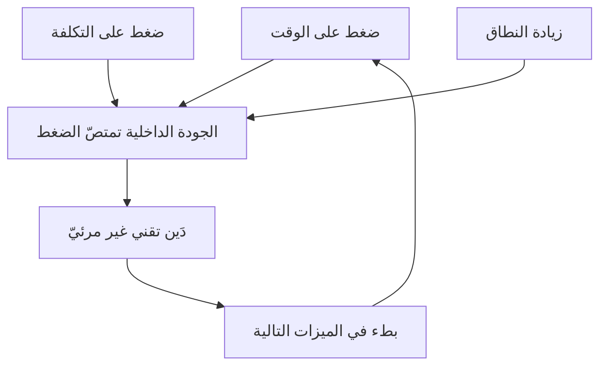

> [!info] الفصل 02 · كورس الإنتاجية
> **ماذا ستتعلّم:** من أين جاء **المثلث الحديدي** فعلًا (1969)، ولماذا لم يكن يومًا قانونًا فيزيائيًّا بل نموذج تفاوض؛ وماذا فعل أجايل حين قلبه، و**لماذا لم يحلّ الانقلاب المشكلة**. ستفهم السبب الجذري في جملة واحدة: **لأنّنا أبقينا «النطاق» مساويًا لـ«الميزات»**. وستتعلّم ما يعنيه النطاق المتغيّر تعريفًا إجرائيًّا (مقايضة لا تضخّم)، وما **متلازمة البطّيخة** وكيف تنشأ هندسيًّا، ولماذا يُعدّ **استقرار الفريق** ضلعًا رابعًا مخفيًّا في المثلث، وكيف يختلف **التمويل على النطاق** عن **التمويل على القيمة** اختلافًا يغيّر سلوك المؤسّسة كلّه. وستخرج بأدوات تفاوضية عملية — مقايضة النطاق، `MoSCoW`، تكلفة التأخير، التمويل المتدرّج — وبقراءة نقدية صريحة: **متى يكون تثبيت النطاق هو القرار الصحيح فعلًا**.

> [!abstract] التأصيل
> **يفترض أنّك تعرف:** [[Definition of Ready]] · [[Definition of Done]]
> **ويُؤصّل لك:** [[Iron Triangle]] · [[Scope Creep]] · [[Cost of Delay]] · [[WSJF]]

# الفصل 02 — المثلث الحديدي وانقلابه

## 🎯 أهداف التعلّم

- سرد الأصل التاريخي للمثلث الحديدي وتحديد ما قصده صاحبه وما أُضيف إليه لاحقًا.
- شرح لماذا يُعدّ المثلث **نموذج تفاوض** لا قانونًا، وما الذي يترتّب على هذا التمييز عمليًّا.
- وصف انقلاب المثلث في أجايل وصفًا دقيقًا، وتحديد الشرط الذي بدونه يفشل الانقلاب.
- تعريف **النطاق** تعريفًا رباعيًّا (ميزات · عيوب · مخاطر · دَين تقني) وتطبيقه على باك-لوغ حقيقي.
- شرح **متلازمة البطّيخة** وآلية نشوئها في أنظمة التقارير الملوّنة، وطرق كشفها.
- التمييز بين **النطاق المتغيّر** و**زحف النطاق** بمعيار إجرائي قابل للتطبيق في اجتماع.
- إجراء **مقايضة نطاق** أمام صاحب مصلحة، باستخدام `MoSCoW` وتكلفة التأخير.
- شرح استثناء **الشركة الناشئة** والإصدار الأوّل، وحدود مفهوم المنتج الأدنى القابل للتطبيق.
- تفسير لماذا يُعدّ **استقرار الفريق** متغيّرًا اقتصاديًّا لا مسألة موارد بشرية، بحساب تقريبي لتكلفة الاستبدال.
- المقارنة بين **التمويل على النطاق** و**التمويل على القيمة**، وعرض نماذج تمويل متدرّجة قابلة للتطبيق.
- شرح لماذا **زاد** أجايل الحوكمة، وكيف تُبنى الحوكمة من أسفل إلى أعلى عبر الاستعادة.
- عرض **الأمان النفسي** بأصله البحثي وبوصفه شرطًا سابقًا للرشاقة لا نتيجة لها.
- تقديم **الحجّة المضادّة**: الحالات التي يكون فيها تثبيت النطاق صوابًا، وحدود «كلّ شيء متغيّر».

---

## الفكرة المحورية: قلبنا المثلث ولم نقلب التعريف

الفكرة التي يقوم عليها هذا الفصل كلّه تُختصر في جملة واحدة قيلت في الجلسة، وتستحقّ أن تُقرأ ثلاث مرّات:

> [!quote] من المحاضرة
> **المدرّب:** «لنعُد إذن إلى **لماذا** قلتُ إنّ الانقلاب لم يحلّ المشكلة. لأنّنا عاملنا **النطاق وكأنّه ميزات فقط**. وهنا الكارثة: **النطاق ليس ميزات فقط.**»

انظر إلى بنية الحجّة. المجتمع الرشيق فعل شيئًا صحيحًا: **حرّر النطاق وثبّت الوقت والموارد**. لكنّه ترك تعريف «النطاق» كما ورثه من عالم الشلّال — قائمة وظائف يريدها العميل. والنتيجة أنّ الانقلاب أنتج **حرّية في ترتيب الميزات**، لا **توازنًا في نوع العمل**. وهذا يشبه أن تُحرّر ميزانية إنفاق منزل من قيدها السنوي وتترك بندها الوحيد «ترفيه»: صرتَ أكثر مرونة في الإنفاق على الترفيه، ولم تصر أكثر قدرة على دفع فاتورة الصيانة.

$$\text{النطاق} = \text{ميزات} + \text{عيوب} + \text{مخاطر} + \text{دَين تقني}$$

هذه المعادلة هي **الفرق الوحيد** بين مثلث مقلوب ينفع ومثلث مقلوب يفشل. وكلّ ما يأتي بعدها في هذا الكورس — عناصر التدفّق، توزيع التدفّق، المقاييس الستة — هو **آلية إنفاذ** لهذه المعادلة.

---

## أولًا: من أين جاء المثلث الحديدي؟

### الأصل: 1969، لا نصّ مقدّس

> [!info] إضافة مرجعية — الأصل
> يُنسَب الشكل الأوّل للمثلث إلى المهندس البريطاني **الدكتور مارتن بارنز (Dr. Martin Barnes)**، الذي طرح في دورة تدريبية عام **1969** نموذجًا بعنوان *"Time, Cost and Quality"* لتوضيح أنّ أضلاع المشروع مترابطة ولا يمكن تحسين أحدها بمعزل عن الآخرين. وقد نصّ بارنز نفسه لاحقًا على أنّ النموذج **أداة توضيح للتفاوض** وأنّه لم يقصد به قانونًا صارمًا، وأنّه أُسيء استخدامه على نطاق واسع.
>
> ولاحظ أنّ الصياغة الأصلية كانت **الوقت والتكلفة والجودة**، ثم تحوّلت في الأدبيات اللاحقة إلى **الوقت والتكلفة والنطاق** مع وضع الجودة في **مركز** المثلث بوصفها نتيجة الأضلاع الثلاثة — وهذا التحوّل نفسه كان له أثر عملي كبير: **حين خرجت الجودة من الأضلاع، صارت أوّل ما يُضحّى به بلا نقاش صريح.**

### لماذا الفهم الشائع للمثلث خاطئ؟

الفهم الشائع: «الأضلاع الثلاثة مترابطة، فاختر اثنين». وهذه صياغة تُوهم بالدقّة وهي غير دقيقة لسببين:

**أوّلًا، العلاقة ليست خطّية.** إضافة موارد لا تُقصّر الوقت تناسبيًّا.

> [!info] إضافة مرجعية — قانون بروكس
> **فريدريك بروكس** في ***The Mythical Man-Month*** (1975):
> *"Adding manpower to a late software project makes it later."*
> **الترجمة:** «إضافة قوى عاملة إلى مشروع برمجي متأخّر تجعله أكثر تأخّرًا.»
>
> والسبب مركّب: زمن الإعداد والتأهيل يُستقطَع من الأعضاء الحاليّين، وعدد قنوات الاتصال ينمو بمقدار $n(n-1)/2$ — أي أنّ فريقًا من 5 فيه 10 قنوات، وفريقًا من 10 فيه 45 قناة. ثم إنّ بعض المهامّ **غير قابلة للتجزئة** أصلًا: «تسع نساء لا يُنجبن طفلًا في شهر واحد» بحسب تشبيه بروكس الشهير.

**ثانيًا، هناك ضلع رابع غائب: الجودة الداخلية.** حين يُضغَط على الأضلاع الثلاثة معًا، لا ينهار المشروع فورًا — بل **يستدين** من الجودة الداخلية (بنية الكود، التغطية الاختبارية، التوثيق). وهذا الاستدانة **غير مرئية** في أيّ تقرير، وتُدفَع لاحقًا بفائدة. ولهذا يصحّ القول إنّ المثلث الحديدي في البرمجيات **ليس مثلثًا بل رباعيّ أضلاع، ضلعه الرابع مخفيّ**.

> [!warning] لماذا هذه الحلقة خطيرة تحديدًا
> لأنّها **تعزّز نفسها**: الضغط يُنتج دَينًا، والدَّين يُنتج بطئًا، والبطء يُنتج ضغطًا أشدّ. وهي بعينها **دوّامة الموت** التي يفصّلها [[04 - دوّامة الموت والدَّين التقني|الفصل الرابع]]. ونقطة الدخول إليها ليست قرارًا كبيرًا، بل سلسلة قرارات صغيرة معقولة.

---

## ثانيًا: الانقلاب — ما فعله أجايل بالضبط

> [!quote] من المحاضرة
> **المدرّب:** «**الشلّال:** النطاق **ثابت**… **أجايل:** قال مجتمع أجايل العكس: **نطاقي هو المتغيّر؛ الوقت والموارد ثابتان.** ولهذا بالضبط وُجِدت **السبرنتات**.»

### الصورة المقارنة

| | الشلّال | أجايل |
|---|---|---|
| **الثابت** | النطاق | الوقت + الموارد |
| **المتغيّر** | الوقت + الموارد | النطاق |
| **السؤال المحوري** | «متى ننتهي من كلّ هذا؟» | «ما أعلى قيمة يمكن إنجازها في هذه المدّة؟» |
| **آلية الضبط** | تمديد الجدول أو إضافة أفراد | إعادة ترتيب الأولوية |
| **لحظة الحقيقة** | التسليم النهائي | نهاية كلّ سبرنت |
| **ما يُضحّى به عند الضغط** | الجودة الداخلية (ضمنًا) | البنود الأدنى أولويةً (صراحةً) |

الميزة الحقيقية للانقلاب ليست «المرونة» بوصفها قيمة أخلاقية، بل أنّه **يجعل التضحية صريحة**. في الشلّال تُضحّي بالجودة **سرًّا**؛ وفي أجايل تُضحّي ببنود **معلنة اسمها ورقمها**. وهذا وحده تحسّن حوكميّ ضخم.

### أين انكسر الانقلاب عمليًّا؟

> [!quote] من المحاضرة
> **المدرّب:** «ثم جئنا نحن فأفسدنا الأمر كلّه. قلنا: *سنعمل بسبرنتات مدّتها أسبوع.* ووصلنا إلى نهاية السبرنت ولا شيء لدينا لنسلّمه — فماذا فعلنا؟ **مدّدنا السبرنت.**»

**تمديد السبرنت** ليس تفصيلًا إجرائيًّا؛ إنّه **إلغاء للانقلاب نفسه**. لأنّ الوقت هو الثابت الوحيد الذي يجعل النطاق قابلًا للتفاوض. فإن صار الوقت قابلًا للتمديد، عدنا إلى الشلّال بأسماء جديدة — لكن بلا مزاياه (التوثيق المسبق والتخطيط الشامل).

**الأنماط الثلاثة لكسر الانقلاب:**

| النمط | ما يحدث | ما يُلغيه |
|---|---|---|
| **تمديد السبرنت** | «نحتاج يومين إضافيّين» | يُلغي ثبات الوقت — أساس النموذج |
| **إدخال عمل داخل السبرنت** | زحف نطاق أثناء التنفيذ | يُلغي إمكانية القياس أصلًا |
| **«كلّ شيء أولوية أولى»** | لا ترتيب فعلي | يُلغي معنى «متغيّر» — فلا شيء قابل للإسقاط |

> [!quote] من المحاضرة
> **المدرّب:** «ومن أكبر أسباب فشل المثلث **المقلوب** أنّ أهل المنتج، عمومًا، يرون **كلّ شيء أولوية أولى**. وحين يصير كلّ شيء أولوية، لا تستطيع أن تحدّ أيّ شيء.»

> [!info] إضافة مرجعية — المثلث الرشيق عند هايسميث
> اقترح **جيم هايسميث** (أحد موقّعي بيان أجايل) في ***Agile Project Management*** بديلًا سمّاه **المثلث الرشيق**، أضلاعه:
> 1. **القيمة** (منتج قابل للإطلاق يخدم العميل) — الهدف الأعلى.
> 2. **الجودة** (منتج موثوق قابل للتكيّف) — لا يُفاوَض عليه.
> 3. **القيود** (نطاق · جدول · تكلفة) — تُدار ضمن الاثنين السابقين.
>
> والفكرة أنّ القيود الثلاثة التقليدية **نزلت رتبةً** لتصير أدوات، بينما صعدت القيمة والجودة لتصيرا غايتين. وهذا يتّسق تمامًا مع أطروحة هذا الفصل، ويعطيها إطارًا مسمّى يمكن الإحالة إليه في نقاش مؤسّسي.

---

## ثالثًا: متلازمة البطّيخة — تشريح ظاهرة

> [!quote] من المحاضرة
> **المدرّب:** «لماذا صاغوا هذا الاسم؟ لأنّ كلّ شيء من الخارج **أخضر**… حسنًا — الآن شغّله. كلّ شيء مكسور، ولا أحد يعلم عنه شيئًا. **أخضر من الخارج، أحمر من الداخل.**»

### من أين جاءت التسمية؟

> [!info] إضافة مرجعية
> نشأ المصطلح في عالم **إدارة الخدمات والتعهيد (`IT Outsourcing`)** حيث تُدار العقود بتقارير حالة ملوّنة (`RAG`: أحمر/كهرماني/أخضر). وقد لوحظ نمط متكرّر: تقارير خضراء متتالية على مستوى مؤشّرات الخدمة المتعاقد عليها، بينما رضا العميل الفعلي منهار. ومن هنا جاء التشبيه: **بطّيخة — أخضر من الخارج، أحمر من الداخل.**

### لماذا تنشأ؟ — أربع آليات لا سوء نيّة

كثيرًا ما تُفسَّر الظاهرة أخلاقيًّا («يكذبون»)، والتفسير البنيوي أدقّ وأنفع:

1. **قياس ما يسهل قياسه.** الالتزام بالجدول والميزانية قابل للقياس بدقّة؛ والقيمة المتحقّقة ليست كذلك. فيسيطر المقيس على غير المقيس.
2. **التجميع يُخفي الأطراف.** حين تُجمَع 40 بندًا في مؤشّر واحد، تختفي البنود الحرجة المتعثّرة داخل متوسّط مريح.
3. **انحدار الأخبار السيّئة.** كلّ طبقة إدارية تُلطّف قليلًا، وثلاث طبقات كافية لتحويل «خطر جوهري» إلى «متابعة».
4. **غياب الأمان النفسي.** وهو المضخّم الأكبر: حين يكون ثمن قول «أحمر» عاليًا، يصير الأخضر خيارًا عقلانيًّا للفرد وكارثيًّا للنظام.

### كيف تكشفها؟ — أربعة فحوص عملية

| الفحص | السؤال | ما يكشفه |
|---|---|---|
| **فحص التقلّب** | هل تحوّل مؤشّر من أخضر إلى أحمر مباشرةً دون كهرماني؟ | القفزة المفاجئة دليل على إخفاء سابق لا على مفاجأة |
| **فحص المستخدم** | كم مستخدمًا حقيقيًّا استخدم ما سُلّم في آخر 30 يومًا؟ | يكشف الفجوة بين «سُلّم» و«يُستخدَم» |
| **فحص العيوب اللاحقة** | كم عيبًا ظهر في الإنتاج خلال شهر من كلّ إصدار «ناجح»؟ | يكشف الجودة المُستدانة |
| **فحص التوزيع** | ما نسبة الدَّين التقني في آخر ثلاثة سبرنتات؟ | صفر أو قريب منه = بطّيخة قادمة حتمًا |

> [!tip] القاعدة العملية
> **الأخضر المستمرّ لأكثر من ثلاثة أشهر مؤشّر خطر لا مؤشّر صحّة.** الأنظمة الحقيقية تتقلّب؛ والاستقرار المطلق في التقارير يعني عادةً أنّ التقرير فقد حساسيّته، لا أنّ الواقع مثالي.

---

## رابعًا: النطاق المتغيّر — التعريف الإجرائي

> [!quote] من المحاضرة
> **المدرّب:** «"النطاق المتغيّر" **لا** يعني أنّ صاحب أيّ فكرة يُدخلها، ولا أنّ الأعلى صوتًا يكسب… ثم نذهب إلى المسؤول عن **ترتيب الأولويات وفق الأهداف التي وضعناها**، فنُعيد الترتيب، ونضع **الأعلى قيمةً في الأعلى**.»

هذا التمييز هو أكثر ما يُساء فهمه في التطبيق. وإليك المعيار الإجرائي الذي يحسمه في اجتماع:

> [!info] معيار الحسم في جملة واحدة
> **النطاق متغيّر إذا كان دخول بند يستلزم خروج بند مكافئ في الحجم.** وإن دخل البند دون أن يخرج شيء، فهذا **زحف نطاق** لا نطاق متغيّر — مهما سُمّي.

| | النطاق المتغيّر | زحف النطاق |
|---|---|---|
| **المحرّك** | بيانات وتغذية راجعة من السوق | صوت أعلى أو منصب أعلى |
| **التوقيت** | بين السبرنتات، في التخطيط | أثناء السبرنت |
| **الأثر على الحجم الكلّي** | ثابت (مقايضة) | يتضخّم |
| **الأثر على الالتزام** | يحافظ عليه | يُبطله |
| **من يقرّر** | مالك المنتج وفق الأهداف | من يضغط أكثر |
| **الأثر على قابلية التنبّؤ** | محايد | يهدمها |

### أداة عملية 1: مقايضة النطاق (`Scope Swap`)

الجملة التي تُنهي 80% من نزاعات النطاق:

> «تمام، هذا البند يدخل. حجمه يعادل تقريبًا البند «س». هل نُخرج «س» أم نُخرج «ص»؟ اختر أنت.»

قوّتها أنّها **لا ترفض شيئًا** — وهذا يُبطل الموقف الدفاعي — لكنّها تنقل **كلفة القرار** إلى من يملك سلطة الأولوية. ومن الشائع أن ينتهي النقاش عندها بانسحاب الطلب أصلًا، لأنّ صاحبه لم يكن يقدّره فوق البدائل.

### أداة عملية 2: `MoSCoW` مع الحصص

> [!info] إضافة مرجعية
> **`MoSCoW`** (من منهجية `DSDM`) يصنّف البنود إلى: **`Must`** (بدونه لا معنى للإصدار) · **`Should`** (مهمّ لكن له بديل مؤقّت) · **`Could`** (مرغوب) · **`Won't`** (مستبعَد صراحةً في هذه الجولة).
>
> والتفصيلة التي يُهملها الجميع وتصنع الفرق: **القاعدة الأصلية تنصّ على ألّا يتجاوز `Must` نحو 60% من الجهد**، وأن يبقى نحو 20% في `Could` بوصفها **احتياطي مقايضة**. وبدون هذه الحصص يتحوّل التصنيف إلى تمرين شكلي ينتهي بأن يصير كلّ شيء `Must` — وهو بالضبط ما اشتكت منه المحاضرة.

### أداة عملية 3: تكلفة التأخير

> [!info] إضافة مرجعية — دونالد رينرتسن
> **تكلفة التأخير (`Cost of Delay`)** مفهوم فصّله **دونالد رينرتسن** في ***The Principles of Product Development Flow*** (2009)، ويعني: **كم نخسر أسبوعيًّا مقابل كلّ أسبوع تأخير في تسليم هذا البند؟**
>
> وقوّته أنّه يحوّل الأولوية من نقاش أذواق إلى نقاش أرقام. وتُشتقّ منه صيغة **`WSJF`** (أقصر عمل مرجَّح أولًا):
>
> $$\text{WSJF} = \frac{\text{تكلفة التأخير}}{\text{حجم العمل}}$$
>
> وقاعدته المضادّة للحدس: **البند صغير الحجم مرتفع تكلفة التأخير يسبق البند الضخم مرتفع القيمة.** وهذا وحده يعالج قصّة «التذييل والغرامة» في المحاضرة الثانية: بند حجمه دقائق وتكلفة تأخيره غرامة — كان يجب أن يتصدّر القائمة بالحساب لا بالشفقة.

> [!warning] تحذير في استخدام تكلفة التأخير
> لا تحتاج رقمًا نقديًّا دقيقًا؛ تحتاج **ترتيبًا نسبيًّا متّفقًا عليه**. وأكثر ما يُفسد الأداة محاولة الوصول إلى دقّة محاسبية، فيتحوّل التمرين إلى مشروع تقدير مالي ويُهجَر. استخدم ثلاث فئات (مرتفعة/متوسّطة/منخفضة) وسترى 80% من الفائدة.

---

## خامسًا: الاستثناء — الشركة الناشئة والإصدار الأوّل

> [!quote] من المحاضرة
> **المدرّب:** «لذلك الإصدار الأوّل، **X نطاق ثابت مغلق** — يجب أن أُنهيه لأصل إلى السوق. و**بعد** أن أصل إلى السوق أقلب كلّ شيء.»

هذا استثناء دقيق ويستحقّ تفصيلًا، لأنّ إساءة فهمه شائعة في الاتجاهين.

### لماذا يكون النطاق ثابتًا قبل الإطلاق الأوّل؟

لأنّ **آلية الانقلاب نفسها معطّلة**. الانقلاب يفترض وجود **تغذية راجعة من السوق** تُعيد ترتيب الأولويات. وقبل الإطلاق الأوّل **لا يوجد سوق يُغذّي**، فما تملكه فرضيات لا بيانات. ومن ثمّ يصير الثابت الوحيد المعقول هو **الحدّ الأدنى الذي يجعل التغذية الراجعة ممكنة**.

> [!info] إضافة مرجعية — المنتج الأدنى القابل للتطبيق وسوء فهمه
> صاغ **إريك ريس** في ***The Lean Startup*** (2011) مفهوم **`MVP`** بتعريف كثيرًا ما يُنسى: *«إصدار المنتج الذي يتيح للفريق جمع أكبر قدر من **التعلّم المُصدَّق** عن العملاء بأقلّ جهد».*
>
> **لاحظ:** التعريف يتحدّث عن **التعلّم**، لا عن «نسخة مصغّرة من المنتج». والانحراف الشائع أن يُفهَم `MVP` بمعنى «منتج ناقص»، فيُطلَق شيء رديء لا يُنتج تعلّمًا صالحًا لأنّ المستخدمين ينفرون من الرداءة لا من نقص المزايا.
>
> وقد صاغ **هنريك كنيبرغ** التصحيح البصري الشهير: لا تُسلّم عجلة ثم هيكلًا ثم سيارة؛ سلّم **لوح تزلّج ثم دراجة ثم دراجة نارية ثم سيارة** — أي شيئًا **قابلًا للاستخدام في كلّ مرحلة**، لا جزءًا من شيء.

> [!warning] الحدّ الحقيقي لهذا الاستثناء
> الخطر الأكبر ليس في تطبيق الاستثناء، بل في **عدم الخروج منه**. مؤسّسات كثيرة تدخل وضع «نضغط للوصول إلى السوق» ثم لا تخرج منه أبدًا — فتتحوّل حالة استثنائية مبرَّرة إلى نمط تشغيل دائم. وهذا بالضبط ما تحذّر منه المحاضرة الثانية:
>
> *«حين يضغط مدير قليل الخبرة على الفريق للوصول إلى السوق ثم يُحمّل الفترة التالية مباشرةً بالميزات من جديد… عند تلك النقطة تكون قد دمّرتَ الفريق ودمّرتَ منتجك.»*
>
> **القاعدة:** كلّ ضغط للوصول إلى السوق يُنشئ **التزامًا مقابلًا** بفترة سداد دَين تقني مرتفع. اكتب هذا الالتزام قبل الضغط لا بعده.

---

## سادسًا: استقرار الفريق — الضلع الاقتصادي المخفيّ

> [!quote] من المحاضرة
> **المدرّب:** «حمزة مهندس واجهة خلفية أوّل، وموجود في هذا المشروع منذ ثلاث سنوات — حمزة يعرف أين ثقب الإبرة. فإن رحل، لا يعني ذلك «رحل حمزة» فقط؛ يعني أنّ **ثلاث سنوات من الخبرة لن تعود موجودة في شركتي**.»
>
> **المدرّب:** «أنت تحافظ على ولاء الناس لا لأنّك رجل طيّب — بل تحافظ على ولاء الناس **حمايةً لمالك**.»

هذه الحجّة تُقدَّم عادةً بوصفها حجّة إنسانية، وقوّتها الحقيقية أنّها **حجّة مالية**. ولنجعلها كذلك بالأرقام.

### الحساب التقريبي لتكلفة الاستبدال

| بند التكلفة | تقدير محافظ |
|---|---|
| التوظيف (إعلان · فرز · مقابلات · وقت الفريق) | 0.5–1 راتب شهري |
| فترة الشغور (عمل متوقّف أو موزّع) | 1–3 رواتب |
| منحنى التأهيل حتى الإنتاجية الكاملة | 3–6 أشهر بإنتاجية جزئية |
| وقت الزملاء في التأهيل | 10–20% من وقت عضوين لثلاثة أشهر |
| فقدان المعرفة الضمنية | يصعب تقديره — والأكبر أثرًا |
| **الإجمالي التقريبي** | **6 إلى 12 شهرًا من راتب الموظّف** |

> [!tip] الاستخدام العملي لهذا الجدول
> حين تُرفَض زيادة راتب تعادل 15% لمهندس أوّل، احسب أمام صاحب القرار: 15% سنويًّا مقابل احتمال تكلفة استبدال تعادل 6–12 شهرًا. لا تحتاج دقّة؛ تحتاج أن **يظهر الرقمان في الجملة نفسها**. وهذا هو المقصود بـ«حماية الفريق بالبيانات لا بالعاطفة» في خاتمة المحاضرة الأولى.

### معامل الحافلة — قياس هشاشة المعرفة

> [!info] إضافة مرجعية
> **معامل الحافلة (`Bus Factor`)** — ويُسمّى أيضًا `Truck Factor` — هو **أصغر عدد من أعضاء الفريق إذا غابوا فجأةً توقّف المشروع**. ومعامل يساوي 1 يعني أنّ شخصًا واحدًا يحمل معرفة حرجة لا يشاركه فيها أحد.
>
> **قياسه عمليًّا:** لكلّ مكوّن رئيس في النظام، اسأل: كم شخصًا يستطيع تعديله بأمان اليوم؟ ثم ارسم جدولًا. والنتيجة النمطية أنّ 2–3 مكوّنات حرجة يكون معاملها 1.
>
> **علاجه:** برمجة ثنائية دورية، مراجعات كود إلزامية عبر التخصّصات، تدوير مقصود ومحدود داخل المنتج الواحد، وتوثيق قرارات المعمارية (`ADR`).

> [!warning] فرق جوهري
> **التدوير داخل المنتج الواحد** يرفع معامل الحافلة ويحافظ على المعرفة. أمّا **التدوير بين المنتجات** — وهو ما تشتكي منه المحاضرة — فيهدم التراكم المعرفي. الأوّل توزيع للمعرفة داخل نطاقها؛ والثاني تبديد لها.

---

## سابعًا: التمويل — على النطاق أم على القيمة؟

> [!quote] من المحاضرة
> **المدرّب:** «**قُل لي ما أهداف هذا المشروع، وما المقاييس التي سنقيس بها النجاح** — وعلى هذا الأساس نموّل. فإن وصلنا إلى الربع الأوّل وهذا المشروع لا يُنتج شيئًا يُذكَر، فـ**مع السلامة**.»
>
> **المدرّب:** «أمّا إن وضعتَ ميزانية على **نطاق ثابت** وبدأتَ التمويل، فانظر إلى ما تفعله — أنت **تُجبر الفريق على الكذب**، وعلى تقدير حجم عمل لا يمكن أن يعرفه أصلًا قبل أن يبدأ.»

### لماذا يُنتج التمويل على النطاق كذبًا بنيويًّا؟

ليست المسألة أخلاقية. حين تطلب من فريق تقديرًا مُلزِمًا لعمل في نظام **معقّد** (بالمعنى الذي شرحه [[01 - من المشروع إلى المنتج|الفصل الأول]])، فأنت تطلب معلومة **غير موجودة**. والفريق أمام خيارين: أن يقول «لا أعرف» — وهو جواب غير مقبول اجتماعيًّا وقد يكلّفه العقد أو الترقية — أو أن يعطي رقمًا. فيعطي رقمًا. **والنظام هو من أنتج الرقم الوهمي، لا الفريق.**

ويزداد الأمر سوءًا بآلية معروفة:

> [!info] إضافة مرجعية — قانون باركنسون ومتلازمة الطالب
> - **قانون باركنسون:** *"Work expands so as to fill the time available for its completion."*
>   **الترجمة:** «يتمدّد العمل حتى يملأ الوقت المتاح لإنجازه.» — فالاحتياطي الذي يضعه الفريق يُستهلَك دائمًا.
> - **متلازمة الطالب (`Student Syndrome`)** عند جولدرات: يبدأ الناس العمل في آخر لحظة ممكنة، فيُستهلَك الاحتياطي قبل أن تبدأ المخاطر الحقيقية بالظهور.
>
> والنتيجة أنّ **إضافة احتياطي إلى تقدير مُلزِم لا تُحسّن الالتزام** — إنّها تُخفي المشكلة وتؤجّلها. والعلاج ليس تقديرًا أدقّ، بل **تقليل حجم الالتزام** (دفعات أصغر) وتكرار نقاط القرار.

### نماذج التمويل البديلة — عملية لا نظرية

| النموذج | كيف يعمل | يناسب |
|---|---|---|
| **التمويل المتدرّج (`Staged`)** | ميزانية ربع واحد، تُجدَّد بناءً على نتائج معلنة سلفًا | معظم منتجات المؤسّسات |
| **تمويل الفرق لا المشاريع** | تموّل فريقًا مستقرًّا لسنة، والأولويات تُدار داخل السنة | مؤسّسات لديها منتجات مستمرّة |
| **الرهانات الصغيرة (`Small Bets`)** | عدّة رهانات صغيرة متوازية، يُضاعَف تمويل ما ينجح | استكشاف أسواق أو أفكار جديدة |
| **الدورات الثابتة (`Shape Up`)** | دورة ستّة أسابيع بميزانية زمنية ثابتة و«سقف تفويض» | فرق منتجات متوسّطة الحجم |
| **عقد سعة مع مورّد** | تشتري فريقًا لفترة، الأولويات تُدار داخلها | التعاقد مع بيوت البرمجيات |

> [!info] إضافة مرجعية — ما وراء الموازنات
> حركة **`Beyond Budgeting`** (بيارتي بوغسنيس وآخرون) تُقدّم الحجّة نفسها على مستوى المؤسّسة كلّها: الموازنة السنوية الثابتة تجمع بين ثلاث وظائف متعارضة — **التنبّؤ** و**تخصيص الموارد** و**تقييم الأداء** — فتُفسدها جميعًا. فحين يكون رقم الموازنة هو مقياس أدائك، تفقد كلّ حافز على الصدق في التنبّؤ. والحلّ المقترح فصل الوظائف الثلاث واعتماد **مراجعات متدحرجة** بدل الالتزام السنوي.
>
> وقد طرح **مارك شوارتز** في ***War and Peace and IT*** الحجّة نفسها بلغة تقنية: تمويل المشاريع بحالات عمل تفصيلية يفترض يقينًا لا وجود له، والبديل هو **تمويل قدرات مستمرّة تُوجَّه بالأهداف**.

### كيف تبدأ عمليًّا وأنت لا تملك سلطة تغيير التمويل؟

لأنّ معظم قرّاء هذا الفصل ليسوا مديري ماليّة، إليك مسارًا واقعيًّا:

1. **لا تطلب تغيير النموذج. اطلب نقطة قرار.** «نُبقي الميزانية كما هي، ونضيف مراجعة في نهاية الربع بمقياسين متّفق عليهما.»
2. **اجعل المقياسين قابلين للقياس فعلًا** ومتاحين قبل موعد المراجعة، لا مقاييس تحتاج بناء نظام قياس جديد.
3. **قدّم الأرقام قبل أن تُطلَب منك.** المؤسّسة التي تعتاد استلام أرقام من فريقك تبدأ في طلبها — وهذا أوّل بذرة لثقافة التمويل بالقيمة.
4. **استخدم أوّل إخفاق كفرصة.** حين يتّضح أنّ بندًا لم يُنتج شيئًا، اطرح إيقافه أنت. الفريق الذي يقترح إيقاف عمله يكسب مصداقية لا تُشترى.

---

## ثامنًا: الحوكمة والأمان النفسي

### أجايل زاد الحوكمة — كيف؟

> [!quote] من المحاضرة
> **المدرّب:** «**أجايل لم يُلغِ الحوكمة. بل على العكس — أجايل زاد الحوكمة مع زيادة المرونة.** كيف؟ من خلال **الاستعادة**… لكنّها ليست حوكمة من فراغ… إنّها تأتي **من الفريق الذي يؤدّي العمل فعلًا** — **من أسفل إلى أعلى، لا من أعلى إلى أسفل.**»

| البُعد | حوكمة تقليدية | حوكمة رشيقة |
|---|---|---|
| **مصدر القاعدة** | جهة مركزية | الفريق المنفّذ |
| **دورة المراجعة** | سنوية أو عند الأزمات | كلّ سبرنت |
| **وسيلة الإنفاذ** | تدقيق وعقوبة | تعريف الجاهزية والإنجاز واتفاق العمل |
| **الاستجابة للانحراف** | مساءلة فردية | تعديل القاعدة نفسها |
| **الأثر على السرعة** | يبطئ | يُسرّع (يقلّل إعادة العمل) |

**الآلية بالتفصيل:** الاستعادة الفعّالة تُنتج تعديلات على ثلاث وثائق حيّة:
- **تعريف الجاهزية (`DoR`):** ما الذي يجب أن يتوفّر قبل أن يدخل البند التخطيط؟
- **تعريف الإنجاز (`DoD`):** ما الذي يجب أن يتحقّق قبل أن نقول «انتهى»؟
- **اتفاق عمل الفريق:** كيف نتعامل مع الحالات المتكرّرة (ومنها التمييز بين الميزة والعيب، كما في اعتراض أحمد في المحاضرة الثانية).

وهذه الوثائق الثلاث **هي** الحوكمة. الفرق أنّها مكتوبة بيد من ينفّذ، فتُطبَّق فعلًا.

### الأمان النفسي — الأصل البحثي

> [!quote] من المحاضرة
> **المدرّب:** «**إن لم يكن في الشركة أمان نفسي فأنت لا تفعل أجايل**… لأنّ أجايل مبنيّ على **التجريب**… فإن كنت لا تمنح الناس أصلًا مساحة للخطأ، فلا شيء هناك.»

> [!info] إضافة مرجعية — إيمي إدموندسون
> **الأمان النفسي (`Psychological Safety`)** مفهوم بحثي دقيق، عرّفته **إيمي إدموندسون** (هارفارد، 1999) بأنّه: **اعتقاد مشترك لدى أعضاء الفريق بأنّ الفريق آمن للمخاطرة الشخصية بين أفراده** — أي أنّ طرح سؤال، أو الاعتراف بخطأ، أو تحدّي رأي سائد، لن يُقابَل بالإذلال أو العقاب.
>
> ونشأ المفهوم من نتيجة مفاجئة: كانت إدموندسون تدرس الأخطاء الطبية في المستشفيات، فوجدت أنّ الفرق **الأفضل أداءً تُبلّغ عن أخطاء أكثر**. والتفسير أنّها لا ترتكب أخطاء أكثر، بل **تُبلّغ عنها بدل إخفائها** — ومن ثمّ تتعلّم وتُصلح.
>
> وقد عزّزت ذلك دراسة **Project Aristotle** في جوجل (2015)، التي فحصت مئات الفرق بحثًا عن محدّدات الأداء، فوجدت أنّ **الأمان النفسي هو العامل الأوّل** — متقدّمًا على الاعتماديّة ووضوح البنية والمعنى والأثر.

> [!warning] أشهر سوء فهم
> الأمان النفسي **ليس لطفًا ولا غياب معايير**. إدموندسون نفسها ترسم مصفوفة بمحورين — الأمان النفسي × معيار الأداء — فتُنتج أربع مناطق:
>
> | | **معيار أداء منخفض** | **معيار أداء مرتفع** |
> |---|---|---|
> | **أمان مرتفع** | منطقة الراحة | **منطقة التعلّم** ← المستهدفة |
> | **أمان منخفض** | منطقة اللامبالاة | منطقة القلق |
>
> والفريق الذي يُقال له «أخطئ كما تشاء» بلا معيار أداء يقع في **منطقة الراحة** — وهي ليست الهدف. والهدف: **معيار عالٍ + أمان عالٍ**.

### الجسر بين الاثنين

لاحظ الحلقة التي تربط أطروحة هذا الفصل كلّها:

وهذه الحلقة قابلة للدوران في الاتجاهين: كلّ حلقة إيجابية هنا لها نظير سالب في [[04 - دوّامة الموت والدَّين التقني|دوّامة الموت]]. **والنقطة التي تحدّد اتجاه الدوران هي: هل يستطيع الفريق قول «لا» أو «هذا خطر» دون ثمن؟**

---

## تاسعًا: القراءة النقدية — متى يكون تثبيت النطاق صوابًا؟

الأمانة تقتضي عرض الجانب الآخر بقوّة، لا بوصفه استثناءً هامشيًّا.

**1. الالتزامات التنظيمية والتعاقدية.** إن كان هناك تاريخ نفاذ لتشريع، فالنطاق المرتبط به **ثابت بحكم الواقع**. ولا معنى لمناقشة أولويّته؛ المناقشة الوحيدة الممكنة هي **ماذا نُسقط لنُفسح له مكانًا**.

**2. التكامل مع أطراف خارجية.** حين يعتمد إطلاقك على شريك يعمل بجدول ثابت (بنك، جهة حكومية، مورّد أجهزة)، فأنت تفقد حرّية التغيير في الواجهة المشتركة معه. وهنا التثبيت واقعية لا جمود.

**3. الأنظمة عالية الأثر.** في البرمجيات الطبية والطيران وأنظمة السلامة، النطاق مرتبط بمتطلّبات سلامة **لا تقبل التخفيض**. و«النطاق المتغيّر» فيها يعني تغيّرًا في **كيفية** التحقّق، لا في **ماذا** يجب أن يتحقّق.

**4. اقتصاد التعاقد نفسه.** حين يشتري عميل حكومي بمناقصة عامّة، فإنّ آلية الشراء تفرض نطاقًا محدّدًا مسبقًا. ومطالبة هذا العميل بـ«الثقة والتمويل بالقيمة» تجاهل لواقع أنّ من يوقّع لا يملك سلطة تغيير آلية الشراء. **الحلّ ليس الوعظ بل هندسة العقد** ضمن ما تسمح به الآلية (مراحل، بنود اختيارية، مقايضة معتمدة سلفًا).

**5. وحدّ أخير على الطرف المقابل:** «كلّ شيء متغيّر» عذر مريح للفرق أيضًا. فريق لا يستطيع الالتزام بأيّ شيء لأنّ «طبيعة الصناعة متغيّرة» يُنتج بدوره شريكًا لا يمكن التعامل معه. والنطاق المتغيّر **يفترض التزامًا صارمًا بالوقت وبالجودة** — أي أنّه يبادل حرّيةً في محور بانضباط أشدّ في محورين.

> [!tip] الصياغة المتوازنة
> **ثبّت ما يجب أن يثبت، وحرّر ما يجب أن يتحرّر، وأعلِن أيّهما أيّ.** فالمشكلة في معظم المؤسّسات ليست أنّها تثبّت أو تحرّر، بل أنّها **لا تُصرّح** — فيظنّ كلّ طرف أنّ الثابت غير الذي يظنّه الآخر.

---

## عاشرًا: التطبيق — ورشة «إعادة تعريف النطاق» في 90 دقيقة

### الخطوة 1 (20 دقيقة): جرد الباك-لوغ رباعيًّا

خذ أعلى 30 بندًا في الباك-لوغ وصنّفها:

| # | البند | ميزة | عيب | خطر | دَين تقني |
|---|---|---|---|---|---|
| | | | | | |

ثم احسب النسب. **إن كانت الميزات أكثر من 80% فأنت في مسار السيناريو الثاني** من المحاضرة الثانية.

### الخطوة 2 (20 دقيقة): اختبار «هل النطاق متغيّر فعلًا؟»

أجب بنعم/لا:
1. هل خرج بند من خطّة الربع الحالي بقرار معلن خلال الشهرين الماضيين؟
2. هل يوجد بند مصنَّف `Won't` صراحةً لهذه الجولة؟
3. حين دخل آخر طلب عاجل، ماذا خرج مقابله؟
4. من الشخص الذي يستطيع قول «لا» لطلب من الإدارة العليا، وماذا حدث آخر مرّة قالها؟

**إن كانت الإجابات: لا، لا، لا شيء، لا أحد — فنطاقك ثابت وتُسمّيه متغيّرًا.**

### الخطوة 3 (30 دقيقة): بناء جدول المقايضة

اكتب أعلى 10 بنود مع حجم تقريبي وتكلفة تأخير (مرتفعة/متوسّطة/منخفضة)، ورتّبها بـ`WSJF` التقريبي. ثم اعرض الترتيب على صاحب المصلحة بالسؤال: **«هذا ترتيبنا بناءً على تكلفة التأخير. أين تخالفنا ولماذا؟»** — والسؤال أهمّ من الجدول، لأنّه ينقل النقاش من الاختيار إلى المعيار.

### الخطوة 4 (20 دقيقة): التزام واحد مكتوب

اكتب جملة واحدة تُعرَض على الإدارة: *«التزامنا للربع القادم: تسليم [مُخرَج مقيس] بتوزيع تدفّق [النسب]، مقابل التزام إداري بعدم إدخال بند دون إخراج مكافئ.»* — والتزام مكتوب من طرفين خير من عشرة شعارات.

---

## 🧾 خلاصة الفصل

1. **المثلث الحديدي (1969)** أداة تفاوض لا قانون؛ وصياغته الأصلية كانت الجودة ضلعًا، وإخراجها إلى المركز جعلها أوّل ضحية صامتة.
2. العلاقة بين الأضلاع **غير خطّية**؛ وقانون بروكس يفسّر لماذا لا تُشترى السرعة بالأفراد.
3. للمثلث في البرمجيات **ضلع رابع مخفيّ** هو الجودة الداخلية، وهو ما يمتصّ كلّ ضغط لا يُعلَن.
4. **الانقلاب الرشيق** يثبّت الوقت والموارد ويحرّر النطاق؛ وقيمته الحقيقية أنّه **يجعل التضحية صريحة**.
5. **الانقلاب يفشل** إن بقي «النطاق = ميزات»؛ والمعادلة الصحيحة رباعية.
6. **متلازمة البطّيخة** ليست كذبًا بل نتيجة بنيوية لقياس ما يسهل قياسه وتجميعه وتلطيفه عبر الطبقات.
7. **النطاق المتغيّر** له معيار حاسم: **دخول بند يستلزم خروج مكافئ**. وما دون ذلك زحف نطاق.
8. **تكلفة التأخير** و`WSJF` تحوّلان الأولوية من ذوق إلى حساب، وتُصلحان خطأ «التذييل والغرامة».
9. **استثناء الإصدار الأوّل** مشروع لأنّ حلقة التغذية الراجعة غير موجودة بعد؛ وخطره في **عدم الخروج منه**.
10. **استقرار الفريق** متغيّر مالي: تكلفة الاستبدال 6–12 شهرًا من الراتب، ومعامل الحافلة يقيس الهشاشة.
11. **التمويل على النطاق** يُنتج تقديرات وهمية بنيويًّا؛ والبديل تمويل متدرّج مربوط بنتائج.
12. **أجايل زاد الحوكمة** عبر تعريفات الجاهزية والإنجاز واتفاق العمل، من أسفل إلى أعلى.
13. **الأمان النفسي** شرط سابق لا نتيجة؛ وهو **أمان مع معيار أداء عالٍ** لا لطف بلا معيار.
14. **تثبيت النطاق صواب** في الالتزامات التنظيمية والتكاملات الخارجية وأنظمة السلامة وآليات الشراء العامّة؛ والمطلوب **التصريح** لا التعميم.

---

## ❓ اختبارات ذاتية

> [!question]- 1) فريق يعمل بأجايل، ونطاق سبرنته «متغيّر»، ومع ذلك يزيد حجم العمل كلّ سبرنت. ما التشخيص؟
> **زحف نطاق يتنكّر في زيّ نطاق متغيّر.** المعيار الحاسم أنّ النطاق المتغيّر **مقايضة**: دخول بند مقابل خروج مكافئ، فيبقى الحجم الكلّي ثابتًا. أمّا تضخّم الحجم فيعني أنّ آلية المقايضة معطّلة — وغالبًا لأنّ أحدًا لا يملك سلطة الإخراج، أو لأنّ «كلّ شيء أولوية أولى». والعلاج فوري: اطلب في الاجتماع التالي أن يُسمّى البند الخارج قبل قبول الداخل.

> [!question]- 2) لماذا لا تُحلّ مشكلة التأخير بإضافة مطوّرَين إلى الفريق؟
> ثلاثة أسباب مركّبة: (أ) **قانون بروكس** — التأهيل يستهلك وقت الأعضاء المنتجين حاليًّا فتنخفض الإنتاجية قبل أن ترتفع؛ (ب) **قنوات الاتصال** تنمو بمقدار $n(n-1)/2$ فيرتفع الحِمل التنسيقي أسرع من ارتفاع الطاقة؛ (ج) **عدم قابلية بعض العمل للتجزئة** أصلًا. وإن كان التأخير سببه انتظار خارج التطوير أصلًا (موافقات، نشر)، فإضافة أفراد **لا تمسّ القيد** — وهو الاحتمال الأرجح إحصائيًّا.

> [!question]- 3) مؤسّسة تقاريرها خضراء منذ ستّة أشهر متّصلة. هل هذا مؤشّر جيّد؟
> **لا — إنّه مؤشّر خطر.** الأنظمة الحقيقية تتقلّب؛ والاستقرار المطلق يعني عادةً أنّ التقرير فقد حساسيّته: إمّا لأنّه يقيس ما يسهل قياسه (الجدول والميزانية) لا ما يهمّ (القيمة)، أو لأنّ التجميع يخفي البنود المتعثّرة، أو لأنّ ثمن قول «أحمر» مرتفع. والفحوص العملية أربعة: التقلّب، والاستخدام الفعلي، والعيوب اللاحقة للإصدار، ونسبة الدَّين التقني في التوزيع.

> [!question]- 4) ما الفرق بين `MVP` كما عرّفه إريك ريس وبين «نسخة مصغّرة من المنتج»؟
> `MVP` عند ريس هو **الإصدار الذي يُنتج أكبر قدر من التعلّم المُصدَّق بأقلّ جهد** — أي أنّ معياره **معرفي** لا وظيفي. أمّا «نسخة مصغّرة» فمعيارها **حجمي**، وقد تُنتج شيئًا رديئًا ينفر منه المستخدمون فلا يُنتج تعلّمًا صالحًا — لأنّك حينها تقيس ردّ فعلهم على الرداءة لا على الفكرة. وتصحيح كنيبرغ البصري يوضّح الفرق: سلّم لوح تزلّج قابلًا للاستخدام، لا عجلة سيارة.

> [!question]- 5) مديرك يرفض تخصيص سعة للدَّين التقني قائلًا «ليس لدينا وقت». كيف تبني حجّة لا تعتمد على العاطفة؟
> **حوّلها إلى معادلة زمن.** اعرض ثلاثة أرقام: (أ) متوسّط زمن تسليم ميزة متوسّطة قبل سنة، وبعد سنة، وقارن؛ (ب) نسبة العيوب القادمة من الإنتاج من سعة الفريق (فهي سعة مصروفة فعلًا على الدَّين، لكن بأسوأ صورة)؛ (ج) تقدير لأثر تخصيص 20% لمدّة ربع على المقياس (أ). ثم اعرض القرار بوصفه **مقايضة معلنة**: «إمّا 20% مخطَّطة الآن، أو نسبة أعلى غير مخطَّطة لاحقًا على شكل عيوب.» — وهذا هو المقصود بحماية الفريق بالبيانات.

> [!question]- 6) شركة قررت تدوير المطوّرين بين المشاريع كلّ ستّة أشهر «لتوسيع خبراتهم». ما الأثر المتوقّع؟
> **انهيار التراكم المعرفي.** المعرفة الأثمن في البرمجيات ضمنية ومحلّية (لماذا كُتب هذا المكوّن هكذا، أين المخاطر المخفيّة، ما القرارات التي جُرِّبت وفشلت)، وهي لا تنتقل مع التوثيق. والنتيجة النمطية: ارتفاع زمن التسليم، وارتفاع العيوب، وخوف من تعديل المكوّنات القديمة. **والتمييز الحاسم:** التدوير **داخل** المنتج الواحد يرفع معامل الحافلة وهو مفيد؛ والتدوير **بين** المنتجات يبدّد المعرفة.

> [!question]- 7) اذكر ثلاث حالات يكون فيها تثبيت النطاق قرارًا صائبًا لا جمودًا.
> (أ) **التزام تنظيمي له تاريخ نفاذ** — النطاق ثابت بحكم الواقع والمناقشة الوحيدة هي ماذا نُسقط مقابله؛ (ب) **تكامل مع طرف خارجي** يعمل بجدول ثابت — تفقد حرّية التغيير في الواجهة المشتركة؛ (ج) **أنظمة السلامة الحرجة** حيث متطلّبات السلامة لا تقبل التخفيض. ويضاف إليها واقعيًّا **آليات الشراء العامّة** التي تفرض نطاقًا مسبقًا؛ والعلاج فيها هندسة العقد لا الوعظ.

> [!question]- 8) ما الفرق بين «منطقة الراحة» و«منطقة التعلّم» في مصفوفة إدموندسون، ولماذا يخطئ كثيرون في هذا؟
> **منطقة الراحة** = أمان نفسي مرتفع + معيار أداء منخفض: يشعر الجميع بالارتياح ولا شيء يتحسّن. **منطقة التعلّم** = أمان مرتفع + معيار مرتفع: يجرؤ الناس على الاعتراف بالخطأ **لأنّ المعيار يستحقّ**. والخطأ الشائع فهم الأمان النفسي بوصفه لطفًا أو تسامحًا مع الأداء الضعيف، فتنزلق المؤسّسة إلى منطقة الراحة ثم تستنتج أنّ «الأمان النفسي كلام فارغ». والحقيقة أنّها طبّقت نصف المعادلة.

---

## 📚 مراجع الفصل

| المرجع | الصلة |
|---|---|
| Martin Barnes (1969) — نموذج الوقت/التكلفة/الجودة | أصل المثلث الحديدي |
| Frederick Brooks — *The Mythical Man-Month* (1975) | قانون بروكس وحدود إضافة الموارد |
| Jim Highsmith — *Agile Project Management* | المثلث الرشيق (قيمة · جودة · قيود) |
| Eric Ries — *The Lean Startup* (2011) | تعريف `MVP` والتعلّم المُصدَّق |
| Henrik Kniberg — *Making Sense of MVP* | التصحيح البصري لسوء فهم `MVP` |
| Donald Reinertsen — *The Principles of Product Development Flow* (2009) | تكلفة التأخير و`WSJF` |
| Amy Edmondson — *Psychological Safety* (1999) · *The Fearless Organization* | الأصل البحثي والمصفوفة |
| Google — *Project Aristotle* (2015) | الدليل الكمّي على أثر الأمان النفسي |
| Bjarte Bogsnes — *Implementing Beyond Budgeting* | نقد الموازنة السنوية الثابتة |
| Mark Schwartz — *War and Peace and IT* | تمويل القدرات بدل حالات العمل |
| DSDM — `MoSCoW` | تصنيف الأولوية مع حصص |
| المصدر الأساس | [[1.2 المثلث الحديدي وانقلابه]] · [[1.3 الفجوة الكبرى ودوّامة الموت]] |

---

## 🔗 روابط ذات صلة

**السابق:** [[01 - من المشروع إلى المنتج]] · **التالي:** [[03 - الفجوة الكبرى والفوضى التشغيلية]]
**مصدر السجلّ:** [[1.2 المثلث الحديدي وانقلابه]]
**مفاهيم:** [[Iron Triangle|المثلث الحديدي]] · [[Scope Creep|زحف النطاق]] · [[Cost of Delay|تكلفة التأخير]] · [[WSJF]] · [[Psychological Safety|الأمان النفسي]] · [[Definition of Ready|تعريف الجاهزية]] · [[Definition of Done|تعريف الإنجاز]] · [[Product Maturity|نضج المنتج]] · [[14 - Sprint|السبرنت]]
