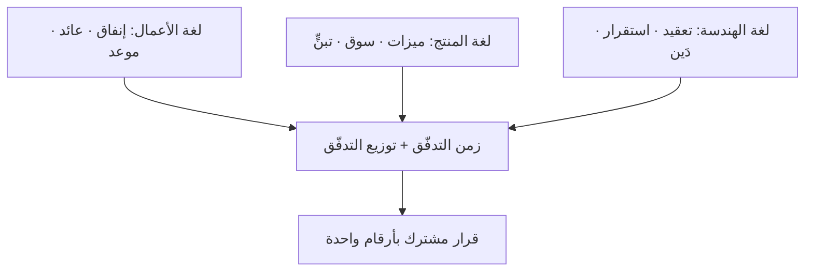
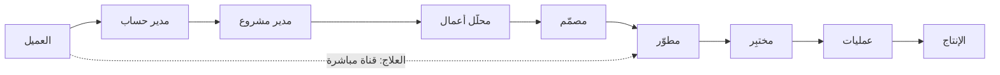

> [!info] الفصل 03 · كورس الإنتاجية
> **ماذا ستتعلّم:** لماذا لا تلتقي **ثلاث لغات** داخل الشركة الواحدة — لغة الأعمال (إنفاق · عائد · موعد)، ولغة المنتج (ميزات · سوق · تمويل)، ولغة الهندسة (معمارية · كود · إعادة هيكلة) — ولماذا **فشلت مخطّطات الاحتراق** في أن تكون الجسر بينها. ستفهم **الفوضى التشغيلية** بوصفها ظاهرة بنيوية لها رياضيات لا أخلاق: كيف تُنتج الصوامع تكلفة انتظار تفوق تكلفة العمل، ولماذا تُدمّر **سلسلة التسليمات** الأمان النفسي قبل أن تُدمّر الجدول. وستتعلّم ما **الفريق متعدّد الوظائف** حقًّا (وما ليس هو)، ولماذا يكون **مالك المنتج خارج الفريق** أخطر من غيابه، وما **مشكلة الوكيل** وقاعدة الحلقات، والفرق بين **عقلية صابّ الخرسانة** و**عقلية البستاني**. وستخرج بمنهج عملي لبناء **جسر البيانات** الذي يستطيع مديرك التنفيذي قراءته فعلًا.

> [!abstract] التأصيل
> **يفترض أنّك تعرف:** [[Value Stream]]
> **ويُؤصّل لك:** [[Cross-functional Team]] · [[Handoff]]

# الفصل 03 — الفجوة الكبرى والفوضى التشغيلية

## 🎯 أهداف التعلّم

- وصف **الفجوة الكبرى** بوصفها ثلاث لغات لكلٍّ منها وحدة قياس مختلفة، وتحديد وحدة القياس المشتركة الوحيدة الممكنة.
- شرح **لماذا فشل مخطّط الاحتراق** بوصفه لغة تخاطب مع الإدارة، وتحديد ما يصلح له فعلًا.
- تفسير **الفوضى التشغيلية** بأسبابها البنيوية (قانون كونواي · نظرية الطوابير · حجم الدفعة) لا بأسبابها الشخصية.
- تعريف **الفريق متعدّد الوظائف** تعريفًا إجرائيًّا، وتمييزه عن «الجميع يفعل كلّ شيء».
- حساب **تكلفة التبعيّة** بين فريقين، وشرح لماذا تنمو غير خطّيًّا.
- شرح **مشكلة الوكيل** وقاعدة العلاقة بين عدد الحلقات ودرجة الغموض واحتمال الفشل.
- تشخيص موقع **مالك المنتج** داخل الفريق أو خارجه، وأثر ذلك على زحف النطاق والأمان النفسي.
- المقارنة بين **عقلية صابّ الخرسانة** و**عقلية البستاني** بمعايير قابلة للملاحظة لا بالنيّات.
- بناء **جسر بيانات** مكوَّن من ثلاث إلى خمس أرقام تصلح للعرض على مستوى تنفيذي.
- عرض **الحجّة المضادّة**: متى تكون الصوامع والتخصّص العميق هما القرار الصحيح.

---

## الفكرة المحورية: المشكلة ليست سوء نيّة، بل غياب وحدة قياس مشتركة

> [!quote] من المحاضرة
> **المدرّب:** «**جهة الأعمال لا تفهم إلّا ثلاثة أشياء** — *كم سأُنفق، وكم سأسترجع، وما الموعد النهائي*… ثم تعال إلى **لغة المطوّر**: معمارية، وكود، ومكتبات. وهدفه: *أحتاج إلى إعادة هيكلة*… فهل يعني ذلك أن نسمّيهم «ناسًا لا يفهمون»؟ لا. يعني أنّنا نحتاج إلى **بناء جسر يُوحّد اللغة بيننا**.»

هذه الجملة تحمل التشخيص الصحيح وتوقف عنده. ولنمضِ خطوة أبعد: **المشكلة ليست أنّ اللغات مختلفة؛ اللغات ستبقى مختلفة ويجب أن تبقى.** المشكلة أنّ كلّ لغة تُقاس بوحدة لا تُترجَم إلى الأخرى:

| الطرف | وحدة قياسه | أفق زمنه | ما يخيفه |
|---|---|---|---|
| **الأعمال / التنفيذي** | نقود ومخاطر | ربع سنوي إلى سنوي | خسارة سوق أو خرق التزام |
| **المنتج** | تبنٍّ واستخدام وحصّة | شهري إلى ربعي | بناء شيء لا يريده أحد |
| **الهندسة** | تعقيد واستقرار وقابلية تغيير | أسبوعي إلى شهري | نظام لا يمكن تعديله بأمان |

ولاحظ أنّ **لا أحد منهم مخطئ**. المدير التنفيذي الذي لا يهتمّ بإعادة الهيكلة ليس جاهلًا؛ إنّه يعمل بوحدة قياس تُحاسَب عليها. والمطوّر الذي يصرّ على إعادة الهيكلة ليس مبالغًا؛ إنّه يرى تدهور الوحدة التي يعمل بها.

**والحلّ ليس أن يتعلّم أحدهم لغة الآخر** — فهذا مطلب فُشل مرارًا — بل **إيجاد وحدة قياس ثالثة تُترجِم إلى الثلاث معًا**. وهذه الوحدة موجودة، واسمها **الزمن الذي تستغرقه القيمة للوصول إلى السوق، ونسبة السعة المصروفة على كلّ نوع عمل**. أي بالضبط: **مقاييس التدفّق وتوزيع التدفّق**.

---

## أولًا: لماذا فشل مخطّط الاحتراق بوصفه جسرًا

> [!quote] من المحاضرة
> **المدرّب:** «**ومخطّط الاحتراق لم يُوحّد اللغة**. لن يأتيك أبدًا شخص من المستوى التنفيذي ليقول *أرِني مخطّط الاحتراق عندك*… أظهرا لك كيف تسير الأمور **داخليًّا** — أمّا بوصفهما **لغة تخاطب بها جهة الأعمال**، فلم يفعلا شيئًا.»

### التشخيص الدقيق: أربعة أسباب

**1. وحدة القياس داخلية بالكامل.** المحور الرأسي في مخطّط الاحتراق نقاط قصة — وهي وحدة **نسبية** يضعها الفريق لنفسه. فلا معنى لها خارج الفريق، ولا تقارَن بين فريقين، ولا تُترجَم إلى نقود ولا إلى مستخدمين.

**2. أفقه الزمني خاطئ.** يغطّي سبرنتًا واحدًا (أسبوعان)، بينما قرارات الأعمال تُتّخذ بأفق ربعي. فهو يجيب عن سؤال لا يسأله أحد على هذا المستوى.

**3. لا يحمل معلومة عن القيمة إطلاقًا.** خطّ نازل بانتظام قد يعني فريقًا يُنجز عملًا عديم القيمة بكفاءة عالية. والمخطّط لا يستطيع التمييز.

**4. يُخفي أخطر شيء: الانتظار.** النقطة تُحتسَب مُنجَزة عند الإغلاق، لا عند الوصول إلى الإنتاج. فكلّ الزمن الضائع بين «مُغلَق» و«منشور» **غير مرئيّ فيه**.

> [!warning] لا تُلغِ المخطّط — أعطه حجمه
> مخطّط الاحتراق **أداة فريق جيّدة**: يكشف داخل السبرنت هل نسير بمعدّل يسمح بالإنجاز، ويكشف نمط «كلّ شيء يُغلَق في اليوم الأخير» — وهو نمط أشار إليه مهندس ضمان الجودة في المحاضرة الثانية بذكاء. المشكلة في **استخدامه في غير موضعه**: أن يُرفَع إلى الإدارة بوصفه دليل صحّة.

### ماذا يُرفَع بدلًا منه؟

هذه هي **الحزمة الأصغر** التي تصلح للعرض على مستوى تنفيذي، وكلّها مشتقّة من مقاييس التدفّق:

| الرقم | ما يجيب عنه لدى الإدارة | مثال للصياغة |
|---|---|---|
| **زمن التدفّق (وسيط)** | «كم نستغرق من الفكرة إلى السوق؟» | «الوسيط 47 يومًا، وكان 61 قبل ربع» |
| **كفاءة التدفّق** | «كم من ذلك عمل فعلي؟» | «14% عمل و86% انتظار — وهنا الفرصة» |
| **توزيع التدفّق** | «على ماذا نصرف طاقتنا؟» | «78% ميزات، 4% دَين تقني — وهذا سبب البطء» |
| **قابلية التنبّؤ** | «هل نستطيع الوعد؟» | «نُنجز 72% ممّا نلتزم به» |
| **معدّل العيوب الهاربة** | «ما جودة ما نُسلّمه؟» | «11 عيبًا في الإنتاج لكلّ إصدار» |

> [!tip] قاعدة العرض التنفيذي
> **رقمان اتّجاهيّان خير من عشرة أرقام لحظية.** المدير التنفيذي لا يحتاج القيمة المطلقة بقدر ما يحتاج **الاتّجاه** و**السبب**. فاعرض الرقم مع مقارنته بالفترة السابقة ومع جملة واحدة عن السبب. وامتنع تمامًا عن عرض أرقام لا تستطيع تفسيرها — فأوّل سؤال «لماذا؟» بلا جواب يُسقط المنظومة كلّها.

---

## ثانيًا: الفوضى التشغيلية — تشريح بنيوي

> [!quote] من المحاضرة
> **المدرّب:** «لديك أقسام — ضمان الجودة، الواجهة الخلفية، الواجهة الأمامية، الموبايل… لماذا تلك فوضى؟ لأنّك **فصلتَ تلك الأقسام بعضها عن بعض**، فصار أيّ تغيير تافه يُنتج **ازدحامًا**.»

### الأسباب الثلاثة — ولا واحد منها شخصي

**السبب الأوّل: بنية الاتصال (قانون كونواي).**
المؤسّسة المقسّمة أفقيًّا بحسب التخصّص التقني تُنتج حتمًا نظامًا يعبر كلّ تغيير فيه ثلاثة حدود تنظيمية. وهذا ليس خطأ في التنفيذ؛ إنّه **النتيجة الحتمية للبنية**.

**السبب الثاني: نسبة الاستغلال (نظرية الطوابير).**
كلّ فريق مشترك (ضمان جودة مركزي، فريق قواعد بيانات، فريق نشر) يعمل قرب طاقته القصوى **يتحوّل تلقائيًّا إلى مولّد انتظار**. والعلاقة أسّية لا خطّية: عند استغلال 90% يكون معامل الانتظار تسعة أضعاف ما هو عند 50%.

**السبب الثالث: حجم الدفعة.**
كلّما كبرت الدفعة المسلَّمة بين الفرق، زاد زمن الانتظار وزادت كلفة الخطأ. وهذا هو الأساس الرياضي لسؤال «لماذا نُجزّئ العمل؟» الذي طرحته المحاضرة الثانية — وأجاب عنه المشاركون إجابات صحيحة كلّها لكنّها متفرّقة. ولنجمعها في إطار واحد:

> [!info] إضافة مرجعية — لماذا الدفعات الصغيرة؟ (خمس فوائد لا واحدة)
> بحسب تحليل **دونالد رينرتسن** لاقتصاديات حجم الدفعة:
> 1. **زمن دورة أقصر** — الدفعة الصغيرة تعبر النظام أسرع (وهذا ما قصده المشارك بـ«تنتهي داخل السبرنت»).
> 2. **تغذية راجعة أسرع** — يُكتشف الخطأ قبل أن يُبنى فوقه (وهذا ما قصده مهندس الجودة بـ«تصل إلى المختبِر أبكر»).
> 3. **مخاطرة أقلّ لكلّ دفعة** — الفشل يمسّ جزءًا صغيرًا (وهذا ما سمّاه موجي «تحجيم المخاطر»).
> 4. **تقدير أدقّ** — دقّة التقدير تتحسّن أسّيًّا بصغر الحجم (وهذا ما ذكره المشارك عن «التنبّؤ»).
> 5. **حافز معنوي** — الإنجازات المتكرّرة تُبقي الطاقة (وهذا «الجزء المعنوي» عند موجي).
>
> ولاحظ أنّ إجابات المشاركين مجتمعةً غطّت الخمسة — وهو مثال جيّد على أنّ المعرفة موزّعة في الفريق ولا يملكها أحد كاملة.

### حساب تكلفة التبعيّة

> [!quote] من المحاضرة
> **المدرّب:** «فالعمل الذي يكلّف جنيهًا واحدًا ينتهي بتكلفة **عشرة جنيهات** على الشركة… لأنّ هناك **تسعة جنيهات هدر انتظار**.»

ولنجعل هذا قابلًا للحساب في مؤسّستك:

**خطوات القياس:**
1. اختر ميزة انتهت مؤخّرًا وعبرت فريقين أو أكثر.
2. سجّل لكلّ فريق: تاريخ الاستلام، تاريخ بدء العمل الفعلي، تاريخ التسليم.
3. **الفجوة بين الاستلام وبدء العمل** = زمن الطابور. جمّعها.
4. اقسم زمن العمل الفعلي المجمّع على الزمن الكلّي.

**النتيجة النمطية في مؤسّسة ذات صوامع:** 8–20%. وهي بالضبط **كفاءة التدفّق**، ما يعني أنّك حسبتَ مقياسًا من مقاييس الفصل السادس دون أن تعرف.

> [!warning] الخطأ الإداري النمطي عند رؤية هذا الرقم
> أوّل ردّ فعل غالبًا: «إذن الفرق لا تعمل — 86% وقت ضائع!» وهذا **قراءة خاطئة تمامًا**. الفرق تعمل بكامل طاقتها؛ لكنّها تعمل على **عناصر أخرى** أثناء انتظار هذا العنصر. المشكلة ليست في كسل الأفراد بل في **تعدّد العناصر المفتوحة** — وهو ما سيسمّيه الفصل السابع **حِمل التدفّق**. والعلاج ليس زيادة الجهد، بل **تقليل عدد العناصر المفتوحة** ليمرّ كلّ عنصر أسرع.

---

## ثالثًا: الفريق متعدّد الوظائف — الحقيقي والزائف

> [!quote] من المحاضرة
> **المدرّب:** «يقولون لك إنّ **متعدّد الوظائف** يعني أنّ المطوّر يستطيع أداء عمل المختبِر… فأقول لهم: **هذا ليس فريقًا متعدّد الوظائف — هذه فوضى تشغيلية**. الفريق متعدّد الوظائف هو… **جمعتَ كلّ التخصّصات في مكان واحد وربطتَها بتحقيق هدف واحد**.»

### التعريف الإجرائي — ثلاثة شروط لا واحد

فريقك متعدّد الوظائف إذا تحقّقت الثلاثة معًا:

1. **الاكتفاء المهاري:** يملك الفريق **داخله** كلّ المهارات اللازمة لأخذ عنصر من الفكرة إلى الإنتاج، دون طلب موافقة أو عمل من خارج الفريق.
2. **وحدة الهدف:** يُقاس الفريق بمقياس واحد مشترك، لا بمقاييس منفصلة لكلّ تخصّص.
3. **سلطة القرار:** يستطيع الفريق اتّخاذ قرارات التصميم والتنفيذ داخل حدوده دون تصعيد.

> [!warning] الشرط الثالث هو الأكثر إهمالًا
> مؤسّسات كثيرة تحقّق الشرطين الأوّلين وتُخفق في الثالث: فريق فيه كلّ التخصّصات، بهدف واحد، لكنّ كلّ قرار معماري أو أولويّ يُرفَع إلى لجنة. والنتيجة **فريق متعدّد الوظائف بلا رشاقة** — لأنّ الانتظار انتقل من انتظار الفرق إلى انتظار القرارات.

### مصفوفة المهارات (`T-Shaped`) — التسوية العملية

| النمط | الوصف | متى يصلح |
|---|---|---|
| **`I-Shaped`** | تخصّص عميق واحد فقط | فرق كبيرة ذات حجم عمل مستقرّ في كلّ تخصّص |
| **`T-Shaped`** | تخصّص عميق + قدرة على المساعدة في مجاورات | **الأنسب لمعظم فرق المنتجات** |
| **`Generalist`** | معرفة سطحية بكلّ شيء | فرق صغيرة جدًّا أو مراحل مبكّرة جدًّا |

والفريق `T-Shaped` هو الحلّ الوسط الذي يعالج شكوى المحاضرة: **لا يُطلَب من المطوّر أن يصير مختبِرًا، لكن يُطلَب منه ألّا يقف مكتوف اليدين إذا كان الطابور عند الاختبار.** والفرق بين الأمرين: الأوّل إلغاء للتخصّص، والثاني **إعادة توجيه للسعة نحو القيد** — وهي القاعدة الأولى في نظرية القيود.

> [!tip] أداة عملية: خريطة المهارات
> ارسم جدولًا: الصفوف أعضاء الفريق، الأعمدة المهارات الحرجة، والخانات بمستويات (لا يعرف · يستطيع بمساعدة · يستطيع وحده · يستطيع أن يُعلّم). الفائدة مزدوجة: تكشف **معامل الحافلة** فورًا، وتُظهر أين يُستثمَر التدريب. وأخطر ما ستراه: عمود فيه مستوى «يستطيع أن يُعلّم» واحد فقط.

---

## رابعًا: سلسلة التسليمات ومشكلة الوكيل

> [!quote] من المحاضرة
> **المدرّب:** «عمل المحلّل يذهب إلى المصمّم؛ فيُشوّهه المصمّم؛ والعمل المشوّه يذهب إلى المطوّر، والمطوّر يرى نفسه **مترجمًا لا مطوّرًا**… فهي **تسليمة بعد تسليمة**، والتسليمات **تُدمّر الأمان النفسي للفريق** و**تُبطئ تدفّق القيمة**.»
>
> **المدرّب:** «وهناك قاعدة: **كلّما زادت الحلقات بين العميل النهائي والمطوّر، زاد الغموض لدى فريق التطوير، وارتفع احتمال تسليم ميزة غير قابلة للاستخدام.**»

### لماذا تفقد المعلومة قيمتها عبر الحلقات؟

ثلاث آليات متراكبة:

**1. فقدان السياق لا فقدان المحتوى.** ما يُفقَد في كلّ تسليمة ليس النصّ (النصّ يُنقَل بدقّة)، بل **لماذا** كُتب النصّ. والمطوّر الذي يعرف «ماذا» ولا يعرف «لماذا» لا يستطيع اتّخاذ آلاف القرارات الصغيرة التي لم تنصّ عليها الوثيقة — فيتّخذها عشوائيًّا أو يسأل، فيدخل طابور انتظار.

**2. تضخيم الغموض.** إن افترضنا أنّ كلّ حلقة تنقل 90% من السياق بدقّة، فبعد أربع حلقات يبقى $0.9^4 \approx 66\%$. وبعد ستّ حلقات $0.9^6 \approx 53\%$. **أي أنّ نصف السياق يتبخّر في سلسلة طولها ستّ حلقات، دون أن يُخطئ أحد.**

**3. تفتيت المسؤولية.** حين يمرّ العمل بستّة، لا يشعر أحد بملكيّته. وهذا يفسّر شعور المختبِر في المحاضرة بأنّه «سلّم قنبلة موقوتة»: هو يعلم بوجود المشكلة ولا يملك سلطة إيقافها ولا يتحمّل ملكيّتها.

### العلاج — ثلاثة مستويات

| المستوى | الإجراء | الجهد | الأثر |
|---|---|---|---|
| **فوري** | حضور مطوّر ومختبِر جلسة الصقل مع مالك المنتج | منخفض | يقلّل حلقة واحدة فورًا |
| **متوسّط** | مالك منتج حقيقي داخل الفريق يملك سلطة الأولوية | متوسّط | يحذف طبقات الوساطة |
| **بنيوي** | تواصل مباشر منظَّم بين الفريق ومستخدمين حقيقيّين دوريًّا | مرتفع | يُنهي مشكلة الوكيل من جذرها |

> [!quote] من المحاضرة
> **المدرّب:** «إن كنت تعمل مالك مشروع، أو مديرًا… وكنت تكتفي بتمرير المتطلّبات التي تُمليها عليك الإدارة إلى فريق البرمجة — **فأنت آلة فاكس**، لست جزءًا من البرمجيات.»

> [!info] إضافة مرجعية — «الوكيل» في أدبيات إدارة المنتج
> يسمّي **مارتي كاغان** في ***INSPIRED*** هذا النمط **مالك منتج بالاسم فقط**، ويميّز بين ثلاثة أنماط شائعة كلّها اختزال للدور:
> - **مُدوِّن المتطلّبات:** يحوّل طلبات الآخرين إلى قصص مستخدم.
> - **مدير المشروع المتنكّر:** يتابع المواعيد والتقدّم فقط.
> - **مالك الباك-لوغ:** يرتّب قائمة أعدّها غيره.
>
> والمشترك بينها أنّها **لا تملك قرار ما يُبنى**. وقاعدة كاغان الحاسمة: **إن لم يكن الدور يملك سلطة قول «لا»، فهو ليس دور منتج.**

---

## خامسًا: مالك المنتج داخل الفريق لا فوقه

> [!quote] من المحاضرة
> **المدرّب:** «فأين الكارثة؟ حين تجد **شخص المنتج واقفًا خارج** الفريق متعدّد الوظائف. عندئذٍ يتحوّل، في أعينهم، إلى **مراقب** وإلى شخص يُحاسِب… أنت فقط تحمل مسؤولية **ترتيب أولويات العمل** — وهو ما **يمنع زحف النطاق**.»

### لماذا يهمّ الموقع بهذا القدر؟

لأنّ الموقع يحدّد **مصدر المعلومة التي يبني عليها قراره**:

| مالك المنتج خارج الفريق | مالك المنتج داخل الفريق |
|---|---|
| يعرف حالة العمل من التقارير | يعرفها من الملاحظة المباشرة |
| يكتشف العوائق متأخّرًا | يراها لحظة ظهورها |
| يقدّر الكلفة التقنية بالحدس | يسمع المقايضة التقنية أثناء نشوئها |
| يُنظَر إليه بوصفه مصدر الضغط | يُنظَر إليه بوصفه جزءًا من المقايضة |
| يقول «لماذا تأخّرتم؟» | يقول «ماذا نُخرج مقابل هذا؟» |

> [!warning] مؤشّر تشخيصي بسيط
> **اسأل الفريق: هل يخبر مالكُ المنتجِ الإدارةَ بالمشاكل، أم يخبرها بالمشاكل عنكم؟** الفرق بين حرف الجرّ وحرف الجرّ الآخر هو الفرق بين مالك منتج داخل الفريق ومراقب فوقه. والفرق يظهر في سلوك واحد قابل للملاحظة: **من يتحمّل نتيجة عدم التسليم أمام الإدارة؟** إن كان الفريق وحده، فمالك المنتج خارجه مهما جلس في الغرفة نفسها.

### وقياس مالك المنتج نفسه

> [!quote] من المحاضرة
> **المدرّب:** «حين تأتي لتقيس **مالك المنتج** وتعطيه مؤشّر أداء هو **عدد القصص التي كتبها**، فسيطحن نفسه في كتابة القصص. هذا **ناتج**، ولا قيمة له.»

| مقياس خاطئ لمالك المنتج | مقياس بديل |
|---|---|
| عدد القصص المكتوبة | نسبة الميزات المستخدَمة فعلًا بعد 30 يومًا |
| حجم الباك-لوغ | معدّل إسقاط البنود (كم بندًا قتلناه؟) |
| سرعة استجابته لطلبات الإدارة | نسبة القرارات المدعومة ببيانات |
| عدد الاجتماعات | زمن التدفّق في المجرى الأعلى |

> [!tip] المقياس الأكثر كشفًا
> **معدّل الإسقاط.** مالك منتج لم يُسقط بندًا واحدًا من الباك-لوغ خلال ربع كامل **لا يمارس ترتيب أولويات؛ إنّه يُدير قائمة انتظار.** ولأنّ الإسقاط سلوك مؤلم اجتماعيًّا، فهو أصدق دليل على وجود سلطة حقيقية.

---

## سادسًا: عقلية صابّ الخرسانة مقابل عقلية البستاني

> [!quote] من المحاضرة
> **المدرّب:** «**عقلية صبّ الخرسانة:** أُنهي الشقّة، وأسلّم المفتاح للمالك، وأقول مع السلامة… **عقلية البستاني:** البرمجيات التي نبنيها **كائن حيّ**. تحتاج **عناية مستمرّة**، و**تطويرًا مستمرًّا**، و**تنظيفًا دائمًا للدَّين التقني**.»

الاستعارة جميلة، وخطرها أنّها تبقى شعارًا. ولنحوّلها إلى **معايير قابلة للملاحظة** — فالمؤسّسة لا تتغيّر بتغيّر الاستعارة بل بتغيّر ما تفعله:

| السلوك | عقلية صابّ الخرسانة | عقلية البستاني |
|---|---|---|
| **بعد الإطلاق** | ينتقل الفريق فورًا إلى العمل التالي | فترة عناية مكثّفة مخصّصة في الخطّة |
| **مصدر الأولوية التالية** | الطلب التالي في الطابور | بيانات استخدام الإصدار السابق |
| **الدَّين التقني** | «لاحقًا، إن توفّر وقت» | بند مخصّص له نسبة معلنة |
| **نجاح الفريق** | التسليم في الموعد | تحرُّك مقياس المستخدم |
| **الاختبارات** | تُكتَب إن بقي وقت | جزء من تعريف الإنجاز |
| **من يشغّل النظام؟** | فريق آخر | الفريق نفسه أو بمسؤولية مشتركة |
| **التوثيق المعماري** | لا يوجد أو قديم | قرارات موثّقة (`ADR`) |
| **الاستجابة لبلاغ إنتاج** | يُوجَّه إلى الدعم | يصل الفريق مباشرةً |

> [!quote] من المحاضرة
> **المدرّب:** «فحين قال عبد الرحمن *«نقضي ثلاثة أسابيع بعد انتهاء الإصدار نراقب كيف تسير الأمور»*، قلتُ له: بارك الله فيك — **لأنّهم يعملون بعقلية الفلّاح**.»

> [!info] إضافة مرجعية — أصل الاستعارة في أدبيات الهندسة
> استعارة **البستنة** ضدّ **البناء** قديمة في هندسة البرمجيات، وأوضح صياغة لها في ***The Pragmatic Programmer*** (هنت وتوماس): «البرمجيات أقرب إلى البستنة منها إلى البناء» — لأنّها نظام **عضوي متغيّر** يستجيب لبيئته، ولأنّ صيانته ليست إصلاح عطل بل **تشذيب مستمرّ**. وقد تفرّع منها مبدآن عمليّان:
> - **قاعدة الكشّافة (`Boy Scout Rule`)**: اترك الكود أنظف ممّا وجدته — تحسين صغير مع كلّ لمسة، بدل انتظار مشروع إعادة هيكلة ضخم لن يُعتمَد أبدًا.
> - **إنتروبيا البرمجيات**: النظام الذي لا يُصان لا يبقى كما هو، بل **يتدهور** — لأنّ بيئته (المكتبات، الأنظمة، المتطلّبات، الأمن) تتغيّر من حوله.

> [!warning] حدّ الاستعارة
> لا تُبالغ في «الكائن الحيّ». البرمجيات ليست حيّة ولا تُصلح نفسها، ولا يُعالَج كلّ شيء بـ«العناية». هناك أنظمة يكون القرار الاقتصادي الصحيح فيها **الاستبدال لا الصيانة** — حين تتجاوز كلفة إبقائها كلفة إعادة بنائها. والبستاني الحقيقي يقتلع أيضًا.

---

## سابعًا: بناء جسر البيانات عمليًّا

هذا القسم هو **الجزء الأكثر قابلية للتنفيذ** في الفصل، وهو ما يحوّل التشخيص إلى أداة.

> [!quote] من المحاضرة
> **المدرّب:** «حين يقول لك سكرم إنّ **مدير سكرم يحمي الفريق** — يا سيدي، أنت لا تحمي الفريق بأن تكون **بلطجيّهم**. أنت تحميهم **بالبيانات** — ويجب أن تكون تلك البيانات **صحيحة**، و**مفهومة لجهة الأعمال**.»

### القاعدة الأولى: ابدأ برقم واحد

المؤسّسة لا تتبنّى ستّة مقاييس دفعةً واحدة. ابدأ بواحد، واختره بحسب الشكوى السائدة:

| الشكوى السائدة | ابدأ بهذا المقياس | لأنّه… |
|---|---|---|
| «أنتم بطيئون» | **زمن التدفّق + كفاءة التدفّق** | يُظهر أنّ البطء في الانتظار لا في العمل |
| «أنتم لا تلتزمون» | **قابلية التنبّؤ** | يفتح حوار أسباب الانحراف بدل اللوم |
| «الجودة سيّئة» | **توزيع التدفّق + العيوب الهاربة** | يربط الجودة بالسعة المخصّصة لها |
| «الفريق صندوق أسود» | **توزيع التدفّق** | يُظهر على ماذا تُصرَف السعة فعلًا |

### القاعدة الثانية: اعرض السببية لا الرقم

| صياغة ضعيفة | صياغة تعمل |
|---|---|
| «كفاءة تدفّقنا 14%» | «من كلّ 20 يومًا يستغرقها الطلب، 17 يومًا انتظار موافقات ونوافذ نشر. تقليل نافذة النشر إلى أسبوعي يوفّر 4 أيام لكلّ طلب.» |
| «توزيعنا 85% ميزات» | «نصرف 85% على الميزات و3% على الصيانة. ولهذا ارتفع زمن الميزة المتوسّطة من 6 أيام إلى 11 خلال سنة. اقتراحنا: 20% لربع واحد، ونعرض الأثر.» |
| «قابلية التنبّؤ 60%» | «ننجز 6 من كلّ 10 التزامات. السبب الأوّل بحسب آخر ثلاث استعادات: متطلّبات تدخل غير مكتملة. نقترح تعريف جاهزية بثلاثة شروط.» |

### القاعدة الثالثة: اطلب قرارًا لا تعاطفًا

كلّ عرض بيانات ينتهي بـ**طلب واحد محدّد قابل للموافقة أو الرفض**. والعرض الذي ينتهي بـ«أردنا فقط أن تعرفوا الوضع» يُنتج تعاطفًا مؤقّتًا وصفر تغيير.

> [!tip] بنية العرض في خمس شرائح
> 1. **الرقم** + اتّجاهه مقارنةً بالفترة السابقة.
> 2. **أين يقع الضياع** (تفصيل الرقم إلى مكوّناته).
> 3. **السبب** بجملة واحدة مدعومة بمثال حقيقي واحد.
> 4. **الطلب**: قرار واحد محدّد بحدود زمنية.
> 5. **الوعد المقابل**: ماذا سنُظهر بعد ربع لنُثبت أثر القرار.
>
> والبند الخامس هو الذي يبني الثقة عبر الجولات، لأنّه يُدخل الفريق طوعًا في دائرة المساءلة بالنتائج.

---

## ثامنًا: القراءة النقدية — متى تكون الصوامع صحيحة؟

الإنصاف يقتضي ألّا نُقدّم «الفريق متعدّد الوظائف» بوصفه جوابًا كونيًّا.

**1. التخصّصات النادرة لا تُوزَّع.** خبير أمن سيبراني، أو مصمّم قواعد بيانات ضخمة، أو خبير امتثال. توزيع واحد منهم على ستّة فرق ينتج **معامل حافلة يساوي واحدًا مضروبًا في ستّة** — أي أسوأ من الصومعة. والحلّ في هذه الحالة **نمط الفريق الممكِّن** (`Enabling Team`) بحسب `Team Topologies`: فريق خبراء يعمل مؤقّتًا مع فرق المنتجات لرفع قدرتها، لا لتنفيذ العمل عنها.

**2. اقتصاديات الحجم حقيقية.** بنية تحتية موحّدة، أو منصّة نشر مشتركة، أو مكتبة مكوّنات — كلّها تستفيد من التمركز. والحلّ هنا **فريق منصّة** (`Platform Team`) يقدّم خدمة ذاتية للفرق، لا بوّابة موافقة عليها.

**3. الأدوار الرقابية يجب أن تبقى منفصلة.** التدقيق الداخلي والامتثال المالي لا يُدمَجان في الفريق المنفّذ لأسباب حوكمية بديهية.

**4. الحجم يفرض هيكلًا.** فريق واحد متعدّد الوظائف يعمل جيّدًا حتى ~9 أشخاص. وما فوق ذلك تحتاج **حدودًا** بالضرورة، والسؤال يصير: **أين نضع الحدّ** لا هل نضعه. وقاعدة `Team Topologies` هنا مفيدة: ضع الحدّ حيث يكون **الحِمل الإدراكي** على الفريق محتمَلًا، لا حيث يقتضي المخطّط التنظيمي.

> [!warning] الخطأ المقابل: هدم التخصّص باسم الرشاقة
> ما رفضته المحاضرة صراحةً — «المطوّر يعمل مختبِرًا والمختبِر يعمل مطوّرًا» — خطأ حقيقي وشائع، وهو **الوجه الآخر** للفوضى التشغيلية لا علاجها. فالتخصّص مصدر جودة، وإلغاؤه يُنتج فريقًا يعمل كلّ شيء بمستوى متوسّط. والصياغة الصحيحة: **تخصّص عميق + تعاون بلا حدود إدارية**، لا **إلغاء التخصّص**.

---

## تاسعًا: التطبيق — تشخيص الفوضى التشغيلية في ساعة

### الجزء 1: رسم الحلقات (15 دقيقة)

ارسم على لوح كلّ من تمرّ عليه الفكرة من العميل إلى المطوّر. اعدّ الحلقات. ثم اسأل عن كلّ حلقة سؤالًا واحدًا: **ما القرار الذي تملكه هذه الحلقة؟** كلّ حلقة لا تملك قرارًا هي **حلقة نقل** — أي هدر بحسب تعريف `Lean`.

### الجزء 2: خريطة التبعيّات (15 دقيقة)

اكتب آخر خمسة عناصر تأخّرت، وأمام كلّ واحد: **على من كنّا ننتظر؟** ثم اعدّ التكرارات. الاسم الأكثر تكرارًا هو **قيدك** — وكلّ تحسين لا يمسّه لن يُنتج أثرًا ملموسًا.

### الجزء 3: اختبار الأمان النفسي (15 دقيقة)

اطرح ثلاثة أسئلة كتابيًّا ومجهولة المصدر:
1. آخر مرّة قلتَ فيها «هذا لن ينجح» في اجتماع — ماذا حدث؟
2. هل تعرف مشكلة تقنية جوهرية لم تُكتَب في الباك-لوغ؟ (نعم/لا فقط)
3. لو تأخّر التسليم بسبب خطأ منك، هل تُبلّغ فورًا أم تحاول إصلاحه بصمت؟

> [!warning] كيف تُقرأ النتائج
> نسبة «نعم» عالية في السؤال الثاني هي **قياس مباشر للعمل غير المرئي** في مؤسّستك، وهي أبلغ من أيّ استبيان ثقافة. وإجابات السؤال الثالث تُنبئك بحجم **الضربة العمياء** المتوقّعة. ولا تشارك النتائج بأسماء ولا بتفاصيل تُعرّف صاحبها — وإلّا أفسدتَ الأداة والثقة معًا في جولة واحدة.

### الجزء 4: قرار واحد (15 دقيقة)

اختر **حلقة واحدة تُحذف** أو **تبعيّة واحدة تُزال** ونفّذها خلال أسبوعين. ثم قِس الفرق في زمن التدفّق.

---

## 🧾 خلاصة الفصل

1. **الفجوة الكبرى** ليست سوء نيّة بل **اختلاف وحدات القياس**؛ ولا تُحلّ بأن يتعلّم أحدهم لغة الآخر، بل بوحدة ثالثة مشتركة.
2. **مخطّط الاحتراق** أداة فريق جيّدة وأداة تخاطب فاشلة، لأربعة أسباب: وحدته داخلية، وأفقه قصير، ولا يحمل قيمة، ويُخفي الانتظار.
3. **الفوضى التشغيلية** لها ثلاثة أسباب بنيوية: بنية الاتصال، ونسبة الاستغلال، وحجم الدفعة.
4. **الدفعات الصغيرة** تُنتج خمس فوائد متمايزة، وقد ذكرها المشاركون متفرّقة — دليل على توزّع المعرفة.
5. **الفريق متعدّد الوظائف** يقتضي ثلاثة شروط، وأكثرها إهمالًا **سلطة القرار**.
6. **مشكلة الوكيل**: يُفقَد السياق لا المحتوى، والغموض يتضخّم أسّيًّا مع عدد الحلقات.
7. **موقع مالك المنتج** يحدّد مصدر معلومته؛ والمؤشّر الحاسم: **من يتحمّل نتيجة عدم التسليم؟**
8. **معدّل إسقاط البنود** أصدق مقياس على وجود سلطة أولوية حقيقية.
9. **عقلية البستاني** تُترجَم إلى ثمانية سلوكيات قابلة للملاحظة، لا إلى شعار.
10. **جسر البيانات** يُبنى برقم واحد أوّلًا، ويُعرَض بسببيّته، وينتهي بطلب قرار محدّد.
11. **الصوامع صحيحة أحيانًا**: التخصّصات النادرة، واقتصاديات الحجم، والأدوار الرقابية، وحدود الحجم — والعلاج أنماط فرق لا إلغاء الحدود.
12. **إلغاء التخصّص** ليس علاج الفوضى التشغيلية بل صورة أخرى منها.

---

## ❓ اختبارات ذاتية

> [!question]- 1) مديرك التنفيذي يقول: «لا أفهم لماذا تستغرق ميزة بسيطة ثلاثة أسابيع.» ماذا تعرض عليه؟
> اعرض **تفصيل زمن التدفّق** لتلك الميزة تحديدًا: كم يومًا عمل فعلي وكم يومًا انتظار، وأين وقع كلّ انتظار (موافقة، طابور اختبار، نافذة نشر). ثم اربطه بـ**كفاءة التدفّق**. القوّة في أنّ الرقم يُحوّل السؤال من «لماذا فريقك بطيء؟» إلى «لماذا تستغرق موافقتنا الداخلية ستّة أيام؟» — أي ينقل النقاش من الأشخاص إلى النظام. وأنهِ بطلب قرار واحد: نافذة نشر أسبوعية بدل شهرية مثلًا.

> [!question]- 2) لماذا يُعدّ مخطّط الاحتراق النازل بانتظام دليلًا **غير كافٍ** على الصحّة؟
> لأنّه يقيس **استهلاك نقاط مقدَّرة ذاتيًّا**، فلا يميّز بين فريق يُنجز قيمة وفريق يُنجز عملًا عديم القيمة بكفاءة. ولأنّه يحتسب البند مُنجَزًا عند **الإغلاق** لا عند **الوصول إلى الإنتاج**، فيُخفي أكبر مناطق الانتظار. أضف إلى ذلك أنّ نقاط القصة قابلة للتضخيم، فالمخطّط المثالي قد يعني تقديرًا متضخّمًا لا أداءً ممتازًا.

> [!question]- 3) فريقك ينتظر دائمًا فريق قواعد البيانات المركزي. ما الحلّان البنيويّان الممكنان وأيّهما تختار؟
> **الأوّل:** دمج قدرة قواعد البيانات داخل الفريق (فريق متعدّد الوظائف). **الثاني:** تحويل فريق قواعد البيانات إلى **فريق منصّة** يقدّم أدوات ذاتية الخدمة بدل تنفيذ الطلبات. والاختيار يعتمد على تكرار الحاجة وندرة التخصّص: إن كانت الحاجة يومية والمهارة قابلة للنقل → ادمج. وإن كانت المهارة نادرة والحاجة متقطّعة → منصّة + **فريق ممكِّن** يرفع قدرة الفرق تدريجيًّا. والخطأ هو الإبقاء على الوضع كبوّابة موافقة.

> [!question]- 4) ما الفرق بين «فقدان المحتوى» و«فقدان السياق» في سلسلة التسليمات، ولماذا الثاني أخطر؟
> **المحتوى** هو ما كُتب في الوثيقة، وهو يُنقَل عادةً بدقّة. و**السياق** هو **لماذا** كُتب: أيّ مشكلة يحلّ، وأيّ بدائل رُفِضت ولماذا، وأيّ افتراضات قامت عليه. والسياق أخطر لأنّ المنفّذ يواجه آلاف القرارات الصغيرة التي لم تنصّ عليها الوثيقة؛ فمن يملك السياق يقرّرها صحيحًا تلقائيًّا، ومن لا يملكه إمّا يخمّن أو يسأل فيدخل طابور انتظار. ولهذا يقول المطوّر إنّه يشعر بأنّه «مترجم لا مطوّر».

> [!question]- 5) مالك منتج لم يُسقط بندًا واحدًا من الباك-لوغ في ستّة أشهر. ما التشخيص؟
> **لا يملك سلطة أولوية حقيقية.** ترتيب الأولويات فعل ذو وجهين: رفع شيء يستلزم خفض آخر، وفي النهاية إسقاطه. ومن يرفع ولا يُسقط يُدير **قائمة انتظار** لا باك-لوغ. والسبب البنيوي غالبًا أنّ البنود تنزل عليه من الإدارة معتمَدةً سلفًا، فليس أمامه إلّا الترتيب الزمني. والعلاج ليس تدريب الشخص، بل إعادة توطين قرار الأولوية.

> [!question]- 6) ما الفرق بين فريق `T-Shaped` وفريق «الجميع يفعل كلّ شيء»، ولماذا يهمّ؟
> `T-Shaped` = تخصّص عميق واحد **يبقى قائمًا** + قدرة على المساعدة في المجاورات عند الحاجة. أمّا «الجميع يفعل كلّ شيء» فإلغاء للتخصّص يُنتج جودة متوسّطة في كلّ شيء. ويهمّ الفرق لأنّ هدف تعدّد الوظائف **إزالة الانتظار بين الحدود الإدارية**، لا إلغاء الخبرة. والصيغة العملية: يُسمح للمطوّر بالمساعدة في الاختبار حين يكون الطابور عند الاختبار — وهي إعادة توجيه للسعة نحو القيد، لا تحوّل وظيفي.

> [!question]- 7) اذكر ثلاثة سلوكيات تُميّز عمليًّا فريق «البستاني» عن فريق «صابّ الخرسانة».
> (أ) **وجود فترة عناية مكثّفة مخصّصة في الخطّة** بعد الإطلاق، لا انتقال فوري للعمل التالي؛ (ب) **مصدر الأولوية التالية بيانات استخدام الإصدار السابق**، لا الطلب التالي في الطابور؛ (ج) **الدَّين التقني له نسبة معلنة** في التوزيع، لا وعد بـ«لاحقًا». ويمكن إضافة رابع حاسم: **بلاغ الإنتاج يصل الفريق نفسه** لا فريقًا آخر — فمن يشعر بألم ما بناه يبنيه مختلفًا.

> [!question]- 8) متى تكون الصومعة قرارًا صحيحًا، وما البديل عن حلّها بالدمج؟
> حين يكون التخصّص **نادرًا** (أمن، امتثال، بيانات ضخمة) فتوزيعه على الفرق ينتج هشاشة أشدّ؛ أو حين تكون هناك **اقتصاديات حجم حقيقية** (منصّة، بنية تحتية)؛ أو حين يقتضي الفصل **حوكمة رقابية**؛ أو حين يتجاوز الحجم قدرة فريق واحد. والبديل عن الدمج نمطان من `Team Topologies`: **فريق منصّة** يقدّم خدمة ذاتية بدل بوّابة موافقة، و**فريق ممكِّن** يرفع قدرة فرق المنتجات مؤقّتًا بدل التنفيذ عنها.

---

## 📚 مراجع الفصل

| المرجع | الصلة |
|---|---|
| Melvin Conway (1968) | قانون كونواي وأثر بنية الاتصال على التصميم |
| Skelton & Pais — *Team Topologies* (2019) | أنماط الفرق الأربعة والفريق الممكِّن وفريق المنصّة |
| Donald Reinertsen — *Product Development Flow* | اقتصاديات حجم الدفعة ونظرية الطوابير |
| Marty Cagan — *INSPIRED* / *EMPOWERED* | أنماط اختزال دور مالك المنتج |
| Hunt & Thomas — *The Pragmatic Programmer* | استعارة البستنة وقاعدة الكشّافة |
| Amy Edmondson — *The Fearless Organization* | الأمان النفسي وأثر التسليمات عليه |
| Eliyahu Goldratt — *نظرية القيود* | توجيه السعة نحو القيد |
| المصدر الأساس | [[1.3 الفجوة الكبرى ودوّامة الموت]] · [[2.2 التخطيط للعيوب وقياس نجاح السبرنت]] |

---

## 🔗 روابط ذات صلة

**السابق:** [[02 - المثلث الحديدي وانقلابه]] · **التالي:** [[04 - دوّامة الموت والدَّين التقني]]
**مصدر السجلّ:** [[1.3 الفجوة الكبرى ودوّامة الموت]]
**مفاهيم:** [[Cross-functional Team|الفريق متعدّد الوظائف]] · [[Handoff|التسليمة]] · [[Value Stream|تدفّق القيمة]] · [[05 - Product Owner|مالك المنتج]] · [[06 - Scrum Master|مدير سكرم]] · [[17 - Burndown Chart|مخطّط الاحتراق]] · [[21 - Stakeholder Communication|التواصل مع أصحاب المصلحة]]
