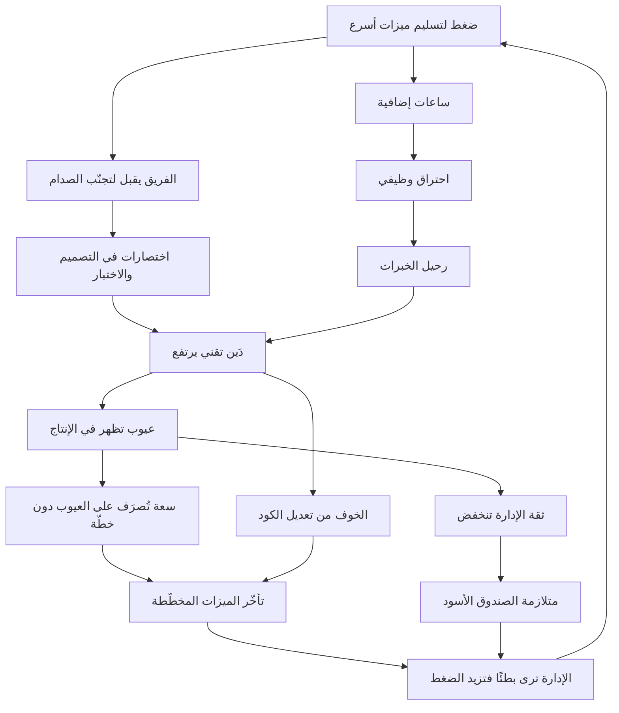
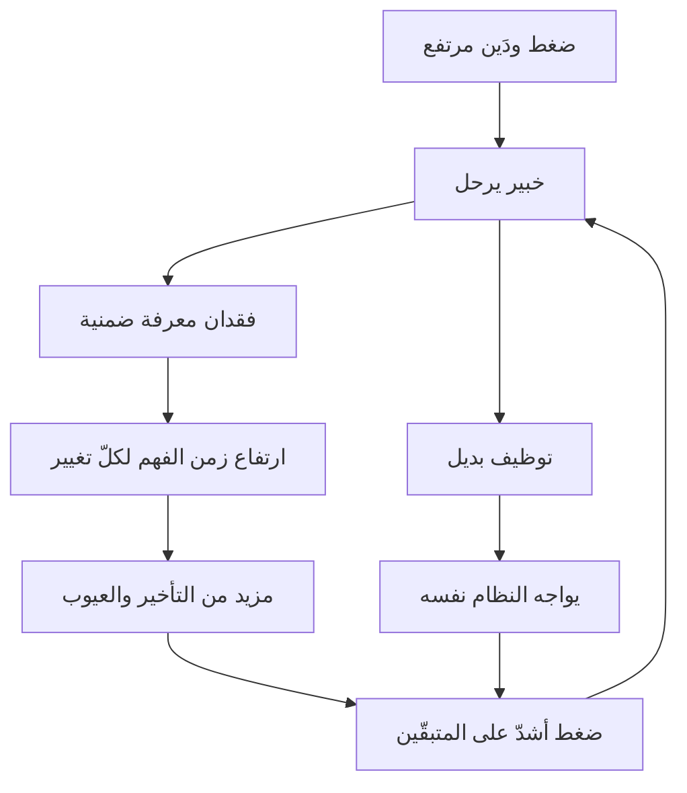
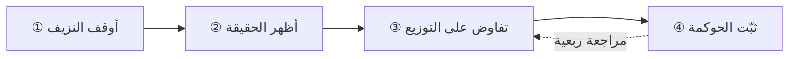

> [!info] الفصل 04 · كورس الإنتاجية
> **ماذا ستتعلّم:** كيف تعمل **دوّامة الموت** بوصفها حلقة تغذية راجعة موجبة تُعزّز نفسها، ولماذا لا يوجد فيها شرير — بل نظام يُنتج سلوكًا سيّئًا من أشخاص معقولين. ستتعلّم **الدَّين التقني** تعلّمًا تفصيليًّا: أنواعه، وكيف تُحسب «فائدته»، وكيف تجعله **مرئيًّا** وقابلًا للتفاوض، ولماذا لا يكتبه المطوّر أصلًا. وستفهم **متلازمة الصندوق الأسود** من الطرفين، و**الاحتراق الوظيفي** بتعريفه المنظّمي الدقيق لا بمعناه الشائع، و**تكلفة رحيل الخبرات** بحسابها الفعلي. وستخرج بـ**بروتوكول خروج من الدوّامة** في أربع مراحل قابل للتنفيذ، وبمعيار لتحديد متى يكون الإصلاح أغلى من إعادة البناء.

> [!abstract] التأصيل
> **يفترض أنّك تعرف:** [[Psychological Safety]]
> **ويُؤصّل لك:** [[Technical Debt]] · [[Black Box Syndrome]] · [[Burnout]] · [[Rework Percentage]]

# الفصل 04 — دوّامة الموت والدَّين التقني

## 🎯 أهداف التعلّم

- رسم **دوّامة الموت** بوصفها حلقة تغذية راجعة موجبة، وتحديد نقاط التدخّل الممكنة فيها.
- شرح لماذا يُنتج **نظام سليم النيّة** سلوكًا مدمّرًا، وربط ذلك بمبدأ ديمنغ عن النظام مقابل الأفراد.
- تصنيف **الدَّين التقني** إلى أنواعه، وتحديد العلاج المختلف لكلّ نوع.
- حساب **فائدة الدَّين التقني** بمؤشّرات قابلة للرصد من بيانات موجودة أصلًا.
- تحويل الدَّين التقني من عمل **غير مرئي** إلى بنود في الباك-لوغ قابلة للتقدير والتفاوض.
- شرح **متلازمة الصندوق الأسود** من منظور الإدارة ومنظور الفريق معًا، وتحديد ما يكسرها.
- تعريف **الاحتراق الوظيفي** بأبعاده الثلاثة (منظّمة الصحة العالمية / ماسلاش) والفرق بينه وبين التعب.
- حساب **تكلفة فقدان المعرفة** عند رحيل خبير، وتصميم إجراءات وقائية.
- شرح **الضربة العمياء** وآلية وقاية الأمان النفسي منها.
- تطبيق **بروتوكول الخروج من الدوّامة** بمراحله الأربع.
- الحكم على **متى يكون الاستبدال أرخص من الإصلاح** بمعيار اقتصادي لا عاطفي.
- عرض **الحجّة المضادّة**: متى يكون تحمّل الدَّين قرارًا صائبًا، وأين يبالغ المهندسون.

---

## الفكرة المحورية: حلقة لا شرير فيها

> [!quote] من المحاضرة
> **المدرّب:** «فندخل **دوّامة الموت**: **ضغط الإدارة ← ينكسر الكود ← تظهر الأخطاء ← تبدأ الإصدارات في الخروج ← ولم نعد نستطيع اللحاق.»**
>
> **المدرّب:** «**المشكلة ليست في المطوّر الذي يتحمّل اللوم. المشكلة في نظام فاشل يتغذّى على نفسه.**»

هذه أهمّ جملة في الكورس كلّه، وأكثرها مقاومةً من الجميع — لأنّ الجميع يفضّل شرّيرًا. الإدارة تريد أن يكون الشرّير هو الفريق «البطيء»، والفريق يريد أن يكون الشرّير هو الإدارة «الحمقاء». والحقيقة أشدّ إزعاجًا: **كلّ طرف يتصرّف تصرّفًا معقولًا من موقعه، والنظام يجمع تصرّفاتهم المعقولة لينتج نتيجة كارثية.**

ولنُفصّل الحلقة خطوةً خطوة، وننتبه إلى أنّ **كلّ خطوة فيها قرار سليم بمعايير صاحبه**:

| الخطوة | لماذا هي «معقولة» من موقع صاحبها | أثرها النظامي |
|---|---|---|
| الإدارة تضغط | مسؤولة أمام السوق والمستثمر عن مواعيد | تُنقل الكلفة إلى الجودة الداخلية |
| الفريق يقبل | تجنّب الصدام + غياب أمان نفسي + رغبة في الإنجاز | يُخفي الكلفة فتصير غير قابلة للنقاش |
| المطوّر يختصر | «سنُصلحها لاحقًا» — والنيّة صادقة | «لاحقًا» لا يأتي أبدًا لأنّه لم يُجدوَل |
| الاستجابة للعيوب فورًا | العميل يشتكي فعلًا | تُستهلَك سعة غير مخطَّطة فتنهار الخطّة |
| الإدارة تفقد الثقة | ترى وعودًا لا تتحقّق | تزيد الضغط، فتدور الحلقة |

> [!info] إضافة مرجعية — «94% من المشكلات من النظام»
> نسب **إدواردز ديمنغ**، رائد إدارة الجودة، أنّ الغالبية العظمى من المشكلات في أيّ منظومة ترجع إلى **النظام** لا إلى الأفراد العاملين فيه — وصاغها بنسبة تقريبية شهيرة (94% للنظام مقابل 6% للأسباب الخاصّة). ونتيجتها العملية: **تحسين الأفراد داخل نظام سيّئ يُنتج تحسّنًا هامشيًّا ثم يعود الوضع.**
>
> وله عبارة أشدّ مباشرةً في هذا السياق:
> *"A bad system will beat a good person every time."*
> **الترجمة:** «النظام السيّئ سيهزم الشخص الجيّد في كلّ مرّة.»
>
> وهذا هو الأساس النظري لجملة المحاضرة عن «نظام فاشل يتغذّى على نفسه».

> [!warning] النتيجة العملية الأهمّ
> **لا تُكسَر الحلقة بالنيّة الحسنة ولا بمزيد من الجهد.** الحلقة الموجبة تحتاج **تدخّلًا بنيويًّا في نقطة واحدة على الأقلّ** — وأسهل نقاط التدخّل وأكثرها فاعلية هي **تخصيص سعة معلنة للدَّين التقني والعيوب**، لأنّها تقطع الرابط بين «العيوب تظهر» و«تأخّر الميزات المخطّطة».

---

## أولًا: الدَّين التقني — من الاستعارة إلى الإدارة

### التعريف الدقيق

> [!quote] من المحاضرة
> **حمزة:** «**الدَّين التقني.** ببساطة شديدة: **كلّما بنيتَ أكثر، وكلّما أضفتَ ميزات ووظائف أكثر، احتاج المنتج صيانة أكثر ليبقى بناء الميزات التالية سهلًا.**»

هذا تعريف تشغيلي ممتاز، ويستحقّ أن يُضاف إليه البُعد الذي يجعله قابلًا للإدارة:

> [!info] الصياغة الإدارية للدَّين التقني
> **الدَّين التقني هو الفارق بين تكلفة إجراء تغيير في النظام كما هو، وتكلفة إجرائه في نظام مصمَّم جيّدًا لنفس الغرض.**
>
> وقيمته الأساسية في هذه الصياغة أنّها تجعله **قابلًا للقياس بالزمن**: إن كانت الميزة المتوسّطة تستغرق اليوم 11 يومًا وكانت تستغرق 6 قبل سنة، فأنت تدفع **5 أيام فائدة** على كلّ ميزة.

### الأنواع والعلاجات

| النوع | مصدره | العلامة | العلاج |
|---|---|---|---|
| **دَين التصميم** | بنية لم تعد تناسب الاستخدام | تغيير بسيط يمسّ ملفّات كثيرة | إعادة هيكلة مجدولة |
| **دَين الكود** | تكرار، تعقيد، تسميات مضلّلة | صعوبة القراءة، خوف من التعديل | قاعدة الكشّافة + مراجعات |
| **دَين الاختبار** | تغطية ناقصة أو اختبارات هشّة | كلّ تغيير يستلزم اختبارًا يدويًّا | بناء طبقة اختبار تدريجيًّا |
| **دَين البنية التحتية** | إصدارات قديمة، نشر يدوي | النشر حدث مخيف نادر | أتمتة النشر وتحديث المنصّة |
| **دَين المعرفة** | لا توثيق ولا قرارات مسجَّلة | «فلان وحده يعرف» | توثيق قرارات + برمجة ثنائية |
| **دَين البيانات** | نماذج بيانات مشوّهة، ازدواج | تقارير متناقضة | ترحيل تدريجي بعقود بيانات |
| **دَين الأمن والامتثال** | مكتبات مهجورة، ثغرات معروفة | تنبيهات فحص مستمرّة | جدول تحديث دوري إلزامي |

### كيف تقيس «فائدة» الدَّين؟

هذه أهمّ نقلة عملية في الفصل: **الدَّين لا يُقاس بحجمه بل بفائدته.** فلا أحد يهتمّ بأنّ لديك 4,000 تحذير في أداة تحليل الكود؛ لكنّ الجميع يهتمّ إن قلت إنّ الميزة صارت تستغرق ضعف زمنها.

**خمسة مؤشّرات قابلة للاستخراج من بيانات موجودة عندك أصلًا:**

| المؤشّر | كيف تحسبه | ما يعنيه ارتفاعه |
|---|---|---|
| **انحدار زمن التدفّق** | وسيط زمن الميزة المتوسّطة كلّ ربع | كلّ ربع أبطأ = فائدة تتراكم |
| **نسبة إعادة العمل** | العناصر التي أُعيد فتحها ÷ الكلّ | تصميم أو فهم معيبان |
| **العيوب الهاربة** | عيوب الإنتاج لكلّ إصدار | طبقة اختبار غير كافية |
| **تركّز التغيير** | نسبة الالتزامات التي تمسّ نفس المكوّنات | مكوّن مُثقَل ينبغي تفكيكه |
| **زمن الاستعادة** | متوسّط زمن العودة بعد عطل | هشاشة تشغيلية |

> [!tip] الجملة التي تُغيّر النقاش الإداري
> بدل: «لدينا دَين تقني كثير ونحتاج وقتًا لإصلاحه.»
> قُل: **«زمن تسليم الميزة المتوسّطة ارتفع من 6 أيام إلى 11 خلال أربعة أرباع. بهذا المعدّل سيبلغ 18 يومًا نهاية العام. نطلب تخصيص 20% من السعة لربع واحد، ونعرض عليكم بعده أثر ذلك على الرقم نفسه.»**
> الفرق أنّ الأولى **طلب تعاطف**، والثانية **مقترح استثمار بعائد مقيس**. والإدارة ترفض الأولى وتناقش الثانية.

---

## ثانيًا: لماذا لا يكتب المطوّر الدَّين التقني؟

هذا أدقّ ما في المحاضرة الثانية، وقد جاء ردًّا على سؤال هبة المباشر.

> [!quote] من المحاضرة
> **حمزة:** «إمّا لأنّه **لا يملك شعور الملكية** — فالشركة أخفقت في أن تمنحه إحساس أنّ *هذا العمل عملك وعليك أن تُبقيه سليمًا* — وإمّا لأنّ **الشركة لم تمنحه أمانًا نفسيًّا**، إلى حدّ أنّه **يخاف** أن يقول *هنا دَين تقني*، خشية أن يردّ **مهندس أوّل**: *لا، هذا ليس دَينًا تقنيًّا؛ أنت المخطئ، فتحمّله.* فيبقى **صامتًا** ويبتلعها.»

ولنُكمل القائمة، لأنّ السببين صحيحان وليسا كلّ الأسباب:

| السبب | الآلية | العلاج المطابق |
|---|---|---|
| **غياب الملكية** | «سأنتقل لمشروع آخر قريبًا» | استقرار الفريق مع المنتج |
| **غياب الأمان النفسي** | الاعتراف بالدَّين يُقرَأ اعترافًا بالتقصير | فصل «الدَّين» عن «الخطأ» صراحةً في اتفاق العمل |
| **لا مكان له في الأداة** | لا يوجد نوع عنصر اسمه «دَين تقني» | إنشاء النوع رسميًّا في أداة الإدارة |
| **لا جدوى مُدرَكة** | «كتبتُه العام الماضي ولم يُنظر إليه» | التزام معلن بنسبة سعة، فيرى أثر الكتابة |
| **صعوبة الصياغة** | لا يعرف كيف يشرحه لغير التقنيّين | قالب موحّد (انظر أدناه) |
| **ثقافة البطولة** | من يعمل ليلًا لإنقاذ الوضع يُكافأ | كفّ عن مكافأة الإنقاذ وابدأ بمكافأة الوقاية |

> [!warning] السبب السادس هو الأخبث
> **ثقافة البطولة** تُنتج حافزًا معكوسًا: من يمنع الأزمة لا يراه أحد، ومن يُنقذ منها يُصفَّق له. فيتعلّم النظام أن يُنتج أزمات ليُنتج أبطالًا. وأبسط اختبار: **متى آخر مرّة كوفئ أحد على شيء لم يحدث؟**

### قالب كتابة بند دَين تقني يفهمه غير التقنيّين

> [!example] القالب
> **العنوان:** [مكوّن] — [الأثر بلغة العمل]
> *مثال: «وحدة الطلبات — كلّ تعديل تسعير يستغرق 4 أيام بدل نصف يوم»*
>
> **الوضع الحالي:** ما البنية الحالية بجملة واحدة بلا مصطلحات.
> **الأثر القابل للقياس:** الرقم الذي يتحسّن (زمن، عيوب، تكلفة تشغيل).
> **كلفة عدم الفعل:** ماذا سيحدث خلال ربعين إن تُرك.
> **حجم العمل:** تقدير تقريبي بالأيّام.
> **المخاطرة:** ما الذي قد ينكسر أثناء الإصلاح وكيف نخفّفه.
> **خيار أصغر:** أصغر نسخة تُنتج جزءًا من الفائدة — وهذا البند هو ما يجعل الاقتراح قابلًا للقبول.

> [!tip] البند الأخير هو الحاسم
> الإدارة ترفض «إعادة هيكلة ثلاثة أشهر» وتقبل «أسبوعان يخفّضان زمن تعديل التسعير من 4 أيام إلى يوم». **جزّئ الدَّين كما تُجزّئ الميزات** — القاعدة نفسها تنطبق، ولنفس الأسباب الخمسة.

---

## ثالثًا: متلازمة الصندوق الأسود

> [!quote] من المحاضرة
> **المدرّب:** «تبدأ الشركة في النظر إلى الفريق التقني بوصفه **صندوقًا لا يفعل شيئًا سوى استنزاف المال وتأخير التسليمات**. لكن ما الواقع؟ إنّه فريق **غارق في السباغيتي**.»

### المتلازمة من طرفين

| ما تراه الإدارة | ما يعيشه الفريق |
|---|---|
| تكلفة ثابتة مرتفعة | ضغط ثابت مرتفع |
| مخرجات متناقصة | عمل متزايد على الصيانة الخفيّة |
| وعود لا تتحقّق | تقديرات مبنيّة على معلومة غير موجودة |
| «لماذا الأمر البسيط صعب؟» | «لأنّ البسيط يمسّ سبعة أماكن» |
| صمت عند سؤال «ما المشكلة؟» | خوف من ثمن قول الحقيقة |

**وكلا الطرفين يملك معلومة صحيحة وناقصة.** والصندوق أسود لأنّ **لا أحد يملك الصورة المشتركة** — لا لأنّ أحدهما يكذب.

### ما الذي يكسر الصندوق فعلًا؟

ليس اجتماعات الشرح ولا العروض التقديمية. **الشيء الوحيد الذي يكسره هو أن ترى الإدارة توزيع السعة.** حين تظهر جملة مثل: *«صرفنا هذا الربع 62% ميزات، 24% عيوب إنتاج، 9% دَين تقني، 5% مخاطر»* — يحدث تحوّل مزدوج:

1. **الفريق يكفّ عن كونه صندوقًا**، لأنّ الطاقة صارت مرئية موزّعة.
2. **النقاش ينتقل من الأشخاص إلى التوزيع**: «لماذا 24% عيوب؟ وكيف نخفّضها؟» — وهذا سؤال يمكن الإجابة عنه.

> [!quote] من المحاضرة
> **حمزة:** «و**توزيع التدفّق** مهمّ حتى **لا تراني الإدارة صندوقًا أسود** يستنزف مال الشركة: لديّ ميزات أعمل عليها، لكنّ **دَيني التقني أعلى**، ولديّ **عيوب ظهرت**.»

---

## رابعًا: نقطة الارتداد والكود الذي لا يُمَسّ

> [!quote] من المحاضرة
> **المدرّب:** «ما نقطة الارتداد؟ أوّلًا، **خرق نفسي** في فريقي. وثانيًا، وهو الأكبر: تصير البرمجيات التي نبنيها **معقّدة إلى حدّ أنّ أحدًا لا يريد تعديلها**… قال لي مدير المشروع حرفيًّا: *«انظر — لن أمسّ الكود في هذا المكوّن»*.»

هذه الحالة — **الكود الذي لا يُمَسّ** — أخطر من العيوب لأنّها تعني **فقدان القدرة على التغيير**، وهو الأصل الوحيد الذي تملكه شركة البرمجيات.

### كيف تتعرّف عليها مبكّرًا؟ خمس علامات

1. **تقديرات متضخّمة لمكوّن بعينه** بلا سبب ظاهر — الفريق يُسعّر الخوف.
2. **طلبات تحاشٍ**: «هل يمكن أن نضيفها في مكان آخر؟»
3. **حلول ملتفّة**: بناء وظيفة موازية بدل تعديل الأصلية.
4. **مالك واحد فقط** يجرؤ على لمسه.
5. **قواعد شفهية**: «لا أحد يمسّ وحدة الفوترة يوم خميس.»

### القرار الاقتصادي: نُصلح أم نستبدل؟

هذا سؤال يُحسَم عاطفيًّا في معظم المؤسّسات، وله معيار عملي:

| المعيار | يرجّح الإصلاح | يرجّح الاستبدال |
|---|---|---|
| **معدّل التغيير** | يتغيّر نادرًا | يتغيّر أسبوعيًّا ويعرقل |
| **وضوح السلوك المطلوب** | معروف وموثّق | غامض ويحتاج اكتشافًا |
| **وجود اختبارات** | تغطية معقولة تسمح بأمان | لا اختبارات إطلاقًا |
| **حجم المكوّن** | يمكن تفكيكه تدريجيًّا | متشابك بلا حدود واضحة |
| **التقنية** | مدعومة ومستمرّة | مهجورة بلا تحديثات أمنية |
| **معامل الحافلة** | أكثر من واحد | واحد أو صفر |

> [!warning] القاعدة التي تمنع كارثة إعادة الكتابة
> **إعادة الكتابة الكاملة (`Big Bang Rewrite`) هي أعلى أنماط المشاريع فشلًا في هذه الصناعة.** والسبب أنّها تجمع أسوأ الخصائص: نطاق ثابت ضخم، وصفر قيمة مسلَّمة حتى النهاية، ومعرفة ضمنية في النظام القديم لم يوثّقها أحد.
>
> والبديل المُجرَّب **نمط شجرة التين الخانقة (`Strangler Fig`)** الذي وصفه مارتن فاولر: تُبنى القدرات الجديدة حول النظام القديم وتُحوَّل حركة الاستخدام إليها تدريجيًّا، حتى يذبل القديم ويُزال. الميزة أنّه يُسلّم قيمة من الأسبوع الأوّل ويسمح بالتراجع في كلّ خطوة.

---

## خامسًا: الاحتراق الوظيفي — التعريف الدقيق

> [!quote] من المحاضرة
> **حمزة:** «ولماذا تُنتج الإدارة **احتراقًا وظيفيًّا** يا عمر؟» — **عمر:** «إمّا بسبب العميل، وإمّا بسبب **حماقة الإدارة نفسها**.»

> [!info] إضافة مرجعية — التعريف المنظّمي
> صنّفت **منظّمة الصحة العالمية** الاحتراق الوظيفي في `ICD-11` بوصفه **ظاهرة مهنية** (لا حالة طبّية)، وعرّفته بأنّه متلازمة ناتجة عن **إجهاد مزمن في مكان العمل لم يُدَر بنجاح**، بثلاثة أبعاد:
> 1. **استنزاف الطاقة** أو الإرهاق.
> 2. **تباعد ذهني عن العمل**، أو مشاعر سلبية وتهكّمية تجاهه.
> 3. **انخفاض الفاعلية المهنية**.
>
> والتعريف مبنيّ على عمل **كريستينا ماسلاش**، التي حدّدت ستّة مسبّبات تنظيمية — لا فردية: **الحِمل الزائد · غياب السيطرة · نقص التقدير · انهيار المجتمع · غياب الإنصاف · تعارض القيم**.

> [!warning] لماذا يهمّك أنّ الأسباب **تنظيمية**؟
> لأنّه يُبطل العلاج السائد. المؤسّسة التي تُقدّم اشتراك تأمّل ودورة إدارة ضغوط تعالج **قدرة الفرد على التحمّل**، بينما التشخيص يقول إنّ المشكلة في **الحِمل والسيطرة والتقدير والإنصاف**. وهذا ليس رفضًا لبرامج العافية، بل رفض لاستخدامها بديلًا عن معالجة السبب — وهو استخدام يُقرأ لدى الفريق بوصفه استخفافًا فيزيد الأمر سوءًا.

### الترجمة العملية للمسبّبات الستة

| المسبّب | كيف يظهر في فريق برمجيات | التدخّل المطابق |
|---|---|---|
| **الحِمل الزائد** | 100% سعة ميزات + عيوب غير مخطّطة | توزيع تدفّق معلن + احتياطي سعة |
| **غياب السيطرة** | تُملى المواعيد والحلول التقنية | تفويض قرار التصميم وتقدير الحجم للفريق |
| **نقص التقدير** | لا أحد يرى العمل غير المرئي | إظهار الدَّين والمخاطر في التقارير |
| **انهيار المجتمع** | صوامع وتبادل اتّهامات | فرق متعدّدة الوظائف بهدف مشترك |
| **غياب الإنصاف** | من يُنجز يُحمَّل أكثر | موازنة الحِمل بحدود العمل قيد التنفيذ |
| **تعارض القيم** | «نشحن ونحن نعلم أنّه معيب» | معايير جودة في تعريف الإنجاز لا تُخترَق |

**ولاحظ نتيجة لافتة:** خمسة من التدخّلات الستّة هي بالضبط ما يفرضه إطار التدفّق. أي أنّ **مقاييس التدفّق تدخّل في العافية التنظيمية**، لا مجرّد أداة إنتاجية — وهذا ليس ادّعاءً لطيفًا بل نتيجة بنيوية.

---

## سادسًا: رحيل التنانين — تكلفة فقدان المعرفة

> [!quote] من المحاضرة
> **المدرّب:** «انسَ الفرد — **كنز من المعرفة يخرج من الباب**… **سيعاني البديل المعاناة نفسها التي تركها القديم**.»

### الحلقة التي تجعل الاستبدال بلا جدوى

**النقطة الحاسمة:** توظيف بديل **لا يقطع الحلقة**، لأنّ السبب لم يكن نقص عدد بل تدهور نظام. والفرق بين الاستجابتين هو الفرق بين «فقدنا موظّفًا» و«فقدنا قدرة».

### إجراءات وقائية عملية

| الإجراء | ما يحميه | الكلفة |
|---|---|---|
| **مراجعات كود إلزامية عبر التخصّصات** | ينشر المعرفة الضمنية أثناء العمل | 10–15% من وقت العمل |
| **برمجة ثنائية على المكوّنات الحرجة فقط** | يرفع معامل الحافلة حيث يهمّ | مرتفعة — استخدمها انتقائيًّا |
| **توثيق قرارات المعمارية (`ADR`)** | يحفظ **لماذا** لا **ماذا** | منخفضة جدًّا (صفحة لكلّ قرار) |
| **تدوير داخل المنتج** | يوزّع المعرفة دون تبديدها | منخفضة |
| **مقابلة خروج تقنية** | يستخرج ما في رأس الراحل | نصف يوم |
| **خريطة مهارات محدَّثة** | يكشف معامل الحافلة قبل الأزمة | ساعة كلّ ربع |

> [!tip] الإجراء ذو أعلى عائد لأقلّ كلفة
> **توثيق قرارات المعمارية (`ADR`)**. صفحة واحدة لكلّ قرار جوهري: السياق · القرار · البدائل المرفوضة وسببها · التبعات. والقيمة في السطر الثالث تحديدًا — لأنّ من يأتي بعد سنتين سيقترح البديل المرفوض حتمًا، وستدور المؤسّسة في نقاش سبق حسمه ولا أحد يذكره.

---

## سابعًا: الضربة العمياء والأمان النفسي

> [!quote] من المحاضرة
> **المدرّب:** «نحن نركّز على الأمان النفسي للفرق لأنّنا **نخاف من الضربة العمياء** التي قد تظهر لولاه… فأنت هنا **تتحصّن من الضربة العمياء** — وهذه فائدة الأمان النفسي: **ألّا تُباغَت؛ وأن تكون بيدك خطوة استباقية.**»

هذه أذكى صياغة للأمان النفسي في المحاضرة كلّها، لأنّها تُخرجه من خانة «القيم اللطيفة» وتضعه في خانة **إدارة المخاطر**. والمدير الذي لا يقتنع بالحجّة الإنسانية يقتنع عادةً بهذه:

> **الأمان النفسي ليس رفاهية؛ إنّه نظام إنذار مبكر. والمؤسّسة التي تكتمه تكون قد أطفأت أجهزة الاستشعار وأبقت على المخاطر.**

### تشخيص: هل لديك نظام إنذار يعمل؟

| السؤال | مؤشّر النظام العامل | مؤشّر النظام المعطّل |
|---|---|---|
| متى عرفتَ آخر مرّة بمشكلة كبيرة؟ | قبل وقوعها | بعد وقوعها بأيّام |
| من أبلغ عنها؟ | من ارتكب الخطأ نفسه | العميل |
| ماذا حدث للمُبلِّغ؟ | شُكِر وأُصلح النظام | تحمّل اللوم |
| كم مرّة يُقال «لا» لطلب في الشهر؟ | عدّة مرّات بأسباب | صفر |
| هل تُرفَع أخبار سيّئة عبر الطبقات؟ | تصل كما هي | تُلطَّف طبقة بعد طبقة |

> [!info] إضافة مرجعية — ثقافة ما بعد الحادث بلا لوم
> طوّرت أوساط `DevOps` ممارسة **مراجعة الحوادث بلا لوم (`Blameless Postmortem`)**، وفكرتها أنّ الافتراض المبدئي هو أنّ كلّ شخص تصرّف بأفضل ما يمكن بناءً على المعلومات المتاحة له وقتها. والغرض ليس التسامح، بل **الوصول إلى السبب الحقيقي** — لأنّ الخوف من اللوم يُنتج روايات مهذّبة تُخفي السبب. والقاعدة التشخيصية: إن انتهت مراجعة حادث عندك بـ«خطأ بشري» بوصفه السبب الجذري، فأنت **توقّفت عند بداية التحليل** لا نهايته.

> [!warning] وحدّ مهمّ في الاتجاه المقابل
> «بلا لوم» لا تعني «بلا مساءلة». الفرق أنّ المساءلة تقع على **إصلاح النظام** لا على **معاقبة الشخص**. والفريق الذي يكرّر الخطأ نفسه بعد أن عرف سببه ووُفِّرت له وسائل تجنّبه يواجه مشكلة مختلفة تمامًا — وهو ما أشارت إليه المحاضرة بدقّة: *«مشكلتي أن يكرّر الفريق ذلك الخطأ — وهناك يجب أن يُعالَج فورًا»*.

---

## ثامنًا: بروتوكول الخروج من الدوّامة

هذا هو الجزء التنفيذي من الفصل. أربع مراحل، بترتيب لا يُعكس.

### المرحلة 1: أوقف النزيف (أسبوعان)

الهدف **ليس** التحسين بل **منع التدهور الإضافي**.

- [ ] **جمّد إدخال العمل داخل السبرنت الجاري** — أيّ عمل جديد ينتظر السبرنت التالي، بلا استثناء إلّا لحالة إنتاج حرجة معرَّفة كتابةً.
- [ ] **اخفض حدّ العمل قيد التنفيذ** فورًا (ابدأ بعدد الأفراد ناقص واحد).
- [ ] **أنشئ نوع عنصر «دَين تقني» و«خطر»** في أداة الإدارة.
- [ ] **ابدأ تسجيل الوقت المصروف على عيوب الإنتاج** — للبيانات فقط، وأعلن ذلك صراحةً.

### المرحلة 2: أظهر الحقيقة (شهر)

- [ ] **اجرد الدَّين التقني**: جلسة جماعية، كلّ مطوّر يكتب أكبر ثلاث نقاط ألم بالقالب المذكور آنفًا.
- [ ] **احسب توزيعك الفعلي** لآخر ثلاثة سبرنتات (ما صُرِف فعلًا، لا ما خُطِّط له).
- [ ] **احسب زمن التدفّق وكفاءته** لخمسة عناصر انتهت.
- [ ] **اعرض الأرقام على الإدارة** — بلا طلبات بعد؛ مجرّد عرض. الهدف بناء أرضية مشتركة.

> [!tip] لماذا لا تطلب شيئًا في هذه المرحلة؟
> لأنّ الطلب المصحوب بأوّل عرض للأرقام يجعل الأرقام تبدو **أداة تفاوض** لا معلومة. اعرض مرّتين ثم اطلب في الثالثة. الفارق في المصداقية كبير ويستحقّ التأخير.

### المرحلة 3: تفاوض على التوزيع (ربع كامل)

- [ ] **اقترح توزيعًا** بحسب مرحلة المنتج وأهداف الربع (انظر [[08 - توزيع التدفّق ومراحل حياة المنتج|الفصل الثامن]]).
- [ ] **اربطه بمقياس واحد** ستتحسّن قيمته، وحدّد كيف يُقاس.
- [ ] **نفّذ ربعًا كاملًا بلا استثناءات** — والاستثناء الواحد يُبطل التجربة كلّها.
- [ ] **اعرض النتيجة** بصدق حتى لو لم تتحسّن، مع تحليل السبب.

### المرحلة 4: ثبّت الحوكمة (مستمرّ)

- [ ] **تعريف جاهزية** يمنع دخول عمل غامض.
- [ ] **تعريف إنجاز** يتضمّن معايير جودة غير قابلة للاختراق.
- [ ] **اتفاق عمل** يحسم متى يكون الشيء ميزة ومتى يكون عيبًا.
- [ ] **مراجعة توزيع كلّ ربع** بحسب مرحلة المنتج.
- [ ] **استعادة تُنتج تعديلًا في القواعد** لا قائمة نوايا.

> [!warning] الترتيب ليس اختياريًّا
> محاولة التفاوض على التوزيع (3) قبل إظهار البيانات (2) تُنتج نقاشًا انطباعيًّا تخسره. ومحاولة إظهار البيانات (2) والنزيف مستمرّ (1) تُنتج أرقامًا تتغيّر كلّ أسبوع فلا يُبنى عليها. **كلّ مرحلة تُنشئ الشرط الذي تحتاجه التالية.**

---

## تاسعًا: القراءة النقدية — أين يبالغ المهندسون؟

الإنصاف يقتضي هذا القسم، وهو نادر في المواد التي تتناول الموضوع.

**1. ليس كلّ ما لا يُعجب المطوّر دَينًا تقنيًّا.** تفضيل إطار عمل أحدث، أو أسلوب تسمية مختلف، أو معمارية «أنظف» نظريًّا — كلّها قد تكون **ذوقًا هندسيًّا** لا دَينًا. والمعيار الفاصل: **هل يوجد أثر قابل للقياس على الزمن أو العيوب أو التكلفة؟** إن لم يوجد، فهو تحسين مرغوب لا دَين مستحقّ.

**2. إعادة الهيكلة قد تكون تهرّبًا.** فريق يُصرّ على إعادة هيكلة ستّة أشهر قبل بناء أيّ ميزة قد يكون — أحيانًا — يتجنّب مواجهة الغموض في المتطلّبات. والعمل التقني الخالص أكثر راحة نفسيًّا من العمل الغامض، وهذا انحياز بشري لا اتّهام.

**3. الدَّين قرار صائب أحيانًا — وليس شرًّا دائمًا.** استعارة كننغهام الأصلية إيجابية: أن تشحن الآن لتتعلّم، على أن تسدّد. وشركة ناشئة تتجنّب الدَّين تمامًا قد تموت مثالية التصميم. **والفارق هو الوعي والتسجيل والسداد**، لا الامتناع.

**4. النظام ليس عذرًا مطلقًا.** «المشكلة في النظام» صحيحة نظاميًّا، وقد تتحوّل إلى حصانة مريحة من أيّ مسؤولية فردية. والصياغة المتوازنة: **النظام يفسّر النمط، والفرد مسؤول عن سلوكه داخل النمط.**

**5. لا تُبالغ في إسناد كلّ بطء إلى الدَّين.** أحيانًا يكون البطء من **المجرى الأعلى** (متطلّبات غامضة)، أو من **حِمل التدفّق** (عناصر مفتوحة كثيرة)، أو من **انتظار خارجي** لا علاقة له بالكود. ولهذا يجب أن يسبق **القياس** التشخيص — وهو ما يفعله [[09 - التشخيص العملي - قراءة الأرقام|الفصل التاسع]].

---

## 🧾 خلاصة الفصل

1. **دوّامة الموت** حلقة تغذية راجعة موجبة، كلّ خطوة فيها قرار معقول من موقع صاحبه.
2. **لا تُكسَر بالنيّة ولا بالجهد**؛ تحتاج تدخّلًا بنيويًّا، وأنجعه تخصيص سعة معلنة للعيوب والدَّين.
3. **الدَّين التقني** يُقاس بـ**فائدته** لا بحجمه؛ وأصدق مؤشّراته انحدار زمن التدفّق.
4. **لا يكتبه المطوّر** لستّة أسباب، أخبثها ثقافة مكافأة الإنقاذ لا الوقاية.
5. **قالب البند** يجعله قابلًا للتفاوض، وبنده الحاسم **«خيار أصغر»**.
6. **الصندوق الأسود** يُكسَر بإظهار **توزيع السعة** لا بالشرح.
7. **الكود الذي لا يُمَسّ** فقدان للقدرة على التغيير — أخطر من العيوب.
8. **إعادة الكتابة الكاملة** أعلى الأنماط فشلًا؛ والبديل **شجرة التين الخانقة**.
9. **الاحتراق الوظيفي** ظاهرة مهنية بأسباب **تنظيمية** ستّة، لا ضعف فردي.
10. **رحيل الخبرات** حلقة لا يقطعها التوظيف؛ وأعلى الإجراءات عائدًا **توثيق قرارات المعمارية**.
11. **الأمان النفسي** نظام إنذار مبكر ضدّ **الضربة العمياء**، لا رفاهية ثقافية.
12. **بروتوكول الخروج** أربع مراحل بترتيب لا يُعكس: أوقف · أظهر · فاوض · ثبّت.
13. **حدود الطرح:** ليس كلّ ما يزعج المهندس دَينًا، وليس الدَّين شرًّا دائمًا، والنظام يفسّر ولا يُعفي.

---

## ❓ اختبارات ذاتية

> [!question]- 1) ما الذي يجعل دوّامة الموت «حلقة تغذية راجعة موجبة» ولماذا يهمّ التصنيف؟
> لأنّ مخرجات كلّ دورة تُغذّي مدخلاتها فتُضخّمها: الضغط يُنتج دَينًا، والدَّين يُنتج بطئًا، والبطء يُنتج ضغطًا أشدّ. ويهمّ التصنيف لأنّ الحلقات الموجبة **لا تستقرّ تلقائيًّا** ولا تُصلَح بزيادة الجهد داخلها — بل بقطعها من نقطة واحدة على الأقلّ. وأسهل نقطة قطع هي تخصيص سعة معلنة للعيوب والدَّين، لأنّها تفصل «ظهور العيوب» عن «تأخّر الميزات المخطّطة».

> [!question]- 2) مطوّر يقول: «لدينا 4,000 تحذير في أداة تحليل الكود ونحتاج شهرين لإصلاحها.» ما الخطأ في هذه الصياغة؟
> إنّها تقيس **حجم الدَّين** لا **فائدته**، وتخاطب الإدارة بوحدة لا تعني لها شيئًا. الصياغة الفعّالة تربط الدَّين بأثر قابل للقياس بلغة العمل: «زمن الميزة المتوسّطة ارتفع من 6 إلى 11 يومًا، وسيبلغ 18 نهاية العام بهذا المعدّل.» ثم تُقدّم **خيارًا أصغر** يُنتج جزءًا من الفائدة في أسبوعين — لأنّ «شهران» طلب يُرفَض تلقائيًّا.

> [!question]- 3) لماذا لا يحلّ توظيف بديل مشكلة رحيل الخبراء؟
> لأنّ السبب ليس نقص عدد بل تدهور نظام. البديل يدخل النظام نفسه: الدَّين مرتفع، والمعرفة الضمنية مفقودة، والضغط قائم — فيواجه المعاناة ذاتها ويرحل بدوره. والحلقة تكتمل: الرحيل يزيد فقدان المعرفة، وفقدان المعرفة يزيد البطء، والبطء يزيد الضغط. **قطع الحلقة يكون بمعالجة الحِمل والمعرفة معًا**، والتوظيف تدبير مساند لا علاج.

> [!question]- 4) ما الفرق بين «بلا لوم» و«بلا مساءلة» في مراجعة الحوادث؟
> **بلا لوم** تعني افتراض أنّ الأشخاص تصرّفوا بأفضل ما تسمح به معلوماتهم وقتها، والهدف الوصول إلى السبب النظامي — لأنّ الخوف من العقاب يُنتج روايات مهذّبة تُخفي السبب. أمّا **بلا مساءلة** فتعني عدم وجود التزام بإصلاح شيء، وهي ليست المقصود. المساءلة تقع على **إصلاح النظام** لا على معاقبة الشخص. والاختبار: إن انتهى تحليلك بـ«خطأ بشري» بوصفه السبب الجذري، فقد توقّفت عند بداية التحليل.

> [!question]- 5) متى يكون استبدال مكوّن أرخص من إصلاحه؟
> حين تجتمع عدّة شروط: **معدّل تغيير مرتفع** (يعرقلك أسبوعيًّا)، و**غياب اختبارات** تجعل الإصلاح الآمن مستحيلًا، و**تشابك بلا حدود واضحة** يمنع التفكيك التدريجي، و**تقنية مهجورة** بلا تحديثات أمنية، و**معامل حافلة يساوي واحدًا**. لكن حتى عندئذٍ **لا تُعِد الكتابة دفعةً واحدة**؛ استخدم **شجرة التين الخانقة**: ابنِ القدرة الجديدة بجوار القديمة، وحوّل حركة الاستخدام تدريجيًّا مع إمكان التراجع في كلّ خطوة.

> [!question]- 6) لماذا تُعدّ برامج «العافية» علاجًا خاطئًا للاحتراق الوظيفي في فريق تقني؟
> لأنّ مسبّبات الاحتراق — بحسب ماسلاش — **تنظيمية**: الحِمل الزائد، وغياب السيطرة، ونقص التقدير، وانهيار المجتمع، وغياب الإنصاف، وتعارض القيم. وبرامج العافية تعالج **قدرة الفرد على التحمّل** لا أيًّا من هذه الستّة. والأسوأ أنّ تقديمها بديلًا عن معالجة السبب يُقرأ لدى الفريق بوصفه استخفافًا، فيزيد بُعد الأمر الثالث (التباعد الذهني) سوءًا. وهي ليست ضارّة في ذاتها، بل ضارّة **كبديل**.

> [!question]- 7) اذكر ثلاث علامات مبكّرة على وجود «كود لا يُمَسّ» في نظامك.
> (أ) **تقديرات متضخّمة لمكوّن بعينه** بلا سبب ظاهر — الفريق يُسعّر الخوف لا العمل؛ (ب) **طلبات تحاشٍ** من نوع «هل نضيفها في مكان آخر؟» بدل تعديل الموضع الصحيح؛ (ج) **حلول ملتفّة** تبني وظيفة موازية بدل تعديل الأصلية. ويضاف إليها مؤشّران قويّان: **مالك واحد فقط** يجرؤ على لمسه، و**قواعد شفهية** حول متى وكيف يُعدَّل.

> [!question]- 8) لماذا يبدأ بروتوكول الخروج بإيقاف النزيف لا بجرد الدَّين؟
> لأنّ **الجرد وسط نزيف مستمرّ يُنتج رقمًا يتغيّر أسرع ممّا يُقاس**، فيفقد مصداقيّته قبل أن يُعرَض. إيقاف النزيف (تجميد الإدخال داخل السبرنت، وخفض حدّ العمل قيد التنفيذ) يُثبّت النظام بما يكفي لتكون القياسات ذات معنى. وكلّ مرحلة في البروتوكول تُنشئ الشرط الذي تحتاجه المرحلة التالية — ولهذا الترتيب غير قابل للعكس.

---

## 📚 مراجع الفصل

| المرجع | الصلة |
|---|---|
| W. Edwards Deming — *Out of the Crisis* | النظام مقابل الأفراد؛ «النظام السيّئ يهزم الشخص الجيّد» |
| Ward Cunningham (1992) · Martin Fowler | أصل استعارة الدَّين التقني ومربّع تصنيفه |
| Martin Fowler — *Strangler Fig Application* | بديل إعادة الكتابة الكاملة |
| Christina Maslach — *Maslach Burnout Inventory* | الأبعاد الثلاثة والمسبّبات الستّة |
| منظّمة الصحة العالمية — `ICD-11` | التصنيف الرسمي للاحتراق ظاهرةً مهنية |
| Nicole Forsgren et al. — *Accelerate* | العلاقة بين الممارسات الهندسية والأداء التنظيمي |
| John Allspaw — *Blameless Postmortems* | ثقافة مراجعة الحوادث بلا لوم |
| Michael Feathers — *Working Effectively with Legacy Code* | إصلاح الأنظمة القديمة بأمان |
| المصدر الأساس | [[1.3 الفجوة الكبرى ودوّامة الموت]] · [[2.1 عناصر التدفق الأربعة وسعة الفريق]] · [[2.3 مقاييس التدفق الستة]] |

---

## 🔗 روابط ذات صلة

**السابق:** [[03 - الفجوة الكبرى والفوضى التشغيلية]] · **التالي:** [[05 - عناصر التدفّق الأربعة وسعة الفريق]]
**مصدر السجلّ:** [[1.3 الفجوة الكبرى ودوّامة الموت]] · [[2.3 مقاييس التدفق الستة]]
**مفاهيم:** [[Technical Debt|الدَّين التقني]] · [[Death Spiral|دوّامة الموت]] · [[Black Box Syndrome|متلازمة الصندوق الأسود]] · [[Burnout|الاحتراق الوظيفي]] · [[Psychological Safety|الأمان النفسي]] · [[Rework Percentage|نسبة إعادة العمل]] · [[20 - Quality Management|إدارة الجودة]]
