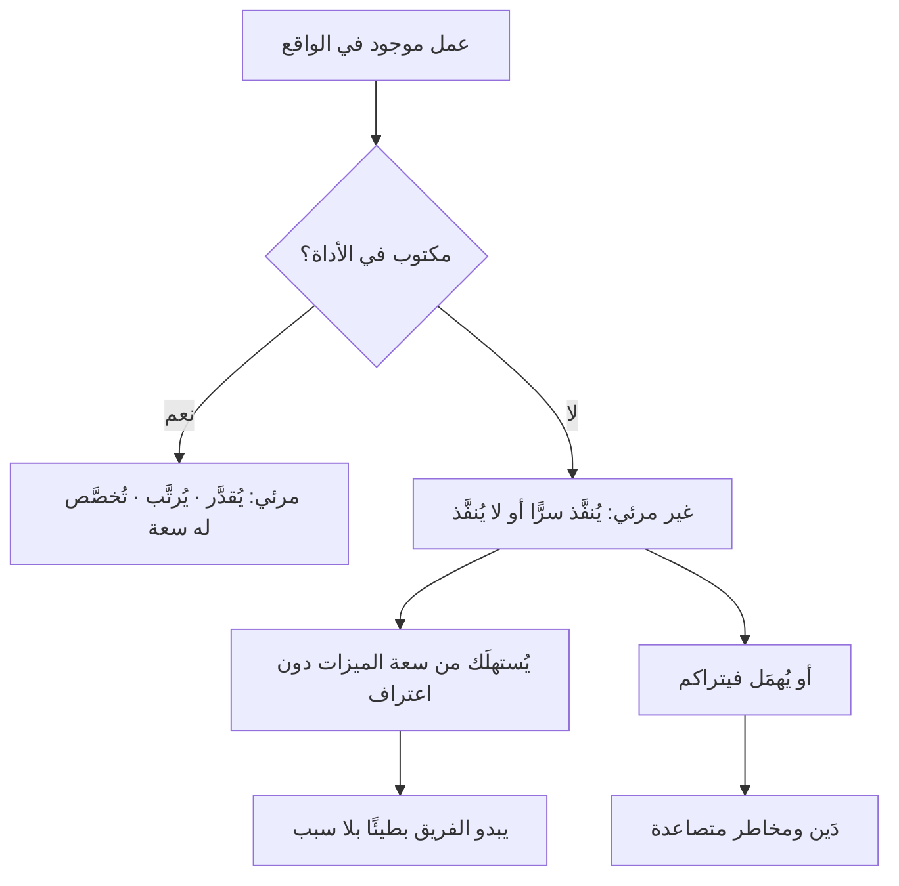

> [!info] الفصل 05 · كورس الإنتاجية
> **ماذا ستتعلّم:** العناصر الأربعة التي يجب أن يتكوّن منها **كلّ باك-لوغ في العالم** — ميزات، عيوب، مخاطر، دَين تقني — بحدودها الدقيقة وحالاتها الحدّية التي يختلف عليها الناس يوميًّا. ستفهم **قانون المقايضة الصفرية** ولماذا لا وجود لعبارة «اعصر نفسك»، وكيف تُخطّط لشيء «غير متوقّع» كالعيوب دون أن تكذب على نفسك — وهو أعمق سؤال طُرِح في المحاضرة. وستتعلّم رياضيات **السعة** حسابًا لا شعارًا، وكيف تُسجّل الوقت لتحصل على بيانات دون أن تتحوّل إلى مراقب، وما **تجميد الميزات** ومتى يصلح، ولماذا **العمل غير المرئي** هو العدوّ الحقيقي. وستخرج بـ**اتفاق عمل فريق** جاهز للتطبيق يحسم متى يكون الشيء ميزة ومتى يكون عيبًا.

> [!abstract] التأصيل
> **يفترض أنّك تعرف:** [[Technical Debt]]
> **ويُؤصّل لك:** [[Capacity]] · [[Team Working Agreement]] · [[Little's Law]] · [[SLA]]

# الفصل 05 — عناصر التدفّق الأربعة وسعة الفريق

## 🎯 أهداف التعلّم

- تعريف العناصر الأربعة تعريفًا إجرائيًّا، وتحديد ما يدخل في كلٍّ منها وما لا يدخل.
- حسم **الحالات الحدّية** الشائعة (تحسين؟ عيب؟ خطر؟) بقواعد مكتوبة لا باجتهاد لحظي.
- شرح **قانون المقايضة الصفرية** وإثبات أنّ إهمال أيّ عنصر ضريبة تُدفَع من الثلاثة الآخرين.
- حساب **السعة الفعلية** لفريق حسابًا واقعيًّا يشمل الإجازات والاجتماعات والاحتياطي.
- بناء **خطّة للعيوب** من بيانات تاريخية، والردّ على اعتراض «لا يمكن التخطيط لغير المتوقّع».
- تصميم نظام **تسجيل وقت** يُنتج بيانات دون أن يُنتج خوفًا، مع ضمانات صريحة.
- تطبيق **تجميد الميزات** وتحديد متى يكون علاجًا ومتى يكون مسكّنًا.
- تحويل **العمل غير المرئي** (الدَّين والمخاطر) إلى بنود مرئية قابلة للتقدير.
- كتابة **اتفاق عمل فريق** كامل يحسم التصنيف والحدود والتصعيد.
- عرض **الحجّة المضادّة**: متى تكون النسب الصارمة عبئًا، وحدود التخطيط للعيوب.

---

## الفكرة المحورية: السعة 100% دائمًا — السؤال هو من ماذا تتكوّن

> [!quote] من المحاضرة
> **حمزة:** «**سعة الفريق 100%، ويُفترض أن تتكوّن هذه المئة بالمئة من أربعة أشياء — ميزات، عيوب، مخاطر، دَين تقني.**»
>
> **حمزة:** «ولا وجود لشيء اسمه *«اعصر نفسك»*. إنّه **كوب ماء** ممتلئ إلى الحافّة أصلًا: صُبّ فيه المزيد **ينسكب**، لأنّ له سعة.»

الفكرة تبدو بديهية وهي ليست كذلك، لأنّ معظم المؤسّسات تتصرّف كأنّ السعة **مطّاطة**. وحقيقة الأمر أنّ السعة **ثابتة**، وأنّ كلّ ما نفعله هو **توزيعها** — بوعي أو بلا وعي.

$$\text{الميزات} + \text{العيوب} + \text{المخاطر} + \text{الدَّين التقني} = 100\%$$

ونتيجة هذه المعادلة أنّ **الخيار ليس بين توزيع وعدم توزيع**، بل بين **توزيع معلن** و**توزيع يحدث من وراء ظهرك**. فالفريق الذي خُطّط له 100% ميزات ثمّ صرف 30% على عيوب الإنتاج **لم يعمل 130%**؛ إنّه سلّم 70% من الميزات فقط، لكنّه سلّمها **بلا اعتراف بذلك** — فبدا مقصّرًا وهو منضبط.

> [!tip] الجملة التي تختصر الفصل
> **لا يُسأل الفريق «هل ستعمل على الدَّين التقني؟» بل «كم من سعته سيصرف عليه؟»** — لأنّ الجواب الأوّل قد يكون «لا»، والثاني لا يمكن أن يكون صفرًا في نظام يعمل فعلًا.

---

## أولًا: العناصر الأربعة — التعريف والحدود

> [!quote] من المحاضرة
> **حمزة:** «**كلّ باك-لوغ في العالم ينبغي أن يتكوّن من هذه الأربعة.** لكنّ معظم الباك-لوغات التي نراها في المنتجات **ميزات فقط**.»

### 1) الميزات (`Features`)

**التعريف:** عمل يُنشئ **قدرة جديدة** يراها المستخدم أو يستفيد منها العمل.

**ما يدخل:** وظيفة جديدة، تحسين ملموس على وظيفة قائمة يغيّر ما يستطيع المستخدم فعله، تكامل جديد.
**ما لا يدخل:** إصلاح سلوك كان يُفترض أن يعمل (عيب)، وتحسين داخلي لا يظهر للمستخدم (دَين تقني).

### 2) العيوب (`Defects`)

> [!quote] من المحاضرة
> **حمزة:** «**العيوب** هنا **ليست** الأخطاء التي تُرفَع داخل السبرنت على ميزة قيد البناء. **العيوب هنا هي القادمة من بيئة الإنتاج.**»

هذا التحديد بالغ الأهمّية وكثيرًا ما يُهمَل. والسبب منطقي:

| نوع الخطأ | أين يقع | كيف يُحتسَب |
|---|---|---|
| **خطأ داخل السبرنت** | على ميزة قيد البناء لم تُسلَّم بعد | **جزء من تكلفة بناء الميزة** — لا يُحتسَب عنصرًا مستقلًّا |
| **عيب من الإنتاج** | على شيء سُلِّم وأُعلن منتهيًا | **عنصر مستقلّ** يستهلك سعة مخصّصة |

**لماذا الفرق؟** لأنّ الأوّل جزء من عمل لم يُنجَز بعد؛ احتسابه مرّتين يُضخّم الأرقام. أمّا الثاني فهو **عمل جديد لم يكن في الخطّة** — وهو ما يجب أن نُخصّص له سعة.

> [!info] تعريف العيب — القاعدة الحاسمة من المحاضرة
> **حمزة:** «**العيب** يعني وجود **استثناء**، أو **وظيفة لا تعمل**، أو **أخطاء إملائية**، أو **أخطاء تصميم**، أو **معايير قبول لم تتحقّق**… **وما خرج عن هذه فليس عيبًا.**»
>
> وهذه أوضح صياغة عملية للحدّ الفاصل: **العيب انحراف عن سلوك مُتّفق عليه سلفًا.** فإن لم يكن السلوك متّفقًا عليه سلفًا، فما تطلبه **ميزة** مهما بدا بديهيًّا.

### 3) المخاطر (`Risks`)

**التعريف:** عمل يُنفَّذ لمنع حدث محتمل من التحقّق، أو لتقليل أثره إن تحقّق.

**ما يدخل:** إغلاق ثغرة أمنية معروفة، الامتثال لمتطلّب تنظيمي قبل تاريخ نفاذه، ترقية مكتبة انتهى دعمها، بناء آلية تراجع، اختبار تحمّل قبل موسم ذروة، إزالة نقطة فشل وحيدة.

> [!quote] من المحاضرة
> **حمزة:** «**المخاطر.** هي **المخاطر التقنية** التي يُفترض أن نحلّها *قبل* أن تتحقّق… **حين يوجد خطر بعينه، عليك أن تعطيه أولويّته ولا تهمله.**»

> [!warning] الفرق بين الخطر والمشكلة — وثمنه
> **الخطر** حدث **محتمل**. و**المشكلة (`Issue`)** حدث **وقع**. والانتقال بينهما ليس تغييرًا في التسمية بل **قفزة في التكلفة**:
>
> | | قبل التحقّق (خطر) | بعد التحقّق (مشكلة) |
> |---|---|---|
> | **الكلفة** | كلفة العمل الوقائي فقط | العمل + الغرامة + الضرر السمعي + التعطيل |
> | **الجدولة** | مخطَّطة | عاجلة تُفسد الخطّة |
> | **الخيارات** | متعدّدة | محدودة |
> | **الحالة النفسية** | هادئة | أزمة |
>
> وقصّة التذييل في المحاضرة الثانية هي التجسيد الحرفي: بند كان خطرًا كلفته دقائق، فصار مشكلة كلفتها خمسة آلاف ريال.

### 4) الدَّين التقني (`Technical Debt`)

**التعريف:** عمل لا يراه المستخدم، ويُخفّض **كلفة التغيير المستقبلية** أو **يرفع استقرار النظام**.

**ما يدخل:** إعادة هيكلة، رفع تغطية الاختبارات، أتمتة النشر، تفكيك مكوّن متضخّم، توحيد نماذج بيانات، حذف كود ميت، تحديث منصّة.

### جدول الحسم للحالات الحدّية

هذا الجدول هو ما ينبغي أن يُلصَق في اتفاق عمل الفريق، لأنّه يحسم النزاعات اليومية التي أثارها أحمد في المحاضرة:

| الحالة | التصنيف | القاعدة |
|---|---|---|
| «الشاشة بطيئة جدًّا» ولم يُحدَّد سقف زمني سلفًا | **ميزة** (متطلّب أداء جديد) | لا معيار قبول ⇒ ليس انحرافًا |
| «الشاشة تستغرق 8 ثوانٍ» ومعيار القبول ≤ 2 ثانية | **عيب** | انحراف عن معيار متّفق عليه |
| «نريد زرًّا يفتح التقرير مباشرةً» | **ميزة** | قدرة جديدة |
| «الزرّ موجود ولا يعمل في المتصفّح X» | **عيب** | وظيفة لا تعمل |
| «الكود مكرّر في خمسة أماكن» | **دَين تقني** | لا يراه المستخدم، يرفع كلفة التغيير |
| «المكتبة انتهى دعمها الأمني» | **خطر** | حدث محتمل بأثر مرتفع |
| «انتهى دعمها ونحن مخترَقون بالفعل» | **مشكلة** ⇒ تُعالَج كعيب حرج | تحقّق الخطر |
| «متطلّب تنظيمي ينفذ بعد 90 يومًا» | **خطر** | له تاريخ ولا يُرتَّب بالقيمة |
| «طلب العميل شيئًا لم يُذكر في التحليل» | **ميزة** | لا يوجد اتفاق سابق يُنتهَك |
| «التحليل ذكره وسقط أثناء التنفيذ» | **عيب** | انحراف عن نطاق متّفق عليه |
| «النشر يدوي ويستغرق 3 ساعات» | **دَين تقني** | يرفع كلفة كلّ تغيير |
| «لا توجد نسخ احتياطية مختبَرة» | **خطر** | احتمال ضياع بيانات |

> [!tip] القاعدة الذهبية عند الخلاف
> **إن أخذ النقاش أكثر من دقيقتين، فالمشكلة في القاعدة لا في البند.** صنّفه مؤقّتًا، وأضِف الحالة إلى اتفاق العمل في الاستعادة القادمة. **لا تُدِر نقاشًا فلسفيًّا في اجتماع تخطيط.**

---

## ثانيًا: قانون المقايضة الصفرية

> [!quote] من المحاضرة
> **حمزة:** «*«اعصر نفسك»* تعني أنّي إن عصرتُ نفسي لأشحن ميزة، فأنا **آخذها من الثلاثة الأخرى**: اعصر **العيوب** فتتضرّر **سمعة المنتج**. اعصر **الدَّين التقني** فتتضرّر **سرعة بناء الميزات**. اعصر **المخاطر** فتتحوّل إلى **مشكلات** — أعلى تكلفةً، وتحمل **غرامات** أعلى.»

### مصفوفة الأثر — ماذا يحدث بالضبط عند إهمال كلّ عنصر

| العنصر المُهمَل | الأثر قصير المدى | الأثر متوسّط المدى | الأثر بعيد المدى | المقياس الذي يكشفه |
|---|---|---|---|---|
| **الميزات** | تباطؤ نموّ | فقدان حصّة سوق | خروج من المنافسة | تبنّي المستخدمين |
| **العيوب** | شكاوى | تآكل الثقة وارتفاع كلفة الدعم | فقدان عملاء | العيوب الهاربة · معدّل الاحتفاظ |
| **الدَّين التقني** | لا شيء ظاهر | بطء تدريجي في كلّ ميزة | «كود لا يُمَسّ» | انحدار زمن التدفّق |
| **المخاطر** | لا شيء ظاهر | حوادث متفرّقة | غرامة أو انقطاع كبير | عدد الحوادث · تنبيهات الامتثال |

> [!warning] لاحظ العمود الثاني في الصفّين الأخيرين
> **الدَّين والمخاطر لا يُنتجان أثرًا قصير المدى إطلاقًا.** وهذا بالضبط سبب إهمالهما: النظام الإداري يستجيب لما يُؤلِم الآن، وهما لا يؤلمان الآن. وهذه ليست حماقة إدارية بل **انحياز الحاضر** (`Present Bias`) — الميل البشري الموثّق إلى تفضيل مكسب فوري صغير على مكسب مؤجّل أكبر. والعلاج ليس الوعظ بل **جعل الأثر المؤجّل مرئيًّا الآن** — وهو بالضبط ما تفعله مقاييس التدفّق حين تُظهر انحدار زمن الميزة ربعًا بعد ربع.

### إثبات القانون بمثال رقمي

فريق من 5 مطوّرين، سبرنت أسبوعين، سعة صافية 300 ساعة.

**السيناريو أ — «كلّها ميزات»:**
- خُطِّط: 300 ساعة ميزات.
- الواقع: وصلت عيوب إنتاج استهلكت 70 ساعة (لم تُخطَّط).
- المُسلَّم: 230 ساعة ميزات = **77% من الالتزام**.
- الظاهر للإدارة: **الفريق أخفق**.
- الأثر الجانبي: صفر ساعة للدَّين ⇒ السبرنت القادم أبطأ.

**السيناريو ب — «توزيع معلن»:**
- خُطِّط: 180 ميزات (60%) · 60 عيوب (20%) · 45 دَين (15%) · 15 مخاطر (5%).
- الواقع: العيوب استهلكت 70 (تجاوز 10 ساعات فقط، امتُصّ من الدَّين).
- المُسلَّم: 180 ساعة ميزات = **100% من الالتزام**.
- الظاهر للإدارة: **الفريق التزم بالكامل**.
- الأثر الجانبي: 35 ساعة دَين أُنجزت ⇒ السبرنت القادم أسرع قليلًا.

> [!tip] النتيجة المدهشة
> **الفريق في السيناريو (ب) سلّم ميزات أقلّ (180 مقابل 230) ومع ذلك يبدو أنجح.** وهذا ليس تلاعبًا؛ إنّه الفرق بين **وعد يُوفى به** ووعد يُخلَف. وقابلية التنبّؤ **أثمن للأعمال من الحجم**، لأنّ الأعمال تبني عليها التزاماتها الخارجية: حملات تسويقية، وعقود عملاء، ومواعيد إطلاق. والفريق الذي يسلّم أقلّ بانتظام أنفع من فريق يسلّم أكثر بعشوائية.

---

## ثالثًا: حساب السعة حسابًا صادقًا

معظم الفرق تُخطّط على سعة **اسمية** لا **فعلية**، ثمّ تتعجّب من الانحراف.

### حساب السعة الصافية — خطوة بخطوة

| البند | مثال (فريق 5، سبرنتان أسبوعان) |
|---|---|
| السعة الاسمية (5 × 10 أيام × 6 ساعات منتجة) | 300 ساعة |
| − إجازات وأعياد | −30 |
| − اجتماعات ثابتة (تخطيط · يومي · مراجعة · استعادة · صقل) | −45 |
| − دعم وطوارئ متكرّرة (بيانات تاريخية) | −25 |
| − احتياطي (10%) | −20 |
| **السعة القابلة للتخطيط** | **180 ساعة** |

> [!warning] ملاحظتان تصحّحان أكثر خطأين شيوعًا
> **الأولى: اليوم ليس ثماني ساعات منتجة.** الرقم الواقعي في العمل المعرفي يقع بين 5 و6 ساعات تركيز فعلي. والتخطيط على ثماني ساعات يضمن انحرافًا بنسبة 25% قبل أن يبدأ العمل.
> **الثانية: الاحتياطي ليس رفاهية.** ذكّر نفسك بعلاقة الطوابير من [[01 - من المشروع إلى المنتج|الفصل الأول]]: التخطيط على 100% من السعة يُنتج طوابير أسّية عند أوّل مفاجأة.

> [!info] إضافة مرجعية — لماذا يفضّل إطار التدفّق عدّ العناصر على الساعات
> استخدمنا الساعات هنا للتوضيح، لكنّ المحاضرة تنصّ على العمل بـ**عدد العناصر**:
>
> **حمزة:** «لماذا قلتُ *عدد عناصر عمل* لا نقاط قصة؟ لأنّ **نقاط القصة، للأسف، أُسيء استخدامها**… فبسّطنا الأمر: هناك **عناصر** تدخل السبرنت، ونحتاج أن نعرف **كم عنصرًا نُنهي**.»
>
> والأساس النظري لهذا التبسيط هو **قانون ليتل**:
> $$L = \lambda \times W$$
> حيث $L$ متوسّط عدد العناصر في النظام، و$\lambda$ معدّل الإنجاز، و$W$ متوسّط زمن العنصر. وينتج عنه:
> $$\text{زمن التدفّق} = \frac{\text{العمل قيد التنفيذ}}{\text{معدّل الإنجاز}}$$
>
> وقيمة هذه المعادلة أنّها **لا تحتاج تقديرًا إطلاقًا** — تحتاج عدّ عناصر فقط. ولهذا يمكن لفريق لا يُتقن التقدير أن يبدأ استخدام مقاييس التدفّق **اليوم**. وشرطها الوحيد **تجانس معقول في أحجام العناصر**، وهو ما تحقّقه ممارسة التجزئة.

---

## رابعًا: التخطيط للعيوب — الردّ على أعمق اعتراض في المحاضرة

> [!quote] من المحاضرة
> **أحمد:** «**لستُ مقتنعًا بأنّي أستطيع بناء خطّة للعيوب**… فالعيوب والأخطاء بطبيعتها **غير متوقّعة**، ومن ثمّ **يصعب جدًّا التخطيط لها**.»
>
> **حمزة:** «إن كانت تصل… ثلاثة أو أربعة عيوب عادةً، وكانت تُحَلّ عادةً في متوسّط **عشر ساعات**، فنحن ندخل الخطّة التالية وفيها **عشر ساعات حرّة**… **أرقام يا أحمد. لغة أرقام تقود الخطّة.**»

الاعتراض ممتاز والإجابة صحيحة، وتستحقّ تعميقًا لأنّها تقوم على تمييز إحصائي أساسي.

### التمييز الجوهري: العنصر الفردي مقابل التجميع

**لا يمكنك التنبّؤ بالعيب القادم.** لكنّك **تستطيع التنبّؤ بمعدّل العيوب** — تمامًا كما لا تستطيع شركة تأمين معرفة من سيتعرّض لحادث، ومع ذلك تُسعّر بدقّة تكفي للربح.

| | العنصر الفردي | التجميع |
|---|---|---|
| **قابل للتنبّؤ؟** | لا | نعم بحدود |
| **ما تقيسه** | متى يقع هذا العيب | كم عيبًا شهريًّا وكم يستهلك |
| **الأداة** | لا شيء | متوسّط + مئين + مدى |
| **ما تُخطّط له** | لا شيء | **سعة**، لا مهامّ محدّدة |

### كيف تبني الخطّة عمليًّا — بالمئينات لا بالمتوسّط

> [!warning] لماذا لا يكفي المتوسّط؟
> توزيع أزمنة إصلاح العيوب **ملتوٍ بشدّة نحو اليمين**: معظمها قصير وقليل منها طويل جدًّا. والتخطيط على المتوسّط يعني تجاوز الخطّة في نحو نصف السبرنتات. استخدم **المئين 85** بدلًا منه.

**الخطوات:**
1. اجمع بيانات آخر 6–10 سبرنتات: عدد عيوب الإنتاج وزمنها.
2. احسب: المتوسّط · المئين 50 · المئين 85 · الأقصى.
3. خصّص سعة تعادل **المئين 85**.
4. راجع كلّ ربع وعدّل.

**مثال:**

| السبرنت | عدد العيوب | الساعات |
|---|---|---|
| 1 | 4 | 12 |
| 2 | 2 | 6 |
| 3 | 7 | 26 |
| 4 | 3 | 9 |
| 5 | 5 | 14 |
| 6 | 3 | 11 |

المتوسّط ≈ 13 ساعة · المئين 85 ≈ 22 ساعة.
**القرار:** خصّص 22 ساعة (نحو 12% من سعة 180). وفي السبرنتات التي لا تستهلكها بالكامل — والأرجح أن تكون الأغلبية — **الفائض يذهب إلى الدَّين التقني**، لا إلى ميزات إضافية.

> [!tip] هذه القاعدة الأخيرة هي جوهر الانضباط
> **الفائض من سعة العيوب يذهب إلى الدَّين التقني، لا إلى ميزات.** لأنّه إن ذهب إلى الميزات فقد أنشأتَ حافزًا لسحب سعة العيوب في كلّ مرّة — وعُدنا إلى نقطة الصفر بأسلوب أنيق.

### ماذا عن اتفاقيات مستوى الخدمة؟

اعتراض أحمد تضمّن نقطة `SLA` وقد أُجّلت في الجلسة. وإليك المعالجة:

| مستوى الخطورة | مثال `SLA` | كيف يُدار داخل السعة |
|---|---|---|
| **حرج** (توقّف خدمة) | 4 ساعات | **مناوبة**، خارج سعة السبرنت أصلًا |
| **مرتفع** | يوم عمل | من سعة العيوب المخصّصة |
| **متوسّط** | 5 أيام | يدخل السبرنت التالي بأولوية |
| **منخفض** | 30 يومًا | يُرتَّب مع بقيّة الباك-لوغ |

> [!warning] القاعدة الحاسمة
> **الحالات الحرجة لا تُخطَّط داخل السبرنت؛ تُدار بمناوبة.** لأنّ عنصرًا يجب أن يُستجاب له خلال 4 ساعات لا يتوافق مع أيّ تخطيط مسبق. وترتيب المناوبة (شخص واحد بالتناوب، وسعته مخصومة سلفًا من سعة السبرنت) يعزل الاضطراب عن بقيّة الفريق. وهذه معالجة أفضل من نموذج «مطوّرون مخصّصون دائمًا للعيوب» الذي انتقدته المحاضرة بحقّ:
>
> **حمزة:** «هناك شركات… تُخصّص مطوّرين يجلسون **حصريًّا** على عيوب الإنتاج. وأنا لا أحبّ هذا النهج، لأنّه من الممكن تمامًا **ألّا تظهر عيوب إنتاج إطلاقًا**.»

---

## خامسًا: تسجيل الوقت — بيانات لا مراقبة

> [!quote] من المحاضرة
> **حمزة:** «نحن **نُسجّل للحصول على بيانات**. لا نُسجّل لنقول لأحدهم *أنت عملتَ ثماني ساعات لا ستًّا*. **نُسجّل للحصول على بيانات.**»

النيّة صحيحة، والنيّة وحدها لا تكفي — لأنّ الفريق سيحكم على النظام بما **يُمكن** أن يُستخدَم فيه، لا بما تنوي. وإليك ما يجعل الوعد قابلًا للتصديق:

### ضمانات تجعل التسجيل آمنًا

| الضمانة | الصياغة العملية |
|---|---|
| **التجميع لا التفصيل** | تُقرأ الأرقام على مستوى الفريق فقط؛ لا تُستخرَج تقارير فردية |
| **الغرض معلن كتابةً** | «نُسجّل لتقدير سعة العيوب، ولا يُستخدَم في تقييم الأداء» |
| **دقّة منخفضة كافية** | تسجيل بنصف اليوم يكفي؛ لا حاجة لدقّة الدقائق |
| **الفريق يملك البيانات** | يراها الفريق أوّلًا ويقرّر ما يُرفَع |
| **مراجعة الفائدة** | إن لم تُنتج قرارًا خلال ربع، أوقفها |

> [!warning] أسرع طريقة لإفساد النظام
> أن يُذكر رقم فرد واحد مرّة واحدة في اجتماع تقييم. **مرّة واحدة كافية** لتحويل البيانات إلى أرقام مُجمَّلة إلى الأبد. وهذا تطبيق مباشر لقانون كامبل من [[01 - من المشروع إلى المنتج|الفصل الأول]].

### بديل أخفّ إن كان التسجيل مرفوضًا ثقافيًّا

إن كانت مقاومة التسجيل شديدة، استخدم **عدّ العناصر** بدل الساعات:
- عدد عيوب الإنتاج التي أُغلِقت في السبرنت.
- عدد الأيّام التي دخل فيها عيب إنتاج إلى العمل.

الدقّة أقلّ، والفائدة كافية لتقدير حصّة معقولة. **وبيانات تقريبية متاحة خير من بيانات دقيقة مرفوضة.**

---

## سادسًا: تجميد الميزات واليوم غير المخطَّط

> [!quote] من المحاضرة
> **حمزة:** «يُفترض أن يكون لديك شيء اسمه **تجميد الميزات**: في **آخر يومين أو ثلاثة من السبرنت** نوقف كلّ العمل على الميزات ونجلس لحلّ العيوب… فيكون لدينا **يوم حرّ لا يخطّط عليه أحد**.»

### متى يكون علاجًا ومتى يكون مسكّنًا؟

| الحالة | تجميد الميزات… |
|---|---|
| العيوب تتراكم في آخر السبرنت | **مسكّن** — العلة أنّ العمل يُغلَق متأخّرًا (حِمل تدفّق مرتفع) |
| دورة إصدار طويلة تحتاج تثبيتًا | **علاج معقول** مؤقّتًا |
| تكامل مع أطراف خارجية قبل الإطلاق | **علاج** |
| النشر يدوي ومخيف | **مسكّن** — العلاج أتمتة النشر |

> [!warning] التشخيص الأدقّ
> إن كنتَ تحتاج يومين تجميد **كلّ سبرنت**، فمشكلتك ليست في العيوب بل في **نمط الإغلاق المتأخّر** — أي أنّ الأعمال كلّها تصل الاختبار في آخر ثلاثة أيّام. وهذه بالضبط الملاحظة التي قدّمها مهندس ضمان الجودة في المحاضرة الثانية حين تحدّث عن أنّ التجزئة تجعل الأشياء «تصل إلى الجودة تدريجيًّا فتكون المخطّطات صحيحة».
>
> **العلاج الجذري:** تقليل حِمل التدفّق وتجزئة العناصر، لا تخصيص يومين ترقيع. والتجميد حينئذٍ يُخفي العَرَض ويؤخّر التشخيص.

---

## سابعًا: العمل المرئي والعمل غير المرئي

> [!quote] من المحاضرة
> **حمزة:** «**المرئي:** **ميزات** و**عيوب**. **غير المرئي:** **دَين تقني** و**مخاطر**… **وما دام الدَّين التقني والخطر غير مكتوبين وغير موضوعين في الباك-لوغ، فلا قيمة لهما إطلاقًا.**»

هذه واحدة من أقوى الجمل في الكورس، وسبب قوّتها أنّها تنقل المسؤولية إلى الطرف الصحيح: **الفريق التقني نفسه**. فالإدارة لا تستطيع تخصيص سعة لشيء غير موجود في نظامها.

### أربع طرق لجعل العمل غير المرئي مرئيًّا

| الطريقة | كيف | متى تصلح |
|---|---|---|
| **بند دَين مع كلّ ميزة** | كلّ ميزة تُنتج دَينًا مقصودًا ⇒ بند مرافق | أثناء الضغط للوصول إلى السوق |
| **جلسة جرد ربعية** | ساعتان، كلّ مطوّر يكتب أكبر ثلاث نقاط ألم | بداية أيّ تحوّل |
| **سجلّ مخاطر حيّ** | جدول: الخطر · الاحتمال · الأثر · التاريخ · المالك | دائمًا |
| **قاعدة الكشّافة** | تحسين صغير مرافق لكلّ تغيير، بلا بند منفصل | للدَّين الصغير المنتشر |

> [!tip] ابدأ بأسهلها
> **جلسة الجرد الربعية.** ساعتان تُنتج عادةً 15–30 بندًا يمثّل معظم الألم الفعلي في النظام. وأهمّ ما فيها أنّها **جماعية** — فالمطوّر الذي يتردّد في كتابة بند بمفرده يكتبه بسهولة حين يكتب الجميع.

---

## ثامنًا: اتفاق عمل الفريق — نموذج جاهز

> [!quote] من المحاضرة
> **حمزة:** «وهذا ما نسمّيه **اتفاق عمل الفريق**. ضعها في اتفاق العمل: **متى نسمّي الشيء ميزة أو تحسينًا، ومتى نسمّيه عيبًا.** إنّه شيء نتّفق عليه معًا.»

> [!example] نموذج اتفاق عمل — انسخه وعدّله
> **أولًا: التصنيف**
> 1. العيب انحراف عن سلوك متّفق عليه سلفًا في معايير القبول أو الوثائق.
> 2. ما لم يُتّفق عليه سلفًا **ميزة**، مهما بدا بديهيًّا.
> 3. الأخطاء المكتشَفة داخل السبرنت على ميزة قيد البناء **جزء من تكلفتها**، لا عناصر مستقلّة.
> 4. عند الخلاف: يُصنَّف مؤقّتًا بقرار مالك المنتج، وتُعرَض الحالة في الاستعادة لإضافة قاعدة.
>
> **ثانيًا: السعة والتوزيع**
> 5. توزيع السعة يُقرَّر قبل بداية كلّ ربع بحسب مرحلة المنتج وأهداف الربع.
> 6. سعة العيوب مبنيّة على المئين 85 لآخر ستّة سبرنتات، وتُراجَع ربعيًّا.
> 7. الفائض من سعة العيوب يذهب إلى **الدَّين التقني**، لا إلى ميزات إضافية.
> 8. لا يدخل عمل جديد داخل السبرنت الجاري إلّا لحالة إنتاج حرجة معرَّفة أدناه.
>
> **ثالثًا: العمل غير المرئي**
> 9. كلّ دَين تقني يُكتَشف يُكتَب بندًا خلال 48 ساعة، ولو بجملة واحدة.
> 10. كلّ خطر يُكتَشف يُسجَّل في سجلّ المخاطر بتاريخ ومالك.
> 11. كتابة الدَّين **لا تُقرَأ اعترافًا بتقصير** — وهذه القاعدة ملزمة للجميع بما فيهم القيادة التقنية.
>
> **رابعًا: الحالات الحرجة والتصعيد**
> 12. الحالة الحرجة = توقّف خدمة، أو فقدان بيانات، أو ثغرة أمنية نشِطة، أو خرق تنظيمي نافذ. وما عداها ليس حرجًا.
> 13. تُدار الحالات الحرجة بمناوبة، وسعة المناوب مخصومة سلفًا.
> 14. أيّ إدخال عمل داخل السبرنت يستلزم **إخراج بند مكافئ** بقرار معلن.
>
> **خامسًا: الجودة**
> 15. تعريف الإنجاز غير قابل للاختراق تحت ضغط الوقت؛ والمقايضة تكون في **عدد البنود** لا في **معايير الإنجاز**.
> 16. البند الذي لا يستوفي تعريف الجاهزية لا يدخل التخطيط.
>
> **مراجعة الاتفاق:** كلّ ربع، أو عند تكرار الحالة نفسها ثلاث مرّات.

> [!warning] البند 15 هو أثمن ما في الاتفاق
> لأنّه **يحمي الجودة الداخلية من أن تكون المتغيّر الصامت** الذي شرحناه في [[02 - المثلث الحديدي وانقلابه|الفصل الثاني]]. وبدونه سيبقى الضلع الرابع المخفيّ هو ما يمتصّ كلّ ضغط.

---

## تاسعًا: القراءة النقدية — حدود هذا الإطار

**1. النسب الصارمة قد تصير طقسًا.** فريق يرفض إصلاح عيب حرج لأنّ «سعة العيوب انتهت هذا السبرنت» طبّق الحرف وخالف الغرض. النسب **دليل إرشادي للتخطيط**، لا قانون تشغيلي أثناء التنفيذ.

**2. الفرق الصغيرة جدًّا لا تحتمل التقسيم الرباعي.** فريق من ثلاثة يعمل على منتج جديد: تقسيم سعته أربع مرّات يُنتج شرائح لا معنى لها. **ابدأ بقسمين** (ميزات · كلّ ما عداها) ثم فصّل مع النموّ.

**3. التصنيف نفسه يستهلك وقتًا.** والمؤسّسة التي تُنشئ سبعة أنواع عناصر وثلاث مصفوفات خطورة **استبدلت مشكلة بمشكلة**. القاعدة: **أربعة أنواع فقط**، والحالات الحدّية تُحسَم بالقاعدة لا بالنقاش.

**4. التخطيط للعيوب يفترض استقرارًا إحصائيًّا.** بيانات ستّة سبرنتات لا تعني شيئًا إن تغيّر النظام جذريًّا بينها (إطلاق ضخم، تغيّر قاعدة مستخدمين، ترحيل منصّة). **بعد أيّ تغيّر جذري، أعِد بناء القاعدة الإحصائية من الصفر** ولا تستخدم بيانات ما قبله.

**5. وحدّ أخير مهمّ:** التوزيع الرباعي يُدير **كيف تُصرَف السعة**، ولا يقول شيئًا عن **هل تستحقّ الميزات المختارة أصلًا**. فمن الممكن تمامًا أن تبلغ توزيعًا مثاليًّا وأنت تبني منتجًا لا يريده أحد. وهذا يحتاج **اكتشافًا** ومقاييس أثر — خارج نطاق هذا الإطار.

---

## عاشرًا: التطبيق — من الصفر إلى توزيع معلن في أربعة أسابيع

| الأسبوع | العمل | المُخرَج |
|---|---|---|
| **1** | إنشاء أنواع العناصر الأربعة في الأداة · تصنيف أعلى 40 بندًا في الباك-لوغ | نسبة توزيع **الباك-لوغ** الحالية |
| **2** | استخراج بيانات آخر 6 سبرنتات: كم صُرِف فعلًا على كلّ نوع | نسبة توزيع **الفعلي** — وغالبًا ستُفاجئك |
| **3** | جلسة جرد دَين تقني (ساعتان) + بناء سجلّ مخاطر | 15–30 بندًا مرئيًّا |
| **4** | كتابة اتفاق العمل + اقتراح توزيع الربع القادم + عرضه | التزام مكتوب من الطرفين |

> [!tip] الرقم الذي يفتح كلّ الأبواب
> **الفجوة بين توزيع الباك-لوغ (أسبوع 1) والتوزيع الفعلي (أسبوع 2).** إن كان الباك-لوغ 95% ميزات والواقع 60% ميزات و30% عيوب، فقد أثبتَّ بالأرقام أنّ **الفريق يعمل بالفعل على العيوب دون اعتراف**. وهذه هي الحجّة الأقوى على الإطلاق أمام الإدارة، لأنّها لا تطلب سعة جديدة — تطلب **الاعتراف بسعة تُصرَف بالفعل**. والفرق بين الطلبين هو الفرق بين نقاش سهل ونقاش مستحيل.

---

## 🧾 خلاصة الفصل

1. **السعة 100% دائمًا**؛ والخيار بين توزيع **معلن** وتوزيع يحدث من وراء ظهرك.
2. **العناصر الأربعة**: ميزات · عيوب (من الإنتاج فقط) · مخاطر · دَين تقني.
3. **العيب انحراف عن سلوك متّفق عليه سلفًا**؛ وما لم يُتّفق عليه ميزة.
4. **الخطر ليس مشكلة**؛ والانتقال بينهما قفزة في التكلفة لا تغيير تسمية.
5. **قانون المقايضة الصفرية**: إهمال عنصر ضريبة تُدفَع من الثلاثة الآخرين.
6. **الدَّين والمخاطر لا يؤلمان الآن** — وهذا سبب إهمالهما؛ والعلاج جعل أثرهما المؤجّل مرئيًّا اليوم.
7. **الفريق ذو التوزيع المعلن** يُسلّم ميزات أقلّ ويبدو أنجح، لأنّ قابلية التنبّؤ أثمن من الحجم.
8. **السعة الفعلية** أقلّ بكثير من الاسمية؛ واليوم 5–6 ساعات منتجة لا ثماني.
9. **قانون ليتل** يجعل مقاييس التدفّق ممكنة بلا تقدير — بعدّ العناصر فقط.
10. **التخطيط للعيوب ممكن بالتجميع** لا بالعنصر الفردي، وبـ**المئين 85** لا بالمتوسّط.
11. **الحالات الحرجة تُدار بمناوبة**، لا داخل تخطيط السبرنت.
12. **تسجيل الوقت** يحتاج ضمانات مكتوبة، ومرّة واحدة من سوء الاستخدام تُفسده للأبد.
13. **تجميد الميزات المتكرّر عَرَض** لا علاج؛ العلة في الإغلاق المتأخّر وحِمل التدفّق.
14. **ما لا يُكتَب لا يُخصَّص له سعة** — وهذه مسؤولية الفريق التقني قبل الإدارة.
15. **الحدود:** النسب دليل لا قانون، والإطار يُدير الصرف لا يقرّر الاستحقاق.

---

## ❓ اختبارات ذاتية

> [!question]- 1) مستخدم يشتكي: «الشاشة بطيئة.» ميزة أم عيب؟
> **يعتمد على وجود معيار قبول سابق.** إن كان في معايير القبول «تُحمَّل الشاشة في ثانيتين» وهي تستغرق ثماني ثوانٍ ⇒ **عيب** (انحراف عن اتفاق). وإن لم يُذكر أيّ سقف زمني سلفًا ⇒ **ميزة** (متطلّب أداء جديد). والقاعدة العامّة: **العيب انحراف عن سلوك متّفق عليه سلفًا**؛ وما لم يُتّفق عليه لا يمكن أن يكون انحرافًا مهما بدا بديهيًّا.

> [!question]- 2) كيف تردّ على من يقول «العيوب غير متوقّعة فلا يمكن التخطيط لها»؟
> بالتمييز بين **العنصر الفردي** و**التجميع**: لا يمكن التنبّؤ بالعيب القادم، لكن يمكن التنبّؤ بـ**معدّل العيوب** — تمامًا كما تُسعّر شركات التأمين دون معرفة من سيتعرّض لحادث. عمليًّا: اجمع بيانات 6–10 سبرنتات، واحسب **المئين 85** (لا المتوسّط، لأنّ التوزيع ملتوٍ)، وخصّص سعة تعادله. وأنت لا تخطّط لمهامّ محدّدة بل **لسعة**.

> [!question]- 3) لماذا يكون الفائض من سعة العيوب مخصّصًا للدَّين التقني تحديدًا؟
> لأنّه لو ذهب إلى الميزات لأنشأتَ **حافزًا لسحب سعة العيوب** في كلّ سبرنت — إذ سيكون في مصلحة الجميع تقليصها لزيادة الميزات، فتعود المؤسّسة إلى نقطة الصفر بأسلوب أنيق. وتوجيه الفائض إلى الدَّين يجعل الالتزام بالسعة **محايدًا** بالنسبة لمن يطلب الميزات، فيصمد.

> [!question]- 4) فريقك يحتاج يومَي تجميد ميزات كلّ سبرنت. ما التشخيص الأدقّ؟
> **حِمل تدفّق مرتفع وإغلاق متأخّر**، لا كثرة عيوب. الأعمال كلّها تصل الاختبار في الأيّام الأخيرة لأنّ عناصر كثيرة فُتِحت في وقت واحد ولم يُغلَق شيء مبكّرًا. والتجميد يعالج العَرَض ويؤخّر التشخيص. **العلاج الجذري:** خفض حدّ العمل قيد التنفيذ وتجزئة العناصر، فيصل العمل إلى الاختبار تدريجيًّا خلال السبرنت.

> [!question]- 5) ما الضمانات التي تجعل تسجيل الوقت مقبولًا لدى الفريق؟
> خمس: (أ) **التجميع لا التفصيل** — تُقرَأ الأرقام على مستوى الفريق ولا تُستخرَج تقارير فردية؛ (ب) **الغرض معلن كتابةً** وينصّ صراحةً على عدم الاستخدام في تقييم الأداء؛ (ج) **دقّة منخفضة كافية** (نصف يوم)؛ (د) **الفريق يملك البيانات** ويراها أوّلًا؛ (هـ) **مراجعة الفائدة** — إن لم تُنتج قرارًا خلال ربع تُوقَف. والأهمّ: **مرّة واحدة** من ذكر رقم فرد في تقييم تكفي لإفساد النظام نهائيًّا.

> [!question]- 6) لماذا يكون فريق سلّم 180 ساعة ميزات «أنجح» من فريق سلّم 230؟
> لأنّ الأوّل **وفى بوعده** والثاني **أخلف** — إذ التزم بـ300 وسلّم 230. وقابلية التنبّؤ أثمن للأعمال من الحجم، لأنّ الأعمال تبني عليها التزامات خارجية: حملات تسويقية، وعقود، ومواعيد إطلاق. والفريق الذي يسلّم أقلّ بانتظام يمكن التخطيط حوله؛ والفريق الذي يسلّم أكثر بعشوائية لا يمكن. أضف إلى ذلك أنّ الثاني صرف صفرًا على الدَّين، فسيكون أبطأ في السبرنت القادم.

> [!question]- 7) كيف تُدار الحالات الحرجة ذات `SLA` بأربع ساعات؟
> **بمناوبة خارج تخطيط السبرنت**، لا داخله. لأنّ عنصرًا يجب أن يُستجاب له خلال أربع ساعات لا يتوافق مع أيّ تخطيط مسبق. ويُخصَم وقت المناوب سلفًا من سعة السبرنت، فيُعزَل الاضطراب عن بقيّة الفريق. وهذا أفضل من نموذج «مطوّرون مخصّصون دائمًا للعيوب» لأنّ المناوبة **دورية ومحدودة** ولا تُهدر سعة حين لا تظهر عيوب.

> [!question]- 8) ما الفجوة التي تفتح باب التفاوض مع الإدارة، ولماذا هي الأقوى؟
> **الفجوة بين توزيع الباك-لوغ وتوزيع الصرف الفعلي.** فإن كان الباك-لوغ 95% ميزات بينما الصرف الفعلي 60% ميزات و30% عيوب، تكون قد أثبتّ بالأرقام أنّ الفريق **يعمل على العيوب بالفعل دون اعتراف**. وقوّتها أنّها **لا تطلب سعة جديدة** — تطلب الاعتراف بسعة تُصرَف فعلًا. والفرق بين «أعطونا 20% إضافية» و«اعترفوا بـ30% تُصرَف بالفعل» هو الفرق بين نقاش مستحيل ونقاش سهل.

---

## 📚 مراجع الفصل

| المرجع | الصلة |
|---|---|
| Mik Kersten — *From Project to Product* | عناصر التدفّق الأربعة وتوزيع السعة |
| John Little — *Little's Law* | العلاقة بين العمل قيد التنفيذ وزمن التدفّق |
| Daniel Vacanti — *Actionable Agile Metrics for Predictability* | استخدام المئينات بدل المتوسّطات في التنبّؤ |
| Donald Reinertsen — *Product Development Flow* | احتياطي السعة واقتصاديات الطوابير |
| Martin Fowler — *Technical Debt Quadrant* | تصنيف الدَّين وأثره على التخطيط |
| المصدر الأساس | [[2.1 عناصر التدفق الأربعة وسعة الفريق]] · [[2.2 التخطيط للعيوب وقياس نجاح السبرنت]] |

---

## 🔗 روابط ذات صلة

**السابق:** [[04 - دوّامة الموت والدَّين التقني]] · **التالي:** [[06 - مقاييس التدفّق الستة]]
**مصدر السجلّ:** [[2.1 عناصر التدفق الأربعة وسعة الفريق]] · [[2.2 التخطيط للعيوب وقياس نجاح السبرنت]]
**مفاهيم:** [[Flow Distribution|توزيع التدفّق]] · [[Capacity|السعة]] · [[Technical Debt|الدَّين التقني]] · [[Team Working Agreement|اتفاق عمل الفريق]] · [[Little's Law|قانون ليتل]] · [[SLA|اتفاقية مستوى الخدمة]] · [[13 - Backlog|الباك-لوغ]] · [[19 - Risk Management|إدارة المخاطر]]
