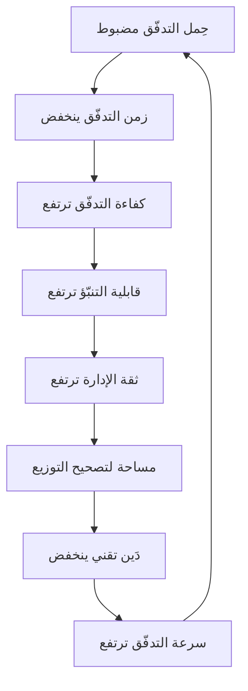

> [!info] الفصل 06 · كورس الإنتاجية
> **ماذا ستتعلّم:** المقاييس الستّة واحدًا واحدًا — **السرعة · التوزيع · الحِمل · الزمن · الكفاءة · قابلية التنبّؤ** — بتعريف دقيق، وصيغة رياضية، ومصدر بيانات، وطريقة حساب خطوة بخطوة، وأمثلة محلولة، ومزالق كلٍّ منها. ستفهم **لماذا ستّة مقاييس معًا ولا يصحّ أخذ واحد منها منفردًا**، وما علاقتها بمقاييس كانبان الكلاسيكية ومقاييس `DORA`، وأين **تُقاس نقطة البداية والنهاية بالضبط** — وهي أكثر تفصيلة تُفسد القياس حين تُهمَل. وستخرج بـ**لوحة قياس** كاملة قابلة للبناء في أيّ أداة إدارة عمل، وبقائمة **الطرق العشر التي تُفسَد بها هذه المقاييس** لتتجنّبها قبل أن تقع فيها.

> [!abstract] التأصيل
> **يفترض أنّك تعرف:** [[Capacity]] · [[Little's Law]]
> **ويُؤصّل لك:** [[Throughput]] · [[Cycle Time]] · [[Lead Time]] · [[Flow Efficiency]] · [[Flow Load]] · [[WIP Limit]]

# الفصل 06 — مقاييس التدفّق الستة

## 🎯 أهداف التعلّم

- تعريف كلّ مقياس من الستّة تعريفًا رياضيًّا دقيقًا وتحديد وحدته ومصدر بياناته.
- تحديد **نقطة البداية ونقطة النهاية** لكلّ مقياس زمني، وشرح أثر تحريكهما على النتيجة.
- حساب المقاييس الستّة يدويًّا من مجموعة بيانات خام.
- شرح **الترابط** بين المقاييس ولماذا لا يصحّ استخدام أيّ منها منفردًا.
- ربط المقاييس بنظائرها في **كانبان** و**`DORA`** وتحديد مواضع التطابق والاختلاف.
- استخدام **المئينات** بدل المتوسّطات، وشرح لماذا يُضلّل المتوسّط في هذه المقاييس تحديدًا.
- بناء **لوحة قياس** بستّة عناصر تصلح للفريق وللإدارة معًا.
- تشخيص **الطرق العشر لإفساد المقاييس** واتّخاذ إجراءات وقائية.
- تحديد **الحدّ الأدنى من البيانات** اللازم للبدء، والبدء بما هو متاح فعلًا.

---

## الفكرة المحورية: نظام واحد لا ستّة أرقام

> [!quote] من المحاضرة
> **حمزة:** «هناك شيء اسمه **مقاييس التدفّق**، وهي **ستة**. ويجب أن نعمل بها **جميعًا معًا**.»
>
> **حمزة:** «**مقاييس التدفّق نظام تدفّق كامل.** لا يمكنك إزالة أيّ جزء منه.»

هذا الإصرار على «جميعًا معًا» ليس تحذيرًا تربويًّا؛ إنّه **ضرورة رياضية**. لأنّ كلّ مقياس منفردًا **قابل للتلاعب به بلا تكلفة**، بينما الستّة معًا يُقيّد بعضها بعضًا:

| المقياس | إن أُخِذ منفردًا يُحسَّن بـ… | والمقياس الذي يفضح ذلك |
|---|---|---|
| **سرعة التدفّق** | تفتيت العناصر مصطنعًا | زمن التدفّق (يرتفع) |
| **زمن التدفّق** | أخذ العناصر الصغيرة فقط | التوزيع (يختلّ) والباك-لوغ (يتضخّم) |
| **كفاءة التدفّق** | البدء متأخّرًا لتقليل زمن الانتظار المحسوب | زمن التدفّق الكلّي (يرتفع) |
| **قابلية التنبّؤ** | الالتزام بأقلّ ممّا نقدر | سرعة التدفّق (تنخفض) |
| **حِمل التدفّق** | إبقاء العمل خارج اللوح | التوزيع وزمن التدفّق |
| **التوزيع** | إعادة تصنيف البنود شكليًّا | العيوب الهاربة (لا تتحرّك) |

> [!warning] القاعدة العملية
> **مؤسّسة تعرض مقياسًا واحدًا تعرض دعاية لا قياسًا.** واشترط على نفسك قبل أن تشترطه على غيرك: كلّ عرض يتضمّن **ثلاثة على الأقلّ** من الستّة.

---

## أوّلًا: قبل المقاييس — تعريف نقاط القياس

هذه أهمّ فقرة في الفصل، لأنّ **معظم القياسات الفاشلة تفشل هنا لا في الحساب**.

### مجرى العمل ونقاط الالتقاط

| النقطة | التعريف | من يملكها |
|---|---|---|
| **`t0` — نشوء الطلب** | لحظة تسجيل الحاجة أوّل مرّة | المجرى الأعلى |
| **`t1` — الالتزام (`Commitment Point`)** | اللحظة التي نقرّر فيها أنّنا سنعمل عليه | حدّ المجريَين |
| **`t2` — بدء التنفيذ** | أوّل عمل فعلي عليه | المجرى الأدنى |
| **`t3` — إغلاق العنصر** | اجتياز تعريف الإنجاز | الفريق |
| **`t4` — الوصول إلى الإنتاج** | متاح للمستخدم فعلًا | التسليم |

ومن هذه النقاط تُشتقّ الأزمنة:

$$\text{زمن الاستجابة الكلّي (Lead Time)} = t_4 - t_0$$
$$\text{زمن التدفّق (Flow Time)} = t_4 - t_2$$
$$\text{زمن المجرى الأعلى} = t_1 - t_0$$

> [!quote] من المحاضرة — نقطة النهاية الحاسمة
> **حمزة:** «وهذه بالضبط هي الكارثة: نقول *الشيء وصل، أُغلِق*، وتنتهي **ملكية** فريق التطوير عند ذلك الحدّ. فنقول لهم: **لا — ملكيّتكم تمتدّ حتى يصل الشيء إلى السوق**… لأنّك **لا تكسب شيئًا حتى يصل الشيء إلى السوق**.»

> [!warning] ثلاثة أخطاء تُفسد القياس من جذره
> 1. **اعتبار `t3` نهاية القياس.** يُخفي كلّ الانتظار قبل النشر — وهو غالبًا الأكبر. والمحاضرة تصرّ صراحةً على `t4`.
> 2. **اعتبار `t1` بداية القياس ثمّ الشكوى من البطء.** يُخفي المجرى الأعلى كلّه — وهو بالضبط ما كشفه السيناريو الأوّل.
> 3. **عدم تسجيل `t0` إطلاقًا.** وهو الأشيع؛ فمعظم أدوات الإدارة تُسجّل تاريخ إنشاء التذكرة لا تاريخ نشوء الحاجة. والحلّ العملي: حقل «تاريخ الطلب» يُملأ يدويًّا عند الإنشاء.

---

## ثانيًا: المقاييس الستّة تفصيلًا

### 1) سرعة التدفّق (`Flow Velocity`)

> [!quote] من المحاضرة
> **حمزة:** «**سرعة التدفّق لا تحسب المهامّ الفرعية**. سرعة التدفّق… تحسب **الأنواع الأربعة**: ميزات، عيوب، مخاطر، دَين تقني.»

| البند | التفصيل |
|---|---|
| **التعريف** | عدد عناصر التدفّق المكتملة (وصلت `t4`) في وحدة زمنية |
| **الصيغة** | $V = \dfrac{\text{عدد العناصر المكتملة}}{\text{وحدة الزمن}}$ |
| **الوحدة** | عنصر / سبرنت (أو / أسبوع) |
| **المصدر** | تقرير العناصر المُغلقة، مصفّى على الأنواع الأربعة فقط |
| **يجيب عن** | ما إنتاجيّتنا الفعلية بوحدة قابلة للعدّ؟ |

**ما يُستبعَد:** المهامّ الفرعية · مهامّ التوثيق التابعة · بنود التتبّع الإداري · الملاحم (تُحتسَب عناصرها لا هي).

> [!warning] المزلق الأوّل: التفتيت المصطنع
> السرعة **قابلة للتضخيم بلا حدود** بتقسيم العناصر إلى أجزاء أصغر. ولذلك:
> - لا تُستخدَم السرعة **هدفًا** أبدًا (قانون غودهارت).
> - تُقرَأ **دائمًا** مع زمن التدفّق: ارتفاع السرعة مع ثبات زمن التدفّق = تحسّن حقيقي؛ ارتفاعها مع ارتفاع زمن التدفّق = تفتيت.
> - وراقب **تجانس الأحجام**: إن كان المدى بين أصغر عنصر وأكبره يفوق عشرة أضعاف، فالسرعة تفقد معناها.

---

### 2) توزيع التدفّق (`Flow Distribution`)

> [!quote] من المحاضرة
> **حمزة:** «**توزيع التدفّق** هو **عدد عناصر العمل المنجَزة في السبرنت** موزّعةً حسب النوع… ويقول: **هذه ليست مجرّد طريقة لتصنيف التذاكر — إنّها تقسيم لسعة الفريق.**»

| البند | التفصيل |
|---|---|
| **التعريف** | نسبة كلّ نوع من الأنواع الأربعة من إجمالي العناصر المنجَزة |
| **الصيغة** | $D_i = \dfrac{n_i}{\sum_{j=1}^{4} n_j} \times 100\%$ |
| **الوحدة** | نسبة مئوية، مجموعها 100% |
| **المصدر** | نفس تقرير الإنجاز، مجمَّعًا حسب النوع |
| **يجيب عن** | على ماذا نصرف طاقتنا فعلًا؟ |

> [!tip] المقياس الأسهل بناءً والأعلى أثرًا سياسيًّا
> يُبنى بحقل واحد في أداة الإدارة، ويحلّ أهمّ مشكلة إدارية: **متلازمة الصندوق الأسود**. ولهذا يُوصى بالبدء به إن لم تستطع بناء إلّا مقياس واحد.

**مزلق:** «التزيين بإعادة التسمية» — تحويل بنود دَين تقني إلى «ميزات» لتبدو النسبة مقبولة. وقد رفضته المحاضرة صراحةً: *«إعادة التسمية التجميلية للعناصر على جيرا — وهذا ممنوع منعًا باتًّا»*. والكاشف أنّ العيوب الهاربة لا تتحرّك مهما تحسّن التوزيع الورقي.

---

### 3) حِمل التدفّق (`Flow Load`)

> [!quote] من المحاضرة
> **حمزة:** «تجد مطوّرًا، أو مالك منتج، يعمل على **خمس تذاكر في وقت واحد**. لا — نحتاج **حدًّا للعمل قيد التنفيذ**… ولاحظ: **حدّ العمل قيد التنفيذ ينطبق على كلّ خطوة في مجرى العمل**، لا على حالة واحدة فقط.»

| البند | التفصيل |
|---|---|
| **التعريف** | عدد العناصر النشِطة (بدأت ولم تكتمل) في لحظة قياس |
| **الصيغة** | $L = \|\{i : t_2^{(i)} \le T < t_4^{(i)}\}\|$ |
| **الوحدة** | عنصر |
| **المصدر** | لقطة يومية للوح العمل |
| **يجيب عن** | كم شيئًا نفتحه في وقت واحد؟ |

> [!info] قاعدة الحدّ عند كانبان
> **حمزة:** «يقول إنّ الحدّ ينبغي أن يكون **عدد أفراد الفريق ناقص واحد**.»
>
> والقاعدة $\text{WIP} = n - 1$ نقطة انطلاق عملية جيّدة، وأساسها المنطقي أنّ تركها مساويةً لعدد الأفراد يسمح لكلّ فرد بعنصر خاصّ به — فيختفي حافز التعاون على الإغلاق. والنقصان بواحد يُجبر شخصًا على الانضمام إلى عمل قائم بدل فتح جديد. ولاحظ أنّ **الحدّ يوضع لكلّ عمود** لا لللوح كلّه — وإلّا تكدّس العمل أمام عنق الزجاجة دون أن يظهر.

**كيف تقرأ الحِمل؟**

| الحالة | ما تعنيه |
|---|---|
| الحِمل ثابت ضمن الحدّ | صحّي |
| الحِمل يتجاوز الحدّ باستمرار | الحدّ غير محترم أو غير واقعي |
| الحِمل يرتفع أوّل السبرنت ولا ينخفض حتى نهايته | **نمط «افتح كلّ شيء»** — أخطر الأنماط |
| الحِمل مرتفع في عمود واحد فقط | حدّدتَ **القيد** بدقّة |

> [!quote] من المحاضرة — النمط الأخطر
> **حمزة:** «أدخل السبرنت بـ 20 قصّة؛ وفجأةً 15 قيد التنفيذ؛ ونصل إلى اليوم الثامن والـ 15 ما زالت قيد التنفيذ و**لم تكتمل واحدة**.»
>
> وهذا النمط يُدمّر ثلاثة مقاييس دفعةً واحدة: زمن التدفّق يرتفع (قانون ليتل)، وقابلية التنبّؤ تنهار (لا شيء يُغلَق)، والتوافق يُدمَّر (كلّ فرد في وادٍ).

---

### 4) زمن التدفّق (`Flow Time`)

> [!quote] من المحاضرة
> **حمزة:** «**زمن التدفّق:** **مدّة التنفيذ**، من لحظة بدء المطوّر العمل عليه حتى وصوله إلى السوق… **زمن التدفّق هو زمن الدورة.** فلماذا سمّيتُه تدفّقًا؟ لأنّ هذا هو المصطلح داخل نظام **مقاييس التدفّق**.»

| البند | التفصيل |
|---|---|
| **التعريف** | المدّة المنقضية من `t2` إلى `t4` |
| **الصيغة** | $F = t_4 - t_2$ |
| **الوحدة** | أيّام تقويمية (لا أيّام عمل — لأنّ الانتظار يقع في العطلات أيضًا) |
| **المصدر** | سجلّ انتقال الحالات |
| **يجيب عن** | كم نستغرق فعلًا لإيصال عنصر؟ |

> [!warning] لا تستخدم المتوسّط
> توزيع أزمنة التدفّق **ملتوٍ بشدّة نحو اليمين**، فالمتوسّط يقع فوق أغلب القيم وتجرّه القيم الشاذّة. اعرض بدلًا منه:
> - **المئين 50** (الوسيط): «نصف العناصر تصل خلال …»
> - **المئين 85**: «85% تصل خلال …» ← وهذا الرقم الذي يُوعَد به.
> - **المئين 95**: للحالات الاستثنائية.
>
> والصياغة التعاقدية الصحيحة: **«85% من الطلبات تصل خلال 14 يومًا»** لا «متوسّطنا 9 أيّام». الأولى وعد قابل للوفاء؛ والثانية وعد يُخلَف نصف الوقت.

---

### 5) كفاءة التدفّق (`Flow Efficiency`)

> [!quote] من المحاضرة
> **حمزة:** «**كفاءة التدفّق:** النسبة بين **زمن العمل الفعلي** و**الزمن الكلّي** — حيث الزمن الكلّي = **زمن نشِط + زمن انتظار**.»
>
> **حمزة:** «*لماذا تأخّرت الميزة؟* وفجأةً نجد أنّ **المطوّر عمل ساعتين** و**المختبِر عمل ساعتين** — والميزة استغرقت **أسبوعين**.»

| البند | التفصيل |
|---|---|
| **التعريف** | نسبة الزمن النشِط إلى الزمن الكلّي |
| **الصيغة** | $E = \dfrac{T_{\text{نشِط}}}{T_{\text{نشِط}} + T_{\text{انتظار}}} \times 100\%$ |
| **الوحدة** | نسبة مئوية |
| **المصدر** | تصنيف حالات اللوح إلى «نشِطة» و«انتظار» |
| **يجيب عن** | كم من زمننا عمل فعلي وكم انتظار؟ |

**كيف تُصنّف الحالات:**

| نشِطة | انتظار |
|---|---|
| قيد التطوير | جاهز للتطوير |
| قيد المراجعة (والمراجع يقرأ فعلًا) | في انتظار مراجع |
| قيد الاختبار | جاهز للاختبار |
| قيد النشر | في انتظار نافذة نشر |
| — | معطَّل / في انتظار موافقة / في انتظار طرف خارجي |

> [!info] الأرقام المرجعية — لا تُصدَم
> النسب المُبلَّغ عنها عالميًّا في المؤسّسات التقليدية تقع غالبًا بين **5% و15%**. ونسبة **25–40%** تُعدّ جيّدة جدًّا. أمّا **85%** — كما جاء في السيناريو الأوّل — فرقم استثنائي، ووجوده هو الذي دلّ على أنّ المشكلة **ليست في المجرى الأدنى**.
>
> وأوّل ردّ فعل على رقم 8% يكون عادةً «الفريق لا يعمل!» — وهي قراءة خاطئة تمامًا. الفريق يعمل بكامل طاقته، لكنّه يعمل على **عناصر أخرى** أثناء انتظار هذا العنصر. **المشكلة في عدد العناصر المفتوحة لا في الجهد.**

> [!tip] لماذا هذا المقياس هو الأثمن سياسيًّا؟
> لأنّه ينقل اللوم من الفريق إلى النظام بأسلوب لا يقبل الجدل. حين تقول «14% كفاءة تدفّق، أي أنّ 86% من زمن الطلب انتظار موزّع كالآتي…»، لا يبقى مجال لسؤال «لماذا فريقك بطيء؟» — يصير السؤال «لماذا تستغرق موافقتنا ستّة أيّام؟»

---

### 6) قابلية التنبّؤ بالتدفّق (`Flow Predictability`)

> [!quote] من المحاضرة
> **حمزة:** «إن كان يُفترض أن يكون لديّ **20 عنصر عمل** وأنهى الفريق **15**، فقابلية التنبّؤ لديّ **15/20 ≈ 75%**… هذا هو **المقياس الأوّل** الذي نستطيع أن نُجري به حوارًا.»

| البند | التفصيل |
|---|---|
| **التعريف** | نسبة العناصر المنجَزة إلى العناصر الملتزَم بها |
| **الصيغة** | $P = \dfrac{n_{\text{منجَز}}}{n_{\text{ملتزَم}}} \times 100\%$ |
| **الوحدة** | نسبة مئوية |
| **المصدر** | لقطة الالتزام عند بدء السبرنت + تقرير الإنجاز |
| **يجيب عن** | هل يمكن الاعتماد على وعودنا؟ |

> [!warning] مزلقان مهمّان
> **الأوّل:** يجب أن تُلتقَط قائمة الالتزام **آليًّا عند بدء السبرنت**. فإن كانت تُقرأ من اللوح في النهاية، سيدخلها ما أُضيف أثناء السبرنت وتفقد معناها تمامًا.
> **الثاني:** 100% ليست الهدف. قابلية تنبّؤ 100% مستمرّة تعني غالبًا **التزامًا بأقلّ من القدرة** — وهو هدر من نوع آخر. النطاق الصحّي **80–90%**.

> [!quote] من المحاضرة — القراءة الصحيحة للرقم المنخفض
> **حمزة:** «نُنهي 25 — فقابلية التنبّؤ عندي **50%**.» — **هبة:** «تلك كارثة.» — **حمزة:** «إطلاقًا — إنّها طبيعية. إنّها أوّل مرّة نعمل فيها معًا… والآن لننظر إلى **ما مشكلات تقديرنا**.»
>
> وهذه هي الاستخدام الصحيح لكلّ مقياس في هذا الفصل: **الرقم ليس حكمًا؛ إنّه فتح لتحقيق.** والمؤسّسة التي تقرأ 50% بوصفها إدانة تُعلّم فريقها أن يلتزم بـ5 عناصر ليُنجز 5.

---

## ثالثًا: مثال محلول كامل

> [!example] بيانات فريق «الطلبات» — سبرنت من أسبوعين

**العناصر الملتزَم بها:** 12.

| # | النوع | `t2` | `t4` | نشِط (يوم) | انتظار (يوم) |
|---|---|---|---|---|---|
| 1 | ميزة | 1 | 9 | 2.0 | 6.0 |
| 2 | ميزة | 1 | 14 | 3.0 | 10.0 |
| 3 | عيب | 2 | 4 | 1.0 | 1.0 |
| 4 | ميزة | 3 | 12 | 2.5 | 6.5 |
| 5 | دَين | 3 | 11 | 3.0 | 5.0 |
| 6 | عيب | 5 | 7 | 0.5 | 1.5 |
| 7 | ميزة | 6 | — | — | — |
| 8 | ميزة | 6 | — | — | — |
| 9 | خطر | 7 | 13 | 1.5 | 4.5 |
| 10 | ميزة | 8 | — | — | — |
| 11 | عيب | 9 | 12 | 1.0 | 2.0 |
| 12 | ميزة | 10 | — | — | — |

**الحسابات:**

**سرعة التدفّق** = 8 عناصر مكتملة / سبرنت.

**توزيع التدفّق** (على المكتمل):
- ميزات: 3 من 8 = **37.5%**
- عيوب: 3 من 8 = **37.5%**
- دَين تقني: 1 من 8 = **12.5%**
- مخاطر: 1 من 8 = **12.5%**

**زمن التدفّق** للعناصر المكتملة: 8، 13، 2، 9، 8، 2، 6، 3 أيّام.
- مرتّبة: 2، 2، 3، 6، 8، 8، 9، 13
- الوسيط (المئين 50) = **7 أيّام**
- المئين 85 ≈ **9 أيّام**
- المتوسّط = 6.4 — **ولاحظ أنّه أقلّ من المئين 85 بفارق كبير**

**كفاءة التدفّق** = مجموع النشِط ÷ مجموع الكلّي = 14.5 ÷ 51 = **28.4%**.

**قابلية التنبّؤ** = 8 ÷ 12 = **66.7%**.

**حِمل التدفّق:** في اليوم العاشر كان قيد التنفيذ: 2، 4، 5، 7، 8، 9، 10، 12 = **8 عناصر** لفريق من 5 ⇒ الحدّ الموصى به 4 ⇒ **الحِمل ضعف الحدّ**.

> [!warning] التشخيص من هذه الأرقام
> **حِمل التدفّق هو الجاني الرئيس.** ثمانية عناصر مفتوحة لفريق من خمسة تفسّر مباشرةً: العناصر 7 و8 و10 و12 لم تكتمل، وقابلية التنبّؤ 67%، وزمن التدفّق يصل إلى 13 يومًا لعنصر بدأ في اليوم الأوّل.
>
> **التدخّل الأوّل:** خفض الحدّ إلى 4، ومنع فتح عنصر جديد قبل إغلاق قائم. والتوقّع المعقول بعد سبرنتين: زمن تدفّق أقصر، وقابلية تنبّؤ أعلى، **وسرعة تدفّق ثابتة أو أعلى قليلًا** — لأنّ الفريق لم يكن يعمل أقلّ، بل كان يوزّع جهده على عناصر لا تُغلَق.
>
> ولاحظ أيضًا **37.5% عيوب** — نسبة مرتفعة تشير إلى دَين متراكم، ولا يُصرَف عليه إلّا 12.5%. وهذا نمط دوّامة الموت في أرقام.

---

## رابعًا: العلاقة بمقاييس أخرى

### نظائر كانبان

| مقياس التدفّق | نظيره في كانبان | ملاحظة |
|---|---|---|
| زمن التدفّق | `Cycle Time` | **المصطلح نفسه**، كما نصّت المحاضرة |
| سرعة التدفّق | `Throughput` | متطابقان تقريبًا |
| حِمل التدفّق | `WIP` | حِمل التدفّق هو القياس، والحدّ هو الضابط |
| كفاءة التدفّق | `Flow Efficiency` | المصطلح نفسه في كلا النظامين |
| زمن الاستجابة الكلّي | `Lead Time` | يشمل المجرى الأعلى |

> [!tip] لماذا تسميات جديدة إذن؟
> ليست تسميات جديدة لغرض التسويق. الإضافة الحقيقية عند كيرستن هي **توزيع التدفّق** — وهو المقياس الوحيد الذي **لا نظير له في كانبان**، وهو الذي يربط المقاييس التشغيلية بقرار استراتيجي (على ماذا نصرف السعة). أمّا توحيد المسمّيات تحت «التدفّق» فغرضه أن تُعرَض على الإدارة بوصفها **نظامًا واحدًا** لا مجموعة أدوات فنّية.

### مقاييس `DORA`

| مقياس `DORA` | العلاقة |
|---|---|
| **زمن الاستحقاق للتغيير** | مطابق تقريبًا لزمن التدفّق حين يُقاس حتى `t4` |
| **تواتر النشر** | ليس ضمن الستّة، لكنّه **محدّد رئيس** لكفاءة التدفّق — نافذة النشر الشهرية تخنق الكفاءة |
| **معدّل فشل التغيير** | يرتبط بتوزيع التدفّق (نسبة العيوب) |
| **زمن استعادة الخدمة** | مؤشّر على الدَّين التقني في البنية التحتية |

> [!info] كيف تستخدمهما معًا؟
> مقاييس التدفّق تُجيب عن **«أين يضيع الزمن؟»**، ومقاييس `DORA` تُجيب عن **«ما مستوى نضجنا الهندسي؟»**. والتقاطع الأقوى: **تواتر النشر المنخفض هو السبب الأوّل لانخفاض كفاءة التدفّق** في معظم المؤسّسات. فإن كانت كفاءتك 10% ونافذة نشرك شهرية، فقد وجدتَ نصف المشكلة قبل أن تبدأ التحليل.

---

## خامسًا: لوحة القياس — ما تعرضه وكيف

> [!example] هيكل اللوحة
> **الصفّ الأوّل — الاتّجاه (للإدارة):**
> - زمن التدفّق (المئين 85) — مع مقارنة بالربع السابق
> - كفاءة التدفّق — مع تفصيل أكبر ثلاثة انتظارات
> - توزيع التدفّق — مخطّط مساحي عبر آخر ستّة سبرنتات
>
> **الصفّ الثاني — التشغيل (للفريق):**
> - حِمل التدفّق اليومي مقابل الحدّ
> - سرعة التدفّق عبر الزمن
> - قابلية التنبّؤ عبر الزمن
>
> **الصفّ الثالث — التشخيص:**
> - **مخطّط التدفّق التراكمي (`CFD`)** — يكشف تكدّس عمود بعينه بصريًّا
> - **مخطّط تشتّت زمن التدفّق** — كلّ عنصر نقطة، مع خطوط المئينات
> - **عمر العناصر المفتوحة** — أخطر مخطّط عملي: يُظهر ما تجاوز المئين 85 وما زال مفتوحًا

> [!tip] المخطّط الأنفع يوميًّا
> **مخطّط عمر العناصر قيد التنفيذ (`Aging WIP`)**. لأنّه المخطّط الوحيد الذي **يُنبئ بالمستقبل** لا يصف الماضي: عنصر عمره 12 يومًا في نظام مئينه 85 يساوي 9 أيّام هو **مشكلة تحدث الآن**، ويمكن التدخّل فيها اليوم. أمّا بقيّة المخطّطات فتُخبرك بما جرى.

---

## سادسًا: الطرق العشر لإفساد هذه المقاييس

| # | الإفساد | العلامة | الوقاية |
|---|---|---|---|
| 1 | **جعلها أهدافًا فردية** | مطوّر يُسأل عن سرعته | تُقرأ على مستوى النظام فقط |
| 2 | **مقارنة الفرق ببعضها** | لوحة ترتيب بين الفرق | كلّ فريق يُقارَن بنفسه عبر الزمن |
| 3 | **قياس حتى الإغلاق لا الإنتاج** | كفاءة مرتفعة وشكاوى بطء | نقطة النهاية `t4` دائمًا |
| 4 | **استخدام المتوسّط** | وعود تُخلَف نصف الوقت | المئينات 50/85/95 |
| 5 | **التفتيت المصطنع** | سرعة ترتفع وزمن تدفّق يرتفع معها | راقب المقياسين معًا |
| 6 | **إعادة التصنيف التجميلي** | التوزيع يتحسّن والعيوب لا تنخفض | تدقيق عيّنة كلّ ربع |
| 7 | **العمل خارج اللوح** | حِمل منخفض وزمن تدفّق مرتفع | قاعدة: ما ليس على اللوح غير موجود |
| 8 | **التقاط الالتزام في النهاية** | قابلية تنبّؤ مرتفعة دائمًا | لقطة آلية عند بدء السبرنت |
| 9 | **قياس أسبوعين ثم الحكم** | استنتاجات من ضجيج | 6–10 نقاط بيانات قبل أيّ استنتاج |
| 10 | **جمع بلا قرار** | لوحة جميلة لا تُغيّر شيئًا | كلّ مقياس مرتبط بقرار محدّد |

> [!warning] العاشر هو الأخطر عمليًّا
> **المؤسّسة التي تجمع المقاييس ولا تتّخذ بها قرارات تُعلّم فريقها أنّ القياس طقس بيروقراطي** — فتفقد التعاون في الجولة التالية، ويصير كلّ مشروع قياس لاحق أصعب. والقاعدة: **لا تقِس ما لا تنوي التصرّف بناءً عليه.**

---

## سابعًا: البدء بما هو متاح

> [!tip] الحدّ الأدنى للبدء اليوم
> لا تحتاج أداة جديدة ولا مشروع تحوّل. تحتاج:
> 1. **حقل «النوع»** بأربع قيم في أداتك الحالية ← يعطيك **التوزيع**.
> 2. **تقرير العناصر المُغلقة** ← يعطيك **السرعة**.
> 3. **سجلّ انتقال الحالات** (موجود آليًّا في كلّ الأدوات) ← يعطيك **زمن التدفّق** و**الكفاءة**.
> 4. **لقطة اللوح عند بدء السبرنت** ← تعطيك **قابلية التنبّؤ**.
> 5. **عدّ يدوي يومي** ← يعطيك **الحِمل**.
>
> **البند 3 هو الكنز المهدور:** معظم الفرق تملك بالفعل بيانات سنة كاملة من انتقالات الحالات ولم تنظر إليها قطّ. ابدأ باستخراجها قبل أن تطلب أيّ شيء من أحد.

> [!warning] وابدأ بمقياس واحد
> لا تُطلق ستّة مقاييس دفعةً واحدة. ابدأ بـ**التوزيع** (الأسهل والأعلى أثرًا)، وأضِف **زمن التدفّق** بعد شهر، ثم **الكفاءة**. والمؤسّسة التي تُطلق ستّة مقاييس في أسبوع تُهملها كلّها خلال شهرين.

---

## 🧾 خلاصة الفصل

1. **الستّة نظام واحد**؛ وكلّ مقياس منفردًا قابل للتلاعب، والستّة معًا يُقيّد بعضها بعضًا.
2. **نقاط القياس قبل الحساب**: `t0` نشوء الحاجة · `t1` الالتزام · `t2` بدء التنفيذ · `t3` الإغلاق · `t4` **الوصول إلى الإنتاج**.
3. **`t4` هي نقطة النهاية الصحيحة** — والقياس عند الإغلاق يُخفي أكبر مناطق الانتظار.
4. **السرعة** عدد عناصر لا نقاط، ولا تحسب المهامّ الفرعية، ولا تُستخدَم هدفًا أبدًا.
5. **التوزيع** المقياس الوحيد الذي لا نظير له في كانبان، وهو ما يكسر الصندوق الأسود.
6. **الحِمل** يُضبَط بحدّ لكلّ عمود لا للوح كلّه؛ ونقطة البدء $n-1$.
7. **زمن التدفّق** يُعرَض بالمئينات لا بالمتوسّط، والوعد يُبنى على المئين 85.
8. **كفاءة التدفّق** أثمن مقياس سياسيًّا لأنّه ينقل النقاش من الأشخاص إلى النظام.
9. **قابلية التنبّؤ** هدفها 80–90% لا 100%؛ والرقم المنخفض فتح تحقيق لا إدانة.
10. **`DORA`** مكمّلة لا بديلة؛ وتواتر النشر أكبر محدّد لكفاءة التدفّق.
11. **أنفع مخطّط يومي** هو عمر العناصر المفتوحة، لأنّه المخطّط الوحيد الذي يُنبئ بالمستقبل.
12. **عشر طرق للإفساد**، وأخطرها الجمع بلا قرار.
13. **ابدأ بمقياس واحد** من بيانات موجودة أصلًا في أداتك.

---

## ❓ اختبارات ذاتية

> [!question]- 1) فريق رفع سرعة تدفّقه من 8 إلى 14 عنصرًا في سبرنتين. هل تحسّن؟
> **لا يمكن الحكم من رقم واحد.** انظر إلى زمن التدفّق: إن بقي ثابتًا أو انخفض ⇒ **تحسّن حقيقي**. وإن ارتفع معه ⇒ **تفتيت مصطنع**: العناصر صارت أصغر فزاد عددها دون أن يتحسّن شيء. وانظر أيضًا إلى التوزيع (هل ارتفعت السرعة على حساب الدَّين؟) وإلى العيوب الهاربة (هل ارتفعت؟). **قاعدة عامّة: لا يُقرأ مقياس منفردًا.**

> [!question]- 2) كفاءة تدفّقك 9%. ما الاستنتاج الخاطئ الشائع وما الاستنتاج الصحيح؟
> **الخاطئ:** «الفريق يعمل 9% من وقته» — وهو غير صحيح إطلاقًا. الفريق يعمل بكامل طاقته، لكن على **عناصر أخرى** أثناء انتظار هذا العنصر. **الصحيح:** «91% من زمن الطلب انتظار في الطوابير»، والسبب الأشيع **عدد العناصر المفتوحة** ونوافذ النشر والموافقات. والإجراء: فكّك الـ91% إلى مواضعها، ثم عالج أكبر ثلاثة انتظارات. والرقم 9% في حدّ ذاته ليس شاذًّا — النسب العالمية في المؤسّسات التقليدية 5–15%.

> [!question]- 3) لماذا لا يُعرَض زمن التدفّق بالمتوسّط؟
> لأنّ توزيعه **ملتوٍ نحو اليمين**: معظم العناصر سريعة وقليل منها بطيء جدًّا، فيقع المتوسّط بين المجموعتين ولا يمثّل أيًّا منهما، وتجرّه القيم الشاذّة. والنتيجة العملية أنّ الوعد المبنيّ على المتوسّط يُخلَف في نحو نصف الحالات. البديل **المئين 85**: «85% من الطلبات تصل خلال 14 يومًا» — وعد قابل للوفاء وقابل للتحسين ومفهوم لغير المتخصّص.

> [!question]- 4) قابلية التنبّؤ عند فريقك 100% منذ خمسة سبرنتات. هل هذا ممتاز؟
> **غالبًا لا.** إمّا أنّ الفريق **يلتزم بأقلّ من قدرته** (هدر سعة مستتر)، وإمّا أنّ **قائمة الالتزام تُلتقَط في نهاية السبرنت** لا في بدايته فتشمل ما أُضيف أثناءه. والنطاق الصحّي 80–90%، لأنّ الالتزام المثالي المستمرّ يعني غياب أيّ طموح أو أنّ القياس معطَّل. **الفحص:** قارن السرعة بالفترة السابقة — إن انخفضت مع ارتفاع قابلية التنبّؤ فالتفسير الأوّل.

> [!question]- 5) ما الفرق بين حِمل التدفّق وحدّ العمل قيد التنفيذ؟
> **حِمل التدفّق** هو **القياس** — كم عنصرًا مفتوحًا الآن فعلًا. و**حدّ العمل قيد التنفيذ** هو **الضابط** — القاعدة التي تقول ألّا يتجاوز عددًا معيّنًا. وقد أجاب حمزة عن هذا حرفيًّا لهبة: «حدّ العمل قيد التنفيذ هو ما يُنظّم حِمل التدفّق». والفارق العملي: يمكن أن يوجد حِمل بلا حدّ (وهو الوضع الشائع)، ولا معنى لحدّ بلا قياس يكشف خرقه.

> [!question]- 6) لماذا يُعدّ توزيع التدفّق إضافة كيرستن الحقيقية على مقاييس كانبان؟
> لأنّ المقاييس الخمسة الأخرى لها نظائر مباشرة في كانبان (`Cycle Time`، `Throughput`، `WIP`، `Flow Efficiency`، `Lead Time`)، بينما **التوزيع لا نظير له**. وقيمته أنّه المقياس الوحيد الذي يربط التشغيل بقرار **استراتيجي**: على ماذا نصرف السعة بحسب مرحلة المنتج وأهداف الربع. وهو أيضًا المقياس الذي يكسر متلازمة الصندوق الأسود، لأنّه يُظهر للإدارة أنّ الطاقة تُصرَف فعلًا وأين تُصرَف.

> [!question]- 7) اذكر أخطر ثلاث طرق لإفساد هذه المقاييس ولماذا.
> (أ) **جعلها أهدافًا فردية** — تفعيل مباشر لقانون غودهارت، فتُفسَد كلّ الأرقام في جولة واحدة؛ (ب) **القياس حتى الإغلاق لا الإنتاج** — يُخفي أكبر مناطق الانتظار فتُنتج المقاييس صورة وردية كاذبة؛ (ج) **الجمع بلا قرار** — يُعلّم الفريق أنّ القياس طقس بيروقراطي، فيفقد التعاون ويصعّب أيّ محاولة لاحقة. والثالثة أخبثها لأنّها لا تُنتج رقمًا خاطئًا، بل تُنتج **عدم اكتراث** يصعب علاجه.

> [!question]- 8) ما أنفع مخطّط للاستخدام اليومي ولماذا؟
> **مخطّط عمر العناصر قيد التنفيذ (`Aging WIP`)**، لأنّه **الوحيد الذي يُنبئ بالمستقبل** بدل وصف الماضي. فهو يُظهر لكلّ عنصر مفتوح عمره الحالي مقارنةً بمئينات النظام؛ وعنصر بلغ عمره المئين 85 وما زال مفتوحًا هو مشكلة **تحدث الآن** ويمكن التدخّل فيها اليوم — بمساعدة أو إزالة عائق أو تقسيم. أمّا مخطّطات زمن التدفّق والسرعة فتخبرك بما وقع بعد فوات الأوان.

---

## 📚 مراجع الفصل

| المرجع | الصلة |
|---|---|
| Mik Kersten — *From Project to Product* | المقاييس الستّة وإطار التدفّق |
| Daniel Vacanti — *Actionable Agile Metrics for Predictability* | المئينات · مخطّط التشتّت · عمر العناصر · `CFD` |
| David J. Anderson — *Kanban* | نظائر المقاييس وحدود العمل قيد التنفيذ |
| John Little — *Little's Law* | العلاقة بين الحِمل والزمن والسرعة |
| Forsgren, Humble & Kim — *Accelerate* | مقاييس `DORA` وعلاقتها بالتدفّق |
| Donald Reinertsen — *Product Development Flow* | اقتصاديات الطوابير وحجم الدفعة |
| المصدر الأساس | [[2.3 مقاييس التدفق الستة]] · [[2.4 السيناريوهات التشخيصية]] |

---

## 🔗 روابط ذات صلة

**السابق:** [[05 - عناصر التدفّق الأربعة وسعة الفريق]] · **التالي:** [[07 - المجرى الأعلى والمجرى الأدنى]]
**مصدر السجلّ:** [[2.3 مقاييس التدفق الستة]]
**مفاهيم:** [[Flow Metrics|مقاييس التدفّق]] · [[Flow Time|زمن التدفّق]] · [[Flow Efficiency|كفاءة التدفّق]] · [[Flow Load|حِمل التدفّق]] · [[Flow Distribution|توزيع التدفّق]] · [[Cycle Time|زمن الدورة]] · [[Lead Time|زمن الاستجابة]] · [[Throughput|الإنتاجية]] · [[WIP Limit|حدود العمل قيد التنفيذ]] · [[18 - Velocity|السرعة]]
