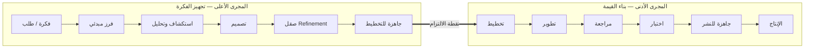
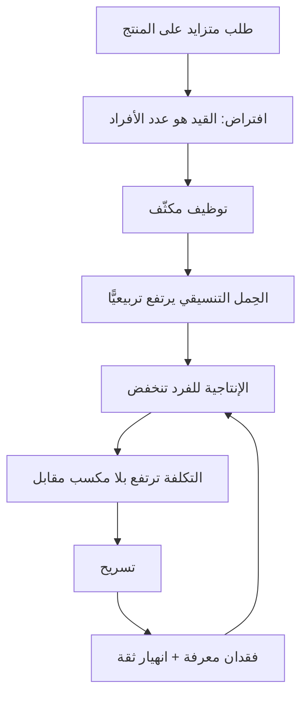

> [!info] الفصل 07 · كورس الإنتاجية
> **ماذا ستتعلّم:** أنّ لكلّ شركة برمجيات **مجريَين** لا واحدًا: **الأعلى** — من نشوء الفكرة حتى تصير جاهزة للتخطيط، و**الأدنى** — من بدء التنفيذ حتى الوصول إلى السوق. ستفهم لماذا يكون المجرى الأعلى في معظم المؤسّسات **غير موجود أصلًا** بلا خطوات ولا مالك ولا أرقام، ولماذا يفسّر ذلك وحده معظم حالات «الفريق سريع والتسليم بطيء». وستتعلّم كيف تُصمّم مجرى أعلى بحالات وحدود وتعريف جاهزية، ولماذا يختلف اقتصاده جذريًّا عن اقتصاد المجرى الأدنى، وما **كوارث المجرى الأدنى** الأربع ولماذا تنتهي بعضها بتسريح عمالة. وستخرج بمنهج **إظهار مجرى العمل بصريًّا** وبقواعد وضع حدود العمل قيد التنفيذ على كلّ حالة.

> [!abstract] التأصيل
> **يفترض أنّك تعرف:** [[Flow Efficiency]] · [[WIP Limit]]
> **ويُؤصّل لك:** [[Upstream vs Downstream Kanban]] · [[Dependency]]

# الفصل 07 — المجرى الأعلى والمجرى الأدنى

## 🎯 أهداف التعلّم

- تعريف المجرى الأعلى والمجرى الأدنى بحدودهما الدقيقة، وتحديد **نقطة الالتزام** الفاصلة بينهما.
- شرح **الكارثتين** الأساسيتين في المجرى الأعلى وأثرهما على كلّ المقاييس اللاحقة.
- تفسير لماذا يختلف **اقتصاد المجرى الأعلى** عن الأدنى، ولماذا لا تُنقَل قواعد أحدهما إلى الآخر.
- تصميم **مجرى أعلى** بحالات صريحة وتعريف جاهزية وحدود عمل قيد التنفيذ.
- تحديد **مالك** كلّ مجرى في مؤسّسات مختلفة الأحجام، وحلّ نزاع الملكية.
- شرح **كوارث المجرى الأدنى** الأربع وربطها بأخطاء إدارية موثّقة.
- تطبيق منهج **إظهار مجرى العمل بصريًّا** خطوة بخطوة.
- وضع **حدود عمل قيد التنفيذ لكلّ حالة** وضبطها تجريبيًّا.
- تشخيص أيّ المجريَين هو القيد من الأرقام وحدها.
- عرض **الحجّة المضادّة**: مخاطر الإفراط في هندسة المجرى الأعلى.

---

## الفكرة المحورية: مطبخان لا مطبخ واحد

> [!quote] من المحاضرة
> **حمزة:** «أوّلًا، علينا أن نعرف أنّ لدينا **مجريَين للعمل** — واحد **أعلى** وواحد **أدنى**… **المجرى الأعلى:** مسار العمل **من بداية الفكرة التي جاء بها العميل، حتى تُجهَّز وتصير جاهزة لتخطيط فريق التطوير**. **المجرى الأدنى:** مسار العمل **من بدء التنفيذ حتى يصل إلى السوق**. هذا هو مطبخ البرمجيات؛ ليس فيه غير ذلك.»

معظم المؤسّسات تدير المجرى الأدنى بعناية شديدة — لوح، وحالات، وطقوس، ومقاييس — وتترك المجرى الأعلى **بلا شكل على الإطلاق**. والنتيجة أنّ نصف زمن وصول القيمة (وغالبًا أكثر من نصفه) يقع في منطقة **لا يقيسها أحد ولا يملكها أحد**.

> [!info] نقطة الالتزام — الفاصل الذي يحدّد كلّ شيء
> **نقطة الالتزام (`Commitment Point`)** هي اللحظة التي تتحوّل فيها الفكرة من **خيار** إلى **التزام**. وقبلها يكون البند خيارًا يمكن إسقاطه بلا كلفة تُذكَر؛ وبعدها يصير عملًا يستهلك سعة وتترتّب عليه توقّعات.
>
> وأهمّيتها العملية أنّها **تحدّد نقطة بدء قياس زمن التدفّق** (`t2` في [[06 - مقاييس التدفّق الستة|الفصل السادس]]). وكثير من المؤسّسات تُنشئ التذكرة عند نشوء الفكرة، فيبدأ العدّاد قبل الالتزام بشهور — وتخرج بأرقام لا تعني شيئًا. والقاعدة: **أنشئ العنصر في المجرى الأعلى، وابدأ عدّ زمن التدفّق عند نقطة الالتزام.**

---

## أولًا: كوارث المجرى الأعلى

> [!quote] من المحاضرة
> **حمزة:** «فإذن في **المجرى الأعلى**… لدينا **كارثتان**: ① **لا أعرف كم تبقى الفكرة عندي.** ② **ليست لديّ خطوات واضحة صريحة أصلًا.**»

### الكارثة الأولى: لا أحد يعرف كم تنتظر الفكرة

هذه ليست مشكلة قياس بل مشكلة **إدراك**. حين لا يكون هناك رقم لزمن المجرى الأعلى، يحدث ثلاثة أشياء:

1. **يُنسب كلّ البطء إلى التطوير** — لأنّه الجزء الوحيد المرئي.
2. **لا يمكن التخطيط** — كما شرحت هبة بدقّة في المحاضرة.
3. **لا يمكن الوعد** — لأنّ زمن الوعد للعميل هو زمن الرحلة كاملة لا زمن التطوير.

> [!quote] من المحاضرة — إجابة هبة
> **هبة:** «عند **كلّ** مرحلة. ولن أستطيع أيضًا تحديد **التبعيّات**… إن كنتُ **معطّلة** أريد أن أعرف **كم من الوقت** سأبقى معطّلة، لأرفع الأمر إلى المستوى الأعلى منّي… لأنّ جزءًا من ذلك هو **كفاءة التدفّق** — كم من الوقت قضيتُه **منتظِرة** — وذلك **مال**.»

هذه الإجابة تربط ثلاثة مفاهيم في جملة واحدة: التبعيّة، والتعطيل، وكفاءة التدفّق. وجملة **«وذلك مال»** هي الترجمة الصحيحة: الانتظار ليس إزعاجًا تنظيميًّا، إنّه **تكلفة تأخير** تُدفَع من الإيراد المؤجَّل.

### الكارثة الثانية: لا خطوات صريحة

وهذه أخطر، لأنّها تعني أنّ **العملية موجودة لكنّها غير مكتوبة** — فتختلف من فكرة إلى فكرة، ومن شخص إلى شخص، ولا يمكن تحسينها لأنّها غير قابلة للرؤية.

| الأثر | كيف يظهر |
|---|---|
| **لا يمكن تحديد التبعيّات** | تكتشف الحاجة إلى موافقة قانونية بعد التطوير |
| **لا تعريف جاهزية** | يدخل عمل غامض التخطيط فيتعثّر |
| **لا يمكن تحديد القيد** | لا تعرف أين تتكدّس الأفكار |
| **لا سقف لعدد الأفكار المفتوحة** | عشرات الأفكار «قيد الدراسة» بلا تقدّم |
| **تُعاد الأعمال** | تحليل يُعاد لأنّ خطوةً سابقة أُغفلت |

> [!quote] من المحاضرة — نزاع الملكية
> **حمزة:** «دخلتُ مرّة شركة فقال لي **رئيس المنتج** إنّ *المجرى الأعلى ليس من شأنك*. قلتُ: هل جُنِنت؟ وهل لديكم واحد أصلًا؟ *لا، ليس لدينا.* إذن **يجب** أن يُنشأ. مشكلتنا الآن ليست **مسؤولية من** هو. مشكلتنا أنّه **يجب أن يوجد**.»

> [!tip] القاعدة الذهبية في نزاعات الملكية
> **«يجب أن يوجد» تسبق «مسؤولية من».** وهذا ترتيب صحيح استراتيجيًّا: النقاش حول الملكية قبل الاتفاق على الوجود يتحوّل إلى دفاع عن الحدود؛ أمّا الاتفاق على الوجود أوّلًا فيجعل الملكية مسألة تنفيذية سهلة.

---

## ثانيًا: لماذا لا تُنقَل قواعد المجرى الأدنى إلى الأعلى؟

هذا أهمّ ما يُغفَل عند تصميم المجرى الأعلى: **اقتصاده مختلف جذريًّا**.

| البُعد | المجرى الأعلى | المجرى الأدنى |
|---|---|---|
| **طبيعة العنصر** | **خيار** يمكن إسقاطه | **التزام** يجب إنجازه |
| **الهدف** | تقليل عدم اليقين | تقليل زمن التسليم |
| **قيمة الإسقاط** | **إيجابية** — إسقاط فكرة رديئة مكسب | سلبية — إسقاط ما بُدئ فيه هدر |
| **الاستكشاف** | مطلوب ومرغوب | مؤشّر على متطلّبات ناقصة |
| **وحدة التدفّق** | فكرة / فرصة | عنصر عمل |
| **معيار النجاح** | جودة القرار | سرعة وموثوقية التسليم |
| **أثر التأخير** | قد يكون مفيدًا (تأجيل الالتزام) | ضارّ دائمًا |
| **مصدر التباين** | عالٍ وطبيعي | يجب تقليله |

> [!info] إضافة مرجعية — كانبان المجرى الأعلى وتفكير الخيارات
> طوّر **باتريك ستيارت** مفهوم **`Upstream Kanban`**، وقاعدته الأساسية: **الفكرة قبل نقطة الالتزام «خيار» لا «عمل»**. ومن ثمّ:
> - **تأجيل الالتزام إلى آخر لحظة مسؤولة** ليس تسويفًا بل **إبقاء للخيارات مفتوحة** حتى تتوفّر معلومات أفضل — وهو مبدأ من `Lean Software Development` (ماري وتوم بوبنديك).
> - **معدّل الإسقاط في المجرى الأعلى مؤشّر صحّة لا فشل.** المجرى الأعلى الذي تمرّ منه كلّ فكرة إلى التنفيذ **لا يقوم بوظيفته** — إذ وظيفته الأولى **التصفية**.
>
> وهذا يفسّر مقياسًا ذكرناه في [[03 - الفجوة الكبرى والفوضى التشغيلية|الفصل الثالث]]: **معدّل إسقاط البنود** أصدق دليل على وجود سلطة أولوية حقيقية.

> [!warning] الخطأ الشائع عند تصميم المجرى الأعلى
> نقل عقلية «الإنجاز» إليه: قياس أهله بعدد الوثائق المُنجَزة أو القصص المكتوبة. وهذا يُنتج **مصنع متطلّبات** — نسخة أعلى من مصنع الميزات. والمقياس الصحيح لأهل المجرى الأعلى هو **جودة القرار وسرعة الوصول إليه**، لا حجم المُخرَج الورقي.

---

## ثالثًا: تصميم المجرى الأعلى عمليًّا

> [!quote] من المحاضرة
> **حمزة:** «في جلسة بناء الأعمال كان لدينا شيء اسمه **`Ready For…`**. لديّ **فكرة**؛ ثم يُجهّزها شخص؛ ثم تذهب إلى **التصميم**؛ ثم نعقد اجتماع **صقل**؛ ثم تصل إلى **جاهزة للتخطيط**. **هذا هو المجرى الأعلى.**»

### الحالات المقترحة ومعايير الانتقال

| الحالة | معنى وجود العنصر فيها | معيار الخروج منها | حدّ مقترح |
|---|---|---|---|
| **① وارد (`Intake`)** | طلب/فكرة سُجّلت | صاحب معروف + وصف بجملة | بلا حدّ |
| **② فرز (`Triage`)** | تُقيَّم مبدئيًّا | قرار: نستكشف / نؤجّل / نرفض | 10 |
| **③ استكشاف** | نفهم المشكلة والمستخدم | مشكلة مصوغة + مقياس نجاح | 3 |
| **④ تشكيل الحلّ** | تصميم ونطاق مبدئي | مقاربة متّفق عليها + تقدير خشن | 3 |
| **⑤ صقل** | الفريق التقني يراجع | معايير قبول + تبعيّات محدّدة | 5 |
| **⑥ جاهزة للتخطيط** | مخزون جاهز | تدخل السبرنت | 2 × السرعة |

> [!tip] لماذا حدّ على «جاهزة للتخطيط» تحديدًا؟
> لأنّ المخزون الجاهز **يفسد**: عنصر جهِّز قبل ثلاثة أشهر بُنِي على معلومات قديمة عن السوق والنظام. والحدّ المقترح **ضعف السرعة** — أي مخزون سبرنتين — يكفي لضمان عدم توقّف الفريق ولا يزيد فيتقادم. وهذا تطبيق مباشر لمبدأ `Lean` عن المخزون بوصفه هدرًا.

### تعريف الجاهزية — البوّابة الحقيقية

المخرج من المجرى الأعلى هو **تعريف الجاهزية (`Definition of Ready`)**. وقيمته أنّه يمنع دخول العمل الغامض إلى التخطيط — وهو أشيع سبب لانهيار قابلية التنبّؤ، كما شخّصت المحاضرة في خاتمتها.

> [!example] نموذج تعريف جاهزية — ستّة شروط
> يدخل البند التخطيط إذا:
> 1. **المشكلة مصوغة** من منظور المستخدم، لا الحلّ فقط.
> 2. **مقياس النجاح محدّد** — ما الرقم الذي نتوقّع تحرّكه؟
> 3. **معايير القبول مكتوبة** وقابلة للاختبار.
> 4. **التبعيّات محدّدة** ومؤكَّد توفّرها (واجهات، بيانات، موافقات، أطراف خارجية).
> 5. **الفريق التقني ناقشه** ولديه مقاربة أوّلية (لا تقدير نهائي).
> 6. **الحجم مناسب** — يمكن إنجازه ضمن سبرنت واحد.

> [!warning] الشرط الرابع هو الأكثر إهمالًا وأعلاها كلفة
> **التبعيّة غير المكتشَفة قبل التخطيط تتحوّل إلى تعطيل داخل السبرنت** — وهو أسوأ أنواع التعطيل لأنّه يقع بعد الالتزام. وأكثر التبعيّات التي تُنسى: موافقة أمنية، جاهزية بيئة، بيانات من نظام آخر، ردّ مورّد خارجي، مراجعة قانونية.
>
> **ممارسة عملية:** أضف إلى قالب البند حقلًا إلزاميًّا اسمه «التبعيّات» بقيمة افتراضية «لا يوجد»، بحيث يضطرّ من يملؤه إلى التفكير. الفارق بين حقل فارغ وحقل إلزامي كبير في الممارسة.

### حدود العمل قيد التنفيذ على المجرى الأعلى

> [!quote] من المحاضرة
> **حمزة:** «نبني **مجرى عمل للمنتج**… **ونطبّق حدّ عمل قيد التنفيذ على كلّ تلك الحالات**.»

وهذه نقطة يغفلها معظم من يطبّق كانبان: **الحدّ يُوضَع على كلّ عمود، لا على اللوح ككلّ**. والسبب أنّ الحدّ الكلّي يسمح بتكدّس كلّ العمل في عمود واحد دون أن يظهر خرق. ووضع حدّ لكلّ عمود يجعل **الاختناق مرئيًّا فورًا**: العمود الذي يمتلئ باستمرار هو قيدك.

---

## رابعًا: كوارث المجرى الأدنى

> [!quote] من المحاضرة
> **حمزة:** الكوارث هناك: «① الاعتقاد بأنّ **زيادة إنتاجية الفريق تكون بالضغط**. ② الاعتقاد بأنّ زيادة إنتاجية الفريق تكون بـ**زيادة عدد الأفراد**. ③ **عدم معرفة من أين يأتي التأخير**. ④ **عدم معرفة كم تستغرق الميزة لتصل إلى السوق من بدء التنفيذ**.»

| الكارثة | لماذا هي خاطئة | الدليل |
|---|---|---|
| **الضغط يزيد الإنتاجية** | يرفع الأداء مؤقّتًا ثم يُنتج دَينًا واحتراقًا؛ والمكسب يُستردّ بفائدة | دوّامة الموت · مسبّبات ماسلاش |
| **زيادة العدد تزيد السرعة** | التأهيل يستهلك المنتجين، وقنوات الاتصال تنمو تربيعيًّا | قانون بروكس |
| **لا نعرف مصدر التأخير** | فيُعالَج المكان الخطأ، وأيّ تحسين خارج القيد وهم | نظرية القيود |
| **لا نعرف زمن الوصول** | فلا وعد ممكن ولا تخطيط ممكن | زمن التدفّق |

### الكارثة الثانية وتسريح العمالة

> [!quote] من المحاضرة
> **حمزة:** «تجدهم كانوا يعملون في شركات شهدت **قفزة نوعية**، فطالبت بـ**زيادات غير مدروسة في حجم الفريق** لتسريع الإنتاج؛ ثم فجأةً لم تستطع تغطية التكلفة، فـ**سرّحت أولئك الناس**. هذه **مشكلات في العملية نفسها**.»

وهذه ملاحظة أعمق ممّا تبدو، ولنُفصّل آليّتها لأنّها نمط متكرّر:

**والخطأ الجذري في الخطوة الثانية:** افتراض أنّ القيد هو **السعة البشرية**، بينما القيد الحقيقي في معظم الحالات هو **الانتظار** (كفاءة تدفّق 10% تعني أنّ 90% من الزمن لا يعمل فيه أحد على العنصر أصلًا — فما فائدة مضاعفة العاملين؟).

> [!tip] السؤال الذي يمنع هذه الكارثة
> قبل أيّ قرار توظيف مكثّف، اسأل: **«ما كفاءة تدفّقنا الحالية؟»** فإن كانت 12%، فالمعنى أنّ 88% من الزمن انتظار — ومضاعفة الفريق **لن تمسّ الـ88%**، بل قد ترفعها (مزيد من التنسيق والمراجعات والتبعيّات). أمّا إن كانت الكفاءة 45% وكلّ الطوابير قصيرة والعمل فعلًا يفوق الطاقة، فالتوظيف قرار سليم. **الرقم يحسم القرار قبل أن يُتّخذ.**

---

## خامسًا: منهج إظهار مجرى العمل بصريًّا

> [!quote] من المحاضرة
> **حمزة:** «① **أُظهِر المجرى الأعلى بصريًّا** — أجعل خطوات مجراي الأعلى صريحة. اذهب إلى أهل المنتج: *ما الخطوات التي تتّبعونها لجعل الفكرة جاهزة للتخطيط؟* ② **حدّد التبعيّات** التي تؤخّركم، لنُزيلها. ③ **عرّف الأهداف**.»

### الورشة — خمس خطوات

**الخطوة 1: تتبّع عنصر حقيقي إلى الوراء (45 دقيقة).**
اختر ميزة وصلت الإنتاج الشهر الماضي، وابدأ من النهاية إلى البداية: من نشرها؟ من سلّمه إيّاها؟ … حتى تصل إلى من طرح الفكرة أوّل مرّة. اكتب كلّ اسم وكلّ تاريخ.

> [!tip] لماذا إلى الوراء؟
> لأنّ التتبّع إلى الأمام يُنتج **العملية المثالية كما يظنّها الناس**، والتتبّع إلى الوراء يُنتج **العملية كما حدثت فعلًا** — بما فيها الخطوات غير الرسمية والانتظارات المنسيّة. والفرق بين الاثنين هو غالبًا موضع المشكلة.

**الخطوة 2: تسمية الحالات (30 دقيقة).**
حوّل ما اكتشفتَه إلى قائمة حالات. لا تُجمّل: إن كانت هناك حالة اسمها الواقعي «في انتظار اجتماع اللجنة الأسبوعية» فاكتبها كذلك.

**الخطوة 3: قياس الزمن في كلّ حالة (60 دقيقة).**
لثلاثة إلى خمسة عناصر، احسب أيّام كلّ حالة. اجمع. ستحصل على **زمن المجرى الأعلى** — وهو رقم لم يكن موجودًا قبل ساعتين.

**الخطوة 4: تصنيف الانتظارات (30 دقيقة).**

| نوع الانتظار | مثال | العلاج |
|---|---|---|
| **انتظار مورد** | الشخص الوحيد المخوّل مشغول | توسيع التخويل أو تدريب بديل |
| **انتظار قرار** | في انتظار موافقة | تفويض حدّ مالي/نطاقي |
| **انتظار دفعة** | ننتظر اجتماعًا أسبوعيًّا | زيادة تواتر الاجتماع أو قرار غير متزامن |
| **انتظار معلومة** | ننتظر ردّ العميل | صياغة سؤال أوضح + مهلة قصوى |
| **انتظار طرف خارجي** | مورّد أو جهة تنظيمية | البدء بالتوازي + تصعيد مجدول |

**الخطوة 5: وضع الحدود واختبارها (30 دقيقة).**
ضع حدًّا مبدئيًّا لكلّ حالة، وطبّقه شهرًا، ثم عدّله. **الحدّ الأوّل دائمًا خاطئ — والمهمّ أن يوجد ثم يُضبَط.**

---

## سادسًا: من يملك ماذا؟

> [!quote] من المحاضرة
> **حمزة:** «أمّا **المجرى الأعلى** فهو ملك من يُفترض أن يعرف أين الفكرة وكيف يوصلها إلى السوق. وأمّا **العملية الداخلية** — التأخير، والتبعيّات، والتنظيم الذاتي، وتقليل التبعيّات، والعمل قيد التنفيذ — **فليست من شأن إدارة المنتج؛ إنّها من شأن شخص التسليم**… الأهمّ أن تكون **البيانات موجودة** — وأن تكون أنت **واعيًا** بها، لا بالضرورة أن تكون داخلها.»

| حجم المؤسّسة | مالك المجرى الأعلى | مالك المجرى الأدنى | ملاحظة |
|---|---|---|---|
| **فريق واحد (< 10)** | مالك المنتج | مدير سكرم / قائد الفريق | قد يكونان شخصًا واحدًا |
| **عدّة فرق (10–50)** | مدير المنتج | مدير التسليم | يلزم اتفاق مكتوب على الحدود |
| **مؤسّسة (50+)** | إدارة المنتج + عمليات المنتج | التسليم / هندسة الإنتاجية | يظهر دور «مالك العملية» |

> [!tip] الحلّ العملي لنزاع الملكية
> اكتب في اتفاق العمل ثلاثة أسطر فقط:
> 1. **مالك المجرى الأعلى:** [الاسم] — مسؤول عن وجود الخطوات وقياس زمنها.
> 2. **مالك المجرى الأدنى:** [الاسم] — مسؤول عن الحدود وزمن التسليم.
> 3. **نقطة الالتزام:** [الحالة المسمّاة] — يتحوّل عندها الخيار إلى التزام.
>
> والسطر الثالث هو الأهمّ: **معظم النزاعات ليست حول من يملك ماذا، بل حول أين ينتهي أحدهما ويبدأ الآخر.**

---

## سابعًا: القراءة النقدية — مخاطر الإفراط

هذا القسم ضروري لأنّ الفصل قد يُقرَأ دعوةً إلى بيروقراطية جديدة.

**1. المجرى الأعلى المُفرَط في الهندسة يقتل الأفكار.** ستّ حالات ونماذج إلزامية وبوّابات موافقة قد تُنتج ما هو أسوأ من الفوضى: **بيروقراطية تحرس نفسها**. والاختبار: كم يستغرق أبسط طلب واضح المنفعة عبور المجرى؟ إن تجاوز أسبوعين لبند بديهي، فالعملية صارت العائق.

**2. ليست كلّ الأفكار تحتاج المسار الكامل.** استخدم **مسارات خدمة متمايزة**:

| الفئة | المسار | مثال |
|---|---|---|
| **معياري** | المسار الكامل | ميزة جديدة |
| **سريع (`Expedite`)** | يتجاوز الطوابير، بحصّة محدودة | حادث إنتاج |
| **تاريخ ثابت** | يُجدوَل عكسيًّا من التاريخ | متطلّب تنظيمي |
| **تافه (`Trivial`)** | يدخل مباشرةً بحدّ عددي | تعديل نصّ |

> [!warning] احرس المسار السريع
> **المسار السريع بلا حصّة يبتلع النظام.** ضع قاعدة صريحة: عنصر سريع واحد في الوقت نفسه على الأكثر. فالمؤسّسة التي يصير فيها كلّ شيء «عاجلًا» لا تملك أولويات — وهذا هو بالضبط «كلّ شيء أولوية أولى» بلبوس تشغيلي.

**3. تعريف الجاهزية قد يصير سلاحًا.** فريق يرفض بندًا لأنّ «حقل مقياس النجاح فارغ» يستخدم الأداة سلاحًا في نزاع تنظيمي. تعريف الجاهزية **بوّابة جودة لا بوّابة سلطة**، والتعامل معه بروح الحرف يعيد إنتاج العلاقة العدائية التي وُضِع لعلاجها.

**4. البيانات في المجرى الأعلى أصعب وأقلّ دقّة.** لأنّ الحدود ضبابية بطبيعتها ونقاط الانتقال غير آلية. **اقبل التقريب**: زمن مجرى أعلى تقريبي خير من لا شيء، والدقّة تتحسّن مع الممارسة.

**5. وحدّ أخير:** لا يوجد مجرى أعلى «صحيح» يُنسَخ. الحالات الستّ المقترحة هنا نقطة انطلاق، وشركة تعمل بمنتج داخلي واحد قد تحتاج ثلاثًا، وشركة منصّات متعدّدة الأسواق قد تحتاج ثمانيًا. **صمّم من واقعك لا من قالب.**

---

## 🧾 خلاصة الفصل

1. **مطبخان لا واحد**: مجرى أعلى (فكرة ← جاهزة للتخطيط) ومجرى أدنى (تنفيذ ← سوق).
2. **نقطة الالتزام** تفصل بينهما، وهي نقطة بدء قياس زمن التدفّق.
3. **كارثتا المجرى الأعلى**: لا قياس لزمن الانتظار، ولا خطوات صريحة.
4. **اقتصاد المجريَين مختلف**: الأعلى يدير **خيارات** والأدنى يدير **التزامات**؛ والإسقاط في الأعلى **مكسب** لا فشل.
5. **قياس أهل المجرى الأعلى بحجم المُخرَج** يُنتج مصنع متطلّبات.
6. **الحدّ يُوضَع على كلّ حالة** لا على اللوح ككلّ، وإلّا اختفى الاختناق.
7. **مخزون «جاهزة للتخطيط» يفسد**؛ والحدّ المقترح ضعف السرعة.
8. **تعريف الجاهزية** بوّابة الجودة، وأكثر شروطه إهمالًا **التبعيّات**.
9. **كوارث المجرى الأدنى** أربع، وأخطرها فرضية «العدد يزيد السرعة» التي تنتهي بتسريح.
10. **كفاءة التدفّق تحسم قرار التوظيف** قبل اتّخاذه.
11. **التتبّع إلى الوراء** يُظهر العملية كما حدثت لا كما يُظنّ بها.
12. **«يجب أن يوجد» تسبق «مسؤولية من»** في نزاعات الملكية.
13. **الحدود:** مسارات خدمة متمايزة، وحصّة صارمة للمسار السريع، وقبول التقريب في بيانات المجرى الأعلى.

---

## ❓ اختبارات ذاتية

> [!question]- 1) لماذا يُعدّ إسقاط فكرة في المجرى الأعلى مكسبًا بينما إسقاط عمل في المجرى الأدنى هدرًا؟
> لأنّ العنصر في المجرى الأعلى **خيار** لم يُستثمَر فيه بعدُ إلّا وقت تحليل قليل، وإسقاطه يعني أنّك **تجنّبتَ استثمارًا كاملًا** في شيء رديء — وهذه وظيفة المجرى الأعلى الأولى: التصفية. أمّا في المجرى الأدنى فقد بُذل جهد بناء فعلي، وإسقاطه يعني ضياع ذلك الجهد. ونتيجتها العملية: **معدّل إسقاط مرتفع في الأعلى مؤشّر صحّة**؛ ومجرى أعلى تمرّ منه كلّ فكرة لا يقوم بوظيفته.

> [!question]- 2) شركة كفاءة تدفّقها 12% تريد مضاعفة فريق التطوير لتسريع التسليم. ما ردّك؟
> كفاءة 12% تعني أنّ **88% من زمن العنصر انتظار** لا عمل. ومضاعفة الفريق لا تمسّ الـ88%، بل قد ترفعها بزيادة التنسيق والمراجعات والتبعيّات. والأولوية إذن تفكيك الـ88%: أين تقع، وأيّ نوع انتظار هي (مورد؟ قرار؟ دفعة؟ خارجي؟). والتوظيف قرار سليم فقط حين تكون الكفاءة مرتفعة والطوابير قصيرة والعمل فعلًا يفوق الطاقة. وهذا بالضبط النمط الذي وصفته المحاضرة وانتهى بتسريح.

> [!question]- 3) ما الفرق بين تتبّع العملية إلى الأمام وتتبّعها إلى الوراء؟
> التتبّع **إلى الأمام** يُنتج العملية **كما يظنّها الناس** — مثالية، خالية من الخطوات غير الرسمية والانتظارات المنسيّة، لأنّ الناس يصفون ما يُفترض أن يحدث. أمّا التتبّع **إلى الوراء** من عنصر حقيقي وصل الإنتاج فيُنتج العملية **كما حدثت فعلًا**، بما فيها اجتماع اللجنة الأسبوعية وأسبوع انتظار ردّ المورّد. والفجوة بين الروايتين هي عادةً موضع المشكلة.

> [!question]- 4) لماذا يُوضَع حدّ العمل قيد التنفيذ على كلّ حالة لا على اللوح ككلّ؟
> لأنّ الحدّ الكلّي يسمح بتكدّس كلّ العمل في **عمود واحد** دون أن يظهر أيّ خرق: عشرة عناصر موزّعة أو عشرة متكدّسة أمام الاختبار — الرقم واحد والوضع مختلف تمامًا. أمّا الحدّ لكلّ عمود فيجعل **الاختناق مرئيًّا فورًا**: العمود الذي يمتلئ باستمرار هو قيدك. وقد نصّت المحاضرة على هذا صراحةً.

> [!question]- 5) ما أخطر شرط مُهمَل في تعريف الجاهزية ولماذا؟
> **التبعيّات.** لأنّ التبعيّة غير المكتشَفة قبل التخطيط تتحوّل إلى **تعطيل داخل السبرنت** — أي بعد الالتزام، حين تكون كلفة التصحيح أعلى وخيارات المناورة أقلّ، ويقع الضرر على قابلية التنبّؤ. وأكثرها نسيانًا: الموافقة الأمنية، وجاهزية البيئة، وبيانات من نظام آخر، وردّ مورّد. والممارسة الوقائية: حقل تبعيّات **إلزامي** بقيمة افتراضية «لا يوجد» يُجبر على التفكير.

> [!question]- 6) لماذا يجب وضع حدّ على مخزون «جاهزة للتخطيط»؟
> لأنّ **المخزون الجاهز يفسد**: بند جهِّز قبل ثلاثة أشهر بُنِي على معلومات قديمة عن السوق والنظام والأولويات، وقد تكون المشكلة نفسها تغيّرت. وتجهيزه كان استثمارًا في خيار ربّما لن يُستخدَم. والحدّ المقترح **ضعف السرعة** — مخزون سبرنتين — يوازن بين عدم توقّف الفريق وعدم التقادم. وهو تطبيق مباشر لمبدأ `Lean` عن المخزون هدرًا.

> [!question]- 7) كيف تحلّ نزاعًا بين إدارة المنتج والتسليم حول ملكية المجرى الأعلى؟
> بتطبيق قاعدة **«يجب أن يوجد» تسبق «مسؤولية من»**. ابدأ بالاتفاق على أنّ المجرى الأعلى يجب أن يوجد وأن تُقاس أزمنته — وهذا اتفاق يصعب رفضه. ثم اكتب ثلاثة أسطر في اتفاق العمل: مالك الأعلى، ومالك الأدنى، و**نقطة الالتزام** الفاصلة. والسطر الثالث هو مفتاح الحلّ، لأنّ معظم النزاعات ليست حول من يملك ماذا بل حول **أين ينتهي أحدهما ويبدأ الآخر**.

> [!question]- 8) ما مخاطر المسار السريع (`Expedite`) وكيف تُدار؟
> خطره أنّه **بلا حصّة يبتلع النظام**: كلّ صاحب طلب يكتشف أنّ تسميته «عاجلًا» تتجاوز الطابور، فيصير كلّ شيء عاجلًا — وهي صورة تشغيلية من «كلّ شيء أولوية أولى». وإدارته بقاعدة صريحة: **عنصر سريع واحد في الوقت نفسه على الأكثر**، مع تعريف مكتوب لما يستحقّ المسار (توقّف خدمة، فقدان بيانات، ثغرة نشِطة، خرق تنظيمي نافذ) وما لا يستحقّه. ومراجعة دورية لعدد مرّات استخدامه — فارتفاعه مؤشّر على خلل في المجرى الأعلى لا على كثرة الطوارئ.

---

## 📚 مراجع الفصل

| المرجع | الصلة |
|---|---|
| Mik Kersten — *From Project to Product* | المجريان وشبكة تدفّق القيمة |
| Patrick Steyaert — *Upstream Kanban* | تفكير الخيارات ونقطة الالتزام |
| Mary & Tom Poppendieck — *Lean Software Development* | تأجيل الالتزام إلى آخر لحظة مسؤولة |
| David J. Anderson — *Kanban* | مسارات الخدمة وحدود العمل قيد التنفيذ |
| Frederick Brooks — *The Mythical Man-Month* | لماذا لا تشترى السرعة بالأفراد |
| Eliyahu Goldratt — *نظرية القيود* | تحديد القيد قبل أيّ تحسين |
| المصدر الأساس | [[2.3 مقاييس التدفق الستة]] · [[2.4 السيناريوهات التشخيصية]] |

---

## 🔗 روابط ذات صلة

**السابق:** [[06 - مقاييس التدفّق الستة]] · **التالي:** [[08 - توزيع التدفّق ومراحل حياة المنتج]]
**مصدر السجلّ:** [[2.3 مقاييس التدفق الستة]] · [[2.4 السيناريوهات التشخيصية]]
**مفاهيم:** [[Upstream vs Downstream Kanban|المجرى الأعلى والأدنى]] · [[WIP Limit|حدود العمل قيد التنفيذ]] · [[Definition of Ready|تعريف الجاهزية]] · [[Dependency|التبعيّات]] · [[Flow Efficiency|كفاءة التدفّق]] · [[03 - Kanban|كانبان]] · [[08 - Sprint Planning|تخطيط السبرنت]]
