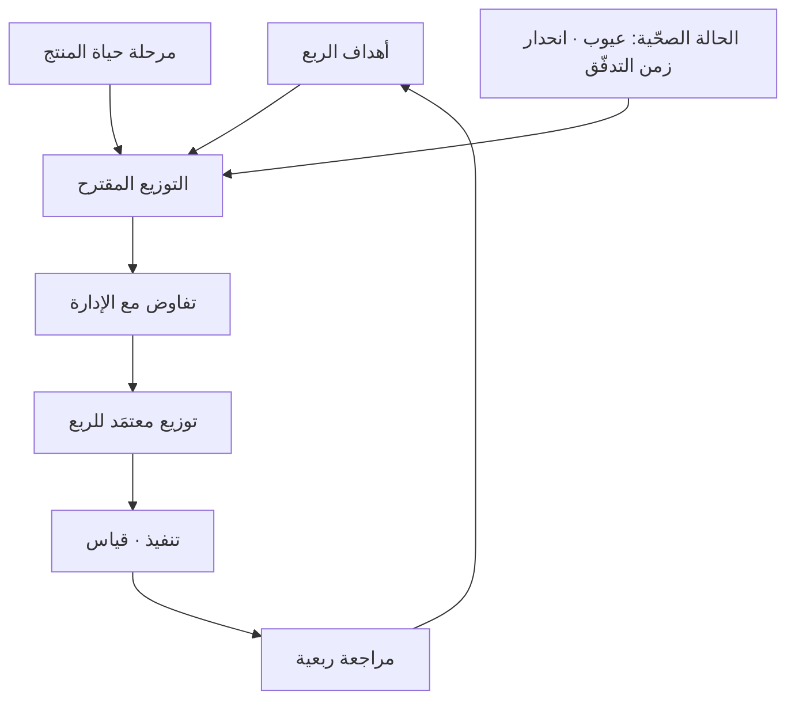

> [!info] الفصل 08 · كورس الإنتاجية
> **ماذا ستتعلّم:** كيف تقرّر **نسب توزيع السعة** بين الميزات والعيوب والمخاطر والدَّين التقني — وأنّه **لا يوجد توزيع مثالي**، بل توزيع يُشتقّ من محدّدَين: **الهدف** و**مرحلة حياة المنتج**. ستتعلّم النسب المقترحة لكلّ مرحلة (نشأة · نمو · نضج · انحدار)، ولماذا تكون **مرحلة النمو أخطر لحظة** في عمر المنتج إداريًّا، وما **قاعدة الدَّين المقابل**: أنّ كلّ ضغط للوصول إلى السوق يُنشئ التزامًا بفترة سداد. وستتعلّم كيف تربط التوزيع بـ**الأهداف والنتائج الرئيسة** ربطًا منطقيًّا لا شكليًّا، وكيف تتفاوض عليه، وكيف تتعامل مع منتجات متعدّدة في محفظة واحدة. وستخرج بـ**جدول قرار** كامل و**نصّ تفاوضي** جاهز.

> [!abstract] التأصيل
> **يفترض أنّك تعرف:** [[Technical Debt]] · [[Capacity]]
> **ويُؤصّل لك:** [[Product Maturity]] · [[OKR]]

# الفصل 08 — توزيع التدفّق ومراحل حياة المنتج

## 🎯 أهداف التعلّم

- شرح لماذا **لا يوجد توزيع مثالي**، وما البديل المنهجي عن البحث عن نسب سحرية.
- اشتقاق التوزيع من **الهدف** — الربط بين نوع الهدف ونوع العمل الذي يخدمه.
- تحديد **مرحلة حياة المنتج** بمؤشّرات موضوعية لا بانطباع.
- تطبيق النسب المقترحة لكلّ مرحلة، وتعديلها بحسب السياق.
- شرح لماذا تكون **مرحلة النمو** أخطر اللحظات إداريًّا.
- تطبيق **قاعدة الدَّين المقابل** بعد أيّ فترة ضغط.
- التفاوض على التوزيع بنصّ محدّد وبيانات داعمة.
- إدارة التوزيع على مستوى **محفظة** من عدّة منتجات.
- تصميم **آلية مراجعة ربعية** للتوزيع.
- عرض **الحجّة المضادّة**: مخاطر التقيّد الحرفي بالنسب.

---

## الفكرة المحورية: لا نسب سحرية، بل اشتقاق منهجي

> [!quote] من المحاضرة
> **حمزة:** «أوّلًا: **لا يوجد توزيع مثالي**. فكيف أوزّع إذن؟ **قبل التخطيط**، و**على أساس الهدف**… فـ**لكلّ مرحلة من مراحل المنتج توزيعها الخاصّ**. وأنت تضع توزيعك على أساس أمرين: **الهدف** و**مرحلة حياة المنتج**.»

هذه الجملة أهمّ ممّا تبدو، لأنّها تقطع الطريق على أكثر ما يُطلَب في هذا الموضوع: **رقم جاهز**. والسائل عن «كم نسبة الدَّين التقني الصحيحة؟» يسأل سؤالًا لا جواب له، لأنّ الإجابة تعتمد على ما يحاول المنتج تحقيقه وأين يقع في عمره.

$$\text{التوزيع} = f(\text{الهدف},\ \text{مرحلة الحياة},\ \text{الحالة الصحّية الراهنة})$$

والمحدّد الثالث — **الحالة الصحّية الراهنة** — إضافة ضرورية على ما ورد في المحاضرة: منتج في مرحلة النضج لكنّه سليم تقنيًّا يختلف عن منتج في المرحلة نفسها ينزف عيوبًا.

---

## أولًا: الاشتقاق من الهدف

> [!quote] من المحاضرة
> **حمزة:** «إن كنتُ أحتاج إلى **زيادة عدد المستخدمين**، فأنا أحتاج إلى ضبط **البنية التحتية للكود** — أي أنّك تتحدّث عن **دَين تقني**. وإن كنتَ تحتاج إلى دخول **سوق جديد** يعمل على **بوّابة دفع** لا تملكها، فأنت هنا تحتاج إلى بناء **ميزات**.»

المثالان يوضّحان مبدأً مهمًّا: **الهدف لا يُترجَم دائمًا إلى ميزات.** وهذا يخالف الحدس الإداري السائد الذي يفترض أنّ كلّ هدف نموّ يُنجَز ببناء المزيد.

### جدول الاشتقاق

| نوع الهدف | مثال | نوع العمل الغالب | مبرّره |
|---|---|---|---|
| **دخول سوق/شريحة جديدة** | دعم بوّابة دفع محلّية | **ميزات** | قدرة غير موجودة |
| **زيادة حجم المستخدمين** | من 10 آلاف إلى 100 ألف | **دَين تقني** | قابلية التوسّع قيد لا وظيفة |
| **رفع الاحتفاظ** | خفض التسرّب من 8% إلى 5% | **عيوب + ميزات** | التسرّب غالبًا من الاحتكاك والأعطال |
| **خفض تكلفة التشغيل** | −30% في فاتورة السحابة | **دَين تقني** | كفاءة بنية لا قدرة جديدة |
| **الامتثال التنظيمي** | متطلّب بتاريخ نفاذ | **مخاطر** | له تاريخ ولا يُرتَّب بالقيمة |
| **رفع الموثوقية** | من 99.0% إلى 99.9% | **دَين تقني + مخاطر** | هندسة استقرار لا ميزات |
| **تسريع التسليم** | زمن التدفّق من 20 إلى 10 أيّام | **دَين تقني** | أتمتة واختبارات وتفكيك |
| **استعادة ثقة العملاء** | بعد فترة أعطال | **عيوب + مخاطر** | الجودة قبل التوسّع |

> [!tip] السؤال الذي يحسم الاشتقاق
> لكلّ هدف اسأل: **«ما الذي يمنعنا اليوم من تحقيقه؟»**
> - إن كان المانع **قدرة غير موجودة** ⇒ ميزات.
> - إن كان المانع **النظام لا يتحمّل** ⇒ دَين تقني.
> - إن كان المانع **ما بنيناه لا يعمل جيّدًا** ⇒ عيوب.
> - إن كان المانع **حدث محتمل يهدّدنا** ⇒ مخاطر.
>
> وهذا السؤال وحده يمنع أشيع خطأ في التخطيط الربعي: **ترجمة كلّ هدف إلى قائمة ميزات**.

> [!info] إضافة مرجعية — الربط بـ`OKRs`
> إطار **الأهداف والنتائج الرئيسة** (طوّره أندرو غروف في إنتل، وشاعت صيغته عبر جون دوير وجوجل) يقوم على فصل **الهدف** (نوعي، ملهِم) عن **النتائج الرئيسة** (كمّية، قابلة للقياس). ونقطة الالتقاء مع هذا الفصل أنّ `OKRs` تُعرّف **ماذا نريد**، وتوزيع التدفّق يُعرّف **كيف نصرف السعة للوصول إليه**.
>
> والخلل الشائع أنّ المؤسّسات تكتب `OKRs` طموحة ثم تخطّط سعتها **كما لو لم تتغيّر الأهداف** — فتبقى النسب كما هي كلّ ربع. والاختبار البسيط: **إن لم يتغيّر توزيعك بين ربع وربع رغم تغيّر أهدافك، فأحدهما شكلي.**

---

## ثانيًا: مراحل حياة المنتج

> [!quote] من المحاضرة
> **حمزة:** «**النشأة / التكوين** — لم يُطلَق المنتج بعد… في هذه المرحلة **تذهب معظم سعة الفريق إلى الميزات**. **النمو.** تنخفض الميزات إلى نحو **50%**، والعيوب والمخاطر نحو **30%**، والدَّين التقني نحو **20%**. **النضج / التشبّع.** المشروع ناضج ومتشبّع، فينتقل تركيزنا تقريبًا كلّه إلى **الدَّين التقني** و**المخاطر**، مع **نسبة منخفضة للميزات**.»

### تحديد المرحلة بمؤشّرات موضوعية

قبل النسب، يجب تحديد المرحلة بلا خداع ذاتي — فمعظم الفرق تظنّ نفسها في مرحلة النشأة أطول ممّا ينبغي:

| المرحلة | مؤشّرات موضوعية |
|---|---|
| **النشأة** | لا مستخدمون خارجيّون · لا إيراد · الفرضية الأساسية غير مثبتة |
| **النمو** | نموّ مستخدمين شهري مطّرد · إيراد يتزايد · طلبات ميزات تفوق السعة |
| **النضج** | نموّ مستخدمين متباطئ · إيراد مستقرّ · معظم الطلبات تحسينات لا قدرات |
| **الانحدار** | تراجع مستخدمين أو إيراد · بدائل أفضل في السوق · قرار استراتيجي بالاستبدال |

> [!warning] أشيع خطأ في التصنيف
> **مؤسّسات كثيرة تظنّ نفسها في «النشأة» وهي في «النمو».** والمؤشّر الفاصل حاسم: **هل لديك مستخدمون خارجيّون يعتمدون عليك؟** إن كان الجواب نعم، فأنت في النمو مهما كان المنتج جديدًا — وسلوك النشأة (كلّ السعة ميزات) يصير عندئذٍ تدميرًا مقصودًا للمنتج.

### النسب المقترحة لكلّ مرحلة

| المرحلة | ميزات | عيوب | دَين تقني | مخاطر | المنطق |
|---|---|---|---|---|---|
| **النشأة** | 70–80% | 5–10% | 10–15% | 5% | لا مستخدمون يتضرّرون؛ الأولوية إثبات الفرضية |
| **النمو** | 45–55% | 15–20% | 20–25% | 5–10% | مستخدمون حقيقيّون + دَين موروث من النشأة |
| **النضج** | 25–35% | 20–25% | 30–35% | 10–15% | التوسّع والاستقرار يفوقان القدرات الجديدة |
| **الانحدار** | 5–15% | 20–30% | 10–20% | 40–50% | الأولوية للاستمرارية والامتثال والترحيل |

> [!info] عن مرحلة الانحدار — إضافة على المحاضرة
> لم تتناول الجلسة **مرحلة الانحدار / إنهاء الخدمة (`Sunset`)** وهي مرحلة حقيقية تحتاج توزيعًا خاصًّا. والمنتج المتّجه إلى الإيقاف أو الاستبدال لا تُبنى فيه ميزات، لكنّه **لا يُهمَل** أيضًا: تبقى المخاطر (الأمن والامتثال) والعيوب الحرجة قائمة لأنّ المستخدمين ما زالوا يعتمدون عليه. وأكبر بند فيه غالبًا **مخاطر الترحيل**: بناء مسار خروج آمن للعملاء.
>
> وأخطر ما في هذه المرحلة **الإهمال الصامت**: منتج قرّرت المؤسّسة إيقافه بعد سنتين، فتوقّفت عن استثمار أيّ شيء فيه اليوم — وبين القرار والتنفيذ سنتان يستخدمه فيهما عملاء حقيقيّون.

> [!tip] السهم المنقّط مهمّ
> **منتج في النضج يمكن أن يعود إلى النمو** — عبر توسّع في سوق جديد أو إعادة تموضع. لكنّ الشرط الهندسي واضح: **لا يمكن ذلك ودَينه التقني مرتفع**. فالاستثمار في الدَّين خلال النضج ليس دفاعًا فقط؛ إنّه **شراء خيار النموّ القادم**. وهذه أقوى حجّة تُقدَّم للإدارة في مرحلة النضج، لأنّها تحوّل الدَّين من بند تكلفة إلى استثمار استراتيجي.

---

## ثالثًا: لماذا مرحلة النمو هي الأخطر

> [!quote] من المحاضرة
> **حمزة:** «وأين المشكلة؟ حين تريد الإدارة، في مرحلة **النمو والتوسّع**، العمل بنسبة **ميزات** مرتفعة. فنقول لهم: **نحن ذاهبون إلى كارثة** — لأنّ مشروعي صار لديه **مستخدمون**، فأحتاج إلى ضبط **دَيني التقني**. وفوق ذلك، مع **`Lean MVP`** كنّا أصلًا نضغط على فريق التطوير… فـ**الدَّين التقني موجود بالفعل**.»

هذا تشخيص دقيق، ولنُفصّل لماذا تجتمع في هذه المرحلة تحديدًا **أربعة ضغوط متعارضة**:

| الضغط | مصدره | اتّجاهه |
|---|---|---|
| **دَين موروث** | اختصارات مرحلة النشأة | يطلب سعة للدَّين |
| **حِمل مستخدمين متزايد** | النموّ نفسه | يطلب سعة للبنية |
| **طلبات ميزات متزايدة** | مستخدمون حقيقيّون + مبيعات | يطلب سعة للميزات |
| **توقّعات المستثمر/الإدارة** | نجاح ظاهر ⇒ ضغط لتسريعه | يطلب المزيد من كلّ شيء |

**والأربعة تتنافس على سعة ثابتة.** ولهذا تكون هذه المرحلة نقطة الدخول الأشيع إلى [[04 - دوّامة الموت والدَّين التقني|دوّامة الموت]]: تبدو المؤشّرات كلّها إيجابية (نموّ، إيراد، سرعة عالية) بينما الأساس التقني يتآكل — وهي بالضبط **متلازمة البطّيخة** على مستوى المنتج لا على مستوى التقرير.

### قاعدة الدَّين المقابل

> [!quote] من المحاضرة
> **حمزة:** «إن كنتَ قد ضغطتَ على الفريق وقبِل الفريق الضغط ليصل إلى السوق، فأنت **مُلزَم في المقابل بأن تمنحهم مساحة في الفترة القادمة بمخصّص عالٍ للدَّين التقني**، ليلحقوا بالضرر الذي سبّبه ضغطك.»

هذه القاعدة تستحقّ أن تُكتَب في اتفاق العمل بصيغة صريحة:

> [!example] صياغة قاعدة الدَّين المقابل
> **«كلّ فترة ضغط للوصول إلى السوق تُنشئ التزامًا مقابلًا بفترة سداد بنسبة دَين تقني لا تقلّ عن ضعف النسبة المعتادة، تبدأ خلال السبرنتين التاليين للإطلاق.»**
>
> **ولماذا هذه الصياغة تحديدًا؟**
> - **«تُنشئ التزامًا»** — لا وعدًا؛ الوعد يُنسى والالتزام يُطالَب به.
> - **«ضعف النسبة المعتادة»** — رقم محدّد لا «مساحة كافية».
> - **«خلال السبرنتين التاليين»** — مهلة قصوى تمنع التأجيل اللانهائي.
> - وأهمّ ما فيها أنّها **تُتّفق عليها قبل الضغط لا بعده**، حين تكون الحاجة إلى موافقة الإدارة قائمة وموقفك التفاوضي أقوى.

> [!warning] الخطأ القاتل في هذه المرحلة
> **حمزة:** «حين يضغط مدير قليل الخبرة على الفريق للوصول إلى السوق ثم يُحمّل الفترة التالية مباشرةً بالميزات من جديد. عند تلك النقطة تكون قد **دمّرتَ الفريق ودمّرتَ منتجك**.»
>
> ولاحظ أنّ الضرر مزدوج: **الفريق** (لأنّ الضغط صار دائمًا لا استثنائيًّا، فيتحقّق شرط «الحِمل الزائد» في مسبّبات الاحتراق) و**المنتج** (لأنّ الدَّين تراكم دورتين متتاليتين بلا سداد). وهذا هو الفرق بين الضغط **الاستثنائي المبرَّر** والضغط **بوصفه أسلوب إدارة**.

---

## رابعًا: قصّة هبة — «لا سعة للصيانة»

> [!quote] من المحاضرة
> **هبة:** «كنتُ أتحدّث… مع شخص أخبرني أنّهم **لا يخصّصون أيّ سعة للصيانة**… قالوا: *لا، الشخص نفسه الذي يُجري الصيانة هو من يبني الميزة الجديدة على أيّ حال — فلماذا نُصدّع رؤوسنا؟*»
>
> **حمزة:** «**ما يفعلونه ليس صحيحًا**… أمّا *«من يبني الميزة هو من يصونها»* — فهم **يخدعون أنفسهم قبل أن يخدعوا المطوّر**.»

### تفكيك المغالطة

الحجّة المطروحة: «الشخص نفسه ⇒ لا حاجة لفصل الحساب.» وفيها **خلط بين الشخص والسعة**:

| الادّعاء | الخطأ |
|---|---|
| «الشخص نفسه» | صحيح — لكنّ **وقته ليس نفسه**. الساعة المصروفة على الصيانة ساعة لم تُصرَف على الميزة. |
| «لماذا نحسبها منفصلة؟» | لأنّ ما لا يُحسَب لا يُخطَّط له، وما لا يُخطَّط له **يُقتطَع من الميزات دون اعتراف** — فيبدو الفريق مقصّرًا. |
| «سبرنتنا أسبوع، نرفع علمًا ونصوّت» | آلية استجابة معقولة لحالة **نادرة**؛ لكنّها ليست بديلًا عن تخصيص سعة لعمل **متكرّر ومتوقّع**. |
| «مايكروسوفت لا تُصدر تحديثًا كلّ يوم» | صحيح — والسعة تُقدَّر بـ**معدّل** لا بيقين. تحديثان في الربع يستهلكان أربعة أيّام ⇒ خصّص أربعة أيّام. |

> [!tip] الردّ العملي في جملة واحدة
> **«لا نطلب أشخاصًا إضافيّين للصيانة. نطلب أن نُسمّي الوقت الذي نصرفه عليها بالفعل.»**
>
> وهذه أقوى صياغة ممكنة لأنّها **لا تطلب موارد**؛ تطلب **اعترافًا محاسبيًّا** بواقع قائم. ومن الصعب جدًّا رفضها منطقيًّا.

> [!quote] من المحاضرة — ملاحظة هبة الذكية
> **هبة:** «ما أعرفه أنّه إن ظهرت **عيوب** كثيرة، فيُفترض أن **نرفع نسبة العيوب**. قالوا نعم، هذا الجزء يفعلونه… أمّا وضع **الصيانة** مسبقًا فلا.»
>
> ولاحظ التناقض الذي التقطته هبة بدقّة: المؤسّسة نفسها **تُخصّص سعة للعيوب رجعيًّا** (بعد ظهورها) وترفض تخصيصها للصيانة **استباقيًّا**. وقد ردّ حمزة بالسبب الصحيح: **«لأنّ الدَّين التقني بطبيعته غير مرئيّ»**. فالعيوب تفرض نفسها؛ والدَّين لا يفرض شيئًا حتى يتحوّل إلى عيوب — ثمّ يُعالَج بأغلى صورة ممكنة.

---

## خامسًا: كيف تتفاوض على التوزيع

### الأخطاء الثلاثة في العرض

| الخطأ | لماذا يفشل |
|---|---|
| **«نحتاج وقتًا للدَّين التقني»** | طلب مفتوح بلا حدّ ولا عائد مقيس |
| **«الكود سيّئ ويجب إصلاحه»** | حكم قيمي يُقرَأ اتّهامًا لقرارات سابقة |
| **«كلّ الشركات تفعل هذا»** | حجّة سلطة لا حجّة بيانات |

### البنية التي تعمل — خمس خطوات

> [!example] نصّ تفاوضي جاهز
> **① الحالة بالأرقام:**
> «توزيعنا الفعلي هذا الربع: 78% ميزات، 17% عيوب إنتاج، 4% دَين تقني، 1% مخاطر.»
>
> **② الأثر المقيس:**
> «خلال أربعة أرباع ارتفع وسيط زمن تسليم الميزة المتوسّطة من 6 أيّام إلى 11. ونسبة العيوب من إجمالي العمل ارتفعت من 9% إلى 17%.»
>
> **③ الربط بهدف الإدارة:**
> «هدف الربع القادم مضاعفة المستخدمين. وبنيتنا الحالية أُخفقت في اختبار التحمّل عند ضعفين، وهذه بيانات الاختبار.»
>
> **④ الطلب المحدّد المحدود:**
> «نطلب توزيع 50% ميزات · 20% عيوب · 25% دَين تقني · 5% مخاطر، **لربع واحد**.»
>
> **⑤ الوعد المقابل والمقياس:**
> «سنعرض بعد الربع: وسيط زمن التسليم، ونسبة العيوب، ونتيجة اختبار التحمّل. وإن لم يتحسّن أوّل رقمين، نعود إلى التوزيع الحالي.»

> [!tip] البند الخامس هو الذي يُقنع
> لأنّه **يضع الفريق تحت المساءلة طوعًا**. والمدير الذي يسمع «وإن لم يتحسّن نعود» يرى مقترحًا محدود المخاطرة لا طلبًا مفتوحًا. وهذه هي الترجمة العملية لجملة المحاضرة عن حماية الفريق **بالبيانات لا بالعاطفة**.

### إن رُفِض الطلب

| الردّ | إجراؤك |
|---|---|
| «ليس هذا الربع» | اطلب **نصف النسبة** لربع واحد، وسجّل الرفض في سجلّ المخاطر بأثره المتوقّع |
| «لدينا التزام لعميل» | اقترح استثناء **موقوتًا** بتاريخ انتهاء مكتوب + قاعدة الدَّين المقابل بعده |
| «لا نصدّق الأرقام» | اعرض طريقة الحساب كاملة واعرض احتسابها معًا |
| «أنجزوها بالتوازي» | اعرض معادلة السعة: 100% موزّعة، فأيّ بند يخرج؟ |

> [!warning] سجّل الرفض — لا لتقول «قلنا لكم»
> تسجيل الرفض في سجلّ المخاطر (بتاريخ ومالك وأثر متوقّع) غرضه **إنشاء أثر يمكن الرجوع إليه** حين يتحقّق الأثر — لا التشفّي. والفرق في الصياغة: «تمّ رفع مخاطر تراكم الدَّين في تاريخ كذا، والقرار كان التأجيل لأولوية تجارية معلنة» — وهذه صياغة مهنية تحفظ العلاقة وتحفظ الحقيقة معًا.

---

## سادسًا: التوزيع على مستوى محفظة منتجات

هذا موضوع لم تتناوله الجلسة ويحتاجه كلّ من يدير أكثر من منتج واحد.

### المشكلة: منتجات في مراحل مختلفة تتنازع فريقًا واحدًا

| المنتج | المرحلة | التوزيع المطلوب |
|---|---|---|
| المنتج أ | نشأة | 75% ميزات |
| المنتج ب | نمو | 50% ميزات · 25% دَين |
| المنتج ج | نضج | 30% ميزات · 35% دَين |

وإن كان الفريق نفسه يخدم الثلاثة، فالتوزيع المُجمَّع بلا معنى — لأنّه سيُنتج متوسّطًا لا يخدم أيّ منتج.

### ثلاثة حلول مرتّبة بالأفضلية

**1. فرق مخصّصة لكلّ منتج (الأفضل).** كلّ منتج فريقه وتوزيعه. الكلفة: تحتاج حجمًا كافيًا.

**2. تخصيص زمني بالتناوب.** الفريق يخدم منتجًا واحدًا لكلّ فترة (شهر مثلًا) بتوزيع ذلك المنتج. أفضل من الخلط اليومي لأنّه يقلّل تبديل السياق، وأسوأ من الفرق المخصّصة لأنّه يُبطئ الاستجابة.

**3. توزيع مرجَّح (الأسوأ لكنّه أحيانًا الوحيد الممكن).**

$$D_{\text{مجمَّع}} = \sum_{p} w_p \times D_p$$

حيث $w_p$ حصّة المنتج من سعة الفريق.

> [!warning] المزلق في الحلّ الثالث
> **الرقم المجمَّع يُخفي أنّ المنتج «ج» لا يحصل على حصّة دَينه.** فإن كانت حصّته 20% من سعة الفريق ويحتاج 35% دَينًا، فذلك يعني 7% من السعة الكلّية — وهو رقم يسهل أن يُقتطَع في أوّل أزمة. **الحلّ: تتبّع التوزيع لكلّ منتج على حدة، لا للفريق ككلّ.** ولا معنى لتوزيع الفريق حين يخدم منتجات في مراحل مختلفة.

> [!tip] قاعدة تبديل السياق
> كلّ منتج إضافي يخدمه الفريق نفسه يستهلك جزءًا من طاقته في **تبديل السياق**: تذكّر البنية، واستعادة الحالة، وإعادة بناء الفهم. والتقديرات الشائعة في أدبيات إدارة العمل المعرفي تضع خسارة تبديل السياق بين 20% و40% للمهمّة الثالثة فأكثر. **والنتيجة العملية: فريق يخدم ثلاثة منتجات لا يُنتج ثلث كلّ منها — بل أقلّ.**

---

## سابعًا: آلية المراجعة الربعية

> [!example] أجندة جلسة مراجعة التوزيع (90 دقيقة، مرّة كلّ ربع)
> **① مراجعة الربع الماضي (20 د):** التوزيع المخطَّط مقابل الفعلي، وأسباب الانحراف.
> **② الحالة الصحّية (20 د):** زمن التدفّق · العيوب الهاربة · حِمل التدفّق · أهمّ ثلاثة بنود دَين.
> **③ تحديد المرحلة (10 د):** هل تغيّرت مرحلة المنتج؟ بأيّ دليل؟
> **④ أهداف الربع القادم (20 د):** ما هي، وما الذي يمنعنا من تحقيقها اليوم؟
> **⑤ التوزيع المقترح (20 د):** اشتقاقه من ③ و④، وتوثيق المبرّر لكلّ نسبة.

> [!warning] الانحراف بين المخطَّط والفعلي هو أهمّ بند
> إن كنتَ خطّطتَ 20% دَينًا وصرفتَ 5%، فالسؤال ليس «لماذا لم ننجز؟» بل: **«ما الآلية التي سحبت السعة؟»** والإجابة النمطية واحدة من ثلاث: طلبات عاجلة اخترقت السبرنت، أو عيوب فاقت المخصّص، أو **الدَّين لم يُكتَب بندًا قابلًا للتخطيط فبقي نيّة**. وكلّ إجابة تُنتج علاجًا مختلفًا تمامًا.

---

## ثامنًا: القراءة النقدية

**1. النسب أدوات تخطيط لا قوانين تشغيل.** إن ظهر عيب حرج بعد نفاد مخصّص العيوب، يُعالَج ويُسجَّل الانحراف — ولا يُترك المستخدم يعاني احترامًا لجدول.

**2. الدقّة الزائفة.** الفرق بين 22% و25% ليس ذا معنى إحصائي في نظام بهذا القدر من التباين. **اعمل بفئات خشنة** (نحو الربع، نحو النصف) واصرف الجهد على الالتزام لا على المعايرة.

**3. توزيع مثالي مع اختيار خاطئ للميزات = فشل أنيق.** التوزيع يُدير **كيف تُصرَف السعة**، ولا يقول شيئًا عن **هل الميزات المختارة تستحقّ**. ويظلّ الاكتشاف ومقاييس الأثر ضرورةً خارج هذا الإطار.

**4. مراحل حياة المنتج ليست خطّية دائمًا.** منتج قد يعود من النضج إلى النمو، أو يقفز من النشأة إلى النضج إن كان يحلّ مشكلة مستقرّة في سوق مستقرّ. **صنّف بالمؤشّرات لا بالعمر الزمني.**

**5. الفرق الصغيرة جدًّا.** فريق من ثلاثة لا يستطيع تطبيق أربع نسب ذات معنى (5% من سعة ثلاثة أشخاص = ساعتان). **ابدأ بقسمين** — ميزات وكلّ ما عداها — ثم فصّل مع النموّ.

**6. وحدّ صادق:** النسب المذكورة في المحاضرة وفي هذا الفصل **إرشادية مبنيّة على الممارسة**، لا نتائج دراسات محكَّمة. استخدمها نقطة انطلاق، ثمّ اضبطها ببياناتك أنت — فبيانات فريقك بعد ثلاثة أرباع أوثق من أيّ جدول في أيّ كتاب.

---

## 🧾 خلاصة الفصل

1. **لا توزيع مثالي**؛ والتوزيع دالّة في الهدف ومرحلة الحياة والحالة الصحّية.
2. **الهدف لا يُترجَم دائمًا إلى ميزات**؛ والسؤال الحاسم: ما الذي يمنعنا اليوم؟
3. **`OKRs` تُعرّف ماذا، والتوزيع يُعرّف كيف تُصرَف السعة**؛ وثبات التوزيع مع تغيّر الأهداف دليل شكلية أحدهما.
4. **حدّد المرحلة بمؤشّرات موضوعية**؛ والمؤشّر الفاصل: هل يوجد مستخدمون خارجيّون يعتمدون عليك؟
5. **النسب المقترحة:** نشأة 75% ميزات · نمو 50% · نضج 30% مع 35% دَينًا · انحدار 45% مخاطر.
6. **مرحلة الانحدار حقيقية** ولا تعني الإهمال؛ وأكبر بنودها مخاطر الترحيل.
7. **مرحلة النمو الأخطر** لاجتماع أربعة ضغوط متعارضة على سعة ثابتة.
8. **الاستثمار في الدَّين خلال النضج شراء لخيار النموّ القادم** — لا دفاع فقط.
9. **قاعدة الدَّين المقابل** تُكتَب صراحةً **قبل** الضغط لا بعده.
10. **مغالطة «الشخص نفسه»** تخلط بين الشخص والسعة؛ والردّ: نطلب تسمية وقت نصرفه بالفعل.
11. **التفاوض بخمس خطوات**، وأقواها الوعد المقابل بمقياس وشرط تراجع.
12. **المحفظة**: تتبّع التوزيع لكلّ منتج لا للفريق، وتبديل السياق يستهلك 20–40%.
13. **الحدود:** النسب إرشادية، والدقّة الزائفة عبث، والتوزيع لا يقول شيئًا عن استحقاق الميزات.

---

## ❓ اختبارات ذاتية

> [!question]- 1) هدف الربع «زيادة المستخدمين من 10 آلاف إلى 100 ألف». ما التوزيع المتوقّع ولماذا؟
> **دَين تقني مرتفع** لا ميزات. لأنّ السؤال الحاسم «ما الذي يمنعنا اليوم؟» يُجيب: **النظام لا يتحمّل عشرة أضعاف الحِمل**. والقدرة الوظيفية موجودة أصلًا؛ الناقص قابلية التوسّع (قواعد بيانات، تخزين مؤقّت، طوابير، مراقبة). وتوزيع معقول: 30% ميزات · 40% دَين تقني · 20% عيوب · 10% مخاطر. وبناء ميزات جديدة على بنية لا تتحمّل يعني إطلاقًا فاشلًا **مع** ميزات جديدة.

> [!question]- 2) مؤسّسة تقول: «منتجنا جديد فنحن في مرحلة النشأة وكلّ السعة للميزات» — ولديها 5,000 مستخدم يدفعون. ما ردّك؟
> **التصنيف خاطئ.** المؤشّر الفاصل ليس عمر المنتج بل **وجود مستخدمين خارجيّين يعتمدون عليك**. وبـ5,000 مستخدم دافع فالمنتج في **مرحلة النمو**، والتوزيع المناسب نحو 50% ميزات و20–25% دَينًا. وسلوك النشأة في مرحلة النمو تدمير مقصود، لأنّ كلّ عيب يمسّ عملاء حقيقيّين وكلّ دَين يتراكم فوق دَين النشأة الموروث.

> [!question]- 3) اشرح «قاعدة الدَّين المقابل» ولماذا تُكتَب قبل الضغط لا بعده.
> القاعدة: **كلّ فترة ضغط للوصول إلى السوق تُنشئ التزامًا مقابلًا بفترة سداد بنسبة دَين لا تقلّ عن ضعف المعتاد، تبدأ خلال السبرنتين التاليين للإطلاق.** وتُكتَب **قبل** الضغط لأنّ موقفك التفاوضي حينها في أقوى حالاته — الإدارة تحتاج موافقتك على الضغط. أمّا بعد الإطلاق فالحاجة انتفت، ويصير الطلب استجداءً يسهل تأجيله بلا نهاية. والصياغة الملزِمة تتضمّن رقمًا محدّدًا ومهلة قصوى، لا «مساحة كافية».

> [!question]- 4) لماذا يكون الاستثمار في الدَّين التقني خلال مرحلة النضج «شراءً لخيار النموّ القادم»؟
> لأنّ المنتج الناضج قد يعود إلى النمو (سوق جديد، إعادة تموضع، شريحة جديدة) — **لكن ذلك مستحيل هندسيًّا ودَينه مرتفع**، إذ تكون كلّ ميزة جديدة بطيئة ومكلفة ومخاطرة. فالإنفاق على الدَّين في النضج ليس دفاعًا عن الوضع الراهن بل **احتفاظ بالقدرة على التحرّك حين تظهر الفرصة**. وهذه أقوى صياغة أمام الإدارة، لأنّها تنقل الدَّين من خانة التكلفة إلى خانة الاستثمار الاستراتيجي.

> [!question]- 5) فكّك مغالطة «الشخص نفسه يبني ويصون فلا حاجة لسعة منفصلة».
> المغالطة **خلط بين الشخص والسعة**. صحيح أنّ الشخص واحد، لكنّ **وقته ليس واحدًا**: كلّ ساعة صيانة ساعة لم تُصرَف على ميزة. وما لا يُحسَب لا يُخطَّط له، وما لا يُخطَّط له يُقتطَع من الميزات **دون اعتراف** — فيبدو الفريق مقصّرًا وهو منضبط. والردّ الأقوى لا يطلب موارد: **«لا نطلب أشخاصًا إضافيّين؛ نطلب أن نُسمّي الوقت الذي نصرفه بالفعل.»** ولاحظ أنّ المؤسّسة نفسها تُخصّص للعيوب رجعيًّا وترفض التخصيص للصيانة استباقيًّا — لأنّ العيوب تفرض نفسها والدَّين لا يفرض شيئًا حتى يصير عيوبًا.

> [!question]- 6) ما البند الأهمّ في العرض التفاوضي وما وظيفته؟
> **الوعد المقابل مع شرط التراجع**: «سنعرض بعد الربع هذه المقاييس الثلاثة، وإن لم تتحسّن نعود إلى التوزيع الحالي.» ووظيفته أنّه **يضع الفريق تحت المساءلة طوعًا**، فيتحوّل الطلب من مفتوح إلى **مقترح محدود المخاطرة له مخرج واضح**. والمدير يوافق على تجربة محدودة بمخرج، ويرفض التزامًا مفتوحًا بلا مقياس. وهذه الترجمة العملية لـ«حماية الفريق بالبيانات لا بالعاطفة».

> [!question]- 7) فريق واحد يخدم ثلاثة منتجات في مراحل مختلفة. كيف تُدير التوزيع؟
> **لا معنى لتوزيع مجمَّع** لأنّه سيُنتج متوسّطًا لا يخدم أيّ منتج. والحلول بترتيب الأفضلية: (أ) **فرق مخصّصة** لكلّ منتج؛ (ب) **تخصيص زمني بالتناوب** — الفريق يخدم منتجًا واحدًا لكلّ فترة بتوزيعه؛ (ج) **توزيع مرجَّح** مع **تتبّع منفصل لكلّ منتج**. والمزلق في (ج) أنّ حصّة الدَّين للمنتج الناضج تتلاشى داخل الرقم المجمَّع فتُقتطَع في أوّل أزمة. وأضف اعتبار **تبديل السياق** الذي يستهلك 20–40% للمنتج الثالث فأكثر.

> [!question]- 8) خطّطتَ 20% دَينًا وصرفتَ 5%. ما السؤال الصحيح في المراجعة؟
> ليس «لماذا لم ننجز؟» بل **«ما الآلية التي سحبت السعة؟»** والإجابات الثلاث النمطية: (أ) **طلبات عاجلة اخترقت السبرنت** ⇒ العلاج قاعدة الإدخال مقابل الإخراج وحصّة المسار السريع؛ (ب) **عيوب فاقت المخصّص** ⇒ العلاج إعادة حساب المئين 85 ومراجعة سبب ارتفاع العيوب؛ (ج) **الدَّين لم يُكتَب بندًا قابلًا للتخطيط فبقي نيّة** ⇒ العلاج جلسة جرد وقالب كتابة. وكلّ إجابة تُنتج علاجًا مختلفًا تمامًا — ولهذا السؤال أهمّ من الرقم.

---

## 📚 مراجع الفصل

| المرجع | الصلة |
|---|---|
| Mik Kersten — *From Project to Product* | توزيع التدفّق ومراحل المنتج |
| Andrew Grove — *High Output Management* · John Doerr — *Measure What Matters* | `OKRs` والربط بين الأهداف والسعة |
| Marty Cagan — *INSPIRED* | مراحل المنتج وقرارات الاستثمار فيه |
| Martin Fowler — *Technical Debt* | متى يكون تحمّل الدَّين قرارًا صائبًا |
| Eric Ries — *The Lean Startup* | مرحلة النشأة والرهانات الصغيرة |
| المصدر الأساس | [[2.3 مقاييس التدفق الستة]] |

---

## 🔗 روابط ذات صلة

**السابق:** [[07 - المجرى الأعلى والمجرى الأدنى]] · **التالي:** [[09 - التشخيص العملي - قراءة الأرقام]]
**مصدر السجلّ:** [[2.3 مقاييس التدفق الستة]]
**مفاهيم:** [[Flow Distribution|توزيع التدفّق]] · [[Product Maturity|نضج المنتج]] · [[OKR|الأهداف والنتائج الرئيسة]] · [[Technical Debt|الدَّين التقني]] · [[Capacity|السعة]] · [[15 - Roadmap|خارطة الطريق]] · [[19 - Risk Management|إدارة المخاطر]]
