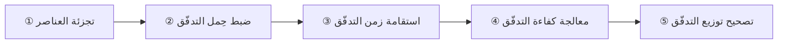
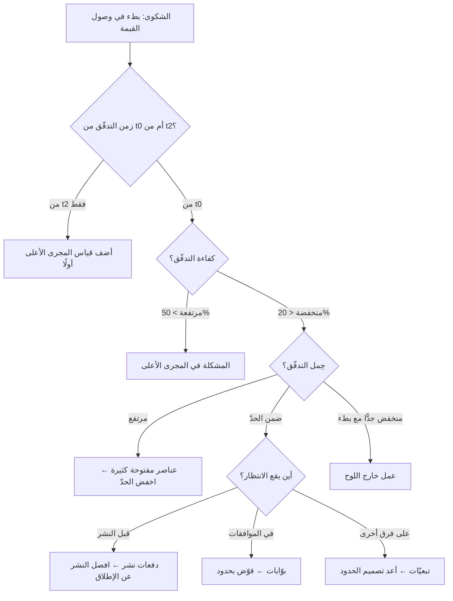

> [!info] الفصل 09 · كورس الإنتاجية
> **ماذا ستتعلّم:** كيف تقرأ مجموعة أرقام وتستنتج منها **أين المشكلة** — وهي المهارة التي تفصل من يجمع المقاييس عمّن يستخدمها. ستتدرّب على **منهج تشخيصي من ستّ خطوات**، ثمّ تطبّقه على **السيناريوهات الثلاثة** التي طُرِحت في المحاضرة — بما فيها **السيناريو الثالث الذي لم يُستوفَ في الجلسة** — ثمّ على **ستّة سيناريوهات إضافية** تغطّي أنماطًا شائعة أخرى. وستخرج بـ**شجرة قرار تشخيصية** تنتقل من العَرَض إلى السبب، وبقائمة **الأخطاء التشخيصية الشائعة** التي تُنتج علاجًا في المكان الخطأ.

> [!abstract] التأصيل
> **يفترض أنّك تعرف:** [[Flow Efficiency]] · [[Flow Load]]
> **ويُؤصّل لك:** [[Bottleneck]] · [[Theory of Constraints]] · [[Feature Flags]]

# الفصل 09 — التشخيص العملي: قراءة الأرقام

## 🎯 أهداف التعلّم

- تطبيق **منهج تشخيصي منظّم** ينتقل من الأرقام إلى السبب الجذري بلا قفز.
- التمييز بين **العَرَض** و**السبب** في قراءة مقاييس التدفّق.
- تحديد أيّ **المجريَين** هو القيد من الأرقام وحدها.
- حلّ السيناريوهات الثلاثة الواردة في المحاضرة حلًّا كاملًا مع تبرير كلّ خطوة.
- تشخيص أنماط شائعة أخرى لم تتناولها الجلسة.
- استخدام **شجرة القرار التشخيصية** للانتقال من العَرَض إلى الفرضية.
- تجنّب **الأخطاء التشخيصية الستّة** التي تُنتج علاجًا في المكان الخطأ.
- صياغة **خطّة تدخّل** بترتيب عمليات صحيح لا بقائمة توصيات متوازية.

---

## الفكرة المحورية: الرقم لا يشخّص — التركيبة تشخّص

> [!quote] من المحاضرة
> **حمزة:** «على السطح ليس لديّ مشكلة إطلاقًا. صحيح؟ وإليكم الصدمة…»

جوهر التشخيص أنّ **كلّ رقم منفردًا يمكن أن يكون سليمًا بينما النظام مريض**. والسيناريو الأوّل نموذجي: كفاءة تدفّق 85% (ممتازة)، وسرعة 50 عنصرًا (ممتازة)، وحِمل مستقرّ (ممتاز) — ومع ذلك زمن الوصول ثلاثة أشهر وأصحاب المصلحة يشتكون.

**والمهارة المطلوبة ليست حفظ نطاقات مرجعية، بل قراءة التناقضات.** فحين يكون رقمان ممتازين ونتيجتهما سيّئة، فأنت لا تقيس المكان الذي تقع فيه المشكلة.

---

## أولًا: المنهج التشخيصي — ستّ خطوات

> [!example] المنهج
> **① ابدأ من الشكوى لا من الأرقام.** ما الذي يشكو منه الناس بالضبط؟ («بطيئون» يختلف عن «لا يلتزمون» يختلف عن «الجودة سيّئة».)
>
> **② حدّد الرقم الذي يجب أن يعكس الشكوى.** كلّ شكوى لها مقياس مقابل. فإن كان المقياس المقابل **سليمًا** والشكوى **قائمة**، فأنت تقيس في المكان الخطأ — وهذه أهمّ إشارة تشخيصية على الإطلاق.
>
> **③ افحص التغطية:** هل يغطّي قياسك الرحلة كاملة من `t0` إلى `t4`؟ وأين ينقطع؟
>
> **④ قسّم الزمن:** أين يقع الزمن الكلّي — مجرى أعلى أم أدنى؟ نشِط أم انتظار؟ وأيّ حالة تحديدًا؟
>
> **⑤ صُغ فرضية واحدة قابلة للإبطال.** «نعتقد أنّ السبب X. وإن كان صحيحًا فسنجد Y في البيانات.» ثم تحقّق.
>
> **⑥ رتّب التدخّل** بترتيب العمليات، لا بقائمة توصيات متوازية.

> [!quote] من المحاضرة — ترتيب العمليات
> **حمزة:** «① **جزّئ الميزات**… ② **اضبط حِمل التدفّق**. ولضبط حِمل التدفّق يجب أن يكون لديّ **حدّ عمل قيد التنفيذ لكلّ حالة**… ③ حين يستقيم حِمل التدفّق، **يستقيم زمن التدفّق** تبعًا له. ④ ثم تبقى **كفاءة التدفّق**… ⑤ و**توزيع التدفّق** مهمّ حتى **لا تراني الإدارة صندوقًا أسود**.»

> [!tip] لماذا الترتيب لا القائمة؟
> لأنّ كلّ خطوة **تُنشئ الشرط** الذي تحتاجه التالية: لا يمكن ضبط الحِمل والعناصر ضخمة (فكلّ عنصر يبقى مفتوحًا أسبوعين)، ولا يستقيم زمن التدفّق والحِمل مضطرب، ولا يُقرأ التوزيع بثقة والنظام غير مستقرّ. والفريق الذي يهاجم الخمسة معًا **لا ينجز أيًّا منها**.

---

## ثانيًا: السيناريو الأوّل — نظام مصرفي بزمن تدفّق ثلاثة أشهر

> [!example] المعطيات
> **الدور:** مدير سكرم لنظام مصرفي معقّد لدولة.
> **الأرقام:** كفاءة تدفّق **85%** · سرعة تدفّق **50 عنصرًا** · حِمل تدفّق **مستقرّ**.
> **الصدمة:** زمن التدفّق من **الفكرة** إلى السوق = **ثلاثة أشهر**. أصحاب المصلحة يشتكون من تأخّر ميزات حيوية.
> **توزيع التدفّق:** **80% ميزات · 20% دَين تقني**.
> **المطلوب:** أين الخلل وكيف يُصلَح؟

### تطبيق المنهج

**① الشكوى:** «الميزات الحيوية تتأخّر في الوصول إلى السوق.» — شكوى **زمن**، لا شكوى جودة ولا التزام.

**② المقياس المقابل:** زمن التدفّق. وهو **سيّئ** (ثلاثة أشهر) بينما كفاءة التدفّق **ممتازة** (85%). وهذا **تناقض ظاهري** — وهو مفتاح الحلّ كلّه.

**③ التغطية:** زمن التدفّق مُقاس **من الفكرة** (`t0`)، بينما كفاءة التدفّق مُقاسة في **المجرى الأدنى** فقط.

**④ تقسيم الزمن:** ولنحسب. كفاءة 85% في المجرى الأدنى تعني أنّ الانتظار هناك **ضئيل**. وبسرعة 50 عنصرًا وحِمل مستقرّ، فزمن المجرى الأدنى معقول جدًّا — لنقدّره بأسبوعين إلى ثلاثة.

**زمن المجرى الأعلى ≈ 90 − 20 = 70 يومًا**

> [!warning] النتيجة
> **نحو 78% من زمن الرحلة يقع في المجرى الأعلى** — أي في تجهيز الفكرة قبل أن تصل الفريق التقني أصلًا.

**⑤ الفرضية:** المجرى الأعلى غير مُدار — لا خطوات صريحة، ولا حدود، ولا قياس. **وما يُثبتها:** إن طلبتَ من أهل المنتج وصف خطواتهم، فلن يستطيعوا الاتفاق على قائمة واحدة.

> [!quote] من المحاضرة — الاستدلال نفسه
> **حمزة:** «الآن: **كفاءة تدفّقي 85%**، ما يعني أنّ **زمن تأخيري — زمن انتظاري — صغير**… فـ**ما الذي يجعلها تستغرق ثلاثة أشهر؟** هذا السؤال يخبرك أين الخلل: **أهو في المجرى الأعلى أم في الأدنى؟** وقد عرفنا فورًا أنّه في **المجرى الأعلى**.»

**⑥ التدخّل — بترتيب:**

| # | الإجراء | المخرَج |
|---|---|---|
| 1 | **إظهار المجرى الأعلى بصريًّا** — تتبّع فكرتين إلى الوراء | قائمة حالات فعلية |
| 2 | **قياس الزمن في كلّ حالة** | تحديد أكبر ثلاث انتظارات |
| 3 | **تصنيف الانتظارات** (مورد · قرار · دفعة · خارجي) | علاج مطابق لكلّ نوع |
| 4 | **حذف الخطوات بلا قرار** | تقصير السلسلة |
| 5 | **حدود عمل قيد التنفيذ لكلّ حالة** | منع تكدّس الأفكار |
| 6 | **تعريف جاهزية + ثقافة أهداف للأولوية** | منع دخول الغامض ومنع «كلّ شيء أولوية» |

> [!warning] ملاحظة على التوزيع 80/20 — نقطة لم تُناقَش في الجلسة
> التوزيع **80% ميزات و20% دَينًا** لنظام مصرفي لدولة هو **مشكلة ثانية مستقلّة** عن مشكلة الزمن. فالأنظمة المصرفية الحكومية تقع في مرحلة **النضج**، وتوزيعها المناسب نحو 30% ميزات مع 30–35% دَينًا و10–15% مخاطر.
>
> وغياب بند **المخاطر** تمامًا من التوزيع لافت وخطير في نظام مصرفي محكوم بمتطلّبات تنظيمية وأمنية. فهذا النظام يبدو سليمًا اليوم ويتّجه إلى مشكلة امتثال أو أمن خلال أرباع قليلة. **والتشخيص الكامل يذكر المشكلتين معًا** — لأنّ حلّ مشكلة الزمن وحدها سيُسرّع الوصول إلى مشكلة أكبر.

---

## ثالثًا: السيناريو الثاني — قطار الإصدار عند 90% ميزات

> [!example] المعطيات
> **الدور:** فريق على قطار إصدار أجايل، منتج في **نموّ سريع**، والإدارة تضغط لأرباح كبيرة.
> **الأرقام:** سرعة التدفّق **أعلى مستوى في تاريخها** · قابلية التنبّؤ **95%** · التوزيع **90% ميزات · 5% عيوب · 5% دَين تقني**.
> **الملاحظة:** أصحاب العمل مسرورون. لكنّ مدير سكرم يرى **طابور اختبار النظام المتكامل مرتفعًا جدًّا**.
> **المطلوب:** ماذا يحدث لو استمرّ الحال بضعة سبرنتات؟

### التشخيص

هذا سيناريو **معكوس** الأوّل: كلّ الأرقام ممتازة والمشكلة **قادمة لا واقعة**. والمهارة هنا **التنبّؤ لا التفسير**.

**التشخيص الأوّل — الطابور مؤشّر متقدّم.**
ارتفاع الطابور عند الاختبار يعني أنّ معدّل **الدخول** إليه يفوق معدّل **الخروج** منه. وبقانون ليتل، زمن العنصر في تلك المحطّة ينمو خطّيًّا مع طول الطابور. وما دام الفارق قائمًا، **الطابور ينمو بلا حدّ**.

> [!quote] من المحاضرة — إجابة معتز
> **معتز:** «بحلول **السبرنت الثالث أو الرابع** سنجد **حِمل عمل كبيرًا جدًّا على طابور ضمان الجودة**، وسنجد **طابور النشر شبه فارغ**… ولن نستطيع شحن ميزة مكتملة.»

**التشخيص الثاني — لماذا الأرقام ممتازة رغم ذلك؟**
لأنّ السرعة وقابلية التنبّؤ تُقاسان على ما **دخل** ومُرّ إلى الاختبار، لا على ما **وصل الإنتاج**. وهذا يكشف **خطأ قياس** في المؤسّسة: إن كانت السرعة تُحسَب عند الإغلاق لا عند `t4`، فهي تعدّ عناصر لم تصل السوق. **والأرقام الممتازة هنا نتيجة قياس خاطئ، لا نتيجة أداء ممتاز.**

**التشخيص الثالث — الأثر التراكمي على ثلاث جبهات:**

| الجبهة | ما يحدث |
|---|---|
| **الجودة** | لا اختبار كافٍ ⇒ عيوب تتراكم وتنفجر عند الإطلاق |
| **الدَّين التقني** | 5% في مرحلة نمو ⇒ تراكم فوق دَين مرحلة النشأة |
| **المخاطر** | **صفر** في التوزيع ⇒ خطر تنظيمي أو أمني بلا مالك |

> [!quote] من المحاضرة
> **حمزة:** «و**دَيني التقني** دُمِّر. أتعرف لماذا؟ لأنّك **تموت** هنا: الإدارة تطلب ميزات وميزات وميزات… فما الحلّ؟ **نبدأ بتقليل نسبة الميزات**… ولماذا أفعل ذلك؟ **للحفاظ على استقرار النظام.**»

### التدخّل

| # | الإجراء | لماذا بهذا الترتيب |
|---|---|---|
| 1 | **حدّ عمل قيد التنفيذ على عمود الاختبار** | يوقف تفاقم الطابور فورًا — أسرع تدخّل أثرًا |
| 2 | **تصحيح نقطة قياس السرعة إلى `t4`** | بدونه ستبقى الأرقام كاذبة ولن يقتنع أحد |
| 3 | **إعادة التوزيع تدريجيًّا** إلى 55/20/20/5 | تدريجيًّا لأنّ القفزة تُفقِد ثقة الإدارة |
| 4 | **معالجة قيد الاختبار جذريًّا** | أتمتة الانحدار وتفكيك حزم الاختبار |
| 5 | **إدخال بند مخاطر** في كلّ ربع | لسدّ الثغرة الأخطر صمتًا |

> [!tip] كيف تُقنع إدارة «مسرورة»؟
> هذه أصعب حالة تفاوضية على الإطلاق، لأنّ **لا أحد يشعر بألم بعد**. والمدخل الوحيد الفعّال هو **المؤشّر المتقدّم**: «طابور الاختبار نما من 4 إلى 19 عنصرًا خلال ثلاثة سبرنتات. وبهذا المعدّل سنعجز عن شحن إصدار مكتمل في السبرنت الخامس. نطلب تدخّلًا الآن لأنّ تكلفته اليوم يومان وتكلفته بعد شهر إصدار كامل.»
>
> ولاحظ بنية الحجّة: **رقم يتحرّك + إسقاط زمني + مقارنة تكلفة الآن بتكلفة لاحقًا.** ولا تستخدم لغة «سنواجه كارثة» — الإدارة سمعتها كثيرًا ولم تقع.

---

## رابعًا: السيناريو الثالث — يومان + ثلاثة أيّام = 45 يومًا

> [!example] المعطيات
> **الدور:** إدارة فريق في مرحلة **النضج والتوسّع**.
> **الأرقام:** زمن التدفّق من التقاط المطوّر = **3 أيّام** · كفاءة تدفّق **80%** · سرعة **40 عنصرًا** · **إجمالي زمن التدفّق = 45 يومًا** (من موافقة العميل حتى السوق) · **فريق المنتج يستغرق يومين فقط**.
> **السؤال:** ما الذي يجعلها 45 يومًا؟

> [!warning] ملاحظة على المصدر
> طُرِح هذا السيناريو في نهاية الجلسة ولم يُستوفَ. الإجابة الوحيدة المسجّلة هي فرضية هبة: **«أظنّها الموافقات أو التبعيّات»** — وهي فرضية صحيحة الاتّجاه. وما يلي **تحليل مُضاف في هذا المرجع**، لا نقل عن المدرّب.

### التحليل الحسابي

**45 − (2 + 3) = 40 يومًا غير مفسَّرة**

**أي أنّ 89% من الرحلة تقع خارج العمل المعلن.** وهذا رقم صادم يستحقّ التفكيك.

### الفرضيات الأربع ودليل كلٍّ منها

| # | الفرضية | ما يُثبتها في البيانات | العلاج |
|---|---|---|---|
| **1** | **انتظار بين المحطّات** — العنصر «جاهز» ولا أحد يلتقطه | فجوات بين تاريخ إتاحة العنصر وتاريخ بدء العمل عليه | حدود عمل قيد التنفيذ + سياسة سحب |
| **2** | **بوّابات موافقة** — أمنية، معمارية، تغييرية، قانونية | حالات «في انتظار موافقة» بأزمنة طويلة | تفويض حدود قرار + موافقة صامتة بمهلة |
| **3** | **دفعات النشر** — العنصر جاهز وينتظر نافذة | تكدّس عناصر في «جاهز للنشر» بأعمار متفاوتة تُفرَّغ دفعةً | زيادة تواتر النشر · فصل النشر عن الإطلاق |
| **4** | **تبعيّات خارجية** — فريق آخر أو مورّد أو جهة | حالات «معطَّل» مربوطة بجهة خارجية | البدء بالتوازي · اتفاقات مستوى خدمة داخلية · تصعيد مجدول |

> [!tip] الفرضية الأرجح إحصائيًّا — والدليل من داخل المعطيات نفسها
> **الفرضية 3 (دفعات النشر)**، لسببين في المعطيات:
> 1. **كفاءة التدفّق 80% في المجرى الأدنى.** أي أنّ الانتظار **داخل** دورة التطوير ضئيل. فالانتظار الكبير يقع **بعد** انتهاء التطوير — وهو بالضبط ما بين «جاهز للنشر» و«منشور».
> 2. **مرحلة النضج والتوسّع.** وهي المرحلة التي تكون فيها بوّابات التغيير ونوافذ النشر في أشدّ صرامتها لأنّ النظام صار حرجًا وله عملاء كثر.
>
> **وهذان معًا يشيران إلى المنطقة نفسها.** والفحص الحاسم: **ما تواتر النشر لديكم؟** فإن كان شهريًّا، فقد وجدتَ 20–30 يومًا من الأربعين في سؤال واحد.

### التدخّل المقترح

| # | الإجراء | الأثر المتوقّع |
|---|---|---|
| 1 | **قياس الأربعين يومًا وتفكيكها** إلى حالات مسمّاة | تحديد أكبر ثلاثة انتظارات |
| 2 | **فصل النشر عن الإطلاق** — النشر تقني، والإطلاق قرار عمل (`Feature Flags`) | يزيل الربط بين جاهزية الكود ونافذة العمل |
| 3 | **زيادة تواتر النشر** تدريجيًّا: شهري ← أسبوعي ← عند الطلب | أكبر مكسب منفرد عادةً |
| 4 | **مراجعة البوّابات**: أيّها يمنع خطرًا حقيقيًّا؟ | حذف بوّابات طقسية |
| 5 | **تفويض بحدود** بدل موافقة لكلّ تغيير | تحويل انتظار القرار إلى قرار فوري |

> [!info] إضافة مرجعية — فصل النشر عن الإطلاق
> **النشر (`Deploy`)** إيصال الكود إلى بيئة الإنتاج. و**الإطلاق (`Release`)** إتاحة الوظيفة للمستخدمين. وربطهما معًا هو ما يجعل كلّ نشر حدثًا عالي المخاطر يستدعي بوّابات ونوافذ.
>
> وفصلهما — عبر **رايات الميزات (`Feature Flags`)** — يسمح بنشر الكود يوميًّا وهو معطَّل، ثمّ تفعيله بقرار عمل في أيّ لحظة. والمكاسب ثلاثة: تقصير زمن التدفّق جذريًّا، وتقليل حجم الدفعة (فأصغر دفعة أقلّ خطرًا)، وإمكان **التراجع الفوري** بإطفاء الراية بدل التراجع عن نشر كامل.
>
> **والكلفة الواجب ذكرها:** الرايات نفسها تُنتج دَينًا تقنيًّا إن لم تُنظَّف — راية بقيت سنتين تعني مسارين للكود يجب اختبارهما معًا. فاشترط لكلّ راية **تاريخ انتهاء** ومالكًا.

---

## خامسًا: ستّة سيناريوهات إضافية

### السيناريو 4 — سرعة ترتفع وشكاوى تزداد

> [!example] الأرقام
> السرعة ارتفعت من 22 إلى 38 عنصرًا · زمن التدفّق ارتفع من 7 إلى 13 يومًا · العيوب الهاربة ارتفعت من 4 إلى 11 لكلّ إصدار.

**التشخيص:** **تفتيت مصطنع** مع تدهور جودة. ارتفاع السرعة **مع** ارتفاع زمن التدفّق دليل قاطع على أنّ العناصر صارت أصغر دون أن يتحسّن التدفّق. وارتفاع العيوب يشير إلى أنّ التجزئة تمّت **دون** تجزئة الاختبار معها — فصارت العناصر أصغر والمخاطرة أكبر.

**العلاج:** ألغِ السرعة من أيّ لوحة عرض إداري فورًا؛ وافحص تجانس أحجام العناصر؛ وتحقّق من أنّ تعريف الإنجاز لم يُخترَق تحت الضغط.

---

### السيناريو 5 — قابلية تنبّؤ 100% ثابتة

> [!example] الأرقام
> قابلية التنبّؤ 100% منذ ستّة سبرنتات · السرعة انخفضت من 30 إلى 19 · زمن التدفّق ثابت.

**التشخيص:** **التزام بأقلّ من القدرة**. الفريق تعلّم أنّ ثمن عدم الالتزام مرتفع، فصار يلتزم بما يضمن إنجازه. وهذه استجابة عقلانية تمامًا لنظام يعاقب على الانحراف — وهي **قانون غودهارت في صورته النقية**.

**العلاج:** ليس تقنيًّا بل ثقافيًّا. أعلِن صراحةً أنّ النطاق الصحّي 80–90%، واحتفِ بسبرنت بلغت فيه قابلية التنبّؤ 85% مع سرعة أعلى. **وافحص ما إذا كان أحد قد عوقب على سبرنت لم يكتمل** — فذلك أصل السلوك عادةً.

---

### السيناريو 6 — كفاءة تدفّق 6%

> [!example] الأرقام
> كفاءة التدفّق 6% · زمن التدفّق 34 يومًا · الحِمل ضمن الحدّ · السرعة مستقرّة.

**التشخيص:** **الانتظار هو النظام كلّه تقريبًا** (32 يومًا من 34). والحِمل ضمن الحدّ يستبعد فرضية «العناصر المفتوحة كثيرة»، فالانتظار **خارجي**: موافقات، تبعيّات على فرق أخرى، نوافذ نشر، أو مورّدون.

**العلاج:** تفكيك الـ32 يومًا وتصنيف كلّ انتظار. ولا تلمس شيئًا داخل الفريق — فتحسين عمل الفريق يمسّ يومين من أصل 34.

> [!warning] الخطأ الشائع هنا
> المؤسّسة التي ترى 6% تندفع عادةً إلى «تحسين إنتاجية الفريق» — وهو أسوأ قرار ممكن. **6% تعني أنّ الفريق ليس القيد إطلاقًا.** وكلّ جهد يُبذَل فيه هدر بحسب نظرية القيود.

---

### السيناريو 7 — توزيع مثالي ومنتج فاشل

> [!example] الأرقام
> التوزيع 50/20/20/10 · زمن التدفّق 8 أيّام · كفاءة 42% · قابلية تنبّؤ 88% · **تبنّي الميزات الجديدة: أقلّ من 3%**.

**التشخيص:** **نظام تسليم ممتاز يخدم اكتشافًا فاشلًا.** كلّ مقاييس التدفّق صحّية، والمشكلة **خارج نطاقها بالكامل**: نبني بإتقان أشياء لا يريدها أحد.

**العلاج:** خارج هذا الكورس. يحتاج **اكتشافًا** (مقابلات، فرضيات، تجارب) ومقاييس أثر. وهذا هو الحدّ الصريح لإطار التدفّق الذي ذكرناه في كلّ فصل: **يقيس كيف نُسلّم، لا هل ما نُسلّمه يستحقّ.**

> [!tip] الدرس الأهمّ من هذا السيناريو
> **مؤسّسة تُتقن التدفّق وتُهمل الاكتشاف تُنتج الشيء الخطأ بكفاءة أعلى** — وهي حالة أسوأ من البطء، لأنّ الأرقام تُطمئن الجميع بينما المنتج يخسر السوق.

---

### السيناريو 8 — حِمل منخفض وزمن تدفّق مرتفع

> [!example] الأرقام
> حِمل التدفّق 3 (والحدّ 4) · زمن التدفّق 21 يومًا · السرعة 6 عناصر/سبرنت لفريق من 7.

**التشخيص:** **عمل يجري خارج اللوح.** حِمل 3 لفريق من 7 يعني إمّا أنّ أربعة أشخاص لا يعملون (مستبعد)، وإمّا أنّهم يعملون على أشياء **غير مسجّلة**: دعم، طلبات مباشرة، اجتماعات، مشاريع جانبية.

**العلاج:** قاعدة صريحة — **ما ليس على اللوح غير موجود**. ثمّ رصد أسبوع كامل لكلّ ما يشغل الفريق فعلًا. والنتيجة النمطية: 30–50% من الوقت على عمل غير مرئي. وهذا في ذاته أهمّ اكتشاف يمكن الخروج به.

---

### السيناريو 9 — كلّ شيء ممتاز والفريق ينهار

> [!example] الأرقام
> كلّ المقاييس ضمن النطاقات الصحّية · لكنّ اثنين من خمسة استقالا خلال ربع · ساعات إضافية متكرّرة.

**التشخيص:** **الأرقام تُقاس والفريق يُستهلَك لتحقيقها.** المقاييس الستّة لا تقيس **الاستدامة**؛ فيمكن بلوغها جميعًا بالعمل ستّين ساعة أسبوعيًّا.

**العلاج:** أضِف مؤشّرات استدامة إلى اللوحة: ساعات خارج الدوام، وحالات التعطيل الطارئة، ونتيجة سؤال بسيط في الاستعادة («هل كان الإيقاع مستدامًا هذا السبرنت؟ نعم/لا»). وراجع مسبّبات ماسلاش الستّة من [[04 - دوّامة الموت والدَّين التقني|الفصل الرابع]].

> [!warning] هذا السيناريو هو الحدّ الأخلاقي للإطار
> **مقاييس التدفّق يمكن استخدامها للضغط كما تُستخدَم للحماية.** والفرق في من يقرأها ولأيّ غرض. ومؤسّسة تصل إلى أرقام ممتازة بفريق منهك لم تنجح؛ إنّها **تستدين من مورد لا يظهر في أيّ مقياس** — وستدفع الدَّين على شكل استقالات وفقدان معرفة.

---

## سادسًا: شجرة القرار التشخيصية

---

## سابعًا: الأخطاء التشخيصية الستّة

| # | الخطأ | مثاله | الوقاية |
|---|---|---|---|
| 1 | **علاج العَرَض** | ساعات إضافية لتعويض التأخير | اسأل «لماذا» خمس مرّات |
| 2 | **تشخيص من رقم واحد** | «سرعتنا ارتفعت ⇒ تحسّنّا» | ثلاثة مقاييس على الأقلّ |
| 3 | **افتراض أنّ القيد هو الفريق** | توظيف عند كفاءة 10% | حدّد القيد قبل الاستثمار |
| 4 | **القياس في غير موضع المشكلة** | قياس المجرى الأدنى والمشكلة أعلى | افحص التغطية من `t0` إلى `t4` |
| 5 | **الاستنتاج من ضجيج** | حكم من سبرنتين | 6–10 نقاط بيانات |
| 6 | **إهمال ما لا يُقاس** | أرقام ممتازة وفريق ينهار | مؤشّرات استدامة |

> [!tip] الخطأ الأوّل هو الأمّ
> **علاج العَرَض** يبدو دائمًا أسرع وأرخص وأكثر استجابةً — ولهذا يُختار. والفارق بينه وبين علاج السبب أنّ العَرَض يعود، وكلّ عودة تُقلّل الثقة في إمكان الإصلاح أصلًا. **والسؤال الذي يمنعه: «إن فعلنا هذا، ما الذي يمنع تكرار المشكلة بعد ثلاثة أشهر؟»** فإن لم يكن لديك جواب، فأنت تعالج عَرَضًا.

---

## 🧾 خلاصة الفصل

1. **الرقم لا يشخّص؛ التركيبة تشخّص.** وأقوى إشارة تشخيصية هي **التناقض** بين رقم ممتاز ونتيجة سيّئة.
2. **المنهج ستّ خطوات**: الشكوى ← المقياس المقابل ← التغطية ← تقسيم الزمن ← فرضية قابلة للإبطال ← تدخّل مرتّب.
3. **ترتيب التحسين لا يُعكس**: تجزئة ← حِمل ← زمن ← كفاءة ← توزيع.
4. **السيناريو الأوّل**: كفاءة 85% مع 3 أشهر ⇒ **المجرى الأعلى** هو القيد؛ وله **مشكلة ثانية** في التوزيع وغياب المخاطر.
5. **السيناريو الثاني**: كلّ الأرقام ممتازة والمشكلة **قادمة**؛ والطابور مؤشّر متقدّم؛ والأرقام الممتازة نتيجة قياس عند الإغلاق لا عند `t4`.
6. **السيناريو الثالث**: 40 يومًا غير مفسَّرة؛ والفرضية الأرجح **دفعات النشر**، بدليلين من المعطيات نفسها.
7. **فصل النشر عن الإطلاق** أكبر مكسب منفرد في معظم حالات زمن التدفّق المرتفع — مع تنظيف الرايات.
8. **سرعة ترتفع مع زمن تدفّق يرتفع** = تفتيت مصطنع.
9. **قابلية تنبّؤ 100% ثابتة** = التزام بأقلّ من القدرة؛ وعلاجه ثقافي.
10. **كفاءة 6%** تعني أنّ الفريق ليس القيد؛ وتحسين إنتاجيّته هدر.
11. **توزيع مثالي مع تبنٍّ 3%** = تسليم ممتاز لاكتشاف فاشل — وهو الحدّ الصريح للإطار.
12. **حِمل منخفض مع بطء** = عمل خارج اللوح.
13. **أرقام ممتازة وفريق ينهار** = الحدّ الأخلاقي للإطار؛ أضِف مؤشّرات استدامة.

---

## ❓ اختبارات ذاتية

> [!question]- 1) كفاءة تدفّق 85% وزمن تدفّق ثلاثة أشهر. كيف تستنتج موضع المشكلة في خطوتين؟
> **الخطوة الأولى:** لاحظ أنّ الرقمين يتناقضان — كفاءة عالية تعني انتظارًا ضئيلًا، فلا يمكن أن تُنتج ثلاثة أشهر. **الخطوة الثانية:** افحص **نطاق** كلّ قياس؛ فتجد أنّ الكفاءة تُقاس في المجرى الأدنى بينما الزمن يُقاس من الفكرة (`t0`). والفرق بين النطاقين هو المجرى الأعلى. وبتقدير المجرى الأدنى بأسبوعين إلى ثلاثة، يتبقّى نحو 70 يومًا — أي **78% من الرحلة قبل أن تصل الفكرة الفريق التقني**.

> [!question]- 2) في السيناريو الثاني، كيف تُقنع إدارة مسرورة بأنّ هناك مشكلة؟
> بـ**المؤشّر المتقدّم**، لأنّ لا أحد يشعر بألم بعد. وبنية الحجّة ثلاثية: **رقم يتحرّك** («طابور الاختبار نما من 4 إلى 19 خلال ثلاثة سبرنتات») + **إسقاط زمني** («بهذا المعدّل نعجز عن شحن إصدار مكتمل في السبرنت الخامس») + **مقارنة تكلفة** («التدخّل اليوم يومان، وبعد شهر إصدار كامل»). وتجنّب لغة «سنواجه كارثة» — فقد سمعتها الإدارة كثيرًا ولم تقع.

> [!question]- 3) في السيناريو الثالث، ما الفرضية الأرجح ولماذا — من داخل المعطيات؟
> **دفعات النشر**، بدليلين من المعطيات نفسها: (أ) **كفاءة 80% في المجرى الأدنى** تعني أنّ الانتظار داخل دورة التطوير ضئيل، فالانتظار الكبير يقع **بعد** انتهائها — أي بين «جاهز للنشر» و«منشور»؛ (ب) **مرحلة النضج والتوسّع** هي التي تكون فيها بوّابات التغيير ونوافذ النشر أشدّ صرامة. والفحص الحاسم: **ما تواتر النشر؟** فنشر شهري يفسّر 20–30 يومًا من الأربعين في سؤال واحد.

> [!question]- 4) اشرح الفرق بين النشر والإطلاق ولماذا يقصّر فصلهما زمن التدفّق.
> **النشر** إيصال الكود إلى الإنتاج، و**الإطلاق** إتاحة الوظيفة للمستخدمين. وربطهما يجعل كلّ نشر حدثًا عالي المخاطر يستدعي نوافذ وبوّابات وموافقات. وفصلهما برايات الميزات يسمح بنشر يومي والوظيفة معطَّلة، ثم تفعيلها بقرار عمل. والمكاسب: زمن تدفّق أقصر، ودفعات أصغر (أقلّ خطرًا)، وتراجع فوري بإطفاء الراية. **والكلفة:** الرايات دَين تقني إن لم تُنظَّف — فاشترط لكلّ راية تاريخ انتهاء ومالكًا.

> [!question]- 5) فريق سرعته ارتفعت 70% وزمن تدفّقه ارتفع 85%. ما التشخيص؟
> **تفتيت مصطنع.** ارتفاع المقياسين معًا دليل قاطع: العناصر صارت أصغر عددًا أكبر، دون أن يتحسّن مرور العنصر في النظام — بل ساء. والسبب المرجّح استخدام السرعة هدفًا (قانون غودهارت). ويتأكّد التشخيص إن ارتفعت العيوب الهاربة معهما، فذلك يعني أنّ التجزئة تمّت دون تجزئة الاختبار. **العلاج:** إزالة السرعة من أيّ لوحة إدارية، وفحص تجانس الأحجام، والتحقّق من عدم اختراق تعريف الإنجاز.

> [!question]- 6) كفاءة تدفّق 6%. ما أسوأ قرار ممكن وما القرار الصحيح؟
> **أسوأ قرار: «تحسين إنتاجية الفريق»** أو التوظيف — لأنّ 6% تعني أنّ الفريق يعمل يومين من أصل 34، فهو **ليس القيد إطلاقًا**، وكلّ جهد فيه هدر بنظرية القيود. **القرار الصحيح:** تفكيك الـ32 يومًا انتظارًا إلى حالات مسمّاة وتصنيفها (مورد · قرار · دفعة · خارجي)، ثم علاج أكبر ثلاثة انتظارات بعلاج مطابق لنوع كلّ منها.

> [!question]- 7) كلّ مقاييس التدفّق ممتازة وتبنّي الميزات أقلّ من 3%. ما الاستنتاج؟
> **نظام تسليم ممتاز يخدم اكتشافًا فاشلًا** — نبني بإتقان أشياء لا يريدها أحد. وهذا **خارج نطاق إطار التدفّق بالكامل**، لأنّه يقيس كيف نُسلّم لا هل ما نُسلّمه يستحقّ. والعلاج اكتشاف حقيقي (مقابلات، فرضيات مكتوبة، تجارب) ومقاييس أثر. والدرس الأخطر: **مؤسّسة تُتقن التدفّق وتُهمل الاكتشاف تُنتج الشيء الخطأ بكفاءة أعلى** — وهي حالة أسوأ من البطء لأنّ الأرقام تُطمئن الجميع.

> [!question]- 8) ما السؤال الذي يمنع علاج العَرَض بدل السبب؟
> **«إن فعلنا هذا، ما الذي يمنع تكرار المشكلة بعد ثلاثة أشهر؟»** فإن لم يكن لديك جواب محدّد، فأنت تعالج عَرَضًا. مثال: ساعات إضافية لتعويض تأخير — لا شيء يمنع التكرار، بل التأخير القادم أرجح لأنّ الدَّين ارتفع. أمّا خفض حدّ العمل قيد التنفيذ فجوابه واضح: العناصر تُغلَق أسرع بنيويًّا. والأداة المكمّلة: **اسأل «لماذا» خمس مرّات** حتى تصل إلى سبب في النظام لا في الأشخاص.

---

## 📚 مراجع الفصل

| المرجع | الصلة |
|---|---|
| Mik Kersten — *From Project to Product* | المقاييس وقراءتها |
| Daniel Vacanti — *Actionable Agile Metrics* | التحليل الإحصائي للتدفّق ومخطّطاته |
| Eliyahu Goldratt — *The Goal* · *نظرية القيود* | تحديد القيد قبل التحسين |
| Forsgren, Humble & Kim — *Accelerate* | تواتر النشر وأثره على زمن الاستحقاق |
| Pete Hodgson / Martin Fowler — *Feature Toggles* | فصل النشر عن الإطلاق وحدود الرايات |
| Taiichi Ohno — «لماذا خمس مرّات» | الوصول إلى السبب الجذري |
| المصدر الأساس | [[2.4 السيناريوهات التشخيصية]] |

---

## 🔗 روابط ذات صلة

**السابق:** [[08 - توزيع التدفّق ومراحل حياة المنتج]] · **التالي:** [[10 - خارطة التطبيق]]
**مصدر السجلّ:** [[2.4 السيناريوهات التشخيصية]]
**مفاهيم:** [[Flow Metrics|مقاييس التدفّق]] · [[Flow Efficiency|كفاءة التدفّق]] · [[Flow Load|حِمل التدفّق]] · [[Bottleneck|الاختناق]] · [[Theory of Constraints|نظرية القيود]] · [[Feature Flags|رايات الميزات]] · [[17 - Burndown Chart|مخطّط الاحتراق]]
