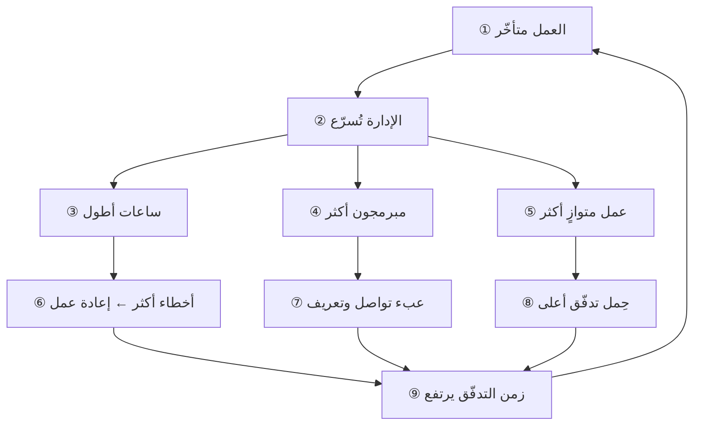
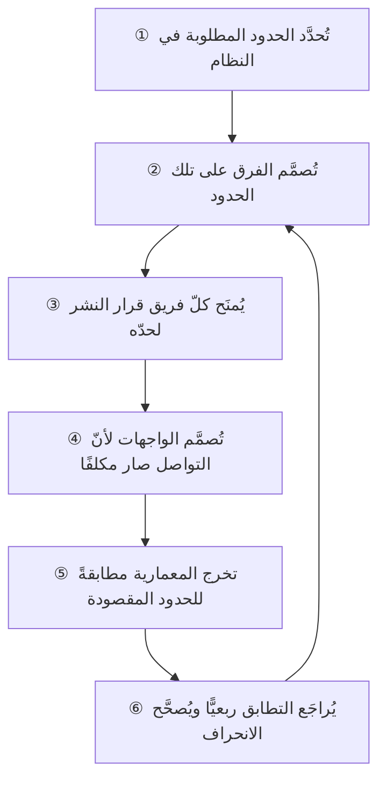

> [!info] الفصل 11 · كورس الإنتاجية
> **ماذا ستتعلّم:** السؤال الواحد الذي يسبق كلّ إطار عمل ويحسم أمره: **أنبني عملياتنا على هيكلنا الإداري أم على رحلة عميلنا؟** ستتعلّم الفرق البنيوي بين **العملية من الداخل إلى الخارج** و**العملية المتمركزة حول العميل**، وأصل كلٍّ منهما (هامر 1990 · ووماك وجونز 1996)، ولماذا تُنتج الأولى زمن تدفّق طويلًا بلا أن يُخطئ فيها أحد. ثم تتعلّم **لماذا يفشل علاج الإدارة** — زيادة الساعات، وإضافة المبرمجين، وفتح عمل متوازٍ — بردّ كلّ إجراء منها إلى القانون الذي يخالفه: **قانون ليتل**، و**صيغة كينغمان**، و**قانون بروكس**. ثم **قانون كونواي** بأصله سنة 1968 وبدليله التجريبي (فرضية المرآة)، و**مناورة كونواي العكسية** بوصفها أداة تصميم لا ملاحظة. وتخرج بـ**خريطة تبعيّات** قابلة للتنفيذ، وبتشخيص **المونوليث الموزّع** — الخدمات المصغّرة التي بقيت معقّدة — وبقراءة نقدية لحدود كونواي نفسه.

> [!abstract] التأصيل
> **يفترض أنّك تعرف:** [[Cross-functional Team]] · [[Dependency]] · [[Little's Law]] · [[Flow Efficiency]]
> **ويُؤصّل لك:** [[Conway's Law]] · [[Customer-Centric Process]] · [[Microservices]] · [[Virtual Team]] · [[Kingman's Formula]]

# الفصل 11 — العملية المتمركزة حول العميل وقانون كونواي

## 🎯 أهداف التعلّم

- التمييز بين **العملية من الداخل إلى الخارج** و**العملية المتمركزة حول العميل** بمعيار بنيوي لا انطباعي.
- تشخيص أيّ نوع من العمليتين تُشغّله مؤسّستك الآن، بخمسة أسئلة فحص.
- ردّ كلّ إجراء تسريع إداري شائع إلى **القانون الكمّي** الذي يخالفه.
- حساب أثر ارتفاع **الاستغلال** على زمن الانتظار حسابًا تقريبيًّا يمكن عرضه على الإدارة.
- شرح **قانون كونواي** بأصله وبالدليل التجريبي عليه، لا بوصفه حكمةً متداولة.
- تطبيق **مناورة كونواي العكسية**: تصميم بنية الفرق لتُنتج المعمارية المطلوبة.
- بناء **خريطة تبعيّات** تُظهر زمن القرار لا عدد الخطوات وحده.
- تشخيص **المونوليث الموزّع** والتفريق بينه وبين الخدمات المصغّرة الحقيقية.
- تحديد ما يبقى للمدير الوظيفي بعد قيام الفريق متعدّد الوظائف — بمسؤوليات قابلة للقياس.
- عرض **الحدّ النقدي**: أين لا يصلح قانون كونواي دليلًا للعمل.

---

## الفكرة المحورية: العملية تُصمَّم على شيء واحد، والاختيار بينهما ليس تقنيًّا

> [!quote] من المحاضرة
> **حمزة:** «لكي نُنهي الجدل حول تطبيق أجايل في الشركات — سكرم وما بعده — سألنا أنفسنا **سؤالًا واحدًا**: هل نبني عمليات تناسب هيكلنا الإداري، أم نبني عمليات تُسهّل رحلة العميل؟»

الجملة تبدو بسيطة إلى حدّ يُغري بتجاوزها. لكنّها في الحقيقة تقول شيئًا حادًّا: **إنّ كلّ عملية في الدنيا مُصمَّمة على شيء ما**، وإنّ الشيء الذي صُمِّمت عليه ليس اختيارًا يُتّخذ في اجتماع، بل هو في الغالب **ما كان حاضرًا في ذهن مصمّمها ولم ينتبه إليه**. فالمدير الذي رسم مسار الموافقات لم يجلس يومًا ليقول: «سأبني هذا على الهيكل الإداري». إنّما نظر إلى الهيكل — لأنّه أمامه، ولأنّه المعطى الوحيد الواضح — فبنى عليه.

ومن هنا يأتي أهمّ ما في هذا الباب: **العملية من الداخل إلى الخارج ليست خطأً ارتُكب، بل هي الحالة الافتراضية.** إنّها ما يقع تلقائيًّا حين لا يقرّر أحد شيئًا. أمّا العملية المتمركزة حول العميل فلا تقع تلقائيًّا أبدًا؛ يجب أن **تُقصَد**.

وأثر ذلك عمليّ لا فلسفيّ. فالفريق الذي يقيس زمن تدفّقه فيجده طويلًا يبحث عن **مذنب**: أهو بطء المطوّرين؟ أم كثرة العيوب؟ أم ضعف التقدير؟ وقد لا يكون أيّ من ذلك. قد يكون السبب أنّ العمل يعبر خمسة أقسام لأنّ الهيكل خمسة أقسام — وكلّ قسم منها يعمل بكفاءة تامّة داخل حدوده.

> [!tip] القاعدة العملية
> قبل أن تسأل «أين البطء في عمليتنا؟»، اسأل: **على أيّ شيء رُسِمت هذه العملية أصلًا؟** فإن كانت مرسومةً على الهيكل، فالبطء ليس عطبًا فيها — بل هو **أداؤها المتوقّع**.

---

## أولًا: مدرستان في تصميم العمليات

### 1) العملية من الداخل إلى الخارج — ومن أين جاءت

> [!quote] من المحاضرة
> **حمزة:** «العملية من الداخل إلى الخارج — بوصفها مصطلحًا ومدرسةً في تصميم العمليات — حقّقت الكثير **في زمنها**، أيّام الثورة الصناعية. لكنّنا حين جئنا نبني **برمجيات**، وجدنا أنفسنا ننظر إلى **هيكلنا الإداري** ونبني عملياتنا فوقه.»

الإنصاف الذي في هذه العبارة يستحقّ الوقوف عنده، لأنّه يُميّز التحليل من الدعاية. فالعملية المصمّمة على الوظيفة **حقّقت الكثير فعلًا**، ولسبب وجيه: في مصنع، تكون الكفاءة في **التخصّص**. فمن يُركّب المحرّك ألف مرّة يصير أسرع وأدقّ ممّن يركّبه مرّةً كلّ شهر. وتجميع المتخصّصين في قسم واحد يجعل تدريبهم أسهل، وقياسهم أوضح، وترقيتهم أعدل.

> [!info] إضافة مرجعية — من أين جاء تقسيم العمل الوظيفي
> لم يرد هذا في المحاضرة، وهو أصل ما تصفه. الجذر النظري **آدم سميث** في *ثروة الأمم* (1776) ومثاله الشهير في مصنع الدبابيس: أنّ عشرة عمّال يقسمون العمل على مراحل يُنتجون أضعاف ما ينتجه عشرة يصنع كلّ منهم دبّوسًا كاملًا. ثم صاغه **فريدريك تايلور** صياغةً إدارية في *مبادئ الإدارة العلمية* (1911) — وهي [[Scientific Management|الإدارة العلمية]] — فصار التخصّص الوظيفي بنيةً تنظيمية لا مجرّد أسلوب عمل. والفكرة صحيحة في موضعها: **كلّما تكرّرت الوحدة وقلّ تغيّرها، ارتفع عائد التخصّص.** والبرمجية بالضبط هي الحالة المضادّة: الوحدة **لا تتكرّر**، إذ لو تكرّرت لنُسخت بأمر واحد.

فالمشكلة إذن ليست أنّ المدرسة القديمة كانت خاطئة، بل أنّها **نُقِلت إلى مجال تنقلب فيه فرضيتها**. وهذا نوع من الخطأ أخطر من الخطأ الصريح، لأنّ من يرتكبه يستند إلى نجاح حقيقي سابق.

### 2) العملية المتمركزة حول العميل

> [!quote] من المحاضرة
> **حمزة:** «ومن هنا نشأ مبدأ العملية المتمركزة حول العميل، وهو ببساطة أن نسأل أنفسنا سؤالًا واحدًا لا غير: **كيف نُوصِل القيمة إلى العميل في أقصر وقت وبأقلّ تكلفة؟**»

المعيار هنا **زمنيّ ومكانيّ معًا**: أن تُرسَم العملية بمحاذاة **مسار العمل** لا بمحاذاة **مخطّط المؤسّسة**. فتُسأل: ما الخطوات التي يمرّ بها طلبُ عميل من لحظة نشوئه إلى لحظة انتفاعه؟ ثم يُصمَّم التنظيم ليخدم ذلك المسار.

> [!info] إضافة مرجعية — أصلان لهذه المدرسة
> لم تُسمَّ في المحاضرة، وهذان مصدراها الرئيسان:
>
> 1. **مايكل هامر**، في مقالته في *Harvard Business Review* سنة 1990 بعنوان *«Reengineering Work: Don't Automate, Obliterate»*، ثم كتابه مع جيمس تشامبي *Reengineering the Corporation* (1993). وحجّته أنّ أتمتة عملية مصمَّمة على الأقسام تُسرّع الخطأ ولا تُصلحه، وأنّ الإصلاح يبدأ بإعادة تنظيم العمل حول **العملية** لا حول **الوظيفة**.
> 2. **جيمس ووماك ودانيال جونز** في *Lean Thinking* (1996)، وفيه صيغ مفهوم **[[Value Stream|تدفّق القيمة]]** صياغته المعروفة: أن تُرسَم كلّ خطوة يمرّ بها المنتج من الطلب إلى التسليم، ثم يُسأل عن كلّ خطوة: أتُضيف قيمةً للعميل، أم هي انتظار أو نقل أو تفتيش؟
>
> وهناك أصل ثالث أقدم وأعمّ: **سلسلة القيمة** عند **مايكل بورتر** في *Competitive Advantage* (1985). والفرق أنّ بورتر يصف كيف تتولّد القيمة اقتصاديًّا، وهامر وووماك يصفان كيف يُعاد تنظيم العمل عليها.

### 3) جدول التمييز

| وجه المقارنة | العملية من الداخل إلى الخارج | العملية المتمركزة حول العميل |
|---|---|---|
| **على أيّ شيء رُسِمت؟** | الهيكل الإداري والأقسام | مسار وصول القيمة إلى العميل |
| **وحدة التنظيم** | القسم الوظيفي (تطوير · اختبار · تشغيل) | الفريق متعدّد الوظائف حول تدفّق واحد |
| **ما الذي تُحسّنه** | كفاءة كلّ محطّة على حدة | زمن العبور الكلّي |
| **مقياسها الطبيعي** | إنتاجية القسم · استغلال الموارد | [[Flow Time\|زمن التدفّق]] · [[Flow Efficiency\|كفاءة التدفّق]] |
| **موقع التسليمات** | بين الأقسام، وهي كثيرة | داخل الفريق، وهي قليلة |
| **متى تتفوّق** | عمل متكرّر منخفض التغيّر | عمل معرفي عالي التغيّر |
| **عطبها المميّز** | كلّ محطّة كفؤة والنظام بطيء | صعوبة بناء العمق التخصّصي |

**والسطر الحاسم في هذا الجدول هو الأخير قبل العطب:** أنّ كلّ محطّة قد تكون كفؤة والنظام كلّه بطيء. وهذه ليست مفارقةً بل نتيجة رياضية مباشرة — وهي موضوع المحور التالي.

### 4) خمسة أسئلة فحص: أيّ عملية تُشغّلها؟

هذه أسئلة عن **آثار تُرى** لا عن نيّات تُدَّعى:

1. **كم جهةً يعبرها عنصر عمل واحد** من لحظة الفكرة إلى وصولها للمستخدم؟ عُدّ الجهات لا الخطوات.
2. **من يملك زمن العبور الكلّي؟** إن لم يكن للرقم مالك واحد، فلا أحد يُحسّنه.
3. **لو تعطّل عنصر عمل عند محطّة، من يعلم بذلك؟** أهي المحطّة وحدها، أم الفريق كلّه؟
4. **هل يُقاس أحد بإنتاجية قسمه** منفصلةً عن وصول العمل إلى السوق؟
5. **حين يُطلب تسريع شيء، من يُستدعى؟** إن كان الجواب «مديرو الأقسام يجتمعون»، فالعملية مرسومة على الهيكل.

> [!tip] قاعدة الحكم
> إن كانت الإجابة عن ثلاثة من هذه الخمسة تشير إلى الأقسام، فأنت تُشغّل عمليةً من الداخل إلى الخارج — **مهما كانت أسماء أدواتك وشعائرك**.

> [!warning] المزلق العملي
> أشيع خطأ هنا أن يُظنّ أنّ **تسمية** الفرق باسم المنتج تكفي. فقد تجد «فريق منتج الحجوزات» وهو في حقيقته اجتماع دوريّ يحضره ممثّل من كلّ قسم، ولا يملك أحد فيه قرارًا إلّا بالرجوع إلى قسمه. وذلك هيكل وظيفيّ حمل اسمًا آخر — و**المعيار الفاصل هو موضع القرار لا موضع المقعد**.

---

## ثانيًا: لماذا يفشل علاج الإدارة — فيزياء الطوابير

> [!quote] من المحاضرة
> **حمزة:** «العمل متأخّر. فما حلّ المدير؟ *دَعِ الناس يعملون أكثر.* فيزداد العمل تأخّرًا. *أضِف مبرمجين.* فيزداد تأخّرًا أكثر. *افتح أعمالًا أخرى بالتوازي.* هذا كلّه، يا أصدقاء، يقع **خارج قوانين الفيزياء**.»

هذه أهمّ فقرة في المحاضرة كلّها من جهة **القيمة الحجاجية**، لأنّها تنقل النقاش من ساحة الرأي إلى ساحة الحساب. فالمدير الذي يُقال له «هذا الإجراء يضرّ» يسمع رأيًا يخالف رأيه فيرجّح رأيه. والمدير الذي يُقال له «هذا الإجراء يخالف قانونًا كمّيًّا مقيسًا منذ الستّينيات» أمام شيء آخر تمامًا.

ولنكن دقيقين في العبارة: هذه ليست «قوانين الفيزياء» بالمعنى الحرفي — إنّها **نظرية الطوابير** (`Queueing Theory`)، وهي فرع رياضي احتمالي نشأ في الهندسة والاتّصالات. والتعبير المجازي مقبول في محاضرة، لكن حين تعرضها على إدارة، اذكرها باسمها الصحيح: فذلك أقوى لك لا أضعف.

### 1) جدول الإجراءات الأربعة

| الإجراء الإداري | ما يُظنّ أنّه يفعله | ما يفعله فعلًا | القانون الحاكم |
|---|---|---|---|
| **زيادة ساعات العمل** | يزيد الإنتاج بنسبة الساعات | يرفع معدّل الخطأ فيزيد [[Rework Percentage\|إعادة العمل]]، ويستهلك الأثر خلال أسابيع | منحنى الإرهاق · [[Sustainable Pace\|الوتيرة المستدامة]] |
| **إضافة مبرمجين لمشروع متأخّر** | يقسم العمل فيقصر الزمن | يُنشئ عبء تعريف وتواصل يستهلك أكثر ممّا يضيف، في الأجل القصير | **قانون بروكس** ([[Brooks's Law]]) |
| **فتح عمل متوازٍ** | يُشغل الطاقة العاطلة | يرفع [[Flow Load\|حِمل التدفّق]]، فيطول [[Cycle Time\|زمن الدورة]] طردًا | **[[Little's Law\|قانون ليتل]]** |
| **رفع الاستغلال إلى 100%** | يستخرج أقصى قيمة من الكلفة | يرفع زمن الانتظار ارتفاعًا حادًّا قرب الحدّ | **[[Kingman's Formula\|صيغة كينغمان]]** |

### 2) قانون ليتل: لماذا يُطيل العمل المتوازي كلّ شيء

قانون ليتل — الذي أثبته **جون ليتل** سنة 1961 — علاقة بسيطة تصف أيّ نظام مستقرّ:

**زمن الدورة = حِمل التدفّق ÷ معدّل الإنجاز**

وحدّه المهمّ: أنّ **معدّل الإنجاز لا يزيد بزيادة الحِمل**. فالفريق الذي يُنجز خمسة عناصر أسبوعيًّا يُنجز خمسة سواء أَفتح عشرة عناصر أم عشرين. فإن ضاعفتَ ما هو مفتوح، ضاعفتَ زمن انتظار كلّ عنصر — ولم تُنجز عنصرًا واحدًا زائدًا.

| ما هو مفتوح | معدّل الإنجاز الأسبوعي | زمن الدورة الناتج |
|---|---|---|
| 5 عناصر | 5 | أسبوع واحد |
| 10 عناصر | 5 | أسبوعان |
| 20 عنصرًا | 5 | أربعة أسابيع |

وهذا هو ما يجعل «افتح عملًا متوازيًا» أسوأ الإجراءات الأربعة: **إنّه الوحيد الذي يُنتج تأخّرًا فوريًّا ومحسوبًا، بلا أيّ مكسب مقابل.** أمّا زيادة الساعات فتُعطي مكسبًا قصيرًا يزول، وإضافة المبرمجين تُعطي مكسبًا مؤجّلًا حقيقيًّا. أمّا فتح المتوازي فلا يُعطي شيئًا في أيّ أجل.

### 3) صيغة كينغمان: لماذا 100% استغلال كارثة

> [!quote] من المحاضرة
> **حمزة:** «هناك شركات تدفع **استغلال الفريق إلى مئة بالمئة** — وماذا يفعل ذلك؟ يزيد العمل تأخّرًا.»

> [!info] إضافة مرجعية — صيغة كينغمان
> لم تُشرح في المحاضرة، وقد اكتُفي بذكر اسمها. صاغها **جون كينغمان** سنة 1961 تقريبًا لزمن الانتظار في طابور عامّ. والذي يعنينا منها ليس شكلها الرياضي بل **سلوكها**: أنّ زمن الانتظار يتناسب مع مقدارٍ يكبر بلا حدّ كلّما اقترب الاستغلال من الواحد الصحيح. فالانتقال من استغلال 50% إلى 60% يُضاعف الانتظار تقريبًا؛ والانتقال من 90% إلى 95% يُضاعفه مرّةً أخرى. والعلاقة **ليست خطّية**، وهذا هو أصل المفاجأة.

| نسبة الاستغلال | مضاعِف الانتظار التقريبي | القراءة |
|---|---|---|
| 50% | 1× | المرجع |
| 75% | 3× | ما يزال محتملًا |
| 90% | 9× | التأخّر صار هو القاعدة |
| 95% | 19× | كلّ اضطراب صغير يُحدث أزمة |
| 99% | 99× | النظام عمليًّا متوقّف عن الاستجابة |

**والقراءة الإدارية لهذا الجدول أهمّ من الأرقام نفسها:** أنّ **الطاقة العاطلة ليست هدرًا، بل هي ثمن السرعة.** فالفريق المشغول 100% لا يملك أن يستجيب لشيء لم يُخطَّط له — وكلّ عمل معرفي فيه ما لم يُخطَّط له.

> [!info] إضافة مرجعية — الأصل النظري لهذا الاستعمال
> ربط اقتصاديات الطوابير بتطوير المنتجات صاغه **دونالد راينرتسن** في *The Principles of Product Development Flow* (2009)، وهو الذي جعل جملة «الطاقة العاطلة استثمار لا هدر» قاعدةً في هذا المجال. وفيه أيضًا تأصيل **حجم الدفعة** الذي يفسّر فخّ الدفعة الواحدة في المحور التالي.

*الحلقة أعلاه موجبة لا سالبة: كلّ دورة تُنتج تأخّرًا أكبر يستدعي تسريعًا أشدّ. وهي الوجه التنظيمي لما شُرِح في [[04 - دوّامة الموت والدَّين التقني|الفصل الرابع]] من الوجه التقني.*

> [!warning] المزلق العملي
> لا تعرض هذه القوانين على الإدارة بوصفها **اعتراضًا**. اعرضها بوصفها **تفسيرًا لما يرونه هم أصلًا**: «لاحظتم أنّ آخر ثلاث مرّات أضفنا فيها ناسًا لم يتحسّن التسليم. هذا سببه، وهذا اسمه.» فالقانون الذي يفسّر تجربتهم يُقبَل؛ والقانون الذي يُصحّح قرارهم يُردّ.

---

## ثالثًا: الفريق متعدّد الوظائف — من فخّ الدفعة إلى التدفّق

> [!quote] من المحاضرة
> **حمزة:** «عمل المطوّرون وحدهم وأنهوا عملهم. فلمّا رموا به إلى الاختبار، وقع **فخّ الدفعة الواحدة** … والكارثة أنّ فريق التطوير كان قد بدأ في **عمل جديد** — فصار لا يدري ماذا يفعل … **ولا شيء يُسلَّم.**»

المشهد مألوف إلى حدّ يُخفي دقّته. ولنفكّكه إلى ثلاث آفات متمايزة، لأنّ كلًّا منها يُعالَج بأداة مختلفة:

1. **حجم الدفعة الكبير.** لم ينتقل العمل قطعةً قطعة بل جملةً واحدة. وأثر ذلك أنّ التغذية الراجعة تأخّرت إلى آخر لحظة ممكنة.
2. **تبديل السياق.** فريق التطوير كان قد انتقل ذهنيًّا وتقنيًّا إلى عمل آخر، فرجوعه يكلّف أكثر من كلفة الإصلاح نفسه ([[Context Switching Cost|كلفة تبديل السياق]]).
3. **غياب الأولوية.** لم يكن معرَّفًا سلفًا ما الذي يتقدّم: العيب الجديد أم الميزة الجارية. فتُتّخذ القرارات فرديًّا وتختلف من شخص إلى آخر.

| الآفة | العلاج المباشر | أين تُفصَّل |
|---|---|---|
| حجم الدفعة | تصغير القطعة وتسليمها أوّلًا بأوّل | [[Task and Story Slicing\|تجزئة المهامّ والقصص]] |
| تبديل السياق | حدّ العمل قيد التنفيذ | [[06 - مقاييس التدفّق الستة\|الفصل 06]] |
| غياب الأولوية | فئة خدمة معلنة للعيوب | [[Expedite Class\|فئة المسار السريع]] |

**ولاحظ أنّ الفريق متعدّد الوظائف لا يعالج الثلاثة.** إنّه يعالج الأولى والثانية بقوّة، لأنّه يجعل الاختبار داخل الدورة لا بعدها. أمّا الثالثة فتحتاج قرارًا معلنًا لا بنيةً — وهذا موضع يُخطئ فيه كثير ممّن يظنّ أنّ تغيير شكل الفريق يحلّ كلّ شيء.

### ما ليس فريقًا متعدّد الوظائف

- **ليس** فريقًا يضمّ التخصّصات ولكلّ تخصّص فيه مدير يُقرّر أولوياته.
- **ليس** فريقًا يجتمع أسبوعيًّا ويعمل بقيّة الأسبوع في أقسامه.
- **ليس** فريقًا يملك التخصّصات كلّها إلّا واحدًا يظلّ خارجه — فالسلسلة تنقطع عند أضعف حلقاتها، والتسليم الواحد الباقي يكفي لإعادة الطابور.

> [!tip] القاعدة العملية
> اختبار الفريق متعدّد الوظائف في سؤال واحد: **أيستطيع هذا الفريق أن يأخذ عنصرًا من فكرة إلى مستخدم بلا أن ينتظر أحدًا خارجه؟** فإن كان الجواب «إلّا في…»، فما بعد «إلّا» هو تعريف تبعيّتك الحرجة.

---

## رابعًا: الفرق الافتراضية — حلّ وسط له ثمن

> [!quote] من المحاضرة
> **حمزة:** «أمّا أهل SAFe — حتى لا يُغضبوا الهيكل الإداري — فقالوا: *انظروا، سنترك الهيكل كما هو تمامًا*… سنعمل بشيء اسمه **الفريق الافتراضي**. سيكون هناك فريق متعدّد الوظائف، لكن سيبقى **أيضًا** مدير تطوير، ومدير اختبار.»

الفريق الافتراضي — أن يبقى الشخص تابعًا لقسمه إداريًّا وهو يعمل يوميًّا في فريق منتج — ليس اختراعًا رشيقًا. إنّه **التنظيم المصفوفي** (`Matrix Organisation`) الذي عُرِف في الصناعات الهندسية والفضائية منذ الستّينيات، وأُعيد استعماله هنا.

| الوجه | ما يكسبه | ما يخسره |
|---|---|---|
| **قبول التغيير** | لا يُهدَّد أحد في موقعه، فتقلّ المقاومة | يبقى مصدر السلوك القديم قائمًا |
| **العمق التخصّصي** | يحفظ مسار النموّ المهني داخل التخصّص | — |
| **وضوح الأولوية** | — | ولاء مزدوج: أولوية الفريق وأولوية القسم |
| **سرعة القرار** | — | كلّ قرار قد يحتاج موافقتين |

**والحكم المنصف:** الفريق الافتراضي **خطوة انتقالية جيّدة وحالة نهائية سيّئة**. فهو يُخفّف مقاومة السنة الأولى، لكنّه إن دام سنوات صار مصدرًا دائمًا لتنازع الأولويات — وهو بعينه ما تحكيه [[3.2 المساءلة المتبادلة والرشاقة المؤسّسية|قصّة كريمة]] في المحاضرة: مسائل تخرج عن نطاق الفريق لأنّ سلطتها بقيت في القسم.

> [!info] إضافة مرجعية — البديل الذي تقترحه أدبيات تصميم الفرق
> لم يُذكر في المحاضرة. في *Team Topologies* (2019) لماثيو سكيلتون ومانويل بايس، يُقترح بدل التنظيم المصفوفي **أربعة أنماط للفرق** — الفريق المتوائم مع التدفّق، وفريق التمكين، وفريق النظام الفرعي المعقّد، وفريق المنصّة — و**ثلاثة أنماط للتفاعل** بينها. والفكرة الحاكمة أنّ التخصّص يُحفَظ في **فريق تمكين** يخدم فرق التدفّق ولا يملك أولوياتها، بدل أن يُحفَظ في مدير وظيفيّ ينازعها عليها. فيُصان العمق التخصّصي بلا ازدواج في الأمر.

---

## خامسًا: ماذا يبقى للمديرين؟

> [!quote] من المحاضرة
> **حمزة:** «وما موقع أولئك المديرين من الإعراب؟ **ليس** التوجيه وإصدار الأوامر. دورهم أن **يزيدوا قدرة الفريق**: أن يواكبوا الجديد، وأن يبنوا خططًا لكيفية تقوية مهارات الفريق.»

هذا الجواب صحيح لكنّه — كما ورد — **غير قابل للقياس**. و«تنمية الفريق» عبارة يوقّع عليها كلّ مدير ولا يفعلها أحد، لأنّها لا تُنتج أثرًا يُرى في نهاية الربع. فلنحوّلها إلى مسؤوليات لها مُخرَجات:

| المسؤولية | المُخرَج الذي يُرى | كيف يُقاس |
|---|---|---|
| **خريطة المهارات** | مصفوفة تُظهر أين المعرفة محصورة في شخص واحد | عدد نقاط الفشل المفردة، ربعيًّا |
| **معالجة عامل الحافلة** | خطّة إزدواج معرفة لكلّ نقطة مفردة | انخفاض العدد أعلاه |
| **مسار النموّ** | مسار مهني معلن لكلّ مستوى | نسبة من لديه خطّة نموّ مكتوبة |
| **المعايير التقنية** | معايير مشتركة عبر الفرق (مراجعة الكود · الأمن) | وجود المعيار واتّباعه، لا الاجتماع عليه |
| **التوظيف والاستبقاء** | ملء الشواغر وخفض الدوران | زمن الشغور · معدّل الدوران |
| **إزالة العوائق التنظيمية** | ما رُفِع من تبعيّات خارجية فعلًا | سجلّ العوائق المغلقة |

> [!info] إضافة مرجعية — من أين جاء هذا الفصل بين الدورين
> فصل «مدير القدرة» عن «مالك الأولوية» شاع بنموذج سبوتيفاي كما وصفه **هنريك كنيبرغ** و**أندرس إيفارسون** سنة 2012: القبيلة والفصيل والفصل (`Chapter`)، حيث يكون قائد الفصل مديرًا للتخصّص لا لأولويات العمل. **ويجب أن يُذكر معه نقده**: نشر **جيريميا لي** — وقد عمل في سبوتيفاي — مقالته *«Failed #SquadGoals»* سنة 2020، وبيّن أنّ النموذج لم يعمل داخل سبوتيفاي نفسها كما وُصف في الورقة، وأنّ ما انتشر كان **لقطةً لتجربة جارية** لا وصفًا لنظام ناضج. والدرس المنهجي أهمّ من التفصيل: **النموذج الذي يُنسخ باسم شركة ناجحة يُنسَخ غالبًا في طور لم يُختبَر فيه بعد.**

> [!warning] المزلق العملي
> المدير الذي تُنزَع منه سلطة توجيه العمل ولا يُعطى **مسؤوليةً بديلة لها مُخرَج مُقاس** لن يصير مدرّبًا للفريق — بل سيصير طبقةً تُوقّع بلا أن تُقرّر، وهي أسوأ من الطبقة الآمرة: تُبطئ ولا تُفيد. **فالتحوّل يبدأ بتعريف الدور الجديد قبل إلغاء القديم، لا بعده.**

---

## سادسًا: قانون كونواي — من ملاحظة إلى أداة تصميم

> [!quote] من المحاضرة
> **حمزة:** «قال كونواي كلامًا بديعًا: **تعقيد البرمجية — تعقيد النظام — يزداد بازدياد تعقيد التواصل بين الفرق، وبين أعضاء الفريق الواحد**… فإن كنّا أنا وعمر وموجي فريقًا واحدًا، وكان **التواصل بيننا صعبًا**، فالبرمجية التي نبنيها ستكون **صعبة** لا محالة.»

### 1) النصّ الأصلي، وما يقوله بالضبط

> [!info] إضافة مرجعية — أصل القانون
> صاغه **ملفن كونواي** في ورقة عنوانها *«How Do Committees Invent?»*، نُشرت في مجلّة *Datamation* في أبريل 1968 بعد أن رُفضت من *Harvard Business Review*. ونصّه:
>
> *«Organizations which design systems … are constrained to produce designs which are copies of the communication structures of these organizations.»*
>
> **الترجمة:** «المؤسّسات التي تصمّم أنظمة … مُقيَّدة بأن تُنتج تصاميم هي نسخ من بنى التواصل في تلك المؤسّسات.»
>
> ولاحظ ثلاثة أشياء في الأصل يُغفَل عنها في التداول: أنّه يقول **بنية التواصل** لا **المخطّط التنظيمي** — وهما يختلفان كثيرًا؛ وأنّه يقول **مقيَّدة** (`constrained`) لا «تميل»، أي أنّها ملاحظة عن حدّ لا عن نزعة؛ وأنّه يتحدّث عن **التصميم** لا عن جودة النتيجة.

والفرق بين «بنية التواصل» و«المخطّط التنظيمي» عمليّ لا لفظيّ. فقد يكون المخطّط أقسامًا منفصلة والتواصل الحقيقي يجري بحرّية في غرفة واحدة؛ وقد يكون المخطّط فريقًا واحدًا وأعضاؤه في ثلاث مناطق زمنية لا يلتقون. **والذي يُشكّل النظام هو الثاني لا الأوّل.**

### 2) الدليل التجريبي: فرضية المرآة

> [!info] إضافة مرجعية — هل هذا مقيس أم حكمة متداولة؟
> لم تُذكر في المحاضرة، وهي ما يرفع كونواي من قول مأثور إلى نتيجة بحثية. درس **ألان ماكورماك** و**جون رسناك** و**كارليس بالدوين** (من مدرسة هارفارد للأعمال) ما سُمّي **فرضية المرآة** (`The Mirroring Hypothesis`)، ونشروا سنة 2012 دراسةً بعنوان *«Exploring the Duality Between Product and Organizational Architectures»*. وقارنوا فيها منتجات برمجية مطوَّرة في مؤسّسات مغلقة موزّعة الفرق بمنتجات مماثلة وظيفيًّا مطوَّرة في مجتمعات مفتوحة موزّعة جغرافيًّا. **والنتيجة:** أنّ منتجات المؤسّسات المتراصّة جاءت أشدّ ترابطًا في بنيتها، ومنتجات المجتمعات الموزّعة جاءت أكثر تفكّكًا (`modular`) — بفروق دالّة إحصائيًّا. أي أنّ الأثر قابل للقياس لا مجرّد انطباع.

### 3) الجدول الذي يُترجم القانون إلى تصميم

> [!quote] من المحاضرة
> **حمزة:** «**فرق معزولة ← كود متشابك متداخل التبعيّات. فرق مستقلّة ← معمارية خدمات مفكوكة الارتباط.**»

| بنية التواصل التنظيمية | ما تُنتجه في النظام | العلامة التي تراها في الكود |
|---|---|---|
| أقسام منفصلة بموافقات بينها | حدود غامضة وتبعيّات ضمنية | تغيير واحد يمسّ ثلاثة مستودعات |
| فريق واحد لكلّ مجال أعمال | حدود واضحة تطابق المجال | التغيير محصور في مستودع واحد |
| فرق موزّعة بمناطق زمنية متباعدة | واجهات صريحة وموثّقة قسرًا | عقود واجهات مكتوبة ومُصدَّرة |
| فريق ضخم في مساحة واحدة | نظام مترابط يصعب فصله لاحقًا | لا حدود داخلية أصلًا |
| ملكية مشتركة بلا مالك | مناطق «لا يمسّها أحد» | كود قديم لا يُعدَّل ويُلتفّ حوله |

**والسطر الرابع هو المفارقة المفيدة:** أنّ **التقارب المفرط ينتج تشابكًا أيضًا**. فالفريق الذي يستطيع كلّ فرد فيه أن يسأل أيّ فرد في أيّ لحظة لا يحتاج إلى تعريف واجهات — فلا يعرّفها، فيخرج النظام بلا حدود داخلية. وهذا يقلب الفهم الشائع لكونواي: القانون **لا يقول إنّ التواصل الكثير خير**، بل يقول إنّ **شكل النظام سيشبه شكل التواصل** — أيًّا كان ذلك الشكل.

### 4) مناورة كونواي العكسية

> [!info] إضافة مرجعية — من الملاحظة إلى الأداة
> شاع مصطلح **مناورة كونواي العكسية** (`Inverse Conway Maneuver`) في أدبيات هندسة البرمجيات من نحو 2015 (وقد تناوله فريق ThoughtWorks في *Technology Radar*، وتوسّع فيه *Team Topologies* لاحقًا). ومضمونه قلب القانون من وصف إلى تصميم:
>
> **بدل أن تقبل المعمارية التي فرضها تنظيمك، صمّم تنظيمك ليفرض المعمارية التي تريدها.**
>
> فإن أردت ثلاث خدمات مستقلّة، فأنشئ ثلاثة فرق مستقلّة تملك كلّ منها قرارها ونشرها — وستُنتج البنيةَ من تلقاء نفسها. وإن أنشأت فريقًا واحدًا وطلبت منه ثلاث خدمات مستقلّة، فستحصل على ثلاث خدمات يستدعي بعضها بعضًا استدعاءً متزامنًا ولا تُنشَر إلّا معًا.

*المخطّط يصف المناورة العكسية دورةً لا خطوةً واحدة: فالانحراف بين حدود الفرق وحدود النظام يعود مع كلّ إعادة تنظيم، ويُصحَّح بمراجعة دورية لا بقرار واحد.*

> [!warning] المزلق العملي
> المناورة العكسية أداة **بطيئة**. فتغيير بنية الفرق يُنتج أثره في المعمارية خلال أرباع لا أسابيع، لأنّ الكود القائم لا يُعاد تشكيله بإعادة التنظيم — إنّما **الكود الجديد** هو الذي يُكتب على الحدود الجديدة. فمن أعاد تنظيم فرقه ثم قاس المعمارية بعد شهر وحكم بالفشل، قاس قبل أوانه.

---

## سابعًا: التبعيّات واختناق المدير

> [!quote] من المحاضرة
> **حمزة:** «أحيانًا نصادف شركات لا تستطيع فيها أن تعمل على **أيّ شيء** حتى ترجع إلى مديرك. لكنّ المدير غير متفرّغ… فتنتظر ساعة، وساعتين، ويومًا — والعمل الذي يعتمده أخيرًا يستغرق منك **عشر دقائق**.»

هذا المثال يستحقّ أن يُقاس لا أن يُروى، لأنّ قياسه هو ما يجعله حجّة. فنسبة **عشر دقائق عمل إلى يوم انتظار** تعني كفاءة تدفّق تقارب **2%** لتلك الخطوة. وذلك رقم يفهمه كلّ مدير مالية بلا شرح.

### 1) تصنيف التبعيّات

ليست التبعيّات نوعًا واحدًا، ولكلّ نوع علاج مختلف — وهذا ما يجعل «أزيلوا التبعيّات» شعارًا غير قابل للتنفيذ ما لم يُفصَّل:

| النوع | مثاله | كلفته الحقيقية | علاجه |
|---|---|---|---|
| **تبعيّة قرار** | انتظار موافقة مدير | زمن انتظار خالص | تفويض بحدود معلنة |
| **تبعيّة معرفة** | شخص واحد يعرف النظام | انتظار + خطر انقطاع | ازدواج المعرفة وتوثيقها |
| **تبعيّة موارد** | بيئة اختبار واحدة مشتركة | طابور على المورد | زيادة المورد أو جدولته |
| **تبعيّة تقنية** | خدمتك تنتظر إصدار خدمة أخرى | تزامن إصدارات قسريّ | عقود واجهات · [[Feature Flags\|رايات الميزات]] |
| **تبعيّة تنظيمية** | فريق آخر يملك أولويّته | تفاوض متكرّر | إعادة رسم حدود الفرق (كونواي عكسيًّا) |

**وأخطرها الأولى، لأنّها أرخصها علاجًا وأكثرها بقاءً.** فتبعيّة القرار تُزال بجملة واحدة مكتوبة: «كلّ ما دون كذا يُقرّره الفريق». ومع ذلك تعمّر سنوات — لأنّ أحدًا لا يخسر شيئًا ببقائها إلّا من ينتظر.

### 2) ما الذي يُحلّ محلّ الرجوع إلى المدير

> [!quote] من المحاضرة
> **حمزة:** «*لكن كيف نعمل إذن؟* عليك أن تعمل **في مقابل هدف**. أين بوصلتك؟… فمن اللحظة التي تخبرني فيها الإدارة بالهدف، لم أعد بحاجة إلى الرجوع إلى مدير كلّ خمس دقائق.»

هذه نقطة أدقّ ممّا تبدو. فالمدير في العملية القديمة لم يكن يؤدّي وظيفة **الموافقة**؛ كان يؤدّي وظيفة **الاتّساق**: أن تسير القرارات المتفرّقة في اتّجاه واحد. فإن أزلتَ الموافقة ولم تضع بديلًا يؤدّي الاتّساق، حصلتَ على سرعة وتشتّت معًا.

والبديل ثلاثة عناصر مجتمعة، وسقوط واحد منها يُعيد المدير حاجزًا:

1. **هدف معلن مكتوب** — يُقاس عليه القرار ([[OKR|الأهداف والنتائج الرئيسية]]).
2. **حدود تفويض صريحة** — ما يُقرَّر بلا رجوع، وما لا يُقرَّر ([[Guard Rails|حواجز الأمان]]).
3. **شفافية بعديّة** — أن تكون القرارات مرئيةً بعد اتّخاذها، فتُصحَّح إن انحرفت ([[Decision Log|سجلّ القرارات]]).

> [!tip] القاعدة العملية
> **لا تُزال بوّابة قرار قبل أن يُكتب ما يقوم مقامها.** والصيغة العملية: «يُقرّر الفريق كلّ ما تكلفته دون كذا وأثره داخل نطاقه، ويُسجَّل القرار، ويُراجَع أسبوعيًّا.»

### 3) ورشة: خريطة التبعيّات في تسعين دقيقة

| الخطوة | العمل | المُخرَج |
|---|---|---|
| 1 | خذ آخر خمسة عناصر سُلِّمت فعلًا، لا عناصر مفترضة | خمسة مسارات حقيقية |
| 2 | ارسم لكلّ عنصر خطًّا زمنيًّا: متى تحرّك ومتى وقف | خطوط زمنية خمسة |
| 3 | ضع علامة عند كلّ وقفة سببها **انتظار طرف خارج الفريق** | قائمة نقاط التبعيّة |
| 4 | لكلّ نقطة: سجّل **زمن الانتظار** و**زمن العمل الفعلي** بعدها | جدول نسب |
| 5 | صنّف كلّ نقطة بأحد الأنواع الخمسة في الجدول أعلاه | تصنيف قابل للعلاج |
| 6 | رتّب بالزمن المهدور الكلّي لا بعدد التكرارات | ثلاث أولويات |
| 7 | اكتب لأعلى ثلاثة: العلاج، والمالك، والتاريخ | خطّة قابلة للمتابعة |

**والمعيار العملي:** إن خرجتَ من الورشة بقائمة تبعيّات بلا **أرقام زمن**، فقد عقدتَ جلسة شكوى لا ورشة تشخيص. فالرقم وحده هو ما ينقل النقاش من «هذا مزعج» إلى «هذا يكلّفنا كذا أسبوعيًّا».

---

## ثامنًا: الخدمات المصغّرة التي بقيت معقّدة

> [!quote] من المحاضرة
> **حمزة:** «حين تبنّت الشركات **الخدمات المصغّرة** ووجدنا أنظمتها **ما تزال** معقّدة، ذهبنا وقلنا لهم: *مهلًا. انظروا كيف تعمل قنوات التواصل بينكم فعلًا*… فوجدنا الكارثة: عندهم **سكرم** — إلّا أنّ ما يسمّونه فريق سكرم لم يكن فريق سكرم أصلًا.»

### 1) التشخيص: المونوليث الموزّع

> [!info] إضافة مرجعية — اسم الحالة
> يُسمّى هذا في أدبيات المعمارية **المونوليث الموزّع** (`Distributed Monolith`): نظام قُسِّم إلى خدمات في **الشكل**، وبقي واحدًا في **الارتباط**. وهو أسوأ من المونوليث الصريح، لأنّه يجمع تشابك الأوّل مع كلفة تشغيل الثاني: شبكة، ومراقبة، ونشر موزّع، وتتبّع — بلا مكسب الاستقلال.

**وعلاماته الخمس، وكلّها قابلة للفحص:**

1. **لا تُنشَر خدمة وحدها** — كلّ إصدار يتطلّب إصدارًا متزامنًا لخدمات أخرى.
2. **قاعدة بيانات مشتركة** تكتب فيها أكثر من خدمة.
3. **سلسلة استدعاءات متزامنة** طويلة: تعطُّل واحدة يُسقط الطلب كلّه.
4. **تغيير عقد واجهة** يوجب تعديلًا في عدّة مستودعات في الوقت نفسه.
5. **فريق واحد يملك عدّة خدمات**، أو خدمة واحدة تملكها عدّة فرق — والثانية أسوأ.

| العلامة | القياس المباشر | الحدّ الصحّي التقريبي |
|---|---|---|
| النشر المستقلّ | نسبة عمليات النشر التي شملت خدمةً واحدة | فوق 80% |
| ملكية البيانات | عدد الخدمات التي تكتب في مخطّط واحد | خدمة واحدة |
| عمق السلسلة | عدد القفزات المتزامنة في أطول مسار | ثلاث فأقلّ |
| اتّساع التغيير | متوسّط عدد المستودعات لكلّ تغيير | قريب من واحد |

### 2) حالتان موثّقتان علنًا — إحداهما ضدّ الاتّجاه السائد

> [!info] إضافة مرجعية — حالة Segment (2018)
> نشرت شركة **Segment** على مدوّنتها الهندسية مقالةً بعنوان *«Goodbye Microservices: From 100s of problem children to 1 superstar»* (بقلم Alexandra Noonan)، وصفت فيها **عودتها من الخدمات المصغّرة إلى مونوليث**. والسبب المذكور ليس فشل الفكرة، بل أنّ عدد الخدمات فاق قدرة الفريق على صيانتها: مكتبات مشتركة تباعدت إصداراتها، وعبء تشغيلي نما أسرع من العائد. **والدرس المطابق لكونواي:** أنّ عدد الخدمات الذي تحتمله مؤسّسة تابع لعدد الفرق المستقلّة فيها — لا لجودة المعمارية في ذاتها.

> [!info] إضافة مرجعية — حالة Istio (2020)
> دمج مشروع **Istio** مكوّنات مستوى التحكّم المتعدّدة في مكوّن واحد اسمه `istiod` في الإصدار 1.5، وأعلن ذلك صراحةً في وثائق الإصدار وفي مدوّنته، معلّلًا بتبسيط التشغيل والتركيب. وهي حالة أخرى تُظهر أنّ **التقسيم ليس اتّجاهًا وحيدًا**، وأنّ الدمج قد يكون القرار الهندسي الصحيح.

**والقراءة الجامعة للحالتين:** أنّ السؤال ليس «أخدمات مصغّرة أم مونوليث؟»، بل **«كم فريقًا مستقلًّا نملك فعلًا؟»**. فعدد الحدود التي يحتملها نظامك محكوم بعدد الجهات القادرة على امتلاكها. وهذا هو كونواي بعينه، مقروءًا من جهة السعة لا من جهة الشكل.

> [!warning] المزلق العملي
> أشيع خطأ في هذا الباب أن يُقاس نجاح الخدمات المصغّرة بـ**عددها**. والعدد ليس مقياسًا لشيء: مئة خدمة تملكها ثلاثة فرق أسوأ من خمس خدمات تملكها خمسة فرق. **فالمقياس نسبة الخدمات إلى الفرق المالكة، لا عدد الخدمات.**

---

## تاسعًا: مثال محلول — منصّة حجوزات عيادات

الأرقام التالية **مثال تعليمي مُصاغ** لا حالة شركة بعينها، وغرضه أن يُرى الحساب كاملًا لا أن يُنقَل عن أحد.

### الحالة الراهنة

منصّة حجوزات لمجموعة عيادات في الخليج. طلب من نوع «إضافة نوع موعد جديد» يستغرق **أحد عشر أسبوعًا** من طلب العمليات إلى وصوله للمستخدم. والفرق أربعة: منتج، وتطوير، واختبار، وتشغيل — كلٌّ منها قسم مستقلّ بمديره.

| # | الخطوة | المالك | زمن الانتظار قبلها | زمن العمل |
|---|---|---|---|---|
| 1 | صياغة الطلب وتوثيقه | المنتج | 6 أيّام | يوم واحد |
| 2 | مراجعة لجنة الأولويات (تجتمع كلّ أسبوعين) | لجنة | 9 أيّام | نصف يوم |
| 3 | تقدير تقني وموافقة مدير التطوير | التطوير | 4 أيّام | نصف يوم |
| 4 | التطوير | التطوير | 3 أيّام | 4 أيّام |
| 5 | تسليم إلى الاختبار وانتظار دور في الطابور | الاختبار | 8 أيّام | يومان |
| 6 | إصلاح العيوب المرتدّة (والفريق انتقل لعمل آخر) | التطوير | 5 أيّام | يوم واحد |
| 7 | إعادة اختبار | الاختبار | 4 أيّام | نصف يوم |
| 8 | موافقة أمنية | الأمن | 7 أيّام | نصف يوم |
| 9 | انتظار نافذة النشر الشهرية | التشغيل | 12 يومًا | نصف يوم |
| | **المجموع** | | **58 يومًا** | **10 أيّام** |

**كفاءة التدفّق = 10 ÷ 68 ≈ 15%.** أي أنّ من كلّ سبعة أيّام يمرّ بها الطلب، هناك يوم واحد عملًا فعليًّا وستّة انتظارًا.

**والقراءة الأولى الحاسمة:** لو ضاعفتَ إنتاجية كلّ من يعمل — أي جعلتَ العشرة أيّام خمسة — لانخفض الزمن الكلّي من 68 إلى 63 يومًا. **تحسّن 7% مقابل مضاعفة الإنتاجية.** وهذا وحده يكفي لإنهاء النقاش حول «المطوّرون بطيئون».

### التشخيص

| الوقفة | النوع | الزمن | القراءة |
|---|---|---|---|
| لجنة الأولويات | انتظار دفعة | 9 | العنصر جاهز وينتظر موعد اجتماع |
| نافذة النشر الشهرية | انتظار دفعة | 12 | أكبر بند منفرد |
| طابور الاختبار | انتظار مورد | 8 | تسليم بيني بين قسمين |
| الموافقة الأمنية | انتظار قرار | 7 | نصف يوم عمل خلف سبعة أيّام |
| ارتداد العيوب | تبديل سياق | 5 | أثر مباشر لفصل الاختبار عن التطوير |

**فمجموع انتظار الدفعة وحده 21 يومًا** — أي ثلث الزمن الكلّي — ولا علاقة له بطاقة أحد. إنّه أثر **جدولة** لا أثر **قدرة**.

### إعادة التصميم وأثرها

| الإجراء | نوعه | ما يوفّره |
|---|---|---|
| نشر أسبوعي بدل شهري | تصغير دفعة | 12 ← 3 أيّام |
| تفويض: ما دون حدّ معلن يدخل بلا لجنة | إزالة تبعيّة قرار | 9 ← يوم |
| ضمّ مهندس اختبار إلى الفريق | إعادة تشكيل | 8 ← يوم · و5 ← يوم |
| فحص أمني آليّ في خطّ البناء، والمراجعة اليدوية للحالات المصنّفة فقط | نقل الضابط لا إلغاؤه | 7 ← يوم |
| ترك خطوة التوثيق كما هي | — | بلا تغيير |

**الزمن الجديد ≈ 10 أيّام عمل + 17 يوم انتظار = 27 يومًا** — أي من أحد عشر أسبوعًا إلى نحو خمسة، **وكفاءة التدفّق ترتفع من 15% إلى 37%** — بلا أن يعمل أحد ساعةً واحدة إضافية، وبلا توظيف شخص واحد.

> [!tip] القاعدة العملية التي يُخرِجها هذا المثال
> **ابدأ بأكبر بند انتظار مفرد، لا بأكثر الشكاوى تكرارًا.** فنافذة النشر الشهرية لم يشتكِ منها أحد — لأنّها «سياسة» — وهي أكبر بند في الجدول. وأكثر ما يُشتكى منه (بطء المطوّرين) لا يظهر في الجدول أصلًا.

### جدول التمييز: ما ليس عمليةً متمركزة حول العميل

| المفهوم | ما هو | موضع الخلط |
|---|---|---|
| **العملية المتمركزة حول العميل** | مبدأ في **تصميم سير العمل**: يُرسَم على مسار وصول القيمة | — |
| **خدمة العملاء** | وظيفة تنظيمية تتعامل مع العميل بعد البيع | يُظَنّ أنّ تحسينها يعني تمركزًا حول العميل، وهي محطّة واحدة في المسار |
| **تجربة المستخدم** (`UX`) | تصميم تفاعل المستخدم مع المنتج | تخصّ **الواجهة**، والعملية تخصّ **الطريق إلى الواجهة** |
| **هوس العميل** (`Customer Obsession`) | قيمة ثقافية في اتّخاذ القرار | قيمة لا عملية؛ ولا تُنتج وحدها تغييرًا في سير العمل |
| **رحلة العميل** (`Customer Journey`) | خريطة لما يراه العميل | تصف **الواجهة الأمامية**، والعملية تصف ما خلفها |

**والسؤال الفارق:** رحلة العميل تسأل *ماذا يرى العميل؟*، والعملية المتمركزة حوله تسأل *ما الذي يقف بين طلبه وتلبيته؟* — وأكثر ما يقف بينهما **لا يراه العميل أصلًا**.

---

## عاشرًا: ورشة إعادة تصميم عملية حول العميل

هذه ورشة يوم واحد تُنفَّذ على **عملية واحدة بعينها** لا على المؤسّسة كلّها — والاقتصار على واحدة شرط نجاحها لا تواضعٌ فيها.

### المرحلة الأولى: الرسم (ساعتان)

| الخطوة | العمل | المُخرَج |
|---|---|---|
| 1 | اختر نوع طلب واحدًا يتكرّر أسبوعيًّا على الأقلّ | نطاق محدّد |
| 2 | ارسم خطواته كما تقع **فعلًا**، بشهادة من ينفّذها | خريطة الحالة الراهنة |
| 3 | ضع على كلّ خطوة: من ينفّذها · زمن العمل · زمن الانتظار قبلها | خريطة مزمَّنة |
| 4 | احسب: مجموع زمن العمل ÷ الزمن الكلّي | كفاءة التدفّق الحالية |

> [!warning] المزلق العملي
> يقع أكثر الفرق في خطأ الخطوة الثانية: يرسمون العملية **كما هي موثّقة** لا كما تقع. والفرق بين الرسمين هو غالبًا موضع المشكلة كلّها. **فاسأل عن الطريق المختصر الذي يسلكه الناس حين يستعجلون** — فذلك هو العملية الحقيقية.

### المرحلة الثانية: التشخيص (ساعة)

لكلّ فترة انتظار، صنّفها بواحد من ثلاثة: **انتظار قرار** · **انتظار مورد** · **انتظار دفعة** (أي أنّ العنصر جاهز لكنّه ينتظر رفاقه). ثم رتّب بالزمن الكلّي المهدور.

### المرحلة الثالثة: إعادة التصميم (ساعتان)

| السؤال | ما تفعله بالإجابة |
|---|---|
| ما الخطوات التي **لا يراها العميل ولا تحميه**؟ | تُحذَف |
| ما الخطوات التي **يمكن أن تجري بالتوازي** لا بالتسلسل؟ | تُوازى |
| ما القرارات التي **يمكن أن يقرّرها المنفّذ بحدود**؟ | تُفوَّض بحدّ مكتوب |
| ما التسليمات التي **تزول بضمّ التخصّص إلى الفريق**؟ | تُلغى بإعادة تشكيل |
| ما الذي يبقى **بحكم النظام أو التعاقد**؟ | يبقى، ويُصرَّح بعلّته |

**والصفّ الأخير هو صمّام أمان الورشة.** فالعملية التي أُزيل منها كلّ ضابط ليست عمليةً متمركزة حول العميل، بل عملية بلا حوكمة. والفرق أنّ الضابط الباقي **يُعلَن سببه**، فلا يتحوّل بعد سنة إلى طقس لا يعرف أحد لماذا يُؤدَّى.

### المرحلة الرابعة: القياس (نصف ساعة)

اكتب هدفًا واحدًا قابلًا للقياس بصيغة: *«خفض زمن التدفّق لهذا النوع من الطلبات من كذا إلى كذا خلال ربع، بلا زيادة في العيوب المتسرّبة»*. **والشقّ الثاني من الجملة ليس تزيّدًا** — فبدونه يُشترى التسريع من رصيد الجودة، ويظهر الثمن بعد ربعين حين يكون قد نُسِب إلى سبب آخر.

---

## حادي عشر: كيف يفشل هذا التحوّل؟

ليس فشل التمركز حول العميل رفضًا له — فما من مدير يعترض على «تسهيل رحلة العميل»، وهذا بعينه ما يجعله عرضةً للانتحال. **إنّه يُتبنّى بالكامل شكلًا، ثم يُفرَّغ من وظيفته، ولا يشكو أحد** — لأنّ كلّ علامة ظاهرة تقول إنّ الأمر جارٍ على ما ينبغي.

**وصوره الثلاث:**

1. **إعادة التسمية بلا إعادة التفويض.** تُسمّى الأقسام «فرقًا متمركزة حول العميل»، وتبقى الموافقات كما هي. **وأثرها:** لا يتغيّر زمن التدفّق ولو ربعًا واحدًا — ويُنسَب الثبات إلى «ضعف التبنّي» فتُعقد ورشة أخرى.
2. **الخريطة التي رُسِمت مرّةً.** تُرسَم خريطة تدفّق القيمة في ورشة يومين، وتُعلَّق، ولا تُقاس بعدها. **وأثرها:** تصير الخريطة وثيقةً تصف مؤسّسةً لم تعد موجودة، ويُستشهَد بها في العروض التقديمية سنتين.
3. **تسريع الواجهة وحدها.** يُستثمَر كلّ الجهد في ما يراه العميل — تجربة أسرع، وإشعارات أوضح — بينما يبقى ما خلفها بحاله. **وأثرها:** ترتفع رضا العميل عن الواجهة ولا يتغيّر **زمن وصول ما يطلبه**، فتظهر فجوة بين انطباع مقيس وواقع لم يتحرّك.

**وأخفاها الثالثة**، لأنّها الوحيدة التي **تُنتج أرقامًا صاعدة**. فالأولى لا تُنتج شيئًا فتُكتشَف، والثانية تُنسى فتُهمَل، أمّا الثالثة فتُنتج مؤشّرات تحسّن حقيقية في موضعها — وتُستعمل دليلًا على أنّ التحوّل يعمل، فيُوقَف قبل أن يبلغ ما خلف الواجهة.

> [!tip] المعيار العملي
> **إن مضى ربعان على «التحوّل» ولم يتحرّك زمن التدفّق من الطلب إلى الوصول، فقد جرت إعادة تسمية لا إعادة تصميم.** والرقم الذي يُفحَص واحد لا أكثر: الزمن الكلّي لنوع طلب واحد متكرّر، مقيسًا بالطريقة نفسها في الربعين.

---

## ثاني عشر: القراءة النقدية — أين يقصر هذا الطرح؟

**1. «متمركز حول العميل» لا يقول أيّ عميل.** فللمؤسّسة عملاء متعارضون: المشتري، والمستخدم، والجهة التنظيمية، والعميل الداخلي. وتقصير رحلة أحدهم قد يُطيل رحلة الآخر — كأتمتة تُسرّع المستخدم وتُثقل فريق الدعم. والإطار لا يحسم التعارض، والحسم يقع خارجه في [[Product Strategy|استراتيجية المنتج]].

**2. القوانين الكمّية تصف الطوابير، لا تصف الإبداع.** فقانون ليتل يفترض نظامًا مستقرًّا بمعدّل وصول ومعدّل خدمة. والعمل الاستكشافي — بحث، أو تجربة، أو نموذج أوّلي — ليس كذلك: قد يستغرق يومًا أو شهرًا للسبب نفسه. **فتطبيق مقاييس الطابور على عمل الاكتشاف يُنتج أرقامًا صحيحة الحساب فاسدة الدلالة.**

**3. كونواي يصف قيدًا، ولا يصف الاتّجاه الصحيح.** فهو يقول إنّ النظام سيشبه التنظيم، ولا يقول أيّ تنظيم هو الأفضل. والقفز من القانون إلى «إذن قسّموا الفرق» قفزٌ لا يُسنده القانون نفسه — وحالة Segment أعلاه شاهد على أنّ التقسيم قد يكون الخطأ.

**4. المناورة العكسية تفترض سلطةً على التنظيم.** وأكثر من يقرأ هذا الفصل لا يملك إعادة تشكيل الفرق. فما تبقّى له عمليًّا هو الطبقة الأرخص: **تبعيّات القرار**، لا حدود الفرق. وتقديم المناورة العكسية على أنّها الحلّ الأوّل يترك أكثر القرّاء بلا خطوة يفعلونها غدًا.

**5. الفريق متعدّد الوظائف يشتري السرعة بثمن العمق.** فتوزيع المتخصّصين على الفرق يعني أنّ خبير قواعد البيانات لم يعد يجلس مع نظرائه. وأثر ذلك لا يظهر في زمن التدفّق — يظهر بعد سنتين في تآكل العمق التخصّصي. **والثمن حقيقي وإن كان مؤجّلًا**، وفرق التمكين في *Team Topologies* محاولةٌ لدفعه لا إنكارٌ له.

**6. وأخيرًا، الحدّ الذي يتكرّر في هذه القاعدة كلّها:** كلّ ما في هذا الفصل يُحسّن **كيف نُسلّم**، ولا يقول شيئًا عن **هل ما نُسلّمه يستحقّ**. فيمكن أن تبلغ بعمليتك كفاءةً مثالية وأنت تُوصِل إلى العميل شيئًا لا يريده — بسرعة قياسية. والاكتشاف مسؤولية أخرى، موضعها [[إدارة المنتج في عصر الذكاء الاصطناعي|قاعدة إدارة المنتج]].

---

## 🧾 خلاصة الفصل

1. **كلّ عملية مرسومة على شيء.** والعملية المرسومة على الهيكل هي **الحالة الافتراضية** التي تقع بلا قرار؛ والمتمركزة حول العميل لا تقع إلّا بقصد.
2. **العملية الوظيفية لم تكن خطأً**، بل نُقلت من مجال يتكرّر فيه العمل إلى مجال لا يتكرّر — وفيه تنقلب فرضيّتها.
3. **إجراءات التسريع الأربعة تخالف قوانين كمّية معروفة**: بروكس، وليتل، وكينغمان — وأسوأها فتح العمل المتوازي لأنّه وحده بلا مكسب في أيّ أجل.
4. **الطاقة العاطلة ثمن السرعة لا هدر**، والاستغلال الكامل يرفع الانتظار ارتفاعًا غير خطّي.
5. **الفريق متعدّد الوظائف يعالج حجم الدفعة وتبديل السياق، ولا يعالج غياب الأولوية** — وتلك تحتاج قرارًا معلنًا لا بنية.
6. **الفريق الافتراضي خطوة انتقالية جيّدة وحالة نهائية سيّئة**، لبقاء ازدواج الأمر فيه.
7. **المدير الذي تُنزَع سلطته بلا مسؤولية بديلة مُقاسة يصير طبقة توقيع** — أسوأ من طبقة الأمر.
8. **قانون كونواي يتكلّم عن بنية التواصل لا المخطّط التنظيمي**، وله دليل تجريبي (فرضية المرآة، ماكورماك ورسناك وبالدوين 2012).
9. **المناورة العكسية تحوّل القانون إلى أداة تصميم**، لكنّها بطيئة الأثر وتفترض سلطةً على التنظيم.
10. **المونوليث الموزّع يُشخَّص بخمس علامات قابلة للقياس**، وأهمّها نسبة النشر المستقلّ — لا عدد الخدمات.
11. **عدد الحدود التي يحتملها نظامك محكوم بعدد الفرق القادرة على امتلاكها** — وهذا هو كونواي مقروءًا من جهة السعة.
12. **كلّ ما سبق يُحسّن التسليم ولا يحكم على قيمة ما يُسلَّم.**

---

## ❓ اختبارات ذاتية

> [!question]- 1) فريقك يشكو من بطء التسليم. قِسْتَ فوجدتَ كلّ قسم يعمل بكفاءة تفوق 90%، وزمن التدفّق الكلّي أحد عشر أسبوعًا. ما تشخيصك، وما أوّل رقم تطلبه؟
> **التشخيص: عملية مرسومة على الهيكل، والمشكلة في الانتظار بين المحطّات لا في أدائها.** فارتفاع كفاءة كلّ محطّة مع طول الزمن الكلّي هو **العلامة المميّزة** لهذه الحالة: لا يوجد مذنب، لأنّ كلّ أحد يؤدّي دوره على أكمل وجه داخل حدوده — والزمن يضيع في المسافات بينهم، وهي مسافات لا يملكها أحد فلا يقيسها أحد.
>
> **وأوّل رقم تطلبه: توزيع الزمن الكلّي بين عمل وانتظار** — أي [[Flow Efficiency|كفاءة التدفّق]] للمسار كلّه، لا لكلّ محطّة. فإن جاءت 15% مثلًا، فقد صار عندك الرقم الذي يقول: من كلّ أحد عشر أسبوعًا، هناك أقلّ من أسبوعين عملًا فعليًّا. **ولاحظ الفخّ:** الكفاءة العالية للمحطّات تُغري بأنّ الحلّ زيادة الطاقة — وزيادة الطاقة هنا ترفع الاستغلال فتُطيل الانتظار (كينغمان)، فتزيد الطين بلّة.

> [!question]- 2) مديرك يريد تسريع مشروع متأخّر بإضافة أربعة مبرمجين. أتعترض؟ وبماذا تُجيب إن قال لك: «سبق أن أضفنا ناسًا ونجح الأمر»؟
> **لا تعترض اعتراضًا مطلقًا — فالاعتراض المطلق خاطئ.** [[Brooks's Law|قانون بروكس]] يقول إنّ إضافة أفراد إلى مشروع **متأخّر** تزيده تأخّرًا، ومداره على **الأجل**: في الأجل القصير يُنفَق وقت المنتجين الحاليّين على التعريف والتوجيه، فينخفض المعدّل قبل أن يرتفع. أمّا في الأجل المتوسّط فقد يكون القرار صائبًا تمامًا.
>
> **فالجواب المهنيّ ثلاثة أشياء:** (أ) **متى نحتاج التسليم؟** إن كان الموعد بعد ستّة أسابيع فالإضافة تضرّ؛ وإن كان بعد ستّة أشهر فقد تنفع. (ب) **ما شكل العمل؟** إن كان قابلًا للفصل إلى مسارات مستقلّة قلّت كلفة التعريف؛ وإن كان متشابكًا في وحدة واحدة ارتفعت. (ج) **من سيُعرّفهم؟** فالكلفة تقع على أكفأ أفرادك تحديدًا، وهم أنفسهم مسار الإنجاز الحرج.
>
> **وأمّا «سبق أن نجح»:** فاسأل متى أُضيفوا بالنسبة إلى الموعد. الغالب أنّهم أُضيفوا **مبكّرًا** لا في آخر شهر — وهذا يؤكّد القانون ولا ينقضه، لأنّه قانون عن التوقيت لا عن الإضافة.

> [!question]- 3) شركة قسّمت نظامها إلى أربعين خدمة، وما يزال كلّ إصدار يتطلّب تنسيق ثلاثة فرق ونافذة نشر واحدة. ما المشكلة، وما أوّل إجراء؟
> **المشكلة أنّها بلغت [[Microservices|الخدمات المصغّرة]] شكلًا لا ارتباطًا: هذا مونوليث موزّع.** والعلامة الحاسمة في السؤال نفسها: **نافذة نشر واحدة**. فالخدمة التي لا تُنشَر وحدها ليست مستقلّة مهما كان مستودعها منفصلًا — وقد اشترت الشركة كلفة التوزيع (شبكة، ومراقبة، وتتبّع، وفشل جزئي) ولم تشترِ مقابلها: استقلال النشر.
>
> **وأوّل إجراء ليس معماريًّا بل تنظيميًّا:** أن يُقاس عدد **الفرق المستقلّة القادرة على النشر** — لا عدد الخدمات. فإن كانت ثلاثة فرق تملك أربعين خدمة، فالعدد الصحيح للخدمات في هذه المرحلة أقرب إلى **ثلاث حدود كبرى**، تُملَك ملكيةً تامّة، ثم تُقسَّم إذا نمت الفرق. وهذا هو كونواي عمليًّا: **الحدود التي لا يملكها أحد لا تبقى حدودًا** — تتسرّب عبرها التبعيّات حتى يعود النظام واحدًا.

> [!question]- 4) تريد أن يخرج نظامك مفكوك الارتباط، ولا تملك صلاحية إعادة تشكيل الفرق. ماذا تفعل؟
> **تعمل على الطبقة التي تملكها فعلًا: بنية التواصل، لا المخطّط التنظيمي.** وهذا هو الفرق الذي أُهمِل في تداول [[Conway's Law|قانون كونواي]] وهو منصوص في أصله سنة 1968 — فالقانون يتكلّم عن **بنى التواصل**، والمخطّط التنظيمي واحد من محدّداتها لا كلّها.
>
> **وما يمكن فعله بلا صلاحية تنظيمية:** (أ) **جعل التواصل غير الرسمي مكلفًا حيث تريد حدًّا** — بأن يُوثَّق عقد الواجهة ويُصدَّر بدل أن يُسأل الزميل شفهيًّا؛ (ب) **فصل الملكية في الكود** بملفّ ملّاك (`CODEOWNERS`) ومراجعة إلزامية عبر الحدّ؛ (ج) **فصل خطوط البناء والنشر** لكلّ حدّ على حدة، فاستقلال خطّ النشر يُنتج ضغطًا معماريًّا حقيقيًّا؛ (د) **قياس اتّساع التغيير** — متوسّط عدد المستودعات لكلّ تغيير — وعرضه شهريًّا، فالرقم المعروض يُغيّر السلوك قبل أن تُغيّره الصلاحية.
>
> **والحدّ الصريح:** هذه أدوات أبطأ من إعادة التشكيل وأضعف أثرًا، لكنّها الأدوات المتاحة — وهي كافية لإحداث فرق قابل للقياس خلال ربعين.

> [!question]- 5) أنت مدير اختبار، وأُنشئت فرق متعدّدة الوظائف وذهب مهندسوك إليها. ما مسؤوليتك الآن بصيغة قابلة للقياس؟
> **المسؤولية تتحوّل من توزيع العمل إلى بناء القدرة — بشرط أن يكون لها مُخرَج يُرى، وإلّا صارت شعارًا.** والصيغة القابلة للقياس أربعة بنود على الأقلّ:
>
> (أ) **خريطة مهارات** تُظهر أين تنحصر معرفة بعينها في شخص واحد، ومقياسها **عدد نقاط الفشل المفردة** ربعيًّا؛ (ب) **معايير اختبار مشتركة** عبر الفرق — هرم الاختبار، وتغطية ما، ومعيار قبول الأتمتة — ومقياسها **الالتزام المرصود** لا الاجتماع عليها؛ (ج) **مسار مهني معلن** لكلّ مستوى، ومقياسه نسبة من لديه خطّة نموّ مكتوبة؛ (د) **معدّل الدوران وزمن الشغور** في تخصّصك.
>
> **والخطر الذي تحرس منه هذه الصيغة** مذكور في متن الفصل: أنّ المدير الذي تُنزَع سلطته بلا مسؤولية بديلة مُقاسة **لا يصير مدرّبًا، بل يصير بوّابة توقيع** — يُبطئ ولا يُفيد. فتعريف الدور الجديد يسبق إلغاء القديم.

---

## 📚 مراجع الفصل

| المرجع | الصلة |
|---|---|
| Melvin Conway — *How Do Committees Invent?* (Datamation, 1968) | النصّ الأصلي لقانون كونواي |
| MacCormack, Rusnak & Baldwin — *Exploring the Duality Between Product and Organizational Architectures* (2012) | الدليل التجريبي: فرضية المرآة |
| Matthew Skelton & Manuel Pais — *Team Topologies* (2019) | أنماط الفرق · المناورة العكسية · فرق التمكين |
| Michael Hammer — *Reengineering Work: Don't Automate, Obliterate* (HBR, 1990) | أصل إعادة تصميم العملية حول المسار |
| Womack & Jones — *Lean Thinking* (1996) | تدفّق القيمة وتصنيف الخطوات |
| Donald Reinertsen — *The Principles of Product Development Flow* (2009) | اقتصاديات الطوابير · حجم الدفعة · الطاقة العاطلة |
| Frederick Brooks — *The Mythical Man-Month* (1975) | قانون بروكس وكلفة التواصل |
| Forsgren, Humble & Kim — *Accelerate* (2018) | المعمارية مفكوكة الارتباط بوصفها متنبّئًا بالأداء |
| Alexandra Noonan — *Goodbye Microservices* (مدوّنة Segment الهندسية، 2018) | حالة موثّقة للعودة من الخدمات المصغّرة |
| Jeremiah Lee — *Failed #SquadGoals* (2020) | نقد نموذج سبوتيفاي من داخله |
| المصدر الأساس | [[3.1 العملية المتمركزة حول العميل وقانون كونواي]] |

---

## 🔗 روابط ذات صلة

**السابق:** [[10 - خارطة التطبيق]] · **التالي:** [[12 - نضج الفريق والأمان النفسي]]
**مصدر السجلّ:** [[3.1 العملية المتمركزة حول العميل وقانون كونواي]]
**مفاهيم:** [[Conway's Law|قانون كونواي]] · [[Customer-Centric Process|العملية المتمركزة حول العميل]] · [[Microservices|الخدمات المصغّرة]] · [[Virtual Team|الفريق الافتراضي]] · [[Kingman's Formula|صيغة كينغمان]] · [[Little's Law|قانون ليتل]] · [[Brooks's Law|قانون بروكس]] · [[Cross-functional Team|الفريق متعدّد الوظائف]] · [[Dependency|التبعيّة]] · [[Handoff|التسليم البيني]]
**فصول متّصلة:** [[03 - الفجوة الكبرى والفوضى التشغيلية]] · [[07 - المجرى الأعلى والمجرى الأدنى]] · [[13 - الرشاقة المؤسّسية والإدارة الوسطى]]
