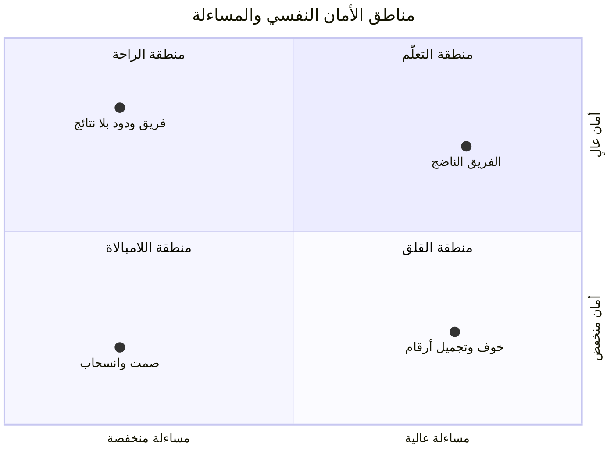

> [!info] الفصل 12 · كورس الإنتاجية
> **ماذا ستتعلّم:** لماذا يكون **النضج** شرطًا لكلّ ما سبق في هذه القاعدة، لا زينةً ثقافية تُضاف بعده — فالفريق الذي لا يستطيع أن يقول «هذا الرقم سيّئ» لا يُنتج بيانات صادقة، وكلّ نظام قياس مبنيّ على بياناته يقيس التجميل. ستتعلّم تعريفًا **قابلًا للفحص** لنضج الفريق بخمسة مستويات، والحالة الافتراضية الدفاعية للإنسان وتفسيرها العلمي، ثم **الأمان النفسي** بتعريف إدموندسون الدقيق — لا بالمعنى الشائع الذي جعله مرادفًا للّطف. وستتعلّم لماذا **الأمان النفسي والمساءلة محوران مستقلّان لا متضادّان**، وما مصفوفة المناطق الأربع التي تنتج عنهما. ثم **سُلَّم المساءلة المتبادلة** خطوةً خطوة حتى إنهاء الخدمة، وقالب المحادثة الثنائية، وتصنيف مشكلات الاسترجاع إلى ما تملكه وما لا تملكه — وقصّة كريمة محلولةً بذلك التصنيف. وتخرج بـ**بروتوكول بناء فريق جديد من الصفر**، وبتشخيص ثلاث صور لفشل الأمان النفسي أشدّها خفاءً أكثرها إنتاجًا لعلامات الاطمئنان.

> [!abstract] التأصيل
> **يفترض أنّك تعرف:** [[Psychological Safety]] · [[Tuckman's Stages of Group Development]] · [[Retrospective]]
> **ويُؤصّل لك:** [[Team Maturity]] · [[Mutual Accountability]] · [[Team Dynamics]] · [[Circle of Control]]

# الفصل 12 — نضج الفريق والأمان النفسي

## 🎯 أهداف التعلّم

- تعريف **نضج الفريق** تعريفًا قابلًا للفحص، وتحديد موضع فريقك على سُلَّم من خمسة مستويات.
- شرح **الحالة الافتراضية الدفاعية** للإنسان في العمل، وتفسيرها بنماذج مسمّاة لا بانطباع.
- التمييز بين **الأمان النفسي** بتعريفه البحثي وبين اللطف وتجنّب الصراع.
- استعمال **مصفوفة الأمان والمساءلة** لتحديد المنطقة التي يقع فيها فريقك.
- تطبيق **سُلَّم المساءلة المتبادلة** بخطواته الخمس، ومعرفة متى يُنتقل من خطوة إلى التي تليها.
- إدارة **محادثة ثنائية** بقالب يصف السلوك لا يحكم على الشخص.
- تصنيف مشكلات الاسترجاع إلى **تحت السيطرة** و**خارج النطاق**، والتصرّف الصحيح في كلّ حالة.
- تفسير سبب انخفاض الإنتاجية في **مرحلة العصف**، وتقصير أمدها بأدوات محدّدة.
- تنفيذ **بروتوكول بناء فريق جديد** من أوّل يوم، بمُخرَجات لكلّ خطوة.
- تشخيص **صور فشل الأمان النفسي الثلاث**، وأخفاها.
- عرض **الحدّ النقدي**: أين يُساء استعمال هذا الباب كلّه.

---

## الفكرة المحورية: بلا نضج، كلّ رقم في هذه القاعدة كذبة مهذّبة

> [!quote] من المحاضرة
> **حمزة:** «وحين نعمل على ديناميكيات الفريق، نقول للناس: *حين نأتي ونسأل عن مشكلة، فليس غرضنا أن نوجّه اتّهامًا إلى أحد. غرضنا أن نجد أين يقع الخلل في النظام، لنعالجه.*»

هذا الفصل يبدو — لمن قرأ ما قبله — انتقالًا من التقنية إلى «الجانب الإنساني». وهو ليس كذلك. **إنّه شرط صحّة كلّ ما سبق.**

فكلّ ما بُني في هذه القاعدة — مقاييس التدفّق الستّة، وتوزيع التدفّق، والتشخيص من الأرقام — يقوم على فرضية واحدة لم تُذكر صراحةً: **أنّ البيانات صادقة.** وأنّ العنصر الذي تعثّر أسبوعين مسجَّل أنّه تعثّر أسبوعين، لا أنّه نُقِل إلى «قيد الاختبار» يوم الخميس ليبدو الرسم البياني نظيفًا. وأنّ العيب الذي وصل الإنتاج مكتوب عيبًا، لا محسوبًا «تحسينًا صغيرًا».

**والفريق الذي يخاف يُنتج بيانات جميلة.** وهذه ليست مبالغة بلاغية بل نتيجة مباشرة: فحين يكون الرقم أداةً للمحاسبة الشخصية، يصير تحسينُ الرقم أرخص من تحسين الواقع، وأسرع، وأقلّ خطرًا. وقد صيغ هذا قانونًا: **[[Goodhart's Law|قانون غودهارت]]** — أنّ المقياس حين يصير هدفًا يكفّ عن كونه مقياسًا جيّدًا.

فالنضج إذن ليس متطلّبًا أخلاقيًّا يُضاف إلى المتطلّبات التقنية. **إنّه الشرط الذي بدونه تكون لوحة القياس كلّها عملًا زخرفيًّا** — دقيقة الحساب، صادقة الرسم، مبنيّة على مدخلات لا تصف الواقع.

> [!tip] القاعدة العملية
> قبل أن تبني لوحة قياس، اسأل سؤالًا واحدًا: **ماذا يقع لمن يُدخِل رقمًا سيّئًا؟** فإن كان الجواب «يُسأل عن سبب الرقم»، فالنظام سيعمل. وإن كان «يُسأل عن سبب تقصيره»، فالنظام سيُنتج أرقامًا حسنة إلى الأبد.

---

## أولًا: ما نضج الفريق؟

### 1) ما قيل في المحاضرة

> [!quote] من المحاضرة
> **مشارك:** «نضج الفريق معناه أنّ الفريق يستطيع أن **يعتمد على نفسه** — أن ينفّذ مهمّةً وحده؛ وأنّه ناضج؛ وأنّه لا يُخطئ من المرّة الأولى… وأن يستطيعوا **العمل معًا وبلوغ هدف بعينه**.»

> [!quote] من المحاضرة
> **حمزة:** «**النضج**، بالمعنى الذي نستعمله: كلّ إنسان خلقه الله في هذه الدنيا، مهما كان عمره، يقف عند **حالة افتراضية**… أنّه **يشكّ دائمًا فيمن حوله**… وأنّه يرى نفسه دائمًا **مهدَّدًا** ممّن حوله.»

الجوابان يتكاملان ولا يتطابقان. فجواب المشارك يصف النضج **قدرةً على الإنجاز** (الاستقلال والاعتماد على النفس)، وجواب المدرّب يصفه **قدرةً على التعامل** (تجاوز حالة الارتياب). والفصل بينهما مهمّ لأنّ الفريق قد يكون بالغ الكفاءة التقنية وبالغ العجز عن أن يقول أحد أعضائه لآخر: «هذا الحلّ لن يعمل».

**والتعريف الذي نعتمده في هذا المرجع يجمع الوجهين:**

> **نضج الفريق قدرته على أن يواجه الواقع كما هو ويتصرّف فيه بلا وسيط — أن يرى مشكلته، ويسمّيها باسمها، ويقرّر فيها ما يملك، ويطلب ما لا يملك، دون أن ينتظر من يأذن له ودون أن يخشى ثمنًا شخصيًّا.**

ولاحظ أنّ هذا التعريف **قابل للفحص**، بخلاف «فريق ناضج» بوصفها صفة. فكلّ جزء منه يقابله سؤال يُجاب عنه بنعم أو لا.

### 2) سُلَّم النضج — خمسة مستويات بعلاماتها

> [!info] إضافة مرجعية — الأصل الذي بُني عليه هذا السُّلَّم
> لم يرد في المحاضرة. أقرب أصل منهجي له **منحنى أداء الفريق** عند **جون كاتزنباخ ودوغلاس سميث** في *The Wisdom of Teams* (1993)، وفيه خمس درجات: مجموعة عمل، وفريق زائف، وفريق محتمَل، وفريق حقيقي، وفريق عالي الأداء. **وأهمّ ما فيه أنّ الفريق الزائف أدنى أداءً من مجموعة العمل** — أي أنّ الجمع بين أناس تحت اسم «فريق» بلا مسؤولية مشتركة أسوأ من تركهم أفرادًا، لأنّه يُضيف كلفة تنسيق بلا مكسب تكامل. والسُّلَّم أدناه صياغة تطبيقية لهذا المعنى بعلامات قابلة للرصد.

| المستوى | الاسم | العلامة التي تراها | ما يقع عند وقوع مشكلة |
|---|---|---|---|
| **1** | التبعية | لا يُتّخذ قرار بلا مدير | يُنتظَر المدير ليقرّر |
| **2** | التنفيذ | يُنفَّذ ما يُطلَب بكفاءة، ولا يُناقَش | تُبلَّغ المشكلة ويُنتظَر التوجيه |
| **3** | الاستقلال التنفيذي | يُقرَّر «كيف» داخل حدود معلنة | تُحلّ المشكلة إن كانت داخل الحدّ |
| **4** | المواجهة الداخلية | يُصحَّح العضو زميلَه مباشرةً | تُناقَش المشكلة بين أهلها قبل أن تصعد |
| **5** | ملكية النتيجة | يُتفاوَض على «ماذا» لا «كيف» فقط | تُرفَع المشكلة بحلّ مقترح لا بشكوى |

**والانتقال من الثالث إلى الرابع هو العتبة الحقيقية**، وأكثر الفرق تعلق دونه. فالاستقلال التنفيذي يُمنَح بقرار إداري — يكفي أن تُكتب حدود التفويض. أمّا المواجهة الداخلية فلا تُمنَح بقرار؛ إنّها ما يُبنى بالأمان النفسي. **ولهذا كان الأمان النفسي شرطًا للنضج لا نتيجةً له.**

> [!warning] المزلق العملي
> يُقاس النضج غالبًا بـ**هدوء الفريق**: فريق لا يتشاجر يُوصف بالناضج. وهذا مقلوب. فالفريق في المستوى الثاني هادئ تمامًا — لأنّ لا أحد يعترض على شيء. **والهدوء علامة مشتركة بين أنضج الفرق وأكثرها خوفًا**، والفرق بينهما لا يُرى في الاجتماع، بل يُرى فيما يُقال بعده في القنوات الجانبية.

### 3) الاختلال الذي يسبق كلّ اختلال

> [!info] إضافة مرجعية — تسلسل لينشيوني
> في *The Five Dysfunctions of a Team* (2002) يرتّب **باتريك لينشيوني** خمسة اختلالات متعاقبة: **غياب الثقة** ← **الخوف من الصراع** ← **ضعف الالتزام** ← **تجنّب المساءلة** ← **إهمال النتائج**. والترتيب هو المقصود لا القائمة: فتجنّب المساءلة — وهو موضوع المحور الرابع من هذا الفصل — **ليس عطبًا مستقلًّا**، بل هو الأثر الثالث لغياب الثقة. ولهذا يفشل كلّ من يعالج المساءلة مباشرةً بإجراءات ولوائح: إنّه يعالج العَرَض الرابع ويترك السبب الأوّل.

---

## ثانيًا: الحالة الافتراضية للإنسان — ولماذا هي كذلك

> [!quote] من المحاضرة
> **حمزة:** «فما القيمة الافتراضية للإنسان؟ أنّه **يشكّ دائمًا فيمن حوله**؛ وأنّه يرى دائمًا أنّ الذي أمامه يريد أن يوقعه في عمله أو في مشكلة.»

الوصف صحيح في مشاهدته، وتعبير «القيمة الافتراضية» بديع في إيصاله. لكنّه يحتاج شيئين ليصير قابلًا للعمل: **تفسيرًا** يقول لماذا، و**تقييدًا** يمنع أن يُقرأ حكمًا مطلقًا على البشر.

### 1) التفسير

> [!info] إضافة مرجعية — ثلاثة نماذج تفسّر ما وُصف
> لم تُذكر في المحاضرة، وكلّ منها يفسّر وجهًا من الظاهرة:
>
> 1. **انحياز السلبية** (`Negativity Bias`): أنّ الإشارات السلبية تُعالَج أسرع وتُخزَّن أطول من الإيجابية. وهو مقيس في علم النفس المعرفي منذ التسعينيات، وله تفسير تطوّري بيّن: كلفة تجاهل تهديد حقيقي أكبر بكثير من كلفة الاستجابة لتهديد وهمي.
> 2. **نموذج SCARF** لـ**ديفيد روك** (2008): أنّ الدماغ يعالج التهديدات الاجتماعية بآليّات قريبة من معالجته للتهديدات المادّية، وأنّ خمسة أبعاد تحرّكها — **المكانة** (`Status`)، و**اليقين** (`Certainty`)، و**الاستقلال** (`Autonomy`)، و**الانتماء** (`Relatedness`)، و**العدل** (`Fairness`). وأكثر ما يجري في اجتماعات العمل يمسّ واحدًا منها على الأقلّ. انظر [[SCARF Model]].
> 3. **خطأ الإسناد الأساسي** (`Fundamental Attribution Error`): أنّنا نفسّر سلوك غيرنا بطبعه وسلوك أنفسنا بظروفنا. فتأخّر زميلي «إهمال»، وتأخّري أنا «ازدحام العمل». انظر [[Fundamental Attribution Error]].

**والثالث هو الأخطر عمليًّا**، لأنّه بالضبط ما يحوّل مشكلة النظام إلى مشكلة شخص. فحين يتأخّر التسليم، يكون التفسير الأوّل الحاضر في الأذهان هو **من** تأخّر — لا **أين** وقف العمل. وهذا يربط هذا الفصل بالفصل الرابع عشر مباشرةً: قاعدة «وجّه نظام التدفّق لا الأفراد» ليست نصيحةً في حسن الخلق، بل **تصحيحٌ لانحياز إدراكي مقيس**.

### 2) التقييد

الحالة الافتراضية **حالة لا طبيعة**. والفرق أنّ الحالة تتغيّر بتغيّر الظرف، والطبيعة لا تتغيّر. والدليل على أنّها حالة: أنّ الشخص نفسه يسلك سلوكًا مختلفًا تمامًا في فريق آخر أو مع مدير آخر — وهو هو لم يتغيّر.

> [!warning] المزلق العملي
> لا يُبنى على «الإنسان مرتاب بطبعه» تبريرٌ لسوء الظنّ به. فمن استعمل هذه القاعدة ليقول «الناس هكذا فلا فائدة» فقد قلبها: **إنّها تُقال لتفسير الحالة الأولى ولتبرير الاستثمار في تغييرها، لا لتثبيتها.** وهذا هو معنى العمل على [[Team Dynamics|ديناميكيات الفريق]] في المحاضرة: أن تُرفَع القيمة الافتراضية، لا أن يُسلَّم بها.

### 3) ديناميكيات الفريق عمليًّا — ما هي، وما ليست

تتكرّر عبارة «نعمل على ديناميكيات الفريق» في المحاضرة ثلاث مرّات بوصفها العلاج، ولم تُشرح — وهي من أكثر العبارات التي تُقال ولا يُعرَف كيف تُفعَل. فلنُنزِلها إلى ما يُنفَّذ.

**ديناميكيات الفريق ليست:**

- جلسةً ترفيهية لكسر الجمود، ولا خروجًا جماعيًّا. فتلك تُنشئ ألفةً وقد لا تُنشئ قدرةً على الاختلاف.
- تدريبًا في مهارات التواصل يُلقى محاضرةً ثم يُنصرَف.
- تشخيصًا للأنماط الشخصية يُوزَّع بطاقاتٍ ثم يُنسى — وأدوات مثل [[Belbin Team Roles|أدوار بلبن]] نافعة في موضعها، ومضرّة إن صارت تصنيفًا يُعلَّق على الأشخاص.

**وإنّما هي:** أن يُتّفَق — قبل وقوع المشكلة — على **كيف تُدار المشكلة حين تقع**. وذلك يُخرَج في أربع جلسات قصيرة، كلّ منها بمُخرَج مكتوب:

| # | الجلسة | السؤال الذي تجيب عنه | المُخرَج |
|---|---|---|---|
| 1 | **كيف نختلف** | ما القناة التي يُطرَح فيها الخلاف، ومن يحسم إن لم نتّفق؟ | سطران في [[Team Working Agreement\|اتفاق عمل الفريق]] |
| 2 | **كيف نُخبر بعضنا** | ملاحظتك على عملي: أين أحبّ أن تصلني؟ | تفضيل مكتوب لكلّ عضو |
| 3 | **ماذا نفعل عند العطب** | من يُخبَر أوّلًا؟ وما الذي يُوقَف؟ وما الذي لا يُوقَف؟ | بروتوكول من خمسة أسطر |
| 4 | **ما نعدّه إنجازًا** | أنُقيس بما أُغلِق أم بما وصل المستخدم؟ | تعريف مشترك يُعلَن |

**والجلسة الثالثة أنفعها**، وهي أقلّها انعقادًا. فالفريق الذي اتّفق **قبل الحادثة** على أنّ أوّل ما يُفعَل عند عطب الإنتاج هو الإبلاغ في قناة معلنة بلا انتظار تحقيق — يفعل ذلك حين يقع العطب. والفريق الذي لم يتّفق يجري كلّ عضو فيه حسابًا شخصيًّا للثمن قبل أن يبلّغ، **والحساب الشخصي عند الخوف نتيجته الصمت دائمًا**.

> [!tip] القاعدة العملية
> **كلّ جلسة ديناميكيات لا تُخرِج سطرًا مكتوبًا يُرجَع إليه هي حديثٌ لطيف لا أداة.** والمعيار: لو وقعت مشكلة غدًا، أيوجد نصّ يقول كيف تُدار؟

---

## ثالثًا: الأمان النفسي — بتعريفه لا بمعناه الشائع

> [!quote] من المحاضرة
> **حمزة:** «أفيعني هذا، يا حمزة، أنّ الفريق يستطيع أن يكرّر الخطأ نفسه مرّةً واثنتين وثلاثًا، وأنا أسامحه وأتغاضى؟ **لا.** الأمان النفسي للفريق **لا** يعني أن أُمرّر كلّ شيء وألّا تكون هناك مساءلة.»

هذا هو أهمّ تصحيح في المحاضرة كلّها، لأنّه يعالج **أشيع سوء فهم** لهذا المفهوم في التداول العربي والإنجليزي معًا.

### 1) التعريف البحثي

> [!info] إضافة مرجعية — إدموندسون والأصل التجريبي
> صاغت **إيمي إدموندسون** المفهوم في دراستها المنشورة سنة 1999 في *Administrative Science Quarterly* بعنوان *«Psychological Safety and Learning Behavior in Work Teams»*، وعرّفته بأنّه **اعتقاد مشترك بين أعضاء الفريق بأنّ الفريق آمن للمخاطرة الشخصية بين أفراده** — أي أن يتكلّم المرء بما عنده دون أن يخشى أن يُعاقَب أو يُحقَّر.
>
> **والقصّة التي أنتجت المفهوم أبلغ من التعريف:** كانت إدموندسون تدرس فرقًا طبّية في مستشفيات، متوقّعةً أنّ الفرق الأفضل أداءً ستُبلّغ عن **أخطاء أقلّ**. فجاءت النتيجة معكوسة: الفرق الأفضل أداءً كانت **تُبلّغ عن أخطاء أكثر**. ولم يكن ذلك لأنّها تُخطئ أكثر، بل لأنّها **تستطيع أن تقول** — وما لا يُقال لا يُعالَج. وهذا الالتباس بعينه هو ما ستواجهه في أوّل ربع تُطبّق فيه هذا الباب: **ارتفاع الأخطاء المبلَّغ عنها علامةُ نجاح مبكّرة، وتُقرأ خطأً علامةَ تدهور.**

> [!info] إضافة مرجعية — مشروع أرسطو
> نشرت **غوغل** سنة 2015 نتائج بحث داخلي (مشروع أرسطو) على مئات الفرق، خلص إلى **خمس ديناميكيات** تميّز الفرق الفعّالة، على رأسها **الأمان النفسي** — ثم الاعتمادية، ووضوح البنية، والمعنى، والأثر. وأهمّ ما فيه أنّه لم يجد أثرًا يُعتدّ به لـ**تركيبة** الفريق (من فيه) مقابل **طريقة عمله** (كيف يتعامل). والنتيجة منشورة علنًا في منصّة `re:Work`.

### 2) ما ليس أمانًا نفسيًّا

| ليس هو | الفرق |
|---|---|
| **اللطف الدائم** | الأمان النفسي يجعل الخلاف **ممكنًا**، لا يُلغيه |
| **غياب المساءلة** | المساءلة محور مستقلّ لا نقيض له، وسيأتي بيانه |
| **إجماع على كلّ قرار** | القرار قد يُتّخذ بخلاف رأيك؛ والأمان أن **تقول** رأيك، لا أن يُؤخَذ به |
| **الراحة** | منطقة التعلّم غير مريحة بطبيعتها؛ والمريح غالبًا هو الراكد |
| **صفة شخصية** | إنّه صفة **مناخ فريق**؛ فالشخص نفسه يأمن في فريق ويصمت في آخر |
| **[[Ruinous Empathy\|التعاطف المدمِّر]]** | إخفاء التغذية الراجعة السلبية إشفاقًا هو نقيضه لا صورته |

### 3) المصفوفة التي تحسم الالتباس

> [!quote] من المحاضرة
> **حمزة:** «الأمان النفسي معناه أنّني في اللحظة التي تقع فيها مشكلة، أرجع إلى **النظام الذي بنيتُه**، فأجد أين المشكلة، وأعالجها. فإن **تكرّرت** المشكلة نتيجة عدم التزام أحدهم بعملية متّفق عليها — فحينئذ أبدأ في التصرّف.»

> [!info] إضافة مرجعية — مناطق إدموندسون الأربع
> في *The Fearless Organization* (2018) تعرض إدموندسون المفهوم على **محورين مستقلّين**: الأمان النفسي، ومعيار الأداء والمساءلة. وينتج عنهما أربع مناطق. وهذه المصفوفة هي الجواب المنهجي عن سؤال المحاضرة بعينه.

*رُسمت أربع نقاط تمثيلية فقط، واحدة لكلّ منطقة، ومواضعها **قراءة توضيحية لا قياس**. وتُركت مواضع أخرى عمدًا لأنّ ازدحام النقاط يُخفي أسماء الأرباع.*

| المنطقة | أمان | مساءلة | ما تراه فيها |
|---|---|---|---|
| **اللامبالاة** | منخفض | منخفضة | لا يقول أحد شيئًا ولا يُطلَب من أحد شيء |
| **الراحة** | عالٍ | منخفضة | علاقات ممتازة ونتائج متواضعة، ولا يُزعِج أحد أحدًا |
| **القلق** | منخفض | عالية | مطالب عالية وخوف من الكلام — **وهنا تُجمَّل الأرقام** |
| **التعلّم** | عالٍ | عالية | يُطلَب الكثير ويُقال كلّ شيء، فتُعالَج المشكلة عند وقوعها |

**والسطر الثالث هو موضع الخطر تحديدًا.** فمنطقة القلق هي التي تُنتج مؤسّسةً تبدو منضبطة عالية الأداء — مواعيد صارمة، ولوحات خضراء، ولا شكاوى — بينما البيانات التي تُبنى عليها قراراتها كلّها مصنوعة. **وهي أخطر من منطقة اللامبالاة لأنّها تُنتج ثقةً في غير موضعها.**

> [!tip] القاعدة العملية
> الأمان النفسي والمساءلة **يُرفَعان معًا لا بالتناوب**. فرفع المساءلة وحدها ينقلك إلى القلق، ورفع الأمان وحده ينقلك إلى الراحة. **والوصفة العملية:** ارفع سقف المطلوب، واخفض في الوقت نفسه ثمنَ قول «لن نصل».

### 4) كيف تعرف أنّه موجود فعلًا؟

هذه أصعب مسألة في هذا الباب، وسببها بنيويّ: **أنّك تسأل عن الخوف من يخاف.** فالاستبيان الذي يُسأل فيه الناس «أتشعر بالأمان في التعبير؟» يُجاب عنه في المناخ نفسه الذي أنشأ الخوف — وإجابته العالية لا تُثبت شيئًا.

**فالفحص يكون بوقائع لا بانطباعات**، وهذه سبعة أسئلة كلٌّ منها عن أثر يُرى:

1. **متى كانت آخر مرّة قال فيها أحد في اجتماع عامّ إنّ خطّة الإدارة لن تعمل؟** وماذا وقع له بعدها؟
2. **من كان آخر من أبلغ عن عطب سبّبه هو؟** أم أنّ كلّ الأعطال المعلنة سببها «جهة أخرى»؟
3. **في آخر استرجاع، هل ذُكرت مشكلة لم يكن المدير يعرفها؟** فالاسترجاع الذي لا يُخرِج جديدًا ليس استرجاعًا.
4. **هل يُقال في الوقفة اليومية «أنا متعثّر» صريحًا**، أم يُقال «أكمل على نفس التذكرة» ثلاثة أيّام؟
5. **هل غُيِّر قرار للإدارة بسبب اعتراض من الفريق** في الأشهر الستّة الماضية؟ ولو مرّة؟
6. **هل يُطرَح السؤال الغبي؟** أي أن يقول أحدهم «لم أفهم هذا» في حضور من يُفترض أنّه يفهمه.
7. **ما نسبة من يتكلّم في اجتماع الفريق؟** فإن كان الكلام محصورًا في اثنين من ستّة، فأربعة لا يشاركون.

> [!tip] قاعدة الحكم
> لا يُقاس هذا بـ«معظمها». **فسؤال واحد يحسم: الأوّل.** إن لم تجد الواقعة — لا واقعةً واحدة اعترض فيها أحد على الإدارة علنًا — فالمناخ **لم يُختبَر**، وليس بالضرورة آمنًا. وأمّا الستّة الباقية فتفصّل الصورة وترتّب الأولوية.

> [!warning] المزلق العملي
> **لا يُقاس الأمان النفسي بمقياس واحد يُنشَر جدولًا للإدارة.** فمن جعله مؤشّرًا في تقييم المديرين، جعل المدير مستفيدًا من ارتفاعه — فيبدأ في التأثير على الإجابات بلا أن ينوي ذلك أصلًا. وهذا [[Goodhart's Law|قانون غودهارت]] يعمل في أخصّ موضع لا يُحتمَل فيه.

---

## رابعًا: المساءلة المتبادلة — سُلَّم من خمس درجات

> [!quote] من المحاضرة
> **حمزة:** «في الفريق الرشيق شيء اسمه **المساءلة المتبادلة**: أن يُساءل الفريق **نفسَه** بنفسه. فإن لم يحدث ذلك، فدور **مدرّب أجايل**، أو **مدير التسليم**، أو **مدير سكرم** أن يتدخّل ويتكلّم مع الشخص **وجهًا لوجه**… نحسمها مرّةً واحدة. فإن تكرّرت المشكلة، تبدأ في اتّخاذ **إجراء** — وقد ينتهي ذلك إلى **إنهاء الخدمة**.»

هذه من أشجع فقرات المحاضرة، لأنّها تقول صراحةً ما تتجنّبه أكثر الأدبيات الرشيقة: **أنّ للمسار نهاية، وأنّ النهاية قد تكون إنهاء الخدمة.** والامتناع عن قول ذلك هو ما يجعل «المساءلة المتبادلة» شعارًا: فالمساءلة التي لا يترتّب عليها شيء في أيّ حال ليست مساءلة.

### 1) السُّلَّم

| # | الدرجة | من يتصرّف | ما الذي يقع | متى يُنتقَل إلى ما بعدها |
|---|---|---|---|---|
| 1 | **الفريق يُصحّح نفسه** | العضو مع زميله | ملاحظة مباشرة وقت وقوع الشيء | إن لم تقع أصلًا — والغالب أنّها لا تقع |
| 2 | **المحادثة الثنائية** | مدير سكرم · مدرّب أجايل · مدير التسليم | حوار خاصّ يصف السلوك وأثره | إن تكرّر السلوك بعد الاتّفاق |
| 3 | **إعادة العرض على الفريق** | نفسه | يُعرَض **النمط** لا الشخص، ويُراجَع الاتّفاق | إن كان السبب جماعيًّا — تجنّب المواجهة |
| 4 | **الإجراء الرسمي** | الإدارة المباشرة | خطّة تحسين مكتوبة بمدّة ومعيار | إن لم يتغيّر شيء ضمن المدّة |
| 5 | **إنهاء العلاقة** | الإدارة | إنهاء الخدمة أو نقل الدور | — |

**والدرجة الثالثة هي المهملة في الممارسة**، وهي التي أشار إليها المدرّب بجملة بالغة الدقّة: أن يُقال للفريق إنّ **خوفكم من مواجهة زميلكم أثّر في الفريق كلّه**. فهذه تنقل الموضوع من «فلان أخطأ» إلى «نحن لا نُصحّح بعضنا» — وهو التشخيص الأصحّ في أكثر الحالات، لأنّ وصول المشكلة إلى مدير سكرم أصلًا **دليلٌ على تعطّل الدرجة الأولى**.

> [!warning] المزلق العملي
> أشيع خطأ هنا **القفز من الأولى إلى الرابعة**: يُترك السلوك شهورًا بلا محادثة، ثم يُفتَح ملفّ إجراء رسميّ فجأةً. وأثره أنّ الشخص يُفاجأ بحقّ — فهو لم يُخبَر — فيتحوّل النقاش من السلوك إلى عدل الإجراء، وينهار الأمان النفسي في الفريق كلّه دفعةً واحدة. **فالسُّلَّم يُصعَد درجةً درجة، وتوثيق كلّ درجة هو ما يجعل الدرجة التي بعدها عادلة.**

### 2) قالب المحادثة الثنائية

> [!info] إضافة مرجعية — نموذج الموقف والسلوك والأثر
> لم يُذكر في المحاضرة. نموذج **SBI** — `Situation · Behavior · Impact` — طوّره **مركز القيادة الإبداعية** (`Center for Creative Leadership`)، ومداره على قاعدة واحدة: **صِف ما رأيتَه، لا ما استنتجتَه.** فـ«تأخّرت في مراجعة الطلبات» وصفٌ يمكن مناقشته؛ و«أنت غير مبالٍ» استنتاجٌ لا يمكن مناقشته إلّا بالإنكار. ويقاربه في المعنى ما تقرّره [[Nonviolent Communication|التواصل اللاعنفي]] عند مارشال روزنبرغ من الفصل بين الملاحظة والتقييم.

| الجزء | الصيغة | مثال |
|---|---|---|
| **الموقف** | متى وأين بالتحديد | «في السبرنت الماضي، في ثلاث تذاكر…» |
| **السلوك** | ما وقع، بلا صفة | «…مُرِّرت إلى الاختبار بلا تشغيل الفحوص المحلّية» |
| **الأثر** | ما ترتّب عليه، على النظام لا على الأشخاص | «…فارتدّ منها تسعة عيوب، وتوقّف عمل مهندسَي الاختبار يومين» |
| **السؤال** | مفتوح، ويسبق أيّ حكم | «ما الذي جعل ذلك يقع؟» |
| **الاتّفاق** | ملموس بمدّة | «نتّفق أنّ… ونراجع بعد سبرنتين» |

**والسؤال المفتوح ليس مجاملة.** فقد يكون الجواب أنّ تشغيل الفحوص محلّيًّا يستغرق أربعين دقيقة، وأنّ البيئة مشتركة، وأنّ الطلب كان عاجلًا بأمر من جهة أخرى. وحينها تكون قد كشفت مشكلة نظام كنت على وشك أن تسجّلها مشكلة شخص — وهذا بعينه ما تحدّثت عنه [[3.3 مصفوفة التدفّق ونظرية القيود|هاجر]] حين قالت إنّها تسأل أوّلًا: أهو خطأ الفريق، أم عائق، أم متطلَّب لم يُفهَم؟

---

## خامسًا: ما تملكه وما لا تملكه

> [!quote] من المحاضرة
> **حمزة:** «لنقل إنّنا في **الاسترجاع** نصنّف مشكلاتنا دائمًا إلى: مشكلات **تحت السيطرة**… ومشكلات لا يستطيع الفريق إلّا أن **يُسندها**، وهي **خارج نطاقه**. وأمّا المشكلات الخارجة عن نطاق الفريق، فلا بدّ فيها من **الصدق** مع الناس.»

### 1) التصنيف الثلاثي

الثنائية في المحاضرة تكفي للتصنيف السريع، لكنّ الثلاثية أدقّ عمليًّا لأنّها تفصل ما يمكن التأثير فيه عمّا لا سبيل إليه:

| الدائرة | التعريف | التصرّف الصحيح | الخطأ الشائع |
|---|---|---|---|
| **السيطرة** | يقرّره الفريق وينفّذه | يُعالَج في الاسترجاع بإجراء ومالك وتاريخ | تأجيله بحجّة انتظار الإدارة |
| **التأثير** | لا يملكه الفريق ويستطيع أن يؤثّر فيه بالبيانات | يُبنى له عرضٌ بالأرقام ويُرفَع | الشكوى منه في الاسترجاع بلا رفعه |
| **الاهتمام** | خارج الاثنين | **يُسمّى صراحةً ويُغلَق** | إعادة فتحه كلّ استرجاع |

> [!info] إضافة مرجعية — أصل التقسيم
> صاغه **ستيفن كوفي** في *The 7 Habits of Highly Effective People* (1989) بدائرتي **الاهتمام** و**التأثير**، وحجّته أنّ الطاقة المصروفة في دائرة الاهتمام تُقلّص دائرة التأثير، والعكس. وله أصل أقدم في الفلسفة الرواقية: التمييز بين ما هو بأيدينا وما ليس بأيدينا كما في *إنخيريديون* إبكتيتوس. انظر [[Circle of Control]].

### 2) لماذا التسمية الصريحة تدخّلٌ لا اعتذار

الجملة التي في المحاضرة — «يا أصدقاء، هذه المشكلات خارج نطاقنا» — تبدو استسلامًا، وهي في الحقيقة **أنفع ما يُفعَل بالمشكلة التي لا تُحلّ**. والسبب أنّ الإبهام أعلى كلفةً من العجز المعلن:

- **الفريق الذي لا يعرف أنّ المشكلة خارج نطاقه يعيد طرحها كلّ استرجاع** — فيستهلك الاسترجاع في بند لا يتحرّك، فيفقد الاسترجاع قيمته كلّها في أعين الحاضرين.
- **والغموض يُقرأ عجزًا أو لا مبالاة** من القائد؛ أمّا التسمية الصريحة فتُقرأ صدقًا. وتلك من أرخص الطرق إلى بناء الثقة، لأنّها لا تكلّف إلّا الاعتراف.

> [!tip] القاعدة العملية
> **البند الخارج عن النطاق لا يُحذَف من السجلّ، بل يُنقَل إلى قائمة معلنة اسمها «مرفوع ولا نملكه»، بتاريخ الرفع وإلى من رُفِع.** فيبقى مرئيًّا — ويكون سجلًّا موثَّقًا حين يُسأل الفريق بعد ستّة أشهر عن سبب تأخّره.

### 3) قصّة كريمة محلولةً

> [!quote] من المحاضرة
> **كريمة:** «الأمان النفسي للمطوّرين عندي أحيانًا **ليس بيدي**. فمثلًا قد يحتاج موظّف إلى **علاوة**… وبالتالي **يتأثّر إنتاجه، ويتأثّر الفريق كلّه**… لكنّه ليس بيدي.»

وجواب المحاضرة صحيح لكنّه ناقص عمدًا — فقد اعترضت كريمة عليه بحقّ: *«لا أظنّ أنّ في مثل هذه المواقف صيغةً من الكلام تجعل ذلك الشخص يعمل»*. **والاعتراض في محلّه**، لأنّ ما عُرِض عليها خياران متطرّفان: إمّا المواجهة بأنّ الأمر خارج النطاق، وإمّا تدريب الإدارة على الرشاقة المؤسّسية — وهذا الثاني مشروع سنوات لا جواب عن حالة قائمة اليوم.

**فلنُنزِل الحالة على التصنيف الثلاثي:**

| ما في الحالة | الدائرة | ما تملكه كريمة فعلًا |
|---|---|---|
| قرار العلاوة نفسه | الاهتمام | لا شيء — يُسمّى ويُغلَق |
| **إيصال الحالة إلى من يقرّر بالأثر لا بالطلب** | التأثير | عرض مكتوب: أثر التأخّر على التسليم بأرقام، لا وساطة في مبلغ |
| **شفافية ما قيل للموظّف** | التأثير | ألّا يُوعَد بما لا تملكه؛ وأن يُقال له أين وصل الطلب فعلًا |
| **إعادة توزيع العمل الحرج مؤقّتًا** | السيطرة | ألّا يبقى مسار حرج معلّقًا بشخص في هذه الحالة |
| **غاية العمل ووضوحه** | السيطرة | ما ذُكر في المحاضرة عن الدافعية والسياق |
| **حدّ زمني للحالة** | السيطرة | ألّا تُترك مفتوحةً بلا سقف — وهذا هو الجواب عن اعتراضها |

**والبند الأخير هو ما ينقص الجواب في المحاضرة.** فالمدير الذي انتظر ولم يضع سقفًا زمنيًّا يجد نفسه بعد ستّة أشهر في الحالة نفسها، وقد فقد الفريق ثقته في أنّ شيئًا يُعالَج. **والسقف ليس تهديدًا**؛ إنّه أن يُقال: «سأرفع الأثر شهريًّا، وإن لم يتغيّر شيء خلال ربع، فسأعيد النظر في توزيع الأدوار» — وهو ما يملكه المدير فعلًا.

---

## سادسًا: العصف — ولماذا تنخفض السرعة فيه

> [!quote] من المحاضرة
> **حمزة:** «**تاكمان**، حين جاء إلى هذا، قال: *في مرحلة **العصف**، ستكون **سرعة تدفّقك** منخفضة.* ومن الأشياء التي تؤثّر مباشرةً في الإنتاجية في تلك المرحلة: **أدوار الفريق غير الواضحة** … *أنا **أخاف أن أتكلّم**؛ أنا **أخاف أن أُوجِّه***.»

> [!info] إضافة مرجعية — ما قاله تاكمان وما لم يقله
> نشر **بروس تاكمان** سنة 1965 ورقةً بعنوان *«Developmental Sequence in Small Groups»* في *Psychological Bulletin*، وفيها المراحل الأربع: **التشكّل** (`Forming`) ← **العصف** (`Storming`) ← **التقنين** (`Norming`) ← **الأداء** (`Performing`). ثم أضاف مع **ماري آن جنسن** سنة 1977 مرحلةً خامسة: **الانفضاض** (`Adjourning`).
>
> **ويلزم التدقيق هنا:** لم يتحدّث تاكمان عن **سرعة التدفّق** ولا عن أيّ مقياس رشيق — فالمصطلح لاحق لعمله بعقود، وورقته مراجعة لأدبيات علم النفس الاجتماعي عن مجموعات صغيرة، كثير منها مجموعات علاجية. فالربط بين العصف وانخفاض السرعة **قراءة تطبيقية صحيحة المعنى**، ولا تُنسَب إلى تاكمان نصًّا. وهذا تطبيق مباشر للقاعدة: لا يُنسب إلى مرجع ما ليس فيه، ولو كان المعنى سليمًا.

### 1) لماذا تنخفض الإنتاجية في العصف — الآلية

ليس الانخفاض لأنّ الناس «مشغولون بالخلاف». إنّه أثر ثلاث كلف متمايزة، وكلّ منها يُقاس:

| الكلفة | ما يقع | أثرها على التدفّق |
|---|---|---|
| **كلفة التفاوض على القرار** | كلّ قرار صغير يُعاد التفاوض عليه لأنّ لا عرف بعد | يطول زمن الانتظار قبل بدء العمل |
| **كلفة الأدوار غير الواضحة** | عملان يُنجزان مرّتين، أو لا يُنجزان أصلًا | إعادة عمل · وثقوب في التغطية |
| **كلفة الصمت** | من رأى مشكلة لم يقلها لأنّ ثمن الكلام غير معروف بعد | تُكتشف المشكلة متأخّرةً فتغلو |

**والثالثة أخطرها في هذا الطور تحديدًا**، لأنّ الفريق الجديد لم يُثبِت لنفسه بعد ما يقع لمن يعترض. فالعضو يفحص الأمر باختبارٍ صغير: يعترض على شيء تافه ليرى ماذا يحدث. **وما يقع في ذلك الاختبار الصغير يحدّد سلوكه سنةً كاملة.** ولهذا كان أوّل اعتراض في عمر الفريق أهمّ مئة مرّة من الاعتراض الخمسين.

### 2) وضوح الأدوار — وأين يُساء استعماله

معالجة الأدوار غير الواضحة تُستدعى لها غالبًا مصفوفة [[RACI]]. وهي أداة نافعة بشرط، ومضرّة بلا ذلك الشرط:

- **نافعة** حين تُستعمل لتحديد **من يقرّر** في المسائل المتكرّرة المتنازع عليها.
- **مضرّة** حين تُبسَط على كلّ نشاط، فتصير جدولًا من ثلاثين صفًّا يُملأ مرّةً ولا يُقرأ — وتُنشئ ثقافة «هذا ليس دوري» في فريق يُفترض فيه أن يتكامل.

> [!tip] القاعدة العملية
> وضّح **الأدوار في القرارات**، لا **المهامّ في الأنشطة**. فأربعة أسطر تجيب عن «من يقرّر ماذا» أنفع من مصفوفة كاملة. ومن أدوات ذلك [[DACI]] و[[SPADE]] لقرارات بعينها، و[[Team Working Agreement|اتفاق عمل الفريق]] للأعراف اليومية.

---

## سابعًا: بناء فريق جديد من الصفر — بروتوكول

> [!quote] من المحاضرة
> **حمزة:** «المشكلة، يا صديقي العزيز، أنّنا **نتعامل بعضنا مع بعض بوصفنا عناوين بريد وتذاكر جيرا، لا بوصفنا بشرًا**… فأوّل ما نفعله بعد تكوين الفريق أن نجلس معًا… **أن يتحدّث كلّ شخص عن نفسه**.»

الخطوات الخمس التي عرضها المدرّب — التعرّف الإنساني، ثم توضيح الأدوار، ثم الأهداف، ثم معالجة التبعيّات، ثم النضج — ترتيبها **مقصود وصحيح**، وهي أدقّ من أن تُقرأ قائمةً. فلنُخرجها بروتوكولًا بمُخرَجات:

| # | الخطوة | لماذا في هذا الموضع | المُخرَج الملموس |
|---|---|---|---|
| 1 | **التعرّف الإنساني** | ما لم يُرَ الشخص إنسانًا، فُسِّر كلّ فعل منه بأسوأ احتمال (خطأ الإسناد) | جلسة لا تتجاوز ساعتين · بطاقة تعريف لكلّ عضو |
| 2 | **وضوح الأدوار والملكيّات** | الغموض هنا يُنتج تصادمًا يُقرأ خلافًا شخصيًّا | لوحة: من يملك ماذا · من يقرّر ماذا |
| 3 | **الأهداف** | بلا هدف تصير كلّ أولوية رأيًا، فيُحسَم بالسلطة لا بالمنطق | هدف الربع مكتوب ومعلن |
| 4 | **التبعيّات** | تُكشَف قبل أن تُلام عليها الأشخاص | خريطة التبعيّات ([[11 - العملية المتمركزة حول العميل وقانون كونواي\|الفصل 11]]) |
| 5 | **النضج وديناميكيات الفريق** | آخرًا لأنّه يحتاج ما قبله؛ فلا معنى لمواجهة بلا هدف ولا ملكيّة | اتفاق عمل الفريق · اتّفاق على كيف نختلف |

**والترتيب هو الدرس لا القائمة.** فمن بدأ بالخطوة الخامسة — ورشة ديناميكيات في الأسبوع الأوّل — يتكلّم عن مواجهة الخلاف قبل أن يوجد شيء يُختلَف عليه. ومن بدأ بالثالثة عنده فريق يعرف الهدف ولا يعرف من يقرّر عند التعارض.

> [!info] إضافة مرجعية — الانطلاق المنظَّم
> لم يُذكر في المحاضرة. توسّعت **ديانا لارسن** و**آينسلي نيز** في *Liftoff: Start and Sustain Successful Agile Teams* في هذا بعينه، وسمّته **الانطلاق** (`Liftoff`): جلسة تأسيس مقصودة تُخرِج ثلاثة أشياء — **الغاية** (لماذا يوجد هذا الفريق)، و**السياق** (من حوله وما يعتمد عليه)، و**اتفاق العمل** (كيف نعمل معًا). وحجّتهما أنّ الفريق الذي لم يُنطلَق به عمدًا سيبني هذه الثلاثة **ضمنيًّا** خلال أشهر، وبتكلفة أعلى، وبنتيجة أسوأ. انظر [[Liftoff]].

### أسئلة الجلسة الأولى — وحدّها

الأسئلة التي عرضها المدرّب (ما تحبّ · ما لا تحبّ · هواياتك · ما يُضايقك · ما يُسعدك) موفَّقة لأنّها **منخفضة الخطر**: لا يُطلَب فيها إفصاح عن شيء حسّاس. ويُضاف إليها سؤالان تشغيليّان نافعان:

- **كيف تحبّ أن تصلك التغذية الراجعة؟** مباشرةً في الاجتماع، أم بعده على انفراد؟
- **ما الشيء الذي يجعل يوم عملك سيّئًا؟** الانقطاعات؟ الاجتماعات المتلاصقة؟ الغموض؟

> [!warning] المزلق العملي
> **الحدّ الذي لا يُتجاوَز في هذه الجلسة أن تكون طوعيّة في القدر لا في الحضور.** فالمشاركة الشخصية تحت ملاحظة المدير ليست طوعيّةً حقيقية، والمدير الذي يُلحّ على إفصاح أعمق يُنتج ضدّ مقصوده: يُنشئ إحساسًا بالاقتحام في الجلسة التي غايتها بناء الأمان. **فيُفتَح الباب ولا يُدفَع أحد إليه** — ويُبدأ بالمدير نفسه، فمن تكلّم أوّلًا حدّد السقف.

### أمّا «سبرنتان»…

> [!quote] من المحاضرة
> **حمزة:** «من نحو **سبرنتين**، إن سار كلّ شيء على ما يُرام — وبعدها تستقرّ الأمور.»

هذا تقدير عملي لا قاعدة، والمحاضرة قيّدته بشرطه («إن سار كلّ شيء على ما يُرام»). **ولنكن دقيقين فيما يستقرّ بعد سبرنتين وما لا يستقرّ:**

| ما يستقرّ في سبرنتين | ما يحتاج أطول |
|---|---|
| إيقاع العمل والأعراف اليومية | الثقة الكافية للمواجهة المباشرة |
| فهم الأدوار الأساسية | معرفة قدرات كلّ فرد الحقيقية |
| ألفة أوّلية | استقرار [[Flow Predictability\|قابلية التنبّؤ]] إحصائيًّا |

**والقيد الإحصائي مستقلّ عن النضج تمامًا:** فحساب مئينات زمن الدورة يحتاج عددًا من العناصر المكتملة لا عددًا من الأسابيع. فمن أراد أن يقول «صار فريقي قابلًا للتنبّؤ» بعد سبرنتين، فقد بنى حكمًا على عيّنة لا تحمله — وهذا مبيَّن في [[06 - مقاييس التدفّق الستة|الفصل السادس]].

---

## ثامنًا: كيف يفشل الأمان النفسي؟

الأمان النفسي من أكثر مفاهيم هذا المجال انتحالًا، لسبب بنيويّ: **قياسه يعتمد على شهادة من قد لا يأمن أن يشهد.** فأنت تسأل الناس إن كانوا يخافون، وتقبل الجواب. ولذلك يُتبنّى بالكامل شكلًا ويُفرَّغ من وظيفته، ولا تظهر علامة واحدة تنبّه إلى ذلك.

**وصوره الثلاث:**

1. **الأمان بوصفه لطفًا.** يُفهَم أنّ المطلوب ألّا يُحرَج أحد، فتُبتَر التغذية الراجعة السلبية كلّها، ويُثنى على كلّ شيء. **وأثرها** أنّ الفريق ينتقل إلى **منطقة الراحة**: علاقات ممتازة ونتائج متواضعة، ولا يعرف أحد أنّ عمله ضعيف حتى يُفصَل. وهذه هي [[Ruinous Empathy|التعاطف المدمِّر]] بعينها.
2. **الأمان المعلن بلا سلوك يُصدّقه.** يُقال «الباب مفتوح» و«لا لوم عندنا»، ثم يُساءل أوّل من يقول رقمًا سيّئًا — ولو بنبرة، ولو بسؤالٍ في اجتماع. **وأثرها** أنّ الفريق يتعلّم القاعدة الحقيقية من الحادثة الواحدة، لا من الإعلان المتكرّر. **وحادثة واحدة تُبطل عشرين إعلانًا** — فالناس يقيسون بما يقع لا بما يُقال.
3. **الأمان بلا مساءلة مقابلة.** يُرفَع الأمان ويُترك سقف الأداء، فيصير كلّ تقصير «فرصةً للتعلّم» بلا أن يتغيّر شيء. **وأثرها** أنّ من يعمل بجدّية يُحبَط أوّلًا، ثم يرحل — لأنّه يحمل عمل غيره بلا فرق ظاهر. **وهذه أسرع طريقة لخسارة أفضل من في الفريق.**

**وأخفاها الثانية على الإطلاق**، لأنّها الوحيدة التي **تُنتج بيانات تقول إنّها ناجحة**: فالاستبيان الذي يُسأل فيه الناس عن أمانهم يُجاب عنه بالمجاملة في المناخ نفسه الذي أنشأ الخوف. فتخرج نتيجة عالية، وتُعرَض دليلًا، ويُطوى الملفّ. **والفحص الذي يكشفها ليس استبيانًا بل واقعة:** اذكر آخر مرّة قال فيها أحد في اجتماع عامّ إنّ خطّة الإدارة لن تعمل — ثم اذكر ما وقع له بعدها. فإن لم تجد الواقعة، فالمناخ ليس آمنًا؛ إنّه فقط لم يُختبَر.

> [!tip] المعيار العملي
> **إن ارتفع عدد المشكلات المبلَّغ عنها في أوّل ربعين ثم استقرّ، فالأمان يُبنى فعلًا. وإن بقي منخفضًا ثابتًا، فأنت لا تنظر إلى غياب المشكلات بل إلى غياب البلاغات.** ولا تُقرأ هذه العلامة عكسيًّا: الفريق الذي يبلّغ أكثر ليس أسوأ، بل يُرى أكثر.

---

## تاسعًا: القراءة النقدية — أين يقصر هذا الطرح؟

**1. «الأمان النفسي يزيد النضج» علاقة اتّجاهها أضعف من طردها.** فالجملة في المحاضرة — أنّ العلاقة طردية — صحيحة في الارتباط، ولا تُثبت السببيّة ولا اتّجاهها. فقد يكون الأمان سببًا في النضج، وقد يكون النضج سببًا في الأمان، والأرجح أنّهما يتبادلان التعزيز. **والفرق عمليّ:** من ظنّ الأمان سببًا وحيدًا استثمر في ورش الديناميكيات وحدها، وترك ما يُنتج الأمان فعلًا — وضوح الأدوار، وحدود التفويض، والعدل في التقييم. وهذه بنية لا مناخ.

**2. الأمان النفسي مقيس بأدواته الأصلية في سياق ثقافي بعينه.** فمقاييس إدموندسون طُوّرت واختُبرت في مؤسّسات أمريكية وأوروبية غالبًا. ودراسات **هوفستد** ([[Hofstede Cultural Dimensions]]) تُظهر فروقًا دالّة في **مسافة السلطة** بين الثقافات — وهي أعلى في كثير من البيئات العربية. ولا يعني ذلك أنّ المفهوم لا ينطبق؛ يعني أنّ **مظاهره تختلف**: فقد يكون الاعتراض المباشر على الرئيس في اجتماع علامةَ أمان في سياق، وعلامةَ سوء أدب في آخر. **فيُقاس الأمان بما يُقال في القناة المعتادة في تلك الثقافة، لا بالاعتراض العلنيّ وحده.**

**3. سُلَّم المساءلة يفترض أنّ المشكلة في الشخص، وأكثرها ليس كذلك.** والسُّلَّم نفسه سليم، لكنّ **الدخول إليه هو موضع الخطر**. فأكثر ما يبدو تقصيرًا فرديًّا يكون أثرًا لنظام: بيئة اختبار مشتركة، ومتطلَّب غامض، وأولويّات متعارضة من جهتين. **فقبل الدرجة الثانية يلزم سؤال لم يُذكر في المحاضرة: هل يستطيع شخص كفؤ حسن النيّة أن يفعل الصواب في هذا النظام؟** فإن كان الجواب لا، فالسُّلَّم كلّه في غير موضعه.

**4. «إنهاء الخدمة» يُذكر آخر السُّلَّم، وهو أوّل ما يُقرأ.** والصراحة في ذكره فضيلة، لكنّ له أثرًا جانبيًّا: أنّ الفريق الذي يعلم أنّ مسار المساءلة ينتهي هناك قد يقرأ **كلّ** محادثة ثنائية بداية مسار فصل. **فيلزم أن يُقال صريحًا في الدرجة الثانية إنّها ليست إجراءً**، وأنّ الغالب الساحق من المحادثات يقف عندها.

**5. النضج قد يُستعمل حجّةً لتأجيل كلّ إصلاح.** «فريقنا لم ينضج بعد» عبارة تُبرّر إبقاء الموافقات، ورفض التفويض، وتأجيل تخفيض حِمل التدفّق. وهي مغالطة دائرية: **فالنضج لا يُبنى إلّا بمنح مسؤولية**، فمن انتظر النضج قبل التفويض لن يبلغ أيّهما.

**6. وأخيرًا، الحدّ المتكرّر في هذه القاعدة:** الفريق الناضج الآمن المتماسك قد يبني — بكلّ ذلك — منتجًا لا يريده أحد. فهذا الفصل يُصحّح **كيف نعمل**، ولا يقول شيئًا عن **ماذا نبني**.

---

## 🧾 خلاصة الفصل

1. **النضج شرط صحّة القياس لا زينةً بعده.** فالفريق الذي يخاف يُنتج بيانات جميلة، ولوحة القياس المبنيّة عليها تقيس التجميل.
2. **نضج الفريق قدرته على أن يرى مشكلته ويسمّيها ويقرّر ما يملك ويطلب ما لا يملك** — بلا وسيط وبلا ثمن شخصي.
3. **العتبة الحقيقية هي الانتقال إلى المواجهة الداخلية.** فما قبلها يُمنَح بقرار إداري، وهي لا تُمنَح بقرار.
4. **الفريق الزائف أدنى أداءً من مجموعة أفراد** (كاتزنباخ وسميث) — فالاسم بلا مسؤولية مشتركة كلفةٌ بلا مكسب.
5. **الحالة الافتراضية الدفاعية حالة لا طبيعة**، ولها تفسير في انحياز السلبية ونموذج SCARF وخطأ الإسناد الأساسي.
6. **خطأ الإسناد الأساسي هو أصل تحويل مشكلة النظام إلى مشكلة شخص** — فقاعدة «وجّه النظام لا الأفراد» تصحيح إدراكي لا خُلقيّ.
7. **الأمان النفسي ليس اللطف ولا الإجماع ولا غياب المساءلة**؛ إنّه أن يكون قول الحقيقة غير مكلف.
8. **الأمان والمساءلة محوران مستقلّان**، ومنطقة القلق (أمان منخفض ومساءلة عالية) هي التي تُنتج الأرقام المجمَّلة.
9. **ارتفاع الأخطاء المبلَّغ عنها علامة نجاح مبكّرة** لا تدهور — وهي أوّل ما يُقرأ خطأً.
10. **سُلَّم المساءلة يُصعَد درجةً درجة**، وأهمّ درجاته المهملة عرضُ النمط على الفريق لا الشخص.
11. **البند الخارج عن نطاق الفريق يُسمّى صريحًا ويُنقَل إلى قائمة معلنة**، ولا يُترك يستهلك كلّ استرجاع.
12. **بروتوكول الفريق الجديد ترتيبه هو الدرس:** إنسان ← أدوار ← أهداف ← تبعيّات ← نضج.
13. **«سبرنتان» تقدير للإيقاع لا للثقة ولا لقابلية التنبّؤ**، وهذه الثالثة قيدها إحصائي لا نفسي.
14. **أخفى صور فشل الأمان أن يُعلَن ولا يُصدّقه سلوك** — لأنّها الوحيدة التي تُنتج استبيانات ناجحة.

---

## ❓ اختبارات ذاتية

> [!question]- 1) أُطلِق برنامج للأمان النفسي، وبعد ربعين ارتفعت العيوب المبلَّغ عنها 60% ولم يتغيّر عدد العيوب التي وصلت الإنتاج. أفشل البرنامج؟
> **لا — هذه أوضح علامة نجاح ممكنة، وقراءتها فشلًا هي الخطأ الذي أنشأ المفهوم أصلًا.** فالمفتاح في السؤال قيدٌ حاسم: **العيوب التي وصلت الإنتاج لم تتغيّر.** فلو كانت الجودة قد تدهورت لارتفع الرقمان معًا. أمّا أن يرتفع المبلَّغ عنه ويثبت المتسرّب، فمعناه أنّ العيوب كانت موجودةً قبل البرنامج و**لم تكن تُقال** — وقد صارت تُقال.
>
> وهذا بعينه ما وجدته [[Psychological Safety|إدموندسون]] في دراستها على الفرق الطبّية: أفضل الفرق أبلغت عن أخطاء **أكثر**، لأنّ ما لا يُقال لا يُعالَج.
>
> **والخطوة التالية ليست الاحتفال بل قياس الأثر:** أيقصر **زمن اكتشاف** العيب؟ فإن كان العيب يُكتشَف الآن في التطوير بعد أن كان يُكتشَف في الإنتاج، فقد تحوّل مكسب الشفافية إلى مكسب اقتصادي — وذلك هو الرقم الذي يُعرَض على الإدارة، لا عدد البلاغات.

> [!question]- 2) فريقك ودود جدًّا، لا خلاف فيه، والحضور مرتفع، والرضا في الاستبيان 4.6 من 5 — والتسليم متأخّر باستمرار والجودة متوسّطة. أين تقع، وما أوّل تحرّك؟
> **تقع في منطقة الراحة: أمان عالٍ ومساءلة منخفضة.** والعلامة الفاصلة في السؤال هي **«لا خلاف فيه»** مقترنةً بضعف النتائج. فالفريق في منطقة التعلّم **يختلف كثيرًا** — لأنّ سقف المطلوب مرتفع، فتظهر المفاضلات، فيُختلَف عليها. وغياب الخلاف مع ضعف النتيجة يعني أنّ لا أحد يطلب من أحد شيئًا.
>
> **والخطأ الذي يقع فيه أكثر المديرين هنا: رفع المساءلة وحدها** — مواعيد أصرم، ومتابعة أكثر. وأثر ذلك أنّك تنقل الفريق مباشرةً من الراحة إلى **القلق** (لا إلى التعلّم)، فتبدأ الأرقام في التجمّل.
>
> **والتحرّك الصحيح رفع سقف المطلوب مع تثبيت رخصة قول «لن نصل»:** (أ) هدف واضح للربع ومعيار نجاح مكتوب؛ (ب) إعلان صريح أنّ الإبلاغ المبكّر عن التعثّر **مطلوب** ولا يُساءل عليه أحد؛ (ج) أن تُظهِر ذلك بواقعة لا بإعلان — أن يُبلّغ أحدهم بتعثّر فيُعالَج علنًا بلا لوم. **فالفريق يتعلّم من الحادثة لا من الخطاب.**

> [!question]- 3) عضو في فريقك كرّر تمرير عمل بلا اختبار محلّي ثلاث مرّات. سبق أن نبّهتَه مرّة. ما الخطوة التالية بالضبط، وما السؤال الذي يجب أن تسأله قبلها؟
> **السؤال الذي يجب أن يسبق كلّ شيء: هل يستطيع شخص كفؤ حسن النيّة أن يفعل الصواب في هذا النظام؟** فقبل أيّ صعود في السُّلَّم، افحص: كم يستغرق تشغيل الفحوص محلّيًّا؟ أَبيئةُ الاختبار مشتركة ومزدحمة؟ أكان الطلب عاجلًا بأمر جهة أخرى؟ فإن كان تشغيل الفحوص يستغرق أربعين دقيقة على بيئة يتنازعها الفريق، فأنت أمام **مشكلة نظام** كنتَ على وشك أن تُسجّلها مشكلة شخص — وهذا ما يقتضيه الفصل الرابع عشر: وجِّه نظام التدفّق لا الأفراد.
>
> **فإن كان النظام سليمًا، فالخطوة الثانية في السُّلَّم بصيغة SBI:** الموقف («في السبرنت الماضي، في ثلاث تذاكر») ← السلوك («مُرِّرت بلا تشغيل الفحوص») ← الأثر على النظام لا على الأشخاص («ارتدّ منها تسعة عيوب، وتوقّف عمل مهندسَي الاختبار يومين») ← **سؤال مفتوح قبل أيّ حكم** ← اتّفاق بمدّة ومراجعة.
>
> **ولا يُقفَز إلى الإجراء الرسمي**، وقد سبقت محادثة واحدة فقط. **ويُصرَّح في المحادثة أنّها ليست إجراءً** — وإلّا قُرِئت بداية مسار فصل، فينهار الأمان في الفريق كلّه لا عند صاحبها وحده.

> [!question]- 4) في كلّ استرجاع يُطرَح البند نفسه: «بيئة الاختبار غير مستقرّة»، ومالكها فريق آخر. كيف تتصرّف، ولماذا لا يصحّ حذف البند؟
> **بند في دائرة التأثير لا السيطرة — والتصرّف الصحيح رفعه بالبيانات وإخراجه من دورة الاسترجاع، لا حذفه ولا إعادة طرحه.**
>
> **ثلاث خطوات:** (أ) **قِسْه**: كم ساعة انتظار سبّبه هذا الشهر؟ وكم عنصرًا تعثّر بسببه؟ فالبند بلا رقم شكوى، وبرقم حجّة. (ب) **ارفعه مكتوبًا** إلى مالكه وإلى من يملك الأولوية بينكما، بالأثر لا بالطلب. (ج) **انقله إلى قائمة معلنة اسمها «مرفوع ولا نملكه»**، بتاريخ الرفع وإلى من رُفِع.
>
> **ولماذا لا يُحذَف؟** لسببين: أنّ حذفه يُقرأ إنكارًا للمشكلة فيُفقِد الاسترجاع صدقه — وقد يُقرأ أنّ الشكوى ممنوعة. وأنّه **سجلّ يحتاجه الفريق بعد ستّة أشهر** حين يُسأل عن سبب تأخّره؛ فتاريخ الرفع دليل، وغيابه يجعل التأخّر بلا تفسير.
>
> **وأمّا إعادة طرحه كلّ استرجاع** فهو أسوأ الخيارات: يستهلك الجلسة في بند لا يتحرّك، فيتعلّم الفريق أنّ الاسترجاع لا يُنتج شيئًا.

> [!question]- 5) طُلِب منك تكوين فريق جديد من ستّة أشخاص لم يعملوا معًا. اقترح مديرك أن تبدأ بورشة ديناميكيات فريق في الأسبوع الأوّل. ما رأيك؟
> **الترتيب مقلوب — والورشة موضعها الخطوة الخامسة لا الأولى.** فورشة الديناميكيات تُدرّب الفريق على **كيف نختلف**، ولا يوجد في الأسبوع الأوّل شيء يُختلَف عليه: لا هدف بعد، ولا ملكيّات، ولا تبعيّات مكشوفة. فتخرج الورشة كلامًا عامًّا مقبولًا لا يُغيّر سلوكًا، ويُستهلك أثمن ما تملكه — **انتباه الأسبوع الأوّل**.
>
> **والترتيب الصحيح:** (1) تعرّف إنساني — لأنّ من لم يُرَ إنسانًا فُسِّر فعله بأسوأ احتمال؛ (2) وضوح الأدوار والملكيّات — فالغموض هنا يُنتج تصادمًا يُقرأ خلافًا شخصيًّا؛ (3) هدف مكتوب — فبلا هدف تصير كلّ أولوية رأيًا يُحسَم بالسلطة؛ (4) خريطة تبعيّات — تُكشَف قبل أن يُلام عليها أحد؛ (5) **ثمّ** الديناميكيات واتفاق العمل.
>
> **وما تقوله لمديرك:** لا ترفض الورشة، بل أجّلها إلى بعد السبرنت الأوّل، **واجعل مادّتها ما وقع فعلًا** في ذلك السبرنت — فالفريق الذي مرّ بتصادم حقيقي يتعلّم من ورشة تناوله، والفريق الذي لم يمرّ بشيء يتعلّم مفردات.

---

## 📚 مراجع الفصل

| المرجع | الصلة |
|---|---|
| Amy Edmondson — *Psychological Safety and Learning Behavior in Work Teams* (ASQ, 1999) | التعريف الأصلي والدليل التجريبي |
| Amy Edmondson — *The Fearless Organization* (2018) | مصفوفة الأمان والمساءلة ومناطقها الأربع |
| Google re:Work — *Project Aristotle* (2015) | الديناميكيات الخمس وترتيب الأمان النفسي فيها |
| Bruce Tuckman — *Developmental Sequence in Small Groups* (1965) · مع Jensen (1977) | مراحل تطوّر الجماعة والعصف |
| Katzenbach & Smith — *The Wisdom of Teams* (1993) | منحنى أداء الفريق · الفريق الزائف |
| Patrick Lencioni — *The Five Dysfunctions of a Team* (2002) | تسلسل الاختلالات وموضع المساءلة فيه |
| David Rock — *SCARF: A Brain-Based Model* (2008) | تفسير التهديد الاجتماعي |
| Stephen Covey — *The 7 Habits of Highly Effective People* (1989) | دائرتا الاهتمام والتأثير |
| Diana Larsen & Ainsley Nies — *Liftoff* | الانطلاق المنظَّم بالفريق الجديد |
| Kim Scott — *Radical Candor* (2017) | التعاطف المدمِّر والتغذية الراجعة |
| Center for Creative Leadership — *SBI Feedback Model* | قالب المحادثة الثنائية |
| المصدر الأساس | [[3.1 العملية المتمركزة حول العميل وقانون كونواي]] · [[3.2 المساءلة المتبادلة والرشاقة المؤسّسية]] · [[3.4 الدَّين التقني وبناء فريق جديد وخاتمة الكورس]] |

---

## 🔗 روابط ذات صلة

**السابق:** [[11 - العملية المتمركزة حول العميل وقانون كونواي]] · **التالي:** [[13 - الرشاقة المؤسّسية والإدارة الوسطى]]
**مصدر السجلّ:** [[3.1 العملية المتمركزة حول العميل وقانون كونواي]] · [[3.2 المساءلة المتبادلة والرشاقة المؤسّسية]]
**مفاهيم:** [[Team Maturity|نضج الفريق]] · [[Psychological Safety|الأمان النفسي]] · [[Mutual Accountability|المساءلة المتبادلة]] · [[Team Dynamics|ديناميكيات الفريق]] · [[Circle of Control|دائرة السيطرة]] · [[Tuckman's Stages of Group Development|مراحل تاكمان]] · [[SCARF Model|نموذج SCARF]] · [[Fundamental Attribution Error|خطأ الإسناد الأساسي]] · [[One-on-One|الجلسة الثنائية]] · [[Goodhart's Law|قانون غودهارت]] · [[Liftoff|الانطلاق]]
**فصول متّصلة:** [[02 - المثلث الحديدي وانقلابه]] · [[04 - دوّامة الموت والدَّين التقني]] · [[14 - مصفوفة التدفّق ونظرية القيود]]
