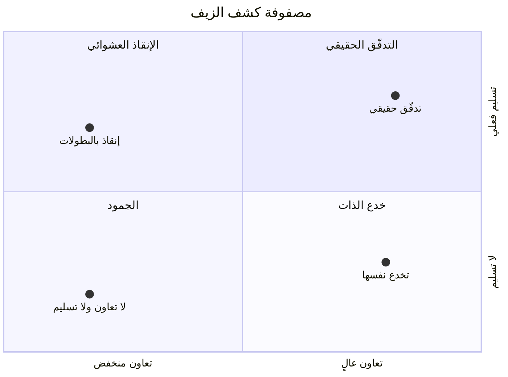

> [!info] الفصل 13 · كورس الإنتاجية
> **ماذا ستتعلّم:** لماذا يتعطّل التحوّل في **الطبقة الوسطى** لا في القمّة ولا في الفريق — ولماذا تكون مقاومة تلك الطبقة **خسارةً حقيقية لا عنادًا**، فلا تُعالَج بالإقناع. ستتعلّم ما **الرشاقة المؤسّسية** وما ليست، ولماذا يكون قسم لا علاقة له بالبرمجة سببًا في تعثّر كلّ فريق تقني (مثال التوظيف في ثلاثة أشهر). ثم **الدافعية**: ما تقوله نظرية تحديد الأهداف عند لوك ولاتام، وما لا تستطيع الغاية أن تعالجه من ظلم مالي — وهو اعتراض كريمة، وكان في محلّه. ثم **التصعيد** بمعياره الفاصل، وقالب نصّ تصعيد جاهز. ثم **مركزة الأدوات وشبكة تدفّق القيمة** عند ميك كيرستن، وحدّ دعوى «أداة واحدة». ثم **مصفوفة كشف الزيف** بأربعة أنواع من الشركات، مقروءةً مع تصنيف ويستروم الثقافي. ثم **القوّة في مقابل الصلاحية** بأسسها الخمسة عند فرنش ورافن، و**المُيسِّر** بما هو فعلًا لا بما ينسب إليه، ومنحنى تعلّم مدير سكرم الجديد شهرًا شهرًا. وتخرج **بتصحيح** لدعوى الأجيال — فهي أضعف تجريبيًّا ممّا يُتداول — **وبحدّ أخلاقي** لما يُطلَب من المهنيّ أن يعمل عليه.

> [!abstract] التأصيل
> **يفترض أنّك تعرف:** [[Cross-functional Team]] · [[Facilitator]] · [[Team Maturity]] · [[Servant Leadership]]
> **ويُؤصّل لك:** [[Enterprise Agility]] · [[Escalation]] · [[Value Stream Network]] · [[Goal Setting Theory]] · [[Power vs Authority]]

# الفصل 13 — الرشاقة المؤسّسية والإدارة الوسطى

## 🎯 أهداف التعلّم

- تعريف **الرشاقة المؤسّسية** والتمييز بينها وبين تطبيق أجايل في التقنية وحدها.
- تشخيص القسم غير التقني الذي يُنتج أكبر تأخّر في تسليمك، وقياس أثره.
- شرح ما تقوله **نظرية تحديد الأهداف** عن الدافعية، وما **لا تستطيع** الغاية أن تعالجه.
- التمييز بين **تصعيد يحلّ** و**تصعيد يُكبّر**، وكتابة نصّ تصعيد بأربعة عناصر.
- تصميم **شبكة تدفّق القيمة** بين أدواتك، وتحديد ما يُربَط وما لا يُربَط.
- تحديد موقع مؤسّستك على **مصفوفة كشف الزيف**، وربطها بتصنيف ثقافي مقيس.
- تفسير مقاومة **الإدارة الوسطى** بوصفها خسارةً محدَّدة، وتصميم ما يُعطى بدلًا عنها.
- التمييز بين **القوّة** و**الصلاحية** بأسس القوّة الخمسة، وتحديد ما يملكه المدرّب فعلًا.
- شرح ما يفعله **المُيسِّر** وما لا يفعله، وتوقّع **منحنى تعلّم** مدير سكرم الجديد شهرًا شهرًا.
- نقد **دعوى الأجيال** والحكم على قوّة دليلها.
- تحديد **الحدّ الأخلاقي** الذي لا يُتجاوَز في قبول العمل، والمسار المهنيّ لرفضه.

---

## الفكرة المحورية: التحوّل لا يفشل في القمّة ولا في الفريق

> [!quote] من المحاضرة
> **حمزة:** «تكون لنا دائمًا مشكلة مع **الإدارة الوسطى** حين نأتي ونقول *فريق متعدّد الوظائف*. فأوّل ما يسأل المدير: **«وأنا أفعل ماذا إذن؟»**»

هذا السؤال — «وأنا أفعل ماذا إذن؟» — أصدق سؤال في المحاضرة كلّها، وأكثره تعرّضًا للسخرية وأقلّه أخذًا بالجدّية.

فالغالب أن يُقرأ **عنادًا**: مدير يخاف على سلطته. وقد يكون كذلك. لكنّه في أكثر الحالات **سؤال مشروع لم يُجَب عنه**. فالتحوّل يعرض على الفريق مكسبًا واضحًا (استقلال · قرار · معنى)، ويعرض على القمّة مكسبًا واضحًا (سرعة · تنبّؤ · قدرة على التكيّف). **أمّا الطبقة الوسطى فيعرض عليها خسارةً واضحة ومكسبًا مبهمًا.** فتُنزَع منها وظيفة التوزيع والمتابعة — وهي كلّ ما كانت تُقاس به وتُرقَّى عليه — ويُقال لها إنّ دورها الجديد «تنمية الفريق»، وهي عبارة لا تُقاس ولا تُترقّى عليها ولا تُعرَض في تقرير.

فالمقاومة إذن **استجابة عقلانية لعرضٍ سيّئ**، لا خللٌ في الشخص. **وأثر هذا التشخيص عمليّ لا نظريّ:** فالمقاومة التي سببها العناد تُعالَج بالإقناع أو بالضغط؛ والمقاومة التي سببها خسارة محقّقة لا تُعالَج إلّا بتعريف ما يُعطى مقابلها. **ومن حاول أن يقنع صاحب خسارة بأن لا خسارة، أضاف إلى خسارته أن كُذِّب فيها.**

> [!tip] القاعدة العملية
> **لا يُنزَع دور قبل أن يُكتَب الدور البديل ومقياسه ومسار الترقّي فيه.** فالسؤال «وأنا أفعل ماذا؟» يجب أن يكون له جواب مكتوب **قبل** أوّل ورشة تحوّل، لا بعد أوّل اعتراض.

---

## أولًا: الرشاقة المؤسّسية

> [!quote] من المحاضرة
> **حمزة:** «قال أهل أجايل — ومعهم أهل SAFe — كلامًا بديعًا. سمّوه **الرشاقة المؤسّسية**: لكي تطبّق أجايل بأيّ قدر حقيقي من الصحّة، **يجب أن يتعلّم كلّ قسم ما معنى أجايل**… إن كنت تبدأ مشروعًا جديدًا وعملية التوظيف تستغرق **ثلاثة أشهر**… فما **ينعكس** من ذلك على الفريق الرشيق كارثة.»

### 1) لماذا مثال التوظيف بالغ الدقّة

اختيار **الموارد البشرية** مثالًا ليس عرضيًّا؛ إنّه أقوى مثال ممكن، لثلاثة أسباب:

1. **أنّه قسم لا صلة له بالبرمجة**، فلا يمكن أن يُقال إنّ الحلّ تدريب تقني.
2. **وأنّ تأخّره لا يُسجَّل في أيّ مقياس تسليم.** فثلاثة أشهر توظيف لا تظهر في زمن التدفّق، ولا في معدّل الإنجاز، ولا في مخطّط التدفّق التراكمي. **إنّها تظهر في مكان واحد: نقص السعة** — وهو يُقرأ «الفريق بطيء».
3. **وأنّه لا يخالف أحدٌ فيه قاعدةً.** فإجراءات التوظيف الثلاثة أشهر مكتوبة معتمدة، ينفّذها الناس بإتقان — وهي بعينها العملية من الداخل إلى الخارج التي شُرِحت في [[11 - العملية المتمركزة حول العميل وقانون كونواي|الفصل الحادي عشر]].

**فالدرس المستخلَص:** أنّ أكبر مصادر التأخّر في مؤسّسة كبيرة تقع غالبًا **خارج القسم الذي يُلام على التأخّر**. وأنّها لا تُكتشَف بمقاييس التدفّق وحدها، لأنّ مقاييس التدفّق تبدأ من دخول العمل إلى النظام — وهذه تقع قبله.

| القسم غير التقني | كيف يُنتج تأخّرًا تقنيًّا | كيف يُقاس أثره |
|---|---|---|
| **التوظيف** | شغور يطول فتنقص السعة | زمن الشغور × سعة الفرد |
| **المشتريات** | ترخيص أو بيئة تنتظر شهرين | عدد العناصر الموقوفة × مدّة الوقف |
| **الشؤون القانونية** | مراجعة عقد تعالج نشرًا | زمن الانتظار في بند «مراجعة» |
| **الأمن والامتثال** | مراجعة يدوية لكلّ إصدار | نصف يوم عمل خلف سبعة أيّام انتظار |
| **المالية** | دورة موافقة تُجمّد فريقًا | أشهر التجميد × تكلفة الفريق |

> [!tip] القاعدة العملية
> **قِس زمن الانتظار في الأقسام غير التقنية بالطريقة نفسها التي تقيس بها التدفّق التقني**، واعرض الرقمين في لوحة واحدة. فالإدارة التي ترى «سبعة أيّام انتظار مقابل نصف يوم عمل» في بند الامتثال تتحرّك — والإدارة التي تسمع «البيروقراطية تؤخّرنا» لا تتحرّك.

### 2) ما ليس رشاقةً مؤسّسية

> [!info] إضافة مرجعية — الاصطلاح ومصادره
> لم يُنسَب المصطلح في المحاضرة إلى مصدر بعينه، والواقع أنّ له عدّة مصادر متنافسة لا مصدرًا واحدًا:
>
> - **SAFe** يستعمل **الرشاقة الأعمالية** (`Business Agility`) بوصفها الغاية العليا لإطاره، ويُدرِج تحتها كفاءات منها **القيادة الرشيقة الرشيقة الفكر** و**رشاقة الأعمال التقنية**.
> - **معهد الرشاقة الأعمالية** (`Business Agility Institute`) ينشر نموذج نضج مستقلًّا عن أيّ إطار بعينه.
> - **جون كوتر** طرح في *Accelerate: XLR8* (2014) فكرة **نظام التشغيل المزدوج** (`Dual Operating System`): أن تبقى الهرمية لما هو متكرّر، وتُنشأ إلى جانبها شبكة مرنة لما هو متغيّر — وهي أقرب صياغة أكاديمية لما تصفه المحاضرة.
>
> **ويلزم التدقيق:** أنّ العبارة لا تدلّ على إطار محدّد المعالم، فلا يُقال «معيار الرشاقة المؤسّسية» ولا «تشترط الرشاقة المؤسّسية». إنّها **مقولة عن نطاق التحوّل** لا مواصفة.

**وما ليست:**

- **ليست** تدريب كلّ الأقسام على سكرم. فليس لقسم المالية سبرنتات، ولا يحتاجها.
- **وليست** إنشاء «فريق رشيق» في كلّ قسم.
- **وإنّما هي** أن يُعاد النظر في **زمن دورة القرار** في كلّ قسم يقع في مسار وصول القيمة. فالمطلوب من المالية ليس أن تعمل بسكرم، بل أن تكون موافقتها **أيّامًا لا أشهرًا** — أو أن يُفوَّض ما دون حدّ معلن.

> [!warning] المزلق العملي
> يُترجَم «كلّ قسم يتعلّم أجايل» في الممارسة إلى **ورشة تعريفية لكلّ الأقسام**، ثم لا يتغيّر إجراء واحد. **والفرق الفاصل: المطلوب تغيير عمليةٍ لا تغيير وعيٍ.** فورشة لا تُخرِج تعديلًا مكتوبًا في إجراء بعينه — بحدّ تفويض، أو مدّة قصوى — لم تُنتج شيئًا.

---

## ثانيًا: الدافعية — ما تقوله الغاية، وما لا تستطيعه

> [!quote] من المحاضرة
> **حمزة:** «حين تحدّثنا عن **نظرية تحديد الأهداف** والدافعية، لم نتحدّث عن **المال** إطلاقًا. تحدّثنا عن كيفية تكوين فريق تكون فيه **غاية العمل** الذي نقوم به واضحةً صريحة… ولستُ أُقلّل من دور المال — لكن بقدر ما في وسعي، أستطيع أن أُنشئ عمليةً هي في ذاتها دافعة للناس.»

### 1) ما تقوله النظرية فعلًا

> [!info] إضافة مرجعية — لوك ولاتام
> **نظرية تحديد الأهداف** (`Goal-Setting Theory`) وضعها **إدوين لوك** ابتداءً من 1968، وطوّرها مع **غاري لاتام** في *A Theory of Goal Setting and Task Performance* (1990). وخلاصتها المقيسة على مئات الدراسات: أنّ الهدف **المحدّد والصعب** يُنتج أداءً أعلى من الهدف العامّ أو السهل — بأربعة شروط: أن يكون **محدّدًا**، وأن يكون **صعبًا بلا أن يكون مستحيلًا**، وأن يكون **مقبولًا** عند من يعمل عليه، وأن تتوفّر **تغذية راجعة** عن التقدّم نحوه. وسقوط الشرط الثالث أو الرابع يُبطل الأثر.
>
> **والشرط الرابع هو موضع الشاهد في المحاضرة**: عبارة «عملية تُظهِر الأرقام» ليست تفصيلًا تشغيليًّا، بل هي شرط في النظرية نفسها. فالهدف بلا تغذية راجعة عن الاقتراب منه لا يُنتج دافعية.

> [!info] إضافة مرجعية — ثلاثة أطر أخرى تُكمل الصورة
> 1. **هرزبرغ** (1959) وعوامله الثنائية: أنّ الراتب وظروف العمل **عوامل صحّية** (`Hygiene`) — نقصُها يُنتج سخطًا، ووفرتها لا تُنتج دافعية؛ وأنّ الدافعية تأتي من الإنجاز والاعتراف والمسؤولية. **ويُنبَّه على أنّ منهج هرزبرغ نُقِد نقدًا معتبرًا** (اعتماده على ما يرويه الناس عن أنفسهم، وهو عرضة لخطأ الإسناد)، فلا يُقدَّم قانونًا بل إطارًا نافعًا.
> 2. **نظرية تحديد المصير** لـ**ديسي وريان**: أنّ الدافعية الذاتية تقوم على ثلاث حاجات — **الاستقلال**، و**الكفاءة**، و**الانتماء**.
> 3. **دانيال بينك** في *Drive* (2009) صاغها للجمهور العامّ في ثلاثية: **الاستقلال · الإتقان · الغاية** — وهي تلخيص شائع، وأصله ما قبله.

### 2) الحدّ الذي أشارت إليه كريمة — وكانت محقّة

> [!quote] من المحاضرة
> **كريمة:** «كما قلتُ، المسألة أنّ هذا قد يطول، ويؤثّر في إنتاج الفريق كلّه. فلا أظنّ أنّ في مثل هذه المواقف صيغةً من الكلام تجعل ذلك الشخص يعمل أو يُنتج.»

**والاعتراض صحيح، ويجب أن يُقال ذلك صريحًا** بدل أن يُمرَّر. فالفرق بين حالتين لا يُخطئ فيه أحد ممّن عمل في مؤسّسة:

| الحالة | أتُعالَج بالغاية؟ | العلّة |
|---|---|---|
| راتب عادل، وعمل بلا معنى | **نعم** | الغاية هي الناقص فعلًا |
| راتب عادل، ولا رؤية للأثر | **نعم** | تغذية راجعة ناقصة (الشرط الرابع) |
| **وعدٌ بعلاوة تأخّر بلا تفسير** | **لا** | المسألة **عدل** لا معنى — وهو بُعد `Fairness` في [[SCARF Model\|نموذج SCARF]] |
| راتب أدنى بكثير من السوق | **لا** | عامل صحّي ناقص عند هرزبرغ |

**فالحالة الثالثة — وهي التي وصفتها كريمة — أشدّها**، لأنّ الإخلال فيها ليس في المال بل في **الوفاء بوعد**. ولا توجد صيغة كلام تعالج إخلالًا بوعد؛ إنّما يعالجه **إنجاز الوعد**، أو **تفسيرٌ صادق لتأخّره بموعد جديد**. وأمّا الحديث عن الغاية في هذا الموضع فيُقرأ — بحقّ — محاولةَ استبدال حقٍّ ماليّ بخطاب. **وهذا يضاعف الضرر لا يُخفّفه.**

> [!tip] القاعدة العملية
> **فرّق قبل أن تعالج:** أهذا نقصٌ في المعنى، أم إخلالٌ بالعدل؟ فالأوّل من عملك، والثاني ليس من عملك — وواجبك فيه **الصدق ورفع الأثر**، لا الإقناع.

---

## ثالثًا: التصعيد — المعيار الفاصل

> [!quote] من المحاضرة
> **حمزة:** «مفهوم التصعيد في أجايل **مهمّ جدًّا**. لكنّ **العقلية** هي المهمّة هنا: **أنُصعّد لنُكبّر المشكلة، أم نُصعّد لأنّنا لا نستطيع حلّها ونطلب من يملك الصلاحية أن يحلّها؟**»

هذا معيار ممتاز، ومشكلته الوحيدة أنّه **معيارُ نيّة**. ولا يستطيع أحد أن يفحص نيّة أحد — بل إنّ المُصعِّد نفسه قد لا يعرف نيّته على الحقيقة. فلنحوّله إلى معيار قابل للفحص من **شكل التصعيد** لا من قصد صاحبه:

| الوجه | تصعيد يحلّ | تصعيد يُكبّر |
|---|---|---|
| **المطلوب** | قرار بعينه محدَّد | «الانتباه» أو «التدخّل» |
| **الجهة** | من يملك القرار وحده | أوسع دائرة ممكنة |
| **التوقيت** | بعد استنفاد ما يملكه الفريق | مع أوّل عائق |
| **الصياغة** | أثر على الهدف، بأرقام | خطأ شخصٍ بعينه |
| **الخيارات** | مصحوبٌ بخيارين أو ثلاثة | مصحوبٌ بشكوى |
| **التاريخ** | يذكر ما جُرِّب وفشل | يبدأ من الصفر |
| **بعد الحلّ** | يُغلَق ويُوثَّق | يُستشهَد به لاحقًا |

**والسطر الثاني هو الأدقّ في التمييز.** فمن أراد حلًّا رفع إلى **من يملك** الحلّ؛ ومن أراد التكبير رفع إلى **أكبر عدد**. ووضع خمسة أسماء في نسخة الرسالة ليس حرصًا على الشفافية — إنّه إشهاد، وهو مفهوم عند كلّ من قرأ الرسالة.

### قالب نصّ تصعيد

| العنصر | ما يُكتب | مثال |
|---|---|---|
| **1. الأثر** | ما يتعطّل من الهدف، برقم | «تأخّرت ثلاث ميزات من هدف الربع أربعة عشر يومًا» |
| **2. السبب** | العائق بلا اسم شخص | «مراجعة الأمن اليدوية تستغرق سبعة أيّام لكلّ إصدار» |
| **3. ما جُرِّب** | ما فعله الفريق ولم يكفِ | «قدّمنا الطلب أسبوعًا مسبقًا؛ خفّض الانتظار يومًا واحدًا» |
| **4. الطلب** | قرار واحد محدّد، مع بديل | «إمّا فحص آليّ في خطّ البناء للحالات منخفضة الخطر، أو مراجعة أسبوعية مجدولة» |

> [!warning] المزلق العملي
> **لا تُصعّد شخصًا. صعّد عائقًا.** فالتصعيد الذي يحمل اسمًا يفعل شيئين معًا: يُنقل النقاش من العائق إلى الدفاع عن الشخص، ويُعلِّم الفريق كلّه أنّ الخطأ يُرفَع بالأسماء — فيبدأ الجميع في حماية أنفسهم بدل حماية العمل. **وهذا هو أسرع ما يُهدِم الأمان النفسي المبنيّ في [[12 - نضج الفريق والأمان النفسي|الفصل الثاني عشر]].**

> [!info] إضافة مرجعية — على اللفظ نفسه
> «التصعيد» مقابل `Escalation` المعتمد في هذا المرجع. **ولا يُقال «الترقية»** — فهي `Promotion` — **ولا «الإحالة»** — فهي `Referral` وتعني النقل الأفقي لا الرفع إلى مستوى أعلى. وهذا مقرَّر في قاموس المصطلحات الحاكم لهذه الموسوعة.

---

## رابعًا: مركزة الأدوات وشبكة تدفّق القيمة

> [!quote] من المحاضرة
> **حمزة:** «**جيرا** — التي تدفع فيها الشركات مالًا كثيرًا — لم أرَ قطّ أحدًا يستعملها إلى أقصاها. الناس يعاملونها كأنّهم يعملون على **تريلو**… وهنا نصل إلى شيء اسمه **شبكة تدفّق القيمة**. لا بدّ من **مركزة الأدوات** التي تربط الأدوات كلّها بعضها ببعض.»

### 1) المصطلح وأصله

> [!info] إضافة مرجعية — كيرستن وشبكة تدفّق القيمة
> **شبكة تدفّق القيمة** (`Value Stream Network`) مصطلح مركزيّ في *From Project to Product* (2018) لـ**ميك كيرستن** — وهو المرجع الأساس لهذه القاعدة كلّها. وحجّته أنّ المؤسّسة الكبيرة تعمل بعشرات الأدوات المتخصّصة (تخطيط · مستودع كود · بناء · اختبار · مراقبة · دعم)، وأنّ العمل يعبرها كلّها، **فيُفقَد أثره عند كلّ حدّ بينها.** ولهذا **لا يمكن قياس زمن التدفّق من الفكرة إلى السوق أصلًا** ما لم تكن هذه الأدوات موصولة — فالبيانات مبعثرة في صوامع، والصوامع هنا صوامع **أدوات** لا صوامع **أقسام**.
>
> ولاحظ الصلة بالفصل الحادي عشر: الأولى صوامع بشرية، وهذه صوامع بيانات — **وقانون كونواي يفسّر الاثنين**، لأنّ خرائط الأدوات تتبع خرائط الفرق.

### 2) الحدّ الذي يلزم تقييده: «أداة واحدة»

عبارة المحاضرة — «أداة واحدة يستطيع الجميع أن يعملوا فيها» — تحتمل قراءتين، إحداهما صحيحة والأخرى مكلفة:

| القراءة | الحكم |
|---|---|
| **مصدر واحد للحقيقة** في تتبّع عنصر العمل ومساره | **صحيحة**، وهي المقصود |
| **مورّد واحد** لكلّ الأدوات | **مكلفة**: تُنتج [[Vendor Lock-in\|احتجاز المورّد]]، وتُجبر فرقًا على أداة لا تناسب عملها |

**فالمطلوب التكامل لا التوحيد.** ولهذا كان الاسم **شبكة** لا **أداة**: أن يبقى لكلّ تخصّص أداته التي يُتقنها، وأن يُوصَل بينها بمعرّف مشترك يُتتبَّع به العنصر من الطلب إلى الإصدار.

| ما يجب أن يُربَط | ما لا يجب أن يُوحَّد |
|---|---|
| معرّف عنصر العمل عبر الأدوات كلّها | أداة تصميم الواجهات |
| حالة العنصر ووقت انتقاله بين الحالات | أداة المراقبة والقياس التشغيلي |
| ربط الالتزام في الكود بالتذكرة | أداة إدارة المحتوى |
| ربط الإصدار بما فيه من عناصر | أداة التواصل اليومي |
| ربط تذكرة الدعم بالعيب ثم بالإصلاح | — |

**والصفّ الثالث والرابع هما الأثمن**، لأنّهما وحدهما ما يُمكّن من حساب **زمن التدفّق حتى السوق** — وهو الرقم الذي أصرّت المحاضرة الثانية على أنّه يُقاس حتى الوصول لا حتى الإغلاق.

### 3) الحدّ الأدنى من الحقول

من أراد أن يبدأ اليوم بلا مشروع تكامل كامل، فأقلّ ما يلزم أربعة حقول على كلّ عنصر:

1. **نوع العنصر** — من الأنواع الأربعة (ميزة · عيب · خطر · دَين تقني).
2. **وقت الالتزام** — لحظة دخوله المجرى الأدنى.
3. **وقت الوصول** — لحظة توفّره للمستخدم فعلًا، لا لحظة إغلاق التذكرة.
4. **سبب الوقف** — قائمة مغلقة قصيرة، لا نصّ حرّ.

> [!tip] القاعدة العملية
> **الحقل الرابع هو الذي يصنع الفرق**، وهو أكثر ما يُهمَل. فالنظام الذي يعرف **أنّ** العنصر توقّف لا يعرف **لماذا** — والسبب هو ما يُحوّل مخطّطًا إلى قرار. واجعله قائمةً مغلقة (انتظار مراجعة · انتظار بيئة · انتظار توضيح · انتظار تبعيّة خارجية · انتظار نافذة نشر)، فالنصّ الحرّ لا يُجمَّع ولا يُقاس.

---

## خامسًا: مصفوفة كشف الزيف

> [!quote] من المحاضرة
> **حمزة:** «الآن، **مصفوفة كشف الزيف**. الشركات، في رأيي، أربعة أنواع… **الإنقاذ العشوائي — البطولات الفردية**… **الشركة التي لا تتعاون ولا تُسلّم**… **الشركة التي تخدع نفسها**… **حالة التدفّق الحقيقية**.»

> [!info] إضافة مرجعية — على وضع هذه المصفوفة
> قدّمها المدرّب بعبارة **«في رأيي»**، وهي كذلك: **تأطير خاصّ به لا إطار منشور**. فلا يوجد مرجع أكاديمي أو صناعي باسم «مصفوفة كشف الزيف»، ولا تُعرَض على أنّها مصطلح متعارَف عليه. وقيمتها التشخيصية عالية على كلّ حال، **ولها ما يُسندها** من أطر منشورة يأتي بيانها.

### 1) المصفوفة على محورَيها

المحاضرة عرضت الأنواع قائمةً، وهي في حقيقتها مصفوفة على محورين: **التعاون** و**التسليم**.

*رُسمت نقطة واحدة لكلّ نوع من الأنواع الأربعة، ومواضعها **قراءة توضيحية لا قياس**؛ ولم تُرسَم حالات وسطى لأنّ ازدحام النقاط يُخفي أسماء الأرباع (القاعدة 9/أ).*

| النوع | تعاون | تسليم | العلامة القاطعة | أثره على الناس |
|---|---|---|---|---|
| **الإنقاذ العشوائي** | منخفض | عالٍ | يُسلَّم دائمًا، وفي كلّ مرّة بأزمة | استنزاف ثم رحيل الأكفأ |
| **الجمود** | منخفض | منخفض | كود يُنتج عيوبًا وترقيعًا فحسب | لا استنزاف ولا تعلّم |
| **خدع الذات** | عالٍ ظاهريًّا | منخفض | اجتماعات ومسمّيات ولا قيمة تصل | إحباط بطيء |
| **التدفّق الحقيقي** | عالٍ | عالٍ | يُسلَّم بانتظام بلا أزمة | استقرار واستبقاء |

### 2) لماذا الأوّل أخطرها — ولماذا يُكافأ

**الإنقاذ العشوائي هو أخطر الأربعة**، لأنّه الوحيد الذي **يُنتج نتائج**. فالجمود يُكتشَف، وخدع الذات تُكتشَف بعد وقت — أمّا الإنقاذ فيُسلّم فعلًا، فيُثنى عليه، فيُكافأ من قام به. **والمكافأة تُثبّته:** إذ يتعلّم كلّ من في المؤسّسة أنّ الطريق إلى التقدير هو الأزمة، فتُنتَج الأزمات.

> [!info] إضافة مرجعية — إطاران يُسندان هذا التشخيص
> 1. **دوّامة الإطفاء** عند **نلسون ريبينينغ** و**جون ستيرمان** في مقالتهما *«Nobody Ever Gets Credit for Fixing Problems that Never Happened»* (California Management Review, 2001). وحجّتهما — بنمذجة ديناميكية للنظم — أنّ المؤسّسة تُكافئ إصلاح الأعطال ولا تُكافئ منعها، **لأنّ العطب الذي مُنِع لا يُرى**؛ فيُنقَل الجهد تدريجيًّا من الوقاية إلى الإطفاء، وتزيد الأعطال، فيزيد الإطفاء — وهي حلقة موجبة مطابقة تمامًا لـ[[04 - دوّامة الموت والدَّين التقني|دوّامة الموت]].
> 2. **تصنيف ويستروم الثقافي**: صنّف **رون ويستروم** — في سياق سلامة الطيران والرعاية الصحّية — الثقافات المؤسّسية ثلاثًا: **مَرَضية** (`Pathological`) تُخفى فيها المعلومة ويُعاقَب حاملها، و**بيروقراطية** (`Bureaucratic`) تُتَّبع فيها القواعد ويُهمَل ما خرج عنها، و**مولِّدة** (`Generative`) تُطلَب فيها المعلومة وتُستقبَل. **وقد استُعمل هذا التصنيف مقياسًا في دراسات DORA المنشورة في *Accelerate* (2018)، ووُجد أنّه يتنبّأ بالأداء التسليمي والتنظيمي** — وهذا هو ما يرفع «الثقافة» من كلام عامّ إلى متغيّر مقيس.

| نوع المصفوفة | ما يقابله عند ويستروم |
|---|---|
| الإنقاذ العشوائي | مَرَضية أو بيروقراطية بحسب ما يقع لمن يُبلّغ |
| الجمود | بيروقراطية |
| خدع الذات | بيروقراطية |
| التدفّق الحقيقي | مولِّدة |

### 3) كيف تُشخّص نوعك في عشر دقائق

| السؤال | إن كان الجواب نعم |
|---|---|
| هل سُلِّم آخر إصدار بعمل في نهاية الأسبوع أو بعد منتصف الليل؟ | ميلٌ إلى الإنقاذ العشوائي |
| هل تُعرَف أسماء «من ينقذ الموقف» في مؤسّستك؟ | تأكيدٌ للأوّل — والاسم المعروف علامة النظام لا الشخص |
| هل يمكن أن تُسمّي ميزةً وصلت المستخدم هذا الشهر وغيّرت رقمًا في الأعمال؟ | إن كان الجواب لا فهو خدع الذات |
| هل الأخبار السيّئة تصل الإدارة من الفريق أم من العميل؟ | إن كانت من العميل فهي ثقافة مَرَضية |
| هل يُقاس شيء غير عدد ما أُغلِق؟ | إن كان الجواب لا فأنت لا تعرف نوعك أصلًا |

> [!tip] المعيار العملي
> **العلامة الفاصلة بين «التدفّق الحقيقي» و«الإنقاذ العشوائي» ليست جودة التسليم بل تكرار الأزمة.** فمن سلّم آخر خمسة إصدارات بلا نافذة استثنائية ولا عمل في نهاية أسبوع، فهو في الأوّل. ومن سلّمها كلّها بأزمة، فهو في الثاني — **مهما كانت نتائجه ممتازة**.

---

## سادسًا: الإدارة الوسطى — الخسارة الحقيقية وما يُعطى بدلًا عنها

> [!quote] من المحاضرة
> **حمزة:** «**العقلية الإدارية الموروثة من الثورة الصناعية لم تتغيّر**… فكثير جدًّا من المديرين أناس يدخلون فيقولون: *يا حمزة، افعل هذا*… هذا هو التصوّر **العقيم** للإدارة… وأيّ مدير لا يُطوّر فريقه **فليس مديرًا**… أمّا لو كنّا نتحدّث عن **الستّينيات**، فنعم: كان المدير آنذاك **مقاول أنفار**.»

### 1) العبارة صحيحة تاريخيًّا، وتشبيه «مقاول الأنفار» بالغ الدقّة

فوظيفة المدير في الإدارة العلمية عند تايلور كانت بالضبط ذلك: أن يُجزّئ العمل إلى خطوات مقيسة، ويوزّعها، ويراقب الالتزام بها. وهذا نظامٌ **صحيح** حيث تكون الخطوة معروفةً سلفًا وقابلةً للقياس بالزمن. وأمّا في العمل المعرفي فالخطوة **تُكتشَف أثناء تنفيذها** — فالمدير الذي يوزّع خطوات لم تُكتشَف بعد يوزّع أوهامًا. انظر [[Scientific Management|الإدارة العلمية]] و[[Theory X and Y|نظريّتَي X وY]].

### 2) وأمّا «فليس مديرًا» فتحتاج تدقيقًا

الحكم صحيح في مقصده، وهو أنّ الإدارة الحديثة تعرّف الدور بالتمكين لا بالأمر. لكن **الحكم على شخص بأنّه «ليس مديرًا» لا يُغيّر سلوكًا**؛ إنّه يُنشئ عداوةً. والأدقّ — وهو ما يبني عليه المدرّب نفسه في آخر الفقرة — أنّ **البنية هي التي تُنتج السلوك**:

- **المدير الذي يُقاس بعدد ما أُنجز في قسمه** سيوزّع ويراقب، لأنّ ذلك ما يُقاس به.
- **والمدير الذي يُقاس بنموّ فريقه وبانخفاض نقاط الفشل المفردة فيه** سيبني قدرةً، لأنّ ذلك ما يُقاس به.

**فالسؤال المنتج ليس «كيف نُقنع المدير؟» بل «بماذا يُقاس المدير؟»** — وقد فُصِّل هذا في [[11 - العملية المتمركزة حول العميل وقانون كونواي|الفصل الحادي عشر]] بجدول مسؤوليات لها مُخرَجات.

### 3) ما يُعطى بدلًا عمّا يُنزَع — جدول التبديل

| ما يُنزَع | الخسارة الفعلية فيه | ما يُعطى بدلًا عنه |
|---|---|---|
| توزيع المهامّ | الإحساس بالضرورة اليومية | ملكية **قدرة** الفريق ومصفوفة مهاراته |
| متابعة التنفيذ | مادّة التقرير الأسبوعي | ملكية **إزالة العوائق** الخارجية، بسجلّ مغلَق |
| قرار الأولوية | النفوذ | ملكية **المعايير التقنية** عبر الفرق |
| كونه قناة الاتّصال الوحيدة | المكانة | كونه **الممثّل في مجلس القدرة** والتوظيف |
| المسمّى القديم | مسار الترقّي | **مسار ترقّي معلن** للدور الجديد |

**والصفّ الأخير هو الذي يُهمَل دائمًا وهو أثقلها.** فالمدير لا يقاوم فقدان مهمّة؛ يقاوم فقدان **مستقبل**. فمن نُقِل إلى دور لا يُرى له طريق ترقٍّ، عَرَف أنّه أُزيح — وسيتصرّف على ذلك، ولن يُصرّح به.

> [!info] إضافة مرجعية — حالة موثّقة لإلغاء الطبقة الوسطى كلّها
> أعلنت شركة **Zappos** سنة 2013–2014 تبنّي **الهولاكراسي** (`Holacracy`) — نظام بلا مديرين، تُوزَّع فيه الصلاحية على أدوار ودوائر. وقد وُثِّق الأمر علنًا في مراسلات الرئيس التنفيذي **توني شي** وفي تغطية صحافية واسعة، ومنها أنّ الشركة عرضت **حزمة استقالة طوعية** على من لا يوافق، فتركها نحو **14%** من العاملين. ثم أعلنت الشركة سنة 2020 تخلّيها عن المسمّى.
>
> **والدرس المنهجي لا الحكم على التجربة:** أنّ إلغاء الطبقة الوسطى لا يُلغي **وظائفها** — فوظائف تخصيص الموارد، وحلّ التعارض، وتنمية الأفراد تبقى قائمة، وتُعاد بنيةً أخرى. والسؤال إذن ليس «أنُلغي المديرين؟» بل **«من يؤدّي وظائفهم الست وكيف؟»**.

---

## سابعًا: القوّة في مقابل الصلاحية

> [!quote] من المحاضرة
> **حمزة:** «إن كانت **صلاحية مدرّب أجايل** … **أدنى من الإدارة الوسطى**، فسيُهان.»
>
> **هبة:** «لأنّه سيُنظَر إليه بوصفه **موظّف سكرتارية**؟» — **حمزة:** «بالضبط.»
>
> **هبة:** «فهي إذن ليست صلاحيةً بمعنى —» — **حمزة:** «— بمعنى إصدار الأوامر. لا.» — **هبة:** «— **القوّة**.» — **حمزة:** «**القوّة**، نعم. *Power* هو التعبير الأدقّ.»

هذا الحوار من أنفع ما في المحاضرة، لأنّ التمييز الذي وصلا إليه معًا هو بعينه تمييز أكاديمي مستقرّ.

> [!info] إضافة مرجعية — أسس القوّة الخمسة
> صنّف **جون فرنش** و**برترام رافن** سنة 1959 أسس القوّة في المؤسّسات خمسًا: **قوّة المنصب** (`Legitimate`)، و**قوّة الثواب** (`Reward`)، و**قوّة العقاب** (`Coercive`)، و**قوّة الخبرة** (`Expert`)، و**قوّة الاقتداء** (`Referent`). ثم أُضيفت سادسة لاحقًا: **قوّة المعلومة** (`Informational`).
>
> **وموضع الشاهد:** أنّ مدرّب أجايل أو مدير سكرم **لا يملك الثلاث الأولى** بحكم دوره — فلا يوقّع ترقيةً ولا جزاءً ولا يعلو في المخطّط التنظيمي. **وإنّما يملك الثلاث الأخيرة:** الخبرة، والاقتداء، والمعلومة. وهذا يفسّر بدقّة لماذا يُهان من لم يبنِ هذه الثلاث: لأنّه بلا رصيد من أيّ نوع.

| الأساس | أيملكه مدير سكرم؟ | كيف يُبنى |
|---|---|---|
| المنصب | لا | — |
| الثواب | لا | — |
| العقاب | لا | — |
| **الخبرة** | نعم | تشخيصٌ صحيح مرّةً بعد مرّة، بأرقام تُصدَّق |
| **الاقتداء** | نعم | أن يُوفي بما وعد، وأن يحمي من قال الحقيقة |
| **المعلومة** | نعم | أن يكون عنده وحده الصورة الكاملة لمسار العمل |

**ولهذا كان الحلّ الذي عرضته المحاضرة — الإسناد من الإدارة العليا — صحيحًا لكن ناقصًا.** فالإسناد يُعطي **قوّة منصب مستعارة**، وهي تسقط بسقوط الراعي أو بانتقاله. أمّا الخبرة والاقتداء والمعلومة فرصيد ذاتيّ لا يُنتزَع.

### أمّا «إغلاق باب الإدارة العليا»…

> [!quote] من المحاضرة
> **حمزة:** «لا يصحّ أن تترك **الإدارة العليا** بابها مفتوحًا للإدارة الوسطى لتأتي وتنقل الرسائل جيئةً وذهابًا… فيجب ألّا تكون تلك الأبواب العليا مفتوحةً للإدارة الوسطى.»

**والملحوظة الجوهرية في هذا الطرح — على صحّة مقصده — أنّه يخالف مبدأً آخر يقرّره الفصل السابق:** فقناة الوصول إلى الأعلى هي بعينها ما يجعل المؤسّسة تسمع ما لا تحبّ. **فالباب الذي يُغلَق أمام المدير الوسطى ليعترض على المدرّب هو الباب نفسه الذي يُغلَق أمامه ليقول إنّ التحوّل يضرّ فعلًا** — وقد يكون محقًّا.

**والصياغة الأدقّ:**

| ما يُغلَق | ما يبقى مفتوحًا |
|---|---|
| **تعليق القرار** بمراجعة جانبية بعد اعتماده | **الاعتراض على القرار** في المحلّ المخصّص له |
| نقض التوجيه بالتفاوض الجانبي | رفع بيانات تُظهر ضررًا لم يُتوقَّع |
| **الالتفاف** على القناة المعلنة | استعمال القناة المعلنة بحرّية |

**فالمقصود إذن حسم القرار لا إسكات الاعتراض.** ومتى أُقفِل الاعتراض بالكلّية، انتقلت المؤسّسة إلى ما سمّاه ويستروم **الثقافة المَرَضية** — وهي أشدّ ما يضرّ التحوّل نفسه، لأنّه سيمضي بلا أن يعلم أحد أنّه يفشل.

---

## ثامنًا: المُيسِّر — وما ينسب إليه خطأً

> [!quote] من المحاضرة
> **حمزة:** «أكثر مديري سكرم لا يفهمون ما المُيسِّر أصلًا… يتصوّر الناس أنّ المُيسِّر شخص **يُدير بعض الاجتماعات**… لكنّك حين تتعمّق في تلك الكلمة… ستجد أنّ المُيسِّر هو **الشخص الذي يُزيل البيروقراطية من مستوى الإدارة العليا لتسهيل الأمور على الفريق**… **المُيسِّر هو الشخص الذي يرى أين الاختناقات ويعالجها.**»

### 1) جدول التمييز

| المسألة | ما ينسب إلى المُيسِّر خطأً | ما هو فعلًا |
|---|---|---|
| **الاجتماعات** | يُدير الاجتماعات ويسجّل قراراتها | **يضمن انعقادها** وأن تُنتج قرارًا، ولا يقودها بالضرورة |
| **التواصل** | قناةٌ يمرّ بها كلام الأعضاء بعضهم إلى بعض | **يُقصِّر القنوات** حتى يستغني الفريق عنه |
| **العوائق** | يتابع قائمة عوائق ويسجّلها | **يُزيلها**، وأكثرها فوق مستوى الفريق |
| **الاتّجاه** | ينظر إلى الفريق ويصحّح أفراده | ينظر إلى **النظام** ويصعد إلى مصدر العائق |
| **الوثائق** | يحدّث الحالة في الأداة | يجعل الحالة تُحدَّث نفسها بالبنية |

> [!info] إضافة مرجعية — الأصل النظري للتيسير
> لم تُسمَّ مصادره في المحاضرة، مع إحالتها إلى «الكتب». وأشهرها **سام كينر** في *Facilitator's Guide to Participatory Decision-Making* — ومنه نموذج **الماس** (`Diamond`) في اتّخاذ القرار الجماعي: أنّ الجماعة تمرّ بمرحلة **تشعّب** تُطرَح فيها الخيارات، ثم **منطقة العصف** التي تُشبه الفوضى ولا يجوز الفرار منها، ثم **تقارب** إلى قرار. **ودور المُيسِّر أن يحمل الجماعة عبر منطقة العصف بلا أن يحسم عنها.** ويقاربه **روجر شوارتز** في *The Skilled Facilitator* بتفريقه بين المُيسِّر **المحايد في المضمون** والمستشار **صاحب الرأي فيه**.
>
> **وأمّا ما يقرّره المرجع الرسمي:** فدليل سكرم 2020 يقرّر أنّ من مسؤوليات مدير سكرم إزالة العوائق وضمان انعقاد أحداث سكرم — **ولا يقرّر أنّه يقودها**، ولا يستعمل عبارة «إزالة البيروقراطية من الإدارة العليا». فالتوسّع في المحاضرة **تفسير عملي صحيح المعنى**، ولا يُنسَب إلى الدليل نصًّا.

### 2) منحنى تعلّم مدير سكرم الجديد

> [!quote] من المحاضرة
> **حمزة:** «إن كان الداخل إلى الدور **مبتدئًا** ولم يكن هناك من يرشده، فإنّه يعمل **موظّف سكرتارية** — لا يتعلّم شيئًا… أمّا إن كان هناك **خبير**… فإنّ **منحنى تعلّم** ذلك الشخص **يرتفع ارتفاعًا شديدًا**.»

سؤال هبة كان عن **ستّة أشهر**، والجواب في المحاضرة صحيح لكنّه بلا تفصيل زمني. فلنُخرجه جدولًا:

| المدّة | مع مرشد خبير | بلا مرشد |
|---|---|---|
| **الشهر 1–2** | تعلّم قراءة اللوحة والمقاييس · حضور بلا تدخّل | تعلّم أدوات الجدولة وتحديث الحالات |
| **الشهر 3–4** | أوّل تشخيص اختناق يُعرَض ويُصحَّح | تكرّس دور «منسّق الاجتماعات» |
| **الشهر 5–6** | إدارة استرجاع يُخرِج تغييرًا فعليًّا في العملية | يصير عبء التحديث اليدوي هو العمل |
| **الشهر 7–12** | أوّل عائق يُرفَع فوق مستوى الفريق ويُحلّ | لا تقدّم يُذكَر · وقد بُنيت عادات يصعب نقضها |

**والفارق الحقيقي ليس في السرعة بل في الاتّجاه.** فمن لم يجد مرشدًا لا يتعلّم أبطأ فحسب؛ **إنّه يتعلّم شيئًا آخر** — أن يكون منسّقًا. وتصحيح ذلك بعد سنة أصعب من تعليمه ابتداءً، لأنّ الفريق نفسه صار يتوقّع منه ذلك الدور ويطلبه.

> [!tip] القاعدة العملية
> **إن دخلتَ الدور بلا مرشد داخل مؤسّستك، فابحث عن مرشد خارجها** — مجتمع ممارسة، أو مشرف من خارج شركتك. والعلامة التي تفحص بها نفسك كلّ ربع: **أيّ عائق رفعتُه فوق مستوى فريقي وحُلّ؟** فإن لم يكن هناك واحد، فأنت في المسار الثاني ولو كان مسمّاك الأوّل.

---

## تاسعًا: الذكاء العاطفي والأجيال — تصحيح لازم

> [!quote] من المحاضرة
> **حمزة:** «عليك أن تنظر إلى **التكوين الإنساني** لكلّ فرد لتعرف كيف تتعامل معه. خذ **الجيل زد**… لماذا لا تستطيع أن تُصدر إليهم أوامر؟ لأنّ أولئك **لم يُربَّوا على الأوامر**.»
>
> **هبة:** «أشعر أنّ الذكاء العاطفي يدخل في كلّ شيء… لأنّك لن تُنجز شيئًا بـ**الأوامر**. لم يعد شيء يسير بالأوامر.»

### 1) الذكاء العاطفي: نافع مع تقييد

> [!info] إضافة مرجعية — أصل المصطلح وحدّ دليله
> صاغ المفهوم أكاديميًّا **بيتر سالوفي** و**جون ماير** سنة 1990، ونشره على نطاق واسع **دانيال غولمان** في *Emotional Intelligence* (1995). **ويلزم التقييد:** أنّ دعاوى غولمان عن حجم أثره على النجاح المهني نُقِدت نقدًا معتبرًا في الأدبيات الأكاديمية، وأنّ قوّة الأثر تختلف اختلافًا كبيرًا بحسب **أيّ نموذج** للذكاء العاطفي يُقاس (نموذج القدرة أم نموذج السمات). **فيُقدَّم مهارةً قابلة للتعلّم ونافعةً في القيادة، ولا يُقدَّم متغيّرًا يفسّر النجاح.**

### 2) وأمّا دعوى الأجيال، فهذا موضع تصحيح صريح

**الملاحظة العملية في المحاضرة صحيحة:** أنّ الأمر المجرّد لم يعد ينفع. **وأمّا تفسيرها بـ«الجيل»، فدليله أضعف بكثير ممّا يُتداول.**

> [!info] إضافة مرجعية — ما تقوله المراجعات البحثية
> راجع **ديفيد كوستانزا** و**لايزا فينكلستاين** الأدبيات في مقالتهما *«Generationally Based Differences in the Workplace: Is There a There There?»* (2015)، وخلصا إلى أنّ **الفروق المنسوبة إلى الأجيال صغيرةٌ وغير متّسقة، وأنّ كثيرًا منها يُفسَّر تفسيرًا أفضل بـ«أثر العمر» أو «أثر الفترة» لا بـ«أثر الجيل»** — أي أنّ من في العشرين يسلك سلوك من في العشرين، في كلّ جيل، لا سلوك «الجيل زد» بخصوصه. وهذا نقد منهجيّ معتبر ومتكرّر في أدبيات علم النفس التنظيمي.

**وأثر التصحيح عمليّ لا نظريّ:**

| التفسير | ما يُنتجه من سلوك إداري |
|---|---|
| **«هذا جيل لا يقبل الأوامر»** | تصنيفٌ مسبق للشخص قبل معرفته · وتوقّعٌ يُحقّق نفسه · وعجزٌ مفترَض («هكذا هم») |
| **«الأمر المجرّد لا ينفع في العمل المعرفي عمومًا»** | يُبنى **نظام** يُغني عن الأمر: هدف واضح، وتفويض بحدود، وشفافية |

**والثاني هو الذي تقوم عليه هذه القاعدة كلّها.** فلو صحّ أنّ المشكلة جيليّة، لكان الحلّ انتظار جيل آخر. وهي ليست كذلك: إنّها في **طبيعة العمل المعرفي** — أنّ خطوته تُكتشَف أثناء تنفيذها، فلا يستطيع أحد أن يأمر بها. وهذا يصدُق على من عمره خمسون كما يصدُق على من عمره عشرون.

> [!warning] المزلق العملي
> التصنيف الجيلي يبدو أداةَ فهم، وهو في العمل **مصدر تنميط**: يُعلَّق على الشخص وصفٌ قبل أن يُرى عمله، ثم يُفسَّر كلّ فعل منه بذلك الوصف. وهذا [[Fundamental Attribution Error|خطأ الإسناد الأساسي]] بصورة جماعية. **فاسأل الشخص كيف يحبّ أن يُتعامل معه** — كما في جلسة الفريق الجديد — ولا تستنتج ذلك من سنة ميلاده.

---

## عاشرًا: الحدّ الأخلاقي — حين يكون العمل نفسه محلّ اعتراض

> [!quote] من المحاضرة
> **سائل:** «طلبوا منّي أن أعمل على مشروع، وللأسف كان في ذلك المشروع شيء **حرام**… فأنا — بوصفي شخصًا لا خبرة له بالشركات — أتوجد شركات يكون **كلّ** عملها سليمًا؟»
>
> **حمزة:** «نعم يا صديقي، هناك شركات كثيرة ليس فيها شيء حرام… **الأصل أنّني لا أعمل على شيء حرام**… ولماذا؟ **اتّقاءً لمواضع الشبهات.**»

هذا السؤال — وهو آخر أسئلة الكورس — **ليس خارجًا عن موضوعه كما ظنّ السائل**، وإن كان خارجًا عن أدواته. فهو يقع في **الطبقة التي تسبق كلّ ما في هذه القاعدة**: فمقاييس التدفّق تجيب عن «كيف نُسلّم أسرع»، وهذا السؤال يجيب عن «أنُسلّم هذا أصلًا؟».

**والحكم الشرعيّ في المسألة ليس من مسائل هذا المرجع**، ومرجعه أهل الاختصاص فيه؛ وقد أجاب المدرّب من ذلك الأصل وهو ما يُنقَل عنه في [[3.4 الدَّين التقني وبناء فريق جديد وخاتمة الكورس|ملاحظة المصدر]]. **وأمّا ما يخصّ هذا الفصل فثلاثة أشياء**: أنّ الاعتراض على العمل حقٌّ مهنيّ معترَف به في المواثيق المهنية لا مجرّد موقف شخصي؛ وأنّ له **مسارًا** يُسلَك فيكون أنفع وأسلم؛ وأنّ **الآلة التي استعملها المدرّب في قصّته هي بعينها ما شُرِح في المحور الثالث** — التصعيد.

### 1) أنّه حقّ مهنيّ موثَّق

> [!info] إضافة مرجعية — مواثيق المهنة
> لم تُذكر في المحاضرة، وهي طبقةٌ تُضاف إلى ما قيل لا تُعارضه:
>
> - **ميثاق الأخلاق المهنية لـACM/IEEE-CS للمهندس البرمجي** يقرّر أنّ على المهندس أن يتصرّف بما يتّفق والمصلحة العامّة، **وأن يُفصح عن أيّ ضرر يعتقد أنّ البرمجية قد تُحدثه**، وأن يعترض على ما يراه غير أخلاقي.
> - **ميثاق الأخلاق والسلوك المهني لمعهد إدارة المشاريع (`PMI`)** يُدرِج **الصدق** و**المسؤولية** قيمتين ملزمتين، ومنها الإبلاغ عن السلوك غير الأخلاقي وعدم المشاركة فيه.
>
> **والقيمة العملية لهذا:** أنّ الاعتراض يُصاغ حينها بلغةٍ **يُلزَم بها الطرف الآخر** ولا يستطيع أن يعدّها مسألةً شخصية. فمن قال «هذا لا يوافق قناعتي» عرض موقفًا؛ ومن قال «هذا يخالف الميثاق المهنيّ الذي أعمل به، وهذه بنوده» عرض حجّة.

### 2) أنّ له مسارًا يُسلَك

قصّة نهال في المحاضرة تحمل بروتوكولًا كاملًا وإن لم يُعرَض بروتوكولًا:

| # | الخطوة | ما وقع في القصّة |
|---|---|---|
| 1 | **الاعتراض المبكّر — قبل الالتزام** | نُبِّه على الأمر قبل بدء العمل، لا بعد شهرين منه |
| 2 | **التصعيد إلى من يملك القرار** | رُفِع إلى المدير العام مباشرةً، لا إلى دائرة واسعة |
| 3 | **الإعلان الصريح للموقف وثمنه** | «لن نعمل على هذه الميزة، وإن أصرّت الإدارة فنحن راحلون» |
| 4 | **الاستفهام عن الغرض قبل الحكم** | سأل المدير العميلَ عن استعماله للميزة |
| 5 | **التوثيق** | «سنرسل إليكم مستندًا» |

**والخطوة الرابعة هي أنفعها وأكثرها إهمالًا.** فالميزة الواحدة قد تُستعمل استعمالين، وكثير من الاعتراضات تنحلّ بسؤال واحد عن الغرض. **والخطوة الأولى أثقلها أثرًا:** فالاعتراض قبل الالتزام كلفته يومٌ من الجدل، وبعد شهرين من العمل كلفته مشروعٌ ومصداقية.

### 3) وأنّ لكلّ حدّ ثمنًا يُحسَب قبل بلوغه

الجملة التي في القصّة — «وإن أصرّت الإدارة عليها فنحن راحلون» — إعلانُ حدٍّ. **والحدّ الذي لا يُنوى الوفاء به أسوأ من عدمه**، لأنّ من أعلن حدًّا ثم تجاوزه فقد علّم الطرف الآخر أنّ حدوده كلّها قابلة للتجاوز. فيُحسَب قبل أن يُعلَن: أَبديلي جاهز؟ أَما زلتُ في فترة التجربة؟ أَعندي التزامات لا تحتمل؟

**وحدّ هذا المحور صريح:** هذا فصلٌ في **الإدارة**، وما يُقرَّر فيه هو أنّ الاعتراض المهنيّ **مسارٌ له آلة وكلفة**. وأمّا تحديد **ما يستحقّ الاعتراض** فمرجعه قيم المرء ومرجعيّته، وليس مسألةً تحسمها أدوات هذا الكورس.

---

## حادي عشر: كيف يفشل هذا؟

**التحوّل المؤسّسي لا يُرفَض غالبًا — يُتبنّى ويُفرَّغ.** وصوره الثلاث في هذا الباب:

1. **التحوّل الذي لم يُقنِع الطبقة الوسطى فاشتراها.** تُمنَح مسمّياتٌ جديدة («مدير تمكين»، «قائد فصل») بلا تغيير في المقياس ولا في مسار الترقّي. **وأثره** أنّ السلوك القديم يعمل بمسمّى جديد، فيصعب رصده — لأنّه صار محسوبًا على التحوّل نفسه.
2. **الرشاقة المحصورة في التقنية.** تُطبَّق كلّ ممارسة داخل التطوير، وتبقى الأقسام المحيطة بإجراءاتها. **وأثره** أنّ سقف التحسين يُبلَغ في ربعين ثم يتوقّف الرقم، فيُستنتَج أنّ «أجايل لا يعمل عندنا» — والحقيقة أنّ ثمانين بالمئة من زمن التدفّق كان دائمًا خارج القسم الذي طُبِّق فيه.
3. **مدرّب بلا رصيد يُعطى إسنادًا.** يُمنَح تفويضٌ من القمّة لمن لم يبنِ خبرةً ولا اقتداءً. **وأثره** أنّه يستعمل قوّةً مستعارة، فيُنفِّر الإدارة الوسطى، ثم يسقط بأوّل انتقال للراعي — **ويُحمَّل التحوّل نفسه فشلَ شخص**.

**وأخفاها الثانية على الإطلاق**، لأنّها الوحيدة التي **تُنتج تحسّنًا حقيقيًّا مقيسًا** ثم تتوقّف. فالربع الأوّل يُظهر نتائج ممتازة تُستشهَد بها، والثاني يُظهر أقلّ، والثالث لا يُظهر شيئًا — ويُنسَب الجمود إلى الفريق أو إلى الإطار، لا إلى أنّ الاختناق انتقل إلى موضع لم يُنظَر فيه أصلًا.

> [!tip] المعيار العملي
> **إن كان تحسينك بلغ سقفه بعد ربعين، فقِس ما قبل دخول العمل إلى فريقك وما بعد خروجه منه.** فالغالب أنّ الاختناق هناك — ولا يظهر في أيّ مقياس تدفّق تقني، لأنّ مقاييس التدفّق تبدأ من نقطة الالتزام.

---

## ثاني عشر: القراءة النقدية — أين يقصر هذا الطرح؟

**1. «صلاحية المدرّب أعلى من الإدارة الوسطى» دعوى قابلة للنقض.** فهي تحلّ مشكلةً وتُنشئ أخرى: مدرّبٌ يملك سلطةً على مديرين مسؤولين عن نتائج لا يملك هو مسؤوليّتها. وقد يُنتج ذلك تحوّلًا مفروضًا لا مُتبنّى. **والبديل الذي تقرّره أدبيات إدارة التغيير** ليس رفع صلاحية المدرّب، بل **رعايةً تنفيذية** (`Executive Sponsorship`) صريحة: أن يملك التحوّل راعٍ من القمّة يُحسَم إليه التعارض — فيبقى المدرّب صاحب خبرة لا صاحب أمر. انظر [[Sponsor|الراعي]].

**2. الرشاقة المؤسّسية عبارة أوسع من أن تُنفَّذ.** «كلّ قسم يتعلّم أجايل» لا تقول أين يبدأ المرء، ولا أيّ الأقسام أولى. **والصياغة القابلة للتنفيذ:** ابدأ بالقسم الذي يظهر في أطول بند انتظار في خريطة تدفّقك، واحدًا في الربع. أمّا البرنامج الشامل لكلّ الأقسام معًا فيُستهلَك في التنسيق.

**3. مصفوفة كشف الزيف تأطير شخصيّ لا إطار.** وقد صرّح صاحبها بذلك («في رأيي»)، وهذا يُحفَظ له. لكنّ محورَيها غير معرَّفين تعريفًا قابلًا للقياس: **بأيّ مقياس نقول إنّ التعاون «منخفض»؟** ولذلك ربطناها بتصنيف ويستروم الذي **قيس فعلًا** في دراسات DORA. **فتُستعمل للتشخيص السريع، ولا تُستعمل حكمًا على مؤسّسة.**

**4. مركزة الأدوات تُعرَض حلًّا وهي مشروع.** فربط الأدوات في مؤسّسة كبيرة عملُ أرباع لا أسابيع، وله كلفة ترخيص وصيانة، ويتعطّل مع كلّ ترقية. **وأثمن ما فيه — تتبّع العنصر حتى الوصول — يُبلَغ بأربعة حقول** كما في المحور الرابع، وذلك يُنفَّذ في أسبوعين. **فمن انتظر مشروع التكامل لم يقس شيئًا سنةً كاملة.**

**5. تفسير مقاومة الإدارة الوسطى بالعقلية القديمة قد يكون هو نفسه خطأ إسناد.** فقد يقاوم المدير لأنّ **التحوّل معطوب فعلًا**: لأنّ أهدافه غامضة، أو أنّ الفريق حُمِّل مسؤوليةً بلا صلاحية، أو أنّ تجربةً سابقة فشلت ولم يُراجَع سببها. **والفحص قبل الحكم:** هل الاعتراض عن **الدور** أم عن **التصميم**؟ فالأوّل يُعالَج بجدول التبديل، والثاني يُعالَج بمراجعة التصميم — **وقد يكون المدير المعترض هو الوحيد الذي رأى العيب.**

**6. الحدّ المتكرّر:** كلّ ما في هذا الفصل يُصلح **بنية القرار** في المؤسّسة، ولا يقول شيئًا عن **صواب القرار** نفسه. فالمؤسّسة السريعة الرشيقة المتّسقة الصلاحيات قد تمضي بسرعةٍ قياسية في اتّجاه خاطئ — وهذا موضعه [[إدارة المنتج في عصر الذكاء الاصطناعي|قاعدة إدارة المنتج]].

---

## 🧾 خلاصة الفصل

1. **التحوّل يتعطّل في الطبقة الوسطى**، لأنّها الوحيدة التي يُعرَض عليها خسارةٌ واضحة ومكسبٌ مبهم.
2. **لا يُنزَع دور قبل أن يُكتَب بديله ومقياسه ومسار الترقّي فيه** — وآخِرها أثقلها وأكثرها إهمالًا.
3. **أكبر مصادر التأخّر تقع خارج القسم الذي يُلام عليه**، ولا تظهر في مقاييس التدفّق لأنّها تقع قبل نقطة الالتزام.
4. **الرشاقة المؤسّسية مقولة عن نطاق التحوّل لا مواصفة**، فلا يُقال «معيارها» ولا «تشترط».
5. **المطلوب من الأقسام غير التقنية تقصير زمن دورة القرار، لا العمل بسكرم.**
6. **نظرية تحديد الأهداف تشترط أربعة شروط**، وأكثرها إهمالًا التغذية الراجعة — وهي «عملية تُظهِر الأرقام».
7. **الغاية لا تعالج إخلالًا بالعدل.** فالمسألة المالية المؤجَّلة تُعالَج بالوفاء أو بالصدق، لا بالخطاب — واعتراض كريمة كان في محلّه.
8. **التصعيد يُفحَص بشكله لا بنيّة صاحبه**: مطلوبٌ محدَّد، وجهةٌ واحدة تملك القرار، وأثرٌ بأرقام، وخياراتٌ مقترحة.
9. **لا يُصعَّد شخص، بل عائق** — وإلّا هُدِم الأمان النفسي في الفريق كلّه.
10. **شبكة تدفّق القيمة تكاملٌ لا توحيد**، والحدّ الأدنى منها أربعة حقول أهمّها **سبب الوقف** بقائمة مغلقة.
11. **الإنقاذ العشوائي أخطر الأنواع الأربعة لأنّه يُنتج نتائج فيُكافأ** — ودوّامة الإطفاء عند ريبينينغ وستيرمان تفسّر بقاءه.
12. **مدير سكرم لا يملك قوّة المنصب ولا الثواب ولا العقاب**؛ ويملك الخبرة والاقتداء والمعلومة — والإسناد قوّةٌ مستعارة تسقط بسقوط الراعي.
13. **يُغلَق تعليق القرار، ولا يُغلَق الاعتراض عليه** — وإلّا صارت الثقافة مَرَضية ومضى التحوّل يفشل بلا أن يعلم أحد.
14. **المُيسِّر يُقصِّر القنوات حتى يُستغنى عنه، ولا يكون هو القناة.**
15. **دعوى الأجيال أضعف دليلًا ممّا يُتداول**، والملاحظة الصحيحة عن الأوامر تفسيرها في طبيعة العمل المعرفي لا في سنة الميلاد.
16. **للاعتراض المهنيّ على العمل مسارٌ**: اعتراض مبكّر، وتصعيد إلى من يملك، وسؤال عن الغرض، وتوثيق — وحدٌّ لا يُعلَن إلّا إن نُوي الوفاء به.

---

## ❓ اختبارات ذاتية

> [!question]- 1) قال لك مدير قسم: «إن صارت الفرق متعدّدة الوظائف، فأنا أفعل ماذا؟» ما أسوأ جواب، وما الجواب الصحيح؟
> **أسوأ جواب أن تُقنِعه بأنّ لا خسارة**: «دورك سيصير أهمّ»، «ستتفرّغ للأمور الاستراتيجية». وهو أسوأ لأنّ **الخسارة حقيقية** — تُنزَع منه وظيفة التوزيع والمتابعة، وهي كلّ ما كان يُقاس به ويُرقَّى عليه. فمن أنكر خسارته أضاف إلى خسارته أنّه كُذِّب فيها، فانتقل من معترض إلى معترض لا يثق.
>
> **والجواب الصحيح أن تُقِرّ بالخسارة وتعرض بديلًا مكتوبًا له مقياس:** ملكية **قدرة** الفريق (مصفوفة مهارات، وعدد نقاط الفشل المفردة، وخطط النموّ)، وملكية **إزالة العوائق الخارجية** بسجلّ مغلَق، وملكية **المعايير التقنية** عبر الفرق، والتمثيل في **التوظيف**.
>
> **والبند الذي لا يجوز إغفاله: مسار الترقّي في الدور الجديد.** فالمدير لا يقاوم فقدان مهمّة بل فقدان مستقبل؛ ومن نُقِل إلى دور بلا طريق ترقٍّ عَرَف أنّه أُزيح، وسيتصرّف على ذلك ولن يصرّح به. **والقاعدة: يُكتَب الدور البديل قبل أوّل ورشة تحوّل، لا بعد أوّل اعتراض.**

> [!question]- 2) خفض فريقك زمن التدفّق 40% في ربعين، ثم توقّف الرقم تمامًا ثلاثة أرباع. قِسْتَ فلم تجد اختناقًا داخل الفريق. ما تشخيصك؟
> **بلغتَ سقف الرشاقة المحصورة في التقنية — والاختناق انتقل إلى خارج نطاق قياسك.** وهذا أخفى صور فشل التحوّل تحديدًا، لأنّه الوحيد الذي **يُنتج تحسّنًا حقيقيًّا أوّلًا** ثم يتوقّف؛ فيُنسَب الجمود إلى الفريق أو إلى الإطار، لا إلى موضع لم يُنظَر فيه.
>
> **والسبب البنيوي:** مقاييس التدفّق تبدأ من **نقطة الالتزام** وتنتهي بالوصول. فكلّ ما قبل الالتزام — تجهيز الطلب، وموافقة المالية، وشغور وظيفي، ومراجعة قانونية — **لا يظهر في أيّ مقياس تدفّق**، وإنّما يظهر في نقص السعة، ويُقرأ «الفريق بطيء».
>
> **والخطوة العملية:** قِس **زمن الانتظار خارج الفريق** بالطريقة نفسها — من الطلب إلى نقطة الالتزام، ومن الإصدار إلى المتاح للمستخدم — واعرض الرقمين في لوحة واحدة. ثم اختر **قسمًا واحدًا في الربع**: أطول بند انتظار، بلا برنامج شامل لكلّ الأقسام معًا، فذلك يُستهلَك في التنسيق.

> [!question]- 3) اكتب تصعيدًا صحيحًا لهذه الحالة: مراجعة الأمن اليدوية تُوقف كلّ إصدار سبعة أيّام، وقد حاول الفريق تقديم الطلب مسبقًا فلم يكفِ.
> **يُكتَب بأربعة عناصر، ويُرسَل إلى جهة واحدة تملك القرار — لا إلى دائرة واسعة.**
>
> **(1) الأثر:** «تأخّرت ثلاث ميزات من هدف الربع أربعة عشر يومًا؛ وقد بلغ زمن الانتظار في بند المراجعة 34% من زمن التدفّق الكلّي هذا الشهر.»
> **(2) السبب — عائقًا لا شخصًا:** «المراجعة الأمنية اليدوية تستغرق سبعة أيّام لكلّ إصدار، ويستغرق العمل الفعلي فيها نصف يوم.»
> **(3) ما جُرِّب:** «قدّمنا الطلب أسبوعًا مسبقًا في آخر ثلاثة إصدارات؛ خفّض الانتظار يومًا واحدًا فقط.»
> **(4) الطلب — قرارًا محدّدًا مع بديل:** «إمّا فحص آليّ في خطّ البناء للحالات منخفضة الخطر مع مراجعة يدوية للمصنَّفة عاليًا، أو مراجعة أسبوعية مجدولة بموعد ثابت.»
>
> **وما يُتجنَّب:** ألّا يُذكَر اسم أحد؛ وألّا يُوضَع خمسة أسماء في نسخة الرسالة — فذلك إشهاد لا شفافية، ويُفهَم على حقيقته؛ وألّا يُطلَب «الانتباه» أو «التدخّل» فذلك تصعيدٌ يُكبّر ولا يحلّ. **والعلامة الفاصلة: التصعيد الصحيح يُغلَق ويُوثَّق بعد الحلّ، ولا يُستشهَد به لاحقًا.**

> [!question]- 4) مؤسّستك تُسلّم كلّ إصدار في موعده، وأسماء «من ينقذ الموقف» معروفة للجميع. أهذه مؤسّسة عالية الأداء؟
> **لا — هذه أخطر الأنواع الأربعة: الإنقاذ العشوائي. وخطرها في أنّها تُنتج نتائج فتُكافأ.**
>
> **والعلامة القاطعة في السؤال هي الثانية:** أنّ الأسماء **معروفة**. فمعرفة الأسماء ليست وصفًا لأفراد بل **وصفًا لنظام**: نظامٌ لا يُسلّم إلّا بتدخّل استثنائي من أشخاص بعينهم — أي أنّ التسليم قدرةُ أفراد لا قدرةُ نظام، وهو ينكسر بغياب أحدهم.
>
> **وما يُثبّت الحالة هو المكافأة نفسها**، وقد نمذجه [[Root Cause Analysis|ريبينينغ وستيرمان]] في *«Nobody Ever Gets Credit for Fixing Problems that Never Happened»*: المؤسّسة تُكافئ إصلاح الأعطال ولا تُكافئ منعها، **لأنّ العطب الذي مُنِع لا يُرى**؛ فيُنقَل الجهد من الوقاية إلى الإطفاء، فتزيد الأعطال، فيزيد الإطفاء.
>
> **والمعيار الفاصل: تكرار الأزمة لا جودة التسليم.** فاسأل عن آخر خمسة إصدارات: كم منها احتاج نافذةً استثنائية أو عملًا في نهاية أسبوع؟ **والأثر المتوقَّع إن لم يُعالَج: رحيل الأكفأ أوّلًا** — لأنّهم أقدر الناس على إيجاد بديل.

> [!question]- 5) عُيِّنت مدرّب أجايل، وأصدر الرئيس التنفيذي تعميمًا بأنّ توجيهاتك ملزِمة لمديري الأقسام. أيكفي هذا؟
> **لا — هذه قوّة منصب مستعارة، وهي أضعف ما يمكن أن تُبنى عليه.** وبأسس القوّة الخمسة عند **فرنش ورافن** (1959): مدرّب أجايل لا يملك بحكم دوره قوّة المنصب ولا الثواب ولا العقاب. والتعميم منحك الأولى **إعارةً** — وهي تسقط بانتقال الراعي، أو بتغيّر أولوياته، أو بأوّل مرّة تُختبَر فيها ولا تُنفَّذ.
>
> **وله أثر جانبيّ فوريّ:** أنّه يجعل كلّ مدير يقرأ توجيهك بوصفه أمرًا من فوقه لا رأي خبير، فتُقابَل ملاحظتك بالامتثال الظاهر والتعطيل الفعلي.
>
> **وما يلزم بناؤه — الثلاث التي تملكها:** **الخبرة** بتشخيصٍ صحيح مرّةً بعد مرّة بأرقام تُصدَّق؛ و**الاقتداء** بأن تُوفي بما وعدتَ وتحمي من قال الحقيقة؛ و**المعلومة** بأن تكون عندك وحدك الصورة الكاملة لمسار العمل.
>
> **وأمّا الإسناد فيُعاد تعريفه:** لا «توجيهاتي ملزِمة»، بل **رعايةٌ تنفيذية** تحسم التعارض عند رفعه، وتُعلِن أنّ القرار مقضيّ. فيبقى القرار للراعي، ويبقى لك ما لا يُنتزَع.

---

## 📚 مراجع الفصل

| المرجع | الصلة |
|---|---|
| Mik Kersten — *From Project to Product* (2018) | شبكة تدفّق القيمة ومركزة الأدوات |
| Edwin Locke & Gary Latham — *A Theory of Goal Setting and Task Performance* (1990) | نظرية تحديد الأهداف وشروطها الأربعة |
| Frederick Herzberg — *The Motivation to Work* (1959) | العوامل الصحّية في مقابل الدافعة — مع نقد منهجه |
| Deci & Ryan — *Self-Determination Theory* · Daniel Pink — *Drive* (2009) | الاستقلال والكفاءة والانتماء |
| French & Raven — *The Bases of Social Power* (1959) | القوّة في مقابل الصلاحية |
| John Kotter — *Accelerate: XLR8* (2014) | نظام التشغيل المزدوج |
| Repenning & Sterman — *Nobody Ever Gets Credit for Fixing Problems that Never Happened* (2001) | دوّامة الإطفاء وتفسير بقاء الإنقاذ العشوائي |
| Ron Westrum — تصنيف الثقافات المؤسّسية · Forsgren, Humble & Kim — *Accelerate* (2018) | الثقافة متغيّرًا مقيسًا يتنبّأ بالأداء |
| Sam Kaner — *Facilitator's Guide to Participatory Decision-Making* · Roger Schwarz — *The Skilled Facilitator* | التيسير بأصوله · نموذج الماس |
| Scrum Guide 2020 | ما يقرّره المرجع الرسمي في مسؤوليات مدير سكرم |
| Salovey & Mayer (1990) · Daniel Goleman — *Emotional Intelligence* (1995) | الذكاء العاطفي وحدّ دليله |
| Costanza & Finkelstein — *Generationally Based Differences in the Workplace* (2015) | نقد دعوى الأجيال |
| ACM/IEEE-CS *Software Engineering Code of Ethics* · PMI *Code of Ethics and Professional Conduct* | الاعتراض المهنيّ حقًّا موثَّقًا |
| المصدر الأساس | [[3.2 المساءلة المتبادلة والرشاقة المؤسّسية]] · [[3.4 الدَّين التقني وبناء فريق جديد وخاتمة الكورس]] |

---

## 🔗 روابط ذات صلة

**السابق:** [[12 - نضج الفريق والأمان النفسي]] · **التالي:** [[14 - مصفوفة التدفّق ونظرية القيود]]
**مصدر السجلّ:** [[3.2 المساءلة المتبادلة والرشاقة المؤسّسية]]
**مفاهيم:** [[Enterprise Agility|الرشاقة المؤسّسية]] · [[Escalation|التصعيد]] · [[Value Stream Network|شبكة تدفّق القيمة]] · [[Goal Setting Theory|نظرية تحديد الأهداف]] · [[Power vs Authority|القوّة والصلاحية]] · [[Facilitator|المُيسِّر]] · [[Servant Leadership|القيادة الخادمة]] · [[Scientific Management|الإدارة العلمية]] · [[Sponsor|الراعي]] · [[Vendor Lock-in|احتجاز المورّد]] · [[Emotional Intelligence|الذكاء العاطفي]] · [[Micromanagement|الإدارة التفصيلية]]
**فصول متّصلة:** [[03 - الفجوة الكبرى والفوضى التشغيلية]] · [[10 - خارطة التطبيق]] · [[11 - العملية المتمركزة حول العميل وقانون كونواي]]
