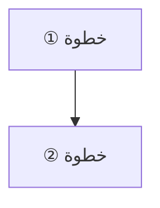

> [!info] الفصل NN · كورس الإنتاجية
> **ماذا ستتعلّم:** فقرة واحدة كثيفة تُعلن محتوى الفصل بلا تعميم: المفاهيم المسمّاة، والأطر بأصولها، والأدوات العملية، والحدّ النقدي الذي سيُطرَح. تُكتَب بعد الانتهاء من الفصل لا قبله.

> [!abstract] التأصيل
> **يفترض أنّك تعرف:** [[…]] · [[…]] — يُذكَر هنا ولا يُعاد شرحه.
> **ويُؤصّل لك:** [[…]] · [[…]] — يُقدَّم هنا أوّل مرّة فيصير متطلَّبًا لما بعده.

# الفصل NN — العنوان

## 🎯 أهداف التعلّم

- هدف مصوغ بفعل قابل للملاحظة (يشرح · يحسب · يصمّم · يشخّص · يقارن)، لا بـ«يفهم».
- …

---

## الفكرة المحورية: [جملة تختصر الفصل]

> [!quote] من المحاضرة
> **[المتحدّث]:** «النصّ كما ورد في ملاحظة المصدر.»

فقرة تشرح لماذا هذه الفكرة محورية، وماذا يترتّب عليها عمليًّا.

---

## أولًا: [المحور الأوّل]

> [!info] إضافة مرجعية — [الإطار/المصدر]
> ما لم يرد في المحاضرة: الإطار بأصله وصاحبه وتاريخه، وما يضيفه على ما قيل.

| عمود | عمود | عمود |
|---|---|---|
| | | |

> [!warning] المزلق العملي
> ما الذي يقع فيه الناس هنا تحديدًا، وكيف يُتجنَّب.

> [!tip] القاعدة العملية
> جملة واحدة قابلة للتطبيق غدًا.

---

## ثانيًا: [المحور الثاني]

…

---

## [قسم التطبيق] — ورشة قابلة للتنفيذ

| الخطوة | العمل | المُخرَج |
|---|---|---|
| | | |

---

## القراءة النقدية — أين يقصر هذا الطرح؟

**1. …**
**2. …**

---

## 🧾 خلاصة الفصل

1. …

---

## ❓ اختبارات ذاتية

> [!question]- 1) سؤال تطبيقي لا استرجاعي — يبدأ من موقف
> إجابة كاملة تشرح المنطق لا النتيجة فقط، مع تعليل كلّ خطوة.

---

## 📚 مراجع الفصل

| المرجع | الصلة |
|---|---|
| | |
| المصدر الأساس | `[[ملاحظة المصدر]]` |

---

## 🔗 روابط ذات صلة

**السابق:** `[[الفصل السابق]]` · **التالي:** `[[الفصل التالي]]`
**مصدر السجلّ:** `[[ملاحظة المصدر]]`
**مفاهيم:** `[[مصطلح]]` · `[[مصطلح]]`

---

> [!note] قواعد تحرير ملزِمة في هذه القاعدة
> - كلّ اقتباس من المحاضرة داخل `> [!quote] من المحاضرة`؛ وكلّ معرفة خارجية داخل `> [!info] إضافة مرجعية`؛ والنثر بلا وسم هو تأليف المحرّر.
> - **كلّ اقتباس غير عربي يُتبَع بترجمته**: السطر الأصلي *مائلًا*، ثم `**الترجمة:** «…»`.
> - **لا تبدأ تسمية عقدة `Mermaid` بـ`1. ` أو `- `** — تُعرَض حرفيًّا كخطأ. استخدم `①②③` أو `•`.
> - المصطلحات الإنجليزية داخل علامات `` ` `` عند أوّل ورود.
> - **كتلة `[!abstract] التأصيل` إلزامية وتُقرأ آليًّا** بفحص `grounding`: روابط يفصلها ` · ` في سطرَي «يفترض أنّك تعرف» و«يُؤصّل لك». ما وُضع في «يفترض» لا يُعاد شرحه هنا، وما وُضع في «يُؤصّل» يصير متاحًا لكلّ فصل بعده في مسار القراءة.
> - كلّ فصل ينتهي بـ**قراءة نقدية** صريحة — لا يُقدَّم إطار بوصفه جوابًا كونيًّا.
> - كلّ مصطلح جديد يُضاف إلى [[معجم المصطلحات]] ويُدرَج في [[ملحق أ - خريطة مصطلحات الإنتاجية|ملحق أ - خريطة المصطلحات]].
