# مخططات سير العمل — كورس الإنتاجية

> [!info] ما هذا الملف؟
> كلّ مخطّطات `Mermaid` في هذا المرجع مجمّعة في مكان واحد — **27 مخطّطًا** — مع عنوان كلّ مخطّط، و📄 رابط الفصل الذي جاء منه، وسطر يحدّد **متى تستخدمه**. الغرض عملي بحت: حين تُعدّ عرضًا أو ورشة أو نقاشًا، تختار من هنا مباشرةً بدل التنقيب في الفصول.

---

## 🧱 المجموعة الأولى: الأطر المؤسِّسة

### 1) الثورات التقنية الخمس
📄 [[01 - من المشروع إلى المنتج]] · **متى تستخدمه:** لتأطير نقاش «أين يقع الذكاء الاصطناعي اليوم؟» أو لتبرير لماذا يختلف قرار التبنّي باختلاف الطور.

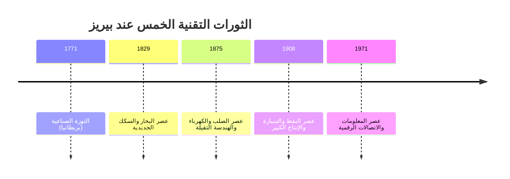

### 2) نموذج المشروع مقابل نموذج المنتج
📄 [[01 - من المشروع إلى المنتج]] · **متى تستخدمه:** في نقاش التمويل والحوكمة مع الإدارة — يُظهر أنّ الفرق بنيوي لا لفظي.

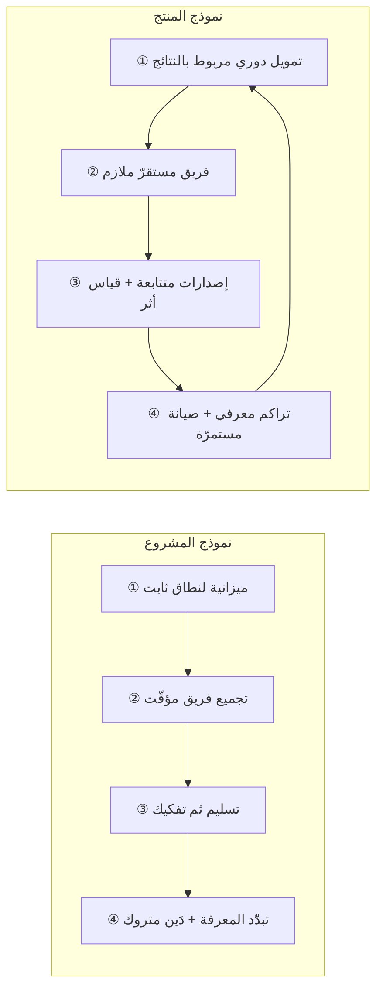

### 3) تدفّق القيمة كاملًا — من عقل العميل إلى جيبه
📄 [[01 - من المشروع إلى المنتج]] · **متى تستخدمه:** الافتتاحية المثالية لأيّ ورشة تدفّق — يُظهر أنّ التطوير جزء صغير من الرحلة.

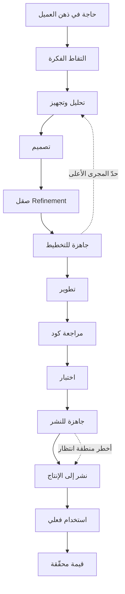

### 4) حلقتا التعلّم — أحادية وثنائية
📄 [[01 - من المشروع إلى المنتج]] · **متى تستخدمه:** في تدريب مديري سكرم على إدارة الاستعادة — يفسّر لماذا لا تُغيّر معظم الاستعادات شيئًا.

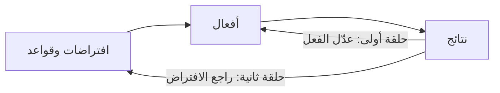

### 5) ثلاثة مستويات لـ«منتهٍ»
📄 [[01 - من المشروع إلى المنتج]] · **متى تستخدمه:** حين يختلف الفريق والإدارة على معنى «انتهينا».

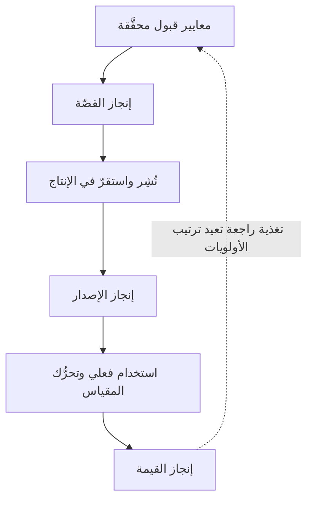

---

## ⚖️ المجموعة الثانية: المثلث والنطاق

### 6) الضلع الرابع المخفيّ — كيف تمتصّ الجودة الداخلية كلّ ضغط
📄 [[02 - المثلث الحديدي وانقلابه]] · **متى تستخدمه:** أقوى مخطّط لشرح الدَّين التقني لغير التقنيّين في ثلاثين ثانية.

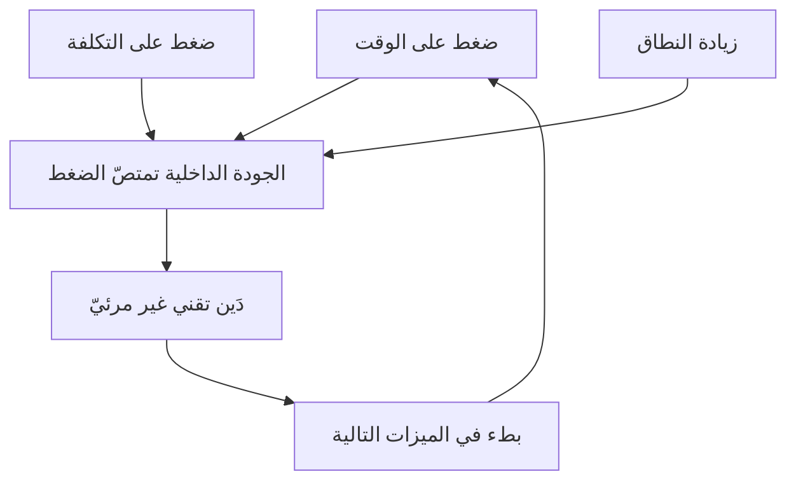

### 7) استثناء الإصدار الأوّل
📄 [[02 - المثلث الحديدي وانقلابه]] · **متى تستخدمه:** مع فرق الشركات الناشئة — يوضّح متى يكون تثبيت النطاق صوابًا ومتى يجب الخروج منه.


### 8) الحلقة الفاضلة — من الأمان النفسي إلى تقليل الضغط
📄 [[02 - المثلث الحديدي وانقلابه]] · **متى تستخدمه:** لإقناع إدارة بأنّ الأمان النفسي استثمار تشغيلي لا قيمة أخلاقية.


---

## 🗣️ المجموعة الثالثة: الفجوة والفوضى التشغيلية

### 9) ثلاث لغات ووحدة قياس ثالثة
📄 [[03 - الفجوة الكبرى والفوضى التشغيلية]] · **متى تستخدمه:** افتتاحية عرض على الإدارة — يشرح لماذا لم تنجح المحاولات السابقة للتفاهم.

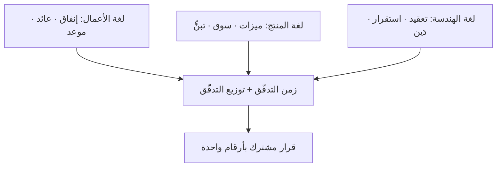

### 10) سلسلة التسليمات ومشكلة الوكيل
📄 [[03 - الفجوة الكبرى والفوضى التشغيلية]] · **متى تستخدمه:** في ورشة إعادة تصميم الأدوار — عدّ الحلقات أمام الجميع يُحدث أثرًا فوريًّا.

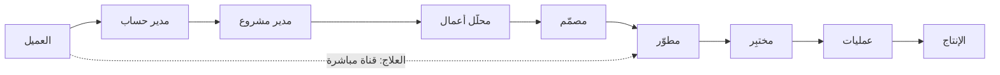

---

## 🌀 المجموعة الرابعة: دوّامة الموت

### 11) دوّامة الموت كاملة
📄 [[04 - دوّامة الموت والدَّين التقني]] · **متى تستخدمه:** المخطّط المرجعي للكورس كلّه — يُظهر أنّ لا شرّير في الحلقة، وأنّ لها نقاط قطع محدّدة.

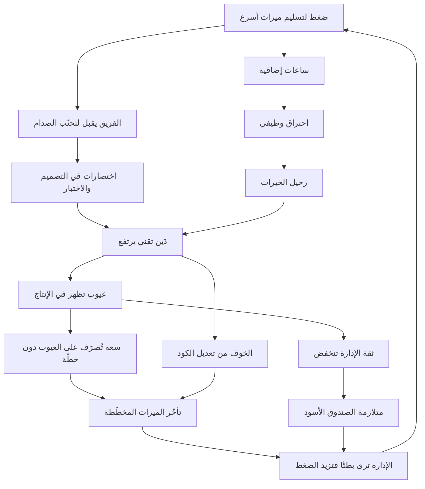

### 12) حلقة رحيل الخبرات — ولماذا لا يكسرها التوظيف
📄 [[04 - دوّامة الموت والدَّين التقني]] · **متى تستخدمه:** في نقاش الاحتفاظ بالكوادر مع الموارد البشرية أو المالية.

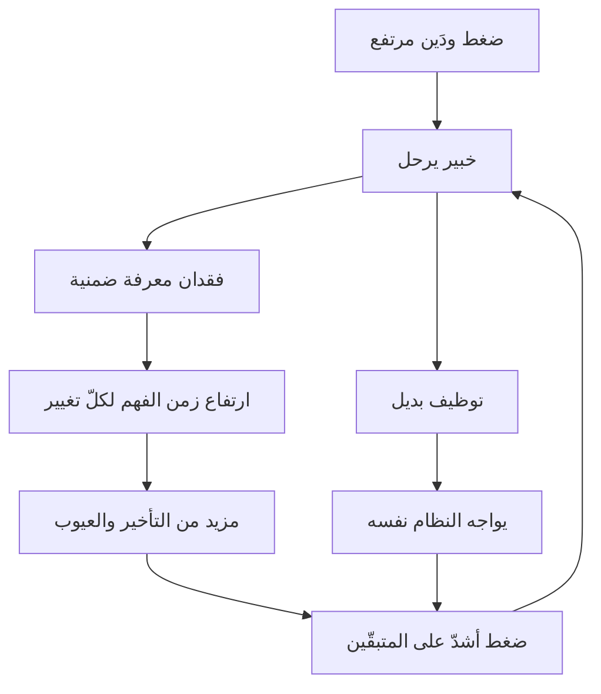

### 13) بروتوكول الخروج من الدوّامة
📄 [[04 - دوّامة الموت والدَّين التقني]] · **متى تستخدمه:** خارطة طريق تُعرَض في بداية أيّ مبادرة إصلاح — الترتيب فيه غير قابل للعكس.


---

## 📦 المجموعة الخامسة: العناصر والسعة والمقاييس

### 14) العمل المرئي وغير المرئي
📄 [[05 - عناصر التدفّق الأربعة وسعة الفريق]] · **متى تستخدمه:** لإقناع الفريق التقني بأنّ كتابة الدَّين مسؤوليّته هو أوّلًا.

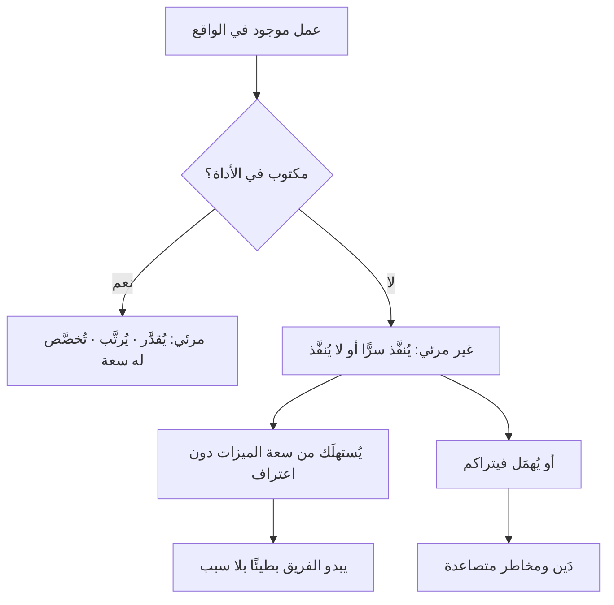

### 15) ترابط المقاييس الستة — لماذا لا يُؤخَذ واحد منفردًا
📄 [[06 - مقاييس التدفّق الستة]] · **متى تستخدمه:** عند تقديم المقاييس أوّل مرّة — يمنع التركيز على مقياس واحد.

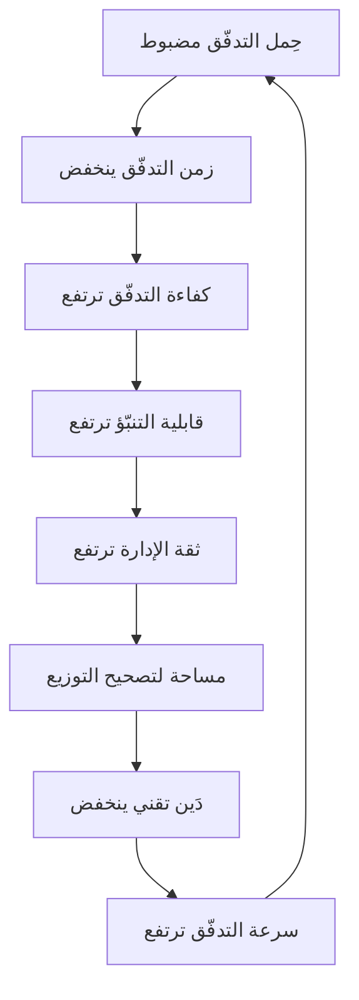

---

## 🔀 المجموعة السادسة: المجريان

### 16) المجرى الأعلى والمجرى الأدنى ونقطة الالتزام
📄 [[07 - المجرى الأعلى والمجرى الأدنى]] · **متى تستخدمه:** المخطّط الأهمّ في نقاش «أين يضيع الوقت فعلًا؟» — وأساس حلّ السيناريو الأوّل.

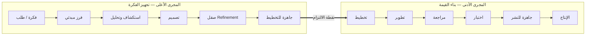

### 17) حلقة التوظيف المكثّف والتسريح
📄 [[07 - المجرى الأعلى والمجرى الأدنى]] · **متى تستخدمه:** قبل أيّ قرار توظيف مكثّف — يوقف القرار حتى يُعرَف رقم كفاءة التدفّق.

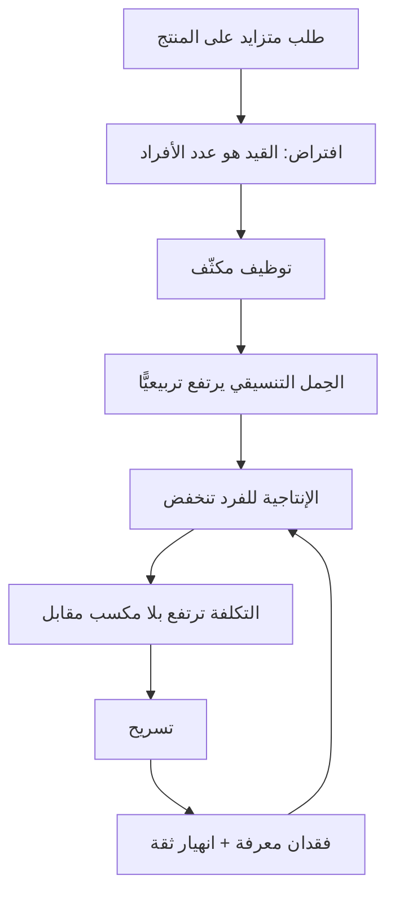

---

## 📊 المجموعة السابعة: التوزيع ومراحل المنتج

### 18) اشتقاق التوزيع من ثلاثة محدّدات
📄 [[08 - توزيع التدفّق ومراحل حياة المنتج]] · **متى تستخدمه:** في جلسة مراجعة التوزيع الربعية — يُنظّم الجلسة كلّها.

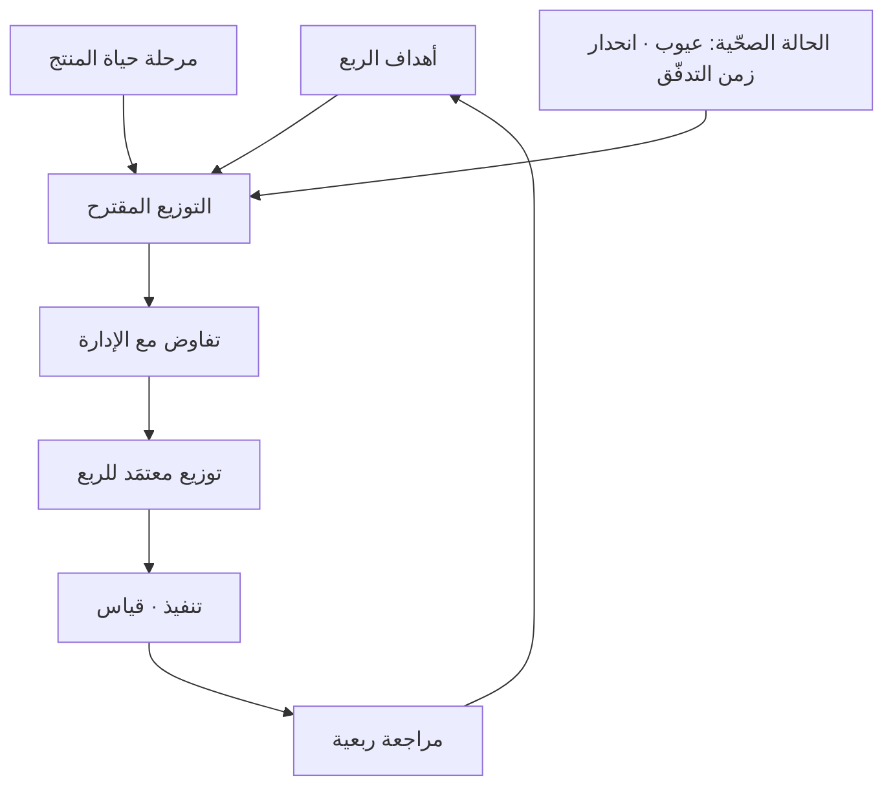

### 19) مراحل حياة المنتج ونسبها
📄 [[08 - توزيع التدفّق ومراحل حياة المنتج]] · **متى تستخدمه:** لتحديد موقع منتجك — وللحجّة أنّ الاستثمار في الدَّين شراء لخيار النموّ القادم (السهم المنقّط).

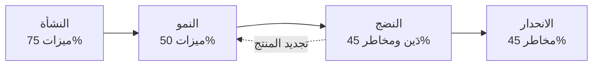

---

## 🩺 المجموعة الثامنة: التشخيص والتطبيق

### 20) ترتيب عمليات التحسين
📄 [[09 - التشخيص العملي - قراءة الأرقام]] · **متى تستخدمه:** حين يريد الفريق مهاجمة كلّ شيء دفعةً واحدة — الترتيب هنا ليس اقتراحًا.

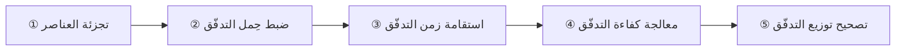

### 21) شجرة القرار التشخيصية
📄 [[09 - التشخيص العملي - قراءة الأرقام]] · **متى تستخدمه:** المرجع العملي اليومي — من العَرَض إلى الفرضية في خطوات قليلة. اطبعه وعلّقه.

```mermaid
flowchart TD
    A["الشكوى: بطء في وصول القيمة"] --> B{"زمن التدفّق من t0 أم من t2؟"}
    B -->|"من t2 فقط"| C["أضف قياس المجرى الأعلى أولًا"]
    B -->|"من t0"| D{"كفاءة التدفّق؟"}
    D -->|"مرتفعة > 50%"| E["المشكلة في المجرى الأعلى"]
    D -->|"منخفضة < 20%"| F{"حِمل التدفّق؟"}
    F -->|"مرتفع"| G["عناصر مفتوحة كثيرة ← اخفض الحدّ"]
    F -->|"ضمن الحدّ"| H{"أين يقع الانتظار؟"}
    H -->|"قبل النشر"| I["دفعات نشر ← افصل النشر عن الإطلاق"]
    H -->|"في الموافقات"| J["بوّابات ← فوّض بحدود"]
    H -->|"على فرق أخرى"| K["تبعيّات ← أعد تصميم الحدود"]
    F -->|"منخفض جدًّا مع بطء"| L["عمل خارج اللوح"]
```

### 22) خطّة التسعين يومًا
📄 [[10 - خارطة التطبيق]] · **متى تستخدمه:** الشريحة الختامية لأيّ عرض — تحوّل النقاش من فكرة إلى التزام زمني.

```mermaid
flowchart LR
    A["الأسابيع 1-4<br/>الرؤية"] --> B["الأسابيع 5-8<br/>القراءة والضبط"]
    B --> C["الأسابيع 9-12<br/>القرار"]
    C --> D["ما بعد 90 يومًا<br/>الإيقاع"]
    D -.->|"مراجعة ربعية"| C
```

---

## 🧩 المجموعة التاسعة: العملية والتنظيم — المحاضرة الثالثة

### 23) الحلقة الموجبة لعلاج الإدارة
📄 [[11 - العملية المتمركزة حول العميل وقانون كونواي]] · **متى تستخدمه:** حين تُطلَب زيادة الساعات أو إضافة الأفراد أو فتح عمل متوازٍ — يُظهر أنّ الثلاثة تعود إلى نقطة البداية أسوأ.

```mermaid
flowchart TD
    A["① العمل متأخّر"] --> B["② الإدارة تُسرّع"]
    B --> C["③ ساعات أطول"]
    B --> D["④ مبرمجون أكثر"]
    B --> E["⑤ عمل متوازٍ أكثر"]
    C --> F["⑥ أخطاء أكثر ← إعادة عمل"]
    D --> G["⑦ عبء تواصل وتعريف"]
    E --> H["⑧ حِمل تدفّق أعلى"]
    F --> I["⑨ زمن التدفّق يرتفع"]
    G --> I
    H --> I
    I --> A
```

### 24) مناورة كونواي العكسية
📄 [[11 - العملية المتمركزة حول العميل وقانون كونواي]] · **متى تستخدمه:** في نقاش المعمارية مع القيادة التقنية — يُظهر أنّ الحدود تُصمَّم في التنظيم قبل الكود، وأنّها دورة لا خطوة.

```mermaid
flowchart TD
    A["① تُحدَّد الحدود المطلوبة في النظام"] --> B["② تُصمَّم الفرق على تلك الحدود"]
    B --> C["③ يُمنَح كلّ فريق قرار النشر لحدّه"]
    C --> D["④ تُصمَّم الواجهات لأنّ التواصل صار مكلفًا"]
    D --> E["⑤ تخرج المعمارية مطابقةً للحدود المقصودة"]
    E --> F["⑥ يُراجَع التطابق ربعيًّا ويُصحَّح الانحراف"]
    F --> B
```

### 25) مصفوفة الأمان النفسي والمساءلة
📄 [[12 - نضج الفريق والأمان النفسي]] · **متى تستخدمه:** حين يُطلَب رفع المساءلة أو حين يُقال إنّ الأمان النفسي يعني تمرير كلّ شيء — يُظهر أنّ المحورين مستقلّان وأنّ رفع أحدهما وحده يوقعك في منطقة أسوأ.

```mermaid
%%{init: {"quadrantChart": {"chartWidth": 700, "chartHeight": 520, "pointRadius": 6, "pointTextPadding": 12, "pointLabelFontSize": 14, "quadrantLabelFontSize": 15, "quadrantTextTopPadding": 14, "titleFontSize": 19, "xAxisLabelFontSize": 14, "yAxisLabelFontSize": 14, "yAxisPosition": "right"}}}%%
quadrantChart
    title مناطق الأمان النفسي والمساءلة
    x-axis "مساءلة منخفضة" --> "مساءلة عالية"
    y-axis "أمان منخفض" --> "أمان عالٍ"
    quadrant-1 "منطقة التعلّم"
    quadrant-2 "منطقة الراحة"
    quadrant-3 "منطقة اللامبالاة"
    quadrant-4 "منطقة القلق"
    "فريق ودود بلا نتائج": [0.20, 0.82]
    "الفريق الناضج": [0.80, 0.72]
    "صمت وانسحاب": [0.20, 0.20]
    "خوف وتجميل أرقام": [0.78, 0.24]
```

### 26) مصفوفة كشف الزيف — أربعة أنواع من الشركات
📄 [[13 - الرشاقة المؤسّسية والإدارة الوسطى]] · **متى تستخدمه:** في تشخيص سريع لحالة مؤسّسة، وخاصّةً لبيان أنّ «الإنقاذ العشوائي» ليس أداءً عاليًا وإن سلّم في موعده.

```mermaid
%%{init: {"quadrantChart": {"chartWidth": 700, "chartHeight": 520, "pointRadius": 6, "pointTextPadding": 12, "pointLabelFontSize": 14, "quadrantLabelFontSize": 15, "quadrantTextTopPadding": 14, "titleFontSize": 19, "xAxisLabelFontSize": 14, "yAxisLabelFontSize": 14, "yAxisPosition": "right"}}}%%
quadrantChart
    title مصفوفة كشف الزيف
    x-axis "تعاون منخفض" --> "تعاون عالٍ"
    y-axis "لا تسليم" --> "تسليم فعلي"
    quadrant-1 "التدفّق الحقيقي"
    quadrant-2 "الإنقاذ العشوائي"
    quadrant-3 "الجمود"
    quadrant-4 "خدع الذات"
    "تدفّق حقيقي": [0.82, 0.80]
    "إنقاذ بالبطولات": [0.18, 0.70]
    "لا تعاون ولا تسليم": [0.18, 0.18]
    "تخدع نفسها": [0.80, 0.28]
```

### 27) تشخيص عملية بخريطة الانتظار
📄 [[11 - العملية المتمركزة حول العميل وقانون كونواي]] · **متى تستخدمه:** في افتتاح ورشة إعادة تصميم عملية — يُظهر أنّ الترتيب بالزمن المهدور لا بعدد الشكاوى.

```mermaid
flowchart TD
    A["اختر نوع طلب واحدًا"] --> B["ارسم الخطوات كما تقع فعلًا"]
    B --> C["سجّل زمن العمل وزمن الانتظار"]
    C --> D{"كفاءة التدفّق منخفضة؟"}
    D -->|"نعم"| E["صنّف الوقفات: قرار · مورد · دفعة"]
    D -->|"لا"| F["المشكلة في السعة لا في التصميم"]
    E --> G["رتّب بالزمن المهدور لا بالشكاوى"]
    G --> H["عالج أكبر بند مفرد أوّلًا"]
    H --> C
```


---

## 🎯 أيّ مخطّط لأيّ جمهور؟

| الجمهور | المخطّطات الموصى بها | لماذا |
|---|---|---|
| **المدير التنفيذي / المالية** | 2 · 6 · 9 · 19 | لغة تمويل وحوكمة ومراحل منتج، بلا تفاصيل تقنية |
| **مدير المنتج** | 3 · 16 · 18 · 19 | تدفّق القيمة والمجرى الأعلى واشتقاق التوزيع |
| **الفريق التقني** | 6 · 11 · 14 · 20 | الدَّين والدوّامة والعمل غير المرئي وترتيب الإصلاح |
| **مدير سكرم / التسليم** | 15 · 16 · 20 · 21 | المقاييس والمجريان والتشخيص اليومي |
| **الموارد البشرية** | 12 · 8 | تكلفة رحيل الخبرات وأثر الأمان النفسي |
| **ورشة تعريفية عامّة** | 3 · 11 · 19 · 22 | القصّة كاملة: الرحلة ← المشكلة ← الحلّ ← الخطّة |
| **اجتماع تشخيص طارئ** | 21 وحده | يكفي للانتقال من الشكوى إلى الفرضية |
| **الإدارة الوسطى** | 23 · 24 · 26 | لماذا لا ينفع الضغط · أين حدود الفرق · تشخيص حالة المؤسّسة |
| **ورشة ثقافة وفريق** | 25 وحده | يحسم الالتباس بين الأمان النفسي وغياب المساءلة |
| **ورشة إعادة تصميم عملية** | 27 · 23 | خطوات التشخيص أوّلًا، ثم لماذا لا يصلح العلاج المعتاد |

> [!tip] قاعدة العرض
> **مخطّط واحد لكلّ فكرة، وثلاثة مخطّطات كحدّ أقصى في أيّ عرض.** العرض الذي يضمّ عشرة مخطّطات لا يُوصِل أيًّا منها. واختر المخطّط بحسب **القرار الذي تريده**، لا بحسب المعلومة التي تملكها.

---

**الفهرس:** [[كورس الإنتاجية]] · **الملحق السابق:** [[ملحق أ - خريطة مصطلحات الإنتاجية|ملحق أ - خريطة المصطلحات]]
