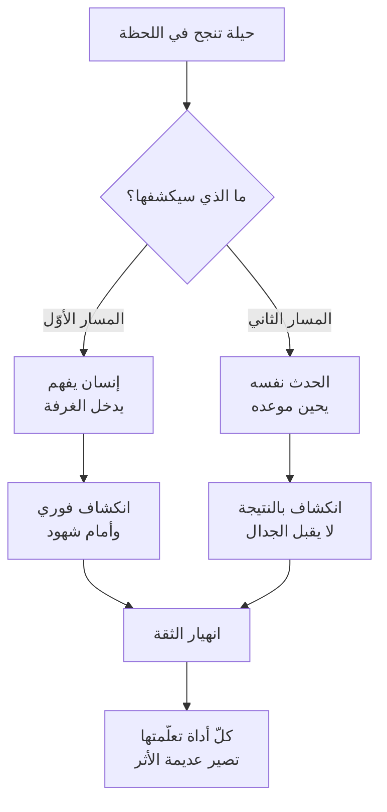

> [!info] الفصل 01 · كورس لعبة العقل
> **ماذا ستتعلّم:** لماذا رفض المحاضر تسمية هذا الكورس «مهارات تواصل» أو «مهارات تفاوض»، وما الذي يترتّب عمليًّا على هذا الرفض. ستفهم **استعارة الحلبة** ولماذا لا يفوز من يُلكم أكثر؛ و**قاعدة الرابحَين** ولماذا لا وجود لغالب ومغلوب في قاعة الاجتماع؛ و**قانون انكشاف الحيلة** ولماذا تفوز الحيلة فترات ثم تنهار حتمًا. ثم ستُفكّك **الشروط الأربعة** — الصدق والثبات والهدوء والثقة — لا بوصفها مواعظ بل بوصفها **مُدخَلات تشغيلية** لكلّ أداة في هذا الكورس، وستعرف أيّ أداة تتعطّل حين يغيب أيّ شرط منها. وستُواجه **مفارقة البدلة الفارغة**: لماذا تُضاعف مهارة التواصل الضرر حين تُبنى على جهل تقني. وستُميّز أخيرًا بين هدفين يخلط بينهما معظم الناس: **أن تكون محبوبًا** و**أن تكون مُسيطرًا على الحوار** — وهو الخلط الذي أنتج اعتراض علياء «قرأوا لطفي ضعفًا». وينتهي الفصل بـ**قراءة نقدية** لحدود هذا الإطار كلّه.

> [!abstract] التأصيل
> **يفترض أنّك تعرف:** [[Psychological Safety]] · [[Cognitive Bias]]
> **ويُؤصّل لك:** *(لا شيء جديدًا — هذه ملاحظة تجميع لا فصل)*

# الفصل 01 — لماذا «لعبة عقل»؟ الحلبة والشروط الأربعة

## 🎯 أهداف التعلّم

- **صياغة** الفرق بين «مهارات التواصل» و«لعبة العقل» في جملة واحدة تشرح ما الذي تُضيفه الثانية.
- **شرح** استعارة الحلبة وتحويلها إلى قاعدة قابلة للتطبيق في اجتماع.
- **تفكيك** الشروط الأربعة (الصدق · الثبات · الهدوء · الثقة) وتحديد الأداة التي تتعطّل عند غياب كلٍّ منها.
- **تشخيص** حالة «البدلة الفارغة» في بيئة عمل حقيقية، وتحديد لماذا تُنتج مهارة التواصل ضررًا مضاعفًا فيها.
- **التمييز** بين هدف «أن تكون محبوبًا» وهدف «أن تُسيطر على الحوار»، وشرح كيف يُنتج الخلط بينهما ما تصفه علياء.
- **نقد** الإطار: أين يُبالغ في وعده، وأيّ الافتراضات التنظيمية يُخفيها.

---

## الفكرة المحورية: الاسم نفسه هو الأطروحة

> [!quote] من المحاضرة
> **حمزة:** «سبب رفضي تسمية هذا الكورس **«مهارات تواصل»** أو **«مهارات تفاوض»** شيء واحد فقط: **إنّها لعبة عقل.** الفكرة أنّنا **لا نتعامل مع بشر — نحن نتعامل مع هرمونات.**»

الجملة تبدو بلاغية، لكنّها في الحقيقة **إعلان عن نموذج تفسيري** — وهو ما يُحدّد بقيّة الكورس كلّه.

«مهارات التواصل» تفترض أنّ المشكلة **مشكلة نقل معلومات**: قلتُ فلم يُفهَم؛ فلأُحسّن الصياغة، ولأُنظّم رسائلي، ولأُنصت أكثر. وهذا نموذج صالح — في الظروف الهادئة. أمّا الكورس فيبدأ من موضع مضادّ تمامًا: **معظم المواقف التي تُؤذيك في العمل ليست مشكلات نقل معلومات أصلًا.** الرجل الذي يدخل قائلًا «لا يعنيني سبرنتكم» يفهم كلامك تمامًا؛ المشكلة أنّه في حالة لا يستقبل فيها المعلومة أيًّا كانت صياغتها.

فالنموذج المطروح هو: **قبل أن تكون المشكلة معلوماتية، هي مشكلة حالة.** ومن ثمّ فالتدخّل الأوّل ليس على مستوى *ماذا أقول*، بل على مستوى *ما الحالة التي يجب أن يكون فيها الطرف الآخر ليستقبل أيّ شيء أقوله.* وكلّ أدوات الكورس — التسمية، المرآة، الأسئلة المعايرة، الساندويتش، الإزاحة — هي أدوات **تغيير حالة** قبل أن تكون أدوات تعبير.

> [!info] إضافة مرجعية — أصل التسمية وموضعها من الأدبيات
> «لعبة عقل» تسمية المحاضر نفسه، وليست مصطلحًا أكاديميًّا. لكن ما تصفه له اسم قائم في الأدبيات: **التفاوض القائم على التعاطف التكتيكي (`tactical empathy`)**، كما صاغه **كريس فوس (`Chris Voss`)**، كبير مفاوضي الرهائن الدوليين في مكتب التحقيقات الفدرالي، في كتابه ***Never Split the Difference*** (2016) — وهو الكتاب الذي يُشير إليه المحاضر صراحةً بقوله *«نأخذ هذا الكورس عن شخص من مكتب التحقيقات الفدرالي كتب كتابًا محترمًا، وكان يتحدّث عن التفاوض على الرهائن»*.
>
> وأطروحة فوس المركزية هي بالضبط ما يُعيد المحاضر صياغته: أنّ مدرسة التفاوض «العقلانية» — ممثّلةً في ***Getting to Yes*** لـ**فيشر ويوري** (1981) ومشروع هارفارد للتفاوض — تفترض طرفين عاقلين يبحثان عن المصالح المشتركة، وأنّ هذا الافتراض **ينهار تحت الضغط الحادّ.** فوس بناها على مواقف رهائن؛ والمحاضر ينقلها إلى قاعة اجتماع لأنّ **البنية النفسية للحظة واحدة**: طرف يشعر أنّ شيئًا يُهدّده، وطرف يحتاج أن يُخرجه من تلك الحالة قبل أن يتحدّث معه في أيّ شيء.
>
> والفرق الجوهري بين المدرستين ليس في الأخلاق بل في **نقطة البدء**: هارفارد تبدأ من *ما مصالحنا المشتركة؟*؛ وفوس يبدأ من *ما حالتك الآن، وكيف أُخرجك منها؟* — ثم يصل إلى المصالح.

---

## أوّلًا: استعارة الحلبة — الاقتصاد في الضربة

> [!quote] من المحاضرة
> **حمزة:** «كلّ من يتابع المصارعة أو الفنون القتالية المختلطة سيلاحظ شيئًا بالغ الأهمية في أيّ نزال ملاكمة: **ليس من يُلكم أكثر هو من يفوز.** من يفوز هو من يُلكم **بذكاء** […] وستجد دائمًا أنّ الضرب يحدث والمقاتل **متّزن**.»

الاستعارة تُؤدّي ثلاث وظائف دفعةً واحدة، ومن المفيد فصلها:

| الوظيفة | ما تقوله الاستعارة | ترجمتها في الاجتماع |
|---|---|---|
| **اقتصاد الجهد** | عدد الضربات ليس مقياس الأداء | عدد جُملك في الاجتماع ليس مقياس مساهمتك؛ بل أثر الجملة الواحدة |
| **التوقيت** | الضربة الحاسمة تُنتظَر ولا تُفتعَل | البند الإجرائي يُذكَر في النهاية، بعد أن يُفرّغ الجميع |
| **الاتّزان شرط للتنفيذ** | لا ضربة صحيحة من جسد غير متّزن | لا تسمية صحيحة من صوت مرتجف — وسيعود إليها الفصل [[10 - كاريزما القائد الصامت والقيادة البيولوجية|10]] |

لكن **حدّ الاستعارة** مهمّ ويُصرّح به المحاضر بنفسه بعد قليل، وهو ما يجعلها استعارة مركّبة لا بسيطة:

> [!quote] من المحاضرة
> **حمزة:** «في **قاعة الاجتماع**، وفي بيئة العمل، لا وجود لأن يفوز شخص ويخسر شخص. هناك أن **يخرج الطرفان رابحَين** […] في حلبة المصارعة يفوز واحد ويخسر واحد؛ أمّا في **حلبة الاجتماع** فلا بدّ أن نكون جميعًا رابحين.»

فالاستعارة تُستعار منها **الميكانيكا** (الاتّزان، التوقيت، الاقتصاد) وتُرفَض منها **بنية الجائزة** (صفر مجموع). وهذا تمييز دقيق يستحقّ الوقوف عنده: كثير ممّن يقرؤون كتب التفاوض يستوردون الميكانيكا **مع** بنية الصفر المجموع، فيخرجون بمُفاوض بارع يترك خلفه علاقات محروقة — وهو بالضبط ما يُحذّر منه القسم التالي.

> [!info] إضافة مرجعية — لماذا لا يصحّ الصفر المجموع في العمل: منطق اللعبة المتكرّرة
> الفرق بين حلبة المصارعة وقاعة الاجتماع له صياغة رياضية دقيقة في **نظرية الألعاب**: الفرق بين **لعبة تُلعَب مرّة واحدة (`one-shot game`)** و**لعبة متكرّرة (`iterated game`)**.
>
> في مباراة المصارعة تلتقي بالخصم مرّة، والنتيجة نهائية، فالاستراتيجية المُثلى استخراج أقصى ما يمكن الآن. أمّا في الشركة **فأنت ستلتقي بالشخص نفسه غدًا وبعد غد ولبقيّة مدّة العقد** — وهذا وحده يقلب الاستراتيجية المُثلى رأسًا على عقب.
>
> أشهر برهان تجريبي على ذلك بطولات **روبرت أكسلرود (`Robert Axelrod`)** في *The Evolution of Cooperation* (1984): جمع استراتيجيات من باحثين حول العالم وأدارها ضدّ بعضها في معضلة السجين المتكرّرة. فازت الاستراتيجية **الأبسط والأقصر**: `Tit for Tat` — ابدأ بالتعاون، ثم افعل ما فعله خصمك في الجولة السابقة. وخلص أكسلرود إلى أربع سمات للاستراتيجيات الفائزة، وثلاث منها تصف هذا الكورس حرفيًّا:
>
> | السمة | صياغة أكسلرود | مقابلها في الكورس |
> |---|---|---|
> | **اللطف (`nice`)** | لا تكن أوّل من يخون | «لا نصنع عداوات»، «لا هجوم شخصي» |
> | **القابلية للاستفزاز (`retaliatory`)** | لا تكن ساذجًا؛ ردّ على الخيانة | «التنازل بلا دراسة يُغرق كلّ شيء» |
> | **التسامح (`forgiving`)** | عُد إلى التعاون فور عودة الطرف الآخر | «الموقف عائق مؤقّت لا حاجز دائم» |
> | **الوضوح (`clear`)** | كن مقروءًا ويمكن التنبّؤ بك | «كلام واضح صريح غير غائم» |
>
> **الخلاصة:** «الجميع رابحون» ليست مثالية أخلاقية في بيئة العمل — إنّها **الاستراتيجية المُثلى رياضيًّا** حين يكون عدد الجولات غير محدود ومجهول النهاية.

---

## ثانيًا: قانون انكشاف الحيلة

> [!quote] من المحاضرة
> **حمزة:** «**الذكاء والحيلة لن يستمرّا في الفوز.** يفوزان لحظيًّا، ثم، في اللحظة التي يصل فيها من يفهم فعلًا، سيكشفهما — أو في اللحظة التي تحين فيها ساعة الحدث، سيكشفه الحدث.»

هذه أهمّ جملة في الفصل من جهة **المسؤولية**، ويُكرّرها المحاضر بصيغ مختلفة لا تقلّ عن عشر مرّات عبر الكورس. وهي ليست تحذيرًا أخلاقيًّا فحسب؛ إنّها **وصف لآلية كشف** لها مساران متمايزان:

**المسار الأوّل — الكشف بالكفاءة.** يدخل شخص يفهم المجال فعلًا، فيرى الفجوة بين الكلام والمضمون. هذا مسار احتمالي: قد يتأخّر سنوات.

**المسار الثاني — الكشف بالحدث.** وهذا **حتميّ لا احتمالي**، وهو الأخطر. لا يحتاج أحدًا ليكشفك؛ يكفي أن يحين موعد التسليم. الوعد الذي أُعطي لتهدئة اللحظة يصير في يومه دليلًا ماديًّا على العكس.

ولهذا يربط المحاضر الحيلة صراحةً برصيد الأفعال:

> [!quote] من المحاضرة
> **حمزة:** «إن ظلّ رجل يطلب منّي عملًا ولا أُسلّم شيئًا أبدًا، وظللتُ أُهدّئه وأُهدّئه وهو لا يستلم شيئًا — فمهما كانت لعبة عقلي سيقول *أنت رجل لا يُؤدّي عمله.* أمّا إن كنتُ أُسلّم وأفوز أصلًا، وبيننا ثقة، وهذه **حادثة عابرة** — فهذه حادثة عابرة أحتاج أن أحلّها معه.»
>
> **سماح:** «إذن يُفترض أن يكون هناك **رصيد من الأشياء الجيّدة** يسمح لك بمواقف كهذه.»
>
> **حمزة:** «بالضبط. لماذا تظنّين أنّ **المكاسب السريعة** اخترعت؟ **لبناء الثقة بالأفعال لا بالأقوال.**»

صياغة سماح هنا هي أدقّ صياغة في الكورس كلّه لهذه النقطة، وتستحقّ أن تُرفَع إلى مستوى **قاعدة**:

> [!tip] القاعدة العملية — قاعدة الرصيد
> **أدوات هذا الكورس تسحب من رصيد، ولا تُودِع فيه.** الذي يُودِع في الرصيد هو **التسليم**. فإن كان رصيدك صفرًا، فأنت لا تُدير موقفًا — أنت تُؤجّل حسابًا.

> [!info] إضافة مرجعية — حساب الثقة عند ستيفن كوفي
> يُسمّي **ستيفن كوفي** هذا في *The 7 Habits of Highly Effective People* (1989) **حساب البنك العاطفي (`Emotional Bank Account`)**: كلّ تعامل إمّا إيداع أو سحب، والرصيد هو ما يُحدّد كم من سوء الفهم تحتمله العلاقة قبل أن تنهار.
>
> والإضافة المهمّة عند كوفي هي **عدم تماثل معدّلات الإيداع والسحب**: الإيداعات صغيرة ومتكرّرة وبطيئة التراكم؛ والسحوبات كبيرة ومفاجئة. تسليم في موعده يُودع وحدة؛ ووعد مكسور يسحب عشرًا. ولهذا فـ«الحادثة العابرة» التي يصفها حمزة **لا تكون عابرة إلّا بالرصيد**؛ وبلا رصيد فالحادثة نفسها بالضبط تصير هي **الحكم النهائي** على العلاقة.
>
> ويتقاطع هذا مع نتيجة كمّية من عمل **جون جوتمان (`John Gottman`)** على العلاقات: نسبة **5:1** — خمس تفاعلات إيجابية مقابل كلّ تفاعل سلبي — هي عتبة الاستقرار. والنسبة قِيست على الأزواج لا الفرق، فلا تُنقَل حرفيًّا؛ لكنّ مبدأها — **أنّ السلبيّ يزن أضعاف الإيجابيّ** — مبدأ عامّ في الإدراك البشري ويظهر في مراجعات أدبية واسعة (Baumeister et al., *Bad Is Stronger Than Good*, 2001).

---

## ثالثًا: الشروط الأربعة — من موعظة إلى مواصفة تشغيلية

> [!quote] من المحاضرة
> **حمزة:** «تحتاج إلى ثلاث أو أربع سمات جوهرية […] **الصدق** […] **الثبات** […] **الهدوء** […] **الثقة.** هذه الأربع هي **أساس الإدارة** و**أساس لعبة العقل**.»

المشكلة مع قوائم كهذه أنّها تُقرَأ وعظًا فتُنسى. وما يُنقذها هنا أنّ المحاضر يعود إليها **عند كلّ أداة تقريبًا** — وهذا يسمح باستخراج ما لم يُصرَّح به: **أنّ كلّ شرط منها مُدخَل تشغيلي لأداة بعينها، وأنّ غيابه يُعطّل تلك الأداة تحديدًا لا الكورس كلّه.**

وهذا الجدول هو محاولة لتحويل الموعظة إلى **مواصفة قابلة للتشخيص**:

| الشرط | ما يعنيه تشغيليًّا | الأداة التي يُغذّيها | عرض الغياب | العطل الناتج |
|---|---|---|---|---|
| **الصدق** | ألّا تقول ما لا تنوي فعله، وألّا تصف شعورًا لا تراه | كلّ الأدوات — وهو شرط الاستمرار لا الأداء | وعود تُقال لإنهاء اجتماع | انكشاف بالحدث ← انهيار الرصيد |
| **الثبات** | ألّا يُغيّر ضغط اللحظة موقفك المدروس | **قوّة «لا»** · **التثبيت** · رفض أنصاف الحلول | تنزل من 15 يومًا إلى 8 عند أوّل ضغطة | يُترجَم أنّ تقديراتك اعتباطية ← يسقط كلّ تقدير قادم |
| **الهدوء** | ألّا تُجيب من داخل اللوزة الدماغية | **الصمت التكتيكي** · **المرآة** (تحتاج ثلاث ثوانٍ) | ردّ فوري، مقاطعة، تبرير | تُنتج قتالًا أو هروبًا ← فقدان الموقف |
| **الثقة** | أن تُلقي الجملة بلا اعتذار ولا تلعثم | **التسمية** · **الأسئلة المعايرة** | «يبدو… يعني… لا أدري…» | التسمية تُقرَأ ترجّيًا أو سخرية ← تنقلب على قائلها |

> [!quote] من المحاضرة
> **حمزة:** «حين تأتي لتتعلّم التسمية، ستجد أنّ **أوّل تسمية تقولها في حياتك تخرج مرتجفة** — أنت غير ثابت داخليًّا. والتسمية التي تقولها لا بدّ أن تحمل **ثقة** […] **مع أوّل تسمية تقولها قد تتوتّر** — وإن توتّرتَ وأنت تقول التسمية وكان من أمامك يفهم لعبة العقل، فقد انتهى الأمر.»

وهذا يُنتج نتيجةً عمليّة مهمّة يجب أن تُقال صراحةً: **الأداة والشرط لا يُتعلَّمان بالترتيب.** لا يقول أحد «سأُتقن الهدوء أوّلًا ثم أتعلّم المرآة»؛ بل التسمية الأولى المرتجفة **هي نفسها** تمرين الثبات. وهذا بالضبط سبب إصرار المحاضر على أن تكون الممارسة الأولى **خارج العمل**:

> [!quote] من المحاضرة
> **حمزة:** «ولستُ أقول لكم اذهبوا ومارسوا لعبة العقل في العمل أوّلًا. **مارسوها مع أصدقائكم على القهوة؛ مارسوها مع الزوج؛ مارسوها مع الأب.**»

> [!info] إضافة مرجعية — لماذا التدرّج خارج بيئة الرهان صحيح تدريبيًّا
> ما يصفه المحاضر له اسم في أدبيات اكتساب المهارة: **الممارسة المتعمّدة (`deliberate practice`)** عند **أندرس إريكسون (`K. Anders Ericsson`)**. وأحد شروطها الأساسية أن تجري في بيئة **يكون فيها الفشل رخيص التكلفة**، حتى تُتاح التغذية الراجعة الفورية والتكرار.
>
> والسبب الفسيولوجي أدقّ من ذلك: المهارة قيد التدرّب هنا هي **الأداء تحت استثارة**، وتوتّرك أنت نفسه أحد متغيّرات الأداء. وهذا يُنتج فخًّا: تدرّبك الأوّل يقع بالضبط في الحالة التي تُعطّل الأداء. فالتدرّج خارج بيئة الرهان يحلّ الفخّ بأن يفصل بين **إتقان الصياغة** (منخفض الاستثارة، مع الأصدقاء) و**إتقان الصياغة تحت ضغط** (مرتفع الاستثارة، في العمل) — فتُؤتمَت الأولى قبل إضافة الثانية.
>
> وهذا يتقاطع مع **قانون يركس–دودسون (`Yerkes–Dodson`, 1908)**: الأداء يرتفع مع الاستثارة حتى ذروة ثم ينهار؛ وذروة المهارات **المعقّدة حديثة الاكتساب تقع عند استثارة منخفضة جدًّا.** فالمهارة الجديدة تحت ضغط عالٍ لا تُؤدَّى رديئةً فحسب — **بل تُستبدَل تلقائيًّا بالسلوك القديم المُؤتمَت**، وهو ما يُفسّر بدقّة سبب انزلاقك إلى «لماذا فعلت ذلك؟» في أوّل اجتماع متوتّر بعد الكورس.

---

## رابعًا: مفارقة البدلة الفارغة

> [!quote] من المحاضرة
> **حمزة:** «كثيرًا جدًّا ما تجد مستشارين في الشركات يرتدون بدلة جميلة ونظّارة أنيقة، ويتكلّمون بلغة مصقولة تمامًا — مئة بالمئة. لكن حين تُركّز فيما **وراء** الكلام […] تجده **فارغًا** […] مهارات التواصل مهمّة للغاية — لكن **إن لم تكن قويًّا تقنيًّا، فأنت نصّاب يملك مهارات تواصل**.»

هذه المفارقة هي **الحدّ الذي يفصل هذا الكورس عن الأدبيات الشائعة في «التأثير»**، وتستحقّ صياغة صريحة:

> [!tip] القاعدة العملية — مفارقة البدلة الفارغة
> **مهارة التواصل مُضاعِف، لا مُولِّد.** تُضاعِف الكفاءة القائمة، وتُضاعِف كذلك أثر غيابها. فمن يفتقر إلى العمق التقني ويملك مهارة تواصل عالية **يصل إلى غرف قرار لم يكن ليصلها**، فيقع ضرره في نطاق أوسع وبتأخير أطول قبل أن يُكتشَف.

ولاحظ الجزء الذي يقوله أهل التنفيذ في المقطع، لأنّه يُشخّص **آلية العداء** لا مجرّد وجوده: *«أنت رجل يتكلّم، بينما أنا غارق في المشروع […] وأنت تصل ببدلة وربطة عنق، ترتشف قهوتك وتُخاطبني من طرف ملعقة.»* الغضب هنا ليس من البدلة؛ إنّه من **عدم تماثل التعرّض للعواقب**: من يتكلّم لا يدفع ثمن كلامه، ومن ينفّذ يدفع.

ولهذا يُقدّم المحاضر علاجه بصيغة سلوكية لا نيّاتية:

> [!quote] من المحاضرة
> **حمزة:** «حين يأتيني عمل استشاري، أحتاج أن أنزل **إلى التنفيذ المباشر** وأن أعمل بيديّ — حتى أشعر بما يشعر به الفريق […] لن أقف من بعيد وأتشدّق عليهم، ولن آخذ كلام أحد عن حرارة الماء وأنا لم أدخل النار.»

> [!info] إضافة مرجعية — «الجلد في اللعبة» وحدود الحلّ
> لهذا الشرط اسم عند **نسيم طالب (`Nassim Taleb`)**: **الجلد في اللعبة (`Skin in the Game`, 2018)** — أنّ من يُصدر التوصية يجب أن يتحمّل نصيبًا من عواقبها. وأطروحة طالب أنّ عدم تماثل التعرّض ليس مشكلة أخلاقية فقط بل **مشكلة معلوماتية**: من لا يتحمّل العواقب لا يتلقّى إشارة تصحيح، فيستمرّ في الخطأ نفسه بثقة متزايدة.
>
> **لكن للعلاج الذي يقترحه المحاضر حدًّا يجب أن يُقال:** النزول إلى التنفيذ المباشر يحلّ مشكلة المعرفة، وقد **لا** يحلّ مشكلة التعرّض. المستشار الذي يكتب كودًا لأسبوعين ثم يُغادر قبل موعد التسليم قد اكتسب المعرفة **بلا** أن يكتسب الجلد في اللعبة. والفارق يظهر عند لحظة الحساب لا لحظة العمل.
>
> ولهذا فالصياغة الأدقّ عمليًّا هي: **ابقَ حتى موعد التسليم الأوّل الناتج عن توصيتك.** المعرفة تُكتسَب بالعمل؛ والمصداقية تُكتسَب بالبقاء.

---

## خامسًا: السيطرة على الحوار ≠ أن تكون محبوبًا

هذا هو **المحور الذي يُصحّح أكثر سوء فهم شائع** في مهارات التواصل، وقد وُلد في الكورس من اعتراض حيّ:

> [!quote] من المحاضرة
> **علياء:** «سِرتُ بهذه الاستراتيجية بالضبط، وفي **بيئتَي عمل** مختلفتين […] في اللحظة التي رأوا فيها **التعاون** والتعامل المُراعي مع الزملاء، بل ومع الفريق الذي تحتي، قرأوه **ضعفًا**.»

وجواب المحاضر لا يُنكر التجربة ولا يُوصي بالتخلّي عن اللطف؛ بل **يُعيد تعريف الهدف**:

> [!quote] من المحاضرة
> **حمزة:** «**هدف لعبة العقل هو السيطرة على الحوار** — لا أن تكون شخصًا لطيفًا. اللطف مطلوب، والرقّة مطلوبة، لكن أوّلًا وأخيرًا **أنت تحتاج أن تُسيطر على الحوار بشكل يُنتج بندًا إجرائيًّا في النهاية.**»

والتشخيص الدقيق لما وقع لعلياء هو: **لم تكن المشكلة في اللطف — بل في أنّ اللطف كان الهدف بدلًا من أن يكون الأسلوب.** حين يصير اللطف هو الهدف، تُقاس كلّ حركة بمعيار *هل أزعجتُ أحدًا؟* — فيُصبح الرفض مستحيلًا، وتغيب البنود الإجرائية، فتُقرَأ الحصيلة — بحقّ — على أنّها انعدام أثر. أمّا حين يكون اللطف **أسلوبًا** لهدفٍ هو الوصول إلى قرار، فالحصيلة قرارات وُصِل إليها بلا جراح — وهذا يُقرَأ قوّةً لا ضعفًا.

| | **اللطف كهدف** | **اللطف كأسلوب** |
|---|---|---|
| **المعيار عند كلّ حركة** | هل أزعجتُ أحدًا؟ | هل اقتربنا من قرار؟ |
| **التعامل مع الرفض** | يُتجنَّب؛ يُترجَم إلى موافقة | يُصاغ صياغة لا تجرح — الفصل [[06 - قوّة لا وأنواع نعم الثلاثة|06]] |
| **نهاية الاجتماع** | مشاعر طيّبة، لا التزام | بند إجرائي بمالك وموعد |
| **الحصيلة بعد ربع سنة** | «شخص لطيف بلا أثر» | «شخص تُحلّ الأمور معه» |
| **قراءة الآخرين** | ضعف | ثبات |

> [!warning] المزلق العملي — الانقلاب المضادّ
> رأت علياء أنّها *«اعتدلت قليلًا وبدأت تُثبت أنّها موجودة — بطريقة لم تكن لطيفة»*. وهذا هو المزلق الأشيع بعد إدراك المشكلة: **الانتقال من «اللطف كهدف» إلى «الحزم كهدف»** — وهو استبدال خطأ بخطأ. الطريق ليس بين قطبَي اللين والقسوة على محور واحد؛ **إنّه محور ثانٍ تمامًا**: أن تبقى الطريقة رفيقة ويصير المعيار هو الوصول إلى قرار.
>
> وهذا تحديدًا ما يجعل ترتيب فصول هذا الكورس مهمًّا: الفصول 04–06 تُعطيك **أدوات الرفض بلا جرح**؛ ومن دونها فإدراك مشكلة علياء لا يُنتج إلّا الانقلاب المضادّ.

> [!info] إضافة مرجعية — شبكة بليك–موتون، والنموذج الذي يُصحّحها
> لهذا التمييز جذر في **الشبكة الإدارية (`Managerial Grid`)** لـ**روبرت بليك وجين موتون** (1964): محوران مستقلّان — **الاهتمام بالناس** و**الاهتمام بالإنتاج**. وأطروحتهما أنّهما **ليسا طرفَي محور واحد**؛ ومن ثمّ فأداء «9,9» (عالٍ في الاثنين) ممكن، وليس تسوية عند «5,5».
>
> وموقع علياء في الشبكة هو نمط **«نادي الريف» (`Country Club`, 1,9)**: اهتمام عالٍ بالناس، منخفض بالنتيجة. والخطأ الذي تصفه بعده — الاعتدال «بطريقة غير لطيفة» — هو القفز إلى **«السلطة–الإذعان» (9,1)**. والكورس كلّه، من هذه الزاوية، هو **مجموعة أدوات للانتقال إلى (9,9) مباشرةً** بدل التأرجح بين الزاويتين.
>
> ويُقدّم **كيم سكوت (`Kim Scott`)** في *Radical Candor* (2017) النموذج نفسه بمفردات أحدث ومحورين: **الاهتمام شخصيًّا** و**المواجهة مباشرةً**. وتُسمّي حالة علياء الأولى **«التعاطف المُدمِّر» (`Ruinous Empathy`)** — أن تهتمّ بالشخص إلى حدّ حرمانه من الحقيقة التي يحتاجها. وتسميتها دقيقة: الضرر واقع لا على النتيجة فقط بل **على الشخص الذي ظننتَ أنّك تحميه.**

---

## سادسًا: الشرط التنظيمي الذي لا يُقال — من مسؤول عن النضج؟

يُخفي الفصل الأوّل افتراضًا كبيرًا لا يظهر صراحةً إلّا لاحقًا في الكورس، ومن الأمانة إخراجه إلى السطح هنا لأنّه يُحدّد **قابلية تطبيق الكورس كلّه**:

> [!quote] من المحاضرة (من [[1.4 إدارة الصراع|الفصل السابع لاحقًا]])
> **علي يسري:** «**النضج عمومًا مرحلة مُكتسَبة** للشخص نفسه. أنا لستُ مطالَبًا، ولستُ مُلزَمًا، بتعليم من أمامي حتى يبلغ مرحلة النضج.»
>
> **حمزة:** «قبل نحو ثلاث سنوات كنتُ أقول جملة أستغفر الله منها: *أنا لستُ هنا لأُعلّمك كيف تعمل.* **هذا خطأ. أنت *بالفعل* هنا لتُعلّمنا كيف نعمل.**»

هذا خلاف حقيقي بين متمرّسَين، ولا يُحسَم بالتصويت — يُحسَم بـ**تحديد شروط صحّة كلّ موقف**:

| | **موقف علي يسري** | **موقف حمزة** |
|---|---|---|
| **الادّعاء** | النضج مسؤولية فردية | النضج مسؤولية المنظّمة |
| **يصحّ حين** | التوظيف انتقائي، والفريق ناضج أصلًا، وتكلفة الاستبدال منخفضة | التحوّل الرشيق قائم، والفريق مُوروث، والاستبدال مستحيل أو باهظ |
| **بيئته النموذجية** | شركات عالمية، فرق مُنتقاة، سوق عمل سائل | تحوّل داخل مؤسّسة قائمة، قطاع حكومي أو مصرفي |
| **خطره حين يُطبَّق في غير موضعه** | فريق لا يتحسّن أبدًا؛ الجميع «غير ناضجين» وأنت وحدك الناضج | إنهاك القائد؛ تعليم لا نهاية له لمن لا يريد التعلّم |

> [!tip] القاعدة العملية
> **اسأل قبل أن تُقرّر أيّ الموقفين تتبنّى: هل أستطيع استبدال هذا الشخص؟** إن كان الجواب نعم وبتكلفة معقولة، فموقف علي يسري اقتصاديّ. وإن كان لا — وهو الأغلب في التحوّلات — **فبناء النضج ليس تفضّلًا منك؛ إنّه جزء من وصف وظيفتك**، وسيستهلك من وقتك ما لم تُخطّط له.

---

## 🗣️ بنك العبارات — صياغات هذا الفصل

| الموقف | العبارة الخاطئة | العبارة الصحيحة | لماذا |
|---|---|---|---|
| هجوم شخصي في اجتماع | «كيف تُخاطبني بهذه الطريقة؟» | *(صمت أربع ثوانٍ)* ثم تسمية | الردّ من اللوزة يُنتج قتالًا؛ الصمت ينقل الحالة |
| يُقاطعك مسؤول رفيع وهو مخطئ | «اسمح لي، ما تقوله غير دقيق» | «لو سمحت، اسمح لي؛ ربّما لم أستوعب — حتى أفهم وجهة نظرك بشكل أفضل» | يحفظ ماء الوجه ويُبقي القناة مفتوحة |
| يُطلَب منك وعد لا تقدر عليه | «حاضر، سنُحاول» | «حتى أُعطيك التزامًا أستطيع الوفاء به، أحتاج أن أنظر في كذا وأعود إليك اليوم» | يمنع الانكشاف بالحدث؛ يحمي الرصيد |
| تحتاج وقتًا للتفكير في اجتماع | «حسنًا، لا مشكلة» *(وأنت غير مقتنع)* | «دعوني أُدوّن هذه ونعود إليها بعد أن نُنهي البند القادم» | استراحة الغامدي — هدنة بلا هروب |
| زميل يعرض حلًّا وأنت تعرف أنّه لن ينجح | «هذا لن ينفع» | «فكرة جيّدة — ما الذي سيحدث لو واجهنا كذا أثناء التنفيذ؟» | ساندويتش + سؤال معايَر؛ هو من يصل إلى الحدّ |

---

## 🧪 ورشة الفصل — تشخيص شروطك الأربعة

| الخطوة | العمل | المُخرَج |
|---|---|---|
| **1** | استعرض آخر ثلاثة اجتماعات متوتّرة حضرتَها. اكتب لكلّ واحد: ما أوّل جملة قلتَها بعد التوتّر؟ | ثلاث جُمل حرفية |
| **2** | صنّف كلّ جملة: هل جاءت من قتال، أم هروب، أم تجمّد، أم استجابة مدروسة؟ | تصنيف رباعي |
| **3** | لكلّ جملة غير مدروسة، حدّد **أيّ شرط غاب** بحسب جدول القسم الثالث | تشخيص بالشرط لا بالسلوك |
| **4** | حدّد **شرطًا واحدًا فقط** هو الأضعف عندك. لا اثنين. | شرط واحد |
| **5** | صمّم تمرينًا أسبوعيًّا له **خارج العمل**: الهدوء ← عُدّ إلى أربعة قبل الردّ في نقاش عائلي · الثبات ← ارفض طلبًا صغيرًا مرّة واحدة بلا تبرير · الثقة ← قل جملة واحدة في اجتماع بلا «يعني» و«الموضوع أنّ» · الصدق ← أرجئ وعدًا واحدًا كنتَ ستُعطيه تلقائيًّا | تمرين واحد قابل للقياس |
| **6** | سجّل بعد أسبوعين: هل تغيّر شيء في **حصيلة** اجتماعاتك — لا في شعورك عنها؟ | ملاحظة مكتوبة |

---

## القراءة النقدية — أين يقصر هذا الطرح؟

**1. لا يقيس الإطار نفسه.** يُقدَّم الكورس بوصفه علمًا («لعبة العقل أوّلًا وأخيرًا **علم**»)، لكنّ مصدره خبرة مُتقنة مُنظَّمة لا دراسة مضبوطة. وهذا لا يُبطله — كثير من أفضل المعرفة الإدارية بهذا الشكل — لكنّه يعني أنّه **لا توجد حالات فشل مُوثّقة**. وقاعدة عملية بلا حالات فشل مُوثّقة تُصبح غير قابلة للتفنيد: كلّ نجاح دليل عليها، وكلّ فشل يُنسَب إلى «لم تُمارس كفايةً». وهذا نمط استدلالي يجب الانتباه إليه بوعي أثناء التطبيق.

**2. غياب حالة «الطرف الآخر سيّئ النيّة فعلًا».** الكورس مبنيّ كلّه على افتراض ضمني: **أنّ من أمامك في حالة سيّئة لا في نيّة سيّئة.** وهذا صحيح في الأغلبية الساحقة. لكن يوجد صنف — نادر لكنّه موجود — يستخدم الغضب المُصطنَع أداةً متكرّرة لانتزاع التنازلات، ويقرأ تعاطفك خريطةً لنقاط ضغطك القادمة. والكورس لا يُقدّم **معيار كشف** لهذه الحالة، ولا مسار خروج منها. وأقرب ما يُقال بشأنها جملة عابرة عن الاستبعاد. والمعيار العملي المفقود بسيط: **إن تكرّر النمط نفسه ثلاث مرّات بعد إغلاق سليم بخطّة عمل واضحة، فأنت لا تُواجه موقفًا — أنت تُواجه استراتيجية**، وأدوات الفصول 04–08 ستُطيل أمدها لا تُنهيها؛ والمسار حينها تصعيد موثّق لا تسمية أخرى.

**3. التكلفة العاطفية على من يُطبّق.** يُحمّل الكورس **الطرف الأوعى** كامل عبء إدارة الحالة: أنت من يصمت، وأنت من يمتصّ، وأنت من يُترجم المشاعر، وأنت من يُهدّئ. وسؤال موجي هو أصدق لحظة في الكورس كلّه: *«لكن من يُهدّئنا نحن؟»* — وجوابه: *«لا أحد يا صديقي؛ أنت تُهدّئ نفسك.»* هذا جواب أمين، لكنّه **يُقرّ بالمشكلة ولا يحلّها**. وتراكم هذا العبء بلا مقابل تنظيمي له اسم مُوثّق: **العمل العاطفي (`emotional labour`)** كما وصفته **آرلي هوكشيلد (`Arlie Hochschild`)** في *The Managed Heart* (1983)، وهو مرتبط تجريبيًّا بالاحتراق الوظيفي حين يكون **أحادي الاتّجاه ومزمنًا وغير معترَف به.** وهذا يستدعي شرطًا لا يذكره الكورس: **أن يكون لك أنت مصدر استعادة خارج المعادلة** — قرين مهنيّ، أو مدرّب، أو حتى تدوين منتظم — وإلّا فإتقانك للأدوات يُطيل عمر بيئة سامّة لا يُصلحها.

**4. المرجع الأصلي بُني على تفاوض لا يتكرّر.** الأدوات مأخوذة من التفاوض على الرهائن، وهو موقف **لمرّة واحدة، مع طرف لن تراه ثانيةً، والنجاح فيه مُعرَّف تعريفًا حادًّا.** أمّا في العمل فالطرف نفسه يعود غدًا، ويتعلّم أنماطك، **ويلاحظ حين تُستخدَم عليه الأداة نفسها للمرّة العاشرة.** والكورس لا يُعالج **تآكل الأداة بالتكرار** — وهو تآكل حقيقي: مدير سكرم يفتتح كلّ اجتماع صعب بـ«يبدو أنّ هناك ضغطًا» سيُقابَل بعد أشهر بـ«دعك من هذا الكلام وادخل في الموضوع». والعلاج المفقود هو **التنويع والصدق**: التسمية التي تصف شعورًا تراه فعلًا لا تتآكل؛ والتي تُلقى بروتوكولًا تتآكل سريعًا.

**5. أثر السياق الثقافي والسلطوي غير مُعالَج.** الأمثلة مُستمدّة من بيئة عمل عربية بتراتبية عالية، ومعظم النصائح مضبوطة عليها (حفظ ماء الوجه، عدم تصحيح المسؤول الرفيع، «لا خطأ معه»). وهذا يجعلها **دقيقة جدًّا في سياقها ومحدودة النقل** خارجه. والصمت الطويل بعد التسمية، مثلًا، يُقرأ في بعض ثقافات العمل تفكيرًا واحترامًا، وفي أخرى انسحابًا أو عدوانًا سلبيًّا. فما يُقدَّم بوصفه قاعدة عامّة هو في حقيقته **قاعدة معايَرة على سياق**، وتحتاج إعادة معايرة عند نقلها.

---

## 🧾 خلاصة الفصل

1. **التسمية أطروحة:** «لعبة عقل» تعني أنّ المشكلة **حالة** قبل أن تكون **معلومة** — فالتدخّل الأوّل على الحالة لا على الصياغة.
2. **من الحلبة تُستعار الميكانيكا لا بنية الجائزة:** الاتّزان والتوقيت والاقتصاد — نعم؛ والغالب والمغلوب — لا، لأنّ اللعبة متكرّرة.
3. **الحيلة تنكشف بمسارين**، أحدهما احتمالي (إنسان يفهم) والآخر حتميّ (الحدث في موعده).
4. **الأدوات تسحب من رصيد يُودِع فيه التسليم** — ورصيد صفر يعني تأجيل حساب لا إدارة موقف.
5. **الشروط الأربعة مُدخَلات تشغيلية**: الصدق ← الاستمرار · الثبات ← «لا» والتثبيت · الهدوء ← الصمت والمرآة · الثقة ← التسمية والأسئلة.
6. **البدلة الفارغة:** مهارة التواصل مُضاعِف لا مُولِّد — وتُضاعف الضرر حين تُبنى على فراغ.
7. **الهدف السيطرة على الحوار لا المحبوبيّة** — والخطأ ليس في اللطف بل في جعله هدفًا؛ وعلاجه ليس القسوة بل أدوات الرفض بلا جرح.
8. **مسؤولية النضج مسألة سياق**: تُحسَم بسؤال «هل أستطيع الاستبدال؟» لا بمبدأ عامّ.
9. **الممارسة الأولى خارج بيئة الرهان** — لأنّ المهارة الجديدة تحت ضغط عالٍ تُستبدَل تلقائيًّا بالسلوك القديم.
10. **حدّ الإطار:** لا يُعالج سوء النيّة المتكرّر، ولا يُوفّر مصدر استعادة لمن يُطبّقه، ولا يُعالج تآكل الأداة بالتكرار.

---

## ❓ اختبارات ذاتية

> [!question]- 1) مدير تسليم أتقن التسمية والمرآة، لكنّ فريقه تأخّر عن آخر ثلاثة تسليمات. يدخل اجتماعًا مع صاحب المصلحة ويُؤدّي تدقيق اتّهام مُتقنًا. ما الذي سيحدث، ولماذا؟
> **سيفشل التدقيق — بل قد يزيد الأمر سوءًا.** والسبب من مسارَي انكشاف الحيلة: التدقيق يعمل بأن يُظهر لصاحب المصلحة أنّك تفهم موقفه، فينتقل من العاطفة إلى المنطق. لكنّه هنا سينتقل إلى المنطق **ومعطياته ثلاثة تأخّرات**. فالنتيجة أنّك نقلته من غضب غير مُبرهَن إلى **اتّهام مُبرهَن**.
> وأخطر من ذلك أنّ التكرار سيُنتج **تعلّمًا مضادًّا**: سيربط صاحب المصلحة بين «الجملة اللطيفة في أوّل الاجتماع» و«خبر سيّئ قادم»، فتصير تسميتك **إشارة إنذار** بدل أن تكون أداة تهدئة — وهذا تآكل لا يُصلَح بصياغة أفضل.
> **ما كان ينبغي:** المسار هنا ليس أداة بل **إيداع**: تسليم صغير حقيقي قبل الاجتماع، أو — إن تعذّر — شفافية مبكّرة عن التأخير قبل موعده لا بعده. الأدوات تُدير موقفًا داخل علاقة قائمة؛ ولا تصنع علاقة من عدم.

> [!question]- 2) قرأتَ اعتراض علياء وقرّرت أن تكون «أكثر حزمًا». في أوّل اجتماع رفضتَ طلبًا بوضوح: «لا، هذا خارج نطاق السبرنت.» فتوتّرت الأجواء. هل أخطأت؟ وأين بالضبط؟
> **أخطأتَ — لكن ليس في الرفض؛ بل في افتراض أنّ محورًا واحدًا يربط اللين بالحزم.** ما فعلتَه هو الانقلاب المضادّ الذي وصفته علياء نفسها عن تجربتها: انتقلتَ من (1,9) إلى (9,1) في شبكة بليك–موتون، وكلاهما دون (9,9).
> والخطأ التقني في الجملة تحديدًا: بدأتَ بـ**«لا»**، وهي الكلمة التي يُحذّر منها الفصل [[06 - قوّة لا وأنواع نعم الثلاثة|06]] صراحةً. ودماغ من أمامك خزّن **«رُفِض»** ولم يُخزّن السبب — فكلّ ما تقوله بعدها يُقاوَم ولو كان صحيحًا.
> **الصياغة الصحيحة تُحقّق الأمرين معًا:** *«طلبك مُدوَّن. ولنتّفق على الأولوية معًا: أيّ بند من الملتزم به في هذا السبرنت تُفضّل أن نُؤجّله لندخل هذا مكانه؟»* — لم تقل «لا»، ولم توافق، ونقلتَ قرار المفاضلة إليه. هذا حزم في المضمون ولين في الشكل — وهو المحور الثاني الذي غاب عنك.

> [!question]- 3) زميلك يقول: «كلّ هذا تلاعب. أنت تصف مشاعر الناس لتجعلهم يوافقون على ما تريد.» بمَ تردّ — وهل هو مخطئ تمامًا؟
> **ليس مخطئًا تمامًا، والإجابة الأمينة تبدأ بالإقرار بذلك.** الأدوات نفسها حياديّة تقنيًّا: التسمية التي تُهدّئ مديرًا مضغوطًا هي بنيويًّا التسمية نفسها التي يستخدمها بائع لانتزاع توقيع. **الفرق ليس في الصياغة.**
> والفرق يقع في ثلاثة مواضع: **الأوّل — صدق الوصف:** تسمية تصف حالة تراها فعلًا وصفٌ صادق؛ وتسمية تُلقى لإيهامه بتعاطف لا تشعر به **تلاعب بلا التباس**. **الثاني — اتّجاه المصلحة:** هل تُخرجه من حالة تُعطّله هو أيضًا، أم تستغلّ حالته لتمرير ما يضرّه؟ **الثالث — معيار الشفافية:** لو عَلِم بالضبط ما تفعله وسمّاه باسمه، أيبقى راضيًا؟ الطبيب الذي يُهدّئ مريضًا قبل شرح التشخيص يجتاز المعيار؛ والبائع الذي يُهدّئ ليُمرّر شرطًا مخفيًّا يسقط فيه.
> **والردّ العملي:** «معك حقّ أنّها تستطيع أن تكون تلاعبًا — ولهذا الشرط الأوّل في هذا الكورس هو الصدق، والمعيار أنّي لا أقول شعورًا لا أراه، ولا أعد بما لا أنوي فعله. وإن خالفتُ ذلك فستكتشفه خلال أسبوعين، لأنّ الحيلة لا تصمد أمام موعد تسليم.»

> [!question]- 4) شركة تُوظّف انتقائيًّا وسوق العمل لديها سائل. مديرها يُصرّ على أنّ بناء نضج الأفراد جزء من دوره. هل هو مخطئ؟
> **ليس مخطئًا بالضرورة، لكنّه يُنفق موردًا نادرًا في موضع رخيص البديل.** بحسب معيار القسم السادس، حين تكون تكلفة الاستبدال منخفضة يكون موقف علي يسري هو الاقتصادي: المنظّمة تختار على أساس النضج بدل أن تُنتجه.
> لكن المعيار **ليس مطلقًا**، وثلاثة اعتبارات قد تُبرّر موقفه: **الأوّل** أنّ الاستبدال يُلقي تكلفة على من يبقى (فقدان معرفة سياقية، اضطراب ديناميكيات الفريق) لا تظهر في حساب التوظيف. **الثاني** أنّ ثقافة «من لا ينضج يُستبدَل» تُنتج فريقًا يُخفي أخطاءه — فتنهار **الأمان النفسي** الذي يعتمد عليه نصف هذا الكورس. **الثالث** أنّ النضج السلوكي **مُعتمِد على السياق**: شخص ناضج في فريق سابق قد يبدو غير ناضج في نظام جديد لم يفهمه بعد.
> **فالصياغة الأدقّ:** المعيار لا يُقرّر أن تُنضج أو لا تُنضج، بل **كم من وقتك تُخصّص لذلك**. في بيئة رخيصة الاستبدال: استثمار محدود ومُؤقَّت بسقف واضح. وفي بيئة باهظة الاستبدال: بند دائم في وصف وظيفتك.

---

## 📚 مراجع الفصل

| المرجع | الصلة |
|---|---|
| Chris Voss — *Never Split the Difference* (2016) | المصدر المباشر للمحاور السبعة؛ يُشير إليه المحاضر صراحةً |
| Fisher & Ury — *Getting to Yes* (1981) | المدرسة التي يُموضِع فوس نفسه ضدّها؛ ضرورية لفهم موقع الكورس |
| Robert Axelrod — *The Evolution of Cooperation* (1984) | البرهان الرياضي على «الجميع رابحون» في اللعبة المتكرّرة |
| Stephen Covey — *The 7 Habits* (1989) | حساب البنك العاطفي — الأساس المفاهيمي لقاعدة الرصيد |
| Nassim Taleb — *Skin in the Game* (2018) | مفارقة البدلة الفارغة كمشكلة تعرّض لا أخلاق فقط |
| Blake & Mouton — *The Managerial Grid* (1964) | المحوران المستقلّان — تفكيك سوء فهم «اللطف مقابل الحزم» |
| Kim Scott — *Radical Candor* (2017) | «التعاطف المُدمِّر» — تشخيص حالة علياء بمفردات معاصرة |
| K. A. Ericsson — *Peak* (2016) | الممارسة المتعمّدة وشرط رخص الفشل |
| Arlie Hochschild — *The Managed Heart* (1983) | العمل العاطفي — الأساس النقدي للقسم الرابع من القراءة النقدية |
| المصدر الأساس | [[0.1 المحاضرة التعريفية - المشهد والمحاور السبعة]] · [[1.1 الأسس - الحلبة والدماغ]] |

---

## 🔗 روابط ذات صلة

**السابق:** — · **التالي:** [[02 - بيولوجيا اللحظة - اللوزة والقشرة الجبهية]]
**مصدر السجلّ:** [[0.1 المحاضرة التعريفية - المشهد والمحاور السبعة]] · [[1.1 الأسس - الحلبة والدماغ]]
**مفاهيم:** [[كورس الإنتاجية]] · [[معجم المصطلحات]] · [[Personal Development]]

---

> [!note] قواعد تحرير مُلزِمة في هذه القاعدة
> - كلّ اقتباس من المحاضرة داخل `> [!quote] من المحاضرة`؛ وكلّ معرفة خارجية داخل `> [!info] إضافة مرجعية`؛ والنثر بلا وسم هو تأليف المحرّر.
> - كلّ أداة تُقدَّم بصياغة حرفية قابلة للنسخ — أداة بلا جملة جاهزة أداة لم تُدرَّس.
> - كلّ فصل ينتهي بقراءة نقدية صريحة؛ والحدّ الأخلاقي جزء من المتن لا ملحق به.
