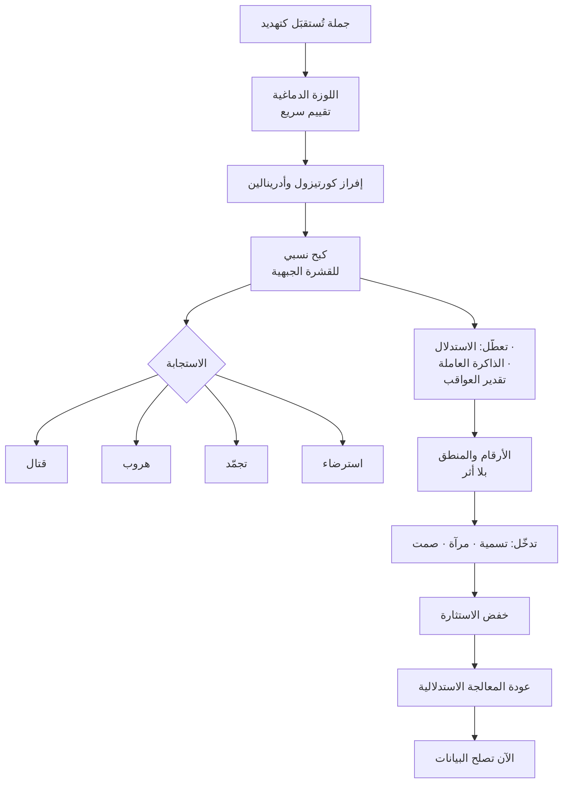

> [!info] الفصل 02 · كورس لعبة العقل
> **ماذا ستتعلّم:** النموذج العصبي الذي يقوم عليه الكورس كلّه، وحدوده العلمية بصراحة. ستفهم **الاستجابات الثلاث** (قتال · هروب · تجمّد) بوصفها تشخيصًا لا وصفًا، و**لماذا لا تُفرّق اللوزة الدماغية بين مدير يُهاجم ونمر يُهاجم**، وما الذي يترتّب عمليًّا على ذلك: **أنّ عرض الأرقام على شخص مُشتعل ليس خطأً في التوقيت — بل خطأ في العضو المُخاطَب.** وستتعلّم **الصمت التكتيكي** بمعلماته الدقيقة (أربع ثوانٍ عند الهجوم · ثلاث ثوانٍ قبل المرآة · خمس إلى عشرين ثانية بعد التسمية)، ولماذا هذه الأرقام تحديدًا. وستُفكّك **مُطلِقات الكورتيزول الأربعة** التي يذكرها المحاضر — التهديد، النقد، غموض المتطلّبات، الضغط الزمني — وستكتشف أنّ اثنين منها **تصنعهما أنت بنفسك من موقع الإدارة**. ثم ستُواجه **القراءة النقدية**: أين يُبالغ هذا النموذج، ولماذا تُعدّ عبارة «اختطاف اللوزة» تبسيطًا تجاوزته الأدبيات، ولماذا يبقى نافعًا رغم ذلك.

> [!abstract] التأصيل
> **يفترض أنّك تعرف:** [[Emotional Intelligence]]
> **ويُؤصّل لك:** [[Amygdala Hijack]] · [[Fight Flight Freeze]] · [[Cognitive Reappraisal]] · [[Tactical Silence]] · [[SCARF Model]]

# الفصل 02 — بيولوجيا اللحظة: اللوزة والقشرة الجبهية

## 🎯 أهداف التعلّم

- **تشخيص** أيّ الاستجابات الثلاث يُظهرها شخص في اجتماع من علامات سلوكية محدّدة، لا من انطباع عامّ.
- **شرح** لماذا يفشل عرض البيانات على شخص مُستثار، بلغة الآلية لا بلغة النصيحة.
- **تطبيق** الصمت التكتيكي بمعلماته الزمنية الصحيحة في ثلاثة مواضع مختلفة.
- **تحديد** مُطلِقات الكورتيزول الأربعة في بيئة عملك، والتمييز بين ما تصنعه أنت وما يأتيك من خارج.
- **التمييز** بين تهدئة الطرف الآخر وتهدئة النفس، وشرح لماذا الثانية شرط للأولى.
- **نقد** النموذج العصبي المطروح: تحديد ما هو مُثبَت، وما هو تبسيط مفيد، وما هو تجاوز.

---

## الفكرة المحورية: أنت لا تُخاطب من تظنّ

> [!quote] من المحاضرة
> **حمزة:** «لدينا شيء اسمه **اللوزة الدماغية** — فصّ في الدماغ. وهي **لا تُفرّق** بين مدير يُهاجم موظّفه ونمر على وشك أن يلتهمك. الدماغ يُترجم شيئًا واحدًا: **كيف أُقاتل، أو كيف أهرب من هذا الموقف؟**»

هذه الجملة هي **البنية التحتية** لكلّ أداة في الكورس. من دونها تبدو التسمية والمرآة حِيَلًا لغوية لطيفة؛ ومعها تصير **تدخّلات موجّهة على نظام محدّد**.

والنتيجة العملية التي تترتّب عليها أهمّ من الجملة نفسها، ويصوغها المحاضر بحدّة:

> [!quote] من المحاضرة
> **حمزة:** «**ولا تعرض أرقامًا وبيانات على شخص مهتاج أبدًا.** بيولوجيًّا، دماغه لم يترجم إلى القشرة الجبهية بعد.»

انتبه إلى دقّة الصياغة: النصيحة ليست «انتظر حتى يهدأ لأنّه لن يستمع». إنّها **«العضو الذي يُعالج الأرقام مُعطَّل الآن».** والفرق بين الصياغتين هو الفرق بين نصيحة وآلية:

| | **الصياغة النصائحية** | **الصياغة الآلية** |
|---|---|---|
| **التشخيص** | «هو منزعج فلن ينتبه» | «القشرة الجبهية مكبوحة؛ معالجة الاستدلال مُعطَّلة» |
| **ما يستنتجه المستمع** | «سأقول الأرقام بلطف أكثر» | «الأرقام نفسها بلا معنى الآن مهما لُطِّفت» |
| **الإجراء الناتج** | تحسين الصياغة | **تغيير الحالة أوّلًا، ثم الصياغة** |
| **معيار النجاح** | لم يغضب أكثر | صار يسأل أسئلة بدل أن يُصدر أحكامًا |

وهذا الفارق هو ما يجعل الكورس مختلفًا عن نصائح التواصل الشائعة: **ليس المطلوب أن تُحسّن رسالتك، بل أن تُغيّر حالة المستقبِل قبل إرسالها.**

---

## أوّلًا: الاستجابات الثلاث — من وصف إلى تشخيص

> [!quote] من المحاضرة
> **حمزة:** «لدينا **ثلاثة `F`** […] **القتال** […] يدخل بوجهه فورًا ويبدأ في التخبّط. **الهروب** […] الشيء الوحيد المهمّ أن يهرب. **التجمّد** […] يتجمّد، ثابتًا في مكانه، لا يدري إلى أين يذهب ولا من أين أتى.»

القيمة العملية للتصنيف ليست في معرفة أنّ الناس تفعل هذا — الجميع يعرف. القيمة في **أنّه تصنيف تشخيصي**: كلّ استجابة تُنتج علامات مختلفة، وتحتاج تدخّلًا مختلفًا، **وتُخطئ إن عاملتها كلّها بالطريقة نفسها.**

| الاستجابة | ما تراه | ما يُقال عادةً | التفسير الشائع الخاطئ | التدخّل الصحيح |
|---|---|---|---|---|
| **القتال** | صوت مرتفع · مقاطعة · تعميم («كلّ الكود…») · اتّهام مباشر | «كلّ ما يأتينا منكم معطوب» | «شخص عدواني» | **مرآة قصيرة** ثم صمت — تُعيد الجملة إلى أذنه فيُعالجها |
| **الهروب** | «حاضر» سريعة · تغيير الموضوع · «سآخذها خارج الاجتماع» · اختفاء بعد الاجتماع | «تمام، سنُنفّذ» | «موافقة والتزام» | **«فكيف سنفعلها؟»** — الفصل [[06 - قوّة لا وأنواع نعم الثلاثة\|06]] |
| **التجمّد** | صمت · كاميرا مغلقة · ذراعان مطويتان · نظر إلى الأرض · «ما زلتُ أعمل عليها» | لا شيء | «غير مهتمّ» أو «لا يفهم» | **تسمية تصف الموقف لا الشخص** + أمان نفسي + اجتماع فردي |

> [!warning] المزلق العملي — الخلط بين الهروب والالتزام
> أخطر الاستجابات الثلاث في بيئة العمل **ليست القتال — بل الهروب**، لأنّها الوحيدة التي **تبدو نجاحًا.** المُقاتِل يُنبّهك بصوته؛ والمتجمّد يُنبّهك بصمته؛ أمّا الهارب فيقول «حاضر» ويُغادر — فتُغلق الاجتماع مطمئنًّا، وتكتشف بعد أسبوع أنّ شيئًا لم يحدث.
>
> ولهذا يُخصّص الكورس محورًا كاملًا لكشفها، وسنبنيه في الفصل [[06 - قوّة لا وأنواع نعم الثلاثة|06]].

> [!info] إضافة مرجعية — من ثلاثة إلى أربعة، ومن أين جاء التصنيف
> صاغ **والتر كانون (`Walter Cannon`)** مصطلح **«قاتل أو اهرب» (`fight-or-flight`)** عام 1915 في *Bodily Changes in Pain, Hunger, Fear and Rage*. وأُضيف **التجمّد (`freeze`)** لاحقًا من دراسات الاستجابة الدفاعية، وهو في الحقيقة **يسبق** الاثنين لا يتلوهما: التجمّد هو حالة اليقظة المتوقّفة التي يُقيَّم فيها التهديد قبل اختيار الاستجابة.
>
> وتُضيف الأدبيات المعاصرة استجابة رابعة وثيقة الصلة ببيئة العمل تحديدًا: **الاسترضاء (`fawn`)** — صاغها **بيت ووكر (`Pete Walker`)** في *Complex PTSD* (2013). وهي محاولة نزع فتيل التهديد **بالخضوع والإرضاء**: موافقة فورية، اعتذار غير مبرَّر، تنازل عن موقف مدروس.
>
> وأهمّية إضافتها هنا كبيرة، لأنّ **«الاسترضاء» هو الوصف الدقيق لما تصفه علياء في المحاضرة التعريفية** («قرأوا لطفي ضعفًا»)، ولما يُسمّيه المحاضر **«التنازل إرضاءً للآخرين»** ويرفضه صراحةً في [[1.1 الأسس - الحلبة والدماغ|القسم 5]]. فالتنازل الذي يُوصف في الكورس بأنّه «قلّة وعي» هو في الحقيقة **استجابة تهديد رابعة** — وهذا يُغيّر علاجه: لا يُعالَج بالتوعية بل بالتدرّب على الثبات تحت استثارة، شأنه شأن القتال والهروب.
>
> | الاستجابة | الوظيفة التطوّرية | مظهرها في الاجتماع |
> |---|---|---|
> | تجمّد | تقييم التهديد بلا حركة | صمت، جمود، «لا أدري» |
> | قتال | إزالة التهديد بالقوّة | هجوم، تعميم، رفع صوت |
> | هروب | مغادرة نطاق التهديد | «حاضر» ثم اختفاء |
> | استرضاء | نزع التهديد بالخضوع | تنازل فوري عن النطاق أو التقدير |

---

## ثانيًا: المسار العصبي — ما يحدث في الثواني الأولى

> [!quote] من المحاضرة
> **حمزة:** «هرمون **الكورتيزول**، حين يرتفع، يجعل الإنسان **يُدافع عن نفسه** — لا يكون متماسكًا — **ويُغلق قشرتي الجبهية**، المسؤولة عن المنطق والتفكير، ويجعلني أدخل لأُدافع عن نفسي وأتخبّط في كلّ شيء.»

الصورة التي يرسمها المحاضر — وهي صورة عملية مفيدة رغم تبسيطها الذي سنُناقشه في القراءة النقدية — يمكن ترتيبها هكذا:

والنقطة التي تستحقّ التشديد هي العقدة `J`: ما يتعطّل ليس «المزاج» بل **قدرات معرفية محدّدة** — وهذا ما يُفسّر سلوكيات تبدو غير مفهومة:

| القدرة المتعطّلة | السلوك الناتج في الاجتماع |
|---|---|
| **الذاكرة العاملة** | يُكرّر النقطة نفسها ثلاث مرّات؛ لا يتذكّر ما قلتَه قبل دقيقتين |
| **تقدير العواقب** | يُهدّد بإلغاء المشروع — وهو ما يضرّه هو أوّلًا |
| **التفكير المجرّد** | يفشل مع النِّسَب والاحتمالات؛ يستجيب فقط للملموس |
| **تعديل السلوك بالتغذية الراجعة** | يستمرّ في الهجوم حتى بعد أن تُثبت له نقطته |
| **رؤية منظور الآخر** | «كلّ الكود من فريقكم» — تعميم يستحيل أن يعنيه حرفيًّا |

> [!tip] القاعدة العملية
> **حين يُعمّم من أمامك («دائمًا»، «كلّ»، «أبدًا»)، فهذه ليست مبالغة بلاغية — إنّها علامة قياس.** التعميم أحد أوضح مؤشّرات ارتفاع الاستثارة، لأنّ التمييز والتفصيل من وظائف ما تعطّل. فلا تُجادل التعميم؛ **اقرأه مؤشّرًا وابدأ التهدئة.**

> [!info] إضافة مرجعية — ما يُثبته العلم بالضبط
> ثلاث نتائج مُوثَّقة جيّدًا تدعم البنية العملية أعلاه، وإن كانت أدقّ منها:
>
> **الأولى — المسار السريع.** أظهر **جوزيف لودو (`Joseph LeDoux`)** في أبحاثه على تكييف الخوف (*The Emotional Brain*, 1996) وجود مسارين للمعلومة الحسّية: مسار سريع **مهاد ← لوزة** يستجيب قبل اكتمال المعالجة الواعية، ومسار أبطأ **مهاد ← قشرة ← لوزة** يُنتج تقييمًا دقيقًا. ولهذا تشعر بالتوتّر **قبل** أن تعرف سببه.
>
> **الثانية — كبح الأداء التنفيذي.** أظهر **أرنستن (`Amy Arnsten`)** في مراجعة مشهورة (*Stress signalling pathways… prefrontal cortex*, Nature Reviews Neuroscience, 2009) أنّ الإجهاد الحادّ يُضعف وظائف القشرة الجبهية الظهرانية الجانبية عبر مسارات كاتيكولامينية، مع تحوّل السيطرة نحو دوائر أسرع وأكثر آليّة. وهذا هو الأساس التجريبي لقول المحاضر إنّ الكورتيزول «يُغلق القشرة الجبهية» — وإن كان **الكبح نسبيًّا وتدريجيًّا لا إغلاقًا ثنائيًّا.**
>
> **الثالثة — التسمية تخفض الاستثارة قياسًا.** وهذه أهمّها لهذا الكورس. أظهرت دراسة **ليبرمان وزملائه (`Lieberman et al.`, "Putting Feelings Into Words", Psychological Science, 2007)** بالرنين المغناطيسي الوظيفي أنّ **تسمية الانفعال لفظيًّا** ترتبط بانخفاض نشاط اللوزة وزيادة نشاط القشرة الجبهية البطنية الجانبية اليمنى. وهذا **دعم تجريبي مباشر لأداة التسمية** التي يبني عليها الفصل [[04 - التسمية - صناعة الجملة المحايدة|04]] — وهو أقوى سند علمي في الكورس كلّه.
>
> **لكن انتبه:** الدراسة أُجريت على **تسمية المرء لانفعاله هو**، لا على **تسمية شخص لانفعال شخص آخر**. والانتقال بينهما معقول ومدعوم جزئيًّا بأدبيات الاعتراف بالانفعال، **لكنّه ليس ما أثبتته الدراسة حرفيًّا** — وهذا نوع الدقّة الذي يجب الاحتفاظ به حين يُقال إنّ لهذه الأدوات «سندًا علميًّا».

---

## ثالثًا: الصمت التكتيكي — ثلاثة أرقام لثلاثة مواضع

يُوزّع المحاضر عبر الكورس ثلاثة معالم زمنية للصمت، ومن السهل الخلط بينها لأنّها تُذكَر في مواضع متباعدة. وجمعها في مكان واحد يُوضّح أنّها **ليست رقمًا واحدًا يتكرّر بل ثلاث أدوات مختلفة**:

| الموضع | المدّة | الوظيفة | النصّ |
|---|---|---|---|
| **بعد أن يُهاجمك** | **أربع ثوانٍ** | تهدئة **لوزتك أنت** قبل الردّ | *«إن جاءك أحد وهاجمك، فلا بدّ أن تصمت أربع ثوانٍ. اجلس وسبّح في نفسك، وعُدّ من أربعة إلى واحد»* |
| **قبل أن تُمرئ** | **ثلاث ثوانٍ** بعد صمته | ألّا يشعر أنّك قاطعته | *«لا يجوز أن تُمرئ حتى يصمت من أمامك مدّة لا تقلّ عن ثلاث ثوانٍ»* |
| **بعد أن تُسمّي** | **خمس إلى عشرين ثانية** | توليد **ضغط الفراغ** ليتكلّم هو | *«ستعرف ذلك خلال خمس إلى عشرين ثانية من الصمت»* |

**وهذه المعالم ليست عشوائية، وإن لم يُبرّرها المحاضر:**

- **الأربع ثوانٍ** تقارب زمن بلوغ الاستجابة الودّية الحادّة ذروتها وبدء تراجعها الأوّلي. وقيمتها الحقيقية ليست في الرقم بل في **أنّه مهمّة إدراكية بديلة**: العدّ أو التسبيح يشغل الذاكرة العاملة، فيمنع الردّ الانعكاسي. الرقم وسيلة، والانشغال هو الآلية.
- **الثلاث ثوانٍ** أطول من فجوة التناوب الطبيعية في الحوار (نحو **200 مللي ثانية** في معظم اللغات، بحسب أعمال **ستيفنسون وزملائه** على عالمية التناوب). فتجاوزها إشارة مقصودة: **أنا لا أنتظر دوري — أنا أستمع.**
- **العشرون ثانية** تعود إلى قاعدة يُكرّرها المحاضر في موضع آخر: أنّ العقل يلتقط أوّل عشرين ثانية. والصمت بهذا الطول **يتجاوز عتبة احتمال الفراغ** لدى معظم الناس، فيملؤه من أمامك.

> [!warning] المزلق العملي — الصمت الخاطئ
> الصمت ليس غياب كلام فحسب؛ إنّه **وضعية.** والصمت مع ذراعين مطويتين، أو مع نظر إلى الأرض، أو مع هاتف في اليد، **يُقرأ انسحابًا أو استخفافًا** — فيرفع كورتيزول من أمامك بدل أن يخفضه. ولهذا يُصرّ المحاضر على أنّ الصمت جزء من **حزمة** تشمل الجلسة والنظر وحركة اليدين، وهو ما يُفصّله الفصل [[10 - كاريزما القائد الصامت والقيادة البيولوجية|10]].
>
> والقاعدة المختصرة: **صمت + وضعية مفتوحة + نظر ثابت = ضغط فراغ. صمت + وضعية منغلقة = انسحاب.**

> [!info] إضافة مرجعية — لماذا العدّ يعمل: إعادة التقييم مقابل الكبح
> يُميّز **جيمس غروس (`James Gross`)** في نموذج تنظيم الانفعال (`Process Model of Emotion Regulation`, 1998) بين استراتيجيتين:
>
> - **الكبح التعبيري (`expressive suppression`)** — أن تشعر بالغضب وتُخفيه. مُكلِف معرفيًّا، يرفع الاستثارة الفسيولوجية، ويُضعف الذاكرة، ويُقلّل ألفة الطرف الآخر.
> - **إعادة التقييم المعرفي (`cognitive reappraisal`)** — أن تُعيد تأطير الموقف قبل اكتمال الاستجابة. أقلّ كلفة، ويخفض الاستثارة فعليًّا.
>
> والصمت التكتيكي كما يصفه المحاضر **يقع في الوسط، وميله إلى أيّ الجهتين يُحدّده ما تفعله بعقلك أثناء الصمت**:
>
> | ما تفعله في الأربع ثوانٍ | التصنيف | الأثر |
> |---|---|---|
> | تُكرّر «لا تنفجر، لا تنفجر» | كبح | يرتفع الضغط الداخلي؛ ستنفجر بعد الرابعة |
> | تُحضّر ردًّا مُفحمًا | كبح + تحضير هجوم | الصمت واجهة؛ سيُقرأ في وجهك |
> | تعدّ أو تُسبّح | إشغال محايد | يمنع الردّ الانعكاسي — الحدّ الأدنى النافع |
> | **تسأل: «ما الموقف الذي جعله يقول هذا؟»** | **إعادة تقييم** | **يخفض استثارتك فعلًا، ويُنتج التسمية جاهزة** |
>
> **والنتيجة العملية المهمّة:** أفضل استخدام للأربع ثوانٍ ليس العدّ — بل **طرح سؤال الطبقة الثانية** من الفصل [[07 - إدارة الصراع - الطبقات الأربع والصراعات الخمسة|07]]: *ما الموقف الذي مرّ به؟* فهو يُؤدّي الوظيفتين معًا: يخفض استثارتك، ويُنتج لك مادّة التسمية التي ستقولها بعد الثانية الرابعة.

---

## رابعًا: مُطلِقات الكورتيزول الأربعة — ونصفها من صنعك

> [!quote] من المحاضرة
> **حمزة:** «**متى يُفرَز الكورتيزول؟** حين **تُهدّد** شخصًا، أو **تنتقده**، أو تُعطيه **متطلّبات غير واضحة**، أو تُطبّق **ضغطًا تحت زمن**.»

قائمة قصيرة تمرّ سريعًا في المحاضرة، لكنّها **أكثر جزء قابل للتطبيق الفوري في الفصل كلّه** — لأنّ اثنين من الأربعة ليسا سلوكًا شخصيًّا بل **عيبًا في نظام العمل تصنعه أنت من موقع الإدارة**:

| المُطلِق | مصدره | مثاله في العمل | العلاج |
|---|---|---|---|
| **التهديد** | سلوك فردي | «إن لم يخرج هذا فسنُغيّر الشركة» · «سيُصعَّد إلى الموارد البشرية» | أدوات الفصول 04–08 |
| **النقد** | سلوك فردي | «كودك مليء بالعيوب» · «أنت متأخّر» | صف الحالة لا الشخص — الفصل [[04 - التسمية - صناعة الجملة المحايدة\|04]] |
| **غموض المتطلّبات** | **عيب نظاميّ** | قصّة بلا معايير قبول · «اعمل عليها وسنُوضّح لاحقًا» | تعريف الإنجاز · معايير قبول مكتوبة · [[ورشة سكرم العملية\|سكرم]] |
| **الضغط الزمني** | **عيب نظاميّ** | موعد أُعلِن قبل التقدير · التزام بلا سعة | التقدير قبل الالتزام · [[كورس الإنتاجية\|مقاييس التدفّق]] |

> [!tip] القاعدة العملية — نصف عملك في التهدئة يقع قبل الاجتماع
> **إن كان فريقك يعمل على متطلّبات غامضة تحت مواعيد لم يُشارك في وضعها، فأنت تُشغّل مُطلِقَي كورتيزول بشكل دائم** — ثم تُنفق مهاراتك في إدارة نتائجهما اجتماعًا بعد اجتماع.
>
> **التسمية تُعالج الحالة؛ ووضوح المتطلّبات يمنع نشوءها.** وهذا هو الجسر المباشر بين هذا الكورس و[[كورس الإنتاجية]]: الأوّل يُدير اللحظة، والثاني يُقلّل عدد اللحظات.

ويُقدّم المحاضر نفسه مثالًا صريحًا على المُطلِق الثالث في سياق آخر:

> [!quote] من المحاضرة
> **حمزة:** «حين نطلب من الفريق حلّ مشكلة، **لا بدّ أن نصفها وصفًا صحيحًا. تجنّبوا اللغة الغائمة.** *«التسليم متأخّر»* جملة عائمة. أمّا: *«اتّفقنا أن يكون التسليم في العاشر؛ اليوم الخامس عشر ولم يصلني أيّ تحديث. أحتاج أن أعرف أيّ الميزات متأخّرة.»* **كلام واضح صريح غير غائم ولا يحتمل التأويل.**»

ولاحظ المفارقة الظاهرة: الجملة الثانية **أشدّ** من الأولى ظاهريًّا — فيها تواريخ وطلب صريح. ومع ذلك فهي **أقلّ إثارة للكورتيزول**، لأنّ الغموض نفسه مُطلِق. الجملة العائمة تترك المتلقّي يملأ الفراغ بأسوأ الاحتمالات؛ والجملة المحدّدة تُغلق باب التأويل فتخفض التهديد المُتخيَّل.

> [!info] إضافة مرجعية — نموذج SCARF: خمسة مُطلِقات بدل أربعة
> يُقدّم **ديفيد روك (`David Rock`)** في *SCARF: A Brain-Based Model for Collaborating with and Influencing Others* (NeuroLeadership Journal, 2008) تصنيفًا أوسع للمجالات الاجتماعية التي يُعالجها الدماغ **بالمنطق نفسه الذي يُعالج به التهديد والمكافأة المادّيين**، وهي خمسة:
>
> | المجال | التهديد فيه | مقابله في مُطلِقات الكورس |
> |---|---|---|
> | **المكانة (`Status`)** | نقد أمام الفريق؛ تجاهل الرأي | «النقد» — ويُفسّر «صراع الأنا» في الفصل [[07 - إدارة الصراع - الطبقات الأربع والصراعات الخمسة\|07]] |
> | **اليقين (`Certainty`)** | متطلّبات غامضة؛ خطط تتغيّر | «غموض المتطلّبات» |
> | **الاستقلالية (`Autonomy`)** | أوامر بلا مشاركة في القرار | *غير مذكور في القائمة* — لكنّه يُفسّر مقاومة تغيير موعد الاجتماع اليومي |
> | **الانتماء (`Relatedness`)** | «فريقك» مقابل «فريقنا»؛ الشللية | *غير مذكور* — وهو أساس **الإزاحة** في الفصل [[08 - الإزاحة والأسئلة المعايرة\|08]] |
> | **الإنصاف (`Fairness`)** | ازدواجية معايير؛ مُحاسبة غير متكافئة | *غير مذكور* — يُفسّر لماذا «حاسِب كلًّا على مستواه» يُهدّئ |
>
> **وقيمة الإضافة عملية لا نظرية:** الاستقلالية والانتماء والإنصاف تُفسّر ثلاثة مواقف في الكورس يُقدَّم علاجها بلا تفسير — مقاومة تغيير موعد الاجتماع (استقلالية)، وفاعلية الحديث بصيغة «نحن» (انتماء)، وأثر «حاسِب كلًّا على مستواه» (إنصاف). فإضافتها تُحوّل ثلاث وصفات مُجرَّبة إلى ثلاث قواعد مفهومة.
>
> **وحدّ النموذج:** SCARF إطار تنظيمي مفيد لا نظرية عصبية مُختبَرة كوحدة واحدة؛ فمكوّناته مدعومة تفاوتيًّا، ويُستحسن استخدامه قائمةَ تشخيص لا قانونًا.

---

## خامسًا: تهدئة النفس شرط لتهدئة الآخر

> [!quote] من المحاضرة
> **موجي:** «لكن من يُهدّئنا *نحن*؟»
>
> **حمزة:** «لا أحد يا صديقي — **لا أحد يُهدّئك؛ أنت تُهدّئ نفسك.**»

هذا التبادل يستحقّ أن يُقرأ مرّتين، لأنّه يكشف **افتراضًا يحمله الكورس كلّه ولا يُدافع عنه**: أنّ من يُطبّق الأدوات قادر على تنظيم حالته هو أثناء تنظيمه حالة غيره. وهذا افتراض ثقيل.

والملاحظة التقنية أنّ **تنظيم الذات ليس شرطًا أخلاقيًّا بل شرط تشغيلي**، وذلك لسبب مُوثَّق: **العدوى الانفعالية.**

> [!info] إضافة مرجعية — العدوى الانفعالية والاتّجاه التراتبي
> **العدوى الانفعالية (`emotional contagion`)**، كما وصفها **هاتفيلد وكاسيوبو ورابسون** (1994)، هي الميل التلقائي إلى محاكاة تعابير الآخرين ونبراتهم ووضعياتهم، ثم **التقاط الحالة الانفعالية المصاحبة.** وتحدث بلا وعي وفي أجزاء من الثانية.
>
> والنقطة الحاسمة لهذا الفصل أنّ **العدوى غير متماثلة تراتبيًّا**: تنتقل من الأعلى سلطةً إلى الأدنى أقوى ممّا تنتقل عكسًا. وقد أظهر **باربارا بارسادي (`Sigal Barsade`)** في تجربة معروفة (*The Ripple Effect*, Administrative Science Quarterly, 2002) أنّ إدخال متواطئ يحمل حالة انفعالية معيّنة إلى مجموعة عمل يُغيّر حالة المجموعة كلّها وأداءها التعاوني — **بلا أن يعي أعضاؤها مصدر التغيّر.**
>
> **وهذا يُنتج نتيجتين للقائد:**
> 1. **حالتك تُبَثّ سواء قصدت أو لم تقصد.** فمديرٌ متوتّر لا «يُخفي» توتّره؛ بل يُوزّعه.
> 2. **وهذا هو المخرج الوحيد من سؤال موجي**: أنت لا تُهدّئ نفسك من أجل نفسك فقط؛ **تهدئتك لنفسك هي أوّل تدخّل تُجريه على الغرفة** — وأكثرها أثرًا، لأنّه يعمل قبل أن تنطق بكلمة.
>
> ويُشير المحاضر نفسه إلى الآلية العكسية — أنّ الوضعية تُنتج الحالة لا العكس فقط: *«حتى لو كنتَ متوتّرًا، فاتّخاذ ذلك الوضع يجعل جسدك يُترجمه ويُفرز هرمونات الهدوء والثقة»*. وهذا الادّعاء بصيغته القوية («وضعيات القوّة») **لم يصمد للتكرار** كما سيُبيّن الفصل [[10 - كاريزما القائد الصامت والقيادة البيولوجية|10]]؛ لكنّ صيغته الضعيفة — أنّ الوضعية المفتوحة تُقلّل إشارات التهديد التي يلتقطها **الآخرون** منك — مدعومة وكافية للغرض.

> [!tip] القاعدة العملية — بروتوكول ما قبل الاجتماع الصعب
> ثلاث خطوات قبل دخول اجتماع تتوقّع فيه مواجهة:
> 1. **سمِّ حالتك لنفسك** بصيغة صريحة: «أنا متوتّر من هذا الاجتماع لأنّي أتوقّع اتّهامًا.» (تسمية الانفعال لفظيًّا — الأثر المُوثَّق عند ليبرمان.)
> 2. **اكتب سطرًا واحدًا:** ما الذي أُريد أن يخرج به هذا الاجتماع؟ (يُثبّت المعيار قبل أن تختطفه اللحظة.)
> 3. **حضّر تسميتين وسؤالًا معايَرًا واحدًا** بالنصّ. (لأنّ التوليد تحت الاستثارة يفشل — كما في قانون يركس–دودسون؛ والاسترجاع من الذاكرة أرخص معرفيًّا من التوليد.)

---

## 🗣️ بنك العبارات — صياغات هذا الفصل

| الموقف | العبارة الخاطئة | العبارة الصحيحة | لماذا |
|---|---|---|---|
| هجوم مفاجئ عليك | ردّ فوري أيًّا كان | *(أربع ثوانٍ صمت + نظر ثابت)* ثم تسمية | يمنع الردّ الانعكاسي؛ يمنح لوزتك مهلة |
| شخص يُعمّم («دائمًا تتأخّرون») | «هذا غير صحيح، في السبرنت الماضي…» | «دائمًا نتأخّر؟» *(صمت)* | التعميم مؤشّر استثارة لا ادّعاء يُفنَّد |
| مطالبة تحت ضغط زمني | «هذا مستحيل في ثلاثة أيّام» | «ثلاثة أيّام؟» *(صمت)* ثم «كيف يمكننا الوصول إلى ذلك؟» | لا تُفنّد؛ انقله إلى المعالجة الاستدلالية |
| طلب من الفريق | «التسليم متأخّر ولا بدّ من حلّ» | «اتّفقنا على العاشر؛ اليوم الخامس عشر ولم يصلني تحديث. أحتاج أن أعرف أيّ الميزات متأخّرة» | الغموض نفسه مُطلِق كورتيزول |
| تدخل مُشتعلًا أنت | تدخل وتبدأ | *(سمِّ حالتك لنفسك · اكتب هدف الاجتماع · حضّر تسميتين)* | حالتك تُبَثّ قبل أن تنطق |
| توتّرت وسط الاجتماع | تُواصل بسرعة أكبر | «دعوني أُدوّن هذه ونعود إليها بعد البند القادم» | هدنة بلا هروب — استراحة الغامدي |

---

## 🧪 ورشة الفصل — خريطة مُطلِقاتك

| الخطوة | العمل | المُخرَج |
|---|---|---|
| **1** | ارصد أسبوعًا كاملًا: كلّ مرّة ترى فيها استجابة تهديد في فريقك (قتال/هروب/تجمّد/استرضاء)، سجّل: من · ماذا سبقها مباشرةً | جدول رصد |
| **2** | صنّف كلّ حادثة بحسب المُطلِق: تهديد · نقد · غموض · ضغط زمني | توزيع رباعي |
| **3** | احسب النسبة: كم منها من **سلوك فردي**، وكم من **عيب نظاميّ**؟ | نسبة مئوية |
| **4** | إن تجاوز النظاميّ 40%، فأنت تُدير أعراضًا. حدّد عيبًا نظاميًّا واحدًا وعالجه. | إجراء واحد على النظام |
| **5** | لأشيع نمط شخصي رصدتَه، اكتب تسميةً جاهزةً بالنصّ واحفظها | جملة محفوظة |
| **6** | جرّب بروتوكول ما قبل الاجتماع الصعب ثلاث مرّات، وسجّل: هل تغيّرت **حصيلة** الاجتماع؟ | ملاحظة مكتوبة |

---

## القراءة النقدية — أين يقصر هذا الطرح؟

**1. «اللوزة تُغلق القشرة الجبهية» تبسيط تجاوزته الأدبيات.** الصورة الشائعة — لوزة تختطف دماغًا عاقلًا — عمّمتها عبارة **«اختطاف اللوزة» (`amygdala hijack`)** التي صاغها **دانيال غولمان** في *Emotional Intelligence* (1995)، وهي مفيدة تعليميًّا ودقيقة جزئيًّا؛ لكنّ الصورة المعاصرة أعقد في ثلاثة مواضع:
- **اللوزة ليست «مركز الخوف»** فحسب؛ إنّها تستجيب للبروز والأهمّية الدافعية عمومًا، بما فيها المحفّزات الإيجابية.
- **العلاقة تبادلية لا أحادية:** القشرة الجبهية تُنظّم اللوزة كما تتأثّر بها؛ وقدرة هذا التنظيم تختلف بين الأفراد وبالتدريب.
- **لا يوجد «إغلاق»:** ما يحدث تحوّل نسبي في موازين المعالجة نحو دوائر أسرع، لا انقطاع ثنائي.
والمهمّ أنّ **هذا لا يُبطل الوصفة العملية**: تأجيل البيانات وخفض الاستثارة أوّلًا يبقى صحيحًا. لكنّه يُبطل الاستخدام **الاعتذاري** للنموذج — «لوزتي هي التي تكلّمت» ليس عذرًا؛ التنظيم قابل للتدريب، وهذا بالضبط ما يفترضه الكورس حين يطلب الممارسة.

**2. الهرمونات تُقدَّم أحاديّة الوظيفة، وهي ليست كذلك.** يُقدَّم الكورتيزول «هرمون الشرّ» والأوكسيتوسين «هرمون الثقة» — وكلاهما تبسيط له استثناءات مُوثَّقة. الكورتيزول ضروري لليقظة والتعبئة وله إيقاع يومي طبيعي؛ ويرتفع في **الإثارة الإيجابية** أيضًا. والأوكسيتوسين يزيد التفضيل **داخل المجموعة** ويمكن أن يزيد التحيّز ضدّ **خارجها** (De Dreu et al., Science, 2011) — أي إنّ «هرمون الثقة» قد يُعزّز الشللية التي يُحذّر منها الكورس نفسه. والفصل [[10 - كاريزما القائد الصامت والقيادة البيولوجية|10]] يُصحّح جزءًا من هذا بمبدأ «كلّ زيادة سُمّ»، لكنّ الصورة الأحادية تظلّ سائدة في العرض.

**3. النموذج يُفسّر كلّ شيء — وهذا عيب لا ميزة.** لأنّ كلّ سلوك بشري مصحوب بنشاط عصبي، يمكن دائمًا سرد حكاية عصبية لأيّ موقف. والخطر أن تُقدَّم الحكاية **تفسيرًا** وهي إعادة وصف. قولك «كورتيزوله مرتفع فلذلك هاجم» لا يُضيف — عمليًّا — على «هاجم لأنّه غاضب»، إلّا إن كان يُنتج **تنبّؤًا مختلفًا أو تدخّلًا مختلفًا**. وهذا هو المعيار الذي ينبغي تطبيقه على كلّ استخدام للنموذج في هذا الكورس: **هل غيّر ما سأفعله؟** فإن لم يُغيّر، فهو لغة لا معرفة.

**4. لا يُعالَج الاختلاف الفردي.** يُقدَّم النموذج كأنّ البشر متماثلون في عتبة الاستثارة وسرعة التعافي — وهم ليسوا كذلك. تختلف عتبات الاستجابة، وتُؤثّر فيها النوم والحالة الصحّية والتاريخ الشخصي مع بيئات عمل سابقة. والمعنى العملي: **الأربع ثوانٍ ليست قاعدة كونية**؛ بعض الناس يحتاجون أطول بكثير، وبعض المواقف تحتاج تأجيل الحوار كلّه لا تأجيل الردّ. والكورس يعرض نصف الحلّ في **استراحة الغامدي** ثم لا يبني عليه.

**5. الحدود غائبة تمامًا.** يُقدَّم الإطار كأنّه صالح لكلّ الحالات — بينما توجد حالات تُشبه الاستجابة العادية ولا تُعالَج بها: الاحتراق الوظيفي المتقدّم، والاضطراب النفسي التشخيصي، والصدمة السابقة، وبيئات العمل المُسيئة بنيويًّا. وتطبيق أدوات التهدئة على شخص في احتراق متقدّم قد **يُطيل بقاءه في وضع يضرّه.** ولا يقول الكورس في أيّ موضع: *هنا تتوقّف هذه الأدوات ويبدأ اختصاص آخر.* وهذه فجوة يجب أن يملأها القارئ بنفسه: **إن تكرّر نمط الإجهاد لدى شخص عبر سياقات متعدّدة ولم يستجب لتغيّر الحمل والوضوح، فأنت خارج نطاق هذا الكورس.**

---

## 🧾 خلاصة الفصل

1. **الخطأ ليس في الصياغة بل في العضو المُخاطَب** — البيانات على شخص مُستثار بلا معنى مهما لُطِّفت.
2. **الاستجابات أربع لا ثلاث**: قتال · هروب · تجمّد · **استرضاء** — والأخيرة هي التي يصفها الكورس بـ«التنازل إرضاءً» ويرفضها.
3. **أخطرها الهروب** لأنّها الوحيدة التي تبدو نجاحًا.
4. **التعميم مؤشّر قياس لا ادّعاء** — «دائمًا» و«كلّ» علامات ارتفاع استثارة، فلا تُجادلها.
5. **ثلاثة أرقام لثلاثة مواضع**: أربع ثوانٍ بعد الهجوم · ثلاث قبل المرآة · خمس إلى عشرين بعد التسمية.
6. **أفضل استخدام للأربع ثوانٍ إعادة تقييم لا عدّ**: اسأل «ما الموقف الذي جعله يقول هذا؟» — فتخفض استثارتك وتُنتج التسمية معًا.
7. **نصف مُطلِقات الكورتيزول من صنع النظام لا الأفراد** — الغموض والضغط الزمني تُصلَح بالعملية لا بالمهارة.
8. **الغموض نفسه مُطلِق** — والجملة الأشدّ تحديدًا أقلّ إثارة من الجملة العائمة الألطف.
9. **حالتك تُبَثّ قبل أن تنطق** — العدوى الانفعالية غير متماثلة تراتبيًّا، فتهدئتك لنفسك أوّل تدخّل على الغرفة.
10. **حدّ النموذج:** «إغلاق القشرة» تبسيط، والهرمونات ليست أحاديّة الوظيفة، والحالات المَرَضية والاحتراق خارج نطاق هذه الأدوات.

---

## ❓ اختبارات ذاتية

> [!question]- 1) صاحب مصلحة يقول: «كلّ إصدار لديكم مليء بالأخطاء، دائمًا.» لديك بيانات تُثبت أنّ معدّل العيوب انخفض 40%. متى تعرضها؟
> **لا تعرضها الآن — وليس لأنّه «لن يستمع»، بل لسببين مختلفين تمامًا يجب فصلهما.**
> **الأوّل بيولوجي:** «كلّ» و«دائمًا» تعميمان — ومؤشّران على أنّ المعالجة التمييزية (التي تُميّز 40% من 100%) هي بالضبط ما تعطّل. فالرقم لن يُعالَج بوصفه رقمًا.
> **والثاني تفاعلي وأخطر:** عرض بيانات مضادّة على شخص مُستثار يُقرَأ **تكذيبًا**، ويُنتج تصعيدًا. وقد نبّه المحاضر إلى هذا بدقّة في موضع مشابه: *«إن ذهبتُ وأجريتُ تحقّقًا أمامه، فقد أعطيتُه انطباعًا بأنّي لا أُصدّقه — وهو ما قد يجعله يُهاجمك أكثر.»*
> **التسلسل الصحيح:** أربع ثوانٍ ← مرآة قصيرة («كلّ إصدار؟») ← صمت ← اسمع ما سيُفصّله (غالبًا سيتّضح أنّه يقصد إصدارًا واحدًا بعينه) ← تسمية إن لزم ← ثم، وقد صار يسأل بدل أن يحكم: **«ما رأيك أن ننظر معًا في أرقام آخر ثلاثة إصدارات؟»** — لاحظ أنّها دعوة للنظر معًا لا عرضٌ للتفنيد.

> [!question]- 2) طبّقتَ الصمت أربع ثوانٍ بعد هجوم، فقال المهاجم: «ما بك؟ لماذا لا تردّ؟» — وتصاعد الموقف. أين الخطأ؟
> **الخطأ في الأرجح ليس في الصمت بل في وضعيّته المصاحبة.** الصمت وحده ليس أداة؛ الأداة هي **صمت + وضعية مفتوحة + نظر ثابت**. فإن صمتَّ ونظرك في الأرض، أو بذراعين مطويتين، أو مع سحب جسدك للخلف، فقد أرسلتَ **إشارة انسحاب أو استخفاف** — وكلاهما يرفع استثارته لا يخفضها.
> **واحتمال ثانٍ:** أنّك أطلتَ. الأربع ثوانٍ لتهدئة **لوزتك أنت** ثم تُتبِعها بتسمية أو مرآة. أمّا الصمت الممتدّ بلا ردّ فهو أداة **ضغط الفراغ** ولها موضعها بعد التسمية لا قبلها.
> **والتصحيح:** أربع ثوانٍ مع نظر بين حاجبيه ووضعية ثابتة، ثم **جملة**: «يبدو أنّ هناك ضغطًا شديدًا في هذا الملفّ.» ثم صمت. الصمت الأوّل للاستعداد؛ والثاني للضغط.

> [!question]- 3) مديرك يُطلق ثلاث استجابات تهديد في فريقك أسبوعيًّا — وأنت لا تملك سلطة تغييره. ما الذي يقوله هذا الفصل، وما الذي لا يقوله؟
> **ما يقوله:** أنّ جزءًا من الأمر قابل للفصل. سجّل أسبوعًا وصنّف المُطلِقات. غالبًا ستجد أنّ حصّة معتبرة **نظاميّة** لا شخصية — غموض متطلّبات، ومواعيد تسبق التقدير. والنظاميّ قابل للعلاج **بلا مواجهة**: معايير قبول مكتوبة، وتقدير قبل الالتزام، وتوثيق واضح. وأنت قد تملك سلطة على هذه وإن لم تملك سلطة عليه.
> ويقول أيضًا: **امتصاصك للأثر يمنع انتشاره إلى الفريق** — لأنّ العدوى الانفعالية تنتقل تراتبيًّا؛ فبقاؤك ثابتًا أمام فريقك بعد اجتماع سيّئ تدخّل حقيقي على حالتهم.
> **وما لا يقوله — وهذا الأهمّ:** لا يقول متى تتوقّف. الأدوات تُدير موقفًا داخل بيئة سليمة أساسًا. أمّا حين يكون النمط **مستمرًّا وبنيويًّا ولا يستجيب لأيّ تغيّر في الوضوح أو الحمل**، فإتقانك للأدوات **يُطيل بقاءك في بيئة تضرّك ويُخفي عن المنظّمة إشارة الخلل**. وهذا قرار خارج نطاق الكورس، ولا ينبغي أن تُقنعك مهارتك بأنّه لا يوجد.

> [!question]- 4) لماذا يُوصي الفصل بأن تُحضّر تسميتين وسؤالًا معايَرًا بالنصّ قبل اجتماع صعب، بدل الاعتماد على فهمك للأداة؟
> **لأنّ التوليد والاسترجاع عمليّتان معرفيّتان مختلفتا الكلفة، والثانية وحدها تصمد تحت الاستثارة.**
> فهمك للأداة يُتيح لك **توليد** صياغة مناسبة — وهي عملية تعتمد على الذاكرة العاملة والمعالجة الاستدلالية، وهما بالضبط ما يتراجع أوّلًا تحت الضغط. أمّا الاسترجاع من الذاكرة طويلة المدى فأرخص بكثير ويصمد.
> وهذا ما يُفسّر النتيجة المألوفة: تخرج من الاجتماع فتُصاغ الجملة المثالية في ذهنك خلال ثانيتين — لأنّ الاستثارة انخفضت وعادت قدرة التوليد.
> ويتّسق هذا مع **قانون يركس–دودسون**: المهارات المعقّدة حديثة الاكتساب تنهار عند استثارة أقلّ بكثير من المهارات المُؤتمَتة — **وتُستبدَل تلقائيًّا بالسلوك القديم المُؤتمَت**، أي «لماذا فعلت ذلك؟».
> **والتحضير النصّي يحلّها بتحويل المهارة إلى استرجاع**، وهو المبدأ نفسه وراء إصرار المحاضر على الممارسة خارج بيئة العمل: أتمِت الصياغة في حالة منخفضة الاستثارة، ثم أضف الضغط.

---

## 📚 مراجع الفصل

| المرجع | الصلة |
|---|---|
| Joseph LeDoux — *The Emotional Brain* (1996) | المسار السريع مهاد–لوزة؛ الأساس التجريبي لـ«الاستجابة تسبق الفهم» |
| Amy Arnsten — *Stress signalling pathways… prefrontal cortex* (2009) | كبح الأداء التنفيذي تحت الإجهاد الحادّ |
| Lieberman et al. — *Putting Feelings Into Words* (2007) | **الدعم التجريبي المباشر لأداة التسمية** |
| Walter Cannon — *Bodily Changes…* (1915) | أصل «قاتل أو اهرب» |
| Pete Walker — *Complex PTSD* (2013) | الاستجابة الرابعة: الاسترضاء — تُفسّر «التنازل إرضاءً» |
| James Gross — *Process Model of Emotion Regulation* (1998) | إعادة التقييم مقابل الكبح — لماذا يعمل الصمت وكيف يفشل |
| David Rock — *SCARF* (2008) | خمسة مُطلِقات اجتماعية تُوسّع قائمة الكورس الرباعية |
| Sigal Barsade — *The Ripple Effect* (2002) | العدوى الانفعالية في فرق العمل — الردّ على سؤال موجي |
| Daniel Goleman — *Emotional Intelligence* (1995) | مصدر «اختطاف اللوزة» — يُقرأ مع نقده |
| De Dreu et al. — *Oxytocin promotes… in-group favoritism* (Science, 2011) | حدّ التبسيط الهرموني |
| المصدر الأساس | [[1.1 الأسس - الحلبة والدماغ]] · [[1.6 القائد الصامت والهرمونات]] |

---

## 🔗 روابط ذات صلة

**السابق:** [[01 - لماذا لعبة عقل - الحلبة والشروط الأربعة]] · **التالي:** [[03 - التعاطف التكتيكي - الفهم غير الموافقة]]
**مصدر السجلّ:** [[1.1 الأسس - الحلبة والدماغ]] · [[1.6 القائد الصامت والهرمونات]]
**مفاهيم:** [[10 - كاريزما القائد الصامت والقيادة البيولوجية]] · [[كورس الإنتاجية]] · [[معجم المصطلحات]]

---

> [!note] قواعد تحرير مُلزِمة في هذه القاعدة
> - كلّ اقتباس من المحاضرة داخل `> [!quote] من المحاضرة`؛ وكلّ معرفة خارجية داخل `> [!info] إضافة مرجعية`؛ والنثر بلا وسم هو تأليف المحرّر.
> - **كلّ ادّعاء علميّ يُذكَر بمصدره وبحدوده** — والتبسيط النافع يُسمّى تبسيطًا لا حقيقة.
> - كلّ فصل ينتهي بقراءة نقدية صريحة.
