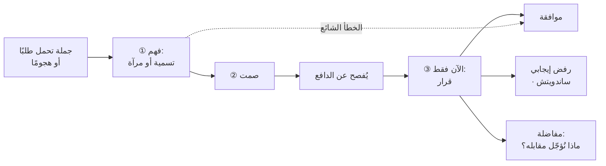

> [!info] الفصل 03 · كورس لعبة العقل
> **ماذا ستتعلّم:** الفرق الذي يُحدّد نجاح كلّ ما بعده — بين **أن تفهم** و**أن توافق**. ستعرف لماذا يُصرّ المحاضر على أنّ الخلط بينهما «قلّة وعي» لا لطف، وكيف يُنتج هذا الخلط تحديدًا ما حدث لعلياء. وستتعلّم **معادلة التعاطف التكتيكي الثلاثية** — أفهم منطقك · أُظهر لك أنّي أفهمه · ولا يتغيّر النطاق بحرف — ولماذا الحدّ الثالث هو الذي يجعلها تكتيكية لا مجاملة. وستُفكّك **البحث عن الدافع** بوصفه العملية المركزية في الكورس كلّه، مع **جدول الدوافع الشائعة** خلف الجُمَل التي تسمعها فعلًا في العمل. وستتعلّم **استراحة الغامدي** أداةً مستقلّة لكسب زمن القرار، و**قاعدة الاقتصاد**: أنّ لا كلّ طلب يستحقّ حرق مواردك الذهنية. ثم ستُواجه أصعب سؤال في الكورس كلّه: **متى يصير «الفهم بلا موافقة» تلاعبًا؟** — وهو سؤال يُطرَح صراحةً في المحاضرة ولا يُجاب عنه إجابة كافية.

> [!abstract] التأصيل
> **يفترض أنّك تعرف:** [[Cognitive Reappraisal]]
> **ويُؤصّل لك:** [[Tactical Empathy]] · [[Ruinous Empathy]] · [[Positions vs Interests]] · [[Transparency Test]]

# الفصل 03 — التعاطف التكتيكي: الفهم غير الموافقة

## 🎯 أهداف التعلّم

- **صياغة** الفرق بين التعاطف والموافقة في جملة واحدة قابلة للاستخدام أمام فريق.
- **تحديد** الحدّ الثالث في معادلة التعاطف التكتيكي، وشرح لماذا يسقط التعاطف بدونه.
- **استخراج** الدافع خلف جملة عمل حقيقية باستخدام جدول الدوافع، والتمييز بين الطلب المُعلَن والحاجة الكامنة.
- **تطبيق** استراحة الغامدي في موقف يتطلّب قرارًا لا تملك معطياته.
- **تصنيف** الطلبات بحسب ما تستحقّه من مورد ذهني (موافقة فورية · هدنة · تفاوض كامل).
- **نقد** الحدّ الأخلاقي: تحديد المعيار الذي يفصل التعاطف التكتيكي عن التلاعب، وأين يعجز الكورس عن تقديمه.

---

## الفكرة المحورية: أفهمك، ولم يتغيّر شيء

> [!quote] من المحاضرة
> **حمزة:** «**التعاطف:** أفهم منطقك، لكنّي لا أوافقك على ما تقوله ولا على الطريقة التي تريد التنفيذ بها. **الموافقة:** التزمتُ لك الآن بما تقوله وسأفعله. **والالتزام لشخص من أوّل جملة تُقال كارثة.**»

هذه الجملة تبدو بديهية عند القراءة، وهي في التطبيق **أصعب شيء في الكورس كلّه** — لأنّ الدماغ البشري يميل بقوّة إلى المطابقة بينهما في الاتّجاهين:

- **من ناحيتك:** حين تُظهر فهمًا، تشعر بضغط داخلي لإتباعه بتنازل. الجملة «أفهم ضغطك» تكاد تجرّ خلفها «…فحسنًا، سنُدخلها».
- **من ناحية الطرف الآخر:** حين يسمع فهمًا، يقرأه بداية موافقة. ولهذا يُفاجَأ حين تُتبعه بحدّ.

والحلّ الذي يقدّمه الكورس ليس تجنّب الفهم، بل **فصل الخطوتين زمنيًّا وصياغيًّا**:

السهم المتقطّع هو الخطأ: القفز من الفهم إلى الموافقة مباشرةً بلا مرور بالدافع ولا بالقرار. وهو ما شخّصه المحاضر في أوّل تمرين في الكورس:

> [!quote] من المحاضرة
> **حمزة:** «لنُفسّر ما فعلتِه. **في اللحظة التي طلب فيها مالك المنتج شيئًا، وافقنا فورًا.** فما ترجمناه في دماغ مالك المنتج أنّ **الخطّة التي نضعها بلا قيمة** […] كلّ ما قالته منّة سليم وصحيح مئة بالمئة […] **لكن قبل أيّ شيء، لا بدّ أن أفهم منطقك.**»

ولاحظ دقّة النقد: **لم يكن الخطأ في جودة الحلّ.** منّة قدّمت حلًّا تشغيليًّا مُحكمًا — تقسيم الميزة، وترتيب التبعيّات، ومنع الحجب. الخطأ كان في **موضعه في التسلسل**: قُدِّم قبل أن يُعرَف الدافع، فتحوّل من حلّ إلى **موافقة ضمنية** على تغيير الأولويات وسط السبرنت.

> [!tip] القاعدة العملية
> **جودة حلّك لا تُعوّض عن خطأ موضعه في التسلسل.** الحلّ الممتاز المُقدَّم في الثانية الخامسة يُقرَأ موافقةً؛ والحلّ نفسه المُقدَّم بعد فهم الدافع يُقرَأ تفاوضًا.

---

## أوّلًا: المعادلة الثلاثية — وأين يسقط الناس

> [!quote] من المحاضرة
> **حمزة:** «**التعاطف يعني أنّي أفهم منطقك ومشاعرك، وأُقدّرها وأحملها فوق رأسي — ولا بدّ أن أُظهر لك أنّي أفهمك.**»
>
> **حمزة:** «التعاطف أنّي أدّيتُ تدقيق الاتّهام وقلتُ كلّ ما أراد خالد قوله — **لكنّي لم أتّفق مع خالد على شيء.** ومن ثمّ فالنطاق، أو العملية على المشروع، **لم يتغيّرا إطلاقًا**.»

بجمع النصّين تظهر معادلة من ثلاثة حدود، وكلّ حدّ ضروري:

| الحدّ | صياغته | ما يحدث إن غاب |
|---|---|---|
| **① الفهم الداخلي** | أفهم منطقه ودافعه | تُنتج تسمية جوفاء تُقرأ روتينًا — وستتآكل بالتكرار |
| **② الإظهار الخارجي** | أُظهر له أنّي أفهم | فهم لا يعلم به لا يُغيّر حالته؛ يبقى في الاستثارة |
| **③ ثبات الحدّ** | ولم يتغيّر النطاق ولا العملية | **يسقط التعاطف إلى استرضاء** — وهذا هو موضع علياء بالضبط |

**والحدّ الثالث هو الذي يجعلها «تكتيكية».** بدونه تبقى الأداة لطفًا، واللطف بلا حدّ يُقرأ ضعفًا — وهو ما شخّصه الفصل [[01 - لماذا لعبة عقل - الحلبة والشروط الأربعة|01]].

> [!quote] من المحاضرة
> **حمزة:** «**هناك فرق بين أن تكون رجلًا متعاطفًا تكتيكيًّا معك، وبين أن تكون شخصًا يتنازل إرضاءً للآخرين.** والتنازل — في إدارة المشاريع، أو في أيّ إدارة في العالم — **إن تنازلت من دون دراسة كافية، أغرقت كلّ شيء** […] هذا **ليس** تعاطفًا. هذا، مع الأسف، صورة من **قلّة الوعي**، أو قلّة النضج والمسؤولية.»

> [!warning] المزلق العملي — «فهمتُك، إذن…»
> المزلق اللغوي الأشيع هو **حرف العطف**. لاحظ الفرق:
>
> | الصياغة | ما يفهمه الطرف الآخر |
> |---|---|
> | «أفهم ضغطك، **إذن** سنُدخلها» | موافقة |
> | «أفهم ضغطك، **لكن** لا نستطيع» | مواجهة — و«لكن» تمحو ما قبلها |
> | «يبدو أنّ هناك ضغطًا كبيرًا.» ← **صمت** ← *(بعد أن يتكلّم)* «فأيّ بند من الملتزم به نُؤجّله مقابلها؟» | فهم، ثم مفاضلة |
>
> **القاعدة:** بين الفهم والحدّ يجب أن يقع **صمت**، لا حرف عطف. والصمت هو ما يمنع قراءة أحدهما امتدادًا للآخر.

> [!info] إضافة مرجعية — ثلاثة أنواع للتعاطف، والكورس يستخدم واحدًا
> يُميّز **بول بلوم (`Paul Bloom`)** في *Against Empathy* (2016)، مستندًا إلى تصنيف شائع في علم النفس، بين ثلاثة أشياء تُسمّى «تعاطفًا» وهي متمايزة عصبيًّا وسلوكيًّا:
>
> | النوع | تعريفه | أثره في التفاوض |
> |---|---|---|
> | **التعاطف الوجداني (`affective`)** | أن تشعر بما يشعر به | يُغرقك في حالته؛ يُنتج التنازل |
> | **التعاطف المعرفي (`cognitive`)** | أن تفهم ما يشعر به من دون أن تشعر به | **هذا هو المطلوب هنا** |
> | **الاهتمام الرحيم (`compassion`)** | أن تهتمّ بمصلحته وتُريد له الخير | يُوجّه الغرض، ولا يُحدّد التقنية |
>
> وأطروحة بلوم المثيرة للجدل — «ضدّ التعاطف» — تعني تحديدًا **ضدّ النوع الوجداني** بوصفه دليلًا للقرار: لأنّه انتقائي (يميل لمن يُشبهنا)، وضيّق الأفق (يرى الفرد الحاضر لا النظام)، ويُنهك حامله.
>
> **وهذا يُفسّر بدقّة لماذا يُسمّي المحاضر ما يُدرّسه «تكتيكيًّا»:** هو يطلب النوع **المعرفي** — أفهم منطقك — ويرفض صراحةً أن يجرّ النوع **الوجداني** قراره. وحين يقول *«يمكنك أن تفهم شعور شخص من دون أن تحترمه»* فهو يفصل الفهم عن التبنّي فصلًا حادًّا.
>
> وهذا التمييز يحلّ أيضًا لغزًا يواجهه كثيرون: **لماذا يُنهك التعاطف بعض الناس ولا يُنهك آخرين؟** من يستخدم النوع الوجداني يمتصّ الحالة فيُستنزَف؛ ومن يستخدم المعرفي يقرأ الحالة فلا يحملها. والفرق قابل للتدرّب.

---

## ثانيًا: البحث عن الدافع — العملية المركزية

> [!quote] من المحاضرة
> **حمزة:** «**الفكرة كلّها الآن أنّي لا أحتاج أن أوافق ولا أن أرفض — أحتاج أن أفهم.** وبداية أيّ اتّخاذ قرار أن **نفهم.**»
>
> **حمزة:** «**وإن لم نستطع فهم الدوافع فهمًا صحيحًا، فلن نستطيع الحلّ.**»

إن كان لهذا الكورس عملية واحدة تحته، فهي هذه: **كلّ الأدوات وسائل لاستخراج الدافع.** التسمية خيط صيد؛ والمرآة استجواب غير مباشر؛ والأسئلة المعايرة استكشاف؛ والصمت ضغط لإخراج ما لم يُقَل.

والملاحظة المفتاحية أنّ **الطلب المُعلَن نادرًا ما يكون الحاجة**:

> [!quote] من المحاضرة
> **حمزة:** «يدخل المطوّر قائلًا *لا بدّ أن أُغيّر قاعدة البيانات.* هدفه **ليس** تغيير قاعدة البيانات. **هناك شيء يُعطّله**، وقد قرّر أنّ الحلّ تغيير قاعدة البيانات. وكذلك العميل المنزعج من عدم وجود تسليمات: **هدفه ليس اتّهامك؛ هدفه «سلّم لي حتى أستطيع العمل».**»

**جدول الدوافع الشائعة** — بُني من الحالات الواردة فعلًا في الكورس، ويصلح مرجعًا سريعًا:

| ما يُقال | الطلب الظاهر | الدافع الأرجح | ما يُثبته أو ينفيه |
|---|---|---|---|
| «لا يعنيني سبرنتكم» | تجاهل العملية | ضغط نازل من مجلس الإدارة | تسمية عن الضغط؛ إن صحّحها فالدافع آخر |
| «منذ طبّقنا سكرم لا التزام» | إلغاء سكرم | **خوف من فقدان السيطرة** | «يبدو أنّ هناك فقدانًا للسيطرة على الفريق» |
| «كودي نظيف وضمان الجودة لا يفهم» | رفض المراجعة | جهد كبير مبذول + خوف من الحكم عليه | «يبدو أنّ جهدًا كبيرًا بُذِل في هذا الكود» |
| «تفتحون عيوبًا تافهة» | تقليل البلاغات | **خوف من شكل التقارير أمام الإدارة** | «يبدو أنّ هناك قلقًا من شكل التقارير» |
| «أضيفوا هذا، لن يأخذ ساعة» | نطاق مجّاني | حاجة تنافسية غير مدروسة | «يبدو أنّ هذه اللوحة مهمّة جدًّا لك» |
| «لن نُغيّر موعد الاجتماع» | ثبات الموعد | **استقلالية** — قرار فُرِض بلا مشاركة | مرآة: «مستحيل تغيير الوقت؟» |
| «سنُوقف المشروع» | تهديد | خوف من فوات فرصة سوقية | مرآة: «توقفون المشروع؟» |
| «هذا الطلب انتحار تقني» | رفض التقدير | ضغط عالٍ + خوف على الجودة أمام العميل | تسمية بصيغة الجمع |
| «أنا لستُ فاضيًا لمراجعة الكود» | إعفاء | حمل عمل فعليّ أو حماية للمكانة | مرآة تكشف أيّهما |
| «حاضر» ثم لا شيء | التزام | **هروب من الموقف** | «فكيف سنفعلها؟» |

> [!tip] القاعدة العملية — قاعدة الطبقتين
> **لكلّ جملة في اجتماع طبقتان: ما يطلبه، وما يحتاجه.** والطلب قابل للرفض؛ والحاجة غالبًا غير قابلة للرفض ولها أكثر من طريق.
>
> ومن يرفض الطلب مباشرةً يبدو رافضًا للحاجة، فيُقاوَم. ومن يُقرّ بالحاجة ويعرض طريقًا آخر إليها **يُوافَق غالبًا** — لأنّه أعطى الشخص ما جاء لأجله فعلًا.
>
> مثال: مالك المنتج يطلب إدخال ميزة وسط السبرنت (الطلب)؛ وحاجته أن يظهر أمام العميل مُستجيبًا (الحاجة). وطرق أخرى إليها: عرض مسبق بجدول التنفيذ · إدخال جزء صغير قابل للعرض · رسالة منه للعميل بموعد محدّد. ثلاثة طرق تُلبّي الحاجة بلا كسر السبرنت.

> [!info] إضافة مرجعية — المواقف مقابل المصالح، وحدّ التطابق
> هذا هو التمييز المركزي في ***Getting to Yes*** لـ**فيشر ويوري** (1981): **الموقف (`position`)** ما يقوله الطرف إنّه يريده؛ و**المصلحة (`interest`)** السبب الكامن الذي يجعله يريده. ومثالهما الشهير: أختان تتنازعان برتقالة، فتُقسَم نصفين — بينما إحداهما تريد العصير والأخرى تريد القشر للخَبز. الحلّ الأمثل كان متاحًا، وحجبه أنّ أحدًا لم يسأل **لماذا**.
>
> **والتطابق مع الكورس شبه تامّ في المفهوم، ومختلف تمامًا في الطريقة:**
>
> | | هارفارد (فيشر ويوري) | الكورس (فوس/حمزة) |
> |---|---|---|
> | **المفهوم** | افصل الموقف عن المصلحة | افصل الطلب عن الدافع |
> | **طريقة الاستخراج** | **السؤال المباشر:** «لماذا هذا مهمّ لك؟» | **الاستخراج غير المباشر:** تسمية · مرآة · صمت |
> | **الافتراض** | الطرفان قادران على الإفصاح | الطرف الآخر **لا يستطيع** الإفصاح — إمّا لأنّه لا يعي دافعه، وإمّا لأنّ الإفصاح يُضعف موقفه |
>
> **والفارق ليس تفصيلًا أسلوبيًّا؛ إنّه جوهر إضافة هذا الكورس.** «لماذا هذا مهمّ لك؟» سؤال ممتاز بين طرفين هادئين متكافئين. أمّا مع مدير قطاع يفتتح بتهديد فهو يُقرأ **استجوابًا**، فيُنتج تبريرًا دفاعيًّا لا إفصاحًا. ولهذا يُحظَر «لماذا» صراحةً في الفصل [[08 - الإزاحة والأسئلة المعايرة|08]] — لا لأنّه سؤال رديء، بل لأنّه **سؤال ممتاز في حالة عصبية خاطئة.**

---

## ثالثًا: استراحة الغامدي — كسب زمن القرار

> [!quote] من المحاضرة
> **حمزة:** «عملتُ مع رجل أعمال اسمه **عبد الرحمن الغامدي** […] في اللحظة التي نطلب فيها منه شيئًا في اجتماع، لم يكن يملك هدوءًا وثباتًا وثقة وهو جالس. لكنّه كان يفعل شيئًا بالغ الرقيّ: يقول *«دعوني أذهب لأُعِدّ قهوة»* […] **كان يقوم ليُفكّر فيما قلناه.**»

هذه أداة مستقلّة تستحقّ اسمًا، ويسهل المرور عليها بوصفها طرفة. وقيمتها أنّها تحلّ مشكلة لا تحلّها أدوات الكورس الأخرى: **ماذا تفعل حين يكون المطلوب منك قرارًا لا تملك معطياته، والصمت وحده لا يكفي؟**

**بنيتها ثلاثة أجزاء:**

| الجزء | الوظيفة | صياغته |
|---|---|---|
| **سبب محايد وقصير** | لا يُقرأ هروبًا ولا تسويفًا | «دعوني أُحضر قهوة» · «سأخرج دقيقتين» |
| **حدّ زمني ضمنيّ أو صريح** | يمنع قراءته تهرّبًا | «نعود بعد خمس دقائق» |
| **عودة بموقف لا بتأجيل** | يُميّزها عن «سآخذها خارج الاجتماع» | تُعلن قرارًا أو سؤالًا محدّدًا |

**والفارق بينها وبين ما رفضه المحاضر مهمّ:**

> [!quote] من المحاضرة
> **هاني:** «*«مفهوم. مُدوَّن. سآخذها خارج الاجتماع وأعود إليك.»*»
>
> **حمزة:** «أتعلم ماذا ستُنتج هذه الحركة؟»
>
> **هاني:** «ستزيد غضبه.»
>
> **حمزة:** «كثيرًا جدًّا.»

| | **«سآخذها خارج الاجتماع»** | **استراحة الغامدي** |
|---|---|---|
| **المدّة** | مفتوحة | دقائق، داخل الاجتماع |
| **ما يفهمه الطرف الآخر** | «تخلّص منّي» | «يُفكّر فيما قلته» |
| **حالته بعدها** | استثارة أعلى | انتظار |
| **ما تعود به** | لا شيء الآن | موقف أو سؤال محدّد |

ويربط المحاضر الأداة مباشرةً بقاعدة اقتصادية أوسع:

> [!quote] من المحاضرة
> **حمزة:** «**لا تحرق مواردنا وعقولنا في كلّ شيء.** بعض الكلام عاديّ ويُوافَق عليه فورًا؛ وكلام آخر يحتاج **هدنة**، حتى أستطيع أن أعرف هل سأوافق أم أرفض. **لا بدّ أن تُميّز بين كلّ هذه المواقف.**»

وهذا تصحيح مهمّ لسوء فهم شائع بعد كورس كهذا: **أنّ كلّ تفاعل يستحقّ الجهاز الكامل.** والحقيقة عكس ذلك — والفرز نفسه مهارة:

| الصنف | المعيار | الاستجابة |
|---|---|---|
| **عاديّ** | لا أثر على النطاق ولا السعة ولا سابقة | موافقة فورية — لا تُنفق أداة |
| **يحتاج هدنة** | له أثر لكنّك تملك معطياته | استراحة الغامدي ← قرار في الاجتماع نفسه |
| **يحتاج جهازًا كاملًا** | يُغيّر النطاق أو الالتزام أو يُنشئ سابقة | تسمية ← دافع ← مفاضلة ← بند إجرائي |

> [!warning] المزلق العملي — التسمية على كلّ شيء
> من أشيع أخطاء ما بعد الكورس أن يبدأ المرء بتسمية كلّ جملة تُقال له، حتى الطلبات التافهة. والنتيجتان معًا سيّئتان: **إنهاكك أنت**، و**تآكل الأداة** — إذ يبدأ الفريق في ملاحظة النمط ويقرؤه أسلوبًا لا إنصاتًا.
>
> **القاعدة: لا تُنفق أداةً على موقف يُحَلّ بـ«حسنًا، لا مشكلة».**

---

## رابعًا: التجريد من الشخصي — إعادة تعريف من يُهاجَم

> [!quote] من المحاضرة
> **حمزة:** «**أنت لا تُهاجم حمزة كشخص.** […] منذ اللحظة التي تدخل فيها الشركة **أنت لا تتعامل مع حمزة الفرد — أنت تتعامل مع مدير سكرم أوّل، أو مدرّب أجايل.** وهناك عبارة لذلك: **إنّها تُجرّدك من الشخصي ومن شخصك.**»

وهذا أداة **حماية ذاتية** لا أداة تأثير — وهي الجواب العملي الوحيد الذي يُقدّمه الكورس على سؤال «من يُهدّئنا نحن؟».

وآليّتها: **إعادة إسناد الهجوم من الشخص إلى الدور.** حين يقول أحدهم «جيرا خاصّتك صدّعت رأسي»، فالهجوم في الحقيقة موجّه إلى **الأداة والعملية والدور** — لا إلى الإنسان. ويُطبّق المحاضر هذا حرفيًّا في خطوة الإزاحة الأولى: *«**جيرا ليست ملكي.** لن أدع الهجوم يكون شخصيًّا عليّ.»*

ويُلاحظ أنّه يُطبّقه في الاتّجاهين معًا، وهذا ما يجعله متماسكًا:

> [!quote] من المحاضرة
> **حمزة:** «**ليس** صحيحًا أنّ من يعترض على سكرم يعترض على حمزة. ما شأن حمزة؟ **سكرم جسم معرفي؛ وحمزة إنسان وشخصية — وهما منفصلان.**»

| الاتّجاه | التطبيق |
|---|---|
| **حين تُهاجَم** | هذا هجوم على الدور والعملية، لا على شخصي — فلا أُدافع عن نفسي |
| **حين تُهاجِم** | أصف الحالة والعملية، لا الشخص — «يبدو أنّ الكود معقّد» لا «أنت لا تفهم» |

> [!info] إضافة مرجعية — قوّة الأداة وحدّها
> ما يصفه المحاضر مطابق لما يُسمّى في علم النفس **إعادة الإسناد (`reattribution`)**، وهو أحد أفعال **إعادة التقييم المعرفي** عند غروس. ونقل الإسناد من «هجوم عليّ» إلى «هجوم على الدور» يخفض التهديد المُدرَك فعليًّا، لأنّ **الهوية الشخصية لم تعد على المحكّ.**
>
> ويتقاطع هذا مع مفهوم **فصل الذات عن الدور** في نظرية الأنظمة الأسرية والتنظيمية عند **إدوين فريدمان (`Edwin Friedman`)** في *A Failure of Nerve* (2007)، حيث يُسمّي القدرة على البقاء متّصلًا بالمنظومة بلا أن تبتلعك حالتها **«الحضور غير القلق» (`non-anxious presence`)** — وهو الوصف الأدقّ لما يُسمّيه الفصل [[10 - كاريزما القائد الصامت والقيادة البيولوجية|10]] «الجبل في العاصفة».
>
> **لكن للأداة حدّان يجب أن يُقالا:**
> 1. **قد تُستخدَم للإنكار.** «إنّه هجوم على الدور» صحيحة في 90% من الحالات؛ وفي 10% يكون الهجوم شخصيًّا فعلًا — تنمّرًا أو استهدافًا. وتصنيفه دائمًا «مؤسّسيًّا» يمنعك من رؤية نمط يستحقّ تصعيدًا. والمعيار الفارق: **هل يُوجَّه السلوك نفسه إلى من في الدور نفسه غيرك، أم إليك وحدك؟**
> 2. **الفصل الكامل يُنتج بلادة.** من يُجرّد كلّ تفاعل من بُعده الشخصي يفقد قدرته على قراءة الإشارات الاجتماعية التي يقوم عليها نصف هذا الكورس. **الأداة للحظة الهجوم لا لأسلوب حياة.**

---

## خامسًا: الحدّ الأخلاقي — أصعب سؤال في الكورس

طُرح السؤال في المحاضرة بصياغة أخرى، وأجاب عنه المحاضر إجابة قاطعة في النيّة، ناقصة في المعيار:

> [!quote] من المحاضرة
> **حمزة:** «ولستُ أقول لكم اذهبوا ومارسوا لعبة العقل في العمل أوّلًا. مارسوها مع أصدقائكم على القهوة […] **ليست دهاءً — بل على العكس، هي أخلاقية**: أنت تحاول بها أن تُعطي من أمامك **الأمان** ليتحدّث إليك ويقول لك كلّ ما يحمله.»

هذا صحيح كإعلان نيّة. لكنّه **لا يُقدّم معيارًا** يُميّز الاستخدامين حين تتشابه الصياغة تمامًا — وهي تتشابه دائمًا. والتسمية التي تُهدّئ مديرًا مضغوطًا هي بنيويًّا التسمية نفسها التي تُهدّئ زبونًا قبل تمرير شرط مخفيّ.

**ثلاثة معايير عملية تسدّ الفجوة:**

| المعيار | السؤال | يفصل ماذا |
|---|---|---|
| **① صدق الوصف** | هل الحالة التي أصفها حالة أراها فعلًا؟ | تسمية صادقة ↔ تسمية مُصطنَعة |
| **② اتّجاه المصلحة** | هل أُخرجه من حالة تُعطّله هو، أم أستغلّ حالته لتمرير ما يضرّه؟ | تهدئة ↔ استغلال |
| **③ اختبار الشفافية** | لو عَلِم بالضبط ما أفعله وسمّاه باسمه، أيبقى راضيًا؟ | مهنيّة ↔ تلاعب |

**والمعيار الثالث هو الحاسم**، ويُسمّى في أدبيات أخلاقيات الأعمال **اختبار الشفافية (`transparency test`)**، وهو صيغة عملية لمبدأ العلانية عند كانط. وقوّته أنّه لا يعتمد على تقييمك لنيّتك — وهو تقييم متحيّز بطبعه — بل على **قابلية الفعل للإعلان.**

وتطبيقه على حالات الكورس نفسه مفيد:

| الأداة | يجتاز الاختبار حين | يسقط حين |
|---|---|---|
| **التسمية** | تصف ضغطًا تراه فعلًا | تُلقى لإيهامه بتعاطف غير موجود |
| **تدقيق الاتّهام** | تُقرّ بما سيقوله ثم تعرض الحقيقة كاملة | تستبق اتّهامه **لتُخفي** ما تعرف أنّه صحيح |
| **الأسئلة المعايرة** | تُوصله إلى حدّ حقيقي بنفسه | تُوصله إلى استنتاج تعرف أنّه خاطئ |
| **المرساة (الفصل 09)** | رقم مدروس بهامش تفاوض معلن عرفًا | رقم مُضخَّم لاستغلال جهله بالسوق |
| **تأطير الخسارة** | خسارة حقيقية قابلة للتوثيق | خسارة مُتخيَّلة أو مبالغ فيها |

> [!warning] المزلق العملي — الأداة الوحيدة التي تسقط بلا لبس
> من بين كلّ أدوات الكورس، واحدة تسقط في اختبار الشفافية بلا لبس متى ما استُخدمت بغير صدق: **وصف شعور لا تراه.** والسبب أنّها تُنشئ اعتقادًا كاذبًا لدى الطرف الآخر عن **حالتك الداخلية أنت** — وهو ما لا يستطيع التحقّق منه أبدًا. وباقي الأدوات يمكن التحقّق من صدقها بالنتائج؛ وهذه لا يمكن.
>
> **ولهذا فالشرط الأوّل في هذا الكورس هو الصدق، لا مجازًا.** إنّه الشرط الذي بدونه تتحوّل الأداة الأكثر فاعلية إلى الأداة الأكثر ضررًا.

---

## 🗣️ بنك العبارات — صياغات هذا الفصل

| الموقف | العبارة الخاطئة | العبارة الصحيحة | لماذا |
|---|---|---|---|
| طلب إدخال ميزة وسط السبرنت | «حسنًا، لننظر في السعة» | «يبدو أنّ العميل يضغط عليك.» *(صمت)* | فهم بلا موافقة؛ يُخرج الدافع قبل القرار |
| بعد أن أفصح عن دافعه | «أفهمك، **لكن** لا نستطيع» | *(صمت)* ثم «فأيّ بند من الملتزم به نُؤجّله مقابلها؟» | «لكن» تمحو ما قبلها؛ المفاضلة تنقل القرار إليه |
| طلب لا تملك معطياته | «سآخذها خارج الاجتماع وأعود» | «دعوني أُحضر قهوة — نعود بعد خمس دقائق» | هدنة داخل الاجتماع لا تأجيل مفتوح |
| طلب تافه لا أثر له | تسمية وتحليل دافع | «حسنًا، لا مشكلة» | لا تُنفق أداةً على ما يُحَلّ بجملة |
| هجوم على أداة أو عملية | «أنا الذي اخترتُ جيرا وهي جيّدة» | «يبدو أنّكم تشعرون أنّ هذه العملية تُعطّلكم» | جيرا ليست ملكك — تجريد من الشخصي |
| زميل يطلب شيئًا وحاجته أخرى | رفض الطلب | «هذا مُدوَّن. وحتى نضمن أنّك تظهر مُستجيبًا أمام العميل، ما رأيك بـ…» | لبِّ الحاجة بطريق آخر |

---

## 🧪 ورشة الفصل — دفتر الدوافع

| الخطوة | العمل | المُخرَج |
|---|---|---|
| **1** | أنشئ صفحة واحدة عنوانها «دفتر الدوافع». قسّمها ثلاثة أعمدة: *الجملة كما قيلت* · *الدافع الذي خمّنتُه* · *الدافع الذي تبيّن* | جدول فارغ |
| **2** | لأسبوعين، سجّل كلّ جملة صعبة تُقال لك في العمل — بنصّها الحرفي لا بمعناها | 10–15 سطرًا |
| **3** | قبل أن تردّ، اكتب تخمينك للدافع. ثم ألقِ تسمية أو مرآة واصمت | تخمين مكتوب قبل الردّ |
| **4** | بعد الاجتماع، سجّل الدافع الفعلي كما تبيّن | عمود ثالث |
| **5** | بعد أسبوعين احسب: كم مرّة أصاب تخمينك؟ وما نوع الدوافع التي تُخطئ فيها باستمرار؟ | نسبة + نمط |
| **6** | صنّف كلّ حالة: هل عالجتَ **الطلب** أم **الحاجة**؟ | تصنيف ثنائي |
| **7** | طبّق اختبار الشفافية بأثر رجعي على ثلاث حالات: لو عَلِم بالضبط ما فعلتَه، أكان يبقى راضيًا؟ | ثلاث إجابات صريحة |

---

## القراءة النقدية — أين يقصر هذا الطرح؟

**1. المعيار الأخلاقي مُعلَن ولا يُشغَّل.** يُكرّر الكورس أنّه «ليس تلاعبًا» بمعدّل يقارب مرّة كلّ عشر دقائق، لكنّه لا يُقدّم **إجراءً** يُميّز الاستخدامين. والتكرار بلا معيار يُنتج طمأنة لا ضبطًا؛ بل قد يُنتج عكس المراد — إذ يُصبح إعلان النيّة الحسنة بديلًا عن فحصها. وقد حاول هذا الفصل سدّ الفجوة بمعايير الصدق والاتّجاه والشفافية، **وهي إضافة لا نقل.**

**2. لا تُعالَج حالة الدافع الذي لا يُفصَح عنه أبدًا.** يفترض الكورس أنّ الصمت والتسمية سيُخرجان الدافع في النهاية. وهذا صحيح غالبًا. لكن توجد حالات يكون الدافع فيها **غير قابل للإفصاح بنيويًّا**: مدير يعلم أنّ المشروع سيُلغى ولا يستطيع القول؛ أو مالك منتج تحت التزام سياسي لا يُذكَر. وفي هذه الحالات ستُنتج الأدوات دورانًا لا نهائيًّا، وقد تُفسَّر إلحاحًا. **والمعيار المفقود:** إن أنتجت تسميتان ومرآتان دورانًا حول النقطة نفسها بلا معلومة جديدة، فتوقّف عن الاستخراج وانتقل إلى **التعامل مع القيد بوصفه معطى**: «مفهوم — فلنعمل على ما نستطيع ضبطه.»

**3. عبء الفهم أحاديّ الاتّجاه.** المعادلة كلّها مبنيّة على أنّك **أنت** من يفهم دافع الآخر. ولا يوجد في الكورس أيّ آلية لجعل الطرف الآخر يفهم دافعك أنت. والنتيجة على المدى الطويل علاقة غير متكافئة: أنت تعرف عنه أكثر ممّا يعرف عنك، وهو ما قد يُنتج ثقة قصيرة الأمد و**بُعدًا طويل الأمد** — لأنّ الناس يشعرون، بلا أن يُسمّوه، بمن يقرؤهم ولا يُقرَأ. والأداة المفقودة: **الإفصاح المتبادل المحسوب** — أن تذكر ضغطك أنت في موضعه، لا لتُبرّر بل ليعرف مع من يتعامل.

**4. «الفهم قبل القرار» له تكلفة زمنية غير محسوبة.** التسلسل الكامل — تسمية، صمت، إفصاح، دافع، مفاضلة — يستهلك دقائق في كلّ تفاعل. وفي بيئة عالية الوتيرة، تطبيقه على كلّ شيء غير ممكن. والكورس يُنبّه إلى ذلك في «لا تحرق مواردنا» **لكنّه لا يُقدّم قاعدة فرز** — وهو ما حاول القسم الثالث سدّه. ويبقى الحكم في الحالات الحدّية شخصيًّا.

**5. الفرق بين التعاطف المعرفي والوجداني غير مُصرَّح به — وغيابه يُنتج إرهاقًا.** يستخدم الكورس مصطلح «التعاطف» بلا تمييز، ثم يطلب من المتدرّب أن **يفهم ولا ينفعل** — وهو مطلب معقول لكنّه غير مُوجَّه. ومن لم يُنبَّه إلى التمييز سيُحاول تنفيذه بالنوع الوجداني، فيمتصّ حالات الجميع ويُستنزَف خلال أشهر، ثم يستنتج أنّ «هذه الأمور لا تُطبَّق في الواقع». **والتمييز نفسه هو ما يجعلها قابلة للاستدامة.**

---

## 🧾 خلاصة الفصل

1. **التعاطف ثلاثة حدود**: أفهم · أُظهر أنّي أفهم · **ولم يتغيّر النطاق** — وسقوط الثالث يُحوّله إلى استرضاء.
2. **جودة الحلّ لا تُعوّض عن خطأ موضعه**: حلّ ممتاز في الثانية الخامسة يُقرَأ موافقة.
3. **بين الفهم والحدّ يقع صمت لا حرف عطف** — و«لكن» تمحو ما قبلها.
4. **المطلوب هو التعاطف المعرفي لا الوجداني** — الأوّل يُقرأ ولا يُحمَل، والثاني يُنهِك.
5. **لكلّ جملة طبقتان: طلب وحاجة** — الطلب يُرفَض، والحاجة لها أكثر من طريق.
6. **استراحة الغامدي** أداة مستقلّة: سبب محايد + حدّ زمني + عودة بموقف — وهي غير «سآخذها خارج الاجتماع».
7. **الفرز مهارة**: عاديّ ← موافقة فورية · متوسّط ← هدنة · جوهريّ ← الجهاز الكامل.
8. **التجريد من الشخصي أداة حماية** تعمل في الاتّجاهين، وحدّها ألّا تصير إنكارًا لنمط يستحقّ تصعيدًا.
9. **الحدّ الأخلاقي ثلاثة معايير**: صدق الوصف · اتّجاه المصلحة · اختبار الشفافية.
10. **الأداة الوحيدة التي تسقط بلا لبس هي وصف شعور لا تراه** — لأنّها تُنشئ اعتقادًا كاذبًا لا يمكن التحقّق منه.

---

## ❓ اختبارات ذاتية

> [!question]- 1) قلتَ لمالك المنتج: «يبدو أنّ العميل يضغط عليك»، فأجاب: «نعم بالضبط! فهل نُدخلها؟» — ماذا تفعل الآن؟
> **هذه اللحظة تحديدًا هي التي يسقط فيها معظم من يتعلّم الأداة**، لأنّ التسمية نجحت فولّدت ضغطًا للمكافأة.
> **لا تُجب بنعم ولا بلا.** التسمية أدّت وظيفتها الأولى (تهدئة) ولم تُؤدِّ الثانية بعد (كشف الدافع الكامل). وأنت ما زلتَ تعرف الطلب ولا تعرف الحاجة: هل الضغط على موعد بعينه؟ أم على أن يظهر مُستجيبًا؟ أم أنّ العميل يُهدّد بشيء لم يُذكَر؟
> **التسلسل:** مرآة قصيرة — «يضغط عليك؟» — وصمت. سيُفصّل. ثم، وقد صار لديك الحاجة، انتقل إلى **المفاضلة** لا إلى الجواب المباشر: *«مُدوَّن. وحتى نُخرج شيئًا لعميلك هذا الأسبوع، أيّ بند من الملتزم به نُؤجّله؟»*
> **لاحظ ثلاثة أشياء في هذه الجملة:** لم تقل «لا»؛ ونقلتَ قرار المفاضلة إليه؛ وأقررتَ بحاجته («نُخرج شيئًا لعميلك») لا بطلبه. وهذا هو التعاطف التكتيكي مُطبَّقًا كاملًا.

> [!question]- 2) طبّقتَ التعاطف بلا موافقة مع صاحب مصلحة أربع مرّات. في الخامسة قال: «كفى جُملًا لطيفة — قل لي نعم أو لا.» ما الذي حدث؟
> **حدث أمر من اثنين، والتشخيص يعتمد على ما جرى بعد الاجتماعات الأربعة السابقة.**
> **الاحتمال الأوّل — تآكل بالتكرار.** استخدمتَ الصياغة نفسها خمس مرّات، فتحوّلت من إنصات إلى **بروتوكول ملحوظ**. والعلاج تنويع الصياغة، والأهمّ: **ألّا تُلقى التسمية إلّا حين تصف شيئًا تراه فعلًا** — فالتسمية الصادقة تختلف كلّ مرّة لأنّ الحالة تختلف، والمُصطنَعة تتشابه لأنّها قالب.
> **الاحتمال الثاني، والأرجح — الحدّ الثالث لم يتحقّق قطّ.** إن كانت الاجتماعات الأربعة انتهت بفهم متبادل **بلا بند إجرائي**، فهو محقّ تمامًا: أنت أعطيته فهمًا وحرمتَه قرارًا. والتعاطف التكتيكي **لا ينتهي بالتعاطف**؛ ينتهي بمفاضلة أو التزام أو رفض إيجابي واضح.
> **والردّ العملي:** لا تُدافع ولا تُلقِ تسمية خامسة. *«معك حقّ. ملتزمون بالبنود الثلاثة الأولى بحلول الخميس. والرابع يحتاج تأجيل بند آخر — أيّهما تُفضّل؟»* — وضوح فوري، وهو ما يطلبه بحقّ.

> [!question]- 3) مطوّر يقول: «لا بدّ أن نُعيد كتابة هذه الخدمة من الصفر.» ما الطبقتان، وكيف تتعامل معهما؟
> **الطلب:** إعادة كتابة كاملة. **والحاجة، بحسب جدول الدوافع، أحد ثلاثة احتمالات ولا يمكن تخمينها:** أن شيئًا بعينه يُعطّله يوميًّا (وهو الأشيع)؛ أو أنّ الكود يُحرجه أمام زملائه؛ أو أنّه يريد بناء شيء يُطوّر به مهاراته — وهو دافع مشروع وشائع ولا يُصرَّح به.
> **والخطأ المزدوج:** رفض الطلب («ليس لدينا وقت») يُنتج مقاومة لأنّه يبدو رفضًا للحاجة؛ وقبوله فورًا يُنفق شهورًا على حاجة كان يمكن تلبيتها في أيّام.
> **التسلسل:** مرآة — «من الصفر؟» — وصمت. ثم، إن لم يتّضح: سؤال معايَر — *«ما الذي سيتغيّر في عملنا اليومي بعد إعادة الكتابة؟»* — وهو سؤال يستخرج الحاجة لأنّه يطلب **الأثر** لا **المبرّر**.
> **ثم لبِّ الحاجة بطريق آخر:** إن كان الدافع تعطيلًا يوميًّا، فالطريق إصلاح موضعي. وإن كان تعلّمًا، فالطريق مساحة تجريب محدودة أو مهمّة تصميم في ميزة قادمة. وإن كان حرجًا مهنيًّا، فالطريق توثيق القرار التقني بأنّ الحالة موروثة لا من صنعه.
> **وفي كلّ الأحوال:** الحاجة تُلبَّى، والنطاق لم يتغيّر بحرف. وهذه هي المعادلة الثلاثية كاملة.

> [!question]- 4) زميلك يستخدم الأدوات نفسها ببراعة، لكنّك تشعر بعدم ارتياح تجاهه ولا تعرف السبب. هل شعورك دليل على شيء؟
> **قد يكون دليلًا، والمعايير الثلاثة تُتيح فحصه بدل الاكتفاء بالانطباع.**
> **افحص صدق الوصف:** هل تسمياته تختلف باختلاف الموقف، أم أنّها قالب واحد يُعاد؟ التسمية الصادقة تتنوّع بالضرورة لأنّ الحالات تتنوّع.
> **افحص اتّجاه المصلحة:** انظر إلى **حصيلة** تفاعلاته لا إلى أسلوبها. هل يخرج الطرف الآخر عادةً بشيء له، أم يخرج مطمئنًّا وقد أعطى؟ نمط متكرّر من «الجميع يشعرون بالرضا والنتيجة دائمًا لصالحه» مؤشّر قويّ.
> **افحص الشفافية:** هل يتحدّث عن الأدوات علنًا مع فريقه، أم يستخدمها ولا يذكرها؟ من يستخدمها بغرض مشروع لا يُحرجه أن يُسمّيها.
> **وانتبه إلى احتمال ثالث لا يقلّ ترجيحًا:** أنّ شعورك ناتج عن **إدراكك للتقنية** لا عن سوء استخدامها. حين تتعلّم الأدوات، تبدأ في رؤيتها تُستخدَم عليك — ورؤية البنية خلف الجملة تُنتج شعورًا بالاصطناع حتى حين تكون الجملة صادقة تمامًا. **والفرق بين الحالتين لا يظهر في التفاعل الواحد؛ يظهر في الحصيلة عبر أشهر.** فأجّل الحكم واجمع بيانات.

---

## 📚 مراجع الفصل

| المرجع | الصلة |
|---|---|
| Chris Voss — *Never Split the Difference* (2016) | التعاطف التكتيكي بوصفه أداة استخراج لا شعورًا |
| Fisher & Ury — *Getting to Yes* (1981) | المواقف مقابل المصالح؛ والفرق في طريقة الاستخراج |
| Paul Bloom — *Against Empathy* (2016) | التمييز الثلاثي: وجداني · معرفي · رحيم — أساس القسم الأوّل |
| James Gross — *Emotion Regulation* (1998) | إعادة الإسناد بوصفها إعادة تقييم |
| Edwin Friedman — *A Failure of Nerve* (2007) | «الحضور غير القلق» وفصل الذات عن الدور |
| Kim Scott — *Radical Candor* (2017) | «التعاطف المُدمِّر» — سقوط الحدّ الثالث |
| المصدر الأساس | [[1.1 الأسس - الحلبة والدماغ]] · [[1.2 التسمية - الأداة والتمارين]] |

---

## 🔗 روابط ذات صلة

**السابق:** [[02 - بيولوجيا اللحظة - اللوزة والقشرة الجبهية]] · **التالي:** [[04 - التسمية - صناعة الجملة المحايدة]]
**مصدر السجلّ:** [[1.1 الأسس - الحلبة والدماغ]] · [[1.2 التسمية - الأداة والتمارين]]
**مفاهيم:** [[06 - قوّة لا وأنواع نعم الثلاثة]] · [[08 - الإزاحة والأسئلة المعايرة]] · [[معجم المصطلحات]]

---

> [!note] قواعد تحرير مُلزِمة في هذه القاعدة
> - كلّ اقتباس من المحاضرة داخل `> [!quote] من المحاضرة`؛ وكلّ معرفة خارجية داخل `> [!info] إضافة مرجعية`؛ والنثر بلا وسم هو تأليف المحرّر.
> - كلّ أداة تُقدَّم بصياغة حرفية قابلة للنسخ.
> - **الحدّ الأخلاقي جزء من المتن لا ملحق به** — ولا يُكتفى فيه بإعلان النيّة بل يُقدَّم معيار قابل للتطبيق.
