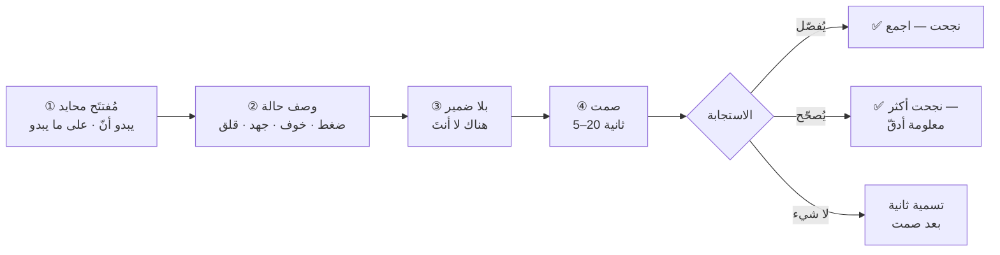

> [!info] الفصل 04 · كورس لعبة العقل
> **ماذا ستتعلّم:** الأداة الأولى في الكورس، مُفكَّكةً إلى **بنية من أربعة أجزاء** قابلة للتركيب: المُفتتَح المحايد · وصف الحالة · **اجتناب الضمير** · الصمت. ستعرف لماذا تُقلب التسمية على قائلها إن غاب أيّ جزء منها، وستُتقن أدقّ تفصيلة في الأداة كلّها — **الفرق بين «يبدو أنّ *هناك* خوفًا» و«يبدو أنّ*ك* خائف»** — الذي يُحوّل الجملة نفسها من تهدئة إلى اتّهام. وستتعلّم **قاعدتَي الحظر**: لا نصح داخل التسمية، ولا شخصنة؛ ولماذا «أعتقد أنّ عليك أن تهدأ» تُغضب أكثر ممّا لو لم تقل شيئًا. وستتعلّم **تدقيق الاتّهام** — أن تقول بصوتك ما جاء ليقوله — بشروطه الثلاثة وحالات فشله. وستفهم **مبدأ خيط الصيد**: أنّ تصحيح تسميتك مكسب لا خسارة، وأنّ التسمية أداة **استخراج** قبل أن تكون أداة تهدئة. ثم ستمرّ على **تسع حالات محلولة** من الكورس، وتخرج بجدول صياغات جاهزة، وقراءة نقدية لأهمّ ما لا تستطيع هذه الأداة فعله.

> [!abstract] التأصيل
> **يفترض أنّك تعرف:** [[Tactical Silence]]
> **ويُؤصّل لك:** [[Labeling]] · [[Accusation Audit]] · [[Nonviolent Communication]] · [[Fundamental Attribution Error]]

# الفصل 04 — التسمية: صناعة الجملة المحايدة

## 🎯 أهداف التعلّم

- **تركيب** تسمية سليمة من أجزائها الأربعة، والتحقّق منها بقائمة فحص قبل قولها.
- **التمييز** بين صياغة «هناك» وصياغة «أنت»، وشرح الأثر العصبي المختلف لكلٍّ منهما.
- **تشخيص** خمسة أنماط فشل شائعة في التسمية، وتصحيح كلّ نمط.
- **تطبيق** تدقيق الاتّهام بشروطه، وتحديد الحالات التي يفشل فيها أو يضرّ.
- **شرح** لماذا يُعدّ تصحيح الطرف الآخر لتسميتك نجاحًا للأداة لا فشلًا.
- **حلّ** موقف عمل حقيقي بتسمية مكتوبة بالنصّ، ونقدها بمعايير الفصل.
- **نقد** الأداة: ما الذي لا تستطيع التسمية فعله، ومتى يكون استخدامها خطأً.

---

## الفكرة المحورية: حوّل الشعور إلى شيء ملموس

> [!quote] من المحاضرة
> **حمزة:** «وأهمّ ما في التسمية أن **تُترجم المشاعر التي أمامك إلى شيء ملموس.** *حمزة غاضب* ← **«يبدو أنّك تحت ضغط من مديرك.»** ثم تقول **شكرًا، وتصمت.**»

الوصف يبدو بسيطًا إلى حدّ الاستهانة، وهو في الحقيقة **يصف تدخّلًا عصبيًّا مُوثَّقًا** — وهذه هي الأداة الوحيدة في الكورس التي لها سند تجريبي مباشر (انظر الفصل [[02 - بيولوجيا اللحظة - اللوزة والقشرة الجبهية|02]]، دراسة ليبرمان 2007).

ولفهم لماذا تعمل، لا بدّ من رؤية أنّها **تُؤدّي ثلاث وظائف في جملة واحدة**، وهذا ما يُفسّر كثافتها:

| الوظيفة | الآلية | الأثر المرصود |
|---|---|---|
| **① التهدئة** | تسمية الانفعال تنقل معالجته من التقييم السريع إلى المعالجة اللغوية | انخفاض حدّة النبرة؛ بطء الإيقاع |
| **② الاستخراج** | خيط صيد — يُثبَت أو يُصحَّح، وكلاهما معلومة | يبدأ في التفصيل بلا سؤال |
| **③ نزع الشخصنة** | تنقل الحديث من «أنا وأنت» إلى «الموقف» | يزول الدفاع؛ يُمكن الانتقال إلى الحلّ |

**والوظيفة الثانية هي الأقلّ فهمًا والأهمّ.** معظم من يتعلّم الأداة يستخدمها للتهدئة فقط، فيتوقّف بمجرّد أن يهدأ الطرف الآخر — ويكون بذلك قد أنفق الأداة ولم يجمع ثمرتها.

---

## أوّلًا: البنية الرباعية

بتجميع تعليمات المحاضر المتفرّقة، تتّضح بنية من أربعة أجزاء، **كلّ جزء منها ضروري ولكلّ غياب عَرَض**:

| الجزء | صياغته | ما يحدث إن غاب |
|---|---|---|
| **① المُفتتَح المحايد** | «يبدو أنّ…» · «على ما يبدو…» · «يظهر أنّ…» | الجملة تصير **تقريرًا** («أنت تحت ضغط») فيُقرأ ادّعاءً بمعرفة داخله — ويُقاوَم |
| **② وصف الحالة** | ضغط · خوف · قلق · جهد مبذول · إلحاح | إن وُصف **السلوك** بدل الحالة صارت اتّهامًا («يبدو أنّك لا تتعاون») |
| **③ اجتناب الضمير** | «هناك خوف» لا «أنت خائف» | **الجزء الأخطر** — ويُفصَّل في القسم التالي |
| **④ الصمت** | 5–20 ثانية | لا يُولَّد ضغط الفراغ؛ ولا تُجمَع المعلومة؛ **تُهدر الأداة** |

> [!quote] من المحاضرة
> **ياسر:** «*أفهم أنّك قلق جدًّا على مصلحة الشركة، وقلق جدًّا من أن نتخلّف عن المنافسين* — **ثم أصمت**.»
>
> **حمزة:** «ممتاز، ممتاز. أتُدرك أنّ كلمتَي **«ثم أصمت»** أهمّ من كلّ جملة قبلهما؟»

هذا الحكم من المحاضر ليس مبالغة بلاغية. التسمية بلا صمت تُشبه إلقاء الطُّعم وسحب الخيط فورًا: قد تُهدّئ لحظيًّا، لكنّها **لا تُنتج شيئًا**. والصمت هو ما يُحوّلها من عبارة لطيفة إلى أداة.

> [!warning] المزلق العملي — المزلق الأوّل عالميًّا
> **أشيع خطأ في هذه الأداة على الإطلاق: أن تقول التسمية ثم تُواصل الكلام.** ويحدث لسبب بسيط: الصمت بعد جملة تقولها لشخص غاضب **غير مريح لك أنت.** فتملأه أنت — فتنتقل إليك مسؤولية ملء الفراغ، وتضيع الأداة.
>
> ويُشخّصه المحاضر بدقّة: *«المشكلة التي نلقاها دائمًا […] أنّ **الناس يُواصلون** ويبدؤون في تقديم **النصيحة**.»*
>
> **التمرين العملي:** بعد كلّ تسمية، عُدّ في نفسك من 1 إلى 10 قبل أن تسمح لنفسك بالكلام. في الغالب لن تصل إلى 5.

---

## ثانيًا: أدقّ تفصيلة في الأداة — «هناك» لا «أنت»

هذه أهمّ فقرة في الفصل، وقد وُلدت في المحاضرة من اعتراض مشارك:

> [!quote] من المحاضرة
> **حمزة:** «**«يبدو أنّ هناك خوفًا من التغيير، لأنّ هناك خوفًا من عدم الالتزام.»**»
>
> **مشارك:** «لكن أليس هذا اتّهامًا له؟»
>
> **حمزة:** «لا — أنا قلت *«هناك خوف».* **لم أقل «أنت خائف».** انظروا: *«يبدو يا سيّدي أنّ**ك** خائف من عدم الالتزام»* — يُترجمها الدماغ فورًا وانتهى أمرك. أمّا *«يبدو أنّ **هناك** خوفًا من عدم الالتزام»* — **وصفتُ موقفًا؛ ولم أستخدم أيّ ضمير يتّهمك بشيء.**»

**لماذا يُحدث حرف واحد هذا الفرق؟** لأنّ الضمير يُحدّد **موقع المشكلة**:

| الصياغة | أين تقع المشكلة؟ | ما يُثيره | الاستجابة |
|---|---|---|---|
| «يبدو أنّ**ك** خائف» | **فيك** — سمة شخصية | تهديد المكانة | دفاع: «لستُ خائفًا» |
| «يبدو أنّ **هناك** خوفًا» | **في الموقف** — حالة يشترك فيها | لا تهديد | استكشاف: «نعم، لأنّ…» |

ولاحظ أنّ الفرق **ليس في اللطف**. الجملتان بالدرجة نفسها من الأدب. الفرق في **البنية المنطقية**: الأولى تُسند صفة إلى شخص فتفتح باب النفي؛ والثانية تُقرّر وجود حالة في الغرفة فتفتح باب الوصف.

ويُطبّق المحاضر القاعدة نفسها في مواضع متعدّدة، ويستحقّ جمعها:

| الصياغة الخاطئة | الصياغة الصحيحة | ما تغيّر |
|---|---|---|
| «الكود معقّد **عليك**» | «يبدو أنّ الكود معقّد» | نُزع تقييم القدرة |
| «يبدو أنّ**ك** تحت ضغط» | «يبدو أنّ هناك ضغطًا **على الفريق**» | وُزّع الضغط فلم يعد وتدًا يُعلَّق عليه العمل |
| «يبدو أنّ**ك** تشعر أنّ سكرم بلا قيمة» | «يبدو أنّ هناك فقدانًا للسيطرة على الفريق» | انتُزع الاتّهام من الأداة، ووُصفت الحالة |
| «يبدو أنّ هناك أشياء **لا تفهمها**» | «يبدو أنّ الكود معقّد» | وُصف الشيء لا الشخص |
| «هذه الميزات مهمّة في مشروع**كم**» | «هذه الميزات مهمّة في مشروع**نا**» | ضمير الجمع يُنشئ خندقًا واحدًا |

> [!quote] من المحاضرة
> **سماح:** «أستطيع أن أُخمّن وأقول: *يبدو أنّ هناك أشياء لا تفهمها.*»
>
> **حمزة:** «**هناك اتّهمتِه.**»
>
> **سماح:** «صحيح — اتّهمتُه.»
>
> **حمزة:** «بدلًا من ذلك: **«يبدو يا سيّدي أنّ الكود معقّد.» لم أتّهمه. أنا أصف الكود.**»

انتبه إلى أنّ سماح **التزمت بصياغة «هناك»** ومع ذلك اتّهمت. وهذا يكشف أنّ القاعدة أعمق من مجرّد اجتناب الضمير الظاهر:

> [!tip] القاعدة العملية — القاعدة الكاملة
> **اجتنب الضمير، واجتنب كلّ ما يُسنَد إلى الشخص ولو بلا ضمير.**
> «أشياء لا تفهمها» تحوي إسنادًا مُضمَرًا إلى قدرته. **والاختبار العملي:** حوّل جملتك إلى سؤال «مَن؟» — إن كان الجواب «هو»، فأنت تتّهم. اسأل: *مَن المعقّد؟* — الكود ✅ · *مَن الذي لا يفهم؟* — هو ❌.

> [!info] إضافة مرجعية — لماذا يعمل نزع الضمير: ثلاثة تفسيرات متكاملة
> **① خطأ الإسناد الأساسي (`Fundamental Attribution Error`)** — صاغه **لي روس (`Lee Ross`)** عام 1977: نميل إلى تفسير سلوك الآخرين بسماتهم الشخصية، وتفسير سلوكنا نحن بظروفنا. فحين تقول «أنت خائف» فأنت تُقدّم **تفسيرًا سماتيًّا** يعرف هو أنّه غير صحيح — لأنّه يرى ظرفه. فيُصحّح: «لستُ خائفًا، الوضع هو…». وحين تقول «هناك خوف» فأنت تُقدّم **تفسيرًا ظرفيًّا** يُطابق تجربته من الداخل، فيُوافق ويُكمل.
>
> **② تهديد المكانة في SCARF** — كلّ إسناد لسمة سلبية تهديد مباشر لمجال المكانة (انظر الفصل [[02 - بيولوجيا اللحظة - اللوزة والقشرة الجبهية|02]])، فيُنتج استجابة تهديد. أمّا وصف الموقف فلا يُهدّد مكانةً لأنّه لا يحمل حكمًا على أحد.
>
> **③ لغة الملاحظة عند روزنبرغ** — يبني **مارشال روزنبرغ (`Marshall Rosenberg`)** في *Nonviolent Communication* (2003) نموذجه على أربع خطوات أولاها **الملاحظة بلا تقييم**: أن تصف ما يُرى ويُسمَع فقط. وقاعدة «هناك لا أنت» تطبيق دقيق لهذا المبدأ.
>
> **لكن انتبه إلى فرق جوهري بين النموذجين:** روزنبرغ يطلب منك التعبير عن **مشاعرك واحتياجاتك أنت** («أشعر بالقلق لأنّي أحتاج وضوحًا»)؛ والكورس يطلب وصف **حالة الطرف الآخر** بلا إفصاح عن حالتك. والفارق ليس تفصيلًا: نموذج روزنبرغ **تبادلي** ويُنشئ تكافؤًا في الانكشاف؛ ونموذج الكورس **أحاديّ الاتّجاه** — وهو أكثر فاعلية في اللحظة الحادّة وغير المتكافئة سلطويًّا، لكنّه يُنتج على المدى الطويل عدم التكافؤ الذي نبّه إليه الفصل [[03 - التعاطف التكتيكي - الفهم غير الموافقة|03]] في قراءته النقدية.

---

## ثالثًا: قاعدتا الحظر

> [!quote] من المحاضرة
> **حمزة:** «شيئان عليك تجنّبهما أثناء صنع تسميتك. **أوّلًا: لا يجوز أن تنصح إطلاقًا** […] **ثانيًا: لا تأخذ كلام حمزة أو خالد على محمل شخصي أبدًا.**»

### الحظر الأوّل: لا نصح داخل التسمية

> [!quote] من المحاضرة
> **حمزة:** «*«يبدو يا خالد أنّك تحت ضغط من مديرك — أعتقد أنّ عليك أن تهدأ.»* عبارة «أعتقد أنّ عليك أن تهدأ» **ستُغضبه أكثر.** لماذا؟ لأنّك لم تقطع التيّار عن اللوزة الدماغية بعد […] وبقولك «عليك أن تهدأ» أنت في الحقيقة **تتّهمه بأنّه غير هادئ**، فتُثير غضبه أكثر.»

**والنصيحة تُبطل التسمية بثلاث آليات مجتمعة:**

| الآلية | التفصيل |
|---|---|
| **اتّهام مُضمَر** | «اهدأ» تعني «أنت غير هادئ» — وهي إسناد سمة، أي عودة إلى ما نُزع للتوّ |
| **إعلان تفوّق** | النصيحة تفترض أنّ الناصح يرى ما لا يراه المنصوح — وهذا تهديد مكانة |
| **إلغاء الصمت** | النصيحة تملأ الفراغ الذي كان سيُولّد الضغط، فتسقط الوظيفة الثانية للأداة |

> [!tip] القاعدة العملية — أين تذهب النصيحة إذن؟
> **النصيحة والخطّة والبند الإجرائي كلّها في النهاية.** والترتيب في هذا الكورس ثابت لا يُخالَف:
> **تسمية ← صمت ← دافع ← أسئلة معايرة ← ساندويتش ← بند إجرائي.**
> والنصيحة تقع في الموضع الخامس أو السادس؛ ووضعها في الأوّل يُبطل كلّ ما بعده.

### الحظر الثاني: لا شخصنة

> [!quote] من المحاضرة
> **حمزة:** «**ليس** صحيحًا أنّ من يعترض على سكرم يعترض على حمزة. ما شأن حمزة؟ **سكرم جسم معرفي؛ وحمزة إنسان وشخصية — وهما منفصلان.**»

وهذا امتداد لأداة **التجريد من الشخصي** التي بُنيت في الفصل [[03 - التعاطف التكتيكي - الفهم غير الموافقة|03]]، وأثرها هنا عمليّ جدًّا: **إن أخذتَ الهجوم شخصيًّا، فستكون التسمية التي تُنتجها دفاعية بالضرورة** — وسيُسمَع الدفاع في نبرتها ولو كانت صياغتها سليمة تمامًا.

---

## رابعًا: تدقيق الاتّهام — أن تقول ما جاء ليقوله

> [!quote] من المحاضرة
> **حمزة:** «أستخدم أداة اسمها **تدقيق الاتّهام**: **أقول بصوت عالٍ لخالد كلّ ما يريد أن يقوله لي.** لماذا؟ **لإطفاء اللوزة الدماغية** التي دخل بها مشحونًا أصلًا.
> > *«يا خالد، أنت تشعر أنّنا نُؤثّر على العمل؛ وتشعر أيضًا أنّ هذا المشروع ليس ضمن أولوياتنا، وأنّ المشروع مليء بالعيوب.»*»

هذه أقوى صيغة من التسمية، وتُستخدَم في حالة واحدة محدّدة: **حين تعلم مسبقًا بأنّ هجومًا قادم، ولا تستطيع الصمت.**

**والفرق بينها وبين التبرير هو محور الأداة:**

| | **التبرير** | **تدقيق الاتّهام** |
|---|---|---|
| **الصياغة** | «واجهتنا مشكلات فلن نُسلّم اليوم» | «يبدو أنّك تشعر أنّ هذا المشروع ليس ضمن أولوياتنا» |
| **الموقع** | يضع نفسك **متّهمًا** | يضع نفسك **فاهمًا** |
| **من يتكلّم أوّلًا** | أنت عن نفسك | أنت عنه |
| **حالته بعدها** | يُكمل الهجوم الذي جاء به | فُرّغت الشحنة؛ ينتقل إلى المنطق |
| **مصير الحقيقة** | تُقدَّم دفاعًا فتُقرأ عذرًا | تُقدَّم بعد التهدئة فتُقرأ معلومة |

> [!quote] من المحاضرة
> **حمزة:** «لاحظ ما حدث في تلك الحركة: **لم تُبرّر التأخير** — بل **قلتَ ما أراد من أمامك أن يقوله.** والفرق بين الاثنين هائل.»

**شروط الأداة الثلاثة** — وهي غير مذكورة صراحةً لكنّها تُستخرَج من استخداماتها في الكورس:

| الشرط | التفصيل | إن غاب |
|---|---|---|
| **① الدقّة** | أن تُصيب فعلًا ما سيقوله — لا اتّهامًا مُتخيَّلًا | يُقرأ استباقًا ساذجًا أو استخفافًا |
| **② الاستيعاب** | أن تذكر أشدّ ما سيقوله لا أخفّه | يُكمل الهجوم بما لم تذكره — فتُضاعف الضرر |
| **③ إتباعه بالحقيقة** | أن يعقبه إفصاح كامل بما تعرف | يصير **إخفاءً** — ويسقط في اختبار الشفافية |

> [!warning] المزلق العملي — حين يصير التدقيق تلاعبًا
> الشرط الثالث هو الفاصل الأخلاقي. تدقيق الاتّهام أداة **تُهيّئ لاستقبال الحقيقة**؛ فإن استُخدم **بدلًا** من الحقيقة صار خداعًا مُتقنًا.
>
> **مثال يجتاز الاختبار:** «يبدو أنّك تشعر أنّ هذا المشروع ليس ضمن أولوياتنا وأنّنا لا نُؤدّي عملنا.» *(صمت — يُفرّغ)* ثم: «الحقيقة أنّنا تأخّرنا أسبوعًا بسبب كذا، وهذه خطّة التعويض.»
> **مثال يسقط:** التسمية نفسها ثم الانتقال إلى موضوع آخر، والخروج من الاجتماع بلا ذكر التأخير.

ويُقدّم المحاضر تطبيقًا مهمًّا للأداة في حالة البريد الإلكتروني:

> [!quote] من المحاضرة
> **حمزة:** «**في اللحظة التي يقع فيها سوء فهم في أيّ وسيط مكتوب — بريد، تيمز، واتساب — نتوقّف. لا نردّ** […] وندخل بـ**تدقيق اتّهام.** أبدأ الكلام قبل أن يبدأ.»

> [!tip] القاعدة العملية — قاعدة الوسيط
> **لا تُطبَّق أدوات هذا الكورس في الوسائط المكتوبة.** والسبب بنيويّ لا ذوقيّ:
> - **الصمت لا يُقرأ في النصّ** — بل يُقرأ تجاهلًا. والصمت نصف الأداة.
> - **النبرة تُقرأ بحالة القارئ لا بنيّة الكاتب** — فالتسمية المكتوبة لشخص غاضب تُقرأ سخرية أو تعالمًا.
> - **النصّ يُحفَظ ويُعاد قراءته ويُعاد توجيهه** — بينما التسمية مصمّمة للحظتها.
> **والإجراء:** حوّل إلى مكالمة أو اجتماع، وادخل بتدقيق اتّهام. أمّا الردّ المكتوب فيقتصر على: «موضوع مهمّ — نتّصل خلال ساعة؟»

---

## خامسًا: خيط الصيد — التصحيح مكسب

> [!quote] من المحاضرة
> **حمزة:** «وإن قلتُ لخالد *«يبدو أنّك تشعر أنّ هناك ضغطًا في العمل»*، فقال خالد *«لا يا حمزة، ليست مسألة ضغط إطلاقًا — الكود صعب فحسب»* […] فعليّ **ألّا** أتعامل مع تصحيح جملتي على أنّه اعتراض. بل على العكس، **آخذه بسرور**، لأنّي استخرجتُ **المعلومة الصحيحة**.
>
> نحن نرى التسمية **خيط صيد**: هل أعاد الخيط المعلومة الصحيحة أم لا؟»

هذا **إعادة تعريف لمعيار النجاح**، وهو من أهمّ ما في الفصل — لأنّه يُحرّرك من الحاجة إلى الإصابة في المحاولة الأولى.

| المعيار | ما يُنتجه من سلوك |
|---|---|
| **«نجحت إن أصبتُ الشعور»** | تردّد قبل الكلام · تسميات غامضة للأمان · خوف من الخطأ |
| **«نجحت إن تكلّم»** | تسميات محدّدة وجريئة · قبول التصحيح · **جمع معلومة في كلّ الأحوال** |

**والمصفوفة الكاملة لنتائج التسمية:**

| ما يحدث بعد الصمت | التشخيص | الإجراء التالي |
|---|---|---|
| يُفصّل ويشرح | ✅ إصابة | استمع؛ اجمع؛ لا تُقاطع |
| يُصحّح («لا، بل…») | ✅✅ **إصابة أفضل** — معلومة أدقّ | «الكود صعب؟» *(مرآة)* ثم صمت |
| يُومئ ويصمت | 🟡 غير حاسم | تسمية ثانية بزاوية مختلفة، **بعد صمت** |
| يهدأ ولا يتكلّم | 🟡 هدأ ولم يُفصح | انتقل إلى سؤال معايَر: «كيف نصل إلى…؟» |
| يزداد حدّة | ❌ فشل | راجع: أضمير؟ أنصيحة؟ أنبرة ساخرة؟ |

> [!quote] من المحاضرة
> **حمزة:** «إن لم تُنتج التسمية نتيجة — وستعرف ذلك خلال **خمس إلى عشرين ثانية من الصمت** — تُلقي تسمية ثانية، وثالثة، ورابعة، حتى يتكلّم من أمامك. لكن **لا تُلقِ** تسميات متتالية **بلا صمت بينها** أبدًا.»

---

## سادسًا: تسع حالات محلولة

يُمرّر الكورس المجموعة على تسعة سيناريوهات لتدريب التسمية. وجمعها في جدول واحد يُظهر **نمطًا** لا تُظهره الحالات مفردة: أنّ التسمية الناجحة تصف دائمًا **الدافع الكامن** لا **السلوك الظاهر**.

| # | الجملة كما قيلت | السلوك الظاهر | الدافع الكامن | **التسمية** |
|---|---|---|---|---|
| 1 | «العميل اتّصل ويريد هذه الميزة هذا الأسبوع» | تغيير أولويات | ضغط عميل عليه هو | «يبدو أنّ العميل يضغط عليك» |
| 2 | «لن أُغيّر البنية، كودي نظيف 100%» | رفض تقني | جهد كبير مبذول | «يبدو أنّ جهدًا كبيرًا بُذِل في هذا الكود» |
| 3 | «أموالي تضيع، أحتاج العمل على الهواء الآن» | إلحاح | خوف تنافسي | «يبدو أنّ هناك قلقًا على مصلحة الشركة وأن نتخلّف عن المنافسين» |
| 4 | «منذ طبّقنا سكرم لا التزام» | هجوم على الإطار | **فقدان السيطرة** | «يبدو أنّ هناك فقدانًا للسيطرة على الفريق» |
| 5 | *(صمت في السكرم اليومي)* | انسحاب | خوف من الحكم عليه | «يبدو أنّ الكود معقّد» |
| 6 | «أضيفوا هذا، لن يأخذ ساعة» | نطاق مجّاني | حاجة تنافسية غير مدروسة | «يبدو أنّ هذه اللوحة مهمّة جدًّا لك» |
| 7 | «تفتحون عيوبًا تافهة وتُخرّبون مقاييسنا» | هجوم على ضبط الجودة | **خوف من شكل التقارير أمام الإدارة** | «يبدو أنّ هناك قلقًا من شكل التقارير أمام الإدارة» |
| 8 | «خارطة الطريق مُعتمَدة ولا مجال للتغيير» | جمود | خوف من عدم الالتزام | «يبدو أنّ هناك خوفًا من التغيير، لأنّ هناك خوفًا من عدم الالتزام» |
| 9 | *(اجتماع استعادي صامت)* | إحباط جماعي | إنهاك من سبرنت سابق | «يبدو أنّ ضغطًا شديدًا كان في السبرنت الماضي» |

> [!tip] القاعدة العملية — قاعدة استخراج التسمية
> **اسأل نفسك سؤالين قبل أن تُصيغ:**
> 1. **ما الذي يخافه؟** (لا: ما الذي يطلبه؟)
> 2. **كيف أصف ذلك الخوف بلا أن أنسبه إليه؟**
>
> جرّبها على الحالة السابعة: يطلب تقليل بلاغات العيوب؛ ويخاف أن تُقرأ كثرة العيوب حكمًا عليه أمام الإدارة. فالتسمية تصف الخوف من التقارير — **لا العيوب ولا ضبط الجودة.**

---

## 🗣️ بنك العبارات — التسمية

| الموقف | العبارة الخاطئة | العبارة الصحيحة | لماذا |
|---|---|---|---|
| شخص صامت في اجتماع | «لماذا لا تتكلّم؟» | «يبدو أنّ هناك أشياء تجعل الكلام صعبًا هنا» | السؤال المباشر يُقرأ اتّهامًا |
| شخص يُومئ وأنت تعلم أنّه غير مقتنع | «هل أنت موافق فعلًا؟» | «يبدو أنّ هناك علامات استفهام على العملية الحالية» | يُتيح الاعتراض بلا مواجهة |
| هجوم على أداة تديرها | «جيرا ليست المشكلة» | «يبدو أنّكم تشعرون أنّ هذه العملية تُعطّلكم عن العمل» | الأداة ليست ملكك — انتزاع الشخصنة |
| بعد تسمية، وأنت تريد أن تُضيف | «…وأعتقد أنّ علينا…» | *(صمت 10 ثوانٍ)* | النصيحة تُبطل التسمية |
| اجتماع طال وضجر الناس | «لقد أطلنا وأضجرناكم» | «يبدو أنّنا أطلنا أكثر ممّا يلزم» | «هناك/نحن» لا «أنتم» |
| ستدخل اجتماعًا وأنت متأخّر | «واجهتنا مشكلات فلن نُسلّم» | «يبدو أنّك تشعر أنّ هذا المشروع ليس ضمن أولوياتنا» *(صمت)* ثم الحقيقة كاملة | تدقيق اتّهام + إفصاح |
| بريد غاضب من عميل | ردّ مكتوب مُفصَّل | «موضوع مهمّ — نتّصل خلال ساعة؟» ثم تدقيق اتّهام في المكالمة | الصمت لا يُقرأ في النصّ |
| شخص تحت ضغط فردي | «أفهم أنّك تحت ضغط» | «أفهم أنّ هناك ضغطًا على الفريق» | لا تُعطه وتدًا يُعلّق عليه العمل |

---

## 🧪 ورشة الفصل — بناء عشر تسميات

| الخطوة | العمل | المُخرَج |
|---|---|---|
| **1** | اكتب عشر جُمَل صعبة تُقال لك فعلًا في عملك — بنصّها الحرفي | عشر جُمَل |
| **2** | لكلّ جملة، اكتب في عمود: **ما الذي يخافه؟** لا ما الذي يطلبه | عشرة دوافع |
| **3** | صُغ لكلّ واحدة تسمية بالنصّ الكامل | عشر تسميات |
| **4** | مرّرها على قائمة الفحص الخماسية أدناه، وعدّل | نسخة منقّحة |
| **5** | احفظ ثلاثًا منها حرفيًّا — الأكثر تكرارًا في عملك | ثلاث جُمَل محفوظة |
| **6** | طبّق واحدة أسبوعيًّا، وسجّل بعدها: أفصّل؟ أصحّح؟ أصمت؟ | سجلّ نتائج |

> [!tip] قائمة الفحص الخماسية — قبل أن تقول أيّ تسمية
> 1. **أتبدأ بمُفتتَح محايد؟** (يبدو أنّ · على ما يبدو)
> 2. **أتصف حالة أم سلوكًا؟** (ضغط ✅ · عدم تعاون ❌)
> 3. **أخالية من الضمير ومن أيّ إسناد إليه؟** (اختبار: مَن؟ — إن كان الجواب «هو»، أعِد الصياغة)
> 4. **أخالية من أيّ نصيحة، ولو مُضمَرة؟**
> 5. **أأنا مستعدّ للصمت عشر ثوانٍ بعدها؟** (إن كنتَ غير مستعدّ، فلا تقلها)

---

## القراءة النقدية — أين يقصر هذا الطرح؟

**1. تُقدَّم الأداة بلا معدّل استخدام آمن.** التسمية أداة **لافتة** — بنيتها اللغوية غير مألوفة في الحديث العادي، فتُلاحَظ إن تكرّرت. ولا يذكر الكورس هذا إطلاقًا. والنتيجة العملية: من يُطبّقها في كلّ تفاعل سيسمع بعد أسابيع «دعك من هذا الكلام». **والقاعدة المفقودة:** التسمية للمواقف عالية الاستثارة فقط — لا للتفاعلات العادية؛ وحين يهدأ الطرف الآخر، **انتقل إلى الكلام العادي.** الأداة المستخدَمة على الدوام تفقد كونها أداة.

**2. لا يُعالَج التصادم الثقافي واللغوي.** صيغة «يبدو أنّ هناك…» في العربية الفصحى تُنتج ارتفاعًا في مستوى اللغة قد يُقرأ **تكلّفًا** في بيئة عمل عامّيّة. والمحاضر نفسه يُلقيها بالعامّية المصرية بنبرة عادية، وهو ما لا ينتقل إلى الكتابة. **والتصحيح العملي:** استخرج المبدأ (لا ضمير، وصف حالة، صمت) وصُغه بلهجتك ومستوى لغة فريقك المعتاد. الصياغة الحرفية نموذج لا نصّ مقدّس.

**3. لا تُعالَج حالة التسمية الصحيحة التي لا يريد صاحبها الاعتراف بها.** إن سمّيتَ خوفًا حقيقيًّا لدى شخص يرى الاعتراف بالخوف إضعافًا لمكانته — وهو نمط شائع لدى الأقدم خبرةً — فالتسمية الدقيقة قد تُنتج **إنكارًا حادًّا** لا انفتاحًا. والكورس يُصنّف التصحيح كلّه مكسبًا، وهذا صحيح معلوماتيًّا وغير كافٍ علائقيًّا. **والمعالجة المفقودة:** حين تتوقّع حساسية مكانة، انقل التسمية إلى **الفريق أو الموقف** بدل الشخص («يبدو أنّ هناك ضغطًا على الفريق كلّه») — وهو ما فعله المحاضر نفسه في حالة الأوّل الذي يرفض مراجعة الكود، **بلا أن يُصرّح بالقاعدة.**

**4. الحدّ الفاصل بين التسمية والتخمين غير مرسوم.** «يبدو أنّ هناك خوفًا من فقدان السيطرة» تسمية دقيقة إن كانت مبنيّة على قرائن. وهي **تخمين مُلبَّس بثقة** إن قيلت بلا معطيات. والأداة نفسها لا تُفرّق، والصياغة نفسها تحتمل الاثنين. **والمعيار المفقود:** قبل أن تُسمّي، اسأل: *ما القرينة؟* — جملة قالها، أو نبرة، أو سياق تعرفه. فإن لم تكن هناك قرينة، فلا تُسمِّ؛ **استخدم مرآة** — لأنّها لا تفترض شيئًا وتُعيد كلامه هو.

**5. الأداة أحاديّة الاتّجاه بنيويًّا، وهذا يُنتج عدم تكافؤ متراكم.** كلّ استخدام للتسمية يُنتج معلومة عن الطرف الآخر ولا يُنتج شيئًا عنك. وتراكم ذلك عبر أشهر يُنشئ علاقة يعرف فيها أحد الطرفين عن الآخر أضعاف ما يُعرَف عنه. وهذا يُنتج **ثقة سطحية وبُعدًا عميقًا** — وهو ما يُفسّر ملاحظة يُبديها بعض من يعملون مع مُتقني هذه الأدوات: أنّهم «مريحون في التعامل ولا يُعرَفون». والعلاج ليس ترك الأداة، بل **إضافة إفصاح محسوب** في المواضع المناسبة: أن تذكر ضغطك أنت مرّة، لا لتُبرّر بل ليعرف فريقك مع من يعمل.

---

## 🧾 خلاصة الفصل

1. **التسمية ثلاث وظائف في جملة:** تهدئة · **استخراج** · نزع شخصنة — وأكثرها إهمالًا الثانية.
2. **بنية رباعية:** مُفتتَح محايد · وصف حالة · بلا ضمير · صمت — وكلّ غياب له عَرَض.
3. **«هناك» لا «أنت»** — لأنّ الضمير يُحدّد موقع المشكلة: فيه فيُنكر، أو في الموقف فيُوصَف.
4. **القاعدة أعمق من الضمير:** اجتنب كلّ إسناد إليه ولو مُضمَرًا — اختبار «مَن؟».
5. **لا نصح داخل التسمية** — النصيحة اتّهام مُضمَر وإعلان تفوّق وإلغاء للصمت.
6. **تدقيق الاتّهام** ثلاثة شروط: الدقّة · الاستيعاب · **وإتباعه بالحقيقة** — والثالث هو الفاصل الأخلاقي.
7. **لا تُطبَّق هذه الأدوات كتابةً** — الصمت لا يُقرأ، والنبرة تُقرأ بحالة القارئ.
8. **التصحيح مكسب:** معيار النجاح «هل تكلّم؟» لا «هل أصبتُ؟».
9. **التسمية تصف الدافع الكامن لا السلوك الظاهر** — والسؤال المولّد: *ما الذي يخافه؟*
10. **حدودها:** تتآكل بالتكرار · تحتاج قرينة وإلّا صارت تخمينًا · وقد تُثير إنكارًا لدى حسّاسي المكانة · وهي أحاديّة الاتّجاه فتحتاج إفصاحًا مقابلًا.

---

## ❓ اختبارات ذاتية

> [!question]- 1) صُغ تسمية لهذه الجملة: «كلّ مرّة تقولون لنا في الريترو إنّكم ستُحسّنون، ولا يتغيّر شيء.» ثم انقد صياغتك.
> **الدافع الكامن أوّلًا:** ماذا يخاف؟ لا يخاف الاجتماع الاستعادي نفسه. الأرجح أنّه يخاف أنّ **مشاركته بلا جدوى** — أنّه سيتكلّم مرّة أخرى ولن يتغيّر شيء، فيبدو ساذجًا أمام نفسه وأمام الفريق.
> **صياغة صحيحة:** «يبدو أنّ هناك إحباطًا من أنّ ما يُقال في الريترو لا يصل إلى تنفيذ.» ← ثم صمت.
> **نقد الصياغة:** ① مُفتتَح محايد ✅ ② تصف حالة (إحباط) لا سلوكًا ✅ ③ اختبار «مَن؟»: *مَن الذي لا يصل إلى تنفيذ؟* الجواب: **ما يُقال** — لا هو ولا أنت ✅ ④ لا نصيحة ✅.
> **صياغات كانت ستفشل:** «يبدو أنّك محبَط» (ضمير) · «يبدو أنّك لا تثق بالعملية» (إسناد سمة + اتّهام) · «يبدو أنّ هناك إحباطًا، وأقترح أن نُتابع البنود» (نصيحة تُبطل الصمت) · «يبدو أنّنا لم نُنفّذ ما وعدنا به» (**اعتراف لا تسمية** — نقلتَ الحديث إليك وأغلقتَ باب الاستخراج).
> **ولاحظ الأخيرة تحديدًا:** الاعتراف قد يكون صحيحًا وواجبًا — لكن موضعه بعد أن يتكلّم هو، لا قبله.

> [!question]- 2) ألقيتَ تسمية دقيقة على مطوّر أوّل، فقال بحدّة: «لستُ خائفًا من شيء، ولا أعرف من أين أتيتَ بهذا.» ما الذي حدث، وما التصحيح؟
> **أوّلًا: هذا ليس فشلًا بالضرورة.** بحسب مبدأ خيط الصيد، التصحيح معلومة. وحدّة الردّ نفسها معلومة إضافية: **الحدّة تتناسب طردًا مع دقّة الإصابة** حين تكون المكانة على المحكّ.
> **والتشخيص الأرجح:** أصبتَ الشعور وأخطأتَ في **من نُسِب إليه**. وهذا نمط الفشل الثالث في القراءة النقدية: تسمية صحيحة لدى شخص يرى الاعتراف بالخوف إضعافًا لمكانته — وهو نمط شائع تحديدًا لدى الأقدم خبرةً، لأنّ مكانتهم مبنيّة على الكفاءة الظاهرة.
> **والتصحيح ليس التراجع** — التراجع يُؤكّد أنّك كنتَ تتّهم. **بل النقل إلى مستوى الفريق أو الموقف:** «معك حقّ — الأدقّ أنّ هناك ضغطًا على الفريق كلّه في هذا التسليم.» ← صمت.
> ما فعلتَه: قبلتَ تصحيحه (فحفظتَ مكانته)، وأعدتَ التسمية على مستوى لا يُهدّده، **واحتفظت بالمضمون كاملًا.** وغالبًا سيُكمل هو من هذه النقطة.
> **وللمستقبل:** حين تتوقّع حساسية مكانة، **ابدأ** على مستوى الفريق ولا تنزل إلى الفرد — وهو بالضبط ما فعله المحاضر في حالة الأوّل الذي رفض مراجعة الكود.

> [!question]- 3) عميل أرسل بريدًا: «هذا غير مقبول إطلاقًا. نحن ندفع منذ ستّة أشهر ولم نرَ شيئًا.» زميلك يقترح ردًّا بتدقيق اتّهام مكتوب. ما رأيك؟
> **الاقتراح خاطئ لثلاثة أسباب بنيوية لا ذوقية.**
> **الأوّل:** تدقيق الاتّهام يعتمد على **الصمت بعده** — والصمت لا وجود له في النصّ. ما يحدث فعليًّا أنّه سيقرأ تسميتك ثم يكتب ردًّا فورًا، بلا الفجوة التي تُتيح انخفاض الاستثارة.
> **الثاني:** النبرة في النصّ تُقرأ **بحالة القارئ لا بنيّة الكاتب**. وهو الآن في حالة عالية الاستثارة، فسيقرأ «يبدو أنّك تشعر أنّنا لا نُؤدّي عملنا» **تعالمًا أو استخفافًا** — وهو أسوأ ما يمكن أن يقع.
> **الثالث، والأخطر تجاريًّا:** البريد **يُحفَظ ويُعاد توجيهه.** وتدقيق الاتّهام يتضمّن ذكرك أنت لاتّهامات ثقيلة بصوتك — «لا نُؤدّي عملنا»، «لسنا أولوية». وحين يُعاد توجيهه إلى إدارته، تكون هذه الجُمَل قد صارت **مكتوبة بقلمك أنت** بلا سياقها الشفوي ولا ما تلاها.
> **والإجراء الصحيح:** ردّ من سطر واحد: *«موضوع مهمّ ونحتاج أن نتناوله معًا — أتناسبك مكالمة اليوم في الرابعة؟»* ثم ادخل المكالمة بتدقيق الاتّهام كاملًا، **متبوعًا بالحقيقة كاملة** وخطّة بمواعيد. ثم أرسل بعدها بريدًا يُوثّق **ما اتُّفق عليه فقط** — لا التسميات.

> [!question]- 4) متى تكون المرآة أفضل من التسمية، ولماذا؟
> **في ثلاث حالات محدّدة، وكلّها تعود إلى فرق بنيوي واحد: التسمية تفترض، والمرآة لا تفترض.**
> **الأولى — حين لا تملك قرينة.** التسمية تحتاج معطىً يُبنى عليه الافتراض؛ فإن لم تملكه صارت تخمينًا مُلبَّسًا بثقة، وإن أخطأتَ خسرتَ مصداقيتك. أمّا المرآة فتُعيد كلامه هو — فلا تحمل افتراضًا يمكن أن يخطئ.
> **والثانية — مع العدواني البحت.** وقد أشار المحاضر إلى الفارق بعكس اتّجاهه: سأل سماح *«إن كان من أمامك عدوانيًّا بحتًا، هل تستطيعين تكرار كلامه عليه؟»* فأجابت أنّها قد تُضيف زيتًا على النار، فأقرّها. لكنّ التطبيق العملي في الكورس يُظهر العكس في حالات الهجوم بالتعميم — «كلّ كود فريقك عيوب؟» — لأنّ إعادة التعميم إلى أذنه تجعله **يسمع مبالغته**. والتوفيق بين الموقفين في النبرة: **مرآة بنبرة دهشة خفيفة تعمل؛ ومرآة بنبرة تحدٍّ تُشعل.**
> **والثالثة — مع من هو حسّاس تجاه أن يُقرَأ.** بعض الناس يُزعجهم أن يُوصَف شعورهم أصلًا، ويقرؤونه تطفّلًا. والمرآة لا تصف شعورًا؛ تُعيد كلمات.
> **والقاعدة الجامعة:** **التسمية حين تعرف · المرآة حين لا تعرف.** وحين تكون في شكّ، ابدأ بالمرآة — فهي أرخص خطأً؛ ثم اصعد إلى التسمية بعد أن يُفصّل ويُعطيك القرينة.

---

## 📚 مراجع الفصل

| المرجع | الصلة |
|---|---|
| Chris Voss — *Never Split the Difference* (2016) | المصدر المباشر للتسمية وتدقيق الاتّهام |
| Lieberman et al. — *Putting Feelings Into Words* (2007) | **السند التجريبي المباشر للأداة** |
| Lee Ross — *The Intuitive Psychologist…* (1977) | خطأ الإسناد الأساسي — لماذا «أنت خائف» يُنكَر |
| Marshall Rosenberg — *Nonviolent Communication* (2003) | الملاحظة بلا تقييم؛ والفرق بين النموذجين في التبادلية |
| David Rock — *SCARF* (2008) | تهديد المكانة — لماذا يُقاوَم الإسناد الشخصي |
| المصدر الأساس | [[1.2 التسمية - الأداة والتمارين]] · [[1.3 المرايا - الأداة والتمارين]] |

---

## 🔗 روابط ذات صلة

**السابق:** [[03 - التعاطف التكتيكي - الفهم غير الموافقة]] · **التالي:** [[05 - المرآة وضغط الفراغ]]
**مصدر السجلّ:** [[1.2 التسمية - الأداة والتمارين]]
**مفاهيم:** [[02 - بيولوجيا اللحظة - اللوزة والقشرة الجبهية]] · [[ملحق أ - بنك السيناريوهات العملية]] · [[معجم المصطلحات]]

---

> [!note] قواعد تحرير مُلزِمة في هذه القاعدة
> - كلّ اقتباس من المحاضرة داخل `> [!quote] من المحاضرة`؛ وكلّ معرفة خارجية داخل `> [!info] إضافة مرجعية`.
> - **كلّ أداة تُقدَّم بصياغة حرفية قابلة للنسخ** — أداة بلا جملة جاهزة أداة لم تُدرَّس.
> - كلّ فصل ينتهي بقراءة نقدية صريحة.
