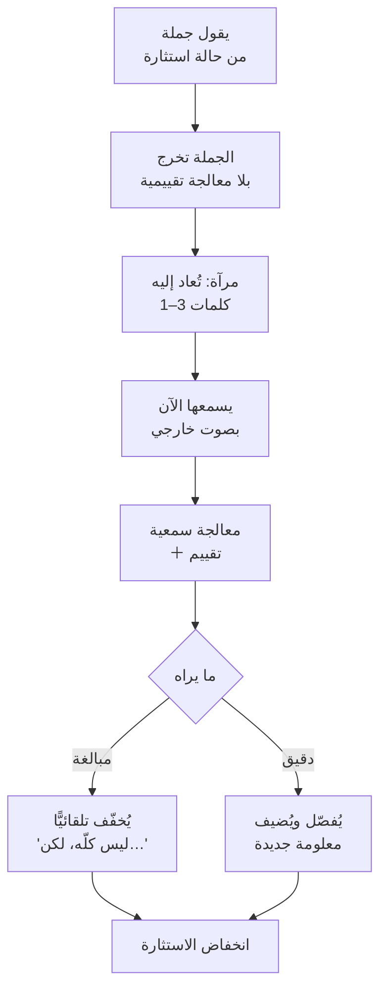

> [!info] الفصل 05 · كورس لعبة العقل
> **ماذا ستتعلّم:** الأداة التي يصفها المحاضر بأنّها «أسهل من التسمية» وهي في الحقيقة **أدقّها ميكانيكيًّا**. ستعرف لماذا تُشغّل المرآة مركز المنطق لدى الطرف الآخر، وكيف تُؤدّي وظيفة **«لماذا» من دون أن تنطقها** — وهو الحلّ الذي يجعل حظر «لماذا» في الفصل الثامن ممكنًا أصلًا. وستُتقن **الميكانيكا الأربع** التي يُصرّ عليها المحاضر: من كلمة إلى ثلاث كلمات · ثلاث ثوانٍ قبلها · الجسد والعينان معها · والصمت بعدها — و**كيف يقلب أيّ خلل فيها المرآة إلى سخرية**، وهو أخطر انقلاب في الكورس كلّه. وستتعلّم **ضغط الفراغ** بوصفه الآلية الحقيقية خلف الأداة، وعلاقته بقاعدة **الأسباب الخمسة** اليابانية. وستمرّ على **سبع حالات محلولة**، وستفهم **قاعدة الوسيط** — لماذا لا تُؤدّى المرآة كتابةً أبدًا. ثم قراءة نقدية لما تُخفيه سهولتها الظاهرة.

> [!abstract] التأصيل
> **يفترض أنّك تعرف:** [[Labeling]] · [[Tactical Silence]]
> **ويُؤصّل لك:** [[Mirroring]]

# الفصل 05 — المرآة وضغط الفراغ

## 🎯 أهداف التعلّم

- **تركيب** مرآة سليمة: اختيار الكلمات، والنبرة، والتوقيت.
- **شرح** لماذا تُنتج المرآة تفصيلًا طوعيًّا بينما يُنتج السؤال المباشر تبريرًا دفاعيًّا.
- **تشخيص** الانقلاب إلى السخرية قبل وقوعه، وتحديد أيّ عنصر ميكانيكي تسبّب فيه.
- **تطبيق** سلسلة مرايا متتابعة للوصول إلى الدافع الجذري، على غرار الأسباب الخمسة.
- **الاختيار** بين المرآة والتسمية بمعيار واضح في موقف حقيقي.
- **نقد** الأداة: أين تفشل، ومتى تكون ضارّة، وما الذي لا تُقدّمه.

---

## الفكرة المحورية: أن تسأل «لماذا» بلا أن تقولها

> [!quote] من المحاضرة
> **حمزة:** «فاستخدمتُ المرآة لأنّي **أريد أن أقول «لماذا» — لكنّي لا أستطيع إجراء استجواب مباشر.** لا أستطيع أن أقول *لماذا ثلاثة أيّام؟* — سأبني فيه حواجز دفاعية […] **أحتاج أن أعرف لماذا ثلاثة أيّام، لكنّي سأُجري استجوابًا غير مباشر عبر المرآة: «ثلاثة أيّام؟»** تلك هي الحيلة.»

هذه الجملة تحلّ **معضلة بنيوية** في الكورس كلّه. فالفصل [[08 - الإزاحة والأسئلة المعايرة|08]] يحظر «لماذا» حظرًا قاطعًا؛ لكنّ الحاجة إلى معرفة السبب لا تزول. فما البديل؟

المرآة هي البديل. **تُؤدّي وظيفة «لماذا» الاستفهامية بلا حمولتها الاتّهامية.** والفرق بينهما ليس فرقًا في التهذيب بل في **ما يُطلَب من الطرف الآخر أن يفعله**:

| | **«لماذا ثلاثة أيّام؟»** | **«ثلاثة أيّام؟»** |
|---|---|---|
| **ما يُطلَب منه** | أن **يُبرّر** موقفه | أن **يُوضّح** ما قاله |
| **ما يفترضه السؤال** | أنّ في الأمر ما يستحقّ التبرير | لا شيء |
| **الحالة العصبية الناتجة** | دفاع — تهديد مكانة | استكشاف |
| **ما يُنتجه** | مبرّرات مُعدّة سلفًا | **معلومة لم يكن سيقولها** |
| **موضع المبادرة** | معك — أنت تستجوب | معه — هو يُقرّر ماذا يُضيف |

> [!quote] من المحاضرة
> **حمزة:** «**الاستجواب المباشر** — *«ولماذا فعلت ذلك يا خالد؟»* — يُولّد في خالد **حواجز دفاعية**: *يا سيّدي، لا تستطيع أن تتّهمني بهذا؛ فعلتُه بسبب واحد واثنين وثلاثة* — فيبدأ في مهاجمتك ومهاجمة الشركة. لاحظوا **التبرير الخاطئ**.»

**وعبارة «التبرير الخاطئ» دقيقة ومهمّة:** المشكلة ليست أنّه لن يُجيب — بل أنّه **سيُجيب إجابة مُعدّة للدفاع لا للوصف.** فتخرج بمعلومة، لكنّها معلومة عن كيف يُدافع لا عن ما يجري فعلًا.

---

## أوّلًا: الآلية — لماذا تعمل المرآة

> [!quote] من المحاضرة
> **حمزة:** «هنا **أُكرّر كلام من أمامي.** وحين أُكرّر كلامه، **أُشغّل مركز المنطق لديه** […] **ماذا فعلتُ؟ قلتُ له: انتبه إلى ما قلتَه للتوّ — من دون أن أقول «انتبه إلى ما قلتَه».** لأنّ دماغه ترجمها فورًا؛ وأذنه هو استقبلت الكلمات التي قالها. ولاحظوا: **الإنسان الغاضب لا يسمع نفسه.**»

الجملة الأخيرة — «الإنسان الغاضب لا يسمع نفسه» — هي جوهر الآلية، وتستحقّ تفكيكًا:

**ثلاث آليات متراكبة تُفسّر الأثر:**

| الآلية | التفصيل |
|---|---|
| **① الاستماع الذاتي** | الكلام المُنتَج تحت استثارة يمرّ بمعالجة تقييمية أقلّ. وإعادته من فم آخر تُدخله عبر القناة السمعية، فتُعالَج بوصفها **مُدخَلًا لا مُخرَجًا** — والفرق حاسم |
| **② إشارة الإنصات** | تكرار كلماته هو أوضح دليل ممكن على أنّك سمعت — أوضح من «أفهمك» التي يمكن قولها بلا استماع |
| **③ الفراغ المُوجَّه** | المرآة تفتح موضوعًا محدّدًا ثم تصمت — فيملأ الفراغ **في ذلك الموضع تحديدًا** لا في أيّ مكان |

والآلية الثالثة هي ما يُميّز المرآة عن الصمت المجرّد: **الصمت يُولّد ضغطًا؛ والمرآة تُوجّهه.**

> [!info] إضافة مرجعية — من روجرز إلى فوس: تحوّل الغرض
> تقنية إعادة الصياغة أقدم بكثير من أدبيات التفاوض. طوّرها **كارل روجرز (`Carl Rogers`)** في العلاج المتمركز حول العميل (`Client-Centered Therapy`, 1951) تحت اسم **الإنصات الانعكاسي (`reflective listening`)**، بوصفها أداةً لإيصال **التقدير الإيجابي غير المشروط** — أي أن يشعر المتحدّث بأنّه مسموع ومقبول بلا حكم.
>
> **والتحوّل الذي أجراه فوس — وينقله المحاضر — تحوّل في الغرض لا في التقنية:**
>
> | | **روجرز (علاجي)** | **فوس/الكورس (تفاوضي)** |
> |---|---|---|
> | **الغرض** | أن يشعر بأنّه مسموع؛ الاستبصار الذاتي غاية | **استخراج معلومة** لاتّخاذ قرار |
> | **الطول** | إعادة صياغة كاملة للمعنى | **1–3 كلمات فقط** |
> | **من يملك جدول الأعمال** | العميل | **أنت** — أنت تختار أيّ كلمات تُعيد |
> | **معيار النجاح** | تعمّق ذاتي | معلومة جديدة تُغيّر قرارك |
>
> **والاختصار إلى ثلاث كلمات ليس تبسيطًا — إنّه ما يُحوّل الأداة من إنصات إلى استقصاء.** فحين تُعيد إعادة صياغة كاملة، تُعيد كلّ ما قاله فلا تُوجّه شيئًا. وحين تُعيد ثلاث كلمات بعينها، **فأنت تختار أيّ خيط يُسحَب** — وهذا اختيار يخدم غرضك أنت.
>
> **وهذا موضع يستحقّ صراحةً في الحدّ الأخلاقي:** المرآة أداة توجيه لا إنصات محايد. فاختيارك للكلمات الثلاث قرار تفاوضي. وهي تجتاز اختبار الشفافية ما دامت تُوجّه نحو معلومة تحتاجها فعلًا؛ وتسقط فيه إن كانت تُوجّه نحو تصريح تنوي استخدامه ضدّه.

---

## ثانيًا: الميكانيكا الأربع

> [!quote] من المحاضرة
> **حمزة:** «تطبيق المرآة: نُكرّر **كلمة واحدة، أو ما يصل إلى ثلاث كلمات**، قالها الطرف الآخر — إمّا **الكلمات الثلاث الأخيرة**، وإمّا **الكلمات الثلاث الأهمّ**.»

| # | الميكانيكا | التفصيل | إن أُخِلّ بها |
|---|---|---|---|
| **①** | **الطول: 1–3 كلمات** | إمّا الأخيرة وإمّا الأهمّ | أطول ← يُقرأ تلخيصًا أو تشكيكًا؛ أقصر من كلمة ← لا شيء |
| **②** | **التوقيت: 3 ثوانٍ بعد صمته** | لا تُمرئ قبلها | أسرع ← يُقرأ مقاطعةً |
| **③** | **الجسد والعينان معها** | وضعية هادئة، يدان ظاهرتان، نظر ثابت | مع نبرة أو نظرة غير مطابقة ← **سخرية** |
| **④** | **الصمت بعدها** | لا تُتبعها بشيء | بلا صمت ← لا يُملأ الفراغ؛ تسقط الأداة |

### الميكانيكا الأولى: أيّ ثلاث كلمات؟

الاختيار ليس عشوائيًّا، وهو أهمّ قرار في الأداة. ثلاثة معايير عملية:

| اختر الكلمات التي… | مثال | ما يُخرجه |
|---|---|---|
| **تحمل التعميم** | «**كلّ** كود فريقك عيوب؟» | يُخفّف التعميم فيتحدّد الموضوع |
| **تحمل الرقم أو القيد** | «**ثلاثة أيّام؟**» | يُبرّر الرقم فيكشف مصدره |
| **تحمل الحكم غير المفسَّر** | «**انتحار تقني؟**» | يشرح ما يقصده فتظهر المخاطر الفعلية |

**والخطأ الشائع:** اختيار الكلمات **الأكثر إثارة عاطفيًّا** بدل الأكثر إفادة معلوماتيًّا. إن قال «كودكم كارثة وأنتم لا تفهمون شيئًا»، فالمرآة على «لا تفهمون شيئًا» تُصعّد؛ والمرآة على «كودكم كارثة» تُنتج تفصيلًا عن أيّ جزء بالضبط.

> [!tip] القاعدة العملية
> **أمرِئ على ما تريد أن يُفصّله، لا على ما آلمك.** وحين تتردّد، اختر **الكلمة القابلة للقياس** (رقم · نطاق · تعميم) — لأنّها الوحيدة التي ستُنتج معلومة قابلة للاستخدام.

### الميكانيكا الثالثة: أخطر انقلاب في الكورس

> [!quote] من المحاضرة
> **حمزة:** «مثال على الخطأ: يقول المطوّر *«وضمان الجودة لا يفهمون ما يفعلون»*، فتنظر إليه بطريقة بعينها وتقول *«لا يفهمون ما يفعلون؟»* — **أنت تسخر منه**، وهذا ليس ذكاءً. أمّا إن كنت جالسًا بهدوء، يداك مضبوطتان، وقلت *«ضمان الجودة لا يفهمون؟»* — **فأنت تمنحه انتباهًا**.»

**هذه أخطر نقطة في الفصل**، لأنّ الكلمات **متطابقة تمامًا** في الحالتين. والفرق كلّه في النبرة والوضعية — أي في ما لا يمكن نقله كتابةً.

| العنصر | يُنتج انتباهًا | يُنتج سخرية |
|---|---|---|
| **النبرة** | نازلة أو مستوية، بطيئة | صاعدة حادّة، أو ممطوطة |
| **النظر** | ثابت، بين الحاجبين | ضيّق العينين، أو مرفوع الحاجبين بحدّة |
| **الوضعية** | هادئة، يدان ظاهرتان | ميل للخلف، ذراعان مطويتان |
| **الوجه** | محايد أو دهشة خفيفة | ابتسامة جانبية |
| **الإيقاع** | بعد 3 ثوانٍ | فوري، مُقاطِع |

> [!warning] المزلق العملي — لماذا الخطر هنا أكبر من التسمية
> **إن أخطأتَ في التسمية، فأسوأ ما يقع أن تُصحَّح.** وإن أخطأتَ في نبرة المرآة، فأنت **تسخر من شخص في حالة استثارة عالية أصلًا** — وهذا تصعيد حادّ ويصعب التراجع عنه، لأنّ السخرية تُقرَأ إهانة مقصودة لا خطأ في الأداء.
>
> **ولهذا: من كان في حالة انفعال هو نفسه فلا يستخدم المرآة.** الغضب يصعد بالنبرة تلقائيًّا. والتسمية أكثر أمانًا في هذه الحالة لأنّ صياغتها الطويلة تُخفي اضطراب النبرة جزئيًّا؛ والمرآة عارية تمامًا.
>
> **وحين تشكّ في قدرتك على ضبط نبرتك: اصمت، أو استخدم تسمية.**

---

## ثالثًا: ضغط الفراغ

> [!quote] من المحاضرة
> **حمزة:** «ألقينا التسمية، ألقينا المرآة، **لم** ننصح أحدًا، و**لم** نستخدم المنطق. **صمتنا.** ذلك الصمت **ينقل الضغط منك إليهم.** ومن طبيعة الإنسان ألّا يحبّ أن يكون تحت ضغط، ومن طبيعته أن يريد إنهاء الأمور. فماذا يفعل؟ **يبدأ في إعطائك كلّ ما كان يُخفيه.**»

«ضغط الفراغ» تسمية المحاضر لظاهرة معروفة، وقيمتها في **أنّ الصمت مورد يُوزَّع**: في كلّ حوار، أحد الطرفين يتحمّل عبء ملء الفراغ. ومن يتحمّله يُفصح أكثر، ويُقدّم أكثر، ويتنازل أكثر.

**وثلاثة عوامل تُحدّد من سيملأ الفراغ:**

| العامل | لصالح من؟ |
|---|---|
| **من فتح الموضوع** | من فتحه يشعر بمسؤولية إكماله |
| **من يشعر بالحاجة إلى أن يُفهَم** | الأشدّ استثارة يُفصح أكثر |
| **من هو أكثر ارتياحًا بالصمت** | **وهذا وحده قابل للتدرّب** |

> [!info] إضافة مرجعية — الصمت والامتياز والثقافة
> **① أثر الصمت في التفاوض مرصود تجريبيًّا.** أظهر عمل **دون مور (`Don Moore`)** وآخرين على تكتيكات التفاوض أنّ الوقفات الصامتة بعد عرض الطرف الآخر ترتبط بتحسّن نتائج من يصمت — لأنّ الفراغ يُفسَّر تلقائيًّا **عدم رضًا** فيدفع إلى تحسين العرض.
>
> **② الصمت غير متماثل سلطويًّا.** وهذا حدّ لا يذكره الكورس: قدرة الفرد على الصمت المريح ترتبط بموقعه في التراتبية. فمن يشعر أنّ عليه إثبات قيمته — الأحدث سنًّا، أو الأقلّ خبرةً، أو الأقلّ تمثيلًا في الغرفة — يجد الصمت أعلى كلفة، لأنّ الصمت قد يُقرأ منه عجزًا لا ثقةً. **وهذا يعني أنّ الأداة أسهل على من هو أعلى موقعًا** — وهو ما يجب أن يُقال بصراحة لمن هم في وضع نورا في المحاضرة التعريفية: الأصغر سنًّا والأقلّ خبرةً والوحيدة في موقعها.
>
> **③ الحدّ الثقافي.** طول الوقفة المريحة يختلف بين ثقافات الحديث اختلافًا كبيرًا وموثّقًا. ففي بعض السياقات تُقرأ الوقفة الطويلة تفكيرًا واحترامًا؛ وفي أخرى تُقرأ انسحابًا أو عدوانًا سلبيًّا. **والقاعدة العملية:** عايِر طول صمتك على المجموعة التي أمامك لا على رقم من كورس — ابدأ بخمس ثوانٍ، وراقب، ثم اضبط.

### المرايا المتتابعة — الأسباب الخمسة بلا «لماذا»

> [!quote] من المحاضرة
> **حمزة:** «تعرفون قاعدة **الأسباب الخمسة** اليابانية — للوصول إلى السبب الجذري نظلّ نسأل *لماذا، لماذا، لماذا.* **إنّها الفكرة نفسها بالضبط.** مع من تريد الوصول معه إلى مرحلة نقاش متقدّمة، تستخدم المرآة عدّة مرّات […] حتى تصل إلى **التحقّق** […] ونصل جميعًا إلى **المواءمة**.»

هذا التشبيه دقيق ومفيد، ويستحقّ أن يُبنى عليه مثال كامل:

> **المطوّر:** «لا بدّ أن نُغيّر قاعدة البيانات.»
> **أنت:** «نُغيّر قاعدة البيانات؟» *(صمت)*
> **المطوّر:** «نعم، الاستعلامات بطيئة جدًّا ولا نستطيع مواصلة العمل هكذا.»
> **أنت:** «لا تستطيعون مواصلة العمل؟» *(صمت)*
> **المطوّر:** «كلّ مرّة نُضيف ميزة نقضي يومًا في ضبط الأداء بدل التطوير.»
> **أنت:** «يومًا في كلّ ميزة؟» *(صمت)*
> **المطوّر:** «تقريبًا — خصوصًا في وحدة التقارير. هي التي تُبطئ كلّ شيء.»

**النتيجة:** بدأنا من «تغيير قاعدة بيانات» — مشروع شهور — وانتهينا إلى «وحدة التقارير تُبطئ الاستعلامات» — مشكلة أيّام. **بثلاث مرايا وبلا سؤال واحد.**

> [!tip] القاعدة العملية — متى تتوقّف
> **توقّف عند أوّل معلومة قابلة للتنفيذ.** والمرآة الرابعة بعد الوصول إلى «وحدة التقارير» ستُنتج إمّا تكرارًا وإمّا انزعاجًا («ماذا تريد منّي بالضبط؟»).
> **والعلامة:** إن أعادت المرآة معلومة **من مستوى التجريد نفسه** بدل أن تنزل مستوى، فقد وصلتَ. توقّف وانتقل إلى سؤال معايَر أو بند إجرائي.

---

## رابعًا: سبع حالات محلولة

| # | الجملة | **المرآة** | لماذا هذه الكلمات |
|---|---|---|---|
| 1 | «8 نقاط؟ هذا ضخم لميزة بهذه البساطة» | «**ضخم؟**» | الحكم غير المفسَّر — سيشرح مرجعه في المقارنة |
| 2 | «إن لم تخرج، سنُوقف المشروع» | «**توقفون المشروع؟**» | التهديد أعلى ما قيل — إعادته تُظهر ثقله |
| 3 | «لستُ فاضيًا لمراجعة الكود» | «**لستَ فاضيًا لمراجعة الكود؟**» | يكشف: أحمل عمل فعليّ أم حماية مكانة؟ |
| 4 | «كلّ الكود من فريقك معطوب» | «**كلّ كود فريقنا معطوب؟**» | التعميم — لاحظ التحويل إلى «فريقنا» |
| 5 | «مستحيل تغيير موعد الاجتماع» | «**مستحيل تغيير الوقت؟**» | «مستحيل» مطلق لا يصمد أمام الإعادة |
| 6 | «أحتاج ربطًا بشبكة الدفع في ثلاثة أيّام» | «**ثلاثة أيّام؟**» | القيد القابل للقياس — لا الفكرة |
| 7 | «واجهتنا مئة مشكلة في النشر» | «**مئة مشكلة في النشر؟**» | رقم مبالغ فيه — سيُصحّحه بنفسه |

**ولاحظ الحالة الرابعة بعناية**، ففيها إضافة لا يُصرّح بها المحاضر لكنّه يُطبّقها:

> [!quote] من المحاضرة
> **حمزة:** «فأحتاج أن أُهدّئه، وأحتاج أن أقول: *انتبه — نحن نُكلّمك*، **لأنّه لا يجوز أن يقول «فريقك»؛ لا وجود لهذا.** فهنا، بهدوء وثقة تامّين، أقول: **«كلّ كود فريقك عيوب؟»**»

**التقنية هنا مركّبة:** المرآة تُعيد كلماته، **مع تعديل واحد مقصود** — تحويل «فريقك» إلى «فريقنا» — فتُؤدّي وظيفتين: تُعيد الجملة إلى أذنه، **وتُصلح الانقسام في الوقت نفسه.** وهذه بداية **الإزاحة** التي يُفصّلها الفصل [[08 - الإزاحة والأسئلة المعايرة|08]].

> [!tip] القاعدة العملية — المرآة المُعدَّلة
> **تعديل واحد مسموح في المرآة: تحويل ضمير الانقسام إلى ضمير الجمع.** «فريقكم» ← «فريقنا» · «مشروعكم» ← «مشروعنا».
> وما عدا ذلك **يُنقَل حرفيًّا** — لأنّ أيّ تعديل آخر يُقرأ تحريفًا أو تلطيفًا، فتفقد الأداة قوّتها.

---

## خامسًا: المرآة الصامتة، وقاعدة الوسيط

### المرآة الصامتة

> [!quote] من المحاضرة
> **حمزة:** «هناك أيضًا **مرآة صامتة** تُؤدّى بالجسد. مثلًا: يميل مدحت بطريقة بعينها بينما يُكلّمه حمزة. حمزة **لا** يميل الميل نفسه فورًا. حمزة، بعد **عشر ثوانٍ تقريبًا**، يبدأ **ببطء** في تحريك نفسه في اتّجاه مدحت. ماذا فعل ذلك؟ **خلق ألفةً بينهما** […] **وإن تحرّك مدحت بسرعة، تحرّك أنت ببطء.**»

**والشرطان — التأخير والبطء — هما الأداة كلّها**، لأنّ المحاكاة الفورية تُقرأ تقليدًا أو استهزاءً.

> [!info] إضافة مرجعية — أثر الحرباء وحدّ التعليمة
> رصد **شارتراند وبارغ (`Chartrand & Bargh`)** في *The Chameleon Effect* (Journal of Personality and Social Psychology, 1999) أنّ المحاكاة التلقائية للوضعية والحركة تحدث بلا وعي، وأنّ من تُحاكى وضعيّته يُبدي تقييمًا أعلى للألفة — بلا أن يعي السبب.
>
> **لكنّ الأدبيات اللاحقة أضافت قيدًا يجب أن يُقال:** المحاكاة **المقصودة والمكتشَفة** تُنتج أثرًا عكسيًّا أقوى من الأثر الإيجابي الأصلي. أي إنّ مخاطر التطبيق الواعي غير متماثلة: المكسب إن نجح صغير، والخسارة إن اكتُشِف كبيرة.
>
> **ونتيجة عملية:** الأنفع من محاكاة الحركات هو **ضبط الإيقاع العامّ** — أن تُبطئ حين يُسرع، وأن تخفض صوتك حين يرفع. وهذا يُنتج التقارب نفسه، ولا يُمكن اكتشافه بوصفه تقليدًا، **ويخفض استثارته فعليًّا** بحكم العدوى الانفعالية (الفصل [[02 - بيولوجيا اللحظة - اللوزة والقشرة الجبهية|02]]).

### قاعدة الوسيط

> [!quote] من المحاضرة
> **نورهان:** «إن جاء العميل وقال إنّنا متأخّرون، في **بريد إلكتروني** — نحن نتحدّث عن المرآة، والمرآة على ما أظنّ تحدث في اجتماع.»
>
> **حمزة:** «ممتاز […] **في اللحظة التي يقع فيها سوء فهم في أيّ وسيط مكتوب — بريد، تيمز، واتساب — نتوقّف. لا نردّ** […] **نُعيد توجيه الردّ إلى تواصل وجهًا لوجه.**»

**والمرآة أشدّ الأدوات استحالةً كتابةً على الإطلاق**، لسبب ميكانيكي مباشر: ثلاث من ميكانيكاتها الأربع — التوقيت، والجسد، والصمت — **لا وجود لها في النصّ.** ولا يبقى منها إلّا الكلمات المُعادة، وهي بلا نبرة **تُقرأ تشكيكًا أو سخرية بشكل شبه حتميّ.**

اقرأ بنفسك: عميل يكتب «كلّ إصداراتكم متأخّرة»، فتردّ برسالة نصّها: **«كلّ إصداراتنا متأخّرة؟»**

> [!tip] القاعدة العملية — بروتوكول الوسيط المكتوب
> 1. **لا تردّ على المضمون.**
> 2. أرسل سطرًا واحدًا: *«موضوع مهمّ ونحتاج أن نتناوله معًا — أتناسبك مكالمة اليوم في الرابعة؟»*
> 3. ادخل المكالمة بـ**تدقيق اتّهام** (الفصل [[04 - التسمية - صناعة الجملة المحايدة|04]]) لا بمرآة — لأنّه دخل مشحونًا وأنت تعرف بماذا.
> 4. بعد المكالمة، وثّق **ما اتُّفق عليه فقط** — لا التسميات ولا المرايا.

---

## 🗣️ بنك العبارات — المرآة

| الموقف | العبارة الخاطئة | العبارة الصحيحة | لماذا |
|---|---|---|---|
| تقدير مرفوض | «لماذا تراه ضخمًا؟» | «ضخم؟» *(صمت)* | «لماذا» تُنتج تبريرًا؛ المرآة تُنتج وصفًا |
| تهديد بإيقاف المشروع | «وكيف ستوقف المشروع؟» | «توقفون المشروع؟» *(صمت)* | التحدّي يُصعّد؛ الإعادة تُظهر ثقل ما قال |
| تعميم اتّهامي | «هذا غير صحيح» | «كلّ كود فريق**نا**؟» *(صمت)* | مرآة مُعدَّلة: تعيد + تُوحّد الصفّ |
| رفض تقني قاطع | «لا بدّ من مراجعة الكود، اتّفقنا» | «لستَ فاضيًا لمراجعة الكود؟» *(صمت)* | يكشف: حمل عمل أم حماية مكانة؟ |
| طلب مستحيل زمنيًّا | «هذا مستحيل» | «ثلاثة أيّام؟» *(صمت)* ثم «كيف يمكننا الوصول إلى ذلك؟» | مرآة ثم سؤال معايَر |
| رقم مبالغ فيه | «مئة؟ هذا مبالغ فيه» | «مئة مشكلة في النشر؟» *(صمت)* | سيُصحّح بنفسه؛ ولو صحّحتَه أنت لدافع |
| وأنت غاضب | مرآة | تسمية، أو صمت | المرآة عارية النبرة؛ الغضب يُحوّلها سخرية |
| في بريد إلكتروني | مرآة مكتوبة | «موضوع مهمّ — مكالمة اليوم في الرابعة؟» | ثلاث من الميكانيكات الأربع غائبة |

---

## 🧪 ورشة الفصل — سلسلة المرايا

| الخطوة | العمل | المُخرَج |
|---|---|---|
| **1** | اختر خمس جُمَل صعبة سُمعت في فريقك خلال شهر | خمس جُمَل |
| **2** | لكلّ جملة، حدّد **الكلمات القابلة للقياس** فيها (رقم · تعميم · حكم غير مفسَّر) | خمسة اختيارات |
| **3** | اكتب المرآة (1–3 كلمات) لكلّ منها | خمس مرايا |
| **4** | **تمرين نبرة:** سجّل صوتك تقول المرآة الواحدة بثلاث نبرات — مستوية، صاعدة، ممطوطة. استمع. | إدراك الفرق مسموعًا |
| **5** | تدرّب على سلسلة: اطلب من زميل أن يقول لك جملة، وأمرِئ ثلاث مرّات متتابعة بلا سؤال واحد | تسجيل السلسلة |
| **6** | في العمل: طبّق مرآة واحدة أسبوعيًّا، وسجّل: كم كلمة أضاف بعدها؟ وهل نزل مستوى تجريد؟ | سجلّ نتائج |

---

## القراءة النقدية — أين يقصر هذا الطرح؟

**1. «أسهل من التسمية» وصف مضلّل.** يُقدّمها المحاضر بهذا الوصف، وهو صحيح من جهة **التركيب** فقط: لا تحتاج تخمين دافع ولا صياغة. لكنّها **أصعب بكثير من جهة الأداء**، لأنّ نجاحها كلّه يعتمد على النبرة والتوقيت والوضعية — وهي عناصر لا تُتقَن بالفهم بل بالتكرار، ولا يمكن التحقّق منها ذاتيًّا أثناء الأداء. **والوصف الأدقّ:** المرآة أسهل تحضيرًا وأصعب تنفيذًا؛ والتسمية أصعب تحضيرًا وأكثر تسامحًا في التنفيذ.

**2. لا يُذكَر معدّل استخدام آمن.** المرآة **ألفت** من التسمية لأنّها تكرار حرفيّ مسموع. وشخص يُمرئ ثلاث مرّات في اجتماع واحد سيُلاحَظ حتمًا، وسيُقابَل بـ«لماذا تُكرّر كلامي؟». **والقاعدة المفقودة:** مرآة أو مرآتان في الاجتماع الواحد كحدّ أقصى مع الشخص نفسه. والسلسلة الثلاثية التي شرحها القسم الثالث **تُستخدَم في حوار ثنائي هادئ**، لا في اجتماع فيه شهود — لأنّ ملاحظة الآخرين للنمط تُحرج من يُمارَس عليه.

**3. لا تُقدّم شيئًا حين يكون الطرف الآخر صامتًا.** الأداة تعتمد على وجود كلام لإعادته. وفي حالتين شائعتين — **الاجتماع الاستعادي الصامت**، و**المطوّر المنسحب** — لا مادّة للمرآة أصلًا. والكورس يُعالج الحالتين بالتسمية، وهو صحيح، **لكنّه لا يُصرّح بالقاعدة:** التسمية تعمل على الصمت؛ والمرآة تحتاج كلامًا. ومن ثمّ **فالمرآة ليست بديلًا عن التسمية بل مُكمّلة لها**، والتصوّر بأنّ المرآة «أسهل فلنبدأ بها» يترك المتدرّب بلا أداة في نصف المواقف.

**4. خطر التصعيد غير متماثل ولا يُنبَّه إليه.** خطأ التسمية يُصحَّح؛ وخطأ نبرة المرآة يُقرأ **إهانة**. وهذا يعني أنّ **توزيع المخاطر بين الأداتين مختلف تمامًا** — والمحاضر يُقدّمهما وكأنّهما خياران متكافئان يُختار بينهما بالذوق. **والقاعدة المفقودة:** كلّما ارتفعت الاستثارة أو ارتفع موقع الطرف الآخر، **مالت الكفّة نحو التسمية** — لأنّ تكلفة الخطأ فيها أقلّ. والمرآة أنسب في الحالات المتوسّطة والعلاقات المستقرّة.

**5. تُنتج الأداة معلومة ولا تُنتج التزامًا — وهذا يُنسى.** المرايا المتتابعة قد تُوصلك إلى السبب الجذري في دقيقتين، **وتترك الاجتماع بلا قرار.** وهذا نمط فشل حقيقي يُنتج شعورًا زائفًا بالإنجاز: خرجنا بفهم عميق ولم يتغيّر شيء. **والانتقال المفقود:** بعد آخر مرآة، لا بدّ من الانتقال الصريح إلى سؤال معايَر ثم بند إجرائي — «فكيف نتعامل مع وحدة التقارير هذه؟» — وإلّا كانت السلسلة تشخيصًا بلا وصفة.

---

## 🧾 خلاصة الفصل

1. **المرآة تُؤدّي وظيفة «لماذا» بلا حمولتها** — تطلب توضيحًا لا تبريرًا.
2. **الآلية ثلاثية:** استماع ذاتي · إشارة إنصات · **فراغ مُوجَّه** — والثالثة تُميّزها عن الصمت المجرّد.
3. **ميكانيكا أربع:** 1–3 كلمات · 3 ثوانٍ قبلها · جسد وعينان معها · صمت بعدها.
4. **أمرِئ على ما تريد أن يُفصّله لا على ما آلمك** — والأفضل الكلمة القابلة للقياس.
5. **أخطر انقلاب في الكورس:** الكلمات نفسها بنبرة مختلفة تُصبح سخرية — ولا تراجع منها.
6. **من كان غاضبًا هو نفسه فلا يُمرئ** — المرآة عارية النبرة؛ والتسمية أكثر تسامحًا.
7. **تعديل واحد مسموح:** ضمير الانقسام إلى ضمير الجمع؛ وما عداه يُنقَل حرفيًّا.
8. **المرايا المتتابعة أسباب خمسة بلا «لماذا»** — وتتوقّف عند أوّل معلومة قابلة للتنفيذ.
9. **لا مرآة كتابةً أبدًا** — ثلاث من ميكانيكاتها الأربع لا وجود لها في النصّ.
10. **حدودها:** تُلاحَظ بالتكرار · لا تعمل على الصامت · تكلفة خطئها أعلى · وتُنتج معلومة لا التزامًا.

---

## ❓ اختبارات ذاتية

> [!question]- 1) قال مالك المنتج: «هذا الفريق لا يُسلّم أيّ شيء في موعده أبدًا.» اختر المرآة وبرّر اختيارك، ثم اذكر مرآتين كانتا ستفشلان.
> **المرآة المختارة: «أيّ شيء في موعده؟»** — أو بصيغة المرآة المُعدَّلة: «فريق**نا** لا يُسلّم في موعده؟»
> **التبرير:** «أبدًا» و«أيّ شيء» تعميمان مطلقان، وهما أضعف نقطة في الجملة — لأنّ إعادتهما تُلزمه إمّا بالتشبّث بمطلق يعرف أنّه غير صحيح، وإمّا بالتخفيف تلقائيًّا («ليس كلّه، لكن التسليم الأخير…»). وفي كلتا الحالتين ننتقل من اتّهام مطلق إلى **حادثة محدّدة قابلة للمعالجة**.
> **مرآتان كانتا ستفشلان:**
> - **«هذا الفريق؟»** ← تُركّز على الانقسام وتُثبّته بدل أن تحلّه. وإن أردتَ معالجة «هذا الفريق» فالأداة هي **المرآة المُعدَّلة** (تحويله إلى «فريقنا») لا التركيز عليه.
> - **«لا يُسلّم أيّ شيء؟»** بنبرة صاعدة حادّة ← الكلمات مقبولة والنبرة تقلبها إلى **تحدٍّ**: «أتقول إنّنا لا نُسلّم شيئًا؟» — وهذا الانقلاب الذي يُحذّر منه القسم الثاني.
> **وبعد المرآة:** صمت. ثم — إن حدّد حادثة — تسمية عن الضغط الذي يقع عليه بسببها، ثم مفاضلة أو بند إجرائي.

> [!question]- 2) أمرأتَ ثلاث مرّات في اجتماع فقال المطوّر: «لماذا تُكرّر كلامي؟ قل ما عندك.» ما الذي حدث؟
> **حدث أمر متوقّع، وليس خطأً في التنفيذ بل في المعدّل.** المرآة أداة **ألفتة** بحكم بنيتها — تكرار حرفيّ مسموع — وثلاث مرّات مع الشخص نفسه في اجتماع واحد تتجاوز عتبة الملاحظة حتمًا.
> **واحتمال ثانٍ يجب فحصه:** أنّك أمرأتَ في اجتماع فيه شهود. سلسلة المرايا المتتابعة أداة **حوار ثنائي**؛ وفي وجود آخرين يُصبح تكرار كلام شخص بعينه ثلاث مرّات محرجًا له أمامهم — فيُقاوَم لسبب مكانيّ لا تقنيّ.
> **واحتمال ثالث وأهمّ:** أنّك جمعتَ المعلومة ولم تنتقل. إن كانت المرآة الثالثة قد أعادت معلومة **من مستوى التجريد نفسه** بدل أن تنزل مستوى، فأنت كنتَ تدور — وهو محقّ في طلبه أن تنتقل.
> **والردّ:** لا تُدافع ولا تُمرئ رابعة. *«معك حقّ. ما فهمته أنّ وحدة التقارير هي التي تُبطئ كلّ ميزة جديدة — فما رأيك أن نخصّص لها ثلاثة أيّام في السبرنت القادم قبل أن نُقرّر في قاعدة البيانات؟»* — أقررتَ، ولخّصتَ ما جمعت، وانتقلت إلى بند إجرائي.

> [!question]- 3) مديرك في اجتماع مع الإدارة العليا يقول عنك: «التأخير كلّه بسبب فريقه.» هل تُمرئ؟
> **لا — وهذه من الحالات القليلة التي تتضافر فيها ثلاثة موانع.**
> **المانع الأوّل — الجمهور.** المرآة تُعيد كلمات الشخص إلى أذنه، وفي حضور الإدارة العليا فإنّ «فريقي؟» **تُعيدها إلى آذان الجميع** — فتتحوّل من أداة استخراج إلى مواجهة علنية، ويصير الأمر مسألة مكانة لا معلومة.
> **والمانع الثاني — حالتك أنت.** هذه لحظة استثارة عالية بالنسبة إليك؛ وضبط النبرة فيها بالغ الصعوبة، واحتمال الانقلاب إلى سخرية أو تحدٍّ مرتفع جدًّا.
> **والمانع الثالث — فارق السلطة.** المرآة تُلقي عبء ملء الفراغ على الطرف الآخر. وإلقاء هذا العبء على مديرك أمام الإدارة العليا مواجهة مهما لُطِّفت.
> **ما تفعله:** الصمت التكتيكي (أربع ثوانٍ) ثم **حقائق بلا دفاع وبصيغة الجمع**: *«التسليم تأخّر أسبوعًا. السبب الأساسي أنّ تكامل الدفع مع الطرف الثالث تأخّر أحد عشر يومًا، وقد وثّقناه في سجلّ المخاطر في الأوّل من الشهر. وخطّة التعويض جاهزة.»*
> لم تُهاجم مديرك، ولم تُنكر التأخير، ونقلتَ الغرفة من الإسناد إلى المعطيات.
> **أمّا المرآة فموضعها الاجتماع الفردي بعدها:** «التأخير كلّه بسبب فريقنا؟» — هناك تكون الأداة في بيئتها الصحيحة تمامًا.

> [!question]- 4) متى تنتقل من المرآة إلى التسمية داخل الحوار نفسه؟
> **حين تُنتج المرآة معلومة تكفي لبناء افتراض عن الدافع.** فالعلاقة بين الأداتين تسلسلية لا تنافسية، وهي تحلّ المشكلة التي طرحها الفصل [[04 - التسمية - صناعة الجملة المحايدة\|04]] في قراءته النقدية: أنّ التسمية بلا قرينة تخمين.
> **والتسلسل:** المرآة **لا تفترض** — فهي الأداة الآمنة حين لا تعرف. وبعد مرآة أو مرآتين تكون قد جمعت قرينة، فتصير التسمية مبنيّة على معطى لا على حدس.
> **مثال:** «لستُ فاضيًا لمراجعة الكود» ← مرآة: «لستَ فاضيًا لمراجعة الكود؟» ← «عندي ثلاث مهامّ معقّدة هذا السبرنت ولا أستطيع تشتيت تركيزي» ← **الآن ظهرت القرينة**، فالتسمية: «يبدو أنّ هناك ضغطًا شديدًا على الفريق في هذا السبرنت.» *(بصيغة الفريق لا الفرد — حفظًا لمكانته)*.
> **والعلامة العملية للانتقال:** حين تستطيع أن تُجيب عن سؤال **«ما الذي يخافه؟»** بثقة، فقد حان وقت التسمية. وما دمتَ تُخمّن، ابقَ على المرآة.

---

## 📚 مراجع الفصل

| المرجع | الصلة |
|---|---|
| Chris Voss — *Never Split the Difference* (2016) | المصدر المباشر للمرآة بصيغتها التفاوضية |
| Carl Rogers — *Client-Centered Therapy* (1951) | الأصل العلاجي للإنصات الانعكاسي؛ والفرق في الغرض |
| Chartrand & Bargh — *The Chameleon Effect* (1999) | المحاكاة اللاواعية والألفة — وحدّ التطبيق المقصود |
| Taiichi Ohno — نظام إنتاج تويوتا | الأسباب الخمسة — الأصل الذي يستدعيه المحاضر |
| المصدر الأساس | [[1.3 المرايا - الأداة والتمارين]] |

---

## 🔗 روابط ذات صلة

**السابق:** [[04 - التسمية - صناعة الجملة المحايدة]] · **التالي:** [[06 - قوّة لا وأنواع نعم الثلاثة]]
**مصدر السجلّ:** [[1.3 المرايا - الأداة والتمارين]]
**مفاهيم:** [[08 - الإزاحة والأسئلة المعايرة]] · [[10 - كاريزما القائد الصامت والقيادة البيولوجية]] · [[ملحق أ - بنك السيناريوهات العملية]]

---

> [!note] قواعد تحرير مُلزِمة في هذه القاعدة
> - كلّ اقتباس من المحاضرة داخل `> [!quote] من المحاضرة`؛ وكلّ معرفة خارجية داخل `> [!info] إضافة مرجعية`.
> - كلّ أداة تُقدَّم بصياغة حرفية قابلة للنسخ.
> - كلّ فصل ينتهي بقراءة نقدية صريحة.
