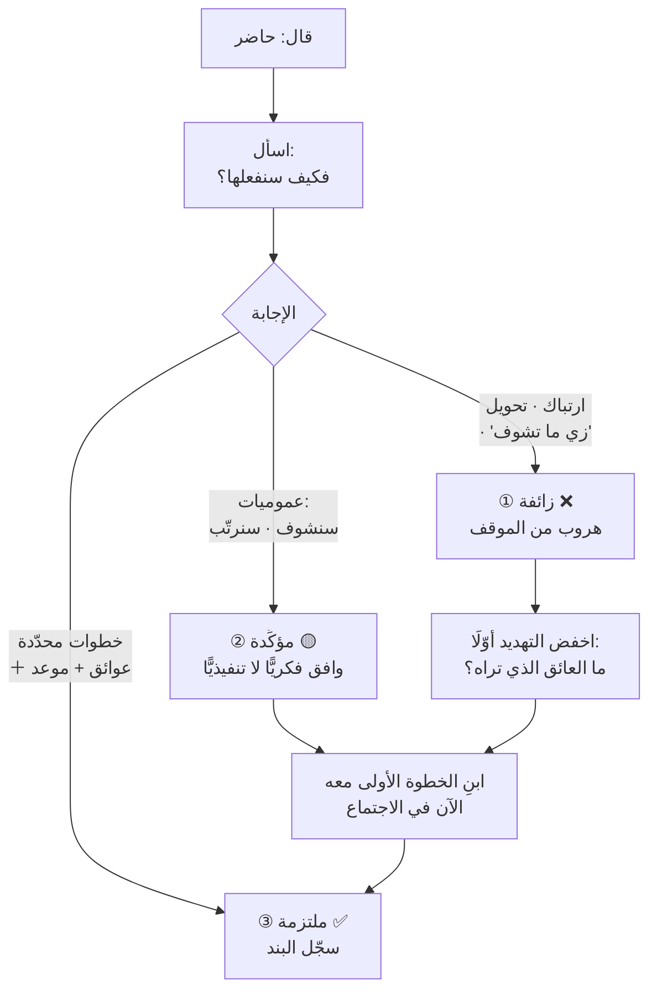

> [!info] الفصل 06 · كورس لعبة العقل
> **ماذا ستتعلّم:** كيف ترفض بلا أن تقول «لا»، وكيف تكشف موافقةً ليست موافقة. ستفهم لماذا تُخزَّن كلمة «لا» في الذاكرة بلا سببها، ولماذا يُنتج **الرفض السلبي** كلفةً مؤجّلة أكبر من مكسبه الفوري. وستُتقن **طريقة الساندويتش** ببنيتها الثلاثية — أوافق على الفكرة · أختلف على الطريقة · أتّفق معك على طريقة بديلة — ومواضع فشلها. ثم ستدخل إلى أخطر ما في هذا الفصل: **أنواع «نعم» الثلاثة** — الزائفة والمؤكِّدة والملتزمة — و**السؤال الكاشف الوحيد** الذي يفصل بينها: «فكيف سنفعلها؟». وستتعلّم **بروتوكول التحقّق** من علامات الجسد، و**قلب صياغة السؤال** بحيث يُجاب بـ«لا» لا بـ«نعم» — وهي الأداة الأكثر مفارقةً في الكورس كلّه. وستعرف أخيرًا **على من تقع مسؤولية «نعم» الزائفة** — وهي إجابة أثارت اعتراضًا محقًّا في المحاضرة نفسها.

> [!abstract] التأصيل
> **يفترض أنّك تعرف:** [[Labeling]] · [[Mirroring]]
> **ويُؤصّل لك:** [[Positive Refusal]] · [[Fake Yes]] · [[Sandwich Method]] · [[Psychological Reactance]]

# الفصل 06 — قوّة «لا» وأنواع «نعم» الثلاثة

## 🎯 أهداف التعلّم

- **صياغة** رفض كامل بلا استخدام كلمة «لا»، والتحقّق منه بمعيار «هل حُفظ ماء الوجه؟».
- **تركيب** ساندويتش ثلاثي في موقف حقيقي، وتشخيص متى يفشل.
- **التمييز** بين أنواع «نعم» الثلاثة من علامات لفظية وجسدية محدّدة.
- **تطبيق** السؤال الكاشف وتفسير نتائجه الثلاث.
- **قلب** صياغة خمسة أسئلة من طلب «نعم» إلى إتاحة «لا»، وشرح الأثر.
- **تحديد** موقع المسؤولية عن الالتزام الوهمي، ونقد إجابة الكورس عنه.

---

## الفكرة المحورية: الدماغ يُخزّن الرفض ولا يُخزّن سببه

> [!quote] من المحاضرة
> **حمزة:** «**أسهل شيء هو الرفض السلبي:** *لا، لن أُطبّق هذا.* رائع — يسّرتَها على نفسك في اللحظة و**صعّبتَها على نفسك في التعاملات القادمة**، لأنّ الحواجز تبدأ في التكوّن: كلّ ما تقوله بعدها سيرفضه، **ولو كان صحيحًا.** لأنّك رفضتَ له، ودماغه خزّن **«حمزة رفض»** — ولم يُخزّن *لماذا* رفض. لم يلتقط إلّا أوّل شيء.»

هذه أدقّ صياغة في الكورس كلّه لمشكلة الرفض المباشر، لأنّها لا تقول «الرفض يُزعج» — بل تصف **ما يبقى في الذاكرة بعد أشهر**.

**والفرق بين ما يبقى وما يُقال هو محور الفصل:**

| ما قلتَه فعلًا | ما يُخزَّن بعد أسبوع | ما يُستدعى في التفاعل القادم |
|---|---|---|
| «لا، لأنّ السعة ممتلئة وقد التزمنا بثلاث ميزات» | **«رفض»** | استعداد مسبق للمقاومة |
| «فكرة جيّدة — وحتى نُدخلها، أيّ بند نُؤجّل؟» | **«ناقشنا وقرّرنا معًا»** | استعداد للتعاون |

ولاحظ أنّ **المحتوى المعلوماتي واحد** في الحالتين: في كلتيهما لم تدخل الميزة بلا مقابل. الفرق كلّه في **من اتّخذ القرار في نظره** — وهذا ما يُحدّد ما يُخزَّن.

> [!info] إضافة مرجعية — لماذا يُخزَّن «رفض» بلا سببه
> ثلاث آليات مُوثَّقة تُفسّر ما يصفه المحاضر:
>
> **① أثر الأسبقية والتصنيف السريع.** يُصنّف الدماغ المُدخَلات الاجتماعية تصنيفًا ثنائيًّا سريعًا (مقبول/مرفوض · آمن/مهدّد) قبل اكتمال المعالجة التفصيلية. وحين تكون الكلمة الأولى «لا»، يقع التصنيف قبل أن يُعالَج التبرير — فيُخزَّن الحكم، ويُعالَج ما بعده تحت تأثيره.
>
> **② انحياز التأكيد بعد التصنيف.** بعد التصنيف، يُعالَج ما يليه بحثًا عن تأكيده. فتُقرأ أسبابك التالية **دفاعًا عن رفض** لا معطياتٍ محايدة.
>
> **③ تلاشي التبرير مع بقاء الحكم.** التفاصيل السياقية تُنسى أسرع من الأحكام التقييمية. فبعد أسبوعين يبقى «رفض طلبي» ويتلاشى «بسبب التزام السبرنت» — وهو بالضبط ما يصفه المحاضر بـ«لم يُخزّن لماذا رفض».
>
> **وهذا يُفسّر أيضًا** قاعدة العشرين ثانية التي يُكرّرها الكورس: **الحكم يقع مبكّرًا، وما بعده يُقرأ عبره.** ومن ثمّ فترتيب الجملة ليس تجميلًا — إنّه يُحدّد ماذا سيبقى.

---

## أوّلًا: الرفض السلبي والإيجابي

> [!quote] من المحاضرة
> **حمزة:** «فهذا **رفض إيجابي.** ستسمع عن **الرفض السلبي** و**الرفض الإيجابي**؛ و**المشكلات الذكية والمشكلات الغبية**؛ و**الصراع المُدمِّر والصراع البنّاء.**»

| | **الرفض السلبي** | **الرفض الإيجابي** |
|---|---|---|
| **الصياغة** | «لا» · «هذا لن ينفع» · «مستحيل» | «فكرة جيّدة — و…» · «كيف نصل إليها مع…؟» |
| **من يتّخذ القرار** | أنت | **هو، أو أنتما معًا** |
| **الكلفة الفورية** | صفر — سهل | دقائق من الجهد |
| **الكلفة المؤجّلة** | مقاومة كلّ ما تقوله لاحقًا | صفر |
| **ما يُخزَّن** | «رفض» | «قرّرنا» |
| **النطاق** | محميّ | محميّ **أيضًا** |

**والسطر الأخير هو المهمّ:** الرفض الإيجابي **لا يعني تنازلًا.** النطاق محميّ في الحالتين — والفرق في العلاقة فقط. ومن يظنّ أنّ الرفض الإيجابي «ليونة» لم يفهم الأداة: إنّه **الحزم نفسه بغلاف لا يُنتج عداوة.**

> [!warning] المزلق العملي — الرفض المُغلَّف الذي يُقرأ موافقة
> الخطر المقابل للرفض السلبي أن يكون الغلاف سميكًا إلى حدّ اختفاء الرفض. «سننظر في الأمر ونرى ما يمكن فعله» ليست رفضًا إيجابيًّا — إنّها **تأجيل يُقرأ موافقة**، وستعود إليك بعد أسبوعين على هيئة «قلتَ إنّك ستنظر».
>
> **معيار الفصل:** الرفض الإيجابي **يترك المفاوض بمعلومة حاسمة**: إمّا مفاضلة صريحة، وإمّا شرط واضح، وإمّا موعد محدّد. أمّا الذي يترك الطرف الآخر بلا شيء يستطيع البناء عليه فهو مراوغة.

---

## ثانيًا: طريقة الساندويتش

> [!quote] من المحاضرة
> **حمزة:** «**الساندويتش**: *«بصراحة يا حمزة، فكرة ممتازة»* — هدّأتُ حمزة — *«لكنّ الفريق حاليًّا لا يفهم ما كانبان، فنحتاج أن نشرح لهم أوّلًا، ثم نُطبّق الأفكار.»*
> **ساندويتش، حشوة، ساندويتش.** *أوافق على الفكرة؛ وداخل الحشوة أختلف على طريقة التنفيذ التي تريدها؛ وأُغلق الساندويتش: تعال نتّفق على الطريقة التي سننفّذ بها ما قلته.*»

**والبنية الثلاثية ليست «مديح ← نقد ← مديح»** كما في نموذج التغذية الراجعة الشائع، وهذا خلط يجب تفكيكه:

| | **ساندويتش التغذية الراجعة** *(الشائع)* | **ساندويتش الكورس** |
|---|---|---|
| **الطبقة الأولى** | مديح عامّ | **موافقة حقيقية على الفكرة/الهدف** |
| **الحشوة** | نقد للأداء | **اختلاف على الطريقة** |
| **الطبقة الثالثة** | مديح آخر | **دعوة للاتّفاق على طريقة بديلة** |
| **صدقه** | مشكوك فيه — المديح أداة تغليف | **صادق تمامًا** — أنت فعلًا توافق على الهدف |
| **مصيره** | صار مكشوفًا؛ يُقرأ «ماذا تريد أن تقول؟» | لا يُكشَف لأنّه ليس تغليفًا |

**والفرق الجوهري: في نسخة الكورس، الموافقة في الطبقة الأولى حقيقية.** حين تقول «فكرة ممتازة» لمن اقترح كانبان، فأنت توافق فعلًا على **الهدف** (تدفّق أفضل) وتختلف على **الطريقة والتوقيت**. ولهذا لا تتآكل الأداة — لأنّها ليست حيلة.

وقد أعطى علي يسري في المحاضرة أدقّ نموذج لها:

> [!quote] من المحاضرة
> **علي يسري:** «*«بصراحة يا سيّدي، فكرتك ممتازة فعلًا — لكنّنا نحتاج أن ندرسها ونُوثّقها كما ينبغي. فإن لم تكن لديك وثائق، نُجري التوثيق أوّلًا ويأخذ مساره الصحيح.»*»
>
> **حمزة:** «صحيح — **طريقة الساندويتش.** ممتاز.»
>
> **علي يسري:** «أي أنّنا **لم نرفض فكرته صراحةً**؛ بل قرّبناه مرحلةً إلى **زاويتنا، ملعبنا** […] ولاحقًا سيستطيع أن يرى **فكرته هو تتحرّك تحرّكًا صحيحًا**، وسيتخلّى تمامًا عن التقدير الزائف الذي وضعه في البداية.»

**والجملة الأخيرة تكشف الوظيفة الحقيقية للساندويتش:** ليس إخفاء الرفض، بل **تحويل المسار.** الطلب لم يُرفَض؛ نُقل إلى مسار ينكشف فيه بنفسه — وينتهي بأن يتخلّى صاحبه عنه أو يُعدّله **من دون أن يخسر ماء وجهه.**

> [!tip] القاعدة العملية — بنية الساندويتش بالنصّ
> **①** «فكرتك/طلبك [جيّد · مهمّ · مفهوم] — و[أرى الهدف الذي تريده].»
> **②** «والذي نحتاجه حتى نصل إليه صحيحًا هو [الشرط · الخطوة · الدراسة].»
> **③** «فما رأيك أن [نبدأ بـ… · نتّفق على… · نُخصّص…]؟»
>
> **ثلاثة شروط للصحّة:** أن تكون الموافقة في ① صادقة · أن يكون في ② شرط محدّد لا اعتراض عامّ · أن تنتهي ③ **بسؤال** لا بجملة خبرية — لأنّ السؤال يُبقي القرار مشتركًا.

---

## ثالثًا: أنواع «نعم» الثلاثة

> [!quote] من المحاضرة
> **حمزة:** «تتّفق مع مطوّر على شيء وتقول *تمام؟* فيقول *تمام* […] فعليك أن **تنتبه لتلك «حاضر»** التي تُقال لك. أهي: **«نعم» يريد بها الشخص الهروب من الموقف؟** أم **«نعم» يوافق بها على الفكرة التي تذكرها** — لا على التنفيذ؟ **أم «نعم» سيذهب بعدها وينفّذ فعلًا؟**»

هذه أنفع أداة تشخيصية في الكورس كلّه، لأنّها تُعالج المشكلة التي تُكلّف الفرق أكثر من أيّ شيء آخر: **التزامات لا يعلم أحد أنّها لم تُعقَد.**

| النوع | ما يجري داخله | العلامات | ما يُنتجه |
|---|---|---|---|
| **① الزائفة** | **هروب من الموقف** | سرعة الردّ · حركة جسدية · نظر متنقّل · لا تفصيل · «طبعًا، أكيد» | **التزامات وهمية · دَين تقني** |
| **② المؤكِّدة** | موافقة على الفكرة لا على التنفيذ | «كلامك صحيح» · «معك حقّ» · «منطقي» — بلا ضمير أوّل | خطط لا تُنفَّذ |
| **③ الملتزمة** | موافقة + خطّة | يُفصّل الخطوات · يذكر عوائق · يسأل عن التبعيّات · يُحدّد موعدًا | **تنفيذ** |

> [!quote] من المحاضرة
> **حمزة:** «**«نعم» المؤكِّدة:** *حمزة قال شيئًا وأنا أوافق عليه، لكنّي لن أُنفّذه.* — *«كلامك صحيح.»* **وهذا لا يعني أنّ منّة ستُنفّذ. «كلامك صحيح» لا تعني أنّ حمزة سيُنفّذ.**»

**والنوع الثاني هو الأخطر عمليًّا** — لا الأوّل — لأنّه **يبدو نضجًا.** الشخص لم يهرب؛ ناقش، ووافق بوعي، وقال «كلامك صحيح». وأنت تخرج مطمئنًّا لأنّك أقنعته. لكنّ الإقناع الفكري **ليس التزامًا تنفيذيًّا**، والفجوة بينهما هي حيث تموت معظم قرارات الاجتماعات.

### السؤال الكاشف

> [!quote] من المحاضرة
> **حمزة:** «**الخلاصة المفيدة: لا تندفع عند كلمة «حاضر».** ولمعرفة هل هي «نعم» زائفة أم ملتزمة، **اسأل: «فكيف سنفعلها؟»** فإن لم تكن الإجابة جاهزة عنده، فامنحه المساحة ليجمع صورته […] فإن قال *بهذه الخطوات الواضحة* — حسنًا، هذه «نعم» **ملتزمة**.»

**سؤال واحد، وثلاث نتائج تُشخّص النوع فورًا:**

> [!tip] القاعدة العملية
> **لا تُغلق بندًا إجرائيًّا على «حاضر». أغلقه على «كيف».**
> والسؤال ليس تشكيكًا وليس محاسبةً — إنّه **بناء مشترك للخطوة الأولى**. وصياغته المُيسّرة: *«ممتاز — فما أوّل خطوة، ومتى نتوقّع أن نرى شيئًا؟»*

### بروتوكول التحقّق

> [!quote] من المحاضرة
> **حمزة:** «ولاحظي **بروتوكول التحقّق.** قلتِ شيئًا وقال من أمامك «تمام». فإن لاحظتِ **حركة جسدية** — يتحرّك باستمرار — فاعلمي أنّه يريد الهروب. وإن وجدتِ **عينيه ترمشان يمينًا ويسارًا** — فاعلمي أنّه يريد الهروب. فتحتاجين أن **تُهدّئيه، وتُطمئنيه، وتمنحيه قدرًا من الأمان النفسي**.»

| العلامة | الاحتمال الأرجح | الاستجابة |
|---|---|---|
| ردّ فوري بلا وقفة | زائفة | «فكيف سنفعلها؟» |
| نظر متنقّل | استثارة/هروب | اخفض التهديد قبل أن تسأل |
| حركة مستمرّة | رغبة في إنهاء الموقف | امنح مخرجًا: «وإن كان هناك عائق فأخبرني» |
| «كلامك صحيح» بلا ضمير المتكلّم | مؤكِّدة | «ممتاز — فما الخطوة الأولى منك؟» |
| ذكر عائق أو تبعيّة | **ملتزمة** ✅ | سجّل البند |

> [!warning] المزلق العملي — قراءة الجسد ليست علمًا دقيقًا
> علامات الجسد **مؤشّرات احتمالية لا دلائل قاطعة.** حركة الجسد قد تعني تعبًا أو ألمًا أو انشغالًا؛ وتجنّب النظر قد يكون عادة أو فارقًا ثقافيًّا أو سمة عصبية.
>
> **استخدمها لتوجيه سؤالك لا لبناء حكمك.** أي: إن رأيتَ علامة، **اسأل** — لا **تستنتج**. فالسؤال يُصحّح خطأك؛ والاستنتاج يُثبّته.

---

## رابعًا: قلب السؤال — أسئلة تُجاب بـ«لا»

هذه أكثر أدوات الكورس مفارقةً، وأسهلها تطبيقًا:

> [!quote] من المحاضرة
> **حمزة:** «**الذكاء، والاحتراف الصحيح، أن تسأل أسئلة تسمع منها إجابة — لا أن تسأل أسئلة تنتظر منها سماع «نعم»، «حاضر»، «تمام».** حين يقول من أمامك **«لا»**، فهو بيولوجيًّا يرى أنّك **تمنحه أمانًا نفسيًّا**، فيسير معك. أمّا إن ظللتَ تسأل أسئلة تنتظر سماع *حاضر*، فينشأ عند من أمامك إحساس بأنّك **حاصرتَه**.»

| السؤال الطالب لـ«نعم» | السؤال المُتيح لـ«لا» | ما تغيّر |
|---|---|---|
| «هل لديك وقت الآن؟» | «هل الوقت غير مناسب لنتكلّم دقيقتين؟» | التزام مفتوح ← التزام محدود وقابل للرفض |
| «هل توافق على هذه الخطّة؟» | «هل تعترض إن ركّزنا على الهدف الأوّل بدل الثاني؟» | تبنٍّ كامل ← اعتراض على بند واحد |
| «هل يمكننا إتمام الصفقة الآن؟» | «هل ترى سببًا يُؤخّر توقيعنا الآن؟» | طلب قرار ← طلب عائق |
| «هل السعر مناسب؟» | «هل ترى السعر أعلى بكثير من الخدمة؟» | حكم على قيمتك ← حكم على تناسب |
| «هل ستُنهيه غدًا؟» | «هل هناك ما قد يُعطّل إنهاءه غدًا؟» | وعد ← **استخراج مخاطر** |

**والصفّ الأخير يستحقّ وقفة**، لأنّه يجمع أداتين: يُتيح «لا» **ويُنتج سجلّ مخاطر**. فمن يُسأل «هل ستُنهيه غدًا؟» يقول «حاضر» ويهرب؛ ومن يُسأل «هل هناك ما قد يُعطّله؟» يذكر التبعيّة التي كان سيكتشفها بعد يومين.

> [!quote] من المحاضرة
> **سماح:** «أفهم ما يُقال، لكنّي لا أفهم ما الذي يُغيّره […] فما الذي يتغيّر في المعادلة؟»
>
> **حمزة:** «**بيولوجيته غير مُحاصَرة من الداخل.** يُحبّ التعامل معك، فيدخل ويُعطيك كلّ المعلومات التي لا تملكها […] هذا كلّه بيولوجي؛ لا علاقة له بصواب وخطأ.»

> [!info] إضافة مرجعية — لماذا «لا» تُريح: الاستقلالية والمقاومة النفسية
> جواب المحاضر صحيح في الأثر وعامّ في التفسير. ولها تفسير أدقّ من مصدرين:
>
> **① الاستقلالية.** في **نظرية تقرير المصير (`Self-Determination Theory`)** لـ**ديسي وريان**، الاستقلالية حاجة نفسية أساسية — أن يشعر المرء بأنّ سلوكه صادر عنه لا مفروض عليه. والسؤال الذي يُتيح «لا» **يُعيد له الاستقلالية**؛ والسؤال الذي يُلزمه بـ«نعم» ينزعها. وهذا يتطابق مع مجال `Autonomy` في نموذج SCARF (الفصل [[02 - بيولوجيا اللحظة - اللوزة والقشرة الجبهية|02]]).
>
> **② المقاومة النفسية (`reactance`).** صاغها **جاك بريم (`Jack Brehm`)** عام 1966: حين يشعر المرء بأنّ حرّية اختياره مُهدَّدة، **ينشأ دافع لاستعادتها** — غالبًا برفض ما يُقترَح، **ولو كان في مصلحته.** وهذا يُفسّر ظاهرة يعرفها كلّ مدير: عرض معقول تمامًا يُقاوَم لأنّه قُدِّم بصيغة لا تترك مجالًا للرفض.
>
> **③ حدّ التقنية.** الأسلوب فعّال، **ويُكشَف إن أُفرِط فيه.** فمن يصوغ كلّ أسئلته بصيغة سلبية سيُلاحَظ. **والقاعدة:** استخدمها في اللحظات التي يهمّك فيها التزام حقيقي — طلب وقت، وإغلاق قرار، وتأكيد مهمّة — لا في كلّ جملة.

---

## خامسًا: على من تقع مسؤولية «نعم» الزائفة؟

> [!quote] من المحاضرة
> **سماح:** «أليست في الأصل مسألة التزام الشخص نفسه؟ هل يجب عليّ **أنا** أن أتحقّق من نوع «حاضر»، أم أنّ ذلك يقع في الأصل على الشخص نفسه؟»
>
> **حمزة:** «**على المدير — لا على من قال «حاضر»** […] من هو في المقدّمة؟ من سيُحاسَب في النهاية؟ **في أيّ شركة محترمة، من يُحاسَب هو المدير.**»

**سؤال سماح محقّ، والجواب صحيح ومُختزَل معًا.** وهو صحيح من جهة **المساءلة**: المدير يُحاسَب على النتيجة. لكنّه يترك سؤالًا أهمّ بلا جواب: **إن كان الفريق يُنتج «نعم» زائفة بانتظام، فما الذي يجعله يفعل ذلك؟**

**والتشخيص الأدقّ:** «نعم» الزائفة **عَرَض لا مرض** — وهي في جوهرها **استجابة تهديد** (هروب أو استرضاء، بحسب تصنيف الفصل [[02 - بيولوجيا اللحظة - اللوزة والقشرة الجبهية|02]]). ومن ثمّ:

| السبب الجذري | العَرَض | العلاج |
|---|---|---|
| **قول «لا» مُكلِف في هذه البيئة** | الجميع يقول «حاضر» | اجعل الرفض المُبرَّر مقبولًا علنًا ومُكافَأً |
| **الأسئلة تُصاغ طلبًا لـ«نعم»** | إجابات تلقائية بلا تفكير | اقلب الصياغة — القسم الرابع |
| **التقدير يُصنَع خارج الفريق** | التزام بما لم يُقدَّر | التقدير قبل الالتزام |
| **غموض المتطلّبات** | «حاضر» لأنّه لا يعرف ما يرفض | معايير قبول مكتوبة |
| **لا مساحة نفسية للاعتراض** | صمت ثم عدم تنفيذ | أمان نفسي — الفصل [[07 - إدارة الصراع - الطبقات الأربع والصراعات الخمسة\|07]] |

> [!tip] القاعدة العملية — اختبار صحّة البيئة
> **متى كانت آخر مرّة قال فيها أحد من فريقك «لا» في اجتماع — ولم يُكلّفه ذلك شيئًا؟**
>
> إن لم تكن هناك إجابة، فأنت لا تُعاني من مشكلة أفراد؛ أنت تُعاني من **بيئة تُنتج «نعم» الزائفة بنيويًّا** — وسؤال «فكيف سنفعلها؟» سيكشف الأعراض ولن يُوقف إنتاجها.

---

## 🗣️ بنك العبارات — الرفض والالتزام

| الموقف | العبارة الخاطئة | العبارة الصحيحة | لماذا |
|---|---|---|---|
| طلب خارج النطاق | «لا، هذا خارج السبرنت» | «مُدوَّن. ولندخله، أيّ بند من الملتزم به نُؤجّل؟» | مفاضلة بدل رفض؛ القرار يعود إليه |
| اقتراح تقني غير مناسب الآن | «هذا لن ينفع» | «فكرة جيّدة — وحتى نصل إليها صحيحة نحتاج [شرط]. فما رأيك أن نبدأ بـ…؟» | ساندويتش ثلاثي |
| طلب مستحيل تقنيًّا | «مستحيل» | «كيف يمكننا الوصول إلى ذلك في هذه المدّة؟» | سؤال مُعجِز — هو من يصل إلى الحدّ |
| بعد «حاضر» | «ممتاز، شكرًا» | «ممتاز — فما أوّل خطوة، ومتى نرى شيئًا؟» | السؤال الكاشف |
| بعد «كلامك صحيح» | تسجيل البند | «سعيد أنّنا متّفقان — فمن يبدأ بماذا؟» | «مؤكِّدة» ليست التزامًا |
| طلب وقت من زميل | «هل أنت فاضٍ؟» | «هل الوقت غير مناسب لدقيقتين؟» | يُتيح «لا» فيُريح |
| تأكيد موعد | «هل ستُنهيه غدًا؟» | «هل هناك ما قد يُعطّل إنهاءه غدًا؟» | يُتيح «لا» **ويستخرج المخاطر** |
| إغلاق اجتماع | «متّفقون إذن؟» | «قبل أن نُغلق — هل يرى أحد شيئًا قد يُعطّلنا؟» | يستدعي الاعتراضات قبل خروجها |

---

## 🧪 ورشة الفصل — تدقيق الالتزامات

| الخطوة | العمل | المُخرَج |
|---|---|---|
| **1** | استخرج كلّ البنود الإجرائية من آخر ثلاثة اجتماعات لك | قائمة بنود |
| **2** | صنّف كلًّا منها: نُفِّذ · نُفِّذ متأخّرًا · لم يُنفَّذ | ثلاث فئات |
| **3** | لكلّ بند لم يُنفَّذ، تذكّر: **كيف أُغلق؟** بـ«حاضر»؟ أم بـ«كيف»؟ | ارتباط مرصود |
| **4** | لأسبوعين: **لا تُغلق أيّ بند إلّا بعد «فكيف سنفعلها؟»** | تغيير سلوكي واحد |
| **5** | اقلب صياغة خمسة أسئلة تسألها أسبوعيًّا إلى صيغة تُتيح «لا» | خمس صياغات |
| **6** | طبّق اختبار صحّة البيئة: متى كانت آخر مرّة قال فيها أحدهم «لا» بلا كلفة؟ | إجابة صريحة |
| **7** | قارن نسبة التنفيذ بعد شهر | نسبة قبل/بعد |

---

## القراءة النقدية — أين يقصر هذا الطرح؟

**1. «لا تقل لا أبدًا» قاعدة مطلقة تحتاج استثناءات.** يقول المحاضر: *«إن خرجتَ من هذا الكورس لا تقول «لا» ولا «لماذا»، فقد فزت.»* وهذا صحيح في التفاعلات اليومية، **وخطأ في ثلاث حالات على الأقلّ**: السلامة والأمن (لا مجال للتلطيف)؛ والحدّ الأخلاقي أو القانوني (الغموض هنا يُقرأ قابلية للتفاوض)؛ والحالة التي رُفِض فيها الطلب مرارًا وأُعيد طرحه (التلطيف الرابع يُقرأ ترددًا). **والصياغة الأدقّ:** لا تقل «لا» **كردّ أوّل**؛ واحتفظ بها للحالات التي يكون فيها الوضوح المطلق أهمّ من العلاقة — وهي قليلة لكنّها موجودة.

**2. الساندويتش قابل للتحوّل إلى مراوغة، ولا يُقدَّم معيار.** الفارق بين ساندويتش سليم ومماطلة مُغلَّفة أنّ الأوّل ينتهي بشرط أو مفاضلة أو موعد **محدّد**. والكورس يعرض الأداة بلا هذا المعيار، فيسهل أن يتعلّمها المرء بوصفها طريقة لتجنّب المواجهة إلى أجل غير مسمّى — **وهذا يُنتج بعد أشهر ما هو أسوأ من الرفض المباشر**: انعدام ثقة في أنّ كلامك يُترجَم إلى شيء.

**3. تشخيص «نعم» من لغة الجسد يُقدَّم بثقة تتجاوز سنده.** الأدبيات المعاصرة على كشف الخداع من العلامات غير اللفظية **متواضعة النتائج**: المراجعات التحليلية (مثل DePaulo et al., 2003) تجد أنّ معظم العلامات الشائعة ضعيفة الارتباط، وأنّ دقّة البشر في الكشف تقارب المصادفة. **والاستخدام الآمن الوحيد** هو ما ورد في تحذير القسم الثالث: العلامة تُوجّه سؤالك ولا تبني حكمك. وتجاوز ذلك يُنتج مديرًا يُصنّف فريقه بناءً على حركة يد — وهو ضرر أكبر من المشكلة الأصلية.

**4. المسؤولية تُوضَع على المدير بلا معالجة الأسباب البنيوية.** الجواب «على المدير» صحيح في المساءلة وناقص في التشخيص. فإن كانت البيئة تُعاقب قول «لا» — صراحةً أو ضمنًا — فإنتاج «نعم» الزائفة **سلوك عقلاني** من الفريق، ولا يُوقفه سؤال كاشف مهما تكرّر. وقد حاول القسم الخامس سدّ هذه الفجوة، **وهي إضافة لا نقل**؛ والكورس نفسه يمرّ على المسألة مرورًا.

**5. الأداة تُنتج التزامًا ولا تُنتج متابعة.** «فكيف سنفعلها؟» يكشف نوع «نعم» ويُغلق البند. **ولا يوجد في الكورس شيء عن ما بعد الاجتماع** — لا آلية متابعة، ولا سجلّ، ولا مراجعة. وهذا اتّساق مع طبيعة الكورس (هو عن اللحظة لا عن النظام)، لكنّه يترك فجوة عملية حقيقية: التزام ملتزم بلا متابعة يتحوّل إلى التزام وهميّ خلال أسبوعين. **والجسر الطبيعي هنا هو [[كورس الإنتاجية]]** — البند الإجرائي يُصبح عنصرًا مرئيًّا في لوح العمل، لا سطرًا في محضر اجتماع.

---

## 🧾 خلاصة الفصل

1. **الدماغ يُخزّن «رفض» ويُهمل سببه** — فترتيب الجملة يُحدّد ما يبقى بعد أسابيع.
2. **الرفض الإيجابي لا يعني تنازلًا**: النطاق محميّ في الحالتين، والفرق في من اتّخذ القرار في نظره.
3. **الساندويتش ليس تغليفًا** — الموافقة في طبقته الأولى حقيقية، ولهذا لا يتآكل.
4. **وظيفته تحويل المسار لا إخفاء الرفض** — الطلب يُنقَل إلى مسار ينكشف فيه بنفسه.
5. **«نعم» ثلاث**: زائفة (هروب) · **مؤكِّدة (أخطرها لأنّها تبدو نضجًا)** · ملتزمة.
6. **السؤال الكاشف الوحيد: «فكيف سنفعلها؟»** — ولا يُغلَق بند على «حاضر».
7. **علامات الجسد تُوجّه السؤال ولا تبني الحكم** — دقّة الكشف البشري قريبة من المصادفة.
8. **اقلب أسئلتك لتُجاب بـ«لا»** — تُريح المستقبِل وتستخرج المخاطر.
9. **«نعم» الزائفة عَرَض لا مرض** — واسأل: متى قال أحدهم «لا» آخر مرّة بلا كلفة؟
10. **حدودها:** «لا» لها مواضع مشروعة · والساندويتش يحتاج معيارًا يمنع المراوغة · والالتزام يحتاج متابعة خارج هذا الكورس.

---

## ❓ اختبارات ذاتية

> [!question]- 1) في تخطيط السبرنت وافق مطوّر: «تمام، سأُنهي التكامل هذا السبرنت.» سألتَ «فكيف سنفعلها؟» فقال: «عادي، سأشتغل عليه وأشوف.» ما التشخيص وما الإجراء؟
> **التشخيص: بين النوعين الأوّل والثاني، والأرجح الأوّل.** الإجابة خالية من كلّ علامات الالتزام: لا خطوة أولى، ولا تبعيّة، ولا موعد وسيط، ولا ذكر لعائق. و«سأشوف» تحديدًا صيغة **تأجيل التفكير** لا وصف خطّة.
> **والخطأ الشائع هنا:** أن تُصعّد — «ما معنى سأشوف؟ أريد خطّة.» وهذا يرفع التهديد، فتحصل على خطّة **مُصطنَعة** لإرضائك، وتكون قد استبدلت التزامًا وهميًّا بآخر أكثر تفصيلًا.
> **الإجراء الصحيح ثلاث خطوات:**
> **①** اخفض التهديد وامنح مخرجًا: *«وهل ترى شيئًا في هذا التكامل قد يُعطّلنا؟»* — سؤال يُتيح «لا»، ويُخرج المخاطر إن وُجدت.
> **②** ابنِ الخطوة الأولى **معه** لا له: *«ما رأيك أن نبدأ بالتأكّد من توثيق الواجهة البرمجية؟ فمتى تتوقّع أن نعرف هل هي كافية؟»*
> **③** أغلق على شيء **صغير وقريب**: *«فلنتّفق أن نعرف يوم الأربعاء هل الواجهة كافية — ونُقرّر بعدها.»*
> **لاحظ:** لم تطلب التزامًا بالتكامل كلّه؛ طلبتَ التزامًا بخطوة يستطيع الوفاء بها. **والالتزام الصغير المُوفَّى به يبني القدرة على الالتزام الكبير؛ والالتزام الكبير المُخلَف يُدمّرها.**

> [!question]- 2) طبّقتَ الساندويتش ثلاث مرّات مع صاحب مصلحة. في الرابعة قال: «كلّما جئتُ بشيء تقول «فكرة جيّدة» ثم لا يحدث شيء.» ما الذي حدث؟
> **حدث ما تُحذّر منه القراءة النقدية: تحوّل الساندويتش إلى مراوغة — وشكواه صحيحة تمامًا.**
> **والتشخيص الدقيق:** الطبقة الثالثة فشلت في المرّات الثلاث. الساندويتش السليم ينتهي بشرط محدّد أو مفاضلة أو موعد. أمّا إن كانت خواتيمك «سندرسها» و«سننظر في الأمر»، فأنت لم تُقدّم رفضًا إيجابيًّا — قدّمت **تأجيلًا مُغلَّفًا ثلاث مرّات.**
> **واحتمال ثانٍ يجب فحصه بصدق:** أنّ الطبقة الأولى لم تكن صادقة. إن كنتَ تقول «فكرة جيّدة» عن أفكار لا تراها جيّدة، فأنت تستخدم الأداة تغليفًا — وهذا بالضبط ما يجعلها تُكشَف، لأنّ ما لا يُقصَد لا يُتبَع بفعل.
> **والردّ:** لا تُدافع ولا تُساندوِش رابعة. *«معك حقّ، وهذا خطأ منّي. من الاقتراحات الثلاثة السابقة، اثنان لم نستطع إدخالهما لأنّ [السبب]، وكان عليّ أن أقول ذلك صراحةً. والثالث ما زال ممكنًا وسأعود إليك يوم الأحد بموعد. أمّا هذا الرابع، فحتى نُدخله نحتاج [الشرط] — أفنبدأ به؟»*
> **الوضوح المتأخّر يُصلح؛ والساندويتش الرابع يُنهي العلاقة.**

> [!question]- 3) لماذا تُعدّ «نعم» المؤكِّدة أخطر من الزائفة، مع أنّ الزائفة تنطوي على هروب؟
> **لأنّ الزائفة تحمل علامات، والمؤكِّدة تحمل علامات النجاح.**
> **الزائفة قابلة للكشف:** سرعة الردّ، والارتباك، وغياب التفصيل — كلّها إشارات يلتقطها مدير منتبه، ويكشفها السؤال الكاشف في ثوانٍ.
> **أمّا المؤكِّدة فتُنتج بالضبط ما تبحث عنه في اجتماع ناجح:** نقاش حقيقي، وحُجَج مُتبادَلة، ثم اقتناع صريح — «كلامك صحيح، هذا منطقي». فتخرج مطمئنًّا لأنّك **أقنعته**، وهو مطمئنّ لأنّه **اقتنع فعلًا.** ولا أحد يكذب.
> **والفجوة أنّ الاقتناع الفكري ليس التزامًا تنفيذيًّا.** «كلامك صحيح» جملة عن **صحّة الفكرة**، لا عن **ما سيفعله هو**. والانتقال بينهما يحتاج شيئًا لم يحدث: أن يتصوّر نفسه ينفّذ، ويرى العوائق، ويقرّر أن يُخصّص وقتًا — وهو ما لم يُطلَب منه.
> **والعلامة اللغوية الفارقة:** المؤكِّدة تخلو من **ضمير المتكلّم**. «كلامك صحيح» · «هذا منطقي» · «معك حقّ» — كلّها أحكام على الفكرة. أمّا الملتزمة فتحوي «أنا»: «سأبدأ بـ…» · «أحتاج من فلان…» · «سأعرف يوم كذا…».
> **والعلاج:** *«سعيد أنّنا متّفقان على الفكرة — فمن يبدأ بماذا، ومتى؟»* — الجملة تُقرّ باتّفاق حقيقي، وتنقله من مستوى الفكرة إلى مستوى الفعل.

> [!question]- 4) قلبتَ كلّ أسئلتك إلى صيغة تُتيح «لا». بعد أسبوعين قال زميل: «لماذا تسأل دائمًا بطريقة معكوسة؟» — ما الذي فات؟
> **فات أنّ الأداة لها معدّل استخدام، وأنّ الصيغة السلبية أشدّ ألفتةً من الصيغة العادية.**
> «هل الوقت غير مناسب؟» و«هل تعترض إن…؟» و«هل ترى ما قد يُعطّل…؟» بنى لغوية غير مألوفة في الحديث اليومي. وتكرارها في كلّ سؤال يجعلها **نمطًا ملحوظًا** — وحين يُلاحَظ نمط، يُقرأ أسلوبًا مقصودًا، والأسلوب المقصود يُقرأ تكتيكًا، والتكتيك يُنتج حذرًا. **فتُفقدك الأداة الأثر الذي كانت تُنتجه.**
> **والقاعدة المفقودة في الكورس:** استخدم الصيغة السلبية في **اللحظات التي يهمّك فيها التزام حقيقي** — طلب وقت من شخص مشغول، وإغلاق قرار، وتأكيد مهمّة حرجة، واستخراج مخاطر. أمّا التفاعلات العادية فبصيغتها العادية.
> **وهذا مبدأ عامّ يتكرّر في هذا الكورس مع كلّ أداة:** التسمية، والمرآة، والصيغة السلبية كلّها **بنى لغوية لافتة**؛ وقوّتها في ندرتها. **والأداة المستخدَمة على الدوام تكفّ عن كونها أداة وتصير طبعًا مكشوفًا.**

---

## 📚 مراجع الفصل

| المرجع | الصلة |
|---|---|
| Chris Voss — *Never Split the Difference* (2016) | قوّة «لا»، وأنواع «نعم»، وأسئلة إتاحة الرفض |
| Jack Brehm — *A Theory of Psychological Reactance* (1966) | لماذا يُقاوَم ما لا يترك مجالًا للرفض |
| Deci & Ryan — *Self-Determination Theory* | الاستقلالية حاجة نفسية أساسية |
| DePaulo et al. — *Cues to Deception* (2003) | حدود كشف الخداع من العلامات غير اللفظية |
| David Rock — *SCARF* (2008) | مجال `Autonomy` — الأساس لقلب صياغة السؤال |
| المصدر الأساس | [[1.4 إدارة الصراع]] · [[0.1 المحاضرة التعريفية - المشهد والمحاور السبعة]] |

---

## 🔗 روابط ذات صلة

**السابق:** [[05 - المرآة وضغط الفراغ]] · **التالي:** [[07 - إدارة الصراع - الطبقات الأربع والصراعات الخمسة]]
**مصدر السجلّ:** [[1.4 إدارة الصراع]]
**مفاهيم:** [[08 - الإزاحة والأسئلة المعايرة]] · [[كورس الإنتاجية]] · [[ورشة سكرم العملية]]

---

> [!note] قواعد تحرير مُلزِمة في هذه القاعدة
> - كلّ اقتباس من المحاضرة داخل `> [!quote] من المحاضرة`؛ وكلّ معرفة خارجية داخل `> [!info] إضافة مرجعية`.
> - كلّ أداة تُقدَّم بصياغة حرفية قابلة للنسخ.
> - كلّ فصل ينتهي بقراءة نقدية صريحة.
