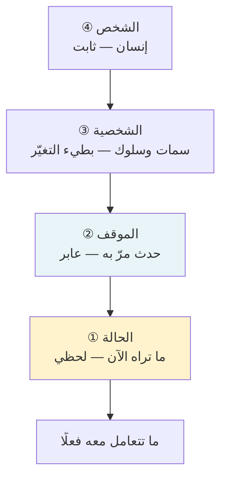
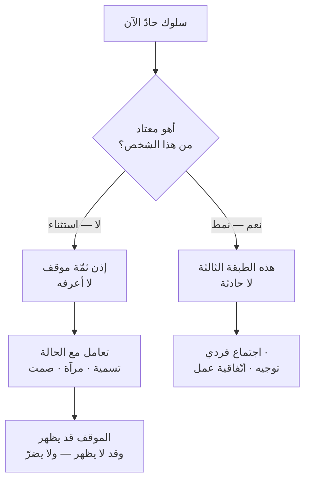

> [!info] الفصل 07 · كورس لعبة العقل
> **ماذا ستتعلّم:** كيف تُشرِّح صراعًا بدل أن تنطبع منه. ستُتقن **الطبقات الأربع** — الحالة · الموقف · الشخصية · الشخص — ولماذا الخلط بينها هو ما يُحوّل **عائقًا مؤقّتًا إلى حاجز دائم** يبقى طوال مدّة العقد. وستعرف كيف تتصرّف حين تكون **الطبقة الثانية مجهولة** — وهي الحالة الأشيع — وستُحلّ إشكالًا حقيقيًّا طُرح في المحاضرة: هل تفاصيل الموقف مهمّة أصلًا؟ ثم ستدخل إلى **الصراعات الخمسة** التي رصدها المحاضر في بيئة العمل، ولكلٍّ منها **دافعه وعلاجه ومزلقه** — الخوف على المنصب · صراع الأنا · الضغط والاتّهام المتبادل · صراع الظهور · الشللية. وستتعلّم أن **علاج كلّ صراع مختلف**، وأنّ تطبيق علاج واحد على الخمسة هو أشيع سبب لفشل إدارة الصراع. وستُواجه أخيرًا خلافًا حقيقيًّا وقع في القاعة: **من مسؤول عن نضج الفريق؟** — بمعياره الاقتصادي، وقراءة نقدية لما لا يُعالجه الإطار.

> [!abstract] التأصيل
> **يفترض أنّك تعرف:** [[Labeling]] · [[Psychological Safety]]
> **ويُؤصّل لك:** [[Task vs Relationship Conflict]] · [[Belbin Team Roles]]

# الفصل 07 — إدارة الصراع: الطبقات الأربع والصراعات الخمسة

## 🎯 أهداف التعلّم

- **تشريح** صراع حقيقي إلى طبقاته الأربع، وتحديد أيّ طبقة تتعامل معها فعلًا.
- **شرح** كيف يُحوّل الخلط بين الحالة والشخصية عائقًا مؤقّتًا إلى حاجز دائم.
- **التصرّف** حين تكون الطبقة الثانية مجهولة، بلا بناء افتراضات.
- **تصنيف** صراع في العمل ضمن الأنواع الخمسة، واختيار العلاج المناسب لنوعه.
- **تحديد** متى يكون العلاج تدخّلًا فرديًّا ومتى يكون تدخّلًا نظاميًّا.
- **الحكم** في مسألة مسؤولية النضج بمعيار قابل للتطبيق لا بموقف مبدئي.

---

## الفكرة المحورية: عائق مؤقّت أم حاجز دائم؟

> [!quote] من المحاضرة
> **حمزة:** «**لو شرّحنا أيّ صراع في العالم بهذه الطريقة — أيّ صراع، أو معظم الصراعات التي تدخلها في بيئة العمل — لكان عائقًا مؤقّتًا لا حاجزًا دائمًا يقف بيننا طوال مدّة العقد.**»

هذه الجملة تحمل الأطروحة كاملة: **الفرق بين صراع يمرّ وصراع يستقرّ ليس في شدّة الحادثة — بل في التفسير الذي بُني عليها.**

الحادثة نفسها — صوت مرتفع في اجتماع — يمكن أن تُفسَّر تفسيرين، ولكلّ تفسير مستقبل مختلف تمامًا:

| التفسير | ما يُنتجه في ذهنك | ما يُنتجه في العلاقة | المستقبل |
|---|---|---|---|
| **«هذا سلوك من شخص تحت ضغط»** *(حالة)* | حادثة ذات سياق | فضول عن السبب | تمرّ خلال أيّام |
| **«هذا شخص عدواني»** *(شخصية)* | معلومة عن هويّته | حذر دائم | تبقى طوال مدّة العقد |

**والانتقال من العمود الأوّل إلى الثاني يحدث في لحظة واحدة، وغالبًا بلا وعي.** وأدوات هذا الفصل كلّها تخدم غرضًا واحدًا: **منع ذلك الانتقال.**

---

## أوّلًا: الطبقات الأربع

> [!quote] من المحاضرة
> **حمزة:** «**أيّ صراع في العالم يتركّب من أربع طبقات:** ① **الحالة** التي عليها الشخص المُتخاصِم معك. ② **الموقف** الذي مرّ به ذلك الشخص، والذي ولّد فيه الشعور الذي جعله يُخاصمك. ③ **شخصيّته** — سماته وسلوكه. ④ **الشخص** — الإنسان من لحم ودم.»

ويُوضّحها بمثاله الشخصي: عودة من عمل مُنهِك، وطريق شاقّ، ومدير كان يُمزّقه طوال اليوم — ثم انفجار على طلب تافه عند باب البيت.

**والترتيب من الداخل إلى الخارج مهمّ:** ما تراه في الاجتماع هو **الطبقة الأولى فقط** — أضيق الطبقات وأقصرها عمرًا. والخطأ الشائع أن تُسقِط ما رأيتَه في الطبقة الأولى على الطبقة الثالثة.

| الطبقة | مداها الزمني | هل تراها؟ | الخطأ الشائع فيها |
|---|---|---|---|
| **① الحالة** | دقائق إلى ساعات | ✅ نعم | أن تُعامَل بوصفها سمة ثابتة |
| **② الموقف** | ساعات إلى أيّام | ❌ غالبًا لا | أن تُخترَع افتراضًا حين تُجهَل |
| **③ الشخصية** | شهور إلى سنوات | 🟡 بالمعاشرة | أن تُستنتَج من حادثة واحدة |
| **④ الشخص** | ثابت | ✅ نعم | أن يُختزَل في سلوك |

> [!quote] من المحاضرة
> **حمزة:** «**حمزة زوج مثالي يقول لزوجته «حاضر»؛ ومرّةً قال حمزة لا ورفع صوته. كيف ينبغي أن تتصرّف زوجته؟** إن لم يكن لديها نضج […] ستُمسك حمزة وتقول *أنت رجل بلا أخلاق* […] **والنتيجة: البيت خرِب.** […] أمّا إن كان لديها النضج […] *ولا يهمّك — دعني أُعِدّ لك عصير ليمون.*»

**والقاعدة التي يستخرجها منه:**

> [!quote] من المحاضرة
> **حمزة:** «نعم — **وخصوصًا إن لم يكن السلوك معتادًا.** […] فإن كان حمزة يعود كلّ يوم صارخًا، فحمزة ببساطة سيّئ الخلق.»

> [!tip] القاعدة العملية — قاعدة الطبقة الثالثة
> **الطبقة الثالثة هي المرجع، لا الحادثة.** فقبل أن تحكم على سلوك، اسأل: **أهذا معتاد منه أم استثناء؟**
> - **استثناء** ← الطبقة الأولى، وسببها في الثانية. عائق مؤقّت. تعامَل مع الحالة.
> - **معتاد** ← الطبقة الثالثة. هذه ليست حادثة بل نمط، وعلاجه مختلف تمامًا (توجيه · اجتماع فردي · تصعيد · استبعاد).
>
> **وهذا يُنتج أخطر خطأين في إدارة الصراع، وكلاهما شائع:**
> **①** أن تُعامل **الاستثناء** بوصفه نمطًا ← تُدمّر علاقة بسبب يوم سيّئ.
> **②** أن تُعامل **النمط** بوصفه استثناءً ← تُبرّر سلوكًا متكرّرًا سنة كاملة، ويدفع الفريق الثمن.

> [!info] إضافة مرجعية — الأساس النفسي والفرق عن الكورس
> ما تصفه الطبقات الأربع له اسم دقيق في الأدبيات: التمييز بين **الإسناد الظرفي (`situational attribution`)** و**الإسناد السماتي (`dispositional attribution`)**. والميل التلقائي إلى الثاني عند تفسير سلوك الآخرين هو **خطأ الإسناد الأساسي** عند **لي روس** (1977).
>
> **ولهذا الميل عدم تماثل مُوثَّق يُسمّى فارق الفاعل والمُلاحِظ (`actor-observer bias`):** نُفسّر سلوكنا نحن بالظروف («تأخّرتُ بسبب الزحام») وسلوك غيرنا بالسمات («تأخّر لأنّه غير منضبط»). ومثال حمزة مع زوجته تجسيد دقيق للفارق: هو يعرف **الموقف** (الطبقة الثانية) فيراه ظرفيًّا؛ وهي لا تراه فتُفسّره سماتيًّا.
>
> **وإضافة الكورس التي لا توجد في الأدبيات الأكاديمية بهذه الصيغة هي الطبقة الرابعة — «الشخص من لحم ودم».** وهي ليست تصنيفًا تحليليًّا؛ **إنّها حدّ أخلاقي.** فوظيفتها أن تُذكّر بأنّ تحت كلّ التحليل إنسانًا لا يجوز اختزاله في سلوك ولا في تصنيف. وحين سُئل عنها في المحاضرة أجاب: *«إنّه **أيّ** طرف. أيّ إنسان قريب ولا يُمَسّ باستهتار.»*
>
> **وموضعها في الترتيب مقصود:** إنّها **القاعدة** التي تقوم عليها الطبقات الثلاث الأخرى — لا الطبقة الأخيرة في تسلسل تشخيصي.

---

## ثانيًا: حين تكون الطبقة الثانية مجهولة

هذا أهمّ إشكال عملي في الفصل، وقد طُرح في القاعة صراحةً:

> [!quote] من المحاضرة
> **مشارك:** «أحيانًا قد لا أعرف الموقف الذي تعرّض له الشخص فجعله يُعاملني هكذا […] فقد تكون **الطبقة الثانية مجهولة** لي.»
>
> **حمزة:** «صحيح مئة بالمئة.»
>
> **مشارك:** «إذن **الطبقة الثالثة** هي التي تجعلني أقبل هذه الحدّة أو لا أقبلها: إن كان الشخص عادةً إنسانًا طيّبًا، فبالتأكيد ظرف طارئ ما جعله سيّئًا في هذا الموقف.»
>
> **حمزة:** «صحيح.»

**وهذا حلّ أنيق لمشكلة معلوماتية:** لا تحتاج أن تعرف **ما** الموقف؛ يكفي أن تعرف أنّ **ثمّة موقفًا** — ودليلك على وجوده هو **انحراف السلوك عن الطبقة الثالثة.**

ثم يذهب المحاضر إلى موقف أدقّ من ذلك، وهو موضع يستحقّ التأمّل:

> [!quote] من المحاضرة
> **مشارك:** «لكنّي قصدت: هل الموقف نفسه يهمّ في ذاته؟»
>
> **حمزة:** «**لا. الموقف مضى.** في أيّ إدارة نحاول تجاوزه […] **الموقف عائق — حدث مفاجئ وقع.** نحتاج أن نتعامل معه، ونتعامل معه سريعًا، ونُبقي قلوبنا مع بعضها حتى نتجاوزه.»

**وقد يبدو هذا متناقضًا** مع إصراره في مواضع أخرى على أنّ «الدافع مهمّ جدًّا». والتوفيق بينهما في تمييز يذكره هو نفسه:

> [!quote] من المحاضرة
> **حمزة:** «**الدافع مهمّ جدًّا في بيئة العمل** […] وأتعلمون **لماذا** لا بدّ أن أعرفه؟ **حتى لا يدخل الشكّ فيلعب بعقلي** فأبدأ في التخمين […] فمعرفة الدافع مهمّة — **لكنّ الطريقة التي أعرفه بها أهمّ.**»

| | **الدافع (الطبقة الأولى)** | **الموقف (الطبقة الثانية)** |
|---|---|---|
| **ما هو؟** | ما يحتاجه الآن | ما حدث له قبل الاجتماع |
| **أتحتاجه؟** | ✅ نعم — لا حلّ بدونه | 🟡 مفيد لا ضروري |
| **لماذا؟** | تُبنى عليه المفاضلة والحلّ | يمنع الشكّ والتخمين فقط |
| **إن جُهِل؟** | لا تستطيع الحلّ | تستطيع الحلّ — والطبقة الثالثة تكفي |

> [!tip] القاعدة العملية
> **اسعَ إلى الدافع؛ ولا تُطارد الموقف.**
> الدافع يُستخرَج بالتسمية والمرآة. أمّا الموقف فيأتي طوعًا أو لا يأتي — و**السؤال عنه مباشرةً تطفّل** يُنتج انغلاقًا لا انفتاحًا.
> **والخطأ العملي الأشيع:** «هل حدث شيء اليوم؟» — سؤال حسن النيّة يُقرأ اقتحامًا، ويضع الشخص أمام خيارين كلاهما سيّئ: أن يُفصح عمّا لا يريد الإفصاح عنه، أو أن يكذب.

---

## ثالثًا: الصراعات الخمسة

> [!quote] من المحاضرة
> **حمزة:** «بعد فحص أوسع، وجدنا أنّ المشكلات في العمل تقع لأسباب عدّة، منها: ① **الخوف على المنصب** […] ② **صراع الأنا** […] ③ **أناس تحت ضغط يتقاذفون الاتّهامات** […] ④ **صراع الرغبة في الظهور** […] ⑤ **الشلل والتحزّبات**.»

وأهمّ ما في هذا التصنيف أنّه **يُنتج علاجات مختلفة**. وتطبيق علاج واحد على الخمسة هو أشيع سبب لفشل إدارة الصراع:

| # | النوع | الدافع الكامن | ما يبدو عليه | **العلاج** | المزلق |
|---|---|---|---|---|---|
| **1** | **الخوف على المنصب** | تهديد وجودي على الدور | مقاومة تغيير · تعطيل · «هذا مخالف للقانون» | **طمأنة + توثيق صريح** لدوره في الوضع الجديد | الطمأنة الشفوية وحدها؛ لا يُصدَّق الكلام بلا وثيقة |
| **2** | **صراع الأنا** | انخفاض السيروتونين — مكانة مهزوزة | استعلاء · رفض النقد · مقاطعة الأحدث | **احترام وتقدير معلن** — أعِد المكانة قبل النقاش | الدخول ندًّا؛ إثبات خطئه علنًا |
| **3** | **الضغط والاتّهام المتبادل** | حِمل يفوق السعة | نبرة ضحيّة · قسم يتّهم قسمًا | **تخفيف الحمل** — تدخّل نظاميّ لا حواري | معالجته بالحوار وحده؛ الحمل باقٍ فيتكرّر أسبوعيًّا |
| **4** | **صراع الظهور** | حاجة إلى الاعتراف | يقطف جهد غيره · يريد أن يُشكَر | **مواءمة مصلحته مع الفريق** + جعله قدوة | مقاومته أو تجاهله؛ الحاجة مشروعة والمشكلة في طريقها |
| **5** | **الشللية** | انتماء إلى مجموعة فرعية | تحالفات · تنمّر · قرارات خارج القاعة | **هدف مشترك + عملية محدّدة** + لغة «نحن» | مواجهة الشلّة بوصفها كتلة — يُثبّتها |

> [!quote] من المحاضرة
> **حمزة:** «من يخاف على منصبه لا تستطيع أن تأتي وتقول له *الذكاء الاصطناعي سيحلّ محلّك.* طبيعيّ أن يرفض استخدام الذكاء الاصطناعي، **لأنّك قذفتَه في وجهه.** هو لن يُستبدَل على أيّ حال؛ إنّه يحتاج أن **تطمئنه**: *الذكاء الاصطناعي سيساعدك في الإنتاجية.*»

**والملاحظة الحاسمة في الجدول أعلاه هي الصفّ الثالث:** الصراع الثالث **لا يُحلّ بمهارة تواصل.** فالعلاج المذكور — «تخفيف العمل عنهم» — تدخّل على النظام لا على الحوار. وهذا اعتراف ضمنيّ بحدّ الكورس نفسه: **بعض الصراعات أعراض حِمل، لا أعراض سوء تواصل.**

> [!info] إضافة مرجعية — تصنيفات موازية، وما يُضيفه كلّ منها
> **① التصنيف الأكاديمي الشائع (Jehn, 1995)** يُقسّم صراع الفريق ثلاثة أنواع:
> - **صراع المهمّة (`task conflict`)** — خلاف على المحتوى والقرارات. **مفيد بقدر معتدل.**
> - **صراع العلاقة (`relationship conflict`)** — توتّر شخصي. **ضارّ دائمًا.**
> - **صراع العملية (`process conflict`)** — خلاف على من يفعل ماذا وكيف. ضارّ إن استمرّ.
>
> **وأهمّ نتيجة في هذه الأدبيات أنّ صراع المهمّة يتحوّل إلى صراع علاقة بمرور الوقت** إن لم يُدَر — وهذا بالضبط ما تُسمّيه الطبقات الأربع: انتقال من الطبقة الأولى إلى الثالثة. **فالتصنيفان يصفان الظاهرة نفسها من زاويتين.**
>
> **② شبكة توماس–كيلمان (`TKI`, 1974)** تُصنّف أنماط الاستجابة لا أنواع الصراع، على محورَي **الحزم** و**التعاون**: التنافس · التجنّب · التسوية · الاستيعاب · **التعاون**. وأطروحتها أنّ لكلّ نمط موضعًا صحيحًا.
>
> **وموقع الكورس منها واضح:** ما يُسمّيه **الإزاحة** (الفصل [[08 - الإزاحة والأسئلة المعايرة|08]]) هو نمط **التعاون** — حزم عالٍ وتعاون عالٍ. وما يرفضه («التنازل إرضاءً») هو **الاستيعاب**. وما يُحذّر منه («لا تُخرج العقد سلاحًا») هو **التنافس**. و«أنصاف الحلول» التي يرفضها هي **التسوية**.
>
> **والفارق النقدي:** يرى TKI أنّ لكلّ نمط موضعًا مشروعًا؛ ويُقدّم الكورس **التعاون بوصفه النمط الصحيح دائمًا** تقريبًا. وهذا مبالغة: التجنّب صحيح مع خلاف تافه أو توقيت سيّئ؛ والتنافس ضروري في مسائل السلامة والأخلاق؛ والاستيعاب صحيح حين يكون الموضوع أهمّ لغيرك منه لك وتريد بناء رصيد. **والتعاون هو الأغلى ثمنًا زمنيًّا — فلا يُنفَق على كلّ شيء.**

---

## رابعًا: من مسؤول عن النضج؟

خلاف حقيقي وقع في القاعة بين متمرّسَين، وهو يستحقّ أن يُعرَض بوصفه خلافًا لا أن يُحسَم بالتصويت:

> [!quote] من المحاضرة
> **علي يسري:** «**النضج عمومًا مرحلة مُكتسَبة** للشخص نفسه. أنا لستُ مطالَبًا، ولستُ مُلزَمًا، بتعليم من أمامي حتى يبلغ مرحلة النضج. ذلك سيُنهكني ويحرق قدرًا هائلًا من الطاقة.»
>
> **حمزة:** «أتّفق مع الجزء الأوّل. أمّا الثاني: فالأرجح أنّك لم تحضر **تحوّلًا رشيقًا** — أكرمك الله وعملتَ في شركات عالمية طوال الوقت […] قبل نحو ثلاث سنوات كنتُ أقول جملة أستغفر الله منها: *أنا لستُ هنا لأُعلّمك كيف تعمل.* **هذا خطأ. أنت *بالفعل* هنا لتُعلّمنا كيف نعمل.**»

**والمعيار الفاصل الذي بُني في الفصل [[01 - لماذا لعبة عقل - الحلبة والشروط الأربعة|01]] يُطبَّق هنا:**

| | **موقف علي يسري** | **موقف حمزة** |
|---|---|---|
| **يصحّ حين** | التوظيف انتقائي · الاستبدال رخيص · السوق سائل | تحوّل داخل مؤسّسة قائمة · فريق موروث · الاستبدال باهظ أو مستحيل |
| **خطره في غير موضعه** | فريق لا يتحسّن أبدًا؛ دوران دائم | إنهاك القائد؛ تعليم بلا نهاية لمن لا يريد |
| **السؤال الحاسم** | **هل أستطيع استبدال هذا الشخص بتكلفة معقولة؟** | |

ويستدعي المحاضر مرجعين لدعم موقفه، وكلاهما يستحقّ تفصيلًا:

> [!quote] من المحاضرة
> **حمزة:** «قال **تاكمان** إنّ من الاعتقادات الخاطئة أنّ أيّ مجموعة أفراد تُوضَع معًا ويُعطَون مشروعًا سينفّذونه. **هذا خطأ** […] وقال **بلبن** كذلك: كما تهتمّ بتوزيع **الأدوار الوظيفية** […] **فأنت تحتاج أيضًا أدوارًا سلوكية**.»

> [!info] إضافة مرجعية — تاكمان وبلبن بدقّة
> **① تاكمان (`Bruce Tuckman`, 1965)** — أربع مراحل: **تشكيل ← عصف ← تنظيم ← أداء** (وأضاف عام 1977 مرحلة خامسة: **إنهاء**). وأهمّ نتيجتين لهذا الفصل:
> - **العصف مرحلة ضرورية لا خلل.** الفريق الذي لم يمرّ بصراع لم يُنشئ بعد قواعده الحقيقية. فمعالجة العصف بوصفه فشلًا تُنتج فريقًا مؤدَّبًا لا يقول شيئًا.
> - **الدورة غير خطّية**، وقد نبّه المحاضر إلى هذا صراحةً: *«ليست خطّية بل دائرية: قد يصل فريق إلى أداء عالٍ جدًّا ثم يصطدم فجأةً بمرحلة عصف.»* — ومُطلِقات الرجوع معروفة: انضمام عضو، أو تغيّر قيادة، أو تحوّل في الهدف.
>
> **② بلبن (`Meredith Belbin`, 1981)** — تسعة أدوار سلوكية تُصنَّف ثلاث مجموعات: **موجَّهة نحو الفكر** (النبتة · المُقيّم · المتخصّص) · **موجَّهة نحو الناس** (المنسّق · باحث الموارد · صانع الفريق) · **موجَّهة نحو الفعل** (المُشكِّل · المُنفِّذ · المُكمِّل).
>
> **وحدّ يجب أن يُقال:** أداة بلبن التقييمية موضع نقد منهجي معتبر (ثبات متوسّط، وبنية عاملية مختلَف عليها). **لكنّ المبدأ العامّ الذي يستدعيه المحاضر — أنّ فاعلية الفريق تتطلّب تنوّعًا في المساهمات السلوكية لا الوظيفية فحسب — مدعوم بأدبيات أوسع من أداة بلبن نفسها.** فاستخدمه إطارًا للانتباه إلى الفجوات، لا اختبارًا لتصنيف الناس.

> [!warning] المزلق العملي — الفرق بين بناء النضج وتحمّل عدمه
> «بناء النضج مسؤوليتك» لا تعني «تحمّل السلوك السيّئ بلا حدّ». والمحاضر نفسه يضع الحدّ:
> > *«في **ديناميكيات الفريق** سندرس أنّه، في مرحلة ما، **إن كان سلوك شخص سيّئًا فلا بدّ من إبعاده عن الفريق.** لكنّ ذلك لا يحدث في المرّة الأولى.»*
>
> **والفرق العملي بينهما ثلاثة عناصر:**
> - **بناء النضج:** توجيه صريح + اجتماع فردي + بند إجرائي **مُوثَّق** + مراجعة بموعد.
> - **تحمّل عدمه:** تسميات متكرّرة، وامتصاص متكرّر، **بلا توثيق ولا مراجعة ولا حدّ زمني.**
>
> **والفاصل هو التوثيق والمراجعة.** فمن يبني نضجًا يستطيع أن يقول بعد ثلاثة أشهر: «اتّفقنا في كذا، وراجعنا في كذا، وهذا ما تغيّر وهذا ما لم يتغيّر.» ومن يتحمّل لا يملك إلّا انطباعًا متراكمًا بالإنهاك.

---

## خامسًا: الأمان النفسي — الشرط الذي يسبق كلّ شيء

يمرّ الكورس على هذا المفهوم في سياق المطوّر المبتدئ الصامت، وهو يستحقّ أن يُفرَد لأنّه **الشرط الذي بدونه لا تعمل أدوات الفصل كلّه**:

> [!quote] من المحاضرة
> **حمزة:** «**الأمان النفسي الذي نمنحه في البيئة، والذي تتبنّاه ثقافة الشركة، هو ما سيجعله يجرؤ على الكلام معك.** […] والأمان النفسي **لا يعني أن أكون شخصًا لطيفًا؛ بل يعني أنّ في بيئة عملي الخطأ عاديّ، وممكن تمامًا، ونحن بشر نُخطئ ولا مشكلة في ذلك.**»

**والتفريق الذي يذكره — أنّه ليس لطفًا — هو أدقّ ما في الفقرة**، وهو تصحيح لسوء فهم شائع جدًّا.

> [!info] إضافة مرجعية — إدموندسون، والخطأ الشائع
> صاغت **إيمي إدموندسون (`Amy Edmondson`)** المفهوم في *Psychological Safety and Learning Behavior in Work Teams* (1999) وطوّرته في *The Fearless Organization* (2018): **الاعتقاد المشترك بأنّ الفريق آمن للمخاطرة الشخصية بين أفراده** — أن تسأل سؤالًا، وتعترف بخطأ، وتطرح رأيًا مخالفًا، بلا خوف من الإحراج أو العقاب.
>
> **وأشهر التباس حولها هو ما يُصحّحه المحاضر بالضبط.** ولإدموندسون مصفوفة تحسمه، على محورَي **الأمان النفسي** و**معايير الأداء**:
>
> | | **معايير أداء منخفضة** | **معايير أداء عالية** |
> |---|---|---|
> | **أمان نفسي عالٍ** | **منطقة الراحة** — علاقات طيّبة، لا إنجاز | **منطقة التعلّم** ✅ |
> | **أمان نفسي منخفض** | **منطقة اللامبالاة** | **منطقة القلق** — إنجاز قصير الأمد ثم احتراق |
>
> **والنتيجة الحاسمة:** الأمان النفسي **ليس نقيض المعايير العالية بل شرطها.** فمن غير الآمن الاعتراف بمشكلة لن يعترف بها — فتتحوّل المشكلة الصغيرة إلى كبيرة. ومعايير عالية بلا أمان تُنتج إخفاءً منظّمًا للأخطاء.
>
> **وهذا يربط مباشرةً بالفصل [[06 - قوّة لا وأنواع نعم الثلاثة|06]]:** «نعم» الزائفة **عَرَض من أعراض غياب الأمان النفسي.** فمن لا يستطيع قول «لا» بأمان يقول «حاضر» — والنتيجة إخفاء منظّم للالتزامات غير الممكنة.

---

## 🗣️ بنك العبارات — إدارة الصراع

| الموقف | العبارة الخاطئة | العبارة الصحيحة | لماذا |
|---|---|---|---|
| زميل هادئ عادةً ينفجر فجأةً | «ما هذا الأسلوب؟» | *(صمت)* ثم «يبدو أنّ اليوم كان ثقيلًا» — ولا تسأل عن السبب | حالة لا شخصية؛ ولا تُطارد الموقف |
| خائف على منصبه من التغيير | «هذا لن يُلغي دورك، اطمئنّ» | «دورك في النظام الجديد هو [كذا] — وسأُرسله موثّقًا اليوم» | الطمأنة الشفوية وحدها لا تُصدَّق |
| صاحب أنا مرتفعة يُقاطع | «دعني أُكمل» | «خبرتك في هذا الجزء أهمّ ما نحتاجه — وأودّ أن أسمع رأيك بعد أن أُنهي النقطة» | إعادة المكانة قبل استعادة الدور |
| قسمان يتقاذفان الاتّهامات | «كفى، ركّزوا في العمل» | «يبدو أنّ الحمل في الشهرين الماضيين كان فوق طاقة الجميع» ثم **مراجعة السعة** | صراع حِمل لا صراع تواصل |
| من يريد الظهور دائمًا | تجاهله أو مواجهته | «أودّ أن تعرض أنت هذا الجزء في المراجعة — أنت أقدر على شرحه» | مواءمة الحاجة لا مقاومتها |
| شلّة تتّخذ قرارات خارج القاعة | «هناك من يتّخذ قرارات في الخفاء» | «هدفنا هذا الربع واحد — فلنتّفق أنّ كلّ قرار على النطاق يُذكَر في التخطيط» | هدف مشترك + عملية، لا مواجهة كتلة |
| مبتدئ صامت أخطأ | «لماذا لم تقل؟» | «يبدو أنّ الكود معقّد» — ثم أظهِر أنّ الخطأ عاديّ بمثال منك أنت | الأمان النفسي يُبنى بالنموذج لا بالإعلان |

---

## 🧪 ورشة الفصل — تشريح صراع قائم

| الخطوة | العمل | المُخرَج |
|---|---|---|
| **1** | اختر صراعًا قائمًا في فريقك الآن — لا حادثة عابرة | حالة واحدة |
| **2** | اكتب **الطبقة الأولى**: ما السلوك الملموس الذي تراه؟ *(أفعال لا تفسيرات)* | وصف سلوكي |
| **3** | اكتب **الطبقة الثالثة**: أهذا معتاد من هذا الشخص أم استثناء؟ ما دليلك؟ | حكم بدليل |
| **4** | إن كان استثناءً: هل تعرف **الطبقة الثانية**؟ إن لا، **لا تخترعها** — اكتب «مجهول» | صدق معرفيّ |
| **5** | صنّف الصراع ضمن الأنواع الخمسة | تصنيف |
| **6** | اختر العلاج المطابق للنوع من الجدول — لا العلاج الذي تُتقنه | إجراء |
| **7** | حدّد: **أهو تدخّل فردي أم نظاميّ؟** إن كان النوع الثالث، فأيّ حِمل ستُخفّف بالضبط؟ | قرار على المستوى الصحيح |
| **8** | ضع موعد مراجعة مكتوبًا | تاريخ |

---

## القراءة النقدية — أين يقصر هذا الطرح؟

**1. الطبقات الأربع أداة تشخيص بلا أداة قياس.** «أهذا معتاد أم استثناء؟» سؤال ممتاز — وجوابه يعتمد على ذاكرتك، وذاكرتك متحيّزة بانتظام. فنحن نتذكّر الحوادث السلبية أكثر (انحياز السلبية)، ونتذكّر ما يُؤكّد انطباعنا القائم (انحياز التأكيد). **والنتيجة أنّ من كوّنتَ عنه انطباعًا سلبيًّا سيبدو لك «معتادًا» على السلوك السيّئ بعد حادثتين، بينما من تُحبّه سيبقى «استثناءً» بعد خمس.** والعلاج الوحيد **التوثيق البسيط** — سطر بتاريخ عند كلّ حادثة معتبرة — وهو ما لا يذكره الكورس إطلاقًا.

**2. التصنيف الخماسي وصفيّ لا استنباطي، وفئاته متداخلة.** الأنواع الخمسة مستخرَجة من خبرة المحاضر («هذه الصراعات الخمسة هي ما رأيتُه»)، وهي مفيدة عمليًّا. لكنّها **غير حصرية ومتداخلة**: صراع الأنا وصراع الظهور يتقاطعان في معظم الحالات؛ والشللية غالبًا نتيجة لأحد الأربعة لا نوع مستقلّ. **والنتيجة العملية:** استخدمها **قائمة تفتيش** («أيّ هذه الدوافع حاضر هنا؟») لا **تصنيفًا حصريًّا** («هذا صراع من النوع الثاني»). فالحالة الواحدة قد تحوي ثلاثة دوافع معًا، وعلاجها مركّب.

**3. الحدّ الأدنى المفقود: أنواع صراع لا يُعالجها الإطار.** الأنواع الخمسة كلّها تفترض **أطرافًا حسنة النيّة في حالة سيّئة.** ولا يوجد في التصنيف موضع لـ: التنمّر المنهجي (يُذكَر عرضًا في سياق آخر)؛ والتمييز على أساس جنس أو أصل؛ والاحتيال؛ والانتهاك الأخلاقي. وهذه ليست «صراعات» تُدار بالإزاحة — **إنّها مسائل تصعيد وتوثيق وإجراءات رسمية**، وتطبيق أدوات هذا الفصل عليها يُطيل أمدها ويُحمّل الضحيّة عبء إدارتها. **والقاعدة المفقودة:** إن كان السلوك يُصيب فئة بعينها، أو يتضمّن انتهاكًا واضحًا، فأنت خارج نطاق هذا الفصل تمامًا.

**4. النوع الثالث يُقرّ بحدّ الكورس ولا يُبنى عليه.** علاج «الضغط والاتّهام المتبادل» — تخفيف الحمل ومراجعة السعة — تدخّل **نظاميّ**، ويقع خارج مهارات التواصل كلّيًّا. وهذا اعتراف مهمّ ومرّ عليه الكورس مرورًا. **والنتيجة التي كان ينبغي أن تُقال:** جزء معتبر ممّا يُسمّى «صراعًا» في الفرق هو **عَرَض حِمل**، ويُشخَّص بالأرقام لا بالحوار — بالسعة، وحِمل التدفّق، والعمل غير المرئي. **وهنا يقع الجسر المباشر مع [[كورس الإنتاجية]]:** لوحة قياس تُظهر أنّ الفريق يعمل بأكثر من سعته تُنهي «صراعًا» لن تُنهيه عشرون تسمية.

**5. الأمان النفسي شرط ولا يُقدَّم بطريقة بنائه.** يُذكَر مرارًا ولا تُذكَر آليّته. والأدبيات واضحة في أنّه **يُبنى بسلوك القائد المرصود لا بإعلانه**: أن يعترف القائد بخطئه أوّلًا، وأن يسأل أسئلة يظهر فيها أنّه لا يعرف، وأن يستقبل الخبر السيّئ بلا معاقبة حامله — وهذه الأخيرة هي الاختبار الحقيقي وتقع في **الثواني الخمس** التي تلي وصول الخبر. **ومن يُعلن «بابي مفتوح» ثم يظهر انزعاجه من أوّل خبر سيّئ قد ألغى إعلانه.**

---

## 🧾 خلاصة الفصل

1. **الفرق بين عائق مؤقّت وحاجز دائم في التفسير لا في الحادثة** — حالة أم شخصية؟
2. **أربع طبقات:** حالة (تُرى) · موقف (يُجهَل غالبًا) · شخصية (المرجع) · شخص (الحدّ الأخلاقي).
3. **الطبقة الثالثة هي المرجع:** معتاد أم استثناء؟ — والخطأ في الاتّجاهين مُكلِف.
4. **لا تحتاج معرفة الموقف؛ يكفي أن تعرف أنّ ثمّة موقفًا** — ودليلك انحراف السلوك عن المعتاد.
5. **اسعَ إلى الدافع، ولا تُطارد الموقف** — والسؤال المباشر عنه تطفّل يُنتج انغلاقًا.
6. **خمسة صراعات بخمسة علاجات** — وتطبيق علاج واحد على الخمسة أشيع سبب للفشل.
7. **الصراع الثالث نظاميّ لا حواريّ** — ويُشخَّص بالأرقام لا بالتسميات.
8. **مسؤولية النضج تُحسَم بسؤال الاستبدال** لا بموقف مبدئي؛ وحدّها التوثيق والمراجعة.
9. **الأمان النفسي شرط للأدوات كلّها** — وليس لطفًا، بل قابلية للاعتراف بالخطأ.
10. **حدود الإطار:** تشخيص بلا قياس · فئات متداخلة · ولا موضع فيه للتنمّر والانتهاك — وهذه مسائل تصعيد لا إزاحة.

---

## ❓ اختبارات ذاتية

> [!question]- 1) مطوّرة هادئة عادةً ردّت بحدّة على ملاحظة في مراجعة الكود أمام الفريق. ما الطبقات، وما تفعله في الاجتماع، وما تفعله بعده؟
> **التشريح:** الطبقة الأولى = حدّة الردّ. الطبقة الثالثة = **هادئة عادةً** — إذن هذا **استثناء**، ودليلك على وجود موقف في الطبقة الثانية هو الانحراف نفسه. والطبقة الثانية **مجهولة**، ولا تخترعها.
> **في الاجتماع — الأولوية للطبقة الرابعة:** لا تُعالج الحدّة أمام الفريق. الملاحظة العلنية تُثبّت الحادثة في ذاكرة الجميع وتُحوّلها من لحظة إلى سابقة. فأكمل المراجعة بشكل طبيعي.
> **إن كان لا بدّ من شيء:** تسمية على مستوى الفريق لا الفرد — «يبدو أنّ الضغط في هذا السبرنت عالٍ على الجميع» — فتُقرّ بالحالة بلا أن تُشير إليها.
> **بعده — اجتماع فردي، والصياغة حاسمة:**
> - ❌ «ما بك اليوم؟ هذا ليس أسلوبك» ← يجمع بين اتّهام واقتحام.
> - ❌ «هل حدث شيء؟» ← يبدو حسن النيّة ويُقرأ تطفّلًا؛ ويضعها بين الإفصاح والكذب.
> - ✅ «أردتُ أن أطمئنّ — هل هناك ما يُعطّلك أو ما أستطيع مساعدتك فيه هذه الفترة؟»
> **لاحظ أنّ الصياغة الأخيرة تفتح بابًا ولا تسأل عن الموقف.** إن أرادت الإفصاح ستفعل؛ وإن لم تُرد لن تُحرَج — **وأنت لا تحتاجه أصلًا.**

> [!question]- 2) قسم ضمان الجودة وقسم التطوير في اتّهام متبادل منذ ثلاثة أشهر. طبّقتَ التسمية والمرآة والإزاحة مرارًا وهدأ الوضع في كلّ مرّة — ثم عاد. ما الذي يقوله هذا الفصل؟
> **يقول إنّك تُعالج العَرَض الصحيح على المستوى الخاطئ.** واستمرار النمط ثلاثة أشهر مع تكرار العلاج ونجاحه المؤقّت **دليل تشخيصي بذاته**: هذا ليس صراع علاقة؛ إنّه **النوع الثالث — ضغط وحِمل**.
> **والمنطق:** أدوات الحوار تُعالج **الحالة**. فإن كانت الحالة تُولَّد باستمرار من ظرف بنيويّ، فأنت تُطفئ حريقًا يُعاد إشعاله أسبوعيًّا.
> **والتشخيص بالأرقام لا بالانطباع.** والأسئلة التي تكشف:
> - كم عيبًا يصل إلى ضمان الجودة في السبرنت مقارنةً بسعتهم؟
> - كم نسبة وقت المطوّرين على العيوب مقابل الميزات؟
> - متى تصلهم الأعمال — موزّعة على السبرنت أم متكدّسة في يومَيه الأخيرين؟
> - هل هناك **تعريف إنجاز** مُتّفق عليه، أم أنّ الخلاف على «منتهٍ» أصلًا؟
> **والأرجح** أنّ الجواب سيُظهر تكدّسًا في اليومين الأخيرين مع سعة اختبار أقلّ من اللازم — وهو ظرف **يجعل الصراع حتميًّا** بين أيّ فريقين مهما بلغ نضجهما.
> **والعلاج نظاميّ:** توزيع التسليم على السبرنت · تعريف إنجاز يتضمّن الاختبار · تخصيص سعة للعيوب. **وهنا يُصبح [[كورس الإنتاجية]] هو الأداة لا هذا الكورس.**

> [!question]- 3) لديك عضو فريق يُنتج صراعًا مع كلّ من يعمل معه، والنمط مستمرّ منذ سنة. متى تتوقّف عن «بناء النضج»؟
> **حين تستوفي ثلاثة شروط مجتمعة — وقبلها لا.**
> **الشرط الأوّل — أن يكون التوجيه قد وقع صريحًا وموثّقًا لا ضمنيًّا.** والفرق الذي يذكره القسم الرابع حاسم هنا: من امتصّ السلوك سنةً بتسميات متكرّرة **لم يبنِ نضجًا؛ بل تحمّل عدمه** — ولا يملك حقّ الاستنتاج لأنّه لم يُجرِ التجربة. والسؤال الصادق: هل جلستَ معه فردًا لفرد، ووصفتَ السلوك بأمثلة محدّدة بتواريخها، واتّفقتما على بند إجرائي مكتوب؟ فإن كان الجواب لا، **فالسنة لا تُحسَب.**
> **والشرط الثاني — أن تكون قد راجعت بموعد.** بندٌ بلا مراجعة ليس بندًا. ومراجعتان بلا تغيّر مرصود أقوى من انطباع سنة.
> **والشرط الثالث — أن تكون قد فحصت الظرف.** أهو صراع مع **كلّ** من يعمل معه، أم مع من هم في أدوار بعينها؟ وهل بدأ النمط مع حدث تنظيمي — تغيّر قيادة، أو نقل، أو تجاوز في ترقية؟ إن كان النمط ظرفيًّا فالعلاج تغيير الظرف لا استبعاد الشخص. وقد أشارت منّة في المحاضرة إلى هذا بدقّة: **من يتنمّر على شخص بعينه يُنقَل؛ ومن يتنمّر عمومًا يُستبعَد.**
> **فإن استوفيت الثلاثة ولم يتغيّر شيء، فالتوقّف ليس فشلًا منك — إنّه القرار الصحيح.** واستمرارك بعدها يُحمّل بقيّة الفريق ثمنًا لا ذنب لهم فيه، ويُرسل إليهم رسالة أخطر: **أنّ السلوك مقبول ما دام صاحبه مُنتجًا.**

> [!question]- 4) لماذا يُعدّ الأمان النفسي شرطًا لأدوات هذا الكورس، لا نتيجةً لها؟
> **لأنّ كلّ أدوات الكورس تفترض أنّ الطرف الآخر سيتكلّم حين تُتاح له مساحة — وهذا الافتراض يسقط تمامًا في بيئة غير آمنة.**
> **تأمّل الآلية:** التسمية تعمل لأنّ الصمت بعدها يُولّد ضغطًا يدفعه إلى الإفصاح. لكنّ الإفصاح **مخاطرة**؛ ومن يعتقد أنّ كلامه قد يُستخدَم ضدّه سيختار الصمت مهما بلغ ضغط الفراغ — لأنّ كلفة الصمت المُتوقَّعة أقلّ من كلفة الإفصاح.
> **والأمر نفسه مع كلّ أداة:** المرآة تحتاج كلامًا لإعادته؛ والسؤال الكاشف يحتاج شخصًا مستعدًّا لقول «هذا لن ينجح»؛ وأنواع «نعم» تحتاج بيئة يكون فيها «لا» متاحًا. **وفي بيئة غير آمنة، «فكيف سنفعلها؟» يُنتج خطّة مُصطنَعة لا خطّة حقيقية** — لأنّ الشخص تعلّم أنّ المطلوب منه إجابة تُرضي لا إجابة تصدق.
> **والنتيجة العملية الخطيرة:** إتقان الأدوات في بيئة غير آمنة يُنتج **مظهر نجاح**: اجتماعات هادئة، وموافقات سريعة، ولا اعتراضات — بينما المشكلات تُخفى بكفاءة أعلى. **والأداة زادت قدرة الفريق على التظاهر بالاتّفاق، لا قدرته على الاتّفاق.**
> **ولهذا فترتيب الأولويات:** إن كانت البيئة غير آمنة، **فبناء الأمان يسبق تعلّم الأدوات** — ويُبنى بالسلوك لا بالإعلان: اعترافك بخطئك أوّلًا، واستقبالك للخبر السيّئ بلا معاقبة حامله في **الثواني الخمس الأولى**.

---

## 📚 مراجع الفصل

| المرجع | الصلة |
|---|---|
| Bruce Tuckman — *Developmental Sequence in Small Groups* (1965) | مراحل الفريق؛ والعصف مرحلة ضرورية لا خلل — يُسمّيه المحاضر صراحةً |
| Meredith Belbin — *Management Teams* (1981) | الأدوار السلوكية مقابل الوظيفية — يُسمّيه المحاضر صراحةً |
| Amy Edmondson — *The Fearless Organization* (2018) | الأمان النفسي؛ ومصفوفة الأمان × المعايير |
| Karen Jehn — *A Multimethod Examination of… Intragroup Conflict* (1995) | صراع المهمّة/العلاقة/العملية، وتحوّل الأوّل إلى الثاني |
| Thomas & Kilmann — *TKI* (1974) | خمسة أنماط استجابة؛ وموقع «الإزاحة» منها |
| Lee Ross — *The Intuitive Psychologist…* (1977) | خطأ الإسناد الأساسي — الأساس النظري للطبقات |
| المصدر الأساس | [[1.4 إدارة الصراع]] · [[1.2 التسمية - الأداة والتمارين]] |

---

## 🔗 روابط ذات صلة

**السابق:** [[06 - قوّة لا وأنواع نعم الثلاثة]] · **التالي:** [[08 - الإزاحة والأسئلة المعايرة]]
**مصدر السجلّ:** [[1.4 إدارة الصراع]]
**مفاهيم:** [[كورس الإنتاجية]] · [[ورشة سكرم العملية]] · [[معجم المصطلحات]]

---

> [!note] قواعد تحرير مُلزِمة في هذه القاعدة
> - كلّ اقتباس من المحاضرة داخل `> [!quote] من المحاضرة`؛ وكلّ معرفة خارجية داخل `> [!info] إضافة مرجعية`.
> - كلّ أداة تُقدَّم بصياغة حرفية قابلة للنسخ.
> - كلّ فصل ينتهي بقراءة نقدية صريحة.
