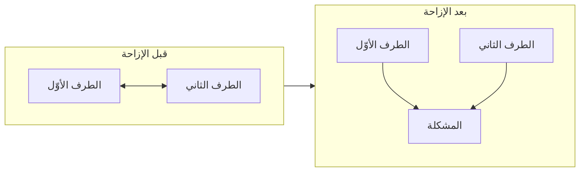

> [!info] الفصل 08 · كورس لعبة العقل
> **ماذا ستتعلّم:** الإجراء الكامل لحلّ صراع من أوّله إلى إغلاقه. ستُتقن **استراتيجية الإزاحة** بخطواتها الأربع — كسر الهجوم الشخصي · نقله إلى خندقك · الحديث عن المستقبل لا الماضي · الإغلاق الصحيح — وستفهم لماذا يُعدّ الحديث عن الماضي مُطلِقًا هرمونيًّا لا خطأً تكتيكيًّا فحسب. وستتعلّم **الأسئلة المعايرة** بأنواعها الثلاثة (المُعجِز · العصف · الاستكشاف)، ولماذا يُحظَر «لماذا» حظرًا قاطعًا وما بديله في كلّ حالة. ثم ستصل إلى **القاعدة الذهبية** التي يُقسم عليها المحاضر: **الصراع لا ينتهي بابتسامة — بل بتحديد المسؤوليات والخطوات التالية**؛ وستعرف لماذا الصراع الذي «انتهى» بلا خطّة عمل **لم ينتهِ بل صار غير مرئيّ**. وستتعلّم **الجملة الافتتاحية المحايدة** التي تُوحّد الصفّ قبل أيّ نقاش، و**قاعدة الاجتماعات الفردية** — لماذا لا تُؤخَذ أثناء الصراع بل بعده. ثم قراءة نقدية لما يُخفيه هذا الإجراء من افتراضات عن السلطة والحياد.

> [!abstract] التأصيل
> **يفترض أنّك تعرف:** [[Tactical Empathy]]
> **ويُؤصّل لك:** [[Displacement Strategy]] · [[Calibrated Questions]]

# الفصل 08 — الإزاحة والأسئلة المعايرة

## 🎯 أهداف التعلّم

- **تنفيذ** الخطوات الأربع للإزاحة بالترتيب على صراع حقيقي بين طرفين.
- **صياغة** جملة افتتاحية محايدة تُوحّد الصفّ بلا تصريح بخطأ أحد.
- **بناء** ثلاثة أنواع من الأسئلة المعايرة، واختيار النوع المناسب لكلّ حالة.
- **استبدال** كلّ استخدام لـ«لماذا» ببديل يُؤدّي وظيفته بلا حمولته.
- **إغلاق** صراع ببروتوكول يتضمّن مسؤوليات وخطوات ومراجعة.
- **نقد** الإجراء: أيّ افتراضات عن سلطتك وحيادك يفترضها، وماذا يحدث حين تسقط.

---

## الفكرة المحورية: بجانب بعضهما لا مقابل بعضهما

> [!quote] من المحاضرة
> **حمزة:** «شيء بالغ الأهمية اسمه **استراتيجية الإزاحة.** ببساطة شديدة، تعني: إن كان لديّ شخصان في الفريق يختلفان، أو كنتُ أنا والعميل نختلف — **فكيف أجعل العميل وأنا نقف في مواجهة المشكلة معًا؟** […] **أيّ صراع بين طرفين نريد حلّه يتطلّب وضع الطرفين بجانب بعضهما لا مقابل بعضهما.**»

الاستعارة الهندسية دقيقة، وتستحقّ أن تُرسَم لأنّها تُوضّح ما يتغيّر بالضبط:

**والذي تغيّر ليس المشاعر بل الهندسة:** في الوضع الأوّل، كلّ ما يكسبه أحدهما يخسره الآخر — فالطاقة تُنفَق في الدفاع. وفي الثاني، صارت المشكلة **طرفًا ثالثًا** يُواجَه معًا، فتُنفَق الطاقة نفسها في الحلّ.

> [!info] إضافة مرجعية — «افصل الناس عن المشكلة»
> هذا هو المبدأ الأوّل في ***Getting to Yes*** لـ**فيشر ويوري** (1981): **«افصل الناس عن المشكلة» (`Separate the people from the problem`)** — وصيغته التقريبية *«كونا صلبين تجاه المشكلة، ليّنَين تجاه الناس»*.
>
> **والفرق بين النموذجين في نقطة البدء لا في الغاية:**
>
> | | **هارفارد** | **الإزاحة في الكورس** |
> |---|---|---|
> | **الفرضية** | الطرفان قادران على الفصل بوعي | الطرفان في حالة استثارة **تمنع** الفصل |
> | **الخطوة الأولى** | الاتّفاق على تأطير المشكلة | **كسر الهجوم الشخصي أوّلًا** — تسمية أو مرآة |
> | **متى تصلح؟** | نضج عالٍ · هدوء · تكافؤ | **الحالة الشائعة**: تفاوت سلطة واستثارة عالية |
>
> **والإضافة العملية للكورس** أنّه يجعل الفصل **إجراءً من أربع خطوات** بدل أن يكون مبدأً يُوصى به. فـ«افصل الناس عن المشكلة» نصيحة ممتازة لا يعرف أحد كيف ينفّذها وهو في وسط هجوم؛ والخطوات الأربع تُجيب عن «كيف».

---

## أوّلًا: الخطوات الأربع

> [!quote] من المحاضرة
> **حمزة:** «**الخطوة الأولى — اكسر الهجوم الشخصي** […] **الخطوة الثانية — خذهم إلى خندقك** […] **الخطوة الثالثة — تكلّم عن المستقبل لا عن الماضي** […] **الخطوة الرابعة — أغلِق كما ينبغي.**»

| # | الخطوة | الأداة المستخدَمة | معيار الانتقال إلى التالية |
|---|---|---|---|
| **①** | **كسر الهجوم الشخصي** | تسمية · مرآة · تدقيق اتّهام | انخفضت الحدّة، وبدأ يُفصّل |
| **②** | **نقله إلى خندقك** | لغة «نحن» · تأطير المشكلة طرفًا ثالثًا | صار يتكلّم عن المشكلة لا عنك |
| **③** | **المستقبل لا الماضي** | أسئلة معايرة: «كيف» و«ماذا» | ظهرت خيارات قابلة للتنفيذ |
| **④** | **الإغلاق** | شكر + **مسؤوليات وخطوات ومراجعة** | مكتوب ومُتّفق عليه |

### الخطوة الأولى: جيرا ليست ملكي

> [!quote] من المحاضرة
> **حمزة:** «*«يا حمزة، جيرا خاصّتك صدّعت رأسي […] أنت رجل لا يفهم شيئًا.»* ← **«يبدو يا سيّدي أنّك تشعر أنّ هذه الجيرا تُعطّلكم عن العمل.»** **جيرا ليست ملكي.** لن أدع الهجوم يكون شخصيًّا عليّ؛ أُلقي تسمية أو مرآة **تُخرجني من ذلك الخندق.**»

**والعبارة «تُخرجني من ذلك الخندق» تصف الحركة بدقّة:** الهجوم وضعك في خندق مقابل خندقه. والخطوة الأولى ليست الردّ من خندقك — **بل مغادرته.**

وهذا يستدعي **التجريد من الشخصي** من الفصل [[03 - التعاطف التكتيكي - الفهم غير الموافقة|03]]: الأداة والعملية والدور ليست هويّتك. ومن يُدافع عن جيرا يكون قد قبل أن يكون خصمًا في نزاع على أداة.

### الخطوة الثانية: الجملة الافتتاحية المحايدة

أدقّ نموذج لهذه الخطوة ورد في أصعب حالة في الكورس — قائد الفريق التقني ضدّ مالك المنتج:

> [!quote] من المحاضرة
> **حمزة:** «فأبدأ، **بلا أيّ جرح وبلا أيّ شيء آخر**:
> > *«يا جماعة — أنا أعلم أنّنا كفريق جميعًا حريصون على مصلحة المشروع.»*
>
> **بدأتُ بجملة محايدة تمامًا** وضعت الفريق، وهذين الطرفين، في موضع لا شلل بينهما.»

ثم يُتبعها بحركة أدقّ — **إعادة إسناد النيّة عبر الطرفين**:

> [!quote] من المحاضرة
> **حمزة:** «*قائد الفريق التقني يرى المشروع من زاوية بعينها — وانتبهوا لهذا الجزء — هو **خائف على صورتك أنت كمالك منتج أمام العميل** […] وقائد الفريق يرى أنّ مالك المنتج **خائف علينا جميعًا كفريق أمامه** […]*
>
> أترون ما فعلته تلك المقدّمة؟ **وضعتنا جميعًا في صفّ واحد بلا أن أُصرّح بخطأ أحد وصواب أحد.**»

**والتقنية هنا ليست تسمية بل «إعادة إسناد النيّة» (`intention reframing`):** أن تُترجم سلوك كلّ طرف إلى **نيّة حسنة تجاه الطرف الآخر**. وأثرها أنّ كلًّا منهما يسمع، من طرف ثالث محايد، أنّ خصمه لم يكن يُهاجمه بل يحمي شيئًا.

> [!warning] المزلق العملي — شرط الصدق
> إعادة إسناد النيّة **تسقط فورًا إن كانت مُختلَقة.** فإن أعدتَ إسناد نيّة لا وجود لها — «هو خائف على صورتك» بينما الحقيقة أنّه غاضب فحسب — **فأنت تُنشئ اعتقادًا كاذبًا**، وتسقط في اختبار الشفافية (الفصل [[03 - التعاطف التكتيكي - الفهم غير الموافقة|03]]).
>
> **والصياغة الآمنة تصف الوظيفة لا النيّة:** *«ما أراه أنّ كلًّا منكما يحمي شيئًا مهمًّا: الجودة من ناحية، والالتزام أمام العميل من ناحية. وكلاهما يخدم المشروع.»* — وصف قابل للتحقّق ولا يدّعي معرفة ما في القلوب.

### الخطوة الثالثة: لماذا الماضي هرمونيّ لا تكتيكيّ

> [!quote] من المحاضرة
> **حمزة:** «من أسوأ الكوارث أنّنا **نلوم بعضنا دائمًا.** واللوم، هرمونيًّا، **يرفع الكورتيزول** ويجعلنا نُدافع عن أنفسنا ونُبرّر مواقفنا. أمّا حين نتحدّث عن **المستقبل**، فنُشغّل **القشرة الجبهية الأمامية**، فنتكلّم بمنطق وتعاون ونبدأ في وضع **خطّة عمل**.»

**وهذه ليست نصيحة أسلوبية بل نتيجة مباشرة لما بُني في الفصل [[02 - بيولوجيا اللحظة - اللوزة والقشرة الجبهية|02]]:**

| الاتّجاه | ما يستدعيه | الحالة العصبية | ما يُنتجه |
|---|---|---|---|
| **الماضي** | تحديد المسؤول عمّا وقع | تهديد مكانة ← كورتيزول | تبريرات · اتّهامات مضادّة |
| **المستقبل** | تصوّر حلّ لم يقع بعد | لا تهديد | خيارات · خطّة |

> [!tip] القاعدة العملية — لكن ماذا عن الدرس المستفاد؟
> الاعتراض الطبيعي: أوَلا نحتاج معرفة ما حدث كي لا يتكرّر؟ **بلى — لكنّ التوقيت والصياغة يُحدّدان النتيجة:**
>
> | | **صياغة تُنتج دفاعًا** | **صياغة تُنتج تعلّمًا** |
> |---|---|---|
> | **الصيغة** | «لماذا حدث هذا؟» | «ما الذي نُغيّره كي لا يتكرّر؟» |
> | **الفاعل** | شخص | **نظام** |
> | **الزمن** | ماضٍ | مستقبل يستدعي الماضي ضمنًا |
> | **الموضع** | أثناء الصراع ❌ | **بعد الإغلاق** ✅ · أو في اجتماع استعادي |
>
> **والقاعدة:** تحليل السبب الجذري ضروري — **وموضعه بعد التهدئة لا أثناءها**، وصياغته عن النظام لا عن الأشخاص.

### الخطوة الرابعة: القاعدة الذهبية

> [!quote] من المحاضرة
> **حمزة:** «**وهنا القاعدة الذهبية، أرجوكم: الصراع لا ينتهي بابتسامة. ينتهي بتحديد واضح للمسؤوليات وللخطوات التقنية التالية.** والله، ما من صراع ينتهي بابتسامة […] **أيّ مشكلة تقع في العمل، إن لم تُقابَل بخطّة عمل واضحة صريحة، ظلّ الصراع قائمًا وإن لم يكن مرئيًّا.**»

**«قائم وإن لم يكن مرئيًّا» هو التشخيص الأهمّ في الفصل**، لأنّه يُفسّر ظاهرة يعرفها كلّ مدير: صراع «حُلّ» في اجتماع ودّي ثم عاد بعد ثلاثة أسابيع بصورة أخرى وسبب آخر.

**والآلية:** الاجتماع الودّي يُنهي **الحالة** (الطبقة الأولى) ولا يُنهي **السبب**. فتنخفض الاستثارة، وتُحفَظ العلاقة، ويبقى ما أنتج الصراع كما هو — فيُنتجه مرّة أخرى.

| الإغلاق الناقص | الإغلاق الكامل |
|---|---|
| «تفاهمنا، الحمد لله» | «اتّفقنا على [ثلاث خطوات]» |
| مشاعر طيّبة | **من · ماذا · متى** |
| لا مالك | مالك محدّد لكلّ خطوة |
| لا مراجعة | **تاريخ مراجعة** |
| السبب باقٍ | تغيّر في النظام يمنع التكرار |

> [!quote] من المحاضرة
> **حمزة:** «الآن **نشكر بعضنا ونُهنّئ بعضنا**؛ ويبدأ من يُدير الصراع في شكر الناس وعرض القهوة عليهم، ونبدأ في الضحك. انتهى الأمر.»

**والشكر ليس تناقضًا مع القاعدة الذهبية بل مُكمّل لها:** خطّة العمل تُنهي السبب، والشكر يُنهي **الحالة** ويحفظ ماء الوجه للجميع. والإغلاق الذي يفتقر إلى أحدهما ناقص — خطّة بلا شكر تُنهي المشكلة وتترك جرحًا؛ وشكر بلا خطّة يُنهي الجرح ويترك المشكلة.

---

## ثانيًا: الأسئلة المعايرة

> [!quote] من المحاضرة
> **حمزة:** «**إن خرجتَ من هذا الكورس لا تقول «لا» ولا «لماذا»، فقد فزت** — باختصار […] ستقول لا، **لكن بشكل غير مباشر**، مستخدمًا كلمتين من أقوى الأسلحة في التواصل: **«كيف»** و**«ماذا»** — و**لا «لماذا» أبدًا.**»

### لماذا يُحظَر «لماذا»

| البُعد | «لماذا فعلت هذا؟» | «ما الذي جعل هذا الخيار الأنسب؟» |
|---|---|---|
| **ما يُطلَب** | تبرير | وصف عملية القرار |
| **ما يفترضه** | أنّ في الأمر ما يستحقّ التبرير | لا شيء |
| **الحالة الناتجة** | دفاع | استكشاف |
| **ما تحصل عليه** | مبرّرات مُعدّة | **معطيات القرار الحقيقية** |

**والملاحظة المهمّة أنّ «لماذا» ليست ممنوعة لأنّها فظّة** — بل لأنّها في معظم لغات العالم **تُستخدَم في سياق المساءلة أكثر من سياق الاستفسار.** والذاكرة الاجتماعية لهذه الكلمة مُشبَعة بالمواقف التي سُئل فيها المرء «لماذا فعلت؟» وهو في موضع اتّهام.

ويُقدّم المحاضر شهادة شخصية طريفة على أثرها التراكمي:

> [!quote] من المحاضرة
> **حمزة:** «أنا رجل لا يفعل شيئًا إلّا إن اقتنع به، فـ«لماذا» والأسباب الخمسة أشياء أُدمنها […] حتى قال لي مديري في النهاية: *«يا حمزة، لا أريدك أن تسألني لماذا.»* وبصراحة، كان ذلك من فرط الضغط الذي وضعتُه عليه.»

### جدول الاستبدال الكامل

| بدل «لماذا…» | قل | النوع |
|---|---|---|
| لماذا تأخّرت؟ | «ما الذي عطّلنا في هذا البند؟» | استكشافي — والفاعل «نا» |
| لماذا تريد هذا الآن؟ | «ما الذي يتغيّر إن خرجت هذا الأسبوع بدل القادم؟» | استكشافي |
| لماذا لم تُخبرني؟ | «كيف نجعل هذا النوع من الأخبار يصلني أبكر؟» | مستقبلي + نظاميّ |
| لماذا هذا التقدير مرتفع؟ | «ما الذي يتضمّنه هذا التقدير؟» | استكشافي |
| لماذا ترفض؟ | «ما الذي يقلقك في هذا الطريق؟» | استكشافي |
| لماذا يجب أن نفعل هذا؟ | «ماذا يحدث إن لم نفعله؟» | استكشافي — **وهو تأطير خسارة أيضًا** |
| لماذا هذا مستحيل؟ | «كيف يمكننا الوصول إلى ذلك؟» | **مُعجِز** |

### الأنواع الثلاثة

> [!quote] من المحاضرة
> **حمزة:** «**أنواع السؤال المعايَر:** **سؤال مُعجِز** — سؤال لا يستطيع من أمامك الإجابة عنه، يُريه الخسارة: *«كيف أُسلّم هذا وفي الوقت نفسه لا أقتطع من العمل القائم؟»* **سؤال عصف ذهني:** *«ما المشكلات التي قد نلقاها أثناء الحلّ؟»* **سؤال استكشافي:** *«ماذا قد يحدث لو لم نُسلّم؟»*»

| النوع | الوظيفة | متى يُستخدَم | مثال | المزلق |
|---|---|---|---|---|
| **المُعجِز** | أن يصل **هو** إلى الحدّ | طلب مستحيل مع إصرار | «كيف نُسلّم هذا ولا نقتطع من الملتزم به؟» | **إن تكرّر يُقرأ تهكّمًا** |
| **العصف** | استخراج المخاطر | بعد الاتّفاق على الاتّجاه | «ما الذي قد يُعطّلنا في التنفيذ؟» | يُطرَح مبكّرًا فيُقرأ تشاؤمًا |
| **الاستكشافي** | فهم الأثر والدافع | في أيّ مرحلة | «ماذا يتغيّر إن خرجت الأسبوع القادم؟» | — الأكثر أمانًا |

> [!warning] المزلق العملي — السؤال المُعجِز سلاح حادّ
> السؤال المُعجِز هو الأقوى والأخطر. فوظيفته **إيصال الطرف الآخر إلى استنتاج الاستحالة بنفسه** — وهو أفضل بكثير من إخباره. **لكنّ الخيط الفاصل بينه وبين التهكّم رفيع جدًّا**، وثلاثة عوامل تُحدّد أيّهما سيُسمَع:
> - **النبرة**: استفسار حقيقي ✅ · نبرة «هيّا أجب» ❌
> - **صيغة الفاعل**: «كيف **نصل**» ✅ · «كيف **تتوقّع منّي**» ❌
> - **التكرار**: مرّة في الحوار ✅ · ثلاث مرّات ← يُقرأ إذلالًا
>
> **والقاعدة:** سؤال مُعجِز واحد في الحوار. وإن لم ينجح، **فالانتقال إلى المفاضلة الصريحة** لا إلى سؤال مُعجِز ثانٍ: «الخياران أمامنا: نُؤجّل بندًا، أو نمدّ أسبوعًا. أيّهما تُفضّل؟»

---

## ثالثًا: قاعدة الاجتماعات الفردية

> [!quote] من المحاضرة
> **حمزة:** «وبعد ذلك، كلٌّ على حدة في اجتماع فردي […] يأخذ كلٌّ منهما تدريبه المناسب. **لكن يجب ألّا تأخذ كلًّا منهما إلى اجتماع فردي في الوقت نفسه أثناء الصراع — تلك كارثة**، لأنّ كلًّا منهما سيبقى لديه وهم وظنّ بأنّك تتآمر مع الآخر.»

**وهذه قاعدة توقيت لا قاعدة أسلوب، وترتيبها الصحيح:**

| الترتيب | ما يحدث | لماذا |
|---|---|---|
| **① الاجتماع المشترك** | إزاحة كاملة + خطّة عمل | يُنهي الصراع بوصفه صراعًا |
| **② الاجتماعات الفردية بعده** | توجيه سلوكي لكلّ طرف | يُعالج السلوك بلا شهود |
| **❌ اجتماعات فردية أثناءه** | — | كلّ طرف يفترض أنّك تُنسّق مع الآخر ضدّه |

**والسبب النفسي:** في حالة الاستثارة يعمل **انحياز التأكيد** بأقصى قوّته. فمن يعلم أنّك جلستَ مع خصمه قبله يُفسّر كلّ ما تقوله بوصفه صدًى لما سمعتَه — ويُفسّر أيّ إنصاف تُبديه للطرف الآخر تحيّزًا.

ويُقدّم المحاضر أيضًا سببًا آخر لإخراج الطرفين من الغرفة الجماعية:

> [!quote] من المحاضرة
> **حمزة:** «**لا بدّ أن أُخرج هذين الطرفين من بقيّة الفريق.** وهذا له أسباب أخرى وأبعاد أخرى: حتى **لا ينتشر الكورتيزول إلى الجميع** وحتى لا يتحوّل الأمر إلى شللية.»

**والسبب الأوّل عدوى انفعالية** (الفصل [[02 - بيولوجيا اللحظة - اللوزة والقشرة الجبهية|02]]) — الاستثارة تنتقل. **والثاني أخطر:** الصراع الذي يقع أمام شهود **يستدعي منهم اصطفافًا**، حتى لو لم يُطلَب منهم. وبعد أسبوع يكون للفريق «رأي» في من كان محقًّا — وهذا هو تعريف الشللية.

> [!tip] القاعدة العملية — البروتوكول الكامل بالترتيب
> 1. **أخرج الطرفين من الغرفة** — بجملة محايدة تُغلق الاجتماع الجاري بلا إحراج.
> 2. **جملة افتتاحية محايدة** تُوحّد الصفّ.
> 3. **تسميات متبادلة** تصف حالة كلّ طرف بلا حكم.
> 4. **أسئلة معايرة** مستقبلية: «كيف نصل إلى…؟»
> 5. **خطّة عمل**: من · ماذا · متى.
> 6. **سؤال منع التكرار**: «وما الذي نُغيّره كي لا يتكرّر؟»
> 7. **شكر وإغلاق.**
> 8. **بعد يوم أو يومين: اجتماعان فرديّان** — لا في اليوم نفسه.
> 9. **مراجعة في التاريخ المتّفق عليه.**

---

## 🗣️ بنك العبارات — الإزاحة والأسئلة

| الموقف | العبارة الخاطئة | العبارة الصحيحة | لماذا |
|---|---|---|---|
| هجوم على أداة تُديرها | «جيرا ليست المشكلة» | «يبدو أنّكم تشعرون أنّ العملية الحالية تُعطّلكم» | مغادرة الخندق لا الدفاع عنه |
| فتح حوار بين متخاصمَين | «لنعرف من المخطئ» | «أعلم أنّنا جميعًا حريصون على مصلحة المشروع» | جملة محايدة تُوحّد الصفّ |
| وصف موقف كلّ طرف | «فلان يرى كذا وفلان يرى كذا» | «كلٌّ منكما يحمي شيئًا مهمًّا: الجودة من ناحية والالتزام من ناحية» | وصف وظيفة لا ادّعاء نيّة |
| بعد التهدئة | «والآن لماذا حدث هذا؟» | «كيف نتعامل مع هذا الوضع من هنا؟» | المستقبل يُشغّل المعالجة الاستدلالية |
| طلب مستحيل مع إصرار | «هذا مستحيل» | «كيف نُسلّم هذا ولا نقتطع من الملتزم به؟» | سؤال مُعجِز — هو من يصل إلى الحدّ |
| قبل التنفيذ | «إذن اتّفقنا» | «ما الذي قد يُعطّلنا في التنفيذ؟» | سؤال عصف يستخرج المخاطر مبكّرًا |
| منع التكرار | «أرجو ألّا يتكرّر» | «ما الذي نُغيّره في العملية كي لا يتكرّر؟» | نظام لا أشخاص |
| إغلاق | «تفاهمنا، الحمد لله» | «اتّفقنا: أنت [كذا] بحلول الثلاثاء، وأنا [كذا]، ونُراجع الأحد» | الصراع لا ينتهي بابتسامة |

---

## 🧪 ورشة الفصل — إزاحة كاملة

| الخطوة | العمل | المُخرَج |
|---|---|---|
| **1** | اختر صراعًا قائمًا بين طرفين في محيطك | حالة |
| **2** | اكتب **الجملة الافتتاحية المحايدة** بالنصّ — بلا تصريح بخطأ أحد | جملة واحدة |
| **3** | اكتب **تسمية لكلّ طرف** تصف حالته بلا حكم | تسميتان |
| **4** | اكتب **ثلاثة أسئلة معايرة** — واحدًا من كلّ نوع | ثلاثة أسئلة |
| **5** | راجع أسئلتك: **هل تسلّلت «لماذا» إلى أيّ منها؟** استبدلها من جدول الاستبدال | نسخة منقّحة |
| **6** | صمّم **بروتوكول الإغلاق**: من · ماذا · متى · تاريخ المراجعة | جدول |
| **7** | نفّذ. ثم بعد يومين: اجتماعان فرديّان | تنفيذ |
| **8** | في تاريخ المراجعة: هل عاد الصراع؟ إن عاد، **أيّ خطوة من الأربع لم تكتمل؟** | تشخيص |

---

## القراءة النقدية — أين يقصر هذا الطرح؟

**1. الإجراء يفترض سلطة لا يملكها كلّ من يُطبّقه.** كلّ خطوة تفترض قدرة: أن تُخرج طرفين من اجتماع، وأن تفرض جملة افتتاحية، وأن تُلزم بخطّة عمل، وأن تستدعي مراجعة. **وهذه صلاحيات مُيسّر أو مدير معترَف به** — لا صلاحيات عضو فريق أو مدير سكرم جديد أو من هو في موقع نورا في المحاضرة التعريفية. ومن حاول تطبيق الخطوات بلا هذه السلطة قد يُقرأ متطفّلًا على ما ليس من شأنه. **والبديل المفقود لهذه الحالة:** لا تُدر الصراع؛ **صف ما تراه على المستوى النظاميّ** لمن يملك السلطة — «آخر ثلاثة تخطيطات انتهت بخلاف على التقدير؛ ربّما نحتاج تعريف إنجاز أوضح» — فتُحرّك النظام بلا أن تدّعي دورًا.

**2. الحياد المفترض قد لا يكون موجودًا.** الإجراء يضعك «طرفًا ثالثًا محايدًا». وفي معظم صراعات العمل **أنت لست محايدًا**: لك رأي فنّي، ومصلحة في نتيجة بعينها، وربّما علاقة أقرب بأحد الطرفين. **والإخفاء يُكتشَف** — ويُقرأ تلاعبًا فيُدمّر ما بنيتَه. **والبديل الأنظف:** أعلن موقعك في أوّل الجلسة — *«لن أُخفي أنّ لي رأيًا فنّيًّا هنا وسأذكره بعد أن أسمع منكما. لكنّ ما يهمّني الآن أن نخرج بحلّ يعمل.»* — إعلان الانحياز يحفظ المصداقية أكثر من ادّعاء الحياد.

**3. «المستقبل لا الماضي» قد يُنتج إفلاتًا من المساءلة.** القاعدة صحيحة **أثناء** الصراع. لكنّ تطبيقها بلا قيد يُنتج ثقافة لا يُحاسَب فيها أحد على شيء: كلّ خطأ يُعالَج بـ«كيف نُحسّن من هنا؟» بلا أن يُنظَر في مصدره. **والقيد المفقود:** الماضي **يُستدعى في موضع آخر بصياغة أخرى** — في الاجتماع الاستعادي، وبصيغة نظامية، وبمشاركة الجميع. أمّا حين يكون النمط متكرّرًا من الشخص نفسه فتحليل الماضي **ضروري ولا بديل عنه** — وموضعه اجتماع فردي موثّق لا جلسة إزاحة.

**4. لا يُعالَج الطرف الذي يرفض الإجراء.** الخطوات كلّها تفترض طرفين يقبلان — ولو على مضض — الجلوس والحديث. وماذا لو رفض أحدهما؟ أو حضر صامتًا مُعرِضًا؟ أو استخدم الجلسة نفسها منصّةً لهجوم جديد؟ الكورس لا يُعالج ذلك. **والحدّ العملي:** إن فشلت جلستان بالإجراء الكامل، **فالمشكلة ليست في الإجراء**؛ إمّا أنّها من النوع الثالث (حِمل نظاميّ لا يُحلّ بالحوار)، وإمّا أنّها ليست صراعًا بل سلوكًا يستدعي مسارًا آخر (توجيه · تصعيد · نقل · استبعاد) — وهي المسارات التي يذكرها الكورس عرضًا ولا يُفصّلها.

**5. الإغلاق بلا متابعة يُنتج تشاؤمًا أشدّ من الصراع.** القاعدة الذهبية تُلزم بخطّة عمل، **ولا يُقدّم الكورس شيئًا عن ما يحدث إن لم تُنفَّذ الخطّة.** وهذه ليست حالة نادرة — إنّها الحالة الشائعة. **والأثر تراكميّ وخطير:** كلّ جلسة إزاحة تنتهي بخطّة لا تُنفَّذ **تُخفّض قابلية الفريق للمشاركة في الجلسة التالية** — فيصير الحلّ نفسه مصدر سخرية. **والحدّ الأدنى المفقود:** ألّا تُغلق صراعًا بخطّة لا تملك آلية متابعتها؛ وخطوة واحدة صغيرة تُنفَّذ فعلًا خير من خمس خطوات طموحة تموت في محضر.

---

## 🧾 خلاصة الفصل

1. **الإزاحة تغيير هندسة لا مشاعر:** من متقابلَين إلى متجاورَين أمام المشكلة.
2. **الخطوة الأولى مغادرة الخندق لا الدفاع عنه** — «جيرا ليست ملكي».
3. **الجملة الافتتاحية المحايدة تُوحّد الصفّ بلا تصريح بخطأ أحد.**
4. **إعادة إسناد النيّة قويّة وتسقط إن اختُلقت** — فصف الوظيفة لا النيّة.
5. **الماضي مُطلِق كورتيزول** — والدرس المستفاد يُستدعى بصيغة نظامية وبعد الإغلاق.
6. **«لماذا» محظورة لا لفظاظتها بل لذاكرتها الاجتماعية** — ولها بديل في كلّ حالة.
7. **ثلاثة أنواع للسؤال المعايَر** — والمُعجِز أقواها وأخطرها: مرّة واحدة فقط.
8. **الصراع لا ينتهي بابتسامة** — والذي انتهى بلا خطّة **لم ينتهِ بل صار غير مرئيّ**.
9. **لا اجتماعات فردية أثناء الصراع** — بل بعده بيوم أو يومين.
10. **حدود الإجراء:** يفترض سلطةً وحيادًا · ولا يُعالج من يرفضه · وخطّة بلا متابعة أسوأ من لا خطّة.

---

## ❓ اختبارات ذاتية

> [!question]- 1) في تخطيط السبرنت اشتعل خلاف بين قائد الفريق التقني ومالك المنتج أمام سبعة أشخاص. اكتب أوّل ثلاث جُمَل تقولها بالترتيب.
> **الجملة الأولى — إخراج الطرفين بلا إحراج:** *«يا جماعة، هذه نقطة تستحقّ وقتًا أطول ممّا لدينا الآن. فلنُكمل بقيّة بنود التخطيط، وأنا والاثنان نأخذها بعد الاجتماع مباشرةً.»*
> **لماذا:** لم تُوقف الاجتماع، ولم تُشِر إلى أنّ أحدهما أخطأ، وأعطيتَ الخلاف صفةً محترمة («يستحقّ وقتًا أطول») لا صفة إخلال. ومنعتَ انتشار الاستثارة إلى السبعة، ومنعتَ اصطفافهم.
> **الجملة الثانية — الافتتاح المحايد في الغرفة المغلقة:** *«أعلم أنّنا الثلاثة نريد الشيء نفسه: أن يخرج هذا التسليم بشكل لا نندم عليه.»*
> **لماذا:** «الثلاثة» تُدخلك في الخندق نفسه فلا تبدو قاضيًا. و«لا نندم عليه» صياغة تجمع همّ الجودة وهمّ الموعد معًا.
> **الجملة الثالثة — تسمية مزدوجة بصيغة الوظيفة:** *«ما أراه أنّ كلًّا منكما يحمي شيئًا حقيقيًّا: التقدير يحمينا من تسليم لا يعمل، والموعد يحمينا أمام العميل. والاثنان لازمان.»*
> **لماذا:** وصفتَ **وظيفة** كلّ موقف لا نيّة صاحبه — فتجنّبتَ ادّعاء ما في القلوب، وأعدتَ تأطير الخلاف من «من محقّ؟» إلى «كيف نحمي الاثنين؟».
> **ثم صمت.** والانتقال التالي: «فكيف نحمي الاثنين في هذا السبرنت؟»

> [!question]- 2) أنهيتَ إزاحة ناجحة بخطّة عمل. بعد أسبوعين عاد الصراع نفسه. أيّ خطوة لم تكتمل؟
> **الاحتمالات ثلاثة، والتشخيص يعتمد على شكل العودة.**
> **إن عاد بالسبب نفسه حرفيًّا:** الخطوة الثالثة لم تكتمل — عالجتَ الحالة ولم تصل إلى ما يُنتجها. والعلامة أنّ خطّة العمل كانت **سلوكية** («سنتواصل أبكر») لا **نظامية** («تعريف الإنجاز يتضمّن الاختبار»). والاتّفاقات السلوكية تتآكل خلال أسبوعين لأنّها تعتمد على الانتباه المستمرّ.
> **وإن عاد بصورة مختلفة وسبب آخر بين الطرفين نفسيهما:** فالأرجح أنّه من **النوع الثالث** في الفصل [[07 - إدارة الصراع - الطبقات الأربع والصراعات الخمسة\|07]] — صراع حِمل. والحوار يُهدّئه ولا يُنهيه، لأنّ الظرف الذي يُولّده باقٍ.
> **وإن عاد لأنّ الخطّة لم تُنفَّذ:** فالخطوة الرابعة لم تكتمل — لا مراجعة ولا مالك. **وهذه أخطر الحالات**، لأنّ الفريق تعلّم الآن أنّ جلسات الحلّ لا تُنتج شيئًا؛ والجلسة التالية ستبدأ برصيد سلبي.
> **والفحص العملي:** أخرج خطّة العمل واسأل ثلاثة أسئلة: **هل لكلّ بند مالك باسمه؟ هل لكلّ بند تاريخ؟ هل تمّت المراجعة في موعدها؟** والغالب أنّ أحد الثلاثة كان غائبًا.

> [!question]- 3) لماذا لا يجوز الجمع بين «لماذا حدث هذا؟» و«كيف نمنعه؟» في الجلسة نفسها، مع أنّ الثاني يحتاج جواب الأوّل؟
> **يجوز — لكن ليس بهذا الترتيب ولا بهذه الصياغة، لأنّ سؤال «لماذا» يُنتج حالةً تُعطّل الإجابة عن «كيف».**
> **الآلية:** «لماذا حدث؟» يُنتج تهديد مكانة فيرتفع الكورتيزول، فتتراجع قدرات التخطيط والتفكير المجرّد وتقدير العواقب — وهي بالضبط القدرات التي يحتاجها «كيف نمنعه؟». **فالسؤال الأوّل يُتلف أداة الإجابة عن الثاني.**
> **والحلّ ليس إهمال الماضي بل تغيير صياغته وموضعه:**
> - **صياغة تُبقي المعالجة الاستدلالية عاملة:** «ما الذي جعل هذا الوضع ممكنًا في عمليّتنا؟» — الفاعل نظام لا شخص، فلا يُهدَّد أحد.
> - **موضع مختلف:** الاجتماع الاستعادي — إطار مُصمَّم أصلًا لتحليل الماضي بمشاركة الجميع، فينتفي شعور الاستفراد.
> - **استثناء:** حين يكون النمط متكرّرًا من الشخص نفسه، فالمساءلة الفردية عن الماضي **ضرورية ولا بديل عنها** — وموضعها اجتماع فردي موثّق، لا جلسة إزاحة بين طرفين.
> **والخلاصة:** «المستقبل لا الماضي» قاعدة **لجلسة الإزاحة تحديدًا**، لا مبدأ إداريًّا عامًّا. ومن يُعمّمها يُنتج منظّمة لا يُحاسَب فيها أحد.

> [!question]- 4) أنت عضو فريق بلا سلطة، وترى صراعًا مستمرًّا بين مديرين. ماذا تفعل؟
> **لا تُطبّق الخطوات الأربع — فأنت تفتقر إلى ثلاثة من شروطها الأربعة.** لا تملك صلاحية إخراج الطرفين من الاجتماع، ولا فرض الجملة الافتتاحية، ولا استدعاء مراجعة. ومحاولة الإزاحة من موقعك ستُقرأ تطفّلًا على ما ليس من شأنك، وقد تُدخلك طرفًا في الصراع نفسه.
> **وما تستطيعه ثلاثة أشياء حقيقية:**
> **① وصف الأثر النظاميّ لمن يملك القرار** — بلغة الأثر لا الأشخاص: *«آخر ثلاثة تخطيطات انتهت بخلاف على التقدير؛ والنتيجة أنّ الفريق دخل السبرنت بلا وضوح في المعايير. ربّما نحتاج تعريف إنجاز أوضح.»* — لم تذكر أحدًا، وحرّكت النظام.
> **② حماية نفسك بالتجريد من الشخصي** — الخلاف ليس عنك، ولا تقبل أن تُستدعى شاهدًا لأيّ طرف.
> **③ منع انتشار الأثر إلى من حولك** — بألّا تنقل، وبألّا تُغذّي التصنيف («فلان محقّ»). وهذا وحده يمنع تحوّل صراع بين اثنين إلى شللية في فريق.
> **وما لا تستطيعه ينبغي أن تعرفه:** لن تُصلح صراعًا بين مديرين من موقعك. **ومحاولة ذلك بلا سلطة تُنهكك ولا تُغيّر شيئًا** — وهذا اعتراف يجب أن يُقال، لأنّ إتقان الأدوات يُغري صاحبه بأنّه يستطيع دائمًا.

---

## 📚 مراجع الفصل

| المرجع | الصلة |
|---|---|
| Chris Voss — *Never Split the Difference* (2016) | الأسئلة المعايرة وحظر «لماذا» |
| Fisher & Ury — *Getting to Yes* (1981) | «افصل الناس عن المشكلة» — الأصل المفاهيمي للإزاحة |
| Thomas & Kilmann — *TKI* (1974) | الإزاحة بوصفها نمط «التعاون» — وحدّ تعميمه |
| Amy Edmondson — *The Fearless Organization* (2018) | الأمان النفسي شرط للإفصاح داخل الجلسة |
| David Rock — *SCARF* (2008) | لماذا يُنتج استدعاء الماضي تهديد مكانة |
| المصدر الأساس | [[1.4 إدارة الصراع]] |

---

## 🔗 روابط ذات صلة

**السابق:** [[07 - إدارة الصراع - الطبقات الأربع والصراعات الخمسة]] · **التالي:** [[09 - التفاوض على القيمة - التثبيت والخسارة والمقايضة]]
**مصدر السجلّ:** [[1.4 إدارة الصراع]]
**مفاهيم:** [[06 - قوّة لا وأنواع نعم الثلاثة]] · [[ورشة سكرم العملية]] · [[ملحق أ - بنك السيناريوهات العملية]]

---

> [!note] قواعد تحرير مُلزِمة في هذه القاعدة
> - كلّ اقتباس من المحاضرة داخل `> [!quote] من المحاضرة`؛ وكلّ معرفة خارجية داخل `> [!info] إضافة مرجعية`.
> - كلّ أداة تُقدَّم بصياغة حرفية قابلة للنسخ.
> - كلّ فصل ينتهي بقراءة نقدية صريحة.
