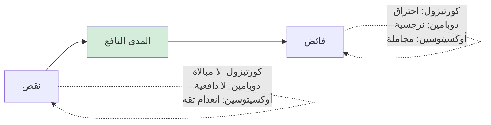

> [!info] الفصل 10 · كورس لعبة العقل
> **ماذا ستتعلّم:** المحور الذي يصفه المحاضر بأنّه «أجمل ما في الكورس»، والذي بدونه — كما يقول صراحةً — **لا قيمة لأيّ أداة سبقته.** ستتعلّم **هندسة الجلوس والحركة**: قاعدة الـ10% في الحركة، والنظر بين الحاجبين، وتوزيع النظر 50/50، وما يُفسد الهيبة من ألفاظ إسفنجية وإفراط في التأكيد. وستُتقن **قاعدة العشرين ثانية** — لماذا يُترجم العقل أوّل عشرين ثانية فقط، وكيف تُصمّم ردًّا بهذا القيد. وستفهم **الاستماع للتحليل لا للردّ** بوصفه استراتيجية سيطرة لا فضيلة أخلاقية، و**استعارة الجبل في العاصفة**. ثم ستدخل إلى **القيادة البيولوجية**: الهرمونات الستّة، ومتى يُفرَز كلّ منها، و**المبدأ الأهمّ في الفصل — أنّ كلّ هرمون في زيادته سُمّ** — و**وصفة التدخّل** بحسب ما ينقص الغرفة. وستُواجه أخيرًا **حدود الشفافية**، وقراءة نقدية صريحة لأضعف حلقة علمية في الكورس كلّه.

> [!abstract] التأصيل
> **يفترض أنّك تعرف:** [[Tactical Silence]] · [[Tactical Empathy]]
> **ويُؤصّل لك:** [[Silent Leadership]] · [[Biological Leadership]] · [[Emotional Contagion]]

# الفصل 10 — كاريزما القائد الصامت والقيادة البيولوجية

## 🎯 أهداف التعلّم

- **تشخيص** وضعية جلوسك وحركتك في الاجتماعات، وتحديد ما يُضعف أثر أدواتك اللفظية.
- **تطبيق** قاعدة العشرين ثانية على ردّ حقيقي، وقياس ما يُحذَف.
- **التمييز** بين الاستماع للردّ والاستماع للتحليل من علامات سلوكية في نفسك.
- **تحديد** الهرمون الناقص أو الزائد في موقف عمل، واختيار التدخّل المناسب.
- **تطبيق** مبدأ «كلّ زيادة سُمّ» على فريق تُديره، وتشخيص أيّ فائض تُنتجه أنت.
- **نقد** النموذج الهرموني: ما هو مدعوم، وما هو تبسيط مفيد، وما هو تجاوز صريح.

---

## الفكرة المحورية: حزمة لا أدوات مفردة

> [!quote] من المحاضرة
> **حمزة:** «**فإذن: التسمية والمرآة والأسئلة المعايرة — إن لم تستخدمها مع لغة جسدك وحركة عينيك، فلا قيمة لها إطلاقًا يا سيّدي. إنّها حزمة.**»

هذه أشدّ جملة في الكورس، وهي **حكم بأثر رجعي على الفصول التسعة السابقة**: كلّ ما تعلّمتَه من صياغات يُمكن أن يُبطَل بجسد لا يُطابقها.

**والسبب أنّ الرسالة تُستقبَل عبر قناتين، وحين تتعارضان يُرجَّح غير اللفظي:**

| القناة | ما تنقله | سرعة معالجتها | ما يحدث عند التعارض |
|---|---|---|---|
| **اللفظية** | المحتوى والصياغة | أبطأ — تحتاج معالجة لغوية | **تُهمَل** |
| **غير اللفظية** | الحالة والنيّة المُدرَكة | أسرع — تقييم تلقائي | **تُرجَّح** |

وقد رأينا هذا في الفصل [[05 - المرآة وضغط الفراغ|05]]: الكلمات نفسها بنبرة مختلفة تتحوّل من إنصات إلى سخرية. **وهذا الفصل يُعمّم القاعدة على كلّ أداة.**

> [!quote] من المحاضرة
> **حمزة:** «**التسمية** التي أدّيناها و**الأسئلة المعايرة** — **إن لم تُؤدَّ بهدوء وثبات وثقة ووضع جلوس صحيح، فلن تستطيع أداءها.** إن جلستَ تتلعثم في كلماتك، **فقد فقدت تسميتك قوّتها أصلًا.**»

---

## أوّلًا: هندسة الحضور

> [!quote] من المحاضرة
> **حمزة:** «**أتعلمون أنّ كيفية جلوسك في اجتماع قادرة وحدها على أن تكسب لك النقطة بلا أن تبذل أيّ جهد؟**»

### الوضعية

| العنصر | الصحيح | الخاطئ | ما يُقرأ من الخاطئ |
|---|---|---|---|
| **الظهر** | مستقيم | منحنٍ · متكوّم | تجمّد · انعدام ثقة |
| **الرأس** | مرفوع قليلًا — **ثقةً لا كِبْرًا** | منخفض · مرفوع بحدّة | خضوع · تكبّر |
| **اليدان** | ممدودتان ظاهرتان | مطويتان · على الخصر | انغلاق · تحدٍّ |
| **الحيّز** | تأخذ مساحتك | تُصغّر جسدك | «جُررتُ إلى هنا رغمًا عنّي» |
| **الهاتف** | خارج الطاولة أو بوجهه إلى أسفل | في اليد | توتّر · استخفاف بالحاضرين |
| **الساق** | ثابتة | تهتزّ | قلق · استعجال |

> [!quote] من المحاضرة
> **حمزة:** «**قاعدة الـ10% في الحركة:** حين تقوم لتُحضِر ماءً، لا تخطفه — قُم بهدوء وأناقة، واجلس مرّة أخرى بهدوء، ولا تتلبّط. **هناك فرق بين الحركة الهادئة والحركة المتشنّجة المهتاجة.**»

**والقاعدة العملية المستخرَجة:** أبطئ حركاتك في الاجتماعات عن سرعتك الطبيعية بقدر ملموس — الالتفات، والقيام، وتناول الورقة. **والبطء النسبي يُقرأ سيطرةً؛ والسرعة تُقرأ استجابةً لضغط.**

### النظر

> [!quote] من المحاضرة
> **حمزة:** «حين يتكلّم من أمامك، **لا تنظر في عينيه.** انظر **بين حاجبيه** […] فإن نظرتَ في عينيه قد ترتبك ويهرب نظرك، وذلك خطأ […] **أمّا حين تكون *أنت* المتكلّم** […] **نحو 50% بين حاجبيه، و50% توزيع نظرك على بقيّة الغرفة.**»

| الحالة | القاعدة | الوظيفة |
|---|---|---|
| **هو يتكلّم** | بين الحاجبين، ثابت | ثبات بلا حدّة تبادل النظر المباشر |
| **أنت تتكلّم** | 50% إليه · 50% على الغرفة | يُدخل الجميع؛ يمنع الاستفراد |
| **يُهاجمك** | ثابت + صمت أربع ثوانٍ | «لستُ هاربًا» |
| **تشكّ في تلاعب** | حول الحاجبين 5–7 ثوانٍ + رفع حاجب خفيف | تُظهر أنّك التقطتَ بلا اتّهام |

### ما يُآكل الهيبة

> [!quote] من المحاضرة
> **حمزة:** «**والإفراط في التأكيد كارثة عندنا.** بينما يتكلّم الشخص: *نعم، تمام، صحيح، حاضر، حاضر، بالطبع، من عينيّ* — **هذا خطأ** […] **ذلك يُآكل هيبتك.**»
>
> **حمزة:** «**وحذارِ من اللغة الإسفنجية** […] تجنّب *تمام…*، *يعني…*، *الموضوع أنّ…* […] ليكن كلامك **واضحًا صريحًا** — وبالمناسبة، **غير عدواني.**»

| المُآكِل | البديل |
|---|---|
| «تمام، تمام، صحيح» أثناء كلامه | إيماءة بطيئة واحدة · أو صمت |
| «يعني…» · «الموضوع أنّ…» | ابدأ بالفعل أو بالمعطى مباشرةً |
| «لو سمحت… يا أفندم… شرّفتنا» متراكمة | تحيّة واحدة ثم مضمون |
| تبرير مستمرّ | جملة واحدة ثم صمت |

**والتمييز الأخير في المقطع هو الأهمّ:**

> [!quote] من المحاضرة
> **حمزة:** «**هناك فرق بين الوضوح والهجوم.** كلام واضح: *«يا جماعة — لدينا مشكلة في تكامل الدفع.»* كلام هجومي: *«يا منّة، أنت ربطتِ ببوّابة الدفع بشكل خاطئ. هل هذا مقبول؟»* **الوضوح مطلوب؛ الهجوم غير مطلوب.**»

| | **غموض** | **وضوح** | **هجوم** |
|---|---|---|---|
| **المثال** | «هناك تحدّيات في التسليم» | «اتّفقنا على العاشر؛ اليوم الخامس عشر ولم يصلني تحديث» | «أنت لم تُسلّم — هل هذا مقبول؟» |
| **الفاعل** | مجهول | الحدث | **شخص** |
| **الأثر** | قلق بلا اتّجاه | معالجة | دفاع |

---

## ثانيًا: قاعدة العشرين ثانية

> [!quote] من المحاضرة
> **حمزة:** «إن وُجّه إليك سؤال، أو وُجّه إليك كلام، **فحاول أن تُنهي في أقصر وقت ممكن**، لأنّ الدراسات أثبتت أنّ **العقل البشري لا يُترجم إلّا العشرين ثانية الأولى من الكلام.** بعدها — إلى اللقاء.»

> [!info] إضافة مرجعية — الرقم والحقيقة خلفه
> **الرقم «عشرون ثانية» ليس نتيجة دراسة بعينها**، ولا توجد في الأدبيات عتبة قاطعة بهذا الشكل. والمدى المذكور في أدبيات الانتباه يتفاوت كثيرًا بحسب المهمّة والدافعية والسياق.
>
> **لكنّ المبدأ خلفه مدعوم بثلاث نتائج مُوثَّقة:**
> **① حدود الذاكرة العاملة.** سعتها محدودة (Cowan, 2001: نحو 4±1 عناصر)، والكلام المسترسل يتجاوزها فيُسقِط أوّل ما قيل.
> **② أثر الأسبقية.** ما يُقال أوّلًا يُرجَّح تذكّره ويُشكّل الإطار الذي يُفهَم به ما بعده.
> **③ الحكم المبكّر.** تتشكّل الأحكام الأوّلية سريعًا جدًّا (أعمال Ambady & Rosenthal على «الشرائح الرقيقة»)، وتُقاوم التعديل لاحقًا.
>
> **والنتيجة العملية سليمة تمامًا حتى لو كان الرقم تقريبيًّا:** ضع الأهمّ أوّلًا · اختصر · واصمت.
>
> **وهذا يتقاطع مع قاعدة مهنية معروفة في الكتابة الإدارية: `BLUF` — `Bottom Line Up Front`** — ابدأ بالخلاصة ثم فصّل عند الطلب. والقاعدتان توأمان: إحداهما للكلام والأخرى للكتابة.

> [!tip] القاعدة العملية — تصميم ردّ العشرين ثانية
> **البنية الثلاثية:**
> ① **الخلاصة** (5 ثوانٍ): «التكامل سيتأخّر أسبوعًا.»
> ② **السبب في جملة** (10 ثوانٍ): «الطرف الثالث لم يُسلّم الواجهة، والموعد الجديد الثلاثاء.»
> ③ **الطلب أو البند** (5 ثوانٍ): «أحتاج قرارًا: نُؤجّل الميزة أم نُطلق بلا هذا الجزء؟»
> **ثم صمت.**
>
> **وما يُحذَف عادةً:** سرد التسلسل الزمني · الاعتذارات · التبريرات الاستباقية · التفاصيل التقنية. **وكلّها تُقدَّم عند السؤال عنها — لا قبله.**

---

## ثالثًا: الاستماع للتحليل لا للردّ

> [!quote] من المحاضرة
> **حمزة:** «**القائد الصامت يستمع استماعًا مُسيطِرًا ليستخرج التنانين — ليستخرج ما يُخشى منه. أمّا المدير المهتاج فيستمع ليتكلّم.**»
>
> **حمزة:** «**إن استمعتَ لتردّ، فقد ترجم دماغك البشري تلقائيًّا نحو الردّ** — وقد يكون من أمامك يقول شيئًا بالغ الأهمية كنتَ ستستقبله بشكل مختلف لو استمعتَ لتُحلّل.»

**وأهمّ ما في الطرح أنّه يُقدّم الإنصات استراتيجية سيطرة لا فضيلة:**

> [!quote] من المحاضرة
> **حمزة:** «**أنا لا أستمع إليك لأردّ. أنا أستمع لأرى نواياك الخفيّة: أيّ معلومات لا تظهر على جيرا؛ وما نواياك ودوافعك** […] وقد أنهك الجميع أنفسهم الآن. أتعلم ماذا أفعل عندئذٍ؟ **أذكر القرار بكلّ يُسر** — لأنّ الجميع استنزفوا أنفسهم.»

**والآلية اقتصادية بحتة:** لكلّ مشارك رصيد محدود من الطاقة والانتباه. ومن يُنفق رصيده في الكلام يصل إلى نهاية الاجتماع مُنهَكًا وقد كشف أوراقه. ومن أنفق رصيده في الاستماع يصل بمعلومات أكثر وطاقة أعلى — **فتكون كلمته الأخيرة هي المسموعة.**

| | **يستمع ليردّ** | **يستمع ليُحلّل** |
|---|---|---|
| **أين انتباهه؟** | في صياغة ردّه | في محتوى كلام المتحدّث |
| **متى يعرف ردّه؟** | بعد ثلاث جُمَل | بعد أن يُفرغ الجميع |
| **ما يفوته** | ما قيل بعد أن كوّن ردّه | لا شيء |
| **موقعه في النهاية** | استنزف رصيده | يملك المعلومات والطاقة |

> [!quote] من المحاضرة
> **حمزة:** «ومن أخطائي السابقة يا عمر — حتى لا يظنّ أحد أنّنا وُلدنا عارفين — **كنتُ دائمًا أُقاطع من أمامي بمجرّد أن أفهم ما يقول** […] ومن ذكائك أن **لا تُقاطع من أمامك ولو فهمته.**»

**والعبارة «ولو فهمته» تكشف المغالطة الشائعة:** نُقاطع لأنّنا فهمنا المضمون — ونحن نفهم المضمون **لا الدافع ولا ما لم يُقَل بعد.** والفصل [[03 - التعاطف التكتيكي - الفهم غير الموافقة|03]] بُني كلّه على أنّ الدافع هو ما نحتاجه؛ **والمقاطعة تقطع الطريق إليه في اللحظة التي يوشك أن يظهر فيها.**

### الجبل في العاصفة

> [!quote] من المحاضرة
> **حمزة:** «فالهيبة — أو الكاريزما — تُجيبك هكذا: **أنت كالجبل في وسط العاصفة.** الجميع يتكلّمون، والجميع يضربون بعضهم، و**أنت تُكبّر لغة جسدك ثباتًا. وهدوؤك ينعكس على عقلك.**»

**وعبارة «هدوؤك ينعكس على عقلك» تصف حلقة تغذية راجعة**: الوضعية تُنتج حالة، والحالة تُنتج أداءً، والأداء يُنتج وضعية. وهي تتقاطع مع ما بُني في الفصل [[02 - بيولوجيا اللحظة - اللوزة والقشرة الجبهية|02]] عن العدوى الانفعالية: **ثباتك ليس أداءً لأجل الآخرين فقط — إنّه تدخّل على الغرفة كلّها.**

---

## رابعًا: القيادة البيولوجية — الهرمونات الستّة

> [!quote] من المحاضرة
> **حمزة:** «السيطرة **الصحيحة** أن **تجلس صامتًا** […] **وتُراقب أيّ هرمون ناقص في الغرفة يُسبّب هذا الاضطراب — فتبدأ في إفرازه بكلمة، أو بلغة جسد، محسوبة جراحيًّا.**»

| الهرمون | متى يُفرَز *(بحسب المحاضرة)* | كيف تُثيره | **زيادته سُمّ** |
|---|---|---|---|
| **الكورتيزول** | تهديد · نقد · غموض متطلّبات · ضغط زمني | — *(الهدف خفضه)* | استقالة نفسية · مرض · و**انعدامه** يُوقف العمل |
| **الأدرينالين** | هجوم عالٍ | مواعيد حادّة | **احتراق وظيفي** |
| **السيروتونين** | الاعتراف بالمكانة | تقدير معلن · استشارة في تخصّصه | **تبرير غير منطقي** دفاعًا عن المكانة |
| **الأوكسيتوسين** | الشعور بأنّه فُهِم | تسمية · إنصات · وفاء بوعد | **مجاملة على حساب العمل** |
| **الإندورفين** | مجهود بدني · **ضحك مشترك** | مزاح في موضعه | **«عازفو الكمان على تيتانيك»** |
| **الدوبامين** | نشوة الإنجاز والسيطرة | احتفال بإنجاز · مكسب سريع | **نرجسية · اعتماد على فرد واحد** |

### المبدأ الأهمّ: كلّ زيادة سُمّ

> [!quote] من المحاضرة
> **حمزة:** «هل هذه الهرمونات ضارّة؟ **نعم، ضارّة** […] **الكورتيزول**، حين يرتفع فوق حدّه، يجعل الناس **يستقيلون نفسيًّا** […] لكن **إن انخفض تمامًا** وشعر الناس أنّ كلّ شيء سهل — **فلن يعمل الناس** […] **التوازن.** تلك هي الحرفة.»

**وهذا هو أنضج ما في هذا الفصل**، لأنّه ينقض التبسيط الشائع الذي يُقسّم الهرمونات إلى «جيّدة» و«سيّئة»:

**وأمثلة المحاضر على الفائض دقيقة عمليًّا وتستحقّ التوقّف:**

> [!quote] من المحاضرة
> **حمزة:** «**الدوبامين.** […] إن ظللتُ أُثني على الفريق باستمرار وجعلتُهم يعملون على مكاسب سريعة فقط، **ولّدتُ نرجسية بين الفريق.** ولهذا بالضبط يقولون دائمًا في أجايل: **لا تشكر فردًا واحدًا أمام الفريق**، و**لا تعتمد دائمًا على شخص واحد في الفريق**: أنت ترفع دوبامينه، فتجعله نرجسيًّا، فتجعله يبتزّك.»

> [!quote] من المحاضرة
> **حمزة:** «**السيروتونين**، إن رُفِع فوق الحاجة […] حين تأتي لتقول لمن أمامك إنّه مخطئ، تجده **يُبرّر تبريرًا غير منطقي** […] **يُبرّر لأنّه يحتاج الحفاظ على مكانته في كلّ وقت — وأنت الذي رفعتَ ذلك الهرمون فيه.**»

**والملاحظة الأخيرة مهمّة لأنّها تُنبّه إلى أثر رجعي:** المدير الذي رفع مكانة شخص كثيرًا يصنع بنفسه صعوبة إعطائه تغذية راجعة لاحقًا. **فالتقدير المُفرِط ليس لطفًا بلا ثمن — إنّه يرفع تكلفة كلّ تصحيح قادم.**

### الوصفة

> [!quote] من المحاضرة
> **حمزة:** «إن كان أمامي **مدير متكبّر متعالٍ** وأردتُ تهدئة ذلك التكبّر — أبدأ بـ**الأسئلة المعايرة.** و**مقاتل بكورتيزول مرتفع** — أُعطيه **تسمية** و**مرآة** وأُهدّئه.»

| الحالة | التشخيص | التدخّل |
|---|---|---|
| مُهاجِم مُشتعل | كورتيزول مرتفع | **تسمية · مرآة · صمت** |
| متكبّر متعالٍ | سيروتونين منخفض يُدافَع عنه | **أسئلة معايرة** + تقدير معلن |
| فريق مُحبَط صامت | أوكسيتوسين وسيروتونين منخفضان | تسمية جماعية + قصص نجاح + مشاركة في القرار |
| فريق متقاعس مرتاح | كورتيزول منخفض جدًّا | معايير واضحة + عواقب مرئية |
| فريق قبل نشر حرج | يحتاج إندورفين ودوبامين | مزاح في موضعه + احتفال بالإنجازات الصغيرة |
| فريق يُجامل بعضه | أوكسيتوسين فائض | معايير أداء صريحة + تعريف إنجاز |
| فرد نرجسيّ | دوبامين فائض | إيقاف الثناء الفردي العلني + توزيع الاعتماد |

**ولاحظ أنّ الوصفة تُنتج نتيجة مهمّة:** «فريق مرتاح جدًّا» حالة تستدعي تدخّلًا كما تستدعيه «فريق مضغوط». وهذا يُصحّح تصوّرًا شائعًا بأنّ الهدف هو أقصى راحة ممكنة.

---

## خامسًا: حدود الشفافية

> [!quote] من المحاضرة
> **موجي:** «الشركة تخسر مالًا، وفي الوقت نفسه تريدهم أن يُنهوا بأسرع ما يمكن. كيف تتعامل معهم؟»
>
> **حمزة:** «**لا وجود لشفافية مطلقة** يا عمر […] مثلًا، الشركة تخسر — لا أستطيع أن أذهب وأقول *الشركة تخسر ولا نستطيع دفع الرواتب* […] **رفعتَ كورتيزولهم.** صار عند الناس الآن شاغل في رؤوسهم ولم تعد لديهم طاقة للعمل. أمّا إن قلت: *يا جماعة، نحتاج أن نعمل لأنّنا نحتاج أن نُسلّم ونُحصّل هذا المال* — **لاحظ، الهدف هو نفسه.**»

**وهذا أشدّ مواضع الكورس حساسيةً، ويحتاج تفكيكًا دقيقًا لأنّه يقع على حدّ التلاعب.**

**والصياغتان المذكورتان تختلفان في شيئين لا في شيء واحد:**

| | «الشركة تخسر ولا نستطيع دفع الرواتب» | «نحتاج أن نُسلّم ونُحصّل هذا المال» |
|---|---|---|
| **صدق المضمون** | صحيح | صحيح |
| **ما يُقال** | الحالة المالية | ما يُطلَب من الفريق |
| **قابلية الفعل** | **لا شيء يستطيعون فعله بها** | **مباشرة** |
| **الأثر** | قلق مُعطِّل | تركيز |

**فالمبدأ المشروع هنا ليس «أخفِ الحقيقة» بل: لا تنقل قلقًا لا يقابله فعل ممكن.** ومعلومة لا يستطيع المتلقّي التصرّف بناءً عليها **تستهلك انتباهه ولا تُنتج شيئًا.**

> [!warning] المزلق العملي — أين ينقلب المبدأ إلى تضليل
> الفرق بين **اختيار ما يُقال** و**الإيهام بعكس الحقيقة** حاسم — وثلاثة معايير تفصل:
>
> | | **حجب مشروع** | **تضليل** |
> |---|---|---|
> | **المضمون** | لا تذكر ما لا فعل له | **تنفي** الوضع أو تدّعي عكسه |
> | **القرار المتأثّر** | لا يتأثّر قرار شخصي لأحد | **تُخفي ما يُغيّر قرارهم** — بقاء · عرض آخر · التزام مالي |
> | **عند السؤال** | تُجيب بصدق | **تُنكر** |
>
> **والمعيار الحاسم هو الثاني:** إن كان الوضع قد يُؤدّي إلى تسريح خلال شهرين، **فهذه معلومة تُغيّر قرارات حياتهم**، وحجبها ليس حماية بل حرمان من قرار يخصّهم. أمّا تقلّب السيولة الشهري الذي لا يُغيّر شيئًا فحجبه مشروع.
>
> **وحين يُسأل صراحةً — «هل الشركة بخير؟» — فالنفي كذب، والتهرّب يُقرأ تأكيدًا.** والصياغة الأمينة: *«فيه ضغط على السيولة هذا الربع، وهذا سبب الاستعجال على التسليم. ولو صار شيء يخصّ استقراركم، ستعرفونه منّي أوّلًا.»* — صدق بلا إثارة، ووعد قابل للوفاء.

---

## 🗣️ بنك العبارات — الحضور والقيادة البيولوجية

| الموقف | العبارة/السلوك الخاطئ | الصحيح | لماذا |
|---|---|---|---|
| هجوم عليك | ردّ فوري | صمت 4 ثوانٍ + نظر ثابت + وضعية ثابتة | يُظهر أنّك لست هاربًا |
| يتكلّم شخص طويلًا | «تمام… صحيح… أكيد» | إيماءة بطيئة واحدة | الإفراط في التأكيد يُآكل الهيبة |
| تُبلّغ خبرًا سيّئًا | سرد زمنيّ مطوّل | خلاصة → سبب في جملة → طلب → صمت | قاعدة العشرين ثانية |
| مشكلة في العمل | «هناك تحدّيات في التسليم» | «اتّفقنا على العاشر؛ اليوم 15 ولم يصلني تحديث» | وضوح لا غموض ولا هجوم |
| تكلّم أكثر من شخص وتريد الردّ | تُقاطع | «لو سمحتم، سأتكلّم بعد أن تنتهوا. شكرًا» | لا تُنتج ضغطًا؛ ولا تخسر دورك |
| فريق أنجز شيئًا صعبًا | شكر فرد بعينه أمام الجميع | شكر الفريق علنًا + الفرد على انفراد | الثناء الفردي العلني يرفع دوبامين فرد ويخفض غيره |
| فريق مرتاح ومتقاعس | «أنتم رائعون، واصلوا» | معايير صريحة + تعريف إنجاز + عواقب مرئية | كورتيزول منخفض جدًّا يُوقف العمل |
| ضغط مالي على الشركة | «الوضع سيّئ وقد لا نقبض» | «هناك ضغط على السيولة، ولهذا الاستعجال على التسليم» | لا تنقل قلقًا لا يقابله فعل — بلا نفي |

---

## 🧪 ورشة الفصل — تدقيق الحضور

| الخطوة | العمل | المُخرَج |
|---|---|---|
| **1** | سجّل نفسك (فيديو) في اجتماع حقيقي بإذن الحاضرين، أو اطلب من زميل ملاحظتك | تسجيل أو ملاحظة |
| **2** | راجع بجدول الوضعية: الظهر · الرأس · اليدان · الحيّز · الهاتف · الساق | ستّة تقييمات |
| **3** | احسب: كم مرّة قلتَ «تمام/صحيح/أكيد» أثناء كلام غيرك؟ | رقم |
| **4** | احسب: كم ثانية استغرق أطول ردّ لك؟ أعِد صياغته في عشرين ثانية | نسخة مختصرة |
| **5** | راقب نفسك اجتماعًا كاملًا: **متى بدأتَ تُصيغ ردّك؟** هل قبل أن يُنهي المتحدّث؟ | ملاحظة ذاتية |
| **6** | لأسبوعين: **لا تتكلّم قبل ثلاث ثوانٍ من صمت المتحدّث** | تغيير واحد |
| **7** | **تشخيص هرموني للفريق:** أيّ هرمون فائض وأيّه ناقص؟ وما دورك أنت في ذلك؟ | تشخيص + إقرار |
| **8** | اختر تدخّلًا واحدًا من جدول الوصفة، وطبّقه شهرًا | تدخّل واحد |

---

## القراءة النقدية — أين يقصر هذا الطرح؟

**1. النموذج الهرموني أضعف حلقة علمية في الكورس كلّه.** يُقدَّم كلّ هرمون بوظيفة واحدة نظيفة، والواقع أعقد بكثير في أربعة مواضع:
- **الأوكسيتوسين ليس «هرمون الثقة».** يزيد التفضيل داخل المجموعة وقد يزيد التحيّز ضدّ خارجها (De Dreu et al., Science, 2011) — أي إنّه قد يُعزّز **الشللية** التي يُحذّر منها الكورس نفسه.
- **السيروتونين لا يُختصَر في «المكانة».** له وظائف واسعة، والربط بين المكانة الاجتماعية ومستوياته مستمدّ من دراسات على رئيسيّات وقياسات غير مباشرة، ولا يصحّ نقله حرفيًّا إلى قاعة اجتماع.
- **الدوبامين ليس «هرمون المتعة»** بل يرتبط أوثق بـ**التوقّع والسعي** نحو المكافأة لا بالاستمتاع بها.
- **قياس هذه الهرمونات في الدم لا يُطابق نشاطها في الدماغ**، والاستدلال من السلوك على المستوى الهرموني استدلال عكسي غير سليم.
**والحكم العملي:** استخدم الإطار **لغة مشتركة للحالات**، لا **تفسيرًا كيميائيًّا**. وقول «كورتيزوله مرتفع» مقبول اختصارًا لـ«هو في حالة تهديد»؛ **ويصير خطأً إن استُخدم لادّعاء معرفة كيمياء دماغ أحد.**

**2. التصنيف السداسي مستعار من أدبيات تبسيطية.** التقسيم الرباعي الشائع (إندورفين · دوبامين · سيروتونين · أوكسيتوسين بوصفها «هرمونات القيادة») عمّمه **سايمون سينك** في *Leaders Eat Last* (2014)، وقد **نُقد نقدًا واسعًا من متخصّصين في علم الأعصاب** بوصفه اختزالًا لا يعكس الأدبيات. والكورس يُضيف الكورتيزول والأدرينالين فيصير سداسيًّا، ويُحسَب له أنّه **يُضيف مبدأ «كلّ زيادة سُمّ»** — وهو تصحيح حقيقي غائب عن النسخة الشائعة. **لكنّ الأساس يبقى تبسيطًا**، ويجب أن يُقدَّم بوصفه كذلك.

**3. «الوضعية تُنتج الحالة» في صيغته القوية لم يصمد للتكرار.** ادّعاء **وضعيات القوّة (`power posing`)** — أنّ الوضعية المفتوحة ترفع التستوستيرون وتخفض الكورتيزول — نُشر عام 2010 (Carney, Cuddy & Yap) وذاع واسعًا. ثم **فشلت محاولات تكراره على عيّنات أكبر**، و**تراجعت المؤلّفة الأولى (داينا كارني) علنًا عام 2016** عن الاعتقاد بصحّة الأثر الهرموني.
**والذي صمد أضيق وأنفع:** أثر ذاتي على **الشعور** بالقوّة، وأثر على **كيفية إدراك الآخرين لك.** وهذا يكفي تمامًا لغرض الكورس — **لكنّ الصياغة يجب أن تتغيّر**: «الوضعية المفتوحة تُقلّل إشارات التهديد التي يلتقطها الآخرون منك، وقد تُحسّن شعورك» — لا «تُفرز هرمونات الثقة».

**4. تركيز على الأداء الفردي بلا معالجة النظام.** الفصل كلّه عن كيف تجلس وتنظر وتصمت. **ولا يُعالج بيئة تُنتج كورتيزولًا مرتفعًا بنيويًّا.** فمن يُتقن الحضور في مؤسّسة يُدار فيها العمل بمواعيد لا يُشارك في وضعها ومتطلّبات غامضة **يُتقن الظهور بالثبات في بيئة سامّة** — وقد يُطيل بقاءه فيها ويُخفي عن المنظّمة إشارة الخلل. **والحدّ:** الحضور يُدير اللحظة؛ والنظام يُنتج اللحظات.

**5. الحدّ بين الحضور والأداء غير مرسوم.** «تدرّب على ألّا تكون عفويًّا» — كما يقول المحاضر بصراحة — نصيحة عملية ولها ثمن لا يُذكَر: **الحضور المُصمَّم بالكامل يُقرأ بعد فترة أداءً لا شخصية.** والفرق بين قائد ثابت وقائد يُؤدّي دور الثبات يظهر عادةً في اللحظات غير المُخطَّطة — أزمة مفاجئة، أو خطأ يقع منه هو. **والمعيار المفقود:** الحضور المُصمَّم يجب أن يُغطّي **الاستجابة تحت الضغط** لا **الشخصية كلّها**. ومن ضبط جلوسه وصمته ثم بقي إنسانًا معروف الملامح لفريقه يجمع الاثنين؛ ومن ضبط كلّ شيء فقد شيئًا لا تُعوّضه الهيبة.

---

## 🧾 خلاصة الفصل

1. **إنّها حزمة:** جسد لا يُطابق الصياغة يُبطلها — وغير اللفظي يُرجَّح عند التعارض.
2. **قاعدة الـ10%:** أبطئ حركتك في الاجتماعات؛ البطء النسبي يُقرأ سيطرة.
3. **بين الحاجبين حين يتكلّم · 50/50 حين تتكلّم أنت.**
4. **الإفراط في التأكيد واللغة الإسفنجية يُآكلان الهيبة** — وإيماءة واحدة تكفي.
5. **الوضوح ليس الهجوم وليس الغموض** — الحدث فاعلًا لا الشخص.
6. **العشرون ثانية:** خلاصة → سبب → طلب → صمت. والتفاصيل عند السؤال.
7. **الاستماع للتحليل استراتيجية سيطرة لا فضيلة** — من أنفق رصيده في الكلام كشف أوراقه.
8. **لا تُقاطع ولو فهمتَ** — لأنّك فهمتَ المضمون لا الدافع.
9. **كلّ هرمون في زيادته سُمّ** — والفريق المرتاح جدًّا يستدعي تدخّلًا كما يستدعيه المضغوط.
10. **لا شفافية مطلقة — ولا تضليل:** لا تنقل قلقًا لا يقابله فعل؛ ولا تحجب ما يُغيّر قرارًا يخصّهم؛ ولا تنفِ إن سُئلتَ.
11. **حدّ الفصل:** النموذج الهرموني تبسيط · و«وضعيات القوّة» لم تصمد للتكرار · والحضور يُدير اللحظة ولا يُصلح نظامًا.

---

## ❓ اختبارات ذاتية

> [!question]- 1) في اجتماع مع الإدارة العليا سُئلتَ عن سبب تأخّر التسليم. اكتب ردّك في عشرين ثانية، ثم اذكر ما حذفتَه ولماذا.
> **الردّ:** *«التسليم تأخّر أسبوعًا. السبب الأساسي أنّ الطرف الثالث سلّم الواجهة البرمجية متأخّرًا أحد عشر يومًا، وقد سجّلناه في سجلّ المخاطر في الأوّل من الشهر. والخطّة أن نُطلق يوم الثلاثاء بلا وحدة التقارير، ثم نُلحقها الأسبوع التالي. أحتاج موافقتكم على هذا التقسيم.»*
> **ما حُذف ولماذا:**
> - **السرد الزمني** («بدأنا في كذا ثم حدث كذا») ← يُنفق العشرين ثانية كلّها قبل الوصول إلى الخلاصة، والأهمّ لا يُسمَع.
> - **الاعتذار** («آسف على التأخير») ← لم يُطلَب، ويضعك في موضع المتّهم قبل أن تُقدّم المعطى.
> - **التبرير الاستباقي** («الفريق عمل ليلًا») ← يُقرأ دفاعًا فيُضعف المعطى الموضوعي.
> - **التفاصيل التقنية** ← تُقدَّم عند السؤال؛ وتقديمها ابتداءً يُشير إلى أنّك تُغطّي.
> - **إسناد اللوم صراحةً** ← لاحظ أنّ «الطرف الثالث تأخّر» **معطى**، بينما «الطرف الثالث هو السبب ولا ذنب لنا» **دفاع**. والأوّل يُصدَّق والثاني يُقاوَم.
> **وأهمّ ما في الردّ عنصران:** ذكر **سجلّ المخاطر بتاريخه** — فيُثبت أنّ الأمر كان متوقّعًا ومُدارًا لا مفاجأة؛ و**انتهاؤه بطلب قرار** — فينقل الاجتماع من مساءلة إلى قرار.

> [!question]- 2) فريقك عالي الأداء ومتعاون جدًّا وبيئته ودّية. لكنّ العيوب تمرّ إلى الإنتاج، والمراجعات لا تُنتج ملاحظات. ما التشخيص؟
> **أوكسيتوسين فائض — وهو بالضبط ما يصفه المحاضر بـ«يبدؤون في التصفيق لبعضهم والتغطية على بعضهم على حساب العمل».**
> **والتشخيص الأدقّ بمصفوفة إدموندسون (الفصل [[07 - إدارة الصراع - الطبقات الأربع والصراعات الخمسة\|07]]):** أنت في **منطقة الراحة** — أمان نفسي عالٍ ومعايير أداء منخفضة. والفريق آمن ويُحبّ بعضه ولا يُنتج تعلّمًا.
> **والعلامة الفارقة الحاسمة:** فرّق بين فريق **لا يجد ملاحظات** وفريق **لا يقولها**. والأوّل نادر جدًّا؛ والثاني هو الحالة. ولمعرفة أيّهما: اسأل مطوّرًا على انفراد «ما الشيء الذي لو قيل في المراجعة لأزعج أحدًا؟» — وستُفاجَأ بأنّ الملاحظات موجودة وأنّ قولها هو المُكلِف اجتماعيًّا.
> **والعلاج ليس خفض الأوكسيتوسين — لا تُخرّب شيئًا نادرًا وثمينًا.** بل **رفع المعايير مع إبقاء الأمان**، للانتقال إلى منطقة التعلّم:
> - **تعريف إنجاز صريح** يجعل الملاحظة **إجراءً لا حكمًا شخصيًّا**.
> - **مراجعة مبنيّة على قائمة** لا على انطباع — فالسؤال يصير «هل تحقّق البند؟» لا «ما رأيك في عمل زميلك؟».
> - **نمذجة من القائد:** اطلب أنت أوّل ملاحظة على عملك أنت، واستقبلها بامتنان علنيّ.
> - **مقياس مرئي:** عيوب هاربة إلى الإنتاج على لوحة الفريق — فيصير المعيار رقمًا لا مواجهة.
> **والمبدأ:** لا تُقايض الأمان بالمعايير — **ارفع المعايير داخل الأمان.**

> [!question]- 3) لماذا يُصرّ الفصل على أنّ الاستماع للتحليل «استراتيجية سيطرة» لا فضيلة أخلاقية؟
> **لأنّ الصياغتين تُنتجان سلوكين مختلفين، والفرق ليس بلاغيًّا.**
> **بوصفه فضيلة:** يُصبح الإنصات واجبًا أدبيًّا يُؤدّى بلا معيار نجاح. والنتيجة الشائعة **إنصات صبور بلا حصيلة**: تسمع الجميع، وتخرج بلا معلومة جديدة ولا قرار — لأنّ الهدف كان الأداء الأخلاقي نفسه.
> **وبوصفه استراتيجية:** يُصبح له **غاية قابلة للقياس** — ما المعلومة التي لم تكن على لوح العمل وحصلتُ عليها؟ ما الدافع الذي لم أكن أعرفه؟ **وهذا يُغيّر ما تفعله أثناء الاستماع:** لا تنتظر دورك، بل تُراقب ما يُقال وما لا يُقال، ومن يصمت عند أيّ نقطة، وأيّ عبارة تكرّرت.
> **ويُغيّر أيضًا متى تتكلّم:** في النسخة الأخلاقية تتكلّم حين «يحين دورك». وفي النسخة الاستراتيجية تتكلّم **حين تكون قد جمعت ما يكفي** — وغالبًا يكون الجميع قد استنزفوا رصيدهم، فتكون كلمتك هي المسموعة.
> **والفارق الأهمّ في قابلية الاستدامة:** الفضيلة تعتمد على انضباطك الأخلاقي، وهو مورد ينفد تحت الضغط. أمّا الاستراتيجية فتعتمد على إدراكك لمصلحتك، وهذا لا ينفد. **ومن يُنصت لأنّه مفيد يُنصت في يومه السيّئ أيضًا؛ ومن يُنصت لأنّه أخلاقيّ يُقاطع في أوّل يوم يفقد فيه صبره.**

> [!question]- 4) رئيسك يطلب منك إخفاء أنّ المشروع قد يُلغى خلال شهرين. الفريق يسأل. ما موقف هذا الفصل؟
> **الفصل يُقدّم مبدأً واضحًا — «لا شفافية مطلقة» — ومعياره يقع في الجهة الأخرى من هذه الحالة تحديدًا.**
> **تطبيق المعايير الثلاثة:**
> **① أهذا قلق لا يقابله فعل؟** لا — بل يقابله فعل جوهري: قرارات بقاء، ورفض عروض أخرى، والتزامات مالية شخصية. **فالمبرّر الأساسي للحجب ساقط هنا.**
> **② أيُغيّر قرارًا يخصّهم؟** نعم بوضوح — وهذا المعيار الحاسم.
> **③ ماذا لو سُئلتَ صراحةً؟** **النفي كذب صريح، والتهرّب يُقرأ تأكيدًا.** فلا مخرج بالغموض.
> **فالنتيجة: هذه ليست حالة «حجب مشروع» — إنّها الحالة التي يُحذّر منها الفصل.**
> **وما تفعله عمليًّا، بالترتيب:**
> **① لا تكذب.** حتى لو أُمرت. الكذب هنا يُنهي مصداقيتك نهائيًّا حين تظهر الحقيقة — وستظهر.
> **② اعمل على تغيير القرار أوّلًا.** ارجع إلى رئيسك بحجّة **عملية لا أخلاقية**، فهي أوقع: *«حين تظهر الحقيقة سيربطها الفريق بكلّ ما قلناه في الشهرين، وسنخسر أفضل من فيه أوّلًا — لأنّه من يملك بدائل. وإن أعطيناهم إشارة مبكّرة نحتفظ بمن يختار البقاء.»*
> **③ إن أصرّ، فالتزم بالحدّ الذي لا تكذب فيه:** *«القرار على المشروع ليس بيدي وليس مُغلقًا بعد. وما أستطيع أن أعدكم به شيئان: أن أُخبركم فور أن أعرف شيئًا مؤكّدًا، وألّا أقول لكم شيئًا أعرف أنّه غير صحيح.»* — لم تُفصح، ولم تكذب، ولم تُطمئن طمأنة زائفة. **وهذه أضعف الصياغات المقبولة أخلاقيًّا لا أفضلها.**
> **④ اعرف حدّك.** إن كان المطلوب صريحًا هو الكذب لا الصمت، **فهذه مسألة تتجاوز هذا الكورس** — وهي من مواضع «لا» المشروعة التي أشار إليها الفصل [[06 - قوّة لا وأنواع نعم الثلاثة\|06]].

---

## 📚 مراجع الفصل

| المرجع | الصلة |
|---|---|
| Chris Voss — *Never Split the Difference* (2016) | النبرة والحضور بوصفهما جزءًا من الأداة |
| Simon Sinek — *Leaders Eat Last* (2014) | التصنيف الرباعي الشائع للهرمونات — يُقرأ مع نقده |
| De Dreu et al. — *Oxytocin promotes… in-group favoritism* (Science, 2011) | الأوكسيتوسين ليس «هرمون الثقة» |
| Carney, Cuddy & Yap (2010) · Ranehill et al. (2015) · Carney (2016) | وضعيات القوّة: الادّعاء الأصلي، وفشل التكرار، وتراجع المؤلّفة |
| Ambady & Rosenthal — *Thin Slices* (1992) | سرعة تكوّن الأحكام — أساس قاعدة العشرين ثانية |
| Nelson Cowan — *The Magical Number 4* (2001) | حدود الذاكرة العاملة |
| Amy Edmondson — *The Fearless Organization* (2018) | مصفوفة الأمان × المعايير — تشخيص «منطقة الراحة» |
| Edwin Friedman — *A Failure of Nerve* (2007) | «الحضور غير القلق» — التأصيل النظري للجبل في العاصفة |
| المصدر الأساس | [[1.6 القائد الصامت والهرمونات]] |

---

## 🔗 روابط ذات صلة

**السابق:** [[09 - التفاوض على القيمة - التثبيت والخسارة والمقايضة]] · **التالي:** [[ملحق أ - بنك السيناريوهات العملية]]
**مصدر السجلّ:** [[1.6 القائد الصامت والهرمونات]]
**مفاهيم:** [[02 - بيولوجيا اللحظة - اللوزة والقشرة الجبهية]] · [[07 - إدارة الصراع - الطبقات الأربع والصراعات الخمسة]] · [[Personal Development]]

---

> [!note] قواعد تحرير مُلزِمة في هذه القاعدة
> - كلّ اقتباس من المحاضرة داخل `> [!quote] من المحاضرة`؛ وكلّ معرفة خارجية داخل `> [!info] إضافة مرجعية`.
> - **كلّ ادّعاء علميّ يُذكَر بمصدره وبحدوده؛ والتبسيط النافع يُسمّى تبسيطًا لا حقيقة.**
> - كلّ فصل ينتهي بقراءة نقدية صريحة.
