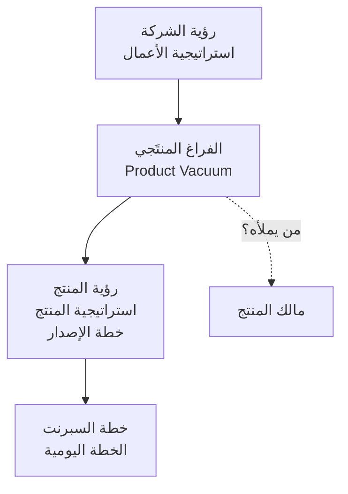

# الجزء الثالث عشر (2): التغذية الراجعة والتمكين والفراغ المنتَجي

> [!info]
> السابق: [[13.1 مالك المنتج وسكرم ماستر - مجريان ومنتج واحد]] · التالي: [[13.3 ما لا يحويه دليل سكرم عمدًا]] · [[مقابلات أجايل - الأدوار والتحوّل|الفهرس]].

> [!warning] عن هذه الترجمة
> ترجمة **كاملة غير مختزلة** للأقسام 21–34 من المقابلة. حُذفت كلمات الحشو فقط؛ **لم يُحذف أي محتوى موضوعي**.

---

## 21. التغذية الراجعة التي لا يرسلها أحد

**عبد الرحمن:** هناك شيء أطلبه. أكتب أحيانًا إلى مجموعة المطوّرين: «يا جماعة — من عنده ملاحظة على طريقتي في كتابة قصص المستخدم، فليرسلها لي. أريد أن أُحسّن قصّة المستخدم إلى الشكل الذي تستطيعون قراءته فعلًا، الشكل الذي تُنهون به عملكم. فمن كانت عنده أيّ ملاحظة عليّ، من فضله فليرسلها.»

**لا يرسل أحدٌ شيئًا.** نادر جدًّا جدًّا أن تصلني تغذية راجعة — أن أحصل على **تغذية راجعة ([[Feedback Loop]])** من الفريق. لكن إن أدرنا **استرجاعًا (Retrospective)** صحيحًا، بـ**انفتاح وشجاعة**، حيث تكون عند الناس الشجاعة والانفتاح للكلام وإبداء الرأي، وحيث يُقبل النقد — فمن يصنع تلك البيئة؟ **سكرم ماستر**. ومن يتعلّمها ويتقبّلها ويطبّقها؟ **الفريق كلّه**، ومالك المنتج معهم.

وبالتالي، حين أتلقّى بصفتي مالك منتج تغذيةً راجعة في الاسترجاع بأنّنا نحتاج أن نحسّن هذا وأن نطوّر ذاك، ونُخرج نقاط عمل ونشتغل عليها — فستجد التحسّن بالتأكيد، مئة بالمئة.

---

## 22. مالك المنتج هو — بين قوسين — محلّل أعمال

**عبد الرحمن:** وهنا نقطة موضوعية أخرى: مالك المنتج هو، **بين قوسين، محلّل أعمال (Business Analyst)**. لا ندخل الآن في تفاصيل ذلك؛ لنفترض ببساطة أنّ العبارة صحيحة.

ما الفرق إذًا بين محلّل الأعمال ومالك المنتج؟ محلّل الأعمال كان يعمل في **الشلال (Waterfall)**: يُجري التحليل والتصميم للمنتج كلّه **دفعةً واحدة**، ثم يُسلّم وينصرف. وبناءً على ذلك كان لا بدّ أن تكون خبرة ذلك الرجل عالية جدًّا، لأنّه كان يتعامل مع رؤية منتج، ومع مطوّرين، ومع فريق سيعمل عليها ثلاث أو أربع سنوات قادمة — وكان سيُسلّم وينصرف.

وحين نأتي إلى العمل بـ**أجايل**، فأجايل **تزايديّ وتكراري ([[Iteration|Incremental & Iterative]])**. هنا لا أحتاج مالك منتج يستطيع رؤية الرؤية قبل أربع سنوات على مستوى الميزة وقائمة الأعمال. يحتاج إلى **رؤية المنتج ([[Product Vision]]) ككلّ**، لكنّه يعمل تكراريًّا. ومالك المنتج **يتطوّر ويتعلّم ويتحسّن**، تمامًا كالفريق التقني.

---

## 23. هل يحضر صاحب المصلحة جلسة التنقيح؟

**محمد:** هل ترى أن يحضر صاحب المصلحة اجتماع **التنقيح ([[Backlog Refinement]])**؟ تخيّلها: رجل الأعمال الذي يُفترض أن يعطيك الأهداف التي تبني عليها نطاقك وقائمة أعمالك يحضر معك التنقيح. أنت يُفترض أن تكون تشرح الأهداف، وهو جالس معك. هل تكون مرتاحًا لذلك أم لا؟

**عبد الرحمن:** سؤال ماكر — لم أصادفه من قبل، وبصراحة لا أستطيع الإجابة إجابةً قاطعة. لكن: **أثناء السبرنت نفسه، قطعًا لا.** إن كنّا نُجري تنقيحًا أثناء السبرنت لأيّ سبب كان، فقطعًا لا. لن أسمح بشيء من هذا. لماذا؟ لأنّنا إن كنّا قد دخلنا السبرنت فعلًا وهناك قائمة أعمال فعلًا، ثم أدخلتُ صاحب المصلحة، فسيبدأ يحلم: «انظروا يا جماعة، احذفوا لي هذا وافعلوا لي ذاك — ما رأيكم؟» لا.

بل على العكس، هنا **ملكيّتي (Ownership)** بصفتي مالك منتج على المحكّ. القرار عندي؛ وأنا قادر على اتّخاذ القرار. ولهذا تكلّمت عن حماية سكرم ماستر لظهري — وجزءٌ من حماية ظهري بصفتي مالك منتج أن **يُمكّن قراراتي المتعلّقة بالمنتج**.

---

## 24. التمكين لا الوكالة: «تفضّل، اشتغل»

**عبد الرحمن:** وليس سكرم ماستر وحده — بل **المؤسسة قبل سكرم ماستر** عليها أن **تُمكّن ([[Empowerment]])** مالك المنتج. يجب ألّا يكون **وكيلًا (Proxy)**. يجب ألّا يكون ساعي بريد يأخذ الكلمتين فحسب فيوثّقهما وينقلهما إلى فريق التطوير، وانتهى الأمر.

**محمد:** «تفضّل، اشتغل.»

**عبد الرحمن:** بالضبط — «تفضّل، اشتغل. هذا ما جاءني، وهذا ما عندي، ولا حيلة لي فيه.» وهذا بالطبع غير لائق.

---

## 25. المراجعة هي المكان الصحيح لصاحب المصلحة

**عبد الرحمن:** أرى أنّ المكان المناسب لأن يلتقي صاحب المصلحة بالفريق هو **المراجعة (Review)**. هناك من الطبيعي تمامًا أن يُسهم الفريق بأفكاره وآرائه وأن يقدّم اقتراحات — لأنّنا في تلك اللحظة **منفتحون**: نستطيع أن نأخذ تلك الأفكار، وأن نعيد ترتيب الأولويات من جديد، وأن نُعدّل قائمة أعمالنا على ضوء النقاش الذي دار، وأن نبدأ بها سبرنتًا جديدًا.

أمّا حين أكون داخل السبرنت، وقائمة أعمال السبرنت قد تحدّدت فعلًا، وأنا أُجري تنقيحًا **لمجرّد التوضيح** كي يستطيع الفريق العمل — ثم يدخل معي صاحب مصلحة — فأرى أنّ المساوئ تفوق المزايا بكثير.

---

## 26. ترتيب الأولويات فوق مالك المنتج: الفراغ المنتَجي

**محمد:** أحترم المادّة الأكاديمية احترامًا كبيرًا، وهي تنصّ دائمًا على أنّ تحديد **أولويّة العمل ([[Prioritization]])** مسؤولية مالك المنتج. لكن حين ذهبتُ إلى **التخطيط الاستراتيجي**، وجدتُ الأمر أكبر من مالك المنتج: عندنا أصلًا أهداف أعمال ننطلق منها جميعًا. فإن لم يكن هناك ترتيب لأولويات أهداف **الشركة**، فصباح الخير — نحن نخدع أنفسنا بشأن المنتج. ما رأيك — ما الصواب وما ليس بصواب؟

**عبد الرحمن:** دعني أعطيك عبارة من كتاب **"The Professional Product Owner"**. كُتبت كتب كاملة عن هذه العبارة وحدها، وأودّ أن يحفظها من يشاهد هذا الفيديو وأن يعلّقها في ذهنه: **الفراغ المنتَجي (Product Vacuum)**.

الفراغ المنتَجي هو **الوصلة بين رؤية المؤسسة واستراتيجيّتها** من جهة، وبين **التنفيذ** من الجهة الأخرى. والشخص الذي **يملأ تلك الفجوة هو مالك المنتج.** ذلك جزء من دوره، وجزء من مسؤوليّته، وتلك هي قيمته. فإن لم يكن موجودًا، لم يملأها أحد.

دعني أُحضر المخطّط — إنّه شيء بديع في ذاته. في **الأعلى**: رؤية الشركة، واستراتيجية الأعمال. في **الأسفل**: خطة السبرنت والخطة اليومية — وذلك هو الجزء الذي يعمل عليه الفريق. أين مالك المنتج؟ في الوسط: **رؤية المنتج، واستراتيجية المنتج ([[Product Strategy]])، وخطة الإصدار.** فهو إذًا يعمل على أساس رؤية الشركة واستراتيجيّتها. أرسِ هدفك أوّلًا؛ ثم تعال لنبنِ المنتج.

---

## 27. الأعمال تقود الحلّ بدل أن تُعرّف الحاجة

**عبد الرحمن:** وهنا تتقاطع الأمور مع شيء آخر، لأنّ مالك المنتج أو محلّل الأعمال يقع دائمًا في خطأ واحد: **الأعمال تقود الحلّ بدل أن تُعرّف الاحتياجات.**

**محمد:** لا تُعرّف. بالضبط — وتلك مشكلة.

**عبد الرحمن:** من ينظر في التحليل يرى أنّه يبدأ دائمًا من القضايا: عرّف أوّلًا **ما المشكلة**، وما القضايا. ثم، بعد رحلة طويلة، نصل إلى أن تكون عندنا **حلول**؛ وللحلّ نُجري **دراسة جدوى** — طبعًا لا أحد يفعل ذلك فعليًّا، لكن لنقل ذلك.

ما يحدث بدلًا من ذلك أنّ مالك المنتج يدخل عادةً وفي يده **حلّ جاهز**. لكن يا جماعة: ما الميزة؟ **الميزة حلّ.** حين تأتيك الأعمال طالبةً ميزةً بعينها، فتلك حلّ. وذلك الحلّ يمكن أن يُبنى بـ**خمسين طريقة مختلفة** — وتلك بالضبط هي المساحة التي تتشاركها مع الفريق التقني.

---

## 28. الميزة *هي* حلّ — وهناك خمسون طريقة لبنائها

**عبد الرحمن:** إذا كان مالك المنتج مجرّد وكيل يأخذ الحلّ من الأعمال ويحمله إلى الفريق التقني، فلن تكون عنده خيارات أبدًا. لن يستطيع أن يقول شيئًا، لأنّ الحلّ وصل جاهزًا — مقاسٌ واحد يناسب الجميع.

**محمد:** ليست عندي خيارات أخرى؛ هناك خيار واحد وسنلبسه جميعًا.

**عبد الرحمن:** أمّا حين تأتي الأعمال بـ**مشكلة** ويقود مالك المنتج **الحلّ**، فحينها توجد مساحة لمالك المنتج ليأخذ مُدخلات من الفريق التقني. وهذا يحدث كثيرًا بالفعل. قبل أن أدخل مجالًا أعرف أنّه شائك، وفيه تعقيد، وجهده كبير جدًّا، أهتمّ كثيرًا جدًّا بـ**الكلفة** — أنا **مُعظِّم قيمة (Value Maximiser)**؛ أريد أن أُسلّم أثرًا عاليًا بكلفة منخفضة. فأذهب وأجلس مع المطوّر. ولا يلزمني حتى أن أعطيه تفاصيل كثيرة؛ أقول: «انظر، إن أردتُ أن أفعل كذا وكذا، ما الخيارات المتاحة؟» فيقول: «عندي حلّ صعب يُنفَّذ بهذه الطريقة؛ وحلّ آخر يُنفَّذ بتلك الطريقة؛ ويمكننا إجراء تعديل صغير جدًّا في موضع بعينه يعطينا **الأثر نفسه**.»

فصار عندي الآن عدّة حلول وأستطيع أن أرتّب بينها الأولويات — أبسط شيء على الإطلاق، **كلفة بديلة ([[Opportunity Cost]])**. ثم أذهب فأعرض ذلك الحلّ و**مُدخلات الفريق خلفي**: التقني، والتعقيد، وسلوك النظام، ووظيفيّة النظام، حتى لا نبني شيئًا ثم نجده خطأً.

ومتى يحدث ذلك؟ حين يكون مالك المنتج **قائدًا**.

---

## 29. «مرتّبة حسب صوت من هو الأعلى»

**عبد الرحمن:** وهذا ليس بين شركة وأخرى فحسب — إنّه أمر يخصّ الجميع. إن لم تكن للشركة أهداف نعمل جميعًا على تحقيقها، فصباح الخير: نجلس بأدواتنا الجميلة لنبني كلمتين.

**محمد:** بالضبط. ما أراه دائمًا أنّه إن لم تكن للشركة أهداف نتحرّك جميعًا لتحقيقها، فنحن نخدع أنفسنا. بصراحة، يأتيني مالك منتج دائمًا فيقول: «أنا أضع الأولويات.» فأقول: «بناءً على ماذا؟» فيقول: «بناءً على صاحب المصلحة الذي صوته أعلى.»

**عبد الرحمن:** إنّها حزمة — لا تستطيع فصلها. حين يكون أهل الأعمال في المستوى الأعلى قادرين على ترتيب أولويات الأهداف وتنزيلها إلى **الإدارة الوسطى** — «يا جماعة، هذه هي الأهداف التي سنعمل عليها هذا الرُّبع» — فحينها، يا طيّبين، لنُخطّط، ولنبنِ قائمة أعمال، ولنصنع خارطة الطريق الدقيقة. وبعدها، يا مالك المنتج، اذهب وكلّم المطوّر لترى الأثر والكلفة؛ وليُيسّر سكرم ماستر الأمور ويرفع ديناميكيّات الفريق. **هنا** يبدأ العمل أن يكون صحيحًا. وإلّا فصباح الخير — نحن مجرّد نأكل عيشًا.

---

## 30. عامل النظافة في ناسا وفاروق الباز

**عبد الرحمن:** هناك قصّة سمعتُها وأنا صغير جدًّا في المدرسة، يرويها أحد أقدم العلماء المصريين الذين عملوا في **ناسا** — **الدكتور فاروق الباز**. كان يحكي أنّك لو سألت **عامل النظافة** في ناسا عمّا يفعله أو عن دوره، لقال لك: «**أنا أعمل هنا كي تصل أمريكا إلى القمر.**»

وكذلك في آبل والشركات الكبرى الأخرى: الفكرة أنّ **الرؤية تُبلَّغ من أعلى رأس إلى أدنى شخص في الهرم**، والجميع يعلم لماذا نعمل. هناك شركات عظيمة ناجحة تفعل هذا — وهناك شركات ناجحة كثيرة أخرى **لا** تفعله.

**محمد:** لا تفعله.

**عبد الرحمن:** بالضبط. وبالتالي فهي **تخسر** — تخسر دافعيّة الناس، وتخسر تحرّك الجميع في اتجاه واحد ([[Alignment]])، وتخسر الإبداع، وتخسر القيادة. نعم. لكن في النهاية ذلك هو **الهدف المثالي**، وهو غير موجود في أغلب الشركات؛ ولا يحقّقه إلّا نسبة صغيرة من الشركات الناضجة جدًّا.

---

## 31. تقبّلٌ بلا استسلام

**عبد الرحمن:** هذا ما يجعلني، أنا عبد الرحمن، آتي إلى العمل **ولا أُحبَط** حين أنظر فأجد أنّ الشركة لا تسير بالمسطرة، تمامًا كما يقول كتابنا المدرسي. كن متقبّلًا. تقبّل أنّني في هذه الشركة سأتعلّم واحدًا واثنين وثلاثة، وسأمارس ما تعلّمته؛ وفي شركة أخرى كذلك سأتعلّم جزءًا وأُعطي جزءًا؛ وهكذا.

أمّا فكرة أن أدخل مكانًا فأُطبّق كلّ ما تعلّمته نظريًّا — فذلك علم جميل، وأتمنّى أن يبلغه الجميع، لكن ليس هذا هو الحال، وليس هذا هو المعتاد. وإلّا لما رأينا ما نراه كلّما جلس الناس معًا.

---

## 32. فريق التسويق الذي أعلن رؤيةً لم يوافق عليها أحد

**محمد:** دعني أحكي لك شيئًا. مشكلتي دائمًا مع فريق التسويق، الذي يُعلن رؤية منتج بعينه يُطلقه دون الرجوع إلى أحد. يفتح أداة ذكاء اصطناعي: «صباح الخير، هذا هو المشروع، أعطني أجمل رؤية» — ثم فجأةً ينشرها على وسائل التواصل. يا صديقي، ماذا تقول؟ لماذا تأخذ الأمر بيدك؟ كنت أُفضّل ألّا تُعلن رؤيتك أصلًا.

أرى دائمًا أنّ الشيء إذا كان سيُفعل فليُفعل كما ينبغي. حين نأتي لنصنع رؤية، علينا أن نعرف إطار أهدافنا؛ وتلك الرؤية يجب أن تُعرض على **الإدارة العليا (C-level)**، ثم على **الإدارة الوسطى**، ثم تنزل إلى **الموظفين**، حتى نصل إلى صياغة رؤية تعطينا الدافعية فعلًا — تمامًا مثل عامل النظافة الذي قال لك: «أنا هنا كي تصل أمريكا إلى القمر.»

**عبد الرحمن:** لستُ ضدّ أن يُفعل الشيء. أنا ضدّ أن يُفعل **خطأً**، أو أن يُفعل بطريقة لا تعطيه قيمته.

**محمد:** بالتأكيد. يأسف المرء لذلك؛ إنّه يُغلي الدم.

---

## 33. نصيحة: احتفظ بحصّة ثابتة من عمرك للتعلّم

**محمد:** أعلم أنّ عليك أن تُنهي قريبًا. أعطنا نصيحةً لمالك المنتج ونصيحةً لسكرم ماستر.

**عبد الرحمن:** لم أُحضّر شيئًا بعينه، لكنّ النصيحة التي يمكن أن تُقال في كلّ مناسبة هي: **تعلّم، واشتغل على نفسك قدر ما تستطيع.** احتفظ بحصّة ثابتة من عمرك ومن عملك لـ**تطوير نفسك وتعليمها**. لأنّك إن لم تفعل، تكوّنت **فجوة**.

أنت تعمل في مكان، ولذلك المكان ممارساته الخاصّة. وهذا سؤال يصلني كثيرًا من الشباب: «أنا في مكان منذ مدّة، وأريد أن أنتقل، ولا أعرف كيف، ماذا أفعل، كيف أستعدّ لهذه النقلة؟» يحدث ذلك لأنّهم مركّزون على عملهم وعلى الممارسات الموجودة في عملهم — وليست تلك بالضرورة أفضل شيء. فحين يذهبون إلى مكان جديد أو يدخلون مقابلة، يتصوّرون أنّ ما يفعلونه هو المعتاد وأنّ الناس جميعًا يعملون بالطريقة نفسها. لأنّه **ليست عندهم معايير، ولا مرجع** يرجعون إليه ويبنون عليه ويفهمون به فهمًا صحيحًا.

---

## 34. «درستُ دليل سكرم، فسأعمل مالك منتج»

**عبد الرحمن:** هذه فرصة جيّدة. وصلني سؤال منذ مدّة ونويتُ أن أصنع عنه فيديو، وسأفعل إن شاء الله. قال أحدهم: «درستُ دليل سكرم وأريد أن أعمل مالك منتج — بماذا تنصح؟»

الجواب ببساطة: **لا يوجد شيء اسمه «مالك منتج فقط».** لا تستطيع أن تعمل. أيّ قيمة ستعطيني؟ دليل سكرم **إطار إداري** يا جماعة — إطار إداري، لا معرفة تقنية. هل يُعقل اليوم أن يقرأ شخص UI/UX دليل سكرم فيقول: «سأعمل UI/UX في فريق أجايل، أو في فريق سكرم»؟ لا، ليس منطقيًّا.

الشخص الذي **يكون دليل سكرم *هو* معرفته التقنية هو سكرم ماستر.** هو الشخص المسؤول عنه — تمامًا كما يذهب مدير المشروع فيدرس PMP: ذلك عمله، وذلك دوره.

أمّا أنت، بصفتك مالك منتج أو رجل أعمال، فحين تذهب فتأخذ PMP فذلك حسن — يعطيك معرفةً ووعيًا، وخلفيّةً عن البيئة التي تعمل فيها والإطار الذي تعمل ضمنه. لكن **أين جزؤك التقني أنت؟** عملك بصفتك مالك منتج، كما هو، هو عمل **لاعب فريق داخل إطار سكرم** — نقطة، سطر جديد.

فعلى ماذا **يركب** الدور إذًا؟ قد يركب على UI/UX؛ وقد يركب على مدير منتج؛ وقد يركب على محلّل أعمال. والمتعارف عليه أنّ الدور يركب على **محلّل الأعمال** أو **مدير المنتج**، بحسب طبيعة المؤسسة. وبالتالي تحتاج أن تدرس **تحليل الأعمال**. كن محلّل أعمال أوّلًا ثم مالك منتج؛ أو كن مدير منتج ثم مالك منتج. مالك المنتج هنا هو ذلك **زائدًا** كونه شخصًا يفهم الإطار الذي سيعمل فيه.

---

> [!info] التالي
> [[13.3 ما لا يحويه دليل سكرم عمدًا]] — ما يتركه الدليل عمدًا · فرق التطوير الخارجي · نصيحة لسكرم ماستر · الخاتمة.
