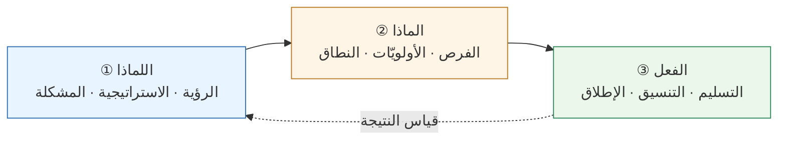
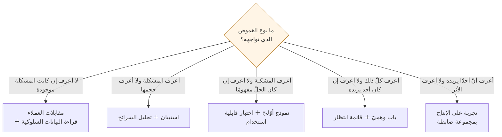

> [!info] الفصل 01 · بودكاست حياة المنتج
> **ماذا ستتعلّم:** كيف تُعرَّف مهنة إدارة المنتج حين تُسأل عنها أربعةَ عشرَ ممارسًا مختلفًا فتحصل على أربعة عشر جوابًا يلتقي أكثرها عند شيء واحد: **المشكلة، لا الحلّ**. ستفهم لماذا يُعَدّ **الغرق في التنفيذ** أشيعَ طرائق إفساد الدور، وما **السلال الثلاث** التي تفصل «اللماذا» عن «الماذا» عن «الفعل»، ولماذا صار **الجدل حول المسمّيات** — مالك المنتج، ومدير المنتج، ومدير المشروع — عَرَضًا لمرض لا مرضًا بذاته. ثم ستُفكَّك أمامك أشهر عبارة في المهنة وأكثرها ضررًا: **«مدير المنتج هو الرئيس التنفيذيّ للمنتج»** — من قالها، وماذا قصد، ولماذا عاد صاحبها يعتذر عنها. وستخرج بجواب عمليّ عن السؤال الذي يسبق كلّ شيء: **كيف تتحقّق من أنّك أمسكتَ المشكلة الصحيحة حين لا توجد بيانات أصلًا** — بأربعة مداخل، ولكلٍّ منها ما يُثبته وما لا يستطيع أن يُثبته. وأخيرًا، محاكمة نزيهة لمصطلح **حسّ المنتج**: أهو مهارة قابلة للبناء، أم اسم مهذّب لتحيّز لم يُختبر؟

> [!abstract] التأصيل
> **يفترض أنّك تعرف:** [[Product Life Cycle]] · [[Cross-functional Team]]
> **ويُؤصّل لك:** [[Product Thinking]] · [[Problem Statement]] · [[Feature Factory]] · [[Outcome vs Output]] · [[Product Sense]] · [[Product Discovery]]

# الفصل 01 — ما إدارة المنتج؟ المشكلة قبل الحلّ

## 🎯 أهداف التعلّم

- صياغة تعريف عمليّ لإدارة المنتج يبدأ من **المشكلة** لا من الحلّ، وتبرير لماذا يقع الحلّ خارج قلب التعريف لا خارج مسؤوليّة الدور.
- تفكيك الدور إلى **ثلاث سلال** — اللماذا، والماذا، والتنفيذ — وتشخيص أيّ سلّة تبتلع وقتك أنت اليوم.
- التعرّف على **مصنع الميزات** من علاماته التشغيلية لا من انطباع عامّ، والتمييز بين **المُخرَج** و**النتيجة** في لوحة قياس واحدة.
- شرح من أين جاء الفصل بين **مالك المنتج** و**مدير المنتج**، ومتى يكون الفصل مبرَّرًا ومتى يكون هروبًا من مشكلة تنظيمية.
- تفنيد عبارة **«الرئيس التنفيذيّ للمنتج»** تفنيدًا دقيقًا: أصلها، وما قصده قائلها، والضرر التشغيليّ المحدّد الذي تُحدثه حين تُؤخذ حرفيًّا.
- تحديد **الوضوح والفهم المشترك** بوصفهما المُخرَج الأساسيّ للدور، وقياسهما بمحكّ قابل للتطبيق.
- اختيار المدخل المناسب من **مداخل التحقّق الأربعة** بحسب نوع الغموض والكلفة والزمن المتاح.
- إخضاع **حسّ المنتج** لمحكّ كانمان-كلاين لشروط الحدس الخبير، وتحديد متى يُوثَق به ومتى يجب تعليقه.
- تطبيق **اختلف ثم التزم** بوصفها آليّة قرار، وتمييزها عن استعمالها أداةَ إسكات.

---

## الفكرة المحورية: سؤال واحد يُعرِّف مهنةً كاملة

سأل عمر سلام ضيفَه الأوّل، وهو رجل قضى أربعًا وعشرين سنةً في المهنة، سؤالًا يبدو تمهيديًّا: لو سألك أحد «ما إدارة المنتج؟» فماذا تقول؟ وجاء الجواب في كلمتين.

> [!quote] من المحاضرة
> **تامر صبري:** «ببساطة: **ما المشكلة؟**»
>
> **تامر صبري:** «في رأيي، **معرفة ما المشكلة هي قلب ما يُفترض بمدير المنتج أن يفعله.** وهناك أشياء أخرى حولها — حول الوظيفة — تحتاج إلى فعلها؛ أيّ جزء من الوظيفة. لكن: *ما مشكلة العميل، ومشكلة المنتج؟*»

لا تمرّ على هذا الجواب مرورًا سريعًا. فهو، على قصره، يُنجز ثلاثة أشياء دفعةً واحدة:

1. **يُخرج التنفيذ من قلب التعريف.** لا يقول تامر إنّ التنفيذ ليس من عملك؛ يقول إنّه ليس **جوهره**. وهذا فرق يصنع مهنةً مختلفة تمامًا.
2. **يجعل الدور قابلًا للفشل الصامت.** فمَن يُسلّم في موعده منتجًا يحلّ مشكلةً لا وجود لها، قد نجح بمقياس التنفيذ وفشل بمقياس المهنة. وهذا النوع من الفشل لا يظهر في أيّ لوحة قياس تسليم.
3. **يُعيد ترتيب من يملك ماذا.** فإن كان قلب عملك المشكلة، فالحلّ ليس ملكك وحدك؛ وهو ما سنراه في القسم التالي مباشرةً.

وحين طرح عمر السؤال المضادّ — لماذا لا تكون معرفة **الحلّ** جزءًا من التعريف؟ — كان المصدر تالفًا في تلك اللحظة، ولم يبقَ من جواب الضيف إلّا شذرة: أنّ الجواب يقع «في الجهة الأخرى»، أي عند من يملكون الحلّ.

> [!warning] موضع تلف في المصدر
> جواب تامر صبري عن سؤال «لماذا ليس الحلّ؟» ضائع في أكثره في التسجيل. وما تقرؤه في الفقرات التالية **تحليلٌ مضاف** يستند إلى بقيّة كلامه في الحلقة وإلى الأدبيات المذكورة بأسمائها، لا إلى نصّ منطوق لم يُسجَّل. وقد فُصل هنا عمدًا حتى لا يُنسَب إليه ما لم يقله.

### لماذا لا يكون الحلّ هو قلب التعريف

المسألة ليست تواضعًا مهنيًّا؛ إنّها **توزيع للمعرفة**. فالمعرفة اللازمة لتحديد المشكلة والمعرفة اللازمة لبنائها حلًّا تسكنان رأسين مختلفين:

| ما تحتاجه لتُعرِّف المشكلة | ما تحتاجه لتصنع الحلّ |
|---|---|
| تعرّض مباشر للعميل ولسلوكه | معرفة بالمعمارية وبما تتحمّله |
| فهم لاقتصاديّات العمل: أين المال ولماذا | فهم لكلفة التغيير وللدَّين المتراكم |
| قدرة على قراءة البيانات إلى عمق يتجاوز السطح | قدرة على تقدير المخاطرة التقنية |
| سلطة معلوماتية عبر الأقسام | سلطة تنفيذية داخل الشيفرة |

من يملك العمود الأيمن ليس هو من يملك العمود الأيسر غالبًا. ومدير المنتج الذي يُصرّ على امتلاك العمودين معًا يُنتج أحد شيئين: إمّا حلولًا رديئة تقنيًّا لأنّه لا يملك المعرفة، وإمّا فريقًا معطَّلًا لأنّه صادر عنه مساحة حكمه. وسنرى هذا بالحرف في الحلقة الثالثة عشرة حين يصفه مراد صالح بأنّه «خسارة فرصة».

> [!info] إضافة مرجعية — من أين جاءت فكرة «المشكلة قبل الحلّ»
> هذه ليست فكرةً وليدة عصر البرمجيات. صاغها **ثيودور ليفيت** في مقاله *Marketing Myopia* (مجلّة هارفارد بزنس ريفيو، 1960) حين حاجّ بأنّ شركات السكك الحديدية الأمريكية انهارت لأنّها ظنّت نفسها في «عمل القطارات» لا في «عمل النقل» — فعرّفت نفسها بالحلّ الذي تملكه لا بالحاجة التي تخدمها. ومن حلقاته الدراسية جاءت العبارة الشهيرة التي تُنسَب إليه: أنّ الزبون لا يريد مثقابًا قطره ربع بوصة، وإنّما يريد **ثقبًا** قطره ربع بوصة.
>
> ثم أعاد **كلايتون كريستنسن** صياغة الفكرة إطارًا كاملًا باسم **المهامّ المطلوب إنجازها ([[Jobs to be Done]])**، وأشهر تطبيقاته دراسة الميلك شيك التي رواها في *Competing Against Luck* (2016): سلسلة مطاعم أرادت رفع مبيعات الميلك شيك، فسألت العملاء عمّا يُحسّن الميلك شيك وحسّنته — بلا أثر. ثم لاحظ الباحثون أنّ نسبةً كبيرة منها تُباع قبل التاسعة صباحًا لسائقين وحدهم، يشترونها لا لأنّها لذيذة بل لأنّها **تشغل يدًا واحدة وتُطيل الطريق الممل**. فالمشكلة لم تكن مذاق الشراب؛ كانت رتابة رحلة الصباح — ومنافسها الحقيقيّ لم يكن ميلك شيك آخر، بل الموزة وكعكة الإفطار.

### المشكلة ليست شكوى العميل

هنا يقع أوّل التباس عمليّ. فحين يُقال «ابدأ بالمشكلة»، يفهم كثيرون: اسأل العميل عن مشكلته واكتبها. وهذا غلط في مستويين.

**المستوى الأوّل:** العميل لا يصف مشكلته عادةً؛ بل يصف **حلًّا متخيَّلًا** لها. فحين يقول «أريد زرًّا للتصدير إلى إكسل»، فهو لا يخبرك بمشكلته، بل بأقرب حلّ يعرفه. والمشكلة الحقيقية قد تكون أنّه يُعِدّ تقريرًا شهريًّا لمديره، وأنّ الحلّ الصحيح تقرير مجدوَل يصل بريدَه أوّلَ كلّ شهر بلا زرّ ولا إكسل.

**المستوى الثاني:** كثير من أهمّ المشكلات لا يشعر بها العميل أصلًا. فالعميل الذي هجر التطبيق بعد الأسبوع الأوّل لن يكتب لك شكوى؛ لن تسمع منه شيئًا على الإطلاق. وهذا صنف من المشكلات لا يُكتشَف بالإنصات بل بالقياس — وسيعود إليه إسلام العيّار في الحلقة السادسة بسؤال يقلب الترتيب المعتاد رأسًا على عقب: **«لماذا سقطوا؟» لا «لماذا انصرفوا؟»**

وبين المستويين يتشكّل تعريف صناعيّ لما نسمّيه [[Problem Statement|بيان المشكلة]]: عبارة مكتوبة تصف **مَن** يعاني، و**ماذا** يعاني، و**بأيّ تواتر وشدّة**، و**ما الذي يفعله اليوم بدل ذلك**، و**كم يُكلّفه ذلك** — من غير أن تذكر حلًّا واحدًا. وأيّ بيان مشكلة يذكر الحلّ فهو ليس بيان مشكلة، بل طلب ميزة مُتنكّر.

> [!tip] محكّ عمليّ في سطرين
> اكتب بيان مشكلتك، ثم احذف منه كلّ اسم لتقنية أو شاشة أو زرّ. فإن بقي كلامٌ مفهومٌ ذو معنى، فهو بيان مشكلة. وإن انهار وصار جملةً بلا معنى، فقد كنتَ تكتب حلًّا من البداية.

---

## السلال الثلاث: اللماذا، والماذا، والتنفيذ

جاءت فريدة عدلي إلى السؤال نفسه من زاوية أخرى. فهي لا تُعرّف الدور بالسؤال الذي يطرحه، بل بالموقع الذي يشغله.

> [!quote] من المحاضرة
> **فريدة عدلي:** «عندي، [مدير المنتج] هو الشخص **الذي في الوسط**: بين ما نريد أن نفعله وننفّذه، وبين المكان الذي نريد أن نذهب إليه… وهو الذي يتأكّد من أنّ ذلك **يُوصلنا إلى هناك** فعلًا.»
>
> **فريدة عدلي:** «أنا أقسمها دائمًا إلى [ثلاثة] أشياء… **أوّلًا**: أن ترسم وتُعرّف فعلًا **لماذا** تفعل هذا. وأنا أرى دائمًا أنّ أصعب عمل على الإطلاق هو [هذا]… ثم يأتي [**الماذا**]. ثم يأتي عالم **الفعل** و**التنفيذ**.»

ولاحظ أنّها لا تُسقط السلّة الثالثة، بل تُصرّ عليها:

> [!quote] من المحاضرة
> **فريدة عدلي:** «وتلك الرؤية تحتوي جزء **الفعل**، وتحتويه جيّدًا. فهناك مَن هم أكثر تركيزًا على الجزء **الأوّل**… لكنّ **جزء الفعل مهمّ جدًّا**، لأنّه من دونه لا يتحوّل العمل كلّه إلى شيء حقيقيّ.»

وهذه الجملة تستحقّ الوقوف. فالخطاب السائد في المهنة اليوم يميل إلى تمجيد «اللماذا» وازدراء «التنفيذ»، حتى صار الاعتذار عن التنفيذ علامةَ نضج مهنيّ. وفريدة تُصحّح هذا الميل من داخله: التنفيذ ليس الجزء الوضيع من الدور؛ إنّه الجزء الذي يجعل بقيّة الدور حقيقيًّا. والفرق بين مدير منتج يحتقر التنفيذ ومدير منتج يستهلكه التنفيذ فرقٌ في **النسبة**، لا في **الوجود**.

الحلقة المرتدّة في الرسم ليست زخرفًا. فالسلال الثلاث ليست خطًّا يُقطَع مرّةً، بل دورةً: نتيجةُ ما نفّذتَه هي المُدخَل الذي يُصحّح لماذاك. ومَن يقطع هذه الحلقة يبني بلا تعلّم.

### الغرق في التنفيذ: كيف يُفسَد الدور عمليًّا

ثم تُشخّص فريدة الانهيار الشائع، وتُسمّيه باسمه:

> [!quote] من المحاضرة
> **فريدة عدلي:** «وأنا أُسمّيه [**مصنع الميزات**]. فتجد [فرقًا] تُطلق في الشهر، وفي السنة — وماذا **كسب** الناس من تلك الأشياء؟ وإلامَ **وصلوا** بها؟ وماذا استطاعوا أن يحقّقوا بها؟ أيُحبّون هذا الشيء فعلًا أم لا؟»
>
> **فريدة عدلي:** «وهذا يشمل الحالة التي **يغرق** فيها [مدير المنتج] **في الفعل**. فلعلّه لا [رؤية] عنده، فيعمل من غيرها… أو قد تكون عندي [رؤية] لكنّي لا أعرف [كيف أربطها بالعمل]… وأحيانًا لا يكون عند [مدير المنتج] **وقت**… وذلك كلّه **يقتل الرؤية**.»

انتبه إلى أنّها ذكرت **ثلاثة أسباب مختلفة** لعَرَض واحد، ولكلٍّ منها علاج مختلف تمامًا:

| السبب | العَرَض الظاهر | العلاج الصحيح | العلاج الخاطئ الشائع |
|---|---|---|---|
| **لا رؤية أصلًا** | تسليم متّصل بلا اتّجاه | بناء الرؤية والاستراتيجية (الفصل 02) | زيادة سرعة التسليم |
| **رؤية موجودة بلا جسر إلى العمل** | رؤية معلّقة في شرائح لا يقرؤها أحد | خارطة طريق تُترجم الرؤية إلى تكتيكات | إعادة صياغة الرؤية بكلمات أجمل |
| **لا وقت** | جدول مذبوح باجتماعات وطلبات | حماية السعة وإعادة توزيع السلال | توظيف مدير منتج آخر بلا تغيير النظام |

وأخطر هذه الثلاثة هو الثالث، لأنّه **يبدو** مشكلة موارد وهو في الحقيقة مشكلة نظام. فإضافة شخص إلى نظام يبتلع الوقت تُنتج شخصين مبتلَعين لا حلًّا.

> [!info] إضافة مرجعية — مصنع الميزات وعلاماته
> مصطلح **[[Feature Factory|مصنع الميزات]]** شاعَ بمقال **جون كتلر** «اثنتا عشرة علامة على أنّك تعمل في مصنع ميزات» (2016). وأهمّ علاماته أنّها **تشغيلية قابلة للملاحظة**، لا انطباعية:
> - لا يوجد اجتماع دوريّ يُراجَع فيه أثر ما أُطلق بعد إطلاقه.
> - يُقاس الفريق بعدد ما سلّم، لا بما تغيّر عند المستخدم.
> - يُنقَل المهندسون بين المشاريع بحرّية، وكأنّ السياق المتراكم لا قيمة له.
> - يُذكر «الالتزام بالموعد» في مراجعة الأداء، ولا تُذكر «صحّة الفرضية».
> - تُقتَل الميزات نادرًا جدًّا؛ فكلّ ما بُني يبقى إلى الأبد.
>
> والعلامة الأخيرة هي أدقّها: مؤسّسة لا تحذف شيئًا هي مؤسّسة لا تتعلّم شيئًا. وسنرى إسلام العيّار في الحلقة السادسة يقولها بصيغة أشدّ: **«لا تعشق ما بنيتَه أبدًا.»**

### المُخرَج والنتيجة: الفرق الذي يبتلع الميزانيات

وفي موضع آخر تختصر فريدة الأمر في جملة واحدة:

> [!quote] من المحاضرة
> **فريدة عدلي:** «**أنت هنا من أجل [النتائج]**؛ ولستَ هنا لتُركّز على أشياء أصغر من اللازم بكثير. فقد يضيع الناس فيها ولا يبلغون قطّ الشيء الذي أردتَ أن تبلغه في النهاية.»

و[[Outcome vs Output|الفرق بين المُخرَج والنتيجة]] من أكثر التمييزات ادّعاءً وأقلّها تطبيقًا. فأكثر الفرق تقول إنّها تُدير بالنتائج، ثم تفتح لوحة قياسها فتجدها كلّها مُخرَجات. والمحكّ بسيط: **المُخرَج شيء تصنعه أنت، والنتيجة شيء يفعله المستخدم.**

| العبارة | مُخرَج أم نتيجة؟ | لماذا |
|---|---|---|
| «أطلقنا لوحة التقارير الجديدة» | مُخرَج | صنعناها نحن؛ لم يتغيّر سلوك أحد بعد |
| «ارتفعت نسبة من يُنشئ تقريرًا في أوّل أسبوع من 12٪ إلى 31٪» | نتيجة | تغيّر سلوك المستخدم |
| «أنجزنا 42 نقطة قصّة هذا السبرنت» | مُخرَج | مقياس سعة داخليّ لا يراه أحد خارج الفريق |
| «انخفضت مكالمات الدعم عن التقارير 40٪» | نتيجة | تغيّرت الكلفة على العمل |
| «غطّينا 100٪ من متطلّبات الامتثال» | مُخرَج | إلّا إن كان المطلوب اجتياز تدقيق فعليّ |

> [!info] إضافة مرجعية
> صاغ **جوش سايدن** هذا التمييز كتابًا كاملًا في *Outcomes Over Output* (2019)، وعرّف النتيجة تعريفًا صارمًا: **«تغيُّر في سلوك بشريّ يقود إلى نتيجة تجارية».** والقيد المزدوج مقصود: تغيُّر السلوك وحده لا يكفي (فقد تجعل الناس ينقرون أكثر بلا فائدة لأحد)، والنتيجة التجارية وحدها لا تكفي (فقد ترتفع الأرباح لسبب لا علاقة له بك). والنتيجة الحقيقية هي ما يربط الاثنين برابط سببيّ تستطيع أن تشرحه.
>
> ولهذا التعريف نتيجة عمليّة صادمة: **معظم ما في خرائط الطرق ليس نتائج**. وهذا لا يعني أنّ خرائط الطرق باطلة، بل يعني أنّها وثائق تنسيق لا وثائق قيمة — وهو ما سيقوله آدم توماس صراحةً في الفصل الثاني.

---

## من أين جاء الجدل حول المسمّيات

الآن نصل إلى واحدة من أكثر مساحات المهنة استهلاكًا للطاقة وأقلّها إنتاجًا: الجدل حول من يُسمّى ماذا. وقد دار حوله جزء كبير من الحلقة الثانية، وانتهى فيه المضيف والضيفة إلى موقف واحد، مع اختلاف في طريق الوصول.

> [!quote] من المحاضرة
> **عمر سلام:** «فلا حاجة إلى ذلك المسمّى المنفصل الغريب. **لماذا نظلّ نلعب بالمسمّيات ونُربك أنفسنا في النهاية؟** ينبغي أن نعمل على شيء واحد… ومن سوء الحظّ، كما تقولين، أنّنا اليوم **مركّزون على المسمّيات** أكثر من اللازم بكثير.»

### الرواية التاريخية: كيف وُلد الفصل

يروي عمر أصل القصّة روايةً وظيفية لا أكاديمية:

> [!quote] من المحاضرة
> **عمر سلام:** «تمامًا كما نفعل في سكرم: عندي شخص في المنتج يبني [المتراكمات] — سيُسمّى [مالك المنتج]، ولهذا يعمل. ثم هناك شخص آخر اسمه **سكرم ماستر**، قد يجلس يأخذ [ملاحظات]: «تكلّم أنت هنا، وتكلّم أنت هناك» — ثم حوّلت **فجوة زمنية** ذلك إلى وظيفة قائمة بذاتها.»

عبارة «حوّلت فجوة زمنية ذلك إلى وظيفة» هي لبّ التشخيص. فالأدوار في الأطر لم تُوضَع لتكون مسمّيات وظيفية؛ وُضعت لتكون **مسؤوليّات** داخل إطار. ثم جاء سوق العمل — بشركات التدريب، وبرامج الشهادات، وأنظمة الموارد البشرية التي تحتاج صندوقًا في هيكل تنظيميّ — فحوّل المسؤوليّة إلى منصب، والمنصب إلى مسار، والمسار إلى صناعة.

> [!info] إضافة مرجعية — ماذا يقول دليل سكرم فعلًا
> ينصّ **دليل سكرم** (نسخة 2020) على أنّ **مالك المنتج شخص واحد لا لجنة**، وأنّ مسؤوليّته «تعظيم القيمة الناتجة عن عمل فريق سكرم». ولا يذكر الدليل في أيّ موضع أنّ مالك المنتج **وظيفة** منفصلة عن مدير المنتج، ولا يصفه بأنّه كاتب تذاكر أو مدير متراكمات.
>
> وقد كرّر **مارتي كيغان** — في *INSPIRED* (2008، وطبعة موسّعة 2017) وفي كتاباته على مدوّنة Silicon Valley Product Group — الاعتراضَ نفسه بصيغة أحدّ: أنّ «مالك المنتج» **دور داخل إطار** لا **مسمّى وظيفيّ**، وأنّ الشركة التي تُعيّن مالك منتج ومدير منتج شخصين مختلفين إنّما تُنشئ حاجزًا بين من يفهم المشكلة ومن يُترجمها إلى عمل.
>
> ويستحقّ التنبيه أنّ هذا رأيٌ سائد لا إجماع. فمدرسة أخرى — تظهر خصوصًا في المؤسّسات الكبيرة وفي [[SAFe]] — ترى الفصل ضروريًّا حين يتّسع النطاق. وسنُنصف هذه المدرسة في القراءة النقدية آخر الفصل.

### مدرسة الشخص الواحد

أمّا فريدة فتُعلن موقفها معلنةً في الوقت نفسه أنّه موقف، لا حقيقة:

> [!quote] من المحاضرة
> **فريدة عدلي:** «ومن هناك بدأنا ننظر: أينبغي أن يكونا **شخصين** أم **شخصًا واحدًا** — وهذه **مدارس فكرية**. ولستُ أقول لك أيّها صحيح وأيّها خطأ؛ أقول لك **مدرستي أنا**. **هو شخص واحد.** فكما قلتُ لك، لا أرى [مسؤوليّات مالك المنتج] تزيد على نحو **عشرين بالمئة** [من الدور]. فلا أحتاج إلى أن يذهب ثمانون بالمئة من وقتي — ولا حتى نصيب كبير منه — إلى [الطقوس].»
>
> **فريدة عدلي:** «وأرى أيضًا أنّ ذلك **يُقلّل** [الاحتكاك] ويُحسّن **التركيز**.»

هذا الرقم — عشرون بالمئة — أهمّ ما في المقطع، لأنّه يحوّل جدلًا فلسفيًّا إلى مسألة قابلة للقياس. فالسؤال لم يعد «أينبغي أن يكونا واحدًا أم اثنين؟» بل: **كم من وقتك يذهب فعلًا إلى مسؤوليّات المتراكمات والطقوس؟** فإن كان عشرين بالمئة فالفصل ترفٌ يُنشئ تسليمًا زائدًا بين شخصين. وإن كان ثمانين بالمئة، فعندك مشكلة — لكنّها على الأرجح ليست مشكلة عدد أشخاص، بل مشكلة في حجم الفريق، أو في نضج الهندسة، أو في عدد أصحاب المصلحة الذين يُطالبونك.

ولذلك يقترح عمر حلًّا لا يمرّ عبر مسمّى جديد أصلًا:

> [!quote] من المحاضرة
> **عمر سلام:** «مدير المنتج مسحوب في ستّين ألف شيء، وأصحاب المصلحة عنده لا ينتهون. فهو يحتاج مساعدة؛ أعطِه **موارد** إضافية: أحضِر له مدير منتج مبتدئًا. فهو خبير، وتحته **مدير منتج أساسيّ**، وتحته **مدير منتج مبتدئ**… ونحن بوصفنا **وحدة** معًا نفعل كذا وكذا.»

الفرق بين الحلّين دقيق ومهمّ: الحلّ الأوّل (مالك منتج منفصل) **يقسم الدور أفقيًّا** فيفصل التفكير عن التنفيذ. والحلّ الثاني (مدير منتج مبتدئ داخل الوحدة) **يقسم الحمل رأسيًّا** فيبقى الدور كاملًا في كلّ مستوى مع اختلاف النطاق. والثاني وحده يُنتج مسارًا مهنيًّا؛ لأنّ من قضى ثلاث سنوات مالكَ منتجٍ محصورًا في المتراكمات لم يتدرّب على شيء ممّا يحتاجه ليصير مدير منتج.

### وأين تقع إدارة المشروع في كلّ هذا؟

وهنا يجب أن نُنصف الطرف الغائب عن النقاش. فالحلقة كلّها تدور حول تمييز إدارة المنتج من إدارة المشروع، لكنّها — كأكثر النقاشات في هذا المجال — تصف إدارة المشروع بصورة أقرب إلى صورة الخصم منها إلى صورة المهنة.

> [!info] إضافة مرجعية — تمييز أربعة أدوار لا اثنين
> الخلط لا يقع بين اثنين بل بين أربعة، ولكلٍّ منها سؤال محوريّ مختلف:
>
> | الدور | سؤاله المحوريّ | ما ينجح به | أخطر ما يُقاس به خطأً |
> |---|---|---|---|
> | **مدير المنتج** | ما المشكلة الجديرة بالحلّ؟ | نتيجة تغيّرت عند المستخدم والعمل | عدد الميزات المُطلَقة |
> | **مالك المنتج** (دورًا لا وظيفة) | ما التالي الأعلى قيمةً؟ | متراكم واضح وقرارات نطاق سريعة | امتلاء المتراكم |
> | **مدير المشروع** | ما الذي يمنعنا من التسليم؟ | التزام بالنطاق والزمن والكلفة والمخاطر | عدد الاجتماعات المنعقدة |
> | **مدير التسليم** | كيف نجعل التدفّق مستقرًّا؟ | زمن دورة قابل للتنبّؤ | نسبة استغلال الأفراد |
>
> والملاحظة الجوهرية أنّ هذه الأسئلة الأربعة **لا تتناقض**؛ إنّها تُسأل في أزمنة مختلفة وبنطاقات مختلفة. والمؤسّسة التي تُهمل السؤال الثالث والرابع باسم «نحن مؤسّسة منتج» تكتشف بعد سنة أنّ منتجها الممتاز لا يصل إلى أحد في موعده. وهذه واحدة من أكثر مغالطات خطاب المنتج المعاصر تكلفةً.

### المسمّى المأخوذ بسرعة أكثر من اللازم

وللمسألة وجه آخر تناوله أحمد وفائي على مسرح قمّة MENA للمنتج، حين جعل «مسمّاي يعكس مسؤوليّاتي» رابعَ المفاهيم الخاطئة السبعة التي بنى عليها كلمته:

> [!quote] من المحاضرة
> **أحمد وفائي:** «وهناك **مفهوم خاطئ** أنّني ينبغي أن آخذ **مسمّى** بسرعة، ليبدو أنّني أفضل، أو أنّ عندي **مهارةً** أكبر، أو أنّني أستطيع أن أتحمّل **نطاقًا** أكبر. فأولئك ستجدهم قد **توقّفوا** عند نقطة ما؛ وإنّها مسألة وقت لا غير.»
>
> **أحمد وفائي:** «تعال نلتقِ بعد **عشر سنوات** — وسيكون هناك فرق بين مَن **رأى المواقف كلّها** حتى بلغ المسمّى نفسه، لكن بطريق مختلف تمامًا، وبأسلوب مختلف تمامًا.»

ثم ضرب مثالًا رياضيًّا يعرفه جمهوره: أنّ محمّد صلاح كان يستطيع بعد إخفاقه في تشيلسي أن يعود إلى الأهلي قائدًا وابنَ ناد، وكان ذلك «طبيعيًّا تمامًا» — لكنّه ذهب إلى نادٍ أصعب في دوريّ أصعب، فعاد بعدها إلى المكانة نفسها **بمستوًى مختلف تمامًا**.

وأضاف وفائي ملاحظةً عن الشهادات المهنية تستحقّ أن تُنقَل بحرفها لأنّها متوازنة على نحو نادر في هذا الباب:

> [!quote] من المحاضرة
> **أحمد وفائي:** «ولستُ أقول إنّ الشهادات خطأ — لكنّها لم تكن قطّ **مقياسًا** لهل مَن أمامي، أو مدير المنتج الذي أمامي، جيّد أم لا؛ ولا لهل سيكون **ملائمًا للثقافة** في الشركة التي أنا فيها أم لا.»

والصياغة الدقيقة هنا: الشهادة **ليست دليلًا سلبيًّا** (لا تعني أنّ صاحبها ضعيف)، ولكنّها **ليست دليلًا إيجابيًّا كافيًا** أيضًا. وهذا موقف مختلف تمامًا عن الازدراء الشائع للشهادات في أوساط المنتج، وهو أصدق منه؛ لأنّ الشهادة تُثبت أنّ صاحبها تعرّض لمفردات المجال ومرّ على مفاهيمه — وهذا شيء لا صفر. لكنّها لا تُثبت الشيء الذي يُوظَّف الناس من أجله: القدرة على الحكم في موقف غامض.

---

## أسطورة «الرئيس التنفيذيّ للمنتج»

لا توجد في هذه المهنة عبارة أوسع انتشارًا ولا أشدّ ضررًا من هذه. وقد دخل عمر سلام إلى الحلقة الثالثة عشرة وهو يحملها سلاحًا مشهورًا:

> [!quote] من المحاضرة
> **عمر سلام:** «ولا يهمّني كثيرًا ماذا تقول إنّ مدير المنتج. فاختلف؛ وقل ما شئت. لكن **رجاءً** لا تقل إنّ مدير المنتج هو **الرئيس التنفيذيّ للمنتج**.»
>
> **مراد صالح:** «حسنًا — فقد قفزنا مباشرةً إلى العمق.»

### من قالها، وماذا قصد

> [!quote] من المحاضرة
> **مراد صالح:** «هذا المفهوم، إن كنتُ أذكر صحيحًا، أوّل مَن قاله **بن هورويتز**، سنة **٢٠٠٥** — في *«مدير منتج جيّد، مدير منتج سيّئ»*… وبالمناسبة، عاد بعدها فقال: *«يا جماعة — رجاءً، إن سمحتم، اهدؤوا»*… *«لم أقصد ما تفعلونه أو تقولونه. بل قصدتُ أنّ **الرئيس التنفيذيّ** من أكثر الناس مسؤوليةً عن **التأثير** في الناس، و**تحفيزهم**، والدفع نحو النجاح… فمدير المنتج، داخل **مجاله** أو رقعته، معنيّ بذلك عنايةً كبيرة»*.»

> [!info] إضافة مرجعية — تصحيح تاريخيّ صغير
> النصّ الأصليّ لـ*Good Product Manager, Bad Product Manager* كتبه **بن هورويتز** (مع ديفيد فايدن) سنة **1996** حين كان في **نتسكيب**، وكان في أصله مذكّرةً داخلية لتدريب مديري المنتج هناك؛ ثم أُعيد نشره لاحقًا على مدوّنة **Andreessen Horowitz** فذاع على نطاق أوسع. فالتاريخ الذي ذكره الضيف (2005) أقرب إلى زمن **الانتشار** منه إلى زمن **الكتابة**، وقد قال هو نفسه «إن كنتُ أذكر صحيحًا».
>
> وهذا التصحيح ليس تفصيلًا: فمعرفة أنّ العبارة وُلدت **مذكّرةَ تدريب داخليّ في شركة برمجيات في التسعينيات** تشرح بالضبط لماذا صارت مضلّلة حين اقتُطعت من سياقها. فقد كانت أصلًا تشبيهًا تربويًّا يُراد به رفع سقف **المسؤولية الشعورية** عن المنتج، لا وصفًا للسلطة التنظيمية.

### التفنيد العمليّ: أربعة أشياء لا تستطيع فعلها

ثم يأتي التفنيد، وهو تفنيد جميل لأنّه لا يستند إلى فلسفة بل إلى قائمة صلاحيّات:

> [!quote] من المحاضرة
> **عمر سلام:** «لا تستطيع أن تفصل وتُوظّف؛ فتلك وظيفة رئيس تنفيذيّ. ولا تستطيع أن تذهب، إن لم تكن **مدير منتج مؤسّسًا**، فتُجري مثلًا **جولات** تمويل؛ ولا أن تضع **الخطّة المالية**. ولا تستطيع، وهكذا. فبكلّ وضوح، **أنت ببساطة لستَ الرئيس التنفيذيّ**.»
>
> **مراد صالح:** «ببساطة شديدة.»

والمقارنة الصريحة تُظهر حجم الفجوة:

| صلاحية | الرئيس التنفيذيّ | مدير المنتج |
|---|---|---|
| التوظيف والفصل | نعم | لا |
| تخصيص الميزانية عبر الأقسام | نعم | لا |
| جمع جولات التمويل | نعم | لا (إلّا مدير المنتج المؤسّس) |
| وضع الخطّة المالية | نعم | لا |
| تحديد الهيكل التنظيميّ | نعم | لا |
| **التأثير بلا سلطة** | جزئيًّا | **هذا هو عمله كلّه** |

والصفّ الأخير هو المفارقة كلّها. فمدير المنتج ليس نسخةً مصغّرة من الرئيس التنفيذيّ؛ إنّه **الدور المعاكس**: شخص مطلوب منه أن يُنتج التزامًا جماعيًّا **بلا أيّ أداة من أدوات الإلزام**. وهذه ليست نسخةً أضعف من الرئاسة؛ إنّها مهارة أخرى تمامًا، وهي أصعب في بعض الوجوه — لأنّ من يملك السلطة يستطيع أن يُخطئ ويمضي، ومن لا يملكها لا يستطيع أن يُخطئ مرّتين مع الفريق نفسه.

### الضرر التشغيليّ: ماذا يحدث حين تُؤخذ حرفيًّا

> [!quote] من المحاضرة
> **مراد صالح:** «والمشكلة أنّ هذا **المصطلح** جذب كثيرين جدًّا عندهم شغف *أريد أن أكون الرئيس*… *أريد أن أكون مَن يقول ماذا نفعل وماذا لا نفعل، وإلى أين نذهب… ويجب أن تكون القرارات كلّها لي وأنا أتّخذها… وأنا دائمًا صاحب الإجابات عن الأسئلة المهمّة.* وقد رأيتُ كثيرين جدًّا يُحاولون أن يتصرّفوا هكذا.»
>
> **مراد صالح:** «فستكون **محظوظًا** إن *لم* تكن أذكى مَن في الغرفة. فمعك **مهندس**؛ ومعك **مصمّم** جيّد؛ ومعك شخص من **الأعمال** ذكيّ في عمله. لكنّك لن تستطيع أن تستفيد من أيّ من ذلك إن كان عقلك مضبوطًا على *أنا الرئيس التنفيذيّ الذي يحتاج أن يتّخذ هذا القرار.*»

ثم يذكر ثمنًا عمليًّا لا يخطر على بال أكثر الناس:

> [!quote] من المحاضرة
> **مراد صالح:** «فحين أكون في إجازة، مَن سيُبقي الأشياء تسير كما ينبغي؟… واليوم — إن لم تكن في أفضل حالاتك، أو كنتَ اليوم في **أسوأها**، فكيف سيظلّ الفريق **يُؤدّي** ويظلّ يُنتج؟»
>
> **مراد صالح:** «لا سيّما أنّني أيضًا ممّن يُصابون بما يُسمّونه **إرهاق القرار**. فعقلي — لا أستطيع أن أتّخذ قرارًا. فإن كنتُ قد اتّخذتُ خمسة قرارات اليوم، توقّفتُ هناك؛ ولن أستطيع أن أتّخذ السادس.»

هذه شهادة نادرة لأنّها اعتراف شخصيّ لا نصيحة عامّة. ومدير المنتج الذي يحتكر القرار يبني نظامًا سقفُه سقفُ يومه السيّئ. فقدرته على اتّخاذ القرار مورد ناضب — وهو يُشغّل بها فريقًا كاملًا.

> [!info] إضافة مرجعية — لماذا العبارة خطأ بنيويًّا لا لفظيًّا
> نشر **مارتن إريكسون**، مؤسّس Mind the Product، سنة 2011 مقالًا شهيرًا رسم فيه إدارة المنتج **مساحة تقاطع** بين ثلاث دوائر: التقنية، والأعمال، وتجربة المستخدم. وقد صار هذا الرسم أشهر صورة في المهنة — وصار أيضًا مصدرَ سوء فهم موازٍ، لأنّ الناس قرؤوا «في المنتصف» على أنّها **فوق الثلاثة** لا **بينها**.
>
> ثمّ ذهبت **مليسا بيري** في *Escaping the Build Trap* (2018) إلى أبعد من ذلك، فحاجّت بأنّ مشكلة «الرئيس التنفيذيّ للمنتج» ليست في المبالغة وحدها، بل في أنّها **تُعفي المؤسّسة من مسؤوليّتها**: فحين يُقال إنّ مدير المنتج مسؤول عن نجاح المنتج مسؤوليةً كاملة، يصير كلّ فشل فشلَه هو، وتُصبح المشكلات البنيوية — من انعدام الاستراتيجية إلى نظام الحوافز — مسائلَ شخصية.
>
> وسنسمع الصدى الأخير لهذه الفكرة في آخر جملة على مسرح القمّة، حين يرفض **أحمد وفائي** الصورة الشائعة رفضًا قاطعًا: أنّ هناك **أعمالًا** و**تصميمًا** و**هندسة**، ومدير المنتج واقف في المنتصف — ويقول: **«تلك الصورة خاطئة تمامًا.»** فالمنتج عنده ليس واقفًا بين الأعمال والهندسة؛ **المنتج هو وظيفة الأعمال** نفسها.

---

## إذن ما وظيفتك؟ الوضوح والفهم المشترك

بعد كلّ هذا النفي، يبقى السؤال: فإن لم تكن الرئيس، ولم تكن صاحب القرار وحدك، ولم يكن الحلّ ملكك — فما الذي تملكه أصلًا؟ والجواب في هذه المجموعة كلّها يكاد يكون واحدًا، وإن اختلفت العبارات.

> [!quote] من المحاضرة
> **مراد صالح:** «فدورك إذن أن تجعل الأشياء **واضحة**؛ وأن تبني **رؤيةً** واضحة ليستطيع الناس كلّهم أن يعملوا داخل ذلك الوضوح… أن يفهم كلّ شخص في الفريق ماذا نريد أن نُحقّق كلّ صباح؛ وأنّ هذه أهمّ المشكلات التي تسدّ **نموّنا**؛ وأنّ هذه وظيفتنا.»
>
> **مراد صالح:** «فهناك أشياء ستُحسنها: **الوضوح في النتيجة**، وكيف سنُحقّقها، وكيف سنقيس نجاحنا، والمشكلات الأساسية التي نحتاج أن نحلّها — ضع أكبر **استثمار** هناك — وبناء ذلك **الفهم المشترك**. ضع الأقصى هناك.»

ولاحظ أنّه يُتبع ذلك مباشرةً بالنتيجة العمليّة المرجوّة:

> [!quote] من المحاضرة
> **مراد صالح:** «وأرجو أنّك حين تفعل ذلك كما ينبغي، تكون عند الناس كلّهم معلومات كافية ليستطيعوا اتّخاذ القرار… فمثلًا، يقول لك المهندس: *«بالمناسبة، نستطيع أن نحلّها — لماذا تُصعّبها على نفسك؟»*. ويقول لك المصمّم: *«لا — كنتُ في مقابلة كذا وسمعتُ شيئًا مختلفًا»*… لكنّهم لن يستطيعوا أن يتّخذوا القرار إطلاقًا ما لم يكن واضحًا لهم إلى أين نذهب.»

هذا هو الميزان كلّه. فالوضوح ليس غايةً جمالية ولا وثيقةً أنيقة؛ إنّه **شرط لامركزية القرار**. ومقياس نجاحك فيه ليس أن يفهمك الناس حين تشرح، بل أن **يتّخذوا القرار الصحيح في غيابك**.

### الفهم المشترك ليس وثيقةً مشتركة

> [!info] إضافة مرجعية
> عبّر **جيف باتون** في *User Story Mapping* (2014) عن أدقّ صيغة لهذه الفكرة: أنّ الغرض من الوثائق ليس نقل المعلومة، بل **بناء فهم مشترك**؛ وأنّ **الوثيقة المشتركة ليست فهمًا مشتركًا**. فالنصّ الذي كتبتَه أنت وقرأه الفريق يُنتج عند كلّ قارئ صورةً في رأسه، والصور مختلفة — وأنت لا تراها. وما يُنتج الفهم المشترك ليس النصّ بل **المحادثة حول النصّ**؛ ولهذا يبقى الرسم على لوح أبيض أمام خمسة أشخاص أنفعَ من مستند من عشرين صفحة يقرؤه كلّ واحد وحده.
>
> ومن أطرف ما يوضّح هذا التمييز اختبار عمليّ: بعد أسبوع من إرسال وثيقة المتطلّبات، اسأل ثلاثة من أعضاء الفريق كلًّا على حدة: **«ما الشيء الذي لن نبنيه؟»** فإن جاءت الأجوبة الثلاثة مختلفة — وهي تختلف غالبًا — فالوثيقة انتقلت والفهم لم ينتقل.

> [!info] إضافة مرجعية — نموذج أمازون في إنتاج الوضوح
> يصف **كولن براير** و**بيل كار** في *Working Backwards* (2021) — وكلاهما من قدامى التنفيذيّين في أمازون — آليّتين مصمّمتين لهذا الغرض بالتحديد:
>
> **الأولى: السرد المكتوب بدل الشرائح.** تبدأ الاجتماعات بصمت يقرأ فيه الحاضرون مذكّرةً نثريّة من ستّ صفحات. والسبب المعلن أنّ الشرائح تسمح لصاحبها بأن يُخفي ضعف تفكيره خلف عناوين متقطّعة، بينما النثر الكامل يفضح الفجوة المنطقية؛ فالجملة التي لا تصحّ لا تستطيع أن تُكتب جملةً.
>
> **الثانية: البيان الصحفيّ وأسئلته الشائعة (PR-FAQ).** تكتب — قبل أن تبني شيئًا — البيانَ الصحفيّ الذي ستنشره يوم الإطلاق، وقائمةَ الأسئلة الصعبة التي سيسألها العميل والداخل. فإن لم تستطع أن تكتب بيانًا يُثير حماسة أحد، فالمشكلة ليست في صياغتك بل في الفكرة.
>
> ويستحقّ التنبيه أنّ هاتين الآليّتين **مكلفتان** ولا تصلحان لكلّ سياق: ستّ صفحات نثريّة عن كلّ قرار تعني مؤسّسةً بطيئة. وأمازون تدفع هذا الثمن عن عمد لأنّ حجمها يجعل كلفة القرار الخاطئ أكبر من كلفة البطء. والشركة الناشئة التي تنسخ الآليّة بلا هذا السياق تنسخ الكلفة وحدها.

### السلطة المعلوماتية: المورد الوحيد الذي تملكه فعلًا

وفي أثناء كلامه عن الوضوح، يمرّ مراد صالح على جملة تكاد تُغفَل، وهي في تقديري أدقّ توصيف لمصدر قوّة هذا الدور:

> [!quote] من المحاضرة
> **مراد صالح:** «وأنّك مثلًا مشارك في اجتماعات كثيرة مع **أعمال** مختلفة ومع **أصحاب مصلحة** مختلفين — فكيف **تُعيد** وتُغذّي نقاشاتك اليومية مع الفريق بالمعلومات التي لا يعرفونها لأنّك **أنت** المتعرّض لها؟ تلك وظيفتك.»

مدير المنتج لا يملك سلطة إداريّة، لكنّه يشغل **موقعًا معلوماتيًّا** لا يشغله أحد غيره في المؤسّسة: فهو الوحيد الذي يجلس في اجتماع الماليّة صباحًا، ومع المهندسين ظهرًا، ومع عميل مستاء عصرًا. وهذا الموقع هو رأس ماله كلّه. ومنه ينشأ قانونان عمليّان:

1. **كلّ معلومة تحتكرها تُنقص قوّتك ولا تزيدها.** لأنّ قوّتك مشتقّة من قدرة الفريق على القرار، لا من احتياجه إليك.
2. **أخطر عادة في هذا الدور هي «سأشرح لهم لاحقًا».** فالمعلومة التي تتأخّر أسبوعًا تكون قد أنتجت أسبوعًا من العمل المبنيّ على صورة قديمة.

---

## كيف تعرف أنّها المشكلة الصحيحة؟ مداخل التحقّق الأربعة

عاد عمر بالحديث إلى المسألة العمليّة، وصاغ السؤال صياغةً واقعيّة تستحقّ التقدير لأنّها لا تفترض الحالة المثالية:

> [!quote] من المحاضرة
> **عمر سلام:** «كما قلتَ، السيناريو الأساسي: إن كانت عندي **بيانات**، وأدلّة، وبحوث، وكلّ شيء في الدنيا، فالمشكلة تُظهِر نفسها… لكن يبدو لي أنّ ما يحدث أكثر هو التعامل مع **غياب البيانات** وغياب الأدلّة — **غموض** تامّ. فهنا **المهارة** الجوهرية… هي: كيف سأتحقّق؟»

وجاء جواب تامر صبري قائمةً مرتّبة:

> [!quote] من المحاضرة
> **تامر صبري:** «عندك أربعة مداخل. أن تُجري **تجارب**، إن كنتَ تستطيع إطلاق تجارب على الإنتاج. و*(ثم)*، عندك **مقابلات العملاء** و**الاستبيانات**. وعندك أن تصنع **نموذجًا أوّليًّا** على Figma أو غيره — أو الآن Lovable وأمثاله — وتأخذه إلى العملاء وتقول *«هذا ما صنعتُه، وهذا ما غيّرتُه»*، وترى **التغذية الراجعة**.»
>
> **تامر صبري:** «لكنّني لا أراها *(مسألة)* وقتِ هندسةٍ… لكنّني لا أتحدّث عن أن نذهب و**نبني الميزة**. لا — أنت تحتاج فعلًا أن تصل إلى *(المشكلة)*؛ تحتاج فعلًا أن تحاول فعل هذه الأشياء *(قبل أن تبني)*.»

### ما يُثبته كلّ مدخل — وما لا يستطيع أن يُثبته

الخطأ الشائع في تطبيق هذه المداخل ليس اختيار المدخل الخطأ، بل **توقّع من المدخل ما لا يُعطيه**. وهذا الجدول هو أنفع ما في هذا القسم:

| المدخل | يُثبت بقوّة | لا يُثبت إطلاقًا | الكلفة النموذجية | أخطر مزالقه |
|---|---|---|---|---|
| **التجربة على الإنتاج** | أنّ السلوك يتغيّر فعلًا | **لماذا** تغيّر | متوسّطة إلى عالية (تحتاج حركة كافية) | تحتاج حجم عيّنة لا تملكه أكثر المنتجات الناشئة |
| **مقابلة العميل** | لغة العميل، وسياقه، وما يفعله اليوم | ما سيفعله غدًا، وما سيدفع مقابله | منخفضة زمنيًّا، عالية مهاريًّا | أسئلة موجِّهة تُنتج التأكيد الذي تريده |
| **الاستبيان** | انتشار ظاهرة تعرفها سلفًا | وجود ظاهرة لا تعرفها | منخفضة | يقيس الآراء المعلنة لا السلوك الفعليّ |
| **النموذج الأوّليّ** | الفهم والوضوح ومواضع الحيرة | الرغبة الحقيقية والاستعداد للدفع | منخفضة إلى متوسّطة | إعجاب مجامَلة من مستخدم لا يدفع شيئًا |

ولاحظ عمود «لا يُثبت إطلاقًا». فأكثر قرارات المنتج السيّئة التي رأيتها تُبنى على مدخل صحيح استُخدم لإثبات ما ليس من اختصاصه: استبيان يُسأل فيه الناس «هل ستستخدم هذه الميزة؟» فيقول ثمانون بالمئة نعم، فتُبنى الميزة فلا يستخدمها أحد. وهذا ليس فشلًا في الاستبيان؛ إنّه فشل في فهم أنّ الاستبيان لا يقيس المستقبل.

> [!info] إضافة مرجعية — «اختبار الأمّ»
> عالج **روب فيتزباتريك** هذه المسألة تحديدًا في *The Mom Test* (2013). وفكرته المركزية أنّ اللوم في المقابلات الرديئة يقع على **السائل** لا على المُجيب: فالناس يجاملون حين تسألهم عن رأيهم في فكرتك، ولا يجاملون حين تسألهم عن **ماضيهم**. ولذلك ثلاث قواعد:
> 1. تكلّم عن **حياتهم** لا عن فكرتك.
> 2. اسأل عن **ما حدث فعلًا** في الماضي، لا عن آراء ولا عن المستقبل.
> 3. أقلّ كلامًا وأكثر إنصاتًا.
>
> والفرق العمليّ بين السؤالين: «هل تجد صعوبةً في إعداد التقرير الشهريّ؟» سؤال رديء يُنتج نعم مجاملة. أمّا «حدّثني عن آخر مرّة أعددتَ فيها التقرير الشهريّ — متى كانت، وكم استغرقت، وماذا فعلت حين تعطّل شيء؟» فسؤال يُنتج وقائع. والفارق الأهمّ: الوقائع لا تُجامل.

> [!info] إضافة مرجعية — من التحقّق المتقطّع إلى الاكتشاف المستمرّ
> نقلت **تيريزا توريس** في *Continuous Discovery Habits* (2021) هذه المداخل من كونها أنشطةً تُمارَس عند الحاجة إلى كونها **إيقاعًا أسبوعيًّا**، وعرّفت الحدّ الأدنى تعريفًا صارمًا: **مقابلة واحدة على الأقلّ كلّ أسبوع، يُجريها فريق المنتج الثلاثيّ نفسه** (مدير المنتج والمصمّم والمهندس) لا باحث منفصل يُسلّم تقريرًا.
>
> وقيد «الثلاثيّ معًا» ليس تفصيلًا تنظيميًّا؛ إنّه علاج لمشكلة **التسليم**: فالتقرير المكتوب يُوصّل الاستنتاجات ويُسقط ما بينها من ألف تفصيلة يبني منها المهندس والمصمّم حدسهما. ومن حضر المقابلة يفهم شيئًا لا يُكتب.
>
> وأداتها المركزية **[[Opportunity Solution Tree|شجرة الفرص والحلول]]**: نتيجة واحدة في القمّة، وتحتها فرص (مشكلات ورغبات المستخدم)، وتحت كلّ فرصة حلول ممكنة، وتحت كلّ حلّ تجارب تختبر افتراضاته. وقيمتها أنّها تجعل الفجوة مرئية: فالفريق الذي رسم شجرته ووجد تحت النتيجة فرصةً واحدة يعرف أنّه لم يكتشف بعد، وأنّه إنّما يُنفّذ حلًّا قرّره أحد سلفًا.

### مدخل خامس لم يُذكر: التزوير المتعمَّد

وأضيف إلى المداخل الأربعة مدخلًا خامسًا لم يرد في الحلقة وهو من أرخصها وأكثرها إساءةً في الاستعمال: **اختبار الباب الوهميّ ([[Fake Door Test]])** — أن تضع في المنتج مدخلًا لميزة غير موجودة، وتقيس كم من الناس يطرقه، ثمّ تُظهر لمن طرقه رسالةً صادقة تُعلمه أنّ الميزة قيد الدراسة وتدعوه إلى التسجيل في قائمة انتظار.

وهو أقوى المداخل الرخيصة، لأنّه يقيس **سلوكًا** لا رأيًا، وبكلفة يوم عمل واحد. لكنّ له شرطًا أخلاقيًّا لا يجوز التهاون فيه: أن يكون ما يراه المستخدم بعد النقر **صادقًا**، وأن يُقاس مرّةً لا مرّات، وألّا يُستعمل في سياق يعتمد فيه المستخدم على المنتج في عمل حسّاس. فالباب الوهميّ الذي يُترك مفتوحًا شهورًا وهو يُوهم بميزة لا نيّة لبنائها ينتقل من التجريب إلى ما يُسمّى **[[Dark Patterns|الأنماط المظلمة]]** — وثمنه ثقة، وهي أغلى ما تملك.

### وقبل أن تبدأ: قرّر متى تتوقّف

وفي آخر جواب تامر شذرة تالفة في المصدر، لكنّ ما يمكن استرجاعه منها ذو قيمة كبيرة: أنّ المرء لا ينبغي أن يكتفي بأن «يفعل شيئًا ويرى»، بل ينبغي أن يكون واضحًا سلفًا هل يستعدّ للتحوّل أم للإيقاف.

وهذه هي فكرة **[[Kill Criteria|معايير الإيقاف]]**، وهي من أقلّ الممارسات تطبيقًا وأكثرها أثرًا. فالقاعدة: **اكتب قبل بدء التجربة الرقمَ الذي إن لم تبلغه أوقفتَ العمل** — واكتبه في مكان يراه غيرك. فإن لم تفعل، فسيجد عقلك بعد ظهور النتيجة تفسيرًا يُبقي المشروع حيًّا؛ وهذا ليس ضعفًا أخلاقيًّا بل آليّة معروفة في علم النفس المعرفيّ تُسمّى **[[Confirmation Bias|انحياز التأكيد]]**، يعزّزها هنا **[[Sunk Cost Fallacy|وهم التكلفة الغارقة]]**.

وسنجد إسلام العيّار يصل إلى القاعدة نفسها من طريق التجربة الميدانية لا من طريق الأدبيات، حين يتحدّث في الحلقة السادسة عن **الاحتفاظ بدفتر لما استبعدتَه** وعن سؤاله الأخبث: *أما فعلتَه هو ما أتى بهذا؟*

---

## حسّ المنتج: موهبة أم مهارة أم تحيّز مُعاد تسميته؟

سأل عمر عن المصطلح الذي يُغلَّف به كلّ ما لا نستطيع شرحه في هذه المهنة، وسأل عنه سؤالًا نزيهًا لأنّه ضمّن السؤال شكّه:

> [!quote] من المحاضرة
> **عمر سلام:** «ما حسّ المنتج أصلًا؟ كيف نُعرّفه؟ وكيف أعرف، بصفتي مدير منتج، هل عندي فعلًا حسّ منتج جيّد؟ كيف **أتحقّق** من شيء غير ملموس إلى هذا الحدّ؟ ثم: كيف **أعتمد** عليه من غير أن أقع في فخّ **التحيّز**، أو في فخّ *«أنا مقتنع أنّني أفهم، وأنا لا أفهم»*؟»

وجاء الجواب صريحًا في اعترافه بحدوده:

> [!quote] من المحاضرة
> **تامر صبري:** «لا توجد قاعدة؛ ولا يوجد جواب سهل — وأتّفق معك في ذلك… مثلًا: أن يحاول مدير المنتج أن **يشعر بما يشعر به العميل**؛ أن يحاول أن يضع نفسه **مكان العميل**؛ أن يحاول أن ينظر إلى **البيانات** — وهل ينظر إلى البيانات على **مستوى السطح**، أم **يغوص عميقًا**؟»
>
> **تامر صبري:** «لأنّك يجب أن تظلّ **تطوّر نفسك**… لا أحد أصغر من التعلّم ولا أكبر منه… يجب أن تكون عندك **الشهيّة**، الشغف، إلى التعلّم. فإن كان ذلك كلّه عندك — فحسنٌ. وأمّا أيّ شيء آخر، فقد تكون **محلّلًا**؛ وقد تكون **مدير مشروع**؛ وقد تكون **سكرم ماستر**.»

فهو يُفكّك «الحسّ» إلى ثلاثة مكوّنات قابلة للملاحظة: **التقمّص العاطفيّ** للعميل، و**عمق القراءة** في البيانات، و**شهيّة التعلّم** المستمرّة. وهذا تفكيك جيّد لأنّه يُخرج المصطلح من دائرة الموهبة الغامضة. لكنّه لا يزال يترك السؤال الأهمّ بلا جواب: **متى يُوثَق بهذا الحسّ ومتى يجب تعليقه؟**

### محكّ كانمان-كلاين: متى يكون الحدس الخبير جديرًا بالثقة

> [!info] إضافة مرجعية
> جلس **دانيال كانمان** — أشهر من درس أخطاء الحكم البشريّ — و**غاري كلاين** — أشهر من دافع عن حدس الخبراء — ليُحرّرا خلافهما، فأصدرا ورقةً مشتركة عنوانها *Conditions for Intuitive Expertise: A Failure to Disagree* (مجلّة American Psychologist، 2009). واتّفقا على أنّ السؤال ليس «أالحدس صحيح أم خطأ؟» بل «**متى** يكون صحيحًا؟»، وحدّدا شرطين لا يصحّ الحدس الخبير بدونهما:
>
> **الأوّل: بيئة منتظمة كفايةً لتحمل أنماطًا يمكن تعلّمها.** فطبيب الطوارئ يعمل في بيئة منتظمة (فسيولوجيا الإنسان لا تتغيّر كلّ ربع)، ومحلّل الأسهم لا يعمل في بيئة كذلك.
>
> **الثاني: فرصة كافية لتعلّم تلك الأنماط عبر تغذية راجعة سريعة وواضحة.** فالطبيب يعرف نتيجة تشخيصه خلال ساعات؛ ومن يُوظّف موظّفًا لا يعرف نتيجة اختياره إلّا بعد سنتين، وقد لا يعرفها أبدًا لأنّه لا يرى ماذا كان سيحدث لو وظّف الآخر.

والآن أَنزِل المحكّ على عملنا، والنتيجة غير مريحة:

| السياق | أالبيئة منتظمة؟ | أالتغذية الراجعة سريعة وواضحة؟ | حكم على الحدس |
|---|---|---|---|
| قابلية استخدام شاشة تسجيل | نعم إلى حدّ كبير | نعم (اختبار على خمسة مستخدمين خلال أيّام) | **موثوق نسبيًّا** |
| تقدير أثر ميزة على الاحتفاظ | جزئيًّا | بطيئة (أسابيع إلى أشهر) وملوّثة بعوامل أخرى | **ضعيف — يحتاج قياسًا** |
| دخول سوق جديدة | لا | بطيئة جدًّا وغير قابلة للعزل | **غير موثوق — والثقة فيه خطرة** |
| اختيار بين حلّين تقنيّين | لا (خبرة مدير المنتج ليست هنا) | تظهر بعد سنوات في كلفة الصيانة | **ليس مجالك أصلًا** |

والخلاصة العمليّة: **حسّ المنتج أوثق ما يكون في القرارات الصغيرة السريعة التغذية، وأضعف ما يكون في القرارات الكبيرة بطيئة التغذية** — وهي بالضبط القرارات التي يُستدعى فيها الحسّ أكثر ما يُستدعى، لأنّها القرارات التي لا تملك بياناتها. وهذه مفارقة يجب أن تعيها، لا أن تحلّها: أنت مضطرّ إلى استعمال أضعف أدواتك في أخطر مواضعك؛ فالواجب إذن أن تُحاصر ذلك الضعف بإجراء، لا أن تتظاهر بأنّه غير موجود.

### الإجراء الذي اقترحه عمر

وقد اقترح عمر نفسه ذلك الإجراء، وهو من أفضل ما في الحلقة:

> [!quote] من المحاضرة
> **عمر سلام:** «أوّل شيء: يجب أن أكون **أراجع نفسي** و**أتحدّى** نفسي… وأتحدّى نفسي، وأحاول أن أفكّر: *لا — قد تكون خاطئة، بسبب واحد واثنين وثلاثة.*»
>
> **عمر سلام:** «والشيء الثاني: أُجري تلك العملية نفسها مع **الناس من حولي**… وأركّز على وجه الخصوص على **مَن يحاول أن يُثبت عكس** نظريّتي، أو عكس الفرضية التي عندي، أيًّا كان **مستواه الوظيفي** أو **مستوى خبرته**.»

هذان الشرطان — أن تُجادل نفسك أوّلًا، ثم أن تمنح المخالف امتيازًا لا مساواةً فقط — يُشكّلان معًا آليّةً معروفة في أدبيات القرار باسم **التفنيد المتعمَّد**. والقيد الأخير («أيًّا كان مستواه الوظيفيّ») هو الأهمّ عمليًّا، لأنّه يُبطل الآليّة التي تُفسد أكثر غرف القرار.

> [!info] إضافة مرجعية — التفكير الجمعيّ
> صاغ **إرفينغ جانيس** مصطلح **التفكير الجمعيّ (Groupthink)** سنة 1972 بعد دراسة قرارات سياسية أمريكية كارثية اتُّخذت في غرف مليئة بالأذكياء. وخلاصته أنّ الفريق المتماسك يميل إلى قمع الاعتراض حفاظًا على تماسكه، فيتحوّل الإجماع من دليل على صحّة القرار إلى **عَرَض من أعراض المرض**.
>
> ومن أعراضه التي تُلاحَظ في اجتماعات المنتج مباشرةً: وهم الإجماع (الصمت يُقرأ موافقةً)، والرقابة الذاتية (أُخفي اعتراضي لأنّ الجميع يبدو متحمّسًا)، وظهور «حرّاس فكر» يُصفّون المعلومات المزعجة قبل وصولها إلى صاحب القرار.
>
> وأنجع علاجاته أن يكون **الاعتراض واجبًا مُسندًا** لا تطوّعًا يعتمد على شجاعة الأفراد: أن يُكلَّف شخص في كلّ قرار كبير بأن يبني أقوى حجّة ضدّه — لا أن يُنتظر أن يتطوّع أحد.

---

## اختلف ثم التزم: كيف يُغلَق النقاش من غير أن يُقتَل

يبقى سؤال أخير: فإذا جادلتَ نفسك، وشجّعتَ المخالف، وبقي الخلاف — فماذا؟ وهنا يستدعي تامر صبري ممارسةً رآها في أمازون:

> [!quote] من المحاضرة
> **تامر صبري:** «لأنّني إن دخلتُ معك في نقاش، وفي النهاية لم **أقتنع** — ولو لم أقتنع بالميزة التي تريد أن تعملها، ولا بـ**لماذا**، ولا بـ**خارطة الطريق** التي تريد أن تعملها — لكنّي **ألتزم**. وليس الأمر مجرّد أنّ نيّتي معك مئة بالمئة.»
>
> **تامر صبري:** «وذلك يصنع **فرقًا**… أمّا إن كانت نيّتك صحيحة — *«لا، انتهى الأمر: أنا ملتزم»* — فذلك يصنع فرقًا كبيرًا جدًّا.»
>
> **عمر سلام:** «*«أختلف معك، لكنّي مستعدّ أن أموت دفاعًا عن وجهة نظرك.»*»

> [!info] إضافة مرجعية — أصل المبدأ وحدوده
> **«اختلف ثم التزم» (Disagree and Commit)** أحد مبادئ القيادة المعلنة في أمازون، ونصّه يطلب من القائد أن يعترض اعتراضًا محترمًا حين يختلف — حتى لو كان ذلك مرهقًا — ثمّ يلتزم التزامًا كاملًا حين يُتّخذ القرار. ويُنسَب أصل الفكرة عادةً إلى **آندي غروف** في *High Output Management* (1983)، حيث وصف نمط القرار السليم بأنّه نقاش حرّ تامّ، فقرار واضح، فدعم كامل من الجميع بغضّ النظر عن موقفهم في النقاش.
>
> **وشرطه الذي يُنسى دائمًا: أن يقع الخلاف أوّلًا.** فالجملة من شقّين، ومن يستعملها لتخطّي الشقّ الأوّل يستعملها ضدّ معناها. وهذا هو **الفشل النموذجيّ** لهذا المبدأ: أن يُقال في وجه معترض لم يُمنَح وقتًا كافيًا للاعتراض أصلًا. وقد صار في كثير من المؤسّسات صيغةً مهذّبة لـ«اسكت وانفّذ».
>
> ومحكّه العمليّ سهل: **هل يستطيع المعترض أن يذكر ثلاث نقاط من حجّته سمعها صاحب القرار وردّ عليها بالتحديد؟** فإن استطاع، فقد وقع الشقّ الأوّل. وإن لم يستطع، فلم يقع «اختلف»، وما جرى إنّما هو «التزم» عاريةً من شرطها.

ثم يختم عمر بالربط الصحيح:

> [!quote] من المحاضرة
> **عمر سلام:** «أنّه **عمل فريق**، وأنّ **المساءلة** و**المسؤولية** تقعان على **الفريق كلّه**… الأمر ليس **إثبات مَن على حقّ ومَن على باطل**: الآن اتّفقنا على أن نذهب في هذا الطريق، فسنساعد بعضنا جميعًا على الذهاب فيه. ثم **نُقيّم** ما فعلناه… ونبقى في **دورة التقييم المستمرّ**.»

والجملة الأخيرة هي التي تجعل المبدأ محتملًا أخلاقيًّا. فـ«اختلف ثم التزم» بلا **موعد مراجعة** ظلمٌ للمعترض؛ لأنّه يُطالَب بأن يدفع ثمن قرار لم يقتنع به بلا أفق لإعادة النظر. أمّا حين يُقال: «سنمضي في طريقك، ونقيس بعد ستّة أسابيع بهذا المقياس تحديدًا» — فقد صار الالتزام **مؤقّتًا ومشروطًا**، وصار من حقّ المعترض أن يعود.

---

## خمسة أنماط لفشل الدور — ولكلٍّ منها علاج مختلف

جمعتُ فيما يلي الأنماط التي تتكرّر في هذه الحلقات الأربع عشرة بصيغ مختلفة. وفائدة تسميتها أنّ التشخيص الخاطئ في هذا الباب مكلف: فالأنماط الخمسة تبدو من الخارج متشابهة — فريق يعمل ولا يُنتج أثرًا — وعلاجاتها متعارضة، حتى إنّ علاج أحدها يُفاقم الآخر.

### النمط الأوّل: المنسّق

**كيف يبدو:** جدوله ممتلئ، والجميع يشكره، ولا أحد يستطيع أن يذكر قرارًا اتّخذه.

**من أين يأتي:** غالبًا من رغبة سليمة في ألّا يكون «الرئيس التنفيذيّ للمنتج»، فيُبالغ في التراجع حتى يفقد الموقف. وقد يأتي أيضًا من مؤسّسة تُكافئ الانسجام وتُعاقب الاحتكاك.

**العلامة الفارقة:** حين تسأله «ما رأيك أنت؟» يُجيب بملخّص آراء الآخرين.

**العلاج:** أن يُلزَم بكتابة توصية مكتوبة قبل كلّ قرار كبير — لا قرارًا، بل **توصيةً معلّلة قابلة للرفض**. فالكتابة تُجبر على اتّخاذ موقف بطريقة لا يُجبر عليها الكلام.

### النمط الثاني: الرئيس المصغّر

**كيف يبدو:** سريع، حاسم، الفريق ينفّذ، والجودة تتدهور ببطء.

**من أين يأتي:** من العبارة التي فكّكناها في هذا الفصل، ومن نظام حوافز يُكافئ الفرد لا الفريق.

**العلامة الفارقة:** المهندسون يسألون «ماذا نبني؟» ولا يسألون «لماذا؟» — وهي علامة على أنّهم كفّوا عن التوقّع بأنّ للسؤال جدوى.

**العلاج:** أن يُنقل القرار عمدًا وأن تُنقل معه **معايير القرار**. ومراد صالح يُسمّي هذا في الحلقة الثالثة عشرة **نقل القرار — ونقل معاييرك**؛ لأنّ نقل القرار بلا معاييره يُنتج قرارات عشوائية تُعيده إلى الاحتكار خلال أسبوعين.

**تنبيه:** علاج هذا النمط يُنتج النمط الأوّل إن أُفرط فيه. والحدّ بينهما أنّ التفويض السليم يُبقي عندك **الملكيّة**، ويُخرج منك **التنفيذ** — لا العكس.

### النمط الثالث: كاتب التذاكر

**كيف يبدو:** المتراكم منظّم ومرتّب وجميل، ويُطلَق كلّ أسبوعين، ولا شيء يتغيّر عند المستخدم.

**من أين يأتي:** من الفصل الأفقيّ للدور الذي حذّرت منه فريدة، ومن مؤسّسة تُقيس مديري المنتج بجاهزية المتراكم.

**العلامة الفارقة:** يعرف عن الأداة (جيرا، أو ما شابه) أكثر ممّا يعرف عن مستخدميه.

**العلاج:** أن يُغيَّر ما يُقاس به أوّلًا. فمطالبته بمزيد من الاكتشاف ونظام الحوافز على حاله مطالبةٌ بأن يعمل ضدّ مصلحته.

### النمط الرابع: صاحب الرؤية بلا جسر

**كيف يبدو:** عروضه ملهمة، ولوحه الأبيض جميل، ولا أحد يعرف ماذا يفعل يوم الاثنين.

**من أين يأتي:** من تركيز على السلّة الأولى وازدراء للثالثة — وهو الميل الذي صحّحته فريدة صراحةً.

**العلامة الفارقة:** الفجوة بين شرائح الاستراتيجية وأوّل بند في المتراكم فجوة لا يعبرها أحد.

**العلاج:** أن يُطالَب بـ**السطر التالي** دائمًا: بعد كلّ عرض استراتيجيّ، ما أوّل شيء يتغيّر في عمل الفريق هذا الأسبوع؟ فإن لم يكن هناك شيء، فالاستراتيجية لم تصل بعد إلى كونها استراتيجية.

### النمط الخامس: مسرح البيانات

**كيف يبدو:** كلّ قرار مسنود برقم، وكلّ عرض فيه رسم بيانيّ، والنتائج لا تتحرّك.

**من أين يأتي:** من ثقافة تطلب الدليل ولا تفحصه، فيتعلّم الجميع إنتاج شكل الدليل.

**العلامة الفارقة:** لا يوجد في تاريخ الفريق قرارٌ **عُدل عنه** بسبب رقم. فالبيانات تُستدعى لتأييد ما قُرّر، ولا تُستدعى قطّ لنقضه.

**العلاج:** معايير الإيقاف المكتوبة سلفًا — وهي الآليّة الوحيدة التي تجعل الرقم قادرًا على أن يقول «لا».

| النمط | الخلل الأساسيّ | العلاج | ما يُفاقمه |
|---|---|---|---|
| المنسّق | لا موقف | توصية مكتوبة قبل كلّ قرار | مزيد من طلب الإجماع |
| الرئيس المصغّر | لا تفويض | نقل القرار مع معاييره | مكافأة السرعة الفردية |
| كاتب التذاكر | لا اكتشاف | تغيير ما يُقاس به | تحسين أدوات المتراكم |
| صاحب الرؤية | لا جسر | مطالبته بالسطر التالي | ورشة رؤية أخرى |
| مسرح البيانات | لا قابلية للنقض | معايير إيقاف معلنة سلفًا | طلب مزيد من التحليلات |

والعمود الأخير هو أنفع ما في الجدول، لأنّه يصف بالضبط ما تفعله أكثر المؤسّسات حين تُشخّص خطأً: تعطي المريض جرعةً أكبر من الدواء الذي أمرضه.

---

## أوّل تسعون يومًا في دور جديد

وأختم الجانب العمليّ بخطّة تُترجم هذا الفصل كلّه إلى تسلسل. وهي مصمّمة على افتراض واحد: **أنّك لا تملك شيئًا في أوّل يوم إلّا وقتًا وحقًّا مؤقّتًا في أن تسأل أسئلة ساذجة** — وهذا الحقّ ينتهي صلاحيّته بعد شهرين تقريبًا، فأنفقه قبل أن يفسد.

**الأسبوعان الأوّل والثاني — اجمع الخريطة قبل أن تُحرّك حجرًا.**
- اقرأ ما كُتب قبلك: مستندات الاستراتيجية، وآخر ثلاث مراجعات ربع سنوية، وتشريح آخر حادث كبير.
- اجلس مع كلّ عضو في الفريق فرديًّا، واسأل ثلاثة أسئلة فقط: ما الذي يمنعنا؟ وما الشيء الذي بنيناه ولا أحد يستخدمه؟ ولو كان القرار لك، ماذا كنت ستوقف؟
- لا تَعِد بشيء. فالوعد في الأسبوع الأوّل يُنفق رصيدًا لم تكسبه بعد.

**الأسبوعان الثالث والرابع — المس المستخدم بنفسك.**
- أجرِ خمس مقابلات على الأقلّ، واحضرها بنفسك لا عبر تقرير.
- اجلس ساعتين مع فريق الدعم واقرأ تذاكر أسبوع كامل. فتذاكر الدعم أرخص مصدر إشارة في أيّ مؤسّسة، وأقلّه استعمالًا.
- ادخل المنتج بحساب مستخدم حقيقيّ وأنجز به المهمّة الأساسية من أوّلها إلى آخرها. وسجّل كلّ موضع تعثّرت فيه أنت.

**الشهر الثاني — أنتج أوّل وضوح، ولا تُنتج أوّل ميزة.**
- اكتب وثيقةً واحدة: ما نحن هنا لأجله، وما المشكلات الثلاث الكبرى، وما الذي **لن** نفعله هذا الربع، وكيف سنعرف أنّنا نجحنا.
- اعرضها على الفريق أوّلًا لا على القيادة. فإن لم يعترض أحد، فهي إمّا بديهية وإمّا غامضة — وكلاهما فشل.
- اطلب تصحيحًا صريحًا، وأعِد الكتابة مرّتين على الأقلّ.

**الشهر الثالث — اكسب مصداقيّتك بشيء صغير مكتمل.**
- اختر مشكلةً صغيرة واضحة الأثر، وسلّمها كاملةً، **وقِس أثرها وأعلنه** — حتى إن كان الأثر أقلّ ممّا توقّعت. فإعلان نتيجة مخيّبة في أوّل ثلاثة أشهر يُنشئ من الثقة ما لا تُنشئه ثلاث نجاحات معلنة بلا قياس.
- في اليوم التسعين، أعِد كتابة الوثيقة نفسها. والفرق بين النسختين هو أصدق تقرير عن كم تعلّمت.

> [!warning] الخطأ الأشيع في التسعين يومًا
> أن تبدأ بإعادة تنظيم العمليّة: تغيير أداة، أو إدخال طقس جديد، أو إعادة هيكلة المتراكم. وهي أشياء **مرئية وسريعة وآمنة** ولهذا تُغري الداخل الجديد؛ لكنّها تُنفق كلّ رأس مالك الاجتماعيّ على شيء لا يشعر به المستخدم. والفريق الذي رأى مدير منتجه يُغيّر الأداة في أسبوعه الثاني يستنتج — بحقّ — أنّه لا يعرف بعد ما المشكلة.

---

## تشخيص عمليّ: أيّ سلّة تبتلع وقتك أنت؟

كلّ ما سبق يبقى كلامًا حتى تُنزله على أسبوعك. وهذا تمرين يُنجَز في أسبوعين، وقد رأيتُ نتيجته تُغيّر نقاشات ترقية كاملة.

**الخطوة الأولى — سجّل أسبوعين، لا أسبوعًا.** الأسبوع الواحد يكذب، لأنّ فيه دائمًا حدثًا استثنائيًّا. سجّل كلّ كتلة زمنية تزيد على نصف ساعة، وصنّفها إلى واحدة من ستّ خانات:

| الخانة | السلّة | أمثلة |
|---|---|---|
| **أ** — اكتشاف | ① اللماذا | مقابلات، قراءة بيانات، تحليل تسرّب، مراجعة تذاكر الدعم |
| **ب** — استراتيجية وتواصلها | ① اللماذا | كتابة، عرض على القيادة، مواءمة أصحاب المصلحة |
| **ج** — تشكيل الحلّ | ② الماذا | تعريف النطاق، مراجعة تصميم، بيان مشكلة، مفاضلات |
| **د** — إدارة المتراكم والطقوس | ③ الفعل | تنقيح، تخطيط، وقوف يوميّ، كتابة قصص |
| **هـ** — إزالة عوائق وتنسيق | ③ الفعل | ملاحقة اعتماد، حلّ اعتماديّة بين فريقين، متابعة إطلاق |
| **و** — عمل غير مصنَّف | — | تقارير داخلية، إجابات مخصّصة، اجتماعات لا تعرف لماذا حضرتَها |

**الخطوة الثانية — احسب النسب.** ثم قارنها بالنمط الذي يُشير إليه المجموع:

| النمط | المؤشّر | التشخيص المرجَّح | أوّل تدخّل |
|---|---|---|---|
| د + هـ > 60٪ | غرق في التنفيذ | الفريق كبير، أو الهندسة غير ناضجة، أو المؤسّسة تستعملك منسّقًا | فاوض على نطاق أضيق، أو اطلب مدير منتج مبتدئًا في الوحدة |
| أ < 10٪ | اكتشاف صفريّ | تبني على فرضيات قديمة بلا أن تدري | التزم بمقابلة واحدة أسبوعيًّا واحمِها كما تحمي اجتماع القيادة |
| ب > 40٪ | إفراط في المواءمة | إمّا قرار مركزيّ مفرط، وإمّا وضوحك المكتوب ضعيف فتُعوّضه شفويًّا | اكتب مرّةً بعمق بدل أن تشرح عشرًا |
| و > 20٪ | تسرّب صامت | اعتدتَ حضور اجتماعات لم يعد لك فيها دور | احذف نصفها شهرًا وانظر ما الذي انكسر فعلًا |

**الخطوة الثالثة — التوزيع المرجعيّ.** لا يوجد توزيع «صحيح» عابر للسياقات، لكن يوجد توزيع نموذجيّ لمدير منتج في فريق واحد ناضج: نحو **٢٥–٣٥٪** اكتشافًا، و**٢٠–٣٠٪** تشكيل حلّ، و**٢٠–٢٥٪** استراتيجيةً وتواصلها، و**١٥–٢٠٪** متراكمًا وتنسيقًا. وهذا قريب جدًّا من تقدير فريدة (عشرون بالمئة لمسؤوليّات مالك المنتج) — وهو ما يجعل تقديرها أشبه بملاحظة ميدانية منه برأي.

> [!tip] كيف تُقرأ النتيجة أمام مديرك
> لا تعرض النسب شكوى. اعرضها **مفاضلة**: «يذهب ٦٤٪ من وقتي إلى التنسيق وإدارة المتراكم، ويبقى ٧٪ للاكتشاف. وهذا يعني أنّنا نبني الربع القادم على مقابلتَي عميلٍ أُجريتا في يناير. أمامنا ثلاثة خيارات: تضييق النطاق، أو إضافة مدير منتج مبتدئ، أو القبول بأن نبني على فرضيات قديمة. أيّها تختار؟» — فمن يعرض ثلاثة خيارات يُشارك في القرار؛ ومن يعرض شكوى يطلب إنقاذًا.

---

## الدور نفسه يتغيّر بتغيّر مرحلة الشركة

مرّ عمر سلام على هذه النقطة سريعًا وهو يُقدّم ضيفه الأوّل، ثم لم تُستكمل — وهي تستحقّ استكمالًا:

> [!quote] من المحاضرة
> **عمر سلام:** «ثم عملتَ في شركات مختلفة في أوضاع مختلفة: **مؤسّسة كبرى**، أو **شركة ناشئة**، أو **شركة في طور التوسّع**؛ بدءًا من الأسفل، وبدءًا من الأعلى، وعملًا على شيء جديد.»

فالتعريف الذي حرّرناه في هذا الفصل ثابت، لكنّ **وزن كلّ سلّة** يتغيّر تغيّرًا جذريًّا بتغيّر المرحلة. ومن أشيع أسباب فشل مدير منتج ممتاز في وظيفة جديدة أنّه نقل توزيعَ مرحلةٍ إلى مرحلة أخرى.

| البعد | شركة ناشئة مبكّرة | شركة في طور التوسّع | مؤسّسة كبرى |
|---|---|---|---|
| **السؤال المهيمن** | أهناك أحد يريد هذا أصلًا؟ | كيف نُكرّر ما نجح بلا أن ننكسر؟ | كيف نُغيّر شيئًا بلا أن نكسر ما يعمل؟ |
| **أكبر قيد** | الوقت والمال | التنسيق ونضج النظام | السياسات والاعتماديّات والامتثال |
| **مصدر الحقيقة** | محادثات مباشرة قليلة العدد | بيانات أوّلية وشرائح مبكّرة | بيانات وفيرة وأنظمة تقارير راسخة |
| **المهارة الحاسمة** | السرعة وتحمّل الغموض | التصميم التنظيميّ والأولويّات | الإقناع والتحالفات والصبر |
| **الخطأ الشائع** | بناء قبل التحقّق | إضافة عمليّات أسرع من الحاجة إليها | التعامل مع البطء بوصفه عيبًا أخلاقيًّا |
| **معنى النجاح** | إشارة سوق أوّلية | نموّ لا ينهار عند المقياس | تحريك رقم كبير بنسبة صغيرة |

والصفّ الأخير هو أكثرها إدهاشًا لمن ينتقل من الناشئة إلى المؤسّسة. فمراد صالح يصف فريقًا في زالاندو كان تحسين **نقطة مئوية واحدة** من معدّل التحويل فيه يعني **ثمانين مليون يورو**:

> [!quote] من المحاضرة
> **مراد صالح:** «فذلك الفريق مسؤول عن الملايين الداخلة إلى زالاندو. وأذكر أنّ تحسين **نقطة مئوية واحدة** من **معدّل التحويل** كان يعني إضافة **٨٠ مليون يورو**.»

ومن جاء من شركة ناشئة يرى تحسينًا بنقطة مئوية عملًا تافهًا لا يستحقّ ربعًا كاملًا. وهذا سوء فهم للرياضيّات لا للطموح: فالنسبة الصغيرة على قاعدة ضخمة أكبر من النسبة الضخمة على قاعدة صغيرة، والانتقال بين المرحلتين يتطلّب إعادة معايرة لحسّك بما هو «كبير».

ثم يصف مراد الوجه الآخر — الثمن الذي تدفعه المؤسّسة الراسخة:

> [!quote] من المحاضرة
> **مراد صالح:** «فزالاندو شركة **راسخة** جدًّا جدًّا بوصفها عملًا، وبوصفها **عمليّة عمل**، وبوصفها منظّمةً **ذات ذهنية تجارية**… وذلك، بطبيعة الأشياء، يجعلك **بطيئًا**… فاشتقتُ إلى العودة للعمل على شيء **سريع**.»

ولاحظ صياغته: «بطبيعة الأشياء». فهو لا يصف البطء عيبًا في زالاندو، بل نتيجةً لازمة لما تملكه. والمؤسّسة التي تُحسِن التعامل مع القيادة وأصحاب المصلحة والمخاطر تدفع ثمن ذلك زمنًا — وهذه مقايضة لا خللًا. ومن ينتقل إليها ظانًّا أنّه سيُصلح بطأها بحماسة يخسر سنته الأولى قبل أن يفهم ما اشترته المؤسّسة بذلك البطء.

---

## تمرين تطبيقيّ: أعِد كتابة بيان المشكلة

فيما يلي ثلاثة أمثلة مأخوذة من صياغات شائعة. اقرأ الصيغة الأولى، وحاول إعادة كتابتها قبل أن تقرأ التصحيح.

### المثال الأوّل

**الصيغة الواردة:** «نحتاج إلى إضافة تسجيل الدخول عبر جوجل.»

**ما فيها:** حلّ صريح، وبلا مستخدم، وبلا كلفة، وبلا دليل.

**بعد إعادة الكتابة:** «يتوقّف ٣٨٪ ممّن يبدؤون التسجيل عند شاشة كلمة المرور، وأكثرهم على الهاتف. ويقول ستّة من ثمانية في المقابلات إنّهم لا يذكرون كلمة مرورهم ويكرهون إعادة التعيين. والكلفة المقدَّرة: نحو ألف ومئتَي تسجيل ضائع شهريًّا.»

**لاحظ:** الصيغة الجديدة لا تذكر جوجل. وقد تكون الاستجابة الأصلح رسالةً بريدية بدل كلمة مرور، أو رمزًا يُرسَل إلى الهاتف، أو تبسيط شرط كلمة المرور — وهذه بدائل أُغلقت كلّها في الصيغة الأولى قبل أن تُفتح.

### المثال الثاني

**الصيغة الواردة:** «العملاء غير راضين عن لوحة التقارير.»

**ما فيها:** مستخدم مجهول («العملاء» كلّهم؟)، ومشكلة مجرّدة، وبلا تواتر ولا شدّة.

**بعد إعادة الكتابة:** «يفتح مديرو الفروع — وهم ٢١٠ مستخدمًا — لوحة التقارير مرّةً واحدة شهريًّا في نهاية الشهر لا أكثر، ثم يُصدّرون البيانات إلى إكسل ويُعيدون تركيبها يدويًّا في ٤٠ دقيقة وسطيًّا. وقد رصدنا هذا في ثلاث زيارات ميدانية وفي سجلّات التصدير. والكلفة: نحو ١٤٠ ساعة عمل شهريًّا عبر الشبكة، وتأخّر إغلاق الشهر يومين.»

**لاحظ:** «غير راضين» اختفت. الرضا شعور؛ أمّا التصدير وإعادة التركيب اليدويّ فسلوك تعويضيّ — وهو أقوى دليل على مشكلة قائمة، لأنّه ثمن يدفعه الناس فعلًا.

### المثال الثالث

**الصيغة الواردة:** «المنافس أطلق ميزة الدردشة الذكية، ويجب أن نُطلقها.»

**ما فيها:** لا مشكلة أصلًا — بل قلق تنافسيّ.

**بعد إعادة الكتابة (وقد تكون النتيجة ألّا تبني شيئًا):** «فقدنا في الربع الماضي ١٩ عميلًا من فئة المؤسّسات، ذكر ٤ منهم في مقابلات الخروج ضعف الدعم الفوريّ سببًا مساهمًا؛ ولم يذكر أحد المنافس بالاسم. ويبلغ متوسّط زمن أوّل ردّ عندنا ١١ ساعة، بينما يَعِد المنافس بدقيقتين.»

**لاحظ:** الصيغة الجديدة قد تُنتج قرارًا مختلفًا تمامًا — أن تُوظّف اثنين في الدعم بدل أن تبني منتجًا. وهذا هو المكسب الحقيقيّ من إعادة الكتابة: أنّها تُعيد فتح باب الحلول الأرخص الذي أغلقته الصيغة الأولى.

> [!warning] المزلق الأخطر في هذا التمرين
> أن تتحوّل إعادة الكتابة إلى **طقس شكليّ**: فتُضيف رقمًا إلى صيغة قرّرتَ حلّها سلفًا، فتخرج بجملة تبدو صارمة وهي تخدم القرار نفسه. والمحكّ: **أذكر بيانُ مشكلتك على الأقلّ حلًّا واحدًا لم يخطر لك قبل أن تكتبه؟** فإن لم يفعل، فأنت لم تُعرِّف مشكلة؛ بل زيّنتَ حلًّا.

---

## أسئلة للمراجعة

1. اذكر سببين — لا واحدًا — لعدم وضع الحلّ في قلب تعريف الدور، وأحدهما يجب أن يتعلّق بتوزيع المعرفة لا بتوزيع الصلاحيّات.
2. عندك بيان مشكلة يقول: «يحتاج المستخدمون إلى إشعارات أفضل». حوّله إلى بيان مقبول من غير أن تُضيف بيانات لا تملكها — بأن تكتب بدلها **ما الذي تحتاج أن تعرفه**.
3. فريقك يُطلق كلّ أسبوعين ولا يحذف شيئًا منذ سنتين. أيّ علامة من علامات مصنع الميزات تنطبق، وما أوّل قياس تطلبه؟
4. اكتب مقياسًا واحدًا لكلّ من: مُخرَج تظنّه نتيجة، ونتيجة تظنّها مُخرَجًا. ثم اشرح ما الذي يجعل الأولى مُخرَجًا.
5. مؤسّستك تُريد تعيين مالك منتج بجانبك. ما السؤالان اللذان تسألهما قبل أن تُوافق أو تعترض؟
6. اشرح لماذا يبقى نقد «الرئيس التنفيذيّ للمنتج» صحيحًا حتى لو كان مدير المنتج أذكى من في الغرفة فعلًا.
7. تريد أن تعرف هل سيدفع أحد مقابل ميزة جديدة. رتّب المداخل الخمسة بحسب قوّة الدليل الذي يُعطيه كلّ منها في هذا السؤال بالذات، لا في العموم.
8. طبّق محكّ كانمان-كلاين على آخر قرار كبير اتّخذتَه بالحدس: أكانت البيئة منتظمة؟ وهل وصلتك تغذية راجعة سريعة واضحة؟ وما حكمك على ثقتك حينها الآن؟
9. اجتماع انتهى بموافقة الجميع في عشر دقائق. اذكر ثلاثة أسباب تجعل هذا مقلقًا، وإجراءً واحدًا تُدخله في الاجتماع القادم.
10. زميل يقول لك: «اختلفنا وقرّرنا؛ فالتزم». ما السؤال الواحد الذي يكشف أهذه العبارة في محلّها أم أنّها إسكات؟

---

## وسؤال أخير: أيُغيّر الذكاء الاصطناعي هذا التعريف؟

افتتح عمر الحلقة الأولى بهذا السؤال بالذات، ولم تعد إليه المحادثة صراحةً:

> [!quote] من المحاضرة
> **عمر سلام:** «سنتحدّث اليوم مجدّدًا عن **ما إدارة المنتج**، وكيف يمكن أن يُرى دور مدير المنتج — لا سيّما في ضوء ما يحدث الآن في **تقنيات الذكاء الاصطناعي** وتطوّرها البالغ السرعة.»

والجواب الذي تتقاطع عنده الحلقات — وسنُفرد له الفصل الثامن كاملًا — أنّ الذكاء الاصطناعي يُغيّر **الكلفة النسبية** لأجزاء الدور، ولا يُغيّر **قلبه**. وهذا تمييز يستحقّ التوضيح، لأنّ الخلط فيه يُنتج نصيحةً مهنيّةً رديئة.

**ما رخُصت كلفته رخصًا حادًّا:**

- **إنتاج المُخرَجات الوسيطة.** المسوّدة الأولى لبيان المشكلة، وتلخيص عشرين مقابلة، وصياغة قصص المستخدم، وبناء نموذج أوّليّ يعمل. وقد أشارت مي مدحت إلى هذا بالضبط في الحلقة التاسعة: أنّ **المنتج الأدنى صار بسيطًا، والإنتاج هو المشكلة**.
- **بحث السوق الاستكشافيّ.** ما كان يستغرق أسبوعًا صار يستغرق ساعة — بجودة أقلّ وبحاجة إلى تحقّق، لكن بنقطة انطلاق أعلى بكثير من الصفحة البيضاء.
- **تحليل النصّ غير المهيكل.** آلاف تذاكر الدعم ومراجعات المتاجر، وهي مصادر إشارة كانت تُهمَل لكلفة قراءتها لا لقلّة قيمتها.

**وما لم ترخص كلفته — بل ارتفعت نسبيًّا:**

- **اختيار المشكلة الجديرة بالحلّ.** فإن صار بناء أيّ شيء رخيصًا، صار **اختيار ما يُبنى** هو القيد الوحيد الباقي. وهذا يجعل قلب التعريف — «ما المشكلة؟» — أهمّ لا أقلّ.
- **الحكم في مواضع الغموض.** فالنموذج يُعطيك إجابةً واثقة عن سؤال لا يملك بياناته، وهي أخطر أشكال الخطأ لأنّها لا تبدو خطأً.
- **الوضوح والفهم المشترك.** فمؤسّسة تُنتج عشرة أضعاف المستندات تحتاج عشرة أضعاف الجهد في المواءمة، لا عُشره.
- **المسؤولية.** فالنموذج لا يتحمّل نتيجة، ولا يُساءل، ولا يقف أمام القيادة يشرح لماذا فشل الربع.

> [!tip] الصيغة التي أُوصي بها
> **الذكاء الاصطناعي يرفع سقف ما تستطيع أن تُنتجه، ولا يرفع سقف ما تستطيع أن تحكم فيه.** ومن ثمّ فإنّ مدير المنتج الذي كان يُنتج مُخرَجات صار في خطر حقيقيّ؛ ومدير المنتج الذي كان يُنتج وضوحًا وحكمًا صار أثره مضاعَفًا. وهذا هو التعريف نفسه الذي حرّرناه في هذا الفصل — لكنّ الرهان عليه صار أعلى.

ويستحقّ التنبيه إلى تحذير ورد في الحلقة الأولى نفسها بصيغة أخرى: أنّ الخطر لا يقع في استعمال الأداة، بل في **التوقّف عن قراءة مُخرَجها**. وسنرى تامر صبري يقولها مباشرةً في سياق التقييمات: **«اقرأ المُخرَج»** — وهي جملة تبدو بديهية إلى أن تُلاحظ كم مرّةً نُصدّق ملخّصًا لم نُراجع مصدره.

---

## قراءة نقدية: أين تنكسر هذه الأفكار

لا يستقيم فصل مرجعيّ يعرض أفكارًا ولا يعرض حدودها. وفيما يلي المواضع التي تنكسر عندها كلّ فكرة من هذا الفصل — وهي مواضع حقيقية لا تحفّظات شكلية.

### أوّلًا: «ابدأ بالمشكلة» لا يشرح كلّ ما نُعجَب به

أصدق اعتراض على تعريف تامر أنّ عددًا من أهمّ المنتجات في التاريخ لم يبدأ بمشكلة معلنة. فلم يكن أحد يشكو غياب مشغّل موسيقى محمول قبل ووكمان سوني، ولم تكن هناك مشكلة موثّقة اسمها «أريد هاتفًا بلا لوحة مفاتيح». وهذا اعتراض يستحقّ أن يُؤخذ لا أن يُلتفّ عليه بحيلة لفظية من نوع «كانت المشكلة موجودة ضمنيًّا».

والردّ الأمين ذو ثلاث شعب:

**١.** التمييز بين **مشكلة معلنة** و**مشكلة قائمة**. فالناس كانوا يحملون الراديو إلى الشاطئ ويتقاسمون سمّاعةً واحدة؛ والسلوك التعويضيّ دليلٌ على مشكلة أقوى من الشكوى المنطوقة. والمهارة إذن ليست في الإنصات، بل في **قراءة السلوك التعويضيّ**.

**٢.** الاعتراف بأنّ صنفًا من المنتجات يبدأ فعلًا من **إمكانٍ تقنيّ** لا من مشكلة: ظهرت التقنية أوّلًا، ثمّ بُحث لها عن موضع. وهذا مسار مشروع — وهو المسار الذي يعيشه الذكاء الاصطناعي التوليديّ اليوم بأكمله. لكنّه مسار **أعلى مخاطرةً بكثير**، ونسبة فشله أعلى بما لا يُقاس؛ ولذلك لا يصلح أن يكون التعريف الافتراضيّ للمهنة، وإن صلح أن يكون بابًا فيها.

**٣.** الحذر من **انحياز الناجين**. فنحن نعرف ووكمان وآيفون ولا نعرف آلاف المنتجات التي بدأت من رؤية مؤسّس بلا مشكلة وماتت صامتة. والاستدلال بالثلاثة الناجين على منهج استدلالٌ بالعيّنة الخطأ.

> [!warning] وهنا حكاية تُروى كثيرًا وهي على الأرجح غير صحيحة
> تُنسَب إلى هنري فورد عبارة: «لو سألتُ الناس عمّا يريدون لقالوا: خيولًا أسرع». وقد بُنيت عليها صناعة كاملة من الاستشهادات ضدّ بحوث المستخدم. **ولا يوجد مصدر موثّق يُثبت أنّ فورد قالها**؛ ولم يُعثَر عليها في كتاباته ولا في مقابلاته المعروفة، وأقدم ظهور موثّق لها متأخّر عن وفاته بعقود.
>
> والأهمّ من صحّة النسبة أنّ الحجّة نفسها ضعيفة: فالخطأ في المثال ليس في **سؤال الناس**، بل في سؤالهم عن **الحلّ**. ومن سأل «كم تستغرق رحلتك اليوم، وكم تُكلّفك، وكم مرّة تعطّلت؟» كان سيصل إلى السيّارة من غير أن يطلب من أحد أن يتخيّلها.

### ثانيًا: مدرسة الشخص الواحد ليست عامّة

موقف فريدة — وهي أعلنت أنّه موقفها — يصحّ في السياق الذي تحدّثت عنه: فريق واحد أو فريقان، ومنتج ذو نطاق مفهوم، ومؤسّسة تسمح لمدير المنتج بأن يقترب من العميل. وثمّة سياقات ينكسر فيها:

- **المنتجات المنظَّمة (بنوك، تأمين، صحّة).** حيث يستهلك الامتثال والتوثيق والتدقيق نسبةً من العمل لا تُقارَن بالعشرين بالمئة، وحيث يكون خطأ صياغة متطلَّب واحد مخالفةً تنظيمية. وهذا سياق تعمل فيه فريدة نفسها اليوم.
- **الأنظمة المؤسّسية واسعة النطاق.** حيث يخدم فريق واحد عشرات الفرق الداخلية، فيصير التنسيق عملًا بدوام كامل.
- **الفرق الموزّعة على مناطق زمنية متباعدة.** حيث تصير كلفة التزامن وحدها وظيفة.

والصياغة الأدقّ إذن ليست «شخص واحد دائمًا» ولا «شخصان دائمًا»، بل: **الدور واحد لا ينقسم، والحمل قد يحتاج أكثر من شخص — فقسّمه رأسيًّا بالنطاق، لا أفقيًّا بنوع العمل.** ومحكّ الانقسام السليم أن تسأل: أيستطيع كلّ من الشخصين أن يجيب عن «لماذا نبني هذا؟» إجابةً كاملة؟ فإن كان أحدهما لا يستطيع، فالقسمة أفقية وستُنتج مصنع ميزات مصغّرًا.

### ثالثًا: نقد «الرئيس التنفيذيّ» قد يُنتج ضدّه

هنا خطر لا يذكره أحد. فالحملة على العبارة صحيحة، لكنّ لها أثرًا جانبيًّا حين تُبالَغ فيها: أن يتحوّل مدير المنتج إلى **منسّق بلا موقف**. فمن استوعب أنّه ليس الرئيس، وأنّ القرار ليس له، وأنّه محظوظ ألّا يكون أذكى من في الغرفة، قد يستنتج — خطأً — أنّ وظيفته جمع الآراء وترتيبها.

وهذا ليس ما قاله مراد صالح. فهو صريح في العكس:

> [!quote] من المحاضرة
> **مراد صالح:** «فأنت مسؤول، أصلًا، عن *كيف نُنجح هذا المنتج*، و*كيف نبلغ أهداف المنتج*، و**رؤية** المنتج، و**استراتيجيّته**.»
>
> **مراد صالح:** «فأمّا **القرار** فليس — حسنًا، قد **تُسهم** فيه أكثر ممّن حولك، لكنّه **ليس لك وحدك**.»

فالصيغة الدقيقة: **إسهامك في القرار أكبر من إسهام غيرك، وملكيّتك له ليست مطلقة.** وهذا موقع صعب لأنّه ليس على طرف من الطرفين. والمنسّق الذي لا رأي له مضرّ بقدر المستبدّ الذي لا يُنصت — وهو أضرّ منه في وجه واحد: أنّ ضرره لا يُلاحَظ، فلا أحد يشكو من شخص لطيف يجمع الآراء.

### رابعًا: الوضوح مُكلف، ومَن يدفع ثمنه ليس أنت دائمًا

فكرة «وظيفتك الوضوح» جميلة ومكلفة. فإنتاج الوضوح يعني اجتماعات، ومستندات، وتكرارًا يبدو مملًّا، وإعادة شرح للشيء نفسه بصياغات مختلفة لجمهور مختلف. وهذا وقت يُقتطع من مكان ما.

وثمّة موضع ينكسر فيه المبدأ: **حين تكون سرعة السوق أعلى من سرعة إنتاج الوضوح**. فبعض القرارات تفقد قيمتها إن انتظرت حتى يفهمها الجميع. وهذا بالضبط التوتّر الذي عاشه مراد صالح نفسه بين زالاندو وتسلا — وسنُفرد له مساحته في الفصل الحادي عشر. والقاعدة العمليّة أن تُصنّف قراراتك:

- **قرارات الباب ذي الاتّجاه الواحد** (يصعب الرجوع عنها): استثمر في الوضوح إلى أقصى حدّ؛ فكلفة البطء أرخص من كلفة الخطأ.
- **قرارات الباب ذي الاتّجاهين** (يسهل الرجوع عنها): قرّر بسرعة وبوضوح ناقص؛ فكلفة الانتظار أعلى من كلفة التصحيح.

وسنرى هذا التمييز — **[[Reversible vs Irreversible Decisions|الأبواب ذات الاتّجاه الواحد]]** — يعود بقوّة في الفصل الثالث مع جون، حيث يُطبَّق على قرارات المعمارية تحديدًا.

### خامسًا: هذه شهادات، لا دراسات

وآخر التحفّظات أعمّها. فكلّ ما في هذا الفصل شهادات ممارسين في سياقات بعينها: تجارة إلكترونية في الخليج، واتّصالات في مصر، وتجارة أزياء في برلين. وهي مصدر معرفة ثمين لأنّها تصف ما حدث فعلًا لا ما ينبغي أن يحدث — لكنّها تحمل حدود الشهادة كلّها: **انحياز الناجين** (لأنّ من فشل لا يُستضاف في بودكاست)، و**إعادة البناء بأثر رجعيّ** (فالذاكرة تُرتّب الماضي وتجعله منطقيًّا أكثر ممّا كان)، و**خصوصية السياق** (فما نجح في شركة بخمسين مليون مستخدم قد يقتل شركةً بخمسة آلاف).

فاقرأها بوصفها **فرضيات مُختبَرة في مكان واحد**، لا قوانين. والفرق أنّ الفرضية تُجرَّب عندك وتُقاس، والقانون يُنفَّذ.

---

## خلاصة الفصل

1. **إدارة المنتج تُعرَّف بالمشكلة لا بالحلّ** — لا لأنّ الحلّ غير مهمّ، بل لأنّ المعرفة اللازمة له تسكن رؤوسًا أخرى، ولأنّ الدور الذي يحتكر الحلّ يُعطّل من يملكه.
2. **بيان المشكلة الذي يذكر حلًّا ليس بيان مشكلة** — والمحكّ أن تحذف منه كلّ اسم تقنية أو شاشة وترى أيبقى له معنى.
3. **السلال الثلاث — اللماذا والماذا والفعل — نظام دوريّ لا خطّ**، والتنفيذ ليس الجزء الوضيع منه بل الجزء الذي يجعل البقيّة حقيقية. والخلل يكون في النسبة لا في الوجود.
4. **مصنع الميزات يُشخَّص بعلامات تشغيلية**، وأدقّها أنّ المؤسّسة لا تحذف شيئًا؛ فمن لا يحذف لا يتعلّم.
5. **المُخرَج شيء تصنعه أنت، والنتيجة شيء يفعله المستخدم** — وأكثر ما في خرائط الطرق مُخرَجات مُسمّاة نتائج.
6. **الجدل حول المسمّيات عَرَض لا مرض.** والسؤال المفيد ليس «أشخص واحد أم اثنان؟» بل «كم من وقتي يذهب فعلًا إلى الطقوس؟» — وحين ينقسم الحمل فليكن رأسيًّا بالنطاق لا أفقيًّا بنوع العمل.
7. **«مدير المنتج هو الرئيس التنفيذيّ للمنتج» عبارة اقتُطعت من سياقها** — كُتبت مذكّرةَ تدريب داخليّ سنة 1996، وعاد قائلها يُحذّر من المبالغة فيها. ولا تملك من صلاحيّات الرئيس شيئًا؛ وتملك بدلها الشيء الذي لا يملكه: أن تُنتج التزامًا بلا سلطة.
8. **المخرَج الحقيقيّ لعملك هو الوضوح والفهم المشترك**، ومقياسه أن يتّخذ فريقك القرار الصحيح في غيابك — لا أن يفهمك حين تشرح.
9. **الوثيقة المشتركة ليست فهمًا مشتركًا.** واختبرها بسؤال ثلاثة من فريقك على حدة: ما الشيء الذي لن نبنيه؟
10. **مداخل التحقّق الأربعة تختلف فيما تُثبته**، وأكثر القرارات السيّئة تُبنى على مدخل صحيح استُعمل لإثبات ما ليس من اختصاصه. والاستبيان خاصّةً يقيس الآراء لا السلوك.
11. **اكتب معايير الإيقاف قبل بدء التجربة لا بعد ظهور نتيجتها** — فعقلك بعدها سيجد التفسير الذي يُبقي المشروع حيًّا.
12. **حسّ المنتج مهارة مشروطة لا موهبة**: يُوثَق به حيث تكون البيئة منتظمة والتغذية الراجعة سريعة، ويُعلَّق حيث لا تكون — وهي بالضبط المواضع التي يُستدعى فيها أكثر.
13. **امنح المخالف امتيازًا لا مساواةً**، واجعل الاعتراض واجبًا مُسندًا لا تطوّعًا؛ فالإجماع السريع عَرَض من أعراض التفكير الجمعيّ لا دليل صحّة.
14. **«اختلف ثم التزم» من شقّين، ومن أسقط الأوّل استعملها ضدّ معناها** — ومحكّها أن يذكر المعترض ثلاث نقاط من حجّته رُدَّ عليها بالتحديد. واجعل الالتزام مشروطًا بموعد مراجعة ومقياس معلن.

---

## للتعمّق

> [!note] مصادر هذا الفصل من طبقة المصدر
> [[01.1 ما إدارة المنتج - المشكلة لا الحلّ]] · [[02.1 الفرق بين إدارة المنتج وإدارة المشروع]] · [[13.1 الثقافة والعقلية - مراد صالح]] · [[14.2 ابدأ بالرسالة لا بالرؤية]] · [[14.5 المنتج والوظيفة التجاريّة]]

**كتب ومقالات ذُكرت في هذا الفصل:**

| المرجع | الصاحب | السنة | لماذا يُقرأ |
|---|---|---|---|
| *Marketing Myopia* (مقال) | ثيودور ليفيت | 1960 | الأصل التاريخيّ لـ«عرِّف نفسك بالحاجة لا بالحلّ» |
| *Good Product Manager, Bad Product Manager* (مذكّرة) | بن هورويتز وديفيد فايدن | 1996 | مصدر العبارة الشهيرة — اقرأه لترى كم اختُصر |
| *Victims of Groupthink* | إرفينغ جانيس | 1972 | لماذا الإجماع السريع عَرَض لا دليل |
| *High Output Management* | آندي غروف | 1983 | أصل «اختلف ثم التزم» في سياقه الإداريّ |
| *Conditions for Intuitive Expertise* (ورقة) | كانمان وكلاين | 2009 | المحكّ الوحيد الجادّ لمتى يُوثَق بالحدس |
| *INSPIRED* | مارتي كيغان | 2008 / 2017 | نقد تحويل «مالك المنتج» إلى وظيفة |
| *The Mom Test* | روب فيتزباتريك | 2013 | كيف تُجري مقابلةً لا تُنتج مجاملة |
| *User Story Mapping* | جيف باتون | 2014 | الفهم المشترك بإزاء الوثيقة المشتركة |
| *Competing Against Luck* | كلايتون كريستنسن وآخرون | 2016 | المهامّ المطلوب إنجازها ودراسة الميلك شيك |
| *Escaping the Build Trap* | مليسا بيري | 2018 | كيف تُعفي أسطورة الرئيس التنفيذيّ المؤسّسةَ من مسؤوليّتها |
| *Outcomes Over Output* | جوش سايدن | 2019 | التعريف الصارم للنتيجة |
| *Continuous Discovery Habits* | تيريزا توريس | 2021 | نقل الاكتشاف من نشاط إلى إيقاع |
| *Working Backwards* | كولن براير وبيل كار | 2021 | آليّتا السرد المكتوب والبيان الصحفيّ المسبق |

**الفصل التالي:** [[02 - الرؤية والرسالة والاستراتيجية وخارطة الطريق|الفصل 02]] — حيث ننتقل من «ما المشكلة؟» إلى «وأين نحن ذاهبون أصلًا؟»، ونرى لماذا يقول أحمد وفائي إنّ الترتيب المعتاد مقلوب، وإنّ البداية الصحيحة **الرسالة** لا الرؤية.
