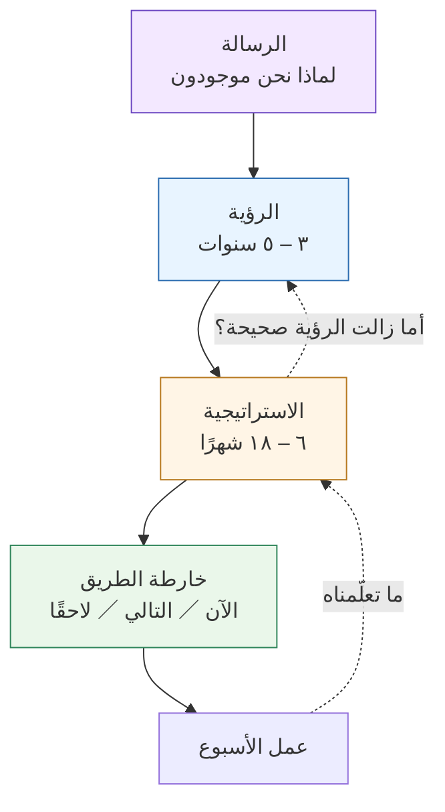

> [!info] الفصل 02 · بودكاست حياة المنتج
> **ماذا ستتعلّم:** أربع كلمات يستعملها الجميع ويعرّفها قليلون — **الرسالة** و**الرؤية** و**الاستراتيجية** و**خارطة الطريق** — بتعريف يفصل بينها فصلًا تشغيليًّا، لا لغويًّا. ستعرف لماذا يضع آدم توماس الرؤية على بعد **ثلاث إلى خمس سنوات** ويُصرّ على أنّها تحتاج **استثمارًا حقيقيًّا** لا شريحةً واحدة، ولماذا يرفض أن يكون الذكاء الاصطناعي رؤيةً أصلًا. ولماذا يقلب أحمد وفائي الترتيب المعتاد فيبدأ من **الرسالة** لا من الرؤية، وما الذي يكسبه بذلك. وستفهم الفرق الحاسم بين **الالتزام** و**التواصل** في خارطة الطريق، وصيغة **الآن / التالي / لاحقًا**، ولماذا **التقدير ليس وعدًا** — ومتى تصير التواريخ مُلزِمةً فعلًا في لحظة يسمّيها وفائي **التزام النزاهة**. ثم كيف تُوصَل الطبقات الأربع بعضها ببعض بعد أن تنفصل، وكيف تُنزَل إلى عمل الأسبوع عبر **سؤال الميزانية** في Shape Up. وستخرج بأصعب مهارة في هذا الباب كلّه: **أن تعرف متى تقتل ما بنيتَه**.

> [!abstract] التأصيل
> **يفترض أنّك تعرف:** [[Product Thinking]] · [[Problem Statement]] · [[Outcome vs Output]]
> **ويُؤصّل لك:** [[Product Vision]] · [[Product Strategy]] · [[Now-Next-Later Roadmap]] · [[Non-Goals]] · [[Shape Up]] · [[Alignment]] · [[Kill Criteria]]

# الفصل 02 — الرؤية والرسالة والاستراتيجية وخارطة الطريق

## 🎯 أهداف التعلّم

- التمييز بين الطبقات الأربع تمييزًا تشغيليًّا: بالأفق الزمنيّ، وبالسؤال الذي تُجيب عنه، وبمن يملكها، وبما يحدث حين تُفقَد.
- تبرير الأفق «ثلاث إلى خمس سنوات» للرؤية، وشرح ما الذي يجعلها **رؤيةً لعالم جديد** لا هدفًا بعيدًا.
- التمييز بين **امتلاك رؤية** و**أن تكون صاحب بصيرة**، وتحديد المستوى الوظيفيّ الذي يبدأ عنده كلّ منهما.
- صياغة استراتيجية بوصفها **المشكلة الكبرى التي تعترض الطريق**، لا بوصفها قائمة أهداف أو شعارات.
- تشخيص **الاستراتيجية الرديئة** بعلاماتها الثلاث المعروفة، والتمييز بينها وبين غياب الاستراتيجية.
- كتابة **اللاأهداف** صراحةً، وشرح لماذا هي أصدق جزء في أيّ وثيقة استراتيجية.
- التعامل مع خارطة الطريق **وثيقة تواصل** لا أداة دقّة، وبناء صيغة الآن / التالي / لاحقًا.
- التمييز بين **التقدير** و**الوعد**، وتحديد لحظة **التزام النزاهة** التي تصير عندها التواريخ مُلزِمة.
- تشخيص انفصال الطبقات الأربع، وتصميم إيقاع دوريّ يُعيد وصلها.
- تنفيذ تمرين **حوافز أصحاب المصلحة** — بما فيه سؤال «كيف يتقاضون أجورهم».
- تطبيق **سؤال الميزانية** في Shape Up لتحويل الاستراتيجية إلى عمل محدود زمنيًّا.
- كتابة **معايير الإيقاف** قبل الالتزام، واتّخاذ قرار القتل من غير أن يمسّ ذلك الاستراتيجية.

---

## الفكرة المحورية: أربع طبقات، وسؤال الترتيب

سأل عمر سلام هذا السؤال لكلّ ضيف تقريبًا، وقال إنّه يسأله للجميع عمدًا. والسبب أنّ الجواب يكشف عن صاحبه أكثر ممّا يكشف عن المصطلحات. وقد جاءت أجوبة هذه المجموعة على ثلاثة أنماط مختلفة اختلافًا مفيدًا:

| الضيف | نقطة البداية | الصياغة المميّزة |
|---|---|---|
| **آدم توماس** | الرؤية | «الاستراتيجية هي المشكلة الكبرى التي تمنعك من بلوغ تلك الرؤية» |
| **أحمد وفائي** | **الرسالة** | «أنا لا أبدأ بالرؤية أبدًا» |
| **تامر صبري** | يكره السؤال | «هي ليست منفصلة بعضها عن بعض. كلّ واحدة **تُسلّم** إلى التالية» |

وأصدق ما في هذه الأجوبة الثلاثة أنّها لا تتناقض. فالخلاف بينها ليس في **ماهيّة** الطبقات، بل في **من أين تدخل إليها** — وهذا خلاف عمليّ يعتمد على موقعك: من يبني شركةً يدخل من الرسالة، ومن يقود منظّمة منتج قائمة يدخل من الرؤية، ومن يعمل في فريق واحد قد لا يدخل من أيّهما.

ولنُثبّت أوّلًا التمييز التشغيليّ، لأنّه لا يستقيم شيء بعده بدونه:

| الطبقة | تُجيب عن | الأفق | من يملكها عادةً | ما يحدث حين تغيب |
|---|---|---|---|---|
| **الرسالة** | لماذا نحن موجودون أصلًا؟ | دائم — لا تنتهي | المؤسّسون والقيادة | كلّ طبقة أخرى تصير بلا مرجع تُحتكَم إليه |
| **الرؤية** | كيف يبدو العالم إن نجحنا؟ | ٣–٥ سنوات | قيادة المنتج | يصير النموّ اتّجاهًا عشوائيًّا لا وجهة |
| **الاستراتيجية** | ما المشكلة الكبرى التي نعالجها الآن لنقترب؟ | ٦–١٨ شهرًا | قيادة المنتج مع الفريق | لا تستطيع أن تقول «لا» لشيء |
| **خارطة الطريق** | ماذا نفعل الآن، وماذا بعده؟ | أسابيع إلى أرباع | فريق المنتج | يتفكّك التنسيق ويعمل كلّ فريق وحده |

والعمود الأخير هو أنفعها. فالطريقة الوحيدة لمعرفة أيّ طبقة تنقصك ليست أن تسأل «أعندي وثيقة بهذا الاسم؟» بل أن تسأل **أيّ عَرَض من هذه الأعراض الأربعة أعيشه؟**

والسهمان المنقّطان هما ما يُميّز هذا الرسم عن الهرم التقليديّ. فالطبقات لا تنحدر انحدارًا واحدًا؛ بل يصعد التعلّم فيها كما ينزل التوجيه.

---

## الرؤية: رؤية لعالم جديد، لا هدف بعيد

> [!quote] من المحاضرة
> **آدم توماس:** «فكرة **الرؤية** شيء تنظر إليه **على بعد ثلاث إلى خمس سنوات**… إنّها **رؤية لعالم جديد**… ورؤى العالم الجديد يجب أن تكون **كبيرة**: أنت تُغيّر شيئًا، ما يعني أنّ كلّ ما حوله يجب أن يتغيّر استجابةً للتغيير الذي تُحدثه.»

الجملة الأخيرة هي المحكّ العمليّ الوحيد الجادّ الذي أعرفه لاختبار رؤية. فالرؤية ليست «أن نصير الأوّل في السوق» — هذا هدف، ولا يتغيّر شيء حول العالم إن تحقّق إلّا ترتيب في جدول. الرؤية أن تصف **حالةً يترتّب على وجودها أن تتغيّر أشياء أخرى**: تتغيّر عادة، أو تختفي وظيفة، أو ينشأ سلوك لم يكن.

**اختبار عمليّ:** اكتب رؤيتك، ثم اكتب تحتها ثلاثة أشياء **ستختفي** من العالم إن تحقّقت. فإن لم تجد شيئًا يختفي، فما كتبتَه هدف لا رؤية.

### الرؤية تحتاج استثمارًا، لا شريحة

وهنا يقول آدم شيئًا نادرًا: يعترف بخطئه هو.

> [!quote] من المحاضرة
> **آدم توماس:** «وفي شأن الرؤية، هذا شيء أفسدتُه في بداية مسيرتي: **يجب أن تستثمر فيها كثيرًا.** فيجب أن تكون هناك نسبة معتبرة من إيراد شركتك مخصّصة لـ**بناء** ذلك المنظور الممتدّ من ثلاث إلى خمس سنوات و**إيصاله**.»
>
> **آدم توماس:** «ومن الأشياء التي أذهلتني حجم الاستثمار الذي يجعلون عملاءهم يبذلونه فيه: سحب **فرق كاملة** للعمل على **النماذج الأوّلية والتصوّرات البصرية**، وإقامة **معتكفات**، وإحضار الناس جوًّا — استثمار حقيقيّ فيما تبدو عليه تلك الرؤية، حتى تستطيع أن **تحكي تلك القصّة**.»

هذا يقلب الممارسة الشائعة رأسًا على عقب. فأكثر الشركات تُنفق على الرؤية **يومًا** — ورشة، ولوحًا أبيض، وشريحةً تُعرض في اجتماع الشركة ثم تُنسى. والسبب المعلن أنّ الرؤية «كلام»، والكلام رخيص. والسبب الحقيقيّ أنّ أثر الاستثمار في الرؤية لا يظهر في الربع الحاليّ، فلا يجد من يدافع عنه.

> [!info] إضافة مرجعية — نموذج الرؤية بوصفها منتجًا
> يُسمّي **مارتي كيغان** وشركاؤه في Silicon Valley Product Group هذا العمل **نموذج الرؤية الأوّليّ (visiontype)**: نموذج عالي الدقّة بصريًّا، لا يعمل، يُصوَّر أحيانًا فيديو قصيرًا، ويُظهر كيف يبدو يوم المستخدم بعد ثلاث سنوات. وقيمته أنّه يفعل بالرؤية ما تفعله النماذج الأوّلية بالميزات: **يُخرج الخلاف من مستوى الكلمات إلى مستوى الصور**.
>
> والفرق ملموس: عشرة أشخاص يقرؤون جملة «سنجعل التقارير سهلة» يوافقون جميعًا وهم يتخيّلون عشرة أشياء مختلفة. والعشرة أنفسهم إذا رأوا شاشةً محدّدة، اختلفوا في اليوم الأوّل — وهذا الاختلاف مكسب، لأنّه اختلاف كان سيظهر بعد ثمانية عشر شهرًا وبعد إنفاق حقيقيّ.
>
> ومن أشهر الأمثلة التاريخية على نموذج رؤية عملَ عمله فيلمٌ أنتجته آبل سنة 1987 باسم *Knowledge Navigator*، يصوّر جهازًا لوحيًّا بمساعد صوتيّ يفهم الكلام الطبيعيّ — قبل عقدين من وجود التقنية. ولم يكن منتجًا، ولم يُبَع، لكنّه وجّه أبحاث الشركة سنين. **والعبرة ليست أن تُنتج فيلمًا**، بل أنّ الرؤية التي لا يستطيع أحد أن يراها لا تُوجّه أحدًا.

### «الذكاء الاصطناعي ليس رؤية»

> [!quote] من المحاضرة
> **آدم توماس:** «**الذكاء الاصطناعي ليس رؤية. الذكاء الاصطناعي تقنية.** فكيف تُغيّر العالم؟»

وقد سبق ذلك بوصفٍ دقيق لكيفيّة انحدار المؤسّسات إلى هذه الحالة:

> [!quote] من المحاضرة
> **آدم توماس:** «أذهب وأتحدّث مع أصحاب المصلحة؛ فيقول **أعلى الحاضرين أجرًا** كذا، فنذهب ونفعل كذا، فينعكس ذلك في خرائط طريقنا. ولعلّ ذلك الشخص يصعد درجةً: فيقول تنفيذيّ ما كذا وكذا وكذا، فيصير ذلك استراتيجيّتنا. ثم يقول تنفيذيّ ببساطة «**الذكاء الاصطناعي**»، فيصير ذلك رؤيتنا.»

لاحظ بنية هذا الوصف: إنّه يصف **تصاعدًا** لا انحدارًا. فالخلل لا يبدأ من الرؤية فينزل؛ بل يبدأ من طلب عابر في اجتماع، فيتسلّق الطبقات صعودًا حتى يستقرّ في أعلاها. وهذه الملاحظة أدقّ ممّا يبدو، لأنّها تشرح لماذا تبدو رؤى كثير من الشركات **صحيحةً وفارغة** في آن: فهي لم تُصنَع، بل تراكمت.

> [!tip] محكّ التقنية بإزاء الرؤية
> ضع اسم التقنية مكان اسم تقنية أخرى ثم اقرأ الجملة. فإن بقيت الجملة معقولةً فهي ليست رؤية. «سنكون شركةً تعمل بالذكاء الاصطناعي» ← «سنكون شركةً تعمل بالبلوك تشين» ← «سنكون شركةً تعمل بالحوسبة السحابية». كلّها معقولة، وكلّها فارغة. أمّا «سيتوقّف صاحب المتجر الصغير عن قضاء ليلة كلّ شهر في مطابقة دفاتره» فلا تحتمل الاستبدال، لأنّها تصف عالمًا لا أداة.

### امتلاك رؤية بإزاء أن تكون صاحب بصيرة

وهنا يُدخل أحمد وفائي تمييزًا لم أره مصوغًا بهذا الوضوح في مكان آخر. فقد جعل أوّل المفاهيم الخاطئة السبعة **«لتنمو يجب أن تملك رؤية»**، ثم فصّل:

> [!quote] من المحاضرة
> **أحمد وفائي:** «قلتُ لك: **أهمّ من الرؤية** — تحتاج أن تعرف كيف **تكتب وثيقة**؛ وتحتاج أن تعرف **متى تقول لا**؛ وتحتاج أن تفهم **متى يكون عندك وضوح**. وهذه كلّها أهمّ من الرؤية تمامًا. فلا يصحّ أن تكتب رؤيةً وأنت لا تعرف كيف تقول **لا** لأحد.»
>
> **أحمد وفائي:** «جزء **البصيرة**: متى أقول لك **لا** — لأنّني أرى أمامي أنّ كذا قد يحدث. فهناك: صرتُ الآن صاحب بصيرة، لكنّي لم أذهب وأكتب رؤيةً ورسالةً لـ**فصيلة** أتولّاها داخل فريق صغير.»

وسبب الاعتراض عمليّ بحت:

> [!quote] من المحاضرة
> **أحمد وفائي:** «لأنّ ما يحدث أنّنا سنكون خمسةً أو ستّة نعمل على **المنتج نفسه**، فيكتب كلّ واحد **رؤيةً مختلفة**، ويرى كلّ واحد المنتج بطريقة مختلفة.»

وحين سأله عمر عن المستوى الوظيفيّ، لم يُطلق الحكم:

> [!quote] من المحاضرة
> **أحمد وفائي:** «إن لم تكن عنده **رؤية ممتدّة**، ثلاث إلى خمس سنوات، لكيف ينبغي أن تكون الأشياء، فمتّفقون: لن يكون ذلك سليمًا جدًّا. لكن متّفقون على **ثلاث إلى خمس**.»
>
> **أحمد وفائي:** «فمثلًا، في **Delivery Hero** لا يصحّ أن يعمل كلّ فريق برؤية مختلفة، ولو كنتَ خبيرًا… فحين نأتي لنصنع **استراتيجيّةً** نصنعها **معًا**؛ ونصنعها **متماسكة**.»

فالتمييز إذن:

| | **امتلاك رؤية** | **أن تكون صاحب بصيرة** |
|---|---|---|
| ما هو | وثيقة تصف عالمًا بعد ٣–٥ سنوات | قدرة على رؤية ما هو آتٍ في الأشهر القادمة |
| مستواه | قيادة المنتج، لا كلّ فريق | **كلّ مستوى، من اليوم الأوّل** |
| مظهره العمليّ | قصّة تُحكى وتُستثمَر فيها | **«لا» في وقتها، معلّلة** |
| ما يحدث إن نُشر على الجميع | خمس رؤى متعارضة لمنتج واحد | فرق تتوقّع المشكلات قبل وقوعها |

وهذا التمييز يحلّ توتّرًا حقيقيًّا في خطاب المنتج المعاصر: أن يُطلب من كلّ مدير منتج مبتدئ أن تكون له «رؤية»، فينتج عن ذلك إمّا تشتّت وإمّا أداء مسرحيّ لرؤية لا يملك نطاقها. والصيغة الأدقّ: **البصيرة مطلوبة من الجميع؛ والرؤية مطلوبة ممّن يملك نطاقًا يكفي لتحمّلها.**

---

## الرسالة: لماذا يبدأ منها وفائي

> [!quote] من المحاضرة
> **أحمد وفائي:** «أنا لا أبدأ بـ**الرؤية** أبدًا. بل أحبّ أن أبدأ بـ**الرسالة**… لأنّك إن لم تستطع أن ترى ما **رسالتنا** ونحن جالسون هنا هكذا — فما رسالة البودكاست؟»
>
> **أحمد وفائي:** «ونحن نحبّ دائمًا أن نبدأ بـ**اللماذا**. فالبدء من الرسالة هو الذي سيقول لك كيف تُربَط **الرؤية** و**الاستراتيجية** معًا. فإن لم تكن هناك رسالة، لم يقع ذلك الربط. وما سيحدث أنّك تمشي في **اتّجاه**، بينما رؤيتك شيء لـ**المدى الطويل** وغير مرتبط بما تفعله الآن.»

الحجّة هنا **بنيويّة** لا وجدانية. فوفائي لا يقول إنّ الرسالة تُلهم؛ يقول إنّها **الرابط**. فالرؤية بعيدة، والعمل قريب، وبينهما مسافة لا يعبرها شيء إلّا سبب مشترك يصلح مرجعًا يُحتكَم إليه حين يقع الخلاف. ومن غير رسالة، تصير الرؤية شيئًا يُذكَر في العروض، ويصير العمل شيئًا يُنجَز في الأسابيع، ولا يلتقيان.

> [!info] إضافة مرجعية — «ابدأ باللماذا» وحدوده
> شاعت فكرة البدء من اللماذا بكتاب **سايمون سينك** *Start With Why* (2009) ومحاضرته المعروفة، وفكرتها أنّ المؤسّسات الملهمة تُوصِل غرضها قبل أن تُوصِل ما تصنعه.
>
> **وينبغي الإنصاف في تقييمها.** فالفكرة **أداة تواصل ممتازة** ودليل تجريبيّ ضعيف: فالأمثلة التي بُنيت عليها اختيرت بأثر رجعيّ من بين الشركات الناجحة، وهو تصميم استدلاليّ يُنتج دائمًا نمطًا مقنعًا (وهذا نقد وُجّه أيضًا إلى كتب إدارية أشهر منها بكثير مثل *In Search of Excellence* و*Good to Great*، حين تعثّرت شركات كثيرة ممّا مُجّدت فيها بعد سنوات).
>
> فاستعمل «اللماذا» أداة **مواءمة داخلية** — وهذا بالضبط ما يستعملها له وفائي — ولا تستعملها **تفسيرًا للنجاح التجاريّ**. والفرق: الأولى تجعل فريقك يتّخذ قرارات متّسقة؛ والثانية تَعِدك بأنّ الوضوح وحده يبيع، وهو وعد لا تسنده الشواهد.

### أين تقع الرسالة عند الآخرين

أمّا تامر صبري فسُئل السؤال نفسه فبدأ بجواب طريف:

> [!quote] من المحاضرة
> **تامر صبري:** «لا يعجبني هذا السؤال، في الواقع.»

ثم أعطى مع ذلك تمييزًا لطيفًا:

> [!quote] من المحاضرة
> **تامر صبري:** «وأمّا **الرسالة** — فأنا مثل أمازون: أنظر إلى *(عبارتهم)*؛ هناك مَن يقول لك إنّ تلك **رؤية** أمازون؛ وأنا أنظر إليها بوصفها **رسالة** أمازون.»

> [!warning] موضع تلف في المصدر
> مقطع التعريفات في الحلقة الأولى من أشدّ مواضع المصدر تلفًا، والنسيج الرابط بين المصطلحات الأربعة ضائع. وما نُقل أعلاه هو ما أمكن استرجاعه بأمانة، ولذلك لا يُبنى عليه أكثر ممّا يحتمل.

ومع ذلك فملاحظته تستحقّ التوقّف: أنّ **الجملة نفسها** يراها بعضهم رؤيةً ويراها هو رسالة. وهذا ليس خلافًا في الجملة بل في **الأفق**: فمن يقرؤها حالةً يُسعى إليها فهي رؤية؛ ومن يقرؤها سببًا دائمًا للوجود فهي رسالة. والمحكّ الفاصل سؤال واحد: **هل تنتهي؟** فما ينتهي بتحقّقه رؤية؛ وما لا ينتهي رسالة.

| العبارة | رسالة أم رؤية؟ | لماذا |
|---|---|---|
| «أن نكون أكثر شركات الأرض تمركزًا حول العميل» | **رسالة** | لا تنتهي؛ لا يوجد يوم تُعلن فيه أنّك أتممتها |
| «أن يستطيع أيّ تاجر صغير في مصر أن يبيع عبر الحدود بحلول 2029» | **رؤية** | لها تاريخ، وتنتهي بتحقّقها |
| «أن نجعل المعلومات في متناول الجميع» | **رسالة** | دائمة بطبيعتها |
| «أن نُغلق دفاتر العميل في يوم واحد بدل أسبوع» | **استراتيجية** أقرب | مشكلة محدّدة في أفق قصير |

والصفّ الأخير مقصود: كثير ممّا يُكتب في خانة «الرؤية» هو في الحقيقة استراتيجية جيّدة كُتبت في المكان الخطأ. وهذا خطأ حميد نسبيًّا — أهون بكثير من العكس.

---

## الاستراتيجية: المشكلة الكبرى التي تعترض الطريق

هذا أدقّ تعريف في الفصل كلّه، وأكثره قابليّةً للتطبيق فورًا:

> [!quote] من المحاضرة
> **آدم توماس:** «فالاستراتيجية هي **المشكلة الكبرى التي تمنعك من بلوغ تلك الرؤية** — ما المشكلة الكبرى التي تستطيع أن تعالجها **الآن** وتُتيح لك بلوغ الرؤية التي تنظر إليها على بعد ثلاث إلى خمس سنوات؟»
>
> **آدم توماس:** «وهذه في العادة مشكلة تستطيع حلّها خلال **ستّة إلى ثمانية عشر شهرًا**، وتُركّز عليها تركيزًا شديدًا. وهي تقع عمومًا في سياق متمركز حول العميل، لكنّها قد تكون أحيانًا في سياقات أخرى: أهو سياق **تنظيميّ**؟ أهو سياق **تقنيّ**؟ فينبغي أن تتحوّل طاقتك بحسب أيّ سياق هو الأهمّ.»

انتبه إلى ثلاثة قيود في هذا التعريف، وكلّها مقصودة:

**١. «المشكلة»، لا الهدف ولا الخطّة.** فالاستراتيجية عنده تشخيصٌ لا طموح. و«أن نُضاعف الإيراد» ليست استراتيجية؛ إنّها نتيجة مرجوّة. والاستراتيجية هي الجواب عن: **ما الذي يقف في الطريق فعلًا؟**

**٢. «الكبرى»، بالمفرد.** فمن عنده خمس استراتيجيّات ليس عنده استراتيجية؛ عنده قائمة أولويّات. والقيمة كلّها في **الإقصاء**.

**٣. «ستّة إلى ثمانية عشر شهرًا».** وهذا القيد الزمنيّ هو ما يجعلها قابلةً للحكم عليها. فما يمتدّ ثلاث سنوات لا يُقاس ولا يُصحَّح.

ثم يربطها آدم بالرؤية ربطًا كمّيًّا لطيفًا:

> [!quote] من المحاضرة
> **آدم توماس:** «بحيث نبلغ تلك الرؤية في **حلقتين إلى خمس حلقات استراتيجية**.»

فالرؤية إذن ليست شيئًا يُبلَغ بقفزة، بل بحلّ مشكلتين إلى خمس مشكلات كبرى متتابعة. وهذه حسابات تُعيد الرؤية إلى الأرض: فمن كتب رؤيةً لا يستطيع أن يذكر المشكلة الكبرى الأولى في طريقها، لم يكتب رؤيةً قابلة للتنفيذ.

### الاستراتيجية الرديئة ليست غياب استراتيجية

> [!info] إضافة مرجعية
> فرّق **ريتشارد روميلت** في *Good Strategy / Bad Strategy* (2011) تفريقًا صار مرجعًا: أنّ **الاستراتيجية الرديئة ليست غيابًا للاستراتيجية**، بل حضورٌ لشيء يشغل مكانها ويمنع اكتشاف غيابها. وعلاماتها التي يذكرها:
>
> - **الحشو**: لغة فخمة ومصطلحات مجرّدة تُخفي أنّه لا يوجد محتوى تحتها.
> - **تجنّب مواجهة المشكلة**: فمن لا يُسمّي العائق لا يستطيع أن يضع استراتيجية لإزالته.
> - **الخلط بين الأهداف والاستراتيجية**: قائمة طموحات مرقّمة تُقدَّم على أنّها خطّة.
> - **أهداف رديئة**: أهداف لا تتّصل بعضها ببعض، أو مستحيلة التحقّق بالموارد المتاحة.
>
> ويصف روميلت البنية السليمة بثلاثة أجزاء: **تشخيص** يُبسّط الموقف ويُسمّي العائق · **سياسة موجِّهة** تختار كيف نتعامل معه · **أفعال متّسقة** تدعم بعضها بعضًا لا تتنازع.
>
> والتقاطع مع تعريف آدم واضح ومريح: فـ«المشكلة الكبرى التي تعترض الطريق» هي **التشخيص** بعينه. والفارق أنّ روميلت يُنبّه إلى ما بعده: أنّ التشخيص وحده لا يكفي، وأنّ الأفعال إن لم تتّسق أكل بعضها بعضًا.

### وفائي: «أنا أُسمّي الاستراتيجية دائمًا التكتيكات»

> [!quote] من المحاضرة
> **أحمد وفائي:** «ثم تأتي **التكتيكات**. وأنا أُسمّي **الاستراتيجية** دائمًا التكتيكات. وبعض الناس يعترضون على ذلك — حسنًا؛ فلنتّفق ببساطة على أنّها التكتيكات: سنذهب، وننعطف، ونعود. ولم أقل لك إنّها **خطّة**؛ بل هي ببساطة التكتيكات التي تحتاج أن تُنفّذها لتتحرّك في ذلك الاتّجاه.»

وهذه تسمية سيعترض عليها كلّ من قرأ روميلت — بل وفائي نفسه توقّع الاعتراض. ومن الأمانة أن نعرض الوجهين:

**ما يكسبه بهذه التسمية:** يقتل فورًا التصوّر الذي يجعل الاستراتيجية **خطّةً جامدة** تُكتب مرّةً وتُتَّبع. وقوله «سنذهب، وننعطف، ونعود» يُدخل في التعريف نفسه فكرةَ التصحيح المستمرّ. وهذا مكسب حقيقيّ في بيئة تتغيّر بسرعة.

**ما يخسره:** التمييز بين **الاختيار** و**التنفيذ**. فالتكتيك «كيف نُنجز»، والاستراتيجية «ماذا نختار ألّا نُنجز». ومن سمّى الاثنين باسم واحد فقد الأداة التي يقول بها «لا» — وهي بالضبط الأداة التي يُلحّ هو نفسه على أهمّيتها في موضع آخر.

**والتوفيق بينهما:** كلامه يصفّ في محلّه إن قرأتَه وصفًا لكيفيّة **عيش** الاستراتيجية لا لكيفيّة **صياغتها**. فأنت تصوغ اختيارًا واحدًا كبيرًا، ثم تعيشه سلسلةَ تكتيكات متتابعة، تُعدّلها وأنت تتحرّك. والخطأ أن تظنّ أنّ تعديل التكتيك تعديلٌ للاستراتيجية — وهو ما يقع كثيرًا فيُفقد الاتّجاه.

### فريدة: الاستراتيجية هي التي تحميك

وأشدّ استعمالات الاستراتيجية عمليّةً في هذه المجموعة كلّها جاءت من فريدة عدلي، حين سُئلت عن **ضغط التنفيذ** — أن يأتيك الطلب بعد الطلب من كلّ اتّجاه:

> [!quote] من المحاضرة
> **فريدة عدلي:** «**وجود استراتيجية** أصلًا مهمّ جدًّا، لأنّها **تحميك** من شيء كهذا. فإن لم تكن عندك استراتيجية، فعلى أيّ أساس؟ حسنًا — صرتُ **رجل «نعم»**، ومن الواضح أنّني شخص بلا عمود فقريّ.»
>
> **فريدة عدلي:** «أمّا إن كانت عندي [رؤية] واضحة أحتاج أن أصل إليها، فقد صرتُ قادرة على القول: «اتّفقنا ووعدنا بكذا»، أو «لن نفعل ذلك»… وذلك لا يعني أنّ الناس لن يأتوا ويقولوا «لا، أريد أن أفعل كذا». لكنّه **لا يحدث بالقدر نفسه**.»

الجملة الأخيرة هي أصدق ما في الباب. فهي لا تَعِد بأنّ الاستراتيجية تُنهي الضغط؛ تَعِد بأنّها **تُقلّله**. وهذا التواضع في الوعد هو ما يجعل النصيحة قابلة للتصديق.

ولاحظ الآليّة الدقيقة: الاستراتيجية تُحوّل «لا» من **موقف شخصيّ** إلى **نتيجة اتّفاق سابق**. فالفرق بين «لا أرى هذا مهمًّا» و«اتّفقنا في يناير أنّ تركيزنا هذا العام على كذا؛ فأيّهما نُسقط؟» فرقٌ بين مواجهة وبين مفاوضة. والثانية وحدها تُبقي العلاقة.

> [!tip] صياغة «لا» التي لا تُنتج عدوًّا
> لا تقل «لا». قل: **«نعم — وماذا نُسقط؟»** فهذا لا يرفض الطلب، بل يُظهر كلفته. وهو يُحوّل الحوار من «أنت ضدّي» إلى «كلانا أمام سعة محدودة». وأكثر الطلبات تسقط عند هذا الحدّ بلا معركة، لأنّ صاحبها نفسه لا يراها تستحقّ إسقاط ما سيُسقَط.

### اللاأهداف: أصدق جزء في الوثيقة

ومن أنفع ما يُضاف إلى وثيقة استراتيجية قسمٌ لا يوجد في أكثرها: **[[Non-Goals|اللاأهداف]]** — قائمة صريحة بما **لن** نفعله هذا الربع، وسببُ كلٍّ منها.

وفائدته مزدوجة. **أوّلًا** أنّه يجعل الاختيار مرئيًّا: فالوثيقة التي تذكر ما ستفعله فقط تبدو وكأنّها لم تُقصِ شيئًا، وهذا يُخفي جوهر الاستراتيجية. **وثانيًا** أنّه يمنع عودة النقاش: فالبند المكتوب في اللاأهداف نُوقش وحُسم؛ ومن يريد إعادته يحتاج أن يُعيد فتح الاستراتيجية لا أن يُرسل رسالة.

**نموذج للصياغة:**

| لن نفعل | لماذا | ما الذي يُغيّر هذا القرار |
|---|---|---|
| لن ندعم اللغة الفرنسية هذا العام | أقلّ من ٢٪ من الحركة، وكلفة التوطين تعادل ميزةً كاملة | تجاوز الحصّة ٨٪ أو صفقة مؤسّسية تشترطها |
| لن نبني تطبيقًا للحاسوب المكتبيّ | ٨٧٪ من الجلسات على الهاتف | تغيّر نمط الاستعمال أو دخول قطاع الشركات |
| لن نُعيد بناء نظام الإشعارات | يعمل، ولا يظهر في أسباب التسرّب | ارتفاع شكاوى الإشعارات فوق عتبة محدّدة |

العمود الثالث هو ما يُميّز اللاأهداف الجيّدة من العناد. فاللاهدف بلا شرط لإعادة النظر قرار مغلق؛ واللاهدف بشرطٍ معلن **قرار حيّ** — وهو يُريح أصحاب المصلحة، لأنّهم يعرفون أنّ بابهم لم يُغلق إلى الأبد، بل عُلّق على شرط معروف.

---

## خارطة الطريق: وثيقة تواصل لا أداة دقّة

> [!quote] من المحاضرة
> **آدم توماس:** «ثم **خارطة طريق منتجك** هي وسيلتك، بوصفك فريق منتج، لـ**إيصال الاستراتيجية**. إنّها **وثيقة تواصل**.»
>
> **آدم توماس:** «لأنّ خارطة الطريق **ستتغيّر**. **ولا خارطة طريق دقيقة مئة بالمئة.** وفي بعض محاضراتي أسأل الحضور: ارفعوا أيديكم إن كانت خارطة طريقكم دقيقةً مئة بالمئة؛ ارفعوا أيديكم إن كانت دقيقةً خمسًا وسبعين بالمئة؛ ارفعوا أيديكم إن كانت دقيقةً خمسين بالمئة. فاستخدامها **أداة دقّة أو ضبط** ليس هو التفكير الصحيح فيها، لأنّها **لا تستطيع** أن تكون كذلك.»

ثم يقول الشيء الذي **تستطيعه** خارطة الطريق، وهو أهمّ من الذي لا تستطيعه:

> [!quote] من المحاضرة
> **آدم توماس:** «وما **تستطيعه** أن ترسل **إشارة ثقة**: ما تتعلّمه، وما تبنيه، وكيف يتّصل بالاستراتيجية — بحيث إذا خرجت الأشياء استطاع الناس أن يضعوا المنتج في **سياق** سائر الأعمال.»

ووصل وفائي إلى الموضع نفسه من طريق آخر، وجعله ثالث المفاهيم الخاطئة السبعة:

> [!quote] من المحاضرة
> **أحمد وفائي:** «قل لي: أترى خارطة الطريق **التزامًا** أم **تواصلًا**؟ فإن رأيناها **التزامًا**، فذلك ما يُوقعنا دائمًا في مشكلات. والفكرة كلّها: يجب أن تكون خارطة الطريق **قناة تواصل**. وما زاد على ذلك، بدأ الأمر يدخل في مشكلات.»
>
> **أحمد وفائي:** «تجد مديري المنتج كلّهم يقولون لك *«سأتّبع إطار RICE؛ وسأُرتّبها؛ وسأضع أوزانًا عليها»*. وذلك كلّه جميل — لكنّه **ليس** خارطة الطريق. فخارطة الطريق ببساطة أنّك تقول لي **ماذا سأفعل الآن وماذا سأفعل بعدها**.»

وهذه ملاحظة دقيقة تستحقّ التوقّف: **أداة الترتيب ليست خارطة الطريق**. فـ[[RICE Prioritization|RICE]] وأمثالها تُنتج ترتيبًا، والترتيب مُدخَل إلى خارطة الطريق لا خارطةٌ بذاتها. والفرق أنّ خارطة الطريق تُجيب عن سؤال **جمهور خارجيّ**: ما الذي ستفعلونه، ومتى تقريبًا، ولماذا؟ أمّا الترتيب فحوار داخليّ.

### صيغة الآن / التالي / لاحقًا

> [!quote] من المحاضرة
> **أحمد وفائي:** «والصيغة التي تعجبني أكثر **الآن / التالي / لاحقًا**. ولا تُسئ فهمي: فالمقصود أن تعرف أنّ كلّ **بند** في الآن/التالي/لاحقًا سيأخذك إلى **مكان ما** — لأنّنا نفتح في عملنا ولا نعرف ماذا سيخرج منه.»

> [!info] إضافة مرجعية — من أين جاءت الصيغة
> صيغة **الآن / التالي / لاحقًا** شاعت على يد **جانا باستو**، الشريكة المؤسّسة لأداة ProdPad، بديلًا صريحًا لخارطة الطريق الزمنية ذات الأعمدة الشهرية. وحجّتها أنّ الجدول الزمنيّ يَعِد بدقّة لا يملكها أحد، فيُنتج إمّا كذبًا وإمّا تحفّظًا مُفرطًا يُفرغ الخارطة من الطموح.
>
> والبنية بسيطة عمدًا:
> - **الآن**: عمل جارٍ فعلًا، معروف النطاق، وله معايير نجاح.
> - **التالي**: مشكلات فُهمت وتُنتظر السعة، ولم يُبتّ في حلولها بعد.
> - **لاحقًا**: مشكلات نعرف أنّها مهمّة ولم نفهمها بعد.
>
> **والقاعدة التي تُهمَل دائمًا: كلّما بَعُد العمود، كبُر حجم البند وقلّ تفصيله.** فبنود «لاحقًا» ينبغي أن تكون مشكلات وفرصًا لا ميزات موصوفة؛ فمن كتب في «لاحقًا» ميزةً بتفاصيلها فقد قرّر حلًّا لمشكلة لم يفهمها بعد.

| العمود | ما يُكتب فيه | حجم البند | درجة اليقين |
|---|---|---|---|
| **الآن** | حلول محدّدة قيد التنفيذ | صغير | عالية |
| **التالي** | مشكلات مفهومة، حلولها مفتوحة | متوسّط | متوسّطة |
| **لاحقًا** | مساحات فرص وأسئلة كبرى | كبير | منخفضة |

> [!warning] المزلق الشائع
> أن تُترجَم الأعمدة الثلاثة إلى تواريخ في ذهن القارئ: «الآن» = هذا الربع، و«التالي» = الربع القادم، و«لاحقًا» = بعده. وحينها تكون قد أعدتَ بناء الخارطة الزمنية بأسماء جديدة، وأخذتَ عيوبها كلّها. **والعلاج أن تُصرّح بالنفي في الوثيقة نفسها**: أن تكتب في رأسها أنّ الأعمدة تعني درجة اليقين لا الزمن، وأنّ بندًا في «التالي» قد يسبق بندًا في «الآن» إن تغيّر ما نعرفه.

### التقدير ليس وعدًا

> [!quote] من المحاضرة
> **عمر سلام:** «فالتقدير يعني *أتوقّع* — لكن من الطبيعيّ تمامًا أن يحدث شيء آخر… لكنّ ذلك لا يعني أنّه إن لم يحدث بتلك الطريقة بالضبط فهناك **مشكلة**. ويبدو لي أنّ هذا جزء من **طبيعة الوظيفة** نفسها… والمهمّ أن نكون **واعين لماذا** وقع ذلك الاختلاف، ثم نستخدمه بعدها في **تحسين طريقة تنبّئنا**.»

الشقّ الأخير هو ما يُنقذ هذه الفكرة من أن تصير عذرًا. فالفرق بين فريق ناضج وفريق فوضويّ ليس في **دقّة** التقديرات، بل في **ماذا يفعل بالانحراف**: أيُحلّله فيتحسّن، أم يمرّ عليه فيتكرّر؟

> [!info] إضافة مرجعية — مخروط عدم اليقين
> صاغ **باري بوم** الفكرة في *Software Engineering Economics* (1981)، وشاعت باسم **مخروط عدم اليقين** على يد **ستيف مكونيل**. وخلاصتها أنّ مدى الخطأ في تقدير مشروع برمجيّ يكون في بدايته واسعًا جدًّا — قد يتراوح بين ربع الكلفة الحقيقية وأربعة أضعافها — ثمّ يضيق كلّما تقدّم الفهم، حتى ينعدم عند التسليم.
>
> **وأهمّ ما في النموذج تنبيهٌ يُغفَل عنه:** المخروط يصف **أفضل ما يمكن بلوغه**، لا ما يحدث تلقائيًّا. فهو لا يضيق بمرور الزمن، بل بـ**تقليل عدم اليقين** — بالاكتشاف والنماذج والتجارب. والفريق الذي يمضي ستّة أسابيع بلا أن يتعلّم شيئًا جديدًا يبقى تقديره واسعًا كما كان في يومه الأوّل، مهما اقترب الموعد.
>
> والنتيجة العمليّة: **اذكر تقديراتك مدًى لا رقمًا** («٦ إلى ١٠ أسابيع»)، واذكر معه ما الذي سيُضيّق المدى ومتى. فمن قال «ثمانية أسابيع» أعطى وعدًا؛ ومن قال «٦ إلى ١٠، وسنُضيّقها إلى ±أسبوع بعد أن نُنهي النموذج الأوّليّ خلال أسبوعين» أعطى معلومة.

### لحظة التزام النزاهة

ثم يضع وفائي القيد الذي يمنع كلّ ما سبق من أن ينقلب فوضى:

> [!quote] من المحاضرة
> **أحمد وفائي:** «لكنّ الشاهد هنا: لا يصحّ أن أظلّ **أُغيّر البند نفسه** طول الوقت. فتبدأ — تبدأ **تخسر الثقة**. فأنت تحتاج لحظة **التزام نزاهة (integrity commitment)**.»
>
> **أحمد وفائي:** «*فهمتُ الآن كلّ المجاهيل؛ بعد كلّ **الاكتشاف** الذي أجريتُه؛ وبعد أن فهمتُ **المشكلة** … فهمتُ المشكلة جيّدًا، وفهمتُ بداية **الحلّ**؛ والآن سأبدأ أُعطيك **تواريخ**.* فتلك هي اللحظة التي فيها التزام النزاهة. وقبلها، نحن كلّنا **نكذب بعضنا على بعض**: ندخل الغرفة، ونقول *«سألحق»*، ثم نمضي مرّةً أخرى.»

هذه أنظف صياغة رأيتُها للمشكلة الأزلية بين المنتج والأعمال. فالمؤسّسة تحتاج تواريخ لتُخطّط — والتواريخ المبكّرة كذب. والحلّ ليس رفض التواريخ (وهو موقف كثير من فرق المنتج، وهو موقف غير عمليّ)، ولا إعطاءها مبكّرًا (وهو ما يفعله أكثرها تحت الضغط، فيدفع الثمن مرّتين). الحلّ **أن تُعلن متى تصير التواريخ مُلزِمة**.

| المرحلة | ما تُعطيه | ما لا تُعطيه | ما يصحّ أن يُبنى عليه |
|---|---|---|---|
| قبل الاكتشاف | مساحة مشكلة، وترتيب أهمّية | أيّ تاريخ | لا شيء خارجيّ |
| أثناء الاكتشاف | مدى واسع، وما سيُضيّقه | تاريخ محدّد | تخطيط سعة مبدئيّ |
| **عند التزام النزاهة** | **تاريخ ملتزَم به** | التغيير الصامت | إطلاق تسويقيّ، وعقود، وارتباطات |
| بعد الالتزام | تحديثات، وإنذارًا مبكّرًا عند الانحراف | تغيير التاريخ بلا إعلان | خطط الأقسام الأخرى |

والصفّ الأخير هو حيث تُكسَر النزاهة عادةً — لا بتأخّر التاريخ، بل بكتمانه.

### الخيانة الحقيقية: أن تُغيّر ولا تُخبر

> [!quote] من المحاضرة
> **أحمد وفائي:** «وأين يقع الخطأ؟ عند **أصحاب المصلحة**. فيُغيّرون ولا يُخبرونهم — لأنّهم لا يريدون أن **يُكتشَفوا**. نعم: غيّروا **الاستراتيجية** وغيّروا **خارطة الطريق**، ولا يزالون **يلتزمون** بالقديمة. فيصير القديم والجديد معًا. ثم نعود ونقول *«إدارة المنتج — عملنا صعب»*. لا، ليس صعبًا: **أنت** جعلتَه صعبًا، وكان يمكنك أن تجعله سهلًا.»

وهذا وصف لآليّة انهيار تراكميّة: كلّ تغيير غير معلن يُنشئ نسختين من الحقيقة، والنسخ تتراكم، حتى يصير كلّ اجتماع مواءمة استكشافًا لما يظنّه كلّ طرف أنّه متّفق عليه. والكلفة ليست في التغيير — التغيير طبيعيّ وقد اتّفق عليه الجميع في هذه المجموعة — بل في **الفجوة بين التغيير والإعلان عنه**.

> [!tip] قاعدة اليوم الواحد
> إذا تغيّرت خارطة الطريق أو الاستراتيجية، فأخبر المتأثّرين **خلال يوم عمل واحد**، ولو لم تكن الصورة الجديدة مكتملة. ورسالة «أوقفنا البند س، والبديل قيد التحديد، وسأعود إليكم الخميس» تحفظ الثقة أكثر من رسالة مكتملة بعد أسبوعين. **فالناس يغفرون التغيير، ولا يغفرون أن يكتشفوه بأنفسهم.**

---

## لماذا تنفصل الطبقات الأربع — وكيف تُعاد وصلها

الآن نصل إلى الحالة التي يعيشها أكثر الفرق فعلًا: أنّ الطبقات الأربع موجودة كلّها، مكتوبة كلّها، ولا يصل بينها شيء.

> [!quote] من المحاضرة
> **أحمد وفائي:** «وآخر شيء رأيتُه: أحيانًا تكون هذه الموضوعات الأربعة **منفصلةً** أصلًا. فلو سألتَ مدير منتج في فريق *«قل لي، ما **رسالتنا**؟»*، لقال لك *«سأضطرّ أن أذهب وأنظر فيها في الشرائح التي فتحتُها قبل ثلاث سنوات»*.»

وشخّص عمر ثلاثة أسباب، ولكلٍّ منها علاج مختلف تمامًا:

> [!quote] من المحاضرة
> **عمر سلام:** «قد تكون منفصلةً لأنّه لم يكن مَن **صنع الرؤية** أصلًا، تمامًا كالنقطة التي أثرناها في البداية؛ أو لأنّها لم **تُشرَح** قطّ؛ أو لأنّه لم يُجرَ عليها **تكرار** قطّ.»

| السبب | العَرَض | العلاج | العلاج الخاطئ الشائع |
|---|---|---|---|
| **لم يشارك في صنعها** | يستطيع أن يتلوها ولا يستطيع أن يستنتج منها قرارًا | إشراكه في الدورة القادمة، ولو بجزء صغير | إعادة إرسالها بصياغة أوضح |
| **لم تُشرَح قطّ** | يعرف الكلمات ولا يعرف ما استُبعد ولماذا | جلسة تشرح **البدائل المرفوضة** لا الخيار المعتمد | تصميم شريحة أجمل |
| **لم يُجرَ عليها تكرار** | صحيحة سنة 2023، وغير ذات صلة اليوم | إيقاع مراجعة معلن | التمسّك بها احترامًا لمن كتبها |

والعلاج الثاني هو أقلّها ممارسةً وأعلاها أثرًا. فالفريق لا يفهم الاستراتيجية من نصّها؛ يفهمها من **معرفة ما رُفض**. فمن سمع «اخترنا التركيز على الاحتفاظ» لا يعرف شيئًا؛ ومن سمع «اخترنا الاحتفاظ ورفضنا التوسّع الجغرافيّ ورفضنا قطاع الشركات، لأنّ كذا» يستطيع أن يتّخذ عشرة قرارات لم تُذكر له.

وقد وضع تامر صبري الآليّة الرابطة في جملة:

> [!quote] من المحاضرة
> **تامر صبري:** «لا — هي ليست **منفصلة** بعضها عن بعض. كلّ واحدة **تُسلّم** إلى التالية… لكنّ الشركات تفعل هذا لأنّها *(تحتاج)* أن يفهم الجميع الرؤية والرسالة وهكذا — إذ ليسوا جالسين معًا… فقد يكونون في بلدان مختلفة. فمثلًا، كلّ بضعة أشهر يجب أن يكون هناك *(محاذاة)*.»

فالمحاذاة عنده **دالّة على المقياس والتوزّع الجغرافيّ**، لا طقسًا ثقافيًّا. والفريق الجالس في غرفة واحدة يُحاذي نفسه بالمصادفة؛ والفريق الموزّع على ثلاث مناطق زمنية لا يُحاذي نفسه إلّا بتصميم.

وقد نبّه عمر إلى الحدّ الأعلى لهذا الإيقاع:

> [!quote] من المحاضرة
> **عمر سلام:** «لكنّها طبعًا لا يمكن أن تُفعَل كلّ أسبوعين وأنت تعمل.»

### إيقاع مقترح

هذه صياغة تجمع ما تفرّق في الحلقات، وهي اقتراح لا نقل:

| الطبقة | تُراجَع كلّ | من يحضر | مُخرَج المراجعة |
|---|---|---|---|
| **الرسالة** | سنتين إلى ثلاث، أو عند تحوّل جوهريّ | القيادة | إمّا تأكيد وإمّا إعادة صياغة |
| **الرؤية** | سنة | قيادة المنتج والهندسة والتصميم | نموذج رؤية محدَّث، وقصّة تُحكى |
| **الاستراتيجية** | كلّ ربع، وبعمق كلّ نصف سنة | القيادة مع الفرق | مشكلة كبرى واحدة، ولاأهداف معلنة |
| **خارطة الطريق** | شهريًّا | فريق المنتج مع أصحاب المصلحة | نسخة محدَّثة، وسجلّ بما تغيّر ولماذا |
| **عمل الأسبوع** | أسبوعيًّا | الفريق | لا شيء يُرفع للأعلى إلّا الانحرافات |

> [!tip] العمود الأخير هو المهمّ
> مراجعة بلا مُخرَج مكتوب اجتماعٌ لا مراجعة. **وأنفع مُخرَج على الإطلاق هو سجلّ التغييرات**: سطر واحد لكلّ تغيير — ماذا تغيّر، ومتى، ولماذا، ومن تأثّر. فهو يُنتج بعد سنة أثمن وثيقة في المؤسّسة: تاريخ قراراتها. وهو أيضًا الدواء المباشر لمشكلة «غيّروا ولم يُخبروا».

---

## أصحاب المصلحة: اكتب كيف يتقاضون أجورهم

سأل عمر سؤالًا عمليًّا: كيف تُحاذي أصحاب مصلحة لهم استراتيجيّات تشدّ في اتّجاهات أخرى؟ فجاء جواب آدم توماس تمرينًا محدّدًا:

> [!quote] من المحاضرة
> **آدم توماس:** «فأوّل ما أسأله كثيرًا لمديري المنتج حين يسألون هذا السؤال: **تعال إلى اللوح واكتب ما حوافز سائر أصحاب المصلحة عندك** — ما المهمّ عندهم. ثم بعد ذلك: **اكتب كيف يتقاضون أجورهم** — كيف يتقاضى أفراد فرقهم أجورهم؟»
>
> **آدم توماس:** «ويُذهلني كم مرّةً **لا يستطيع مديرو المنتج إتمام ذلك التمرين**.»

ثم يُفسّر ما يعنيه العجز عن إتمامه:

> [!quote] من المحاضرة
> **آدم توماس:** «وما يقوله لي ذلك التمرين… أنّك **لا تُصغي**؛ وأنّك تفكّر فيه تفكيرًا خاطئًا كلّه. لأنّني إن لم أستطع أن أُخبرك كيف يتقاضى أحد أجره، ولم أستطع أن أُخبرك ما المهمّ عنده في لحظة ما، **فكيف أطلب منه التوافق؟**»
>
> **آدم توماس:** «فأكون أساسًا داخلًا الغرفة أطلب منهم أشياء قد تكون **مضادّةً** لما يريدون، أو لما يحتاجون، بل لكيفيّة جلبهم المال إلى بيوتهم ليُطعموا أُسَرهم.»

الجملة الأخيرة هي التي تُخرج التمرين من باب الحيلة التفاوضية إلى باب الإنصاف. فالبائع الذي يقاوم تأجيل ميزة إلى الربع القادم ليس معرقلًا؛ إنّه شخص عمولته السنوية مبنيّة على صفقات موقّعة في هذا الربع. وحين تعرف ذلك، تتغيّر المحادثة كلّها: فبدل أن تُقنعه بالانتظار، تسأل أيّ صفقة بعينها معلَّقة، وهل يكفيها التزام مكتوب بدل ميزة مبنيّة.

**كيف يُملأ الجدول عمليًّا:**

| صاحب المصلحة | ما يُقاس به رسميًّا | ما يُقلقه فعلًا | كيف يتقاضى أجره | ما يجعل طلبي يخدمه |
|---|---|---|---|---|
| قائد المبيعات | إيراد الربع، معدّل الفوز | صفقة كبرى معلّقة على ميزة | راتب ＋ عمولة ربعية | التزام مكتوب بموعد يُغلق به الصفقة الآن |
| قائد الدعم | زمن أوّل ردّ، رضا العملاء | ارتفاع حجم التذاكر بعد كلّ إطلاق | راتب ＋ مكافأة سنوية على المؤشّرات | ميزة تُقلّل التذاكر تُقدَّم على غيرها |
| المالية | الهامش، توقّع الإيراد | مفاجآت غير مخطّطة في النفقات | راتب ＋ مكافأة على دقّة التوقّع | إنذار مبكّر بأيّ تغيير له أثر ماليّ |
| قائد الهندسة | استقرار النظام، سرعة التسليم | تراكم الدَّين التقنيّ صامتًا | راتب ＋ أسهم طويلة المدى | حصّة معلنة من السعة لصحّة المنصّة |

والعمود الأخير هو الذي يُحوّل التمرين من فهم إلى أداة. فالمواءمة لا تُصنع بالإقناع بل بالعثور على الصيغة التي يكون فيها ما تريده أنت **مفيدًا** لهم لا مجرّد غير ضارّ.

> [!warning] الاستعمال الفاسد لهذا التمرين
> أن يُستعمل للتلاعب: أن تعرف حوافز الشخص فتُغلّف له طلبك بما يخدمها وأنت تعلم أنّه لن يخدمها فعلًا. وهذا يعمل مرّةً واحدة، ويُكلّفك بعدها كلّ ما بنيتَه. والفرق بين الاستعمالين: **أتُغيّر طلبك ليخدمهم فعلًا، أم تُغيّر عرضه فقط؟**

---

## من الاستراتيجية إلى عمل الأسبوع: سؤال الميزانية

يبقى الجسر الأخير: كيف ينزل هذا كلّه إلى ما يفعله الفريق يوم الاثنين؟ وقد أجاب تامر صبري بوصف طريقة يعمل بها فعلًا:

> [!quote] من المحاضرة
> **تامر صبري:** «حين تأتي لتشتري سيارة، أو تريد أن تشتري بيتًا، أو تريد أن تستأجر بيتًا — بمَ تبدأ؟ ما **أوّل سؤال** تسأله لنفسك؟»
>
> **عمر سلام:** «*كم عندي؟*»
>
> **تامر صبري:** «جيّد جدًّا. ما **ميزانيّتك**؟ صحيح. ذلك هو مفهوم **Shape Up**… إنّه **تحديد زمني**. صحيح: *عندي **أربعة أسابيع**.*»

هذا قلب فكرة قلبًا كاملًا. فالسؤال المعتاد «كم يستغرق بناء هذا؟» — وهو سؤال يُنتج تقديرًا، والتقدير يُنتج تجاوزًا. والسؤال البديل **«كم هذا يستحقّ؟»** — وهو يُنتج ميزانيةً، والميزانية تُنتج قرارات نطاق.

ثم يصف الجلسة التي تُحوّل الميزانية إلى فهم مشترك:

> [!quote] من المحاضرة
> **تامر صبري:** «وبعد ذلك أنت لستَ جالسًا وحدك. أنت بصفتك **مدير منتج** — و**التصميم**، و**الهندسة**، تجلسون وتتحدّثون: *«نريد أن نغيّر **عرض التقويم** ليصير كذا»* — وستجد *(المهندس)* يفتح الشيفرة ويقول *«دعني أنظر كيف كُتبت الشيفرة، حتى أخبرك (بما هو ممكن)»*.»
>
> **تامر صبري:** «وتخرج منه و**الجميع يعرف ماذا سيفعل**. كلّ واحد يعرف ماذا سيفعل. ولذلك قد يستغرق بين **يوم ويومين**.»
>
> **تامر صبري:** «بحيث لا تكون جالسًا طول اليوم في **الطقوس**، ومشتّتًا، وتستنتج الشيفرة بناءً على **متطلّبات** كتبها أحدهم في **قصّة** لا تفهمها.»

> [!info] إضافة مرجعية — ما Shape Up
> **[[Shape Up]]** طريقة عمل نشرتها شركة **Basecamp** سنة 2019 في كتاب مجّانيّ بقلم **ريان سينغر**، وهي وصف لكيفيّة عمل الشركة نفسها لا إطار عامّ يُباع. وأركانها:
>
> - **الشهيّة (appetite)** بدل التقدير: لا تسأل «كم يستغرق؟» بل تقرّر «كم نحن مستعدّون أن نُنفق؟» — أسبوعان أو ستّة أسابيع عادةً — ثم تُشكّل الحلّ ليدخل في تلك المدّة.
> - **التشكيل (shaping)**: عمل يسبق الدورة، يُنتج حلًّا **مستوى تجريده متوسّط**: محدّدًا بما يكفي ليُفهم، مفتوحًا بما يكفي ليقرّر المنفّذون التفاصيل.
> - **طاولة الرهان (betting table)**: لا يوجد متراكم دائم يتراكم إلى الأبد؛ بل قبل كلّ دورة يُراهَن على ما يدخلها. وما لم يُختَر يسقط، ومن أراده يعيد اقتراحه.
> - **دورة ستّة أسابيع ثم فترة تهدئة أسبوعين** لإصلاح ما تراكم واستكشاف ما هو آتٍ.
> - **الفريق المستقلّ** الذي يملك نطاقه كاملًا في الدورة، ويقرّر ماذا يُسقط ليدخل في الميزانية.
>
> **ونقدها الأمين:** هذه طريقة صمّمتها شركة صغيرة تملك منتجها بالكامل ولا يُلزمها عميل مؤسّسيّ بتواريخ. و«ما لم يُختَر يسقط» صعب التطبيق حيث تكون هناك التزامات تعاقدية أو اعتماديّات بين فرق. **وأقوى ما فيها قابل للنقل وحده**: سؤال الميزانية بدل سؤال التقدير، والتشكيل قبل الالتزام. أمّا نقل الطريقة كاملةً إلى مؤسّسة كبيرة فمن أشيع أسباب الفشل في تبنّيها.

**والرابط بالفصل كلّه:** سؤال الميزانية هو الموضع الذي تصير فيه الاستراتيجية قابلة للتنفيذ. فحين تقول «المشكلة الكبرى هذا العام هي الاحتفاظ في الشهر الأوّل»، ثم تقول «وشهيّتنا لهذه المشكلة ستّة أسابيع في هذه الدورة» — فقد ربطتَ الطبقات الأربع بخيط واحد يبدأ من الرسالة وينتهي في عمل يوم الاثنين.

---

## أن تعرف متى تقتل

وأصعب مهارة في هذا الباب كلّه ليست الكتابة، بل الحذف.

> [!quote] من المحاضرة
> **أحمد وفائي:** «لكنّ بعض الناس **ينسون**، ويظلّون يمشون بذلك الترتيب **إلى الأبد** — ويظلّون **يستثمرون في ميزات** على خارطة الطريق، ولا يُفكّرون مرّةً واحدة في إغلاقها، ولا في **قرار قتلها**، بسبب **الاستثمار** الذي بُذل فيها بالفعل.»
>
> **أحمد وفائي:** «وذلك هو الفرق بين مدير المنتج **الجيّد** و**العظيم**: ففي لحظة بعينها سيُغلقها — وكفى. وذلك لا يمسّ **الاستراتيجية**؛ ولا يمسّ **الرؤية** و**الرسالة**.»

الجملة الأخيرة هي المفتاح، وهي تُحلّ العقدة النفسية التي تمنع القتل. فمن يظنّ أنّ إيقاف ميزة اعترافٌ بخطأ الاستراتيجية لن يوقفها أبدًا. **والصحيح أنّ إيقاف تكتيك دليلٌ على أنّ الاستراتيجية حيّة**: فأنت أوقفتَه لأنّه لم يخدم المشكلة الكبرى، وهذا استعمال للاستراتيجية لا نقض لها.

والسبب الذي ذكره وفائي — «بسبب الاستثمار الذي بُذل فيها بالفعل» — اسمه المعروف **[[Sunk Cost Fallacy|وهم التكلفة الغارقة]]**: أن يدخل ما أُنفق في حساب ما يُنفَق، وهو غير ذي صلة منطقيًّا لأنّه لن يعود سواء واصلتَ أم توقّفت. لكنّه في المؤسّسات ليس خطأً معرفيًّا فرديًّا فحسب؛ إنّه أيضًا **مشكلة حوافز**: فمن أعلن إيقاف مشروعه يخشى أن يُقرأ ذلك فشلًا شخصيًّا في مراجعة أدائه.

> [!tip] كيف تجعل القتل ممكنًا مؤسّسيًّا
> **١. اكتب معايير الإيقاف قبل البدء**، وضعها في وثيقة الدورة نفسها. فالقرار المتّخَذ سلفًا لا يحتاج شجاعة عند التنفيذ.
> **٢. سمِّ الإيقاف باسمه الصحيح.** لا تقل «أجّلناه»؛ فالتأجيل يُبقيه حيًّا في أذهان الجميع ويُبقي كلفته الذهنية. قل «أوقفناه، وهذا ما تعلّمناه».
> **٣. احتفِ بالإيقاف علنًا.** فأوّل مرّة يُشكَر فيها فريق على إيقاف عمله هي اللحظة التي تتغيّر فيها ثقافة المؤسّسة. وقد أشار آدم توماس إلى هذا بالضبط في موضع آخر حين وصف **المشاريع الملغاة** علامةً مخالفة للحدس على صحّة المؤسّسة.
> **٤. افصل الحكم على القرار من الحكم على النتيجة.** فالقرار الجيّد قد يُنتج نتيجة سيّئة، والعكس. والمؤسّسة التي تحكم على القرارات بنتائجها وحدها تُعلّم الناس تجنّب المخاطرة لا تجنّب الخطأ.

### أربع صيغ لخارطة الطريق — ومتى تُستعمل كلٌّ منها

صيغة الآن / التالي / لاحقًا ليست الصيغة الوحيدة، وليست الأفضل في كلّ سياق. وهذه أربع صيغ متداولة، بما تُحسنه وما تُفسده:

| الصيغة | تبدو | تُحسن | تُفسد | تصلح حين |
|---|---|---|---|---|
| **زمنية بالأشهر** | أعمدة يناير · فبراير · مارس | التنسيق مع أقسام تحتاج مواعيد | تَعِد بدقّة لا تملكها؛ تتحوّل إلى عقد | الالتزامات الخارجية بعد لحظة النزاهة |
| **الآن / التالي / لاحقًا** | ثلاثة أعمدة بلا تواريخ | تُظهر التركيز وتقبل التغيير | يُقرأ الأعمدة تواريخَ مقنّعة | أكثر فرق المنتج الداخلية |
| **بالمشكلات (النتائج)** | قائمة نتائج مرجوّة، والحلول تحتها | تُبقي الحلّ مفتوحًا وتقيس القيمة | يصعب على أصحاب المصلحة قراءتها | فرق ناضجة تُدار بالنتائج |
| **موجات الإطلاق** | حزم كبيرة معلنة | تصنع حدثًا تسويقيًّا | تُراكم عملًا غير مُطلق مدّةً طويلة | منتجات لها دورة تسويق موسمية |

**والقاعدة العمليّة:** الصيغة تابعة **للجمهور**، لا للذوق. فخارطة الطريق التي يقرؤها فريقك، وتلك التي يقرؤها مجلس الإدارة، وتلك التي يراها العميل — ثلاث وثائق لا واحدة، وإن اشتقّت كلّها من مصدر واحد. والخطأ الشائع أن تُحاول وثيقةٌ واحدة أن تُرضي الثلاثة، فتفشل في الثلاثة معًا: فهي غامضة على القيادة، ومُلزِمة أكثر من اللازم على الفريق، ومفصّلة أكثر من اللازم على العميل.

> [!info] إضافة مرجعية — أداة حين يكون السؤال «أين نلعب؟»
> حين تتجاوز المسألة ترتيبَ العمل إلى **موضع الشركة في سلسلة القيمة**، تصير خرائط الطريق كلّها قاصرة، لأنّها تفترض أنّ الملعب معروف. وهنا تنفع **[[Wardley Mapping|خرائط واردلي]]**، وهي طريقة صاغها **سايمون واردلي** حوالي 2005: ترسم مكوّنات نظامك على محورين — الأوّل حاجة المستخدم (كم يبعد المكوّن عن المستخدم النهائيّ)، والثاني درجة **النضج** (من التكوين المبتكر إلى السلعة الجاهزة).
>
> وقيمتها في سؤال واحد: **ما الذي ينبغي أن تبنيه بنفسك، وما الذي ينبغي أن تشتريه؟** فالمكوّن الذي صار سلعة جاهزة ولا يزال فريقك يبنيه بنفسه هو إهدارٌ صافٍ للسعة. وهذا سؤال يسبق خارطة الطريق ولا تُجيب عنه أيّ صيغة من الصيغ الأربع.
>
> **وحدّها الصادق:** رسمها يحتاج تدريبًا حقيقيًّا، وقراءتها ليست بديهية لأصحاب المصلحة، وهي تُستعمل أداة تفكير للقيادة لا وثيقة تواصل عامّة. فلا تُقحمها في اجتماع الربع بلا تمهيد.

---

## الجسر المفقود: الأهداف والنتائج الرئيسة

بقيت في السلسلة حلقة لم نُسمّها بعد. فبين **الاستراتيجية** (مشكلة كبرى في ثمانية عشر شهرًا) و**خارطة الطريق** (ما نفعله الآن) توجد فجوة زمنية ومفهومية: كيف نعرف، بعد ربع واحد، أنّنا نتقدّم نحو حلّ تلك المشكلة أم ندور في مكاننا؟

وقد أشار وفائي إلى هذه الحلقة عرضًا وهو يتحدّث عن مستوى الرؤية المطلوب:

> [!quote] من المحاضرة
> **أحمد وفائي:** «فإن رأى النتائج صحيحًا، رأى ذلك الشخص الرؤية صحيحًا؛ وعرف ذلك الشخص كيف يعمل **الأهداف والنتائج** صحيحًا؛ وفهم ذلك مدير المنتج إلى أين يذهب.»

ولاحظ الترتيب في جملته: **رؤية النتائج تسبق رؤية الرؤية**. وهذا يبدو مقلوبًا، وهو ليس كذلك: فالقدرة على تحديد ما الذي يجب أن **يتغيّر** هي نفسها القدرة على تحديد إلى أين نذهب، لكنّها تُمارَس على مقياس أصغر وأقرب إلى التحقّق.

> [!info] إضافة مرجعية — من أين جاءت الأهداف والنتائج الرئيسة
> **[[OKR|الأهداف والنتائج الرئيسة]]** طريقة نشأت في **إنتل** على يد **آندي غروف** في السبعينيات باسم iMBOs، تطويرًا لفكرة «الإدارة بالأهداف» عند **بيتر دراكر**. ثم نقلها **جون دوير** — وكان قد تدرّب على يد غروف — إلى **جوجل** سنة 1999، ومنها انتشرت في صناعة التقنية، ووثّقها في *Measure What Matters* (2018).
>
> والبنية بسيطة عمدًا: **هدف** نوعيّ يصف ما نريد بلوغه (ملهم، غير رقميّ)، وتحته **٢–٤ نتائج رئيسة** رقمية تُثبت بلوغه.
>
> **وأشهر خطأ في تطبيقها** أن تُكتب النتائج الرئيسة **مُخرَجات** لا نتائج — «إطلاق ثلاث ميزات» بدل «رفع نسبة العائدين في الأسبوع الثاني من ١٤٪ إلى ٢٥٪». وهذا يُعيدنا إلى تمييز الفصل الأوّل حرفيًّا: **المُخرَج شيء تصنعه أنت، والنتيجة شيء يفعله المستخدم**. والمؤسّسة التي تكتب مُخرَجاتها في خانة النتائج قد أعادت بناء خارطة الطريق بأسماء جديدة، وأضافت طقسًا ربعيًّا بلا مقابل.
>
> **وخطأ ثانٍ أخطر:** ربطها بالمكافآت. فقد كانت في أصلها أداة **طموح** يُتوقّع ألّا تُبلَغ كاملةً؛ فإن رُبطت بالأجر، تعلّم الناس أن يضعوا أهدافًا يضمنون بلوغها — فتنقلب الأداة إلى ضدّها بالضبط.

### كيف تتّصل الطبقات بها

| الطبقة | مثال متّصل |
|---|---|
| **الرسالة** | أن يستطيع أيّ صاحب متجر صغير أن يُدير أمواله بلا محاسب |
| **الرؤية (٣–٥ سنوات)** | ألّا يقضي صاحب المتجر ليلةً واحدة في مطابقة دفاتره — تُغلَق نفسها |
| **الاستراتيجية (١٢ شهرًا)** | المشكلة الكبرى: البيانات تدخل النظام يدويًّا فتُخطئ، فلا يثق بها أحد |
| **هدف الربع** | أن تصير البيانات موثوقة بلا تدخّل يدويّ |
| **نتيجة رئيسة ①** | رفع نسبة المعاملات المستوردة تلقائيًّا من ٣١٪ إلى ٧٥٪ |
| **نتيجة رئيسة ②** | خفض التصحيحات اليدوية لكلّ مئة معاملة من ١٢ إلى ٣ |
| **خارطة الطريق — الآن** | ربط البنوك الثلاثة الأكبر · التصنيف التلقائيّ · شاشة المراجعة |

وهذا الجدول هو أوضح ما يمكن أن يُقال عن الترابط: **كلّ صفّ يُجيب عن سؤال «لماذا؟» للصفّ الذي تحته، وعن سؤال «كيف؟» للصفّ الذي فوقه.** فإن انقطع الجواب في أيّ اتّجاه، فهناك انفصال.

> [!warning] لا تُضِف طبقةً خامسة إن لم تكن الأربع سليمة
> إدخال الأهداف والنتائج الرئيسة على مؤسّسة بلا استراتيجية واضحة يُنتج أسوأ نتيجة ممكنة: طقسًا ربعيًّا مكلفًا يُوثّق الفوضى ويُضفي عليها مظهر الانضباط. **فالترتيب: استراتيجية أوّلًا، ثم أهداف تقيس التقدّم فيها.** وأكثر تجارب التبنّي الفاشلة التي رأيتُها كانت مؤسّسات أرادت أن تحلّ بالأهداف مشكلةً هي في الحقيقة غياب اختيار.

---

## نصف العمل الآخر: أن تُحكى الاستراتيجية

عرّف آدم توماس عمله الاستشاريّ بثلاثة أشياء، وثالثها يُهمَل عادةً:

> [!quote] من المحاضرة
> **آدم توماس:** «حيث أساعد الشركات على معرفة **استراتيجية المنتج** بطرائق شتّى: سواء أكانت الاستراتيجية نفسها، بوضع التعريفات؛ أم **المقاييس** — كيف تقيس الاستراتيجية التي أمامك؛ أم **التواصل** — كيف تُوصِل ذلك إلى سائر الأعمال حتى يفهم الناس ماذا تفعل وكيف تفعله.»

وقد ربط ذلك بتمييز جوهريّ:

> [!quote] من المحاضرة
> **آدم توماس:** «**التفاعليّ** صورة شديدة **الإمْلائيّة** في النظر إلى العالم: «سنفعل كذا وكذا وكذا». فهو لا يُعطيك مساحةً كبيرة للتجوال؛ ولا مساحةً كبيرة للتفكير — لا سيّما في التقنية، حيث كلّ شيء متقلّب.»
>
> **آدم توماس:** «و**الاستباقيّ** طريقة شديدة **الوصفيّة** في العمل. وذلك الوصف لا يُعطي الناس فكرةً عن البيئة التي تودّ أن تُنشئها وما قد تكون فحسب؛ بل يُعطي أيضًا مَن في الصفّ الأوّل — المساهمين الأفراد، وأفراد الفريق — **توجيهًا للقرارات التي ينبغي أن يتّخذوها يومًا بيوم**.»

ثم يذكر نتيجةً وصفها هو نفسه بأنّها غريبة:

> [!quote] من المحاضرة
> **آدم توماس:** «وحين يكون وصفيًّا ويستطيع الناس أن يروا كيف يتّصل عملهم… سيكون أيضًا **أدقّ**، لأنّ الناس سيتواصلون أكثر عمّا هو ممكن وما ليس ممكنًا، وسيظهر ذلك.»

وهذه ملاحظة تستحقّ أن تُفَكَّ، لأنّها تبدو متناقضة: كيف يكون الوصف الفضفاض **أدقّ** من الإملاء المحدّد؟

**والجواب في اقتصاد المعلومات.** فالخطّة الإملائية تُغلق قناة الرجوع: من تلقّى أمرًا محدّدًا لا يملك مدخلًا لأن يقول «هذا لن يعمل، والسبب كذا» — فالمطلوب منه التنفيذ لا الرأي. أمّا الوصف فيترك مساحةً يملؤها من يعرف، فيعود بمعلومات لم تكن عند من كتب. **فالدقّة هنا ليست دقّة الصياغة، بل دقّة النتيجة**؛ لأنّ الخطّة تحسّنت بمعرفة لم تكن متاحة لكاتبها.

| | **الاستراتيجية الإملائية** | **الاستراتيجية الوصفية** |
|---|---|---|
| تقول | «افعلوا ١ و٢ و٣» | «هذه هي المشكلة، وهذا ما يُحسَب فوزًا» |
| قرار المنفّذ | متى ينفّذ | ماذا ينفّذ وكيف |
| ماذا يحدث عند المفاجأة | تتوقّف حتى يُسأل الأعلى | يُقرّر من هو أقرب إلى المعلومة |
| قناة الرجوع | مغلقة | مفتوحة، فتصحّح الخطّة |
| تصلح حين | القيد تنفيذيّ والمخاطرة عالية جدًّا | القيد معرفيّ والبيئة متقلّبة |

والصفّ الأخير يمنع القراءة الأحادية: فالإملائية ليست خطأً دائمًا. ففي عمليّة إطلاق منظَّمة، أو استجابةٍ لحادث، أو التزامٍ رقابيّ، تكون الخطوات المحدّدة هي الصواب. **والخطأ أن تُستعمل الإملائية حيث يكون القيد معرفيًّا** — أي حيث لا نعرف بعد ما ينبغي فعله، فتكون الخطة الدقيقة تمثيلًا لليقين لا امتلاكًا له.

### كيف تُحكى عمليًّا

الاستراتيجية التي لا تُحكى لا توجد. وفيما يلي صيغة عملية جرّبتُها وتجدها كثيرًا في المؤسّسات التي تُحسِن هذا:

**١. صيغة الدقيقة الواحدة.** جملتان يحفظهما كلّ عضو في الفريق: المشكلة الكبرى، وكيف نعرف أنّنا حللناها. واختبرها بأن تسأل ثلاثة على حدة؛ فتطابق الأجوبة هو المقياس، لا جمالها.

**٢. صيغة الخمس دقائق.** المشكلة، ولماذا هي الكبرى، وما **رفضناه** لأجلها، وما الذي سنقيسه. والفقرة الثالثة أهمّها وأكثرها إسقاطًا.

**٣. صيغة النصف ساعة.** الوثيقة الكاملة: التشخيص، والسياسة الموجِّهة، والأفعال المتّسقة، واللاأهداف، والمخاطر، وما الذي يُبطل هذه الاستراتيجية إن حدث.

**والبند الأخير هو أنضج ما يمكن أن تضعه في وثيقة استراتيجية:** أن تكتب صراحةً ما الملاحظة التي إن ظهرت وجب عندها إعادة النظر. فمن كتبها أثبت أنّه يفكّر بوصفها فرضية، لا بوصفها إعلانًا.

> [!tip] اختبار «الشخص الجديد»
> أعطِ وثيقة استراتيجيتك لشخص انضمّ إلى الشركة قبل أسبوعين، واطلب منه أن يستنتج منها قرارًا واحدًا لم يُذكر فيها: هل نبني الميزة س أم لا؟ فإن استطاع أن يُجيب ويُعلّل، فالوثيقة تُوجّه. وإن قال «لا أعرف — تحتاج أن تسأل أحدًا»، فهي تُخبر ولا تُوجّه؛ وهذا فرق بين وثيقتين تبدوان متشابهتين تمامًا على الورق.

---

## تمرين تطبيقيّ: اكتب الطبقات الأربع لمنتجك في جلسة واحدة

خصّص ثلاث ساعات، وأحضر ورقةً واحدة لكلّ طبقة. والقيد الوحيد: **لا تفتح أيّ وثيقة قديمة قبل أن تنتهي.** فالغرض أن ترى ما هو حاضر في رأسك فعلًا، لا ما هو مكتوب في مكان ما.

**الورقة الأولى — الرسالة (١٥ دقيقة).** أكمل: «نحن موجودون لأنّ ______، ولن ينتهي ذلك حتى ______.» فإن وجدتَ للفراغ الثاني جوابًا محدّدًا بتاريخ، فما كتبتَه رؤية لا رسالة.

**الورقة الثانية — الرؤية (٤٥ دقيقة).** صف يومًا واحدًا في حياة مستخدم بعينه بعد ثلاث سنوات. لا تصف منتجك؛ صف **يومه**: ماذا يفعل صباحًا، وما الذي لم يعد يفعله، وكم استغرق ما كان يستغرق ساعة. ثم اكتب تحته ثلاثة أشياء اختفت من العالم.

**الورقة الثالثة — الاستراتيجية (٦٠ دقيقة).** أجب عن سؤال واحد: **ما المشكلة الكبرى التي تقف بيننا وبين ذلك اليوم، والتي نستطيع أن نُعالجها في ٦–١٨ شهرًا؟** ثم اكتب تحتها ثلاثة لاأهداف بشروط إعادة نظرها. فإن كتبتَ أكثر من مشكلة واحدة، اشطب حتى تبقى واحدة — والشطب هو التمرين.

**الورقة الرابعة — خارطة الطريق (٣٠ دقيقة).** ثلاثة أعمدة: الآن / التالي / لاحقًا. واكتب في «لاحقًا» **مشكلات لا ميزات**. ثم راجع كلّ بند في «الآن» واسأل: أيّ جزء من المشكلة الكبرى يُعالج هذا؟ فما لا تجد له جوابًا في سطر واحد، ضع بجانبه علامة استفهام.

**المراجعة (٣٠ دقيقة).** ضع الأوراق الأربع بجانب بعضها واسأل ثلاثة أسئلة:

1. **أيمرّ خيط واحد من الورقة الأولى إلى الرابعة؟** اقرأها بصوت مسموع بالترتيب. فالانقطاع يُسمَع.
2. **كم بندًا في «الآن» يحمل علامة استفهام؟** فإن زاد على الثلث، فاستراتيجيّتك ليست هي التي تُوجّه عملك — شيء آخر يُوجّهه.
3. **افتح الآن الوثائق القديمة.** والفجوة بين ما كتبتَه من ذاكرتك وما هو مكتوب رسميًّا هي **مقدار الانفصال الحقيقيّ** في فريقك. وهي أصدق قياس له.

---

## أنماط الفشل في هذا الباب

| النمط | كيف يبدو | السبب الجذريّ | أوّل تدخّل |
|---|---|---|---|
| **الرؤية الشعار** | جملة جميلة تصلح لأيّ شركة | لم تُصنَع بل تراكمت من طلبات صاعدة | محكّ الاستبدال: ضع اسم منافس مكان اسمك |
| **الاستراتيجية القائمة** | خمسة «محاور استراتيجية» | خوف من الإقصاء | اشطب حتى تبقى مشكلة واحدة |
| **خارطة الطريق العقد** | جدول شهريّ يُحاسَب عليه الفريق | خارطة الطريق تُستعمل أداة ضبط | افصل التواصل عن الالتزام بلحظة معلنة |
| **الطبقات المنفصلة** | كلّ وثيقة صحيحة، ولا خيط بينها | لا إيقاع مراجعة، ولا سجلّ تغييرات | ابدأ بسجلّ التغييرات؛ فهو الأرخص والأسرع أثرًا |
| **المتراكم الخالد** | بنود عمرها سنتان ولم تُنفَّذ ولم تُحذَف | لا معايير إيقاف، ووهم التكلفة الغارقة | احذف كلّ ما لم يُلمَس منذ سنة، وأعلن ذلك |
| **الاستراتيجية السرّية** | القيادة تعرف، والفريق يُنفّذ | ظنّ أنّ الوضوح يُنتَج بالإبلاغ لا بالمشاركة | اشرح **البدائل المرفوضة** لا الخيار المعتمد |

---

## كيف تعرف بعد ثلاثة أشهر أنّ الاستراتيجية تعمل؟

جعل آدم توماس **المقاييس** ثاني ثلاثة أشياء يعمل عليها مع الشركات — «كيف تقيس الاستراتيجية التي أمامك». وهذا سؤال يُهمَل عادةً، لأنّ الاستراتيجية أفقها ثمانية عشر شهرًا، فيُظنّ أنّ الحكم عليها لا يقع إلّا في نهايتها. وهذا خطأ مكلف: فمن ينتظر ثمانية عشر شهرًا ليكتشف أنّ تشخيصه كان خاطئًا يكون قد أنفق سنةً ونصفًا.

**والحلّ في التمييز بين نوعين من المؤشّرات.**

> [!info] إضافة مرجعية
> **[[Leading and Lagging Indicators|المؤشّرات السابقة والمتأخّرة]]** تمييز قديم في الإدارة، شاع في أدبيات الأداء ثم في *The 4 Disciplines of Execution*. والمؤشّر **المتأخّر** يقيس النتيجة التي تريدها فعلًا (الإيراد، الاحتفاظ، الحصّة) — وهو موثوق ومتأخّر جدًّا في الوصول. والمؤشّر **السابق** يقيس شيئًا يسبقه سببيًّا وتستطيع أن تُؤثّر فيه هذا الأسبوع — وهو سريع وأقلّ موثوقية.
>
> **والشرط الذي يُهمَل:** أن تكون العلاقة السببية بين السابق والمتأخّر **مُثبَتة عندك أنت**، لا مفترَضة من قياس عامّ. فكم من فريق طارد مؤشّرًا سابقًا سنةً كاملة ثم اكتشف أنّه لا يُحرّك المؤشّر المتأخّر عنده. **فالمؤشّر السابق فرضية، ويجب أن يُعامَل معاملة الفرضية.**

وهذا يُنتج ثلاث حلقات قياس متداخلة، ولكلّ منها زمنها وسؤالها:

| الحلقة | تُقاس كلّ | السؤال | مثال |
|---|---|---|---|
| **حلقة التسليم** | أسبوعيًّا | أنتحرّك؟ | العمل يخرج، والانحرافات معروفة |
| **حلقة النتيجة** | شهريًّا | أيتغيّر السلوك؟ | ارتفاع نسبة من يُنجز المهمّة الأساسية |
| **حلقة الاستراتيجية** | كلّ ربع | **أكان التشخيص صحيحًا؟** | أتقلّص العائق الذي سمّيناه فعلًا؟ |

والحلقة الثالثة هي المفقودة في أكثر المؤسّسات. فهي لا تسأل «أنجزنا ما وعدنا؟» بل تسأل سؤالًا أخطر بكثير: **أكان ما شخّصناه هو العائق فعلًا؟** وهي تحتمل ثلاثة أجوبة، ولكلٍّ منها فعل مختلف:

- **نعم، والعائق يتقلّص** → واصل، ولا تُغيّر شيئًا لمجرّد الملل.
- **نعم، والعائق لا يتقلّص** → التشخيص صحيح والعلاج خاطئ؛ غيّر التكتيكات لا الاستراتيجية.
- **لا، ظهر عائق أكبر لم نره** → التشخيص نفسه خاطئ؛ وهنا وحدها تُغيَّر الاستراتيجية.

والخلط بين الحالتين الثانية والثالثة من أشيع أخطاء القيادة. فالفريق الذي يُغيّر استراتيجيّته كلّما تعثّرت تكتيكاته لا يملك استراتيجية أصلًا؛ والفريق الذي يتمسّك بتشخيصه بعد أن ظهر عائق أكبر يُنفق على مشكلة لم تعد المشكلة.

> [!tip] السؤال الواحد لمراجعة الربع
> بدل «ماذا أنجزنا؟» اسأل: **«ما الذي نعرفه اليوم عن المشكلة الكبرى ولم نكن نعرفه قبل ثلاثة أشهر؟»** فإن كان الجواب «لا شيء»، فقد أنفقتَ ربعًا في التنفيذ بلا تعلّم — وهذا يعمل حين يكون الحلّ معروفًا، ويكون كارثةً حين لا يكون.

---

## وإن لم تكن الاستراتيجية بيدك؟

كلّ ما سبق يفترض أنّك تملك شيئًا من القرار. وأكثر قرّاء هذا الفصل لا يملكونه: فالاستراتيجية تُعطى لهم، وقد تكون ضعيفة، أو غامضة، أو موجودة اسمًا فقط. وهذا الوضع تكرّر في هذه الحلقات نفسها — فوفائي يصف مدير منتج لا يعرف رسالة فريقه إلّا في شرائح عمرها ثلاث سنوات، وفريدة تصف مدير منتج تتقاذفه الطلبات بلا مرجع يحتكم إليه.

**وأمامك أربعة تصرّفات، مرتّبة من الأرخص إلى الأغلى:**

**١. اكتب استراتيجيّتك المستنتَجة، واعرضها سؤالًا لا إعلانًا.** اجمع ما تراه من قرارات المؤسّسة الفعلية — لا من وثائقها — واستنتج منها التشخيص الضمنيّ، ثم اكتبه في صفحة واحدة واذهب بها إلى مديرك بصيغة: «هذا ما فهمتُه من قراراتنا الستّة الأخيرة؛ أصحيح؟» وهذا أرخص تدخّل وأعلاه أثرًا، لأنّه يُظهر الغياب من غير أن يتّهم أحدًا. وكثيرًا ما تكتشف القيادة نفسها عند هذه اللحظة أنّها لم تختر شيئًا.

**٢. اطلب المعيار لا القرار.** بدل أن تسأل «ما استراتيجيّتنا؟» — وهو سؤال مُحرِج ويُنتج جوابًا إنشائيًّا — اسأل: «حين يتعارض طلب المبيعات مع صحّة المنصّة، أيّهما يُقدَّم عندنا؟» فالجواب عن هذا السؤال هو الاستراتيجية عمليًّا، وهو أسهل على مديرك أن يُعطيه.

**٣. جرّب على مستواك، وابنِ التحالف.** لا تحتاج تفويضًا لتُطبّق لاأهدافًا داخل فريقك، ولا لتُعيد كتابة خارطة طريقك بصيغة الآن/التالي/لاحقًا، ولا لتكتب معايير إيقاف. فافعل ذلك، وأظهِر النتيجة، ودع من يريد أن يقتبس. **وهذا بالضبط ما يصفه مراد صالح في الحلقة الثالثة عشرة** حين يتحدّث عن تطبيق التفكير المنتَجيّ على الثقافة نفسها.

**٤. اقبل بما هو موجود صراحةً.** وهذا خيار مشروع يُهمَل: أن تُقرّر أنّك في مؤسّسة تُدار تفاعليًّا، وأن تُتقن العمل داخل ذلك بدل أن تُنفق سنتين في إصلاح ما لا تملك أدوات إصلاحه. **والشرط أن يكون قرارًا واعيًا لا استسلامًا صامتًا** — لأنّ الفرق بينهما هو الفرق بين محترف يعرف قيوده وبين شخص يحترق ببطء وهو يظنّ أنّ العيب فيه.

> [!warning] ما لا يعمل
> أن تُصلح غياب الاستراتيجية بمزيد من الوثائق. فمن كتب وثيقةً ممتازة لا يقرؤها أحد ولا تُغيّر قرارًا واحدًا قد أنفق أسبوعًا وأنتج إحباطًا. **والاستراتيجية ليست وثيقةً بل نمط قرارات**؛ فإن لم تتغيّر القرارات، لم تتغيّر الاستراتيجية مهما تحسّنت الوثائق.

---

## أسئلة للمراجعة

1. اكتب رؤيةً لمنتج تعرفه، ثم اذكر ثلاثة أشياء ستختفي من العالم إن تحقّقت. فإن عجزتَ عن الثالث، ما الذي ينقص رؤيتك؟
2. طبّق محكّ الاستبدال على رؤية شركتك الحالية: ضع اسم منافس مكان اسمها. أتبقى معقولة؟ وماذا يعني ذلك؟
3. اشرح لزميل جديد الفرق بين **أن تملك رؤية** و**أن تكون صاحب بصيرة**، وأعطِ مثالًا واحدًا من عملك على كلٍّ منهما.
4. عندك خمسة «محاور استراتيجية». اشطب حتى يبقى واحد، واكتب في سطرين ما خسرتَه بالشطب ولماذا يستحقّ.
5. صُغ ثلاثة لاأهداف لربعك القادم، ولكلٍّ منها **شرط إعادة النظر**. أيّها كان أصعب في كتابة شرطه، ولماذا؟
6. جاءك طلب عاجل من المبيعات خارج الخطّة. اكتب الردّ بصيغة «نعم — وماذا نُسقط؟» في ثلاثة أسطر.
7. انظر في خارطة طريقك: كم بندًا في «لاحقًا» مكتوب ميزةً لا مشكلة؟ أعِد كتابة واحد منها مشكلةً.
8. ما الفرق بين قولك «ثمانية أسابيع» وقولك «٦ إلى ١٠ أسابيع، وسنُضيّقها بعد النموذج الأوّليّ»؟ وأيّهما يُنتج ثقةً أطول أمدًا؟
9. حدّد في مشروعك الحاليّ **لحظة التزام النزاهة**: ما الذي يجب أن يُعرَف قبلها؟ وهل مررتَ بها فعلًا أم أعطيتَ تاريخًا قبلها؟
10. املأ جدول أصحاب المصلحة لثلاثة أشخاص تعمل معهم، بما فيه عمود «كيف يتقاضون أجورهم». أيّ خانة عجزتَ عن ملئها، وما الذي يقوله ذلك؟
11. حوّل سؤال «كم يستغرق بناء هذا؟» إلى سؤال ميزانية لميزة تعمل عليها الآن. كيف يتغيّر نطاقها؟
12. اذكر بندًا في متراكمك عمره أكثر من سنة. ما معايير الإيقاف التي كان ينبغي أن تُكتب له، ولماذا لم يُوقَف؟
13. اقرأ استراتيجيّتك المكتوبة وحدّد أيّ علامة من علامات «الاستراتيجية الرديئة» أقرب إليها. ثم اكتب التشخيص الغائب في جملة واحدة.
14. طبّق **اختبار الشخص الجديد** على وثيقتك: أيّ قرار غير مذكور فيها يستطيع أن يستنتجه منها؟

---

## قراءة نقدية: أين تنكسر هذه الأفكار

### أوّلًا: أفق «ثلاث إلى خمس سنوات» ليس قانونًا

اتّفق آدم توماس وأحمد وفائي على هذا الأفق، وهو الأفق السائد في أدبيات المنتج. لكنّه مشتقّ من سياق بعينه: منتجات برمجية في أسواق مستقرّة نسبيًّا. وينكسر في حالتين:

- **الأسواق شديدة التقلّب.** ففي مجالات تتغيّر فيها القدرات التقنية كلّ بضعة أشهر — والذكاء الاصطناعي التوليديّ اليوم مثالها الأوضح — قد تكون رؤية الخمس سنوات تمرينًا في التخيّل لا في التوجيه. والبديل ليس إلغاء الرؤية بل **تقصير أفقها** إلى سنتين، مع مراجعة أكثر تواترًا.
- **البنية التحتية والأجهزة والقطاعات المنظَّمة.** حيث تكون دورة التطوير نفسها ثلاث سنوات، فالرؤية تحتاج عشرًا لا خمسًا.

**والقاعدة الأدقّ:** ليكن أفق رؤيتك **ضعفي أطول دورة التزام عندك على الأقلّ**. فمن يلتزم بعقود سنتين يحتاج رؤية أربع؛ ومن يُطلق كلّ أسبوع قد تكفيه سنتان.

### ثانيًا: خارطة الطريق ليست دائمًا وثيقة تواصل فقط

هذا هو الموضع الذي يحتاج فيه كلام آدم ووفائي إلى تقييد. فقولهما صحيح في السياق الذي يتحدّثان فيه: منتج تملكه شركة، وجمهوره داخليّ في الأساس. وثمّة سياقات تصير فيها خارطة الطريق **التزامًا فعلًا**، شئتَ أم أبيت:

- **البيع للمؤسّسات.** حيث يوقّع العميل عقدًا بناءً على ميزة موعودة، ويكون لذلك أثر قانونيّ لا شعوريّ فقط.
- **المنصّات ذات المطوّرين الخارجيّين.** فمن بنى على واجهتك يحتاج تعهّدًا بمواعيد التغيير والإيقاف.
- **القطاعات المنظَّمة.** حيث تُملي جهةٌ رقابية موعدًا لا تُفاوض فيه.

وفي هذه السياقات، الحلّ ليس إنكار الالتزام بل **فصل الوثيقتين**: خارطة طريق داخلية للتواصل والتعلّم، وقائمة التزامات خارجية قصيرة ومنضبطة يُدخَل فيها البند فقط بعد لحظة **التزام النزاهة**. وأكثر الألم في هذا الباب يأتي من مؤسّسة تستعمل وثيقةً واحدة للغرضين.

### ثالثًا: الاستراتيجية الواحدة قد تكون تبسيطًا مُخلًّا

«مشكلة كبرى واحدة» نصيحة ممتازة لفريق منتج واحد أو لشركة صغيرة. وفي شركة تُشغّل خمس وحدات أعمال مستقلّة، كلٌّ منها في مرحلة سوق مختلفة، فالإصرار على مشكلة واحدة يُنتج إمّا تجريدًا فارغًا يشمل الجميع («سنحسّن تجربة العميل») وإمّا إهمالًا لأربع وحدات.

**والصياغة الأدقّ:** مشكلة كبرى واحدة **لكلّ نطاق يملك سعته الخاصّة**. والشرط أن تكون هذه المشكلات متّسقةً لا متنازعة — وهو بالضبط شرط «الأفعال المتّسقة» عند روميلت. ووظيفة القيادة العليا ليست فرض مشكلة واحدة، بل **ضمان ألّا تأكل مشكلات الوحدات بعضها بعضًا**.

### رابعًا: «الرسالة أوّلًا» تفترض أنّ لك سلطة عليها

نصيحة وفائي بالبدء من الرسالة سليمة لمن يستطيع أن يكتبها أو يُغيّرها. أمّا مدير المنتج في فريق داخل شركة كبيرة، فرسالته مُعطاة له، وقد تكون عامّةً جدًّا إلى حدّ عدم النفع، وقد تكون كُتبت قبل أن يُولد قسمه.

**والمخرَج العمليّ:** أن تكتب **رسالة نطاقك** لا رسالة الشركة — جملةً تصف لماذا يوجد فريقك بالذات داخل الشركة، وتشتقّها من رسالة الشركة اشتقاقًا يستطيع أيّ أحد أن يتحقّق منه. وهذا يبقى في حدود ما يملكه وفائي نفسه من تحذير: أن يكتب كلّ فريق رؤيةً مختلفة تشتّت المنتج. فالفرق أنّ **رسالة النطاق مشتقّة معلنة الاشتقاق**، لا موازية مستقلّة.

### خامسًا: القتل أسهل قولًا من فعلًا — والسبب ليس ضعفًا شخصيًّا

قال وفائي إنّ الفرق بين الجيّد والعظيم أن يُغلقها «وكفى». وهذا صحيح، لكنّ العائق الأكبر أمام القتل ليس شجاعة الفرد بل **نظام الحوافز**. فالمؤسّسة التي تُرقّي على «حجم ما أُطلق» تجعل القتل انتحارًا مهنيًّا، ولا تُصلحه نصيحة أخلاقية.

**فالنقد هنا موجّه إلى مستوى التدخّل لا إلى صحّة الفكرة:** ما دام القتل غير مدعوم بمعايير مكتوبة سلفًا، وباعتراف صريح في مراجعات الأداء بأنّ إيقاف عمل غير مجدٍ إنجاز، فهو سيبقى استثناءً يعتمد على أفراد شجعان. **والأفراد الشجعان ليسوا نظامًا.**

### سادسًا: هذه شهادات ثلاث، لا مسحٌ للمجال

اتّفق ثلاثة من أربعة عشر ضيفًا على أفق الثلاث إلى خمس سنوات وعلى أنّ خارطة الطريق وثيقة تواصل. والاتّفاق مطمئن، لكنّه ليس دليلًا: فثلاثتهم يعملون في محيط فكريّ واحد (أدبيات منتج أمريكية المنشأ، ومارتي كيغان مرجعًا مشتركًا صرّح به آدم واستشهد به وفائي). فالاتّفاق قد يعكس **مصدرًا مشتركًا** لا تقاطعًا مستقلًّا للتجربة. وهذا لا يُبطله؛ لكنّه يوجب أن يُختبَر في سياقك بدل أن يُنقَل.

---

## خلاصة الفصل

1. **الطبقات الأربع تُميَّز بأفقها وبسؤالها وبعَرَض غيابها**، لا بأسمائها. والطريقة الوحيدة لمعرفة ما ينقصك أن تسأل: أيّ عَرَض أعيش؟
2. **الرؤية ترسم عالمًا جديدًا، لا هدفًا بعيدًا** — ومحكّها أن تذكر ثلاثة أشياء ستختفي إن تحقّقت.
3. **الرؤية تحتاج استثمارًا لا شريحة.** ونموذج الرؤية البصريّ ينقل الخلاف من الكلمات إلى الصور، فيُظهره مبكّرًا ورخيصًا.
4. **التقنية ليست رؤية**؛ ومحكّها أن تستبدل باسمها اسم تقنية أخرى وترى أتبقى الجملة معقولة.
5. **الخلل يتسلّق صعودًا**: طلب في اجتماع يصير خارطة طريق، فيصير استراتيجية، فيصير رؤية. فالرؤى الفارغة لم تُصنَع، بل تراكمت.
6. **البصيرة مطلوبة من الجميع؛ والرؤية مطلوبة ممّن يملك نطاقًا يحتملها.** وأن يكتب كلّ فريق رؤيته يُنتج خمس رؤًى لمنتج واحد.
7. **الرسالة رابط لا شعار.** وهي التي تصل الرؤية البعيدة بالعمل القريب؛ ومن غيرها ينفصلان بلا أن يشعر أحد.
8. **الاستراتيجية هي المشكلة الكبرى التي تعترض الطريق** — بالمفرد، وفي أفق ٦–١٨ شهرًا. ومن عنده خمس استراتيجيّات فعنده قائمة أولويّات.
9. **الاستراتيجية الرديئة ليست غياب استراتيجية**، بل شيء يشغل مكانها فيمنع اكتشاف غيابها: حشو، وتجنّب لتسمية العائق، وخلط بين الأهداف والاختيار.
10. **الاستراتيجية تحميك**: تُحوّل «لا» من موقف شخصيّ إلى نتيجة اتّفاق سابق. وصيغتها العمليّة «نعم — وماذا نُسقط؟»
11. **اللاأهداف أصدق جزء في الوثيقة**، وشرطُها أن يُذكر مع كلٍّ منها ما يُعيد فتحه — وإلّا صارت عنادًا.
12. **خارطة الطريق تواصل لا التزام**، ولا تستطيع أن تكون أداة دقّة. وأداة الترتيب ليست خارطة الطريق.
13. **الآن / التالي / لاحقًا: كلّما بَعُد العمود كبُر البند وقلّ تفصيله** — وبنود «لاحقًا» مشكلات لا ميزات.
14. **التقدير ليس وعدًا؛ والمخروط لا يضيق بمرور الزمن بل بتقليل عدم اليقين.** فاذكر مدًى، واذكر ما سيُضيّقه ومتى.
15. **التزام النزاهة لحظة معلنة**، بعدها تصير التواريخ مُلزِمة. وقبلها، كلّ تاريخ مجاملة متبادلة.
16. **الخيانة ليست التغيير بل كتمانه.** وقاعدة اليوم الواحد أرخص تأمين على الثقة في هذا الباب.
17. **الطبقات تنفصل لثلاثة أسباب مختلفة العلاج**: لم يشارك في صنعها · لم تُشرَح · لم تُراجَع. وأنفع شرح هو شرح **البدائل المرفوضة**.
18. **اكتب كيف يتقاضى أصحاب المصلحة أجورهم.** فمن يعجز عن إتمام هذا التمرين لا يستطيع أن يطلب توافقًا.
19. **اسأل «كم هذا يستحقّ؟» لا «كم يستغرق؟»** — فالميزانية تُنتج قرارات نطاق، والتقدير يُنتج تجاوزًا.
20. **إيقاف تكتيك دليل على أنّ الاستراتيجية حيّة، لا نقض لها.** واجعل القتل ممكنًا بمعايير مكتوبة سلفًا وبنظام حوافز يحتفي به — فالأفراد الشجعان ليسوا نظامًا.

---

## للتعمّق

> [!note] مصادر هذا الفصل من طبقة المصدر
> [[05.1 استراتيجية المنتج - آدم توماس]] · [[14.1 مباشرة من قمّة MENA للمنتج - أحمد وفائي]] · [[14.2 ابدأ بالرسالة لا بالرؤية]] · [[01.2 الرؤية والاستراتيجية وShape Up]] · [[02.2 أجايل تعني المرونة - اقرأ الكلمة]]

| المرجع | الصاحب | السنة | لماذا يُقرأ |
|---|---|---|---|
| *Software Engineering Economics* | باري بوم | 1981 | الأصل الكمّي لمخروط عدم اليقين |
| *Start With Why* | سايمون سينك | 2009 | أداة مواءمة داخلية ممتازة — لا تفسيرًا للنجاح |
| *Good Strategy / Bad Strategy* | ريتشارد روميلت | 2011 | التمييز الفاصل بين الاستراتيجية الرديئة وغيابها |
| *INSPIRED* (الطبعة الموسّعة) | مارتي كيغان | 2017 | الرؤية بوصفها عملًا يُستثمَر فيه، ونموذج الرؤية البصريّ |
| *Shape Up* | ريان سينغر / Basecamp | 2019 | الشهيّة بدل التقدير، والتشكيل قبل الالتزام |
| *Escaping the Build Trap* | مليسا بيري | 2018 | كيف تصير خارطة الطريق مصنعًا حين تُقرأ التزامًا |

**الفصل السابق:** [[01 - ما إدارة المنتج - المشكلة قبل الحلّ|الفصل 01 — ما إدارة المنتج؟ المشكلة قبل الحلّ]]

**الفصل التالي:** [[03 - المنتج والهندسة - عقد التعاون|الفصل 03]] — حيث ننتقل من «أين نحن ذاهبون؟» إلى «ومن يبني هذا معنا؟»، ونرى لماذا يقول جون إنّ **المعمارية تُملي التجربة**، ولماذا تجعل نهى شفيق **الثقة** شرطًا سابقًا على كلّ عمليّة.
