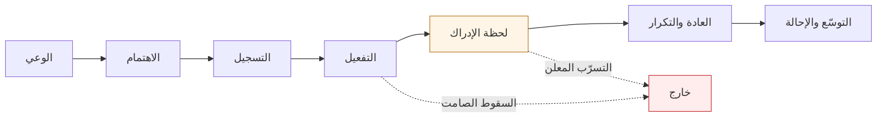

> [!info] الفصل 05 · بودكاست حياة المنتج
> **ماذا ستتعلّم:** كيف يُفهَم العميل فهمًا يُنتج قرارًا، لا انطباعًا. ستعرف لماذا يُفضّل إسلام العيّار **إدارة** قيمة العميل على **تعظيمها**، ولماذا يكون خفض القيمة في موضع قرارًا صحيحًا. وستُمسك السؤال الذي يقول إنّه كسر عماه: **«لماذا سقطوا؟» لا «لماذا انصرفوا؟»** — وما الذي يتغيّر حين تصير دورة حياة العميل مرئية بمراحلها. وستتعلّم أنّ **لحظة الإدراك تختلف باختلاف العمل**، ولا تُنقَل من منتج إلى آخر. ثم أصدق ما في الحلقة: **الاستبعاد منهجًا** — أن تُنفق أسابيع لتخرج بجملة واحدة «إنّه ليس هذا»، ولماذا عدّها رئيسه التنفيذيّ معلومةً تستحقّ. ومعها **دفتر ما استبعدتَه**، والتحدّي الحقيقيّ: **أن تفهمهم وأنت تُحقّق الرقم**. وفي الطرف المقابل، لماذا يجعل أحمد وفائي «أنصت دائمًا إلى عملائك» **مفهومًا خاطئًا**، وما **التحقّق العكسيّ**، ومتى يكون الإنصات ضارًّا.

> [!abstract] التأصيل
> **يفترض أنّك تعرف:** [[Product Discovery]] · [[Outcome vs Output]] · [[Problem Statement]]
> **ويُؤصّل لك:** [[Continuous Discovery]] · [[Customer Lifetime Value]] · [[Churn]] · [[Cohort Analysis]] · [[Funnel Analysis]] · [[The Mom Test]] · [[Retention]]

# الفصل 05 — العميل: الاكتشاف وإدارة القيمة

## 🎯 أهداف التعلّم

- التمييز بين **إدارة** قيمة العميل و**تعظيمها**، وتبرير متى يكون الخفض المتعمَّد قرارًا صحيحًا.
- بناء خريطة دورة حياة العميل بمراحلها، وتحديد المرحلة التي يقع فيها التسرّب فعلًا.
- استعمال سؤال **«لماذا سقطوا؟»** بدل «لماذا انصرفوا؟» وتحويله إلى تحليل قابل للتنفيذ.
- تعريف **لحظة الإدراك** لمنتجك أنت، وشرح لماذا لا تُنقَل من منتج آخر.
- التمييز بين **مقاييس الغرور** ومقاييس السلوك — وبرامج الولاء مثالًا.
- تطبيق **الاستبعاد** منهجًا للاكتشاف، والاحتفاظ بدفتر لما استُبعد.
- الجمع بين الفهم وتحقيق الرقم في الوقت نفسه بدل تأجيل أحدهما.
- تصميم **التقسيم إلى شرائح** بحيث يخدم قرارًا، وتجنّب تفتيته بلا حدّ.
- نقد «أنصت دائمًا إلى عملائك» نقدًا دقيقًا، وتحديد متى يصلح الإنصات ومتى يُضلّل.
- تطبيق **التحقّق العكسيّ**: أن تسعى إلى إثبات عكس فرضيّتك لا إلى تأييدها.

---

## الفكرة المحورية: القيمة تُدار، ولا تُعظَّم دائمًا

بدأ عمر بسؤال معجميّ يبدو شكليًّا، فأنتج أهمّ تمييز في الحلقة:

> [!quote] من المحاضرة
> **عمر سلام:** «وجدتُ أنّ CVM يأتي باسمين: **إدارة قيمة العميل**، أو **تعظيم قيمة العميل**. فأيّهما هو؟ أم هما معًا؟»

ووصف إسلام العيّار أوّلًا الحالة الشائعة:

> [!quote] من المحاضرة
> **إسلام العيّار:** «أكثر مَن يعملون في CVM ستجدهم يستخدمون مصطلحًا **يعرفه الجميع بلا استثناء**: **ARPU**… فالجميع يُطارد الـARPU… والجميع يحاول أن **يُعظّم** الرقم.»
>
> **إسلام العيّار:** «*دعني أجعلك تطلب طلبات؛ دعني أجعلك تطلب طلبات **أكبر**؛ دعني أجعلك تطلب طلبات بـ**فجوة زمنية أقصر** بينها؛ دعني أجعلك لا تنصرف أسرع؛ دعني أجعلك تأتي أسرع.*»

ثم يضع القيد الذي يمنع هذا من أن يصير افتراسًا:

> [!quote] من المحاضرة
> **إسلام العيّار:** «عندي أناسًا أريد أن أُخرِج منهم **أكبر رقم ممكن** — **من غير أن آكل نفسي**، ومن غير أن أُؤثّر في *(تجربتهم)* معي، ومن غير أن **أحرقهم**.»

وجاء حكم عمر ترجيحًا معلّلًا:

> [!quote] من المحاضرة
> **عمر سلام:** «كلمة **الإدارة** كلمة **أكثر مفهوميّةً**، و**أحكم**، من **التعظيم**. لأنّه **ليس دائمًا** الحلّ أن **تُعظّم** قيمة العميل عبر **كلّ** خدمة. فأنت مضطرّ أحيانًا أن **تُبقيها كما هي**؛ ومضطرّ أحيانًا أن **تُقلّلها**، لتزيدها في **شيء آخر**.»

**ولنقف على هذا، فهو أعمق ممّا يبدو.** فأن تخفض القيمة في موضع لترفع القيمة الكلّية قرارٌ لا يستطيع أن يتّخذه نظام تحسين يُدار بمقياس واحد. وأمثلته كثيرة عمليًّا:

| الحالة | التعظيم الموضعيّ يقول | والإدارة تقول |
|---|---|---|
| رسوم توصيل على الطلبات الصغيرة | ارفعها؛ فهي هامش صافٍ | أسقطها للمستخدم الجديد حتى تُبنى العادة |
| إعلانات داخل التطبيق | أضِف موضعًا ثالثًا | أزِل واحدًا؛ فالتسرّب يأكل مكسبه |
| باقة أعلى سعرًا | ادفع الجميع إليها | أبقِ الباقة الوسطى؛ فهي بوّابة الترقية لاحقًا |
| تذكيرات وإشعارات | زِد التواتر | قلّله؛ فالإيقاف الكلّي خسارة دائمة |

**والصفّ الأخير يقودنا مباشرةً** إلى الحكاية التي رواها أحمد وفائي عن قرار إدخال الأذان في تطبيق لم يكن مكانه — فأغلق المستخدمون الإشعارات كلّها. **والدرس واحد: أنّ تعظيم قناة يُدمّر القناة.**

> [!info] إضافة مرجعية — لماذا يُضلّل متوسّط الإيراد لكلّ مستخدم
> **ARPU** متوسّط، والمتوسّطات تُخفي التوزيع. ففي أكثر المنتجات الرقمية يكون توزيع الإنفاق **شديد الالتواء**: نسبة صغيرة من المستخدمين تُنتج أغلب الإيراد. فارتفاع المتوسّط قد يعني نموًّا حقيقيًّا، وقد يعني ببساطة أنّ صغار المنفقين انصرفوا — وهي كارثة تُقرأ نجاحًا.
>
> **والعلاج ثلاثة:** أن يُقرأ المتوسّط مع **الوسيط** (فالفجوة بينهما تقيس الالتواء) · وأن يُفكَّك بحسب **الأفواج** لا الشهور · وأن يُقرَن دائمًا بعدد المستخدمين النشطين. **والقاعدة: لا تعرض متوسّطًا وحده أبدًا.**
>
> ويتّصل بهذا **[[Simpson's Paradox|مفارقة سيمبسون]]**: أن يرتفع المقياس في كلّ شريحة على حدة، ويهبط في المجموع — أو العكس — لأنّ أوزان الشرائح تغيّرت. وهي أشيع فخّ في تقارير النموّ، ولا يُكتشَف إلّا بالتفكيك.

---

## السؤال الذي كسر العمى

هذا هو قلب الحلقة السادسة، وأنفع ما فيها لمن يعمل على أيّ قُمع.

> [!quote] من المحاضرة
> **إسلام العيّار:** «فعندي مشكلة: الناس تدخل وتُجري **التسجيل** على المنصّة، لكنّها **لا تدفع** في الوقت الذي أريدها أن تدفع فيه.»
>
> **إسلام العيّار:** «نحتاج أن نمرّ بـ**المراحل** — التي كانت عندي بوصفي **CVM** شيئًا **مجهولًا**؛ لكنّها عندك بوصفك **منتجًا** معلومة. وقد **كسرت** شيئًا كنتُ **أعمى** عنه بوصفي CVM، فصرتُ قادرًا على **رؤيته**.»
>
> **إسلام العيّار:** «ومشكلة كلّ مَن يعمل على أيّ قُمع أنّ هناك أناسًا **سقطوا** منه، وهو يحتاج أن يُجيب عن سؤال: **لماذا سقطوا؟** — لا سؤال *«لماذا انصرفوا؟»*. فمن انصرفوا، الحمد لله، بخير. وكان عندي دائمًا السؤال الأصعب: **لماذا سقطوا؟**»

### لماذا الفرق بين السؤالين حاسم

| | **«لماذا انصرفوا؟»** | **«لماذا سقطوا؟»** |
|---|---|---|
| عمّن يسأل | من استخدم ثم توقّف | من دخل ولم يصل أصلًا |
| مصدر البيانات | مقابلات خروج، استبيانات، إلغاءات | سجلّات المسار، وأحداث لم تقع |
| هل يتكلّم هؤلاء؟ | نعم غالبًا | **لا — وهذا هو المهمّ** |
| ما الذي يُصلحه | الاحتفاظ | **التفعيل**، وهو أعلى في القُمع وأرخص في الإصلاح |
| صعوبته | متوسّطة | عالية؛ لأنّه سؤال عن **غياب** لا عن حدث |

**والنقطة الجوهرية:** من انصرف بعد أن استخدم يترك أثرًا ويشتكي أحيانًا. أمّا من سقط في الطريق فلا يترك شيئًا إلّا فراغًا في سجلّ. **وأكبر مصدر للخسارة في أكثر المنتجات ليس التسرّب، بل من لم يصل إلى القيمة أصلًا** — ولأنّه صامت، فهو غير مرئيّ، ولأنّه غير مرئيّ فهو لا يُعالَج.

> [!tip] تحليل السقوط في ساعة واحدة
> **① ارسم المراحل** التي يمرّ بها المستخدم من أوّل زيارة إلى أوّل قيمة حقيقية — خمس إلى سبع مراحل لا أكثر.
> **② احسب نسبة العبور** من كلّ مرحلة إلى ما بعدها لفوج واحد (لا لكلّ المستخدمين، وإلّا خلطتَ الأزمنة).
> **③ ابحث عن أكبر هبوط** — لا عن أدنى نسبة. فالمرحلة التي تسقط فيها ٦٠٪ دفعةً واحدة أهمّ من مرحلة تسقط فيها ٩٥٪ بالتدريج على مدى شهر.
> **④ شاهد عشر جلسات** لمن سقطوا عند تلك المرحلة تحديدًا. **ولا تكتفِ بالرقم**: فالرقم يقول أين، والمشاهدة تقول لماذا.
> **⑤ اكتب فرضيةً واحدة** ومعيار إيقافها، ثمّ اختبرها.

### دورة الحياة كاملةً

> [!quote] من المحاضرة
> **إسلام العيّار:** «فعندي الآن **خطوات**: عندي الآن خطوة اسمها **التسجيل**؛ وبعدها **لم ينتهِ** الأمر — فأنا لا أنتظر **تحويلًا** بعدها فورًا. لا: أنا الآن أريده أن **يبلغ نقطة** *(لحظة الإدراك)*؛ و**بعد ذلك** أبدأ أُكلّمه عن **التحويل**.»

والسهمان المنقّطان يُظهران التمييز كلّه: **السقوط الصامت** يقع قبل لحظة الإدراك، و**التسرّب المعلن** بعدها. ومن يجمعهما في رقم واحد اسمه «التسرّب» يخلط مشكلتين مختلفتي السبب والعلاج تمامًا.

---

## لحظة الإدراك تختلف باختلاف العمل

> [!quote] من المحاضرة
> **إسلام العيّار:** «تحتاج أن **تلتقط كلّ حدث** تستطيع التقاطه، حتى تنظر **متى يشعر الناس بلحظة الإدراك**. ولحظة الإدراك هنا **تختلف من عمل إلى عمل**، أو من منتج إلى منتج.»
>
> **إسلام العيّار:** «*(في حالة أخرى)* تختلف قليلًا: نتحدّث عن أنّ لحظة الإدراك قد تكون أنّه **اشترى شيئًا** ثم أجرى بعدها **شراءً آخر** — ما يعني أنّه استطاع أن **يحصل على قيمة** منّي.»
>
> **إسلام العيّار:** «فمثلًا، في **Booking** قد تكون عندك لحظات إدراك **أعقد** من ذلك… لأنّك أيضًا لا تعرف هل أخذ هذا الشخص غرفةً ولن يعود، إذ هو لا يأتي كلّ يوم أصلًا.»

**وهذه النقطة الأخيرة هي أهمّ ما في المقطع**، وهي تُفسد الوصفات الجاهزة: أنّ **تواتر الاستعمال الطبيعيّ للمنتج** هو الذي يُحدّد شكل لحظة الإدراك وكيفيّة قياسها.

| تواتر الاستعمال الطبيعيّ | أمثلة | كيف تُقاس لحظة الإدراك | مزلقها |
|---|---|---|---|
| يوميّ | تواصل، أدوات عمل | حدث متكرّر خلال أيّام قليلة | يُغري بقياس النشاط بدل القيمة |
| أسبوعيّ | توصيل، تسوّق | تكرار داخل نافذة أسبوعين | تخلطه المواسم |
| شهريّ | فواتير، اشتراكات | إتمام دورة كاملة مرّة | بطيء جدًّا في التغذية الراجعة |
| نادر | سفر، عقارات، تأمين | إتمام معاملة واحدة بنجاح | **لا يصلح فيه الاحتفاظ مقياسًا أصلًا** |

والصفّ الأخير هو الذي أشار إليه إسلام بمثال الحجز. **فالمنتج نادر الاستعمال لا يُقاس بالعودة الشهرية**، ومن يُقاس بها يُطارد رقمًا لا معنى له، وقد يُفسد المنتج ليرفعه.

> [!info] إضافة مرجعية — من أين جاءت الفكرة، وحدّها
> شاعت فكرة «لحظة الإدراك» و«أرقام السحر» في أدبيات النموّ بأمثلة صارت أشهر ممّا ينبغي: عتبات محدّدة لعدد الأصدقاء أو عدد الأفعال في مدّة معيّنة، تُنسَب إلى شبكات اجتماعية وأدوات تعاون معروفة.
>
> **والتحفّظ الجوهريّ:** هذه العتبات في أصلها **ارتباطات لا أسباب**. فأن يكون من بلغ العتبة أكثر بقاءً لا يعني أنّ دفع الناس إلى العتبة يُنتج بقاءً؛ فقد تكون العتبة **عَرَضًا** لنيّة موجودة سلفًا لا سببًا لها. وقد جرّبت فرق كثيرة دفع المستخدمين إلى الرقم السحريّ ميكانيكيًّا فلم يتحرّك الاحتفاظ.
>
> **والاستعمال السليم:** أن تُعامَل العتبة **مؤشّرًا سابقًا** يُنبّهك مبكّرًا، لا هدفًا يُطارَد. وأن يُختبَر السببُ بتجربة حقيقية ذات مجموعة ضابطة قبل أن يُبنى عليها برنامج كامل.

---

## برامج الولاء لا تُثبت شيئًا بذاتها

> [!quote] من المحاضرة
> **إسلام العيّار:** «مثل الذين يتصوّرون أنّه ما دام الناس **يجمعون نقاطًا** معي، فمبروك، البرنامج يعمل جيّدًا. وذلك **لا شيء إطلاقًا**: فأنت مَن قلتَ إنّ إسلام حين يشتري منك تجمع له نقاطًا. وذلك **لا يقول عن إسلام شيئًا إطلاقًا**.»
>
> **إسلام العيّار:** «فأنت تحتاج أن تكون **متابعًا لما يفعلونه** بالأشياء — **الألعاب** التي وضعتَها لهم… **كيف يتصرّفون معه**. ذلك ما تنظر إليه.»

**وهذا مثال نموذجيّ على [[Vanity Metrics|مقياس الغرور]]:** رقم يرتفع دائمًا، ولا يهبط أبدًا، ولا يرتبط بقرار. فتراكم النقاط دالّة على الشراء لا على الولاء — وهو يُقاس مرّتين ويُحسَب مرّتين.

**والمحكّ الذي يُميّز مقياس الغرور:**

1. **هل يستطيع أن يهبط؟** فالمقياس التراكميّ الذي لا يهبط لا يُخبرك بشيء عن الحاضر.
2. **هل يُغيّر قرارًا؟** فإن كان جوابه واحدًا مهما كانت قيمته، فهو زينة لا معلومة.
3. **هل هو نتيجة أم إعادة صياغة لمُدخَل؟** فعدد النقاط الممنوحة إعادةُ صياغة لعدد المشتريات مضروبًا في معامل وضعتَه أنت.

| بدل هذا (غرور) | استعمل هذا (سلوك) |
|---|---|
| مجموع النقاط الممنوحة | **نسبة من استبدلوا** نقاطهم فعلًا |
| عدد المسجّلين في البرنامج | فرق الاحتفاظ بين المشارك وغيره **في الفوج نفسه** |
| إجمالي التنزيلات | نسبة من بلغوا لحظة الإدراك خلال أسبوع |
| عدد الميزات المُطلَقة | نسبة المستخدمين النشطين الذين لمسوها |

---

## أن تفهمهم وأنت تُحقّق الرقم

هذا هو التوتّر الذي يعيشه كلّ من يعمل على النموّ، وقد صاغه إسلام صياغةً صريحة:

> [!quote] من المحاضرة
> **إسلام العيّار:** «هذه الأشياء لم تأتِ لأنّني جلستُ **أتخيّل**. جاءت لأنّني كنتُ قد **وضعتُ خطًّا**: أريد أن أُغلق شهر **فبراير** على رقم، ولا أستطيع إغلاقه — فأُضطرّ إلى النظر في **البيانات**.»
>
> **إسلام العيّار:** «وأنا أضع لنفسي **هدفًا**: لا أريد أن أفهمك على راحتي — أريد أن أفهمك **وأنا أحاول أن أُحقّق حجم المبيعات الذي أريده**… تلك هي **الصعوبة** فيه، أو **التحدّي** فيه: أن تريد أن **تفهم**، وفي الوقت نفسه تريد أن **تبلغ ما تريد**.»

**ولاحظ أنّ الضغط عنده ليس عدوّ الفهم بل محرّكه.** وهذه ملاحظة تخالف الخطاب الشائع الذي يجعل الاكتشاف نشاطًا يحتاج «مساحةً بعيدًا عن ضغط الأرقام». والحقيقة الميدانية التي يصفها إسلام أنّ الهدف الرقميّ هو الذي أجبره على النظر — ولولاه لبقيت فرضياته مريحةً وغير مختبَرة.

**والفرق بين النوعين من الاكتشاف:**

| **اكتشاف بلا هدف** | **اكتشاف تحت هدف** |
|---|---|
| يُنتج فهمًا واسعًا | يُنتج فهمًا نافذًا في نقطة واحدة |
| بلا معيار لإيقافه | يتوقّف حين يتحرّك الرقم أو يثبت أنّه لن يتحرّك |
| يميل إلى تأييد ما نظنّه | يُفضح سريعًا حين يكون خاطئًا |
| خطره: بحث لا ينتهي | خطره: التسرّع إلى أوّل تفسير مريح |

**والمثالية أن يوجد الاثنان**: نافذة صغيرة للاكتشاف الواسع تمنع العمى، وعمود فقريّ من الاكتشاف تحت هدف يمنع الترف.

---

## الاستبعاد منهجًا

هنا أنبل ما في هذه الحلقة، وهو اعتراف نادر:

> [!quote] من المحاضرة
> **إسلام العيّار:** «كانت عندنا **فرضية** أنّ شيئًا بعينه هو ما يسدّ *(النتيجة)*… فذهبتُ وبحثتُ **أمس**، والأسبوع الماضي، وقبل أيّام — فأصابتني **صدمة**: وجدتُ أنّ الفرضية التي عندي **لا صلة لها بالواقع إطلاقًا**.»
>
> **إسلام العيّار:** «وأنا، بالمناسبة، **لم أبلغ** المعلومة بعدُ — لكنّ **البحث لا يزال جاريًا**… وقد بلغتُ جملةً واحدة: **إنّه ليس هذا.**»

ثم يروي ردّ رئيسه التنفيذيّ، وهو الجزء الذي يجعل هذا ممكنًا مؤسّسيًّا:

> [!quote] من المحاضرة
> **إسلام العيّار:** «كنتُ أتحدّث مع **رئيسي التنفيذيّ** فقلتُ هذه المعلومة. فقال: **تلك معلومة؛ والحمد لله أنّنا اطمأننّا إلى أنّه ليس هذا.** فصرنا نعرف، حتى لا نجلس نُطارده.»

**وهذه اللحظة تستحقّ أن تُقرأ مرّتين.** فمؤسّسة يستطيع فيها المحلّل أن يقول لرئيسها التنفيذيّ «أنفقتُ أسابيع وخرجت بأنّه ليس هذا» ويُقابَل بالشكر — هي مؤسّسة ستعرف الحقيقة عن نفسها. ومؤسّسة يُطالَب فيها كلّ بحث بأن يُنتج جوابًا إيجابيًّا ستحصل على أجوبة إيجابية دائمًا، صحيحةً كانت أو ملفَّقة.

وقد سمّاه عمر باسمه:

> [!quote] من المحاضرة
> **عمر سلام:** «ذلك في ذاته **منهجية تفكير**، ومنهجية **اكتشاف**: أنّك جالس — حسنًا، لا أستطيع أن **أُؤكّد**؛ إذن، تعال **نستبعد الاحتمالات**.»

> [!info] إضافة مرجعية — لماذا الاستبعاد أقوى منطقيًّا من التأكيد
> هذه في جوهرها فكرة **كارل بوبر** في *منطق الكشف العلميّ* (1934): أنّ الملاحظات المؤيّدة لا تُثبت الفرضية مهما كثرت، بينما ملاحظة مخالفة واحدة تكفي لنقضها. ومن هنا كانت **القابلية للتكذيب** معيارًا للفرضية الجادّة: فالفرضية التي لا يمكن أن يُتصوَّر ما ينقضها ليست قويّة، بل فارغة.
>
> **والتطبيق العمليّ في المنتج:** قبل أن تبدأ التحليل، اسأل: **ما الذي سأراه في البيانات لو كانت فرضيّتي خاطئة؟** فإن لم تستطع الجواب، فأنت لا تختبر فرضية، بل تبحث عن تأييد. وهذا هو الفرق العمليّ بين التحليل و**[[Confirmation Bias|انحياز التأكيد]]**.
>
> ويُقابل هذا في أدبيات القرار ما يُسمّى **[[Pre-mortem|التشريح المسبق]]** (صاغه غاري كلاين): أن تفترض قبل البدء أنّ المشروع فشل بعد سنة، وتكتب أسباب الفشل. وهو يُخرج الاعتراضات التي لا تخرج بالسؤال المباشر، لأنّه يُحوّل التنبّؤ إلى تفسير — وهو ما يُحسنه العقل أكثر بكثير.

### دفتر ما استبعدتَه

> [!quote] من المحاضرة
> **إسلام العيّار:** «وهنا يا عمر يأتي شيء مهمّ جدًّا لكلّ مَن يعمل بـ**الأرقام**… **أحتاج أن أحتفظ بدفتر**.»

**وهذه من أرخص الممارسات وأعلاها عائدًا في أيّ فريق منتج.** فبعد سنتين تكون قد اختبرتَ عشرات الفرضيات، ونسي الجميع أيّها اختُبر. فيأتي وافد جديد فيقترح ما جُرِّب وفشل، ويُنفق الفريق ربعًا في إعادة اكتشاف ما يعرفه بالفعل.

**شكل مقترح للدفتر — سطر واحد لكلّ مدخلة:**

| التاريخ | الفرضية | كيف اختُبرت | النتيجة | ما الذي يُعيد فتحها |
|---|---|---|---|---|
| 2026-03 | التسرّب سببه سعر الباقة | مقارنة أفواج قبل/بعد خفض السعر ١٥٪ | **مستبعَدة** — لم يتحرّك الاحتفاظ | دخول منافس بسعر أقلّ ٤٠٪ |
| 2026-05 | السقوط عند التحقّق من الهويّة | ١٢ جلسة مشاهدة ＋ سجلّات | **مؤكَّدة جزئيًّا** — يخصّ مستخدمي أندرويد القديم | — |

**والعمود الأخير هو الذي يجعل الدفتر أداة حيّة لا مقبرة.** فكلّ استبعاد مشروط بالظرف الذي وقع فيه؛ ومن كتب شرط إعادة الفتح ترك بابًا مفتوحًا بوعي بدل أن يُغلق الباب إلى الأبد.

---

## التقسيم إلى شرائح: من اثنتي عشرة إلى خمس

> [!quote] من المحاضرة
> **إسلام العيّار:** «في الشهر الأوّل، وفي الشهر الثاني، كنتُ أرى الناس **اثنتي عشرة شريحة**؛ واليوم، من تلك الشرائح، فكّكناها؛ واليوم أنتم **أربع أو خمس شرائح**.»
>
> **إسلام العيّار:** «لأنّني حين كنتُ في شهر **يناير** يا عمر، كنتُ أُكلّم **خمسة آلاف مستخدم**؛ واليوم سأُكلّم **ألفًا**.»

**ولاحظ الاتّجاه: من اثنتي عشرة إلى خمس، لا العكس.** وهذا يخالف الحدس السائد الذي يجعل التقسيم الأدقّ دائمًا أفضل. والسبب في الجملة الثانية: أنّ الشريحة إنّما تُفيد إن كان فيها عدد كافٍ لتُتّخذ لأجله قرارٌ ويُقاس أثره. **فالشريحة التي تضمّ خمسين شخصًا ليست شريحة؛ إنّها حالات فردية.**

**ثلاثة محكّات لتقسيم نافع:**

1. **أيُغيّر قرارًا؟** فإن كنتَ ستفعل الشيء نفسه مع الشريحتين، فهما شريحة واحدة.
2. **أفيها عدد كافٍ ليُقاس؟** فإن كان الفرق المتوقّع لا يُرصَد بحجمها، فالتقسيم زينة.
3. **أهي مستقرّة؟** فالشريحة التي ينتقل منها الناس أسبوعيًّا لا تصلح أساسًا لبرنامج ربعيّ.

> [!warning] فخّ التفتيت
> ينزلق فرق كثيرة إلى تفتيت الشرائح بلا حدّ، لأنّ كلّ تفتيت يُنتج فرقًا ظاهريًّا يبدو اكتشافًا. **وكلّما ضاقت الشريحة، ارتفع احتمال أنّ الفرق الذي تراه ضوضاء لا إشارة.** وهذا هو أثر **المقارنات المتعدّدة**: من قسّم جمهوره عشرين شريحة وبحث عن فروق سيجد فروقًا «دالّة» بالمصادفة وحدها.
>
> **والعلاج:** أن تُحدّد الشرائح **قبل** التحليل لا بعده، وأن تُقلّل عددها إلى ما يحتمله حجم بياناتك، وأن تُعيد اختبار أيّ فرق مفاجئ على فوج جديد قبل البناء عليه.

---

## وفي الطرف المقابل: «أنصت دائمًا إلى عملائك» مفهوم خاطئ

بعد كلّ هذا الإلحاح على فهم العميل، يأتي أحمد وفائي فيجعل الإنصات الدائم **سابع** المفاهيم الخاطئة — ومن الإنصاف أن نعرض حجّته كاملةً، لأنّها ليست دعوةً إلى تجاهل العميل.

> [!quote] من المحاضرة
> **عمر سلام:** «*أنصت دائمًا إلى عملائك.* أتعرف كم مرّةً سمعتَ هذا اليوم؟… لكن هل **تُكلّم** العملاء بصدق؟ هل عندك **وقت** لتُكلّم عميلًا؟ وهل أتت **آبل** يومًا وسألتنا، أو أجرت **استطلاعًا**، عمّا إذا كان ينبغي لأيقونة الآيفون أن تبدو هكذا، على اليمين أم على اليسار؟»
>
> **أحمد وفائي:** «لكن، بالمناسبة، آبل **مهووسة بالعميل** فعلًا — إنّما بطريقة مختلفة تمامًا. يربطونها بـ**رؤية** موجودة سلفًا، ويُجرون **التجارب التي تُثبت عكس** ما يقولون. فإن لم يوجد عكس، فهم إذن ماضون في الاتّجاه الصحيح.»
>
> **أحمد وفائي:** «فهم لا يأخذون **مُدخلات**. الفعل هو **التحقّق العكسيّ**.»
>
> **أحمد وفائي:** «فالعميل على رأسي وعيني — لكنّ العميل **لن** يقول لي أبدًا ما أريده بالضبط، ولن يرى **إلى أين أنا ذاهب**. و**رؤيتك إلى أين أنت ذاهب** أهمّ من كلّ شيء.»

### كيف يُوفَّق بين هذا وبين الفصل كلّه

قد يبدو هذا نقضًا لكلّ ما سبق. وهو ليس كذلك، والتوفيق في تمييز **نوع السؤال**:

| نوع السؤال | أينفع الإنصات؟ | لماذا |
|---|---|---|
| ما الذي تفعله اليوم، وكم يُكلّفك؟ | **نعم، وهو المصدر الأوّل** | سؤال عن ماضٍ وقع، والناس دقيقون فيه |
| أين تعثّرت في هذه الشاشة؟ | **نعم** | ملاحظة سلوك في الحاضر |
| ما الذي يُزعجك في المنتج؟ | نعم بتحفّظ | يُنتج أعراضًا لا أسبابًا |
| أيّ الحلّين تُفضّل؟ | **لا** | تفضيل معلن لا يتنبّأ بالسلوك |
| هل ستستخدم هذه الميزة؟ | **لا** | سؤال عن مستقبل متخيَّل |
| كيف ينبغي أن يبدو المنتج بعد ثلاث سنوات؟ | **لا** | ليس عمله، ولا يملك السياق |

**فالإنصات ممتاز في التشخيص، ورديء في الوصف.** والخطأ الذي يهاجمه وفائي ليس الإنصات، بل **تفويض القرار للعميل**. وهذا بالضبط ما يفصله إسلام العيّار عمليًّا: فهو لا يسأل مستخدميه ماذا يريدون؛ إنّه يقرأ ما فعلوه، ويستبعد الفرضيات، ويختبر.

### التحقّق العكسيّ عمليًّا

**أن تسعى إلى نقض فرضيّتك لا إلى تأييدها**، وهذا يُترجَم إلى إجراءات:

**① اكتب فرضيّتك في صيغة قابلة للنقض.** لا «المستخدمون يريدون تقارير أفضل»، بل «إن أضفنا التصدير التلقائيّ، فسترتفع نسبة من يُنجز التقرير الشهريّ من ٣١٪ إلى ٥٠٪ خلال ستّة أسابيع».

**② اسأل: ما الذي سأراه لو كنتُ مخطئًا؟** واكتبه قبل أن تنظر في أيّ بيانات.

**③ كلّف أحدًا صراحةً بأن يبني حجّة النقض.** لا أن تنتظر متطوّعًا.

**④ ابحث عمّن يُخالف عمدًا.** فحين تُجري مقابلات، لا تُقابل من أحبّ فكرتك؛ قابِل من رفض المنتج ومن استخدمه ثم توقّف — فعندهم المعلومة التي لا يملكها الراضون.

**⑤ لا تُغيّر معيار النجاح بعد رؤية النتيجة.** فهذه أشيع صورة لانحياز التأكيد في فرق المنتج، وأصعبها ملاحظةً على النفس.

> [!warning] وحدّ التحقّق العكسيّ
> أسلوب «الرؤية أوّلًا ثمّ ابحث عن ناقض» يعمل حين يكون صاحب الرؤية على حقّ — ويُنتج كارثةً حين لا يكون. فالشركات التي تُروى قصص نجاحها بهذا الأسلوب قليلة ومشهورة؛ والشركات التي فعلت الشيء نفسه وفشلت كثيرة ومنسيّة. **وهذا انحياز ناجين في صورته الكلاسيكية.**
>
> **والاستعمال المسؤول:** أن يكون التحقّق العكسيّ منهجًا في **كيفيّة اختبار الفرضية**، لا رخصةً في **تجاهل الإشارات**. فالفرق بين آبل وبين مؤسّس عنيد ليس في أنّ أحدهما يُنصت والآخر لا؛ بل في أنّ أحدهما **يبحث عن النقض بجدّية ويُصدّقه إن وجده**، والآخر يبحث عنه ليقول إنّه بحث.

---

## تمرين تطبيقيّ: خريطة سقوط في أسبوع

**اليوم الأوّل — ارسم المراحل.** اجمع المنتج والهندسة والتحليلات على لوح واحد، وارسموا رحلة المستخدم من أوّل لمسة إلى أوّل قيمة. واتّفقوا على **تعريف حدثيّ دقيق** لكلّ مرحلة (لا «فهم المنتج» بل «أنشأ أوّل تقرير»).

**اليوم الثاني — تحقّق من التجهيز القياسيّ.** هل كلّ حدث مُلتقَط فعلًا؟ فأكثر خرائط السقوط تُبنى على أحداث ناقصة فتُنتج استنتاجات خاطئة. **ولا تُكمل قبل أن تسدّ الثغرات.**

**اليوم الثالث — احسب لفوج واحد.** اختر فوج شهر كامل، واحسب نسبة العبور بين كلّ مرحلتين.

**اليوم الرابع — شاهد.** عشر جلسات لمن سقطوا عند أكبر هبوط. لا تُحلّل بعد؛ فقط شاهد وسجّل ما رأيت.

**اليوم الخامس — اكتب ثلاث فرضيات، ولكلّ منها ما ينقضها.** ثم رتّبها بأرخص ما يختبرها لا بأكثرها إقناعًا.

**اليوم السادس — اختبر أرخصها.** ولو كان الاختبار محادثة مع خمسة مستخدمين.

**اليوم السابع — سجّل في الدفتر.** ما اختُبر، ونتيجته، وما يُعيد فتحه — **حتى لو كانت النتيجة «ليس هذا»**؛ فهذه هي المدخلة التي ستُوفّر على من بعدك ربعًا كاملًا.

---

## أنماط الفشل

| النمط | كيف يبدو | السبب الجذريّ | أوّل تدخّل |
|---|---|---|---|
| **مطاردة المتوسّط** | ARPU يرتفع والنشطون يهبطون | متوسّط بلا وسيط ولا تفكيك | اعرض الثلاثة معًا دائمًا |
| **العمى عن السقوط** | كلّ الجهد على استرجاع المنصرفين | من سقط لا يشتكي فلا يُرى | ابنِ خريطة السقوط قبل برنامج الاسترجاع |
| **لحظة إدراك مستعارة** | نُقلت العتبة من منتج آخر | تجاهل تواتر الاستعمال الطبيعيّ | اشتقّها من بياناتك، واختبر سببيّتها |
| **مسرح الولاء** | نقاط تتراكم والاحتفاظ ثابت | مقياس تراكميّ لا يهبط | قِس الاستبدال، وقارن الأفواج |
| **التفتيت بلا حدّ** | خمس وعشرون شريحة، وقرار واحد | التقسيم صار غايةً | ادمج حتى تبقى الشرائح التي تُغيّر قرارًا |
| **البحث عن التأييد** | كلّ تحليل يُثبت ما ظنّناه | لم يُكتب ما ينقض الفرضية سلفًا | اكتب علامة النقض قبل النظر في البيانات |
| **تفويض القرار للعميل** | خارطة طريق مبنيّة على طلبات | خلط التشخيص بالوصف | اسأل عن ماضيهم، وقرّر أنت |

---

## أسئلة للمراجعة

1. اذكر موضعًا في منتجك يكون فيه **خفض** القيمة الموضعية قرارًا صحيحًا، وعلّل بالقيمة الكلّية.
2. افتح آخر تقرير عندك: أعرضتَ متوسّطًا بلا وسيط؟ وماذا يتغيّر إن أضفته؟
3. ارسم مراحل رحلة مستخدمك بتعريف حدثيّ دقيق لكلّ مرحلة. أيّها لا تملك بياناته؟
4. أيّهما أكبر عندك: من سقط قبل القيمة، أم من تسرّب بعدها؟ وأيّهما تُنفق عليه أكثر؟
5. ما تواتر الاستعمال الطبيعيّ لمنتجك، وهل مقياس احتفاظك يناسبه؟
6. خذ مقياسًا تعرضه على القيادة وطبّق عليه محكّات الغرور الثلاثة.
7. اكتب فرضيةً تعمل عليها الآن في صيغة قابلة للنقض، وحدّد ما ستراه لو كنتَ مخطئًا.
8. ابدأ **دفتر الاستبعاد**: اكتب فيه ثلاث فرضيات جُرِّبت في فريقك وفشلت، وشرط إعادة فتح كلٍّ منها.
9. كم شريحةً عندكم؟ وكم قرارًا مختلفًا تتّخذونه فعلًا لأجلها؟ وما الفرق بين الرقمين؟
10. صنّف خمسة أسئلة تسألها لعملائك إلى: يصلح الإنصات فيها · لا يصلح. وأعِد صياغة ما لا يصلح.
11. طبّق **التحقّق العكسيّ** على قرار كبير قائم: من كُلّف ببناء حجّة النقض؟ وإن لم يُكلَّف أحد، فمن ستُكلّف؟
12. متى آخر مرّة قال أحد في فريقك «أنفقتُ وقتًا وخرجت بأنّه ليس هذا»؟ وكيف قوبل؟

---

## قراءة نقدية: أين تنكسر هذه الأفكار

### أوّلًا: منهج CVM مبنيّ على وفرة بيانات لا يملكها الجميع

كلّ ما وصفه إسلام العيّار — الأفواج، والتجهيز القياسيّ، وتتبّع كلّ نقرة، والشرائح — يفترض حجمًا كافيًا من المستخدمين ومن الأحداث. **وفي منتج بألف مستخدم شهريًّا لا يعمل هذا**: فالفوج الشهريّ صغير جدًّا، والفروق بين الشرائح كلّها داخل هامش الضوضاء.

**وما يبقى صالحًا في الأحجام الصغيرة:** رسم المراحل (فهو مفيد حتى بلا أرقام)، ومشاهدة الجلسات، والمحادثات المباشرة. **وما يجب تأجيله:** التقسيم إلى شرائح، والتجارب الإحصائية، ولوحات القياس المعقّدة. ومن بنى بنية قياس ضخمة قبل أن يملك حركةً كافية يكون قد أنفق على أداة لا يستطيع أن يقرأ مخرجاتها.

### ثانيًا: «فهمهم وأنت تُحقّق الرقم» قد تنقلب

الفكرة سليمة وقويّة، ولها وجه خطر: أنّ الاكتشاف الذي يعيش تحت ضغط هدف شهريّ يميل إلى **الوقوف عند أوّل تفسير يُحرّك الرقم**، لا عند التفسير الصحيح. وقد ينجح تدخّل لسبب غير الذي ظننتَه، فتتعلّم درسًا خاطئًا وتبني عليه سنة.

**والتحوّط:** أن يُفصَل بين «ما الذي حرّك الرقم؟» و«لماذا تحرّك؟» — وأن يُخصّص جزء صغير ثابت من الوقت لاكتشاف لا هدف رقميّ عليه. **فالاكتشاف تحت ضغط يجد الأجوبة السريعة؛ والاكتشاف بلا ضغط يجد الأسئلة الصحيحة.** ومن يملك أحدهما فقط يخسر شيئًا.

### ثالثًا: الاستبعاد له تكلفة فرصة

منهج «ليس هذا» ممتاز معرفيًّا، ومكلف زمنيًّا. فمساحة الفرضيات في أيّ منتج مفتوحة عمليًّا؛ ومن يستبعد واحدةً كلّ ثلاثة أسابيع قد يقضي سنةً ليبلغ جوابًا.

**فالاستبعاد يحتاج ترتيبًا لا شمولًا:** ابدأ بالفرضيات التي **إن صحّت كان أثرها أكبر**، أو **التي اختبارها أرخص** — لا بالتي تبدو أقرب إلى ذهنك. وضع لنفسك حدًّا زمنيًّا: «إن لم نبلغ سببًا مرجّحًا خلال ثلاثة أسابيع، نُجرّب تدخّلًا واسعًا ونتعلّم من نتيجته» — فالتجربة نفسها أداة اكتشاف حين يعجز التحليل.

### رابعًا: نقد الإنصات يُساء استعماله أكثر من غيره

عبارة «العميل لا يعرف ما يريد» صارت أكثر الأدوات استعمالًا في تبرير تجاهل الشواهد. **والفرق بين استعمالها الصحيح والفاسد يظهر في سؤال واحد: ما الذي كنتَ ستقبله دليلًا على أنّك مخطئ؟** فمن عنده جواب يستعملها منهجًا؛ ومن لا جواب عنده يستعملها درعًا.

**والملاحظة الإحصائية المهمّة:** مثال آبل يُستشهَد به دائمًا، وهو **حالة واحدة من شركة استثنائية في سوق استهلاكيّ ذي علامة قويّة جدًّا**. ونقل منهجها إلى منتج مؤسّسيّ يبيع لمشترٍ محترف يُنتج كارثة؛ فذلك المشتري يعرف مشكلته جيّدًا، ويملك بديلًا، ولا يشتري رؤية.

### خامسًا: كلّ هذا يفترض إذنًا وأخلاقيّات في البيانات

«تتبّع كلّ نقرة» و«أراك من البداية إلى النهاية» عبارات صحيحة تقنيًّا، وهي تقع في مساحة تنظيمية وأخلاقية لم تُثَر في الحلقة. **فالتتبّع الشامل بلا أساس قانونيّ للمعالجة، وبلا شفافية مع المستخدم، مخالفةٌ في كثير من الولايات** — ومنها ما يُطبَّق على من يخدم مستخدمين في أوروبا مهما كان مقرّه.

**والحدّ العمليّ:** اجمع ما تحتاجه لقرار محدّد، لا كلّ ما تستطيع جمعه · وثّق غرض كلّ حقل · وضع مدّة احتفاظ · واعرض للمستخدم ما يُجمَع عنه بلغة مفهومة. **وهذا ليس عبئًا امتثاليًّا فقط؛ إنّه أيضًا انضباط تحليليّ**: فالبيانات التي جُمعت بلا سؤال تُنتج لوحات لا يقرؤها أحد.

### سادسًا: شهادة واحدة عميقة، من سياق واحد

إسلام العيّار يتحدّث من اتّصالات، ومن منصّة استرداد نقديّ، ومن سوق مصريّ. وهذه بيئات ذات تواتر استعمال عالٍ وحساسية سعرية عالية وقنوات تواصل مباشرة (رسائل نصّية وإشعارات). **وأكثر أدواته مصمّمة لهذا النوع من العلاقة بالعميل.**

ومن يعمل في منتج مؤسّسيّ ذي دورة بيع طويلة، أو في منتج نادر الاستعمال، سيجد نصف الأدوات غير قابلة للنقل. **وما ينتقل عبر السياقات كلّها ثلاثة:** سؤال «لماذا سقطوا؟» · والاستبعاد منهجًا · ودفتر ما استُبعد. أمّا الشرائح والحملات والقُمعات فتُعاد معايرتها من الصفر.

---

## خلاصة الفصل

1. **القيمة تُدار ولا تُعظَّم دائمًا**؛ وخفضها في موضع لرفع الكلّي قرارٌ لا يستطيعه نظام يُدار بمقياس واحد.
2. **لا تعرض متوسّطًا وحده أبدًا** — فالمتوسّط يُخفي التوزيع، وارتفاعه قد يكون خبر انصراف صغار المنفقين.
3. **«لماذا سقطوا؟» أصعب من «لماذا انصرفوا؟» وأنفع** — لأنّ من سقط صامت، ولأنّ إصلاح التفعيل أرخص من إصلاح الاحتفاظ.
4. **ابحث عن أكبر هبوط لا عن أدنى نسبة**، ثم شاهد جلسات من سقطوا هناك بالتحديد.
5. **لحظة الإدراك تُشتقّ من منتجك ولا تُستعار**؛ وتواتر الاستعمال الطبيعيّ هو الذي يُحدّد شكلها — وبعض المنتجات لا يصلح فيها الاحتفاظ مقياسًا أصلًا.
6. **الأرقام السحرية ارتباطات لا أسباب**؛ فعامِلها مؤشّرًا سابقًا يُنبّه، لا هدفًا يُطارَد.
7. **برامج الولاء لا تُثبت شيئًا بذاتها**؛ فالنقاط المتراكمة إعادة صياغة للشراء. وانظر إلى **كيف يتصرّفون** بها.
8. **محكّات مقياس الغرور ثلاثة**: أيستطيع أن يهبط؟ أيُغيّر قرارًا؟ أهو نتيجة أم مُدخَل مُعاد صياغته؟
9. **الضغط الرقميّ محرّك للفهم لا عدوّه** — لكنّه يميل إلى الوقوف عند أوّل تفسير مريح، فاحتفظ بنافذة اكتشاف بلا هدف.
10. **الاستبعاد منهج**: «إنّه ليس هذا» معلومةٌ تستحقّ أسابيع، وتُوفّر أرباعًا.
11. **ومؤسّسة تشكر من يأتي بنفي هي مؤسّسة ستعرف الحقيقة عن نفسها**؛ ومن تطلب أجوبة إيجابية دائمًا ستحصل عليها، صحيحةً أو ملفَّقة.
12. **اكتب ما سيُثبت خطأك قبل أن تنظر في البيانات** — فهذا هو الفرق العمليّ بين التحليل وانحياز التأكيد.
13. **احتفظ بدفتر لما استبعدتَه**، ومعه شرط إعادة الفتح — وإلّا صار مقبرةً لا أداة.
14. **من اثنتي عشرة شريحة إلى خمس**: الشريحة النافعة تُغيّر قرارًا، وفيها عدد يُقاس، وهي مستقرّة. والتفتيت بلا حدّ يُنتج ضوضاء تُقرأ اكتشافًا.
15. **الإنصات ممتاز في التشخيص، رديء في الوصف** — فاسأل عن ماضيهم، ولا تُفوّض إليهم القرار.
16. **التحقّق العكسيّ أن تسعى إلى نقض فرضيّتك بجدّية وتُصدّق النقض إن وجدتَه** — لا أن تبحث عنه لتقول إنّك بحثت.
17. **ومحكّ من يستعمل «العميل لا يعرف ما يريد» بحقّ**: ما الذي كنتَ ستقبله دليلًا على أنّك مخطئ؟
18. **كلّ هذا يفترض بيانات مأذونًا بها**: اجمع ما يخدم قرارًا لا ما تستطيع جمعه — فهو انضباط تحليليّ قبل أن يكون امتثالًا.

---

## للتعمّق

> [!note] مصادر هذا الفصل من طبقة المصدر
> [[06.1 إدارة قيمة العميل - إسلام العيّار]] · [[06.3 اقتراح الصلة بالمنتج]] · [[06.4 لحظة الإدراك تختلف باختلاف العمل]] · [[06.6 أن تفهمهم وأنت تُحقّق الرقم]] · [[06.7 متى تتوقّف وتُراجع]] · [[14.3 الأذان داخل التطبيق]]

| المرجع | الصاحب | السنة | لماذا يُقرأ |
|---|---|---|---|
| *منطق الكشف العلميّ* | كارل بوبر | 1934 | لماذا النقض أقوى من التأييد |
| *The Mom Test* | روب فيتزباتريك | 2013 | كيف تسأل عن الماضي لا عن المستقبل |
| *Lean Analytics* | كروال ويوسكوفيتز | 2013 | اختيار المقياس الواحد المهمّ الآن |
| *Hooked* | نير إيال | 2014 | آليّة بناء العادة — ونقدها الأخلاقيّ في كتابه اللاحق |
| *Competing Against Luck* | كريستنسن وآخرون | 2016 | المهامّ المطلوب إنجازها بدل التقسيم الديموغرافيّ |
| *Continuous Discovery Habits* | تيريزا توريس | 2021 | تحويل الاكتشاف من نشاط إلى إيقاع |
| *Trustworthy Online Controlled Experiments* | كوهافي وتانغ وشو | 2020 | المعالجة الجادّة للتجارب والمقارنات المتعدّدة |

**الفصل السابق:** [[04 - أجايل بين البيان والطقوس|الفصل 04]]

**الفصل التالي:** [[06 - البهجة والكلمة - الطبقة التي يشعر بها المستخدم|الفصل 06]] — حيث ننتقل من فهم العميل إلى ما يشعر به فعلًا حين يستعمل ما بنيناه.
