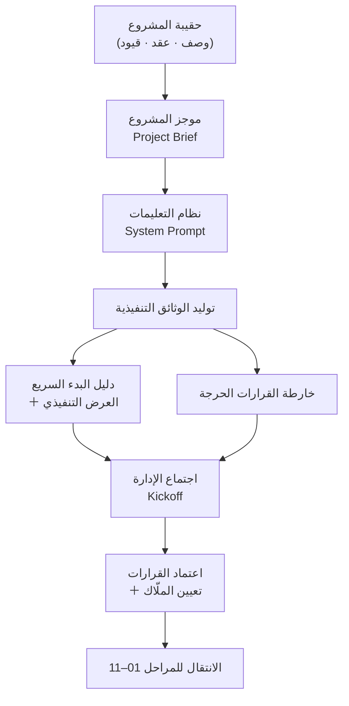

# 00 · الوثائق التنفيذية والتوجيه

> [!abstract] ماذا ستتعلّم هنا
> - ما معنى "مرحلة البدء والتوجيه" (Project Initiation) ولماذا تسبق كل شيء آخر.
> - كيف تصنع أدوات القيادة العليا: دليل البدء السريع، العرض التنفيذي، وخارطة القرارات الحرجة (Critical Decisions Map).
> - كيف تبني "نظام تعليمات" (System Prompt) وقوالب قابلة لإعادة الاستخدام تضمن اتساق الجودة عبر كل مرحلة لاحقة.
> - من أين تجمع معلومات كل وثيقة، وكيف ترتّبها، وكم تستغرق، ومن يُنتجها.
> - كيف تربط هذه المرحلة بميثاق المشروع (Project Charter) ومسار التصعيد (Escalation Path) في نظام حوكمة متكامل.
>
> لتثبيت الصورة الكبرى، اربط كل ما هنا بدور القائد نفسه: [[مدير المشاريع البرمجية الحديث]].

## 🧭 المفهوم ببساطة

تخيّل قبطان طائرة قبل الإقلاع. لا يلمس عصا التحكّم قبل أن يُنهي "قائمة ما قبل الإقلاع" (Pre-flight Checklist): وجهة محددة، خطة طيران، من يقرّر ماذا، وما الخطر الذي يوقف الرحلة. لو أقلع بلا هذه القائمة، قد يطير لكنه لا يعرف إلى أين ولا متى يتدخّل.

مرحلة "الوثائق التنفيذية والتوجيه" هي هذه القائمة تمامًا. إنها **طبقة الحوكمة الفوقية** (Executive Layer) للمشروع: لا تُنتج شيفرة ولا شاشات، بل تُنتج **الأدوات التي تُدار بها بقية الوثائق**. هنا تُصاغ رسالة الإدارة العليا، وتُحسم القرارات الحاكمة، ويُتّفق على "لغة عمل" واحدة قبل أن تُكتب أي وثيقة نطاق أو خطة. في دورة حياة المشروع (Project Life Cycle) تقابل هذه المرحلة نقطة **بدء التشغيل** (Initiation / Kickoff Governance) — نقطة الصفر التي منها تنطلق كل مرحلة أخرى.

## 🧩 قاموس سريع للمصطلحات

| المصطلح (عربي) | English | المعنى ببساطة |
|---|---|---|
| مرحلة البدء | Project Initiation | أول مرحلة رسمية: تحسم "لماذا" و"من يقرّر" قبل "كيف". |
| طبقة الحوكمة الفوقية | Executive / Governance Layer | وثائق تُدير بها المشروع، لا مخرجات المشروع نفسه. |
| اجتماع الانطلاق | Kickoff Meeting | أول لقاء رسمي يوحّد فهم الفريق والمنفّذ للمشروع. |
| خارطة القرارات الحرجة | Critical Decisions Map | لوحة قيادة تجمع كل قرار يجب حسمه الآن مع مالكه وموعده. |
| نظام التعليمات | System Prompt | نص جاهز يُلقّن الذكاء الاصطناعي أسلوبك فيوحّد جودة المخرجات. |
| موجز المشروع | Project Brief | صفحة تُلخّص المشروع: الوصف، الجمهور، القيود، المخاطر. |
| الراعي التنفيذي | Executive Sponsor | صاحب القرار الأعلى الذي يعتمد ويموّل ويفتح الأبواب. |
| قابلية إعادة الاستخدام | Reusability | تصميم القالب مرة واحدة لاستخدامه في كل مشروع قادم. |

## ⛓️ لماذا تأتي هنا وتقود للتالية

**ما قبلها:** لا تفترض هذه المرحلة وجود أي وثيقة أخرى — هي نقطة الصفر. الشرط الوحيد السابق لها هو تجهيز "حقيبة المشروع" الأولية: وصف المشروع، أي عرض/عقد من المنفّذ، معلومات الفريق، والقيود (الميزانية والمدة والتنظيم). هذا هو ما يسمّيه دليل التأسيس "المرحلة 0".

**ما بعدها:** مخرجاتها تُغذّي كل شيء. خارطة القرارات الحرجة تُحيل كل قرار إلى مجلده: الحوكمة [[01 - الحوكمة|01]]، والنطاق [[02 - النطاق والمتطلبات|02]]، والقانوني [[07 - التسليم والقانوني|07]]، والتقني [[09 - التوثيق التقني|09]]. بهذا تعمل كـ**فهرس تنقّل** (Index) يرتّب أولويات بقية الحزمة. هذه المرحلة لا "تُنفَّذ" بمعنى تسليم مخرج عمل، بل هي **غرفة التحكّم** التي يُقرأ منها إلى أين نتجه — ولهذا هي الرقم 00.

## 📊 مخطّط سير العمل

## 📂 مستندات هذه المرحلة — واحدًا واحدًا

> 📂 مستندات هذه المرحلة (في مستودع المشروع)

### 1) دليل البدء السريع للإدارة

> [!info] ما هو ولماذا
> صفحة واحدة تُلخّص حزمة إدارة المشروع بالكامل للمدير العام والمدير التنفيذي: الوضع باختصار، أهم المخاطر، القرارات المطلوبة الآن، والخطوات القادمة. غرضه أن يفهم صاحب القرار المشروع في دقيقتين ويعتمد ما يلزم.

- **📥 من أين تجمع معلوماته:** من تحليل عرض المنفّذ، من تقييم المخاطر، ومن مدير المشروع الذي يستخلص "الوضع باختصار". القرارات المطلوبة تُشتق من خارطة القرارات الحرجة.
- **🛠️ كيف ترتّبه:** ابدأ بجملة الوضع، ثم جدول أهم 5 مخاطر، ثم قائمة القرارات المرقّمة، ثم جدول الخطوات الثلاث (هذا الأسبوع / أسبوعان / مستمر). لا تتجاوز صفحة.
- **🎯 فائدته:** يختصر مسافة القرار — يمنح الإدارة صورة تنفيذية بلا غرق في التفاصيل، فيتسارع الاعتماد.
- **الملفات:** «دليل البدء السريع (Markdown)» · «نسخة العرض (HTML)»

> [!example] من عافية
> لخّص الدليل الوضع بجملة واحدة: المشروع انطلق "بلا أساس تعاقدي وتقني سليم"، وتقييم عرض المنفّذ 4.3/10 كوثيقة مشروع. ثم حدّد 5 مخاطر (جدول زمني وهمي، لا عقد حقيقي، سعر مريب، ادعاء HIPAA وهمي، نقل بيانات للخارج) و5 قرارات مطلوبة فورًا.

### 2) العرض التقديمي للإدارة

> [!info] ما هو ولماذا
> نسخة عرض (Presentation) من دليل البدء، مصمّمة للعرض على شاشة في اجتماع الإدارة. نفس الرسائل لكن بصيغة شرائح بصرية تُسهّل النقاش والاعتماد الجماعي.

- **📥 من أين تجمع معلوماته:** مباشرة من دليل البدء السريع — هو تحويل بصري له، لا محتوى جديد.
- **🛠️ كيف ترتّبه:** شريحة لكل فكرة: الوضع، المخاطر، القرارات، الخطوات، المؤشر التنفيذي (أحمر → أخضر بعد الحزمة).
- **🎯 فائدته:** يجعل اجتماع الإدارة منظّمًا وموجّهًا نحو قرار، لا نقاشًا مفتوحًا.
- **الملف:** «العرض التقديمي (HTML)»

> [!example] من عافية
> استُخدم العرض ليضع أمام الإدارة "المؤشر التنفيذي": الحالة الحالية 🔴 تحتاج إعادة ضبط عاجلة، وبعد تطبيق الحزمة 🟢 تحكّم كامل ورؤية كل أسبوعين.

### 3) خارطة القرارات الحرجة

> [!info] ما هو ولماذا
> وثيقة تنفيذية واحدة تجمع كل قرار يجب حسمه الآن قبل أن يتحوّل إلى مشكلة مكلفة. تُرتّب حسب الإلحاح، وكل قرار له: المالك، الموعد، الأثر، ومكان التفاصيل. تُستخدم كلوحة قيادة في الاجتماع.

- **📥 من أين تجمع معلوماته:** من مدير المشروع (يستخلص القرارات العالقة)، من العقد والعرض (فجواته التعاقدية)، ومن جلسات الفريق التقني (قرارات System Design).
- **🛠️ كيف ترتّبه:** ثلاثة مستويات إلحاح: 🔴 عاجل (هذا الأسبوع) · 🟠 مهم (أسبوعان) · 🟡 تنظيمي (شهر). لكل قرار رقم (D1, D2...) وجدول: القرار، لماذا حرج، المالك، الموعد، الحالة (⬜ → 🔄 → ✅).
- **🎯 فائدته:** يمنع تعثّر المشروع بقرار منسيّ، ويوزّع المساءلة بوضوح.
- **الملفات:** «خارطة القرارات الحرجة (Markdown)» · «المتتبّع القابل للتحرير (CSV)»

> [!example] من عافية
> صنّفت الخارطة 16 قرارًا. في المستوى الأحمر: اعتماد استراتيجية إعادة الضبط (D1)، طلب وصول Git الآن (D2)، تعيين مستشار تقني (D3)، وحسم مكان الاستضافة داخل السعودية (D4). والقاعدة الذهبية: لا تنتقل لتفاصيل التنفيذ قبل إغلاق قرارات المستوى الأول.

### 4) دليل تأسيس مشروع جديد (PMO Starter Kit)

> [!info] ما هو ولماذا
> "التاج" الذي يحوّل الحزمة من ملفات مشروع واحد إلى **نظام إدارة مشاريع قابل لإعادة الاستخدام**. يشرح خطوة بخطوة كيف تُنشئ حزمة كاملة لأي مشروع قادم في ساعات بدل أسابيع.

- **📥 من أين تجمع معلوماته:** خبرة مدير المشروع المتراكمة، وهيكل المجلدات الـ11، ونموذج "موجز المشروع".
- **🛠️ كيف ترتّبه:** مراحل مرقّمة: (0) اجمع الحقيبة، (1) أنشئ الهيكل، (2) ولّد الملفات بالترتيب، (3) خصّص، (4) املأ موجز المشروع، ثم قائمة تحقق الجاهزية.
- **🎯 فائدته:** يضمن أن كل مشروع يبدأ بنفس الجودة العالية من اللحظة الأولى — منهجية شخصية تنمو مع كل مشروع.
- **الملف:** «دليل التأسيس (PMO Starter Kit)»

> [!example] من عافية
> يعرض الدليل ترتيب توليد الوثائق: أسئلة تحليل الأعمال أولًا، ثم النطاق و[[BRD]] و[[SOW]]، ثم الأدوار والتواصل، وصولًا إلى [[OKR]]/[[KPI]] وكتيّب العمليات — كل ملف مع مصدره ومتى يُنتَج.

### 5) نظام التعليمات (System Prompt)

> [!info] ما هو ولماذا
> نص جاهز تلصقه في بداية أي محادثة مع ذكاء اصطناعي، فيتقمّص دور "مساعد مدير المشاريع" بمنهجيتك. الغرض: مخرجات بنفس الجودة والأسلوب في كل مرة.

- **📥 من أين تجمع معلوماته:** مبادئ عملك (لا اتفاقات شفهية، [[MVP]] أولًا، ربط الدفعات بمعايير القبول)، وسياقك (السعودية، [[PDPL]]، مدى)، ومعايير المخرجات.
- **🛠️ كيف ترتّبه:** أقسام واضحة: الدور والمبادئ، السياق، المنهجية، معايير المخرجات، طريقة التعامل مع الطلبات. ضع الحقول القابلة للتعديل بين [أقواس].
- **🎯 فائدته:** يوحّد الجودة ويقلّل التذبذب — أداة "ذاتية التشغيل" لإنتاج حزمة متكاملة.
- **الملف:** «نظام التعليمات (System Prompt)»

> [!example] من عافية
> يُلقّن النظام المساعد: "تميّز بين ما نريده (متطلبات العمل) وكيف يُنفّذ (التقني)"، و"لا تعتمد على الاتفاقات الشفهية — كل شيء يُوثّق"، و"العلاقة مع المنفّذ: مالك منتج ومدير تعاقد، لا micromanagement".

### 6) فهرس القوالب القابلة لإعادة الاستخدام

> [!info] ما هو ولماذا
> فهرس لأوراق مواصفات (Specs) وPrompts تُنتج ملفات احترافية موحّدة الجودة لأي مشروع (حالات اختبار، سجل أخطاء، متتبع ميزات، سجل مخاطر...). مكتبة قوالبك المركزية.

- **📥 من أين تجمع معلوماته:** من القوالب التي بُنيت في مشاريع سابقة داخل المنظمة، ومن المعايير الموحّدة للتنسيق.
- **🛠️ كيف ترتّبه:** جدول لكل قالب: اسمه، ورقة مواصفاته، نسخته التفاعلية (Excel)، وغرضه. ثم قسم المعايير الموحّدة (RTL، رؤوس مجمّدة، قوائم منسدلة، ألوان تلقائية).
- **🎯 فائدته:** يوفّر الوقت ويضمن اتساقًا احترافيًا عبر كل ملفاتك.
- **الملف:** «فهرس القوالب»

> [!example] من عافية
> وحّد الفهرس معايير كل الملفات: اتجاه RTL، رأس أزرق `1F4E78` بخط أبيض مجمّد، Data [[Customer and Market Validation|Validation]] للحالات، وتنسيق شرطي (أخضر/أحمر/كهرماني) — وكل CSV بترميز UTF-8 BOM لتظهر العربية سليمة في Excel.

### 7) ملف التسليم والمتابعة (Handover)

> [!info] ما هو ولماذا
> ملف تلصقه في بداية أي دردشة جديدة لمتابعة العمل دون فقدان السياق: نبذة المشروع، السياق الحرج، ما أُنجز، والخطوات التالية. جسر بين جلسات العمل.

- **📥 من أين تجمع معلوماته:** من حالة المشروع الحالية ومحضر آخر جلسة عمل. يُحدَّث عند كل انتقال.
- **🛠️ كيف ترتّبه:** نبذة سريعة، السياق الحرج، جدول ما أُنجز (المجلدات 00–11)، كيف تُكمل، وقائمة أفكار للخطوات التالية.
- **🎯 فائدته:** يحفظ الذاكرة المؤسسية — العمل محفوظ في الملفات، والدردشة مجرد أداة لا مخزن.
- **الملف:** «ملف التسليم والمتابعة (Handover)»

> [!example] من عافية
> يوثّق الملف السياق الحرج في سطور: العرض 4.3/10، الجدول الواقعي 7–12 شهرًا، التحوّل من HIPAA إلى PDPL، بوابة تدعم مدى، واستضافة داخل السعودية — فتبدأ أي دردشة جديدة من نقطة واعية بكل ذلك.

## ⏱️ إدارة وقت هذه المهمة

| حجم المشروع | المدة التقريبية لإنتاج طبقة التوجيه |
|---|---|
| صغير | ساعات إلى يوم (دليل بدء + خارطة قرارات مختصرة) |
| متوسط | يومان إلى أسبوع (الحزمة التنفيذية كاملة + عرض) |
| كبير | أسبوع إلى أسبوعين (توجيه + ميثاق مشروع معتمد + جلسات حوكمة) |

**من يُنتج المستند وكيف يتعاونون:** غالبًا شخص واحد (مدير المشروع) يصوغ المسودات، بمساعدة الذكاء الاصطناعي عبر System Prompt. ثم يراجعها 2–3 من الإدارة (المدير العام، التنفيذي) في اجتماع اعتماد. التدفق: مدير المشروع يسوّد ← يعرض على الإدارة ← تُحسم القرارات وتُعيّن الملّاك ← يُحدَّث ملف التسليم.

**أي ملفات تراجع:** راجع دليل البدء والعرض قبل كل اجتماع إدارة، وراجع خارطة القرارات أسبوعيًا حتى تُغلق قرارات المستويين 1 و2، وحدّث ملف التسليم عند نهاية كل جلسة.

**صيغ الملفات:**

| النوع | الصيغة المناسبة | مثال هنا |
|---|---|---|
| سجلات/متتبعات | Excel / CSV | متتبع القرارات الحرجة |
| أدلة ونصوص توجيهية | Word / Markdown | دليل البدء، System Prompt |
| عروض ووثائق رسمية | PDF / HTML | العرض التقديمي للإدارة |

> [!warning] الدقة قبل السرعة
> طبقة التوجيه تُبنى مرة وتُقرأ عشرات المرات. خطأ في قرار حرج أو مالك غير محدّد يكلّف أضعاف الوقت الذي وفّرته. أتقنها ولو تأخّرت قليلًا.

## 🌐 ما تقوله المعايير الحديثة

> [!quote] خلاصة البحث (2026)
> تطوّرت مكاتب إدارة المشاريع (PMO) من "آلية امتثال" إلى **محرّك استراتيجي لخلق القيمة** — بل يسمّيها بعضهم "مكاتب تسليم القيمة" (Value Delivery Offices) تركّز على النتائج لا المخرجات. المعايير الحديثة تشدّد على: (1) حوكمة واضحة تحدّد **من يقرّر، كيف يُراقَب الأداء، كيف تُصعَّد المخاطر، وكيف تُحفظ المساءلة** من البدء حتى الإغلاق. (2) دعم تنفيذي قوي (Executive Sponsorship) شرطٌ للنجاح لا رفاهية. (3) البدء بـ**تجربة صغيرة ([[Pilot Launch|Pilot]])** لإثبات العائد قبل التوسّع. (4) مقاييس قائمة على القيمة: المنافع المحقّقة مقابل المخطّطة، نسبة المواءمة الاستراتيجية، وسرعة الوصول للسوق. وهذا يطابق تمامًا منطق مرحلتنا: نحسم القرارات والملّاك والمخاطر أولًا، ونبدأ بـ MVP بدل "Big Bang".
>
> يرتبط هذا مباشرة بـ [[مدير المشاريع البرمجية الحديث|مثلث كفاءات PMI]] (Talent Triangle): طرائق العمل، ومهارات القوة التشاركية (Power Skills — أوسع من القيادة وحدها: تواصل، وتعاون، وعقلية متكيّفة)، وذكاء الأعمال — وطبقة التوجيه هي حيث تجتمع الثلاثة.

## ➕ لإكمال الصورة — تحسينات مقترحة

> [!todo] ما ينقص مقابل المعايير وكيف تكمله
> - **ميثاق مشروع رسمي (Project Charter):** الحزمة تبدأ بدليل بدء وخارطة قرارات، لكن المعايير (PMI) تجعل الميثاق هو وثيقة "إذن الانطلاق" الرسمية التي تُسمّي الراعي وتفوّض مدير المشروع. أكملها عبر: [[ميثاق المشروع (Project Charter)]].
> - **مسار تصعيد واضح (Escalation Path):** خارطة القرارات تُسمّي الملّاك لكنها لا تحدّد ماذا يحدث إذا تعطّل قرار أو تجاوز صلاحية مالكه. أكمله عبر: [[مسار التصعيد (Escalation Path)]].
> - **معيار موضوعي لتقييم المنفّذ:** القرار D3 (تعيين مستشار تقني) يحتاج أداة قياس، لا انطباعًا. أكمله عبر: [[بطاقة تقييم المورّد (Vendor Scorecard)]].
> - **تحليل أصحاب المصلحة (Stakeholder Analysis):** طبقة التوجيه تُخاطب الإدارة لكنها لا تصنّف كل الأطراف وتأثيرهم. للمفهوم العام راجع [[21 - Stakeholder Communication]].
> - **تسجيل المخاطر مبكرًا:** أهم 5 مخاطر مذكورة في دليل البدء، لكنها تحتاج سجلًا حيًّا. للمفهوم العام راجع [[19 - Risk Management]].

## 🎬 سيناريوهان

> [!success] الطريقة الصحيحة
> **سلمى، مديرة مشروع عافية.** قبل أي اجتماع تنفيذي، بنت خارطة قرارات حرجة من 16 بندًا مرتّبة حسب الإلحاح، وأسندت لكل قرار مالكًا وموعدًا. في اجتماع الإدارة عرضتها كلوحة قيادة، فحُسم قرار الاستضافة داخل السعودية (D4) وطلب وصول Git (D2) في نصف ساعة. النتيجة: انطلق المشروع بأساس واضح، وما احتاج قرار عاد فيه أحد للنقاش لأنه موثّق ومملوك. توفّرت أسابيع كانت ستُهدر في الالتباس.

> [!failure] الطريقة الخاطئة
> **فهد، مدير مشروع منافس.** بدأ التنفيذ مباشرة "لتوفير الوقت"، بلا دليل بدء ولا خارطة قرارات. اتُّخذت القرارات شفهيًا في واتساب، ونُسي قرار مكان الاستضافة. بعد ثلاثة أشهر اكتُشف أن البيانات الصحية مستضافة خارج السعودية — مخالفة محتملة لـ PDPL — واحتاج المشروع نقلًا كاملًا وإعادة عمل مكلفة. لا أحد كان "مالك" القرار، فتحوّل اللوم إلى نزاع. خسر أشهرًا ومصداقية أمام الإدارة.

## 🧩 قرارات تفاعلية (فكّر ثم افتح)

> [!question]- الموقف الأول: عرض المنفّذ يبدو رخيصًا وسريعًا (4 أشهر، 50+ ميزة). المدير العام متحمّس للتوقيع فورًا. ماذا تفعل؟
> - (أ) توقّع لتلحق بالسوق.
> - (ب) ترفض المشروع كلّيًا.
> - (ج) تصنع دليل بدء يكشف المخاطر ويؤجّل التوقيع حتى تُحسم القرارات الحرجة.
>
> ✅ **الأفضل: (ج).**
> **لماذا؟** السعر المنخفض والجدول القصير مؤشرا خطر (قالب جاهز + تكاليف مخفية)، لا فرصة. التوقيع الفوري (أ) يقفل نزاعًا مكلفًا، والرفض الكامل (ب) يهدر فرصة حقيقية. دليل البدء يمنح الإدارة رؤية موضوعية (تقييم 4.3/10) ويشتري وقتًا لحسم الأساس التعاقدي والتقني.
> **السيناريو المثالي:** تعرض دليل البدء + خارطة القرارات في اجتماع، تُحسم استراتيجية إعادة الضبط، وتُربط الدفعات بمعايير قبول قبل أي التزام.

> [!question]- الموقف الثاني: بدأت مشروعًا ثانيًا وأنت مشغول. الإدارة تريد الوثائق التنفيذية "أمس". كيف تنتجها بجودة وسرعة؟
> - (أ) تكتب كل شيء من الصفر يدويًا.
> - (ب) تنسخ ملفات عافية كما هي.
> - (ج) تستخدم System Prompt ودليل التأسيس لتوليد حزمة مخصّصة.
>
> ✅ **الأفضل: (ج).**
> **لماذا؟** الكتابة من الصفر (أ) بطيئة وتُعيد اختراع العجلة. النسخ الحرفي (ب) يورّث سياق مشروع لا يخصّك (PDPL قد لا ينطبق، منفّذ مختلف). System Prompt + دليل التأسيس يجمعان السرعة والتخصيص: قوالب مجرّبة تُملأ بموجز مشروعك الجديد.
> **السيناريو المثالي:** تملأ "موجز المشروع"، تلصق System Prompt، وتولّد الوثائق بالترتيب المنطقي، ثم تخصّص القيود المحلية — حزمة كاملة في ساعات.

## 🧠 أسئلة تفكير ناقد وعصف ذهني (بلا إجابة واحدة)

> [!question] فكّر بعمق
> - متى تصبح "طبقة الحوكمة" عبئًا بيروقراطيًا بدل أداة تسريع؟ أين الخط الفاصل في مشروع صغير؟
> - لو كان المنفّذ في دولة أخرى ويرفض التوثيق ويفضّل الاتفاقات الشفهية، كيف تفرض ثقافة "كل شيء يُوثّق" دون أن تكسر العلاقة؟
> - هل الاعتماد على الذكاء الاصطناعي (System Prompt) لتوليد الوثائق يرفع الجودة أم يخلق "توهّم اكتمال" يخفي فجوات التفكير الحقيقي؟

> [!tip] إطار الإجابة (4 خطوات)
> 1. **حدّد المتغيّر الحاكم:** ما الذي يقرّر الإجابة فعلًا؟ (حجم المشروع، ثقة الطرفين، درجة المخاطرة).
> 2. **وازن التكلفة مقابل القيمة:** كل وثيقة تكلّف وقتًا وتشتري تقليل مخاطر — متى يتساوى الطرفان؟
> 3. **اختبر بالحالة الحديّة:** جرّب فكرتك على مشروع بيوم واحد وعلى مشروع بسنتين — هل تصمد؟
> 4. **اقترح آلية لا قاعدة جامدة:** بدل "دائمًا وثّق كل شيء"، صمّم عتبة (مثلًا: أي قرار يؤثّر على المال أو الأمان أو الجدول يُوثّق كتابيًا). مثال اتجاه: في مشروع صغير، دليل بدء من صفحة + خارطة قرارات من 5 بنود قد يكفيان.

## ❓ نقاط للمراجعة (استرجاع)

> [!question]- ما الفرق الجوهري بين "طبقة الحوكمة الفوقية" ومخرجات المشروع نفسه؟
> طبقة الحوكمة (الوثائق التنفيذية) تُنتج **الأدوات التي تُدار بها** بقية الوثائق (أدلة، قرارات، تعليمات)، ولا تُنتج شيفرة أو شاشات. مخرجات المشروع هي المنتج الفعلي. طبقة 00 هي "غرفة التحكّم"، لا خط الإنتاج.

> [!question]- ما المستويات الثلاثة في خارطة القرارات الحرجة؟
> 🔴 عاجل (هذا الأسبوع — يحجب التقدّم) · 🟠 مهم (خلال أسبوعين — يحدّد المسار) · 🟡 تنظيمي (خلال شهر — يثبّت العملية). والقاعدة: لا تنتقل لتفاصيل التنفيذ قبل إغلاق المستوى الأول.

> [!question]- لماذا يُعدّ System Prompt جزءًا من طبقة التوجيه؟
> لأنه يوحّد **أسلوب وجودة المخرجات** عبر كل مرحلة لاحقة. بدله تتذبذب الوثائق حسب المزاج والأداة؛ به تصبح الحزمة "ذاتية التشغيل" ومتّسقة.

> [!question]- ما "حقيبة المشروع" ولماذا هي شرط سابق لهذه المرحلة؟
> هي المواد الأولية: وصف المشروع، أي عرض/عقد، معلومات الفريق، والقيود (ميزانية/مدة/تنظيم). بدونها تُبنى الوثائق على فراغ. تُسمّى "المرحلة 0" في دليل التأسيس.

> [!question]- كيف تربط طبقة التوجيه بقية مجلدات الحزمة؟
> عبر خارطة القرارات التي **تُحيل** كل قرار إلى مجلده (01 حوكمة، 02 نطاق، 07 قانوني، 09 تقني)، فتعمل كفهرس تنقّل وترتيب أولويات لبقية المراحل.

> [!question]- لماذا "الدقة قبل السرعة" في هذه المرحلة تحديدًا؟
> لأن هذه الوثائق تُبنى مرة وتُقرأ عشرات المرات، وقرار حرج خاطئ أو مالك غير محدّد يكلّف أضعاف الوقت الموفّر. خطأ هنا يتضاعف في كل مرحلة تالية.

## 💼 من أسئلة المقابلات

> [!question]- "كيف تبدأ مشروعًا جديدًا من الصفر؟ ما أول ما تفعله؟"
> **إجابة نموذجية:** لا أبدأ بالتنفيذ بل بالبدء (Initiation). أولًا أجمع "حقيبة المشروع" (الوصف، العقد، القيود، الفريق). ثم أصوغ موجز مشروع وميثاقًا (Charter) يُسمّي الراعي ويفوّضني. بعدها أُنتج طبقة توجيه: دليل بدء للإدارة وخارطة قرارات حرجة بملّاك ومواعيد. وأختم باجتماع انطلاق (Kickoff) يوحّد الفهم قبل أي بناء. المبدأ: أحسم "لماذا ومن يقرّر" قبل "كيف".

> [!question]- "أخبرني عن موقف واجهت فيه غياب التوثيق أو قرارات شفهية، وكيف تصرّفت؟" (STAR)
> **إجابة نموذجية:** *الموقف:* مشروع بدأ باتفاقات شفهية على واتساب. *المهمة:* منع تحوّلها إلى نزاع. *الفعل:* بنيت خارطة قرارات حرجة، وثّقت كل قرار عالق بمالك وموعد، ووحّدت قناة التواصل الرسمية. *النتيجة:* أُغلقت القرارات كتابيًا، واختفت النزاعات حول "من قال ماذا"، وتسارع الاعتماد.

> [!question]- "كيف تتعامل مع راعٍ تنفيذي (Sponsor) يريد التوقيع فورًا رغم مخاطر واضحة؟"
> **إجابة نموذجية:** لا أعارض عاطفيًا بل أُظهر الحقائق. أُعدّ دليل بدء من صفحة يعرض تقييمًا موضوعيًا للمخاطر (مثلًا 4.3/10 كوثيقة مشروع) ويقترح مسارًا بديلًا (إعادة ضبط + ربط الدفعات بمعايير قبول). أُحوّل القرار من "نعم/لا" إلى "كيف نحميه"، فأحفظ العلاقة وأحمي المشروع في آن.

> [!question]- "ما الذي يجعل مشروعًا 'جاهزًا للانطلاق' من منظورك؟"
> **إجابة نموذجية:** أن تُحسم قرارات المستوى الحرج ولها ملّاك، أن يوجد ميثاق ونطاق MVP معتمد، أن تكون قناة التواصل ومسار التصعيد واضحين، وأن يكون الفريق والمنفّذ متّفقين على إيقاع عمل (Scrum + تقرير أسبوعي). الجاهزية ليست "كل شيء مكتوب"، بل "لا قرار حاجب معلّق".

> [!tip] إطار STAR
> في أسئلة المواقف استخدم STAR: **S**ituation (الموقف) · **T**ask (المهمة) · **A**ction (الفعل) · **R**esult (النتيجة). اجعل النتيجة قابلة للقياس (وقت وُفّر، نزاع مُنع، قرار حُسم) لتترك أثرًا.

## 🧪 من مبتدئ إلى محترف

> [!success] مسار التدرّج
> **مبتدئ:** تعرف أن المشروع يبدأ بمرحلة "بدء" لا بالتنفيذ. تكتب دليل بدء بسيطًا وقائمة قرارات، وتفهم من هو الراعي التنفيذي.
>
> **متوسّط:** تبني خارطة قرارات حرجة مرتّبة بملّاك ومواعيد، تربطها بمجلدات الحزمة، وتصوغ ميثاق مشروع. تدير اجتماع انطلاق منظّمًا وتحوّل القرارات الشفهية إلى موثّقة.
>
> **محترف:** تصمّم **نظامًا** قابلًا لإعادة الاستخدام (System Prompt + مكتبة قوالب + دليل تأسيس)، تنتج حزمة متكاملة لأي مشروع في ساعات، وتفصّل عمق الحوكمة حسب حجم المشروع ومخاطره بدل قاعدة جامدة. تقود الإدارة العليا نحو قرار بالحقائق لا بالانطباع.

## 🔗 ربط بالمفاهيم

- [[15 - Roadmap]]
- [[19 - Risk Management]]
- [[21 - Stakeholder Communication]]
- [[04 - Waterfall]]
- [[مدير المشاريع البرمجية الحديث]]

## 📌 بطاقة مرجعية سريعة

| البند | الخلاصة |
|---|---|
| **الغرض** | بناء طبقة التوجيه: أدوات تُدار بها بقية الوثائق |
| **المخرجات** | دليل البدء · العرض · خارطة القرارات · System Prompt · دليل التأسيس · التسليم |
| **الشرط السابق** | حقيبة المشروع (وصف · عقد · قيود · فريق) |
| **تقود إلى** | كل المجلدات 01–11 عبر خارطة القرارات كفهرس |
| **من يُنتجها** | مدير المشروع (يسوّد) + الإدارة (تعتمد) |
| **الصيغ** | Markdown/Word للأدلة · CSV/Excel للسجلات · PDF/HTML للعروض |

> [!tip] قواعد ذهبية
> - لا قرار شفهي — كل شيء يُوثّق بمالك وموعد.
> - لا تنتقل للتنفيذ قبل إغلاق قرارات المستوى الحرج.
> - ابنِ نظامًا قابلًا لإعادة الاستخدام، لا ملفات مشروع واحد.

> [!quote] مصادر
> - [Project Management Office (PMO) – A 2026 Guide (Celoxis)](https://www.celoxis.com/article/project-management-office-pmo-guide)
> - [What is project governance? A complete guide (Rocketlane)](https://www.rocketlane.com/blogs/what-is-project-governance)
> - [Project Governance: Critical Success Factor (PMI)](https://www.pmi.org/learning/library/project-governance-critical-success-9945)
> - [Top Project Management Interview Questions & Answers 2026 (Productive)](https://productive.io/blog/project-management-interview-questions/)
