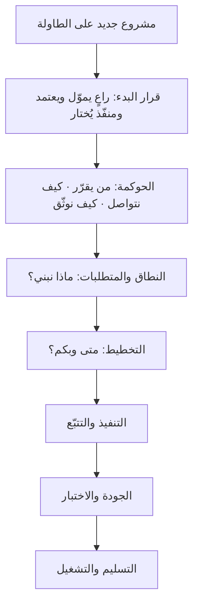
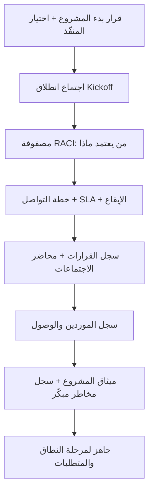
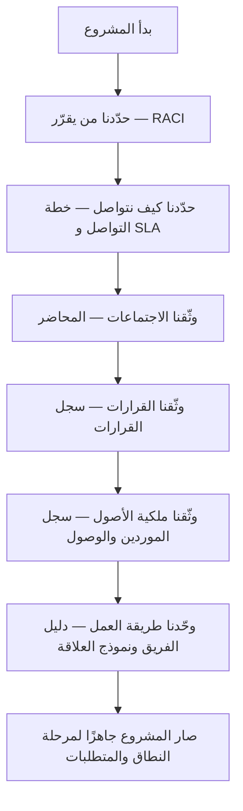

# 01 · الحوكمة (Governance)

> [!abstract] ماذا ستتعلّم هنا
> - **أين تقع الحوكمة** من دورة حياة المشروع، ولماذا هي *تجهيز* المشروع لا المشروع نفسه.
> - ما **الحوكمة** ولماذا هي أوّل خطوة.
> - **مستندات الحوكمة السبعة**: ما كلٌّ منها، من أين تجمع معلوماته، وفائدته.
> - لكل مستند: **المشكلة التي وُلد منها · مدخلاته ومخرجاته · دورة حياته · ماذا يحدث لو أهملته · هل يمكن الاستغناء عنه**.
> - **سلسلة المستندات**: كيف يولّد كلٌّ منها الذي بعده، بدل أن تكون ملفات متجاورة في مجلد.
> - **كم من الوقت** تستغرق، **ومن** يُنتجها، **وبأي صيغ ملفات**.
> - إدارة **علاقة المنفّذ الخارجي** باحتراف، مع سيناريوهات وقرارات وأسئلة مقابلات.
>
> 🔗 المرجع العام: [[مدير المشاريع البرمجية الحديث]].

---

## 🗺️ الصورة الكبيرة — أين تقع الحوكمة داخل المشروع؟

قبل أي تفصيل، ضع هذه الخريطة في ذهنك؛ فهي تختصر نصف الحيرة التي يقع فيها المبتدئ:

اقرأ الخريطة بجملة واحدة: **الحوكمة ليست المشروع، وإنما هي تجهيز المشروع.** لا تُنتج شاشة ولا شيفرة ولا ميزة يراها المستخدم، بل تُنتج **الشروط التي تجعل بقية المراحل ممكنة**. ولهذا تُقاس بأثرها فيما بعدها، لا بحجمها في ذاتها.

> [!tip] وأين تقع المرحلة 00 إذن؟
> [[00 - الوثائق التنفيذية|طبقة التوجيه التنفيذي (00)]] تقع في الصندوق الثاني: هي التي تحسم **قرار البدء** وتُسمّي الراعي وتفتح خارطة القرارات الحرجة. أمّا الحوكمة (01) فتأتي بعدها لتحوّل ذلك القرار إلى **نظام عمل يوميّ**: مالك لكل نشاط، وقناة لكل رسالة، وسجلّ لكل قرار. الأولى تقول «نبدأ ومع من»، والثانية تقول «وكيف ندير ما بدأناه».

---

## 🧭 المفهوم ببساطة (ابدأ من هنا)

تخيّل مباراة كرة قبل أن يتّفق الفريقان على **القواعد**: من الحكم؟ من يسجّل؟ ماذا يُحتسب خطأ؟ ستصبح فوضى. **الحوكمة** هي «القواعد قبل اللعبة» في المشروع.

تُجيب على أربعة أسئلة قبل أي عمل فعلي:
1. **من يقرّر؟** 2. **من ينفّذ؟** 3. **من يُبلَّغ؟** 4. **كيف تُوثَّق القرارات؟**

بدونها تنهار أي منهجية — Agile أو Waterfall — لأن لا أحد يعرف «من يعتمد ماذا».

---

## 🧩 قاموس سريع للمصطلحات

| المصطلح | معناه ببساطة |
| --- | --- |
| **الحوكمة (Governance)** | إطار القرار والمسؤولية والتواصل |
| **RACI** | من يُنفّذ / يُحاسَب / يُستشار / يُبلَّغ |
| **صاحب المصلحة (Stakeholder)** | من يؤثّر في المشروع أو يتأثّر به |
| **المنفّذ / التعهيد (Vendor / Outsourcing)** | جهة خارجية تنفّذ مقابل عقد |
| **SLA** | زمن استجابة متّفق عليه |
| **التصعيد (Escalation)** | رفع مشكلة عالقة لمستوى أعلى |
| **سجل القرارات (Decision Log)** | مكان واحد لتوثيق كل قرار |
| **الراعي (Sponsor)** | صاحب القرار الأعلى ومموّل المشروع |

---

## ⛓️ لماذا الحوكمة أوّلًا؟ (التبعية)

تأتي **أوّلًا** لأنها لا تحتاج جاهزية شيء آخر. تحتاج فقط قرارًا واحدًا: أن المشروع سيبدأ ومع من.

وما تنتجه شرطٌ لما بعده: **لا يمكن توثيق المتطلبات قبل معرفة من يملك حقّ اعتمادها.**

## 📊 مخطّط سير عمل الحوكمة

---

## 🔗 سلسلة المستندات — كيف يولّد كلٌّ منها الذي بعده

أكثر ما يُفسد فهم الحوكمة أن تبدو مجلدًا مليئًا بملفات مستقلّة، وأن يُسأل عن كل ملف: «وهل أحتاج هذا أيضًا؟». والحقيقة أنها **سلسلة**: مخرَج كل مستند هو مُدخَل الذي يليه، ومن هنا يأتي ترتيبها لا من ذوق كاتبها.

| المستند | يتغذّى من | يغذّي |
| --- | --- | --- |
| **اجتماع الانطلاق** | قرار البدء · العقد · قائمة الأطراف | RACI · أوّل محضر · أوّل قرارات |
| **مصفوفة RACI** | العقد · الهيكل التنظيمي · اجتماع الانطلاق | خطة التواصل (من يُبلَّغ) · سجل القرارات (من يعتمد) |
| **خطة التواصل** | RACI · ساعات عمل الفريقين | إيقاع الاجتماعات · محاضر الاجتماعات |
| **محضر الاجتماع** | جدول الأعمال · النقاش | سجل القرارات · متتبّع المهام |
| **سجل القرارات** | المحاضر · أي اتفاق شفهي | ميثاق المشروع · سجل المخاطر · [[سجل الدروس المستفادة (Lessons Learned Register)\|سجل الدروس المستفادة]] |
| **سجل الموردين والوصول** | العقد · قائمة الخدمات الحرجة | [[محضر التسليم والاستلام (Handover Acceptance Certificate)\|محضر التسليم]] · سجل المخاطر |
| **دليل عمل الفريق** | دورة العمل الفعلية · تعريف الاكتمال | إيقاع التنفيذ في [[04 - التنفيذ والتتبّع\|المرحلة 04]] |
| **نموذج إدارة العلاقة** | العقد · طبيعة الخدمة · موازين القوى | جدول الدفعات · [[بطاقة تقييم المورّد (Vendor Scorecard)\|بطاقة تقييم المورّد]] |

> [!tip] القراءة العملية للجدول
> إذا وجدت مستندًا **لا يتغذّى من شيء ولا يغذّي شيئًا**، فهو غالبًا ملف كُتب ليُقال إنه كُتب. والعكس أخطر: إذا كان مستند يغذّي ثلاثة مستندات ولم تفتحه بعدُ — كسجل القرارات — فقد أوقفت السلسلة عند حلقتها الأولى.

---

## 🏥 القصة المستمرّة — «عافية» من اليوم الأول

> [!note] حالة تعليمية مُصاغة
> «عافية» و«أُفُق للحلول الرقمية» اسمان افتراضيان، والأشخاص والحوارات في هذا الفصل **مشاهد تعليمية مُصاغة** لتقريب الفكرة، لا وقائع منسوبة إلى أحد. الثابت القابل للتحقّق هو المرجعيات النظامية والمعيارية وحدها.

> [!example] الحلقة (0) — يوم الاثنين، الساعة التاسعة
> اعتمد مجلس إدارة «عافية» إنشاء المنصة، ووُقّع مع منفّذ خارجي («أُفُق للحلول الرقمية»). في الأسبوع الأول كان ثلاثة أشخاص يرسلون تعليمات للمنفّذ في وقت واحد: المدير العام، ومدير التسويق، ومدير المشروع الجديدة **سلمى**. وكان المنفّذ ينفّذ آخر رسالة تصله.
>
> أوّل ما فعلته سلمى لم يكن جمع المتطلبات، ولم يكن مراجعة الشيفرة. كان **إيقاف التعليمات المتفرّقة** وعقد اجتماع انطلاق.
>
> وسنتابع ما فعلته بعد ذلك، مستندًا مستندًا، في «الحلقات» أسفل كل قسم.

---

## 📂 مستندات الحوكمة — واحدًا واحدًا

> لأهم المستندات نعرض القالب الكامل: **ما هو ولماذا** · 📥 **من أين تجمع معلوماته** · 🛠️ **كيف ترتّبه** · 🎯 **فائدته** · 🧪 **مثال من عافية**. أما المستندات الأبسط فتُعرض بإيجاز (ما هو + فائدته).

> [!info] كيف تقرأ كل مستند أدناه (قالب ثابت)
> يبدأ كل مستند بـ**المشكلة التي اختُرع لحلّها** قبل تعريفه، لأن العقل يتذكّر المشكلة أكثر من التعريف. ثم يمرّ بستّ محطّات ثابتة:
> 1. **ما هو ولماذا** — التعريف المختصر.
> 2. **المدخلات ← المعالجة ← المخرجات** — بمنطق هندسي: ماذا يدخل، وماذا يفعل، وماذا يخرج.
> 3. **من أين · كيف · فائدته** — مادّته وترتيبه وعائده.
> 4. **دورة حياته** — متى يُنشأ، ومتى يُحدَّث، ومتى ينتهي.
> 5. **ماذا لو لم تكتبه؟** — الثمن الفعليّ للإهمال.
> 6. **هل يمكن الاستغناء عنه؟** — لأن الغاية أن تتعلّم التفكير لا الحفظ؛ فبعض المستندات يُبسّط في مشروع صغير، وبعضها لا يُترك أبدًا.

### 1) مصفوفة RACI — من يفعل ماذا

> [!failure] لماذا اخترع الناس هذا المستند؟
> تخيّل هذا الحوار بعد أسبوعين من التأخير:
> — **المطوّر:** «ظننت أن المدير سيوافق أوّلًا.»
> — **المدير:** «ظننت أن العميل هو من يوافق.»
> — **العميل:** «ظننت أن العمل بدأ من أسبوعين!»
>
> ثلاثة أشخاص، وثلاث فرضيات، ولا سطر واحد يقول من يعتمد. من هذا الفراغ بالضبط وُلدت RACI.

> [!info] ما هو ولماذا
> جدول يُسند لكل نشاط حرفًا لكل شخص: **R** يُنفّذ · **A** يُحاسَب ويعتمد · **C** يُستشار · **I** يُبلَّغ. يقضي على «ظننت أنك ستفعلها».

> [!abstract] المدخلات ← المعالجة ← المخرجات
> **المدخلات:** العقد · الهيكل التنظيمي · قائمة الأنشطة الرئيسية.
> **المعالجة:** توزيع الحروف الأربعة على الأنشطة بقاعدة «A واحد فقط».
> **المخرجات:** مالك معتمد لكل نشاط، **وكشفٌ بالأنشطة التي لا مالك لها** — وهذا أنفع ما تخرج به.

- **📥 من أين:** العقد، اجتماع الانطلاق، الهيكل التنظيمي، قرار المدير العام حول الصلاحيات.
- **🛠️ كيف:** اكتب الأنشطة → لكل نشاط **A واحد فقط** → أضِف R ثم C ثم I.
- **🎯 فائدته:** لكل قرار مالكٌ واضح؛ لا تضارب ولا مهمة بلا صاحب.
- **♻️ دورة حياته:** تُنشأ في **أول اجتماع انطلاق** · وتُحدَّث عند دخول طرف جديد أو تغيّر الصلاحيات أو بداية مرحلة جديدة · وتبقى حتى إغلاق المشروع، ثم تُؤرشف قالبًا للمشروع التالي.
- **🚫 هل يمكن الاستغناء عنها؟** في فريق من ثلاثة يجلسون في غرفة واحدة، قد يكفي سطر في المحضر. أمّا مع **منفّذ خارجي أو أكثر من جهة تعتمد** فلا — وهذه حالتك بالضبط.
- 📄 **وثيقة مفصّلة:** [[مصفوفة المسؤوليات (RACI)]].

> [!danger] ماذا لو لم تكتبها؟
> - **تضارب صلاحيات:** شخصان يعتمدان الشيء نفسه بقرارين مختلفين.
> - **تأخير الانتظار المتبادل:** كلٌّ ينتظر الآخر، ولا أحد يعلم أنه المنتظَر.
> - **لوم متبادل عند الفشل:** لأن المسؤولية لم تُحدَّد قبل وقوعه، فتُحدَّد بعده بالقوة.
> - **قرارات يتّخذها من لا يملكها:** وهي أخبثها، لأنها تمرّ بلا اعتراض حتى يحين وقت الحساب.

> [!example] من عافية · الحلقة (1)
> مصفوفة تجمع فريق الإدارة السعودي والمنفّذ الإماراتي لأهم 9 أنشطة، بقاعدة **A واحد فقط** لكل نشاط.
>
> وأثناء ملئها ظهرت المفاجأة: نشاط «اعتماد التصميم النهائي» لم يكن له **A** أصلًا — لا في العقد ولا في الأذهان. لم تكشف المصفوفة تضاربًا فحسب، بل كشفت **فراغًا** كان سيتحوّل بعد شهرين إلى نزاع على من غيّر الواجهة ولماذا.

### 2) خطة التواصل — القنوات والإيقاع

> [!failure] لماذا اخترع الناس هذا المستند؟
> قرارٌ مهمّ اتُّخذ في رسالة واتساب الساعة الحادية عشرة ليلًا، وصاحب الرسالة غادر الشركة بعد شهر، فلم يبقَ منه أثر. وفي الجهة المقابلة، مطوّر انتظر ردًّا ثلاثة أيام — لا لأن أحدًا تجاهله، بل لأن **لا أحد كان يعرف كم يُفترض أن ينتظر**.

> [!info] ما هو ولماذا
> تحدّد أي قناة لأي تواصل، وزمن الاستجابة (SLA)، والإيقاع الأسبوعي. تعالج آفة «واتساب الشخصي».

> [!abstract] المدخلات ← المعالجة ← المخرجات
> **المدخلات:** ساعات عمل الفريقين · تفضيلات العميل · طبيعة المشروع · مصفوفة RACI (لمعرفة من يُبلَّغ).
> **المعالجة:** مطابقة كل **نوع** تواصل بقناة واحدة وزمن استجابة معلن.
> **المخرجات:** جدول قنوات · SLA لكل مستوى إلحاح · إيقاع أسبوعي ثابت يعرفه الجميع.

- **📥 من أين:** ساعات عمل الفريقين، تفضيلات العميل، طبيعة المشروع.
- **🛠️ كيف:** جدول (نوع | قناة | تكرار | مسؤول | توثيق) + قواعد ذهبية.
- **🎯 فائدته:** لا شيء «يضيع في المحادثات».
- **♻️ دورة حياتها:** تُنشأ **قبل أول أسبوع عمل** · وتُراجَع بعد أول شهر (فالإيقاع النظري يُختبر بالواقع)، وعند كل تغيّر في الفريق أو في توزيعه الجغرافي · وتنتهي بانتقال المشروع إلى التشغيل، حيث تحلّ محلّها قنوات الدعم في [[11 - العمليات|كتيّب العمليات]].
- **🚫 هل يمكن الاستغناء عنها؟** في فريق داخلي صغير تُختصر إلى ثلاثة أسطر (قناة للقرارات، وقناة للعمل اليومي، واجتماع أسبوعي). أمّا مع تعهيد أو فرق موزّعة على منطقتين زمنيتين فلا.
- 📄 **وثيقة مفصّلة:** [[اتفاقية مستوى الخدمة (SLA)]].

> [!danger] ماذا لو لم تكتبها؟
> - **لكل شخص توقّع مختلف للسرعة:** فيُتّهم بالتقصير من كان يظنّ أن مهلته يومان.
> - **معلومات تعيش في محادثات خاصّة:** فتُفقد بمغادرة صاحبها.
> - **تكاثر الاجتماعات:** لأن الاجتماع يصير الوسيلة الوحيدة المضمونة لإيصال المعلومة.

> [!example] من عافية · الحلقة (2)
> القرارات الرسمية بالبريد فقط عبر مدير المشروع، وSLA: عاجل خلال ساعتين، عادي خلال يوم عمل.
>
> وأُضيف بندٌ لم يكن في الحسبان: **نافذة تداخل يومية** بين ساعات عمل الفريقين تُحجز فيها الأسئلة الحاجبة. فقد تبيّن أن نصف تأخيرات الأسبوع الأول لم يكن سببها خلافًا، بل سؤالًا وصل بعد انتهاء دوام الطرف الآخر.

### 3) قالب محضر الاجتماع

> [!failure] لماذا اخترع الناس هذا المستند؟
> اجتماع دام ساعتين، خرج منه كلٌّ بفهم مختلف لما اتُّفق عليه. وبعد أسبوع قيلت الجملة المعتادة: «نحن لم نتّفق على هذا في الاجتماع.» والمشكلة أن **كلا الطرفين صادق** — فالذاكرة تحفظ ما يهمّ صاحبها، لا ما قيل.

> [!info] ما هو ولماذا
> نموذج موحّد (جدول أعمال + قرارات + مهام). يضمن أن كل اجتماع يُنتج توثيقًا لا نقاشًا يُنسى.

> [!abstract] المدخلات ← المعالجة ← المخرجات
> **المدخلات:** جدول الأعمال · النقاش الدائر · الحاضرون والغائبون.
> **المعالجة:** فصل ثلاثة أشياء يخلطها الاجتماع عادةً: **كلامٌ قيل** · **قرارٌ اتُّخذ** · **مهمّةٌ أُسندت**.
> **المخرجات:** قرارات تنتقل إلى سجل القرارات · مهام بمالك وموعد · نقاط مؤجّلة معلومة.

- **📥 من أين:** أثناء الاجتماع، يملؤه مدير المشروع.
- **🛠️ كيف:** اكتب القرار بصيغة الماضي المحسوم لا بصيغة النية («اعتُمد كذا»، لا «سننظر في كذا»)، واختم كل مهمّة باسم ومَوعد.
- **🎯 فائدته:** قرارات ومهام واضحة قابلة للمتابعة.
- **♻️ دورة حياته:** يُنشأ **مع كل اجتماع** · ويُرسل خلال 24 ساعة ويُعتمد بمضيّ مهلة الاعتراض · ثم **لا يُعدَّل بعد اعتماده أبدًا**؛ فتصحيحه يكون بمحضر لاحق يشير إليه، لا بتحرير القديم — وهذا ما يجعله دليلًا يصلح للاحتجاج.
- **🚫 هل يمكن الاستغناء عنه؟** نعم في اجتماع لم يُنتج قرارًا ولا مهمّة. لكن انتبه: **هذا الاجتماع نفسه هو ما يحتاج مراجعة**، لا محضره.

> [!danger] ماذا لو لم تكتبه؟
> - **يتحوّل الاجتماع إلى ذاكرة شخصية:** ولكل حاضر نسخته منها.
> - **تُعاد النقاشات نفسها** كل بضعة أسابيع، فيُستهلك وقت الفريق في إعادة إنتاج ما حُسم.
> - **تضيع المهام بلا مالك:** لأن «سنتولّى هذا» ليست إسنادًا.

> [!example] من عافية · الحلقة (3)
> أنتج اجتماع الانطلاق نفسه **أول محضر** في المشروع: صفحة واحدة فيها ثلاثة قرارات وأربع مهام بأسماء ومواعيد. ومن هذا المحضر بالذات وُلد سجل القرارات — إذ لم يكن للقرارات الثلاثة مكان تُحفظ فيه بعد أن يُؤرشف المحضر.

### 4) سجل القرارات (Decision Log)

> [!failure] لماذا اخترع الناس هذا المستند؟
> بعد ثلاثة أشهر من العمل قال العميل: «أنا لم أوافق على هذه الميزة.» وقال مدير المشروع: «بل وافقتَ عليها في اجتماع مارس.» ولا يوجد أي دليل — لا رسالة، ولا محضر، ولا سطر مكتوب. أُعيد بناء الميزة على حساب المنفّذ، وخسر الطرفان ثقة لم تعد كما كانت.
>
> من هذه اللحظة بالذات وُلدت فكرة **سجل القرارات**.

> [!info] ما هو ولماذا
> سجل مركزي لكل قرار رسمي (معرّف، تاريخ، القرار، من اتخذه، الأثر، الحالة) — **مصدر الحقيقة**.

> [!abstract] المدخلات ← المعالجة ← المخرجات
> **المدخلات:** محاضر الاجتماعات · الرسائل الرسمية · أي اتفاق شفهي.
> **المعالجة:** تحويل الاتفاق إلى **صفّ** له معرّف وتاريخ ومالك وأثر وحالة.
> **المخرجات:** مرجع واحد يُحتكم إليه عند أي خلاف، وسلسلة نسب لكل قرار: من قرّر، ومتى، وبناءً على ماذا.

- **📥 من أين:** المحاضر وأي اتفاق شفهي (يُوثَّق خلال 24 ساعة).
- **🛠️ كيف:** رقّم القرارات تسلسليًّا (ق-001، ق-002…)، وأغلق قرارات [[00 - الوثائق التنفيذية|خارطة القرارات الحرجة]] بتسجيلها هنا، فتصير الخارطة **ما ينتظر الحسم** والسجلّ **ما حُسم**.
- **🎯 فائدته:** يحميك في أي نزاع.
- **♻️ دورة حياته:** يُنشأ **مع أوّل قرار** — وهو غالبًا في اجتماع الانطلاق نفسه · ويُضاف إليه خلال 24 ساعة من كل قرار · **ولا يُحذف منه صفّ أبدًا**؛ فالقرار المنقوض يُغلق بقرار جديد يشير إليه ويُبيّن سبب النقض · ويبقى حتى إغلاق المشروع، ثم يصير المادّة الخام [[سجل الدروس المستفادة (Lessons Learned Register)|لسجل الدروس المستفادة]].
- **🚫 هل يمكن الاستغناء عنه؟** في مشروع شخصي صغير: ربما. في مشروع شركة بعقد ودفعات: لا. وإن لم يبقَ لك من مستندات الحوكمة كلّها إلا **مستند واحد**، فليكن هذا؛ فهو الوحيد الذي يصلح دليلًا يوم الخلاف.

> [!danger] ماذا لو لم تكتبه؟
> - **نسيان الاتفاقات:** ثم إعادة التفاوض عليها من الصفر.
> - **نزاعات «من قال ماذا»:** وهي أشدّ ما يستنزف العلاقة مع المنفّذ.
> - **إعادة عمل مكلفة:** لأن ما بُني على اتفاق منسيّ يُهدم عند تذكّر خلافه.
> - **قرار واحد يُتّخذ مرّتين بنتيجتين متعارضتين**، فيُنفَّذ الاثنان معًا.

> [!example] من عافية · الحلقة (4)
> تحوّلت قرارات محضر الانطلاق الثلاثة إلى ق-001 وق-002 وق-003 في السجل خلال اليوم نفسه.
>
> وبعد شهرين جاء الاختبار: قال المنفّذ إن استضافة البيانات خارج السعودية «كانت متّفقًا عليها منذ البداية». فُتح السجل، فإذا القرار ق-004 ينصّ صراحةً على **الاستضافة داخل السعودية** التزامًا بنظام [[PDPL]]، بتاريخه ومالكه. حُسم النقاش في دقائق بدل أسابيع — ولولا صفّ واحد مكتوب، لكان الثمن ترحيل بيانات صحية كاملة ومخالفة نظامية محتملة.

### 5) سجل الموردين والوصول

> [!failure] لماذا اخترع الناس هذا المستند؟
> يوم الإطلاق تكتشف الشركة ثلاثة أشياء دفعةً واحدة: النطاق (Domain) مسجَّل ببريد أحد المطوّرين، وبوابة الدفع باسم شركة المنفّذ، ومستودع الشيفرة في حساب شخصي. المشروع الذي دُفع ثمنه كاملًا **ليس مملوكًا لمن دفع**. ولا يحتاج الطرف الآخر إلى سوء نيّة ليؤذيك هنا؛ يكفي أن يستقيل الموظّف أو يُنسى تجديد اشتراك.

> [!info] ما هو ولماذا
> يوثّق من يملك الوصول لكل خدمة حرجة (نطاق، استضافة، دفع، كود). يمنع كارثة فقدان الوصول.

> [!abstract] المدخلات ← المعالجة ← المخرجات
> **المدخلات:** العقد · قائمة الخدمات الحرجة · بيانات التسجيل والحسابات.
> **المعالجة:** لكل أصل: **من يملكه** (الحساب باسم من؟) و**من له وصول** وبأي مستوى صلاحية.
> **المخرجات:** خريطة ملكية للأصول · قائمة سحب صلاحيات جاهزة تُنفَّذ يوم يغادر أي طرف.

- **📥 من أين:** العقد، وقائمة الخدمات المشتركة، وبيانات تسجيل كل حساب.
- **🛠️ كيف:** صفّ لكل أصل (النطاق · الاستضافة · بوابة الدفع · المستودع · لوحة التحليلات)، وعمود **المالك القانوني** منفصل عن عمود **من له وصول**؛ فالخلط بينهما هو أصل الكارثة.
- **🎯 فائدته:** ملكيتك لأصولك مضمونة **من اليوم الأول**.
- **♻️ دورة حياته:** يُنشأ **عند توقيع العقد أو فتح أوّل حساب، أيّهما أسبق** · ويُحدَّث عند كل خدمة جديدة وكل تغيّر في الأشخاص · ويُراجَع كاملًا مرّتين: عند مغادرة أي فرد (بسحب وصوله خلال 24 ساعة)، وعند [[07 - التسليم والقانوني|التسليم النهائي]].
- **🚫 هل يمكن الاستغناء عنه؟** **لا** — وهو الوحيد في هذه القائمة الذي لا استثناء له. حتى في مشروع من صفحة واحدة، اكتب ورقة تقول: النطاق باسم من، والاستضافة باسم من. الدقائق العشر هذه أرخص من كل ما بعدها.

> [!danger] ماذا لو لم تكتبه؟
> - **فقدان الوصول:** إلى أصل تملكه ورقيًّا ولا تستطيع الدخول إليه.
> - **ابتزاز التسليم:** حين يصير الوصول ورقة تفاوض في يد الطرف الآخر.
> - **انقطاع خدمة مفاجئ:** لأن نطاقًا انتهى اشتراكه ولا أحد يعرف من كان يجدّده.
> - **ثغرة أمنية صامتة:** حسابات لموظّفين سابقين ما تزال نشطة على بيانات حقيقية.

> [!example] من عافية · الحلقة (5)
> النطاق وبوابات الدفع ووصول Admin **باسم العميل من اليوم الأول**، لا عند «التسليم النهائي».
>
> وعند ملء السجل ظهر أن مستودع الشيفرة على حساب شخصي لأحد مطوّري المنفّذ. نُقل إلى حساب منظّمة باسم «عافية» ومُنح المنفّذ صلاحية مساهم لا مالك — وهو بالضبط القرار الذي كانت [[00 - الوثائق التنفيذية|خارطة القرارات الحرجة]] تصنّفه أحمرَ عاجلًا.

### 6) دليل عمل الفريق (Team Playbook)

> [!failure] لماذا اخترع الناس هذا المستند؟
> سأل مدير المشروع: «هل انتهت المهمّة؟» فقال المطوّر: «نعم، منتهية.» كان يقصد أنه **كتب الشيفرة**. وكان المدير يفهم أنها **اختُبرت ونُشرت**. وبعد شهر اكتُشف أن ثلث المهام «المنتهية» لا يعمل. لم يكذب أحد؛ فقط لم يكن لكلمة «منتهية» تعريف واحد.

> [!info] ما هو ولماذا
> دليل دورة حياة المهمة (استلام → عمل → مراجعة → اختبار → إغلاق) وجدول الاجتماعات.

> [!abstract] المدخلات ← المعالجة ← المخرجات
> **المدخلات:** دورة العمل كما تجري **فعلًا** · أدوات الفريق · تعريف الاكتمال ([[Definition of Done|DoD]]).
> **المعالجة:** توصيف كل حالة تمرّ بها المهمّة، ومن يملك نقلها من حالة إلى التي تليها.
> **المخرجات:** مسار موحّد لكل مهمّة · جدول اجتماعات ثابت · مرجع يُسلَّم لأي عضو جديد في يومه الأول.

- **📥 من أين:** من ملاحظة سير العمل الحقيقي أسبوعين، لا من تصوّرك له.
- **🛠️ كيف:** ارسم الحالات بالترتيب، وحدّد **شرط الخروج** من كل حالة — فالحالة بلا شرط خروج بابٌ مفتوح.
- **🎯 فائدته:** الجميع يتبع الخطوات نفسها.
- **♻️ دورة حياته:** يُنشأ **في نهاية أوّل أسبوعين** — بعد أن ترى كيف يعمل الفريق لا كما تتخيّله · ويُحدَّث بعد كل جلسة استرجاع (Retrospective) · ويبقى ما بقي الفريق، ثم ينتقل معه إلى المشروع التالي بوصفه رأس مال تنظيميًّا.
- **🚫 هل يمكن الاستغناء عنه؟** فريق مستقرّ عمل معًا سنوات قد يعيش بلا وثيقة، لأن الدليل عنده محفوظ في العادة لا في الملف. أمّا فريق يستقبل أعضاء جددًا، أو يعمل مع منفّذ خارجي، فلا — لأن **العادة لا تُورَّث، والوثيقة تُورَّث**.

> [!danger] ماذا لو لم تكتبه؟
> - **لكل عضو طريقته:** فتتفاوت جودة التسليم بلا سبب ظاهر.
> - **تدريب العضو الجديد يستهلك أسابيع:** ويُنقل إليه شفهيًّا وبنقص.
> - **«منتهية» تعني أشياء مختلفة:** فتتراكم مهام مغلقة لا تعمل.

> [!example] من عافية · الحلقة (6)
> كتبت سلمى الدليل في نهاية الأسبوع الثاني، وأضافت إلى تعريف «منجَز» شرطين لم يكونا موجودين: أن تُختبر المهمّة على بيئة المراجعة، وأن يوقّع عليها مراجع غير كاتبها. انخفض عدد المهام المعادة في الأسبوع التالي إلى النصف — لا لأن الفريق تغيّر، بل لأن **الخطّ الذي يُعبر لإعلان الانتهاء صار مرسومًا**.

### 7) نموذج إدارة العلاقة مع المنفّذ

> [!failure] لماذا اخترع الناس هذا المستند؟
> مديرٌ عامَل المنفّذ كأنه موظّفوه: يوزّع المهام على أفراده مباشرة، ويحدّد لهم أولوياتهم اليومية. وحين تأخّر التسليم وأراد محاسبة الشركة على النتيجة، جاءه الجواب الذي لا ردّ عليه: «أنت من كنت تدير فريقنا.» فقد **اشترى إحساسًا بالسيطرة وباع حقّه في المساءلة**.

> [!info] ما هو ولماذا
> هل هم فريقك، أم مستشار، أم مورّد خدمة؟ ويحدّد أدوات الضغط الثلاث: **الاعتماد · الدفعات · التوثيق**.

> [!abstract] المدخلات ← المعالجة ← المخرجات
> **المدخلات:** العقد · طبيعة الخدمة · موازين القوى بين الطرفين.
> **المعالجة:** تصنيف العلاقة في واحد من ثلاثة نماذج (امتداد للفريق · مستشار · مورّد خدمة)، ثم اشتقاق قواعد التعامل منه.
> **المخرجات:** قواعد واضحة لمن يخاطب من · جدول دفعات مربوط بمعايير قبول · حدود لا يتجاوزها أي طرف.

- **📥 من أين:** بنود العقد، ونطاق الخدمة، ومن يملك أدوات الضغط الثلاث فعليًّا.
- **🛠️ كيف:** اختر النموذج أوّلًا، ثم اشتقّ منه كل شيء؛ فالخلط بين النماذج هو ما يُنتج علاقةً بلا سلطة وبلا مساءلة معًا.
- **🎯 فائدته:** تعرف حدودك وحدوده، فتُحاسب على ما تملك محاسبته.
- **♻️ دورة حياته:** يُحسم **قبل توقيع العقد** — لأنه هو الذي يُترجَم إلى بنوده · ويُراجَع عند كل تجديد أو نزاع أو تغيّر في نطاق الخدمة · وينتهي بمحضر التسليم وسحب الوصول، لا بانتهاء آخر مهمّة.
- **🚫 هل يمكن الاستغناء عنه؟** إن كان الفريق داخليًّا بالكامل فلا حاجة إليه، ويقوم مقامه ميثاق الفريق. أمّا مع أي تعهيد — ولو لمكوّن واحد — فلا؛ لأن الغموض هنا لا يبقى غموضًا، بل يُملأ تلقائيًّا لصالح الطرف الأقوى في اللحظة.

> [!danger] ماذا لو لم تكتبه؟
> - **إدارة تفصيلية (Micromanagement) تُسقط المساءلة:** كما في المشهد أعلاه.
> - **أو انفلات كامل:** «سلّمنا لهم المشروع» — ثم تكتشف النتيجة بعد أربعة أشهر.
> - **دفعات بلا مقابل معتمد:** فتصرف المال قبل أن تملك ما تحتجّ به.

> [!example] من عافية · الحلقة (7)
> عُومل المنفّذ كـ**مورّد خدمة**: يُدار عبر مخرجات ومعايير قبول، وكل القرارات عبر مدير المشروع فقط.
>
> وتُرجم هذا النموذج إلى بند واحد غيّر المعادلة: **كل دفعة مربوطة بمرحلة لها معايير قبول معتمدة**، لا بتاريخ في التقويم. فصار السؤال عند كل استحقاق: «ما الذي قُبل؟» بدل «كم مضى من الوقت؟»

---

## ⏱️ إدارة وقت هذه المهمة

> [!info] لماذا قسم للوقت؟
> إدارة الوقت جزء أساسي من إدارة المشاريع (إلى جانب النطاق والتكلفة والجودة والمخاطر). معرفة «كم تستغرق» تحميك من تضخيم مرحلة على حساب أخرى.

### كم تستغرق مرحلة الحوكمة؟ (معايير عامة تقريبية)

| حجم المشروع | مدة إعداد الحوكمة | ملاحظة |
| --- | --- | --- |
| **صغير** (داخلي، فريق صغير) | يوم – 3 أيام | RACI مبسّطة + خطة تواصل موجزة |
| **متوسط** | أسبوع – أسبوعان | يشمل اعتماد الراعي وجلسة مراجعة |
| **كبير/معقّد** (عدة فرق، منفّذ خارجي، تنظيمي) | أسبوعان – عدة أسابيع (وقد يمتد لأشهر) | اعتمادات متعدّدة + مراجعة قانونية |

> [!warning] القاعدة الدولية
> العبرة بالدقّة لا السرعة؛ المدة تعتمد على الحجم والتعقيد وعمليات المؤسسة. لكن **لا تُطِل**: الحوكمة تمكِّن العمل، وليست العمل نفسه.

### من يُنتج هذا المستند وكيف يتعاونون؟

- **مدير المشروع** (يصوغ المسودّة — المالك) · **الراعي/المدير العام** (يعتمد) · **ممثّل المنفّذ** (يراجع صفوفه في RACI) · **مستشار قانوني** (للعلاقة التعاقدية، عند الحاجة).
- **آلية التعاون:** مدير المشروع يكتب المسودّة → جلسة مراجعة مع الأطراف → اعتماد الراعي → توثيق في سجل القرارات. (عادةً **شخص يصوغ + 2–4 يراجعون/يعتمدون**.)

### أي ملفات تراجع لإنشائها؟
العرض/العقد من المنفّذ · الهيكل التنظيمي · مخرجات مرحلة 00 (خارطة القرارات، موجز المشروع) · سجل أصحاب المصلحة إن وُجد.

### أي صيغ ملفات تستخدم؟

| المستند | الصيغة المناسبة | لماذا |
| --- | --- | --- |
| RACI · سجل القرارات · سجل الموردين | **Excel / CSV** | بيانات متغيّرة، فرز وتصفية |
| [[Communication Plan|خطة التواصل]] · المحضر · دليل الفريق · إدارة العلاقة | **Markdown / Word (doc)** | نصّ مقروء قابل للتحديث |
| ميثاق المشروع | **Word / PDF** يُعتمد ويُوقّع | وثيقة رسمية مرجعية |

> [!failure] تجنّب
> الملاحظات الورقية أو الواتساب للقرارات الرسمية — لا سجل، تضيع.

---

## 🌐 ما تقوله المعايير الحديثة

> [!quote] من الممارسات المعتمدة عالميًا
> - **RACI إلزامي** (لا اختياري) عند وجود موردين متعدّدين أو فرق مُعهَّدة — حالتك بالضبط.
> - الحوكمة السليمة: **مجالات قرار واضحة · مالكون مُسمَّون · مسار تصعيد موثّق · إيقاع تقارير**.
> - **فحص صحّة الحوكمة (قاعدة إرشادية عملية، لا معيار رسمي موحّد):** خذ عيّنة من آخر القرارات — هل حسمها صاحب الصلاحية (A)؟ كدليل تقريبي: ≥ 80% = سليمة؛ 60–79% = تحتاج تحسينًا لكنها ليست حرجة؛ < 60% = تحتاج إعادة بناء.

في لغة [[مدير المشاريع البرمجية الحديث|مثلث كفاءات PMI]]: الحوكمة تجمع **الفطنة التجارية** و**المهارات القيادية**.

---

## ➕ لإكمال الصورة — تحسينات مقترحة

> [!todo] لتعميق هذه المرحلة وإكمالها
> **الخطوتان 1–2 تظهران في المخطّط أعلاه (العقدة G)، ونفصّلهما هنا؛ والخطوات 3–5 إضافات تُثري الحوكمة.**
> 1. **ميثاق المشروع (Project Charter):** أول وثيقة رسمية تُعلن المشروع وتمنح المدير صلاحيته. يحتوي: الهدف · النطاق العام · الميزانية · معايير النجاح · الراعي. من الراعي/المدير العام قبل أي تفصيل. 📄 **وثيقة مفصّلة:** [[ميثاق المشروع (Project Charter)]].
> 2. **سجل مخاطر مبكّر:** سجّل مخاطر الحوكمة (فقدان وصول، اختفاء مورّد، تضارب قرارات) بتصنيف احتمال × أثر. راجع [[19 - Risk Management]].
> 3. **مسار تصعيد زمني:** لم يُحسم خلال 24 ساعة → المدير؛ 48 → التنفيذي؛ [[Blocker]] → CEO المنفّذ. 📄 **وثيقة مفصّلة:** [[مسار التصعيد (Escalation Path)]].
> 4. **بطاقة تقييم مورّد (Vendor Scorecard):** الالتزام بالمواعيد · الأخطاء الحرجة · جودة التسليم. 📄 **وثيقة مفصّلة:** [[بطاقة تقييم المورّد (Vendor Scorecard)]].
> 5. **فعّل المتتبّعات:** املأ سجل القرارات فعليًّا، واستبدل الحقول النائبة في نموذج سجل القرارات (مثل خانة «المسؤول») بأسماء حقيقية.

---

## 🎬 سيناريوهان من الواقع

> [!success] سيناريو صحيح — «سارة» (مشروع متجر إلكتروني)
> عيّنت **قناة اعتماد واحدة** (نفسها كمديرة مشروع)، وملأت RACI بـ A واحد لكل نشاط، ووثّقت كل قرار في سجل خلال 24 ساعة، وسجّلت النطاق باسم شركتها. **النتيجة:** عند خلاف على ميزة، رجعت للسجل وحُسم في دقائق، وسلّم المنفّذ في الموعد.

> [!failure] سيناريو خاطئ — «خالد» (مشروع تطبيق حجوزات)
> أدار كل شيء عبر واتساب شخصي، وكان المدير العام والتسويق **كلاهما** يرسلان موافقات للمنفّذ، ولم يفتح سجل قرارات، وترك النطاق باسم المنفّذ. **النتيجة:** تعليمات متضاربة، ميزات أُعيدت مرارًا، وعند نزاع رفض المنفّذ تسليم النطاق. تأخّر المشروع 4 أشهر.

---

## 🧩 قرارات تفاعلية (فكّر ثم افتح)

> [!question]- **الموقف:** أرسل المدير العام والمدير التنفيذي **تعليمَين متعارضَين** للمنفّذ في اليوم نفسه. ما تصرّفك؟ (أ) تنفّذ الأحدث · (ب) تسأل المنفّذ أن يختار · (ج) توقف التنفيذ وتُرجع القرار لقناة الاعتماد الواحدة
> ✅ **الأصوب: (ج).** أوقف التنفيذ فورًا، وأبلغ الطرفين أن كل التعليمات تمرّ عبر **قناة اعتماد واحدة** (مدير المشروع)، ثم تُحسَم داخليًّا ويُرسل قرار واحد.
> **لماذا؟** تنفيذ الأحدث (أ) قد يخالف الأهم؛ وترك المنفّذ يختار (ب) يسلبك السلطة ويربكه. **السيناريو المثالي:** قناة واحدة تمنع هذا الموقف أصلًا.

> [!question]- **الموقف:** المنفّذ يطلب **دفعة مقدّمة كبيرة** قبل أي تسليم. توافق؟ (أ) نعم لبناء الثقة · (ب) لا، تربط الدفعات بمراحل معتمدة · (ج) دفعة رمزية فقط
> ✅ **الأصوب: (ب)** (أو ج كحدّ أدنى). اربط كل دفعة بمرحلة ذات **معايير قبول** مُعتمدة فعلًا.
> **لماذا؟** الدفع المسبق يُفقدك أقوى أدوات الضغط الثلاث (الاعتماد/الدفعات/التوثيق). **المثالي:** جدول دفعات مربوط بمخرجات موثّقة.

---

## 🧠 أسئلة تفكير ناقد وعصف ذهني (بلا إجابة واحدة)

> [!question] للتأمّل — دوّن أفكارك
> - لو كان فريقك **داخليًّا** (لا منفّذ خارجي)، أي مستندات حوكمة تبقى ضرورية وأيها يمكن تبسيطه؟ ولماذا؟
> - كيف تكتشف مبكّرًا أن حوكمتك «على الورق فقط» ولا تُطبَّق فعليًّا؟ صمّم مؤشّرًا واحدًا ينذرك.
> - متى تكون الحوكمة **زائدة** (بيروقراطية تُبطئ)؟ أين الخط بين الانضباط والجمود؟
> - لو اختفى مدير المشروع فجأة أسبوعًا، هل يستطيع غيره إدارة المشروع من مستنداتك وحدها؟ ماذا ينقص؟

---

> [!tip] إطار الإجابة (لأسئلة التفكير الناقد)
> لا إجابة وحيدة، لكن أي تحليل قوي يمرّ بأربع خطوات:
> 1. **حدّد المقايضة (Trade-off):** ماذا تكسب وماذا تخسر في كل خيار؟
> 2. **اربط بالمبدأ:** أي قاعدة حوكمة تنطبق؟ (قناة واحدة · توثيق · ملكية الأصول).
> 3. **قِس بالأثر:** ما أسوأ ما قد يحدث لو أخطأت؟ (احتمال × أثر).
> 4. **اقترح مؤشّرًا:** كيف ستعرف لاحقًا أن قرارك كان صحيحًا؟
>
> أمثلة اتجاهات ممكنة:
> - للفريق الداخلي: قد تُبسّط خطة التواصل وتُبقي سجل القرارات.
> - مؤشّر «الحوكمة على الورق»: قد يكون **نسبة القرارات غير الموثّقة**.
> - الحوكمة تصبح زائدة حين تُبطئ دون أن تقلّل خطرًا حقيقيًّا.

## ❓ نقاط للمراجعة (استرجاع)

> [!question]- لماذا لا يُعدّ المنفّذ «فريقًا تحت إدارتك» رغم أنك تدفع له؟
> لأنهم موظّفو شركة أخرى؛ تحاسبهم على **النتائج** عبر بوابات اعتماد ودفعات، لا على تفاصيل التنفيذ.

> [!question]- ما الفرق بين A وR في RACI، ولماذا A واحد فقط؟
> R يُنفّذ، وA يُحاسَب ويعتمد. A واحد يمنع تضارب القرار وضياع المسؤولية.

> [!question]- كيف تتحقّق أن حوكمتك «سليمة» عمليًّا؟
> عيّنة من آخر القرارات: هل حسمها صاحب الصلاحية (A)؟ ≥ 80% = سليمة.

> [!question]- ما أدوات الضغط الثلاث المشروعة على المنفّذ؟
> الاعتماد (لا شيء «منجز» إلا بموافقتك) · الدفعات (مربوطة بمراحل) · التوثيق (يحميك في النزاع).

> [!question]- لماذا يجب تسجيل النطاق والأصول باسم العميل من اليوم الأول؟
> لتجنّب فقدان الوصول أو ابتزاز التسليم إن اختلفت مع المنفّذ لاحقًا.

> [!question]- ما المستند الذي يُنشأ **مع أوّل قرار** لا مع أول أسبوع، ولماذا؟
> سجل القرارات. لأن القرار الذي يُتّخذ قبل وجود السجل لا مكان له، فيعيش في ذاكرة أشخاص — وهذا بعينه ما يُنتج نزاع «من قال ماذا» بعد ثلاثة أشهر.

> [!question]- لماذا لا يُعدَّل محضر الاجتماع بعد اعتماده؟
> لأن قيمته في كونه **دليلًا مؤرّخًا** لا مسودّة حيّة. وتصحيحه يكون بمحضر لاحق يشير إليه، تمامًا كما يُنقض القرار بقرار جديد لا بمحو القديم.

---

## 💼 من أسئلة المقابلات (حقيقية)

> [!question]- «كيف تتعامل مع راعٍ (Sponsor) يتدخّل في التفاصيل (Micromanaging)؟»
> **نموذج إجابة (STAR):** أوضّح **أدوار الحوكمة** (RACI) بلطف: الراعي يعتمد المخرجات الكبرى ويحسم الخلافات، لا يوجّه الأفراد يوميًّا. أُظهر له لوحة حالة شفّافة تُشبع حاجته للاطمئنان دون تدخّل. **النتيجة:** استقلالية الفريق + ثقة الراعي.

> [!question]- «كيف تدير أصحاب مصلحة بأولويات متعارضة؟»
> اجمع مدخلاتهم **مبكّرًا**، استخدم RACI لتوضيح الأدوار، واربط النقاش بأهداف المشروع. عند التعارض: أوضّح المقايضات (Trade-offs) وصعّدها عبر عملية تغيير رسمية. أعطِ مثالًا حقيقيًّا وسّطت فيه.

> [!question]- «كيف تتعامل مع طلب تغيير يؤثّر في النطاق؟»
> قيّم الأثر (وقت/تكلفة/جودة) → استشر الفريق → ناقش المقايضات → مرّره عبر **عملية إدارة التغيير الرسمية** ([[Change Request]])، لا موافقة شفهية.

> [!question]- «كيف تبني الثقة مع أصحاب المصلحة؟»
> تواصل واضح ومنتظم، إبقاؤهم على اطلاع بالحالة، والتوفّر لمعالجة المخاوف. الشفافية عن المشاكل مبكّرًا تبني الثقة أكثر من إخفائها.

> [!tip] إطار الإجابة
> استخدم **STAR**: الموقف (Situation) · المهمة (Task) · الإجراء (Action) · النتيجة (Result).

---

## 🧪 من مبتدئ إلى محترف

> [!success] تدرّج
> - **مبتدئ:** املأ RACI لمشروع صغير + افتح سجل قرارات بسيطًا.
> - **متوسّط:** خطة تواصل بـ SLA وإيقاع أسبوعي + محضر لكل اجتماع.
> - **محترف:** ميثاق مشروع + سجل مخاطر + مسار تصعيد زمني + بطاقة تقييم مورّد + فحص صحّة حوكمة دوري.

---

## 🔗 ربط بالمفاهيم

- [[21 - Stakeholder Communication|أصحاب المصلحة والتواصل]]
- [[19 - Risk Management|إدارة المخاطر]]
- [[05 - Product Owner|Product Owner]] / [[06 - Scrum Master|Scrum Master]]
- [[مدير المشاريع البرمجية الحديث|مرجع: المنهجيات والكفاءات]]

---

## 🧾 الملخّص البصري — رحلة الحوكمة في صفحة واحدة

وكل خطوة أغلقت سؤالًا كان مفتوحًا:

| الخطوة | السؤال الذي أُغلق |
| --- | --- |
| RACI | من يعتمد؟ ومن ينفّذ؟ |
| خطة التواصل | أين تُقال الأشياء، وخلال كم من الوقت يُردّ عليها؟ |
| محاضر الاجتماعات | ماذا قيل، وماذا أُسند لمن؟ |
| سجل القرارات | بماذا نحتجّ بعد ثلاثة أشهر؟ |
| سجل الموردين والوصول | من يملك ما دفعنا ثمنه؟ |
| دليل الفريق | متى نقول إن العمل انتهى؟ |
| نموذج إدارة العلاقة | ما طبيعة سلطتنا على المنفّذ وحدودها؟ |

> [!example] من عافية · الحلقة الأخيرة
> بعد أسبوعين لم يكن قد كُتب سطر شيفرة إضافيّ واحد. لكن التعليمات صارت تخرج من فم واحد، والقرارات لها أرقام، والنطاق والمستودع باسم «عافية»، والدفعات مربوطة بقبول لا بتاريخ. انتقل المشروع إلى [[02 - النطاق والمتطلبات|مرحلة النطاق والمتطلبات]] وهو يعرف **من يملك حقّ اعتماد المتطلبات** — وهذا وحده ما كان ينقصه في شهره الأول.

---

## ⏳ اختبار الدقيقة الواحدة

> [!question]- جاءك مشروع جديد غدًا صباحًا. **ما أوّل شيء تفعله؟** (فكّر 60 ثانية قبل أن تفتح)
> إن كانت إجابتك **«أجمع المتطلبات»** فهي خاطئة — لأنك ستجمع متطلبات لا تعرف من يملك اعتمادها، فتُعيد جمعها مرّتين.
>
> الترتيب الصحيح:
> 1. **تحديد الراعي** — من يموّل ويعتمد ويحسم عند الخلاف؟
> 2. **اجتماع الانطلاق (Kickoff)** — توحيد الفهم قبل أي عمل.
> 3. **مصفوفة RACI** — من يقرّر ومن ينفّذ.
> 4. **خطة التواصل** — أي قناة، وبأي إيقاع، وبأي زمن استجابة.
> 5. **سجل القرارات** — يُفتح مع أوّل قرار، وأوّل قرار غالبًا في الانطلاق نفسه.
> 6. **سجل الموردين والوصول** — ملكية الأصول من اليوم الأول.
> 7. **ميثاق المشروع** — يُثبّت ما استقرّ ويمنح مدير المشروع صلاحيته رسميًّا.
>
> **ثمّ** تبدأ المتطلبات.
>
> **ولماذا هذا الترتيب؟** لأن كل خطوة تُنتج مُدخَل التي بعدها: الراعي يُعطيك السلطة، والانطلاق يُعطيك الأنشطة والأطراف، وRACI يُعطيك المالكين، وخطة التواصل تُعطيك القنوات، والقرارات تُعطيك الذاكرة، وسجل الوصول يُعطيك الأمان القانوني.
>
> > [!info] إضافة مرجعية — ملاحظة على موضع الميثاق
> > في PMBOK يسبق **ميثاق المشروع** كل ذلك بوصفه وثيقة «إذن الانطلاق» التي تُعيّن مدير المشروع أصلًا. وما أثبتناه هنا هو الترتيب **الواقعي** الذي تجري عليه كثير من المشاريع — ومنها عافية — حيث يبدأ العمل قبل صدور الميثاق، فيُكتب متأخّرًا ليُثبّت ما استقرّ. فإن أمكنك أن تبدأ بالميثاق فذلك الأصل؛ وإن بدأ المشروع قبله فلا تتركه، بل اكتبه في أوّل فرصة.

---

## 📌 بطاقة مرجعية سريعة

| المستند | سؤاله | متى تفتحه أوّل مرة؟ | هل يمكن الاستغناء عنه؟ |
| --- | --- | --- | --- |
| RACI | من يفعل/يعتمد/يُستشار/يُبلَّغ؟ | أول اجتماع انطلاق | يُبسَّط في فريق صغير · لا يُترك مع منفّذ خارجي |
| خطة التواصل | أي قناة، وبأي إيقاع؟ | قبل أول أسبوع عمل | تُختصر داخليًّا · لا تُترك مع فرق موزّعة |
| محضر الاجتماع | ما القرارات والمهام؟ | أول اجتماع | يُترك لاجتماع بلا قرار ولا مهمّة |
| سجل القرارات | أين تُوثَّق القرارات؟ | أول قرار (غالبًا في الانطلاق) | **آخر ما يُستغنى عنه** |
| سجل الموردين | من يملك أصولنا؟ | عند توقيع العقد أو فتح أول حساب | **لا — بلا استثناء** |
| دليل الفريق | كيف نعمل خطوة بخطوة؟ | نهاية الأسبوع الثاني | يُترك لفريق مستقرّ · لا يُترك مع أعضاء جدد |
| إدارة العلاقة | ما طبيعة علاقتنا بالمنفّذ؟ | قبل توقيع العقد | لا يلزم بلا تعهيد · لازم مع أي تعهيد |

> [!tip] القواعد الذهبية الثلاث
> 1. **قناة اعتماد واحدة.** 2. **لا قرار شفهي — وثّق خلال 24 ساعة.** 3. **ملكية أصولك من اليوم الأول.**

---

## 🧠 كيف يفكر مدير المشروع في هذه المرحلة؟

ما سبق **ما يفعله** مدير المشروع في الحوكمة. وهذا **كيف يفكّر** — وهو الفارق بين من يعرف أسماء المستندات ومن يحسن استعمالها. وأربعة أسئلة تدور في رأسه طوال هذه المرحلة:

1. **من يملك القرار في هذا الموضوع بعينه؟** لا «من المسؤول عن المشروع» عمومًا؛ فالمشروع الواحد فيه عشرات المواضع، ولكلٍّ منها مالك قد يختلف عن الآخر.
2. **من يوافق، ومن يُستشار فقط؟** فالخلط بينهما هو أصل التعطيل: من يُستشار ويظنّ نفسه معتمِدًا يوقف العمل بلا صلاحية، ومن يعتمد ويُعامَل مستشارًا يُتجاوَز ثم يعترض متأخّرًا.
3. **من يتحمّل المسؤولية إن لم يُنجَز؟** والاسم الواحد شرط؛ فالمسؤولية الموزّعة على ثلاثة مسؤولية معلّقة.
4. **أين ستُحفظ هذه المعلومة بعد ستّة أشهر؟** فالقرار الذي يعيش في محادثة أو في ذاكرة شخص ليس قرارًا موثّقًا، بل روايةً تنتظر من ينازعها.

> [!warning] المعيار العملي
> اسأل نفسك عن أي قرار اتُّخذ هذا الأسبوع: **أين مكتوب، ومن اعتمده، وبأي تاريخ؟** فإن احتجت أن تفتح محادثة لتتذكّر، فليست عندك حوكمة بعد — عندك عادات حسنة تعتمد على من هم موجودون اليوم.

---

> [!quote] مصادر
> - [PMI — Talent Triangle](https://www.pmi.org/certifications/certification-resources/maintain/talent-triangle)
> - [أسئلة مقابلات إدارة المشاريع 2026 — productive.io](https://productive.io/blog/project-management-interview-questions/)
> - [مرحلة بدء المشروع ومدتها — Asana](https://asana.com/resources/project-initiation)
> - [أسئلة سلوكية لمديري المشاريع — TestGorilla](https://www.testgorilla.com/blog/project-manager-behavioral-interview-questions/)
