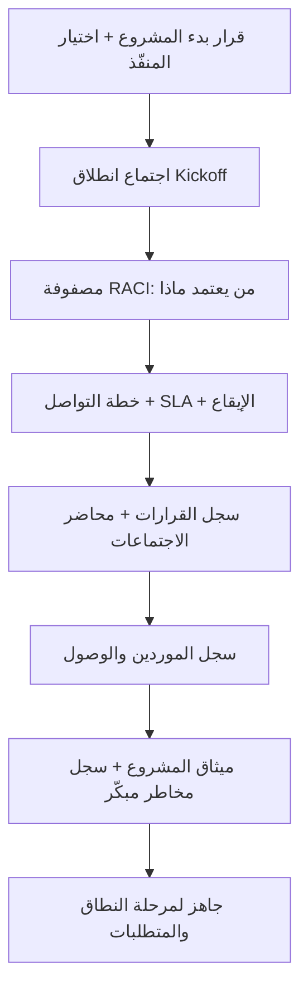

# 01 · الحوكمة (Governance)

> [!abstract] ماذا ستتعلّم هنا
> - ما **الحوكمة** ولماذا هي أوّل خطوة.
> - **مستندات الحوكمة السبعة**: ما كلٌّ منها، من أين تجمع معلوماته، وفائدته.
> - **كم من الوقت** تستغرق، **ومن** يُنتجها، **وبأي صيغ ملفات**.
> - إدارة **علاقة المنفّذ الخارجي** باحتراف، مع سيناريوهات وقرارات وأسئلة مقابلات.
>
> 🔗 المرجع العام: [[مدير المشاريع البرمجية الحديث]].

---

## 🧭 المفهوم ببساطة (ابدأ من هنا)

تخيّل مباراة كرة قبل أن يتّفق الفريقان على **القواعد**: من الحكم؟ من يسجّل؟ ماذا يُحتسب خطأ؟ ستصبح فوضى. **الحوكمة** هي «القواعد قبل اللعبة» في المشروع.

تُجيب على أربعة أسئلة قبل أي عمل فعلي:
1. **من يقرّر؟** 2. **من ينفّذ؟** 3. **من يُبلَّغ؟** 4. **كيف تُوثَّق القرارات؟**

بدونها تنهار أي منهجية — Agile أو Waterfall — لأن لا أحد يعرف «من يعتمد ماذا».

---

## 🧩 قاموس سريع للمصطلحات

| المصطلح | معناه ببساطة |
| --- | --- |
| **الحوكمة (Governance)** | إطار القرار والمسؤولية والتواصل |
| **RACI** | من يُنفّذ / يُحاسَب / يُستشار / يُبلَّغ |
| **صاحب المصلحة (Stakeholder)** | من يؤثّر في المشروع أو يتأثّر به |
| **المنفّذ / التعهيد (Vendor / Outsourcing)** | جهة خارجية تنفّذ مقابل عقد |
| **SLA** | زمن استجابة متّفق عليه |
| **التصعيد (Escalation)** | رفع مشكلة عالقة لمستوى أعلى |
| **سجل القرارات (Decision Log)** | مكان واحد لتوثيق كل قرار |
| **الراعي (Sponsor)** | صاحب القرار الأعلى ومموّل المشروع |

---

## ⛓️ لماذا الحوكمة أوّلًا؟ (التبعية)

تأتي **أوّلًا** لأنها لا تحتاج جاهزية شيء آخر. تحتاج فقط قرارًا واحدًا: أن المشروع سيبدأ ومع من.

وما تنتجه شرطٌ لما بعده: **لا يمكن توثيق المتطلبات قبل معرفة من يملك حقّ اعتمادها.**

## 📊 مخطّط سير عمل الحوكمة

---

## 📂 مستندات الحوكمة — واحدًا واحدًا

> لأهم المستندات نعرض القالب الكامل: **ما هو ولماذا** · 📥 **من أين تجمع معلوماته** · 🛠️ **كيف ترتّبه** · 🎯 **فائدته** · 🧪 **مثال من عافية**. أما المستندات الأبسط فتُعرض بإيجاز (ما هو + فائدته).

### 1) مصفوفة RACI — من يفعل ماذا
> [!info] ما هو ولماذا
> جدول يُسند لكل نشاط حرفًا لكل شخص: **R** يُنفّذ · **A** يُحاسَب ويعتمد · **C** يُستشار · **I** يُبلَّغ. يقضي على «ظننت أنك ستفعلها».

- **📥 من أين:** العقد، اجتماع الانطلاق، الهيكل التنظيمي، قرار المدير العام حول الصلاحيات.
- **🛠️ كيف:** اكتب الأنشطة → لكل نشاط **A واحد فقط** → أضِف R ثم C ثم I.
- **🎯 فائدته:** لكل قرار مالكٌ واضح؛ لا تضارب ولا مهمة بلا صاحب.
- 📄 **وثيقة مفصّلة:** [[مصفوفة المسؤوليات (RACI)]].

> [!example] من عافية
> مصفوفة تجمع فريق الإدارة السعودي والمنفّذ الإماراتي لأهم 9 أنشطة، بقاعدة **A واحد فقط** لكل نشاط.

### 2) خطة التواصل — القنوات والإيقاع
> [!info] ما هو ولماذا
> تحدّد أي قناة لأي تواصل، وزمن الاستجابة (SLA)، والإيقاع الأسبوعي. تعالج آفة «واتساب الشخصي».

- **📥 من أين:** ساعات عمل الفريقين، تفضيلات العميل، طبيعة المشروع.
- **🛠️ كيف:** جدول (نوع | قناة | تكرار | مسؤول | توثيق) + قواعد ذهبية.
- **🎯 فائدته:** لا شيء «يضيع في المحادثات».
- 📄 **وثيقة مفصّلة:** [[اتفاقية مستوى الخدمة (SLA)]].

> [!example] من عافية
> القرارات الرسمية بالبريد فقط عبر مدير المشروع، وSLA: عاجل خلال ساعتين، عادي خلال يوم عمل.

### 3) قالب محضر الاجتماع
> [!info] ما هو ولماذا
> نموذج موحّد (جدول أعمال + قرارات + مهام). يضمن أن كل اجتماع يُنتج توثيقًا لا نقاشًا يُنسى.
- **📥 من أين:** أثناء الاجتماع، يملؤه مدير المشروع. · **🎯 فائدته:** قرارات ومهام واضحة قابلة للمتابعة.

### 4) سجل القرارات (Decision Log)
> [!info] ما هو ولماذا
> سجل مركزي لكل قرار رسمي (معرّف، تاريخ، القرار، من اتخذه، الأثر، الحالة) — **مصدر الحقيقة**.
- **📥 من أين:** المحاضر وأي اتفاق شفهي (يُوثَّق خلال 24 ساعة). · **🎯 فائدته:** يحميك في أي نزاع.

### 5) سجل الموردين والوصول
> [!info] ما هو ولماذا
> يوثّق من يملك الوصول لكل خدمة حرجة (نطاق، استضافة، دفع، كود). يمنع كارثة فقدان الوصول.
- **🎯 فائدته:** ملكيتك لأصولك مضمونة **من اليوم الأول**.

> [!example] من عافية
> النطاق وبوابات الدفع ووصول Admin **باسم العميل من اليوم الأول**، لا عند «التسليم النهائي».

### 6) دليل عمل الفريق (Team Playbook)
> [!info] ما هو ولماذا
> دليل دورة حياة المهمة (استلام → عمل → مراجعة → اختبار → إغلاق) وجدول الاجتماعات. · **🎯 فائدته:** الجميع يتبع الخطوات نفسها.

### 7) نموذج إدارة العلاقة مع المنفّذ
> [!info] ما هو ولماذا
> هل هم فريقك، أم مستشار، أم مورّد خدمة؟ ويحدّد أدوات الضغط الثلاث: **الاعتماد · الدفعات · التوثيق**.

> [!example] من عافية
> عُومل المنفّذ كـ**مورّد خدمة**: يُدار عبر مخرجات ومعايير قبول، وكل القرارات عبر مدير المشروع فقط.

---

## ⏱️ إدارة وقت هذه المهمة

> [!info] لماذا قسم للوقت؟
> إدارة الوقت جزء أساسي من إدارة المشاريع (إلى جانب النطاق والتكلفة والجودة والمخاطر). معرفة «كم تستغرق» تحميك من تضخيم مرحلة على حساب أخرى.

### كم تستغرق مرحلة الحوكمة؟ (معايير عامة تقريبية)

| حجم المشروع | مدة إعداد الحوكمة | ملاحظة |
| --- | --- | --- |
| **صغير** (داخلي، فريق صغير) | يوم – 3 أيام | RACI مبسّطة + خطة تواصل موجزة |
| **متوسط** | أسبوع – أسبوعان | يشمل اعتماد الراعي وجلسة مراجعة |
| **كبير/معقّد** (عدة فرق، منفّذ خارجي، تنظيمي) | أسبوعان – عدة أسابيع (وقد يمتد لأشهر) | اعتمادات متعدّدة + مراجعة قانونية |

> [!warning] القاعدة الدولية
> العبرة بالدقّة لا السرعة؛ المدة تعتمد على الحجم والتعقيد وعمليات المؤسسة. لكن **لا تُطِل**: الحوكمة تمكِّن العمل، وليست العمل نفسه.

### من يُنتج هذا المستند وكيف يتعاونون؟

- **مدير المشروع** (يصوغ المسودّة — المالك) · **الراعي/المدير العام** (يعتمد) · **ممثّل المنفّذ** (يراجع صفوفه في RACI) · **مستشار قانوني** (للعلاقة التعاقدية، عند الحاجة).
- **آلية التعاون:** مدير المشروع يكتب المسودّة → جلسة مراجعة مع الأطراف → اعتماد الراعي → توثيق في سجل القرارات. (عادةً **شخص يصوغ + 2–4 يراجعون/يعتمدون**.)

### أي ملفات تراجع لإنشائها؟
العرض/العقد من المنفّذ · الهيكل التنظيمي · مخرجات مرحلة 00 (خارطة القرارات، موجز المشروع) · سجل أصحاب المصلحة إن وُجد.

### أي صيغ ملفات تستخدم؟

| المستند | الصيغة المناسبة | لماذا |
| --- | --- | --- |
| RACI · سجل القرارات · سجل الموردين | **Excel / CSV** | بيانات متغيّرة، فرز وتصفية |
| [[Communication Plan|خطة التواصل]] · المحضر · دليل الفريق · إدارة العلاقة | **Markdown / Word (doc)** | نصّ مقروء قابل للتحديث |
| ميثاق المشروع | **Word / PDF** يُعتمد ويُوقّع | وثيقة رسمية مرجعية |

> [!failure] تجنّب
> الملاحظات الورقية أو الواتساب للقرارات الرسمية — لا سجل، تضيع.

---

## 🌐 ما تقوله المعايير الحديثة

> [!quote] من الممارسات المعتمدة عالميًا
> - **RACI إلزامي** (لا اختياري) عند وجود موردين متعدّدين أو فرق مُعهَّدة — حالتك بالضبط.
> - الحوكمة السليمة: **مجالات قرار واضحة · مالكون مُسمَّون · مسار تصعيد موثّق · إيقاع تقارير**.
> - **فحص صحّة الحوكمة (قاعدة إرشادية عملية، لا معيار رسمي موحّد):** خذ عيّنة من آخر القرارات — هل حسمها صاحب الصلاحية (A)؟ كدليل تقريبي: ≥ 80% = سليمة؛ 60–79% = تحتاج تحسينًا لكنها ليست حرجة؛ < 60% = تحتاج إعادة بناء.

في لغة [[مدير المشاريع البرمجية الحديث|مثلث كفاءات PMI]]: الحوكمة تجمع **الفطنة التجارية** و**المهارات القيادية**.

---

## ➕ لإكمال الصورة — تحسينات مقترحة

> [!todo] لتعميق هذه المرحلة وإكمالها
> **الخطوتان 1–2 تظهران في المخطّط أعلاه (العقدة G)، ونفصّلهما هنا؛ والخطوات 3–5 إضافات تُثري الحوكمة.**
> 1. **ميثاق المشروع (Project Charter):** أول وثيقة رسمية تُعلن المشروع وتمنح المدير صلاحيته. يحتوي: الهدف · النطاق العام · الميزانية · معايير النجاح · الراعي. من الراعي/المدير العام قبل أي تفصيل. 📄 **وثيقة مفصّلة:** [[ميثاق المشروع (Project Charter)]].
> 2. **سجل مخاطر مبكّر:** سجّل مخاطر الحوكمة (فقدان وصول، اختفاء مورّد، تضارب قرارات) بتصنيف احتمال × أثر. راجع [[19 - Risk Management]].
> 3. **مسار تصعيد زمني:** لم يُحسم خلال 24 ساعة → المدير؛ 48 → التنفيذي؛ [[Blocker]] → CEO المنفّذ. 📄 **وثيقة مفصّلة:** [[مسار التصعيد (Escalation Path)]].
> 4. **بطاقة تقييم مورّد (Vendor Scorecard):** الالتزام بالمواعيد · الأخطاء الحرجة · جودة التسليم. 📄 **وثيقة مفصّلة:** [[بطاقة تقييم المورّد (Vendor Scorecard)]].
> 5. **فعّل المتتبّعات:** املأ سجل القرارات فعليًّا، واستبدل الحقول النائبة في نموذج سجل القرارات (مثل خانة «المسؤول») بأسماء حقيقية.

---

## 🎬 سيناريوهان من الواقع

> [!success] سيناريو صحيح — «سارة» (مشروع متجر إلكتروني)
> عيّنت **قناة اعتماد واحدة** (نفسها كمديرة مشروع)، وملأت RACI بـ A واحد لكل نشاط، ووثّقت كل قرار في سجل خلال 24 ساعة، وسجّلت النطاق باسم شركتها. **النتيجة:** عند خلاف على ميزة، رجعت للسجل وحُسم في دقائق، وسلّم المنفّذ في الموعد.

> [!failure] سيناريو خاطئ — «خالد» (مشروع تطبيق حجوزات)
> أدار كل شيء عبر واتساب شخصي، وكان المدير العام والتسويق **كلاهما** يرسلان موافقات للمنفّذ، ولم يفتح سجل قرارات، وترك النطاق باسم المنفّذ. **النتيجة:** تعليمات متضاربة، ميزات أُعيدت مرارًا، وعند نزاع رفض المنفّذ تسليم النطاق. تأخّر المشروع 4 أشهر.

---

## 🧩 قرارات تفاعلية (فكّر ثم افتح)

> [!question]- **الموقف:** أرسل المدير العام والمدير التنفيذي **تعليمَين متعارضَين** للمنفّذ في اليوم نفسه. ما تصرّفك؟ (أ) تنفّذ الأحدث · (ب) تسأل المنفّذ أن يختار · (ج) توقف التنفيذ وتُرجع القرار لقناة الاعتماد الواحدة
> ✅ **الأصوب: (ج).** أوقف التنفيذ فورًا، وأبلغ الطرفين أن كل التعليمات تمرّ عبر **قناة اعتماد واحدة** (مدير المشروع)، ثم تُحسَم داخليًّا ويُرسل قرار واحد.
> **لماذا؟** تنفيذ الأحدث (أ) قد يخالف الأهم؛ وترك المنفّذ يختار (ب) يسلبك السلطة ويربكه. **السيناريو المثالي:** قناة واحدة تمنع هذا الموقف أصلًا.

> [!question]- **الموقف:** المنفّذ يطلب **دفعة مقدّمة كبيرة** قبل أي تسليم. توافق؟ (أ) نعم لبناء الثقة · (ب) لا، تربط الدفعات بمراحل معتمدة · (ج) دفعة رمزية فقط
> ✅ **الأصوب: (ب)** (أو ج كحدّ أدنى). اربط كل دفعة بمرحلة ذات **معايير قبول** مُعتمدة فعلًا.
> **لماذا؟** الدفع المسبق يُفقدك أقوى أدوات الضغط الثلاث (الاعتماد/الدفعات/التوثيق). **المثالي:** جدول دفعات مربوط بمخرجات موثّقة.

---

## 🧠 أسئلة تفكير ناقد وعصف ذهني (بلا إجابة واحدة)

> [!question] للتأمّل — دوّن أفكارك
> - لو كان فريقك **داخليًّا** (لا منفّذ خارجي)، أي مستندات حوكمة تبقى ضرورية وأيها يمكن تبسيطه؟ ولماذا؟
> - كيف تكتشف مبكّرًا أن حوكمتك «على الورق فقط» ولا تُطبَّق فعليًّا؟ صمّم مؤشّرًا واحدًا ينذرك.
> - متى تكون الحوكمة **زائدة** (بيروقراطية تُبطئ)؟ أين الخط بين الانضباط والجمود؟
> - لو اختفى مدير المشروع فجأة أسبوعًا، هل يستطيع غيره إدارة المشروع من مستنداتك وحدها؟ ماذا ينقص؟

---

> [!tip] إطار الإجابة (لأسئلة التفكير الناقد)
> لا إجابة وحيدة، لكن أي تحليل قوي يمرّ بأربع خطوات:
> 1. **حدّد المقايضة (Trade-off):** ماذا تكسب وماذا تخسر في كل خيار؟
> 2. **اربط بالمبدأ:** أي قاعدة حوكمة تنطبق؟ (قناة واحدة · توثيق · ملكية الأصول).
> 3. **قِس بالأثر:** ما أسوأ ما قد يحدث لو أخطأت؟ (احتمال × أثر).
> 4. **اقترح مؤشّرًا:** كيف ستعرف لاحقًا أن قرارك كان صحيحًا؟
>
> أمثلة اتجاهات ممكنة:
> - للفريق الداخلي: قد تُبسّط خطة التواصل وتُبقي سجل القرارات.
> - مؤشّر «الحوكمة على الورق»: قد يكون **نسبة القرارات غير الموثّقة**.
> - الحوكمة تصبح زائدة حين تُبطئ دون أن تقلّل خطرًا حقيقيًّا.

## ❓ نقاط للمراجعة (استرجاع)

> [!question]- لماذا لا يُعدّ المنفّذ «فريقًا تحت إدارتك» رغم أنك تدفع له؟
> لأنهم موظّفو شركة أخرى؛ تحاسبهم على **النتائج** عبر بوابات اعتماد ودفعات، لا على تفاصيل التنفيذ.

> [!question]- ما الفرق بين A وR في RACI، ولماذا A واحد فقط؟
> R يُنفّذ، وA يُحاسَب ويعتمد. A واحد يمنع تضارب القرار وضياع المسؤولية.

> [!question]- كيف تتحقّق أن حوكمتك «سليمة» عمليًّا؟
> عيّنة من آخر القرارات: هل حسمها صاحب الصلاحية (A)؟ ≥ 80% = سليمة.

> [!question]- ما أدوات الضغط الثلاث المشروعة على المنفّذ؟
> الاعتماد (لا شيء «منجز» إلا بموافقتك) · الدفعات (مربوطة بمراحل) · التوثيق (يحميك في النزاع).

> [!question]- لماذا يجب تسجيل النطاق والأصول باسم العميل من اليوم الأول؟
> لتجنّب فقدان الوصول أو ابتزاز التسليم إن اختلفت مع المنفّذ لاحقًا.

---

## 💼 من أسئلة المقابلات (حقيقية)

> [!question]- «كيف تتعامل مع راعٍ (Sponsor) يتدخّل في التفاصيل (Micromanaging)؟»
> **نموذج إجابة (STAR):** أوضّح **أدوار الحوكمة** (RACI) بلطف: الراعي يعتمد المخرجات الكبرى ويحسم الخلافات، لا يوجّه الأفراد يوميًّا. أُظهر له لوحة حالة شفّافة تُشبع حاجته للاطمئنان دون تدخّل. **النتيجة:** استقلالية الفريق + ثقة الراعي.

> [!question]- «كيف تدير أصحاب مصلحة بأولويات متعارضة؟»
> اجمع مدخلاتهم **مبكّرًا**، استخدم RACI لتوضيح الأدوار، واربط النقاش بأهداف المشروع. عند التعارض: أوضّح المقايضات (Trade-offs) وصعّدها عبر عملية تغيير رسمية. أعطِ مثالًا حقيقيًّا وسّطت فيه.

> [!question]- «كيف تتعامل مع طلب تغيير يؤثّر في النطاق؟»
> قيّم الأثر (وقت/تكلفة/جودة) → استشر الفريق → ناقش المقايضات → مرّره عبر **عملية إدارة التغيير الرسمية** ([[Change Request]])، لا موافقة شفهية.

> [!question]- «كيف تبني الثقة مع أصحاب المصلحة؟»
> تواصل واضح ومنتظم، إبقاؤهم على اطلاع بالحالة، والتوفّر لمعالجة المخاوف. الشفافية عن المشاكل مبكّرًا تبني الثقة أكثر من إخفائها.

> [!tip] إطار الإجابة
> استخدم **STAR**: الموقف (Situation) · المهمة (Task) · الإجراء (Action) · النتيجة (Result).

---

## 🧪 من مبتدئ إلى محترف

> [!success] تدرّج
> - **مبتدئ:** املأ RACI لمشروع صغير + افتح سجل قرارات بسيطًا.
> - **متوسّط:** خطة تواصل بـ SLA وإيقاع أسبوعي + محضر لكل اجتماع.
> - **محترف:** ميثاق مشروع + سجل مخاطر + مسار تصعيد زمني + بطاقة تقييم مورّد + فحص صحّة حوكمة دوري.

---

## 🔗 ربط بالمفاهيم

- [[21 - Stakeholder Communication|أصحاب المصلحة والتواصل]]
- [[19 - Risk Management|إدارة المخاطر]]
- [[05 - Product Owner|Product Owner]] / [[06 - Scrum Master|Scrum Master]]
- [[مدير المشاريع البرمجية الحديث|مرجع: المنهجيات والكفاءات]]

---

## 📌 بطاقة مرجعية سريعة

| المستند | سؤاله |
| --- | --- |
| RACI | من يفعل/يعتمد/يُستشار/يُبلَّغ؟ |
| خطة التواصل | أي قناة، وبأي إيقاع؟ |
| محضر الاجتماع | ما القرارات والمهام؟ |
| سجل القرارات | أين تُوثَّق القرارات؟ |
| سجل الموردين | من يملك أصولنا؟ |
| دليل الفريق | كيف نعمل خطوة بخطوة؟ |
| إدارة العلاقة | ما طبيعة علاقتنا بالمنفّذ؟ |

> [!tip] القواعد الذهبية الثلاث
> 1. **قناة اعتماد واحدة.** 2. **لا قرار شفهي — وثّق خلال 24 ساعة.** 3. **ملكية أصولك من اليوم الأول.**

---

> [!quote] مصادر
> - [PMI — Talent Triangle](https://www.pmi.org/certifications/certification-resources/maintain/talent-triangle)
> - [أسئلة مقابلات إدارة المشاريع 2026 — productive.io](https://productive.io/blog/project-management-interview-questions/)
> - [مرحلة بدء المشروع ومدتها — Asana](https://asana.com/resources/project-initiation)
> - [أسئلة سلوكية لمديري المشاريع — TestGorilla](https://www.testgorilla.com/blog/project-manager-behavioral-interview-questions/)
