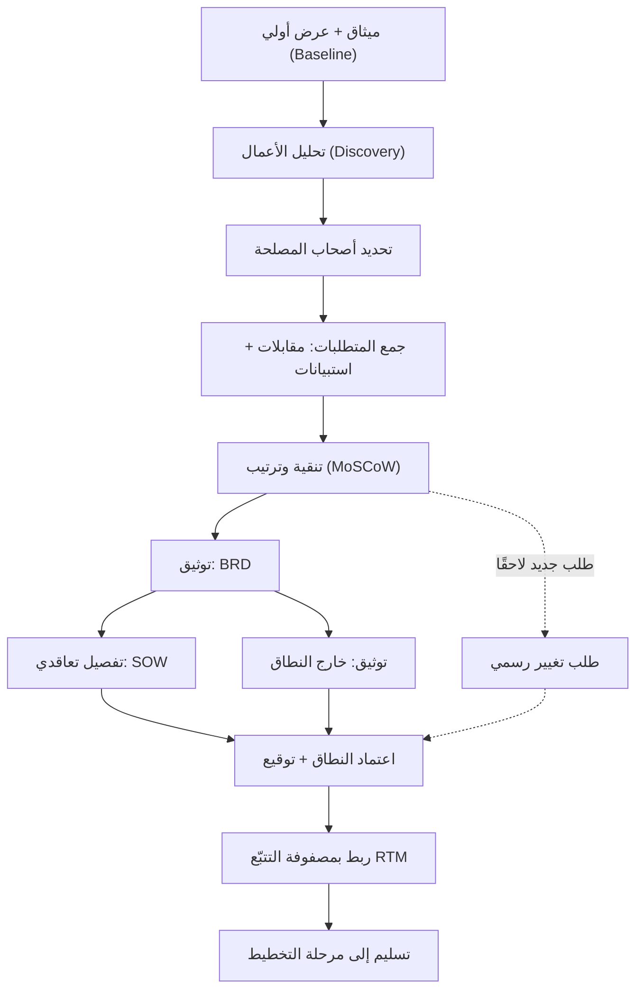

# 02 · النطاق والمتطلبات

> [!abstract] ماذا ستتعلّم هنا
> - كيف تحوّل «فكرة عامة» أو عرضًا تسويقيًا إلى **نطاق (Scope)** ومتطلبات (Requirements) مكتوبة ومتفق عليها.
> - الفرق العملي بين **وثيقة النطاق ([[Scope Statement]])** و**نطاق العمل (SOW)** و**[[BRD|وثيقة متطلبات العمل]] (BRD)**، ومتى تكتب كلًّا منها.
> - كيف **تجمع** المتطلبات فعليًا (مقابلات، استبيانات، ورش)، وكيف تميّز **المتطلب** عن **الحل المقترح**.
> - كيف تحمي مشروعك من **توسّع النطاق ([[Scope Creep]])** عبر توثيق «[[Out of Scope|خارج النطاق]]» و**طلب التغيير ([[Change Request]])**.
> - كيف تتتبّع كل متطلب حتى الاختبار عبر **[[RTM|مصفوفة تتبّع المتطلبات]] (RTM)**.
>
> 🔗 هذه المرحلة جزء من رحلة [[مدير المشاريع البرمجية الحديث]] — من المبتدئ إلى المحترف.

---

## 🧭 المفهوم ببساطة

تخيّل أنك طلبت من مقاول أن يبني لك بيتًا، وقلت له فقط: «أريد بيتًا جميلًا». بعد شهور يسلّمك غرفتين، وأنت كنت تتخيّل فيلا من طابقين. من المخطئ؟ **كلاكما** — لأنه لم يكن هناك **مخطط هندسي مكتوب** يحدّد عدد الغرف والمساحة والمواصفات. مرحلة **النطاق والمتطلبات** هي كتابة ذلك «المخطط الهندسي» للمشروع.

ببساطة: هي المرحلة التي يتحوّل فيها المشروع من كلام عام إلى **تعريف دقيق ومكتوب** لِـ: ماذا سيُبنى؟ ولمن؟ ولماذا؟ و**ما الذي لن يُبنى؟**. تنتج هنا وثائق مرجعية (النطاق، SOW، BRD) وقوائم متطلبات مرتّبة بالأولوية، يُحتكم إليها عند أي خلاف لاحق.

> [!tip] القاعدة الذهبية
> **ما لا يُكتب لا يُوجد.** أي متطلب متفق عليه شفهيًا فقط سيُنسى أو يتحوّل إلى نزاع. التوثيق هنا ليس بيروقراطية، بل **تأمين ضد الفوضى**.

---

## 🧩 قاموس سريع للمصطلحات

| المصطلح (عربي) | English | معناه ببساطة |
| --- | --- | --- |
| النطاق | Scope | حدود المشروع: ما بداخله وما خارجه |
| توسّع النطاق | Scope Creep | إضافات تتسلّل بلا اتفاق فترهق الوقت والتكلفة |
| وثيقة النطاق | Scope Statement | تعريف عالي المستوى للأهداف والحدود |
| نطاق العمل | SOW ([[SOW|Statement of Work]]) | تفصيل تعاقدي دقيق لكل وحدة ومخرجاتها |
| وثيقة متطلبات العمل | BRD | «ماذا نريد من منظور العمل؟» أهداف ومتطلبات |
| قصة المستخدم | User Story | «بصفتي [دور]، أريد [وظيفة]، حتى [قيمة]» |
| ترتيب الأولويات | [[MoSCoW Prioritization|MoSCoW]] | Must / Should / Could / Won't have |
| مصفوفة التتبّع | RTM | تربط كل متطلب بحالته حتى الاختبار والاعتماد |
| معيار القبول | Acceptance Criteria | متى نعتبر المتطلب «منجزًا» فعلًا |
| طلب التغيير | Change Request | مسار رسمي لأي تعديل على النطاق المعتمد |
| تعريف الإنجاز/الاكتمال | DoD ([[Definition of Done]]) | معيار متّفق عليه متى نعدّ العمل «منجزًا» فعلًا — مفهوم Agile على مستوى الفريق، لا مرادف لـ«معايير نجاح المشروع» |
| تعريف الجاهزية | DoR ([[Definition of Ready]]) | بوابة الدخول: متى يصبح المتطلب جاهزًا لبدء العمل عليه (قبل بدء الـ Sprint) |

---

## ⛓️ لماذا تأتي هنا وتقود للتالية

**ما يسبقها (المتطلبات القبلية):** لا تبدأ هذه المرحلة من فراغ. تحتاج قبلها إلى **[[ميثاق المشروع (Project Charter)|ميثاق مشروع]]** يمنحك الصلاحية ويحدّد الغرض العام (راجع [[01 - الحوكمة]]). كما تحتاج إلى **رؤية أو عرض أولي** يصلح كخط أساس ([[Baseline]]) تبني فوقه أو تصحّحه.

**ما تُغذّيه (المخرجات):** كل ما تنتجه هنا — النطاق المعتمد، BRD، SOW، RTM، سجل أصحاب المصلحة — يتدفّق مباشرة إلى [[03 - التخطيط]]. بدون نطاق واضح **يستحيل** بناء جدول زمني واقعي، أو تقدير تكلفة، أو خطة اختبار ذات معنى. المتطلبات هنا تصبح لاحقًا **معايير القبول** في [[05 - الجودة والاختبار]].

> [!warning] خطأ يتضاعف
> أي خلل في تعريف النطاق هنا لا يبقى هنا؛ بل ينتقل **مُضاعَفًا** إلى كل مرحلة لاحقة. متطلب غامض اليوم = ميزة خاطئة تُبنى بعد شهرين = إعادة عمل مكلفة.

---

## 📊 مخطّط سير العمل

---

## 📂 مستندات هذه المرحلة — واحدًا واحدًا

📂 «مجلد المرحلة»

### 1) وثيقة نطاق المشروع (Scope Statement)

> [!info] ما هو ولماذا
> «العقد المرجعي» عالي المستوى: يحدّد الوصف العام، المنفّذ، التكلفة، المدة، الصفحات، الوحدات الوظيفية، ومعايير النجاح (Success Criteria). كل خلاف لاحق يُحَل بالرجوع إليه.

- **📥 من أين تجمع معلوماته:** من **الراعي/المالك** (الأهداف والميزانية)، ومن **العقد/العرض الأولي**، ومن **اجتماع** أولي مع المنفّذ لتثبيت الحدود.
- **🛠️ كيف ترتّبه:** ابدأ بنظرة عامة، ثم أهداف SMART، ثم الصفحات/الوحدات، ثم معايير النجاح، ثم الافتراضات والقيود، ثم التوقيعات.
- **🎯 فائدته:** مرجع واحد يُحتكم إليه، يمنع نزاع «ما المتفق عليه؟».

> [!example] من عافية
> حدّدت الوثيقة المنفّذ (أُفُق للحلول الرقمية)، وقيمة العقد، والمدة الأصلية (4 أشهر)، والصفحات الثماني — واستبدلت مرجع HIPAA/GDPR بنظام **[[PDPL]] السعودي** الملزم فعلًا.

🔗 «01 - وثيقة نطاق المشروع»

### 2) نطاق العمل (SOW)

> [!info] ما هو ولماذا
> الوثيقة التعاقدية التي تفصّل **كل وحدة وظيفية** ببنودها ومخرجاتها ومعايير قبولها. هي ما افتقده العرض الأصلي تمامًا، وكان غيابها [[Root Cause Analysis|السبب الجذري]] للفوضى.

- **📥 من أين تجمع معلوماته:** من **المنفّذ** (بالتعاون)، ومن وثيقة النطاق، ومن نتائج جمع المتطلبات.
- **🛠️ كيف ترتّبه:** بالترتيب التالي:
    1. معلومات المشروع
    2. النطاق التفصيلي (وحدة وحدة)
    3. خارج النطاق
    4. المخرجات (Deliverables)
    5. الافتراضات
    6. الجدول
    7. الشروط المالية
    8. SLA
    9. التوقيعات
- **🎯 فائدته:** يقفل باب التفسير المفتوح، ويصبح المرجع التعاقدي الفعلي.

> [!example] من عافية
> كشف التحليل أن النطاق الحقيقي = **7 أنظمة في نظام واحد** (حجز، متجر متعدد البائعين، LMS، مخزون، فعاليات، توظيف، اشتراكات) — وهو ما يوجب SOW يفصّلها بدل «حجز مواعيد» فقط.

🔗 «08 - نطاق العمل SOW»

### 3) وثيقة متطلبات العمل (BRD)

> [!info] ما هو ولماذا
> تجيب سؤال: **«ماذا نريد من المنصة من منظور العمل؟»** (لا كيف تُبنى تقنيًا). تشمل أهداف العمل و[[KPI|KPIs]]، أصحاب المصلحة، متطلبات على هيئة **User Stories**، ومتطلبات غير وظيفية.

- **📥 من أين تجمع معلوماته:** من **أصحاب المصلحة** عبر المقابلات، ومن سجل المتطلبات المجمّعة، ومن أهداف العمل لدى المالك.
- **🛠️ كيف ترتّبه:** بالترتيب التالي:
    1. ملخص تنفيذي
    2. أهداف العمل وKPI
    3. أصحاب المصلحة
    4. متطلبات وظيفية (User Stories)
    5. متطلبات غير وظيفية
    6. القيود
    7. معايير النجاح
- **🎯 فائدته:** يضمن أن ما يُبنى يخدم **قيمة عمل** حقيقية، لا مجرد ميزات.

> [!example] من عافية
> «بصفتي مندوب شركة طبية، أريد أن أحجز موعدًا افتراضيًا مع طبيب، حتى أعرض منتجاتي» — صياغة تربط الوظيفة بالقيمة مباشرة.

🔗 «09 - وثيقة متطلبات العمل BRD»

### 4) خارج النطاق (Out of Scope)

> [!info] ما هو ولماذا
> توثيق ما **ليس** جزءًا من المشروع لا يقل أهمية عن توثيق ما بداخله. هو درعك ضد توسّع النطاق ومطالبات الأعمال الإضافية من الطرفين.

- **📥 من أين تجمع معلوماته:** من **العقد** (بالنفي)، ومن نقاش المناطق الرمادية (Grey Areas) مع المنفّذ.
- **🛠️ كيف ترتّبه:** جدول بالبنود المستبعدة والسبب وتقدير لو طُلبت لاحقًا، ثم قائمة «بنود تحتاج توضيحًا» لحسمها.
- **🎯 فائدته:** يمنع نزاع «هذا كان مفترضًا ضمن الاتفاق».

> [!example] من عافية
> استُبعد صراحةً: **تطبيق جوال أصلي** (العرض يذكر responsive فقط)، إدخال المحتوى، حملات التسويق، والترخيص النظامي — كلها مسؤوليات خارج التطوير.

🔗 «03 - خارج النطاق»

### 5) قالب طلب التغيير (Change Request)

> [!info] ما هو ولماذا
> نموذج رسمي لأي توسّع لاحق في النطاق، يقيّم الأثر على **الجدول والتكلفة والمخاطر** قبل الموافقة. هو الصمّام الذي يحوّل «توسّع النطاق» الفوضوي إلى قرار مدروس.

- **📥 من أين تجمع معلوماته:** من **مقدّم الطلب** (وصف التغيير وسببه)، ومن **الفريق** (تقدير الأثر).
- **🛠️ كيف ترتّبه:** وصف التغيير ← المبرّر ← تحليل الأثر (وقت/تكلفة/مخاطر) ← القرار (قبول/رفض) ← الاعتماد.
- **🎯 فائدته:** يحمي الجدول والميزانية من التآكل الصامت.

🔗 «04 - قالب طلب تغيير»

### 6) استراتيجية إعادة ضبط المشروع ورسالة المنفّذ

> [!info] ما هو ولماذا
> أهم وثيقة في الحزمة: تشخّص المخاطر الجوهرية في العرض الأصلي وتطرح **ثلاثة خيارات استراتيجية** للتعامل معها، مع رسالة جاهزة لفتح حوار مهني غير اتهامي مع المنفّذ.

- **📥 من أين تجمع معلوماته:** من **تحليل العرض** (الأرقام والتناقضات)، ومن **مصفوفة الفجوات**.
- **🛠️ كيف ترتّبه:** تشخيص (أعلام حمراء) ← مبادئ حاكمة ← الخيارات الثلاثة ← خطة تنفيذية ← شجرة قرار ← تنبيهات قانونية.
- **🎯 فائدته:** تصحيح المسار قبل أن يتحوّل المشروع إلى «نظام لا يعمل» أو فاتورة صيانة باهظة.

> [!example] من عافية
> كشفت الاستراتيجية تناقضًا: مجموع مراحل الجدول = 24 أسبوعًا بينما النص يقول «4 أشهر»، وسعرًا غير منطقي (~294 درهم/ميزة). فاقترحت «إعادة ضبط» هادئة بدل المواجهة.

🔗 «05 - استراتيجية إعادة الضبط» · 🔗 «07 - رسالة إعادة الضبط للمنفّذ»

### 7) أدوات جمع المتطلبات (الدليل والأسئلة والقوالب)

> [!info] ما هو ولماذا
> حزمة «كيف نجمع المتطلبات فعليًا»: دليل بست خطوات، أسئلة تحليل أعمال عميقة، قالب مقابلة، وقالب استبيان — تحوّل كلام أصحاب المصلحة إلى متطلبات موثّقة.

- **📥 من أين تجمع معلوماته:** من **أصحاب المصلحة مباشرة** (مقابلات 3–5 لكل شريحة)، ثم استبيان أوسع لتأكيد النتائج.
- **🛠️ كيف ترتّبه:** حدّد الأطراف ← اختر التقنية ← نفّذ الجمع ← نقِّ وصنّف ← وثّق ← اعتمد وتحقّق.
- **🎯 فائدته:** يمنع أكبر سبب لفشل المشاريع — البناء على افتراضات بدل حاجات حقيقية.

> [!example] من عافية
> نصّ الدليل: ابدأ بمقابلات مع مستشفى ومندوب وطبيب، ثم استبيان، ثم نماذج أولية للواجهات الحرجة (الحجز). وحذّر من «الدجاجة والبيضة»: أي طرف نجذب أولًا في منصة متعددة الأطراف؟

🔗 «11 - أسئلة تحليل الأعمال» · 🔗 «12 - دليل جمع المتطلبات» · 🔗 «14 - قالب مقابلة أصحاب المصلحة» · 🔗 «16 - قالب استبيان جمع المتطلبات»

### 8) السجلّات والمصفوفات (ملفات CSV/جداول)

> [!info] ما هو ولماذا
> جداول تتبّع حيّة تُحدّث باستمرار: تفصّل الميزات، وتربط المتطلبات بحالتها، وتسجّل أصحاب المصلحة والمتطلبات الخام.

- **📥 من أين تجمع معلوماته:** من مخرجات الجمع، ومن حالة التنفيذ الفعلية عبر المراحل.
- **🛠️ كيف ترتّبه:** كل سجل عمود لكل خاصية (معرّف، أولوية، حالة، ملاحظات) وصف لكل عنصر.
- **🎯 فائدته:** لا يضيع أي متطلب بين مرحلة جمعه ومرحلة اختباره.

> [!example] من عافية
> **RTM** تربط كل متطلب عبر: صُمّم؟ طُوّر؟ اختُبر؟ اعتُمد ([[UAT]])؟ — لضمان عدم نسيان أي متطلب.

الملفات (تُفتح ببرنامج جداول): `02-مصفوفة-حالة-المميزات.csv` · `06-مصفوفة-الفجوات.csv` · `10-RTM-مصفوفة-تتبع-المتطلبات.csv` · `13-سجل-أصحاب-المصلحة-Stakeholders.csv` · `15-سجل-المتطلبات-المجمّعة-Requirements-Log.csv`

---

## ⏱️ إدارة وقت هذه المهمة

| حجم المشروع | المدة التقريبية (معايير دولية) |
| --- | --- |
| صغير | ساعات إلى أيام قليلة |
| متوسط | أسبوع إلى أسبوعين |
| كبير (مثل عافية) | أسابيع إلى أشهر (متعدد الأطراف والأنظمة) |

**من يُنتج المستند وكيف يتعاونون:**

- **من يقود؟** عادةً **محلّل الأعمال (Business Analyst)** أو مدير المشروع يقود عملية الجمع والصياغة.
- **من يتعاون معه؟**
    - **الراعي/المالك** — يعتمد الأهداف والنطاق.
    - **أصحاب المصلحة** — مصدر المتطلبات عبر المقابلات.
    - **الفريق التقني** — يتحقق من الجدوى التقنية.
- **تسلسل العمل:**
    1. المحلّل يجمع المتطلبات.
    2. يصوغ مسودّة.
    3. أصحاب المصلحة يراجعون.
    4. الراعي يعتمد ويوقّع.
- **الحجم النموذجي:** من شخص واحد في مشروع صغير، إلى فريق (محلّل ومدير وممثّلي أطراف) في مشروع كبير.

**أي ملفات تراجع:** راجع **[[ميثاق المشروع (Project Charter)|ميثاق المشروع]]** من [[01 - الحوكمة]] لتثبيت الغرض، والعرض/العقد الأولي كخط أساس، وسجل أصحاب المصلحة قبل بدء المقابلات.

**صيغ الملفات:**

| النوع | الصيغة المناسبة | لماذا |
| --- | --- | --- |
| السجلّات والمصفوفات (RTM، أصحاب المصلحة، الفجوات) | **Excel / CSV** | جداول حيّة قابلة للفرز والتحديث |
| الأدلّة والقوالب (المقابلة، دليل الجمع) | **Word / Markdown** | نصوص قابلة للتحرير والربط |
| الوثائق الرسمية (النطاق، SOW الموقّع) | **PDF** | نسخة نهائية موقّعة لا تُعدّل |

> [!warning] الدقّة قبل السرعة
> هذه المرحلة ليست سباقًا. ساعة إضافية في توضيح متطلب غامض توفّر أسابيع من إعادة العمل لاحقًا. **اكتمال ووضوح النطاق أهم من إنهائه بسرعة.**

---

## 🌐 ما تقوله المعايير الحديثة

> [!quote] خلاصة بحثية (2026)
> - **من التوثيق الساكن إلى الذكاء التنبّئي:** تتّجه المتطلبات في 2026 من مستندات جامدة إلى مساحات عمل تعاونية حيّة، مع تتبّع لحظي واعتمادات آلية و**كشف مخاطر مدعوم بالذكاء الاصطناعي**.
> - **افصل بينهما واربطهما:** «المتطلبات **تُغذّي** النطاق، والنطاق **ينظّم** التسليم». اجعل المتطلب يُنشئ خط أساس معتمد، ثم يُبنى فوقه بيان النطاق و**هيكل تجزئة العمل (WBS)** — دون تكرار أو فجوات.
> - **RTM في الاتجاهين:** الممارسة الحديثة تفرض أن **كل متطلب يتتبّع إلى نطاق، وكل بند نطاق يتتبّع إلى متطلب** — لا متطلب يتيم ولا نطاق بلا مبرّر.
> - **لا تتخطَّ قطع MoSCoW:** حين يصبح «كل شيء Must-have»، تحدث الأولوية الحقيقية لاحقًا تحت ضغط الموعد النهائي وبشكل سيّئ.
>
> يتقاطع هذا مع [[مدير المشاريع البرمجية الحديث|مثلث كفاءات PMI]]: المعرفة التقنية (كتابة نطاق سليم) والقيادة (محاذاة أصحاب المصلحة) والفطنة التجارية (ربط المتطلبات بقيمة العمل).

---

## ➕ لإكمال الصورة — تحسينات مقترحة

> [!todo] ما ينقص مقارنة بالمعايير، وكيف نكمله
> - **معايير قبول مكتملة لكل ميزة:** يشير BRD وSOW إلى معايير «تُحدّد لاحقًا»، لكن لا يوجد ملف مكتمل. هذا يخالف مبدأ أن يكون تعريف «الاكتمال» معروفًا **قبل** بدء العمل. أنشأنا لذلك وثيقة مكمّلة: [[معايير القبول (Acceptance Criteria)]].
> - **تحليل استراتيجي مرئي لأصحاب المصلحة:** السجل يذكر التأثير والاهتمام نصيًا فقط، دون تصنيف يوجّه أولوية التواصل. أنشأنا لذلك: [[مصفوفة قوة–اهتمام أصحاب المصلحة (Power-Interest Grid)]].
> - **إغلاق مرحلة الاكتشاف قبل التوقيع:** أسئلة تحليل الأعمال لا تزال مفتوحة؛ المعيار أن يُغلق الاكتشاف (Discovery) قبل اعتماد SOW لا بالتوازي معه. عالِج ذلك بجلسات مقابلة موثّقة الإجابات.
> - **الترتيب الصحيح للتوثيق:** المسار المعياري هو جمع ← تنقية ← BRD ← SOW، لا صياغة القوالب بالتوازي مع جمع لم يكتمل.
> - **فصل المخاطر في سجل مستقل:** المخاطر القانونية (PDPL بدل HIPAA/GDPR) عولجت داخل متن النطاق؛ الأفضل فتح بند رسمي في [[Risk Register|سجل المخاطر]]. راجع مفهوم [[19 - Risk Management]] وربطه بمرحلة [[04 - التنفيذ والتتبّع]].
> - **إدارة التواصل مع الأطراف:** لتعميق التعامل مع الشرائح راجع [[21 - Stakeholder Communication]].

---

## 🎬 سيناريوهان

> [!success] سيناريو صحيح — نورة، محلّلة أعمال
> كُلّفت نورة بتعريف نطاق منصة حجز صحية. قبل أي كود، أجرت **مقابلات** مع 4 مستشفيات و5 مناديب و3 أطباء، ودوّنت كل شيء في سجل خام. سألت دائمًا «لماذا؟» فاكتشفت أن الأطباء لن يقبلوا المواعيد ما لم تكن مدمجة بتقويمهم — متطلب لم يذكره أحد صراحةً. صنّفت المتطلبات بـ **MoSCoW**، أغلقت خارج النطاق كتابيًا، ووثّقت كل شيء في BRD ثم SOW موقّع مع **RTM**. النتيجة: بُنيت المنصة على حاجات حقيقية، ولم يحدث نزاع واحد حول «ما المتفق عليه»، وسُلّم المشروع بلا إعادة عمل تُذكر.

> [!failure] سيناريو خاطئ — سامي، مدير مشروع مستعجل
> اعتمد سامي **العرض التسويقي** للمنفّذ كأنه SOW، ولم يوثّق «خارج النطاق»، وبدأ التنفيذ فورًا لتوفير الوقت. لم يميّز بين المتطلب والحل، فبنى «زرًا أخضر» طلبه أحدهم بدل فهم الحاجة. عند التسليم فوجئ: العميل توقّع تطبيقًا جوّالًا (لم يكن في النطاق)، والجدول كان معطوبًا حسابيًا من البداية (24 أسبوعًا مكتوب عليها «4 أشهر»). لا مرجع يحسم الخلاف، ولا RTM لإثبات ما أُنجز. النتيجة: نزاع، تجاوز ميزانية، وتأخير طويل — والمشروع كاد يتحوّل إلى «نظام لا يعمل».

---

## 🧩 قرارات تفاعلية (فكّر ثم افتح)

> [!question] وصلك عرض تسويقي مبهر من منفّذ، والعميل متحمّس للبدء فورًا. ماذا تفعل؟
> فكّر في الخيارات ثم افتح الإجابة:
> - **(أ)** تبدأ التنفيذ فورًا لاغتنام الحماس.
> - **(ب)** تعتمد العرض كمرجع تعاقدي.
> - **(ج)** تطلب SOW تفصيليًا وتبني وثيقة نطاق قبل أي بناء.
>
> > [!success]- اكشف الإجابة
> > ✅ **الخيار (ج).**
> > **لماذا؟** العرض التسويقي وثيقة **بيع**، لا وثيقة **مشروع**. اعتماده كمرجع (ب) يترك النطاق مفتوحًا للتفسير، والبدء فورًا (أ) يبني على رمال. في عافية قُيّم العرض بـ 4.3/10 كوثيقة مشروع.
> > **السيناريو المثالي:** تشكر المنفّذ على العرض، تعامله كخط أساس (Baseline)، وتطلب SOW يفصّل كل وحدة ومعايير قبولها، ثم توقّعه قبل بدء أي تطوير.

> [!question] في مقابلة، قال صاحب مصلحة: «أريد زرًا أحمر كبيرًا في الأعلى». كيف تسجّل هذا؟
> فكّر في الخيارات ثم افتح الإجابة:
> - **(أ)** تدوّنه كمتطلب حرفيًا.
> - **(ب)** تتجاهله لأنه تفصيل تصميم.
> - **(ج)** تسأل «لماذا؟» لتصل إلى الحاجة الجوهرية.
>
> > [!success]- اكشف الإجابة
> > ✅ **الخيار (ج).**
> > **لماذا؟** ما قدّمه هو **حل** لا **متطلب**. تسجيله حرفيًا (أ) قد يقيّدك بحل رديء، وتجاهله (ب) قد يُضيّع حاجة حقيقية خلفه. السؤال يكشف الحاجة: ربما «أريد أن أعرف بسرعة أن العملية نجحت».
> > **السيناريو المثالي:** تسأل «لماذا تريد الزر الأحمر؟» فتكتشف الحاجة الحقيقية، فتسجّلها كمتطلب قابل للاختبار وتترك الحل للتصميم.

---

## 🧠 أسئلة تفكير ناقد وعصف ذهني (بلا إجابة واحدة)

> [!question] فكّر بعمق
> - في منصة متعددة الأطراف مثل عافية، أي طرف تجذب أولًا لحل مشكلة «الدجاجة والبيضة» (المستشفيات أم المناديب أم الأطباء)؟ وكيف يؤثر ذلك على أولويات النطاق؟
> - متى يكون توسيع النطاق (Scope Creep) **مقبولًا** فعلًا وليس خطرًا؟ وأين الحد؟
> - لو كان لديك أسبوع واحد فقط لتعريف نطاق مشروع ضخم، أي 20% من العمل تنجزه لتغطية 80% من المخاطر؟
> - كيف تتحقّق من صحة أخطر افتراض في المشروع **قبل** بناء أي شيء؟

> [!tip] إطار الإجابة (4 خطوات)
> 1. **حدّد المتغيّر الجوهري:** ما العامل الأكبر أثرًا في السؤال؟ (مثلًا: أي طرف يخلق القيمة للطرف الآخر).
> 2. **اجمع بيانات لا تخميناتٍ:** استند إلى مقابلات/أرقام حقيقية بدل رأيك من المكتب.
> 3. **وازن المفاضلات (Trade-offs):** لكل خيار مكسب وخسارة — اجعلهما صريحين.
> 4. **اختبر بأقل تكلفة:** صمّم أرخص تجربة تكشف صحة افتراضك (مقابلة، صفحة هبوط، نموذج أولي) قبل الالتزام.
> **مثال اتجاه:** لمشكلة الدجاجة والبيضة، ابدأ بالطرف الأقل عددًا والأعلى قيمة (الأطباء)، لأن وجودهم يجذب المناديب تلقائيًا — ثم اختبر بمقابلة 5 أطباء عن دافع القبول.

---

## ❓ نقاط للمراجعة (استرجاع)

> [!question]- ما الفرق بين وثيقة النطاق (Scope Statement) ونطاق العمل (SOW)؟
> وثيقة النطاق تحدّد الإطار العام والأهداف والحدود على مستوى عالٍ، بينما SOW يفصّل كل وحدة وظيفية ببنودها ومعايير قبولها ومخرجاتها بدقة تعاقدية. في عافية، غياب SOW ترك النطاق مفتوحًا للتفسير وفتح باب النزاعات.

> [!question]- لماذا يُنصح بجمع المتطلبات عبر مقابلات ثم استبيانات، لا العكس؟
> المقابلات تمنح فهمًا نوعيًا عميقًا لأسباب الاحتياجات («لماذا»)، والاستبيانات تؤكد النتائج كميًا على نطاق أوسع. البدء بالاستبيان قبل فهم السياق يُنتج أسئلة سطحية أو موجّهة.

> [!question]- ما وظيفة مصفوفة تتبّع المتطلبات (RTM)؟
> تربط كل متطلب بمصدره وحالته عبر التصميم والتطوير والاختبار والاعتماد (UAT)، فتمنع «ضياع» أي متطلب بين مرحلة جمعه ومرحلة اختباره — وهو أكبر سبب خفي لفشل المشاريع.

> [!question]- كيف تميّز «المتطلب» عن «الحل المقترح»؟
> المتطلب يصف **الحاجة** («أريد أن أعرف أن الحجز نجح»)، والحل يصف **التنفيذ** («أريد زرًا أخضر»). اسأل «لماذا؟» حتى تصل إلى الحاجة الجوهرية، فقد يوجد حل أفضل.

> [!question]- ما المقصود بـ MoSCoW ولماذا هو مهم؟
> تصنيف الأولويات إلى: Must have (لا بد منه) · Should have (مهم) · Could have (لطيف) · Won't have (ليس الآن). أهميته أن الـ Must have تشكّل جوهر الـ [[MVP]]؛ وبدون هذا القطع يصبح «كل شيء ضروريًا» فتحدث الأولوية سيئةً تحت ضغط الموعد.

> [!question]- ما فائدة توثيق «خارج النطاق»؟
> يحمي الطرفين من توسّع النطاق، ويمنع نزاع «كنت أفترض أن هذا مشمول». في عافية استُبعد صراحةً التطبيق الجوّال وإدخال المحتوى والتسويق.

---

## 💼 من أسئلة المقابلات

> [!question]- «كيف تضمن أن المتطلبات مكتملة وواضحة ومتوافقة مع أهداف المشروع؟»
> أعتمد على ثلاثة: **ترتيب الأولويات** (MoSCoW لفصل الجوهري)، و**مصفوفة تتبّع (RTM)** تربط كل متطلب بمصدره وحتى اختباره، و**التحقق مع أصحاب المصلحة** بعرض ما فهمته قبل الاعتماد. ثم أتأكد أن لكل متطلب **معيار قبول** قابلًا للاختبار — فإن عجزت عن كتابته، فالمتطلب غامض ويحتاج توضيحًا.

> [!question]- «كيف تتعامل مع توسّع النطاق (Scope Creep)؟»
> أقفل النطاق كتابيًا من البداية (وثيقة نطاق وخارج النطاق موقّعان)، ثم أُخضِع أي طلب جديد لمسار **طلب تغيير رسمي** يقيّم أثره على الوقت والتكلفة والمخاطر قبل الموافقة. هكذا لا أرفض التغيير، بل أجعله قرارًا واعيًا لا تسلّلًا صامتًا.

> [!question]- «صف موقفًا اكتشفت فيه أن العميل قدّم حلًا بدل متطلب. ماذا فعلت؟»
> باستخدام **STAR**: (الموقف) طلب صاحب مصلحة زرًا محدّدًا. (المهمة) عليّ توثيق متطلب صحيح. (الإجراء) سألت «لماذا؟» مرارًا حتى وصلت إلى الحاجة الجوهرية. (النتيجة) سجّلت متطلبًا قابلًا للاختبار وتركت الحل للتصميم، فتجنّبنا بناء ميزة رديئة.

> [!question]- «كيف تحدّد نطاق مشروع من الصفر؟»
> أبدأ من الميثاق (الغرض والصلاحية)، أحدّد أصحاب المصلحة، أجمع المتطلبات (مقابلات ثم استبيانات)، أنقّيها وأرتّبها بـ MoSCoW، أوثّقها في BRD، أفصّلها في SOW، أوثّق خارج النطاق، وأربط كل شيء بـ RTM قبل التسليم للتخطيط.

> [!tip] إطار STAR
> في أسئلة المواقف، أجب بترتيب: **S**ituation (الموقف) · **T**ask (المهمة) · **A**ction (الإجراء) · **R**esult (النتيجة). يجعل إجابتك ملموسة ومقنعة بدل التعميم.

---

## 🧪 من مبتدئ إلى محترف

> [!success] مسار التدرّج
> - **مبتدئ:** تعرف الفرق بين النطاق والمتطلبات، وتكتب User Story بسيطة، وتفهم لماذا يُوثّق «خارج النطاق». تملأ قوالب جاهزة (BRD/SOW).
> - **متوسّط:** تُجري مقابلات اكتشاف منظّمة، تميّز المتطلب عن الحل، ترتّب بـ MoSCoW، وتبني RTM تربط المتطلبات بالاختبار. تدير طلبات التغيير رسميًا.
> - **محترف:** تقود مرحلة اكتشاف كاملة متعددة الأطراف، تكشف الافتراضات القاتلة وتختبرها بأرخص تجربة، تكتشف المخاطر الهيكلية (تناقض جدول، سعر غير منطقي) قبل التوقيع، وتصوغ استراتيجية «إعادة ضبط» تنقذ مشروعًا متعثّرًا دون مواجهة.

---

## 🔗 ربط بالمفاهيم

> [!note] الأرقام أدناه تخص **فهرس المفاهيم** (01–21)، لا تسلسل مراحل دراسة الحالة (00–11).

- [[04 - Waterfall]]
- [[05 - Product Owner]]
- [[11 - User Stories]]
- [[13 - Backlog]]
- [[19 - Risk Management]]
- [[21 - Stakeholder Communication]]
- [[مدير المشاريع البرمجية الحديث]]

---

## 📌 بطاقة مرجعية سريعة

| العنصر | الخلاصة |
| --- | --- |
| هدف المرحلة | تحويل الفكرة إلى نطاق ومتطلبات مكتوبة ومعتمدة |
| المخرجات الأساسية | وثيقة النطاق · SOW · BRD · RTM · سجل أصحاب المصلحة |
| الأداة ضد الفوضى | خارج النطاق وطلب التغيير (Change Request) |
| ترتيب الأولويات | MoSCoW (Must/Should/Could/Won't) |
| تُغذّي | [[03 - التخطيط]] ثم [[05 - الجودة والاختبار]] |
| المبدأ الأول | ما لا يُكتب لا يُوجد |

> [!tip] قواعد ذهبية
> 1. **العرض التسويقي ليس SOW** — لا تبدأ التنفيذ باعتماده مرجعًا تعاقديًا.
> 2. **اسأل «لماذا؟»** — لتصل إلى المتطلب الحقيقي خلف الحل المقترح.
> 3. **إن لم تستطع كتابة معيار قبول للمتطلب، فهو غامض** — أوضِحه قبل البناء.

---

> [!quote] مصادر
> - [Project Scope vs Requirements: Comparison + Examples (2026) — Deep Project Manager](https://deeprojectmanager.com/scope-vs-requirements/)
> - [Business Requirements Document: What to Include (2026) — MasterClass](https://www.masterclass.com/articles/business-requirements-document)
> - [Top Business Analyst Interview Questions (2026) — DataCamp](https://www.datacamp.com/blog/business-analyst-interview-questions-and-answers)
> - [How to Gather Business Requirements: Step-by-Step Guide — Geeks](https://www.geeks.ltd/insights/articles/how-to-gather-business-requirements-step-by-step-guide)

> [!tip] 💡 إثراء عملي — من مقابلة خبير
> طالع [[9.1 إدارة التغيير والنطاق - تكلفة التغيير|مقابلات أجايل بلا مساحيق]] لتجارب ونماذج ميدانية.
