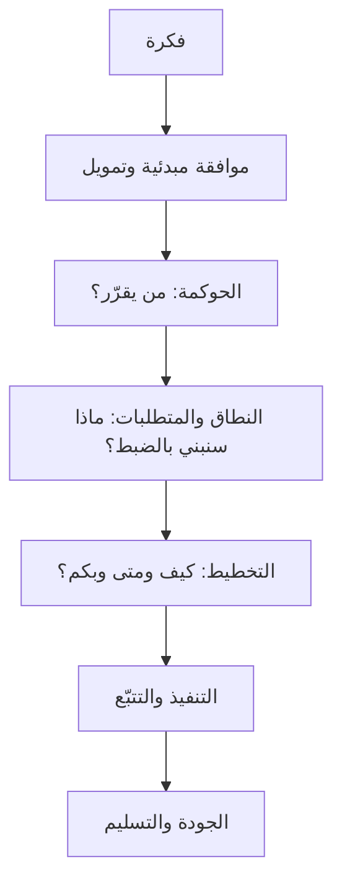
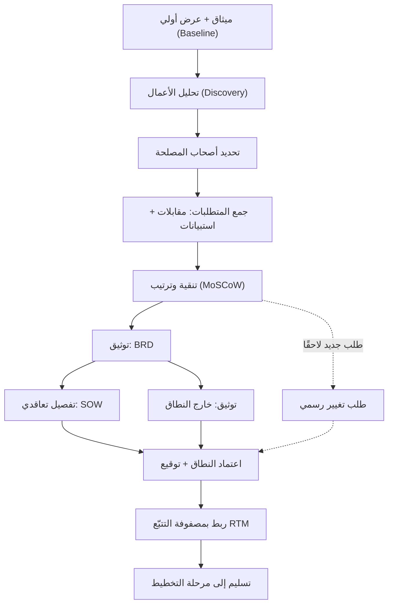
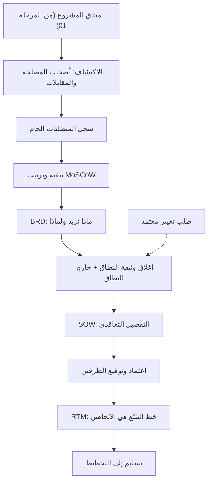

# 02 · النطاق والمتطلبات

> [!abstract] ماذا ستتعلّم هنا
> - **أين أنت الآن** من رحلة المشروع، ولماذا يأتي هذا الفصل بعد الحوكمة مباشرةً.
> - كيف تحوّل «فكرة عامة» أو عرضًا تسويقيًا إلى **نطاق (Scope)** ومتطلبات (Requirements) مكتوبة ومتفق عليها.
> - الفرق العملي بين **وثيقة النطاق ([[Scope Statement]])** و**نطاق العمل (SOW)** و**[[BRD|وثيقة متطلبات العمل]] (BRD)**، ومتى تكتب كلًّا منها.
> - كيف **تجمع** المتطلبات فعليًا (مقابلات، استبيانات، ورش)، وكيف تميّز **المتطلب** عن **الحل المقترح**.
> - كيف تحمي مشروعك من **توسّع النطاق ([[Scope Creep]])** عبر توثيق «[[Out of Scope|خارج النطاق]]» و**طلب التغيير ([[Change Request]])**.
> - كيف تتتبّع كل متطلب حتى الاختبار عبر **[[RTM|مصفوفة تتبّع المتطلبات]] (RTM)**.
> - **خريطة العلاقات**: كيف تلد كل وثيقة التي بعدها · **والترتيب الزمني**: ماذا تفعل في اليوم الأول · **وبوّابة الإغلاق**: كيف تعرف أنك انتهيت.
> - **طبقة التفكير** قبل طبقة الكتابة: كيف تسمع «حلًّا» فتستخرج منه «حاجة».
>
> 🔗 هذه المرحلة جزء من رحلة [[مدير المشاريع البرمجية الحديث]] — من المبتدئ إلى المحترف.

---

## 🗺️ رحلة المشروع حتى الآن

في [[01 - الحوكمة|الفصل السابق]] اتّفقنا على **من يملك القرار**: مالكٌ لكل نشاط، وقناة اعتماد واحدة، وسجلٌّ يحفظ ما حُسم. وفي هذا الفصل نتّفق على **ماذا سنبني بالضبط** — وهو السؤال الذي لا يُسأل مرّة واحدة، بل يُغلق بالتدريج حتى يصير عقدًا يُحتكم إليه.

> [!tip] لماذا هذا الترتيب لا غيره؟
> لأن المتطلب الذي لا يُعرف من يعتمده **ليس متطلبًا بل رأيًا**. فلو جُمعت المتطلبات قبل الحوكمة، لجُمعت من عشرة أشخاص لكلٍّ منهم رؤيته، ولوقفت عند أوّل تعارض بلا مرجع يحسمه. الحوكمة تُعطيك **من يوقّع**، وهذا الفصل يُعطيه **ما يوقّع عليه**.

---

## 🎭 القصة التي وُلدت منها هذه المرحلة

قال العميل جملة واحدة: **«أريد منصة طبية.»**

عمل الفريق ستة أشهر، وسلّم منصة تعمل. فنظر إليها العميل وقال: **«هذا ليس ما أردته.»** فقال الفريق: **«بل هذا ما فهمناه.»**

فمن المخطئ؟ **لا أحد.** المشكلة أن أحدًا لم يكتب ما المقصود بكلمة «منصة»: هل هي موقع حجز؟ أم سوق يجمع مستشفيات ومناديب؟ أم نظام إدارة عيادات؟ كانت الكلمة الواحدة تحمل ثلاثة مشاريع مختلفة، وكلٌّ سمع منها ما يوافق تصوّره — بحسن نيّة تامّة من الجميع.

**من هنا تبدأ مرحلة النطاق والمتطلبات:** لا لتوثّق ما اتُّفق عليه، بل **لتكتشف أنه لم يُتّفق على شيء بعد**.

---

## 🧭 المفهوم ببساطة

تخيّل أنك طلبت من مقاول أن يبني لك بيتًا، وقلت له فقط: «أريد بيتًا جميلًا». بعد شهور يسلّمك غرفتين، وأنت كنت تتخيّل فيلا من طابقين. من المخطئ؟ **كلاكما** — لأنه لم يكن هناك **مخطط هندسي مكتوب** يحدّد عدد الغرف والمساحة والمواصفات. مرحلة **النطاق والمتطلبات** هي كتابة ذلك «المخطط الهندسي» للمشروع.

ببساطة: هي المرحلة التي يتحوّل فيها المشروع من كلام عام إلى **تعريف دقيق ومكتوب** لِـ: ماذا سيُبنى؟ ولمن؟ ولماذا؟ و**ما الذي لن يُبنى؟**. تنتج هنا وثائق مرجعية (النطاق، SOW، BRD) وقوائم متطلبات مرتّبة بالأولوية، يُحتكم إليها عند أي خلاف لاحق.

> [!tip] القاعدة الذهبية
> **ما لا يُكتب لا يُوجد.** أي متطلب متفق عليه شفهيًا فقط سيُنسى أو يتحوّل إلى نزاع. التوثيق هنا ليس بيروقراطية، بل **تأمين ضد الفوضى**.

---

## 🧩 قاموس سريع للمصطلحات

| المصطلح (عربي) | English | معناه ببساطة |
| --- | --- | --- |
| النطاق | Scope | حدود المشروع: ما بداخله وما خارجه |
| توسّع النطاق | Scope Creep | إضافات تتسلّل بلا اتفاق فترهق الوقت والتكلفة |
| وثيقة النطاق | Scope Statement | تعريف عالي المستوى للأهداف والحدود |
| نطاق العمل | SOW ([[SOW|Statement of Work]]) | تفصيل تعاقدي دقيق لكل وحدة ومخرجاتها |
| وثيقة متطلبات العمل | BRD | «ماذا نريد من منظور العمل؟» أهداف ومتطلبات |
| قصة المستخدم | User Story | «بصفتي [دور]، أريد [وظيفة]، حتى [قيمة]» |
| ترتيب الأولويات | [[MoSCoW Prioritization|MoSCoW]] | Must / Should / Could / Won't have |
| مصفوفة التتبّع | RTM | تربط كل متطلب بحالته حتى الاختبار والاعتماد |
| معيار القبول | Acceptance Criteria | متى نعتبر المتطلب «منجزًا» فعلًا |
| طلب التغيير | Change Request | مسار رسمي لأي تعديل على النطاق المعتمد |
| تعريف الإنجاز/الاكتمال | DoD ([[Definition of Done]]) | معيار متّفق عليه متى نعدّ العمل «منجزًا» فعلًا — مفهوم Agile على مستوى الفريق، لا مرادف لـ«معايير نجاح المشروع» |
| تعريف الجاهزية | DoR ([[Definition of Ready]]) | بوابة الدخول: متى يصبح المتطلب جاهزًا لبدء العمل عليه (قبل بدء الـ Sprint) |

---

## ⛓️ لماذا تأتي هنا وتقود للتالية

**ما يسبقها (المتطلبات القبلية):** لا تبدأ هذه المرحلة من فراغ. تحتاج قبلها إلى **[[ميثاق المشروع (Project Charter)|ميثاق مشروع]]** يمنحك الصلاحية ويحدّد الغرض العام (راجع [[01 - الحوكمة]]). كما تحتاج إلى **رؤية أو عرض أولي** يصلح كخط أساس ([[Baseline]]) تبني فوقه أو تصحّحه.

**ما تُغذّيه (المخرجات):** كل ما تنتجه هنا — النطاق المعتمد، BRD، SOW، RTM، سجل أصحاب المصلحة — يتدفّق مباشرة إلى [[03 - التخطيط]]. بدون نطاق واضح **يستحيل** بناء جدول زمني واقعي، أو تقدير تكلفة، أو خطة اختبار ذات معنى. المتطلبات هنا تصبح لاحقًا **معايير القبول** في [[05 - الجودة والاختبار]].

> [!warning] خطأ يتضاعف
> أي خلل في تعريف النطاق هنا لا يبقى هنا؛ بل ينتقل **مُضاعَفًا** إلى كل مرحلة لاحقة. متطلب غامض اليوم = ميزة خاطئة تُبنى بعد شهرين = إعادة عمل مكلفة.

---

## 📊 مخطّط سير العمل

---

## 🧬 خريطة العلاقات — كل وثيقة تلد التي بعدها

الوثائق هنا تبدو ثمانية ملفات مستقلّة، وهي في الحقيقة **سلسلة توليد**: لا تُكتب وثيقة إلا من مخرَج سابقتها، ومن كتبها بغير ترتيبها كتبها مرّتين.

| الوثيقة | تولد من | تُولّد | ما يُفقد لو غابت |
| --- | --- | --- | --- |
| **وثيقة النطاق** | الميثاق · العرض الأولي · أهداف الراعي | SOW · معايير النجاح | المرجع الذي يُحتكم إليه في «ما المتفق عليه؟» |
| **أدوات الجمع** | سجل أصحاب المصلحة | سجل المتطلبات الخام | الفرق بين ما يحتاجه الناس وما نتخيّله عنهم |
| **BRD** | سجل المتطلبات بعد التنقية | SOW · معايير القبول · RTM | الرابط بين ما يُبنى وقيمة العمل |
| **خارج النطاق** | العقد بالنفي · المناطق الرمادية | حدود SOW · تسعير الطلبات اللاحقة | الدرع أمام «كنت أظنّها مشمولة» |
| **SOW** | وثيقة النطاق · BRD | جدول الدفعات · خطة الاختبار | المرجع التعاقديّ الذي يُقاس عليه التسليم |
| **طلب التغيير** | طلب جديد بعد الاعتماد | نطاق محدَّث · جدول محدَّث | الصمّام الذي يمنع التآكل الصامت |
| **استراتيجية إعادة الضبط** | تحليل العرض · مصفوفة الفجوات | قرار استراتيجي · نطاق مصحَّح | فرصة تصحيح الأساس قبل أن يصير أغلى من الهدم |
| **RTM والسجلّات** | المتطلبات المعتمدة | حالات الاختبار · تقارير التغطية | ضمان ألّا يسقط متطلب بين الجمع والاختبار |

> [!warning] نقطة يخطئ فيها أكثر من يقرأ الترتيب لأوّل مرة
> **وثيقة النطاق تُفتح مبكّرًا وتُغلق متأخّرًا.** فمسوّدتها الأولى تُكتب بعد الميثاق مباشرةً لترسم الحدود العليا وتمنع الانجراف أثناء الاكتشاف — لكنها **لا تُوقَّع** حينها. ثم تُغلق بعد BRD، حين تصير الحدود معروفة بالتفصيل لا بالتقدير. ومن وقّع نطاقه في اليوم الأول، وقّع على تخمين؛ ومن أخّر فتحه إلى ما بعد الجمع، جمع بلا حدود فتاه.

---

## 🗓️ الترتيب الزمني الحقيقي — ماذا أفعل في اليوم الأول؟

يعرف كثيرون **ما** الوثائق، ولا يعرفون **بأي ترتيب** تُكتب. وهذا الجدول هو الجواب العملي، وأكثر ما في الفصل رجوعًا إليه:

| # | الخطوة | من يقودها | مخرجها | متى تنتقل للتالية |
| --- | --- | --- | --- | --- |
| 1 | راجع **ميثاق المشروع** | مدير المشروع | فهم الغرض وحدود صلاحيتك | حين تعرف من يوقّع ومن يموّل |
| 2 | حدّد **أصحاب المصلحة** | مدير المشروع | سجل أطراف مصنّف بالتأثير والاهتمام | حين لا يبقى طرف مجهول يملك المنع |
| 3 | أجرِ **المقابلات** | محلّل الأعمال | ملاحظات خام منسوبة لأصحابها | بعد 3–5 مقابلات لكل شريحة |
| 4 | **اجمع** المتطلبات ووسّع بالاستبيان | محلّل الأعمال | سجل متطلبات خام | حين تتكرّر الإجابات بلا جديد |
| 5 | **رتّبها ونقّها** (MoSCoW) | المحلّل + الراعي | قائمة مرتّبة بلا تكرار ولا حلول | حين يُقطع «كل شيء Must» |
| 6 | اكتب **BRD** | محلّل الأعمال | متطلبات مربوطة بقيمة عمل | حين يوجد لكل متطلب معيار قبول |
| 7 | أغلق **وثيقة النطاق وخارج النطاق** | مدير المشروع | حدود صريحة بالإثبات والنفي | حين يستطيع كل طرف ذكر ما استُبعد |
| 8 | اكتب **SOW** | مدير المشروع + المنفّذ | تفصيل تعاقدي بوحدات ومخرجات | حين تُسعَّر كل وحدة وتُربط بدفعة |
| 9 | **الاعتماد والتوقيع** | الراعي والمنفّذ | نطاق مُعتمد ومجمّد | حين توجد التواقيع فعلًا |
| 10 | افتح **RTM** وسلّم للتخطيط | محلّل الأعمال | خط تتبّع لكل متطلب | حين يكون لكل متطلب صفّ |

> [!tip] ما يجوز أن يجري بالتوازي وما لا يجوز
> **يجوز:** دراسة الجدوى التقنية، ورسم النماذج الأولية للواجهات الحرجة، وفتح سجل المخاطر — كلّها تجري مع الخطوات 3–6 وتغذّيها.
> **ولا يجوز:** كتابة SOW قبل إغلاق الاكتشاف، ولا بدء التطوير قبل الخطوة 9. فالبناء أثناء التعريف ينتج شيئين معًا: شيفرةً تُهدَم، ومتطلباتٍ تُفصَّل على ما بُني بدل أن يُبنى على ما فُصِّل.

---

## 🧠 كيف أفكّر؟ — الطبقة التي تسبق الكتابة

أكثر من يتعلّم هذه المرحلة يتعلّم **كيف يكتب BRD**، وقليلٌ منهم يتعلّم **كيف يفكّر** قبل أن يكتب. والفرق بينهما هو الفرق بين كاتب محاضر وبين محلّل.

> [!tip] القاعدة الذهبية — الحاجة قبل الحل
> **كل جملة تبدأ بـ«أريد …» هي غالبًا حلٌّ لا متطلبًا.** فمتى سمعت «أريد زرًا أحمر»، فاكتب في ذهنك: *هذا ليس متطلبًا بعد*. ثم اسأل **«لماذا؟»** حتى تصل إلى الحاجة، ودع الحلّ للتصميم — فقد يكون هناك حلّ أرخص وأفضل لم يخطر لأحد.

وهذا هو السلّم عمليًّا:

| ما قيل (حلّ) | السؤال | الحاجة تحته | المتطلب القابل للاختبار |
| --- | --- | --- | --- |
| «أريد زرًا أحمر كبيرًا في الأعلى» | لماذا؟ | لا أعرف هل نجح الحجز أم لا | يُعرض للمستخدم تأكيد صريح لنتيجة الحجز خلال ثانيتين من إتمامه |
| «أريد تقارير Excel» | وماذا تفعل بها؟ | أرفع ملخّصًا شهريًّا للإدارة | تقرير شهري تلقائي بالمؤشّرات الخمسة يصل بريدًا في أوّل كل شهر |
| «أريد أن يتصل بي المستخدم» | ومتى تحديدًا؟ | أفقد العميل حين يتعثّر في الدفع | يُفتح للمستخدم مسار دعم مباشر عند فشل عملية دفع |

> [!warning] وحدّ القاعدة — متى تقبل الحل كما قيل؟
> ليست القاعدة أن تردّ كل حلّ يُقترح عليك؛ فذلك تكلّفٌ يُتعب أصحاب المصلحة ويُشعرهم بأنك تجادلهم. اقبل الحلّ كما هو في ثلاث حالات: أن يكون **قيدًا نظاميًّا** (تخزين البيانات داخل السعودية التزامًا بـ[[PDPL]])، أو **تكاملًا مفروضًا** مع نظام قائم لا خيار فيه، أو **تفضيلًا لا كلفة له** ولا يغلق بابًا لاحقًا. وما عدا ذلك فاسأل «لماذا» — مرّة واحدة تكفي غالبًا، وخمس مرّات في المتطلبات الغامضة.

---

## 🏥 القصة المستمرّة — «عافية» من أوّل يوم في هذه المرحلة

> [!note] حالة تعليمية مُصاغة
> «عافية» و«أُفُق للحلول الرقمية» اسمان افتراضيان، والأشخاص والحوارات **مشاهد تعليمية مُصاغة** لتقريب الفكرة، لا وقائع منسوبة إلى أحد. الثابت القابل للتحقّق هو المرجعيات النظامية والمعيارية وحدها.

> [!example] الحلقة (0) — أوّل يوم بعد إغلاق الحوكمة
> دخلت **سلمى** — مديرة مشروع عافية — إلى الاجتماع ومعها ثمانِ صفحات: العرض التسويقي الذي وُقّع على أساسه المشروع. كان الفريق مستعدًّا للبدء في اليوم نفسه، وكان السؤال الوحيد المطروح: «من أين نبدأ التطوير؟»
>
> فأوقفت العمل **أسبوعين**.
>
> بدت الخطوة مكلفة: أسبوعان بلا سطر شيفرة واحد. وسنرى في الحلقات التالية ما الذي اشترته هذه الأسابيع فعلًا.

---

## 📂 مستندات هذه المرحلة — واحدًا واحدًا

📂 «مجلد المرحلة»

> [!info] كيف تقرأ كل وثيقة أدناه — طبقة هندسة التفكير
> لا تُعرض الوثيقة بوصفها قالبًا يُملأ، بل بوصفها **جوابًا عن سلسلة أسئلة**. وكل وثيقة أدناه تمرّ بالسلسلة نفسها بالترتيب نفسه:
> 1. **لماذا احتاج الناس إليها؟** — المشكلة التي وُلدت منها، قبل أي تعريف.
> 2. **ما هي؟** — التعريف المختصر.
> 3. **المدخلات ← المعالجة ← المخرجات** — ماذا يدخل، وماذا يجري عليه، وماذا يخرج.
> 4. **من أين · كيف · فائدتها** — مادّتها وترتيبها وعائدها.
> 5. **دورة حياتها** — متى تُنشأ · من يكتبها · من يعتمدها · متى تنتهي.
> 6. **الكارثة التي تمنعها** — الثمن الذي تدفعه لو لم تكن موجودة.
> 7. **أكثر ثلاثة أخطاء يقع فيها المبتدئون** — لأن معرفة الشكل الفاسد تحفظ الشكل الصحيح.
> 8. **حلقة من عافية** — الفكرة نفسها وهي تجري في مشروع.

### 1) وثيقة نطاق المشروع (Scope Statement)

> [!failure] لماذا احتاج الناس إلى هذه الوثيقة؟
> لأن كل طرف كان يفسّر المشروع بطريقة مختلفة، وكلٌّ منهم يظنّ أن فهمه هو الفهم الوحيد الممكن. المالك يتخيّل منصّة تُغيّر سوقًا، والمنفّذ يقرأ ثماني صفحات ويقدّر أربعة أشهر، ومدير التسويق يفترض أن هناك تطبيقًا جوّالًا سيُطلقه. ثلاثة مشاريع في ثلاثة رؤوس، وعقد واحد يجمعها.

> [!info] ما هو ولماذا
> «العقد المرجعي» عالي المستوى: يحدّد الوصف العام، المنفّذ، التكلفة، المدة، الصفحات، الوحدات الوظيفية، ومعايير النجاح (Success Criteria). كل خلاف لاحق يُحَل بالرجوع إليه.

> [!abstract] المدخلات ← المعالجة ← المخرجات
> **المدخلات:** ميثاق المشروع · العرض أو العقد الأولي · أهداف الراعي وميزانيته.
> **المعالجة:** تثبيت الحدود العليا، وصياغة الأهداف صياغة قابلة للقياس، وتحديد معايير النجاح.
> **المخرجات:** تعريفٌ واحد للمشروع يُحتكم إليه · معايير نجاح تُقاس بأرقام لا بانطباع.

- **📥 من أين تجمع معلوماته:** من **الراعي/المالك** (الأهداف والميزانية)، ومن **العقد/العرض الأولي**، ومن **اجتماع** أولي مع المنفّذ لتثبيت الحدود.
- **🛠️ كيف ترتّبه:** ابدأ بنظرة عامة، ثم أهداف SMART، ثم الصفحات/الوحدات، ثم معايير النجاح، ثم الافتراضات والقيود، ثم التوقيعات.
- **🎯 فائدته:** مرجع واحد يُحتكم إليه، يمنع نزاع «ما المتفق عليه؟».
- **♻️ دورة حياته:** تُفتح مسوّدته **بعد اعتماد الميثاق** وقبل الاكتشاف · يكتبه مدير المشروع أو محلّل الأعمال · **ويعتمده الراعي بالتوقيع بعد اكتمال BRD لا قبله** · ويبقى مرجعًا حتى إغلاق المشروع، ولا يتغيّر بعد التوقيع إلا بطلب تغيير معتمد.

> [!danger] الكارثة التي يمنعها
> نزاع «ما المتفق عليه؟» بلا مرجع يحسمه — وهو أشدّ النزاعات استنزافًا، لأن **كل طرف صادق في روايته**، فلا ينتهي بإقناع بل بقوّة أو بخسارة.

> [!warning] أكثر ثلاثة أخطاء يقع فيها المبتدئون
> 1. **أهداف لا تُقاس:** «منصة سهلة الاستخدام» ليست هدفًا، لأنه لا يوجد يوم يُقال فيه إنها تحقّقت.
> 2. **الخلط بينه وبين SOW:** فيتضخّم بالتفاصيل التعاقدية، ويبقى SOW ناقصًا — فلا وثيقة عالية المستوى ولا وثيقة تفصيلية.
> 3. **نسيان معايير النجاح:** فيصير الحكم على المشروع انطباعًا شخصيًّا يوم التسليم.

> [!example] من عافية · الحلقة (1)
> حدّدت الوثيقة المنفّذ (أُفُق للحلول الرقمية)، وقيمة العقد، والمدة الأصلية (4 أشهر)، والصفحات الثماني — واستبدلت مرجع HIPAA/GDPR بنظام **[[PDPL]] السعودي** الملزم فعلًا.
>
> وأُضيف بندٌ صغير غيّر طبيعة الوثيقة: **معايير النجاح بالأرقام** بدل «منصة تخدم القطاع». فصار للمشروع خطّ نهاية يمكن أن يقف عليه الطرفان ويقولا: بلغناه أو لم نبلغه.

🔗 «01 - وثيقة نطاق المشروع»

### 2) نطاق العمل (SOW)

> [!failure] لماذا احتاج الناس إلى هذه الوثيقة؟
> لأن **العقد وحده لا يصف تفاصيل العمل**. العقد يقول «تطوير منصة إلكترونية مقابل مبلغ كذا خلال كذا»، وهو بذلك يحمي الدفع ولا يحمي التسليم. فإذا اختلف الطرفان على ما إذا كانت «إدارة الصلاحيات» داخلة أم لا، لم يجدا في العقد سطرًا واحدًا يفصل بينهما.

> [!info] ما هو ولماذا
> الوثيقة التعاقدية التي تفصّل **كل وحدة وظيفية** ببنودها ومخرجاتها ومعايير قبولها. هي ما افتقده العرض الأصلي تمامًا، وكان غيابها [[Root Cause Analysis|السبب الجذري]] للفوضى.

> [!abstract] المدخلات ← المعالجة ← المخرجات
> **المدخلات:** وثيقة النطاق · مخرجات جمع المتطلبات · قدرات المنفّذ الفعلية.
> **المعالجة:** تفصيل كل وحدة ببنودها ومخرجاتها ومعايير قبولها، وربطها بدفعة وجدول.
> **المخرجات:** مرجع تعاقدي بوحدات **قابلة للتسليم والقبول والدفع** — أي وحدات يمكن أن يُقال عنها «قُبلت» بلا جدال.

- **📥 من أين تجمع معلوماته:** من **المنفّذ** (بالتعاون)، ومن وثيقة النطاق، ومن نتائج جمع المتطلبات.
- **🛠️ كيف ترتّبه:** بالترتيب التالي:
    1. معلومات المشروع
    2. النطاق التفصيلي (وحدة وحدة)
    3. خارج النطاق
    4. المخرجات (Deliverables)
    5. الافتراضات
    6. الجدول
    7. الشروط المالية
    8. SLA
    9. التوقيعات
- **🎯 فائدته:** يقفل باب التفسير المفتوح، ويصبح المرجع التعاقدي الفعلي.
- **♻️ دورة حياته:** يُكتب **بعد اكتمال الاكتشاف وقبل أي تطوير** · يكتبه مدير المشروع بالتعاون مع المنفّذ · **يعتمده الطرفان بالتوقيع**، بمراجعة قانونية حين تكون القيمة أو المخاطر عالية · وينتهي **بمحضر التسليم والاستلام** لا بانتهاء آخر مهمّة.

> [!danger] الكارثة التي يمنعها
> **النزاعات التعاقدية:** «سلّمنا ما اتّفقنا عليه» في مقابل «لم نتّفق على هذا قطّ» — بلا وثيقة تفصل. وهي كارثة مزدوجة: تُكلّفك مالًا، وتُكلّفك المنفّذ الذي كنت ستكمل معه.

> [!warning] أكثر ثلاثة أخطاء يقع فيها المبتدئون
> 1. **اعتماد العرض التسويقي بدله:** والعرض وثيقة **بيع** غايتها الإقناع، لا وثيقة **مشروع** غايتها التحديد.
> 2. **الغموض المهذّب:** «نظام حجز متكامل» و«لوحة تحكّم شاملة» — كلمات تمرّ في التوقيع وتنفجر في التسليم.
> 3. **نسيان «خارج النطاق» داخله:** فالوثيقة التي تُثبت ولا تنفي تترك نصف الحدود مفتوحًا.

> [!example] من عافية · الحلقة (2)
> كشف التحليل أن النطاق الحقيقي = **7 أنظمة في نظام واحد** (حجز، متجر متعدد البائعين، LMS، مخزون، فعاليات، توظيف، اشتراكات) — وهو ما يوجب SOW يفصّلها بدل «حجز مواعيد» فقط.
>
> ففُصلت السبعة إلى وحدات مستقلّة، لكل وحدة **مخرجاتها ومعايير قبولها ودفعتها**. وهنا ظهر ما كان مخفيًّا: النظام الذي قُدِّر بأربعة أشهر ظهر على حقيقته سبعةَ مشاريع، وصار بالإمكان لأوّل مرّة أن يُسأل السؤال الصحيح: **أيّها الآن، وأيّها في الإصدار الثاني؟**

🔗 «08 - نطاق العمل SOW»

### 3) وثيقة متطلبات العمل (BRD)

> [!failure] لماذا احتاج الناس إلى هذه الوثيقة؟
> لأن العميل يعرف ما يريد **من ناحية العمل**، ولا يعرف كيف يشرحه للمطوّر. يقول: «أريد أن تزيد الحجوزات وأن تقلّ اتصالات الدعم» — وهذه أهداف صحيحة تمامًا وغير قابلة للبرمجة. والمطوّر يحتاج أن يعرف: من المستخدم؟ وما الشاشة؟ ومتى نقول إن الأمر نجح؟ فاحتيج إلى وثيقة **تترجم بين اللغتين** بلا أن تخون إحداهما.

> [!info] ما هو ولماذا
> تجيب سؤال: **«ماذا نريد من المنصة من منظور العمل؟»** (لا كيف تُبنى تقنيًا). تشمل أهداف العمل و[[KPI|KPIs]]، أصحاب المصلحة، متطلبات على هيئة **User Stories**، ومتطلبات غير وظيفية.

> [!abstract] المدخلات ← المعالجة ← المخرجات
> **المدخلات:** المقابلات · أهداف العمل ومؤشّراتها · سجل المتطلبات الخام.
> **المعالجة:** تحويل الحاجات إلى قصص مستخدم بمعايير قبول، وفصل المتطلبات غير الوظيفية (أداء · أمان · خصوصية).
> **المخرجات:** متطلبات موثّقة، **كلٌّ منها مربوط بقيمة عمل قابلة للقياس** — فما لا يُعرف ما يخدمه لا يُبنى.

- **📥 من أين تجمع معلوماته:** من **أصحاب المصلحة** عبر المقابلات، ومن سجل المتطلبات المجمّعة، ومن أهداف العمل لدى المالك.
- **🛠️ كيف ترتّبه:** بالترتيب التالي:
    1. ملخص تنفيذي
    2. أهداف العمل وKPI
    3. أصحاب المصلحة
    4. متطلبات وظيفية (User Stories)
    5. متطلبات غير وظيفية
    6. القيود
    7. معايير النجاح
- **🎯 فائدته:** يضمن أن ما يُبنى يخدم **قيمة عمل** حقيقية، لا مجرد ميزات.
- **♻️ دورة حياته:** يُكتب **بعد الجمع والتنقية** لا أثناءهما · يكتبه محلّل الأعمال · **يعتمده الراعي وممثّلو أصحاب المصلحة** بعد أن يُعرض عليهم ما فُهم عنهم · ويبقى مرجعًا حيًّا حتى **اختبار قبول المستخدم ([[UAT]])**، ثم يُجمَّد ويُحتكم إليه.

> [!danger] الكارثة التي يمنعها
> **بناء شيء لا يخدم العمل:** منتج يعمل تقنيًّا بلا خطأ واحد، ولا يحرّك رقمًا واحدًا عند العميل. وهذه أخبث صور الفشل، لأن كل تقرير تقنيّ فيها يقول إن الأمور بخير.

> [!warning] أكثر ثلاثة أخطاء يقع فيها المبتدئون
> 1. **كتابة حلول بدل احتياجات:** فتُقفل مساحة التصميم قبل أن تُفتح.
> 2. **نسيان شريحة من أصحاب المصلحة:** وأخطر من يُنسى ليس صاحب الطلب، بل **من يملك المنع** — كالمراجع القانوني أو مسؤول الأمن.
> 3. **متطلب بلا معيار قبول:** وهو متطلب لم يكتمل بعد؛ فإن عجزت عن كتابة معياره فأنت لم تفهمه.

> [!example] من عافية · الحلقة (3)
> «بصفتي مندوب شركة طبية، أريد أن أحجز موعدًا افتراضيًا مع طبيب، حتى أعرض منتجاتي» — صياغة تربط الوظيفة بالقيمة مباشرة.
>
> وأُلحق بكل قصة **مؤشّر العمل الذي تخدمه**: هذه القصة تخدم «عدد المواعيد المكتملة شهريًّا». فصار من الممكن أن يُسأل عن أي ميزة مقترحة: **أي رقم ستحرّك؟** — والميزة التي لا جواب لها تنتقل تلقائيًّا إلى آخر الترتيب.

🔗 «09 - وثيقة متطلبات العمل BRD»

### 4) خارج النطاق (Out of Scope)

> [!failure] لماذا احتاج الناس إلى هذه الوثيقة؟
> لأن في كل مشروع **منطقة رمادية** يظنّ كلا الطرفين أنها من نصيب الآخر: من يُدخل المحتوى؟ ومن يستخرج الترخيص؟ ومن يشتري الاشتراكات السنوية للخدمات؟ لا أحد يكذب، ولا أحد يسأل — حتى يأتي يوم التسليم فتظهر المنطقة الرمادية دفعةً واحدة، وقد صار لكلٍّ منها ثمن وموعد لم يُخطَّط لهما.

> [!info] ما هو ولماذا
> توثيق ما **ليس** جزءًا من المشروع لا يقل أهمية عن توثيق ما بداخله. هو درعك ضد توسّع النطاق ومطالبات الأعمال الإضافية من الطرفين.

> [!abstract] المدخلات ← المعالجة ← المخرجات
> **المدخلات:** العقد بالنفي · المناطق الرمادية · التوقّعات غير المعلنة عند كل طرف.
> **المعالجة:** نفيٌ صريح لكل بند مستبعَد، **مع سببه وتقدير كلفته لو طُلب لاحقًا**.
> **المخرجات:** قائمة مستبعدات موقّعة · قائمة بنود رمادية تنتظر الحسم.

- **📥 من أين تجمع معلوماته:** من **العقد** (بالنفي)، ومن نقاش المناطق الرمادية (Grey Areas) مع المنفّذ.
- **🛠️ كيف ترتّبه:** جدول بالبنود المستبعدة والسبب وتقدير لو طُلبت لاحقًا، ثم قائمة «بنود تحتاج توضيحًا» لحسمها.
- **🎯 فائدته:** يمنع نزاع «هذا كان مفترضًا ضمن الاتفاق».
- **♻️ دورة حياته:** يُفتح **مع مسوّدة وثيقة النطاق**، ويكبر كلّما ظهرت منطقة رمادية جديدة أثناء الاكتشاف · يكتبه مدير المشروع · **يعتمده الطرفان مع النطاق في التوقيع نفسه** · وينتهي بانتهائه، ويُفتح ما استُبعد منه بابًا لعروض لاحقة.

> [!danger] الكارثة التي يمنعها
> جملة واحدة تُقال في نهاية كل مشروع لم يُكتب فيها: **«كنت أظنّ أنها ضمن الاتفاق.»** وهي جملة لا يمكن الردّ عليها إلا بورقة، لأن الظنّ لا يُكذَّب بظنّ.

> [!warning] أكثر ثلاثة أخطاء يقع فيها المبتدئون
> 1. **الاكتفاء بذكر ما بالداخل** ظنًّا أن ما عداه مفهوم بالضرورة — وهو ليس مفهومًا عند أحد غيرك.
> 2. **نفيٌ بلا سبب:** فيبدو تعنّتًا ويُعاد فتحه في كل اجتماع؛ والسبب المكتوب يُغلق النقاش من أوّله.
> 3. **نسيان التسعير التقديري للمستبعَد:** فيتحوّل طلبه لاحقًا إلى مفاوضة من الصفر بدل قرار جاهز.

> [!example] من عافية · الحلقة (4)
> استُبعد صراحةً: **تطبيق جوال أصلي** (العرض يذكر responsive فقط)، إدخال المحتوى، حملات التسويق، والترخيص النظامي — كلها مسؤوليات خارج التطوير.
>
> ووُضع أمام كل بند مستبعَد **تقدير أوّليّ لو طُلب لاحقًا**. فحين طلب مدير التسويق التطبيق الجوّال بعد شهرين، لم يكن الجواب «لا»، بل: هذا خارج النطاق الحاليّ، وكلفته التقديرية كذا، ومسارُه طلب تغيير. **تحوّل الرفض إلى تسعيرة، فانتهى النقاش في اجتماع واحد.**

🔗 «03 - خارج النطاق»

### 5) قالب طلب التغيير (Change Request)

> [!failure] لماذا احتاج الناس إلى هذه الوثيقة؟
> لأن التغيير **سيأتي حتمًا** — ولا عيب فيه، بل هو علامة على أن الفهم ينضج. العيب أن يأتي صامتًا: «إضافة صغيرة لن تأخذ وقتًا»، تتكرّر عشرين مرّة، فإذا المشروع مشروع آخر بجدول المشروع الأوّل وميزانيته. ولا يستطيع أحد أن يشير إلى اللحظة التي انحرف فيها، لأنه لم ينحرف مرّة واحدة.

> [!info] ما هو ولماذا
> نموذج رسمي لأي توسّع لاحق في النطاق، يقيّم الأثر على **الجدول والتكلفة والمخاطر** قبل الموافقة. هو الصمّام الذي يحوّل «توسّع النطاق» الفوضوي إلى قرار مدروس.

> [!abstract] المدخلات ← المعالجة ← المخرجات
> **المدخلات:** طلب من صاحب مصلحة · النطاق المعتمد الذي يُقاس عليه.
> **المعالجة:** تقدير الأثر في ثلاثة محاور (وقت · تكلفة · مخاطر)، ثم قرار معلن بمالك.
> **المخرجات:** قرار موثّق · نطاق محدَّث · جدول ودفعات محدَّثان · صفّ جديد في RTM.

- **📥 من أين تجمع معلوماته:** من **مقدّم الطلب** (وصف التغيير وسببه)، ومن **الفريق** (تقدير الأثر).
- **🛠️ كيف ترتّبه:** وصف التغيير ← المبرّر ← تحليل الأثر (وقت/تكلفة/مخاطر) ← القرار (قبول/رفض) ← الاعتماد.
- **🎯 فائدته:** يحمي الجدول والميزانية من التآكل الصامت.
- **♻️ دورة حياته:** يُفتح القالب **مع اعتماد النطاق لا عند أوّل طلب** — فأوّل طلب يأتي فجأة ولا وقت لتصميم مسار حينها · يملؤه مقدّم الطلب ويقدّر الفريق أثره · **يعتمده الراعي، ويُحدَّد حدّ صلاحية مدير المشروع سلفًا** (ما دون كذا يُعتمد داخليًّا) · ويبقى حيًّا ما دام النطاق قابلًا للتعديل.

> [!danger] الكارثة التي يمنعها
> **تضخّم المشروع (Scope Creep):** التآكل الصامت للجدول والميزانية، الذي لا يُكتشف إلا حين يستحيل تداركه — لأن كل خطوة منه كانت صغيرة ومعقولة.

> [!warning] أكثر ثلاثة أخطاء يقع فيها المبتدئون
> 1. **تقدير الأثر بالوقت وحده:** فتُغفل المخاطر الجديدة التي يفتحها التغيير، وهي غالبًا أغلى من أيامه.
> 2. **«سنسجّلها لاحقًا»:** فالتغيير الذي لم يُوثَّق ساعةَ قبوله لا يُوثَّق بعدها أبدًا.
> 3. **قبول التغيير بلا تحديث ما يتفرّع عنه:** النطاق وRTM والجدول وخطة الاختبار — فيصير لديك تغيير معتمد ووثائق تصفه كأنه لم يقع.

> [!example] من عافية · الحلقة (5)
> بعد اعتماد النطاق بأسبوعين وصل الطلب المتوقّع: **إشعارات فورية للمرضى**، بوصفها «إضافة بسيطة». مُلئ النموذج، فظهر الأثر: أسبوعان على الجدول، وكلفة تكامل مع مزوّد خارجي، **وخطر جديد** يتعلّق بإرسال بيانات موعد إلى طرف ثالث — وهو ما يستدعي مراجعة على ضوء [[PDPL]].
>
> قُبل التغيير، لكن **مقابل تأجيل وحدة الفعاليات إلى الإصدار الثاني**. ولم تكن العبرة في القبول ولا في الرفض، بل في أن الطلب مرّ من **باب** بدل أن يتسلّل من نافذة.

🔗 «04 - قالب طلب تغيير»

### 6) استراتيجية إعادة ضبط المشروع ورسالة المنفّذ

> [!failure] لماذا احتاج الناس إلى هذه الوثيقة؟
> لأن أخطر لحظة في المشروع أن تكتشف أن **الأساس نفسه معطوب** بعد أن بدأ العمل: جدول لا يجمع حسابيًّا، وسعر لا يُفسَّر إلا بقالب جاهز، ومرجع نظاميّ خاطئ. والغريزة تعرض خيارين، وكلاهما خاسر: **المواجهة** فتخسر المنفّذ وتبدأ من الصفر، أو **السكوت** فتدفع الثمن كاملًا بعد ستة أشهر. فاحتيج إلى مسار ثالث: **تصحيح موثّق بلا اتهام**.

> [!info] ما هو ولماذا
> أهم وثيقة في الحزمة: تشخّص المخاطر الجوهرية في العرض الأصلي وتطرح **ثلاثة خيارات استراتيجية** للتعامل معها، مع رسالة جاهزة لفتح حوار مهني غير اتهامي مع المنفّذ.

> [!abstract] المدخلات ← المعالجة ← المخرجات
> **المدخلات:** تحليل العرض بالأرقام · مصفوفة الفجوات · التناقضات الداخلية في وثائق المنفّذ.
> **المعالجة:** تشخيص موضوعيّ ← خيارات ثلاثة بكلفة كلٍّ منها ← شجرة قرار تربط الخيار بشرطه.
> **المخرجات:** قرار استراتيجي معتمد من الراعي · رسالة مهنية جاهزة للإرسال · نطاق مصحَّح.

- **📥 من أين تجمع معلوماته:** من **تحليل العرض** (الأرقام والتناقضات)، ومن **مصفوفة الفجوات**.
- **🛠️ كيف ترتّبه:** تشخيص (أعلام حمراء) ← مبادئ حاكمة ← الخيارات الثلاثة ← خطة تنفيذية ← شجرة قرار ← تنبيهات قانونية.
- **🎯 فائدته:** تصحيح المسار قبل أن يتحوّل المشروع إلى «نظام لا يعمل» أو فاتورة صيانة باهظة.
- **♻️ دورة حياتها:** تُنشأ **فور اكتشاف خلل هيكليّ** لا في موعد دوريّ · يكتبها مدير المشروع، بمراجعة قانونية لأنها قد تمسّ العقد · **يعتمدها الراعي وحده** لأن أثرها يتجاوز صلاحية مدير المشروع · وتنتهي بأحد أمرين: نطاق مصحَّح موقَّع، أو قرار بإنهاء العلاقة.

> [!danger] الكارثة التي تمنعها
> أن يستمرّ المشروع على أساس معطوب حتى يصير **التصحيح أغلى من إعادة البناء** — وهي النقطة التي بعدها لا يبقى قرار جيّد، بل أقلّ القرارات سوءًا.

> [!warning] أكثر ثلاثة أخطاء يقع فيها المبتدئون
> 1. **بدء الحوار بالاتهام:** فيتحوّل النقاش الفنّي إلى دفاع عن السمعة، ويُغلق باب التصحيح.
> 2. **عرض خيار واحد:** فما يُقدَّم بخيار واحد إنذارٌ لا خيار، ويُقابَل بما يُقابَل به الإنذار.
> 3. **إغفال الأثر القانوني:** فبعض «التصحيحات» تمسّ بنودًا موقَّعة، ولا تُرسل رسالة فيها قبل مراجعة.

> [!example] من عافية · الحلقة (6)
> كشفت الاستراتيجية تناقضًا: مجموع مراحل الجدول = 24 أسبوعًا بينما النص يقول «4 أشهر»، وسعرًا غير منطقي (~294 درهم/ميزة). فاقترحت «إعادة ضبط» هادئة بدل المواجهة.
>
> أُرسلت الرسالة بلا كلمة اتّهام واحدة: أرقامٌ، وسؤالٌ عن تفسيرها، وثلاثة خيارات. فاختار المنفّذ الخيار الأوسط — **إعادة تحديد النطاق على مراحل مع تمديد الجدول** — واستمرّت العلاقة. ولو أُرسلت الرسالة نفسها بصيغة الاتهام لكان الجواب دفاعًا، ولكانت النتيجة تعثّرًا أو قطيعة.

🔗 «05 - استراتيجية إعادة الضبط» · 🔗 «07 - رسالة إعادة الضبط للمنفّذ»

### 7) أدوات جمع المتطلبات (الدليل والأسئلة والقوالب)

> [!failure] لماذا احتاج الناس إلى هذه الأدوات؟
> لأن المتطلبات **لا توجد جاهزة في رأس أحد**؛ إنما تُستخرج. فمن سأل صاحب المصلحة «ماذا تريد؟» حصل على قائمة ميزات منقولة عن منافس رآه، ومن سأله «كيف تعمل اليوم؟ وأين تتعثّر؟ وكم مرّة في الأسبوع؟» حصل على حاجة حقيقية لم يكن صاحبها نفسه قادرًا على صياغتها.

> [!info] ما هو ولماذا
> حزمة «كيف نجمع المتطلبات فعليًا»: دليل بست خطوات، أسئلة تحليل أعمال عميقة، قالب مقابلة، وقالب استبيان — تحوّل كلام أصحاب المصلحة إلى متطلبات موثّقة.

> [!abstract] المدخلات ← المعالجة ← المخرجات
> **المدخلات:** سجل أصحاب المصلحة · أسئلة الاكتشاف · أدوات التوثيق.
> **المعالجة:** مقابلات نوعية أوّلًا (لماذا)، ثم استبيان كمّي (كم)، ثم تنقية وتصنيف وإزالة التكرار.
> **المخرجات:** سجل متطلبات خام منسوب لأصحابه · قائمة افتراضات تحتاج تحقّقًا.

- **📥 من أين تجمع معلوماته:** من **أصحاب المصلحة مباشرة** (مقابلات 3–5 لكل شريحة)، ثم استبيان أوسع لتأكيد النتائج.
- **🛠️ كيف ترتّبه:** حدّد الأطراف ← اختر التقنية ← نفّذ الجمع ← نقِّ وصنّف ← وثّق ← اعتمد وتحقّق.
- **🎯 فائدته:** يمنع أكبر سبب لفشل المشاريع — البناء على افتراضات بدل حاجات حقيقية.
- **♻️ دورة حياته:** يُستعمل **في صدر المرحلة قبل أي توثيق رسمي** · يقوده محلّل الأعمال · **تُعتمد نتائجه بعرضها على من قوبل** (فالتحقّق جزء من الجمع لا خطوة لاحقة) · ويُغلق الاكتشاف قبل اعتماد SOW، لا بالتوازي معه.

> [!danger] الكارثة التي يمنعها
> **البناء على افتراضات:** أشهر أسباب فشل المشاريع وأخفاها، لأنه لا يظهر في أي تقرير حالة — بل يظهر مرّة واحدة، يوم يرى المستخدم الحقيقيّ ما بُني له فلا يستعمله.

> [!warning] أكثر ثلاثة أخطاء يقع فيها المبتدئون
> 1. **مقابلة شخص واحد يمثّل شريحة كاملة:** فيصير رأيه الفرديّ متطلبًا لمئة مستخدم.
> 2. **أسئلة موحية بالجواب:** «ألا ترى أن الحجز السريع مهم؟» — سؤالٌ يُنتج تأكيدًا لا معلومة.
> 3. **عدم إرجاع ما فُهم إلى صاحبه:** فأنت لم تجمع متطلباته، بل جمعت تفسيرك لكلامه.

> [!example] من عافية · الحلقة (7)
> نصّ الدليل: ابدأ بمقابلات مع مستشفى ومندوب وطبيب، ثم استبيان، ثم نماذج أولية للواجهات الحرجة (الحجز). وحذّر من «الدجاجة والبيضة»: أي طرف نجذب أولًا في منصة متعددة الأطراف؟
>
> وفي المقابلة الثالثة ظهر ما لم يكن في العرض ولا في أذهان الفريق: **من يحجز الموعد في المستشفى ليس الطبيب ولا الإدارة، بل السكرتارية** — وهي شريحة لم يكن لها ذكر في أي وثيقة. فأُضيفت مستخدمًا أساسيًّا، وتغيّرت معها ثلاث شاشات. وهذا وحده يستحقّ الأسبوعين اللذين أوقفت فيهما سلمى العمل.

🔗 «11 - أسئلة تحليل الأعمال» · 🔗 «12 - دليل جمع المتطلبات» · 🔗 «14 - قالب مقابلة أصحاب المصلحة» · 🔗 «16 - قالب استبيان جمع المتطلبات»

### 8) السجلّات والمصفوفات (ملفات CSV/جداول)

> [!failure] لماذا احتاج الناس إلى هذه السجلّات؟
> لأن بعض المتطلبات **كانت تختفي أثناء التنفيذ**. لا يحذفها أحد، ولا يعترض عليها أحد؛ إنما تسقط في الفراغ بين جدول جمعٍ وبطاقة مهمّة وحالة اختبار. ثم تظهر مرّة واحدة، في اختبار قبول المستخدم، حين يسأل العميل: «وأين الميزة التي اتّفقنا عليها في الشهر الأول؟»

> [!info] ما هو ولماذا
> جداول تتبّع حيّة تُحدّث باستمرار: تفصّل الميزات، وتربط المتطلبات بحالتها، وتسجّل أصحاب المصلحة والمتطلبات الخام.

> [!abstract] المدخلات ← المعالجة ← المخرجات
> **المدخلات:** المتطلبات المعتمدة · حالة التنفيذ الفعلية · حالات الاختبار.
> **المعالجة:** ربط كل متطلب بمصدره وتصميمه وتطويره واختباره واعتماده.
> **المخرجات:** خط تتبّع **في الاتجاهين**، ونسبة تغطية معلومة في أي لحظة بلا اجتماع.

- **📥 من أين تجمع معلوماته:** من مخرجات الجمع، ومن حالة التنفيذ الفعلية عبر المراحل.
- **🛠️ كيف ترتّبه:** كل سجل عمود لكل خاصية (معرّف، أولوية، حالة، ملاحظات) وصف لكل عنصر.
- **🎯 فائدته:** لا يضيع أي متطلب بين مرحلة جمعه ومرحلة اختباره.
- **♻️ دورة حياته:** تُنشأ RTM **بعد اعتماد المتطلبات مباشرةً** · يملؤها محلّل الأعمال، **وتُحدَّث طوال التنفيذ بمسؤولية دورية معلنة** (وإلا صارت أثرًا تاريخيًّا لا أداة) · تُراجَع في كل بوابة تسليم · وتنتهي **عند قبول المشروع في [[UAT]]**.

> [!danger] الكارثة التي تمنعها
> **متطلب معتمد لم يُبنَ، ولا يُكتشف إلا بعد التسليم** — فيُدفع ثمنه مرّتين: مرّة في بنائه متأخّرًا وسط ضغط، ومرّة في ثقة العميل التي لا تُشترى.

> [!warning] أكثر ثلاثة أخطاء يقع فيها المبتدئون
> 1. **عدم تحديثها:** فتتحوّل من أداة إلى وثيقة أرشيفية تصف ماضيًا لا حاضرًا.
> 2. **عدم ربطها بحالات الاختبار:** فتقول إن المتطلب «مُنجَز» بلا دليل على أنه يعمل.
> 3. **التتبّع في اتجاه واحد:** من المتطلب إلى الاختبار فقط، دون العكس — فيبقى **بند النطاق الذي لا يقابله متطلب** مخفيًّا، وهو عملٌ يُبنى ويُدفع ثمنه بلا مبرّر.

> [!example] من عافية · الحلقة (8)
> **RTM** تربط كل متطلب عبر: صُمّم؟ طُوّر؟ اختُبر؟ اعتُمد ([[UAT]])؟ — لضمان عدم نسيان أي متطلب.
>
> وفي المراجعة السابقة للتسليم ظهر صفٌّ واحد بلا حالة اختبار: **تصدير تقرير المواعيد للمستشفى** — متطلب معتمد، مبنيّ، لم يُختبر قطّ. أُغلق في يومين قبل التسليم. ولولا عمود واحد في جدول، لكان أوّل من اكتشفه هو العميل نفسه.

الملفات (تُفتح ببرنامج جداول): `02-مصفوفة-حالة-المميزات.csv` · `06-مصفوفة-الفجوات.csv` · `10-RTM-مصفوفة-تتبع-المتطلبات.csv` · `13-سجل-أصحاب-المصلحة-Stakeholders.csv` · `15-سجل-المتطلبات-المجمّعة-Requirements-Log.csv`

---

## ✅ كيف أعرف أنني انتهيت من هذه المرحلة؟

لكل مرحلة **تعريف اكتمال** خاصّ بها، وغيابه هو ما يجعل الفرق تنتقل إلى التخطيط وهي تظنّ أنها فرغت. وهذه بوّابة الإغلاق:

> [!success] انتهت مرحلة النطاق إذا…
> - ✅ **قوبل كل أصحاب المصلحة** — لا شريحة واحدة تُمثَّل بالتخمين، وفيهم من يملك المنع لا من يملك الطلب فقط.
> - ✅ **كل المتطلبات موثّقة** في سجل واحد منسوبة إلى مصادرها.
> - ✅ **لكل متطلب أولوية** بـ MoSCoW، وقد جرى القطع فعلًا فلم يعد كل شيء `Must`.
> - ✅ **يوجد «خارج النطاق»** مكتوبًا بالنفي الصريح، لكل بند فيه سبب وتقدير.
> - ✅ **لكل متطلب معيار قبول** قابل للاختبار — يستطيع الفريق أن يقول عنه «تحقّق» أو «لم يتحقّق» بلا نقاش.
> - ✅ **وقّع العميل والمنفّذ** على النطاق وSOW، لا موافقة شفهية ولا «تمام» في محادثة.
> - ✅ **فُتحت RTM** وفيها صفّ لكل متطلب معتمد.

> [!warning] المعيار العملي
> إن وُقّعت الوثائق ولم يستطع أحد الحاضرين أن يذكر **بندًا واحدًا استُبعد** من المشروع، فقد وُقّعت وثيقة ولم يُغلق نطاق. فمن لا يعرف حدود مشروعه من الخارج لا يعرفه من الداخل.

---

## ⏱️ إدارة وقت هذه المهمة

| حجم المشروع | المدة التقريبية (معايير دولية) |
| --- | --- |
| صغير | ساعات إلى أيام قليلة |
| متوسط | أسبوع إلى أسبوعين |
| كبير (مثل عافية) | أسابيع إلى أشهر (متعدد الأطراف والأنظمة) |

**من يُنتج المستند وكيف يتعاونون:**

- **من يقود؟** عادةً **محلّل الأعمال (Business Analyst)** أو مدير المشروع يقود عملية الجمع والصياغة.
- **من يتعاون معه؟**
    - **الراعي/المالك** — يعتمد الأهداف والنطاق.
    - **أصحاب المصلحة** — مصدر المتطلبات عبر المقابلات.
    - **الفريق التقني** — يتحقق من الجدوى التقنية.
- **تسلسل العمل:**
    1. المحلّل يجمع المتطلبات.
    2. يصوغ مسودّة.
    3. أصحاب المصلحة يراجعون.
    4. الراعي يعتمد ويوقّع.
- **الحجم النموذجي:** من شخص واحد في مشروع صغير، إلى فريق (محلّل ومدير وممثّلي أطراف) في مشروع كبير.

**أي ملفات تراجع:** راجع **[[ميثاق المشروع (Project Charter)|ميثاق المشروع]]** من [[01 - الحوكمة]] لتثبيت الغرض، والعرض/العقد الأولي كخط أساس، وسجل أصحاب المصلحة قبل بدء المقابلات.

**صيغ الملفات:**

| النوع | الصيغة المناسبة | لماذا |
| --- | --- | --- |
| السجلّات والمصفوفات (RTM، أصحاب المصلحة، الفجوات) | **Excel / CSV** | جداول حيّة قابلة للفرز والتحديث |
| الأدلّة والقوالب (المقابلة، دليل الجمع) | **Word / Markdown** | نصوص قابلة للتحرير والربط |
| الوثائق الرسمية (النطاق، SOW الموقّع) | **PDF** | نسخة نهائية موقّعة لا تُعدّل |

> [!warning] الدقّة قبل السرعة
> هذه المرحلة ليست سباقًا. ساعة إضافية في توضيح متطلب غامض توفّر أسابيع من إعادة العمل لاحقًا. **اكتمال ووضوح النطاق أهم من إنهائه بسرعة.**

---

## 🌐 ما تقوله المعايير الحديثة

> [!quote] خلاصة بحثية (2026)
> - **من التوثيق الساكن إلى الذكاء التنبّئي:** تتّجه المتطلبات في 2026 من مستندات جامدة إلى مساحات عمل تعاونية حيّة، مع تتبّع لحظي واعتمادات آلية و**كشف مخاطر مدعوم بالذكاء الاصطناعي**.
> - **افصل بينهما واربطهما:** «المتطلبات **تُغذّي** النطاق، والنطاق **ينظّم** التسليم». اجعل المتطلب يُنشئ خط أساس معتمد، ثم يُبنى فوقه بيان النطاق و**هيكل تجزئة العمل (WBS)** — دون تكرار أو فجوات.
> - **RTM في الاتجاهين:** الممارسة الحديثة تفرض أن **كل متطلب يتتبّع إلى نطاق، وكل بند نطاق يتتبّع إلى متطلب** — لا متطلب يتيم ولا نطاق بلا مبرّر.
> - **لا تتخطَّ قطع MoSCoW:** حين يصبح «كل شيء Must-have»، تحدث الأولوية الحقيقية لاحقًا تحت ضغط الموعد النهائي وبشكل سيّئ.
>
> يتقاطع هذا مع [[مدير المشاريع البرمجية الحديث|مثلث كفاءات PMI]]: المعرفة التقنية (كتابة نطاق سليم) والقيادة (محاذاة أصحاب المصلحة) والفطنة التجارية (ربط المتطلبات بقيمة العمل).

---

## ➕ لإكمال الصورة — تحسينات مقترحة

> [!todo] ما ينقص مقارنة بالمعايير، وكيف نكمله
> - **معايير قبول مكتملة لكل ميزة:** يشير BRD وSOW إلى معايير «تُحدّد لاحقًا»، لكن لا يوجد ملف مكتمل. هذا يخالف مبدأ أن يكون تعريف «الاكتمال» معروفًا **قبل** بدء العمل. أنشأنا لذلك وثيقة مكمّلة: [[معايير القبول (Acceptance Criteria)]].
> - **تحليل استراتيجي مرئي لأصحاب المصلحة:** السجل يذكر التأثير والاهتمام نصيًا فقط، دون تصنيف يوجّه أولوية التواصل. أنشأنا لذلك: [[مصفوفة قوة–اهتمام أصحاب المصلحة (Power-Interest Grid)]].
> - **إغلاق مرحلة الاكتشاف قبل التوقيع:** أسئلة تحليل الأعمال لا تزال مفتوحة؛ المعيار أن يُغلق الاكتشاف (Discovery) قبل اعتماد SOW لا بالتوازي معه. عالِج ذلك بجلسات مقابلة موثّقة الإجابات.
> - **الترتيب الصحيح للتوثيق:** المسار المعياري هو جمع ← تنقية ← BRD ← SOW، لا صياغة القوالب بالتوازي مع جمع لم يكتمل.
> - **فصل المخاطر في سجل مستقل:** المخاطر القانونية (PDPL بدل HIPAA/GDPR) عولجت داخل متن النطاق؛ الأفضل فتح بند رسمي في [[Risk Register|سجل المخاطر]]. راجع مفهوم [[19 - Risk Management]] وربطه بمرحلة [[04 - التنفيذ والتتبّع]].
> - **إدارة التواصل مع الأطراف:** لتعميق التعامل مع الشرائح راجع [[21 - Stakeholder Communication]].

---

## 🎬 سيناريوهان

> [!success] سيناريو صحيح — نورة، محلّلة أعمال
> كُلّفت نورة بتعريف نطاق منصة حجز صحية. قبل أي كود، أجرت **مقابلات** مع 4 مستشفيات و5 مناديب و3 أطباء، ودوّنت كل شيء في سجل خام. سألت دائمًا «لماذا؟» فاكتشفت أن الأطباء لن يقبلوا المواعيد ما لم تكن مدمجة بتقويمهم — متطلب لم يذكره أحد صراحةً. صنّفت المتطلبات بـ **MoSCoW**، أغلقت خارج النطاق كتابيًا، ووثّقت كل شيء في BRD ثم SOW موقّع مع **RTM**. النتيجة: بُنيت المنصة على حاجات حقيقية، ولم يحدث نزاع واحد حول «ما المتفق عليه»، وسُلّم المشروع بلا إعادة عمل تُذكر.

> [!failure] سيناريو خاطئ — سامي، مدير مشروع مستعجل
> اعتمد سامي **العرض التسويقي** للمنفّذ كأنه SOW، ولم يوثّق «خارج النطاق»، وبدأ التنفيذ فورًا لتوفير الوقت. لم يميّز بين المتطلب والحل، فبنى «زرًا أخضر» طلبه أحدهم بدل فهم الحاجة. عند التسليم فوجئ: العميل توقّع تطبيقًا جوّالًا (لم يكن في النطاق)، والجدول كان معطوبًا حسابيًا من البداية (24 أسبوعًا مكتوب عليها «4 أشهر»). لا مرجع يحسم الخلاف، ولا RTM لإثبات ما أُنجز. النتيجة: نزاع، تجاوز ميزانية، وتأخير طويل — والمشروع كاد يتحوّل إلى «نظام لا يعمل».

---

## 🧩 قرارات تفاعلية (فكّر ثم افتح)

> [!question] وصلك عرض تسويقي مبهر من منفّذ، والعميل متحمّس للبدء فورًا. ماذا تفعل؟
> فكّر في الخيارات ثم افتح الإجابة:
> - **(أ)** تبدأ التنفيذ فورًا لاغتنام الحماس.
> - **(ب)** تعتمد العرض كمرجع تعاقدي.
> - **(ج)** تطلب SOW تفصيليًا وتبني وثيقة نطاق قبل أي بناء.
>
> > [!success]- اكشف الإجابة
> > ✅ **الخيار (ج).**
> > **لماذا؟** العرض التسويقي وثيقة **بيع**، لا وثيقة **مشروع**. اعتماده كمرجع (ب) يترك النطاق مفتوحًا للتفسير، والبدء فورًا (أ) يبني على رمال. في عافية قُيّم العرض بـ 4.3/10 كوثيقة مشروع.
> > **السيناريو المثالي:** تشكر المنفّذ على العرض، تعامله كخط أساس (Baseline)، وتطلب SOW يفصّل كل وحدة ومعايير قبولها، ثم توقّعه قبل بدء أي تطوير.

> [!question] في مقابلة، قال صاحب مصلحة: «أريد زرًا أحمر كبيرًا في الأعلى». كيف تسجّل هذا؟
> فكّر في الخيارات ثم افتح الإجابة:
> - **(أ)** تدوّنه كمتطلب حرفيًا.
> - **(ب)** تتجاهله لأنه تفصيل تصميم.
> - **(ج)** تسأل «لماذا؟» لتصل إلى الحاجة الجوهرية.
>
> > [!success]- اكشف الإجابة
> > ✅ **الخيار (ج).**
> > **لماذا؟** ما قدّمه هو **حل** لا **متطلب**. تسجيله حرفيًا (أ) قد يقيّدك بحل رديء، وتجاهله (ب) قد يُضيّع حاجة حقيقية خلفه. السؤال يكشف الحاجة: ربما «أريد أن أعرف بسرعة أن العملية نجحت».
> > **السيناريو المثالي:** تسأل «لماذا تريد الزر الأحمر؟» فتكتشف الحاجة الحقيقية، فتسجّلها كمتطلب قابل للاختبار وتترك الحل للتصميم.

---

## 🧠 أسئلة تفكير ناقد وعصف ذهني (بلا إجابة واحدة)

> [!question] فكّر بعمق
> - في منصة متعددة الأطراف مثل عافية، أي طرف تجذب أولًا لحل مشكلة «الدجاجة والبيضة» (المستشفيات أم المناديب أم الأطباء)؟ وكيف يؤثر ذلك على أولويات النطاق؟
> - متى يكون توسيع النطاق (Scope Creep) **مقبولًا** فعلًا وليس خطرًا؟ وأين الحد؟
> - لو كان لديك أسبوع واحد فقط لتعريف نطاق مشروع ضخم، أي 20% من العمل تنجزه لتغطية 80% من المخاطر؟
> - كيف تتحقّق من صحة أخطر افتراض في المشروع **قبل** بناء أي شيء؟

> [!tip] إطار الإجابة (4 خطوات)
> 1. **حدّد المتغيّر الجوهري:** ما العامل الأكبر أثرًا في السؤال؟ (مثلًا: أي طرف يخلق القيمة للطرف الآخر).
> 2. **اجمع بيانات لا تخميناتٍ:** استند إلى مقابلات/أرقام حقيقية بدل رأيك من المكتب.
> 3. **وازن المفاضلات (Trade-offs):** لكل خيار مكسب وخسارة — اجعلهما صريحين.
> 4. **اختبر بأقل تكلفة:** صمّم أرخص تجربة تكشف صحة افتراضك (مقابلة، صفحة هبوط، نموذج أولي) قبل الالتزام.
> **مثال اتجاه:** لمشكلة الدجاجة والبيضة، ابدأ بالطرف الأقل عددًا والأعلى قيمة (الأطباء)، لأن وجودهم يجذب المناديب تلقائيًا — ثم اختبر بمقابلة 5 أطباء عن دافع القبول.

---

## ❓ نقاط للمراجعة (استرجاع)

> [!question]- ما الفرق بين وثيقة النطاق (Scope Statement) ونطاق العمل (SOW)؟
> وثيقة النطاق تحدّد الإطار العام والأهداف والحدود على مستوى عالٍ، بينما SOW يفصّل كل وحدة وظيفية ببنودها ومعايير قبولها ومخرجاتها بدقة تعاقدية. في عافية، غياب SOW ترك النطاق مفتوحًا للتفسير وفتح باب النزاعات.

> [!question]- لماذا يُنصح بجمع المتطلبات عبر مقابلات ثم استبيانات، لا العكس؟
> المقابلات تمنح فهمًا نوعيًا عميقًا لأسباب الاحتياجات («لماذا»)، والاستبيانات تؤكد النتائج كميًا على نطاق أوسع. البدء بالاستبيان قبل فهم السياق يُنتج أسئلة سطحية أو موجّهة.

> [!question]- ما وظيفة مصفوفة تتبّع المتطلبات (RTM)؟
> تربط كل متطلب بمصدره وحالته عبر التصميم والتطوير والاختبار والاعتماد (UAT)، فتمنع «ضياع» أي متطلب بين مرحلة جمعه ومرحلة اختباره — وهو أكبر سبب خفي لفشل المشاريع.

> [!question]- كيف تميّز «المتطلب» عن «الحل المقترح»؟
> المتطلب يصف **الحاجة** («أريد أن أعرف أن الحجز نجح»)، والحل يصف **التنفيذ** («أريد زرًا أخضر»). اسأل «لماذا؟» حتى تصل إلى الحاجة الجوهرية، فقد يوجد حل أفضل.

> [!question]- ما المقصود بـ MoSCoW ولماذا هو مهم؟
> تصنيف الأولويات إلى: Must have (لا بد منه) · Should have (مهم) · Could have (لطيف) · Won't have (ليس الآن). أهميته أن الـ Must have تشكّل جوهر الـ [[MVP]]؛ وبدون هذا القطع يصبح «كل شيء ضروريًا» فتحدث الأولوية سيئةً تحت ضغط الموعد.

> [!question]- ما فائدة توثيق «خارج النطاق»؟
> يحمي الطرفين من توسّع النطاق، ويمنع نزاع «كنت أفترض أن هذا مشمول». في عافية استُبعد صراحةً التطبيق الجوّال وإدخال المحتوى والتسويق.

> [!question]- متى تُفتح وثيقة النطاق ومتى تُغلق؟
> تُفتح مسوّدتها **بعد الميثاق مباشرةً** لترسم الحدود العليا وتمنع الانجراف أثناء الاكتشاف، **وتُغلق بالتوقيع بعد اكتمال BRD** حين تصير الحدود معروفة بالتفصيل. فمن وقّع في اليوم الأول وقّع على تخمين، ومن أخّر فتحها جمع بلا حدود.

> [!question]- لماذا يُقال إن RTM تتبّع «في الاتجاهين»؟
> لأن الاتجاه الأول (متطلب ← اختبار) يكشف المتطلب الذي لم يُبنَ، والاتجاه الثاني (بند نطاق ← متطلب) يكشف **العمل الذي بُني بلا مبرّر**. ومن تتبّع باتجاه واحد رأى نصف الحقيقة، ودفع ثمن النصف الآخر.

---

## 💼 من أسئلة المقابلات

> [!question]- «كيف تضمن أن المتطلبات مكتملة وواضحة ومتوافقة مع أهداف المشروع؟»
> أعتمد على ثلاثة: **ترتيب الأولويات** (MoSCoW لفصل الجوهري)، و**مصفوفة تتبّع (RTM)** تربط كل متطلب بمصدره وحتى اختباره، و**التحقق مع أصحاب المصلحة** بعرض ما فهمته قبل الاعتماد. ثم أتأكد أن لكل متطلب **معيار قبول** قابلًا للاختبار — فإن عجزت عن كتابته، فالمتطلب غامض ويحتاج توضيحًا.

> [!question]- «كيف تتعامل مع توسّع النطاق (Scope Creep)؟»
> أقفل النطاق كتابيًا من البداية (وثيقة نطاق وخارج النطاق موقّعان)، ثم أُخضِع أي طلب جديد لمسار **طلب تغيير رسمي** يقيّم أثره على الوقت والتكلفة والمخاطر قبل الموافقة. هكذا لا أرفض التغيير، بل أجعله قرارًا واعيًا لا تسلّلًا صامتًا.

> [!question]- «صف موقفًا اكتشفت فيه أن العميل قدّم حلًا بدل متطلب. ماذا فعلت؟»
> باستخدام **STAR**: (الموقف) طلب صاحب مصلحة زرًا محدّدًا. (المهمة) عليّ توثيق متطلب صحيح. (الإجراء) سألت «لماذا؟» مرارًا حتى وصلت إلى الحاجة الجوهرية. (النتيجة) سجّلت متطلبًا قابلًا للاختبار وتركت الحل للتصميم، فتجنّبنا بناء ميزة رديئة.

> [!question]- «كيف تحدّد نطاق مشروع من الصفر؟»
> أبدأ من الميثاق (الغرض والصلاحية)، أحدّد أصحاب المصلحة، أجمع المتطلبات (مقابلات ثم استبيانات)، أنقّيها وأرتّبها بـ MoSCoW، أوثّقها في BRD، أفصّلها في SOW، أوثّق خارج النطاق، وأربط كل شيء بـ RTM قبل التسليم للتخطيط.

> [!tip] إطار STAR
> في أسئلة المواقف، أجب بترتيب: **S**ituation (الموقف) · **T**ask (المهمة) · **A**ction (الإجراء) · **R**esult (النتيجة). يجعل إجابتك ملموسة ومقنعة بدل التعميم.

---

## 🧪 من مبتدئ إلى محترف

> [!success] مسار التدرّج
> - **مبتدئ:** تعرف الفرق بين النطاق والمتطلبات، وتكتب User Story بسيطة، وتفهم لماذا يُوثّق «خارج النطاق». تملأ قوالب جاهزة (BRD/SOW).
> - **متوسّط:** تُجري مقابلات اكتشاف منظّمة، تميّز المتطلب عن الحل، ترتّب بـ MoSCoW، وتبني RTM تربط المتطلبات بالاختبار. تدير طلبات التغيير رسميًا.
> - **محترف:** تقود مرحلة اكتشاف كاملة متعددة الأطراف، تكشف الافتراضات القاتلة وتختبرها بأرخص تجربة، تكتشف المخاطر الهيكلية (تناقض جدول، سعر غير منطقي) قبل التوقيع، وتصوغ استراتيجية «إعادة ضبط» تنقذ مشروعًا متعثّرًا دون مواجهة.

---

## 🏋️ تطبيق عملي — حوّل المعرفة إلى مهارة

> [!todo] التمرين (خصّص له 45 دقيقة)
> جاءك عميل وقال: **«أريد تطبيقًا لتوصيل الطعام في مدينة واحدة. المطاعم تسجّل، والعميل يطلب، والسائق يوصّل.»** الميزانية محدودة، والإصدار الأول مطلوب خلال ثلاثة أشهر.
>
> اكتب بنفسك — قبل أن تفتح الحل:
> 1. **نطاقًا مبدئيًّا** (ماذا يشمل الإصدار الأول؟).
> 2. **خارج النطاق** (خمسة بنود بالنفي الصريح).
> 3. **خمس قصص مستخدم** تغطّي الأطراف كلّها.
> 4. **ترتيب MoSCoW** لما كتبت.
> 5. **معايير قبول** لقصّة واحدة منها.

> [!success]- اكشف حلًّا مقترحًا (وليس الحلّ الوحيد)
> **1) النطاق المبدئي (الإصدار الأول):** تسجيل المطعم وإدارة قائمة الطعام · تصفّح وبحث حسب الموقع · سلّة وإتمام طلب · دفع إلكتروني عبر بوابة واحدة · تعيين السائق يدويًّا من لوحة تشغيل · تتبّع حالة الطلب بأربع حالات · تقييم بعد التسليم.
>
> **2) خارج النطاق:** تطبيق سائق أصليّ (يُستعمل تطبيق ويب في الإصدار الأول) · التوصيل بين المدن · برنامج الاشتراكات والولاء · التوزيع الآلي للسائقين · تعدّد اللغات. ولكل بند سببه: إمّا كلفته لا تناسب الإصدار الأول، وإمّا أنه يحتاج بيانات تشغيل لا نملكها بعد.
>
> **3) قصص المستخدم:**
> - بصفتي عميلًا، أريد أن أرى المطاعم التي توصّل إلى موقعي **الآن**، حتى لا أُضيّع وقتي في مطعم مغلق.
> - بصفتي عميلًا، أريد أن أتابع حالة طلبي، حتى أعرف متى أنزل لاستلامه.
> - بصفتي صاحب مطعم، أريد أن أوقف صنفًا نفد فورًا، حتى لا ألغي طلبًا بعد قبوله.
> - بصفتي سائقًا، أريد أن أرى عنواني الاستلام والتسليم في شاشة واحدة، حتى لا أتنقّل بين التطبيقات أثناء القيادة.
> - بصفتي مشغّل المنصّة، أريد أن أرى الطلبات المتعثّرة، حتى أتدخّل قبل أن يشتكي العميل.
>
> **4) MoSCoW:**
> - **Must:** إتمام الطلب · الدفع · حالات الطلب · إدارة قائمة الطعام.
> - **Should:** لوحة التشغيل · التقييم بعد التسليم.
> - **Could:** المفضّلة · الكوبونات.
> - **Won't (الآن):** الاشتراكات · التوزيع الآلي · تعدّد المدن.
>
> **5) معايير قبول لقصّة «تتبّع الطلب»:**
> - عند تغيير المطعم حالةَ الطلب، تظهر الحالة الجديدة للعميل خلال **10 ثوانٍ** بلا تحديث يدويّ للصفحة.
> - الحالات **أربع فقط**: قُبل · قيد التحضير · في الطريق · سُلّم.
> - إذا تعذّر جلب الحالة، يُعرض للعميل **آخر حالة معروفة مع وقتها**، لا شاشة فارغة.
> - يصل العميل إشعار عند حالتَي «في الطريق» و«سُلّم» فقط، لا عند كل تغيّر.
>
> **وثلاثة أخطاء يقع فيها أكثر من يحلّ هذا التمرين:** أن يجعل كل شيء `Must` · أن يكتب «واجهة سهلة وسريعة» معيارَ قبول (وهو غير قابل للاختبار) · أن ينسى **السائق** بوصفه صاحب مصلحة ثالثًا، فيصمّم منصّة لطرفين ويشغّلها بثلاثة.

---

## ⏳ لو لم يكن عندي إلا ساعة واحدة

قد تجد نفسك أمام مشروع يبدأ غدًا ولا تملك أسبوعين للاكتشاف. والسؤال حينها ليس «كيف أفعل كل شيء؟» بل **«ما الذي لو تركته اليوم كلّفني أكثر من غيره؟»**. وهذه ساعة مقسَّمة:

| الدقائق | ما تفعله | لماذا هي بالذات |
| --- | --- | --- |
| 15 | **قابل الراعي** | من يوقّع، وما الهدف، وما القيد الذي لا يُتجاوز |
| 5 | **حدّد أصحاب المصلحة** | لتعرف من يملك المنع قبل أن يمنع |
| 10 | **اكتب نطاقًا مبدئيًّا** | حتى لو في صفحة: ما هذا المشروع في ثلاث جمل |
| 5 | **اكتب «خارج النطاق»** | خمسة بنود تكفي لمنع أخطر سوء فهم |
| 15 | **دوّن أعلى 20 متطلبًا** | فما بعد العشرين تفصيلٌ يحتمل التأجيل |
| 5 | **رتّبها بـ MoSCoW** | لتعرف ما الذي يُبنى أوّلًا لو ضاق الوقت |
| 5 | **احصل على موافقة مكتوبة** | ولو رسالة واحدة: «معتمَد كما هو مكتوب» |

> [!tip] لماذا هذا الترتيب لا غيره؟
> لأن هذه السبعة تُغطّي أخطر ثلاثة أخطاء في المرحلة كلّها: **بناء ما لا يريده صاحب القرار**، و**افتراض ما لم يُتّفق عليه**، و**بناء الأقلّ أهمية أوّلًا**. وما بقي من عمل المرحلة — BRD وSOW وRTM — يعمّق الضمانة ولا يُنشئها، فيُستدرك في الأيام التالية. **والساعة التي لا تنتهي بموافقة مكتوبة ساعةٌ لم تنتهِ.**

---

## 🔗 ربط بالمفاهيم

> [!note] الأرقام أدناه تخص **فهرس المفاهيم** (01–21)، لا تسلسل مراحل دراسة الحالة (00–11).

- [[04 - Waterfall]]
- [[05 - Product Owner]]
- [[11 - User Stories]]
- [[13 - Backlog]]
- [[19 - Risk Management]]
- [[21 - Stakeholder Communication]]
- [[مدير المشاريع البرمجية الحديث]]

---

## 📌 بطاقة مرجعية سريعة

| العنصر | الخلاصة |
| --- | --- |
| هدف المرحلة | تحويل الفكرة إلى نطاق ومتطلبات مكتوبة ومعتمدة |
| المخرجات الأساسية | وثيقة النطاق · SOW · BRD · RTM · سجل أصحاب المصلحة |
| الأداة ضد الفوضى | خارج النطاق وطلب التغيير (Change Request) |
| ترتيب الأولويات | MoSCoW (Must/Should/Could/Won't) |
| تُغذّي | [[03 - التخطيط]] ثم [[05 - الجودة والاختبار]] |
| المبدأ الأول | ما لا يُكتب لا يُوجد |

وهذه الوثائق الثماني في سطر واحد لكلٍّ منها:

| الوثيقة | سؤالها | متى تفتحها أوّل مرة؟ | الكارثة التي تمنعها |
| --- | --- | --- | --- |
| وثيقة النطاق | ما حدود هذا المشروع؟ | بعد الميثاق مباشرةً | نزاع «ما المتفق عليه؟» |
| أدوات الجمع | ماذا يحتاج الناس فعلًا؟ | أوّل أسبوع، قبل أي توثيق | البناء على افتراضات |
| BRD | أي قيمة عمل نخدم؟ | بعد اكتمال الجمع والتنقية | بناء ما لا يخدم العمل |
| خارج النطاق | ما الذي لن نبنيه؟ | مع مسوّدة النطاق | «كنت أظنّها مشمولة» |
| SOW | بماذا نُقاس تعاقديًّا؟ | قبل أي تطوير | النزاعات التعاقدية |
| طلب التغيير | كيف يدخل الجديد؟ | مع اعتماد النطاق | تضخّم المشروع الصامت |
| إعادة الضبط | ماذا لو كان الأساس معطوبًا؟ | فور اكتشاف خلل هيكليّ | استمرار المشروع على أساس فاسد |
| RTM والسجلّات | أين وصل كل متطلب؟ | بعد اعتماد المتطلبات | متطلب معتمد لم يُبنَ |

> [!tip] قواعد ذهبية
> 1. **العرض التسويقي ليس SOW** — لا تبدأ التنفيذ باعتماده مرجعًا تعاقديًا.
> 2. **اسأل «لماذا؟»** — لتصل إلى المتطلب الحقيقي خلف الحل المقترح.
> 3. **إن لم تستطع كتابة معيار قبول للمتطلب، فهو غامض** — أوضِحه قبل البناء.

---

## 🧠 كيف يفكر مدير المشروع في هذه المرحلة؟

ما سبق **ما يفعله** مدير المشروع في مرحلة النطاق. وهذا **كيف يفكّر** — وهو الفارق بين من يعرف أسماء الوثائق ومن يحسن استعمالها. وأربعة أسئلة تدور في رأسه كلّما سمع جملة من صاحب مصلحة:

1. **هل هذا متطلب أم حلّ؟** فأكثر ما يُقال في المقابلات حلولٌ ترتدي ثوب متطلبات، والسؤال الذي يكشفها **«لماذا؟»** — وتفصيله في قسم **«كيف أفكّر؟»** أعلاه.
2. **هل تحدّثت مع كل أصحاب المصلحة، أم مع أكثرهم حضورًا؟** فالشريحة التي لم يقابلها أحد لا تختفي، وإنما تظهر يوم التسليم ومعها اعتراض لم يُحسب.
3. **ما الذي لن نبنيه؟** وهذا السؤال أنفع من نظيره المثبَت، لأن النطاق يُعرف بحدوده لا بمركزه.
4. **من يعتمد هذا المتطلب؟** فالمتطلب الذي لا يُعرف من يوقّع عليه رأيٌ جميل، ولا يصير متطلبًا إلا حين يجد من يملك اعتماده.

> [!warning] المعيار العملي
> خذ أي متطلب في وثيقتك واسأل: **كيف أختبره؟** فإن لم تستطع كتابة جملة واحدة تقول «تحقّق» أو «لم يتحقّق»، فما عندك متطلب بل أمنية — وستُبنى الأمنية على تأويل من كتب الشيفرة، لا على ما أراده من طلبها.

---

> [!example] من عافية · الحلقة الأخيرة
> بعد الأسبوعين اللذين بدا إيقافهما مكلفًا، خرج المشروع بنطاق موقَّع، وسبع وحدات مسعَّرة، وشريحة مستخدمين لم تكن في العرض أصلًا، وأربعة بنود مستبعَدة بأسبابها وأسعارها. لم يُكتب سطر شيفرة واحد في هذين الأسبوعين — **وأُلغي بهما شهران من إعادة العمل** كانا سيقعان حتمًا.
>
> وانتقل المشروع إلى [[03 - التخطيط|مرحلة التخطيط]] بسؤال واحد بقي مفتوحًا، وهو عنوان الفصل التالي: **كم يستغرق هذا كلّه فعلًا، وبأي ترتيب؟**

---

> [!quote] مصادر
> - [Project Scope vs Requirements: Comparison + Examples (2026) — Deep Project Manager](https://deeprojectmanager.com/scope-vs-requirements/)
> - [Business Requirements Document: What to Include (2026) — MasterClass](https://www.masterclass.com/articles/business-requirements-document)
> - [Top Business Analyst Interview Questions (2026) — DataCamp](https://www.datacamp.com/blog/business-analyst-interview-questions-and-answers)
> - [How to Gather Business Requirements: Step-by-Step Guide — Geeks](https://www.geeks.ltd/insights/articles/how-to-gather-business-requirements-step-by-step-guide)

> [!tip] 💡 إثراء عملي — من مقابلة خبير
> طالع [[9.1 إدارة التغيير والنطاق - تكلفة التغيير|مقابلات أجايل بلا مساحيق]] لتجارب ونماذج ميدانية.
