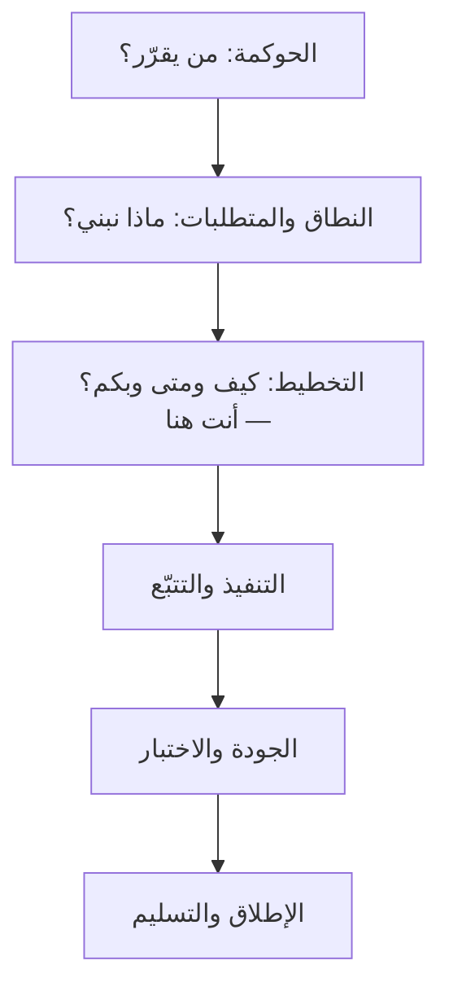
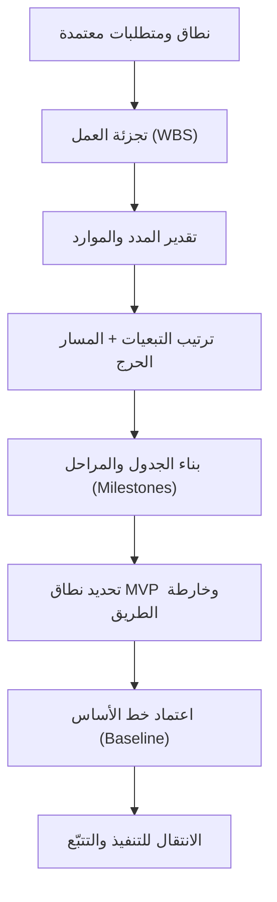
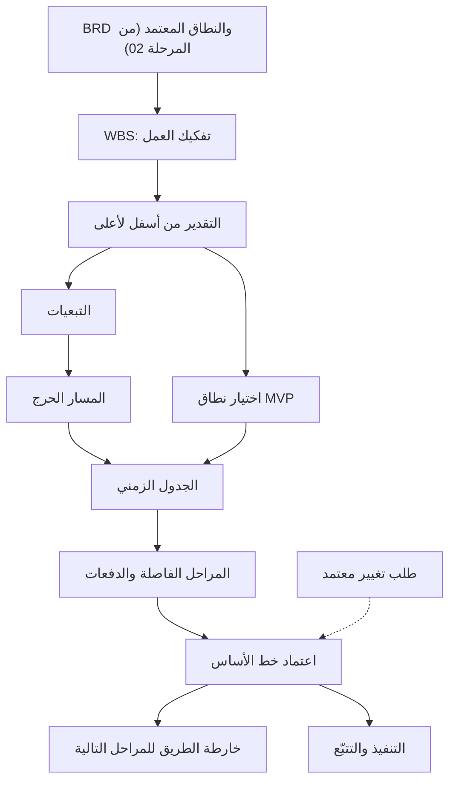
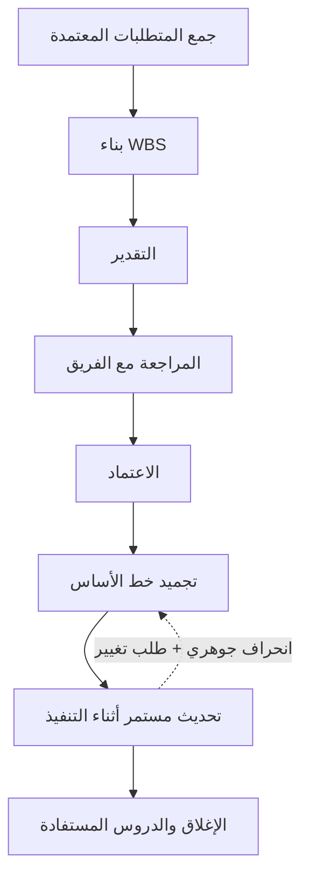

# 03 · التخطيط

> [!abstract] ماذا ستتعلّم هنا
> - **أين أنت الآن** من رحلة المشروع، ولماذا يستحيل التخطيط قبل إغلاق النطاق.
> - ما معنى مرحلة **التخطيط (Planning)** ولماذا هي "[[Baseline|خط الأساس]]" (Baseline) الذي يُقاس عليه كل شيء لاحقًا.
> - كيف تُحوّل النطاق والمتطلبات إلى **جدول زمني (Schedule)** واقعي عبر **هيكل تجزئة العمل (Work Breakdown Structure — WBS)** و**التبعيات (Dependencies)**.
> - كيف تكتشف **المسار الحرج ([[Critical Path]])** وتبدأ مبكرًا بالأمور طويلة المهلة (Long Lead Time).
> - كيف تدير النطاق عبر **المنتج الأولي ([[MVP|Minimum Viable Product]] — MVP)** بدل تسليم كل شيء دفعة واحدة.
> - كيف تُنتج مستندات التخطيط وترتّبها وتربطها ببعض بأسلوب احترافي، مع دراسة حالة حقيقية من مشروع "عافية".
> - **خريطة التوليد** بين وثائق التخطيط · **ودورة حياة الخطة** · **والترتيب الزمني**: ماذا تفعل في اليوم الأول.
> - **طبقة اتخاذ القرار**: كيف تسمع «أربعة أشهر» فتسأل **«كيف عرفتم؟»** بدل **«لماذا؟»**.
> - **بوّابة الجودة**: كيف تعرف أن خطتك جيدة قبل أن يكشفها التنفيذ.
>
> اقرأ أولًا بطاقة الدور المرجعية: [[مدير المشاريع البرمجية الحديث]].

---

## 🗺️ رحلة المشروع حتى الآن

في [[02 - النطاق والمتطلبات|الفصل السابق]] اتّفقنا **ماذا سنبني**، أمّا الآن فسنتّفق **كيف سنبنيه بأقلّ وقت وأقلّ تكلفة وأقلّ مخاطرة**.

> [!tip] لماذا هذا الترتيب لا غيره؟
> لأن الجدول الزمني ليس تقديرًا للوقت، بل **تقديرٌ للعمل** ثم تحويله إلى وقت. فمن خطّط قبل أن يُغلق نطاقه، قدّر عملًا لا يعرف حدوده — وكل رقم يخرج من ذلك تخمينٌ يرتدي ثوب حساب. والفصل السابق أعطاك **قائمة ما سيُبنى**، وهذا الفصل يحوّلها إلى **ترتيب وموارد وتواريخ**.

---

## 🎭 القصة التي وُلدت منها هذه المرحلة

سأل المدير فريق التطوير: **«متى تنتهون؟»**

قال المبرمج: **«بعد شهرين.»**

وبعد شهرين، وقف المشروع. لا لأن الشيفرة لم تكتمل — بل لأن **حساب بوابة الدفع التجاري لم يُفتح أصلًا**. طلبه يحتاج مستندات ومراجعة بنكية وأربعة أسابيع انتظار، ولم يبدأه أحد لأن «التكامل مع الدفع» كان مجدولًا في الشهر الثالث.

فتوقّف المشروع أربعة أسابيع، والفريق كامل جالس بلا شيء يوصله.

**المشكلة لم تكن في البرمجة.** المبرمج قدّر عمله تقديرًا صحيحًا. المشكلة أن أحدًا لم يسأل: *ما الذي يعتمد على غيرنا؟ وما الذي يجب أن يبدأ اليوم لأنه ينتظر أطول من غيره؟* وهذا بعينه سؤال التخطيط.

---

## 🧭 المفهوم ببساطة

**التخطيط هو تحويل مشروع كبير مخيف إلى أعمال صغيرة يمكن تنفيذها وقياسها.** هذا كل شيء. فالمشروع الذي يُنظر إليه جملةً واحدة لا يُقدَّر ولا يُسنَد ولا يُتابَع؛ وحين يُفكَّك إلى حزم صغيرة، تصير كل حزمة قابلة لأن يُقال فيها: من يعملها، وكم تستغرق، وعلى ماذا تعتمد، وهل أُنجزت أم لا.

وإن أردت صورة تُثبّت الفكرة: تخيّل أنك ستبني بيتًا. **مرحلة النطاق** حدّدت "نريد بيتًا من طابقين بأربع غرف". أما **مرحلة التخطيط** فهي المخطّط الهندسي: متى نصبّ الأساس؟ من قبل من نطلب الحديد (وقد يتأخر أسابيع)؟ ما الذي يجب أن يكتمل قبل السقف؟ كم عاملًا نحتاج؟ بدون هذا المخطّط، يصل الحديد متأخرًا، ويقف العمال بلا مهام، وينهار الجدول.

**والتعريف الرسمي:** **التخطيط (Planning)** ببساطة: تحويل "ماذا نريد" إلى **"كيف ومتى ومن ومقابل كم"**. مخرجاته الأساسية أربعة: جدول زمني ومراحل (Milestones)، تجزئة للعمل (WBS)، تبعيات ومسار حرج، وخطة نطاق مرحلية (MVP + Roadmap). في أطر **Agile** يكون التخطيط تكراريًا وخفيفًا (خارطة طريق + Backlog مرتّب)، وفي **Waterfall** يكون شاملًا ومفصّلًا قبل أي تنفيذ.

---

## 🧩 قاموس سريع للمصطلحات

| المصطلح (عربي) | English | المعنى ببساطة |
|---|---|---|
| خط الأساس | Baseline | النسخة المعتمدة من النطاق/الزمن/الكلفة التي نقيس الانحراف عنها لاحقًا. |
| هيكل تجزئة العمل | Work Breakdown Structure (WBS) | تفكيك المشروع إلى حزم عمل صغيرة قابلة للتقدير والإسناد. |
| المسار الحرج | Critical Path | أطول سلسلة مهام مترابطة؛ أي تأخير فيها يؤخّر المشروع كله. |
| التبعية | [[Dependency]] | مهمة لا تبدأ إلا بعد اكتمال أخرى (مثال: الواجهات بعد التصميم). |
| [[Lead Time\|المهلة الطويلة]] (توريد) | Lead Time / Long-Lead Items | زمن انتظار خارج تحكّمك (فتح حساب بوابة دفع مثلًا) يجب بدؤه مبكرًا. ملاحظة: المقصود هنا "مهلة التوريد الطويلة"، لا مصطلح Lead/Lag الفني في تقنيات جدولة الشبكة. |
| المنتج الأولي | Minimum Viable Product (MVP) | أصغر نسخة قابلة للإطلاق تحقّق قيمة حقيقية. |
| [[Milestone\|المرحلة الفاصلة]] | Milestone | نقطة إنجاز مهمة بلا مدة (نهاية مرحلة، تسليم دفعة). |
| خارطة الطريق | Roadmap | رؤية زمنية عالية المستوى لما سنبنيه ومتى، حسب المحاور. |
| الفائض الزمني | Float / Slack | كم يمكن أن تتأخّر المهمة دون أن تؤخّر المشروع؛ وفائضه صفرٌ على المسار الحرج. |
| التقدير من أسفل لأعلى | Bottom-up Estimating | تقدير كل حزمة عمل على حدة ثم جمعها، لا تقدير المشروع جملةً من أعلى. |
| احتياطي الطوارئ | [[Contingency Reserve]] | مدّة أو مبلغ مرصود للمخاطر المعروفة، داخل خط الأساس لا خارجه. |
| الضغط · المسار المتوازي | Crashing · Fast Tracking | تقصير الجدول بزيادة الموارد، أو بتوازي مهام كانت متتابعة — ولكلٍّ ثمنه. |

---

## ⛓️ لماذا تأتي هنا وتقود للتالية

**ما قبلها (المتطلّبات المسبقة):** لا يمكن بناء جدول زمني واقعي قبل أن يُحسم النطاق والمتطلبات (وثائق مثل [[02 - النطاق والمتطلبات|SOW/BRD/SRS]]) في المرحلة السابقة. الجدول المبني على نطاق غامض = جدول مبني على رمال.

**ما بعدها (ماذا تُغذّي):** مخرجات التخطيط — المراحل، التبعيات، خطة MVP، خارطة الطريق — تُغذّي مباشرة مرحلة [[04 - التنفيذ والتتبّع|التنفيذ والتتبّع (Execution)]]. فريق التطوير لا يبدأ الترميز الجاد قبل حسم "ما الذي يدخل الإصدار الأول؟" و"ما ترتيب الاعتماديات؟". أي غموض هنا (جدول غير واقعي، تبعية مهملة) ينتقل كخطر مباشر إلى التنفيذ.

---

## 📊 مخطّط سير العمل

---

## 🧬 خريطة العلاقات — كل مخرَج يلد الذي بعده

تبدو وثائق التخطيط ملفّات متجاورة، وهي في الحقيقة **سلسلة توليد**: لا يُبنى الجدول إلا من تقدير، ولا يُقدَّر إلا مفكَّك، ولا يُفكَّك إلا نطاقٌ معتمد. ومن قفز خطوة، اكتشف غيابها في التنفيذ لا في التخطيط.

| المخرَج | يولد من | يُولّد | ما يُفقد لو غاب |
| --- | --- | --- | --- |
| **WBS** | النطاق وBRD المعتمدين | حزم قابلة للتقدير والإسناد | القدرة على تقدير أي شيء بغير التخمين |
| **التقدير** | حزم WBS + خبرة المنفّذين | مدد المهام وحاجتها من الموارد | معرفة الحجم الحقيقي للمشروع |
| **التبعيات** | التقدير + قيود الأطراف الخارجية | ترتيب التنفيذ وقائمة «ابدأ الآن» | كشف ما ينتظر غيرك قبل أن ينتظرك |
| **المسار الحرج** | شبكة التبعيات | أولوية الحماية والمتابعة اليومية | معرفة أي تأخير يؤخّر المشروع كلّه |
| **الجدول والمراحل** | المسار الحرج + الموارد | تواريخ التسليم وربط الدفعات | مرجع زمني يُقاس عليه |
| **خطة MVP** | الأولويات + سقف الزمن الواقعي | نطاق الإصدار الأول وحدوده | إمكانية إطلاق شيء أصلًا |
| **خط الأساس** | الجدول بعد الاعتماد | مرجع قياس الانحراف | معنى جملة «المشروع متأخّر» |
| **خارطة الطريق** | ما أُجّل عن MVP | خطة الأرباع التالية وتوقّعات الإدارة | الرؤية العليا التي تحتاجها الإدارة |

> [!warning] نقطتان يخطئ فيهما أكثر من يقرأ الترتيب لأوّل مرة
> **الأولى: ترقيم الملفّات ليس ترتيب العمل.** الوثائق أدناه مرقّمة بترتيب مجلّد المشروع، لا بترتيب كتابتها. فخطة الإطلاق ملفٌّ رقم (2) ويومُها آخر المشروع — وإنما تُسوَّد مبكّرًا لأنها هي التي تكشف بنود المهلة الطويلة. **والترتيب الزمني الحقيقي في جدول «أوّل يوم» أدناه.**
> **والثانية: خطة MVP تُقترح مبكّرًا وتُثبَّت قبل خط الأساس.** فاختيار المنتج الأوّلي ليس قرارًا يُتّخذ بعد اعتماد الجدول، وإلّا اعتُمد جدولٌ لنطاق سيتغيّر بعد يومين. بل يُقترح فور ظهور فجوة التقدير، ويُثبَّت **قبل** التجميد، فيكون خط الأساس مبنيًّا على النطاق الذي سيُنفَّذ فعلًا.

---

## ♻️ دورة حياة الخطة — تُكتب مرّة وتعيش دائمًا

يظنّ كثيرون أن الخطة وثيقة تُكتب في البداية وتُعلَّق على الجدار. وهي في الحقيقة **كائن حيّ** يمرّ بثماني محطّات، وأطولها هي السابعة:

وثلاث ملاحظات تفصل بين من يفهم هذه الدورة ومن يحفظها:

1. **التحديث المستمرّ لا يعني تغيير خط الأساس.** فالتقدّم الفعلي يُسجَّل يوميًّا **مقابل** خط الأساس المجمَّد، وهذا هو الذي يُظهر الانحراف. أمّا تغيير خط الأساس نفسه (Rebaselining) فقرارٌ نادر يمرّ بطلب تغيير معتمد — ومن حدّثه كلّما تأخّر، محا الانحراف بدل أن يعالجه، فصار مشروعه «في الموعد» أبدًا حتى يوم فشله.
2. **التخطيط الموجيّ (Rolling Wave) ممارسة مشروعة.** فالأشهر الثلاثة الأولى تُفصَّل حزمًا صغيرة، وما بعدها يبقى عالي المستوى حتى يقترب. ومن أصرّ على تفصيل السنة كلّها في الأسبوع الأول، فصّل ما سيُعاد أكثرُه.
3. **الإغلاق جزء من الدورة لا خاتمة إدارية.** فالفارق بين ما قُدّر وما وقع فعلًا هو المادة الوحيدة التي تجعل تقديرك القادم أدقّ من هذا — وهي تُفقد إن لم تُسجَّل وقتها.

---

## 🗓️ الترتيب الزمني الحقيقي — أوّل يوم في التخطيط

يعرف كثيرون **ما** وثائق التخطيط، ولا يعرفون **بأي ترتيب** تُبنى. وهذا الجدول هو الجواب العملي، وأكثر ما في الفصل رجوعًا إليه:

| # | الخطوة | من يقودها | مخرجها | متى تنتقل للتالية |
| --- | --- | --- | --- | --- |
| 1 | **راجع BRD والنطاق المعتمد** | مدير المشروع | فهم ما سيُبنى بحدوده | حين لا يبقى بند نطاق غامض عندك |
| 2 | **ابنِ WBS** | مدير المشروع + القائد التقني | حزم عمل تغطّي 100% من النطاق | حين تصير كل حزمة قابلة للتقدير في يوم عمل واضح |
| 3 | **قدّر كل حزمة** | **المنفّذون أنفسهم** | مدّة لكل حزمة بمدى لا برقم واحد | حين يوافق من سينفّذ على تقديره |
| 4 | **حدّد المسؤول** | مدير المشروع | مالك واحد لكل حزمة | حين لا تبقى حزمة بلا اسم |
| 5 | **حدّد التبعيات** | القائد التقني | شبكة «ما الذي يسبق ماذا» | حين تُعرف بنود المهلة الطويلة وتُفتح فورًا |
| 6 | **استخرج المسار الحرج** | مدير المشروع | أطول سلسلة وفائضها صفر | حين تعرف أي تأخير يؤخّر المشروع كلّه |
| 7 | **ابنِ الجدول** | مدير المشروع | تواريخ بدء وانتهاء وموارد | حين يتحمّله الفريق فعلًا لا ورقًا |
| 8 | **حدّد المراحل الفاصلة** | مدير المشروع + الراعي | نقاط إنجاز مربوطة بالدفعات | حين تُربط كل دفعة بمخرَج يُقبل لا بتاريخ يمرّ |
| 9 | **اختر MVP** | صاحب المنتج + الراعي | نطاق الإصدار الأول وحدوده | حين يُقطع نقاش «كل شيء ضروري» بقرار موقَّع |
| 10 | **اعتمد خط الأساس** | الراعي | نطاق وزمن وكلفة مجمَّدة | حين توجد الموافقة مكتوبة، فيبدأ التنفيذ |

> [!tip] ما يجوز أن يجري بالتوازي وما لا يجوز
> **يجوز:** فتح بنود المهلة الطويلة (الحساب البنكي، التراخيص، الاستضافة) من اليوم الأول — بل يجب · ورسم النماذج الأولية للواجهات الحرجة · وفتح سجل المخاطر.
> **ولا يجوز:** بناء الجدول قبل التقدير، ولا التقدير قبل WBS، ولا بدء تطوير حزمة على المسار الحرج قبل الخطوة 10. فالسلسلة 2 ← 3 ← 5 ← 6 ← 7 لا تُخترق، ومن اخترقها بنى جدولًا جميلًا لا يقوم على شيء.

---

## 🧠 كيف أفكّر؟ — سلسلة «كيف عرفتم؟»

هنا يفترق مدير المشروع عن ناقل الأخبار. فحين يسمع الاثنان جملة **«المشروع يحتاج أربعة أشهر»**، ينقلها الأول إلى العميل، ويسأل الثاني سؤالًا واحدًا يغيّر كل شيء.

> [!tip] القاعدة الذهبية — المدّة ليست رقمًا يُقال، بل نتيجةً تُحسب
> السؤال الخاطئ هو **«لماذا أربعة أشهر؟»** — لأنه سؤال يُجاب عنه بتبرير، وكل رقم له تبرير. والسؤال الصحيح هو **«كيف عرفتم؟»** — لأنه يسأل عن **الطريقة** لا عن الرقم، ولا يُجاب عنه إلا بعرض العمل الذي أنتج الرقم أو بالاعتراف بأنه لم يوجد.

ثم تنحدر من السؤال الواحد سلسلةٌ لا تُخطئ:

| السؤال | ماذا يكشف إن كان الجواب «لا»؟ |
| --- | --- |
| هل يوجد **WBS**؟ | الرقم تقديرٌ لمشروع لم يُفكَّك — أي انطباع لا حساب |
| **من قدّر؟** | إن قدّر المدير أو البائع بدل المنفّذ، فالرقم رغبةٌ لا قدرة |
| هل **وافق الفريق**؟ | التقدير المفروض لا يُلزم أحدًا، وأوّل تأخير يكشف أن لا أحد كان يصدّقه |
| هل حُسبت **المهل الطويلة**؟ | أخطر ما يُنسى، لأنه ينتظر خارج تحكّمك ولا يُسرَّع بزيادة الموارد |
| هل حُسبت **المخاطر والاحتياطي**؟ | الجدول مبنيّ على افتراض ألّا يقع شيء — وهو افتراض لم يصدق في مشروع قطّ |
| ما **الفائض** على المسار الحرج؟ | إن لم يكن أحد يعرف، فلا أحد يعرف أي تأخير يهمّ وأيّه لا يهمّ |

> [!info] إضافة مرجعية — دقّة في المسار الحرج والتقدير
> **المسار الحرج** ليس «أهمّ المهام» ولا «أصعبها»، بل المسار الذي **فائضه الزمني صفر**: أي تأخير على أي مهمة فيه ينتقل بمقداره كاملًا إلى تاريخ نهاية المشروع. وقد يوجد في الشبكة **أكثر من مسار حرج واحد**، وقد يتغيّر المسار الحرج أثناء التنفيذ حين تتأخّر مهام على مسار آخر حتى يستهلك فائضها. ولهذا يُعاد حسابه دوريًّا لا مرّةً واحدة.
> **والتقدير** يُعطى في المعايير الحديثة **مدًى** (متفائل · مرجّح · متشائم) لا رقمًا مفردًا، لأن الرقم المفرد يُخفي عدم اليقين بدل أن يُظهره. والمدى هو ما يُبنى عليه احتياطي الطوارئ بعد ذلك.

---

## 🏥 القصة المستمرّة — «عافية» من أوّل يوم في التخطيط

> [!note] حالة تعليمية مُصاغة
> «عافية» و«أُفُق للحلول الرقمية» اسمان افتراضيان، والأشخاص والحوارات **مشاهد تعليمية مُصاغة** لتقريب الفكرة، لا وقائع منسوبة إلى أحد. الثابت القابل للتحقّق هو المرجعيات النظامية والمعيارية وحدها.

> [!example] الحلقة (0) — السؤال الذي فتح كل شيء
> بعد أن أُغلق النطاق ووُقّع، سأل الراعي سؤالًا واحدًا في اجتماع الافتتاح: **«طيّب… متى ننتهي؟»**
>
> كان الجواب جاهزًا في العرض التجاري منذ شهور: **أربعة أشهر**. ونظر الجميع إلى **سلمى** منتظرين أن تؤكّده.
>
> فلم تؤكّده ولم تنفِه. قالت جملة واحدة: **«سأخبركم بعد أسبوع — حين أعرف كيف خرج هذا الرقم.»**

---

## 📂 مستندات هذه المرحلة — واحدًا واحدًا

📂 مستندات هذه المرحلة (في مستودع المشروع)

> [!info] كيف تقرأ كل وثيقة أدناه — طبقة اتخاذ القرار
> التخطيط ليس كتابة مستندات، بل **سلسلة قرارات** تُخلَّف وراءها مستندات. فلا تُعرض الوثيقة هنا بوصفها قالبًا يُملأ، بل بوصفها جوابًا عن سلسلة أسئلة ثابتة:
> 1. **لماذا احتجنا هذه الوثيقة؟** — المشكلة التي وُلدت منها، قبل أي تعريف.
> 2. **ما هي؟** — التعريف المختصر.
> 3. **المدخلات ← المعالجة ← المخرجات** — ماذا يدخل، وماذا يجري عليه، وماذا يخرج.
> 4. **من أين · كيف · فائدتها** — مادّتها وترتيبها وعائدها.
> 5. **دورة حياتها** — متى تُنشأ · من يكتبها · من يعتمدها · متى تنتهي.
> 6. **المشكلة التي تمنعها** — الثمن الذي تدفعه لو لم تكن موجودة.
> 7. **أكثر ثلاثة أخطاء يقع فيها المبتدئون** — لأن معرفة الشكل الفاسد تحفظ الشكل الصحيح.
> 8. **حلقة من عافية** — الفكرة نفسها وهي تجري في مشروع.

### 0) هيكل تجزئة العمل (WBS) — الوثيقة التي كان ينبغي أن تسبق الجميع

> [!info] إضافة مرجعية — لماذا رقمها صفر؟
> هذه الوثيقة **غير موجودة في ملفّات مشروع عافية**، وهي أوّل الفجوات المرصودة في قسم التحسينات أدناه. وأُثبتت هنا برقم صفر لا لتُدرَج ضمن ما سُلّم، بل لأن ترتيب التعلّم يقتضي أن تُعرف **قبل** الوثائق السبع التي بُنيت — وكلّها كان ينبغي أن تُبنى عليها. وتفصيلها في الوثيقة المكمّلة: [[هيكل تجزئة العمل (WBS)]].

> [!failure] لماذا احتاج الناس إلى هذه الوثيقة؟
> لأن **العقل لا يستطيع تقدير مشروع ضخم دفعة واحدة**. اسأل أي شخص: «كم يستغرق بناء منصّة صحية؟» فسيعطيك رقمًا من انطباعه عن الحجم لا من حساب. واسأله: «كم تستغرق شاشة تسجيل دخول بتحقّق برسالة نصّية؟» فسيعطيك رقمًا قريبًا من الصواب. الفرق ليس في ذكائه، بل في **حجم ما طُلب منه تقديره**.

> [!info] ما هو ولماذا
> تفكيك المشروع إلى **حزم عمل (Work Packages)** متدرّجة، تغطّي مجتمعةً **100% من النطاق ولا شيء خارجه** (قاعدة الـ100%). وكل حزمة صغيرة بما يكفي لأن تُقدَّر وتُسنَد وتُتابَع.

> [!abstract] المدخلات ← المعالجة ← المخرجات
> **المدخلات:** النطاق المعتمد · BRD · قائمة المخرجات التعاقدية.
> **المعالجة:** التفكيك بالمخرجات لا بالأنشطة، حتى تبلغ كل حزمة حدًّا يمكن تقديره وإسناده.
> **المخرجات:** شجرة حزم مرقّمة · أساس التقدير كلّه · مرجع كشف ما نُسي من النطاق.

- **📥 من أين تجمع معلوماته:** من وثيقة النطاق وBRD، ومن ورشة مع القائد التقني والمنفّذين.
- **🛠️ كيف ترتّبه:** مستويات متدرّجة (مرحلة ← مخرَج ← حزمة عمل)، بترقيم هرمي (1.2.3)، مع قاموس WBS يشرح كل حزمة في سطرين.
- **🎯 فائدته:** يحوّل التقدير من انطباع إلى حساب، ويكشف ما نُسي: فالحزمة التي لا تجد لها موضعًا في الشجرة إمّا خارج النطاق وإمّا نسيها النطاق.
- **♻️ دورة حياته:** يُنشأ **فور اعتماد النطاق وقبل أي تقدير** · يبنيه مدير المشروع مع القائد التقني · يعتمده الراعي ضمن حزمة التخطيط · ويبقى حيًّا يُفصَّل موجيًّا كلّما اقتربت مرحلة، حتى الإغلاق.

> [!danger] المشكلة التي يمنعها
> **التقديرات العشوائية.** وهي أخطر ما في التخطيط لأنها لا تبدو عشوائية: رقمٌ واحد يُقال بثقة في اجتماع، فيُكتب في عقد، فيصير التزامًا — ولا أحد يستطيع بعدها أن يقول من أين جاء.

> [!warning] أكثر ثلاثة أخطاء يقع فيها المبتدئون
> 1. **التفكيك بالأنشطة لا بالمخرجات:** فتصير الشجرة قائمة مهام يومية لا تغطية للنطاق، ويستحيل التحقّق من قاعدة الـ100%.
> 2. **الإفراط في التفصيل:** حزمٌ من ساعتين في مشروع سنة، فتصير الشجرة عبئًا يُهجر بعد أسبوعين.
> 3. **نسيان العمل غير الظاهر:** الاختبار والتوثيق والنشر والاجتماعات ونقل المعرفة — كلّها عمل يستهلك وقتًا، وغيابها من الشجرة هو نفسه غيابها من الجدول.

> [!example] من عافية · الحلقة (1)
> في الأسبوع الذي طلبته، لم تكتب سلمى جدولًا. جلست مع القائد التقني وفكّكت المشروع إلى **سبع مراحل و63 حزمة عمل**. ثم وقفت عند مستوى واحد لم يكن في العرض إطلاقًا: **البنية التحتية والامتثال** — استضافة داخل السعودية، وتشفير البيانات الصحية، وسجلّ وصول، ونسخ احتياطي مختبَر.
>
> لم تكن هذه ميزات يراها المستخدم، ولذلك لم يذكرها أحد. وكانت وحدها تسع حزم.

### 1) الجدول الزمني والمراحل (M1–M7)

> [!failure] لماذا احتاج الناس إلى هذه الوثيقة؟
> لأن **ترتيب المهام أهمّ من سرعة تنفيذها**. فريقٌ سريع بترتيب خاطئ ينتظر أكثر ممّا يعمل: الواجهات جاهزة والتصاميم لم تصل، والتكامل جاهز والحساب البنكي لم يُفتح. ولأن الدفع بلا مراحل مربوطة بمخرجات يتحوّل إلى نزاع: متى تُستحقّ الدفعة؟

> [!info] ما هو ولماذا
> سجلّ يحدّد المراحل السبع للمشروع (System Design → Backend → Frontend → Integration → Security → Testing → Deployment) بصيغة "العرض التجاري" المُقدَّم للعميل، مع ربط كل مرحلة بدفعة دفع. هو العمود الفقري الزمني المتفق عليه تعاقديًا.

> [!abstract] المدخلات ← المعالجة ← المخرجات
> **المدخلات:** حزم WBS بتقديراتها · التبعيات · الموارد المتاحة · شروط الدفع في العقد.
> **المعالجة:** توزيع الحزم على مراحل، وربط كل مرحلة بمخرَج يُقبل، ثم بدفعة.
> **المخرجات:** خط أساس زمني · جدول دفعات مربوط بالإنجاز لا بالتاريخ.

- **📥 من أين تجمع معلوماته:** من العرض/العقد التجاري، ومن مدير المشروع، ومن جلسة تقدير مع الفريق التقني حول مدة كل مرحلة.
- **🛠️ كيف ترتّبه:** جدول (CSV/Excel) بأعمدة: المرحلة، المخرجات، المدة المخططة، تاريخ البدء، الانتهاء المخطط، الانتهاء الفعلي، الحالة، الدفعة المرتبطة، المعتمِد.
- **🎯 فائدته:** يعطي خط أساس زمنيًا واضحًا للمتابعة، ويربط كل إنجاز بدفعة مالية، فيصبح "المرحلة أُنجزت = الدفعة تُستحق".
- **♻️ دورة حياته:** يُنشأ **بعد التقدير والتبعيات** لا قبلهما · يبنيه مدير المشروع · يعتمده الراعي والمنفّذ معًا لأنه مربوط بالمال · ويُحدَّث بالحالة الفعلية أسبوعيًّا حتى الإغلاق، ولا يتغيّر خط أساسه إلا بطلب تغيير.
- ملف: `01-الجدول-الزمني-والمراحل.csv` (صيغة CSV — سجلّ).

> [!danger] المشكلة التي يمنعها
> **الفوضى الزمنية.** لا أحد يعرف ما الذي ينبغي أن يكون منجزًا اليوم، فيُقاس التقدّم بانطباع الاجتماع الأسبوعي — ويبقى المشروع «تسعين بالمئة منجزًا» ثلاثة أشهر.

> [!warning] أكثر ثلاثة أخطاء يقع فيها المبتدئون
> 1. **ربط الدفعة بتاريخ لا بمخرَج:** فتُستحقّ الدفعة يوم 30 سواء سُلّم شيء أو لم يُسلّم، ويسقط أثرها كأداة ضبط.
> 2. **مرحلة بمدّة:** المرحلة الفاصلة **نقطة بلا مدّة**؛ ومن أعطاها أسبوعين فقد سمّى مهمّةً مرحلة.
> 3. **جدول بلا فائض:** كل مهمة تبدأ يوم انتهاء سابقتها بالضبط — وهذا جدول يعمل في العرض التقديمي فقط.

> [!example] من عافية · الحلقة (2)
> المراحل السبع M1–M7: M1 تخطيط وتصميم (4 أسابيع، مرتبطة بالدفعة الأولى 50%) ... M7 نشر وتسليم (مرتبطة بالدفعة النهائية 50%). لاحظ أن هذا الجدول يعرض 4 أسابيع فقط لمرحلة التخطيط والتصميم — رقم "العرض" لا "التحليل".
>
> وحين وضعت سلمى حزم WBS الثلاث والستّين فوق هذا الجدول، لم تحتج إلى جدال: **لم تتّسع المراحل السبع لأربع عشرة حزمة**، بقيت خارج الصفحة بلا موضع. لم يكن الجدول متفائلًا؛ كان **ناقصًا**.

### 2) خطة الإطلاق (Go-Live Plan)

> [!failure] لماذا احتاج الناس إلى هذه الوثيقة؟
> لأن يوم الإطلاق هو اليوم الوحيد الذي **تجتمع فيه كل الأخطاء المؤجَّلة دفعةً واحدة**، وهو أسوأ يوم للتفكير. فمن لم يقرّر مسبقًا من يملك قرار التراجع، سيقرّره وسط مكالمات غاضبة وشاشة حمراء ونصف الفريق نائم.

> [!info] ما هو ولماذا
> قائمة تحقق (Checklist) لثلاث مراحل: ما قبل الإطلاق، يوم الإطلاق، وبعد الإطلاق، مع **خطة تراجع (Rollback)**. يجبر الفريق على التفكير في "ماذا لو فشل الإطلاق؟" قبل وقوعه.

> [!abstract] المدخلات ← المعالجة ← المخرجات
> **المدخلات:** متطلبات التشغيل والأمان · نتائج الاختبار · التزامات الامتثال · جاهزية الدعم.
> **المعالجة:** ترتيب ما يجب أن يتحقّق قبل وبعد وأثناء، وتعيين مالك وقرار لكل بند حرج.
> **المخرجات:** قائمة تحقّق قابلة للتأشير · خطة تراجع بمالك وآلية ومعيار تفعيل.

- **📥 من أين تجمع معلوماته:** من الفريق التقني (SSL، نسخ احتياطي، Load test)، والقانوني (سياسة خصوصية للبيانات الصحية)، وفريق الدعم.
- **🛠️ كيف ترتّبه:** قوائم مربّعات `[ ]` تحت ثلاثة عناوين زمنية، ثم بند مستقل لخطة التراجع (من يقرر؟ كيف نعود للنسخة السابقة؟).
- **🎯 فائدته:** يحوّل الإطلاق من "لحظة توتّر" إلى إجراء منظّم يمكن تتبّعه، ويقلّل مخاطر أول 48 ساعة.
- **♻️ دورة حياته:** تُسوَّد **مبكّرًا في التخطيط** رغم أن يومها آخر المشروع، لأنها تكشف بنود المهلة الطويلة (الشهادات، الحسابات، الاستضافة) · يكتبها مدير المشروع مع القائد التقني · يعتمدها الراعي في بوابة [[Go or No-Go Decision|Go/No-Go]] · وتنتهي بعد استقرار ما بعد الإطلاق وتسليم التشغيل.
- ملف: «02-خطة-الإطلاق-Launch.md»

> [!danger] المشكلة التي تمنعها
> **فوضى يوم الإطلاق، والكوارث بعده.** والتراجع تحديدًا هو الفرق بين عطل ساعة وعطل أسبوع: من يملك قراره، وبأي معيار يُفعَّل، وكم يستغرق تنفيذه.

> [!warning] أكثر ثلاثة أخطاء يقع فيها المبتدئون
> 1. **كتابتها في الأسبوع الأخير:** فتُكتشف حينها بنود تحتاج أسابيع، وقد صار الإطلاق بعد أيام.
> 2. **خطة تراجع بلا معيار تفعيل:** «نتراجع إن ساءت الأمور» ليست خطة؛ المعيار رقم: كم خطأ، وفي أي مدة، وعلى أي وظيفة حرجة.
> 3. **إهمال ما بعد الإطلاق:** فيُترك المستخدمون الأوائل بلا مراقبة ولا دعم مكثّف في الساعات الأولى، وهي أكثر الساعات كشفًا للعيوب.

> [!example] من عافية · الحلقة (3)
> يشمل اختبار بوابة الدفع بمعاملة حقيقية، اختبار حجز موعد Zoom كامل، وتفعيل النسخ اليومي — لكن حقول "المسؤول عن قرار التراجع" و"آلية التراجع" بقيت قوالب فارغة `[الاسم]`/`[وصف]`، وهي ثغرة يجب سدّها قبل الإطلاق الفعلي.
>
> وحين سألت سلمى عنها في مراجعة التخطيط، كان الجواب: «نحدّدها قرب الإطلاق.» فكتبتها بندًا مفتوحًا في سجل المخاطر بتاريخ إغلاق محدّد — لأن البند الذي يُؤجَّل بلا تاريخ لا يُؤجَّل، وإنما يُنسى.

### 3) تبعيات المهام والمسار الحرج

> [!failure] لماذا احتاج الناس إلى هذه الوثيقة؟
> لأن **بعض المهام تؤخّر المشروع كلّه، وأكثرها لا يؤخّر شيئًا** — والفريق لا يعرف الفرق بلا حساب. فيُصرَف الجهد على تسريع مهمّة فائضها أسبوعان، بينما تتأخّر مهمّة فائضها صفر بلا أن ينتبه أحد.

> [!info] ما هو ولماذا
> يوثّق المهام التي يعتمد بعضها على بعض، ويحدّد **المسار الحرج (Critical Path)** والأمور طويلة المهلة التي يجب بدؤها الآن.

> [!abstract] المدخلات ← المعالجة ← المخرجات
> **المدخلات:** حزم WBS بتقديراتها · قيود الأطراف الخارجية (بنك · مزوّد · جهة تنظيمية).
> **المعالجة:** بناء شبكة «ما الذي يسبق ماذا»، وحساب الفائض، واستخراج ما فائضه صفر.
> **المخرجات:** المسار الحرج · قائمة «ابدأ الآن» لبنود المهلة الطويلة · مخاطر التبعية الخارجية.

- **📥 من أين تجمع معلوماته:** من الفريق التقني (ما الذي يسبق ماذا)، ومن جهات خارجية (البنك لبوابة الدفع، Zoom، التسويق للمحتوى).
- **🛠️ كيف ترتّبه:** جدول (المهمة / تعتمد على / المخاطرة)، ثم قائمة تنبيهات "ابدأ الآن" للبنود ذات المهلة الطويلة.
- **🎯 فائدته:** يمنع "التأخير المتسلسل"؛ فتأخّر مهمة على المسار الحرج يؤخّر المشروع كله. البدء المبكر بالمهل الطويلة يوفّر أسابيع.
- **♻️ دورة حياته:** يُنشأ **بعد التقدير وقبل الجدول** · يبنيه القائد التقني مع مدير المشروع · لا يُعتمد رسميًّا بل يُراجَع، فهو مدخل للجدول لا مخرَج تعاقدي · **ويُعاد حسابه دوريًّا**، لأن المسار الحرج ينتقل حين يستهلك مسارٌ آخر فائضه.
- ملف: «03-تبعيات-المهام.md»

> [!danger] المشكلة التي يمنعها
> **تأخير المشروع دون أن يشعر الفريق.** والفريق هنا لا يقصّر: كلٌّ ينجز مهامه، والانتظار وحده هو الذي يتراكم بلا أن يُنسب إلى أحد.

> [!warning] أكثر ثلاثة أخطاء يقع فيها المبتدئون
> 1. **تسجيل التبعيات الداخلية وحدها:** فتُنسى التبعيات الخارجية، وهي بالضبط ما لا تملك تسريعه.
> 2. **حساب المسار مرّة واحدة:** فيُتابَع مسارٌ لم يعد حرجًا، ويُهمَل مسارٌ صار حرجًا.
> 3. **الخلط بين التبعية الإلزامية والاختيارية:** «الواجهات بعد التصميم» إلزامية، و«الاختبار بعد اكتمال كل الميزات» قرارٌ اخترناه — والثانية قابلة للكسر لو ضاق الوقت، والأولى لا.

> [!example] من عافية · الحلقة (4)
> "تطوير الواجهات يعتمد على اكتمال تصميم UI/UX"، و"تكامل بوابة الدفع يعتمد على فتح حساب تجاري باسمكم — قد يأخذ أسابيع، ابدأ مبكرًا". هذا التوثيق المبكر يحمي الجدول من مفاجآت خارج تحكّم فريق التطوير.
>
> فأرسلت سلمى طلب الحساب البنكي **في اليوم الثالث من التخطيط**، قبل أن يُعتمد الجدول أصلًا. استغرق الحساب واحدًا وثلاثين يومًا — مرّت كلّها والفريق يعمل على غيرها، فلم يرها أحد.

### 4) خطة العمل الواقعية (Realistic Timeline)

> [!failure] لماذا احتاج الناس إلى هذه الوثيقة؟
> لأن الأرقام التي تُقال في **البيع** لا تُقال بالطريقة التي تُقال بها في **التنفيذ**، ثم تُنفَّذ على أنها واحدة. فيدخل المشروع بجدولٍ لم يُحسب قطّ، ويكتشف الجميع الفجوة بعد ثلاثة أشهر — حين يكون تصحيحها أغلى من إنكارها.

> [!info] ما هو ولماذا
> يقارن **المدة الواقعية بالتحليل** لكل مرحلة بـ**المدة المعروضة تجاريًا**، فيكشف **فجوة التقدير (Estimation Gap)** بشكل صريح ويقترح مدة تفاوضية وسطى.

> [!abstract] المدخلات ← المعالجة ← المخرجات
> **المدخلات:** التقدير من أسفل لأعلى · أرقام العرض التجاري · قدرة الفريق الفعلية.
> **المعالجة:** المقارنة صفًّا بصفّ، وتفسير كل فجوة، واقتراح أرضية تفاوضية.
> **المخرجات:** فجوة معلنة بالأرقام · توصية بمدّة واقعية · مادة قرار MVP.

- **📥 من أين تجمع معلوماته:** من تحليل تقني مستقل للمهام (تقدير من أسفل لأعلى)، مقارنًا بأرقام العرض التجاري.
- **🛠️ كيف ترتّبه:** جدول (المرحلة / المدة الواقعية / المدة بالعرض / ضمن MVP؟ / الدفعة / الحالة) مع صفّي إجمالي وتوصية.
- **🎯 فائدته:** يضع الحقيقة على الطاولة قبل التوقيع، فيتحوّل النقاش من "لماذا تأخرتم؟" لاحقًا إلى "كم نحتاج فعلًا؟" الآن.
- **♻️ دورة حياته:** تُنشأ **فور اكتمال التقدير وقبل اعتماد أي جدول** · يكتبها مدير المشروع · يعتمدها الراعي بقرارٍ صريح (تمديد أو تقليص نطاق) · وتنتهي وظيفتها لحظة اعتماد خط الأساس الجديد، ثم تبقى وثيقة تعليل له.
- ملف: `04-خطة-العمل-الواقعية-Roadmap.csv` (صيغة CSV).

> [!danger] المشكلة التي تمنعها
> **الفشل المؤجَّل.** فالفجوة لا تختفي بالسكوت عنها، وإنما تتحوّل من نقاشٍ محرج اليوم إلى نزاع تعاقدي ودفعة محجوزة وعلاقة محترقة بعد ستّة أشهر.

> [!warning] أكثر ثلاثة أخطاء يقع فيها المبتدئون
> 1. **عرض الفجوة بلا خيار:** «نحتاج 54 أسبوعًا» تُسمع تعجيزًا؛ والصواب أن تُعرض معها ثلاثة مسارات وأثر كلٍّ منها.
> 2. **تحميل الفجوة لأحد:** فيصير النقاش عن اللوم لا عن الحلّ، ويُدفن الرقم الصحيح تحت الدفاع عن النفس.
> 3. **الاكتفاء بالمقارنة الإجمالية:** رقمان كبيران متقابلان لا يُقنعان أحدًا؛ والمقارنة صفًّا بصفّ هي التي تُقنع لأنها تُري **أين** ذهبت الأسابيع.

> [!example] من عافية · الحلقة (5)
> الإجمالي الواقعي بالتحليل ≈ **54 أسبوعًا (~12 شهرًا)**، بينما العرض يَعِد بـ**16 أسبوعًا** — فجوة تفوق 3 أضعاف. التوصية: التفاوض على **7–9 أشهر** كأرضية واقعية.
>
> ودخلت سلمى الاجتماع بلا كلمة «مستحيل». وضعت ورقة واحدة فيها ثلاثة أعمدة: ما وُعد به · ما يستغرقه فعلًا · ولماذا. وسألت سؤالًا واحدًا: **«أيّهما تفضّلون: منصّة كاملة بعد سنة، أم منصّة تعمل بعد خمسة أشهر تكبر بعدها؟»** ولم يخرج أحد من الاجتماع خاسرًا.

### 5) خطة MVP المرحلية

> [!failure] لماذا احتاج الناس إلى هذه الوثيقة؟
> لأن **بناء كل شيء مرّة واحدة غالبًا يفشل**. فالمشروع الذي لا يُطلق شيئًا قبل عامه الأول يبني سنةً كاملة على افتراضات لم يختبرها مستخدم واحد، ويستهلك نقدًا بلا أن يُدخل ريالًا، ويكتشف خطأه في أبعد نقطة ممكنة عن نقطة تصحيحه.

> [!info] ما هو ولماذا
> يبرّر التحوّل من تسليم "دفعة واحدة" (Big Bang) لكل الميزات (+50 ميزة) إلى **منتج أولي (MVP)** بنحو 12 ميزة حرجة، مع تأجيل الباقي لمرحلة توسّع. جوهر **إدارة النطاق (Scope Management)**.

> [!abstract] المدخلات ← المعالجة ← المخرجات
> **المدخلات:** قائمة الميزات المرتّبة · فجوة التقدير · قيود السوق والتدفّق النقدي.
> **المعالجة:** فرز ما يحقّق قيمة قابلة للإطلاق وحده، وفصل ما يُؤجَّل بسببه المعلن.
> **المخرجات:** نطاق إصدار أول قابل للإنجاز · قائمة مؤجَّلات مسعَّرة · جدول ممكن فعلًا.

- **📥 من أين تجمع معلوماته:** من أولويات العمل (ما الذي يحقّق قيمة أسرع؟)، ومن الفريق التقني (ما القابل للإنجاز فعلًا؟).
- **🛠️ كيف ترتّبه:** قسمان: "المرحلة 1 — MVP" (ميزات حرجة فقط) و"المرحلة 2 — التوسّع"، مع مبرّر لكل قرار.
- **🎯 فائدته:** يقلّل المخاطر، يسرّع دخول السوق، ويوفّر تدفّقًا نقديًا مبكرًا، ويجعل الجدول ممكنًا فعليًا.
- **♻️ دورة حياته:** تُقترح **فور ظهور فجوة التقدير** · يكتبها صاحب المنتج مع مدير المشروع · **يعتمدها الراعي قبل تجميد خط الأساس لا بعده** · وتنتهي بإطلاق الإصدار الأول، فتتحوّل بقيّتها إلى خارطة الطريق.
- ملف: «05-خطة-MVP-المرحلية.md»

> [!danger] المشكلة التي تمنعها
> **تضخّم النطاق.** فالمشروع الذي لا حدّ لإصداره الأول يبتلع كل فكرة تُقترح، ويؤجّل الإطلاق كلّما اقترب منه — حتى يصير التأجيل هو الحالة الطبيعية.

> [!warning] أكثر ثلاثة أخطاء يقع فيها المبتدئون
> 1. **جعل كل شيء MVP:** فيتحوّل الاسم إلى غلاف للنطاق الكامل، ويُفقد معناه بلا أن يُفقد شعاره.
> 2. **تأجيل الأمان والامتثال:** وهذا أخطرها في منصّة صحّية؛ فهما **شرط إطلاق** لا تحسينٌ لاحق، و[[PDPL]] لا يعرف مرحلة أولى ومرحلة ثانية.
> 3. **اختيار الأسهل لا الأهمّ:** فيخرج إصدارٌ أوّل يعمل ولا يحقّق قيمة، ويُفسَّر ضعف إقباله بأن الفكرة فاشلة.

> [!example] من عافية · الحلقة (6)
> MVP = مزوّدان فقط (مستشفيات + أطباء) و≈12 ميزة حرجة (تسجيل + [[KYC]]، حجز افتراضي + Zoom، بوابة دفع سعودية واحدة، لوحة تحكم، RTL...). أُجّلت الصيدليات والمتجر متعدد البائعين ونظام LMS الكامل لمرحلة توسّع بعقد منفصل.
>
> وطُرح سؤال في الجلسة: «ألا نؤجّل التشفير وسجلّ الوصول إلى المرحلة الثانية؟» فكان الجواب قاعدةً كُتبت في الوثيقة نفسها: **ما يمنع الإطلاق نظامًا لا يُؤجَّل.** وبقيت تسع حزم الامتثال داخل MVP كاملة، وأُجّلت ميزتان تجاريتان مكانها.

### 6) خارطة الطريق الموضوعية (Thematic Roadmap)

> [!failure] لماذا احتاج الناس إلى هذه الوثيقة؟
> لأن **الإدارة تحتاج رؤية عامّة لا تفاصيل يومية**. فحين يُعرض على الإدارة متتبّع فيه مئتا بند، لا ترى منه شيئًا فتسأل عن كل شيء. والخارطة تجيبها عن سؤالها الحقيقي: *أين يذهب جهدنا هذا الربع، وهل هذا التوزيع هو ما نريده؟*

> [!info] ما هو ولماذا
> جدول يصنّف كل بند تطوير تحت أحد سبعة **محاور استراتيجية (Themes)** بدل قائمة ميزات مبعثرة، مع أولوية وحالة ومرحلة مقترحة. أداة تخطيط استراتيجي ربعي.

> [!abstract] المدخلات ← المعالجة ← المخرجات
> **المدخلات:** الميزات المؤجَّلة عن MVP · أولويات الإدارة الربعية · ملاحظات السوق.
> **المعالجة:** تصنيف كل بند تحت محور، ثم قراءة التوزيع بين المحاور قراءةً نقدية.
> **المخرجات:** خطة أرباع قابلة للعرض · كشف الاختلال بين المحاور · مالك لكل محور.

- **📥 من أين تجمع معلوماته:** من قائمة الميزات الكاملة، ومن رؤية الإدارة للأولويات الربعية.
- **🛠️ كيف ترتّبه:** جدول بيانات (CSV/Excel) بأعمدة: المحور، البند، الأولوية (🔴/🟡/🟢)، المرحلة المقترحة، صاحب المحور، الحالة.
- **🎯 فائدته:** يكشف الاختلال (كل الجهد على "ميزات جديدة" وإهمال "البنية التحتية")، ويسهّل التواصل مع الإدارة.
- **♻️ دورة حياته:** تُنشأ **بعد استقرار نطاق MVP** · يكتبها مدير المشروع مع صاحب المنتج · تعتمدها الإدارة ربعيًّا لا مرّةً واحدة · وتبقى حيّة ما بقي المنتج، فهي أطول وثائق هذه المرحلة عمرًا.
- ملفات: `06-خارطة-الطريق-الموضوعية-Thematic-Roadmap.csv` و`06-...-Thematic-Roadmap.xlsx` (صيغتا CSV وExcel).

> [!danger] المشكلة التي تمنعها
> **صرف الجهد كلّه في اتجاه واحد بلا أن ينتبه أحد.** فتظهر بعد سنة منصّة غنيّة بالميزات، هشّة البنية، لا يحتمل أداؤها نموًّا — وكل قرار منفرد أدّى إليها كان معقولًا.

> [!warning] أكثر ثلاثة أخطاء يقع فيها المبتدئون
> 1. **تحويلها إلى وعود بتواريخ:** فتُقرأ التزامًا تعاقديًّا، ويُحاسَب عليها الفريق، فتُملأ بعدها بالمحافظ لا بالصحيح.
> 2. **استعمالها بديلًا عن المتتبّع:** فيدير الفريق يومه بأداة ربعية، ويضيع التفصيل الذي لا تحمله.
> 3. **محاور بلا مالك:** فيبقى محور «البنية التحتية» فارغًا كل ربع، لأن لا أحد مسؤول عن ملئه.

> [!example] من عافية · الحلقة (7)
> المحاور السبعة: New Features، Integration، Stickiness، Improvement، Infrastructure، Product، UI/UX. مثال: "Integration" يضم Zoom + بوابة الدفع (مدى) + Google Calendar.
>
> وأوّل ما كشفه التوزيع أن **ثلاثة وثلاثين بندًا** تحت «ميزات جديدة»، **وأربعة** تحت «البنية التحتية». لم يكن أحد قرّر ذلك؛ وإنما الميزة الجديدة يطلبها صاحب مصلحة، والبنية التحتية لا يطلبها أحد حتى تسقط.

### 7) دليل خارطة الطريق الموضوعية

> [!failure] لماذا احتاج الناس إلى هذه الوثيقة؟
> لأن الأداة التي لا يُشرح **متى تُستعمل ومتى لا تُستعمل** تُستعمل في غير موضعها ثم يُلام قصورها. وقد رأى الفريق أداتين متشابهتين شكلًا (خارطة ومتتبّع)، فصار كلٌّ يفتح ما اعتاده، وتفرّقت الحقيقة بين ملفّين.

> [!info] ما هو ولماذا
> الدليل التوضيحي لملف رقم 6: يشرح لماذا نحتاج خارطة طريق موضوعية، وكيف تختلف عن "متتبّع الميزات" التشغيلي (الاستراتيجي مقابل التنفيذي)، وكيف يُستخدم عمود الأولوية للقرار.

> [!abstract] المدخلات ← المعالجة ← المخرجات
> **المدخلات:** الخارطة نفسها · تجربة استعمالها · مواضع الخلط الواقعة.
> **المعالجة:** شرح الغرض والحدود والفرق عن الأداة المجاورة.
> **المخرجات:** استعمال موحّد للأداة · قاعدة فصل بين الاستراتيجي والتنفيذي.

- **📥 من أين تجمع معلوماته:** من خبرة مدير المشروع، ومن مقارنة الأدوات (خارطة مقابل متتبّع).
- **🛠️ كيف ترتّبه:** مستند شرح (Markdown): ما هي؟ لماذا؟ كيف تستخدمها؟ كيف تختلف عن المتتبّع؟
- **🎯 فائدته:** يمنع الخلط بين الأداة الاستراتيجية (الخارطة للإدارة) والأداة التشغيلية (المتتبّع للفريق اليومي).
- **♻️ دورة حياته:** يُنشأ **مع أوّل نسخة من الخارطة** · يكتبه مدير المشروع · لا يحتاج اعتمادًا رسميًّا · ويُحدَّث كلّما تغيّرت طريقة الاستعمال، فهو وثيقة تشغيل لا وثيقة تعاقد.
- ملف: «07-دليل-خارطة-الطريق-الموضوعية.md»

> [!danger] المشكلة التي يمنعها
> **مصدرا حقيقة متنافسان.** فحين يُدار العمل من ملفّين، يصير السؤال في كل اجتماع: أي نسخة عندك؟ — وهو سؤال يستهلك من الوقت أكثر ممّا يستهلكه العمل نفسه.

> [!warning] أكثر ثلاثة أخطاء يقع فيها المبتدئون
> 1. **الاستغناء عنه لأنه «واضح»:** فما هو واضح لكاتب الأداة ليس واضحًا لمن يرثها بعد ستّة أشهر.
> 2. **شرح الأداة بلا شرح حدّها:** فيبقى الخلط قائمًا، لأن الخلط ينشأ من التشابه لا من الجهل.
> 3. **تركه بلا تحديث:** فيصف طريقة استعمالٍ هُجرت، ويصير مضلّلًا لا مرشدًا.

> [!example] من عافية · الحلقة (8)
> يوضّح القاعدة الذهبية: "الخارطة للتخطيط الربعي والإدارة، والمتتبّع للتنفيذ اليومي للفريق" — الأداتان تتكاملان ولا تتكرّران.
>
> وكانت الجملة التي أنهت الجدل في الفريق أبسط من ذلك: **الخارطة تُعرض، والمتتبّع يُفتح.**

---

## ✅ كيف أعرف أن الخطة جيدة؟

الخطة لا تُقيَّم بجمال مخطّطها ولا بعدد صفحاتها، بل بسبعة أسئلة يُجاب عن كلٍّ منها بنعم أو لا:

> [!success] الخطة الجيدة هي التي…
> - ✅ **كل مهمة لها مسؤول** — اسم واحد، لا فريق ولا قسم؛ فما يملكه الجميع لا يملكه أحد.
> - ✅ **كل مهمة لها مدّة** — مقدَّرة ممّن سينفّذها، لا مفروضة عليه.
> - ✅ **كل مهمة لها تبعية معروفة** — ولو كانت «لا تعتمد على شيء»، فذلك جواب أيضًا.
> - ✅ **يوجد احتياطي** — مرصود بمقدار معلوم ومكانٍ معلوم، لا مخبوء داخل تقديرات المهام.
> - ✅ **يوجد مسار حرج محسوب** — ويعرفه الفريق، لا مدير المشروع وحده.
> - ✅ **يوجد خط أساس معتمد** — نسخة مجمّدة يُقاس عليها الانحراف.
> - ✅ **يستطيع شخص جديد فهمها** — يفتحها ويعرف ماذا يجري هذا الأسبوع بلا أن يسأل أحدًا.

> [!warning] المعيار العملي
> افتح خطتك واسأل: **ما الذي يجب أن يكون منجزًا اليوم؟** فإن لم تجد الجواب في الخطة نفسها خلال دقيقة، فما عندك خطة بل **تقرير نوايا**. والخطة التي لا تُسأل يوميًّا لا يكشف خللها إلا التنفيذ، وحينها يكون الجواب باهظًا.

---

## ☠️ الأخطاء القاتلة في التخطيط

هذه سبعة أخطاء لا تُفسد الخطة قليلًا، بل تُبطل وظيفتها كلّها — وأكثرها يقع بحسن نيّة وبمظهر منضبط:

1. **التقدير دون مشاركة المنفّذين.** الرقم الذي لم يقله من سينفّذه لا يلتزم به أحد؛ وهو في أحسن أحواله توقّعٌ صادق من شخص لا يعرف التفاصيل.
2. **تجاهل المهلة الطويلة.** أكثر ما يوقف المشاريع ليس صعوبة العمل، بل انتظار من لا يعمل عندك — بنكٌ أو جهة تنظيمية أو مزوّد.
3. **العمل بلا WBS.** فيصير الجدول قائمة تمنّيات مرتّبة زمنيًّا، ولا سبيل للتحقّق من أن النطاق كلّه مغطّى.
4. **أن يكون كل شيء حرجًا.** إن لم يكن في الشبكة فائض في أي موضع، فالغالب أنه لم تُحسب أصلًا: إمّا أُهمل التوازي الممكن، وإمّا حُشيت التقديرات فرديًّا حتى استوى كل شيء.
5. **أن يكون كل شيء MVP.** فيصير الاسم غلافًا للنطاق الكامل، ويُفقد الغرض كلّه مع بقاء الشعار.
6. **الخطّة بلا احتياطي.** وهي رهانٌ على ألّا يقع شيء غير متوقّع في مشروع لم يقع فيه ذلك قطّ. والاحتياطي المعلن أشرف من الحشو المخفيّ في كل تقدير، لأنه يُدار ويُقاس.
7. **ضغط الجدول بدل تقليل النطاق.** وهذا أشيعها وأخفاها ضررًا: فالزمن المضغوط لا يختفي، وإنما يُدفع ثمنه من الجودة والاختبار والتوثيق — أي من أشياء لا يراها أحد اليوم، ويراها الجميع بعد الإطلاق.

> [!tip] كيف تميّز الخطأ الرابع تحديدًا؟
> افتح الجدول واسأل: **كم مهمّة فائضها أكبر من صفر؟** فإن كانت الإجابة «لا أعرف»، فلم يُحسب مسار حرج. وإن كانت «لا شيء»، فالجدول مضغوط إلى حدّ يجعل أي تأخير — ولو يومًا واحدًا في أي مهمّة — تأخيرًا للمشروع كلّه.

---

## ⏱️ إدارة وقت هذه المهمة

| حجم المشروع | مدة تقريبية دولية لمرحلة التخطيط |
|---|---|
| صغير | ساعات إلى أيام |
| متوسط | أيام إلى أسبوعان |
| كبير (مثل عافية) | أسابيع إلى شهرين |

**من يُنتج المستند وكيف يتعاونون:** عادة 3–5 أشخاص. **مدير المشروع** يقود ويجمّع، **القائد التقني (Tech Lead)** يقدّر المدد والتبعيات، **محلّل الأعمال** يربط المتطلبات بالمراحل، و**صاحب المنتج (Product Owner)** يحسم أولويات MVP. التدفّق: مسودة من مدير المشروع → ورشة تقدير مع الفريق → مراجعة صاحب المنتج → اعتماد رسمي لخط الأساس.

**أي ملفات تراجع:** راجع مخرجات المرحلة السابقة [[02 - النطاق والمتطلبات]] ([[SOW]]/[[BRD]])، وسجلّ أصحاب المصلحة، وأي ميثاق مشروع.

**صيغ الملفات:**

| الغرض | الصيغة المناسبة |
|---|---|
| السجلّات (جداول، مراحل، خارطة طريق) | Excel / CSV |
| الأدلّة والخطط الشارحة | Word / Markdown |
| المستندات الرسمية المعتمدة | PDF |

> [!warning] الدقّة قبل السرعة
> جدول متفائل بلا تحليل حقيقي (مثل وعد 16 أسبوعًا لمشروع 54 أسبوعًا) يبدو إنجازًا سريعًا لكنه يزرع فشلًا مؤكدًا. خطة واقعية أبطأ في الكتابة أرخص بكثير من خطة سريعة خاطئة.

---

## 🌐 ما تقوله المعايير الحديثة

> [!quote] خلاصة بحثية (2026)
> - **حيادية المنهجية:** يتبنّى **PMBOK 7** المزج بين Waterfall وAgile في بيئات هجينة (Hybrid). يغطّي **WBS** عالي المستوى كامل نطاق البرنامج (قاعدة الـ100%)، بينما تدير فرق Agile الـBacklog الخاص بها داخل فرعها.
> - **خط أساس موحّد:** جوهر التخطيط الحديث هو **خط أساس قياس الأداء ([[Performance Measurement Baseline]] — PMB)**، الذي يدمج النطاق والزمن والكلفة في مرجع واحد.
> - **أفضل ممارسة:** إشراك أصحاب المصلحة مبكرًا لبناء الجدول تشاركيًا (Co-create) لضمان الالتزام، مع تقنيات واقعية مثل [[Contingency Reserve|احتياطي الطوارئ]] (Contingency) وإعادة ضبط خط الأساس (Rebaselining) عند الحاجة.
> - **اتجاه 2026:** دمج الذكاء الاصطناعي في التقدير والقرار المبني على البيانات.
>
> يرتبط هذا بـ[[مدير المشاريع البرمجية الحديث|مثلث كفاءات PMI]]: مهارات فنية (بناء WBS وجدول واقعي) + قيادة (التفاوض على فجوة الجدول) + فطنة عمل (اختيار MVP يحقّق قيمة أسرع).

---

## ➕ لإكمال الصورة — تحسينات مقترحة

> [!todo] ما ينقص مقابل المعايير وكيف نكمله
> - **لا هيكل تجزئة عمل (WBS) رسمي:** الملفات تقفز من النطاق إلى الجدول مباشرة دون تفكيك موثّق للحزم. أنشئ WBS يغطّي 100% من النطاق. راجع الوثيقة المكمّلة: [[هيكل تجزئة العمل (WBS)]].
> - **لا مصفوفة مسؤوليات (RACI) واضحة:** من "يُنجز" ومن "يُعتمد منه" غير موثّق لكل حزمة. راجع الوثيقة المكمّلة: [[مصفوفة المسؤوليات (RACI)]].
> - **سجلّ المخاطر غير رسمي:** المخاطر متناثرة داخل ملف التبعيات بدل سجلّ مستقل بالاحتمالية والأثر وخطة الاستجابة — راجع مفهوم [[19 - Risk Management]].
> - **لا خطة تواصل رسمية مع أصحاب المصلحة** توضّح من يُبلَّغ بماذا ومتى (خصوصًا فجوة الجدول) — راجع مفهوم [[21 - Stakeholder Communication]].
> - **خط الأساس غير موحّد:** النطاق والزمن والكلفة مبعثرة بين مستندات — يُفضّل وثيقة تخطيط متكاملة تربطها بميثاق واحد؛ راجع الوثيقة المكمّلة: [[ميثاق المشروع (Project Charter)]].
> - **خطة التراجع (Rollback) ناقصة:** حقولها الحرجة لا تزال فارغة؛ عيّن مسؤولًا وآلية قبل الإطلاق. عند التصعيد راجع الوثيقة المكمّلة: [[مسار التصعيد (Escalation Path)]].

---

## 🎬 سيناريوهان

> [!success] القصة الصحيحة
> **سلمى**، مديرة المشروع، رفضت اعتماد وعد "16 أسبوعًا" كخط أساس. عقدت ورشة تقدير من أسفل لأعلى مع القائد التقني، فظهر رقم 54 أسبوعًا. بدل الصدام، جهّزت مقارنة صريحة واقترحت MVP بمزوّدين اثنين و7–9 أشهر. كما بدأت فورًا بفتح حساب بوابة الدفع (مهلة طويلة). النتيجة: وقّع العميل على جدول واقعي، وأُطلق الـMVP في الموعد، ودخل التدفّق النقدي مبكرًا.

> [!failure] القصة الخاطئة
> **خالد**، مدير مشروع آخر، أخذ جدول العرض (16 أسبوعًا) كما هو "لإرضاء العميل". لم يفكّك العمل ولم يحدّد التبعيات. بدأ الفريق الترميز، ثم اكتُشف بعد شهرين أن حساب بوابة الدفع يحتاج 4 أسابيع لم تُحسب، وأن الواجهات تنتظر تصاميم غير جاهزة. انزلق الجدول 8 أشهر، توتّر العميل، وحُجزت الدفعة النهائية وسط نزاع حول "ما المتفق عليه".

---

## 🧩 قرارات تفاعلية (فكّر ثم افتح)

> [!question]- الموقف: العميل يصرّ على تسليم كل الميزات (50+) خلال 4 أشهر. ماذا تفعل؟ (أ) توافق لإرضائه (ب) ترفض المشروع (ج) تقترح MVP مرحليًا مع مقارنة زمنية صريحة
> ✅ **الأفضل: ج.**
> **لماذا؟** الموافقة (أ) تزرع فشلًا مؤكدًا وتضرّ السمعة، والرفض (ب) يخسر فرصة قابلة للإنقاذ. تقديم MVP + مقارنة زمنية يحفظ العلاقة ويحمي الجدول.
> **السيناريو المثالي:** تجهّز جدولًا يقارن 54 أسبوعًا (تحليل) بـ16 (عرض)، وتعرض MVP بمزوّدين اثنين خلال ~4 أشهر، والباقي بعقود توسّع لاحقة.

> [!question]- الموقف: بوابة الدفع تحتاج حساب تجاري قد يستغرق أسابيع. متى تبدأ الإجراء؟ (أ) عند مرحلة التكامل حسب الجدول (ب) الآن في مرحلة التخطيط (ج) بعد اكتمال الواجهات
> ✅ **الأفضل: ب.**
> **لماذا؟** هذا بند **مهلة طويلة (Lead Time)** خارج تحكّم الفريق التقني؛ تأجيله يجعله على المسار الحرج ويؤخّر المشروع.
> **السيناريو المثالي:** تضعه في قائمة "ابدأ الآن" منذ التخطيط، وتتابعه بالتوازي مع تطوير باقي المهام.

> [!question]- الموقف: تأخّرت مهمّة أسبوعًا كاملًا. متى تُعلن أن المشروع تأخّر؟ (أ) فورًا، فأي تأخير تأخير (ب) بعد النظر في فائضها الزمني (ج) لا تُعلن حتى تتراكم عدّة تأخيرات
> ✅ **الأفضل: ب.**
> **لماذا؟** التأخير على مهمّة فائضها أسبوعان لا يؤخّر المشروع، والتأخير يومًا واحدًا على المسار الحرج يؤخّره يومًا. ومن أعلن كل تأخير (أ) استهلك انتباه الجميع حتى صاروا لا يسمعونه، ومن أخفى حتى التراكم (ج) أبلغ متأخّرًا حين لا يبقى خيار.
> **السيناريو المثالي:** تُظهر في تقريرك الأسبوعي عمودًا واحدًا: **الأثر على تاريخ التسليم** — صفر، أو كذا يومًا.

---

## 🧠 أسئلة تفكير ناقد وعصف ذهني (بلا إجابة واحدة)

> [!question] أسئلة مفتوحة
> - كيف توازن بين إرضاء العميل بجدول متفائل وبين مصداقية التقدير الواقعي؟
> - متى يكون تقليص النطاق (MVP) قرارًا شجاعًا ومتى يكون تهرّبًا من التحدّي؟
> - في منصة بيانات صحية، أي بنود "بنية تحتية وأمان" لا يجوز تأجيلها للتوسّع حتى لو أبطأت الـMVP؟
> - كيف تُدخل احتياطي طوارئ (Contingency) في الجدول دون أن يبدو تضخيمًا للعميل؟

> [!tip] إطار الإجابة
> 1. **حدّد المعايير:** ما محدّدات القرار (زمن، كلفة، مخاطر، ثقة العميل، قانون)؟
> 2. **قيّم البدائل:** ضع 2–3 خيارات وقارنها على تلك المعايير.
> 3. **زِن المقايضات:** ما الذي تكسبه وتخسره في كل خيار (Trade-off)؟
> 4. **قرّر واربط بالقيمة:** اختر ما يخدم القيمة طويلة المدى، وبرّره بالبيانات. مثال اتجاه: الأمان في منصة صحية شرط إطلاق لا "تحسين لاحق"، فيبقى داخل MVP حتى لو كلّف أسبوعًا إضافيًا.

---

## ❓ نقاط للمراجعة (استرجاع)

> [!question]- لماذا لا يكفي جدول العرض التجاري (16 أسبوعًا) وحده كخط أساس؟
> لأنه يتجاهل الفارق الحقيقي بين الممكن تقنيًا (~54 أسبوعًا) والمطروح تجاريًا؛ الاعتماد عليه وحده يضمن فشل الجدول ويحوّل التخطيط إلى تمرين تسويقي.

> [!question]- ما المسار الحرج (Critical Path) ولماذا يهم؟
> أطول سلسلة مهام مترابطة لا يمكن تقصيرها؛ أي تأخير على أي مهمة فيها يؤخّر المشروع كله، لذا تُراقب وتُحمى أولًا.

> [!question]- لماذا اعتُبر اختيار MVP قرار تخطيط لا تفصيلًا تقنيًا لاحقًا؟
> لأنه يغيّر الجدول والميزانية وبنود العقد (دفعات مرتبطة بمراحل)؛ تأجيله يعني اكتشاف استحالة الجدول بعد البدء، وهو أغلى بكثير.

> [!question]- ما الفرق بين خارطة الطريق الموضوعية ومتتبّع الميزات؟
> الخارطة استراتيجية/ربعية (توازن المحاور للإدارة)، والمتتبّع تشغيلي/يومي (تنفيذ كل ميزة للفريق). كلاهما ضروري ومتكامل.

> [!question]- ما المهلة الطويلة (Lead Time) ولماذا نبدأ بها مبكرًا؟
> زمن انتظار خارج تحكّمك (فتح حساب بوابة دفع، شراء Zoom)؛ البدء المبكر يمنعه من الوقوع على المسار الحرج وتأخير المشروع.

> [!question]- ما خط الأساس (Baseline) ولماذا نعتمده؟
> النسخة المعتمدة من النطاق/الزمن/الكلفة؛ نقيس عليها الانحراف لاحقًا. بدونه لا معنى لجملة "المشروع متأخّر".

> [!question]- لماذا يسبق WBS التقديرَ ولا يجوز العكس؟
> لأن التقدير حسابٌ على عملٍ معلوم الحدود، فإن سبق التفكيك صار انطباعًا عن الحجم لا حسابًا له. **والقاعدة:** لا تُقدَّر إلا حزمة، ولا تُبنى حزمة إلا من نطاق معتمد.

> [!question]- ماذا يعني أن يكون فائض كل المهام صفرًا؟
> أن كل مسار في الشبكة حرج، وأن أي تأخير في أي مهمّة يؤخّر المشروع. وهي علامة غالبًا على جدول لم يُحسب فائضه أصلًا، أو على تقديرات ضُغطت حتى استوت — لا على مشروع محكم.

> [!question]- لماذا لا يُحدَّث خط الأساس كلّما تأخّر المشروع؟
> لأنه المرجع الذي يُقاس عليه الانحراف؛ فمن حرّكه كلّما انحرف عنه محا القياس نفسه، وبقي مشروعه «في الموعد» حتى يوم فشله. **وتغييره يمرّ بطلب تغيير معتمد لا بقرار تشغيلي.**

---

## 💼 من أسئلة المقابلات

> [!question]- كيف تتعامل مع توسّع النطاق ([[Scope Creep]]) أثناء التخطيط والتنفيذ؟
> أعتمد خط أساس واضح للنطاق، وأي طلب جديد يمرّ عبر **طلب تغيير رسمي ([[Change Request]])** يُقيَّم أثره على الزمن والكلفة والمخاطر قبل الموافقة. في عافية، فصلنا صراحة ما هو [[Out of Scope|خارج النطاق]] وأجّلنا الميزات الثانوية لعقد توسّع.

> [!question]- كيف تقدّر الجدول الزمني لمشروع؟
> أفكّك النطاق بـWBS، أقدّر كل حزمة من أسفل لأعلى مع الفريق، أرتّب التبعيات وأستخرج المسار الحرج، ثم أضيف احتياطي طوارئ. أقارن التقدير بأي وعود تجارية سابقة وأكشف الفجوة صراحة.

> [!question]- حدّثني عن مشروع كاد يفشل بسبب التخطيط، وكيف تصرّفت؟
> في مشروع منصة، كان الجدول التعاقدي أقل من الواقع بثلاثة أضعاف. عقدت ورشة تقدير، بنيت مقارنة صريحة، واقترحت MVP و7–9 أشهر. أنقذ ذلك العلاقة وحوّل نزاعًا محتملًا إلى اتفاق واقعي.

> [!question]- كيف تُبقي أصحاب المصلحة متوائمين حين تنحرف الخطة عن الواقع؟
> بخطة تواصل تحدّد من يُبلَّغ بماذا ومتى، وبشفافية مبكرة حول الفجوات (لا إخفاءها)، وبعرض خيارات لا مشكلات فقط. الشفافية المبكرة أرخص من مفاجأة متأخّرة.

> [!tip] إطار STAR
> رتّب إجابتك: **Situation** (الموقف) ← **Task** (مهمتك) ← **Action** (ما فعلته) ← **Result** (النتيجة بأرقام). واذكر أداة محددة في كل إجابة تخطيط: WBS للتفكيك، المسار الحرج للتبعيات، RACI للمسؤوليات، [[RAID Log|سجلّ RAID]] للمخاطر.

---

## 🧪 من مبتدئ إلى محترف

> [!success] مسار التدرّج
> - **مبتدئ:** تعرف الفرق بين المرحلة (Milestone) والمهمة، وتقرأ جدولًا زمنيًا وتحدّث حالته.
> - **متوسّط:** تبني WBS، ترتّب التبعيات، تستخرج المسار الحرج، وتقترح نطاق MVP معلّلًا.
> - **محترف:** تدمج النطاق والزمن والكلفة في خط أساس واحد (PMB)، تتفاوض على فجوات التقدير بثقة وبيانات، تدير احتياطي الطوارئ وإعادة الضبط، وتقود ورش تخطيط تشاركية مع أصحاب المصلحة في بيئة هجينة.

---

## 🏋️ تطبيق عملي — حوّل المعرفة إلى مهارة

> [!todo] التمرين (خصّص له 45 دقيقة)
> **متجر إلكتروني** لبيع منتجات محلّية، بائع واحد، ميزانية محدودة، والإصدار الأول مطلوب خلال ثلاثة أشهر. النطاق المعتمد: كتالوج منتجات · سلّة وإتمام طلب · دفع إلكتروني · لوحة إدارة للمنتجات والطلبات · إشعارات حالة الطلب.
>
> اكتب بنفسك — قبل أن تفتح الحل:
> 1. **WBS** من مستويين على الأقل (مراحل ← حزم عمل).
> 2. **تقديرًا** لكل حزمة، وحدّد من قدّرها.
> 3. **التبعيات**، وميّز الإلزامية من الاختيارية.
> 4. **المسار الحرج** وما فائضه صفر.
> 5. **نطاق MVP** إن ضاق الوقت شهرًا.
> 6. **جدولًا أوّليًّا** بمراحل فاصلة.

> [!success]- اكشف حلًّا مقترحًا (وليس الحلّ الوحيد)
> **1) WBS (مختصَرًا):**
> - **1. الإعداد:** 1.1 الاستضافة والنطاق · 1.2 بيئات التطوير والإنتاج · 1.3 **فتح حساب بوابة الدفع**.
> - **2. التصميم:** 2.1 رحلات المستخدم · 2.2 واجهات الكتالوج والسلّة · 2.3 واجهات لوحة الإدارة.
> - **3. الخلفية:** 3.1 نموذج البيانات · 3.2 خدمات المنتجات · 3.3 خدمة الطلبات · 3.4 تكامل الدفع · 3.5 الإشعارات.
> - **4. الواجهة:** 4.1 الكتالوج والبحث · 4.2 السلّة وإتمام الطلب · 4.3 لوحة الإدارة.
> - **5. الجودة:** 5.1 اختبار وظيفي · 5.2 اختبار دفع بمعاملة حقيقية · 5.3 اختبار أداء أساسي.
> - **6. الإطلاق:** 6.1 خطة إطلاق وتراجع · 6.2 نشر · 6.3 دعم أوّل أسبوع.
>
> **2) التقدير:** يقدّرها **المنفّذون**، بمدى لا برقم: نموذج البيانات 3–5 أيام، تكامل الدفع 5–8 أيام (والمدى واسع لأنه يعتمد على وثائق المزوّد). وحزمة 1.3 **ليست عمل تطوير أصلًا** بل انتظار: 15–30 يومًا.
>
> **3) التبعيات:** 4.x تعتمد على 2.x **إلزاميًّا** (لا واجهة بلا تصميم) · 3.4 تعتمد على 1.3 **إلزاميًّا وخارجيًّا** · 5.2 تعتمد على 3.4 · أمّا «اختبار كل شيء بعد اكتمال كل شيء» فتبعية **اختيارية** اخترناها، ويمكن كسرها باختبار كل وحدة عند اكتمالها.
>
> **4) المسار الحرج:** `1.3 (حساب الدفع) ← 3.4 (تكامل) ← 5.2 (اختبار معاملة حقيقية) ← 6.2 (نشر)`. وهذا هو الدرس كلّه: **المسار الحرج يبدأ بمهمّة ليست برمجة**، وأطولها انتظارٌ لا يُسرَّع بزيادة مبرمجين. ولهذا تُرسَل 1.3 في **اليوم الأول** ولو لم يبدأ التصميم بعد.
>
> **5) MVP لو ضاق الوقت شهرًا:** يبقى: الكتالوج · السلّة · الدفع · لوحة إدارة مصغّرة · إشعار واحد بحالة الطلب. ويُؤجَّل: البحث المتقدّم والتصفية · الكوبونات · تقارير المبيعات · تعدّد اللغات. **ولا يُؤجَّل:** اختبار الدفع الحقيقي، ولا النسخ الاحتياطي، ولا شهادة التشفير — فهذه شروط تشغيل لا ميزات.
>
> **6) الجدول والمراحل:** م1 بيئات جاهزة وطلب الدفع مُرسَل (نهاية الأسبوع 1) · م2 تصاميم معتمدة (الأسبوع 3) · م3 خلفية أساسية تعمل (الأسبوع 7) · م4 طلب كامل من الكتالوج إلى الدفع (الأسبوع 10) · م5 إطلاق (الأسبوع 12).
>
> **وثلاثة أخطاء يقع فيها أكثر من يحلّ هذا التمرين:** أن يبدأ الجدول من التصميم فينسى **الانتظار الخارجي** فيسقط المشروع في الشهر الثالث · أن يقدّر بنفسه بدل من سينفّذ · أن ينسى حزم الجودة والإطلاق (5 و6) فتظهر آخر أسبوع بلا وقت مخصّص لها.

---

## ⏳ لو لم يكن عندي إلا ساعتان

قد يبدأ المشروع غدًا ولا تملك أسبوعًا للتخطيط. والسؤال حينها ليس «كيف أخطّط كل شيء؟» بل **«ما الذي لو تركته اليوم لم أستطع تداركه بعد شهر؟»**. وهاتان ساعتان مقسّمتان:

| الدقائق | ما تفعله | لماذا هي بالذات |
| --- | --- | --- |
| 15 | **راجع BRD والنطاق** | فما تخطّط له يجب أن يكون معلوم الحدود |
| 25 | **ابنِ WBS أوّليًّا** | مستويان يكفيان؛ فبلا تفكيك لا تقدير أصلًا |
| 25 | **قدّر أعلى 20 حزمة** | فهي التي تحمل أكثر المدّة، وما بعدها تفصيل |
| 15 | **حدّد التبعيات وافتح المهل الطويلة اليوم** | وهذه وحدها قد توفّر عليك شهرًا كاملًا |
| 15 | **استخرج المسار الحرج** | لتعرف ما الذي تحرسه من الغد |
| 20 | **اختر MVP** | لأن الجدول لا يُضبط بالضغط بل بالنطاق |
| 5 | **اعتمد خط أساس أوّليًّا مكتوبًا** | ولو رسالة: «معتمَد كما هو، ويُراجَع بعد أسبوعين» |

> [!tip] لماذا هذا الترتيب لا غيره؟
> لأن هذه السبعة تُغطّي أخطر ثلاثة أخطاء في المرحلة كلّها: **تقديرٌ بلا تفكيك**، و**انتظارٌ خارجيّ لم يبدأ**، و**نطاقٌ لا يتّسع له الزمن**. وما بقي — تفصيل الحزم، وتوزيع الموارد، وخارطة الأرباع — يعمّق الخطة ولا يُنشئها، فيُستدرك في الأيام التالية. **وأوّل ما تفعله بعد الساعتين: أرسل طلب أطول بند انتظار، قبل أن تفتح ملف الجدول.**

---

## 🔗 ربط بالمفاهيم

> [!note] ملاحظة ترقيم: الأرقام أدناه (04، 08، 13...) تخصّ سلسلة **المفاهيم العامة** المنفصلة عن ترقيم مراحل دراسة حالة عافية (00–11)؛ فـ«[[04 - Waterfall]]» مفهوم عام لا مرحلة المشروع الرابعة.

[[04 - Waterfall]]
[[15 - Roadmap]]
[[13 - Backlog]]
[[08 - Sprint Planning]]
[[19 - Risk Management]]
[[21 - Stakeholder Communication]]
[[مدير المشاريع البرمجية الحديث]]

---

## 📌 بطاقة مرجعية سريعة

| العنصر | الخلاصة |
|---|---|
| هدف المرحلة | تحويل "ماذا نريد" إلى "كيف/متى/من/مقابل كم" |
| المخرجات الأساسية | جدول ومراحل · WBS · تبعيات ومسار حرج · MVP وخارطة طريق |
| الأداة الحاسمة | خط الأساس (Baseline) لقياس الانحراف |
| أكبر خطر هنا | فجوة التقدير (وعد أسرع من الواقع) |
| الدرس من عافية | 54 أسبوعًا واقعيًا مقابل 16 معروضًا ← MVP و7–9 أشهر |

وهذه الوثائق في سطر واحد لكلٍّ منها:

| الوثيقة | سؤالها | متى تفتحها أوّل مرة؟ | المشكلة التي تمنعها |
| --- | --- | --- | --- |
| WBS | ممّ يتكوّن هذا العمل؟ | فور اعتماد النطاق، قبل أي رقم | التقديرات العشوائية |
| الجدول والمراحل | متى يُسلَّم كلٌّ منها؟ | بعد التقدير والتبعيات | الفوضى الزمنية |
| خطة الإطلاق | ماذا لو فشل الإطلاق؟ | مبكّرًا، لأنها تكشف المهل الطويلة | فوضى يوم الإطلاق |
| التبعيات والمسار الحرج | ما الذي يؤخّر كل شيء؟ | بعد التقدير مباشرةً | تأخير لا يشعر به أحد |
| الخطة الواقعية | كم نحتاج فعلًا؟ | فور ظهور فجوة التقدير | الفشل المؤجَّل |
| خطة MVP | ما الذي يُطلَق أوّلًا؟ | قبل تجميد خط الأساس | تضخّم النطاق |
| خارطة الطريق | أين يذهب جهدنا هذا الربع؟ | بعد استقرار MVP | اختلال الجهد بلا انتباه |
| دليل الخارطة | أي أداة أفتح ومتى؟ | مع أوّل نسخة من الخارطة | مصدرا حقيقة متنافسان |

> [!tip] قواعد ذهبية
> - لا تعتمد جدولًا لم يُبنَ من تفكيك حقيقي للعمل (WBS).
> - ابدأ بنود المهلة الطويلة **الآن**، لا حين يجيء دورها في الجدول.
> - قلّص النطاق (MVP) قبل أن تضغط الجدول؛ ضغط الزمن يكسر الجودة.

---

## 🧠 كيف يفكر مدير المشروع في هذه المرحلة؟

ما سبق **ما يفعله** مدير المشروع. وهذا **كيف يفكّر** — وهو الفارق بين من يعرف أسماء الأدوات ومن يحسن استعمالها. وأربعة أسئلة تدور في رأسه طوال هذه المرحلة:

1. **هل هذه المدّة مبنيّة على بيانات أم على تفاؤل؟** ولهذا لا يسأل «لماذا أربعة أشهر؟» بل **«كيف عرفتم؟»** — وتفصيل السلسلة في قسم **«كيف أفكّر؟ — سلسلة كيف عرفتم؟»** أعلاه.
2. **ما الذي سيؤخّر المشروع إن تأخّر؟** فليست كل مهمّة سواءً؛ وسؤاله عن **الفائض** لا عن التأخير.
3. **هل يمكن تقليل النطاق بدل ضغط الجدول؟** فالنطاق قرارٌ يُتّخذ علنًا وله ثمن معلوم، والضغط قرارٌ يُدفع ثمنه سرًّا من الجودة.
4. **ما أوّل شيء يجب أن أبدأه اليوم لأنه يحتاج مهلة طويلة؟** وهذا السؤال وحده يوفّر في المشاريع أسابيع، ولا يكلّف إلا رسالة تُرسَل صباحًا.

> [!warning] المعيار العملي
> إن مرّ يومك الأول في التخطيط كلّه في بناء جدول جميل، ولم تُرسل فيه **طلبًا واحدًا لجهة خارجية**، فقد خطّطت لعملك ولم تخطّط لانتظارك. والانتظار هو الذي يُسقط الجداول، لا العمل.

---

> [!example] من عافية · الحلقة الأخيرة
> خرجت مرحلة التخطيط بخطّة لم تُشبه العرض الذي وُقّع عليه المشروع: **MVP بمزوّدين اثنين، وسبعة أشهر بدل أربعة، وتسع حزم امتثال لم تكن مذكورة، وحساب بنكيّ فُتح قبل أن يُكتب الجدول أصلًا.**
>
> ولم يكن أشقّ ما في المرحلة بناء الجدول، بل **الاجتماع الذي قيلت فيه الحقيقة قبل أن تصير كارثة**. وحين اعتُمد خط الأساس، صار للمشروع لأوّل مرّة جوابٌ عن سؤال بسيط: **ما الذي ينبغي أن يكون منجزًا اليوم؟**
>
> وهذا بالضبط ما تبدأ به المرحلة التالية: [[04 - التنفيذ والتتبّع|كيف نبقى على هذه الخطة، وكيف نعرف مبكّرًا أننا خرجنا عنها؟]]

---

> [!quote] مصادر
> - [Schedule Baseline for Effective Project Management (2026) — Deep Project Manager](https://deeprojectmanager.com/schedule-baseline-in-project-management/)
> - [PMBOK Guide for Teams in 2026 — monday.com](https://monday.com/blog/project-management/project-management-body-of-knowledge/)
> - [25 Project Planning Interview Questions and Answers (2025–2026) — Final Round AI](https://www.finalroundai.com/blog/project-planning-interview-questions)
> - [Fixing the Broken WBS — Agile Concepts in Project Planning — PMI](https://www.pmi.org/learning/library/wbs-agile-concepts-project-planning-6700)
