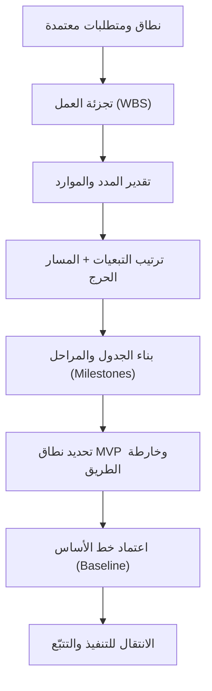

# 03 · التخطيط

> [!abstract] ماذا ستتعلّم هنا
> - ما معنى مرحلة **التخطيط (Planning)** ولماذا هي "[[Baseline|خط الأساس]]" (Baseline) الذي يُقاس عليه كل شيء لاحقًا.
> - كيف تُحوّل النطاق والمتطلبات إلى **جدول زمني (Schedule)** واقعي عبر **هيكل تجزئة العمل (Work Breakdown Structure — WBS)** و**التبعيات (Dependencies)**.
> - كيف تكتشف **المسار الحرج ([[Critical Path]])** وتبدأ مبكرًا بالأمور طويلة المهلة (Long Lead Time).
> - كيف تدير النطاق عبر **المنتج الأولي ([[MVP|Minimum Viable Product]] — MVP)** بدل تسليم كل شيء دفعة واحدة.
> - كيف تُنتج مستندات التخطيط وترتّبها وتربطها ببعض بأسلوب احترافي، مع دراسة حالة حقيقية من مشروع "عافية".
>
> اقرأ أولًا بطاقة الدور المرجعية: [[مدير المشاريع البرمجية الحديث]].

## 🧭 المفهوم ببساطة

تخيّل أنك ستبني بيتًا. **مرحلة النطاق** حدّدت "نريد بيتًا من طابقين بأربع غرف". أما **مرحلة التخطيط** فهي المخطّط الهندسي: متى نصبّ الأساس؟ من قبل من نطلب الحديد (وقد يتأخر أسابيع)؟ ما الذي يجب أن يكتمل قبل السقف؟ كم عاملًا نحتاج؟ بدون هذا المخطّط، يصل الحديد متأخرًا، ويقف العمال بلا مهام، وينهار الجدول.

**التخطيط (Planning)** ببساطة: تحويل "ماذا نريد" إلى **"كيف ومتى ومن ومقابل كم"**. مخرجاته الأساسية أربعة: جدول زمني ومراحل (Milestones)، تجزئة للعمل (WBS)، تبعيات ومسار حرج، وخطة نطاق مرحلية (MVP + Roadmap). في أطر **Agile** يكون التخطيط تكراريًا وخفيفًا (خارطة طريق + Backlog مرتّب)، وفي **Waterfall** يكون شاملًا ومفصّلًا قبل أي تنفيذ.

## 🧩 قاموس سريع للمصطلحات

| المصطلح (عربي) | English | المعنى ببساطة |
|---|---|---|
| خط الأساس | Baseline | النسخة المعتمدة من النطاق/الزمن/الكلفة التي نقيس الانحراف عنها لاحقًا. |
| هيكل تجزئة العمل | Work Breakdown Structure (WBS) | تفكيك المشروع إلى حزم عمل صغيرة قابلة للتقدير والإسناد. |
| المسار الحرج | Critical Path | أطول سلسلة مهام مترابطة؛ أي تأخير فيها يؤخّر المشروع كله. |
| التبعية | [[Dependency]] | مهمة لا تبدأ إلا بعد اكتمال أخرى (مثال: الواجهات بعد التصميم). |
| [[Lead Time|المهلة الطويلة]] (توريد) | Lead Time / Long-Lead Items | زمن انتظار خارج تحكّمك (فتح حساب بوابة دفع مثلًا) يجب بدؤه مبكرًا. ملاحظة: المقصود هنا "مهلة التوريد الطويلة"، لا مصطلح Lead/Lag الفني في تقنيات جدولة الشبكة. |
| المنتج الأولي | Minimum Viable Product (MVP) | أصغر نسخة قابلة للإطلاق تحقّق قيمة حقيقية. |
| [[Milestone|المرحلة الفاصلة]] | Milestone | نقطة إنجاز مهمة بلا مدة (نهاية مرحلة، تسليم دفعة). |
| خارطة الطريق | Roadmap | رؤية زمنية عالية المستوى لما سنبنيه ومتى، حسب المحاور. |

## ⛓️ لماذا تأتي هنا وتقود للتالية

**ما قبلها (المتطلّبات المسبقة):** لا يمكن بناء جدول زمني واقعي قبل أن يُحسم النطاق والمتطلبات (وثائق مثل [[02 - النطاق والمتطلبات|SOW/BRD/SRS]]) في المرحلة السابقة. الجدول المبني على نطاق غامض = جدول مبني على رمال.

**ما بعدها (ماذا تُغذّي):** مخرجات التخطيط — المراحل، التبعيات، خطة MVP، خارطة الطريق — تُغذّي مباشرة مرحلة [[04 - التنفيذ والتتبّع|التنفيذ والتتبّع (Execution)]]. فريق التطوير لا يبدأ الترميز الجاد قبل حسم "ما الذي يدخل الإصدار الأول؟" و"ما ترتيب الاعتماديات؟". أي غموض هنا (جدول غير واقعي، تبعية مهملة) ينتقل كخطر مباشر إلى التنفيذ.

## 📊 مخطّط سير العمل

## 📂 مستندات هذه المرحلة — واحدًا واحدًا

📂 مستندات هذه المرحلة (في مستودع المشروع)

### 1) الجدول الزمني والمراحل (M1–M7)

> [!info] ما هو ولماذا
> سجلّ يحدّد المراحل السبع للمشروع (System Design → Backend → Frontend → Integration → Security → Testing → Deployment) بصيغة "العرض التجاري" المُقدَّم للعميل، مع ربط كل مرحلة بدفعة دفع. هو العمود الفقري الزمني المتفق عليه تعاقديًا.

- **📥 من أين تجمع معلوماته:** من العرض/العقد التجاري، ومن مدير المشروع، ومن جلسة تقدير مع الفريق التقني حول مدة كل مرحلة.
- **🛠️ كيف ترتّبه:** جدول (CSV/Excel) بأعمدة: المرحلة، المخرجات، المدة المخططة، تاريخ البدء، الانتهاء المخطط، الانتهاء الفعلي، الحالة، الدفعة المرتبطة، المعتمِد.
- **🎯 فائدته:** يعطي خط أساس زمنيًا واضحًا للمتابعة، ويربط كل إنجاز بدفعة مالية، فيصبح "المرحلة أُنجزت = الدفعة تُستحق".
- ملف: `01-الجدول-الزمني-والمراحل.csv` (صيغة CSV — سجلّ).

> [!example] من عافية
> المراحل السبع M1–M7: M1 تخطيط وتصميم (4 أسابيع، مرتبطة بالدفعة الأولى 50%) ... M7 نشر وتسليم (مرتبطة بالدفعة النهائية 50%). لاحظ أن هذا الجدول يعرض 4 أسابيع فقط لمرحلة التخطيط والتصميم — رقم "العرض" لا "التحليل".

### 2) خطة الإطلاق (Go-Live Plan)

> [!info] ما هو ولماذا
> قائمة تحقق (Checklist) لثلاث مراحل: ما قبل الإطلاق، يوم الإطلاق، وبعد الإطلاق، مع **خطة تراجع (Rollback)**. يجبر الفريق على التفكير في "ماذا لو فشل الإطلاق؟" قبل وقوعه.

- **📥 من أين تجمع معلوماته:** من الفريق التقني (SSL، نسخ احتياطي، Load test)، والقانوني (سياسة خصوصية للبيانات الصحية)، وفريق الدعم.
- **🛠️ كيف ترتّبه:** قوائم مربّعات `[ ]` تحت ثلاثة عناوين زمنية، ثم بند مستقل لخطة التراجع (من يقرر؟ كيف نعود للنسخة السابقة؟).
- **🎯 فائدته:** يحوّل الإطلاق من "لحظة توتّر" إلى إجراء منظّم يمكن تتبّعه، ويقلّل مخاطر أول 48 ساعة.
- ملف: «02-خطة-الإطلاق-Launch.md»

> [!example] من عافية
> يشمل اختبار بوابة الدفع بمعاملة حقيقية، اختبار حجز موعد Zoom كامل، وتفعيل النسخ اليومي — لكن حقول "المسؤول عن قرار التراجع" و"آلية التراجع" بقيت قوالب فارغة `[الاسم]`/`[وصف]`، وهي ثغرة يجب سدّها قبل الإطلاق الفعلي.

### 3) تبعيات المهام والمسار الحرج

> [!info] ما هو ولماذا
> يوثّق المهام التي يعتمد بعضها على بعض، ويحدّد **المسار الحرج (Critical Path)** والأمور طويلة المهلة التي يجب بدؤها الآن.

- **📥 من أين تجمع معلوماته:** من الفريق التقني (ما الذي يسبق ماذا)، ومن جهات خارجية (البنك لبوابة الدفع، Zoom، التسويق للمحتوى).
- **🛠️ كيف ترتّبه:** جدول (المهمة / تعتمد على / المخاطرة)، ثم قائمة تنبيهات "ابدأ الآن" للبنود ذات المهلة الطويلة.
- **🎯 فائدته:** يمنع "التأخير المتسلسل"؛ فتأخّر مهمة على المسار الحرج يؤخّر المشروع كله. البدء المبكر بالمهل الطويلة يوفّر أسابيع.
- ملف: «03-تبعيات-المهام.md»

> [!example] من عافية
> "تطوير الواجهات يعتمد على اكتمال تصميم UI/UX"، و"تكامل بوابة الدفع يعتمد على فتح حساب تجاري باسمكم — قد يأخذ أسابيع، ابدأ مبكرًا". هذا التوثيق المبكر يحمي الجدول من مفاجآت خارج تحكّم فريق التطوير.

### 4) خطة العمل الواقعية (Realistic Timeline)

> [!info] ما هو ولماذا
> يقارن **المدة الواقعية بالتحليل** لكل مرحلة بـ**المدة المعروضة تجاريًا**، فيكشف **فجوة التقدير (Estimation Gap)** بشكل صريح ويقترح مدة تفاوضية وسطى.

- **📥 من أين تجمع معلوماته:** من تحليل تقني مستقل للمهام (تقدير من أسفل لأعلى)، مقارنًا بأرقام العرض التجاري.
- **🛠️ كيف ترتّبه:** جدول (المرحلة / المدة الواقعية / المدة بالعرض / ضمن MVP؟ / الدفعة / الحالة) مع صفّي إجمالي وتوصية.
- **🎯 فائدته:** يضع الحقيقة على الطاولة قبل التوقيع، فيتحوّل النقاش من "لماذا تأخرتم؟" لاحقًا إلى "كم نحتاج فعلًا؟" الآن.
- ملف: `04-خطة-العمل-الواقعية-Roadmap.csv` (صيغة CSV).

> [!example] من عافية
> الإجمالي الواقعي بالتحليل ≈ **54 أسبوعًا (~12 شهرًا)**، بينما العرض يَعِد بـ**16 أسبوعًا** — فجوة تفوق 3 أضعاف. التوصية: التفاوض على **7–9 أشهر** كأرضية واقعية.

### 5) خطة MVP المرحلية

> [!info] ما هو ولماذا
> يبرّر التحوّل من تسليم "دفعة واحدة" (Big Bang) لكل الميزات (+50 ميزة) إلى **منتج أولي (MVP)** بنحو 12 ميزة حرجة، مع تأجيل الباقي لمرحلة توسّع. جوهر **إدارة النطاق (Scope Management)**.

- **📥 من أين تجمع معلوماته:** من أولويات العمل (ما الذي يحقّق قيمة أسرع؟)، ومن الفريق التقني (ما القابل للإنجاز فعلًا؟).
- **🛠️ كيف ترتّبه:** قسمان: "المرحلة 1 — MVP" (ميزات حرجة فقط) و"المرحلة 2 — التوسّع"، مع مبرّر لكل قرار.
- **🎯 فائدته:** يقلّل المخاطر، يسرّع دخول السوق، ويوفّر تدفّقًا نقديًا مبكرًا، ويجعل الجدول ممكنًا فعليًا.
- ملف: «05-خطة-MVP-المرحلية.md»

> [!example] من عافية
> MVP = مزوّدان فقط (مستشفيات + أطباء) و≈12 ميزة حرجة (تسجيل + [[KYC]]، حجز افتراضي + Zoom، بوابة دفع سعودية واحدة، لوحة تحكم، RTL...). أُجّلت الصيدليات والمتجر متعدد البائعين ونظام LMS الكامل لمرحلة توسّع بعقد منفصل.

### 6) خارطة الطريق الموضوعية (Thematic Roadmap)

> [!info] ما هو ولماذا
> جدول يصنّف كل بند تطوير تحت أحد سبعة **محاور استراتيجية (Themes)** بدل قائمة ميزات مبعثرة، مع أولوية وحالة ومرحلة مقترحة. أداة تخطيط استراتيجي ربعي.

- **📥 من أين تجمع معلوماته:** من قائمة الميزات الكاملة، ومن رؤية الإدارة للأولويات الربعية.
- **🛠️ كيف ترتّبه:** جدول بيانات (CSV/Excel) بأعمدة: المحور، البند، الأولوية (🔴/🟡/🟢)، المرحلة المقترحة، صاحب المحور، الحالة.
- **🎯 فائدته:** يكشف الاختلال (كل الجهد على "ميزات جديدة" وإهمال "البنية التحتية")، ويسهّل التواصل مع الإدارة.
- ملفات: `06-خارطة-الطريق-الموضوعية-Thematic-Roadmap.csv` و`06-...-Thematic-Roadmap.xlsx` (صيغتا CSV وExcel).

> [!example] من عافية
> المحاور السبعة: New Features، Integration، Stickiness، Improvement، Infrastructure، Product، UI/UX. مثال: "Integration" يضم Zoom + بوابة الدفع (مدى) + Google Calendar.

### 7) دليل خارطة الطريق الموضوعية

> [!info] ما هو ولماذا
> الدليل التوضيحي لملف رقم 6: يشرح لماذا نحتاج خارطة طريق موضوعية، وكيف تختلف عن "متتبّع الميزات" التشغيلي (الاستراتيجي مقابل التنفيذي)، وكيف يُستخدم عمود الأولوية للقرار.

- **📥 من أين تجمع معلوماته:** من خبرة مدير المشروع، ومن مقارنة الأدوات (خارطة مقابل متتبّع).
- **🛠️ كيف ترتّبه:** مستند شرح (Markdown): ما هي؟ لماذا؟ كيف تستخدمها؟ كيف تختلف عن المتتبّع؟
- **🎯 فائدته:** يمنع الخلط بين الأداة الاستراتيجية (الخارطة للإدارة) والأداة التشغيلية (المتتبّع للفريق اليومي).
- ملف: «07-دليل-خارطة-الطريق-الموضوعية.md»

> [!example] من عافية
> يوضّح القاعدة الذهبية: "الخارطة للتخطيط الربعي والإدارة، والمتتبّع للتنفيذ اليومي للفريق" — الأداتان تتكاملان ولا تتكرّران.

## ⏱️ إدارة وقت هذه المهمة

| حجم المشروع | مدة تقريبية دولية لمرحلة التخطيط |
|---|---|
| صغير | ساعات إلى أيام |
| متوسط | أيام إلى أسبوعان |
| كبير (مثل عافية) | أسابيع إلى شهرين |

**من يُنتج المستند وكيف يتعاونون:** عادة 3–5 أشخاص. **مدير المشروع** يقود ويجمّع، **القائد التقني (Tech Lead)** يقدّر المدد والتبعيات، **محلّل الأعمال** يربط المتطلبات بالمراحل، و**صاحب المنتج (Product Owner)** يحسم أولويات MVP. التدفّق: مسودة من مدير المشروع → ورشة تقدير مع الفريق → مراجعة صاحب المنتج → اعتماد رسمي لخط الأساس.

**أي ملفات تراجع:** راجع مخرجات المرحلة السابقة [[02 - النطاق والمتطلبات]] ([[SOW]]/[[BRD]])، وسجلّ أصحاب المصلحة، وأي ميثاق مشروع.

**صيغ الملفات:**

| الغرض | الصيغة المناسبة |
|---|---|
| السجلّات (جداول، مراحل، خارطة طريق) | Excel / CSV |
| الأدلّة والخطط الشارحة | Word / Markdown |
| المستندات الرسمية المعتمدة | PDF |

> [!warning] الدقّة قبل السرعة
> جدول متفائل بلا تحليل حقيقي (مثل وعد 16 أسبوعًا لمشروع 54 أسبوعًا) يبدو إنجازًا سريعًا لكنه يزرع فشلًا مؤكدًا. خطة واقعية أبطأ في الكتابة أرخص بكثير من خطة سريعة خاطئة.

## 🌐 ما تقوله المعايير الحديثة

> [!quote] خلاصة بحثية (2026)
> - **حيادية المنهجية:** يتبنّى **PMBOK 7** المزج بين Waterfall وAgile في بيئات هجينة (Hybrid). يغطّي **WBS** عالي المستوى كامل نطاق البرنامج (قاعدة الـ100%)، بينما تدير فرق Agile الـBacklog الخاص بها داخل فرعها.
> - **خط أساس موحّد:** جوهر التخطيط الحديث هو **خط أساس قياس الأداء ([[Performance Measurement Baseline]] — PMB)**، الذي يدمج النطاق والزمن والكلفة في مرجع واحد.
> - **أفضل ممارسة:** إشراك أصحاب المصلحة مبكرًا لبناء الجدول تشاركيًا (Co-create) لضمان الالتزام، مع تقنيات واقعية مثل [[Contingency Reserve|احتياطي الطوارئ]] (Contingency) وإعادة ضبط خط الأساس (Rebaselining) عند الحاجة.
> - **اتجاه 2026:** دمج الذكاء الاصطناعي في التقدير والقرار المبني على البيانات.
>
> يرتبط هذا بـ[[مدير المشاريع البرمجية الحديث|مثلث كفاءات PMI]]: مهارات فنية (بناء WBS وجدول واقعي) + قيادة (التفاوض على فجوة الجدول) + فطنة عمل (اختيار MVP يحقّق قيمة أسرع).

## ➕ لإكمال الصورة — تحسينات مقترحة

> [!todo] ما ينقص مقابل المعايير وكيف نكمله
> - **لا هيكل تجزئة عمل (WBS) رسمي:** الملفات تقفز من النطاق إلى الجدول مباشرة دون تفكيك موثّق للحزم. أنشئ WBS يغطّي 100% من النطاق. راجع الوثيقة المكمّلة: [[هيكل تجزئة العمل (WBS)]].
> - **لا مصفوفة مسؤوليات (RACI) واضحة:** من "يُنجز" ومن "يُعتمد منه" غير موثّق لكل حزمة. راجع الوثيقة المكمّلة: [[مصفوفة المسؤوليات (RACI)]].
> - **سجلّ المخاطر غير رسمي:** المخاطر متناثرة داخل ملف التبعيات بدل سجلّ مستقل بالاحتمالية والأثر وخطة الاستجابة — راجع مفهوم [[19 - Risk Management]].
> - **لا خطة تواصل رسمية مع أصحاب المصلحة** توضّح من يُبلَّغ بماذا ومتى (خصوصًا فجوة الجدول) — راجع مفهوم [[21 - Stakeholder Communication]].
> - **خط الأساس غير موحّد:** النطاق والزمن والكلفة مبعثرة بين مستندات — يُفضّل وثيقة تخطيط متكاملة تربطها بميثاق واحد؛ راجع الوثيقة المكمّلة: [[ميثاق المشروع (Project Charter)]].
> - **خطة التراجع (Rollback) ناقصة:** حقولها الحرجة لا تزال فارغة؛ عيّن مسؤولًا وآلية قبل الإطلاق. عند التصعيد راجع الوثيقة المكمّلة: [[مسار التصعيد (Escalation Path)]].

## 🎬 سيناريوهان

> [!success] القصة الصحيحة
> **سارة**، مديرة المشروع، رفضت اعتماد وعد "16 أسبوعًا" كخط أساس. عقدت ورشة تقدير من أسفل لأعلى مع القائد التقني، فظهر رقم 54 أسبوعًا. بدل الصدام، جهّزت مقارنة صريحة واقترحت MVP بمزوّدين اثنين و7–9 أشهر. كما بدأت فورًا بفتح حساب بوابة الدفع (مهلة طويلة). النتيجة: وقّع العميل على جدول واقعي، وأُطلق الـMVP في الموعد، ودخل التدفّق النقدي مبكرًا.

> [!failure] القصة الخاطئة
> **خالد**، مدير مشروع آخر، أخذ جدول العرض (16 أسبوعًا) كما هو "لإرضاء العميل". لم يفكّك العمل ولم يحدّد التبعيات. بدأ الفريق الترميز، ثم اكتُشف بعد شهرين أن حساب بوابة الدفع يحتاج 4 أسابيع لم تُحسب، وأن الواجهات تنتظر تصاميم غير جاهزة. انزلق الجدول 8 أشهر، توتّر العميل، وحُجزت الدفعة النهائية وسط نزاع حول "ما المتفق عليه".

## 🧩 قرارات تفاعلية (فكّر ثم افتح)

> [!question]- الموقف: العميل يصرّ على تسليم كل الميزات (50+) خلال 4 أشهر. ماذا تفعل؟ (أ) توافق لإرضائه (ب) ترفض المشروع (ج) تقترح MVP مرحليًا مع مقارنة زمنية صريحة
> ✅ **الأفضل: ج.**
> **لماذا؟** الموافقة (أ) تزرع فشلًا مؤكدًا وتضرّ السمعة، والرفض (ب) يخسر فرصة قابلة للإنقاذ. تقديم MVP + مقارنة زمنية يحفظ العلاقة ويحمي الجدول.
> **السيناريو المثالي:** تجهّز جدولًا يقارن 54 أسبوعًا (تحليل) بـ16 (عرض)، وتعرض MVP بمزوّدين اثنين خلال ~4 أشهر، والباقي بعقود توسّع لاحقة.

> [!question]- الموقف: بوابة الدفع تحتاج حساب تجاري قد يستغرق أسابيع. متى تبدأ الإجراء؟ (أ) عند مرحلة التكامل حسب الجدول (ب) الآن في مرحلة التخطيط (ج) بعد اكتمال الواجهات
> ✅ **الأفضل: ب.**
> **لماذا؟** هذا بند **مهلة طويلة (Lead Time)** خارج تحكّم الفريق التقني؛ تأجيله يجعله على المسار الحرج ويؤخّر المشروع.
> **السيناريو المثالي:** تضعه في قائمة "ابدأ الآن" منذ التخطيط، وتتابعه بالتوازي مع تطوير باقي المهام.

## 🧠 أسئلة تفكير ناقد وعصف ذهني (بلا إجابة واحدة)

> [!question] أسئلة مفتوحة
> - كيف توازن بين إرضاء العميل بجدول متفائل وبين مصداقية التقدير الواقعي؟
> - متى يكون تقليص النطاق (MVP) قرارًا شجاعًا ومتى يكون تهرّبًا من التحدّي؟
> - في منصة بيانات صحية، أي بنود "بنية تحتية وأمان" لا يجوز تأجيلها للتوسّع حتى لو أبطأت الـMVP؟
> - كيف تُدخل احتياطي طوارئ (Contingency) في الجدول دون أن يبدو تضخيمًا للعميل؟

> [!tip] إطار الإجابة
> 1. **حدّد المعايير:** ما محدّدات القرار (زمن، كلفة، مخاطر، ثقة العميل، قانون)؟
> 2. **قيّم البدائل:** ضع 2–3 خيارات وقارنها على تلك المعايير.
> 3. **زِن المقايضات:** ما الذي تكسبه وتخسره في كل خيار (Trade-off)؟
> 4. **قرّر واربط بالقيمة:** اختر ما يخدم القيمة طويلة المدى، وبرّره بالبيانات. مثال اتجاه: الأمان في منصة صحية شرط إطلاق لا "تحسين لاحق"، فيبقى داخل MVP حتى لو كلّف أسبوعًا إضافيًا.

## ❓ نقاط للمراجعة (استرجاع)

> [!question]- لماذا لا يكفي جدول العرض التجاري (16 أسبوعًا) وحده كخط أساس؟
> لأنه يتجاهل الفارق الحقيقي بين الممكن تقنيًا (~54 أسبوعًا) والمطروح تجاريًا؛ الاعتماد عليه وحده يضمن فشل الجدول ويحوّل التخطيط إلى تمرين تسويقي.

> [!question]- ما المسار الحرج (Critical Path) ولماذا يهم؟
> أطول سلسلة مهام مترابطة لا يمكن تقصيرها؛ أي تأخير على أي مهمة فيها يؤخّر المشروع كله، لذا تُراقب وتُحمى أولًا.

> [!question]- لماذا اعتُبر اختيار MVP قرار تخطيط لا تفصيلًا تقنيًا لاحقًا؟
> لأنه يغيّر الجدول والميزانية وبنود العقد (دفعات مرتبطة بمراحل)؛ تأجيله يعني اكتشاف استحالة الجدول بعد البدء، وهو أغلى بكثير.

> [!question]- ما الفرق بين خارطة الطريق الموضوعية ومتتبّع الميزات؟
> الخارطة استراتيجية/ربعية (توازن المحاور للإدارة)، والمتتبّع تشغيلي/يومي (تنفيذ كل ميزة للفريق). كلاهما ضروري ومتكامل.

> [!question]- ما المهلة الطويلة (Lead Time) ولماذا نبدأ بها مبكرًا؟
> زمن انتظار خارج تحكّمك (فتح حساب بوابة دفع، شراء Zoom)؛ البدء المبكر يمنعه من الوقوع على المسار الحرج وتأخير المشروع.

> [!question]- ما خط الأساس (Baseline) ولماذا نعتمده؟
> النسخة المعتمدة من النطاق/الزمن/الكلفة؛ نقيس عليها الانحراف لاحقًا. بدونه لا معنى لجملة "المشروع متأخّر".

## 💼 من أسئلة المقابلات

> [!question]- كيف تتعامل مع توسّع النطاق ([[Scope Creep]]) أثناء التخطيط والتنفيذ؟
> أعتمد خط أساس واضح للنطاق، وأي طلب جديد يمرّ عبر **طلب تغيير رسمي ([[Change Request]])** يُقيَّم أثره على الزمن والكلفة والمخاطر قبل الموافقة. في عافية، فصلنا صراحة ما هو [[Out of Scope|خارج النطاق]] وأجّلنا الميزات الثانوية لعقد توسّع.

> [!question]- كيف تقدّر الجدول الزمني لمشروع؟
> أفكّك النطاق بـWBS، أقدّر كل حزمة من أسفل لأعلى مع الفريق، أرتّب التبعيات وأستخرج المسار الحرج، ثم أضيف احتياطي طوارئ. أقارن التقدير بأي وعود تجارية سابقة وأكشف الفجوة صراحة.

> [!question]- حدّثني عن مشروع كاد يفشل بسبب التخطيط، وكيف تصرّفت؟
> في مشروع منصة، كان الجدول التعاقدي أقل من الواقع بثلاثة أضعاف. عقدت ورشة تقدير، بنيت مقارنة صريحة، واقترحت MVP و7–9 أشهر. أنقذ ذلك العلاقة وحوّل نزاعًا محتملًا إلى اتفاق واقعي.

> [!question]- كيف تُبقي أصحاب المصلحة متوائمين حين تنحرف الخطة عن الواقع؟
> بخطة تواصل تحدّد من يُبلَّغ بماذا ومتى، وبشفافية مبكرة حول الفجوات (لا إخفاءها)، وبعرض خيارات لا مشكلات فقط. الشفافية المبكرة أرخص من مفاجأة متأخّرة.

> [!tip] إطار STAR
> رتّب إجابتك: **Situation** (الموقف) ← **Task** (مهمتك) ← **Action** (ما فعلته) ← **Result** (النتيجة بأرقام). واذكر أداة محددة في كل إجابة تخطيط: WBS للتفكيك، المسار الحرج للتبعيات، RACI للمسؤوليات، [[RAID Log|سجلّ RAID]] للمخاطر.

## 🧪 من مبتدئ إلى محترف

> [!success] مسار التدرّج
> - **مبتدئ:** تعرف الفرق بين المرحلة (Milestone) والمهمة، وتقرأ جدولًا زمنيًا وتحدّث حالته.
> - **متوسّط:** تبني WBS، ترتّب التبعيات، تستخرج المسار الحرج، وتقترح نطاق MVP معلّلًا.
> - **محترف:** تدمج النطاق والزمن والكلفة في خط أساس واحد (PMB)، تتفاوض على فجوات التقدير بثقة وبيانات، تدير احتياطي الطوارئ وإعادة الضبط، وتقود ورش تخطيط تشاركية مع أصحاب المصلحة في بيئة هجينة.

## 🔗 ربط بالمفاهيم

> [!note] ملاحظة ترقيم: الأرقام أدناه (04، 08، 13...) تخصّ سلسلة **المفاهيم العامة** المنفصلة عن ترقيم مراحل دراسة حالة عافية (00–11)؛ فـ«[[04 - Waterfall]]» مفهوم عام لا مرحلة المشروع الرابعة.

[[04 - Waterfall]]
[[15 - Roadmap]]
[[13 - Backlog]]
[[08 - Sprint Planning]]
[[19 - Risk Management]]
[[21 - Stakeholder Communication]]
[[مدير المشاريع البرمجية الحديث]]

## 📌 بطاقة مرجعية سريعة

| العنصر | الخلاصة |
|---|---|
| هدف المرحلة | تحويل "ماذا نريد" إلى "كيف/متى/من/مقابل كم" |
| المخرجات الأساسية | جدول ومراحل · WBS · تبعيات ومسار حرج · MVP وخارطة طريق |
| الأداة الحاسمة | خط الأساس (Baseline) لقياس الانحراف |
| أكبر خطر هنا | فجوة التقدير (وعد أسرع من الواقع) |
| الدرس من عافية | 54 أسبوعًا واقعيًا مقابل 16 معروضًا ← MVP و7–9 أشهر |

> [!tip] قواعد ذهبية
> - لا تعتمد جدولًا لم يُبنَ من تفكيك حقيقي للعمل (WBS).
> - ابدأ بنود المهلة الطويلة **الآن**، لا حين يجيء دورها في الجدول.
> - قلّص النطاق (MVP) قبل أن تضغط الجدول؛ ضغط الزمن يكسر الجودة.

> [!quote] مصادر
> - [Schedule Baseline for Effective Project Management (2026) — Deep Project Manager](https://deeprojectmanager.com/schedule-baseline-in-project-management/)
> - [PMBOK Guide for Teams in 2026 — monday.com](https://monday.com/blog/project-management/project-management-body-of-knowledge/)
> - [25 Project Planning Interview Questions and Answers (2025–2026) — Final Round AI](https://www.finalroundai.com/blog/project-planning-interview-questions)
> - [Fixing the Broken WBS — Agile Concepts in Project Planning — PMI](https://www.pmi.org/learning/library/wbs-agile-concepts-project-planning-6700)
