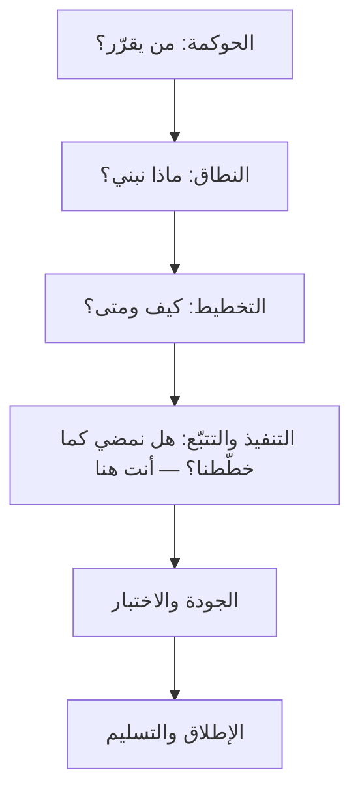
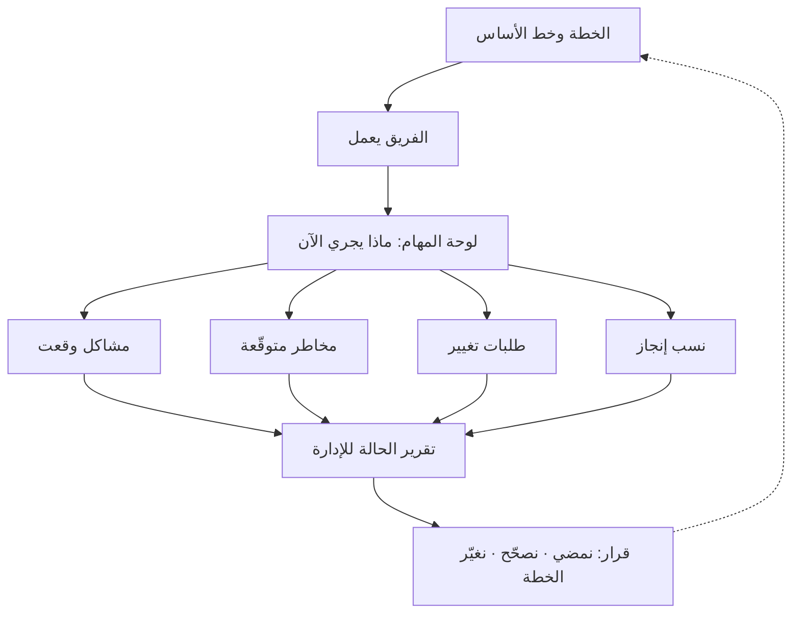
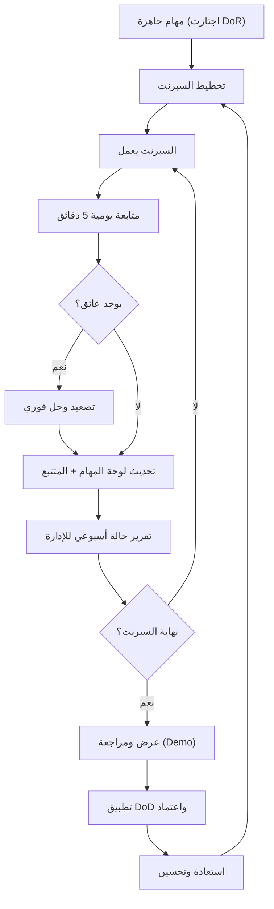
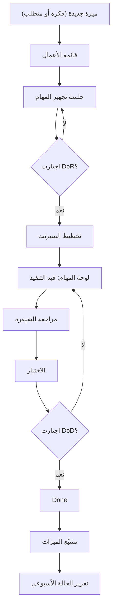
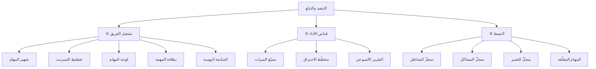

# 04 · التنفيذ والتتبّع

> [!abstract] ماذا ستتعلّم هنا
> - **صورة ذهنية واحدة** تجمع أدوات هذه المرحلة كلّها: غرفة عمليات بخمس شاشات، لا اثنتي عشرة وثيقة متفرّقة.
> - كيف تُحوّل الخطة المكتوبة إلى **عمل يومي منجَز** عبر لوحة مهام ودورة Sprint منظّمة.
> - كيف تتابع التقدّم بالأرقام (Monitoring & Controlling) وتكشف التأخير **مبكرًا** لا بعد أشهر.
> - كيف تدير المخاطر والمشاكل وطلبات التغيير أثناء الطريق دون فوضى.
> - كيف تكتب تقرير حالة أسبوعيًا يخدم الإدارة العليا في دقائق.
> - **رحلة المهمّة الواحدة** من فكرة إلى `Done` إلى سطر في تقرير الإدارة.
> - **السؤال الذي تجيب عنه كل أداة**، والفروق بين الأدوات المتشابهة التي يخلط بينها الجميع.
> - كيف تنتقل من مبتدئ يرسل المهام "على الماشي" إلى محترف يقود إيقاعًا ثابتًا متوقّعًا.
> - الشخصية القدوة في هذه الرحلة: [[مدير المشاريع البرمجية الحديث]].

---

## 🗺️ رحلة المشروع حتى الآن

في [[03 - التخطيط|الفصل السابق]] بنينا الوعد: نطاقًا وجدولًا وخطّ أساس. وفي هذا الفصل **نشغّل ما بنيناه** — فالتنفيذ ليس مرحلة جديدة منفصلة، بل هو تحوّل كل مخرَج من مخرجات التخطيط إلى أداة تعمل كل يوم:

| من التخطيط | ينتقل في التنفيذ إلى |
| --- | --- |
| **WBS** (حزم العمل) | مهام وبطاقات على **لوحة المهام** |
| **الجدول والمراحل** | **سبرنتات** متتابعة وخطة تنفيذ لكل واحد |
| **التبعيات والمسار الحرج** | **ترتيب** تنفيذ المهام، وأولوية رفع العوائق |
| **نطاق MVP** | ترتيب **قائمة الأعمال** وما يُختار في كل سبرنت |
| **خط الأساس** | مرجع **مقارنة المخطّط بالفعلي** في كل تقرير |
| **سجل المخاطر الأوّلي** | سجلّ حيّ يُراجَع دوريًّا، ومنه يولد **سجلّ المشاكل** |

> [!tip] لماذا هذا الترتيب لا غيره؟
> لأن ما لا يُقاس عليه شيء لا يُقال عنه إنه متأخّر. فالتتبّع كلّه — بلوحاته وسجلّاته وتقاريره — **يقيس انحرافًا عن مرجع**؛ ولولا خطّ الأساس الذي جُمّد في الفصل السابق، لكانت كل هذه الأدوات تصف الحاضر ولا تحكم عليه.

---

## 🎛️ الصورة الذهنية الواحدة — أنت في غرفة عمليات

قبل أي مصطلح، ثبّت هذه الصورة؛ فهي تجعل بقيّة الفصل أسهل بكثير.

في مرحلة التخطيط **رسمتَ خريطة المعركة**. أمّا الآن فقد بدأت المعركة فعلًا، وأمامك على الطاولة **خمس شاشات**:

| الشاشة | تعرض | وأداتها |
| --- | --- | --- |
| 1️⃣ | ماذا يعمل الفريق **الآن**؟ | لوحة المهام · المتابعة اليومية |
| 2️⃣ | ما المشاكل **الواقعة**؟ | سجلّ المشاكل · المهام المعلّقة |
| 3️⃣ | ما الذي **قد** يقع غدًا؟ | سجلّ المخاطر |
| 4️⃣ | **كم أنجزنا** فعلًا؟ | متتبّع الميزات · مخطّط الاحتراق |
| 5️⃣ | ماذا تحتاج **الإدارة** أن تعرف؟ | تقرير الحالة الأسبوعي |

**وإذا أهملت شاشة واحدة، فلن ترى الصورة كاملة.** فمن ينظر إلى الأولى وحدها يرى فريقًا مشغولًا ولا يعرف إن كان منتجًا، ومن ينظر إلى الرابعة وحدها يرى أرقامًا لا يعرف ما الذي يعطّلها، ومن أهمل الثالثة فوجئ بما كان مكتوبًا قبل شهر.

**إذن: مرحلة التنفيذ ليست «البرمجة».** البرمجة يفعلها المطوّرون. أمّا هذه المرحلة فهي **إدارة المشروع وهو يتحرّك** — وهذا عمل مختلف تمامًا، له أدواته التي لا يفعلها أحد نيابةً عنك.

---

## 🧭 المفهوم ببساطة

مرحلة **التنفيذ والتتبّع** (Execution & Tracking) هي القلب النابض للمشروع. هنا يتحوّل كل ما خطّطتَه إلى شيفرة تعمل وميزات تُسلَّم. لكنها ليست "اترك الفريق يعمل وانتظر"، بل شقّان متلازمان. الشقّ الأول: **التنفيذ** (Execution) — إنجاز المهام فعليًا. الشقّ الثاني: **المراقبة والضبط** (Monitoring & Controlling) — قياس ما أُنجز فعلًا مقابل الخطة، وتصحيح المسار.

**تشبيه من الحياة:** تخيّل ربّان طائرة. الإقلاع كان "التخطيط"، والآن الطائرة في الجو (التنفيذ). لكن الربّان لا يترك يده عن القيادة؛ عيناه على لوحة العدّادات باستمرار (التتبّع): الارتفاع، السرعة، الوقود. أي انحراف بسيط يصحّحه فورًا بلمسة صغيرة قبل أن يتحوّل إلى مشكلة كبيرة. مدير المشروع في هذه المرحلة ربّان: ينفّذ ويراقب ويصحّح — في آنٍ واحد.

ببساطة: **افعل، قِس، صحّح، كرّر** — كل يوم وكل أسبوع، حتى يكتمل المشروع.

---

## 🧭 الخريطة قبل التفاصيل — من أين جاءت كل هذه الملفّات؟

السؤال الذي يقع فيه كل مبتدئ ليس «ما هو سجلّ المخاطر؟» بل **«لماذا كل هذه الملفّات أصلًا؟»**. والجواب أنها ليست اثنتي عشرة أداة متجاورة، بل **أداة واحدة تتفرّع**: الخطة تُشغَّل، فيعمل الفريق، فتتولّد من عمله أربعة أنواع من المعلومات، ثم تُلخَّص كلّها في مكان واحد يُرفع للإدارة.

فحين تقرأ بعد قليل **سجلّ المخاطر**، لن تسأل «أين موضعه؟» — بل تعرف أنه أحد الأربعة التي تتولّد من العمل اليومي، وأن مصيره سطرٌ في تقرير الإدارة، وأن غايته النهائية **قرار**.

---

## 🧩 قاموس سريع للمصطلحات

| المصطلح (عربي) | English | المعنى ببساطة |
|---|---|---|
| لوحة المهام | Task Board | جدار بصري بأعمدة (Backlog → Done) تتحرّك عليه المهام |
| السبرنت | Sprint | فترة عمل قصيرة محددة (أسبوعان) تنتهي بعرض ما أُنجز |
| متابعة يومية | Daily Standup | تحديث سريع (5 دقائق): أمس، اليوم، العوائق |
| سجلّ المخاطر | [[Risk Register]] | قائمة بالمخاطر المحتملة + احتمالها وأثرها وخطة تعاملها |
| سجلّ المشاكل | [[Issue Log]] | مخاطر **وقعت فعلًا** وتحتاج حلًّا الآن |
| طلب التغيير | [[Change Request]] (CR) | طلب رسمي لتعديل النطاق يُوثَّق قبل تنفيذه |
| تقرير الحالة | Status Report | ملخّص أسبوعي لصحّة المشروع يُرفع للإدارة |
| العائق | [[Blocker]] | شيء يمنع تقدّم مهمة ويحتاج تدخّلًا فوريًا |
| السرعة | Velocity | كمية العمل (Story Points) التي ينجزها الفريق في Sprint |
| قائمة الأعمال | [[Backlog]] | كل ما لم يُنفَّذ بعد، مرتّبًا بالأولوية — لا قائمة مهام مُسنَدة |
| مخطّط الاحتراق | [[Burndown Chart]] | رسم يومي للنقاط المتبقّية في السبرنت؛ ميله يكشف التأخير مبكرًا |
| تعريف الاستعداد | DoR ([[Definition of Ready]]) | معايير يجب أن تجتازها المهمة **قبل** دخولها Sprint (بوّابة الدخول) |
| تعريف الاكتمال | DoD ([[Definition of Done]]) | معايير يجب أن تجتازها المهمة لتُعتبر "Done" فعليًا (بوّابة الخروج) |

> [!info] إضافة مرجعية — ما هو نصّ سكرم وما هو ممارسة شائعة
> ما في هذا الفصل ممارسةٌ عملية ناضجة، ولكن ليس كلّه منصوصًا في [[02 - Scrum|دليل سكرم]]، والفرق يستحقّ أن يُعرف قبل أن تصحّح فريقًا لا خطأ فيه:
> - **الوقفة اليومية** اسمها في الدليل **Daily Scrum**، وحدّها الأقصى **15 دقيقة**، وهي حدث **للمطوّرين** يخطّطون به يومهم — لا تقرير حالة يُرفع لمدير المشروع. و«خمس دقائق» تقريبٌ عمليّ جيّد، والحدّ الأقصى حدٌّ لا مدّة مستهدَفة.
> - **الأسئلة الثلاثة** (أمس · اليوم · العوائق) كانت في الدليل حتى **حُذفت في نسخة 2020**، فصارت مثالًا لا قاعدة. فهي **سابقة** لا خاطئة، ومن وجدها في كتاب أو دورة فقد وجد نسخة أقدم.
> - **السرعة (Velocity)** و**تعريف الجاهزية (DoR)** و**مخطّط الاحتراق** ممارسات شائعة نافعة، **وليست في الدليل**. أمّا **تعريف الاكتمال (DoD)** فمنصوص عليه فيه.

---

## ⛓️ لماذا تأتي هنا وتقود للتالية

**ما تحتاجه قبل أن تبدأ (المتطلبات السابقة):** لا تنفيذ ناجحًا بلا [[03 - التخطيط|خطة]] واضحة و[[02 - النطاق والمتطلبات|نطاق]] مُحدَّد. تحتاج مهامًا "جاهزة" اجتازت تعريف الاستعداد (DoR)، وفريقًا يعرف أدواره، وحوكمة ([[01 - الحوكمة]]) تحدد من يقرّر ماذا.

**ماذا تُغذّي بعدها؟** التنفيذ يُنتج ميزات جاهزة تدخل مرحلة [[05 - الجودة والاختبار]] لتُختبر وتُعتمد. كما يُغذّي [[10 - الأداء OKR-KPI|مؤشرات الأداء]] بالبيانات الفعلية، ويُنضج المنتج نحو [[07 - التسليم والقانوني|التسليم]]. باختصار: التخطيط يصنع الوعد، والتنفيذ يحقّقه، والتتبّع يضمن ألّا ينحرف الوعد عن مساره.

---

## 📊 مخطّط سير العمل

---

## 🚶 رحلة المهمّة الواحدة — من فكرة إلى سطر في تقرير الإدارة

المخطّط السابق يصف **دورة الفريق**. وهذا يصف **رحلة مهمّة واحدة** بعينها — وهو الجواب عن أكثر سؤال يتكرّر عند المبتدئ: *ماذا يحدث للمهمّة منذ ولادتها حتى تنتهي؟*

وثلاث ملاحظات على هذه الرحلة، هي التي تفصل من فهمها ممّن حفظها:

1. **البوّابتان تعملان في الاتّجاهين.** فالمهمّة التي لم تجتز DoR **ترجع** إلى التجهيز ولا تدخل السبرنت، والتي لم تجتز DoD **ترجع** إلى قيد التنفيذ ولا تُعدّ منجزة. ومن جعلهما زينةً لا بوّابة، أدخل عملًا ناقصًا وأخرج عملًا غير مكتمل، ثم عجب من تأخّر لا يعرف سببه.
2. **الرحلة لا تنتهي عند `Done`.** فالمهمّة المنجزة التي لم تُسجَّل في المتتبّع لم تُنجَز إداريًّا: هي شيفرة تعمل ولا أحد يعلم أنها تعمل، والإدارة تحسب المشروع أقلّ ممّا هو عليه.
3. **الرحلة كلّها تُختصر في رقم واحد.** فكل هذا المسار يظهر في التقرير الأسبوعي سطرًا واحدًا؛ ومن هنا تأتي خطورة رقمٍ يُقال بلا أن يُقاس — لأنه يمحو رحلة كاملة أو يخترع أخرى لم تقع.

---

## ❓ كل أداة والسؤال الذي وُجدت لتجيب عنه

أسماء الملفّات تُنسى، والأسئلة تبقى. فإن نسيتَ اسم الأداة يومًا، اسأل عن **السؤال** تجد الأداة:

| الأداة | السؤال الذي تجيب عنه |
| --- | --- |
| لوحة المهام | **من يعمل على ماذا الآن؟** |
| بطاقة المهمة | **ما المطلوب بالضبط، ومتى تُعدّ منجزة؟** |
| المتابعة اليومية | **ما الذي يعطّلنا اليوم؟** |
| جلسة التجهيز | **هل هذا العمل جاهز لأن يبدأ؟** |
| تخطيط السبرنت | **ما الذي نلتزم به في الأسبوعين القادمين؟** |
| متتبّع الميزات | **كم أنجزنا فعلًا؟** |
| مخطّط الاحتراق | **هل وتيرتنا تكفي للموعد؟** |
| سجلّ المخاطر | **ماذا قد يحدث؟** |
| سجلّ المشاكل | **ماذا حدث بالفعل؟** |
| المهام المعلّقة | **من التزم بماذا في الاجتماع؟** |
| سجلّ التغيير | **ما الذي تغيّر، وبإذن من؟** |
| تقرير الحالة | **ماذا تحتاج الإدارة أن تعرف؟** |

> [!tip] القاعدة الذهبية للفصل
> **كل أداة في التنفيذ تجيب عن سؤال واحد فقط.** فمتى وجدت أداة تجيب عن سؤالين، فقد اختلط عندك أداتان — كمن يدير المخاطر داخل سجلّ المشاكل، أو يقيس الإنجاز من لوحة المهام. ومتى وجدت سؤالًا بلا أداة، فتلك ثغرة في نظامك لا في الفريق.

---

## ⚖️ الفروق التي يخلط فيها الجميع

خمسة أزواج متشابهة الشكل مختلفة الوظيفة، والخلط بين أيّ زوجين منها يُعطّل الأداتين معًا:

| يختلط على المبتدئ | الفرق الحقيقي | العلامة الفارقة |
| --- | --- | --- |
| **مخاطرة · مشكلة** | الأولى **قبل** الوقوع، والثانية **بعده** | إن كان لها احتمال فهي مخاطرة، وإن صار لها أثر واقع فهي مشكلة |
| **لوحة المهام · متتبّع الميزات** | الأولى لإدارة **العمل اليومي**، والثانية لقياس **الإنجاز** | اللوحة يفتحها الفريق كل صباح، والمتتبّع تُبنى عليه نسبة التقرير |
| **مهمّة معلّقة · مهمّة** | الأولى **التزام ناتج عن اجتماع**، والثانية جزء من المشروع نفسه | المهمّة المعلّقة لا تُقاس في السرعة ولا تدخل السبرنت |
| **قائمة الأعمال · السبرنت** | الأولى **كل** ما لم يُنفَّذ، والثاني ما **اخترناه الآن** | قائمة الأعمال تتغيّر باستمرار، ونطاق السبرنت مغلق بعد التخطيط |
| **DoR · DoD** | الأولى **قبل البدء**، والثانية **قبل الإغلاق** | الأولى تمنع دخول عمل ناقص، والثانية تمنع خروج عمل غير مكتمل |

> [!warning] وأخطر هذه الخمسة
> **الخلط بين المخاطرة والمشكلة** — لأنه يُسقط الإدارة الاستباقية كلّها. فالفريق الذي يسجّل كل شيء في سجلّ المشاكل يعالج ما وقع فقط، ويبدو منضبطًا في كل اجتماع، وهو في الحقيقة **يُطفئ الحرائق ولا يمنعها**. والعلامة: سجلّ مشاكل ممتلئ وسجلّ مخاطر لم يُفتح منذ شهر.

---

## 🗓️ متى أفتح كل ملف؟

الأداة الصحيحة في الوقت الخطأ عبءٌ لا فائدة. وهذا جدول التوقيت:

| متى؟ | ماذا أستخدم؟ |
| --- | --- |
| **بداية السبرنت** | تخطيط السبرنت + بطاقات المهام |
| **كل صباح** | المتابعة اليومية |
| **أثناء التنفيذ** | لوحة المهام (تحديث لحظي) |
| **عند ظهور مشكلة** | سجلّ المشاكل |
| **عند توقّع مشكلة** | سجلّ المخاطر |
| **عند طلب إضافة** | سجلّ طلبات التغيير |
| **بعد كل اجتماع** | سجلّ المهام المعلّقة |
| **منتصف السبرنت (أسبوعيًّا)** | جلسة تجهيز المهام + تحديث متتبّع الميزات |
| **نهاية الأسبوع** | تقرير الحالة للإدارة |
| **نهاية السبرنت** | عرض ومراجعة + جلسة استعادة |

> [!tip] الأداة الوحيدة التي لا موعد لها
> **سجلّ المخاطر** — لأنه الوحيد الذي لا يُذكّرك به شيء. فالمشكلة تصرخ، والاجتماع يحلّ موعده، والتقرير له يوم؛ أمّا الخطر فصامت حتى يقع، فيلزمه **موعد مفروض** لا انتظار داعٍ: مراجعة ثابتة كل سبرنت، وإلّا لم يُفتح.

---

## 🏥 القصة المستمرّة — «عافية» في أوّل سبرنت

> [!note] حالة تعليمية مُصاغة
> «عافية» و«أُفُق للحلول الرقمية» اسمان افتراضيان، والأشخاص والحوارات **مشاهد تعليمية مُصاغة** لتقريب الفكرة، لا وقائع منسوبة إلى أحد. الثابت القابل للتحقّق هو المرجعيات النظامية والمعيارية وحدها.

> [!example] الحلقة (0) — أوّل أسبوع بعد اعتماد خط الأساس
> بدأ التنفيذ، وكان كل شيء يبدو ممتازًا: الفريق يعمل، والرسائل لا تنقطع، والمنفّذ يرسل كل مساء «تمام، ماشي الحال».
>
> وفي الأسبوع الثالث سألت **سلمى** سؤالًا واحدًا: **«كم ميزة من الاثنتي عشرة صارت جاهزة للاختبار؟»**
>
> فجاء الجواب بعد يومين من السؤال في المجموعات: **لا أحد يعرف.** كان الجميع مشغولًا، ولم يكن أحد يعرف أين وصل العمل — وهذا بعينه أعلى خطر سُجِّل في المشروع.

---

## 📂 مستندات هذه المرحلة — ثلاث عائلات لا اثنتا عشرة وثيقة

> جميع الملفات الأصلية في: 📂 مستندات هذه المرحلة (في مستودع المشروع)

> [!info] كيف تقرأ هذا القسم
> الأدوات هنا **اثنتا عشرة، ووظائفها ثلاث فقط**: أدوات تُشغّل الفريق، وأدوات تقيس الأداء، وأدوات تمنع الخروج عن السيطرة. فإن حفظت الوظائف الثلاث، استرجعت الأدوات كلّها بلا حفظ.
> **والأرقام أدناه أرقام الملفّات في مجلد المشروع، لا ترتيب القراءة** — والترتيب هنا بترتيب العمل داخل كل عائلة. ويُضاف تحت كل أداة سطرُ **♻️** يقول متى تفتحها ومن يملكها ومتى تنتهي.

### 👥 العائلة الأولى: أدوات تُشغّل الفريق يوميًّا

هذه أدوات **الفعل**: تجعل العمل يبدأ صحيحًا ويجري بلا توقّف. وسؤالها الجامع: *هل يعرف كل فرد ما عليه اليوم؟*

#### 10) دليل جلسة تجهيز المهام (Backlog Refinement)

**السؤال الذي يجيب عنه:** هل هذا العمل **جاهز** لأن يبدأ؟

> [!info] ما هو ولماذا
> جلسة دورية تحوّل الأفكار الخام إلى مهام "جاهزة" تجتاز DoR قبل دخول أي Sprint. خط الدفاع الأول ضد التأخير. راجع [[13 - Backlog]].

- **📥 من أين تجمع معلوماته:** من قائمة الأعمال المتراكمة (Backlog)، وأولويات مدير المشروع، وتقديرات المطوّر الرئيسي.
- **🛠️ كيف ترتّبه:** جلسة 45–60 دقيقة أسبوعيًا: راجع الأولويات، استعرض كل مهمة، اكشف التبعيات، قدّر الحجم ([[Planning Poker]])، طبّق DoR.
- **🎯 فائدته:** يمنع أن يبدأ المطوّر مهمة ثم يتوقّف لنقص معلومة — يجمع كل التجهيز في وقت منظّم واحد.
- **♻️ متى تفتحه ومن يملكه:** أسبوعيًّا في منتصف السبرنت · يقودها مدير المشروع أو صاحب المنتج مع المطوّرين · وتستمرّ ما بقيت قائمة الأعمال، فلا تنتهي إلا بانتهاء المنتج.
- **الملف:** «دليل تجهيز المهام»

> [!example] من عافية
> قاعدة ذهبية اعتُمدت: أي مهمة تُقدَّر بـ 13 نقطة أو أكثر = كبيرة جدًا، تُقسَّم قبل البدء.

#### 11) دليل تخطيط السبرنت (Sprint Planning)

**السؤال الذي يجيب عنه:** ما الذي نلتزم به في الأسبوعين القادمين؟

> [!info] ما هو ولماذا
> الجلسة التي تحوّل المهام الجاهزة إلى خطة عمل ملتزَم بها لأسبوعين. راجع [[08 - Sprint Planning]] و [[14 - Sprint]].

- **📥 من أين تجمع معلوماته:** من قائمة "Ready"، وسعة الفريق (Capacity)، وسرعته السابقة (Velocity).
- **🛠️ كيف ترتّبه:** حدّد هدف السبرنت، احسب السعة، اختر المهام حتى تمتلئ السعة (Ready فقط)، ثم التزام وإغلاق النطاق.
- **🎯 فائدته:** نقطة تحقّق كل أسبوعين بدل انتظار "التسليم النهائي" المجهول؛ يكشف التأخير مبكرًا.
- **♻️ متى تفتحه ومن يملكه:** أوّل يوم في كل سبرنت · يحضره الفريق كلّه · وينتهي أثره بانتهاء السبرنت، ثم يُعاد من جديد.
- **الملف:** «دليل تخطيط السبرنت»

> [!example] من عافية
> الإيقاع المعتمد: تجهيز → تخطيط → متابعة يومية → عرض → استعادة، مع Burndown يومي؛ إذا لم تنخفض النقاط بالوتيرة المتوقعة = إنذار مبكر بالتأخير.

#### 1) دليل لوحة المهام (Task Board Guide)

**السؤال الذي يجيب عنه:** من يعمل على ماذا **الآن**؟

> [!info] ما هو ولماذا
> دليل يوحّد طريقة إدارة المهام بأعمدة (Backlog → To Do → In Progress → In Review → Testing → Done) مهما اختلف البرنامج (Trello/Jira/ClickUp). يجعل الجميع يرى نفس الصورة عن حالة كل مهمة.

- **📥 من أين تجمع معلوماته:** من خطة المراحل (المهام)، ومن مدير المشروع (الأولويات وقواعد الأعمدة)، ومن المنفّذ ([[Capacity|سعة الفريق]] لتحديد حد "In Progress").
- **🛠️ كيف ترتّبه:** حدّد الأعمدة، ثم قواعد الانتقال بينها (DoR للدخول، DoD للخروج)، وحقول كل بطاقة (عنوان يبدأ بفعل + معايير قبول + مسؤول + أولوية).
- **🎯 فائدته:** شفافية كاملة — أي شخص يعرف في ثانية ما المنجَز وما المتعثّر وأين عنق الزجاجة (In Review غالبًا).
- **♻️ متى تفتحه ومن يملكه:** يُفتح **قبل أوّل سبرنت** وتُحدَّث بطاقاته يوميًّا · يملك اللوحة الفريق كلّه لا مدير المشروع وحده · وتبقى حيّة حتى إغلاق المشروع.
- **الملف:** «دليل لوحة المهام»

> [!example] من عافية
> اعتمد الفريق عمود "In Review (مراجعتنا)" لأن المنفّذ خارجي؛ فأصبحت كل ميزة يُنجزها تنتظر مراجعة الفريق قبل "Done"، ما منع اعتبار "كتبت الكود" = "انتهى".

#### 9) بطاقة مهمة نموذجية (Task Card)

**السؤال الذي تجيب عنه:** ما المطلوب بالضبط، ومتى تُعدّ منجزة؟

> [!info] ما هو ولماذا
> قالب موحّد لكل مهمة/قصة مستخدم على اللوحة: معلومات، قصة مستخدم، معايير قبول، وقائمتا DoR (بوابة دخول) وDoD (بوابة خروج) كـ Checklist.

- **📥 من أين تجمع معلوماته:** من متتبع الميزات (الربط)، ومن جلسة التجهيز (المعايير والتقدير)، ومن التصاميم.
- **🛠️ كيف ترتّبه:** رأس البطاقة (ID، وحدة، أولوية، Story Points، مسؤول)، ثم قصة المستخدم، ثم معايير القبول، ثم DoR وDoD كقوائم قابلة لإعادة الاستخدام.
- **🎯 فائدته:** لا تبدأ مهمة ناقصة ولا تُغلق مهمة غير مكتملة؛ الجودة مبنية في البطاقة نفسها.
- **♻️ متى تفتحها ومن يملكها:** تُنشأ في جلسة التجهيز · يملكها المطوّر المسنَدة إليه · وتُغلق باجتيازها DoD، ثم تصير سجلًّا لا يُعدَّل.
- **الملف:** «بطاقة مهمة نموذجية»

> [!example] من عافية
> مثال معيار قبول واقعي: "عند اختيار طبيب ووقت متاح، يُنشأ الحجز ويصل رابط Zoom تلقائيًا للطرفين، ولا يمكن حجز نفس الوقت مرتين".

#### 6) قالب المتابعة اليومية (Daily Standup)

**السؤال الذي يجيب عنه:** ما الذي **يعطّلنا** اليوم؟

> [!info] ما هو ولماذا
> قالب خفيف (5 دقائق) لثلاثة أسئلة: أمس أنجزنا / اليوم سنعمل / عوائق تمنعنا. مبدأ [[07 - Daily Standup]].

- **📥 من أين تجمع معلوماته:** من المطوّرين مباشرة، يمكن نصّيًا عبر واتساب كل صباح.
- **🛠️ كيف ترتّبه:** التاريخ + ثلاثة أسطر فقط. لا تحوّله لاجتماع حل مشاكل — العوائق تُسجَّل وتُحلّ بعده.
- **🎯 فائدته:** كشف العوائق يوميًا لا أسبوعيًا؛ إنذار مبكر يمنع ضياع الأيام.
- **♻️ متى تفتحه ومن يملكه:** كل صباح عمل · يملكه **المطوّرون** فهو حدثهم لا تقرير للمدير · ويستمرّ ما دام السبرنت جاريًا.
- **الملف:** «قالب المتابعة اليومية»

> [!example] من عافية
> اعتُمد أسلوب "واتساب نصّي كل صباح" لأنه يناسب فريقًا عن بُعد ومنفّذًا خارجيًا دون عبء اجتماع يومي.

### 📈 العائلة الثانية: أدوات تقيس الأداء

هذه أدوات **القياس**: لا تجعل العمل يجري، بل تُخبرك أين وصل. وسؤالها الجامع: *هل ما نراه من نشاطٍ يتحوّل إلى إنجاز؟*

#### 7) متتبع الميزات الشامل (Feature Tracker)

**السؤال الذي يجيب عنه:** **كم أنجزنا فعلًا؟**

> [!info] ما هو ولماذا
> العمود الفقري للتتبّع: جدول يرصد كل ميزة عبر مراحلها (صُمّم/طُوّر/اختُبر/اعتُمد) ونسبة إنجازها وأولويتها ومسؤولها. هو مصدر الحقيقة عن "أين نحن فعلًا".

- **📥 من أين تجمع معلوماته:** من قائمة الميزات (النطاق)، ومن تحديثات المطوّرين، ومن نتائج الاختبار والاعتماد.
- **🛠️ كيف ترتّبه:** لكل ميزة معرّف فريد + ربطها بمعيار قبول وبمتطلب في [[RTM]]؛ "مكتمل" = اجتازت كل مراحل DoD لا مجرد "طُوّر".
- **🎯 فائدته:** يقتل خطر "لا نعرف ما أُنجز فعلًا"؛ نسبة إنجاز حقيقية تُغذّي التقرير واللوحة.
- **♻️ متى تفتحه ومن يملكه:** يُفتح **مع أوّل ميزة** ويُحدَّث أسبوعيًّا · يملكه مدير المشروع ويغذّيه الفريق · ويبقى حتى التسليم، ثم يصير سجلّ ما سُلّم.
- **الملفات:** `07-متتبع-الميزات-الشامل-Feature-Tracker.csv` و `.xlsx`

> [!example] من عافية
> هذا الملف هو خطة التخفيف المباشرة لأعلى خطر في المشروع (وضوح المنجَز). يُملأ فورًا لكل ميزة من 50+ ميزة.

#### 12) مواصفات قالب متتبع الميزات (Feature Tracker Spec)

**السؤال الذي يجيب عنه:** كيف أبني هذا المتتبّع نفسه في أي مشروع قادم؟

> [!info] ما هو ولماذا
> وصف كامل لبنية ملف متتبع الميزات (أعمدة، قوائم منسدلة، ألوان، قواعد) — يمكن إعطاؤه لأي ذكاء اصطناعي لتوليد الملف لأي مشروع.

- **📥 من أين تجمع معلوماته:** من احتياج التتبّع نفسه؛ هو "مخطّط" (Blueprint) للملف لا الملف.
- **🛠️ كيف ترتّبه:** 16 عمودًا مرتّبًا، قوائم منسدلة للأولوية/الحالة، تنسيق شرطي ملوّن، اتجاه RTL، وقواعد عمل.
- **🎯 فائدته:** توحيد قياسي وقابلية تكرار — أي مشروع جديد يحصل على متتبّع بنفس الجودة في دقائق.
- **♻️ متى تفتحه ومن يملكه:** مرّة واحدة عند تأسيس النظام · يملكه مكتب إدارة المشاريع أو مدير المشروع · ويُحدَّث حين تتغيّر طريقة التتبّع لا حين يتغيّر المشروع.
- **الملف:** «مواصفات متتبع الميزات»

> [!example] من عافية
> يتضمّن "Prompt جاهز" يُلصق لأي أداة ذكاء اصطناعي لتوليد متتبّع كامل لميزات عافية مقسّمًا حسب الوحدات (Auth, Booking, Payments...).

#### 5) تقرير الحالة الأسبوعي (Weekly Status Report)

**السؤال الذي يجيب عنه:** ماذا تحتاج **الإدارة** أن تعرف؟

> [!info] ما هو ولماذا
> نبض المشروع الأسبوعي المرفوع للإدارة العليا: حالة عامة بلون (🟢🟡🔴)، ما أُنجز، المخطّط، العوائق، تقدّم المراحل، المخاطر، الوضع المالي، والقرارات المطلوبة.

- **📥 من أين تجمع معلوماته:** من لوحة المهام (المنجَز)، ومتتبع الميزات (النِّسَب)، وسجلّ المخاطر، والتقرير المالي، وتقدير مدير المشروع للّون العام.
- **🛠️ كيف ترتّبه:** ابدأ بالحالة العامة وملخّص سطر واحد، ثم أقسام قصيرة، وأبرِز **العوائق والقرارات المطلوبة** لأنها ما يحتاج الإدارة.
- **🎯 فائدته:** يبقي الإدارة على اطّلاع دون اجتماعات طويلة، ويطلب القرارات في وقتها.
- **♻️ متى تفتحه ومن يملكه:** نهاية كل أسبوع في موعد ثابت · يملكه مدير المشروع وحده · ويستمرّ حتى إغلاق المشروع، ثم يصير أرشيفًا يُبنى عليه تقرير الإغلاق.
- **الملف:** «تقرير الحالة الأسبوعي»

> [!example] من عافية
> نموذج التقرير يُحفَظ باسم `تقرير-أسبوع-YYYY-MM-DD` ويُرسل للمدير العام والتنفيذي، مع خانة "قرارات مطلوبة من الإدارة" في نهايته.

### 🛡️ العائلة الثالثة: أدوات تمنع الخروج عن السيطرة

هذه أدوات **الضبط**: لا تُنتج عملًا ولا تقيسه، وإنما تمنع المشروع من الانحراف بلا أن يشعر أحد. وسؤالها الجامع: *ما الذي يهدّد الخطة، وهل نعالجه أم نكتشفه متأخّرًا؟*

#### 2) سجلّ المخاطر (Risk Register)

**السؤال الذي يجيب عنه:** ماذا **قد** يحدث؟

> [!info] ما هو ولماذا
> جدول يرصد كل خطر محتمل قبل وقوعه، ويقيسه بدرجة = الاحتمال × الأثر، ويحدد استراتيجية استجابة ومسؤولًا. للتعمّق راجع [[19 - Risk Management]].

- **📥 من أين تجمع معلوماته:** من عصف ذهني مع الفريق، ومن الدروس المستفادة، ومن نقاط ضعف العقد والتبعيات الخارجية.
- **🛠️ كيف ترتّبه:** لكل خطر: معرّف، وصف، فئة، احتمال (1–5)، أثر (1–5)، درجة، استراتيجية (تجنّب/تخفيف/نقل/قبول)، خطة تخفيف، مسؤول، حالة.
- **🎯 فائدته:** يحوّل المفاجآت إلى مخاطر متوقّعة لها خطة جاهزة — تدير الخطر بدل أن يديرك.
- **♻️ متى تفتحه ومن يملكه:** يُفتح **في التخطيط** ويُراجَع كل سبرنت في موعد مفروض · يملكه مدير المشروع ولكلّ خطر مالك مستقلّ · ويُغلق الخطر إمّا بزوال سببه وإمّا بتحوّله إلى مشكلة.
- **الملفات:** `02-سجل-المخاطر.csv` و `02-سجل-المخاطر.xlsx`

> [!example] من عافية
> أعلى خطر سُجِّل (درجة 20): "عدم وضوح ما أُنجز فعليًا مقابل العرض". خطة التخفيف: تعبئة متتبع الميزات فورًا. وخطر آخر بارز: الاعتماد على شخص اتصال واحد لدى المنفّذ.

#### 3) سجلّ المشاكل (Issue Log)

**السؤال الذي يجيب عنه:** ماذا **حدث** بالفعل؟

> [!info] ما هو ولماذا
> بينما المخاطر "قد تقع"، المشاكل **وقعت بالفعل**. هذا السجلّ يتتبّع كل مشكلة نشطة حتى تُحلّ، مع مسؤول وموعد.

- **📥 من أين تجمع معلوماته:** من المتابعة اليومية (عوائق)، ومن الاختبار (أخطاء)، ومن اجتماعات الحالة.
- **🛠️ كيف ترتّبه:** معرّف، تاريخ، وصف المشكلة، الأثر، الأولوية، المسؤول عن الحل، تاريخ مستهدف، الحالة، الحل النهائي.
- **🎯 فائدته:** لا مشكلة تُنسى أو تضيع في محادثات واتساب؛ كلها في مكان واحد بمسؤول واضح.
- **♻️ متى تفتحه ومن يملكه:** **فور وقوع أوّل عائق**، لا حين تكثر المشاكل · يملكه مدير المشروع ولكلّ مشكلة مسؤول حلّ · وتُغلق المشكلة بحلّها موثّقًا، لا بمرور الوقت عليها.
- **الملف:** `03-سجل-المشاكل-Issues.csv`

> [!example] من عافية
> يبدأ السجلّ بمعرّفات جاهزة (I-001, I-002...) بحالة "مفتوح" لتُملأ فور ظهور أول عائق حقيقي.

#### 4) سجلّ المهام المعلّقة (Action Items)

**السؤال الذي يجيب عنه:** من التزم بماذا في الاجتماع؟

> [!info] ما هو ولماذا
> قائمة المهام الصغيرة الناتجة عن الاجتماعات والقرارات: "من سيفعل ماذا وبحلول متى". تمنع ضياع الالتزامات بعد انتهاء الاجتماع.

- **📥 من أين تجمع معلوماته:** من محاضر الاجتماعات، وجلسات تجهيز المهام، وقرارات مدير المشروع.
- **🛠️ كيف ترتّبه:** معرّف، المهمة، مصدرها (اجتماع/قرار)، المسؤول، تاريخ الاستحقاق، الحالة.
- **🎯 فائدته:** يحوّل "اتفقنا على..." إلى التزام متتبَّع بمالك وموعد.
- **♻️ متى تفتحه ومن يملكه:** بعد كل اجتماع مباشرةً · يملكه من كتب المحضر · ويُراجَع في أوّل اجتماع تالٍ، فما لم يُراجَع فيه لم يُلزم أحدًا.
- **الملف:** `04-سجل-المهام-المعلقة-Action-Items.csv`

> [!example] من عافية
> نواقص أي مهمة لم تجتز DoR في جلسة التجهيز تُسجَّل هنا فورًا مع مسؤول إكمالها، فلا تدخل Sprint وهي ناقصة.

#### 8) سجلّ طلبات التغيير (Change Log)

**السؤال الذي يجيب عنه:** ما الذي **تغيّر**، وبإذن من؟

> [!info] ما هو ولماذا
> كل تعديل على النطاق يُوثَّق كطلب رسمي (CR) قبل تنفيذه، مع أثره على النطاق والجدول والتكلفة، ومن اعتمده. حصن ضد **[[Scope Creep|تضخّم النطاق]]** (Scope Creep).

- **📥 من أين تجمع معلوماته:** من مقدّم الطلب (عميل/فريق)، ومن تحليل مدير المشروع للأثر، ومن قرار المعتمِد.
- **🛠️ كيف ترتّبه:** معرّف، تاريخ، وصف، مقدّم، سبب، أثر على (النطاق/الجدول/التكلفة)، القرار، المعتمِد، الحالة.
- **🎯 فائدته:** يمنع "إضافات صغيرة" غير موثّقة تُراكِم تأخيرًا وتكلفة خفية؛ كل تغيير له ثمن معلَن ومُعتمَد.
- **♻️ متى تفتحه ومن يملكه:** **مع اعتماد خط الأساس**، لا عند أوّل خلاف · يملكه مدير المشروع ويعتمد كلَّ طلبٍ صاحبُ القرار · ويبقى حتى الإغلاق، فهو تاريخ تحوّلات النطاق كلّها.
- **الملف:** `08-سجل-طلبات-التغيير-Change-Log.csv`

> [!example] من عافية
> مرتبط مباشرة بالخطر R-004 "توسّع النطاق دون توثيق"؛ خطة التخفيف كانت إلزام هذا النموذج لأي تغيير.

---

## ✅ كيف أعرف أن نظام التتبّع يعمل فعلًا؟

النظام الذي يبدو منضبطًا وهو معطَّل أخطر من غياب النظام، لأنه يُنتج طمأنينة بلا أساس. وهذه سبع علامات:

> [!success] نظام التتبّع سليم إذا…
> - ✅ **تستطيع أن تقول نسبة الإنجاز الآن** بلا أن تسأل أحدًا.
> - ✅ **لوحة المهام تطابق الواقع** — لا بطاقة «قيد التنفيذ» منذ أسبوعين وصاحبها انتقل لغيرها.
> - ✅ **كل عائق ظهر هذا الأسبوع مسجَّل** بمالك وتاريخ، لا في محادثة.
> - ✅ **سجلّ المخاطر تغيّرت فيه حالةُ خطر** بين مراجعتين — فالسجلّ الجامد سجلّ مهجور.
> - ✅ **لا ميزة أُضيفت** بلا طلب تغيير معتمد.
> - ✅ **التقرير الأسبوعي يخرج في موعده** حتى في الأسابيع السيّئة، بل خصوصًا فيها.
> - ✅ **أرقامك تُقاس ولا تُقال** — كل رقم في التقرير له مصدر يمكن فتحه.

> [!warning] المعيار العملي
> إن مرّ سبرنت كامل ولم يتغيّر لونٌ ولا حالةُ خطر ولا رقمٌ في تقريرك، فأنت **لا تتتبّع، وإنما تُعيد إرسال التقرير نفسه**. فالتتبّع الحيّ يُحدث فرقًا في القرار؛ وما لم يُغيّر قرارًا قطّ فهو عمل ورقيّ مهما بدا منضبطًا.

---

## ⏱️ إدارة وقت هذه المهمة

هذه المرحلة **مستمرة طوال عمر المشروع** لا حدثًا لمرة واحدة. الأرقام أدناه تقديرات دولية للجهد الدوري:

| حجم المشروع | إيقاع التتبّع النموذجي |
|---|---|
| **صغير** | متابعة خفيفة يومية + تقرير أسبوعي بسيط (ساعات/أسبوع) |
| **متوسط** | Sprint أسبوعين + تقرير أسبوعي + تحديث متتبّع (يوم/أسبوع موزّع) |
| **كبير** | عدة فرق متوازية + PMO + لوحات آلية (أسابيع جهد متراكم شهريًا) |

**من يُنتج المستند وكيف يتعاونون:** مدير المشروع هو المالك الأساسي للتتبّع (شخص واحد يقود). لكنه **لا ينتج البيانات وحده**: المطوّرون يحدّثون بطاقاتهم، مديرة مشروع المنفّذ تنسّق من جهتها، و[[Quality Assurance|QA]] يغذّي الأخطاء. التدفّق: الفريق يُحدّث اللوحة يوميًا → مدير المشروع يجمّع في المتتبّع أسبوعيًا → يُلخّص في تقرير الحالة → يرفعه للإدارة.

**أي ملفات تراجع:** خطة المراحل ([[03 - التخطيط]])، النطاق ومصفوفة المتطلبات RTM ([[02 - النطاق والمتطلبات]])، وسجلّ القرارات في الحوكمة ([[01 - الحوكمة]]).

**صيغ الملفات:**

| النوع | الصيغة المناسبة | لماذا |
|---|---|---|
| السجلّات (مخاطر/مشاكل/تغيير) والمتتبّع | Excel / CSV | جداول تُفلتر وتُلوّن وتُحسب آليًا |
| الأدلة والقوالب النصّية | Word / Markdown | نصّ مُنظّم سهل التحرير والربط |
| التقارير الرسمية للإدارة | PDF | ثابت لا يُعدَّل، رسمي للأرشفة |

> [!warning] الدقّة قبل السرعة
> رقم إنجاز خاطئ في المتتبّع أخطر من رقم متأخر. تقرير "70% منجَز" وهو 40% يفجّر ثقة الإدارة عند الانكشاف. حدّث بصدق ولو كان اللون أحمر.

---

## 🌐 ما تقوله المعايير الحديثة

> [!quote] خلاصة أبحاث 2026
> تُجمع الممارسات الحديثة على أن مرحلة **المراقبة والضبط تتزامن مع التنفيذ** لا تليه، ومهمتها المستمرة: مراجعة الحالة، تقييم العوائق، تطبيق التغييرات، والالتزام بالجدول والميزانية.
>
> توصيات بارزة:
> - تقارير حالة **موجزة** بمؤشّرات واضحة وتنسيق ثابت وتحديث دقيق في وقته.
> - تتبّع **3–5 مؤشّرات لكل مشروع** فقط (وألا تتجاوز 7–10 للفريق)؛ ما بعدها يشتّت الانتباه.
> - التحوّل نحو **لوحات وأتمتة** تقلّل الإدخال اليدوي وتُحسّن الدقّة (إدخال البيانات، تحديث الحالة، توليد التقارير).
> - عملية تغيير منضبطة: توثيق الطلب → تحليل أثره على الوقت/الكلفة/الموارد → اعتماد أصحاب المصلحة → تحديث الخطة.
>
> هذا يجسّد [[مدير المشاريع البرمجية الحديث|مثلث كفاءات PMI]]: طرق العمل (تنفيذ منضبط)، مهارات القيادة (كشف العوائق ورفعها)، والفطنة بالأعمال (ربط التتبّع بالقيمة والميزانية).

---

## ➕ لإكمال الصورة — تحسينات مقترحة

> [!todo] ما ينقص مقابل المعايير وكيف تكمله
> - **لوحة معلومات بصرية حيّة:** التقرير النصّي جيد لكن الإدارة تحتاج شاشة واحدة بألوان وأرقام. أنشئ [[لوحة معلومات المشروع (Project Dashboard)]] تُغذّى آليًا من المتتبّع والسجلّات.
> - **[[EVM|إدارة القيمة المكتسبة]] (EVM):** لا يوجد قياس كمّي لانحراف الجدول/الكلفة. ابدأ بـ **مؤشّر انحراف بسيط**: مخطّط% مقابل فعلي%. لاحظ أن هذا تقريب مبسّط وليس [[CPI and SPI|SPI]]/CPI الحقيقيَّين، فهما يُحسبان من القيمة المكتسبة (EV) مقابل القيمة المخطَّطة (PV) والتكلفة الفعلية (AC). راجع [[10 - الأداء OKR-KPI]].
> - **مسار تصعيد موثّق:** عند عائق حرج، من يُبلَّغ ومتى؟ استخدم [[مسار التصعيد (Escalation Path)]] الجاهز.
> - **مرجعية ضبط النطاق:** اربط سجلّ التغيير بميثاق المشروع لتعرف ما "داخل النطاق" أصلًا — [[ميثاق المشروع (Project Charter)]].
> - **تقييم أداء المنفّذ دوريًا:** لا ملف يقيس التزام المورّد بالجودة والمواعيد. استخدم [[بطاقة تقييم المورّد (Vendor Scorecard)]].
> - **ترسيخ جلسة الاستعادة:** موجودة ضمن دليل السبرنت لكنها الأضعف تطبيقًا؛ اجعلها إلزامية كل Sprint — [[10 - Sprint Retrospective]].

---

## 🎬 سيناريوهان

> [!success] القصة الصحيحة — سلمى
> سلمى مديرة مشروع عافية. في اليوم الثالث من السبرنت لاحظت عبر المتابعة اليومية (واتساب) أن مطوّرًا "عالق منذ يومين" على تكامل بوابة الدفع. لم تنتظر التقرير الأسبوعي. سجّلت العائق فورًا في سجلّ المشاكل، صعّدته عبر مسار التصعيد للمدير العام، وحصلت على قرار تسريع فتح الحساب التجاري. حدّثت المتتبّع بصدق (اللون 🟡). النتيجة: حُلّ العائق خلال 24 ساعة وأُنجز السبرنت في موعده، والإدارة وثقت بتقاريرها لأنها رأت مشكلة قبل تفاقمها.

> [!failure] القصة الخاطئة — سامي
> سامي مدير مشروع آخر. اكتفى برسائل واتساب متفرّقة دون لوحة مهام ولا متتبّع. حين سأله المدير عن النسبة قال "تقريبًا 80%" تخمينًا. قبِل ميزات إضافية من العميل شفهيًا دون طلب تغيير. لم يكشف تأخّرًا تراكم أسبوعين لأنه لم يقِس شيئًا. في اجتماع التسليم انكشف أن الإنجاز الحقيقي 55%، وأن ثلاث ميزات غير موثّقة أخّرت الباقي. انهارت ثقة الإدارة، وتحوّل المشروع إلى أزمة كان يمكن تفاديها بلوحة وسجلّ تغيير.

---

## 🧩 قرارات تفاعلية (فكّر ثم افتح)

> [!question]- الموقف: العميل يطلب هاتفيًا "إضافة صغيرة" في منتصف السبرنت. ماذا تفعل؟
> - **أ)** تنفّذها فورًا إرضاءً للعميل.
> - **ب)** ترفضها نهائيًا.
> - **ج)** تسجّلها كطلب تغيير (CR)، تحلّل أثرها على الجدول/الكلفة، وتعرضها للاعتماد.
>
> ✅ **الأفضل: ج.** **لماذا؟** لا "إضافة صغيرة" مجانية؛ كلها تستهلك وقتًا. رفضها يضرّ العلاقة، وتنفيذها بلا توثيق يفجّر تضخّم النطاق. المسار المثالي: "بكل سرور، سأوثّقها كطلب تغيير وأعود لك بأثرها على الموعد خلال يوم" — يحترم العميل ويحمي المشروع، ويحافظ على قدسية نطاق السبرنت الحالي.

> [!question]- الموقف: التقرير الأسبوعي حان، والإنجاز الحقيقي متأخّر عن المخطّط. ماذا تكتب؟
> - **أ)** لون 🟢 وتأمل تعويض الفارق بهدوء.
> - **ب)** لون 🔴/🟡 بصدق مع سبب واضح وخطة تصحيح وقرار مطلوب.
> - **ج)** تؤجّل إرسال التقرير حتى تتحسّن الأرقام.
>
> ✅ **الأفضل: ب.** **لماذا؟** الشفافية المبكرة هي رأس مال مدير المشروع. اللون الأحمر ليس اعترافًا بالفشل بل طلب مساعدة في وقته. إخفاء التأخير يحوّل مشكلة صغيرة اليوم إلى أزمة غدًا. المسار المثالي: تقرير صادق يحدد السبب، ويقترح خطة تصحيح، ويطلب القرار الذي يحتاجه من الإدارة الآن.

> [!question]- الموقف: مطوّر يقول «انتهيت من الميزة» وهي لم تُختبر بعد. أتحدّث المتتبّع؟
> - **أ)** نعم، فقد أنهى عمله فعلًا.
> - **ب)** نعم، وتضع ملاحظة أنها بانتظار الاختبار.
> - **ج)** لا، تنقلها إلى «قيد المراجعة» ولا تُحسب في نسبة الإنجاز حتى تجتاز DoD.
>
> ✅ **الأفضل: ج.** **لماذا؟** لأن «مكتمل» في المتتبّع تعني **قيمة قابلة للتسليم**، لا شيفرة مكتوبة. والخيار (ب) أسوأ من (أ) لأنه يُظهر رقمًا متفائلًا ويدفن التحفّظ في ملاحظة لا يقرأها من يقرأ الرقم. **والقاعدة:** ما لم يجتز DoD لا يدخل النسبة — ولو كان العمل عليه قد انتهى فعلًا.

---

## 🧠 أسئلة تفكير ناقد وعصف ذهني (بلا إجابة واحدة)

> [!question] للتأمّل
> - فريقك عن بُعد ومنفّذك خارجي يتواصل عبر واتساب فقط. كيف تضمن أن "المتابعة اليومية" تكشف العوائق فعلًا لا أن تصبح رسالة شكلية تُنسخ كل صباح؟
> - متى يكون التتبّع الدقيق "مبالَغًا فيه" ويتحوّل إلى عبء بيروقراطي يبطّئ الفريق بدل مساعدته؟ أين الخط الفاصل؟
> - إذا تعارض التزام السبرنت (لا تُضاف مهام أثناءه) مع طلب عاجل حقيقي من السوق، أيهما يُقدَّم ولماذا؟
> - كيف تقيس "التقدّم الحقيقي" في مشروع برمجي حيث آخر 10% من الكود قد يستغرق نصف الوقت؟

> [!tip] إطار الإجابة
> 1. **حدّد الهدف الحقيقي:** ما الذي تحميه فعلًا؟ (شفافية؟ سرعة؟ ثقة؟). لا تجب عن الأداة بل عن الغاية.
> 2. **وازن بين طرفين:** كل خيار له تكلفة ومنفعة — انضباط مقابل مرونة، دقّة مقابل خفّة. اذكرهما صراحة.
> 3. **اربط بالسياق:** ما يصلح لفريق كبير في مقر واحد قد لا يصلح لفريق عن بُعد؛ قرارك يتبع سياق عافية لا القاعدة العامة.
> 4. **اقترح تجربة صغيرة:** بدل قرار نهائي، جرّب أسبوعين وقِس الأثر ثم عدّل. مثال اتجاه: "لأسبوعين، اجعل المتابعة اليومية صوتية 5 دقائق بدل نصّية وقِس هل قلّت العوائق المتأخّرة".

---

## ❓ نقاط للمراجعة (استرجاع)

> [!question]- ما الفرق الجوهري بين "المخاطر" و"المشاكل"؟
> المخاطر أحداث **قد** تقع مستقبلًا (تُدار بخطط استباقية في سجلّ المخاطر)؛ المشاكل أحداث **وقعت بالفعل** وتحتاج حلًّا الآن (تُتابع في سجلّ المشاكل).

> [!question]- لماذا لا يجوز اعتبار "كتبت الكود" = "Done"؟
> لأن DoD (تعريف الاكتمال/الانتهاء) يشترط: مُطوَّر + مُراجَع + مُختبَر + مُعتمَد + يعمل على كل الأجهزة. "Done" تعني قيمة مُسلَّمة قابلة للاستخدام لا مجرد شيفرة مكتوبة.

> [!question]- ما وظيفة سجلّ طلبات التغيير، وأي خطر يعالج؟
> يوثّق كل تعديل على النطاق مع أثره ويطلب اعتماده قبل التنفيذ؛ يعالج خطر **تضخّم النطاق** (Scope Creep) — الإضافات الصغيرة غير الموثّقة التي تراكم تأخيرًا وتكلفة.

> [!question]- ما الغرض من مخطّط الاحتراق (Burndown)؟
> يعرض النقاط المتبقّية يوميًا في السبرنت؛ إن لم تنخفض بالوتيرة المتوقّعة فهو إنذار مبكر بالتأخير يستدعي تدخّلًا فوريًا.

> [!question]- من المالك الأساسي للتتبّع، وهل ينتج البيانات وحده؟
> مدير المشروع مالك التتبّع، لكنه لا ينتج البيانات وحده: المطوّرون يحدّثون بطاقاتهم، وQA يغذّي الأخطاء، والمنفّذ ينسّق؛ ودور المدير التجميع والتلخيص والرفع.

> [!question]- ما الفائدة الأساسية لدورة السبرنت في مشروع كبير؟
> تقطيع المشروع الضخم إلى دفعات قصيرة قابلة للمتابعة، وتوفير نقطة تحقّق كل أسبوعين تكشف التأخير مبكرًا بدل انتظار تسليم نهائي مجهول.

> [!question]- ما الوظائف الثلاث التي تنقسم إليها أدوات هذه المرحلة؟
> **تشغيل الفريق** (لوحة · بطاقة · متابعة يومية · تجهيز · تخطيط سبرنت)، و**قياس الأداء** (متتبّع الميزات · الاحتراق · التقرير الأسبوعي)، و**الضبط** (مخاطر · مشاكل · مهام معلّقة · تغيير). ومن حفظ الوظائف الثلاث استرجع الأدوات كلّها.

> [!question]- لماذا تُعدّ لوحة المهام مصدرًا سيّئًا لنسبة الإنجاز؟
> لأنها تصف **حالة العمل الآن** لا **حجم ما أُنجز من النطاق**: بطاقاتها تخصّ السبرنت الجاري وحده، وحجومها متفاوتة. ونسبة الإنجاز مصدرها **متتبّع الميزات** الذي يغطّي النطاق كلّه ويقيس اجتياز DoD.

> [!question]- ما الذي يميّز «مهمّة معلّقة» عن «مهمّة» في السبرنت؟
> المهمّة المعلّقة **التزام ناتج عن اجتماع** (فلان يُنهي كذا بحلول كذا)، لا جزء من نطاق المنتج؛ فلا تدخل السبرنت ولا تُحسب في السرعة، ومصيرها المراجعة في الاجتماع التالي.

---

## 💼 من أسئلة المقابلات

> [!question]- كيف تتتبّع حالة مشروعك وتعرف إن كان على المسار؟
> أعتمد ثلاث طبقات: لوحة مهام بصرية للحالة اللحظية، متتبّع ميزات كمصدر حقيقة للنسب، وتقرير حالة أسبوعي بمؤشّرات وألوان [[RAG Status|RAG]] للإدارة. أقارن دائمًا المخطّط بالفعلي (انحراف الجدول)، وأراقب الـ Burndown يوميًا لالتقاط التأخير مبكرًا.

> [!question]- متى تُدخل إجراءً تصحيحيًا ومتى تترك المشروع "كما هو"؟
> أتدخّل حين يتجاوز الانحراف عتبة متّفقًا عليها (مثلًا تأخّر يفوق يومين أو خطر يقفز لدرجة حرجة) أو حين يمنع عائق التقدّم. أترك الأمور كما هي حين يكون الانحراف ضمن التذبذب الطبيعي ويصحّح نفسه؛ التدخّل المفرط يربك الفريق بقدر ما يضرّ الإهمال.

> [!question]- كيف تدير طلب تغيير في منتصف التنفيذ؟
> أوثّق الطلب رسميًا (CR)، أحلّل أثره على النطاق والجدول والتكلفة والموارد، أعرضه على صاحب القرار للاعتماد، وبعد الموافقة أحدّث الخطة والمتتبّع وأبلّغ الفريق. لا يُنفَّذ أي تغيير بلا توثيق واعتماد.

> [!question]- أخبرني عن موقف اكتشفت فيه تأخيرًا وكيف تصرّفت؟
> (بصيغة STAR) الموقف: سبرنت متأخّر بسبب عائق تكامل. المهمة: حماية الموعد النهائي. الإجراء: سجّلت العائق، صعّدته فورًا بدل انتظار التقرير، أعدت ترتيب الأولويات وحصلت على قرار تسريع. النتيجة: حُلّ خلال 24 ساعة وسُلّم السبرنت في موعده.

> [!tip] إطار STAR
> رتّب كل إجابة موقفية على: **S** الموقف (Situation) · **T** المهمة (Task) · **A** الإجراء (Action) · **R** النتيجة (Result). يجعل جوابك ملموسًا ومقنعًا بدل العموميات.

---

## 🧪 من مبتدئ إلى محترف

> [!success] مسار التدرّج
> - **مبتدئ:** تنشئ لوحة مهام بأعمدة أساسية، وتحدّث حالة المهام، وتكتب تقريرًا أسبوعيًا بسيطًا. تعرف الفرق بين مخاطرة ومشكلة.
> - **متوسّط:** تدير دورة سبرنت كاملة (تجهيز → تخطيط → متابعة → عرض → استعادة)، تتابع Burndown وVelocity، وتدير سجلّات المخاطر والمشاكل والتغيير بانضباط، وتطبّق DoR/DoD كبوّابات فعلية.
> - **محترف:** تبني لوحة معلومات آلية بمؤشّرات EVM (SPI/CPI)، تكشف الانحرافات قبل حدوثها بالاتجاهات، تدير تصعيدًا استباقيًا وتقييم موردين، وتكيّف نظام التتبّع نفسه حسب سياق الفريق بدل فرض قالب جامد. تحوّل البيانات إلى قرارات قيمة.

---

## 🗺️ الخريطة الذهنية — الفصل كلّه في دقيقة

*الأولى تجعل العمل **يجري**، والثانية تُخبرك **أين وصل**، والثالثة تمنعه من **الانحراف**. ومن نسي اسم أداة، فليسأل: أيّ الثلاث كانت وظيفتها؟*

---

## 📌 بطاقة مرجعية سريعة

| العنصر | الخلاصة |
|---|---|
| **جوهر المرحلة** | افعل · قِس · صحّح · كرّر |
| **الأداة الأساسية** | لوحة مهام + متتبّع ميزات |
| **إيقاع العمل** | متابعة يومية + سبرنت أسبوعين + تقرير أسبوعي |
| **بوّابتا الجودة** | DoR للدخول · DoD للخروج |
| **ضبط التغيير** | كل تعديل = طلب تغيير موثّق ومعتمَد |
| **الإنذار المبكر** | Burndown + مقارنة مخطّط/فعلي |
| **يُغذّي** | [[05 - الجودة والاختبار]] · [[10 - الأداء OKR-KPI]] |

> [!tip] قواعد ذهبية
> 1. **الصدق قبل اللون الأخضر** — تقرير أحمر صادق أنفع من أخضر مزيّف.
> 2. **لا مهمة بلا معايير قبول، ولا "Done" بلا DoD** — الجودة تُبنى في البطاقة.
> 3. **كل تغيير له ثمن معلَن** — وثّقه قبل تنفيذه لتمنع تضخّم النطاق.

---

## 🧠 كيف يفكر مدير المشروع في هذه المرحلة؟

ما سبق **ما يفعله** مدير المشروع في التنفيذ. وهذا **كيف يفكّر** — وهو الفارق بين من يجمع التقارير ومن يقرأ ما تحتها. وأربعة أسئلة تدور في رأسه كل يوم:

1. **هذا الرقم… مقيسٌ أم مقول؟** فكل رقم في تقريره له مصدر يُفتح؛ وما لا مصدر له تخمينٌ سيُحاسَب عليه حين ينكشف.
2. **ما الذي يعطّلنا الآن، ومن يملك رفعه؟** فالعائق الذي لا يملك الفريق رفعه بنفسه **يُصعَّد اليوم لا في التقرير الأسبوعي**؛ والانتظار حتى الموعد الرسمي هو الذي يحوّل عائق يومٍ إلى تأخير أسبوع.
3. **هل هذا انحراف طبيعيّ أم يستدعي تدخّلًا؟** فالتدخّل في كل تذبذب يُربك الفريق ويُفقد إشارتك قيمتها، وإهمال ما تجاوز العتبة يترك المشكلة تكبر. **والعتبة تُتّفق عليها مسبقًا** حتى لا يكون القرار مزاجًا.
4. **ما الذي دخل المشروع بلا أن يمرّ من بوّابة؟** ميزة أُضيفت بلا طلب تغيير، أو مهمّة بدأت بلا DoR، أو ميزة عُدّت منجزة بلا DoD — وهذه الثلاث هي الثقوب التي يتسرّب منها كل مشروع.

> [!warning] المعيار العملي
> اسأل نفسك آخر كل أسبوع: **ما القرار الذي تغيّر بسبب ما رصدتُه هذا الأسبوع؟** فإن لم يتغيّر شيء — لا أولوية، ولا موعد، ولا تخصيص شخص — فأنت تجمع بيانات ولا تدير مشروعًا. **فالتتبّع الذي لا يُنتج قرارًا تكلفةٌ بلا عائد.**

---

> [!example] من عافية · الحلقة الأخيرة
> بعد أربعة أسابيع من سؤال «كم ميزة صارت جاهزة؟» الذي لم يجد جوابًا، صار الجواب يُفتح في ثانية: **متتبّع فيه اثنتان وخمسون ميزة بحالة كل واحدة**، ولوحة تُحدَّث كل صباح، وسجلّ مشاكل فيه أحد عشر بندًا **أُغلق منها تسعة**، وأربعة طلبات تغيير موثّقة كان اثنان منها سيدخلان بلا سعر لولا النموذج.
>
> ولم يصر الفريق أسرع في هذه الأسابيع. **وإنما صار معلومًا** — وهذا وحده ما جعل التأخير يُكتشف في يومه لا في شهره.
>
> ويبقى سؤال لم تُجب عنه هذه المرحلة كلّها: الميزة التي تقول اللوحة إنها `Done`… **بأي معيار حُكم عليها؟** وهذا ما تبدأ به المرحلة التالية: [[05 - الجودة والاختبار]].

---

> [!quote] مصادر
> - [PMI — How do you know the status of your project? (Monitoring & Controlling)](https://www.pmi.org/learning/library/know-status-project-monitoring-controlling-5982)
> - [KnowledgeHut — Project Status Report: Types and Best Practices](https://www.knowledgehut.com/blog/project-management/project-status)
> - [ClickUp — 20 Project Management KPIs to Track in 2026](https://clickup.com/blog/project-management-kpis/)
> - [FinalRound AI — Project Execution Interview Questions](https://www.finalroundai.com/blog/project-execution-interview-questions)
