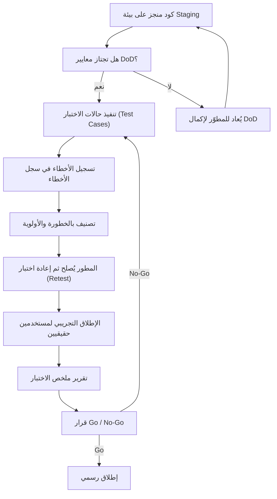
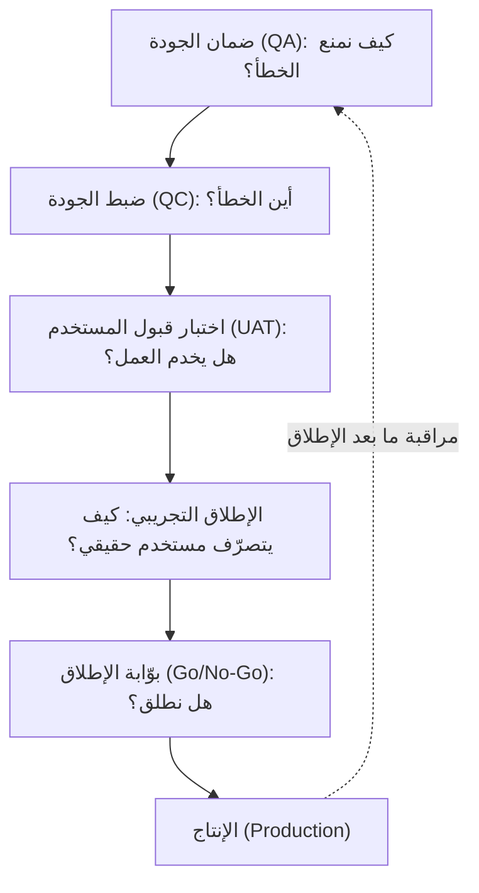

# 05 · الجودة والاختبار

> [!abstract] ماذا ستتعلّم هنا
> - الفرق بين **ضمان الجودة ([[Quality Assurance]])** الذي يمنع الأخطاء، و**ضبط الجودة (Quality Control)** الذي يكتشفها.
> - كيف تبني معايير قبول (Acceptance Criteria) وتعريف جاهزية ([[Definition of Done]]) لا يقبلان الجدل.
> - كيف تخطّط وتنفّذ **اختبار قبول المستخدم ([[UAT|User Acceptance Testing]] - UAT)** وإطلاقًا تجريبيًا (Pilot) ناجحًا.
> - كيف تصنّف الأخطاء بالخطورة (Severity) والأولوية (Priority) وتدير سجل الأخطاء (Bug Tracker) حتى الإغلاق.
> - كيف تتخذ [[Go or No-Go Decision|قرار الإطلاق]] **(Go / No-Go)** بمعايير بوابة واضحة، لا بالحدس.
> - **سلسلة الجودة كاملة** في مخطّط واحد: من ضمان الجودة إلى الإنتاج.
> - كل هذه المهارات جزء من ملف [[مدير المشاريع البرمجية الحديث]].

---

## 🧭 المفهوم ببساطة

تخيّل أنك افتتحت مطعمًا جديدًا. قبل أن تفتح الأبواب للناس، لا تكتفي بأن يقول الطاهي "الطبخ جاهز". أنت تتذوّق كل طبق بنفسك، وتدعو مجموعة صغيرة من الأصدقاء ليجرّبوا الوجبة ويقولوا رأيهم الصريح، وتضع قائمة بكل ملاحظة (الملح زائد، الطبق بارد، الانتظار طويل)، ثم لا تفتتح رسميًا إلا بعد إصلاح المشكلات الكبيرة. هذا بالضبط ما تفعله مرحلة **الجودة والاختبار**.

**مرحلة الجودة والاختبار هي التأكّد من أن المنتج يحقّق ما طُلب منه، وأنه جاهز للاستخدام الحقيقي.** ولا يقتصر الأمر على اكتشاف الأخطاء بعد البرمجة، بل يبدأ منذ كتابة المتطلبات ويستمرّ حتى ما بعد الإطلاق.

وجوهر هذه المرحلة أمران: أن **يحقّق المنتج السلوك المتّفق عليه فعلًا**، لا السلوك الذي يعتقد المطوّر أنه صحيح؛ وأن **تُكتشف الأخطاء قبل وصول المنتج إلى المستخدم النهائي**. وأداتها في ذلك أن تُحوَّل كلمة «منجز» الغامضة إلى **معايير مكتوبة قابلة للقياس**.

> [!tip] وتقوم الجودة الحديثة على ثلاثة مبادئ
> 1. **الجودة تُبنى ولا تُفتَّش:** فهي تبدأ من صياغة المتطلبات لا من مراجعة الشيفرة.
> 2. **الجهد يتبع الخطر:** فليست كل شاشة تستحقّ الجهد نفسه.
> 3. **القرار يُبنى على بيانات:** فبوّابة الإطلاق تُفتح بأرقام لا بانطباع.
>
> وتفصيل هذه المبادئ وأسماؤها الاصطلاحية (Shift-Left · Risk-Based · Shift-Right) في قسم **«ممارسات احترافية»** أدناه — ويمكن تأجيله إلى القراءة الثانية.

---

## 🧩 قاموس سريع للمصطلحات

> [!info] كيف تقرأ هذا الجدول
> ما هنا **تعريف تذكيريّ من سطر واحد** لا شرح. والمصطلحات المعلَّمة بـ **↓** تُفصَّل في قسم المستندات أدناه بوثيقتها الخاصّة، فلا تتوقّف عندها هنا.

| المصطلح (عربي) | English | المعنى ببساطة |
|---|---|---|
| ضمان الجودة | Quality Assurance (QA) | منع الأخطاء بتحسين طريقة العمل (وقائي). |
| ضبط الجودة | Quality Control (QC) | كشف الأخطاء في المنتج بعد صنعه (علاجي). |
| معايير القبول ↓ | Acceptance Criteria | شروط كل ميزة على حدة. |
| تعريف الجاهزية ↓ | Definition of Done (DoD) | بوّابة الخروج: متى تنتهي المهمة؟ |
| تعريف الاستعداد ↓ | [[Definition of Ready]] (DoR) | بوّابة الدخول: متى تبدأ المهمة؟ |
| اختبار قبول المستخدم ↓ | UAT | اختبار يجريه أصحاب العمل لا المبرمج. |
| [[Severity vs Priority\|الخطورة مقابل الأولوية]] | Severity vs Priority | الخطورة = أثر تقني؛ الأولوية = إلحاح تجاري. |
| قرار الإطلاق ↓ | Go / No-Go | البوابة النهائية: هل نطلق أم لا؟ |
| التحقّق مقابل المصادقة | Verification vs Validation | هل بنيناه **بطريقة صحيحة**؟ مقابل: هل بنينا **الشيء الصحيح**؟ |
| التحوّل يسارًا | Shift-Left | إشراك الجودة من مرحلة المتطلبات. |
| التحوّل يمينًا | Shift-Right | مراقبة سلوك المستخدم بعد الإطلاق. |
| [[Risk-Based Testing\|الاختبار المبني على المخاطر]] | Risk-Based Testing | توجيه جهد الاختبار حسب الخطر. |
| اختبار الانحدار | [[Regression Testing]] | إعادة اختبار القديم بعد كل إصلاح. |
| اختبار الدخان | [[Smoke Testing]] | فحص سريع للوظائف الأساسية. |
| مصفوفة تتبّع المتطلبات | RTM ([[RTM\|Requirements Traceability Matrix]]) | تربط كل متطلب بحالة اختبار. |

> [!info] اصطلاح ثابت في هذا الفصل
> ثلاثة مصطلحات تتعدّد أسماؤها في المصادر، وقد ثُبِّتت هنا على صيغة واحدة جريًا على سياسة المصطلحات في هذا المرجع (العربية أوّلًا، ثم الإنجليزية بين قوسين عند أوّل ظهور، ثم العربية وحدها):
> - **سجل الأخطاء (Bug Tracker)** — ويُقال له بعد ذلك «سجل الأخطاء» وحده.
> - **الإطلاق التجريبي (Pilot)** — ويشيع تسميته «Beta»، وهو **اسم مستعار لا يُستعمل هنا**؛ وسجلّه اسمه «سجل ملاحظات الإطلاق التجريبي».
> - **بوّابة الإطلاق (Go/No-Go)** — لا «قرار الإطلاق» تارةً و«البوابة» تارةً.

---

## ⛓️ لماذا تأتي هنا وتقود للتالية

في [[04 - التنفيذ والتتبّع|الفصل السابق]] كان السؤال: **هل نمضي كما خطّطنا؟** وفي هذا الفصل السؤال مختلف: **وهل ما أُنجز صحيح أصلًا؟** — فاللوحة تقول إن الميزة `Done`، وهذه المرحلة هي التي تحكم بأي معيار قيلت.

لا يمكن اختبار ما لم يُخطّط ويُبنى. لذلك تعتمد هذه المرحلة على مخرجات سابقة:

- **نطاق واضح** — من مرحلة البدء.
- **متطلبات ومصفوفة تتبّع (RTM) وتصاميم معتمدة** — من مرحلة التخطيط.
- **كود مُنجز** — من مرحلة التنفيذ.

بدون معايير قبول مكتوبة مسبقًا، لا يوجد شيء ثابت نقيس المنتج عليه.

ما تُنتجه هنا يقود مباشرة إلى **قرار الإطلاق ثم مرحلة الإغلاق والتسليم**. تقرير ملخص الاختبار وقرار Go/No-Go هو البوابة التي تفصل بين "جاهز للإطلاق" و"يحتاج عملًا". كما تغذّي الأخطاء المتكررة **[[Risk Register|سجل المخاطر]]** ([[19 - Risk Management]]) وتغذّي ملاحظات المستخدمين **خارطة الطريق** المستقبلية ([[15 - Roadmap]]).

---

## 📊 مخطّط سير العمل

---

## 📂 مستندات هذه المرحلة — واحدًا واحدًا

📂 مستندات هذه المرحلة (في مستودع المشروع)

> [!info] عن أرقام الملفّات
> الأرقام في أسماء الملفّات (`01-…` · `09-…` · `11-…`) هي **ترتيبها داخل مجلّد المشروع**، لا ترتيب قراءتها ولا ترتيب استعمالها. وترتيب هذا الفصل هو **ترتيب العمل**: من المعايير، إلى الاختبار، إلى الأخطاء، إلى البوّابات، إلى القرار. فلا تستغرب أن يأتي الملف `11` قبل الملف `05`.

### 1) معايير القبول (Acceptance Criteria)

> [!info] ما هو ولماذا
> وثيقة تحدّد "متى نعتبر الميزة مقبولة؟" لكل ميزة على حدة. بدونها، يصبح كل تسليم محلّ جدل بين العميل والمنفّذ.

- **📥 من أين تجمع معلوماته:** من وثيقة النطاق، ومن اجتماعات تحديد المتطلبات مع صاحب المنتج (Product Owner)، ومن المدير التنفيذي لتحديد ما يعتبره "نجاحًا".
- **🛠️ كيف ترتّبه:** قاعدة عامة تنطبق على كل ميزة (تعمل على المتصفحات، متجاوبة، تدعم RTL، بلا أخطاء حرجة، سرعة < 3 ثوانٍ)، ثم قائمة تحقّق (Checklist) خاصة بكل ميزة حرجة.
- **🎯 فائدته:** يحوّل "منجز" الغامضة إلى شروط قابلة للتحقق تُنهي الجدل قبل أن يبدأ.

> [!example] من عافية
> لميزة «حجز موعد Zoom»: عند اختيار موعد متاح وإنهاء الحجز، يُنشأ اجتماع Zoom تلقائيًا، ويُرسل رابطه للطبيب والمريض، ويُمنع الحجز المكرّر لنفس الوقت.

📄 «01-معايير-القبول»

### 2) خطة اختبار القبول (UAT Plan)

> [!info] ما هو ولماذا
> خطة تحدّد من يختبر، وأين، وكيف تدور دورة الاختبار، وكيف تُصنّف الأخطاء، وما شروط بوابة الإطلاق. الهدف أن يختبر فريقكم (لا المبرمج) قبل الإطلاق.

- **📥 من أين تجمع معلوماته:** من مدير المشروع (تصميم الدورة)، ومن المنفّذ (رابط بيئة [[Staging vs Production Environment|Staging]] والحسابات التجريبية)، ومن المدير التنفيذي (صلاحية الاعتماد النهائي).
- **🛠️ كيف ترتّبه:** حدّد المختبِرين، بيئة الاختبار، دورة الاختبار (تنفيذ → تسجيل → إصلاح → إعادة اختبار)، جدول تصنيف الأخطاء، وبوابة Go/No-Go.
- **🎯 فائدته:** يضمن اختبارًا منظّمًا مستقلًا عن المطوّر، ويمنع الإطلاق مع أخطاء حرجة أو عالية مفتوحة.

> [!example] من عافية — وهنا تُكتب قاعدة البوّابة مرّة واحدة
> يختبر مدير المشروع وشخص من التسويق (كمستخدم نهائي)، ويعتمد المدير التنفيذي.
>
> **والقاعدة الحاكمة للبوّابة، وهي مرجع كل ما يأتي بعدها في هذا الفصل:** لا إطلاق إذا وُجد أي خطأ **Critical** أو **High** مفتوح. وما يُذكر لاحقًا من قرارات وأسئلة فإنما هو **تطبيق** لهذه القاعدة لا تكرار لها.

📄 «02-خطة-الاختبار-UAT»

### 3) سيناريوهات الاختبار وحالات الاختبار (Test Cases)

> [!info] ما هو ولماذا
> قائمة منظّمة بكل حالة اختبار: الإجراء، النتيجة المتوقعة، الخطورة، والحالة. هي "خريطة الطريق" التي يمشي عليها المختبِر خطوة بخطوة.

- **📥 من أين تجمع معلوماته:** من معايير القبول (كل معيار يتحوّل لحالة اختبار)، ومن مصفوفة تتبّع المتطلبات (RTM)، ومن دروس الأخطاء الشائعة في مشاريع مشابهة.
- **🛠️ كيف ترتّبه:** ورقة لكل وحدة وظيفية (التسجيل، الدفع، البحث...)، وكل حالة لها إجراء واحد ونتيجة قابلة للتحقق. غطِّ المسار الإيجابي (Happy Path)، والسلبي، والحدّي (Edge)، والأمني.
- **🎯 فائدته:** يضمن تغطية شاملة ولا يترك ميزة دون اختبار، ويربط كل حالة بمتطلب (Req. ID) وخطأ (Bug ID).

> [!example] من عافية
> TC-003 "حجز موعد زووم": اختر طبيبًا ووقتًا وأكّد → النتيجة المتوقعة رابط زووم + تأكيد. TC-008 "RTL/عربي": بدّل اللغة → محاذاة صحيحة بدون كسر.

📄 «11-مواصفات-قالب-حالات-الاختبار-Test-Cases-Spec»
📊 ملفات البيانات: `03-سيناريوهات-الاختبار.csv` · `10-حالات-الاختبار-Test-Cases.xlsx`

### 4) سجل الأخطاء (Bug Tracker)

> [!info] ما هو ولماذا
> سجل يتتبّع كل خطأ من اكتشافه حتى إغلاقه، مع معرّف فريد، خطوات إعادة الإنتاج، الخطورة، المسؤول، والحالة. هو الذاكرة الرسمية للأخطاء.

- **📥 من أين تجمع معلوماته:** من فريق الاختبار الداخلي أثناء تنفيذ حالات الاختبار، ومن ملاحظات الإطلاق التجريبي، ومن ردود المطوّر على كل خطأ.
- **🛠️ كيف ترتّبه:** أعمدة (المعرّف، التاريخ، الصفحة، الوصف، خطوات الإنتاج، المستوى، لقطة شاشة، المسؤول، الحالة، تاريخ الإصلاح).
- **🎯 فائدته:** يمنع ضياع الأخطاء، ويعطي صورة كمّية عن جودة التنفيذ، ويغذّي تقرير الإطلاق.

> [!danger] قاعدة الإغلاق — وهي تُكتب هنا مرّة واحدة
> **لا يُغلق خطأ باعتماد تصريح المطوّر وحده، بل بإعادة اختبارك أنت** على المنصّات التي ظهر عليها. وعلّتها أن الإصلاح قد يقع على منصّة دون أخرى، أو يُصلح الظاهر ويكسر غيره ([[Regression Testing|انحدارًا]]). وما يأتي في هذا الفصل من قرارات وأسئلة فإنما يُحيل إلى هذه القاعدة.

> [!example] من عافية
> BUG-001 يبقى بحالة "مفتوح" حتى يمرّ بدورة: مفتوح → قيد الإصلاح → قيد إعادة الاختبار → مغلق (بعد تحقّق فريقكم على المنصات المختلفة).

📄 «12-مواصفات-قالب-سجل-الأخطاء-Bug-Tracker-Spec»
📊 ملفات البيانات: `04-سجل-الأخطاء-Bug-Tracker.csv` · `04-سجل-الأخطاء-Bug-Tracker.xlsx`

### 5) تعريف الجاهزية (Definition of Done - DoD)

> [!info] ما هو ولماذا
> قائمة شروط موحّدة يجب أن تتحقق في أي مهمة قبل اعتبارها "مكتملة". هي البوابة الخلفية التي تجيب: متى تنتهي المهمة فعلًا؟

- **📥 من أين تجمع معلوماته:** اتفاق مكتوب مع مديرة مشروع المنفّذ، ومن معايير البرمجة، ومن سياسة الجودة الداخلية.
- **🛠️ كيف ترتّبه:** ثلاثة مستويات (مهمة / ميزة / مرحلة). لكل مستوى قائمة تحقّق تُرفق كـ Checklist في بطاقة المهمة.
- **🎯 فائدته:** ينهي الخلاف حول "ما هو منجز"، ويربط صرف الدفعات باكتمال DoD.

> [!example] من عافية
> على مستوى المرحلة: كل الميزات "Done"، اجتياز UAT دون أخطاء حرجة/عالية، النسخ الاحتياطي يعمل، توقيع اعتماد المرحلة من الطرفين — ثم تُصرف الدفعة.

📄 «05-تعريف-الجاهزية-DoD»

### 6) تعريف الاستعداد (Definition of Ready - DoR)

> [!info] ما هو ولماذا
> شروط دخول قصة المستخدم (User Story) إلى Sprint قبل بدء العمل. هي البوابة الأمامية التي تمنع دخول مهام **غير مكتملة التحضير**.

- **📥 من أين تجمع معلوماته:** من صاحب المنتج (وضوح القصة)، ومن المصمّم (تصاميم معتمدة)، ومن الفريق الفني (حل التبعيات والغموض التقني).
- **🛠️ كيف ترتّبه:** قائمة تحقّق (صياغة واضحة، معايير قبول، تصاميم معتمدة، تبعيات محلولة، حجم مُقدّر، لا غموض فني، قابلة للاختبار).
- **🎯 فائدته:** يمنع التأخير الناتج عن بدء العمل ثم التوقّف بسبب نقص المتطلبات.

> [!example] من عافية
> لا تدخل قصة "الربط مع Zoom" أي Sprint قبل الإجابة على السؤال التقني: كيف يتم الربط تحديدًا؟ حتى لا يبدأ المطوّر ثم يتوقّف.

📄 «06-تعريف-الاستعداد-DoR»

### 7) دليل الإطلاق التجريبي وسجل ملاحظاته (Pilot)

> [!info] ما هو ولماذا
> دليل لإجراء **إطلاق تجريبي (Pilot)** لمجموعة محدودة من المستخدمين الحقيقيين، مع سجل يلتقط ما لا يكتشفه الفريق الداخلي (سلوك مستخدم حقيقي، أجهزة متنوّعة).

- **📥 من أين تجمع معلوماته:** من الشركاء التجريبيين (3–5 مستشفيات وأطباء ومناديب)، ومن مراقبة الاستخدام الحقيقي، ومن التقارير الدورية للمستخدمين.
- **🛠️ كيف ترتّبه:** قبل / أثناء / بعد الإطلاق. سجّل كل ملاحظة بمعرّف فريد (PF-001) وخطورة وأولوية ومسؤول، وافصل "نتيجة اختبارك" عن "رد المبرمج".
- **🎯 فائدته:** يكشف الأخطاء الأمنية والسلوكية الحرجة قبل الإطلاق الرسمي على الجمهور الكامل.

> [!example] من عافية
> درس مستفاد من ملف مشابه: "شهادة مستخدم (أ) تظهر لمستخدم (ب) على نفس الجهاز" → سيناريو أمني حرج في عافية: اختبر ظهور بيانات مزوّد/مريض لمستخدم آخر على نفس الجهاز.

📄 «08-دليل-الإطلاق-التجريبي-والاختبار»
📊 ملفات البيانات: `07-سجل-ملاحظات-الإطلاق-التجريبي-Pilot-Feedback.csv` · `.xlsx`

### 8) تقرير ملخص الاختبار وقرار الإطلاق (Test Summary Report & Go/No-Go)

> [!info] ما هو ولماذا
> تقرير تنفيذي يُملأ في نهاية كل دورة اختبار ويُرسل للإدارة لاتخاذ قرار الإطلاق بمعايير بوابة واضحة (Gate Criteria).

- **📥 من أين تجمع معلوماته:** من سجل الأخطاء وسجل [[Pilot Launch|الإطلاق التجريبي]] (الأرقام)، ومن جدول تغطية الوحدات، ومن مدير المشروع/QA (التوصية).
- **🛠️ كيف ترتّبه:** ملخص تنفيذي غير تقني، لوحة مؤشرات (Passed/Failed)، توزيع الملاحظات بالخطورة، جدول تغطية، أبرز المعوّقات (Blockers)، ثم قرار Go/No-Go موقّع.
- **🎯 فائدته:** يحوّل قرار الإطلاق من حدس إلى قرار مبني على بيانات وموقّع رسميًا.

> [!example] من عافية — تشديد خاصّ بالمنصّات الصحية
> بوّابة الإطلاق تُطبَّق هنا بصورة أشدّ: **الخطأ الأمني تحديدًا يجب أن يكون صفرًا**، لأن تسريب البيانات في منصّة صحية **مخالفة لنظام [[PDPL]]** وغرامة محتملة، لا عيبٌ تقنيّ يُؤجَّل إصلاحه.

📄 «09-تقرير-ملخص-الاختبار-Test-Summary-Report»

---

## ⏱️ إدارة وقت هذه المهمة

الجهد هنا يُقدَّر **بالنشاط لا بالمرحلة**؛ فالمدّة الإجمالية حصيلةُ أنشطة معلومة، وهذه تقديرات عملية لكل واحد منها:

| النشاط | مشروع صغير | متوسط | كبير (مثل عافية) |
|---|---|---|---|
| كتابة معايير القبول | ساعتان | يوم | 2–4 أيام |
| إعداد حالات الاختبار | نصف يوم | 1–2 يوم | أسبوع |
| تنفيذ دورة الاختبار الأولى | يوم | 2–3 أيام | 1–2 أسبوع |
| إصلاح الأخطاء (على المطوّر) | يوم | 2–5 أيام | أسابيع |
| **إعادة الاختبار** بعد الإصلاح | نصف يوم | يوم | 2–3 أيام |
| الإطلاق التجريبي | يُكتفى غالبًا بـ UAT | 3–5 أيام | 2–4 أسابيع |
| تقرير الملخص وقرار البوّابة | ساعتان | نصف يوم | يوم |
| **الإجمالي التقريبي** | **ساعات إلى أيام** | **أيام إلى أسبوعين** | **أسابيع إلى أشهر** |

> [!warning] البند الذي يُنسى دائمًا من الجدول
> **إعادة الاختبار.** يُقدَّر وقت الاختبار الأول ووقت الإصلاح، ثم يُفترض أن الإصلاح صحيح فلا يُحجز له وقت. ثم تجيء دورة الإصلاح الثانية والثالثة بلا موضع في الجدول، فتظهر «تأخيرًا مفاجئًا» وهي في الحقيقة **عمل مخطَّط لم يُكتب**.

**من يُنتج المستند وكيف يتعاونون:** مرحلة الجودة تعاونية بامتياز. عادةً 3–6 أشخاص: مدير المشروع (يصمّم الخطة ويعتمد المعايير)، مهندس/محلل جودة QA (يكتب حالات الاختبار وينفّذها)، المطوّر (يُصلح)، مستخدم/مستخدمون نهائيون (UAT والإطلاق التجريبي)، والمدير التنفيذي (قرار Go/No-Go). التدفّق: مدير المشروع يجهّز المعايير ← QA يكتب الحالات وينفّذها ← الأخطاء تُسجّل وتُصنّف ← المطوّر يُصلح ← إعادة اختبار ← تقرير ← قرار موقّع.

**أي ملفات تراجع:** راجع وثيقة النطاق ومصفوفة تتبّع المتطلبات (RTM) للتأكد من تغطية كل متطلب، وسجل القرارات لتوثيق ما اتُّفق عليه، وسجل المخاطر لربط الأخطاء المتكررة بمخاطر معمارية.

**صيغ الملفات:**

| النوع | الصيغة المناسبة | مثال |
|---|---|---|
| السجلات والجداول | Excel / CSV | سجل الأخطاء، حالات الاختبار، سجل الإطلاق التجريبي |
| الأدلة والمواصفات | Word / Markdown | خطة UAT، DoD، DoR، دليل الإطلاق التجريبي |
| المستندات الرسمية | PDF | تقرير ملخص الاختبار الموقّع، اعتماد Go/No-Go |

> [!warning] الدقّة قبل السرعة
> في مرحلة الجودة، اختبارٌ متسرّع أسوأ من عدم الاختبار لأنه يمنح ثقة زائفة. **وكلّما تأخّر اكتشاف الخطأ ارتفعت كلفة إصلاحه ارتفاعًا كبيرًا** — فالخطأ الذي يُكتشف في المتطلبات يُصلَح بتعديل سطر، والذي يُكتشف بعد الإطلاق يُصلَح بشيفرة وبيانات واعتذار وثقة مفقودة.

> [!info] إضافة مرجعية — عن رقم «10 إلى 100 ضعف»
> يشيع في أدبيات هندسة البرمجيات أن كلفة إصلاح الخطأ تتضاعف **10 إلى 100 مرّة** بين مرحلة المتطلبات ومرحلة الإنتاج، ويعود أصل هذه الأرقام إلى دراسات الثمانينيات (وأشهرها منحنى بوهم). غير أن **سلسلة إحالاتها نوقشت نقاشًا واسعًا**، ولا يوجد اتفاق حديث على رقم واحد، وتختلف النسبة كثيرًا باختلاف نوع النظام وأسلوب التطوير. **فالمبدأ ثابت والرقم ليس ثابتًا** — ولهذا يُقال في هذا المرجع «كلفة أعلى بكثير» ولا يُذكر مضاعف بعينه إلا منسوبًا إلى مصدره.

---

## 🌐 ممارسات احترافية — لمن تجاوز الأساسيات

> [!tip] لمن هذا القسم؟
> ما سبق يكفي لإدارة مرحلة جودة سليمة. **وهذا القسم للمتقدّمين**: يسمّي المبادئ الثلاثة باصطلاحها المتداول ويزيد عليها، ويمكن للمبتدئ أن يتجاوزه في القراءة الأولى ثم يعود إليه.

> [!quote] ممارسات 2026
> تتّجه ممارسات الجودة الحديثة إلى خمسة مبادئ أساسية:
> - **التحوّل يسارًا (Shift-Left):** أشرِك الجودة من مرحلة كتابة المتطلبات، لا بعد انتهاء البرمجة — فكلفة الإصلاح ترتفع كلّما تأخّر الاكتشاف (انظر التحفّظ على أرقامها أعلاه).
> - **التحوّل يمينًا (Shift-Right):** راقب سلوك المستخدم الحقيقي بعد الإطلاق.
> - **الاختبار المبني على المخاطر (Risk-Based Testing):** وجّه جهد الاختبار حسب المخاطر. المناطق عالية المخاطر تأخذ اختبار انحدار (Regression) واستكشافيًا كاملًا، والمناطق منخفضة المخاطر تكفيها اختبارات دخان (Smoke).
> - **دور الأتمتة والذكاء الاصطناعي:** يتوليان الاختبارات الروتينية المتكررة، ويبقى الحكم البشري ضروريًا للسيناريوهات المعقّدة وقرار الإطلاق.
> - **القياس المستمر:** تابع معدلات الأخطاء، وزمن الدورة، وأثر العميل.

هذا يربط مباشرة بـ [[مدير المشاريع البرمجية الحديث|مثلث كفاءات PMI]]: المعرفة التقنية (كتابة معايير قابلة للقياس)، والقيادة (فرض بوابة Go/No-Go دون تنازل)، وإدارة الأعمال الاستراتيجية (فهم أن جودة منصة صحية = التزام تنظيمي، لا رفاهية).

---

## ➕ لإكمال الصورة — تحسينات مقترحة

> [!todo] ما قد ينقص مقارنةً بالمعايير، وكيف تكمله
> - **مصفوفة تتبّع المتطلبات (RTM):** تأكّد أن كل متطلب مرتبط بحالة اختبار واحدة على الأقل — راجع مفهوم [[20 - Quality Management]] وطبّقه بربط عمود Req. ID.
> - **اختبار الانحدار (Regression Testing):** لم تُذكر صراحةً خطة لإعادة اختبار الميزات القديمة بعد كل إصلاح. أضف حزمة انحدار تُنفّذ قبل كل إطلاق.
> - **بيانات اختبار تمثيلية (Test Data):** جهّز حسابات وبيانات تشبه الواقع (متعددة الأدوار) لتغطية سيناريوهات العزل الأمني.
> - **معيار أداء كمّي (Performance [[Baseline]]):** حدّد أهدافًا رقمية (زمن الاستجابة، عدد المستخدمين المتزامنين) لا "سريع بما يكفي".
> - **ربط الأخطاء المتكررة بالمخاطر:** كل نوع خطأ يتكرر (مثل عزل البيانات) يجب أن يُرفع كخطر في [[19 - Risk Management]] لأنه غالبًا يشير لمشكلة معمارية.
> - **تواصل واضح مع أصحاب المصلحة** حول حالة الجودة وقرار الإطلاق — راجع [[21 - Stakeholder Communication]].

---

## 🎬 سيناريوهان

> [!success] القصة الصحيحة
> **سلمى، مديرة مشروع عافية.** قبل الإطلاق، أصرّت على كتابة معايير قبول مكتوبة لكل ميزة حرجة، وجهّزت ورقة Test Cases لكل وحدة. نفّذت إطلاقًا تجريبيًا مع 4 مستشفيات، وسجّلت كل ملاحظة بمعرّف فريد وخطورة. اكتشفت خطأ عزل بيانات: بيانات مريض تظهر لمستخدم آخر على نفس الجهاز. صنّفته "حرجًا أمنيًا"، ورفضت الإطلاق رغم ضغط الإدارة على الموعد. أصلح المطوّر الخطأ، وأعادت سلمى الاختبار بنفسها على ثلاث منصات قبل الإغلاق. النتيجة: إطلاق نظيف، صفر حوادث تسريب، وثقة كاملة من العميل الصحي.

**ولماذا نجحت سلمى؟** لأربعة أسباب، كلٌّ منها قابل للتقليد:

1. **كتبت المعيار قبل الاختبار** — فصار الحكم على الميزة رجوعًا إلى نصّ، لا نقاشًا بين رأيين.
2. **اختبرت بمستخدمين حقيقيين** — فظهر ما لا يظهر للفريق الداخلي الذي يعرف «الطريق الصحيح» فيسلكه دائمًا.
3. **صنّفت الخطأ قبل أن تناقشه** — فلمّا صار «حرجًا أمنيًا» بالتصنيف المكتوب، لم يعد رفضها رأيًا شخصيًّا يُضغط عليه.
4. **تحقّقت بنفسها من الإصلاح** — على المنصّات كلّها، لا على واحدة.

> [!failure] القصة الخاطئة
> **فهد، مدير مشروع آخر.** اعتمد تصريح المطوّر وحده («كل شيء جاهز»)، ولم يكتب معايير قبول ولا حالات اختبار. تخطّى الإطلاق التجريبي لتوفير الوقت، وأغلق الأخطاء بمجرد إبلاغ المطوّر بإصلاحها دون إعادة اختبار. أطلق النظام رسميًا، فظهر خطأ الدفع المزدوج وخطأ عرض بيانات مرضى لمستخدمين خطأ. تحوّل الأمر إلى مخالفة لنظام حماية البيانات وشكاوى من المستشفيات. النتيجة: إيقاف المنصة، غرامة محتملة، وفقدان ثقة العميل — كلّف الإصلاح بعد الإطلاق أضعاف تكلفة اختبار كان سيستغرق أسبوعًا.

**ولماذا فشل فهد؟** ولم يكن السبب إهمالًا ظاهرًا، بل أربعة قرارات بدا كلٌّ منها معقولًا يومَه:

1. **لا معيار مكتوب** — فصار «يعمل» كلمةً يقولها من كتب الشيفرة، وليس لأحد ما يردّ به.
2. **الاستغناء عن الإطلاق التجريبي** — وهو **أوّل ما يُحذف عند ضيق الوقت، وهو بعينه ما كان سيكشف الخطأين**.
3. **الإغلاق بالثقة لا بالتحقّق** — فبقيت أخطاء مغلقة في السجلّ وحيّة في المنتج.
4. **قياس الجاهزية بالموعد** — فالموعد يمرّ سواءٌ جهُز المنتج أم لم يجهز، وليس فيه ما يخبرك بأيّهما وقع.

---

## 🧩 قرارات تفاعلية (فكّر ثم افتح)

> [!question]- الموقف الأول: قبل الإطلاق بيومين، بقيت ملاحظة "عالية" واحدة مفتوحة في الدفع. الإدارة تضغط. ماذا تفعل؟ (أ) تطلق وتصلح لاحقًا · (ب) تؤجّل حتى الإصلاح والاختبار · (ج) تطلق مع تعطيل ميزة الدفع مؤقتًا
> ✅ **الأفضل: (ب) — التأجيل حتى الإصلاح وإعادة الاختبار.** أما (ج) فهو بديل يُلجأ إليه فقط عند وجود التزام تعاقدي ملزم بالموعد، وليس إجابة موازية أفضل.
> **لماذا؟** لأن **بوّابة الإطلاق المعتمدة في خطة UAT** تمنع ذلك، والخطأ في الدفع يمسّ المال والثقة مباشرةً. السيناريو المثالي: توثّق القرار في تقرير الاختبار، تصلح، تعيد الاختبار، ثم تطلق. وإن كان الموعد ملزمًا تعاقديًا، فالخيار (ج) — إطلاق مشروط بتعطيل الميزة المعطوبة وتوثيق ذلك — أفضل من إطلاق ميزة دفع معطوبة.

> [!question]- الموقف الثاني: المطوّر أبلغ بإصلاح 10 أخطاء. الموعد ضيّق. هل تغلقها في سجلّك؟ (أ) نعم، توفيرًا للوقت · (ب) تعيد اختبار عيّنة فقط · (ج) تعيد اختبار كلها على المنصات المختلفة
> ✅ **الأفضل: (ج).**
> **لماذا؟** تطبيقًا لـ**قاعدة الإغلاق** المثبَتة في سجل الأخطاء أعلاه. والخيار (ب) أخطر ممّا يبدو: فالعيّنة تُختار عادةً من أسهل الأخطاء إعادةً للاختبار، وهي أقلّها احتمالًا للانحدار — فتُنتج طمأنينة في غير موضعها. السيناريو المثالي: إعادة اختبار كل خطأ على Chrome وSafari والجوال، وإغلاق ما تحقّقتَ منه، وإعادة فتح ما لم يُحلّ.

---

## 🧠 أسئلة تفكير ناقد وعصف ذهني (بلا إجابة واحدة)

> [!question] أسئلة مفتوحة
> - كيف توازن بين ضغط الموعد النهائي وجودة لا تقبل التنازل في منصة صحية؟
> - متى يكون خطأ "منخفض الخطورة" تقنيًا لكنه "عالي الأولوية" تجاريًا (والعكس)؟ اضرب مثالًا من عافية.
> - هل الأتمتة الكاملة للاختبار مناسبة لمشروع صغير-متوسط، أم أن الاختبار اليدوي أكثر قيمة هنا؟
> - كيف تقيس "جودة كافية" دون أن تسعى لكمال مستحيل يؤخّر الإطلاق إلى ما لا نهاية؟

> [!tip] إطار الإجابة (4 خطوات)
> 1. **حدّد المخاطرة:** ما الأثر الأسوأ لهذا الخطأ (مالي/أمني/سمعة/تنظيمي)؟ في منصة صحية، العزل الأمني يتصدّر.
> 2. **قِس بالبيانات:** كم خطأً حرجًا/عاليًا مفتوح؟ ما نسبة اجتياز السيناريوهات؟ لا تقرّر بالحدس.
> 3. **وازن الخيارات:** قارن كلفة التأجيل بكلفة الإطلاق المعطوب. مثال: تأجيل أسبوع أرخص من غرامة PDPL.
> 4. **قرّر ووثّق:** اتخذ قرار Go/No-Go موقّعًا، ووثّق المبرّر. مثال اتجاه: "منخفض الخطورة لكن عالي الأولوية = خطأ إملائي في اسم المستشفى على الصفحة الرئيسية قبل حملة تسويقية".

---

## ❓ نقاط للمراجعة (استرجاع)

> [!question]- ما الفرق بين ضمان الجودة (QA) وضبط الجودة (QC)؟
> QA وقائي: يمنع الأخطاء بتحسين طريقة العمل نفسها ويبدأ من كتابة المتطلبات. QC علاجي: يكتشف الأخطاء في المنتج بعد صنعه (الاختبار).

> [!question]- ما الفرق بين معايير القبول (Acceptance Criteria) وتعريف الجاهزية (DoD)؟
> معايير القبول خاصة بكل ميزة على حدة، بينما DoD قائمة عامة موحّدة تنطبق على كل مهمة قبل اعتبارها منتهية.

> [!question]- ما الفرق بين DoR و DoD؟
> DoR هي البوابة الأمامية (متى تبدأ المهمة؟)، وDoD هي البوابة الخلفية (متى تنتهي؟). كلاهما اتفاق جماعي يشارك في صياغته الفريق كامل (مدير المشروع، QA، المطوّر، صاحب المنتج). عمليًا يتحقق صاحب المنتج والفريق من DoR قبل بدء العمل، ويتحقق QA ومدير المشروع من DoD قبل اعتبار العمل منتهيًا.

> [!question]- ما الفرق بين الخطورة (Severity) والأولوية (Priority)؟
> الخطورة = مدى الأثر التقني للخطأ (انهيار = عالٍ). الأولوية = مدى إلحاح الإصلاح تجاريًا. خطأ تجميلي على الصفحة الرئيسية قبل حملة قد يكون منخفض الخطورة عالي الأولوية.

> [!question]- ما معايير بوابة Go/No-Go في عافية؟
> لا ملاحظات حرجة أو عالية مفتوحة (وهي القاعدة العامة المثبتة في خطة UAT)، مع تشديد خاصّ: **صفر أخطاء أمنية**. ويُضاف إليها: اجتياز سيناريوهات عزل البيانات، والدفع عبر مدى يعمل، والحجز وZoom يعملان End-to-End، والنسخ الاحتياطي يعمل، والتوافق مع PDPL.

> [!question]- ما البند الذي يُنسى غالبًا من جدول مرحلة الجودة؟
> **إعادة الاختبار.** يُحجز وقت للاختبار وللإصلاح، ويُفترض أن الإصلاح صحيح فلا يُحجز له وقت — فتظهر دورات الإصلاح التالية «تأخيرًا مفاجئًا» وهي عمل مخطَّط لم يُكتب.

---

## 💼 من أسئلة المقابلات

> [!question]- ما الفرق بين Verification و Validation؟
> **التحقّق (Verification):** هل بنينا المنتج **بطريقة صحيحة**؟ — أي هل يطابق ما هو مكتوب في المواصفات والتصاميم. وأدواته المراجعات والفحوص واختبارات الوحدة، ولا يحتاج مستخدمًا.
> **المصادقة (Validation):** هل بنينا **الشيء الصحيح**؟ — أي هل يلبّي المنتج حاجة المستخدم الفعلية. وأداتها الأشهر **UAT** والإطلاق التجريبي.
> **والمفارقة التي تُظهر الفرق:** يمكن أن يجتاز منتجٌ التحقّق كاملًا ويسقط في المصادقة — فيكون قد بُني بإتقان تامّ **على متطلب خاطئ**. ولهذا لا يغني أحدهما عن الآخر.

> [!question]- ما الفرق بين Severity و Priority؟ اضرب مثالًا.
> الخطورة تقيس أثر الخطأ على النظام، والأولوية تقيس إلحاح إصلاحه تجاريًا. مثال: خطأ إملائي في اسم الشركة على الصفحة الرئيسية = خطورة منخفضة لكن أولوية عالية قبل حملة تسويقية. وانهيار في شاشة نادرة الاستخدام = خطورة عالية لكن أولوية أدنى.

> [!question]- ما هو UAT ومن يجريه؟
> اختبار قبول المستخدم: المرحلة الأخيرة حيث يتحقق المستخدمون/أصحاب العمل الحقيقيون من أن النظام يلبّي احتياج العمل الفعلي قبل الإطلاق. يجريه المستخدمون النهائيون لا فريق QA؛ ودور QA هو تجهيز البيئة والسيناريوهات وتتبّع الأخطاء.

> [!question]- كيف تتخذ قرار Go/No-Go؟
> عبر معايير بوابة مكتوبة مسبقًا (Gate Criteria): صفر أخطاء حرجة/عالية مفتوحة، اجتياز الاختبارات الأمنية والوظيفية الحرجة. أعرض البيانات (نسبة الاجتياز، الملاحظات المفتوحة بالخطورة) في تقرير ملخص، ثم يوقّع أصحاب القرار. القرار مبني على مخاطر وبيانات، لا على موعد.

> [!question]- كيف تحدّد نطاق الاختبار عندما يكون الوقت محدودًا؟
> بالاختبار المبني على المخاطر (Risk-Based Testing): أركّز جهد الاختبار الكامل على المناطق عالية الأثر (الدفع، الأمان، الحجز)، وأكتفي باختبار دخان (Smoke) للمناطق منخفضة المخاطر، مسترشدًا بمصفوفة تتبّع المتطلبات لضمان عدم إهمال متطلب حرج.

> [!tip] إطار STAR
> أجب عن أسئلة الخبرة بصيغة STAR: **الموقف (Situation)** ← **المهمة (Task)** ← **الإجراء (Action)** ← **النتيجة (Result)**. مثال: "في عافية (S)، كان علينا إطلاق منصة صحية (T)، فرفضتُ الإطلاق مع خطأ عزل بيانات وأعدت الاختبار بنفسي (A)، فأطلقنا بصفر حوادث تسريب (R)".

---

## 🧪 من مبتدئ إلى محترف

> [!success] مسار التطوّر
> - **مبتدئ:** تفهم الفرق بين QA و QC، وتنفّذ حالة اختبار مكتوبة، وتسجّل خطأً في سجل الأخطاء بمعرّف فريد وخطوات إعادة إنتاج واضحة.
> - **متوسّط:** تكتب معايير قبول وحالات اختبار تغطي المسارات الإيجابية والسلبية والحدّية والأمنية، وتصنّف الأخطاء بالخطورة والأولوية، وتدير دورة UAT كاملة مع إعادة اختبار.
> - **محترف:** تصمّم استراتيجية جودة مبنية على المخاطر (Shift-Left + Risk-Based)، وتربط الأخطاء المتكررة بمخاطر معمارية، وتقود بوابة Go/No-Go بقرار موقّع مبني على بيانات، وتوازن ضغط الموعد مع التزام تنظيمي دون تنازل عن الحرج.

---

## 🔗 ربط بالمفاهيم

- [[20 - Quality Management]]
- [[19 - Risk Management]]
- [[11 - User Stories]]
- [[10 - Sprint Retrospective]]
- [[21 - Stakeholder Communication]]
- [[مدير المشاريع البرمجية الحديث]]

---

## 📌 بطاقة مرجعية سريعة

**سلسلة الجودة في سطر واحد** — ولكلّ حلقة سؤالها:

| العنصر | الخلاصة |
|---|---|
| هدف المرحلة | التأكد أن المنتج يحقّق السلوك المتّفق عليه، لا ما يُظنّ أنه صحيح. |
| البوابتان | DoR (متى تبدأ؟) و DoD (متى تنتهي؟). |
| المخرجات | معايير قبول، حالات اختبار، سجل أخطاء، تقرير ملخص، قرار Go/No-Go. |
| قاعدة التصنيف | Severity (أثر تقني) ≠ Priority (إلحاح تجاري). |
| بوابة الإطلاق | بمعايير مكتوبة مسبقًا — نصّها في خطة UAT، وخلاصتها في القاعدة الذهبية (2). |

> [!tip] قواعد ذهبية
> 1. **لا تُغلق خطأً باعتماد تصريح المطوّر وحده** — أغلقه بتحقّقك أنت على المنصات المختلفة.
> 2. **لا إطلاق مع أي ملاحظة حرجة أو عالية مفتوحة**، وصفرٌ للأمنية بلا استثناء (في منصة صحية = التزام تنظيمي، لا رفاهية).
> 3. **الدقّة قبل السرعة:** كلّما تأخّر اكتشاف الخطأ ارتفعت كلفة إصلاحه ارتفاعًا كبيرًا.

---

## 🧠 كيف يفكر مدير المشروع في هذه المرحلة؟

ما سبق **ما يفعله** مدير المشروع في مرحلة الجودة. وهذا **كيف يفكّر** — وأربعة أسئلة تدور في رأسه أمام كل ميزة وكل خطأ:

1. **بأي معيار مكتوب أحكم على هذه الميزة؟** فإن لم يوجد معيار سابق للاختبار، فالحكم انطباعٌ متبادَل بين طرفين لكلٍّ منهما مصلحة مختلفة.
2. **هل هذا الخطأ حرج تقنيًّا أم مُلحّ تجاريًّا؟** فهما مقياسان مستقلّان، والخلط بينهما يُقدّم الأقلّ أهمية ويؤخّر ما يوقف الإطلاق.
3. **ما الذي لم يُختبر أصلًا؟** فالسؤال عن **الفجوة** أهمّ من السؤال عن النتائج: نسبة نجاح 100% على تغطية 40% رقمٌ يطمئن ولا يعني شيئًا.
4. **ما الذي سيُكتشف بعد الإطلاق مهما فعلنا؟** فالجودة ليست منع كل خطأ، بل **تقليل احتمال الخطأ المكلف** وتجهيز طريقة سريعة لعلاج ما يفلت.

> [!warning] المعيار العملي
> اسأل قبل أي إطلاق: **ما الذي يجعلني أوقّع بأنه جاهز؟** فإن كان الجواب «انتهى الفريق» أو «حان الموعد»، فأنت توقّع على مرور الوقت لا على جاهزية المنتج. **والجاهزية شيء يُقاس، والموعد شيء يمرّ — ولا يُغني أحدهما عن الآخر.**

---

> [!quote] مصادر
> - [Software Quality Assurance Best Practices: The 2026 Guide — monday.com](https://monday.com/blog/rnd/software-quality-assurance/)
> - [20 Software Quality Assurance Best Practices for 2026 — DeviQA](https://www.deviqa.com/blog/20-software-quality-assurance-best-practices/)
> - [Top 40 QA Interview Questions and Answers for 2026 — BugBug](https://bugbug.io/blog/software-testing/qa-interview-questions/)
> - [QA Interview Questions and Answers for 2026 — Testsigma](https://testsigma.com/blog/qa-interview-questions/)
